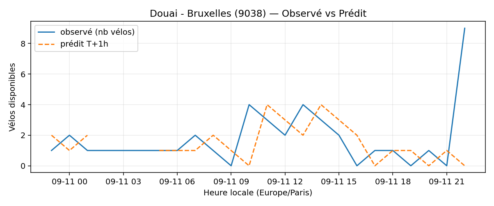
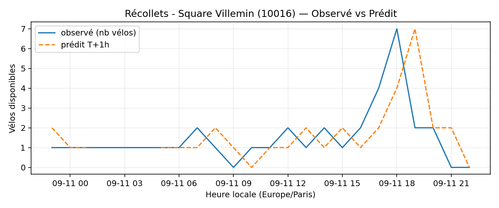
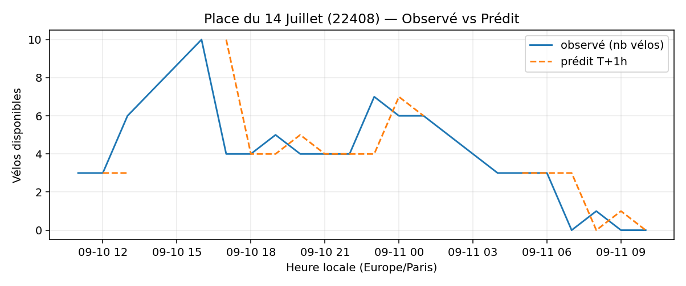
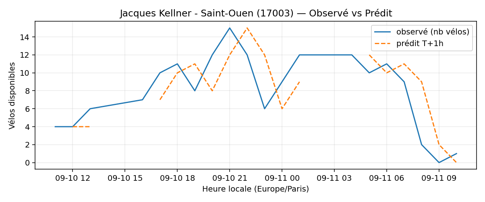
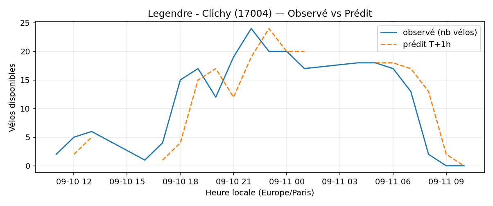

# Prévisions

*Dernière heure considérée : **11/09 10h** (Europe/Paris)*

## Top-10 stations à risque (faible nb vélos prévu T+1h)

| Station                                     |   Prédit T+1h (vélos) | Taux prévu   | Dernière obs.   |
|:--------------------------------------------|----------------------:|:-------------|:----------------|
| Douai - Bruxelles (`9038`)                  |                     0 | 0.0%         | 11/09 10h       |
| Nanterre - Université (`92004`)             |                     0 | 0.0%         | 11/09 10h       |
| Récollets - Square Villemin (`10016`)       |                     0 | 0.0%         | 11/09 10h       |
| Charles Robin - Grange aux Belles (`10207`) |                     0 | 0.0%         | 11/09 10h       |
| Champs-Elysees - Bassano (`8116`)           |                     0 | 0.0%         | 11/09 10h       |
| Place du 14 Juillet (`22408`)               |                     0 | 0.0%         | 11/09 10h       |
| Commandant Schloesing - Pétrarque (`16202`) |                     0 | 0.0%         | 11/09 10h       |
| Jacques Kellner - Saint-Ouen (`17003`)      |                     0 | 0.0%         | 11/09 10h       |
| Legendre - Clichy (`17004`)                 |                     0 | 0.0%         | 11/09 10h       |
| Charles de Gaulle (`22019`)                 |                     0 | 0.0%         | 11/09 10h       |

## Top-10 risque de saturation (taux prévu élevé)

| Station                                      |   Prédit T+1h (vélos) | Taux prévu   | Dernière obs.   |
|:---------------------------------------------|----------------------:|:-------------|:----------------|
| Place Balard (`15056`)                       |                    37 | 168.2%       | 11/09 10h       |
| Bercy - Villot (`12105`)                     |                    40 | 121.2%       | 11/09 10h       |
| Tremblay - Lac des Minimes (`12127`)         |                    56 | 116.7%       | 11/09 10h       |
| Place du Moulin de Javel (`15058`)           |                    52 | 115.6%       | 11/09 10h       |
| Madeleine Vionnet (`33019`)                  |                    38 | 111.8%       | 11/09 10h       |
| Malesherbes - Place de la Madeleine (`8004`) |                    69 | 103.0%       | 11/09 10h       |
| Parc Suzanne Lenglen (`15125`)               |                    52 | 100.0%       | 11/09 10h       |
| Bruneseau - Quai d'Ivry (`13121`)            |                    46 | 100.0%       | 11/09 10h       |
| Hôpital Bégin (`43003`)                      |                    26 | 100.0%       | 11/09 10h       |
| Laffitte - Italiens (`9023`)                 |                    33 | 100.0%       | 11/09 10h       |

## Détails par station (graphiques)

???+ info "Douai - Bruxelles (9038)"

    

???+ info "Nanterre - Université (92004)"

    

???+ info "Récollets - Square Villemin (10016)"

    

???+ info "Charles Robin - Grange aux Belles (10207)"

    

???+ info "Champs-Elysees - Bassano (8116)"

    

???+ info "Place du 14 Juillet (22408)"

    

???+ info "Commandant Schloesing - Pétrarque (16202)"

    

???+ info "Jacques Kellner - Saint-Ouen (17003)"

    

???+ info "Legendre - Clichy (17004)"

    

???+ info "Charles de Gaulle (22019)"

    

