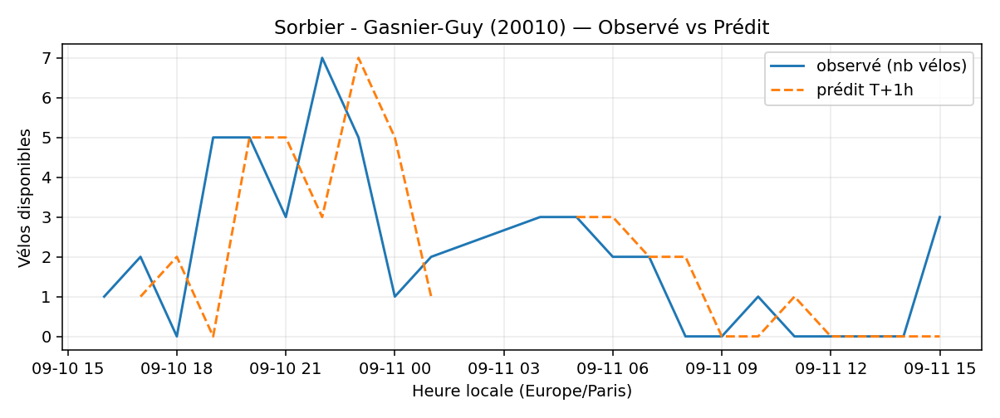
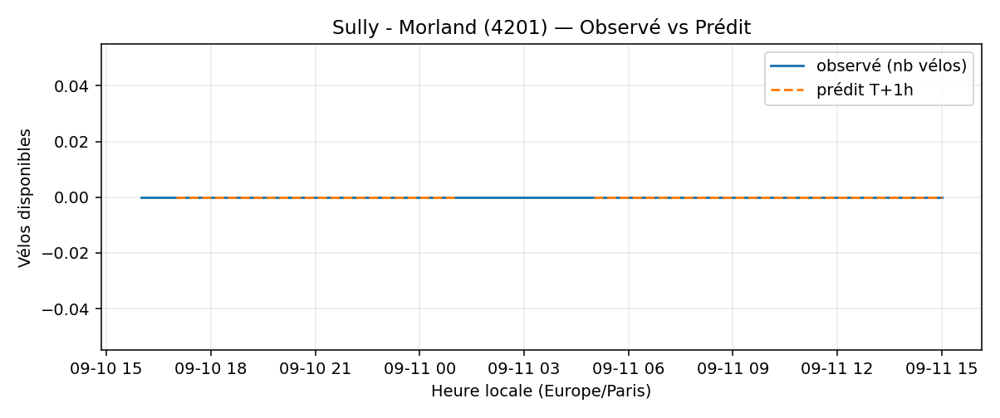
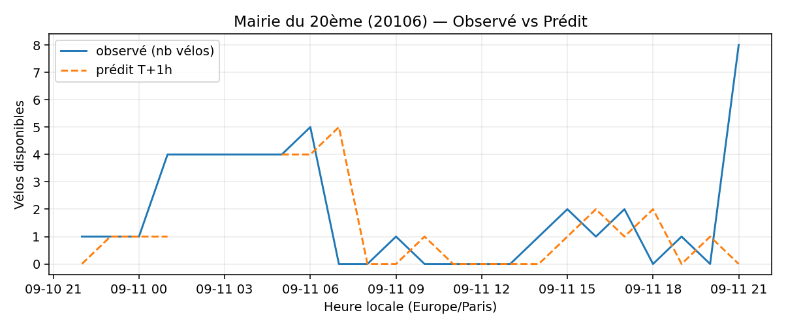
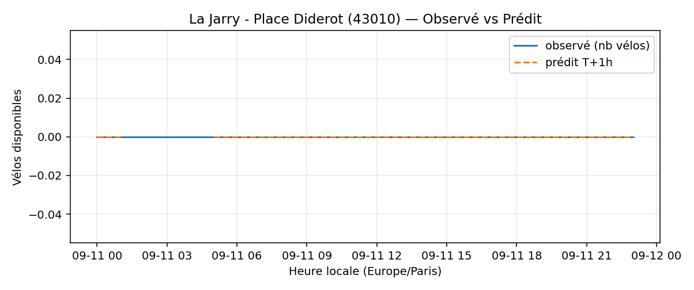
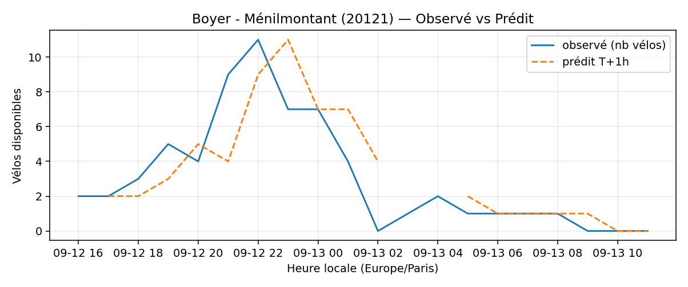
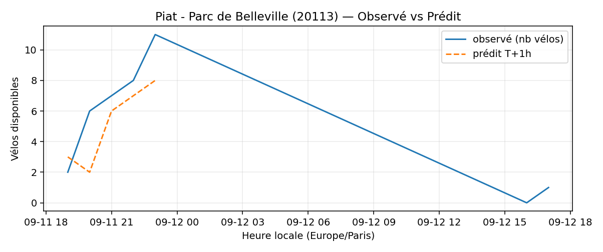
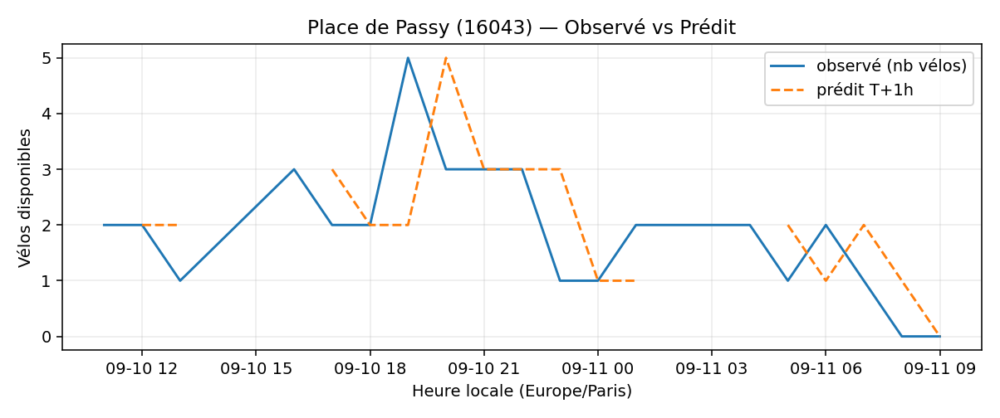

# Prévisions

*Dernière heure considérée : **11/09 09h** (Europe/Paris)*

## Top-10 stations à risque (faible nb vélos prévu T+1h)

| Station                                     |   Prédit T+1h (vélos) | Taux prévu   | Dernière obs.   |
|:--------------------------------------------|----------------------:|:-------------|:----------------|
| Nanterre - Université (`92004`)             |                     0 | 0.0%         | 11/09 09h       |
| Place des Fêtes - Solitaires (`19210`)      |                     0 | 0.0%         | 11/09 09h       |
| Sorbier - Gasnier-Guy (`20010`)             |                     0 | 0.0%         | 11/09 09h       |
| Sully - Morland (`4201`)                    |                     0 | 0.0%         | 11/09 09h       |
| Mairie du 20ème (`20106`)                   |                     0 | 0.0%         | 11/09 09h       |
| La Jarry - Place Diderot (`43010`)          |                     0 | 0.0%         | 11/09 09h       |
| Boyer - Ménilmontant (`20121`)              |                     0 | 0.0%         | 11/09 09h       |
| Piat - Parc de Belleville (`20113`)         |                     0 | 0.0%         | 11/09 09h       |
| Commandant Schloesing - Pétrarque (`16202`) |                     0 | 0.0%         | 11/09 09h       |
| Place de Passy (`16043`)                    |                     0 | 0.0%         | 11/09 09h       |

## Top-10 risque de saturation (taux prévu élevé)

| Station                                    |   Prédit T+1h (vélos) | Taux prévu   | Dernière obs.   |
|:-------------------------------------------|----------------------:|:-------------|:----------------|
| Place Balard (`15056`)                     |                    26 | 118.2%       | 11/09 09h       |
| Bercy - Villot (`12105`)                   |                    34 | 103.0%       | 11/09 09h       |
| Gare RER - Général de Gaulle (`22302`)     |                    41 | 100.0%       | 11/09 09h       |
| Bercy. (`12108`)                           |                    65 | 98.5%        | 11/09 09h       |
| Square Georges Melies (`12154`)            |                    39 | 97.5%        | 11/09 09h       |
| Place de la Bastille - Bourdon (`4007`)    |                    34 | 97.1%        | 11/09 09h       |
| Gare de Lyon - Van Gogh (`12006`)          |                    39 | 95.1%        | 11/09 09h       |
| Notre-Dame-des-Champs - Stanislas (`6006`) |                    18 | 94.7%        | 11/09 09h       |
| Convention - Lourmel (`15062`)             |                    34 | 94.4%        | 11/09 09h       |
| Place Ginette Hamelin (`12026`)            |                    48 | 94.1%        | 11/09 09h       |

## Détails par station (graphiques)

???+ info "Nanterre - Université (92004)"

    

???+ info "Place des Fêtes - Solitaires (19210)"

    

???+ info "Sorbier - Gasnier-Guy (20010)"

    

???+ info "Sully - Morland (4201)"

    

???+ info "Mairie du 20ème (20106)"

    

???+ info "La Jarry - Place Diderot (43010)"

    

???+ info "Boyer - Ménilmontant (20121)"

    

???+ info "Piat - Parc de Belleville (20113)"

    

???+ info "Commandant Schloesing - Pétrarque (16202)"

    

???+ info "Place de Passy (16043)"

    

