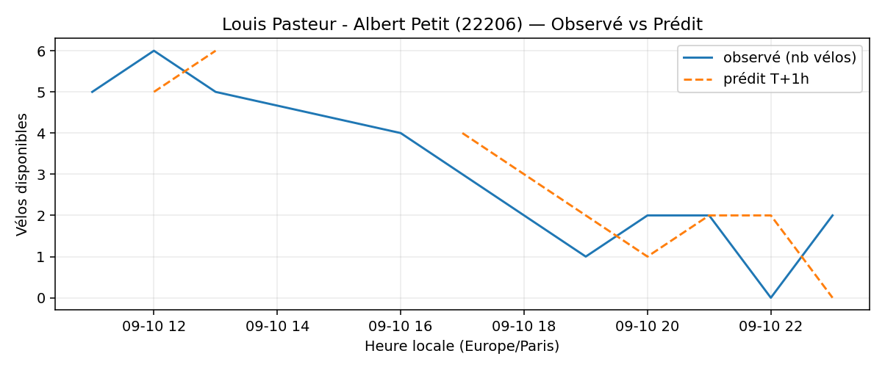
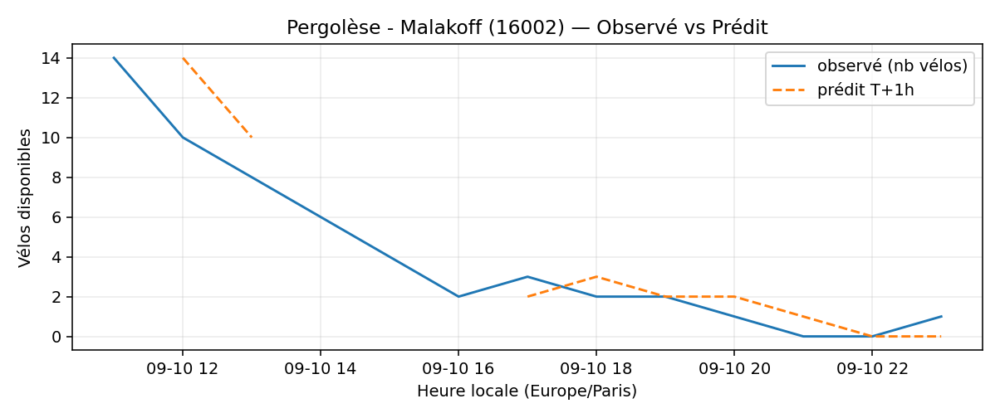

# Prévisions

*Dernière heure considérée : **10/09 23h** (Europe/Paris)*

## Top-10 stations à risque (faible nb vélos prévu T+1h)

| Station                                     |   Prédit T+1h (vélos) | Taux prévu   | Dernière obs.   |
|:--------------------------------------------|----------------------:|:-------------|:----------------|
| Nanterre - Université (`92004`)             |                     0 | 0.0%         | 10/09 23h       |
| Charles de Gaulle (`22019`)                 |                     0 | 0.0%         | 10/09 23h       |
| Louis Pasteur - Albert Petit (`22206`)      |                     0 | 0.0%         | 10/09 23h       |
| Champs-Elysees - Bassano (`8116`)           |                     0 | 0.0%         | 10/09 23h       |
| Pergolèse - Malakoff (`16002`)              |                     0 | 0.0%         | 10/09 23h       |
| Flandrin - Henri Martin (`16018`)           |                     0 | 0.0%         | 10/09 23h       |
| Batignolles - Rome (`8051`)                 |                     0 | 0.0%         | 10/09 23h       |
| Gaston Roussel - Commune de Paris (`32308`) |                     0 | 0.0%         | 10/09 23h       |
| Commandant Schloesing - Pétrarque (`16202`) |                     0 | 0.0%         | 10/09 23h       |
| Marché aux fleurs (`4002`)                  |                     0 | 0.0%         | 10/09 23h       |

## Top-10 risque de saturation (taux prévu élevé)

| Station                                            |   Prédit T+1h (vélos) | Taux prévu   | Dernière obs.   |
|:---------------------------------------------------|----------------------:|:-------------|:----------------|
| Aristide Briand - Place de la Résistance (`21302`) |                    29 | 116.0%       | 10/09 23h       |
| Westermeyer - Paul Vaillant-Couturier (`42004`)    |                    27 | 108.0%       | 10/09 23h       |
| Daumesnil - Picpus (`12010`)                       |                    22 | 104.8%       | 10/09 23h       |
| Place de l'Eglise - Vitry-sur-Seine (`44004`)      |                    28 | 100.0%       | 10/09 23h       |
| Pierre Joseph Desault (`13120`)                    |                    19 | 100.0%       | 10/09 23h       |
| Gare - Aristide Briand (`21329`)                   |                    29 | 100.0%       | 10/09 23h       |
| Charles Tillon - Cimetière Communal (`33015`)      |                    30 | 100.0%       | 10/09 23h       |
| Paul Vaillant-Couturier - Gare RER (`44002`)       |                    26 | 100.0%       | 10/09 23h       |
| Léon - Doudeauville (`18014`)                      |                    13 | 100.0%       | 10/09 23h       |
| Convention - Lourmel (`15062`)                     |                    36 | 100.0%       | 10/09 23h       |

## Détails par station (graphiques)

???+ info "Nanterre - Université (92004)"

    

???+ info "Charles de Gaulle (22019)"

    

???+ info "Louis Pasteur - Albert Petit (22206)"

    

???+ info "Champs-Elysees - Bassano (8116)"

    

???+ info "Pergolèse - Malakoff (16002)"

    

???+ info "Flandrin - Henri Martin (16018)"

    

???+ info "Batignolles - Rome (8051)"

    

???+ info "Gaston Roussel - Commune de Paris (32308)"

    

???+ info "Commandant Schloesing - Pétrarque (16202)"

    

???+ info "Marché aux fleurs (4002)"

    

