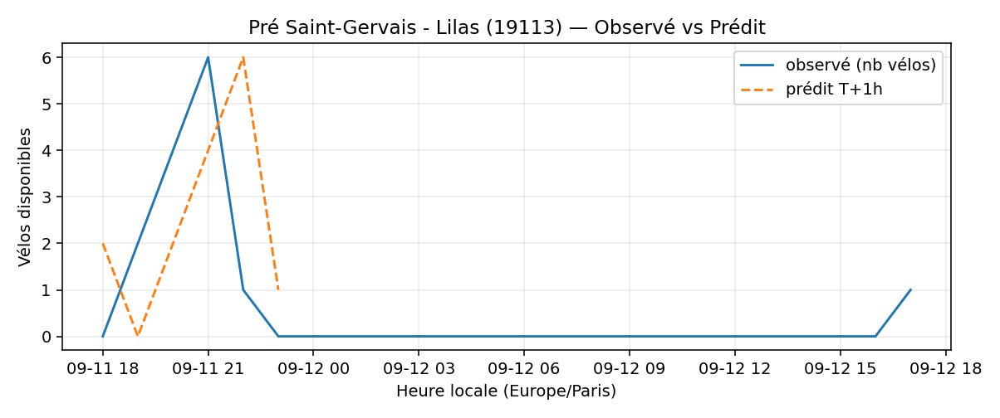
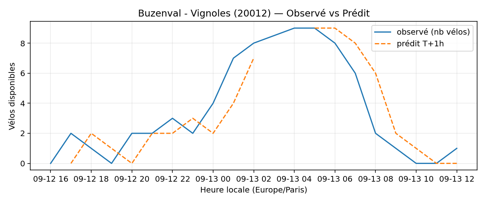
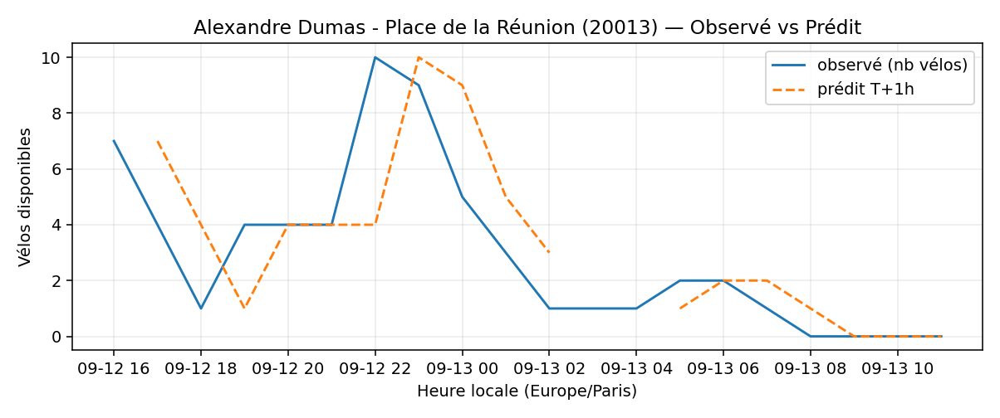
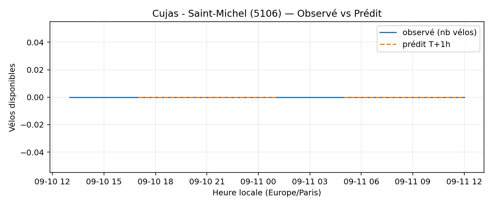
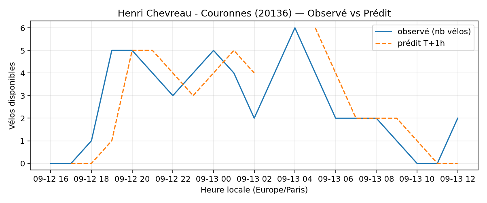
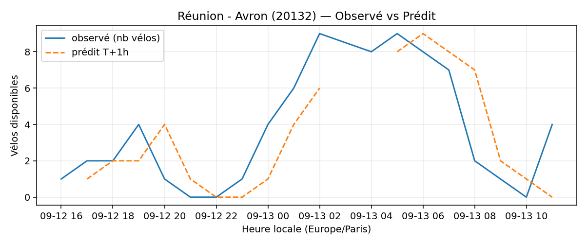
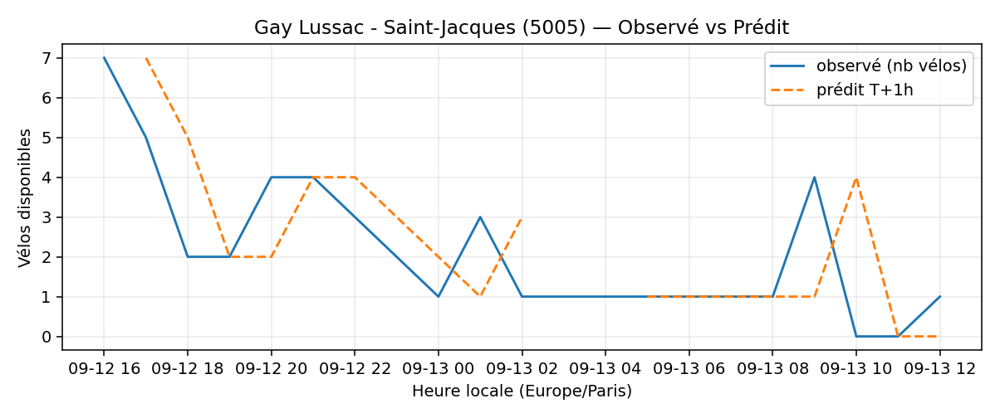

# Prévisions

*Dernière heure considérée : **13/09 11h** (Europe/Paris)*

## Top-10 stations à risque (faible nb vélos prévu T+1h)

| Station                                         |   Prédit T+1h (vélos) | Taux prévu   | Dernière obs.   |
|:------------------------------------------------|----------------------:|:-------------|:----------------|
| Pré Saint-Gervais - Lilas (`19113`)             |                     0 | 0.0%         | 13/09 11h       |
| Buzenval - Vignoles (`20012`)                   |                     0 | 0.0%         | 13/09 11h       |
| Alexandre Dumas - Place de la Réunion (`20013`) |                     0 | 0.0%         | 13/09 11h       |
| Place des Fêtes - Solitaires (`19210`)          |                     0 | 0.0%         | 13/09 11h       |
| Cujas - Saint-Michel (`5106`)                   |                     0 | —            | 13/09 11h       |
| Henri Chevreau - Couronnes (`20136`)            |                     0 | 0.0%         | 13/09 11h       |
| Réunion - Avron (`20132`)                       |                     0 | 0.0%         | 13/09 11h       |
| Boyer - Ménilmontant (`20121`)                  |                     0 | 0.0%         | 13/09 11h       |
| Square des Saint-Simoniens (`20119`)            |                     0 | 0.0%         | 13/09 11h       |
| Gay Lussac - Saint-Jacques (`5005`)             |                     0 | 0.0%         | 13/09 11h       |

## Top-10 risque de saturation (taux prévu élevé)

| Station                                            |   Prédit T+1h (vélos) | Taux prévu   | Dernière obs.   |
|:---------------------------------------------------|----------------------:|:-------------|:----------------|
| Westermeyer - Paul Vaillant-Couturier (`42004`)    |                    43 | 172.0%       | 13/09 11h       |
| Aristide Briand - Place de la Résistance (`21302`) |                    26 | 104.0%       | 13/09 11h       |
| Port - Maurice Chevalier (`41304`)                 |                    31 | 103.3%       | 13/09 11h       |
| Bercy - Villot (`12105`)                           |                    34 | 103.0%       | 13/09 11h       |
| Blanqui - Docteur Bauer (`34013`)                  |                    28 | 100.0%       | 13/09 11h       |
| Paul Doumer - Stalingrad (`41101`)                 |                    24 | 100.0%       | 13/09 11h       |
| Les Planètes (`47008`)                             |                    21 | 100.0%       | 13/09 11h       |
| Gare de Lyon - Roland Barthes (`12106`)            |                    67 | 98.5%        | 13/09 11h       |
| Gare RER - Général de Gaulle (`22302`)             |                    40 | 97.6%        | 13/09 11h       |
| Champs de Manoeuvre - Cartoucherie (`12165`)       |                    34 | 97.1%        | 13/09 11h       |

## Détails par station (graphiques)

???+ info "Pré Saint-Gervais - Lilas (19113)"

    

???+ info "Buzenval - Vignoles (20012)"

    

???+ info "Alexandre Dumas - Place de la Réunion (20013)"

    

???+ info "Place des Fêtes - Solitaires (19210)"

    

???+ info "Cujas - Saint-Michel (5106)"

    

???+ info "Henri Chevreau - Couronnes (20136)"

    

???+ info "Réunion - Avron (20132)"

    

???+ info "Boyer - Ménilmontant (20121)"

    

???+ info "Square des Saint-Simoniens (20119)"

    

???+ info "Gay Lussac - Saint-Jacques (5005)"

    

