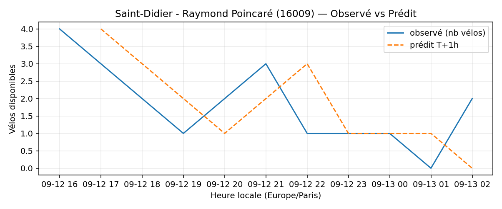
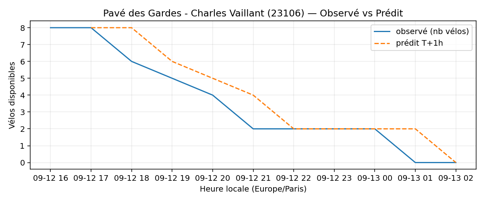

# Prévisions

*Dernière heure considérée : **13/09 02h** (Europe/Paris)*

## Top-10 stations à risque (faible nb vélos prévu T+1h)

| Station                                       |   Prédit T+1h (vélos) | Taux prévu   | Dernière obs.   |
|:----------------------------------------------|----------------------:|:-------------|:----------------|
| Grande Armée - Brunel (`17038`)               |                     0 | 0.0%         | 13/09 02h       |
| Place des Fêtes - Solitaires (`19210`)        |                     0 | 0.0%         | 13/09 02h       |
| Porte de Saint-Ouen - Henri Huchard (`17124`) |                     0 | 0.0%         | 13/09 02h       |
| Square Louise Michel (`18006`)                |                     0 | 0.0%         | 13/09 02h       |
| Hoche - Tilsitt (`8057`)                      |                     0 | 0.0%         | 13/09 02h       |
| Champs-Elysees - Bassano (`8116`)             |                     0 | 0.0%         | 13/09 02h       |
| Commandant Schloesing - Pétrarque (`16202`)   |                     0 | 0.0%         | 13/09 02h       |
| Octave Feuillet - Albéric Magnard (`16110`)   |                     0 | 0.0%         | 13/09 02h       |
| Saint-Didier - Raymond Poincaré (`16009`)     |                     0 | 0.0%         | 13/09 02h       |
| Pavé des Gardes - Charles Vaillant (`23106`)  |                     0 | 0.0%         | 13/09 02h       |

## Top-10 risque de saturation (taux prévu élevé)

| Station                                            |   Prédit T+1h (vélos) | Taux prévu   | Dernière obs.   |
|:---------------------------------------------------|----------------------:|:-------------|:----------------|
| Aristide Briand - Place de la Résistance (`21302`) |                    34 | 136.0%       | 13/09 02h       |
| Westermeyer - Paul Vaillant-Couturier (`42004`)    |                    32 | 128.0%       | 13/09 02h       |
| Abbé Groult - Convention (`15039`)                 |                    14 | 116.7%       | 13/09 02h       |
| Daumesnil - Picpus (`12010`)                       |                    22 | 104.8%       | 13/09 02h       |
| Lourmel - Marie Skobtsov (`15108`)                 |                    22 | 100.0%       | 13/09 02h       |
| Place Charles Vallin (`15122`)                     |                    26 | 100.0%       | 13/09 02h       |
| Liberté - Vert-de-Maisons (`47007`)                |                    20 | 100.0%       | 13/09 02h       |
| Paul Vaillant-Couturier - Gare RER (`44002`)       |                    26 | 100.0%       | 13/09 02h       |
| Dominique Pado - Croix Nivert (`15050`)            |                    22 | 100.0%       | 13/09 02h       |
| Port - Maurice Chevalier (`41304`)                 |                    30 | 100.0%       | 13/09 02h       |

## Détails par station (graphiques)

???+ info "Grande Armée - Brunel (17038)"

    

???+ info "Place des Fêtes - Solitaires (19210)"

    

???+ info "Porte de Saint-Ouen - Henri Huchard (17124)"

    

???+ info "Square Louise Michel (18006)"

    

???+ info "Hoche - Tilsitt (8057)"

    

???+ info "Champs-Elysees - Bassano (8116)"

    

???+ info "Commandant Schloesing - Pétrarque (16202)"

    

???+ info "Octave Feuillet - Albéric Magnard (16110)"

    

???+ info "Saint-Didier - Raymond Poincaré (16009)"

    

???+ info "Pavé des Gardes - Charles Vaillant (23106)"

    

