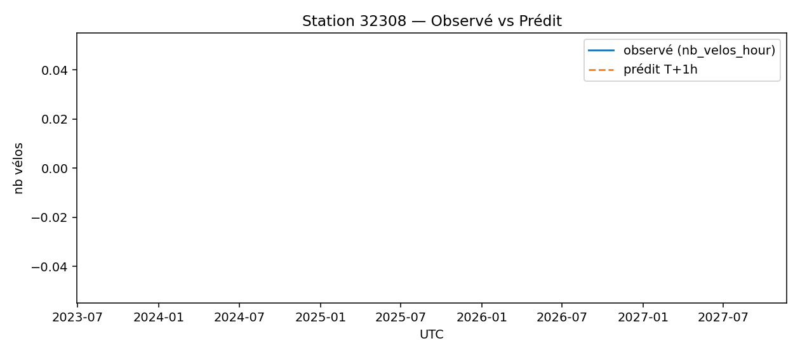
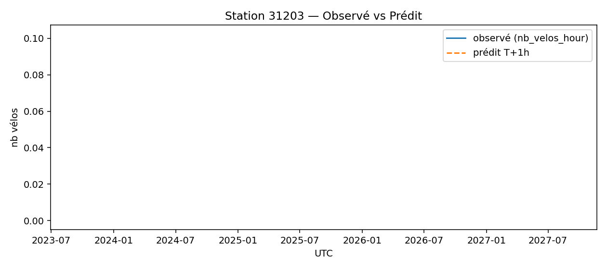

# Prévisions
**Échéance la plus récente** : `2025-09-09 12:00:00` (UTC)

## Top-10 stations à risque (faible nb vélos prévu T+1h)

| station | y_nb_pred | occ_ratio_pred |
|---|---:|---:|
| `32308` | 0 | 0.00 |
| `32601` | 0 | 0.00 |
| `31203` | 0 | 0.00 |
| `45504` | 0 | 0.14 |
| `15018` | 0 | 0.00 |
| `20016` | 0 | 0.01 |
| `4201` | 0 | 0.02 |
| `44018` | 0 | 0.01 |
| `20037` | 0 | 0.01 |
| `31024` | 0 | 0.01 |

## Observé vs Prédit (échantillon)

### Station `32308`

### Station `32601`

### Station `31203`

### Station `42503`

### Station `12129`

## Qualité (in-sample, ordre de grandeur)
- MAE ≈ **1.13** vélos — RMSE ≈ **1.61** vélos

## Importance des variables

> Remarque : ces métriques sont in-sample (à raffiner avec une validation temporelle TSSplit).