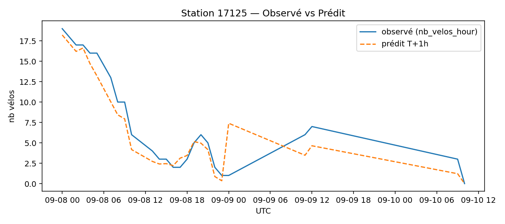
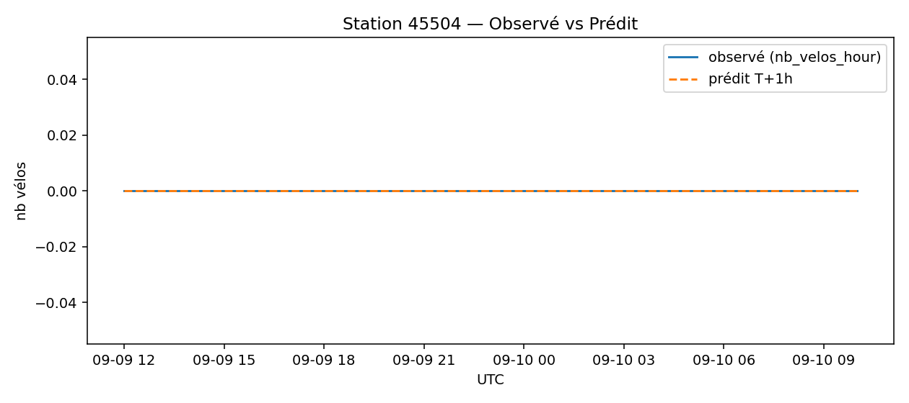
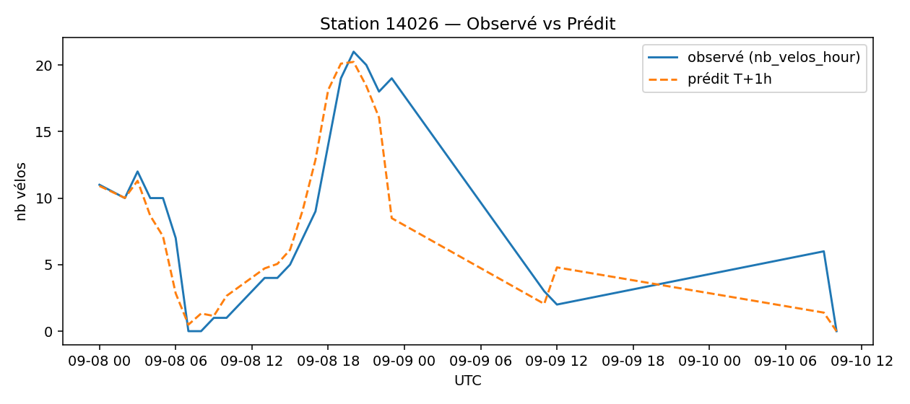

# Prévisions
**Échéance la plus récente** : `2025-09-10 10:00:00` (UTC)

## Top-10 stations à risque (faible nb vélos prévu T+1h)

| station | y_nb_pred | occ_ratio_pred |
|---|---:|---:|
| `17125` | 0 | 0.00 |
| `45504` | 0 | 0.00 |
| `14026` | 0 | 0.00 |
| `44018` | 0 | 0.00 |
| `22019` | 0 | 0.00 |
| `14137` | 0 | 0.00 |
| `31203` | 0 | 0.00 |
| `32308` | 0 | 0.00 |
| `18112` | 0 | 0.00 |
| `41606` | 0 | 0.00 |

## Observé vs Prédit (échantillon)

### Station `17125`

### Station `45504`

### Station `14026`

### Station `42503`

### Station `12129`

## Qualité (in-sample, ordre de grandeur)
- MAE ≈ **1.16** vélos — RMSE ≈ **1.65** vélos

## Importance des variables

> Remarque : ces métriques sont in-sample (à raffiner avec une validation temporelle TSSplit).