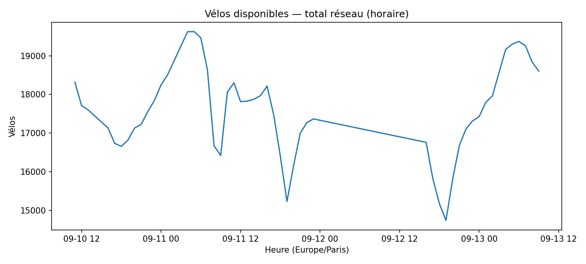

# Historique & KPI

**Dernier snapshot** : `11/09 19:49` (Europe/Paris)

**KPI (instantané)**

- Stations couvertes : **1470**
- Vélos disponibles (total) : **15288**
- Bornes libres (total) : **29395**
- Taux moyen d’occupation : **32.4 %**

## Tendance d’occupation

## Vélos disponibles — total réseau

