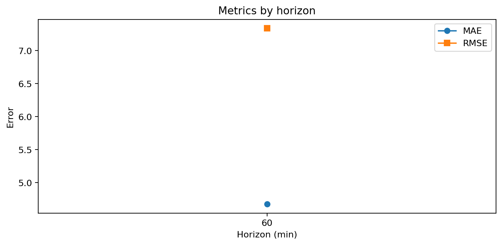
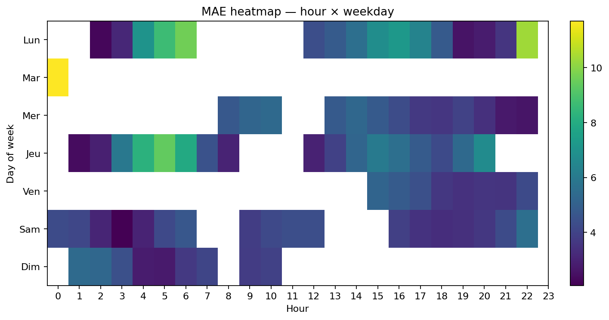
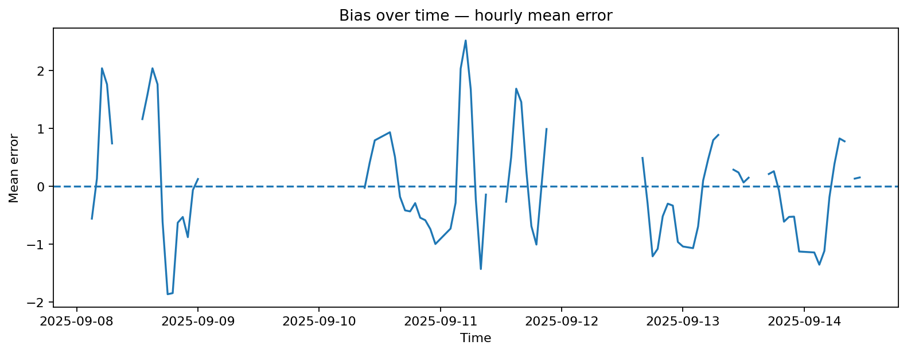
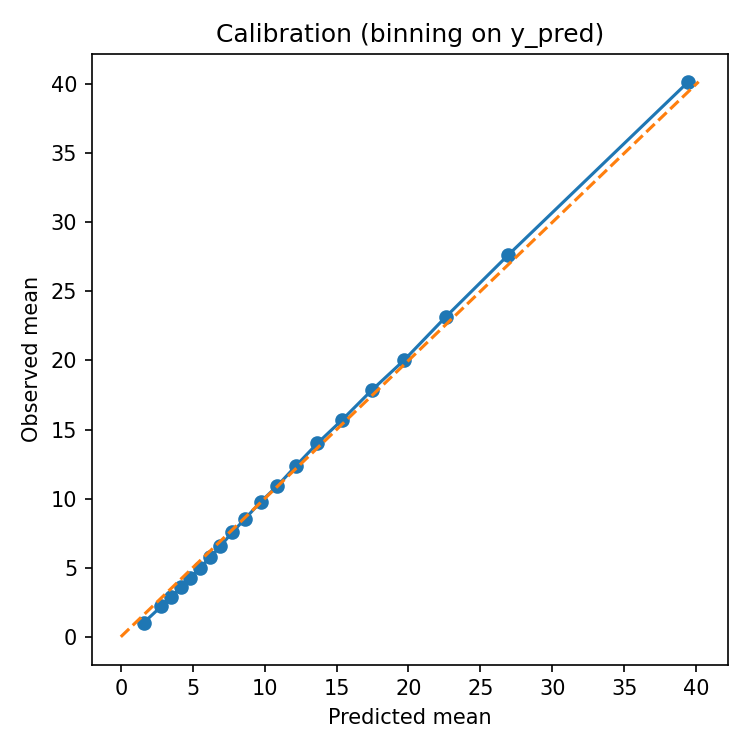

# Vélib’ Paris — Prévision & Monitoring

> **Objectif.** Aider les usagers et les opérations à **anticiper la disponibilité** des vélos/docks à court terme (15–60 min) et **surveiller la santé** du système (données & modèle) pour agir vite lorsque ça dérive.

---

## À qui s’adresse ce rapport ?
- **Décideurs / Ops** : où et quand le réseau est sous tension ? quels leviers ?
- **Data / Produit** : performance du modèle, dérive, qualité données.
- **Grand public** : comprendre les **rythmes d’usage** du réseau et la **fiabilité** des prédictions.

---

## Ce que vous allez trouver

- **Usage du réseau** : volumes, profils journaliers, **périodes de tension**, **cartes** et **typologies de stations** (clustering).
- **Performance de prévision** : MAE/RMSE **par horizon**, observé vs prédit (agrégé & par station), **heatmaps d’erreurs**, **biais** et **calibration**.
- **Monitoring (Data & Modèle)** : complétude/qualité, **drift (PSI)**, importance (proxy) des features, **tendance d’erreur**.

---

## Résumé visuel (7 derniers jours)

- **Stabilité d’usage (global)**  
  

- **Observé vs Prévu (agrégé)**  
  

- **Santé des données (part de valeurs manquantes)**  
  

> Astuce : les détails, décomposés et comparaisons par jour/heure/station sont visibles dans les sections “Usage du réseau” et “Performance des prévisions”.

---

## Problème & valeur métier

- **Problème** : disponibilité **imprévisible** aux heures de pointe ⇒ frustration usagers, opérations de rééquilibrage en réaction.
- **Valeur** :
  - **Informer** les déplacements (prévision de vélos/docks à T+15/30/60 min).
  - **Prioriser** le rééquilibrage (identifier stations **critiques** et **créneaux** sensibles).
  - **Fiabiliser** dans la durée (monitoring proactif du **drift** et de la **qualité**).

---

## Données & horizon (sans jargon d’ingénierie)

- **Granularité** : pas de **15 minutes** par station.  
- **Cible de prévision** : nombre de vélos/docks **à +60 min** (paramétrable).  
- **Vérité vs Prédiction** :
  - `y_true` = observation réelle à **T+H** (reconstruite par décalage temporel si absent).
  - `y_pred` = valeur prédite à **T+H** (baseline naïve si modèle non fourni).  
- **Qualité** : clamp [0, capacité] ; indicateurs de **manquants** et de **hors-plage**.

> Les scripts transforment automatiquement le fichier `docs/exports/velib.parquet` en tables normalisées (`events`, `perf`) et produisent toutes les figures/statistiques du site.

---

## Questions métier auxquelles on répond

1. **Quand** le réseau est-il **sous tension** (très peu de vélos ou de places) ?
2. **Quelles stations** sont **structurellement critiques** (volatiles, extrêmes) ?
3. À **quel horizon** nos prévisions sont-elles **fiables** ? (MAE/RMSE vs horizon)
4. Où observe-t-on des **biais**/dérives qui appellent une **action** (données ou modèle) ?

---

## Comment lire ce report

1. **Usage du réseau**  
   Comprendre les **rythmes** : profils horaires, jours critiques, **clusters** de stations, **carte** des tensions.  
   _→ Idéal pour décider où/quantifier le rééquilibrage._

2. **Performance des prévisions**  
   Lire la **courbe d’erreur** par horizon, l’alignement **obs vs préd**, les **biais** et la **calibration**.  
   _→ Idéal pour valider un SLO (ex. MAE ≤ X) et connaître les limites._

3. **Monitoring (data & modèle)**  
   Suivre **qualité**, **drift** (PSI), **importance (proxy)** des features et la **tendance d’erreur**.  
   _→ Idéal pour définir des **seuils d’alerte** et déclencher un **réentraînement**._

---

## Résultats clés (lecture rapide)

- **MAE/RMSE par horizon**  
  

- **Créneaux à risque (MAE heure × jour)**  
  

- **Biais & Calibration**  
    
  

---

## Méthodologie (vue Data Science)

- **Baselines** : persistance/décalage temporel.  
- **Métriques** : **MAE**, **RMSE** (erreur absolue / quadratique), **MAPE/sMAPE** (scale-free).  
- **Robustesse** : agrégations par **heure** / **jour** / **station** ; **heatmaps** pour localiser les faiblesses.  
- **Monitoring** :
  - **Qualité** : manquants, zéros suspects, clamp [0, capacité].
  - **Drift** : **PSI** (réf = début de fenêtre, courant = fin) pour détecter évolution de distribution.
  - **Seuils conseillés** : alerte si **PSI ≥ 0.2** (fort), dérive de MAE **>+20%** sur 3 jours.

---

## Navigation

- **Usage du réseau** → [Vue d’ensemble](usage/index.md) · [Profils de stations](stations/index.md)  
- **Performance** → [Métriques & visuels](monitoring/metrics.md)  
- **Monitoring** → [Vue d’ensemble](monitoring/index.md) · [Dérive](monitoring/data_drift.md) · [Modèle](monitoring/model.md)  
- **Exports** → [Tables & Figures](exports/index.md)

---

## Limites & pistes d’amélioration

- **Événements externes** (météo, événements) non modélisés ici : à intégrer pour réduire l’erreur en pointe.  
- **Effets spatiaux** : prise en compte de la **proximité** entre stations (graphes/adjacence) pour mieux prévoir.  
- **Politiques d’opérations** : coupler prévisions et **optimisation de rééquilibrage** (routing, capacité).  
- **Apprentissage** : scheduler de réentraînement conditionné par **PSI** et **SLO** (MAE).

---

## Transparence & reproductibilité

Ce site est **entièrement généré** par des scripts Python (voir `tools/*`) à partir de `docs/exports/velib.parquet`.  
Chaque graphique/indicateur est rejouable, l’**orchestration** produit des **insights rédigés** automatiquement.

<!--
Si vous avez activé l’extension MkDocs `pymdownx.snippets`, vous pouvez inclure les résumés auto :
--8<-- "exports/auto/usage_insights.md"
--8<-- "exports/auto/perf_insights.md"
--8<-- "exports/auto/monitoring_insights.md"
-->
