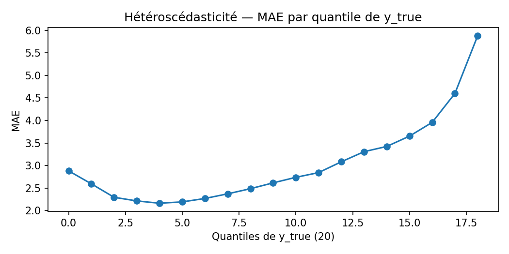

# Modèle — Explicabilité & calibration

> Rendre les prévisions **intelligibles** (quelles variables comptent ? quand, où ?) et **fiables** (calibration, biais, incertitudes).

---

## Objectif
Rendre les prévisions **intelligibles** (quelles variables comptent ? quand, où ?) et **fiables** (calibration, biais, incertitudes).

---

## Résidus & diagnostic
- **Résidus** `y_true − y_pred` : distribution, QQ-plot, autocorrélation.  
- **Hétéroscédasticité** : variance des résidus vs niveau d’occupation.  
- **Outliers/épisodes** : séquences d’erreurs anormalement longues (liées à ruptures d’ingestion, événements).

<figure><figcaption>Distribution des résidus</figcaption></figure><figure><figcaption>QQ-plot vs N(0,1)</figcaption></figure><figure><figcaption>ACF du résidu moyen (lag 15 min)</figcaption></figure><figure><figcaption>MAE par quantile de y_true (hétéroscédasticité)</figcaption></figure>

**Tables d’appui**  
- Hétéroscédasticité (20 quantiles) → `../../assets/tables/model/explainability/heteroscedasticity_by_true_quantiles.csv`
- Valeurs ACF → `../../assets/tables/model/explainability/acf_values.csv`
- Épisodes d’erreurs par station → `../../assets/tables/model/explainability/error_episodes_by_station.csv`

---

## Importance & explications
- **Permutation importance** (globale) sur échantillon **time-aware**.  
- **Ablation** par familles de features (lags, saisonnalité, météo) pour la **valeur incrémentale**.  
- **Profils moyens conditionnels** (PDP/ICE) sur variables clés.  
- **Segments** : importance et erreurs **par cluster de stations** (transparence sur où le modèle “comprend” mieux).

**Sorties disponibles**  
- Erreurs par cluster → `../../assets/tables/model/explainability/errors_by_cluster.csv`

_(aucune figure disponible)_

---

## Calibration & biais
- **Régression d’étalonnage** `y_true = α + β·y_pred` :  
  - **β ≈ 1** & **α ≈ 0** → bonne calibration moyenne.  
  - Pentes par **segments** (heure, cluster, capacité, zone) pour détecter des biais structurels.  
- **Erreur relative** par niveau d’occupation (bas/moyen/haut) — utile pour l’opérationnel.

<figure><figcaption>Calibration globale — y_true = α + β·y_pred</figcaption></figure><figure><figcaption>Calibration par binning (20 quantiles de y_pred)</figcaption></figure><figure><figcaption>Pente β par heure locale</figcaption></figure><figure><figcaption>Erreur relative (proxy MAPE) par niveau d’occupation</figcaption></figure>

**Tables d’appui**  
- Binning calibration → `../../assets/tables/model/explainability/calibration_binned.csv`
- β/α par heure → `../../assets/tables/model/explainability/calibration_by_hour.csv`
- Erreur relative (Bas/Moyen/Haut) → `../../assets/tables/model/explainability/relative_error_by_level.csv`
- Biais par station → `../../assets/tables/model/explainability/bias_by_station.csv`

---

## Incertitude (si activée)
- **Intervalles** par quantiles ou par **jackknife/bootstrap**.  
- **Coverage nominal vs empirique** (ex. 80 % nominal ↔ ~80 % observé).  
- Signalement des **stations à forte incertitude** (utile pour le monitoring).

_(aucune table disponible)_

---

## Visualisations attendues
- **Cartes** du biais par station/zone, **barres** d’importance, **PDP** pour 2–3 features clés, **courbes** de calibration globales et par segments.

---

## Lecture & limites
- L’explicabilité **décrit des associations**, pas des causalités.  
- La calibration moyenne peut être bonne tout en étant **mauvaise localement** : d’où l’analyse par segments.

---

## Valeur de la section “Modèle”
- **Opérationnel** : savoir quand/où la prévision est fiable, et de combien elle améliore la baseline.  
- **Ingénierie** : pipeline clair, versionné, reproductible.  
- **Confiance** : transparence sur **pourquoi** le modèle prédit ce qu’il prédit, et **comment** il se comporte selon les contextes.
