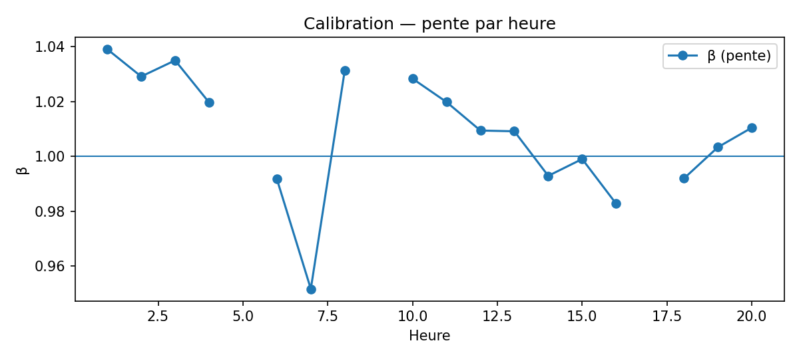

# Explicabilité & calibration

Objectif : rendre les prévisions **intelligibles** (quelles variables comptent, quand et où ?) et **fiables** (calibration, biais, incertitudes).

!!! tip "Ce que vous verrez"
    - **Résidus & diagnostics** : histogramme, QQ-plot, ACF, hétéroscédasticité.  
    - **Importance** globale (permutation) et **ablation** par familles de features.  
    - **Profils moyens conditionnels** (PDP/ICE) sur variables clés.  
    - **Calibration** globale et **par segments** (pente/intercept).  
    - **Incertitude** (si activée) : intervalles, coverage empirique.

---

## 1) Résidus & diagnostic

- **Résidus** `y_true − y_pred` : distribution, symétrie, extrêmes.  
- **QQ-plot** : écart aux quantiles théoriques.  
- **ACF des résidus** : dépendance temporelle résiduelle.  
- **Hétéroscédasticité** : variance des résidus vs niveau d’occupation.  
- **Erreurs relatives** par niveau d’occupation.

### Figures


**Tables/CSV**  
- `../assets/tables/model/explainability/acf_values.csv`  
- `../assets/tables/model/explainability/heteroscedasticity_by_true_quantile.csv`  
- `../assets/tables/model/explainability/error_episodes_by_station.csv`

---

## 2) Importance & explications
- **Permutation importance (globale)** sur un échantillon **time-aware**.  
- **Ablation** par familles de features (lags, rollings, saisonnalité, météo).  
- **PDP/ICE** : effet marginal de 2–3 variables clés.  
- **Segments** : importance/erreurs par cluster de stations.

> L’importance **décrit** une contribution prédictive moyenne (association), pas une causalité.

*(Figures à venir si générées : `permutation_importance.png`, `ablation_by_family.png`, `pdp_<feature>.png`.)*

---

## 3) Calibration & biais
- **Régression d’étalonnage** `y_true = α + β · y_pred` (β≈1, α≈0 souhaités).  
- Pentes/intercepts **par segments** (heure, cluster, capacité, zone).  
- **Courbes de calibration** (binning quantiles).

### Figures




**Règles de surveillance**  
- |pente−1| > 0,1 ou |intercept| > 0,5 → **alerte calibration**.

---

## 4) Incertitude (si activée)
- **Intervalles** (ex. P10–P90) ou **jackknife/bootstrap**.  
- **Coverage** nominal vs empirique.  
- **Stations à forte incertitude** : priorisation du monitoring.

---

## Méthodologie (résumé)
- **Échantillonnage** : validation/test **dans l’ordre temporel**.  
- **Permutation par blocs temporels** (évite fuite d’infos).  
- **PDP/ICE** : sous-échantillon récent ; variables normalisées si besoin.  
- **Calibration** : régression robuste (Huber) & par segments.  
- **Exports** : figures → `assets/figs/model/explainability/`, tables → `assets/tables/model/explainability/`.

## Paramètres de build (rappel)
```bash
python tools/build_model_explainability.py   --perf docs/exports/perf.parquet   --tz Europe/Paris

