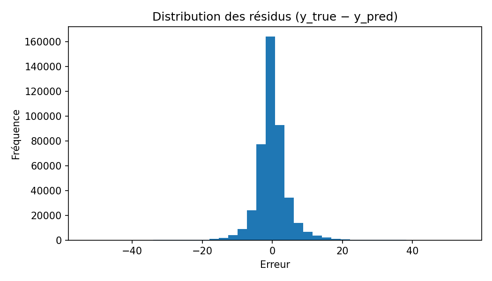
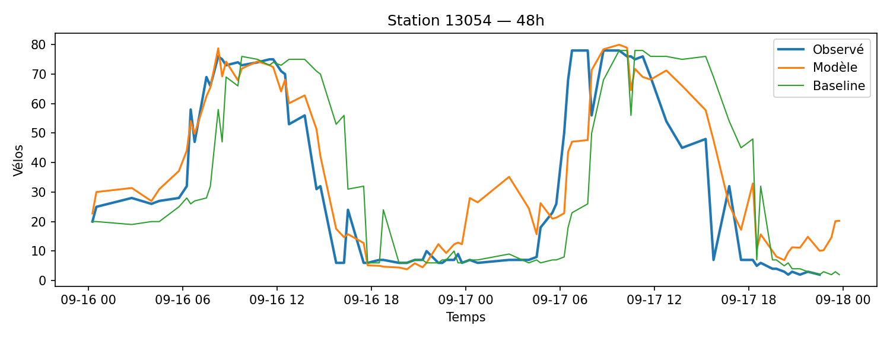
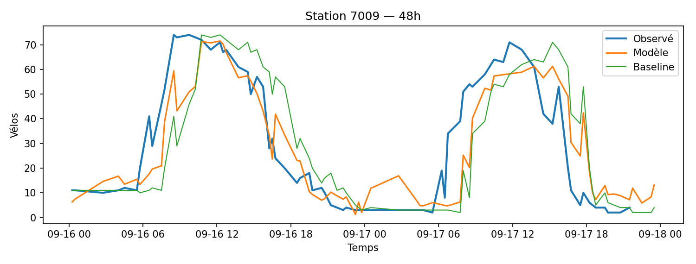
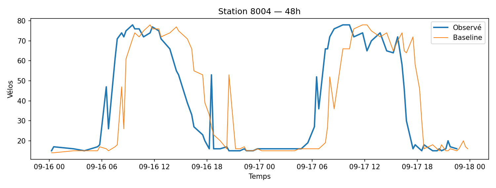

# Performance & baseline

## Objectif
Mesurer la **qualité des prévisions** du modèle et la situer **par rapport à une baseline** simple (persistance).

## Questions auxquelles la page répond
- Quelle est l’erreur moyenne **globale** (toutes stations, toutes heures) ?
- Dans quels **segments** (heure, jour, station, cluster, zone) le modèle est-il le plus/moins performant ?
- Quel est le **gain vs baseline** (lift) et comment évolue-t-il dans le temps ?

## Métriques principales
- **MAE** (Mean Absolute Error) — robustesse et lisibilité opérationnelle.
- **RMSE** — pénalise davantage les gros écarts.
- **ME (biais)** — moyenne des erreurs signée (sous/sur-prédiction).
- **Coverage prédictif** — part d’horodatages pour lesquels une prédiction existe.
- **Lift vs baseline** = `(MAE_baseline − MAE_modèle) / MAE_baseline` (positif = mieux que la persistance).
- **R²** (optionnel, sur séries agrégées) — à manier avec prudence pour des données bornées/peu linéaires.

---

## Résumé chiffré (fenêtre)
- **Horizon (min)** : **60**  
- **Couverture prédictive** : **75.45%**  
- **MAE** — modèle : **2.952** · baseline : **0.000**  
- **RMSE** — modèle : **4.442** · baseline : **0.000**  
- **Biais (ME)** — modèle : **-0.019** · baseline : **0.000**  
- **Lift vs baseline** : **nan%**  
- **Données** : **568913** lignes · **1473** stations · **2025-09-08 01:00 CEST → 2025-09-17 19:45 CEST**  

> Les découpages heure/jour utilisent l’axe **décision T (local)**.  
> Les tracés *observé vs prédit* sont alignés sur **l’axe cible T+h** (colonne `ts_target`).  
> La baseline est **reconstruite** comme persistance `y(T+h) = y(T)` puis alignée sur `ts_target`.

---

## Découpages & comparaisons
- **Par station** (top/bottom-10, distribution), **par cluster** (archétypes d’usage), **par heure du jour**, **semaine/week-end**, **par arrondissement/quartier**.
- **Chronologique** : courbe MAE quotidienne/hebdomadaire, détection de dégradations.
- **Capacité** : erreur normalisée par capacité estimée (si disponible) pour comparer des stations hétérogènes.

---

## Visualisations
### Lift quotidien

### Distribution des résidus

### MAE par heure (local)

### Observé vs prédit — exemples (4)

---

## Tables d’appui
- **Global** : `../../assets/tables/model/performance/global_metrics.csv`  
- **Quotidien** : `../../assets/tables/model/performance/daily_error.csv`  
- **Par heure** : `../../assets/tables/model/performance/error_by_hour.csv` · **Par jour de semaine** : `../../assets/tables/model/performance/error_by_dow.csv`  
- **Par station** : `../../assets/tables/model/performance/error_by_station.csv`
- **Par cluster** : `../../assets/tables/model/performance/error_by_cluster.csv`
- **Coverage** : `../../assets/tables/model/performance/coverage.csv`

---

## Lecture & limites
- La **persistance** (dernier état connu) est une baseline forte à court terme ; le lift est donc une mesure exigeante.
- Les métriques agrégées peuvent masquer des comportements **station-spécifiques** (d’où l’analyse segmentée).

