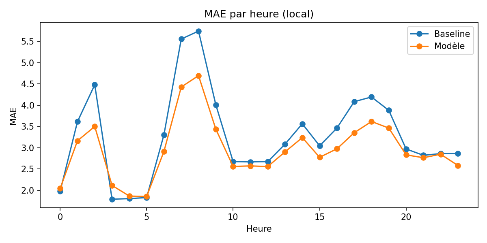
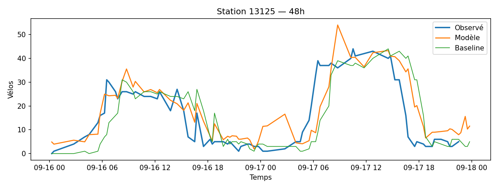

# Performance & baseline

MAE/RMSE/biais, lift vs persistance, découpages.

## Figures

- `../assets/tables/model/performance/coverage.csv`
- `../assets/tables/model/performance/daily_error.csv`
- `../assets/tables/model/performance/error_by_cluster.csv`
- `../assets/tables/model/performance/error_by_dow.csv`
- `../assets/tables/model/performance/error_by_hour.csv`
- `../assets/tables/model/performance/error_by_station.csv`
- `../assets/tables/model/performance/global_metrics.csv`

