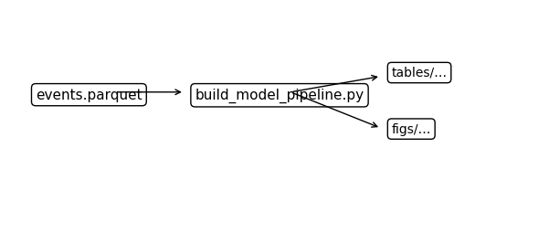
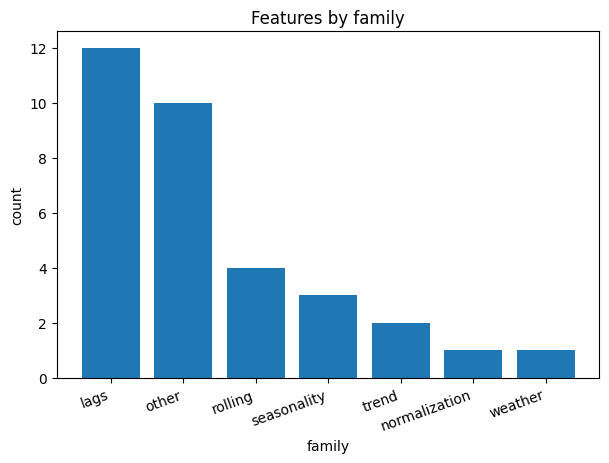

# Pipeline d’entraînement & features

Données d’entrée, lags/rollings, validation time-aware.

## Figures/Tables

- `../assets/tables/model/pipeline/features_by_family.csv`
- `../assets/tables/model/pipeline/features_contract.csv`
- `../assets/tables/model/pipeline/model_metadata.json`
- `../assets/tables/model/pipeline/pipeline_overview.json`
- `../assets/tables/model/pipeline/schema_events.csv`
- `../assets/tables/model/pipeline/schema_perf.csv`

