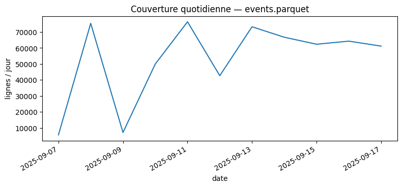

# Modèle — Pipeline d’entraînement & features

> _Vue d’ensemble visuelle et documentée du pipeline (sources → features → entraînement → artefact → inférence → monitoring)._

## 1) Aperçu visuel

  

## 2) Quick stats
- **Période events** : 2025-09-07T23:00:00 → 2025-09-17T17:45:00
- **Période perf**   : 2025-09-07T23:00:00 → 2025-09-17T17:45:00
- **Stations**       : events=1473 · perf=1473
- **Horizon (min)**  : 60
- **Features**       : 33 (source: src.forecast.load_model_bundle)

### Artefacts (liens techniques)
- **Schémas** : [events](../../assets/tables/model/pipeline/schema_events.csv) · [perf](../../assets/tables/model/pipeline/schema_perf.csv)
- **Contrat des features** : [features_contract.csv](../../assets/tables/model/pipeline/features_contract.csv) · [features_by_family.csv](../../assets/tables/model/pipeline/features_by_family.csv)
- **Overview JSON** : [pipeline_overview.json](../../assets/tables/model/pipeline/pipeline_overview.json)

---

## 3) Validation & Données — en un coup d’œil

  <figure style="flex:1; min-width: 320px;">
    
    <figcaption>Validation à origine glissante (robustesse temporelle).</figcaption>
  </figure>
  <figure style="flex:1; min-width: 320px;">
    
    <figcaption>Couverture quotidienne des events (volumétrie & trous).</figcaption>
  </figure>

---

## 4) Features — répartition & contrat
<figure>
  
  <figcaption>Répartition des features par famille.</figcaption>
</figure>

**Tableau des familles**
| family | count |
| --- | --- |
| lags | 12 |
| other | 10 |
| rolling | 4 |
| seasonality | 3 |
| trend | 2 |
| normalization | 1 |
| weather | 1 |

**Aperçu des features** (extrait) :
- `nb_velos_bin`
- `nb_bornes_bin`
- `capacity_bin`
- `occ_ratio_bin`
- `temp_C`
- `precip_mm`
- `wind_mps`
- `lag_nb_1b`
- `lag_nb_2b`
- `lag_nb_3b`
- `lag_nb_4b`
- `lag_nb_8b`
- `lag_nb_16b`
- `lag_occ_1b`
- `lag_occ_2b`
- `lag_occ_3b`
- `lag_occ_4b`
- `lag_occ_8b`
- `lag_occ_16b`
- `roll_nb_4b`
- `roll_nb_8b`
- `roll_occ_4b`
- `roll_occ_8b`
- `trend_nb_4b`
- `trend_occ_4b`
- `hour`
- `dow`
- `is_weekend`
- `is_rush_am`
- `is_rush_pm`
- `is_holiday`
- `hour_sin`
- `hour_cos`

---

## 5) Dataflow du builder (doc)
<figure>
  
  <figcaption>De `events.parquet` → builder → artefacts docs/assets/…</figcaption>
</figure>

---

## 6) Explications détaillées

### Objectif
Décrire précisément **d’où viennent les données**, **comment on fabrique les features**, **comment on entraîne** et **versionne** le modèle.

### Données d’entrée
- **Séries réseau** : vélos/docks disponibles par station (`events.parquet`).  
- **Calendrier** : heure/minute, jour de semaine, jours fériés, vacances (si disponibles).  
- **Météo** (optionnel) : température, pluie, vent (si intégrée et historisée).  
- **Géographie légère** (optionnelle) : arrondissement/quartier, altitude, distance centre.

### Construction des features (exemples typiques)
- **Retards (lags)** : valeurs H−15, −30, −45, −60… (pas d’info future).  
- **Fenêtres glissantes** : moyennes/medians/écarts-types sur 1–6 h, indicateurs de volatilité.  
- **Saisonnalité** : heure **sin/cos**, jour de semaine encodé, période scolaire.  
- **Interactions légères** : lags × heure, météo × heure (si pertinent).  
- **Capacité & normalisation** : ratios (`y/capacité`) lorsque la comparaison inter-stations est requise.

### Entraînement & validation
- **Découpes temporelles** : train → val → test **dans l’ordre du temps**.  
- **Validation à origine glissante** (rolling origin) pour évaluer la robustesse.  
- **Objectif** : minimiser MAE (primat opérationnel), contrôle RMSE/biais.  
- **Anti-fuite** : toutes les features utilisent **exclusivement** des informations ≤ t (aucun futur).

### Artefacts & versioning
- Modèle sérialisé (ex. `joblib`) + **signature** des features attendues.  
- **Version sémantique** (ex. `vX.Y.Z`) liée au schéma de features & à l’horizon.  
- Journal de **reproductibilité** : seed, plage temporelle d’entraînement, métriques de val/test.  
- **Planification** : ré-entraînement périodique (ex. quotidien/hebdo) ou à l’alerte monitoring.

### Déploiement & prédiction
- **Chargement** depuis l’artefact, vérification du **contrat de features** (colonnes, types, ordre).  
- Production de `y_pred` à chaque pas pour chaque station prévue, **timestampée à t** (et non t+h).

---

## 7) Annexes & liens
- `../../assets/tables/model/pipeline/schema_events.csv`
- `../../assets/tables/model/pipeline/schema_perf.csv`
- `../../assets/tables/model/pipeline/features_contract.csv`
- `../../assets/tables/model/pipeline/features_by_family.csv`
- `../../assets/tables/model/pipeline/pipeline_overview.json`
