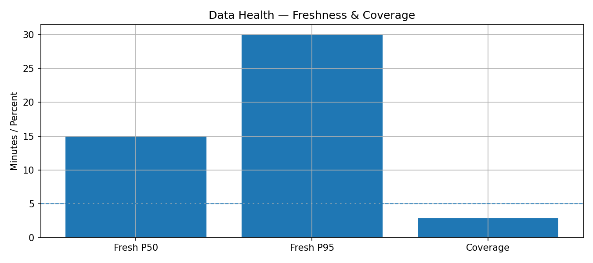
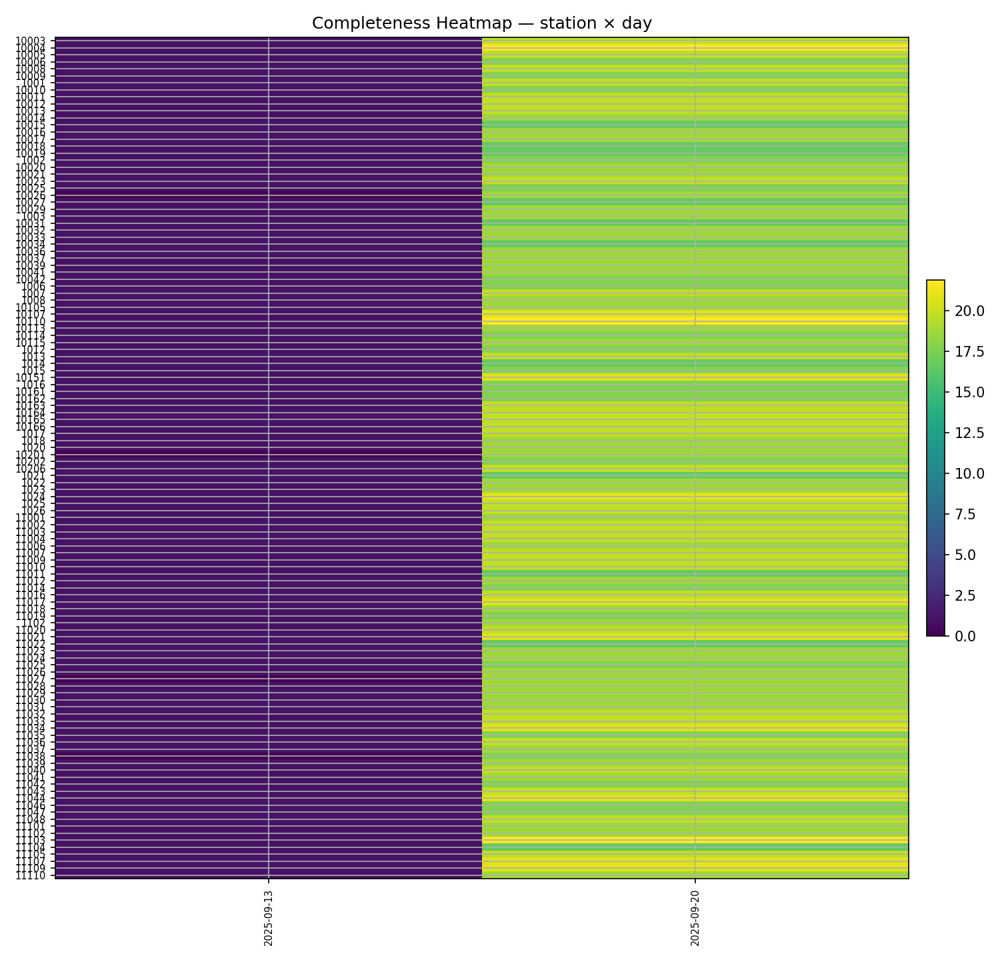
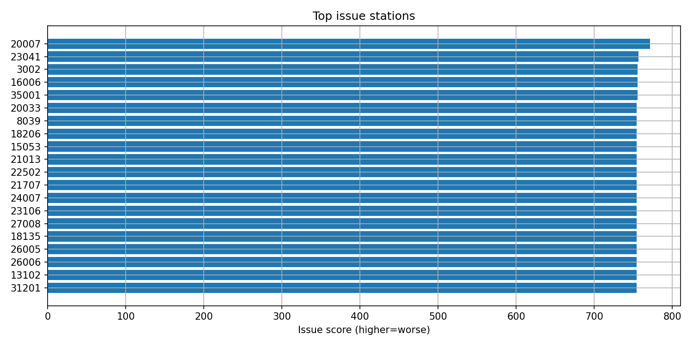

# Santé des données

Cette page vérifie que le **pipeline d’ingestion** fournit des données **fraîches, complètes et conformes** au contrat attendu.

## Objectif
Vérifier que le **pipeline d’ingestion** fournit des données **fraîches, complètes et conformes** au contrat attendu.

## Questions auxquelles la page répond
- Les données sont-elles **fraîches** (latence nominale respectée) ?
- Quel est le **taux de complétude** (stations × timestamps) et où sont les trous ?
- Le **schéma** (colonnes/types/unités) est-il conforme ? Y a-t-il des champs anormaux (valeurs négatives, hors bornes, constantes) ?
- Observe-t-on des **ruptures** (station figée, série plate, duplication, horodatages non monotones) ?

## Indicateurs clés (KPIs)
- **Fraîcheur** : P50=285.00 min · P95=300.00 min vs SLO=5 min → ❌ Hors SLO
- **Complétude (fenêtre 7 j)** : 46.31% (moyenne stations)
- **Latence d’ingestion** : médiane=n.d. min · P95=n.d. min
- **Schéma & contraintes** : 10 pass · 1 warn · 0 fail
- **Anomalies** : doublons=0.00% · séquences plates≥8 pas=1766 · stations avec trous=1472

> Snapshot UTC : **2025-09-17T22:30:00** · Fenêtre récente : **7** jours

---

## Visualisations
### Jauges fraîcheur & complétude

### Heatmap de complétude par station/jour

### Top stations problématiques

### Distribution de la latence d’ingestion
_Latence non disponible (pas de `ingested_at`)._

---

## Seuils & Alertes
- **Fraîcheur P95 ≤ SLO** : ❌ Non conforme
- **Complétude ≥ 98%** : ❌ Non conforme
- **Timestamps dupliqués ≤ 1.0%** : ✅ OK
- **Séries plates détectées** : ❌ Oui

Fichier JSON : `../../assets/tables/monitoring/data_health/alerts.json`

---

## Méthodes & règles
- **Contrat de schéma** : colonnes minimales, types et bornes souples (warnings) / dures (erreurs).
- **Détection plateaux** : séquence ≥ **8** pas sans variation (**15 min** le pas) → alerte station.
- **Contrôle temps** : pas manquants, pas dupliqués, dérive/retard d’horloge.
- **Cartographie** : heatmap complétude (stations en lignes × jours en colonnes).
- **Couverture par heure** : moyenne de la couverture (toutes stations) par heure locale sur 7 jours.

---

## Tables d’appui
- KPIs globaux : `../../assets/tables/monitoring/data_health/data_health.csv`
- Détail par station (complétude, trous) : `../../assets/tables/monitoring/data_health/station_health.csv`
- Heatmap station×jour (CSV) : `../../assets/tables/monitoring/data_health/completeness_by_station_day.csv`
- Couverture moyenne par heure : `../../assets/tables/monitoring/data_health/coverage_by_hour.csv`
- Rapport de schéma : `../../assets/tables/monitoring/data_health/schema_report.csv`
- Anomalies : `../../assets/tables/monitoring/data_health/anomalies.csv`

---

## Limites
La qualité “technique” n’implique pas la **représentativité** (couverte par la page *Drift*). Les estimations de latence ne sont disponibles que si `ingested_at` est fourni.

