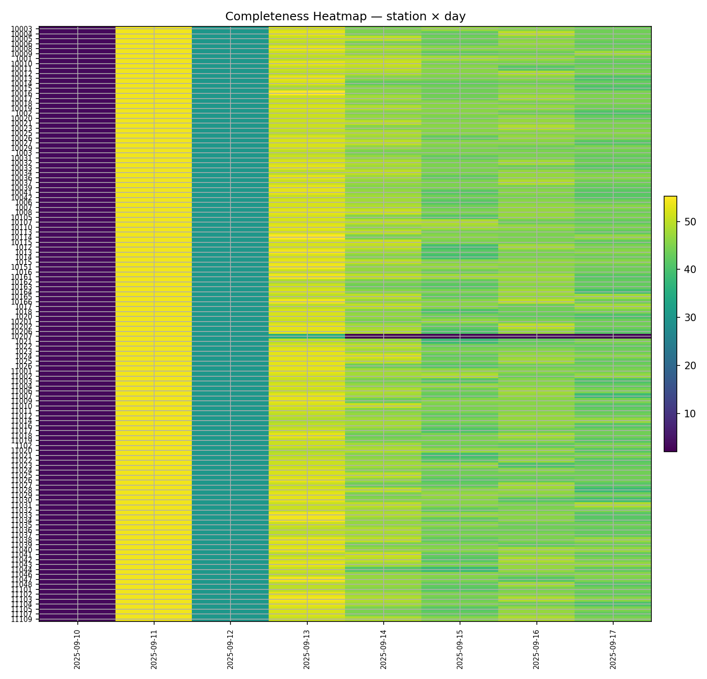

# Santé des données

Fraîcheur, complétude, schéma, anomalies.

## Figures

- `../assets/tables/monitoring/data_health/alerts.json`
- `../assets/tables/monitoring/data_health/anomalies.csv`
- `../assets/tables/monitoring/data_health/completeness_by_station_day.csv`
- `../assets/tables/monitoring/data_health/coverage_by_hour.csv`
- `../assets/tables/monitoring/data_health/data_health.csv`
- `../assets/tables/monitoring/data_health/schema_report.csv`
- `../assets/tables/monitoring/data_health/station_health.csv`

