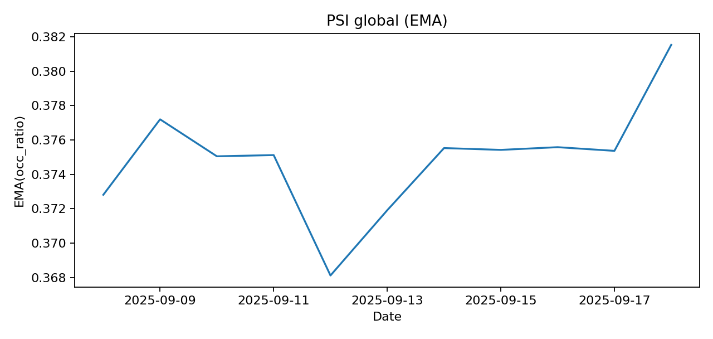

# Drift des données

PSI/K–S, dérive par segments, séries.

## Figures

- `../assets/tables/monitoring/drift/deltas_by_feature.csv`
- `../assets/tables/monitoring/drift/drift_summary.csv`
- `../assets/tables/monitoring/drift/ks_by_feature.csv`
- `../assets/tables/monitoring/drift/psi_by_feature.csv`
- `../assets/tables/monitoring/drift/psi_by_feature_by_cluster.csv`
- `../assets/tables/monitoring/drift/psi_by_feature_by_hour.csv`
- `../assets/tables/monitoring/drift/psi_by_feature_by_zone.csv`
- `../assets/tables/monitoring/drift/psi_global_daily.csv`
- `../assets/tables/monitoring/drift/psi_global_daily_ema.csv`
- `../assets/tables/monitoring/drift/target_drift.csv`

