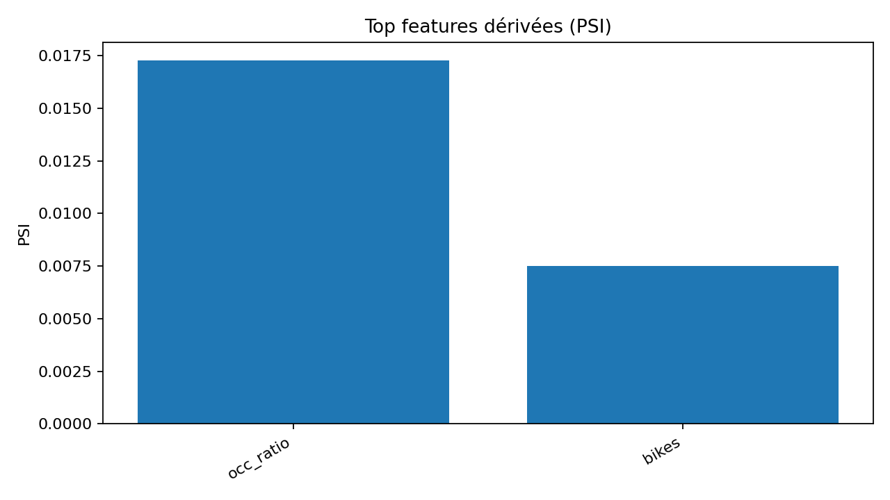
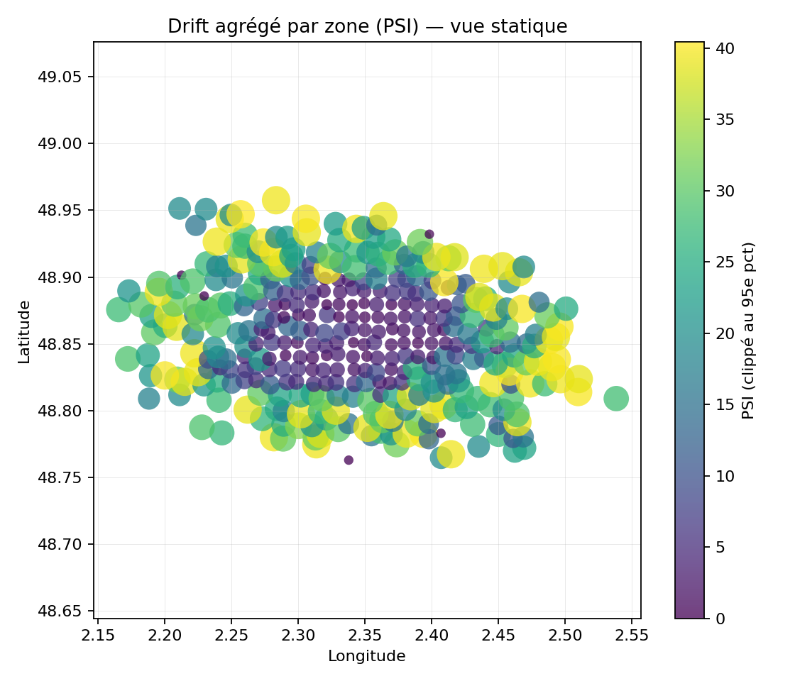

# 2) Drift des données

> **Objectif** — Détecter la **dérive des distributions** entre une fenêtre **courante** et une fenêtre de **référence**, afin d’anticiper un **risque de dégradation** du modèle.

**Fenêtres analysées (UTC)**  
- Référence : **2025-08-13 22:45 → 2025-09-10 22:45**  
- Courante : **2025-09-10 22:45 → 2025-09-17 22:45**

---

## Questions auxquelles la page répond
- Quelles **features** ont le plus dérivé ? La **cible** (`y_true`) a-t-elle changé de régime ?
- La dérive est-elle **globale** ou concentrée sur certains **segments** (clusters, zones, heures) ?
- Les dérives détectées sont-elles **persistantes** (structurelles) ou **ponctuelles** (événement) ?

---

## Indicateurs & tests
- **PSI/CSI** par variable (binning robuste).  
  *Interprétation usuelle PSI* : **< 0,10** faible · **0,10–0,25** modérée · **> 0,25** forte.
- **K–S** (variables continues), **χ²** (catégorielles).
- **Δ moyenne/variance** normalisés (z-scores).
- **Drift de cible** (prior shift) : évolution de la distribution de `y_true`.
- **Drift conditionnel** : par **cluster de stations**, par **heure du jour**, par **arrondissement/zone** (*si disponibles*).

> **Résumé courant**  
> PSI global (occ_ratio) : **0.017** · Feature la plus dérivée : **occ_ratio** (PSI=0.017)

---

## Visualisations
### Top dérives (PSI)

### Tendance du drift (EMA, occ_ratio)

### Carte — drift agrégé par zone

[Ouvrir la carte interactive](../../assets/maps/drift_by_zone.html)

<!-- L'iframe ci-dessous est conservée pour les environnements qui l'autorisent (certains renderers la bloquent). -->

  <iframe src="../../assets/maps/drift_by_zone.html" style="width:100%;height:520px;border:0" loading="lazy" title="Carte drift par zone"></iframe>

---

## Tables d’appui
- PSI par variable : `../../assets/tables/monitoring/drift/psi_by_feature.csv`  
- K–S par variable : `../../assets/tables/monitoring/drift/ks_by_feature.csv`  
- Δ moyenne/variance : `../../assets/tables/monitoring/drift/deltas_by_feature.csv`  
- PSI global journalier (EMA) : `../../assets/tables/monitoring/drift/psi_global_daily_ema.csv`  
- Résumé & alertes : `../../assets/tables/monitoring/drift/drift_summary.csv`, `../../assets/tables/monitoring/drift/alerts.json`  
- Drift de cible : `../../assets/tables/monitoring/drift/target_drift.csv` (*si généré avec `--perf`*)

---

## Seuils / Alertes (par défaut, ajustables)
- **PSI global** (médiane des features clés) **> 0,10** sur **3 jours consécutifs** → **Alerte**.  
- **PSI d’une feature critique** **> 0,25** sur **2 jours** → **Alerte majeure**.  
- **Drift de cible notable** (Δ moyenne **> 1 σ**) → **Alerte**.

> ⚠️ Un **drift** n’implique pas nécessairement une **dégradation** du modèle. Consulter la page **Santé du modèle** pour corroborer (perf vs temps).

---

## Méthodes
- **Fenêtrage** : référence glissante (**28 j**) vs courant (**7 j**), sans chevauchement.  
- **Stratification** : métriques par **segment** (clusters réseau, zones).  
- **Stabilité** : lissage **EMA** pour éviter les sur-réactions au bruit.

**Artefacts & source**  
- Source : `docs/exports/events.parquet` (pas de 15 min, timestamps UTC naïfs).  
- Figures : `../../assets/figs/monitoring/drift` · Tables : `../../assets/tables/monitoring/drift` · Carte : `../../assets/maps/drift_by_zone.html`
