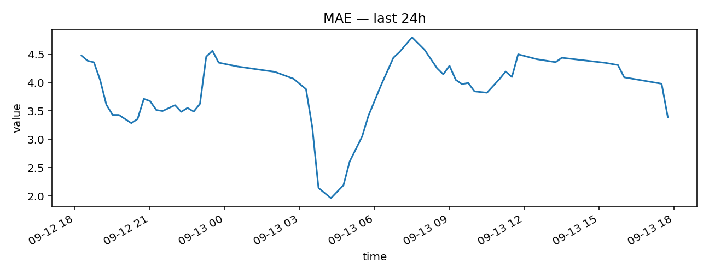
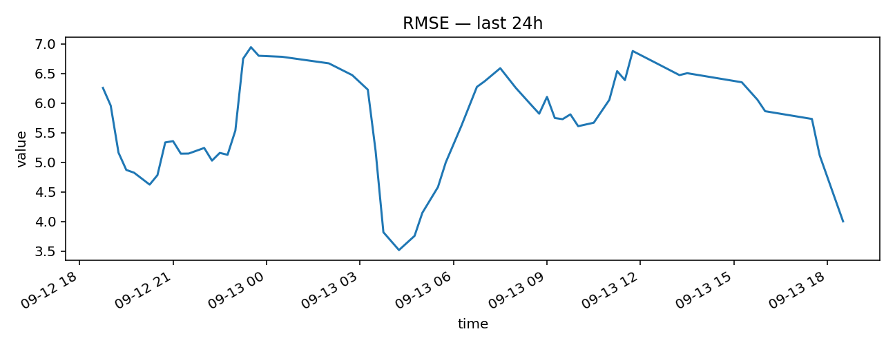
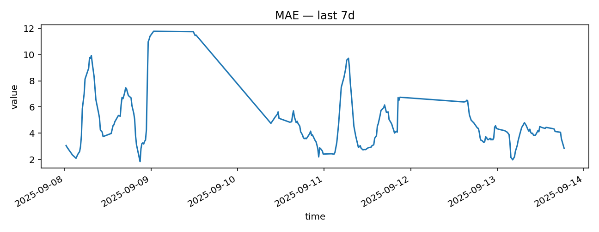
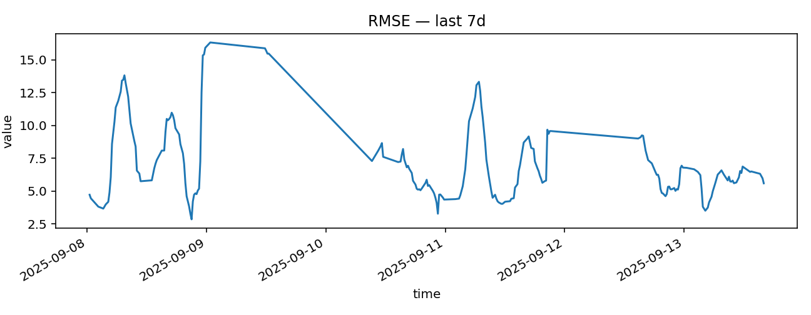

# Monitoring — Vue d’ensemble

MAE 24h: 3.94
RMSE 24h: 5.83
MAE 7j: 4.87
RMSE 7j: 7.15
Rel. Err 24h: 0.59

  
  
  
  

> Generated by `tools/generate_monitoring.py` from `docs/exports/velib.parquet`.
