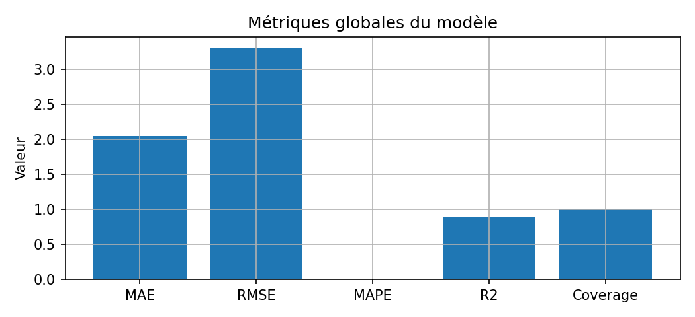
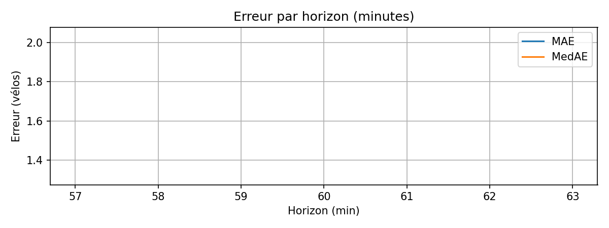
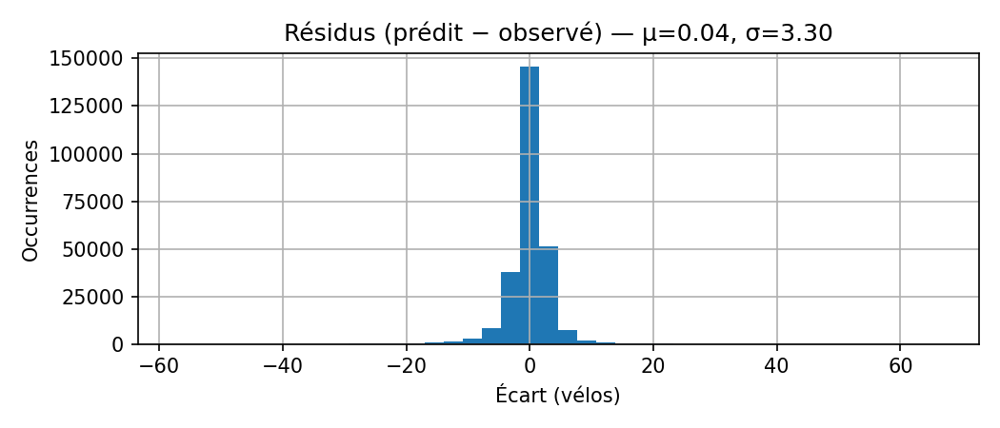
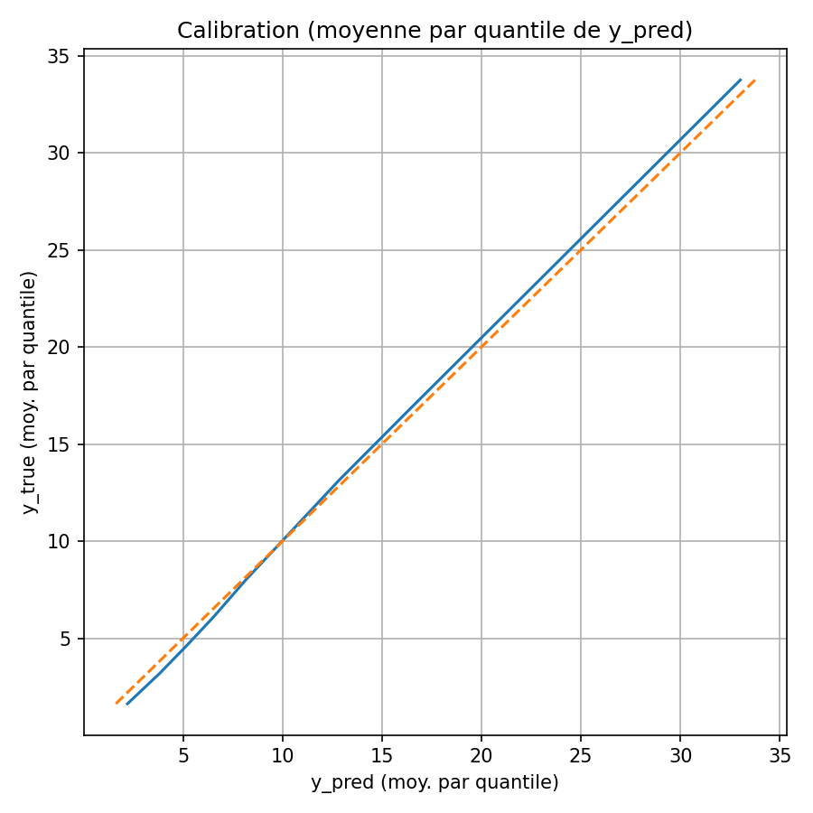
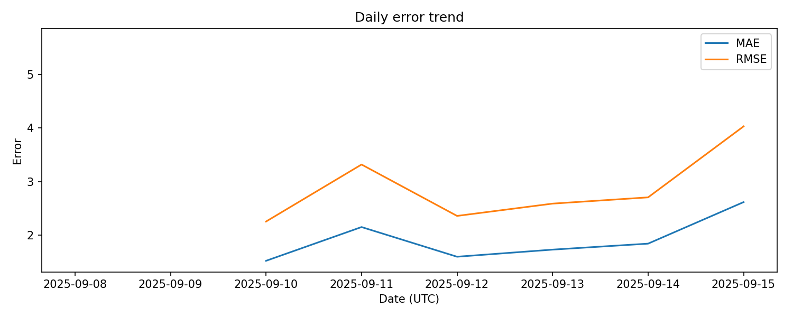
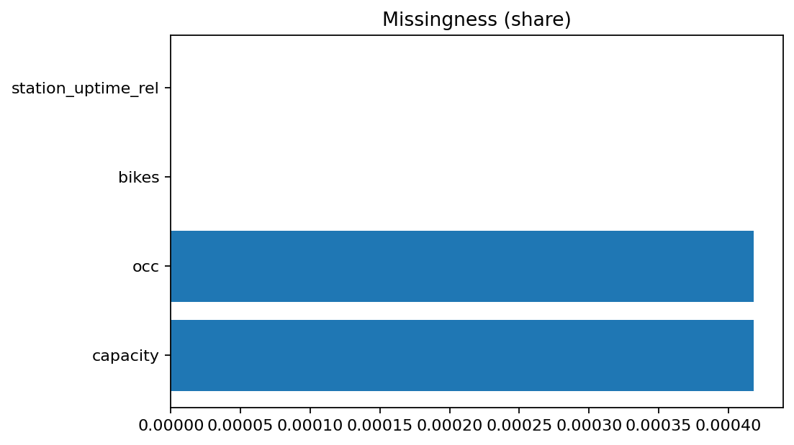
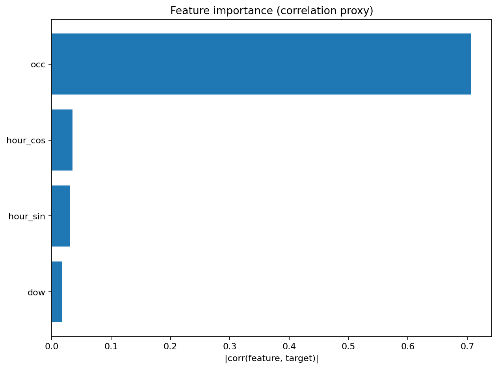

# Monitoring — Modèle & Données

Ce rapport suit à la fois la **qualité des données** et la **performance du modèle de prévision**.  
Objectif : **détecter rapidement dérives, biais ou pertes de performance**, et documenter les limites connues.

---

## 1. Métriques globales

- **MAE / RMSE** : erreurs absolues et quadratiques (unités = vélos).  
- **MAPE** : erreur relative moyenne (%).  
- **R²** : proportion de variance expliquée (proche de 1 = bon).  
- **Coverage** : part des instants où le modèle a produit une prédiction valide.  

👉 Voir aussi le tableau : [global_metrics.csv](../assets/tables/global_metrics.csv)

---

## 2. Erreurs par horizon

Évolution de l’erreur selon l’**horizon de prévision (minutes)**.  
Permet d’identifier si la performance chute à mesure que l’horizon augmente.

👉 Détails : [error_by_horizon.csv](../assets/tables/error_by_horizon.csv)

---

## 3. Résidus

### Histogramme global
  
Distribution de `(y_pred − y_true)`.  
- μ = biais moyen (écart systématique).  
- σ = dispersion (incertitude).

👉 Résumé numérique : [residuals_summary.csv](../assets/tables/residuals_summary.csv)

---

## 4. Calibration

Relation entre les **prédictions moyennes par quantile** et les **observations moyennes**.  
- Courbe proche de la diagonale → modèle bien calibré.  
- Courbe au-dessus → tendance à **sous-prédire**.  
- Courbe en dessous → tendance à **sur-prédire**.  

👉 Table : [calibration_table.csv](../assets/tables/calibration_table.csv)

---

## 5. Tendance temporelle

MAE quotidienne sur la fenêtre analysée.  
Permet de détecter des **dérives lentes** (ex. dégradation après événement particulier).

👉 Table : [daily_error.csv](../assets/tables/daily_error.csv)

---

## 6. Santé des données

Ratios de :
- Valeurs manquantes (`*_missing_ratio`).  
- Valeurs hors-plage (négatives ou > capacité si dispo).  

👉 Table : [data_health.csv](../assets/tables/data_health.csv)

---

## 7. Drift (PSI)

Comparaison **début vs fin de période** pour chaque feature (Population Stability Index).  
- PSI < 0.1 → stable  
- 0.1 ≤ PSI < 0.2 → légère dérive  
- ≥ 0.2 → forte dérive (alerte)  

👉 Table : [psi_features.csv](../assets/tables/psi_features.csv)

---

## 8. Importance des features

Score combinant :
- |corr(y_true)|  
- |corr(residual)|  
- Mutual Information (si dispo)  

Classe les variables selon leur impact probable sur la cible ou les erreurs.

👉 Table : [feature_importance_proxy.csv](../assets/tables/feature_importance_proxy.csv)

---

## Lecture & usage métier

- **Ops / Décideurs** : détecter quand/quoi surveiller (stations, créneaux).  
- **Data Science** : suivre dérive, calibrer alertes, prioriser réentraînement.  
- **Produit / Grand public** : transparence sur la fiabilité des prévisions.

---

## Limites actuelles

- Les **facteurs externes** (météo, événements spéciaux) ne sont pas encore intégrés.  
- La dérive spatiale (liée aux flux entre stations) n’est pas suivie ici.  
- Les seuils PSI sont indicatifs, à adapter au contexte métier.

---

## Exports

Toutes les tables sont disponibles en CSV dans [assets/tables](../assets/tables/).  
Les figures sont regroupées dans [assets/figs](../assets/figs/).
