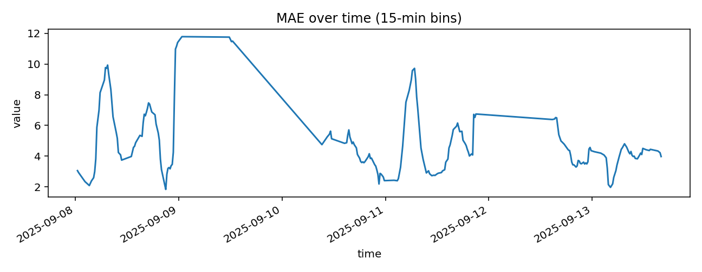
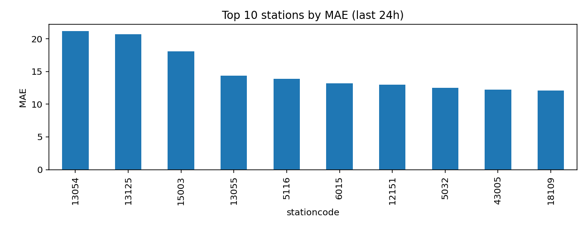
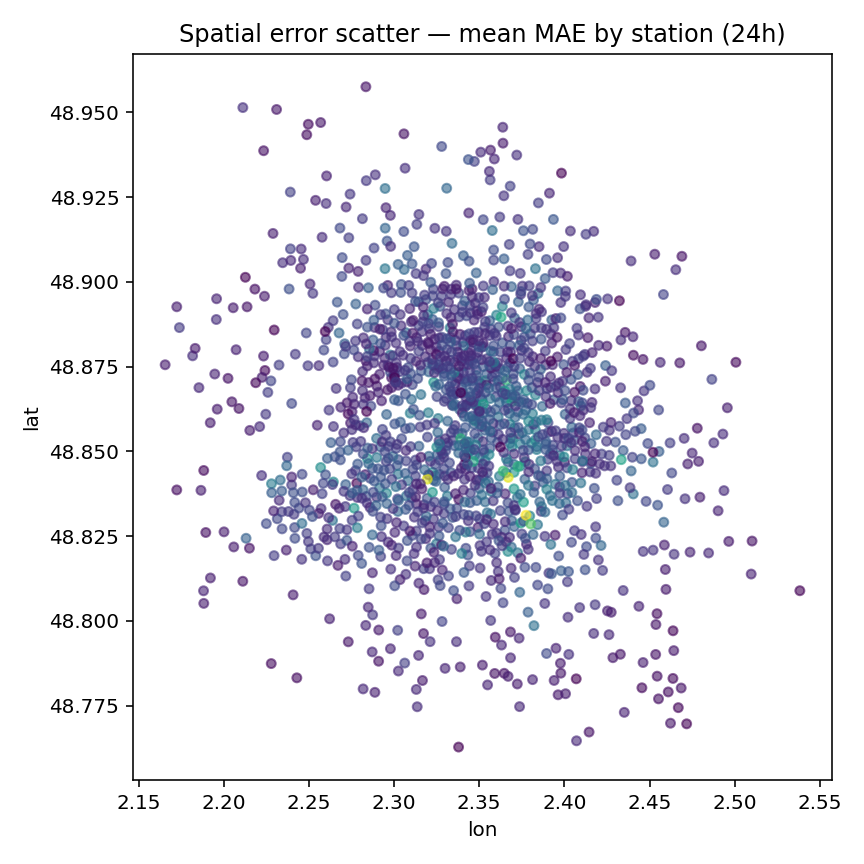
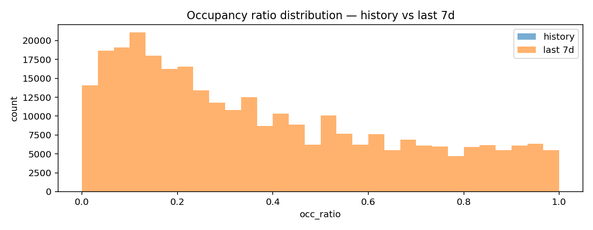

# Métriques détaillées

- **MAE 24h**: 3.94  
- **RMSE 24h**: 5.83  
- **MAE 7j**: 4.87  
- **RMSE 7j**: 7.15  

## Séries temporelles

## Top erreurs (24h)

## Erreur spatiale (scatter 24h)

## Distributions occupation

