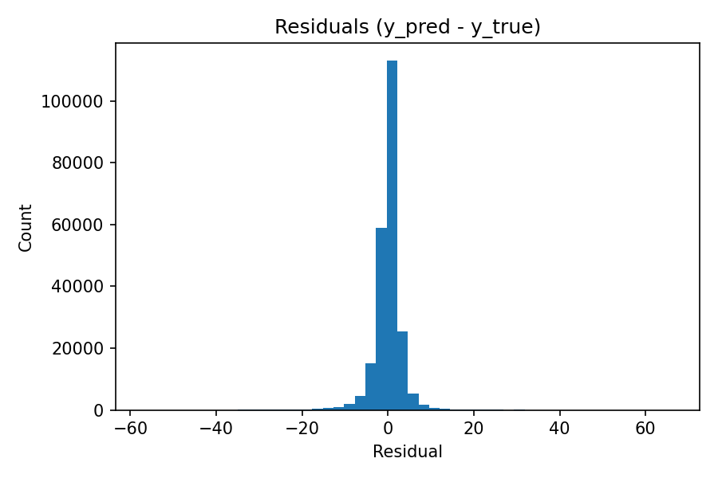

# Performance des prévisions

## Métriques par horizon

## Observé vs Prédit (agrégé sur 7 jours)

## Focus station (24h)

## Heatmap des erreurs (MAE heure × jour)

## Distribution des résidus

## Biais moyen horaire

## Calibration (prédit vs observé par bin)

