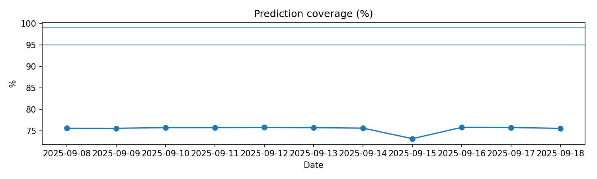

# Santé du modèle

MAE/RMSE/lift, calibration, couverture.

## Figures

- `../assets/tables/monitoring/model_health/alerts_summary.csv`
- `../assets/tables/monitoring/model_health/calibration_by_hour_7d.csv`
- `../assets/tables/monitoring/model_health/calibration_global_7d.csv`
- `../assets/tables/monitoring/model_health/coverage_j1_j7_j28.csv`
- `../assets/tables/monitoring/model_health/daily_metrics.csv`
- `../assets/tables/monitoring/model_health/error_by_cluster_7d.csv`
- `../assets/tables/monitoring/model_health/error_by_hour_7d.csv`
- `../assets/tables/monitoring/model_health/error_by_station_7d.csv`
- `../assets/tables/monitoring/model_health/residuals_acf.csv`
- `../assets/tables/monitoring/model_health/top_degrading_stations.csv`
- `../assets/tables/monitoring/model_health/window_metrics.csv`

