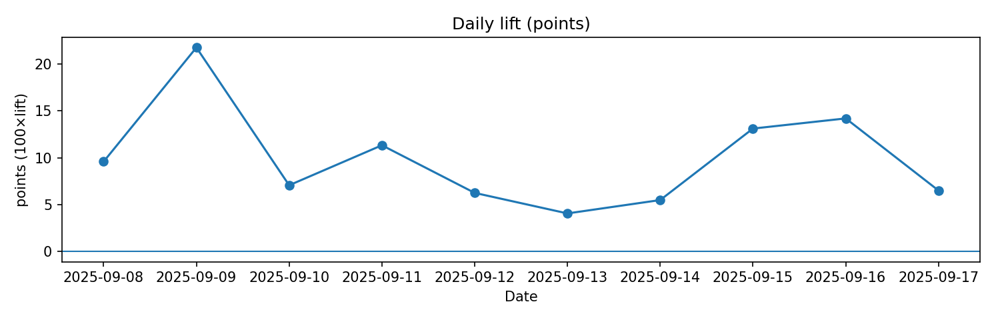

# Santé du modèle

**Objectif.** Surveiller la **performance dans le temps**, la **calibration** et la **couverture** des prédictions, pour décider d’un **ré-entraînement** ou d’un **fallback**.

## Questions auxquelles la page répond
- L’erreur (MAE/RMSE) se **dégrade-t-elle** ? Où (heures, clusters, zones) ?
- Le **lift** vs baseline reste-t-il positif et stable ?
- La **calibration** est-elle correcte globalement et par segments ?
- La **couverture** (`% y_pred` disponible) est-elle conforme ?

## Indicateurs clés
- **MAE / RMSE / biais** par jour et par segments (heure, station, cluster, zone).
- **Lift** vs persistance = `(MAE_base − MAE_model) / MAE_base`.
- **Calibration** : pente/intercept `y_true ~ y_pred` (global & segments).
- **Couverture prédictive** : part d’horodatages avec `y_pred`.
- **Stabilité résiduelle** : variance des résidus, auto-corrélation.

---

## Résumé rapide (fenêtres récentes)
- **Fenêtre 7j** — MAE: **2.892**, Lift: **0.091**, Couverture: **75.40%**  
- **Fenêtre 28j** — MAE: **2.952**, Lift: **0.100**, Couverture: **75.45%**  
- **Dernier jour** — Couverture prédictive: **75.79%**  
- **Alertes** : Dégradation — · Couverture — · Calibration ⚠️ · Fallback — · Gating retrain —

> **Plage temporelle analysée** : 2025-09-07T23:00:00 → 2025-09-17T17:45:00 (timezone: **Europe/Paris**) · Horizon: **60 min** · Série quotidienne exportée: **14 jours**

---

## Visualisations
### Séries (MAE / lift / couverture)

### Calibration (pente β par heure, 7j)

### Stabilité des résidus

### Top stations en dégradation

### Carte d’erreur (7 derniers jours)

  <iframe src="../../assets/maps/model_error_by_station_7d.html" style="width:100%;height:520px;border:0" loading="lazy" title="Carte erreur 7j"></iframe>

<a href="../../assets/maps/model_error_by_station_7d.html" target="_blank" rel="noopener">Ouvrir la carte dans un nouvel onglet ↗</a>

---

## Téléchargements & tables
- **Fenêtres** : `../../assets/tables/monitoring/model_health/window_metrics.csv`
- **Jours** : `../../assets/tables/monitoring/model_health/daily_metrics.csv`
- **Segments 7j** : stations `../../assets/tables/monitoring/model_health/error_by_station_7d.csv`, heures `../../assets/tables/monitoring/model_health/error_by_hour_7d.csv`, clusters `../../assets/tables/monitoring/model_health/error_by_cluster_7d.csv`
- **Calibration** : global `../../assets/tables/monitoring/model_health/calibration_global_7d.csv` ; par heure `../../assets/tables/monitoring/model_health/calibration_by_hour_7d.csv`
- **Couverture** : `../../assets/tables/monitoring/model_health/coverage_j1_j7_j28.csv`
- **ACF résidus** : `../../assets/tables/monitoring/model_health/residuals_acf.csv`
- **Top dégradations** : `../../assets/tables/monitoring/model_health/top_degrading_stations.csv`
- **Synthèse alertes** : `../../assets/tables/monitoring/model_health/alerts_summary.csv`

---

## Seuils / Politiques (par défaut)
- **Dégradation** : MAE_7j − MAE_28j > 10 % **et** lift_7j < lift_28j − 5 pts → **Alerte**.
- **Couverture** : < 99 % sur J-1 → **Alerte**.
- **Calibration** : |pente−1| > 0,1 **ou** |intercept| > 0,5 → **Alerte**.
- **Gating ré-entraînement** : 3 alertes “Dégradation” sur 10 jours → **Planifier retrain**.
- **Fallback** : couverture < 95 % **ou** lift < 0 sur 3 jours → activer **baseline** le temps du correctif.

> **Limites** — La performance agrégée peut masquer des **poches locales** de dégradation → toujours lire les découpages.
