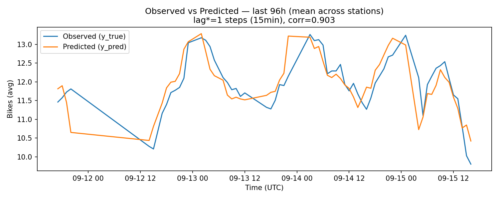
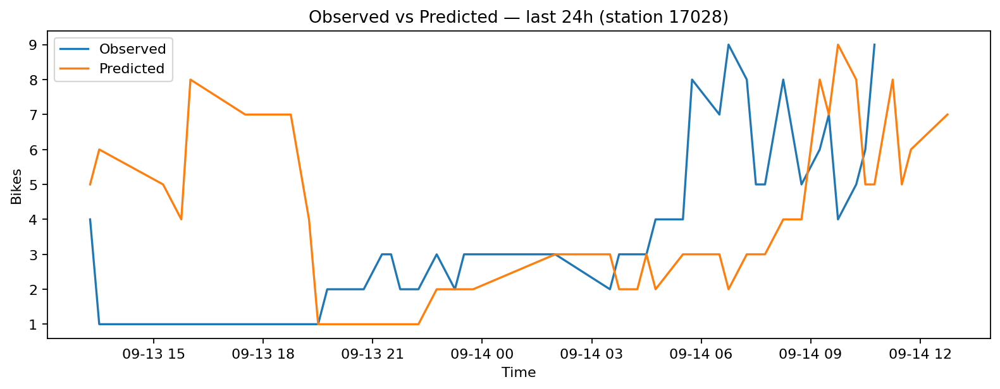

# Modèle & cible

- **Pas de temps** : 15 min ; **Horizon par défaut** : +60 min.
- `y_true` : observation réelle à T+H (reconstruite si absente).
- `y_pred` : prédiction à T+H (baseline naïve si pas de modèle).

## Observé vs Prédit (agrégé)

## Focus station (24h)

