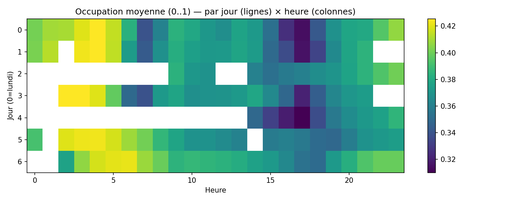
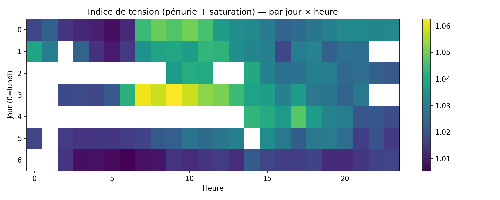

# Dynamiques spatio-temporelles

Heatmaps h×j, saisons, vagues de tension.

## Figures

- `../assets/tables/network/dynamics/by_zone.csv`
- `../assets/tables/network/dynamics/episodes.csv`
- `../assets/tables/network/dynamics/regularity_today.csv`
- `../assets/tables/network/dynamics/tension_by_station.csv`

