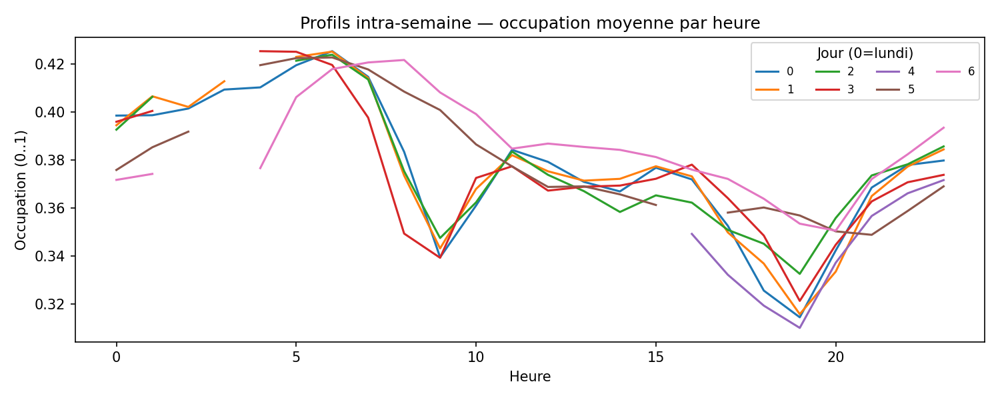
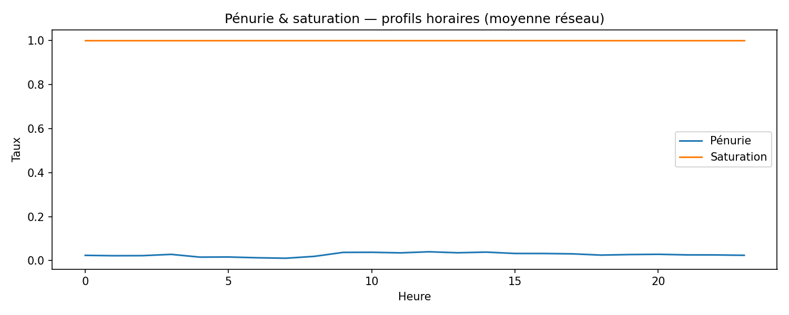
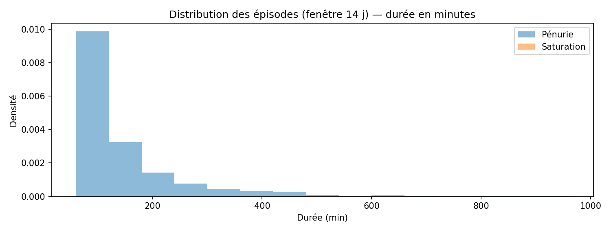
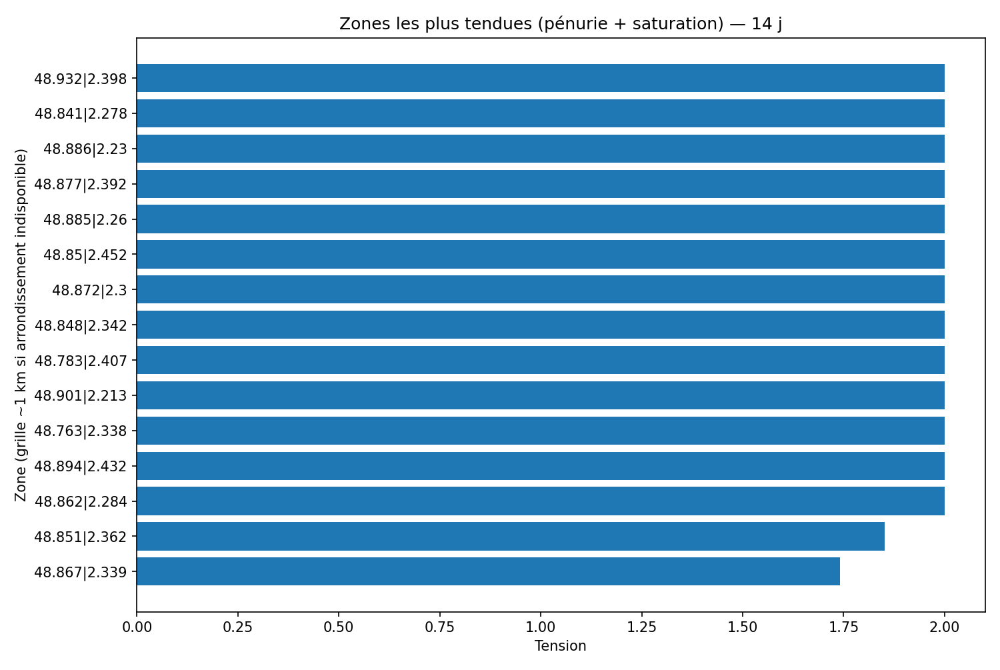

# Dynamiques spatio-temporelles

## 3) Dynamiques spatio-temporelles (ce que vous trouverez dans `dynamics.md`)

### Objectif
Mettre en évidence les **rythmes** et **déplacements de pression** dans la ville.

### Analyses proposées
- **Heatmaps hxj** (par station et agrégées) : intensité des vélos disponibles ou du taux de pénurie, par heure du jour et jour de semaine.  
- **Saisonnalité courte/longue** :  
  - **Intra-semaine** (lundi->dimanche) : comparaison des profils typiques.  
  - **Intra-année** (si historique suffisant) : effet météo/vacances (qualitatif), glissements de pics.  
- **Cartes temporelles animées** (ou séquences d'instantanés) pour suivre la **vague de saturation -> pénurie** sur une journée type.  
- **Flux intra-urbains (qualitatif)** : lecture conjointe des zones qui passent de saturation à pénurie avec un décalage horaire (indication de "courant" de déplacement).

### Indicateurs & méthodes
- **Indice de tension** par station : `penurie_rate + saturation_rate` (14 jours).  
- **Score de régularité** : corrélation de la journée en cours à la journée type (90 derniers jours).  
- **Détection d'épisodes** : séquences >= X pas en pénurie/saturation (morphologie binaire).  
- **Agrégations spatiales** : par arrondissement/quartier (moyennes pondérées par capacité).

### Lecture & limites
- Les heatmaps mettent à nu la **récurrence** des phénomènes ; elles n'expliquent pas la cause (météo, événements).  
- Les "flux" sont déduits **visuellement** par co-évolution des zones ; ils ne sont pas des trajectoires individuelles.

---

## Vues générées (auto)

### Heatmaps hebdomadaires

### Profils intra-semaine

### Pénurie / Saturation - profils horaires

### Distribution des épisodes (14 j)

### Zones les plus tendues (14 j)

### Carte temporelle (dernière journée locale)

  <iframe src="../../assets/maps/network_lastday.html" style="width:100%;height:520px;border:0" loading="lazy" title="Carte temporelle du réseau (dernière journée)"></iframe>

### Tables d'appui
- **Tension par station** (14 j) : `../../assets/tables/network/dynamics/tension_by_station.csv`  
- **Régularité - aujourd'hui vs journée-type** : `../../assets/tables/network/dynamics/regularity_today.csv`  
- **Épisodes pénurie/saturation** (14 j) : `../../assets/tables/network/dynamics/episodes.csv`  
- **Agrégations par zone** (14 j) : `../../assets/tables/network/dynamics/by_zone.csv`

---

## Valeur analytique de la section "Réseau"
- **Opérationnel** : repérer rapidement les zones à surveiller (redispatch).  
- **Stratégique** : comprendre les **archétypes d'usage** et leur évolution (clustering).  
- **Communication** : visualisations pédagogiques pour le grand public (profil 24 h, cartes).

### Bonnes pratiques de lecture
- Toujours croiser **pénurie** et **saturation** (les deux faces d'un déséquilibre).  
- Un **taux de disponibilité élevé** ne signifie pas faible tension : regarder la **volatilité**.  
- Les **clusters** aident à comparer *des stations comparables* entre elles.
