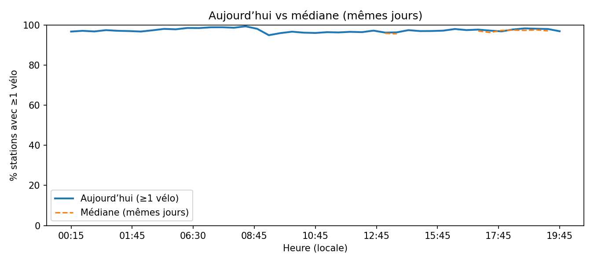

# Aperçu du réseau

Cette page donne un **coup d’œil instantané** à la santé du réseau (snapshot le plus récent) et situe la **journée en cours** par rapport aux semaines précédentes.

!!! tip "Ce que vous verrez"
    - **Carte instantanée** des stations avec indicateurs *pénurie* (0 vélo) / *saturation* (0 place).  
    - **Courbe "Aujourd’hui vs médiane (mêmes jours)"** : part de stations offrant ≥1 vélo, minute par minute.  
    - **KPIs** de disponibilité, couverture et volatilité, avec **tables** d’appui (CSV).

---

## Carte instantanée (pénurie / saturation)
<div style="margin: 0.5rem 0;">
  <iframe src="../assets/maps/network_overview.html"
          style="width:100%;height:520px;border:0" loading="lazy"
          title="Carte instantanée du réseau"></iframe>
</div>

- **Couleurs** : rouge = *pénurie* (0 vélo), noir = *saturation* (0 place), bleu = OK/autre.  
- **Astuce** : zoomez et survolez pour voir le nom, l’ID et les valeurs instantanées.

---

## Courbe « Aujourd’hui vs médiane (mêmes jours) »



> La courbe trace la **part de stations** avec ≥1 vélo à chaque **hh:mm locale** pour **aujourd’hui**, et la compare à la **médiane** des mêmes jours des semaines récentes (fenêtre de référence).  
> Méthode : agrégation par hh:mm, puis médiane inter-jours sur la fenêtre *N* semaines.  
> (Voir la section *Méthodologie* plus bas.)

---

## KPIs & distributions (CSV)
- `../assets/tables/network/overview/kpis_today.csv`
- `../assets/tables/network/overview/kpis_today.json`
- `../assets/tables/network/overview/snapshot_distribution.csv`
- `../assets/tables/network/overview/stations_tension_last_days.csv`


Fichiers typiques :
- **`kpis_today.csv` / `.json`** :  
  stations actives/offline, disponibilité vélo/place, taux de **pénurie/saturation**, **couverture** récente et **volatilité** intra-journée.
- **`snapshot_distribution.csv`** :  
  part (%) instantanée : `bike_avail` (≥1 vélo), `dock_avail` (≥1 place), `penury` (=0 vélo), `saturation` (=0 place).
- **`stations_tension_last_days.csv`** *(si `--last-days > 0`)* :  
  *taux* de pénurie/saturation sur la fenêtre récente, par station, pour repérer les **zones sous tension**.

---

## Définitions rapides (indicateurs)
- **Disponibilité vélo** = `1[bikes > 0]` (part de stations offrant au moins 1 vélo).  
- **Disponibilité place** = `1[docks_avail > 0]` (si la colonne existe dans la source).  
- **Taux de pénurie** = part de stations avec `bikes == 0`.  
- **Taux de saturation** = part de stations avec `docks_avail == 0` (si dispo).  
- **Couverture (fenêtre récente)** = part d’horodatages valides (présents) sur la période `--last-days`.  
- **Volatilité intra-journée** = écart-type des vélos dispos **dans la journée en cours**, agrégé multi-stations.

---

## Méthodologie (résumé)
- **Source** : `docs/exports/events.parquet` (timestamps arrondis **15 min**).  
- **Lecture des colonnes** : détection souple (`bikes` / `nb_velos_bin` / `velos_disponibles`, etc.) et normalisation `station_id`, `ts`.  
- **Snapshot map** : dernier `ts` ; marqueurs colorés selon pénurie/saturation ; centre carte = médiane lat/lon du snapshot.  
- **Courbe “aujourd’hui vs médiane”** :  
  1) on calcule pour chaque `ts` la **part de stations** avec `bikes>0`,  
  2) on regroupe par **hh:mm locale** (Europe/Paris) et on moyenne,  
  3) on trace la série du jour, et la **médiane** des jours de même **weekday** dans la fenêtre récente.  
- **Fenêtre récente (tables tension)** : `--last-days` jours (ex : 7) ; calcul des taux par station et tri décroissant.  

---

## Lecture & limites
!!! note "À garder en tête"
    - Les indicateurs de disponibilité sont **structurels** (présence/absence) et **indépendants** d’une capacité exacte.  
    - Une station peut être très utilisée **sans** tomber souvent à 0 vélo **ou** 0 place → elle apparaît “saine”.  
    - Coupures réseau/maintenance peuvent fausser la vision sur quelques heures (couverture plus basse).  
    - `docks_avail` n’est pas toujours publié par la source → les métriques “place/saturation” peuvent être `NaN`.

---

## Paramètres de build (rappel)
- CLI :  
  ```bash
  python tools/build_network_overview.py \
    --events docs/exports/events.parquet \
    --last-days 7 \
    --tz Europe/Paris
ations_tension_last_days.csv` : stations avec taux de pénurie/saturation élevés sur la fenêtre récente.
