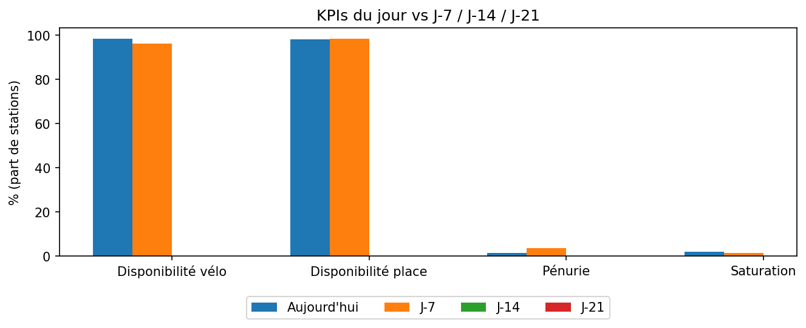
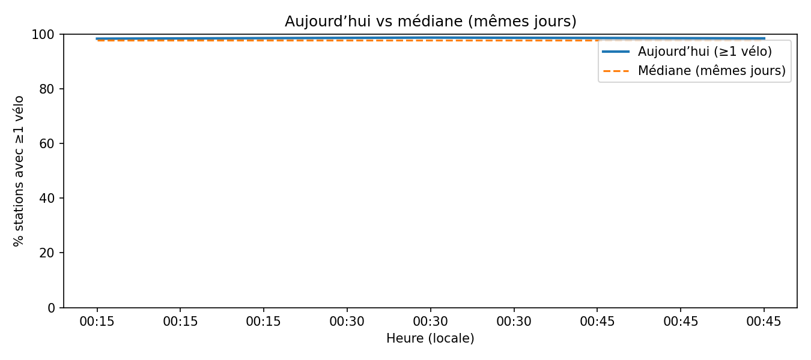

# Aperçu du réseau

Cette page donne un **coup d’œil instantané** à la santé du réseau (snapshot le plus récent) et situe la **journée en cours** par rapport aux semaines précédentes.

## KPIs (snapshot 2025-09-18 00:45:00+02:00)
- **Stations actives** : **1335** / **1473** (offline : 138)
- **Disponibilité vélo** : **98.43%**
- **Disponibilité place** : **98.20%**  
- **Taux de pénurie** : **1.57%** · **Taux de saturation** : **1.80%**
- **Couverture récente** (sur 14 j) : **89.65%**
- **Volatilité intra-journée** (écart-type vélos / station, médiane) : **0.82**

---

## Carte instantanée (pénurie / saturation)

  <iframe src="../../assets/maps/network_overview.html" style="width:100%;height:520px;border:0" loading="lazy" title="Carte instantanée du réseau"></iframe>

---

## KPIs du jour vs J-7 / J-14 / J-21

> Comparaison des **parts de stations** (sur la **journée locale entière**) :  
> disponibilité vélo/place, pénurie, saturation. Les barres J-7/J-14/J-21
> sont calculées sur les journées locales correspondantes.

---

## Courbe « Aujourd’hui vs médiane (mêmes jours) »

> La courbe trace la **part de stations** avec ≥1 vélo à chaque **hh:mm locale** pour **aujourd’hui**, et la compare à la **médiane** des mêmes jours sur 28 jours.

---

## Tables d’appui
- KPIs (CSV/JSON) :  
  - `../../assets/tables/network/overview/kpis_today.csv`  
  - `../../assets/tables/network/overview/kpis_today.json`
- Distribution instantanée : `../../assets/tables/network/overview/snapshot_distribution.csv`
- Stations en tension (sur 14 j) : `../../assets/tables/network/overview/stations_tension_last_days.csv`

---

## Méthodologie (résumé)
- **Source** : `docs/exports/events.parquet` (timestamps **15 min** UTC naïfs).  
- **Snapshot** : dernier `ts` ; pénurie = `bikes == 0` ; saturation = `docks_avail == 0` (ou `capacity - bikes == 0` si `docks_avail` absent).  
- **Couverture** : moyenne station de `#ts_observés / #ts_total` sur la fenêtre **14 jours**.  
- **Volatilité** : écart-type des vélos par station sur la **journée locale courante**, médiane des stations.  
- **Courbe** : part(≥1 vélo) par hh:mm pour aujourd’hui vs **médiane** des mêmes **weekday** sur **28 jours**.

> Limites : si `docks_avail` n’est pas disponible, les métriques “place/saturation” sont approximées via `capacity - bikes`.

