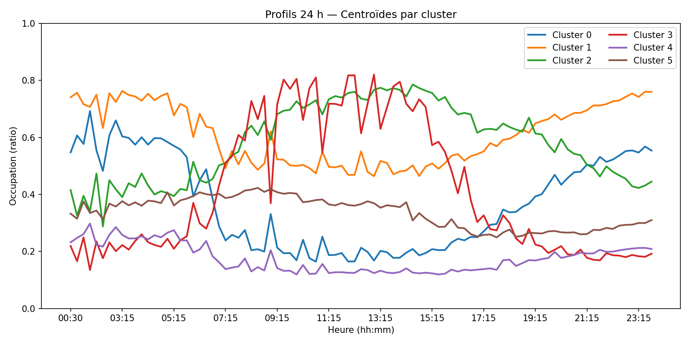
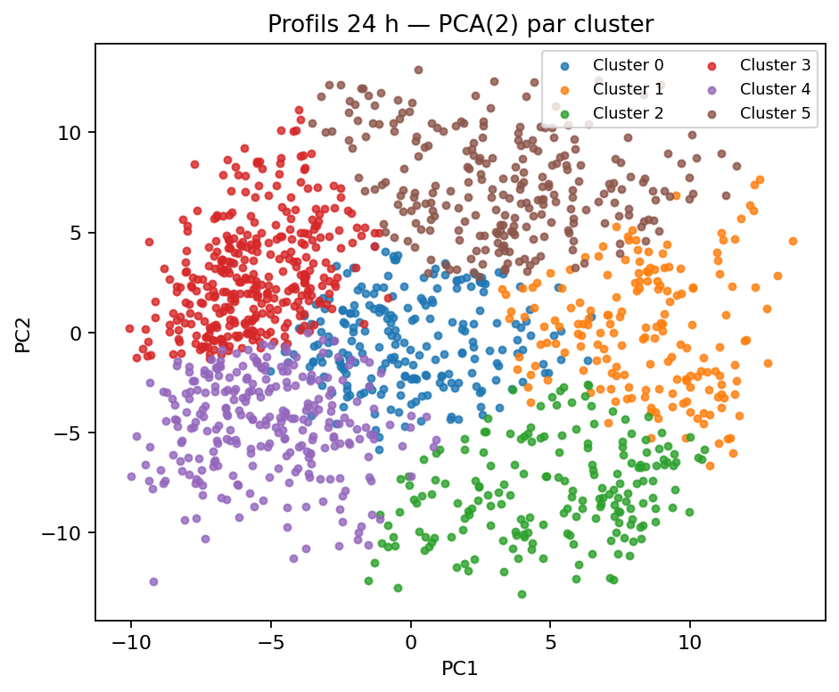

# Stations & profils

Table filtrable, fiches station, **clustering** (k-means/HDBSCAN).

## Figures

- `../assets/tables/network/stations/cluster_centroids_24h.csv`
- `../assets/tables/network/stations/cluster_distribution.csv`
- `../assets/tables/network/stations/clustering_summary.json`
- `../assets/tables/network/stations/selection_volatility.csv`
- `../assets/tables/network/stations/station_clusters.csv`
- `../assets/tables/network/stations/station_stats_30d.csv`
- `../assets/tables/network/stations/station_stats_7d.csv`

