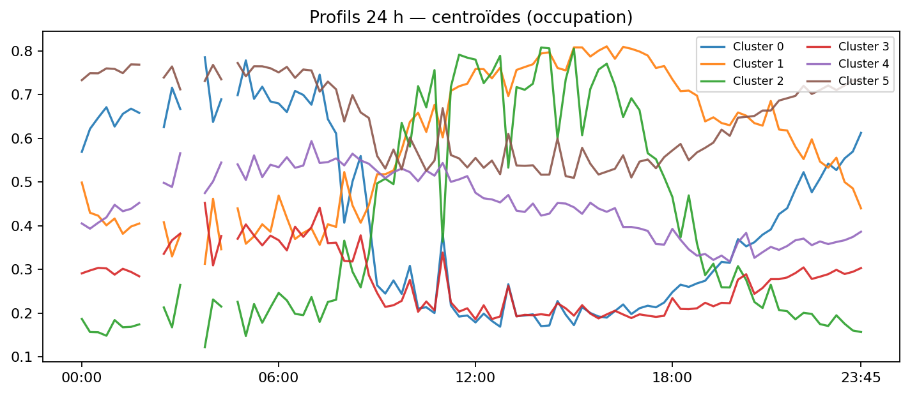

# Stations & profils

Cette page permet une **exploration fine station par station** (tables filtrables) et présente des **profils comportementaux** du réseau via clustering.

---

## 1) Table exploratoire (7 j / 30 j)

- **Colonnes** : ID, nom, **capacité estimée**, % pénurie / % saturation (**7 & 30 jours**), **volatilité** (σ vélos), **couverture**, **distance au centre**, **cluster**.  
- **Tri/filtre** : top pénuries / saturations, variabilité, cluster, zone.

**Téléchargements** :
- 7 jours : `../../assets/tables/network/stations/station_stats_7d.csv`
- 30 jours : `../../assets/tables/network/stations/station_stats_30d.csv`
- Clusters par station : `../../assets/tables/network/stations/station_clusters.csv`  
- Distribution des clusters : `../../assets/tables/network/stations/cluster_distribution.csv`  
- Centroïdes 24 h (CSV) : `../../assets/tables/network/stations/cluster_centroids_24h.csv`  
- Résumé clustering (JSON) : `../../assets/tables/network/stations/clustering_summary.json`

---

## 2) Fiches station (liens depuis la table)

Chaque station peut avoir une fiche dédiée (optionnel) :  
**Sparkline 7 j**, **profil 24 h typique** (médiane / 15 min), **heatmap h×j** récente, et **indicateurs** (pénurie/saturation 7 & 30 j, volatilité, couverture, événements).

---

## 3) Carte des clusters

  <iframe src="../../assets/maps/network_stations_clusters.html" style="width:100%;height:520px;border:0" loading="lazy" title="Carte des stations par cluster"></iframe>

> Couleur = cluster ; taille ≈ capacité estimée.

---

## 4) Profils 24 h — centroïdes par cluster

## 5) Projection PCA(2) des profils

> La PCA ne sert **qu'à visualiser** la séparation des groupes ; le clustering se fait sur **l’espace complet (96 points)**.

---

## 6) Sélection d’exemples (volatility)
`../../assets/tables/network/stations/selection_volatility.csv`

---

## 7) Clustering — méthodologie détaillée

**Objectif.** Regrouper les stations par **similarité d’usage** pour révéler des archétypes (résidentiel, pôle d’emplois, gares, loisirs…).

**Variables (features).**
- **Profil 24 h** (96 pas de 15 min) : médiane d’**occupation** `bikes / capacity_est` sur ~28 jours, **centré-réduit**.
- **Amplitude/variabilité** : écart-type quotidien, plage min-max normalisée.
- **Asymétries temporelles** : ratios matin/soir, semaine/week-end.
- **Contexte léger** (optionnel) : capacité, distance centre, altitude.

**Pré-traitement.**
- **Standardisation** (moyenne 0, écart-type 1) sur les profils.
- **PCA (2D)** uniquement pour la figure — pas pour l’algorithme.

**Algorithmes.**
- **K-Means** par défaut, *k* choisi empiriquement (coude) + **Silhouette** / **Davies-Bouldin**.  
- **HDBSCAN** en option quand la densité varie beaucoup (gère le **bruit** sans imposer *k*).

**Attribution & stabilité.**
- Scores internes : **Silhouette = 0.178**, **Davies-Bouldin = 1.570** (k=6, n=1458).  
- **Bootstrap** par semaines pour vérifier la stabilité (optionnel).  
- **Centroïdes** publiés (courbes moyennes par cluster) comme *comportements-types*.  
- Signalement des stations **frontières** (incertitude) possible.

**Étiquettes interprétables (exemples).**
- **Résidentiel nocturne** : haut la nuit, baisse le matin, remonte le soir.  
- **Pôle d’emplois** : bas la nuit, pic d’arrivée le matin, vidage fin de journée.  
- **Transport / gares** : fortes oscillations synchronisées aux pointes.  
- **Touristique / loisirs** : week-end marqué, milieux de journée élevés.

> **Limites.** Le clustering **décrit** des usages, il ne **prédit** pas. Les groupes évoluent avec la saison, travaux, événements — **recalcul périodique** prévu.

---

## 8) Mémo technique
- **Source** : `docs/exports/events.parquet`, pas de 15 min.  
- **Capacité estimée** : priorité à `capacity_src`, sinon quantile 0.98 de `(bikes + docks_avail)` si dispo, sinon 0.98 de `bikes`.  
- **Pénurie / Saturation** : `bikes == 0` / (`docks_avail == 0` ou `capacity - bikes == 0`).  
- **Couverture** : `#bins observés / #bins attendus` sur 14 j.  
- **Volatilité** : σ des vélos par station sur la journée locale, médiane des stations.

