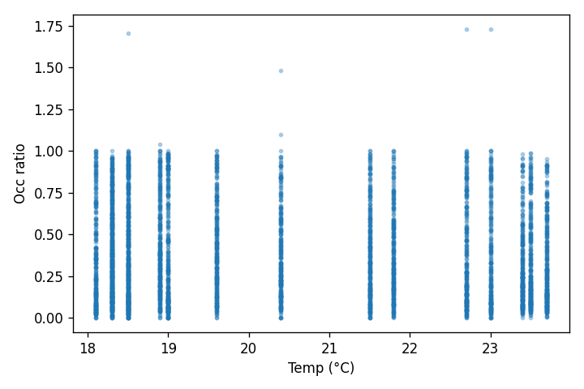

# Results

**Snapshots**: 62444  •  **Stations**: 1453  •  **Last (UTC)**: 2025-09-08 13:14:00.136692

**Historique couvert** : 2025-09-08 01:00:00+02:00 → 2025-09-08 15:00:00+02:00  
**Stations** : 1453  
*(Heure affichée : Europe/Paris)*

## Example (historique + forecast 24h)

## Corrélation simple
Relation occ_ratio vs. température (échantillon)

## Top 10 stations les plus volatiles
|   stationcode | name                           |   std_occ |
|--------------:|:-------------------------------|----------:|
|         21021 | Enfants du Paradis - Peupliers |     0.501 |
|         15056 | Place Balard                   |     0.499 |
|         33019 | Madeleine Vionnet              |     0.477 |
|          9023 | Laffitte - Italiens            |     0.458 |
|          8049 | Georges V - François 1er       |     0.448 |
|          8103 | Artois - Berri                 |     0.447 |
|         15125 | Parc Suzanne Lenglen           |     0.444 |
|         16201 | Porte Dauphine                 |     0.442 |
|         12105 | Bercy - Villot                 |     0.435 |
|         11026 | Chemin Vert - Saint-Maur       |     0.429 |

## Exports
- [Prévision 24h (CSV)](exports/velib_forecast_24h.csv)
- [Occupations horaires (échantillon CSV)](exports/velib_hourly.csv)