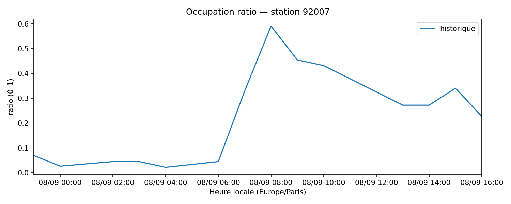

# Results

**Snapshots**: 59538  •  **Stations**: 1453  •  **Last (UTC)**: 2025-09-08 10:41:43.659754

**Historique couvert** : 2025-09-08 01:00:00+02:00 → 2025-09-08 12:00:00+02:00  
**Stations** : 1453  
*(Heure affichée : Europe/Paris)*

## Example (historique + forecast 24h)

## Top 10 stations les plus volatiles
|   stationcode | name                           |   std_occ |
|--------------:|:-------------------------------|----------:|
|         15056 | Place Balard                   |     0.497 |
|         33019 | Madeleine Vionnet              |     0.478 |
|         21021 | Enfants du Paradis - Peupliers |     0.473 |
|         12105 | Bercy - Villot                 |     0.447 |
|          8103 | Artois - Berri                 |     0.447 |
|          9023 | Laffitte - Italiens            |     0.442 |
|         15125 | Parc Suzanne Lenglen           |     0.442 |
|         16201 | Porte Dauphine                 |     0.437 |
|          8049 | Georges V - François 1er       |     0.433 |
|         15058 | Place du Moulin de Javel       |     0.428 |

## Exports
- [Prévision 24h (CSV)](exports/velib_forecast_24h.csv)
- [Occupations horaires (échantillon CSV)](exports/velib_hourly.csv)