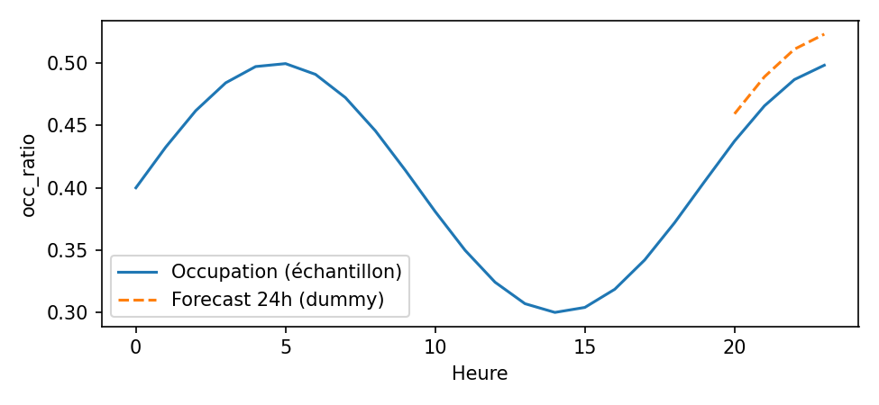
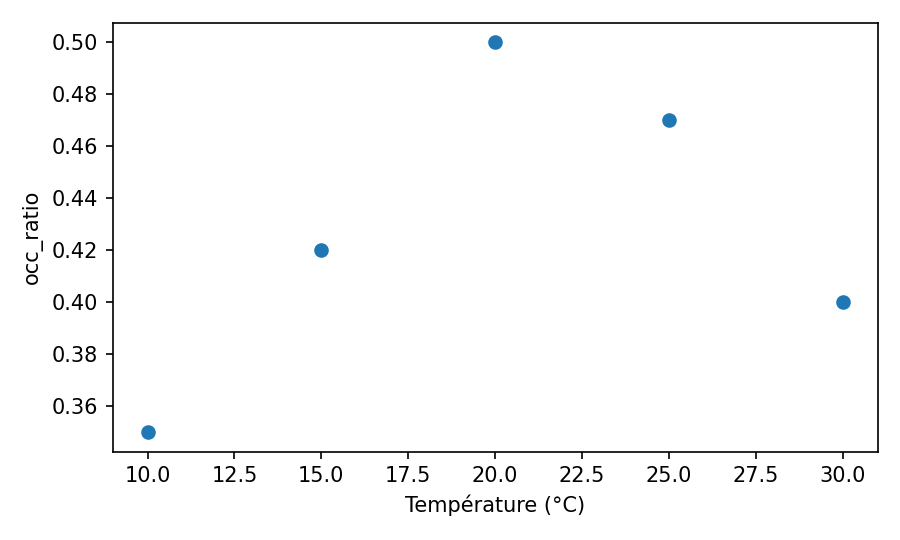

# Results

## Exemple (historique + forecast 24h)

{ width=100% }

Historique agrégé + horizon 24h (échantillon de stations).

## Corrélation simple

{ width=100% }

Relation occupation vs température (échantillon horaire).

## Top 10 stations les plus volatiles

|   stationcode | name                           |   std_occ |
|--------------:|:-------------------------------|----------:|
|         21021 | Enfants du Paradis - Peupliers |     0.501 |
|         15056 | Place Balard                   |     0.46  |

## Carte (dernier snapshot)

<iframe src="data:text/html;charset=utf-8;base64,PCFET0NUWVBFIGh0bWw+CjxodG1sPgo8aGVhZD4KICAgIAogICAgPG1ldGEgaHR0cC1lcXVpdj0iY29udGVudC10eXBlIiBjb250ZW50PSJ0ZXh0L2h0bWw7IGNoYXJzZXQ9VVRGLTgiIC8+CiAgICA8c2NyaXB0IHNyYz0iaHR0cHM6Ly9jZG4uanNkZWxpdnIubmV0L25wbS9sZWFmbGV0QDEuOS4zL2Rpc3QvbGVhZmxldC5qcyI+PC9zY3JpcHQ+CiAgICA8c2NyaXB0IHNyYz0iaHR0cHM6Ly9jb2RlLmpxdWVyeS5jb20vanF1ZXJ5LTMuNy4xLm1pbi5qcyI+PC9zY3JpcHQ+CiAgICA8c2NyaXB0IHNyYz0iaHR0cHM6Ly9jZG4uanNkZWxpdnIubmV0L25wbS9ib290c3RyYXBANS4yLjIvZGlzdC9qcy9ib290c3RyYXAuYnVuZGxlLm1pbi5qcyI+PC9zY3JpcHQ+CiAgICA8c2NyaXB0IHNyYz0iaHR0cHM6Ly9jZG5qcy5jbG91ZGZsYXJlLmNvbS9hamF4L2xpYnMvTGVhZmxldC5hd2Vzb21lLW1hcmtlcnMvMi4wLjIvbGVhZmxldC5hd2Vzb21lLW1hcmtlcnMuanMiPjwvc2NyaXB0PgogICAgPGxpbmsgcmVsPSJzdHlsZXNoZWV0IiBocmVmPSJodHRwczovL2Nkbi5qc2RlbGl2ci5uZXQvbnBtL2xlYWZsZXRAMS45LjMvZGlzdC9sZWFmbGV0LmNzcyIvPgogICAgPGxpbmsgcmVsPSJzdHlsZXNoZWV0IiBocmVmPSJodHRwczovL2Nkbi5qc2RlbGl2ci5uZXQvbnBtL2Jvb3RzdHJhcEA1LjIuMi9kaXN0L2Nzcy9ib290c3RyYXAubWluLmNzcyIvPgogICAgPGxpbmsgcmVsPSJzdHlsZXNoZWV0IiBocmVmPSJodHRwczovL25ldGRuYS5ib290c3RyYXBjZG4uY29tL2Jvb3RzdHJhcC8zLjAuMC9jc3MvYm9vdHN0cmFwLWdseXBoaWNvbnMuY3NzIi8+CiAgICA8bGluayByZWw9InN0eWxlc2hlZXQiIGhyZWY9Imh0dHBzOi8vY2RuLmpzZGVsaXZyLm5ldC9ucG0vQGZvcnRhd2Vzb21lL2ZvbnRhd2Vzb21lLWZyZWVANi4yLjAvY3NzL2FsbC5taW4uY3NzIi8+CiAgICA8bGluayByZWw9InN0eWxlc2hlZXQiIGhyZWY9Imh0dHBzOi8vY2RuanMuY2xvdWRmbGFyZS5jb20vYWpheC9saWJzL0xlYWZsZXQuYXdlc29tZS1tYXJrZXJzLzIuMC4yL2xlYWZsZXQuYXdlc29tZS1tYXJrZXJzLmNzcyIvPgogICAgPGxpbmsgcmVsPSJzdHlsZXNoZWV0IiBocmVmPSJodHRwczovL2Nkbi5qc2RlbGl2ci5uZXQvZ2gvcHl0aG9uLXZpc3VhbGl6YXRpb24vZm9saXVtL2ZvbGl1bS90ZW1wbGF0ZXMvbGVhZmxldC5hd2Vzb21lLnJvdGF0ZS5taW4uY3NzIi8+CiAgICAKICAgICAgICAgICAgPG1ldGEgbmFtZT0idmlld3BvcnQiIGNvbnRlbnQ9IndpZHRoPWRldmljZS13aWR0aCwKICAgICAgICAgICAgICAgIGluaXRpYWwtc2NhbGU9MS4wLCBtYXhpbXVtLXNjYWxlPTEuMCwgdXNlci1zY2FsYWJsZT1ubyIgLz4KICAgICAgICAgICAgPHN0eWxlPgogICAgICAgICAgICAgICAgI21hcF9lYzhkMzQ3NTNjODY1YTk2MjdiZjFhODEyODA0NWUxOCB7CiAgICAgICAgICAgICAgICAgICAgcG9zaXRpb246IHJlbGF0aXZlOwogICAgICAgICAgICAgICAgICAgIHdpZHRoOiAxMDAuMCU7CiAgICAgICAgICAgICAgICAgICAgaGVpZ2h0OiAxMDAuMCU7CiAgICAgICAgICAgICAgICAgICAgbGVmdDogMC4wJTsKICAgICAgICAgICAgICAgICAgICB0b3A6IDAuMCU7CiAgICAgICAgICAgICAgICB9CiAgICAgICAgICAgICAgICAubGVhZmxldC1jb250YWluZXIgeyBmb250LXNpemU6IDFyZW07IH0KICAgICAgICAgICAgPC9zdHlsZT4KCiAgICAgICAgICAgIDxzdHlsZT5odG1sLCBib2R5IHsKICAgICAgICAgICAgICAgIHdpZHRoOiAxMDAlOwogICAgICAgICAgICAgICAgaGVpZ2h0OiAxMDAlOwogICAgICAgICAgICAgICAgbWFyZ2luOiAwOwogICAgICAgICAgICAgICAgcGFkZGluZzogMDsKICAgICAgICAgICAgfQogICAgICAgICAgICA8L3N0eWxlPgoKICAgICAgICAgICAgPHN0eWxlPiNtYXAgewogICAgICAgICAgICAgICAgcG9zaXRpb246YWJzb2x1dGU7CiAgICAgICAgICAgICAgICB0b3A6MDsKICAgICAgICAgICAgICAgIGJvdHRvbTowOwogICAgICAgICAgICAgICAgcmlnaHQ6MDsKICAgICAgICAgICAgICAgIGxlZnQ6MDsKICAgICAgICAgICAgICAgIH0KICAgICAgICAgICAgPC9zdHlsZT4KCiAgICAgICAgICAgIDxzY3JpcHQ+CiAgICAgICAgICAgICAgICBMX05PX1RPVUNIID0gZmFsc2U7CiAgICAgICAgICAgICAgICBMX0RJU0FCTEVfM0QgPSBmYWxzZTsKICAgICAgICAgICAgPC9zY3JpcHQ+CgogICAgICAgIAo8L2hlYWQ+Cjxib2R5PgogICAgCiAgICAKICAgICAgICAgICAgPGRpdiBjbGFzcz0iZm9saXVtLW1hcCIgaWQ9Im1hcF9lYzhkMzQ3NTNjODY1YTk2MjdiZjFhODEyODA0NWUxOCIgPjwvZGl2PgogICAgICAgIAogICAgCiAgICA8ZGl2IHN0eWxlPSJwb3NpdGlvbjogZml4ZWQ7IGJvdHRvbTogMjBweDsgbGVmdDogMjBweDsgei1pbmRleDogOTk5OTsgYmFja2dyb3VuZDogd2hpdGU7CiAgICBwYWRkaW5nOiA4cHggMTBweDsgYm9yZGVyLXJhZGl1czogOHB4OyBib3gtc2hhZG93OiAwIDJweCAxMHB4IHJnYmEoMCwwLDAsLjE1KTsKICAgIGZvbnQtZmFtaWx5OiBzeXN0ZW0tdWk7IGZvbnQtc2l6ZTogMTJweDsiPgogICAgICA8Yj5PY2N1cGF0aW9uIChvY2NfcmF0aW8pPC9iPjxicj4KICAgICAgPHNwYW4gc3R5bGU9ImRpc3BsYXk6aW5saW5lLWJsb2NrO3dpZHRoOjEwcHg7aGVpZ2h0OjEwcHg7YmFja2dyb3VuZDojMmVjYzcxO2JvcmRlci1yYWRpdXM6NTAlO21hcmdpbi1yaWdodDo2cHg7Ij48L3NwYW4+ICZsdDsgMC4yMDxicj4KICAgICAgPHNwYW4gc3R5bGU9ImRpc3BsYXk6aW5saW5lLWJsb2NrO3dpZHRoOjEwcHg7aGVpZ2h0OjEwcHg7YmFja2dyb3VuZDojZjFjNDBmO2JvcmRlci1yYWRpdXM6NTAlO21hcmdpbi1yaWdodDo2cHg7Ij48L3NwYW4+IDAuMjDigJMwLjgwPGJyPgogICAgICA8c3BhbiBzdHlsZT0iZGlzcGxheTppbmxpbmUtYmxvY2s7d2lkdGg6MTBweDtoZWlnaHQ6MTBweDtiYWNrZ3JvdW5kOiNlNzRjM2M7Ym9yZGVyLXJhZGl1czo1MCU7bWFyZ2luLXJpZ2h0OjZweDsiPjwvc3Bhbj4gJmd0OyAwLjgwCiAgICA8L2Rpdj4KICAgIAo8L2JvZHk+CjxzY3JpcHQ+CiAgICAKICAgIAogICAgICAgICAgICB2YXIgbWFwX2VjOGQzNDc1M2M4NjVhOTYyN2JmMWE4MTI4MDQ1ZTE4ID0gTC5tYXAoCiAgICAgICAgICAgICAgICAibWFwX2VjOGQzNDc1M2M4NjVhOTYyN2JmMWE4MTI4MDQ1ZTE4IiwKICAgICAgICAgICAgICAgIHsKICAgICAgICAgICAgICAgICAgICBjZW50ZXI6IFs0OC44NTY2LCAyLjM1MjJdLAogICAgICAgICAgICAgICAgICAgIGNyczogTC5DUlMuRVBTRzM4NTcsCiAgICAgICAgICAgICAgICAgICAgLi4uewogICJ6b29tIjogMTIsCiAgInpvb21Db250cm9sIjogdHJ1ZSwKICAicHJlZmVyQ2FudmFzIjogZmFsc2UsCn0KCiAgICAgICAgICAgICAgICB9CiAgICAgICAgICAgICk7CgogICAgICAgICAgICAKCiAgICAgICAgCiAgICAKICAgICAgICAgICAgdmFyIHRpbGVfbGF5ZXJfNjgwMGExYjA3NGQyMWE2ZDk3MmE1MzcwMmRkNTgxMDYgPSBMLnRpbGVMYXllcigKICAgICAgICAgICAgICAgICJodHRwczovL3tzfS5iYXNlbWFwcy5jYXJ0b2Nkbi5jb20vbGlnaHRfYWxsL3t6fS97eH0ve3l9e3J9LnBuZyIsCiAgICAgICAgICAgICAgICB7CiAgIm1pblpvb20iOiAwLAogICJtYXhab29tIjogMjAsCiAgIm1heE5hdGl2ZVpvb20iOiAyMCwKICAibm9XcmFwIjogZmFsc2UsCiAgImF0dHJpYnV0aW9uIjogIlx1MDAyNmNvcHk7IFx1MDAzY2EgaHJlZj1cImh0dHBzOi8vd3d3Lm9wZW5zdHJlZXRtYXAub3JnL2NvcHlyaWdodFwiXHUwMDNlT3BlblN0cmVldE1hcFx1MDAzYy9hXHUwMDNlIGNvbnRyaWJ1dG9ycyBcdTAwMjZjb3B5OyBcdTAwM2NhIGhyZWY9XCJodHRwczovL2NhcnRvLmNvbS9hdHRyaWJ1dGlvbnNcIlx1MDAzZUNBUlRPXHUwMDNjL2FcdTAwM2UiLAogICJzdWJkb21haW5zIjogImFiY2QiLAogICJkZXRlY3RSZXRpbmEiOiBmYWxzZSwKICAidG1zIjogZmFsc2UsCiAgIm9wYWNpdHkiOiAxLAp9CgogICAgICAgICAgICApOwogICAgICAgIAogICAgCiAgICAgICAgICAgIHRpbGVfbGF5ZXJfNjgwMGExYjA3NGQyMWE2ZDk3MmE1MzcwMmRkNTgxMDYuYWRkVG8obWFwX2VjOGQzNDc1M2M4NjVhOTYyN2JmMWE4MTI4MDQ1ZTE4KTsKICAgICAgICAKICAgIAogICAgICAgICAgICB2YXIgY2lyY2xlX21hcmtlcl9jNDQ4MTFmMTU5NjNmMzA1ZDJmYzY2ZDhjYzQ3NDJmYiA9IEwuY2lyY2xlTWFya2VyKAogICAgICAgICAgICAgICAgWzQ4Ljg3MDc3NDM2MDI0LCAyLjM0OTY0OTYzNjgzMjddLAogICAgICAgICAgICAgICAgeyJidWJibGluZ01vdXNlRXZlbnRzIjogdHJ1ZSwgImNvbG9yIjogbnVsbCwgImRhc2hBcnJheSI6IG51bGwsICJkYXNoT2Zmc2V0IjogbnVsbCwgImZpbGwiOiB0cnVlLCAiZmlsbENvbG9yIjogIiNmMWM0MGYiLCAiZmlsbE9wYWNpdHkiOiAwLjgsICJmaWxsUnVsZSI6ICJldmVub2RkIiwgImxpbmVDYXAiOiAicm91bmQiLCAibGluZUpvaW4iOiAicm91bmQiLCAib3BhY2l0eSI6IDEuMCwgInJhZGl1cyI6IDcuMCwgInN0cm9rZSI6IHRydWUsICJ3ZWlnaHQiOiAzfQogICAgICAgICAgICApLmFkZFRvKG1hcF9lYzhkMzQ3NTNjODY1YTk2MjdiZjFhODEyODA0NWUxOCk7CiAgICAgICAgCiAgICAKICAgICAgICB2YXIgcG9wdXBfMDBiMDMyYmJiZWYwMjIzZWY4M2Q5OWU4NTI0NmIxNmIgPSBMLnBvcHVwKHsKICAibWF4V2lkdGgiOiAiMTAwJSIsCn0pOwoKICAgICAgICAKICAgICAgICAgICAgCiAgICAgICAgICAgICAgICB2YXIgaHRtbF9lODI0NzIzMWYyNWUxNzAwODFhZDM3OGUyOWJhNzdiZSA9ICQoYDxkaXYgaWQ9Imh0bWxfZTgyNDcyMzFmMjVlMTcwMDgxYWQzNzhlMjliYTc3YmUiIHN0eWxlPSJ3aWR0aDogMTAwLjAlOyBoZWlnaHQ6IDEwMC4wJTsiPlN0YXRpb24gMTAwMDMuMCDigJQgb2NjIDAuNTA8L2Rpdj5gKVswXTsKICAgICAgICAgICAgICAgIHBvcHVwXzAwYjAzMmJiYmVmMDIyM2VmODNkOTllODUyNDZiMTZiLnNldENvbnRlbnQoaHRtbF9lODI0NzIzMWYyNWUxNzAwODFhZDM3OGUyOWJhNzdiZSk7CiAgICAgICAgICAgIAogICAgICAgIAoKICAgICAgICBjaXJjbGVfbWFya2VyX2M0NDgxMWYxNTk2M2YzMDVkMmZjNjZkOGNjNDc0MmZiLmJpbmRQb3B1cChwb3B1cF8wMGIwMzJiYmJlZjAyMjNlZjgzZDk5ZTg1MjQ2YjE2YikKICAgICAgICA7CgogICAgICAgIAogICAgCiAgICAKICAgICAgICAgICAgdmFyIGNpcmNsZV9tYXJrZXJfM2ExMDhhZDM4ZTliMjZmMzc2Y2Q0YmE3YWNjMTQ4YWQgPSBMLmNpcmNsZU1hcmtlcigKICAgICAgICAgICAgICAgIFs0OC44NzA4OTMsIDIuMzUzNTIxXSwKICAgICAgICAgICAgICAgIHsiYnViYmxpbmdNb3VzZUV2ZW50cyI6IHRydWUsICJjb2xvciI6IG51bGwsICJkYXNoQXJyYXkiOiBudWxsLCAiZGFzaE9mZnNldCI6IG51bGwsICJmaWxsIjogdHJ1ZSwgImZpbGxDb2xvciI6ICIjZjFjNDBmIiwgImZpbGxPcGFjaXR5IjogMC44LCAiZmlsbFJ1bGUiOiAiZXZlbm9kZCIsICJsaW5lQ2FwIjogInJvdW5kIiwgImxpbmVKb2luIjogInJvdW5kIiwgIm9wYWNpdHkiOiAxLjAsICJyYWRpdXMiOiA3LjAsICJzdHJva2UiOiB0cnVlLCAid2VpZ2h0IjogM30KICAgICAgICAgICAgKS5hZGRUbyhtYXBfZWM4ZDM0NzUzYzg2NWE5NjI3YmYxYTgxMjgwNDVlMTgpOwogICAgICAgIAogICAgCiAgICAgICAgdmFyIHBvcHVwXzQxNGQ0ZjVlZGQwY2UyMzI4Njk4MGRjMWE4ODllOWMxID0gTC5wb3B1cCh7CiAgIm1heFdpZHRoIjogIjEwMCUiLAp9KTsKCiAgICAgICAgCiAgICAgICAgICAgIAogICAgICAgICAgICAgICAgdmFyIGh0bWxfNDA3MDRmOWRmZTRiYmZmZWFjN2UxZjEyNzgwMWFhNWYgPSAkKGA8ZGl2IGlkPSJodG1sXzQwNzA0ZjlkZmU0YmJmZmVhYzdlMWYxMjc4MDFhYTVmIiBzdHlsZT0id2lkdGg6IDEwMC4wJTsgaGVpZ2h0OiAxMDAuMCU7Ij5TdGF0aW9uIDEwMDA0LjAg4oCUIG9jYyAwLjUwPC9kaXY+YClbMF07CiAgICAgICAgICAgICAgICBwb3B1cF80MTRkNGY1ZWRkMGNlMjMyODY5ODBkYzFhODg5ZTljMS5zZXRDb250ZW50KGh0bWxfNDA3MDRmOWRmZTRiYmZmZWFjN2UxZjEyNzgwMWFhNWYpOwogICAgICAgICAgICAKICAgICAgICAKCiAgICAgICAgY2lyY2xlX21hcmtlcl8zYTEwOGFkMzhlOWIyNmYzNzZjZDRiYTdhY2MxNDhhZC5iaW5kUG9wdXAocG9wdXBfNDE0ZDRmNWVkZDBjZTIzMjg2OTgwZGMxYTg4OWU5YzEpCiAgICAgICAgOwoKICAgICAgICAKICAgIAogICAgCiAgICAgICAgICAgIHZhciBjaXJjbGVfbWFya2VyXzhhMTM5MGFiYjk4ZDY2NDIzMWY3NDQ3MmFhN2JkYTM0ID0gTC5jaXJjbGVNYXJrZXIoCiAgICAgICAgICAgICAgICBbNDguODczOTcyMTcyMzczNjgsIDIuMzQ4Mzg4NzU3NTA0Nzc2XSwKICAgICAgICAgICAgICAgIHsiYnViYmxpbmdNb3VzZUV2ZW50cyI6IHRydWUsICJjb2xvciI6IG51bGwsICJkYXNoQXJyYXkiOiBudWxsLCAiZGFzaE9mZnNldCI6IG51bGwsICJmaWxsIjogdHJ1ZSwgImZpbGxDb2xvciI6ICIjZjFjNDBmIiwgImZpbGxPcGFjaXR5IjogMC44LCAiZmlsbFJ1bGUiOiAiZXZlbm9kZCIsICJsaW5lQ2FwIjogInJvdW5kIiwgImxpbmVKb2luIjogInJvdW5kIiwgIm9wYWNpdHkiOiAxLjAsICJyYWRpdXMiOiA3LjAsICJzdHJva2UiOiB0cnVlLCAid2VpZ2h0IjogM30KICAgICAgICAgICAgKS5hZGRUbyhtYXBfZWM4ZDM0NzUzYzg2NWE5NjI3YmYxYTgxMjgwNDVlMTgpOwogICAgICAgIAogICAgCiAgICAgICAgdmFyIHBvcHVwXzA3OTU2OWRlN2Y0ZDI4Yzk4MTAxNzZmYmYyYjIxZjQ2ID0gTC5wb3B1cCh7CiAgIm1heFdpZHRoIjogIjEwMCUiLAp9KTsKCiAgICAgICAgCiAgICAgICAgICAgIAogICAgICAgICAgICAgICAgdmFyIGh0bWxfMzFiNzA3ZWU5NWRhYjZmYjhjMmQxYzNmNjU2NzI4NDUgPSAkKGA8ZGl2IGlkPSJodG1sXzMxYjcwN2VlOTVkYWI2ZmI4YzJkMWMzZjY1NjcyODQ1IiBzdHlsZT0id2lkdGg6IDEwMC4wJTsgaGVpZ2h0OiAxMDAuMCU7Ij5TdGF0aW9uIDEwMDA1LjAg4oCUIG9jYyAwLjUwPC9kaXY+YClbMF07CiAgICAgICAgICAgICAgICBwb3B1cF8wNzk1NjlkZTdmNGQyOGM5ODEwMTc2ZmJmMmIyMWY0Ni5zZXRDb250ZW50KGh0bWxfMzFiNzA3ZWU5NWRhYjZmYjhjMmQxYzNmNjU2NzI4NDUpOwogICAgICAgICAgICAKICAgICAgICAKCiAgICAgICAgY2lyY2xlX21hcmtlcl84YTEzOTBhYmI5OGQ2NjQyMzFmNzQ0NzJhYTdiZGEzNC5iaW5kUG9wdXAocG9wdXBfMDc5NTY5ZGU3ZjRkMjhjOTgxMDE3NmZiZjJiMjFmNDYpCiAgICAgICAgOwoKICAgICAgICAKICAgIAogICAgCiAgICAgICAgICAgIHZhciBjaXJjbGVfbWFya2VyX2E0ODg1MTcyYjM5Zjk1NTYyNjYyMzA0YmJjODcwMGE1ID0gTC5jaXJjbGVNYXJrZXIoCiAgICAgICAgICAgICAgICBbNDguODcyODcxMjA1ODk4MzEsIDIuMzU0MjE1MDg1NTA2NDRdLAogICAgICAgICAgICAgICAgeyJidWJibGluZ01vdXNlRXZlbnRzIjogdHJ1ZSwgImNvbG9yIjogbnVsbCwgImRhc2hBcnJheSI6IG51bGwsICJkYXNoT2Zmc2V0IjogbnVsbCwgImZpbGwiOiB0cnVlLCAiZmlsbENvbG9yIjogIiNmMWM0MGYiLCAiZmlsbE9wYWNpdHkiOiAwLjgsICJmaWxsUnVsZSI6ICJldmVub2RkIiwgImxpbmVDYXAiOiAicm91bmQiLCAibGluZUpvaW4iOiAicm91bmQiLCAib3BhY2l0eSI6IDEuMCwgInJhZGl1cyI6IDcuMCwgInN0cm9rZSI6IHRydWUsICJ3ZWlnaHQiOiAzfQogICAgICAgICAgICApLmFkZFRvKG1hcF9lYzhkMzQ3NTNjODY1YTk2MjdiZjFhODEyODA0NWUxOCk7CiAgICAgICAgCiAgICAKICAgICAgICB2YXIgcG9wdXBfOWY0YTgwY2FkZmIzZWIxY2IyZTA1OTgxOTc1MDJmMzcgPSBMLnBvcHVwKHsKICAibWF4V2lkdGgiOiAiMTAwJSIsCn0pOwoKICAgICAgICAKICAgICAgICAgICAgCiAgICAgICAgICAgICAgICB2YXIgaHRtbF80ZmQ5ZDY2NmIwN2I5YzI0ZTg0MDRhMGU3YWFiNTZlYiA9ICQoYDxkaXYgaWQ9Imh0bWxfNGZkOWQ2NjZiMDdiOWMyNGU4NDA0YTBlN2FhYjU2ZWIiIHN0eWxlPSJ3aWR0aDogMTAwLjAlOyBoZWlnaHQ6IDEwMC4wJTsiPlN0YXRpb24gMTAwMDYuMCDigJQgb2NjIDAuNTA8L2Rpdj5gKVswXTsKICAgICAgICAgICAgICAgIHBvcHVwXzlmNGE4MGNhZGZiM2ViMWNiMmUwNTk4MTk3NTAyZjM3LnNldENvbnRlbnQoaHRtbF80ZmQ5ZDY2NmIwN2I5YzI0ZTg0MDRhMGU3YWFiNTZlYik7CiAgICAgICAgICAgIAogICAgICAgIAoKICAgICAgICBjaXJjbGVfbWFya2VyX2E0ODg1MTcyYjM5Zjk1NTYyNjYyMzA0YmJjODcwMGE1LmJpbmRQb3B1cChwb3B1cF85ZjRhODBjYWRmYjNlYjFjYjJlMDU5ODE5NzUwMmYzNykKICAgICAgICA7CgogICAgICAgIAogICAgCiAgICAKICAgICAgICAgICAgdmFyIGNpcmNsZV9tYXJrZXJfYjhjYWEzNWU5ODcwZGY3YTIxNGYxNTkyMjZhZTYzMjggPSBMLmNpcmNsZU1hcmtlcigKICAgICAgICAgICAgICAgIFs0OC44NzA3MDI0MjM1NTQzMSwgMi4zNTg3Mzk4NjM5MDA4NDVdLAogICAgICAgICAgICAgICAgeyJidWJibGluZ01vdXNlRXZlbnRzIjogdHJ1ZSwgImNvbG9yIjogbnVsbCwgImRhc2hBcnJheSI6IG51bGwsICJkYXNoT2Zmc2V0IjogbnVsbCwgImZpbGwiOiB0cnVlLCAiZmlsbENvbG9yIjogIiNmMWM0MGYiLCAiZmlsbE9wYWNpdHkiOiAwLjgsICJmaWxsUnVsZSI6ICJldmVub2RkIiwgImxpbmVDYXAiOiAicm91bmQiLCAibGluZUpvaW4iOiAicm91bmQiLCAib3BhY2l0eSI6IDEuMCwgInJhZGl1cyI6IDcuMCwgInN0cm9rZSI6IHRydWUsICJ3ZWlnaHQiOiAzfQogICAgICAgICAgICApLmFkZFRvKG1hcF9lYzhkMzQ3NTNjODY1YTk2MjdiZjFhODEyODA0NWUxOCk7CiAgICAgICAgCiAgICAKICAgICAgICB2YXIgcG9wdXBfMGVlMjIwYjZhZjZjYzAwNTk3M2QzMDUwYTA4NjQ4MzYgPSBMLnBvcHVwKHsKICAibWF4V2lkdGgiOiAiMTAwJSIsCn0pOwoKICAgICAgICAKICAgICAgICAgICAgCiAgICAgICAgICAgICAgICB2YXIgaHRtbF81YTg3YjA1MmM2YzRkN2E5MTU4ZjY1ODcwOWEzYjVhNyA9ICQoYDxkaXYgaWQ9Imh0bWxfNWE4N2IwNTJjNmM0ZDdhOTE1OGY2NTg3MDlhM2I1YTciIHN0eWxlPSJ3aWR0aDogMTAwLjAlOyBoZWlnaHQ6IDEwMC4wJTsiPlN0YXRpb24gMTAwMDguMCDigJQgb2NjIDAuNTA8L2Rpdj5gKVswXTsKICAgICAgICAgICAgICAgIHBvcHVwXzBlZTIyMGI2YWY2Y2MwMDU5NzNkMzA1MGEwODY0ODM2LnNldENvbnRlbnQoaHRtbF81YTg3YjA1MmM2YzRkN2E5MTU4ZjY1ODcwOWEzYjVhNyk7CiAgICAgICAgICAgIAogICAgICAgIAoKICAgICAgICBjaXJjbGVfbWFya2VyX2I4Y2FhMzVlOTg3MGRmN2EyMTRmMTU5MjI2YWU2MzI4LmJpbmRQb3B1cChwb3B1cF8wZWUyMjBiNmFmNmNjMDA1OTczZDMwNTBhMDg2NDgzNikKICAgICAgICA7CgogICAgICAgIAogICAgCiAgICAKICAgICAgICAgICAgdmFyIGNpcmNsZV9tYXJrZXJfNGNjMjFmYzEwOGM4NzExNTU2NzU5MDIyZGNhNDhhODMgPSBMLmNpcmNsZU1hcmtlcigKICAgICAgICAgICAgICAgIFs0OC44NzIwODk0NDk5MDcsIDIuMzU3NTgyNTk4OTI0Nl0sCiAgICAgICAgICAgICAgICB7ImJ1YmJsaW5nTW91c2VFdmVudHMiOiB0cnVlLCAiY29sb3IiOiBudWxsLCAiZGFzaEFycmF5IjogbnVsbCwgImRhc2hPZmZzZXQiOiBudWxsLCAiZmlsbCI6IHRydWUsICJmaWxsQ29sb3IiOiAiI2YxYzQwZiIsICJmaWxsT3BhY2l0eSI6IDAuOCwgImZpbGxSdWxlIjogImV2ZW5vZGQiLCAibGluZUNhcCI6ICJyb3VuZCIsICJsaW5lSm9pbiI6ICJyb3VuZCIsICJvcGFjaXR5IjogMS4wLCAicmFkaXVzIjogNy4wLCAic3Ryb2tlIjogdHJ1ZSwgIndlaWdodCI6IDN9CiAgICAgICAgICAgICkuYWRkVG8obWFwX2VjOGQzNDc1M2M4NjVhOTYyN2JmMWE4MTI4MDQ1ZTE4KTsKICAgICAgICAKICAgIAogICAgICAgIHZhciBwb3B1cF8yM2IxMTEyMDgyZjQ1YTRiOWFlMDFjNDlmNDQ0OTdlZiA9IEwucG9wdXAoewogICJtYXhXaWR0aCI6ICIxMDAlIiwKfSk7CgogICAgICAgIAogICAgICAgICAgICAKICAgICAgICAgICAgICAgIHZhciBodG1sXzk4M2YyZDU0MGE2MWIyZTRlOWEyMjY4ODlmMWY3NDVkID0gJChgPGRpdiBpZD0iaHRtbF85ODNmMmQ1NDBhNjFiMmU0ZTlhMjI2ODg5ZjFmNzQ1ZCIgc3R5bGU9IndpZHRoOiAxMDAuMCU7IGhlaWdodDogMTAwLjAlOyI+U3RhdGlvbiAxMDAwOS4wIOKAlCBvY2MgMC41MDwvZGl2PmApWzBdOwogICAgICAgICAgICAgICAgcG9wdXBfMjNiMTExMjA4MmY0NWE0YjlhZTAxYzQ5ZjQ0NDk3ZWYuc2V0Q29udGVudChodG1sXzk4M2YyZDU0MGE2MWIyZTRlOWEyMjY4ODlmMWY3NDVkKTsKICAgICAgICAgICAgCiAgICAgICAgCgogICAgICAgIGNpcmNsZV9tYXJrZXJfNGNjMjFmYzEwOGM4NzExNTU2NzU5MDIyZGNhNDhhODMuYmluZFBvcHVwKHBvcHVwXzIzYjExMTIwODJmNDVhNGI5YWUwMWM0OWY0NDQ5N2VmKQogICAgICAgIDsKCiAgICAgICAgCiAgICAKICAgIAogICAgICAgICAgICB2YXIgY2lyY2xlX21hcmtlcl82ZTJkMmYzOTNmODAxZGE2Y2Y4NjJmMTFlZTBlNzJhNiA9IEwuY2lyY2xlTWFya2VyKAogICAgICAgICAgICAgICAgWzQ4Ljg1NzA1ODczOTExMSwgMi4zNDE3OTgyODM5NDM5XSwKICAgICAgICAgICAgICAgIHsiYnViYmxpbmdNb3VzZUV2ZW50cyI6IHRydWUsICJjb2xvciI6IG51bGwsICJkYXNoQXJyYXkiOiBudWxsLCAiZGFzaE9mZnNldCI6IG51bGwsICJmaWxsIjogdHJ1ZSwgImZpbGxDb2xvciI6ICIjZjFjNDBmIiwgImZpbGxPcGFjaXR5IjogMC44LCAiZmlsbFJ1bGUiOiAiZXZlbm9kZCIsICJsaW5lQ2FwIjogInJvdW5kIiwgImxpbmVKb2luIjogInJvdW5kIiwgIm9wYWNpdHkiOiAxLjAsICJyYWRpdXMiOiA3LjAsICJzdHJva2UiOiB0cnVlLCAid2VpZ2h0IjogM30KICAgICAgICAgICAgKS5hZGRUbyhtYXBfZWM4ZDM0NzUzYzg2NWE5NjI3YmYxYTgxMjgwNDVlMTgpOwogICAgICAgIAogICAgCiAgICAgICAgdmFyIHBvcHVwXzZiNzVjNWVmZGMwMmVmZTI2NWUyYTEwOWJmNGE1OTg3ID0gTC5wb3B1cCh7CiAgIm1heFdpZHRoIjogIjEwMCUiLAp9KTsKCiAgICAgICAgCiAgICAgICAgICAgIAogICAgICAgICAgICAgICAgdmFyIGh0bWxfNmQ3MDBiMzkzMzcxZjdmM2JlY2U3YWEyNDZiNDJmZjQgPSAkKGA8ZGl2IGlkPSJodG1sXzZkNzAwYjM5MzM3MWY3ZjNiZWNlN2FhMjQ2YjQyZmY0IiBzdHlsZT0id2lkdGg6IDEwMC4wJTsgaGVpZ2h0OiAxMDAuMCU7Ij5TdGF0aW9uIDEwMDEuMCDigJQgb2NjIDAuNTA8L2Rpdj5gKVswXTsKICAgICAgICAgICAgICAgIHBvcHVwXzZiNzVjNWVmZGMwMmVmZTI2NWUyYTEwOWJmNGE1OTg3LnNldENvbnRlbnQoaHRtbF82ZDcwMGIzOTMzNzFmN2YzYmVjZTdhYTI0NmI0MmZmNCk7CiAgICAgICAgICAgIAogICAgICAgIAoKICAgICAgICBjaXJjbGVfbWFya2VyXzZlMmQyZjM5M2Y4MDFkYTZjZjg2MmYxMWVlMGU3MmE2LmJpbmRQb3B1cChwb3B1cF82Yjc1YzVlZmRjMDJlZmUyNjVlMmExMDliZjRhNTk4NykKICAgICAgICA7CgogICAgICAgIAogICAgCiAgICAKICAgICAgICAgICAgdmFyIGNpcmNsZV9tYXJrZXJfZWE4MjIyNGM5YzNiMzBhZjU4ZDNiNWMyMTY4NTg3YmQgPSBMLmNpcmNsZU1hcmtlcigKICAgICAgICAgICAgICAgIFs0OC44NzA5NDgyMTg1OTUsIDIuMzYxMjA0OTIyMTk5Ml0sCiAgICAgICAgICAgICAgICB7ImJ1YmJsaW5nTW91c2VFdmVudHMiOiB0cnVlLCAiY29sb3IiOiBudWxsLCAiZGFzaEFycmF5IjogbnVsbCwgImRhc2hPZmZzZXQiOiBudWxsLCAiZmlsbCI6IHRydWUsICJmaWxsQ29sb3IiOiAiI2YxYzQwZiIsICJmaWxsT3BhY2l0eSI6IDAuOCwgImZpbGxSdWxlIjogImV2ZW5vZGQiLCAibGluZUNhcCI6ICJyb3VuZCIsICJsaW5lSm9pbiI6ICJyb3VuZCIsICJvcGFjaXR5IjogMS4wLCAicmFkaXVzIjogNy4wLCAic3Ryb2tlIjogdHJ1ZSwgIndlaWdodCI6IDN9CiAgICAgICAgICAgICkuYWRkVG8obWFwX2VjOGQzNDc1M2M4NjVhOTYyN2JmMWE4MTI4MDQ1ZTE4KTsKICAgICAgICAKICAgIAogICAgICAgIHZhciBwb3B1cF8yYzJjNDAzMGQxZjg1NDAzNWNlMzEwYTJmZDM0OTNkMSA9IEwucG9wdXAoewogICJtYXhXaWR0aCI6ICIxMDAlIiwKfSk7CgogICAgICAgIAogICAgICAgICAgICAKICAgICAgICAgICAgICAgIHZhciBodG1sX2JkNmJlMmY4MzNhZmQ5NTU4MDU5YzYxODg4OGU1YzFmID0gJChgPGRpdiBpZD0iaHRtbF9iZDZiZTJmODMzYWZkOTU1ODA1OWM2MTg4ODhlNWMxZiIgc3R5bGU9IndpZHRoOiAxMDAuMCU7IGhlaWdodDogMTAwLjAlOyI+U3RhdGlvbiAxMDAxMC4wIOKAlCBvY2MgMC41MDwvZGl2PmApWzBdOwogICAgICAgICAgICAgICAgcG9wdXBfMmMyYzQwMzBkMWY4NTQwMzVjZTMxMGEyZmQzNDkzZDEuc2V0Q29udGVudChodG1sX2JkNmJlMmY4MzNhZmQ5NTU4MDU5YzYxODg4OGU1YzFmKTsKICAgICAgICAgICAgCiAgICAgICAgCgogICAgICAgIGNpcmNsZV9tYXJrZXJfZWE4MjIyNGM5YzNiMzBhZjU4ZDNiNWMyMTY4NTg3YmQuYmluZFBvcHVwKHBvcHVwXzJjMmM0MDMwZDFmODU0MDM1Y2UzMTBhMmZkMzQ5M2QxKQogICAgICAgIDsKCiAgICAgICAgCiAgICAKICAgIAogICAgICAgICAgICB2YXIgY2lyY2xlX21hcmtlcl85MTA0ZjZjYjdkMWQ2ODk1NzU4NGE2MmRjMTEwMzg0NSA9IEwuY2lyY2xlTWFya2VyKAogICAgICAgICAgICAgICAgWzQ4Ljg2ODk3NjYzODgyNiwgMi4zNjIzNDM4NTUyMDIyXSwKICAgICAgICAgICAgICAgIHsiYnViYmxpbmdNb3VzZUV2ZW50cyI6IHRydWUsICJjb2xvciI6IG51bGwsICJkYXNoQXJyYXkiOiBudWxsLCAiZGFzaE9mZnNldCI6IG51bGwsICJmaWxsIjogdHJ1ZSwgImZpbGxDb2xvciI6ICIjZjFjNDBmIiwgImZpbGxPcGFjaXR5IjogMC44LCAiZmlsbFJ1bGUiOiAiZXZlbm9kZCIsICJsaW5lQ2FwIjogInJvdW5kIiwgImxpbmVKb2luIjogInJvdW5kIiwgIm9wYWNpdHkiOiAxLjAsICJyYWRpdXMiOiA3LjAsICJzdHJva2UiOiB0cnVlLCAid2VpZ2h0IjogM30KICAgICAgICAgICAgKS5hZGRUbyhtYXBfZWM4ZDM0NzUzYzg2NWE5NjI3YmYxYTgxMjgwNDVlMTgpOwogICAgICAgIAogICAgCiAgICAgICAgdmFyIHBvcHVwX2NjNGQwMTQ0NGZkM2E4NTEzMzg3Y2ZhOTNmZWM5MTkzID0gTC5wb3B1cCh7CiAgIm1heFdpZHRoIjogIjEwMCUiLAp9KTsKCiAgICAgICAgCiAgICAgICAgICAgIAogICAgICAgICAgICAgICAgdmFyIGh0bWxfNGJlYmU4NGE1YTM5NmJiMjdjZDE4NDE3ZDY3MzA3YWIgPSAkKGA8ZGl2IGlkPSJodG1sXzRiZWJlODRhNWEzOTZiYjI3Y2QxODQxN2Q2NzMwN2FiIiBzdHlsZT0id2lkdGg6IDEwMC4wJTsgaGVpZ2h0OiAxMDAuMCU7Ij5TdGF0aW9uIDEwMDExLjAg4oCUIG9jYyAwLjUwPC9kaXY+YClbMF07CiAgICAgICAgICAgICAgICBwb3B1cF9jYzRkMDE0NDRmZDNhODUxMzM4N2NmYTkzZmVjOTE5My5zZXRDb250ZW50KGh0bWxfNGJlYmU4NGE1YTM5NmJiMjdjZDE4NDE3ZDY3MzA3YWIpOwogICAgICAgICAgICAKICAgICAgICAKCiAgICAgICAgY2lyY2xlX21hcmtlcl85MTA0ZjZjYjdkMWQ2ODk1NzU4NGE2MmRjMTEwMzg0NS5iaW5kUG9wdXAocG9wdXBfY2M0ZDAxNDQ0ZmQzYTg1MTMzODdjZmE5M2ZlYzkxOTMpCiAgICAgICAgOwoKICAgICAgICAKICAgIAogICAgCiAgICAgICAgICAgIHZhciBjaXJjbGVfbWFya2VyX2MxNmY3MzAyMWJlZGY4MjIyNzE5ZTgwMmUzMGQ0ZGNiID0gTC5jaXJjbGVNYXJrZXIoCiAgICAgICAgICAgICAgICBbNDguODczMTE2NywgMi4zNTkzMDUyXSwKICAgICAgICAgICAgICAgIHsiYnViYmxpbmdNb3VzZUV2ZW50cyI6IHRydWUsICJjb2xvciI6IG51bGwsICJkYXNoQXJyYXkiOiBudWxsLCAiZGFzaE9mZnNldCI6IG51bGwsICJmaWxsIjogdHJ1ZSwgImZpbGxDb2xvciI6ICIjZjFjNDBmIiwgImZpbGxPcGFjaXR5IjogMC44LCAiZmlsbFJ1bGUiOiAiZXZlbm9kZCIsICJsaW5lQ2FwIjogInJvdW5kIiwgImxpbmVKb2luIjogInJvdW5kIiwgIm9wYWNpdHkiOiAxLjAsICJyYWRpdXMiOiA3LjAsICJzdHJva2UiOiB0cnVlLCAid2VpZ2h0IjogM30KICAgICAgICAgICAgKS5hZGRUbyhtYXBfZWM4ZDM0NzUzYzg2NWE5NjI3YmYxYTgxMjgwNDVlMTgpOwogICAgICAgIAogICAgCiAgICAgICAgdmFyIHBvcHVwXzI3NWE4NzkyZjU1M2MwNDdiZGY2Y2YxMzBhOThhZmUyID0gTC5wb3B1cCh7CiAgIm1heFdpZHRoIjogIjEwMCUiLAp9KTsKCiAgICAgICAgCiAgICAgICAgICAgIAogICAgICAgICAgICAgICAgdmFyIGh0bWxfOWNhY2QwY2QyZGI5YWY2OWZiYzk0MjFkOTQ3NjQwZDEgPSAkKGA8ZGl2IGlkPSJodG1sXzljYWNkMGNkMmRiOWFmNjlmYmM5NDIxZDk0NzY0MGQxIiBzdHlsZT0id2lkdGg6IDEwMC4wJTsgaGVpZ2h0OiAxMDAuMCU7Ij5TdGF0aW9uIDEwMDEyLjAg4oCUIG9jYyAwLjUwPC9kaXY+YClbMF07CiAgICAgICAgICAgICAgICBwb3B1cF8yNzVhODc5MmY1NTNjMDQ3YmRmNmNmMTMwYTk4YWZlMi5zZXRDb250ZW50KGh0bWxfOWNhY2QwY2QyZGI5YWY2OWZiYzk0MjFkOTQ3NjQwZDEpOwogICAgICAgICAgICAKICAgICAgICAKCiAgICAgICAgY2lyY2xlX21hcmtlcl9jMTZmNzMwMjFiZWRmODIyMjcxOWU4MDJlMzBkNGRjYi5iaW5kUG9wdXAocG9wdXBfMjc1YTg3OTJmNTUzYzA0N2JkZjZjZjEzMGE5OGFmZTIpCiAgICAgICAgOwoKICAgICAgICAKICAgIAogICAgCiAgICAgICAgICAgIHZhciBjaXJjbGVfbWFya2VyXzkxZDgzM2I4ZmZhMTE4NGJjZTQ2MzYyYjA4YWZlNGFhID0gTC5jaXJjbGVNYXJrZXIoCiAgICAgICAgICAgICAgICBbNDguODcxMDQ0MDUxOTg0LCAyLjM2NjEwNDQ2MTk4NzhdLAogICAgICAgICAgICAgICAgeyJidWJibGluZ01vdXNlRXZlbnRzIjogdHJ1ZSwgImNvbG9yIjogbnVsbCwgImRhc2hBcnJheSI6IG51bGwsICJkYXNoT2Zmc2V0IjogbnVsbCwgImZpbGwiOiB0cnVlLCAiZmlsbENvbG9yIjogIiNmMWM0MGYiLCAiZmlsbE9wYWNpdHkiOiAwLjgsICJmaWxsUnVsZSI6ICJldmVub2RkIiwgImxpbmVDYXAiOiAicm91bmQiLCAibGluZUpvaW4iOiAicm91bmQiLCAib3BhY2l0eSI6IDEuMCwgInJhZGl1cyI6IDcuMCwgInN0cm9rZSI6IHRydWUsICJ3ZWlnaHQiOiAzfQogICAgICAgICAgICApLmFkZFRvKG1hcF9lYzhkMzQ3NTNjODY1YTk2MjdiZjFhODEyODA0NWUxOCk7CiAgICAgICAgCiAgICAKICAgICAgICB2YXIgcG9wdXBfNDk3Y2UzNzQyYjc4ZTllM2U3N2NiN2QyODYxMjdhZDcgPSBMLnBvcHVwKHsKICAibWF4V2lkdGgiOiAiMTAwJSIsCn0pOwoKICAgICAgICAKICAgICAgICAgICAgCiAgICAgICAgICAgICAgICB2YXIgaHRtbF9mNWY4OTE4ZDU3NzdlMzcwOGRkYmE2ODQ4OTdkYjI4YyA9ICQoYDxkaXYgaWQ9Imh0bWxfZjVmODkxOGQ1Nzc3ZTM3MDhkZGJhNjg0ODk3ZGIyOGMiIHN0eWxlPSJ3aWR0aDogMTAwLjAlOyBoZWlnaHQ6IDEwMC4wJTsiPlN0YXRpb24gMTAwMTMuMCDigJQgb2NjIDAuNTA8L2Rpdj5gKVswXTsKICAgICAgICAgICAgICAgIHBvcHVwXzQ5N2NlMzc0MmI3OGU5ZTNlNzdjYjdkMjg2MTI3YWQ3LnNldENvbnRlbnQoaHRtbF9mNWY4OTE4ZDU3NzdlMzcwOGRkYmE2ODQ4OTdkYjI4Yyk7CiAgICAgICAgICAgIAogICAgICAgIAoKICAgICAgICBjaXJjbGVfbWFya2VyXzkxZDgzM2I4ZmZhMTE4NGJjZTQ2MzYyYjA4YWZlNGFhLmJpbmRQb3B1cChwb3B1cF80OTdjZTM3NDJiNzhlOWUzZTc3Y2I3ZDI4NjEyN2FkNykKICAgICAgICA7CgogICAgICAgIAogICAgCiAgICAKICAgICAgICAgICAgdmFyIGNpcmNsZV9tYXJrZXJfOGU0ODZhMzZhZDMyOGQ3ZmIxNzQ0YWM4ZDFhZGVlMGUgPSBMLmNpcmNsZU1hcmtlcigKICAgICAgICAgICAgICAgIFs0OC44NzE2MjQzMDY5NjI5ODUsIDIuMzYzOTI2NTA4MjczODM0OF0sCiAgICAgICAgICAgICAgICB7ImJ1YmJsaW5nTW91c2VFdmVudHMiOiB0cnVlLCAiY29sb3IiOiBudWxsLCAiZGFzaEFycmF5IjogbnVsbCwgImRhc2hPZmZzZXQiOiBudWxsLCAiZmlsbCI6IHRydWUsICJmaWxsQ29sb3IiOiAiI2YxYzQwZiIsICJmaWxsT3BhY2l0eSI6IDAuOCwgImZpbGxSdWxlIjogImV2ZW5vZGQiLCAibGluZUNhcCI6ICJyb3VuZCIsICJsaW5lSm9pbiI6ICJyb3VuZCIsICJvcGFjaXR5IjogMS4wLCAicmFkaXVzIjogNy4wLCAic3Ryb2tlIjogdHJ1ZSwgIndlaWdodCI6IDN9CiAgICAgICAgICAgICkuYWRkVG8obWFwX2VjOGQzNDc1M2M4NjVhOTYyN2JmMWE4MTI4MDQ1ZTE4KTsKICAgICAgICAKICAgIAogICAgICAgIHZhciBwb3B1cF8xZDdmNGMwODA0NjVmYTkwYTRkYjdkOWFlNGMyNzcyNyA9IEwucG9wdXAoewogICJtYXhXaWR0aCI6ICIxMDAlIiwKfSk7CgogICAgICAgIAogICAgICAgICAgICAKICAgICAgICAgICAgICAgIHZhciBodG1sXzg5MzhiY2RlMzE3ZGQ4ZTgwZmU5ZDg0YTI5NWQ4OWM1ID0gJChgPGRpdiBpZD0iaHRtbF84OTM4YmNkZTMxN2RkOGU4MGZlOWQ4NGEyOTVkODljNSIgc3R5bGU9IndpZHRoOiAxMDAuMCU7IGhlaWdodDogMTAwLjAlOyI+U3RhdGlvbiAxMDAxNC4wIOKAlCBvY2MgMC41MDwvZGl2PmApWzBdOwogICAgICAgICAgICAgICAgcG9wdXBfMWQ3ZjRjMDgwNDY1ZmE5MGE0ZGI3ZDlhZTRjMjc3Mjcuc2V0Q29udGVudChodG1sXzg5MzhiY2RlMzE3ZGQ4ZTgwZmU5ZDg0YTI5NWQ4OWM1KTsKICAgICAgICAgICAgCiAgICAgICAgCgogICAgICAgIGNpcmNsZV9tYXJrZXJfOGU0ODZhMzZhZDMyOGQ3ZmIxNzQ0YWM4ZDFhZGVlMGUuYmluZFBvcHVwKHBvcHVwXzFkN2Y0YzA4MDQ2NWZhOTBhNGRiN2Q5YWU0YzI3NzI3KQogICAgICAgIDsKCiAgICAgICAgCiAgICAKICAgIAogICAgICAgICAgICB2YXIgY2lyY2xlX21hcmtlcl9lY2JiYjdhZDhjNzljMGI1MDEyMzhjNWQ4NzU1ZDc4NSA9IEwuY2lyY2xlTWFya2VyKAogICAgICAgICAgICAgICAgWzQ4Ljg3NDMzMDM3NzU2MDQ4LCAyLjM2MjEyMjkwODIzNDU5NjNdLAogICAgICAgICAgICAgICAgeyJidWJibGluZ01vdXNlRXZlbnRzIjogdHJ1ZSwgImNvbG9yIjogbnVsbCwgImRhc2hBcnJheSI6IG51bGwsICJkYXNoT2Zmc2V0IjogbnVsbCwgImZpbGwiOiB0cnVlLCAiZmlsbENvbG9yIjogIiNmMWM0MGYiLCAiZmlsbE9wYWNpdHkiOiAwLjgsICJmaWxsUnVsZSI6ICJldmVub2RkIiwgImxpbmVDYXAiOiAicm91bmQiLCAibGluZUpvaW4iOiAicm91bmQiLCAib3BhY2l0eSI6IDEuMCwgInJhZGl1cyI6IDcuMCwgInN0cm9rZSI6IHRydWUsICJ3ZWlnaHQiOiAzfQogICAgICAgICAgICApLmFkZFRvKG1hcF9lYzhkMzQ3NTNjODY1YTk2MjdiZjFhODEyODA0NWUxOCk7CiAgICAgICAgCiAgICAKICAgICAgICB2YXIgcG9wdXBfZWNkZGUyMzMyZjg4ZWY4NjdlNGJmZDBiZWIzYTYyODYgPSBMLnBvcHVwKHsKICAibWF4V2lkdGgiOiAiMTAwJSIsCn0pOwoKICAgICAgICAKICAgICAgICAgICAgCiAgICAgICAgICAgICAgICB2YXIgaHRtbF81NWRmOTk0ZGViNjhiNGFlNzJjYjYzNTI2NTAyYWU4NCA9ICQoYDxkaXYgaWQ9Imh0bWxfNTVkZjk5NGRlYjY4YjRhZTcyY2I2MzUyNjUwMmFlODQiIHN0eWxlPSJ3aWR0aDogMTAwLjAlOyBoZWlnaHQ6IDEwMC4wJTsiPlN0YXRpb24gMTAwMTUuMCDigJQgb2NjIDAuNTA8L2Rpdj5gKVswXTsKICAgICAgICAgICAgICAgIHBvcHVwX2VjZGRlMjMzMmY4OGVmODY3ZTRiZmQwYmViM2E2Mjg2LnNldENvbnRlbnQoaHRtbF81NWRmOTk0ZGViNjhiNGFlNzJjYjYzNTI2NTAyYWU4NCk7CiAgICAgICAgICAgIAogICAgICAgIAoKICAgICAgICBjaXJjbGVfbWFya2VyX2VjYmJiN2FkOGM3OWMwYjUwMTIzOGM1ZDg3NTVkNzg1LmJpbmRQb3B1cChwb3B1cF9lY2RkZTIzMzJmODhlZjg2N2U0YmZkMGJlYjNhNjI4NikKICAgICAgICA7CgogICAgICAgIAogICAgCiAgICAKICAgICAgICAgICAgdmFyIGNpcmNsZV9tYXJrZXJfMTIxYWRkOTI1NWM3Yjg2MzZlMjI2NTIzNTY3NDI4NGMgPSBMLmNpcmNsZU1hcmtlcigKICAgICAgICAgICAgICAgIFs0OC44NzUwMzQ2NTU4ODM5NCwgMi4zNTk4MDEyMzg1OTc5MjhdLAogICAgICAgICAgICAgICAgeyJidWJibGluZ01vdXNlRXZlbnRzIjogdHJ1ZSwgImNvbG9yIjogbnVsbCwgImRhc2hBcnJheSI6IG51bGwsICJkYXNoT2Zmc2V0IjogbnVsbCwgImZpbGwiOiB0cnVlLCAiZmlsbENvbG9yIjogIiNmMWM0MGYiLCAiZmlsbE9wYWNpdHkiOiAwLjgsICJmaWxsUnVsZSI6ICJldmVub2RkIiwgImxpbmVDYXAiOiAicm91bmQiLCAibGluZUpvaW4iOiAicm91bmQiLCAib3BhY2l0eSI6IDEuMCwgInJhZGl1cyI6IDcuMCwgInN0cm9rZSI6IHRydWUsICJ3ZWlnaHQiOiAzfQogICAgICAgICAgICApLmFkZFRvKG1hcF9lYzhkMzQ3NTNjODY1YTk2MjdiZjFhODEyODA0NWUxOCk7CiAgICAgICAgCiAgICAKICAgICAgICB2YXIgcG9wdXBfM2RlZWZkYmY3N2I5ZDY1YTViZGUxNDQ4NzgwNWM3YWMgPSBMLnBvcHVwKHsKICAibWF4V2lkdGgiOiAiMTAwJSIsCn0pOwoKICAgICAgICAKICAgICAgICAgICAgCiAgICAgICAgICAgICAgICB2YXIgaHRtbF85NDAzYTQ5MmUxMWNjOGJlZWJjNzY3MTc4ZDdiZjVlOCA9ICQoYDxkaXYgaWQ9Imh0bWxfOTQwM2E0OTJlMTFjYzhiZWViYzc2NzE3OGQ3YmY1ZTgiIHN0eWxlPSJ3aWR0aDogMTAwLjAlOyBoZWlnaHQ6IDEwMC4wJTsiPlN0YXRpb24gMTAwMTYuMCDigJQgb2NjIDAuNTA8L2Rpdj5gKVswXTsKICAgICAgICAgICAgICAgIHBvcHVwXzNkZWVmZGJmNzdiOWQ2NWE1YmRlMTQ0ODc4MDVjN2FjLnNldENvbnRlbnQoaHRtbF85NDAzYTQ5MmUxMWNjOGJlZWJjNzY3MTc4ZDdiZjVlOCk7CiAgICAgICAgICAgIAogICAgICAgIAoKICAgICAgICBjaXJjbGVfbWFya2VyXzEyMWFkZDkyNTVjN2I4NjM2ZTIyNjUyMzU2NzQyODRjLmJpbmRQb3B1cChwb3B1cF8zZGVlZmRiZjc3YjlkNjVhNWJkZTE0NDg3ODA1YzdhYykKICAgICAgICA7CgogICAgICAgIAogICAgCiAgICAKICAgICAgICAgICAgdmFyIGNpcmNsZV9tYXJrZXJfNGVmZGEzMWNlNWM4NmQ3YjdhMDZkMWIxMjUxYTJjYmYgPSBMLmNpcmNsZU1hcmtlcigKICAgICAgICAgICAgICAgIFs0OC44NzQ1NzUsIDIuMzU2Nzk2XSwKICAgICAgICAgICAgICAgIHsiYnViYmxpbmdNb3VzZUV2ZW50cyI6IHRydWUsICJjb2xvciI6IG51bGwsICJkYXNoQXJyYXkiOiBudWxsLCAiZGFzaE9mZnNldCI6IG51bGwsICJmaWxsIjogdHJ1ZSwgImZpbGxDb2xvciI6ICIjZjFjNDBmIiwgImZpbGxPcGFjaXR5IjogMC44LCAiZmlsbFJ1bGUiOiAiZXZlbm9kZCIsICJsaW5lQ2FwIjogInJvdW5kIiwgImxpbmVKb2luIjogInJvdW5kIiwgIm9wYWNpdHkiOiAxLjAsICJyYWRpdXMiOiA3LjAsICJzdHJva2UiOiB0cnVlLCAid2VpZ2h0IjogM30KICAgICAgICAgICAgKS5hZGRUbyhtYXBfZWM4ZDM0NzUzYzg2NWE5NjI3YmYxYTgxMjgwNDVlMTgpOwogICAgICAgIAogICAgCiAgICAgICAgdmFyIHBvcHVwX2RmYjIyNWQ1ZDk4Njg2ZDY3YzlmNjBiYzM4MDI3Yjk3ID0gTC5wb3B1cCh7CiAgIm1heFdpZHRoIjogIjEwMCUiLAp9KTsKCiAgICAgICAgCiAgICAgICAgICAgIAogICAgICAgICAgICAgICAgdmFyIGh0bWxfMzVjMDUyOTgyMjdiMWEwZmRkYTE4YzBhYWIxZGY5NDAgPSAkKGA8ZGl2IGlkPSJodG1sXzM1YzA1Mjk4MjI3YjFhMGZkZGExOGMwYWFiMWRmOTQwIiBzdHlsZT0id2lkdGg6IDEwMC4wJTsgaGVpZ2h0OiAxMDAuMCU7Ij5TdGF0aW9uIDEwMDE3LjAg4oCUIG9jYyAwLjUwPC9kaXY+YClbMF07CiAgICAgICAgICAgICAgICBwb3B1cF9kZmIyMjVkNWQ5ODY4NmQ2N2M5ZjYwYmMzODAyN2I5Ny5zZXRDb250ZW50KGh0bWxfMzVjMDUyOTgyMjdiMWEwZmRkYTE4YzBhYWIxZGY5NDApOwogICAgICAgICAgICAKICAgICAgICAKCiAgICAgICAgY2lyY2xlX21hcmtlcl80ZWZkYTMxY2U1Yzg2ZDdiN2EwNmQxYjEyNTFhMmNiZi5iaW5kUG9wdXAocG9wdXBfZGZiMjI1ZDVkOTg2ODZkNjdjOWY2MGJjMzgwMjdiOTcpCiAgICAgICAgOwoKICAgICAgICAKICAgIAogICAgCiAgICAgICAgICAgIHZhciBjaXJjbGVfbWFya2VyX2MyYmRhZWYyMzRiMDM1ZDE2MzBiYmY0ODYxMmY5MTA2ID0gTC5jaXJjbGVNYXJrZXIoCiAgICAgICAgICAgICAgICBbNDguODc1Mzg4MjI3NzI3LCAyLjM1NTk1NjczMzMzNTldLAogICAgICAgICAgICAgICAgeyJidWJibGluZ01vdXNlRXZlbnRzIjogdHJ1ZSwgImNvbG9yIjogbnVsbCwgImRhc2hBcnJheSI6IG51bGwsICJkYXNoT2Zmc2V0IjogbnVsbCwgImZpbGwiOiB0cnVlLCAiZmlsbENvbG9yIjogIiNmMWM0MGYiLCAiZmlsbE9wYWNpdHkiOiAwLjgsICJmaWxsUnVsZSI6ICJldmVub2RkIiwgImxpbmVDYXAiOiAicm91bmQiLCAibGluZUpvaW4iOiAicm91bmQiLCAib3BhY2l0eSI6IDEuMCwgInJhZGl1cyI6IDcuMCwgInN0cm9rZSI6IHRydWUsICJ3ZWlnaHQiOiAzfQogICAgICAgICAgICApLmFkZFRvKG1hcF9lYzhkMzQ3NTNjODY1YTk2MjdiZjFhODEyODA0NWUxOCk7CiAgICAgICAgCiAgICAKICAgICAgICB2YXIgcG9wdXBfYTM1YTU0MDM2ZmI4MDMxNDg4ZDMxYTMwOTM4NWJmYjYgPSBMLnBvcHVwKHsKICAibWF4V2lkdGgiOiAiMTAwJSIsCn0pOwoKICAgICAgICAKICAgICAgICAgICAgCiAgICAgICAgICAgICAgICB2YXIgaHRtbF80ZWJlOTBkOTMyMmMzYmIwYzY2NThiZDRkMWVjNzdmYSA9ICQoYDxkaXYgaWQ9Imh0bWxfNGViZTkwZDkzMjJjM2JiMGM2NjU4YmQ0ZDFlYzc3ZmEiIHN0eWxlPSJ3aWR0aDogMTAwLjAlOyBoZWlnaHQ6IDEwMC4wJTsiPlN0YXRpb24gMTAwMTguMCDigJQgb2NjIDAuNTA8L2Rpdj5gKVswXTsKICAgICAgICAgICAgICAgIHBvcHVwX2EzNWE1NDAzNmZiODAzMTQ4OGQzMWEzMDkzODViZmI2LnNldENvbnRlbnQoaHRtbF80ZWJlOTBkOTMyMmMzYmIwYzY2NThiZDRkMWVjNzdmYSk7CiAgICAgICAgICAgIAogICAgICAgIAoKICAgICAgICBjaXJjbGVfbWFya2VyX2MyYmRhZWYyMzRiMDM1ZDE2MzBiYmY0ODYxMmY5MTA2LmJpbmRQb3B1cChwb3B1cF9hMzVhNTQwMzZmYjgwMzE0ODhkMzFhMzA5Mzg1YmZiNikKICAgICAgICA7CgogICAgICAgIAogICAgCiAgICAKICAgICAgICAgICAgdmFyIGNpcmNsZV9tYXJrZXJfMjIwMzQyZDE0ZGZlMjk1YjBjODg3NTY0MWM0NWYwMWMgPSBMLmNpcmNsZU1hcmtlcigKICAgICAgICAgICAgICAgIFs0OC44NzQ5OTk5NTQ2NjY3NiwgMi4zNTIyNzU3NDAxOTIzNDA0XSwKICAgICAgICAgICAgICAgIHsiYnViYmxpbmdNb3VzZUV2ZW50cyI6IHRydWUsICJjb2xvciI6IG51bGwsICJkYXNoQXJyYXkiOiBudWxsLCAiZGFzaE9mZnNldCI6IG51bGwsICJmaWxsIjogdHJ1ZSwgImZpbGxDb2xvciI6ICIjZjFjNDBmIiwgImZpbGxPcGFjaXR5IjogMC44LCAiZmlsbFJ1bGUiOiAiZXZlbm9kZCIsICJsaW5lQ2FwIjogInJvdW5kIiwgImxpbmVKb2luIjogInJvdW5kIiwgIm9wYWNpdHkiOiAxLjAsICJyYWRpdXMiOiA3LjAsICJzdHJva2UiOiB0cnVlLCAid2VpZ2h0IjogM30KICAgICAgICAgICAgKS5hZGRUbyhtYXBfZWM4ZDM0NzUzYzg2NWE5NjI3YmYxYTgxMjgwNDVlMTgpOwogICAgICAgIAogICAgCiAgICAgICAgdmFyIHBvcHVwXzE1ZGQ4Y2UwZmYxZjg0ZDEyMjhmNzFlYzYyNjMwYzI2ID0gTC5wb3B1cCh7CiAgIm1heFdpZHRoIjogIjEwMCUiLAp9KTsKCiAgICAgICAgCiAgICAgICAgICAgIAogICAgICAgICAgICAgICAgdmFyIGh0bWxfYWU2MTA5OWFiMWZlNTRiMTQ5Nzc2NDI0OGVjYzk3YTggPSAkKGA8ZGl2IGlkPSJodG1sX2FlNjEwOTlhYjFmZTU0YjE0OTc3NjQyNDhlY2M5N2E4IiBzdHlsZT0id2lkdGg6IDEwMC4wJTsgaGVpZ2h0OiAxMDAuMCU7Ij5TdGF0aW9uIDEwMDE5LjAg4oCUIG9jYyAwLjUwPC9kaXY+YClbMF07CiAgICAgICAgICAgICAgICBwb3B1cF8xNWRkOGNlMGZmMWY4NGQxMjI4ZjcxZWM2MjYzMGMyNi5zZXRDb250ZW50KGh0bWxfYWU2MTA5OWFiMWZlNTRiMTQ5Nzc2NDI0OGVjYzk3YTgpOwogICAgICAgICAgICAKICAgICAgICAKCiAgICAgICAgY2lyY2xlX21hcmtlcl8yMjAzNDJkMTRkZmUyOTViMGM4ODc1NjQxYzQ1ZjAxYy5iaW5kUG9wdXAocG9wdXBfMTVkZDhjZTBmZjFmODRkMTIyOGY3MWVjNjI2MzBjMjYpCiAgICAgICAgOwoKICAgICAgICAKICAgIAogICAgCiAgICAgICAgICAgIHZhciBjaXJjbGVfbWFya2VyXzhhMzU0NmU4NDBiOWU5ZmJiOWU3MjkzYTE2NDdiOWMxID0gTC5jaXJjbGVNYXJrZXIoCiAgICAgICAgICAgICAgICBbNDguODU3OTkyNTkxNTI3LCAyLjM0NjkxNjc5NDc3NjldLAogICAgICAgICAgICAgICAgeyJidWJibGluZ01vdXNlRXZlbnRzIjogdHJ1ZSwgImNvbG9yIjogbnVsbCwgImRhc2hBcnJheSI6IG51bGwsICJkYXNoT2Zmc2V0IjogbnVsbCwgImZpbGwiOiB0cnVlLCAiZmlsbENvbG9yIjogIiNmMWM0MGYiLCAiZmlsbE9wYWNpdHkiOiAwLjgsICJmaWxsUnVsZSI6ICJldmVub2RkIiwgImxpbmVDYXAiOiAicm91bmQiLCAibGluZUpvaW4iOiAicm91bmQiLCAib3BhY2l0eSI6IDEuMCwgInJhZGl1cyI6IDcuMCwgInN0cm9rZSI6IHRydWUsICJ3ZWlnaHQiOiAzfQogICAgICAgICAgICApLmFkZFRvKG1hcF9lYzhkMzQ3NTNjODY1YTk2MjdiZjFhODEyODA0NWUxOCk7CiAgICAgICAgCiAgICAKICAgICAgICB2YXIgcG9wdXBfNGQzODgyNjZkNGQ5OGRiNjhjNGM0NTQ4M2VhMDk2ZWEgPSBMLnBvcHVwKHsKICAibWF4V2lkdGgiOiAiMTAwJSIsCn0pOwoKICAgICAgICAKICAgICAgICAgICAgCiAgICAgICAgICAgICAgICB2YXIgaHRtbF9jNGYxZWMzZTIzNWU2MGJkY2M5Y2Q1MGYxYTU2ZDQyOCA9ICQoYDxkaXYgaWQ9Imh0bWxfYzRmMWVjM2UyMzVlNjBiZGNjOWNkNTBmMWE1NmQ0MjgiIHN0eWxlPSJ3aWR0aDogMTAwLjAlOyBoZWlnaHQ6IDEwMC4wJTsiPlN0YXRpb24gMTAwMi4wIOKAlCBvY2MgMC41MDwvZGl2PmApWzBdOwogICAgICAgICAgICAgICAgcG9wdXBfNGQzODgyNjZkNGQ5OGRiNjhjNGM0NTQ4M2VhMDk2ZWEuc2V0Q29udGVudChodG1sX2M0ZjFlYzNlMjM1ZTYwYmRjYzljZDUwZjFhNTZkNDI4KTsKICAgICAgICAgICAgCiAgICAgICAgCgogICAgICAgIGNpcmNsZV9tYXJrZXJfOGEzNTQ2ZTg0MGI5ZTlmYmI5ZTcyOTNhMTY0N2I5YzEuYmluZFBvcHVwKHBvcHVwXzRkMzg4MjY2ZDRkOThkYjY4YzRjNDU0ODNlYTA5NmVhKQogICAgICAgIDsKCiAgICAgICAgCiAgICAKICAgIAogICAgICAgICAgICB2YXIgY2lyY2xlX21hcmtlcl80NTYzNzE5ZTg1M2M3YTc5ODliYjhlMGUzMWVlMTJlMCA9IEwuY2lyY2xlTWFya2VyKAogICAgICAgICAgICAgICAgWzQ4Ljg3NzAxODM4ODAzMywgMi4zNTEzMTc5NjQ0OTQyXSwKICAgICAgICAgICAgICAgIHsiYnViYmxpbmdNb3VzZUV2ZW50cyI6IHRydWUsICJjb2xvciI6IG51bGwsICJkYXNoQXJyYXkiOiBudWxsLCAiZGFzaE9mZnNldCI6IG51bGwsICJmaWxsIjogdHJ1ZSwgImZpbGxDb2xvciI6ICIjZjFjNDBmIiwgImZpbGxPcGFjaXR5IjogMC44LCAiZmlsbFJ1bGUiOiAiZXZlbm9kZCIsICJsaW5lQ2FwIjogInJvdW5kIiwgImxpbmVKb2luIjogInJvdW5kIiwgIm9wYWNpdHkiOiAxLjAsICJyYWRpdXMiOiA3LjAsICJzdHJva2UiOiB0cnVlLCAid2VpZ2h0IjogM30KICAgICAgICAgICAgKS5hZGRUbyhtYXBfZWM4ZDM0NzUzYzg2NWE5NjI3YmYxYTgxMjgwNDVlMTgpOwogICAgICAgIAogICAgCiAgICAgICAgdmFyIHBvcHVwX2M0ZjE5MWEyZDY1YTQyZDlkZDMzZjcwNzZiNDBhNzM4ID0gTC5wb3B1cCh7CiAgIm1heFdpZHRoIjogIjEwMCUiLAp9KTsKCiAgICAgICAgCiAgICAgICAgICAgIAogICAgICAgICAgICAgICAgdmFyIGh0bWxfYzRkZDI0YzVhODQ2Nzk2NzU0MjBmZjIxMDExNDBhZmIgPSAkKGA8ZGl2IGlkPSJodG1sX2M0ZGQyNGM1YTg0Njc5Njc1NDIwZmYyMTAxMTQwYWZiIiBzdHlsZT0id2lkdGg6IDEwMC4wJTsgaGVpZ2h0OiAxMDAuMCU7Ij5TdGF0aW9uIDEwMDIwLjAg4oCUIG9jYyAwLjUwPC9kaXY+YClbMF07CiAgICAgICAgICAgICAgICBwb3B1cF9jNGYxOTFhMmQ2NWE0MmQ5ZGQzM2Y3MDc2YjQwYTczOC5zZXRDb250ZW50KGh0bWxfYzRkZDI0YzVhODQ2Nzk2NzU0MjBmZjIxMDExNDBhZmIpOwogICAgICAgICAgICAKICAgICAgICAKCiAgICAgICAgY2lyY2xlX21hcmtlcl80NTYzNzE5ZTg1M2M3YTc5ODliYjhlMGUzMWVlMTJlMC5iaW5kUG9wdXAocG9wdXBfYzRmMTkxYTJkNjVhNDJkOWRkMzNmNzA3NmI0MGE3MzgpCiAgICAgICAgOwoKICAgICAgICAKICAgIAogICAgCiAgICAgICAgICAgIHZhciBjaXJjbGVfbWFya2VyX2I4M2QzOTAxNzU0YTE0MWU3MGFlOTQ0N2VjMGFiYTM1ID0gTC5jaXJjbGVNYXJrZXIoCiAgICAgICAgICAgICAgICBbNDguODc3MzU2MDU3NjUyLCAyLjM1NDUxMTQ0NTYzNzRdLAogICAgICAgICAgICAgICAgeyJidWJibGluZ01vdXNlRXZlbnRzIjogdHJ1ZSwgImNvbG9yIjogbnVsbCwgImRhc2hBcnJheSI6IG51bGwsICJkYXNoT2Zmc2V0IjogbnVsbCwgImZpbGwiOiB0cnVlLCAiZmlsbENvbG9yIjogIiNmMWM0MGYiLCAiZmlsbE9wYWNpdHkiOiAwLjgsICJmaWxsUnVsZSI6ICJldmVub2RkIiwgImxpbmVDYXAiOiAicm91bmQiLCAibGluZUpvaW4iOiAicm91bmQiLCAib3BhY2l0eSI6IDEuMCwgInJhZGl1cyI6IDcuMCwgInN0cm9rZSI6IHRydWUsICJ3ZWlnaHQiOiAzfQogICAgICAgICAgICApLmFkZFRvKG1hcF9lYzhkMzQ3NTNjODY1YTk2MjdiZjFhODEyODA0NWUxOCk7CiAgICAgICAgCiAgICAKICAgICAgICB2YXIgcG9wdXBfMzJhOTM2OTQ1Y2EyYmNhMjJjNzM4NWZmZTBjYTY2ODUgPSBMLnBvcHVwKHsKICAibWF4V2lkdGgiOiAiMTAwJSIsCn0pOwoKICAgICAgICAKICAgICAgICAgICAgCiAgICAgICAgICAgICAgICB2YXIgaHRtbF9mM2Y2Y2EyYzUzOTNjYzE5MTlhMjlmZmEwYzViNzdmZCA9ICQoYDxkaXYgaWQ9Imh0bWxfZjNmNmNhMmM1MzkzY2MxOTE5YTI5ZmZhMGM1Yjc3ZmQiIHN0eWxlPSJ3aWR0aDogMTAwLjAlOyBoZWlnaHQ6IDEwMC4wJTsiPlN0YXRpb24gMTAwMjEuMCDigJQgb2NjIDAuNTA8L2Rpdj5gKVswXTsKICAgICAgICAgICAgICAgIHBvcHVwXzMyYTkzNjk0NWNhMmJjYTIyYzczODVmZmUwY2E2Njg1LnNldENvbnRlbnQoaHRtbF9mM2Y2Y2EyYzUzOTNjYzE5MTlhMjlmZmEwYzViNzdmZCk7CiAgICAgICAgICAgIAogICAgICAgIAoKICAgICAgICBjaXJjbGVfbWFya2VyX2I4M2QzOTAxNzU0YTE0MWU3MGFlOTQ0N2VjMGFiYTM1LmJpbmRQb3B1cChwb3B1cF8zMmE5MzY5NDVjYTJiY2EyMmM3Mzg1ZmZlMGNhNjY4NSkKICAgICAgICA7CgogICAgICAgIAogICAgCiAgICAKICAgICAgICAgICAgdmFyIGNpcmNsZV9tYXJrZXJfNmJhOGNkZDM1YTgwNTc0ODc5NzRjODc3ZTMxMjJmMjggPSBMLmNpcmNsZU1hcmtlcigKICAgICAgICAgICAgICAgIFs0OC44NzYxNTYwNTQyNzEsIDIuMzYwOTE0OTA4MzIwNl0sCiAgICAgICAgICAgICAgICB7ImJ1YmJsaW5nTW91c2VFdmVudHMiOiB0cnVlLCAiY29sb3IiOiBudWxsLCAiZGFzaEFycmF5IjogbnVsbCwgImRhc2hPZmZzZXQiOiBudWxsLCAiZmlsbCI6IHRydWUsICJmaWxsQ29sb3IiOiAiI2YxYzQwZiIsICJmaWxsT3BhY2l0eSI6IDAuOCwgImZpbGxSdWxlIjogImV2ZW5vZGQiLCAibGluZUNhcCI6ICJyb3VuZCIsICJsaW5lSm9pbiI6ICJyb3VuZCIsICJvcGFjaXR5IjogMS4wLCAicmFkaXVzIjogNy4wLCAic3Ryb2tlIjogdHJ1ZSwgIndlaWdodCI6IDN9CiAgICAgICAgICAgICkuYWRkVG8obWFwX2VjOGQzNDc1M2M4NjVhOTYyN2JmMWE4MTI4MDQ1ZTE4KTsKICAgICAgICAKICAgIAogICAgICAgIHZhciBwb3B1cF82YWY2NjA5ODIwYTZkZjVhNTc4MTgxMjMxYjI5NjBlMyA9IEwucG9wdXAoewogICJtYXhXaWR0aCI6ICIxMDAlIiwKfSk7CgogICAgICAgIAogICAgICAgICAgICAKICAgICAgICAgICAgICAgIHZhciBodG1sXzE5YjdjMzFmNTI0NDk5NjVjYzcyN2M1NjQ5YmFlOTUxID0gJChgPGRpdiBpZD0iaHRtbF8xOWI3YzMxZjUyNDQ5OTY1Y2M3MjdjNTY0OWJhZTk1MSIgc3R5bGU9IndpZHRoOiAxMDAuMCU7IGhlaWdodDogMTAwLjAlOyI+U3RhdGlvbiAxMDAyMy4wIOKAlCBvY2MgMC41MDwvZGl2PmApWzBdOwogICAgICAgICAgICAgICAgcG9wdXBfNmFmNjYwOTgyMGE2ZGY1YTU3ODE4MTIzMWIyOTYwZTMuc2V0Q29udGVudChodG1sXzE5YjdjMzFmNTI0NDk5NjVjYzcyN2M1NjQ5YmFlOTUxKTsKICAgICAgICAgICAgCiAgICAgICAgCgogICAgICAgIGNpcmNsZV9tYXJrZXJfNmJhOGNkZDM1YTgwNTc0ODc5NzRjODc3ZTMxMjJmMjguYmluZFBvcHVwKHBvcHVwXzZhZjY2MDk4MjBhNmRmNWE1NzgxODEyMzFiMjk2MGUzKQogICAgICAgIDsKCiAgICAgICAgCiAgICAKICAgIAogICAgICAgICAgICB2YXIgY2lyY2xlX21hcmtlcl9jZTZiYjI0NWZiMTAyMWNiZWY3MDFhMDNiNDRiN2JjNCA9IEwuY2lyY2xlTWFya2VyKAogICAgICAgICAgICAgICAgWzQ4Ljg3NzQ4NTE5MTg2NzI2LCAyLjM2NjAwNjc0Njg4ODE2MDddLAogICAgICAgICAgICAgICAgeyJidWJibGluZ01vdXNlRXZlbnRzIjogdHJ1ZSwgImNvbG9yIjogbnVsbCwgImRhc2hBcnJheSI6IG51bGwsICJkYXNoT2Zmc2V0IjogbnVsbCwgImZpbGwiOiB0cnVlLCAiZmlsbENvbG9yIjogIiNmMWM0MGYiLCAiZmlsbE9wYWNpdHkiOiAwLjgsICJmaWxsUnVsZSI6ICJldmVub2RkIiwgImxpbmVDYXAiOiAicm91bmQiLCAibGluZUpvaW4iOiAicm91bmQiLCAib3BhY2l0eSI6IDEuMCwgInJhZGl1cyI6IDcuMCwgInN0cm9rZSI6IHRydWUsICJ3ZWlnaHQiOiAzfQogICAgICAgICAgICApLmFkZFRvKG1hcF9lYzhkMzQ3NTNjODY1YTk2MjdiZjFhODEyODA0NWUxOCk7CiAgICAgICAgCiAgICAKICAgICAgICB2YXIgcG9wdXBfNjY0NmQ1NTlhZmUwNDEyODI3MjA4ZTMwZGVmMTk5NTYgPSBMLnBvcHVwKHsKICAibWF4V2lkdGgiOiAiMTAwJSIsCn0pOwoKICAgICAgICAKICAgICAgICAgICAgCiAgICAgICAgICAgICAgICB2YXIgaHRtbF8zMjFmZGVlNmI1OTEyZGM2NWEyNjE5Nzk3ODI3ZDRkZCA9ICQoYDxkaXYgaWQ9Imh0bWxfMzIxZmRlZTZiNTkxMmRjNjVhMjYxOTc5NzgyN2Q0ZGQiIHN0eWxlPSJ3aWR0aDogMTAwLjAlOyBoZWlnaHQ6IDEwMC4wJTsiPlN0YXRpb24gMTAwMjUuMCDigJQgb2NjIDAuNTA8L2Rpdj5gKVswXTsKICAgICAgICAgICAgICAgIHBvcHVwXzY2NDZkNTU5YWZlMDQxMjgyNzIwOGUzMGRlZjE5OTU2LnNldENvbnRlbnQoaHRtbF8zMjFmZGVlNmI1OTEyZGM2NWEyNjE5Nzk3ODI3ZDRkZCk7CiAgICAgICAgICAgIAogICAgICAgIAoKICAgICAgICBjaXJjbGVfbWFya2VyX2NlNmJiMjQ1ZmIxMDIxY2JlZjcwMWEwM2I0NGI3YmM0LmJpbmRQb3B1cChwb3B1cF82NjQ2ZDU1OWFmZTA0MTI4MjcyMDhlMzBkZWYxOTk1NikKICAgICAgICA7CgogICAgICAgIAogICAgCiAgICAKICAgICAgICAgICAgdmFyIGNpcmNsZV9tYXJrZXJfMTMyMTliZGQ3Y2EyYWI1MDhmODc3NTY3YjZhZjI1NTkgPSBMLmNpcmNsZU1hcmtlcigKICAgICAgICAgICAgICAgIFs0OC44NzkzMDUsIDIuMzYyNDI0XSwKICAgICAgICAgICAgICAgIHsiYnViYmxpbmdNb3VzZUV2ZW50cyI6IHRydWUsICJjb2xvciI6IG51bGwsICJkYXNoQXJyYXkiOiBudWxsLCAiZGFzaE9mZnNldCI6IG51bGwsICJmaWxsIjogdHJ1ZSwgImZpbGxDb2xvciI6ICIjZjFjNDBmIiwgImZpbGxPcGFjaXR5IjogMC44LCAiZmlsbFJ1bGUiOiAiZXZlbm9kZCIsICJsaW5lQ2FwIjogInJvdW5kIiwgImxpbmVKb2luIjogInJvdW5kIiwgIm9wYWNpdHkiOiAxLjAsICJyYWRpdXMiOiA3LjAsICJzdHJva2UiOiB0cnVlLCAid2VpZ2h0IjogM30KICAgICAgICAgICAgKS5hZGRUbyhtYXBfZWM4ZDM0NzUzYzg2NWE5NjI3YmYxYTgxMjgwNDVlMTgpOwogICAgICAgIAogICAgCiAgICAgICAgdmFyIHBvcHVwXzYwOTg1NWE0ODE3ZjAwYjdlMDQ5ZjdkNDMzZDE5YjNkID0gTC5wb3B1cCh7CiAgIm1heFdpZHRoIjogIjEwMCUiLAp9KTsKCiAgICAgICAgCiAgICAgICAgICAgIAogICAgICAgICAgICAgICAgdmFyIGh0bWxfZGI2NTkxYTI3YjA5ODQ2YTU2ODA2NzA5YzE2NjYxOTEgPSAkKGA8ZGl2IGlkPSJodG1sX2RiNjU5MWEyN2IwOTg0NmE1NjgwNjcwOWMxNjY2MTkxIiBzdHlsZT0id2lkdGg6IDEwMC4wJTsgaGVpZ2h0OiAxMDAuMCU7Ij5TdGF0aW9uIDEwMDI2LjAg4oCUIG9jYyAwLjUwPC9kaXY+YClbMF07CiAgICAgICAgICAgICAgICBwb3B1cF82MDk4NTVhNDgxN2YwMGI3ZTA0OWY3ZDQzM2QxOWIzZC5zZXRDb250ZW50KGh0bWxfZGI2NTkxYTI3YjA5ODQ2YTU2ODA2NzA5YzE2NjYxOTEpOwogICAgICAgICAgICAKICAgICAgICAKCiAgICAgICAgY2lyY2xlX21hcmtlcl8xMzIxOWJkZDdjYTJhYjUwOGY4Nzc1NjdiNmFmMjU1OS5iaW5kUG9wdXAocG9wdXBfNjA5ODU1YTQ4MTdmMDBiN2UwNDlmN2Q0MzNkMTliM2QpCiAgICAgICAgOwoKICAgICAgICAKICAgIAogICAgCiAgICAgICAgICAgIHZhciBjaXJjbGVfbWFya2VyXzgzNWRlMmJmMWYyNTljMGQ3NGUzYmVhYTdhYmUwYWM0ID0gTC5jaXJjbGVNYXJrZXIoCiAgICAgICAgICAgICAgICBbNDguODc5MzU1LCAyLjM1ODM3OV0sCiAgICAgICAgICAgICAgICB7ImJ1YmJsaW5nTW91c2VFdmVudHMiOiB0cnVlLCAiY29sb3IiOiBudWxsLCAiZGFzaEFycmF5IjogbnVsbCwgImRhc2hPZmZzZXQiOiBudWxsLCAiZmlsbCI6IHRydWUsICJmaWxsQ29sb3IiOiAiI2YxYzQwZiIsICJmaWxsT3BhY2l0eSI6IDAuOCwgImZpbGxSdWxlIjogImV2ZW5vZGQiLCAibGluZUNhcCI6ICJyb3VuZCIsICJsaW5lSm9pbiI6ICJyb3VuZCIsICJvcGFjaXR5IjogMS4wLCAicmFkaXVzIjogNy4wLCAic3Ryb2tlIjogdHJ1ZSwgIndlaWdodCI6IDN9CiAgICAgICAgICAgICkuYWRkVG8obWFwX2VjOGQzNDc1M2M4NjVhOTYyN2JmMWE4MTI4MDQ1ZTE4KTsKICAgICAgICAKICAgIAogICAgICAgIHZhciBwb3B1cF83YzhmYmNkZDg4NzJmNWIwZDUzZDA1MWFjMzA4Y2VhYiA9IEwucG9wdXAoewogICJtYXhXaWR0aCI6ICIxMDAlIiwKfSk7CgogICAgICAgIAogICAgICAgICAgICAKICAgICAgICAgICAgICAgIHZhciBodG1sXzJkNWJmMjMxOTMyYWEzMTRjOTFiM2E5N2VhYWE2NjFkID0gJChgPGRpdiBpZD0iaHRtbF8yZDViZjIzMTkzMmFhMzE0YzkxYjNhOTdlYWFhNjYxZCIgc3R5bGU9IndpZHRoOiAxMDAuMCU7IGhlaWdodDogMTAwLjAlOyI+U3RhdGlvbiAxMDAyNy4wIOKAlCBvY2MgMC41MDwvZGl2PmApWzBdOwogICAgICAgICAgICAgICAgcG9wdXBfN2M4ZmJjZGQ4ODcyZjViMGQ1M2QwNTFhYzMwOGNlYWIuc2V0Q29udGVudChodG1sXzJkNWJmMjMxOTMyYWEzMTRjOTFiM2E5N2VhYWE2NjFkKTsKICAgICAgICAgICAgCiAgICAgICAgCgogICAgICAgIGNpcmNsZV9tYXJrZXJfODM1ZGUyYmYxZjI1OWMwZDc0ZTNiZWFhN2FiZTBhYzQuYmluZFBvcHVwKHBvcHVwXzdjOGZiY2RkODg3MmY1YjBkNTNkMDUxYWMzMDhjZWFiKQogICAgICAgIDsKCiAgICAgICAgCiAgICAKICAgIAogICAgICAgICAgICB2YXIgY2lyY2xlX21hcmtlcl8wNjNiMWU1Y2Y5NWJkNjg0ZjI3NzcyMzM4YjI1YWUzNSA9IEwuY2lyY2xlTWFya2VyKAogICAgICAgICAgICAgICAgWzQ4Ljg4MDcyNiwgMi4zNTE0NjRdLAogICAgICAgICAgICAgICAgeyJidWJibGluZ01vdXNlRXZlbnRzIjogdHJ1ZSwgImNvbG9yIjogbnVsbCwgImRhc2hBcnJheSI6IG51bGwsICJkYXNoT2Zmc2V0IjogbnVsbCwgImZpbGwiOiB0cnVlLCAiZmlsbENvbG9yIjogIiNmMWM0MGYiLCAiZmlsbE9wYWNpdHkiOiAwLjgsICJmaWxsUnVsZSI6ICJldmVub2RkIiwgImxpbmVDYXAiOiAicm91bmQiLCAibGluZUpvaW4iOiAicm91bmQiLCAib3BhY2l0eSI6IDEuMCwgInJhZGl1cyI6IDcuMCwgInN0cm9rZSI6IHRydWUsICJ3ZWlnaHQiOiAzfQogICAgICAgICAgICApLmFkZFRvKG1hcF9lYzhkMzQ3NTNjODY1YTk2MjdiZjFhODEyODA0NWUxOCk7CiAgICAgICAgCiAgICAKICAgICAgICB2YXIgcG9wdXBfY2U4NTM2YmYwODc1MjkyZTk3NzBkOTJjNzg3YjEwNGUgPSBMLnBvcHVwKHsKICAibWF4V2lkdGgiOiAiMTAwJSIsCn0pOwoKICAgICAgICAKICAgICAgICAgICAgCiAgICAgICAgICAgICAgICB2YXIgaHRtbF9kZWVjYjdjYTNkY2JkMmE1NTg3OGQyNzBhNGNkMjc5OSA9ICQoYDxkaXYgaWQ9Imh0bWxfZGVlY2I3Y2EzZGNiZDJhNTU4NzhkMjcwYTRjZDI3OTkiIHN0eWxlPSJ3aWR0aDogMTAwLjAlOyBoZWlnaHQ6IDEwMC4wJTsiPlN0YXRpb24gMTAwMjkuMCDigJQgb2NjIDAuNTA8L2Rpdj5gKVswXTsKICAgICAgICAgICAgICAgIHBvcHVwX2NlODUzNmJmMDg3NTI5MmU5NzcwZDkyYzc4N2IxMDRlLnNldENvbnRlbnQoaHRtbF9kZWVjYjdjYTNkY2JkMmE1NTg3OGQyNzBhNGNkMjc5OSk7CiAgICAgICAgICAgIAogICAgICAgIAoKICAgICAgICBjaXJjbGVfbWFya2VyXzA2M2IxZTVjZjk1YmQ2ODRmMjc3NzIzMzhiMjVhZTM1LmJpbmRQb3B1cChwb3B1cF9jZTg1MzZiZjA4NzUyOTJlOTc3MGQ5MmM3ODdiMTA0ZSkKICAgICAgICA7CgogICAgICAgIAogICAgCiAgICAKICAgICAgICAgICAgdmFyIGNpcmNsZV9tYXJrZXJfMTg0OThjZjkwZGNjZjY3ZmM3ZmE0OTgyYTBhZWYzOTEgPSBMLmNpcmNsZU1hcmtlcigKICAgICAgICAgICAgICAgIFs0OC44NTkwNTkzNDA4NDIsIDIuMzQ3Njk0MzAwMTE1MV0sCiAgICAgICAgICAgICAgICB7ImJ1YmJsaW5nTW91c2VFdmVudHMiOiB0cnVlLCAiY29sb3IiOiBudWxsLCAiZGFzaEFycmF5IjogbnVsbCwgImRhc2hPZmZzZXQiOiBudWxsLCAiZmlsbCI6IHRydWUsICJmaWxsQ29sb3IiOiAiI2YxYzQwZiIsICJmaWxsT3BhY2l0eSI6IDAuOCwgImZpbGxSdWxlIjogImV2ZW5vZGQiLCAibGluZUNhcCI6ICJyb3VuZCIsICJsaW5lSm9pbiI6ICJyb3VuZCIsICJvcGFjaXR5IjogMS4wLCAicmFkaXVzIjogNy4wLCAic3Ryb2tlIjogdHJ1ZSwgIndlaWdodCI6IDN9CiAgICAgICAgICAgICkuYWRkVG8obWFwX2VjOGQzNDc1M2M4NjVhOTYyN2JmMWE4MTI4MDQ1ZTE4KTsKICAgICAgICAKICAgIAogICAgICAgIHZhciBwb3B1cF8xZGFhZDkzOWQ3YWIxNDZmMDRjZWUxNmYzNGE5NmExYiA9IEwucG9wdXAoewogICJtYXhXaWR0aCI6ICIxMDAlIiwKfSk7CgogICAgICAgIAogICAgICAgICAgICAKICAgICAgICAgICAgICAgIHZhciBodG1sXzIxMjUxMDA3MGU3YmQ0YjU4N2Q5NTIxZjJmZTdkYjljID0gJChgPGRpdiBpZD0iaHRtbF8yMTI1MTAwNzBlN2JkNGI1ODdkOTUyMWYyZmU3ZGI5YyIgc3R5bGU9IndpZHRoOiAxMDAuMCU7IGhlaWdodDogMTAwLjAlOyI+U3RhdGlvbiAxMDAzLjAg4oCUIG9jYyAwLjUwPC9kaXY+YClbMF07CiAgICAgICAgICAgICAgICBwb3B1cF8xZGFhZDkzOWQ3YWIxNDZmMDRjZWUxNmYzNGE5NmExYi5zZXRDb250ZW50KGh0bWxfMjEyNTEwMDcwZTdiZDRiNTg3ZDk1MjFmMmZlN2RiOWMpOwogICAgICAgICAgICAKICAgICAgICAKCiAgICAgICAgY2lyY2xlX21hcmtlcl8xODQ5OGNmOTBkY2NmNjdmYzdmYTQ5ODJhMGFlZjM5MS5iaW5kUG9wdXAocG9wdXBfMWRhYWQ5MzlkN2FiMTQ2ZjA0Y2VlMTZmMzRhOTZhMWIpCiAgICAgICAgOwoKICAgICAgICAKICAgIAogICAgCiAgICAgICAgICAgIHZhciBjaXJjbGVfbWFya2VyXzI3MzVhMzRkZDEyZTk4ODA4NjU1MDgwYmQ4YzEyOGZkID0gTC5jaXJjbGVNYXJrZXIoCiAgICAgICAgICAgICAgICBbNDguODgyMDMwMTgyNTk5LCAyLjM2MzU2MTU3ODA5NV0sCiAgICAgICAgICAgICAgICB7ImJ1YmJsaW5nTW91c2VFdmVudHMiOiB0cnVlLCAiY29sb3IiOiBudWxsLCAiZGFzaEFycmF5IjogbnVsbCwgImRhc2hPZmZzZXQiOiBudWxsLCAiZmlsbCI6IHRydWUsICJmaWxsQ29sb3IiOiAiI2YxYzQwZiIsICJmaWxsT3BhY2l0eSI6IDAuOCwgImZpbGxSdWxlIjogImV2ZW5vZGQiLCAibGluZUNhcCI6ICJyb3VuZCIsICJsaW5lSm9pbiI6ICJyb3VuZCIsICJvcGFjaXR5IjogMS4wLCAicmFkaXVzIjogNy4wLCAic3Ryb2tlIjogdHJ1ZSwgIndlaWdodCI6IDN9CiAgICAgICAgICAgICkuYWRkVG8obWFwX2VjOGQzNDc1M2M4NjVhOTYyN2JmMWE4MTI4MDQ1ZTE4KTsKICAgICAgICAKICAgIAogICAgICAgIHZhciBwb3B1cF9mNzYwZDYzYjYxNTQzNWIwMWJkYjgzMmRjMDUyMjQ5MiA9IEwucG9wdXAoewogICJtYXhXaWR0aCI6ICIxMDAlIiwKfSk7CgogICAgICAgIAogICAgICAgICAgICAKICAgICAgICAgICAgICAgIHZhciBodG1sXzFiYjAwNzg2YTU3YTQ4NDUyNTQzZTMwMTgwNjEyZjRjID0gJChgPGRpdiBpZD0iaHRtbF8xYmIwMDc4NmE1N2E0ODQ1MjU0M2UzMDE4MDYxMmY0YyIgc3R5bGU9IndpZHRoOiAxMDAuMCU7IGhlaWdodDogMTAwLjAlOyI+U3RhdGlvbiAxMDAzMS4wIOKAlCBvY2MgMC41MDwvZGl2PmApWzBdOwogICAgICAgICAgICAgICAgcG9wdXBfZjc2MGQ2M2I2MTU0MzViMDFiZGI4MzJkYzA1MjI0OTIuc2V0Q29udGVudChodG1sXzFiYjAwNzg2YTU3YTQ4NDUyNTQzZTMwMTgwNjEyZjRjKTsKICAgICAgICAgICAgCiAgICAgICAgCgogICAgICAgIGNpcmNsZV9tYXJrZXJfMjczNWEzNGRkMTJlOTg4MDg2NTUwODBiZDhjMTI4ZmQuYmluZFBvcHVwKHBvcHVwX2Y3NjBkNjNiNjE1NDM1YjAxYmRiODMyZGMwNTIyNDkyKQogICAgICAgIDsKCiAgICAgICAgCiAgICAKICAgIAogICAgICAgICAgICB2YXIgY2lyY2xlX21hcmtlcl8yOTY5MDMwOTRkMzM2NGQxYjRlZGYxMzRmZGI4OGE5MSA9IEwuY2lyY2xlTWFya2VyKAogICAgICAgICAgICAgICAgWzQ4Ljg3Mjg1OTEzOTAwMywgMi4zNzAwNzE3MDY5ODUxXSwKICAgICAgICAgICAgICAgIHsiYnViYmxpbmdNb3VzZUV2ZW50cyI6IHRydWUsICJjb2xvciI6IG51bGwsICJkYXNoQXJyYXkiOiBudWxsLCAiZGFzaE9mZnNldCI6IG51bGwsICJmaWxsIjogdHJ1ZSwgImZpbGxDb2xvciI6ICIjZjFjNDBmIiwgImZpbGxPcGFjaXR5IjogMC44LCAiZmlsbFJ1bGUiOiAiZXZlbm9kZCIsICJsaW5lQ2FwIjogInJvdW5kIiwgImxpbmVKb2luIjogInJvdW5kIiwgIm9wYWNpdHkiOiAxLjAsICJyYWRpdXMiOiA3LjAsICJzdHJva2UiOiB0cnVlLCAid2VpZ2h0IjogM30KICAgICAgICAgICAgKS5hZGRUbyhtYXBfZWM4ZDM0NzUzYzg2NWE5NjI3YmYxYTgxMjgwNDVlMTgpOwogICAgICAgIAogICAgCiAgICAgICAgdmFyIHBvcHVwXzE0MjYwZjFjNjIyMzhhNmRiYzg5YjQ2M2FlZDk0MzQ4ID0gTC5wb3B1cCh7CiAgIm1heFdpZHRoIjogIjEwMCUiLAp9KTsKCiAgICAgICAgCiAgICAgICAgICAgIAogICAgICAgICAgICAgICAgdmFyIGh0bWxfZDMxYzVhN2Y2NDhjMDQ5NzdjOWY0YjM0N2MzNzc1NzUgPSAkKGA8ZGl2IGlkPSJodG1sX2QzMWM1YTdmNjQ4YzA0OTc3YzlmNGIzNDdjMzc3NTc1IiBzdHlsZT0id2lkdGg6IDEwMC4wJTsgaGVpZ2h0OiAxMDAuMCU7Ij5TdGF0aW9uIDEwMDMyLjAg4oCUIG9jYyAwLjUwPC9kaXY+YClbMF07CiAgICAgICAgICAgICAgICBwb3B1cF8xNDI2MGYxYzYyMjM4YTZkYmM4OWI0NjNhZWQ5NDM0OC5zZXRDb250ZW50KGh0bWxfZDMxYzVhN2Y2NDhjMDQ5NzdjOWY0YjM0N2MzNzc1NzUpOwogICAgICAgICAgICAKICAgICAgICAKCiAgICAgICAgY2lyY2xlX21hcmtlcl8yOTY5MDMwOTRkMzM2NGQxYjRlZGYxMzRmZGI4OGE5MS5iaW5kUG9wdXAocG9wdXBfMTQyNjBmMWM2MjIzOGE2ZGJjODliNDYzYWVkOTQzNDgpCiAgICAgICAgOwoKICAgICAgICAKICAgIAogICAgCiAgICAgICAgICAgIHZhciBjaXJjbGVfbWFya2VyX2E3YTk4Y2FkMmMzOGI4ZjMzZGMwOTk3ZWUzYWYxMmNkID0gTC5jaXJjbGVNYXJrZXIoCiAgICAgICAgICAgICAgICBbNDguODgwOTU1NzQxNjQ4LCAyLjM1MjQzMDUxNDgzODVdLAogICAgICAgICAgICAgICAgeyJidWJibGluZ01vdXNlRXZlbnRzIjogdHJ1ZSwgImNvbG9yIjogbnVsbCwgImRhc2hBcnJheSI6IG51bGwsICJkYXNoT2Zmc2V0IjogbnVsbCwgImZpbGwiOiB0cnVlLCAiZmlsbENvbG9yIjogIiNmMWM0MGYiLCAiZmlsbE9wYWNpdHkiOiAwLjgsICJmaWxsUnVsZSI6ICJldmVub2RkIiwgImxpbmVDYXAiOiAicm91bmQiLCAibGluZUpvaW4iOiAicm91bmQiLCAib3BhY2l0eSI6IDEuMCwgInJhZGl1cyI6IDcuMCwgInN0cm9rZSI6IHRydWUsICJ3ZWlnaHQiOiAzfQogICAgICAgICAgICApLmFkZFRvKG1hcF9lYzhkMzQ3NTNjODY1YTk2MjdiZjFhODEyODA0NWUxOCk7CiAgICAgICAgCiAgICAKICAgICAgICB2YXIgcG9wdXBfOGY3YTk4NWEzYTg0Yjc2MTVlODdlMTg5YTJmZDBkZmMgPSBMLnBvcHVwKHsKICAibWF4V2lkdGgiOiAiMTAwJSIsCn0pOwoKICAgICAgICAKICAgICAgICAgICAgCiAgICAgICAgICAgICAgICB2YXIgaHRtbF9iZWRjMmM5NGVkNGIyMDhmMDUyZTQ4NzU2YTg0NGM1NCA9ICQoYDxkaXYgaWQ9Imh0bWxfYmVkYzJjOTRlZDRiMjA4ZjA1MmU0ODc1NmE4NDRjNTQiIHN0eWxlPSJ3aWR0aDogMTAwLjAlOyBoZWlnaHQ6IDEwMC4wJTsiPlN0YXRpb24gMTAwMzMuMCDigJQgb2NjIDAuNTA8L2Rpdj5gKVswXTsKICAgICAgICAgICAgICAgIHBvcHVwXzhmN2E5ODVhM2E4NGI3NjE1ZTg3ZTE4OWEyZmQwZGZjLnNldENvbnRlbnQoaHRtbF9iZWRjMmM5NGVkNGIyMDhmMDUyZTQ4NzU2YTg0NGM1NCk7CiAgICAgICAgICAgIAogICAgICAgIAoKICAgICAgICBjaXJjbGVfbWFya2VyX2E3YTk4Y2FkMmMzOGI4ZjMzZGMwOTk3ZWUzYWYxMmNkLmJpbmRQb3B1cChwb3B1cF84ZjdhOTg1YTNhODRiNzYxNWU4N2UxODlhMmZkMGRmYykKICAgICAgICA7CgogICAgICAgIAogICAgCiAgICAKICAgICAgICAgICAgdmFyIGNpcmNsZV9tYXJrZXJfMGU5MGExNzRiZDE3YWNkZGU4MjkyZjlhOWM5NDAxMTAgPSBMLmNpcmNsZU1hcmtlcigKICAgICAgICAgICAgICAgIFs0OC44ODQwMDg5NjQ1MTQsIDIuMzU5OTMzNTU1MTI2Ml0sCiAgICAgICAgICAgICAgICB7ImJ1YmJsaW5nTW91c2VFdmVudHMiOiB0cnVlLCAiY29sb3IiOiBudWxsLCAiZGFzaEFycmF5IjogbnVsbCwgImRhc2hPZmZzZXQiOiBudWxsLCAiZmlsbCI6IHRydWUsICJmaWxsQ29sb3IiOiAiI2YxYzQwZiIsICJmaWxsT3BhY2l0eSI6IDAuOCwgImZpbGxSdWxlIjogImV2ZW5vZGQiLCAibGluZUNhcCI6ICJyb3VuZCIsICJsaW5lSm9pbiI6ICJyb3VuZCIsICJvcGFjaXR5IjogMS4wLCAicmFkaXVzIjogNy4wLCAic3Ryb2tlIjogdHJ1ZSwgIndlaWdodCI6IDN9CiAgICAgICAgICAgICkuYWRkVG8obWFwX2VjOGQzNDc1M2M4NjVhOTYyN2JmMWE4MTI4MDQ1ZTE4KTsKICAgICAgICAKICAgIAogICAgICAgIHZhciBwb3B1cF81MGI3YmZhZGE1OTE0YzIyMzgyMDg4OTA3OWI2N2VkYSA9IEwucG9wdXAoewogICJtYXhXaWR0aCI6ICIxMDAlIiwKfSk7CgogICAgICAgIAogICAgICAgICAgICAKICAgICAgICAgICAgICAgIHZhciBodG1sX2NiMzI2MzM5MDE1MTNlYTg1NzMxYjk2NTAyOGUwMjFkID0gJChgPGRpdiBpZD0iaHRtbF9jYjMyNjMzOTAxNTEzZWE4NTczMWI5NjUwMjhlMDIxZCIgc3R5bGU9IndpZHRoOiAxMDAuMCU7IGhlaWdodDogMTAwLjAlOyI+U3RhdGlvbiAxMDAzNC4wIOKAlCBvY2MgMC41MDwvZGl2PmApWzBdOwogICAgICAgICAgICAgICAgcG9wdXBfNTBiN2JmYWRhNTkxNGMyMjM4MjA4ODkwNzliNjdlZGEuc2V0Q29udGVudChodG1sX2NiMzI2MzM5MDE1MTNlYTg1NzMxYjk2NTAyOGUwMjFkKTsKICAgICAgICAgICAgCiAgICAgICAgCgogICAgICAgIGNpcmNsZV9tYXJrZXJfMGU5MGExNzRiZDE3YWNkZGU4MjkyZjlhOWM5NDAxMTAuYmluZFBvcHVwKHBvcHVwXzUwYjdiZmFkYTU5MTRjMjIzODIwODg5MDc5YjY3ZWRhKQogICAgICAgIDsKCiAgICAgICAgCiAgICAKICAgIAogICAgICAgICAgICB2YXIgY2lyY2xlX21hcmtlcl9lZWQ0ODgwMDQxMjNjNzJjNTBkMzY1MDI4OTU3MmVhNyA9IEwuY2lyY2xlTWFya2VyKAogICAgICAgICAgICAgICAgWzQ4Ljg4Mzg4NjA2Mzg5NSwgMi4zNjcxOTg4MDMzMTVdLAogICAgICAgICAgICAgICAgeyJidWJibGluZ01vdXNlRXZlbnRzIjogdHJ1ZSwgImNvbG9yIjogbnVsbCwgImRhc2hBcnJheSI6IG51bGwsICJkYXNoT2Zmc2V0IjogbnVsbCwgImZpbGwiOiB0cnVlLCAiZmlsbENvbG9yIjogIiNmMWM0MGYiLCAiZmlsbE9wYWNpdHkiOiAwLjgsICJmaWxsUnVsZSI6ICJldmVub2RkIiwgImxpbmVDYXAiOiAicm91bmQiLCAibGluZUpvaW4iOiAicm91bmQiLCAib3BhY2l0eSI6IDEuMCwgInJhZGl1cyI6IDcuMCwgInN0cm9rZSI6IHRydWUsICJ3ZWlnaHQiOiAzfQogICAgICAgICAgICApLmFkZFRvKG1hcF9lYzhkMzQ3NTNjODY1YTk2MjdiZjFhODEyODA0NWUxOCk7CiAgICAgICAgCiAgICAKICAgICAgICB2YXIgcG9wdXBfYjQ0YzFhZDlkYzNiMDAwNDk2M2E5YjQ2ZjgxZGY2ZDEgPSBMLnBvcHVwKHsKICAibWF4V2lkdGgiOiAiMTAwJSIsCn0pOwoKICAgICAgICAKICAgICAgICAgICAgCiAgICAgICAgICAgICAgICB2YXIgaHRtbF8yNzliNjdlYWM3M2EwZTEzY2MxNDkwNjM2MDEwOGE5ZiA9ICQoYDxkaXYgaWQ9Imh0bWxfMjc5YjY3ZWFjNzNhMGUxM2NjMTQ5MDYzNjAxMDhhOWYiIHN0eWxlPSJ3aWR0aDogMTAwLjAlOyBoZWlnaHQ6IDEwMC4wJTsiPlN0YXRpb24gMTAwMzYuMCDigJQgb2NjIDAuNTA8L2Rpdj5gKVswXTsKICAgICAgICAgICAgICAgIHBvcHVwX2I0NGMxYWQ5ZGMzYjAwMDQ5NjNhOWI0NmY4MWRmNmQxLnNldENvbnRlbnQoaHRtbF8yNzliNjdlYWM3M2EwZTEzY2MxNDkwNjM2MDEwOGE5Zik7CiAgICAgICAgICAgIAogICAgICAgIAoKICAgICAgICBjaXJjbGVfbWFya2VyX2VlZDQ4ODAwNDEyM2M3MmM1MGQzNjUwMjg5NTcyZWE3LmJpbmRQb3B1cChwb3B1cF9iNDRjMWFkOWRjM2IwMDA0OTYzYTliNDZmODFkZjZkMSkKICAgICAgICA7CgogICAgICAgIAogICAgCiAgICAKICAgICAgICAgICAgdmFyIGNpcmNsZV9tYXJrZXJfODgyZjYzZTlkZjE2MDJmNTE2MDY0NjY1YzFhM2ExZGYgPSBMLmNpcmNsZU1hcmtlcigKICAgICAgICAgICAgICAgIFs0OC44ODEyNjk1MTU3OTQyOSwgMi4zNjgxODYwNDE3MTI3NjFdLAogICAgICAgICAgICAgICAgeyJidWJibGluZ01vdXNlRXZlbnRzIjogdHJ1ZSwgImNvbG9yIjogbnVsbCwgImRhc2hBcnJheSI6IG51bGwsICJkYXNoT2Zmc2V0IjogbnVsbCwgImZpbGwiOiB0cnVlLCAiZmlsbENvbG9yIjogIiNmMWM0MGYiLCAiZmlsbE9wYWNpdHkiOiAwLjgsICJmaWxsUnVsZSI6ICJldmVub2RkIiwgImxpbmVDYXAiOiAicm91bmQiLCAibGluZUpvaW4iOiAicm91bmQiLCAib3BhY2l0eSI6IDEuMCwgInJhZGl1cyI6IDcuMCwgInN0cm9rZSI6IHRydWUsICJ3ZWlnaHQiOiAzfQogICAgICAgICAgICApLmFkZFRvKG1hcF9lYzhkMzQ3NTNjODY1YTk2MjdiZjFhODEyODA0NWUxOCk7CiAgICAgICAgCiAgICAKICAgICAgICB2YXIgcG9wdXBfOTVmZTQ2M2IwMTg3MjU2NzM4NjZiZTg0YTI2ZDVhMGUgPSBMLnBvcHVwKHsKICAibWF4V2lkdGgiOiAiMTAwJSIsCn0pOwoKICAgICAgICAKICAgICAgICAgICAgCiAgICAgICAgICAgICAgICB2YXIgaHRtbF9lMGRmNTIwYzZlMzExOWYzZWRlMTRjZmZiNWExNGNhOCA9ICQoYDxkaXYgaWQ9Imh0bWxfZTBkZjUyMGM2ZTMxMTlmM2VkZTE0Y2ZmYjVhMTRjYTgiIHN0eWxlPSJ3aWR0aDogMTAwLjAlOyBoZWlnaHQ6IDEwMC4wJTsiPlN0YXRpb24gMTAwMzcuMCDigJQgb2NjIDAuNTA8L2Rpdj5gKVswXTsKICAgICAgICAgICAgICAgIHBvcHVwXzk1ZmU0NjNiMDE4NzI1NjczODY2YmU4NGEyNmQ1YTBlLnNldENvbnRlbnQoaHRtbF9lMGRmNTIwYzZlMzExOWYzZWRlMTRjZmZiNWExNGNhOCk7CiAgICAgICAgICAgIAogICAgICAgIAoKICAgICAgICBjaXJjbGVfbWFya2VyXzg4MmY2M2U5ZGYxNjAyZjUxNjA2NDY2NWMxYTNhMWRmLmJpbmRQb3B1cChwb3B1cF85NWZlNDYzYjAxODcyNTY3Mzg2NmJlODRhMjZkNWEwZSkKICAgICAgICA7CgogICAgICAgIAogICAgCiAgICAKICAgICAgICAgICAgdmFyIGNpcmNsZV9tYXJrZXJfOGZlN2RlNDk1M2Y0OWEzMzA5ODkyMzkzZjc2NzNjNzYgPSBMLmNpcmNsZU1hcmtlcigKICAgICAgICAgICAgICAgIFs0OC44NzQ0MDU2NjYyMTcsIDIuMzczODA3MjM3OTk1MV0sCiAgICAgICAgICAgICAgICB7ImJ1YmJsaW5nTW91c2VFdmVudHMiOiB0cnVlLCAiY29sb3IiOiBudWxsLCAiZGFzaEFycmF5IjogbnVsbCwgImRhc2hPZmZzZXQiOiBudWxsLCAiZmlsbCI6IHRydWUsICJmaWxsQ29sb3IiOiAiI2YxYzQwZiIsICJmaWxsT3BhY2l0eSI6IDAuOCwgImZpbGxSdWxlIjogImV2ZW5vZGQiLCAibGluZUNhcCI6ICJyb3VuZCIsICJsaW5lSm9pbiI6ICJyb3VuZCIsICJvcGFjaXR5IjogMS4wLCAicmFkaXVzIjogNy4wLCAic3Ryb2tlIjogdHJ1ZSwgIndlaWdodCI6IDN9CiAgICAgICAgICAgICkuYWRkVG8obWFwX2VjOGQzNDc1M2M4NjVhOTYyN2JmMWE4MTI4MDQ1ZTE4KTsKICAgICAgICAKICAgIAogICAgICAgIHZhciBwb3B1cF9mYWU5ZTJlYjQyOTUzNjA2NmE4Y2M3ZDZjNmE5OTgxZCA9IEwucG9wdXAoewogICJtYXhXaWR0aCI6ICIxMDAlIiwKfSk7CgogICAgICAgIAogICAgICAgICAgICAKICAgICAgICAgICAgICAgIHZhciBodG1sX2I0YjgxYTA5ZjFkODE1YmYxMGQ4YzUxY2VjNTVmMTQxID0gJChgPGRpdiBpZD0iaHRtbF9iNGI4MWEwOWYxZDgxNWJmMTBkOGM1MWNlYzU1ZjE0MSIgc3R5bGU9IndpZHRoOiAxMDAuMCU7IGhlaWdodDogMTAwLjAlOyI+U3RhdGlvbiAxMDAzOS4wIOKAlCBvY2MgMC41MDwvZGl2PmApWzBdOwogICAgICAgICAgICAgICAgcG9wdXBfZmFlOWUyZWI0Mjk1MzYwNjZhOGNjN2Q2YzZhOTk4MWQuc2V0Q29udGVudChodG1sX2I0YjgxYTA5ZjFkODE1YmYxMGQ4YzUxY2VjNTVmMTQxKTsKICAgICAgICAgICAgCiAgICAgICAgCgogICAgICAgIGNpcmNsZV9tYXJrZXJfOGZlN2RlNDk1M2Y0OWEzMzA5ODkyMzkzZjc2NzNjNzYuYmluZFBvcHVwKHBvcHVwX2ZhZTllMmViNDI5NTM2MDY2YThjYzdkNmM2YTk5ODFkKQogICAgICAgIDsKCiAgICAgICAgCiAgICAKICAgIAogICAgICAgICAgICB2YXIgY2lyY2xlX21hcmtlcl85OTU4OTUwZTQ2ZTIyMjkyMjc2N2RkM2U4Mzk0MDZlOCA9IEwuY2lyY2xlTWFya2VyKAogICAgICAgICAgICAgICAgWzQ4Ljg4NDE3ODI4NzI4NiwgMi4zNTYxMDU3MDc1ODU4XSwKICAgICAgICAgICAgICAgIHsiYnViYmxpbmdNb3VzZUV2ZW50cyI6IHRydWUsICJjb2xvciI6IG51bGwsICJkYXNoQXJyYXkiOiBudWxsLCAiZGFzaE9mZnNldCI6IG51bGwsICJmaWxsIjogdHJ1ZSwgImZpbGxDb2xvciI6ICIjZjFjNDBmIiwgImZpbGxPcGFjaXR5IjogMC44LCAiZmlsbFJ1bGUiOiAiZXZlbm9kZCIsICJsaW5lQ2FwIjogInJvdW5kIiwgImxpbmVKb2luIjogInJvdW5kIiwgIm9wYWNpdHkiOiAxLjAsICJyYWRpdXMiOiA3LjAsICJzdHJva2UiOiB0cnVlLCAid2VpZ2h0IjogM30KICAgICAgICAgICAgKS5hZGRUbyhtYXBfZWM4ZDM0NzUzYzg2NWE5NjI3YmYxYTgxMjgwNDVlMTgpOwogICAgICAgIAogICAgCiAgICAgICAgdmFyIHBvcHVwXzQ2YTYwNWQ1OGYyNDJiMDE2ZGQzNGQ0NzU0N2EwZWU2ID0gTC5wb3B1cCh7CiAgIm1heFdpZHRoIjogIjEwMCUiLAp9KTsKCiAgICAgICAgCiAgICAgICAgICAgIAogICAgICAgICAgICAgICAgdmFyIGh0bWxfMjA3ODU5NjMyZWJmNmUwNGM3N2I4YTJmZGM4ODE0NmMgPSAkKGA8ZGl2IGlkPSJodG1sXzIwNzg1OTYzMmViZjZlMDRjNzdiOGEyZmRjODgxNDZjIiBzdHlsZT0id2lkdGg6IDEwMC4wJTsgaGVpZ2h0OiAxMDAuMCU7Ij5TdGF0aW9uIDEwMDQxLjAg4oCUIG9jYyAwLjUwPC9kaXY+YClbMF07CiAgICAgICAgICAgICAgICBwb3B1cF80NmE2MDVkNThmMjQyYjAxNmRkMzRkNDc1NDdhMGVlNi5zZXRDb250ZW50KGh0bWxfMjA3ODU5NjMyZWJmNmUwNGM3N2I4YTJmZGM4ODE0NmMpOwogICAgICAgICAgICAKICAgICAgICAKCiAgICAgICAgY2lyY2xlX21hcmtlcl85OTU4OTUwZTQ2ZTIyMjkyMjc2N2RkM2U4Mzk0MDZlOC5iaW5kUG9wdXAocG9wdXBfNDZhNjA1ZDU4ZjI0MmIwMTZkZDM0ZDQ3NTQ3YTBlZTYpCiAgICAgICAgOwoKICAgICAgICAKICAgIAogICAgCiAgICAgICAgICAgIHZhciBjaXJjbGVfbWFya2VyX2I3NGJiNzExZmE4ZjY4MDMwYzg1ZmY0NzdmNDM4MGNmID0gTC5jaXJjbGVNYXJrZXIoCiAgICAgICAgICAgICAgICBbNDguODcyNDIwMDYzMDUzLCAyLjM0ODM5NTIzNjI4MjhdLAogICAgICAgICAgICAgICAgeyJidWJibGluZ01vdXNlRXZlbnRzIjogdHJ1ZSwgImNvbG9yIjogbnVsbCwgImRhc2hBcnJheSI6IG51bGwsICJkYXNoT2Zmc2V0IjogbnVsbCwgImZpbGwiOiB0cnVlLCAiZmlsbENvbG9yIjogIiNmMWM0MGYiLCAiZmlsbE9wYWNpdHkiOiAwLjgsICJmaWxsUnVsZSI6ICJldmVub2RkIiwgImxpbmVDYXAiOiAicm91bmQiLCAibGluZUpvaW4iOiAicm91bmQiLCAib3BhY2l0eSI6IDEuMCwgInJhZGl1cyI6IDcuMCwgInN0cm9rZSI6IHRydWUsICJ3ZWlnaHQiOiAzfQogICAgICAgICAgICApLmFkZFRvKG1hcF9lYzhkMzQ3NTNjODY1YTk2MjdiZjFhODEyODA0NWUxOCk7CiAgICAgICAgCiAgICAKICAgICAgICB2YXIgcG9wdXBfMjMzNTM5YjExNjcwZmI4MjdmNDg3OWIzZGE2MmYyZTggPSBMLnBvcHVwKHsKICAibWF4V2lkdGgiOiAiMTAwJSIsCn0pOwoKICAgICAgICAKICAgICAgICAgICAgCiAgICAgICAgICAgICAgICB2YXIgaHRtbF84ZGQ3Y2FhNjhmNDY5YThhOWE0ODBlZTgzMTJiOWE0ZiA9ICQoYDxkaXYgaWQ9Imh0bWxfOGRkN2NhYTY4ZjQ2OWE4YTlhNDgwZWU4MzEyYjlhNGYiIHN0eWxlPSJ3aWR0aDogMTAwLjAlOyBoZWlnaHQ6IDEwMC4wJTsiPlN0YXRpb24gMTAwNDIuMCDigJQgb2NjIDAuNTA8L2Rpdj5gKVswXTsKICAgICAgICAgICAgICAgIHBvcHVwXzIzMzUzOWIxMTY3MGZiODI3ZjQ4NzliM2RhNjJmMmU4LnNldENvbnRlbnQoaHRtbF84ZGQ3Y2FhNjhmNDY5YThhOWE0ODBlZTgzMTJiOWE0Zik7CiAgICAgICAgICAgIAogICAgICAgIAoKICAgICAgICBjaXJjbGVfbWFya2VyX2I3NGJiNzExZmE4ZjY4MDMwYzg1ZmY0NzdmNDM4MGNmLmJpbmRQb3B1cChwb3B1cF8yMzM1MzliMTE2NzBmYjgyN2Y0ODc5YjNkYTYyZjJlOCkKICAgICAgICA7CgogICAgICAgIAogICAgCiAgICAKICAgICAgICAgICAgdmFyIGNpcmNsZV9tYXJrZXJfNzQ1ZDI1NThhNWJlMjFjNzhhNzEyNmVkMWY4Y2ZhNzcgPSBMLmNpcmNsZU1hcmtlcigKICAgICAgICAgICAgICAgIFs0OC44NjI2MzAyLCAyLjM0OTgwNzVdLAogICAgICAgICAgICAgICAgeyJidWJibGluZ01vdXNlRXZlbnRzIjogdHJ1ZSwgImNvbG9yIjogbnVsbCwgImRhc2hBcnJheSI6IG51bGwsICJkYXNoT2Zmc2V0IjogbnVsbCwgImZpbGwiOiB0cnVlLCAiZmlsbENvbG9yIjogIiNmMWM0MGYiLCAiZmlsbE9wYWNpdHkiOiAwLjgsICJmaWxsUnVsZSI6ICJldmVub2RkIiwgImxpbmVDYXAiOiAicm91bmQiLCAibGluZUpvaW4iOiAicm91bmQiLCAib3BhY2l0eSI6IDEuMCwgInJhZGl1cyI6IDcuMCwgInN0cm9rZSI6IHRydWUsICJ3ZWlnaHQiOiAzfQogICAgICAgICAgICApLmFkZFRvKG1hcF9lYzhkMzQ3NTNjODY1YTk2MjdiZjFhODEyODA0NWUxOCk7CiAgICAgICAgCiAgICAKICAgICAgICB2YXIgcG9wdXBfMTNiNTJiZGFhMjk3ZGFhNmE3N2I2MjBmN2Q0YTdiMjQgPSBMLnBvcHVwKHsKICAibWF4V2lkdGgiOiAiMTAwJSIsCn0pOwoKICAgICAgICAKICAgICAgICAgICAgCiAgICAgICAgICAgICAgICB2YXIgaHRtbF80ODc3YTUzNTc4Y2M0ZWNlYjA1MDIzYWRiM2ZkMzg5NiA9ICQoYDxkaXYgaWQ9Imh0bWxfNDg3N2E1MzU3OGNjNGVjZWIwNTAyM2FkYjNmZDM4OTYiIHN0eWxlPSJ3aWR0aDogMTAwLjAlOyBoZWlnaHQ6IDEwMC4wJTsiPlN0YXRpb24gMTAwNi4wIOKAlCBvY2MgMC41MDwvZGl2PmApWzBdOwogICAgICAgICAgICAgICAgcG9wdXBfMTNiNTJiZGFhMjk3ZGFhNmE3N2I2MjBmN2Q0YTdiMjQuc2V0Q29udGVudChodG1sXzQ4NzdhNTM1NzhjYzRlY2ViMDUwMjNhZGIzZmQzODk2KTsKICAgICAgICAgICAgCiAgICAgICAgCgogICAgICAgIGNpcmNsZV9tYXJrZXJfNzQ1ZDI1NThhNWJlMjFjNzhhNzEyNmVkMWY4Y2ZhNzcuYmluZFBvcHVwKHBvcHVwXzEzYjUyYmRhYTI5N2RhYTZhNzdiNjIwZjdkNGE3YjI0KQogICAgICAgIDsKCiAgICAgICAgCiAgICAKICAgIAogICAgICAgICAgICB2YXIgY2lyY2xlX21hcmtlcl82YjNkNWZkZmRhNWRjNjVjMTU5NmE1MmMxZjYxNzgwOCA9IEwuY2lyY2xlTWFya2VyKAogICAgICAgICAgICAgICAgWzQ4Ljg2MzU4ODU4MTExNDQ2LCAyLjM0Nzc3OTQ2MDI1MTMzMThdLAogICAgICAgICAgICAgICAgeyJidWJibGluZ01vdXNlRXZlbnRzIjogdHJ1ZSwgImNvbG9yIjogbnVsbCwgImRhc2hBcnJheSI6IG51bGwsICJkYXNoT2Zmc2V0IjogbnVsbCwgImZpbGwiOiB0cnVlLCAiZmlsbENvbG9yIjogIiNmMWM0MGYiLCAiZmlsbE9wYWNpdHkiOiAwLjgsICJmaWxsUnVsZSI6ICJldmVub2RkIiwgImxpbmVDYXAiOiAicm91bmQiLCAibGluZUpvaW4iOiAicm91bmQiLCAib3BhY2l0eSI6IDEuMCwgInJhZGl1cyI6IDcuMCwgInN0cm9rZSI6IHRydWUsICJ3ZWlnaHQiOiAzfQogICAgICAgICAgICApLmFkZFRvKG1hcF9lYzhkMzQ3NTNjODY1YTk2MjdiZjFhODEyODA0NWUxOCk7CiAgICAgICAgCiAgICAKICAgICAgICB2YXIgcG9wdXBfZjBiNDJjYjM5NWY5NDY4NzI3NjhhNjRlNThlYjNiMDIgPSBMLnBvcHVwKHsKICAibWF4V2lkdGgiOiAiMTAwJSIsCn0pOwoKICAgICAgICAKICAgICAgICAgICAgCiAgICAgICAgICAgICAgICB2YXIgaHRtbF9lODMyNTQ2ZmI3ZDY5YjA0YmJlMDgxNDQzN2ZjOTliYSA9ICQoYDxkaXYgaWQ9Imh0bWxfZTgzMjU0NmZiN2Q2OWIwNGJiZTA4MTQ0MzdmYzk5YmEiIHN0eWxlPSJ3aWR0aDogMTAwLjAlOyBoZWlnaHQ6IDEwMC4wJTsiPlN0YXRpb24gMTAwNy4wIOKAlCBvY2MgMC41MDwvZGl2PmApWzBdOwogICAgICAgICAgICAgICAgcG9wdXBfZjBiNDJjYjM5NWY5NDY4NzI3NjhhNjRlNThlYjNiMDIuc2V0Q29udGVudChodG1sX2U4MzI1NDZmYjdkNjliMDRiYmUwODE0NDM3ZmM5OWJhKTsKICAgICAgICAgICAgCiAgICAgICAgCgogICAgICAgIGNpcmNsZV9tYXJrZXJfNmIzZDVmZGZkYTVkYzY1YzE1OTZhNTJjMWY2MTc4MDguYmluZFBvcHVwKHBvcHVwX2YwYjQyY2IzOTVmOTQ2ODcyNzY4YTY0ZTU4ZWIzYjAyKQogICAgICAgIDsKCiAgICAgICAgCiAgICAKICAgIAogICAgICAgICAgICB2YXIgY2lyY2xlX21hcmtlcl84YWNlOWE5ZmE3YWZmYTRiYjkyNDhlODZhZTFhODNlZiA9IEwuY2lyY2xlTWFya2VyKAogICAgICAgICAgICAgICAgWzQ4Ljg2MzYyNjk1OTAxNjgzLCAyLjM0MjYyMzkxOTI0ODU4MV0sCiAgICAgICAgICAgICAgICB7ImJ1YmJsaW5nTW91c2VFdmVudHMiOiB0cnVlLCAiY29sb3IiOiBudWxsLCAiZGFzaEFycmF5IjogbnVsbCwgImRhc2hPZmZzZXQiOiBudWxsLCAiZmlsbCI6IHRydWUsICJmaWxsQ29sb3IiOiAiI2YxYzQwZiIsICJmaWxsT3BhY2l0eSI6IDAuOCwgImZpbGxSdWxlIjogImV2ZW5vZGQiLCAibGluZUNhcCI6ICJyb3VuZCIsICJsaW5lSm9pbiI6ICJyb3VuZCIsICJvcGFjaXR5IjogMS4wLCAicmFkaXVzIjogNy4wLCAic3Ryb2tlIjogdHJ1ZSwgIndlaWdodCI6IDN9CiAgICAgICAgICAgICkuYWRkVG8obWFwX2VjOGQzNDc1M2M4NjVhOTYyN2JmMWE4MTI4MDQ1ZTE4KTsKICAgICAgICAKICAgIAogICAgICAgIHZhciBwb3B1cF82ZDFkZWI4YzlmYTYwYmFjZjAzNjViYTc4MzI5YTlhZSA9IEwucG9wdXAoewogICJtYXhXaWR0aCI6ICIxMDAlIiwKfSk7CgogICAgICAgIAogICAgICAgICAgICAKICAgICAgICAgICAgICAgIHZhciBodG1sXzViNWMwMjViNjIwZDNhYzVlMmFkNTBjMzJkMDMwODdkID0gJChgPGRpdiBpZD0iaHRtbF81YjVjMDI1YjYyMGQzYWM1ZTJhZDUwYzMyZDAzMDg3ZCIgc3R5bGU9IndpZHRoOiAxMDAuMCU7IGhlaWdodDogMTAwLjAlOyI+U3RhdGlvbiAxMDA4LjAg4oCUIG9jYyAwLjUwPC9kaXY+YClbMF07CiAgICAgICAgICAgICAgICBwb3B1cF82ZDFkZWI4YzlmYTYwYmFjZjAzNjViYTc4MzI5YTlhZS5zZXRDb250ZW50KGh0bWxfNWI1YzAyNWI2MjBkM2FjNWUyYWQ1MGMzMmQwMzA4N2QpOwogICAgICAgICAgICAKICAgICAgICAKCiAgICAgICAgY2lyY2xlX21hcmtlcl84YWNlOWE5ZmE3YWZmYTRiYjkyNDhlODZhZTFhODNlZi5iaW5kUG9wdXAocG9wdXBfNmQxZGViOGM5ZmE2MGJhY2YwMzY1YmE3ODMyOWE5YWUpCiAgICAgICAgOwoKICAgICAgICAKICAgIAogICAgCiAgICAgICAgICAgIHZhciBjaXJjbGVfbWFya2VyX2ZhOWYwOWQ1OTcwMDc4MDZjOGUyZTFkMmEzYjdmNjc1ID0gTC5jaXJjbGVNYXJrZXIoCiAgICAgICAgICAgICAgICBbNDguODcwMDQ3MTIzNjU1LCAyLjM1MTEyNDg0NTQ0NTJdLAogICAgICAgICAgICAgICAgeyJidWJibGluZ01vdXNlRXZlbnRzIjogdHJ1ZSwgImNvbG9yIjogbnVsbCwgImRhc2hBcnJheSI6IG51bGwsICJkYXNoT2Zmc2V0IjogbnVsbCwgImZpbGwiOiB0cnVlLCAiZmlsbENvbG9yIjogIiNmMWM0MGYiLCAiZmlsbE9wYWNpdHkiOiAwLjgsICJmaWxsUnVsZSI6ICJldmVub2RkIiwgImxpbmVDYXAiOiAicm91bmQiLCAibGluZUpvaW4iOiAicm91bmQiLCAib3BhY2l0eSI6IDEuMCwgInJhZGl1cyI6IDcuMCwgInN0cm9rZSI6IHRydWUsICJ3ZWlnaHQiOiAzfQogICAgICAgICAgICApLmFkZFRvKG1hcF9lYzhkMzQ3NTNjODY1YTk2MjdiZjFhODEyODA0NWUxOCk7CiAgICAgICAgCiAgICAKICAgICAgICB2YXIgcG9wdXBfZjliYmQ1ZTg0YmFmZGI4OGM1Mjk2MzMwODJjM2Q5ZTcgPSBMLnBvcHVwKHsKICAibWF4V2lkdGgiOiAiMTAwJSIsCn0pOwoKICAgICAgICAKICAgICAgICAgICAgCiAgICAgICAgICAgICAgICB2YXIgaHRtbF83N2EwZWFiM2YwM2E1NzQ4MDkzODljYWYzNmYxMmY5MCA9ICQoYDxkaXYgaWQ9Imh0bWxfNzdhMGVhYjNmMDNhNTc0ODA5Mzg5Y2FmMzZmMTJmOTAiIHN0eWxlPSJ3aWR0aDogMTAwLjAlOyBoZWlnaHQ6IDEwMC4wJTsiPlN0YXRpb24gMTAxMDUuMCDigJQgb2NjIDAuNTA8L2Rpdj5gKVswXTsKICAgICAgICAgICAgICAgIHBvcHVwX2Y5YmJkNWU4NGJhZmRiODhjNTI5NjMzMDgyYzNkOWU3LnNldENvbnRlbnQoaHRtbF83N2EwZWFiM2YwM2E1NzQ4MDkzODljYWYzNmYxMmY5MCk7CiAgICAgICAgICAgIAogICAgICAgIAoKICAgICAgICBjaXJjbGVfbWFya2VyX2ZhOWYwOWQ1OTcwMDc4MDZjOGUyZTFkMmEzYjdmNjc1LmJpbmRQb3B1cChwb3B1cF9mOWJiZDVlODRiYWZkYjg4YzUyOTYzMzA4MmMzZDllNykKICAgICAgICA7CgogICAgICAgIAogICAgCiAgICAKICAgICAgICAgICAgdmFyIGNpcmNsZV9tYXJrZXJfMmRiODY2ZWQ1NmM0NzgwMWY3OTI4ODA5ZGEwMDgyOTYgPSBMLmNpcmNsZU1hcmtlcigKICAgICAgICAgICAgICAgIFs0OC44ODE5NDksIDIuMzUyMzM5XSwKICAgICAgICAgICAgICAgIHsiYnViYmxpbmdNb3VzZUV2ZW50cyI6IHRydWUsICJjb2xvciI6IG51bGwsICJkYXNoQXJyYXkiOiBudWxsLCAiZGFzaE9mZnNldCI6IG51bGwsICJmaWxsIjogdHJ1ZSwgImZpbGxDb2xvciI6ICIjZjFjNDBmIiwgImZpbGxPcGFjaXR5IjogMC44LCAiZmlsbFJ1bGUiOiAiZXZlbm9kZCIsICJsaW5lQ2FwIjogInJvdW5kIiwgImxpbmVKb2luIjogInJvdW5kIiwgIm9wYWNpdHkiOiAxLjAsICJyYWRpdXMiOiA3LjAsICJzdHJva2UiOiB0cnVlLCAid2VpZ2h0IjogM30KICAgICAgICAgICAgKS5hZGRUbyhtYXBfZWM4ZDM0NzUzYzg2NWE5NjI3YmYxYTgxMjgwNDVlMTgpOwogICAgICAgIAogICAgCiAgICAgICAgdmFyIHBvcHVwXzE3YmQxZWU0MGVjZWNmMWQ2YjNkNzhiZmZiMDkwYTg5ID0gTC5wb3B1cCh7CiAgIm1heFdpZHRoIjogIjEwMCUiLAp9KTsKCiAgICAgICAgCiAgICAgICAgICAgIAogICAgICAgICAgICAgICAgdmFyIGh0bWxfN2NlZDkzYzZiOTYzZGE1MjY2ZjNkZGY5MzYxNTE0MjYgPSAkKGA8ZGl2IGlkPSJodG1sXzdjZWQ5M2M2Yjk2M2RhNTI2NmYzZGRmOTM2MTUxNDI2IiBzdHlsZT0id2lkdGg6IDEwMC4wJTsgaGVpZ2h0OiAxMDAuMCU7Ij5TdGF0aW9uIDEwMTA3LjAg4oCUIG9jYyAwLjUwPC9kaXY+YClbMF07CiAgICAgICAgICAgICAgICBwb3B1cF8xN2JkMWVlNDBlY2VjZjFkNmIzZDc4YmZmYjA5MGE4OS5zZXRDb250ZW50KGh0bWxfN2NlZDkzYzZiOTYzZGE1MjY2ZjNkZGY5MzYxNTE0MjYpOwogICAgICAgICAgICAKICAgICAgICAKCiAgICAgICAgY2lyY2xlX21hcmtlcl8yZGI4NjZlZDU2YzQ3ODAxZjc5Mjg4MDlkYTAwODI5Ni5iaW5kUG9wdXAocG9wdXBfMTdiZDFlZTQwZWNlY2YxZDZiM2Q3OGJmZmIwOTBhODkpCiAgICAgICAgOwoKICAgICAgICAKICAgIAogICAgCiAgICAgICAgICAgIHZhciBjaXJjbGVfbWFya2VyXzhjOTc3MDM2MDk3MWIyODA0NDIyZTc5MzcyYTE2MzE4ID0gTC5jaXJjbGVNYXJrZXIoCiAgICAgICAgICAgICAgICBbNDguODc5MzMwNzU1Mjk3LCAyLjM2ODQ0ODU2MjkyMDFdLAogICAgICAgICAgICAgICAgeyJidWJibGluZ01vdXNlRXZlbnRzIjogdHJ1ZSwgImNvbG9yIjogbnVsbCwgImRhc2hBcnJheSI6IG51bGwsICJkYXNoT2Zmc2V0IjogbnVsbCwgImZpbGwiOiB0cnVlLCAiZmlsbENvbG9yIjogIiNmMWM0MGYiLCAiZmlsbE9wYWNpdHkiOiAwLjgsICJmaWxsUnVsZSI6ICJldmVub2RkIiwgImxpbmVDYXAiOiAicm91bmQiLCAibGluZUpvaW4iOiAicm91bmQiLCAib3BhY2l0eSI6IDEuMCwgInJhZGl1cyI6IDcuMCwgInN0cm9rZSI6IHRydWUsICJ3ZWlnaHQiOiAzfQogICAgICAgICAgICApLmFkZFRvKG1hcF9lYzhkMzQ3NTNjODY1YTk2MjdiZjFhODEyODA0NWUxOCk7CiAgICAgICAgCiAgICAKICAgICAgICB2YXIgcG9wdXBfYzk3ODEwYTA4NDE1MzAzMGMzMGEwODIyMzU0ZDcxYWYgPSBMLnBvcHVwKHsKICAibWF4V2lkdGgiOiAiMTAwJSIsCn0pOwoKICAgICAgICAKICAgICAgICAgICAgCiAgICAgICAgICAgICAgICB2YXIgaHRtbF83MzU1Y2E0ODMyNjk5YTQzYzZmN2Y1NWJkNmJiOWYwMyA9ICQoYDxkaXYgaWQ9Imh0bWxfNzM1NWNhNDgzMjY5OWE0M2M2ZjdmNTViZDZiYjlmMDMiIHN0eWxlPSJ3aWR0aDogMTAwLjAlOyBoZWlnaHQ6IDEwMC4wJTsiPlN0YXRpb24gMTAxMTAuMCDigJQgb2NjIDAuNTA8L2Rpdj5gKVswXTsKICAgICAgICAgICAgICAgIHBvcHVwX2M5NzgxMGEwODQxNTMwMzBjMzBhMDgyMjM1NGQ3MWFmLnNldENvbnRlbnQoaHRtbF83MzU1Y2E0ODMyNjk5YTQzYzZmN2Y1NWJkNmJiOWYwMyk7CiAgICAgICAgICAgIAogICAgICAgIAoKICAgICAgICBjaXJjbGVfbWFya2VyXzhjOTc3MDM2MDk3MWIyODA0NDIyZTc5MzcyYTE2MzE4LmJpbmRQb3B1cChwb3B1cF9jOTc4MTBhMDg0MTUzMDMwYzMwYTA4MjIzNTRkNzFhZikKICAgICAgICA7CgogICAgICAgIAogICAgCiAgICAKICAgICAgICAgICAgdmFyIGNpcmNsZV9tYXJrZXJfMmViOTM3MDZlZmZhOGVhYmQ2NWJlZWQyMGU0YjBjMWIgPSBMLmNpcmNsZU1hcmtlcigKICAgICAgICAgICAgICAgIFs0OC44NzEzNzk4NzQyNTcsIDIuMzY5ODk2MzgzNjY2N10sCiAgICAgICAgICAgICAgICB7ImJ1YmJsaW5nTW91c2VFdmVudHMiOiB0cnVlLCAiY29sb3IiOiBudWxsLCAiZGFzaEFycmF5IjogbnVsbCwgImRhc2hPZmZzZXQiOiBudWxsLCAiZmlsbCI6IHRydWUsICJmaWxsQ29sb3IiOiAiI2YxYzQwZiIsICJmaWxsT3BhY2l0eSI6IDAuOCwgImZpbGxSdWxlIjogImV2ZW5vZGQiLCAibGluZUNhcCI6ICJyb3VuZCIsICJsaW5lSm9pbiI6ICJyb3VuZCIsICJvcGFjaXR5IjogMS4wLCAicmFkaXVzIjogNy4wLCAic3Ryb2tlIjogdHJ1ZSwgIndlaWdodCI6IDN9CiAgICAgICAgICAgICkuYWRkVG8obWFwX2VjOGQzNDc1M2M4NjVhOTYyN2JmMWE4MTI4MDQ1ZTE4KTsKICAgICAgICAKICAgIAogICAgICAgIHZhciBwb3B1cF81NjA4M2VkNDE2OGM1ODE2OGIwMGY3N2U5MDQ0ZjE0YiA9IEwucG9wdXAoewogICJtYXhXaWR0aCI6ICIxMDAlIiwKfSk7CgogICAgICAgIAogICAgICAgICAgICAKICAgICAgICAgICAgICAgIHZhciBodG1sX2JjOTFhZTUxODQxNDQ5ZjgxZjFjNjQzYTM3NDQxNDE2ID0gJChgPGRpdiBpZD0iaHRtbF9iYzkxYWU1MTg0MTQ0OWY4MWYxYzY0M2EzNzQ0MTQxNiIgc3R5bGU9IndpZHRoOiAxMDAuMCU7IGhlaWdodDogMTAwLjAlOyI+U3RhdGlvbiAxMDExMy4wIOKAlCBvY2MgMC41MDwvZGl2PmApWzBdOwogICAgICAgICAgICAgICAgcG9wdXBfNTYwODNlZDQxNjhjNTgxNjhiMDBmNzdlOTA0NGYxNGIuc2V0Q29udGVudChodG1sX2JjOTFhZTUxODQxNDQ5ZjgxZjFjNjQzYTM3NDQxNDE2KTsKICAgICAgICAgICAgCiAgICAgICAgCgogICAgICAgIGNpcmNsZV9tYXJrZXJfMmViOTM3MDZlZmZhOGVhYmQ2NWJlZWQyMGU0YjBjMWIuYmluZFBvcHVwKHBvcHVwXzU2MDgzZWQ0MTY4YzU4MTY4YjAwZjc3ZTkwNDRmMTRiKQogICAgICAgIDsKCiAgICAgICAgCiAgICAKICAgIAogICAgICAgICAgICB2YXIgY2lyY2xlX21hcmtlcl9kOTI1ODI4ZmJhYWMzYzU5ZmRkNjMyMzA3YjI3YTYwOCA9IEwuY2lyY2xlTWFya2VyKAogICAgICAgICAgICAgICAgWzQ4Ljg3NDc5NDk5NDg0MSwgMi4zNjY2Njk0MzY5ODVdLAogICAgICAgICAgICAgICAgeyJidWJibGluZ01vdXNlRXZlbnRzIjogdHJ1ZSwgImNvbG9yIjogbnVsbCwgImRhc2hBcnJheSI6IG51bGwsICJkYXNoT2Zmc2V0IjogbnVsbCwgImZpbGwiOiB0cnVlLCAiZmlsbENvbG9yIjogIiNmMWM0MGYiLCAiZmlsbE9wYWNpdHkiOiAwLjgsICJmaWxsUnVsZSI6ICJldmVub2RkIiwgImxpbmVDYXAiOiAicm91bmQiLCAibGluZUpvaW4iOiAicm91bmQiLCAib3BhY2l0eSI6IDEuMCwgInJhZGl1cyI6IDcuMCwgInN0cm9rZSI6IHRydWUsICJ3ZWlnaHQiOiAzfQogICAgICAgICAgICApLmFkZFRvKG1hcF9lYzhkMzQ3NTNjODY1YTk2MjdiZjFhODEyODA0NWUxOCk7CiAgICAgICAgCiAgICAKICAgICAgICB2YXIgcG9wdXBfOWU0N2NiNDU2ZTcwZGMyNThkOGUxYWVmMzliNDdjODIgPSBMLnBvcHVwKHsKICAibWF4V2lkdGgiOiAiMTAwJSIsCn0pOwoKICAgICAgICAKICAgICAgICAgICAgCiAgICAgICAgICAgICAgICB2YXIgaHRtbF84MzU0Y2E5YmMyNmRlMDNkOTM4MDZhMzNkZmEzODI4NSA9ICQoYDxkaXYgaWQ9Imh0bWxfODM1NGNhOWJjMjZkZTAzZDkzODA2YTMzZGZhMzgyODUiIHN0eWxlPSJ3aWR0aDogMTAwLjAlOyBoZWlnaHQ6IDEwMC4wJTsiPlN0YXRpb24gMTAxMTQuMCDigJQgb2NjIDAuNTA8L2Rpdj5gKVswXTsKICAgICAgICAgICAgICAgIHBvcHVwXzllNDdjYjQ1NmU3MGRjMjU4ZDhlMWFlZjM5YjQ3YzgyLnNldENvbnRlbnQoaHRtbF84MzU0Y2E5YmMyNmRlMDNkOTM4MDZhMzNkZmEzODI4NSk7CiAgICAgICAgICAgIAogICAgICAgIAoKICAgICAgICBjaXJjbGVfbWFya2VyX2Q5MjU4MjhmYmFhYzNjNTlmZGQ2MzIzMDdiMjdhNjA4LmJpbmRQb3B1cChwb3B1cF85ZTQ3Y2I0NTZlNzBkYzI1OGQ4ZTFhZWYzOWI0N2M4MikKICAgICAgICA7CgogICAgICAgIAogICAgCiAgICAKICAgICAgICAgICAgdmFyIGNpcmNsZV9tYXJrZXJfMWY3MTc3MTA1Mjc1ZTIwOGUzOGMwYjkwMDcyY2IzZjMgPSBMLmNpcmNsZU1hcmtlcigKICAgICAgICAgICAgICAgIFs0OC44NzYxMzczMzkwNTg0LCAyLjM2ODA4NDQ5Nzk0MTddLAogICAgICAgICAgICAgICAgeyJidWJibGluZ01vdXNlRXZlbnRzIjogdHJ1ZSwgImNvbG9yIjogbnVsbCwgImRhc2hBcnJheSI6IG51bGwsICJkYXNoT2Zmc2V0IjogbnVsbCwgImZpbGwiOiB0cnVlLCAiZmlsbENvbG9yIjogIiNmMWM0MGYiLCAiZmlsbE9wYWNpdHkiOiAwLjgsICJmaWxsUnVsZSI6ICJldmVub2RkIiwgImxpbmVDYXAiOiAicm91bmQiLCAibGluZUpvaW4iOiAicm91bmQiLCAib3BhY2l0eSI6IDEuMCwgInJhZGl1cyI6IDcuMCwgInN0cm9rZSI6IHRydWUsICJ3ZWlnaHQiOiAzfQogICAgICAgICAgICApLmFkZFRvKG1hcF9lYzhkMzQ3NTNjODY1YTk2MjdiZjFhODEyODA0NWUxOCk7CiAgICAgICAgCiAgICAKICAgICAgICB2YXIgcG9wdXBfOWUxMDJmMTk1MGE3ODE3ZGYyM2FjMzFmYTA1M2FiNzcgPSBMLnBvcHVwKHsKICAibWF4V2lkdGgiOiAiMTAwJSIsCn0pOwoKICAgICAgICAKICAgICAgICAgICAgCiAgICAgICAgICAgICAgICB2YXIgaHRtbF9iZjEyZTk1YTA4Zjg2NDU4YmYxMDVkY2YwYjIxZTI5NCA9ICQoYDxkaXYgaWQ9Imh0bWxfYmYxMmU5NWEwOGY4NjQ1OGJmMTA1ZGNmMGIyMWUyOTQiIHN0eWxlPSJ3aWR0aDogMTAwLjAlOyBoZWlnaHQ6IDEwMC4wJTsiPlN0YXRpb24gMTAxMTUuMCDigJQgb2NjIDAuNTA8L2Rpdj5gKVswXTsKICAgICAgICAgICAgICAgIHBvcHVwXzllMTAyZjE5NTBhNzgxN2RmMjNhYzMxZmEwNTNhYjc3LnNldENvbnRlbnQoaHRtbF9iZjEyZTk1YTA4Zjg2NDU4YmYxMDVkY2YwYjIxZTI5NCk7CiAgICAgICAgICAgIAogICAgICAgIAoKICAgICAgICBjaXJjbGVfbWFya2VyXzFmNzE3NzEwNTI3NWUyMDhlMzhjMGI5MDA3MmNiM2YzLmJpbmRQb3B1cChwb3B1cF85ZTEwMmYxOTUwYTc4MTdkZjIzYWMzMWZhMDUzYWI3NykKICAgICAgICA7CgogICAgICAgIAogICAgCiAgICAKICAgICAgICAgICAgdmFyIGNpcmNsZV9tYXJrZXJfOWU3MjFiMzFiNGZhNTU0YzRiNWMzOTkyN2JhYWJhYzMgPSBMLmNpcmNsZU1hcmtlcigKICAgICAgICAgICAgICAgIFs0OC44NjI5NzgwNTk3MjEzMSwgMi4zNDE0NjM1Mjg1NzM1MTI2XSwKICAgICAgICAgICAgICAgIHsiYnViYmxpbmdNb3VzZUV2ZW50cyI6IHRydWUsICJjb2xvciI6IG51bGwsICJkYXNoQXJyYXkiOiBudWxsLCAiZGFzaE9mZnNldCI6IG51bGwsICJmaWxsIjogdHJ1ZSwgImZpbGxDb2xvciI6ICIjZjFjNDBmIiwgImZpbGxPcGFjaXR5IjogMC44LCAiZmlsbFJ1bGUiOiAiZXZlbm9kZCIsICJsaW5lQ2FwIjogInJvdW5kIiwgImxpbmVKb2luIjogInJvdW5kIiwgIm9wYWNpdHkiOiAxLjAsICJyYWRpdXMiOiA3LjAsICJzdHJva2UiOiB0cnVlLCAid2VpZ2h0IjogM30KICAgICAgICAgICAgKS5hZGRUbyhtYXBfZWM4ZDM0NzUzYzg2NWE5NjI3YmYxYTgxMjgwNDVlMTgpOwogICAgICAgIAogICAgCiAgICAgICAgdmFyIHBvcHVwXzZlN2Q1OWQ1ZDZmM2E1ZTExNWUyZTIyY2Y5OTk4YTdhID0gTC5wb3B1cCh7CiAgIm1heFdpZHRoIjogIjEwMCUiLAp9KTsKCiAgICAgICAgCiAgICAgICAgICAgIAogICAgICAgICAgICAgICAgdmFyIGh0bWxfMGZmYTRlMjc5YjAyMjZkODI5ZjE2Nzk0ODQzMjgzMTYgPSAkKGA8ZGl2IGlkPSJodG1sXzBmZmE0ZTI3OWIwMjI2ZDgyOWYxNjc5NDg0MzI4MzE2IiBzdHlsZT0id2lkdGg6IDEwMC4wJTsgaGVpZ2h0OiAxMDAuMCU7Ij5TdGF0aW9uIDEwMTIuMCDigJQgb2NjIDAuNTA8L2Rpdj5gKVswXTsKICAgICAgICAgICAgICAgIHBvcHVwXzZlN2Q1OWQ1ZDZmM2E1ZTExNWUyZTIyY2Y5OTk4YTdhLnNldENvbnRlbnQoaHRtbF8wZmZhNGUyNzliMDIyNmQ4MjlmMTY3OTQ4NDMyODMxNik7CiAgICAgICAgICAgIAogICAgICAgIAoKICAgICAgICBjaXJjbGVfbWFya2VyXzllNzIxYjMxYjRmYTU1NGM0YjVjMzk5MjdiYWFiYWMzLmJpbmRQb3B1cChwb3B1cF82ZTdkNTlkNWQ2ZjNhNWUxMTVlMmUyMmNmOTk5OGE3YSkKICAgICAgICA7CgogICAgICAgIAogICAgCiAgICAKICAgICAgICAgICAgdmFyIGNpcmNsZV9tYXJrZXJfOGJhNzBmMmM3ZTRkZDczMmI0OWFlMzgyOWRlNDQzNzYgPSBMLmNpcmNsZU1hcmtlcigKICAgICAgICAgICAgICAgIFs0OC44NjIzODI5NzA2NDcsIDIuMzM4NDgyMjUzMjUzNV0sCiAgICAgICAgICAgICAgICB7ImJ1YmJsaW5nTW91c2VFdmVudHMiOiB0cnVlLCAiY29sb3IiOiBudWxsLCAiZGFzaEFycmF5IjogbnVsbCwgImRhc2hPZmZzZXQiOiBudWxsLCAiZmlsbCI6IHRydWUsICJmaWxsQ29sb3IiOiAiI2YxYzQwZiIsICJmaWxsT3BhY2l0eSI6IDAuOCwgImZpbGxSdWxlIjogImV2ZW5vZGQiLCAibGluZUNhcCI6ICJyb3VuZCIsICJsaW5lSm9pbiI6ICJyb3VuZCIsICJvcGFjaXR5IjogMS4wLCAicmFkaXVzIjogNy4wLCAic3Ryb2tlIjogdHJ1ZSwgIndlaWdodCI6IDN9CiAgICAgICAgICAgICkuYWRkVG8obWFwX2VjOGQzNDc1M2M4NjVhOTYyN2JmMWE4MTI4MDQ1ZTE4KTsKICAgICAgICAKICAgIAogICAgICAgIHZhciBwb3B1cF9iNDQ5ZjZjZjhkYTEyOTU2NGEyYTE4MTJkZmY0YTBjNiA9IEwucG9wdXAoewogICJtYXhXaWR0aCI6ICIxMDAlIiwKfSk7CgogICAgICAgIAogICAgICAgICAgICAKICAgICAgICAgICAgICAgIHZhciBodG1sXzc3OWVmMWQxNTA1YTZjYjQ0OWNjMjQwMTM3NDVlZDU3ID0gJChgPGRpdiBpZD0iaHRtbF83NzllZjFkMTUwNWE2Y2I0NDljYzI0MDEzNzQ1ZWQ1NyIgc3R5bGU9IndpZHRoOiAxMDAuMCU7IGhlaWdodDogMTAwLjAlOyI+U3RhdGlvbiAxMDEzLjAg4oCUIG9jYyAwLjUwPC9kaXY+YClbMF07CiAgICAgICAgICAgICAgICBwb3B1cF9iNDQ5ZjZjZjhkYTEyOTU2NGEyYTE4MTJkZmY0YTBjNi5zZXRDb250ZW50KGh0bWxfNzc5ZWYxZDE1MDVhNmNiNDQ5Y2MyNDAxMzc0NWVkNTcpOwogICAgICAgICAgICAKICAgICAgICAKCiAgICAgICAgY2lyY2xlX21hcmtlcl84YmE3MGYyYzdlNGRkNzMyYjQ5YWUzODI5ZGU0NDM3Ni5iaW5kUG9wdXAocG9wdXBfYjQ0OWY2Y2Y4ZGExMjk1NjRhMmExODEyZGZmNGEwYzYpCiAgICAgICAgOwoKICAgICAgICAKICAgIAogICAgCiAgICAgICAgICAgIHZhciBjaXJjbGVfbWFya2VyXzZmY2Q5ZTBiMDRjNDkzYjNhYWM2ZDI2NzllNzNlNzJiID0gTC5jaXJjbGVNYXJrZXIoCiAgICAgICAgICAgICAgICBbNDguODYzNjQ2MzY4NTE5NDUsIDIuMzM0MDk1ODM1Njg1NzNdLAogICAgICAgICAgICAgICAgeyJidWJibGluZ01vdXNlRXZlbnRzIjogdHJ1ZSwgImNvbG9yIjogbnVsbCwgImRhc2hBcnJheSI6IG51bGwsICJkYXNoT2Zmc2V0IjogbnVsbCwgImZpbGwiOiB0cnVlLCAiZmlsbENvbG9yIjogIiNmMWM0MGYiLCAiZmlsbE9wYWNpdHkiOiAwLjgsICJmaWxsUnVsZSI6ICJldmVub2RkIiwgImxpbmVDYXAiOiAicm91bmQiLCAibGluZUpvaW4iOiAicm91bmQiLCAib3BhY2l0eSI6IDEuMCwgInJhZGl1cyI6IDcuMCwgInN0cm9rZSI6IHRydWUsICJ3ZWlnaHQiOiAzfQogICAgICAgICAgICApLmFkZFRvKG1hcF9lYzhkMzQ3NTNjODY1YTk2MjdiZjFhODEyODA0NWUxOCk7CiAgICAgICAgCiAgICAKICAgICAgICB2YXIgcG9wdXBfNTQ5N2FmMGIwZjFhZjU1MzQ3OWEwN2IzOTNlNGQ1MTYgPSBMLnBvcHVwKHsKICAibWF4V2lkdGgiOiAiMTAwJSIsCn0pOwoKICAgICAgICAKICAgICAgICAgICAgCiAgICAgICAgICAgICAgICB2YXIgaHRtbF84MmI2YmZiN2ZlNGVmYTVmZjhiOWM1ZTQ2ZjQwZTVlMCA9ICQoYDxkaXYgaWQ9Imh0bWxfODJiNmJmYjdmZTRlZmE1ZmY4YjljNWU0NmY0MGU1ZTAiIHN0eWxlPSJ3aWR0aDogMTAwLjAlOyBoZWlnaHQ6IDEwMC4wJTsiPlN0YXRpb24gMTAxNC4wIOKAlCBvY2MgMC41MDwvZGl2PmApWzBdOwogICAgICAgICAgICAgICAgcG9wdXBfNTQ5N2FmMGIwZjFhZjU1MzQ3OWEwN2IzOTNlNGQ1MTYuc2V0Q29udGVudChodG1sXzgyYjZiZmI3ZmU0ZWZhNWZmOGI5YzVlNDZmNDBlNWUwKTsKICAgICAgICAgICAgCiAgICAgICAgCgogICAgICAgIGNpcmNsZV9tYXJrZXJfNmZjZDllMGIwNGM0OTNiM2FhYzZkMjY3OWU3M2U3MmIuYmluZFBvcHVwKHBvcHVwXzU0OTdhZjBiMGYxYWY1NTM0NzlhMDdiMzkzZTRkNTE2KQogICAgICAgIDsKCiAgICAgICAgCiAgICAKICAgIAogICAgICAgICAgICB2YXIgY2lyY2xlX21hcmtlcl85NzUyMzk0NzYxYjU1OWM1OWU5NmRkYWE0MDVjMzk5NSA9IEwuY2lyY2xlTWFya2VyKAogICAgICAgICAgICAgICAgWzQ4Ljg2MzkyNTE1ODcyNywgMi4zMzU2MjI2ODMxNjc1XSwKICAgICAgICAgICAgICAgIHsiYnViYmxpbmdNb3VzZUV2ZW50cyI6IHRydWUsICJjb2xvciI6IG51bGwsICJkYXNoQXJyYXkiOiBudWxsLCAiZGFzaE9mZnNldCI6IG51bGwsICJmaWxsIjogdHJ1ZSwgImZpbGxDb2xvciI6ICIjZjFjNDBmIiwgImZpbGxPcGFjaXR5IjogMC44LCAiZmlsbFJ1bGUiOiAiZXZlbm9kZCIsICJsaW5lQ2FwIjogInJvdW5kIiwgImxpbmVKb2luIjogInJvdW5kIiwgIm9wYWNpdHkiOiAxLjAsICJyYWRpdXMiOiA3LjAsICJzdHJva2UiOiB0cnVlLCAid2VpZ2h0IjogM30KICAgICAgICAgICAgKS5hZGRUbyhtYXBfZWM4ZDM0NzUzYzg2NWE5NjI3YmYxYTgxMjgwNDVlMTgpOwogICAgICAgIAogICAgCiAgICAgICAgdmFyIHBvcHVwXzM3Y2FhZmE3YzQwOTE2YTIzMWJhYWFjNzE5MjMxYWZlID0gTC5wb3B1cCh7CiAgIm1heFdpZHRoIjogIjEwMCUiLAp9KTsKCiAgICAgICAgCiAgICAgICAgICAgIAogICAgICAgICAgICAgICAgdmFyIGh0bWxfNDU0MzgwM2EzZDBhMmViZWJkZWViZWVhNmY3MzY1NjYgPSAkKGA8ZGl2IGlkPSJodG1sXzQ1NDM4MDNhM2QwYTJlYmViZGVlYmVlYTZmNzM2NTY2IiBzdHlsZT0id2lkdGg6IDEwMC4wJTsgaGVpZ2h0OiAxMDAuMCU7Ij5TdGF0aW9uIDEwMTUuMCDigJQgb2NjIDAuNTA8L2Rpdj5gKVswXTsKICAgICAgICAgICAgICAgIHBvcHVwXzM3Y2FhZmE3YzQwOTE2YTIzMWJhYWFjNzE5MjMxYWZlLnNldENvbnRlbnQoaHRtbF80NTQzODAzYTNkMGEyZWJlYmRlZWJlZWE2ZjczNjU2Nik7CiAgICAgICAgICAgIAogICAgICAgIAoKICAgICAgICBjaXJjbGVfbWFya2VyXzk3NTIzOTQ3NjFiNTU5YzU5ZTk2ZGRhYTQwNWMzOTk1LmJpbmRQb3B1cChwb3B1cF8zN2NhYWZhN2M0MDkxNmEyMzFiYWFhYzcxOTIzMWFmZSkKICAgICAgICA7CgogICAgICAgIAogICAgCiAgICAKICAgICAgICAgICAgdmFyIGNpcmNsZV9tYXJrZXJfNjkzOWY1YmQzMmE3Yzk5MmJmMjYwZTQyN2ZkYzQ3YWEgPSBMLmNpcmNsZU1hcmtlcigKICAgICAgICAgICAgICAgIFs0OC44Nzk2MTI3NjU1MDQsIDIuMzU2ODQwMjk3NTc5OF0sCiAgICAgICAgICAgICAgICB7ImJ1YmJsaW5nTW91c2VFdmVudHMiOiB0cnVlLCAiY29sb3IiOiBudWxsLCAiZGFzaEFycmF5IjogbnVsbCwgImRhc2hPZmZzZXQiOiBudWxsLCAiZmlsbCI6IHRydWUsICJmaWxsQ29sb3IiOiAiI2YxYzQwZiIsICJmaWxsT3BhY2l0eSI6IDAuOCwgImZpbGxSdWxlIjogImV2ZW5vZGQiLCAibGluZUNhcCI6ICJyb3VuZCIsICJsaW5lSm9pbiI6ICJyb3VuZCIsICJvcGFjaXR5IjogMS4wLCAicmFkaXVzIjogNy4wLCAic3Ryb2tlIjogdHJ1ZSwgIndlaWdodCI6IDN9CiAgICAgICAgICAgICkuYWRkVG8obWFwX2VjOGQzNDc1M2M4NjVhOTYyN2JmMWE4MTI4MDQ1ZTE4KTsKICAgICAgICAKICAgIAogICAgICAgIHZhciBwb3B1cF82ZThjYzYwODdjYjIwMmVjN2I5YTBmNDZiMmE1ZWVjZSA9IEwucG9wdXAoewogICJtYXhXaWR0aCI6ICIxMDAlIiwKfSk7CgogICAgICAgIAogICAgICAgICAgICAKICAgICAgICAgICAgICAgIHZhciBodG1sXzU3OTYxOWEyOTZjYzhmZmI4MDE1YjM4NjdkMjFhNjc5ID0gJChgPGRpdiBpZD0iaHRtbF81Nzk2MTlhMjk2Y2M4ZmZiODAxNWIzODY3ZDIxYTY3OSIgc3R5bGU9IndpZHRoOiAxMDAuMCU7IGhlaWdodDogMTAwLjAlOyI+U3RhdGlvbiAxMDE1MS4wIOKAlCBvY2MgMC41MDwvZGl2PmApWzBdOwogICAgICAgICAgICAgICAgcG9wdXBfNmU4Y2M2MDg3Y2IyMDJlYzdiOWEwZjQ2YjJhNWVlY2Uuc2V0Q29udGVudChodG1sXzU3OTYxOWEyOTZjYzhmZmI4MDE1YjM4NjdkMjFhNjc5KTsKICAgICAgICAgICAgCiAgICAgICAgCgogICAgICAgIGNpcmNsZV9tYXJrZXJfNjkzOWY1YmQzMmE3Yzk5MmJmMjYwZTQyN2ZkYzQ3YWEuYmluZFBvcHVwKHBvcHVwXzZlOGNjNjA4N2NiMjAyZWM3YjlhMGY0NmIyYTVlZWNlKQogICAgICAgIDsKCiAgICAgICAgCiAgICAKICAgIAogICAgICAgICAgICB2YXIgY2lyY2xlX21hcmtlcl9jNGZiZGQ2YWE3NDQ4ZDZkZGIwYWI0ZjNkMjlhM2NkNCA9IEwuY2lyY2xlTWFya2VyKAogICAgICAgICAgICAgICAgWzQ4Ljg2NjQ4MzUxNDUwOSwgMi4zMzQ0MzM0MjEyMjM4XSwKICAgICAgICAgICAgICAgIHsiYnViYmxpbmdNb3VzZUV2ZW50cyI6IHRydWUsICJjb2xvciI6IG51bGwsICJkYXNoQXJyYXkiOiBudWxsLCAiZGFzaE9mZnNldCI6IG51bGwsICJmaWxsIjogdHJ1ZSwgImZpbGxDb2xvciI6ICIjZjFjNDBmIiwgImZpbGxPcGFjaXR5IjogMC44LCAiZmlsbFJ1bGUiOiAiZXZlbm9kZCIsICJsaW5lQ2FwIjogInJvdW5kIiwgImxpbmVKb2luIjogInJvdW5kIiwgIm9wYWNpdHkiOiAxLjAsICJyYWRpdXMiOiA3LjAsICJzdHJva2UiOiB0cnVlLCAid2VpZ2h0IjogM30KICAgICAgICAgICAgKS5hZGRUbyhtYXBfZWM4ZDM0NzUzYzg2NWE5NjI3YmYxYTgxMjgwNDVlMTgpOwogICAgICAgIAogICAgCiAgICAgICAgdmFyIHBvcHVwXzZhYjg5ZWQ5NWEwODc1NTBmYzZiMGQ1NGEwZmY3NGU2ID0gTC5wb3B1cCh7CiAgIm1heFdpZHRoIjogIjEwMCUiLAp9KTsKCiAgICAgICAgCiAgICAgICAgICAgIAogICAgICAgICAgICAgICAgdmFyIGh0bWxfZjRkZmE2NmZmNjRlMjM4YjhlMmE5NzlhOTIxZGJhMzcgPSAkKGA8ZGl2IGlkPSJodG1sX2Y0ZGZhNjZmZjY0ZTIzOGI4ZTJhOTc5YTkyMWRiYTM3IiBzdHlsZT0id2lkdGg6IDEwMC4wJTsgaGVpZ2h0OiAxMDAuMCU7Ij5TdGF0aW9uIDEwMTYuMCDigJQgb2NjIDAuNTA8L2Rpdj5gKVswXTsKICAgICAgICAgICAgICAgIHBvcHVwXzZhYjg5ZWQ5NWEwODc1NTBmYzZiMGQ1NGEwZmY3NGU2LnNldENvbnRlbnQoaHRtbF9mNGRmYTY2ZmY2NGUyMzhiOGUyYTk3OWE5MjFkYmEzNyk7CiAgICAgICAgICAgIAogICAgICAgIAoKICAgICAgICBjaXJjbGVfbWFya2VyX2M0ZmJkZDZhYTc0NDhkNmRkYjBhYjRmM2QyOWEzY2Q0LmJpbmRQb3B1cChwb3B1cF82YWI4OWVkOTVhMDg3NTUwZmM2YjBkNTRhMGZmNzRlNikKICAgICAgICA7CgogICAgICAgIAogICAgCiAgICAKICAgICAgICAgICAgdmFyIGNpcmNsZV9tYXJrZXJfM2IzNzkwNDQwYzZlZDU2YzQyZDY5ZmU3ODE1ZDRiYTYgPSBMLmNpcmNsZU1hcmtlcigKICAgICAgICAgICAgICAgIFs0OC44NzU2NDI2NDc0NzcsIDIuMzU5NDU4ODA0MTMwNl0sCiAgICAgICAgICAgICAgICB7ImJ1YmJsaW5nTW91c2VFdmVudHMiOiB0cnVlLCAiY29sb3IiOiBudWxsLCAiZGFzaEFycmF5IjogbnVsbCwgImRhc2hPZmZzZXQiOiBudWxsLCAiZmlsbCI6IHRydWUsICJmaWxsQ29sb3IiOiAiI2YxYzQwZiIsICJmaWxsT3BhY2l0eSI6IDAuOCwgImZpbGxSdWxlIjogImV2ZW5vZGQiLCAibGluZUNhcCI6ICJyb3VuZCIsICJsaW5lSm9pbiI6ICJyb3VuZCIsICJvcGFjaXR5IjogMS4wLCAicmFkaXVzIjogNy4wLCAic3Ryb2tlIjogdHJ1ZSwgIndlaWdodCI6IDN9CiAgICAgICAgICAgICkuYWRkVG8obWFwX2VjOGQzNDc1M2M4NjVhOTYyN2JmMWE4MTI4MDQ1ZTE4KTsKICAgICAgICAKICAgIAogICAgICAgIHZhciBwb3B1cF8xNmFlYmI5MWU2ZjFmOWNhOWFhNjU1ZWY4MTAwNjc3ZiA9IEwucG9wdXAoewogICJtYXhXaWR0aCI6ICIxMDAlIiwKfSk7CgogICAgICAgIAogICAgICAgICAgICAKICAgICAgICAgICAgICAgIHZhciBodG1sX2Y3OTIzODVkZDBjYjhmZWM4ZTJjYmJlMTVkYzBiMzUwID0gJChgPGRpdiBpZD0iaHRtbF9mNzkyMzg1ZGQwY2I4ZmVjOGUyY2JiZTE1ZGMwYjM1MCIgc3R5bGU9IndpZHRoOiAxMDAuMCU7IGhlaWdodDogMTAwLjAlOyI+U3RhdGlvbiAxMDE2MS4wIOKAlCBvY2MgMC41MDwvZGl2PmApWzBdOwogICAgICAgICAgICAgICAgcG9wdXBfMTZhZWJiOTFlNmYxZjljYTlhYTY1NWVmODEwMDY3N2Yuc2V0Q29udGVudChodG1sX2Y3OTIzODVkZDBjYjhmZWM4ZTJjYmJlMTVkYzBiMzUwKTsKICAgICAgICAgICAgCiAgICAgICAgCgogICAgICAgIGNpcmNsZV9tYXJrZXJfM2IzNzkwNDQwYzZlZDU2YzQyZDY5ZmU3ODE1ZDRiYTYuYmluZFBvcHVwKHBvcHVwXzE2YWViYjkxZTZmMWY5Y2E5YWE2NTVlZjgxMDA2NzdmKQogICAgICAgIDsKCiAgICAgICAgCiAgICAKICAgIAogICAgICAgICAgICB2YXIgY2lyY2xlX21hcmtlcl84NGUyMWFlZmJjNTIwNTg0MTVjNWExYjk2YTFiMzVlMiA9IEwuY2lyY2xlTWFya2VyKAogICAgICAgICAgICAgICAgWzQ4Ljg3OTM1OTQxOTQyNSwgMi4zNjY1OTYxNjIzMTkyXSwKICAgICAgICAgICAgICAgIHsiYnViYmxpbmdNb3VzZUV2ZW50cyI6IHRydWUsICJjb2xvciI6IG51bGwsICJkYXNoQXJyYXkiOiBudWxsLCAiZGFzaE9mZnNldCI6IG51bGwsICJmaWxsIjogdHJ1ZSwgImZpbGxDb2xvciI6ICIjZjFjNDBmIiwgImZpbGxPcGFjaXR5IjogMC44LCAiZmlsbFJ1bGUiOiAiZXZlbm9kZCIsICJsaW5lQ2FwIjogInJvdW5kIiwgImxpbmVKb2luIjogInJvdW5kIiwgIm9wYWNpdHkiOiAxLjAsICJyYWRpdXMiOiA3LjAsICJzdHJva2UiOiB0cnVlLCAid2VpZ2h0IjogM30KICAgICAgICAgICAgKS5hZGRUbyhtYXBfZWM4ZDM0NzUzYzg2NWE5NjI3YmYxYTgxMjgwNDVlMTgpOwogICAgICAgIAogICAgCiAgICAgICAgdmFyIHBvcHVwXzdmZDQ2ZTdmOTdlMGQyMTM5YzFhMzA0YTAzNWZmNjA3ID0gTC5wb3B1cCh7CiAgIm1heFdpZHRoIjogIjEwMCUiLAp9KTsKCiAgICAgICAgCiAgICAgICAgICAgIAogICAgICAgICAgICAgICAgdmFyIGh0bWxfYmVjNDlkZjJkZTllYTYyMGQyNjJhY2RlMDg2N2I4MWEgPSAkKGA8ZGl2IGlkPSJodG1sX2JlYzQ5ZGYyZGU5ZWE2MjBkMjYyYWNkZTA4NjdiODFhIiBzdHlsZT0id2lkdGg6IDEwMC4wJTsgaGVpZ2h0OiAxMDAuMCU7Ij5TdGF0aW9uIDEwMTYyLjAg4oCUIG9jYyAwLjUwPC9kaXY+YClbMF07CiAgICAgICAgICAgICAgICBwb3B1cF83ZmQ0NmU3Zjk3ZTBkMjEzOWMxYTMwNGEwMzVmZjYwNy5zZXRDb250ZW50KGh0bWxfYmVjNDlkZjJkZTllYTYyMGQyNjJhY2RlMDg2N2I4MWEpOwogICAgICAgICAgICAKICAgICAgICAKCiAgICAgICAgY2lyY2xlX21hcmtlcl84NGUyMWFlZmJjNTIwNTg0MTVjNWExYjk2YTFiMzVlMi5iaW5kUG9wdXAocG9wdXBfN2ZkNDZlN2Y5N2UwZDIxMzljMWEzMDRhMDM1ZmY2MDcpCiAgICAgICAgOwoKICAgICAgICAKICAgIAogICAgCiAgICAgICAgICAgIHZhciBjaXJjbGVfbWFya2VyX2NlY2M4MzUyZmI5ZGNkYTZkZjc5NWUxNzAzOGIyZjdkID0gTC5jaXJjbGVNYXJrZXIoCiAgICAgICAgICAgICAgICBbNDguODgxMTU0LCAyLjM1ODQxMV0sCiAgICAgICAgICAgICAgICB7ImJ1YmJsaW5nTW91c2VFdmVudHMiOiB0cnVlLCAiY29sb3IiOiBudWxsLCAiZGFzaEFycmF5IjogbnVsbCwgImRhc2hPZmZzZXQiOiBudWxsLCAiZmlsbCI6IHRydWUsICJmaWxsQ29sb3IiOiAiI2YxYzQwZiIsICJmaWxsT3BhY2l0eSI6IDAuOCwgImZpbGxSdWxlIjogImV2ZW5vZGQiLCAibGluZUNhcCI6ICJyb3VuZCIsICJsaW5lSm9pbiI6ICJyb3VuZCIsICJvcGFjaXR5IjogMS4wLCAicmFkaXVzIjogNy4wLCAic3Ryb2tlIjogdHJ1ZSwgIndlaWdodCI6IDN9CiAgICAgICAgICAgICkuYWRkVG8obWFwX2VjOGQzNDc1M2M4NjVhOTYyN2JmMWE4MTI4MDQ1ZTE4KTsKICAgICAgICAKICAgIAogICAgICAgIHZhciBwb3B1cF85MjBmZDUzODBkOTI3ZDZlNmU5YjgyYTRhZWFiYzNlYSA9IEwucG9wdXAoewogICJtYXhXaWR0aCI6ICIxMDAlIiwKfSk7CgogICAgICAgIAogICAgICAgICAgICAKICAgICAgICAgICAgICAgIHZhciBodG1sXzhhODk0NTMzZmI5YTdiMWNhNThhMThhNzJkNTU0ZDZhID0gJChgPGRpdiBpZD0iaHRtbF84YTg5NDUzM2ZiOWE3YjFjYTU4YTE4YTcyZDU1NGQ2YSIgc3R5bGU9IndpZHRoOiAxMDAuMCU7IGhlaWdodDogMTAwLjAlOyI+U3RhdGlvbiAxMDE2My4wIOKAlCBvY2MgMC41MDwvZGl2PmApWzBdOwogICAgICAgICAgICAgICAgcG9wdXBfOTIwZmQ1MzgwZDkyN2Q2ZTZlOWI4MmE0YWVhYmMzZWEuc2V0Q29udGVudChodG1sXzhhODk0NTMzZmI5YTdiMWNhNThhMThhNzJkNTU0ZDZhKTsKICAgICAgICAgICAgCiAgICAgICAgCgogICAgICAgIGNpcmNsZV9tYXJrZXJfY2VjYzgzNTJmYjlkY2RhNmRmNzk1ZTE3MDM4YjJmN2QuYmluZFBvcHVwKHBvcHVwXzkyMGZkNTM4MGQ5MjdkNmU2ZTliODJhNGFlYWJjM2VhKQogICAgICAgIDsKCiAgICAgICAgCiAgICAKICAgIAogICAgICAgICAgICB2YXIgY2lyY2xlX21hcmtlcl9kMTMwZDg5NjczMjhjNTBjMzZiZTFiOWRmZjZjYmFkYSA9IEwuY2lyY2xlTWFya2VyKAogICAgICAgICAgICAgICAgWzQ4Ljg3NTAyMiwgMi4zNzA0NzhdLAogICAgICAgICAgICAgICAgeyJidWJibGluZ01vdXNlRXZlbnRzIjogdHJ1ZSwgImNvbG9yIjogbnVsbCwgImRhc2hBcnJheSI6IG51bGwsICJkYXNoT2Zmc2V0IjogbnVsbCwgImZpbGwiOiB0cnVlLCAiZmlsbENvbG9yIjogIiNmMWM0MGYiLCAiZmlsbE9wYWNpdHkiOiAwLjgsICJmaWxsUnVsZSI6ICJldmVub2RkIiwgImxpbmVDYXAiOiAicm91bmQiLCAibGluZUpvaW4iOiAicm91bmQiLCAib3BhY2l0eSI6IDEuMCwgInJhZGl1cyI6IDcuMCwgInN0cm9rZSI6IHRydWUsICJ3ZWlnaHQiOiAzfQogICAgICAgICAgICApLmFkZFRvKG1hcF9lYzhkMzQ3NTNjODY1YTk2MjdiZjFhODEyODA0NWUxOCk7CiAgICAgICAgCiAgICAKICAgICAgICB2YXIgcG9wdXBfMDQxMjgzZmVhZGM1NjgwNWZjY2FhZjEzZmUyZmRiYWMgPSBMLnBvcHVwKHsKICAibWF4V2lkdGgiOiAiMTAwJSIsCn0pOwoKICAgICAgICAKICAgICAgICAgICAgCiAgICAgICAgICAgICAgICB2YXIgaHRtbF9mNmMwZGU5NDVjNzk2ZDcxMWMzN2MxYzMwZWIyMmMxMCA9ICQoYDxkaXYgaWQ9Imh0bWxfZjZjMGRlOTQ1Yzc5NmQ3MTFjMzdjMWMzMGViMjJjMTAiIHN0eWxlPSJ3aWR0aDogMTAwLjAlOyBoZWlnaHQ6IDEwMC4wJTsiPlN0YXRpb24gMTAxNjQuMCDigJQgb2NjIDAuNTA8L2Rpdj5gKVswXTsKICAgICAgICAgICAgICAgIHBvcHVwXzA0MTI4M2ZlYWRjNTY4MDVmY2NhYWYxM2ZlMmZkYmFjLnNldENvbnRlbnQoaHRtbF9mNmMwZGU5NDVjNzk2ZDcxMWMzN2MxYzMwZWIyMmMxMCk7CiAgICAgICAgICAgIAogICAgICAgIAoKICAgICAgICBjaXJjbGVfbWFya2VyX2QxMzBkODk2NzMyOGM1MGMzNmJlMWI5ZGZmNmNiYWRhLmJpbmRQb3B1cChwb3B1cF8wNDEyODNmZWFkYzU2ODA1ZmNjYWFmMTNmZTJmZGJhYykKICAgICAgICA7CgogICAgICAgIAogICAgCiAgICAKICAgICAgICAgICAgdmFyIGNpcmNsZV9tYXJrZXJfMmMxNDlmMThkYzdiMGEyNzU4Y2U1NWIwODg3NDYyODUgPSBMLmNpcmNsZU1hcmtlcigKICAgICAgICAgICAgICAgIFs0OC44NzYzMjcsIDIuMzU4NTQ2NF0sCiAgICAgICAgICAgICAgICB7ImJ1YmJsaW5nTW91c2VFdmVudHMiOiB0cnVlLCAiY29sb3IiOiBudWxsLCAiZGFzaEFycmF5IjogbnVsbCwgImRhc2hPZmZzZXQiOiBudWxsLCAiZmlsbCI6IHRydWUsICJmaWxsQ29sb3IiOiAiI2YxYzQwZiIsICJmaWxsT3BhY2l0eSI6IDAuOCwgImZpbGxSdWxlIjogImV2ZW5vZGQiLCAibGluZUNhcCI6ICJyb3VuZCIsICJsaW5lSm9pbiI6ICJyb3VuZCIsICJvcGFjaXR5IjogMS4wLCAicmFkaXVzIjogNy4wLCAic3Ryb2tlIjogdHJ1ZSwgIndlaWdodCI6IDN9CiAgICAgICAgICAgICkuYWRkVG8obWFwX2VjOGQzNDc1M2M4NjVhOTYyN2JmMWE4MTI4MDQ1ZTE4KTsKICAgICAgICAKICAgIAogICAgICAgIHZhciBwb3B1cF82ZjIzODhiODEwNWM5MzI1ZTA5OTViYWYzY2NlYTg1ZSA9IEwucG9wdXAoewogICJtYXhXaWR0aCI6ICIxMDAlIiwKfSk7CgogICAgICAgIAogICAgICAgICAgICAKICAgICAgICAgICAgICAgIHZhciBodG1sXzA3ZmY0YzY3ZDFjZWJhYzZiZjE2MGNhNjFkYzM4NTU4ID0gJChgPGRpdiBpZD0iaHRtbF8wN2ZmNGM2N2QxY2ViYWM2YmYxNjBjYTYxZGMzODU1OCIgc3R5bGU9IndpZHRoOiAxMDAuMCU7IGhlaWdodDogMTAwLjAlOyI+U3RhdGlvbiAxMDE2NS4wIOKAlCBvY2MgMC41MDwvZGl2PmApWzBdOwogICAgICAgICAgICAgICAgcG9wdXBfNmYyMzg4YjgxMDVjOTMyNWUwOTk1YmFmM2NjZWE4NWUuc2V0Q29udGVudChodG1sXzA3ZmY0YzY3ZDFjZWJhYzZiZjE2MGNhNjFkYzM4NTU4KTsKICAgICAgICAgICAgCiAgICAgICAgCgogICAgICAgIGNpcmNsZV9tYXJrZXJfMmMxNDlmMThkYzdiMGEyNzU4Y2U1NWIwODg3NDYyODUuYmluZFBvcHVwKHBvcHVwXzZmMjM4OGI4MTA1YzkzMjVlMDk5NWJhZjNjY2VhODVlKQogICAgICAgIDsKCiAgICAgICAgCiAgICAKICAgIAogICAgICAgICAgICB2YXIgY2lyY2xlX21hcmtlcl9jODgyMDMzOTkwOGVmYjAxNDcwZDMyYjVkNDkzY2ExNSA9IEwuY2lyY2xlTWFya2VyKAogICAgICAgICAgICAgICAgWzQ4Ljg2OTYwMTY0MjQzMywgMi4zNTQyOTA4NTc5MTExXSwKICAgICAgICAgICAgICAgIHsiYnViYmxpbmdNb3VzZUV2ZW50cyI6IHRydWUsICJjb2xvciI6IG51bGwsICJkYXNoQXJyYXkiOiBudWxsLCAiZGFzaE9mZnNldCI6IG51bGwsICJmaWxsIjogdHJ1ZSwgImZpbGxDb2xvciI6ICIjZjFjNDBmIiwgImZpbGxPcGFjaXR5IjogMC44LCAiZmlsbFJ1bGUiOiAiZXZlbm9kZCIsICJsaW5lQ2FwIjogInJvdW5kIiwgImxpbmVKb2luIjogInJvdW5kIiwgIm9wYWNpdHkiOiAxLjAsICJyYWRpdXMiOiA3LjAsICJzdHJva2UiOiB0cnVlLCAid2VpZ2h0IjogM30KICAgICAgICAgICAgKS5hZGRUbyhtYXBfZWM4ZDM0NzUzYzg2NWE5NjI3YmYxYTgxMjgwNDVlMTgpOwogICAgICAgIAogICAgCiAgICAgICAgdmFyIHBvcHVwXzExNzAwYWE2YmMwNzE3Y2RmNWFmNmYzZmM1OTBjODU1ID0gTC5wb3B1cCh7CiAgIm1heFdpZHRoIjogIjEwMCUiLAp9KTsKCiAgICAgICAgCiAgICAgICAgICAgIAogICAgICAgICAgICAgICAgdmFyIGh0bWxfNzMwNTlhMDU4MDk2ZjQ3NmZjMDk3MWQzZDRmOTBlNjkgPSAkKGA8ZGl2IGlkPSJodG1sXzczMDU5YTA1ODA5NmY0NzZmYzA5NzFkM2Q0ZjkwZTY5IiBzdHlsZT0id2lkdGg6IDEwMC4wJTsgaGVpZ2h0OiAxMDAuMCU7Ij5TdGF0aW9uIDEwMTY2LjAg4oCUIG9jYyAwLjUwPC9kaXY+YClbMF07CiAgICAgICAgICAgICAgICBwb3B1cF8xMTcwMGFhNmJjMDcxN2NkZjVhZjZmM2ZjNTkwYzg1NS5zZXRDb250ZW50KGh0bWxfNzMwNTlhMDU4MDk2ZjQ3NmZjMDk3MWQzZDRmOTBlNjkpOwogICAgICAgICAgICAKICAgICAgICAKCiAgICAgICAgY2lyY2xlX21hcmtlcl9jODgyMDMzOTkwOGVmYjAxNDcwZDMyYjVkNDkzY2ExNS5iaW5kUG9wdXAocG9wdXBfMTE3MDBhYTZiYzA3MTdjZGY1YWY2ZjNmYzU5MGM4NTUpCiAgICAgICAgOwoKICAgICAgICAKICAgIAogICAgCiAgICAgICAgICAgIHZhciBjaXJjbGVfbWFya2VyXzNjOGJhODY2MjcxM2Y5MDAyNzM5M2M5NGY1ZmQ2Y2YwID0gTC5jaXJjbGVNYXJrZXIoCiAgICAgICAgICAgICAgICBbNDguODY1NTcxMTQyODI0MjEsIDIuMzMwNTY3NDE3NTc3MTUzXSwKICAgICAgICAgICAgICAgIHsiYnViYmxpbmdNb3VzZUV2ZW50cyI6IHRydWUsICJjb2xvciI6IG51bGwsICJkYXNoQXJyYXkiOiBudWxsLCAiZGFzaE9mZnNldCI6IG51bGwsICJmaWxsIjogdHJ1ZSwgImZpbGxDb2xvciI6ICIjZjFjNDBmIiwgImZpbGxPcGFjaXR5IjogMC44LCAiZmlsbFJ1bGUiOiAiZXZlbm9kZCIsICJsaW5lQ2FwIjogInJvdW5kIiwgImxpbmVKb2luIjogInJvdW5kIiwgIm9wYWNpdHkiOiAxLjAsICJyYWRpdXMiOiA3LjAsICJzdHJva2UiOiB0cnVlLCAid2VpZ2h0IjogM30KICAgICAgICAgICAgKS5hZGRUbyhtYXBfZWM4ZDM0NzUzYzg2NWE5NjI3YmYxYTgxMjgwNDVlMTgpOwogICAgICAgIAogICAgCiAgICAgICAgdmFyIHBvcHVwXzU1ZTY1ODk2NTcwOTEyNDUwYmQ5NmMxOTVjNzY3ZjMyID0gTC5wb3B1cCh7CiAgIm1heFdpZHRoIjogIjEwMCUiLAp9KTsKCiAgICAgICAgCiAgICAgICAgICAgIAogICAgICAgICAgICAgICAgdmFyIGh0bWxfMTViZWNhZGUzMjA1ODNmZDgwNWI0YjNhNTU5Njg4OTEgPSAkKGA8ZGl2IGlkPSJodG1sXzE1YmVjYWRlMzIwNTgzZmQ4MDViNGIzYTU1OTY4ODkxIiBzdHlsZT0id2lkdGg6IDEwMC4wJTsgaGVpZ2h0OiAxMDAuMCU7Ij5TdGF0aW9uIDEwMTcuMCDigJQgb2NjIDAuNTA8L2Rpdj5gKVswXTsKICAgICAgICAgICAgICAgIHBvcHVwXzU1ZTY1ODk2NTcwOTEyNDUwYmQ5NmMxOTVjNzY3ZjMyLnNldENvbnRlbnQoaHRtbF8xNWJlY2FkZTMyMDU4M2ZkODA1YjRiM2E1NTk2ODg5MSk7CiAgICAgICAgICAgIAogICAgICAgIAoKICAgICAgICBjaXJjbGVfbWFya2VyXzNjOGJhODY2MjcxM2Y5MDAyNzM5M2M5NGY1ZmQ2Y2YwLmJpbmRQb3B1cChwb3B1cF81NWU2NTg5NjU3MDkxMjQ1MGJkOTZjMTk1Yzc2N2YzMikKICAgICAgICA7CgogICAgICAgIAogICAgCiAgICAKICAgICAgICAgICAgdmFyIGNpcmNsZV9tYXJrZXJfMDkwZGEwOTA3YWZhMTAyYTBiMjhkY2I4M2JjYWI5NjEgPSBMLmNpcmNsZU1hcmtlcigKICAgICAgICAgICAgICAgIFs0OC44NjQ3NzM1NTM0OTUsIDIuMzI5NDQ5MzkzNjEyOF0sCiAgICAgICAgICAgICAgICB7ImJ1YmJsaW5nTW91c2VFdmVudHMiOiB0cnVlLCAiY29sb3IiOiBudWxsLCAiZGFzaEFycmF5IjogbnVsbCwgImRhc2hPZmZzZXQiOiBudWxsLCAiZmlsbCI6IHRydWUsICJmaWxsQ29sb3IiOiAiI2YxYzQwZiIsICJmaWxsT3BhY2l0eSI6IDAuOCwgImZpbGxSdWxlIjogImV2ZW5vZGQiLCAibGluZUNhcCI6ICJyb3VuZCIsICJsaW5lSm9pbiI6ICJyb3VuZCIsICJvcGFjaXR5IjogMS4wLCAicmFkaXVzIjogNy4wLCAic3Ryb2tlIjogdHJ1ZSwgIndlaWdodCI6IDN9CiAgICAgICAgICAgICkuYWRkVG8obWFwX2VjOGQzNDc1M2M4NjVhOTYyN2JmMWE4MTI4MDQ1ZTE4KTsKICAgICAgICAKICAgIAogICAgICAgIHZhciBwb3B1cF84ZjdmYTlkNTMzMGQwNTEyMTc4ZGEwN2M5MWY1OGM1YSA9IEwucG9wdXAoewogICJtYXhXaWR0aCI6ICIxMDAlIiwKfSk7CgogICAgICAgIAogICAgICAgICAgICAKICAgICAgICAgICAgICAgIHZhciBodG1sX2I0OTk5YmY2MDQyNDljYmZkODYxZDg0OWFhMmE5ZDQxID0gJChgPGRpdiBpZD0iaHRtbF9iNDk5OWJmNjA0MjQ5Y2JmZDg2MWQ4NDlhYTJhOWQ0MSIgc3R5bGU9IndpZHRoOiAxMDAuMCU7IGhlaWdodDogMTAwLjAlOyI+U3RhdGlvbiAxMDE4LjAg4oCUIG9jYyAwLjUwPC9kaXY+YClbMF07CiAgICAgICAgICAgICAgICBwb3B1cF84ZjdmYTlkNTMzMGQwNTEyMTc4ZGEwN2M5MWY1OGM1YS5zZXRDb250ZW50KGh0bWxfYjQ5OTliZjYwNDI0OWNiZmQ4NjFkODQ5YWEyYTlkNDEpOwogICAgICAgICAgICAKICAgICAgICAKCiAgICAgICAgY2lyY2xlX21hcmtlcl8wOTBkYTA5MDdhZmExMDJhMGIyOGRjYjgzYmNhYjk2MS5iaW5kUG9wdXAocG9wdXBfOGY3ZmE5ZDUzMzBkMDUxMjE3OGRhMDdjOTFmNThjNWEpCiAgICAgICAgOwoKICAgICAgICAKICAgIAogICAgCiAgICAgICAgICAgIHZhciBjaXJjbGVfbWFya2VyX2M5MDBjZWI2ZTk2NWEzNzExMTczZWRmMWEzM2Q5OTVkID0gTC5jaXJjbGVNYXJrZXIoCiAgICAgICAgICAgICAgICBbNDguODY2MTQzMzkwOTkyLCAyLjMyNTE4MDA2NDcxMzddLAogICAgICAgICAgICAgICAgeyJidWJibGluZ01vdXNlRXZlbnRzIjogdHJ1ZSwgImNvbG9yIjogbnVsbCwgImRhc2hBcnJheSI6IG51bGwsICJkYXNoT2Zmc2V0IjogbnVsbCwgImZpbGwiOiB0cnVlLCAiZmlsbENvbG9yIjogIiNmMWM0MGYiLCAiZmlsbE9wYWNpdHkiOiAwLjgsICJmaWxsUnVsZSI6ICJldmVub2RkIiwgImxpbmVDYXAiOiAicm91bmQiLCAibGluZUpvaW4iOiAicm91bmQiLCAib3BhY2l0eSI6IDEuMCwgInJhZGl1cyI6IDcuMCwgInN0cm9rZSI6IHRydWUsICJ3ZWlnaHQiOiAzfQogICAgICAgICAgICApLmFkZFRvKG1hcF9lYzhkMzQ3NTNjODY1YTk2MjdiZjFhODEyODA0NWUxOCk7CiAgICAgICAgCiAgICAKICAgICAgICB2YXIgcG9wdXBfM2FmNWY5NTg0NWU4YTU0YTRlMTc1NjNmMjJmZTBjZDYgPSBMLnBvcHVwKHsKICAibWF4V2lkdGgiOiAiMTAwJSIsCn0pOwoKICAgICAgICAKICAgICAgICAgICAgCiAgICAgICAgICAgICAgICB2YXIgaHRtbF9hNmIwYmFjOGVkOGIwYTEwMmMyZTcwNTdiM2JkOTY3MyA9ICQoYDxkaXYgaWQ9Imh0bWxfYTZiMGJhYzhlZDhiMGExMDJjMmU3MDU3YjNiZDk2NzMiIHN0eWxlPSJ3aWR0aDogMTAwLjAlOyBoZWlnaHQ6IDEwMC4wJTsiPlN0YXRpb24gMTAyMC4wIOKAlCBvY2MgMC41MDwvZGl2PmApWzBdOwogICAgICAgICAgICAgICAgcG9wdXBfM2FmNWY5NTg0NWU4YTU0YTRlMTc1NjNmMjJmZTBjZDYuc2V0Q29udGVudChodG1sX2E2YjBiYWM4ZWQ4YjBhMTAyYzJlNzA1N2IzYmQ5NjczKTsKICAgICAgICAgICAgCiAgICAgICAgCgogICAgICAgIGNpcmNsZV9tYXJrZXJfYzkwMGNlYjZlOTY1YTM3MTExNzNlZGYxYTMzZDk5NWQuYmluZFBvcHVwKHBvcHVwXzNhZjVmOTU4NDVlOGE1NGE0ZTE3NTYzZjIyZmUwY2Q2KQogICAgICAgIDsKCiAgICAgICAgCiAgICAKICAgIAogICAgICAgICAgICB2YXIgY2lyY2xlX21hcmtlcl9jZGY1NTE0YTI4NDUxNjNjMDllNzc0NGNlYzM2NTg2NCA9IEwuY2lyY2xlTWFya2VyKAogICAgICAgICAgICAgICAgWzQ4Ljg3NjQ5NTM1MDg4MiwgMi4zNTYwOTkwMDIwNjMzXSwKICAgICAgICAgICAgICAgIHsiYnViYmxpbmdNb3VzZUV2ZW50cyI6IHRydWUsICJjb2xvciI6IG51bGwsICJkYXNoQXJyYXkiOiBudWxsLCAiZGFzaE9mZnNldCI6IG51bGwsICJmaWxsIjogdHJ1ZSwgImZpbGxDb2xvciI6ICIjZjFjNDBmIiwgImZpbGxPcGFjaXR5IjogMC44LCAiZmlsbFJ1bGUiOiAiZXZlbm9kZCIsICJsaW5lQ2FwIjogInJvdW5kIiwgImxpbmVKb2luIjogInJvdW5kIiwgIm9wYWNpdHkiOiAxLjAsICJyYWRpdXMiOiA3LjAsICJzdHJva2UiOiB0cnVlLCAid2VpZ2h0IjogM30KICAgICAgICAgICAgKS5hZGRUbyhtYXBfZWM4ZDM0NzUzYzg2NWE5NjI3YmYxYTgxMjgwNDVlMTgpOwogICAgICAgIAogICAgCiAgICAgICAgdmFyIHBvcHVwXzUyNTYzNzc0NWE0ZmZlODYxYzMwYzE0ZjBmOWY2OTg0ID0gTC5wb3B1cCh7CiAgIm1heFdpZHRoIjogIjEwMCUiLAp9KTsKCiAgICAgICAgCiAgICAgICAgICAgIAogICAgICAgICAgICAgICAgdmFyIGh0bWxfZmY2MDBiNzU2ZmYwNGM2YzI4YTg4NGVmZWNjZTc0NTIgPSAkKGA8ZGl2IGlkPSJodG1sX2ZmNjAwYjc1NmZmMDRjNmMyOGE4ODRlZmVjY2U3NDUyIiBzdHlsZT0id2lkdGg6IDEwMC4wJTsgaGVpZ2h0OiAxMDAuMCU7Ij5TdGF0aW9uIDEwMjAxLjAg4oCUIG9jYyAwLjUwPC9kaXY+YClbMF07CiAgICAgICAgICAgICAgICBwb3B1cF81MjU2Mzc3NDVhNGZmZTg2MWMzMGMxNGYwZjlmNjk4NC5zZXRDb250ZW50KGh0bWxfZmY2MDBiNzU2ZmYwNGM2YzI4YTg4NGVmZWNjZTc0NTIpOwogICAgICAgICAgICAKICAgICAgICAKCiAgICAgICAgY2lyY2xlX21hcmtlcl9jZGY1NTE0YTI4NDUxNjNjMDllNzc0NGNlYzM2NTg2NC5iaW5kUG9wdXAocG9wdXBfNTI1NjM3NzQ1YTRmZmU4NjFjMzBjMTRmMGY5ZjY5ODQpCiAgICAgICAgOwoKICAgICAgICAKICAgIAogICAgCiAgICAgICAgICAgIHZhciBjaXJjbGVfbWFya2VyXzQ4NmViNGJmMmQ0MTkyYjMxYTU4YTdjYmYyMGEzM2M2ID0gTC5jaXJjbGVNYXJrZXIoCiAgICAgICAgICAgICAgICBbNDguODczNjg4LCAyLjM2NTAxNV0sCiAgICAgICAgICAgICAgICB7ImJ1YmJsaW5nTW91c2VFdmVudHMiOiB0cnVlLCAiY29sb3IiOiBudWxsLCAiZGFzaEFycmF5IjogbnVsbCwgImRhc2hPZmZzZXQiOiBudWxsLCAiZmlsbCI6IHRydWUsICJmaWxsQ29sb3IiOiAiI2YxYzQwZiIsICJmaWxsT3BhY2l0eSI6IDAuOCwgImZpbGxSdWxlIjogImV2ZW5vZGQiLCAibGluZUNhcCI6ICJyb3VuZCIsICJsaW5lSm9pbiI6ICJyb3VuZCIsICJvcGFjaXR5IjogMS4wLCAicmFkaXVzIjogNy4wLCAic3Ryb2tlIjogdHJ1ZSwgIndlaWdodCI6IDN9CiAgICAgICAgICAgICkuYWRkVG8obWFwX2VjOGQzNDc1M2M4NjVhOTYyN2JmMWE4MTI4MDQ1ZTE4KTsKICAgICAgICAKICAgIAogICAgICAgIHZhciBwb3B1cF9lMmZlNDFmNWY3MmIzMDgwNGNkMGQ1ZmI0MzI5ZDZhYyA9IEwucG9wdXAoewogICJtYXhXaWR0aCI6ICIxMDAlIiwKfSk7CgogICAgICAgIAogICAgICAgICAgICAKICAgICAgICAgICAgICAgIHZhciBodG1sXzBiYmY4MmM5MzAyZDQxYzVjNjBjZWMzNTlmZDkzMGE4ID0gJChgPGRpdiBpZD0iaHRtbF8wYmJmODJjOTMwMmQ0MWM1YzYwY2VjMzU5ZmQ5MzBhOCIgc3R5bGU9IndpZHRoOiAxMDAuMCU7IGhlaWdodDogMTAwLjAlOyI+U3RhdGlvbiAxMDIwMi4wIOKAlCBvY2MgMC41MDwvZGl2PmApWzBdOwogICAgICAgICAgICAgICAgcG9wdXBfZTJmZTQxZjVmNzJiMzA4MDRjZDBkNWZiNDMyOWQ2YWMuc2V0Q29udGVudChodG1sXzBiYmY4MmM5MzAyZDQxYzVjNjBjZWMzNTlmZDkzMGE4KTsKICAgICAgICAgICAgCiAgICAgICAgCgogICAgICAgIGNpcmNsZV9tYXJrZXJfNDg2ZWI0YmYyZDQxOTJiMzFhNThhN2NiZjIwYTMzYzYuYmluZFBvcHVwKHBvcHVwX2UyZmU0MWY1ZjcyYjMwODA0Y2QwZDVmYjQzMjlkNmFjKQogICAgICAgIDsKCiAgICAgICAgCiAgICAKICAgIAogICAgICAgICAgICB2YXIgY2lyY2xlX21hcmtlcl9kMWFjYTk0YTg2Y2EyN2E4ZjkzMGE1ZWY0ZmY1NzkzMSA9IEwuY2lyY2xlTWFya2VyKAogICAgICAgICAgICAgICAgWzQ4Ljg2ODc2OTMzMTc0MSwgMi4zNTk4NzQ1MzQ2MDUyXSwKICAgICAgICAgICAgICAgIHsiYnViYmxpbmdNb3VzZUV2ZW50cyI6IHRydWUsICJjb2xvciI6IG51bGwsICJkYXNoQXJyYXkiOiBudWxsLCAiZGFzaE9mZnNldCI6IG51bGwsICJmaWxsIjogdHJ1ZSwgImZpbGxDb2xvciI6ICIjZjFjNDBmIiwgImZpbGxPcGFjaXR5IjogMC44LCAiZmlsbFJ1bGUiOiAiZXZlbm9kZCIsICJsaW5lQ2FwIjogInJvdW5kIiwgImxpbmVKb2luIjogInJvdW5kIiwgIm9wYWNpdHkiOiAxLjAsICJyYWRpdXMiOiA3LjAsICJzdHJva2UiOiB0cnVlLCAid2VpZ2h0IjogM30KICAgICAgICAgICAgKS5hZGRUbyhtYXBfZWM4ZDM0NzUzYzg2NWE5NjI3YmYxYTgxMjgwNDVlMTgpOwogICAgICAgIAogICAgCiAgICAgICAgdmFyIHBvcHVwXzU0NTNjY2EzM2Y4MDY4NzYzZDAwNjM3MGMyZjdkYjFjID0gTC5wb3B1cCh7CiAgIm1heFdpZHRoIjogIjEwMCUiLAp9KTsKCiAgICAgICAgCiAgICAgICAgICAgIAogICAgICAgICAgICAgICAgdmFyIGh0bWxfNmVkZjk3YjJiNTczNTU3MmQzZDc0NGYyYTUxODRiMTYgPSAkKGA8ZGl2IGlkPSJodG1sXzZlZGY5N2IyYjU3MzU1NzJkM2Q3NDRmMmE1MTg0YjE2IiBzdHlsZT0id2lkdGg6IDEwMC4wJTsgaGVpZ2h0OiAxMDAuMCU7Ij5TdGF0aW9uIDEwMjA2LjAg4oCUIG9jYyAwLjUwPC9kaXY+YClbMF07CiAgICAgICAgICAgICAgICBwb3B1cF81NDUzY2NhMzNmODA2ODc2M2QwMDYzNzBjMmY3ZGIxYy5zZXRDb250ZW50KGh0bWxfNmVkZjk3YjJiNTczNTU3MmQzZDc0NGYyYTUxODRiMTYpOwogICAgICAgICAgICAKICAgICAgICAKCiAgICAgICAgY2lyY2xlX21hcmtlcl9kMWFjYTk0YTg2Y2EyN2E4ZjkzMGE1ZWY0ZmY1NzkzMS5iaW5kUG9wdXAocG9wdXBfNTQ1M2NjYTMzZjgwNjg3NjNkMDA2MzcwYzJmN2RiMWMpCiAgICAgICAgOwoKICAgICAgICAKICAgIAogICAgCiAgICAgICAgICAgIHZhciBjaXJjbGVfbWFya2VyXzMwMzMzYjIzYWI1MDZmZjMyMjJhYTVlODY5NmRkOTA0ID0gTC5jaXJjbGVNYXJrZXIoCiAgICAgICAgICAgICAgICBbNDguODYwNDQ4OTkyNTc1LCAyLjM0NjAxNjI0MzEwMDJdLAogICAgICAgICAgICAgICAgeyJidWJibGluZ01vdXNlRXZlbnRzIjogdHJ1ZSwgImNvbG9yIjogbnVsbCwgImRhc2hBcnJheSI6IG51bGwsICJkYXNoT2Zmc2V0IjogbnVsbCwgImZpbGwiOiB0cnVlLCAiZmlsbENvbG9yIjogIiNmMWM0MGYiLCAiZmlsbE9wYWNpdHkiOiAwLjgsICJmaWxsUnVsZSI6ICJldmVub2RkIiwgImxpbmVDYXAiOiAicm91bmQiLCAibGluZUpvaW4iOiAicm91bmQiLCAib3BhY2l0eSI6IDEuMCwgInJhZGl1cyI6IDcuMCwgInN0cm9rZSI6IHRydWUsICJ3ZWlnaHQiOiAzfQogICAgICAgICAgICApLmFkZFRvKG1hcF9lYzhkMzQ3NTNjODY1YTk2MjdiZjFhODEyODA0NWUxOCk7CiAgICAgICAgCiAgICAKICAgICAgICB2YXIgcG9wdXBfNTlhOTMxNjRiNGQ2ZDE0OGRjMDc2MzA0YjAxNjU2OGUgPSBMLnBvcHVwKHsKICAibWF4V2lkdGgiOiAiMTAwJSIsCn0pOwoKICAgICAgICAKICAgICAgICAgICAgCiAgICAgICAgICAgICAgICB2YXIgaHRtbF9kZmI2Mjg5Zjk4ZjVkNWYzMzBlMWE4ZGJlMmRkMDY5OCA9ICQoYDxkaXYgaWQ9Imh0bWxfZGZiNjI4OWY5OGY1ZDVmMzMwZTFhOGRiZTJkZDA2OTgiIHN0eWxlPSJ3aWR0aDogMTAwLjAlOyBoZWlnaHQ6IDEwMC4wJTsiPlN0YXRpb24gMTAyMS4wIOKAlCBvY2MgMC41MDwvZGl2PmApWzBdOwogICAgICAgICAgICAgICAgcG9wdXBfNTlhOTMxNjRiNGQ2ZDE0OGRjMDc2MzA0YjAxNjU2OGUuc2V0Q29udGVudChodG1sX2RmYjYyODlmOThmNWQ1ZjMzMGUxYThkYmUyZGQwNjk4KTsKICAgICAgICAgICAgCiAgICAgICAgCgogICAgICAgIGNpcmNsZV9tYXJrZXJfMzAzMzNiMjNhYjUwNmZmMzIyMmFhNWU4Njk2ZGQ5MDQuYmluZFBvcHVwKHBvcHVwXzU5YTkzMTY0YjRkNmQxNDhkYzA3NjMwNGIwMTY1NjhlKQogICAgICAgIDsKCiAgICAgICAgCiAgICAKICAgIAogICAgICAgICAgICB2YXIgY2lyY2xlX21hcmtlcl9iNjVjMWYyZTlmMGI3NzM4NjFmYjg1NDg2Zjg4ZjNmNSA9IEwuY2lyY2xlTWFya2VyKAogICAgICAgICAgICAgICAgWzQ4Ljg2ODI2NjQ5ODIyMywgMi4zMzA0ODM5MDU5NzExXSwKICAgICAgICAgICAgICAgIHsiYnViYmxpbmdNb3VzZUV2ZW50cyI6IHRydWUsICJjb2xvciI6IG51bGwsICJkYXNoQXJyYXkiOiBudWxsLCAiZGFzaE9mZnNldCI6IG51bGwsICJmaWxsIjogdHJ1ZSwgImZpbGxDb2xvciI6ICIjZjFjNDBmIiwgImZpbGxPcGFjaXR5IjogMC44LCAiZmlsbFJ1bGUiOiAiZXZlbm9kZCIsICJsaW5lQ2FwIjogInJvdW5kIiwgImxpbmVKb2luIjogInJvdW5kIiwgIm9wYWNpdHkiOiAxLjAsICJyYWRpdXMiOiA3LjAsICJzdHJva2UiOiB0cnVlLCAid2VpZ2h0IjogM30KICAgICAgICAgICAgKS5hZGRUbyhtYXBfZWM4ZDM0NzUzYzg2NWE5NjI3YmYxYTgxMjgwNDVlMTgpOwogICAgICAgIAogICAgCiAgICAgICAgdmFyIHBvcHVwXzdmNmRhOWMyYzhmYTg5NDE5M2NlNGVmNWNjOGI5ODliID0gTC5wb3B1cCh7CiAgIm1heFdpZHRoIjogIjEwMCUiLAp9KTsKCiAgICAgICAgCiAgICAgICAgICAgIAogICAgICAgICAgICAgICAgdmFyIGh0bWxfMGMyZTk5ZGJiYmFiNTQ4NDI2MzJkMzdlMDhhYjAzZmUgPSAkKGA8ZGl2IGlkPSJodG1sXzBjMmU5OWRiYmJhYjU0ODQyNjMyZDM3ZTA4YWIwM2ZlIiBzdHlsZT0id2lkdGg6IDEwMC4wJTsgaGVpZ2h0OiAxMDAuMCU7Ij5TdGF0aW9uIDEwMjIuMCDigJQgb2NjIDAuNTA8L2Rpdj5gKVswXTsKICAgICAgICAgICAgICAgIHBvcHVwXzdmNmRhOWMyYzhmYTg5NDE5M2NlNGVmNWNjOGI5ODliLnNldENvbnRlbnQoaHRtbF8wYzJlOTlkYmJiYWI1NDg0MjYzMmQzN2UwOGFiMDNmZSk7CiAgICAgICAgICAgIAogICAgICAgIAoKICAgICAgICBjaXJjbGVfbWFya2VyX2I2NWMxZjJlOWYwYjc3Mzg2MWZiODU0ODZmODhmM2Y1LmJpbmRQb3B1cChwb3B1cF83ZjZkYTljMmM4ZmE4OTQxOTNjZTRlZjVjYzhiOTg5YikKICAgICAgICA7CgogICAgICAgIAogICAgCiAgICAKICAgICAgICAgICAgdmFyIGNpcmNsZV9tYXJrZXJfNTk2M2ZjNTY3ZDQ4ODY0NDY3MTcxYzFiNDI4M2UyNzYgPSBMLmNpcmNsZU1hcmtlcigKICAgICAgICAgICAgICAgIFs0OC44NjM0NDMxMzI4NDgsIDIuMzM0ODc4MTg0NjQwNV0sCiAgICAgICAgICAgICAgICB7ImJ1YmJsaW5nTW91c2VFdmVudHMiOiB0cnVlLCAiY29sb3IiOiBudWxsLCAiZGFzaEFycmF5IjogbnVsbCwgImRhc2hPZmZzZXQiOiBudWxsLCAiZmlsbCI6IHRydWUsICJmaWxsQ29sb3IiOiAiI2YxYzQwZiIsICJmaWxsT3BhY2l0eSI6IDAuOCwgImZpbGxSdWxlIjogImV2ZW5vZGQiLCAibGluZUNhcCI6ICJyb3VuZCIsICJsaW5lSm9pbiI6ICJyb3VuZCIsICJvcGFjaXR5IjogMS4wLCAicmFkaXVzIjogNy4wLCAic3Ryb2tlIjogdHJ1ZSwgIndlaWdodCI6IDN9CiAgICAgICAgICAgICkuYWRkVG8obWFwX2VjOGQzNDc1M2M4NjVhOTYyN2JmMWE4MTI4MDQ1ZTE4KTsKICAgICAgICAKICAgIAogICAgICAgIHZhciBwb3B1cF81N2UzYjhkNDg4YTNhNTA0M2YzMDY1YzMxNmQ3NzAyNSA9IEwucG9wdXAoewogICJtYXhXaWR0aCI6ICIxMDAlIiwKfSk7CgogICAgICAgIAogICAgICAgICAgICAKICAgICAgICAgICAgICAgIHZhciBodG1sX2M0ODlkNTMzYmRmMzZjMzEzNDhmZDliOWQ2M2I0Mjc4ID0gJChgPGRpdiBpZD0iaHRtbF9jNDg5ZDUzM2JkZjM2YzMxMzQ4ZmQ5YjlkNjNiNDI3OCIgc3R5bGU9IndpZHRoOiAxMDAuMCU7IGhlaWdodDogMTAwLjAlOyI+U3RhdGlvbiAxMDIzLjAg4oCUIG9jYyAwLjUwPC9kaXY+YClbMF07CiAgICAgICAgICAgICAgICBwb3B1cF81N2UzYjhkNDg4YTNhNTA0M2YzMDY1YzMxNmQ3NzAyNS5zZXRDb250ZW50KGh0bWxfYzQ4OWQ1MzNiZGYzNmMzMTM0OGZkOWI5ZDYzYjQyNzgpOwogICAgICAgICAgICAKICAgICAgICAKCiAgICAgICAgY2lyY2xlX21hcmtlcl81OTYzZmM1NjdkNDg4NjQ0NjcxNzFjMWI0MjgzZTI3Ni5iaW5kUG9wdXAocG9wdXBfNTdlM2I4ZDQ4OGEzYTUwNDNmMzA2NWMzMTZkNzcwMjUpCiAgICAgICAgOwoKICAgICAgICAKICAgIAogICAgCiAgICAgICAgICAgIHZhciBjaXJjbGVfbWFya2VyX2QyY2UzOTE1NmUzNjE5M2RiY2NmZjhhZmIwNjI5ZGJjID0gTC5jaXJjbGVNYXJrZXIoCiAgICAgICAgICAgICAgICBbNDguODYzNzk1OTA5NjYyLCAyLjM0MjU3MzYyNzgyOTZdLAogICAgICAgICAgICAgICAgeyJidWJibGluZ01vdXNlRXZlbnRzIjogdHJ1ZSwgImNvbG9yIjogbnVsbCwgImRhc2hBcnJheSI6IG51bGwsICJkYXNoT2Zmc2V0IjogbnVsbCwgImZpbGwiOiB0cnVlLCAiZmlsbENvbG9yIjogIiNmMWM0MGYiLCAiZmlsbE9wYWNpdHkiOiAwLjgsICJmaWxsUnVsZSI6ICJldmVub2RkIiwgImxpbmVDYXAiOiAicm91bmQiLCAibGluZUpvaW4iOiAicm91bmQiLCAib3BhY2l0eSI6IDEuMCwgInJhZGl1cyI6IDcuMCwgInN0cm9rZSI6IHRydWUsICJ3ZWlnaHQiOiAzfQogICAgICAgICAgICApLmFkZFRvKG1hcF9lYzhkMzQ3NTNjODY1YTk2MjdiZjFhODEyODA0NWUxOCk7CiAgICAgICAgCiAgICAKICAgICAgICB2YXIgcG9wdXBfOGI5Y2MwOGY4YjVhNDBkYjk3NWU0OTMyNWJlZmNmNWUgPSBMLnBvcHVwKHsKICAibWF4V2lkdGgiOiAiMTAwJSIsCn0pOwoKICAgICAgICAKICAgICAgICAgICAgCiAgICAgICAgICAgICAgICB2YXIgaHRtbF84NTY0ZDRhODIyZTRmMzBjNDQ1MjM2OTdhNDBkNzE3MyA9ICQoYDxkaXYgaWQ9Imh0bWxfODU2NGQ0YTgyMmU0ZjMwYzQ0NTIzNjk3YTQwZDcxNzMiIHN0eWxlPSJ3aWR0aDogMTAwLjAlOyBoZWlnaHQ6IDEwMC4wJTsiPlN0YXRpb24gMTAyNC4wIOKAlCBvY2MgMC41MDwvZGl2PmApWzBdOwogICAgICAgICAgICAgICAgcG9wdXBfOGI5Y2MwOGY4YjVhNDBkYjk3NWU0OTMyNWJlZmNmNWUuc2V0Q29udGVudChodG1sXzg1NjRkNGE4MjJlNGYzMGM0NDUyMzY5N2E0MGQ3MTczKTsKICAgICAgICAgICAgCiAgICAgICAgCgogICAgICAgIGNpcmNsZV9tYXJrZXJfZDJjZTM5MTU2ZTM2MTkzZGJjY2ZmOGFmYjA2MjlkYmMuYmluZFBvcHVwKHBvcHVwXzhiOWNjMDhmOGI1YTQwZGI5NzVlNDkzMjViZWZjZjVlKQogICAgICAgIDsKCiAgICAgICAgCiAgICAKICAgIAogICAgICAgICAgICB2YXIgY2lyY2xlX21hcmtlcl9hMGVlYWJmNWEzNGNlM2RlZmFkOGIzN2U3ZmRhMzU1NSA9IEwuY2lyY2xlTWFya2VyKAogICAgICAgICAgICAgICAgWzQ4Ljg2MTM0Mjc2MDg4OSwgMi4zNDAwMDQ3NDIxNDU1XSwKICAgICAgICAgICAgICAgIHsiYnViYmxpbmdNb3VzZUV2ZW50cyI6IHRydWUsICJjb2xvciI6IG51bGwsICJkYXNoQXJyYXkiOiBudWxsLCAiZGFzaE9mZnNldCI6IG51bGwsICJmaWxsIjogdHJ1ZSwgImZpbGxDb2xvciI6ICIjZjFjNDBmIiwgImZpbGxPcGFjaXR5IjogMC44LCAiZmlsbFJ1bGUiOiAiZXZlbm9kZCIsICJsaW5lQ2FwIjogInJvdW5kIiwgImxpbmVKb2luIjogInJvdW5kIiwgIm9wYWNpdHkiOiAxLjAsICJyYWRpdXMiOiA3LjAsICJzdHJva2UiOiB0cnVlLCAid2VpZ2h0IjogM30KICAgICAgICAgICAgKS5hZGRUbyhtYXBfZWM4ZDM0NzUzYzg2NWE5NjI3YmYxYTgxMjgwNDVlMTgpOwogICAgICAgIAogICAgCiAgICAgICAgdmFyIHBvcHVwXzBmMTYwOTc0ZWZlMDAyZGNjOWIwNDI4YmQyYWRmNDRjID0gTC5wb3B1cCh7CiAgIm1heFdpZHRoIjogIjEwMCUiLAp9KTsKCiAgICAgICAgCiAgICAgICAgICAgIAogICAgICAgICAgICAgICAgdmFyIGh0bWxfYzA1ZmRhOTRmOTRlOWM0ZTk5MGIxNmRjMTdlZWFhOGYgPSAkKGA8ZGl2IGlkPSJodG1sX2MwNWZkYTk0Zjk0ZTljNGU5OTBiMTZkYzE3ZWVhYThmIiBzdHlsZT0id2lkdGg6IDEwMC4wJTsgaGVpZ2h0OiAxMDAuMCU7Ij5TdGF0aW9uIDEwMjUuMCDigJQgb2NjIDAuNTA8L2Rpdj5gKVswXTsKICAgICAgICAgICAgICAgIHBvcHVwXzBmMTYwOTc0ZWZlMDAyZGNjOWIwNDI4YmQyYWRmNDRjLnNldENvbnRlbnQoaHRtbF9jMDVmZGE5NGY5NGU5YzRlOTkwYjE2ZGMxN2VlYWE4Zik7CiAgICAgICAgICAgIAogICAgICAgIAoKICAgICAgICBjaXJjbGVfbWFya2VyX2EwZWVhYmY1YTM0Y2UzZGVmYWQ4YjM3ZTdmZGEzNTU1LmJpbmRQb3B1cChwb3B1cF8wZjE2MDk3NGVmZTAwMmRjYzliMDQyOGJkMmFkZjQ0YykKICAgICAgICA7CgogICAgICAgIAogICAgCiAgICAKICAgICAgICAgICAgdmFyIGNpcmNsZV9tYXJrZXJfN2VkN2M2ZjVmOWIyYWQ3NWE1MTI3M2Y0YWYxMWMwODUgPSBMLmNpcmNsZU1hcmtlcigKICAgICAgICAgICAgICAgIFs0OC44NjM0OTA4NzE3MjQ0NywgMi4zNDAwNjcxMDM1MDUxMzQ2XSwKICAgICAgICAgICAgICAgIHsiYnViYmxpbmdNb3VzZUV2ZW50cyI6IHRydWUsICJjb2xvciI6IG51bGwsICJkYXNoQXJyYXkiOiBudWxsLCAiZGFzaE9mZnNldCI6IG51bGwsICJmaWxsIjogdHJ1ZSwgImZpbGxDb2xvciI6ICIjZjFjNDBmIiwgImZpbGxPcGFjaXR5IjogMC44LCAiZmlsbFJ1bGUiOiAiZXZlbm9kZCIsICJsaW5lQ2FwIjogInJvdW5kIiwgImxpbmVKb2luIjogInJvdW5kIiwgIm9wYWNpdHkiOiAxLjAsICJyYWRpdXMiOiA3LjAsICJzdHJva2UiOiB0cnVlLCAid2VpZ2h0IjogM30KICAgICAgICAgICAgKS5hZGRUbyhtYXBfZWM4ZDM0NzUzYzg2NWE5NjI3YmYxYTgxMjgwNDVlMTgpOwogICAgICAgIAogICAgCiAgICAgICAgdmFyIHBvcHVwX2RjZmQ0NGRlNzQ4ZjU0N2I5ODU4MTlkNDhlN2M5NjRmID0gTC5wb3B1cCh7CiAgIm1heFdpZHRoIjogIjEwMCUiLAp9KTsKCiAgICAgICAgCiAgICAgICAgICAgIAogICAgICAgICAgICAgICAgdmFyIGh0bWxfZThkNTA5ZTc0YWZkMjYyZDVhYjZiNWI1NmQ5ZWFlMWIgPSAkKGA8ZGl2IGlkPSJodG1sX2U4ZDUwOWU3NGFmZDI2MmQ1YWI2YjViNTZkOWVhZTFiIiBzdHlsZT0id2lkdGg6IDEwMC4wJTsgaGVpZ2h0OiAxMDAuMCU7Ij5TdGF0aW9uIDEwMjYuMCDigJQgb2NjIDAuNTA8L2Rpdj5gKVswXTsKICAgICAgICAgICAgICAgIHBvcHVwX2RjZmQ0NGRlNzQ4ZjU0N2I5ODU4MTlkNDhlN2M5NjRmLnNldENvbnRlbnQoaHRtbF9lOGQ1MDllNzRhZmQyNjJkNWFiNmI1YjU2ZDllYWUxYik7CiAgICAgICAgICAgIAogICAgICAgIAoKICAgICAgICBjaXJjbGVfbWFya2VyXzdlZDdjNmY1ZjliMmFkNzVhNTEyNzNmNGFmMTFjMDg1LmJpbmRQb3B1cChwb3B1cF9kY2ZkNDRkZTc0OGY1NDdiOTg1ODE5ZDQ4ZTdjOTY0ZikKICAgICAgICA7CgogICAgICAgIAogICAgCiAgICAKICAgICAgICAgICAgdmFyIGNpcmNsZV9tYXJrZXJfNmQ4NjQ4NmUyNzU0NzUxNzVlNWJjYmI1NzRkNzRkNzYgPSBMLmNpcmNsZU1hcmtlcigKICAgICAgICAgICAgICAgIFs0OC44NTM4MzI3LCAyLjM2OTcyMjJdLAogICAgICAgICAgICAgICAgeyJidWJibGluZ01vdXNlRXZlbnRzIjogdHJ1ZSwgImNvbG9yIjogbnVsbCwgImRhc2hBcnJheSI6IG51bGwsICJkYXNoT2Zmc2V0IjogbnVsbCwgImZpbGwiOiB0cnVlLCAiZmlsbENvbG9yIjogIiNmMWM0MGYiLCAiZmlsbE9wYWNpdHkiOiAwLjgsICJmaWxsUnVsZSI6ICJldmVub2RkIiwgImxpbmVDYXAiOiAicm91bmQiLCAibGluZUpvaW4iOiAicm91bmQiLCAib3BhY2l0eSI6IDEuMCwgInJhZGl1cyI6IDcuMCwgInN0cm9rZSI6IHRydWUsICJ3ZWlnaHQiOiAzfQogICAgICAgICAgICApLmFkZFRvKG1hcF9lYzhkMzQ3NTNjODY1YTk2MjdiZjFhODEyODA0NWUxOCk7CiAgICAgICAgCiAgICAKICAgICAgICB2YXIgcG9wdXBfNTViODMzYmEzNzZkZDcwZmYyMGM1ZDk2MTk3MWNkNmIgPSBMLnBvcHVwKHsKICAibWF4V2lkdGgiOiAiMTAwJSIsCn0pOwoKICAgICAgICAKICAgICAgICAgICAgCiAgICAgICAgICAgICAgICB2YXIgaHRtbF9kNDljZjdkMmQ2OWZhYjRhNDIxNjA5NmYxOWJiZjBlOCA9ICQoYDxkaXYgaWQ9Imh0bWxfZDQ5Y2Y3ZDJkNjlmYWI0YTQyMTYwOTZmMTliYmYwZTgiIHN0eWxlPSJ3aWR0aDogMTAwLjAlOyBoZWlnaHQ6IDEwMC4wJTsiPlN0YXRpb24gMTEwMDEuMCDigJQgb2NjIDAuNTA8L2Rpdj5gKVswXTsKICAgICAgICAgICAgICAgIHBvcHVwXzU1YjgzM2JhMzc2ZGQ3MGZmMjBjNWQ5NjE5NzFjZDZiLnNldENvbnRlbnQoaHRtbF9kNDljZjdkMmQ2OWZhYjRhNDIxNjA5NmYxOWJiZjBlOCk7CiAgICAgICAgICAgIAogICAgICAgIAoKICAgICAgICBjaXJjbGVfbWFya2VyXzZkODY0ODZlMjc1NDc1MTc1ZTViY2JiNTc0ZDc0ZDc2LmJpbmRQb3B1cChwb3B1cF81NWI4MzNiYTM3NmRkNzBmZjIwYzVkOTYxOTcxY2Q2YikKICAgICAgICA7CgogICAgICAgIAogICAgCiAgICAKICAgICAgICAgICAgdmFyIGNpcmNsZV9tYXJrZXJfMjA5NTVlMzFkMDgwMmMwYWMxMzRlZTMyNmZmZGY0MWUgPSBMLmNpcmNsZU1hcmtlcigKICAgICAgICAgICAgICAgIFs0OC44NTUwNzkzMDU3OTUwNiwgMi4zNzMzNjg2MzE4NzIxNDYzXSwKICAgICAgICAgICAgICAgIHsiYnViYmxpbmdNb3VzZUV2ZW50cyI6IHRydWUsICJjb2xvciI6IG51bGwsICJkYXNoQXJyYXkiOiBudWxsLCAiZGFzaE9mZnNldCI6IG51bGwsICJmaWxsIjogdHJ1ZSwgImZpbGxDb2xvciI6ICIjZjFjNDBmIiwgImZpbGxPcGFjaXR5IjogMC44LCAiZmlsbFJ1bGUiOiAiZXZlbm9kZCIsICJsaW5lQ2FwIjogInJvdW5kIiwgImxpbmVKb2luIjogInJvdW5kIiwgIm9wYWNpdHkiOiAxLjAsICJyYWRpdXMiOiA3LjAsICJzdHJva2UiOiB0cnVlLCAid2VpZ2h0IjogM30KICAgICAgICAgICAgKS5hZGRUbyhtYXBfZWM4ZDM0NzUzYzg2NWE5NjI3YmYxYTgxMjgwNDVlMTgpOwogICAgICAgIAogICAgCiAgICAgICAgdmFyIHBvcHVwXzYyZjMxM2I1NzVhZTBiYTlhNWY0NjBiNmFiMzVlYjZiID0gTC5wb3B1cCh7CiAgIm1heFdpZHRoIjogIjEwMCUiLAp9KTsKCiAgICAgICAgCiAgICAgICAgICAgIAogICAgICAgICAgICAgICAgdmFyIGh0bWxfYmJjZjk1M2E1YTBkMWYxM2Q0MzE5YzQ0ZmRmNmYyMDAgPSAkKGA8ZGl2IGlkPSJodG1sX2JiY2Y5NTNhNWEwZDFmMTNkNDMxOWM0NGZkZjZmMjAwIiBzdHlsZT0id2lkdGg6IDEwMC4wJTsgaGVpZ2h0OiAxMDAuMCU7Ij5TdGF0aW9uIDExMDAyLjAg4oCUIG9jYyAwLjUwPC9kaXY+YClbMF07CiAgICAgICAgICAgICAgICBwb3B1cF82MmYzMTNiNTc1YWUwYmE5YTVmNDYwYjZhYjM1ZWI2Yi5zZXRDb250ZW50KGh0bWxfYmJjZjk1M2E1YTBkMWYxM2Q0MzE5YzQ0ZmRmNmYyMDApOwogICAgICAgICAgICAKICAgICAgICAKCiAgICAgICAgY2lyY2xlX21hcmtlcl8yMDk1NWUzMWQwODAyYzBhYzEzNGVlMzI2ZmZkZjQxZS5iaW5kUG9wdXAocG9wdXBfNjJmMzEzYjU3NWFlMGJhOWE1ZjQ2MGI2YWIzNWViNmIpCiAgICAgICAgOwoKICAgICAgICAKICAgIAogICAgCiAgICAgICAgICAgIHZhciBjaXJjbGVfbWFya2VyX2M0NTgwZDg0MGRiZWNmNjdkMzdjODliN2NiZjE3MGRkID0gTC5jaXJjbGVNYXJrZXIoCiAgICAgICAgICAgICAgICBbNDguODU1NTUwOCwgMi4zNzUyNzc4XSwKICAgICAgICAgICAgICAgIHsiYnViYmxpbmdNb3VzZUV2ZW50cyI6IHRydWUsICJjb2xvciI6IG51bGwsICJkYXNoQXJyYXkiOiBudWxsLCAiZGFzaE9mZnNldCI6IG51bGwsICJmaWxsIjogdHJ1ZSwgImZpbGxDb2xvciI6ICIjZjFjNDBmIiwgImZpbGxPcGFjaXR5IjogMC44LCAiZmlsbFJ1bGUiOiAiZXZlbm9kZCIsICJsaW5lQ2FwIjogInJvdW5kIiwgImxpbmVKb2luIjogInJvdW5kIiwgIm9wYWNpdHkiOiAxLjAsICJyYWRpdXMiOiA3LjAsICJzdHJva2UiOiB0cnVlLCAid2VpZ2h0IjogM30KICAgICAgICAgICAgKS5hZGRUbyhtYXBfZWM4ZDM0NzUzYzg2NWE5NjI3YmYxYTgxMjgwNDVlMTgpOwogICAgICAgIAogICAgCiAgICAgICAgdmFyIHBvcHVwX2Y3MTA1YWNjNmZlYjNlMzc4ZTE5MTliNWFlZDZjNmRiID0gTC5wb3B1cCh7CiAgIm1heFdpZHRoIjogIjEwMCUiLAp9KTsKCiAgICAgICAgCiAgICAgICAgICAgIAogICAgICAgICAgICAgICAgdmFyIGh0bWxfMTNmYWUyZTBiNzcxYzNlMTVmNzA5YTMyOWU3ZjRiODUgPSAkKGA8ZGl2IGlkPSJodG1sXzEzZmFlMmUwYjc3MWMzZTE1ZjcwOWEzMjllN2Y0Yjg1IiBzdHlsZT0id2lkdGg6IDEwMC4wJTsgaGVpZ2h0OiAxMDAuMCU7Ij5TdGF0aW9uIDExMDAzLjAg4oCUIG9jYyAwLjUwPC9kaXY+YClbMF07CiAgICAgICAgICAgICAgICBwb3B1cF9mNzEwNWFjYzZmZWIzZTM3OGUxOTE5YjVhZWQ2YzZkYi5zZXRDb250ZW50KGh0bWxfMTNmYWUyZTBiNzcxYzNlMTVmNzA5YTMyOWU3ZjRiODUpOwogICAgICAgICAgICAKICAgICAgICAKCiAgICAgICAgY2lyY2xlX21hcmtlcl9jNDU4MGQ4NDBkYmVjZjY3ZDM3Yzg5YjdjYmYxNzBkZC5iaW5kUG9wdXAocG9wdXBfZjcxMDVhY2M2ZmViM2UzNzhlMTkxOWI1YWVkNmM2ZGIpCiAgICAgICAgOwoKICAgICAgICAKICAgIAogICAgCiAgICAgICAgICAgIHZhciBjaXJjbGVfbWFya2VyXzc5Mjk1YWNjODEyOTYxNTNjNzU4M2U4NGE2YjIwMzUxID0gTC5jaXJjbGVNYXJrZXIoCiAgICAgICAgICAgICAgICBbNDguODUyMTkxOTA5Njk2LCAyLjM3NDA5MzI3MTc5MTldLAogICAgICAgICAgICAgICAgeyJidWJibGluZ01vdXNlRXZlbnRzIjogdHJ1ZSwgImNvbG9yIjogbnVsbCwgImRhc2hBcnJheSI6IG51bGwsICJkYXNoT2Zmc2V0IjogbnVsbCwgImZpbGwiOiB0cnVlLCAiZmlsbENvbG9yIjogIiNmMWM0MGYiLCAiZmlsbE9wYWNpdHkiOiAwLjgsICJmaWxsUnVsZSI6ICJldmVub2RkIiwgImxpbmVDYXAiOiAicm91bmQiLCAibGluZUpvaW4iOiAicm91bmQiLCAib3BhY2l0eSI6IDEuMCwgInJhZGl1cyI6IDcuMCwgInN0cm9rZSI6IHRydWUsICJ3ZWlnaHQiOiAzfQogICAgICAgICAgICApLmFkZFRvKG1hcF9lYzhkMzQ3NTNjODY1YTk2MjdiZjFhODEyODA0NWUxOCk7CiAgICAgICAgCiAgICAKICAgICAgICB2YXIgcG9wdXBfZDhlNzNmZDYyZWM0MzQzNTUxNmQ1ZGMxYzYzNGIzYjIgPSBMLnBvcHVwKHsKICAibWF4V2lkdGgiOiAiMTAwJSIsCn0pOwoKICAgICAgICAKICAgICAgICAgICAgCiAgICAgICAgICAgICAgICB2YXIgaHRtbF85YjZiMzk0NTI2NGNlYjIzYWI3YjY1MTk2MDFhZDcyYiA9ICQoYDxkaXYgaWQ9Imh0bWxfOWI2YjM5NDUyNjRjZWIyM2FiN2I2NTE5NjAxYWQ3MmIiIHN0eWxlPSJ3aWR0aDogMTAwLjAlOyBoZWlnaHQ6IDEwMC4wJTsiPlN0YXRpb24gMTEwMDQuMCDigJQgb2NjIDAuNTA8L2Rpdj5gKVswXTsKICAgICAgICAgICAgICAgIHBvcHVwX2Q4ZTczZmQ2MmVjNDM0MzU1MTZkNWRjMWM2MzRiM2IyLnNldENvbnRlbnQoaHRtbF85YjZiMzk0NTI2NGNlYjIzYWI3YjY1MTk2MDFhZDcyYik7CiAgICAgICAgICAgIAogICAgICAgIAoKICAgICAgICBjaXJjbGVfbWFya2VyXzc5Mjk1YWNjODEyOTYxNTNjNzU4M2U4NGE2YjIwMzUxLmJpbmRQb3B1cChwb3B1cF9kOGU3M2ZkNjJlYzQzNDM1NTE2ZDVkYzFjNjM0YjNiMikKICAgICAgICA7CgogICAgICAgIAogICAgCiAgICAKICAgICAgICAgICAgdmFyIGNpcmNsZV9tYXJrZXJfNWZiYjc1NDk2YjBhNDcyMmJjYzNmYzQyM2ZlYjE1YjYgPSBMLmNpcmNsZU1hcmtlcigKICAgICAgICAgICAgICAgIFs0OC44NTY0MzM3MDY5NDM3LCAyLjM3OTAyMDU4Nzc2MTQyNl0sCiAgICAgICAgICAgICAgICB7ImJ1YmJsaW5nTW91c2VFdmVudHMiOiB0cnVlLCAiY29sb3IiOiBudWxsLCAiZGFzaEFycmF5IjogbnVsbCwgImRhc2hPZmZzZXQiOiBudWxsLCAiZmlsbCI6IHRydWUsICJmaWxsQ29sb3IiOiAiI2YxYzQwZiIsICJmaWxsT3BhY2l0eSI6IDAuOCwgImZpbGxSdWxlIjogImV2ZW5vZGQiLCAibGluZUNhcCI6ICJyb3VuZCIsICJsaW5lSm9pbiI6ICJyb3VuZCIsICJvcGFjaXR5IjogMS4wLCAicmFkaXVzIjogNy4wLCAic3Ryb2tlIjogdHJ1ZSwgIndlaWdodCI6IDN9CiAgICAgICAgICAgICkuYWRkVG8obWFwX2VjOGQzNDc1M2M4NjVhOTYyN2JmMWE4MTI4MDQ1ZTE4KTsKICAgICAgICAKICAgIAogICAgICAgIHZhciBwb3B1cF80YzA3YWIxNGM1ZGQ3ZDg4YmU0MDRlNjg4YThjM2I3YiA9IEwucG9wdXAoewogICJtYXhXaWR0aCI6ICIxMDAlIiwKfSk7CgogICAgICAgIAogICAgICAgICAgICAKICAgICAgICAgICAgICAgIHZhciBodG1sXzJiOWQzNDU0ODlkMzc5YWYwNTA1ZTE2YTM5YzYzYjRiID0gJChgPGRpdiBpZD0iaHRtbF8yYjlkMzQ1NDg5ZDM3OWFmMDUwNWUxNmEzOWM2M2I0YiIgc3R5bGU9IndpZHRoOiAxMDAuMCU7IGhlaWdodDogMTAwLjAlOyI+U3RhdGlvbiAxMTAwNi4wIOKAlCBvY2MgMC41MDwvZGl2PmApWzBdOwogICAgICAgICAgICAgICAgcG9wdXBfNGMwN2FiMTRjNWRkN2Q4OGJlNDA0ZTY4OGE4YzNiN2Iuc2V0Q29udGVudChodG1sXzJiOWQzNDU0ODlkMzc5YWYwNTA1ZTE2YTM5YzYzYjRiKTsKICAgICAgICAgICAgCiAgICAgICAgCgogICAgICAgIGNpcmNsZV9tYXJrZXJfNWZiYjc1NDk2YjBhNDcyMmJjYzNmYzQyM2ZlYjE1YjYuYmluZFBvcHVwKHBvcHVwXzRjMDdhYjE0YzVkZDdkODhiZTQwNGU2ODhhOGMzYjdiKQogICAgICAgIDsKCiAgICAgICAgCiAgICAKICAgIAogICAgICAgICAgICB2YXIgY2lyY2xlX21hcmtlcl8wZjAxNjNhODhjNTk2MDc1ZmEzMWNjNzJhN2FjOTUxNiA9IEwuY2lyY2xlTWFya2VyKAogICAgICAgICAgICAgICAgWzQ4Ljg1MzM3NTQ4NDI2LCAyLjM4Mjg2MjA4MzYxMzldLAogICAgICAgICAgICAgICAgeyJidWJibGluZ01vdXNlRXZlbnRzIjogdHJ1ZSwgImNvbG9yIjogbnVsbCwgImRhc2hBcnJheSI6IG51bGwsICJkYXNoT2Zmc2V0IjogbnVsbCwgImZpbGwiOiB0cnVlLCAiZmlsbENvbG9yIjogIiNmMWM0MGYiLCAiZmlsbE9wYWNpdHkiOiAwLjgsICJmaWxsUnVsZSI6ICJldmVub2RkIiwgImxpbmVDYXAiOiAicm91bmQiLCAibGluZUpvaW4iOiAicm91bmQiLCAib3BhY2l0eSI6IDEuMCwgInJhZGl1cyI6IDcuMCwgInN0cm9rZSI6IHRydWUsICJ3ZWlnaHQiOiAzfQogICAgICAgICAgICApLmFkZFRvKG1hcF9lYzhkMzQ3NTNjODY1YTk2MjdiZjFhODEyODA0NWUxOCk7CiAgICAgICAgCiAgICAKICAgICAgICB2YXIgcG9wdXBfODEyNzc3ODdhMDIzNjFlNWFkYmVjZmRlYmNhOWQ5ZGUgPSBMLnBvcHVwKHsKICAibWF4V2lkdGgiOiAiMTAwJSIsCn0pOwoKICAgICAgICAKICAgICAgICAgICAgCiAgICAgICAgICAgICAgICB2YXIgaHRtbF82NjM2YjIyZTU3YTI2MmU5OWM0NWM4YzE2Y2Y3ODBlMSA9ICQoYDxkaXYgaWQ9Imh0bWxfNjYzNmIyMmU1N2EyNjJlOTljNDVjOGMxNmNmNzgwZTEiIHN0eWxlPSJ3aWR0aDogMTAwLjAlOyBoZWlnaHQ6IDEwMC4wJTsiPlN0YXRpb24gMTEwMDcuMCDigJQgb2NjIDAuNTA8L2Rpdj5gKVswXTsKICAgICAgICAgICAgICAgIHBvcHVwXzgxMjc3Nzg3YTAyMzYxZTVhZGJlY2ZkZWJjYTlkOWRlLnNldENvbnRlbnQoaHRtbF82NjM2YjIyZTU3YTI2MmU5OWM0NWM4YzE2Y2Y3ODBlMSk7CiAgICAgICAgICAgIAogICAgICAgIAoKICAgICAgICBjaXJjbGVfbWFya2VyXzBmMDE2M2E4OGM1OTYwNzVmYTMxY2M3MmE3YWM5NTE2LmJpbmRQb3B1cChwb3B1cF84MTI3Nzc4N2EwMjM2MWU1YWRiZWNmZGViY2E5ZDlkZSkKICAgICAgICA7CgogICAgICAgIAogICAgCiAgICAKICAgICAgICAgICAgdmFyIGNpcmNsZV9tYXJrZXJfYzRiN2Y5NGM0YWMxYzE4ZDc5ZWNkMDQxYTAwNmEwNjAgPSBMLmNpcmNsZU1hcmtlcigKICAgICAgICAgICAgICAgIFs0OC44NTIxODcwNTYyMSwgMi4zODkwMzAxNTg1MTk3XSwKICAgICAgICAgICAgICAgIHsiYnViYmxpbmdNb3VzZUV2ZW50cyI6IHRydWUsICJjb2xvciI6IG51bGwsICJkYXNoQXJyYXkiOiBudWxsLCAiZGFzaE9mZnNldCI6IG51bGwsICJmaWxsIjogdHJ1ZSwgImZpbGxDb2xvciI6ICIjZjFjNDBmIiwgImZpbGxPcGFjaXR5IjogMC44LCAiZmlsbFJ1bGUiOiAiZXZlbm9kZCIsICJsaW5lQ2FwIjogInJvdW5kIiwgImxpbmVKb2luIjogInJvdW5kIiwgIm9wYWNpdHkiOiAxLjAsICJyYWRpdXMiOiA3LjAsICJzdHJva2UiOiB0cnVlLCAid2VpZ2h0IjogM30KICAgICAgICAgICAgKS5hZGRUbyhtYXBfZWM4ZDM0NzUzYzg2NWE5NjI3YmYxYTgxMjgwNDVlMTgpOwogICAgICAgIAogICAgCiAgICAgICAgdmFyIHBvcHVwXzg3OTI5ZWYxOTUyNzliYTdhOGM3MjU2MGZjOWUzODVkID0gTC5wb3B1cCh7CiAgIm1heFdpZHRoIjogIjEwMCUiLAp9KTsKCiAgICAgICAgCiAgICAgICAgICAgIAogICAgICAgICAgICAgICAgdmFyIGh0bWxfNWIzZTAzN2E1MWFmMmVlNGVjMWM5NGU0NmIxYjU2MjMgPSAkKGA8ZGl2IGlkPSJodG1sXzViM2UwMzdhNTFhZjJlZTRlYzFjOTRlNDZiMWI1NjIzIiBzdHlsZT0id2lkdGg6IDEwMC4wJTsgaGVpZ2h0OiAxMDAuMCU7Ij5TdGF0aW9uIDExMDA5LjAg4oCUIG9jYyAwLjUwPC9kaXY+YClbMF07CiAgICAgICAgICAgICAgICBwb3B1cF84NzkyOWVmMTk1Mjc5YmE3YThjNzI1NjBmYzllMzg1ZC5zZXRDb250ZW50KGh0bWxfNWIzZTAzN2E1MWFmMmVlNGVjMWM5NGU0NmIxYjU2MjMpOwogICAgICAgICAgICAKICAgICAgICAKCiAgICAgICAgY2lyY2xlX21hcmtlcl9jNGI3Zjk0YzRhYzFjMThkNzllY2QwNDFhMDA2YTA2MC5iaW5kUG9wdXAocG9wdXBfODc5MjllZjE5NTI3OWJhN2E4YzcyNTYwZmM5ZTM4NWQpCiAgICAgICAgOwoKICAgICAgICAKICAgIAogICAgCiAgICAgICAgICAgIHZhciBjaXJjbGVfbWFya2VyX2QwNmRjZGQ1NmQ1Njk3ZmQ1YjA2OGRlZDI4YzhkYTZiID0gTC5jaXJjbGVNYXJrZXIoCiAgICAgICAgICAgICAgICBbNDguODQ5MjU5MjYyMTE1LCAyLjM5MTc1NDYxNDE5NDNdLAogICAgICAgICAgICAgICAgeyJidWJibGluZ01vdXNlRXZlbnRzIjogdHJ1ZSwgImNvbG9yIjogbnVsbCwgImRhc2hBcnJheSI6IG51bGwsICJkYXNoT2Zmc2V0IjogbnVsbCwgImZpbGwiOiB0cnVlLCAiZmlsbENvbG9yIjogIiNmMWM0MGYiLCAiZmlsbE9wYWNpdHkiOiAwLjgsICJmaWxsUnVsZSI6ICJldmVub2RkIiwgImxpbmVDYXAiOiAicm91bmQiLCAibGluZUpvaW4iOiAicm91bmQiLCAib3BhY2l0eSI6IDEuMCwgInJhZGl1cyI6IDcuMCwgInN0cm9rZSI6IHRydWUsICJ3ZWlnaHQiOiAzfQogICAgICAgICAgICApLmFkZFRvKG1hcF9lYzhkMzQ3NTNjODY1YTk2MjdiZjFhODEyODA0NWUxOCk7CiAgICAgICAgCiAgICAKICAgICAgICB2YXIgcG9wdXBfNjhkNGUzOTFjZTM4ZGY0YWY1MGNhNWNlZDYzYjI1NzIgPSBMLnBvcHVwKHsKICAibWF4V2lkdGgiOiAiMTAwJSIsCn0pOwoKICAgICAgICAKICAgICAgICAgICAgCiAgICAgICAgICAgICAgICB2YXIgaHRtbF81ZWI3NWViODJlOWY5MTU3NTA2NmJkYmM5YjY0YWQ5NCA9ICQoYDxkaXYgaWQ9Imh0bWxfNWViNzVlYjgyZTlmOTE1NzUwNjZiZGJjOWI2NGFkOTQiIHN0eWxlPSJ3aWR0aDogMTAwLjAlOyBoZWlnaHQ6IDEwMC4wJTsiPlN0YXRpb24gMTEwMTAuMCDigJQgb2NjIDAuNTA8L2Rpdj5gKVswXTsKICAgICAgICAgICAgICAgIHBvcHVwXzY4ZDRlMzkxY2UzOGRmNGFmNTBjYTVjZWQ2M2IyNTcyLnNldENvbnRlbnQoaHRtbF81ZWI3NWViODJlOWY5MTU3NTA2NmJkYmM5YjY0YWQ5NCk7CiAgICAgICAgICAgIAogICAgICAgIAoKICAgICAgICBjaXJjbGVfbWFya2VyX2QwNmRjZGQ1NmQ1Njk3ZmQ1YjA2OGRlZDI4YzhkYTZiLmJpbmRQb3B1cChwb3B1cF82OGQ0ZTM5MWNlMzhkZjRhZjUwY2E1Y2VkNjNiMjU3MikKICAgICAgICA7CgogICAgICAgIAogICAgCiAgICAKICAgICAgICAgICAgdmFyIGNpcmNsZV9tYXJrZXJfYWE1MmQwNGY3ZTNlYTI1NWUzYTgwODllYWQ1ZGJhOGYgPSBMLmNpcmNsZU1hcmtlcigKICAgICAgICAgICAgICAgIFs0OC44NjE2NDI3Mzg3OCwgMi4zNzI3NDkxNDk3OTkzXSwKICAgICAgICAgICAgICAgIHsiYnViYmxpbmdNb3VzZUV2ZW50cyI6IHRydWUsICJjb2xvciI6IG51bGwsICJkYXNoQXJyYXkiOiBudWxsLCAiZGFzaE9mZnNldCI6IG51bGwsICJmaWxsIjogdHJ1ZSwgImZpbGxDb2xvciI6ICIjZjFjNDBmIiwgImZpbGxPcGFjaXR5IjogMC44LCAiZmlsbFJ1bGUiOiAiZXZlbm9kZCIsICJsaW5lQ2FwIjogInJvdW5kIiwgImxpbmVKb2luIjogInJvdW5kIiwgIm9wYWNpdHkiOiAxLjAsICJyYWRpdXMiOiA3LjAsICJzdHJva2UiOiB0cnVlLCAid2VpZ2h0IjogM30KICAgICAgICAgICAgKS5hZGRUbyhtYXBfZWM4ZDM0NzUzYzg2NWE5NjI3YmYxYTgxMjgwNDVlMTgpOwogICAgICAgIAogICAgCiAgICAgICAgdmFyIHBvcHVwXzQzZmJmMmY0YjI1ZDQxODVhNjIwMzEyYmNiNTg4OGRlID0gTC5wb3B1cCh7CiAgIm1heFdpZHRoIjogIjEwMCUiLAp9KTsKCiAgICAgICAgCiAgICAgICAgICAgIAogICAgICAgICAgICAgICAgdmFyIGh0bWxfOTEyNGNiOTEzM2FhNzk3ZmNlYTVjOTZhZWQ4ZWRhYmQgPSAkKGA8ZGl2IGlkPSJodG1sXzkxMjRjYjkxMzNhYTc5N2ZjZWE1Yzk2YWVkOGVkYWJkIiBzdHlsZT0id2lkdGg6IDEwMC4wJTsgaGVpZ2h0OiAxMDAuMCU7Ij5TdGF0aW9uIDExMDExLjAg4oCUIG9jYyAwLjUwPC9kaXY+YClbMF07CiAgICAgICAgICAgICAgICBwb3B1cF80M2ZiZjJmNGIyNWQ0MTg1YTYyMDMxMmJjYjU4ODhkZS5zZXRDb250ZW50KGh0bWxfOTEyNGNiOTEzM2FhNzk3ZmNlYTVjOTZhZWQ4ZWRhYmQpOwogICAgICAgICAgICAKICAgICAgICAKCiAgICAgICAgY2lyY2xlX21hcmtlcl9hYTUyZDA0ZjdlM2VhMjU1ZTNhODA4OWVhZDVkYmE4Zi5iaW5kUG9wdXAocG9wdXBfNDNmYmYyZjRiMjVkNDE4NWE2MjAzMTJiY2I1ODg4ZGUpCiAgICAgICAgOwoKICAgICAgICAKICAgIAogICAgCiAgICAgICAgICAgIHZhciBjaXJjbGVfbWFya2VyX2UzNTU4OGZhMjRlZWMwNTY1MTc0Y2NlZGE4MzE1ZjQzID0gTC5jaXJjbGVNYXJrZXIoCiAgICAgICAgICAgICAgICBbNDguODUwNTA3MDExODQyLCAyLjM5MzA3NTU1ODI3NDVdLAogICAgICAgICAgICAgICAgeyJidWJibGluZ01vdXNlRXZlbnRzIjogdHJ1ZSwgImNvbG9yIjogbnVsbCwgImRhc2hBcnJheSI6IG51bGwsICJkYXNoT2Zmc2V0IjogbnVsbCwgImZpbGwiOiB0cnVlLCAiZmlsbENvbG9yIjogIiNmMWM0MGYiLCAiZmlsbE9wYWNpdHkiOiAwLjgsICJmaWxsUnVsZSI6ICJldmVub2RkIiwgImxpbmVDYXAiOiAicm91bmQiLCAibGluZUpvaW4iOiAicm91bmQiLCAib3BhY2l0eSI6IDEuMCwgInJhZGl1cyI6IDcuMCwgInN0cm9rZSI6IHRydWUsICJ3ZWlnaHQiOiAzfQogICAgICAgICAgICApLmFkZFRvKG1hcF9lYzhkMzQ3NTNjODY1YTk2MjdiZjFhODEyODA0NWUxOCk7CiAgICAgICAgCiAgICAKICAgICAgICB2YXIgcG9wdXBfMDdlYWNhMWE2YTIzNTU2N2NkOTkwMmE2OGM0ZThjNTEgPSBMLnBvcHVwKHsKICAibWF4V2lkdGgiOiAiMTAwJSIsCn0pOwoKICAgICAgICAKICAgICAgICAgICAgCiAgICAgICAgICAgICAgICB2YXIgaHRtbF84MTgwNWI0ODMzNTU2ZTFjNWQ5MDAwZWY5N2FlZTlkMSA9ICQoYDxkaXYgaWQ9Imh0bWxfODE4MDViNDgzMzU1NmUxYzVkOTAwMGVmOTdhZWU5ZDEiIHN0eWxlPSJ3aWR0aDogMTAwLjAlOyBoZWlnaHQ6IDEwMC4wJTsiPlN0YXRpb24gMTEwMTIuMCDigJQgb2NjIDAuNTA8L2Rpdj5gKVswXTsKICAgICAgICAgICAgICAgIHBvcHVwXzA3ZWFjYTFhNmEyMzU1NjdjZDk5MDJhNjhjNGU4YzUxLnNldENvbnRlbnQoaHRtbF84MTgwNWI0ODMzNTU2ZTFjNWQ5MDAwZWY5N2FlZTlkMSk7CiAgICAgICAgICAgIAogICAgICAgIAoKICAgICAgICBjaXJjbGVfbWFya2VyX2UzNTU4OGZhMjRlZWMwNTY1MTc0Y2NlZGE4MzE1ZjQzLmJpbmRQb3B1cChwb3B1cF8wN2VhY2ExYTZhMjM1NTY3Y2Q5OTAyYTY4YzRlOGM1MSkKICAgICAgICA7CgogICAgICAgIAogICAgCiAgICAKICAgICAgICAgICAgdmFyIGNpcmNsZV9tYXJrZXJfZDQ1NDVkNGU1YzlkMTRlM2RkOGQyMmU2ZWE2YTVjMWIgPSBMLmNpcmNsZU1hcmtlcigKICAgICAgICAgICAgICAgIFs0OC44NDg4NDA4LCAyLjM5NzMwNDNdLAogICAgICAgICAgICAgICAgeyJidWJibGluZ01vdXNlRXZlbnRzIjogdHJ1ZSwgImNvbG9yIjogbnVsbCwgImRhc2hBcnJheSI6IG51bGwsICJkYXNoT2Zmc2V0IjogbnVsbCwgImZpbGwiOiB0cnVlLCAiZmlsbENvbG9yIjogIiNmMWM0MGYiLCAiZmlsbE9wYWNpdHkiOiAwLjgsICJmaWxsUnVsZSI6ICJldmVub2RkIiwgImxpbmVDYXAiOiAicm91bmQiLCAibGluZUpvaW4iOiAicm91bmQiLCAib3BhY2l0eSI6IDEuMCwgInJhZGl1cyI6IDcuMCwgInN0cm9rZSI6IHRydWUsICJ3ZWlnaHQiOiAzfQogICAgICAgICAgICApLmFkZFRvKG1hcF9lYzhkMzQ3NTNjODY1YTk2MjdiZjFhODEyODA0NWUxOCk7CiAgICAgICAgCiAgICAKICAgICAgICB2YXIgcG9wdXBfNzRjMzk1YjA0ZTBmOTM3ZmY0OGM4MjNjNzUyNTcyZGQgPSBMLnBvcHVwKHsKICAibWF4V2lkdGgiOiAiMTAwJSIsCn0pOwoKICAgICAgICAKICAgICAgICAgICAgCiAgICAgICAgICAgICAgICB2YXIgaHRtbF8xZGJjYjJkYzdiZjMzNjEzNjQ5MmM2NjAyNzdmNzM4NiA9ICQoYDxkaXYgaWQ9Imh0bWxfMWRiY2IyZGM3YmYzMzYxMzY0OTJjNjYwMjc3ZjczODYiIHN0eWxlPSJ3aWR0aDogMTAwLjAlOyBoZWlnaHQ6IDEwMC4wJTsiPlN0YXRpb24gMTEwMTQuMCDigJQgb2NjIDAuNTA8L2Rpdj5gKVswXTsKICAgICAgICAgICAgICAgIHBvcHVwXzc0YzM5NWIwNGUwZjkzN2ZmNDhjODIzYzc1MjU3MmRkLnNldENvbnRlbnQoaHRtbF8xZGJjYjJkYzdiZjMzNjEzNjQ5MmM2NjAyNzdmNzM4Nik7CiAgICAgICAgICAgIAogICAgICAgIAoKICAgICAgICBjaXJjbGVfbWFya2VyX2Q0NTQ1ZDRlNWM5ZDE0ZTNkZDhkMjJlNmVhNmE1YzFiLmJpbmRQb3B1cChwb3B1cF83NGMzOTViMDRlMGY5MzdmZjQ4YzgyM2M3NTI1NzJkZCkKICAgICAgICA7CgogICAgICAgIAogICAgCiAgICAKICAgICAgICAgICAgdmFyIGNpcmNsZV9tYXJrZXJfYTE1ZTNlNmEzYjMyYmQxN2ZkY2MxMmU3OWJlOGY4MWIgPSBMLmNpcmNsZU1hcmtlcigKICAgICAgICAgICAgICAgIFs0OC44NTE4NTM0ODgyNjUsIDIuMzkzMjk0NTM1NTc3M10sCiAgICAgICAgICAgICAgICB7ImJ1YmJsaW5nTW91c2VFdmVudHMiOiB0cnVlLCAiY29sb3IiOiBudWxsLCAiZGFzaEFycmF5IjogbnVsbCwgImRhc2hPZmZzZXQiOiBudWxsLCAiZmlsbCI6IHRydWUsICJmaWxsQ29sb3IiOiAiI2YxYzQwZiIsICJmaWxsT3BhY2l0eSI6IDAuOCwgImZpbGxSdWxlIjogImV2ZW5vZGQiLCAibGluZUNhcCI6ICJyb3VuZCIsICJsaW5lSm9pbiI6ICJyb3VuZCIsICJvcGFjaXR5IjogMS4wLCAicmFkaXVzIjogNy4wLCAic3Ryb2tlIjogdHJ1ZSwgIndlaWdodCI6IDN9CiAgICAgICAgICAgICkuYWRkVG8obWFwX2VjOGQzNDc1M2M4NjVhOTYyN2JmMWE4MTI4MDQ1ZTE4KTsKICAgICAgICAKICAgIAogICAgICAgIHZhciBwb3B1cF82MDkzY2MzZjZlZTYwNGI2YjY0MTZhZmE0YWY2NDc2MiA9IEwucG9wdXAoewogICJtYXhXaWR0aCI6ICIxMDAlIiwKfSk7CgogICAgICAgIAogICAgICAgICAgICAKICAgICAgICAgICAgICAgIHZhciBodG1sXzQ3MmE4ZjNiNjRkMjE0NWNlYTAxYjYzMzQxOTQ5ZTNmID0gJChgPGRpdiBpZD0iaHRtbF80NzJhOGYzYjY0ZDIxNDVjZWEwMWI2MzM0MTk0OWUzZiIgc3R5bGU9IndpZHRoOiAxMDAuMCU7IGhlaWdodDogMTAwLjAlOyI+U3RhdGlvbiAxMTAxNi4wIOKAlCBvY2MgMC41MDwvZGl2PmApWzBdOwogICAgICAgICAgICAgICAgcG9wdXBfNjA5M2NjM2Y2ZWU2MDRiNmI2NDE2YWZhNGFmNjQ3NjIuc2V0Q29udGVudChodG1sXzQ3MmE4ZjNiNjRkMjE0NWNlYTAxYjYzMzQxOTQ5ZTNmKTsKICAgICAgICAgICAgCiAgICAgICAgCgogICAgICAgIGNpcmNsZV9tYXJrZXJfYTE1ZTNlNmEzYjMyYmQxN2ZkY2MxMmU3OWJlOGY4MWIuYmluZFBvcHVwKHBvcHVwXzYwOTNjYzNmNmVlNjA0YjZiNjQxNmFmYTRhZjY0NzYyKQogICAgICAgIDsKCiAgICAgICAgCiAgICAKICAgIAogICAgICAgICAgICB2YXIgY2lyY2xlX21hcmtlcl84YTE0MjM3MDJiZjEwMmJkNDgxMDAzYzgwNTYxNWU3OSA9IEwuY2lyY2xlTWFya2VyKAogICAgICAgICAgICAgICAgWzQ4Ljg1NDE3NiwgMi4zOTYwOTNdLAogICAgICAgICAgICAgICAgeyJidWJibGluZ01vdXNlRXZlbnRzIjogdHJ1ZSwgImNvbG9yIjogbnVsbCwgImRhc2hBcnJheSI6IG51bGwsICJkYXNoT2Zmc2V0IjogbnVsbCwgImZpbGwiOiB0cnVlLCAiZmlsbENvbG9yIjogIiNmMWM0MGYiLCAiZmlsbE9wYWNpdHkiOiAwLjgsICJmaWxsUnVsZSI6ICJldmVub2RkIiwgImxpbmVDYXAiOiAicm91bmQiLCAibGluZUpvaW4iOiAicm91bmQiLCAib3BhY2l0eSI6IDEuMCwgInJhZGl1cyI6IDcuMCwgInN0cm9rZSI6IHRydWUsICJ3ZWlnaHQiOiAzfQogICAgICAgICAgICApLmFkZFRvKG1hcF9lYzhkMzQ3NTNjODY1YTk2MjdiZjFhODEyODA0NWUxOCk7CiAgICAgICAgCiAgICAKICAgICAgICB2YXIgcG9wdXBfOTQyOTg1M2Y5MDhjNDQxMTExNGMzYmUzZTg0YTY2ODggPSBMLnBvcHVwKHsKICAibWF4V2lkdGgiOiAiMTAwJSIsCn0pOwoKICAgICAgICAKICAgICAgICAgICAgCiAgICAgICAgICAgICAgICB2YXIgaHRtbF8yODhiNmUxNjQwMzliZWM0MjY2MTk2MGNmNDdlZmYyYiA9ICQoYDxkaXYgaWQ9Imh0bWxfMjg4YjZlMTY0MDM5YmVjNDI2NjE5NjBjZjQ3ZWZmMmIiIHN0eWxlPSJ3aWR0aDogMTAwLjAlOyBoZWlnaHQ6IDEwMC4wJTsiPlN0YXRpb24gMTEwMTcuMCDigJQgb2NjIDAuNTA8L2Rpdj5gKVswXTsKICAgICAgICAgICAgICAgIHBvcHVwXzk0Mjk4NTNmOTA4YzQ0MTExMTRjM2JlM2U4NGE2Njg4LnNldENvbnRlbnQoaHRtbF8yODhiNmUxNjQwMzliZWM0MjY2MTk2MGNmNDdlZmYyYik7CiAgICAgICAgICAgIAogICAgICAgIAoKICAgICAgICBjaXJjbGVfbWFya2VyXzhhMTQyMzcwMmJmMTAyYmQ0ODEwMDNjODA1NjE1ZTc5LmJpbmRQb3B1cChwb3B1cF85NDI5ODUzZjkwOGM0NDExMTE0YzNiZTNlODRhNjY4OCkKICAgICAgICA7CgogICAgICAgIAogICAgCiAgICAKICAgICAgICAgICAgdmFyIGNpcmNsZV9tYXJrZXJfNDIzMTA5MWZiMjA5MzU0Y2M2ZWJhNjZjYmRjZjAxZDkgPSBMLmNpcmNsZU1hcmtlcigKICAgICAgICAgICAgICAgIFs0OC44NjQxODU4NjE0NTUsIDIuMzc4MzE3NDE1NzE0M10sCiAgICAgICAgICAgICAgICB7ImJ1YmJsaW5nTW91c2VFdmVudHMiOiB0cnVlLCAiY29sb3IiOiBudWxsLCAiZGFzaEFycmF5IjogbnVsbCwgImRhc2hPZmZzZXQiOiBudWxsLCAiZmlsbCI6IHRydWUsICJmaWxsQ29sb3IiOiAiI2YxYzQwZiIsICJmaWxsT3BhY2l0eSI6IDAuOCwgImZpbGxSdWxlIjogImV2ZW5vZGQiLCAibGluZUNhcCI6ICJyb3VuZCIsICJsaW5lSm9pbiI6ICJyb3VuZCIsICJvcGFjaXR5IjogMS4wLCAicmFkaXVzIjogNy4wLCAic3Ryb2tlIjogdHJ1ZSwgIndlaWdodCI6IDN9CiAgICAgICAgICAgICkuYWRkVG8obWFwX2VjOGQzNDc1M2M4NjVhOTYyN2JmMWE4MTI4MDQ1ZTE4KTsKICAgICAgICAKICAgIAogICAgICAgIHZhciBwb3B1cF9jMzExNjBhOTljZDI5NTA4MDViZDMxNWU4NTllY2MwMSA9IEwucG9wdXAoewogICJtYXhXaWR0aCI6ICIxMDAlIiwKfSk7CgogICAgICAgIAogICAgICAgICAgICAKICAgICAgICAgICAgICAgIHZhciBodG1sX2FjMjdjM2ViMzRkODFkMTM3MmQzOTRiODI4MjYwZTMxID0gJChgPGRpdiBpZD0iaHRtbF9hYzI3YzNlYjM0ZDgxZDEzNzJkMzk0YjgyODI2MGUzMSIgc3R5bGU9IndpZHRoOiAxMDAuMCU7IGhlaWdodDogMTAwLjAlOyI+U3RhdGlvbiAxMTAxOC4wIOKAlCBvY2MgMC41MDwvZGl2PmApWzBdOwogICAgICAgICAgICAgICAgcG9wdXBfYzMxMTYwYTk5Y2QyOTUwODA1YmQzMTVlODU5ZWNjMDEuc2V0Q29udGVudChodG1sX2FjMjdjM2ViMzRkODFkMTM3MmQzOTRiODI4MjYwZTMxKTsKICAgICAgICAgICAgCiAgICAgICAgCgogICAgICAgIGNpcmNsZV9tYXJrZXJfNDIzMTA5MWZiMjA5MzU0Y2M2ZWJhNjZjYmRjZjAxZDkuYmluZFBvcHVwKHBvcHVwX2MzMTE2MGE5OWNkMjk1MDgwNWJkMzE1ZTg1OWVjYzAxKQogICAgICAgIDsKCiAgICAgICAgCiAgICAKICAgIAogICAgICAgICAgICB2YXIgY2lyY2xlX21hcmtlcl9hNDhkYWJkYWFjODE1ZGYxNTYyOTZmMzRiMjBjZDRiYiA9IEwuY2lyY2xlTWFya2VyKAogICAgICAgICAgICAgICAgWzQ4Ljg1NTYwMzE2MjAyNiwgMi4zOTA1NDYzOTA2Ml0sCiAgICAgICAgICAgICAgICB7ImJ1YmJsaW5nTW91c2VFdmVudHMiOiB0cnVlLCAiY29sb3IiOiBudWxsLCAiZGFzaEFycmF5IjogbnVsbCwgImRhc2hPZmZzZXQiOiBudWxsLCAiZmlsbCI6IHRydWUsICJmaWxsQ29sb3IiOiAiI2YxYzQwZiIsICJmaWxsT3BhY2l0eSI6IDAuOCwgImZpbGxSdWxlIjogImV2ZW5vZGQiLCAibGluZUNhcCI6ICJyb3VuZCIsICJsaW5lSm9pbiI6ICJyb3VuZCIsICJvcGFjaXR5IjogMS4wLCAicmFkaXVzIjogNy4wLCAic3Ryb2tlIjogdHJ1ZSwgIndlaWdodCI6IDN9CiAgICAgICAgICAgICkuYWRkVG8obWFwX2VjOGQzNDc1M2M4NjVhOTYyN2JmMWE4MTI4MDQ1ZTE4KTsKICAgICAgICAKICAgIAogICAgICAgIHZhciBwb3B1cF9lZGE1NGI2NmU1NjQzZGI5N2FjMGNlNDYwOWRkNjBhMiA9IEwucG9wdXAoewogICJtYXhXaWR0aCI6ICIxMDAlIiwKfSk7CgogICAgICAgIAogICAgICAgICAgICAKICAgICAgICAgICAgICAgIHZhciBodG1sXzAyNTJmNDUxNDhmNjczYzZjODRmYjZiN2Y3YTFiYTNmID0gJChgPGRpdiBpZD0iaHRtbF8wMjUyZjQ1MTQ4ZjY3M2M2Yzg0ZmI2YjdmN2ExYmEzZiIgc3R5bGU9IndpZHRoOiAxMDAuMCU7IGhlaWdodDogMTAwLjAlOyI+U3RhdGlvbiAxMTAxOS4wIOKAlCBvY2MgMC41MDwvZGl2PmApWzBdOwogICAgICAgICAgICAgICAgcG9wdXBfZWRhNTRiNjZlNTY0M2RiOTdhYzBjZTQ2MDlkZDYwYTIuc2V0Q29udGVudChodG1sXzAyNTJmNDUxNDhmNjczYzZjODRmYjZiN2Y3YTFiYTNmKTsKICAgICAgICAgICAgCiAgICAgICAgCgogICAgICAgIGNpcmNsZV9tYXJrZXJfYTQ4ZGFiZGFhYzgxNWRmMTU2Mjk2ZjM0YjIwY2Q0YmIuYmluZFBvcHVwKHBvcHVwX2VkYTU0YjY2ZTU2NDNkYjk3YWMwY2U0NjA5ZGQ2MGEyKQogICAgICAgIDsKCiAgICAgICAgCiAgICAKICAgIAogICAgICAgICAgICB2YXIgY2lyY2xlX21hcmtlcl8zNzA4NGQ1NzUzZDVhYjM0NDIzZjFjNjM0NTJmZTc4MSA9IEwuY2lyY2xlTWFya2VyKAogICAgICAgICAgICAgICAgWzQ4Ljg2NDA1MzMwNDY1Mzc2NiwgMi4zNDc1ODcwMTE3NTQ1MTNdLAogICAgICAgICAgICAgICAgeyJidWJibGluZ01vdXNlRXZlbnRzIjogdHJ1ZSwgImNvbG9yIjogbnVsbCwgImRhc2hBcnJheSI6IG51bGwsICJkYXNoT2Zmc2V0IjogbnVsbCwgImZpbGwiOiB0cnVlLCAiZmlsbENvbG9yIjogIiNmMWM0MGYiLCAiZmlsbE9wYWNpdHkiOiAwLjgsICJmaWxsUnVsZSI6ICJldmVub2RkIiwgImxpbmVDYXAiOiAicm91bmQiLCAibGluZUpvaW4iOiAicm91bmQiLCAib3BhY2l0eSI6IDEuMCwgInJhZGl1cyI6IDcuMCwgInN0cm9rZSI6IHRydWUsICJ3ZWlnaHQiOiAzfQogICAgICAgICAgICApLmFkZFRvKG1hcF9lYzhkMzQ3NTNjODY1YTk2MjdiZjFhODEyODA0NWUxOCk7CiAgICAgICAgCiAgICAKICAgICAgICB2YXIgcG9wdXBfM2Y1ZWE5MThiZmQwNjc3NjA2NDVkNGRlYTkwNmI1N2IgPSBMLnBvcHVwKHsKICAibWF4V2lkdGgiOiAiMTAwJSIsCn0pOwoKICAgICAgICAKICAgICAgICAgICAgCiAgICAgICAgICAgICAgICB2YXIgaHRtbF81NmI4NWFkMzc2OTFlZmFiOTJjY2ZjODBkZmM5ZTEzYiA9ICQoYDxkaXYgaWQ9Imh0bWxfNTZiODVhZDM3NjkxZWZhYjkyY2NmYzgwZGZjOWUxM2IiIHN0eWxlPSJ3aWR0aDogMTAwLjAlOyBoZWlnaHQ6IDEwMC4wJTsiPlN0YXRpb24gMTEwMi4wIOKAlCBvY2MgMC41MDwvZGl2PmApWzBdOwogICAgICAgICAgICAgICAgcG9wdXBfM2Y1ZWE5MThiZmQwNjc3NjA2NDVkNGRlYTkwNmI1N2Iuc2V0Q29udGVudChodG1sXzU2Yjg1YWQzNzY5MWVmYWI5MmNjZmM4MGRmYzllMTNiKTsKICAgICAgICAgICAgCiAgICAgICAgCgogICAgICAgIGNpcmNsZV9tYXJrZXJfMzcwODRkNTc1M2Q1YWIzNDQyM2YxYzYzNDUyZmU3ODEuYmluZFBvcHVwKHBvcHVwXzNmNWVhOTE4YmZkMDY3NzYwNjQ1ZDRkZWE5MDZiNTdiKQogICAgICAgIDsKCiAgICAgICAgCiAgICAKICAgIAogICAgICAgICAgICB2YXIgY2lyY2xlX21hcmtlcl83MzA1ZDM0MDc2ZDI5Mzc3NmFmZTY2YjhkZGY5M2EzYSA9IEwuY2lyY2xlTWFya2VyKAogICAgICAgICAgICAgICAgWzQ4Ljg1NjMzNTgsIDIuMzgyOTkwMV0sCiAgICAgICAgICAgICAgICB7ImJ1YmJsaW5nTW91c2VFdmVudHMiOiB0cnVlLCAiY29sb3IiOiBudWxsLCAiZGFzaEFycmF5IjogbnVsbCwgImRhc2hPZmZzZXQiOiBudWxsLCAiZmlsbCI6IHRydWUsICJmaWxsQ29sb3IiOiAiI2YxYzQwZiIsICJmaWxsT3BhY2l0eSI6IDAuOCwgImZpbGxSdWxlIjogImV2ZW5vZGQiLCAibGluZUNhcCI6ICJyb3VuZCIsICJsaW5lSm9pbiI6ICJyb3VuZCIsICJvcGFjaXR5IjogMS4wLCAicmFkaXVzIjogNy4wLCAic3Ryb2tlIjogdHJ1ZSwgIndlaWdodCI6IDN9CiAgICAgICAgICAgICkuYWRkVG8obWFwX2VjOGQzNDc1M2M4NjVhOTYyN2JmMWE4MTI4MDQ1ZTE4KTsKICAgICAgICAKICAgIAogICAgICAgIHZhciBwb3B1cF9hYjVhNTVkMGQxZjY0NWYwODI2MjIwNDMwMTY0YjExMCA9IEwucG9wdXAoewogICJtYXhXaWR0aCI6ICIxMDAlIiwKfSk7CgogICAgICAgIAogICAgICAgICAgICAKICAgICAgICAgICAgICAgIHZhciBodG1sXzcxMDE0ODdiYmM2ODkzM2RkZmJlZWZkYjIwOTBhODAwID0gJChgPGRpdiBpZD0iaHRtbF83MTAxNDg3YmJjNjg5MzNkZGZiZWVmZGIyMDkwYTgwMCIgc3R5bGU9IndpZHRoOiAxMDAuMCU7IGhlaWdodDogMTAwLjAlOyI+U3RhdGlvbiAxMTAyMC4wIOKAlCBvY2MgMC41MDwvZGl2PmApWzBdOwogICAgICAgICAgICAgICAgcG9wdXBfYWI1YTU1ZDBkMWY2NDVmMDgyNjIyMDQzMDE2NGIxMTAuc2V0Q29udGVudChodG1sXzcxMDE0ODdiYmM2ODkzM2RkZmJlZWZkYjIwOTBhODAwKTsKICAgICAgICAgICAgCiAgICAgICAgCgogICAgICAgIGNpcmNsZV9tYXJrZXJfNzMwNWQzNDA3NmQyOTM3NzZhZmU2NmI4ZGRmOTNhM2EuYmluZFBvcHVwKHBvcHVwX2FiNWE1NWQwZDFmNjQ1ZjA4MjYyMjA0MzAxNjRiMTEwKQogICAgICAgIDsKCiAgICAgICAgCiAgICAKICAgIAogICAgICAgICAgICB2YXIgY2lyY2xlX21hcmtlcl8yOTQyNDdlZGVjZjA5ZDg5MzdmOGQxOWZhYmE1OWE4ZiA9IEwuY2lyY2xlTWFya2VyKAogICAgICAgICAgICAgICAgWzQ4Ljg1ODQ0NTA1NDI2MiwgMi4zOTAzOTgxMjIzODkxXSwKICAgICAgICAgICAgICAgIHsiYnViYmxpbmdNb3VzZUV2ZW50cyI6IHRydWUsICJjb2xvciI6IG51bGwsICJkYXNoQXJyYXkiOiBudWxsLCAiZGFzaE9mZnNldCI6IG51bGwsICJmaWxsIjogdHJ1ZSwgImZpbGxDb2xvciI6ICIjZjFjNDBmIiwgImZpbGxPcGFjaXR5IjogMC44LCAiZmlsbFJ1bGUiOiAiZXZlbm9kZCIsICJsaW5lQ2FwIjogInJvdW5kIiwgImxpbmVKb2luIjogInJvdW5kIiwgIm9wYWNpdHkiOiAxLjAsICJyYWRpdXMiOiA3LjAsICJzdHJva2UiOiB0cnVlLCAid2VpZ2h0IjogM30KICAgICAgICAgICAgKS5hZGRUbyhtYXBfZWM4ZDM0NzUzYzg2NWE5NjI3YmYxYTgxMjgwNDVlMTgpOwogICAgICAgIAogICAgCiAgICAgICAgdmFyIHBvcHVwXzYyYjJlZGJlZDMzNGI4ZGU5NWQ3YmVkYTMzNDJhYWNhID0gTC5wb3B1cCh7CiAgIm1heFdpZHRoIjogIjEwMCUiLAp9KTsKCiAgICAgICAgCiAgICAgICAgICAgIAogICAgICAgICAgICAgICAgdmFyIGh0bWxfZTg4NWUyNDEwNmExZTEyNWVkNDQ4ODExMGNmZWFlMzIgPSAkKGA8ZGl2IGlkPSJodG1sX2U4ODVlMjQxMDZhMWUxMjVlZDQ0ODgxMTBjZmVhZTMyIiBzdHlsZT0id2lkdGg6IDEwMC4wJTsgaGVpZ2h0OiAxMDAuMCU7Ij5TdGF0aW9uIDExMDIxLjAg4oCUIG9jYyAwLjUwPC9kaXY+YClbMF07CiAgICAgICAgICAgICAgICBwb3B1cF82MmIyZWRiZWQzMzRiOGRlOTVkN2JlZGEzMzQyYWFjYS5zZXRDb250ZW50KGh0bWxfZTg4NWUyNDEwNmExZTEyNWVkNDQ4ODExMGNmZWFlMzIpOwogICAgICAgICAgICAKICAgICAgICAKCiAgICAgICAgY2lyY2xlX21hcmtlcl8yOTQyNDdlZGVjZjA5ZDg5MzdmOGQxOWZhYmE1OWE4Zi5iaW5kUG9wdXAocG9wdXBfNjJiMmVkYmVkMzM0YjhkZTk1ZDdiZWRhMzM0MmFhY2EpCiAgICAgICAgOwoKICAgICAgICAKICAgIAogICAgCiAgICAgICAgICAgIHZhciBjaXJjbGVfbWFya2VyXzYxNDdkYmI5ZjY5Y2ZjNTUyZDU1ZmI0NGJkMjg1N2M5ID0gTC5jaXJjbGVNYXJrZXIoCiAgICAgICAgICAgICAgICBbNDguODU4MDAxOTA2MDIzMzYsIDIuMzgxNzk3NzAyNjUwNzgzXSwKICAgICAgICAgICAgICAgIHsiYnViYmxpbmdNb3VzZUV2ZW50cyI6IHRydWUsICJjb2xvciI6IG51bGwsICJkYXNoQXJyYXkiOiBudWxsLCAiZGFzaE9mZnNldCI6IG51bGwsICJmaWxsIjogdHJ1ZSwgImZpbGxDb2xvciI6ICIjZjFjNDBmIiwgImZpbGxPcGFjaXR5IjogMC44LCAiZmlsbFJ1bGUiOiAiZXZlbm9kZCIsICJsaW5lQ2FwIjogInJvdW5kIiwgImxpbmVKb2luIjogInJvdW5kIiwgIm9wYWNpdHkiOiAxLjAsICJyYWRpdXMiOiA3LjAsICJzdHJva2UiOiB0cnVlLCAid2VpZ2h0IjogM30KICAgICAgICAgICAgKS5hZGRUbyhtYXBfZWM4ZDM0NzUzYzg2NWE5NjI3YmYxYTgxMjgwNDVlMTgpOwogICAgICAgIAogICAgCiAgICAgICAgdmFyIHBvcHVwXzEyMWEzYTY1ZDlmZTk0ZjJiZGFiMjdiYjQ5NzM1MmFhID0gTC5wb3B1cCh7CiAgIm1heFdpZHRoIjogIjEwMCUiLAp9KTsKCiAgICAgICAgCiAgICAgICAgICAgIAogICAgICAgICAgICAgICAgdmFyIGh0bWxfNjM2M2JkYzJkM2EyNzk2NzNmMTYyZmQ1ZTM5MjM2NjkgPSAkKGA8ZGl2IGlkPSJodG1sXzYzNjNiZGMyZDNhMjc5NjczZjE2MmZkNWUzOTIzNjY5IiBzdHlsZT0id2lkdGg6IDEwMC4wJTsgaGVpZ2h0OiAxMDAuMCU7Ij5TdGF0aW9uIDExMDIyLjAg4oCUIG9jYyAwLjUwPC9kaXY+YClbMF07CiAgICAgICAgICAgICAgICBwb3B1cF8xMjFhM2E2NWQ5ZmU5NGYyYmRhYjI3YmI0OTczNTJhYS5zZXRDb250ZW50KGh0bWxfNjM2M2JkYzJkM2EyNzk2NzNmMTYyZmQ1ZTM5MjM2NjkpOwogICAgICAgICAgICAKICAgICAgICAKCiAgICAgICAgY2lyY2xlX21hcmtlcl82MTQ3ZGJiOWY2OWNmYzU1MmQ1NWZiNDRiZDI4NTdjOS5iaW5kUG9wdXAocG9wdXBfMTIxYTNhNjVkOWZlOTRmMmJkYWIyN2JiNDk3MzUyYWEpCiAgICAgICAgOwoKICAgICAgICAKICAgIAogICAgCiAgICAgICAgICAgIHZhciBjaXJjbGVfbWFya2VyXzM5OTcxMTNhYzExZjk4MzcwOTVmYTg2MjJlNjE3M2E1ID0gTC5jaXJjbGVNYXJrZXIoCiAgICAgICAgICAgICAgICBbNDguODU4Njg4Nzc0MDYyOTYsIDIuMzgzNTUzOTk0NTcxNDY3XSwKICAgICAgICAgICAgICAgIHsiYnViYmxpbmdNb3VzZUV2ZW50cyI6IHRydWUsICJjb2xvciI6IG51bGwsICJkYXNoQXJyYXkiOiBudWxsLCAiZGFzaE9mZnNldCI6IG51bGwsICJmaWxsIjogdHJ1ZSwgImZpbGxDb2xvciI6ICIjZjFjNDBmIiwgImZpbGxPcGFjaXR5IjogMC44LCAiZmlsbFJ1bGUiOiAiZXZlbm9kZCIsICJsaW5lQ2FwIjogInJvdW5kIiwgImxpbmVKb2luIjogInJvdW5kIiwgIm9wYWNpdHkiOiAxLjAsICJyYWRpdXMiOiA3LjAsICJzdHJva2UiOiB0cnVlLCAid2VpZ2h0IjogM30KICAgICAgICAgICAgKS5hZGRUbyhtYXBfZWM4ZDM0NzUzYzg2NWE5NjI3YmYxYTgxMjgwNDVlMTgpOwogICAgICAgIAogICAgCiAgICAgICAgdmFyIHBvcHVwX2RmYjMzNTZjMzBlMGYxZTllNTI1OWUxNDgzNTBjOTQ4ID0gTC5wb3B1cCh7CiAgIm1heFdpZHRoIjogIjEwMCUiLAp9KTsKCiAgICAgICAgCiAgICAgICAgICAgIAogICAgICAgICAgICAgICAgdmFyIGh0bWxfN2NhZmY1MmViMzdkYWNjYTJmOWRkZTBjMWQzMmI5MzIgPSAkKGA8ZGl2IGlkPSJodG1sXzdjYWZmNTJlYjM3ZGFjY2EyZjlkZGUwYzFkMzJiOTMyIiBzdHlsZT0id2lkdGg6IDEwMC4wJTsgaGVpZ2h0OiAxMDAuMCU7Ij5TdGF0aW9uIDExMDIzLjAg4oCUIG9jYyAwLjUwPC9kaXY+YClbMF07CiAgICAgICAgICAgICAgICBwb3B1cF9kZmIzMzU2YzMwZTBmMWU5ZTUyNTllMTQ4MzUwYzk0OC5zZXRDb250ZW50KGh0bWxfN2NhZmY1MmViMzdkYWNjYTJmOWRkZTBjMWQzMmI5MzIpOwogICAgICAgICAgICAKICAgICAgICAKCiAgICAgICAgY2lyY2xlX21hcmtlcl8zOTk3MTEzYWMxMWY5ODM3MDk1ZmE4NjIyZTYxNzNhNS5iaW5kUG9wdXAocG9wdXBfZGZiMzM1NmMzMGUwZjFlOWU1MjU5ZTE0ODM1MGM5NDgpCiAgICAgICAgOwoKICAgICAgICAKICAgIAogICAgCiAgICAgICAgICAgIHZhciBjaXJjbGVfbWFya2VyXzE1MzM0NDM1YjNmY2FmMjlkZWZkZmU1ODJiMGE2MzNjID0gTC5jaXJjbGVNYXJrZXIoCiAgICAgICAgICAgICAgICBbNDguODU4OTI1LCAyLjM3ODk3NTldLAogICAgICAgICAgICAgICAgeyJidWJibGluZ01vdXNlRXZlbnRzIjogdHJ1ZSwgImNvbG9yIjogbnVsbCwgImRhc2hBcnJheSI6IG51bGwsICJkYXNoT2Zmc2V0IjogbnVsbCwgImZpbGwiOiB0cnVlLCAiZmlsbENvbG9yIjogIiNmMWM0MGYiLCAiZmlsbE9wYWNpdHkiOiAwLjgsICJmaWxsUnVsZSI6ICJldmVub2RkIiwgImxpbmVDYXAiOiAicm91bmQiLCAibGluZUpvaW4iOiAicm91bmQiLCAib3BhY2l0eSI6IDEuMCwgInJhZGl1cyI6IDcuMCwgInN0cm9rZSI6IHRydWUsICJ3ZWlnaHQiOiAzfQogICAgICAgICAgICApLmFkZFRvKG1hcF9lYzhkMzQ3NTNjODY1YTk2MjdiZjFhODEyODA0NWUxOCk7CiAgICAgICAgCiAgICAKICAgICAgICB2YXIgcG9wdXBfNjAyZjQ5ZjI0NTU5MjdjYjAzODk0MGE2YWMzNDUzZWYgPSBMLnBvcHVwKHsKICAibWF4V2lkdGgiOiAiMTAwJSIsCn0pOwoKICAgICAgICAKICAgICAgICAgICAgCiAgICAgICAgICAgICAgICB2YXIgaHRtbF8zYjdjMWMzYmJlMWU0MjQ0ZThlNGE2ZjQyZDIyYmE4MyA9ICQoYDxkaXYgaWQ9Imh0bWxfM2I3YzFjM2JiZTFlNDI0NGU4ZTRhNmY0MmQyMmJhODMiIHN0eWxlPSJ3aWR0aDogMTAwLjAlOyBoZWlnaHQ6IDEwMC4wJTsiPlN0YXRpb24gMTEwMjQuMCDigJQgb2NjIDAuNTA8L2Rpdj5gKVswXTsKICAgICAgICAgICAgICAgIHBvcHVwXzYwMmY0OWYyNDU1OTI3Y2IwMzg5NDBhNmFjMzQ1M2VmLnNldENvbnRlbnQoaHRtbF8zYjdjMWMzYmJlMWU0MjQ0ZThlNGE2ZjQyZDIyYmE4Myk7CiAgICAgICAgICAgIAogICAgICAgIAoKICAgICAgICBjaXJjbGVfbWFya2VyXzE1MzM0NDM1YjNmY2FmMjlkZWZkZmU1ODJiMGE2MzNjLmJpbmRQb3B1cChwb3B1cF82MDJmNDlmMjQ1NTkyN2NiMDM4OTQwYTZhYzM0NTNlZikKICAgICAgICA7CgogICAgICAgIAogICAgCiAgICAKICAgICAgICAgICAgdmFyIGNpcmNsZV9tYXJrZXJfNTdhZTM4YjE0OGFhYWM3NTIxODYyZjhlOTRkNDc4MDYgPSBMLmNpcmNsZU1hcmtlcigKICAgICAgICAgICAgICAgIFs0OC44NTcwNDE0NTA0Nzg0LCAyLjM3Mjg5NDcwMzA2ODA3XSwKICAgICAgICAgICAgICAgIHsiYnViYmxpbmdNb3VzZUV2ZW50cyI6IHRydWUsICJjb2xvciI6IG51bGwsICJkYXNoQXJyYXkiOiBudWxsLCAiZGFzaE9mZnNldCI6IG51bGwsICJmaWxsIjogdHJ1ZSwgImZpbGxDb2xvciI6ICIjZjFjNDBmIiwgImZpbGxPcGFjaXR5IjogMC44LCAiZmlsbFJ1bGUiOiAiZXZlbm9kZCIsICJsaW5lQ2FwIjogInJvdW5kIiwgImxpbmVKb2luIjogInJvdW5kIiwgIm9wYWNpdHkiOiAxLjAsICJyYWRpdXMiOiA3LjAsICJzdHJva2UiOiB0cnVlLCAid2VpZ2h0IjogM30KICAgICAgICAgICAgKS5hZGRUbyhtYXBfZWM4ZDM0NzUzYzg2NWE5NjI3YmYxYTgxMjgwNDVlMTgpOwogICAgICAgIAogICAgCiAgICAgICAgdmFyIHBvcHVwXzJmODVlYTcyNTc2MWYzZmQ1ZTNiYjViYjZhMzA2M2ZlID0gTC5wb3B1cCh7CiAgIm1heFdpZHRoIjogIjEwMCUiLAp9KTsKCiAgICAgICAgCiAgICAgICAgICAgIAogICAgICAgICAgICAgICAgdmFyIGh0bWxfN2VhMTA4MGNhMjllNzM1NDJjNzgwOTU2NTQ3Y2Q3YTMgPSAkKGA8ZGl2IGlkPSJodG1sXzdlYTEwODBjYTI5ZTczNTQyYzc4MDk1NjU0N2NkN2EzIiBzdHlsZT0id2lkdGg6IDEwMC4wJTsgaGVpZ2h0OiAxMDAuMCU7Ij5TdGF0aW9uIDExMDI1LjAg4oCUIG9jYyAwLjUwPC9kaXY+YClbMF07CiAgICAgICAgICAgICAgICBwb3B1cF8yZjg1ZWE3MjU3NjFmM2ZkNWUzYmI1YmI2YTMwNjNmZS5zZXRDb250ZW50KGh0bWxfN2VhMTA4MGNhMjllNzM1NDJjNzgwOTU2NTQ3Y2Q3YTMpOwogICAgICAgICAgICAKICAgICAgICAKCiAgICAgICAgY2lyY2xlX21hcmtlcl81N2FlMzhiMTQ4YWFhYzc1MjE4NjJmOGU5NGQ0NzgwNi5iaW5kUG9wdXAocG9wdXBfMmY4NWVhNzI1NzYxZjNmZDVlM2JiNWJiNmEzMDYzZmUpCiAgICAgICAgOwoKICAgICAgICAKICAgIAogICAgCiAgICAgICAgICAgIHZhciBjaXJjbGVfbWFya2VyXzM5YTY4YTBkMTAxYmU3ZGE1MjcwMTVjMTUwNjYxMGEwID0gTC5jaXJjbGVNYXJrZXIoCiAgICAgICAgICAgICAgICBbNDguODYxMTI0NjE0MDczNTksIDIuMzgxMjk5MDI2MzEwNDQ0XSwKICAgICAgICAgICAgICAgIHsiYnViYmxpbmdNb3VzZUV2ZW50cyI6IHRydWUsICJjb2xvciI6IG51bGwsICJkYXNoQXJyYXkiOiBudWxsLCAiZGFzaE9mZnNldCI6IG51bGwsICJmaWxsIjogdHJ1ZSwgImZpbGxDb2xvciI6ICIjZjFjNDBmIiwgImZpbGxPcGFjaXR5IjogMC44LCAiZmlsbFJ1bGUiOiAiZXZlbm9kZCIsICJsaW5lQ2FwIjogInJvdW5kIiwgImxpbmVKb2luIjogInJvdW5kIiwgIm9wYWNpdHkiOiAxLjAsICJyYWRpdXMiOiA3LjAsICJzdHJva2UiOiB0cnVlLCAid2VpZ2h0IjogM30KICAgICAgICAgICAgKS5hZGRUbyhtYXBfZWM4ZDM0NzUzYzg2NWE5NjI3YmYxYTgxMjgwNDVlMTgpOwogICAgICAgIAogICAgCiAgICAgICAgdmFyIHBvcHVwXzhjYWE0NTk4YWE5MjY4NGI1NThjMjUzZjdlZjhhZGVjID0gTC5wb3B1cCh7CiAgIm1heFdpZHRoIjogIjEwMCUiLAp9KTsKCiAgICAgICAgCiAgICAgICAgICAgIAogICAgICAgICAgICAgICAgdmFyIGh0bWxfYTJlYjM4ZjNiZTZlZWY4MWI2NmRhYTUyMjdhZmRmNzcgPSAkKGA8ZGl2IGlkPSJodG1sX2EyZWIzOGYzYmU2ZWVmODFiNjZkYWE1MjI3YWZkZjc3IiBzdHlsZT0id2lkdGg6IDEwMC4wJTsgaGVpZ2h0OiAxMDAuMCU7Ij5TdGF0aW9uIDExMDI2LjAg4oCUIG9jYyAwLjUwPC9kaXY+YClbMF07CiAgICAgICAgICAgICAgICBwb3B1cF84Y2FhNDU5OGFhOTI2ODRiNTU4YzI1M2Y3ZWY4YWRlYy5zZXRDb250ZW50KGh0bWxfYTJlYjM4ZjNiZTZlZWY4MWI2NmRhYTUyMjdhZmRmNzcpOwogICAgICAgICAgICAKICAgICAgICAKCiAgICAgICAgY2lyY2xlX21hcmtlcl8zOWE2OGEwZDEwMWJlN2RhNTI3MDE1YzE1MDY2MTBhMC5iaW5kUG9wdXAocG9wdXBfOGNhYTQ1OThhYTkyNjg0YjU1OGMyNTNmN2VmOGFkZWMpCiAgICAgICAgOwoKICAgICAgICAKICAgIAogICAgCiAgICAgICAgICAgIHZhciBjaXJjbGVfbWFya2VyXzJkY2RmZTFlYTUxMTI5MzY5NDZmMGY2MGQ2N2UyYTBmID0gTC5jaXJjbGVNYXJrZXIoCiAgICAgICAgICAgICAgICBbNDguODYyMTQ3ODQ0NTQ4LCAyLjM3NzIzNDgwOTEwMDZdLAogICAgICAgICAgICAgICAgeyJidWJibGluZ01vdXNlRXZlbnRzIjogdHJ1ZSwgImNvbG9yIjogbnVsbCwgImRhc2hBcnJheSI6IG51bGwsICJkYXNoT2Zmc2V0IjogbnVsbCwgImZpbGwiOiB0cnVlLCAiZmlsbENvbG9yIjogIiNmMWM0MGYiLCAiZmlsbE9wYWNpdHkiOiAwLjgsICJmaWxsUnVsZSI6ICJldmVub2RkIiwgImxpbmVDYXAiOiAicm91bmQiLCAibGluZUpvaW4iOiAicm91bmQiLCAib3BhY2l0eSI6IDEuMCwgInJhZGl1cyI6IDcuMCwgInN0cm9rZSI6IHRydWUsICJ3ZWlnaHQiOiAzfQogICAgICAgICAgICApLmFkZFRvKG1hcF9lYzhkMzQ3NTNjODY1YTk2MjdiZjFhODEyODA0NWUxOCk7CiAgICAgICAgCiAgICAKICAgICAgICB2YXIgcG9wdXBfYjA5MTFkYzNhM2NhOTc4MzBmNjEyNWYwMWFiNjU3ZjYgPSBMLnBvcHVwKHsKICAibWF4V2lkdGgiOiAiMTAwJSIsCn0pOwoKICAgICAgICAKICAgICAgICAgICAgCiAgICAgICAgICAgICAgICB2YXIgaHRtbF8zNmFkMmU2MjNkNjA2NDE5MGU0Y2Y5YzQ1MTBiZDg0ZCA9ICQoYDxkaXYgaWQ9Imh0bWxfMzZhZDJlNjIzZDYwNjQxOTBlNGNmOWM0NTEwYmQ4NGQiIHN0eWxlPSJ3aWR0aDogMTAwLjAlOyBoZWlnaHQ6IDEwMC4wJTsiPlN0YXRpb24gMTEwMjcuMCDigJQgb2NjIDAuNTA8L2Rpdj5gKVswXTsKICAgICAgICAgICAgICAgIHBvcHVwX2IwOTExZGMzYTNjYTk3ODMwZjYxMjVmMDFhYjY1N2Y2LnNldENvbnRlbnQoaHRtbF8zNmFkMmU2MjNkNjA2NDE5MGU0Y2Y5YzQ1MTBiZDg0ZCk7CiAgICAgICAgICAgIAogICAgICAgIAoKICAgICAgICBjaXJjbGVfbWFya2VyXzJkY2RmZTFlYTUxMTI5MzY5NDZmMGY2MGQ2N2UyYTBmLmJpbmRQb3B1cChwb3B1cF9iMDkxMWRjM2EzY2E5NzgzMGY2MTI1ZjAxYWI2NTdmNikKICAgICAgICA7CgogICAgICAgIAogICAgCiAgICAKICAgICAgICAgICAgdmFyIGNpcmNsZV9tYXJrZXJfMGI0ZGNlOTY2NWJmOTk5YjU3ZTEwZmQzYjdjYzE2NWMgPSBMLmNpcmNsZU1hcmtlcigKICAgICAgICAgICAgICAgIFs0OC44NjM4MjUxNzQzNDEsIDIuMzgwOTA2Mzc3MTU1XSwKICAgICAgICAgICAgICAgIHsiYnViYmxpbmdNb3VzZUV2ZW50cyI6IHRydWUsICJjb2xvciI6IG51bGwsICJkYXNoQXJyYXkiOiBudWxsLCAiZGFzaE9mZnNldCI6IG51bGwsICJmaWxsIjogdHJ1ZSwgImZpbGxDb2xvciI6ICIjZjFjNDBmIiwgImZpbGxPcGFjaXR5IjogMC44LCAiZmlsbFJ1bGUiOiAiZXZlbm9kZCIsICJsaW5lQ2FwIjogInJvdW5kIiwgImxpbmVKb2luIjogInJvdW5kIiwgIm9wYWNpdHkiOiAxLjAsICJyYWRpdXMiOiA3LjAsICJzdHJva2UiOiB0cnVlLCAid2VpZ2h0IjogM30KICAgICAgICAgICAgKS5hZGRUbyhtYXBfZWM4ZDM0NzUzYzg2NWE5NjI3YmYxYTgxMjgwNDVlMTgpOwogICAgICAgIAogICAgCiAgICAgICAgdmFyIHBvcHVwXzM0YjBmYWJhMGE2ZWM4ZWI3NmU2Yjg2NjAzOWJjN2JjID0gTC5wb3B1cCh7CiAgIm1heFdpZHRoIjogIjEwMCUiLAp9KTsKCiAgICAgICAgCiAgICAgICAgICAgIAogICAgICAgICAgICAgICAgdmFyIGh0bWxfOGExNWNlODRlZDM0YTA0ZjgzZWEyZWQ5NTMwNjEyMjQgPSAkKGA8ZGl2IGlkPSJodG1sXzhhMTVjZTg0ZWQzNGEwNGY4M2VhMmVkOTUzMDYxMjI0IiBzdHlsZT0id2lkdGg6IDEwMC4wJTsgaGVpZ2h0OiAxMDAuMCU7Ij5TdGF0aW9uIDExMDI4LjAg4oCUIG9jYyAwLjUwPC9kaXY+YClbMF07CiAgICAgICAgICAgICAgICBwb3B1cF8zNGIwZmFiYTBhNmVjOGViNzZlNmI4NjYwMzliYzdiYy5zZXRDb250ZW50KGh0bWxfOGExNWNlODRlZDM0YTA0ZjgzZWEyZWQ5NTMwNjEyMjQpOwogICAgICAgICAgICAKICAgICAgICAKCiAgICAgICAgY2lyY2xlX21hcmtlcl8wYjRkY2U5NjY1YmY5OTliNTdlMTBmZDNiN2NjMTY1Yy5iaW5kUG9wdXAocG9wdXBfMzRiMGZhYmEwYTZlYzhlYjc2ZTZiODY2MDM5YmM3YmMpCiAgICAgICAgOwoKICAgICAgICAKICAgIAogICAgCiAgICAgICAgICAgIHZhciBjaXJjbGVfbWFya2VyXzFjM2EyYWZlNmQ1ZmMwY2U2Njg0NzM1ZTM1NGFiMzE0ID0gTC5jaXJjbGVNYXJrZXIoCiAgICAgICAgICAgICAgICBbNDguODY2NjE3NjU4NjgxLCAyLjM4MzAxMzQ0MDQxNThdLAogICAgICAgICAgICAgICAgeyJidWJibGluZ01vdXNlRXZlbnRzIjogdHJ1ZSwgImNvbG9yIjogbnVsbCwgImRhc2hBcnJheSI6IG51bGwsICJkYXNoT2Zmc2V0IjogbnVsbCwgImZpbGwiOiB0cnVlLCAiZmlsbENvbG9yIjogIiNmMWM0MGYiLCAiZmlsbE9wYWNpdHkiOiAwLjgsICJmaWxsUnVsZSI6ICJldmVub2RkIiwgImxpbmVDYXAiOiAicm91bmQiLCAibGluZUpvaW4iOiAicm91bmQiLCAib3BhY2l0eSI6IDEuMCwgInJhZGl1cyI6IDcuMCwgInN0cm9rZSI6IHRydWUsICJ3ZWlnaHQiOiAzfQogICAgICAgICAgICApLmFkZFRvKG1hcF9lYzhkMzQ3NTNjODY1YTk2MjdiZjFhODEyODA0NWUxOCk7CiAgICAgICAgCiAgICAKICAgICAgICB2YXIgcG9wdXBfZjEzODViODQ0ZWUyY2Q4YzExOWJiZDc4NWU5ZTJhZTAgPSBMLnBvcHVwKHsKICAibWF4V2lkdGgiOiAiMTAwJSIsCn0pOwoKICAgICAgICAKICAgICAgICAgICAgCiAgICAgICAgICAgICAgICB2YXIgaHRtbF81NTc4NGI1NDdhZTFhNmI5NGRkNWY5ZDUyZGRlODJmNSA9ICQoYDxkaXYgaWQ9Imh0bWxfNTU3ODRiNTQ3YWUxYTZiOTRkZDVmOWQ1MmRkZTgyZjUiIHN0eWxlPSJ3aWR0aDogMTAwLjAlOyBoZWlnaHQ6IDEwMC4wJTsiPlN0YXRpb24gMTEwMjkuMCDigJQgb2NjIDAuNTA8L2Rpdj5gKVswXTsKICAgICAgICAgICAgICAgIHBvcHVwX2YxMzg1Yjg0NGVlMmNkOGMxMTliYmQ3ODVlOWUyYWUwLnNldENvbnRlbnQoaHRtbF81NTc4NGI1NDdhZTFhNmI5NGRkNWY5ZDUyZGRlODJmNSk7CiAgICAgICAgICAgIAogICAgICAgIAoKICAgICAgICBjaXJjbGVfbWFya2VyXzFjM2EyYWZlNmQ1ZmMwY2U2Njg0NzM1ZTM1NGFiMzE0LmJpbmRQb3B1cChwb3B1cF9mMTM4NWI4NDRlZTJjZDhjMTE5YmJkNzg1ZTllMmFlMCkKICAgICAgICA7CgogICAgICAgIAogICAgCiAgICAKICAgICAgICAgICAgdmFyIGNpcmNsZV9tYXJrZXJfOTdlZjRkM2Y4NTMxODkwNDBiZjRkMGY4YzBiZDBlY2QgPSBMLmNpcmNsZU1hcmtlcigKICAgICAgICAgICAgICAgIFs0OC44NjUzMTYwODcwNywgMi4zNzYxMTQ3ODQ5MV0sCiAgICAgICAgICAgICAgICB7ImJ1YmJsaW5nTW91c2VFdmVudHMiOiB0cnVlLCAiY29sb3IiOiBudWxsLCAiZGFzaEFycmF5IjogbnVsbCwgImRhc2hPZmZzZXQiOiBudWxsLCAiZmlsbCI6IHRydWUsICJmaWxsQ29sb3IiOiAiI2YxYzQwZiIsICJmaWxsT3BhY2l0eSI6IDAuOCwgImZpbGxSdWxlIjogImV2ZW5vZGQiLCAibGluZUNhcCI6ICJyb3VuZCIsICJsaW5lSm9pbiI6ICJyb3VuZCIsICJvcGFjaXR5IjogMS4wLCAicmFkaXVzIjogNy4wLCAic3Ryb2tlIjogdHJ1ZSwgIndlaWdodCI6IDN9CiAgICAgICAgICAgICkuYWRkVG8obWFwX2VjOGQzNDc1M2M4NjVhOTYyN2JmMWE4MTI4MDQ1ZTE4KTsKICAgICAgICAKICAgIAogICAgICAgIHZhciBwb3B1cF85YzU1ODhlOWEwZjJjNjIxNTljMGQ0MDkxYWViNGI5NCA9IEwucG9wdXAoewogICJtYXhXaWR0aCI6ICIxMDAlIiwKfSk7CgogICAgICAgIAogICAgICAgICAgICAKICAgICAgICAgICAgICAgIHZhciBodG1sXzI5NTQxYTFmM2FiZjMyYWY4Y2U4NGZmMzczNTk3NmVlID0gJChgPGRpdiBpZD0iaHRtbF8yOTU0MWExZjNhYmYzMmFmOGNlODRmZjM3MzU5NzZlZSIgc3R5bGU9IndpZHRoOiAxMDAuMCU7IGhlaWdodDogMTAwLjAlOyI+U3RhdGlvbiAxMTAzMC4wIOKAlCBvY2MgMC41MDwvZGl2PmApWzBdOwogICAgICAgICAgICAgICAgcG9wdXBfOWM1NTg4ZTlhMGYyYzYyMTU5YzBkNDA5MWFlYjRiOTQuc2V0Q29udGVudChodG1sXzI5NTQxYTFmM2FiZjMyYWY4Y2U4NGZmMzczNTk3NmVlKTsKICAgICAgICAgICAgCiAgICAgICAgCgogICAgICAgIGNpcmNsZV9tYXJrZXJfOTdlZjRkM2Y4NTMxODkwNDBiZjRkMGY4YzBiZDBlY2QuYmluZFBvcHVwKHBvcHVwXzljNTU4OGU5YTBmMmM2MjE1OWMwZDQwOTFhZWI0Yjk0KQogICAgICAgIDsKCiAgICAgICAgCiAgICAKICAgIAogICAgICAgICAgICB2YXIgY2lyY2xlX21hcmtlcl9jYWM3ODE5ZDQwY2FlNGJkYmZjM2Q1ODI3MDMyOWEyOCA9IEwuY2lyY2xlTWFya2VyKAogICAgICAgICAgICAgICAgWzQ4Ljg2NDY2MDUsIDIuMzczMTYyXSwKICAgICAgICAgICAgICAgIHsiYnViYmxpbmdNb3VzZUV2ZW50cyI6IHRydWUsICJjb2xvciI6IG51bGwsICJkYXNoQXJyYXkiOiBudWxsLCAiZGFzaE9mZnNldCI6IG51bGwsICJmaWxsIjogdHJ1ZSwgImZpbGxDb2xvciI6ICIjZjFjNDBmIiwgImZpbGxPcGFjaXR5IjogMC44LCAiZmlsbFJ1bGUiOiAiZXZlbm9kZCIsICJsaW5lQ2FwIjogInJvdW5kIiwgImxpbmVKb2luIjogInJvdW5kIiwgIm9wYWNpdHkiOiAxLjAsICJyYWRpdXMiOiA3LjAsICJzdHJva2UiOiB0cnVlLCAid2VpZ2h0IjogM30KICAgICAgICAgICAgKS5hZGRUbyhtYXBfZWM4ZDM0NzUzYzg2NWE5NjI3YmYxYTgxMjgwNDVlMTgpOwogICAgICAgIAogICAgCiAgICAgICAgdmFyIHBvcHVwXzQyMDM0ODAxMTFhYmVhN2Y5NTQ4Y2JlNTE3YjFmMDdkID0gTC5wb3B1cCh7CiAgIm1heFdpZHRoIjogIjEwMCUiLAp9KTsKCiAgICAgICAgCiAgICAgICAgICAgIAogICAgICAgICAgICAgICAgdmFyIGh0bWxfNDc3M2MyZDljYjhhOWFkMDFjMzI4ZWM4YTc2OTVlNWMgPSAkKGA8ZGl2IGlkPSJodG1sXzQ3NzNjMmQ5Y2I4YTlhZDAxYzMyOGVjOGE3Njk1ZTVjIiBzdHlsZT0id2lkdGg6IDEwMC4wJTsgaGVpZ2h0OiAxMDAuMCU7Ij5TdGF0aW9uIDExMDMxLjAg4oCUIG9jYyAwLjUwPC9kaXY+YClbMF07CiAgICAgICAgICAgICAgICBwb3B1cF80MjAzNDgwMTExYWJlYTdmOTU0OGNiZTUxN2IxZjA3ZC5zZXRDb250ZW50KGh0bWxfNDc3M2MyZDljYjhhOWFkMDFjMzI4ZWM4YTc2OTVlNWMpOwogICAgICAgICAgICAKICAgICAgICAKCiAgICAgICAgY2lyY2xlX21hcmtlcl9jYWM3ODE5ZDQwY2FlNGJkYmZjM2Q1ODI3MDMyOWEyOC5iaW5kUG9wdXAocG9wdXBfNDIwMzQ4MDExMWFiZWE3Zjk1NDhjYmU1MTdiMWYwN2QpCiAgICAgICAgOwoKICAgICAgICAKICAgIAogICAgCiAgICAgICAgICAgIHZhciBjaXJjbGVfbWFya2VyXzBjZjhhMGY2YWU1NDQ2ZWIxMjc1ZjRkMmIyOWUwOGYyID0gTC5jaXJjbGVNYXJrZXIoCiAgICAgICAgICAgICAgICBbNDguODY3OTM3LCAyLjM3Nzg4NV0sCiAgICAgICAgICAgICAgICB7ImJ1YmJsaW5nTW91c2VFdmVudHMiOiB0cnVlLCAiY29sb3IiOiBudWxsLCAiZGFzaEFycmF5IjogbnVsbCwgImRhc2hPZmZzZXQiOiBudWxsLCAiZmlsbCI6IHRydWUsICJmaWxsQ29sb3IiOiAiI2YxYzQwZiIsICJmaWxsT3BhY2l0eSI6IDAuOCwgImZpbGxSdWxlIjogImV2ZW5vZGQiLCAibGluZUNhcCI6ICJyb3VuZCIsICJsaW5lSm9pbiI6ICJyb3VuZCIsICJvcGFjaXR5IjogMS4wLCAicmFkaXVzIjogNy4wLCAic3Ryb2tlIjogdHJ1ZSwgIndlaWdodCI6IDN9CiAgICAgICAgICAgICkuYWRkVG8obWFwX2VjOGQzNDc1M2M4NjVhOTYyN2JmMWE4MTI4MDQ1ZTE4KTsKICAgICAgICAKICAgIAogICAgICAgIHZhciBwb3B1cF8zNDY2ZDZkYWU2MTUwMDg0OTc4MDc3MzE3ZmE2MWFkNyA9IEwucG9wdXAoewogICJtYXhXaWR0aCI6ICIxMDAlIiwKfSk7CgogICAgICAgIAogICAgICAgICAgICAKICAgICAgICAgICAgICAgIHZhciBodG1sXzg3ZjY2MWM0OWY0NjdmZDMyMzNhYTZkYmE4YzRmN2RhID0gJChgPGRpdiBpZD0iaHRtbF84N2Y2NjFjNDlmNDY3ZmQzMjMzYWE2ZGJhOGM0ZjdkYSIgc3R5bGU9IndpZHRoOiAxMDAuMCU7IGhlaWdodDogMTAwLjAlOyI+U3RhdGlvbiAxMTAzMi4wIOKAlCBvY2MgMC41MDwvZGl2PmApWzBdOwogICAgICAgICAgICAgICAgcG9wdXBfMzQ2NmQ2ZGFlNjE1MDA4NDk3ODA3NzMxN2ZhNjFhZDcuc2V0Q29udGVudChodG1sXzg3ZjY2MWM0OWY0NjdmZDMyMzNhYTZkYmE4YzRmN2RhKTsKICAgICAgICAgICAgCiAgICAgICAgCgogICAgICAgIGNpcmNsZV9tYXJrZXJfMGNmOGEwZjZhZTU0NDZlYjEyNzVmNGQyYjI5ZTA4ZjIuYmluZFBvcHVwKHBvcHVwXzM0NjZkNmRhZTYxNTAwODQ5NzgwNzczMTdmYTYxYWQ3KQogICAgICAgIDsKCiAgICAgICAgCiAgICAKICAgIAogICAgICAgICAgICB2YXIgY2lyY2xlX21hcmtlcl80NmUyZDljZjdkZTczMmYzZGM3MTNjMDBlNWViMDNiMyA9IEwuY2lyY2xlTWFya2VyKAogICAgICAgICAgICAgICAgWzQ4Ljg1NjkzMTY3ODI1NywgMi4zNzA2NzQ5NDYyMTA1XSwKICAgICAgICAgICAgICAgIHsiYnViYmxpbmdNb3VzZUV2ZW50cyI6IHRydWUsICJjb2xvciI6IG51bGwsICJkYXNoQXJyYXkiOiBudWxsLCAiZGFzaE9mZnNldCI6IG51bGwsICJmaWxsIjogdHJ1ZSwgImZpbGxDb2xvciI6ICIjZjFjNDBmIiwgImZpbGxPcGFjaXR5IjogMC44LCAiZmlsbFJ1bGUiOiAiZXZlbm9kZCIsICJsaW5lQ2FwIjogInJvdW5kIiwgImxpbmVKb2luIjogInJvdW5kIiwgIm9wYWNpdHkiOiAxLjAsICJyYWRpdXMiOiA3LjAsICJzdHJva2UiOiB0cnVlLCAid2VpZ2h0IjogM30KICAgICAgICAgICAgKS5hZGRUbyhtYXBfZWM4ZDM0NzUzYzg2NWE5NjI3YmYxYTgxMjgwNDVlMTgpOwogICAgICAgIAogICAgCiAgICAgICAgdmFyIHBvcHVwX2Q3ODgwMjA3YTYzMjFhOWU4NjY2MGVhZjFkYmU0YTRmID0gTC5wb3B1cCh7CiAgIm1heFdpZHRoIjogIjEwMCUiLAp9KTsKCiAgICAgICAgCiAgICAgICAgICAgIAogICAgICAgICAgICAgICAgdmFyIGh0bWxfYjIzMzU5MzBhNjc4NTA3ZmMyNGExNmNhNWY4OTJkNzkgPSAkKGA8ZGl2IGlkPSJodG1sX2IyMzM1OTMwYTY3ODUwN2ZjMjRhMTZjYTVmODkyZDc5IiBzdHlsZT0id2lkdGg6IDEwMC4wJTsgaGVpZ2h0OiAxMDAuMCU7Ij5TdGF0aW9uIDExMDMzLjAg4oCUIG9jYyAwLjUwPC9kaXY+YClbMF07CiAgICAgICAgICAgICAgICBwb3B1cF9kNzg4MDIwN2E2MzIxYTllODY2NjBlYWYxZGJlNGE0Zi5zZXRDb250ZW50KGh0bWxfYjIzMzU5MzBhNjc4NTA3ZmMyNGExNmNhNWY4OTJkNzkpOwogICAgICAgICAgICAKICAgICAgICAKCiAgICAgICAgY2lyY2xlX21hcmtlcl80NmUyZDljZjdkZTczMmYzZGM3MTNjMDBlNWViMDNiMy5iaW5kUG9wdXAocG9wdXBfZDc4ODAyMDdhNjMyMWE5ZTg2NjYwZWFmMWRiZTRhNGYpCiAgICAgICAgOwoKICAgICAgICAKICAgIAogICAgCiAgICAgICAgICAgIHZhciBjaXJjbGVfbWFya2VyXzYxNjU3MTlmZjM0YjJmODUzMTg5YjgwYzU3OWU3NmU0ID0gTC5jaXJjbGVNYXJrZXIoCiAgICAgICAgICAgICAgICBbNDguODY3ODc2NzA1NTE3MzYsIDIuMzcyNzA1OTc4NjcxNDcxXSwKICAgICAgICAgICAgICAgIHsiYnViYmxpbmdNb3VzZUV2ZW50cyI6IHRydWUsICJjb2xvciI6IG51bGwsICJkYXNoQXJyYXkiOiBudWxsLCAiZGFzaE9mZnNldCI6IG51bGwsICJmaWxsIjogdHJ1ZSwgImZpbGxDb2xvciI6ICIjZjFjNDBmIiwgImZpbGxPcGFjaXR5IjogMC44LCAiZmlsbFJ1bGUiOiAiZXZlbm9kZCIsICJsaW5lQ2FwIjogInJvdW5kIiwgImxpbmVKb2luIjogInJvdW5kIiwgIm9wYWNpdHkiOiAxLjAsICJyYWRpdXMiOiA3LjAsICJzdHJva2UiOiB0cnVlLCAid2VpZ2h0IjogM30KICAgICAgICAgICAgKS5hZGRUbyhtYXBfZWM4ZDM0NzUzYzg2NWE5NjI3YmYxYTgxMjgwNDVlMTgpOwogICAgICAgIAogICAgCiAgICAgICAgdmFyIHBvcHVwX2VjZjkzZDgwZTc3YWViZTdhOWZmMjQ2OThkMWI0ZjM0ID0gTC5wb3B1cCh7CiAgIm1heFdpZHRoIjogIjEwMCUiLAp9KTsKCiAgICAgICAgCiAgICAgICAgICAgIAogICAgICAgICAgICAgICAgdmFyIGh0bWxfODY4MTFkNzdmMTIwMWQ1YzY4MDEyMzFkNDQxNmM0MGEgPSAkKGA8ZGl2IGlkPSJodG1sXzg2ODExZDc3ZjEyMDFkNWM2ODAxMjMxZDQ0MTZjNDBhIiBzdHlsZT0id2lkdGg6IDEwMC4wJTsgaGVpZ2h0OiAxMDAuMCU7Ij5TdGF0aW9uIDExMDM0LjAg4oCUIG9jYyAwLjUwPC9kaXY+YClbMF07CiAgICAgICAgICAgICAgICBwb3B1cF9lY2Y5M2Q4MGU3N2FlYmU3YTlmZjI0Njk4ZDFiNGYzNC5zZXRDb250ZW50KGh0bWxfODY4MTFkNzdmMTIwMWQ1YzY4MDEyMzFkNDQxNmM0MGEpOwogICAgICAgICAgICAKICAgICAgICAKCiAgICAgICAgY2lyY2xlX21hcmtlcl82MTY1NzE5ZmYzNGIyZjg1MzE4OWI4MGM1NzllNzZlNC5iaW5kUG9wdXAocG9wdXBfZWNmOTNkODBlNzdhZWJlN2E5ZmYyNDY5OGQxYjRmMzQpCiAgICAgICAgOwoKICAgICAgICAKICAgIAogICAgCiAgICAgICAgICAgIHZhciBjaXJjbGVfbWFya2VyXzU3MDY0NWY2NDU3OTNmZWEyYTM0OTNkZTcwY2M1YTJkID0gTC5jaXJjbGVNYXJrZXIoCiAgICAgICAgICAgICAgICBbNDguODY5MjEyNzM4MzYxMTQsIDIuMzcxNjg4ODIxMjQwNzEyXSwKICAgICAgICAgICAgICAgIHsiYnViYmxpbmdNb3VzZUV2ZW50cyI6IHRydWUsICJjb2xvciI6IG51bGwsICJkYXNoQXJyYXkiOiBudWxsLCAiZGFzaE9mZnNldCI6IG51bGwsICJmaWxsIjogdHJ1ZSwgImZpbGxDb2xvciI6ICIjZjFjNDBmIiwgImZpbGxPcGFjaXR5IjogMC44LCAiZmlsbFJ1bGUiOiAiZXZlbm9kZCIsICJsaW5lQ2FwIjogInJvdW5kIiwgImxpbmVKb2luIjogInJvdW5kIiwgIm9wYWNpdHkiOiAxLjAsICJyYWRpdXMiOiA3LjAsICJzdHJva2UiOiB0cnVlLCAid2VpZ2h0IjogM30KICAgICAgICAgICAgKS5hZGRUbyhtYXBfZWM4ZDM0NzUzYzg2NWE5NjI3YmYxYTgxMjgwNDVlMTgpOwogICAgICAgIAogICAgCiAgICAgICAgdmFyIHBvcHVwX2NhMjYyNTQ4NmEzZmYzZWRiNGY5NTk2OTllOTMxOTM3ID0gTC5wb3B1cCh7CiAgIm1heFdpZHRoIjogIjEwMCUiLAp9KTsKCiAgICAgICAgCiAgICAgICAgICAgIAogICAgICAgICAgICAgICAgdmFyIGh0bWxfNjZkODlkZDk0NjE1ODNlNmQ1NzY3NmI5YzU0ODM3ZmIgPSAkKGA8ZGl2IGlkPSJodG1sXzY2ZDg5ZGQ5NDYxNTgzZTZkNTc2NzZiOWM1NDgzN2ZiIiBzdHlsZT0id2lkdGg6IDEwMC4wJTsgaGVpZ2h0OiAxMDAuMCU7Ij5TdGF0aW9uIDExMDM1LjAg4oCUIG9jYyAwLjUwPC9kaXY+YClbMF07CiAgICAgICAgICAgICAgICBwb3B1cF9jYTI2MjU0ODZhM2ZmM2VkYjRmOTU5Njk5ZTkzMTkzNy5zZXRDb250ZW50KGh0bWxfNjZkODlkZDk0NjE1ODNlNmQ1NzY3NmI5YzU0ODM3ZmIpOwogICAgICAgICAgICAKICAgICAgICAKCiAgICAgICAgY2lyY2xlX21hcmtlcl81NzA2NDVmNjQ1NzkzZmVhMmEzNDkzZGU3MGNjNWEyZC5iaW5kUG9wdXAocG9wdXBfY2EyNjI1NDg2YTNmZjNlZGI0Zjk1OTY5OWU5MzE5MzcpCiAgICAgICAgOwoKICAgICAgICAKICAgIAogICAgCiAgICAgICAgICAgIHZhciBjaXJjbGVfbWFya2VyXzU1MGQ2Yjc3YjE0MmU2N2QzMjRmZTc0ZGNmYTAwYzM5ID0gTC5jaXJjbGVNYXJrZXIoCiAgICAgICAgICAgICAgICBbNDguODY4Mzk3LCAyLjM2Nzg5MzNdLAogICAgICAgICAgICAgICAgeyJidWJibGluZ01vdXNlRXZlbnRzIjogdHJ1ZSwgImNvbG9yIjogbnVsbCwgImRhc2hBcnJheSI6IG51bGwsICJkYXNoT2Zmc2V0IjogbnVsbCwgImZpbGwiOiB0cnVlLCAiZmlsbENvbG9yIjogIiNmMWM0MGYiLCAiZmlsbE9wYWNpdHkiOiAwLjgsICJmaWxsUnVsZSI6ICJldmVub2RkIiwgImxpbmVDYXAiOiAicm91bmQiLCAibGluZUpvaW4iOiAicm91bmQiLCAib3BhY2l0eSI6IDEuMCwgInJhZGl1cyI6IDcuMCwgInN0cm9rZSI6IHRydWUsICJ3ZWlnaHQiOiAzfQogICAgICAgICAgICApLmFkZFRvKG1hcF9lYzhkMzQ3NTNjODY1YTk2MjdiZjFhODEyODA0NWUxOCk7CiAgICAgICAgCiAgICAKICAgICAgICB2YXIgcG9wdXBfNTAzMjg5YzE1N2ZkYTA1Mjc0MjIwM2RhOTdlYjEzYTUgPSBMLnBvcHVwKHsKICAibWF4V2lkdGgiOiAiMTAwJSIsCn0pOwoKICAgICAgICAKICAgICAgICAgICAgCiAgICAgICAgICAgICAgICB2YXIgaHRtbF9iN2EyZDA2OTg3NjE2NjQ4ZjNhNzg2NzRhZDY5ZmU1YSA9ICQoYDxkaXYgaWQ9Imh0bWxfYjdhMmQwNjk4NzYxNjY0OGYzYTc4Njc0YWQ2OWZlNWEiIHN0eWxlPSJ3aWR0aDogMTAwLjAlOyBoZWlnaHQ6IDEwMC4wJTsiPlN0YXRpb24gMTEwMzYuMCDigJQgb2NjIDAuNTA8L2Rpdj5gKVswXTsKICAgICAgICAgICAgICAgIHBvcHVwXzUwMzI4OWMxNTdmZGEwNTI3NDIyMDNkYTk3ZWIxM2E1LnNldENvbnRlbnQoaHRtbF9iN2EyZDA2OTg3NjE2NjQ4ZjNhNzg2NzRhZDY5ZmU1YSk7CiAgICAgICAgICAgIAogICAgICAgIAoKICAgICAgICBjaXJjbGVfbWFya2VyXzU1MGQ2Yjc3YjE0MmU2N2QzMjRmZTc0ZGNmYTAwYzM5LmJpbmRQb3B1cChwb3B1cF81MDMyODljMTU3ZmRhMDUyNzQyMjAzZGE5N2ViMTNhNSkKICAgICAgICA7CgogICAgICAgIAogICAgCiAgICAKICAgICAgICAgICAgdmFyIGNpcmNsZV9tYXJrZXJfYmMzMDAwOGQzZGExMDIwNTkxZGY1ZWZhNzVkYmQ2ODcgPSBMLmNpcmNsZU1hcmtlcigKICAgICAgICAgICAgICAgIFs0OC44Njc4NzI0ODQ3NDksIDIuMzY0ODk4MjE1ODA3Ml0sCiAgICAgICAgICAgICAgICB7ImJ1YmJsaW5nTW91c2VFdmVudHMiOiB0cnVlLCAiY29sb3IiOiBudWxsLCAiZGFzaEFycmF5IjogbnVsbCwgImRhc2hPZmZzZXQiOiBudWxsLCAiZmlsbCI6IHRydWUsICJmaWxsQ29sb3IiOiAiI2YxYzQwZiIsICJmaWxsT3BhY2l0eSI6IDAuOCwgImZpbGxSdWxlIjogImV2ZW5vZGQiLCAibGluZUNhcCI6ICJyb3VuZCIsICJsaW5lSm9pbiI6ICJyb3VuZCIsICJvcGFjaXR5IjogMS4wLCAicmFkaXVzIjogNy4wLCAic3Ryb2tlIjogdHJ1ZSwgIndlaWdodCI6IDN9CiAgICAgICAgICAgICkuYWRkVG8obWFwX2VjOGQzNDc1M2M4NjVhOTYyN2JmMWE4MTI4MDQ1ZTE4KTsKICAgICAgICAKICAgIAogICAgICAgIHZhciBwb3B1cF80ZDU3YTEzNjdjY2JlNmUzM2YzZTk3ZGJhY2UyZmQ4OSA9IEwucG9wdXAoewogICJtYXhXaWR0aCI6ICIxMDAlIiwKfSk7CgogICAgICAgIAogICAgICAgICAgICAKICAgICAgICAgICAgICAgIHZhciBodG1sXzIzZDM1OWYwZmYwY2I5Yzk5YjE2YTJhM2U1NGI3MWYzID0gJChgPGRpdiBpZD0iaHRtbF8yM2QzNTlmMGZmMGNiOWM5OWIxNmEyYTNlNTRiNzFmMyIgc3R5bGU9IndpZHRoOiAxMDAuMCU7IGhlaWdodDogMTAwLjAlOyI+U3RhdGlvbiAxMTAzNy4wIOKAlCBvY2MgMC41MDwvZGl2PmApWzBdOwogICAgICAgICAgICAgICAgcG9wdXBfNGQ1N2ExMzY3Y2NiZTZlMzNmM2U5N2RiYWNlMmZkODkuc2V0Q29udGVudChodG1sXzIzZDM1OWYwZmYwY2I5Yzk5YjE2YTJhM2U1NGI3MWYzKTsKICAgICAgICAgICAgCiAgICAgICAgCgogICAgICAgIGNpcmNsZV9tYXJrZXJfYmMzMDAwOGQzZGExMDIwNTkxZGY1ZWZhNzVkYmQ2ODcuYmluZFBvcHVwKHBvcHVwXzRkNTdhMTM2N2NjYmU2ZTMzZjNlOTdkYmFjZTJmZDg5KQogICAgICAgIDsKCiAgICAgICAgCiAgICAKICAgIAogICAgICAgICAgICB2YXIgY2lyY2xlX21hcmtlcl8wZWQ0ZmU2NWY5YmUxMTI0ODFjNDIyMTkwYjJhOTI1NyA9IEwuY2lyY2xlTWFya2VyKAogICAgICAgICAgICAgICAgWzQ4Ljg2NTcwOTM0Mzc5NiwgMi4zNjUyNzM3MjUwNzI0XSwKICAgICAgICAgICAgICAgIHsiYnViYmxpbmdNb3VzZUV2ZW50cyI6IHRydWUsICJjb2xvciI6IG51bGwsICJkYXNoQXJyYXkiOiBudWxsLCAiZGFzaE9mZnNldCI6IG51bGwsICJmaWxsIjogdHJ1ZSwgImZpbGxDb2xvciI6ICIjZjFjNDBmIiwgImZpbGxPcGFjaXR5IjogMC44LCAiZmlsbFJ1bGUiOiAiZXZlbm9kZCIsICJsaW5lQ2FwIjogInJvdW5kIiwgImxpbmVKb2luIjogInJvdW5kIiwgIm9wYWNpdHkiOiAxLjAsICJyYWRpdXMiOiA3LjAsICJzdHJva2UiOiB0cnVlLCAid2VpZ2h0IjogM30KICAgICAgICAgICAgKS5hZGRUbyhtYXBfZWM4ZDM0NzUzYzg2NWE5NjI3YmYxYTgxMjgwNDVlMTgpOwogICAgICAgIAogICAgCiAgICAgICAgdmFyIHBvcHVwXzQyM2Q2ZDY4NjlmMDhkZWI0ZTZmYjkxM2U4YjJjYTkwID0gTC5wb3B1cCh7CiAgIm1heFdpZHRoIjogIjEwMCUiLAp9KTsKCiAgICAgICAgCiAgICAgICAgICAgIAogICAgICAgICAgICAgICAgdmFyIGh0bWxfMGY2YzZmNzhhNjcxZjc1M2VkNWE3MzZkNjhiZDMzZmIgPSAkKGA8ZGl2IGlkPSJodG1sXzBmNmM2Zjc4YTY3MWY3NTNlZDVhNzM2ZDY4YmQzM2ZiIiBzdHlsZT0id2lkdGg6IDEwMC4wJTsgaGVpZ2h0OiAxMDAuMCU7Ij5TdGF0aW9uIDExMDM4LjAg4oCUIG9jYyAwLjUwPC9kaXY+YClbMF07CiAgICAgICAgICAgICAgICBwb3B1cF80MjNkNmQ2ODY5ZjA4ZGViNGU2ZmI5MTNlOGIyY2E5MC5zZXRDb250ZW50KGh0bWxfMGY2YzZmNzhhNjcxZjc1M2VkNWE3MzZkNjhiZDMzZmIpOwogICAgICAgICAgICAKICAgICAgICAKCiAgICAgICAgY2lyY2xlX21hcmtlcl8wZWQ0ZmU2NWY5YmUxMTI0ODFjNDIyMTkwYjJhOTI1Ny5iaW5kUG9wdXAocG9wdXBfNDIzZDZkNjg2OWYwOGRlYjRlNmZiOTEzZThiMmNhOTApCiAgICAgICAgOwoKICAgICAgICAKICAgIAogICAgCiAgICAgICAgICAgIHZhciBjaXJjbGVfbWFya2VyXzBkOWEzMmI0YTU3YTlmNGQ1NTE3ZjM4YjFlYTE1NGZkID0gTC5jaXJjbGVNYXJrZXIoCiAgICAgICAgICAgICAgICBbNDguODY1ODA0Mjc2Njg2LCAyLjM2OTMzNzA3NDk2NjldLAogICAgICAgICAgICAgICAgeyJidWJibGluZ01vdXNlRXZlbnRzIjogdHJ1ZSwgImNvbG9yIjogbnVsbCwgImRhc2hBcnJheSI6IG51bGwsICJkYXNoT2Zmc2V0IjogbnVsbCwgImZpbGwiOiB0cnVlLCAiZmlsbENvbG9yIjogIiNmMWM0MGYiLCAiZmlsbE9wYWNpdHkiOiAwLjgsICJmaWxsUnVsZSI6ICJldmVub2RkIiwgImxpbmVDYXAiOiAicm91bmQiLCAibGluZUpvaW4iOiAicm91bmQiLCAib3BhY2l0eSI6IDEuMCwgInJhZGl1cyI6IDcuMCwgInN0cm9rZSI6IHRydWUsICJ3ZWlnaHQiOiAzfQogICAgICAgICAgICApLmFkZFRvKG1hcF9lYzhkMzQ3NTNjODY1YTk2MjdiZjFhODEyODA0NWUxOCk7CiAgICAgICAgCiAgICAKICAgICAgICB2YXIgcG9wdXBfOGMyYTUzMmM2M2JjZmY4M2ZhNTJjNTNmZWUwMmZmMmIgPSBMLnBvcHVwKHsKICAibWF4V2lkdGgiOiAiMTAwJSIsCn0pOwoKICAgICAgICAKICAgICAgICAgICAgCiAgICAgICAgICAgICAgICB2YXIgaHRtbF85ODI1NGVmYzA0NzhkZDc3ZmVlNDkzNzVjY2VmMTdiYSA9ICQoYDxkaXYgaWQ9Imh0bWxfOTgyNTRlZmMwNDc4ZGQ3N2ZlZTQ5Mzc1Y2NlZjE3YmEiIHN0eWxlPSJ3aWR0aDogMTAwLjAlOyBoZWlnaHQ6IDEwMC4wJTsiPlN0YXRpb24gMTEwMzkuMCDigJQgb2NjIDAuNTA8L2Rpdj5gKVswXTsKICAgICAgICAgICAgICAgIHBvcHVwXzhjMmE1MzJjNjNiY2ZmODNmYTUyYzUzZmVlMDJmZjJiLnNldENvbnRlbnQoaHRtbF85ODI1NGVmYzA0NzhkZDc3ZmVlNDkzNzVjY2VmMTdiYSk7CiAgICAgICAgICAgIAogICAgICAgIAoKICAgICAgICBjaXJjbGVfbWFya2VyXzBkOWEzMmI0YTU3YTlmNGQ1NTE3ZjM4YjFlYTE1NGZkLmJpbmRQb3B1cChwb3B1cF84YzJhNTMyYzYzYmNmZjgzZmE1MmM1M2ZlZTAyZmYyYikKICAgICAgICA7CgogICAgICAgIAogICAgCiAgICAKICAgICAgICAgICAgdmFyIGNpcmNsZV9tYXJrZXJfMWViNTg0NDdhNWFmZWE3NTI0NmQ0YmUzOWY2MGRhOTEgPSBMLmNpcmNsZU1hcmtlcigKICAgICAgICAgICAgICAgIFs0OC44NjQ0NjU5NzIwMSwgMi4zNjYwNTk3MjA1MTYyXSwKICAgICAgICAgICAgICAgIHsiYnViYmxpbmdNb3VzZUV2ZW50cyI6IHRydWUsICJjb2xvciI6IG51bGwsICJkYXNoQXJyYXkiOiBudWxsLCAiZGFzaE9mZnNldCI6IG51bGwsICJmaWxsIjogdHJ1ZSwgImZpbGxDb2xvciI6ICIjZjFjNDBmIiwgImZpbGxPcGFjaXR5IjogMC44LCAiZmlsbFJ1bGUiOiAiZXZlbm9kZCIsICJsaW5lQ2FwIjogInJvdW5kIiwgImxpbmVKb2luIjogInJvdW5kIiwgIm9wYWNpdHkiOiAxLjAsICJyYWRpdXMiOiA3LjAsICJzdHJva2UiOiB0cnVlLCAid2VpZ2h0IjogM30KICAgICAgICAgICAgKS5hZGRUbyhtYXBfZWM4ZDM0NzUzYzg2NWE5NjI3YmYxYTgxMjgwNDVlMTgpOwogICAgICAgIAogICAgCiAgICAgICAgdmFyIHBvcHVwXzQxODY3NzdiNmNjNzVjOGQ2Yjk4MzAxNTViNzI0N2UyID0gTC5wb3B1cCh7CiAgIm1heFdpZHRoIjogIjEwMCUiLAp9KTsKCiAgICAgICAgCiAgICAgICAgICAgIAogICAgICAgICAgICAgICAgdmFyIGh0bWxfNGNiZjY5MjZjZTg0ZmZiMDM4NTlhY2Q0ZDJiNmFlZTggPSAkKGA8ZGl2IGlkPSJodG1sXzRjYmY2OTI2Y2U4NGZmYjAzODU5YWNkNGQyYjZhZWU4IiBzdHlsZT0id2lkdGg6IDEwMC4wJTsgaGVpZ2h0OiAxMDAuMCU7Ij5TdGF0aW9uIDExMDQwLjAg4oCUIG9jYyAwLjUwPC9kaXY+YClbMF07CiAgICAgICAgICAgICAgICBwb3B1cF80MTg2Nzc3YjZjYzc1YzhkNmI5ODMwMTU1YjcyNDdlMi5zZXRDb250ZW50KGh0bWxfNGNiZjY5MjZjZTg0ZmZiMDM4NTlhY2Q0ZDJiNmFlZTgpOwogICAgICAgICAgICAKICAgICAgICAKCiAgICAgICAgY2lyY2xlX21hcmtlcl8xZWI1ODQ0N2E1YWZlYTc1MjQ2ZDRiZTM5ZjYwZGE5MS5iaW5kUG9wdXAocG9wdXBfNDE4Njc3N2I2Y2M3NWM4ZDZiOTgzMDE1NWI3MjQ3ZTIpCiAgICAgICAgOwoKICAgICAgICAKICAgIAogICAgCiAgICAgICAgICAgIHZhciBjaXJjbGVfbWFya2VyXzFmMTJkYTAyOGRlNmUxNjZmODYwZWFmZWIzOWRlY2YzID0gTC5jaXJjbGVNYXJrZXIoCiAgICAgICAgICAgICAgICBbNDguODYwOTM0LCAyLjM3NTg0MV0sCiAgICAgICAgICAgICAgICB7ImJ1YmJsaW5nTW91c2VFdmVudHMiOiB0cnVlLCAiY29sb3IiOiBudWxsLCAiZGFzaEFycmF5IjogbnVsbCwgImRhc2hPZmZzZXQiOiBudWxsLCAiZmlsbCI6IHRydWUsICJmaWxsQ29sb3IiOiAiI2YxYzQwZiIsICJmaWxsT3BhY2l0eSI6IDAuOCwgImZpbGxSdWxlIjogImV2ZW5vZGQiLCAibGluZUNhcCI6ICJyb3VuZCIsICJsaW5lSm9pbiI6ICJyb3VuZCIsICJvcGFjaXR5IjogMS4wLCAicmFkaXVzIjogNy4wLCAic3Ryb2tlIjogdHJ1ZSwgIndlaWdodCI6IDN9CiAgICAgICAgICAgICkuYWRkVG8obWFwX2VjOGQzNDc1M2M4NjVhOTYyN2JmMWE4MTI4MDQ1ZTE4KTsKICAgICAgICAKICAgIAogICAgICAgIHZhciBwb3B1cF83NzU2NDc1ZDRiZDMxZGEyZjg1MDNhZDJjNzVmOWY2ZSA9IEwucG9wdXAoewogICJtYXhXaWR0aCI6ICIxMDAlIiwKfSk7CgogICAgICAgIAogICAgICAgICAgICAKICAgICAgICAgICAgICAgIHZhciBodG1sXzI0MTk0NjliMDQxMGE0Yjk1YTZmMDQ5YWE2NTA5ZjY5ID0gJChgPGRpdiBpZD0iaHRtbF8yNDE5NDY5YjA0MTBhNGI5NWE2ZjA0OWFhNjUwOWY2OSIgc3R5bGU9IndpZHRoOiAxMDAuMCU7IGhlaWdodDogMTAwLjAlOyI+U3RhdGlvbiAxMTA0MS4wIOKAlCBvY2MgMC41MDwvZGl2PmApWzBdOwogICAgICAgICAgICAgICAgcG9wdXBfNzc1NjQ3NWQ0YmQzMWRhMmY4NTAzYWQyYzc1ZjlmNmUuc2V0Q29udGVudChodG1sXzI0MTk0NjliMDQxMGE0Yjk1YTZmMDQ5YWE2NTA5ZjY5KTsKICAgICAgICAgICAgCiAgICAgICAgCgogICAgICAgIGNpcmNsZV9tYXJrZXJfMWYxMmRhMDI4ZGU2ZTE2NmY4NjBlYWZlYjM5ZGVjZjMuYmluZFBvcHVwKHBvcHVwXzc3NTY0NzVkNGJkMzFkYTJmODUwM2FkMmM3NWY5ZjZlKQogICAgICAgIDsKCiAgICAgICAgCiAgICAKICAgIAogICAgICAgICAgICB2YXIgY2lyY2xlX21hcmtlcl9mOGM5NDU1YWJkZWI0YmQxZGRkODk4Zjk2NWYzYzVlMSA9IEwuY2lyY2xlTWFya2VyKAogICAgICAgICAgICAgICAgWzQ4Ljg2NDY2MDYyNzkzNSwgMi4zNjkyMjY1NTMxODI5XSwKICAgICAgICAgICAgICAgIHsiYnViYmxpbmdNb3VzZUV2ZW50cyI6IHRydWUsICJjb2xvciI6IG51bGwsICJkYXNoQXJyYXkiOiBudWxsLCAiZGFzaE9mZnNldCI6IG51bGwsICJmaWxsIjogdHJ1ZSwgImZpbGxDb2xvciI6ICIjZjFjNDBmIiwgImZpbGxPcGFjaXR5IjogMC44LCAiZmlsbFJ1bGUiOiAiZXZlbm9kZCIsICJsaW5lQ2FwIjogInJvdW5kIiwgImxpbmVKb2luIjogInJvdW5kIiwgIm9wYWNpdHkiOiAxLjAsICJyYWRpdXMiOiA3LjAsICJzdHJva2UiOiB0cnVlLCAid2VpZ2h0IjogM30KICAgICAgICAgICAgKS5hZGRUbyhtYXBfZWM4ZDM0NzUzYzg2NWE5NjI3YmYxYTgxMjgwNDVlMTgpOwogICAgICAgIAogICAgCiAgICAgICAgdmFyIHBvcHVwXzYwNTFmMjBkNmQwYjE2NzFjZDI0MjRjMWM4ZGEyZTIwID0gTC5wb3B1cCh7CiAgIm1heFdpZHRoIjogIjEwMCUiLAp9KTsKCiAgICAgICAgCiAgICAgICAgICAgIAogICAgICAgICAgICAgICAgdmFyIGh0bWxfMzdjNThkMmEzNjYzZDYyN2RjYjc2NmIzYjFmNWQ5NjAgPSAkKGA8ZGl2IGlkPSJodG1sXzM3YzU4ZDJhMzY2M2Q2MjdkY2I3NjZiM2IxZjVkOTYwIiBzdHlsZT0id2lkdGg6IDEwMC4wJTsgaGVpZ2h0OiAxMDAuMCU7Ij5TdGF0aW9uIDExMDQyLjAg4oCUIG9jYyAwLjUwPC9kaXY+YClbMF07CiAgICAgICAgICAgICAgICBwb3B1cF82MDUxZjIwZDZkMGIxNjcxY2QyNDI0YzFjOGRhMmUyMC5zZXRDb250ZW50KGh0bWxfMzdjNThkMmEzNjYzZDYyN2RjYjc2NmIzYjFmNWQ5NjApOwogICAgICAgICAgICAKICAgICAgICAKCiAgICAgICAgY2lyY2xlX21hcmtlcl9mOGM5NDU1YWJkZWI0YmQxZGRkODk4Zjk2NWYzYzVlMS5iaW5kUG9wdXAocG9wdXBfNjA1MWYyMGQ2ZDBiMTY3MWNkMjQyNGMxYzhkYTJlMjApCiAgICAgICAgOwoKICAgICAgICAKICAgIAogICAgCiAgICAgICAgICAgIHZhciBjaXJjbGVfbWFya2VyXzFlZTVkZjVkODgyNGVmODFmMmE3MDQ3Y2M3ZGMxOTNhID0gTC5jaXJjbGVNYXJrZXIoCiAgICAgICAgICAgICAgICBbNDguODYyNjU0MjE1NjMxLCAyLjM2NzAzMjUwNjI4NDRdLAogICAgICAgICAgICAgICAgeyJidWJibGluZ01vdXNlRXZlbnRzIjogdHJ1ZSwgImNvbG9yIjogbnVsbCwgImRhc2hBcnJheSI6IG51bGwsICJkYXNoT2Zmc2V0IjogbnVsbCwgImZpbGwiOiB0cnVlLCAiZmlsbENvbG9yIjogIiNmMWM0MGYiLCAiZmlsbE9wYWNpdHkiOiAwLjgsICJmaWxsUnVsZSI6ICJldmVub2RkIiwgImxpbmVDYXAiOiAicm91bmQiLCAibGluZUpvaW4iOiAicm91bmQiLCAib3BhY2l0eSI6IDEuMCwgInJhZGl1cyI6IDcuMCwgInN0cm9rZSI6IHRydWUsICJ3ZWlnaHQiOiAzfQogICAgICAgICAgICApLmFkZFRvKG1hcF9lYzhkMzQ3NTNjODY1YTk2MjdiZjFhODEyODA0NWUxOCk7CiAgICAgICAgCiAgICAKICAgICAgICB2YXIgcG9wdXBfZWU1MGFlYzA1OWVkOGViZTE1OGI2YzY3NDI2NWNiM2EgPSBMLnBvcHVwKHsKICAibWF4V2lkdGgiOiAiMTAwJSIsCn0pOwoKICAgICAgICAKICAgICAgICAgICAgCiAgICAgICAgICAgICAgICB2YXIgaHRtbF9jZGZlZmExYzBjYjhhOWUyOWI4M2M3YmJmMmM4NjNjOSA9ICQoYDxkaXYgaWQ9Imh0bWxfY2RmZWZhMWMwY2I4YTllMjliODNjN2JiZjJjODYzYzkiIHN0eWxlPSJ3aWR0aDogMTAwLjAlOyBoZWlnaHQ6IDEwMC4wJTsiPlN0YXRpb24gMTEwNDMuMCDigJQgb2NjIDAuNTA8L2Rpdj5gKVswXTsKICAgICAgICAgICAgICAgIHBvcHVwX2VlNTBhZWMwNTllZDhlYmUxNThiNmM2NzQyNjVjYjNhLnNldENvbnRlbnQoaHRtbF9jZGZlZmExYzBjYjhhOWUyOWI4M2M3YmJmMmM4NjNjOSk7CiAgICAgICAgICAgIAogICAgICAgIAoKICAgICAgICBjaXJjbGVfbWFya2VyXzFlZTVkZjVkODgyNGVmODFmMmE3MDQ3Y2M3ZGMxOTNhLmJpbmRQb3B1cChwb3B1cF9lZTUwYWVjMDU5ZWQ4ZWJlMTU4YjZjNjc0MjY1Y2IzYSkKICAgICAgICA7CgogICAgICAgIAogICAgCiAgICAKICAgICAgICAgICAgdmFyIGNpcmNsZV9tYXJrZXJfNGE3ZGQxZjgyMjMxM2RkNzkxMWUxZTMyZTAyZTFlMjIgPSBMLmNpcmNsZU1hcmtlcigKICAgICAgICAgICAgICAgIFs0OC44NjMzNzYyLCAyLjM3MTEzMjddLAogICAgICAgICAgICAgICAgeyJidWJibGluZ01vdXNlRXZlbnRzIjogdHJ1ZSwgImNvbG9yIjogbnVsbCwgImRhc2hBcnJheSI6IG51bGwsICJkYXNoT2Zmc2V0IjogbnVsbCwgImZpbGwiOiB0cnVlLCAiZmlsbENvbG9yIjogIiNmMWM0MGYiLCAiZmlsbE9wYWNpdHkiOiAwLjgsICJmaWxsUnVsZSI6ICJldmVub2RkIiwgImxpbmVDYXAiOiAicm91bmQiLCAibGluZUpvaW4iOiAicm91bmQiLCAib3BhY2l0eSI6IDEuMCwgInJhZGl1cyI6IDcuMCwgInN0cm9rZSI6IHRydWUsICJ3ZWlnaHQiOiAzfQogICAgICAgICAgICApLmFkZFRvKG1hcF9lYzhkMzQ3NTNjODY1YTk2MjdiZjFhODEyODA0NWUxOCk7CiAgICAgICAgCiAgICAKICAgICAgICB2YXIgcG9wdXBfYTgwMzNiNDRiY2IwM2Y1MWU4YTA3YjQwYjI3MWRkY2IgPSBMLnBvcHVwKHsKICAibWF4V2lkdGgiOiAiMTAwJSIsCn0pOwoKICAgICAgICAKICAgICAgICAgICAgCiAgICAgICAgICAgICAgICB2YXIgaHRtbF81YmQzZjU2NmU5YzRjYjhhMTg4MDliYmQ4YWI2NDBhZiA9ICQoYDxkaXYgaWQ9Imh0bWxfNWJkM2Y1NjZlOWM0Y2I4YTE4ODA5YmJkOGFiNjQwYWYiIHN0eWxlPSJ3aWR0aDogMTAwLjAlOyBoZWlnaHQ6IDEwMC4wJTsiPlN0YXRpb24gMTEwNDQuMCDigJQgb2NjIDAuNTA8L2Rpdj5gKVswXTsKICAgICAgICAgICAgICAgIHBvcHVwX2E4MDMzYjQ0YmNiMDNmNTFlOGEwN2I0MGIyNzFkZGNiLnNldENvbnRlbnQoaHRtbF81YmQzZjU2NmU5YzRjYjhhMTg4MDliYmQ4YWI2NDBhZik7CiAgICAgICAgICAgIAogICAgICAgIAoKICAgICAgICBjaXJjbGVfbWFya2VyXzRhN2RkMWY4MjIzMTNkZDc5MTFlMWUzMmUwMmUxZTIyLmJpbmRQb3B1cChwb3B1cF9hODAzM2I0NGJjYjAzZjUxZThhMDdiNDBiMjcxZGRjYikKICAgICAgICA7CgogICAgICAgIAogICAgCiAgICAKICAgICAgICAgICAgdmFyIGNpcmNsZV9tYXJrZXJfNjQ3Y2YyY2IxYjAyYzFjZDFhMmUxMDNkYTVmZTllNDkgPSBMLmNpcmNsZU1hcmtlcigKICAgICAgICAgICAgICAgIFs0OC44NjY4MzA5Njg5NDIsIDIuMzY1NDgxMDMzOTIxMl0sCiAgICAgICAgICAgICAgICB7ImJ1YmJsaW5nTW91c2VFdmVudHMiOiB0cnVlLCAiY29sb3IiOiBudWxsLCAiZGFzaEFycmF5IjogbnVsbCwgImRhc2hPZmZzZXQiOiBudWxsLCAiZmlsbCI6IHRydWUsICJmaWxsQ29sb3IiOiAiI2YxYzQwZiIsICJmaWxsT3BhY2l0eSI6IDAuOCwgImZpbGxSdWxlIjogImV2ZW5vZGQiLCAibGluZUNhcCI6ICJyb3VuZCIsICJsaW5lSm9pbiI6ICJyb3VuZCIsICJvcGFjaXR5IjogMS4wLCAicmFkaXVzIjogNy4wLCAic3Ryb2tlIjogdHJ1ZSwgIndlaWdodCI6IDN9CiAgICAgICAgICAgICkuYWRkVG8obWFwX2VjOGQzNDc1M2M4NjVhOTYyN2JmMWE4MTI4MDQ1ZTE4KTsKICAgICAgICAKICAgIAogICAgICAgIHZhciBwb3B1cF80ZDhiOWQyZWNiY2YzNGMyNzFjYzQwNmE5ZjIyMzAxMCA9IEwucG9wdXAoewogICJtYXhXaWR0aCI6ICIxMDAlIiwKfSk7CgogICAgICAgIAogICAgICAgICAgICAKICAgICAgICAgICAgICAgIHZhciBodG1sXzk1OTBjM2QwZjQwNzQ0OWE3Yjg3YTlkNzlmY2RiN2JlID0gJChgPGRpdiBpZD0iaHRtbF85NTkwYzNkMGY0MDc0NDlhN2I4N2E5ZDc5ZmNkYjdiZSIgc3R5bGU9IndpZHRoOiAxMDAuMCU7IGhlaWdodDogMTAwLjAlOyI+U3RhdGlvbiAxMTA0Ni4wIOKAlCBvY2MgMC41MDwvZGl2PmApWzBdOwogICAgICAgICAgICAgICAgcG9wdXBfNGQ4YjlkMmVjYmNmMzRjMjcxY2M0MDZhOWYyMjMwMTAuc2V0Q29udGVudChodG1sXzk1OTBjM2QwZjQwNzQ0OWE3Yjg3YTlkNzlmY2RiN2JlKTsKICAgICAgICAgICAgCiAgICAgICAgCgogICAgICAgIGNpcmNsZV9tYXJrZXJfNjQ3Y2YyY2IxYjAyYzFjZDFhMmUxMDNkYTVmZTllNDkuYmluZFBvcHVwKHBvcHVwXzRkOGI5ZDJlY2JjZjM0YzI3MWNjNDA2YTlmMjIzMDEwKQogICAgICAgIDsKCiAgICAgICAgCiAgICAKICAgIAogICAgICAgICAgICB2YXIgY2lyY2xlX21hcmtlcl8xOWU2ZTkwNTlkODBmNzg3ZDBiYzcwMzU5MzYyNjY1ZSA9IEwuY2lyY2xlTWFya2VyKAogICAgICAgICAgICAgICAgWzQ4Ljg2MTE0MjE2Mjc2MSwgMi4zNjc3OTk2MTgxMDc3XSwKICAgICAgICAgICAgICAgIHsiYnViYmxpbmdNb3VzZUV2ZW50cyI6IHRydWUsICJjb2xvciI6IG51bGwsICJkYXNoQXJyYXkiOiBudWxsLCAiZGFzaE9mZnNldCI6IG51bGwsICJmaWxsIjogdHJ1ZSwgImZpbGxDb2xvciI6ICIjZjFjNDBmIiwgImZpbGxPcGFjaXR5IjogMC44LCAiZmlsbFJ1bGUiOiAiZXZlbm9kZCIsICJsaW5lQ2FwIjogInJvdW5kIiwgImxpbmVKb2luIjogInJvdW5kIiwgIm9wYWNpdHkiOiAxLjAsICJyYWRpdXMiOiA3LjAsICJzdHJva2UiOiB0cnVlLCAid2VpZ2h0IjogM30KICAgICAgICAgICAgKS5hZGRUbyhtYXBfZWM4ZDM0NzUzYzg2NWE5NjI3YmYxYTgxMjgwNDVlMTgpOwogICAgICAgIAogICAgCiAgICAgICAgdmFyIHBvcHVwXzUwZmY3OGJkNTg4MTBhZThlMWY0YmIxZWFjMzZmYzUxID0gTC5wb3B1cCh7CiAgIm1heFdpZHRoIjogIjEwMCUiLAp9KTsKCiAgICAgICAgCiAgICAgICAgICAgIAogICAgICAgICAgICAgICAgdmFyIGh0bWxfZGJkNmU3NzlmMDhiNzRlMDAyY2VhZmJkODg4YjkwMWYgPSAkKGA8ZGl2IGlkPSJodG1sX2RiZDZlNzc5ZjA4Yjc0ZTAwMmNlYWZiZDg4OGI5MDFmIiBzdHlsZT0id2lkdGg6IDEwMC4wJTsgaGVpZ2h0OiAxMDAuMCU7Ij5TdGF0aW9uIDExMDQ3LjAg4oCUIG9jYyAwLjUwPC9kaXY+YClbMF07CiAgICAgICAgICAgICAgICBwb3B1cF81MGZmNzhiZDU4ODEwYWU4ZTFmNGJiMWVhYzM2ZmM1MS5zZXRDb250ZW50KGh0bWxfZGJkNmU3NzlmMDhiNzRlMDAyY2VhZmJkODg4YjkwMWYpOwogICAgICAgICAgICAKICAgICAgICAKCiAgICAgICAgY2lyY2xlX21hcmtlcl8xOWU2ZTkwNTlkODBmNzg3ZDBiYzcwMzU5MzYyNjY1ZS5iaW5kUG9wdXAocG9wdXBfNTBmZjc4YmQ1ODgxMGFlOGUxZjRiYjFlYWMzNmZjNTEpCiAgICAgICAgOwoKICAgICAgICAKICAgIAogICAgCiAgICAgICAgICAgIHZhciBjaXJjbGVfbWFya2VyXzg3NTA1ZDI5YWQ1MjRmYjMxOTFhYzQ0Y2Y1MjU5NWE2ID0gTC5jaXJjbGVNYXJrZXIoCiAgICAgICAgICAgICAgICBbNDguODUwNTMzLCAyLjM4Mzc1Nl0sCiAgICAgICAgICAgICAgICB7ImJ1YmJsaW5nTW91c2VFdmVudHMiOiB0cnVlLCAiY29sb3IiOiBudWxsLCAiZGFzaEFycmF5IjogbnVsbCwgImRhc2hPZmZzZXQiOiBudWxsLCAiZmlsbCI6IHRydWUsICJmaWxsQ29sb3IiOiAiI2YxYzQwZiIsICJmaWxsT3BhY2l0eSI6IDAuOCwgImZpbGxSdWxlIjogImV2ZW5vZGQiLCAibGluZUNhcCI6ICJyb3VuZCIsICJsaW5lSm9pbiI6ICJyb3VuZCIsICJvcGFjaXR5IjogMS4wLCAicmFkaXVzIjogNy4wLCAic3Ryb2tlIjogdHJ1ZSwgIndlaWdodCI6IDN9CiAgICAgICAgICAgICkuYWRkVG8obWFwX2VjOGQzNDc1M2M4NjVhOTYyN2JmMWE4MTI4MDQ1ZTE4KTsKICAgICAgICAKICAgIAogICAgICAgIHZhciBwb3B1cF80ZDcyNjQxNTk0YmQxOTQ5ZTZjNjE5MTlkYTVlMGQ0NSA9IEwucG9wdXAoewogICJtYXhXaWR0aCI6ICIxMDAlIiwKfSk7CgogICAgICAgIAogICAgICAgICAgICAKICAgICAgICAgICAgICAgIHZhciBodG1sXzU3M2I0ZTE5ZTE2Mjk0Zjg2YjE0M2ZjMGM5NjNhYzlhID0gJChgPGRpdiBpZD0iaHRtbF81NzNiNGUxOWUxNjI5NGY4NmIxNDNmYzBjOTYzYWM5YSIgc3R5bGU9IndpZHRoOiAxMDAuMCU7IGhlaWdodDogMTAwLjAlOyI+U3RhdGlvbiAxMTA0OC4wIOKAlCBvY2MgMC41MDwvZGl2PmApWzBdOwogICAgICAgICAgICAgICAgcG9wdXBfNGQ3MjY0MTU5NGJkMTk0OWU2YzYxOTE5ZGE1ZTBkNDUuc2V0Q29udGVudChodG1sXzU3M2I0ZTE5ZTE2Mjk0Zjg2YjE0M2ZjMGM5NjNhYzlhKTsKICAgICAgICAgICAgCiAgICAgICAgCgogICAgICAgIGNpcmNsZV9tYXJrZXJfODc1MDVkMjlhZDUyNGZiMzE5MWFjNDRjZjUyNTk1YTYuYmluZFBvcHVwKHBvcHVwXzRkNzI2NDE1OTRiZDE5NDllNmM2MTkxOWRhNWUwZDQ1KQogICAgICAgIDsKCiAgICAgICAgCiAgICAKICAgIAogICAgICAgICAgICB2YXIgY2lyY2xlX21hcmtlcl8wNDQxOTUyZWU0YzY0NDRjZjk1NjJmNWI4MTM4NjZhOCA9IEwuY2lyY2xlTWFya2VyKAogICAgICAgICAgICAgICAgWzQ4Ljg1MjQyMjAwODQ4ODg3LCAyLjM4MDYzMjQ5NzM3MDI0M10sCiAgICAgICAgICAgICAgICB7ImJ1YmJsaW5nTW91c2VFdmVudHMiOiB0cnVlLCAiY29sb3IiOiBudWxsLCAiZGFzaEFycmF5IjogbnVsbCwgImRhc2hPZmZzZXQiOiBudWxsLCAiZmlsbCI6IHRydWUsICJmaWxsQ29sb3IiOiAiI2YxYzQwZiIsICJmaWxsT3BhY2l0eSI6IDAuOCwgImZpbGxSdWxlIjogImV2ZW5vZGQiLCAibGluZUNhcCI6ICJyb3VuZCIsICJsaW5lSm9pbiI6ICJyb3VuZCIsICJvcGFjaXR5IjogMS4wLCAicmFkaXVzIjogNy4wLCAic3Ryb2tlIjogdHJ1ZSwgIndlaWdodCI6IDN9CiAgICAgICAgICAgICkuYWRkVG8obWFwX2VjOGQzNDc1M2M4NjVhOTYyN2JmMWE4MTI4MDQ1ZTE4KTsKICAgICAgICAKICAgIAogICAgICAgIHZhciBwb3B1cF9jYzUxYWMxODExZWY0ZjA3MzIzNzg2NmNjYmU0MDQ0ZiA9IEwucG9wdXAoewogICJtYXhXaWR0aCI6ICIxMDAlIiwKfSk7CgogICAgICAgIAogICAgICAgICAgICAKICAgICAgICAgICAgICAgIHZhciBodG1sX2MyMTlmZjIxNTU4N2Y2MmViZDgxMmRmODhiN2QzM2IwID0gJChgPGRpdiBpZD0iaHRtbF9jMjE5ZmYyMTU1ODdmNjJlYmQ4MTJkZjg4YjdkMzNiMCIgc3R5bGU9IndpZHRoOiAxMDAuMCU7IGhlaWdodDogMTAwLjAlOyI+U3RhdGlvbiAxMTEwMS4wIOKAlCBvY2MgMC41MDwvZGl2PmApWzBdOwogICAgICAgICAgICAgICAgcG9wdXBfY2M1MWFjMTgxMWVmNGYwNzMyMzc4NjZjY2JlNDA0NGYuc2V0Q29udGVudChodG1sX2MyMTlmZjIxNTU4N2Y2MmViZDgxMmRmODhiN2QzM2IwKTsKICAgICAgICAgICAgCiAgICAgICAgCgogICAgICAgIGNpcmNsZV9tYXJrZXJfMDQ0MTk1MmVlNGM2NDQ0Y2Y5NTYyZjViODEzODY2YTguYmluZFBvcHVwKHBvcHVwX2NjNTFhYzE4MTFlZjRmMDczMjM3ODY2Y2NiZTQwNDRmKQogICAgICAgIDsKCiAgICAgICAgCiAgICAKICAgIAogICAgICAgICAgICB2YXIgY2lyY2xlX21hcmtlcl9hZTU1MzNlZGJhZGY3NmYwNGFjMTI4ZTkzZTRiM2U5ZiA9IEwuY2lyY2xlTWFya2VyKAogICAgICAgICAgICAgICAgWzQ4Ljg1Mjg4ODY3MDM2NSwgMi4zODkxNDc2NDA4MDk2XSwKICAgICAgICAgICAgICAgIHsiYnViYmxpbmdNb3VzZUV2ZW50cyI6IHRydWUsICJjb2xvciI6IG51bGwsICJkYXNoQXJyYXkiOiBudWxsLCAiZGFzaE9mZnNldCI6IG51bGwsICJmaWxsIjogdHJ1ZSwgImZpbGxDb2xvciI6ICIjZjFjNDBmIiwgImZpbGxPcGFjaXR5IjogMC44LCAiZmlsbFJ1bGUiOiAiZXZlbm9kZCIsICJsaW5lQ2FwIjogInJvdW5kIiwgImxpbmVKb2luIjogInJvdW5kIiwgIm9wYWNpdHkiOiAxLjAsICJyYWRpdXMiOiA3LjAsICJzdHJva2UiOiB0cnVlLCAid2VpZ2h0IjogM30KICAgICAgICAgICAgKS5hZGRUbyhtYXBfZWM4ZDM0NzUzYzg2NWE5NjI3YmYxYTgxMjgwNDVlMTgpOwogICAgICAgIAogICAgCiAgICAgICAgdmFyIHBvcHVwX2JkMjFmNzg1ZDcxOTczMjgxZWVhZjQ5YjZmNGE4YTlkID0gTC5wb3B1cCh7CiAgIm1heFdpZHRoIjogIjEwMCUiLAp9KTsKCiAgICAgICAgCiAgICAgICAgICAgIAogICAgICAgICAgICAgICAgdmFyIGh0bWxfOTE4ZTMxMWNlMDBkNWUxYzNlMGEzMWZiNjU1MmUzZDEgPSAkKGA8ZGl2IGlkPSJodG1sXzkxOGUzMTFjZTAwZDVlMWMzZTBhMzFmYjY1NTJlM2QxIiBzdHlsZT0id2lkdGg6IDEwMC4wJTsgaGVpZ2h0OiAxMDAuMCU7Ij5TdGF0aW9uIDExMTAyLjAg4oCUIG9jYyAwLjUwPC9kaXY+YClbMF07CiAgICAgICAgICAgICAgICBwb3B1cF9iZDIxZjc4NWQ3MTk3MzI4MWVlYWY0OWI2ZjRhOGE5ZC5zZXRDb250ZW50KGh0bWxfOTE4ZTMxMWNlMDBkNWUxYzNlMGEzMWZiNjU1MmUzZDEpOwogICAgICAgICAgICAKICAgICAgICAKCiAgICAgICAgY2lyY2xlX21hcmtlcl9hZTU1MzNlZGJhZGY3NmYwNGFjMTI4ZTkzZTRiM2U5Zi5iaW5kUG9wdXAocG9wdXBfYmQyMWY3ODVkNzE5NzMyODFlZWFmNDliNmY0YThhOWQpCiAgICAgICAgOwoKICAgICAgICAKICAgIAogICAgCiAgICAgICAgICAgIHZhciBjaXJjbGVfbWFya2VyX2EwYTFhOGNhZWIxNDlkYTlmNzQ2NDEwMzA1MjY0ZjE2ID0gTC5jaXJjbGVNYXJrZXIoCiAgICAgICAgICAgICAgICBbNDguODYwMDI2NSwgMi4zNzEwNTQxXSwKICAgICAgICAgICAgICAgIHsiYnViYmxpbmdNb3VzZUV2ZW50cyI6IHRydWUsICJjb2xvciI6IG51bGwsICJkYXNoQXJyYXkiOiBudWxsLCAiZGFzaE9mZnNldCI6IG51bGwsICJmaWxsIjogdHJ1ZSwgImZpbGxDb2xvciI6ICIjZjFjNDBmIiwgImZpbGxPcGFjaXR5IjogMC44LCAiZmlsbFJ1bGUiOiAiZXZlbm9kZCIsICJsaW5lQ2FwIjogInJvdW5kIiwgImxpbmVKb2luIjogInJvdW5kIiwgIm9wYWNpdHkiOiAxLjAsICJyYWRpdXMiOiA3LjAsICJzdHJva2UiOiB0cnVlLCAid2VpZ2h0IjogM30KICAgICAgICAgICAgKS5hZGRUbyhtYXBfZWM4ZDM0NzUzYzg2NWE5NjI3YmYxYTgxMjgwNDVlMTgpOwogICAgICAgIAogICAgCiAgICAgICAgdmFyIHBvcHVwXzI2YjFjMzNkMjhhMmNmNmMwYTAzZmZhNGRjNGUzODBkID0gTC5wb3B1cCh7CiAgIm1heFdpZHRoIjogIjEwMCUiLAp9KTsKCiAgICAgICAgCiAgICAgICAgICAgIAogICAgICAgICAgICAgICAgdmFyIGh0bWxfMzAwODc0OTJkNjFjMmQ1N2VkOGQ1MTI3MWExNTQ5ZmEgPSAkKGA8ZGl2IGlkPSJodG1sXzMwMDg3NDkyZDYxYzJkNTdlZDhkNTEyNzFhMTU0OWZhIiBzdHlsZT0id2lkdGg6IDEwMC4wJTsgaGVpZ2h0OiAxMDAuMCU7Ij5TdGF0aW9uIDExMTAzLjAg4oCUIG9jYyAwLjUwPC9kaXY+YClbMF07CiAgICAgICAgICAgICAgICBwb3B1cF8yNmIxYzMzZDI4YTJjZjZjMGEwM2ZmYTRkYzRlMzgwZC5zZXRDb250ZW50KGh0bWxfMzAwODc0OTJkNjFjMmQ1N2VkOGQ1MTI3MWExNTQ5ZmEpOwogICAgICAgICAgICAKICAgICAgICAKCiAgICAgICAgY2lyY2xlX21hcmtlcl9hMGExYThjYWViMTQ5ZGE5Zjc0NjQxMDMwNTI2NGYxNi5iaW5kUG9wdXAocG9wdXBfMjZiMWMzM2QyOGEyY2Y2YzBhMDNmZmE0ZGM0ZTM4MGQpCiAgICAgICAgOwoKICAgICAgICAKICAgIAogICAgCiAgICAgICAgICAgIHZhciBjaXJjbGVfbWFya2VyX2VjNDdmYzNjZjM3NjZhNWJhZGU1OTNkN2VlNGQ1NjBhID0gTC5jaXJjbGVNYXJrZXIoCiAgICAgICAgICAgICAgICBbNDguODU1OTA3NTU1OTY5LCAyLjM5MjU3MDY3NDQxOTRdLAogICAgICAgICAgICAgICAgeyJidWJibGluZ01vdXNlRXZlbnRzIjogdHJ1ZSwgImNvbG9yIjogbnVsbCwgImRhc2hBcnJheSI6IG51bGwsICJkYXNoT2Zmc2V0IjogbnVsbCwgImZpbGwiOiB0cnVlLCAiZmlsbENvbG9yIjogIiNmMWM0MGYiLCAiZmlsbE9wYWNpdHkiOiAwLjgsICJmaWxsUnVsZSI6ICJldmVub2RkIiwgImxpbmVDYXAiOiAicm91bmQiLCAibGluZUpvaW4iOiAicm91bmQiLCAib3BhY2l0eSI6IDEuMCwgInJhZGl1cyI6IDcuMCwgInN0cm9rZSI6IHRydWUsICJ3ZWlnaHQiOiAzfQogICAgICAgICAgICApLmFkZFRvKG1hcF9lYzhkMzQ3NTNjODY1YTk2MjdiZjFhODEyODA0NWUxOCk7CiAgICAgICAgCiAgICAKICAgICAgICB2YXIgcG9wdXBfNjQ0MmIzNTliNjNmODQ3ZmUxYTllNDdmMjRlZmJmOTIgPSBMLnBvcHVwKHsKICAibWF4V2lkdGgiOiAiMTAwJSIsCn0pOwoKICAgICAgICAKICAgICAgICAgICAgCiAgICAgICAgICAgICAgICB2YXIgaHRtbF8yMmE0YTQ1OGYwM2RkYTI1Mjc3ZDhmZDEwN2EyNDBkMyA9ICQoYDxkaXYgaWQ9Imh0bWxfMjJhNGE0NThmMDNkZGEyNTI3N2Q4ZmQxMDdhMjQwZDMiIHN0eWxlPSJ3aWR0aDogMTAwLjAlOyBoZWlnaHQ6IDEwMC4wJTsiPlN0YXRpb24gMTExMDQuMCDigJQgb2NjIDAuNTA8L2Rpdj5gKVswXTsKICAgICAgICAgICAgICAgIHBvcHVwXzY0NDJiMzU5YjYzZjg0N2ZlMWE5ZTQ3ZjI0ZWZiZjkyLnNldENvbnRlbnQoaHRtbF8yMmE0YTQ1OGYwM2RkYTI1Mjc3ZDhmZDEwN2EyNDBkMyk7CiAgICAgICAgICAgIAogICAgICAgIAoKICAgICAgICBjaXJjbGVfbWFya2VyX2VjNDdmYzNjZjM3NjZhNWJhZGU1OTNkN2VlNGQ1NjBhLmJpbmRQb3B1cChwb3B1cF82NDQyYjM1OWI2M2Y4NDdmZTFhOWU0N2YyNGVmYmY5MikKICAgICAgICA7CgogICAgICAgIAogICAgCiAgICAKICAgICAgICAgICAgdmFyIGNpcmNsZV9tYXJrZXJfMjg1MjJhZDg5Y2JlOTlkNzQ5MmUwMzhjNTlhOGJhM2MgPSBMLmNpcmNsZU1hcmtlcigKICAgICAgICAgICAgICAgIFs0OC44NjQ0OTU0LCAyLjM3NTAxMjRdLAogICAgICAgICAgICAgICAgeyJidWJibGluZ01vdXNlRXZlbnRzIjogdHJ1ZSwgImNvbG9yIjogbnVsbCwgImRhc2hBcnJheSI6IG51bGwsICJkYXNoT2Zmc2V0IjogbnVsbCwgImZpbGwiOiB0cnVlLCAiZmlsbENvbG9yIjogIiNmMWM0MGYiLCAiZmlsbE9wYWNpdHkiOiAwLjgsICJmaWxsUnVsZSI6ICJldmVub2RkIiwgImxpbmVDYXAiOiAicm91bmQiLCAibGluZUpvaW4iOiAicm91bmQiLCAib3BhY2l0eSI6IDEuMCwgInJhZGl1cyI6IDcuMCwgInN0cm9rZSI6IHRydWUsICJ3ZWlnaHQiOiAzfQogICAgICAgICAgICApLmFkZFRvKG1hcF9lYzhkMzQ3NTNjODY1YTk2MjdiZjFhODEyODA0NWUxOCk7CiAgICAgICAgCiAgICAKICAgICAgICB2YXIgcG9wdXBfZTE1ZDFlNjlkNDBiMWI4NTkzNDAzMGZmM2Q1ZTcxMzQgPSBMLnBvcHVwKHsKICAibWF4V2lkdGgiOiAiMTAwJSIsCn0pOwoKICAgICAgICAKICAgICAgICAgICAgCiAgICAgICAgICAgICAgICB2YXIgaHRtbF9iYjc0N2QzMDEzNmI5YjljNzAyOTEwYmU5NzI1YTVmYiA9ICQoYDxkaXYgaWQ9Imh0bWxfYmI3NDdkMzAxMzZiOWI5YzcwMjkxMGJlOTcyNWE1ZmIiIHN0eWxlPSJ3aWR0aDogMTAwLjAlOyBoZWlnaHQ6IDEwMC4wJTsiPlN0YXRpb24gMTExMDUuMCDigJQgb2NjIDAuNTA8L2Rpdj5gKVswXTsKICAgICAgICAgICAgICAgIHBvcHVwX2UxNWQxZTY5ZDQwYjFiODU5MzQwMzBmZjNkNWU3MTM0LnNldENvbnRlbnQoaHRtbF9iYjc0N2QzMDEzNmI5YjljNzAyOTEwYmU5NzI1YTVmYik7CiAgICAgICAgICAgIAogICAgICAgIAoKICAgICAgICBjaXJjbGVfbWFya2VyXzI4NTIyYWQ4OWNiZTk5ZDc0OTJlMDM4YzU5YThiYTNjLmJpbmRQb3B1cChwb3B1cF9lMTVkMWU2OWQ0MGIxYjg1OTM0MDMwZmYzZDVlNzEzNCkKICAgICAgICA7CgogICAgICAgIAogICAgCiAgICAKICAgICAgICAgICAgdmFyIGNpcmNsZV9tYXJrZXJfMDVlMjg5MzM4MGUzOGQyZWY5ODZkY2Q2MDZlYjJhOGMgPSBMLmNpcmNsZU1hcmtlcigKICAgICAgICAgICAgICAgIFs0OC44NTEzNTgzMjk3NzE4MDYsIDIuMzgzODIzMTM0Nzk1NDI5XSwKICAgICAgICAgICAgICAgIHsiYnViYmxpbmdNb3VzZUV2ZW50cyI6IHRydWUsICJjb2xvciI6IG51bGwsICJkYXNoQXJyYXkiOiBudWxsLCAiZGFzaE9mZnNldCI6IG51bGwsICJmaWxsIjogdHJ1ZSwgImZpbGxDb2xvciI6ICIjZjFjNDBmIiwgImZpbGxPcGFjaXR5IjogMC44LCAiZmlsbFJ1bGUiOiAiZXZlbm9kZCIsICJsaW5lQ2FwIjogInJvdW5kIiwgImxpbmVKb2luIjogInJvdW5kIiwgIm9wYWNpdHkiOiAxLjAsICJyYWRpdXMiOiA3LjAsICJzdHJva2UiOiB0cnVlLCAid2VpZ2h0IjogM30KICAgICAgICAgICAgKS5hZGRUbyhtYXBfZWM4ZDM0NzUzYzg2NWE5NjI3YmYxYTgxMjgwNDVlMTgpOwogICAgICAgIAogICAgCiAgICAgICAgdmFyIHBvcHVwXzEzODBhODMzY2YwODA3MTJmZGYwZDdlODg0NjUxMTEyID0gTC5wb3B1cCh7CiAgIm1heFdpZHRoIjogIjEwMCUiLAp9KTsKCiAgICAgICAgCiAgICAgICAgICAgIAogICAgICAgICAgICAgICAgdmFyIGh0bWxfMTI1NTMxNmQ1MGFjMDg4N2IwOGU0ODNmOGM3ODc0NDMgPSAkKGA8ZGl2IGlkPSJodG1sXzEyNTUzMTZkNTBhYzA4ODdiMDhlNDgzZjhjNzg3NDQzIiBzdHlsZT0id2lkdGg6IDEwMC4wJTsgaGVpZ2h0OiAxMDAuMCU7Ij5TdGF0aW9uIDExMTA3LjAg4oCUIG9jYyAwLjUwPC9kaXY+YClbMF07CiAgICAgICAgICAgICAgICBwb3B1cF8xMzgwYTgzM2NmMDgwNzEyZmRmMGQ3ZTg4NDY1MTExMi5zZXRDb250ZW50KGh0bWxfMTI1NTMxNmQ1MGFjMDg4N2IwOGU0ODNmOGM3ODc0NDMpOwogICAgICAgICAgICAKICAgICAgICAKCiAgICAgICAgY2lyY2xlX21hcmtlcl8wNWUyODkzMzgwZTM4ZDJlZjk4NmRjZDYwNmViMmE4Yy5iaW5kUG9wdXAocG9wdXBfMTM4MGE4MzNjZjA4MDcxMmZkZjBkN2U4ODQ2NTExMTIpCiAgICAgICAgOwoKICAgICAgICAKICAgIAogICAgCiAgICAgICAgICAgIHZhciBjaXJjbGVfbWFya2VyXzM4Nzc4MWRkODE5ZDQ1MmQ3NjRlY2NjMWEyZDVjYTdkID0gTC5jaXJjbGVNYXJrZXIoCiAgICAgICAgICAgICAgICBbNDguODY2MzI3MjMzNzQzMDUsIDIuMzcxMTE2MzU1MDYxNTNdLAogICAgICAgICAgICAgICAgeyJidWJibGluZ01vdXNlRXZlbnRzIjogdHJ1ZSwgImNvbG9yIjogbnVsbCwgImRhc2hBcnJheSI6IG51bGwsICJkYXNoT2Zmc2V0IjogbnVsbCwgImZpbGwiOiB0cnVlLCAiZmlsbENvbG9yIjogIiNmMWM0MGYiLCAiZmlsbE9wYWNpdHkiOiAwLjgsICJmaWxsUnVsZSI6ICJldmVub2RkIiwgImxpbmVDYXAiOiAicm91bmQiLCAibGluZUpvaW4iOiAicm91bmQiLCAib3BhY2l0eSI6IDEuMCwgInJhZGl1cyI6IDcuMCwgInN0cm9rZSI6IHRydWUsICJ3ZWlnaHQiOiAzfQogICAgICAgICAgICApLmFkZFRvKG1hcF9lYzhkMzQ3NTNjODY1YTk2MjdiZjFhODEyODA0NWUxOCk7CiAgICAgICAgCiAgICAKICAgICAgICB2YXIgcG9wdXBfMDMwOWJiNzM4NGU4MWUyMGE4NWJkOTFhZTQ1ZmYyNGQgPSBMLnBvcHVwKHsKICAibWF4V2lkdGgiOiAiMTAwJSIsCn0pOwoKICAgICAgICAKICAgICAgICAgICAgCiAgICAgICAgICAgICAgICB2YXIgaHRtbF8wMTJiNjQxOTM3YjI0MTczZWQxYTNmYzhmOWFkZjZmOSA9ICQoYDxkaXYgaWQ9Imh0bWxfMDEyYjY0MTkzN2IyNDE3M2VkMWEzZmM4ZjlhZGY2ZjkiIHN0eWxlPSJ3aWR0aDogMTAwLjAlOyBoZWlnaHQ6IDEwMC4wJTsiPlN0YXRpb24gMTExMDkuMCDigJQgb2NjIDAuNTA8L2Rpdj5gKVswXTsKICAgICAgICAgICAgICAgIHBvcHVwXzAzMDliYjczODRlODFlMjBhODViZDkxYWU0NWZmMjRkLnNldENvbnRlbnQoaHRtbF8wMTJiNjQxOTM3YjI0MTczZWQxYTNmYzhmOWFkZjZmOSk7CiAgICAgICAgICAgIAogICAgICAgIAoKICAgICAgICBjaXJjbGVfbWFya2VyXzM4Nzc4MWRkODE5ZDQ1MmQ3NjRlY2NjMWEyZDVjYTdkLmJpbmRQb3B1cChwb3B1cF8wMzA5YmI3Mzg0ZTgxZTIwYTg1YmQ5MWFlNDVmZjI0ZCkKICAgICAgICA7CgogICAgICAgIAogICAgCiAgICAKICAgICAgICAgICAgdmFyIGNpcmNsZV9tYXJrZXJfMzYyYTVkMGMyNDllNTYzYTI0NGQxNDMwYzg1ODNlMjcgPSBMLmNpcmNsZU1hcmtlcigKICAgICAgICAgICAgICAgIFs0OC44NTkyNDY5NTkxNTU0ODUsIDIuMzg2NTUzNjIzNTc4NzA1XSwKICAgICAgICAgICAgICAgIHsiYnViYmxpbmdNb3VzZUV2ZW50cyI6IHRydWUsICJjb2xvciI6IG51bGwsICJkYXNoQXJyYXkiOiBudWxsLCAiZGFzaE9mZnNldCI6IG51bGwsICJmaWxsIjogdHJ1ZSwgImZpbGxDb2xvciI6ICIjZjFjNDBmIiwgImZpbGxPcGFjaXR5IjogMC44LCAiZmlsbFJ1bGUiOiAiZXZlbm9kZCIsICJsaW5lQ2FwIjogInJvdW5kIiwgImxpbmVKb2luIjogInJvdW5kIiwgIm9wYWNpdHkiOiAxLjAsICJyYWRpdXMiOiA3LjAsICJzdHJva2UiOiB0cnVlLCAid2VpZ2h0IjogM30KICAgICAgICAgICAgKS5hZGRUbyhtYXBfZWM4ZDM0NzUzYzg2NWE5NjI3YmYxYTgxMjgwNDVlMTgpOwogICAgICAgIAogICAgCiAgICAgICAgdmFyIHBvcHVwXzA1NzQ0ZmY2Y2E1MDI2YjIyOTQ3NTljNzRlNDJkM2M5ID0gTC5wb3B1cCh7CiAgIm1heFdpZHRoIjogIjEwMCUiLAp9KTsKCiAgICAgICAgCiAgICAgICAgICAgIAogICAgICAgICAgICAgICAgdmFyIGh0bWxfNDE1YjhmOGMyNjQzNzY1ZWY3Zjg3MDkwZWIyMjRmN2QgPSAkKGA8ZGl2IGlkPSJodG1sXzQxNWI4ZjhjMjY0Mzc2NWVmN2Y4NzA5MGViMjI0ZjdkIiBzdHlsZT0id2lkdGg6IDEwMC4wJTsgaGVpZ2h0OiAxMDAuMCU7Ij5TdGF0aW9uIDExMTEwLjAg4oCUIG9jYyAwLjUwPC9kaXY+YClbMF07CiAgICAgICAgICAgICAgICBwb3B1cF8wNTc0NGZmNmNhNTAyNmIyMjk0NzU5Yzc0ZTQyZDNjOS5zZXRDb250ZW50KGh0bWxfNDE1YjhmOGMyNjQzNzY1ZWY3Zjg3MDkwZWIyMjRmN2QpOwogICAgICAgICAgICAKICAgICAgICAKCiAgICAgICAgY2lyY2xlX21hcmtlcl8zNjJhNWQwYzI0OWU1NjNhMjQ0ZDE0MzBjODU4M2UyNy5iaW5kUG9wdXAocG9wdXBfMDU3NDRmZjZjYTUwMjZiMjI5NDc1OWM3NGU0MmQzYzkpCiAgICAgICAgOwoKICAgICAgICAKICAgIAogICAgCiAgICAgICAgICAgIHZhciBjaXJjbGVfbWFya2VyXzMxNDcwMzUwOWMxNmQ1YmViMGM4ODQxMTNhMzRjOTgyID0gTC5jaXJjbGVNYXJrZXIoCiAgICAgICAgICAgICAgICBbNDguODU0OTYzODAwMzM1MjM0LCAyLjM4NzIxNzA4NTM3MjAwN10sCiAgICAgICAgICAgICAgICB7ImJ1YmJsaW5nTW91c2VFdmVudHMiOiB0cnVlLCAiY29sb3IiOiBudWxsLCAiZGFzaEFycmF5IjogbnVsbCwgImRhc2hPZmZzZXQiOiBudWxsLCAiZmlsbCI6IHRydWUsICJmaWxsQ29sb3IiOiAiI2YxYzQwZiIsICJmaWxsT3BhY2l0eSI6IDAuOCwgImZpbGxSdWxlIjogImV2ZW5vZGQiLCAibGluZUNhcCI6ICJyb3VuZCIsICJsaW5lSm9pbiI6ICJyb3VuZCIsICJvcGFjaXR5IjogMS4wLCAicmFkaXVzIjogNy4wLCAic3Ryb2tlIjogdHJ1ZSwgIndlaWdodCI6IDN9CiAgICAgICAgICAgICkuYWRkVG8obWFwX2VjOGQzNDc1M2M4NjVhOTYyN2JmMWE4MTI4MDQ1ZTE4KTsKICAgICAgICAKICAgIAogICAgICAgIHZhciBwb3B1cF9lYWQ1NWM0Mjc1YzE0OTVjYjA4M2U5YmU4YzVjZjA2ZCA9IEwucG9wdXAoewogICJtYXhXaWR0aCI6ICIxMDAlIiwKfSk7CgogICAgICAgIAogICAgICAgICAgICAKICAgICAgICAgICAgICAgIHZhciBodG1sX2E1NGY0MGIyOGUxNGNmZDBkMmVjMGFhZGZmNjZlMjAyID0gJChgPGRpdiBpZD0iaHRtbF9hNTRmNDBiMjhlMTRjZmQwZDJlYzBhYWRmZjY2ZTIwMiIgc3R5bGU9IndpZHRoOiAxMDAuMCU7IGhlaWdodDogMTAwLjAlOyI+U3RhdGlvbiAxMTExMS4wIOKAlCBvY2MgMC41MDwvZGl2PmApWzBdOwogICAgICAgICAgICAgICAgcG9wdXBfZWFkNTVjNDI3NWMxNDk1Y2IwODNlOWJlOGM1Y2YwNmQuc2V0Q29udGVudChodG1sX2E1NGY0MGIyOGUxNGNmZDBkMmVjMGFhZGZmNjZlMjAyKTsKICAgICAgICAgICAgCiAgICAgICAgCgogICAgICAgIGNpcmNsZV9tYXJrZXJfMzE0NzAzNTA5YzE2ZDViZWIwYzg4NDExM2EzNGM5ODIuYmluZFBvcHVwKHBvcHVwX2VhZDU1YzQyNzVjMTQ5NWNiMDgzZTliZThjNWNmMDZkKQogICAgICAgIDsKCiAgICAgICAgCiAgICAKICAgIAogICAgICAgICAgICB2YXIgY2lyY2xlX21hcmtlcl8zODE1NmJmMjNmM2Q4MmM3OTExOWNiYzMyZmQyNDhjNyA9IEwuY2lyY2xlTWFya2VyKAogICAgICAgICAgICAgICAgWzQ4Ljg1NDI4NDM3OTkzNSwgMi4zODQ3Njc0NTc4NDI4XSwKICAgICAgICAgICAgICAgIHsiYnViYmxpbmdNb3VzZUV2ZW50cyI6IHRydWUsICJjb2xvciI6IG51bGwsICJkYXNoQXJyYXkiOiBudWxsLCAiZGFzaE9mZnNldCI6IG51bGwsICJmaWxsIjogdHJ1ZSwgImZpbGxDb2xvciI6ICIjZjFjNDBmIiwgImZpbGxPcGFjaXR5IjogMC44LCAiZmlsbFJ1bGUiOiAiZXZlbm9kZCIsICJsaW5lQ2FwIjogInJvdW5kIiwgImxpbmVKb2luIjogInJvdW5kIiwgIm9wYWNpdHkiOiAxLjAsICJyYWRpdXMiOiA3LjAsICJzdHJva2UiOiB0cnVlLCAid2VpZ2h0IjogM30KICAgICAgICAgICAgKS5hZGRUbyhtYXBfZWM4ZDM0NzUzYzg2NWE5NjI3YmYxYTgxMjgwNDVlMTgpOwogICAgICAgIAogICAgCiAgICAgICAgdmFyIHBvcHVwXzg1MzJiMTMwOWE5ZTQ4Y2UwNWRlYzcwNDNlMTllNGVhID0gTC5wb3B1cCh7CiAgIm1heFdpZHRoIjogIjEwMCUiLAp9KTsKCiAgICAgICAgCiAgICAgICAgICAgIAogICAgICAgICAgICAgICAgdmFyIGh0bWxfNjkzZGZiNmE5Mzk0MDkwNDRhMjFlNDljYWQ3ZGM0ODkgPSAkKGA8ZGl2IGlkPSJodG1sXzY5M2RmYjZhOTM5NDA5MDQ0YTIxZTQ5Y2FkN2RjNDg5IiBzdHlsZT0id2lkdGg6IDEwMC4wJTsgaGVpZ2h0OiAxMDAuMCU7Ij5TdGF0aW9uIDExMTEyLjAg4oCUIG9jYyAwLjUwPC9kaXY+YClbMF07CiAgICAgICAgICAgICAgICBwb3B1cF84NTMyYjEzMDlhOWU0OGNlMDVkZWM3MDQzZTE5ZTRlYS5zZXRDb250ZW50KGh0bWxfNjkzZGZiNmE5Mzk0MDkwNDRhMjFlNDljYWQ3ZGM0ODkpOwogICAgICAgICAgICAKICAgICAgICAKCiAgICAgICAgY2lyY2xlX21hcmtlcl8zODE1NmJmMjNmM2Q4MmM3OTExOWNiYzMyZmQyNDhjNy5iaW5kUG9wdXAocG9wdXBfODUzMmIxMzA5YTllNDhjZTA1ZGVjNzA0M2UxOWU0ZWEpCiAgICAgICAgOwoKICAgICAgICAKICAgIAogICAgCiAgICAgICAgICAgIHZhciBjaXJjbGVfbWFya2VyXzIzZDhiY2QzZWFiYjE2OTBlZTE1ZTdiNjI2YTAwY2ZhID0gTC5jaXJjbGVNYXJrZXIoCiAgICAgICAgICAgICAgICBbNDguODY2NzE3NSwgMi4zNjkyNTQxXSwKICAgICAgICAgICAgICAgIHsiYnViYmxpbmdNb3VzZUV2ZW50cyI6IHRydWUsICJjb2xvciI6IG51bGwsICJkYXNoQXJyYXkiOiBudWxsLCAiZGFzaE9mZnNldCI6IG51bGwsICJmaWxsIjogdHJ1ZSwgImZpbGxDb2xvciI6ICIjZjFjNDBmIiwgImZpbGxPcGFjaXR5IjogMC44LCAiZmlsbFJ1bGUiOiAiZXZlbm9kZCIsICJsaW5lQ2FwIjogInJvdW5kIiwgImxpbmVKb2luIjogInJvdW5kIiwgIm9wYWNpdHkiOiAxLjAsICJyYWRpdXMiOiA3LjAsICJzdHJva2UiOiB0cnVlLCAid2VpZ2h0IjogM30KICAgICAgICAgICAgKS5hZGRUbyhtYXBfZWM4ZDM0NzUzYzg2NWE5NjI3YmYxYTgxMjgwNDVlMTgpOwogICAgICAgIAogICAgCiAgICAgICAgdmFyIHBvcHVwX2M4ZWZkMTJhOTNjMDg4M2MyNGEzOGQ3ZTVjMmFmYzQwID0gTC5wb3B1cCh7CiAgIm1heFdpZHRoIjogIjEwMCUiLAp9KTsKCiAgICAgICAgCiAgICAgICAgICAgIAogICAgICAgICAgICAgICAgdmFyIGh0bWxfNDRhOTQ1MGUxMmIyYjJjMTVmODlmYTZiNjIyMzUxOGUgPSAkKGA8ZGl2IGlkPSJodG1sXzQ0YTk0NTBlMTJiMmIyYzE1Zjg5ZmE2YjYyMjM1MThlIiBzdHlsZT0id2lkdGg6IDEwMC4wJTsgaGVpZ2h0OiAxMDAuMCU7Ij5TdGF0aW9uIDExMTEzLjAg4oCUIG9jYyAwLjUwPC9kaXY+YClbMF07CiAgICAgICAgICAgICAgICBwb3B1cF9jOGVmZDEyYTkzYzA4ODNjMjRhMzhkN2U1YzJhZmM0MC5zZXRDb250ZW50KGh0bWxfNDRhOTQ1MGUxMmIyYjJjMTVmODlmYTZiNjIyMzUxOGUpOwogICAgICAgICAgICAKICAgICAgICAKCiAgICAgICAgY2lyY2xlX21hcmtlcl8yM2Q4YmNkM2VhYmIxNjkwZWUxNWU3YjYyNmEwMGNmYS5iaW5kUG9wdXAocG9wdXBfYzhlZmQxMmE5M2MwODgzYzI0YTM4ZDdlNWMyYWZjNDApCiAgICAgICAgOwoKICAgICAgICAKICAgIAogICAgCiAgICAgICAgICAgIHZhciBjaXJjbGVfbWFya2VyXzQ4MTZkZjE5MGExMGQ0OWViMjUxZDJhZGEyZTdlYzEyID0gTC5jaXJjbGVNYXJrZXIoCiAgICAgICAgICAgICAgICBbNDguODUzNDU4NTU2MDcyNDMsIDIuMzc3MjQ2MzU4MTk0NzA5NF0sCiAgICAgICAgICAgICAgICB7ImJ1YmJsaW5nTW91c2VFdmVudHMiOiB0cnVlLCAiY29sb3IiOiBudWxsLCAiZGFzaEFycmF5IjogbnVsbCwgImRhc2hPZmZzZXQiOiBudWxsLCAiZmlsbCI6IHRydWUsICJmaWxsQ29sb3IiOiAiI2YxYzQwZiIsICJmaWxsT3BhY2l0eSI6IDAuOCwgImZpbGxSdWxlIjogImV2ZW5vZGQiLCAibGluZUNhcCI6ICJyb3VuZCIsICJsaW5lSm9pbiI6ICJyb3VuZCIsICJvcGFjaXR5IjogMS4wLCAicmFkaXVzIjogNy4wLCAic3Ryb2tlIjogdHJ1ZSwgIndlaWdodCI6IDN9CiAgICAgICAgICAgICkuYWRkVG8obWFwX2VjOGQzNDc1M2M4NjVhOTYyN2JmMWE4MTI4MDQ1ZTE4KTsKICAgICAgICAKICAgIAogICAgICAgIHZhciBwb3B1cF9jNTY3YWU2YzY3YWNkYjgyMjc3Yzc0MTMzODU5MWE5OSA9IEwucG9wdXAoewogICJtYXhXaWR0aCI6ICIxMDAlIiwKfSk7CgogICAgICAgIAogICAgICAgICAgICAKICAgICAgICAgICAgICAgIHZhciBodG1sXzZkMDg0OWZiMjI1NGU1YTAwNjEwM2E0ZThiOWU0ZmY5ID0gJChgPGRpdiBpZD0iaHRtbF82ZDA4NDlmYjIyNTRlNWEwMDYxMDNhNGU4YjllNGZmOSIgc3R5bGU9IndpZHRoOiAxMDAuMCU7IGhlaWdodDogMTAwLjAlOyI+U3RhdGlvbiAxMTExNC4wIOKAlCBvY2MgMC41MDwvZGl2PmApWzBdOwogICAgICAgICAgICAgICAgcG9wdXBfYzU2N2FlNmM2N2FjZGI4MjI3N2M3NDEzMzg1OTFhOTkuc2V0Q29udGVudChodG1sXzZkMDg0OWZiMjI1NGU1YTAwNjEwM2E0ZThiOWU0ZmY5KTsKICAgICAgICAgICAgCiAgICAgICAgCgogICAgICAgIGNpcmNsZV9tYXJrZXJfNDgxNmRmMTkwYTEwZDQ5ZWIyNTFkMmFkYTJlN2VjMTIuYmluZFBvcHVwKHBvcHVwX2M1NjdhZTZjNjdhY2RiODIyNzdjNzQxMzM4NTkxYTk5KQogICAgICAgIDsKCiAgICAgICAgCiAgICAKICAgIAogICAgICAgICAgICB2YXIgY2lyY2xlX21hcmtlcl8wMWIxYTQ0MTVkOTMxZjhmNzRhOTEwYmM3YmU4YzJlZCA9IEwuY2lyY2xlTWFya2VyKAogICAgICAgICAgICAgICAgWzQ4Ljg1MDUwMDU2NDkyMSwgMi4zODkwODU2Mjg3ODY0XSwKICAgICAgICAgICAgICAgIHsiYnViYmxpbmdNb3VzZUV2ZW50cyI6IHRydWUsICJjb2xvciI6IG51bGwsICJkYXNoQXJyYXkiOiBudWxsLCAiZGFzaE9mZnNldCI6IG51bGwsICJmaWxsIjogdHJ1ZSwgImZpbGxDb2xvciI6ICIjZjFjNDBmIiwgImZpbGxPcGFjaXR5IjogMC44LCAiZmlsbFJ1bGUiOiAiZXZlbm9kZCIsICJsaW5lQ2FwIjogInJvdW5kIiwgImxpbmVKb2luIjogInJvdW5kIiwgIm9wYWNpdHkiOiAxLjAsICJyYWRpdXMiOiA3LjAsICJzdHJva2UiOiB0cnVlLCAid2VpZ2h0IjogM30KICAgICAgICAgICAgKS5hZGRUbyhtYXBfZWM4ZDM0NzUzYzg2NWE5NjI3YmYxYTgxMjgwNDVlMTgpOwogICAgICAgIAogICAgCiAgICAgICAgdmFyIHBvcHVwX2E1NTNjN2M0N2UxZWRhODc1MDM0YjY2NWI5MThiYWY2ID0gTC5wb3B1cCh7CiAgIm1heFdpZHRoIjogIjEwMCUiLAp9KTsKCiAgICAgICAgCiAgICAgICAgICAgIAogICAgICAgICAgICAgICAgdmFyIGh0bWxfZjkxYjMxNzVmZjllOTIzY2Q4M2Q1Yjk3NDkwNWJhNmQgPSAkKGA8ZGl2IGlkPSJodG1sX2Y5MWIzMTc1ZmY5ZTkyM2NkODNkNWI5NzQ5MDViYTZkIiBzdHlsZT0id2lkdGg6IDEwMC4wJTsgaGVpZ2h0OiAxMDAuMCU7Ij5TdGF0aW9uIDExMTE1LjAg4oCUIG9jYyAwLjUwPC9kaXY+YClbMF07CiAgICAgICAgICAgICAgICBwb3B1cF9hNTUzYzdjNDdlMWVkYTg3NTAzNGI2NjViOTE4YmFmNi5zZXRDb250ZW50KGh0bWxfZjkxYjMxNzVmZjllOTIzY2Q4M2Q1Yjk3NDkwNWJhNmQpOwogICAgICAgICAgICAKICAgICAgICAKCiAgICAgICAgY2lyY2xlX21hcmtlcl8wMWIxYTQ0MTVkOTMxZjhmNzRhOTEwYmM3YmU4YzJlZC5iaW5kUG9wdXAocG9wdXBfYTU1M2M3YzQ3ZTFlZGE4NzUwMzRiNjY1YjkxOGJhZjYpCiAgICAgICAgOwoKICAgICAgICAKICAgIAogICAgCiAgICAgICAgICAgIHZhciBjaXJjbGVfbWFya2VyXzg3YjFlZjI5ODc1NDI0ZjQ3ZjM0MTcxYTI4N2I3ZjcwID0gTC5jaXJjbGVNYXJrZXIoCiAgICAgICAgICAgICAgICBbNDguODY2ODEwNjUzMzIzLCAyLjMzNDM4ODQ0ODI1MTldLAogICAgICAgICAgICAgICAgeyJidWJibGluZ01vdXNlRXZlbnRzIjogdHJ1ZSwgImNvbG9yIjogbnVsbCwgImRhc2hBcnJheSI6IG51bGwsICJkYXNoT2Zmc2V0IjogbnVsbCwgImZpbGwiOiB0cnVlLCAiZmlsbENvbG9yIjogIiNmMWM0MGYiLCAiZmlsbE9wYWNpdHkiOiAwLjgsICJmaWxsUnVsZSI6ICJldmVub2RkIiwgImxpbmVDYXAiOiAicm91bmQiLCAibGluZUpvaW4iOiAicm91bmQiLCAib3BhY2l0eSI6IDEuMCwgInJhZGl1cyI6IDcuMCwgInN0cm9rZSI6IHRydWUsICJ3ZWlnaHQiOiAzfQogICAgICAgICAgICApLmFkZFRvKG1hcF9lYzhkMzQ3NTNjODY1YTk2MjdiZjFhODEyODA0NWUxOCk7CiAgICAgICAgCiAgICAKICAgICAgICB2YXIgcG9wdXBfNmI5NTY4YjU2MzNkZDEyZWNmNzgyYTRhMzhhYjU0ZTEgPSBMLnBvcHVwKHsKICAibWF4V2lkdGgiOiAiMTAwJSIsCn0pOwoKICAgICAgICAKICAgICAgICAgICAgCiAgICAgICAgICAgICAgICB2YXIgaHRtbF9iMDhiNjA2YWVlMDRjMTE2ZDRhYWJlYTE3MzliYWQ3OCA9ICQoYDxkaXYgaWQ9Imh0bWxfYjA4YjYwNmFlZTA0YzExNmQ0YWFiZWExNzM5YmFkNzgiIHN0eWxlPSJ3aWR0aDogMTAwLjAlOyBoZWlnaHQ6IDEwMC4wJTsiPlN0YXRpb24gMTExNi4wIOKAlCBvY2MgMC41MDwvZGl2PmApWzBdOwogICAgICAgICAgICAgICAgcG9wdXBfNmI5NTY4YjU2MzNkZDEyZWNmNzgyYTRhMzhhYjU0ZTEuc2V0Q29udGVudChodG1sX2IwOGI2MDZhZWUwNGMxMTZkNGFhYmVhMTczOWJhZDc4KTsKICAgICAgICAgICAgCiAgICAgICAgCgogICAgICAgIGNpcmNsZV9tYXJrZXJfODdiMWVmMjk4NzU0MjRmNDdmMzQxNzFhMjg3YjdmNzAuYmluZFBvcHVwKHBvcHVwXzZiOTU2OGI1NjMzZGQxMmVjZjc4MmE0YTM4YWI1NGUxKQogICAgICAgIDsKCiAgICAgICAgCiAgICAKICAgIAogICAgICAgICAgICB2YXIgY2lyY2xlX21hcmtlcl8yYmQyOGUzYzAxNDgyMjJlYjIyYTcwOTA3YjRhNGIyZCA9IEwuY2lyY2xlTWFya2VyKAogICAgICAgICAgICAgICAgWzQ4Ljg2MDA4OTg5MjYxNywgMi4zNDQwNTc1NTk5NjddLAogICAgICAgICAgICAgICAgeyJidWJibGluZ01vdXNlRXZlbnRzIjogdHJ1ZSwgImNvbG9yIjogbnVsbCwgImRhc2hBcnJheSI6IG51bGwsICJkYXNoT2Zmc2V0IjogbnVsbCwgImZpbGwiOiB0cnVlLCAiZmlsbENvbG9yIjogIiNmMWM0MGYiLCAiZmlsbE9wYWNpdHkiOiAwLjgsICJmaWxsUnVsZSI6ICJldmVub2RkIiwgImxpbmVDYXAiOiAicm91bmQiLCAibGluZUpvaW4iOiAicm91bmQiLCAib3BhY2l0eSI6IDEuMCwgInJhZGl1cyI6IDcuMCwgInN0cm9rZSI6IHRydWUsICJ3ZWlnaHQiOiAzfQogICAgICAgICAgICApLmFkZFRvKG1hcF9lYzhkMzQ3NTNjODY1YTk2MjdiZjFhODEyODA0NWUxOCk7CiAgICAgICAgCiAgICAKICAgICAgICB2YXIgcG9wdXBfMDMzMTUzOWQwZmZiN2FiNDY5ZWNhM2NjYzQ4NDRhMGUgPSBMLnBvcHVwKHsKICAibWF4V2lkdGgiOiAiMTAwJSIsCn0pOwoKICAgICAgICAKICAgICAgICAgICAgCiAgICAgICAgICAgICAgICB2YXIgaHRtbF83NjliZTYyYTE3MGFiMWNiYzgyZTE2OWViYTkyM2ExYiA9ICQoYDxkaXYgaWQ9Imh0bWxfNzY5YmU2MmExNzBhYjFjYmM4MmUxNjllYmE5MjNhMWIiIHN0eWxlPSJ3aWR0aDogMTAwLjAlOyBoZWlnaHQ6IDEwMC4wJTsiPlN0YXRpb24gMTExNy4wIOKAlCBvY2MgMC41MDwvZGl2PmApWzBdOwogICAgICAgICAgICAgICAgcG9wdXBfMDMzMTUzOWQwZmZiN2FiNDY5ZWNhM2NjYzQ4NDRhMGUuc2V0Q29udGVudChodG1sXzc2OWJlNjJhMTcwYWIxY2JjODJlMTY5ZWJhOTIzYTFiKTsKICAgICAgICAgICAgCiAgICAgICAgCgogICAgICAgIGNpcmNsZV9tYXJrZXJfMmJkMjhlM2MwMTQ4MjIyZWIyMmE3MDkwN2I0YTRiMmQuYmluZFBvcHVwKHBvcHVwXzAzMzE1MzlkMGZmYjdhYjQ2OWVjYTNjY2M0ODQ0YTBlKQogICAgICAgIDsKCiAgICAgICAgCiAgICAKICAgIAogICAgICAgICAgICB2YXIgY2lyY2xlX21hcmtlcl8xOTk3YzdiNzAxZWE4MTk3MzhjMTJhOTMyOWNhMWNlYSA9IEwuY2lyY2xlTWFya2VyKAogICAgICAgICAgICAgICAgWzQ4Ljg2MTMyNjY1OTA4NDAyLCAyLjM0OTQxOTYzMTA2MzkzOF0sCiAgICAgICAgICAgICAgICB7ImJ1YmJsaW5nTW91c2VFdmVudHMiOiB0cnVlLCAiY29sb3IiOiBudWxsLCAiZGFzaEFycmF5IjogbnVsbCwgImRhc2hPZmZzZXQiOiBudWxsLCAiZmlsbCI6IHRydWUsICJmaWxsQ29sb3IiOiAiI2YxYzQwZiIsICJmaWxsT3BhY2l0eSI6IDAuOCwgImZpbGxSdWxlIjogImV2ZW5vZGQiLCAibGluZUNhcCI6ICJyb3VuZCIsICJsaW5lSm9pbiI6ICJyb3VuZCIsICJvcGFjaXR5IjogMS4wLCAicmFkaXVzIjogNy4wLCAic3Ryb2tlIjogdHJ1ZSwgIndlaWdodCI6IDN9CiAgICAgICAgICAgICkuYWRkVG8obWFwX2VjOGQzNDc1M2M4NjVhOTYyN2JmMWE4MTI4MDQ1ZTE4KTsKICAgICAgICAKICAgIAogICAgICAgIHZhciBwb3B1cF80YzI2OTlkMjhjZWRkMDBhYmU3MjRlYzc0MGU2NWFiNCA9IEwucG9wdXAoewogICJtYXhXaWR0aCI6ICIxMDAlIiwKfSk7CgogICAgICAgIAogICAgICAgICAgICAKICAgICAgICAgICAgICAgIHZhciBodG1sX2MzMjRkNDhkOGRkMjA1ZDNiYTU2NDUzZTZjMmVmZDY3ID0gJChgPGRpdiBpZD0iaHRtbF9jMzI0ZDQ4ZDhkZDIwNWQzYmE1NjQ1M2U2YzJlZmQ2NyIgc3R5bGU9IndpZHRoOiAxMDAuMCU7IGhlaWdodDogMTAwLjAlOyI+U3RhdGlvbiAxMTE5LjAg4oCUIG9jYyAwLjUwPC9kaXY+YClbMF07CiAgICAgICAgICAgICAgICBwb3B1cF80YzI2OTlkMjhjZWRkMDBhYmU3MjRlYzc0MGU2NWFiNC5zZXRDb250ZW50KGh0bWxfYzMyNGQ0OGQ4ZGQyMDVkM2JhNTY0NTNlNmMyZWZkNjcpOwogICAgICAgICAgICAKICAgICAgICAKCiAgICAgICAgY2lyY2xlX21hcmtlcl8xOTk3YzdiNzAxZWE4MTk3MzhjMTJhOTMyOWNhMWNlYS5iaW5kUG9wdXAocG9wdXBfNGMyNjk5ZDI4Y2VkZDAwYWJlNzI0ZWM3NDBlNjVhYjQpCiAgICAgICAgOwoKICAgICAgICAKICAgIAogICAgCiAgICAgICAgICAgIHZhciBjaXJjbGVfbWFya2VyX2QxMTk5ZmMzNjNhYjVmNTlmMmNkMmQ4ODQwMTZjMzVmID0gTC5jaXJjbGVNYXJrZXIoCiAgICAgICAgICAgICAgICBbNDguODU5Mjc5NzAyNDc2LCAyLjM0NjYyMTc1MTc4NTNdLAogICAgICAgICAgICAgICAgeyJidWJibGluZ01vdXNlRXZlbnRzIjogdHJ1ZSwgImNvbG9yIjogbnVsbCwgImRhc2hBcnJheSI6IG51bGwsICJkYXNoT2Zmc2V0IjogbnVsbCwgImZpbGwiOiB0cnVlLCAiZmlsbENvbG9yIjogIiNmMWM0MGYiLCAiZmlsbE9wYWNpdHkiOiAwLjgsICJmaWxsUnVsZSI6ICJldmVub2RkIiwgImxpbmVDYXAiOiAicm91bmQiLCAibGluZUpvaW4iOiAicm91bmQiLCAib3BhY2l0eSI6IDEuMCwgInJhZGl1cyI6IDcuMCwgInN0cm9rZSI6IHRydWUsICJ3ZWlnaHQiOiAzfQogICAgICAgICAgICApLmFkZFRvKG1hcF9lYzhkMzQ3NTNjODY1YTk2MjdiZjFhODEyODA0NWUxOCk7CiAgICAgICAgCiAgICAKICAgICAgICB2YXIgcG9wdXBfOGUxMTA0ZmM1NDA5ZDJlYmE3YzkyMDk5MTM1Zjg5NGIgPSBMLnBvcHVwKHsKICAibWF4V2lkdGgiOiAiMTAwJSIsCn0pOwoKICAgICAgICAKICAgICAgICAgICAgCiAgICAgICAgICAgICAgICB2YXIgaHRtbF81YTYxYjIwMmRiNjI5YWRlMTAxNDk1YTY2NzI3NmZiMiA9ICQoYDxkaXYgaWQ9Imh0bWxfNWE2MWIyMDJkYjYyOWFkZTEwMTQ5NWE2NjcyNzZmYjIiIHN0eWxlPSJ3aWR0aDogMTAwLjAlOyBoZWlnaHQ6IDEwMC4wJTsiPlN0YXRpb24gMTEyMC4wIOKAlCBvY2MgMC41MDwvZGl2PmApWzBdOwogICAgICAgICAgICAgICAgcG9wdXBfOGUxMTA0ZmM1NDA5ZDJlYmE3YzkyMDk5MTM1Zjg5NGIuc2V0Q29udGVudChodG1sXzVhNjFiMjAyZGI2MjlhZGUxMDE0OTVhNjY3Mjc2ZmIyKTsKICAgICAgICAgICAgCiAgICAgICAgCgogICAgICAgIGNpcmNsZV9tYXJrZXJfZDExOTlmYzM2M2FiNWY1OWYyY2QyZDg4NDAxNmMzNWYuYmluZFBvcHVwKHBvcHVwXzhlMTEwNGZjNTQwOWQyZWJhN2M5MjA5OTEzNWY4OTRiKQogICAgICAgIDsKCiAgICAgICAgCiAgICAKICAgIAogICAgICAgICAgICB2YXIgY2lyY2xlX21hcmtlcl9mYzllYjUwNmZiYTQ4ZDVkODVlNmZmNWU2YTdiZGM3YSA9IEwuY2lyY2xlTWFya2VyKAogICAgICAgICAgICAgICAgWzQ4Ljg0ODc3MjYsIDIuMzkzNjA2XSwKICAgICAgICAgICAgICAgIHsiYnViYmxpbmdNb3VzZUV2ZW50cyI6IHRydWUsICJjb2xvciI6IG51bGwsICJkYXNoQXJyYXkiOiBudWxsLCAiZGFzaE9mZnNldCI6IG51bGwsICJmaWxsIjogdHJ1ZSwgImZpbGxDb2xvciI6ICIjZjFjNDBmIiwgImZpbGxPcGFjaXR5IjogMC44LCAiZmlsbFJ1bGUiOiAiZXZlbm9kZCIsICJsaW5lQ2FwIjogInJvdW5kIiwgImxpbmVKb2luIjogInJvdW5kIiwgIm9wYWNpdHkiOiAxLjAsICJyYWRpdXMiOiA3LjAsICJzdHJva2UiOiB0cnVlLCAid2VpZ2h0IjogM30KICAgICAgICAgICAgKS5hZGRUbyhtYXBfZWM4ZDM0NzUzYzg2NWE5NjI3YmYxYTgxMjgwNDVlMTgpOwogICAgICAgIAogICAgCiAgICAgICAgdmFyIHBvcHVwXzAyZjg1ZTI2MDk4MGQyZGY4MDhjYmRiMDkzMzQyNDM2ID0gTC5wb3B1cCh7CiAgIm1heFdpZHRoIjogIjEwMCUiLAp9KTsKCiAgICAgICAgCiAgICAgICAgICAgIAogICAgICAgICAgICAgICAgdmFyIGh0bWxfZTQwODJmMzhkOGUxOWZlYWZkODQ1M2E3NzMyZTYwMzMgPSAkKGA8ZGl2IGlkPSJodG1sX2U0MDgyZjM4ZDhlMTlmZWFmZDg0NTNhNzczMmU2MDMzIiBzdHlsZT0id2lkdGg6IDEwMC4wJTsgaGVpZ2h0OiAxMDAuMCU7Ij5TdGF0aW9uIDExMjAxLjAg4oCUIG9jYyAwLjUwPC9kaXY+YClbMF07CiAgICAgICAgICAgICAgICBwb3B1cF8wMmY4NWUyNjA5ODBkMmRmODA4Y2JkYjA5MzM0MjQzNi5zZXRDb250ZW50KGh0bWxfZTQwODJmMzhkOGUxOWZlYWZkODQ1M2E3NzMyZTYwMzMpOwogICAgICAgICAgICAKICAgICAgICAKCiAgICAgICAgY2lyY2xlX21hcmtlcl9mYzllYjUwNmZiYTQ4ZDVkODVlNmZmNWU2YTdiZGM3YS5iaW5kUG9wdXAocG9wdXBfMDJmODVlMjYwOTgwZDJkZjgwOGNiZGIwOTMzNDI0MzYpCiAgICAgICAgOwoKICAgICAgICAKICAgIAogICAgCiAgICAgICAgICAgIHZhciBjaXJjbGVfbWFya2VyX2EwMDM2NDYxZTk3NjVlYmNmMDg3YzA4YjViZDliNTZlID0gTC5jaXJjbGVNYXJrZXIoCiAgICAgICAgICAgICAgICBbNDguODUxMzU1Nzc5NTc5LCAyLjM2OTIyMDAzMzI4OF0sCiAgICAgICAgICAgICAgICB7ImJ1YmJsaW5nTW91c2VFdmVudHMiOiB0cnVlLCAiY29sb3IiOiBudWxsLCAiZGFzaEFycmF5IjogbnVsbCwgImRhc2hPZmZzZXQiOiBudWxsLCAiZmlsbCI6IHRydWUsICJmaWxsQ29sb3IiOiAiI2YxYzQwZiIsICJmaWxsT3BhY2l0eSI6IDAuOCwgImZpbGxSdWxlIjogImV2ZW5vZGQiLCAibGluZUNhcCI6ICJyb3VuZCIsICJsaW5lSm9pbiI6ICJyb3VuZCIsICJvcGFjaXR5IjogMS4wLCAicmFkaXVzIjogNy4wLCAic3Ryb2tlIjogdHJ1ZSwgIndlaWdodCI6IDN9CiAgICAgICAgICAgICkuYWRkVG8obWFwX2VjOGQzNDc1M2M4NjVhOTYyN2JmMWE4MTI4MDQ1ZTE4KTsKICAgICAgICAKICAgIAogICAgICAgIHZhciBwb3B1cF9mMzQ1MzFjZjVlNTI5OTQ1OTdlY2Y1YmNkYzM1ODQ2ZCA9IEwucG9wdXAoewogICJtYXhXaWR0aCI6ICIxMDAlIiwKfSk7CgogICAgICAgIAogICAgICAgICAgICAKICAgICAgICAgICAgICAgIHZhciBodG1sXzQyYTk0MGRmM2VhNGRiMjViNDEzNDA2MjFlNWNiNzU2ID0gJChgPGRpdiBpZD0iaHRtbF80MmE5NDBkZjNlYTRkYjI1YjQxMzQwNjIxZTVjYjc1NiIgc3R5bGU9IndpZHRoOiAxMDAuMCU7IGhlaWdodDogMTAwLjAlOyI+U3RhdGlvbiAxMjAwMS4wIOKAlCBvY2MgMC41MDwvZGl2PmApWzBdOwogICAgICAgICAgICAgICAgcG9wdXBfZjM0NTMxY2Y1ZTUyOTk0NTk3ZWNmNWJjZGMzNTg0NmQuc2V0Q29udGVudChodG1sXzQyYTk0MGRmM2VhNGRiMjViNDEzNDA2MjFlNWNiNzU2KTsKICAgICAgICAgICAgCiAgICAgICAgCgogICAgICAgIGNpcmNsZV9tYXJrZXJfYTAwMzY0NjFlOTc2NWViY2YwODdjMDhiNWJkOWI1NmUuYmluZFBvcHVwKHBvcHVwX2YzNDUzMWNmNWU1Mjk5NDU5N2VjZjViY2RjMzU4NDZkKQogICAgICAgIDsKCiAgICAgICAgCiAgICAKICAgIAogICAgICAgICAgICB2YXIgY2lyY2xlX21hcmtlcl9kMmIzN2RmNmZlZWM4MDM0NGJjY2UzNzVjMWZmZGRkYyA9IEwuY2lyY2xlTWFya2VyKAogICAgICAgICAgICAgICAgWzQ4Ljg0OTI2ODQ4MTk1OCwgMi4zNzA0NTg1NDMzMDA2XSwKICAgICAgICAgICAgICAgIHsiYnViYmxpbmdNb3VzZUV2ZW50cyI6IHRydWUsICJjb2xvciI6IG51bGwsICJkYXNoQXJyYXkiOiBudWxsLCAiZGFzaE9mZnNldCI6IG51bGwsICJmaWxsIjogdHJ1ZSwgImZpbGxDb2xvciI6ICIjZjFjNDBmIiwgImZpbGxPcGFjaXR5IjogMC44LCAiZmlsbFJ1bGUiOiAiZXZlbm9kZCIsICJsaW5lQ2FwIjogInJvdW5kIiwgImxpbmVKb2luIjogInJvdW5kIiwgIm9wYWNpdHkiOiAxLjAsICJyYWRpdXMiOiA3LjAsICJzdHJva2UiOiB0cnVlLCAid2VpZ2h0IjogM30KICAgICAgICAgICAgKS5hZGRUbyhtYXBfZWM4ZDM0NzUzYzg2NWE5NjI3YmYxYTgxMjgwNDVlMTgpOwogICAgICAgIAogICAgCiAgICAgICAgdmFyIHBvcHVwXzgzNmU1MGJhYTk1MWY2MDUwOWRhNTk5ZjkyMDYxMmZiID0gTC5wb3B1cCh7CiAgIm1heFdpZHRoIjogIjEwMCUiLAp9KTsKCiAgICAgICAgCiAgICAgICAgICAgIAogICAgICAgICAgICAgICAgdmFyIGh0bWxfZGU5ZTg4NzE4MmFhNjUzOWQ4OTZiYzQ0ZWJiYTY3MjMgPSAkKGA8ZGl2IGlkPSJodG1sX2RlOWU4ODcxODJhYTY1MzlkODk2YmM0NGViYmE2NzIzIiBzdHlsZT0id2lkdGg6IDEwMC4wJTsgaGVpZ2h0OiAxMDAuMCU7Ij5TdGF0aW9uIDEyMDAyLjAg4oCUIG9jYyAwLjUwPC9kaXY+YClbMF07CiAgICAgICAgICAgICAgICBwb3B1cF84MzZlNTBiYWE5NTFmNjA1MDlkYTU5OWY5MjA2MTJmYi5zZXRDb250ZW50KGh0bWxfZGU5ZTg4NzE4MmFhNjUzOWQ4OTZiYzQ0ZWJiYTY3MjMpOwogICAgICAgICAgICAKICAgICAgICAKCiAgICAgICAgY2lyY2xlX21hcmtlcl9kMmIzN2RmNmZlZWM4MDM0NGJjY2UzNzVjMWZmZGRkYy5iaW5kUG9wdXAocG9wdXBfODM2ZTUwYmFhOTUxZjYwNTA5ZGE1OTlmOTIwNjEyZmIpCiAgICAgICAgOwoKICAgICAgICAKICAgIAogICAgCiAgICAgICAgICAgIHZhciBjaXJjbGVfbWFya2VyX2YwY2MxMGIzNzdjZDlkMDJmMzA2MGE1ODA0M2Y1MzAwID0gTC5jaXJjbGVNYXJrZXIoCiAgICAgICAgICAgICAgICBbNDguODUwNDQwMDEzNDA1LCAyLjM3ODkwMTM2NjIxMV0sCiAgICAgICAgICAgICAgICB7ImJ1YmJsaW5nTW91c2VFdmVudHMiOiB0cnVlLCAiY29sb3IiOiBudWxsLCAiZGFzaEFycmF5IjogbnVsbCwgImRhc2hPZmZzZXQiOiBudWxsLCAiZmlsbCI6IHRydWUsICJmaWxsQ29sb3IiOiAiI2YxYzQwZiIsICJmaWxsT3BhY2l0eSI6IDAuOCwgImZpbGxSdWxlIjogImV2ZW5vZGQiLCAibGluZUNhcCI6ICJyb3VuZCIsICJsaW5lSm9pbiI6ICJyb3VuZCIsICJvcGFjaXR5IjogMS4wLCAicmFkaXVzIjogNy4wLCAic3Ryb2tlIjogdHJ1ZSwgIndlaWdodCI6IDN9CiAgICAgICAgICAgICkuYWRkVG8obWFwX2VjOGQzNDc1M2M4NjVhOTYyN2JmMWE4MTI4MDQ1ZTE4KTsKICAgICAgICAKICAgIAogICAgICAgIHZhciBwb3B1cF8xZmQzNzBhMjk4ZWUwYjdhODY3NjFlMmFlZmU5YmYwYyA9IEwucG9wdXAoewogICJtYXhXaWR0aCI6ICIxMDAlIiwKfSk7CgogICAgICAgIAogICAgICAgICAgICAKICAgICAgICAgICAgICAgIHZhciBodG1sXzAxNmFjMjUyNTk4ZWU4ODUwODU0Mzc5Yzg0ZGM4ZGIxID0gJChgPGRpdiBpZD0iaHRtbF8wMTZhYzI1MjU5OGVlODg1MDg1NDM3OWM4NGRjOGRiMSIgc3R5bGU9IndpZHRoOiAxMDAuMCU7IGhlaWdodDogMTAwLjAlOyI+U3RhdGlvbiAxMjAwNS4wIOKAlCBvY2MgMC41MDwvZGl2PmApWzBdOwogICAgICAgICAgICAgICAgcG9wdXBfMWZkMzcwYTI5OGVlMGI3YTg2NzYxZTJhZWZlOWJmMGMuc2V0Q29udGVudChodG1sXzAxNmFjMjUyNTk4ZWU4ODUwODU0Mzc5Yzg0ZGM4ZGIxKTsKICAgICAgICAgICAgCiAgICAgICAgCgogICAgICAgIGNpcmNsZV9tYXJrZXJfZjBjYzEwYjM3N2NkOWQwMmYzMDYwYTU4MDQzZjUzMDAuYmluZFBvcHVwKHBvcHVwXzFmZDM3MGEyOThlZTBiN2E4Njc2MWUyYWVmZTliZjBjKQogICAgICAgIDsKCiAgICAgICAgCiAgICAKICAgIAogICAgICAgICAgICB2YXIgY2lyY2xlX21hcmtlcl8zYmQyYTQ0NmU1M2RkMWE3NTVkMzQ4MzdhZGNkNGYxNyA9IEwuY2lyY2xlTWFya2VyKAogICAgICAgICAgICAgICAgWzQ4Ljg0MzgzOTc4NTY0MywgMi4zNzA0NDUwMjQwMzU3XSwKICAgICAgICAgICAgICAgIHsiYnViYmxpbmdNb3VzZUV2ZW50cyI6IHRydWUsICJjb2xvciI6IG51bGwsICJkYXNoQXJyYXkiOiBudWxsLCAiZGFzaE9mZnNldCI6IG51bGwsICJmaWxsIjogdHJ1ZSwgImZpbGxDb2xvciI6ICIjZjFjNDBmIiwgImZpbGxPcGFjaXR5IjogMC44LCAiZmlsbFJ1bGUiOiAiZXZlbm9kZCIsICJsaW5lQ2FwIjogInJvdW5kIiwgImxpbmVKb2luIjogInJvdW5kIiwgIm9wYWNpdHkiOiAxLjAsICJyYWRpdXMiOiA3LjAsICJzdHJva2UiOiB0cnVlLCAid2VpZ2h0IjogM30KICAgICAgICAgICAgKS5hZGRUbyhtYXBfZWM4ZDM0NzUzYzg2NWE5NjI3YmYxYTgxMjgwNDVlMTgpOwogICAgICAgIAogICAgCiAgICAgICAgdmFyIHBvcHVwXzYwN2NmZTE1NjQ5MTc0ZjM5YzU4ZTcyNDEzODZlODIzID0gTC5wb3B1cCh7CiAgIm1heFdpZHRoIjogIjEwMCUiLAp9KTsKCiAgICAgICAgCiAgICAgICAgICAgIAogICAgICAgICAgICAgICAgdmFyIGh0bWxfNzY4MTgxNWFlYjJlMDUxM2NkYWZkMTZiYTBiNjI1MzUgPSAkKGA8ZGl2IGlkPSJodG1sXzc2ODE4MTVhZWIyZTA1MTNjZGFmZDE2YmEwYjYyNTM1IiBzdHlsZT0id2lkdGg6IDEwMC4wJTsgaGVpZ2h0OiAxMDAuMCU7Ij5TdGF0aW9uIDEyMDA2LjAg4oCUIG9jYyAwLjUwPC9kaXY+YClbMF07CiAgICAgICAgICAgICAgICBwb3B1cF82MDdjZmUxNTY0OTE3NGYzOWM1OGU3MjQxMzg2ZTgyMy5zZXRDb250ZW50KGh0bWxfNzY4MTgxNWFlYjJlMDUxM2NkYWZkMTZiYTBiNjI1MzUpOwogICAgICAgICAgICAKICAgICAgICAKCiAgICAgICAgY2lyY2xlX21hcmtlcl8zYmQyYTQ0NmU1M2RkMWE3NTVkMzQ4MzdhZGNkNGYxNy5iaW5kUG9wdXAocG9wdXBfNjA3Y2ZlMTU2NDkxNzRmMzljNThlNzI0MTM4NmU4MjMpCiAgICAgICAgOwoKICAgICAgICAKICAgIAogICAgCiAgICAgICAgICAgIHZhciBjaXJjbGVfbWFya2VyXzlmYjliY2I1NjdmYjAwMzdjYTQ2M2JiNjcyOGQ0MTY0ID0gTC5jaXJjbGVNYXJrZXIoCiAgICAgICAgICAgICAgICBbNDguODQ1NjY2MTk0MjAyLCAyLjM3NDE0NTIzOTU5MTZdLAogICAgICAgICAgICAgICAgeyJidWJibGluZ01vdXNlRXZlbnRzIjogdHJ1ZSwgImNvbG9yIjogbnVsbCwgImRhc2hBcnJheSI6IG51bGwsICJkYXNoT2Zmc2V0IjogbnVsbCwgImZpbGwiOiB0cnVlLCAiZmlsbENvbG9yIjogIiNmMWM0MGYiLCAiZmlsbE9wYWNpdHkiOiAwLjgsICJmaWxsUnVsZSI6ICJldmVub2RkIiwgImxpbmVDYXAiOiAicm91bmQiLCAibGluZUpvaW4iOiAicm91bmQiLCAib3BhY2l0eSI6IDEuMCwgInJhZGl1cyI6IDcuMCwgInN0cm9rZSI6IHRydWUsICJ3ZWlnaHQiOiAzfQogICAgICAgICAgICApLmFkZFRvKG1hcF9lYzhkMzQ3NTNjODY1YTk2MjdiZjFhODEyODA0NWUxOCk7CiAgICAgICAgCiAgICAKICAgICAgICB2YXIgcG9wdXBfYzRmZjVmMGM2Zjk5YmM2MWIyYzRhNzk2YWQ4ZWUxM2UgPSBMLnBvcHVwKHsKICAibWF4V2lkdGgiOiAiMTAwJSIsCn0pOwoKICAgICAgICAKICAgICAgICAgICAgCiAgICAgICAgICAgICAgICB2YXIgaHRtbF9mN2QyY2U0ZDA0YmE5YzVlMDM1ZDRkOThjZTcwMzFmYSA9ICQoYDxkaXYgaWQ9Imh0bWxfZjdkMmNlNGQwNGJhOWM1ZTAzNWQ0ZDk4Y2U3MDMxZmEiIHN0eWxlPSJ3aWR0aDogMTAwLjAlOyBoZWlnaHQ6IDEwMC4wJTsiPlN0YXRpb24gMTIwMDcuMCDigJQgb2NjIDAuNTA8L2Rpdj5gKVswXTsKICAgICAgICAgICAgICAgIHBvcHVwX2M0ZmY1ZjBjNmY5OWJjNjFiMmM0YTc5NmFkOGVlMTNlLnNldENvbnRlbnQoaHRtbF9mN2QyY2U0ZDA0YmE5YzVlMDM1ZDRkOThjZTcwMzFmYSk7CiAgICAgICAgICAgIAogICAgICAgIAoKICAgICAgICBjaXJjbGVfbWFya2VyXzlmYjliY2I1NjdmYjAwMzdjYTQ2M2JiNjcyOGQ0MTY0LmJpbmRQb3B1cChwb3B1cF9jNGZmNWYwYzZmOTliYzYxYjJjNGE3OTZhZDhlZTEzZSkKICAgICAgICA7CgogICAgICAgIAogICAgCiAgICAKICAgICAgICAgICAgdmFyIGNpcmNsZV9tYXJrZXJfNjMxYTQ0NjI4MjUxYzNlY2I4YWYxZThhYTgyMTIzNDggPSBMLmNpcmNsZU1hcmtlcigKICAgICAgICAgICAgICAgIFs0OC44NDY5MzU1Mjk5MTc2MiwgMi4zNzcwODc2MjI4ODA5MzZdLAogICAgICAgICAgICAgICAgeyJidWJibGluZ01vdXNlRXZlbnRzIjogdHJ1ZSwgImNvbG9yIjogbnVsbCwgImRhc2hBcnJheSI6IG51bGwsICJkYXNoT2Zmc2V0IjogbnVsbCwgImZpbGwiOiB0cnVlLCAiZmlsbENvbG9yIjogIiNmMWM0MGYiLCAiZmlsbE9wYWNpdHkiOiAwLjgsICJmaWxsUnVsZSI6ICJldmVub2RkIiwgImxpbmVDYXAiOiAicm91bmQiLCAibGluZUpvaW4iOiAicm91bmQiLCAib3BhY2l0eSI6IDEuMCwgInJhZGl1cyI6IDcuMCwgInN0cm9rZSI6IHRydWUsICJ3ZWlnaHQiOiAzfQogICAgICAgICAgICApLmFkZFRvKG1hcF9lYzhkMzQ3NTNjODY1YTk2MjdiZjFhODEyODA0NWUxOCk7CiAgICAgICAgCiAgICAKICAgICAgICB2YXIgcG9wdXBfMGEyYzdmMDA2NWJlYmJiYjdjYzg5NTM5MWIwNWU0MTAgPSBMLnBvcHVwKHsKICAibWF4V2lkdGgiOiAiMTAwJSIsCn0pOwoKICAgICAgICAKICAgICAgICAgICAgCiAgICAgICAgICAgICAgICB2YXIgaHRtbF80YTEwODJjYjkxNzZmMzliN2QxMzU5NmJhNjg3MDY0YSA9ICQoYDxkaXYgaWQ9Imh0bWxfNGExMDgyY2I5MTc2ZjM5YjdkMTM1OTZiYTY4NzA2NGEiIHN0eWxlPSJ3aWR0aDogMTAwLjAlOyBoZWlnaHQ6IDEwMC4wJTsiPlN0YXRpb24gMTIwMDguMCDigJQgb2NjIDAuNTA8L2Rpdj5gKVswXTsKICAgICAgICAgICAgICAgIHBvcHVwXzBhMmM3ZjAwNjViZWJiYmI3Y2M4OTUzOTFiMDVlNDEwLnNldENvbnRlbnQoaHRtbF80YTEwODJjYjkxNzZmMzliN2QxMzU5NmJhNjg3MDY0YSk7CiAgICAgICAgICAgIAogICAgICAgIAoKICAgICAgICBjaXJjbGVfbWFya2VyXzYzMWE0NDYyODI1MWMzZWNiOGFmMWU4YWE4MjEyMzQ4LmJpbmRQb3B1cChwb3B1cF8wYTJjN2YwMDY1YmViYmJiN2NjODk1MzkxYjA1ZTQxMCkKICAgICAgICA7CgogICAgICAgIAogICAgCiAgICAKICAgICAgICAgICAgdmFyIGNpcmNsZV9tYXJrZXJfNjgzZmY3Y2JjNjk4YTNmMjk3MThlZTBmNDc3MjQ0NDkgPSBMLmNpcmNsZU1hcmtlcigKICAgICAgICAgICAgICAgIFs0OC44NDYxNzE0NjExODcsIDIuMzc5MzA2ODE1NTY0Nl0sCiAgICAgICAgICAgICAgICB7ImJ1YmJsaW5nTW91c2VFdmVudHMiOiB0cnVlLCAiY29sb3IiOiBudWxsLCAiZGFzaEFycmF5IjogbnVsbCwgImRhc2hPZmZzZXQiOiBudWxsLCAiZmlsbCI6IHRydWUsICJmaWxsQ29sb3IiOiAiI2YxYzQwZiIsICJmaWxsT3BhY2l0eSI6IDAuOCwgImZpbGxSdWxlIjogImV2ZW5vZGQiLCAibGluZUNhcCI6ICJyb3VuZCIsICJsaW5lSm9pbiI6ICJyb3VuZCIsICJvcGFjaXR5IjogMS4wLCAicmFkaXVzIjogNy4wLCAic3Ryb2tlIjogdHJ1ZSwgIndlaWdodCI6IDN9CiAgICAgICAgICAgICkuYWRkVG8obWFwX2VjOGQzNDc1M2M4NjVhOTYyN2JmMWE4MTI4MDQ1ZTE4KTsKICAgICAgICAKICAgIAogICAgICAgIHZhciBwb3B1cF9lOGI3ZTU0YTBmZDJhODQ3MDU2MGZjMDNhNDdlYjFkZCA9IEwucG9wdXAoewogICJtYXhXaWR0aCI6ICIxMDAlIiwKfSk7CgogICAgICAgIAogICAgICAgICAgICAKICAgICAgICAgICAgICAgIHZhciBodG1sX2ZlZTZjY2EwNzU5N2M2OGM4M2U1NWEzNGQzNzMxYTRmID0gJChgPGRpdiBpZD0iaHRtbF9mZWU2Y2NhMDc1OTdjNjhjODNlNTVhMzRkMzczMWE0ZiIgc3R5bGU9IndpZHRoOiAxMDAuMCU7IGhlaWdodDogMTAwLjAlOyI+U3RhdGlvbiAxMjAwOS4wIOKAlCBvY2MgMC41MDwvZGl2PmApWzBdOwogICAgICAgICAgICAgICAgcG9wdXBfZThiN2U1NGEwZmQyYTg0NzA1NjBmYzAzYTQ3ZWIxZGQuc2V0Q29udGVudChodG1sX2ZlZTZjY2EwNzU5N2M2OGM4M2U1NWEzNGQzNzMxYTRmKTsKICAgICAgICAgICAgCiAgICAgICAgCgogICAgICAgIGNpcmNsZV9tYXJrZXJfNjgzZmY3Y2JjNjk4YTNmMjk3MThlZTBmNDc3MjQ0NDkuYmluZFBvcHVwKHBvcHVwX2U4YjdlNTRhMGZkMmE4NDcwNTYwZmMwM2E0N2ViMWRkKQogICAgICAgIDsKCiAgICAgICAgCiAgICAKICAgIAogICAgICAgICAgICB2YXIgY2lyY2xlX21hcmtlcl8yMTI0N2U0NmNhZDVkMzQxMjc2YTg5MTcyMTAzMDRhMyA9IEwuY2lyY2xlTWFya2VyKAogICAgICAgICAgICAgICAgWzQ4Ljg2MDI3MzU2ODk5NiwgMi4zNDEyNDY4NDE5MDkzXSwKICAgICAgICAgICAgICAgIHsiYnViYmxpbmdNb3VzZUV2ZW50cyI6IHRydWUsICJjb2xvciI6IG51bGwsICJkYXNoQXJyYXkiOiBudWxsLCAiZGFzaE9mZnNldCI6IG51bGwsICJmaWxsIjogdHJ1ZSwgImZpbGxDb2xvciI6ICIjZjFjNDBmIiwgImZpbGxPcGFjaXR5IjogMC44LCAiZmlsbFJ1bGUiOiAiZXZlbm9kZCIsICJsaW5lQ2FwIjogInJvdW5kIiwgImxpbmVKb2luIjogInJvdW5kIiwgIm9wYWNpdHkiOiAxLjAsICJyYWRpdXMiOiA3LjAsICJzdHJva2UiOiB0cnVlLCAid2VpZ2h0IjogM30KICAgICAgICAgICAgKS5hZGRUbyhtYXBfZWM4ZDM0NzUzYzg2NWE5NjI3YmYxYTgxMjgwNDVlMTgpOwogICAgICAgIAogICAgCiAgICAgICAgdmFyIHBvcHVwXzk1NTdhNDRkOTVmZjE3Zjk1MDNmYzBhNTc1OGEwYThjID0gTC5wb3B1cCh7CiAgIm1heFdpZHRoIjogIjEwMCUiLAp9KTsKCiAgICAgICAgCiAgICAgICAgICAgIAogICAgICAgICAgICAgICAgdmFyIGh0bWxfMmVjYjM5ZDFmMmQ2NjVlZDIwZWQ5MzYzNGFiYmVlMTYgPSAkKGA8ZGl2IGlkPSJodG1sXzJlY2IzOWQxZjJkNjY1ZWQyMGVkOTM2MzRhYmJlZTE2IiBzdHlsZT0id2lkdGg6IDEwMC4wJTsgaGVpZ2h0OiAxMDAuMCU7Ij5TdGF0aW9uIDEyMDEuMCDigJQgb2NjIDAuNTA8L2Rpdj5gKVswXTsKICAgICAgICAgICAgICAgIHBvcHVwXzk1NTdhNDRkOTVmZjE3Zjk1MDNmYzBhNTc1OGEwYThjLnNldENvbnRlbnQoaHRtbF8yZWNiMzlkMWYyZDY2NWVkMjBlZDkzNjM0YWJiZWUxNik7CiAgICAgICAgICAgIAogICAgICAgIAoKICAgICAgICBjaXJjbGVfbWFya2VyXzIxMjQ3ZTQ2Y2FkNWQzNDEyNzZhODkxNzIxMDMwNGEzLmJpbmRQb3B1cChwb3B1cF85NTU3YTQ0ZDk1ZmYxN2Y5NTAzZmMwYTU3NThhMGE4YykKICAgICAgICA7CgogICAgICAgIAogICAgCiAgICAKICAgICAgICAgICAgdmFyIGNpcmNsZV9tYXJrZXJfMDI4YTY5NGQ3NDYxNjAzMzE1YmE3MmFjZmVmN2FjYTQgPSBMLmNpcmNsZU1hcmtlcigKICAgICAgICAgICAgICAgIFs0OC44Mzc0Njg4LCAyLjQwMTc2NV0sCiAgICAgICAgICAgICAgICB7ImJ1YmJsaW5nTW91c2VFdmVudHMiOiB0cnVlLCAiY29sb3IiOiBudWxsLCAiZGFzaEFycmF5IjogbnVsbCwgImRhc2hPZmZzZXQiOiBudWxsLCAiZmlsbCI6IHRydWUsICJmaWxsQ29sb3IiOiAiI2YxYzQwZiIsICJmaWxsT3BhY2l0eSI6IDAuOCwgImZpbGxSdWxlIjogImV2ZW5vZGQiLCAibGluZUNhcCI6ICJyb3VuZCIsICJsaW5lSm9pbiI6ICJyb3VuZCIsICJvcGFjaXR5IjogMS4wLCAicmFkaXVzIjogNy4wLCAic3Ryb2tlIjogdHJ1ZSwgIndlaWdodCI6IDN9CiAgICAgICAgICAgICkuYWRkVG8obWFwX2VjOGQzNDc1M2M4NjVhOTYyN2JmMWE4MTI4MDQ1ZTE4KTsKICAgICAgICAKICAgIAogICAgICAgIHZhciBwb3B1cF9kODdjNmExNzAyMzY4YWY2NDMwNjM3OTI5NGI0NzM4ZSA9IEwucG9wdXAoewogICJtYXhXaWR0aCI6ICIxMDAlIiwKfSk7CgogICAgICAgIAogICAgICAgICAgICAKICAgICAgICAgICAgICAgIHZhciBodG1sXzQ1YjA3MWNkNWMxZTg1YTI3ZjM3N2Q1ZjMzZGFkYTU3ID0gJChgPGRpdiBpZD0iaHRtbF80NWIwNzFjZDVjMWU4NWEyN2YzNzdkNWYzM2RhZGE1NyIgc3R5bGU9IndpZHRoOiAxMDAuMCU7IGhlaWdodDogMTAwLjAlOyI+U3RhdGlvbiAxMjAxMC4wIOKAlCBvY2MgMC41MDwvZGl2PmApWzBdOwogICAgICAgICAgICAgICAgcG9wdXBfZDg3YzZhMTcwMjM2OGFmNjQzMDYzNzkyOTRiNDczOGUuc2V0Q29udGVudChodG1sXzQ1YjA3MWNkNWMxZTg1YTI3ZjM3N2Q1ZjMzZGFkYTU3KTsKICAgICAgICAgICAgCiAgICAgICAgCgogICAgICAgIGNpcmNsZV9tYXJrZXJfMDI4YTY5NGQ3NDYxNjAzMzE1YmE3MmFjZmVmN2FjYTQuYmluZFBvcHVwKHBvcHVwX2Q4N2M2YTE3MDIzNjhhZjY0MzA2Mzc5Mjk0YjQ3MzhlKQogICAgICAgIDsKCiAgICAgICAgCiAgICAKICAgIAogICAgICAgICAgICB2YXIgY2lyY2xlX21hcmtlcl9kN2I3OTM2Y2Y4Zjc3YmUzMThjNDkxYmE1ZWMwNDkzYiA9IEwuY2lyY2xlTWFya2VyKAogICAgICAgICAgICAgICAgWzQ4Ljg0NDg2NzMxOTU1NCwgMi4zODI1Nzg5MzUwNTQ1XSwKICAgICAgICAgICAgICAgIHsiYnViYmxpbmdNb3VzZUV2ZW50cyI6IHRydWUsICJjb2xvciI6IG51bGwsICJkYXNoQXJyYXkiOiBudWxsLCAiZGFzaE9mZnNldCI6IG51bGwsICJmaWxsIjogdHJ1ZSwgImZpbGxDb2xvciI6ICIjZjFjNDBmIiwgImZpbGxPcGFjaXR5IjogMC44LCAiZmlsbFJ1bGUiOiAiZXZlbm9kZCIsICJsaW5lQ2FwIjogInJvdW5kIiwgImxpbmVKb2luIjogInJvdW5kIiwgIm9wYWNpdHkiOiAxLjAsICJyYWRpdXMiOiA3LjAsICJzdHJva2UiOiB0cnVlLCAid2VpZ2h0IjogM30KICAgICAgICAgICAgKS5hZGRUbyhtYXBfZWM4ZDM0NzUzYzg2NWE5NjI3YmYxYTgxMjgwNDVlMTgpOwogICAgICAgIAogICAgCiAgICAgICAgdmFyIHBvcHVwX2M1N2E3NDk2MjVlOGJmMjM0NmVlOTA4ZGFjZGVkYjdlID0gTC5wb3B1cCh7CiAgIm1heFdpZHRoIjogIjEwMCUiLAp9KTsKCiAgICAgICAgCiAgICAgICAgICAgIAogICAgICAgICAgICAgICAgdmFyIGh0bWxfNjg4MzBlNDM1ZjY0NzcxZmQyYjk4MGNiOWNmYTg5MGMgPSAkKGA8ZGl2IGlkPSJodG1sXzY4ODMwZTQzNWY2NDc3MWZkMmI5ODBjYjljZmE4OTBjIiBzdHlsZT0id2lkdGg6IDEwMC4wJTsgaGVpZ2h0OiAxMDAuMCU7Ij5TdGF0aW9uIDEyMDExLjAg4oCUIG9jYyAwLjUwPC9kaXY+YClbMF07CiAgICAgICAgICAgICAgICBwb3B1cF9jNTdhNzQ5NjI1ZThiZjIzNDZlZTkwOGRhY2RlZGI3ZS5zZXRDb250ZW50KGh0bWxfNjg4MzBlNDM1ZjY0NzcxZmQyYjk4MGNiOWNmYTg5MGMpOwogICAgICAgICAgICAKICAgICAgICAKCiAgICAgICAgY2lyY2xlX21hcmtlcl9kN2I3OTM2Y2Y4Zjc3YmUzMThjNDkxYmE1ZWMwNDkzYi5iaW5kUG9wdXAocG9wdXBfYzU3YTc0OTYyNWU4YmYyMzQ2ZWU5MDhkYWNkZWRiN2UpCiAgICAgICAgOwoKICAgICAgICAKICAgIAogICAgCiAgICAgICAgICAgIHZhciBjaXJjbGVfbWFya2VyXzc3YTEwYTk1YmFhZWE5YjY3MTU5NDUxYjJlNzFiNDUyID0gTC5jaXJjbGVNYXJrZXIoCiAgICAgICAgICAgICAgICBbNDguODQ0MjkxLCAyLjM4OTY0ODFdLAogICAgICAgICAgICAgICAgeyJidWJibGluZ01vdXNlRXZlbnRzIjogdHJ1ZSwgImNvbG9yIjogbnVsbCwgImRhc2hBcnJheSI6IG51bGwsICJkYXNoT2Zmc2V0IjogbnVsbCwgImZpbGwiOiB0cnVlLCAiZmlsbENvbG9yIjogIiNmMWM0MGYiLCAiZmlsbE9wYWNpdHkiOiAwLjgsICJmaWxsUnVsZSI6ICJldmVub2RkIiwgImxpbmVDYXAiOiAicm91bmQiLCAibGluZUpvaW4iOiAicm91bmQiLCAib3BhY2l0eSI6IDEuMCwgInJhZGl1cyI6IDcuMCwgInN0cm9rZSI6IHRydWUsICJ3ZWlnaHQiOiAzfQogICAgICAgICAgICApLmFkZFRvKG1hcF9lYzhkMzQ3NTNjODY1YTk2MjdiZjFhODEyODA0NWUxOCk7CiAgICAgICAgCiAgICAKICAgICAgICB2YXIgcG9wdXBfMjEzNDJiNWVlYzU1NDZjMTdjN2ZmMGQ1MjA0MGQ5NDcgPSBMLnBvcHVwKHsKICAibWF4V2lkdGgiOiAiMTAwJSIsCn0pOwoKICAgICAgICAKICAgICAgICAgICAgCiAgICAgICAgICAgICAgICB2YXIgaHRtbF84ZmJjYTc1YTYzZjk2NDY2MDY5NzgwMjE2MTUzZTVkOSA9ICQoYDxkaXYgaWQ9Imh0bWxfOGZiY2E3NWE2M2Y5NjQ2NjA2OTc4MDIxNjE1M2U1ZDkiIHN0eWxlPSJ3aWR0aDogMTAwLjAlOyBoZWlnaHQ6IDEwMC4wJTsiPlN0YXRpb24gMTIwMTMuMCDigJQgb2NjIDAuNTA8L2Rpdj5gKVswXTsKICAgICAgICAgICAgICAgIHBvcHVwXzIxMzQyYjVlZWM1NTQ2YzE3YzdmZjBkNTIwNDBkOTQ3LnNldENvbnRlbnQoaHRtbF84ZmJjYTc1YTYzZjk2NDY2MDY5NzgwMjE2MTUzZTVkOSk7CiAgICAgICAgICAgIAogICAgICAgIAoKICAgICAgICBjaXJjbGVfbWFya2VyXzc3YTEwYTk1YmFhZWE5YjY3MTU5NDUxYjJlNzFiNDUyLmJpbmRQb3B1cChwb3B1cF8yMTM0MmI1ZWVjNTU0NmMxN2M3ZmYwZDUyMDQwZDk0NykKICAgICAgICA7CgogICAgICAgIAogICAgCiAgICAKICAgICAgICAgICAgdmFyIGNpcmNsZV9tYXJrZXJfYjFlOGQ3Njc5Njk5OTRjNDhkNTgyZGE4ODIwNDhmYzIgPSBMLmNpcmNsZU1hcmtlcigKICAgICAgICAgICAgICAgIFs0OC44NDY4MjE2ODE1NDgsIDIuNDAwMTEzMDQ2MTY5M10sCiAgICAgICAgICAgICAgICB7ImJ1YmJsaW5nTW91c2VFdmVudHMiOiB0cnVlLCAiY29sb3IiOiBudWxsLCAiZGFzaEFycmF5IjogbnVsbCwgImRhc2hPZmZzZXQiOiBudWxsLCAiZmlsbCI6IHRydWUsICJmaWxsQ29sb3IiOiAiI2YxYzQwZiIsICJmaWxsT3BhY2l0eSI6IDAuOCwgImZpbGxSdWxlIjogImV2ZW5vZGQiLCAibGluZUNhcCI6ICJyb3VuZCIsICJsaW5lSm9pbiI6ICJyb3VuZCIsICJvcGFjaXR5IjogMS4wLCAicmFkaXVzIjogNy4wLCAic3Ryb2tlIjogdHJ1ZSwgIndlaWdodCI6IDN9CiAgICAgICAgICAgICkuYWRkVG8obWFwX2VjOGQzNDc1M2M4NjVhOTYyN2JmMWE4MTI4MDQ1ZTE4KTsKICAgICAgICAKICAgIAogICAgICAgIHZhciBwb3B1cF9mZTkwODY3ZjE4N2IxNTg1NDE4MTgyYWU2NjYxM2RjZCA9IEwucG9wdXAoewogICJtYXhXaWR0aCI6ICIxMDAlIiwKfSk7CgogICAgICAgIAogICAgICAgICAgICAKICAgICAgICAgICAgICAgIHZhciBodG1sX2Q0OGVlZTY0NWI2YWZmNmI4MmRhMGIyYjQyZTU4MjM3ID0gJChgPGRpdiBpZD0iaHRtbF9kNDhlZWU2NDViNmFmZjZiODJkYTBiMmI0MmU1ODIzNyIgc3R5bGU9IndpZHRoOiAxMDAuMCU7IGhlaWdodDogMTAwLjAlOyI+U3RhdGlvbiAxMjAxNS4wIOKAlCBvY2MgMC41MDwvZGl2PmApWzBdOwogICAgICAgICAgICAgICAgcG9wdXBfZmU5MDg2N2YxODdiMTU4NTQxODE4MmFlNjY2MTNkY2Quc2V0Q29udGVudChodG1sX2Q0OGVlZTY0NWI2YWZmNmI4MmRhMGIyYjQyZTU4MjM3KTsKICAgICAgICAgICAgCiAgICAgICAgCgogICAgICAgIGNpcmNsZV9tYXJrZXJfYjFlOGQ3Njc5Njk5OTRjNDhkNTgyZGE4ODIwNDhmYzIuYmluZFBvcHVwKHBvcHVwX2ZlOTA4NjdmMTg3YjE1ODU0MTgxODJhZTY2NjEzZGNkKQogICAgICAgIDsKCiAgICAgICAgCiAgICAKICAgIAogICAgICAgICAgICB2YXIgY2lyY2xlX21hcmtlcl83MTliODg5MzUyNzRjZjBmNDBhOGUyMzZiODY2YjRkOCA9IEwuY2lyY2xlTWFya2VyKAogICAgICAgICAgICAgICAgWzQ4Ljg0NTEyNzcyODI3OCwgMi40MDE1Njg2Mjk2NDgyXSwKICAgICAgICAgICAgICAgIHsiYnViYmxpbmdNb3VzZUV2ZW50cyI6IHRydWUsICJjb2xvciI6IG51bGwsICJkYXNoQXJyYXkiOiBudWxsLCAiZGFzaE9mZnNldCI6IG51bGwsICJmaWxsIjogdHJ1ZSwgImZpbGxDb2xvciI6ICIjZjFjNDBmIiwgImZpbGxPcGFjaXR5IjogMC44LCAiZmlsbFJ1bGUiOiAiZXZlbm9kZCIsICJsaW5lQ2FwIjogInJvdW5kIiwgImxpbmVKb2luIjogInJvdW5kIiwgIm9wYWNpdHkiOiAxLjAsICJyYWRpdXMiOiA3LjAsICJzdHJva2UiOiB0cnVlLCAid2VpZ2h0IjogM30KICAgICAgICAgICAgKS5hZGRUbyhtYXBfZWM4ZDM0NzUzYzg2NWE5NjI3YmYxYTgxMjgwNDVlMTgpOwogICAgICAgIAogICAgCiAgICAgICAgdmFyIHBvcHVwXzA5ZWY5NDc5YjZmOWE5MTYyYmI1YmJiODhiODU3ZGUwID0gTC5wb3B1cCh7CiAgIm1heFdpZHRoIjogIjEwMCUiLAp9KTsKCiAgICAgICAgCiAgICAgICAgICAgIAogICAgICAgICAgICAgICAgdmFyIGh0bWxfMDRkYTQwOTdmZmJhMmRmN2NhZWM4ZGZhN2QyYzkwNjkgPSAkKGA8ZGl2IGlkPSJodG1sXzA0ZGE0MDk3ZmZiYTJkZjdjYWVjOGRmYTdkMmM5MDY5IiBzdHlsZT0id2lkdGg6IDEwMC4wJTsgaGVpZ2h0OiAxMDAuMCU7Ij5TdGF0aW9uIDEyMDE2LjAg4oCUIG9jYyAwLjUwPC9kaXY+YClbMF07CiAgICAgICAgICAgICAgICBwb3B1cF8wOWVmOTQ3OWI2ZjlhOTE2MmJiNWJiYjg4Yjg1N2RlMC5zZXRDb250ZW50KGh0bWxfMDRkYTQwOTdmZmJhMmRmN2NhZWM4ZGZhN2QyYzkwNjkpOwogICAgICAgICAgICAKICAgICAgICAKCiAgICAgICAgY2lyY2xlX21hcmtlcl83MTliODg5MzUyNzRjZjBmNDBhOGUyMzZiODY2YjRkOC5iaW5kUG9wdXAocG9wdXBfMDllZjk0NzliNmY5YTkxNjJiYjViYmI4OGI4NTdkZTApCiAgICAgICAgOwoKICAgICAgICAKICAgIAogICAgCiAgICAgICAgICAgIHZhciBjaXJjbGVfbWFya2VyXzlkZjc3NGUzZDE4OThhMTU3MmM4NjkzYWI0YmZhN2E0ID0gTC5jaXJjbGVNYXJrZXIoCiAgICAgICAgICAgICAgICBbNDguODQ0NjI1ODU3Njk2NjgsIDIuNDA0OTQ2Mzg2ODE0MTE4XSwKICAgICAgICAgICAgICAgIHsiYnViYmxpbmdNb3VzZUV2ZW50cyI6IHRydWUsICJjb2xvciI6IG51bGwsICJkYXNoQXJyYXkiOiBudWxsLCAiZGFzaE9mZnNldCI6IG51bGwsICJmaWxsIjogdHJ1ZSwgImZpbGxDb2xvciI6ICIjZjFjNDBmIiwgImZpbGxPcGFjaXR5IjogMC44LCAiZmlsbFJ1bGUiOiAiZXZlbm9kZCIsICJsaW5lQ2FwIjogInJvdW5kIiwgImxpbmVKb2luIjogInJvdW5kIiwgIm9wYWNpdHkiOiAxLjAsICJyYWRpdXMiOiA3LjAsICJzdHJva2UiOiB0cnVlLCAid2VpZ2h0IjogM30KICAgICAgICAgICAgKS5hZGRUbyhtYXBfZWM4ZDM0NzUzYzg2NWE5NjI3YmYxYTgxMjgwNDVlMTgpOwogICAgICAgIAogICAgCiAgICAgICAgdmFyIHBvcHVwXzc4ZTQzMGZjMjk3MDZiNWNjMWNhMGI1YTVhZGI2NzFkID0gTC5wb3B1cCh7CiAgIm1heFdpZHRoIjogIjEwMCUiLAp9KTsKCiAgICAgICAgCiAgICAgICAgICAgIAogICAgICAgICAgICAgICAgdmFyIGh0bWxfNGE5YzA0MTI0YjY5ZDJmMjQyYzg0MzA0MjkzNGNmYzEgPSAkKGA8ZGl2IGlkPSJodG1sXzRhOWMwNDEyNGI2OWQyZjI0MmM4NDMwNDI5MzRjZmMxIiBzdHlsZT0id2lkdGg6IDEwMC4wJTsgaGVpZ2h0OiAxMDAuMCU7Ij5TdGF0aW9uIDEyMDE3LjAg4oCUIG9jYyAwLjUwPC9kaXY+YClbMF07CiAgICAgICAgICAgICAgICBwb3B1cF83OGU0MzBmYzI5NzA2YjVjYzFjYTBiNWE1YWRiNjcxZC5zZXRDb250ZW50KGh0bWxfNGE5YzA0MTI0YjY5ZDJmMjQyYzg0MzA0MjkzNGNmYzEpOwogICAgICAgICAgICAKICAgICAgICAKCiAgICAgICAgY2lyY2xlX21hcmtlcl85ZGY3NzRlM2QxODk4YTE1NzJjODY5M2FiNGJmYTdhNC5iaW5kUG9wdXAocG9wdXBfNzhlNDMwZmMyOTcwNmI1Y2MxY2EwYjVhNWFkYjY3MWQpCiAgICAgICAgOwoKICAgICAgICAKICAgIAogICAgCiAgICAgICAgICAgIHZhciBjaXJjbGVfbWFya2VyXzYwNjA4YTAyZTQwNGFiYzEwZTM0OWI5OTlkYWE3MTdmID0gTC5jaXJjbGVNYXJrZXIoCiAgICAgICAgICAgICAgICBbNDguODQ1MzU3OSwgMi4zOTY1MDIyXSwKICAgICAgICAgICAgICAgIHsiYnViYmxpbmdNb3VzZUV2ZW50cyI6IHRydWUsICJjb2xvciI6IG51bGwsICJkYXNoQXJyYXkiOiBudWxsLCAiZGFzaE9mZnNldCI6IG51bGwsICJmaWxsIjogdHJ1ZSwgImZpbGxDb2xvciI6ICIjZjFjNDBmIiwgImZpbGxPcGFjaXR5IjogMC44LCAiZmlsbFJ1bGUiOiAiZXZlbm9kZCIsICJsaW5lQ2FwIjogInJvdW5kIiwgImxpbmVKb2luIjogInJvdW5kIiwgIm9wYWNpdHkiOiAxLjAsICJyYWRpdXMiOiA3LjAsICJzdHJva2UiOiB0cnVlLCAid2VpZ2h0IjogM30KICAgICAgICAgICAgKS5hZGRUbyhtYXBfZWM4ZDM0NzUzYzg2NWE5NjI3YmYxYTgxMjgwNDVlMTgpOwogICAgICAgIAogICAgCiAgICAgICAgdmFyIHBvcHVwXzQ4YmY0ZjkwMjI0MzI4M2YyZGYyMDU4MmMwYTU4OTFiID0gTC5wb3B1cCh7CiAgIm1heFdpZHRoIjogIjEwMCUiLAp9KTsKCiAgICAgICAgCiAgICAgICAgICAgIAogICAgICAgICAgICAgICAgdmFyIGh0bWxfN2U2NzE5MzYyZTg3M2U5NGU1ZDc4M2I0YjI2MGUxM2MgPSAkKGA8ZGl2IGlkPSJodG1sXzdlNjcxOTM2MmU4NzNlOTRlNWQ3ODNiNGIyNjBlMTNjIiBzdHlsZT0id2lkdGg6IDEwMC4wJTsgaGVpZ2h0OiAxMDAuMCU7Ij5TdGF0aW9uIDEyMDE4LjAg4oCUIG9jYyAwLjUwPC9kaXY+YClbMF07CiAgICAgICAgICAgICAgICBwb3B1cF80OGJmNGY5MDIyNDMyODNmMmRmMjA1ODJjMGE1ODkxYi5zZXRDb250ZW50KGh0bWxfN2U2NzE5MzYyZTg3M2U5NGU1ZDc4M2I0YjI2MGUxM2MpOwogICAgICAgICAgICAKICAgICAgICAKCiAgICAgICAgY2lyY2xlX21hcmtlcl82MDYwOGEwMmU0MDRhYmMxMGUzNDliOTk5ZGFhNzE3Zi5iaW5kUG9wdXAocG9wdXBfNDhiZjRmOTAyMjQzMjgzZjJkZjIwNTgyYzBhNTg5MWIpCiAgICAgICAgOwoKICAgICAgICAKICAgIAogICAgCiAgICAgICAgICAgIHZhciBjaXJjbGVfbWFya2VyXzE0ZjQwOWI5OTA0MTYyYWE5NDNjZTc1ZjhkMjdjNzYyID0gTC5jaXJjbGVNYXJrZXIoCiAgICAgICAgICAgICAgICBbNDguODQyNjczNTQxMTY3ODksIDIuMzk3Mjk0Mzc5NzcwNzU2XSwKICAgICAgICAgICAgICAgIHsiYnViYmxpbmdNb3VzZUV2ZW50cyI6IHRydWUsICJjb2xvciI6IG51bGwsICJkYXNoQXJyYXkiOiBudWxsLCAiZGFzaE9mZnNldCI6IG51bGwsICJmaWxsIjogdHJ1ZSwgImZpbGxDb2xvciI6ICIjZjFjNDBmIiwgImZpbGxPcGFjaXR5IjogMC44LCAiZmlsbFJ1bGUiOiAiZXZlbm9kZCIsICJsaW5lQ2FwIjogInJvdW5kIiwgImxpbmVKb2luIjogInJvdW5kIiwgIm9wYWNpdHkiOiAxLjAsICJyYWRpdXMiOiA3LjAsICJzdHJva2UiOiB0cnVlLCAid2VpZ2h0IjogM30KICAgICAgICAgICAgKS5hZGRUbyhtYXBfZWM4ZDM0NzUzYzg2NWE5NjI3YmYxYTgxMjgwNDVlMTgpOwogICAgICAgIAogICAgCiAgICAgICAgdmFyIHBvcHVwXzkwYjkwNWI5MTM2MGZiY2FiNGU3MjQ1ZGJkMzI2YjcxID0gTC5wb3B1cCh7CiAgIm1heFdpZHRoIjogIjEwMCUiLAp9KTsKCiAgICAgICAgCiAgICAgICAgICAgIAogICAgICAgICAgICAgICAgdmFyIGh0bWxfN2MyMTQ1MWUxYTEwZDIxYWI2MTE4NGNmNTA0MWNkZTggPSAkKGA8ZGl2IGlkPSJodG1sXzdjMjE0NTFlMWExMGQyMWFiNjExODRjZjUwNDFjZGU4IiBzdHlsZT0id2lkdGg6IDEwMC4wJTsgaGVpZ2h0OiAxMDAuMCU7Ij5TdGF0aW9uIDEyMDE5LjAg4oCUIG9jYyAwLjUwPC9kaXY+YClbMF07CiAgICAgICAgICAgICAgICBwb3B1cF85MGI5MDViOTEzNjBmYmNhYjRlNzI0NWRiZDMyNmI3MS5zZXRDb250ZW50KGh0bWxfN2MyMTQ1MWUxYTEwZDIxYWI2MTE4NGNmNTA0MWNkZTgpOwogICAgICAgICAgICAKICAgICAgICAKCiAgICAgICAgY2lyY2xlX21hcmtlcl8xNGY0MDliOTkwNDE2MmFhOTQzY2U3NWY4ZDI3Yzc2Mi5iaW5kUG9wdXAocG9wdXBfOTBiOTA1YjkxMzYwZmJjYWI0ZTcyNDVkYmQzMjZiNzEpCiAgICAgICAgOwoKICAgICAgICAKICAgIAogICAgCiAgICAgICAgICAgIHZhciBjaXJjbGVfbWFya2VyX2RjNzY3ZjU2MTE1Y2Q2MGM2MmI5ZmFiNTFkOTJmZWFkID0gTC5jaXJjbGVNYXJrZXIoCiAgICAgICAgICAgICAgICBbNDguODQ2OTE4NzYxNTY5LCAyLjQxMDUyMjAyODgwMzhdLAogICAgICAgICAgICAgICAgeyJidWJibGluZ01vdXNlRXZlbnRzIjogdHJ1ZSwgImNvbG9yIjogbnVsbCwgImRhc2hBcnJheSI6IG51bGwsICJkYXNoT2Zmc2V0IjogbnVsbCwgImZpbGwiOiB0cnVlLCAiZmlsbENvbG9yIjogIiNmMWM0MGYiLCAiZmlsbE9wYWNpdHkiOiAwLjgsICJmaWxsUnVsZSI6ICJldmVub2RkIiwgImxpbmVDYXAiOiAicm91bmQiLCAibGluZUpvaW4iOiAicm91bmQiLCAib3BhY2l0eSI6IDEuMCwgInJhZGl1cyI6IDcuMCwgInN0cm9rZSI6IHRydWUsICJ3ZWlnaHQiOiAzfQogICAgICAgICAgICApLmFkZFRvKG1hcF9lYzhkMzQ3NTNjODY1YTk2MjdiZjFhODEyODA0NWUxOCk7CiAgICAgICAgCiAgICAKICAgICAgICB2YXIgcG9wdXBfYThjNTQ3NzlkMDk2MWExNzM2ZTU0YjM0Mzg1OThiODYgPSBMLnBvcHVwKHsKICAibWF4V2lkdGgiOiAiMTAwJSIsCn0pOwoKICAgICAgICAKICAgICAgICAgICAgCiAgICAgICAgICAgICAgICB2YXIgaHRtbF84N2M0MDkwYTg4MDE5MTc2YTg0OTQ3M2IzM2ZiOWM0YSA9ICQoYDxkaXYgaWQ9Imh0bWxfODdjNDA5MGE4ODAxOTE3NmE4NDk0NzNiMzNmYjljNGEiIHN0eWxlPSJ3aWR0aDogMTAwLjAlOyBoZWlnaHQ6IDEwMC4wJTsiPlN0YXRpb24gMTIwMjAuMCDigJQgb2NjIDAuNTA8L2Rpdj5gKVswXTsKICAgICAgICAgICAgICAgIHBvcHVwX2E4YzU0Nzc5ZDA5NjFhMTczNmU1NGIzNDM4NTk4Yjg2LnNldENvbnRlbnQoaHRtbF84N2M0MDkwYTg4MDE5MTc2YTg0OTQ3M2IzM2ZiOWM0YSk7CiAgICAgICAgICAgIAogICAgICAgIAoKICAgICAgICBjaXJjbGVfbWFya2VyX2RjNzY3ZjU2MTE1Y2Q2MGM2MmI5ZmFiNTFkOTJmZWFkLmJpbmRQb3B1cChwb3B1cF9hOGM1NDc3OWQwOTYxYTE3MzZlNTRiMzQzODU5OGI4NikKICAgICAgICA7CgogICAgICAgIAogICAgCiAgICAKICAgICAgICAgICAgdmFyIGNpcmNsZV9tYXJrZXJfMmI2MGIwYzRjM2UxZjIxMGFmODVkNzA2MzU4ZDhkMDUgPSBMLmNpcmNsZU1hcmtlcigKICAgICAgICAgICAgICAgIFs0OC44NDA4NzI5NjQ3OTMzNiwgMi40MDQ0NDQ0Nzg0NTIyMDU3XSwKICAgICAgICAgICAgICAgIHsiYnViYmxpbmdNb3VzZUV2ZW50cyI6IHRydWUsICJjb2xvciI6IG51bGwsICJkYXNoQXJyYXkiOiBudWxsLCAiZGFzaE9mZnNldCI6IG51bGwsICJmaWxsIjogdHJ1ZSwgImZpbGxDb2xvciI6ICIjZjFjNDBmIiwgImZpbGxPcGFjaXR5IjogMC44LCAiZmlsbFJ1bGUiOiAiZXZlbm9kZCIsICJsaW5lQ2FwIjogInJvdW5kIiwgImxpbmVKb2luIjogInJvdW5kIiwgIm9wYWNpdHkiOiAxLjAsICJyYWRpdXMiOiA3LjAsICJzdHJva2UiOiB0cnVlLCAid2VpZ2h0IjogM30KICAgICAgICAgICAgKS5hZGRUbyhtYXBfZWM4ZDM0NzUzYzg2NWE5NjI3YmYxYTgxMjgwNDVlMTgpOwogICAgICAgIAogICAgCiAgICAgICAgdmFyIHBvcHVwXzFmYzE5YjkyYWViY2ZkYjI3ZjBjYWI3NmVhOWYwZjMxID0gTC5wb3B1cCh7CiAgIm1heFdpZHRoIjogIjEwMCUiLAp9KTsKCiAgICAgICAgCiAgICAgICAgICAgIAogICAgICAgICAgICAgICAgdmFyIGh0bWxfYzdiNmJmMTYwNzRhYWZjYTQ3Y2M4MzcxYzhlNjYxMjggPSAkKGA8ZGl2IGlkPSJodG1sX2M3YjZiZjE2MDc0YWFmY2E0N2NjODM3MWM4ZTY2MTI4IiBzdHlsZT0id2lkdGg6IDEwMC4wJTsgaGVpZ2h0OiAxMDAuMCU7Ij5TdGF0aW9uIDEyMDIyLjAg4oCUIG9jYyAwLjUwPC9kaXY+YClbMF07CiAgICAgICAgICAgICAgICBwb3B1cF8xZmMxOWI5MmFlYmNmZGIyN2YwY2FiNzZlYTlmMGYzMS5zZXRDb250ZW50KGh0bWxfYzdiNmJmMTYwNzRhYWZjYTQ3Y2M4MzcxYzhlNjYxMjgpOwogICAgICAgICAgICAKICAgICAgICAKCiAgICAgICAgY2lyY2xlX21hcmtlcl8yYjYwYjBjNGMzZTFmMjEwYWY4NWQ3MDYzNThkOGQwNS5iaW5kUG9wdXAocG9wdXBfMWZjMTliOTJhZWJjZmRiMjdmMGNhYjc2ZWE5ZjBmMzEpCiAgICAgICAgOwoKICAgICAgICAKICAgIAogICAgCiAgICAgICAgICAgIHZhciBjaXJjbGVfbWFya2VyXzE2NzJlYTZkMTYzZWMyNWRhZmUzZWMwMjA2YWIzYTliID0gTC5jaXJjbGVNYXJrZXIoCiAgICAgICAgICAgICAgICBbNDguODM5Nzk0NTczOTA2LCAyLjM4MjYwNjYwMzIwNTJdLAogICAgICAgICAgICAgICAgeyJidWJibGluZ01vdXNlRXZlbnRzIjogdHJ1ZSwgImNvbG9yIjogbnVsbCwgImRhc2hBcnJheSI6IG51bGwsICJkYXNoT2Zmc2V0IjogbnVsbCwgImZpbGwiOiB0cnVlLCAiZmlsbENvbG9yIjogIiNmMWM0MGYiLCAiZmlsbE9wYWNpdHkiOiAwLjgsICJmaWxsUnVsZSI6ICJldmVub2RkIiwgImxpbmVDYXAiOiAicm91bmQiLCAibGluZUpvaW4iOiAicm91bmQiLCAib3BhY2l0eSI6IDEuMCwgInJhZGl1cyI6IDcuMCwgInN0cm9rZSI6IHRydWUsICJ3ZWlnaHQiOiAzfQogICAgICAgICAgICApLmFkZFRvKG1hcF9lYzhkMzQ3NTNjODY1YTk2MjdiZjFhODEyODA0NWUxOCk7CiAgICAgICAgCiAgICAKICAgICAgICB2YXIgcG9wdXBfNTk4N2Q2M2RiMDQ5OTQxZjkzNjExMDk2ZTYwNmM3ZjkgPSBMLnBvcHVwKHsKICAibWF4V2lkdGgiOiAiMTAwJSIsCn0pOwoKICAgICAgICAKICAgICAgICAgICAgCiAgICAgICAgICAgICAgICB2YXIgaHRtbF9hZDQ2N2VmNmQwMWYyNDE3ZTJhOTM4OGU1NGNmYjVjMiA9ICQoYDxkaXYgaWQ9Imh0bWxfYWQ0NjdlZjZkMDFmMjQxN2UyYTkzODhlNTRjZmI1YzIiIHN0eWxlPSJ3aWR0aDogMTAwLjAlOyBoZWlnaHQ6IDEwMC4wJTsiPlN0YXRpb24gMTIwMjQuMCDigJQgb2NjIDAuNTA8L2Rpdj5gKVswXTsKICAgICAgICAgICAgICAgIHBvcHVwXzU5ODdkNjNkYjA0OTk0MWY5MzYxMTA5NmU2MDZjN2Y5LnNldENvbnRlbnQoaHRtbF9hZDQ2N2VmNmQwMWYyNDE3ZTJhOTM4OGU1NGNmYjVjMik7CiAgICAgICAgICAgIAogICAgICAgIAoKICAgICAgICBjaXJjbGVfbWFya2VyXzE2NzJlYTZkMTYzZWMyNWRhZmUzZWMwMjA2YWIzYTliLmJpbmRQb3B1cChwb3B1cF81OTg3ZDYzZGIwNDk5NDFmOTM2MTEwOTZlNjA2YzdmOSkKICAgICAgICA7CgogICAgICAgIAogICAgCiAgICAKICAgICAgICAgICAgdmFyIGNpcmNsZV9tYXJrZXJfYmU1NTE4ZGI4YWQ1Y2NjODJlMDVkM2RhZWQyYjE0YWEgPSBMLmNpcmNsZU1hcmtlcigKICAgICAgICAgICAgICAgIFs0OC44Mzc4NTMsIDIuMzgyMDY0XSwKICAgICAgICAgICAgICAgIHsiYnViYmxpbmdNb3VzZUV2ZW50cyI6IHRydWUsICJjb2xvciI6IG51bGwsICJkYXNoQXJyYXkiOiBudWxsLCAiZGFzaE9mZnNldCI6IG51bGwsICJmaWxsIjogdHJ1ZSwgImZpbGxDb2xvciI6ICIjZjFjNDBmIiwgImZpbGxPcGFjaXR5IjogMC44LCAiZmlsbFJ1bGUiOiAiZXZlbm9kZCIsICJsaW5lQ2FwIjogInJvdW5kIiwgImxpbmVKb2luIjogInJvdW5kIiwgIm9wYWNpdHkiOiAxLjAsICJyYWRpdXMiOiA3LjAsICJzdHJva2UiOiB0cnVlLCAid2VpZ2h0IjogM30KICAgICAgICAgICAgKS5hZGRUbyhtYXBfZWM4ZDM0NzUzYzg2NWE5NjI3YmYxYTgxMjgwNDVlMTgpOwogICAgICAgIAogICAgCiAgICAgICAgdmFyIHBvcHVwX2U4ODIyYjI1NzAyNWQzZWM4YTM1YzVkOTQ4ZmRjMTk3ID0gTC5wb3B1cCh7CiAgIm1heFdpZHRoIjogIjEwMCUiLAp9KTsKCiAgICAgICAgCiAgICAgICAgICAgIAogICAgICAgICAgICAgICAgdmFyIGh0bWxfNmJmMGM5NGJhOGM2YTUwYTZjMmFlNmRkOTdkOGVhOTggPSAkKGA8ZGl2IGlkPSJodG1sXzZiZjBjOTRiYThjNmE1MGE2YzJhZTZkZDk3ZDhlYTk4IiBzdHlsZT0id2lkdGg6IDEwMC4wJTsgaGVpZ2h0OiAxMDAuMCU7Ij5TdGF0aW9uIDEyMDI2LjAg4oCUIG9jYyAwLjUwPC9kaXY+YClbMF07CiAgICAgICAgICAgICAgICBwb3B1cF9lODgyMmIyNTcwMjVkM2VjOGEzNWM1ZDk0OGZkYzE5Ny5zZXRDb250ZW50KGh0bWxfNmJmMGM5NGJhOGM2YTUwYTZjMmFlNmRkOTdkOGVhOTgpOwogICAgICAgICAgICAKICAgICAgICAKCiAgICAgICAgY2lyY2xlX21hcmtlcl9iZTU1MThkYjhhZDVjY2M4MmUwNWQzZGFlZDJiMTRhYS5iaW5kUG9wdXAocG9wdXBfZTg4MjJiMjU3MDI1ZDNlYzhhMzVjNWQ5NDhmZGMxOTcpCiAgICAgICAgOwoKICAgICAgICAKICAgIAogICAgCiAgICAgICAgICAgIHZhciBjaXJjbGVfbWFya2VyXzA1NDkzOTU1ZjllMjFmN2U4NmI2OWY4ZDg4OWZjMzIzID0gTC5jaXJjbGVNYXJrZXIoCiAgICAgICAgICAgICAgICBbNDguODQyNjQ3Nzc4NzAxLCAyLjM4NjE2NDkyNzgxMzddLAogICAgICAgICAgICAgICAgeyJidWJibGluZ01vdXNlRXZlbnRzIjogdHJ1ZSwgImNvbG9yIjogbnVsbCwgImRhc2hBcnJheSI6IG51bGwsICJkYXNoT2Zmc2V0IjogbnVsbCwgImZpbGwiOiB0cnVlLCAiZmlsbENvbG9yIjogIiNmMWM0MGYiLCAiZmlsbE9wYWNpdHkiOiAwLjgsICJmaWxsUnVsZSI6ICJldmVub2RkIiwgImxpbmVDYXAiOiAicm91bmQiLCAibGluZUpvaW4iOiAicm91bmQiLCAib3BhY2l0eSI6IDEuMCwgInJhZGl1cyI6IDcuMCwgInN0cm9rZSI6IHRydWUsICJ3ZWlnaHQiOiAzfQogICAgICAgICAgICApLmFkZFRvKG1hcF9lYzhkMzQ3NTNjODY1YTk2MjdiZjFhODEyODA0NWUxOCk7CiAgICAgICAgCiAgICAKICAgICAgICB2YXIgcG9wdXBfMzRjOGQ2YWJlYjQwZDVkOTg2YTQxMzViY2I1NzljYTIgPSBMLnBvcHVwKHsKICAibWF4V2lkdGgiOiAiMTAwJSIsCn0pOwoKICAgICAgICAKICAgICAgICAgICAgCiAgICAgICAgICAgICAgICB2YXIgaHRtbF9mNzA0YWIzY2I5YjgxMmQ2ZmY4NDk0M2Y0ODcyNzYxOCA9ICQoYDxkaXYgaWQ9Imh0bWxfZjcwNGFiM2NiOWI4MTJkNmZmODQ5NDNmNDg3Mjc2MTgiIHN0eWxlPSJ3aWR0aDogMTAwLjAlOyBoZWlnaHQ6IDEwMC4wJTsiPlN0YXRpb24gMTIwMjcuMCDigJQgb2NjIDAuNTA8L2Rpdj5gKVswXTsKICAgICAgICAgICAgICAgIHBvcHVwXzM0YzhkNmFiZWI0MGQ1ZDk4NmE0MTM1YmNiNTc5Y2EyLnNldENvbnRlbnQoaHRtbF9mNzA0YWIzY2I5YjgxMmQ2ZmY4NDk0M2Y0ODcyNzYxOCk7CiAgICAgICAgICAgIAogICAgICAgIAoKICAgICAgICBjaXJjbGVfbWFya2VyXzA1NDkzOTU1ZjllMjFmN2U4NmI2OWY4ZDg4OWZjMzIzLmJpbmRQb3B1cChwb3B1cF8zNGM4ZDZhYmViNDBkNWQ5ODZhNDEzNWJjYjU3OWNhMikKICAgICAgICA7CgogICAgICAgIAogICAgCiAgICAKICAgICAgICAgICAgdmFyIGNpcmNsZV9tYXJrZXJfMWZmNGUwNjIxZGZhNjczYWJmMjU2NDM5MDQxYjJlOWEgPSBMLmNpcmNsZU1hcmtlcigKICAgICAgICAgICAgICAgIFs0OC44NDE5MjM2NjMyNzY1NSwgMi4zODk3Mjg5Nzk0NjczNzZdLAogICAgICAgICAgICAgICAgeyJidWJibGluZ01vdXNlRXZlbnRzIjogdHJ1ZSwgImNvbG9yIjogbnVsbCwgImRhc2hBcnJheSI6IG51bGwsICJkYXNoT2Zmc2V0IjogbnVsbCwgImZpbGwiOiB0cnVlLCAiZmlsbENvbG9yIjogIiNmMWM0MGYiLCAiZmlsbE9wYWNpdHkiOiAwLjgsICJmaWxsUnVsZSI6ICJldmVub2RkIiwgImxpbmVDYXAiOiAicm91bmQiLCAibGluZUpvaW4iOiAicm91bmQiLCAib3BhY2l0eSI6IDEuMCwgInJhZGl1cyI6IDcuMCwgInN0cm9rZSI6IHRydWUsICJ3ZWlnaHQiOiAzfQogICAgICAgICAgICApLmFkZFRvKG1hcF9lYzhkMzQ3NTNjODY1YTk2MjdiZjFhODEyODA0NWUxOCk7CiAgICAgICAgCiAgICAKICAgICAgICB2YXIgcG9wdXBfY2U0NWMzYzJjODM3NTA1OWQ1NWUxMmYzZDcxNmZmMTYgPSBMLnBvcHVwKHsKICAibWF4V2lkdGgiOiAiMTAwJSIsCn0pOwoKICAgICAgICAKICAgICAgICAgICAgCiAgICAgICAgICAgICAgICB2YXIgaHRtbF9hNzZkM2YyZjliOTI3NTMxMTU1YTdkMjViNjVlMjI4MSA9ICQoYDxkaXYgaWQ9Imh0bWxfYTc2ZDNmMmY5YjkyNzUzMTE1NWE3ZDI1YjY1ZTIyODEiIHN0eWxlPSJ3aWR0aDogMTAwLjAlOyBoZWlnaHQ6IDEwMC4wJTsiPlN0YXRpb24gMTIwMjguMCDigJQgb2NjIDAuNTA8L2Rpdj5gKVswXTsKICAgICAgICAgICAgICAgIHBvcHVwX2NlNDVjM2MyYzgzNzUwNTlkNTVlMTJmM2Q3MTZmZjE2LnNldENvbnRlbnQoaHRtbF9hNzZkM2YyZjliOTI3NTMxMTU1YTdkMjViNjVlMjI4MSk7CiAgICAgICAgICAgIAogICAgICAgIAoKICAgICAgICBjaXJjbGVfbWFya2VyXzFmZjRlMDYyMWRmYTY3M2FiZjI1NjQzOTA0MWIyZTlhLmJpbmRQb3B1cChwb3B1cF9jZTQ1YzNjMmM4Mzc1MDU5ZDU1ZTEyZjNkNzE2ZmYxNikKICAgICAgICA7CgogICAgICAgIAogICAgCiAgICAKICAgICAgICAgICAgdmFyIGNpcmNsZV9tYXJrZXJfNTcxMDM1Yjk5ZTZiYTdkYTMzYjc5NTBkMDU0YjM1ZjYgPSBMLmNpcmNsZU1hcmtlcigKICAgICAgICAgICAgICAgIFs0OC44MzUxMjEyNzg0Mjc2LCAyLjM4NTUzNDU2OTYyMTA4Nl0sCiAgICAgICAgICAgICAgICB7ImJ1YmJsaW5nTW91c2VFdmVudHMiOiB0cnVlLCAiY29sb3IiOiBudWxsLCAiZGFzaEFycmF5IjogbnVsbCwgImRhc2hPZmZzZXQiOiBudWxsLCAiZmlsbCI6IHRydWUsICJmaWxsQ29sb3IiOiAiI2YxYzQwZiIsICJmaWxsT3BhY2l0eSI6IDAuOCwgImZpbGxSdWxlIjogImV2ZW5vZGQiLCAibGluZUNhcCI6ICJyb3VuZCIsICJsaW5lSm9pbiI6ICJyb3VuZCIsICJvcGFjaXR5IjogMS4wLCAicmFkaXVzIjogNy4wLCAic3Ryb2tlIjogdHJ1ZSwgIndlaWdodCI6IDN9CiAgICAgICAgICAgICkuYWRkVG8obWFwX2VjOGQzNDc1M2M4NjVhOTYyN2JmMWE4MTI4MDQ1ZTE4KTsKICAgICAgICAKICAgIAogICAgICAgIHZhciBwb3B1cF81ZTgxZjhlMTQzZDNhMjdhZTZhNDlkZjhlOTBlZDRhYyA9IEwucG9wdXAoewogICJtYXhXaWR0aCI6ICIxMDAlIiwKfSk7CgogICAgICAgIAogICAgICAgICAgICAKICAgICAgICAgICAgICAgIHZhciBodG1sXzkzNTQ0MzExNDNkZTAzYzA0MGJiNWIxNGI5YjJmNTk4ID0gJChgPGRpdiBpZD0iaHRtbF85MzU0NDMxMTQzZGUwM2MwNDBiYjViMTRiOWIyZjU5OCIgc3R5bGU9IndpZHRoOiAxMDAuMCU7IGhlaWdodDogMTAwLjAlOyI+U3RhdGlvbiAxMjAzMS4wIOKAlCBvY2MgMC41MDwvZGl2PmApWzBdOwogICAgICAgICAgICAgICAgcG9wdXBfNWU4MWY4ZTE0M2QzYTI3YWU2YTQ5ZGY4ZTkwZWQ0YWMuc2V0Q29udGVudChodG1sXzkzNTQ0MzExNDNkZTAzYzA0MGJiNWIxNGI5YjJmNTk4KTsKICAgICAgICAgICAgCiAgICAgICAgCgogICAgICAgIGNpcmNsZV9tYXJrZXJfNTcxMDM1Yjk5ZTZiYTdkYTMzYjc5NTBkMDU0YjM1ZjYuYmluZFBvcHVwKHBvcHVwXzVlODFmOGUxNDNkM2EyN2FlNmE0OWRmOGU5MGVkNGFjKQogICAgICAgIDsKCiAgICAgICAgCiAgICAKICAgIAogICAgICAgICAgICB2YXIgY2lyY2xlX21hcmtlcl8zNjhlNjQyYjhkNmViNzU5Y2VhZmZkZDU3NzIyOTNiMiA9IEwuY2lyY2xlTWFya2VyKAogICAgICAgICAgICAgICAgWzQ4LjgzNTQzMzcsIDIuNDA3NzEzMl0sCiAgICAgICAgICAgICAgICB7ImJ1YmJsaW5nTW91c2VFdmVudHMiOiB0cnVlLCAiY29sb3IiOiBudWxsLCAiZGFzaEFycmF5IjogbnVsbCwgImRhc2hPZmZzZXQiOiBudWxsLCAiZmlsbCI6IHRydWUsICJmaWxsQ29sb3IiOiAiI2YxYzQwZiIsICJmaWxsT3BhY2l0eSI6IDAuOCwgImZpbGxSdWxlIjogImV2ZW5vZGQiLCAibGluZUNhcCI6ICJyb3VuZCIsICJsaW5lSm9pbiI6ICJyb3VuZCIsICJvcGFjaXR5IjogMS4wLCAicmFkaXVzIjogNy4wLCAic3Ryb2tlIjogdHJ1ZSwgIndlaWdodCI6IDN9CiAgICAgICAgICAgICkuYWRkVG8obWFwX2VjOGQzNDc1M2M4NjVhOTYyN2JmMWE4MTI4MDQ1ZTE4KTsKICAgICAgICAKICAgIAogICAgICAgIHZhciBwb3B1cF8zMTEzNTY1NWFiYmJjZjdkODBjYzUwMTQxNGNkNTIwYiA9IEwucG9wdXAoewogICJtYXhXaWR0aCI6ICIxMDAlIiwKfSk7CgogICAgICAgIAogICAgICAgICAgICAKICAgICAgICAgICAgICAgIHZhciBodG1sX2U5MWJjMmEwNDc2ZjlkN2U1Yzg4YjdlYThlODcxM2MxID0gJChgPGRpdiBpZD0iaHRtbF9lOTFiYzJhMDQ3NmY5ZDdlNWM4OGI3ZWE4ZTg3MTNjMSIgc3R5bGU9IndpZHRoOiAxMDAuMCU7IGhlaWdodDogMTAwLjAlOyI+U3RhdGlvbiAxMjAzMi4wIOKAlCBvY2MgMC41MDwvZGl2PmApWzBdOwogICAgICAgICAgICAgICAgcG9wdXBfMzExMzU2NTVhYmJiY2Y3ZDgwY2M1MDE0MTRjZDUyMGIuc2V0Q29udGVudChodG1sX2U5MWJjMmEwNDc2ZjlkN2U1Yzg4YjdlYThlODcxM2MxKTsKICAgICAgICAgICAgCiAgICAgICAgCgogICAgICAgIGNpcmNsZV9tYXJrZXJfMzY4ZTY0MmI4ZDZlYjc1OWNlYWZmZGQ1NzcyMjkzYjIuYmluZFBvcHVwKHBvcHVwXzMxMTM1NjU1YWJiYmNmN2Q4MGNjNTAxNDE0Y2Q1MjBiKQogICAgICAgIDsKCiAgICAgICAgCiAgICAKICAgIAogICAgICAgICAgICB2YXIgY2lyY2xlX21hcmtlcl9lZTIzZTNmNDU2MzdjMTQzZWZlYjMwMDg0OTBhNzkzNSA9IEwuY2lyY2xlTWFya2VyKAogICAgICAgICAgICAgICAgWzQ4LjgzMzcyMzU0MzQ0ODA3LCAyLjM4NjYwMTkwMzI3MTQyOF0sCiAgICAgICAgICAgICAgICB7ImJ1YmJsaW5nTW91c2VFdmVudHMiOiB0cnVlLCAiY29sb3IiOiBudWxsLCAiZGFzaEFycmF5IjogbnVsbCwgImRhc2hPZmZzZXQiOiBudWxsLCAiZmlsbCI6IHRydWUsICJmaWxsQ29sb3IiOiAiI2YxYzQwZiIsICJmaWxsT3BhY2l0eSI6IDAuOCwgImZpbGxSdWxlIjogImV2ZW5vZGQiLCAibGluZUNhcCI6ICJyb3VuZCIsICJsaW5lSm9pbiI6ICJyb3VuZCIsICJvcGFjaXR5IjogMS4wLCAicmFkaXVzIjogNy4wLCAic3Ryb2tlIjogdHJ1ZSwgIndlaWdodCI6IDN9CiAgICAgICAgICAgICkuYWRkVG8obWFwX2VjOGQzNDc1M2M4NjVhOTYyN2JmMWE4MTI4MDQ1ZTE4KTsKICAgICAgICAKICAgIAogICAgICAgIHZhciBwb3B1cF9lYzk4MjA5ZGFlYTg5NTFhY2I2ZGVlYzU4MzYxMjEyOCA9IEwucG9wdXAoewogICJtYXhXaWR0aCI6ICIxMDAlIiwKfSk7CgogICAgICAgIAogICAgICAgICAgICAKICAgICAgICAgICAgICAgIHZhciBodG1sXzEwMzU3NzRhNTFjZGU0ZmI2ZjU5Y2Q5MmQ0YjAzZjVmID0gJChgPGRpdiBpZD0iaHRtbF8xMDM1Nzc0YTUxY2RlNGZiNmY1OWNkOTJkNGIwM2Y1ZiIgc3R5bGU9IndpZHRoOiAxMDAuMCU7IGhlaWdodDogMTAwLjAlOyI+U3RhdGlvbiAxMjAzMy4wIOKAlCBvY2MgMC41MDwvZGl2PmApWzBdOwogICAgICAgICAgICAgICAgcG9wdXBfZWM5ODIwOWRhZWE4OTUxYWNiNmRlZWM1ODM2MTIxMjguc2V0Q29udGVudChodG1sXzEwMzU3NzRhNTFjZGU0ZmI2ZjU5Y2Q5MmQ0YjAzZjVmKTsKICAgICAgICAgICAgCiAgICAgICAgCgogICAgICAgIGNpcmNsZV9tYXJrZXJfZWUyM2UzZjQ1NjM3YzE0M2VmZWIzMDA4NDkwYTc5MzUuYmluZFBvcHVwKHBvcHVwX2VjOTgyMDlkYWVhODk1MWFjYjZkZWVjNTgzNjEyMTI4KQogICAgICAgIDsKCiAgICAgICAgCiAgICAKICAgIAogICAgICAgICAgICB2YXIgY2lyY2xlX21hcmtlcl82MDhlYWY2ZGJjMzY3NGEyMzc0ZjZiMTQ2ZGQxN2RmNCA9IEwuY2lyY2xlTWFya2VyKAogICAgICAgICAgICAgICAgWzQ4LjgzMjMwOCwgMi4zODYzN10sCiAgICAgICAgICAgICAgICB7ImJ1YmJsaW5nTW91c2VFdmVudHMiOiB0cnVlLCAiY29sb3IiOiBudWxsLCAiZGFzaEFycmF5IjogbnVsbCwgImRhc2hPZmZzZXQiOiBudWxsLCAiZmlsbCI6IHRydWUsICJmaWxsQ29sb3IiOiAiI2YxYzQwZiIsICJmaWxsT3BhY2l0eSI6IDAuOCwgImZpbGxSdWxlIjogImV2ZW5vZGQiLCAibGluZUNhcCI6ICJyb3VuZCIsICJsaW5lSm9pbiI6ICJyb3VuZCIsICJvcGFjaXR5IjogMS4wLCAicmFkaXVzIjogNy4wLCAic3Ryb2tlIjogdHJ1ZSwgIndlaWdodCI6IDN9CiAgICAgICAgICAgICkuYWRkVG8obWFwX2VjOGQzNDc1M2M4NjVhOTYyN2JmMWE4MTI4MDQ1ZTE4KTsKICAgICAgICAKICAgIAogICAgICAgIHZhciBwb3B1cF80YzcwNmFmMDk3MDQ4MzliZWYwNzIyZmQyM2QyNmI0NSA9IEwucG9wdXAoewogICJtYXhXaWR0aCI6ICIxMDAlIiwKfSk7CgogICAgICAgIAogICAgICAgICAgICAKICAgICAgICAgICAgICAgIHZhciBodG1sXzE2Y2RhNThmYjYwMjRlOWNiZmYyOGU0ODFiM2YxOWVlID0gJChgPGRpdiBpZD0iaHRtbF8xNmNkYTU4ZmI2MDI0ZTljYmZmMjhlNDgxYjNmMTllZSIgc3R5bGU9IndpZHRoOiAxMDAuMCU7IGhlaWdodDogMTAwLjAlOyI+U3RhdGlvbiAxMjAzNC4wIOKAlCBvY2MgMC41MDwvZGl2PmApWzBdOwogICAgICAgICAgICAgICAgcG9wdXBfNGM3MDZhZjA5NzA0ODM5YmVmMDcyMmZkMjNkMjZiNDUuc2V0Q29udGVudChodG1sXzE2Y2RhNThmYjYwMjRlOWNiZmYyOGU0ODFiM2YxOWVlKTsKICAgICAgICAgICAgCiAgICAgICAgCgogICAgICAgIGNpcmNsZV9tYXJrZXJfNjA4ZWFmNmRiYzM2NzRhMjM3NGY2YjE0NmRkMTdkZjQuYmluZFBvcHVwKHBvcHVwXzRjNzA2YWYwOTcwNDgzOWJlZjA3MjJmZDIzZDI2YjQ1KQogICAgICAgIDsKCiAgICAgICAgCiAgICAKICAgIAogICAgICAgICAgICB2YXIgY2lyY2xlX21hcmtlcl9hZTFlOGE0OTY4ZDM4MzMzMWVjNWQ5MWU3OWRiZmI4YyA9IEwuY2lyY2xlTWFya2VyKAogICAgICAgICAgICAgICAgWzQ4LjgzNDYwNDY0NDc0NzA2LCAyLjM5NzA2NTA1MDg5OTk4MjVdLAogICAgICAgICAgICAgICAgeyJidWJibGluZ01vdXNlRXZlbnRzIjogdHJ1ZSwgImNvbG9yIjogbnVsbCwgImRhc2hBcnJheSI6IG51bGwsICJkYXNoT2Zmc2V0IjogbnVsbCwgImZpbGwiOiB0cnVlLCAiZmlsbENvbG9yIjogIiNmMWM0MGYiLCAiZmlsbE9wYWNpdHkiOiAwLjgsICJmaWxsUnVsZSI6ICJldmVub2RkIiwgImxpbmVDYXAiOiAicm91bmQiLCAibGluZUpvaW4iOiAicm91bmQiLCAib3BhY2l0eSI6IDEuMCwgInJhZGl1cyI6IDcuMCwgInN0cm9rZSI6IHRydWUsICJ3ZWlnaHQiOiAzfQogICAgICAgICAgICApLmFkZFRvKG1hcF9lYzhkMzQ3NTNjODY1YTk2MjdiZjFhODEyODA0NWUxOCk7CiAgICAgICAgCiAgICAKICAgICAgICB2YXIgcG9wdXBfMDZiODgyYjJmMjQwZTA1ODM3YWUyOGZmMDk5NDYzZjcgPSBMLnBvcHVwKHsKICAibWF4V2lkdGgiOiAiMTAwJSIsCn0pOwoKICAgICAgICAKICAgICAgICAgICAgCiAgICAgICAgICAgICAgICB2YXIgaHRtbF82MDg2MjdjNzk0YjE4MWMyZjM2N2Q5NWExYTEyNjc4ZSA9ICQoYDxkaXYgaWQ9Imh0bWxfNjA4NjI3Yzc5NGIxODFjMmYzNjdkOTVhMWExMjY3OGUiIHN0eWxlPSJ3aWR0aDogMTAwLjAlOyBoZWlnaHQ6IDEwMC4wJTsiPlN0YXRpb24gMTIwMzUuMCDigJQgb2NjIDAuNTA8L2Rpdj5gKVswXTsKICAgICAgICAgICAgICAgIHBvcHVwXzA2Yjg4MmIyZjI0MGUwNTgzN2FlMjhmZjA5OTQ2M2Y3LnNldENvbnRlbnQoaHRtbF82MDg2MjdjNzk0YjE4MWMyZjM2N2Q5NWExYTEyNjc4ZSk7CiAgICAgICAgICAgIAogICAgICAgIAoKICAgICAgICBjaXJjbGVfbWFya2VyX2FlMWU4YTQ5NjhkMzgzMzMxZWM1ZDkxZTc5ZGJmYjhjLmJpbmRQb3B1cChwb3B1cF8wNmI4ODJiMmYyNDBlMDU4MzdhZTI4ZmYwOTk0NjNmNykKICAgICAgICA7CgogICAgICAgIAogICAgCiAgICAKICAgICAgICAgICAgdmFyIGNpcmNsZV9tYXJrZXJfMDM2NTA5YjdjZDljNTQ2MmQ4N2FlMGUwY2E4NmZmNzUgPSBMLmNpcmNsZU1hcmtlcigKICAgICAgICAgICAgICAgIFs0OC44NDAzMDI3NDQ5OTk2MiwgMi4zOTQ2MzAzOTg3MTU0NTNdLAogICAgICAgICAgICAgICAgeyJidWJibGluZ01vdXNlRXZlbnRzIjogdHJ1ZSwgImNvbG9yIjogbnVsbCwgImRhc2hBcnJheSI6IG51bGwsICJkYXNoT2Zmc2V0IjogbnVsbCwgImZpbGwiOiB0cnVlLCAiZmlsbENvbG9yIjogIiNmMWM0MGYiLCAiZmlsbE9wYWNpdHkiOiAwLjgsICJmaWxsUnVsZSI6ICJldmVub2RkIiwgImxpbmVDYXAiOiAicm91bmQiLCAibGluZUpvaW4iOiAicm91bmQiLCAib3BhY2l0eSI6IDEuMCwgInJhZGl1cyI6IDcuMCwgInN0cm9rZSI6IHRydWUsICJ3ZWlnaHQiOiAzfQogICAgICAgICAgICApLmFkZFRvKG1hcF9lYzhkMzQ3NTNjODY1YTk2MjdiZjFhODEyODA0NWUxOCk7CiAgICAgICAgCiAgICAKICAgICAgICB2YXIgcG9wdXBfOWQ0Y2Q2OGMzZDcwNDFmZWIxYWVkYzU5NzMyMDEyMzUgPSBMLnBvcHVwKHsKICAibWF4V2lkdGgiOiAiMTAwJSIsCn0pOwoKICAgICAgICAKICAgICAgICAgICAgCiAgICAgICAgICAgICAgICB2YXIgaHRtbF9mYTBmNTVkMzQwODlkNjYxNGY2NzJlYjU3NWI2ZDAyNyA9ICQoYDxkaXYgaWQ9Imh0bWxfZmEwZjU1ZDM0MDg5ZDY2MTRmNjcyZWI1NzViNmQwMjciIHN0eWxlPSJ3aWR0aDogMTAwLjAlOyBoZWlnaHQ6IDEwMC4wJTsiPlN0YXRpb24gMTIwMzYuMCDigJQgb2NjIDAuNTA8L2Rpdj5gKVswXTsKICAgICAgICAgICAgICAgIHBvcHVwXzlkNGNkNjhjM2Q3MDQxZmViMWFlZGM1OTczMjAxMjM1LnNldENvbnRlbnQoaHRtbF9mYTBmNTVkMzQwODlkNjYxNGY2NzJlYjU3NWI2ZDAyNyk7CiAgICAgICAgICAgIAogICAgICAgIAoKICAgICAgICBjaXJjbGVfbWFya2VyXzAzNjUwOWI3Y2Q5YzU0NjJkODdhZTBlMGNhODZmZjc1LmJpbmRQb3B1cChwb3B1cF85ZDRjZDY4YzNkNzA0MWZlYjFhZWRjNTk3MzIwMTIzNSkKICAgICAgICA7CgogICAgICAgIAogICAgCiAgICAKICAgICAgICAgICAgdmFyIGNpcmNsZV9tYXJrZXJfMjk2Yzc4ZGE1YTc4MzViZGVkOWNhODY1ZjBmYTE3MTMgPSBMLmNpcmNsZU1hcmtlcigKICAgICAgICAgICAgICAgIFs0OC44Mzk1Mzg1LCAyLjM5NzI1MTZdLAogICAgICAgICAgICAgICAgeyJidWJibGluZ01vdXNlRXZlbnRzIjogdHJ1ZSwgImNvbG9yIjogbnVsbCwgImRhc2hBcnJheSI6IG51bGwsICJkYXNoT2Zmc2V0IjogbnVsbCwgImZpbGwiOiB0cnVlLCAiZmlsbENvbG9yIjogIiNmMWM0MGYiLCAiZmlsbE9wYWNpdHkiOiAwLjgsICJmaWxsUnVsZSI6ICJldmVub2RkIiwgImxpbmVDYXAiOiAicm91bmQiLCAibGluZUpvaW4iOiAicm91bmQiLCAib3BhY2l0eSI6IDEuMCwgInJhZGl1cyI6IDcuMCwgInN0cm9rZSI6IHRydWUsICJ3ZWlnaHQiOiAzfQogICAgICAgICAgICApLmFkZFRvKG1hcF9lYzhkMzQ3NTNjODY1YTk2MjdiZjFhODEyODA0NWUxOCk7CiAgICAgICAgCiAgICAKICAgICAgICB2YXIgcG9wdXBfZGYxYmNmMGZmMTE1MTBkODQ1MGI2MzBkOTMyZDZhOTEgPSBMLnBvcHVwKHsKICAibWF4V2lkdGgiOiAiMTAwJSIsCn0pOwoKICAgICAgICAKICAgICAgICAgICAgCiAgICAgICAgICAgICAgICB2YXIgaHRtbF9kMGFmYzMyZmIxZDNjYTc5NTI2NDIwY2QwNGZiZWVlYSA9ICQoYDxkaXYgaWQ9Imh0bWxfZDBhZmMzMmZiMWQzY2E3OTUyNjQyMGNkMDRmYmVlZWEiIHN0eWxlPSJ3aWR0aDogMTAwLjAlOyBoZWlnaHQ6IDEwMC4wJTsiPlN0YXRpb24gMTIwMzcuMCDigJQgb2NjIDAuNTA8L2Rpdj5gKVswXTsKICAgICAgICAgICAgICAgIHBvcHVwX2RmMWJjZjBmZjExNTEwZDg0NTBiNjMwZDkzMmQ2YTkxLnNldENvbnRlbnQoaHRtbF9kMGFmYzMyZmIxZDNjYTc5NTI2NDIwY2QwNGZiZWVlYSk7CiAgICAgICAgICAgIAogICAgICAgIAoKICAgICAgICBjaXJjbGVfbWFya2VyXzI5NmM3OGRhNWE3ODM1YmRlZDljYTg2NWYwZmExNzEzLmJpbmRQb3B1cChwb3B1cF9kZjFiY2YwZmYxMTUxMGQ4NDUwYjYzMGQ5MzJkNmE5MSkKICAgICAgICA7CgogICAgICAgIAogICAgCiAgICAKICAgICAgICAgICAgdmFyIGNpcmNsZV9tYXJrZXJfMjAxMmVkY2EwNTJmZjM3ZjRhZmY1YmE0NGNmZDk4ODQgPSBMLmNpcmNsZU1hcmtlcigKICAgICAgICAgICAgICAgIFs0OC44Mzk5ODg3ODg5MTIsIDIuNDAwNTI1NjY4NTUyMV0sCiAgICAgICAgICAgICAgICB7ImJ1YmJsaW5nTW91c2VFdmVudHMiOiB0cnVlLCAiY29sb3IiOiBudWxsLCAiZGFzaEFycmF5IjogbnVsbCwgImRhc2hPZmZzZXQiOiBudWxsLCAiZmlsbCI6IHRydWUsICJmaWxsQ29sb3IiOiAiI2YxYzQwZiIsICJmaWxsT3BhY2l0eSI6IDAuOCwgImZpbGxSdWxlIjogImV2ZW5vZGQiLCAibGluZUNhcCI6ICJyb3VuZCIsICJsaW5lSm9pbiI6ICJyb3VuZCIsICJvcGFjaXR5IjogMS4wLCAicmFkaXVzIjogNy4wLCAic3Ryb2tlIjogdHJ1ZSwgIndlaWdodCI6IDN9CiAgICAgICAgICAgICkuYWRkVG8obWFwX2VjOGQzNDc1M2M4NjVhOTYyN2JmMWE4MTI4MDQ1ZTE4KTsKICAgICAgICAKICAgIAogICAgICAgIHZhciBwb3B1cF83NmE0ODI0MWM3NGU3MjA4NjQwYWQwYWRhMGE2NDliNCA9IEwucG9wdXAoewogICJtYXhXaWR0aCI6ICIxMDAlIiwKfSk7CgogICAgICAgIAogICAgICAgICAgICAKICAgICAgICAgICAgICAgIHZhciBodG1sX2ViZDdkN2Y1ZTBkNmZjMGIxMDg1NjM4NWM2Y2NmMGZhID0gJChgPGRpdiBpZD0iaHRtbF9lYmQ3ZDdmNWUwZDZmYzBiMTA4NTYzODVjNmNjZjBmYSIgc3R5bGU9IndpZHRoOiAxMDAuMCU7IGhlaWdodDogMTAwLjAlOyI+U3RhdGlvbiAxMjAzOC4wIOKAlCBvY2MgMC41MDwvZGl2PmApWzBdOwogICAgICAgICAgICAgICAgcG9wdXBfNzZhNDgyNDFjNzRlNzIwODY0MGFkMGFkYTBhNjQ5YjQuc2V0Q29udGVudChodG1sX2ViZDdkN2Y1ZTBkNmZjMGIxMDg1NjM4NWM2Y2NmMGZhKTsKICAgICAgICAgICAgCiAgICAgICAgCgogICAgICAgIGNpcmNsZV9tYXJrZXJfMjAxMmVkY2EwNTJmZjM3ZjRhZmY1YmE0NGNmZDk4ODQuYmluZFBvcHVwKHBvcHVwXzc2YTQ4MjQxYzc0ZTcyMDg2NDBhZDBhZGEwYTY0OWI0KQogICAgICAgIDsKCiAgICAgICAgCiAgICAKICAgIAogICAgICAgICAgICB2YXIgY2lyY2xlX21hcmtlcl8yM2U5NDZkOTE1NzVhMmVjOGRkNzVkMWY5MGYyODhjNyA9IEwuY2lyY2xlTWFya2VyKAogICAgICAgICAgICAgICAgWzQ4LjgzNDgxMjYyOTgyNSwgMi40MDA5Mjc3ODgxMjc3XSwKICAgICAgICAgICAgICAgIHsiYnViYmxpbmdNb3VzZUV2ZW50cyI6IHRydWUsICJjb2xvciI6IG51bGwsICJkYXNoQXJyYXkiOiBudWxsLCAiZGFzaE9mZnNldCI6IG51bGwsICJmaWxsIjogdHJ1ZSwgImZpbGxDb2xvciI6ICIjZjFjNDBmIiwgImZpbGxPcGFjaXR5IjogMC44LCAiZmlsbFJ1bGUiOiAiZXZlbm9kZCIsICJsaW5lQ2FwIjogInJvdW5kIiwgImxpbmVKb2luIjogInJvdW5kIiwgIm9wYWNpdHkiOiAxLjAsICJyYWRpdXMiOiA3LjAsICJzdHJva2UiOiB0cnVlLCAid2VpZ2h0IjogM30KICAgICAgICAgICAgKS5hZGRUbyhtYXBfZWM4ZDM0NzUzYzg2NWE5NjI3YmYxYTgxMjgwNDVlMTgpOwogICAgICAgIAogICAgCiAgICAgICAgdmFyIHBvcHVwXzVmYTRiMWE4MmRiYjI5OWNkNGUzMjMzNTYxOTc4ODAyID0gTC5wb3B1cCh7CiAgIm1heFdpZHRoIjogIjEwMCUiLAp9KTsKCiAgICAgICAgCiAgICAgICAgICAgIAogICAgICAgICAgICAgICAgdmFyIGh0bWxfZGFkMzMzYTgzNTdkODhkYmE4MzIwODZjNDlmY2ViODUgPSAkKGA8ZGl2IGlkPSJodG1sX2RhZDMzM2E4MzU3ZDg4ZGJhODMyMDg2YzQ5ZmNlYjg1IiBzdHlsZT0id2lkdGg6IDEwMC4wJTsgaGVpZ2h0OiAxMDAuMCU7Ij5TdGF0aW9uIDEyMDM5LjAg4oCUIG9jYyAwLjUwPC9kaXY+YClbMF07CiAgICAgICAgICAgICAgICBwb3B1cF81ZmE0YjFhODJkYmIyOTljZDRlMzIzMzU2MTk3ODgwMi5zZXRDb250ZW50KGh0bWxfZGFkMzMzYTgzNTdkODhkYmE4MzIwODZjNDlmY2ViODUpOwogICAgICAgICAgICAKICAgICAgICAKCiAgICAgICAgY2lyY2xlX21hcmtlcl8yM2U5NDZkOTE1NzVhMmVjOGRkNzVkMWY5MGYyODhjNy5iaW5kUG9wdXAocG9wdXBfNWZhNGIxYTgyZGJiMjk5Y2Q0ZTMyMzM1NjE5Nzg4MDIpCiAgICAgICAgOwoKICAgICAgICAKICAgIAogICAgCiAgICAgICAgICAgIHZhciBjaXJjbGVfbWFya2VyXzA0YjllY2ExNmEyMjYwNDY5OTZlNzg4YmU4M2UzOGRiID0gTC5jaXJjbGVNYXJrZXIoCiAgICAgICAgICAgICAgICBbNDguODMxMjQwMTA1ODU2LCAyLjM5ODkxMDc0NTk3ODRdLAogICAgICAgICAgICAgICAgeyJidWJibGluZ01vdXNlRXZlbnRzIjogdHJ1ZSwgImNvbG9yIjogbnVsbCwgImRhc2hBcnJheSI6IG51bGwsICJkYXNoT2Zmc2V0IjogbnVsbCwgImZpbGwiOiB0cnVlLCAiZmlsbENvbG9yIjogIiNmMWM0MGYiLCAiZmlsbE9wYWNpdHkiOiAwLjgsICJmaWxsUnVsZSI6ICJldmVub2RkIiwgImxpbmVDYXAiOiAicm91bmQiLCAibGluZUpvaW4iOiAicm91bmQiLCAib3BhY2l0eSI6IDEuMCwgInJhZGl1cyI6IDcuMCwgInN0cm9rZSI6IHRydWUsICJ3ZWlnaHQiOiAzfQogICAgICAgICAgICApLmFkZFRvKG1hcF9lYzhkMzQ3NTNjODY1YTk2MjdiZjFhODEyODA0NWUxOCk7CiAgICAgICAgCiAgICAKICAgICAgICB2YXIgcG9wdXBfZDYwOTJlZGJmNzExMzExOWZiZjc5OTc0NzcwZjY1NmUgPSBMLnBvcHVwKHsKICAibWF4V2lkdGgiOiAiMTAwJSIsCn0pOwoKICAgICAgICAKICAgICAgICAgICAgCiAgICAgICAgICAgICAgICB2YXIgaHRtbF80NDc4MWZjZjUwOGI3OWFkZWY2NjlkNjkxNmZiMGQ3NCA9ICQoYDxkaXYgaWQ9Imh0bWxfNDQ3ODFmY2Y1MDhiNzlhZGVmNjY5ZDY5MTZmYjBkNzQiIHN0eWxlPSJ3aWR0aDogMTAwLjAlOyBoZWlnaHQ6IDEwMC4wJTsiPlN0YXRpb24gMTIwNDAuMCDigJQgb2NjIDAuNTA8L2Rpdj5gKVswXTsKICAgICAgICAgICAgICAgIHBvcHVwX2Q2MDkyZWRiZjcxMTMxMTlmYmY3OTk3NDc3MGY2NTZlLnNldENvbnRlbnQoaHRtbF80NDc4MWZjZjUwOGI3OWFkZWY2NjlkNjkxNmZiMGQ3NCk7CiAgICAgICAgICAgIAogICAgICAgIAoKICAgICAgICBjaXJjbGVfbWFya2VyXzA0YjllY2ExNmEyMjYwNDY5OTZlNzg4YmU4M2UzOGRiLmJpbmRQb3B1cChwb3B1cF9kNjA5MmVkYmY3MTEzMTE5ZmJmNzk5NzQ3NzBmNjU2ZSkKICAgICAgICA7CgogICAgICAgIAogICAgCiAgICAKICAgICAgICAgICAgdmFyIGNpcmNsZV9tYXJrZXJfMzY1OTQ1NjYwZTg0MjRhN2ExZWJhZmY5NjE5MmE2ZGMgPSBMLmNpcmNsZU1hcmtlcigKICAgICAgICAgICAgICAgIFs0OC44MzM4MDY0LCAyLjQxMzIyMjFdLAogICAgICAgICAgICAgICAgeyJidWJibGluZ01vdXNlRXZlbnRzIjogdHJ1ZSwgImNvbG9yIjogbnVsbCwgImRhc2hBcnJheSI6IG51bGwsICJkYXNoT2Zmc2V0IjogbnVsbCwgImZpbGwiOiB0cnVlLCAiZmlsbENvbG9yIjogIiNmMWM0MGYiLCAiZmlsbE9wYWNpdHkiOiAwLjgsICJmaWxsUnVsZSI6ICJldmVub2RkIiwgImxpbmVDYXAiOiAicm91bmQiLCAibGluZUpvaW4iOiAicm91bmQiLCAib3BhY2l0eSI6IDEuMCwgInJhZGl1cyI6IDcuMCwgInN0cm9rZSI6IHRydWUsICJ3ZWlnaHQiOiAzfQogICAgICAgICAgICApLmFkZFRvKG1hcF9lYzhkMzQ3NTNjODY1YTk2MjdiZjFhODEyODA0NWUxOCk7CiAgICAgICAgCiAgICAKICAgICAgICB2YXIgcG9wdXBfMjEzNmY3YWNiZGQzYzA4M2UyZjkxYzFhNWEzMjgxYWYgPSBMLnBvcHVwKHsKICAibWF4V2lkdGgiOiAiMTAwJSIsCn0pOwoKICAgICAgICAKICAgICAgICAgICAgCiAgICAgICAgICAgICAgICB2YXIgaHRtbF85YjExMmZiZGM3NDhiMWE0N2I3NGI0MWQ3NTE2YzExYiA9ICQoYDxkaXYgaWQ9Imh0bWxfOWIxMTJmYmRjNzQ4YjFhNDdiNzRiNDFkNzUxNmMxMWIiIHN0eWxlPSJ3aWR0aDogMTAwLjAlOyBoZWlnaHQ6IDEwMC4wJTsiPlN0YXRpb24gMTIwNDEuMCDigJQgb2NjIDAuNTA8L2Rpdj5gKVswXTsKICAgICAgICAgICAgICAgIHBvcHVwXzIxMzZmN2FjYmRkM2MwODNlMmY5MWMxYTVhMzI4MWFmLnNldENvbnRlbnQoaHRtbF85YjExMmZiZGM3NDhiMWE0N2I3NGI0MWQ3NTE2YzExYik7CiAgICAgICAgICAgIAogICAgICAgIAoKICAgICAgICBjaXJjbGVfbWFya2VyXzM2NTk0NTY2MGU4NDI0YTdhMWViYWZmOTYxOTJhNmRjLmJpbmRQb3B1cChwb3B1cF8yMTM2ZjdhY2JkZDNjMDgzZTJmOTFjMWE1YTMyODFhZikKICAgICAgICA7CgogICAgICAgIAogICAgCiAgICAKICAgICAgICAgICAgdmFyIGNpcmNsZV9tYXJrZXJfODkzOGNiMmZmODAwZjYwZThkOWQ3N2IxOGIyYjViZjkgPSBMLmNpcmNsZU1hcmtlcigKICAgICAgICAgICAgICAgIFs0OC44NDI5LCAyLjM4NDc0XSwKICAgICAgICAgICAgICAgIHsiYnViYmxpbmdNb3VzZUV2ZW50cyI6IHRydWUsICJjb2xvciI6IG51bGwsICJkYXNoQXJyYXkiOiBudWxsLCAiZGFzaE9mZnNldCI6IG51bGwsICJmaWxsIjogdHJ1ZSwgImZpbGxDb2xvciI6ICIjZjFjNDBmIiwgImZpbGxPcGFjaXR5IjogMC44LCAiZmlsbFJ1bGUiOiAiZXZlbm9kZCIsICJsaW5lQ2FwIjogInJvdW5kIiwgImxpbmVKb2luIjogInJvdW5kIiwgIm9wYWNpdHkiOiAxLjAsICJyYWRpdXMiOiA3LjAsICJzdHJva2UiOiB0cnVlLCAid2VpZ2h0IjogM30KICAgICAgICAgICAgKS5hZGRUbyhtYXBfZWM4ZDM0NzUzYzg2NWE5NjI3YmYxYTgxMjgwNDVlMTgpOwogICAgICAgIAogICAgCiAgICAgICAgdmFyIHBvcHVwXzMwMGFlYjE4YzhmZWYyZDRhNjVlYjI4NDM1YzljYzU0ID0gTC5wb3B1cCh7CiAgIm1heFdpZHRoIjogIjEwMCUiLAp9KTsKCiAgICAgICAgCiAgICAgICAgICAgIAogICAgICAgICAgICAgICAgdmFyIGh0bWxfMTUyZmM2MTZhZTA4ZWE5MmZkNjRhZGVmODRmYWUwZTggPSAkKGA8ZGl2IGlkPSJodG1sXzE1MmZjNjE2YWUwOGVhOTJmZDY0YWRlZjg0ZmFlMGU4IiBzdHlsZT0id2lkdGg6IDEwMC4wJTsgaGVpZ2h0OiAxMDAuMCU7Ij5TdGF0aW9uIDEyMDQzLjAg4oCUIG9jYyAwLjUwPC9kaXY+YClbMF07CiAgICAgICAgICAgICAgICBwb3B1cF8zMDBhZWIxOGM4ZmVmMmQ0YTY1ZWIyODQzNWM5Y2M1NC5zZXRDb250ZW50KGh0bWxfMTUyZmM2MTZhZTA4ZWE5MmZkNjRhZGVmODRmYWUwZTgpOwogICAgICAgICAgICAKICAgICAgICAKCiAgICAgICAgY2lyY2xlX21hcmtlcl84OTM4Y2IyZmY4MDBmNjBlOGQ5ZDc3YjE4YjJiNWJmOS5iaW5kUG9wdXAocG9wdXBfMzAwYWViMThjOGZlZjJkNGE2NWViMjg0MzVjOWNjNTQpCiAgICAgICAgOwoKICAgICAgICAKICAgIAogICAgCiAgICAgICAgICAgIHZhciBjaXJjbGVfbWFya2VyXzNjMzY5ODJjZDViZTMzY2NhMGVjMmExOWZiNjgwNGY1ID0gTC5jaXJjbGVNYXJrZXIoCiAgICAgICAgICAgICAgICBbNDguODQ4MTc1MTI5OTgxLCAyLjM3NjM1ODQ0OTQzMTJdLAogICAgICAgICAgICAgICAgeyJidWJibGluZ01vdXNlRXZlbnRzIjogdHJ1ZSwgImNvbG9yIjogbnVsbCwgImRhc2hBcnJheSI6IG51bGwsICJkYXNoT2Zmc2V0IjogbnVsbCwgImZpbGwiOiB0cnVlLCAiZmlsbENvbG9yIjogIiNmMWM0MGYiLCAiZmlsbE9wYWNpdHkiOiAwLjgsICJmaWxsUnVsZSI6ICJldmVub2RkIiwgImxpbmVDYXAiOiAicm91bmQiLCAibGluZUpvaW4iOiAicm91bmQiLCAib3BhY2l0eSI6IDEuMCwgInJhZGl1cyI6IDcuMCwgInN0cm9rZSI6IHRydWUsICJ3ZWlnaHQiOiAzfQogICAgICAgICAgICApLmFkZFRvKG1hcF9lYzhkMzQ3NTNjODY1YTk2MjdiZjFhODEyODA0NWUxOCk7CiAgICAgICAgCiAgICAKICAgICAgICB2YXIgcG9wdXBfZWUwNDJhODZhZDU1NzQ1MmU0NzUwMmMyOGZlMDIxZWYgPSBMLnBvcHVwKHsKICAibWF4V2lkdGgiOiAiMTAwJSIsCn0pOwoKICAgICAgICAKICAgICAgICAgICAgCiAgICAgICAgICAgICAgICB2YXIgaHRtbF83ZDYwMjMwOTA1MzU3ZGMxODIxOWRjMDYwNTc3NmYxNCA9ICQoYDxkaXYgaWQ9Imh0bWxfN2Q2MDIzMDkwNTM1N2RjMTgyMTlkYzA2MDU3NzZmMTQiIHN0eWxlPSJ3aWR0aDogMTAwLjAlOyBoZWlnaHQ6IDEwMC4wJTsiPlN0YXRpb24gMTIxMDEuMCDigJQgb2NjIDAuNTA8L2Rpdj5gKVswXTsKICAgICAgICAgICAgICAgIHBvcHVwX2VlMDQyYTg2YWQ1NTc0NTJlNDc1MDJjMjhmZTAyMWVmLnNldENvbnRlbnQoaHRtbF83ZDYwMjMwOTA1MzU3ZGMxODIxOWRjMDYwNTc3NmYxNCk7CiAgICAgICAgICAgIAogICAgICAgIAoKICAgICAgICBjaXJjbGVfbWFya2VyXzNjMzY5ODJjZDViZTMzY2NhMGVjMmExOWZiNjgwNGY1LmJpbmRQb3B1cChwb3B1cF9lZTA0MmE4NmFkNTU3NDUyZTQ3NTAyYzI4ZmUwMjFlZikKICAgICAgICA7CgogICAgICAgIAogICAgCiAgICAKICAgICAgICAgICAgdmFyIGNpcmNsZV9tYXJrZXJfYTgzMTJmMzUzZDdhYzc0ODc0MTlkY2QyNjI2NWM5ZmUgPSBMLmNpcmNsZU1hcmtlcigKICAgICAgICAgICAgICAgIFs0OC44NDYxOTI2NDI1NzQsIDIuMzcwMzgwMDg4Njg2OV0sCiAgICAgICAgICAgICAgICB7ImJ1YmJsaW5nTW91c2VFdmVudHMiOiB0cnVlLCAiY29sb3IiOiBudWxsLCAiZGFzaEFycmF5IjogbnVsbCwgImRhc2hPZmZzZXQiOiBudWxsLCAiZmlsbCI6IHRydWUsICJmaWxsQ29sb3IiOiAiI2YxYzQwZiIsICJmaWxsT3BhY2l0eSI6IDAuOCwgImZpbGxSdWxlIjogImV2ZW5vZGQiLCAibGluZUNhcCI6ICJyb3VuZCIsICJsaW5lSm9pbiI6ICJyb3VuZCIsICJvcGFjaXR5IjogMS4wLCAicmFkaXVzIjogNy4wLCAic3Ryb2tlIjogdHJ1ZSwgIndlaWdodCI6IDN9CiAgICAgICAgICAgICkuYWRkVG8obWFwX2VjOGQzNDc1M2M4NjVhOTYyN2JmMWE4MTI4MDQ1ZTE4KTsKICAgICAgICAKICAgIAogICAgICAgIHZhciBwb3B1cF83MGNlZWViZDg4YjI5ZWE3MGZhYmFlZWIxMDYzYmI2NiA9IEwucG9wdXAoewogICJtYXhXaWR0aCI6ICIxMDAlIiwKfSk7CgogICAgICAgIAogICAgICAgICAgICAKICAgICAgICAgICAgICAgIHZhciBodG1sXzU4MTU5MjFlZGM5NWU1M2ZiZmI4NTE2MWY5NTYwMGVlID0gJChgPGRpdiBpZD0iaHRtbF81ODE1OTIxZWRjOTVlNTNmYmZiODUxNjFmOTU2MDBlZSIgc3R5bGU9IndpZHRoOiAxMDAuMCU7IGhlaWdodDogMTAwLjAlOyI+U3RhdGlvbiAxMjEwMi4wIOKAlCBvY2MgMC41MDwvZGl2PmApWzBdOwogICAgICAgICAgICAgICAgcG9wdXBfNzBjZWVlYmQ4OGIyOWVhNzBmYWJhZWViMTA2M2JiNjYuc2V0Q29udGVudChodG1sXzU4MTU5MjFlZGM5NWU1M2ZiZmI4NTE2MWY5NTYwMGVlKTsKICAgICAgICAgICAgCiAgICAgICAgCgogICAgICAgIGNpcmNsZV9tYXJrZXJfYTgzMTJmMzUzZDdhYzc0ODc0MTlkY2QyNjI2NWM5ZmUuYmluZFBvcHVwKHBvcHVwXzcwY2VlZWJkODhiMjllYTcwZmFiYWVlYjEwNjNiYjY2KQogICAgICAgIDsKCiAgICAgICAgCiAgICAKICAgIAogICAgICAgICAgICB2YXIgY2lyY2xlX21hcmtlcl80NTQ2NzBiMjJlMjNkODI5Mjg5OTU1NTJiMTRjNjIyNiA9IEwuY2lyY2xlTWFya2VyKAogICAgICAgICAgICAgICAgWzQ4Ljg0MTc5NTAwOTAyNywgMi4zNzY3ODUwMTg0ODE2XSwKICAgICAgICAgICAgICAgIHsiYnViYmxpbmdNb3VzZUV2ZW50cyI6IHRydWUsICJjb2xvciI6IG51bGwsICJkYXNoQXJyYXkiOiBudWxsLCAiZGFzaE9mZnNldCI6IG51bGwsICJmaWxsIjogdHJ1ZSwgImZpbGxDb2xvciI6ICIjZjFjNDBmIiwgImZpbGxPcGFjaXR5IjogMC44LCAiZmlsbFJ1bGUiOiAiZXZlbm9kZCIsICJsaW5lQ2FwIjogInJvdW5kIiwgImxpbmVKb2luIjogInJvdW5kIiwgIm9wYWNpdHkiOiAxLjAsICJyYWRpdXMiOiA3LjAsICJzdHJva2UiOiB0cnVlLCAid2VpZ2h0IjogM30KICAgICAgICAgICAgKS5hZGRUbyhtYXBfZWM4ZDM0NzUzYzg2NWE5NjI3YmYxYTgxMjgwNDVlMTgpOwogICAgICAgIAogICAgCiAgICAgICAgdmFyIHBvcHVwX2Y5ODExNmE5NGQ2NGNhMmQxODI5OTZjNmE0YTUzMTQ1ID0gTC5wb3B1cCh7CiAgIm1heFdpZHRoIjogIjEwMCUiLAp9KTsKCiAgICAgICAgCiAgICAgICAgICAgIAogICAgICAgICAgICAgICAgdmFyIGh0bWxfMjQxMTNmNzE1YTk2NmU5NjY2MzRjYWJiYmJhMTE1M2MgPSAkKGA8ZGl2IGlkPSJodG1sXzI0MTEzZjcxNWE5NjZlOTY2NjM0Y2FiYmJiYTExNTNjIiBzdHlsZT0id2lkdGg6IDEwMC4wJTsgaGVpZ2h0OiAxMDAuMCU7Ij5TdGF0aW9uIDEyMTA1LjAg4oCUIG9jYyAwLjUwPC9kaXY+YClbMF07CiAgICAgICAgICAgICAgICBwb3B1cF9mOTgxMTZhOTRkNjRjYTJkMTgyOTk2YzZhNGE1MzE0NS5zZXRDb250ZW50KGh0bWxfMjQxMTNmNzE1YTk2NmU5NjY2MzRjYWJiYmJhMTE1M2MpOwogICAgICAgICAgICAKICAgICAgICAKCiAgICAgICAgY2lyY2xlX21hcmtlcl80NTQ2NzBiMjJlMjNkODI5Mjg5OTU1NTJiMTRjNjIyNi5iaW5kUG9wdXAocG9wdXBfZjk4MTE2YTk0ZDY0Y2EyZDE4Mjk5NmM2YTRhNTMxNDUpCiAgICAgICAgOwoKICAgICAgICAKICAgIAogICAgCiAgICAgICAgICAgIHZhciBjaXJjbGVfbWFya2VyXzc5OGIzNzVhYTZiODM4Zjk5YWIwNmZkYzA0YTA2NWIzID0gTC5jaXJjbGVNYXJrZXIoCiAgICAgICAgICAgICAgICBbNDguODQzOTU3Mjk0OTQwNTgsIDIuMzc5MDg4MjE1NTI5OTE4N10sCiAgICAgICAgICAgICAgICB7ImJ1YmJsaW5nTW91c2VFdmVudHMiOiB0cnVlLCAiY29sb3IiOiBudWxsLCAiZGFzaEFycmF5IjogbnVsbCwgImRhc2hPZmZzZXQiOiBudWxsLCAiZmlsbCI6IHRydWUsICJmaWxsQ29sb3IiOiAiI2YxYzQwZiIsICJmaWxsT3BhY2l0eSI6IDAuOCwgImZpbGxSdWxlIjogImV2ZW5vZGQiLCAibGluZUNhcCI6ICJyb3VuZCIsICJsaW5lSm9pbiI6ICJyb3VuZCIsICJvcGFjaXR5IjogMS4wLCAicmFkaXVzIjogNy4wLCAic3Ryb2tlIjogdHJ1ZSwgIndlaWdodCI6IDN9CiAgICAgICAgICAgICkuYWRkVG8obWFwX2VjOGQzNDc1M2M4NjVhOTYyN2JmMWE4MTI4MDQ1ZTE4KTsKICAgICAgICAKICAgIAogICAgICAgIHZhciBwb3B1cF8zMjZkMDU1ZTVjNzI2NWZmNjA1MTA1ZDE2MGI0ZmE2YiA9IEwucG9wdXAoewogICJtYXhXaWR0aCI6ICIxMDAlIiwKfSk7CgogICAgICAgIAogICAgICAgICAgICAKICAgICAgICAgICAgICAgIHZhciBodG1sX2ZkMjg0ZWQ0MDE5N2U0ZjJhMmM3NGI4MmI0MDEzNThiID0gJChgPGRpdiBpZD0iaHRtbF9mZDI4NGVkNDAxOTdlNGYyYTJjNzRiODJiNDAxMzU4YiIgc3R5bGU9IndpZHRoOiAxMDAuMCU7IGhlaWdodDogMTAwLjAlOyI+U3RhdGlvbiAxMjEwNi4wIOKAlCBvY2MgMC41MDwvZGl2PmApWzBdOwogICAgICAgICAgICAgICAgcG9wdXBfMzI2ZDA1NWU1YzcyNjVmZjYwNTEwNWQxNjBiNGZhNmIuc2V0Q29udGVudChodG1sX2ZkMjg0ZWQ0MDE5N2U0ZjJhMmM3NGI4MmI0MDEzNThiKTsKICAgICAgICAgICAgCiAgICAgICAgCgogICAgICAgIGNpcmNsZV9tYXJrZXJfNzk4YjM3NWFhNmI4MzhmOTlhYjA2ZmRjMDRhMDY1YjMuYmluZFBvcHVwKHBvcHVwXzMyNmQwNTVlNWM3MjY1ZmY2MDUxMDVkMTYwYjRmYTZiKQogICAgICAgIDsKCiAgICAgICAgCiAgICAKICAgIAogICAgICAgICAgICB2YXIgY2lyY2xlX21hcmtlcl83MTdkZDYwN2ZjZDI2N2VjNzZmOGE1ZjBiMDRjOGZiMCA9IEwuY2lyY2xlTWFya2VyKAogICAgICAgICAgICAgICAgWzQ4Ljg0NzY0ODYyMDc5NywgMi4zOTAyNTgyNzQ5NzI0XSwKICAgICAgICAgICAgICAgIHsiYnViYmxpbmdNb3VzZUV2ZW50cyI6IHRydWUsICJjb2xvciI6IG51bGwsICJkYXNoQXJyYXkiOiBudWxsLCAiZGFzaE9mZnNldCI6IG51bGwsICJmaWxsIjogdHJ1ZSwgImZpbGxDb2xvciI6ICIjZjFjNDBmIiwgImZpbGxPcGFjaXR5IjogMC44LCAiZmlsbFJ1bGUiOiAiZXZlbm9kZCIsICJsaW5lQ2FwIjogInJvdW5kIiwgImxpbmVKb2luIjogInJvdW5kIiwgIm9wYWNpdHkiOiAxLjAsICJyYWRpdXMiOiA3LjAsICJzdHJva2UiOiB0cnVlLCAid2VpZ2h0IjogM30KICAgICAgICAgICAgKS5hZGRUbyhtYXBfZWM4ZDM0NzUzYzg2NWE5NjI3YmYxYTgxMjgwNDVlMTgpOwogICAgICAgIAogICAgCiAgICAgICAgdmFyIHBvcHVwXzI2MzZlMzFjZDE0OTVmN2FkMjJlMTMwNWNlMDI5YTdiID0gTC5wb3B1cCh7CiAgIm1heFdpZHRoIjogIjEwMCUiLAp9KTsKCiAgICAgICAgCiAgICAgICAgICAgIAogICAgICAgICAgICAgICAgdmFyIGh0bWxfOGFkYzUwNDIyZmY1NjA4YTdmMmIyMGU2ZTVjYjE1MzkgPSAkKGA8ZGl2IGlkPSJodG1sXzhhZGM1MDQyMmZmNTYwOGE3ZjJiMjBlNmU1Y2IxNTM5IiBzdHlsZT0id2lkdGg6IDEwMC4wJTsgaGVpZ2h0OiAxMDAuMCU7Ij5TdGF0aW9uIDEyMTA3LjAg4oCUIG9jYyAwLjUwPC9kaXY+YClbMF07CiAgICAgICAgICAgICAgICBwb3B1cF8yNjM2ZTMxY2QxNDk1ZjdhZDIyZTEzMDVjZTAyOWE3Yi5zZXRDb250ZW50KGh0bWxfOGFkYzUwNDIyZmY1NjA4YTdmMmIyMGU2ZTVjYjE1MzkpOwogICAgICAgICAgICAKICAgICAgICAKCiAgICAgICAgY2lyY2xlX21hcmtlcl83MTdkZDYwN2ZjZDI2N2VjNzZmOGE1ZjBiMDRjOGZiMC5iaW5kUG9wdXAocG9wdXBfMjYzNmUzMWNkMTQ5NWY3YWQyMmUxMzA1Y2UwMjlhN2IpCiAgICAgICAgOwoKICAgICAgICAKICAgIAogICAgCiAgICAgICAgICAgIHZhciBjaXJjbGVfbWFya2VyXzZjMzkzZDkzZWIwMmQ4NTFiNWZjNWIxMDM4M2JiMDk3ID0gTC5jaXJjbGVNYXJrZXIoCiAgICAgICAgICAgICAgICBbNDguODM5OTY2OTE0OTk0LCAyLjM3ODg2MjU3NDY5NjVdLAogICAgICAgICAgICAgICAgeyJidWJibGluZ01vdXNlRXZlbnRzIjogdHJ1ZSwgImNvbG9yIjogbnVsbCwgImRhc2hBcnJheSI6IG51bGwsICJkYXNoT2Zmc2V0IjogbnVsbCwgImZpbGwiOiB0cnVlLCAiZmlsbENvbG9yIjogIiNmMWM0MGYiLCAiZmlsbE9wYWNpdHkiOiAwLjgsICJmaWxsUnVsZSI6ICJldmVub2RkIiwgImxpbmVDYXAiOiAicm91bmQiLCAibGluZUpvaW4iOiAicm91bmQiLCAib3BhY2l0eSI6IDEuMCwgInJhZGl1cyI6IDcuMCwgInN0cm9rZSI6IHRydWUsICJ3ZWlnaHQiOiAzfQogICAgICAgICAgICApLmFkZFRvKG1hcF9lYzhkMzQ3NTNjODY1YTk2MjdiZjFhODEyODA0NWUxOCk7CiAgICAgICAgCiAgICAKICAgICAgICB2YXIgcG9wdXBfODJiZjVkOTUyZmIyMjNiNjA0OWU2ZWU3MTBmYTM2YmUgPSBMLnBvcHVwKHsKICAibWF4V2lkdGgiOiAiMTAwJSIsCn0pOwoKICAgICAgICAKICAgICAgICAgICAgCiAgICAgICAgICAgICAgICB2YXIgaHRtbF9jNGEzYjFlZTZhMjMyOGQxZmRjOGU1MWJjYjE0Nzc5OCA9ICQoYDxkaXYgaWQ9Imh0bWxfYzRhM2IxZWU2YTIzMjhkMWZkYzhlNTFiY2IxNDc3OTgiIHN0eWxlPSJ3aWR0aDogMTAwLjAlOyBoZWlnaHQ6IDEwMC4wJTsiPlN0YXRpb24gMTIxMDguMCDigJQgb2NjIDAuNTA8L2Rpdj5gKVswXTsKICAgICAgICAgICAgICAgIHBvcHVwXzgyYmY1ZDk1MmZiMjIzYjYwNDllNmVlNzEwZmEzNmJlLnNldENvbnRlbnQoaHRtbF9jNGEzYjFlZTZhMjMyOGQxZmRjOGU1MWJjYjE0Nzc5OCk7CiAgICAgICAgICAgIAogICAgICAgIAoKICAgICAgICBjaXJjbGVfbWFya2VyXzZjMzkzZDkzZWIwMmQ4NTFiNWZjNWIxMDM4M2JiMDk3LmJpbmRQb3B1cChwb3B1cF84MmJmNWQ5NTJmYjIyM2I2MDQ5ZTZlZTcxMGZhMzZiZSkKICAgICAgICA7CgogICAgICAgIAogICAgCiAgICAKICAgICAgICAgICAgdmFyIGNpcmNsZV9tYXJrZXJfMzgzNzc0NmE5NmU3YzM4ZmYzNzU4MzkzZTg0OGY1MjIgPSBMLmNpcmNsZU1hcmtlcigKICAgICAgICAgICAgICAgIFs0OC44NDA4NTUzMTE3NjMsIDIuMzg3NTU0OTQzNTYxNl0sCiAgICAgICAgICAgICAgICB7ImJ1YmJsaW5nTW91c2VFdmVudHMiOiB0cnVlLCAiY29sb3IiOiBudWxsLCAiZGFzaEFycmF5IjogbnVsbCwgImRhc2hPZmZzZXQiOiBudWxsLCAiZmlsbCI6IHRydWUsICJmaWxsQ29sb3IiOiAiI2YxYzQwZiIsICJmaWxsT3BhY2l0eSI6IDAuOCwgImZpbGxSdWxlIjogImV2ZW5vZGQiLCAibGluZUNhcCI6ICJyb3VuZCIsICJsaW5lSm9pbiI6ICJyb3VuZCIsICJvcGFjaXR5IjogMS4wLCAicmFkaXVzIjogNy4wLCAic3Ryb2tlIjogdHJ1ZSwgIndlaWdodCI6IDN9CiAgICAgICAgICAgICkuYWRkVG8obWFwX2VjOGQzNDc1M2M4NjVhOTYyN2JmMWE4MTI4MDQ1ZTE4KTsKICAgICAgICAKICAgIAogICAgICAgIHZhciBwb3B1cF84ZDdkMWYxMWIzM2Y2OWEzZmRkMDUyODIzMmUwOGJjNCA9IEwucG9wdXAoewogICJtYXhXaWR0aCI6ICIxMDAlIiwKfSk7CgogICAgICAgIAogICAgICAgICAgICAKICAgICAgICAgICAgICAgIHZhciBodG1sXzhiMTcwMjg2MWZhNzViMjY2NTM1N2VhZDA1ZjI5Y2FlID0gJChgPGRpdiBpZD0iaHRtbF84YjE3MDI4NjFmYTc1YjI2NjUzNTdlYWQwNWYyOWNhZSIgc3R5bGU9IndpZHRoOiAxMDAuMCU7IGhlaWdodDogMTAwLjAlOyI+U3RhdGlvbiAxMjEwOS4wIOKAlCBvY2MgMC41MDwvZGl2PmApWzBdOwogICAgICAgICAgICAgICAgcG9wdXBfOGQ3ZDFmMTFiMzNmNjlhM2ZkZDA1MjgyMzJlMDhiYzQuc2V0Q29udGVudChodG1sXzhiMTcwMjg2MWZhNzViMjY2NTM1N2VhZDA1ZjI5Y2FlKTsKICAgICAgICAgICAgCiAgICAgICAgCgogICAgICAgIGNpcmNsZV9tYXJrZXJfMzgzNzc0NmE5NmU3YzM4ZmYzNzU4MzkzZTg0OGY1MjIuYmluZFBvcHVwKHBvcHVwXzhkN2QxZjExYjMzZjY5YTNmZGQwNTI4MjMyZTA4YmM0KQogICAgICAgIDsKCiAgICAgICAgCiAgICAKICAgIAogICAgICAgICAgICB2YXIgY2lyY2xlX21hcmtlcl82Yjc5YzU5NDM2N2FhMWIzZDRhNDlmMTE2YjEwZDFlZSA9IEwuY2lyY2xlTWFya2VyKAogICAgICAgICAgICAgICAgWzQ4LjgzNzYxNDE3MDM3OTUyLCAyLjM5NzI1Mzc4MjE5NTcwNF0sCiAgICAgICAgICAgICAgICB7ImJ1YmJsaW5nTW91c2VFdmVudHMiOiB0cnVlLCAiY29sb3IiOiBudWxsLCAiZGFzaEFycmF5IjogbnVsbCwgImRhc2hPZmZzZXQiOiBudWxsLCAiZmlsbCI6IHRydWUsICJmaWxsQ29sb3IiOiAiI2YxYzQwZiIsICJmaWxsT3BhY2l0eSI6IDAuOCwgImZpbGxSdWxlIjogImV2ZW5vZGQiLCAibGluZUNhcCI6ICJyb3VuZCIsICJsaW5lSm9pbiI6ICJyb3VuZCIsICJvcGFjaXR5IjogMS4wLCAicmFkaXVzIjogNy4wLCAic3Ryb2tlIjogdHJ1ZSwgIndlaWdodCI6IDN9CiAgICAgICAgICAgICkuYWRkVG8obWFwX2VjOGQzNDc1M2M4NjVhOTYyN2JmMWE4MTI4MDQ1ZTE4KTsKICAgICAgICAKICAgIAogICAgICAgIHZhciBwb3B1cF81M2Y1NTBlY2VkMWE1M2NhODM4OGZlM2VlMTlhN2RmYSA9IEwucG9wdXAoewogICJtYXhXaWR0aCI6ICIxMDAlIiwKfSk7CgogICAgICAgIAogICAgICAgICAgICAKICAgICAgICAgICAgICAgIHZhciBodG1sXzJlMDE5YjAwMDYzNjQ3OTcwODI3ZWFjYWM4NzcxYzViID0gJChgPGRpdiBpZD0iaHRtbF8yZTAxOWIwMDA2MzY0Nzk3MDgyN2VhY2FjODc3MWM1YiIgc3R5bGU9IndpZHRoOiAxMDAuMCU7IGhlaWdodDogMTAwLjAlOyI+U3RhdGlvbiAxMjExMS4wIOKAlCBvY2MgMC41MDwvZGl2PmApWzBdOwogICAgICAgICAgICAgICAgcG9wdXBfNTNmNTUwZWNlZDFhNTNjYTgzODhmZTNlZTE5YTdkZmEuc2V0Q29udGVudChodG1sXzJlMDE5YjAwMDYzNjQ3OTcwODI3ZWFjYWM4NzcxYzViKTsKICAgICAgICAgICAgCiAgICAgICAgCgogICAgICAgIGNpcmNsZV9tYXJrZXJfNmI3OWM1OTQzNjdhYTFiM2Q0YTQ5ZjExNmIxMGQxZWUuYmluZFBvcHVwKHBvcHVwXzUzZjU1MGVjZWQxYTUzY2E4Mzg4ZmUzZWUxOWE3ZGZhKQogICAgICAgIDsKCiAgICAgICAgCiAgICAKICAgIAogICAgICAgICAgICB2YXIgY2lyY2xlX21hcmtlcl8yMmI3NjQyMWYxOTc3YzcwMGYzNDM2ZDhlYTBiYTQzNSA9IEwuY2lyY2xlTWFya2VyKAogICAgICAgICAgICAgICAgWzQ4LjgzMjkzNDE5MzY5OTg0LCAyLjQwMjYzNjc0OTM5OTE1Nl0sCiAgICAgICAgICAgICAgICB7ImJ1YmJsaW5nTW91c2VFdmVudHMiOiB0cnVlLCAiY29sb3IiOiBudWxsLCAiZGFzaEFycmF5IjogbnVsbCwgImRhc2hPZmZzZXQiOiBudWxsLCAiZmlsbCI6IHRydWUsICJmaWxsQ29sb3IiOiAiI2YxYzQwZiIsICJmaWxsT3BhY2l0eSI6IDAuOCwgImZpbGxSdWxlIjogImV2ZW5vZGQiLCAibGluZUNhcCI6ICJyb3VuZCIsICJsaW5lSm9pbiI6ICJyb3VuZCIsICJvcGFjaXR5IjogMS4wLCAicmFkaXVzIjogNy4wLCAic3Ryb2tlIjogdHJ1ZSwgIndlaWdodCI6IDN9CiAgICAgICAgICAgICkuYWRkVG8obWFwX2VjOGQzNDc1M2M4NjVhOTYyN2JmMWE4MTI4MDQ1ZTE4KTsKICAgICAgICAKICAgIAogICAgICAgIHZhciBwb3B1cF81ZmQ5ZmY4MWMwYzQyYzM5N2FhZjIxYzIxNzJlMDQ5NCA9IEwucG9wdXAoewogICJtYXhXaWR0aCI6ICIxMDAlIiwKfSk7CgogICAgICAgIAogICAgICAgICAgICAKICAgICAgICAgICAgICAgIHZhciBodG1sXzc2ZmQzODc0MzIzY2M3YTJhOWJlMmZjNDY1NDIyNTUwID0gJChgPGRpdiBpZD0iaHRtbF83NmZkMzg3NDMyM2NjN2EyYTliZTJmYzQ2NTQyMjU1MCIgc3R5bGU9IndpZHRoOiAxMDAuMCU7IGhlaWdodDogMTAwLjAlOyI+U3RhdGlvbiAxMjExMy4wIOKAlCBvY2MgMC41MDwvZGl2PmApWzBdOwogICAgICAgICAgICAgICAgcG9wdXBfNWZkOWZmODFjMGM0MmMzOTdhYWYyMWMyMTcyZTA0OTQuc2V0Q29udGVudChodG1sXzc2ZmQzODc0MzIzY2M3YTJhOWJlMmZjNDY1NDIyNTUwKTsKICAgICAgICAgICAgCiAgICAgICAgCgogICAgICAgIGNpcmNsZV9tYXJrZXJfMjJiNzY0MjFmMTk3N2M3MDBmMzQzNmQ4ZWEwYmE0MzUuYmluZFBvcHVwKHBvcHVwXzVmZDlmZjgxYzBjNDJjMzk3YWFmMjFjMjE3MmUwNDk0KQogICAgICAgIDsKCiAgICAgICAgCiAgICAKICAgIAogICAgICAgICAgICB2YXIgY2lyY2xlX21hcmtlcl9mZjEyNGFiNzJjYzI0MTI2Mzc2ZmU0MDBjYjVlY2IzMSA9IEwuY2lyY2xlTWFya2VyKAogICAgICAgICAgICAgICAgWzQ4Ljg0Mzk0OTA2NDAzMTgzLCAyLjQxNTA4MTM5NDgzNDQxOV0sCiAgICAgICAgICAgICAgICB7ImJ1YmJsaW5nTW91c2VFdmVudHMiOiB0cnVlLCAiY29sb3IiOiBudWxsLCAiZGFzaEFycmF5IjogbnVsbCwgImRhc2hPZmZzZXQiOiBudWxsLCAiZmlsbCI6IHRydWUsICJmaWxsQ29sb3IiOiAiI2YxYzQwZiIsICJmaWxsT3BhY2l0eSI6IDAuOCwgImZpbGxSdWxlIjogImV2ZW5vZGQiLCAibGluZUNhcCI6ICJyb3VuZCIsICJsaW5lSm9pbiI6ICJyb3VuZCIsICJvcGFjaXR5IjogMS4wLCAicmFkaXVzIjogNy4wLCAic3Ryb2tlIjogdHJ1ZSwgIndlaWdodCI6IDN9CiAgICAgICAgICAgICkuYWRkVG8obWFwX2VjOGQzNDc1M2M4NjVhOTYyN2JmMWE4MTI4MDQ1ZTE4KTsKICAgICAgICAKICAgIAogICAgICAgIHZhciBwb3B1cF8yNmVjZDk5YmJjNDQzYWI3NTExNzA5ZmE0N2VmOGZkMiA9IEwucG9wdXAoewogICJtYXhXaWR0aCI6ICIxMDAlIiwKfSk7CgogICAgICAgIAogICAgICAgICAgICAKICAgICAgICAgICAgICAgIHZhciBodG1sX2Y0ZWJiM2JiMmU5YmM1N2JjNDUwMjc4YWM3Njk0NWY4ID0gJChgPGRpdiBpZD0iaHRtbF9mNGViYjNiYjJlOWJjNTdiYzQ1MDI3OGFjNzY5NDVmOCIgc3R5bGU9IndpZHRoOiAxMDAuMCU7IGhlaWdodDogMTAwLjAlOyI+U3RhdGlvbiAxMjExNC4wIOKAlCBvY2MgMC41MDwvZGl2PmApWzBdOwogICAgICAgICAgICAgICAgcG9wdXBfMjZlY2Q5OWJiYzQ0M2FiNzUxMTcwOWZhNDdlZjhmZDIuc2V0Q29udGVudChodG1sX2Y0ZWJiM2JiMmU5YmM1N2JjNDUwMjc4YWM3Njk0NWY4KTsKICAgICAgICAgICAgCiAgICAgICAgCgogICAgICAgIGNpcmNsZV9tYXJrZXJfZmYxMjRhYjcyY2MyNDEyNjM3NmZlNDAwY2I1ZWNiMzEuYmluZFBvcHVwKHBvcHVwXzI2ZWNkOTliYmM0NDNhYjc1MTE3MDlmYTQ3ZWY4ZmQyKQogICAgICAgIDsKCiAgICAgICAgCiAgICAKICAgIAogICAgICAgICAgICB2YXIgY2lyY2xlX21hcmtlcl84NTc2MTQ5NTE4MmRhYWJjMmQzNTYxOGMzN2JiYzZlYyA9IEwuY2lyY2xlTWFya2VyKAogICAgICAgICAgICAgICAgWzQ4Ljg0NjQ1NCwgMi40MTU1MTRdLAogICAgICAgICAgICAgICAgeyJidWJibGluZ01vdXNlRXZlbnRzIjogdHJ1ZSwgImNvbG9yIjogbnVsbCwgImRhc2hBcnJheSI6IG51bGwsICJkYXNoT2Zmc2V0IjogbnVsbCwgImZpbGwiOiB0cnVlLCAiZmlsbENvbG9yIjogIiNmMWM0MGYiLCAiZmlsbE9wYWNpdHkiOiAwLjgsICJmaWxsUnVsZSI6ICJldmVub2RkIiwgImxpbmVDYXAiOiAicm91bmQiLCAibGluZUpvaW4iOiAicm91bmQiLCAib3BhY2l0eSI6IDEuMCwgInJhZGl1cyI6IDcuMCwgInN0cm9rZSI6IHRydWUsICJ3ZWlnaHQiOiAzfQogICAgICAgICAgICApLmFkZFRvKG1hcF9lYzhkMzQ3NTNjODY1YTk2MjdiZjFhODEyODA0NWUxOCk7CiAgICAgICAgCiAgICAKICAgICAgICB2YXIgcG9wdXBfYjE0YzVmYzc3M2NiYjY0ZTliZGUwNzY2MzFmMzI2YzYgPSBMLnBvcHVwKHsKICAibWF4V2lkdGgiOiAiMTAwJSIsCn0pOwoKICAgICAgICAKICAgICAgICAgICAgCiAgICAgICAgICAgICAgICB2YXIgaHRtbF8xOWVkODljMDczNjg0N2E2OThiOTc1NTVjYjY3MWNlMSA9ICQoYDxkaXYgaWQ9Imh0bWxfMTllZDg5YzA3MzY4NDdhNjk4Yjk3NTU1Y2I2NzFjZTEiIHN0eWxlPSJ3aWR0aDogMTAwLjAlOyBoZWlnaHQ6IDEwMC4wJTsiPlN0YXRpb24gMTIxMTUuMCDigJQgb2NjIDAuNTA8L2Rpdj5gKVswXTsKICAgICAgICAgICAgICAgIHBvcHVwX2IxNGM1ZmM3NzNjYmI2NGU5YmRlMDc2NjMxZjMyNmM2LnNldENvbnRlbnQoaHRtbF8xOWVkODljMDczNjg0N2E2OThiOTc1NTVjYjY3MWNlMSk7CiAgICAgICAgICAgIAogICAgICAgIAoKICAgICAgICBjaXJjbGVfbWFya2VyXzg1NzYxNDk1MTgyZGFhYmMyZDM1NjE4YzM3YmJjNmVjLmJpbmRQb3B1cChwb3B1cF9iMTRjNWZjNzczY2JiNjRlOWJkZTA3NjYzMWYzMjZjNikKICAgICAgICA7CgogICAgICAgIAogICAgCiAgICAKICAgICAgICAgICAgdmFyIGNpcmNsZV9tYXJrZXJfZTA4NmJkZmI4Y2MxMTI2ZTRmZWU3YmJjMGEwNTdlN2QgPSBMLmNpcmNsZU1hcmtlcigKICAgICAgICAgICAgICAgIFs0OC44MjU0ODE1NzQ0MzUsIDIuNDA5ODgwMzEwMjk3XSwKICAgICAgICAgICAgICAgIHsiYnViYmxpbmdNb3VzZUV2ZW50cyI6IHRydWUsICJjb2xvciI6IG51bGwsICJkYXNoQXJyYXkiOiBudWxsLCAiZGFzaE9mZnNldCI6IG51bGwsICJmaWxsIjogdHJ1ZSwgImZpbGxDb2xvciI6ICIjZjFjNDBmIiwgImZpbGxPcGFjaXR5IjogMC44LCAiZmlsbFJ1bGUiOiAiZXZlbm9kZCIsICJsaW5lQ2FwIjogInJvdW5kIiwgImxpbmVKb2luIjogInJvdW5kIiwgIm9wYWNpdHkiOiAxLjAsICJyYWRpdXMiOiA3LjAsICJzdHJva2UiOiB0cnVlLCAid2VpZ2h0IjogM30KICAgICAgICAgICAgKS5hZGRUbyhtYXBfZWM4ZDM0NzUzYzg2NWE5NjI3YmYxYTgxMjgwNDVlMTgpOwogICAgICAgIAogICAgCiAgICAgICAgdmFyIHBvcHVwX2M5OWRhZWNkZjhiYTljMDE4YmVkYmM3YTBkNzFlMDdlID0gTC5wb3B1cCh7CiAgIm1heFdpZHRoIjogIjEwMCUiLAp9KTsKCiAgICAgICAgCiAgICAgICAgICAgIAogICAgICAgICAgICAgICAgdmFyIGh0bWxfYTFlZTc4OTA1MDNlZDE5Njc5NTEzNThjMTc3NjBiMTYgPSAkKGA8ZGl2IGlkPSJodG1sX2ExZWU3ODkwNTAzZWQxOTY3OTUxMzU4YzE3NzYwYjE2IiBzdHlsZT0id2lkdGg6IDEwMC4wJTsgaGVpZ2h0OiAxMDAuMCU7Ij5TdGF0aW9uIDEyMTE5LjAg4oCUIG9jYyAwLjUwPC9kaXY+YClbMF07CiAgICAgICAgICAgICAgICBwb3B1cF9jOTlkYWVjZGY4YmE5YzAxOGJlZGJjN2EwZDcxZTA3ZS5zZXRDb250ZW50KGh0bWxfYTFlZTc4OTA1MDNlZDE5Njc5NTEzNThjMTc3NjBiMTYpOwogICAgICAgICAgICAKICAgICAgICAKCiAgICAgICAgY2lyY2xlX21hcmtlcl9lMDg2YmRmYjhjYzExMjZlNGZlZTdiYmMwYTA1N2U3ZC5iaW5kUG9wdXAocG9wdXBfYzk5ZGFlY2RmOGJhOWMwMThiZWRiYzdhMGQ3MWUwN2UpCiAgICAgICAgOwoKICAgICAgICAKICAgIAogICAgCiAgICAgICAgICAgIHZhciBjaXJjbGVfbWFya2VyXzA4NmJlMWE1ZWE5YzNkMDdiZjQ0MjA3MzVmMzdlYmJlID0gTC5jaXJjbGVNYXJrZXIoCiAgICAgICAgICAgICAgICBbNDguODI3NzQ1NTU3NDMzMTgsIDIuNDE4MzY1NDc4NTE1NjI1XSwKICAgICAgICAgICAgICAgIHsiYnViYmxpbmdNb3VzZUV2ZW50cyI6IHRydWUsICJjb2xvciI6IG51bGwsICJkYXNoQXJyYXkiOiBudWxsLCAiZGFzaE9mZnNldCI6IG51bGwsICJmaWxsIjogdHJ1ZSwgImZpbGxDb2xvciI6ICIjZjFjNDBmIiwgImZpbGxPcGFjaXR5IjogMC44LCAiZmlsbFJ1bGUiOiAiZXZlbm9kZCIsICJsaW5lQ2FwIjogInJvdW5kIiwgImxpbmVKb2luIjogInJvdW5kIiwgIm9wYWNpdHkiOiAxLjAsICJyYWRpdXMiOiA3LjAsICJzdHJva2UiOiB0cnVlLCAid2VpZ2h0IjogM30KICAgICAgICAgICAgKS5hZGRUbyhtYXBfZWM4ZDM0NzUzYzg2NWE5NjI3YmYxYTgxMjgwNDVlMTgpOwogICAgICAgIAogICAgCiAgICAgICAgdmFyIHBvcHVwXzY1ODFlMmM1ZjIxN2FkZDFhOWVmMTdiY2FhN2QxZTVhID0gTC5wb3B1cCh7CiAgIm1heFdpZHRoIjogIjEwMCUiLAp9KTsKCiAgICAgICAgCiAgICAgICAgICAgIAogICAgICAgICAgICAgICAgdmFyIGh0bWxfZWU3ZTA1NWQzZjViMWVhYjA4NjFhZWZiMjM1ZDk2OTQgPSAkKGA8ZGl2IGlkPSJodG1sX2VlN2UwNTVkM2Y1YjFlYWIwODYxYWVmYjIzNWQ5Njk0IiBzdHlsZT0id2lkdGg6IDEwMC4wJTsgaGVpZ2h0OiAxMDAuMCU7Ij5TdGF0aW9uIDEyMTIwLjAg4oCUIG9jYyAwLjUwPC9kaXY+YClbMF07CiAgICAgICAgICAgICAgICBwb3B1cF82NTgxZTJjNWYyMTdhZGQxYTllZjE3YmNhYTdkMWU1YS5zZXRDb250ZW50KGh0bWxfZWU3ZTA1NWQzZjViMWVhYjA4NjFhZWZiMjM1ZDk2OTQpOwogICAgICAgICAgICAKICAgICAgICAKCiAgICAgICAgY2lyY2xlX21hcmtlcl8wODZiZTFhNWVhOWMzZDA3YmY0NDIwNzM1ZjM3ZWJiZS5iaW5kUG9wdXAocG9wdXBfNjU4MWUyYzVmMjE3YWRkMWE5ZWYxN2JjYWE3ZDFlNWEpCiAgICAgICAgOwoKICAgICAgICAKICAgIAogICAgCiAgICAgICAgICAgIHZhciBjaXJjbGVfbWFya2VyXzBkN2Y0NDEyZjAyODY0NGZhM2QzMzRjYmM4YWZmNWYwID0gTC5jaXJjbGVNYXJrZXIoCiAgICAgICAgICAgICAgICBbNDguODM1NDQ0OTE2MTc0MjEsIDIuNDMxNDIxMDgxNDM2NTYzXSwKICAgICAgICAgICAgICAgIHsiYnViYmxpbmdNb3VzZUV2ZW50cyI6IHRydWUsICJjb2xvciI6IG51bGwsICJkYXNoQXJyYXkiOiBudWxsLCAiZGFzaE9mZnNldCI6IG51bGwsICJmaWxsIjogdHJ1ZSwgImZpbGxDb2xvciI6ICIjZjFjNDBmIiwgImZpbGxPcGFjaXR5IjogMC44LCAiZmlsbFJ1bGUiOiAiZXZlbm9kZCIsICJsaW5lQ2FwIjogInJvdW5kIiwgImxpbmVKb2luIjogInJvdW5kIiwgIm9wYWNpdHkiOiAxLjAsICJyYWRpdXMiOiA3LjAsICJzdHJva2UiOiB0cnVlLCAid2VpZ2h0IjogM30KICAgICAgICAgICAgKS5hZGRUbyhtYXBfZWM4ZDM0NzUzYzg2NWE5NjI3YmYxYTgxMjgwNDVlMTgpOwogICAgICAgIAogICAgCiAgICAgICAgdmFyIHBvcHVwX2ZmOThiNDFkMjZlYTkyZGZlMzRkZWZiNzA0ZWJhNjZkID0gTC5wb3B1cCh7CiAgIm1heFdpZHRoIjogIjEwMCUiLAp9KTsKCiAgICAgICAgCiAgICAgICAgICAgIAogICAgICAgICAgICAgICAgdmFyIGh0bWxfOWRjZjRkNzlkMmMzMzk0NGU2ODZjNzI5MTE1MjExNDggPSAkKGA8ZGl2IGlkPSJodG1sXzlkY2Y0ZDc5ZDJjMzM5NDRlNjg2YzcyOTExNTIxMTQ4IiBzdHlsZT0id2lkdGg6IDEwMC4wJTsgaGVpZ2h0OiAxMDAuMCU7Ij5TdGF0aW9uIDEyMTIyLjAg4oCUIG9jYyAwLjUwPC9kaXY+YClbMF07CiAgICAgICAgICAgICAgICBwb3B1cF9mZjk4YjQxZDI2ZWE5MmRmZTM0ZGVmYjcwNGViYTY2ZC5zZXRDb250ZW50KGh0bWxfOWRjZjRkNzlkMmMzMzk0NGU2ODZjNzI5MTE1MjExNDgpOwogICAgICAgICAgICAKICAgICAgICAKCiAgICAgICAgY2lyY2xlX21hcmtlcl8wZDdmNDQxMmYwMjg2NDRmYTNkMzM0Y2JjOGFmZjVmMC5iaW5kUG9wdXAocG9wdXBfZmY5OGI0MWQyNmVhOTJkZmUzNGRlZmI3MDRlYmE2NmQpCiAgICAgICAgOwoKICAgICAgICAKICAgIAogICAgCiAgICAgICAgICAgIHZhciBjaXJjbGVfbWFya2VyXzhmNzRhMzkwMDYzMTlkZGRlMGMxM2RiNjdkNDhhOGRhID0gTC5jaXJjbGVNYXJrZXIoCiAgICAgICAgICAgICAgICBbNDguODQ0MjMxOTMyNTU2NTcsIDIuNDM5MjA5NTM3NzA5MTc5XSwKICAgICAgICAgICAgICAgIHsiYnViYmxpbmdNb3VzZUV2ZW50cyI6IHRydWUsICJjb2xvciI6IG51bGwsICJkYXNoQXJyYXkiOiBudWxsLCAiZGFzaE9mZnNldCI6IG51bGwsICJmaWxsIjogdHJ1ZSwgImZpbGxDb2xvciI6ICIjZjFjNDBmIiwgImZpbGxPcGFjaXR5IjogMC44LCAiZmlsbFJ1bGUiOiAiZXZlbm9kZCIsICJsaW5lQ2FwIjogInJvdW5kIiwgImxpbmVKb2luIjogInJvdW5kIiwgIm9wYWNpdHkiOiAxLjAsICJyYWRpdXMiOiA3LjAsICJzdHJva2UiOiB0cnVlLCAid2VpZ2h0IjogM30KICAgICAgICAgICAgKS5hZGRUbyhtYXBfZWM4ZDM0NzUzYzg2NWE5NjI3YmYxYTgxMjgwNDVlMTgpOwogICAgICAgIAogICAgCiAgICAgICAgdmFyIHBvcHVwX2QxNmExZjQ2ZWQwYzA4NWRhM2YzNDdkZjIyYWVmMWRjID0gTC5wb3B1cCh7CiAgIm1heFdpZHRoIjogIjEwMCUiLAp9KTsKCiAgICAgICAgCiAgICAgICAgICAgIAogICAgICAgICAgICAgICAgdmFyIGh0bWxfMTg5MWE5MDQ3MDRjODAxNTg0YjkwYjk4ZjM1OTY4ZTYgPSAkKGA8ZGl2IGlkPSJodG1sXzE4OTFhOTA0NzA0YzgwMTU4NGI5MGI5OGYzNTk2OGU2IiBzdHlsZT0id2lkdGg6IDEwMC4wJTsgaGVpZ2h0OiAxMDAuMCU7Ij5TdGF0aW9uIDEyMTIzLjAg4oCUIG9jYyAwLjUwPC9kaXY+YClbMF07CiAgICAgICAgICAgICAgICBwb3B1cF9kMTZhMWY0NmVkMGMwODVkYTNmMzQ3ZGYyMmFlZjFkYy5zZXRDb250ZW50KGh0bWxfMTg5MWE5MDQ3MDRjODAxNTg0YjkwYjk4ZjM1OTY4ZTYpOwogICAgICAgICAgICAKICAgICAgICAKCiAgICAgICAgY2lyY2xlX21hcmtlcl84Zjc0YTM5MDA2MzE5ZGRkZTBjMTNkYjY3ZDQ4YThkYS5iaW5kUG9wdXAocG9wdXBfZDE2YTFmNDZlZDBjMDg1ZGEzZjM0N2RmMjJhZWYxZGMpCiAgICAgICAgOwoKICAgICAgICAKICAgIAogICAgCiAgICAgICAgICAgIHZhciBjaXJjbGVfbWFya2VyXzI2MjRiNWEzMGFhYTE2ZDRiYTAzNThlYzZlYjFmMDI1ID0gTC5jaXJjbGVNYXJrZXIoCiAgICAgICAgICAgICAgICBbNDguODM3NDQyLCAyLjQ0MDQ1Ml0sCiAgICAgICAgICAgICAgICB7ImJ1YmJsaW5nTW91c2VFdmVudHMiOiB0cnVlLCAiY29sb3IiOiBudWxsLCAiZGFzaEFycmF5IjogbnVsbCwgImRhc2hPZmZzZXQiOiBudWxsLCAiZmlsbCI6IHRydWUsICJmaWxsQ29sb3IiOiAiI2YxYzQwZiIsICJmaWxsT3BhY2l0eSI6IDAuOCwgImZpbGxSdWxlIjogImV2ZW5vZGQiLCAibGluZUNhcCI6ICJyb3VuZCIsICJsaW5lSm9pbiI6ICJyb3VuZCIsICJvcGFjaXR5IjogMS4wLCAicmFkaXVzIjogNy4wLCAic3Ryb2tlIjogdHJ1ZSwgIndlaWdodCI6IDN9CiAgICAgICAgICAgICkuYWRkVG8obWFwX2VjOGQzNDc1M2M4NjVhOTYyN2JmMWE4MTI4MDQ1ZTE4KTsKICAgICAgICAKICAgIAogICAgICAgIHZhciBwb3B1cF9iNDQ3YmYzMzY3ZDRkZmJlY2JhN2ExNmZmNmIyZjgwZSA9IEwucG9wdXAoewogICJtYXhXaWR0aCI6ICIxMDAlIiwKfSk7CgogICAgICAgIAogICAgICAgICAgICAKICAgICAgICAgICAgICAgIHZhciBodG1sX2VmNzRlZGY1ZTUyMGE4NjJjOTg3MzVhNDEzOTAwNDFhID0gJChgPGRpdiBpZD0iaHRtbF9lZjc0ZWRmNWU1MjBhODYyYzk4NzM1YTQxMzkwMDQxYSIgc3R5bGU9IndpZHRoOiAxMDAuMCU7IGhlaWdodDogMTAwLjAlOyI+U3RhdGlvbiAxMjEyNS4wIOKAlCBvY2MgMC41MDwvZGl2PmApWzBdOwogICAgICAgICAgICAgICAgcG9wdXBfYjQ0N2JmMzM2N2Q0ZGZiZWNiYTdhMTZmZjZiMmY4MGUuc2V0Q29udGVudChodG1sX2VmNzRlZGY1ZTUyMGE4NjJjOTg3MzVhNDEzOTAwNDFhKTsKICAgICAgICAgICAgCiAgICAgICAgCgogICAgICAgIGNpcmNsZV9tYXJrZXJfMjYyNGI1YTMwYWFhMTZkNGJhMDM1OGVjNmViMWYwMjUuYmluZFBvcHVwKHBvcHVwX2I0NDdiZjMzNjdkNGRmYmVjYmE3YTE2ZmY2YjJmODBlKQogICAgICAgIDsKCiAgICAgICAgCiAgICAKICAgIAogICAgICAgICAgICB2YXIgY2lyY2xlX21hcmtlcl8yNjgzOWUyODY5MWUyYzc1YmY0NWVmOWZkNWM2YTdhZSA9IEwuY2lyY2xlTWFya2VyKAogICAgICAgICAgICAgICAgWzQ4LjgyNDQwNywgMi40MTg0NTVdLAogICAgICAgICAgICAgICAgeyJidWJibGluZ01vdXNlRXZlbnRzIjogdHJ1ZSwgImNvbG9yIjogbnVsbCwgImRhc2hBcnJheSI6IG51bGwsICJkYXNoT2Zmc2V0IjogbnVsbCwgImZpbGwiOiB0cnVlLCAiZmlsbENvbG9yIjogIiNmMWM0MGYiLCAiZmlsbE9wYWNpdHkiOiAwLjgsICJmaWxsUnVsZSI6ICJldmVub2RkIiwgImxpbmVDYXAiOiAicm91bmQiLCAibGluZUpvaW4iOiAicm91bmQiLCAib3BhY2l0eSI6IDEuMCwgInJhZGl1cyI6IDcuMCwgInN0cm9rZSI6IHRydWUsICJ3ZWlnaHQiOiAzfQogICAgICAgICAgICApLmFkZFRvKG1hcF9lYzhkMzQ3NTNjODY1YTk2MjdiZjFhODEyODA0NWUxOCk7CiAgICAgICAgCiAgICAKICAgICAgICB2YXIgcG9wdXBfYjQ0NmRhMTVmYzE2ZDFhZGUzMTNkMDFmNjIzZmFmMmIgPSBMLnBvcHVwKHsKICAibWF4V2lkdGgiOiAiMTAwJSIsCn0pOwoKICAgICAgICAKICAgICAgICAgICAgCiAgICAgICAgICAgICAgICB2YXIgaHRtbF8zZWVlNDQzYmQ1ZWMwYTVlZTU1ODZkMjkxY2E0ZjYyMyA9ICQoYDxkaXYgaWQ9Imh0bWxfM2VlZTQ0M2JkNWVjMGE1ZWU1NTg2ZDI5MWNhNGY2MjMiIHN0eWxlPSJ3aWR0aDogMTAwLjAlOyBoZWlnaHQ6IDEwMC4wJTsiPlN0YXRpb24gMTIxMjYuMCDigJQgb2NjIDAuNTA8L2Rpdj5gKVswXTsKICAgICAgICAgICAgICAgIHBvcHVwX2I0NDZkYTE1ZmMxNmQxYWRlMzEzZDAxZjYyM2ZhZjJiLnNldENvbnRlbnQoaHRtbF8zZWVlNDQzYmQ1ZWMwYTVlZTU1ODZkMjkxY2E0ZjYyMyk7CiAgICAgICAgICAgIAogICAgICAgIAoKICAgICAgICBjaXJjbGVfbWFya2VyXzI2ODM5ZTI4NjkxZTJjNzViZjQ1ZWY5ZmQ1YzZhN2FlLmJpbmRQb3B1cChwb3B1cF9iNDQ2ZGExNWZjMTZkMWFkZTMxM2QwMWY2MjNmYWYyYikKICAgICAgICA7CgogICAgICAgIAogICAgCiAgICAKICAgICAgICAgICAgdmFyIGNpcmNsZV9tYXJrZXJfMDliNmNiZTFhOTNmMzYyMjY1NTBlNmRmYzZjYzM2ZGIgPSBMLmNpcmNsZU1hcmtlcigKICAgICAgICAgICAgICAgIFs0OC44MzQxMzEyNjE0OTQsIDIuNDU0NzUxNjU1NDU5NF0sCiAgICAgICAgICAgICAgICB7ImJ1YmJsaW5nTW91c2VFdmVudHMiOiB0cnVlLCAiY29sb3IiOiBudWxsLCAiZGFzaEFycmF5IjogbnVsbCwgImRhc2hPZmZzZXQiOiBudWxsLCAiZmlsbCI6IHRydWUsICJmaWxsQ29sb3IiOiAiI2YxYzQwZiIsICJmaWxsT3BhY2l0eSI6IDAuOCwgImZpbGxSdWxlIjogImV2ZW5vZGQiLCAibGluZUNhcCI6ICJyb3VuZCIsICJsaW5lSm9pbiI6ICJyb3VuZCIsICJvcGFjaXR5IjogMS4wLCAicmFkaXVzIjogNy4wLCAic3Ryb2tlIjogdHJ1ZSwgIndlaWdodCI6IDN9CiAgICAgICAgICAgICkuYWRkVG8obWFwX2VjOGQzNDc1M2M4NjVhOTYyN2JmMWE4MTI4MDQ1ZTE4KTsKICAgICAgICAKICAgIAogICAgICAgIHZhciBwb3B1cF84ZjczNDRhOGIwYTM5MmJlZjExMWU3OGE0NjVjZTkxZiA9IEwucG9wdXAoewogICJtYXhXaWR0aCI6ICIxMDAlIiwKfSk7CgogICAgICAgIAogICAgICAgICAgICAKICAgICAgICAgICAgICAgIHZhciBodG1sX2FiNTk5NWI1YjI2ODUwYjlhMzljMTZkZTdkYjljNGI3ID0gJChgPGRpdiBpZD0iaHRtbF9hYjU5OTViNWIyNjg1MGI5YTM5YzE2ZGU3ZGI5YzRiNyIgc3R5bGU9IndpZHRoOiAxMDAuMCU7IGhlaWdodDogMTAwLjAlOyI+U3RhdGlvbiAxMjEyNy4wIOKAlCBvY2MgMC41MDwvZGl2PmApWzBdOwogICAgICAgICAgICAgICAgcG9wdXBfOGY3MzQ0YThiMGEzOTJiZWYxMTFlNzhhNDY1Y2U5MWYuc2V0Q29udGVudChodG1sX2FiNTk5NWI1YjI2ODUwYjlhMzljMTZkZTdkYjljNGI3KTsKICAgICAgICAgICAgCiAgICAgICAgCgogICAgICAgIGNpcmNsZV9tYXJrZXJfMDliNmNiZTFhOTNmMzYyMjY1NTBlNmRmYzZjYzM2ZGIuYmluZFBvcHVwKHBvcHVwXzhmNzM0NGE4YjBhMzkyYmVmMTExZTc4YTQ2NWNlOTFmKQogICAgICAgIDsKCiAgICAgICAgCiAgICAKICAgIAogICAgICAgICAgICB2YXIgY2lyY2xlX21hcmtlcl84MjkzMTY0MTQxMjdhODY1ZTVkMTVjZThkMDI5ZWZiNiA9IEwuY2lyY2xlTWFya2VyKAogICAgICAgICAgICAgICAgWzQ4LjgyMjM3OTc3MTUzOTU1LCAyLjQ1ODY4NzEyNjYzNjUwNTZdLAogICAgICAgICAgICAgICAgeyJidWJibGluZ01vdXNlRXZlbnRzIjogdHJ1ZSwgImNvbG9yIjogbnVsbCwgImRhc2hBcnJheSI6IG51bGwsICJkYXNoT2Zmc2V0IjogbnVsbCwgImZpbGwiOiB0cnVlLCAiZmlsbENvbG9yIjogIiNmMWM0MGYiLCAiZmlsbE9wYWNpdHkiOiAwLjgsICJmaWxsUnVsZSI6ICJldmVub2RkIiwgImxpbmVDYXAiOiAicm91bmQiLCAibGluZUpvaW4iOiAicm91bmQiLCAib3BhY2l0eSI6IDEuMCwgInJhZGl1cyI6IDcuMCwgInN0cm9rZSI6IHRydWUsICJ3ZWlnaHQiOiAzfQogICAgICAgICAgICApLmFkZFRvKG1hcF9lYzhkMzQ3NTNjODY1YTk2MjdiZjFhODEyODA0NWUxOCk7CiAgICAgICAgCiAgICAKICAgICAgICB2YXIgcG9wdXBfZmViNzdiNjc5Y2U3MzY1MGE1NDE3NTcyZWM2ODdjZTggPSBMLnBvcHVwKHsKICAibWF4V2lkdGgiOiAiMTAwJSIsCn0pOwoKICAgICAgICAKICAgICAgICAgICAgCiAgICAgICAgICAgICAgICB2YXIgaHRtbF9iOTYxZTJiM2ZjMWY1MWNhZDk0NTdhMjEyMjI1OGE1MyA9ICQoYDxkaXYgaWQ9Imh0bWxfYjk2MWUyYjNmYzFmNTFjYWQ5NDU3YTIxMjIyNThhNTMiIHN0eWxlPSJ3aWR0aDogMTAwLjAlOyBoZWlnaHQ6IDEwMC4wJTsiPlN0YXRpb24gMTIxMjguMCDigJQgb2NjIDAuNTA8L2Rpdj5gKVswXTsKICAgICAgICAgICAgICAgIHBvcHVwX2ZlYjc3YjY3OWNlNzM2NTBhNTQxNzU3MmVjNjg3Y2U4LnNldENvbnRlbnQoaHRtbF9iOTYxZTJiM2ZjMWY1MWNhZDk0NTdhMjEyMjI1OGE1Myk7CiAgICAgICAgICAgIAogICAgICAgIAoKICAgICAgICBjaXJjbGVfbWFya2VyXzgyOTMxNjQxNDEyN2E4NjVlNWQxNWNlOGQwMjllZmI2LmJpbmRQb3B1cChwb3B1cF9mZWI3N2I2NzljZTczNjUwYTU0MTc1NzJlYzY4N2NlOCkKICAgICAgICA7CgogICAgICAgIAogICAgCiAgICAKICAgICAgICAgICAgdmFyIGNpcmNsZV9tYXJrZXJfYTkzMTM5OTBjMDlhYWRhNTczOTViMDAxYWI1ODQ4MjkgPSBMLmNpcmNsZU1hcmtlcigKICAgICAgICAgICAgICAgIFs0OC44Mzg3NTEyNDY2ODk0NTUsIDIuNDYwNTQ4OTE0OTY4OTY3NF0sCiAgICAgICAgICAgICAgICB7ImJ1YmJsaW5nTW91c2VFdmVudHMiOiB0cnVlLCAiY29sb3IiOiBudWxsLCAiZGFzaEFycmF5IjogbnVsbCwgImRhc2hPZmZzZXQiOiBudWxsLCAiZmlsbCI6IHRydWUsICJmaWxsQ29sb3IiOiAiI2YxYzQwZiIsICJmaWxsT3BhY2l0eSI6IDAuOCwgImZpbGxSdWxlIjogImV2ZW5vZGQiLCAibGluZUNhcCI6ICJyb3VuZCIsICJsaW5lSm9pbiI6ICJyb3VuZCIsICJvcGFjaXR5IjogMS4wLCAicmFkaXVzIjogNy4wLCAic3Ryb2tlIjogdHJ1ZSwgIndlaWdodCI6IDN9CiAgICAgICAgICAgICkuYWRkVG8obWFwX2VjOGQzNDc1M2M4NjVhOTYyN2JmMWE4MTI4MDQ1ZTE4KTsKICAgICAgICAKICAgIAogICAgICAgIHZhciBwb3B1cF9jMDYzNDE0ZDA1NThkMzcwMmRmNDMwZjNlNDg4MjE5ZiA9IEwucG9wdXAoewogICJtYXhXaWR0aCI6ICIxMDAlIiwKfSk7CgogICAgICAgIAogICAgICAgICAgICAKICAgICAgICAgICAgICAgIHZhciBodG1sX2MyNTQ2YmIwZDY5YTlkODA0YjZiYzNjMTNjNDQxYjk5ID0gJChgPGRpdiBpZD0iaHRtbF9jMjU0NmJiMGQ2OWE5ZDgwNGI2YmMzYzEzYzQ0MWI5OSIgc3R5bGU9IndpZHRoOiAxMDAuMCU7IGhlaWdodDogMTAwLjAlOyI+U3RhdGlvbiAxMjEyOS4wIOKAlCBvY2MgMC41MDwvZGl2PmApWzBdOwogICAgICAgICAgICAgICAgcG9wdXBfYzA2MzQxNGQwNTU4ZDM3MDJkZjQzMGYzZTQ4ODIxOWYuc2V0Q29udGVudChodG1sX2MyNTQ2YmIwZDY5YTlkODA0YjZiYzNjMTNjNDQxYjk5KTsKICAgICAgICAgICAgCiAgICAgICAgCgogICAgICAgIGNpcmNsZV9tYXJrZXJfYTkzMTM5OTBjMDlhYWRhNTczOTViMDAxYWI1ODQ4MjkuYmluZFBvcHVwKHBvcHVwX2MwNjM0MTRkMDU1OGQzNzAyZGY0MzBmM2U0ODgyMTlmKQogICAgICAgIDsKCiAgICAgICAgCiAgICAKICAgIAogICAgICAgICAgICB2YXIgY2lyY2xlX21hcmtlcl8wYTQ3ZTU4YjE1YzZjMjk0MTAyZGExYTVjOTQ3Njc1OCA9IEwuY2lyY2xlTWFya2VyKAogICAgICAgICAgICAgICAgWzQ4Ljg0NjgyNDEwODU1LCAyLjM2NjkzNjQ2NzU4NzldLAogICAgICAgICAgICAgICAgeyJidWJibGluZ01vdXNlRXZlbnRzIjogdHJ1ZSwgImNvbG9yIjogbnVsbCwgImRhc2hBcnJheSI6IG51bGwsICJkYXNoT2Zmc2V0IjogbnVsbCwgImZpbGwiOiB0cnVlLCAiZmlsbENvbG9yIjogIiNmMWM0MGYiLCAiZmlsbE9wYWNpdHkiOiAwLjgsICJmaWxsUnVsZSI6ICJldmVub2RkIiwgImxpbmVDYXAiOiAicm91bmQiLCAibGluZUpvaW4iOiAicm91bmQiLCAib3BhY2l0eSI6IDEuMCwgInJhZGl1cyI6IDcuMCwgInN0cm9rZSI6IHRydWUsICJ3ZWlnaHQiOiAzfQogICAgICAgICAgICApLmFkZFRvKG1hcF9lYzhkMzQ3NTNjODY1YTk2MjdiZjFhODEyODA0NWUxOCk7CiAgICAgICAgCiAgICAKICAgICAgICB2YXIgcG9wdXBfNTMzODQ3NTZlZWVkNDFhNzAxNzhhMzVhYTE5NWQ3OWIgPSBMLnBvcHVwKHsKICAibWF4V2lkdGgiOiAiMTAwJSIsCn0pOwoKICAgICAgICAKICAgICAgICAgICAgCiAgICAgICAgICAgICAgICB2YXIgaHRtbF9mMzk5NGY0YjI2ZjJlOGE3NzQ5OTFjZDUyMzE0ODJhNyA9ICQoYDxkaXYgaWQ9Imh0bWxfZjM5OTRmNGIyNmYyZThhNzc0OTkxY2Q1MjMxNDgyYTciIHN0eWxlPSJ3aWR0aDogMTAwLjAlOyBoZWlnaHQ6IDEwMC4wJTsiPlN0YXRpb24gMTIxNTAuMCDigJQgb2NjIDAuNTA8L2Rpdj5gKVswXTsKICAgICAgICAgICAgICAgIHBvcHVwXzUzMzg0NzU2ZWVlZDQxYTcwMTc4YTM1YWExOTVkNzliLnNldENvbnRlbnQoaHRtbF9mMzk5NGY0YjI2ZjJlOGE3NzQ5OTFjZDUyMzE0ODJhNyk7CiAgICAgICAgICAgIAogICAgICAgIAoKICAgICAgICBjaXJjbGVfbWFya2VyXzBhNDdlNThiMTVjNmMyOTQxMDJkYTFhNWM5NDc2NzU4LmJpbmRQb3B1cChwb3B1cF81MzM4NDc1NmVlZWQ0MWE3MDE3OGEzNWFhMTk1ZDc5YikKICAgICAgICA7CgogICAgICAgIAogICAgCiAgICAKICAgICAgICAgICAgdmFyIGNpcmNsZV9tYXJrZXJfMTc2N2MwZjIyZmNkOGVmZTk2N2NiYThjNTc3YTU0NTYgPSBMLmNpcmNsZU1hcmtlcigKICAgICAgICAgICAgICAgIFs0OC44NDU1MTUwODk3OTQsIDIuMzcyNjQ5ODQ0NjI4Nl0sCiAgICAgICAgICAgICAgICB7ImJ1YmJsaW5nTW91c2VFdmVudHMiOiB0cnVlLCAiY29sb3IiOiBudWxsLCAiZGFzaEFycmF5IjogbnVsbCwgImRhc2hPZmZzZXQiOiBudWxsLCAiZmlsbCI6IHRydWUsICJmaWxsQ29sb3IiOiAiI2YxYzQwZiIsICJmaWxsT3BhY2l0eSI6IDAuOCwgImZpbGxSdWxlIjogImV2ZW5vZGQiLCAibGluZUNhcCI6ICJyb3VuZCIsICJsaW5lSm9pbiI6ICJyb3VuZCIsICJvcGFjaXR5IjogMS4wLCAicmFkaXVzIjogNy4wLCAic3Ryb2tlIjogdHJ1ZSwgIndlaWdodCI6IDN9CiAgICAgICAgICAgICkuYWRkVG8obWFwX2VjOGQzNDc1M2M4NjVhOTYyN2JmMWE4MTI4MDQ1ZTE4KTsKICAgICAgICAKICAgIAogICAgICAgIHZhciBwb3B1cF85ZjE4MjVhNWY4MjFjZDgzMWFlYjAxMjU5ZTY3OGE1YSA9IEwucG9wdXAoewogICJtYXhXaWR0aCI6ICIxMDAlIiwKfSk7CgogICAgICAgIAogICAgICAgICAgICAKICAgICAgICAgICAgICAgIHZhciBodG1sX2QzYjkwNjRkMTBmZTZlZjU5MzFlMThiYWRiZjIyNDFhID0gJChgPGRpdiBpZD0iaHRtbF9kM2I5MDY0ZDEwZmU2ZWY1OTMxZTE4YmFkYmYyMjQxYSIgc3R5bGU9IndpZHRoOiAxMDAuMCU7IGhlaWdodDogMTAwLjAlOyI+U3RhdGlvbiAxMjE1MS4wIOKAlCBvY2MgMC41MDwvZGl2PmApWzBdOwogICAgICAgICAgICAgICAgcG9wdXBfOWYxODI1YTVmODIxY2Q4MzFhZWIwMTI1OWU2NzhhNWEuc2V0Q29udGVudChodG1sX2QzYjkwNjRkMTBmZTZlZjU5MzFlMThiYWRiZjIyNDFhKTsKICAgICAgICAgICAgCiAgICAgICAgCgogICAgICAgIGNpcmNsZV9tYXJrZXJfMTc2N2MwZjIyZmNkOGVmZTk2N2NiYThjNTc3YTU0NTYuYmluZFBvcHVwKHBvcHVwXzlmMTgyNWE1ZjgyMWNkODMxYWViMDEyNTllNjc4YTVhKQogICAgICAgIDsKCiAgICAgICAgCiAgICAKICAgIAogICAgICAgICAgICB2YXIgY2lyY2xlX21hcmtlcl9lYmRjNDdkMGE4ZDU0ZDg4NDhhZDdjZGE1NjI4NTJkMSA9IEwuY2lyY2xlTWFya2VyKAogICAgICAgICAgICAgICAgWzQ4LjgzMjEyMDI3MDc0ODQxLCAyLjM4ODYxODEwNDE1OTgzMl0sCiAgICAgICAgICAgICAgICB7ImJ1YmJsaW5nTW91c2VFdmVudHMiOiB0cnVlLCAiY29sb3IiOiBudWxsLCAiZGFzaEFycmF5IjogbnVsbCwgImRhc2hPZmZzZXQiOiBudWxsLCAiZmlsbCI6IHRydWUsICJmaWxsQ29sb3IiOiAiI2YxYzQwZiIsICJmaWxsT3BhY2l0eSI6IDAuOCwgImZpbGxSdWxlIjogImV2ZW5vZGQiLCAibGluZUNhcCI6ICJyb3VuZCIsICJsaW5lSm9pbiI6ICJyb3VuZCIsICJvcGFjaXR5IjogMS4wLCAicmFkaXVzIjogNy4wLCAic3Ryb2tlIjogdHJ1ZSwgIndlaWdodCI6IDN9CiAgICAgICAgICAgICkuYWRkVG8obWFwX2VjOGQzNDc1M2M4NjVhOTYyN2JmMWE4MTI4MDQ1ZTE4KTsKICAgICAgICAKICAgIAogICAgICAgIHZhciBwb3B1cF8wZjRhNzkxZmY0YTYxNDNmNzljMTY5NjQyYTg0NzE2ZSA9IEwucG9wdXAoewogICJtYXhXaWR0aCI6ICIxMDAlIiwKfSk7CgogICAgICAgIAogICAgICAgICAgICAKICAgICAgICAgICAgICAgIHZhciBodG1sX2MxZTYxOWQ0NzQ4MjUzYTUzMmE5MTdkYWIzMDRlOTI4ID0gJChgPGRpdiBpZD0iaHRtbF9jMWU2MTlkNDc0ODI1M2E1MzJhOTE3ZGFiMzA0ZTkyOCIgc3R5bGU9IndpZHRoOiAxMDAuMCU7IGhlaWdodDogMTAwLjAlOyI+U3RhdGlvbiAxMjE1My4wIOKAlCBvY2MgMC41MDwvZGl2PmApWzBdOwogICAgICAgICAgICAgICAgcG9wdXBfMGY0YTc5MWZmNGE2MTQzZjc5YzE2OTY0MmE4NDcxNmUuc2V0Q29udGVudChodG1sX2MxZTYxOWQ0NzQ4MjUzYTUzMmE5MTdkYWIzMDRlOTI4KTsKICAgICAgICAgICAgCiAgICAgICAgCgogICAgICAgIGNpcmNsZV9tYXJrZXJfZWJkYzQ3ZDBhOGQ1NGQ4ODQ4YWQ3Y2RhNTYyODUyZDEuYmluZFBvcHVwKHBvcHVwXzBmNGE3OTFmZjRhNjE0M2Y3OWMxNjk2NDJhODQ3MTZlKQogICAgICAgIDsKCiAgICAgICAgCiAgICAKICAgIAogICAgICAgICAgICB2YXIgY2lyY2xlX21hcmtlcl9iZWUzZDRkMWZiMzczM2JkZTFmM2EzYTRhYmEyODUzNSA9IEwuY2lyY2xlTWFya2VyKAogICAgICAgICAgICAgICAgWzQ4Ljg0MDcwMjM5MjEzMDgxLCAyLjQwOTY2Nzc0NTIzMjU4Ml0sCiAgICAgICAgICAgICAgICB7ImJ1YmJsaW5nTW91c2VFdmVudHMiOiB0cnVlLCAiY29sb3IiOiBudWxsLCAiZGFzaEFycmF5IjogbnVsbCwgImRhc2hPZmZzZXQiOiBudWxsLCAiZmlsbCI6IHRydWUsICJmaWxsQ29sb3IiOiAiI2YxYzQwZiIsICJmaWxsT3BhY2l0eSI6IDAuOCwgImZpbGxSdWxlIjogImV2ZW5vZGQiLCAibGluZUNhcCI6ICJyb3VuZCIsICJsaW5lSm9pbiI6ICJyb3VuZCIsICJvcGFjaXR5IjogMS4wLCAicmFkaXVzIjogNy4wLCAic3Ryb2tlIjogdHJ1ZSwgIndlaWdodCI6IDN9CiAgICAgICAgICAgICkuYWRkVG8obWFwX2VjOGQzNDc1M2M4NjVhOTYyN2JmMWE4MTI4MDQ1ZTE4KTsKICAgICAgICAKICAgIAogICAgICAgIHZhciBwb3B1cF80ZGE0NTZkNmYyNDYzNGYwY2Y4YzY0MWRiNDlkMTA5OSA9IEwucG9wdXAoewogICJtYXhXaWR0aCI6ICIxMDAlIiwKfSk7CgogICAgICAgIAogICAgICAgICAgICAKICAgICAgICAgICAgICAgIHZhciBodG1sXzNjNjdmMWU3YjgzNGM0N2FkYmM0N2I2ZDAzYWU3Zjg5ID0gJChgPGRpdiBpZD0iaHRtbF8zYzY3ZjFlN2I4MzRjNDdhZGJjNDdiNmQwM2FlN2Y4OSIgc3R5bGU9IndpZHRoOiAxMDAuMCU7IGhlaWdodDogMTAwLjAlOyI+U3RhdGlvbiAxMjE1NC4wIOKAlCBvY2MgMC41MDwvZGl2PmApWzBdOwogICAgICAgICAgICAgICAgcG9wdXBfNGRhNDU2ZDZmMjQ2MzRmMGNmOGM2NDFkYjQ5ZDEwOTkuc2V0Q29udGVudChodG1sXzNjNjdmMWU3YjgzNGM0N2FkYmM0N2I2ZDAzYWU3Zjg5KTsKICAgICAgICAgICAgCiAgICAgICAgCgogICAgICAgIGNpcmNsZV9tYXJrZXJfYmVlM2Q0ZDFmYjM3MzNiZGUxZjNhM2E0YWJhMjg1MzUuYmluZFBvcHVwKHBvcHVwXzRkYTQ1NmQ2ZjI0NjM0ZjBjZjhjNjQxZGI0OWQxMDk5KQogICAgICAgIDsKCiAgICAgICAgCiAgICAKICAgIAogICAgICAgICAgICB2YXIgY2lyY2xlX21hcmtlcl83ZmIyOWY4YjE5NDRhMjM1YzAxMzFhNWEyODBmMzQwOCA9IEwuY2lyY2xlTWFya2VyKAogICAgICAgICAgICAgICAgWzQ4LjgzNzg3ODI1OTkyNTU0LCAyLjQwNDQwNTI1MTE0NTM2MzddLAogICAgICAgICAgICAgICAgeyJidWJibGluZ01vdXNlRXZlbnRzIjogdHJ1ZSwgImNvbG9yIjogbnVsbCwgImRhc2hBcnJheSI6IG51bGwsICJkYXNoT2Zmc2V0IjogbnVsbCwgImZpbGwiOiB0cnVlLCAiZmlsbENvbG9yIjogIiNmMWM0MGYiLCAiZmlsbE9wYWNpdHkiOiAwLjgsICJmaWxsUnVsZSI6ICJldmVub2RkIiwgImxpbmVDYXAiOiAicm91bmQiLCAibGluZUpvaW4iOiAicm91bmQiLCAib3BhY2l0eSI6IDEuMCwgInJhZGl1cyI6IDcuMCwgInN0cm9rZSI6IHRydWUsICJ3ZWlnaHQiOiAzfQogICAgICAgICAgICApLmFkZFRvKG1hcF9lYzhkMzQ3NTNjODY1YTk2MjdiZjFhODEyODA0NWUxOCk7CiAgICAgICAgCiAgICAKICAgICAgICB2YXIgcG9wdXBfOWU5Mjc5NjhiODAxNWEzMzc0Y2ViN2RiMzYyYmNhY2EgPSBMLnBvcHVwKHsKICAibWF4V2lkdGgiOiAiMTAwJSIsCn0pOwoKICAgICAgICAKICAgICAgICAgICAgCiAgICAgICAgICAgICAgICB2YXIgaHRtbF82MTg1YWFkMDc3YjRjMTcxYjFlNGYzZWNhMTI2ZmEwNCA9ICQoYDxkaXYgaWQ9Imh0bWxfNjE4NWFhZDA3N2I0YzE3MWIxZTRmM2VjYTEyNmZhMDQiIHN0eWxlPSJ3aWR0aDogMTAwLjAlOyBoZWlnaHQ6IDEwMC4wJTsiPlN0YXRpb24gMTIxNTUuMCDigJQgb2NjIDAuNTA8L2Rpdj5gKVswXTsKICAgICAgICAgICAgICAgIHBvcHVwXzllOTI3OTY4YjgwMTVhMzM3NGNlYjdkYjM2MmJjYWNhLnNldENvbnRlbnQoaHRtbF82MTg1YWFkMDc3YjRjMTcxYjFlNGYzZWNhMTI2ZmEwNCk7CiAgICAgICAgICAgIAogICAgICAgIAoKICAgICAgICBjaXJjbGVfbWFya2VyXzdmYjI5ZjhiMTk0NGEyMzVjMDEzMWE1YTI4MGYzNDA4LmJpbmRQb3B1cChwb3B1cF85ZTkyNzk2OGI4MDE1YTMzNzRjZWI3ZGIzNjJiY2FjYSkKICAgICAgICA7CgogICAgICAgIAogICAgCiAgICAKICAgICAgICAgICAgdmFyIGNpcmNsZV9tYXJrZXJfYjE0ZTZmOTY5YjllNDU4ZDIyOTMzNTA0OGI3ZGRlN2QgPSBMLmNpcmNsZU1hcmtlcigKICAgICAgICAgICAgICAgIFs0OC44NDM2OTkwNjM2OTA4NSwgMi40MTAzNjEyMzcyMjA0OThdLAogICAgICAgICAgICAgICAgeyJidWJibGluZ01vdXNlRXZlbnRzIjogdHJ1ZSwgImNvbG9yIjogbnVsbCwgImRhc2hBcnJheSI6IG51bGwsICJkYXNoT2Zmc2V0IjogbnVsbCwgImZpbGwiOiB0cnVlLCAiZmlsbENvbG9yIjogIiNmMWM0MGYiLCAiZmlsbE9wYWNpdHkiOiAwLjgsICJmaWxsUnVsZSI6ICJldmVub2RkIiwgImxpbmVDYXAiOiAicm91bmQiLCAibGluZUpvaW4iOiAicm91bmQiLCAib3BhY2l0eSI6IDEuMCwgInJhZGl1cyI6IDcuMCwgInN0cm9rZSI6IHRydWUsICJ3ZWlnaHQiOiAzfQogICAgICAgICAgICApLmFkZFRvKG1hcF9lYzhkMzQ3NTNjODY1YTk2MjdiZjFhODEyODA0NWUxOCk7CiAgICAgICAgCiAgICAKICAgICAgICB2YXIgcG9wdXBfMDQzYjIxMTU5M2VkNDVmZjYwNzYzZTg0NzUyNmU3NGEgPSBMLnBvcHVwKHsKICAibWF4V2lkdGgiOiAiMTAwJSIsCn0pOwoKICAgICAgICAKICAgICAgICAgICAgCiAgICAgICAgICAgICAgICB2YXIgaHRtbF9mNGZhZDNhMGJkMGNkZWQ4YTlhZDAxY2U1OThiYjZkZiA9ICQoYDxkaXYgaWQ9Imh0bWxfZjRmYWQzYTBiZDBjZGVkOGE5YWQwMWNlNTk4YmI2ZGYiIHN0eWxlPSJ3aWR0aDogMTAwLjAlOyBoZWlnaHQ6IDEwMC4wJTsiPlN0YXRpb24gMTIxNTYuMCDigJQgb2NjIDAuNTA8L2Rpdj5gKVswXTsKICAgICAgICAgICAgICAgIHBvcHVwXzA0M2IyMTE1OTNlZDQ1ZmY2MDc2M2U4NDc1MjZlNzRhLnNldENvbnRlbnQoaHRtbF9mNGZhZDNhMGJkMGNkZWQ4YTlhZDAxY2U1OThiYjZkZik7CiAgICAgICAgICAgIAogICAgICAgIAoKICAgICAgICBjaXJjbGVfbWFya2VyX2IxNGU2Zjk2OWI5ZTQ1OGQyMjkzMzUwNDhiN2RkZTdkLmJpbmRQb3B1cChwb3B1cF8wNDNiMjExNTkzZWQ0NWZmNjA3NjNlODQ3NTI2ZTc0YSkKICAgICAgICA7CgogICAgICAgIAogICAgCiAgICAKICAgICAgICAgICAgdmFyIGNpcmNsZV9tYXJrZXJfOTIyYTE3NDRmZjlkOTYyYWEyZjUxNWE1YzE3NTAzNjAgPSBMLmNpcmNsZU1hcmtlcigKICAgICAgICAgICAgICAgIFs0OC44NDcxMTE2LCAyLjM5NTYyMDRdLAogICAgICAgICAgICAgICAgeyJidWJibGluZ01vdXNlRXZlbnRzIjogdHJ1ZSwgImNvbG9yIjogbnVsbCwgImRhc2hBcnJheSI6IG51bGwsICJkYXNoT2Zmc2V0IjogbnVsbCwgImZpbGwiOiB0cnVlLCAiZmlsbENvbG9yIjogIiNmMWM0MGYiLCAiZmlsbE9wYWNpdHkiOiAwLjgsICJmaWxsUnVsZSI6ICJldmVub2RkIiwgImxpbmVDYXAiOiAicm91bmQiLCAibGluZUpvaW4iOiAicm91bmQiLCAib3BhY2l0eSI6IDEuMCwgInJhZGl1cyI6IDcuMCwgInN0cm9rZSI6IHRydWUsICJ3ZWlnaHQiOiAzfQogICAgICAgICAgICApLmFkZFRvKG1hcF9lYzhkMzQ3NTNjODY1YTk2MjdiZjFhODEyODA0NWUxOCk7CiAgICAgICAgCiAgICAKICAgICAgICB2YXIgcG9wdXBfMjJiYjZjMDZkYTQyNDY0NzBiNDVlZjFkMmExMzVjMGIgPSBMLnBvcHVwKHsKICAibWF4V2lkdGgiOiAiMTAwJSIsCn0pOwoKICAgICAgICAKICAgICAgICAgICAgCiAgICAgICAgICAgICAgICB2YXIgaHRtbF9kN2ZhMzAxMjUzN2VkOGUwM2RlNTdmYTYzNTU3OGMxYiA9ICQoYDxkaXYgaWQ9Imh0bWxfZDdmYTMwMTI1MzdlZDhlMDNkZTU3ZmE2MzU1NzhjMWIiIHN0eWxlPSJ3aWR0aDogMTAwLjAlOyBoZWlnaHQ6IDEwMC4wJTsiPlN0YXRpb24gMTIxNTcuMCDigJQgb2NjIDAuNTA8L2Rpdj5gKVswXTsKICAgICAgICAgICAgICAgIHBvcHVwXzIyYmI2YzA2ZGE0MjQ2NDcwYjQ1ZWYxZDJhMTM1YzBiLnNldENvbnRlbnQoaHRtbF9kN2ZhMzAxMjUzN2VkOGUwM2RlNTdmYTYzNTU3OGMxYik7CiAgICAgICAgICAgIAogICAgICAgIAoKICAgICAgICBjaXJjbGVfbWFya2VyXzkyMmExNzQ0ZmY5ZDk2MmFhMmY1MTVhNWMxNzUwMzYwLmJpbmRQb3B1cChwb3B1cF8yMmJiNmMwNmRhNDI0NjQ3MGI0NWVmMWQyYTEzNWMwYikKICAgICAgICA7CgogICAgICAgIAogICAgCiAgICAKICAgICAgICAgICAgdmFyIGNpcmNsZV9tYXJrZXJfYWE5ODJlZGEwZmEwYTM5YjE3NGU2M2I2MDI0YTUyMmQgPSBMLmNpcmNsZU1hcmtlcigKICAgICAgICAgICAgICAgIFs0OC44NDcyMDg0NTYwNjEsIDIuMzg2MTI3MzM3ODEzNF0sCiAgICAgICAgICAgICAgICB7ImJ1YmJsaW5nTW91c2VFdmVudHMiOiB0cnVlLCAiY29sb3IiOiBudWxsLCAiZGFzaEFycmF5IjogbnVsbCwgImRhc2hPZmZzZXQiOiBudWxsLCAiZmlsbCI6IHRydWUsICJmaWxsQ29sb3IiOiAiI2YxYzQwZiIsICJmaWxsT3BhY2l0eSI6IDAuOCwgImZpbGxSdWxlIjogImV2ZW5vZGQiLCAibGluZUNhcCI6ICJyb3VuZCIsICJsaW5lSm9pbiI6ICJyb3VuZCIsICJvcGFjaXR5IjogMS4wLCAicmFkaXVzIjogNy4wLCAic3Ryb2tlIjogdHJ1ZSwgIndlaWdodCI6IDN9CiAgICAgICAgICAgICkuYWRkVG8obWFwX2VjOGQzNDc1M2M4NjVhOTYyN2JmMWE4MTI4MDQ1ZTE4KTsKICAgICAgICAKICAgIAogICAgICAgIHZhciBwb3B1cF9kNjc4ODcxOWNmNmU5MTY3M2M1MGJmNDNhOWE2MmY0MyA9IEwucG9wdXAoewogICJtYXhXaWR0aCI6ICIxMDAlIiwKfSk7CgogICAgICAgIAogICAgICAgICAgICAKICAgICAgICAgICAgICAgIHZhciBodG1sX2JlYmRiZjQzYjJjOWMwZWQ4ZTc5ZDQ5MjIzM2JlMWZlID0gJChgPGRpdiBpZD0iaHRtbF9iZWJkYmY0M2IyYzljMGVkOGU3OWQ0OTIyMzNiZTFmZSIgc3R5bGU9IndpZHRoOiAxMDAuMCU7IGhlaWdodDogMTAwLjAlOyI+U3RhdGlvbiAxMjE2MS4wIOKAlCBvY2MgMC41MDwvZGl2PmApWzBdOwogICAgICAgICAgICAgICAgcG9wdXBfZDY3ODg3MTljZjZlOTE2NzNjNTBiZjQzYTlhNjJmNDMuc2V0Q29udGVudChodG1sX2JlYmRiZjQzYjJjOWMwZWQ4ZTc5ZDQ5MjIzM2JlMWZlKTsKICAgICAgICAgICAgCiAgICAgICAgCgogICAgICAgIGNpcmNsZV9tYXJrZXJfYWE5ODJlZGEwZmEwYTM5YjE3NGU2M2I2MDI0YTUyMmQuYmluZFBvcHVwKHBvcHVwX2Q2Nzg4NzE5Y2Y2ZTkxNjczYzUwYmY0M2E5YTYyZjQzKQogICAgICAgIDsKCiAgICAgICAgCiAgICAKICAgIAogICAgICAgICAgICB2YXIgY2lyY2xlX21hcmtlcl85YmZkNjEzMzVjMmI4YmNkYzBlNDEwYjk4YmJiOGMyZiA9IEwuY2lyY2xlTWFya2VyKAogICAgICAgICAgICAgICAgWzQ4LjgyMDQ4Mzg3NzU4NTE4LCAyLjQ0NjI3MTE4MTEwNjU2OF0sCiAgICAgICAgICAgICAgICB7ImJ1YmJsaW5nTW91c2VFdmVudHMiOiB0cnVlLCAiY29sb3IiOiBudWxsLCAiZGFzaEFycmF5IjogbnVsbCwgImRhc2hPZmZzZXQiOiBudWxsLCAiZmlsbCI6IHRydWUsICJmaWxsQ29sb3IiOiAiI2YxYzQwZiIsICJmaWxsT3BhY2l0eSI6IDAuOCwgImZpbGxSdWxlIjogImV2ZW5vZGQiLCAibGluZUNhcCI6ICJyb3VuZCIsICJsaW5lSm9pbiI6ICJyb3VuZCIsICJvcGFjaXR5IjogMS4wLCAicmFkaXVzIjogNy4wLCAic3Ryb2tlIjogdHJ1ZSwgIndlaWdodCI6IDN9CiAgICAgICAgICAgICkuYWRkVG8obWFwX2VjOGQzNDc1M2M4NjVhOTYyN2JmMWE4MTI4MDQ1ZTE4KTsKICAgICAgICAKICAgIAogICAgICAgIHZhciBwb3B1cF85ODA5NWVlYWQ1MzhhNzRjYjNlYzkyZTdlYmZhNmY1MSA9IEwucG9wdXAoewogICJtYXhXaWR0aCI6ICIxMDAlIiwKfSk7CgogICAgICAgIAogICAgICAgICAgICAKICAgICAgICAgICAgICAgIHZhciBodG1sX2RiOTU1YTFmMmY0Yzg2ZjFiMWRmOGQ0MzkzNzc2ZmVhID0gJChgPGRpdiBpZD0iaHRtbF9kYjk1NWExZjJmNGM4NmYxYjFkZjhkNDM5Mzc3NmZlYSIgc3R5bGU9IndpZHRoOiAxMDAuMCU7IGhlaWdodDogMTAwLjAlOyI+U3RhdGlvbiAxMjE2My4wIOKAlCBvY2MgMC41MDwvZGl2PmApWzBdOwogICAgICAgICAgICAgICAgcG9wdXBfOTgwOTVlZWFkNTM4YTc0Y2IzZWM5MmU3ZWJmYTZmNTEuc2V0Q29udGVudChodG1sX2RiOTU1YTFmMmY0Yzg2ZjFiMWRmOGQ0MzkzNzc2ZmVhKTsKICAgICAgICAgICAgCiAgICAgICAgCgogICAgICAgIGNpcmNsZV9tYXJrZXJfOWJmZDYxMzM1YzJiOGJjZGMwZTQxMGI5OGJiYjhjMmYuYmluZFBvcHVwKHBvcHVwXzk4MDk1ZWVhZDUzOGE3NGNiM2VjOTJlN2ViZmE2ZjUxKQogICAgICAgIDsKCiAgICAgICAgCiAgICAKICAgIAogICAgICAgICAgICB2YXIgY2lyY2xlX21hcmtlcl81OGFiOGMyNjFkNzBlZjg5N2FjYWZiOGJjYjJkZjU1MCA9IEwuY2lyY2xlTWFya2VyKAogICAgICAgICAgICAgICAgWzQ4LjgyOTEwNzgyNjg1NywgMi40NTgzNTM1MjY4OTAzXSwKICAgICAgICAgICAgICAgIHsiYnViYmxpbmdNb3VzZUV2ZW50cyI6IHRydWUsICJjb2xvciI6IG51bGwsICJkYXNoQXJyYXkiOiBudWxsLCAiZGFzaE9mZnNldCI6IG51bGwsICJmaWxsIjogdHJ1ZSwgImZpbGxDb2xvciI6ICIjZjFjNDBmIiwgImZpbGxPcGFjaXR5IjogMC44LCAiZmlsbFJ1bGUiOiAiZXZlbm9kZCIsICJsaW5lQ2FwIjogInJvdW5kIiwgImxpbmVKb2luIjogInJvdW5kIiwgIm9wYWNpdHkiOiAxLjAsICJyYWRpdXMiOiA3LjAsICJzdHJva2UiOiB0cnVlLCAid2VpZ2h0IjogM30KICAgICAgICAgICAgKS5hZGRUbyhtYXBfZWM4ZDM0NzUzYzg2NWE5NjI3YmYxYTgxMjgwNDVlMTgpOwogICAgICAgIAogICAgCiAgICAgICAgdmFyIHBvcHVwX2VmYjU1MWQyMWFjYzMwMTIxMGZkY2ZlMjU1ZmExOGEzID0gTC5wb3B1cCh7CiAgIm1heFdpZHRoIjogIjEwMCUiLAp9KTsKCiAgICAgICAgCiAgICAgICAgICAgIAogICAgICAgICAgICAgICAgdmFyIGh0bWxfMzM0ZGJlNDI0NjZmMWIzOWE4NjUzMTIzMTkwOTFmZGIgPSAkKGA8ZGl2IGlkPSJodG1sXzMzNGRiZTQyNDY2ZjFiMzlhODY1MzEyMzE5MDkxZmRiIiBzdHlsZT0id2lkdGg6IDEwMC4wJTsgaGVpZ2h0OiAxMDAuMCU7Ij5TdGF0aW9uIDEyMTY0LjAg4oCUIG9jYyAwLjUwPC9kaXY+YClbMF07CiAgICAgICAgICAgICAgICBwb3B1cF9lZmI1NTFkMjFhY2MzMDEyMTBmZGNmZTI1NWZhMThhMy5zZXRDb250ZW50KGh0bWxfMzM0ZGJlNDI0NjZmMWIzOWE4NjUzMTIzMTkwOTFmZGIpOwogICAgICAgICAgICAKICAgICAgICAKCiAgICAgICAgY2lyY2xlX21hcmtlcl81OGFiOGMyNjFkNzBlZjg5N2FjYWZiOGJjYjJkZjU1MC5iaW5kUG9wdXAocG9wdXBfZWZiNTUxZDIxYWNjMzAxMjEwZmRjZmUyNTVmYTE4YTMpCiAgICAgICAgOwoKICAgICAgICAKICAgIAogICAgCiAgICAgICAgICAgIHZhciBjaXJjbGVfbWFya2VyXzI3N2M5Mzc4NGE5MDgyZjVlNjE2ZDk3Njg5YTA0YmQ3ID0gTC5jaXJjbGVNYXJrZXIoCiAgICAgICAgICAgICAgICBbNDguODM1MjYxLCAyLjQ0Nzk3NF0sCiAgICAgICAgICAgICAgICB7ImJ1YmJsaW5nTW91c2VFdmVudHMiOiB0cnVlLCAiY29sb3IiOiBudWxsLCAiZGFzaEFycmF5IjogbnVsbCwgImRhc2hPZmZzZXQiOiBudWxsLCAiZmlsbCI6IHRydWUsICJmaWxsQ29sb3IiOiAiI2YxYzQwZiIsICJmaWxsT3BhY2l0eSI6IDAuOCwgImZpbGxSdWxlIjogImV2ZW5vZGQiLCAibGluZUNhcCI6ICJyb3VuZCIsICJsaW5lSm9pbiI6ICJyb3VuZCIsICJvcGFjaXR5IjogMS4wLCAicmFkaXVzIjogNy4wLCAic3Ryb2tlIjogdHJ1ZSwgIndlaWdodCI6IDN9CiAgICAgICAgICAgICkuYWRkVG8obWFwX2VjOGQzNDc1M2M4NjVhOTYyN2JmMWE4MTI4MDQ1ZTE4KTsKICAgICAgICAKICAgIAogICAgICAgIHZhciBwb3B1cF9iM2Q3NTBkZjU3M2YzZDgyMzBiNDFiOWI1YjA4OThmNCA9IEwucG9wdXAoewogICJtYXhXaWR0aCI6ICIxMDAlIiwKfSk7CgogICAgICAgIAogICAgICAgICAgICAKICAgICAgICAgICAgICAgIHZhciBodG1sXzAxYWMxZWZmODdkM2Y2ZjkxMTJiMTkxZDdhMDdiNmEwID0gJChgPGRpdiBpZD0iaHRtbF8wMWFjMWVmZjg3ZDNmNmY5MTEyYjE5MWQ3YTA3YjZhMCIgc3R5bGU9IndpZHRoOiAxMDAuMCU7IGhlaWdodDogMTAwLjAlOyI+U3RhdGlvbiAxMjE2NS4wIOKAlCBvY2MgMC41MDwvZGl2PmApWzBdOwogICAgICAgICAgICAgICAgcG9wdXBfYjNkNzUwZGY1NzNmM2Q4MjMwYjQxYjliNWIwODk4ZjQuc2V0Q29udGVudChodG1sXzAxYWMxZWZmODdkM2Y2ZjkxMTJiMTkxZDdhMDdiNmEwKTsKICAgICAgICAgICAgCiAgICAgICAgCgogICAgICAgIGNpcmNsZV9tYXJrZXJfMjc3YzkzNzg0YTkwODJmNWU2MTZkOTc2ODlhMDRiZDcuYmluZFBvcHVwKHBvcHVwX2IzZDc1MGRmNTczZjNkODIzMGI0MWI5YjViMDg5OGY0KQogICAgICAgIDsKCiAgICAgICAgCiAgICAKICAgIAogICAgICAgICAgICB2YXIgY2lyY2xlX21hcmtlcl85ZDllNGIyYjA3MDcwNDgyMmI3ZjI2ZWM5NWE4ODE4YyA9IEwuY2lyY2xlTWFya2VyKAogICAgICAgICAgICAgICAgWzQ4LjgzOTI4NTcxMTg2NTczNSwgMi40Mzg1NjAxNjU0NjQ4NzhdLAogICAgICAgICAgICAgICAgeyJidWJibGluZ01vdXNlRXZlbnRzIjogdHJ1ZSwgImNvbG9yIjogbnVsbCwgImRhc2hBcnJheSI6IG51bGwsICJkYXNoT2Zmc2V0IjogbnVsbCwgImZpbGwiOiB0cnVlLCAiZmlsbENvbG9yIjogIiNmMWM0MGYiLCAiZmlsbE9wYWNpdHkiOiAwLjgsICJmaWxsUnVsZSI6ICJldmVub2RkIiwgImxpbmVDYXAiOiAicm91bmQiLCAibGluZUpvaW4iOiAicm91bmQiLCAib3BhY2l0eSI6IDEuMCwgInJhZGl1cyI6IDcuMCwgInN0cm9rZSI6IHRydWUsICJ3ZWlnaHQiOiAzfQogICAgICAgICAgICApLmFkZFRvKG1hcF9lYzhkMzQ3NTNjODY1YTk2MjdiZjFhODEyODA0NWUxOCk7CiAgICAgICAgCiAgICAKICAgICAgICB2YXIgcG9wdXBfNjZhZTI4NDFhNjZlMjdkZDliNDI4YmJhNGFmMWY1MDIgPSBMLnBvcHVwKHsKICAibWF4V2lkdGgiOiAiMTAwJSIsCn0pOwoKICAgICAgICAKICAgICAgICAgICAgCiAgICAgICAgICAgICAgICB2YXIgaHRtbF8yYzU2NDlmMDhmMmZhZGUyZTBjZTljZDFmNGQ1OWI2MiA9ICQoYDxkaXYgaWQ9Imh0bWxfMmM1NjQ5ZjA4ZjJmYWRlMmUwY2U5Y2QxZjRkNTliNjIiIHN0eWxlPSJ3aWR0aDogMTAwLjAlOyBoZWlnaHQ6IDEwMC4wJTsiPlN0YXRpb24gMTIxNjYuMCDigJQgb2NjIDAuNTA8L2Rpdj5gKVswXTsKICAgICAgICAgICAgICAgIHBvcHVwXzY2YWUyODQxYTY2ZTI3ZGQ5YjQyOGJiYTRhZjFmNTAyLnNldENvbnRlbnQoaHRtbF8yYzU2NDlmMDhmMmZhZGUyZTBjZTljZDFmNGQ1OWI2Mik7CiAgICAgICAgICAgIAogICAgICAgIAoKICAgICAgICBjaXJjbGVfbWFya2VyXzlkOWU0YjJiMDcwNzA0ODIyYjdmMjZlYzk1YTg4MThjLmJpbmRQb3B1cChwb3B1cF82NmFlMjg0MWE2NmUyN2RkOWI0MjhiYmE0YWYxZjUwMikKICAgICAgICA7CgogICAgICAgIAogICAgCiAgICAKICAgICAgICAgICAgdmFyIGNpcmNsZV9tYXJrZXJfNTVhNmUwZjAzYzFjZjM2NmIyOThhMGRkNmNmNGJmYWUgPSBMLmNpcmNsZU1hcmtlcigKICAgICAgICAgICAgICAgIFs0OC44Mzg4MTEwNDg4MTUsIDIuMzg5NjU3Nzk1NDI5Ml0sCiAgICAgICAgICAgICAgICB7ImJ1YmJsaW5nTW91c2VFdmVudHMiOiB0cnVlLCAiY29sb3IiOiBudWxsLCAiZGFzaEFycmF5IjogbnVsbCwgImRhc2hPZmZzZXQiOiBudWxsLCAiZmlsbCI6IHRydWUsICJmaWxsQ29sb3IiOiAiI2YxYzQwZiIsICJmaWxsT3BhY2l0eSI6IDAuOCwgImZpbGxSdWxlIjogImV2ZW5vZGQiLCAibGluZUNhcCI6ICJyb3VuZCIsICJsaW5lSm9pbiI6ICJyb3VuZCIsICJvcGFjaXR5IjogMS4wLCAicmFkaXVzIjogNy4wLCAic3Ryb2tlIjogdHJ1ZSwgIndlaWdodCI6IDN9CiAgICAgICAgICAgICkuYWRkVG8obWFwX2VjOGQzNDc1M2M4NjVhOTYyN2JmMWE4MTI4MDQ1ZTE4KTsKICAgICAgICAKICAgIAogICAgICAgIHZhciBwb3B1cF84MTUwZTk3MTM1ZDUxYWZmOTU5NjIxMjNjZmU3YjEwNiA9IEwucG9wdXAoewogICJtYXhXaWR0aCI6ICIxMDAlIiwKfSk7CgogICAgICAgIAogICAgICAgICAgICAKICAgICAgICAgICAgICAgIHZhciBodG1sXzU4NWUxZTg0MTI4ZTVkYTA2NWIwZDA4NWMzODgzOGE2ID0gJChgPGRpdiBpZD0iaHRtbF81ODVlMWU4NDEyOGU1ZGEwNjViMGQwODVjMzg4MzhhNiIgc3R5bGU9IndpZHRoOiAxMDAuMCU7IGhlaWdodDogMTAwLjAlOyI+U3RhdGlvbiAxMjIwMS4wIOKAlCBvY2MgMC41MDwvZGl2PmApWzBdOwogICAgICAgICAgICAgICAgcG9wdXBfODE1MGU5NzEzNWQ1MWFmZjk1OTYyMTIzY2ZlN2IxMDYuc2V0Q29udGVudChodG1sXzU4NWUxZTg0MTI4ZTVkYTA2NWIwZDA4NWMzODgzOGE2KTsKICAgICAgICAgICAgCiAgICAgICAgCgogICAgICAgIGNpcmNsZV9tYXJrZXJfNTVhNmUwZjAzYzFjZjM2NmIyOThhMGRkNmNmNGJmYWUuYmluZFBvcHVwKHBvcHVwXzgxNTBlOTcxMzVkNTFhZmY5NTk2MjEyM2NmZTdiMTA2KQogICAgICAgIDsKCiAgICAgICAgCiAgICAKICAgIAogICAgICAgICAgICB2YXIgY2lyY2xlX21hcmtlcl9mYTcyNDUxNTkxNzcyOGIzZDQ5ZGIzMmZjZTQzNTRlOSA9IEwuY2lyY2xlTWFya2VyKAogICAgICAgICAgICAgICAgWzQ4LjgzNjkxOTExOTIzNCwgMi4zOTE2Nzc1MjA2NDI1XSwKICAgICAgICAgICAgICAgIHsiYnViYmxpbmdNb3VzZUV2ZW50cyI6IHRydWUsICJjb2xvciI6IG51bGwsICJkYXNoQXJyYXkiOiBudWxsLCAiZGFzaE9mZnNldCI6IG51bGwsICJmaWxsIjogdHJ1ZSwgImZpbGxDb2xvciI6ICIjZjFjNDBmIiwgImZpbGxPcGFjaXR5IjogMC44LCAiZmlsbFJ1bGUiOiAiZXZlbm9kZCIsICJsaW5lQ2FwIjogInJvdW5kIiwgImxpbmVKb2luIjogInJvdW5kIiwgIm9wYWNpdHkiOiAxLjAsICJyYWRpdXMiOiA3LjAsICJzdHJva2UiOiB0cnVlLCAid2VpZ2h0IjogM30KICAgICAgICAgICAgKS5hZGRUbyhtYXBfZWM4ZDM0NzUzYzg2NWE5NjI3YmYxYTgxMjgwNDVlMTgpOwogICAgICAgIAogICAgCiAgICAgICAgdmFyIHBvcHVwXzUwODllOThkZDYxMGYzNmE4MzAzYmYzNGZmNWY2ODE3ID0gTC5wb3B1cCh7CiAgIm1heFdpZHRoIjogIjEwMCUiLAp9KTsKCiAgICAgICAgCiAgICAgICAgICAgIAogICAgICAgICAgICAgICAgdmFyIGh0bWxfYmJlMjIxYjFhYzY3ZjFmMmU3NGI5YTMwOTkwN2M5OTIgPSAkKGA8ZGl2IGlkPSJodG1sX2JiZTIyMWIxYWM2N2YxZjJlNzRiOWEzMDk5MDdjOTkyIiBzdHlsZT0id2lkdGg6IDEwMC4wJTsgaGVpZ2h0OiAxMDAuMCU7Ij5TdGF0aW9uIDEyMjAyLjAg4oCUIG9jYyAwLjUwPC9kaXY+YClbMF07CiAgICAgICAgICAgICAgICBwb3B1cF81MDg5ZTk4ZGQ2MTBmMzZhODMwM2JmMzRmZjVmNjgxNy5zZXRDb250ZW50KGh0bWxfYmJlMjIxYjFhYzY3ZjFmMmU3NGI5YTMwOTkwN2M5OTIpOwogICAgICAgICAgICAKICAgICAgICAKCiAgICAgICAgY2lyY2xlX21hcmtlcl9mYTcyNDUxNTkxNzcyOGIzZDQ5ZGIzMmZjZTQzNTRlOS5iaW5kUG9wdXAocG9wdXBfNTA4OWU5OGRkNjEwZjM2YTgzMDNiZjM0ZmY1ZjY4MTcpCiAgICAgICAgOwoKICAgICAgICAKICAgIAogICAgCiAgICAgICAgICAgIHZhciBjaXJjbGVfbWFya2VyX2Y2NjExYjNiNjUzNmQ2NmYwMmUwYmViNWU5NDg2N2QxID0gTC5jaXJjbGVNYXJrZXIoCiAgICAgICAgICAgICAgICBbNDguODM1NDc4NzkxOTk1LCAyLjM5Mjg5NDcyNTY2MV0sCiAgICAgICAgICAgICAgICB7ImJ1YmJsaW5nTW91c2VFdmVudHMiOiB0cnVlLCAiY29sb3IiOiBudWxsLCAiZGFzaEFycmF5IjogbnVsbCwgImRhc2hPZmZzZXQiOiBudWxsLCAiZmlsbCI6IHRydWUsICJmaWxsQ29sb3IiOiAiI2YxYzQwZiIsICJmaWxsT3BhY2l0eSI6IDAuOCwgImZpbGxSdWxlIjogImV2ZW5vZGQiLCAibGluZUNhcCI6ICJyb3VuZCIsICJsaW5lSm9pbiI6ICJyb3VuZCIsICJvcGFjaXR5IjogMS4wLCAicmFkaXVzIjogNy4wLCAic3Ryb2tlIjogdHJ1ZSwgIndlaWdodCI6IDN9CiAgICAgICAgICAgICkuYWRkVG8obWFwX2VjOGQzNDc1M2M4NjVhOTYyN2JmMWE4MTI4MDQ1ZTE4KTsKICAgICAgICAKICAgIAogICAgICAgIHZhciBwb3B1cF9kNDYzOTJlNmFiNGRmYTQyNzk2ZjBmYThmZDVjZDFmMCA9IEwucG9wdXAoewogICJtYXhXaWR0aCI6ICIxMDAlIiwKfSk7CgogICAgICAgIAogICAgICAgICAgICAKICAgICAgICAgICAgICAgIHZhciBodG1sX2FlY2FhZmE5MmRjMjlhZjVmNTNkZjI2MjU1MTYwOTY2ID0gJChgPGRpdiBpZD0iaHRtbF9hZWNhYWZhOTJkYzI5YWY1ZjUzZGYyNjI1NTE2MDk2NiIgc3R5bGU9IndpZHRoOiAxMDAuMCU7IGhlaWdodDogMTAwLjAlOyI+U3RhdGlvbiAxMjIwMy4wIOKAlCBvY2MgMC41MDwvZGl2PmApWzBdOwogICAgICAgICAgICAgICAgcG9wdXBfZDQ2MzkyZTZhYjRkZmE0Mjc5NmYwZmE4ZmQ1Y2QxZjAuc2V0Q29udGVudChodG1sX2FlY2FhZmE5MmRjMjlhZjVmNTNkZjI2MjU1MTYwOTY2KTsKICAgICAgICAgICAgCiAgICAgICAgCgogICAgICAgIGNpcmNsZV9tYXJrZXJfZjY2MTFiM2I2NTM2ZDY2ZjAyZTBiZWI1ZTk0ODY3ZDEuYmluZFBvcHVwKHBvcHVwX2Q0NjM5MmU2YWI0ZGZhNDI3OTZmMGZhOGZkNWNkMWYwKQogICAgICAgIDsKCiAgICAgICAgCiAgICAKICAgIAogICAgICAgICAgICB2YXIgY2lyY2xlX21hcmtlcl8yMDg2NTg3ZTQ4ZDIxMWVlZDVmOGYwYWVhYTc3ODRkYyA9IEwuY2lyY2xlTWFya2VyKAogICAgICAgICAgICAgICAgWzQ4Ljg1MDMzMDU2MzUxNiwgMi4zNzU4MjIzMDExMTI1XSwKICAgICAgICAgICAgICAgIHsiYnViYmxpbmdNb3VzZUV2ZW50cyI6IHRydWUsICJjb2xvciI6IG51bGwsICJkYXNoQXJyYXkiOiBudWxsLCAiZGFzaE9mZnNldCI6IG51bGwsICJmaWxsIjogdHJ1ZSwgImZpbGxDb2xvciI6ICIjZjFjNDBmIiwgImZpbGxPcGFjaXR5IjogMC44LCAiZmlsbFJ1bGUiOiAiZXZlbm9kZCIsICJsaW5lQ2FwIjogInJvdW5kIiwgImxpbmVKb2luIjogInJvdW5kIiwgIm9wYWNpdHkiOiAxLjAsICJyYWRpdXMiOiA3LjAsICJzdHJva2UiOiB0cnVlLCAid2VpZ2h0IjogM30KICAgICAgICAgICAgKS5hZGRUbyhtYXBfZWM4ZDM0NzUzYzg2NWE5NjI3YmYxYTgxMjgwNDVlMTgpOwogICAgICAgIAogICAgCiAgICAgICAgdmFyIHBvcHVwX2ZlMDcxYjU4ZmRhZmZkZjRiMzk0NzNmM2Y1ZjEzNDhlID0gTC5wb3B1cCh7CiAgIm1heFdpZHRoIjogIjEwMCUiLAp9KTsKCiAgICAgICAgCiAgICAgICAgICAgIAogICAgICAgICAgICAgICAgdmFyIGh0bWxfYzNkZjA1ZTFhMzVkNTQwMGNjMjczMTY3YzY1YzNjYzggPSAkKGA8ZGl2IGlkPSJodG1sX2MzZGYwNWUxYTM1ZDU0MDBjYzI3MzE2N2M2NWMzY2M4IiBzdHlsZT0id2lkdGg6IDEwMC4wJTsgaGVpZ2h0OiAxMDAuMCU7Ij5TdGF0aW9uIDEyMjA0LjAg4oCUIG9jYyAwLjUwPC9kaXY+YClbMF07CiAgICAgICAgICAgICAgICBwb3B1cF9mZTA3MWI1OGZkYWZmZGY0YjM5NDczZjNmNWYxMzQ4ZS5zZXRDb250ZW50KGh0bWxfYzNkZjA1ZTFhMzVkNTQwMGNjMjczMTY3YzY1YzNjYzgpOwogICAgICAgICAgICAKICAgICAgICAKCiAgICAgICAgY2lyY2xlX21hcmtlcl8yMDg2NTg3ZTQ4ZDIxMWVlZDVmOGYwYWVhYTc3ODRkYy5iaW5kUG9wdXAocG9wdXBfZmUwNzFiNThmZGFmZmRmNGIzOTQ3M2YzZjVmMTM0OGUpCiAgICAgICAgOwoKICAgICAgICAKICAgIAogICAgCiAgICAgICAgICAgIHZhciBjaXJjbGVfbWFya2VyX2M4YTc0MDZiOTRhNDEwOWVkMTdlMGM1ZTE2ZTU0NDc0ID0gTC5jaXJjbGVNYXJrZXIoCiAgICAgICAgICAgICAgICBbNDguODM3NjY4MjcyODExLCAyLjM0NDgxMzgzNDY2MDddLAogICAgICAgICAgICAgICAgeyJidWJibGluZ01vdXNlRXZlbnRzIjogdHJ1ZSwgImNvbG9yIjogbnVsbCwgImRhc2hBcnJheSI6IG51bGwsICJkYXNoT2Zmc2V0IjogbnVsbCwgImZpbGwiOiB0cnVlLCAiZmlsbENvbG9yIjogIiNmMWM0MGYiLCAiZmlsbE9wYWNpdHkiOiAwLjgsICJmaWxsUnVsZSI6ICJldmVub2RkIiwgImxpbmVDYXAiOiAicm91bmQiLCAibGluZUpvaW4iOiAicm91bmQiLCAib3BhY2l0eSI6IDEuMCwgInJhZGl1cyI6IDcuMCwgInN0cm9rZSI6IHRydWUsICJ3ZWlnaHQiOiAzfQogICAgICAgICAgICApLmFkZFRvKG1hcF9lYzhkMzQ3NTNjODY1YTk2MjdiZjFhODEyODA0NWUxOCk7CiAgICAgICAgCiAgICAKICAgICAgICB2YXIgcG9wdXBfYmQ5MWFhMDg0Y2E1MTcxY2E5YzdiOGYyMTMyNDhiMWUgPSBMLnBvcHVwKHsKICAibWF4V2lkdGgiOiAiMTAwJSIsCn0pOwoKICAgICAgICAKICAgICAgICAgICAgCiAgICAgICAgICAgICAgICB2YXIgaHRtbF81MWM3OWI4Y2NhZjY0ODNmZjI2OTM0YjlmOTE2MWM3ZCA9ICQoYDxkaXYgaWQ9Imh0bWxfNTFjNzliOGNjYWY2NDgzZmYyNjkzNGI5ZjkxNjFjN2QiIHN0eWxlPSJ3aWR0aDogMTAwLjAlOyBoZWlnaHQ6IDEwMC4wJTsiPlN0YXRpb24gMTMwMDEuMCDigJQgb2NjIDAuNTA8L2Rpdj5gKVswXTsKICAgICAgICAgICAgICAgIHBvcHVwX2JkOTFhYTA4NGNhNTE3MWNhOWM3YjhmMjEzMjQ4YjFlLnNldENvbnRlbnQoaHRtbF81MWM3OWI4Y2NhZjY0ODNmZjI2OTM0YjlmOTE2MWM3ZCk7CiAgICAgICAgICAgIAogICAgICAgIAoKICAgICAgICBjaXJjbGVfbWFya2VyX2M4YTc0MDZiOTRhNDEwOWVkMTdlMGM1ZTE2ZTU0NDc0LmJpbmRQb3B1cChwb3B1cF9iZDkxYWEwODRjYTUxNzFjYTljN2I4ZjIxMzI0OGIxZSkKICAgICAgICA7CgogICAgICAgIAogICAgCiAgICAKICAgICAgICAgICAgdmFyIGNpcmNsZV9tYXJrZXJfYjVhNDliM2Y3YTU1ZmE0MjI4ZTkxNDE5YjBhOTJjYjkgPSBMLmNpcmNsZU1hcmtlcigKICAgICAgICAgICAgICAgIFs0OC44MzQ4NjA1NDc3NTc3NCwgMi4zNDQ1NzcwNTI0MzIyMDY3XSwKICAgICAgICAgICAgICAgIHsiYnViYmxpbmdNb3VzZUV2ZW50cyI6IHRydWUsICJjb2xvciI6IG51bGwsICJkYXNoQXJyYXkiOiBudWxsLCAiZGFzaE9mZnNldCI6IG51bGwsICJmaWxsIjogdHJ1ZSwgImZpbGxDb2xvciI6ICIjZjFjNDBmIiwgImZpbGxPcGFjaXR5IjogMC44LCAiZmlsbFJ1bGUiOiAiZXZlbm9kZCIsICJsaW5lQ2FwIjogInJvdW5kIiwgImxpbmVKb2luIjogInJvdW5kIiwgIm9wYWNpdHkiOiAxLjAsICJyYWRpdXMiOiA3LjAsICJzdHJva2UiOiB0cnVlLCAid2VpZ2h0IjogM30KICAgICAgICAgICAgKS5hZGRUbyhtYXBfZWM4ZDM0NzUzYzg2NWE5NjI3YmYxYTgxMjgwNDVlMTgpOwogICAgICAgIAogICAgCiAgICAgICAgdmFyIHBvcHVwX2JiZTVmNDU5NjlhMGNlZDQwYzU4NTYwMDA2Mzk4MjI2ID0gTC5wb3B1cCh7CiAgIm1heFdpZHRoIjogIjEwMCUiLAp9KTsKCiAgICAgICAgCiAgICAgICAgICAgIAogICAgICAgICAgICAgICAgdmFyIGh0bWxfODFmMmEyNWYyY2NiNGNlMjJmZWU5MTE1NWRjMTU1MTAgPSAkKGA8ZGl2IGlkPSJodG1sXzgxZjJhMjVmMmNjYjRjZTIyZmVlOTExNTVkYzE1NTEwIiBzdHlsZT0id2lkdGg6IDEwMC4wJTsgaGVpZ2h0OiAxMDAuMCU7Ij5TdGF0aW9uIDEzMDAyLjAg4oCUIG9jYyAwLjUwPC9kaXY+YClbMF07CiAgICAgICAgICAgICAgICBwb3B1cF9iYmU1ZjQ1OTY5YTBjZWQ0MGM1ODU2MDAwNjM5ODIyNi5zZXRDb250ZW50KGh0bWxfODFmMmEyNWYyY2NiNGNlMjJmZWU5MTE1NWRjMTU1MTApOwogICAgICAgICAgICAKICAgICAgICAKCiAgICAgICAgY2lyY2xlX21hcmtlcl9iNWE0OWIzZjdhNTVmYTQyMjhlOTE0MTliMGE5MmNiOS5iaW5kUG9wdXAocG9wdXBfYmJlNWY0NTk2OWEwY2VkNDBjNTg1NjAwMDYzOTgyMjYpCiAgICAgICAgOwoKICAgICAgICAKICAgIAogICAgCiAgICAgICAgICAgIHZhciBjaXJjbGVfbWFya2VyXzI0YmUyNGJhMDBlYjhiZjgyMjM0MmQxMzhlZjVkM2Y5ID0gTC5jaXJjbGVNYXJrZXIoCiAgICAgICAgICAgICAgICBbNDguODM1NDgwNzE4OTY2MTMsIDIuMzQ4NTcyNDYxNzAyMjIxXSwKICAgICAgICAgICAgICAgIHsiYnViYmxpbmdNb3VzZUV2ZW50cyI6IHRydWUsICJjb2xvciI6IG51bGwsICJkYXNoQXJyYXkiOiBudWxsLCAiZGFzaE9mZnNldCI6IG51bGwsICJmaWxsIjogdHJ1ZSwgImZpbGxDb2xvciI6ICIjZjFjNDBmIiwgImZpbGxPcGFjaXR5IjogMC44LCAiZmlsbFJ1bGUiOiAiZXZlbm9kZCIsICJsaW5lQ2FwIjogInJvdW5kIiwgImxpbmVKb2luIjogInJvdW5kIiwgIm9wYWNpdHkiOiAxLjAsICJyYWRpdXMiOiA3LjAsICJzdHJva2UiOiB0cnVlLCAid2VpZ2h0IjogM30KICAgICAgICAgICAgKS5hZGRUbyhtYXBfZWM4ZDM0NzUzYzg2NWE5NjI3YmYxYTgxMjgwNDVlMTgpOwogICAgICAgIAogICAgCiAgICAgICAgdmFyIHBvcHVwX2JkYTc5ZjYxMmUwMjBkNDVhNTFjY2E4M2NjMDM1YjhmID0gTC5wb3B1cCh7CiAgIm1heFdpZHRoIjogIjEwMCUiLAp9KTsKCiAgICAgICAgCiAgICAgICAgICAgIAogICAgICAgICAgICAgICAgdmFyIGh0bWxfMzI3ZmM0M2FhZGRjMWY2OTQyYjVmNTllMGY5Y2RhNGIgPSAkKGA8ZGl2IGlkPSJodG1sXzMyN2ZjNDNhYWRkYzFmNjk0MmI1ZjU5ZTBmOWNkYTRiIiBzdHlsZT0id2lkdGg6IDEwMC4wJTsgaGVpZ2h0OiAxMDAuMCU7Ij5TdGF0aW9uIDEzMDA1LjAg4oCUIG9jYyAwLjUwPC9kaXY+YClbMF07CiAgICAgICAgICAgICAgICBwb3B1cF9iZGE3OWY2MTJlMDIwZDQ1YTUxY2NhODNjYzAzNWI4Zi5zZXRDb250ZW50KGh0bWxfMzI3ZmM0M2FhZGRjMWY2OTQyYjVmNTllMGY5Y2RhNGIpOwogICAgICAgICAgICAKICAgICAgICAKCiAgICAgICAgY2lyY2xlX21hcmtlcl8yNGJlMjRiYTAwZWI4YmY4MjIzNDJkMTM4ZWY1ZDNmOS5iaW5kUG9wdXAocG9wdXBfYmRhNzlmNjEyZTAyMGQ0NWE1MWNjYTgzY2MwMzViOGYpCiAgICAgICAgOwoKICAgICAgICAKICAgIAogICAgCiAgICAgICAgICAgIHZhciBjaXJjbGVfbWFya2VyXzljNmViZjFmMmUxYjk5MGE1ODUzZDcwYzk1YWI4OWM1ID0gTC5jaXJjbGVNYXJrZXIoCiAgICAgICAgICAgICAgICBbNDguODM4MTUxNjA4MDg3LCAyLjM1NzEwODQ0OTU1NjRdLAogICAgICAgICAgICAgICAgeyJidWJibGluZ01vdXNlRXZlbnRzIjogdHJ1ZSwgImNvbG9yIjogbnVsbCwgImRhc2hBcnJheSI6IG51bGwsICJkYXNoT2Zmc2V0IjogbnVsbCwgImZpbGwiOiB0cnVlLCAiZmlsbENvbG9yIjogIiNmMWM0MGYiLCAiZmlsbE9wYWNpdHkiOiAwLjgsICJmaWxsUnVsZSI6ICJldmVub2RkIiwgImxpbmVDYXAiOiAicm91bmQiLCAibGluZUpvaW4iOiAicm91bmQiLCAib3BhY2l0eSI6IDEuMCwgInJhZGl1cyI6IDcuMCwgInN0cm9rZSI6IHRydWUsICJ3ZWlnaHQiOiAzfQogICAgICAgICAgICApLmFkZFRvKG1hcF9lYzhkMzQ3NTNjODY1YTk2MjdiZjFhODEyODA0NWUxOCk7CiAgICAgICAgCiAgICAKICAgICAgICB2YXIgcG9wdXBfMzI4ZTRkNDgyMTMyZDNlYTI1N2ExYTk5ZGM1NWViMGIgPSBMLnBvcHVwKHsKICAibWF4V2lkdGgiOiAiMTAwJSIsCn0pOwoKICAgICAgICAKICAgICAgICAgICAgCiAgICAgICAgICAgICAgICB2YXIgaHRtbF8yZmMxOWExZWQ5MjBjNGI5NGFhOGEwNjMwOTRkNzBiOCA9ICQoYDxkaXYgaWQ9Imh0bWxfMmZjMTlhMWVkOTIwYzRiOTRhYThhMDYzMDk0ZDcwYjgiIHN0eWxlPSJ3aWR0aDogMTAwLjAlOyBoZWlnaHQ6IDEwMC4wJTsiPlN0YXRpb24gMTMwMDYuMCDigJQgb2NjIDAuNTA8L2Rpdj5gKVswXTsKICAgICAgICAgICAgICAgIHBvcHVwXzMyOGU0ZDQ4MjEzMmQzZWEyNTdhMWE5OWRjNTVlYjBiLnNldENvbnRlbnQoaHRtbF8yZmMxOWExZWQ5MjBjNGI5NGFhOGEwNjMwOTRkNzBiOCk7CiAgICAgICAgICAgIAogICAgICAgIAoKICAgICAgICBjaXJjbGVfbWFya2VyXzljNmViZjFmMmUxYjk5MGE1ODUzZDcwYzk1YWI4OWM1LmJpbmRQb3B1cChwb3B1cF8zMjhlNGQ0ODIxMzJkM2VhMjU3YTFhOTlkYzU1ZWIwYikKICAgICAgICA7CgogICAgICAgIAogICAgCiAgICAKICAgICAgICAgICAgdmFyIGNpcmNsZV9tYXJrZXJfYjg5MjU4NWYzZjE2OGI5YjlkYmQ4MTBmOTQ3ZTA0YTMgPSBMLmNpcmNsZU1hcmtlcigKICAgICAgICAgICAgICAgIFs0OC44MzUwOTI3ODc4MjQsIDIuMzUzNDY4MTM1MTMzOF0sCiAgICAgICAgICAgICAgICB7ImJ1YmJsaW5nTW91c2VFdmVudHMiOiB0cnVlLCAiY29sb3IiOiBudWxsLCAiZGFzaEFycmF5IjogbnVsbCwgImRhc2hPZmZzZXQiOiBudWxsLCAiZmlsbCI6IHRydWUsICJmaWxsQ29sb3IiOiAiI2YxYzQwZiIsICJmaWxsT3BhY2l0eSI6IDAuOCwgImZpbGxSdWxlIjogImV2ZW5vZGQiLCAibGluZUNhcCI6ICJyb3VuZCIsICJsaW5lSm9pbiI6ICJyb3VuZCIsICJvcGFjaXR5IjogMS4wLCAicmFkaXVzIjogNy4wLCAic3Ryb2tlIjogdHJ1ZSwgIndlaWdodCI6IDN9CiAgICAgICAgICAgICkuYWRkVG8obWFwX2VjOGQzNDc1M2M4NjVhOTYyN2JmMWE4MTI4MDQ1ZTE4KTsKICAgICAgICAKICAgIAogICAgICAgIHZhciBwb3B1cF8zYjg5NmNkZmZmOGZiOGY3YmVlMjFhMWRjYzJmMGY0MiA9IEwucG9wdXAoewogICJtYXhXaWR0aCI6ICIxMDAlIiwKfSk7CgogICAgICAgIAogICAgICAgICAgICAKICAgICAgICAgICAgICAgIHZhciBodG1sXzQ4ZGRmNTg1ZDRlZmMyZGExZjliY2EyYmRlOGRhYmZjID0gJChgPGRpdiBpZD0iaHRtbF80OGRkZjU4NWQ0ZWZjMmRhMWY5YmNhMmJkZThkYWJmYyIgc3R5bGU9IndpZHRoOiAxMDAuMCU7IGhlaWdodDogMTAwLjAlOyI+U3RhdGlvbiAxMzAwNy4wIOKAlCBvY2MgMC41MDwvZGl2PmApWzBdOwogICAgICAgICAgICAgICAgcG9wdXBfM2I4OTZjZGZmZjhmYjhmN2JlZTIxYTFkY2MyZjBmNDIuc2V0Q29udGVudChodG1sXzQ4ZGRmNTg1ZDRlZmMyZGExZjliY2EyYmRlOGRhYmZjKTsKICAgICAgICAgICAgCiAgICAgICAgCgogICAgICAgIGNpcmNsZV9tYXJrZXJfYjg5MjU4NWYzZjE2OGI5YjlkYmQ4MTBmOTQ3ZTA0YTMuYmluZFBvcHVwKHBvcHVwXzNiODk2Y2RmZmY4ZmI4ZjdiZWUyMWExZGNjMmYwZjQyKQogICAgICAgIDsKCiAgICAgICAgCiAgICAKICAgIAogICAgICAgICAgICB2YXIgY2lyY2xlX21hcmtlcl9mY2ZjMTE5NGYxMzBkZTg1ODhjYzQ0OGE0MzJiZGY2MSA9IEwuY2lyY2xlTWFya2VyKAogICAgICAgICAgICAgICAgWzQ4LjgzMTkwODUyMDM5NCwgMi4zNTQ2OTQzNDQ4MDk4XSwKICAgICAgICAgICAgICAgIHsiYnViYmxpbmdNb3VzZUV2ZW50cyI6IHRydWUsICJjb2xvciI6IG51bGwsICJkYXNoQXJyYXkiOiBudWxsLCAiZGFzaE9mZnNldCI6IG51bGwsICJmaWxsIjogdHJ1ZSwgImZpbGxDb2xvciI6ICIjZjFjNDBmIiwgImZpbGxPcGFjaXR5IjogMC44LCAiZmlsbFJ1bGUiOiAiZXZlbm9kZCIsICJsaW5lQ2FwIjogInJvdW5kIiwgImxpbmVKb2luIjogInJvdW5kIiwgIm9wYWNpdHkiOiAxLjAsICJyYWRpdXMiOiA3LjAsICJzdHJva2UiOiB0cnVlLCAid2VpZ2h0IjogM30KICAgICAgICAgICAgKS5hZGRUbyhtYXBfZWM4ZDM0NzUzYzg2NWE5NjI3YmYxYTgxMjgwNDVlMTgpOwogICAgICAgIAogICAgCiAgICAgICAgdmFyIHBvcHVwXzA1OWJjYTkzMjAxYzhjYmZlNTU5MTVjYzFlODU0NjAyID0gTC5wb3B1cCh7CiAgIm1heFdpZHRoIjogIjEwMCUiLAp9KTsKCiAgICAgICAgCiAgICAgICAgICAgIAogICAgICAgICAgICAgICAgdmFyIGh0bWxfZDBkNDE5Y2Q0YTQ3ZGEwOTI1ZjE1YmViYmZlZTU0MzMgPSAkKGA8ZGl2IGlkPSJodG1sX2QwZDQxOWNkNGE0N2RhMDkyNWYxNWJlYmJmZWU1NDMzIiBzdHlsZT0id2lkdGg6IDEwMC4wJTsgaGVpZ2h0OiAxMDAuMCU7Ij5TdGF0aW9uIDEzMDA4LjAg4oCUIG9jYyAwLjUwPC9kaXY+YClbMF07CiAgICAgICAgICAgICAgICBwb3B1cF8wNTliY2E5MzIwMWM4Y2JmZTU1OTE1Y2MxZTg1NDYwMi5zZXRDb250ZW50KGh0bWxfZDBkNDE5Y2Q0YTQ3ZGEwOTI1ZjE1YmViYmZlZTU0MzMpOwogICAgICAgICAgICAKICAgICAgICAKCiAgICAgICAgY2lyY2xlX21hcmtlcl9mY2ZjMTE5NGYxMzBkZTg1ODhjYzQ0OGE0MzJiZGY2MS5iaW5kUG9wdXAocG9wdXBfMDU5YmNhOTMyMDFjOGNiZmU1NTkxNWNjMWU4NTQ2MDIpCiAgICAgICAgOwoKICAgICAgICAKICAgIAogICAgCiAgICAgICAgICAgIHZhciBjaXJjbGVfbWFya2VyX2JkODExOTczMDFlMDllNWNkNDE0M2YzYmNhMDA1Zjk1ID0gTC5jaXJjbGVNYXJrZXIoCiAgICAgICAgICAgICAgICBbNDguODMwMDk4OSwgMi4zNTAyNzI2XSwKICAgICAgICAgICAgICAgIHsiYnViYmxpbmdNb3VzZUV2ZW50cyI6IHRydWUsICJjb2xvciI6IG51bGwsICJkYXNoQXJyYXkiOiBudWxsLCAiZGFzaE9mZnNldCI6IG51bGwsICJmaWxsIjogdHJ1ZSwgImZpbGxDb2xvciI6ICIjZjFjNDBmIiwgImZpbGxPcGFjaXR5IjogMC44LCAiZmlsbFJ1bGUiOiAiZXZlbm9kZCIsICJsaW5lQ2FwIjogInJvdW5kIiwgImxpbmVKb2luIjogInJvdW5kIiwgIm9wYWNpdHkiOiAxLjAsICJyYWRpdXMiOiA3LjAsICJzdHJva2UiOiB0cnVlLCAid2VpZ2h0IjogM30KICAgICAgICAgICAgKS5hZGRUbyhtYXBfZWM4ZDM0NzUzYzg2NWE5NjI3YmYxYTgxMjgwNDVlMTgpOwogICAgICAgIAogICAgCiAgICAgICAgdmFyIHBvcHVwXzcxZmQ2YTY2OTlhM2ZjMGFjMDVlN2RlZDI3Y2JmNGMwID0gTC5wb3B1cCh7CiAgIm1heFdpZHRoIjogIjEwMCUiLAp9KTsKCiAgICAgICAgCiAgICAgICAgICAgIAogICAgICAgICAgICAgICAgdmFyIGh0bWxfY2U4MjMwYzYzODczNWFlYmFjY2M5MTFkZjgxN2FkMmMgPSAkKGA8ZGl2IGlkPSJodG1sX2NlODIzMGM2Mzg3MzVhZWJhY2NjOTExZGY4MTdhZDJjIiBzdHlsZT0id2lkdGg6IDEwMC4wJTsgaGVpZ2h0OiAxMDAuMCU7Ij5TdGF0aW9uIDEzMDA5LjAg4oCUIG9jYyAwLjUwPC9kaXY+YClbMF07CiAgICAgICAgICAgICAgICBwb3B1cF83MWZkNmE2Njk5YTNmYzBhYzA1ZTdkZWQyN2NiZjRjMC5zZXRDb250ZW50KGh0bWxfY2U4MjMwYzYzODczNWFlYmFjY2M5MTFkZjgxN2FkMmMpOwogICAgICAgICAgICAKICAgICAgICAKCiAgICAgICAgY2lyY2xlX21hcmtlcl9iZDgxMTk3MzAxZTA5ZTVjZDQxNDNmM2JjYTAwNWY5NS5iaW5kUG9wdXAocG9wdXBfNzFmZDZhNjY5OWEzZmMwYWMwNWU3ZGVkMjdjYmY0YzApCiAgICAgICAgOwoKICAgICAgICAKICAgIAogICAgCiAgICAgICAgICAgIHZhciBjaXJjbGVfbWFya2VyX2E5NTRhNzA2NmY0YTJmY2UzY2E0MjIyOTZhY2IzMmY0ID0gTC5jaXJjbGVNYXJrZXIoCiAgICAgICAgICAgICAgICBbNDguODMxNDgxODc0NDY3LCAyLjM1Njc1NTAyOTIzMTldLAogICAgICAgICAgICAgICAgeyJidWJibGluZ01vdXNlRXZlbnRzIjogdHJ1ZSwgImNvbG9yIjogbnVsbCwgImRhc2hBcnJheSI6IG51bGwsICJkYXNoT2Zmc2V0IjogbnVsbCwgImZpbGwiOiB0cnVlLCAiZmlsbENvbG9yIjogIiNmMWM0MGYiLCAiZmlsbE9wYWNpdHkiOiAwLjgsICJmaWxsUnVsZSI6ICJldmVub2RkIiwgImxpbmVDYXAiOiAicm91bmQiLCAibGluZUpvaW4iOiAicm91bmQiLCAib3BhY2l0eSI6IDEuMCwgInJhZGl1cyI6IDcuMCwgInN0cm9rZSI6IHRydWUsICJ3ZWlnaHQiOiAzfQogICAgICAgICAgICApLmFkZFRvKG1hcF9lYzhkMzQ3NTNjODY1YTk2MjdiZjFhODEyODA0NWUxOCk7CiAgICAgICAgCiAgICAKICAgICAgICB2YXIgcG9wdXBfZmM4MmZhYjAxZWY5ZDZkMzk5YmE1MDU4MjQ1YzZkM2YgPSBMLnBvcHVwKHsKICAibWF4V2lkdGgiOiAiMTAwJSIsCn0pOwoKICAgICAgICAKICAgICAgICAgICAgCiAgICAgICAgICAgICAgICB2YXIgaHRtbF9iOGE5YzM5NzVhNGYyZWQ4NDM5MzdhZDlhNmIxN2FjZiA9ICQoYDxkaXYgaWQ9Imh0bWxfYjhhOWMzOTc1YTRmMmVkODQzOTM3YWQ5YTZiMTdhY2YiIHN0eWxlPSJ3aWR0aDogMTAwLjAlOyBoZWlnaHQ6IDEwMC4wJTsiPlN0YXRpb24gMTMwMTAuMCDigJQgb2NjIDAuNTA8L2Rpdj5gKVswXTsKICAgICAgICAgICAgICAgIHBvcHVwX2ZjODJmYWIwMWVmOWQ2ZDM5OWJhNTA1ODI0NWM2ZDNmLnNldENvbnRlbnQoaHRtbF9iOGE5YzM5NzVhNGYyZWQ4NDM5MzdhZDlhNmIxN2FjZik7CiAgICAgICAgICAgIAogICAgICAgIAoKICAgICAgICBjaXJjbGVfbWFya2VyX2E5NTRhNzA2NmY0YTJmY2UzY2E0MjIyOTZhY2IzMmY0LmJpbmRQb3B1cChwb3B1cF9mYzgyZmFiMDFlZjlkNmQzOTliYTUwNTgyNDVjNmQzZikKICAgICAgICA7CgogICAgICAgIAogICAgCiAgICAKICAgICAgICAgICAgdmFyIGNpcmNsZV9tYXJrZXJfYzIyNzRlOGRiNjYwNWJmM2E5ZTdkOWQ1NjA0ZWEzNjUgPSBMLmNpcmNsZU1hcmtlcigKICAgICAgICAgICAgICAgIFs0OC44MzU0MDUsIDIuMzU4MjE4XSwKICAgICAgICAgICAgICAgIHsiYnViYmxpbmdNb3VzZUV2ZW50cyI6IHRydWUsICJjb2xvciI6IG51bGwsICJkYXNoQXJyYXkiOiBudWxsLCAiZGFzaE9mZnNldCI6IG51bGwsICJmaWxsIjogdHJ1ZSwgImZpbGxDb2xvciI6ICIjZjFjNDBmIiwgImZpbGxPcGFjaXR5IjogMC44LCAiZmlsbFJ1bGUiOiAiZXZlbm9kZCIsICJsaW5lQ2FwIjogInJvdW5kIiwgImxpbmVKb2luIjogInJvdW5kIiwgIm9wYWNpdHkiOiAxLjAsICJyYWRpdXMiOiA3LjAsICJzdHJva2UiOiB0cnVlLCAid2VpZ2h0IjogM30KICAgICAgICAgICAgKS5hZGRUbyhtYXBfZWM4ZDM0NzUzYzg2NWE5NjI3YmYxYTgxMjgwNDVlMTgpOwogICAgICAgIAogICAgCiAgICAgICAgdmFyIHBvcHVwXzM2MzUwZDA1ODc2YzEyNWI4NmUzMjhiNGFkMjEzMWFiID0gTC5wb3B1cCh7CiAgIm1heFdpZHRoIjogIjEwMCUiLAp9KTsKCiAgICAgICAgCiAgICAgICAgICAgIAogICAgICAgICAgICAgICAgdmFyIGh0bWxfNmZhNjNlZGMxMDBiOWQzZmM0YTdmZWUxNDIyMjQ5OWUgPSAkKGA8ZGl2IGlkPSJodG1sXzZmYTYzZWRjMTAwYjlkM2ZjNGE3ZmVlMTQyMjI0OTllIiBzdHlsZT0id2lkdGg6IDEwMC4wJTsgaGVpZ2h0OiAxMDAuMCU7Ij5TdGF0aW9uIDEzMDExLjAg4oCUIG9jYyAwLjUwPC9kaXY+YClbMF07CiAgICAgICAgICAgICAgICBwb3B1cF8zNjM1MGQwNTg3NmMxMjViODZlMzI4YjRhZDIxMzFhYi5zZXRDb250ZW50KGh0bWxfNmZhNjNlZGMxMDBiOWQzZmM0YTdmZWUxNDIyMjQ5OWUpOwogICAgICAgICAgICAKICAgICAgICAKCiAgICAgICAgY2lyY2xlX21hcmtlcl9jMjI3NGU4ZGI2NjA1YmYzYTllN2Q5ZDU2MDRlYTM2NS5iaW5kUG9wdXAocG9wdXBfMzYzNTBkMDU4NzZjMTI1Yjg2ZTMyOGI0YWQyMTMxYWIpCiAgICAgICAgOwoKICAgICAgICAKICAgIAogICAgCiAgICAgICAgICAgIHZhciBjaXJjbGVfbWFya2VyXzY4MWViYzE2YmVjMGRkMWVkN2E2MmM3MDMxOWIyZGViID0gTC5jaXJjbGVNYXJrZXIoCiAgICAgICAgICAgICAgICBbNDguODM5NTA0NDI0NTgzLCAyLjM2MDk4OTQxNzAyMjldLAogICAgICAgICAgICAgICAgeyJidWJibGluZ01vdXNlRXZlbnRzIjogdHJ1ZSwgImNvbG9yIjogbnVsbCwgImRhc2hBcnJheSI6IG51bGwsICJkYXNoT2Zmc2V0IjogbnVsbCwgImZpbGwiOiB0cnVlLCAiZmlsbENvbG9yIjogIiNmMWM0MGYiLCAiZmlsbE9wYWNpdHkiOiAwLjgsICJmaWxsUnVsZSI6ICJldmVub2RkIiwgImxpbmVDYXAiOiAicm91bmQiLCAibGluZUpvaW4iOiAicm91bmQiLCAib3BhY2l0eSI6IDEuMCwgInJhZGl1cyI6IDcuMCwgInN0cm9rZSI6IHRydWUsICJ3ZWlnaHQiOiAzfQogICAgICAgICAgICApLmFkZFRvKG1hcF9lYzhkMzQ3NTNjODY1YTk2MjdiZjFhODEyODA0NWUxOCk7CiAgICAgICAgCiAgICAKICAgICAgICB2YXIgcG9wdXBfNDFjZDNlMzllNTQ5ZTRiMDcyOGJhZjU4MzU2ZDI0NzEgPSBMLnBvcHVwKHsKICAibWF4V2lkdGgiOiAiMTAwJSIsCn0pOwoKICAgICAgICAKICAgICAgICAgICAgCiAgICAgICAgICAgICAgICB2YXIgaHRtbF83NWVhMGU1MzBiMGZmYmEwNTc3ODkwYTYzMWM2M2M3OSA9ICQoYDxkaXYgaWQ9Imh0bWxfNzVlYTBlNTMwYjBmZmJhMDU3Nzg5MGE2MzFjNjNjNzkiIHN0eWxlPSJ3aWR0aDogMTAwLjAlOyBoZWlnaHQ6IDEwMC4wJTsiPlN0YXRpb24gMTMwMTMuMCDigJQgb2NjIDAuNTA8L2Rpdj5gKVswXTsKICAgICAgICAgICAgICAgIHBvcHVwXzQxY2QzZTM5ZTU0OWU0YjA3MjhiYWY1ODM1NmQyNDcxLnNldENvbnRlbnQoaHRtbF83NWVhMGU1MzBiMGZmYmEwNTc3ODkwYTYzMWM2M2M3OSk7CiAgICAgICAgICAgIAogICAgICAgIAoKICAgICAgICBjaXJjbGVfbWFya2VyXzY4MWViYzE2YmVjMGRkMWVkN2E2MmM3MDMxOWIyZGViLmJpbmRQb3B1cChwb3B1cF80MWNkM2UzOWU1NDllNGIwNzI4YmFmNTgzNTZkMjQ3MSkKICAgICAgICA7CgogICAgICAgIAogICAgCiAgICAKICAgICAgICAgICAgdmFyIGNpcmNsZV9tYXJrZXJfZGVjN2RlNzc0YmRmMmRlMTJjYmI3YmRmNDM5MzJhOTkgPSBMLmNpcmNsZU1hcmtlcigKICAgICAgICAgICAgICAgIFs0OC44MzI1ODY1MTMzNTEsIDIuMzcxMjExMzg4MTJdLAogICAgICAgICAgICAgICAgeyJidWJibGluZ01vdXNlRXZlbnRzIjogdHJ1ZSwgImNvbG9yIjogbnVsbCwgImRhc2hBcnJheSI6IG51bGwsICJkYXNoT2Zmc2V0IjogbnVsbCwgImZpbGwiOiB0cnVlLCAiZmlsbENvbG9yIjogIiNmMWM0MGYiLCAiZmlsbE9wYWNpdHkiOiAwLjgsICJmaWxsUnVsZSI6ICJldmVub2RkIiwgImxpbmVDYXAiOiAicm91bmQiLCAibGluZUpvaW4iOiAicm91bmQiLCAib3BhY2l0eSI6IDEuMCwgInJhZGl1cyI6IDcuMCwgInN0cm9rZSI6IHRydWUsICJ3ZWlnaHQiOiAzfQogICAgICAgICAgICApLmFkZFRvKG1hcF9lYzhkMzQ3NTNjODY1YTk2MjdiZjFhODEyODA0NWUxOCk7CiAgICAgICAgCiAgICAKICAgICAgICB2YXIgcG9wdXBfNzU1YTdkYzA4ZDdmMDBiM2I5YTBkY2NlOTkwMDY1Y2MgPSBMLnBvcHVwKHsKICAibWF4V2lkdGgiOiAiMTAwJSIsCn0pOwoKICAgICAgICAKICAgICAgICAgICAgCiAgICAgICAgICAgICAgICB2YXIgaHRtbF8xODA1ZDI2ZTI3ODNhOTE1NGNmZWExMGE5YjU5NjcwNyA9ICQoYDxkaXYgaWQ9Imh0bWxfMTgwNWQyNmUyNzgzYTkxNTRjZmVhMTBhOWI1OTY3MDciIHN0eWxlPSJ3aWR0aDogMTAwLjAlOyBoZWlnaHQ6IDEwMC4wJTsiPlN0YXRpb24gMTMwMTUuMCDigJQgb2NjIDAuNTA8L2Rpdj5gKVswXTsKICAgICAgICAgICAgICAgIHBvcHVwXzc1NWE3ZGMwOGQ3ZjAwYjNiOWEwZGNjZTk5MDA2NWNjLnNldENvbnRlbnQoaHRtbF8xODA1ZDI2ZTI3ODNhOTE1NGNmZWExMGE5YjU5NjcwNyk7CiAgICAgICAgICAgIAogICAgICAgIAoKICAgICAgICBjaXJjbGVfbWFya2VyX2RlYzdkZTc3NGJkZjJkZTEyY2JiN2JkZjQzOTMyYTk5LmJpbmRQb3B1cChwb3B1cF83NTVhN2RjMDhkN2YwMGIzYjlhMGRjY2U5OTAwNjVjYykKICAgICAgICA7CgogICAgICAgIAogICAgCiAgICAKICAgICAgICAgICAgdmFyIGNpcmNsZV9tYXJrZXJfYzk0ZWVlZGI1ZmRiMTAxZmZkMDhmOTIzNTYwM2I3MjEgPSBMLmNpcmNsZU1hcmtlcigKICAgICAgICAgICAgICAgIFs0OC44MzA5NDg0NDg0NjAxNywgMi4zNzk2NTM1MTU5Mjc5Nl0sCiAgICAgICAgICAgICAgICB7ImJ1YmJsaW5nTW91c2VFdmVudHMiOiB0cnVlLCAiY29sb3IiOiBudWxsLCAiZGFzaEFycmF5IjogbnVsbCwgImRhc2hPZmZzZXQiOiBudWxsLCAiZmlsbCI6IHRydWUsICJmaWxsQ29sb3IiOiAiI2YxYzQwZiIsICJmaWxsT3BhY2l0eSI6IDAuOCwgImZpbGxSdWxlIjogImV2ZW5vZGQiLCAibGluZUNhcCI6ICJyb3VuZCIsICJsaW5lSm9pbiI6ICJyb3VuZCIsICJvcGFjaXR5IjogMS4wLCAicmFkaXVzIjogNy4wLCAic3Ryb2tlIjogdHJ1ZSwgIndlaWdodCI6IDN9CiAgICAgICAgICAgICkuYWRkVG8obWFwX2VjOGQzNDc1M2M4NjVhOTYyN2JmMWE4MTI4MDQ1ZTE4KTsKICAgICAgICAKICAgIAogICAgICAgIHZhciBwb3B1cF9iNGI5NGVjMjMxYzM1YTAyNmZhNTg5NjA5NDhmNmU1OCA9IEwucG9wdXAoewogICJtYXhXaWR0aCI6ICIxMDAlIiwKfSk7CgogICAgICAgIAogICAgICAgICAgICAKICAgICAgICAgICAgICAgIHZhciBodG1sXzViNzE4OWE5Njk2ODQzMzhmYzhhYTU0ZDkyNDI0ZmQ0ID0gJChgPGRpdiBpZD0iaHRtbF81YjcxODlhOTY5Njg0MzM4ZmM4YWE1NGQ5MjQyNGZkNCIgc3R5bGU9IndpZHRoOiAxMDAuMCU7IGhlaWdodDogMTAwLjAlOyI+U3RhdGlvbiAxMzAxNi4wIOKAlCBvY2MgMC41MDwvZGl2PmApWzBdOwogICAgICAgICAgICAgICAgcG9wdXBfYjRiOTRlYzIzMWMzNWEwMjZmYTU4OTYwOTQ4ZjZlNTguc2V0Q29udGVudChodG1sXzViNzE4OWE5Njk2ODQzMzhmYzhhYTU0ZDkyNDI0ZmQ0KTsKICAgICAgICAgICAgCiAgICAgICAgCgogICAgICAgIGNpcmNsZV9tYXJrZXJfYzk0ZWVlZGI1ZmRiMTAxZmZkMDhmOTIzNTYwM2I3MjEuYmluZFBvcHVwKHBvcHVwX2I0Yjk0ZWMyMzFjMzVhMDI2ZmE1ODk2MDk0OGY2ZTU4KQogICAgICAgIDsKCiAgICAgICAgCiAgICAKICAgIAogICAgICAgICAgICB2YXIgY2lyY2xlX21hcmtlcl8zNjZjNGIxZDM2NGMwODE4NDc4YzJkMWUxOWU5OWMwOSA9IEwuY2lyY2xlTWFya2VyKAogICAgICAgICAgICAgICAgWzQ4LjgzMjUyNzA4Mzk3MjkzLCAyLjM2MjM1NDQxMDM5MjExOV0sCiAgICAgICAgICAgICAgICB7ImJ1YmJsaW5nTW91c2VFdmVudHMiOiB0cnVlLCAiY29sb3IiOiBudWxsLCAiZGFzaEFycmF5IjogbnVsbCwgImRhc2hPZmZzZXQiOiBudWxsLCAiZmlsbCI6IHRydWUsICJmaWxsQ29sb3IiOiAiI2YxYzQwZiIsICJmaWxsT3BhY2l0eSI6IDAuOCwgImZpbGxSdWxlIjogImV2ZW5vZGQiLCAibGluZUNhcCI6ICJyb3VuZCIsICJsaW5lSm9pbiI6ICJyb3VuZCIsICJvcGFjaXR5IjogMS4wLCAicmFkaXVzIjogNy4wLCAic3Ryb2tlIjogdHJ1ZSwgIndlaWdodCI6IDN9CiAgICAgICAgICAgICkuYWRkVG8obWFwX2VjOGQzNDc1M2M4NjVhOTYyN2JmMWE4MTI4MDQ1ZTE4KTsKICAgICAgICAKICAgIAogICAgICAgIHZhciBwb3B1cF80OWYzYjg2ZmJiOWJlMzVkMzJjZTY0ZTkyODM1MGU2ZCA9IEwucG9wdXAoewogICJtYXhXaWR0aCI6ICIxMDAlIiwKfSk7CgogICAgICAgIAogICAgICAgICAgICAKICAgICAgICAgICAgICAgIHZhciBodG1sXzEyODI0ZDljZWIyNWM3OWEwOTgwYzY4NjBiYzlkOGY5ID0gJChgPGRpdiBpZD0iaHRtbF8xMjgyNGQ5Y2ViMjVjNzlhMDk4MGM2ODYwYmM5ZDhmOSIgc3R5bGU9IndpZHRoOiAxMDAuMCU7IGhlaWdodDogMTAwLjAlOyI+U3RhdGlvbiAxMzAxNy4wIOKAlCBvY2MgMC41MDwvZGl2PmApWzBdOwogICAgICAgICAgICAgICAgcG9wdXBfNDlmM2I4NmZiYjliZTM1ZDMyY2U2NGU5MjgzNTBlNmQuc2V0Q29udGVudChodG1sXzEyODI0ZDljZWIyNWM3OWEwOTgwYzY4NjBiYzlkOGY5KTsKICAgICAgICAgICAgCiAgICAgICAgCgogICAgICAgIGNpcmNsZV9tYXJrZXJfMzY2YzRiMWQzNjRjMDgxODQ3OGMyZDFlMTllOTljMDkuYmluZFBvcHVwKHBvcHVwXzQ5ZjNiODZmYmI5YmUzNWQzMmNlNjRlOTI4MzUwZTZkKQogICAgICAgIDsKCiAgICAgICAgCiAgICAKICAgIAogICAgICAgICAgICB2YXIgY2lyY2xlX21hcmtlcl80N2U2YTYzZDcxZGI0YjI2N2JmODkxNWRmZGE0OWQ1OSA9IEwuY2lyY2xlTWFya2VyKAogICAgICAgICAgICAgICAgWzQ4LjgzNDg0ODQ1MjkyOSwgMi4zNjY4MjY0OTk2MjcxXSwKICAgICAgICAgICAgICAgIHsiYnViYmxpbmdNb3VzZUV2ZW50cyI6IHRydWUsICJjb2xvciI6IG51bGwsICJkYXNoQXJyYXkiOiBudWxsLCAiZGFzaE9mZnNldCI6IG51bGwsICJmaWxsIjogdHJ1ZSwgImZpbGxDb2xvciI6ICIjZjFjNDBmIiwgImZpbGxPcGFjaXR5IjogMC44LCAiZmlsbFJ1bGUiOiAiZXZlbm9kZCIsICJsaW5lQ2FwIjogInJvdW5kIiwgImxpbmVKb2luIjogInJvdW5kIiwgIm9wYWNpdHkiOiAxLjAsICJyYWRpdXMiOiA3LjAsICJzdHJva2UiOiB0cnVlLCAid2VpZ2h0IjogM30KICAgICAgICAgICAgKS5hZGRUbyhtYXBfZWM4ZDM0NzUzYzg2NWE5NjI3YmYxYTgxMjgwNDVlMTgpOwogICAgICAgIAogICAgCiAgICAgICAgdmFyIHBvcHVwXzc4NjcxNTQxN2RhNmYyMmUzNTAwZjgzYWY0OTYyM2VkID0gTC5wb3B1cCh7CiAgIm1heFdpZHRoIjogIjEwMCUiLAp9KTsKCiAgICAgICAgCiAgICAgICAgICAgIAogICAgICAgICAgICAgICAgdmFyIGh0bWxfYzcxMmExYjljYWZjMTU0ZThkMDE4ZjljM2E1MWM5YTIgPSAkKGA8ZGl2IGlkPSJodG1sX2M3MTJhMWI5Y2FmYzE1NGU4ZDAxOGY5YzNhNTFjOWEyIiBzdHlsZT0id2lkdGg6IDEwMC4wJTsgaGVpZ2h0OiAxMDAuMCU7Ij5TdGF0aW9uIDEzMDE4LjAg4oCUIG9jYyAwLjUwPC9kaXY+YClbMF07CiAgICAgICAgICAgICAgICBwb3B1cF83ODY3MTU0MTdkYTZmMjJlMzUwMGY4M2FmNDk2MjNlZC5zZXRDb250ZW50KGh0bWxfYzcxMmExYjljYWZjMTU0ZThkMDE4ZjljM2E1MWM5YTIpOwogICAgICAgICAgICAKICAgICAgICAKCiAgICAgICAgY2lyY2xlX21hcmtlcl80N2U2YTYzZDcxZGI0YjI2N2JmODkxNWRmZGE0OWQ1OS5iaW5kUG9wdXAocG9wdXBfNzg2NzE1NDE3ZGE2ZjIyZTM1MDBmODNhZjQ5NjIzZWQpCiAgICAgICAgOwoKICAgICAgICAKICAgIAogICAgCiAgICAgICAgICAgIHZhciBjaXJjbGVfbWFya2VyX2Y2MDk0Y2RlNzEyYTM1MDAyZTg5NWUxYjQ0MmFhMjQ2ID0gTC5jaXJjbGVNYXJrZXIoCiAgICAgICAgICAgICAgICBbNDguODM2Mzc4NTIzMTgxNDcsIDIuMzcyMzQwNDQ4MjAwNzAyN10sCiAgICAgICAgICAgICAgICB7ImJ1YmJsaW5nTW91c2VFdmVudHMiOiB0cnVlLCAiY29sb3IiOiBudWxsLCAiZGFzaEFycmF5IjogbnVsbCwgImRhc2hPZmZzZXQiOiBudWxsLCAiZmlsbCI6IHRydWUsICJmaWxsQ29sb3IiOiAiI2YxYzQwZiIsICJmaWxsT3BhY2l0eSI6IDAuOCwgImZpbGxSdWxlIjogImV2ZW5vZGQiLCAibGluZUNhcCI6ICJyb3VuZCIsICJsaW5lSm9pbiI6ICJyb3VuZCIsICJvcGFjaXR5IjogMS4wLCAicmFkaXVzIjogNy4wLCAic3Ryb2tlIjogdHJ1ZSwgIndlaWdodCI6IDN9CiAgICAgICAgICAgICkuYWRkVG8obWFwX2VjOGQzNDc1M2M4NjVhOTYyN2JmMWE4MTI4MDQ1ZTE4KTsKICAgICAgICAKICAgIAogICAgICAgIHZhciBwb3B1cF8yZTBiNDRmOTM1NGNhZmY3ZDM4N2VlOGE2YmU1NGY2ZSA9IEwucG9wdXAoewogICJtYXhXaWR0aCI6ICIxMDAlIiwKfSk7CgogICAgICAgIAogICAgICAgICAgICAKICAgICAgICAgICAgICAgIHZhciBodG1sXzM3MDJmMWU1NjQ3MTQ3MDVhMmYyMmI4ZjEyN2JhY2YzID0gJChgPGRpdiBpZD0iaHRtbF8zNzAyZjFlNTY0NzE0NzA1YTJmMjJiOGYxMjdiYWNmMyIgc3R5bGU9IndpZHRoOiAxMDAuMCU7IGhlaWdodDogMTAwLjAlOyI+U3RhdGlvbiAxMzAxOS4wIOKAlCBvY2MgMC41MDwvZGl2PmApWzBdOwogICAgICAgICAgICAgICAgcG9wdXBfMmUwYjQ0ZjkzNTRjYWZmN2QzODdlZThhNmJlNTRmNmUuc2V0Q29udGVudChodG1sXzM3MDJmMWU1NjQ3MTQ3MDVhMmYyMmI4ZjEyN2JhY2YzKTsKICAgICAgICAgICAgCiAgICAgICAgCgogICAgICAgIGNpcmNsZV9tYXJrZXJfZjYwOTRjZGU3MTJhMzUwMDJlODk1ZTFiNDQyYWEyNDYuYmluZFBvcHVwKHBvcHVwXzJlMGI0NGY5MzU0Y2FmZjdkMzg3ZWU4YTZiZTU0ZjZlKQogICAgICAgIDsKCiAgICAgICAgCiAgICAKICAgIAogICAgICAgICAgICB2YXIgY2lyY2xlX21hcmtlcl83MGIxOTdkNzVkZGYzYmI2YTk2ODc0NzdjMjI1MTQ5ZCA9IEwuY2lyY2xlTWFya2VyKAogICAgICAgICAgICAgICAgWzQ4LjgzODk0NjQxNzQwODAyNSwgMi4zNzA0MjM1NjYzOTUyOTY2XSwKICAgICAgICAgICAgICAgIHsiYnViYmxpbmdNb3VzZUV2ZW50cyI6IHRydWUsICJjb2xvciI6IG51bGwsICJkYXNoQXJyYXkiOiBudWxsLCAiZGFzaE9mZnNldCI6IG51bGwsICJmaWxsIjogdHJ1ZSwgImZpbGxDb2xvciI6ICIjZjFjNDBmIiwgImZpbGxPcGFjaXR5IjogMC44LCAiZmlsbFJ1bGUiOiAiZXZlbm9kZCIsICJsaW5lQ2FwIjogInJvdW5kIiwgImxpbmVKb2luIjogInJvdW5kIiwgIm9wYWNpdHkiOiAxLjAsICJyYWRpdXMiOiA3LjAsICJzdHJva2UiOiB0cnVlLCAid2VpZ2h0IjogM30KICAgICAgICAgICAgKS5hZGRUbyhtYXBfZWM4ZDM0NzUzYzg2NWE5NjI3YmYxYTgxMjgwNDVlMTgpOwogICAgICAgIAogICAgCiAgICAgICAgdmFyIHBvcHVwX2YzNmYxODYwOTY4OTMzODNmOGEwNDc5ODQ4ZTE2Y2I2ID0gTC5wb3B1cCh7CiAgIm1heFdpZHRoIjogIjEwMCUiLAp9KTsKCiAgICAgICAgCiAgICAgICAgICAgIAogICAgICAgICAgICAgICAgdmFyIGh0bWxfYTY5YTVjNDFlZTAyMDVmNTUyMWU0YmJhYzkyMzU0NTUgPSAkKGA8ZGl2IGlkPSJodG1sX2E2OWE1YzQxZWUwMjA1ZjU1MjFlNGJiYWM5MjM1NDU1IiBzdHlsZT0id2lkdGg6IDEwMC4wJTsgaGVpZ2h0OiAxMDAuMCU7Ij5TdGF0aW9uIDEzMDIwLjAg4oCUIG9jYyAwLjUwPC9kaXY+YClbMF07CiAgICAgICAgICAgICAgICBwb3B1cF9mMzZmMTg2MDk2ODkzMzgzZjhhMDQ3OTg0OGUxNmNiNi5zZXRDb250ZW50KGh0bWxfYTY5YTVjNDFlZTAyMDVmNTUyMWU0YmJhYzkyMzU0NTUpOwogICAgICAgICAgICAKICAgICAgICAKCiAgICAgICAgY2lyY2xlX21hcmtlcl83MGIxOTdkNzVkZGYzYmI2YTk2ODc0NzdjMjI1MTQ5ZC5iaW5kUG9wdXAocG9wdXBfZjM2ZjE4NjA5Njg5MzM4M2Y4YTA0Nzk4NDhlMTZjYjYpCiAgICAgICAgOwoKICAgICAgICAKICAgIAogICAgCiAgICAgICAgICAgIHZhciBjaXJjbGVfbWFya2VyX2M2NmFjNzI4Y2FjZTYxNmI3ZjdiZjc5MjE5OTEzMzBiID0gTC5jaXJjbGVNYXJrZXIoCiAgICAgICAgICAgICAgICBbNDguODI3NTg3NzQxOTA5NDgsIDIuMzQ5MjE1MTEyNjI2NTUyNl0sCiAgICAgICAgICAgICAgICB7ImJ1YmJsaW5nTW91c2VFdmVudHMiOiB0cnVlLCAiY29sb3IiOiBudWxsLCAiZGFzaEFycmF5IjogbnVsbCwgImRhc2hPZmZzZXQiOiBudWxsLCAiZmlsbCI6IHRydWUsICJmaWxsQ29sb3IiOiAiI2YxYzQwZiIsICJmaWxsT3BhY2l0eSI6IDAuOCwgImZpbGxSdWxlIjogImV2ZW5vZGQiLCAibGluZUNhcCI6ICJyb3VuZCIsICJsaW5lSm9pbiI6ICJyb3VuZCIsICJvcGFjaXR5IjogMS4wLCAicmFkaXVzIjogNy4wLCAic3Ryb2tlIjogdHJ1ZSwgIndlaWdodCI6IDN9CiAgICAgICAgICAgICkuYWRkVG8obWFwX2VjOGQzNDc1M2M4NjVhOTYyN2JmMWE4MTI4MDQ1ZTE4KTsKICAgICAgICAKICAgIAogICAgICAgIHZhciBwb3B1cF82NDU4NjU5MTRiZmU1NWEyYzRiMjRkZTFmYjAwNGFlZiA9IEwucG9wdXAoewogICJtYXhXaWR0aCI6ICIxMDAlIiwKfSk7CgogICAgICAgIAogICAgICAgICAgICAKICAgICAgICAgICAgICAgIHZhciBodG1sXzEyMmVhZTA2OTg3NzAwYWQ3MGUzYTQ1Y2UzYzFmNTRmID0gJChgPGRpdiBpZD0iaHRtbF8xMjJlYWUwNjk4NzcwMGFkNzBlM2E0NWNlM2MxZjU0ZiIgc3R5bGU9IndpZHRoOiAxMDAuMCU7IGhlaWdodDogMTAwLjAlOyI+U3RhdGlvbiAxMzAyMi4wIOKAlCBvY2MgMC41MDwvZGl2PmApWzBdOwogICAgICAgICAgICAgICAgcG9wdXBfNjQ1ODY1OTE0YmZlNTVhMmM0YjI0ZGUxZmIwMDRhZWYuc2V0Q29udGVudChodG1sXzEyMmVhZTA2OTg3NzAwYWQ3MGUzYTQ1Y2UzYzFmNTRmKTsKICAgICAgICAgICAgCiAgICAgICAgCgogICAgICAgIGNpcmNsZV9tYXJrZXJfYzY2YWM3MjhjYWNlNjE2YjdmN2JmNzkyMTk5MTMzMGIuYmluZFBvcHVwKHBvcHVwXzY0NTg2NTkxNGJmZTU1YTJjNGIyNGRlMWZiMDA0YWVmKQogICAgICAgIDsKCiAgICAgICAgCiAgICAKICAgIAogICAgICAgICAgICB2YXIgY2lyY2xlX21hcmtlcl80YmQxNGJjNWNiY2NiN2VmYzg2NzM3YjUwNjdlNWQyOSA9IEwuY2lyY2xlTWFya2VyKAogICAgICAgICAgICAgICAgWzQ4LjgyODY1NzM0NjIwMywgMi4zNTMwMjA2NDYzMTddLAogICAgICAgICAgICAgICAgeyJidWJibGluZ01vdXNlRXZlbnRzIjogdHJ1ZSwgImNvbG9yIjogbnVsbCwgImRhc2hBcnJheSI6IG51bGwsICJkYXNoT2Zmc2V0IjogbnVsbCwgImZpbGwiOiB0cnVlLCAiZmlsbENvbG9yIjogIiNmMWM0MGYiLCAiZmlsbE9wYWNpdHkiOiAwLjgsICJmaWxsUnVsZSI6ICJldmVub2RkIiwgImxpbmVDYXAiOiAicm91bmQiLCAibGluZUpvaW4iOiAicm91bmQiLCAib3BhY2l0eSI6IDEuMCwgInJhZGl1cyI6IDcuMCwgInN0cm9rZSI6IHRydWUsICJ3ZWlnaHQiOiAzfQogICAgICAgICAgICApLmFkZFRvKG1hcF9lYzhkMzQ3NTNjODY1YTk2MjdiZjFhODEyODA0NWUxOCk7CiAgICAgICAgCiAgICAKICAgICAgICB2YXIgcG9wdXBfZjc5NjQxMzRmYmY3YjU0Y2ExYTY2YjMwZDg0MjllZWIgPSBMLnBvcHVwKHsKICAibWF4V2lkdGgiOiAiMTAwJSIsCn0pOwoKICAgICAgICAKICAgICAgICAgICAgCiAgICAgICAgICAgICAgICB2YXIgaHRtbF8zZmE3YmYwNmM2MTAwNzJjMzY3OGY0YzZiYjYwZTZkZCA9ICQoYDxkaXYgaWQ9Imh0bWxfM2ZhN2JmMDZjNjEwMDcyYzM2NzhmNGM2YmI2MGU2ZGQiIHN0eWxlPSJ3aWR0aDogMTAwLjAlOyBoZWlnaHQ6IDEwMC4wJTsiPlN0YXRpb24gMTMwMjMuMCDigJQgb2NjIDAuNTA8L2Rpdj5gKVswXTsKICAgICAgICAgICAgICAgIHBvcHVwX2Y3OTY0MTM0ZmJmN2I1NGNhMWE2NmIzMGQ4NDI5ZWViLnNldENvbnRlbnQoaHRtbF8zZmE3YmYwNmM2MTAwNzJjMzY3OGY0YzZiYjYwZTZkZCk7CiAgICAgICAgICAgIAogICAgICAgIAoKICAgICAgICBjaXJjbGVfbWFya2VyXzRiZDE0YmM1Y2JjY2I3ZWZjODY3MzdiNTA2N2U1ZDI5LmJpbmRQb3B1cChwb3B1cF9mNzk2NDEzNGZiZjdiNTRjYTFhNjZiMzBkODQyOWVlYikKICAgICAgICA7CgogICAgICAgIAogICAgCiAgICAKICAgICAgICAgICAgdmFyIGNpcmNsZV9tYXJrZXJfNTk4Mzg0YzNiNGUwMTNhMzAyOGJjODA1M2VmYTZjMTEgPSBMLmNpcmNsZU1hcmtlcigKICAgICAgICAgICAgICAgIFs0OC44MjU1OTYxMzM1MDQxLCAyLjM1MDIwNDE3NzIwMDc5NF0sCiAgICAgICAgICAgICAgICB7ImJ1YmJsaW5nTW91c2VFdmVudHMiOiB0cnVlLCAiY29sb3IiOiBudWxsLCAiZGFzaEFycmF5IjogbnVsbCwgImRhc2hPZmZzZXQiOiBudWxsLCAiZmlsbCI6IHRydWUsICJmaWxsQ29sb3IiOiAiI2YxYzQwZiIsICJmaWxsT3BhY2l0eSI6IDAuOCwgImZpbGxSdWxlIjogImV2ZW5vZGQiLCAibGluZUNhcCI6ICJyb3VuZCIsICJsaW5lSm9pbiI6ICJyb3VuZCIsICJvcGFjaXR5IjogMS4wLCAicmFkaXVzIjogNy4wLCAic3Ryb2tlIjogdHJ1ZSwgIndlaWdodCI6IDN9CiAgICAgICAgICAgICkuYWRkVG8obWFwX2VjOGQzNDc1M2M4NjVhOTYyN2JmMWE4MTI4MDQ1ZTE4KTsKICAgICAgICAKICAgIAogICAgICAgIHZhciBwb3B1cF83MzI0NTBjYTViMzMwZDkzYWQxOGQ5OWJhMWJlYmY2NiA9IEwucG9wdXAoewogICJtYXhXaWR0aCI6ICIxMDAlIiwKfSk7CgogICAgICAgIAogICAgICAgICAgICAKICAgICAgICAgICAgICAgIHZhciBodG1sXzJjZTM3MjcxY2QxNWU1YWM5ZGFhOTI2M2ZjMjlkYWJjID0gJChgPGRpdiBpZD0iaHRtbF8yY2UzNzI3MWNkMTVlNWFjOWRhYTkyNjNmYzI5ZGFiYyIgc3R5bGU9IndpZHRoOiAxMDAuMCU7IGhlaWdodDogMTAwLjAlOyI+U3RhdGlvbiAxMzAyNC4wIOKAlCBvY2MgMC41MDwvZGl2PmApWzBdOwogICAgICAgICAgICAgICAgcG9wdXBfNzMyNDUwY2E1YjMzMGQ5M2FkMThkOTliYTFiZWJmNjYuc2V0Q29udGVudChodG1sXzJjZTM3MjcxY2QxNWU1YWM5ZGFhOTI2M2ZjMjlkYWJjKTsKICAgICAgICAgICAgCiAgICAgICAgCgogICAgICAgIGNpcmNsZV9tYXJrZXJfNTk4Mzg0YzNiNGUwMTNhMzAyOGJjODA1M2VmYTZjMTEuYmluZFBvcHVwKHBvcHVwXzczMjQ1MGNhNWIzMzBkOTNhZDE4ZDk5YmExYmViZjY2KQogICAgICAgIDsKCiAgICAgICAgCiAgICAKICAgIAogICAgICAgICAgICB2YXIgY2lyY2xlX21hcmtlcl9iOTMyMDYxMmQ0MjMxMTI1NjFhODM2YWRhZDY4MzU3NCA9IEwuY2lyY2xlTWFya2VyKAogICAgICAgICAgICAgICAgWzQ4LjgyMzMxNiwgMi4zNTQzMzZdLAogICAgICAgICAgICAgICAgeyJidWJibGluZ01vdXNlRXZlbnRzIjogdHJ1ZSwgImNvbG9yIjogbnVsbCwgImRhc2hBcnJheSI6IG51bGwsICJkYXNoT2Zmc2V0IjogbnVsbCwgImZpbGwiOiB0cnVlLCAiZmlsbENvbG9yIjogIiNmMWM0MGYiLCAiZmlsbE9wYWNpdHkiOiAwLjgsICJmaWxsUnVsZSI6ICJldmVub2RkIiwgImxpbmVDYXAiOiAicm91bmQiLCAibGluZUpvaW4iOiAicm91bmQiLCAib3BhY2l0eSI6IDEuMCwgInJhZGl1cyI6IDcuMCwgInN0cm9rZSI6IHRydWUsICJ3ZWlnaHQiOiAzfQogICAgICAgICAgICApLmFkZFRvKG1hcF9lYzhkMzQ3NTNjODY1YTk2MjdiZjFhODEyODA0NWUxOCk7CiAgICAgICAgCiAgICAKICAgICAgICB2YXIgcG9wdXBfZGQxNjQzNzAzNzIzMjZiYTcwMjU3MzZmZDQ1ZDEzZTcgPSBMLnBvcHVwKHsKICAibWF4V2lkdGgiOiAiMTAwJSIsCn0pOwoKICAgICAgICAKICAgICAgICAgICAgCiAgICAgICAgICAgICAgICB2YXIgaHRtbF82NGQ1MThlZGMxZDY3Y2Q4ZjE5ZTQ0M2U4MGIzODM1ZCA9ICQoYDxkaXYgaWQ9Imh0bWxfNjRkNTE4ZWRjMWQ2N2NkOGYxOWU0NDNlODBiMzgzNWQiIHN0eWxlPSJ3aWR0aDogMTAwLjAlOyBoZWlnaHQ6IDEwMC4wJTsiPlN0YXRpb24gMTMwMjYuMCDigJQgb2NjIDAuNTA8L2Rpdj5gKVswXTsKICAgICAgICAgICAgICAgIHBvcHVwX2RkMTY0MzcwMzcyMzI2YmE3MDI1NzM2ZmQ0NWQxM2U3LnNldENvbnRlbnQoaHRtbF82NGQ1MThlZGMxZDY3Y2Q4ZjE5ZTQ0M2U4MGIzODM1ZCk7CiAgICAgICAgICAgIAogICAgICAgIAoKICAgICAgICBjaXJjbGVfbWFya2VyX2I5MzIwNjEyZDQyMzExMjU2MWE4MzZhZGFkNjgzNTc0LmJpbmRQb3B1cChwb3B1cF9kZDE2NDM3MDM3MjMyNmJhNzAyNTczNmZkNDVkMTNlNykKICAgICAgICA7CgogICAgICAgIAogICAgCiAgICAKICAgICAgICAgICAgdmFyIGNpcmNsZV9tYXJrZXJfOGEyZGM2MGQ4NzBjZDZlYjhkMTdmMjExZjk1ZTQyOGEgPSBMLmNpcmNsZU1hcmtlcigKICAgICAgICAgICAgICAgIFs0OC44MTYyMTg2NDAyNjA0NDUsIDIuMzQ0MjI2ODc0NDExMTA2XSwKICAgICAgICAgICAgICAgIHsiYnViYmxpbmdNb3VzZUV2ZW50cyI6IHRydWUsICJjb2xvciI6IG51bGwsICJkYXNoQXJyYXkiOiBudWxsLCAiZGFzaE9mZnNldCI6IG51bGwsICJmaWxsIjogdHJ1ZSwgImZpbGxDb2xvciI6ICIjZjFjNDBmIiwgImZpbGxPcGFjaXR5IjogMC44LCAiZmlsbFJ1bGUiOiAiZXZlbm9kZCIsICJsaW5lQ2FwIjogInJvdW5kIiwgImxpbmVKb2luIjogInJvdW5kIiwgIm9wYWNpdHkiOiAxLjAsICJyYWRpdXMiOiA3LjAsICJzdHJva2UiOiB0cnVlLCAid2VpZ2h0IjogM30KICAgICAgICAgICAgKS5hZGRUbyhtYXBfZWM4ZDM0NzUzYzg2NWE5NjI3YmYxYTgxMjgwNDVlMTgpOwogICAgICAgIAogICAgCiAgICAgICAgdmFyIHBvcHVwX2Q1MmMxODZhYTQ3NjE5ZWU3MmFkNGFhYTFhMjRiMjAxID0gTC5wb3B1cCh7CiAgIm1heFdpZHRoIjogIjEwMCUiLAp9KTsKCiAgICAgICAgCiAgICAgICAgICAgIAogICAgICAgICAgICAgICAgdmFyIGh0bWxfZjQxNGQzNjUyYzEyYTIyOTQxY2E0YTBlNDdmZmQ2OTIgPSAkKGA8ZGl2IGlkPSJodG1sX2Y0MTRkMzY1MmMxMmEyMjk0MWNhNGEwZTQ3ZmZkNjkyIiBzdHlsZT0id2lkdGg6IDEwMC4wJTsgaGVpZ2h0OiAxMDAuMCU7Ij5TdGF0aW9uIDEzMDI3LjAg4oCUIG9jYyAwLjUwPC9kaXY+YClbMF07CiAgICAgICAgICAgICAgICBwb3B1cF9kNTJjMTg2YWE0NzYxOWVlNzJhZDRhYWExYTI0YjIwMS5zZXRDb250ZW50KGh0bWxfZjQxNGQzNjUyYzEyYTIyOTQxY2E0YTBlNDdmZmQ2OTIpOwogICAgICAgICAgICAKICAgICAgICAKCiAgICAgICAgY2lyY2xlX21hcmtlcl84YTJkYzYwZDg3MGNkNmViOGQxN2YyMTFmOTVlNDI4YS5iaW5kUG9wdXAocG9wdXBfZDUyYzE4NmFhNDc2MTllZTcyYWQ0YWFhMWEyNGIyMDEpCiAgICAgICAgOwoKICAgICAgICAKICAgIAogICAgCiAgICAgICAgICAgIHZhciBjaXJjbGVfbWFya2VyX2U1ZmNlYTk1ZjIxYTBlNGU4MGZmOTdmZjBhYWViMmZkID0gTC5jaXJjbGVNYXJrZXIoCiAgICAgICAgICAgICAgICBbNDguODIwNTA3LCAyLjM1MTM0Ml0sCiAgICAgICAgICAgICAgICB7ImJ1YmJsaW5nTW91c2VFdmVudHMiOiB0cnVlLCAiY29sb3IiOiBudWxsLCAiZGFzaEFycmF5IjogbnVsbCwgImRhc2hPZmZzZXQiOiBudWxsLCAiZmlsbCI6IHRydWUsICJmaWxsQ29sb3IiOiAiI2YxYzQwZiIsICJmaWxsT3BhY2l0eSI6IDAuOCwgImZpbGxSdWxlIjogImV2ZW5vZGQiLCAibGluZUNhcCI6ICJyb3VuZCIsICJsaW5lSm9pbiI6ICJyb3VuZCIsICJvcGFjaXR5IjogMS4wLCAicmFkaXVzIjogNy4wLCAic3Ryb2tlIjogdHJ1ZSwgIndlaWdodCI6IDN9CiAgICAgICAgICAgICkuYWRkVG8obWFwX2VjOGQzNDc1M2M4NjVhOTYyN2JmMWE4MTI4MDQ1ZTE4KTsKICAgICAgICAKICAgIAogICAgICAgIHZhciBwb3B1cF9jMGQzMDA5ZDE1ZGIzMWVjNGQzMTExYzY2ZTZmOTc0NCA9IEwucG9wdXAoewogICJtYXhXaWR0aCI6ICIxMDAlIiwKfSk7CgogICAgICAgIAogICAgICAgICAgICAKICAgICAgICAgICAgICAgIHZhciBodG1sX2ZkN2ZmNzk1NjA5Zjk3NmJiMDBkMDBiYjExMTllMjc1ID0gJChgPGRpdiBpZD0iaHRtbF9mZDdmZjc5NTYwOWY5NzZiYjAwZDAwYmIxMTE5ZTI3NSIgc3R5bGU9IndpZHRoOiAxMDAuMCU7IGhlaWdodDogMTAwLjAlOyI+U3RhdGlvbiAxMzAyOC4wIOKAlCBvY2MgMC41MDwvZGl2PmApWzBdOwogICAgICAgICAgICAgICAgcG9wdXBfYzBkMzAwOWQxNWRiMzFlYzRkMzExMWM2NmU2Zjk3NDQuc2V0Q29udGVudChodG1sX2ZkN2ZmNzk1NjA5Zjk3NmJiMDBkMDBiYjExMTllMjc1KTsKICAgICAgICAgICAgCiAgICAgICAgCgogICAgICAgIGNpcmNsZV9tYXJrZXJfZTVmY2VhOTVmMjFhMGU0ZTgwZmY5N2ZmMGFhZWIyZmQuYmluZFBvcHVwKHBvcHVwX2MwZDMwMDlkMTVkYjMxZWM0ZDMxMTFjNjZlNmY5NzQ0KQogICAgICAgIDsKCiAgICAgICAgCiAgICAKICAgIAogICAgICAgICAgICB2YXIgY2lyY2xlX21hcmtlcl81MDQ3YTIzNmFjNjFhZjcyODczZjFiYzM3ODAxNzQ1NCA9IEwuY2lyY2xlTWFya2VyKAogICAgICAgICAgICAgICAgWzQ4LjgyNTU3MjI5NDY0NDE2LCAyLjM1NzYxNzEzMjM2NTcwNF0sCiAgICAgICAgICAgICAgICB7ImJ1YmJsaW5nTW91c2VFdmVudHMiOiB0cnVlLCAiY29sb3IiOiBudWxsLCAiZGFzaEFycmF5IjogbnVsbCwgImRhc2hPZmZzZXQiOiBudWxsLCAiZmlsbCI6IHRydWUsICJmaWxsQ29sb3IiOiAiI2YxYzQwZiIsICJmaWxsT3BhY2l0eSI6IDAuOCwgImZpbGxSdWxlIjogImV2ZW5vZGQiLCAibGluZUNhcCI6ICJyb3VuZCIsICJsaW5lSm9pbiI6ICJyb3VuZCIsICJvcGFjaXR5IjogMS4wLCAicmFkaXVzIjogNy4wLCAic3Ryb2tlIjogdHJ1ZSwgIndlaWdodCI6IDN9CiAgICAgICAgICAgICkuYWRkVG8obWFwX2VjOGQzNDc1M2M4NjVhOTYyN2JmMWE4MTI4MDQ1ZTE4KTsKICAgICAgICAKICAgIAogICAgICAgIHZhciBwb3B1cF8zNjc3OTJiY2ZjMWQyMzk4NGExYjUxYjUyZjdmNzNkZSA9IEwucG9wdXAoewogICJtYXhXaWR0aCI6ICIxMDAlIiwKfSk7CgogICAgICAgIAogICAgICAgICAgICAKICAgICAgICAgICAgICAgIHZhciBodG1sX2NhOWZlMmNlY2U1ZjU3NzEyMmY3NjI0OGM0NDE2NDIzID0gJChgPGRpdiBpZD0iaHRtbF9jYTlmZTJjZWNlNWY1NzcxMjJmNzYyNDhjNDQxNjQyMyIgc3R5bGU9IndpZHRoOiAxMDAuMCU7IGhlaWdodDogMTAwLjAlOyI+U3RhdGlvbiAxMzAzMC4wIOKAlCBvY2MgMC41MDwvZGl2PmApWzBdOwogICAgICAgICAgICAgICAgcG9wdXBfMzY3NzkyYmNmYzFkMjM5ODRhMWI1MWI1MmY3ZjczZGUuc2V0Q29udGVudChodG1sX2NhOWZlMmNlY2U1ZjU3NzEyMmY3NjI0OGM0NDE2NDIzKTsKICAgICAgICAgICAgCiAgICAgICAgCgogICAgICAgIGNpcmNsZV9tYXJrZXJfNTA0N2EyMzZhYzYxYWY3Mjg3M2YxYmMzNzgwMTc0NTQuYmluZFBvcHVwKHBvcHVwXzM2Nzc5MmJjZmMxZDIzOTg0YTFiNTFiNTJmN2Y3M2RlKQogICAgICAgIDsKCiAgICAgICAgCiAgICAKICAgIAogICAgICAgICAgICB2YXIgY2lyY2xlX21hcmtlcl9lZDhmNGQzNGQ5ZDgzYzZhN2RmNDliNTViOGQzODM1MyA9IEwuY2lyY2xlTWFya2VyKAogICAgICAgICAgICAgICAgWzQ4LjgxOTkwOTE0MDQ1NzU2LCAyLjM1OTI5NDg1NDEwNDUyXSwKICAgICAgICAgICAgICAgIHsiYnViYmxpbmdNb3VzZUV2ZW50cyI6IHRydWUsICJjb2xvciI6IG51bGwsICJkYXNoQXJyYXkiOiBudWxsLCAiZGFzaE9mZnNldCI6IG51bGwsICJmaWxsIjogdHJ1ZSwgImZpbGxDb2xvciI6ICIjZjFjNDBmIiwgImZpbGxPcGFjaXR5IjogMC44LCAiZmlsbFJ1bGUiOiAiZXZlbm9kZCIsICJsaW5lQ2FwIjogInJvdW5kIiwgImxpbmVKb2luIjogInJvdW5kIiwgIm9wYWNpdHkiOiAxLjAsICJyYWRpdXMiOiA3LjAsICJzdHJva2UiOiB0cnVlLCAid2VpZ2h0IjogM30KICAgICAgICAgICAgKS5hZGRUbyhtYXBfZWM4ZDM0NzUzYzg2NWE5NjI3YmYxYTgxMjgwNDVlMTgpOwogICAgICAgIAogICAgCiAgICAgICAgdmFyIHBvcHVwXzUwYTExMzYyOTNmNWRkY2U1ZWRlNDVlNGNiOGMwNTQxID0gTC5wb3B1cCh7CiAgIm1heFdpZHRoIjogIjEwMCUiLAp9KTsKCiAgICAgICAgCiAgICAgICAgICAgIAogICAgICAgICAgICAgICAgdmFyIGh0bWxfZmU5ZGMwYzU0MGRjYWE1MjQwNzc2NDljOWVjNDMwYjkgPSAkKGA8ZGl2IGlkPSJodG1sX2ZlOWRjMGM1NDBkY2FhNTI0MDc3NjQ5YzllYzQzMGI5IiBzdHlsZT0id2lkdGg6IDEwMC4wJTsgaGVpZ2h0OiAxMDAuMCU7Ij5TdGF0aW9uIDEzMDMyLjAg4oCUIG9jYyAwLjUwPC9kaXY+YClbMF07CiAgICAgICAgICAgICAgICBwb3B1cF81MGExMTM2MjkzZjVkZGNlNWVkZTQ1ZTRjYjhjMDU0MS5zZXRDb250ZW50KGh0bWxfZmU5ZGMwYzU0MGRjYWE1MjQwNzc2NDljOWVjNDMwYjkpOwogICAgICAgICAgICAKICAgICAgICAKCiAgICAgICAgY2lyY2xlX21hcmtlcl9lZDhmNGQzNGQ5ZDgzYzZhN2RmNDliNTViOGQzODM1My5iaW5kUG9wdXAocG9wdXBfNTBhMTEzNjI5M2Y1ZGRjZTVlZGU0NWU0Y2I4YzA1NDEpCiAgICAgICAgOwoKICAgICAgICAKICAgIAogICAgCiAgICAgICAgICAgIHZhciBjaXJjbGVfbWFya2VyXzgyZTZiOTc5Y2JhYjcxYmM0NWZhNjVlOWYyZDVlZDE1ID0gTC5jaXJjbGVNYXJrZXIoCiAgICAgICAgICAgICAgICBbNDguODE3MTYxOTg3NzE4OTYsIDIuMzYwMjM2MzA5NDY4NzQ2XSwKICAgICAgICAgICAgICAgIHsiYnViYmxpbmdNb3VzZUV2ZW50cyI6IHRydWUsICJjb2xvciI6IG51bGwsICJkYXNoQXJyYXkiOiBudWxsLCAiZGFzaE9mZnNldCI6IG51bGwsICJmaWxsIjogdHJ1ZSwgImZpbGxDb2xvciI6ICIjZjFjNDBmIiwgImZpbGxPcGFjaXR5IjogMC44LCAiZmlsbFJ1bGUiOiAiZXZlbm9kZCIsICJsaW5lQ2FwIjogInJvdW5kIiwgImxpbmVKb2luIjogInJvdW5kIiwgIm9wYWNpdHkiOiAxLjAsICJyYWRpdXMiOiA3LjAsICJzdHJva2UiOiB0cnVlLCAid2VpZ2h0IjogM30KICAgICAgICAgICAgKS5hZGRUbyhtYXBfZWM4ZDM0NzUzYzg2NWE5NjI3YmYxYTgxMjgwNDVlMTgpOwogICAgICAgIAogICAgCiAgICAgICAgdmFyIHBvcHVwX2E0NDhhNzI0ZDY4MDc5ZDczOTU4NTc3NzBjMDljOTU5ID0gTC5wb3B1cCh7CiAgIm1heFdpZHRoIjogIjEwMCUiLAp9KTsKCiAgICAgICAgCiAgICAgICAgICAgIAogICAgICAgICAgICAgICAgdmFyIGh0bWxfMmM2NmI1MGM1YzE3Nzk5ZWU0MWJiOGYxYmNiMGRiZTAgPSAkKGA8ZGl2IGlkPSJodG1sXzJjNjZiNTBjNWMxNzc5OWVlNDFiYjhmMWJjYjBkYmUwIiBzdHlsZT0id2lkdGg6IDEwMC4wJTsgaGVpZ2h0OiAxMDAuMCU7Ij5TdGF0aW9uIDEzMDMzLjAg4oCUIG9jYyAwLjUwPC9kaXY+YClbMF07CiAgICAgICAgICAgICAgICBwb3B1cF9hNDQ4YTcyNGQ2ODA3OWQ3Mzk1ODU3NzcwYzA5Yzk1OS5zZXRDb250ZW50KGh0bWxfMmM2NmI1MGM1YzE3Nzk5ZWU0MWJiOGYxYmNiMGRiZTApOwogICAgICAgICAgICAKICAgICAgICAKCiAgICAgICAgY2lyY2xlX21hcmtlcl84MmU2Yjk3OWNiYWI3MWJjNDVmYTY1ZTlmMmQ1ZWQxNS5iaW5kUG9wdXAocG9wdXBfYTQ0OGE3MjRkNjgwNzlkNzM5NTg1Nzc3MGMwOWM5NTkpCiAgICAgICAgOwoKICAgICAgICAKICAgIAogICAgCiAgICAgICAgICAgIHZhciBjaXJjbGVfbWFya2VyX2M3YjE1YmM1NjljN2YxODNlZGY2ZTMyZjFkNjQ2YTA4ID0gTC5jaXJjbGVNYXJrZXIoCiAgICAgICAgICAgICAgICBbNDguODI1OTExNTU1ODcsIDIuMzYwMjM5MzI2OTUzOV0sCiAgICAgICAgICAgICAgICB7ImJ1YmJsaW5nTW91c2VFdmVudHMiOiB0cnVlLCAiY29sb3IiOiBudWxsLCAiZGFzaEFycmF5IjogbnVsbCwgImRhc2hPZmZzZXQiOiBudWxsLCAiZmlsbCI6IHRydWUsICJmaWxsQ29sb3IiOiAiI2YxYzQwZiIsICJmaWxsT3BhY2l0eSI6IDAuOCwgImZpbGxSdWxlIjogImV2ZW5vZGQiLCAibGluZUNhcCI6ICJyb3VuZCIsICJsaW5lSm9pbiI6ICJyb3VuZCIsICJvcGFjaXR5IjogMS4wLCAicmFkaXVzIjogNy4wLCAic3Ryb2tlIjogdHJ1ZSwgIndlaWdodCI6IDN9CiAgICAgICAgICAgICkuYWRkVG8obWFwX2VjOGQzNDc1M2M4NjVhOTYyN2JmMWE4MTI4MDQ1ZTE4KTsKICAgICAgICAKICAgIAogICAgICAgIHZhciBwb3B1cF81ZTYyNDhmNTU4NGY4NzBjMDBhMDlkMTAzMTljODZhYSA9IEwucG9wdXAoewogICJtYXhXaWR0aCI6ICIxMDAlIiwKfSk7CgogICAgICAgIAogICAgICAgICAgICAKICAgICAgICAgICAgICAgIHZhciBodG1sX2ZkMDU5M2E5Mzk1MDBiMzI3ZTdhZTY3NGFhOGQ3Y2I2ID0gJChgPGRpdiBpZD0iaHRtbF9mZDA1OTNhOTM5NTAwYjMyN2U3YWU2NzRhYThkN2NiNiIgc3R5bGU9IndpZHRoOiAxMDAuMCU7IGhlaWdodDogMTAwLjAlOyI+U3RhdGlvbiAxMzAzNS4wIOKAlCBvY2MgMC41MDwvZGl2PmApWzBdOwogICAgICAgICAgICAgICAgcG9wdXBfNWU2MjQ4ZjU1ODRmODcwYzAwYTA5ZDEwMzE5Yzg2YWEuc2V0Q29udGVudChodG1sX2ZkMDU5M2E5Mzk1MDBiMzI3ZTdhZTY3NGFhOGQ3Y2I2KTsKICAgICAgICAgICAgCiAgICAgICAgCgogICAgICAgIGNpcmNsZV9tYXJrZXJfYzdiMTViYzU2OWM3ZjE4M2VkZjZlMzJmMWQ2NDZhMDguYmluZFBvcHVwKHBvcHVwXzVlNjI0OGY1NTg0Zjg3MGMwMGEwOWQxMDMxOWM4NmFhKQogICAgICAgIDsKCiAgICAgICAgCiAgICAKICAgIAogICAgICAgICAgICB2YXIgY2lyY2xlX21hcmtlcl80ZDUzN2MxMjBlNjU1ZWIyNzI5OTZlMmY0OTczODM3OSA9IEwuY2lyY2xlTWFya2VyKAogICAgICAgICAgICAgICAgWzQ4LjgyNjc2NDY2NTE5OSwgMi4zNjUwODYwNzg2NDM4XSwKICAgICAgICAgICAgICAgIHsiYnViYmxpbmdNb3VzZUV2ZW50cyI6IHRydWUsICJjb2xvciI6IG51bGwsICJkYXNoQXJyYXkiOiBudWxsLCAiZGFzaE9mZnNldCI6IG51bGwsICJmaWxsIjogdHJ1ZSwgImZpbGxDb2xvciI6ICIjZjFjNDBmIiwgImZpbGxPcGFjaXR5IjogMC44LCAiZmlsbFJ1bGUiOiAiZXZlbm9kZCIsICJsaW5lQ2FwIjogInJvdW5kIiwgImxpbmVKb2luIjogInJvdW5kIiwgIm9wYWNpdHkiOiAxLjAsICJyYWRpdXMiOiA3LjAsICJzdHJva2UiOiB0cnVlLCAid2VpZ2h0IjogM30KICAgICAgICAgICAgKS5hZGRUbyhtYXBfZWM4ZDM0NzUzYzg2NWE5NjI3YmYxYTgxMjgwNDVlMTgpOwogICAgICAgIAogICAgCiAgICAgICAgdmFyIHBvcHVwXzkyNTkxNjA5YjRhZTY0MzdhODRlOTA3OTViYzAzOTliID0gTC5wb3B1cCh7CiAgIm1heFdpZHRoIjogIjEwMCUiLAp9KTsKCiAgICAgICAgCiAgICAgICAgICAgIAogICAgICAgICAgICAgICAgdmFyIGh0bWxfYTAyM2Q2YWYzMGJlYTNjYmQ5MTJmNzkyZGEwYzFjYzEgPSAkKGA8ZGl2IGlkPSJodG1sX2EwMjNkNmFmMzBiZWEzY2JkOTEyZjc5MmRhMGMxY2MxIiBzdHlsZT0id2lkdGg6IDEwMC4wJTsgaGVpZ2h0OiAxMDAuMCU7Ij5TdGF0aW9uIDEzMDM2LjAg4oCUIG9jYyAwLjUwPC9kaXY+YClbMF07CiAgICAgICAgICAgICAgICBwb3B1cF85MjU5MTYwOWI0YWU2NDM3YTg0ZTkwNzk1YmMwMzk5Yi5zZXRDb250ZW50KGh0bWxfYTAyM2Q2YWYzMGJlYTNjYmQ5MTJmNzkyZGEwYzFjYzEpOwogICAgICAgICAgICAKICAgICAgICAKCiAgICAgICAgY2lyY2xlX21hcmtlcl80ZDUzN2MxMjBlNjU1ZWIyNzI5OTZlMmY0OTczODM3OS5iaW5kUG9wdXAocG9wdXBfOTI1OTE2MDliNGFlNjQzN2E4NGU5MDc5NWJjMDM5OWIpCiAgICAgICAgOwoKICAgICAgICAKICAgIAogICAgCiAgICAgICAgICAgIHZhciBjaXJjbGVfbWFya2VyX2UyNDczMGI5YzEyM2QxMzQ2Yjg3NDE1OGZmYmUwNDI0ID0gTC5jaXJjbGVNYXJrZXIoCiAgICAgICAgICAgICAgICBbNDguODI0Njk1OTk1NDE1MDA2LCAyLjM2MzEwNjA3MzU3NzQ2OF0sCiAgICAgICAgICAgICAgICB7ImJ1YmJsaW5nTW91c2VFdmVudHMiOiB0cnVlLCAiY29sb3IiOiBudWxsLCAiZGFzaEFycmF5IjogbnVsbCwgImRhc2hPZmZzZXQiOiBudWxsLCAiZmlsbCI6IHRydWUsICJmaWxsQ29sb3IiOiAiI2YxYzQwZiIsICJmaWxsT3BhY2l0eSI6IDAuOCwgImZpbGxSdWxlIjogImV2ZW5vZGQiLCAibGluZUNhcCI6ICJyb3VuZCIsICJsaW5lSm9pbiI6ICJyb3VuZCIsICJvcGFjaXR5IjogMS4wLCAicmFkaXVzIjogNy4wLCAic3Ryb2tlIjogdHJ1ZSwgIndlaWdodCI6IDN9CiAgICAgICAgICAgICkuYWRkVG8obWFwX2VjOGQzNDc1M2M4NjVhOTYyN2JmMWE4MTI4MDQ1ZTE4KTsKICAgICAgICAKICAgIAogICAgICAgIHZhciBwb3B1cF9lYWM3MmU4YzEwZGQwN2QyNmNmOThiYmI5MWMyNDQ1YyA9IEwucG9wdXAoewogICJtYXhXaWR0aCI6ICIxMDAlIiwKfSk7CgogICAgICAgIAogICAgICAgICAgICAKICAgICAgICAgICAgICAgIHZhciBodG1sXzY4Nzg4OTE0ODU2YmFjNTlhMGIxNGQyZjFjYjc4NjQ3ID0gJChgPGRpdiBpZD0iaHRtbF82ODc4ODkxNDg1NmJhYzU5YTBiMTRkMmYxY2I3ODY0NyIgc3R5bGU9IndpZHRoOiAxMDAuMCU7IGhlaWdodDogMTAwLjAlOyI+U3RhdGlvbiAxMzAzNy4wIOKAlCBvY2MgMC41MDwvZGl2PmApWzBdOwogICAgICAgICAgICAgICAgcG9wdXBfZWFjNzJlOGMxMGRkMDdkMjZjZjk4YmJiOTFjMjQ0NWMuc2V0Q29udGVudChodG1sXzY4Nzg4OTE0ODU2YmFjNTlhMGIxNGQyZjFjYjc4NjQ3KTsKICAgICAgICAgICAgCiAgICAgICAgCgogICAgICAgIGNpcmNsZV9tYXJrZXJfZTI0NzMwYjljMTIzZDEzNDZiODc0MTU4ZmZiZTA0MjQuYmluZFBvcHVwKHBvcHVwX2VhYzcyZThjMTBkZDA3ZDI2Y2Y5OGJiYjkxYzI0NDVjKQogICAgICAgIDsKCiAgICAgICAgCiAgICAKICAgIAogICAgICAgICAgICB2YXIgY2lyY2xlX21hcmtlcl8wNWVjNTZjY2IyM2I1N2I5NWFhMGNjMmRmYjE3NzQyYSA9IEwuY2lyY2xlTWFya2VyKAogICAgICAgICAgICAgICAgWzQ4LjgyMzI4MzkzMjAzMDc2LCAyLjM2NTkwOTUxNjgxMTM3MTddLAogICAgICAgICAgICAgICAgeyJidWJibGluZ01vdXNlRXZlbnRzIjogdHJ1ZSwgImNvbG9yIjogbnVsbCwgImRhc2hBcnJheSI6IG51bGwsICJkYXNoT2Zmc2V0IjogbnVsbCwgImZpbGwiOiB0cnVlLCAiZmlsbENvbG9yIjogIiNmMWM0MGYiLCAiZmlsbE9wYWNpdHkiOiAwLjgsICJmaWxsUnVsZSI6ICJldmVub2RkIiwgImxpbmVDYXAiOiAicm91bmQiLCAibGluZUpvaW4iOiAicm91bmQiLCAib3BhY2l0eSI6IDEuMCwgInJhZGl1cyI6IDcuMCwgInN0cm9rZSI6IHRydWUsICJ3ZWlnaHQiOiAzfQogICAgICAgICAgICApLmFkZFRvKG1hcF9lYzhkMzQ3NTNjODY1YTk2MjdiZjFhODEyODA0NWUxOCk7CiAgICAgICAgCiAgICAKICAgICAgICB2YXIgcG9wdXBfYjQ2OWQ5ZmJhZjE0ZWQ5YjM4ZTYwOGMyMzQ2OGJmZjUgPSBMLnBvcHVwKHsKICAibWF4V2lkdGgiOiAiMTAwJSIsCn0pOwoKICAgICAgICAKICAgICAgICAgICAgCiAgICAgICAgICAgICAgICB2YXIgaHRtbF83NTA0MzE1YTY1NzZiOTk1YWRmNjdjM2RmZWQwZTdkMCA9ICQoYDxkaXYgaWQ9Imh0bWxfNzUwNDMxNWE2NTc2Yjk5NWFkZjY3YzNkZmVkMGU3ZDAiIHN0eWxlPSJ3aWR0aDogMTAwLjAlOyBoZWlnaHQ6IDEwMC4wJTsiPlN0YXRpb24gMTMwMzkuMCDigJQgb2NjIDAuNTA8L2Rpdj5gKVswXTsKICAgICAgICAgICAgICAgIHBvcHVwX2I0NjlkOWZiYWYxNGVkOWIzOGU2MDhjMjM0NjhiZmY1LnNldENvbnRlbnQoaHRtbF83NTA0MzE1YTY1NzZiOTk1YWRmNjdjM2RmZWQwZTdkMCk7CiAgICAgICAgICAgIAogICAgICAgIAoKICAgICAgICBjaXJjbGVfbWFya2VyXzA1ZWM1NmNjYjIzYjU3Yjk1YWEwY2MyZGZiMTc3NDJhLmJpbmRQb3B1cChwb3B1cF9iNDY5ZDlmYmFmMTRlZDliMzhlNjA4YzIzNDY4YmZmNSkKICAgICAgICA7CgogICAgICAgIAogICAgCiAgICAKICAgICAgICAgICAgdmFyIGNpcmNsZV9tYXJrZXJfMmZlNDkwZjFiMTE4OWE5YmEwMDAwYzIzYTNlZTkwODAgPSBMLmNpcmNsZU1hcmtlcigKICAgICAgICAgICAgICAgIFs0OC44MjE3Njg3NDc1OTYsIDIuMzY4ODcwNjc1NTYzOF0sCiAgICAgICAgICAgICAgICB7ImJ1YmJsaW5nTW91c2VFdmVudHMiOiB0cnVlLCAiY29sb3IiOiBudWxsLCAiZGFzaEFycmF5IjogbnVsbCwgImRhc2hPZmZzZXQiOiBudWxsLCAiZmlsbCI6IHRydWUsICJmaWxsQ29sb3IiOiAiI2YxYzQwZiIsICJmaWxsT3BhY2l0eSI6IDAuOCwgImZpbGxSdWxlIjogImV2ZW5vZGQiLCAibGluZUNhcCI6ICJyb3VuZCIsICJsaW5lSm9pbiI6ICJyb3VuZCIsICJvcGFjaXR5IjogMS4wLCAicmFkaXVzIjogNy4wLCAic3Ryb2tlIjogdHJ1ZSwgIndlaWdodCI6IDN9CiAgICAgICAgICAgICkuYWRkVG8obWFwX2VjOGQzNDc1M2M4NjVhOTYyN2JmMWE4MTI4MDQ1ZTE4KTsKICAgICAgICAKICAgIAogICAgICAgIHZhciBwb3B1cF80NjUzZTFiMTdiN2E1MWI5YjBlNDc5ZmY4NzJlYTM2YiA9IEwucG9wdXAoewogICJtYXhXaWR0aCI6ICIxMDAlIiwKfSk7CgogICAgICAgIAogICAgICAgICAgICAKICAgICAgICAgICAgICAgIHZhciBodG1sXzVmODllNTRiZDgwMjkzNDFkZmVhYzY3MDhiZDAzMTcxID0gJChgPGRpdiBpZD0iaHRtbF81Zjg5ZTU0YmQ4MDI5MzQxZGZlYWM2NzA4YmQwMzE3MSIgc3R5bGU9IndpZHRoOiAxMDAuMCU7IGhlaWdodDogMTAwLjAlOyI+U3RhdGlvbiAxMzA0MS4wIOKAlCBvY2MgMC41MDwvZGl2PmApWzBdOwogICAgICAgICAgICAgICAgcG9wdXBfNDY1M2UxYjE3YjdhNTFiOWIwZTQ3OWZmODcyZWEzNmIuc2V0Q29udGVudChodG1sXzVmODllNTRiZDgwMjkzNDFkZmVhYzY3MDhiZDAzMTcxKTsKICAgICAgICAgICAgCiAgICAgICAgCgogICAgICAgIGNpcmNsZV9tYXJrZXJfMmZlNDkwZjFiMTE4OWE5YmEwMDAwYzIzYTNlZTkwODAuYmluZFBvcHVwKHBvcHVwXzQ2NTNlMWIxN2I3YTUxYjliMGU0NzlmZjg3MmVhMzZiKQogICAgICAgIDsKCiAgICAgICAgCiAgICAKICAgIAogICAgICAgICAgICB2YXIgY2lyY2xlX21hcmtlcl8yYjBlZWMzMDBmY2VlYTNmODgxOWRlZTg0MDhlZjk4YiA9IEwuY2lyY2xlTWFya2VyKAogICAgICAgICAgICAgICAgWzQ4LjgzMjI5NCwgMi4zNjc0NTIzXSwKICAgICAgICAgICAgICAgIHsiYnViYmxpbmdNb3VzZUV2ZW50cyI6IHRydWUsICJjb2xvciI6IG51bGwsICJkYXNoQXJyYXkiOiBudWxsLCAiZGFzaE9mZnNldCI6IG51bGwsICJmaWxsIjogdHJ1ZSwgImZpbGxDb2xvciI6ICIjZjFjNDBmIiwgImZpbGxPcGFjaXR5IjogMC44LCAiZmlsbFJ1bGUiOiAiZXZlbm9kZCIsICJsaW5lQ2FwIjogInJvdW5kIiwgImxpbmVKb2luIjogInJvdW5kIiwgIm9wYWNpdHkiOiAxLjAsICJyYWRpdXMiOiA3LjAsICJzdHJva2UiOiB0cnVlLCAid2VpZ2h0IjogM30KICAgICAgICAgICAgKS5hZGRUbyhtYXBfZWM4ZDM0NzUzYzg2NWE5NjI3YmYxYTgxMjgwNDVlMTgpOwogICAgICAgIAogICAgCiAgICAgICAgdmFyIHBvcHVwX2Y4YzE4ZmQ4MDIwOGZiYjMzN2U4MzkwZmY2ZGVjMmZhID0gTC5wb3B1cCh7CiAgIm1heFdpZHRoIjogIjEwMCUiLAp9KTsKCiAgICAgICAgCiAgICAgICAgICAgIAogICAgICAgICAgICAgICAgdmFyIGh0bWxfYjI5ZDYyMDc2MmIzOTk0Mzc0NzViYTA1NjU3N2Q4NzIgPSAkKGA8ZGl2IGlkPSJodG1sX2IyOWQ2MjA3NjJiMzk5NDM3NDc1YmEwNTY1NzdkODcyIiBzdHlsZT0id2lkdGg6IDEwMC4wJTsgaGVpZ2h0OiAxMDAuMCU7Ij5TdGF0aW9uIDEzMDQzLjAg4oCUIG9jYyAwLjUwPC9kaXY+YClbMF07CiAgICAgICAgICAgICAgICBwb3B1cF9mOGMxOGZkODAyMDhmYmIzMzdlODM5MGZmNmRlYzJmYS5zZXRDb250ZW50KGh0bWxfYjI5ZDYyMDc2MmIzOTk0Mzc0NzViYTA1NjU3N2Q4NzIpOwogICAgICAgICAgICAKICAgICAgICAKCiAgICAgICAgY2lyY2xlX21hcmtlcl8yYjBlZWMzMDBmY2VlYTNmODgxOWRlZTg0MDhlZjk4Yi5iaW5kUG9wdXAocG9wdXBfZjhjMThmZDgwMjA4ZmJiMzM3ZTgzOTBmZjZkZWMyZmEpCiAgICAgICAgOwoKICAgICAgICAKICAgIAogICAgCiAgICAgICAgICAgIHZhciBjaXJjbGVfbWFya2VyXzRlOGZmYzBmMmRlZjE2ZDFkYzhlMTMwZjg5YmM1ZGZiID0gTC5jaXJjbGVNYXJrZXIoCiAgICAgICAgICAgICAgICBbNDguODI5NTc1LCAyLjM2OTEyNl0sCiAgICAgICAgICAgICAgICB7ImJ1YmJsaW5nTW91c2VFdmVudHMiOiB0cnVlLCAiY29sb3IiOiBudWxsLCAiZGFzaEFycmF5IjogbnVsbCwgImRhc2hPZmZzZXQiOiBudWxsLCAiZmlsbCI6IHRydWUsICJmaWxsQ29sb3IiOiAiI2YxYzQwZiIsICJmaWxsT3BhY2l0eSI6IDAuOCwgImZpbGxSdWxlIjogImV2ZW5vZGQiLCAibGluZUNhcCI6ICJyb3VuZCIsICJsaW5lSm9pbiI6ICJyb3VuZCIsICJvcGFjaXR5IjogMS4wLCAicmFkaXVzIjogNy4wLCAic3Ryb2tlIjogdHJ1ZSwgIndlaWdodCI6IDN9CiAgICAgICAgICAgICkuYWRkVG8obWFwX2VjOGQzNDc1M2M4NjVhOTYyN2JmMWE4MTI4MDQ1ZTE4KTsKICAgICAgICAKICAgIAogICAgICAgIHZhciBwb3B1cF9iMzYxMmY4MWQyNjY1NDRiMzhjZjg4ZmEyMDJiMjhhNSA9IEwucG9wdXAoewogICJtYXhXaWR0aCI6ICIxMDAlIiwKfSk7CgogICAgICAgIAogICAgICAgICAgICAKICAgICAgICAgICAgICAgIHZhciBodG1sXzlmOTgxYzhlYjA5ODM2MWZmYTllYjk3Mzg2NjdkMTU3ID0gJChgPGRpdiBpZD0iaHRtbF85Zjk4MWM4ZWIwOTgzNjFmZmE5ZWI5NzM4NjY3ZDE1NyIgc3R5bGU9IndpZHRoOiAxMDAuMCU7IGhlaWdodDogMTAwLjAlOyI+U3RhdGlvbiAxMzA0NC4wIOKAlCBvY2MgMC41MDwvZGl2PmApWzBdOwogICAgICAgICAgICAgICAgcG9wdXBfYjM2MTJmODFkMjY2NTQ0YjM4Y2Y4OGZhMjAyYjI4YTUuc2V0Q29udGVudChodG1sXzlmOTgxYzhlYjA5ODM2MWZmYTllYjk3Mzg2NjdkMTU3KTsKICAgICAgICAgICAgCiAgICAgICAgCgogICAgICAgIGNpcmNsZV9tYXJrZXJfNGU4ZmZjMGYyZGVmMTZkMWRjOGUxMzBmODliYzVkZmIuYmluZFBvcHVwKHBvcHVwX2IzNjEyZjgxZDI2NjU0NGIzOGNmODhmYTIwMmIyOGE1KQogICAgICAgIDsKCiAgICAgICAgCiAgICAKICAgIAogICAgICAgICAgICB2YXIgY2lyY2xlX21hcmtlcl9hYmExOTEyODM3MWNiODYwYzNlMGFkMjE1ODA1MWZlNCA9IEwuY2lyY2xlTWFya2VyKAogICAgICAgICAgICAgICAgWzQ4LjgyNzgxNzI5MTU5Nzg0NiwgMi4zNzA1NDkwNjc4NTQ4ODEzXSwKICAgICAgICAgICAgICAgIHsiYnViYmxpbmdNb3VzZUV2ZW50cyI6IHRydWUsICJjb2xvciI6IG51bGwsICJkYXNoQXJyYXkiOiBudWxsLCAiZGFzaE9mZnNldCI6IG51bGwsICJmaWxsIjogdHJ1ZSwgImZpbGxDb2xvciI6ICIjZjFjNDBmIiwgImZpbGxPcGFjaXR5IjogMC44LCAiZmlsbFJ1bGUiOiAiZXZlbm9kZCIsICJsaW5lQ2FwIjogInJvdW5kIiwgImxpbmVKb2luIjogInJvdW5kIiwgIm9wYWNpdHkiOiAxLjAsICJyYWRpdXMiOiA3LjAsICJzdHJva2UiOiB0cnVlLCAid2VpZ2h0IjogM30KICAgICAgICAgICAgKS5hZGRUbyhtYXBfZWM4ZDM0NzUzYzg2NWE5NjI3YmYxYTgxMjgwNDVlMTgpOwogICAgICAgIAogICAgCiAgICAgICAgdmFyIHBvcHVwXzhhN2IyYzVlNWEwNDhhMzk2NTE3NWFjMDJmMThjNzU5ID0gTC5wb3B1cCh7CiAgIm1heFdpZHRoIjogIjEwMCUiLAp9KTsKCiAgICAgICAgCiAgICAgICAgICAgIAogICAgICAgICAgICAgICAgdmFyIGh0bWxfNzBjN2EzMWYyOGU5ZDQxNDI0NGI2YzRjZGNlMTQwNjAgPSAkKGA8ZGl2IGlkPSJodG1sXzcwYzdhMzFmMjhlOWQ0MTQyNDRiNmM0Y2RjZTE0MDYwIiBzdHlsZT0id2lkdGg6IDEwMC4wJTsgaGVpZ2h0OiAxMDAuMCU7Ij5TdGF0aW9uIDEzMDQ1LjAg4oCUIG9jYyAwLjUwPC9kaXY+YClbMF07CiAgICAgICAgICAgICAgICBwb3B1cF84YTdiMmM1ZTVhMDQ4YTM5NjUxNzVhYzAyZjE4Yzc1OS5zZXRDb250ZW50KGh0bWxfNzBjN2EzMWYyOGU5ZDQxNDI0NGI2YzRjZGNlMTQwNjApOwogICAgICAgICAgICAKICAgICAgICAKCiAgICAgICAgY2lyY2xlX21hcmtlcl9hYmExOTEyODM3MWNiODYwYzNlMGFkMjE1ODA1MWZlNC5iaW5kUG9wdXAocG9wdXBfOGE3YjJjNWU1YTA0OGEzOTY1MTc1YWMwMmYxOGM3NTkpCiAgICAgICAgOwoKICAgICAgICAKICAgIAogICAgCiAgICAgICAgICAgIHZhciBjaXJjbGVfbWFya2VyXzc5ODhlMTdlNGViMzcxOTAxNDRlOThjOThjOGE4YjMyID0gTC5jaXJjbGVNYXJrZXIoCiAgICAgICAgICAgICAgICBbNDguODI1NjQyMywgMi4zNzUwMjI2XSwKICAgICAgICAgICAgICAgIHsiYnViYmxpbmdNb3VzZUV2ZW50cyI6IHRydWUsICJjb2xvciI6IG51bGwsICJkYXNoQXJyYXkiOiBudWxsLCAiZGFzaE9mZnNldCI6IG51bGwsICJmaWxsIjogdHJ1ZSwgImZpbGxDb2xvciI6ICIjZjFjNDBmIiwgImZpbGxPcGFjaXR5IjogMC44LCAiZmlsbFJ1bGUiOiAiZXZlbm9kZCIsICJsaW5lQ2FwIjogInJvdW5kIiwgImxpbmVKb2luIjogInJvdW5kIiwgIm9wYWNpdHkiOiAxLjAsICJyYWRpdXMiOiA3LjAsICJzdHJva2UiOiB0cnVlLCAid2VpZ2h0IjogM30KICAgICAgICAgICAgKS5hZGRUbyhtYXBfZWM4ZDM0NzUzYzg2NWE5NjI3YmYxYTgxMjgwNDVlMTgpOwogICAgICAgIAogICAgCiAgICAgICAgdmFyIHBvcHVwXzY3N2E0MGY1NWQwNGRhMDAzNjYxNWE5NjMyMDEwZTg5ID0gTC5wb3B1cCh7CiAgIm1heFdpZHRoIjogIjEwMCUiLAp9KTsKCiAgICAgICAgCiAgICAgICAgICAgIAogICAgICAgICAgICAgICAgdmFyIGh0bWxfZmI0NGRkNDE4YmRiOGRhMmUyNjg0MmNiMDI0Njk1OWEgPSAkKGA8ZGl2IGlkPSJodG1sX2ZiNDRkZDQxOGJkYjhkYTJlMjY4NDJjYjAyNDY5NTlhIiBzdHlsZT0id2lkdGg6IDEwMC4wJTsgaGVpZ2h0OiAxMDAuMCU7Ij5TdGF0aW9uIDEzMDQ2LjAg4oCUIG9jYyAwLjUwPC9kaXY+YClbMF07CiAgICAgICAgICAgICAgICBwb3B1cF82NzdhNDBmNTVkMDRkYTAwMzY2MTVhOTYzMjAxMGU4OS5zZXRDb250ZW50KGh0bWxfZmI0NGRkNDE4YmRiOGRhMmUyNjg0MmNiMDI0Njk1OWEpOwogICAgICAgICAgICAKICAgICAgICAKCiAgICAgICAgY2lyY2xlX21hcmtlcl83OTg4ZTE3ZTRlYjM3MTkwMTQ0ZTk4Yzk4YzhhOGIzMi5iaW5kUG9wdXAocG9wdXBfNjc3YTQwZjU1ZDA0ZGEwMDM2NjE1YTk2MzIwMTBlODkpCiAgICAgICAgOwoKICAgICAgICAKICAgIAogICAgCiAgICAgICAgICAgIHZhciBjaXJjbGVfbWFya2VyX2QyZWE2YzFlNjYwZWE5ODA0NjkzYTAzYmJjZjExYTAxID0gTC5jaXJjbGVNYXJrZXIoCiAgICAgICAgICAgICAgICBbNDguODIyNjMyLCAyLjM3NzczOF0sCiAgICAgICAgICAgICAgICB7ImJ1YmJsaW5nTW91c2VFdmVudHMiOiB0cnVlLCAiY29sb3IiOiBudWxsLCAiZGFzaEFycmF5IjogbnVsbCwgImRhc2hPZmZzZXQiOiBudWxsLCAiZmlsbCI6IHRydWUsICJmaWxsQ29sb3IiOiAiI2YxYzQwZiIsICJmaWxsT3BhY2l0eSI6IDAuOCwgImZpbGxSdWxlIjogImV2ZW5vZGQiLCAibGluZUNhcCI6ICJyb3VuZCIsICJsaW5lSm9pbiI6ICJyb3VuZCIsICJvcGFjaXR5IjogMS4wLCAicmFkaXVzIjogNy4wLCAic3Ryb2tlIjogdHJ1ZSwgIndlaWdodCI6IDN9CiAgICAgICAgICAgICkuYWRkVG8obWFwX2VjOGQzNDc1M2M4NjVhOTYyN2JmMWE4MTI4MDQ1ZTE4KTsKICAgICAgICAKICAgIAogICAgICAgIHZhciBwb3B1cF9jYTc1NDEzODQ0ZTQ5OWE5NDg3MTE1YzJhZjM1ODljNiA9IEwucG9wdXAoewogICJtYXhXaWR0aCI6ICIxMDAlIiwKfSk7CgogICAgICAgIAogICAgICAgICAgICAKICAgICAgICAgICAgICAgIHZhciBodG1sXzBhYjRjOTQ0ZTZhNDAzZmUwNTMyMTliMmE1MTI3NWE5ID0gJChgPGRpdiBpZD0iaHRtbF8wYWI0Yzk0NGU2YTQwM2ZlMDUzMjE5YjJhNTEyNzVhOSIgc3R5bGU9IndpZHRoOiAxMDAuMCU7IGhlaWdodDogMTAwLjAlOyI+U3RhdGlvbiAxMzA0Ny4wIOKAlCBvY2MgMC41MDwvZGl2PmApWzBdOwogICAgICAgICAgICAgICAgcG9wdXBfY2E3NTQxMzg0NGU0OTlhOTQ4NzExNWMyYWYzNTg5YzYuc2V0Q29udGVudChodG1sXzBhYjRjOTQ0ZTZhNDAzZmUwNTMyMTliMmE1MTI3NWE5KTsKICAgICAgICAgICAgCiAgICAgICAgCgogICAgICAgIGNpcmNsZV9tYXJrZXJfZDJlYTZjMWU2NjBlYTk4MDQ2OTNhMDNiYmNmMTFhMDEuYmluZFBvcHVwKHBvcHVwX2NhNzU0MTM4NDRlNDk5YTk0ODcxMTVjMmFmMzU4OWM2KQogICAgICAgIDsKCiAgICAgICAgCiAgICAKICAgIAogICAgICAgICAgICB2YXIgY2lyY2xlX21hcmtlcl8xNmNmMmFiZTAzZTA5YjM4YWExM2IwMTNmZTE2ZDE0ZiA9IEwuY2lyY2xlTWFya2VyKAogICAgICAgICAgICAgICAgWzQ4LjgyNjMxMTk1NjIxLCAyLjM0NDU4NTk1NTE0M10sCiAgICAgICAgICAgICAgICB7ImJ1YmJsaW5nTW91c2VFdmVudHMiOiB0cnVlLCAiY29sb3IiOiBudWxsLCAiZGFzaEFycmF5IjogbnVsbCwgImRhc2hPZmZzZXQiOiBudWxsLCAiZmlsbCI6IHRydWUsICJmaWxsQ29sb3IiOiAiI2YxYzQwZiIsICJmaWxsT3BhY2l0eSI6IDAuOCwgImZpbGxSdWxlIjogImV2ZW5vZGQiLCAibGluZUNhcCI6ICJyb3VuZCIsICJsaW5lSm9pbiI6ICJyb3VuZCIsICJvcGFjaXR5IjogMS4wLCAicmFkaXVzIjogNy4wLCAic3Ryb2tlIjogdHJ1ZSwgIndlaWdodCI6IDN9CiAgICAgICAgICAgICkuYWRkVG8obWFwX2VjOGQzNDc1M2M4NjVhOTYyN2JmMWE4MTI4MDQ1ZTE4KTsKICAgICAgICAKICAgIAogICAgICAgIHZhciBwb3B1cF9kZDUxNmU0ZjU1YTEyMzNkM2FhMmE5NTFhMWE4NWI5MiA9IEwucG9wdXAoewogICJtYXhXaWR0aCI6ICIxMDAlIiwKfSk7CgogICAgICAgIAogICAgICAgICAgICAKICAgICAgICAgICAgICAgIHZhciBodG1sX2RlNzY1ZDZjODhmZGUyMTNlNzZiNTM0Y2Q5OTNhOWQwID0gJChgPGRpdiBpZD0iaHRtbF9kZTc2NWQ2Yzg4ZmRlMjEzZTc2YjUzNGNkOTkzYTlkMCIgc3R5bGU9IndpZHRoOiAxMDAuMCU7IGhlaWdodDogMTAwLjAlOyI+U3RhdGlvbiAxMzA0OC4wIOKAlCBvY2MgMC41MDwvZGl2PmApWzBdOwogICAgICAgICAgICAgICAgcG9wdXBfZGQ1MTZlNGY1NWExMjMzZDNhYTJhOTUxYTFhODViOTIuc2V0Q29udGVudChodG1sX2RlNzY1ZDZjODhmZGUyMTNlNzZiNTM0Y2Q5OTNhOWQwKTsKICAgICAgICAgICAgCiAgICAgICAgCgogICAgICAgIGNpcmNsZV9tYXJrZXJfMTZjZjJhYmUwM2UwOWIzOGFhMTNiMDEzZmUxNmQxNGYuYmluZFBvcHVwKHBvcHVwX2RkNTE2ZTRmNTVhMTIzM2QzYWEyYTk1MWExYTg1YjkyKQogICAgICAgIDsKCiAgICAgICAgCiAgICAKICAgIAogICAgICAgICAgICB2YXIgY2lyY2xlX21hcmtlcl9kMzg0MTYwZmI3MzQyZGZkYzAyNDgyNjI1MTgwZmE2NSA9IEwuY2lyY2xlTWFya2VyKAogICAgICAgICAgICAgICAgWzQ4LjgzNDAwMTkzNTUwMSwgMi4zNzAzODg4MDU4NjYyXSwKICAgICAgICAgICAgICAgIHsiYnViYmxpbmdNb3VzZUV2ZW50cyI6IHRydWUsICJjb2xvciI6IG51bGwsICJkYXNoQXJyYXkiOiBudWxsLCAiZGFzaE9mZnNldCI6IG51bGwsICJmaWxsIjogdHJ1ZSwgImZpbGxDb2xvciI6ICIjZjFjNDBmIiwgImZpbGxPcGFjaXR5IjogMC44LCAiZmlsbFJ1bGUiOiAiZXZlbm9kZCIsICJsaW5lQ2FwIjogInJvdW5kIiwgImxpbmVKb2luIjogInJvdW5kIiwgIm9wYWNpdHkiOiAxLjAsICJyYWRpdXMiOiA3LjAsICJzdHJva2UiOiB0cnVlLCAid2VpZ2h0IjogM30KICAgICAgICAgICAgKS5hZGRUbyhtYXBfZWM4ZDM0NzUzYzg2NWE5NjI3YmYxYTgxMjgwNDVlMTgpOwogICAgICAgIAogICAgCiAgICAgICAgdmFyIHBvcHVwXzUyYjQ1ODJlZTEzYzc5MTQ4NTQyNmRhZmJiYTdjZTZlID0gTC5wb3B1cCh7CiAgIm1heFdpZHRoIjogIjEwMCUiLAp9KTsKCiAgICAgICAgCiAgICAgICAgICAgIAogICAgICAgICAgICAgICAgdmFyIGh0bWxfY2NjMjU3Mzc3NDA1ZWM1NTViZWIxMTYyNjdjYmY3N2QgPSAkKGA8ZGl2IGlkPSJodG1sX2NjYzI1NzM3NzQwNWVjNTU1YmViMTE2MjY3Y2JmNzdkIiBzdHlsZT0id2lkdGg6IDEwMC4wJTsgaGVpZ2h0OiAxMDAuMCU7Ij5TdGF0aW9uIDEzMDQ5LjAg4oCUIG9jYyAwLjUwPC9kaXY+YClbMF07CiAgICAgICAgICAgICAgICBwb3B1cF81MmI0NTgyZWUxM2M3OTE0ODU0MjZkYWZiYmE3Y2U2ZS5zZXRDb250ZW50KGh0bWxfY2NjMjU3Mzc3NDA1ZWM1NTViZWIxMTYyNjdjYmY3N2QpOwogICAgICAgICAgICAKICAgICAgICAKCiAgICAgICAgY2lyY2xlX21hcmtlcl9kMzg0MTYwZmI3MzQyZGZkYzAyNDgyNjI1MTgwZmE2NS5iaW5kUG9wdXAocG9wdXBfNTJiNDU4MmVlMTNjNzkxNDg1NDI2ZGFmYmJhN2NlNmUpCiAgICAgICAgOwoKICAgICAgICAKICAgIAogICAgCiAgICAgICAgICAgIHZhciBjaXJjbGVfbWFya2VyXzdjZTM5N2U1MGIwNTI2MjcxZDQyNzJhMTYxOTBlYzgzID0gTC5jaXJjbGVNYXJrZXIoCiAgICAgICAgICAgICAgICBbNDguODI4Mzc0ODI4MDk3LCAyLjM4NDI3Mzc0NTgwNTZdLAogICAgICAgICAgICAgICAgeyJidWJibGluZ01vdXNlRXZlbnRzIjogdHJ1ZSwgImNvbG9yIjogbnVsbCwgImRhc2hBcnJheSI6IG51bGwsICJkYXNoT2Zmc2V0IjogbnVsbCwgImZpbGwiOiB0cnVlLCAiZmlsbENvbG9yIjogIiNmMWM0MGYiLCAiZmlsbE9wYWNpdHkiOiAwLjgsICJmaWxsUnVsZSI6ICJldmVub2RkIiwgImxpbmVDYXAiOiAicm91bmQiLCAibGluZUpvaW4iOiAicm91bmQiLCAib3BhY2l0eSI6IDEuMCwgInJhZGl1cyI6IDcuMCwgInN0cm9rZSI6IHRydWUsICJ3ZWlnaHQiOiAzfQogICAgICAgICAgICApLmFkZFRvKG1hcF9lYzhkMzQ3NTNjODY1YTk2MjdiZjFhODEyODA0NWUxOCk7CiAgICAgICAgCiAgICAKICAgICAgICB2YXIgcG9wdXBfZjA4NjFmM2U3MDA2M2I1Yzc4MTkzMDFjMDVjZDIzNzQgPSBMLnBvcHVwKHsKICAibWF4V2lkdGgiOiAiMTAwJSIsCn0pOwoKICAgICAgICAKICAgICAgICAgICAgCiAgICAgICAgICAgICAgICB2YXIgaHRtbF9hNmM2YTJkYTJhOGI4YTRiOTE2NjEwYzFlMDUwODFmNCA9ICQoYDxkaXYgaWQ9Imh0bWxfYTZjNmEyZGEyYThiOGE0YjkxNjYxMGMxZTA1MDgxZjQiIHN0eWxlPSJ3aWR0aDogMTAwLjAlOyBoZWlnaHQ6IDEwMC4wJTsiPlN0YXRpb24gMTMwNTAuMCDigJQgb2NjIDAuNTA8L2Rpdj5gKVswXTsKICAgICAgICAgICAgICAgIHBvcHVwX2YwODYxZjNlNzAwNjNiNWM3ODE5MzAxYzA1Y2QyMzc0LnNldENvbnRlbnQoaHRtbF9hNmM2YTJkYTJhOGI4YTRiOTE2NjEwYzFlMDUwODFmNCk7CiAgICAgICAgICAgIAogICAgICAgIAoKICAgICAgICBjaXJjbGVfbWFya2VyXzdjZTM5N2U1MGIwNTI2MjcxZDQyNzJhMTYxOTBlYzgzLmJpbmRQb3B1cChwb3B1cF9mMDg2MWYzZTcwMDYzYjVjNzgxOTMwMWMwNWNkMjM3NCkKICAgICAgICA7CgogICAgICAgIAogICAgCiAgICAKICAgICAgICAgICAgdmFyIGNpcmNsZV9tYXJrZXJfOWU2N2FhNWRkMjY4Y2M3MDIzMmZiYTMzNDc0ZDJhZTIgPSBMLmNpcmNsZU1hcmtlcigKICAgICAgICAgICAgICAgIFs0OC44MzI4NDY4MTQ0NzEsIDIuMzcxMTQyMTcxMzIzM10sCiAgICAgICAgICAgICAgICB7ImJ1YmJsaW5nTW91c2VFdmVudHMiOiB0cnVlLCAiY29sb3IiOiBudWxsLCAiZGFzaEFycmF5IjogbnVsbCwgImRhc2hPZmZzZXQiOiBudWxsLCAiZmlsbCI6IHRydWUsICJmaWxsQ29sb3IiOiAiI2YxYzQwZiIsICJmaWxsT3BhY2l0eSI6IDAuOCwgImZpbGxSdWxlIjogImV2ZW5vZGQiLCAibGluZUNhcCI6ICJyb3VuZCIsICJsaW5lSm9pbiI6ICJyb3VuZCIsICJvcGFjaXR5IjogMS4wLCAicmFkaXVzIjogNy4wLCAic3Ryb2tlIjogdHJ1ZSwgIndlaWdodCI6IDN9CiAgICAgICAgICAgICkuYWRkVG8obWFwX2VjOGQzNDc1M2M4NjVhOTYyN2JmMWE4MTI4MDQ1ZTE4KTsKICAgICAgICAKICAgIAogICAgICAgIHZhciBwb3B1cF80ODU2MTNjNDI1NTJlOWYyZjkzMzZhZjA4ZDI0NjBlNyA9IEwucG9wdXAoewogICJtYXhXaWR0aCI6ICIxMDAlIiwKfSk7CgogICAgICAgIAogICAgICAgICAgICAKICAgICAgICAgICAgICAgIHZhciBodG1sX2Y4MDdkMmU1YjgwM2MyMzdiODAwOGExYzVmYTFlNDYwID0gJChgPGRpdiBpZD0iaHRtbF9mODA3ZDJlNWI4MDNjMjM3YjgwMDhhMWM1ZmExZTQ2MCIgc3R5bGU9IndpZHRoOiAxMDAuMCU7IGhlaWdodDogMTAwLjAlOyI+U3RhdGlvbiAxMzA1MS4wIOKAlCBvY2MgMC41MDwvZGl2PmApWzBdOwogICAgICAgICAgICAgICAgcG9wdXBfNDg1NjEzYzQyNTUyZTlmMmY5MzM2YWYwOGQyNDYwZTcuc2V0Q29udGVudChodG1sX2Y4MDdkMmU1YjgwM2MyMzdiODAwOGExYzVmYTFlNDYwKTsKICAgICAgICAgICAgCiAgICAgICAgCgogICAgICAgIGNpcmNsZV9tYXJrZXJfOWU2N2FhNWRkMjY4Y2M3MDIzMmZiYTMzNDc0ZDJhZTIuYmluZFBvcHVwKHBvcHVwXzQ4NTYxM2M0MjU1MmU5ZjJmOTMzNmFmMDhkMjQ2MGU3KQogICAgICAgIDsKCiAgICAgICAgCiAgICAKICAgIAogICAgICAgICAgICB2YXIgY2lyY2xlX21hcmtlcl9kYjBiN2JlOTc2ZWRhZjNhNjNkZDVmOTRjMzdkZGE2NCA9IEwuY2lyY2xlTWFya2VyKAogICAgICAgICAgICAgICAgWzQ4LjgyODg3NjI5NjY0LCAyLjM3NDQzODI3MDkyNjVdLAogICAgICAgICAgICAgICAgeyJidWJibGluZ01vdXNlRXZlbnRzIjogdHJ1ZSwgImNvbG9yIjogbnVsbCwgImRhc2hBcnJheSI6IG51bGwsICJkYXNoT2Zmc2V0IjogbnVsbCwgImZpbGwiOiB0cnVlLCAiZmlsbENvbG9yIjogIiNmMWM0MGYiLCAiZmlsbE9wYWNpdHkiOiAwLjgsICJmaWxsUnVsZSI6ICJldmVub2RkIiwgImxpbmVDYXAiOiAicm91bmQiLCAibGluZUpvaW4iOiAicm91bmQiLCAib3BhY2l0eSI6IDEuMCwgInJhZGl1cyI6IDcuMCwgInN0cm9rZSI6IHRydWUsICJ3ZWlnaHQiOiAzfQogICAgICAgICAgICApLmFkZFRvKG1hcF9lYzhkMzQ3NTNjODY1YTk2MjdiZjFhODEyODA0NWUxOCk7CiAgICAgICAgCiAgICAKICAgICAgICB2YXIgcG9wdXBfYzcxOTk2MTQ0MjVmZmFiYTE1OWJkZjM2ODBmY2E1M2UgPSBMLnBvcHVwKHsKICAibWF4V2lkdGgiOiAiMTAwJSIsCn0pOwoKICAgICAgICAKICAgICAgICAgICAgCiAgICAgICAgICAgICAgICB2YXIgaHRtbF8zZTE0OTQwNjMxNTY0ZWU0Y2U4MDAxNjJiYmY4ODcwNiA9ICQoYDxkaXYgaWQ9Imh0bWxfM2UxNDk0MDYzMTU2NGVlNGNlODAwMTYyYmJmODg3MDYiIHN0eWxlPSJ3aWR0aDogMTAwLjAlOyBoZWlnaHQ6IDEwMC4wJTsiPlN0YXRpb24gMTMwNTIuMCDigJQgb2NjIDAuNTA8L2Rpdj5gKVswXTsKICAgICAgICAgICAgICAgIHBvcHVwX2M3MTk5NjE0NDI1ZmZhYmExNTliZGYzNjgwZmNhNTNlLnNldENvbnRlbnQoaHRtbF8zZTE0OTQwNjMxNTY0ZWU0Y2U4MDAxNjJiYmY4ODcwNik7CiAgICAgICAgICAgIAogICAgICAgIAoKICAgICAgICBjaXJjbGVfbWFya2VyX2RiMGI3YmU5NzZlZGFmM2E2M2RkNWY5NGMzN2RkYTY0LmJpbmRQb3B1cChwb3B1cF9jNzE5OTYxNDQyNWZmYWJhMTU5YmRmMzY4MGZjYTUzZSkKICAgICAgICA7CgogICAgICAgIAogICAgCiAgICAKICAgICAgICAgICAgdmFyIGNpcmNsZV9tYXJrZXJfMTk2NWM4NGQyYjEzNmM4ZTllYTNhMDM0MTBkNjJhNTIgPSBMLmNpcmNsZU1hcmtlcigKICAgICAgICAgICAgICAgIFs0OC44Mjk0MSwgMi4zNzU5MzRdLAogICAgICAgICAgICAgICAgeyJidWJibGluZ01vdXNlRXZlbnRzIjogdHJ1ZSwgImNvbG9yIjogbnVsbCwgImRhc2hBcnJheSI6IG51bGwsICJkYXNoT2Zmc2V0IjogbnVsbCwgImZpbGwiOiB0cnVlLCAiZmlsbENvbG9yIjogIiNmMWM0MGYiLCAiZmlsbE9wYWNpdHkiOiAwLjgsICJmaWxsUnVsZSI6ICJldmVub2RkIiwgImxpbmVDYXAiOiAicm91bmQiLCAibGluZUpvaW4iOiAicm91bmQiLCAib3BhY2l0eSI6IDEuMCwgInJhZGl1cyI6IDcuMCwgInN0cm9rZSI6IHRydWUsICJ3ZWlnaHQiOiAzfQogICAgICAgICAgICApLmFkZFRvKG1hcF9lYzhkMzQ3NTNjODY1YTk2MjdiZjFhODEyODA0NWUxOCk7CiAgICAgICAgCiAgICAKICAgICAgICB2YXIgcG9wdXBfMTRjMDg3Zjk0MGMwNDMyNzVlYjY3ZjZmZTc4NDY4ZDggPSBMLnBvcHVwKHsKICAibWF4V2lkdGgiOiAiMTAwJSIsCn0pOwoKICAgICAgICAKICAgICAgICAgICAgCiAgICAgICAgICAgICAgICB2YXIgaHRtbF9jMjkwZWFlMGY1NTQwZWQ3ZGEyMWQ1MmNhNzNjY2NhMiA9ICQoYDxkaXYgaWQ9Imh0bWxfYzI5MGVhZTBmNTU0MGVkN2RhMjFkNTJjYTczY2NjYTIiIHN0eWxlPSJ3aWR0aDogMTAwLjAlOyBoZWlnaHQ6IDEwMC4wJTsiPlN0YXRpb24gMTMwNTMuMCDigJQgb2NjIDAuNTA8L2Rpdj5gKVswXTsKICAgICAgICAgICAgICAgIHBvcHVwXzE0YzA4N2Y5NDBjMDQzMjc1ZWI2N2Y2ZmU3ODQ2OGQ4LnNldENvbnRlbnQoaHRtbF9jMjkwZWFlMGY1NTQwZWQ3ZGEyMWQ1MmNhNzNjY2NhMik7CiAgICAgICAgICAgIAogICAgICAgIAoKICAgICAgICBjaXJjbGVfbWFya2VyXzE5NjVjODRkMmIxMzZjOGU5ZWEzYTAzNDEwZDYyYTUyLmJpbmRQb3B1cChwb3B1cF8xNGMwODdmOTQwYzA0MzI3NWViNjdmNmZlNzg0NjhkOCkKICAgICAgICA7CgogICAgICAgIAogICAgCiAgICAKICAgICAgICAgICAgdmFyIGNpcmNsZV9tYXJrZXJfMzkyMzEzM2MyNzliOTExZWY3NmUwNTYxYzIyOGI5NjIgPSBMLmNpcmNsZU1hcmtlcigKICAgICAgICAgICAgICAgIFs0OC44MzExNjAyLCAyLjM3NzQzOTVdLAogICAgICAgICAgICAgICAgeyJidWJibGluZ01vdXNlRXZlbnRzIjogdHJ1ZSwgImNvbG9yIjogbnVsbCwgImRhc2hBcnJheSI6IG51bGwsICJkYXNoT2Zmc2V0IjogbnVsbCwgImZpbGwiOiB0cnVlLCAiZmlsbENvbG9yIjogIiNmMWM0MGYiLCAiZmlsbE9wYWNpdHkiOiAwLjgsICJmaWxsUnVsZSI6ICJldmVub2RkIiwgImxpbmVDYXAiOiAicm91bmQiLCAibGluZUpvaW4iOiAicm91bmQiLCAib3BhY2l0eSI6IDEuMCwgInJhZGl1cyI6IDcuMCwgInN0cm9rZSI6IHRydWUsICJ3ZWlnaHQiOiAzfQogICAgICAgICAgICApLmFkZFRvKG1hcF9lYzhkMzQ3NTNjODY1YTk2MjdiZjFhODEyODA0NWUxOCk7CiAgICAgICAgCiAgICAKICAgICAgICB2YXIgcG9wdXBfMzRiMTQ4MjAyYjUzMmYxYzJlZGI4YjdiZDliYjYzNmYgPSBMLnBvcHVwKHsKICAibWF4V2lkdGgiOiAiMTAwJSIsCn0pOwoKICAgICAgICAKICAgICAgICAgICAgCiAgICAgICAgICAgICAgICB2YXIgaHRtbF84YzJiNjU5NzZiYWY4ZjA1OGVkNTRjZTM2ODdkMmVkZiA9ICQoYDxkaXYgaWQ9Imh0bWxfOGMyYjY1OTc2YmFmOGYwNThlZDU0Y2UzNjg3ZDJlZGYiIHN0eWxlPSJ3aWR0aDogMTAwLjAlOyBoZWlnaHQ6IDEwMC4wJTsiPlN0YXRpb24gMTMwNTQuMCDigJQgb2NjIDAuNTA8L2Rpdj5gKVswXTsKICAgICAgICAgICAgICAgIHBvcHVwXzM0YjE0ODIwMmI1MzJmMWMyZWRiOGI3YmQ5YmI2MzZmLnNldENvbnRlbnQoaHRtbF84YzJiNjU5NzZiYWY4ZjA1OGVkNTRjZTM2ODdkMmVkZik7CiAgICAgICAgICAgIAogICAgICAgIAoKICAgICAgICBjaXJjbGVfbWFya2VyXzM5MjMxMzNjMjc5YjkxMWVmNzZlMDU2MWMyMjhiOTYyLmJpbmRQb3B1cChwb3B1cF8zNGIxNDgyMDJiNTMyZjFjMmVkYjhiN2JkOWJiNjM2ZikKICAgICAgICA7CgogICAgICAgIAogICAgCiAgICAKICAgICAgICAgICAgdmFyIGNpcmNsZV9tYXJrZXJfYmZkNzk3ZGZjMjIxZjI4OTY2NDhlYjRjNjc1MzlmYWEgPSBMLmNpcmNsZU1hcmtlcigKICAgICAgICAgICAgICAgIFs0OC44Mjg1OTUyODM4NTc0MywgMi4zODAyMjA2MDYyNjYxMDhdLAogICAgICAgICAgICAgICAgeyJidWJibGluZ01vdXNlRXZlbnRzIjogdHJ1ZSwgImNvbG9yIjogbnVsbCwgImRhc2hBcnJheSI6IG51bGwsICJkYXNoT2Zmc2V0IjogbnVsbCwgImZpbGwiOiB0cnVlLCAiZmlsbENvbG9yIjogIiNmMWM0MGYiLCAiZmlsbE9wYWNpdHkiOiAwLjgsICJmaWxsUnVsZSI6ICJldmVub2RkIiwgImxpbmVDYXAiOiAicm91bmQiLCAibGluZUpvaW4iOiAicm91bmQiLCAib3BhY2l0eSI6IDEuMCwgInJhZGl1cyI6IDcuMCwgInN0cm9rZSI6IHRydWUsICJ3ZWlnaHQiOiAzfQogICAgICAgICAgICApLmFkZFRvKG1hcF9lYzhkMzQ3NTNjODY1YTk2MjdiZjFhODEyODA0NWUxOCk7CiAgICAgICAgCiAgICAKICAgICAgICB2YXIgcG9wdXBfYzEzMzk5MTI1ZmQ4YmUxMjZjM2QyNzdhZTE3MDlhMzUgPSBMLnBvcHVwKHsKICAibWF4V2lkdGgiOiAiMTAwJSIsCn0pOwoKICAgICAgICAKICAgICAgICAgICAgCiAgICAgICAgICAgICAgICB2YXIgaHRtbF81YTA0YTQ2NDkwNjczNzA3MmJjZWRlODQzZjk2NWQ5OCA9ICQoYDxkaXYgaWQ9Imh0bWxfNWEwNGE0NjQ5MDY3MzcwNzJiY2VkZTg0M2Y5NjVkOTgiIHN0eWxlPSJ3aWR0aDogMTAwLjAlOyBoZWlnaHQ6IDEwMC4wJTsiPlN0YXRpb24gMTMwNTUuMCDigJQgb2NjIDAuNTA8L2Rpdj5gKVswXTsKICAgICAgICAgICAgICAgIHBvcHVwX2MxMzM5OTEyNWZkOGJlMTI2YzNkMjc3YWUxNzA5YTM1LnNldENvbnRlbnQoaHRtbF81YTA0YTQ2NDkwNjczNzA3MmJjZWRlODQzZjk2NWQ5OCk7CiAgICAgICAgICAgIAogICAgICAgIAoKICAgICAgICBjaXJjbGVfbWFya2VyX2JmZDc5N2RmYzIyMWYyODk2NjQ4ZWI0YzY3NTM5ZmFhLmJpbmRQb3B1cChwb3B1cF9jMTMzOTkxMjVmZDhiZTEyNmMzZDI3N2FlMTcwOWEzNSkKICAgICAgICA7CgogICAgICAgIAogICAgCiAgICAKICAgICAgICAgICAgdmFyIGNpcmNsZV9tYXJrZXJfZjJlOTBlZWFjZDVmZDAwMmM4M2MzMGYzMjJkMjdiMWQgPSBMLmNpcmNsZU1hcmtlcigKICAgICAgICAgICAgICAgIFs0OC44MzA5ODE2NTkzMTY4NTUsIDIuMzQ4MTY0NjkyNTIxMDk1N10sCiAgICAgICAgICAgICAgICB7ImJ1YmJsaW5nTW91c2VFdmVudHMiOiB0cnVlLCAiY29sb3IiOiBudWxsLCAiZGFzaEFycmF5IjogbnVsbCwgImRhc2hPZmZzZXQiOiBudWxsLCAiZmlsbCI6IHRydWUsICJmaWxsQ29sb3IiOiAiI2YxYzQwZiIsICJmaWxsT3BhY2l0eSI6IDAuOCwgImZpbGxSdWxlIjogImV2ZW5vZGQiLCAibGluZUNhcCI6ICJyb3VuZCIsICJsaW5lSm9pbiI6ICJyb3VuZCIsICJvcGFjaXR5IjogMS4wLCAicmFkaXVzIjogNy4wLCAic3Ryb2tlIjogdHJ1ZSwgIndlaWdodCI6IDN9CiAgICAgICAgICAgICkuYWRkVG8obWFwX2VjOGQzNDc1M2M4NjVhOTYyN2JmMWE4MTI4MDQ1ZTE4KTsKICAgICAgICAKICAgIAogICAgICAgIHZhciBwb3B1cF8wYTA1ZWViYjkxZGI4N2RmMTU1ZGNkZmMzMjYxYTc0MSA9IEwucG9wdXAoewogICJtYXhXaWR0aCI6ICIxMDAlIiwKfSk7CgogICAgICAgIAogICAgICAgICAgICAKICAgICAgICAgICAgICAgIHZhciBodG1sX2ExOTQ5YjhiMmMzMTc3YTUwMDY5MTk2YzgxNmMzN2IyID0gJChgPGRpdiBpZD0iaHRtbF9hMTk0OWI4YjJjMzE3N2E1MDA2OTE5NmM4MTZjMzdiMiIgc3R5bGU9IndpZHRoOiAxMDAuMCU7IGhlaWdodDogMTAwLjAlOyI+U3RhdGlvbiAxMzEwMS4wIOKAlCBvY2MgMC41MDwvZGl2PmApWzBdOwogICAgICAgICAgICAgICAgcG9wdXBfMGEwNWVlYmI5MWRiODdkZjE1NWRjZGZjMzI2MWE3NDEuc2V0Q29udGVudChodG1sX2ExOTQ5YjhiMmMzMTc3YTUwMDY5MTk2YzgxNmMzN2IyKTsKICAgICAgICAgICAgCiAgICAgICAgCgogICAgICAgIGNpcmNsZV9tYXJrZXJfZjJlOTBlZWFjZDVmZDAwMmM4M2MzMGYzMjJkMjdiMWQuYmluZFBvcHVwKHBvcHVwXzBhMDVlZWJiOTFkYjg3ZGYxNTVkY2RmYzMyNjFhNzQxKQogICAgICAgIDsKCiAgICAgICAgCiAgICAKICAgIAogICAgICAgICAgICB2YXIgY2lyY2xlX21hcmtlcl80ZDY5ZTcxNWEzMDc1NWMyNGE0MzM0ODQzODJmYWJlZSA9IEwuY2lyY2xlTWFya2VyKAogICAgICAgICAgICAgICAgWzQ4LjgzNzQ4ODEwMzE4NjY3LCAyLjM2NTIxMzgxODg0ODEzM10sCiAgICAgICAgICAgICAgICB7ImJ1YmJsaW5nTW91c2VFdmVudHMiOiB0cnVlLCAiY29sb3IiOiBudWxsLCAiZGFzaEFycmF5IjogbnVsbCwgImRhc2hPZmZzZXQiOiBudWxsLCAiZmlsbCI6IHRydWUsICJmaWxsQ29sb3IiOiAiI2YxYzQwZiIsICJmaWxsT3BhY2l0eSI6IDAuOCwgImZpbGxSdWxlIjogImV2ZW5vZGQiLCAibGluZUNhcCI6ICJyb3VuZCIsICJsaW5lSm9pbiI6ICJyb3VuZCIsICJvcGFjaXR5IjogMS4wLCAicmFkaXVzIjogNy4wLCAic3Ryb2tlIjogdHJ1ZSwgIndlaWdodCI6IDN9CiAgICAgICAgICAgICkuYWRkVG8obWFwX2VjOGQzNDc1M2M4NjVhOTYyN2JmMWE4MTI4MDQ1ZTE4KTsKICAgICAgICAKICAgIAogICAgICAgIHZhciBwb3B1cF8yOTVmOTNlYTgyYjQ4ZWVkNWRiODRmNDUyMjY3ZGYxMSA9IEwucG9wdXAoewogICJtYXhXaWR0aCI6ICIxMDAlIiwKfSk7CgogICAgICAgIAogICAgICAgICAgICAKICAgICAgICAgICAgICAgIHZhciBodG1sXzhhNjM3M2RlODM1ODAwMDkxOTU5NzBhNThhY2E1YTkyID0gJChgPGRpdiBpZD0iaHRtbF84YTYzNzNkZTgzNTgwMDA5MTk1OTcwYTU4YWNhNWE5MiIgc3R5bGU9IndpZHRoOiAxMDAuMCU7IGhlaWdodDogMTAwLjAlOyI+U3RhdGlvbiAxMzEwMi4wIOKAlCBvY2MgMC41MDwvZGl2PmApWzBdOwogICAgICAgICAgICAgICAgcG9wdXBfMjk1ZjkzZWE4MmI0OGVlZDVkYjg0ZjQ1MjI2N2RmMTEuc2V0Q29udGVudChodG1sXzhhNjM3M2RlODM1ODAwMDkxOTU5NzBhNThhY2E1YTkyKTsKICAgICAgICAgICAgCiAgICAgICAgCgogICAgICAgIGNpcmNsZV9tYXJrZXJfNGQ2OWU3MTVhMzA3NTVjMjRhNDMzNDg0MzgyZmFiZWUuYmluZFBvcHVwKHBvcHVwXzI5NWY5M2VhODJiNDhlZWQ1ZGI4NGY0NTIyNjdkZjExKQogICAgICAgIDsKCiAgICAgICAgCiAgICAKICAgIAogICAgICAgICAgICB2YXIgY2lyY2xlX21hcmtlcl9lMmMwZWMxMTIzMzIzNzkxMGYxNGJmN2RiZGM4ODFmMSA9IEwuY2lyY2xlTWFya2VyKAogICAgICAgICAgICAgICAgWzQ4LjgzNzcwMTYsIDIuMzYwNDk0Nl0sCiAgICAgICAgICAgICAgICB7ImJ1YmJsaW5nTW91c2VFdmVudHMiOiB0cnVlLCAiY29sb3IiOiBudWxsLCAiZGFzaEFycmF5IjogbnVsbCwgImRhc2hPZmZzZXQiOiBudWxsLCAiZmlsbCI6IHRydWUsICJmaWxsQ29sb3IiOiAiI2YxYzQwZiIsICJmaWxsT3BhY2l0eSI6IDAuOCwgImZpbGxSdWxlIjogImV2ZW5vZGQiLCAibGluZUNhcCI6ICJyb3VuZCIsICJsaW5lSm9pbiI6ICJyb3VuZCIsICJvcGFjaXR5IjogMS4wLCAicmFkaXVzIjogNy4wLCAic3Ryb2tlIjogdHJ1ZSwgIndlaWdodCI6IDN9CiAgICAgICAgICAgICkuYWRkVG8obWFwX2VjOGQzNDc1M2M4NjVhOTYyN2JmMWE4MTI4MDQ1ZTE4KTsKICAgICAgICAKICAgIAogICAgICAgIHZhciBwb3B1cF82NWIwMzU5MmM5OGQxYThlMTJkOTAxMGM1Y2UwMmFjYSA9IEwucG9wdXAoewogICJtYXhXaWR0aCI6ICIxMDAlIiwKfSk7CgogICAgICAgIAogICAgICAgICAgICAKICAgICAgICAgICAgICAgIHZhciBodG1sXzEyZjdmMzM1YTQ3ZGU5NzdlYjM3ZTc5M2MxNTJkZjZlID0gJChgPGRpdiBpZD0iaHRtbF8xMmY3ZjMzNWE0N2RlOTc3ZWIzN2U3OTNjMTUyZGY2ZSIgc3R5bGU9IndpZHRoOiAxMDAuMCU7IGhlaWdodDogMTAwLjAlOyI+U3RhdGlvbiAxMzEwMy4wIOKAlCBvY2MgMC41MDwvZGl2PmApWzBdOwogICAgICAgICAgICAgICAgcG9wdXBfNjViMDM1OTJjOThkMWE4ZTEyZDkwMTBjNWNlMDJhY2Euc2V0Q29udGVudChodG1sXzEyZjdmMzM1YTQ3ZGU5NzdlYjM3ZTc5M2MxNTJkZjZlKTsKICAgICAgICAgICAgCiAgICAgICAgCgogICAgICAgIGNpcmNsZV9tYXJrZXJfZTJjMGVjMTEyMzMyMzc5MTBmMTRiZjdkYmRjODgxZjEuYmluZFBvcHVwKHBvcHVwXzY1YjAzNTkyYzk4ZDFhOGUxMmQ5MDEwYzVjZTAyYWNhKQogICAgICAgIDsKCiAgICAgICAgCiAgICAKICAgIAogICAgICAgICAgICB2YXIgY2lyY2xlX21hcmtlcl83YTAzYWZjNTY0YmZjNTY1MmJlM2ZkNWIzMDAxOWQwZCA9IEwuY2lyY2xlTWFya2VyKAogICAgICAgICAgICAgICAgWzQ4Ljg0MzY5MDMwODY0LCAyLjM2NTcxNjM5Nzc2MjNdLAogICAgICAgICAgICAgICAgeyJidWJibGluZ01vdXNlRXZlbnRzIjogdHJ1ZSwgImNvbG9yIjogbnVsbCwgImRhc2hBcnJheSI6IG51bGwsICJkYXNoT2Zmc2V0IjogbnVsbCwgImZpbGwiOiB0cnVlLCAiZmlsbENvbG9yIjogIiNmMWM0MGYiLCAiZmlsbE9wYWNpdHkiOiAwLjgsICJmaWxsUnVsZSI6ICJldmVub2RkIiwgImxpbmVDYXAiOiAicm91bmQiLCAibGluZUpvaW4iOiAicm91bmQiLCAib3BhY2l0eSI6IDEuMCwgInJhZGl1cyI6IDcuMCwgInN0cm9rZSI6IHRydWUsICJ3ZWlnaHQiOiAzfQogICAgICAgICAgICApLmFkZFRvKG1hcF9lYzhkMzQ3NTNjODY1YTk2MjdiZjFhODEyODA0NWUxOCk7CiAgICAgICAgCiAgICAKICAgICAgICB2YXIgcG9wdXBfZWJjYjFjMzY3NTY2ZTNlMzgxNDBiYmM4MWNmYzIxMjAgPSBMLnBvcHVwKHsKICAibWF4V2lkdGgiOiAiMTAwJSIsCn0pOwoKICAgICAgICAKICAgICAgICAgICAgCiAgICAgICAgICAgICAgICB2YXIgaHRtbF84NGRmZTRmMDg2YTJkZDZmNTAxZmNkYjAzZTc3MzkyYSA9ICQoYDxkaXYgaWQ9Imh0bWxfODRkZmU0ZjA4NmEyZGQ2ZjUwMWZjZGIwM2U3NzM5MmEiIHN0eWxlPSJ3aWR0aDogMTAwLjAlOyBoZWlnaHQ6IDEwMC4wJTsiPlN0YXRpb24gMTMxMDQuMCDigJQgb2NjIDAuNTA8L2Rpdj5gKVswXTsKICAgICAgICAgICAgICAgIHBvcHVwX2ViY2IxYzM2NzU2NmUzZTM4MTQwYmJjODFjZmMyMTIwLnNldENvbnRlbnQoaHRtbF84NGRmZTRmMDg2YTJkZDZmNTAxZmNkYjAzZTc3MzkyYSk7CiAgICAgICAgICAgIAogICAgICAgIAoKICAgICAgICBjaXJjbGVfbWFya2VyXzdhMDNhZmM1NjRiZmM1NjUyYmUzZmQ1YjMwMDE5ZDBkLmJpbmRQb3B1cChwb3B1cF9lYmNiMWMzNjc1NjZlM2UzODE0MGJiYzgxY2ZjMjEyMCkKICAgICAgICA7CgogICAgICAgIAogICAgCiAgICAKICAgICAgICAgICAgdmFyIGNpcmNsZV9tYXJrZXJfZTM0ODVlNThmYTExZjU3YzAyNDg0ZmRjMzRmYWRlNGUgPSBMLmNpcmNsZU1hcmtlcigKICAgICAgICAgICAgICAgIFs0OC44Mjk4OTk4NDE3NDcsIDIuMzU0MzM1Njc2Njc0OV0sCiAgICAgICAgICAgICAgICB7ImJ1YmJsaW5nTW91c2VFdmVudHMiOiB0cnVlLCAiY29sb3IiOiBudWxsLCAiZGFzaEFycmF5IjogbnVsbCwgImRhc2hPZmZzZXQiOiBudWxsLCAiZmlsbCI6IHRydWUsICJmaWxsQ29sb3IiOiAiI2YxYzQwZiIsICJmaWxsT3BhY2l0eSI6IDAuOCwgImZpbGxSdWxlIjogImV2ZW5vZGQiLCAibGluZUNhcCI6ICJyb3VuZCIsICJsaW5lSm9pbiI6ICJyb3VuZCIsICJvcGFjaXR5IjogMS4wLCAicmFkaXVzIjogNy4wLCAic3Ryb2tlIjogdHJ1ZSwgIndlaWdodCI6IDN9CiAgICAgICAgICAgICkuYWRkVG8obWFwX2VjOGQzNDc1M2M4NjVhOTYyN2JmMWE4MTI4MDQ1ZTE4KTsKICAgICAgICAKICAgIAogICAgICAgIHZhciBwb3B1cF9kZjQyNjY1N2Y2OWEyNDRkNmU5NjAzMDNkODgxNDczNyA9IEwucG9wdXAoewogICJtYXhXaWR0aCI6ICIxMDAlIiwKfSk7CgogICAgICAgIAogICAgICAgICAgICAKICAgICAgICAgICAgICAgIHZhciBodG1sXzU4OWZkNTliZGI0YjEzZWE3ZmU5OWY5YTQwODlmMTczID0gJChgPGRpdiBpZD0iaHRtbF81ODlmZDU5YmRiNGIxM2VhN2ZlOTlmOWE0MDg5ZjE3MyIgc3R5bGU9IndpZHRoOiAxMDAuMCU7IGhlaWdodDogMTAwLjAlOyI+U3RhdGlvbiAxMzEwNi4wIOKAlCBvY2MgMC41MDwvZGl2PmApWzBdOwogICAgICAgICAgICAgICAgcG9wdXBfZGY0MjY2NTdmNjlhMjQ0ZDZlOTYwMzAzZDg4MTQ3Mzcuc2V0Q29udGVudChodG1sXzU4OWZkNTliZGI0YjEzZWE3ZmU5OWY5YTQwODlmMTczKTsKICAgICAgICAgICAgCiAgICAgICAgCgogICAgICAgIGNpcmNsZV9tYXJrZXJfZTM0ODVlNThmYTExZjU3YzAyNDg0ZmRjMzRmYWRlNGUuYmluZFBvcHVwKHBvcHVwX2RmNDI2NjU3ZjY5YTI0NGQ2ZTk2MDMwM2Q4ODE0NzM3KQogICAgICAgIDsKCiAgICAgICAgCiAgICAKICAgIAogICAgICAgICAgICB2YXIgY2lyY2xlX21hcmtlcl9hNWQ5MDI2YjI3MWZlMmEwMmYxY2Y0MjM1ZGExYjI3ZSA9IEwuY2lyY2xlTWFya2VyKAogICAgICAgICAgICAgICAgWzQ4LjgyMjIwMywgMi4zNTA0MjJdLAogICAgICAgICAgICAgICAgeyJidWJibGluZ01vdXNlRXZlbnRzIjogdHJ1ZSwgImNvbG9yIjogbnVsbCwgImRhc2hBcnJheSI6IG51bGwsICJkYXNoT2Zmc2V0IjogbnVsbCwgImZpbGwiOiB0cnVlLCAiZmlsbENvbG9yIjogIiNmMWM0MGYiLCAiZmlsbE9wYWNpdHkiOiAwLjgsICJmaWxsUnVsZSI6ICJldmVub2RkIiwgImxpbmVDYXAiOiAicm91bmQiLCAibGluZUpvaW4iOiAicm91bmQiLCAib3BhY2l0eSI6IDEuMCwgInJhZGl1cyI6IDcuMCwgInN0cm9rZSI6IHRydWUsICJ3ZWlnaHQiOiAzfQogICAgICAgICAgICApLmFkZFRvKG1hcF9lYzhkMzQ3NTNjODY1YTk2MjdiZjFhODEyODA0NWUxOCk7CiAgICAgICAgCiAgICAKICAgICAgICB2YXIgcG9wdXBfMTM3MTBjOWQ4MzllY2ExOTdkMjQyMzZjZTk5OTc4Y2UgPSBMLnBvcHVwKHsKICAibWF4V2lkdGgiOiAiMTAwJSIsCn0pOwoKICAgICAgICAKICAgICAgICAgICAgCiAgICAgICAgICAgICAgICB2YXIgaHRtbF9iOWEzYmFjZWQ5ZmJjZGYyOTE3ZGZlMmFkNDg5NGQyZCA9ICQoYDxkaXYgaWQ9Imh0bWxfYjlhM2JhY2VkOWZiY2RmMjkxN2RmZTJhZDQ4OTRkMmQiIHN0eWxlPSJ3aWR0aDogMTAwLjAlOyBoZWlnaHQ6IDEwMC4wJTsiPlN0YXRpb24gMTMxMDkuMCDigJQgb2NjIDAuNTA8L2Rpdj5gKVswXTsKICAgICAgICAgICAgICAgIHBvcHVwXzEzNzEwYzlkODM5ZWNhMTk3ZDI0MjM2Y2U5OTk3OGNlLnNldENvbnRlbnQoaHRtbF9iOWEzYmFjZWQ5ZmJjZGYyOTE3ZGZlMmFkNDg5NGQyZCk7CiAgICAgICAgICAgIAogICAgICAgIAoKICAgICAgICBjaXJjbGVfbWFya2VyX2E1ZDkwMjZiMjcxZmUyYTAyZjFjZjQyMzVkYTFiMjdlLmJpbmRQb3B1cChwb3B1cF8xMzcxMGM5ZDgzOWVjYTE5N2QyNDIzNmNlOTk5NzhjZSkKICAgICAgICA7CgogICAgICAgIAogICAgCiAgICAKICAgICAgICAgICAgdmFyIGNpcmNsZV9tYXJrZXJfZjg0ODE2YzBjOTUxMTdiMTE0NWY4N2Y5YmY5OThiZDAgPSBMLmNpcmNsZU1hcmtlcigKICAgICAgICAgICAgICAgIFs0OC44MjA5Mjk0NjA1MTQ0NSwgMi4zNTYzMTc5MzczNzQxMTQ1XSwKICAgICAgICAgICAgICAgIHsiYnViYmxpbmdNb3VzZUV2ZW50cyI6IHRydWUsICJjb2xvciI6IG51bGwsICJkYXNoQXJyYXkiOiBudWxsLCAiZGFzaE9mZnNldCI6IG51bGwsICJmaWxsIjogdHJ1ZSwgImZpbGxDb2xvciI6ICIjZjFjNDBmIiwgImZpbGxPcGFjaXR5IjogMC44LCAiZmlsbFJ1bGUiOiAiZXZlbm9kZCIsICJsaW5lQ2FwIjogInJvdW5kIiwgImxpbmVKb2luIjogInJvdW5kIiwgIm9wYWNpdHkiOiAxLjAsICJyYWRpdXMiOiA3LjAsICJzdHJva2UiOiB0cnVlLCAid2VpZ2h0IjogM30KICAgICAgICAgICAgKS5hZGRUbyhtYXBfZWM4ZDM0NzUzYzg2NWE5NjI3YmYxYTgxMjgwNDVlMTgpOwogICAgICAgIAogICAgCiAgICAgICAgdmFyIHBvcHVwXzc1M2UzMDM2MzNkYjNkNWI5NDI0NGM3NjNhYjQzY2ZiID0gTC5wb3B1cCh7CiAgIm1heFdpZHRoIjogIjEwMCUiLAp9KTsKCiAgICAgICAgCiAgICAgICAgICAgIAogICAgICAgICAgICAgICAgdmFyIGh0bWxfZGI4NWM1MzNjN2YwM2JiMmQ4OGE4ZGIyMDZlY2VkMTMgPSAkKGA8ZGl2IGlkPSJodG1sX2RiODVjNTMzYzdmMDNiYjJkODhhOGRiMjA2ZWNlZDEzIiBzdHlsZT0id2lkdGg6IDEwMC4wJTsgaGVpZ2h0OiAxMDAuMCU7Ij5TdGF0aW9uIDEzMTEwLjAg4oCUIG9jYyAwLjUwPC9kaXY+YClbMF07CiAgICAgICAgICAgICAgICBwb3B1cF83NTNlMzAzNjMzZGIzZDViOTQyNDRjNzYzYWI0M2NmYi5zZXRDb250ZW50KGh0bWxfZGI4NWM1MzNjN2YwM2JiMmQ4OGE4ZGIyMDZlY2VkMTMpOwogICAgICAgICAgICAKICAgICAgICAKCiAgICAgICAgY2lyY2xlX21hcmtlcl9mODQ4MTZjMGM5NTExN2IxMTQ1Zjg3ZjliZjk5OGJkMC5iaW5kUG9wdXAocG9wdXBfNzUzZTMwMzYzM2RiM2Q1Yjk0MjQ0Yzc2M2FiNDNjZmIpCiAgICAgICAgOwoKICAgICAgICAKICAgIAogICAgCiAgICAgICAgICAgIHZhciBjaXJjbGVfbWFya2VyX2I3MzczYTgxYjM4NWFiZDA2MjMxNzZiZDJkZDRlYmUxID0gTC5jaXJjbGVNYXJrZXIoCiAgICAgICAgICAgICAgICBbNDguODIzNjU1NDM2NjA2MTEsIDIuMzYxNTcyMzg0ODM0Mjg5Nl0sCiAgICAgICAgICAgICAgICB7ImJ1YmJsaW5nTW91c2VFdmVudHMiOiB0cnVlLCAiY29sb3IiOiBudWxsLCAiZGFzaEFycmF5IjogbnVsbCwgImRhc2hPZmZzZXQiOiBudWxsLCAiZmlsbCI6IHRydWUsICJmaWxsQ29sb3IiOiAiI2YxYzQwZiIsICJmaWxsT3BhY2l0eSI6IDAuOCwgImZpbGxSdWxlIjogImV2ZW5vZGQiLCAibGluZUNhcCI6ICJyb3VuZCIsICJsaW5lSm9pbiI6ICJyb3VuZCIsICJvcGFjaXR5IjogMS4wLCAicmFkaXVzIjogNy4wLCAic3Ryb2tlIjogdHJ1ZSwgIndlaWdodCI6IDN9CiAgICAgICAgICAgICkuYWRkVG8obWFwX2VjOGQzNDc1M2M4NjVhOTYyN2JmMWE4MTI4MDQ1ZTE4KTsKICAgICAgICAKICAgIAogICAgICAgIHZhciBwb3B1cF8yYTE3Y2E1NTUxYjEwMzEwZTY5M2Q4MDBmYzFhN2UzYSA9IEwucG9wdXAoewogICJtYXhXaWR0aCI6ICIxMDAlIiwKfSk7CgogICAgICAgIAogICAgICAgICAgICAKICAgICAgICAgICAgICAgIHZhciBodG1sX2VhOTQ1MWY5ZWMzYjI1MjhkM2MwNzU4ZmZkN2I2MjI2ID0gJChgPGRpdiBpZD0iaHRtbF9lYTk0NTFmOWVjM2IyNTI4ZDNjMDc1OGZmZDdiNjIyNiIgc3R5bGU9IndpZHRoOiAxMDAuMCU7IGhlaWdodDogMTAwLjAlOyI+U3RhdGlvbiAxMzExMy4wIOKAlCBvY2MgMC41MDwvZGl2PmApWzBdOwogICAgICAgICAgICAgICAgcG9wdXBfMmExN2NhNTU1MWIxMDMxMGU2OTNkODAwZmMxYTdlM2Euc2V0Q29udGVudChodG1sX2VhOTQ1MWY5ZWMzYjI1MjhkM2MwNzU4ZmZkN2I2MjI2KTsKICAgICAgICAgICAgCiAgICAgICAgCgogICAgICAgIGNpcmNsZV9tYXJrZXJfYjczNzNhODFiMzg1YWJkMDYyMzE3NmJkMmRkNGViZTEuYmluZFBvcHVwKHBvcHVwXzJhMTdjYTU1NTFiMTAzMTBlNjkzZDgwMGZjMWE3ZTNhKQogICAgICAgIDsKCiAgICAgICAgCiAgICAKICAgIAogICAgICAgICAgICB2YXIgY2lyY2xlX21hcmtlcl8wZGM0ZTZhYjI4MGE1MDJlYzhiMmQ3M2UwM2NmODNhNSA9IEwuY2lyY2xlTWFya2VyKAogICAgICAgICAgICAgICAgWzQ4LjgyNDYzNzQ5MzM3MTM2LCAyLjM2NzgwMTQ3OTk5NTI1MDddLAogICAgICAgICAgICAgICAgeyJidWJibGluZ01vdXNlRXZlbnRzIjogdHJ1ZSwgImNvbG9yIjogbnVsbCwgImRhc2hBcnJheSI6IG51bGwsICJkYXNoT2Zmc2V0IjogbnVsbCwgImZpbGwiOiB0cnVlLCAiZmlsbENvbG9yIjogIiNmMWM0MGYiLCAiZmlsbE9wYWNpdHkiOiAwLjgsICJmaWxsUnVsZSI6ICJldmVub2RkIiwgImxpbmVDYXAiOiAicm91bmQiLCAibGluZUpvaW4iOiAicm91bmQiLCAib3BhY2l0eSI6IDEuMCwgInJhZGl1cyI6IDcuMCwgInN0cm9rZSI6IHRydWUsICJ3ZWlnaHQiOiAzfQogICAgICAgICAgICApLmFkZFRvKG1hcF9lYzhkMzQ3NTNjODY1YTk2MjdiZjFhODEyODA0NWUxOCk7CiAgICAgICAgCiAgICAKICAgICAgICB2YXIgcG9wdXBfOGMzNmEyNTQ0OThiZTQwNWZlZDc3YjJkZWQ3OWMwMjIgPSBMLnBvcHVwKHsKICAibWF4V2lkdGgiOiAiMTAwJSIsCn0pOwoKICAgICAgICAKICAgICAgICAgICAgCiAgICAgICAgICAgICAgICB2YXIgaHRtbF82MjlmYmE3N2Q2NTZkNzA2NWU3ZTc4YzBjZGE3ZjQxZiA9ICQoYDxkaXYgaWQ9Imh0bWxfNjI5ZmJhNzdkNjU2ZDcwNjVlN2U3OGMwY2RhN2Y0MWYiIHN0eWxlPSJ3aWR0aDogMTAwLjAlOyBoZWlnaHQ6IDEwMC4wJTsiPlN0YXRpb24gMTMxMTQuMCDigJQgb2NjIDAuNTA8L2Rpdj5gKVswXTsKICAgICAgICAgICAgICAgIHBvcHVwXzhjMzZhMjU0NDk4YmU0MDVmZWQ3N2IyZGVkNzljMDIyLnNldENvbnRlbnQoaHRtbF82MjlmYmE3N2Q2NTZkNzA2NWU3ZTc4YzBjZGE3ZjQxZik7CiAgICAgICAgICAgIAogICAgICAgIAoKICAgICAgICBjaXJjbGVfbWFya2VyXzBkYzRlNmFiMjgwYTUwMmVjOGIyZDczZTAzY2Y4M2E1LmJpbmRQb3B1cChwb3B1cF84YzM2YTI1NDQ5OGJlNDA1ZmVkNzdiMmRlZDc5YzAyMikKICAgICAgICA7CgogICAgICAgIAogICAgCiAgICAKICAgICAgICAgICAgdmFyIGNpcmNsZV9tYXJrZXJfMDkyYjhhNGMwMjc0ZWNiMzEyNjcwMjQzZTRjMzgyOWEgPSBMLmNpcmNsZU1hcmtlcigKICAgICAgICAgICAgICAgIFs0OC44MjAxMDQ5NDk5MTk3NSwgMi4zNzI1NTgzNzc2ODMxNjI3XSwKICAgICAgICAgICAgICAgIHsiYnViYmxpbmdNb3VzZUV2ZW50cyI6IHRydWUsICJjb2xvciI6IG51bGwsICJkYXNoQXJyYXkiOiBudWxsLCAiZGFzaE9mZnNldCI6IG51bGwsICJmaWxsIjogdHJ1ZSwgImZpbGxDb2xvciI6ICIjZjFjNDBmIiwgImZpbGxPcGFjaXR5IjogMC44LCAiZmlsbFJ1bGUiOiAiZXZlbm9kZCIsICJsaW5lQ2FwIjogInJvdW5kIiwgImxpbmVKb2luIjogInJvdW5kIiwgIm9wYWNpdHkiOiAxLjAsICJyYWRpdXMiOiA3LjAsICJzdHJva2UiOiB0cnVlLCAid2VpZ2h0IjogM30KICAgICAgICAgICAgKS5hZGRUbyhtYXBfZWM4ZDM0NzUzYzg2NWE5NjI3YmYxYTgxMjgwNDVlMTgpOwogICAgICAgIAogICAgCiAgICAgICAgdmFyIHBvcHVwX2Y4YzU5OWRkNjA3MGM2MmUxNmQ5NzlhN2VhN2Y1ZTY3ID0gTC5wb3B1cCh7CiAgIm1heFdpZHRoIjogIjEwMCUiLAp9KTsKCiAgICAgICAgCiAgICAgICAgICAgIAogICAgICAgICAgICAgICAgdmFyIGh0bWxfYjQ4YjUzNmFjMzRlYjhiZTM1MTI5NDg5ZjVjMDcwZmYgPSAkKGA8ZGl2IGlkPSJodG1sX2I0OGI1MzZhYzM0ZWI4YmUzNTEyOTQ4OWY1YzA3MGZmIiBzdHlsZT0id2lkdGg6IDEwMC4wJTsgaGVpZ2h0OiAxMDAuMCU7Ij5TdGF0aW9uIDEzMTE2LjAg4oCUIG9jYyAwLjUwPC9kaXY+YClbMF07CiAgICAgICAgICAgICAgICBwb3B1cF9mOGM1OTlkZDYwNzBjNjJlMTZkOTc5YTdlYTdmNWU2Ny5zZXRDb250ZW50KGh0bWxfYjQ4YjUzNmFjMzRlYjhiZTM1MTI5NDg5ZjVjMDcwZmYpOwogICAgICAgICAgICAKICAgICAgICAKCiAgICAgICAgY2lyY2xlX21hcmtlcl8wOTJiOGE0YzAyNzRlY2IzMTI2NzAyNDNlNGMzODI5YS5iaW5kUG9wdXAocG9wdXBfZjhjNTk5ZGQ2MDcwYzYyZTE2ZDk3OWE3ZWE3ZjVlNjcpCiAgICAgICAgOwoKICAgICAgICAKICAgIAogICAgCiAgICAgICAgICAgIHZhciBjaXJjbGVfbWFya2VyXzA5ODJjYjkzZWI0YTIxMzExYzQ4MWM1NjRmY2E2MDY1ID0gTC5jaXJjbGVNYXJrZXIoCiAgICAgICAgICAgICAgICBbNDguODIwNDgyNDM4MzgxLCAyLjM2NjgzMjE5NjcxMjVdLAogICAgICAgICAgICAgICAgeyJidWJibGluZ01vdXNlRXZlbnRzIjogdHJ1ZSwgImNvbG9yIjogbnVsbCwgImRhc2hBcnJheSI6IG51bGwsICJkYXNoT2Zmc2V0IjogbnVsbCwgImZpbGwiOiB0cnVlLCAiZmlsbENvbG9yIjogIiNmMWM0MGYiLCAiZmlsbE9wYWNpdHkiOiAwLjgsICJmaWxsUnVsZSI6ICJldmVub2RkIiwgImxpbmVDYXAiOiAicm91bmQiLCAibGluZUpvaW4iOiAicm91bmQiLCAib3BhY2l0eSI6IDEuMCwgInJhZGl1cyI6IDcuMCwgInN0cm9rZSI6IHRydWUsICJ3ZWlnaHQiOiAzfQogICAgICAgICAgICApLmFkZFRvKG1hcF9lYzhkMzQ3NTNjODY1YTk2MjdiZjFhODEyODA0NWUxOCk7CiAgICAgICAgCiAgICAKICAgICAgICB2YXIgcG9wdXBfOTY4ZTA2NTQyMjNiZThjMTczMzkxYWNlNzI0MGJlZWEgPSBMLnBvcHVwKHsKICAibWF4V2lkdGgiOiAiMTAwJSIsCn0pOwoKICAgICAgICAKICAgICAgICAgICAgCiAgICAgICAgICAgICAgICB2YXIgaHRtbF9mNWUyYjI5YzdjNGQ4NmI3NDk5YTcwNDFiNjkwM2NjOCA9ICQoYDxkaXYgaWQ9Imh0bWxfZjVlMmIyOWM3YzRkODZiNzQ5OWE3MDQxYjY5MDNjYzgiIHN0eWxlPSJ3aWR0aDogMTAwLjAlOyBoZWlnaHQ6IDEwMC4wJTsiPlN0YXRpb24gMTMxMTcuMCDigJQgb2NjIDAuNTA8L2Rpdj5gKVswXTsKICAgICAgICAgICAgICAgIHBvcHVwXzk2OGUwNjU0MjIzYmU4YzE3MzM5MWFjZTcyNDBiZWVhLnNldENvbnRlbnQoaHRtbF9mNWUyYjI5YzdjNGQ4NmI3NDk5YTcwNDFiNjkwM2NjOCk7CiAgICAgICAgICAgIAogICAgICAgIAoKICAgICAgICBjaXJjbGVfbWFya2VyXzA5ODJjYjkzZWI0YTIxMzExYzQ4MWM1NjRmY2E2MDY1LmJpbmRQb3B1cChwb3B1cF85NjhlMDY1NDIyM2JlOGMxNzMzOTFhY2U3MjQwYmVlYSkKICAgICAgICA7CgogICAgICAgIAogICAgCiAgICAKICAgICAgICAgICAgdmFyIGNpcmNsZV9tYXJrZXJfOTg4MDUyN2Y0Y2JhM2ZlNGJiZjdlYWVmNzAzNmI5NWEgPSBMLmNpcmNsZU1hcmtlcigKICAgICAgICAgICAgICAgIFs0OC44MjQzNTc4MjIxNjM4NCwgMi4zNzcwNjUxNTkzODA0MzZdLAogICAgICAgICAgICAgICAgeyJidWJibGluZ01vdXNlRXZlbnRzIjogdHJ1ZSwgImNvbG9yIjogbnVsbCwgImRhc2hBcnJheSI6IG51bGwsICJkYXNoT2Zmc2V0IjogbnVsbCwgImZpbGwiOiB0cnVlLCAiZmlsbENvbG9yIjogIiNmMWM0MGYiLCAiZmlsbE9wYWNpdHkiOiAwLjgsICJmaWxsUnVsZSI6ICJldmVub2RkIiwgImxpbmVDYXAiOiAicm91bmQiLCAibGluZUpvaW4iOiAicm91bmQiLCAib3BhY2l0eSI6IDEuMCwgInJhZGl1cyI6IDcuMCwgInN0cm9rZSI6IHRydWUsICJ3ZWlnaHQiOiAzfQogICAgICAgICAgICApLmFkZFRvKG1hcF9lYzhkMzQ3NTNjODY1YTk2MjdiZjFhODEyODA0NWUxOCk7CiAgICAgICAgCiAgICAKICAgICAgICB2YXIgcG9wdXBfNjAxNmY2NDdiM2VhZWE2NmI5NDVjZTMwMzg3ZTY0YjQgPSBMLnBvcHVwKHsKICAibWF4V2lkdGgiOiAiMTAwJSIsCn0pOwoKICAgICAgICAKICAgICAgICAgICAgCiAgICAgICAgICAgICAgICB2YXIgaHRtbF9iNjVmNGUzMWNiOTA1ZWU5OTg3ZWVlNDg1YWU1ZDk2NCA9ICQoYDxkaXYgaWQ9Imh0bWxfYjY1ZjRlMzFjYjkwNWVlOTk4N2VlZTQ4NWFlNWQ5NjQiIHN0eWxlPSJ3aWR0aDogMTAwLjAlOyBoZWlnaHQ6IDEwMC4wJTsiPlN0YXRpb24gMTMxMTguMCDigJQgb2NjIDAuNTA8L2Rpdj5gKVswXTsKICAgICAgICAgICAgICAgIHBvcHVwXzYwMTZmNjQ3YjNlYWVhNjZiOTQ1Y2UzMDM4N2U2NGI0LnNldENvbnRlbnQoaHRtbF9iNjVmNGUzMWNiOTA1ZWU5OTg3ZWVlNDg1YWU1ZDk2NCk7CiAgICAgICAgICAgIAogICAgICAgIAoKICAgICAgICBjaXJjbGVfbWFya2VyXzk4ODA1MjdmNGNiYTNmZTRiYmY3ZWFlZjcwMzZiOTVhLmJpbmRQb3B1cChwb3B1cF82MDE2ZjY0N2IzZWFlYTY2Yjk0NWNlMzAzODdlNjRiNCkKICAgICAgICA7CgogICAgICAgIAogICAgCiAgICAKICAgICAgICAgICAgdmFyIGNpcmNsZV9tYXJrZXJfOTFjNTY1ZTk4MTI2MzcyNjdkNTAyYmY0YmE1Yzc4YjAgPSBMLmNpcmNsZU1hcmtlcigKICAgICAgICAgICAgICAgIFs0OC44MjExMDIzMDgwMDM3MiwgMi4zNzg3NzU0MDI5MDM1NTddLAogICAgICAgICAgICAgICAgeyJidWJibGluZ01vdXNlRXZlbnRzIjogdHJ1ZSwgImNvbG9yIjogbnVsbCwgImRhc2hBcnJheSI6IG51bGwsICJkYXNoT2Zmc2V0IjogbnVsbCwgImZpbGwiOiB0cnVlLCAiZmlsbENvbG9yIjogIiNmMWM0MGYiLCAiZmlsbE9wYWNpdHkiOiAwLjgsICJmaWxsUnVsZSI6ICJldmVub2RkIiwgImxpbmVDYXAiOiAicm91bmQiLCAibGluZUpvaW4iOiAicm91bmQiLCAib3BhY2l0eSI6IDEuMCwgInJhZGl1cyI6IDcuMCwgInN0cm9rZSI6IHRydWUsICJ3ZWlnaHQiOiAzfQogICAgICAgICAgICApLmFkZFRvKG1hcF9lYzhkMzQ3NTNjODY1YTk2MjdiZjFhODEyODA0NWUxOCk7CiAgICAgICAgCiAgICAKICAgICAgICB2YXIgcG9wdXBfNGIyODA4MDUyNGVkZjM5YTQ4ZjJmMTI3ZjA4ODdhMzAgPSBMLnBvcHVwKHsKICAibWF4V2lkdGgiOiAiMTAwJSIsCn0pOwoKICAgICAgICAKICAgICAgICAgICAgCiAgICAgICAgICAgICAgICB2YXIgaHRtbF85NjJhZTdhNjJjODk3M2RmZDdjOTczZmQ4MDQ0ZDBkOSA9ICQoYDxkaXYgaWQ9Imh0bWxfOTYyYWU3YTYyYzg5NzNkZmQ3Yzk3M2ZkODA0NGQwZDkiIHN0eWxlPSJ3aWR0aDogMTAwLjAlOyBoZWlnaHQ6IDEwMC4wJTsiPlN0YXRpb24gMTMxMjAuMCDigJQgb2NjIDAuNTA8L2Rpdj5gKVswXTsKICAgICAgICAgICAgICAgIHBvcHVwXzRiMjgwODA1MjRlZGYzOWE0OGYyZjEyN2YwODg3YTMwLnNldENvbnRlbnQoaHRtbF85NjJhZTdhNjJjODk3M2RmZDdjOTczZmQ4MDQ0ZDBkOSk7CiAgICAgICAgICAgIAogICAgICAgIAoKICAgICAgICBjaXJjbGVfbWFya2VyXzkxYzU2NWU5ODEyNjM3MjY3ZDUwMmJmNGJhNWM3OGIwLmJpbmRQb3B1cChwb3B1cF80YjI4MDgwNTI0ZWRmMzlhNDhmMmYxMjdmMDg4N2EzMCkKICAgICAgICA7CgogICAgICAgIAogICAgCiAgICAKICAgICAgICAgICAgdmFyIGNpcmNsZV9tYXJrZXJfMjJkZDBmOWNjYzU1NTA1NzVjOGI1MGQwYmZjMDRhOTEgPSBMLmNpcmNsZU1hcmtlcigKICAgICAgICAgICAgICAgIFs0OC44MjQ5NDU2Mzc1ODMsIDIuMzg4NTY2MTM2MzYwMl0sCiAgICAgICAgICAgICAgICB7ImJ1YmJsaW5nTW91c2VFdmVudHMiOiB0cnVlLCAiY29sb3IiOiBudWxsLCAiZGFzaEFycmF5IjogbnVsbCwgImRhc2hPZmZzZXQiOiBudWxsLCAiZmlsbCI6IHRydWUsICJmaWxsQ29sb3IiOiAiI2YxYzQwZiIsICJmaWxsT3BhY2l0eSI6IDAuOCwgImZpbGxSdWxlIjogImV2ZW5vZGQiLCAibGluZUNhcCI6ICJyb3VuZCIsICJsaW5lSm9pbiI6ICJyb3VuZCIsICJvcGFjaXR5IjogMS4wLCAicmFkaXVzIjogNy4wLCAic3Ryb2tlIjogdHJ1ZSwgIndlaWdodCI6IDN9CiAgICAgICAgICAgICkuYWRkVG8obWFwX2VjOGQzNDc1M2M4NjVhOTYyN2JmMWE4MTI4MDQ1ZTE4KTsKICAgICAgICAKICAgIAogICAgICAgIHZhciBwb3B1cF9mMDU5MmE2MGQwN2QyZmQ2ZDIxNjljYWNlYjU4NjRkNiA9IEwucG9wdXAoewogICJtYXhXaWR0aCI6ICIxMDAlIiwKfSk7CgogICAgICAgIAogICAgICAgICAgICAKICAgICAgICAgICAgICAgIHZhciBodG1sXzA5YjZkNDg0MTAyMmRjMGI3NGMxM2I2NWI3YWExZmY2ID0gJChgPGRpdiBpZD0iaHRtbF8wOWI2ZDQ4NDEwMjJkYzBiNzRjMTNiNjViN2FhMWZmNiIgc3R5bGU9IndpZHRoOiAxMDAuMCU7IGhlaWdodDogMTAwLjAlOyI+U3RhdGlvbiAxMzEyMS4wIOKAlCBvY2MgMC41MDwvZGl2PmApWzBdOwogICAgICAgICAgICAgICAgcG9wdXBfZjA1OTJhNjBkMDdkMmZkNmQyMTY5Y2FjZWI1ODY0ZDYuc2V0Q29udGVudChodG1sXzA5YjZkNDg0MTAyMmRjMGI3NGMxM2I2NWI3YWExZmY2KTsKICAgICAgICAgICAgCiAgICAgICAgCgogICAgICAgIGNpcmNsZV9tYXJrZXJfMjJkZDBmOWNjYzU1NTA1NzVjOGI1MGQwYmZjMDRhOTEuYmluZFBvcHVwKHBvcHVwX2YwNTkyYTYwZDA3ZDJmZDZkMjE2OWNhY2ViNTg2NGQ2KQogICAgICAgIDsKCiAgICAgICAgCiAgICAKICAgIAogICAgICAgICAgICB2YXIgY2lyY2xlX21hcmtlcl9mM2ViODRhOTEyNDNlZmU1YzQwNWNmMmNhY2NjM2JkZCA9IEwuY2lyY2xlTWFya2VyKAogICAgICAgICAgICAgICAgWzQ4LjgzNTAyNjgyMzgsIDIuMzc2MDE1NzQ1MTAzNF0sCiAgICAgICAgICAgICAgICB7ImJ1YmJsaW5nTW91c2VFdmVudHMiOiB0cnVlLCAiY29sb3IiOiBudWxsLCAiZGFzaEFycmF5IjogbnVsbCwgImRhc2hPZmZzZXQiOiBudWxsLCAiZmlsbCI6IHRydWUsICJmaWxsQ29sb3IiOiAiI2YxYzQwZiIsICJmaWxsT3BhY2l0eSI6IDAuOCwgImZpbGxSdWxlIjogImV2ZW5vZGQiLCAibGluZUNhcCI6ICJyb3VuZCIsICJsaW5lSm9pbiI6ICJyb3VuZCIsICJvcGFjaXR5IjogMS4wLCAicmFkaXVzIjogNy4wLCAic3Ryb2tlIjogdHJ1ZSwgIndlaWdodCI6IDN9CiAgICAgICAgICAgICkuYWRkVG8obWFwX2VjOGQzNDc1M2M4NjVhOTYyN2JmMWE4MTI4MDQ1ZTE4KTsKICAgICAgICAKICAgIAogICAgICAgIHZhciBwb3B1cF9hYzkwMTI3MjA0ZGQ0ZGMyYTc4YzY1NzZiNDkwYjkxZSA9IEwucG9wdXAoewogICJtYXhXaWR0aCI6ICIxMDAlIiwKfSk7CgogICAgICAgIAogICAgICAgICAgICAKICAgICAgICAgICAgICAgIHZhciBodG1sXzlmZWM5MDVkMzNiNWEwYWIwY2I1NjMwOTcxNWNmNjBmID0gJChgPGRpdiBpZD0iaHRtbF85ZmVjOTA1ZDMzYjVhMGFiMGNiNTYzMDk3MTVjZjYwZiIgc3R5bGU9IndpZHRoOiAxMDAuMCU7IGhlaWdodDogMTAwLjAlOyI+U3RhdGlvbiAxMzEyMy4wIOKAlCBvY2MgMC41MDwvZGl2PmApWzBdOwogICAgICAgICAgICAgICAgcG9wdXBfYWM5MDEyNzIwNGRkNGRjMmE3OGM2NTc2YjQ5MGI5MWUuc2V0Q29udGVudChodG1sXzlmZWM5MDVkMzNiNWEwYWIwY2I1NjMwOTcxNWNmNjBmKTsKICAgICAgICAgICAgCiAgICAgICAgCgogICAgICAgIGNpcmNsZV9tYXJrZXJfZjNlYjg0YTkxMjQzZWZlNWM0MDVjZjJjYWNjYzNiZGQuYmluZFBvcHVwKHBvcHVwX2FjOTAxMjcyMDRkZDRkYzJhNzhjNjU3NmI0OTBiOTFlKQogICAgICAgIDsKCiAgICAgICAgCiAgICAKICAgIAogICAgICAgICAgICB2YXIgY2lyY2xlX21hcmtlcl9iMjVjODg2YjY4ZDBjM2M4NmIzNGNiMjBlZDllMTc1NSA9IEwuY2lyY2xlTWFya2VyKAogICAgICAgICAgICAgICAgWzQ4Ljg0MjMxOTgzMDEwOSwgMi4zNjcwMzAwMDk2MjczXSwKICAgICAgICAgICAgICAgIHsiYnViYmxpbmdNb3VzZUV2ZW50cyI6IHRydWUsICJjb2xvciI6IG51bGwsICJkYXNoQXJyYXkiOiBudWxsLCAiZGFzaE9mZnNldCI6IG51bGwsICJmaWxsIjogdHJ1ZSwgImZpbGxDb2xvciI6ICIjZjFjNDBmIiwgImZpbGxPcGFjaXR5IjogMC44LCAiZmlsbFJ1bGUiOiAiZXZlbm9kZCIsICJsaW5lQ2FwIjogInJvdW5kIiwgImxpbmVKb2luIjogInJvdW5kIiwgIm9wYWNpdHkiOiAxLjAsICJyYWRpdXMiOiA3LjAsICJzdHJva2UiOiB0cnVlLCAid2VpZ2h0IjogM30KICAgICAgICAgICAgKS5hZGRUbyhtYXBfZWM4ZDM0NzUzYzg2NWE5NjI3YmYxYTgxMjgwNDVlMTgpOwogICAgICAgIAogICAgCiAgICAgICAgdmFyIHBvcHVwX2Q2ZGJiMmU2OGRlYWRmMDAxOWQxYWJhNDY5MTExN2U4ID0gTC5wb3B1cCh7CiAgIm1heFdpZHRoIjogIjEwMCUiLAp9KTsKCiAgICAgICAgCiAgICAgICAgICAgIAogICAgICAgICAgICAgICAgdmFyIGh0bWxfOTg3YmE3NDBhZDA2NTBkOTQ1NTQ4MjkwOTBiZjQ3NGQgPSAkKGA8ZGl2IGlkPSJodG1sXzk4N2JhNzQwYWQwNjUwZDk0NTU0ODI5MDkwYmY0NzRkIiBzdHlsZT0id2lkdGg6IDEwMC4wJTsgaGVpZ2h0OiAxMDAuMCU7Ij5TdGF0aW9uIDEzMTI1LjAg4oCUIG9jYyAwLjUwPC9kaXY+YClbMF07CiAgICAgICAgICAgICAgICBwb3B1cF9kNmRiYjJlNjhkZWFkZjAwMTlkMWFiYTQ2OTExMTdlOC5zZXRDb250ZW50KGh0bWxfOTg3YmE3NDBhZDA2NTBkOTQ1NTQ4MjkwOTBiZjQ3NGQpOwogICAgICAgICAgICAKICAgICAgICAKCiAgICAgICAgY2lyY2xlX21hcmtlcl9iMjVjODg2YjY4ZDBjM2M4NmIzNGNiMjBlZDllMTc1NS5iaW5kUG9wdXAocG9wdXBfZDZkYmIyZTY4ZGVhZGYwMDE5ZDFhYmE0NjkxMTE3ZTgpCiAgICAgICAgOwoKICAgICAgICAKICAgIAogICAgCiAgICAgICAgICAgIHZhciBjaXJjbGVfbWFya2VyXzZmNTA3YTlkNjk2MzFmNzMyMzZiYjdmMGE4NTNhYWE2ID0gTC5jaXJjbGVNYXJrZXIoCiAgICAgICAgICAgICAgICBbNDguODI5MjY4LCAyLjM2NTIxMl0sCiAgICAgICAgICAgICAgICB7ImJ1YmJsaW5nTW91c2VFdmVudHMiOiB0cnVlLCAiY29sb3IiOiBudWxsLCAiZGFzaEFycmF5IjogbnVsbCwgImRhc2hPZmZzZXQiOiBudWxsLCAiZmlsbCI6IHRydWUsICJmaWxsQ29sb3IiOiAiI2YxYzQwZiIsICJmaWxsT3BhY2l0eSI6IDAuOCwgImZpbGxSdWxlIjogImV2ZW5vZGQiLCAibGluZUNhcCI6ICJyb3VuZCIsICJsaW5lSm9pbiI6ICJyb3VuZCIsICJvcGFjaXR5IjogMS4wLCAicmFkaXVzIjogNy4wLCAic3Ryb2tlIjogdHJ1ZSwgIndlaWdodCI6IDN9CiAgICAgICAgICAgICkuYWRkVG8obWFwX2VjOGQzNDc1M2M4NjVhOTYyN2JmMWE4MTI4MDQ1ZTE4KTsKICAgICAgICAKICAgIAogICAgICAgIHZhciBwb3B1cF8yNDY4MDNhM2UyZWEwNzhkMjhhMjAzZTgyMTQ5N2U0MyA9IEwucG9wdXAoewogICJtYXhXaWR0aCI6ICIxMDAlIiwKfSk7CgogICAgICAgIAogICAgICAgICAgICAKICAgICAgICAgICAgICAgIHZhciBodG1sX2M2MzJlNGRhMTFiOWQ4NjkzZWNkOTBkOGI2OGViZDczID0gJChgPGRpdiBpZD0iaHRtbF9jNjMyZTRkYTExYjlkODY5M2VjZDkwZDhiNjhlYmQ3MyIgc3R5bGU9IndpZHRoOiAxMDAuMCU7IGhlaWdodDogMTAwLjAlOyI+U3RhdGlvbiAxMzEyNi4wIOKAlCBvY2MgMC41MDwvZGl2PmApWzBdOwogICAgICAgICAgICAgICAgcG9wdXBfMjQ2ODAzYTNlMmVhMDc4ZDI4YTIwM2U4MjE0OTdlNDMuc2V0Q29udGVudChodG1sX2M2MzJlNGRhMTFiOWQ4NjkzZWNkOTBkOGI2OGViZDczKTsKICAgICAgICAgICAgCiAgICAgICAgCgogICAgICAgIGNpcmNsZV9tYXJrZXJfNmY1MDdhOWQ2OTYzMWY3MzIzNmJiN2YwYTg1M2FhYTYuYmluZFBvcHVwKHBvcHVwXzI0NjgwM2EzZTJlYTA3OGQyOGEyMDNlODIxNDk3ZTQzKQogICAgICAgIDsKCiAgICAgICAgCiAgICAKICAgIAogICAgICAgICAgICB2YXIgY2lyY2xlX21hcmtlcl81NTBkODFiYjE4NjU0YTg1MWM4YTBjMTE1NWQ1N2QwNCA9IEwuY2lyY2xlTWFya2VyKAogICAgICAgICAgICAgICAgWzQ4LjgzNzMwNzg3OTcyLCAyLjM3NDA4NjEyNjA1OThdLAogICAgICAgICAgICAgICAgeyJidWJibGluZ01vdXNlRXZlbnRzIjogdHJ1ZSwgImNvbG9yIjogbnVsbCwgImRhc2hBcnJheSI6IG51bGwsICJkYXNoT2Zmc2V0IjogbnVsbCwgImZpbGwiOiB0cnVlLCAiZmlsbENvbG9yIjogIiNmMWM0MGYiLCAiZmlsbE9wYWNpdHkiOiAwLjgsICJmaWxsUnVsZSI6ICJldmVub2RkIiwgImxpbmVDYXAiOiAicm91bmQiLCAibGluZUpvaW4iOiAicm91bmQiLCAib3BhY2l0eSI6IDEuMCwgInJhZGl1cyI6IDcuMCwgInN0cm9rZSI6IHRydWUsICJ3ZWlnaHQiOiAzfQogICAgICAgICAgICApLmFkZFRvKG1hcF9lYzhkMzQ3NTNjODY1YTk2MjdiZjFhODEyODA0NWUxOCk7CiAgICAgICAgCiAgICAKICAgICAgICB2YXIgcG9wdXBfYTFiNzQ0N2Q4ZTgyNWFjNTUyODI1YTcyZDdjMmIzNDkgPSBMLnBvcHVwKHsKICAibWF4V2lkdGgiOiAiMTAwJSIsCn0pOwoKICAgICAgICAKICAgICAgICAgICAgCiAgICAgICAgICAgICAgICB2YXIgaHRtbF9mYzRhOTRlZjljOTNiMjZhY2Y3MzBiOGIxZmQ4YzUwMiA9ICQoYDxkaXYgaWQ9Imh0bWxfZmM0YTk0ZWY5YzkzYjI2YWNmNzMwYjhiMWZkOGM1MDIiIHN0eWxlPSJ3aWR0aDogMTAwLjAlOyBoZWlnaHQ6IDEwMC4wJTsiPlN0YXRpb24gMTMxMjguMCDigJQgb2NjIDAuNTA8L2Rpdj5gKVswXTsKICAgICAgICAgICAgICAgIHBvcHVwX2ExYjc0NDdkOGU4MjVhYzU1MjgyNWE3MmQ3YzJiMzQ5LnNldENvbnRlbnQoaHRtbF9mYzRhOTRlZjljOTNiMjZhY2Y3MzBiOGIxZmQ4YzUwMik7CiAgICAgICAgICAgIAogICAgICAgIAoKICAgICAgICBjaXJjbGVfbWFya2VyXzU1MGQ4MWJiMTg2NTRhODUxYzhhMGMxMTU1ZDU3ZDA0LmJpbmRQb3B1cChwb3B1cF9hMWI3NDQ3ZDhlODI1YWM1NTI4MjVhNzJkN2MyYjM0OSkKICAgICAgICA7CgogICAgICAgIAogICAgCiAgICAKICAgICAgICAgICAgdmFyIGNpcmNsZV9tYXJrZXJfOTI5YjYyYzM5MDRlNzZlMjk0OGZjNTAzNGNlYjJmZTYgPSBMLmNpcmNsZU1hcmtlcigKICAgICAgICAgICAgICAgIFs0OC44MjU0ODcwNDU2MDIsIDIuMzgxNjMwNjk4NTgyN10sCiAgICAgICAgICAgICAgICB7ImJ1YmJsaW5nTW91c2VFdmVudHMiOiB0cnVlLCAiY29sb3IiOiBudWxsLCAiZGFzaEFycmF5IjogbnVsbCwgImRhc2hPZmZzZXQiOiBudWxsLCAiZmlsbCI6IHRydWUsICJmaWxsQ29sb3IiOiAiI2YxYzQwZiIsICJmaWxsT3BhY2l0eSI6IDAuOCwgImZpbGxSdWxlIjogImV2ZW5vZGQiLCAibGluZUNhcCI6ICJyb3VuZCIsICJsaW5lSm9pbiI6ICJyb3VuZCIsICJvcGFjaXR5IjogMS4wLCAicmFkaXVzIjogNy4wLCAic3Ryb2tlIjogdHJ1ZSwgIndlaWdodCI6IDN9CiAgICAgICAgICAgICkuYWRkVG8obWFwX2VjOGQzNDc1M2M4NjVhOTYyN2JmMWE4MTI4MDQ1ZTE4KTsKICAgICAgICAKICAgIAogICAgICAgIHZhciBwb3B1cF9mYjVmNjg1YjY0MmZiMGQ2ZDQyZGNhNGRiMDM2ZDQyZiA9IEwucG9wdXAoewogICJtYXhXaWR0aCI6ICIxMDAlIiwKfSk7CgogICAgICAgIAogICAgICAgICAgICAKICAgICAgICAgICAgICAgIHZhciBodG1sXzg2OWRmMTA0ZTdmNzljZDhhYjlmMDc3OTllNjk4OTg2ID0gJChgPGRpdiBpZD0iaHRtbF84NjlkZjEwNGU3Zjc5Y2Q4YWI5ZjA3Nzk5ZTY5ODk4NiIgc3R5bGU9IndpZHRoOiAxMDAuMCU7IGhlaWdodDogMTAwLjAlOyI+U3RhdGlvbiAxMzIwMi4wIOKAlCBvY2MgMC41MDwvZGl2PmApWzBdOwogICAgICAgICAgICAgICAgcG9wdXBfZmI1ZjY4NWI2NDJmYjBkNmQ0MmRjYTRkYjAzNmQ0MmYuc2V0Q29udGVudChodG1sXzg2OWRmMTA0ZTdmNzljZDhhYjlmMDc3OTllNjk4OTg2KTsKICAgICAgICAgICAgCiAgICAgICAgCgogICAgICAgIGNpcmNsZV9tYXJrZXJfOTI5YjYyYzM5MDRlNzZlMjk0OGZjNTAzNGNlYjJmZTYuYmluZFBvcHVwKHBvcHVwX2ZiNWY2ODViNjQyZmIwZDZkNDJkY2E0ZGIwMzZkNDJmKQogICAgICAgIDsKCiAgICAgICAgCiAgICAKICAgIAogICAgICAgICAgICB2YXIgY2lyY2xlX21hcmtlcl84OGJmYThiMmI2MzdkYjhhMmZiYmRiMmExM2YyN2FmOSA9IEwuY2lyY2xlTWFya2VyKAogICAgICAgICAgICAgICAgWzQ4LjgyODU0MzQ1NjI4MywgMi4zNTgzMDc1MDkwNDk0XSwKICAgICAgICAgICAgICAgIHsiYnViYmxpbmdNb3VzZUV2ZW50cyI6IHRydWUsICJjb2xvciI6IG51bGwsICJkYXNoQXJyYXkiOiBudWxsLCAiZGFzaE9mZnNldCI6IG51bGwsICJmaWxsIjogdHJ1ZSwgImZpbGxDb2xvciI6ICIjZjFjNDBmIiwgImZpbGxPcGFjaXR5IjogMC44LCAiZmlsbFJ1bGUiOiAiZXZlbm9kZCIsICJsaW5lQ2FwIjogInJvdW5kIiwgImxpbmVKb2luIjogInJvdW5kIiwgIm9wYWNpdHkiOiAxLjAsICJyYWRpdXMiOiA3LjAsICJzdHJva2UiOiB0cnVlLCAid2VpZ2h0IjogM30KICAgICAgICAgICAgKS5hZGRUbyhtYXBfZWM4ZDM0NzUzYzg2NWE5NjI3YmYxYTgxMjgwNDVlMTgpOwogICAgICAgIAogICAgCiAgICAgICAgdmFyIHBvcHVwX2QzOTQ2MjBiYzI5NDg1NTBlNWQ5NjQyOTkyYmNhZDE1ID0gTC5wb3B1cCh7CiAgIm1heFdpZHRoIjogIjEwMCUiLAp9KTsKCiAgICAgICAgCiAgICAgICAgICAgIAogICAgICAgICAgICAgICAgdmFyIGh0bWxfY2U5ODBlYzdhZmQ3YTY3NzY2MDAyOWE1MjFlYjk3MWYgPSAkKGA8ZGl2IGlkPSJodG1sX2NlOTgwZWM3YWZkN2E2Nzc2NjAwMjlhNTIxZWI5NzFmIiBzdHlsZT0id2lkdGg6IDEwMC4wJTsgaGVpZ2h0OiAxMDAuMCU7Ij5TdGF0aW9uIDEzMjAzLjAg4oCUIG9jYyAwLjUwPC9kaXY+YClbMF07CiAgICAgICAgICAgICAgICBwb3B1cF9kMzk0NjIwYmMyOTQ4NTUwZTVkOTY0Mjk5MmJjYWQxNS5zZXRDb250ZW50KGh0bWxfY2U5ODBlYzdhZmQ3YTY3NzY2MDAyOWE1MjFlYjk3MWYpOwogICAgICAgICAgICAKICAgICAgICAKCiAgICAgICAgY2lyY2xlX21hcmtlcl84OGJmYThiMmI2MzdkYjhhMmZiYmRiMmExM2YyN2FmOS5iaW5kUG9wdXAocG9wdXBfZDM5NDYyMGJjMjk0ODU1MGU1ZDk2NDI5OTJiY2FkMTUpCiAgICAgICAgOwoKICAgICAgICAKICAgIAogICAgCiAgICAgICAgICAgIHZhciBjaXJjbGVfbWFya2VyXzI4ZmFkYTZkNzNkYzNhMjhjZTkwNzJlYjkwMWZiNjFjID0gTC5jaXJjbGVNYXJrZXIoCiAgICAgICAgICAgICAgICBbNDguODI2MTc3NzU0MDI3LCAyLjM0MjAzNzg1NTIyMDJdLAogICAgICAgICAgICAgICAgeyJidWJibGluZ01vdXNlRXZlbnRzIjogdHJ1ZSwgImNvbG9yIjogbnVsbCwgImRhc2hBcnJheSI6IG51bGwsICJkYXNoT2Zmc2V0IjogbnVsbCwgImZpbGwiOiB0cnVlLCAiZmlsbENvbG9yIjogIiNmMWM0MGYiLCAiZmlsbE9wYWNpdHkiOiAwLjgsICJmaWxsUnVsZSI6ICJldmVub2RkIiwgImxpbmVDYXAiOiAicm91bmQiLCAibGluZUpvaW4iOiAicm91bmQiLCAib3BhY2l0eSI6IDEuMCwgInJhZGl1cyI6IDcuMCwgInN0cm9rZSI6IHRydWUsICJ3ZWlnaHQiOiAzfQogICAgICAgICAgICApLmFkZFRvKG1hcF9lYzhkMzQ3NTNjODY1YTk2MjdiZjFhODEyODA0NWUxOCk7CiAgICAgICAgCiAgICAKICAgICAgICB2YXIgcG9wdXBfMmUxOGVlYmNkZjBhYjJmNzk5ZTVkMGNkY2ZkZmQxNzQgPSBMLnBvcHVwKHsKICAibWF4V2lkdGgiOiAiMTAwJSIsCn0pOwoKICAgICAgICAKICAgICAgICAgICAgCiAgICAgICAgICAgICAgICB2YXIgaHRtbF9jMzFiMzAxZDEwNTkzN2UzMTMzNTEyZjg3Nzc5MjEwNCA9ICQoYDxkaXYgaWQ9Imh0bWxfYzMxYjMwMWQxMDU5MzdlMzEzMzUxMmY4Nzc3OTIxMDQiIHN0eWxlPSJ3aWR0aDogMTAwLjAlOyBoZWlnaHQ6IDEwMC4wJTsiPlN0YXRpb24gMTMyMDQuMCDigJQgb2NjIDAuNTA8L2Rpdj5gKVswXTsKICAgICAgICAgICAgICAgIHBvcHVwXzJlMThlZWJjZGYwYWIyZjc5OWU1ZDBjZGNmZGZkMTc0LnNldENvbnRlbnQoaHRtbF9jMzFiMzAxZDEwNTkzN2UzMTMzNTEyZjg3Nzc5MjEwNCk7CiAgICAgICAgICAgIAogICAgICAgIAoKICAgICAgICBjaXJjbGVfbWFya2VyXzI4ZmFkYTZkNzNkYzNhMjhjZTkwNzJlYjkwMWZiNjFjLmJpbmRQb3B1cChwb3B1cF8yZTE4ZWViY2RmMGFiMmY3OTllNWQwY2RjZmRmZDE3NCkKICAgICAgICA7CgogICAgICAgIAogICAgCiAgICAKICAgICAgICAgICAgdmFyIGNpcmNsZV9tYXJrZXJfNzc1NGJhOTU2M2I0YjY1MDczOGQ3NDIwMjhjNDk0ZWEgPSBMLmNpcmNsZU1hcmtlcigKICAgICAgICAgICAgICAgIFs0OC44MjIxNTQxNzAzNTksIDIuMzYzMzcwODAzNDg3OF0sCiAgICAgICAgICAgICAgICB7ImJ1YmJsaW5nTW91c2VFdmVudHMiOiB0cnVlLCAiY29sb3IiOiBudWxsLCAiZGFzaEFycmF5IjogbnVsbCwgImRhc2hPZmZzZXQiOiBudWxsLCAiZmlsbCI6IHRydWUsICJmaWxsQ29sb3IiOiAiI2YxYzQwZiIsICJmaWxsT3BhY2l0eSI6IDAuOCwgImZpbGxSdWxlIjogImV2ZW5vZGQiLCAibGluZUNhcCI6ICJyb3VuZCIsICJsaW5lSm9pbiI6ICJyb3VuZCIsICJvcGFjaXR5IjogMS4wLCAicmFkaXVzIjogNy4wLCAic3Ryb2tlIjogdHJ1ZSwgIndlaWdodCI6IDN9CiAgICAgICAgICAgICkuYWRkVG8obWFwX2VjOGQzNDc1M2M4NjVhOTYyN2JmMWE4MTI4MDQ1ZTE4KTsKICAgICAgICAKICAgIAogICAgICAgIHZhciBwb3B1cF9lYmFlMDhmMGIyODFmZmE5ZDFlOGRkZThjYmM5ZDE3ZCA9IEwucG9wdXAoewogICJtYXhXaWR0aCI6ICIxMDAlIiwKfSk7CgogICAgICAgIAogICAgICAgICAgICAKICAgICAgICAgICAgICAgIHZhciBodG1sX2YyMzU3ZWIzY2MxYzRlNDM3NWRjOGRjNTBiOTkyNTBmID0gJChgPGRpdiBpZD0iaHRtbF9mMjM1N2ViM2NjMWM0ZTQzNzVkYzhkYzUwYjk5MjUwZiIgc3R5bGU9IndpZHRoOiAxMDAuMCU7IGhlaWdodDogMTAwLjAlOyI+U3RhdGlvbiAxMzIwNS4wIOKAlCBvY2MgMC41MDwvZGl2PmApWzBdOwogICAgICAgICAgICAgICAgcG9wdXBfZWJhZTA4ZjBiMjgxZmZhOWQxZThkZGU4Y2JjOWQxN2Quc2V0Q29udGVudChodG1sX2YyMzU3ZWIzY2MxYzRlNDM3NWRjOGRjNTBiOTkyNTBmKTsKICAgICAgICAgICAgCiAgICAgICAgCgogICAgICAgIGNpcmNsZV9tYXJrZXJfNzc1NGJhOTU2M2I0YjY1MDczOGQ3NDIwMjhjNDk0ZWEuYmluZFBvcHVwKHBvcHVwX2ViYWUwOGYwYjI4MWZmYTlkMWU4ZGRlOGNiYzlkMTdkKQogICAgICAgIDsKCiAgICAgICAgCiAgICAKICAgIAogICAgICAgICAgICB2YXIgY2lyY2xlX21hcmtlcl82YzNiNWY2OGFiODhlODY0ODBiNTUzOTcwNTliMzNlMCA9IEwuY2lyY2xlTWFya2VyKAogICAgICAgICAgICAgICAgWzQ4LjgzMTE1MTYwMjk2NCwgMi4zNDM4MjIxOTYxMjZdLAogICAgICAgICAgICAgICAgeyJidWJibGluZ01vdXNlRXZlbnRzIjogdHJ1ZSwgImNvbG9yIjogbnVsbCwgImRhc2hBcnJheSI6IG51bGwsICJkYXNoT2Zmc2V0IjogbnVsbCwgImZpbGwiOiB0cnVlLCAiZmlsbENvbG9yIjogIiNmMWM0MGYiLCAiZmlsbE9wYWNpdHkiOiAwLjgsICJmaWxsUnVsZSI6ICJldmVub2RkIiwgImxpbmVDYXAiOiAicm91bmQiLCAibGluZUpvaW4iOiAicm91bmQiLCAib3BhY2l0eSI6IDEuMCwgInJhZGl1cyI6IDcuMCwgInN0cm9rZSI6IHRydWUsICJ3ZWlnaHQiOiAzfQogICAgICAgICAgICApLmFkZFRvKG1hcF9lYzhkMzQ3NTNjODY1YTk2MjdiZjFhODEyODA0NWUxOCk7CiAgICAgICAgCiAgICAKICAgICAgICB2YXIgcG9wdXBfNmNkZDYyZjg1OGNiODEwMmI0ZTNmNmJjZDE2MDI4NDUgPSBMLnBvcHVwKHsKICAibWF4V2lkdGgiOiAiMTAwJSIsCn0pOwoKICAgICAgICAKICAgICAgICAgICAgCiAgICAgICAgICAgICAgICB2YXIgaHRtbF8wYmQ4OWE5ZjhmMTkwNzQ3ZDZlMjg3OGYzODhkODNhYiA9ICQoYDxkaXYgaWQ9Imh0bWxfMGJkODlhOWY4ZjE5MDc0N2Q2ZTI4NzhmMzg4ZDgzYWIiIHN0eWxlPSJ3aWR0aDogMTAwLjAlOyBoZWlnaHQ6IDEwMC4wJTsiPlN0YXRpb24gMTM1MTUuMCDigJQgb2NjIDAuNTA8L2Rpdj5gKVswXTsKICAgICAgICAgICAgICAgIHBvcHVwXzZjZGQ2MmY4NThjYjgxMDJiNGUzZjZiY2QxNjAyODQ1LnNldENvbnRlbnQoaHRtbF8wYmQ4OWE5ZjhmMTkwNzQ3ZDZlMjg3OGYzODhkODNhYik7CiAgICAgICAgICAgIAogICAgICAgIAoKICAgICAgICBjaXJjbGVfbWFya2VyXzZjM2I1ZjY4YWI4OGU4NjQ4MGI1NTM5NzA1OWIzM2UwLmJpbmRQb3B1cChwb3B1cF82Y2RkNjJmODU4Y2I4MTAyYjRlM2Y2YmNkMTYwMjg0NSkKICAgICAgICA7CgogICAgICAgIAogICAgCiAgICAKICAgICAgICAgICAgdmFyIGNpcmNsZV9tYXJrZXJfYmI3ZjIwMDc4NjNlOGMxMzU5NjIwYTUzMzQzZWE4MWQgPSBMLmNpcmNsZU1hcmtlcigKICAgICAgICAgICAgICAgIFs0OC44Mjk1MjI5ODk0MjA2LCAyLjM0MzU3MDQwMzc1NDcxMV0sCiAgICAgICAgICAgICAgICB7ImJ1YmJsaW5nTW91c2VFdmVudHMiOiB0cnVlLCAiY29sb3IiOiBudWxsLCAiZGFzaEFycmF5IjogbnVsbCwgImRhc2hPZmZzZXQiOiBudWxsLCAiZmlsbCI6IHRydWUsICJmaWxsQ29sb3IiOiAiI2YxYzQwZiIsICJmaWxsT3BhY2l0eSI6IDAuOCwgImZpbGxSdWxlIjogImV2ZW5vZGQiLCAibGluZUNhcCI6ICJyb3VuZCIsICJsaW5lSm9pbiI6ICJyb3VuZCIsICJvcGFjaXR5IjogMS4wLCAicmFkaXVzIjogNy4wLCAic3Ryb2tlIjogdHJ1ZSwgIndlaWdodCI6IDN9CiAgICAgICAgICAgICkuYWRkVG8obWFwX2VjOGQzNDc1M2M4NjVhOTYyN2JmMWE4MTI4MDQ1ZTE4KTsKICAgICAgICAKICAgIAogICAgICAgIHZhciBwb3B1cF8xZDZmNTYyYmNhN2YzOTIzYTlhNmNjZDFiNTk0NGE1NiA9IEwucG9wdXAoewogICJtYXhXaWR0aCI6ICIxMDAlIiwKfSk7CgogICAgICAgIAogICAgICAgICAgICAKICAgICAgICAgICAgICAgIHZhciBodG1sXzI2Mzk2YjNhNDUwM2MxY2E4YTU0ZTQwMjcwZmMzZGMwID0gJChgPGRpdiBpZD0iaHRtbF8yNjM5NmIzYTQ1MDNjMWNhOGE1NGU0MDI3MGZjM2RjMCIgc3R5bGU9IndpZHRoOiAxMDAuMCU7IGhlaWdodDogMTAwLjAlOyI+U3RhdGlvbiAxMzUxNi4wIOKAlCBvY2MgMC41MDwvZGl2PmApWzBdOwogICAgICAgICAgICAgICAgcG9wdXBfMWQ2ZjU2MmJjYTdmMzkyM2E5YTZjY2QxYjU5NDRhNTYuc2V0Q29udGVudChodG1sXzI2Mzk2YjNhNDUwM2MxY2E4YTU0ZTQwMjcwZmMzZGMwKTsKICAgICAgICAgICAgCiAgICAgICAgCgogICAgICAgIGNpcmNsZV9tYXJrZXJfYmI3ZjIwMDc4NjNlOGMxMzU5NjIwYTUzMzQzZWE4MWQuYmluZFBvcHVwKHBvcHVwXzFkNmY1NjJiY2E3ZjM5MjNhOWE2Y2NkMWI1OTQ0YTU2KQogICAgICAgIDsKCiAgICAgICAgCiAgICAKICAgIAogICAgICAgICAgICB2YXIgY2lyY2xlX21hcmtlcl8zNWQzOTVlYjU5MmIxNWU5YTFhYmQ4NGNiZGFkOGQ2OCA9IEwuY2lyY2xlTWFya2VyKAogICAgICAgICAgICAgICAgWzQ4Ljg0MTE2MDkyODk2NiwgMi4zMjQ1OTU0NTEzNTVdLAogICAgICAgICAgICAgICAgeyJidWJibGluZ01vdXNlRXZlbnRzIjogdHJ1ZSwgImNvbG9yIjogbnVsbCwgImRhc2hBcnJheSI6IG51bGwsICJkYXNoT2Zmc2V0IjogbnVsbCwgImZpbGwiOiB0cnVlLCAiZmlsbENvbG9yIjogIiNmMWM0MGYiLCAiZmlsbE9wYWNpdHkiOiAwLjgsICJmaWxsUnVsZSI6ICJldmVub2RkIiwgImxpbmVDYXAiOiAicm91bmQiLCAibGluZUpvaW4iOiAicm91bmQiLCAib3BhY2l0eSI6IDEuMCwgInJhZGl1cyI6IDcuMCwgInN0cm9rZSI6IHRydWUsICJ3ZWlnaHQiOiAzfQogICAgICAgICAgICApLmFkZFRvKG1hcF9lYzhkMzQ3NTNjODY1YTk2MjdiZjFhODEyODA0NWUxOCk7CiAgICAgICAgCiAgICAKICAgICAgICB2YXIgcG9wdXBfYjAxMDU5MWM1Mjk0ZDEzMzg5MDFmNDgxNTJlNDUyMGYgPSBMLnBvcHVwKHsKICAibWF4V2lkdGgiOiAiMTAwJSIsCn0pOwoKICAgICAgICAKICAgICAgICAgICAgCiAgICAgICAgICAgICAgICB2YXIgaHRtbF9jYmRiOGJlZGQyZmRkYzQ5ZGRlZWNkMmEwNzg4YWE4ZCA9ICQoYDxkaXYgaWQ9Imh0bWxfY2JkYjhiZWRkMmZkZGM0OWRkZWVjZDJhMDc4OGFhOGQiIHN0eWxlPSJ3aWR0aDogMTAwLjAlOyBoZWlnaHQ6IDEwMC4wJTsiPlN0YXRpb24gMTQwMDEuMCDigJQgb2NjIDAuNTA8L2Rpdj5gKVswXTsKICAgICAgICAgICAgICAgIHBvcHVwX2IwMTA1OTFjNTI5NGQxMzM4OTAxZjQ4MTUyZTQ1MjBmLnNldENvbnRlbnQoaHRtbF9jYmRiOGJlZGQyZmRkYzQ5ZGRlZWNkMmEwNzg4YWE4ZCk7CiAgICAgICAgICAgIAogICAgICAgIAoKICAgICAgICBjaXJjbGVfbWFya2VyXzM1ZDM5NWViNTkyYjE1ZTlhMWFiZDg0Y2JkYWQ4ZDY4LmJpbmRQb3B1cChwb3B1cF9iMDEwNTkxYzUyOTRkMTMzODkwMWY0ODE1MmU0NTIwZikKICAgICAgICA7CgogICAgICAgIAogICAgCiAgICAKICAgICAgICAgICAgdmFyIGNpcmNsZV9tYXJrZXJfZDdmNzc1OGVhMzdmZjk2MDhjY2U5NzYxNDI0ZTAxZGEgPSBMLmNpcmNsZU1hcmtlcigKICAgICAgICAgICAgICAgIFs0OC44Mzk0MDI2NjY3MzgzNSwgMi4zMjk3MTQ3ODI1MzYwM10sCiAgICAgICAgICAgICAgICB7ImJ1YmJsaW5nTW91c2VFdmVudHMiOiB0cnVlLCAiY29sb3IiOiBudWxsLCAiZGFzaEFycmF5IjogbnVsbCwgImRhc2hPZmZzZXQiOiBudWxsLCAiZmlsbCI6IHRydWUsICJmaWxsQ29sb3IiOiAiI2YxYzQwZiIsICJmaWxsT3BhY2l0eSI6IDAuOCwgImZpbGxSdWxlIjogImV2ZW5vZGQiLCAibGluZUNhcCI6ICJyb3VuZCIsICJsaW5lSm9pbiI6ICJyb3VuZCIsICJvcGFjaXR5IjogMS4wLCAicmFkaXVzIjogNy4wLCAic3Ryb2tlIjogdHJ1ZSwgIndlaWdodCI6IDN9CiAgICAgICAgICAgICkuYWRkVG8obWFwX2VjOGQzNDc1M2M4NjVhOTYyN2JmMWE4MTI4MDQ1ZTE4KTsKICAgICAgICAKICAgIAogICAgICAgIHZhciBwb3B1cF80ZjA4OGMyNjk3MzljNzdmNGRkN2VhYzJiZjBjZWYxMyA9IEwucG9wdXAoewogICJtYXhXaWR0aCI6ICIxMDAlIiwKfSk7CgogICAgICAgIAogICAgICAgICAgICAKICAgICAgICAgICAgICAgIHZhciBodG1sX2I3ZTJmNzExOGNkNDM5MjUzNjBiYzE0Y2UyN2I3OGZhID0gJChgPGRpdiBpZD0iaHRtbF9iN2UyZjcxMThjZDQzOTI1MzYwYmMxNGNlMjdiNzhmYSIgc3R5bGU9IndpZHRoOiAxMDAuMCU7IGhlaWdodDogMTAwLjAlOyI+U3RhdGlvbiAxNDAwMi4wIOKAlCBvY2MgMC41MDwvZGl2PmApWzBdOwogICAgICAgICAgICAgICAgcG9wdXBfNGYwODhjMjY5NzM5Yzc3ZjRkZDdlYWMyYmYwY2VmMTMuc2V0Q29udGVudChodG1sX2I3ZTJmNzExOGNkNDM5MjUzNjBiYzE0Y2UyN2I3OGZhKTsKICAgICAgICAgICAgCiAgICAgICAgCgogICAgICAgIGNpcmNsZV9tYXJrZXJfZDdmNzc1OGVhMzdmZjk2MDhjY2U5NzYxNDI0ZTAxZGEuYmluZFBvcHVwKHBvcHVwXzRmMDg4YzI2OTczOWM3N2Y0ZGQ3ZWFjMmJmMGNlZjEzKQogICAgICAgIDsKCiAgICAgICAgCiAgICAKICAgIAogICAgICAgICAgICB2YXIgY2lyY2xlX21hcmtlcl80MDA1MzhjOTMwMzNhMWFlZDllNzZiODhiMjRiNzBiYyA9IEwuY2lyY2xlTWFya2VyKAogICAgICAgICAgICAgICAgWzQ4LjgzNjgxNzMzNTI2ODQzLCAyLjMzMTI3OTQwODA0MTE0NzRdLAogICAgICAgICAgICAgICAgeyJidWJibGluZ01vdXNlRXZlbnRzIjogdHJ1ZSwgImNvbG9yIjogbnVsbCwgImRhc2hBcnJheSI6IG51bGwsICJkYXNoT2Zmc2V0IjogbnVsbCwgImZpbGwiOiB0cnVlLCAiZmlsbENvbG9yIjogIiNmMWM0MGYiLCAiZmlsbE9wYWNpdHkiOiAwLjgsICJmaWxsUnVsZSI6ICJldmVub2RkIiwgImxpbmVDYXAiOiAicm91bmQiLCAibGluZUpvaW4iOiAicm91bmQiLCAib3BhY2l0eSI6IDEuMCwgInJhZGl1cyI6IDcuMCwgInN0cm9rZSI6IHRydWUsICJ3ZWlnaHQiOiAzfQogICAgICAgICAgICApLmFkZFRvKG1hcF9lYzhkMzQ3NTNjODY1YTk2MjdiZjFhODEyODA0NWUxOCk7CiAgICAgICAgCiAgICAKICAgICAgICB2YXIgcG9wdXBfZmJkMjdjMjRjNDM2ZmEyYTQ2YTE4MWY1M2VhODYyMWMgPSBMLnBvcHVwKHsKICAibWF4V2lkdGgiOiAiMTAwJSIsCn0pOwoKICAgICAgICAKICAgICAgICAgICAgCiAgICAgICAgICAgICAgICB2YXIgaHRtbF85NDhlMTcxZjViNzIxM2U3OGUzNzJlODhmY2QxNmQxYyA9ICQoYDxkaXYgaWQ9Imh0bWxfOTQ4ZTE3MWY1YjcyMTNlNzhlMzcyZTg4ZmNkMTZkMWMiIHN0eWxlPSJ3aWR0aDogMTAwLjAlOyBoZWlnaHQ6IDEwMC4wJTsiPlN0YXRpb24gMTQwMDMuMCDigJQgb2NjIDAuNTA8L2Rpdj5gKVswXTsKICAgICAgICAgICAgICAgIHBvcHVwX2ZiZDI3YzI0YzQzNmZhMmE0NmExODFmNTNlYTg2MjFjLnNldENvbnRlbnQoaHRtbF85NDhlMTcxZjViNzIxM2U3OGUzNzJlODhmY2QxNmQxYyk7CiAgICAgICAgICAgIAogICAgICAgIAoKICAgICAgICBjaXJjbGVfbWFya2VyXzQwMDUzOGM5MzAzM2ExYWVkOWU3NmI4OGIyNGI3MGJjLmJpbmRQb3B1cChwb3B1cF9mYmQyN2MyNGM0MzZmYTJhNDZhMTgxZjUzZWE4NjIxYykKICAgICAgICA7CgogICAgICAgIAogICAgCiAgICAKICAgICAgICAgICAgdmFyIGNpcmNsZV9tYXJrZXJfN2ZiMzA1NThhOGUwODRiODhmMjZkMDVkMTAxMWVmZGMgPSBMLmNpcmNsZU1hcmtlcigKICAgICAgICAgICAgICAgIFs0OC44Mzg2MDgwMzAyMzgsIDIuMzQwNjk5NDE2NDg0Nl0sCiAgICAgICAgICAgICAgICB7ImJ1YmJsaW5nTW91c2VFdmVudHMiOiB0cnVlLCAiY29sb3IiOiBudWxsLCAiZGFzaEFycmF5IjogbnVsbCwgImRhc2hPZmZzZXQiOiBudWxsLCAiZmlsbCI6IHRydWUsICJmaWxsQ29sb3IiOiAiI2YxYzQwZiIsICJmaWxsT3BhY2l0eSI6IDAuOCwgImZpbGxSdWxlIjogImV2ZW5vZGQiLCAibGluZUNhcCI6ICJyb3VuZCIsICJsaW5lSm9pbiI6ICJyb3VuZCIsICJvcGFjaXR5IjogMS4wLCAicmFkaXVzIjogNy4wLCAic3Ryb2tlIjogdHJ1ZSwgIndlaWdodCI6IDN9CiAgICAgICAgICAgICkuYWRkVG8obWFwX2VjOGQzNDc1M2M4NjVhOTYyN2JmMWE4MTI4MDQ1ZTE4KTsKICAgICAgICAKICAgIAogICAgICAgIHZhciBwb3B1cF8yZDlmYTAzOTA4NWVhMTE0YTI5OGEwNWRmM2IzNGZjNyA9IEwucG9wdXAoewogICJtYXhXaWR0aCI6ICIxMDAlIiwKfSk7CgogICAgICAgIAogICAgICAgICAgICAKICAgICAgICAgICAgICAgIHZhciBodG1sXzg4NmQwNmYwMDUxNjc5MDUxMmE2NDBiNzU4NTcwOGY1ID0gJChgPGRpdiBpZD0iaHRtbF84ODZkMDZmMDA1MTY3OTA1MTJhNjQwYjc1ODU3MDhmNSIgc3R5bGU9IndpZHRoOiAxMDAuMCU7IGhlaWdodDogMTAwLjAlOyI+U3RhdGlvbiAxNDAwNC4wIOKAlCBvY2MgMC41MDwvZGl2PmApWzBdOwogICAgICAgICAgICAgICAgcG9wdXBfMmQ5ZmEwMzkwODVlYTExNGEyOThhMDVkZjNiMzRmYzcuc2V0Q29udGVudChodG1sXzg4NmQwNmYwMDUxNjc5MDUxMmE2NDBiNzU4NTcwOGY1KTsKICAgICAgICAgICAgCiAgICAgICAgCgogICAgICAgIGNpcmNsZV9tYXJrZXJfN2ZiMzA1NThhOGUwODRiODhmMjZkMDVkMTAxMWVmZGMuYmluZFBvcHVwKHBvcHVwXzJkOWZhMDM5MDg1ZWExMTRhMjk4YTA1ZGYzYjM0ZmM3KQogICAgICAgIDsKCiAgICAgICAgCiAgICAKICAgIAogICAgICAgICAgICB2YXIgY2lyY2xlX21hcmtlcl8zNmM5YWMzZGIwZjhiMDU0MTM3Nzk5OWIwYWQ2ZjFlOCA9IEwuY2lyY2xlTWFya2VyKAogICAgICAgICAgICAgICAgWzQ4LjgzMzA1NjQ3NzMxNiwgMi4zMzI5NDExNDQ3MDQ4XSwKICAgICAgICAgICAgICAgIHsiYnViYmxpbmdNb3VzZUV2ZW50cyI6IHRydWUsICJjb2xvciI6IG51bGwsICJkYXNoQXJyYXkiOiBudWxsLCAiZGFzaE9mZnNldCI6IG51bGwsICJmaWxsIjogdHJ1ZSwgImZpbGxDb2xvciI6ICIjZjFjNDBmIiwgImZpbGxPcGFjaXR5IjogMC44LCAiZmlsbFJ1bGUiOiAiZXZlbm9kZCIsICJsaW5lQ2FwIjogInJvdW5kIiwgImxpbmVKb2luIjogInJvdW5kIiwgIm9wYWNpdHkiOiAxLjAsICJyYWRpdXMiOiA3LjAsICJzdHJva2UiOiB0cnVlLCAid2VpZ2h0IjogM30KICAgICAgICAgICAgKS5hZGRUbyhtYXBfZWM4ZDM0NzUzYzg2NWE5NjI3YmYxYTgxMjgwNDVlMTgpOwogICAgICAgIAogICAgCiAgICAgICAgdmFyIHBvcHVwXzk1ZjQ3MmQ5YzI1MmY3OGI0MmQ2YTEwYzcwOTc5ZDE3ID0gTC5wb3B1cCh7CiAgIm1heFdpZHRoIjogIjEwMCUiLAp9KTsKCiAgICAgICAgCiAgICAgICAgICAgIAogICAgICAgICAgICAgICAgdmFyIGh0bWxfNzE1ZjkyNzg1NDBmZGM3YzkyMDllYWY1M2UzNjE2M2QgPSAkKGA8ZGl2IGlkPSJodG1sXzcxNWY5Mjc4NTQwZmRjN2M5MjA5ZWFmNTNlMzYxNjNkIiBzdHlsZT0id2lkdGg6IDEwMC4wJTsgaGVpZ2h0OiAxMDAuMCU7Ij5TdGF0aW9uIDE0MDA1LjAg4oCUIG9jYyAwLjUwPC9kaXY+YClbMF07CiAgICAgICAgICAgICAgICBwb3B1cF85NWY0NzJkOWMyNTJmNzhiNDJkNmExMGM3MDk3OWQxNy5zZXRDb250ZW50KGh0bWxfNzE1ZjkyNzg1NDBmZGM3YzkyMDllYWY1M2UzNjE2M2QpOwogICAgICAgICAgICAKICAgICAgICAKCiAgICAgICAgY2lyY2xlX21hcmtlcl8zNmM5YWMzZGIwZjhiMDU0MTM3Nzk5OWIwYWQ2ZjFlOC5iaW5kUG9wdXAocG9wdXBfOTVmNDcyZDljMjUyZjc4YjQyZDZhMTBjNzA5NzlkMTcpCiAgICAgICAgOwoKICAgICAgICAKICAgIAogICAgCiAgICAgICAgICAgIHZhciBjaXJjbGVfbWFya2VyXzY4YjNlNmU3ODIwMzM3ZjQ5YmQ1MDA0YjEwNzVjNzA5ID0gTC5jaXJjbGVNYXJrZXIoCiAgICAgICAgICAgICAgICBbNDguODMzMjA2MzMwNTM4ODY0LCAyLjMzNjkxMDgxNDA0Njg2XSwKICAgICAgICAgICAgICAgIHsiYnViYmxpbmdNb3VzZUV2ZW50cyI6IHRydWUsICJjb2xvciI6IG51bGwsICJkYXNoQXJyYXkiOiBudWxsLCAiZGFzaE9mZnNldCI6IG51bGwsICJmaWxsIjogdHJ1ZSwgImZpbGxDb2xvciI6ICIjZjFjNDBmIiwgImZpbGxPcGFjaXR5IjogMC44LCAiZmlsbFJ1bGUiOiAiZXZlbm9kZCIsICJsaW5lQ2FwIjogInJvdW5kIiwgImxpbmVKb2luIjogInJvdW5kIiwgIm9wYWNpdHkiOiAxLjAsICJyYWRpdXMiOiA3LjAsICJzdHJva2UiOiB0cnVlLCAid2VpZ2h0IjogM30KICAgICAgICAgICAgKS5hZGRUbyhtYXBfZWM4ZDM0NzUzYzg2NWE5NjI3YmYxYTgxMjgwNDVlMTgpOwogICAgICAgIAogICAgCiAgICAgICAgdmFyIHBvcHVwXzQwMDFkMTc1MGUzNWQzZTdhNzk1Njc0M2IxZjM4NzA1ID0gTC5wb3B1cCh7CiAgIm1heFdpZHRoIjogIjEwMCUiLAp9KTsKCiAgICAgICAgCiAgICAgICAgICAgIAogICAgICAgICAgICAgICAgdmFyIGh0bWxfMmNiZjJiNjg2YzRlYzM4ZTRmN2JkZGI0MTUyZjE5ODIgPSAkKGA8ZGl2IGlkPSJodG1sXzJjYmYyYjY4NmM0ZWMzOGU0ZjdiZGRiNDE1MmYxOTgyIiBzdHlsZT0id2lkdGg6IDEwMC4wJTsgaGVpZ2h0OiAxMDAuMCU7Ij5TdGF0aW9uIDE0MDA2LjAg4oCUIG9jYyAwLjUwPC9kaXY+YClbMF07CiAgICAgICAgICAgICAgICBwb3B1cF80MDAxZDE3NTBlMzVkM2U3YTc5NTY3NDNiMWYzODcwNS5zZXRDb250ZW50KGh0bWxfMmNiZjJiNjg2YzRlYzM4ZTRmN2JkZGI0MTUyZjE5ODIpOwogICAgICAgICAgICAKICAgICAgICAKCiAgICAgICAgY2lyY2xlX21hcmtlcl82OGIzZTZlNzgyMDMzN2Y0OWJkNTAwNGIxMDc1YzcwOS5iaW5kUG9wdXAocG9wdXBfNDAwMWQxNzUwZTM1ZDNlN2E3OTU2NzQzYjFmMzg3MDUpCiAgICAgICAgOwoKICAgICAgICAKICAgIAogICAgCiAgICAgICAgICAgIHZhciBjaXJjbGVfbWFya2VyX2U5MzA0NzdkZjFmZDFjYjFjYjg4OWI3ODg5MjAzNDRiID0gTC5jaXJjbGVNYXJrZXIoCiAgICAgICAgICAgICAgICBbNDguODMxMzg3OCwgMi4zNDA4NTYzXSwKICAgICAgICAgICAgICAgIHsiYnViYmxpbmdNb3VzZUV2ZW50cyI6IHRydWUsICJjb2xvciI6IG51bGwsICJkYXNoQXJyYXkiOiBudWxsLCAiZGFzaE9mZnNldCI6IG51bGwsICJmaWxsIjogdHJ1ZSwgImZpbGxDb2xvciI6ICIjZjFjNDBmIiwgImZpbGxPcGFjaXR5IjogMC44LCAiZmlsbFJ1bGUiOiAiZXZlbm9kZCIsICJsaW5lQ2FwIjogInJvdW5kIiwgImxpbmVKb2luIjogInJvdW5kIiwgIm9wYWNpdHkiOiAxLjAsICJyYWRpdXMiOiA3LjAsICJzdHJva2UiOiB0cnVlLCAid2VpZ2h0IjogM30KICAgICAgICAgICAgKS5hZGRUbyhtYXBfZWM4ZDM0NzUzYzg2NWE5NjI3YmYxYTgxMjgwNDVlMTgpOwogICAgICAgIAogICAgCiAgICAgICAgdmFyIHBvcHVwXzU1N2RlNWMwYTRlODM2OGIwOTgwN2JkZDg5OTljZmJlID0gTC5wb3B1cCh7CiAgIm1heFdpZHRoIjogIjEwMCUiLAp9KTsKCiAgICAgICAgCiAgICAgICAgICAgIAogICAgICAgICAgICAgICAgdmFyIGh0bWxfODVhOTllZTAxMGMxODZmM2Q5MmQ1ZjM4Y2FjOTQzNGIgPSAkKGA8ZGl2IGlkPSJodG1sXzg1YTk5ZWUwMTBjMTg2ZjNkOTJkNWYzOGNhYzk0MzRiIiBzdHlsZT0id2lkdGg6IDEwMC4wJTsgaGVpZ2h0OiAxMDAuMCU7Ij5TdGF0aW9uIDE0MDA3LjAg4oCUIG9jYyAwLjUwPC9kaXY+YClbMF07CiAgICAgICAgICAgICAgICBwb3B1cF81NTdkZTVjMGE0ZTgzNjhiMDk4MDdiZGQ4OTk5Y2ZiZS5zZXRDb250ZW50KGh0bWxfODVhOTllZTAxMGMxODZmM2Q5MmQ1ZjM4Y2FjOTQzNGIpOwogICAgICAgICAgICAKICAgICAgICAKCiAgICAgICAgY2lyY2xlX21hcmtlcl9lOTMwNDc3ZGYxZmQxY2IxY2I4ODliNzg4OTIwMzQ0Yi5iaW5kUG9wdXAocG9wdXBfNTU3ZGU1YzBhNGU4MzY4YjA5ODA3YmRkODk5OWNmYmUpCiAgICAgICAgOwoKICAgICAgICAKICAgIAogICAgCiAgICAgICAgICAgIHZhciBjaXJjbGVfbWFya2VyXzRmMmU3ZDM2MzIzODZlZjk0OTA2NmJlY2E2OWYxOWQ0ID0gTC5jaXJjbGVNYXJrZXIoCiAgICAgICAgICAgICAgICBbNDguODMxNjMyNTE4MjkzLCAyLjMyOTMxMjExNTkwNzddLAogICAgICAgICAgICAgICAgeyJidWJibGluZ01vdXNlRXZlbnRzIjogdHJ1ZSwgImNvbG9yIjogbnVsbCwgImRhc2hBcnJheSI6IG51bGwsICJkYXNoT2Zmc2V0IjogbnVsbCwgImZpbGwiOiB0cnVlLCAiZmlsbENvbG9yIjogIiNmMWM0MGYiLCAiZmlsbE9wYWNpdHkiOiAwLjgsICJmaWxsUnVsZSI6ICJldmVub2RkIiwgImxpbmVDYXAiOiAicm91bmQiLCAibGluZUpvaW4iOiAicm91bmQiLCAib3BhY2l0eSI6IDEuMCwgInJhZGl1cyI6IDcuMCwgInN0cm9rZSI6IHRydWUsICJ3ZWlnaHQiOiAzfQogICAgICAgICAgICApLmFkZFRvKG1hcF9lYzhkMzQ3NTNjODY1YTk2MjdiZjFhODEyODA0NWUxOCk7CiAgICAgICAgCiAgICAKICAgICAgICB2YXIgcG9wdXBfOTkxNTE1NTNlYjE1NmFkMTM3YTRmN2M1ZDRkMTZlMDYgPSBMLnBvcHVwKHsKICAibWF4V2lkdGgiOiAiMTAwJSIsCn0pOwoKICAgICAgICAKICAgICAgICAgICAgCiAgICAgICAgICAgICAgICB2YXIgaHRtbF9jZTI4OGFlYTgzMWE0ZTRlMjBiOGYzMjg1OTgzZTJiNyA9ICQoYDxkaXYgaWQ9Imh0bWxfY2UyODhhZWE4MzFhNGU0ZTIwYjhmMzI4NTk4M2UyYjciIHN0eWxlPSJ3aWR0aDogMTAwLjAlOyBoZWlnaHQ6IDEwMC4wJTsiPlN0YXRpb24gMTQwMDguMCDigJQgb2NjIDAuNTA8L2Rpdj5gKVswXTsKICAgICAgICAgICAgICAgIHBvcHVwXzk5MTUxNTUzZWIxNTZhZDEzN2E0ZjdjNWQ0ZDE2ZTA2LnNldENvbnRlbnQoaHRtbF9jZTI4OGFlYTgzMWE0ZTRlMjBiOGYzMjg1OTgzZTJiNyk7CiAgICAgICAgICAgIAogICAgICAgIAoKICAgICAgICBjaXJjbGVfbWFya2VyXzRmMmU3ZDM2MzIzODZlZjk0OTA2NmJlY2E2OWYxOWQ0LmJpbmRQb3B1cChwb3B1cF85OTE1MTU1M2ViMTU2YWQxMzdhNGY3YzVkNGQxNmUwNikKICAgICAgICA7CgogICAgICAgIAogICAgCiAgICAKICAgICAgICAgICAgdmFyIGNpcmNsZV9tYXJrZXJfMDMzNDE1YTIwMGEzZjFmOTY2MGU3OWMwYTBiNThiMDQgPSBMLmNpcmNsZU1hcmtlcigKICAgICAgICAgICAgICAgIFs0OC44MzA1MTI4NzY3MDksIDIuMzM0MzYxMzc0Mzc4Ml0sCiAgICAgICAgICAgICAgICB7ImJ1YmJsaW5nTW91c2VFdmVudHMiOiB0cnVlLCAiY29sb3IiOiBudWxsLCAiZGFzaEFycmF5IjogbnVsbCwgImRhc2hPZmZzZXQiOiBudWxsLCAiZmlsbCI6IHRydWUsICJmaWxsQ29sb3IiOiAiI2YxYzQwZiIsICJmaWxsT3BhY2l0eSI6IDAuOCwgImZpbGxSdWxlIjogImV2ZW5vZGQiLCAibGluZUNhcCI6ICJyb3VuZCIsICJsaW5lSm9pbiI6ICJyb3VuZCIsICJvcGFjaXR5IjogMS4wLCAicmFkaXVzIjogNy4wLCAic3Ryb2tlIjogdHJ1ZSwgIndlaWdodCI6IDN9CiAgICAgICAgICAgICkuYWRkVG8obWFwX2VjOGQzNDc1M2M4NjVhOTYyN2JmMWE4MTI4MDQ1ZTE4KTsKICAgICAgICAKICAgIAogICAgICAgIHZhciBwb3B1cF82ZDNlZTg1ZGVhYzUyMzE4MTAzNGZmNjViYzRiMjJlMiA9IEwucG9wdXAoewogICJtYXhXaWR0aCI6ICIxMDAlIiwKfSk7CgogICAgICAgIAogICAgICAgICAgICAKICAgICAgICAgICAgICAgIHZhciBodG1sX2Y5MDcyOWNjZTZlZjcyODVlMWQyYjZhNWYyM2ZjNDM2ID0gJChgPGRpdiBpZD0iaHRtbF9mOTA3MjljY2U2ZWY3Mjg1ZTFkMmI2YTVmMjNmYzQzNiIgc3R5bGU9IndpZHRoOiAxMDAuMCU7IGhlaWdodDogMTAwLjAlOyI+U3RhdGlvbiAxNDAwOS4wIOKAlCBvY2MgMC41MDwvZGl2PmApWzBdOwogICAgICAgICAgICAgICAgcG9wdXBfNmQzZWU4NWRlYWM1MjMxODEwMzRmZjY1YmM0YjIyZTIuc2V0Q29udGVudChodG1sX2Y5MDcyOWNjZTZlZjcyODVlMWQyYjZhNWYyM2ZjNDM2KTsKICAgICAgICAgICAgCiAgICAgICAgCgogICAgICAgIGNpcmNsZV9tYXJrZXJfMDMzNDE1YTIwMGEzZjFmOTY2MGU3OWMwYTBiNThiMDQuYmluZFBvcHVwKHBvcHVwXzZkM2VlODVkZWFjNTIzMTgxMDM0ZmY2NWJjNGIyMmUyKQogICAgICAgIDsKCiAgICAgICAgCiAgICAKICAgIAogICAgICAgICAgICB2YXIgY2lyY2xlX21hcmtlcl9hMDAzN2Y4Yjc3MDA4NzFlMWFmZjU2YjVjOTQxZjY1OCA9IEwuY2lyY2xlTWFya2VyKAogICAgICAgICAgICAgICAgWzQ4LjgyNzY0OTEwMjQxLCAyLjMyNjE5NjczMDEzNjldLAogICAgICAgICAgICAgICAgeyJidWJibGluZ01vdXNlRXZlbnRzIjogdHJ1ZSwgImNvbG9yIjogbnVsbCwgImRhc2hBcnJheSI6IG51bGwsICJkYXNoT2Zmc2V0IjogbnVsbCwgImZpbGwiOiB0cnVlLCAiZmlsbENvbG9yIjogIiNmMWM0MGYiLCAiZmlsbE9wYWNpdHkiOiAwLjgsICJmaWxsUnVsZSI6ICJldmVub2RkIiwgImxpbmVDYXAiOiAicm91bmQiLCAibGluZUpvaW4iOiAicm91bmQiLCAib3BhY2l0eSI6IDEuMCwgInJhZGl1cyI6IDcuMCwgInN0cm9rZSI6IHRydWUsICJ3ZWlnaHQiOiAzfQogICAgICAgICAgICApLmFkZFRvKG1hcF9lYzhkMzQ3NTNjODY1YTk2MjdiZjFhODEyODA0NWUxOCk7CiAgICAgICAgCiAgICAKICAgICAgICB2YXIgcG9wdXBfMzdkYTllYjE3MmQwNjhlMDcxNjk4NTJhNGY2OGJlMjcgPSBMLnBvcHVwKHsKICAibWF4V2lkdGgiOiAiMTAwJSIsCn0pOwoKICAgICAgICAKICAgICAgICAgICAgCiAgICAgICAgICAgICAgICB2YXIgaHRtbF9jYWM0ZGM0N2VmMTM1NWQ4YmE0M2ZkNTlmMjI5OTI4YiA9ICQoYDxkaXYgaWQ9Imh0bWxfY2FjNGRjNDdlZjEzNTVkOGJhNDNmZDU5ZjIyOTkyOGIiIHN0eWxlPSJ3aWR0aDogMTAwLjAlOyBoZWlnaHQ6IDEwMC4wJTsiPlN0YXRpb24gMTQwMTAuMCDigJQgb2NjIDAuNTA8L2Rpdj5gKVswXTsKICAgICAgICAgICAgICAgIHBvcHVwXzM3ZGE5ZWIxNzJkMDY4ZTA3MTY5ODUyYTRmNjhiZTI3LnNldENvbnRlbnQoaHRtbF9jYWM0ZGM0N2VmMTM1NWQ4YmE0M2ZkNTlmMjI5OTI4Yik7CiAgICAgICAgICAgIAogICAgICAgIAoKICAgICAgICBjaXJjbGVfbWFya2VyX2EwMDM3ZjhiNzcwMDg3MWUxYWZmNTZiNWM5NDFmNjU4LmJpbmRQb3B1cChwb3B1cF8zN2RhOWViMTcyZDA2OGUwNzE2OTg1MmE0ZjY4YmUyNykKICAgICAgICA7CgogICAgICAgIAogICAgCiAgICAKICAgICAgICAgICAgdmFyIGNpcmNsZV9tYXJrZXJfYzgwZTE2YTIwZjcwNTA5YTRlMmI0NDFlMmI5MjljZjIgPSBMLmNpcmNsZU1hcmtlcigKICAgICAgICAgICAgICAgIFs0OC44Mjc0ODA0LCAyLjMzMTkyMTddLAogICAgICAgICAgICAgICAgeyJidWJibGluZ01vdXNlRXZlbnRzIjogdHJ1ZSwgImNvbG9yIjogbnVsbCwgImRhc2hBcnJheSI6IG51bGwsICJkYXNoT2Zmc2V0IjogbnVsbCwgImZpbGwiOiB0cnVlLCAiZmlsbENvbG9yIjogIiNmMWM0MGYiLCAiZmlsbE9wYWNpdHkiOiAwLjgsICJmaWxsUnVsZSI6ICJldmVub2RkIiwgImxpbmVDYXAiOiAicm91bmQiLCAibGluZUpvaW4iOiAicm91bmQiLCAib3BhY2l0eSI6IDEuMCwgInJhZGl1cyI6IDcuMCwgInN0cm9rZSI6IHRydWUsICJ3ZWlnaHQiOiAzfQogICAgICAgICAgICApLmFkZFRvKG1hcF9lYzhkMzQ3NTNjODY1YTk2MjdiZjFhODEyODA0NWUxOCk7CiAgICAgICAgCiAgICAKICAgICAgICB2YXIgcG9wdXBfZjM2ZTQ0OWZmNDZjMThiOTg5YzA3MjMyODc4Yjk3OGYgPSBMLnBvcHVwKHsKICAibWF4V2lkdGgiOiAiMTAwJSIsCn0pOwoKICAgICAgICAKICAgICAgICAgICAgCiAgICAgICAgICAgICAgICB2YXIgaHRtbF82YmJlOTRhZmUwYmViNDYwZDc2ZTFjMzRkOTUyNmZiNSA9ICQoYDxkaXYgaWQ9Imh0bWxfNmJiZTk0YWZlMGJlYjQ2MGQ3NmUxYzM0ZDk1MjZmYjUiIHN0eWxlPSJ3aWR0aDogMTAwLjAlOyBoZWlnaHQ6IDEwMC4wJTsiPlN0YXRpb24gMTQwMTEuMCDigJQgb2NjIDAuNTA8L2Rpdj5gKVswXTsKICAgICAgICAgICAgICAgIHBvcHVwX2YzNmU0NDlmZjQ2YzE4Yjk4OWMwNzIzMjg3OGI5NzhmLnNldENvbnRlbnQoaHRtbF82YmJlOTRhZmUwYmViNDYwZDc2ZTFjMzRkOTUyNmZiNSk7CiAgICAgICAgICAgIAogICAgICAgIAoKICAgICAgICBjaXJjbGVfbWFya2VyX2M4MGUxNmEyMGY3MDUwOWE0ZTJiNDQxZTJiOTI5Y2YyLmJpbmRQb3B1cChwb3B1cF9mMzZlNDQ5ZmY0NmMxOGI5ODljMDcyMzI4NzhiOTc4ZikKICAgICAgICA7CgogICAgICAgIAogICAgCiAgICAKICAgICAgICAgICAgdmFyIGNpcmNsZV9tYXJrZXJfY2QxMTNjZTAyNjllOTc3OGVmMWEzOWJiYjgyOTk3ZWEgPSBMLmNpcmNsZU1hcmtlcigKICAgICAgICAgICAgICAgIFs0OC44MjY3MDE3NTg1MzkyMTUsIDIuMzM4NDk4MzQ2NTA3NTQ5M10sCiAgICAgICAgICAgICAgICB7ImJ1YmJsaW5nTW91c2VFdmVudHMiOiB0cnVlLCAiY29sb3IiOiBudWxsLCAiZGFzaEFycmF5IjogbnVsbCwgImRhc2hPZmZzZXQiOiBudWxsLCAiZmlsbCI6IHRydWUsICJmaWxsQ29sb3IiOiAiI2YxYzQwZiIsICJmaWxsT3BhY2l0eSI6IDAuOCwgImZpbGxSdWxlIjogImV2ZW5vZGQiLCAibGluZUNhcCI6ICJyb3VuZCIsICJsaW5lSm9pbiI6ICJyb3VuZCIsICJvcGFjaXR5IjogMS4wLCAicmFkaXVzIjogNy4wLCAic3Ryb2tlIjogdHJ1ZSwgIndlaWdodCI6IDN9CiAgICAgICAgICAgICkuYWRkVG8obWFwX2VjOGQzNDc1M2M4NjVhOTYyN2JmMWE4MTI4MDQ1ZTE4KTsKICAgICAgICAKICAgIAogICAgICAgIHZhciBwb3B1cF81YzY1OTQzMjczMGVmOGIwOGI0OWUzN2I2ZjQ2MTAxMiA9IEwucG9wdXAoewogICJtYXhXaWR0aCI6ICIxMDAlIiwKfSk7CgogICAgICAgIAogICAgICAgICAgICAKICAgICAgICAgICAgICAgIHZhciBodG1sX2IzZmU5OWM5NTdjM2U4NTQ2ZGQxY2Y0NWMwZGNjMTdiID0gJChgPGRpdiBpZD0iaHRtbF9iM2ZlOTljOTU3YzNlODU0NmRkMWNmNDVjMGRjYzE3YiIgc3R5bGU9IndpZHRoOiAxMDAuMCU7IGhlaWdodDogMTAwLjAlOyI+U3RhdGlvbiAxNDAxMi4wIOKAlCBvY2MgMC41MDwvZGl2PmApWzBdOwogICAgICAgICAgICAgICAgcG9wdXBfNWM2NTk0MzI3MzBlZjhiMDhiNDllMzdiNmY0NjEwMTIuc2V0Q29udGVudChodG1sX2IzZmU5OWM5NTdjM2U4NTQ2ZGQxY2Y0NWMwZGNjMTdiKTsKICAgICAgICAgICAgCiAgICAgICAgCgogICAgICAgIGNpcmNsZV9tYXJrZXJfY2QxMTNjZTAyNjllOTc3OGVmMWEzOWJiYjgyOTk3ZWEuYmluZFBvcHVwKHBvcHVwXzVjNjU5NDMyNzMwZWY4YjA4YjQ5ZTM3YjZmNDYxMDEyKQogICAgICAgIDsKCiAgICAgICAgCiAgICAKICAgIAogICAgICAgICAgICB2YXIgY2lyY2xlX21hcmtlcl9mOTA4NDNlOTAyZDEwYjliMWMyYzU5NDVkOTBlNWNkOCA9IEwuY2lyY2xlTWFya2VyKAogICAgICAgICAgICAgICAgWzQ4LjgyMTQxNjksIDIuMzQyMTY3XSwKICAgICAgICAgICAgICAgIHsiYnViYmxpbmdNb3VzZUV2ZW50cyI6IHRydWUsICJjb2xvciI6IG51bGwsICJkYXNoQXJyYXkiOiBudWxsLCAiZGFzaE9mZnNldCI6IG51bGwsICJmaWxsIjogdHJ1ZSwgImZpbGxDb2xvciI6ICIjZjFjNDBmIiwgImZpbGxPcGFjaXR5IjogMC44LCAiZmlsbFJ1bGUiOiAiZXZlbm9kZCIsICJsaW5lQ2FwIjogInJvdW5kIiwgImxpbmVKb2luIjogInJvdW5kIiwgIm9wYWNpdHkiOiAxLjAsICJyYWRpdXMiOiA3LjAsICJzdHJva2UiOiB0cnVlLCAid2VpZ2h0IjogM30KICAgICAgICAgICAgKS5hZGRUbyhtYXBfZWM4ZDM0NzUzYzg2NWE5NjI3YmYxYTgxMjgwNDVlMTgpOwogICAgICAgIAogICAgCiAgICAgICAgdmFyIHBvcHVwXzBkMDRjYjMyYmUwMTc5ZjcwOTI5YmJiMzUxN2I5YWI2ID0gTC5wb3B1cCh7CiAgIm1heFdpZHRoIjogIjEwMCUiLAp9KTsKCiAgICAgICAgCiAgICAgICAgICAgIAogICAgICAgICAgICAgICAgdmFyIGh0bWxfNDJkMjA1ZDU1NWY1MjAyYTQ3NDlhNmJiYTQxZDMzNWQgPSAkKGA8ZGl2IGlkPSJodG1sXzQyZDIwNWQ1NTVmNTIwMmE0NzQ5YTZiYmE0MWQzMzVkIiBzdHlsZT0id2lkdGg6IDEwMC4wJTsgaGVpZ2h0OiAxMDAuMCU7Ij5TdGF0aW9uIDE0MDEzLjAg4oCUIG9jYyAwLjUwPC9kaXY+YClbMF07CiAgICAgICAgICAgICAgICBwb3B1cF8wZDA0Y2IzMmJlMDE3OWY3MDkyOWJiYjM1MTdiOWFiNi5zZXRDb250ZW50KGh0bWxfNDJkMjA1ZDU1NWY1MjAyYTQ3NDlhNmJiYTQxZDMzNWQpOwogICAgICAgICAgICAKICAgICAgICAKCiAgICAgICAgY2lyY2xlX21hcmtlcl9mOTA4NDNlOTAyZDEwYjliMWMyYzU5NDVkOTBlNWNkOC5iaW5kUG9wdXAocG9wdXBfMGQwNGNiMzJiZTAxNzlmNzA5MjliYmIzNTE3YjlhYjYpCiAgICAgICAgOwoKICAgICAgICAKICAgIAogICAgCiAgICAgICAgICAgIHZhciBjaXJjbGVfbWFya2VyX2E4YmRhMmMxZDhjNmU0ZTQyMjA0MDlhMWM5N2FkZjkwID0gTC5jaXJjbGVNYXJrZXIoCiAgICAgICAgICAgICAgICBbNDguODE5NDI4MzMzMzY5LCAyLjM0MzMzNTM3NTE4OThdLAogICAgICAgICAgICAgICAgeyJidWJibGluZ01vdXNlRXZlbnRzIjogdHJ1ZSwgImNvbG9yIjogbnVsbCwgImRhc2hBcnJheSI6IG51bGwsICJkYXNoT2Zmc2V0IjogbnVsbCwgImZpbGwiOiB0cnVlLCAiZmlsbENvbG9yIjogIiNmMWM0MGYiLCAiZmlsbE9wYWNpdHkiOiAwLjgsICJmaWxsUnVsZSI6ICJldmVub2RkIiwgImxpbmVDYXAiOiAicm91bmQiLCAibGluZUpvaW4iOiAicm91bmQiLCAib3BhY2l0eSI6IDEuMCwgInJhZGl1cyI6IDcuMCwgInN0cm9rZSI6IHRydWUsICJ3ZWlnaHQiOiAzfQogICAgICAgICAgICApLmFkZFRvKG1hcF9lYzhkMzQ3NTNjODY1YTk2MjdiZjFhODEyODA0NWUxOCk7CiAgICAgICAgCiAgICAKICAgICAgICB2YXIgcG9wdXBfMGVlMzZkMTcyZDVlNWI1NWM3NDk4NTQ4OTNlYmEzNTMgPSBMLnBvcHVwKHsKICAibWF4V2lkdGgiOiAiMTAwJSIsCn0pOwoKICAgICAgICAKICAgICAgICAgICAgCiAgICAgICAgICAgICAgICB2YXIgaHRtbF85NjE4ZTg2MjdiYmM2OTg0YTE3ZTg3N2RlM2EzYzliYiA9ICQoYDxkaXYgaWQ9Imh0bWxfOTYxOGU4NjI3YmJjNjk4NGExN2U4NzdkZTNhM2M5YmIiIHN0eWxlPSJ3aWR0aDogMTAwLjAlOyBoZWlnaHQ6IDEwMC4wJTsiPlN0YXRpb24gMTQwMTQuMCDigJQgb2NjIDAuNTA8L2Rpdj5gKVswXTsKICAgICAgICAgICAgICAgIHBvcHVwXzBlZTM2ZDE3MmQ1ZTViNTVjNzQ5ODU0ODkzZWJhMzUzLnNldENvbnRlbnQoaHRtbF85NjE4ZTg2MjdiYmM2OTg0YTE3ZTg3N2RlM2EzYzliYik7CiAgICAgICAgICAgIAogICAgICAgIAoKICAgICAgICBjaXJjbGVfbWFya2VyX2E4YmRhMmMxZDhjNmU0ZTQyMjA0MDlhMWM5N2FkZjkwLmJpbmRQb3B1cChwb3B1cF8wZWUzNmQxNzJkNWU1YjU1Yzc0OTg1NDg5M2ViYTM1MykKICAgICAgICA7CgogICAgICAgIAogICAgCiAgICAKICAgICAgICAgICAgdmFyIGNpcmNsZV9tYXJrZXJfMThlN2UwMTFmYjEwNjFmMjliZDhmMzlkZTMwNWY4OTAgPSBMLmNpcmNsZU1hcmtlcigKICAgICAgICAgICAgICAgIFs0OC44MjQ3OTEzNDQ5ODAzMiwgMi4zMzYxMjQ5MjY4MDU0OTZdLAogICAgICAgICAgICAgICAgeyJidWJibGluZ01vdXNlRXZlbnRzIjogdHJ1ZSwgImNvbG9yIjogbnVsbCwgImRhc2hBcnJheSI6IG51bGwsICJkYXNoT2Zmc2V0IjogbnVsbCwgImZpbGwiOiB0cnVlLCAiZmlsbENvbG9yIjogIiNmMWM0MGYiLCAiZmlsbE9wYWNpdHkiOiAwLjgsICJmaWxsUnVsZSI6ICJldmVub2RkIiwgImxpbmVDYXAiOiAicm91bmQiLCAibGluZUpvaW4iOiAicm91bmQiLCAib3BhY2l0eSI6IDEuMCwgInJhZGl1cyI6IDcuMCwgInN0cm9rZSI6IHRydWUsICJ3ZWlnaHQiOiAzfQogICAgICAgICAgICApLmFkZFRvKG1hcF9lYzhkMzQ3NTNjODY1YTk2MjdiZjFhODEyODA0NWUxOCk7CiAgICAgICAgCiAgICAKICAgICAgICB2YXIgcG9wdXBfZTQ4MDY1YzU4N2ZjZDk2OTgzNDAzNzlhMWU0ZGQyYjEgPSBMLnBvcHVwKHsKICAibWF4V2lkdGgiOiAiMTAwJSIsCn0pOwoKICAgICAgICAKICAgICAgICAgICAgCiAgICAgICAgICAgICAgICB2YXIgaHRtbF84ZGIyZjg0YThiZTZkNGZmZjVkZGM3NmUwOTAyZDNiNiA9ICQoYDxkaXYgaWQ9Imh0bWxfOGRiMmY4NGE4YmU2ZDRmZmY1ZGRjNzZlMDkwMmQzYjYiIHN0eWxlPSJ3aWR0aDogMTAwLjAlOyBoZWlnaHQ6IDEwMC4wJTsiPlN0YXRpb24gMTQwMTYuMCDigJQgb2NjIDAuNTA8L2Rpdj5gKVswXTsKICAgICAgICAgICAgICAgIHBvcHVwX2U0ODA2NWM1ODdmY2Q5Njk4MzQwMzc5YTFlNGRkMmIxLnNldENvbnRlbnQoaHRtbF84ZGIyZjg0YThiZTZkNGZmZjVkZGM3NmUwOTAyZDNiNik7CiAgICAgICAgICAgIAogICAgICAgIAoKICAgICAgICBjaXJjbGVfbWFya2VyXzE4ZTdlMDExZmIxMDYxZjI5YmQ4ZjM5ZGUzMDVmODkwLmJpbmRQb3B1cChwb3B1cF9lNDgwNjVjNTg3ZmNkOTY5ODM0MDM3OWExZTRkZDJiMSkKICAgICAgICA7CgogICAgICAgIAogICAgCiAgICAKICAgICAgICAgICAgdmFyIGNpcmNsZV9tYXJrZXJfZjU5NjMzZDViOTllM2Y4OTEzN2I0Y2EwNDhiYzZhMjIgPSBMLmNpcmNsZU1hcmtlcigKICAgICAgICAgICAgICAgIFs0OC44MjI3NjM5LCAyLjMyNDkzMTNdLAogICAgICAgICAgICAgICAgeyJidWJibGluZ01vdXNlRXZlbnRzIjogdHJ1ZSwgImNvbG9yIjogbnVsbCwgImRhc2hBcnJheSI6IG51bGwsICJkYXNoT2Zmc2V0IjogbnVsbCwgImZpbGwiOiB0cnVlLCAiZmlsbENvbG9yIjogIiNmMWM0MGYiLCAiZmlsbE9wYWNpdHkiOiAwLjgsICJmaWxsUnVsZSI6ICJldmVub2RkIiwgImxpbmVDYXAiOiAicm91bmQiLCAibGluZUpvaW4iOiAicm91bmQiLCAib3BhY2l0eSI6IDEuMCwgInJhZGl1cyI6IDcuMCwgInN0cm9rZSI6IHRydWUsICJ3ZWlnaHQiOiAzfQogICAgICAgICAgICApLmFkZFRvKG1hcF9lYzhkMzQ3NTNjODY1YTk2MjdiZjFhODEyODA0NWUxOCk7CiAgICAgICAgCiAgICAKICAgICAgICB2YXIgcG9wdXBfM2JhY2ZkNWU0NDk3NmUzZTdlODcxMDE3ZGU2YjRkZmYgPSBMLnBvcHVwKHsKICAibWF4V2lkdGgiOiAiMTAwJSIsCn0pOwoKICAgICAgICAKICAgICAgICAgICAgCiAgICAgICAgICAgICAgICB2YXIgaHRtbF8wMzA2Y2FkMmI2MTc1OGU2Y2IwOWUzNDBlZjEwZDFhNiA9ICQoYDxkaXYgaWQ9Imh0bWxfMDMwNmNhZDJiNjE3NThlNmNiMDllMzQwZWYxMGQxYTYiIHN0eWxlPSJ3aWR0aDogMTAwLjAlOyBoZWlnaHQ6IDEwMC4wJTsiPlN0YXRpb24gMTQwMTguMCDigJQgb2NjIDAuNTA8L2Rpdj5gKVswXTsKICAgICAgICAgICAgICAgIHBvcHVwXzNiYWNmZDVlNDQ5NzZlM2U3ZTg3MTAxN2RlNmI0ZGZmLnNldENvbnRlbnQoaHRtbF8wMzA2Y2FkMmI2MTc1OGU2Y2IwOWUzNDBlZjEwZDFhNik7CiAgICAgICAgICAgIAogICAgICAgIAoKICAgICAgICBjaXJjbGVfbWFya2VyX2Y1OTYzM2Q1Yjk5ZTNmODkxMzdiNGNhMDQ4YmM2YTIyLmJpbmRQb3B1cChwb3B1cF8zYmFjZmQ1ZTQ0OTc2ZTNlN2U4NzEwMTdkZTZiNGRmZikKICAgICAgICA7CgogICAgICAgIAogICAgCiAgICAKICAgICAgICAgICAgdmFyIGNpcmNsZV9tYXJrZXJfNTFiZDFjMzM3MTgwMTQ4YzNjNjc4NGY3M2I5OThhYTkgPSBMLmNpcmNsZU1hcmtlcigKICAgICAgICAgICAgICAgIFs0OC44MjUwMzA4NTI5MjUsIDIuMzI2NDEyODY5Mzk4Ml0sCiAgICAgICAgICAgICAgICB7ImJ1YmJsaW5nTW91c2VFdmVudHMiOiB0cnVlLCAiY29sb3IiOiBudWxsLCAiZGFzaEFycmF5IjogbnVsbCwgImRhc2hPZmZzZXQiOiBudWxsLCAiZmlsbCI6IHRydWUsICJmaWxsQ29sb3IiOiAiI2YxYzQwZiIsICJmaWxsT3BhY2l0eSI6IDAuOCwgImZpbGxSdWxlIjogImV2ZW5vZGQiLCAibGluZUNhcCI6ICJyb3VuZCIsICJsaW5lSm9pbiI6ICJyb3VuZCIsICJvcGFjaXR5IjogMS4wLCAicmFkaXVzIjogNy4wLCAic3Ryb2tlIjogdHJ1ZSwgIndlaWdodCI6IDN9CiAgICAgICAgICAgICkuYWRkVG8obWFwX2VjOGQzNDc1M2M4NjVhOTYyN2JmMWE4MTI4MDQ1ZTE4KTsKICAgICAgICAKICAgIAogICAgICAgIHZhciBwb3B1cF8xZmMzYzgyZWVhMjc5YzhhMWE1M2E0NWYwZmM3ZGY2YiA9IEwucG9wdXAoewogICJtYXhXaWR0aCI6ICIxMDAlIiwKfSk7CgogICAgICAgIAogICAgICAgICAgICAKICAgICAgICAgICAgICAgIHZhciBodG1sXzIyNWNhOTU4NDQ2NWFiNTM2NjVjOWRmMzhmY2I3YTVhID0gJChgPGRpdiBpZD0iaHRtbF8yMjVjYTk1ODQ0NjVhYjUzNjY1YzlkZjM4ZmNiN2E1YSIgc3R5bGU9IndpZHRoOiAxMDAuMCU7IGhlaWdodDogMTAwLjAlOyI+U3RhdGlvbiAxNDAxOS4wIOKAlCBvY2MgMC41MDwvZGl2PmApWzBdOwogICAgICAgICAgICAgICAgcG9wdXBfMWZjM2M4MmVlYTI3OWM4YTFhNTNhNDVmMGZjN2RmNmIuc2V0Q29udGVudChodG1sXzIyNWNhOTU4NDQ2NWFiNTM2NjVjOWRmMzhmY2I3YTVhKTsKICAgICAgICAgICAgCiAgICAgICAgCgogICAgICAgIGNpcmNsZV9tYXJrZXJfNTFiZDFjMzM3MTgwMTQ4YzNjNjc4NGY3M2I5OThhYTkuYmluZFBvcHVwKHBvcHVwXzFmYzNjODJlZWEyNzljOGExYTUzYTQ1ZjBmYzdkZjZiKQogICAgICAgIDsKCiAgICAgICAgCiAgICAKICAgIAogICAgICAgICAgICB2YXIgY2lyY2xlX21hcmtlcl81YjEwZmFiOGQ2M2ExMmFhYmE0N2MxNzc0NDQ4MjZhYSA9IEwuY2lyY2xlTWFya2VyKAogICAgICAgICAgICAgICAgWzQ4LjgyMTQ2NjkwNDc2OCwgMi4zMjE1Nzg1NzcyMDA3XSwKICAgICAgICAgICAgICAgIHsiYnViYmxpbmdNb3VzZUV2ZW50cyI6IHRydWUsICJjb2xvciI6IG51bGwsICJkYXNoQXJyYXkiOiBudWxsLCAiZGFzaE9mZnNldCI6IG51bGwsICJmaWxsIjogdHJ1ZSwgImZpbGxDb2xvciI6ICIjZjFjNDBmIiwgImZpbGxPcGFjaXR5IjogMC44LCAiZmlsbFJ1bGUiOiAiZXZlbm9kZCIsICJsaW5lQ2FwIjogInJvdW5kIiwgImxpbmVKb2luIjogInJvdW5kIiwgIm9wYWNpdHkiOiAxLjAsICJyYWRpdXMiOiA3LjAsICJzdHJva2UiOiB0cnVlLCAid2VpZ2h0IjogM30KICAgICAgICAgICAgKS5hZGRUbyhtYXBfZWM4ZDM0NzUzYzg2NWE5NjI3YmYxYTgxMjgwNDVlMTgpOwogICAgICAgIAogICAgCiAgICAgICAgdmFyIHBvcHVwX2E0ZjBkZjVkNTYwYjZjZDUzNDZmMzQ1NWNiZTE2MmQwID0gTC5wb3B1cCh7CiAgIm1heFdpZHRoIjogIjEwMCUiLAp9KTsKCiAgICAgICAgCiAgICAgICAgICAgIAogICAgICAgICAgICAgICAgdmFyIGh0bWxfZmNhYzYwODhlNTg4MGM3MDA3YTYyM2Q3ZjVjZjc2NDAgPSAkKGA8ZGl2IGlkPSJodG1sX2ZjYWM2MDg4ZTU4ODBjNzAwN2E2MjNkN2Y1Y2Y3NjQwIiBzdHlsZT0id2lkdGg6IDEwMC4wJTsgaGVpZ2h0OiAxMDAuMCU7Ij5TdGF0aW9uIDE0MDIwLjAg4oCUIG9jYyAwLjUwPC9kaXY+YClbMF07CiAgICAgICAgICAgICAgICBwb3B1cF9hNGYwZGY1ZDU2MGI2Y2Q1MzQ2ZjM0NTVjYmUxNjJkMC5zZXRDb250ZW50KGh0bWxfZmNhYzYwODhlNTg4MGM3MDA3YTYyM2Q3ZjVjZjc2NDApOwogICAgICAgICAgICAKICAgICAgICAKCiAgICAgICAgY2lyY2xlX21hcmtlcl81YjEwZmFiOGQ2M2ExMmFhYmE0N2MxNzc0NDQ4MjZhYS5iaW5kUG9wdXAocG9wdXBfYTRmMGRmNWQ1NjBiNmNkNTM0NmYzNDU1Y2JlMTYyZDApCiAgICAgICAgOwoKICAgICAgICAKICAgIAogICAgCiAgICAgICAgICAgIHZhciBjaXJjbGVfbWFya2VyXzFhOWU0MDRkYTc0YjY1MTE2YzgxZmVlMzQzOTM1ZmRhID0gTC5jaXJjbGVNYXJrZXIoCiAgICAgICAgICAgICAgICBbNDguODI0MjQ2OSwgMi4zMTg2MzA2XSwKICAgICAgICAgICAgICAgIHsiYnViYmxpbmdNb3VzZUV2ZW50cyI6IHRydWUsICJjb2xvciI6IG51bGwsICJkYXNoQXJyYXkiOiBudWxsLCAiZGFzaE9mZnNldCI6IG51bGwsICJmaWxsIjogdHJ1ZSwgImZpbGxDb2xvciI6ICIjZjFjNDBmIiwgImZpbGxPcGFjaXR5IjogMC44LCAiZmlsbFJ1bGUiOiAiZXZlbm9kZCIsICJsaW5lQ2FwIjogInJvdW5kIiwgImxpbmVKb2luIjogInJvdW5kIiwgIm9wYWNpdHkiOiAxLjAsICJyYWRpdXMiOiA3LjAsICJzdHJva2UiOiB0cnVlLCAid2VpZ2h0IjogM30KICAgICAgICAgICAgKS5hZGRUbyhtYXBfZWM4ZDM0NzUzYzg2NWE5NjI3YmYxYTgxMjgwNDVlMTgpOwogICAgICAgIAogICAgCiAgICAgICAgdmFyIHBvcHVwX2FlODI1YTU0OGM5YjU2ZmEwZWQ0ODdhODY0ZjFhNzdjID0gTC5wb3B1cCh7CiAgIm1heFdpZHRoIjogIjEwMCUiLAp9KTsKCiAgICAgICAgCiAgICAgICAgICAgIAogICAgICAgICAgICAgICAgdmFyIGh0bWxfNzM2Y2UxYmI3NzQ0MzRjZDQ5MDBhYWRmZDU3MmE0YTkgPSAkKGA8ZGl2IGlkPSJodG1sXzczNmNlMWJiNzc0NDM0Y2Q0OTAwYWFkZmQ1NzJhNGE5IiBzdHlsZT0id2lkdGg6IDEwMC4wJTsgaGVpZ2h0OiAxMDAuMCU7Ij5TdGF0aW9uIDE0MDIxLjAg4oCUIG9jYyAwLjUwPC9kaXY+YClbMF07CiAgICAgICAgICAgICAgICBwb3B1cF9hZTgyNWE1NDhjOWI1NmZhMGVkNDg3YTg2NGYxYTc3Yy5zZXRDb250ZW50KGh0bWxfNzM2Y2UxYmI3NzQ0MzRjZDQ5MDBhYWRmZDU3MmE0YTkpOwogICAgICAgICAgICAKICAgICAgICAKCiAgICAgICAgY2lyY2xlX21hcmtlcl8xYTllNDA0ZGE3NGI2NTExNmM4MWZlZTM0MzkzNWZkYS5iaW5kUG9wdXAocG9wdXBfYWU4MjVhNTQ4YzliNTZmYTBlZDQ4N2E4NjRmMWE3N2MpCiAgICAgICAgOwoKICAgICAgICAKICAgIAogICAgCiAgICAgICAgICAgIHZhciBjaXJjbGVfbWFya2VyXzNjMTY1YTNkNTY0ZGEwNjcyNThiMjU1YzJmMjc3MzhhID0gTC5jaXJjbGVNYXJrZXIoCiAgICAgICAgICAgICAgICBbNDguODI2NTA1NDM2MTMxMDYsIDIuMzEzMTM2MTk4MjcxNjY2XSwKICAgICAgICAgICAgICAgIHsiYnViYmxpbmdNb3VzZUV2ZW50cyI6IHRydWUsICJjb2xvciI6IG51bGwsICJkYXNoQXJyYXkiOiBudWxsLCAiZGFzaE9mZnNldCI6IG51bGwsICJmaWxsIjogdHJ1ZSwgImZpbGxDb2xvciI6ICIjZjFjNDBmIiwgImZpbGxPcGFjaXR5IjogMC44LCAiZmlsbFJ1bGUiOiAiZXZlbm9kZCIsICJsaW5lQ2FwIjogInJvdW5kIiwgImxpbmVKb2luIjogInJvdW5kIiwgIm9wYWNpdHkiOiAxLjAsICJyYWRpdXMiOiA3LjAsICJzdHJva2UiOiB0cnVlLCAid2VpZ2h0IjogM30KICAgICAgICAgICAgKS5hZGRUbyhtYXBfZWM4ZDM0NzUzYzg2NWE5NjI3YmYxYTgxMjgwNDVlMTgpOwogICAgICAgIAogICAgCiAgICAgICAgdmFyIHBvcHVwX2FkNGE2Y2M5N2JhZTMxYzMxZGRlYTg3MGI3YWQ1OTE3ID0gTC5wb3B1cCh7CiAgIm1heFdpZHRoIjogIjEwMCUiLAp9KTsKCiAgICAgICAgCiAgICAgICAgICAgIAogICAgICAgICAgICAgICAgdmFyIGh0bWxfNGQxMGNmMzY4YjQxMTUzM2FjZTIwOGQyNjM5NzUyNTggPSAkKGA8ZGl2IGlkPSJodG1sXzRkMTBjZjM2OGI0MTE1MzNhY2UyMDhkMjYzOTc1MjU4IiBzdHlsZT0id2lkdGg6IDEwMC4wJTsgaGVpZ2h0OiAxMDAuMCU7Ij5TdGF0aW9uIDE0MDIyLjAg4oCUIG9jYyAwLjUwPC9kaXY+YClbMF07CiAgICAgICAgICAgICAgICBwb3B1cF9hZDRhNmNjOTdiYWUzMWMzMWRkZWE4NzBiN2FkNTkxNy5zZXRDb250ZW50KGh0bWxfNGQxMGNmMzY4YjQxMTUzM2FjZTIwOGQyNjM5NzUyNTgpOwogICAgICAgICAgICAKICAgICAgICAKCiAgICAgICAgY2lyY2xlX21hcmtlcl8zYzE2NWEzZDU2NGRhMDY3MjU4YjI1NWMyZjI3NzM4YS5iaW5kUG9wdXAocG9wdXBfYWQ0YTZjYzk3YmFlMzFjMzFkZGVhODcwYjdhZDU5MTcpCiAgICAgICAgOwoKICAgICAgICAKICAgIAogICAgCiAgICAgICAgICAgIHZhciBjaXJjbGVfbWFya2VyXzI1M2NmM2NmNzdhZWJmODJhODg1ZjgyMzRjOThjYTg5ID0gTC5jaXJjbGVNYXJrZXIoCiAgICAgICAgICAgICAgICBbNDguODIzNjgyNTg3NDU2NCwgMi4zMDc3ODQzNzEwNzgwMTQ0XSwKICAgICAgICAgICAgICAgIHsiYnViYmxpbmdNb3VzZUV2ZW50cyI6IHRydWUsICJjb2xvciI6IG51bGwsICJkYXNoQXJyYXkiOiBudWxsLCAiZGFzaE9mZnNldCI6IG51bGwsICJmaWxsIjogdHJ1ZSwgImZpbGxDb2xvciI6ICIjZjFjNDBmIiwgImZpbGxPcGFjaXR5IjogMC44LCAiZmlsbFJ1bGUiOiAiZXZlbm9kZCIsICJsaW5lQ2FwIjogInJvdW5kIiwgImxpbmVKb2luIjogInJvdW5kIiwgIm9wYWNpdHkiOiAxLjAsICJyYWRpdXMiOiA3LjAsICJzdHJva2UiOiB0cnVlLCAid2VpZ2h0IjogM30KICAgICAgICAgICAgKS5hZGRUbyhtYXBfZWM4ZDM0NzUzYzg2NWE5NjI3YmYxYTgxMjgwNDVlMTgpOwogICAgICAgIAogICAgCiAgICAgICAgdmFyIHBvcHVwX2JlM2E5MTY3ZjUwNjNjM2ZkZDI0MWExOWE5MWUwM2IwID0gTC5wb3B1cCh7CiAgIm1heFdpZHRoIjogIjEwMCUiLAp9KTsKCiAgICAgICAgCiAgICAgICAgICAgIAogICAgICAgICAgICAgICAgdmFyIGh0bWxfZjQzNWUzZDgzMzNiNDZmMmIyOWM1YzU0NjE0OTdlMTAgPSAkKGA8ZGl2IGlkPSJodG1sX2Y0MzVlM2Q4MzMzYjQ2ZjJiMjljNWM1NDYxNDk3ZTEwIiBzdHlsZT0id2lkdGg6IDEwMC4wJTsgaGVpZ2h0OiAxMDAuMCU7Ij5TdGF0aW9uIDE0MDIzLjAg4oCUIG9jYyAwLjUwPC9kaXY+YClbMF07CiAgICAgICAgICAgICAgICBwb3B1cF9iZTNhOTE2N2Y1MDYzYzNmZGQyNDFhMTlhOTFlMDNiMC5zZXRDb250ZW50KGh0bWxfZjQzNWUzZDgzMzNiNDZmMmIyOWM1YzU0NjE0OTdlMTApOwogICAgICAgICAgICAKICAgICAgICAKCiAgICAgICAgY2lyY2xlX21hcmtlcl8yNTNjZjNjZjc3YWViZjgyYTg4NWY4MjM0Yzk4Y2E4OS5iaW5kUG9wdXAocG9wdXBfYmUzYTkxNjdmNTA2M2MzZmRkMjQxYTE5YTkxZTAzYjApCiAgICAgICAgOwoKICAgICAgICAKICAgIAogICAgCiAgICAgICAgICAgIHZhciBjaXJjbGVfbWFya2VyX2Y0M2Y4ODcxY2U5ZTU1MzQ2MTA0ZTc1ZWQ1MTRjMjEzID0gTC5jaXJjbGVNYXJrZXIoCiAgICAgICAgICAgICAgICBbNDguODI5NTMzMzYyOTIyNzksIDIuMzE4MTc5MjcyMTE1MjMxXSwKICAgICAgICAgICAgICAgIHsiYnViYmxpbmdNb3VzZUV2ZW50cyI6IHRydWUsICJjb2xvciI6IG51bGwsICJkYXNoQXJyYXkiOiBudWxsLCAiZGFzaE9mZnNldCI6IG51bGwsICJmaWxsIjogdHJ1ZSwgImZpbGxDb2xvciI6ICIjZjFjNDBmIiwgImZpbGxPcGFjaXR5IjogMC44LCAiZmlsbFJ1bGUiOiAiZXZlbm9kZCIsICJsaW5lQ2FwIjogInJvdW5kIiwgImxpbmVKb2luIjogInJvdW5kIiwgIm9wYWNpdHkiOiAxLjAsICJyYWRpdXMiOiA3LjAsICJzdHJva2UiOiB0cnVlLCAid2VpZ2h0IjogM30KICAgICAgICAgICAgKS5hZGRUbyhtYXBfZWM4ZDM0NzUzYzg2NWE5NjI3YmYxYTgxMjgwNDVlMTgpOwogICAgICAgIAogICAgCiAgICAgICAgdmFyIHBvcHVwXzhmMDRmNmM3NWVlNGEzYzkzOTk2NDhhYTQzY2I5YTI2ID0gTC5wb3B1cCh7CiAgIm1heFdpZHRoIjogIjEwMCUiLAp9KTsKCiAgICAgICAgCiAgICAgICAgICAgIAogICAgICAgICAgICAgICAgdmFyIGh0bWxfMDcxMDgyMWQ1OWYzNmRmODlkZTQzZDk2YjRjZmMzMDIgPSAkKGA8ZGl2IGlkPSJodG1sXzA3MTA4MjFkNTlmMzZkZjg5ZGU0M2Q5NmI0Y2ZjMzAyIiBzdHlsZT0id2lkdGg6IDEwMC4wJTsgaGVpZ2h0OiAxMDAuMCU7Ij5TdGF0aW9uIDE0MDI1LjAg4oCUIG9jYyAwLjUwPC9kaXY+YClbMF07CiAgICAgICAgICAgICAgICBwb3B1cF84ZjA0ZjZjNzVlZTRhM2M5Mzk5NjQ4YWE0M2NiOWEyNi5zZXRDb250ZW50KGh0bWxfMDcxMDgyMWQ1OWYzNmRmODlkZTQzZDk2YjRjZmMzMDIpOwogICAgICAgICAgICAKICAgICAgICAKCiAgICAgICAgY2lyY2xlX21hcmtlcl9mNDNmODg3MWNlOWU1NTM0NjEwNGU3NWVkNTE0YzIxMy5iaW5kUG9wdXAocG9wdXBfOGYwNGY2Yzc1ZWU0YTNjOTM5OTY0OGFhNDNjYjlhMjYpCiAgICAgICAgOwoKICAgICAgICAKICAgIAogICAgCiAgICAgICAgICAgIHZhciBjaXJjbGVfbWFya2VyXzMyOGZlYTQ5YmU1NWE5MWZlZGExYjRmZWM0YjllODI2ID0gTC5jaXJjbGVNYXJrZXIoCiAgICAgICAgICAgICAgICBbNDguODMwMDU3NTUzMDU2MjYsIDIuMzIzMjMwMjA2OTY2NDAwNl0sCiAgICAgICAgICAgICAgICB7ImJ1YmJsaW5nTW91c2VFdmVudHMiOiB0cnVlLCAiY29sb3IiOiBudWxsLCAiZGFzaEFycmF5IjogbnVsbCwgImRhc2hPZmZzZXQiOiBudWxsLCAiZmlsbCI6IHRydWUsICJmaWxsQ29sb3IiOiAiI2YxYzQwZiIsICJmaWxsT3BhY2l0eSI6IDAuOCwgImZpbGxSdWxlIjogImV2ZW5vZGQiLCAibGluZUNhcCI6ICJyb3VuZCIsICJsaW5lSm9pbiI6ICJyb3VuZCIsICJvcGFjaXR5IjogMS4wLCAicmFkaXVzIjogNy4wLCAic3Ryb2tlIjogdHJ1ZSwgIndlaWdodCI6IDN9CiAgICAgICAgICAgICkuYWRkVG8obWFwX2VjOGQzNDc1M2M4NjVhOTYyN2JmMWE4MTI4MDQ1ZTE4KTsKICAgICAgICAKICAgIAogICAgICAgIHZhciBwb3B1cF9mYzNmZTkwOGE3M2I4NzIyODllOGVjMDliYjFiOWI0NSA9IEwucG9wdXAoewogICJtYXhXaWR0aCI6ICIxMDAlIiwKfSk7CgogICAgICAgIAogICAgICAgICAgICAKICAgICAgICAgICAgICAgIHZhciBodG1sXzJkNTAzZDI4NTk1ODAyMTcwN2RhNmMwMjYxYjZmMjk0ID0gJChgPGRpdiBpZD0iaHRtbF8yZDUwM2QyODU5NTgwMjE3MDdkYTZjMDI2MWI2ZjI5NCIgc3R5bGU9IndpZHRoOiAxMDAuMCU7IGhlaWdodDogMTAwLjAlOyI+U3RhdGlvbiAxNDAyNi4wIOKAlCBvY2MgMC41MDwvZGl2PmApWzBdOwogICAgICAgICAgICAgICAgcG9wdXBfZmMzZmU5MDhhNzNiODcyMjg5ZThlYzA5YmIxYjliNDUuc2V0Q29udGVudChodG1sXzJkNTAzZDI4NTk1ODAyMTcwN2RhNmMwMjYxYjZmMjk0KTsKICAgICAgICAgICAgCiAgICAgICAgCgogICAgICAgIGNpcmNsZV9tYXJrZXJfMzI4ZmVhNDliZTU1YTkxZmVkYTFiNGZlYzRiOWU4MjYuYmluZFBvcHVwKHBvcHVwX2ZjM2ZlOTA4YTczYjg3MjI4OWU4ZWMwOWJiMWI5YjQ1KQogICAgICAgIDsKCiAgICAgICAgCiAgICAKICAgIAogICAgICAgICAgICB2YXIgY2lyY2xlX21hcmtlcl9jMTkyMTk2MTQ4ZDhhMjAxYWEwYmNhNjU0NWQ3NDU3OCA9IEwuY2lyY2xlTWFya2VyKAogICAgICAgICAgICAgICAgWzQ4LjgzMDg4NzE3NDU1MjQzLCAyLjMxODg4MjEwMTIwNzM0N10sCiAgICAgICAgICAgICAgICB7ImJ1YmJsaW5nTW91c2VFdmVudHMiOiB0cnVlLCAiY29sb3IiOiBudWxsLCAiZGFzaEFycmF5IjogbnVsbCwgImRhc2hPZmZzZXQiOiBudWxsLCAiZmlsbCI6IHRydWUsICJmaWxsQ29sb3IiOiAiI2YxYzQwZiIsICJmaWxsT3BhY2l0eSI6IDAuOCwgImZpbGxSdWxlIjogImV2ZW5vZGQiLCAibGluZUNhcCI6ICJyb3VuZCIsICJsaW5lSm9pbiI6ICJyb3VuZCIsICJvcGFjaXR5IjogMS4wLCAicmFkaXVzIjogNy4wLCAic3Ryb2tlIjogdHJ1ZSwgIndlaWdodCI6IDN9CiAgICAgICAgICAgICkuYWRkVG8obWFwX2VjOGQzNDc1M2M4NjVhOTYyN2JmMWE4MTI4MDQ1ZTE4KTsKICAgICAgICAKICAgIAogICAgICAgIHZhciBwb3B1cF9iODkyZGVlMDFhZmI5NTg0ZTk3NzdhMThlZmY1ODUyNyA9IEwucG9wdXAoewogICJtYXhXaWR0aCI6ICIxMDAlIiwKfSk7CgogICAgICAgIAogICAgICAgICAgICAKICAgICAgICAgICAgICAgIHZhciBodG1sXzA0OGNiOTEzMDQ4NDZmYWYzNDA2ZTZlYWVmM2Y0MDA0ID0gJChgPGRpdiBpZD0iaHRtbF8wNDhjYjkxMzA0ODQ2ZmFmMzQwNmU2ZWFlZjNmNDAwNCIgc3R5bGU9IndpZHRoOiAxMDAuMCU7IGhlaWdodDogMTAwLjAlOyI+U3RhdGlvbiAxNDAyNy4wIOKAlCBvY2MgMC41MDwvZGl2PmApWzBdOwogICAgICAgICAgICAgICAgcG9wdXBfYjg5MmRlZTAxYWZiOTU4NGU5Nzc3YTE4ZWZmNTg1Mjcuc2V0Q29udGVudChodG1sXzA0OGNiOTEzMDQ4NDZmYWYzNDA2ZTZlYWVmM2Y0MDA0KTsKICAgICAgICAgICAgCiAgICAgICAgCgogICAgICAgIGNpcmNsZV9tYXJrZXJfYzE5MjE5NjE0OGQ4YTIwMWFhMGJjYTY1NDVkNzQ1NzguYmluZFBvcHVwKHBvcHVwX2I4OTJkZWUwMWFmYjk1ODRlOTc3N2ExOGVmZjU4NTI3KQogICAgICAgIDsKCiAgICAgICAgCiAgICAKICAgIAogICAgICAgICAgICB2YXIgY2lyY2xlX21hcmtlcl8yNjVkYmVjMWU5NzRhMGNmODI1ZjZiYjY4YWM3Y2VmZSA9IEwuY2lyY2xlTWFya2VyKAogICAgICAgICAgICAgICAgWzQ4LjgzNDI1NDYyNzk1MywgMi4zMTc2MDkzMzkzODddLAogICAgICAgICAgICAgICAgeyJidWJibGluZ01vdXNlRXZlbnRzIjogdHJ1ZSwgImNvbG9yIjogbnVsbCwgImRhc2hBcnJheSI6IG51bGwsICJkYXNoT2Zmc2V0IjogbnVsbCwgImZpbGwiOiB0cnVlLCAiZmlsbENvbG9yIjogIiNmMWM0MGYiLCAiZmlsbE9wYWNpdHkiOiAwLjgsICJmaWxsUnVsZSI6ICJldmVub2RkIiwgImxpbmVDYXAiOiAicm91bmQiLCAibGluZUpvaW4iOiAicm91bmQiLCAib3BhY2l0eSI6IDEuMCwgInJhZGl1cyI6IDcuMCwgInN0cm9rZSI6IHRydWUsICJ3ZWlnaHQiOiAzfQogICAgICAgICAgICApLmFkZFRvKG1hcF9lYzhkMzQ3NTNjODY1YTk2MjdiZjFhODEyODA0NWUxOCk7CiAgICAgICAgCiAgICAKICAgICAgICB2YXIgcG9wdXBfNGRjMmNkNzhhNTQxOGJlMjU4MDIyNWJmMGVjM2M2ZDUgPSBMLnBvcHVwKHsKICAibWF4V2lkdGgiOiAiMTAwJSIsCn0pOwoKICAgICAgICAKICAgICAgICAgICAgCiAgICAgICAgICAgICAgICB2YXIgaHRtbF9hZWZiMGI2Y2ExZTFkNGIxNjY3ODVlOTFjOGVkNmFmNiA9ICQoYDxkaXYgaWQ9Imh0bWxfYWVmYjBiNmNhMWUxZDRiMTY2Nzg1ZTkxYzhlZDZhZjYiIHN0eWxlPSJ3aWR0aDogMTAwLjAlOyBoZWlnaHQ6IDEwMC4wJTsiPlN0YXRpb24gMTQwMzAuMCDigJQgb2NjIDAuNTA8L2Rpdj5gKVswXTsKICAgICAgICAgICAgICAgIHBvcHVwXzRkYzJjZDc4YTU0MThiZTI1ODAyMjViZjBlYzNjNmQ1LnNldENvbnRlbnQoaHRtbF9hZWZiMGI2Y2ExZTFkNGIxNjY3ODVlOTFjOGVkNmFmNik7CiAgICAgICAgICAgIAogICAgICAgIAoKICAgICAgICBjaXJjbGVfbWFya2VyXzI2NWRiZWMxZTk3NGEwY2Y4MjVmNmJiNjhhYzdjZWZlLmJpbmRQb3B1cChwb3B1cF80ZGMyY2Q3OGE1NDE4YmUyNTgwMjI1YmYwZWMzYzZkNSkKICAgICAgICA7CgogICAgICAgIAogICAgCiAgICAKICAgICAgICAgICAgdmFyIGNpcmNsZV9tYXJrZXJfZGU2N2NiN2EyNWI4OTliZmYwYTBjNDk1YWVkNzczN2IgPSBMLmNpcmNsZU1hcmtlcigKICAgICAgICAgICAgICAgIFs0OC44MzM3LCAyLjMyMTVdLAogICAgICAgICAgICAgICAgeyJidWJibGluZ01vdXNlRXZlbnRzIjogdHJ1ZSwgImNvbG9yIjogbnVsbCwgImRhc2hBcnJheSI6IG51bGwsICJkYXNoT2Zmc2V0IjogbnVsbCwgImZpbGwiOiB0cnVlLCAiZmlsbENvbG9yIjogIiNmMWM0MGYiLCAiZmlsbE9wYWNpdHkiOiAwLjgsICJmaWxsUnVsZSI6ICJldmVub2RkIiwgImxpbmVDYXAiOiAicm91bmQiLCAibGluZUpvaW4iOiAicm91bmQiLCAib3BhY2l0eSI6IDEuMCwgInJhZGl1cyI6IDcuMCwgInN0cm9rZSI6IHRydWUsICJ3ZWlnaHQiOiAzfQogICAgICAgICAgICApLmFkZFRvKG1hcF9lYzhkMzQ3NTNjODY1YTk2MjdiZjFhODEyODA0NWUxOCk7CiAgICAgICAgCiAgICAKICAgICAgICB2YXIgcG9wdXBfZWIyYWI4NmE1NTFhZDI3MTU1YTVjMGFhZTVlYTJmN2EgPSBMLnBvcHVwKHsKICAibWF4V2lkdGgiOiAiMTAwJSIsCn0pOwoKICAgICAgICAKICAgICAgICAgICAgCiAgICAgICAgICAgICAgICB2YXIgaHRtbF9iZWE5ZDgwNmZkODAxZTgyMjUwOGU5ZDM2ZTBjMTM1YSA9ICQoYDxkaXYgaWQ9Imh0bWxfYmVhOWQ4MDZmZDgwMWU4MjI1MDhlOWQzNmUwYzEzNWEiIHN0eWxlPSJ3aWR0aDogMTAwLjAlOyBoZWlnaHQ6IDEwMC4wJTsiPlN0YXRpb24gMTQwMzEuMCDigJQgb2NjIDAuNTA8L2Rpdj5gKVswXTsKICAgICAgICAgICAgICAgIHBvcHVwX2ViMmFiODZhNTUxYWQyNzE1NWE1YzBhYWU1ZWEyZjdhLnNldENvbnRlbnQoaHRtbF9iZWE5ZDgwNmZkODAxZTgyMjUwOGU5ZDM2ZTBjMTM1YSk7CiAgICAgICAgICAgIAogICAgICAgIAoKICAgICAgICBjaXJjbGVfbWFya2VyX2RlNjdjYjdhMjViODk5YmZmMGEwYzQ5NWFlZDc3MzdiLmJpbmRQb3B1cChwb3B1cF9lYjJhYjg2YTU1MWFkMjcxNTVhNWMwYWFlNWVhMmY3YSkKICAgICAgICA7CgogICAgICAgIAogICAgCiAgICAKICAgICAgICAgICAgdmFyIGNpcmNsZV9tYXJrZXJfYmQ1YjczMGU1NzI4Y2JlOTEzYmQyNzBiNTBlZDQwYzMgPSBMLmNpcmNsZU1hcmtlcigKICAgICAgICAgICAgICAgIFs0OC44MzI1NDU3ODEyMywgMi4zMjU0OTIzMTQ5OTQzXSwKICAgICAgICAgICAgICAgIHsiYnViYmxpbmdNb3VzZUV2ZW50cyI6IHRydWUsICJjb2xvciI6IG51bGwsICJkYXNoQXJyYXkiOiBudWxsLCAiZGFzaE9mZnNldCI6IG51bGwsICJmaWxsIjogdHJ1ZSwgImZpbGxDb2xvciI6ICIjZjFjNDBmIiwgImZpbGxPcGFjaXR5IjogMC44LCAiZmlsbFJ1bGUiOiAiZXZlbm9kZCIsICJsaW5lQ2FwIjogInJvdW5kIiwgImxpbmVKb2luIjogInJvdW5kIiwgIm9wYWNpdHkiOiAxLjAsICJyYWRpdXMiOiA3LjAsICJzdHJva2UiOiB0cnVlLCAid2VpZ2h0IjogM30KICAgICAgICAgICAgKS5hZGRUbyhtYXBfZWM4ZDM0NzUzYzg2NWE5NjI3YmYxYTgxMjgwNDVlMTgpOwogICAgICAgIAogICAgCiAgICAgICAgdmFyIHBvcHVwX2MwMDRmMjU1M2FkNDgxNDhiZjg5NjIwYTc0ZGU1YmRiID0gTC5wb3B1cCh7CiAgIm1heFdpZHRoIjogIjEwMCUiLAp9KTsKCiAgICAgICAgCiAgICAgICAgICAgIAogICAgICAgICAgICAgICAgdmFyIGh0bWxfYTVjMzIwYjM0NTI1ZDYwOTMyYWI2NWFkYjRlMTM5MzQgPSAkKGA8ZGl2IGlkPSJodG1sX2E1YzMyMGIzNDUyNWQ2MDkzMmFiNjVhZGI0ZTEzOTM0IiBzdHlsZT0id2lkdGg6IDEwMC4wJTsgaGVpZ2h0OiAxMDAuMCU7Ij5TdGF0aW9uIDE0MDMyLjAg4oCUIG9jYyAwLjUwPC9kaXY+YClbMF07CiAgICAgICAgICAgICAgICBwb3B1cF9jMDA0ZjI1NTNhZDQ4MTQ4YmY4OTYyMGE3NGRlNWJkYi5zZXRDb250ZW50KGh0bWxfYTVjMzIwYjM0NTI1ZDYwOTMyYWI2NWFkYjRlMTM5MzQpOwogICAgICAgICAgICAKICAgICAgICAKCiAgICAgICAgY2lyY2xlX21hcmtlcl9iZDViNzMwZTU3MjhjYmU5MTNiZDI3MGI1MGVkNDBjMy5iaW5kUG9wdXAocG9wdXBfYzAwNGYyNTUzYWQ0ODE0OGJmODk2MjBhNzRkZTViZGIpCiAgICAgICAgOwoKICAgICAgICAKICAgIAogICAgCiAgICAgICAgICAgIHZhciBjaXJjbGVfbWFya2VyX2RjNjc0MDk1MmEzYjYyOTE2YWNlMWRiMTFlODYwMThmID0gTC5jaXJjbGVNYXJrZXIoCiAgICAgICAgICAgICAgICBbNDguODM2MTcyODYwMTQyNDIsIDIuMzE5MzkyMTQzOTIzODA0XSwKICAgICAgICAgICAgICAgIHsiYnViYmxpbmdNb3VzZUV2ZW50cyI6IHRydWUsICJjb2xvciI6IG51bGwsICJkYXNoQXJyYXkiOiBudWxsLCAiZGFzaE9mZnNldCI6IG51bGwsICJmaWxsIjogdHJ1ZSwgImZpbGxDb2xvciI6ICIjZjFjNDBmIiwgImZpbGxPcGFjaXR5IjogMC44LCAiZmlsbFJ1bGUiOiAiZXZlbm9kZCIsICJsaW5lQ2FwIjogInJvdW5kIiwgImxpbmVKb2luIjogInJvdW5kIiwgIm9wYWNpdHkiOiAxLjAsICJyYWRpdXMiOiA3LjAsICJzdHJva2UiOiB0cnVlLCAid2VpZ2h0IjogM30KICAgICAgICAgICAgKS5hZGRUbyhtYXBfZWM4ZDM0NzUzYzg2NWE5NjI3YmYxYTgxMjgwNDVlMTgpOwogICAgICAgIAogICAgCiAgICAgICAgdmFyIHBvcHVwX2JlMzk5YTdkOGE3NjRjZGNmZGI2NTdiN2RmNGUzODllID0gTC5wb3B1cCh7CiAgIm1heFdpZHRoIjogIjEwMCUiLAp9KTsKCiAgICAgICAgCiAgICAgICAgICAgIAogICAgICAgICAgICAgICAgdmFyIGh0bWxfN2U4MGM1MTY3MzdmYzA3YzQxZGNmNmExNWE1OWNjY2EgPSAkKGA8ZGl2IGlkPSJodG1sXzdlODBjNTE2NzM3ZmMwN2M0MWRjZjZhMTVhNTljY2NhIiBzdHlsZT0id2lkdGg6IDEwMC4wJTsgaGVpZ2h0OiAxMDAuMCU7Ij5TdGF0aW9uIDE0MDM0LjAg4oCUIG9jYyAwLjUwPC9kaXY+YClbMF07CiAgICAgICAgICAgICAgICBwb3B1cF9iZTM5OWE3ZDhhNzY0Y2RjZmRiNjU3YjdkZjRlMzg5ZS5zZXRDb250ZW50KGh0bWxfN2U4MGM1MTY3MzdmYzA3YzQxZGNmNmExNWE1OWNjY2EpOwogICAgICAgICAgICAKICAgICAgICAKCiAgICAgICAgY2lyY2xlX21hcmtlcl9kYzY3NDA5NTJhM2I2MjkxNmFjZTFkYjExZTg2MDE4Zi5iaW5kUG9wdXAocG9wdXBfYmUzOTlhN2Q4YTc2NGNkY2ZkYjY1N2I3ZGY0ZTM4OWUpCiAgICAgICAgOwoKICAgICAgICAKICAgIAogICAgCiAgICAgICAgICAgIHZhciBjaXJjbGVfbWFya2VyXzdkNzI3OWY1ZWE0NzQxYWEwYzA0NWM5ZGQ3Mzc5ZmY3ID0gTC5jaXJjbGVNYXJrZXIoCiAgICAgICAgICAgICAgICBbNDguODM3OTI1MjYzODk4LCAyLjMyMjU0Mjg5MDkwNjNdLAogICAgICAgICAgICAgICAgeyJidWJibGluZ01vdXNlRXZlbnRzIjogdHJ1ZSwgImNvbG9yIjogbnVsbCwgImRhc2hBcnJheSI6IG51bGwsICJkYXNoT2Zmc2V0IjogbnVsbCwgImZpbGwiOiB0cnVlLCAiZmlsbENvbG9yIjogIiNmMWM0MGYiLCAiZmlsbE9wYWNpdHkiOiAwLjgsICJmaWxsUnVsZSI6ICJldmVub2RkIiwgImxpbmVDYXAiOiAicm91bmQiLCAibGluZUpvaW4iOiAicm91bmQiLCAib3BhY2l0eSI6IDEuMCwgInJhZGl1cyI6IDcuMCwgInN0cm9rZSI6IHRydWUsICJ3ZWlnaHQiOiAzfQogICAgICAgICAgICApLmFkZFRvKG1hcF9lYzhkMzQ3NTNjODY1YTk2MjdiZjFhODEyODA0NWUxOCk7CiAgICAgICAgCiAgICAKICAgICAgICB2YXIgcG9wdXBfODdkZDkzNzk0NzQwMzIxNDVhY2I1OGJmNGJlZjcyMDcgPSBMLnBvcHVwKHsKICAibWF4V2lkdGgiOiAiMTAwJSIsCn0pOwoKICAgICAgICAKICAgICAgICAgICAgCiAgICAgICAgICAgICAgICB2YXIgaHRtbF84NjkzZWM2M2M1Mjc5NjFkNzFjMThlYWU2YzVkZjVmNCA9ICQoYDxkaXYgaWQ9Imh0bWxfODY5M2VjNjNjNTI3OTYxZDcxYzE4ZWFlNmM1ZGY1ZjQiIHN0eWxlPSJ3aWR0aDogMTAwLjAlOyBoZWlnaHQ6IDEwMC4wJTsiPlN0YXRpb24gMTQwMzUuMCDigJQgb2NjIDAuNTA8L2Rpdj5gKVswXTsKICAgICAgICAgICAgICAgIHBvcHVwXzg3ZGQ5Mzc5NDc0MDMyMTQ1YWNiNThiZjRiZWY3MjA3LnNldENvbnRlbnQoaHRtbF84NjkzZWM2M2M1Mjc5NjFkNzFjMThlYWU2YzVkZjVmNCk7CiAgICAgICAgICAgIAogICAgICAgIAoKICAgICAgICBjaXJjbGVfbWFya2VyXzdkNzI3OWY1ZWE0NzQxYWEwYzA0NWM5ZGQ3Mzc5ZmY3LmJpbmRQb3B1cChwb3B1cF84N2RkOTM3OTQ3NDAzMjE0NWFjYjU4YmY0YmVmNzIwNykKICAgICAgICA7CgogICAgICAgIAogICAgCiAgICAKICAgICAgICAgICAgdmFyIGNpcmNsZV9tYXJrZXJfN2FiZWVhNGY3YmU0NTA3YTJlOGRhZTgyY2YyMjgzNTYgPSBMLmNpcmNsZU1hcmtlcigKICAgICAgICAgICAgICAgIFs0OC44MzQ0NjQ3MjY4MDYxMSwgMi4zMjkzMzg2MDI3MjE2OTA3XSwKICAgICAgICAgICAgICAgIHsiYnViYmxpbmdNb3VzZUV2ZW50cyI6IHRydWUsICJjb2xvciI6IG51bGwsICJkYXNoQXJyYXkiOiBudWxsLCAiZGFzaE9mZnNldCI6IG51bGwsICJmaWxsIjogdHJ1ZSwgImZpbGxDb2xvciI6ICIjZjFjNDBmIiwgImZpbGxPcGFjaXR5IjogMC44LCAiZmlsbFJ1bGUiOiAiZXZlbm9kZCIsICJsaW5lQ2FwIjogInJvdW5kIiwgImxpbmVKb2luIjogInJvdW5kIiwgIm9wYWNpdHkiOiAxLjAsICJyYWRpdXMiOiA3LjAsICJzdHJva2UiOiB0cnVlLCAid2VpZ2h0IjogM30KICAgICAgICAgICAgKS5hZGRUbyhtYXBfZWM4ZDM0NzUzYzg2NWE5NjI3YmYxYTgxMjgwNDVlMTgpOwogICAgICAgIAogICAgCiAgICAgICAgdmFyIHBvcHVwX2RjOWY2NTJjNDk0ZmI2NTU3NThiM2VlNTEzMmZmOGE1ID0gTC5wb3B1cCh7CiAgIm1heFdpZHRoIjogIjEwMCUiLAp9KTsKCiAgICAgICAgCiAgICAgICAgICAgIAogICAgICAgICAgICAgICAgdmFyIGh0bWxfNTk4MzI0Y2UxZTRlZWUwOTVhNTU1ZjMwOTNmNGQ2MzQgPSAkKGA8ZGl2IGlkPSJodG1sXzU5ODMyNGNlMWU0ZWVlMDk1YTU1NWYzMDkzZjRkNjM0IiBzdHlsZT0id2lkdGg6IDEwMC4wJTsgaGVpZ2h0OiAxMDAuMCU7Ij5TdGF0aW9uIDE0MDM2LjAg4oCUIG9jYyAwLjUwPC9kaXY+YClbMF07CiAgICAgICAgICAgICAgICBwb3B1cF9kYzlmNjUyYzQ5NGZiNjU1NzU4YjNlZTUxMzJmZjhhNS5zZXRDb250ZW50KGh0bWxfNTk4MzI0Y2UxZTRlZWUwOTVhNTU1ZjMwOTNmNGQ2MzQpOwogICAgICAgICAgICAKICAgICAgICAKCiAgICAgICAgY2lyY2xlX21hcmtlcl83YWJlZWE0ZjdiZTQ1MDdhMmU4ZGFlODJjZjIyODM1Ni5iaW5kUG9wdXAocG9wdXBfZGM5ZjY1MmM0OTRmYjY1NTc1OGIzZWU1MTMyZmY4YTUpCiAgICAgICAgOwoKICAgICAgICAKICAgIAogICAgCiAgICAgICAgICAgIHZhciBjaXJjbGVfbWFya2VyXzAyNDBhNjQzMjExMjFkODUxODE0YjhkYjhjNjJkZTUzID0gTC5jaXJjbGVNYXJrZXIoCiAgICAgICAgICAgICAgICBbNDguODQxNDg3ODUxMDc5LCAyLjMyMzMyMzIyODI4MDFdLAogICAgICAgICAgICAgICAgeyJidWJibGluZ01vdXNlRXZlbnRzIjogdHJ1ZSwgImNvbG9yIjogbnVsbCwgImRhc2hBcnJheSI6IG51bGwsICJkYXNoT2Zmc2V0IjogbnVsbCwgImZpbGwiOiB0cnVlLCAiZmlsbENvbG9yIjogIiNmMWM0MGYiLCAiZmlsbE9wYWNpdHkiOiAwLjgsICJmaWxsUnVsZSI6ICJldmVub2RkIiwgImxpbmVDYXAiOiAicm91bmQiLCAibGluZUpvaW4iOiAicm91bmQiLCAib3BhY2l0eSI6IDEuMCwgInJhZGl1cyI6IDcuMCwgInN0cm9rZSI6IHRydWUsICJ3ZWlnaHQiOiAzfQogICAgICAgICAgICApLmFkZFRvKG1hcF9lYzhkMzQ3NTNjODY1YTk2MjdiZjFhODEyODA0NWUxOCk7CiAgICAgICAgCiAgICAKICAgICAgICB2YXIgcG9wdXBfNjk1MTEzYjc4ODY5NWMwNWIxZTFjZmRhZTMyYzlkZjYgPSBMLnBvcHVwKHsKICAibWF4V2lkdGgiOiAiMTAwJSIsCn0pOwoKICAgICAgICAKICAgICAgICAgICAgCiAgICAgICAgICAgICAgICB2YXIgaHRtbF81Zjg4NTVmMWJmNTEwZmE3ZGM1MDFhYzk5ZTA3ZGY1NCA9ICQoYDxkaXYgaWQ9Imh0bWxfNWY4ODU1ZjFiZjUxMGZhN2RjNTAxYWM5OWUwN2RmNTQiIHN0eWxlPSJ3aWR0aDogMTAwLjAlOyBoZWlnaHQ6IDEwMC4wJTsiPlN0YXRpb24gMTQxMDEuMCDigJQgb2NjIDAuNTA8L2Rpdj5gKVswXTsKICAgICAgICAgICAgICAgIHBvcHVwXzY5NTExM2I3ODg2OTVjMDViMWUxY2ZkYWUzMmM5ZGY2LnNldENvbnRlbnQoaHRtbF81Zjg4NTVmMWJmNTEwZmE3ZGM1MDFhYzk5ZTA3ZGY1NCk7CiAgICAgICAgICAgIAogICAgICAgIAoKICAgICAgICBjaXJjbGVfbWFya2VyXzAyNDBhNjQzMjExMjFkODUxODE0YjhkYjhjNjJkZTUzLmJpbmRQb3B1cChwb3B1cF82OTUxMTNiNzg4Njk1YzA1YjFlMWNmZGFlMzJjOWRmNikKICAgICAgICA7CgogICAgICAgIAogICAgCiAgICAKICAgICAgICAgICAgdmFyIGNpcmNsZV9tYXJrZXJfMTNkMTYzNjg4ZmM0ZTM4ZWY5YTJlNWE1MDkwN2RlOWUgPSBMLmNpcmNsZU1hcmtlcigKICAgICAgICAgICAgICAgIFs0OC44MzUwNjQzNjM5NTQsIDIuMzIzNzMxNDQ5OTc0XSwKICAgICAgICAgICAgICAgIHsiYnViYmxpbmdNb3VzZUV2ZW50cyI6IHRydWUsICJjb2xvciI6IG51bGwsICJkYXNoQXJyYXkiOiBudWxsLCAiZGFzaE9mZnNldCI6IG51bGwsICJmaWxsIjogdHJ1ZSwgImZpbGxDb2xvciI6ICIjZjFjNDBmIiwgImZpbGxPcGFjaXR5IjogMC44LCAiZmlsbFJ1bGUiOiAiZXZlbm9kZCIsICJsaW5lQ2FwIjogInJvdW5kIiwgImxpbmVKb2luIjogInJvdW5kIiwgIm9wYWNpdHkiOiAxLjAsICJyYWRpdXMiOiA3LjAsICJzdHJva2UiOiB0cnVlLCAid2VpZ2h0IjogM30KICAgICAgICAgICAgKS5hZGRUbyhtYXBfZWM4ZDM0NzUzYzg2NWE5NjI3YmYxYTgxMjgwNDVlMTgpOwogICAgICAgIAogICAgCiAgICAgICAgdmFyIHBvcHVwXzkyZGY2Yzg4MGE2YjMyNTg2ZmJhOTZiYTI5ZmQ0MzQwID0gTC5wb3B1cCh7CiAgIm1heFdpZHRoIjogIjEwMCUiLAp9KTsKCiAgICAgICAgCiAgICAgICAgICAgIAogICAgICAgICAgICAgICAgdmFyIGh0bWxfNmE5NzhjN2I5YWU1OWIxYzBjNmRmZTcxZWJiMGM0ZWYgPSAkKGA8ZGl2IGlkPSJodG1sXzZhOTc4YzdiOWFlNTliMWMwYzZkZmU3MWViYjBjNGVmIiBzdHlsZT0id2lkdGg6IDEwMC4wJTsgaGVpZ2h0OiAxMDAuMCU7Ij5TdGF0aW9uIDE0MTAzLjAg4oCUIG9jYyAwLjUwPC9kaXY+YClbMF07CiAgICAgICAgICAgICAgICBwb3B1cF85MmRmNmM4ODBhNmIzMjU4NmZiYTk2YmEyOWZkNDM0MC5zZXRDb250ZW50KGh0bWxfNmE5NzhjN2I5YWU1OWIxYzBjNmRmZTcxZWJiMGM0ZWYpOwogICAgICAgICAgICAKICAgICAgICAKCiAgICAgICAgY2lyY2xlX21hcmtlcl8xM2QxNjM2ODhmYzRlMzhlZjlhMmU1YTUwOTA3ZGU5ZS5iaW5kUG9wdXAocG9wdXBfOTJkZjZjODgwYTZiMzI1ODZmYmE5NmJhMjlmZDQzNDApCiAgICAgICAgOwoKICAgICAgICAKICAgIAogICAgCiAgICAgICAgICAgIHZhciBjaXJjbGVfbWFya2VyXzNkZjlmY2ZkZmUyZDJmZDJjZTQwNjNhN2RmZGMzNjAwID0gTC5jaXJjbGVNYXJrZXIoCiAgICAgICAgICAgICAgICBbNDguODMzMjk4ODAyMzMzMjIsIDIuMzE3MzM4Mzk5NTg5MDYxN10sCiAgICAgICAgICAgICAgICB7ImJ1YmJsaW5nTW91c2VFdmVudHMiOiB0cnVlLCAiY29sb3IiOiBudWxsLCAiZGFzaEFycmF5IjogbnVsbCwgImRhc2hPZmZzZXQiOiBudWxsLCAiZmlsbCI6IHRydWUsICJmaWxsQ29sb3IiOiAiI2YxYzQwZiIsICJmaWxsT3BhY2l0eSI6IDAuOCwgImZpbGxSdWxlIjogImV2ZW5vZGQiLCAibGluZUNhcCI6ICJyb3VuZCIsICJsaW5lSm9pbiI6ICJyb3VuZCIsICJvcGFjaXR5IjogMS4wLCAicmFkaXVzIjogNy4wLCAic3Ryb2tlIjogdHJ1ZSwgIndlaWdodCI6IDN9CiAgICAgICAgICAgICkuYWRkVG8obWFwX2VjOGQzNDc1M2M4NjVhOTYyN2JmMWE4MTI4MDQ1ZTE4KTsKICAgICAgICAKICAgIAogICAgICAgIHZhciBwb3B1cF8wMTY1YTgyZTVkNWVhNzk0MjNmYzZhYTUxNmUzZTNhMiA9IEwucG9wdXAoewogICJtYXhXaWR0aCI6ICIxMDAlIiwKfSk7CgogICAgICAgIAogICAgICAgICAgICAKICAgICAgICAgICAgICAgIHZhciBodG1sXzgyYjU3YTY3NDY4YmQxM2EyM2EyYjgwYmY0ZDk1MGZiID0gJChgPGRpdiBpZD0iaHRtbF84MmI1N2E2NzQ2OGJkMTNhMjNhMmI4MGJmNGQ5NTBmYiIgc3R5bGU9IndpZHRoOiAxMDAuMCU7IGhlaWdodDogMTAwLjAlOyI+U3RhdGlvbiAxNDEwNC4wIOKAlCBvY2MgMC41MDwvZGl2PmApWzBdOwogICAgICAgICAgICAgICAgcG9wdXBfMDE2NWE4MmU1ZDVlYTc5NDIzZmM2YWE1MTZlM2UzYTIuc2V0Q29udGVudChodG1sXzgyYjU3YTY3NDY4YmQxM2EyM2EyYjgwYmY0ZDk1MGZiKTsKICAgICAgICAgICAgCiAgICAgICAgCgogICAgICAgIGNpcmNsZV9tYXJrZXJfM2RmOWZjZmRmZTJkMmZkMmNlNDA2M2E3ZGZkYzM2MDAuYmluZFBvcHVwKHBvcHVwXzAxNjVhODJlNWQ1ZWE3OTQyM2ZjNmFhNTE2ZTNlM2EyKQogICAgICAgIDsKCiAgICAgICAgCiAgICAKICAgIAogICAgICAgICAgICB2YXIgY2lyY2xlX21hcmtlcl8wMDA4NTcwNzk4MjRiNTg3ODcwNDVlNTk2MmExYjFjZCA9IEwuY2lyY2xlTWFya2VyKAogICAgICAgICAgICAgICAgWzQ4LjgyNTIxODY4MzU1NjczNCwgMi4zMTA3MTE2NjY5NDE2NDI4XSwKICAgICAgICAgICAgICAgIHsiYnViYmxpbmdNb3VzZUV2ZW50cyI6IHRydWUsICJjb2xvciI6IG51bGwsICJkYXNoQXJyYXkiOiBudWxsLCAiZGFzaE9mZnNldCI6IG51bGwsICJmaWxsIjogdHJ1ZSwgImZpbGxDb2xvciI6ICIjZjFjNDBmIiwgImZpbGxPcGFjaXR5IjogMC44LCAiZmlsbFJ1bGUiOiAiZXZlbm9kZCIsICJsaW5lQ2FwIjogInJvdW5kIiwgImxpbmVKb2luIjogInJvdW5kIiwgIm9wYWNpdHkiOiAxLjAsICJyYWRpdXMiOiA3LjAsICJzdHJva2UiOiB0cnVlLCAid2VpZ2h0IjogM30KICAgICAgICAgICAgKS5hZGRUbyhtYXBfZWM4ZDM0NzUzYzg2NWE5NjI3YmYxYTgxMjgwNDVlMTgpOwogICAgICAgIAogICAgCiAgICAgICAgdmFyIHBvcHVwXzMxMmM0Mzc4NWE5Yzk0MzZkZDU3NGU4ODQwYzJjOTZmID0gTC5wb3B1cCh7CiAgIm1heFdpZHRoIjogIjEwMCUiLAp9KTsKCiAgICAgICAgCiAgICAgICAgICAgIAogICAgICAgICAgICAgICAgdmFyIGh0bWxfYTYxM2E0N2IzZjMyM2ZkNGFiMjUyOGNmNTEzZTNiODYgPSAkKGA8ZGl2IGlkPSJodG1sX2E2MTNhNDdiM2YzMjNmZDRhYjI1MjhjZjUxM2UzYjg2IiBzdHlsZT0id2lkdGg6IDEwMC4wJTsgaGVpZ2h0OiAxMDAuMCU7Ij5TdGF0aW9uIDE0MTA2LjAg4oCUIG9jYyAwLjUwPC9kaXY+YClbMF07CiAgICAgICAgICAgICAgICBwb3B1cF8zMTJjNDM3ODVhOWM5NDM2ZGQ1NzRlODg0MGMyYzk2Zi5zZXRDb250ZW50KGh0bWxfYTYxM2E0N2IzZjMyM2ZkNGFiMjUyOGNmNTEzZTNiODYpOwogICAgICAgICAgICAKICAgICAgICAKCiAgICAgICAgY2lyY2xlX21hcmtlcl8wMDA4NTcwNzk4MjRiNTg3ODcwNDVlNTk2MmExYjFjZC5iaW5kUG9wdXAocG9wdXBfMzEyYzQzNzg1YTljOTQzNmRkNTc0ZTg4NDBjMmM5NmYpCiAgICAgICAgOwoKICAgICAgICAKICAgIAogICAgCiAgICAgICAgICAgIHZhciBjaXJjbGVfbWFya2VyX2VjNjAyNGM3YjMyM2JlYmE2MjA1NTZjYjZiZGEyYmJhID0gTC5jaXJjbGVNYXJrZXIoCiAgICAgICAgICAgICAgICBbNDguODIyMzQwOTY1OTM0MTEsIDIuMzI3ODYxNjUzMzAyNDcxXSwKICAgICAgICAgICAgICAgIHsiYnViYmxpbmdNb3VzZUV2ZW50cyI6IHRydWUsICJjb2xvciI6IG51bGwsICJkYXNoQXJyYXkiOiBudWxsLCAiZGFzaE9mZnNldCI6IG51bGwsICJmaWxsIjogdHJ1ZSwgImZpbGxDb2xvciI6ICIjZjFjNDBmIiwgImZpbGxPcGFjaXR5IjogMC44LCAiZmlsbFJ1bGUiOiAiZXZlbm9kZCIsICJsaW5lQ2FwIjogInJvdW5kIiwgImxpbmVKb2luIjogInJvdW5kIiwgIm9wYWNpdHkiOiAxLjAsICJyYWRpdXMiOiA3LjAsICJzdHJva2UiOiB0cnVlLCAid2VpZ2h0IjogM30KICAgICAgICAgICAgKS5hZGRUbyhtYXBfZWM4ZDM0NzUzYzg2NWE5NjI3YmYxYTgxMjgwNDVlMTgpOwogICAgICAgIAogICAgCiAgICAgICAgdmFyIHBvcHVwXzVkYWRmYzJmNGYyMDM0OGRjNzllNGViODBmYzc3OWMxID0gTC5wb3B1cCh7CiAgIm1heFdpZHRoIjogIjEwMCUiLAp9KTsKCiAgICAgICAgCiAgICAgICAgICAgIAogICAgICAgICAgICAgICAgdmFyIGh0bWxfYzhkZDEzMjE3NWM4ODczNGRiMzgwNjlmNzY2ZjkzM2QgPSAkKGA8ZGl2IGlkPSJodG1sX2M4ZGQxMzIxNzVjODg3MzRkYjM4MDY5Zjc2NmY5MzNkIiBzdHlsZT0id2lkdGg6IDEwMC4wJTsgaGVpZ2h0OiAxMDAuMCU7Ij5TdGF0aW9uIDE0MTA4LjAg4oCUIG9jYyAwLjUwPC9kaXY+YClbMF07CiAgICAgICAgICAgICAgICBwb3B1cF81ZGFkZmMyZjRmMjAzNDhkYzc5ZTRlYjgwZmM3NzljMS5zZXRDb250ZW50KGh0bWxfYzhkZDEzMjE3NWM4ODczNGRiMzgwNjlmNzY2ZjkzM2QpOwogICAgICAgICAgICAKICAgICAgICAKCiAgICAgICAgY2lyY2xlX21hcmtlcl9lYzYwMjRjN2IzMjNiZWJhNjIwNTU2Y2I2YmRhMmJiYS5iaW5kUG9wdXAocG9wdXBfNWRhZGZjMmY0ZjIwMzQ4ZGM3OWU0ZWI4MGZjNzc5YzEpCiAgICAgICAgOwoKICAgICAgICAKICAgIAogICAgCiAgICAgICAgICAgIHZhciBjaXJjbGVfbWFya2VyX2ZiMGFmMDU5YzI0ODRkNDRhY2ZiNGJjZDVlODc5ZThlID0gTC5jaXJjbGVNYXJrZXIoCiAgICAgICAgICAgICAgICBbNDguODI3NjczODIzMTY2LCAyLjMyMDkxODE0Mjc5NTZdLAogICAgICAgICAgICAgICAgeyJidWJibGluZ01vdXNlRXZlbnRzIjogdHJ1ZSwgImNvbG9yIjogbnVsbCwgImRhc2hBcnJheSI6IG51bGwsICJkYXNoT2Zmc2V0IjogbnVsbCwgImZpbGwiOiB0cnVlLCAiZmlsbENvbG9yIjogIiNmMWM0MGYiLCAiZmlsbE9wYWNpdHkiOiAwLjgsICJmaWxsUnVsZSI6ICJldmVub2RkIiwgImxpbmVDYXAiOiAicm91bmQiLCAibGluZUpvaW4iOiAicm91bmQiLCAib3BhY2l0eSI6IDEuMCwgInJhZGl1cyI6IDcuMCwgInN0cm9rZSI6IHRydWUsICJ3ZWlnaHQiOiAzfQogICAgICAgICAgICApLmFkZFRvKG1hcF9lYzhkMzQ3NTNjODY1YTk2MjdiZjFhODEyODA0NWUxOCk7CiAgICAgICAgCiAgICAKICAgICAgICB2YXIgcG9wdXBfMTNiZTA0YjFhNGE4ODljOTZlMzU0YjkxYTdiZjBkZGYgPSBMLnBvcHVwKHsKICAibWF4V2lkdGgiOiAiMTAwJSIsCn0pOwoKICAgICAgICAKICAgICAgICAgICAgCiAgICAgICAgICAgICAgICB2YXIgaHRtbF9jMzc5YTdhMWVhMzk5ODFiZjIyOTYxNjYwYTliZDlhYyA9ICQoYDxkaXYgaWQ9Imh0bWxfYzM3OWE3YTFlYTM5OTgxYmYyMjk2MTY2MGE5YmQ5YWMiIHN0eWxlPSJ3aWR0aDogMTAwLjAlOyBoZWlnaHQ6IDEwMC4wJTsiPlN0YXRpb24gMTQxMTAuMCDigJQgb2NjIDAuNTA8L2Rpdj5gKVswXTsKICAgICAgICAgICAgICAgIHBvcHVwXzEzYmUwNGIxYTRhODg5Yzk2ZTM1NGI5MWE3YmYwZGRmLnNldENvbnRlbnQoaHRtbF9jMzc5YTdhMWVhMzk5ODFiZjIyOTYxNjYwYTliZDlhYyk7CiAgICAgICAgICAgIAogICAgICAgIAoKICAgICAgICBjaXJjbGVfbWFya2VyX2ZiMGFmMDU5YzI0ODRkNDRhY2ZiNGJjZDVlODc5ZThlLmJpbmRQb3B1cChwb3B1cF8xM2JlMDRiMWE0YTg4OWM5NmUzNTRiOTFhN2JmMGRkZikKICAgICAgICA7CgogICAgICAgIAogICAgCiAgICAKICAgICAgICAgICAgdmFyIGNpcmNsZV9tYXJrZXJfOGUyYTM1OGJkNGJiN2YyODM0MzZlNzM1YTFjMzRjM2EgPSBMLmNpcmNsZU1hcmtlcigKICAgICAgICAgICAgICAgIFs0OC44Mzc1MjU4MzkwNjcsIDIuMzM2MDM1NDA4MDc5Nl0sCiAgICAgICAgICAgICAgICB7ImJ1YmJsaW5nTW91c2VFdmVudHMiOiB0cnVlLCAiY29sb3IiOiBudWxsLCAiZGFzaEFycmF5IjogbnVsbCwgImRhc2hPZmZzZXQiOiBudWxsLCAiZmlsbCI6IHRydWUsICJmaWxsQ29sb3IiOiAiI2YxYzQwZiIsICJmaWxsT3BhY2l0eSI6IDAuOCwgImZpbGxSdWxlIjogImV2ZW5vZGQiLCAibGluZUNhcCI6ICJyb3VuZCIsICJsaW5lSm9pbiI6ICJyb3VuZCIsICJvcGFjaXR5IjogMS4wLCAicmFkaXVzIjogNy4wLCAic3Ryb2tlIjogdHJ1ZSwgIndlaWdodCI6IDN9CiAgICAgICAgICAgICkuYWRkVG8obWFwX2VjOGQzNDc1M2M4NjVhOTYyN2JmMWE4MTI4MDQ1ZTE4KTsKICAgICAgICAKICAgIAogICAgICAgIHZhciBwb3B1cF9hMTk0NTM4YmU1NzA0NTU3OGRiMzhjNGYzOTFlZjI0MCA9IEwucG9wdXAoewogICJtYXhXaWR0aCI6ICIxMDAlIiwKfSk7CgogICAgICAgIAogICAgICAgICAgICAKICAgICAgICAgICAgICAgIHZhciBodG1sX2ZiNzMyYTVmMzc5ZDJlNWEyM2FiNzQxODM0MmUxMTEwID0gJChgPGRpdiBpZD0iaHRtbF9mYjczMmE1ZjM3OWQyZTVhMjNhYjc0MTgzNDJlMTExMCIgc3R5bGU9IndpZHRoOiAxMDAuMCU7IGhlaWdodDogMTAwLjAlOyI+U3RhdGlvbiAxNDExMS4wIOKAlCBvY2MgMC41MDwvZGl2PmApWzBdOwogICAgICAgICAgICAgICAgcG9wdXBfYTE5NDUzOGJlNTcwNDU1NzhkYjM4YzRmMzkxZWYyNDAuc2V0Q29udGVudChodG1sX2ZiNzMyYTVmMzc5ZDJlNWEyM2FiNzQxODM0MmUxMTEwKTsKICAgICAgICAgICAgCiAgICAgICAgCgogICAgICAgIGNpcmNsZV9tYXJrZXJfOGUyYTM1OGJkNGJiN2YyODM0MzZlNzM1YTFjMzRjM2EuYmluZFBvcHVwKHBvcHVwX2ExOTQ1MzhiZTU3MDQ1NTc4ZGIzOGM0ZjM5MWVmMjQwKQogICAgICAgIDsKCiAgICAgICAgCiAgICAKICAgIAogICAgICAgICAgICB2YXIgY2lyY2xlX21hcmtlcl9mOWMyN2I1ZjQxNmFiYzZmYWRhN2M4Yjg5NzA1NTJiMyA9IEwuY2lyY2xlTWFya2VyKAogICAgICAgICAgICAgICAgWzQ4LjgzNTg2NzcyMDk5NDg1LCAyLjMzNzk4MDM0MTk4Mjc1XSwKICAgICAgICAgICAgICAgIHsiYnViYmxpbmdNb3VzZUV2ZW50cyI6IHRydWUsICJjb2xvciI6IG51bGwsICJkYXNoQXJyYXkiOiBudWxsLCAiZGFzaE9mZnNldCI6IG51bGwsICJmaWxsIjogdHJ1ZSwgImZpbGxDb2xvciI6ICIjZjFjNDBmIiwgImZpbGxPcGFjaXR5IjogMC44LCAiZmlsbFJ1bGUiOiAiZXZlbm9kZCIsICJsaW5lQ2FwIjogInJvdW5kIiwgImxpbmVKb2luIjogInJvdW5kIiwgIm9wYWNpdHkiOiAxLjAsICJyYWRpdXMiOiA3LjAsICJzdHJva2UiOiB0cnVlLCAid2VpZ2h0IjogM30KICAgICAgICAgICAgKS5hZGRUbyhtYXBfZWM4ZDM0NzUzYzg2NWE5NjI3YmYxYTgxMjgwNDVlMTgpOwogICAgICAgIAogICAgCiAgICAgICAgdmFyIHBvcHVwXzJhNjM1NTBhODA0NDc3YjE0ODA5MTFiMDM0OTE5Y2NjID0gTC5wb3B1cCh7CiAgIm1heFdpZHRoIjogIjEwMCUiLAp9KTsKCiAgICAgICAgCiAgICAgICAgICAgIAogICAgICAgICAgICAgICAgdmFyIGh0bWxfZWI3ZmFiZTVjMjA5MTU4ZDYwMWMwNWE3MDgzNjIwNzggPSAkKGA8ZGl2IGlkPSJodG1sX2ViN2ZhYmU1YzIwOTE1OGQ2MDFjMDVhNzA4MzYyMDc4IiBzdHlsZT0id2lkdGg6IDEwMC4wJTsgaGVpZ2h0OiAxMDAuMCU7Ij5TdGF0aW9uIDE0MTEyLjAg4oCUIG9jYyAwLjUwPC9kaXY+YClbMF07CiAgICAgICAgICAgICAgICBwb3B1cF8yYTYzNTUwYTgwNDQ3N2IxNDgwOTExYjAzNDkxOWNjYy5zZXRDb250ZW50KGh0bWxfZWI3ZmFiZTVjMjA5MTU4ZDYwMWMwNWE3MDgzNjIwNzgpOwogICAgICAgICAgICAKICAgICAgICAKCiAgICAgICAgY2lyY2xlX21hcmtlcl9mOWMyN2I1ZjQxNmFiYzZmYWRhN2M4Yjg5NzA1NTJiMy5iaW5kUG9wdXAocG9wdXBfMmE2MzU1MGE4MDQ0NzdiMTQ4MDkxMWIwMzQ5MTljY2MpCiAgICAgICAgOwoKICAgICAgICAKICAgIAogICAgCiAgICAgICAgICAgIHZhciBjaXJjbGVfbWFya2VyXzc4OTI1MDYzYTMyOGJhMTY5ZDg4M2ExNTYxYTE2OTk0ID0gTC5jaXJjbGVNYXJrZXIoCiAgICAgICAgICAgICAgICBbNDguODM1MDc2NTc1NjIwNjQsIDIuMzQxNTczNzI2MjA0NDkzOF0sCiAgICAgICAgICAgICAgICB7ImJ1YmJsaW5nTW91c2VFdmVudHMiOiB0cnVlLCAiY29sb3IiOiBudWxsLCAiZGFzaEFycmF5IjogbnVsbCwgImRhc2hPZmZzZXQiOiBudWxsLCAiZmlsbCI6IHRydWUsICJmaWxsQ29sb3IiOiAiI2YxYzQwZiIsICJmaWxsT3BhY2l0eSI6IDAuOCwgImZpbGxSdWxlIjogImV2ZW5vZGQiLCAibGluZUNhcCI6ICJyb3VuZCIsICJsaW5lSm9pbiI6ICJyb3VuZCIsICJvcGFjaXR5IjogMS4wLCAicmFkaXVzIjogNy4wLCAic3Ryb2tlIjogdHJ1ZSwgIndlaWdodCI6IDN9CiAgICAgICAgICAgICkuYWRkVG8obWFwX2VjOGQzNDc1M2M4NjVhOTYyN2JmMWE4MTI4MDQ1ZTE4KTsKICAgICAgICAKICAgIAogICAgICAgIHZhciBwb3B1cF9hNjk2OTdmOGM2NDdhMjEwOTIzMDg4ZmY1OGVkNzdkOCA9IEwucG9wdXAoewogICJtYXhXaWR0aCI6ICIxMDAlIiwKfSk7CgogICAgICAgIAogICAgICAgICAgICAKICAgICAgICAgICAgICAgIHZhciBodG1sX2JmOWMzY2U1MTBkYjQ5YzhmNTFhZjJmMmFhNGRhMzAxID0gJChgPGRpdiBpZD0iaHRtbF9iZjljM2NlNTEwZGI0OWM4ZjUxYWYyZjJhYTRkYTMwMSIgc3R5bGU9IndpZHRoOiAxMDAuMCU7IGhlaWdodDogMTAwLjAlOyI+U3RhdGlvbiAxNDExMy4wIOKAlCBvY2MgMC41MDwvZGl2PmApWzBdOwogICAgICAgICAgICAgICAgcG9wdXBfYTY5Njk3ZjhjNjQ3YTIxMDkyMzA4OGZmNThlZDc3ZDguc2V0Q29udGVudChodG1sX2JmOWMzY2U1MTBkYjQ5YzhmNTFhZjJmMmFhNGRhMzAxKTsKICAgICAgICAgICAgCiAgICAgICAgCgogICAgICAgIGNpcmNsZV9tYXJrZXJfNzg5MjUwNjNhMzI4YmExNjlkODgzYTE1NjFhMTY5OTQuYmluZFBvcHVwKHBvcHVwX2E2OTY5N2Y4YzY0N2EyMTA5MjMwODhmZjU4ZWQ3N2Q4KQogICAgICAgIDsKCiAgICAgICAgCiAgICAKICAgIAogICAgICAgICAgICB2YXIgY2lyY2xlX21hcmtlcl9mNGRiYzY3ZWJjMGY0ZTY1MzEzZDQwN2Q1NGUxYjc5NCA9IEwuY2lyY2xlTWFya2VyKAogICAgICAgICAgICAgICAgWzQ4LjgyMDIxNTIyOTY2Mjc2NSwgMi4zMjM0MTQ0MjM0NDE4MzQ2XSwKICAgICAgICAgICAgICAgIHsiYnViYmxpbmdNb3VzZUV2ZW50cyI6IHRydWUsICJjb2xvciI6IG51bGwsICJkYXNoQXJyYXkiOiBudWxsLCAiZGFzaE9mZnNldCI6IG51bGwsICJmaWxsIjogdHJ1ZSwgImZpbGxDb2xvciI6ICIjZjFjNDBmIiwgImZpbGxPcGFjaXR5IjogMC44LCAiZmlsbFJ1bGUiOiAiZXZlbm9kZCIsICJsaW5lQ2FwIjogInJvdW5kIiwgImxpbmVKb2luIjogInJvdW5kIiwgIm9wYWNpdHkiOiAxLjAsICJyYWRpdXMiOiA3LjAsICJzdHJva2UiOiB0cnVlLCAid2VpZ2h0IjogM30KICAgICAgICAgICAgKS5hZGRUbyhtYXBfZWM4ZDM0NzUzYzg2NWE5NjI3YmYxYTgxMjgwNDVlMTgpOwogICAgICAgIAogICAgCiAgICAgICAgdmFyIHBvcHVwX2FhOTE5OTZiYmZlYmJhM2Q2NWFjNTBhZTRlYjIwMTEyID0gTC5wb3B1cCh7CiAgIm1heFdpZHRoIjogIjEwMCUiLAp9KTsKCiAgICAgICAgCiAgICAgICAgICAgIAogICAgICAgICAgICAgICAgdmFyIGh0bWxfMmM0NDcxMjg0N2Q2NjdiOGM5OTFmYTJlMWQ1ODg1NzUgPSAkKGA8ZGl2IGlkPSJodG1sXzJjNDQ3MTI4NDdkNjY3YjhjOTkxZmEyZTFkNTg4NTc1IiBzdHlsZT0id2lkdGg6IDEwMC4wJTsgaGVpZ2h0OiAxMDAuMCU7Ij5TdGF0aW9uIDE0MTE2LjAg4oCUIG9jYyAwLjUwPC9kaXY+YClbMF07CiAgICAgICAgICAgICAgICBwb3B1cF9hYTkxOTk2YmJmZWJiYTNkNjVhYzUwYWU0ZWIyMDExMi5zZXRDb250ZW50KGh0bWxfMmM0NDcxMjg0N2Q2NjdiOGM5OTFmYTJlMWQ1ODg1NzUpOwogICAgICAgICAgICAKICAgICAgICAKCiAgICAgICAgY2lyY2xlX21hcmtlcl9mNGRiYzY3ZWJjMGY0ZTY1MzEzZDQwN2Q1NGUxYjc5NC5iaW5kUG9wdXAocG9wdXBfYWE5MTk5NmJiZmViYmEzZDY1YWM1MGFlNGViMjAxMTIpCiAgICAgICAgOwoKICAgICAgICAKICAgIAogICAgCiAgICAgICAgICAgIHZhciBjaXJjbGVfbWFya2VyX2VhYzQ3NGQ2ODk2ZjU2ZDU5MjkxOWJiZWJiNzFkZGI1ID0gTC5jaXJjbGVNYXJrZXIoCiAgICAgICAgICAgICAgICBbNDguODI2NTAyOTMzMTEsIDIuMzA5Mjc0Nzk5ODI3Ml0sCiAgICAgICAgICAgICAgICB7ImJ1YmJsaW5nTW91c2VFdmVudHMiOiB0cnVlLCAiY29sb3IiOiBudWxsLCAiZGFzaEFycmF5IjogbnVsbCwgImRhc2hPZmZzZXQiOiBudWxsLCAiZmlsbCI6IHRydWUsICJmaWxsQ29sb3IiOiAiI2YxYzQwZiIsICJmaWxsT3BhY2l0eSI6IDAuOCwgImZpbGxSdWxlIjogImV2ZW5vZGQiLCAibGluZUNhcCI6ICJyb3VuZCIsICJsaW5lSm9pbiI6ICJyb3VuZCIsICJvcGFjaXR5IjogMS4wLCAicmFkaXVzIjogNy4wLCAic3Ryb2tlIjogdHJ1ZSwgIndlaWdodCI6IDN9CiAgICAgICAgICAgICkuYWRkVG8obWFwX2VjOGQzNDc1M2M4NjVhOTYyN2JmMWE4MTI4MDQ1ZTE4KTsKICAgICAgICAKICAgIAogICAgICAgIHZhciBwb3B1cF8yZTkxZWQ1ZTI1YmY4ODJiMDYwZDEwMmQwOGRjOGI1NyA9IEwucG9wdXAoewogICJtYXhXaWR0aCI6ICIxMDAlIiwKfSk7CgogICAgICAgIAogICAgICAgICAgICAKICAgICAgICAgICAgICAgIHZhciBodG1sXzlmZTE1YjViNWJkNTg4NjJhZjU4ODMzYTRiYmE3NTZlID0gJChgPGRpdiBpZD0iaHRtbF85ZmUxNWI1YjViZDU4ODYyYWY1ODgzM2E0YmJhNzU2ZSIgc3R5bGU9IndpZHRoOiAxMDAuMCU7IGhlaWdodDogMTAwLjAlOyI+U3RhdGlvbiAxNDEyMi4wIOKAlCBvY2MgMC41MDwvZGl2PmApWzBdOwogICAgICAgICAgICAgICAgcG9wdXBfMmU5MWVkNWUyNWJmODgyYjA2MGQxMDJkMDhkYzhiNTcuc2V0Q29udGVudChodG1sXzlmZTE1YjViNWJkNTg4NjJhZjU4ODMzYTRiYmE3NTZlKTsKICAgICAgICAgICAgCiAgICAgICAgCgogICAgICAgIGNpcmNsZV9tYXJrZXJfZWFjNDc0ZDY4OTZmNTZkNTkyOTE5YmJlYmI3MWRkYjUuYmluZFBvcHVwKHBvcHVwXzJlOTFlZDVlMjViZjg4MmIwNjBkMTAyZDA4ZGM4YjU3KQogICAgICAgIDsKCiAgICAgICAgCiAgICAKICAgIAogICAgICAgICAgICB2YXIgY2lyY2xlX21hcmtlcl82Y2I4OTMzOTUxZGNjYzE1MmYzMGNiZTc2ZDYzMjA3NiA9IEwuY2lyY2xlTWFya2VyKAogICAgICAgICAgICAgICAgWzQ4LjgyMTA5MjM3NDI1NjEsIDIuMzMzNzI1NjkwODQxNjc1XSwKICAgICAgICAgICAgICAgIHsiYnViYmxpbmdNb3VzZUV2ZW50cyI6IHRydWUsICJjb2xvciI6IG51bGwsICJkYXNoQXJyYXkiOiBudWxsLCAiZGFzaE9mZnNldCI6IG51bGwsICJmaWxsIjogdHJ1ZSwgImZpbGxDb2xvciI6ICIjZjFjNDBmIiwgImZpbGxPcGFjaXR5IjogMC44LCAiZmlsbFJ1bGUiOiAiZXZlbm9kZCIsICJsaW5lQ2FwIjogInJvdW5kIiwgImxpbmVKb2luIjogInJvdW5kIiwgIm9wYWNpdHkiOiAxLjAsICJyYWRpdXMiOiA3LjAsICJzdHJva2UiOiB0cnVlLCAid2VpZ2h0IjogM30KICAgICAgICAgICAgKS5hZGRUbyhtYXBfZWM4ZDM0NzUzYzg2NWE5NjI3YmYxYTgxMjgwNDVlMTgpOwogICAgICAgIAogICAgCiAgICAgICAgdmFyIHBvcHVwX2JjNGY1MmY3Mjc1MDc0NWI2MDBkY2MxODI2YTI3ZDNlID0gTC5wb3B1cCh7CiAgIm1heFdpZHRoIjogIjEwMCUiLAp9KTsKCiAgICAgICAgCiAgICAgICAgICAgIAogICAgICAgICAgICAgICAgdmFyIGh0bWxfYjY3YjQ2MTNhY2RlNDlkNmIyMmQyNjQ5MTFkNjIyNDAgPSAkKGA8ZGl2IGlkPSJodG1sX2I2N2I0NjEzYWNkZTQ5ZDZiMjJkMjY0OTExZDYyMjQwIiBzdHlsZT0id2lkdGg6IDEwMC4wJTsgaGVpZ2h0OiAxMDAuMCU7Ij5TdGF0aW9uIDE0MTI0LjAg4oCUIG9jYyAwLjUwPC9kaXY+YClbMF07CiAgICAgICAgICAgICAgICBwb3B1cF9iYzRmNTJmNzI3NTA3NDViNjAwZGNjMTgyNmEyN2QzZS5zZXRDb250ZW50KGh0bWxfYjY3YjQ2MTNhY2RlNDlkNmIyMmQyNjQ5MTFkNjIyNDApOwogICAgICAgICAgICAKICAgICAgICAKCiAgICAgICAgY2lyY2xlX21hcmtlcl82Y2I4OTMzOTUxZGNjYzE1MmYzMGNiZTc2ZDYzMjA3Ni5iaW5kUG9wdXAocG9wdXBfYmM0ZjUyZjcyNzUwNzQ1YjYwMGRjYzE4MjZhMjdkM2UpCiAgICAgICAgOwoKICAgICAgICAKICAgIAogICAgCiAgICAgICAgICAgIHZhciBjaXJjbGVfbWFya2VyX2E4NjE2YzgyMWFhOTdiZDBjNjlkYTE0MThhNDIwNGU2ID0gTC5jaXJjbGVNYXJrZXIoCiAgICAgICAgICAgICAgICBbNDguODMwNzc1OCwgMi4zMzYxODA0XSwKICAgICAgICAgICAgICAgIHsiYnViYmxpbmdNb3VzZUV2ZW50cyI6IHRydWUsICJjb2xvciI6IG51bGwsICJkYXNoQXJyYXkiOiBudWxsLCAiZGFzaE9mZnNldCI6IG51bGwsICJmaWxsIjogdHJ1ZSwgImZpbGxDb2xvciI6ICIjZjFjNDBmIiwgImZpbGxPcGFjaXR5IjogMC44LCAiZmlsbFJ1bGUiOiAiZXZlbm9kZCIsICJsaW5lQ2FwIjogInJvdW5kIiwgImxpbmVKb2luIjogInJvdW5kIiwgIm9wYWNpdHkiOiAxLjAsICJyYWRpdXMiOiA3LjAsICJzdHJva2UiOiB0cnVlLCAid2VpZ2h0IjogM30KICAgICAgICAgICAgKS5hZGRUbyhtYXBfZWM4ZDM0NzUzYzg2NWE5NjI3YmYxYTgxMjgwNDVlMTgpOwogICAgICAgIAogICAgCiAgICAgICAgdmFyIHBvcHVwX2M2YjIzY2MwZWM4ZTRiNGNlMTk2ODQ5Y2NlNmViYjAzID0gTC5wb3B1cCh7CiAgIm1heFdpZHRoIjogIjEwMCUiLAp9KTsKCiAgICAgICAgCiAgICAgICAgICAgIAogICAgICAgICAgICAgICAgdmFyIGh0bWxfMzg5MDcwMTA3MWZhYzQ4ZmRmZjI4YmFkNzZkNDQ3ZDkgPSAkKGA8ZGl2IGlkPSJodG1sXzM4OTA3MDEwNzFmYWM0OGZkZmYyOGJhZDc2ZDQ0N2Q5IiBzdHlsZT0id2lkdGg6IDEwMC4wJTsgaGVpZ2h0OiAxMDAuMCU7Ij5TdGF0aW9uIDE0MTI1LjAg4oCUIG9jYyAwLjUwPC9kaXY+YClbMF07CiAgICAgICAgICAgICAgICBwb3B1cF9jNmIyM2NjMGVjOGU0YjRjZTE5Njg0OWNjZTZlYmIwMy5zZXRDb250ZW50KGh0bWxfMzg5MDcwMTA3MWZhYzQ4ZmRmZjI4YmFkNzZkNDQ3ZDkpOwogICAgICAgICAgICAKICAgICAgICAKCiAgICAgICAgY2lyY2xlX21hcmtlcl9hODYxNmM4MjFhYTk3YmQwYzY5ZGExNDE4YTQyMDRlNi5iaW5kUG9wdXAocG9wdXBfYzZiMjNjYzBlYzhlNGI0Y2UxOTY4NDljY2U2ZWJiMDMpCiAgICAgICAgOwoKICAgICAgICAKICAgIAogICAgCiAgICAgICAgICAgIHZhciBjaXJjbGVfbWFya2VyX2U0NGRkODZkZTUyNjdhZjk4M2JmNGI1NWFkYTJlNzhlID0gTC5jaXJjbGVNYXJrZXIoCiAgICAgICAgICAgICAgICBbNDguODQyODg1NTkwMDgxLCAyLjMyNDQyODE0ODU2NzddLAogICAgICAgICAgICAgICAgeyJidWJibGluZ01vdXNlRXZlbnRzIjogdHJ1ZSwgImNvbG9yIjogbnVsbCwgImRhc2hBcnJheSI6IG51bGwsICJkYXNoT2Zmc2V0IjogbnVsbCwgImZpbGwiOiB0cnVlLCAiZmlsbENvbG9yIjogIiNmMWM0MGYiLCAiZmlsbE9wYWNpdHkiOiAwLjgsICJmaWxsUnVsZSI6ICJldmVub2RkIiwgImxpbmVDYXAiOiAicm91bmQiLCAibGluZUpvaW4iOiAicm91bmQiLCAib3BhY2l0eSI6IDEuMCwgInJhZGl1cyI6IDcuMCwgInN0cm9rZSI6IHRydWUsICJ3ZWlnaHQiOiAzfQogICAgICAgICAgICApLmFkZFRvKG1hcF9lYzhkMzQ3NTNjODY1YTk2MjdiZjFhODEyODA0NWUxOCk7CiAgICAgICAgCiAgICAKICAgICAgICB2YXIgcG9wdXBfMWMxZWE2ZjAwZGE1M2E1N2YzNDcwZTM3N2NjYTlmYmEgPSBMLnBvcHVwKHsKICAibWF4V2lkdGgiOiAiMTAwJSIsCn0pOwoKICAgICAgICAKICAgICAgICAgICAgCiAgICAgICAgICAgICAgICB2YXIgaHRtbF9mMzZmODM2MTQ4NWQ1ZjUzZGYzZGUxNzRkOTgyNTU4NiA9ICQoYDxkaXYgaWQ9Imh0bWxfZjM2ZjgzNjE0ODVkNWY1M2RmM2RlMTc0ZDk4MjU1ODYiIHN0eWxlPSJ3aWR0aDogMTAwLjAlOyBoZWlnaHQ6IDEwMC4wJTsiPlN0YXRpb24gMTQxMjcuMCDigJQgb2NjIDAuNTA8L2Rpdj5gKVswXTsKICAgICAgICAgICAgICAgIHBvcHVwXzFjMWVhNmYwMGRhNTNhNTdmMzQ3MGUzNzdjY2E5ZmJhLnNldENvbnRlbnQoaHRtbF9mMzZmODM2MTQ4NWQ1ZjUzZGYzZGUxNzRkOTgyNTU4Nik7CiAgICAgICAgICAgIAogICAgICAgIAoKICAgICAgICBjaXJjbGVfbWFya2VyX2U0NGRkODZkZTUyNjdhZjk4M2JmNGI1NWFkYTJlNzhlLmJpbmRQb3B1cChwb3B1cF8xYzFlYTZmMDBkYTUzYTU3ZjM0NzBlMzc3Y2NhOWZiYSkKICAgICAgICA7CgogICAgICAgIAogICAgCiAgICAKICAgICAgICAgICAgdmFyIGNpcmNsZV9tYXJrZXJfZTM2YWY5OTI5NTQwYmIzM2VjMTM0YzdlOTFjNTRjNzEgPSBMLmNpcmNsZU1hcmtlcigKICAgICAgICAgICAgICAgIFs0OC44MzQ1MzQxMzg4Mzk5NCwgMi4zMTMxNTQ1NDc0MjYxODJdLAogICAgICAgICAgICAgICAgeyJidWJibGluZ01vdXNlRXZlbnRzIjogdHJ1ZSwgImNvbG9yIjogbnVsbCwgImRhc2hBcnJheSI6IG51bGwsICJkYXNoT2Zmc2V0IjogbnVsbCwgImZpbGwiOiB0cnVlLCAiZmlsbENvbG9yIjogIiNmMWM0MGYiLCAiZmlsbE9wYWNpdHkiOiAwLjgsICJmaWxsUnVsZSI6ICJldmVub2RkIiwgImxpbmVDYXAiOiAicm91bmQiLCAibGluZUpvaW4iOiAicm91bmQiLCAib3BhY2l0eSI6IDEuMCwgInJhZGl1cyI6IDcuMCwgInN0cm9rZSI6IHRydWUsICJ3ZWlnaHQiOiAzfQogICAgICAgICAgICApLmFkZFRvKG1hcF9lYzhkMzQ3NTNjODY1YTk2MjdiZjFhODEyODA0NWUxOCk7CiAgICAgICAgCiAgICAKICAgICAgICB2YXIgcG9wdXBfM2E4OWUwNzRiMGJmNTQ0YjBiYWEyNTMxMDI4MzA0ZTYgPSBMLnBvcHVwKHsKICAibWF4V2lkdGgiOiAiMTAwJSIsCn0pOwoKICAgICAgICAKICAgICAgICAgICAgCiAgICAgICAgICAgICAgICB2YXIgaHRtbF8yZDBhODY2ZTU5YTVkNTYxZWNiYmQ0Y2MzYjMwMzhhZSA9ICQoYDxkaXYgaWQ9Imh0bWxfMmQwYTg2NmU1OWE1ZDU2MWVjYmJkNGNjM2IzMDM4YWUiIHN0eWxlPSJ3aWR0aDogMTAwLjAlOyBoZWlnaHQ6IDEwMC4wJTsiPlN0YXRpb24gMTQxMjguMCDigJQgb2NjIDAuNTA8L2Rpdj5gKVswXTsKICAgICAgICAgICAgICAgIHBvcHVwXzNhODllMDc0YjBiZjU0NGIwYmFhMjUzMTAyODMwNGU2LnNldENvbnRlbnQoaHRtbF8yZDBhODY2ZTU5YTVkNTYxZWNiYmQ0Y2MzYjMwMzhhZSk7CiAgICAgICAgICAgIAogICAgICAgIAoKICAgICAgICBjaXJjbGVfbWFya2VyX2UzNmFmOTkyOTU0MGJiMzNlYzEzNGM3ZTkxYzU0YzcxLmJpbmRQb3B1cChwb3B1cF8zYTg5ZTA3NGIwYmY1NDRiMGJhYTI1MzEwMjgzMDRlNikKICAgICAgICA7CgogICAgICAgIAogICAgCiAgICAKICAgICAgICAgICAgdmFyIGNpcmNsZV9tYXJrZXJfYzdmZWM0NDQyNjM4NGVlNmQxNDNmMmVjYjJiOGZkMjQgPSBMLmNpcmNsZU1hcmtlcigKICAgICAgICAgICAgICAgIFs0OC44Mjg5MDQ1NDgyMzk0NywgMi4zMTY0ODA3NjMyNTY1NV0sCiAgICAgICAgICAgICAgICB7ImJ1YmJsaW5nTW91c2VFdmVudHMiOiB0cnVlLCAiY29sb3IiOiBudWxsLCAiZGFzaEFycmF5IjogbnVsbCwgImRhc2hPZmZzZXQiOiBudWxsLCAiZmlsbCI6IHRydWUsICJmaWxsQ29sb3IiOiAiI2YxYzQwZiIsICJmaWxsT3BhY2l0eSI6IDAuOCwgImZpbGxSdWxlIjogImV2ZW5vZGQiLCAibGluZUNhcCI6ICJyb3VuZCIsICJsaW5lSm9pbiI6ICJyb3VuZCIsICJvcGFjaXR5IjogMS4wLCAicmFkaXVzIjogNy4wLCAic3Ryb2tlIjogdHJ1ZSwgIndlaWdodCI6IDN9CiAgICAgICAgICAgICkuYWRkVG8obWFwX2VjOGQzNDc1M2M4NjVhOTYyN2JmMWE4MTI4MDQ1ZTE4KTsKICAgICAgICAKICAgIAogICAgICAgIHZhciBwb3B1cF85MzE3YjBlODc2Y2RhNjE3MDExMzJmMmE3Y2ViOTY1NSA9IEwucG9wdXAoewogICJtYXhXaWR0aCI6ICIxMDAlIiwKfSk7CgogICAgICAgIAogICAgICAgICAgICAKICAgICAgICAgICAgICAgIHZhciBodG1sXzJhYzI5YjMyMDVjOWMwMjE1ZjJlMzhiMDcwZmE0OTVjID0gJChgPGRpdiBpZD0iaHRtbF8yYWMyOWIzMjA1YzljMDIxNWYyZTM4YjA3MGZhNDk1YyIgc3R5bGU9IndpZHRoOiAxMDAuMCU7IGhlaWdodDogMTAwLjAlOyI+U3RhdGlvbiAxNDEzMC4wIOKAlCBvY2MgMC41MDwvZGl2PmApWzBdOwogICAgICAgICAgICAgICAgcG9wdXBfOTMxN2IwZTg3NmNkYTYxNzAxMTMyZjJhN2NlYjk2NTUuc2V0Q29udGVudChodG1sXzJhYzI5YjMyMDVjOWMwMjE1ZjJlMzhiMDcwZmE0OTVjKTsKICAgICAgICAgICAgCiAgICAgICAgCgogICAgICAgIGNpcmNsZV9tYXJrZXJfYzdmZWM0NDQyNjM4NGVlNmQxNDNmMmVjYjJiOGZkMjQuYmluZFBvcHVwKHBvcHVwXzkzMTdiMGU4NzZjZGE2MTcwMTEzMmYyYTdjZWI5NjU1KQogICAgICAgIDsKCiAgICAgICAgCiAgICAKICAgIAogICAgICAgICAgICB2YXIgY2lyY2xlX21hcmtlcl85ODhhYmRlMWQzNGQ5MjNkZTE1NzZlOTEzNDNmOTk5NSA9IEwuY2lyY2xlTWFya2VyKAogICAgICAgICAgICAgICAgWzQ4LjgyMjAzMiwgMi4zMjkwOTVdLAogICAgICAgICAgICAgICAgeyJidWJibGluZ01vdXNlRXZlbnRzIjogdHJ1ZSwgImNvbG9yIjogbnVsbCwgImRhc2hBcnJheSI6IG51bGwsICJkYXNoT2Zmc2V0IjogbnVsbCwgImZpbGwiOiB0cnVlLCAiZmlsbENvbG9yIjogIiNmMWM0MGYiLCAiZmlsbE9wYWNpdHkiOiAwLjgsICJmaWxsUnVsZSI6ICJldmVub2RkIiwgImxpbmVDYXAiOiAicm91bmQiLCAibGluZUpvaW4iOiAicm91bmQiLCAib3BhY2l0eSI6IDEuMCwgInJhZGl1cyI6IDcuMCwgInN0cm9rZSI6IHRydWUsICJ3ZWlnaHQiOiAzfQogICAgICAgICAgICApLmFkZFRvKG1hcF9lYzhkMzQ3NTNjODY1YTk2MjdiZjFhODEyODA0NWUxOCk7CiAgICAgICAgCiAgICAKICAgICAgICB2YXIgcG9wdXBfYjZjZGJhMGQ0YTgwYTYyM2I2NjJkNDJiYTczYzY4OGMgPSBMLnBvcHVwKHsKICAibWF4V2lkdGgiOiAiMTAwJSIsCn0pOwoKICAgICAgICAKICAgICAgICAgICAgCiAgICAgICAgICAgICAgICB2YXIgaHRtbF9kZjRiMmQwNjhhMGIyMDEwMWQ1Nzg1ZDcwZGI4NWM4OSA9ICQoYDxkaXYgaWQ9Imh0bWxfZGY0YjJkMDY4YTBiMjAxMDFkNTc4NWQ3MGRiODVjODkiIHN0eWxlPSJ3aWR0aDogMTAwLjAlOyBoZWlnaHQ6IDEwMC4wJTsiPlN0YXRpb24gMTQxMzEuMCDigJQgb2NjIDAuNTA8L2Rpdj5gKVswXTsKICAgICAgICAgICAgICAgIHBvcHVwX2I2Y2RiYTBkNGE4MGE2MjNiNjYyZDQyYmE3M2M2ODhjLnNldENvbnRlbnQoaHRtbF9kZjRiMmQwNjhhMGIyMDEwMWQ1Nzg1ZDcwZGI4NWM4OSk7CiAgICAgICAgICAgIAogICAgICAgIAoKICAgICAgICBjaXJjbGVfbWFya2VyXzk4OGFiZGUxZDM0ZDkyM2RlMTU3NmU5MTM0M2Y5OTk1LmJpbmRQb3B1cChwb3B1cF9iNmNkYmEwZDRhODBhNjIzYjY2MmQ0MmJhNzNjNjg4YykKICAgICAgICA7CgogICAgICAgIAogICAgCiAgICAKICAgICAgICAgICAgdmFyIGNpcmNsZV9tYXJrZXJfN2Y2ZDIxMDU2NmZiNzljMjQxMTBmZjM4OTQ5MWUxMDkgPSBMLmNpcmNsZU1hcmtlcigKICAgICAgICAgICAgICAgIFs0OC44Mjg4NDgwNDUwMjQzOSwgMi4zMjg1OTczMDcyMDUyXSwKICAgICAgICAgICAgICAgIHsiYnViYmxpbmdNb3VzZUV2ZW50cyI6IHRydWUsICJjb2xvciI6IG51bGwsICJkYXNoQXJyYXkiOiBudWxsLCAiZGFzaE9mZnNldCI6IG51bGwsICJmaWxsIjogdHJ1ZSwgImZpbGxDb2xvciI6ICIjZjFjNDBmIiwgImZpbGxPcGFjaXR5IjogMC44LCAiZmlsbFJ1bGUiOiAiZXZlbm9kZCIsICJsaW5lQ2FwIjogInJvdW5kIiwgImxpbmVKb2luIjogInJvdW5kIiwgIm9wYWNpdHkiOiAxLjAsICJyYWRpdXMiOiA3LjAsICJzdHJva2UiOiB0cnVlLCAid2VpZ2h0IjogM30KICAgICAgICAgICAgKS5hZGRUbyhtYXBfZWM4ZDM0NzUzYzg2NWE5NjI3YmYxYTgxMjgwNDVlMTgpOwogICAgICAgIAogICAgCiAgICAgICAgdmFyIHBvcHVwXzAwOWQxNmRkODg5OTFiYWU1MjM4NTE0ZWYxZTczZTdiID0gTC5wb3B1cCh7CiAgIm1heFdpZHRoIjogIjEwMCUiLAp9KTsKCiAgICAgICAgCiAgICAgICAgICAgIAogICAgICAgICAgICAgICAgdmFyIGh0bWxfMzMxMGRjYzI5MjE1YmQ1ZmEzNGMzOWJhMmJjM2E5MjYgPSAkKGA8ZGl2IGlkPSJodG1sXzMzMTBkY2MyOTIxNWJkNWZhMzRjMzliYTJiYzNhOTI2IiBzdHlsZT0id2lkdGg6IDEwMC4wJTsgaGVpZ2h0OiAxMDAuMCU7Ij5TdGF0aW9uIDE0MTMyLjAg4oCUIG9jYyAwLjUwPC9kaXY+YClbMF07CiAgICAgICAgICAgICAgICBwb3B1cF8wMDlkMTZkZDg4OTkxYmFlNTIzODUxNGVmMWU3M2U3Yi5zZXRDb250ZW50KGh0bWxfMzMxMGRjYzI5MjE1YmQ1ZmEzNGMzOWJhMmJjM2E5MjYpOwogICAgICAgICAgICAKICAgICAgICAKCiAgICAgICAgY2lyY2xlX21hcmtlcl83ZjZkMjEwNTY2ZmI3OWMyNDExMGZmMzg5NDkxZTEwOS5iaW5kUG9wdXAocG9wdXBfMDA5ZDE2ZGQ4ODk5MWJhZTUyMzg1MTRlZjFlNzNlN2IpCiAgICAgICAgOwoKICAgICAgICAKICAgIAogICAgCiAgICAgICAgICAgIHZhciBjaXJjbGVfbWFya2VyXzczMmYxMTU5MjZhYTUxNDZmMTA3MDQ5NzBmOGFkMmJjID0gTC5jaXJjbGVNYXJrZXIoCiAgICAgICAgICAgICAgICBbNDguODM1MTQ3MzE5NjI1LCAyLjMyOTQ0MTE5NzIxNjVdLAogICAgICAgICAgICAgICAgeyJidWJibGluZ01vdXNlRXZlbnRzIjogdHJ1ZSwgImNvbG9yIjogbnVsbCwgImRhc2hBcnJheSI6IG51bGwsICJkYXNoT2Zmc2V0IjogbnVsbCwgImZpbGwiOiB0cnVlLCAiZmlsbENvbG9yIjogIiNmMWM0MGYiLCAiZmlsbE9wYWNpdHkiOiAwLjgsICJmaWxsUnVsZSI6ICJldmVub2RkIiwgImxpbmVDYXAiOiAicm91bmQiLCAibGluZUpvaW4iOiAicm91bmQiLCAib3BhY2l0eSI6IDEuMCwgInJhZGl1cyI6IDcuMCwgInN0cm9rZSI6IHRydWUsICJ3ZWlnaHQiOiAzfQogICAgICAgICAgICApLmFkZFRvKG1hcF9lYzhkMzQ3NTNjODY1YTk2MjdiZjFhODEyODA0NWUxOCk7CiAgICAgICAgCiAgICAKICAgICAgICB2YXIgcG9wdXBfZDk5OTJkYWUwN2UzN2M1MjYyMzZiNjRhYTdiYjMxNDYgPSBMLnBvcHVwKHsKICAibWF4V2lkdGgiOiAiMTAwJSIsCn0pOwoKICAgICAgICAKICAgICAgICAgICAgCiAgICAgICAgICAgICAgICB2YXIgaHRtbF81YTkxMzlmMmM3MDc2MjU5MGUyMThjNGRhODI5ODQwYiA9ICQoYDxkaXYgaWQ9Imh0bWxfNWE5MTM5ZjJjNzA3NjI1OTBlMjE4YzRkYTgyOTg0MGIiIHN0eWxlPSJ3aWR0aDogMTAwLjAlOyBoZWlnaHQ6IDEwMC4wJTsiPlN0YXRpb24gMTQxMzMuMCDigJQgb2NjIDAuNTA8L2Rpdj5gKVswXTsKICAgICAgICAgICAgICAgIHBvcHVwX2Q5OTkyZGFlMDdlMzdjNTI2MjM2YjY0YWE3YmIzMTQ2LnNldENvbnRlbnQoaHRtbF81YTkxMzlmMmM3MDc2MjU5MGUyMThjNGRhODI5ODQwYik7CiAgICAgICAgICAgIAogICAgICAgIAoKICAgICAgICBjaXJjbGVfbWFya2VyXzczMmYxMTU5MjZhYTUxNDZmMTA3MDQ5NzBmOGFkMmJjLmJpbmRQb3B1cChwb3B1cF9kOTk5MmRhZTA3ZTM3YzUyNjIzNmI2NGFhN2JiMzE0NikKICAgICAgICA7CgogICAgICAgIAogICAgCiAgICAKICAgICAgICAgICAgdmFyIGNpcmNsZV9tYXJrZXJfZTJkMzg2NzQyYjMwNzJiNzgwY2NiM2E3NWU3NmFkN2IgPSBMLmNpcmNsZU1hcmtlcigKICAgICAgICAgICAgICAgIFs0OC44MTk4OTczNDMxNTY2OCwgMi4zMzk3MDA3OTY0MTI0MzddLAogICAgICAgICAgICAgICAgeyJidWJibGluZ01vdXNlRXZlbnRzIjogdHJ1ZSwgImNvbG9yIjogbnVsbCwgImRhc2hBcnJheSI6IG51bGwsICJkYXNoT2Zmc2V0IjogbnVsbCwgImZpbGwiOiB0cnVlLCAiZmlsbENvbG9yIjogIiNmMWM0MGYiLCAiZmlsbE9wYWNpdHkiOiAwLjgsICJmaWxsUnVsZSI6ICJldmVub2RkIiwgImxpbmVDYXAiOiAicm91bmQiLCAibGluZUpvaW4iOiAicm91bmQiLCAib3BhY2l0eSI6IDEuMCwgInJhZGl1cyI6IDcuMCwgInN0cm9rZSI6IHRydWUsICJ3ZWlnaHQiOiAzfQogICAgICAgICAgICApLmFkZFRvKG1hcF9lYzhkMzQ3NTNjODY1YTk2MjdiZjFhODEyODA0NWUxOCk7CiAgICAgICAgCiAgICAKICAgICAgICB2YXIgcG9wdXBfZTc4N2QzMTcyOGUxYTM4OTgxMGEwODNkOTRjZjVmZDUgPSBMLnBvcHVwKHsKICAibWF4V2lkdGgiOiAiMTAwJSIsCn0pOwoKICAgICAgICAKICAgICAgICAgICAgCiAgICAgICAgICAgICAgICB2YXIgaHRtbF9hYzgzZjk2ODlhMjIxZWU1YTBjOWJiZWQyYWEyMWIzZCA9ICQoYDxkaXYgaWQ9Imh0bWxfYWM4M2Y5Njg5YTIyMWVlNWEwYzliYmVkMmFhMjFiM2QiIHN0eWxlPSJ3aWR0aDogMTAwLjAlOyBoZWlnaHQ6IDEwMC4wJTsiPlN0YXRpb24gMTQxMzUuMCDigJQgb2NjIDAuNTA8L2Rpdj5gKVswXTsKICAgICAgICAgICAgICAgIHBvcHVwX2U3ODdkMzE3MjhlMWEzODk4MTBhMDgzZDk0Y2Y1ZmQ1LnNldENvbnRlbnQoaHRtbF9hYzgzZjk2ODlhMjIxZWU1YTBjOWJiZWQyYWEyMWIzZCk7CiAgICAgICAgICAgIAogICAgICAgIAoKICAgICAgICBjaXJjbGVfbWFya2VyX2UyZDM4Njc0MmIzMDcyYjc4MGNjYjNhNzVlNzZhZDdiLmJpbmRQb3B1cChwb3B1cF9lNzg3ZDMxNzI4ZTFhMzg5ODEwYTA4M2Q5NGNmNWZkNSkKICAgICAgICA7CgogICAgICAgIAogICAgCiAgICAKICAgICAgICAgICAgdmFyIGNpcmNsZV9tYXJrZXJfZWNmYmI4OTVhNTViZDE4ZWU2ZTliMTA4MGI2NzM5YWUgPSBMLmNpcmNsZU1hcmtlcigKICAgICAgICAgICAgICAgIFs0OC44MjU3NzAyODkyNzU3MywgMi4zMjEwNDE1MjQ0MTAyNDhdLAogICAgICAgICAgICAgICAgeyJidWJibGluZ01vdXNlRXZlbnRzIjogdHJ1ZSwgImNvbG9yIjogbnVsbCwgImRhc2hBcnJheSI6IG51bGwsICJkYXNoT2Zmc2V0IjogbnVsbCwgImZpbGwiOiB0cnVlLCAiZmlsbENvbG9yIjogIiNmMWM0MGYiLCAiZmlsbE9wYWNpdHkiOiAwLjgsICJmaWxsUnVsZSI6ICJldmVub2RkIiwgImxpbmVDYXAiOiAicm91bmQiLCAibGluZUpvaW4iOiAicm91bmQiLCAib3BhY2l0eSI6IDEuMCwgInJhZGl1cyI6IDcuMCwgInN0cm9rZSI6IHRydWUsICJ3ZWlnaHQiOiAzfQogICAgICAgICAgICApLmFkZFRvKG1hcF9lYzhkMzQ3NTNjODY1YTk2MjdiZjFhODEyODA0NWUxOCk7CiAgICAgICAgCiAgICAKICAgICAgICB2YXIgcG9wdXBfNGVlMTk5YTExNTYxYTIwNjk5MjdjZGZhYjgzYjQxYjMgPSBMLnBvcHVwKHsKICAibWF4V2lkdGgiOiAiMTAwJSIsCn0pOwoKICAgICAgICAKICAgICAgICAgICAgCiAgICAgICAgICAgICAgICB2YXIgaHRtbF82ZmJlNWZhMjc2MWZiMzdjNTBlMWJmZTE5MzU4MGRkMiA9ICQoYDxkaXYgaWQ9Imh0bWxfNmZiZTVmYTI3NjFmYjM3YzUwZTFiZmUxOTM1ODBkZDIiIHN0eWxlPSJ3aWR0aDogMTAwLjAlOyBoZWlnaHQ6IDEwMC4wJTsiPlN0YXRpb24gMTQxMzYuMCDigJQgb2NjIDAuNTA8L2Rpdj5gKVswXTsKICAgICAgICAgICAgICAgIHBvcHVwXzRlZTE5OWExMTU2MWEyMDY5OTI3Y2RmYWI4M2I0MWIzLnNldENvbnRlbnQoaHRtbF82ZmJlNWZhMjc2MWZiMzdjNTBlMWJmZTE5MzU4MGRkMik7CiAgICAgICAgICAgIAogICAgICAgIAoKICAgICAgICBjaXJjbGVfbWFya2VyX2VjZmJiODk1YTU1YmQxOGVlNmU5YjEwODBiNjczOWFlLmJpbmRQb3B1cChwb3B1cF80ZWUxOTlhMTE1NjFhMjA2OTkyN2NkZmFiODNiNDFiMykKICAgICAgICA7CgogICAgICAgIAogICAgCiAgICAKICAgICAgICAgICAgdmFyIGNpcmNsZV9tYXJrZXJfYzFlZTU5YmUzOTJiYjk5ZDNjMzdjNWI3NDE3YzUzZTcgPSBMLmNpcmNsZU1hcmtlcigKICAgICAgICAgICAgICAgIFs0OC44MjQxNDI4MjUyNDE1OSwgMi4zMTU4Nzg5NDI2MDg4MzMzXSwKICAgICAgICAgICAgICAgIHsiYnViYmxpbmdNb3VzZUV2ZW50cyI6IHRydWUsICJjb2xvciI6IG51bGwsICJkYXNoQXJyYXkiOiBudWxsLCAiZGFzaE9mZnNldCI6IG51bGwsICJmaWxsIjogdHJ1ZSwgImZpbGxDb2xvciI6ICIjZjFjNDBmIiwgImZpbGxPcGFjaXR5IjogMC44LCAiZmlsbFJ1bGUiOiAiZXZlbm9kZCIsICJsaW5lQ2FwIjogInJvdW5kIiwgImxpbmVKb2luIjogInJvdW5kIiwgIm9wYWNpdHkiOiAxLjAsICJyYWRpdXMiOiA3LjAsICJzdHJva2UiOiB0cnVlLCAid2VpZ2h0IjogM30KICAgICAgICAgICAgKS5hZGRUbyhtYXBfZWM4ZDM0NzUzYzg2NWE5NjI3YmYxYTgxMjgwNDVlMTgpOwogICAgICAgIAogICAgCiAgICAgICAgdmFyIHBvcHVwXzA4MGNkOGFlNThhZDE0NWEwYmIwYTc3NzNiMWUzNmM4ID0gTC5wb3B1cCh7CiAgIm1heFdpZHRoIjogIjEwMCUiLAp9KTsKCiAgICAgICAgCiAgICAgICAgICAgIAogICAgICAgICAgICAgICAgdmFyIGh0bWxfOTczYmU2ODk4MDNkNDhlNGYwMTNkY2ZhNGYwMTRkMzcgPSAkKGA8ZGl2IGlkPSJodG1sXzk3M2JlNjg5ODAzZDQ4ZTRmMDEzZGNmYTRmMDE0ZDM3IiBzdHlsZT0id2lkdGg6IDEwMC4wJTsgaGVpZ2h0OiAxMDAuMCU7Ij5TdGF0aW9uIDE0MTM3LjAg4oCUIG9jYyAwLjUwPC9kaXY+YClbMF07CiAgICAgICAgICAgICAgICBwb3B1cF8wODBjZDhhZTU4YWQxNDVhMGJiMGE3NzczYjFlMzZjOC5zZXRDb250ZW50KGh0bWxfOTczYmU2ODk4MDNkNDhlNGYwMTNkY2ZhNGYwMTRkMzcpOwogICAgICAgICAgICAKICAgICAgICAKCiAgICAgICAgY2lyY2xlX21hcmtlcl9jMWVlNTliZTM5MmJiOTlkM2MzN2M1Yjc0MTdjNTNlNy5iaW5kUG9wdXAocG9wdXBfMDgwY2Q4YWU1OGFkMTQ1YTBiYjBhNzc3M2IxZTM2YzgpCiAgICAgICAgOwoKICAgICAgICAKICAgIAogICAgCiAgICAgICAgICAgIHZhciBjaXJjbGVfbWFya2VyX2UwY2M3OWM5ZWU4ODUxODRhMDE3YjE5YmIwMjIyMTQ1ID0gTC5jaXJjbGVNYXJrZXIoCiAgICAgICAgICAgICAgICBbNDguODI4MDEyODQ5NDQ1LCAyLjMwNTY4Nzg4OTQ1NjddLAogICAgICAgICAgICAgICAgeyJidWJibGluZ01vdXNlRXZlbnRzIjogdHJ1ZSwgImNvbG9yIjogbnVsbCwgImRhc2hBcnJheSI6IG51bGwsICJkYXNoT2Zmc2V0IjogbnVsbCwgImZpbGwiOiB0cnVlLCAiZmlsbENvbG9yIjogIiNmMWM0MGYiLCAiZmlsbE9wYWNpdHkiOiAwLjgsICJmaWxsUnVsZSI6ICJldmVub2RkIiwgImxpbmVDYXAiOiAicm91bmQiLCAibGluZUpvaW4iOiAicm91bmQiLCAib3BhY2l0eSI6IDEuMCwgInJhZGl1cyI6IDcuMCwgInN0cm9rZSI6IHRydWUsICJ3ZWlnaHQiOiAzfQogICAgICAgICAgICApLmFkZFRvKG1hcF9lYzhkMzQ3NTNjODY1YTk2MjdiZjFhODEyODA0NWUxOCk7CiAgICAgICAgCiAgICAKICAgICAgICB2YXIgcG9wdXBfOGFlMTBiYzBlYzhmNDJjNjVmYjAxNjcwODRmYTY4YmEgPSBMLnBvcHVwKHsKICAibWF4V2lkdGgiOiAiMTAwJSIsCn0pOwoKICAgICAgICAKICAgICAgICAgICAgCiAgICAgICAgICAgICAgICB2YXIgaHRtbF80MGQyMmMwNDBmMDMxMmYzZDA1YzNhNzRlMGNjMzI5NyA9ICQoYDxkaXYgaWQ9Imh0bWxfNDBkMjJjMDQwZjAzMTJmM2QwNWMzYTc0ZTBjYzMyOTciIHN0eWxlPSJ3aWR0aDogMTAwLjAlOyBoZWlnaHQ6IDEwMC4wJTsiPlN0YXRpb24gMTQxMzguMCDigJQgb2NjIDAuNTA8L2Rpdj5gKVswXTsKICAgICAgICAgICAgICAgIHBvcHVwXzhhZTEwYmMwZWM4ZjQyYzY1ZmIwMTY3MDg0ZmE2OGJhLnNldENvbnRlbnQoaHRtbF80MGQyMmMwNDBmMDMxMmYzZDA1YzNhNzRlMGNjMzI5Nyk7CiAgICAgICAgICAgIAogICAgICAgIAoKICAgICAgICBjaXJjbGVfbWFya2VyX2UwY2M3OWM5ZWU4ODUxODRhMDE3YjE5YmIwMjIyMTQ1LmJpbmRQb3B1cChwb3B1cF84YWUxMGJjMGVjOGY0MmM2NWZiMDE2NzA4NGZhNjhiYSkKICAgICAgICA7CgogICAgICAgIAogICAgCiAgICAKICAgICAgICAgICAgdmFyIGNpcmNsZV9tYXJrZXJfNGM5YjljNTI1YmY4OTQ5Y2IzNGMzY2Y5YmYzZWI0YTIgPSBMLmNpcmNsZU1hcmtlcigKICAgICAgICAgICAgICAgIFs0OC44MzA1OTU2NDIzMTg3NywgMi4zMTE5MTgzMjU3MjIyMTc2XSwKICAgICAgICAgICAgICAgIHsiYnViYmxpbmdNb3VzZUV2ZW50cyI6IHRydWUsICJjb2xvciI6IG51bGwsICJkYXNoQXJyYXkiOiBudWxsLCAiZGFzaE9mZnNldCI6IG51bGwsICJmaWxsIjogdHJ1ZSwgImZpbGxDb2xvciI6ICIjZjFjNDBmIiwgImZpbGxPcGFjaXR5IjogMC44LCAiZmlsbFJ1bGUiOiAiZXZlbm9kZCIsICJsaW5lQ2FwIjogInJvdW5kIiwgImxpbmVKb2luIjogInJvdW5kIiwgIm9wYWNpdHkiOiAxLjAsICJyYWRpdXMiOiA3LjAsICJzdHJva2UiOiB0cnVlLCAid2VpZ2h0IjogM30KICAgICAgICAgICAgKS5hZGRUbyhtYXBfZWM4ZDM0NzUzYzg2NWE5NjI3YmYxYTgxMjgwNDVlMTgpOwogICAgICAgIAogICAgCiAgICAgICAgdmFyIHBvcHVwXzcxYzA2NDk5ODFmMmVlMTk0Mzc5MzdlNjJjYzYzNmUzID0gTC5wb3B1cCh7CiAgIm1heFdpZHRoIjogIjEwMCUiLAp9KTsKCiAgICAgICAgCiAgICAgICAgICAgIAogICAgICAgICAgICAgICAgdmFyIGh0bWxfMmE4YTk5YzNlY2JlZWQ1YWRhNjE5NWVmZDljZDI1NjggPSAkKGA8ZGl2IGlkPSJodG1sXzJhOGE5OWMzZWNiZWVkNWFkYTYxOTVlZmQ5Y2QyNTY4IiBzdHlsZT0id2lkdGg6IDEwMC4wJTsgaGVpZ2h0OiAxMDAuMCU7Ij5TdGF0aW9uIDE0MTM5LjAg4oCUIG9jYyAwLjUwPC9kaXY+YClbMF07CiAgICAgICAgICAgICAgICBwb3B1cF83MWMwNjQ5OTgxZjJlZTE5NDM3OTM3ZTYyY2M2MzZlMy5zZXRDb250ZW50KGh0bWxfMmE4YTk5YzNlY2JlZWQ1YWRhNjE5NWVmZDljZDI1NjgpOwogICAgICAgICAgICAKICAgICAgICAKCiAgICAgICAgY2lyY2xlX21hcmtlcl80YzliOWM1MjViZjg5NDljYjM0YzNjZjliZjNlYjRhMi5iaW5kUG9wdXAocG9wdXBfNzFjMDY0OTk4MWYyZWUxOTQzNzkzN2U2MmNjNjM2ZTMpCiAgICAgICAgOwoKICAgICAgICAKICAgIAogICAgCiAgICAgICAgICAgIHZhciBjaXJjbGVfbWFya2VyX2I0NDlkOTNlYWFmNDMwNDUyNWFmMjYyNjczZDMxYjM4ID0gTC5jaXJjbGVNYXJrZXIoCiAgICAgICAgICAgICAgICBbNDguODMyMjAwMDYwNzU5LCAyLjMxMzkwNzAxNTE1NzVdLAogICAgICAgICAgICAgICAgeyJidWJibGluZ01vdXNlRXZlbnRzIjogdHJ1ZSwgImNvbG9yIjogbnVsbCwgImRhc2hBcnJheSI6IG51bGwsICJkYXNoT2Zmc2V0IjogbnVsbCwgImZpbGwiOiB0cnVlLCAiZmlsbENvbG9yIjogIiNmMWM0MGYiLCAiZmlsbE9wYWNpdHkiOiAwLjgsICJmaWxsUnVsZSI6ICJldmVub2RkIiwgImxpbmVDYXAiOiAicm91bmQiLCAibGluZUpvaW4iOiAicm91bmQiLCAib3BhY2l0eSI6IDEuMCwgInJhZGl1cyI6IDcuMCwgInN0cm9rZSI6IHRydWUsICJ3ZWlnaHQiOiAzfQogICAgICAgICAgICApLmFkZFRvKG1hcF9lYzhkMzQ3NTNjODY1YTk2MjdiZjFhODEyODA0NWUxOCk7CiAgICAgICAgCiAgICAKICAgICAgICB2YXIgcG9wdXBfYjViYWFiODcyYjBjNjAzYTM0ZDY3MmFmOTk5ZmM4ZTEgPSBMLnBvcHVwKHsKICAibWF4V2lkdGgiOiAiMTAwJSIsCn0pOwoKICAgICAgICAKICAgICAgICAgICAgCiAgICAgICAgICAgICAgICB2YXIgaHRtbF9hMWEwMTJhNDVjZmNkZTA1ZDgwZDI5NDVhZmFjNmNiZSA9ICQoYDxkaXYgaWQ9Imh0bWxfYTFhMDEyYTQ1Y2ZjZGUwNWQ4MGQyOTQ1YWZhYzZjYmUiIHN0eWxlPSJ3aWR0aDogMTAwLjAlOyBoZWlnaHQ6IDEwMC4wJTsiPlN0YXRpb24gMTQyMDEuMCDigJQgb2NjIDAuNTA8L2Rpdj5gKVswXTsKICAgICAgICAgICAgICAgIHBvcHVwX2I1YmFhYjg3MmIwYzYwM2EzNGQ2NzJhZjk5OWZjOGUxLnNldENvbnRlbnQoaHRtbF9hMWEwMTJhNDVjZmNkZTA1ZDgwZDI5NDVhZmFjNmNiZSk7CiAgICAgICAgICAgIAogICAgICAgIAoKICAgICAgICBjaXJjbGVfbWFya2VyX2I0NDlkOTNlYWFmNDMwNDUyNWFmMjYyNjczZDMxYjM4LmJpbmRQb3B1cChwb3B1cF9iNWJhYWI4NzJiMGM2MDNhMzRkNjcyYWY5OTlmYzhlMSkKICAgICAgICA7CgogICAgICAgIAogICAgCiAgICAKICAgICAgICAgICAgdmFyIGNpcmNsZV9tYXJrZXJfMDI2MGQ2YjJjZjQ0YjczY2YwZjlkZDc4ODRhZTM2YTEgPSBMLmNpcmNsZU1hcmtlcigKICAgICAgICAgICAgICAgIFs0OC44NDM4Mjc5OTQzMTUsIDIuMzIyNTgxMTEyMzg0OF0sCiAgICAgICAgICAgICAgICB7ImJ1YmJsaW5nTW91c2VFdmVudHMiOiB0cnVlLCAiY29sb3IiOiBudWxsLCAiZGFzaEFycmF5IjogbnVsbCwgImRhc2hPZmZzZXQiOiBudWxsLCAiZmlsbCI6IHRydWUsICJmaWxsQ29sb3IiOiAiI2YxYzQwZiIsICJmaWxsT3BhY2l0eSI6IDAuOCwgImZpbGxSdWxlIjogImV2ZW5vZGQiLCAibGluZUNhcCI6ICJyb3VuZCIsICJsaW5lSm9pbiI6ICJyb3VuZCIsICJvcGFjaXR5IjogMS4wLCAicmFkaXVzIjogNy4wLCAic3Ryb2tlIjogdHJ1ZSwgIndlaWdodCI6IDN9CiAgICAgICAgICAgICkuYWRkVG8obWFwX2VjOGQzNDc1M2M4NjVhOTYyN2JmMWE4MTI4MDQ1ZTE4KTsKICAgICAgICAKICAgIAogICAgICAgIHZhciBwb3B1cF8zYmNmYzdjY2VhY2MwZDY4YzMxNzVjOWZlMDE2YmU0NSA9IEwucG9wdXAoewogICJtYXhXaWR0aCI6ICIxMDAlIiwKfSk7CgogICAgICAgIAogICAgICAgICAgICAKICAgICAgICAgICAgICAgIHZhciBodG1sXzAwMmZiN2IyMjNkMzA2N2EwNDgxZWU4ODJlN2U4N2RjID0gJChgPGRpdiBpZD0iaHRtbF8wMDJmYjdiMjIzZDMwNjdhMDQ4MWVlODgyZTdlODdkYyIgc3R5bGU9IndpZHRoOiAxMDAuMCU7IGhlaWdodDogMTAwLjAlOyI+U3RhdGlvbiAxNTAwMS4wIOKAlCBvY2MgMC41MDwvZGl2PmApWzBdOwogICAgICAgICAgICAgICAgcG9wdXBfM2JjZmM3Y2NlYWNjMGQ2OGMzMTc1YzlmZTAxNmJlNDUuc2V0Q29udGVudChodG1sXzAwMmZiN2IyMjNkMzA2N2EwNDgxZWU4ODJlN2U4N2RjKTsKICAgICAgICAgICAgCiAgICAgICAgCgogICAgICAgIGNpcmNsZV9tYXJrZXJfMDI2MGQ2YjJjZjQ0YjczY2YwZjlkZDc4ODRhZTM2YTEuYmluZFBvcHVwKHBvcHVwXzNiY2ZjN2NjZWFjYzBkNjhjMzE3NWM5ZmUwMTZiZTQ1KQogICAgICAgIDsKCiAgICAgICAgCiAgICAKICAgIAogICAgICAgICAgICB2YXIgY2lyY2xlX21hcmtlcl8yMDY2Njk5NThmNWMzZTU4YTQ2NTMwMzlhMWRmZmMwYyA9IEwuY2lyY2xlTWFya2VyKAogICAgICAgICAgICAgICAgWzQ4Ljg0MzA4NTMxNzQ2NTk1LCAyLjMyMDI2Mzk0Njc4NDczOF0sCiAgICAgICAgICAgICAgICB7ImJ1YmJsaW5nTW91c2VFdmVudHMiOiB0cnVlLCAiY29sb3IiOiBudWxsLCAiZGFzaEFycmF5IjogbnVsbCwgImRhc2hPZmZzZXQiOiBudWxsLCAiZmlsbCI6IHRydWUsICJmaWxsQ29sb3IiOiAiI2YxYzQwZiIsICJmaWxsT3BhY2l0eSI6IDAuOCwgImZpbGxSdWxlIjogImV2ZW5vZGQiLCAibGluZUNhcCI6ICJyb3VuZCIsICJsaW5lSm9pbiI6ICJyb3VuZCIsICJvcGFjaXR5IjogMS4wLCAicmFkaXVzIjogNy4wLCAic3Ryb2tlIjogdHJ1ZSwgIndlaWdodCI6IDN9CiAgICAgICAgICAgICkuYWRkVG8obWFwX2VjOGQzNDc1M2M4NjVhOTYyN2JmMWE4MTI4MDQ1ZTE4KTsKICAgICAgICAKICAgIAogICAgICAgIHZhciBwb3B1cF82YmFmZWQzYzQ5YTliY2E2Y2EyNmM4NDY3ODg3NWJkMiA9IEwucG9wdXAoewogICJtYXhXaWR0aCI6ICIxMDAlIiwKfSk7CgogICAgICAgIAogICAgICAgICAgICAKICAgICAgICAgICAgICAgIHZhciBodG1sX2IyNTg3ZTk5M2VhMGE4ZDE0YTIzYWNmNmZlMDUxMzhiID0gJChgPGRpdiBpZD0iaHRtbF9iMjU4N2U5OTNlYTBhOGQxNGEyM2FjZjZmZTA1MTM4YiIgc3R5bGU9IndpZHRoOiAxMDAuMCU7IGhlaWdodDogMTAwLjAlOyI+U3RhdGlvbiAxNTAwMi4wIOKAlCBvY2MgMC41MDwvZGl2PmApWzBdOwogICAgICAgICAgICAgICAgcG9wdXBfNmJhZmVkM2M0OWE5YmNhNmNhMjZjODQ2Nzg4NzViZDIuc2V0Q29udGVudChodG1sX2IyNTg3ZTk5M2VhMGE4ZDE0YTIzYWNmNmZlMDUxMzhiKTsKICAgICAgICAgICAgCiAgICAgICAgCgogICAgICAgIGNpcmNsZV9tYXJrZXJfMjA2NjY5OTU4ZjVjM2U1OGE0NjUzMDM5YTFkZmZjMGMuYmluZFBvcHVwKHBvcHVwXzZiYWZlZDNjNDlhOWJjYTZjYTI2Yzg0Njc4ODc1YmQyKQogICAgICAgIDsKCiAgICAgICAgCiAgICAKICAgIAogICAgICAgICAgICB2YXIgY2lyY2xlX21hcmtlcl8zNWI1NzExMGQ0NTJlNDdhMDdiZTYwMWZmOWQyZTcwOSA9IEwuY2lyY2xlTWFya2VyKAogICAgICAgICAgICAgICAgWzQ4Ljg0MTgwNzE3OTg3OTcsIDIuMzE5NTEwMDI2OTAxMTddLAogICAgICAgICAgICAgICAgeyJidWJibGluZ01vdXNlRXZlbnRzIjogdHJ1ZSwgImNvbG9yIjogbnVsbCwgImRhc2hBcnJheSI6IG51bGwsICJkYXNoT2Zmc2V0IjogbnVsbCwgImZpbGwiOiB0cnVlLCAiZmlsbENvbG9yIjogIiNmMWM0MGYiLCAiZmlsbE9wYWNpdHkiOiAwLjgsICJmaWxsUnVsZSI6ICJldmVub2RkIiwgImxpbmVDYXAiOiAicm91bmQiLCAibGluZUpvaW4iOiAicm91bmQiLCAib3BhY2l0eSI6IDEuMCwgInJhZGl1cyI6IDcuMCwgInN0cm9rZSI6IHRydWUsICJ3ZWlnaHQiOiAzfQogICAgICAgICAgICApLmFkZFRvKG1hcF9lYzhkMzQ3NTNjODY1YTk2MjdiZjFhODEyODA0NWUxOCk7CiAgICAgICAgCiAgICAKICAgICAgICB2YXIgcG9wdXBfNDU4MTdlYmExYmVjOGVlNmEyYjdiNjM2NDVlNDZlZTIgPSBMLnBvcHVwKHsKICAibWF4V2lkdGgiOiAiMTAwJSIsCn0pOwoKICAgICAgICAKICAgICAgICAgICAgCiAgICAgICAgICAgICAgICB2YXIgaHRtbF81M2EwNGZlMjQ5M2Q2YjAxZjI2YTQyOGZlZWU1YjU3NSA9ICQoYDxkaXYgaWQ9Imh0bWxfNTNhMDRmZTI0OTNkNmIwMWYyNmE0MjhmZWVlNWI1NzUiIHN0eWxlPSJ3aWR0aDogMTAwLjAlOyBoZWlnaHQ6IDEwMC4wJTsiPlN0YXRpb24gMTUwMDMuMCDigJQgb2NjIDAuNTA8L2Rpdj5gKVswXTsKICAgICAgICAgICAgICAgIHBvcHVwXzQ1ODE3ZWJhMWJlYzhlZTZhMmI3YjYzNjQ1ZTQ2ZWUyLnNldENvbnRlbnQoaHRtbF81M2EwNGZlMjQ5M2Q2YjAxZjI2YTQyOGZlZWU1YjU3NSk7CiAgICAgICAgICAgIAogICAgICAgIAoKICAgICAgICBjaXJjbGVfbWFya2VyXzM1YjU3MTEwZDQ1MmU0N2EwN2JlNjAxZmY5ZDJlNzA5LmJpbmRQb3B1cChwb3B1cF80NTgxN2ViYTFiZWM4ZWU2YTJiN2I2MzY0NWU0NmVlMikKICAgICAgICA7CgogICAgICAgIAogICAgCiAgICAKICAgICAgICAgICAgdmFyIGNpcmNsZV9tYXJrZXJfNTE1OTQzNDZiYTJhMDFmNmQyMGJkZDc1ZDJjZDg2MjAgPSBMLmNpcmNsZU1hcmtlcigKICAgICAgICAgICAgICAgIFs0OC44NDA0MDg2ODgwMzQ5NiwgMi4zMTU0MzY3MTMzOTc1MDRdLAogICAgICAgICAgICAgICAgeyJidWJibGluZ01vdXNlRXZlbnRzIjogdHJ1ZSwgImNvbG9yIjogbnVsbCwgImRhc2hBcnJheSI6IG51bGwsICJkYXNoT2Zmc2V0IjogbnVsbCwgImZpbGwiOiB0cnVlLCAiZmlsbENvbG9yIjogIiNmMWM0MGYiLCAiZmlsbE9wYWNpdHkiOiAwLjgsICJmaWxsUnVsZSI6ICJldmVub2RkIiwgImxpbmVDYXAiOiAicm91bmQiLCAibGluZUpvaW4iOiAicm91bmQiLCAib3BhY2l0eSI6IDEuMCwgInJhZGl1cyI6IDcuMCwgInN0cm9rZSI6IHRydWUsICJ3ZWlnaHQiOiAzfQogICAgICAgICAgICApLmFkZFRvKG1hcF9lYzhkMzQ3NTNjODY1YTk2MjdiZjFhODEyODA0NWUxOCk7CiAgICAgICAgCiAgICAKICAgICAgICB2YXIgcG9wdXBfN2E3MzM3ZDczZTE2YTg3ZTc2N2UxYzY5YzVkMDQ3YjMgPSBMLnBvcHVwKHsKICAibWF4V2lkdGgiOiAiMTAwJSIsCn0pOwoKICAgICAgICAKICAgICAgICAgICAgCiAgICAgICAgICAgICAgICB2YXIgaHRtbF84ZWFiYjIwMzg3NTE0MTRmYWViMThjODVmYzliN2MzZCA9ICQoYDxkaXYgaWQ9Imh0bWxfOGVhYmIyMDM4NzUxNDE0ZmFlYjE4Yzg1ZmM5YjdjM2QiIHN0eWxlPSJ3aWR0aDogMTAwLjAlOyBoZWlnaHQ6IDEwMC4wJTsiPlN0YXRpb24gMTUwMDQuMCDigJQgb2NjIDAuNTA8L2Rpdj5gKVswXTsKICAgICAgICAgICAgICAgIHBvcHVwXzdhNzMzN2Q3M2UxNmE4N2U3NjdlMWM2OWM1ZDA0N2IzLnNldENvbnRlbnQoaHRtbF84ZWFiYjIwMzg3NTE0MTRmYWViMThjODVmYzliN2MzZCk7CiAgICAgICAgICAgIAogICAgICAgIAoKICAgICAgICBjaXJjbGVfbWFya2VyXzUxNTk0MzQ2YmEyYTAxZjZkMjBiZGQ3NWQyY2Q4NjIwLmJpbmRQb3B1cChwb3B1cF83YTczMzdkNzNlMTZhODdlNzY3ZTFjNjljNWQwNDdiMykKICAgICAgICA7CgogICAgICAgIAogICAgCiAgICAKICAgICAgICAgICAgdmFyIGNpcmNsZV9tYXJrZXJfZDU1ZDBmMTZhZTA1MDliMGJmZWYwNDQzODVhMmZhZjcgPSBMLmNpcmNsZU1hcmtlcigKICAgICAgICAgICAgICAgIFs0OC44NDI3MjY0OTgzMTcsIDIuMzEyNTY1NzQzOTIzMl0sCiAgICAgICAgICAgICAgICB7ImJ1YmJsaW5nTW91c2VFdmVudHMiOiB0cnVlLCAiY29sb3IiOiBudWxsLCAiZGFzaEFycmF5IjogbnVsbCwgImRhc2hPZmZzZXQiOiBudWxsLCAiZmlsbCI6IHRydWUsICJmaWxsQ29sb3IiOiAiI2YxYzQwZiIsICJmaWxsT3BhY2l0eSI6IDAuOCwgImZpbGxSdWxlIjogImV2ZW5vZGQiLCAibGluZUNhcCI6ICJyb3VuZCIsICJsaW5lSm9pbiI6ICJyb3VuZCIsICJvcGFjaXR5IjogMS4wLCAicmFkaXVzIjogNy4wLCAic3Ryb2tlIjogdHJ1ZSwgIndlaWdodCI6IDN9CiAgICAgICAgICAgICkuYWRkVG8obWFwX2VjOGQzNDc1M2M4NjVhOTYyN2JmMWE4MTI4MDQ1ZTE4KTsKICAgICAgICAKICAgIAogICAgICAgIHZhciBwb3B1cF8xNGYxZjdmZTA0MDkyM2NkOWJkM2M0MzUzMmU1YzYwNyA9IEwucG9wdXAoewogICJtYXhXaWR0aCI6ICIxMDAlIiwKfSk7CgogICAgICAgIAogICAgICAgICAgICAKICAgICAgICAgICAgICAgIHZhciBodG1sXzUwMzUyNTcwMjc1NzZmZTczODdkM2NhYWE1NDk3ODFhID0gJChgPGRpdiBpZD0iaHRtbF81MDM1MjU3MDI3NTc2ZmU3Mzg3ZDNjYWFhNTQ5NzgxYSIgc3R5bGU9IndpZHRoOiAxMDAuMCU7IGhlaWdodDogMTAwLjAlOyI+U3RhdGlvbiAxNTAwNS4wIOKAlCBvY2MgMC41MDwvZGl2PmApWzBdOwogICAgICAgICAgICAgICAgcG9wdXBfMTRmMWY3ZmUwNDA5MjNjZDliZDNjNDM1MzJlNWM2MDcuc2V0Q29udGVudChodG1sXzUwMzUyNTcwMjc1NzZmZTczODdkM2NhYWE1NDk3ODFhKTsKICAgICAgICAgICAgCiAgICAgICAgCgogICAgICAgIGNpcmNsZV9tYXJrZXJfZDU1ZDBmMTZhZTA1MDliMGJmZWYwNDQzODVhMmZhZjcuYmluZFBvcHVwKHBvcHVwXzE0ZjFmN2ZlMDQwOTIzY2Q5YmQzYzQzNTMyZTVjNjA3KQogICAgICAgIDsKCiAgICAgICAgCiAgICAKICAgIAogICAgICAgICAgICB2YXIgY2lyY2xlX21hcmtlcl84ZTJkOGZmZDVmMTM2MzI2ODEyYWQ3NDMxNDljZDIwYiA9IEwuY2lyY2xlTWFya2VyKAogICAgICAgICAgICAgICAgWzQ4Ljg0NDYxMDYzMzA5OTU2LCAyLjMxNzkxNDA2ODY5ODg4M10sCiAgICAgICAgICAgICAgICB7ImJ1YmJsaW5nTW91c2VFdmVudHMiOiB0cnVlLCAiY29sb3IiOiBudWxsLCAiZGFzaEFycmF5IjogbnVsbCwgImRhc2hPZmZzZXQiOiBudWxsLCAiZmlsbCI6IHRydWUsICJmaWxsQ29sb3IiOiAiI2YxYzQwZiIsICJmaWxsT3BhY2l0eSI6IDAuOCwgImZpbGxSdWxlIjogImV2ZW5vZGQiLCAibGluZUNhcCI6ICJyb3VuZCIsICJsaW5lSm9pbiI6ICJyb3VuZCIsICJvcGFjaXR5IjogMS4wLCAicmFkaXVzIjogNy4wLCAic3Ryb2tlIjogdHJ1ZSwgIndlaWdodCI6IDN9CiAgICAgICAgICAgICkuYWRkVG8obWFwX2VjOGQzNDc1M2M4NjVhOTYyN2JmMWE4MTI4MDQ1ZTE4KTsKICAgICAgICAKICAgIAogICAgICAgIHZhciBwb3B1cF83NGNhYTljMGNiZGY5ZmQ1MTM3MWRiYjE4NGNhOWM2MSA9IEwucG9wdXAoewogICJtYXhXaWR0aCI6ICIxMDAlIiwKfSk7CgogICAgICAgIAogICAgICAgICAgICAKICAgICAgICAgICAgICAgIHZhciBodG1sXzlmNThlNzQ3OTk0YTNiY2U5OWRhZmNlYWYwNjgwNTI3ID0gJChgPGRpdiBpZD0iaHRtbF85ZjU4ZTc0Nzk5NGEzYmNlOTlkYWZjZWFmMDY4MDUyNyIgc3R5bGU9IndpZHRoOiAxMDAuMCU7IGhlaWdodDogMTAwLjAlOyI+U3RhdGlvbiAxNTAwNi4wIOKAlCBvY2MgMC41MDwvZGl2PmApWzBdOwogICAgICAgICAgICAgICAgcG9wdXBfNzRjYWE5YzBjYmRmOWZkNTEzNzFkYmIxODRjYTljNjEuc2V0Q29udGVudChodG1sXzlmNThlNzQ3OTk0YTNiY2U5OWRhZmNlYWYwNjgwNTI3KTsKICAgICAgICAgICAgCiAgICAgICAgCgogICAgICAgIGNpcmNsZV9tYXJrZXJfOGUyZDhmZmQ1ZjEzNjMyNjgxMmFkNzQzMTQ5Y2QyMGIuYmluZFBvcHVwKHBvcHVwXzc0Y2FhOWMwY2JkZjlmZDUxMzcxZGJiMTg0Y2E5YzYxKQogICAgICAgIDsKCiAgICAgICAgCiAgICAKICAgIAogICAgICAgICAgICB2YXIgY2lyY2xlX21hcmtlcl9mM2EwZWQyNjRmZTA2NDIyOTZiZGUwNmM2NzM5YzhjNiA9IEwuY2lyY2xlTWFya2VyKAogICAgICAgICAgICAgICAgWzQ4Ljg0NDc2NzcsIDIuMzExMDA4Nl0sCiAgICAgICAgICAgICAgICB7ImJ1YmJsaW5nTW91c2VFdmVudHMiOiB0cnVlLCAiY29sb3IiOiBudWxsLCAiZGFzaEFycmF5IjogbnVsbCwgImRhc2hPZmZzZXQiOiBudWxsLCAiZmlsbCI6IHRydWUsICJmaWxsQ29sb3IiOiAiI2YxYzQwZiIsICJmaWxsT3BhY2l0eSI6IDAuOCwgImZpbGxSdWxlIjogImV2ZW5vZGQiLCAibGluZUNhcCI6ICJyb3VuZCIsICJsaW5lSm9pbiI6ICJyb3VuZCIsICJvcGFjaXR5IjogMS4wLCAicmFkaXVzIjogNy4wLCAic3Ryb2tlIjogdHJ1ZSwgIndlaWdodCI6IDN9CiAgICAgICAgICAgICkuYWRkVG8obWFwX2VjOGQzNDc1M2M4NjVhOTYyN2JmMWE4MTI4MDQ1ZTE4KTsKICAgICAgICAKICAgIAogICAgICAgIHZhciBwb3B1cF9hZDI5Njg1YzgwZmEwNDhhZmY4MGQ3NzI1Y2M2ZTI4YSA9IEwucG9wdXAoewogICJtYXhXaWR0aCI6ICIxMDAlIiwKfSk7CgogICAgICAgIAogICAgICAgICAgICAKICAgICAgICAgICAgICAgIHZhciBodG1sXzhiOWI4ZTE5OWZmMzI1ODIxY2IxZWI3MjA5ZGJlNjVkID0gJChgPGRpdiBpZD0iaHRtbF84YjliOGUxOTlmZjMyNTgyMWNiMWViNzIwOWRiZTY1ZCIgc3R5bGU9IndpZHRoOiAxMDAuMCU7IGhlaWdodDogMTAwLjAlOyI+U3RhdGlvbiAxNTAwOC4wIOKAlCBvY2MgMC41MDwvZGl2PmApWzBdOwogICAgICAgICAgICAgICAgcG9wdXBfYWQyOTY4NWM4MGZhMDQ4YWZmODBkNzcyNWNjNmUyOGEuc2V0Q29udGVudChodG1sXzhiOWI4ZTE5OWZmMzI1ODIxY2IxZWI3MjA5ZGJlNjVkKTsKICAgICAgICAgICAgCiAgICAgICAgCgogICAgICAgIGNpcmNsZV9tYXJrZXJfZjNhMGVkMjY0ZmUwNjQyMjk2YmRlMDZjNjczOWM4YzYuYmluZFBvcHVwKHBvcHVwX2FkMjk2ODVjODBmYTA0OGFmZjgwZDc3MjVjYzZlMjhhKQogICAgICAgIDsKCiAgICAgICAgCiAgICAKICAgIAogICAgICAgICAgICB2YXIgY2lyY2xlX21hcmtlcl8zMDI4NDgwZWFhZjVlMWVkODc5Yjc2ZjdmNGIzODliNCA9IEwuY2lyY2xlTWFya2VyKAogICAgICAgICAgICAgICAgWzQ4Ljg0NzE3NTYxNDkyNzY0LCAyLjMwNzA1MjE0NzU5Njc4Nl0sCiAgICAgICAgICAgICAgICB7ImJ1YmJsaW5nTW91c2VFdmVudHMiOiB0cnVlLCAiY29sb3IiOiBudWxsLCAiZGFzaEFycmF5IjogbnVsbCwgImRhc2hPZmZzZXQiOiBudWxsLCAiZmlsbCI6IHRydWUsICJmaWxsQ29sb3IiOiAiI2YxYzQwZiIsICJmaWxsT3BhY2l0eSI6IDAuOCwgImZpbGxSdWxlIjogImV2ZW5vZGQiLCAibGluZUNhcCI6ICJyb3VuZCIsICJsaW5lSm9pbiI6ICJyb3VuZCIsICJvcGFjaXR5IjogMS4wLCAicmFkaXVzIjogNy4wLCAic3Ryb2tlIjogdHJ1ZSwgIndlaWdodCI6IDN9CiAgICAgICAgICAgICkuYWRkVG8obWFwX2VjOGQzNDc1M2M4NjVhOTYyN2JmMWE4MTI4MDQ1ZTE4KTsKICAgICAgICAKICAgIAogICAgICAgIHZhciBwb3B1cF9lODQxOTkxNDBmMGYxYzBhYmJjYmIyZWQzYTlmYjZiMCA9IEwucG9wdXAoewogICJtYXhXaWR0aCI6ICIxMDAlIiwKfSk7CgogICAgICAgIAogICAgICAgICAgICAKICAgICAgICAgICAgICAgIHZhciBodG1sXzExMjMzOWVkMjNkNGU4ODc5NzViMzcwODUzMjk4MjQ5ID0gJChgPGRpdiBpZD0iaHRtbF8xMTIzMzllZDIzZDRlODg3OTc1YjM3MDg1MzI5ODI0OSIgc3R5bGU9IndpZHRoOiAxMDAuMCU7IGhlaWdodDogMTAwLjAlOyI+U3RhdGlvbiAxNTAwOS4wIOKAlCBvY2MgMC41MDwvZGl2PmApWzBdOwogICAgICAgICAgICAgICAgcG9wdXBfZTg0MTk5MTQwZjBmMWMwYWJiY2JiMmVkM2E5ZmI2YjAuc2V0Q29udGVudChodG1sXzExMjMzOWVkMjNkNGU4ODc5NzViMzcwODUzMjk4MjQ5KTsKICAgICAgICAgICAgCiAgICAgICAgCgogICAgICAgIGNpcmNsZV9tYXJrZXJfMzAyODQ4MGVhYWY1ZTFlZDg3OWI3NmY3ZjRiMzg5YjQuYmluZFBvcHVwKHBvcHVwX2U4NDE5OTE0MGYwZjFjMGFiYmNiYjJlZDNhOWZiNmIwKQogICAgICAgIDsKCiAgICAgICAgCiAgICAKICAgIAogICAgICAgICAgICB2YXIgY2lyY2xlX21hcmtlcl9mYTdhN2IyNGQ1NDcxYzc4ZWE3M2Y3NWRmMWY1YTVhOSA9IEwuY2lyY2xlTWFya2VyKAogICAgICAgICAgICAgICAgWzQ4Ljg0NzU2NjU0NTI2LCAyLjMwMjU2OTE1MDkyNDddLAogICAgICAgICAgICAgICAgeyJidWJibGluZ01vdXNlRXZlbnRzIjogdHJ1ZSwgImNvbG9yIjogbnVsbCwgImRhc2hBcnJheSI6IG51bGwsICJkYXNoT2Zmc2V0IjogbnVsbCwgImZpbGwiOiB0cnVlLCAiZmlsbENvbG9yIjogIiNmMWM0MGYiLCAiZmlsbE9wYWNpdHkiOiAwLjgsICJmaWxsUnVsZSI6ICJldmVub2RkIiwgImxpbmVDYXAiOiAicm91bmQiLCAibGluZUpvaW4iOiAicm91bmQiLCAib3BhY2l0eSI6IDEuMCwgInJhZGl1cyI6IDcuMCwgInN0cm9rZSI6IHRydWUsICJ3ZWlnaHQiOiAzfQogICAgICAgICAgICApLmFkZFRvKG1hcF9lYzhkMzQ3NTNjODY1YTk2MjdiZjFhODEyODA0NWUxOCk7CiAgICAgICAgCiAgICAKICAgICAgICB2YXIgcG9wdXBfNGRlMjYyOGVjYWFiYzE2NjdjMTMxN2JkN2RhMzkzZDMgPSBMLnBvcHVwKHsKICAibWF4V2lkdGgiOiAiMTAwJSIsCn0pOwoKICAgICAgICAKICAgICAgICAgICAgCiAgICAgICAgICAgICAgICB2YXIgaHRtbF80NTQ0MDlkZmNiOTBlMzAzOGRiM2IyNDk4NmVkZGIyYSA9ICQoYDxkaXYgaWQ9Imh0bWxfNDU0NDA5ZGZjYjkwZTMwMzhkYjNiMjQ5ODZlZGRiMmEiIHN0eWxlPSJ3aWR0aDogMTAwLjAlOyBoZWlnaHQ6IDEwMC4wJTsiPlN0YXRpb24gMTUwMTAuMCDigJQgb2NjIDAuNTA8L2Rpdj5gKVswXTsKICAgICAgICAgICAgICAgIHBvcHVwXzRkZTI2MjhlY2FhYmMxNjY3YzEzMTdiZDdkYTM5M2QzLnNldENvbnRlbnQoaHRtbF80NTQ0MDlkZmNiOTBlMzAzOGRiM2IyNDk4NmVkZGIyYSk7CiAgICAgICAgICAgIAogICAgICAgIAoKICAgICAgICBjaXJjbGVfbWFya2VyX2ZhN2E3YjI0ZDU0NzFjNzhlYTczZjc1ZGYxZjVhNWE5LmJpbmRQb3B1cChwb3B1cF80ZGUyNjI4ZWNhYWJjMTY2N2MxMzE3YmQ3ZGEzOTNkMykKICAgICAgICA7CgogICAgICAgIAogICAgCiAgICAKICAgICAgICAgICAgdmFyIGNpcmNsZV9tYXJrZXJfYmE5ZWFiOTU0NjI4NTM1MDA2NGNhZTkxMzIxNzgwZGUgPSBMLmNpcmNsZU1hcmtlcigKICAgICAgICAgICAgICAgIFs0OC44NDU4NDc1NjEzNjYsIDIuMzAxNzU3NDQ3NDIxNl0sCiAgICAgICAgICAgICAgICB7ImJ1YmJsaW5nTW91c2VFdmVudHMiOiB0cnVlLCAiY29sb3IiOiBudWxsLCAiZGFzaEFycmF5IjogbnVsbCwgImRhc2hPZmZzZXQiOiBudWxsLCAiZmlsbCI6IHRydWUsICJmaWxsQ29sb3IiOiAiI2YxYzQwZiIsICJmaWxsT3BhY2l0eSI6IDAuOCwgImZpbGxSdWxlIjogImV2ZW5vZGQiLCAibGluZUNhcCI6ICJyb3VuZCIsICJsaW5lSm9pbiI6ICJyb3VuZCIsICJvcGFjaXR5IjogMS4wLCAicmFkaXVzIjogNy4wLCAic3Ryb2tlIjogdHJ1ZSwgIndlaWdodCI6IDN9CiAgICAgICAgICAgICkuYWRkVG8obWFwX2VjOGQzNDc1M2M4NjVhOTYyN2JmMWE4MTI4MDQ1ZTE4KTsKICAgICAgICAKICAgIAogICAgICAgIHZhciBwb3B1cF9jZWJjYjkwNzQzZmU5OWRhODg5MjIzZTU1ZTBkNThlNSA9IEwucG9wdXAoewogICJtYXhXaWR0aCI6ICIxMDAlIiwKfSk7CgogICAgICAgIAogICAgICAgICAgICAKICAgICAgICAgICAgICAgIHZhciBodG1sXzY4YjcwNWZhOGVmZjlmNzU5MGY0YTAwOWRjODU5ZTMyID0gJChgPGRpdiBpZD0iaHRtbF82OGI3MDVmYThlZmY5Zjc1OTBmNGEwMDlkYzg1OWUzMiIgc3R5bGU9IndpZHRoOiAxMDAuMCU7IGhlaWdodDogMTAwLjAlOyI+U3RhdGlvbiAxNTAxMS4wIOKAlCBvY2MgMC41MDwvZGl2PmApWzBdOwogICAgICAgICAgICAgICAgcG9wdXBfY2ViY2I5MDc0M2ZlOTlkYTg4OTIyM2U1NWUwZDU4ZTUuc2V0Q29udGVudChodG1sXzY4YjcwNWZhOGVmZjlmNzU5MGY0YTAwOWRjODU5ZTMyKTsKICAgICAgICAgICAgCiAgICAgICAgCgogICAgICAgIGNpcmNsZV9tYXJrZXJfYmE5ZWFiOTU0NjI4NTM1MDA2NGNhZTkxMzIxNzgwZGUuYmluZFBvcHVwKHBvcHVwX2NlYmNiOTA3NDNmZTk5ZGE4ODkyMjNlNTVlMGQ1OGU1KQogICAgICAgIDsKCiAgICAgICAgCiAgICAKICAgIAogICAgICAgICAgICB2YXIgY2lyY2xlX21hcmtlcl8xNDE0OTU3NTIyNjNiMTlmMGQ2MDI5ZTA0MjcyYTVkYSA9IEwuY2lyY2xlTWFya2VyKAogICAgICAgICAgICAgICAgWzQ4Ljg0MzI3NzMzMDAzNTIxNCwgMi4zMDIzMDc2Njg4NjM0OF0sCiAgICAgICAgICAgICAgICB7ImJ1YmJsaW5nTW91c2VFdmVudHMiOiB0cnVlLCAiY29sb3IiOiBudWxsLCAiZGFzaEFycmF5IjogbnVsbCwgImRhc2hPZmZzZXQiOiBudWxsLCAiZmlsbCI6IHRydWUsICJmaWxsQ29sb3IiOiAiI2YxYzQwZiIsICJmaWxsT3BhY2l0eSI6IDAuOCwgImZpbGxSdWxlIjogImV2ZW5vZGQiLCAibGluZUNhcCI6ICJyb3VuZCIsICJsaW5lSm9pbiI6ICJyb3VuZCIsICJvcGFjaXR5IjogMS4wLCAicmFkaXVzIjogNy4wLCAic3Ryb2tlIjogdHJ1ZSwgIndlaWdodCI6IDN9CiAgICAgICAgICAgICkuYWRkVG8obWFwX2VjOGQzNDc1M2M4NjVhOTYyN2JmMWE4MTI4MDQ1ZTE4KTsKICAgICAgICAKICAgIAogICAgICAgIHZhciBwb3B1cF80YWMzMGJhODBjNDRmNWU4NzVjOWE4ZjNjNmQ5ZmM2OSA9IEwucG9wdXAoewogICJtYXhXaWR0aCI6ICIxMDAlIiwKfSk7CgogICAgICAgIAogICAgICAgICAgICAKICAgICAgICAgICAgICAgIHZhciBodG1sXzIwYmRkNTllZjI3NWM5YjE0M2JhZTBiMGZmM2VjMTRhID0gJChgPGRpdiBpZD0iaHRtbF8yMGJkZDU5ZWYyNzVjOWIxNDNiYWUwYjBmZjNlYzE0YSIgc3R5bGU9IndpZHRoOiAxMDAuMCU7IGhlaWdodDogMTAwLjAlOyI+U3RhdGlvbiAxNTAxMi4wIOKAlCBvY2MgMC41MDwvZGl2PmApWzBdOwogICAgICAgICAgICAgICAgcG9wdXBfNGFjMzBiYTgwYzQ0ZjVlODc1YzlhOGYzYzZkOWZjNjkuc2V0Q29udGVudChodG1sXzIwYmRkNTllZjI3NWM5YjE0M2JhZTBiMGZmM2VjMTRhKTsKICAgICAgICAgICAgCiAgICAgICAgCgogICAgICAgIGNpcmNsZV9tYXJrZXJfMTQxNDk1NzUyMjYzYjE5ZjBkNjAyOWUwNDI3MmE1ZGEuYmluZFBvcHVwKHBvcHVwXzRhYzMwYmE4MGM0NGY1ZTg3NWM5YThmM2M2ZDlmYzY5KQogICAgICAgIDsKCiAgICAgICAgCiAgICAKICAgIAogICAgICAgICAgICB2YXIgY2lyY2xlX21hcmtlcl8xOWM3NmMyNTI4MTE2YmY2ODE0MzljMDFhMDdlNzVlMCA9IEwuY2lyY2xlTWFya2VyKAogICAgICAgICAgICAgICAgWzQ4Ljg0MzUxMzc4Nzk5LCAyLjMwNjU1MjIzMTMxMThdLAogICAgICAgICAgICAgICAgeyJidWJibGluZ01vdXNlRXZlbnRzIjogdHJ1ZSwgImNvbG9yIjogbnVsbCwgImRhc2hBcnJheSI6IG51bGwsICJkYXNoT2Zmc2V0IjogbnVsbCwgImZpbGwiOiB0cnVlLCAiZmlsbENvbG9yIjogIiNmMWM0MGYiLCAiZmlsbE9wYWNpdHkiOiAwLjgsICJmaWxsUnVsZSI6ICJldmVub2RkIiwgImxpbmVDYXAiOiAicm91bmQiLCAibGluZUpvaW4iOiAicm91bmQiLCAib3BhY2l0eSI6IDEuMCwgInJhZGl1cyI6IDcuMCwgInN0cm9rZSI6IHRydWUsICJ3ZWlnaHQiOiAzfQogICAgICAgICAgICApLmFkZFRvKG1hcF9lYzhkMzQ3NTNjODY1YTk2MjdiZjFhODEyODA0NWUxOCk7CiAgICAgICAgCiAgICAKICAgICAgICB2YXIgcG9wdXBfMmRiMzkzZjA4ODBmZGE4YjAzZmIxMGQ4M2E0ZjhlOWIgPSBMLnBvcHVwKHsKICAibWF4V2lkdGgiOiAiMTAwJSIsCn0pOwoKICAgICAgICAKICAgICAgICAgICAgCiAgICAgICAgICAgICAgICB2YXIgaHRtbF8yNjU5N2RiNjJmOTUwYWViOTlkYTE1ODRjNGYwMWZlYiA9ICQoYDxkaXYgaWQ9Imh0bWxfMjY1OTdkYjYyZjk1MGFlYjk5ZGExNTg0YzRmMDFmZWIiIHN0eWxlPSJ3aWR0aDogMTAwLjAlOyBoZWlnaHQ6IDEwMC4wJTsiPlN0YXRpb24gMTUwMTMuMCDigJQgb2NjIDAuNTA8L2Rpdj5gKVswXTsKICAgICAgICAgICAgICAgIHBvcHVwXzJkYjM5M2YwODgwZmRhOGIwM2ZiMTBkODNhNGY4ZTliLnNldENvbnRlbnQoaHRtbF8yNjU5N2RiNjJmOTUwYWViOTlkYTE1ODRjNGYwMWZlYik7CiAgICAgICAgICAgIAogICAgICAgIAoKICAgICAgICBjaXJjbGVfbWFya2VyXzE5Yzc2YzI1MjgxMTZiZjY4MTQzOWMwMWEwN2U3NWUwLmJpbmRQb3B1cChwb3B1cF8yZGIzOTNmMDg4MGZkYThiMDNmYjEwZDgzYTRmOGU5YikKICAgICAgICA7CgogICAgICAgIAogICAgCiAgICAKICAgICAgICAgICAgdmFyIGNpcmNsZV9tYXJrZXJfODRjOWVjNGE1NjlmNDIyOWI3NjczZGFhYzc2ZjUwMzAgPSBMLmNpcmNsZU1hcmtlcigKICAgICAgICAgICAgICAgIFs0OC44NDEzMjA1MDE4NDAwNCwgMi4zMDgwODkwMTcyNTM1N10sCiAgICAgICAgICAgICAgICB7ImJ1YmJsaW5nTW91c2VFdmVudHMiOiB0cnVlLCAiY29sb3IiOiBudWxsLCAiZGFzaEFycmF5IjogbnVsbCwgImRhc2hPZmZzZXQiOiBudWxsLCAiZmlsbCI6IHRydWUsICJmaWxsQ29sb3IiOiAiI2YxYzQwZiIsICJmaWxsT3BhY2l0eSI6IDAuOCwgImZpbGxSdWxlIjogImV2ZW5vZGQiLCAibGluZUNhcCI6ICJyb3VuZCIsICJsaW5lSm9pbiI6ICJyb3VuZCIsICJvcGFjaXR5IjogMS4wLCAicmFkaXVzIjogNy4wLCAic3Ryb2tlIjogdHJ1ZSwgIndlaWdodCI6IDN9CiAgICAgICAgICAgICkuYWRkVG8obWFwX2VjOGQzNDc1M2M4NjVhOTYyN2JmMWE4MTI4MDQ1ZTE4KTsKICAgICAgICAKICAgIAogICAgICAgIHZhciBwb3B1cF8yYjU4YzhiOWI5MzNlNDNmM2YxMTM0YmYxYzJjYzkzMSA9IEwucG9wdXAoewogICJtYXhXaWR0aCI6ICIxMDAlIiwKfSk7CgogICAgICAgIAogICAgICAgICAgICAKICAgICAgICAgICAgICAgIHZhciBodG1sXzhjYmI3OTJhNzA2OThkMTc0MzQwZmVkMzVlY2I2ZjJmID0gJChgPGRpdiBpZD0iaHRtbF84Y2JiNzkyYTcwNjk4ZDE3NDM0MGZlZDM1ZWNiNmYyZiIgc3R5bGU9IndpZHRoOiAxMDAuMCU7IGhlaWdodDogMTAwLjAlOyI+U3RhdGlvbiAxNTAxNC4wIOKAlCBvY2MgMC41MDwvZGl2PmApWzBdOwogICAgICAgICAgICAgICAgcG9wdXBfMmI1OGM4YjliOTMzZTQzZjNmMTEzNGJmMWMyY2M5MzEuc2V0Q29udGVudChodG1sXzhjYmI3OTJhNzA2OThkMTc0MzQwZmVkMzVlY2I2ZjJmKTsKICAgICAgICAgICAgCiAgICAgICAgCgogICAgICAgIGNpcmNsZV9tYXJrZXJfODRjOWVjNGE1NjlmNDIyOWI3NjczZGFhYzc2ZjUwMzAuYmluZFBvcHVwKHBvcHVwXzJiNThjOGI5YjkzM2U0M2YzZjExMzRiZjFjMmNjOTMxKQogICAgICAgIDsKCiAgICAgICAgCiAgICAKICAgIAogICAgICAgICAgICB2YXIgY2lyY2xlX21hcmtlcl9lY2RlM2ZiYjJlOTBiMTAwNDA3YTk1YTQxODRmMjNhZiA9IEwuY2lyY2xlTWFya2VyKAogICAgICAgICAgICAgICAgWzQ4LjgzNjI5OTczOTQxODQ3LCAyLjMxMDQ0NjQ2MzUyNTI5NTddLAogICAgICAgICAgICAgICAgeyJidWJibGluZ01vdXNlRXZlbnRzIjogdHJ1ZSwgImNvbG9yIjogbnVsbCwgImRhc2hBcnJheSI6IG51bGwsICJkYXNoT2Zmc2V0IjogbnVsbCwgImZpbGwiOiB0cnVlLCAiZmlsbENvbG9yIjogIiNmMWM0MGYiLCAiZmlsbE9wYWNpdHkiOiAwLjgsICJmaWxsUnVsZSI6ICJldmVub2RkIiwgImxpbmVDYXAiOiAicm91bmQiLCAibGluZUpvaW4iOiAicm91bmQiLCAib3BhY2l0eSI6IDEuMCwgInJhZGl1cyI6IDcuMCwgInN0cm9rZSI6IHRydWUsICJ3ZWlnaHQiOiAzfQogICAgICAgICAgICApLmFkZFRvKG1hcF9lYzhkMzQ3NTNjODY1YTk2MjdiZjFhODEyODA0NWUxOCk7CiAgICAgICAgCiAgICAKICAgICAgICB2YXIgcG9wdXBfYmMzNjJjYTBmMGNiYmEwZWNjMDI1MDkzNzlkMmE4ZjEgPSBMLnBvcHVwKHsKICAibWF4V2lkdGgiOiAiMTAwJSIsCn0pOwoKICAgICAgICAKICAgICAgICAgICAgCiAgICAgICAgICAgICAgICB2YXIgaHRtbF9hZWY5MWM0MzQ0MGI3YTdjMTQ5YWI3ODA4NGMxYmZmMSA9ICQoYDxkaXYgaWQ9Imh0bWxfYWVmOTFjNDM0NDBiN2E3YzE0OWFiNzgwODRjMWJmZjEiIHN0eWxlPSJ3aWR0aDogMTAwLjAlOyBoZWlnaHQ6IDEwMC4wJTsiPlN0YXRpb24gMTUwMTcuMCDigJQgb2NjIDAuNTA8L2Rpdj5gKVswXTsKICAgICAgICAgICAgICAgIHBvcHVwX2JjMzYyY2EwZjBjYmJhMGVjYzAyNTA5Mzc5ZDJhOGYxLnNldENvbnRlbnQoaHRtbF9hZWY5MWM0MzQ0MGI3YTdjMTQ5YWI3ODA4NGMxYmZmMSk7CiAgICAgICAgICAgIAogICAgICAgIAoKICAgICAgICBjaXJjbGVfbWFya2VyX2VjZGUzZmJiMmU5MGIxMDA0MDdhOTVhNDE4NGYyM2FmLmJpbmRQb3B1cChwb3B1cF9iYzM2MmNhMGYwY2JiYTBlY2MwMjUwOTM3OWQyYThmMSkKICAgICAgICA7CgogICAgICAgIAogICAgCiAgICAKICAgICAgICAgICAgdmFyIGNpcmNsZV9tYXJrZXJfYmU3MDlmY2I4OWFlNWM4ZDc3N2M3MzVlZDdhY2E1NDkgPSBMLmNpcmNsZU1hcmtlcigKICAgICAgICAgICAgICAgIFs0OC44MzY4MjYwOTE3NjYsIDIuMzA3MTcwMTA5NTU3OF0sCiAgICAgICAgICAgICAgICB7ImJ1YmJsaW5nTW91c2VFdmVudHMiOiB0cnVlLCAiY29sb3IiOiBudWxsLCAiZGFzaEFycmF5IjogbnVsbCwgImRhc2hPZmZzZXQiOiBudWxsLCAiZmlsbCI6IHRydWUsICJmaWxsQ29sb3IiOiAiI2YxYzQwZiIsICJmaWxsT3BhY2l0eSI6IDAuOCwgImZpbGxSdWxlIjogImV2ZW5vZGQiLCAibGluZUNhcCI6ICJyb3VuZCIsICJsaW5lSm9pbiI6ICJyb3VuZCIsICJvcGFjaXR5IjogMS4wLCAicmFkaXVzIjogNy4wLCAic3Ryb2tlIjogdHJ1ZSwgIndlaWdodCI6IDN9CiAgICAgICAgICAgICkuYWRkVG8obWFwX2VjOGQzNDc1M2M4NjVhOTYyN2JmMWE4MTI4MDQ1ZTE4KTsKICAgICAgICAKICAgIAogICAgICAgIHZhciBwb3B1cF9kZmFkOTNkMzlmZDhlMDVhOWE2NjkxZDVkMWNiYjg5OCA9IEwucG9wdXAoewogICJtYXhXaWR0aCI6ICIxMDAlIiwKfSk7CgogICAgICAgIAogICAgICAgICAgICAKICAgICAgICAgICAgICAgIHZhciBodG1sXzg3MzU0MDc2ODRhNTU4YzBhNTNhZDVmNjQ1OTE1NTZkID0gJChgPGRpdiBpZD0iaHRtbF84NzM1NDA3Njg0YTU1OGMwYTUzYWQ1ZjY0NTkxNTU2ZCIgc3R5bGU9IndpZHRoOiAxMDAuMCU7IGhlaWdodDogMTAwLjAlOyI+U3RhdGlvbiAxNTAxOC4wIOKAlCBvY2MgMC41MDwvZGl2PmApWzBdOwogICAgICAgICAgICAgICAgcG9wdXBfZGZhZDkzZDM5ZmQ4ZTA1YTlhNjY5MWQ1ZDFjYmI4OTguc2V0Q29udGVudChodG1sXzg3MzU0MDc2ODRhNTU4YzBhNTNhZDVmNjQ1OTE1NTZkKTsKICAgICAgICAgICAgCiAgICAgICAgCgogICAgICAgIGNpcmNsZV9tYXJrZXJfYmU3MDlmY2I4OWFlNWM4ZDc3N2M3MzVlZDdhY2E1NDkuYmluZFBvcHVwKHBvcHVwX2RmYWQ5M2QzOWZkOGUwNWE5YTY2OTFkNWQxY2JiODk4KQogICAgICAgIDsKCiAgICAgICAgCiAgICAKICAgIAogICAgICAgICAgICB2YXIgY2lyY2xlX21hcmtlcl80NzE0MmM1ZmU2Y2YxNWFmMzY2NzYwNmVhOGQ5ZDAyNiA9IEwuY2lyY2xlTWFya2VyKAogICAgICAgICAgICAgICAgWzQ4Ljg0MDE0OTE4NTQ2MjM5LCAyLjMwNDQzMzI4NjE5MDAzMzRdLAogICAgICAgICAgICAgICAgeyJidWJibGluZ01vdXNlRXZlbnRzIjogdHJ1ZSwgImNvbG9yIjogbnVsbCwgImRhc2hBcnJheSI6IG51bGwsICJkYXNoT2Zmc2V0IjogbnVsbCwgImZpbGwiOiB0cnVlLCAiZmlsbENvbG9yIjogIiNmMWM0MGYiLCAiZmlsbE9wYWNpdHkiOiAwLjgsICJmaWxsUnVsZSI6ICJldmVub2RkIiwgImxpbmVDYXAiOiAicm91bmQiLCAibGluZUpvaW4iOiAicm91bmQiLCAib3BhY2l0eSI6IDEuMCwgInJhZGl1cyI6IDcuMCwgInN0cm9rZSI6IHRydWUsICJ3ZWlnaHQiOiAzfQogICAgICAgICAgICApLmFkZFRvKG1hcF9lYzhkMzQ3NTNjODY1YTk2MjdiZjFhODEyODA0NWUxOCk7CiAgICAgICAgCiAgICAKICAgICAgICB2YXIgcG9wdXBfMDY3NGZmYzkxOThiNzk5MDU0ZjVlMWMzNDc3NjlhNTggPSBMLnBvcHVwKHsKICAibWF4V2lkdGgiOiAiMTAwJSIsCn0pOwoKICAgICAgICAKICAgICAgICAgICAgCiAgICAgICAgICAgICAgICB2YXIgaHRtbF9mMWM5ZTAwYmFlZDIwZmQ2MzVhMWZhNWE5ZTRmODYyNCA9ICQoYDxkaXYgaWQ9Imh0bWxfZjFjOWUwMGJhZWQyMGZkNjM1YTFmYTVhOWU0Zjg2MjQiIHN0eWxlPSJ3aWR0aDogMTAwLjAlOyBoZWlnaHQ6IDEwMC4wJTsiPlN0YXRpb24gMTUwMTkuMCDigJQgb2NjIDAuNTA8L2Rpdj5gKVswXTsKICAgICAgICAgICAgICAgIHBvcHVwXzA2NzRmZmM5MTk4Yjc5OTA1NGY1ZTFjMzQ3NzY5YTU4LnNldENvbnRlbnQoaHRtbF9mMWM5ZTAwYmFlZDIwZmQ2MzVhMWZhNWE5ZTRmODYyNCk7CiAgICAgICAgICAgIAogICAgICAgIAoKICAgICAgICBjaXJjbGVfbWFya2VyXzQ3MTQyYzVmZTZjZjE1YWYzNjY3NjA2ZWE4ZDlkMDI2LmJpbmRQb3B1cChwb3B1cF8wNjc0ZmZjOTE5OGI3OTkwNTRmNWUxYzM0Nzc2OWE1OCkKICAgICAgICA7CgogICAgICAgIAogICAgCiAgICAKICAgICAgICAgICAgdmFyIGNpcmNsZV9tYXJrZXJfZjllZTE5MDg5Y2QyZTk1NDZlYmI0OGE0ZGE4NTQ2N2YgPSBMLmNpcmNsZU1hcmtlcigKICAgICAgICAgICAgICAgIFs0OC44NDE3NzYyLCAyLjI5ODY1MzldLAogICAgICAgICAgICAgICAgeyJidWJibGluZ01vdXNlRXZlbnRzIjogdHJ1ZSwgImNvbG9yIjogbnVsbCwgImRhc2hBcnJheSI6IG51bGwsICJkYXNoT2Zmc2V0IjogbnVsbCwgImZpbGwiOiB0cnVlLCAiZmlsbENvbG9yIjogIiNmMWM0MGYiLCAiZmlsbE9wYWNpdHkiOiAwLjgsICJmaWxsUnVsZSI6ICJldmVub2RkIiwgImxpbmVDYXAiOiAicm91bmQiLCAibGluZUpvaW4iOiAicm91bmQiLCAib3BhY2l0eSI6IDEuMCwgInJhZGl1cyI6IDcuMCwgInN0cm9rZSI6IHRydWUsICJ3ZWlnaHQiOiAzfQogICAgICAgICAgICApLmFkZFRvKG1hcF9lYzhkMzQ3NTNjODY1YTk2MjdiZjFhODEyODA0NWUxOCk7CiAgICAgICAgCiAgICAKICAgICAgICB2YXIgcG9wdXBfZmY5MjFmOGFhNDkxOWQwNjcwMzk0MDJkM2E2ZjQyNzYgPSBMLnBvcHVwKHsKICAibWF4V2lkdGgiOiAiMTAwJSIsCn0pOwoKICAgICAgICAKICAgICAgICAgICAgCiAgICAgICAgICAgICAgICB2YXIgaHRtbF8yYmM3MTkyZjE1MGU4OWE4ZTIzMzkzOWI1YTVmMmEyZiA9ICQoYDxkaXYgaWQ9Imh0bWxfMmJjNzE5MmYxNTBlODlhOGUyMzM5MzliNWE1ZjJhMmYiIHN0eWxlPSJ3aWR0aDogMTAwLjAlOyBoZWlnaHQ6IDEwMC4wJTsiPlN0YXRpb24gMTUwMjAuMCDigJQgb2NjIDAuNTA8L2Rpdj5gKVswXTsKICAgICAgICAgICAgICAgIHBvcHVwX2ZmOTIxZjhhYTQ5MTlkMDY3MDM5NDAyZDNhNmY0Mjc2LnNldENvbnRlbnQoaHRtbF8yYmM3MTkyZjE1MGU4OWE4ZTIzMzkzOWI1YTVmMmEyZik7CiAgICAgICAgICAgIAogICAgICAgIAoKICAgICAgICBjaXJjbGVfbWFya2VyX2Y5ZWUxOTA4OWNkMmU5NTQ2ZWJiNDhhNGRhODU0NjdmLmJpbmRQb3B1cChwb3B1cF9mZjkyMWY4YWE0OTE5ZDA2NzAzOTQwMmQzYTZmNDI3NikKICAgICAgICA7CgogICAgICAgIAogICAgCiAgICAKICAgICAgICAgICAgdmFyIGNpcmNsZV9tYXJrZXJfNTRjY2MyN2FhYjMwNDRkNTA0N2M0NmU3MTUyYTBmZmIgPSBMLmNpcmNsZU1hcmtlcigKICAgICAgICAgICAgICAgIFs0OC44NDQ4MzU0NzEyNDQ0MTYsIDIuMjk3NTA4NDkzMDY1ODM0XSwKICAgICAgICAgICAgICAgIHsiYnViYmxpbmdNb3VzZUV2ZW50cyI6IHRydWUsICJjb2xvciI6IG51bGwsICJkYXNoQXJyYXkiOiBudWxsLCAiZGFzaE9mZnNldCI6IG51bGwsICJmaWxsIjogdHJ1ZSwgImZpbGxDb2xvciI6ICIjZjFjNDBmIiwgImZpbGxPcGFjaXR5IjogMC44LCAiZmlsbFJ1bGUiOiAiZXZlbm9kZCIsICJsaW5lQ2FwIjogInJvdW5kIiwgImxpbmVKb2luIjogInJvdW5kIiwgIm9wYWNpdHkiOiAxLjAsICJyYWRpdXMiOiA3LjAsICJzdHJva2UiOiB0cnVlLCAid2VpZ2h0IjogM30KICAgICAgICAgICAgKS5hZGRUbyhtYXBfZWM4ZDM0NzUzYzg2NWE5NjI3YmYxYTgxMjgwNDVlMTgpOwogICAgICAgIAogICAgCiAgICAgICAgdmFyIHBvcHVwXzNhOGJmYzZkM2Q2MTkzNDVjZmJlNzY4ZTBkM2VkNjljID0gTC5wb3B1cCh7CiAgIm1heFdpZHRoIjogIjEwMCUiLAp9KTsKCiAgICAgICAgCiAgICAgICAgICAgIAogICAgICAgICAgICAgICAgdmFyIGh0bWxfZDg2YzhiNGUyMDhlOTQzZDFlZTlkZjQ4OGU5MDY5ODggPSAkKGA8ZGl2IGlkPSJodG1sX2Q4NmM4YjRlMjA4ZTk0M2QxZWU5ZGY0ODhlOTA2OTg4IiBzdHlsZT0id2lkdGg6IDEwMC4wJTsgaGVpZ2h0OiAxMDAuMCU7Ij5TdGF0aW9uIDE1MDIxLjAg4oCUIG9jYyAwLjUwPC9kaXY+YClbMF07CiAgICAgICAgICAgICAgICBwb3B1cF8zYThiZmM2ZDNkNjE5MzQ1Y2ZiZTc2OGUwZDNlZDY5Yy5zZXRDb250ZW50KGh0bWxfZDg2YzhiNGUyMDhlOTQzZDFlZTlkZjQ4OGU5MDY5ODgpOwogICAgICAgICAgICAKICAgICAgICAKCiAgICAgICAgY2lyY2xlX21hcmtlcl81NGNjYzI3YWFiMzA0NGQ1MDQ3YzQ2ZTcxNTJhMGZmYi5iaW5kUG9wdXAocG9wdXBfM2E4YmZjNmQzZDYxOTM0NWNmYmU3NjhlMGQzZWQ2OWMpCiAgICAgICAgOwoKICAgICAgICAKICAgIAogICAgCiAgICAgICAgICAgIHZhciBjaXJjbGVfbWFya2VyXzI0ZDA1NjY5Yjk2MTI5OTRkYTUxNTIxYTRkOWJkOWU1ID0gTC5jaXJjbGVNYXJrZXIoCiAgICAgICAgICAgICAgICBbNDguODQ3MDUxMTQzMTEzNzUsIDIuMjk1MzQwNTk3NjI5NTQ4XSwKICAgICAgICAgICAgICAgIHsiYnViYmxpbmdNb3VzZUV2ZW50cyI6IHRydWUsICJjb2xvciI6IG51bGwsICJkYXNoQXJyYXkiOiBudWxsLCAiZGFzaE9mZnNldCI6IG51bGwsICJmaWxsIjogdHJ1ZSwgImZpbGxDb2xvciI6ICIjZjFjNDBmIiwgImZpbGxPcGFjaXR5IjogMC44LCAiZmlsbFJ1bGUiOiAiZXZlbm9kZCIsICJsaW5lQ2FwIjogInJvdW5kIiwgImxpbmVKb2luIjogInJvdW5kIiwgIm9wYWNpdHkiOiAxLjAsICJyYWRpdXMiOiA3LjAsICJzdHJva2UiOiB0cnVlLCAid2VpZ2h0IjogM30KICAgICAgICAgICAgKS5hZGRUbyhtYXBfZWM4ZDM0NzUzYzg2NWE5NjI3YmYxYTgxMjgwNDVlMTgpOwogICAgICAgIAogICAgCiAgICAgICAgdmFyIHBvcHVwXzA0MDVlZjE4OThiODlkYTFmOTFkZDBhOWNjMmFjNDc2ID0gTC5wb3B1cCh7CiAgIm1heFdpZHRoIjogIjEwMCUiLAp9KTsKCiAgICAgICAgCiAgICAgICAgICAgIAogICAgICAgICAgICAgICAgdmFyIGh0bWxfMjJjMjZmNWI2ZDNiZTg4ZTE4NjI5NDNhMDQ1ZDI5YTkgPSAkKGA8ZGl2IGlkPSJodG1sXzIyYzI2ZjViNmQzYmU4OGUxODYyOTQzYTA0NWQyOWE5IiBzdHlsZT0id2lkdGg6IDEwMC4wJTsgaGVpZ2h0OiAxMDAuMCU7Ij5TdGF0aW9uIDE1MDIyLjAg4oCUIG9jYyAwLjUwPC9kaXY+YClbMF07CiAgICAgICAgICAgICAgICBwb3B1cF8wNDA1ZWYxODk4Yjg5ZGExZjkxZGQwYTljYzJhYzQ3Ni5zZXRDb250ZW50KGh0bWxfMjJjMjZmNWI2ZDNiZTg4ZTE4NjI5NDNhMDQ1ZDI5YTkpOwogICAgICAgICAgICAKICAgICAgICAKCiAgICAgICAgY2lyY2xlX21hcmtlcl8yNGQwNTY2OWI5NjEyOTk0ZGE1MTUyMWE0ZDliZDllNS5iaW5kUG9wdXAocG9wdXBfMDQwNWVmMTg5OGI4OWRhMWY5MWRkMGE5Y2MyYWM0NzYpCiAgICAgICAgOwoKICAgICAgICAKICAgIAogICAgCiAgICAgICAgICAgIHZhciBjaXJjbGVfbWFya2VyXzM2ZDMxNDI3ZjkzMjdmYjhjMDQ4N2RiNjQ2MmM0ZjMxID0gTC5jaXJjbGVNYXJrZXIoCiAgICAgICAgICAgICAgICBbNDguODQ4NTgzMjEzMzkxOTUsIDIuMjk5MzQ3ODE3ODk3Nzk3XSwKICAgICAgICAgICAgICAgIHsiYnViYmxpbmdNb3VzZUV2ZW50cyI6IHRydWUsICJjb2xvciI6IG51bGwsICJkYXNoQXJyYXkiOiBudWxsLCAiZGFzaE9mZnNldCI6IG51bGwsICJmaWxsIjogdHJ1ZSwgImZpbGxDb2xvciI6ICIjZjFjNDBmIiwgImZpbGxPcGFjaXR5IjogMC44LCAiZmlsbFJ1bGUiOiAiZXZlbm9kZCIsICJsaW5lQ2FwIjogInJvdW5kIiwgImxpbmVKb2luIjogInJvdW5kIiwgIm9wYWNpdHkiOiAxLjAsICJyYWRpdXMiOiA3LjAsICJzdHJva2UiOiB0cnVlLCAid2VpZ2h0IjogM30KICAgICAgICAgICAgKS5hZGRUbyhtYXBfZWM4ZDM0NzUzYzg2NWE5NjI3YmYxYTgxMjgwNDVlMTgpOwogICAgICAgIAogICAgCiAgICAgICAgdmFyIHBvcHVwXzJkZTJlNWFkZTQ3YzA4MDc2MWVmOGNlN2ExNDE3ZDI0ID0gTC5wb3B1cCh7CiAgIm1heFdpZHRoIjogIjEwMCUiLAp9KTsKCiAgICAgICAgCiAgICAgICAgICAgIAogICAgICAgICAgICAgICAgdmFyIGh0bWxfNTRhNGJjYTY0MGQ5NzQwNDlhYzQ1NzhiMGY2OWM2YjggPSAkKGA8ZGl2IGlkPSJodG1sXzU0YTRiY2E2NDBkOTc0MDQ5YWM0NTc4YjBmNjljNmI4IiBzdHlsZT0id2lkdGg6IDEwMC4wJTsgaGVpZ2h0OiAxMDAuMCU7Ij5TdGF0aW9uIDE1MDIzLjAg4oCUIG9jYyAwLjUwPC9kaXY+YClbMF07CiAgICAgICAgICAgICAgICBwb3B1cF8yZGUyZTVhZGU0N2MwODA3NjFlZjhjZTdhMTQxN2QyNC5zZXRDb250ZW50KGh0bWxfNTRhNGJjYTY0MGQ5NzQwNDlhYzQ1NzhiMGY2OWM2YjgpOwogICAgICAgICAgICAKICAgICAgICAKCiAgICAgICAgY2lyY2xlX21hcmtlcl8zNmQzMTQyN2Y5MzI3ZmI4YzA0ODdkYjY0NjJjNGYzMS5iaW5kUG9wdXAocG9wdXBfMmRlMmU1YWRlNDdjMDgwNzYxZWY4Y2U3YTE0MTdkMjQpCiAgICAgICAgOwoKICAgICAgICAKICAgIAogICAgCiAgICAgICAgICAgIHZhciBjaXJjbGVfbWFya2VyXzg5OTEzZDJhYWZlNjI5OWRjODg4M2U1N2ViNmZhNDUyID0gTC5jaXJjbGVNYXJrZXIoCiAgICAgICAgICAgICAgICBbNDguODUwODgxMjMwOTE5LCAyLjMwMTIxOTk5OTc5MDJdLAogICAgICAgICAgICAgICAgeyJidWJibGluZ01vdXNlRXZlbnRzIjogdHJ1ZSwgImNvbG9yIjogbnVsbCwgImRhc2hBcnJheSI6IG51bGwsICJkYXNoT2Zmc2V0IjogbnVsbCwgImZpbGwiOiB0cnVlLCAiZmlsbENvbG9yIjogIiNmMWM0MGYiLCAiZmlsbE9wYWNpdHkiOiAwLjgsICJmaWxsUnVsZSI6ICJldmVub2RkIiwgImxpbmVDYXAiOiAicm91bmQiLCAibGluZUpvaW4iOiAicm91bmQiLCAib3BhY2l0eSI6IDEuMCwgInJhZGl1cyI6IDcuMCwgInN0cm9rZSI6IHRydWUsICJ3ZWlnaHQiOiAzfQogICAgICAgICAgICApLmFkZFRvKG1hcF9lYzhkMzQ3NTNjODY1YTk2MjdiZjFhODEyODA0NWUxOCk7CiAgICAgICAgCiAgICAKICAgICAgICB2YXIgcG9wdXBfMzNjMTRjZTUzOWIyYTI5ZTE1YzgzYzM1MmY0NDg1YjMgPSBMLnBvcHVwKHsKICAibWF4V2lkdGgiOiAiMTAwJSIsCn0pOwoKICAgICAgICAKICAgICAgICAgICAgCiAgICAgICAgICAgICAgICB2YXIgaHRtbF83NzAwOThiNzY2ODllMDYxMTIyNTEwNDU3MmMzN2Q4MCA9ICQoYDxkaXYgaWQ9Imh0bWxfNzcwMDk4Yjc2Njg5ZTA2MTEyMjUxMDQ1NzJjMzdkODAiIHN0eWxlPSJ3aWR0aDogMTAwLjAlOyBoZWlnaHQ6IDEwMC4wJTsiPlN0YXRpb24gMTUwMjQuMCDigJQgb2NjIDAuNTA8L2Rpdj5gKVswXTsKICAgICAgICAgICAgICAgIHBvcHVwXzMzYzE0Y2U1MzliMmEyOWUxNWM4M2MzNTJmNDQ4NWIzLnNldENvbnRlbnQoaHRtbF83NzAwOThiNzY2ODllMDYxMTIyNTEwNDU3MmMzN2Q4MCk7CiAgICAgICAgICAgIAogICAgICAgIAoKICAgICAgICBjaXJjbGVfbWFya2VyXzg5OTEzZDJhYWZlNjI5OWRjODg4M2U1N2ViNmZhNDUyLmJpbmRQb3B1cChwb3B1cF8zM2MxNGNlNTM5YjJhMjllMTVjODNjMzUyZjQ0ODViMykKICAgICAgICA7CgogICAgICAgIAogICAgCiAgICAKICAgICAgICAgICAgdmFyIGNpcmNsZV9tYXJrZXJfMGYxZWFlZmFiNjUwNzI1YWYwZTdlNTlmZDg0NzA0MWMgPSBMLmNpcmNsZU1hcmtlcigKICAgICAgICAgICAgICAgIFs0OC44NTE0NzkxMDQxMzM2OSwgMi4yOTY3MDk1MzAwNTU1MjNdLAogICAgICAgICAgICAgICAgeyJidWJibGluZ01vdXNlRXZlbnRzIjogdHJ1ZSwgImNvbG9yIjogbnVsbCwgImRhc2hBcnJheSI6IG51bGwsICJkYXNoT2Zmc2V0IjogbnVsbCwgImZpbGwiOiB0cnVlLCAiZmlsbENvbG9yIjogIiNmMWM0MGYiLCAiZmlsbE9wYWNpdHkiOiAwLjgsICJmaWxsUnVsZSI6ICJldmVub2RkIiwgImxpbmVDYXAiOiAicm91bmQiLCAibGluZUpvaW4iOiAicm91bmQiLCAib3BhY2l0eSI6IDEuMCwgInJhZGl1cyI6IDcuMCwgInN0cm9rZSI6IHRydWUsICJ3ZWlnaHQiOiAzfQogICAgICAgICAgICApLmFkZFRvKG1hcF9lYzhkMzQ3NTNjODY1YTk2MjdiZjFhODEyODA0NWUxOCk7CiAgICAgICAgCiAgICAKICAgICAgICB2YXIgcG9wdXBfZDVlMmM2MGVhZGZmMjNlNzIzZGI3ZDRhMDBkMmIxNDkgPSBMLnBvcHVwKHsKICAibWF4V2lkdGgiOiAiMTAwJSIsCn0pOwoKICAgICAgICAKICAgICAgICAgICAgCiAgICAgICAgICAgICAgICB2YXIgaHRtbF9iMjY2MjRmMjdlZDBiZDExNTYyNmI1MTAxZjcwZTc5NSA9ICQoYDxkaXYgaWQ9Imh0bWxfYjI2NjI0ZjI3ZWQwYmQxMTU2MjZiNTEwMWY3MGU3OTUiIHN0eWxlPSJ3aWR0aDogMTAwLjAlOyBoZWlnaHQ6IDEwMC4wJTsiPlN0YXRpb24gMTUwMjUuMCDigJQgb2NjIDAuNTA8L2Rpdj5gKVswXTsKICAgICAgICAgICAgICAgIHBvcHVwX2Q1ZTJjNjBlYWRmZjIzZTcyM2RiN2Q0YTAwZDJiMTQ5LnNldENvbnRlbnQoaHRtbF9iMjY2MjRmMjdlZDBiZDExNTYyNmI1MTAxZjcwZTc5NSk7CiAgICAgICAgICAgIAogICAgICAgIAoKICAgICAgICBjaXJjbGVfbWFya2VyXzBmMWVhZWZhYjY1MDcyNWFmMGU3ZTU5ZmQ4NDcwNDFjLmJpbmRQb3B1cChwb3B1cF9kNWUyYzYwZWFkZmYyM2U3MjNkYjdkNGEwMGQyYjE0OSkKICAgICAgICA7CgogICAgICAgIAogICAgCiAgICAKICAgICAgICAgICAgdmFyIGNpcmNsZV9tYXJrZXJfNWZmM2Q2YWZmYjE4MTQ5YzRlOWFiNTYyZTY1NjZlMGEgPSBMLmNpcmNsZU1hcmtlcigKICAgICAgICAgICAgICAgIFs0OC44NTM4NDQwNTQzMzQsIDIuMjg5NzA1MzQ4MjIyXSwKICAgICAgICAgICAgICAgIHsiYnViYmxpbmdNb3VzZUV2ZW50cyI6IHRydWUsICJjb2xvciI6IG51bGwsICJkYXNoQXJyYXkiOiBudWxsLCAiZGFzaE9mZnNldCI6IG51bGwsICJmaWxsIjogdHJ1ZSwgImZpbGxDb2xvciI6ICIjZjFjNDBmIiwgImZpbGxPcGFjaXR5IjogMC44LCAiZmlsbFJ1bGUiOiAiZXZlbm9kZCIsICJsaW5lQ2FwIjogInJvdW5kIiwgImxpbmVKb2luIjogInJvdW5kIiwgIm9wYWNpdHkiOiAxLjAsICJyYWRpdXMiOiA3LjAsICJzdHJva2UiOiB0cnVlLCAid2VpZ2h0IjogM30KICAgICAgICAgICAgKS5hZGRUbyhtYXBfZWM4ZDM0NzUzYzg2NWE5NjI3YmYxYTgxMjgwNDVlMTgpOwogICAgICAgIAogICAgCiAgICAgICAgdmFyIHBvcHVwXzc3MGE5NDNkZWFmY2U1ZmM4ZDQ1MTkxNjI4MjgwY2FkID0gTC5wb3B1cCh7CiAgIm1heFdpZHRoIjogIjEwMCUiLAp9KTsKCiAgICAgICAgCiAgICAgICAgICAgIAogICAgICAgICAgICAgICAgdmFyIGh0bWxfMTY4YTcxNzY3YmE3NjQ0MjZjZDQwNmQ1NThlNTRjMDUgPSAkKGA8ZGl2IGlkPSJodG1sXzE2OGE3MTc2N2JhNzY0NDI2Y2Q0MDZkNTU4ZTU0YzA1IiBzdHlsZT0id2lkdGg6IDEwMC4wJTsgaGVpZ2h0OiAxMDAuMCU7Ij5TdGF0aW9uIDE1MDI2LjAg4oCUIG9jYyAwLjUwPC9kaXY+YClbMF07CiAgICAgICAgICAgICAgICBwb3B1cF83NzBhOTQzZGVhZmNlNWZjOGQ0NTE5MTYyODI4MGNhZC5zZXRDb250ZW50KGh0bWxfMTY4YTcxNzY3YmE3NjQ0MjZjZDQwNmQ1NThlNTRjMDUpOwogICAgICAgICAgICAKICAgICAgICAKCiAgICAgICAgY2lyY2xlX21hcmtlcl81ZmYzZDZhZmZiMTgxNDljNGU5YWI1NjJlNjU2NmUwYS5iaW5kUG9wdXAocG9wdXBfNzcwYTk0M2RlYWZjZTVmYzhkNDUxOTE2MjgyODBjYWQpCiAgICAgICAgOwoKICAgICAgICAKICAgIAogICAgCiAgICAgICAgICAgIHZhciBjaXJjbGVfbWFya2VyX2JhNjBhMjYxM2M1MTlkZTg2NGRjMjQxYmMzYTU2OWU1ID0gTC5jaXJjbGVNYXJrZXIoCiAgICAgICAgICAgICAgICBbNDguODM2NTY2MjI0NDMzNCwgMi4zMTI3MDcxMjEwOTc0MTJdLAogICAgICAgICAgICAgICAgeyJidWJibGluZ01vdXNlRXZlbnRzIjogdHJ1ZSwgImNvbG9yIjogbnVsbCwgImRhc2hBcnJheSI6IG51bGwsICJkYXNoT2Zmc2V0IjogbnVsbCwgImZpbGwiOiB0cnVlLCAiZmlsbENvbG9yIjogIiNmMWM0MGYiLCAiZmlsbE9wYWNpdHkiOiAwLjgsICJmaWxsUnVsZSI6ICJldmVub2RkIiwgImxpbmVDYXAiOiAicm91bmQiLCAibGluZUpvaW4iOiAicm91bmQiLCAib3BhY2l0eSI6IDEuMCwgInJhZGl1cyI6IDcuMCwgInN0cm9rZSI6IHRydWUsICJ3ZWlnaHQiOiAzfQogICAgICAgICAgICApLmFkZFRvKG1hcF9lYzhkMzQ3NTNjODY1YTk2MjdiZjFhODEyODA0NWUxOCk7CiAgICAgICAgCiAgICAKICAgICAgICB2YXIgcG9wdXBfOTk3ZDUyMjE4YmRkYjM1OTkzODZmZjYwOWY1MDA0YzIgPSBMLnBvcHVwKHsKICAibWF4V2lkdGgiOiAiMTAwJSIsCn0pOwoKICAgICAgICAKICAgICAgICAgICAgCiAgICAgICAgICAgICAgICB2YXIgaHRtbF9jOTYxMWI1YzM5NjMzMjhjMDFiYzQyMDUzZDAwMGFjMCA9ICQoYDxkaXYgaWQ9Imh0bWxfYzk2MTFiNWMzOTYzMzI4YzAxYmM0MjA1M2QwMDBhYzAiIHN0eWxlPSJ3aWR0aDogMTAwLjAlOyBoZWlnaHQ6IDEwMC4wJTsiPlN0YXRpb24gMTUwMjcuMCDigJQgb2NjIDAuNTA8L2Rpdj5gKVswXTsKICAgICAgICAgICAgICAgIHBvcHVwXzk5N2Q1MjIxOGJkZGIzNTk5Mzg2ZmY2MDlmNTAwNGMyLnNldENvbnRlbnQoaHRtbF9jOTYxMWI1YzM5NjMzMjhjMDFiYzQyMDUzZDAwMGFjMCk7CiAgICAgICAgICAgIAogICAgICAgIAoKICAgICAgICBjaXJjbGVfbWFya2VyX2JhNjBhMjYxM2M1MTlkZTg2NGRjMjQxYmMzYTU2OWU1LmJpbmRQb3B1cChwb3B1cF85OTdkNTIyMThiZGRiMzU5OTM4NmZmNjA5ZjUwMDRjMikKICAgICAgICA7CgogICAgICAgIAogICAgCiAgICAKICAgICAgICAgICAgdmFyIGNpcmNsZV9tYXJrZXJfNTBjNDlmYTFlNjA0NjA0MTEwNDc5OTkzMmY5ZDc2OGYgPSBMLmNpcmNsZU1hcmtlcigKICAgICAgICAgICAgICAgIFs0OC44NTEzMTU0MDY3MTU5NzYsIDIuMjkxOTUwMjg1NDM0NzI0XSwKICAgICAgICAgICAgICAgIHsiYnViYmxpbmdNb3VzZUV2ZW50cyI6IHRydWUsICJjb2xvciI6IG51bGwsICJkYXNoQXJyYXkiOiBudWxsLCAiZGFzaE9mZnNldCI6IG51bGwsICJmaWxsIjogdHJ1ZSwgImZpbGxDb2xvciI6ICIjZjFjNDBmIiwgImZpbGxPcGFjaXR5IjogMC44LCAiZmlsbFJ1bGUiOiAiZXZlbm9kZCIsICJsaW5lQ2FwIjogInJvdW5kIiwgImxpbmVKb2luIjogInJvdW5kIiwgIm9wYWNpdHkiOiAxLjAsICJyYWRpdXMiOiA3LjAsICJzdHJva2UiOiB0cnVlLCAid2VpZ2h0IjogM30KICAgICAgICAgICAgKS5hZGRUbyhtYXBfZWM4ZDM0NzUzYzg2NWE5NjI3YmYxYTgxMjgwNDVlMTgpOwogICAgICAgIAogICAgCiAgICAgICAgdmFyIHBvcHVwX2UxMjIxYzRhM2E5ZGJlNmZkYWZlZWRhOTEzYzM0ZTJkID0gTC5wb3B1cCh7CiAgIm1heFdpZHRoIjogIjEwMCUiLAp9KTsKCiAgICAgICAgCiAgICAgICAgICAgIAogICAgICAgICAgICAgICAgdmFyIGh0bWxfNDBkNzlhMjg0NmUwM2RmYWUxZDYxZDA4M2JiY2I3YzUgPSAkKGA8ZGl2IGlkPSJodG1sXzQwZDc5YTI4NDZlMDNkZmFlMWQ2MWQwODNiYmNiN2M1IiBzdHlsZT0id2lkdGg6IDEwMC4wJTsgaGVpZ2h0OiAxMDAuMCU7Ij5TdGF0aW9uIDE1MDI4LjAg4oCUIG9jYyAwLjUwPC9kaXY+YClbMF07CiAgICAgICAgICAgICAgICBwb3B1cF9lMTIyMWM0YTNhOWRiZTZmZGFmZWVkYTkxM2MzNGUyZC5zZXRDb250ZW50KGh0bWxfNDBkNzlhMjg0NmUwM2RmYWUxZDYxZDA4M2JiY2I3YzUpOwogICAgICAgICAgICAKICAgICAgICAKCiAgICAgICAgY2lyY2xlX21hcmtlcl81MGM0OWZhMWU2MDQ2MDQxMTA0Nzk5OTMyZjlkNzY4Zi5iaW5kUG9wdXAocG9wdXBfZTEyMjFjNGEzYTlkYmU2ZmRhZmVlZGE5MTNjMzRlMmQpCiAgICAgICAgOwoKICAgICAgICAKICAgIAogICAgCiAgICAgICAgICAgIHZhciBjaXJjbGVfbWFya2VyX2I4ZmFjNGIxZDlmYTFiMmRmYzhlYjAwYjVjNzI0MjJjID0gTC5jaXJjbGVNYXJrZXIoCiAgICAgICAgICAgICAgICBbNDguODUwNzg1MjYxNjc0OTYsIDIuMjg3MTU4NTE5MDI5NjE3M10sCiAgICAgICAgICAgICAgICB7ImJ1YmJsaW5nTW91c2VFdmVudHMiOiB0cnVlLCAiY29sb3IiOiBudWxsLCAiZGFzaEFycmF5IjogbnVsbCwgImRhc2hPZmZzZXQiOiBudWxsLCAiZmlsbCI6IHRydWUsICJmaWxsQ29sb3IiOiAiI2YxYzQwZiIsICJmaWxsT3BhY2l0eSI6IDAuOCwgImZpbGxSdWxlIjogImV2ZW5vZGQiLCAibGluZUNhcCI6ICJyb3VuZCIsICJsaW5lSm9pbiI6ICJyb3VuZCIsICJvcGFjaXR5IjogMS4wLCAicmFkaXVzIjogNy4wLCAic3Ryb2tlIjogdHJ1ZSwgIndlaWdodCI6IDN9CiAgICAgICAgICAgICkuYWRkVG8obWFwX2VjOGQzNDc1M2M4NjVhOTYyN2JmMWE4MTI4MDQ1ZTE4KTsKICAgICAgICAKICAgIAogICAgICAgIHZhciBwb3B1cF8wMTYxYWIwMDk4ZWRhNjBjZWYxZjc5OWQyMjNkZGNiZSA9IEwucG9wdXAoewogICJtYXhXaWR0aCI6ICIxMDAlIiwKfSk7CgogICAgICAgIAogICAgICAgICAgICAKICAgICAgICAgICAgICAgIHZhciBodG1sXzdlMmJjZGFjY2ZkZDk2NmU0MDkxNjNkMzU4MmNlZmExID0gJChgPGRpdiBpZD0iaHRtbF83ZTJiY2RhY2NmZGQ5NjZlNDA5MTYzZDM1ODJjZWZhMSIgc3R5bGU9IndpZHRoOiAxMDAuMCU7IGhlaWdodDogMTAwLjAlOyI+U3RhdGlvbiAxNTAyOS4wIOKAlCBvY2MgMC41MDwvZGl2PmApWzBdOwogICAgICAgICAgICAgICAgcG9wdXBfMDE2MWFiMDA5OGVkYTYwY2VmMWY3OTlkMjIzZGRjYmUuc2V0Q29udGVudChodG1sXzdlMmJjZGFjY2ZkZDk2NmU0MDkxNjNkMzU4MmNlZmExKTsKICAgICAgICAgICAgCiAgICAgICAgCgogICAgICAgIGNpcmNsZV9tYXJrZXJfYjhmYWM0YjFkOWZhMWIyZGZjOGViMDBiNWM3MjQyMmMuYmluZFBvcHVwKHBvcHVwXzAxNjFhYjAwOThlZGE2MGNlZjFmNzk5ZDIyM2RkY2JlKQogICAgICAgIDsKCiAgICAgICAgCiAgICAKICAgIAogICAgICAgICAgICB2YXIgY2lyY2xlX21hcmtlcl84OWJmNDRjZGEyMzFkZDkzZWNmODBjOGYyN2IzZjU0YiA9IEwuY2lyY2xlTWFya2VyKAogICAgICAgICAgICAgICAgWzQ4Ljg0NzkxMjQ5NzE0OTQyLCAyLjI4NDMwNTk4OTc0MjI3OTVdLAogICAgICAgICAgICAgICAgeyJidWJibGluZ01vdXNlRXZlbnRzIjogdHJ1ZSwgImNvbG9yIjogbnVsbCwgImRhc2hBcnJheSI6IG51bGwsICJkYXNoT2Zmc2V0IjogbnVsbCwgImZpbGwiOiB0cnVlLCAiZmlsbENvbG9yIjogIiNmMWM0MGYiLCAiZmlsbE9wYWNpdHkiOiAwLjgsICJmaWxsUnVsZSI6ICJldmVub2RkIiwgImxpbmVDYXAiOiAicm91bmQiLCAibGluZUpvaW4iOiAicm91bmQiLCAib3BhY2l0eSI6IDEuMCwgInJhZGl1cyI6IDcuMCwgInN0cm9rZSI6IHRydWUsICJ3ZWlnaHQiOiAzfQogICAgICAgICAgICApLmFkZFRvKG1hcF9lYzhkMzQ3NTNjODY1YTk2MjdiZjFhODEyODA0NWUxOCk7CiAgICAgICAgCiAgICAKICAgICAgICB2YXIgcG9wdXBfYTA3NzlkZWRiNzgyNDgzNWNkOTIwZjMyYmRlZGQ5NmQgPSBMLnBvcHVwKHsKICAibWF4V2lkdGgiOiAiMTAwJSIsCn0pOwoKICAgICAgICAKICAgICAgICAgICAgCiAgICAgICAgICAgICAgICB2YXIgaHRtbF8yNzFkNjZjZjE1ZmM5NGRmNzAwNjk5NDMzNTRhMWMyMyA9ICQoYDxkaXYgaWQ9Imh0bWxfMjcxZDY2Y2YxNWZjOTRkZjcwMDY5OTQzMzU0YTFjMjMiIHN0eWxlPSJ3aWR0aDogMTAwLjAlOyBoZWlnaHQ6IDEwMC4wJTsiPlN0YXRpb24gMTUwMzAuMCDigJQgb2NjIDAuNTA8L2Rpdj5gKVswXTsKICAgICAgICAgICAgICAgIHBvcHVwX2EwNzc5ZGVkYjc4MjQ4MzVjZDkyMGYzMmJkZWRkOTZkLnNldENvbnRlbnQoaHRtbF8yNzFkNjZjZjE1ZmM5NGRmNzAwNjk5NDMzNTRhMWMyMyk7CiAgICAgICAgICAgIAogICAgICAgIAoKICAgICAgICBjaXJjbGVfbWFya2VyXzg5YmY0NGNkYTIzMWRkOTNlY2Y4MGM4ZjI3YjNmNTRiLmJpbmRQb3B1cChwb3B1cF9hMDc3OWRlZGI3ODI0ODM1Y2Q5MjBmMzJiZGVkZDk2ZCkKICAgICAgICA7CgogICAgICAgIAogICAgCiAgICAKICAgICAgICAgICAgdmFyIGNpcmNsZV9tYXJrZXJfZTMwNGExNjZjYzQyNDQzZTYzOGU0OWNiNjdlOWUwMTkgPSBMLmNpcmNsZU1hcmtlcigKICAgICAgICAgICAgICAgIFs0OC44NDgyMDcwMzk3NjM2LCAyLjI4OTg2NTg3Mzc1NDAyNDVdLAogICAgICAgICAgICAgICAgeyJidWJibGluZ01vdXNlRXZlbnRzIjogdHJ1ZSwgImNvbG9yIjogbnVsbCwgImRhc2hBcnJheSI6IG51bGwsICJkYXNoT2Zmc2V0IjogbnVsbCwgImZpbGwiOiB0cnVlLCAiZmlsbENvbG9yIjogIiNmMWM0MGYiLCAiZmlsbE9wYWNpdHkiOiAwLjgsICJmaWxsUnVsZSI6ICJldmVub2RkIiwgImxpbmVDYXAiOiAicm91bmQiLCAibGluZUpvaW4iOiAicm91bmQiLCAib3BhY2l0eSI6IDEuMCwgInJhZGl1cyI6IDcuMCwgInN0cm9rZSI6IHRydWUsICJ3ZWlnaHQiOiAzfQogICAgICAgICAgICApLmFkZFRvKG1hcF9lYzhkMzQ3NTNjODY1YTk2MjdiZjFhODEyODA0NWUxOCk7CiAgICAgICAgCiAgICAKICAgICAgICB2YXIgcG9wdXBfNzU3NjVhZTAxNzI4ZDExODM5OTYzMDVkY2VhN2M3YzYgPSBMLnBvcHVwKHsKICAibWF4V2lkdGgiOiAiMTAwJSIsCn0pOwoKICAgICAgICAKICAgICAgICAgICAgCiAgICAgICAgICAgICAgICB2YXIgaHRtbF9iNWVlZTM5ZTJjMjIzODUwNDk1YWUyNTJlYjc1YmY0NiA9ICQoYDxkaXYgaWQ9Imh0bWxfYjVlZWUzOWUyYzIyMzg1MDQ5NWFlMjUyZWI3NWJmNDYiIHN0eWxlPSJ3aWR0aDogMTAwLjAlOyBoZWlnaHQ6IDEwMC4wJTsiPlN0YXRpb24gMTUwMzEuMCDigJQgb2NjIDAuNTA8L2Rpdj5gKVswXTsKICAgICAgICAgICAgICAgIHBvcHVwXzc1NzY1YWUwMTcyOGQxMTgzOTk2MzA1ZGNlYTdjN2M2LnNldENvbnRlbnQoaHRtbF9iNWVlZTM5ZTJjMjIzODUwNDk1YWUyNTJlYjc1YmY0Nik7CiAgICAgICAgICAgIAogICAgICAgIAoKICAgICAgICBjaXJjbGVfbWFya2VyX2UzMDRhMTY2Y2M0MjQ0M2U2MzhlNDljYjY3ZTllMDE5LmJpbmRQb3B1cChwb3B1cF83NTc2NWFlMDE3MjhkMTE4Mzk5NjMwNWRjZWE3YzdjNikKICAgICAgICA7CgogICAgICAgIAogICAgCiAgICAKICAgICAgICAgICAgdmFyIGNpcmNsZV9tYXJrZXJfNmY3ZDMzMWUxMmRjNzFmMTEyYjQxMDExNTRlMWFiOTEgPSBMLmNpcmNsZU1hcmtlcigKICAgICAgICAgICAgICAgIFs0OC44Mzg2ODkwMTcwOTUxNSwgMi4yODE4MDgxODI1OTcxNjAzXSwKICAgICAgICAgICAgICAgIHsiYnViYmxpbmdNb3VzZUV2ZW50cyI6IHRydWUsICJjb2xvciI6IG51bGwsICJkYXNoQXJyYXkiOiBudWxsLCAiZGFzaE9mZnNldCI6IG51bGwsICJmaWxsIjogdHJ1ZSwgImZpbGxDb2xvciI6ICIjZjFjNDBmIiwgImZpbGxPcGFjaXR5IjogMC44LCAiZmlsbFJ1bGUiOiAiZXZlbm9kZCIsICJsaW5lQ2FwIjogInJvdW5kIiwgImxpbmVKb2luIjogInJvdW5kIiwgIm9wYWNpdHkiOiAxLjAsICJyYWRpdXMiOiA3LjAsICJzdHJva2UiOiB0cnVlLCAid2VpZ2h0IjogM30KICAgICAgICAgICAgKS5hZGRUbyhtYXBfZWM4ZDM0NzUzYzg2NWE5NjI3YmYxYTgxMjgwNDVlMTgpOwogICAgICAgIAogICAgCiAgICAgICAgdmFyIHBvcHVwXzQ1ZDZhZmRkYTgzMWQ0YzgwMDVkMWYxMWQ3NTM0NTE0ID0gTC5wb3B1cCh7CiAgIm1heFdpZHRoIjogIjEwMCUiLAp9KTsKCiAgICAgICAgCiAgICAgICAgICAgIAogICAgICAgICAgICAgICAgdmFyIGh0bWxfY2EyMTQ1YTFiMDkyZTVmYzAzMTMzMDRjZGRkZTdlMTcgPSAkKGA8ZGl2IGlkPSJodG1sX2NhMjE0NWExYjA5MmU1ZmMwMzEzMzA0Y2RkZGU3ZTE3IiBzdHlsZT0id2lkdGg6IDEwMC4wJTsgaGVpZ2h0OiAxMDAuMCU7Ij5TdGF0aW9uIDE1MDMyLjAg4oCUIG9jYyAwLjUwPC9kaXY+YClbMF07CiAgICAgICAgICAgICAgICBwb3B1cF80NWQ2YWZkZGE4MzFkNGM4MDA1ZDFmMTFkNzUzNDUxNC5zZXRDb250ZW50KGh0bWxfY2EyMTQ1YTFiMDkyZTVmYzAzMTMzMDRjZGRkZTdlMTcpOwogICAgICAgICAgICAKICAgICAgICAKCiAgICAgICAgY2lyY2xlX21hcmtlcl82ZjdkMzMxZTEyZGM3MWYxMTJiNDEwMTE1NGUxYWI5MS5iaW5kUG9wdXAocG9wdXBfNDVkNmFmZGRhODMxZDRjODAwNWQxZjExZDc1MzQ1MTQpCiAgICAgICAgOwoKICAgICAgICAKICAgIAogICAgCiAgICAgICAgICAgIHZhciBjaXJjbGVfbWFya2VyX2Y4MzhmNmQ2MzQ5MzgxYTY4Nzk2MTZhNGZlYjI2Y2Y1ID0gTC5jaXJjbGVNYXJrZXIoCiAgICAgICAgICAgICAgICBbNDguODQ0ODc4OTM4MzY1MDIsIDIuMjkwNTc1NjUzMzE0NTkwNV0sCiAgICAgICAgICAgICAgICB7ImJ1YmJsaW5nTW91c2VFdmVudHMiOiB0cnVlLCAiY29sb3IiOiBudWxsLCAiZGFzaEFycmF5IjogbnVsbCwgImRhc2hPZmZzZXQiOiBudWxsLCAiZmlsbCI6IHRydWUsICJmaWxsQ29sb3IiOiAiI2YxYzQwZiIsICJmaWxsT3BhY2l0eSI6IDAuOCwgImZpbGxSdWxlIjogImV2ZW5vZGQiLCAibGluZUNhcCI6ICJyb3VuZCIsICJsaW5lSm9pbiI6ICJyb3VuZCIsICJvcGFjaXR5IjogMS4wLCAicmFkaXVzIjogNy4wLCAic3Ryb2tlIjogdHJ1ZSwgIndlaWdodCI6IDN9CiAgICAgICAgICAgICkuYWRkVG8obWFwX2VjOGQzNDc1M2M4NjVhOTYyN2JmMWE4MTI4MDQ1ZTE4KTsKICAgICAgICAKICAgIAogICAgICAgIHZhciBwb3B1cF80NGYyNDU3N2U5NzY5NDM3YjVjYTRmMTIxYmRjMTIwOCA9IEwucG9wdXAoewogICJtYXhXaWR0aCI6ICIxMDAlIiwKfSk7CgogICAgICAgIAogICAgICAgICAgICAKICAgICAgICAgICAgICAgIHZhciBodG1sXzlkMDM3ODliNzYzM2U4ZTA0NjJjYWZjMzk5NDIwMjcyID0gJChgPGRpdiBpZD0iaHRtbF85ZDAzNzg5Yjc2MzNlOGUwNDYyY2FmYzM5OTQyMDI3MiIgc3R5bGU9IndpZHRoOiAxMDAuMCU7IGhlaWdodDogMTAwLjAlOyI+U3RhdGlvbiAxNTAzMy4wIOKAlCBvY2MgMC41MDwvZGl2PmApWzBdOwogICAgICAgICAgICAgICAgcG9wdXBfNDRmMjQ1NzdlOTc2OTQzN2I1Y2E0ZjEyMWJkYzEyMDguc2V0Q29udGVudChodG1sXzlkMDM3ODliNzYzM2U4ZTA0NjJjYWZjMzk5NDIwMjcyKTsKICAgICAgICAgICAgCiAgICAgICAgCgogICAgICAgIGNpcmNsZV9tYXJrZXJfZjgzOGY2ZDYzNDkzODFhNjg3OTYxNmE0ZmViMjZjZjUuYmluZFBvcHVwKHBvcHVwXzQ0ZjI0NTc3ZTk3Njk0MzdiNWNhNGYxMjFiZGMxMjA4KQogICAgICAgIDsKCiAgICAgICAgCiAgICAKICAgIAogICAgICAgICAgICB2YXIgY2lyY2xlX21hcmtlcl84YWZkYWFmOTc4YzI3N2RiZGExZDUyNDY0M2NjMzQwNiA9IEwuY2lyY2xlTWFya2VyKAogICAgICAgICAgICAgICAgWzQ4Ljg0NDQyNDYyNzg2NTQ0LCAyLjI5NDA1OTE3MjI3MjY4Ml0sCiAgICAgICAgICAgICAgICB7ImJ1YmJsaW5nTW91c2VFdmVudHMiOiB0cnVlLCAiY29sb3IiOiBudWxsLCAiZGFzaEFycmF5IjogbnVsbCwgImRhc2hPZmZzZXQiOiBudWxsLCAiZmlsbCI6IHRydWUsICJmaWxsQ29sb3IiOiAiI2YxYzQwZiIsICJmaWxsT3BhY2l0eSI6IDAuOCwgImZpbGxSdWxlIjogImV2ZW5vZGQiLCAibGluZUNhcCI6ICJyb3VuZCIsICJsaW5lSm9pbiI6ICJyb3VuZCIsICJvcGFjaXR5IjogMS4wLCAicmFkaXVzIjogNy4wLCAic3Ryb2tlIjogdHJ1ZSwgIndlaWdodCI6IDN9CiAgICAgICAgICAgICkuYWRkVG8obWFwX2VjOGQzNDc1M2M4NjVhOTYyN2JmMWE4MTI4MDQ1ZTE4KTsKICAgICAgICAKICAgIAogICAgICAgIHZhciBwb3B1cF83NGIxNzNkMzdkNDdmNTk1MDBmODIzNTgyOTE2M2U4YiA9IEwucG9wdXAoewogICJtYXhXaWR0aCI6ICIxMDAlIiwKfSk7CgogICAgICAgIAogICAgICAgICAgICAKICAgICAgICAgICAgICAgIHZhciBodG1sXzcxZThjMWNmOTIxN2ExYTkxZmJiN2NkNGFlNjEwZmQ3ID0gJChgPGRpdiBpZD0iaHRtbF83MWU4YzFjZjkyMTdhMWE5MWZiYjdjZDRhZTYxMGZkNyIgc3R5bGU9IndpZHRoOiAxMDAuMCU7IGhlaWdodDogMTAwLjAlOyI+U3RhdGlvbiAxNTAzNC4wIOKAlCBvY2MgMC41MDwvZGl2PmApWzBdOwogICAgICAgICAgICAgICAgcG9wdXBfNzRiMTczZDM3ZDQ3ZjU5NTAwZjgyMzU4MjkxNjNlOGIuc2V0Q29udGVudChodG1sXzcxZThjMWNmOTIxN2ExYTkxZmJiN2NkNGFlNjEwZmQ3KTsKICAgICAgICAgICAgCiAgICAgICAgCgogICAgICAgIGNpcmNsZV9tYXJrZXJfOGFmZGFhZjk3OGMyNzdkYmRhMWQ1MjQ2NDNjYzM0MDYuYmluZFBvcHVwKHBvcHVwXzc0YjE3M2QzN2Q0N2Y1OTUwMGY4MjM1ODI5MTYzZThiKQogICAgICAgIDsKCiAgICAgICAgCiAgICAKICAgIAogICAgICAgICAgICB2YXIgY2lyY2xlX21hcmtlcl9lMzZlZDVjNTlkNzE3OTc1ZTJjNmY0YjhhMDY3MjEzMCA9IEwuY2lyY2xlTWFya2VyKAogICAgICAgICAgICAgICAgWzQ4Ljg0MjQzNDU3MTMzNzc5LCAyLjI5MjE4MTk2MTIzODM4NDddLAogICAgICAgICAgICAgICAgeyJidWJibGluZ01vdXNlRXZlbnRzIjogdHJ1ZSwgImNvbG9yIjogbnVsbCwgImRhc2hBcnJheSI6IG51bGwsICJkYXNoT2Zmc2V0IjogbnVsbCwgImZpbGwiOiB0cnVlLCAiZmlsbENvbG9yIjogIiNmMWM0MGYiLCAiZmlsbE9wYWNpdHkiOiAwLjgsICJmaWxsUnVsZSI6ICJldmVub2RkIiwgImxpbmVDYXAiOiAicm91bmQiLCAibGluZUpvaW4iOiAicm91bmQiLCAib3BhY2l0eSI6IDEuMCwgInJhZGl1cyI6IDcuMCwgInN0cm9rZSI6IHRydWUsICJ3ZWlnaHQiOiAzfQogICAgICAgICAgICApLmFkZFRvKG1hcF9lYzhkMzQ3NTNjODY1YTk2MjdiZjFhODEyODA0NWUxOCk7CiAgICAgICAgCiAgICAKICAgICAgICB2YXIgcG9wdXBfNDc2NTM4NWFkNzNhNGRjOTQ5M2I0N2ZhZWU1NGZhMmYgPSBMLnBvcHVwKHsKICAibWF4V2lkdGgiOiAiMTAwJSIsCn0pOwoKICAgICAgICAKICAgICAgICAgICAgCiAgICAgICAgICAgICAgICB2YXIgaHRtbF9jYmE2Njg1N2RkMjMxNjAzYTg0YmIwZDIyMjI4NDdkYiA9ICQoYDxkaXYgaWQ9Imh0bWxfY2JhNjY4NTdkZDIzMTYwM2E4NGJiMGQyMjIyODQ3ZGIiIHN0eWxlPSJ3aWR0aDogMTAwLjAlOyBoZWlnaHQ6IDEwMC4wJTsiPlN0YXRpb24gMTUwMzUuMCDigJQgb2NjIDAuNTA8L2Rpdj5gKVswXTsKICAgICAgICAgICAgICAgIHBvcHVwXzQ3NjUzODVhZDczYTRkYzk0OTNiNDdmYWVlNTRmYTJmLnNldENvbnRlbnQoaHRtbF9jYmE2Njg1N2RkMjMxNjAzYTg0YmIwZDIyMjI4NDdkYik7CiAgICAgICAgICAgIAogICAgICAgIAoKICAgICAgICBjaXJjbGVfbWFya2VyX2UzNmVkNWM1OWQ3MTc5NzVlMmM2ZjRiOGEwNjcyMTMwLmJpbmRQb3B1cChwb3B1cF80NzY1Mzg1YWQ3M2E0ZGM5NDkzYjQ3ZmFlZTU0ZmEyZikKICAgICAgICA7CgogICAgICAgIAogICAgCiAgICAKICAgICAgICAgICAgdmFyIGNpcmNsZV9tYXJrZXJfZGM1N2U4ZjUzYmUzOGY5YTYwYmQxZjkyNGNkYTllYTggPSBMLmNpcmNsZU1hcmtlcigKICAgICAgICAgICAgICAgIFs0OC44Mzk1OTQ0MjgwMDQ1OSwgMi4zMDEwNjU3NzI3NzE4MzU4XSwKICAgICAgICAgICAgICAgIHsiYnViYmxpbmdNb3VzZUV2ZW50cyI6IHRydWUsICJjb2xvciI6IG51bGwsICJkYXNoQXJyYXkiOiBudWxsLCAiZGFzaE9mZnNldCI6IG51bGwsICJmaWxsIjogdHJ1ZSwgImZpbGxDb2xvciI6ICIjZjFjNDBmIiwgImZpbGxPcGFjaXR5IjogMC44LCAiZmlsbFJ1bGUiOiAiZXZlbm9kZCIsICJsaW5lQ2FwIjogInJvdW5kIiwgImxpbmVKb2luIjogInJvdW5kIiwgIm9wYWNpdHkiOiAxLjAsICJyYWRpdXMiOiA3LjAsICJzdHJva2UiOiB0cnVlLCAid2VpZ2h0IjogM30KICAgICAgICAgICAgKS5hZGRUbyhtYXBfZWM4ZDM0NzUzYzg2NWE5NjI3YmYxYTgxMjgwNDVlMTgpOwogICAgICAgIAogICAgCiAgICAgICAgdmFyIHBvcHVwXzJhNzU4MmQyMmY5Y2M5YzIwMTZkNmMyYjU3ZTMzZGVhID0gTC5wb3B1cCh7CiAgIm1heFdpZHRoIjogIjEwMCUiLAp9KTsKCiAgICAgICAgCiAgICAgICAgICAgIAogICAgICAgICAgICAgICAgdmFyIGh0bWxfODI1OWQ4ZjA0ZGJmNzA2ODY1YWZmYzFkOTA1MWQ4MzAgPSAkKGA8ZGl2IGlkPSJodG1sXzgyNTlkOGYwNGRiZjcwNjg2NWFmZmMxZDkwNTFkODMwIiBzdHlsZT0id2lkdGg6IDEwMC4wJTsgaGVpZ2h0OiAxMDAuMCU7Ij5TdGF0aW9uIDE1MDM4LjAg4oCUIG9jYyAwLjUwPC9kaXY+YClbMF07CiAgICAgICAgICAgICAgICBwb3B1cF8yYTc1ODJkMjJmOWNjOWMyMDE2ZDZjMmI1N2UzM2RlYS5zZXRDb250ZW50KGh0bWxfODI1OWQ4ZjA0ZGJmNzA2ODY1YWZmYzFkOTA1MWQ4MzApOwogICAgICAgICAgICAKICAgICAgICAKCiAgICAgICAgY2lyY2xlX21hcmtlcl9kYzU3ZThmNTNiZTM4ZjlhNjBiZDFmOTI0Y2RhOWVhOC5iaW5kUG9wdXAocG9wdXBfMmE3NTgyZDIyZjljYzljMjAxNmQ2YzJiNTdlMzNkZWEpCiAgICAgICAgOwoKICAgICAgICAKICAgIAogICAgCiAgICAgICAgICAgIHZhciBjaXJjbGVfbWFya2VyXzg0NDE4YWNlMjA0ZGI5NmQxNzJhZTVhNzVlYmEyZmZlID0gTC5jaXJjbGVNYXJrZXIoCiAgICAgICAgICAgICAgICBbNDguODM1OTY5Mjc4NjYwNjksIDIuMzAyMDY0MDM5NTA5MzQ5XSwKICAgICAgICAgICAgICAgIHsiYnViYmxpbmdNb3VzZUV2ZW50cyI6IHRydWUsICJjb2xvciI6IG51bGwsICJkYXNoQXJyYXkiOiBudWxsLCAiZGFzaE9mZnNldCI6IG51bGwsICJmaWxsIjogdHJ1ZSwgImZpbGxDb2xvciI6ICIjZjFjNDBmIiwgImZpbGxPcGFjaXR5IjogMC44LCAiZmlsbFJ1bGUiOiAiZXZlbm9kZCIsICJsaW5lQ2FwIjogInJvdW5kIiwgImxpbmVKb2luIjogInJvdW5kIiwgIm9wYWNpdHkiOiAxLjAsICJyYWRpdXMiOiA3LjAsICJzdHJva2UiOiB0cnVlLCAid2VpZ2h0IjogM30KICAgICAgICAgICAgKS5hZGRUbyhtYXBfZWM4ZDM0NzUzYzg2NWE5NjI3YmYxYTgxMjgwNDVlMTgpOwogICAgICAgIAogICAgCiAgICAgICAgdmFyIHBvcHVwXzI4YzEzYzA0YzE0NWM5YWZhN2ExYmM0ZTg0MTE1ZmJiID0gTC5wb3B1cCh7CiAgIm1heFdpZHRoIjogIjEwMCUiLAp9KTsKCiAgICAgICAgCiAgICAgICAgICAgIAogICAgICAgICAgICAgICAgdmFyIGh0bWxfY2I1ZTMyZTA5ZDQxZTZhNTMyMjhjMDZlZjBmN2ExZTIgPSAkKGA8ZGl2IGlkPSJodG1sX2NiNWUzMmUwOWQ0MWU2YTUzMjI4YzA2ZWYwZjdhMWUyIiBzdHlsZT0id2lkdGg6IDEwMC4wJTsgaGVpZ2h0OiAxMDAuMCU7Ij5TdGF0aW9uIDE1MDM5LjAg4oCUIG9jYyAwLjUwPC9kaXY+YClbMF07CiAgICAgICAgICAgICAgICBwb3B1cF8yOGMxM2MwNGMxNDVjOWFmYTdhMWJjNGU4NDExNWZiYi5zZXRDb250ZW50KGh0bWxfY2I1ZTMyZTA5ZDQxZTZhNTMyMjhjMDZlZjBmN2ExZTIpOwogICAgICAgICAgICAKICAgICAgICAKCiAgICAgICAgY2lyY2xlX21hcmtlcl84NDQxOGFjZTIwNGRiOTZkMTcyYWU1YTc1ZWJhMmZmZS5iaW5kUG9wdXAocG9wdXBfMjhjMTNjMDRjMTQ1YzlhZmE3YTFiYzRlODQxMTVmYmIpCiAgICAgICAgOwoKICAgICAgICAKICAgIAogICAgCiAgICAgICAgICAgIHZhciBjaXJjbGVfbWFya2VyXzRlZGZjMGMzNjNmZjU3YTIwYjY1NTljODJhMmU1MzhmID0gTC5jaXJjbGVNYXJrZXIoCiAgICAgICAgICAgICAgICBbNDguODM0MDk3Mjc0ODMyMjk1LCAyLjMwODc2NzczNTk1ODFdLAogICAgICAgICAgICAgICAgeyJidWJibGluZ01vdXNlRXZlbnRzIjogdHJ1ZSwgImNvbG9yIjogbnVsbCwgImRhc2hBcnJheSI6IG51bGwsICJkYXNoT2Zmc2V0IjogbnVsbCwgImZpbGwiOiB0cnVlLCAiZmlsbENvbG9yIjogIiNmMWM0MGYiLCAiZmlsbE9wYWNpdHkiOiAwLjgsICJmaWxsUnVsZSI6ICJldmVub2RkIiwgImxpbmVDYXAiOiAicm91bmQiLCAibGluZUpvaW4iOiAicm91bmQiLCAib3BhY2l0eSI6IDEuMCwgInJhZGl1cyI6IDcuMCwgInN0cm9rZSI6IHRydWUsICJ3ZWlnaHQiOiAzfQogICAgICAgICAgICApLmFkZFRvKG1hcF9lYzhkMzQ3NTNjODY1YTk2MjdiZjFhODEyODA0NWUxOCk7CiAgICAgICAgCiAgICAKICAgICAgICB2YXIgcG9wdXBfZGMzNDVkY2QxZWQ3ODM5NDczNTc4OWMzYTU5Zjk4YTkgPSBMLnBvcHVwKHsKICAibWF4V2lkdGgiOiAiMTAwJSIsCn0pOwoKICAgICAgICAKICAgICAgICAgICAgCiAgICAgICAgICAgICAgICB2YXIgaHRtbF9lNjQ3YjI3N2YyZTdmY2E4ZDYxYWMzNzM0ZThiZmRlNiA9ICQoYDxkaXYgaWQ9Imh0bWxfZTY0N2IyNzdmMmU3ZmNhOGQ2MWFjMzczNGU4YmZkZTYiIHN0eWxlPSJ3aWR0aDogMTAwLjAlOyBoZWlnaHQ6IDEwMC4wJTsiPlN0YXRpb24gMTUwNDAuMCDigJQgb2NjIDAuNTA8L2Rpdj5gKVswXTsKICAgICAgICAgICAgICAgIHBvcHVwX2RjMzQ1ZGNkMWVkNzgzOTQ3MzU3ODljM2E1OWY5OGE5LnNldENvbnRlbnQoaHRtbF9lNjQ3YjI3N2YyZTdmY2E4ZDYxYWMzNzM0ZThiZmRlNik7CiAgICAgICAgICAgIAogICAgICAgIAoKICAgICAgICBjaXJjbGVfbWFya2VyXzRlZGZjMGMzNjNmZjU3YTIwYjY1NTljODJhMmU1MzhmLmJpbmRQb3B1cChwb3B1cF9kYzM0NWRjZDFlZDc4Mzk0NzM1Nzg5YzNhNTlmOThhOSkKICAgICAgICA7CgogICAgICAgIAogICAgCiAgICAKICAgICAgICAgICAgdmFyIGNpcmNsZV9tYXJrZXJfN2NmODU3OWRhZDcxYzhiMWY0YzI5NjM3MGIyMjU1NjAgPSBMLmNpcmNsZU1hcmtlcigKICAgICAgICAgICAgICAgIFs0OC44MzI4NzcwNTAxMTQzMSwgMi4zMDY3NjI3ODQ3MTk0NjddLAogICAgICAgICAgICAgICAgeyJidWJibGluZ01vdXNlRXZlbnRzIjogdHJ1ZSwgImNvbG9yIjogbnVsbCwgImRhc2hBcnJheSI6IG51bGwsICJkYXNoT2Zmc2V0IjogbnVsbCwgImZpbGwiOiB0cnVlLCAiZmlsbENvbG9yIjogIiNmMWM0MGYiLCAiZmlsbE9wYWNpdHkiOiAwLjgsICJmaWxsUnVsZSI6ICJldmVub2RkIiwgImxpbmVDYXAiOiAicm91bmQiLCAibGluZUpvaW4iOiAicm91bmQiLCAib3BhY2l0eSI6IDEuMCwgInJhZGl1cyI6IDcuMCwgInN0cm9rZSI6IHRydWUsICJ3ZWlnaHQiOiAzfQogICAgICAgICAgICApLmFkZFRvKG1hcF9lYzhkMzQ3NTNjODY1YTk2MjdiZjFhODEyODA0NWUxOCk7CiAgICAgICAgCiAgICAKICAgICAgICB2YXIgcG9wdXBfZDk4NThmYzQwNzFiNDk5M2VhOTA4OTMzMzIxYmYxOTYgPSBMLnBvcHVwKHsKICAibWF4V2lkdGgiOiAiMTAwJSIsCn0pOwoKICAgICAgICAKICAgICAgICAgICAgCiAgICAgICAgICAgICAgICB2YXIgaHRtbF8zNTdiYTlhNTcyZDZjZWZjMDJhYWViYTlkYTlmNTE2ZSA9ICQoYDxkaXYgaWQ9Imh0bWxfMzU3YmE5YTU3MmQ2Y2VmYzAyYWFlYmE5ZGE5ZjUxNmUiIHN0eWxlPSJ3aWR0aDogMTAwLjAlOyBoZWlnaHQ6IDEwMC4wJTsiPlN0YXRpb24gMTUwNDEuMCDigJQgb2NjIDAuNTA8L2Rpdj5gKVswXTsKICAgICAgICAgICAgICAgIHBvcHVwX2Q5ODU4ZmM0MDcxYjQ5OTNlYTkwODkzMzMyMWJmMTk2LnNldENvbnRlbnQoaHRtbF8zNTdiYTlhNTcyZDZjZWZjMDJhYWViYTlkYTlmNTE2ZSk7CiAgICAgICAgICAgIAogICAgICAgIAoKICAgICAgICBjaXJjbGVfbWFya2VyXzdjZjg1NzlkYWQ3MWM4YjFmNGMyOTYzNzBiMjI1NTYwLmJpbmRQb3B1cChwb3B1cF9kOTg1OGZjNDA3MWI0OTkzZWE5MDg5MzMzMjFiZjE5NikKICAgICAgICA7CgogICAgICAgIAogICAgCiAgICAKICAgICAgICAgICAgdmFyIGNpcmNsZV9tYXJrZXJfN2RkOTI5NzllMGI3NjQyOTQyY2YzMWRhMGY3OWZkY2MgPSBMLmNpcmNsZU1hcmtlcigKICAgICAgICAgICAgICAgIFs0OC44MzM3MjQzMDI4MDU0OCwgMi4yNzEzODU0NTM2NDE0MTRdLAogICAgICAgICAgICAgICAgeyJidWJibGluZ01vdXNlRXZlbnRzIjogdHJ1ZSwgImNvbG9yIjogbnVsbCwgImRhc2hBcnJheSI6IG51bGwsICJkYXNoT2Zmc2V0IjogbnVsbCwgImZpbGwiOiB0cnVlLCAiZmlsbENvbG9yIjogIiNmMWM0MGYiLCAiZmlsbE9wYWNpdHkiOiAwLjgsICJmaWxsUnVsZSI6ICJldmVub2RkIiwgImxpbmVDYXAiOiAicm91bmQiLCAibGluZUpvaW4iOiAicm91bmQiLCAib3BhY2l0eSI6IDEuMCwgInJhZGl1cyI6IDcuMCwgInN0cm9rZSI6IHRydWUsICJ3ZWlnaHQiOiAzfQogICAgICAgICAgICApLmFkZFRvKG1hcF9lYzhkMzQ3NTNjODY1YTk2MjdiZjFhODEyODA0NWUxOCk7CiAgICAgICAgCiAgICAKICAgICAgICB2YXIgcG9wdXBfOWQ4NDYxYzY4MWU3YjJkZWM0NWNjMTg1NmYzNjNkMzUgPSBMLnBvcHVwKHsKICAibWF4V2lkdGgiOiAiMTAwJSIsCn0pOwoKICAgICAgICAKICAgICAgICAgICAgCiAgICAgICAgICAgICAgICB2YXIgaHRtbF9kODc5NTUzNzAwMDMyNDcyYzM3YzUyNWJiYWI1ZTEyMSA9ICQoYDxkaXYgaWQ9Imh0bWxfZDg3OTU1MzcwMDAzMjQ3MmMzN2M1MjViYmFiNWUxMjEiIHN0eWxlPSJ3aWR0aDogMTAwLjAlOyBoZWlnaHQ6IDEwMC4wJTsiPlN0YXRpb24gMTUwNDIuMCDigJQgb2NjIDAuNTA8L2Rpdj5gKVswXTsKICAgICAgICAgICAgICAgIHBvcHVwXzlkODQ2MWM2ODFlN2IyZGVjNDVjYzE4NTZmMzYzZDM1LnNldENvbnRlbnQoaHRtbF9kODc5NTUzNzAwMDMyNDcyYzM3YzUyNWJiYWI1ZTEyMSk7CiAgICAgICAgICAgIAogICAgICAgIAoKICAgICAgICBjaXJjbGVfbWFya2VyXzdkZDkyOTc5ZTBiNzY0Mjk0MmNmMzFkYTBmNzlmZGNjLmJpbmRQb3B1cChwb3B1cF85ZDg0NjFjNjgxZTdiMmRlYzQ1Y2MxODU2ZjM2M2QzNSkKICAgICAgICA7CgogICAgICAgIAogICAgCiAgICAKICAgICAgICAgICAgdmFyIGNpcmNsZV9tYXJrZXJfM2EwOWZkNDg1ZTI4ODk1M2NkYjQ4YWU2ZTgwOTE0MjUgPSBMLmNpcmNsZU1hcmtlcigKICAgICAgICAgICAgICAgIFs0OC44MjkwMDIyMjc4NTU2OSwgMi4zMDE0MzEwMzgxNjM0MDldLAogICAgICAgICAgICAgICAgeyJidWJibGluZ01vdXNlRXZlbnRzIjogdHJ1ZSwgImNvbG9yIjogbnVsbCwgImRhc2hBcnJheSI6IG51bGwsICJkYXNoT2Zmc2V0IjogbnVsbCwgImZpbGwiOiB0cnVlLCAiZmlsbENvbG9yIjogIiNmMWM0MGYiLCAiZmlsbE9wYWNpdHkiOiAwLjgsICJmaWxsUnVsZSI6ICJldmVub2RkIiwgImxpbmVDYXAiOiAicm91bmQiLCAibGluZUpvaW4iOiAicm91bmQiLCAib3BhY2l0eSI6IDEuMCwgInJhZGl1cyI6IDcuMCwgInN0cm9rZSI6IHRydWUsICJ3ZWlnaHQiOiAzfQogICAgICAgICAgICApLmFkZFRvKG1hcF9lYzhkMzQ3NTNjODY1YTk2MjdiZjFhODEyODA0NWUxOCk7CiAgICAgICAgCiAgICAKICAgICAgICB2YXIgcG9wdXBfOTFlMGUzOTkyOWY1YzNhZWViYWYyNjVhYjU2MzkzMDEgPSBMLnBvcHVwKHsKICAibWF4V2lkdGgiOiAiMTAwJSIsCn0pOwoKICAgICAgICAKICAgICAgICAgICAgCiAgICAgICAgICAgICAgICB2YXIgaHRtbF85Mjc5YjliMjhhY2VkZGEwOTE1NWE3NjA2MDY0NmM3YiA9ICQoYDxkaXYgaWQ9Imh0bWxfOTI3OWI5YjI4YWNlZGRhMDkxNTVhNzYwNjA2NDZjN2IiIHN0eWxlPSJ3aWR0aDogMTAwLjAlOyBoZWlnaHQ6IDEwMC4wJTsiPlN0YXRpb24gMTUwNDMuMCDigJQgb2NjIDAuNTA8L2Rpdj5gKVswXTsKICAgICAgICAgICAgICAgIHBvcHVwXzkxZTBlMzk5MjlmNWMzYWVlYmFmMjY1YWI1NjM5MzAxLnNldENvbnRlbnQoaHRtbF85Mjc5YjliMjhhY2VkZGEwOTE1NWE3NjA2MDY0NmM3Yik7CiAgICAgICAgICAgIAogICAgICAgIAoKICAgICAgICBjaXJjbGVfbWFya2VyXzNhMDlmZDQ4NWUyODg5NTNjZGI0OGFlNmU4MDkxNDI1LmJpbmRQb3B1cChwb3B1cF85MWUwZTM5OTI5ZjVjM2FlZWJhZjI2NWFiNTYzOTMwMSkKICAgICAgICA7CgogICAgICAgIAogICAgCiAgICAKICAgICAgICAgICAgdmFyIGNpcmNsZV9tYXJrZXJfYzRiNzlkZWQ0ODlhMzIxNWEzMGMyNjQ5ZjE5MmFjNDkgPSBMLmNpcmNsZU1hcmtlcigKICAgICAgICAgICAgICAgIFs0OC44MzAxMzkyMTU4Njc1NiwgMi4yOTU5MzQwMzYzNzQwOTJdLAogICAgICAgICAgICAgICAgeyJidWJibGluZ01vdXNlRXZlbnRzIjogdHJ1ZSwgImNvbG9yIjogbnVsbCwgImRhc2hBcnJheSI6IG51bGwsICJkYXNoT2Zmc2V0IjogbnVsbCwgImZpbGwiOiB0cnVlLCAiZmlsbENvbG9yIjogIiNmMWM0MGYiLCAiZmlsbE9wYWNpdHkiOiAwLjgsICJmaWxsUnVsZSI6ICJldmVub2RkIiwgImxpbmVDYXAiOiAicm91bmQiLCAibGluZUpvaW4iOiAicm91bmQiLCAib3BhY2l0eSI6IDEuMCwgInJhZGl1cyI6IDcuMCwgInN0cm9rZSI6IHRydWUsICJ3ZWlnaHQiOiAzfQogICAgICAgICAgICApLmFkZFRvKG1hcF9lYzhkMzQ3NTNjODY1YTk2MjdiZjFhODEyODA0NWUxOCk7CiAgICAgICAgCiAgICAKICAgICAgICB2YXIgcG9wdXBfNmIyM2VlY2I2ZDVjNzI5ODllYzJiZWU2ZTJjOWQxMzcgPSBMLnBvcHVwKHsKICAibWF4V2lkdGgiOiAiMTAwJSIsCn0pOwoKICAgICAgICAKICAgICAgICAgICAgCiAgICAgICAgICAgICAgICB2YXIgaHRtbF9kNzEyOTg4NjJkYWJkOWMzMTQ3M2NmMDNlYTMwMTI0MCA9ICQoYDxkaXYgaWQ9Imh0bWxfZDcxMjk4ODYyZGFiZDljMzE0NzNjZjAzZWEzMDEyNDAiIHN0eWxlPSJ3aWR0aDogMTAwLjAlOyBoZWlnaHQ6IDEwMC4wJTsiPlN0YXRpb24gMTUwNDQuMCDigJQgb2NjIDAuNTA8L2Rpdj5gKVswXTsKICAgICAgICAgICAgICAgIHBvcHVwXzZiMjNlZWNiNmQ1YzcyOTg5ZWMyYmVlNmUyYzlkMTM3LnNldENvbnRlbnQoaHRtbF9kNzEyOTg4NjJkYWJkOWMzMTQ3M2NmMDNlYTMwMTI0MCk7CiAgICAgICAgICAgIAogICAgICAgIAoKICAgICAgICBjaXJjbGVfbWFya2VyX2M0Yjc5ZGVkNDg5YTMyMTVhMzBjMjY0OWYxOTJhYzQ5LmJpbmRQb3B1cChwb3B1cF82YjIzZWVjYjZkNWM3Mjk4OWVjMmJlZTZlMmM5ZDEzNykKICAgICAgICA7CgogICAgICAgIAogICAgCiAgICAKICAgICAgICAgICAgdmFyIGNpcmNsZV9tYXJrZXJfM2ZiZDhjMTM1MjJjMTk1NmEyNTdmYzQzZjMzNDcwOGQgPSBMLmNpcmNsZU1hcmtlcigKICAgICAgICAgICAgICAgIFs0OC44MjgwNTE2OTYwNTk4MSwgMi4yOTI0Mjc3MTg2MzkzNzQyXSwKICAgICAgICAgICAgICAgIHsiYnViYmxpbmdNb3VzZUV2ZW50cyI6IHRydWUsICJjb2xvciI6IG51bGwsICJkYXNoQXJyYXkiOiBudWxsLCAiZGFzaE9mZnNldCI6IG51bGwsICJmaWxsIjogdHJ1ZSwgImZpbGxDb2xvciI6ICIjZjFjNDBmIiwgImZpbGxPcGFjaXR5IjogMC44LCAiZmlsbFJ1bGUiOiAiZXZlbm9kZCIsICJsaW5lQ2FwIjogInJvdW5kIiwgImxpbmVKb2luIjogInJvdW5kIiwgIm9wYWNpdHkiOiAxLjAsICJyYWRpdXMiOiA3LjAsICJzdHJva2UiOiB0cnVlLCAid2VpZ2h0IjogM30KICAgICAgICAgICAgKS5hZGRUbyhtYXBfZWM4ZDM0NzUzYzg2NWE5NjI3YmYxYTgxMjgwNDVlMTgpOwogICAgICAgIAogICAgCiAgICAgICAgdmFyIHBvcHVwX2E1ZDFlMmVhOTI1Mjg2YThmMWNhMjllMzZjMTFhZWM5ID0gTC5wb3B1cCh7CiAgIm1heFdpZHRoIjogIjEwMCUiLAp9KTsKCiAgICAgICAgCiAgICAgICAgICAgIAogICAgICAgICAgICAgICAgdmFyIGh0bWxfM2ZjY2FiMTMwZWZlOGYwMDI2Njg2MTcxNWI4OWM0YjAgPSAkKGA8ZGl2IGlkPSJodG1sXzNmY2NhYjEzMGVmZThmMDAyNjY4NjE3MTViODljNGIwIiBzdHlsZT0id2lkdGg6IDEwMC4wJTsgaGVpZ2h0OiAxMDAuMCU7Ij5TdGF0aW9uIDE1MDQ1LjAg4oCUIG9jYyAwLjUwPC9kaXY+YClbMF07CiAgICAgICAgICAgICAgICBwb3B1cF9hNWQxZTJlYTkyNTI4NmE4ZjFjYTI5ZTM2YzExYWVjOS5zZXRDb250ZW50KGh0bWxfM2ZjY2FiMTMwZWZlOGYwMDI2Njg2MTcxNWI4OWM0YjApOwogICAgICAgICAgICAKICAgICAgICAKCiAgICAgICAgY2lyY2xlX21hcmtlcl8zZmJkOGMxMzUyMmMxOTU2YTI1N2ZjNDNmMzM0NzA4ZC5iaW5kUG9wdXAocG9wdXBfYTVkMWUyZWE5MjUyODZhOGYxY2EyOWUzNmMxMWFlYzkpCiAgICAgICAgOwoKICAgICAgICAKICAgIAogICAgCiAgICAgICAgICAgIHZhciBjaXJjbGVfbWFya2VyXzA0OGMwYzY2ZTJlOTVkYjBiYzkzYzIxN2RmZTNkYTJmID0gTC5jaXJjbGVNYXJrZXIoCiAgICAgICAgICAgICAgICBbNDguODMyMjc4MjkyNjk3NjEsIDIuMzAyMjU3MDA4ODUwNTc0NV0sCiAgICAgICAgICAgICAgICB7ImJ1YmJsaW5nTW91c2VFdmVudHMiOiB0cnVlLCAiY29sb3IiOiBudWxsLCAiZGFzaEFycmF5IjogbnVsbCwgImRhc2hPZmZzZXQiOiBudWxsLCAiZmlsbCI6IHRydWUsICJmaWxsQ29sb3IiOiAiI2YxYzQwZiIsICJmaWxsT3BhY2l0eSI6IDAuOCwgImZpbGxSdWxlIjogImV2ZW5vZGQiLCAibGluZUNhcCI6ICJyb3VuZCIsICJsaW5lSm9pbiI6ICJyb3VuZCIsICJvcGFjaXR5IjogMS4wLCAicmFkaXVzIjogNy4wLCAic3Ryb2tlIjogdHJ1ZSwgIndlaWdodCI6IDN9CiAgICAgICAgICAgICkuYWRkVG8obWFwX2VjOGQzNDc1M2M4NjVhOTYyN2JmMWE4MTI4MDQ1ZTE4KTsKICAgICAgICAKICAgIAogICAgICAgIHZhciBwb3B1cF83YWMyN2UxMWM5YzAzYmI3ZjJlZThlZjhlMDhlOGNhYSA9IEwucG9wdXAoewogICJtYXhXaWR0aCI6ICIxMDAlIiwKfSk7CgogICAgICAgIAogICAgICAgICAgICAKICAgICAgICAgICAgICAgIHZhciBodG1sX2E5YzhiZmJkMjM0YzZmZGM2NzE0ZjQ3MDliNGMwNzlmID0gJChgPGRpdiBpZD0iaHRtbF9hOWM4YmZiZDIzNGM2ZmRjNjcxNGY0NzA5YjRjMDc5ZiIgc3R5bGU9IndpZHRoOiAxMDAuMCU7IGhlaWdodDogMTAwLjAlOyI+U3RhdGlvbiAxNTA0Ni4wIOKAlCBvY2MgMC41MDwvZGl2PmApWzBdOwogICAgICAgICAgICAgICAgcG9wdXBfN2FjMjdlMTFjOWMwM2JiN2YyZWU4ZWY4ZTA4ZThjYWEuc2V0Q29udGVudChodG1sX2E5YzhiZmJkMjM0YzZmZGM2NzE0ZjQ3MDliNGMwNzlmKTsKICAgICAgICAgICAgCiAgICAgICAgCgogICAgICAgIGNpcmNsZV9tYXJrZXJfMDQ4YzBjNjZlMmU5NWRiMGJjOTNjMjE3ZGZlM2RhMmYuYmluZFBvcHVwKHBvcHVwXzdhYzI3ZTExYzljMDNiYjdmMmVlOGVmOGUwOGU4Y2FhKQogICAgICAgIDsKCiAgICAgICAgCiAgICAKICAgIAogICAgICAgICAgICB2YXIgY2lyY2xlX21hcmtlcl9iZTJhNjRiOTMxNzk5OTljYTg3MGJhNWNmZDRjNmUzZiA9IEwuY2lyY2xlTWFya2VyKAogICAgICAgICAgICAgICAgWzQ4LjgzMzEwMTQ5OTUzOTMzLCAyLjI5OTM4MDAwNDQwNTk3Nl0sCiAgICAgICAgICAgICAgICB7ImJ1YmJsaW5nTW91c2VFdmVudHMiOiB0cnVlLCAiY29sb3IiOiBudWxsLCAiZGFzaEFycmF5IjogbnVsbCwgImRhc2hPZmZzZXQiOiBudWxsLCAiZmlsbCI6IHRydWUsICJmaWxsQ29sb3IiOiAiI2YxYzQwZiIsICJmaWxsT3BhY2l0eSI6IDAuOCwgImZpbGxSdWxlIjogImV2ZW5vZGQiLCAibGluZUNhcCI6ICJyb3VuZCIsICJsaW5lSm9pbiI6ICJyb3VuZCIsICJvcGFjaXR5IjogMS4wLCAicmFkaXVzIjogNy4wLCAic3Ryb2tlIjogdHJ1ZSwgIndlaWdodCI6IDN9CiAgICAgICAgICAgICkuYWRkVG8obWFwX2VjOGQzNDc1M2M4NjVhOTYyN2JmMWE4MTI4MDQ1ZTE4KTsKICAgICAgICAKICAgIAogICAgICAgIHZhciBwb3B1cF84NWM3ZWI2Y2FiMGYwYjQwY2Y5MTdhODEyOGY4ZThjMSA9IEwucG9wdXAoewogICJtYXhXaWR0aCI6ICIxMDAlIiwKfSk7CgogICAgICAgIAogICAgICAgICAgICAKICAgICAgICAgICAgICAgIHZhciBodG1sXzdhNDBjYTlmNzg0NGM4ZTdhOWY1NWEyYWZkOTFkMGUxID0gJChgPGRpdiBpZD0iaHRtbF83YTQwY2E5Zjc4NDRjOGU3YTlmNTVhMmFmZDkxZDBlMSIgc3R5bGU9IndpZHRoOiAxMDAuMCU7IGhlaWdodDogMTAwLjAlOyI+U3RhdGlvbiAxNTA0Ny4wIOKAlCBvY2MgMC41MDwvZGl2PmApWzBdOwogICAgICAgICAgICAgICAgcG9wdXBfODVjN2ViNmNhYjBmMGI0MGNmOTE3YTgxMjhmOGU4YzEuc2V0Q29udGVudChodG1sXzdhNDBjYTlmNzg0NGM4ZTdhOWY1NWEyYWZkOTFkMGUxKTsKICAgICAgICAgICAgCiAgICAgICAgCgogICAgICAgIGNpcmNsZV9tYXJrZXJfYmUyYTY0YjkzMTc5OTk5Y2E4NzBiYTVjZmQ0YzZlM2YuYmluZFBvcHVwKHBvcHVwXzg1YzdlYjZjYWIwZjBiNDBjZjkxN2E4MTI4ZjhlOGMxKQogICAgICAgIDsKCiAgICAgICAgCiAgICAKICAgIAogICAgICAgICAgICB2YXIgY2lyY2xlX21hcmtlcl83Y2JmMDZjMGVjYjM4NzU4NzliM2FjNDhlNWI1ZmFiOSA9IEwuY2lyY2xlTWFya2VyKAogICAgICAgICAgICAgICAgWzQ4LjgzNjQ4Nzk4MTY0OTM0LCAyLjI4OTcyNTA1Nzc4MDc0Ml0sCiAgICAgICAgICAgICAgICB7ImJ1YmJsaW5nTW91c2VFdmVudHMiOiB0cnVlLCAiY29sb3IiOiBudWxsLCAiZGFzaEFycmF5IjogbnVsbCwgImRhc2hPZmZzZXQiOiBudWxsLCAiZmlsbCI6IHRydWUsICJmaWxsQ29sb3IiOiAiI2YxYzQwZiIsICJmaWxsT3BhY2l0eSI6IDAuOCwgImZpbGxSdWxlIjogImV2ZW5vZGQiLCAibGluZUNhcCI6ICJyb3VuZCIsICJsaW5lSm9pbiI6ICJyb3VuZCIsICJvcGFjaXR5IjogMS4wLCAicmFkaXVzIjogNy4wLCAic3Ryb2tlIjogdHJ1ZSwgIndlaWdodCI6IDN9CiAgICAgICAgICAgICkuYWRkVG8obWFwX2VjOGQzNDc1M2M4NjVhOTYyN2JmMWE4MTI4MDQ1ZTE4KTsKICAgICAgICAKICAgIAogICAgICAgIHZhciBwb3B1cF9mNzgzNGFkYzZlMjYyYTg1MTFhMWI5NjM1MjFkYWM0ZCA9IEwucG9wdXAoewogICJtYXhXaWR0aCI6ICIxMDAlIiwKfSk7CgogICAgICAgIAogICAgICAgICAgICAKICAgICAgICAgICAgICAgIHZhciBodG1sXzY4MjgzN2VlYjE1OTYzNmQ3NDZjNGFlNmEzOGU2M2NhID0gJChgPGRpdiBpZD0iaHRtbF82ODI4MzdlZWIxNTk2MzZkNzQ2YzRhZTZhMzhlNjNjYSIgc3R5bGU9IndpZHRoOiAxMDAuMCU7IGhlaWdodDogMTAwLjAlOyI+U3RhdGlvbiAxNTA1MC4wIOKAlCBvY2MgMC41MDwvZGl2PmApWzBdOwogICAgICAgICAgICAgICAgcG9wdXBfZjc4MzRhZGM2ZTI2MmE4NTExYTFiOTYzNTIxZGFjNGQuc2V0Q29udGVudChodG1sXzY4MjgzN2VlYjE1OTYzNmQ3NDZjNGFlNmEzOGU2M2NhKTsKICAgICAgICAgICAgCiAgICAgICAgCgogICAgICAgIGNpcmNsZV9tYXJrZXJfN2NiZjA2YzBlY2IzODc1ODc5YjNhYzQ4ZTViNWZhYjkuYmluZFBvcHVwKHBvcHVwX2Y3ODM0YWRjNmUyNjJhODUxMWExYjk2MzUyMWRhYzRkKQogICAgICAgIDsKCiAgICAgICAgCiAgICAKICAgIAogICAgICAgICAgICB2YXIgY2lyY2xlX21hcmtlcl8yYmNmNzE1ZWQ3YjAyMzdhMjNhMjgzMGUzZjRmOGEwOSA9IEwuY2lyY2xlTWFya2VyKAogICAgICAgICAgICAgICAgWzQ4LjgzNzY3NjgyMjMzMTU2LCAyLjI5NTU4NjkyNjAyMDI1Ml0sCiAgICAgICAgICAgICAgICB7ImJ1YmJsaW5nTW91c2VFdmVudHMiOiB0cnVlLCAiY29sb3IiOiBudWxsLCAiZGFzaEFycmF5IjogbnVsbCwgImRhc2hPZmZzZXQiOiBudWxsLCAiZmlsbCI6IHRydWUsICJmaWxsQ29sb3IiOiAiI2YxYzQwZiIsICJmaWxsT3BhY2l0eSI6IDAuOCwgImZpbGxSdWxlIjogImV2ZW5vZGQiLCAibGluZUNhcCI6ICJyb3VuZCIsICJsaW5lSm9pbiI6ICJyb3VuZCIsICJvcGFjaXR5IjogMS4wLCAicmFkaXVzIjogNy4wLCAic3Ryb2tlIjogdHJ1ZSwgIndlaWdodCI6IDN9CiAgICAgICAgICAgICkuYWRkVG8obWFwX2VjOGQzNDc1M2M4NjVhOTYyN2JmMWE4MTI4MDQ1ZTE4KTsKICAgICAgICAKICAgIAogICAgICAgIHZhciBwb3B1cF9hYWU3NDQ4ZmVhODM4NWM0MGRhN2VkNjc1Mzk3M2M0ZCA9IEwucG9wdXAoewogICJtYXhXaWR0aCI6ICIxMDAlIiwKfSk7CgogICAgICAgIAogICAgICAgICAgICAKICAgICAgICAgICAgICAgIHZhciBodG1sX2U5YzA0MjUxYjhjYjlkODJkMGQ4ZjNiYzQ2YjU5NWVhID0gJChgPGRpdiBpZD0iaHRtbF9lOWMwNDI1MWI4Y2I5ZDgyZDBkOGYzYmM0NmI1OTVlYSIgc3R5bGU9IndpZHRoOiAxMDAuMCU7IGhlaWdodDogMTAwLjAlOyI+U3RhdGlvbiAxNTA1Mi4wIOKAlCBvY2MgMC41MDwvZGl2PmApWzBdOwogICAgICAgICAgICAgICAgcG9wdXBfYWFlNzQ0OGZlYTgzODVjNDBkYTdlZDY3NTM5NzNjNGQuc2V0Q29udGVudChodG1sX2U5YzA0MjUxYjhjYjlkODJkMGQ4ZjNiYzQ2YjU5NWVhKTsKICAgICAgICAgICAgCiAgICAgICAgCgogICAgICAgIGNpcmNsZV9tYXJrZXJfMmJjZjcxNWVkN2IwMjM3YTIzYTI4MzBlM2Y0ZjhhMDkuYmluZFBvcHVwKHBvcHVwX2FhZTc0NDhmZWE4Mzg1YzQwZGE3ZWQ2NzUzOTczYzRkKQogICAgICAgIDsKCiAgICAgICAgCiAgICAKICAgIAogICAgICAgICAgICB2YXIgY2lyY2xlX21hcmtlcl85YTgxOTk3NjMxMDM1Mzk4MDgyNTY3MDgzMmM3NGU3YSA9IEwuY2lyY2xlTWFya2VyKAogICAgICAgICAgICAgICAgWzQ4LjgzOTIzMzE5MjQxODk5LCAyLjI5MTUxOTc5MDg4NzgzMjZdLAogICAgICAgICAgICAgICAgeyJidWJibGluZ01vdXNlRXZlbnRzIjogdHJ1ZSwgImNvbG9yIjogbnVsbCwgImRhc2hBcnJheSI6IG51bGwsICJkYXNoT2Zmc2V0IjogbnVsbCwgImZpbGwiOiB0cnVlLCAiZmlsbENvbG9yIjogIiNmMWM0MGYiLCAiZmlsbE9wYWNpdHkiOiAwLjgsICJmaWxsUnVsZSI6ICJldmVub2RkIiwgImxpbmVDYXAiOiAicm91bmQiLCAibGluZUpvaW4iOiAicm91bmQiLCAib3BhY2l0eSI6IDEuMCwgInJhZGl1cyI6IDcuMCwgInN0cm9rZSI6IHRydWUsICJ3ZWlnaHQiOiAzfQogICAgICAgICAgICApLmFkZFRvKG1hcF9lYzhkMzQ3NTNjODY1YTk2MjdiZjFhODEyODA0NWUxOCk7CiAgICAgICAgCiAgICAKICAgICAgICB2YXIgcG9wdXBfNGRhZjdjYjM3ZmRmOWJkNmQ2NGMzYTUwMzFmNzcxNjIgPSBMLnBvcHVwKHsKICAibWF4V2lkdGgiOiAiMTAwJSIsCn0pOwoKICAgICAgICAKICAgICAgICAgICAgCiAgICAgICAgICAgICAgICB2YXIgaHRtbF8yMjJhOWU4ODQ4NWU3MTNhYjM4NDViOGFlYzI1MjQ4ZCA9ICQoYDxkaXYgaWQ9Imh0bWxfMjIyYTllODg0ODVlNzEzYWIzODQ1YjhhZWMyNTI0OGQiIHN0eWxlPSJ3aWR0aDogMTAwLjAlOyBoZWlnaHQ6IDEwMC4wJTsiPlN0YXRpb24gMTUwNTMuMCDigJQgb2NjIDAuNTA8L2Rpdj5gKVswXTsKICAgICAgICAgICAgICAgIHBvcHVwXzRkYWY3Y2IzN2ZkZjliZDZkNjRjM2E1MDMxZjc3MTYyLnNldENvbnRlbnQoaHRtbF8yMjJhOWU4ODQ4NWU3MTNhYjM4NDViOGFlYzI1MjQ4ZCk7CiAgICAgICAgICAgIAogICAgICAgIAoKICAgICAgICBjaXJjbGVfbWFya2VyXzlhODE5OTc2MzEwMzUzOTgwODI1NjcwODMyYzc0ZTdhLmJpbmRQb3B1cChwb3B1cF80ZGFmN2NiMzdmZGY5YmQ2ZDY0YzNhNTAzMWY3NzE2MikKICAgICAgICA7CgogICAgICAgIAogICAgCiAgICAKICAgICAgICAgICAgdmFyIGNpcmNsZV9tYXJrZXJfYTIyODY4Y2FlYTY4NDc2NTA3MTYyMmRlYmIwMzRmZGUgPSBMLmNpcmNsZU1hcmtlcigKICAgICAgICAgICAgICAgIFs0OC44Mzc5NjM2NjE0NzU5OSwgMi4yODc3MzkyMTcyODEzNDE2XSwKICAgICAgICAgICAgICAgIHsiYnViYmxpbmdNb3VzZUV2ZW50cyI6IHRydWUsICJjb2xvciI6IG51bGwsICJkYXNoQXJyYXkiOiBudWxsLCAiZGFzaE9mZnNldCI6IG51bGwsICJmaWxsIjogdHJ1ZSwgImZpbGxDb2xvciI6ICIjZjFjNDBmIiwgImZpbGxPcGFjaXR5IjogMC44LCAiZmlsbFJ1bGUiOiAiZXZlbm9kZCIsICJsaW5lQ2FwIjogInJvdW5kIiwgImxpbmVKb2luIjogInJvdW5kIiwgIm9wYWNpdHkiOiAxLjAsICJyYWRpdXMiOiA3LjAsICJzdHJva2UiOiB0cnVlLCAid2VpZ2h0IjogM30KICAgICAgICAgICAgKS5hZGRUbyhtYXBfZWM4ZDM0NzUzYzg2NWE5NjI3YmYxYTgxMjgwNDVlMTgpOwogICAgICAgIAogICAgCiAgICAgICAgdmFyIHBvcHVwX2U1OGUwYmU0ZDMxODA2YmYyMTYxZTk3YzkxYWJjMWJiID0gTC5wb3B1cCh7CiAgIm1heFdpZHRoIjogIjEwMCUiLAp9KTsKCiAgICAgICAgCiAgICAgICAgICAgIAogICAgICAgICAgICAgICAgdmFyIGh0bWxfZDk1MWMyZjkzMThkYmE2NDlhODE1NzEyMGIwZjM1ZjYgPSAkKGA8ZGl2IGlkPSJodG1sX2Q5NTFjMmY5MzE4ZGJhNjQ5YTgxNTcxMjBiMGYzNWY2IiBzdHlsZT0id2lkdGg6IDEwMC4wJTsgaGVpZ2h0OiAxMDAuMCU7Ij5TdGF0aW9uIDE1MDU0LjAg4oCUIG9jYyAwLjUwPC9kaXY+YClbMF07CiAgICAgICAgICAgICAgICBwb3B1cF9lNThlMGJlNGQzMTgwNmJmMjE2MWU5N2M5MWFiYzFiYi5zZXRDb250ZW50KGh0bWxfZDk1MWMyZjkzMThkYmE2NDlhODE1NzEyMGIwZjM1ZjYpOwogICAgICAgICAgICAKICAgICAgICAKCiAgICAgICAgY2lyY2xlX21hcmtlcl9hMjI4NjhjYWVhNjg0NzY1MDcxNjIyZGViYjAzNGZkZS5iaW5kUG9wdXAocG9wdXBfZTU4ZTBiZTRkMzE4MDZiZjIxNjFlOTdjOTFhYmMxYmIpCiAgICAgICAgOwoKICAgICAgICAKICAgIAogICAgCiAgICAgICAgICAgIHZhciBjaXJjbGVfbWFya2VyXzEzY2NhNzIwZDkwNWIwZmVkZGQ2OWEwOTZjYjk1ODE3ID0gTC5jaXJjbGVNYXJrZXIoCiAgICAgICAgICAgICAgICBbNDguODM2NzE3ODM0NjYyNjQsIDIuMjgzNjY0MDg1NjUwNzk5XSwKICAgICAgICAgICAgICAgIHsiYnViYmxpbmdNb3VzZUV2ZW50cyI6IHRydWUsICJjb2xvciI6IG51bGwsICJkYXNoQXJyYXkiOiBudWxsLCAiZGFzaE9mZnNldCI6IG51bGwsICJmaWxsIjogdHJ1ZSwgImZpbGxDb2xvciI6ICIjZjFjNDBmIiwgImZpbGxPcGFjaXR5IjogMC44LCAiZmlsbFJ1bGUiOiAiZXZlbm9kZCIsICJsaW5lQ2FwIjogInJvdW5kIiwgImxpbmVKb2luIjogInJvdW5kIiwgIm9wYWNpdHkiOiAxLjAsICJyYWRpdXMiOiA3LjAsICJzdHJva2UiOiB0cnVlLCAid2VpZ2h0IjogM30KICAgICAgICAgICAgKS5hZGRUbyhtYXBfZWM4ZDM0NzUzYzg2NWE5NjI3YmYxYTgxMjgwNDVlMTgpOwogICAgICAgIAogICAgCiAgICAgICAgdmFyIHBvcHVwX2ZiMWNmMGI1ZjAzNDk1NzkxMjAwOTVhM2RhMGIwMTdlID0gTC5wb3B1cCh7CiAgIm1heFdpZHRoIjogIjEwMCUiLAp9KTsKCiAgICAgICAgCiAgICAgICAgICAgIAogICAgICAgICAgICAgICAgdmFyIGh0bWxfMzNjYWRiMDFjZjJkYjI3MDAwNzg0ZmE4Y2E0MGVlYWIgPSAkKGA8ZGl2IGlkPSJodG1sXzMzY2FkYjAxY2YyZGIyNzAwMDc4NGZhOGNhNDBlZWFiIiBzdHlsZT0id2lkdGg6IDEwMC4wJTsgaGVpZ2h0OiAxMDAuMCU7Ij5TdGF0aW9uIDE1MDU1LjAg4oCUIG9jYyAwLjUwPC9kaXY+YClbMF07CiAgICAgICAgICAgICAgICBwb3B1cF9mYjFjZjBiNWYwMzQ5NTc5MTIwMDk1YTNkYTBiMDE3ZS5zZXRDb250ZW50KGh0bWxfMzNjYWRiMDFjZjJkYjI3MDAwNzg0ZmE4Y2E0MGVlYWIpOwogICAgICAgICAgICAKICAgICAgICAKCiAgICAgICAgY2lyY2xlX21hcmtlcl8xM2NjYTcyMGQ5MDViMGZlZGRkNjlhMDk2Y2I5NTgxNy5iaW5kUG9wdXAocG9wdXBfZmIxY2YwYjVmMDM0OTU3OTEyMDA5NWEzZGEwYjAxN2UpCiAgICAgICAgOwoKICAgICAgICAKICAgIAogICAgCiAgICAgICAgICAgIHZhciBjaXJjbGVfbWFya2VyXzc5YjlmMTkzMmQ4NDc0Y2U3YTQyNDNjZjFmMWI3OWE1ID0gTC5jaXJjbGVNYXJrZXIoCiAgICAgICAgICAgICAgICBbNDguODM2Mzk1NzM2NDI0LCAyLjI3ODQxOTIxMTUwNjhdLAogICAgICAgICAgICAgICAgeyJidWJibGluZ01vdXNlRXZlbnRzIjogdHJ1ZSwgImNvbG9yIjogbnVsbCwgImRhc2hBcnJheSI6IG51bGwsICJkYXNoT2Zmc2V0IjogbnVsbCwgImZpbGwiOiB0cnVlLCAiZmlsbENvbG9yIjogIiNmMWM0MGYiLCAiZmlsbE9wYWNpdHkiOiAwLjgsICJmaWxsUnVsZSI6ICJldmVub2RkIiwgImxpbmVDYXAiOiAicm91bmQiLCAibGluZUpvaW4iOiAicm91bmQiLCAib3BhY2l0eSI6IDEuMCwgInJhZGl1cyI6IDcuMCwgInN0cm9rZSI6IHRydWUsICJ3ZWlnaHQiOiAzfQogICAgICAgICAgICApLmFkZFRvKG1hcF9lYzhkMzQ3NTNjODY1YTk2MjdiZjFhODEyODA0NWUxOCk7CiAgICAgICAgCiAgICAKICAgICAgICB2YXIgcG9wdXBfNGMxNTEwYTUyMmZhMjg0MWJkNTBkM2FlZTk5MzNjMGMgPSBMLnBvcHVwKHsKICAibWF4V2lkdGgiOiAiMTAwJSIsCn0pOwoKICAgICAgICAKICAgICAgICAgICAgCiAgICAgICAgICAgICAgICB2YXIgaHRtbF8xYWU5OGQ0MDNiYzRiZDQ5NjhmYjc4YzhiODg2ZGI0ZSA9ICQoYDxkaXYgaWQ9Imh0bWxfMWFlOThkNDAzYmM0YmQ0OTY4ZmI3OGM4Yjg4NmRiNGUiIHN0eWxlPSJ3aWR0aDogMTAwLjAlOyBoZWlnaHQ6IDEwMC4wJTsiPlN0YXRpb24gMTUwNTYuMCDigJQgb2NjIDAuNTA8L2Rpdj5gKVswXTsKICAgICAgICAgICAgICAgIHBvcHVwXzRjMTUxMGE1MjJmYTI4NDFiZDUwZDNhZWU5OTMzYzBjLnNldENvbnRlbnQoaHRtbF8xYWU5OGQ0MDNiYzRiZDQ5NjhmYjc4YzhiODg2ZGI0ZSk7CiAgICAgICAgICAgIAogICAgICAgIAoKICAgICAgICBjaXJjbGVfbWFya2VyXzc5YjlmMTkzMmQ4NDc0Y2U3YTQyNDNjZjFmMWI3OWE1LmJpbmRQb3B1cChwb3B1cF80YzE1MTBhNTIyZmEyODQxYmQ1MGQzYWVlOTkzM2MwYykKICAgICAgICA7CgogICAgICAgIAogICAgCiAgICAKICAgICAgICAgICAgdmFyIGNpcmNsZV9tYXJrZXJfMDE3NDcwMWU0NWE5MWYwYjYwNzExNjZkMGYxZjFlMDkgPSBMLmNpcmNsZU1hcmtlcigKICAgICAgICAgICAgICAgIFs0OC44MzY5NTYwNDYzMTEsIDIuMjc0MTA3MjI1MjM5M10sCiAgICAgICAgICAgICAgICB7ImJ1YmJsaW5nTW91c2VFdmVudHMiOiB0cnVlLCAiY29sb3IiOiBudWxsLCAiZGFzaEFycmF5IjogbnVsbCwgImRhc2hPZmZzZXQiOiBudWxsLCAiZmlsbCI6IHRydWUsICJmaWxsQ29sb3IiOiAiI2YxYzQwZiIsICJmaWxsT3BhY2l0eSI6IDAuOCwgImZpbGxSdWxlIjogImV2ZW5vZGQiLCAibGluZUNhcCI6ICJyb3VuZCIsICJsaW5lSm9pbiI6ICJyb3VuZCIsICJvcGFjaXR5IjogMS4wLCAicmFkaXVzIjogNy4wLCAic3Ryb2tlIjogdHJ1ZSwgIndlaWdodCI6IDN9CiAgICAgICAgICAgICkuYWRkVG8obWFwX2VjOGQzNDc1M2M4NjVhOTYyN2JmMWE4MTI4MDQ1ZTE4KTsKICAgICAgICAKICAgIAogICAgICAgIHZhciBwb3B1cF83MzY2MmMwMDE2MmU4MzdhZDgxY2EzMDgyYmU2MDdhMSA9IEwucG9wdXAoewogICJtYXhXaWR0aCI6ICIxMDAlIiwKfSk7CgogICAgICAgIAogICAgICAgICAgICAKICAgICAgICAgICAgICAgIHZhciBodG1sXzg1Mzc3YmE2ZDRhZTRkYjg0ZjVhNTYxMDM0MjQ3YzJmID0gJChgPGRpdiBpZD0iaHRtbF84NTM3N2JhNmQ0YWU0ZGI4NGY1YTU2MTAzNDI0N2MyZiIgc3R5bGU9IndpZHRoOiAxMDAuMCU7IGhlaWdodDogMTAwLjAlOyI+U3RhdGlvbiAxNTA1Ny4wIOKAlCBvY2MgMC41MDwvZGl2PmApWzBdOwogICAgICAgICAgICAgICAgcG9wdXBfNzM2NjJjMDAxNjJlODM3YWQ4MWNhMzA4MmJlNjA3YTEuc2V0Q29udGVudChodG1sXzg1Mzc3YmE2ZDRhZTRkYjg0ZjVhNTYxMDM0MjQ3YzJmKTsKICAgICAgICAgICAgCiAgICAgICAgCgogICAgICAgIGNpcmNsZV9tYXJrZXJfMDE3NDcwMWU0NWE5MWYwYjYwNzExNjZkMGYxZjFlMDkuYmluZFBvcHVwKHBvcHVwXzczNjYyYzAwMTYyZTgzN2FkODFjYTMwODJiZTYwN2ExKQogICAgICAgIDsKCiAgICAgICAgCiAgICAKICAgIAogICAgICAgICAgICB2YXIgY2lyY2xlX21hcmtlcl9jMDE3NTgzOGI1MzhkYTBmODE5MmQ4MzhmODdmYTZhMCA9IEwuY2lyY2xlTWFya2VyKAogICAgICAgICAgICAgICAgWzQ4Ljg0MDIxNjcwOTIyLCAyLjI3MTYwNjA2NTMzMjldLAogICAgICAgICAgICAgICAgeyJidWJibGluZ01vdXNlRXZlbnRzIjogdHJ1ZSwgImNvbG9yIjogbnVsbCwgImRhc2hBcnJheSI6IG51bGwsICJkYXNoT2Zmc2V0IjogbnVsbCwgImZpbGwiOiB0cnVlLCAiZmlsbENvbG9yIjogIiNmMWM0MGYiLCAiZmlsbE9wYWNpdHkiOiAwLjgsICJmaWxsUnVsZSI6ICJldmVub2RkIiwgImxpbmVDYXAiOiAicm91bmQiLCAibGluZUpvaW4iOiAicm91bmQiLCAib3BhY2l0eSI6IDEuMCwgInJhZGl1cyI6IDcuMCwgInN0cm9rZSI6IHRydWUsICJ3ZWlnaHQiOiAzfQogICAgICAgICAgICApLmFkZFRvKG1hcF9lYzhkMzQ3NTNjODY1YTk2MjdiZjFhODEyODA0NWUxOCk7CiAgICAgICAgCiAgICAKICAgICAgICB2YXIgcG9wdXBfZDIyNWE0YmRlMjViZDk1YzdkMjJjZjg2ZWM5MGJiNDcgPSBMLnBvcHVwKHsKICAibWF4V2lkdGgiOiAiMTAwJSIsCn0pOwoKICAgICAgICAKICAgICAgICAgICAgCiAgICAgICAgICAgICAgICB2YXIgaHRtbF9jZDFmN2Y3ZDM2Mjc0OGE0YWFiZDQ4MzZiNDcxMzYxZSA9ICQoYDxkaXYgaWQ9Imh0bWxfY2QxZjdmN2QzNjI3NDhhNGFhYmQ0ODM2YjQ3MTM2MWUiIHN0eWxlPSJ3aWR0aDogMTAwLjAlOyBoZWlnaHQ6IDEwMC4wJTsiPlN0YXRpb24gMTUwNTguMCDigJQgb2NjIDAuNTA8L2Rpdj5gKVswXTsKICAgICAgICAgICAgICAgIHBvcHVwX2QyMjVhNGJkZTI1YmQ5NWM3ZDIyY2Y4NmVjOTBiYjQ3LnNldENvbnRlbnQoaHRtbF9jZDFmN2Y3ZDM2Mjc0OGE0YWFiZDQ4MzZiNDcxMzYxZSk7CiAgICAgICAgICAgIAogICAgICAgIAoKICAgICAgICBjaXJjbGVfbWFya2VyX2MwMTc1ODM4YjUzOGRhMGY4MTkyZDgzOGY4N2ZhNmEwLmJpbmRQb3B1cChwb3B1cF9kMjI1YTRiZGUyNWJkOTVjN2QyMmNmODZlYzkwYmI0NykKICAgICAgICA7CgogICAgICAgIAogICAgCiAgICAKICAgICAgICAgICAgdmFyIGNpcmNsZV9tYXJrZXJfZDlmNGM2NjlmZmVjNjIyY2IyZDY0YmI2MTEyYjkzZmQgPSBMLmNpcmNsZU1hcmtlcigKICAgICAgICAgICAgICAgIFs0OC44NDQzNDE1LCAyLjI3NzM4NDRdLAogICAgICAgICAgICAgICAgeyJidWJibGluZ01vdXNlRXZlbnRzIjogdHJ1ZSwgImNvbG9yIjogbnVsbCwgImRhc2hBcnJheSI6IG51bGwsICJkYXNoT2Zmc2V0IjogbnVsbCwgImZpbGwiOiB0cnVlLCAiZmlsbENvbG9yIjogIiNmMWM0MGYiLCAiZmlsbE9wYWNpdHkiOiAwLjgsICJmaWxsUnVsZSI6ICJldmVub2RkIiwgImxpbmVDYXAiOiAicm91bmQiLCAibGluZUpvaW4iOiAicm91bmQiLCAib3BhY2l0eSI6IDEuMCwgInJhZGl1cyI6IDcuMCwgInN0cm9rZSI6IHRydWUsICJ3ZWlnaHQiOiAzfQogICAgICAgICAgICApLmFkZFRvKG1hcF9lYzhkMzQ3NTNjODY1YTk2MjdiZjFhODEyODA0NWUxOCk7CiAgICAgICAgCiAgICAKICAgICAgICB2YXIgcG9wdXBfZDY5OTMxODI5M2QyMmY1M2Y5ZmZiMTk1M2JjYzljN2IgPSBMLnBvcHVwKHsKICAibWF4V2lkdGgiOiAiMTAwJSIsCn0pOwoKICAgICAgICAKICAgICAgICAgICAgCiAgICAgICAgICAgICAgICB2YXIgaHRtbF84ZjYzZWZjMWFiNGQ2OGU4NDc5ZDk5ZTcwZjc0OWQzYSA9ICQoYDxkaXYgaWQ9Imh0bWxfOGY2M2VmYzFhYjRkNjhlODQ3OWQ5OWU3MGY3NDlkM2EiIHN0eWxlPSJ3aWR0aDogMTAwLjAlOyBoZWlnaHQ6IDEwMC4wJTsiPlN0YXRpb24gMTUwNjAuMCDigJQgb2NjIDAuNTA8L2Rpdj5gKVswXTsKICAgICAgICAgICAgICAgIHBvcHVwX2Q2OTkzMTgyOTNkMjJmNTNmOWZmYjE5NTNiY2M5YzdiLnNldENvbnRlbnQoaHRtbF84ZjYzZWZjMWFiNGQ2OGU4NDc5ZDk5ZTcwZjc0OWQzYSk7CiAgICAgICAgICAgIAogICAgICAgIAoKICAgICAgICBjaXJjbGVfbWFya2VyX2Q5ZjRjNjY5ZmZlYzYyMmNiMmQ2NGJiNjExMmI5M2ZkLmJpbmRQb3B1cChwb3B1cF9kNjk5MzE4MjkzZDIyZjUzZjlmZmIxOTUzYmNjOWM3YikKICAgICAgICA7CgogICAgICAgIAogICAgCiAgICAKICAgICAgICAgICAgdmFyIGNpcmNsZV9tYXJrZXJfNjg2YzBiYzRkOGI1NjA5OGYwYTIxMDEwYmJmM2ZjOTEgPSBMLmNpcmNsZU1hcmtlcigKICAgICAgICAgICAgICAgIFs0OC44MzQ3NjgzNzkzNDE5NCwgMi4yODQxNDIyOTczOTQ2NjZdLAogICAgICAgICAgICAgICAgeyJidWJibGluZ01vdXNlRXZlbnRzIjogdHJ1ZSwgImNvbG9yIjogbnVsbCwgImRhc2hBcnJheSI6IG51bGwsICJkYXNoT2Zmc2V0IjogbnVsbCwgImZpbGwiOiB0cnVlLCAiZmlsbENvbG9yIjogIiNmMWM0MGYiLCAiZmlsbE9wYWNpdHkiOiAwLjgsICJmaWxsUnVsZSI6ICJldmVub2RkIiwgImxpbmVDYXAiOiAicm91bmQiLCAibGluZUpvaW4iOiAicm91bmQiLCAib3BhY2l0eSI6IDEuMCwgInJhZGl1cyI6IDcuMCwgInN0cm9rZSI6IHRydWUsICJ3ZWlnaHQiOiAzfQogICAgICAgICAgICApLmFkZFRvKG1hcF9lYzhkMzQ3NTNjODY1YTk2MjdiZjFhODEyODA0NWUxOCk7CiAgICAgICAgCiAgICAKICAgICAgICB2YXIgcG9wdXBfNThlYjkzY2FhY2YxNWNlYmZhZTVjN2JlZjhjNTU2MTEgPSBMLnBvcHVwKHsKICAibWF4V2lkdGgiOiAiMTAwJSIsCn0pOwoKICAgICAgICAKICAgICAgICAgICAgCiAgICAgICAgICAgICAgICB2YXIgaHRtbF80MjM2ZGYzMWYwOGIzNjg2MmFlMzJhOGZlMjIwMTFhMyA9ICQoYDxkaXYgaWQ9Imh0bWxfNDIzNmRmMzFmMDhiMzY4NjJhZTMyYThmZTIyMDExYTMiIHN0eWxlPSJ3aWR0aDogMTAwLjAlOyBoZWlnaHQ6IDEwMC4wJTsiPlN0YXRpb24gMTUwNjEuMCDigJQgb2NjIDAuNTA8L2Rpdj5gKVswXTsKICAgICAgICAgICAgICAgIHBvcHVwXzU4ZWI5M2NhYWNmMTVjZWJmYWU1YzdiZWY4YzU1NjExLnNldENvbnRlbnQoaHRtbF80MjM2ZGYzMWYwOGIzNjg2MmFlMzJhOGZlMjIwMTFhMyk7CiAgICAgICAgICAgIAogICAgICAgIAoKICAgICAgICBjaXJjbGVfbWFya2VyXzY4NmMwYmM0ZDhiNTYwOThmMGEyMTAxMGJiZjNmYzkxLmJpbmRQb3B1cChwb3B1cF81OGViOTNjYWFjZjE1Y2ViZmFlNWM3YmVmOGM1NTYxMSkKICAgICAgICA7CgogICAgICAgIAogICAgCiAgICAKICAgICAgICAgICAgdmFyIGNpcmNsZV9tYXJrZXJfYjkxNjRhNDYwMDU5NTBiODNjNDRlMTQ2NDA3NGU5MmIgPSBMLmNpcmNsZU1hcmtlcigKICAgICAgICAgICAgICAgIFs0OC44NDIwNTUwNDE2NTYsIDIuMjg1OTkxMDg3NTU1OV0sCiAgICAgICAgICAgICAgICB7ImJ1YmJsaW5nTW91c2VFdmVudHMiOiB0cnVlLCAiY29sb3IiOiBudWxsLCAiZGFzaEFycmF5IjogbnVsbCwgImRhc2hPZmZzZXQiOiBudWxsLCAiZmlsbCI6IHRydWUsICJmaWxsQ29sb3IiOiAiI2YxYzQwZiIsICJmaWxsT3BhY2l0eSI6IDAuOCwgImZpbGxSdWxlIjogImV2ZW5vZGQiLCAibGluZUNhcCI6ICJyb3VuZCIsICJsaW5lSm9pbiI6ICJyb3VuZCIsICJvcGFjaXR5IjogMS4wLCAicmFkaXVzIjogNy4wLCAic3Ryb2tlIjogdHJ1ZSwgIndlaWdodCI6IDN9CiAgICAgICAgICAgICkuYWRkVG8obWFwX2VjOGQzNDc1M2M4NjVhOTYyN2JmMWE4MTI4MDQ1ZTE4KTsKICAgICAgICAKICAgIAogICAgICAgIHZhciBwb3B1cF85MjdjMmUwOTY1NzE2ZWYwYzBmMjFiMDM5NjQ3NzBiYyA9IEwucG9wdXAoewogICJtYXhXaWR0aCI6ICIxMDAlIiwKfSk7CgogICAgICAgIAogICAgICAgICAgICAKICAgICAgICAgICAgICAgIHZhciBodG1sXzMxZTU3NmIwZTc3NzU4NjdmYWQ5MGRhZWE0MzY2MGYxID0gJChgPGRpdiBpZD0iaHRtbF8zMWU1NzZiMGU3Nzc1ODY3ZmFkOTBkYWVhNDM2NjBmMSIgc3R5bGU9IndpZHRoOiAxMDAuMCU7IGhlaWdodDogMTAwLjAlOyI+U3RhdGlvbiAxNTA2Mi4wIOKAlCBvY2MgMC41MDwvZGl2PmApWzBdOwogICAgICAgICAgICAgICAgcG9wdXBfOTI3YzJlMDk2NTcxNmVmMGMwZjIxYjAzOTY0NzcwYmMuc2V0Q29udGVudChodG1sXzMxZTU3NmIwZTc3NzU4NjdmYWQ5MGRhZWE0MzY2MGYxKTsKICAgICAgICAgICAgCiAgICAgICAgCgogICAgICAgIGNpcmNsZV9tYXJrZXJfYjkxNjRhNDYwMDU5NTBiODNjNDRlMTQ2NDA3NGU5MmIuYmluZFBvcHVwKHBvcHVwXzkyN2MyZTA5NjU3MTZlZjBjMGYyMWIwMzk2NDc3MGJjKQogICAgICAgIDsKCiAgICAgICAgCiAgICAKICAgIAogICAgICAgICAgICB2YXIgY2lyY2xlX21hcmtlcl8yZjUyNDk2M2IyYTIzOGFlYjMyOGNkNzAwOTRmYWFhMCA9IEwuY2lyY2xlTWFya2VyKAogICAgICAgICAgICAgICAgWzQ4Ljg0MzE1NjExMTExNiwgMi4yODMxMDkwNTM5Njk0XSwKICAgICAgICAgICAgICAgIHsiYnViYmxpbmdNb3VzZUV2ZW50cyI6IHRydWUsICJjb2xvciI6IG51bGwsICJkYXNoQXJyYXkiOiBudWxsLCAiZGFzaE9mZnNldCI6IG51bGwsICJmaWxsIjogdHJ1ZSwgImZpbGxDb2xvciI6ICIjZjFjNDBmIiwgImZpbGxPcGFjaXR5IjogMC44LCAiZmlsbFJ1bGUiOiAiZXZlbm9kZCIsICJsaW5lQ2FwIjogInJvdW5kIiwgImxpbmVKb2luIjogInJvdW5kIiwgIm9wYWNpdHkiOiAxLjAsICJyYWRpdXMiOiA3LjAsICJzdHJva2UiOiB0cnVlLCAid2VpZ2h0IjogM30KICAgICAgICAgICAgKS5hZGRUbyhtYXBfZWM4ZDM0NzUzYzg2NWE5NjI3YmYxYTgxMjgwNDVlMTgpOwogICAgICAgIAogICAgCiAgICAgICAgdmFyIHBvcHVwX2NlNDAyYTAwNGM4OGU3MTJjZDVhZmVmYTdhMTViM2QyID0gTC5wb3B1cCh7CiAgIm1heFdpZHRoIjogIjEwMCUiLAp9KTsKCiAgICAgICAgCiAgICAgICAgICAgIAogICAgICAgICAgICAgICAgdmFyIGh0bWxfMjliYTA2MTAzMDlkZTdlZjU3NGEwMjM2YTE4NTBmMjggPSAkKGA8ZGl2IGlkPSJodG1sXzI5YmEwNjEwMzA5ZGU3ZWY1NzRhMDIzNmExODUwZjI4IiBzdHlsZT0id2lkdGg6IDEwMC4wJTsgaGVpZ2h0OiAxMDAuMCU7Ij5TdGF0aW9uIDE1MDYzLjAg4oCUIG9jYyAwLjUwPC9kaXY+YClbMF07CiAgICAgICAgICAgICAgICBwb3B1cF9jZTQwMmEwMDRjODhlNzEyY2Q1YWZlZmE3YTE1YjNkMi5zZXRDb250ZW50KGh0bWxfMjliYTA2MTAzMDlkZTdlZjU3NGEwMjM2YTE4NTBmMjgpOwogICAgICAgICAgICAKICAgICAgICAKCiAgICAgICAgY2lyY2xlX21hcmtlcl8yZjUyNDk2M2IyYTIzOGFlYjMyOGNkNzAwOTRmYWFhMC5iaW5kUG9wdXAocG9wdXBfY2U0MDJhMDA0Yzg4ZTcxMmNkNWFmZWZhN2ExNWIzZDIpCiAgICAgICAgOwoKICAgICAgICAKICAgIAogICAgCiAgICAgICAgICAgIHZhciBjaXJjbGVfbWFya2VyXzMxNDM1OTI2ODg4YTc5YzFlYTViZjBiOTkwOTk4Zjg4ID0gTC5jaXJjbGVNYXJrZXIoCiAgICAgICAgICAgICAgICBbNDguODQ2Mjc2NDg1NDc1LCAyLjI3ODYzNjgwNTcxMzJdLAogICAgICAgICAgICAgICAgeyJidWJibGluZ01vdXNlRXZlbnRzIjogdHJ1ZSwgImNvbG9yIjogbnVsbCwgImRhc2hBcnJheSI6IG51bGwsICJkYXNoT2Zmc2V0IjogbnVsbCwgImZpbGwiOiB0cnVlLCAiZmlsbENvbG9yIjogIiNmMWM0MGYiLCAiZmlsbE9wYWNpdHkiOiAwLjgsICJmaWxsUnVsZSI6ICJldmVub2RkIiwgImxpbmVDYXAiOiAicm91bmQiLCAibGluZUpvaW4iOiAicm91bmQiLCAib3BhY2l0eSI6IDEuMCwgInJhZGl1cyI6IDcuMCwgInN0cm9rZSI6IHRydWUsICJ3ZWlnaHQiOiAzfQogICAgICAgICAgICApLmFkZFRvKG1hcF9lYzhkMzQ3NTNjODY1YTk2MjdiZjFhODEyODA0NWUxOCk7CiAgICAgICAgCiAgICAKICAgICAgICB2YXIgcG9wdXBfZjY3NGY4ZDZiMDY1NmY4MzU1MGE1NWNkODQ3ZDM2Y2EgPSBMLnBvcHVwKHsKICAibWF4V2lkdGgiOiAiMTAwJSIsCn0pOwoKICAgICAgICAKICAgICAgICAgICAgCiAgICAgICAgICAgICAgICB2YXIgaHRtbF83NzQ4MDZjYWM5YmUzMTM0OWMxMTE2N2Y1YWI1ZjAyZSA9ICQoYDxkaXYgaWQ9Imh0bWxfNzc0ODA2Y2FjOWJlMzEzNDljMTExNjdmNWFiNWYwMmUiIHN0eWxlPSJ3aWR0aDogMTAwLjAlOyBoZWlnaHQ6IDEwMC4wJTsiPlN0YXRpb24gMTUwNjQuMCDigJQgb2NjIDAuNTA8L2Rpdj5gKVswXTsKICAgICAgICAgICAgICAgIHBvcHVwX2Y2NzRmOGQ2YjA2NTZmODM1NTBhNTVjZDg0N2QzNmNhLnNldENvbnRlbnQoaHRtbF83NzQ4MDZjYWM5YmUzMTM0OWMxMTE2N2Y1YWI1ZjAyZSk7CiAgICAgICAgICAgIAogICAgICAgIAoKICAgICAgICBjaXJjbGVfbWFya2VyXzMxNDM1OTI2ODg4YTc5YzFlYTViZjBiOTkwOTk4Zjg4LmJpbmRQb3B1cChwb3B1cF9mNjc0ZjhkNmIwNjU2ZjgzNTUwYTU1Y2Q4NDdkMzZjYSkKICAgICAgICA7CgogICAgICAgIAogICAgCiAgICAKICAgICAgICAgICAgdmFyIGNpcmNsZV9tYXJrZXJfOGQ1OWExOWZhN2NhNDJlNmRhNmQzYmZmMzE3ODZkNDEgPSBMLmNpcmNsZU1hcmtlcigKICAgICAgICAgICAgICAgIFs0OC44NTI4MDQ2MDQ5NDAyOTYsIDIuMjkzMDc3MDI5ODU3MjIyXSwKICAgICAgICAgICAgICAgIHsiYnViYmxpbmdNb3VzZUV2ZW50cyI6IHRydWUsICJjb2xvciI6IG51bGwsICJkYXNoQXJyYXkiOiBudWxsLCAiZGFzaE9mZnNldCI6IG51bGwsICJmaWxsIjogdHJ1ZSwgImZpbGxDb2xvciI6ICIjZjFjNDBmIiwgImZpbGxPcGFjaXR5IjogMC44LCAiZmlsbFJ1bGUiOiAiZXZlbm9kZCIsICJsaW5lQ2FwIjogInJvdW5kIiwgImxpbmVKb2luIjogInJvdW5kIiwgIm9wYWNpdHkiOiAxLjAsICJyYWRpdXMiOiA3LjAsICJzdHJva2UiOiB0cnVlLCAid2VpZ2h0IjogM30KICAgICAgICAgICAgKS5hZGRUbyhtYXBfZWM4ZDM0NzUzYzg2NWE5NjI3YmYxYTgxMjgwNDVlMTgpOwogICAgICAgIAogICAgCiAgICAgICAgdmFyIHBvcHVwXzI1ZDllY2NlNTZlYWI0M2IxYTJmZWVkYWIzYTE5NmY5ID0gTC5wb3B1cCh7CiAgIm1heFdpZHRoIjogIjEwMCUiLAp9KTsKCiAgICAgICAgCiAgICAgICAgICAgIAogICAgICAgICAgICAgICAgdmFyIGh0bWxfMjA0NGY2ZmUyOTM2ZTYyMDZhOGI2N2RjYmY2MTQxNDMgPSAkKGA8ZGl2IGlkPSJodG1sXzIwNDRmNmZlMjkzNmU2MjA2YThiNjdkY2JmNjE0MTQzIiBzdHlsZT0id2lkdGg6IDEwMC4wJTsgaGVpZ2h0OiAxMDAuMCU7Ij5TdGF0aW9uIDE1MDY3LjAg4oCUIG9jYyAwLjUwPC9kaXY+YClbMF07CiAgICAgICAgICAgICAgICBwb3B1cF8yNWQ5ZWNjZTU2ZWFiNDNiMWEyZmVlZGFiM2ExOTZmOS5zZXRDb250ZW50KGh0bWxfMjA0NGY2ZmUyOTM2ZTYyMDZhOGI2N2RjYmY2MTQxNDMpOwogICAgICAgICAgICAKICAgICAgICAKCiAgICAgICAgY2lyY2xlX21hcmtlcl84ZDU5YTE5ZmE3Y2E0MmU2ZGE2ZDNiZmYzMTc4NmQ0MS5iaW5kUG9wdXAocG9wdXBfMjVkOWVjY2U1NmVhYjQzYjFhMmZlZWRhYjNhMTk2ZjkpCiAgICAgICAgOwoKICAgICAgICAKICAgIAogICAgCiAgICAgICAgICAgIHZhciBjaXJjbGVfbWFya2VyXzFlYWE3N2M2ZjlkMGM1MWI1MzU3YTRmOGYzNzY4ODljID0gTC5jaXJjbGVNYXJrZXIoCiAgICAgICAgICAgICAgICBbNDguODM4MjMwOTQyNjkxNDEsIDIuMjcwNTA2MDI0MzYwNjU3XSwKICAgICAgICAgICAgICAgIHsiYnViYmxpbmdNb3VzZUV2ZW50cyI6IHRydWUsICJjb2xvciI6IG51bGwsICJkYXNoQXJyYXkiOiBudWxsLCAiZGFzaE9mZnNldCI6IG51bGwsICJmaWxsIjogdHJ1ZSwgImZpbGxDb2xvciI6ICIjZjFjNDBmIiwgImZpbGxPcGFjaXR5IjogMC44LCAiZmlsbFJ1bGUiOiAiZXZlbm9kZCIsICJsaW5lQ2FwIjogInJvdW5kIiwgImxpbmVKb2luIjogInJvdW5kIiwgIm9wYWNpdHkiOiAxLjAsICJyYWRpdXMiOiA3LjAsICJzdHJva2UiOiB0cnVlLCAid2VpZ2h0IjogM30KICAgICAgICAgICAgKS5hZGRUbyhtYXBfZWM4ZDM0NzUzYzg2NWE5NjI3YmYxYTgxMjgwNDVlMTgpOwogICAgICAgIAogICAgCiAgICAgICAgdmFyIHBvcHVwXzA0OWY2OTU3MTI2ZThmM2Y3MjMwMDRkNGQyMDcxZjg1ID0gTC5wb3B1cCh7CiAgIm1heFdpZHRoIjogIjEwMCUiLAp9KTsKCiAgICAgICAgCiAgICAgICAgICAgIAogICAgICAgICAgICAgICAgdmFyIGh0bWxfN2I0ZWMwMmQwYWU0ZDZhZjk2YWU5MWQ0MjY4ZGIzMGYgPSAkKGA8ZGl2IGlkPSJodG1sXzdiNGVjMDJkMGFlNGQ2YWY5NmFlOTFkNDI2OGRiMzBmIiBzdHlsZT0id2lkdGg6IDEwMC4wJTsgaGVpZ2h0OiAxMDAuMCU7Ij5TdGF0aW9uIDE1MDY4LjAg4oCUIG9jYyAwLjUwPC9kaXY+YClbMF07CiAgICAgICAgICAgICAgICBwb3B1cF8wNDlmNjk1NzEyNmU4ZjNmNzIzMDA0ZDRkMjA3MWY4NS5zZXRDb250ZW50KGh0bWxfN2I0ZWMwMmQwYWU0ZDZhZjk2YWU5MWQ0MjY4ZGIzMGYpOwogICAgICAgICAgICAKICAgICAgICAKCiAgICAgICAgY2lyY2xlX21hcmtlcl8xZWFhNzdjNmY5ZDBjNTFiNTM1N2E0ZjhmMzc2ODg5Yy5iaW5kUG9wdXAocG9wdXBfMDQ5ZjY5NTcxMjZlOGYzZjcyMzAwNGQ0ZDIwNzFmODUpCiAgICAgICAgOwoKICAgICAgICAKICAgIAogICAgCiAgICAgICAgICAgIHZhciBjaXJjbGVfbWFya2VyX2UzZjAwMGZkYTdkNDYyMzY5MzgzMjhmYWJhZGQ2OTFmID0gTC5jaXJjbGVNYXJrZXIoCiAgICAgICAgICAgICAgICBbNDguODQxMjQ5MzM2MDQxLCAyLjI4ODM4NjYwMDg0OTVdLAogICAgICAgICAgICAgICAgeyJidWJibGluZ01vdXNlRXZlbnRzIjogdHJ1ZSwgImNvbG9yIjogbnVsbCwgImRhc2hBcnJheSI6IG51bGwsICJkYXNoT2Zmc2V0IjogbnVsbCwgImZpbGwiOiB0cnVlLCAiZmlsbENvbG9yIjogIiNmMWM0MGYiLCAiZmlsbE9wYWNpdHkiOiAwLjgsICJmaWxsUnVsZSI6ICJldmVub2RkIiwgImxpbmVDYXAiOiAicm91bmQiLCAibGluZUpvaW4iOiAicm91bmQiLCAib3BhY2l0eSI6IDEuMCwgInJhZGl1cyI6IDcuMCwgInN0cm9rZSI6IHRydWUsICJ3ZWlnaHQiOiAzfQogICAgICAgICAgICApLmFkZFRvKG1hcF9lYzhkMzQ3NTNjODY1YTk2MjdiZjFhODEyODA0NWUxOCk7CiAgICAgICAgCiAgICAKICAgICAgICB2YXIgcG9wdXBfZDcxMTYzMDA0MTkwYmMxYWJiOTlmNTk2YmNmMTAwZjMgPSBMLnBvcHVwKHsKICAibWF4V2lkdGgiOiAiMTAwJSIsCn0pOwoKICAgICAgICAKICAgICAgICAgICAgCiAgICAgICAgICAgICAgICB2YXIgaHRtbF82OTliZWM5NTA5NjE4M2RmMTVjZTY0OGIwNmFkMzRjOCA9ICQoYDxkaXYgaWQ9Imh0bWxfNjk5YmVjOTUwOTYxODNkZjE1Y2U2NDhiMDZhZDM0YzgiIHN0eWxlPSJ3aWR0aDogMTAwLjAlOyBoZWlnaHQ6IDEwMC4wJTsiPlN0YXRpb24gMTUwNjkuMCDigJQgb2NjIDAuNTA8L2Rpdj5gKVswXTsKICAgICAgICAgICAgICAgIHBvcHVwX2Q3MTE2MzAwNDE5MGJjMWFiYjk5ZjU5NmJjZjEwMGYzLnNldENvbnRlbnQoaHRtbF82OTliZWM5NTA5NjE4M2RmMTVjZTY0OGIwNmFkMzRjOCk7CiAgICAgICAgICAgIAogICAgICAgIAoKICAgICAgICBjaXJjbGVfbWFya2VyX2UzZjAwMGZkYTdkNDYyMzY5MzgzMjhmYWJhZGQ2OTFmLmJpbmRQb3B1cChwb3B1cF9kNzExNjMwMDQxOTBiYzFhYmI5OWY1OTZiY2YxMDBmMykKICAgICAgICA7CgogICAgICAgIAogICAgCiAgICAKICAgICAgICAgICAgdmFyIGNpcmNsZV9tYXJrZXJfM2ViMWYxMDIwNGYwMThkMjNkMWI2ODZkZTAxNTFlODcgPSBMLmNpcmNsZU1hcmtlcigKICAgICAgICAgICAgICAgIFs0OC44Mzg1MDc0MDMzMzQsIDIuMjc4Mjg3MTEyNzEyOV0sCiAgICAgICAgICAgICAgICB7ImJ1YmJsaW5nTW91c2VFdmVudHMiOiB0cnVlLCAiY29sb3IiOiBudWxsLCAiZGFzaEFycmF5IjogbnVsbCwgImRhc2hPZmZzZXQiOiBudWxsLCAiZmlsbCI6IHRydWUsICJmaWxsQ29sb3IiOiAiI2YxYzQwZiIsICJmaWxsT3BhY2l0eSI6IDAuOCwgImZpbGxSdWxlIjogImV2ZW5vZGQiLCAibGluZUNhcCI6ICJyb3VuZCIsICJsaW5lSm9pbiI6ICJyb3VuZCIsICJvcGFjaXR5IjogMS4wLCAicmFkaXVzIjogNy4wLCAic3Ryb2tlIjogdHJ1ZSwgIndlaWdodCI6IDN9CiAgICAgICAgICAgICkuYWRkVG8obWFwX2VjOGQzNDc1M2M4NjVhOTYyN2JmMWE4MTI4MDQ1ZTE4KTsKICAgICAgICAKICAgIAogICAgICAgIHZhciBwb3B1cF9kNjZlNTFjY2U0Mjg2NWM4MTI0NDM5M2RmZTU0OTRmMSA9IEwucG9wdXAoewogICJtYXhXaWR0aCI6ICIxMDAlIiwKfSk7CgogICAgICAgIAogICAgICAgICAgICAKICAgICAgICAgICAgICAgIHZhciBodG1sX2FiY2VkNjhhY2E5YjNhN2MzYzA5OWI1ODI5NThmOGRmID0gJChgPGRpdiBpZD0iaHRtbF9hYmNlZDY4YWNhOWIzYTdjM2MwOTliNTgyOTU4ZjhkZiIgc3R5bGU9IndpZHRoOiAxMDAuMCU7IGhlaWdodDogMTAwLjAlOyI+U3RhdGlvbiAxNTA3MC4wIOKAlCBvY2MgMC41MDwvZGl2PmApWzBdOwogICAgICAgICAgICAgICAgcG9wdXBfZDY2ZTUxY2NlNDI4NjVjODEyNDQzOTNkZmU1NDk0ZjEuc2V0Q29udGVudChodG1sX2FiY2VkNjhhY2E5YjNhN2MzYzA5OWI1ODI5NThmOGRmKTsKICAgICAgICAgICAgCiAgICAgICAgCgogICAgICAgIGNpcmNsZV9tYXJrZXJfM2ViMWYxMDIwNGYwMThkMjNkMWI2ODZkZTAxNTFlODcuYmluZFBvcHVwKHBvcHVwX2Q2NmU1MWNjZTQyODY1YzgxMjQ0MzkzZGZlNTQ5NGYxKQogICAgICAgIDsKCiAgICAgICAgCiAgICAKICAgIAogICAgICAgICAgICB2YXIgY2lyY2xlX21hcmtlcl9lMDNjZDk5MzIyYjUxY2M4MjUxNzYxNWJiNzhjMzkxYiA9IEwuY2lyY2xlTWFya2VyKAogICAgICAgICAgICAgICAgWzQ4Ljg1NDcxOTQsIDIuMjk1MjE2OF0sCiAgICAgICAgICAgICAgICB7ImJ1YmJsaW5nTW91c2VFdmVudHMiOiB0cnVlLCAiY29sb3IiOiBudWxsLCAiZGFzaEFycmF5IjogbnVsbCwgImRhc2hPZmZzZXQiOiBudWxsLCAiZmlsbCI6IHRydWUsICJmaWxsQ29sb3IiOiAiI2YxYzQwZiIsICJmaWxsT3BhY2l0eSI6IDAuOCwgImZpbGxSdWxlIjogImV2ZW5vZGQiLCAibGluZUNhcCI6ICJyb3VuZCIsICJsaW5lSm9pbiI6ICJyb3VuZCIsICJvcGFjaXR5IjogMS4wLCAicmFkaXVzIjogNy4wLCAic3Ryb2tlIjogdHJ1ZSwgIndlaWdodCI6IDN9CiAgICAgICAgICAgICkuYWRkVG8obWFwX2VjOGQzNDc1M2M4NjVhOTYyN2JmMWE4MTI4MDQ1ZTE4KTsKICAgICAgICAKICAgIAogICAgICAgIHZhciBwb3B1cF81MTQ5ZGQwZTA2MTc4MjZhYmYzMzFkYWVhNjk4ZTlmZSA9IEwucG9wdXAoewogICJtYXhXaWR0aCI6ICIxMDAlIiwKfSk7CgogICAgICAgIAogICAgICAgICAgICAKICAgICAgICAgICAgICAgIHZhciBodG1sXzk2Y2I3NTdjZDA0ZmEyYzNhYjJlZWVmZjU0N2ZlMGJkID0gJChgPGRpdiBpZD0iaHRtbF85NmNiNzU3Y2QwNGZhMmMzYWIyZWVlZmY1NDdmZTBiZCIgc3R5bGU9IndpZHRoOiAxMDAuMCU7IGhlaWdodDogMTAwLjAlOyI+U3RhdGlvbiAxNTA3MS4wIOKAlCBvY2MgMC41MDwvZGl2PmApWzBdOwogICAgICAgICAgICAgICAgcG9wdXBfNTE0OWRkMGUwNjE3ODI2YWJmMzMxZGFlYTY5OGU5ZmUuc2V0Q29udGVudChodG1sXzk2Y2I3NTdjZDA0ZmEyYzNhYjJlZWVmZjU0N2ZlMGJkKTsKICAgICAgICAgICAgCiAgICAgICAgCgogICAgICAgIGNpcmNsZV9tYXJrZXJfZTAzY2Q5OTMyMmI1MWNjODI1MTc2MTViYjc4YzM5MWIuYmluZFBvcHVwKHBvcHVwXzUxNDlkZDBlMDYxNzgyNmFiZjMzMWRhZWE2OThlOWZlKQogICAgICAgIDsKCiAgICAgICAgCiAgICAKICAgIAogICAgICAgICAgICB2YXIgY2lyY2xlX21hcmtlcl9kOTAzNTMwY2NhMjFhZjQxMTY4Njg3OGFhZDcxMzk1YyA9IEwuY2lyY2xlTWFya2VyKAogICAgICAgICAgICAgICAgWzQ4Ljg0OTI2OTE0MzgzNiwgMi4yODE4NjMxNjc4ODJdLAogICAgICAgICAgICAgICAgeyJidWJibGluZ01vdXNlRXZlbnRzIjogdHJ1ZSwgImNvbG9yIjogbnVsbCwgImRhc2hBcnJheSI6IG51bGwsICJkYXNoT2Zmc2V0IjogbnVsbCwgImZpbGwiOiB0cnVlLCAiZmlsbENvbG9yIjogIiNmMWM0MGYiLCAiZmlsbE9wYWNpdHkiOiAwLjgsICJmaWxsUnVsZSI6ICJldmVub2RkIiwgImxpbmVDYXAiOiAicm91bmQiLCAibGluZUpvaW4iOiAicm91bmQiLCAib3BhY2l0eSI6IDEuMCwgInJhZGl1cyI6IDcuMCwgInN0cm9rZSI6IHRydWUsICJ3ZWlnaHQiOiAzfQogICAgICAgICAgICApLmFkZFRvKG1hcF9lYzhkMzQ3NTNjODY1YTk2MjdiZjFhODEyODA0NWUxOCk7CiAgICAgICAgCiAgICAKICAgICAgICB2YXIgcG9wdXBfYTFlZDRmZDk5M2ZjMzIzN2JkMThkY2M0ZTM3MzFlODMgPSBMLnBvcHVwKHsKICAibWF4V2lkdGgiOiAiMTAwJSIsCn0pOwoKICAgICAgICAKICAgICAgICAgICAgCiAgICAgICAgICAgICAgICB2YXIgaHRtbF84N2RkNjYwMzJkNjcyYjkyMGJhZTYyYTk3OGYyNzA1MyA9ICQoYDxkaXYgaWQ9Imh0bWxfODdkZDY2MDMyZDY3MmI5MjBiYWU2MmE5NzhmMjcwNTMiIHN0eWxlPSJ3aWR0aDogMTAwLjAlOyBoZWlnaHQ6IDEwMC4wJTsiPlN0YXRpb24gMTUwNzIuMCDigJQgb2NjIDAuNTA8L2Rpdj5gKVswXTsKICAgICAgICAgICAgICAgIHBvcHVwX2ExZWQ0ZmQ5OTNmYzMyMzdiZDE4ZGNjNGUzNzMxZTgzLnNldENvbnRlbnQoaHRtbF84N2RkNjYwMzJkNjcyYjkyMGJhZTYyYTk3OGYyNzA1Myk7CiAgICAgICAgICAgIAogICAgICAgIAoKICAgICAgICBjaXJjbGVfbWFya2VyX2Q5MDM1MzBjY2EyMWFmNDExNjg2ODc4YWFkNzEzOTVjLmJpbmRQb3B1cChwb3B1cF9hMWVkNGZkOTkzZmMzMjM3YmQxOGRjYzRlMzczMWU4MykKICAgICAgICA7CgogICAgICAgIAogICAgCiAgICAKICAgICAgICAgICAgdmFyIGNpcmNsZV9tYXJrZXJfNGU4MGY4OTE3MThhNjhmMTk2OWM4NTIyNTYwNjdkZTMgPSBMLmNpcmNsZU1hcmtlcigKICAgICAgICAgICAgICAgIFs0OC44NDMzNzI1NzEwMjIsIDIuMjc1MTMyODM0OTExM10sCiAgICAgICAgICAgICAgICB7ImJ1YmJsaW5nTW91c2VFdmVudHMiOiB0cnVlLCAiY29sb3IiOiBudWxsLCAiZGFzaEFycmF5IjogbnVsbCwgImRhc2hPZmZzZXQiOiBudWxsLCAiZmlsbCI6IHRydWUsICJmaWxsQ29sb3IiOiAiI2YxYzQwZiIsICJmaWxsT3BhY2l0eSI6IDAuOCwgImZpbGxSdWxlIjogImV2ZW5vZGQiLCAibGluZUNhcCI6ICJyb3VuZCIsICJsaW5lSm9pbiI6ICJyb3VuZCIsICJvcGFjaXR5IjogMS4wLCAicmFkaXVzIjogNy4wLCAic3Ryb2tlIjogdHJ1ZSwgIndlaWdodCI6IDN9CiAgICAgICAgICAgICkuYWRkVG8obWFwX2VjOGQzNDc1M2M4NjVhOTYyN2JmMWE4MTI4MDQ1ZTE4KTsKICAgICAgICAKICAgIAogICAgICAgIHZhciBwb3B1cF81YjhlZTdkODNhMmFkNmJmMGUxMWU4M2FjMjNkNDk5YyA9IEwucG9wdXAoewogICJtYXhXaWR0aCI6ICIxMDAlIiwKfSk7CgogICAgICAgIAogICAgICAgICAgICAKICAgICAgICAgICAgICAgIHZhciBodG1sXzA2NmQyYzg2YTYzODJiMzEzMDdiOTA2MzI0NDA4MGMzID0gJChgPGRpdiBpZD0iaHRtbF8wNjZkMmM4NmE2MzgyYjMxMzA3YjkwNjMyNDQwODBjMyIgc3R5bGU9IndpZHRoOiAxMDAuMCU7IGhlaWdodDogMTAwLjAlOyI+U3RhdGlvbiAxNTEwMy4wIOKAlCBvY2MgMC41MDwvZGl2PmApWzBdOwogICAgICAgICAgICAgICAgcG9wdXBfNWI4ZWU3ZDgzYTJhZDZiZjBlMTFlODNhYzIzZDQ5OWMuc2V0Q29udGVudChodG1sXzA2NmQyYzg2YTYzODJiMzEzMDdiOTA2MzI0NDA4MGMzKTsKICAgICAgICAgICAgCiAgICAgICAgCgogICAgICAgIGNpcmNsZV9tYXJrZXJfNGU4MGY4OTE3MThhNjhmMTk2OWM4NTIyNTYwNjdkZTMuYmluZFBvcHVwKHBvcHVwXzViOGVlN2Q4M2EyYWQ2YmYwZTExZTgzYWMyM2Q0OTljKQogICAgICAgIDsKCiAgICAgICAgCiAgICAKICAgIAogICAgICAgICAgICB2YXIgY2lyY2xlX21hcmtlcl9kOGFkNzIwOWZiNzk4N2RiNjFhOWM5NjQyZTVmMjk3NSA9IEwuY2lyY2xlTWFya2VyKAogICAgICAgICAgICAgICAgWzQ4LjgzNzY5NTMxOTE2MywgMi4yNzUzNzQyMzM3MjI3XSwKICAgICAgICAgICAgICAgIHsiYnViYmxpbmdNb3VzZUV2ZW50cyI6IHRydWUsICJjb2xvciI6IG51bGwsICJkYXNoQXJyYXkiOiBudWxsLCAiZGFzaE9mZnNldCI6IG51bGwsICJmaWxsIjogdHJ1ZSwgImZpbGxDb2xvciI6ICIjZjFjNDBmIiwgImZpbGxPcGFjaXR5IjogMC44LCAiZmlsbFJ1bGUiOiAiZXZlbm9kZCIsICJsaW5lQ2FwIjogInJvdW5kIiwgImxpbmVKb2luIjogInJvdW5kIiwgIm9wYWNpdHkiOiAxLjAsICJyYWRpdXMiOiA3LjAsICJzdHJva2UiOiB0cnVlLCAid2VpZ2h0IjogM30KICAgICAgICAgICAgKS5hZGRUbyhtYXBfZWM4ZDM0NzUzYzg2NWE5NjI3YmYxYTgxMjgwNDVlMTgpOwogICAgICAgIAogICAgCiAgICAgICAgdmFyIHBvcHVwX2ViNjY5OGM0NWE5Yjk3MzBkMzYzNzE1NWJlMzU4NTYxID0gTC5wb3B1cCh7CiAgIm1heFdpZHRoIjogIjEwMCUiLAp9KTsKCiAgICAgICAgCiAgICAgICAgICAgIAogICAgICAgICAgICAgICAgdmFyIGh0bWxfMTM2M2JlNTMzNDRmN2MxYjMzNmVkNTQ2NzBjNWQ3NDMgPSAkKGA8ZGl2IGlkPSJodG1sXzEzNjNiZTUzMzQ0ZjdjMWIzMzZlZDU0NjcwYzVkNzQzIiBzdHlsZT0id2lkdGg6IDEwMC4wJTsgaGVpZ2h0OiAxMDAuMCU7Ij5TdGF0aW9uIDE1MTA0LjAg4oCUIG9jYyAwLjUwPC9kaXY+YClbMF07CiAgICAgICAgICAgICAgICBwb3B1cF9lYjY2OThjNDVhOWI5NzMwZDM2MzcxNTViZTM1ODU2MS5zZXRDb250ZW50KGh0bWxfMTM2M2JlNTMzNDRmN2MxYjMzNmVkNTQ2NzBjNWQ3NDMpOwogICAgICAgICAgICAKICAgICAgICAKCiAgICAgICAgY2lyY2xlX21hcmtlcl9kOGFkNzIwOWZiNzk4N2RiNjFhOWM5NjQyZTVmMjk3NS5iaW5kUG9wdXAocG9wdXBfZWI2Njk4YzQ1YTliOTczMGQzNjM3MTU1YmUzNTg1NjEpCiAgICAgICAgOwoKICAgICAgICAKICAgIAogICAgCiAgICAgICAgICAgIHZhciBjaXJjbGVfbWFya2VyXzk4MzA1NmI1MzM5NjVhOWFkOGU0MzQ0ZjFmYWQxMzc0ID0gTC5jaXJjbGVNYXJrZXIoCiAgICAgICAgICAgICAgICBbNDguODUyODI4MTUzNDQyLCAyLjI5Nzg3NzYzMjA4MTVdLAogICAgICAgICAgICAgICAgeyJidWJibGluZ01vdXNlRXZlbnRzIjogdHJ1ZSwgImNvbG9yIjogbnVsbCwgImRhc2hBcnJheSI6IG51bGwsICJkYXNoT2Zmc2V0IjogbnVsbCwgImZpbGwiOiB0cnVlLCAiZmlsbENvbG9yIjogIiNmMWM0MGYiLCAiZmlsbE9wYWNpdHkiOiAwLjgsICJmaWxsUnVsZSI6ICJldmVub2RkIiwgImxpbmVDYXAiOiAicm91bmQiLCAibGluZUpvaW4iOiAicm91bmQiLCAib3BhY2l0eSI6IDEuMCwgInJhZGl1cyI6IDcuMCwgInN0cm9rZSI6IHRydWUsICJ3ZWlnaHQiOiAzfQogICAgICAgICAgICApLmFkZFRvKG1hcF9lYzhkMzQ3NTNjODY1YTk2MjdiZjFhODEyODA0NWUxOCk7CiAgICAgICAgCiAgICAKICAgICAgICB2YXIgcG9wdXBfOTI1NzUwNWU2NzFjYzAzYzIyOTY5MDI5MjMzZjE2OTYgPSBMLnBvcHVwKHsKICAibWF4V2lkdGgiOiAiMTAwJSIsCn0pOwoKICAgICAgICAKICAgICAgICAgICAgCiAgICAgICAgICAgICAgICB2YXIgaHRtbF9jNzNlZGZjNjJlZDNlMDM1MGVlZTgyMGJhNGJmZmUwMCA9ICQoYDxkaXYgaWQ9Imh0bWxfYzczZWRmYzYyZWQzZTAzNTBlZWU4MjBiYTRiZmZlMDAiIHN0eWxlPSJ3aWR0aDogMTAwLjAlOyBoZWlnaHQ6IDEwMC4wJTsiPlN0YXRpb24gMTUxMDUuMCDigJQgb2NjIDAuNTA8L2Rpdj5gKVswXTsKICAgICAgICAgICAgICAgIHBvcHVwXzkyNTc1MDVlNjcxY2MwM2MyMjk2OTAyOTIzM2YxNjk2LnNldENvbnRlbnQoaHRtbF9jNzNlZGZjNjJlZDNlMDM1MGVlZTgyMGJhNGJmZmUwMCk7CiAgICAgICAgICAgIAogICAgICAgIAoKICAgICAgICBjaXJjbGVfbWFya2VyXzk4MzA1NmI1MzM5NjVhOWFkOGU0MzQ0ZjFmYWQxMzc0LmJpbmRQb3B1cChwb3B1cF85MjU3NTA1ZTY3MWNjMDNjMjI5NjkwMjkyMzNmMTY5NikKICAgICAgICA7CgogICAgICAgIAogICAgCiAgICAKICAgICAgICAgICAgdmFyIGNpcmNsZV9tYXJrZXJfNjFkMGM5OTFiNTNjZjk2NTJmN2ZhNTNkOTE1MGQ2ZGYgPSBMLmNpcmNsZU1hcmtlcigKICAgICAgICAgICAgICAgIFs0OC44NDk5MzAzNTUxMjE1NCwgMi4yOTQ2MTIwNDI2MDU4NzddLAogICAgICAgICAgICAgICAgeyJidWJibGluZ01vdXNlRXZlbnRzIjogdHJ1ZSwgImNvbG9yIjogbnVsbCwgImRhc2hBcnJheSI6IG51bGwsICJkYXNoT2Zmc2V0IjogbnVsbCwgImZpbGwiOiB0cnVlLCAiZmlsbENvbG9yIjogIiNmMWM0MGYiLCAiZmlsbE9wYWNpdHkiOiAwLjgsICJmaWxsUnVsZSI6ICJldmVub2RkIiwgImxpbmVDYXAiOiAicm91bmQiLCAibGluZUpvaW4iOiAicm91bmQiLCAib3BhY2l0eSI6IDEuMCwgInJhZGl1cyI6IDcuMCwgInN0cm9rZSI6IHRydWUsICJ3ZWlnaHQiOiAzfQogICAgICAgICAgICApLmFkZFRvKG1hcF9lYzhkMzQ3NTNjODY1YTk2MjdiZjFhODEyODA0NWUxOCk7CiAgICAgICAgCiAgICAKICAgICAgICB2YXIgcG9wdXBfOGU0MTZhMDk4MDM2YTkyMWRlNDk5Y2M4ZWMyYmQ4MjggPSBMLnBvcHVwKHsKICAibWF4V2lkdGgiOiAiMTAwJSIsCn0pOwoKICAgICAgICAKICAgICAgICAgICAgCiAgICAgICAgICAgICAgICB2YXIgaHRtbF9mZDk2ZWMyM2YzMWQwNzFiZTEwYjg5NmJmZDY0YzIyMSA9ICQoYDxkaXYgaWQ9Imh0bWxfZmQ5NmVjMjNmMzFkMDcxYmUxMGI4OTZiZmQ2NGMyMjEiIHN0eWxlPSJ3aWR0aDogMTAwLjAlOyBoZWlnaHQ6IDEwMC4wJTsiPlN0YXRpb24gMTUxMDYuMCDigJQgb2NjIDAuNTA8L2Rpdj5gKVswXTsKICAgICAgICAgICAgICAgIHBvcHVwXzhlNDE2YTA5ODAzNmE5MjFkZTQ5OWNjOGVjMmJkODI4LnNldENvbnRlbnQoaHRtbF9mZDk2ZWMyM2YzMWQwNzFiZTEwYjg5NmJmZDY0YzIyMSk7CiAgICAgICAgICAgIAogICAgICAgIAoKICAgICAgICBjaXJjbGVfbWFya2VyXzYxZDBjOTkxYjUzY2Y5NjUyZjdmYTUzZDkxNTBkNmRmLmJpbmRQb3B1cChwb3B1cF84ZTQxNmEwOTgwMzZhOTIxZGU0OTljYzhlYzJiZDgyOCkKICAgICAgICA7CgogICAgICAgIAogICAgCiAgICAKICAgICAgICAgICAgdmFyIGNpcmNsZV9tYXJrZXJfMjljZGY5NWY5YmRjNzE1MDc1MjliM2Y0ODg5YjU2NjUgPSBMLmNpcmNsZU1hcmtlcigKICAgICAgICAgICAgICAgIFs0OC44MzM0Njg1MTc0MjYsIDIuMjg1ODcyMDY0NTMwOF0sCiAgICAgICAgICAgICAgICB7ImJ1YmJsaW5nTW91c2VFdmVudHMiOiB0cnVlLCAiY29sb3IiOiBudWxsLCAiZGFzaEFycmF5IjogbnVsbCwgImRhc2hPZmZzZXQiOiBudWxsLCAiZmlsbCI6IHRydWUsICJmaWxsQ29sb3IiOiAiI2YxYzQwZiIsICJmaWxsT3BhY2l0eSI6IDAuOCwgImZpbGxSdWxlIjogImV2ZW5vZGQiLCAibGluZUNhcCI6ICJyb3VuZCIsICJsaW5lSm9pbiI6ICJyb3VuZCIsICJvcGFjaXR5IjogMS4wLCAicmFkaXVzIjogNy4wLCAic3Ryb2tlIjogdHJ1ZSwgIndlaWdodCI6IDN9CiAgICAgICAgICAgICkuYWRkVG8obWFwX2VjOGQzNDc1M2M4NjVhOTYyN2JmMWE4MTI4MDQ1ZTE4KTsKICAgICAgICAKICAgIAogICAgICAgIHZhciBwb3B1cF8yNDE0NmYyNjQwZjM5NjllZGU5MjBiM2NiMDE4YzFkMSA9IEwucG9wdXAoewogICJtYXhXaWR0aCI6ICIxMDAlIiwKfSk7CgogICAgICAgIAogICAgICAgICAgICAKICAgICAgICAgICAgICAgIHZhciBodG1sX2RhYWJkNjNmNGY4NDUxMzc3MDNlYjMwZWFjZmEyNDNkID0gJChgPGRpdiBpZD0iaHRtbF9kYWFiZDYzZjRmODQ1MTM3NzAzZWIzMGVhY2ZhMjQzZCIgc3R5bGU9IndpZHRoOiAxMDAuMCU7IGhlaWdodDogMTAwLjAlOyI+U3RhdGlvbiAxNTEwNy4wIOKAlCBvY2MgMC41MDwvZGl2PmApWzBdOwogICAgICAgICAgICAgICAgcG9wdXBfMjQxNDZmMjY0MGYzOTY5ZWRlOTIwYjNjYjAxOGMxZDEuc2V0Q29udGVudChodG1sX2RhYWJkNjNmNGY4NDUxMzc3MDNlYjMwZWFjZmEyNDNkKTsKICAgICAgICAgICAgCiAgICAgICAgCgogICAgICAgIGNpcmNsZV9tYXJrZXJfMjljZGY5NWY5YmRjNzE1MDc1MjliM2Y0ODg5YjU2NjUuYmluZFBvcHVwKHBvcHVwXzI0MTQ2ZjI2NDBmMzk2OWVkZTkyMGIzY2IwMThjMWQxKQogICAgICAgIDsKCiAgICAgICAgCiAgICAKICAgIAogICAgICAgICAgICB2YXIgY2lyY2xlX21hcmtlcl9kMjMxNzNhYmQ5MzJlMDhjY2E2MjY2ZjdlMjg1ODNjNyA9IEwuY2lyY2xlTWFya2VyKAogICAgICAgICAgICAgICAgWzQ4Ljg0NDk3NCwgMi4yODcyODNdLAogICAgICAgICAgICAgICAgeyJidWJibGluZ01vdXNlRXZlbnRzIjogdHJ1ZSwgImNvbG9yIjogbnVsbCwgImRhc2hBcnJheSI6IG51bGwsICJkYXNoT2Zmc2V0IjogbnVsbCwgImZpbGwiOiB0cnVlLCAiZmlsbENvbG9yIjogIiNmMWM0MGYiLCAiZmlsbE9wYWNpdHkiOiAwLjgsICJmaWxsUnVsZSI6ICJldmVub2RkIiwgImxpbmVDYXAiOiAicm91bmQiLCAibGluZUpvaW4iOiAicm91bmQiLCAib3BhY2l0eSI6IDEuMCwgInJhZGl1cyI6IDcuMCwgInN0cm9rZSI6IHRydWUsICJ3ZWlnaHQiOiAzfQogICAgICAgICAgICApLmFkZFRvKG1hcF9lYzhkMzQ3NTNjODY1YTk2MjdiZjFhODEyODA0NWUxOCk7CiAgICAgICAgCiAgICAKICAgICAgICB2YXIgcG9wdXBfNmEyZjhiYjMyNzViNGEyYjFmMTM1MjgxZjFkYmY5NDQgPSBMLnBvcHVwKHsKICAibWF4V2lkdGgiOiAiMTAwJSIsCn0pOwoKICAgICAgICAKICAgICAgICAgICAgCiAgICAgICAgICAgICAgICB2YXIgaHRtbF83OGE2ZDQ0NjAwNGNlMzgxZjFmNjc2OWIxYjdmODQ4NyA9ICQoYDxkaXYgaWQ9Imh0bWxfNzhhNmQ0NDYwMDRjZTM4MWYxZjY3NjliMWI3Zjg0ODciIHN0eWxlPSJ3aWR0aDogMTAwLjAlOyBoZWlnaHQ6IDEwMC4wJTsiPlN0YXRpb24gMTUxMDguMCDigJQgb2NjIDAuNTA8L2Rpdj5gKVswXTsKICAgICAgICAgICAgICAgIHBvcHVwXzZhMmY4YmIzMjc1YjRhMmIxZjEzNTI4MWYxZGJmOTQ0LnNldENvbnRlbnQoaHRtbF83OGE2ZDQ0NjAwNGNlMzgxZjFmNjc2OWIxYjdmODQ4Nyk7CiAgICAgICAgICAgIAogICAgICAgIAoKICAgICAgICBjaXJjbGVfbWFya2VyX2QyMzE3M2FiZDkzMmUwOGNjYTYyNjZmN2UyODU4M2M3LmJpbmRQb3B1cChwb3B1cF82YTJmOGJiMzI3NWI0YTJiMWYxMzUyODFmMWRiZjk0NCkKICAgICAgICA7CgogICAgICAgIAogICAgCiAgICAKICAgICAgICAgICAgdmFyIGNpcmNsZV9tYXJrZXJfMGU0YThmODEzMDFhNzIwMGQ0NmFjNTVkOWQ2YzdlYzIgPSBMLmNpcmNsZU1hcmtlcigKICAgICAgICAgICAgICAgIFs0OC44NDI0MDc2NTEzMDM5NSwgMi4yODEwMzc3MTgwNTc2MzNdLAogICAgICAgICAgICAgICAgeyJidWJibGluZ01vdXNlRXZlbnRzIjogdHJ1ZSwgImNvbG9yIjogbnVsbCwgImRhc2hBcnJheSI6IG51bGwsICJkYXNoT2Zmc2V0IjogbnVsbCwgImZpbGwiOiB0cnVlLCAiZmlsbENvbG9yIjogIiNmMWM0MGYiLCAiZmlsbE9wYWNpdHkiOiAwLjgsICJmaWxsUnVsZSI6ICJldmVub2RkIiwgImxpbmVDYXAiOiAicm91bmQiLCAibGluZUpvaW4iOiAicm91bmQiLCAib3BhY2l0eSI6IDEuMCwgInJhZGl1cyI6IDcuMCwgInN0cm9rZSI6IHRydWUsICJ3ZWlnaHQiOiAzfQogICAgICAgICAgICApLmFkZFRvKG1hcF9lYzhkMzQ3NTNjODY1YTk2MjdiZjFhODEyODA0NWUxOCk7CiAgICAgICAgCiAgICAKICAgICAgICB2YXIgcG9wdXBfNDMzY2ZlZjYwOTY5MDk2ODgwMmQxN2M1NjNhNTI5YTcgPSBMLnBvcHVwKHsKICAibWF4V2lkdGgiOiAiMTAwJSIsCn0pOwoKICAgICAgICAKICAgICAgICAgICAgCiAgICAgICAgICAgICAgICB2YXIgaHRtbF85ZmVjNWNjMzc3YThjMDMxZGUwYzI0Yzg5ZTJmZWVhNCA9ICQoYDxkaXYgaWQ9Imh0bWxfOWZlYzVjYzM3N2E4YzAzMWRlMGMyNGM4OWUyZmVlYTQiIHN0eWxlPSJ3aWR0aDogMTAwLjAlOyBoZWlnaHQ6IDEwMC4wJTsiPlN0YXRpb24gMTUxMDkuMCDigJQgb2NjIDAuNTA8L2Rpdj5gKVswXTsKICAgICAgICAgICAgICAgIHBvcHVwXzQzM2NmZWY2MDk2OTA5Njg4MDJkMTdjNTYzYTUyOWE3LnNldENvbnRlbnQoaHRtbF85ZmVjNWNjMzc3YThjMDMxZGUwYzI0Yzg5ZTJmZWVhNCk7CiAgICAgICAgICAgIAogICAgICAgIAoKICAgICAgICBjaXJjbGVfbWFya2VyXzBlNGE4ZjgxMzAxYTcyMDBkNDZhYzU1ZDlkNmM3ZWMyLmJpbmRQb3B1cChwb3B1cF80MzNjZmVmNjA5NjkwOTY4ODAyZDE3YzU2M2E1MjlhNykKICAgICAgICA7CgogICAgICAgIAogICAgCiAgICAKICAgICAgICAgICAgdmFyIGNpcmNsZV9tYXJrZXJfNzY0NmViMWZmNzkwMjUzYjY0OTFlZDVhZjA4ODQ1NDMgPSBMLmNpcmNsZU1hcmtlcigKICAgICAgICAgICAgICAgIFs0OC44MzYxOTE3MjgwNjY2NjYsIDIuMjgxMTI2NzE2MDA4NjQxN10sCiAgICAgICAgICAgICAgICB7ImJ1YmJsaW5nTW91c2VFdmVudHMiOiB0cnVlLCAiY29sb3IiOiBudWxsLCAiZGFzaEFycmF5IjogbnVsbCwgImRhc2hPZmZzZXQiOiBudWxsLCAiZmlsbCI6IHRydWUsICJmaWxsQ29sb3IiOiAiI2YxYzQwZiIsICJmaWxsT3BhY2l0eSI6IDAuOCwgImZpbGxSdWxlIjogImV2ZW5vZGQiLCAibGluZUNhcCI6ICJyb3VuZCIsICJsaW5lSm9pbiI6ICJyb3VuZCIsICJvcGFjaXR5IjogMS4wLCAicmFkaXVzIjogNy4wLCAic3Ryb2tlIjogdHJ1ZSwgIndlaWdodCI6IDN9CiAgICAgICAgICAgICkuYWRkVG8obWFwX2VjOGQzNDc1M2M4NjVhOTYyN2JmMWE4MTI4MDQ1ZTE4KTsKICAgICAgICAKICAgIAogICAgICAgIHZhciBwb3B1cF82M2VhMThmNzAwOWMwMjM2OTc0NDkxMGZmMTIzNGVkOCA9IEwucG9wdXAoewogICJtYXhXaWR0aCI6ICIxMDAlIiwKfSk7CgogICAgICAgIAogICAgICAgICAgICAKICAgICAgICAgICAgICAgIHZhciBodG1sXzA2NmVmZjY5YTgwYTM2ZDM2YWQ1ZDI3MGM4YjFlMmQ2ID0gJChgPGRpdiBpZD0iaHRtbF8wNjZlZmY2OWE4MGEzNmQzNmFkNWQyNzBjOGIxZTJkNiIgc3R5bGU9IndpZHRoOiAxMDAuMCU7IGhlaWdodDogMTAwLjAlOyI+U3RhdGlvbiAxNTExMC4wIOKAlCBvY2MgMC41MDwvZGl2PmApWzBdOwogICAgICAgICAgICAgICAgcG9wdXBfNjNlYTE4ZjcwMDljMDIzNjk3NDQ5MTBmZjEyMzRlZDguc2V0Q29udGVudChodG1sXzA2NmVmZjY5YTgwYTM2ZDM2YWQ1ZDI3MGM4YjFlMmQ2KTsKICAgICAgICAgICAgCiAgICAgICAgCgogICAgICAgIGNpcmNsZV9tYXJrZXJfNzY0NmViMWZmNzkwMjUzYjY0OTFlZDVhZjA4ODQ1NDMuYmluZFBvcHVwKHBvcHVwXzYzZWExOGY3MDA5YzAyMzY5NzQ0OTEwZmYxMjM0ZWQ4KQogICAgICAgIDsKCiAgICAgICAgCiAgICAKICAgIAogICAgICAgICAgICB2YXIgY2lyY2xlX21hcmtlcl9jZWQxMmFmY2ZhMTRkNDcwZmQ3NzNkMzMzNmMxMTczMSA9IEwuY2lyY2xlTWFya2VyKAogICAgICAgICAgICAgICAgWzQ4LjgzNDYwMjIxNzE1MjA2LCAyLjI5NTc0ODI5MzM5OTgxMTJdLAogICAgICAgICAgICAgICAgeyJidWJibGluZ01vdXNlRXZlbnRzIjogdHJ1ZSwgImNvbG9yIjogbnVsbCwgImRhc2hBcnJheSI6IG51bGwsICJkYXNoT2Zmc2V0IjogbnVsbCwgImZpbGwiOiB0cnVlLCAiZmlsbENvbG9yIjogIiNmMWM0MGYiLCAiZmlsbE9wYWNpdHkiOiAwLjgsICJmaWxsUnVsZSI6ICJldmVub2RkIiwgImxpbmVDYXAiOiAicm91bmQiLCAibGluZUpvaW4iOiAicm91bmQiLCAib3BhY2l0eSI6IDEuMCwgInJhZGl1cyI6IDcuMCwgInN0cm9rZSI6IHRydWUsICJ3ZWlnaHQiOiAzfQogICAgICAgICAgICApLmFkZFRvKG1hcF9lYzhkMzQ3NTNjODY1YTk2MjdiZjFhODEyODA0NWUxOCk7CiAgICAgICAgCiAgICAKICAgICAgICB2YXIgcG9wdXBfN2FkN2M4NzZhZjU4NjIzYjBhOThlZjA1OTkzYjJiMjggPSBMLnBvcHVwKHsKICAibWF4V2lkdGgiOiAiMTAwJSIsCn0pOwoKICAgICAgICAKICAgICAgICAgICAgCiAgICAgICAgICAgICAgICB2YXIgaHRtbF9iNzQ2NjAwMDJlOGQzYTU1YzRmZTFlZmIzYzRjMzllZiA9ICQoYDxkaXYgaWQ9Imh0bWxfYjc0NjYwMDAyZThkM2E1NWM0ZmUxZWZiM2M0YzM5ZWYiIHN0eWxlPSJ3aWR0aDogMTAwLjAlOyBoZWlnaHQ6IDEwMC4wJTsiPlN0YXRpb24gMTUxMTEuMCDigJQgb2NjIDAuNTA8L2Rpdj5gKVswXTsKICAgICAgICAgICAgICAgIHBvcHVwXzdhZDdjODc2YWY1ODYyM2IwYTk4ZWYwNTk5M2IyYjI4LnNldENvbnRlbnQoaHRtbF9iNzQ2NjAwMDJlOGQzYTU1YzRmZTFlZmIzYzRjMzllZik7CiAgICAgICAgICAgIAogICAgICAgIAoKICAgICAgICBjaXJjbGVfbWFya2VyX2NlZDEyYWZjZmExNGQ0NzBmZDc3M2QzMzM2YzExNzMxLmJpbmRQb3B1cChwb3B1cF83YWQ3Yzg3NmFmNTg2MjNiMGE5OGVmMDU5OTNiMmIyOCkKICAgICAgICA7CgogICAgICAgIAogICAgCiAgICAKICAgICAgICAgICAgdmFyIGNpcmNsZV9tYXJrZXJfYjlkY2JkMWQxMTAyZTBkMDdhZTFiYzE5ZTYyMjExYTIgPSBMLmNpcmNsZU1hcmtlcigKICAgICAgICAgICAgICAgIFs0OC44Mzg2ODM5NDE2MjgzNzUsIDIuMzExMDQyMjQ5MjAyNzI4N10sCiAgICAgICAgICAgICAgICB7ImJ1YmJsaW5nTW91c2VFdmVudHMiOiB0cnVlLCAiY29sb3IiOiBudWxsLCAiZGFzaEFycmF5IjogbnVsbCwgImRhc2hPZmZzZXQiOiBudWxsLCAiZmlsbCI6IHRydWUsICJmaWxsQ29sb3IiOiAiI2YxYzQwZiIsICJmaWxsT3BhY2l0eSI6IDAuOCwgImZpbGxSdWxlIjogImV2ZW5vZGQiLCAibGluZUNhcCI6ICJyb3VuZCIsICJsaW5lSm9pbiI6ICJyb3VuZCIsICJvcGFjaXR5IjogMS4wLCAicmFkaXVzIjogNy4wLCAic3Ryb2tlIjogdHJ1ZSwgIndlaWdodCI6IDN9CiAgICAgICAgICAgICkuYWRkVG8obWFwX2VjOGQzNDc1M2M4NjVhOTYyN2JmMWE4MTI4MDQ1ZTE4KTsKICAgICAgICAKICAgIAogICAgICAgIHZhciBwb3B1cF8xZDcwYzUwMzFjMzNkNDYxZGYzMGU5MTFiOTIxZTMyMyA9IEwucG9wdXAoewogICJtYXhXaWR0aCI6ICIxMDAlIiwKfSk7CgogICAgICAgIAogICAgICAgICAgICAKICAgICAgICAgICAgICAgIHZhciBodG1sXzllNmZmOTIyZjMwNWM0MTYyZTE2Y2RmOTk3ZDE1YzMyID0gJChgPGRpdiBpZD0iaHRtbF85ZTZmZjkyMmYzMDVjNDE2MmUxNmNkZjk5N2QxNWMzMiIgc3R5bGU9IndpZHRoOiAxMDAuMCU7IGhlaWdodDogMTAwLjAlOyI+U3RhdGlvbiAxNTExMi4wIOKAlCBvY2MgMC41MDwvZGl2PmApWzBdOwogICAgICAgICAgICAgICAgcG9wdXBfMWQ3MGM1MDMxYzMzZDQ2MWRmMzBlOTExYjkyMWUzMjMuc2V0Q29udGVudChodG1sXzllNmZmOTIyZjMwNWM0MTYyZTE2Y2RmOTk3ZDE1YzMyKTsKICAgICAgICAgICAgCiAgICAgICAgCgogICAgICAgIGNpcmNsZV9tYXJrZXJfYjlkY2JkMWQxMTAyZTBkMDdhZTFiYzE5ZTYyMjExYTIuYmluZFBvcHVwKHBvcHVwXzFkNzBjNTAzMWMzM2Q0NjFkZjMwZTkxMWI5MjFlMzIzKQogICAgICAgIDsKCiAgICAgICAgCiAgICAKICAgIAogICAgICAgICAgICB2YXIgY2lyY2xlX21hcmtlcl83Yjg5ZmFiMDQ4NjI0N2RlMDlkOTkwMjZkZTczMjA0MiA9IEwuY2lyY2xlTWFya2VyKAogICAgICAgICAgICAgICAgWzQ4Ljg0MDQwMDQwMzY1NDQ1LCAyLjMxMzExNzg2NzI5NzQ3NF0sCiAgICAgICAgICAgICAgICB7ImJ1YmJsaW5nTW91c2VFdmVudHMiOiB0cnVlLCAiY29sb3IiOiBudWxsLCAiZGFzaEFycmF5IjogbnVsbCwgImRhc2hPZmZzZXQiOiBudWxsLCAiZmlsbCI6IHRydWUsICJmaWxsQ29sb3IiOiAiI2YxYzQwZiIsICJmaWxsT3BhY2l0eSI6IDAuOCwgImZpbGxSdWxlIjogImV2ZW5vZGQiLCAibGluZUNhcCI6ICJyb3VuZCIsICJsaW5lSm9pbiI6ICJyb3VuZCIsICJvcGFjaXR5IjogMS4wLCAicmFkaXVzIjogNy4wLCAic3Ryb2tlIjogdHJ1ZSwgIndlaWdodCI6IDN9CiAgICAgICAgICAgICkuYWRkVG8obWFwX2VjOGQzNDc1M2M4NjVhOTYyN2JmMWE4MTI4MDQ1ZTE4KTsKICAgICAgICAKICAgIAogICAgICAgIHZhciBwb3B1cF9iYmEwMWVlNzhjM2Q2OTY2MTFlMzlhMGExNjdmOThhYSA9IEwucG9wdXAoewogICJtYXhXaWR0aCI6ICIxMDAlIiwKfSk7CgogICAgICAgIAogICAgICAgICAgICAKICAgICAgICAgICAgICAgIHZhciBodG1sX2FhZmNiNzc1ZjU1NDI2ZWNmMTkwOGFiODVjN2IxMTVjID0gJChgPGRpdiBpZD0iaHRtbF9hYWZjYjc3NWY1NTQyNmVjZjE5MDhhYjg1YzdiMTE1YyIgc3R5bGU9IndpZHRoOiAxMDAuMCU7IGhlaWdodDogMTAwLjAlOyI+U3RhdGlvbiAxNTExMy4wIOKAlCBvY2MgMC41MDwvZGl2PmApWzBdOwogICAgICAgICAgICAgICAgcG9wdXBfYmJhMDFlZTc4YzNkNjk2NjExZTM5YTBhMTY3Zjk4YWEuc2V0Q29udGVudChodG1sX2FhZmNiNzc1ZjU1NDI2ZWNmMTkwOGFiODVjN2IxMTVjKTsKICAgICAgICAgICAgCiAgICAgICAgCgogICAgICAgIGNpcmNsZV9tYXJrZXJfN2I4OWZhYjA0ODYyNDdkZTA5ZDk5MDI2ZGU3MzIwNDIuYmluZFBvcHVwKHBvcHVwX2JiYTAxZWU3OGMzZDY5NjYxMWUzOWEwYTE2N2Y5OGFhKQogICAgICAgIDsKCiAgICAgICAgCiAgICAKICAgIAogICAgICAgICAgICB2YXIgY2lyY2xlX21hcmtlcl81N2FiNzkwYzQxOTczZDljZjU0NjFhY2UyNmVlM2E4MiA9IEwuY2lyY2xlTWFya2VyKAogICAgICAgICAgICAgICAgWzQ4LjgzODkyODQsIDIuMzE2MzU2XSwKICAgICAgICAgICAgICAgIHsiYnViYmxpbmdNb3VzZUV2ZW50cyI6IHRydWUsICJjb2xvciI6IG51bGwsICJkYXNoQXJyYXkiOiBudWxsLCAiZGFzaE9mZnNldCI6IG51bGwsICJmaWxsIjogdHJ1ZSwgImZpbGxDb2xvciI6ICIjZjFjNDBmIiwgImZpbGxPcGFjaXR5IjogMC44LCAiZmlsbFJ1bGUiOiAiZXZlbm9kZCIsICJsaW5lQ2FwIjogInJvdW5kIiwgImxpbmVKb2luIjogInJvdW5kIiwgIm9wYWNpdHkiOiAxLjAsICJyYWRpdXMiOiA3LjAsICJzdHJva2UiOiB0cnVlLCAid2VpZ2h0IjogM30KICAgICAgICAgICAgKS5hZGRUbyhtYXBfZWM4ZDM0NzUzYzg2NWE5NjI3YmYxYTgxMjgwNDVlMTgpOwogICAgICAgIAogICAgCiAgICAgICAgdmFyIHBvcHVwXzFiY2UxOGQxMWZjMzU0ZThiOWI3OTM4ZWExMmQxNzllID0gTC5wb3B1cCh7CiAgIm1heFdpZHRoIjogIjEwMCUiLAp9KTsKCiAgICAgICAgCiAgICAgICAgICAgIAogICAgICAgICAgICAgICAgdmFyIGh0bWxfM2I3ZjUwNTExNDkxYmJhNDNmMTk2NzdkZTU1ZGIyNDMgPSAkKGA8ZGl2IGlkPSJodG1sXzNiN2Y1MDUxMTQ5MWJiYTQzZjE5Njc3ZGU1NWRiMjQzIiBzdHlsZT0id2lkdGg6IDEwMC4wJTsgaGVpZ2h0OiAxMDAuMCU7Ij5TdGF0aW9uIDE1MTE0LjAg4oCUIG9jYyAwLjUwPC9kaXY+YClbMF07CiAgICAgICAgICAgICAgICBwb3B1cF8xYmNlMThkMTFmYzM1NGU4YjliNzkzOGVhMTJkMTc5ZS5zZXRDb250ZW50KGh0bWxfM2I3ZjUwNTExNDkxYmJhNDNmMTk2NzdkZTU1ZGIyNDMpOwogICAgICAgICAgICAKICAgICAgICAKCiAgICAgICAgY2lyY2xlX21hcmtlcl81N2FiNzkwYzQxOTczZDljZjU0NjFhY2UyNmVlM2E4Mi5iaW5kUG9wdXAocG9wdXBfMWJjZTE4ZDExZmMzNTRlOGI5Yjc5MzhlYTEyZDE3OWUpCiAgICAgICAgOwoKICAgICAgICAKICAgIAogICAgCiAgICAgICAgICAgIHZhciBjaXJjbGVfbWFya2VyX2QzOTc4N2U5ZmVlNzU2OGEzYWRlYjI1MDM2ODhiZjRiID0gTC5jaXJjbGVNYXJrZXIoCiAgICAgICAgICAgICAgICBbNDguODI5Njg0MzMwMDkxNSwgMi4yNzUzNDI1ODY4NTAyOTFdLAogICAgICAgICAgICAgICAgeyJidWJibGluZ01vdXNlRXZlbnRzIjogdHJ1ZSwgImNvbG9yIjogbnVsbCwgImRhc2hBcnJheSI6IG51bGwsICJkYXNoT2Zmc2V0IjogbnVsbCwgImZpbGwiOiB0cnVlLCAiZmlsbENvbG9yIjogIiNmMWM0MGYiLCAiZmlsbE9wYWNpdHkiOiAwLjgsICJmaWxsUnVsZSI6ICJldmVub2RkIiwgImxpbmVDYXAiOiAicm91bmQiLCAibGluZUpvaW4iOiAicm91bmQiLCAib3BhY2l0eSI6IDEuMCwgInJhZGl1cyI6IDcuMCwgInN0cm9rZSI6IHRydWUsICJ3ZWlnaHQiOiAzfQogICAgICAgICAgICApLmFkZFRvKG1hcF9lYzhkMzQ3NTNjODY1YTk2MjdiZjFhODEyODA0NWUxOCk7CiAgICAgICAgCiAgICAKICAgICAgICB2YXIgcG9wdXBfZTkxNDViOTc4ZThlZDY3YmI0ZGM5MGJlMmNiZmY3Y2EgPSBMLnBvcHVwKHsKICAibWF4V2lkdGgiOiAiMTAwJSIsCn0pOwoKICAgICAgICAKICAgICAgICAgICAgCiAgICAgICAgICAgICAgICB2YXIgaHRtbF9lM2U0NmRjMzA0YmE1N2RjOWViNTRkYjAxZWQ3MWViMiA9ICQoYDxkaXYgaWQ9Imh0bWxfZTNlNDZkYzMwNGJhNTdkYzllYjU0ZGIwMWVkNzFlYjIiIHN0eWxlPSJ3aWR0aDogMTAwLjAlOyBoZWlnaHQ6IDEwMC4wJTsiPlN0YXRpb24gMTUxMjAuMCDigJQgb2NjIDAuNTA8L2Rpdj5gKVswXTsKICAgICAgICAgICAgICAgIHBvcHVwX2U5MTQ1Yjk3OGU4ZWQ2N2JiNGRjOTBiZTJjYmZmN2NhLnNldENvbnRlbnQoaHRtbF9lM2U0NmRjMzA0YmE1N2RjOWViNTRkYjAxZWQ3MWViMik7CiAgICAgICAgICAgIAogICAgICAgIAoKICAgICAgICBjaXJjbGVfbWFya2VyX2QzOTc4N2U5ZmVlNzU2OGEzYWRlYjI1MDM2ODhiZjRiLmJpbmRQb3B1cChwb3B1cF9lOTE0NWI5NzhlOGVkNjdiYjRkYzkwYmUyY2JmZjdjYSkKICAgICAgICA7CgogICAgICAgIAogICAgCiAgICAKICAgICAgICAgICAgdmFyIGNpcmNsZV9tYXJrZXJfN2E3MDFmMTZhZDA4ODVkYzY4NTQzNWJmODQzZDFiN2IgPSBMLmNpcmNsZU1hcmtlcigKICAgICAgICAgICAgICAgIFs0OC44MzU1MjM4MTIwNDEsIDIuMzAyNTk4NjU1MjIzOF0sCiAgICAgICAgICAgICAgICB7ImJ1YmJsaW5nTW91c2VFdmVudHMiOiB0cnVlLCAiY29sb3IiOiBudWxsLCAiZGFzaEFycmF5IjogbnVsbCwgImRhc2hPZmZzZXQiOiBudWxsLCAiZmlsbCI6IHRydWUsICJmaWxsQ29sb3IiOiAiI2YxYzQwZiIsICJmaWxsT3BhY2l0eSI6IDAuOCwgImZpbGxSdWxlIjogImV2ZW5vZGQiLCAibGluZUNhcCI6ICJyb3VuZCIsICJsaW5lSm9pbiI6ICJyb3VuZCIsICJvcGFjaXR5IjogMS4wLCAicmFkaXVzIjogNy4wLCAic3Ryb2tlIjogdHJ1ZSwgIndlaWdodCI6IDN9CiAgICAgICAgICAgICkuYWRkVG8obWFwX2VjOGQzNDc1M2M4NjVhOTYyN2JmMWE4MTI4MDQ1ZTE4KTsKICAgICAgICAKICAgIAogICAgICAgIHZhciBwb3B1cF85M2E4Y2QyYjAyOGFhNWM0OGY5ZmUyOTk4NWQ4ZGRiMCA9IEwucG9wdXAoewogICJtYXhXaWR0aCI6ICIxMDAlIiwKfSk7CgogICAgICAgIAogICAgICAgICAgICAKICAgICAgICAgICAgICAgIHZhciBodG1sX2Y1MDQyMjc1N2I4NWUyNjY1MzM4YWNlMzVkMTRhMzY5ID0gJChgPGRpdiBpZD0iaHRtbF9mNTA0MjI3NTdiODVlMjY2NTMzOGFjZTM1ZDE0YTM2OSIgc3R5bGU9IndpZHRoOiAxMDAuMCU7IGhlaWdodDogMTAwLjAlOyI+U3RhdGlvbiAxNTEyMi4wIOKAlCBvY2MgMC41MDwvZGl2PmApWzBdOwogICAgICAgICAgICAgICAgcG9wdXBfOTNhOGNkMmIwMjhhYTVjNDhmOWZlMjk5ODVkOGRkYjAuc2V0Q29udGVudChodG1sX2Y1MDQyMjc1N2I4NWUyNjY1MzM4YWNlMzVkMTRhMzY5KTsKICAgICAgICAgICAgCiAgICAgICAgCgogICAgICAgIGNpcmNsZV9tYXJrZXJfN2E3MDFmMTZhZDA4ODVkYzY4NTQzNWJmODQzZDFiN2IuYmluZFBvcHVwKHBvcHVwXzkzYThjZDJiMDI4YWE1YzQ4ZjlmZTI5OTg1ZDhkZGIwKQogICAgICAgIDsKCiAgICAgICAgCiAgICAKICAgIAogICAgICAgICAgICB2YXIgY2lyY2xlX21hcmtlcl9jNzkyZWQxZWE1NmJmNDcyNjlkMThlNjcyNWEzODlmNiA9IEwuY2lyY2xlTWFya2VyKAogICAgICAgICAgICAgICAgWzQ4Ljg0Nzk3NjYwMzczNjEyLCAyLjI5NjYyNDUxOTY1OTg4MDVdLAogICAgICAgICAgICAgICAgeyJidWJibGluZ01vdXNlRXZlbnRzIjogdHJ1ZSwgImNvbG9yIjogbnVsbCwgImRhc2hBcnJheSI6IG51bGwsICJkYXNoT2Zmc2V0IjogbnVsbCwgImZpbGwiOiB0cnVlLCAiZmlsbENvbG9yIjogIiNmMWM0MGYiLCAiZmlsbE9wYWNpdHkiOiAwLjgsICJmaWxsUnVsZSI6ICJldmVub2RkIiwgImxpbmVDYXAiOiAicm91bmQiLCAibGluZUpvaW4iOiAicm91bmQiLCAib3BhY2l0eSI6IDEuMCwgInJhZGl1cyI6IDcuMCwgInN0cm9rZSI6IHRydWUsICJ3ZWlnaHQiOiAzfQogICAgICAgICAgICApLmFkZFRvKG1hcF9lYzhkMzQ3NTNjODY1YTk2MjdiZjFhODEyODA0NWUxOCk7CiAgICAgICAgCiAgICAKICAgICAgICB2YXIgcG9wdXBfYjc5ZjU1YTA0MTFlNTcyNTBlZmUxMDAwYTFiYTM0YTkgPSBMLnBvcHVwKHsKICAibWF4V2lkdGgiOiAiMTAwJSIsCn0pOwoKICAgICAgICAKICAgICAgICAgICAgCiAgICAgICAgICAgICAgICB2YXIgaHRtbF9hOGYyYjgwZWE2YTQyNGI4MGE3NjUyNzU4Njg4OTFlYiA9ICQoYDxkaXYgaWQ9Imh0bWxfYThmMmI4MGVhNmE0MjRiODBhNzY1Mjc1ODY4ODkxZWIiIHN0eWxlPSJ3aWR0aDogMTAwLjAlOyBoZWlnaHQ6IDEwMC4wJTsiPlN0YXRpb24gMTUxMjMuMCDigJQgb2NjIDAuNTA8L2Rpdj5gKVswXTsKICAgICAgICAgICAgICAgIHBvcHVwX2I3OWY1NWEwNDExZTU3MjUwZWZlMTAwMGExYmEzNGE5LnNldENvbnRlbnQoaHRtbF9hOGYyYjgwZWE2YTQyNGI4MGE3NjUyNzU4Njg4OTFlYik7CiAgICAgICAgICAgIAogICAgICAgIAoKICAgICAgICBjaXJjbGVfbWFya2VyX2M3OTJlZDFlYTU2YmY0NzI2OWQxOGU2NzI1YTM4OWY2LmJpbmRQb3B1cChwb3B1cF9iNzlmNTVhMDQxMWU1NzI1MGVmZTEwMDBhMWJhMzRhOSkKICAgICAgICA7CgogICAgICAgIAogICAgCiAgICAKICAgICAgICAgICAgdmFyIGNpcmNsZV9tYXJrZXJfMTMyMmU4OTU5OTc1NGU2YmFhODgzY2E5ZjcwNTY4YzQgPSBMLmNpcmNsZU1hcmtlcigKICAgICAgICAgICAgICAgIFs0OC44MzMyNTA2OTA1Mzc4NzQsIDIuMjc2NTQwMzI0MDkxOTExOF0sCiAgICAgICAgICAgICAgICB7ImJ1YmJsaW5nTW91c2VFdmVudHMiOiB0cnVlLCAiY29sb3IiOiBudWxsLCAiZGFzaEFycmF5IjogbnVsbCwgImRhc2hPZmZzZXQiOiBudWxsLCAiZmlsbCI6IHRydWUsICJmaWxsQ29sb3IiOiAiI2YxYzQwZiIsICJmaWxsT3BhY2l0eSI6IDAuOCwgImZpbGxSdWxlIjogImV2ZW5vZGQiLCAibGluZUNhcCI6ICJyb3VuZCIsICJsaW5lSm9pbiI6ICJyb3VuZCIsICJvcGFjaXR5IjogMS4wLCAicmFkaXVzIjogNy4wLCAic3Ryb2tlIjogdHJ1ZSwgIndlaWdodCI6IDN9CiAgICAgICAgICAgICkuYWRkVG8obWFwX2VjOGQzNDc1M2M4NjVhOTYyN2JmMWE4MTI4MDQ1ZTE4KTsKICAgICAgICAKICAgIAogICAgICAgIHZhciBwb3B1cF85MWM3Yzc1OGQzZGRlM2UxNWE4ODYyYWUwZTM1NjZhZSA9IEwucG9wdXAoewogICJtYXhXaWR0aCI6ICIxMDAlIiwKfSk7CgogICAgICAgIAogICAgICAgICAgICAKICAgICAgICAgICAgICAgIHZhciBodG1sXzBjOTA5OTI3NmJlYzYzNTQzZDQ2YWE5NjFkYTcwYzc5ID0gJChgPGRpdiBpZD0iaHRtbF8wYzkwOTkyNzZiZWM2MzU0M2Q0NmFhOTYxZGE3MGM3OSIgc3R5bGU9IndpZHRoOiAxMDAuMCU7IGhlaWdodDogMTAwLjAlOyI+U3RhdGlvbiAxNTEyNS4wIOKAlCBvY2MgMC41MDwvZGl2PmApWzBdOwogICAgICAgICAgICAgICAgcG9wdXBfOTFjN2M3NThkM2RkZTNlMTVhODg2MmFlMGUzNTY2YWUuc2V0Q29udGVudChodG1sXzBjOTA5OTI3NmJlYzYzNTQzZDQ2YWE5NjFkYTcwYzc5KTsKICAgICAgICAgICAgCiAgICAgICAgCgogICAgICAgIGNpcmNsZV9tYXJrZXJfMTMyMmU4OTU5OTc1NGU2YmFhODgzY2E5ZjcwNTY4YzQuYmluZFBvcHVwKHBvcHVwXzkxYzdjNzU4ZDNkZGUzZTE1YTg4NjJhZTBlMzU2NmFlKQogICAgICAgIDsKCiAgICAgICAgCiAgICAKICAgIAogICAgICAgICAgICB2YXIgY2lyY2xlX21hcmtlcl81NmRjM2U4MDc5YmRiYWE2NDUzMTM4ZDU3NGU4Y2U3MCA9IEwuY2lyY2xlTWFya2VyKAogICAgICAgICAgICAgICAgWzQ4Ljg0NjQwMSwgMi4yODUwMl0sCiAgICAgICAgICAgICAgICB7ImJ1YmJsaW5nTW91c2VFdmVudHMiOiB0cnVlLCAiY29sb3IiOiBudWxsLCAiZGFzaEFycmF5IjogbnVsbCwgImRhc2hPZmZzZXQiOiBudWxsLCAiZmlsbCI6IHRydWUsICJmaWxsQ29sb3IiOiAiI2YxYzQwZiIsICJmaWxsT3BhY2l0eSI6IDAuOCwgImZpbGxSdWxlIjogImV2ZW5vZGQiLCAibGluZUNhcCI6ICJyb3VuZCIsICJsaW5lSm9pbiI6ICJyb3VuZCIsICJvcGFjaXR5IjogMS4wLCAicmFkaXVzIjogNy4wLCAic3Ryb2tlIjogdHJ1ZSwgIndlaWdodCI6IDN9CiAgICAgICAgICAgICkuYWRkVG8obWFwX2VjOGQzNDc1M2M4NjVhOTYyN2JmMWE4MTI4MDQ1ZTE4KTsKICAgICAgICAKICAgIAogICAgICAgIHZhciBwb3B1cF83NTdhNTVkM2RlYTNjMDllNDE1MjlmMzQ4NmYyNDJmZSA9IEwucG9wdXAoewogICJtYXhXaWR0aCI6ICIxMDAlIiwKfSk7CgogICAgICAgIAogICAgICAgICAgICAKICAgICAgICAgICAgICAgIHZhciBodG1sX2UzNDY4MzJlYjU2NzY0YjUwOGRjMmNjYTc3Y2RiZWIyID0gJChgPGRpdiBpZD0iaHRtbF9lMzQ2ODMyZWI1Njc2NGI1MDhkYzJjY2E3N2NkYmViMiIgc3R5bGU9IndpZHRoOiAxMDAuMCU7IGhlaWdodDogMTAwLjAlOyI+U3RhdGlvbiAxNTEyNy4wIOKAlCBvY2MgMC41MDwvZGl2PmApWzBdOwogICAgICAgICAgICAgICAgcG9wdXBfNzU3YTU1ZDNkZWEzYzA5ZTQxNTI5ZjM0ODZmMjQyZmUuc2V0Q29udGVudChodG1sX2UzNDY4MzJlYjU2NzY0YjUwOGRjMmNjYTc3Y2RiZWIyKTsKICAgICAgICAgICAgCiAgICAgICAgCgogICAgICAgIGNpcmNsZV9tYXJrZXJfNTZkYzNlODA3OWJkYmFhNjQ1MzEzOGQ1NzRlOGNlNzAuYmluZFBvcHVwKHBvcHVwXzc1N2E1NWQzZGVhM2MwOWU0MTUyOWYzNDg2ZjI0MmZlKQogICAgICAgIDsKCiAgICAgICAgCiAgICAKICAgIAogICAgICAgICAgICB2YXIgY2lyY2xlX21hcmtlcl80NGIyNDI4Y2U1OGU3NmRlYjFhMGI0ZDNkZGY1YmZlZiA9IEwuY2lyY2xlTWFya2VyKAogICAgICAgICAgICAgICAgWzQ4LjgzNDAxMDc2MzIyNDksIDIuMjg5NTE2MTgwNzUzNzA4XSwKICAgICAgICAgICAgICAgIHsiYnViYmxpbmdNb3VzZUV2ZW50cyI6IHRydWUsICJjb2xvciI6IG51bGwsICJkYXNoQXJyYXkiOiBudWxsLCAiZGFzaE9mZnNldCI6IG51bGwsICJmaWxsIjogdHJ1ZSwgImZpbGxDb2xvciI6ICIjZjFjNDBmIiwgImZpbGxPcGFjaXR5IjogMC44LCAiZmlsbFJ1bGUiOiAiZXZlbm9kZCIsICJsaW5lQ2FwIjogInJvdW5kIiwgImxpbmVKb2luIjogInJvdW5kIiwgIm9wYWNpdHkiOiAxLjAsICJyYWRpdXMiOiA3LjAsICJzdHJva2UiOiB0cnVlLCAid2VpZ2h0IjogM30KICAgICAgICAgICAgKS5hZGRUbyhtYXBfZWM4ZDM0NzUzYzg2NWE5NjI3YmYxYTgxMjgwNDVlMTgpOwogICAgICAgIAogICAgCiAgICAgICAgdmFyIHBvcHVwXzIyM2Y4OGY4ODYyZmI3Yjk3ODVjYWJjM2Y2YzdlNzQ4ID0gTC5wb3B1cCh7CiAgIm1heFdpZHRoIjogIjEwMCUiLAp9KTsKCiAgICAgICAgCiAgICAgICAgICAgIAogICAgICAgICAgICAgICAgdmFyIGh0bWxfYTQxNGM5ZDIyMmY0YTRmZmQzYzQ2NzQxM2FiMWJlNWUgPSAkKGA8ZGl2IGlkPSJodG1sX2E0MTRjOWQyMjJmNGE0ZmZkM2M0Njc0MTNhYjFiZTVlIiBzdHlsZT0id2lkdGg6IDEwMC4wJTsgaGVpZ2h0OiAxMDAuMCU7Ij5TdGF0aW9uIDE1MTI4LjAg4oCUIG9jYyAwLjUwPC9kaXY+YClbMF07CiAgICAgICAgICAgICAgICBwb3B1cF8yMjNmODhmODg2MmZiN2I5Nzg1Y2FiYzNmNmM3ZTc0OC5zZXRDb250ZW50KGh0bWxfYTQxNGM5ZDIyMmY0YTRmZmQzYzQ2NzQxM2FiMWJlNWUpOwogICAgICAgICAgICAKICAgICAgICAKCiAgICAgICAgY2lyY2xlX21hcmtlcl80NGIyNDI4Y2U1OGU3NmRlYjFhMGI0ZDNkZGY1YmZlZi5iaW5kUG9wdXAocG9wdXBfMjIzZjg4Zjg4NjJmYjdiOTc4NWNhYmMzZjZjN2U3NDgpCiAgICAgICAgOwoKICAgICAgICAKICAgIAogICAgCiAgICAgICAgICAgIHZhciBjaXJjbGVfbWFya2VyX2EyNTMyNWFhNWM0NDFjYzkxZmE0MGQ0YjViOTQ3NTkwID0gTC5jaXJjbGVNYXJrZXIoCiAgICAgICAgICAgICAgICBbNDguODQ2MDQzNDkwMTE4NDUsIDIuMzEzMjQ1MDEzMzU2MjA5XSwKICAgICAgICAgICAgICAgIHsiYnViYmxpbmdNb3VzZUV2ZW50cyI6IHRydWUsICJjb2xvciI6IG51bGwsICJkYXNoQXJyYXkiOiBudWxsLCAiZGFzaE9mZnNldCI6IG51bGwsICJmaWxsIjogdHJ1ZSwgImZpbGxDb2xvciI6ICIjZjFjNDBmIiwgImZpbGxPcGFjaXR5IjogMC44LCAiZmlsbFJ1bGUiOiAiZXZlbm9kZCIsICJsaW5lQ2FwIjogInJvdW5kIiwgImxpbmVKb2luIjogInJvdW5kIiwgIm9wYWNpdHkiOiAxLjAsICJyYWRpdXMiOiA3LjAsICJzdHJva2UiOiB0cnVlLCAid2VpZ2h0IjogM30KICAgICAgICAgICAgKS5hZGRUbyhtYXBfZWM4ZDM0NzUzYzg2NWE5NjI3YmYxYTgxMjgwNDVlMTgpOwogICAgICAgIAogICAgCiAgICAgICAgdmFyIHBvcHVwXzI3ZDJiOWVhNDVmNmM0Zjg4YTE0ZDQ1MjdiOTJkNDIzID0gTC5wb3B1cCh7CiAgIm1heFdpZHRoIjogIjEwMCUiLAp9KTsKCiAgICAgICAgCiAgICAgICAgICAgIAogICAgICAgICAgICAgICAgdmFyIGh0bWxfYzE2MTZhNmRiYmNjMGQzNDQ2YzRmNzJhNWZhY2ZhMmEgPSAkKGA8ZGl2IGlkPSJodG1sX2MxNjE2YTZkYmJjYzBkMzQ0NmM0ZjcyYTVmYWNmYTJhIiBzdHlsZT0id2lkdGg6IDEwMC4wJTsgaGVpZ2h0OiAxMDAuMCU7Ij5TdGF0aW9uIDE1MTI5LjAg4oCUIG9jYyAwLjUwPC9kaXY+YClbMF07CiAgICAgICAgICAgICAgICBwb3B1cF8yN2QyYjllYTQ1ZjZjNGY4OGExNGQ0NTI3YjkyZDQyMy5zZXRDb250ZW50KGh0bWxfYzE2MTZhNmRiYmNjMGQzNDQ2YzRmNzJhNWZhY2ZhMmEpOwogICAgICAgICAgICAKICAgICAgICAKCiAgICAgICAgY2lyY2xlX21hcmtlcl9hMjUzMjVhYTVjNDQxY2M5MWZhNDBkNGI1Yjk0NzU5MC5iaW5kUG9wdXAocG9wdXBfMjdkMmI5ZWE0NWY2YzRmODhhMTRkNDUyN2I5MmQ0MjMpCiAgICAgICAgOwoKICAgICAgICAKICAgIAogICAgCiAgICAgICAgICAgIHZhciBjaXJjbGVfbWFya2VyXzZjMTg3ODMyMzY3ODg2MjI2MzIzNWJiNjQ0ODZjOWZiID0gTC5jaXJjbGVNYXJrZXIoCiAgICAgICAgICAgICAgICBbNDguODQwNDQsIDIuMjk0ODY3XSwKICAgICAgICAgICAgICAgIHsiYnViYmxpbmdNb3VzZUV2ZW50cyI6IHRydWUsICJjb2xvciI6IG51bGwsICJkYXNoQXJyYXkiOiBudWxsLCAiZGFzaE9mZnNldCI6IG51bGwsICJmaWxsIjogdHJ1ZSwgImZpbGxDb2xvciI6ICIjZjFjNDBmIiwgImZpbGxPcGFjaXR5IjogMC44LCAiZmlsbFJ1bGUiOiAiZXZlbm9kZCIsICJsaW5lQ2FwIjogInJvdW5kIiwgImxpbmVKb2luIjogInJvdW5kIiwgIm9wYWNpdHkiOiAxLjAsICJyYWRpdXMiOiA3LjAsICJzdHJva2UiOiB0cnVlLCAid2VpZ2h0IjogM30KICAgICAgICAgICAgKS5hZGRUbyhtYXBfZWM4ZDM0NzUzYzg2NWE5NjI3YmYxYTgxMjgwNDVlMTgpOwogICAgICAgIAogICAgCiAgICAgICAgdmFyIHBvcHVwXzJhMzc2ZjEwMjc1MTY1YjU1ZjI4OWE0NmY2NmIxMGQyID0gTC5wb3B1cCh7CiAgIm1heFdpZHRoIjogIjEwMCUiLAp9KTsKCiAgICAgICAgCiAgICAgICAgICAgIAogICAgICAgICAgICAgICAgdmFyIGh0bWxfOWJiMDE1NzI1NjhiZTRjZmQ0YjQ1NjdiNGVmNTM3ZGYgPSAkKGA8ZGl2IGlkPSJodG1sXzliYjAxNTcyNTY4YmU0Y2ZkNGI0NTY3YjRlZjUzN2RmIiBzdHlsZT0id2lkdGg6IDEwMC4wJTsgaGVpZ2h0OiAxMDAuMCU7Ij5TdGF0aW9uIDE1MTMxLjAg4oCUIG9jYyAwLjUwPC9kaXY+YClbMF07CiAgICAgICAgICAgICAgICBwb3B1cF8yYTM3NmYxMDI3NTE2NWI1NWYyODlhNDZmNjZiMTBkMi5zZXRDb250ZW50KGh0bWxfOWJiMDE1NzI1NjhiZTRjZmQ0YjQ1NjdiNGVmNTM3ZGYpOwogICAgICAgICAgICAKICAgICAgICAKCiAgICAgICAgY2lyY2xlX21hcmtlcl82YzE4NzgzMjM2Nzg4NjIyNjMyMzViYjY0NDg2YzlmYi5iaW5kUG9wdXAocG9wdXBfMmEzNzZmMTAyNzUxNjViNTVmMjg5YTQ2ZjY2YjEwZDIpCiAgICAgICAgOwoKICAgICAgICAKICAgIAogICAgCiAgICAgICAgICAgIHZhciBjaXJjbGVfbWFya2VyX2NhYjQwYWI5OGU2MTFhNWU3NzdjOWEwNDQ3MjkwNmU1ID0gTC5jaXJjbGVNYXJrZXIoCiAgICAgICAgICAgICAgICBbNDguODM3ODg0LCAyLjMwODg3Nl0sCiAgICAgICAgICAgICAgICB7ImJ1YmJsaW5nTW91c2VFdmVudHMiOiB0cnVlLCAiY29sb3IiOiBudWxsLCAiZGFzaEFycmF5IjogbnVsbCwgImRhc2hPZmZzZXQiOiBudWxsLCAiZmlsbCI6IHRydWUsICJmaWxsQ29sb3IiOiAiI2YxYzQwZiIsICJmaWxsT3BhY2l0eSI6IDAuOCwgImZpbGxSdWxlIjogImV2ZW5vZGQiLCAibGluZUNhcCI6ICJyb3VuZCIsICJsaW5lSm9pbiI6ICJyb3VuZCIsICJvcGFjaXR5IjogMS4wLCAicmFkaXVzIjogNy4wLCAic3Ryb2tlIjogdHJ1ZSwgIndlaWdodCI6IDN9CiAgICAgICAgICAgICkuYWRkVG8obWFwX2VjOGQzNDc1M2M4NjVhOTYyN2JmMWE4MTI4MDQ1ZTE4KTsKICAgICAgICAKICAgIAogICAgICAgIHZhciBwb3B1cF8wYjg1ZWRkYWFkYzUyMjk2MDljYzU5NDY2NDIzNGIxYiA9IEwucG9wdXAoewogICJtYXhXaWR0aCI6ICIxMDAlIiwKfSk7CgogICAgICAgIAogICAgICAgICAgICAKICAgICAgICAgICAgICAgIHZhciBodG1sXzc1ZWY1MDQ4NmVlMTllMmI4NWU2YmNjMzFiMWZiYzk4ID0gJChgPGRpdiBpZD0iaHRtbF83NWVmNTA0ODZlZTE5ZTJiODVlNmJjYzMxYjFmYmM5OCIgc3R5bGU9IndpZHRoOiAxMDAuMCU7IGhlaWdodDogMTAwLjAlOyI+U3RhdGlvbiAxNTEzMi4wIOKAlCBvY2MgMC41MDwvZGl2PmApWzBdOwogICAgICAgICAgICAgICAgcG9wdXBfMGI4NWVkZGFhZGM1MjI5NjA5Y2M1OTQ2NjQyMzRiMWIuc2V0Q29udGVudChodG1sXzc1ZWY1MDQ4NmVlMTllMmI4NWU2YmNjMzFiMWZiYzk4KTsKICAgICAgICAgICAgCiAgICAgICAgCgogICAgICAgIGNpcmNsZV9tYXJrZXJfY2FiNDBhYjk4ZTYxMWE1ZTc3N2M5YTA0NDcyOTA2ZTUuYmluZFBvcHVwKHBvcHVwXzBiODVlZGRhYWRjNTIyOTYwOWNjNTk0NjY0MjM0YjFiKQogICAgICAgIDsKCiAgICAgICAgCiAgICAKICAgIAogICAgICAgICAgICB2YXIgY2lyY2xlX21hcmtlcl8zNjMxMDI3MTExZGJhNjJhN2NmZDg4NDRhNjA0YTNkZSA9IEwuY2lyY2xlTWFya2VyKAogICAgICAgICAgICAgICAgWzQ4LjgzNjU5MTQ4MTQ3MjU3LCAyLjI5MzA1NTY5MDgyNDk4NV0sCiAgICAgICAgICAgICAgICB7ImJ1YmJsaW5nTW91c2VFdmVudHMiOiB0cnVlLCAiY29sb3IiOiBudWxsLCAiZGFzaEFycmF5IjogbnVsbCwgImRhc2hPZmZzZXQiOiBudWxsLCAiZmlsbCI6IHRydWUsICJmaWxsQ29sb3IiOiAiI2YxYzQwZiIsICJmaWxsT3BhY2l0eSI6IDAuOCwgImZpbGxSdWxlIjogImV2ZW5vZGQiLCAibGluZUNhcCI6ICJyb3VuZCIsICJsaW5lSm9pbiI6ICJyb3VuZCIsICJvcGFjaXR5IjogMS4wLCAicmFkaXVzIjogNy4wLCAic3Ryb2tlIjogdHJ1ZSwgIndlaWdodCI6IDN9CiAgICAgICAgICAgICkuYWRkVG8obWFwX2VjOGQzNDc1M2M4NjVhOTYyN2JmMWE4MTI4MDQ1ZTE4KTsKICAgICAgICAKICAgIAogICAgICAgIHZhciBwb3B1cF9hYzg4OWM4MDc1ZTJlYmEyZjYwNDA3MzQ5ODRlYTM3MCA9IEwucG9wdXAoewogICJtYXhXaWR0aCI6ICIxMDAlIiwKfSk7CgogICAgICAgIAogICAgICAgICAgICAKICAgICAgICAgICAgICAgIHZhciBodG1sX2QzNmMyNDc3MDMwZGU5MjIyNGViZWVlNjc2NzQ3YmQ3ID0gJChgPGRpdiBpZD0iaHRtbF9kMzZjMjQ3NzAzMGRlOTIyMjRlYmVlZTY3Njc0N2JkNyIgc3R5bGU9IndpZHRoOiAxMDAuMCU7IGhlaWdodDogMTAwLjAlOyI+U3RhdGlvbiAxNTEzMy4wIOKAlCBvY2MgMC41MDwvZGl2PmApWzBdOwogICAgICAgICAgICAgICAgcG9wdXBfYWM4ODljODA3NWUyZWJhMmY2MDQwNzM0OTg0ZWEzNzAuc2V0Q29udGVudChodG1sX2QzNmMyNDc3MDMwZGU5MjIyNGViZWVlNjc2NzQ3YmQ3KTsKICAgICAgICAgICAgCiAgICAgICAgCgogICAgICAgIGNpcmNsZV9tYXJrZXJfMzYzMTAyNzExMWRiYTYyYTdjZmQ4ODQ0YTYwNGEzZGUuYmluZFBvcHVwKHBvcHVwX2FjODg5YzgwNzVlMmViYTJmNjA0MDczNDk4NGVhMzcwKQogICAgICAgIDsKCiAgICAgICAgCiAgICAKICAgIAogICAgICAgICAgICB2YXIgY2lyY2xlX21hcmtlcl9kYmJlMTRjNDRmNjNjZWQyNTcwYjk4Nzk1MjY2YWFlNSA9IEwuY2lyY2xlTWFya2VyKAogICAgICAgICAgICAgICAgWzQ4LjgzMDYxNzM3NzQ1LCAyLjI5MjA2MzQyMDgyNzZdLAogICAgICAgICAgICAgICAgeyJidWJibGluZ01vdXNlRXZlbnRzIjogdHJ1ZSwgImNvbG9yIjogbnVsbCwgImRhc2hBcnJheSI6IG51bGwsICJkYXNoT2Zmc2V0IjogbnVsbCwgImZpbGwiOiB0cnVlLCAiZmlsbENvbG9yIjogIiNmMWM0MGYiLCAiZmlsbE9wYWNpdHkiOiAwLjgsICJmaWxsUnVsZSI6ICJldmVub2RkIiwgImxpbmVDYXAiOiAicm91bmQiLCAibGluZUpvaW4iOiAicm91bmQiLCAib3BhY2l0eSI6IDEuMCwgInJhZGl1cyI6IDcuMCwgInN0cm9rZSI6IHRydWUsICJ3ZWlnaHQiOiAzfQogICAgICAgICAgICApLmFkZFRvKG1hcF9lYzhkMzQ3NTNjODY1YTk2MjdiZjFhODEyODA0NWUxOCk7CiAgICAgICAgCiAgICAKICAgICAgICB2YXIgcG9wdXBfNGY4Y2Q3Yzc1YWYyNTczOWJhNjk4MzgxZmFkNTZiNWYgPSBMLnBvcHVwKHsKICAibWF4V2lkdGgiOiAiMTAwJSIsCn0pOwoKICAgICAgICAKICAgICAgICAgICAgCiAgICAgICAgICAgICAgICB2YXIgaHRtbF9hMWZlZTFmZmIyODdhNDhkNDUzNjlhYzk1OTY2ZWI2MCA9ICQoYDxkaXYgaWQ9Imh0bWxfYTFmZWUxZmZiMjg3YTQ4ZDQ1MzY5YWM5NTk2NmViNjAiIHN0eWxlPSJ3aWR0aDogMTAwLjAlOyBoZWlnaHQ6IDEwMC4wJTsiPlN0YXRpb24gMTUyMDEuMCDigJQgb2NjIDAuNTA8L2Rpdj5gKVswXTsKICAgICAgICAgICAgICAgIHBvcHVwXzRmOGNkN2M3NWFmMjU3MzliYTY5ODM4MWZhZDU2YjVmLnNldENvbnRlbnQoaHRtbF9hMWZlZTFmZmIyODdhNDhkNDUzNjlhYzk1OTY2ZWI2MCk7CiAgICAgICAgICAgIAogICAgICAgIAoKICAgICAgICBjaXJjbGVfbWFya2VyX2RiYmUxNGM0NGY2M2NlZDI1NzBiOTg3OTUyNjZhYWU1LmJpbmRQb3B1cChwb3B1cF80ZjhjZDdjNzVhZjI1NzM5YmE2OTgzODFmYWQ1NmI1ZikKICAgICAgICA7CgogICAgICAgIAogICAgCiAgICAKICAgICAgICAgICAgdmFyIGNpcmNsZV9tYXJrZXJfMGQ3ZjcwODY4NmU2YWRlMmU2NjNlMzYyNWY2ZjA2MTIgPSBMLmNpcmNsZU1hcmtlcigKICAgICAgICAgICAgICAgIFs0OC44MjYxMDM3NzEyNzUsIDIuMzAwNDU0OTM3Mzc0OF0sCiAgICAgICAgICAgICAgICB7ImJ1YmJsaW5nTW91c2VFdmVudHMiOiB0cnVlLCAiY29sb3IiOiBudWxsLCAiZGFzaEFycmF5IjogbnVsbCwgImRhc2hPZmZzZXQiOiBudWxsLCAiZmlsbCI6IHRydWUsICJmaWxsQ29sb3IiOiAiI2YxYzQwZiIsICJmaWxsT3BhY2l0eSI6IDAuOCwgImZpbGxSdWxlIjogImV2ZW5vZGQiLCAibGluZUNhcCI6ICJyb3VuZCIsICJsaW5lSm9pbiI6ICJyb3VuZCIsICJvcGFjaXR5IjogMS4wLCAicmFkaXVzIjogNy4wLCAic3Ryb2tlIjogdHJ1ZSwgIndlaWdodCI6IDN9CiAgICAgICAgICAgICkuYWRkVG8obWFwX2VjOGQzNDc1M2M4NjVhOTYyN2JmMWE4MTI4MDQ1ZTE4KTsKICAgICAgICAKICAgIAogICAgICAgIHZhciBwb3B1cF9kMmRkYzdlNzhiMTM3MjQwOWU3OWY3ZDFhNGQ2YWFlYSA9IEwucG9wdXAoewogICJtYXhXaWR0aCI6ICIxMDAlIiwKfSk7CgogICAgICAgIAogICAgICAgICAgICAKICAgICAgICAgICAgICAgIHZhciBodG1sX2MyZGRhYzdiM2RkMzc4OGZhNGQ1MTE2MzVhZWY1OGE1ID0gJChgPGRpdiBpZD0iaHRtbF9jMmRkYWM3YjNkZDM3ODhmYTRkNTExNjM1YWVmNThhNSIgc3R5bGU9IndpZHRoOiAxMDAuMCU7IGhlaWdodDogMTAwLjAlOyI+U3RhdGlvbiAxNTIwMi4wIOKAlCBvY2MgMC41MDwvZGl2PmApWzBdOwogICAgICAgICAgICAgICAgcG9wdXBfZDJkZGM3ZTc4YjEzNzI0MDllNzlmN2QxYTRkNmFhZWEuc2V0Q29udGVudChodG1sX2MyZGRhYzdiM2RkMzc4OGZhNGQ1MTE2MzVhZWY1OGE1KTsKICAgICAgICAgICAgCiAgICAgICAgCgogICAgICAgIGNpcmNsZV9tYXJrZXJfMGQ3ZjcwODY4NmU2YWRlMmU2NjNlMzYyNWY2ZjA2MTIuYmluZFBvcHVwKHBvcHVwX2QyZGRjN2U3OGIxMzcyNDA5ZTc5ZjdkMWE0ZDZhYWVhKQogICAgICAgIDsKCiAgICAgICAgCiAgICAKICAgIAogICAgICAgICAgICB2YXIgY2lyY2xlX21hcmtlcl9iYTEzMGMyOTkwZTIzYTljZmI3ZWY2MmRjYzI2MTEzMyA9IEwuY2lyY2xlTWFya2VyKAogICAgICAgICAgICAgICAgWzQ4LjgzMjMyNDAxNjY1NywgMi4yODc1NjE3MzQ5MDQ1XSwKICAgICAgICAgICAgICAgIHsiYnViYmxpbmdNb3VzZUV2ZW50cyI6IHRydWUsICJjb2xvciI6IG51bGwsICJkYXNoQXJyYXkiOiBudWxsLCAiZGFzaE9mZnNldCI6IG51bGwsICJmaWxsIjogdHJ1ZSwgImZpbGxDb2xvciI6ICIjZjFjNDBmIiwgImZpbGxPcGFjaXR5IjogMC44LCAiZmlsbFJ1bGUiOiAiZXZlbm9kZCIsICJsaW5lQ2FwIjogInJvdW5kIiwgImxpbmVKb2luIjogInJvdW5kIiwgIm9wYWNpdHkiOiAxLjAsICJyYWRpdXMiOiA3LjAsICJzdHJva2UiOiB0cnVlLCAid2VpZ2h0IjogM30KICAgICAgICAgICAgKS5hZGRUbyhtYXBfZWM4ZDM0NzUzYzg2NWE5NjI3YmYxYTgxMjgwNDVlMTgpOwogICAgICAgIAogICAgCiAgICAgICAgdmFyIHBvcHVwX2VhYWEyNDc3YzQxYzQ1MThjNzNkNDRhZTVhNzg1ODFjID0gTC5wb3B1cCh7CiAgIm1heFdpZHRoIjogIjEwMCUiLAp9KTsKCiAgICAgICAgCiAgICAgICAgICAgIAogICAgICAgICAgICAgICAgdmFyIGh0bWxfNmRlZDE5YzNjOWQ3Nzc0OGU4MTc5NzMyZTU1NGFiOWUgPSAkKGA8ZGl2IGlkPSJodG1sXzZkZWQxOWMzYzlkNzc3NDhlODE3OTczMmU1NTRhYjllIiBzdHlsZT0id2lkdGg6IDEwMC4wJTsgaGVpZ2h0OiAxMDAuMCU7Ij5TdGF0aW9uIDE1MjAzLjAg4oCUIG9jYyAwLjUwPC9kaXY+YClbMF07CiAgICAgICAgICAgICAgICBwb3B1cF9lYWFhMjQ3N2M0MWM0NTE4YzczZDQ0YWU1YTc4NTgxYy5zZXRDb250ZW50KGh0bWxfNmRlZDE5YzNjOWQ3Nzc0OGU4MTc5NzMyZTU1NGFiOWUpOwogICAgICAgICAgICAKICAgICAgICAKCiAgICAgICAgY2lyY2xlX21hcmtlcl9iYTEzMGMyOTkwZTIzYTljZmI3ZWY2MmRjYzI2MTEzMy5iaW5kUG9wdXAocG9wdXBfZWFhYTI0NzdjNDFjNDUxOGM3M2Q0NGFlNWE3ODU4MWMpCiAgICAgICAgOwoKICAgICAgICAKICAgIAogICAgCiAgICAgICAgICAgIHZhciBjaXJjbGVfbWFya2VyX2E2NGVjYmIyNmQ4N2ExODVmZTYyN2E0ZGY2YzcwY2M5ID0gTC5jaXJjbGVNYXJrZXIoCiAgICAgICAgICAgICAgICBbNDguODUwOTg0NDgwMzgyLCAyLjI4NDQzNjAyMjAzNTFdLAogICAgICAgICAgICAgICAgeyJidWJibGluZ01vdXNlRXZlbnRzIjogdHJ1ZSwgImNvbG9yIjogbnVsbCwgImRhc2hBcnJheSI6IG51bGwsICJkYXNoT2Zmc2V0IjogbnVsbCwgImZpbGwiOiB0cnVlLCAiZmlsbENvbG9yIjogIiNmMWM0MGYiLCAiZmlsbE9wYWNpdHkiOiAwLjgsICJmaWxsUnVsZSI6ICJldmVub2RkIiwgImxpbmVDYXAiOiAicm91bmQiLCAibGluZUpvaW4iOiAicm91bmQiLCAib3BhY2l0eSI6IDEuMCwgInJhZGl1cyI6IDcuMCwgInN0cm9rZSI6IHRydWUsICJ3ZWlnaHQiOiAzfQogICAgICAgICAgICApLmFkZFRvKG1hcF9lYzhkMzQ3NTNjODY1YTk2MjdiZjFhODEyODA0NWUxOCk7CiAgICAgICAgCiAgICAKICAgICAgICB2YXIgcG9wdXBfODc4MDc0NmU0ZWRjMmJkZWU3ODk2Y2Q4NzcwM2M3NGIgPSBMLnBvcHVwKHsKICAibWF4V2lkdGgiOiAiMTAwJSIsCn0pOwoKICAgICAgICAKICAgICAgICAgICAgCiAgICAgICAgICAgICAgICB2YXIgaHRtbF9mZDY1ZDdhOTRmMDdiNDBkZTI4Yjk5NzQ5MGU1NDQwZCA9ICQoYDxkaXYgaWQ9Imh0bWxfZmQ2NWQ3YTk0ZjA3YjQwZGUyOGI5OTc0OTBlNTQ0MGQiIHN0eWxlPSJ3aWR0aDogMTAwLjAlOyBoZWlnaHQ6IDEwMC4wJTsiPlN0YXRpb24gMTUyMDQuMCDigJQgb2NjIDAuNTA8L2Rpdj5gKVswXTsKICAgICAgICAgICAgICAgIHBvcHVwXzg3ODA3NDZlNGVkYzJiZGVlNzg5NmNkODc3MDNjNzRiLnNldENvbnRlbnQoaHRtbF9mZDY1ZDdhOTRmMDdiNDBkZTI4Yjk5NzQ5MGU1NDQwZCk7CiAgICAgICAgICAgIAogICAgICAgIAoKICAgICAgICBjaXJjbGVfbWFya2VyX2E2NGVjYmIyNmQ4N2ExODVmZTYyN2E0ZGY2YzcwY2M5LmJpbmRQb3B1cChwb3B1cF84NzgwNzQ2ZTRlZGMyYmRlZTc4OTZjZDg3NzAzYzc0YikKICAgICAgICA7CgogICAgICAgIAogICAgCiAgICAKICAgICAgICAgICAgdmFyIGNpcmNsZV9tYXJrZXJfODAyY2JhZjc3OWRhYzdjMjBlYmFjYjU1YjhmN2FhMjggPSBMLmNpcmNsZU1hcmtlcigKICAgICAgICAgICAgICAgIFs0OC44MzQzODgzNjc2MzksIDIuMjY1NjgyMDcxNDQ3NF0sCiAgICAgICAgICAgICAgICB7ImJ1YmJsaW5nTW91c2VFdmVudHMiOiB0cnVlLCAiY29sb3IiOiBudWxsLCAiZGFzaEFycmF5IjogbnVsbCwgImRhc2hPZmZzZXQiOiBudWxsLCAiZmlsbCI6IHRydWUsICJmaWxsQ29sb3IiOiAiI2YxYzQwZiIsICJmaWxsT3BhY2l0eSI6IDAuOCwgImZpbGxSdWxlIjogImV2ZW5vZGQiLCAibGluZUNhcCI6ICJyb3VuZCIsICJsaW5lSm9pbiI6ICJyb3VuZCIsICJvcGFjaXR5IjogMS4wLCAicmFkaXVzIjogNy4wLCAic3Ryb2tlIjogdHJ1ZSwgIndlaWdodCI6IDN9CiAgICAgICAgICAgICkuYWRkVG8obWFwX2VjOGQzNDc1M2M4NjVhOTYyN2JmMWE4MTI4MDQ1ZTE4KTsKICAgICAgICAKICAgIAogICAgICAgIHZhciBwb3B1cF9jMzM3ZjZiNzhmN2JmYzFhYTliNDllNTBjZmQyYzRmYyA9IEwucG9wdXAoewogICJtYXhXaWR0aCI6ICIxMDAlIiwKfSk7CgogICAgICAgIAogICAgICAgICAgICAKICAgICAgICAgICAgICAgIHZhciBodG1sXzQ0YmUyYjg4ZGY5NzM5MTNjMWI0MGVmOTBlMTYxM2M4ID0gJChgPGRpdiBpZD0iaHRtbF80NGJlMmI4OGRmOTczOTEzYzFiNDBlZjkwZTE2MTNjOCIgc3R5bGU9IndpZHRoOiAxMDAuMCU7IGhlaWdodDogMTAwLjAlOyI+U3RhdGlvbiAxNTMxMS4wIOKAlCBvY2MgMC41MDwvZGl2PmApWzBdOwogICAgICAgICAgICAgICAgcG9wdXBfYzMzN2Y2Yjc4ZjdiZmMxYWE5YjQ5ZTUwY2ZkMmM0ZmMuc2V0Q29udGVudChodG1sXzQ0YmUyYjg4ZGY5NzM5MTNjMWI0MGVmOTBlMTYxM2M4KTsKICAgICAgICAgICAgCiAgICAgICAgCgogICAgICAgIGNpcmNsZV9tYXJrZXJfODAyY2JhZjc3OWRhYzdjMjBlYmFjYjU1YjhmN2FhMjguYmluZFBvcHVwKHBvcHVwX2MzMzdmNmI3OGY3YmZjMWFhOWI0OWU1MGNmZDJjNGZjKQogICAgICAgIDsKCiAgICAgICAgCiAgICAKICAgIAogICAgICAgICAgICB2YXIgY2lyY2xlX21hcmtlcl8zOGNkYzNiOWM3NzI0NWRmOTkzYzQ5YTUwODVmZjU2OSA9IEwuY2lyY2xlTWFya2VyKAogICAgICAgICAgICAgICAgWzQ4Ljg3NTIxMDg4Nzc5MjI1LCAyLjI4NDI3ODE2MTgyMzc0OV0sCiAgICAgICAgICAgICAgICB7ImJ1YmJsaW5nTW91c2VFdmVudHMiOiB0cnVlLCAiY29sb3IiOiBudWxsLCAiZGFzaEFycmF5IjogbnVsbCwgImRhc2hPZmZzZXQiOiBudWxsLCAiZmlsbCI6IHRydWUsICJmaWxsQ29sb3IiOiAiI2YxYzQwZiIsICJmaWxsT3BhY2l0eSI6IDAuOCwgImZpbGxSdWxlIjogImV2ZW5vZGQiLCAibGluZUNhcCI6ICJyb3VuZCIsICJsaW5lSm9pbiI6ICJyb3VuZCIsICJvcGFjaXR5IjogMS4wLCAicmFkaXVzIjogNy4wLCAic3Ryb2tlIjogdHJ1ZSwgIndlaWdodCI6IDN9CiAgICAgICAgICAgICkuYWRkVG8obWFwX2VjOGQzNDc1M2M4NjVhOTYyN2JmMWE4MTI4MDQ1ZTE4KTsKICAgICAgICAKICAgIAogICAgICAgIHZhciBwb3B1cF8xY2FiNTQyYWU5YzY3MWU5Yjg2YmM5ZGFjMjJmYTI4ZSA9IEwucG9wdXAoewogICJtYXhXaWR0aCI6ICIxMDAlIiwKfSk7CgogICAgICAgIAogICAgICAgICAgICAKICAgICAgICAgICAgICAgIHZhciBodG1sXzcwZWRjMzQ2YTkwNzFiNjBlNzllYWYxYWFhYTU0ZDk4ID0gJChgPGRpdiBpZD0iaHRtbF83MGVkYzM0NmE5MDcxYjYwZTc5ZWFmMWFhYWE1NGQ5OCIgc3R5bGU9IndpZHRoOiAxMDAuMCU7IGhlaWdodDogMTAwLjAlOyI+U3RhdGlvbiAxNjAwMi4wIOKAlCBvY2MgMC41MDwvZGl2PmApWzBdOwogICAgICAgICAgICAgICAgcG9wdXBfMWNhYjU0MmFlOWM2NzFlOWI4NmJjOWRhYzIyZmEyOGUuc2V0Q29udGVudChodG1sXzcwZWRjMzQ2YTkwNzFiNjBlNzllYWYxYWFhYTU0ZDk4KTsKICAgICAgICAgICAgCiAgICAgICAgCgogICAgICAgIGNpcmNsZV9tYXJrZXJfMzhjZGMzYjljNzcyNDVkZjk5M2M0OWE1MDg1ZmY1NjkuYmluZFBvcHVwKHBvcHVwXzFjYWI1NDJhZTljNjcxZTliODZiYzlkYWMyMmZhMjhlKQogICAgICAgIDsKCiAgICAgICAgCiAgICAKICAgIAogICAgICAgICAgICB2YXIgY2lyY2xlX21hcmtlcl9kMGRmYjVkYjY1Y2FkN2NkMTU1YjY0ODQ2ZWNkZjI3ZSA9IEwuY2lyY2xlTWFya2VyKAogICAgICAgICAgICAgICAgWzQ4Ljg3Nzg5ODMsIDIuMjc4OTU5MV0sCiAgICAgICAgICAgICAgICB7ImJ1YmJsaW5nTW91c2VFdmVudHMiOiB0cnVlLCAiY29sb3IiOiBudWxsLCAiZGFzaEFycmF5IjogbnVsbCwgImRhc2hPZmZzZXQiOiBudWxsLCAiZmlsbCI6IHRydWUsICJmaWxsQ29sb3IiOiAiI2YxYzQwZiIsICJmaWxsT3BhY2l0eSI6IDAuOCwgImZpbGxSdWxlIjogImV2ZW5vZGQiLCAibGluZUNhcCI6ICJyb3VuZCIsICJsaW5lSm9pbiI6ICJyb3VuZCIsICJvcGFjaXR5IjogMS4wLCAicmFkaXVzIjogNy4wLCAic3Ryb2tlIjogdHJ1ZSwgIndlaWdodCI6IDN9CiAgICAgICAgICAgICkuYWRkVG8obWFwX2VjOGQzNDc1M2M4NjVhOTYyN2JmMWE4MTI4MDQ1ZTE4KTsKICAgICAgICAKICAgIAogICAgICAgIHZhciBwb3B1cF81Yzg5N2RhZjFjOTZjMGQxZjJiNTVlNWFkMGU1OWNjYiA9IEwucG9wdXAoewogICJtYXhXaWR0aCI6ICIxMDAlIiwKfSk7CgogICAgICAgIAogICAgICAgICAgICAKICAgICAgICAgICAgICAgIHZhciBodG1sXzk4MDZlMDNkZjcxYTg3MjIzOTg1OGY3YjI0NTRjMTYyID0gJChgPGRpdiBpZD0iaHRtbF85ODA2ZTAzZGY3MWE4NzIyMzk4NThmN2IyNDU0YzE2MiIgc3R5bGU9IndpZHRoOiAxMDAuMCU7IGhlaWdodDogMTAwLjAlOyI+U3RhdGlvbiAxNjAwMy4wIOKAlCBvY2MgMC41MDwvZGl2PmApWzBdOwogICAgICAgICAgICAgICAgcG9wdXBfNWM4OTdkYWYxYzk2YzBkMWYyYjU1ZTVhZDBlNTljY2Iuc2V0Q29udGVudChodG1sXzk4MDZlMDNkZjcxYTg3MjIzOTg1OGY3YjI0NTRjMTYyKTsKICAgICAgICAgICAgCiAgICAgICAgCgogICAgICAgIGNpcmNsZV9tYXJrZXJfZDBkZmI1ZGI2NWNhZDdjZDE1NWI2NDg0NmVjZGYyN2UuYmluZFBvcHVwKHBvcHVwXzVjODk3ZGFmMWM5NmMwZDFmMmI1NWU1YWQwZTU5Y2NiKQogICAgICAgIDsKCiAgICAgICAgCiAgICAKICAgIAogICAgICAgICAgICB2YXIgY2lyY2xlX21hcmtlcl9kZmQ0MjQwNTAzZWFmNzE4MGYxNWY5MzYxYWEwYTBjOSA9IEwuY2lyY2xlTWFya2VyKAogICAgICAgICAgICAgICAgWzQ4Ljg3MDMwNjEyNDM3LCAyLjI4NTA3NDU0MTQyMDJdLAogICAgICAgICAgICAgICAgeyJidWJibGluZ01vdXNlRXZlbnRzIjogdHJ1ZSwgImNvbG9yIjogbnVsbCwgImRhc2hBcnJheSI6IG51bGwsICJkYXNoT2Zmc2V0IjogbnVsbCwgImZpbGwiOiB0cnVlLCAiZmlsbENvbG9yIjogIiNmMWM0MGYiLCAiZmlsbE9wYWNpdHkiOiAwLjgsICJmaWxsUnVsZSI6ICJldmVub2RkIiwgImxpbmVDYXAiOiAicm91bmQiLCAibGluZUpvaW4iOiAicm91bmQiLCAib3BhY2l0eSI6IDEuMCwgInJhZGl1cyI6IDcuMCwgInN0cm9rZSI6IHRydWUsICJ3ZWlnaHQiOiAzfQogICAgICAgICAgICApLmFkZFRvKG1hcF9lYzhkMzQ3NTNjODY1YTk2MjdiZjFhODEyODA0NWUxOCk7CiAgICAgICAgCiAgICAKICAgICAgICB2YXIgcG9wdXBfYTdmNWIwNWVmZGJlYWU0MGZjNmFhNjA2Y2M5M2FjNmQgPSBMLnBvcHVwKHsKICAibWF4V2lkdGgiOiAiMTAwJSIsCn0pOwoKICAgICAgICAKICAgICAgICAgICAgCiAgICAgICAgICAgICAgICB2YXIgaHRtbF83YmI0MzY1YmU3MWY3MmVhMzA0NTEyZGMyYjdjZjFiMyA9ICQoYDxkaXYgaWQ9Imh0bWxfN2JiNDM2NWJlNzFmNzJlYTMwNDUxMmRjMmI3Y2YxYjMiIHN0eWxlPSJ3aWR0aDogMTAwLjAlOyBoZWlnaHQ6IDEwMC4wJTsiPlN0YXRpb24gMTYwMDUuMCDigJQgb2NjIDAuNTA8L2Rpdj5gKVswXTsKICAgICAgICAgICAgICAgIHBvcHVwX2E3ZjViMDVlZmRiZWFlNDBmYzZhYTYwNmNjOTNhYzZkLnNldENvbnRlbnQoaHRtbF83YmI0MzY1YmU3MWY3MmVhMzA0NTEyZGMyYjdjZjFiMyk7CiAgICAgICAgICAgIAogICAgICAgIAoKICAgICAgICBjaXJjbGVfbWFya2VyX2RmZDQyNDA1MDNlYWY3MTgwZjE1ZjkzNjFhYTBhMGM5LmJpbmRQb3B1cChwb3B1cF9hN2Y1YjA1ZWZkYmVhZTQwZmM2YWE2MDZjYzkzYWM2ZCkKICAgICAgICA7CgogICAgICAgIAogICAgCiAgICAKICAgICAgICAgICAgdmFyIGNpcmNsZV9tYXJrZXJfZTg3NTYxYmMwYTU4NDQ0Zjk5YzUyYzJlMjA0NDBiYTIgPSBMLmNpcmNsZU1hcmtlcigKICAgICAgICAgICAgICAgIFs0OC44NjkyNiwgMi4yODk5MThdLAogICAgICAgICAgICAgICAgeyJidWJibGluZ01vdXNlRXZlbnRzIjogdHJ1ZSwgImNvbG9yIjogbnVsbCwgImRhc2hBcnJheSI6IG51bGwsICJkYXNoT2Zmc2V0IjogbnVsbCwgImZpbGwiOiB0cnVlLCAiZmlsbENvbG9yIjogIiNmMWM0MGYiLCAiZmlsbE9wYWNpdHkiOiAwLjgsICJmaWxsUnVsZSI6ICJldmVub2RkIiwgImxpbmVDYXAiOiAicm91bmQiLCAibGluZUpvaW4iOiAicm91bmQiLCAib3BhY2l0eSI6IDEuMCwgInJhZGl1cyI6IDcuMCwgInN0cm9rZSI6IHRydWUsICJ3ZWlnaHQiOiAzfQogICAgICAgICAgICApLmFkZFRvKG1hcF9lYzhkMzQ3NTNjODY1YTk2MjdiZjFhODEyODA0NWUxOCk7CiAgICAgICAgCiAgICAKICAgICAgICB2YXIgcG9wdXBfMGY1NDJmYmNmNjI5YzIxNDM0YzAyYmZiYzczYjQ0NDYgPSBMLnBvcHVwKHsKICAibWF4V2lkdGgiOiAiMTAwJSIsCn0pOwoKICAgICAgICAKICAgICAgICAgICAgCiAgICAgICAgICAgICAgICB2YXIgaHRtbF9mOWUzNGI4YjExYjIyZmI3YzUyMzBjNmE1NzIwMmVmZSA9ICQoYDxkaXYgaWQ9Imh0bWxfZjllMzRiOGIxMWIyMmZiN2M1MjMwYzZhNTcyMDJlZmUiIHN0eWxlPSJ3aWR0aDogMTAwLjAlOyBoZWlnaHQ6IDEwMC4wJTsiPlN0YXRpb24gMTYwMDYuMCDigJQgb2NjIDAuNTA8L2Rpdj5gKVswXTsKICAgICAgICAgICAgICAgIHBvcHVwXzBmNTQyZmJjZjYyOWMyMTQzNGMwMmJmYmM3M2I0NDQ2LnNldENvbnRlbnQoaHRtbF9mOWUzNGI4YjExYjIyZmI3YzUyMzBjNmE1NzIwMmVmZSk7CiAgICAgICAgICAgIAogICAgICAgIAoKICAgICAgICBjaXJjbGVfbWFya2VyX2U4NzU2MWJjMGE1ODQ0NGY5OWM1MmMyZTIwNDQwYmEyLmJpbmRQb3B1cChwb3B1cF8wZjU0MmZiY2Y2MjljMjE0MzRjMDJiZmJjNzNiNDQ0NikKICAgICAgICA7CgogICAgICAgIAogICAgCiAgICAKICAgICAgICAgICAgdmFyIGNpcmNsZV9tYXJrZXJfMjdhYjZmNzE2ZDdkYzVlMDBmMDdiZmU2YjUwYjkwN2EgPSBMLmNpcmNsZU1hcmtlcigKICAgICAgICAgICAgICAgIFs0OC44NjQ5MTcyMzM0MzQsIDIuMjkyNjc0ODE3MTQ0OV0sCiAgICAgICAgICAgICAgICB7ImJ1YmJsaW5nTW91c2VFdmVudHMiOiB0cnVlLCAiY29sb3IiOiBudWxsLCAiZGFzaEFycmF5IjogbnVsbCwgImRhc2hPZmZzZXQiOiBudWxsLCAiZmlsbCI6IHRydWUsICJmaWxsQ29sb3IiOiAiI2YxYzQwZiIsICJmaWxsT3BhY2l0eSI6IDAuOCwgImZpbGxSdWxlIjogImV2ZW5vZGQiLCAibGluZUNhcCI6ICJyb3VuZCIsICJsaW5lSm9pbiI6ICJyb3VuZCIsICJvcGFjaXR5IjogMS4wLCAicmFkaXVzIjogNy4wLCAic3Ryb2tlIjogdHJ1ZSwgIndlaWdodCI6IDN9CiAgICAgICAgICAgICkuYWRkVG8obWFwX2VjOGQzNDc1M2M4NjVhOTYyN2JmMWE4MTI4MDQ1ZTE4KTsKICAgICAgICAKICAgIAogICAgICAgIHZhciBwb3B1cF9hNjM4YWVjZjE3NDhmNDNlZTU3N2EyZWFjZmY4MTlkMCA9IEwucG9wdXAoewogICJtYXhXaWR0aCI6ICIxMDAlIiwKfSk7CgogICAgICAgIAogICAgICAgICAgICAKICAgICAgICAgICAgICAgIHZhciBodG1sXzIzM2Q5ODk5MGJjZWIzMjIxODljNjQ0MjU4ODJiNzdlID0gJChgPGRpdiBpZD0iaHRtbF8yMzNkOTg5OTBiY2ViMzIyMTg5YzY0NDI1ODgyYjc3ZSIgc3R5bGU9IndpZHRoOiAxMDAuMCU7IGhlaWdodDogMTAwLjAlOyI+U3RhdGlvbiAxNjAwNy4wIOKAlCBvY2MgMC41MDwvZGl2PmApWzBdOwogICAgICAgICAgICAgICAgcG9wdXBfYTYzOGFlY2YxNzQ4ZjQzZWU1NzdhMmVhY2ZmODE5ZDAuc2V0Q29udGVudChodG1sXzIzM2Q5ODk5MGJjZWIzMjIxODljNjQ0MjU4ODJiNzdlKTsKICAgICAgICAgICAgCiAgICAgICAgCgogICAgICAgIGNpcmNsZV9tYXJrZXJfMjdhYjZmNzE2ZDdkYzVlMDBmMDdiZmU2YjUwYjkwN2EuYmluZFBvcHVwKHBvcHVwX2E2MzhhZWNmMTc0OGY0M2VlNTc3YTJlYWNmZjgxOWQwKQogICAgICAgIDsKCiAgICAgICAgCiAgICAKICAgIAogICAgICAgICAgICB2YXIgY2lyY2xlX21hcmtlcl9lNjIyNzZmYTU5NWM1Mzc4ZTE0MTE1NjYyNTc1NDNiYiA9IEwuY2lyY2xlTWFya2VyKAogICAgICAgICAgICAgICAgWzQ4Ljg2NzQxMTg2NTcxNCwgMi4yOTA3ODEzODAxMTQ4XSwKICAgICAgICAgICAgICAgIHsiYnViYmxpbmdNb3VzZUV2ZW50cyI6IHRydWUsICJjb2xvciI6IG51bGwsICJkYXNoQXJyYXkiOiBudWxsLCAiZGFzaE9mZnNldCI6IG51bGwsICJmaWxsIjogdHJ1ZSwgImZpbGxDb2xvciI6ICIjZjFjNDBmIiwgImZpbGxPcGFjaXR5IjogMC44LCAiZmlsbFJ1bGUiOiAiZXZlbm9kZCIsICJsaW5lQ2FwIjogInJvdW5kIiwgImxpbmVKb2luIjogInJvdW5kIiwgIm9wYWNpdHkiOiAxLjAsICJyYWRpdXMiOiA3LjAsICJzdHJva2UiOiB0cnVlLCAid2VpZ2h0IjogM30KICAgICAgICAgICAgKS5hZGRUbyhtYXBfZWM4ZDM0NzUzYzg2NWE5NjI3YmYxYTgxMjgwNDVlMTgpOwogICAgICAgIAogICAgCiAgICAgICAgdmFyIHBvcHVwX2UyN2QzMGVjMTJlOGZhZmY3NDY3M2I0NGNmYzMyM2U1ID0gTC5wb3B1cCh7CiAgIm1heFdpZHRoIjogIjEwMCUiLAp9KTsKCiAgICAgICAgCiAgICAgICAgICAgIAogICAgICAgICAgICAgICAgdmFyIGh0bWxfYjI4NGVjOTM2ZDI3NTE2YzEwNTM0MzdjMzY5MmMyYzIgPSAkKGA8ZGl2IGlkPSJodG1sX2IyODRlYzkzNmQyNzUxNmMxMDUzNDM3YzM2OTJjMmMyIiBzdHlsZT0id2lkdGg6IDEwMC4wJTsgaGVpZ2h0OiAxMDAuMCU7Ij5TdGF0aW9uIDE2MDA4LjAg4oCUIG9jYyAwLjUwPC9kaXY+YClbMF07CiAgICAgICAgICAgICAgICBwb3B1cF9lMjdkMzBlYzEyZThmYWZmNzQ2NzNiNDRjZmMzMjNlNS5zZXRDb250ZW50KGh0bWxfYjI4NGVjOTM2ZDI3NTE2YzEwNTM0MzdjMzY5MmMyYzIpOwogICAgICAgICAgICAKICAgICAgICAKCiAgICAgICAgY2lyY2xlX21hcmtlcl9lNjIyNzZmYTU5NWM1Mzc4ZTE0MTE1NjYyNTc1NDNiYi5iaW5kUG9wdXAocG9wdXBfZTI3ZDMwZWMxMmU4ZmFmZjc0NjczYjQ0Y2ZjMzIzZTUpCiAgICAgICAgOwoKICAgICAgICAKICAgIAogICAgCiAgICAgICAgICAgIHZhciBjaXJjbGVfbWFya2VyX2VkNjIwOTM2NmRjYjkzMmQyZjhjMTJkNzU5N2NhODQ2ID0gTC5jaXJjbGVNYXJrZXIoCiAgICAgICAgICAgICAgICBbNDguODY2NDIzMTIwMjA5NjIsIDIuMjg1ODYzNDk3MTkyNDExXSwKICAgICAgICAgICAgICAgIHsiYnViYmxpbmdNb3VzZUV2ZW50cyI6IHRydWUsICJjb2xvciI6IG51bGwsICJkYXNoQXJyYXkiOiBudWxsLCAiZGFzaE9mZnNldCI6IG51bGwsICJmaWxsIjogdHJ1ZSwgImZpbGxDb2xvciI6ICIjZjFjNDBmIiwgImZpbGxPcGFjaXR5IjogMC44LCAiZmlsbFJ1bGUiOiAiZXZlbm9kZCIsICJsaW5lQ2FwIjogInJvdW5kIiwgImxpbmVKb2luIjogInJvdW5kIiwgIm9wYWNpdHkiOiAxLjAsICJyYWRpdXMiOiA3LjAsICJzdHJva2UiOiB0cnVlLCAid2VpZ2h0IjogM30KICAgICAgICAgICAgKS5hZGRUbyhtYXBfZWM4ZDM0NzUzYzg2NWE5NjI3YmYxYTgxMjgwNDVlMTgpOwogICAgICAgIAogICAgCiAgICAgICAgdmFyIHBvcHVwX2Q0NjFkODcyZmViYzYwMDRmOWNjYzllNmIzZWRlYTQ3ID0gTC5wb3B1cCh7CiAgIm1heFdpZHRoIjogIjEwMCUiLAp9KTsKCiAgICAgICAgCiAgICAgICAgICAgIAogICAgICAgICAgICAgICAgdmFyIGh0bWxfNzhjODQ2Y2RiNjkyOGIzMjdkODVhNmFjNjIxNmI2N2MgPSAkKGA8ZGl2IGlkPSJodG1sXzc4Yzg0NmNkYjY5MjhiMzI3ZDg1YTZhYzYyMTZiNjdjIiBzdHlsZT0id2lkdGg6IDEwMC4wJTsgaGVpZ2h0OiAxMDAuMCU7Ij5TdGF0aW9uIDE2MDA5LjAg4oCUIG9jYyAwLjUwPC9kaXY+YClbMF07CiAgICAgICAgICAgICAgICBwb3B1cF9kNDYxZDg3MmZlYmM2MDA0ZjljY2M5ZTZiM2VkZWE0Ny5zZXRDb250ZW50KGh0bWxfNzhjODQ2Y2RiNjkyOGIzMjdkODVhNmFjNjIxNmI2N2MpOwogICAgICAgICAgICAKICAgICAgICAKCiAgICAgICAgY2lyY2xlX21hcmtlcl9lZDYyMDkzNjZkY2I5MzJkMmY4YzEyZDc1OTdjYTg0Ni5iaW5kUG9wdXAocG9wdXBfZDQ2MWQ4NzJmZWJjNjAwNGY5Y2NjOWU2YjNlZGVhNDcpCiAgICAgICAgOwoKICAgICAgICAKICAgIAogICAgCiAgICAgICAgICAgIHZhciBjaXJjbGVfbWFya2VyXzI4MWZmMmEwMTczMTgyYmFjMGI3MTNjOWU0NmQzMmY5ID0gTC5jaXJjbGVNYXJrZXIoCiAgICAgICAgICAgICAgICBbNDguODY1ODA0NzQ2NDc0LCAyLjI4MjkyMDYyODc4NjFdLAogICAgICAgICAgICAgICAgeyJidWJibGluZ01vdXNlRXZlbnRzIjogdHJ1ZSwgImNvbG9yIjogbnVsbCwgImRhc2hBcnJheSI6IG51bGwsICJkYXNoT2Zmc2V0IjogbnVsbCwgImZpbGwiOiB0cnVlLCAiZmlsbENvbG9yIjogIiNmMWM0MGYiLCAiZmlsbE9wYWNpdHkiOiAwLjgsICJmaWxsUnVsZSI6ICJldmVub2RkIiwgImxpbmVDYXAiOiAicm91bmQiLCAibGluZUpvaW4iOiAicm91bmQiLCAib3BhY2l0eSI6IDEuMCwgInJhZGl1cyI6IDcuMCwgInN0cm9rZSI6IHRydWUsICJ3ZWlnaHQiOiAzfQogICAgICAgICAgICApLmFkZFRvKG1hcF9lYzhkMzQ3NTNjODY1YTk2MjdiZjFhODEyODA0NWUxOCk7CiAgICAgICAgCiAgICAKICAgICAgICB2YXIgcG9wdXBfOTJmOTAzYjc5M2NmZWJhNDg1YThkODc5MTc2OWI4M2MgPSBMLnBvcHVwKHsKICAibWF4V2lkdGgiOiAiMTAwJSIsCn0pOwoKICAgICAgICAKICAgICAgICAgICAgCiAgICAgICAgICAgICAgICB2YXIgaHRtbF9hMWNkYWU2MmY3NWE0MjMyOTYwZWFiNzgyNmVmMDY1MyA9ICQoYDxkaXYgaWQ9Imh0bWxfYTFjZGFlNjJmNzVhNDIzMjk2MGVhYjc4MjZlZjA2NTMiIHN0eWxlPSJ3aWR0aDogMTAwLjAlOyBoZWlnaHQ6IDEwMC4wJTsiPlN0YXRpb24gMTYwMTAuMCDigJQgb2NjIDAuNTA8L2Rpdj5gKVswXTsKICAgICAgICAgICAgICAgIHBvcHVwXzkyZjkwM2I3OTNjZmViYTQ4NWE4ZDg3OTE3NjliODNjLnNldENvbnRlbnQoaHRtbF9hMWNkYWU2MmY3NWE0MjMyOTYwZWFiNzgyNmVmMDY1Myk7CiAgICAgICAgICAgIAogICAgICAgIAoKICAgICAgICBjaXJjbGVfbWFya2VyXzI4MWZmMmEwMTczMTgyYmFjMGI3MTNjOWU0NmQzMmY5LmJpbmRQb3B1cChwb3B1cF85MmY5MDNiNzkzY2ZlYmE0ODVhOGQ4NzkxNzY5YjgzYykKICAgICAgICA7CgogICAgICAgIAogICAgCiAgICAKICAgICAgICAgICAgdmFyIGNpcmNsZV9tYXJrZXJfM2ViNTBmMzU5MmM1OTZjYjBkMGRhYTVkMjBhYzNiMjggPSBMLmNpcmNsZU1hcmtlcigKICAgICAgICAgICAgICAgIFs0OC44Njc5NTIyMjQ3MDg1OSwgMi4yODE0NjMxODM0NjI2Ml0sCiAgICAgICAgICAgICAgICB7ImJ1YmJsaW5nTW91c2VFdmVudHMiOiB0cnVlLCAiY29sb3IiOiBudWxsLCAiZGFzaEFycmF5IjogbnVsbCwgImRhc2hPZmZzZXQiOiBudWxsLCAiZmlsbCI6IHRydWUsICJmaWxsQ29sb3IiOiAiI2YxYzQwZiIsICJmaWxsT3BhY2l0eSI6IDAuOCwgImZpbGxSdWxlIjogImV2ZW5vZGQiLCAibGluZUNhcCI6ICJyb3VuZCIsICJsaW5lSm9pbiI6ICJyb3VuZCIsICJvcGFjaXR5IjogMS4wLCAicmFkaXVzIjogNy4wLCAic3Ryb2tlIjogdHJ1ZSwgIndlaWdodCI6IDN9CiAgICAgICAgICAgICkuYWRkVG8obWFwX2VjOGQzNDc1M2M4NjVhOTYyN2JmMWE4MTI4MDQ1ZTE4KTsKICAgICAgICAKICAgIAogICAgICAgIHZhciBwb3B1cF84ODM1MmExNjg0MDQ4Mzc1MmYxM2I0ZjJjN2UyMTA2NyA9IEwucG9wdXAoewogICJtYXhXaWR0aCI6ICIxMDAlIiwKfSk7CgogICAgICAgIAogICAgICAgICAgICAKICAgICAgICAgICAgICAgIHZhciBodG1sX2UxNzI2NmIyZDM0MmJiNzg4Yjk4ZjU0MzcwZTFmYjA4ID0gJChgPGRpdiBpZD0iaHRtbF9lMTcyNjZiMmQzNDJiYjc4OGI5OGY1NDM3MGUxZmIwOCIgc3R5bGU9IndpZHRoOiAxMDAuMCU7IGhlaWdodDogMTAwLjAlOyI+U3RhdGlvbiAxNjAxMS4wIOKAlCBvY2MgMC41MDwvZGl2PmApWzBdOwogICAgICAgICAgICAgICAgcG9wdXBfODgzNTJhMTY4NDA0ODM3NTJmMTNiNGYyYzdlMjEwNjcuc2V0Q29udGVudChodG1sX2UxNzI2NmIyZDM0MmJiNzg4Yjk4ZjU0MzcwZTFmYjA4KTsKICAgICAgICAgICAgCiAgICAgICAgCgogICAgICAgIGNpcmNsZV9tYXJrZXJfM2ViNTBmMzU5MmM1OTZjYjBkMGRhYTVkMjBhYzNiMjguYmluZFBvcHVwKHBvcHVwXzg4MzUyYTE2ODQwNDgzNzUyZjEzYjRmMmM3ZTIxMDY3KQogICAgICAgIDsKCiAgICAgICAgCiAgICAKICAgIAogICAgICAgICAgICB2YXIgY2lyY2xlX21hcmtlcl9lYjUwZGQ2NmJkNjNmZDUzY2U2M2U4YjRjZGM5NmY0ZCA9IEwuY2lyY2xlTWFya2VyKAogICAgICAgICAgICAgICAgWzQ4Ljg2ODc3ODQ5MTc4NDc3LCAyLjI3NDM1NDUzOTE3NjgyOV0sCiAgICAgICAgICAgICAgICB7ImJ1YmJsaW5nTW91c2VFdmVudHMiOiB0cnVlLCAiY29sb3IiOiBudWxsLCAiZGFzaEFycmF5IjogbnVsbCwgImRhc2hPZmZzZXQiOiBudWxsLCAiZmlsbCI6IHRydWUsICJmaWxsQ29sb3IiOiAiI2YxYzQwZiIsICJmaWxsT3BhY2l0eSI6IDAuOCwgImZpbGxSdWxlIjogImV2ZW5vZGQiLCAibGluZUNhcCI6ICJyb3VuZCIsICJsaW5lSm9pbiI6ICJyb3VuZCIsICJvcGFjaXR5IjogMS4wLCAicmFkaXVzIjogNy4wLCAic3Ryb2tlIjogdHJ1ZSwgIndlaWdodCI6IDN9CiAgICAgICAgICAgICkuYWRkVG8obWFwX2VjOGQzNDc1M2M4NjVhOTYyN2JmMWE4MTI4MDQ1ZTE4KTsKICAgICAgICAKICAgIAogICAgICAgIHZhciBwb3B1cF9mMDUzMzI3M2E1MmQwYTQxYjU1NTY1OWMwZDk3ZTY2MyA9IEwucG9wdXAoewogICJtYXhXaWR0aCI6ICIxMDAlIiwKfSk7CgogICAgICAgIAogICAgICAgICAgICAKICAgICAgICAgICAgICAgIHZhciBodG1sX2Q4NzFiOTkyZTU1ZjJjN2U1YmIwZGJmOGU4OWNiZWZhID0gJChgPGRpdiBpZD0iaHRtbF9kODcxYjk5MmU1NWYyYzdlNWJiMGRiZjhlODljYmVmYSIgc3R5bGU9IndpZHRoOiAxMDAuMCU7IGhlaWdodDogMTAwLjAlOyI+U3RhdGlvbiAxNjAxMi4wIOKAlCBvY2MgMC41MDwvZGl2PmApWzBdOwogICAgICAgICAgICAgICAgcG9wdXBfZjA1MzMyNzNhNTJkMGE0MWI1NTU2NTljMGQ5N2U2NjMuc2V0Q29udGVudChodG1sX2Q4NzFiOTkyZTU1ZjJjN2U1YmIwZGJmOGU4OWNiZWZhKTsKICAgICAgICAgICAgCiAgICAgICAgCgogICAgICAgIGNpcmNsZV9tYXJrZXJfZWI1MGRkNjZiZDYzZmQ1M2NlNjNlOGI0Y2RjOTZmNGQuYmluZFBvcHVwKHBvcHVwX2YwNTMzMjczYTUyZDBhNDFiNTU1NjU5YzBkOTdlNjYzKQogICAgICAgIDsKCiAgICAgICAgCiAgICAKICAgIAogICAgICAgICAgICB2YXIgY2lyY2xlX21hcmtlcl9hZjE2MjVhODc3ZWNjYWMwZDA5ZWRjZmU4YWY5MDU4OCA9IEwuY2lyY2xlTWFya2VyKAogICAgICAgICAgICAgICAgWzQ4Ljg2MzkzNjg0ODQ3MiwgMi4yNzY1OTUzMDkzNzY3MTY2XSwKICAgICAgICAgICAgICAgIHsiYnViYmxpbmdNb3VzZUV2ZW50cyI6IHRydWUsICJjb2xvciI6IG51bGwsICJkYXNoQXJyYXkiOiBudWxsLCAiZGFzaE9mZnNldCI6IG51bGwsICJmaWxsIjogdHJ1ZSwgImZpbGxDb2xvciI6ICIjZjFjNDBmIiwgImZpbGxPcGFjaXR5IjogMC44LCAiZmlsbFJ1bGUiOiAiZXZlbm9kZCIsICJsaW5lQ2FwIjogInJvdW5kIiwgImxpbmVKb2luIjogInJvdW5kIiwgIm9wYWNpdHkiOiAxLjAsICJyYWRpdXMiOiA3LjAsICJzdHJva2UiOiB0cnVlLCAid2VpZ2h0IjogM30KICAgICAgICAgICAgKS5hZGRUbyhtYXBfZWM4ZDM0NzUzYzg2NWE5NjI3YmYxYTgxMjgwNDVlMTgpOwogICAgICAgIAogICAgCiAgICAgICAgdmFyIHBvcHVwXzBiMTIzZjhkNDI4ZTIwZjUwZjJmY2JjMmNiNTE1OTFiID0gTC5wb3B1cCh7CiAgIm1heFdpZHRoIjogIjEwMCUiLAp9KTsKCiAgICAgICAgCiAgICAgICAgICAgIAogICAgICAgICAgICAgICAgdmFyIGh0bWxfOWUwMzE5OWFhNWNhN2FhNjcxNmZlM2Q3ZTVkYzAxYzUgPSAkKGA8ZGl2IGlkPSJodG1sXzllMDMxOTlhYTVjYTdhYTY3MTZmZTNkN2U1ZGMwMWM1IiBzdHlsZT0id2lkdGg6IDEwMC4wJTsgaGVpZ2h0OiAxMDAuMCU7Ij5TdGF0aW9uIDE2MDEzLjAg4oCUIG9jYyAwLjUwPC9kaXY+YClbMF07CiAgICAgICAgICAgICAgICBwb3B1cF8wYjEyM2Y4ZDQyOGUyMGY1MGYyZmNiYzJjYjUxNTkxYi5zZXRDb250ZW50KGh0bWxfOWUwMzE5OWFhNWNhN2FhNjcxNmZlM2Q3ZTVkYzAxYzUpOwogICAgICAgICAgICAKICAgICAgICAKCiAgICAgICAgY2lyY2xlX21hcmtlcl9hZjE2MjVhODc3ZWNjYWMwZDA5ZWRjZmU4YWY5MDU4OC5iaW5kUG9wdXAocG9wdXBfMGIxMjNmOGQ0MjhlMjBmNTBmMmZjYmMyY2I1MTU5MWIpCiAgICAgICAgOwoKICAgICAgICAKICAgIAogICAgCiAgICAgICAgICAgIHZhciBjaXJjbGVfbWFya2VyXzM5NjQwMDg0ODcxNGRiZTBiNTJjOWNjY2ZhNzkxNmFiID0gTC5jaXJjbGVNYXJrZXIoCiAgICAgICAgICAgICAgICBbNDguODYzMzU0MTIyMzcxLCAyLjI4NjQyMDkxMTU1MDVdLAogICAgICAgICAgICAgICAgeyJidWJibGluZ01vdXNlRXZlbnRzIjogdHJ1ZSwgImNvbG9yIjogbnVsbCwgImRhc2hBcnJheSI6IG51bGwsICJkYXNoT2Zmc2V0IjogbnVsbCwgImZpbGwiOiB0cnVlLCAiZmlsbENvbG9yIjogIiNmMWM0MGYiLCAiZmlsbE9wYWNpdHkiOiAwLjgsICJmaWxsUnVsZSI6ICJldmVub2RkIiwgImxpbmVDYXAiOiAicm91bmQiLCAibGluZUpvaW4iOiAicm91bmQiLCAib3BhY2l0eSI6IDEuMCwgInJhZGl1cyI6IDcuMCwgInN0cm9rZSI6IHRydWUsICJ3ZWlnaHQiOiAzfQogICAgICAgICAgICApLmFkZFRvKG1hcF9lYzhkMzQ3NTNjODY1YTk2MjdiZjFhODEyODA0NWUxOCk7CiAgICAgICAgCiAgICAKICAgICAgICB2YXIgcG9wdXBfMzBmMWMzMWFmOTIxNDRmMjdlNDVhMWQ1YjE0ZTZlMDUgPSBMLnBvcHVwKHsKICAibWF4V2lkdGgiOiAiMTAwJSIsCn0pOwoKICAgICAgICAKICAgICAgICAgICAgCiAgICAgICAgICAgICAgICB2YXIgaHRtbF8wODcwNmM1ZGVhMzdjMjFiM2QwOGQ1ZGJlZTU4YjQ5NSA9ICQoYDxkaXYgaWQ9Imh0bWxfMDg3MDZjNWRlYTM3YzIxYjNkMDhkNWRiZWU1OGI0OTUiIHN0eWxlPSJ3aWR0aDogMTAwLjAlOyBoZWlnaHQ6IDEwMC4wJTsiPlN0YXRpb24gMTYwMTQuMCDigJQgb2NjIDAuNTA8L2Rpdj5gKVswXTsKICAgICAgICAgICAgICAgIHBvcHVwXzMwZjFjMzFhZjkyMTQ0ZjI3ZTQ1YTFkNWIxNGU2ZTA1LnNldENvbnRlbnQoaHRtbF8wODcwNmM1ZGVhMzdjMjFiM2QwOGQ1ZGJlZTU4YjQ5NSk7CiAgICAgICAgICAgIAogICAgICAgIAoKICAgICAgICBjaXJjbGVfbWFya2VyXzM5NjQwMDg0ODcxNGRiZTBiNTJjOWNjY2ZhNzkxNmFiLmJpbmRQb3B1cChwb3B1cF8zMGYxYzMxYWY5MjE0NGYyN2U0NWExZDViMTRlNmUwNSkKICAgICAgICA7CgogICAgICAgIAogICAgCiAgICAKICAgICAgICAgICAgdmFyIGNpcmNsZV9tYXJrZXJfMmM1NzdmZGQwN2MwYTQ3MGQ5YTcyYjAzMmVmYTRjNWUgPSBMLmNpcmNsZU1hcmtlcigKICAgICAgICAgICAgICAgIFs0OC44NjgxNDQ1MTA0ODIwOCwgMi4yOTYxNDk2MDA5ODU5MzVdLAogICAgICAgICAgICAgICAgeyJidWJibGluZ01vdXNlRXZlbnRzIjogdHJ1ZSwgImNvbG9yIjogbnVsbCwgImRhc2hBcnJheSI6IG51bGwsICJkYXNoT2Zmc2V0IjogbnVsbCwgImZpbGwiOiB0cnVlLCAiZmlsbENvbG9yIjogIiNmMWM0MGYiLCAiZmlsbE9wYWNpdHkiOiAwLjgsICJmaWxsUnVsZSI6ICJldmVub2RkIiwgImxpbmVDYXAiOiAicm91bmQiLCAibGluZUpvaW4iOiAicm91bmQiLCAib3BhY2l0eSI6IDEuMCwgInJhZGl1cyI6IDcuMCwgInN0cm9rZSI6IHRydWUsICJ3ZWlnaHQiOiAzfQogICAgICAgICAgICApLmFkZFRvKG1hcF9lYzhkMzQ3NTNjODY1YTk2MjdiZjFhODEyODA0NWUxOCk7CiAgICAgICAgCiAgICAKICAgICAgICB2YXIgcG9wdXBfY2ViNWM2MDM1YjMwZjI3NTdjYjcwMjY3OGZkYzU4YjcgPSBMLnBvcHVwKHsKICAibWF4V2lkdGgiOiAiMTAwJSIsCn0pOwoKICAgICAgICAKICAgICAgICAgICAgCiAgICAgICAgICAgICAgICB2YXIgaHRtbF81Mjg4MzVhZmIyOTI2ODk4ODdkM2I5Yzg1NjdkMzg4NSA9ICQoYDxkaXYgaWQ9Imh0bWxfNTI4ODM1YWZiMjkyNjg5ODg3ZDNiOWM4NTY3ZDM4ODUiIHN0eWxlPSJ3aWR0aDogMTAwLjAlOyBoZWlnaHQ6IDEwMC4wJTsiPlN0YXRpb24gMTYwMTUuMCDigJQgb2NjIDAuNTA8L2Rpdj5gKVswXTsKICAgICAgICAgICAgICAgIHBvcHVwX2NlYjVjNjAzNWIzMGYyNzU3Y2I3MDI2NzhmZGM1OGI3LnNldENvbnRlbnQoaHRtbF81Mjg4MzVhZmIyOTI2ODk4ODdkM2I5Yzg1NjdkMzg4NSk7CiAgICAgICAgICAgIAogICAgICAgIAoKICAgICAgICBjaXJjbGVfbWFya2VyXzJjNTc3ZmRkMDdjMGE0NzBkOWE3MmIwMzJlZmE0YzVlLmJpbmRQb3B1cChwb3B1cF9jZWI1YzYwMzViMzBmMjc1N2NiNzAyNjc4ZmRjNThiNykKICAgICAgICA7CgogICAgICAgIAogICAgCiAgICAKICAgICAgICAgICAgdmFyIGNpcmNsZV9tYXJrZXJfZjgyNTYzMWU0NGM0ZDBlNmFmNWU4NzBkNzMwOGQyMmEgPSBMLmNpcmNsZU1hcmtlcigKICAgICAgICAgICAgICAgIFs0OC44NjE3MjAzMjkwMjcyNjQsIDIuMjc1MzQ2NTY4NTU1MzEyXSwKICAgICAgICAgICAgICAgIHsiYnViYmxpbmdNb3VzZUV2ZW50cyI6IHRydWUsICJjb2xvciI6IG51bGwsICJkYXNoQXJyYXkiOiBudWxsLCAiZGFzaE9mZnNldCI6IG51bGwsICJmaWxsIjogdHJ1ZSwgImZpbGxDb2xvciI6ICIjZjFjNDBmIiwgImZpbGxPcGFjaXR5IjogMC44LCAiZmlsbFJ1bGUiOiAiZXZlbm9kZCIsICJsaW5lQ2FwIjogInJvdW5kIiwgImxpbmVKb2luIjogInJvdW5kIiwgIm9wYWNpdHkiOiAxLjAsICJyYWRpdXMiOiA3LjAsICJzdHJva2UiOiB0cnVlLCAid2VpZ2h0IjogM30KICAgICAgICAgICAgKS5hZGRUbyhtYXBfZWM4ZDM0NzUzYzg2NWE5NjI3YmYxYTgxMjgwNDVlMTgpOwogICAgICAgIAogICAgCiAgICAgICAgdmFyIHBvcHVwXzc0MDQ4NTkxNWExZjE5Nzk1MTBmNjEwYTcxZGI5ZWEzID0gTC5wb3B1cCh7CiAgIm1heFdpZHRoIjogIjEwMCUiLAp9KTsKCiAgICAgICAgCiAgICAgICAgICAgIAogICAgICAgICAgICAgICAgdmFyIGh0bWxfMjMyYzdhMDUyMWYyNWQ4YjNhNDMyYjkyNWRkN2U1ZTAgPSAkKGA8ZGl2IGlkPSJodG1sXzIzMmM3YTA1MjFmMjVkOGIzYTQzMmI5MjVkZDdlNWUwIiBzdHlsZT0id2lkdGg6IDEwMC4wJTsgaGVpZ2h0OiAxMDAuMCU7Ij5TdGF0aW9uIDE2MDE3LjAg4oCUIG9jYyAwLjUwPC9kaXY+YClbMF07CiAgICAgICAgICAgICAgICBwb3B1cF83NDA0ODU5MTVhMWYxOTc5NTEwZjYxMGE3MWRiOWVhMy5zZXRDb250ZW50KGh0bWxfMjMyYzdhMDUyMWYyNWQ4YjNhNDMyYjkyNWRkN2U1ZTApOwogICAgICAgICAgICAKICAgICAgICAKCiAgICAgICAgY2lyY2xlX21hcmtlcl9mODI1NjMxZTQ0YzRkMGU2YWY1ZTg3MGQ3MzA4ZDIyYS5iaW5kUG9wdXAocG9wdXBfNzQwNDg1OTE1YTFmMTk3OTUxMGY2MTBhNzFkYjllYTMpCiAgICAgICAgOwoKICAgICAgICAKICAgIAogICAgCiAgICAgICAgICAgIHZhciBjaXJjbGVfbWFya2VyXzM1N2Y0Yjc0MzdhNjdjN2Q5ZTEwOTg4N2NjZWFjZjhhID0gTC5jaXJjbGVNYXJrZXIoCiAgICAgICAgICAgICAgICBbNDguODY0MzI3NSwgMi4yNzI0MTc0XSwKICAgICAgICAgICAgICAgIHsiYnViYmxpbmdNb3VzZUV2ZW50cyI6IHRydWUsICJjb2xvciI6IG51bGwsICJkYXNoQXJyYXkiOiBudWxsLCAiZGFzaE9mZnNldCI6IG51bGwsICJmaWxsIjogdHJ1ZSwgImZpbGxDb2xvciI6ICIjZjFjNDBmIiwgImZpbGxPcGFjaXR5IjogMC44LCAiZmlsbFJ1bGUiOiAiZXZlbm9kZCIsICJsaW5lQ2FwIjogInJvdW5kIiwgImxpbmVKb2luIjogInJvdW5kIiwgIm9wYWNpdHkiOiAxLjAsICJyYWRpdXMiOiA3LjAsICJzdHJva2UiOiB0cnVlLCAid2VpZ2h0IjogM30KICAgICAgICAgICAgKS5hZGRUbyhtYXBfZWM4ZDM0NzUzYzg2NWE5NjI3YmYxYTgxMjgwNDVlMTgpOwogICAgICAgIAogICAgCiAgICAgICAgdmFyIHBvcHVwX2FlZGM1YzExNjZmZGI5ZjA5M2UyZTJmMGVjMTlhM2Q3ID0gTC5wb3B1cCh7CiAgIm1heFdpZHRoIjogIjEwMCUiLAp9KTsKCiAgICAgICAgCiAgICAgICAgICAgIAogICAgICAgICAgICAgICAgdmFyIGh0bWxfYTI3YmFhYWM5OTYwNjcxMTA2NTgwOTBiNjZlNTJkYjcgPSAkKGA8ZGl2IGlkPSJodG1sX2EyN2JhYWFjOTk2MDY3MTEwNjU4MDkwYjY2ZTUyZGI3IiBzdHlsZT0id2lkdGg6IDEwMC4wJTsgaGVpZ2h0OiAxMDAuMCU7Ij5TdGF0aW9uIDE2MDE4LjAg4oCUIG9jYyAwLjUwPC9kaXY+YClbMF07CiAgICAgICAgICAgICAgICBwb3B1cF9hZWRjNWMxMTY2ZmRiOWYwOTNlMmUyZjBlYzE5YTNkNy5zZXRDb250ZW50KGh0bWxfYTI3YmFhYWM5OTYwNjcxMTA2NTgwOTBiNjZlNTJkYjcpOwogICAgICAgICAgICAKICAgICAgICAKCiAgICAgICAgY2lyY2xlX21hcmtlcl8zNTdmNGI3NDM3YTY3YzdkOWUxMDk4ODdjY2VhY2Y4YS5iaW5kUG9wdXAocG9wdXBfYWVkYzVjMTE2NmZkYjlmMDkzZTJlMmYwZWMxOWEzZDcpCiAgICAgICAgOwoKICAgICAgICAKICAgIAogICAgCiAgICAgICAgICAgIHZhciBjaXJjbGVfbWFya2VyXzg2OWJmYWY1NmJiM2E0MWNkNWM3Nzk3YjI4NDQyYWQ3ID0gTC5jaXJjbGVNYXJrZXIoCiAgICAgICAgICAgICAgICBbNDguODYzMDIzMTc4NDExODIsIDIuMjY4NzE4ODE3MDE1NzQwNl0sCiAgICAgICAgICAgICAgICB7ImJ1YmJsaW5nTW91c2VFdmVudHMiOiB0cnVlLCAiY29sb3IiOiBudWxsLCAiZGFzaEFycmF5IjogbnVsbCwgImRhc2hPZmZzZXQiOiBudWxsLCAiZmlsbCI6IHRydWUsICJmaWxsQ29sb3IiOiAiI2YxYzQwZiIsICJmaWxsT3BhY2l0eSI6IDAuOCwgImZpbGxSdWxlIjogImV2ZW5vZGQiLCAibGluZUNhcCI6ICJyb3VuZCIsICJsaW5lSm9pbiI6ICJyb3VuZCIsICJvcGFjaXR5IjogMS4wLCAicmFkaXVzIjogNy4wLCAic3Ryb2tlIjogdHJ1ZSwgIndlaWdodCI6IDN9CiAgICAgICAgICAgICkuYWRkVG8obWFwX2VjOGQzNDc1M2M4NjVhOTYyN2JmMWE4MTI4MDQ1ZTE4KTsKICAgICAgICAKICAgIAogICAgICAgIHZhciBwb3B1cF9kYjNjYWU3MmI0N2UyMjY5NDQ3YzBiZGNlYWJlMDcyZCA9IEwucG9wdXAoewogICJtYXhXaWR0aCI6ICIxMDAlIiwKfSk7CgogICAgICAgIAogICAgICAgICAgICAKICAgICAgICAgICAgICAgIHZhciBodG1sXzI0NDZiYmViMDExZDI3YTViMTZlNDQ1YWIxOGFkZjZlID0gJChgPGRpdiBpZD0iaHRtbF8yNDQ2YmJlYjAxMWQyN2E1YjE2ZTQ0NWFiMThhZGY2ZSIgc3R5bGU9IndpZHRoOiAxMDAuMCU7IGhlaWdodDogMTAwLjAlOyI+U3RhdGlvbiAxNjAxOS4wIOKAlCBvY2MgMC41MDwvZGl2PmApWzBdOwogICAgICAgICAgICAgICAgcG9wdXBfZGIzY2FlNzJiNDdlMjI2OTQ0N2MwYmRjZWFiZTA3MmQuc2V0Q29udGVudChodG1sXzI0NDZiYmViMDExZDI3YTViMTZlNDQ1YWIxOGFkZjZlKTsKICAgICAgICAgICAgCiAgICAgICAgCgogICAgICAgIGNpcmNsZV9tYXJrZXJfODY5YmZhZjU2YmIzYTQxY2Q1Yzc3OTdiMjg0NDJhZDcuYmluZFBvcHVwKHBvcHVwX2RiM2NhZTcyYjQ3ZTIyNjk0NDdjMGJkY2VhYmUwNzJkKQogICAgICAgIDsKCiAgICAgICAgCiAgICAKICAgIAogICAgICAgICAgICB2YXIgY2lyY2xlX21hcmtlcl82MzFkNmI3Nzg0NTI0YWIxNWZlNGVjMjQ5N2JlOTQxMyA9IEwuY2lyY2xlTWFya2VyKAogICAgICAgICAgICAgICAgWzQ4Ljg1NzM0MTA5NTQ3MDgsIDIuMjY0NDE2NTUzODgyNzExNV0sCiAgICAgICAgICAgICAgICB7ImJ1YmJsaW5nTW91c2VFdmVudHMiOiB0cnVlLCAiY29sb3IiOiBudWxsLCAiZGFzaEFycmF5IjogbnVsbCwgImRhc2hPZmZzZXQiOiBudWxsLCAiZmlsbCI6IHRydWUsICJmaWxsQ29sb3IiOiAiI2YxYzQwZiIsICJmaWxsT3BhY2l0eSI6IDAuOCwgImZpbGxSdWxlIjogImV2ZW5vZGQiLCAibGluZUNhcCI6ICJyb3VuZCIsICJsaW5lSm9pbiI6ICJyb3VuZCIsICJvcGFjaXR5IjogMS4wLCAicmFkaXVzIjogNy4wLCAic3Ryb2tlIjogdHJ1ZSwgIndlaWdodCI6IDN9CiAgICAgICAgICAgICkuYWRkVG8obWFwX2VjOGQzNDc1M2M4NjVhOTYyN2JmMWE4MTI4MDQ1ZTE4KTsKICAgICAgICAKICAgIAogICAgICAgIHZhciBwb3B1cF9mMjhmNTIwMzM5ODI2YTUyNjA3MmU3ZDdkNjY4ZWU1ZCA9IEwucG9wdXAoewogICJtYXhXaWR0aCI6ICIxMDAlIiwKfSk7CgogICAgICAgIAogICAgICAgICAgICAKICAgICAgICAgICAgICAgIHZhciBodG1sX2Q1MjFkMjZlZWRiOWFhMWY3NmFiZDQ4YWJkNDgyYjhjID0gJChgPGRpdiBpZD0iaHRtbF9kNTIxZDI2ZWVkYjlhYTFmNzZhYmQ0OGFiZDQ4MmI4YyIgc3R5bGU9IndpZHRoOiAxMDAuMCU7IGhlaWdodDogMTAwLjAlOyI+U3RhdGlvbiAxNjAyMC4wIOKAlCBvY2MgMC41MDwvZGl2PmApWzBdOwogICAgICAgICAgICAgICAgcG9wdXBfZjI4ZjUyMDMzOTgyNmE1MjYwNzJlN2Q3ZDY2OGVlNWQuc2V0Q29udGVudChodG1sX2Q1MjFkMjZlZWRiOWFhMWY3NmFiZDQ4YWJkNDgyYjhjKTsKICAgICAgICAgICAgCiAgICAgICAgCgogICAgICAgIGNpcmNsZV9tYXJrZXJfNjMxZDZiNzc4NDUyNGFiMTVmZTRlYzI0OTdiZTk0MTMuYmluZFBvcHVwKHBvcHVwX2YyOGY1MjAzMzk4MjZhNTI2MDcyZTdkN2Q2NjhlZTVkKQogICAgICAgIDsKCiAgICAgICAgCiAgICAKICAgIAogICAgICAgICAgICB2YXIgY2lyY2xlX21hcmtlcl9kZjc5MWM4M2U4NjE3OTRmY2IzYWYxYzk5YTA3NDI4OSA9IEwuY2lyY2xlTWFya2VyKAogICAgICAgICAgICAgICAgWzQ4Ljg1ODM2NjYsIDIuMjc0NDUxNV0sCiAgICAgICAgICAgICAgICB7ImJ1YmJsaW5nTW91c2VFdmVudHMiOiB0cnVlLCAiY29sb3IiOiBudWxsLCAiZGFzaEFycmF5IjogbnVsbCwgImRhc2hPZmZzZXQiOiBudWxsLCAiZmlsbCI6IHRydWUsICJmaWxsQ29sb3IiOiAiI2YxYzQwZiIsICJmaWxsT3BhY2l0eSI6IDAuOCwgImZpbGxSdWxlIjogImV2ZW5vZGQiLCAibGluZUNhcCI6ICJyb3VuZCIsICJsaW5lSm9pbiI6ICJyb3VuZCIsICJvcGFjaXR5IjogMS4wLCAicmFkaXVzIjogNy4wLCAic3Ryb2tlIjogdHJ1ZSwgIndlaWdodCI6IDN9CiAgICAgICAgICAgICkuYWRkVG8obWFwX2VjOGQzNDc1M2M4NjVhOTYyN2JmMWE4MTI4MDQ1ZTE4KTsKICAgICAgICAKICAgIAogICAgICAgIHZhciBwb3B1cF8xY2RjYTk5ZjVjOWFkZGQ1MjNjNGJmOWMwNjgxNWY3NyA9IEwucG9wdXAoewogICJtYXhXaWR0aCI6ICIxMDAlIiwKfSk7CgogICAgICAgIAogICAgICAgICAgICAKICAgICAgICAgICAgICAgIHZhciBodG1sX2JlZmQ1ZDhjMGI3YWZlOWYwNzhjNmZlNjNlNTgyMTIxID0gJChgPGRpdiBpZD0iaHRtbF9iZWZkNWQ4YzBiN2FmZTlmMDc4YzZmZTYzZTU4MjEyMSIgc3R5bGU9IndpZHRoOiAxMDAuMCU7IGhlaWdodDogMTAwLjAlOyI+U3RhdGlvbiAxNjAyMS4wIOKAlCBvY2MgMC41MDwvZGl2PmApWzBdOwogICAgICAgICAgICAgICAgcG9wdXBfMWNkY2E5OWY1YzlhZGRkNTIzYzRiZjljMDY4MTVmNzcuc2V0Q29udGVudChodG1sX2JlZmQ1ZDhjMGI3YWZlOWYwNzhjNmZlNjNlNTgyMTIxKTsKICAgICAgICAgICAgCiAgICAgICAgCgogICAgICAgIGNpcmNsZV9tYXJrZXJfZGY3OTFjODNlODYxNzk0ZmNiM2FmMWM5OWEwNzQyODkuYmluZFBvcHVwKHBvcHVwXzFjZGNhOTlmNWM5YWRkZDUyM2M0YmY5YzA2ODE1Zjc3KQogICAgICAgIDsKCiAgICAgICAgCiAgICAKICAgIAogICAgICAgICAgICB2YXIgY2lyY2xlX21hcmtlcl8wMjM4YmE2ODc5ZjY1ZDljNDI3N2YxYTIxZTE5ZDUxYyA9IEwuY2lyY2xlTWFya2VyKAogICAgICAgICAgICAgICAgWzQ4Ljg1NzU2Njg4OTc4NDQ3LCAyLjI4MDAyNzM5NTMwNjc3Ml0sCiAgICAgICAgICAgICAgICB7ImJ1YmJsaW5nTW91c2VFdmVudHMiOiB0cnVlLCAiY29sb3IiOiBudWxsLCAiZGFzaEFycmF5IjogbnVsbCwgImRhc2hPZmZzZXQiOiBudWxsLCAiZmlsbCI6IHRydWUsICJmaWxsQ29sb3IiOiAiI2YxYzQwZiIsICJmaWxsT3BhY2l0eSI6IDAuOCwgImZpbGxSdWxlIjogImV2ZW5vZGQiLCAibGluZUNhcCI6ICJyb3VuZCIsICJsaW5lSm9pbiI6ICJyb3VuZCIsICJvcGFjaXR5IjogMS4wLCAicmFkaXVzIjogNy4wLCAic3Ryb2tlIjogdHJ1ZSwgIndlaWdodCI6IDN9CiAgICAgICAgICAgICkuYWRkVG8obWFwX2VjOGQzNDc1M2M4NjVhOTYyN2JmMWE4MTI4MDQ1ZTE4KTsKICAgICAgICAKICAgIAogICAgICAgIHZhciBwb3B1cF8zZDAzNWUxNDAxM2U3MGZjZDFjZjVlY2JmNjgzZWFjMiA9IEwucG9wdXAoewogICJtYXhXaWR0aCI6ICIxMDAlIiwKfSk7CgogICAgICAgIAogICAgICAgICAgICAKICAgICAgICAgICAgICAgIHZhciBodG1sXzJhZDY1ZDE3NzYzN2I2MGMzMjVhOTVjNTAxYWIwNjdkID0gJChgPGRpdiBpZD0iaHRtbF8yYWQ2NWQxNzc2MzdiNjBjMzI1YTk1YzUwMWFiMDY3ZCIgc3R5bGU9IndpZHRoOiAxMDAuMCU7IGhlaWdodDogMTAwLjAlOyI+U3RhdGlvbiAxNjAyMi4wIOKAlCBvY2MgMC41MDwvZGl2PmApWzBdOwogICAgICAgICAgICAgICAgcG9wdXBfM2QwMzVlMTQwMTNlNzBmY2QxY2Y1ZWNiZjY4M2VhYzIuc2V0Q29udGVudChodG1sXzJhZDY1ZDE3NzYzN2I2MGMzMjVhOTVjNTAxYWIwNjdkKTsKICAgICAgICAgICAgCiAgICAgICAgCgogICAgICAgIGNpcmNsZV9tYXJrZXJfMDIzOGJhNjg3OWY2NWQ5YzQyNzdmMWEyMWUxOWQ1MWMuYmluZFBvcHVwKHBvcHVwXzNkMDM1ZTE0MDEzZTcwZmNkMWNmNWVjYmY2ODNlYWMyKQogICAgICAgIDsKCiAgICAgICAgCiAgICAKICAgIAogICAgICAgICAgICB2YXIgY2lyY2xlX21hcmtlcl9lMjMyZTQ5YjJhZDlhY2JlYzEwNTFhNWQ2ZjFkMWI2YSA9IEwuY2lyY2xlTWFya2VyKAogICAgICAgICAgICAgICAgWzQ4Ljg1ODQ4OTMsIDIuMjgzOTY1NV0sCiAgICAgICAgICAgICAgICB7ImJ1YmJsaW5nTW91c2VFdmVudHMiOiB0cnVlLCAiY29sb3IiOiBudWxsLCAiZGFzaEFycmF5IjogbnVsbCwgImRhc2hPZmZzZXQiOiBudWxsLCAiZmlsbCI6IHRydWUsICJmaWxsQ29sb3IiOiAiI2YxYzQwZiIsICJmaWxsT3BhY2l0eSI6IDAuOCwgImZpbGxSdWxlIjogImV2ZW5vZGQiLCAibGluZUNhcCI6ICJyb3VuZCIsICJsaW5lSm9pbiI6ICJyb3VuZCIsICJvcGFjaXR5IjogMS4wLCAicmFkaXVzIjogNy4wLCAic3Ryb2tlIjogdHJ1ZSwgIndlaWdodCI6IDN9CiAgICAgICAgICAgICkuYWRkVG8obWFwX2VjOGQzNDc1M2M4NjVhOTYyN2JmMWE4MTI4MDQ1ZTE4KTsKICAgICAgICAKICAgIAogICAgICAgIHZhciBwb3B1cF9kYjY5ODJlZGMwZWRhYjE4OTE3ZGYxNWUwYzE0MDBkYSA9IEwucG9wdXAoewogICJtYXhXaWR0aCI6ICIxMDAlIiwKfSk7CgogICAgICAgIAogICAgICAgICAgICAKICAgICAgICAgICAgICAgIHZhciBodG1sX2RlZjMwZTkwZjVjNGMxYzNjM2ZiY2FhMzAyMjVhNTYwID0gJChgPGRpdiBpZD0iaHRtbF9kZWYzMGU5MGY1YzRjMWMzYzNmYmNhYTMwMjI1YTU2MCIgc3R5bGU9IndpZHRoOiAxMDAuMCU7IGhlaWdodDogMTAwLjAlOyI+U3RhdGlvbiAxNjAyMy4wIOKAlCBvY2MgMC41MDwvZGl2PmApWzBdOwogICAgICAgICAgICAgICAgcG9wdXBfZGI2OTgyZWRjMGVkYWIxODkxN2RmMTVlMGMxNDAwZGEuc2V0Q29udGVudChodG1sX2RlZjMwZTkwZjVjNGMxYzNjM2ZiY2FhMzAyMjVhNTYwKTsKICAgICAgICAgICAgCiAgICAgICAgCgogICAgICAgIGNpcmNsZV9tYXJrZXJfZTIzMmU0OWIyYWQ5YWNiZWMxMDUxYTVkNmYxZDFiNmEuYmluZFBvcHVwKHBvcHVwX2RiNjk4MmVkYzBlZGFiMTg5MTdkZjE1ZTBjMTQwMGRhKQogICAgICAgIDsKCiAgICAgICAgCiAgICAKICAgIAogICAgICAgICAgICB2YXIgY2lyY2xlX21hcmtlcl8yNTMyNjIyZDUyOTZmYmI5NzI5MTBlMTM3OTk0OWYzZiA9IEwuY2lyY2xlTWFya2VyKAogICAgICAgICAgICAgICAgWzQ4Ljg1MjkzNjAzMTY5NDc5LCAyLjI4MDQ0OTY0MzczMTExN10sCiAgICAgICAgICAgICAgICB7ImJ1YmJsaW5nTW91c2VFdmVudHMiOiB0cnVlLCAiY29sb3IiOiBudWxsLCAiZGFzaEFycmF5IjogbnVsbCwgImRhc2hPZmZzZXQiOiBudWxsLCAiZmlsbCI6IHRydWUsICJmaWxsQ29sb3IiOiAiI2YxYzQwZiIsICJmaWxsT3BhY2l0eSI6IDAuOCwgImZpbGxSdWxlIjogImV2ZW5vZGQiLCAibGluZUNhcCI6ICJyb3VuZCIsICJsaW5lSm9pbiI6ICJyb3VuZCIsICJvcGFjaXR5IjogMS4wLCAicmFkaXVzIjogNy4wLCAic3Ryb2tlIjogdHJ1ZSwgIndlaWdodCI6IDN9CiAgICAgICAgICAgICkuYWRkVG8obWFwX2VjOGQzNDc1M2M4NjVhOTYyN2JmMWE4MTI4MDQ1ZTE4KTsKICAgICAgICAKICAgIAogICAgICAgIHZhciBwb3B1cF81ODNlZDQ5ZDFhNTMyN2I1MDk2YTVhZjJjNTlmYTcwYyA9IEwucG9wdXAoewogICJtYXhXaWR0aCI6ICIxMDAlIiwKfSk7CgogICAgICAgIAogICAgICAgICAgICAKICAgICAgICAgICAgICAgIHZhciBodG1sXzU4NWU1YTg1YjQ5YmNjNzM2NzA4ZjcyMWJiNjU4ZTYyID0gJChgPGRpdiBpZD0iaHRtbF81ODVlNWE4NWI0OWJjYzczNjcwOGY3MjFiYjY1OGU2MiIgc3R5bGU9IndpZHRoOiAxMDAuMCU7IGhlaWdodDogMTAwLjAlOyI+U3RhdGlvbiAxNjAyNC4wIOKAlCBvY2MgMC41MDwvZGl2PmApWzBdOwogICAgICAgICAgICAgICAgcG9wdXBfNTgzZWQ0OWQxYTUzMjdiNTA5NmE1YWYyYzU5ZmE3MGMuc2V0Q29udGVudChodG1sXzU4NWU1YTg1YjQ5YmNjNzM2NzA4ZjcyMWJiNjU4ZTYyKTsKICAgICAgICAgICAgCiAgICAgICAgCgogICAgICAgIGNpcmNsZV9tYXJrZXJfMjUzMjYyMmQ1Mjk2ZmJiOTcyOTEwZTEzNzk5NDlmM2YuYmluZFBvcHVwKHBvcHVwXzU4M2VkNDlkMWE1MzI3YjUwOTZhNWFmMmM1OWZhNzBjKQogICAgICAgIDsKCiAgICAgICAgCiAgICAKICAgIAogICAgICAgICAgICB2YXIgY2lyY2xlX21hcmtlcl83NTAwNDJmYzRmNDI2ZTBkYmFlM2RmNzVhYTU0OTc0MyA9IEwuY2lyY2xlTWFya2VyKAogICAgICAgICAgICAgICAgWzQ4Ljg1MjY0NzkxNDYxNjUxLCAyLjI3NTg2NjQxOTA3NjkyXSwKICAgICAgICAgICAgICAgIHsiYnViYmxpbmdNb3VzZUV2ZW50cyI6IHRydWUsICJjb2xvciI6IG51bGwsICJkYXNoQXJyYXkiOiBudWxsLCAiZGFzaE9mZnNldCI6IG51bGwsICJmaWxsIjogdHJ1ZSwgImZpbGxDb2xvciI6ICIjZjFjNDBmIiwgImZpbGxPcGFjaXR5IjogMC44LCAiZmlsbFJ1bGUiOiAiZXZlbm9kZCIsICJsaW5lQ2FwIjogInJvdW5kIiwgImxpbmVKb2luIjogInJvdW5kIiwgIm9wYWNpdHkiOiAxLjAsICJyYWRpdXMiOiA3LjAsICJzdHJva2UiOiB0cnVlLCAid2VpZ2h0IjogM30KICAgICAgICAgICAgKS5hZGRUbyhtYXBfZWM4ZDM0NzUzYzg2NWE5NjI3YmYxYTgxMjgwNDVlMTgpOwogICAgICAgIAogICAgCiAgICAgICAgdmFyIHBvcHVwXzUxYTYzYjBlOTgwMjdkNTRjZWY0ZDAwMDRiOTI2MWRkID0gTC5wb3B1cCh7CiAgIm1heFdpZHRoIjogIjEwMCUiLAp9KTsKCiAgICAgICAgCiAgICAgICAgICAgIAogICAgICAgICAgICAgICAgdmFyIGh0bWxfOTZlMDM1YWUxYTdmZjdlMzA0MmU3ZWVmZWQ3ODU1MWMgPSAkKGA8ZGl2IGlkPSJodG1sXzk2ZTAzNWFlMWE3ZmY3ZTMwNDJlN2VlZmVkNzg1NTFjIiBzdHlsZT0id2lkdGg6IDEwMC4wJTsgaGVpZ2h0OiAxMDAuMCU7Ij5TdGF0aW9uIDE2MDI1LjAg4oCUIG9jYyAwLjUwPC9kaXY+YClbMF07CiAgICAgICAgICAgICAgICBwb3B1cF81MWE2M2IwZTk4MDI3ZDU0Y2VmNGQwMDA0YjkyNjFkZC5zZXRDb250ZW50KGh0bWxfOTZlMDM1YWUxYTdmZjdlMzA0MmU3ZWVmZWQ3ODU1MWMpOwogICAgICAgICAgICAKICAgICAgICAKCiAgICAgICAgY2lyY2xlX21hcmtlcl83NTAwNDJmYzRmNDI2ZTBkYmFlM2RmNzVhYTU0OTc0My5iaW5kUG9wdXAocG9wdXBfNTFhNjNiMGU5ODAyN2Q1NGNlZjRkMDAwNGI5MjYxZGQpCiAgICAgICAgOwoKICAgICAgICAKICAgIAogICAgCiAgICAgICAgICAgIHZhciBjaXJjbGVfbWFya2VyX2ZjM2RhNTliZTZmN2FjNWY4Mjk4NmJmZjE4NGRhZmY0ID0gTC5jaXJjbGVNYXJrZXIoCiAgICAgICAgICAgICAgICBbNDguODU1NDQzOSwgMi4yNzA0NDE4XSwKICAgICAgICAgICAgICAgIHsiYnViYmxpbmdNb3VzZUV2ZW50cyI6IHRydWUsICJjb2xvciI6IG51bGwsICJkYXNoQXJyYXkiOiBudWxsLCAiZGFzaE9mZnNldCI6IG51bGwsICJmaWxsIjogdHJ1ZSwgImZpbGxDb2xvciI6ICIjZjFjNDBmIiwgImZpbGxPcGFjaXR5IjogMC44LCAiZmlsbFJ1bGUiOiAiZXZlbm9kZCIsICJsaW5lQ2FwIjogInJvdW5kIiwgImxpbmVKb2luIjogInJvdW5kIiwgIm9wYWNpdHkiOiAxLjAsICJyYWRpdXMiOiA3LjAsICJzdHJva2UiOiB0cnVlLCAid2VpZ2h0IjogM30KICAgICAgICAgICAgKS5hZGRUbyhtYXBfZWM4ZDM0NzUzYzg2NWE5NjI3YmYxYTgxMjgwNDVlMTgpOwogICAgICAgIAogICAgCiAgICAgICAgdmFyIHBvcHVwX2EzMDNjMTFmOGRjY2FkYThmMTVlOWQwMjk5Yzc2ZjU0ID0gTC5wb3B1cCh7CiAgIm1heFdpZHRoIjogIjEwMCUiLAp9KTsKCiAgICAgICAgCiAgICAgICAgICAgIAogICAgICAgICAgICAgICAgdmFyIGh0bWxfNTQyMzAyNDMxNjBjZjljMzI2ZDVkYjViYTExMWQxZjkgPSAkKGA8ZGl2IGlkPSJodG1sXzU0MjMwMjQzMTYwY2Y5YzMyNmQ1ZGI1YmExMTFkMWY5IiBzdHlsZT0id2lkdGg6IDEwMC4wJTsgaGVpZ2h0OiAxMDAuMCU7Ij5TdGF0aW9uIDE2MDI2LjAg4oCUIG9jYyAwLjUwPC9kaXY+YClbMF07CiAgICAgICAgICAgICAgICBwb3B1cF9hMzAzYzExZjhkY2NhZGE4ZjE1ZTlkMDI5OWM3NmY1NC5zZXRDb250ZW50KGh0bWxfNTQyMzAyNDMxNjBjZjljMzI2ZDVkYjViYTExMWQxZjkpOwogICAgICAgICAgICAKICAgICAgICAKCiAgICAgICAgY2lyY2xlX21hcmtlcl9mYzNkYTU5YmU2ZjdhYzVmODI5ODZiZmYxODRkYWZmNC5iaW5kUG9wdXAocG9wdXBfYTMwM2MxMWY4ZGNjYWRhOGYxNWU5ZDAyOTljNzZmNTQpCiAgICAgICAgOwoKICAgICAgICAKICAgIAogICAgCiAgICAgICAgICAgIHZhciBjaXJjbGVfbWFya2VyXzRjYjBkODM4NDNjYTMzYjg2NGU1YTRhMjhhODU0NWRmID0gTC5jaXJjbGVNYXJrZXIoCiAgICAgICAgICAgICAgICBbNDguODUyODYxMjQ4NzE2ODksIDIuMjY4NDgzNTcwNjUxNTEzXSwKICAgICAgICAgICAgICAgIHsiYnViYmxpbmdNb3VzZUV2ZW50cyI6IHRydWUsICJjb2xvciI6IG51bGwsICJkYXNoQXJyYXkiOiBudWxsLCAiZGFzaE9mZnNldCI6IG51bGwsICJmaWxsIjogdHJ1ZSwgImZpbGxDb2xvciI6ICIjZjFjNDBmIiwgImZpbGxPcGFjaXR5IjogMC44LCAiZmlsbFJ1bGUiOiAiZXZlbm9kZCIsICJsaW5lQ2FwIjogInJvdW5kIiwgImxpbmVKb2luIjogInJvdW5kIiwgIm9wYWNpdHkiOiAxLjAsICJyYWRpdXMiOiA3LjAsICJzdHJva2UiOiB0cnVlLCAid2VpZ2h0IjogM30KICAgICAgICAgICAgKS5hZGRUbyhtYXBfZWM4ZDM0NzUzYzg2NWE5NjI3YmYxYTgxMjgwNDVlMTgpOwogICAgICAgIAogICAgCiAgICAgICAgdmFyIHBvcHVwXzQxNTk3YzdlYzQ0NjQxYjVkMmJlYWI0YjVhYWM1YTE3ID0gTC5wb3B1cCh7CiAgIm1heFdpZHRoIjogIjEwMCUiLAp9KTsKCiAgICAgICAgCiAgICAgICAgICAgIAogICAgICAgICAgICAgICAgdmFyIGh0bWxfZjhmZjE4ODQyMmJmYzI0N2NlYjE2NTk5NjIwNWI2MTQgPSAkKGA8ZGl2IGlkPSJodG1sX2Y4ZmYxODg0MjJiZmMyNDdjZWIxNjU5OTYyMDViNjE0IiBzdHlsZT0id2lkdGg6IDEwMC4wJTsgaGVpZ2h0OiAxMDAuMCU7Ij5TdGF0aW9uIDE2MDI3LjAg4oCUIG9jYyAwLjUwPC9kaXY+YClbMF07CiAgICAgICAgICAgICAgICBwb3B1cF80MTU5N2M3ZWM0NDY0MWI1ZDJiZWFiNGI1YWFjNWExNy5zZXRDb250ZW50KGh0bWxfZjhmZjE4ODQyMmJmYzI0N2NlYjE2NTk5NjIwNWI2MTQpOwogICAgICAgICAgICAKICAgICAgICAKCiAgICAgICAgY2lyY2xlX21hcmtlcl80Y2IwZDgzODQzY2EzM2I4NjRlNWE0YTI4YTg1NDVkZi5iaW5kUG9wdXAocG9wdXBfNDE1OTdjN2VjNDQ2NDFiNWQyYmVhYjRiNWFhYzVhMTcpCiAgICAgICAgOwoKICAgICAgICAKICAgIAogICAgCiAgICAgICAgICAgIHZhciBjaXJjbGVfbWFya2VyX2JkOTBkNWY0YmY2ZGMyZWI5NDgzNzViMDAzYTdkZWNiID0gTC5jaXJjbGVNYXJrZXIoCiAgICAgICAgICAgICAgICBbNDguODUxMzI4ODY0MzQwNTcsIDIuMjc3Nzg1NTM5NjI3MDc1XSwKICAgICAgICAgICAgICAgIHsiYnViYmxpbmdNb3VzZUV2ZW50cyI6IHRydWUsICJjb2xvciI6IG51bGwsICJkYXNoQXJyYXkiOiBudWxsLCAiZGFzaE9mZnNldCI6IG51bGwsICJmaWxsIjogdHJ1ZSwgImZpbGxDb2xvciI6ICIjZjFjNDBmIiwgImZpbGxPcGFjaXR5IjogMC44LCAiZmlsbFJ1bGUiOiAiZXZlbm9kZCIsICJsaW5lQ2FwIjogInJvdW5kIiwgImxpbmVKb2luIjogInJvdW5kIiwgIm9wYWNpdHkiOiAxLjAsICJyYWRpdXMiOiA3LjAsICJzdHJva2UiOiB0cnVlLCAid2VpZ2h0IjogM30KICAgICAgICAgICAgKS5hZGRUbyhtYXBfZWM4ZDM0NzUzYzg2NWE5NjI3YmYxYTgxMjgwNDVlMTgpOwogICAgICAgIAogICAgCiAgICAgICAgdmFyIHBvcHVwXzA3YjBlNzMwMWRjMzY0NjBjZTc1MGQ5MzY4NTc4MzE4ID0gTC5wb3B1cCh7CiAgIm1heFdpZHRoIjogIjEwMCUiLAp9KTsKCiAgICAgICAgCiAgICAgICAgICAgIAogICAgICAgICAgICAgICAgdmFyIGh0bWxfZjlkNTY3MGY1Mzc0MTk4NGQ2OTU0ODBjYjc1YTMzMTYgPSAkKGA8ZGl2IGlkPSJodG1sX2Y5ZDU2NzBmNTM3NDE5ODRkNjk1NDgwY2I3NWEzMzE2IiBzdHlsZT0id2lkdGg6IDEwMC4wJTsgaGVpZ2h0OiAxMDAuMCU7Ij5TdGF0aW9uIDE2MDI5LjAg4oCUIG9jYyAwLjUwPC9kaXY+YClbMF07CiAgICAgICAgICAgICAgICBwb3B1cF8wN2IwZTczMDFkYzM2NDYwY2U3NTBkOTM2ODU3ODMxOC5zZXRDb250ZW50KGh0bWxfZjlkNTY3MGY1Mzc0MTk4NGQ2OTU0ODBjYjc1YTMzMTYpOwogICAgICAgICAgICAKICAgICAgICAKCiAgICAgICAgY2lyY2xlX21hcmtlcl9iZDkwZDVmNGJmNmRjMmViOTQ4Mzc1YjAwM2E3ZGVjYi5iaW5kUG9wdXAocG9wdXBfMDdiMGU3MzAxZGMzNjQ2MGNlNzUwZDkzNjg1NzgzMTgpCiAgICAgICAgOwoKICAgICAgICAKICAgIAogICAgCiAgICAgICAgICAgIHZhciBjaXJjbGVfbWFya2VyXzlkNTkwMmRmZDBmZDY3Mjc4YTY2ZDg3OGM2ZjM0NDE5ID0gTC5jaXJjbGVNYXJrZXIoCiAgICAgICAgICAgICAgICBbNDguODU2Mzk5NDgzOTUwNSwgMi4yNzUyNDA0NTg1NDgwNjldLAogICAgICAgICAgICAgICAgeyJidWJibGluZ01vdXNlRXZlbnRzIjogdHJ1ZSwgImNvbG9yIjogbnVsbCwgImRhc2hBcnJheSI6IG51bGwsICJkYXNoT2Zmc2V0IjogbnVsbCwgImZpbGwiOiB0cnVlLCAiZmlsbENvbG9yIjogIiNmMWM0MGYiLCAiZmlsbE9wYWNpdHkiOiAwLjgsICJmaWxsUnVsZSI6ICJldmVub2RkIiwgImxpbmVDYXAiOiAicm91bmQiLCAibGluZUpvaW4iOiAicm91bmQiLCAib3BhY2l0eSI6IDEuMCwgInJhZGl1cyI6IDcuMCwgInN0cm9rZSI6IHRydWUsICJ3ZWlnaHQiOiAzfQogICAgICAgICAgICApLmFkZFRvKG1hcF9lYzhkMzQ3NTNjODY1YTk2MjdiZjFhODEyODA0NWUxOCk7CiAgICAgICAgCiAgICAKICAgICAgICB2YXIgcG9wdXBfNTZhOTE1MDQ1NzVlM2Y0YjlhNGVkYTIzZWJhYjIzZjUgPSBMLnBvcHVwKHsKICAibWF4V2lkdGgiOiAiMTAwJSIsCn0pOwoKICAgICAgICAKICAgICAgICAgICAgCiAgICAgICAgICAgICAgICB2YXIgaHRtbF85NWUxNGE3OTg5NGNjNGE0NzBiNjU1M2JjNWY2OTI4MiA9ICQoYDxkaXYgaWQ9Imh0bWxfOTVlMTRhNzk4OTRjYzRhNDcwYjY1NTNiYzVmNjkyODIiIHN0eWxlPSJ3aWR0aDogMTAwLjAlOyBoZWlnaHQ6IDEwMC4wJTsiPlN0YXRpb24gMTYwMzEuMCDigJQgb2NjIDAuNTA8L2Rpdj5gKVswXTsKICAgICAgICAgICAgICAgIHBvcHVwXzU2YTkxNTA0NTc1ZTNmNGI5YTRlZGEyM2ViYWIyM2Y1LnNldENvbnRlbnQoaHRtbF85NWUxNGE3OTg5NGNjNGE0NzBiNjU1M2JjNWY2OTI4Mik7CiAgICAgICAgICAgIAogICAgICAgIAoKICAgICAgICBjaXJjbGVfbWFya2VyXzlkNTkwMmRmZDBmZDY3Mjc4YTY2ZDg3OGM2ZjM0NDE5LmJpbmRQb3B1cChwb3B1cF81NmE5MTUwNDU3NWUzZjRiOWE0ZWRhMjNlYmFiMjNmNSkKICAgICAgICA7CgogICAgICAgIAogICAgCiAgICAKICAgICAgICAgICAgdmFyIGNpcmNsZV9tYXJrZXJfM2I3MWYwOGQ4MWVkODE3ODRhZjUyMWEyMmFhM2NjYjQgPSBMLmNpcmNsZU1hcmtlcigKICAgICAgICAgICAgICAgIFs0OC44NDc0OTg0MTc3MTY5MSwgMi4yNjg0ODM4NzEzNTI5OV0sCiAgICAgICAgICAgICAgICB7ImJ1YmJsaW5nTW91c2VFdmVudHMiOiB0cnVlLCAiY29sb3IiOiBudWxsLCAiZGFzaEFycmF5IjogbnVsbCwgImRhc2hPZmZzZXQiOiBudWxsLCAiZmlsbCI6IHRydWUsICJmaWxsQ29sb3IiOiAiI2YxYzQwZiIsICJmaWxsT3BhY2l0eSI6IDAuOCwgImZpbGxSdWxlIjogImV2ZW5vZGQiLCAibGluZUNhcCI6ICJyb3VuZCIsICJsaW5lSm9pbiI6ICJyb3VuZCIsICJvcGFjaXR5IjogMS4wLCAicmFkaXVzIjogNy4wLCAic3Ryb2tlIjogdHJ1ZSwgIndlaWdodCI6IDN9CiAgICAgICAgICAgICkuYWRkVG8obWFwX2VjOGQzNDc1M2M4NjVhOTYyN2JmMWE4MTI4MDQ1ZTE4KTsKICAgICAgICAKICAgIAogICAgICAgIHZhciBwb3B1cF82MjE4ZWVlMzdlOWVhNmI3Yjg5YTA2MGUwZWFmNjY2ZSA9IEwucG9wdXAoewogICJtYXhXaWR0aCI6ICIxMDAlIiwKfSk7CgogICAgICAgIAogICAgICAgICAgICAKICAgICAgICAgICAgICAgIHZhciBodG1sXzgzYjljZDBjN2JlMGU4MDJjYmQ5MjY2ODZhMDMwNDE2ID0gJChgPGRpdiBpZD0iaHRtbF84M2I5Y2QwYzdiZTBlODAyY2JkOTI2Njg2YTAzMDQxNiIgc3R5bGU9IndpZHRoOiAxMDAuMCU7IGhlaWdodDogMTAwLjAlOyI+U3RhdGlvbiAxNjAzMi4wIOKAlCBvY2MgMC41MDwvZGl2PmApWzBdOwogICAgICAgICAgICAgICAgcG9wdXBfNjIxOGVlZTM3ZTllYTZiN2I4OWEwNjBlMGVhZjY2NmUuc2V0Q29udGVudChodG1sXzgzYjljZDBjN2JlMGU4MDJjYmQ5MjY2ODZhMDMwNDE2KTsKICAgICAgICAgICAgCiAgICAgICAgCgogICAgICAgIGNpcmNsZV9tYXJrZXJfM2I3MWYwOGQ4MWVkODE3ODRhZjUyMWEyMmFhM2NjYjQuYmluZFBvcHVwKHBvcHVwXzYyMThlZWUzN2U5ZWE2YjdiODlhMDYwZTBlYWY2NjZlKQogICAgICAgIDsKCiAgICAgICAgCiAgICAKICAgIAogICAgICAgICAgICB2YXIgY2lyY2xlX21hcmtlcl81YmIwYTQ3OTU5YTEwYzU5NTY5NWU0YTIyY2JlMGUxNCA9IEwuY2lyY2xlTWFya2VyKAogICAgICAgICAgICAgICAgWzQ4Ljg0ODQyNzYxMzY3Mzg3LCAyLjI2NTI1MzgyMTE2MDAwNV0sCiAgICAgICAgICAgICAgICB7ImJ1YmJsaW5nTW91c2VFdmVudHMiOiB0cnVlLCAiY29sb3IiOiBudWxsLCAiZGFzaEFycmF5IjogbnVsbCwgImRhc2hPZmZzZXQiOiBudWxsLCAiZmlsbCI6IHRydWUsICJmaWxsQ29sb3IiOiAiI2YxYzQwZiIsICJmaWxsT3BhY2l0eSI6IDAuOCwgImZpbGxSdWxlIjogImV2ZW5vZGQiLCAibGluZUNhcCI6ICJyb3VuZCIsICJsaW5lSm9pbiI6ICJyb3VuZCIsICJvcGFjaXR5IjogMS4wLCAicmFkaXVzIjogNy4wLCAic3Ryb2tlIjogdHJ1ZSwgIndlaWdodCI6IDN9CiAgICAgICAgICAgICkuYWRkVG8obWFwX2VjOGQzNDc1M2M4NjVhOTYyN2JmMWE4MTI4MDQ1ZTE4KTsKICAgICAgICAKICAgIAogICAgICAgIHZhciBwb3B1cF82ZGE5YjFlNDRhNmY0YmJlNWUwZmM0ZmEzNTEwZTAyMCA9IEwucG9wdXAoewogICJtYXhXaWR0aCI6ICIxMDAlIiwKfSk7CgogICAgICAgIAogICAgICAgICAgICAKICAgICAgICAgICAgICAgIHZhciBodG1sXzdkNThjYTQyY2NkOWE5ZjVjNzViZmZlZDcwYTI0MDVhID0gJChgPGRpdiBpZD0iaHRtbF83ZDU4Y2E0MmNjZDlhOWY1Yzc1YmZmZWQ3MGEyNDA1YSIgc3R5bGU9IndpZHRoOiAxMDAuMCU7IGhlaWdodDogMTAwLjAlOyI+U3RhdGlvbiAxNjAzMy4wIOKAlCBvY2MgMC41MDwvZGl2PmApWzBdOwogICAgICAgICAgICAgICAgcG9wdXBfNmRhOWIxZTQ0YTZmNGJiZTVlMGZjNGZhMzUxMGUwMjAuc2V0Q29udGVudChodG1sXzdkNThjYTQyY2NkOWE5ZjVjNzViZmZlZDcwYTI0MDVhKTsKICAgICAgICAgICAgCiAgICAgICAgCgogICAgICAgIGNpcmNsZV9tYXJrZXJfNWJiMGE0Nzk1OWExMGM1OTU2OTVlNGEyMmNiZTBlMTQuYmluZFBvcHVwKHBvcHVwXzZkYTliMWU0NGE2ZjRiYmU1ZTBmYzRmYTM1MTBlMDIwKQogICAgICAgIDsKCiAgICAgICAgCiAgICAKICAgIAogICAgICAgICAgICB2YXIgY2lyY2xlX21hcmtlcl9mYjc4YTBjNDY4MmQxOWE3YWQ4ZjdjZjA3NjE1ZGQ4YSA9IEwuY2lyY2xlTWFya2VyKAogICAgICAgICAgICAgICAgWzQ4Ljg0NzkzOTQxNDIyNDMsIDIuMjYwODM5Njc4MzQ3MTEwN10sCiAgICAgICAgICAgICAgICB7ImJ1YmJsaW5nTW91c2VFdmVudHMiOiB0cnVlLCAiY29sb3IiOiBudWxsLCAiZGFzaEFycmF5IjogbnVsbCwgImRhc2hPZmZzZXQiOiBudWxsLCAiZmlsbCI6IHRydWUsICJmaWxsQ29sb3IiOiAiI2YxYzQwZiIsICJmaWxsT3BhY2l0eSI6IDAuOCwgImZpbGxSdWxlIjogImV2ZW5vZGQiLCAibGluZUNhcCI6ICJyb3VuZCIsICJsaW5lSm9pbiI6ICJyb3VuZCIsICJvcGFjaXR5IjogMS4wLCAicmFkaXVzIjogNy4wLCAic3Ryb2tlIjogdHJ1ZSwgIndlaWdodCI6IDN9CiAgICAgICAgICAgICkuYWRkVG8obWFwX2VjOGQzNDc1M2M4NjVhOTYyN2JmMWE4MTI4MDQ1ZTE4KTsKICAgICAgICAKICAgIAogICAgICAgIHZhciBwb3B1cF9kNjljZjIyMmI1OWU0Zjk3OGY2ZTgwMzg4ZjFjMGFmNiA9IEwucG9wdXAoewogICJtYXhXaWR0aCI6ICIxMDAlIiwKfSk7CgogICAgICAgIAogICAgICAgICAgICAKICAgICAgICAgICAgICAgIHZhciBodG1sX2U1NjA3YTM0ZjJhMzhkOTQ3NGQ1OTVhMjAxZDFlYWMyID0gJChgPGRpdiBpZD0iaHRtbF9lNTYwN2EzNGYyYTM4ZDk0NzRkNTk1YTIwMWQxZWFjMiIgc3R5bGU9IndpZHRoOiAxMDAuMCU7IGhlaWdodDogMTAwLjAlOyI+U3RhdGlvbiAxNjAzNC4wIOKAlCBvY2MgMC41MDwvZGl2PmApWzBdOwogICAgICAgICAgICAgICAgcG9wdXBfZDY5Y2YyMjJiNTllNGY5NzhmNmU4MDM4OGYxYzBhZjYuc2V0Q29udGVudChodG1sX2U1NjA3YTM0ZjJhMzhkOTQ3NGQ1OTVhMjAxZDFlYWMyKTsKICAgICAgICAgICAgCiAgICAgICAgCgogICAgICAgIGNpcmNsZV9tYXJrZXJfZmI3OGEwYzQ2ODJkMTlhN2FkOGY3Y2YwNzYxNWRkOGEuYmluZFBvcHVwKHBvcHVwX2Q2OWNmMjIyYjU5ZTRmOTc4ZjZlODAzODhmMWMwYWY2KQogICAgICAgIDsKCiAgICAgICAgCiAgICAKICAgIAogICAgICAgICAgICB2YXIgY2lyY2xlX21hcmtlcl9lODgwOWY0MTM2NjRjMzc1ZmFmZTE2NzNmM2Y0MGZhMSA9IEwuY2lyY2xlTWFya2VyKAogICAgICAgICAgICAgICAgWzQ4Ljg0NTI0NzYzNTExNDMzLCAyLjI1NjkwMTUyNDk2MDk5NDddLAogICAgICAgICAgICAgICAgeyJidWJibGluZ01vdXNlRXZlbnRzIjogdHJ1ZSwgImNvbG9yIjogbnVsbCwgImRhc2hBcnJheSI6IG51bGwsICJkYXNoT2Zmc2V0IjogbnVsbCwgImZpbGwiOiB0cnVlLCAiZmlsbENvbG9yIjogIiNmMWM0MGYiLCAiZmlsbE9wYWNpdHkiOiAwLjgsICJmaWxsUnVsZSI6ICJldmVub2RkIiwgImxpbmVDYXAiOiAicm91bmQiLCAibGluZUpvaW4iOiAicm91bmQiLCAib3BhY2l0eSI6IDEuMCwgInJhZGl1cyI6IDcuMCwgInN0cm9rZSI6IHRydWUsICJ3ZWlnaHQiOiAzfQogICAgICAgICAgICApLmFkZFRvKG1hcF9lYzhkMzQ3NTNjODY1YTk2MjdiZjFhODEyODA0NWUxOCk7CiAgICAgICAgCiAgICAKICAgICAgICB2YXIgcG9wdXBfYmRhMmIwZTgxZjBhYWQ3MTRiMzE3MTZiNzc3M2NiYTEgPSBMLnBvcHVwKHsKICAibWF4V2lkdGgiOiAiMTAwJSIsCn0pOwoKICAgICAgICAKICAgICAgICAgICAgCiAgICAgICAgICAgICAgICB2YXIgaHRtbF8zMTg0NGM3YThjOWY1NzQ1ZmI2MTRmMzY5MDIwNGU5NiA9ICQoYDxkaXYgaWQ9Imh0bWxfMzE4NDRjN2E4YzlmNTc0NWZiNjE0ZjM2OTAyMDRlOTYiIHN0eWxlPSJ3aWR0aDogMTAwLjAlOyBoZWlnaHQ6IDEwMC4wJTsiPlN0YXRpb24gMTYwMzYuMCDigJQgb2NjIDAuNTA8L2Rpdj5gKVswXTsKICAgICAgICAgICAgICAgIHBvcHVwX2JkYTJiMGU4MWYwYWFkNzE0YjMxNzE2Yjc3NzNjYmExLnNldENvbnRlbnQoaHRtbF8zMTg0NGM3YThjOWY1NzQ1ZmI2MTRmMzY5MDIwNGU5Nik7CiAgICAgICAgICAgIAogICAgICAgIAoKICAgICAgICBjaXJjbGVfbWFya2VyX2U4ODA5ZjQxMzY2NGMzNzVmYWZlMTY3M2YzZjQwZmExLmJpbmRQb3B1cChwb3B1cF9iZGEyYjBlODFmMGFhZDcxNGIzMTcxNmI3NzczY2JhMSkKICAgICAgICA7CgogICAgICAgIAogICAgCiAgICAKICAgICAgICAgICAgdmFyIGNpcmNsZV9tYXJrZXJfYjY2Y2E4NjlkODAwYjIxZmEwMTkzNjIzMDgxZDUxMmIgPSBMLmNpcmNsZU1hcmtlcigKICAgICAgICAgICAgICAgIFs0OC44NDA5NzQ5MTA5MTk3MywgMi4yNjQzOTAyNTI1MzA1NzVdLAogICAgICAgICAgICAgICAgeyJidWJibGluZ01vdXNlRXZlbnRzIjogdHJ1ZSwgImNvbG9yIjogbnVsbCwgImRhc2hBcnJheSI6IG51bGwsICJkYXNoT2Zmc2V0IjogbnVsbCwgImZpbGwiOiB0cnVlLCAiZmlsbENvbG9yIjogIiNmMWM0MGYiLCAiZmlsbE9wYWNpdHkiOiAwLjgsICJmaWxsUnVsZSI6ICJldmVub2RkIiwgImxpbmVDYXAiOiAicm91bmQiLCAibGluZUpvaW4iOiAicm91bmQiLCAib3BhY2l0eSI6IDEuMCwgInJhZGl1cyI6IDcuMCwgInN0cm9rZSI6IHRydWUsICJ3ZWlnaHQiOiAzfQogICAgICAgICAgICApLmFkZFRvKG1hcF9lYzhkMzQ3NTNjODY1YTk2MjdiZjFhODEyODA0NWUxOCk7CiAgICAgICAgCiAgICAKICAgICAgICB2YXIgcG9wdXBfNmFkZTQxMWMxZmUyZDBjZjM5MGM4ODZlNzBjY2E0YTkgPSBMLnBvcHVwKHsKICAibWF4V2lkdGgiOiAiMTAwJSIsCn0pOwoKICAgICAgICAKICAgICAgICAgICAgCiAgICAgICAgICAgICAgICB2YXIgaHRtbF8yYzMxMWU5YmRmYzgyOWUwMmMzMmVlZTZhZjQxNGJiMSA9ICQoYDxkaXYgaWQ9Imh0bWxfMmMzMTFlOWJkZmM4MjllMDJjMzJlZWU2YWY0MTRiYjEiIHN0eWxlPSJ3aWR0aDogMTAwLjAlOyBoZWlnaHQ6IDEwMC4wJTsiPlN0YXRpb24gMTYwMzkuMCDigJQgb2NjIDAuNTA8L2Rpdj5gKVswXTsKICAgICAgICAgICAgICAgIHBvcHVwXzZhZGU0MTFjMWZlMmQwY2YzOTBjODg2ZTcwY2NhNGE5LnNldENvbnRlbnQoaHRtbF8yYzMxMWU5YmRmYzgyOWUwMmMzMmVlZTZhZjQxNGJiMSk7CiAgICAgICAgICAgIAogICAgICAgIAoKICAgICAgICBjaXJjbGVfbWFya2VyX2I2NmNhODY5ZDgwMGIyMWZhMDE5MzYyMzA4MWQ1MTJiLmJpbmRQb3B1cChwb3B1cF82YWRlNDExYzFmZTJkMGNmMzkwYzg4NmU3MGNjYTRhOSkKICAgICAgICA7CgogICAgICAgIAogICAgCiAgICAKICAgICAgICAgICAgdmFyIGNpcmNsZV9tYXJrZXJfYTliOTg1YzY4NWVlYzgzMzE4ZGFkYTNhYTdjNTdlNzIgPSBMLmNpcmNsZU1hcmtlcigKICAgICAgICAgICAgICAgIFs0OC44NDMwOTQ4NjY1MTg1NSwgMi4yNTk3NzcwODAwNjY5MDUzXSwKICAgICAgICAgICAgICAgIHsiYnViYmxpbmdNb3VzZUV2ZW50cyI6IHRydWUsICJjb2xvciI6IG51bGwsICJkYXNoQXJyYXkiOiBudWxsLCAiZGFzaE9mZnNldCI6IG51bGwsICJmaWxsIjogdHJ1ZSwgImZpbGxDb2xvciI6ICIjZjFjNDBmIiwgImZpbGxPcGFjaXR5IjogMC44LCAiZmlsbFJ1bGUiOiAiZXZlbm9kZCIsICJsaW5lQ2FwIjogInJvdW5kIiwgImxpbmVKb2luIjogInJvdW5kIiwgIm9wYWNpdHkiOiAxLjAsICJyYWRpdXMiOiA3LjAsICJzdHJva2UiOiB0cnVlLCAid2VpZ2h0IjogM30KICAgICAgICAgICAgKS5hZGRUbyhtYXBfZWM4ZDM0NzUzYzg2NWE5NjI3YmYxYTgxMjgwNDVlMTgpOwogICAgICAgIAogICAgCiAgICAgICAgdmFyIHBvcHVwXzFjYjBlYmNjYmU0MzU4YjE2ZGRiMWY3YTJiOTNiOTY5ID0gTC5wb3B1cCh7CiAgIm1heFdpZHRoIjogIjEwMCUiLAp9KTsKCiAgICAgICAgCiAgICAgICAgICAgIAogICAgICAgICAgICAgICAgdmFyIGh0bWxfZGVlMWI3OWFjZDM2ZDRiODU3YjkwY2NlMjM1MDUwYjggPSAkKGA8ZGl2IGlkPSJodG1sX2RlZTFiNzlhY2QzNmQ0Yjg1N2I5MGNjZTIzNTA1MGI4IiBzdHlsZT0id2lkdGg6IDEwMC4wJTsgaGVpZ2h0OiAxMDAuMCU7Ij5TdGF0aW9uIDE2MDQwLjAg4oCUIG9jYyAwLjUwPC9kaXY+YClbMF07CiAgICAgICAgICAgICAgICBwb3B1cF8xY2IwZWJjY2JlNDM1OGIxNmRkYjFmN2EyYjkzYjk2OS5zZXRDb250ZW50KGh0bWxfZGVlMWI3OWFjZDM2ZDRiODU3YjkwY2NlMjM1MDUwYjgpOwogICAgICAgICAgICAKICAgICAgICAKCiAgICAgICAgY2lyY2xlX21hcmtlcl9hOWI5ODVjNjg1ZWVjODMzMThkYWRhM2FhN2M1N2U3Mi5iaW5kUG9wdXAocG9wdXBfMWNiMGViY2NiZTQzNThiMTZkZGIxZjdhMmI5M2I5NjkpCiAgICAgICAgOwoKICAgICAgICAKICAgIAogICAgCiAgICAgICAgICAgIHZhciBjaXJjbGVfbWFya2VyX2QyMzc2Nzk2NGFlNmY2NTk5OTc3NDc3ZDg2YzRiN2QyID0gTC5jaXJjbGVNYXJrZXIoCiAgICAgICAgICAgICAgICBbNDguODQwMjE5MzM4MDc0LCAyLjI2MzgzNDE5MTE1M10sCiAgICAgICAgICAgICAgICB7ImJ1YmJsaW5nTW91c2VFdmVudHMiOiB0cnVlLCAiY29sb3IiOiBudWxsLCAiZGFzaEFycmF5IjogbnVsbCwgImRhc2hPZmZzZXQiOiBudWxsLCAiZmlsbCI6IHRydWUsICJmaWxsQ29sb3IiOiAiI2YxYzQwZiIsICJmaWxsT3BhY2l0eSI6IDAuOCwgImZpbGxSdWxlIjogImV2ZW5vZGQiLCAibGluZUNhcCI6ICJyb3VuZCIsICJsaW5lSm9pbiI6ICJyb3VuZCIsICJvcGFjaXR5IjogMS4wLCAicmFkaXVzIjogNy4wLCAic3Ryb2tlIjogdHJ1ZSwgIndlaWdodCI6IDN9CiAgICAgICAgICAgICkuYWRkVG8obWFwX2VjOGQzNDc1M2M4NjVhOTYyN2JmMWE4MTI4MDQ1ZTE4KTsKICAgICAgICAKICAgIAogICAgICAgIHZhciBwb3B1cF85MmFmZjM2ZDgyMDBhYzRlNDY1ZWY5MDY0MjdiYTQyOCA9IEwucG9wdXAoewogICJtYXhXaWR0aCI6ICIxMDAlIiwKfSk7CgogICAgICAgIAogICAgICAgICAgICAKICAgICAgICAgICAgICAgIHZhciBodG1sXzZiOTgwMWM3OWVlNjg3ZjRkM2MxNTdmMzg0YzdlOGRiID0gJChgPGRpdiBpZD0iaHRtbF82Yjk4MDFjNzllZTY4N2Y0ZDNjMTU3ZjM4NGM3ZThkYiIgc3R5bGU9IndpZHRoOiAxMDAuMCU7IGhlaWdodDogMTAwLjAlOyI+U3RhdGlvbiAxNjA0MS4wIOKAlCBvY2MgMC41MDwvZGl2PmApWzBdOwogICAgICAgICAgICAgICAgcG9wdXBfOTJhZmYzNmQ4MjAwYWM0ZTQ2NWVmOTA2NDI3YmE0Mjguc2V0Q29udGVudChodG1sXzZiOTgwMWM3OWVlNjg3ZjRkM2MxNTdmMzg0YzdlOGRiKTsKICAgICAgICAgICAgCiAgICAgICAgCgogICAgICAgIGNpcmNsZV9tYXJrZXJfZDIzNzY3OTY0YWU2ZjY1OTk5Nzc0NzdkODZjNGI3ZDIuYmluZFBvcHVwKHBvcHVwXzkyYWZmMzZkODIwMGFjNGU0NjVlZjkwNjQyN2JhNDI4KQogICAgICAgIDsKCiAgICAgICAgCiAgICAKICAgIAogICAgICAgICAgICB2YXIgY2lyY2xlX21hcmtlcl84YWUxMjYwZjA1OGJkNDdkMjJiY2EwNGM4ZjUyMTdhMCA9IEwuY2lyY2xlTWFya2VyKAogICAgICAgICAgICAgICAgWzQ4LjgzNzUwODYyNjIxMjk5LCAyLjI1Nzc2NTE5NjI2Mzc5MDZdLAogICAgICAgICAgICAgICAgeyJidWJibGluZ01vdXNlRXZlbnRzIjogdHJ1ZSwgImNvbG9yIjogbnVsbCwgImRhc2hBcnJheSI6IG51bGwsICJkYXNoT2Zmc2V0IjogbnVsbCwgImZpbGwiOiB0cnVlLCAiZmlsbENvbG9yIjogIiNmMWM0MGYiLCAiZmlsbE9wYWNpdHkiOiAwLjgsICJmaWxsUnVsZSI6ICJldmVub2RkIiwgImxpbmVDYXAiOiAicm91bmQiLCAibGluZUpvaW4iOiAicm91bmQiLCAib3BhY2l0eSI6IDEuMCwgInJhZGl1cyI6IDcuMCwgInN0cm9rZSI6IHRydWUsICJ3ZWlnaHQiOiAzfQogICAgICAgICAgICApLmFkZFRvKG1hcF9lYzhkMzQ3NTNjODY1YTk2MjdiZjFhODEyODA0NWUxOCk7CiAgICAgICAgCiAgICAKICAgICAgICB2YXIgcG9wdXBfZTRhZTA5NjllNzNhZjI1OWQ4M2FjM2RmMGIwMTY5MGMgPSBMLnBvcHVwKHsKICAibWF4V2lkdGgiOiAiMTAwJSIsCn0pOwoKICAgICAgICAKICAgICAgICAgICAgCiAgICAgICAgICAgICAgICB2YXIgaHRtbF9mMDZiYmYwNTBlNDM1YzhhZjU3OGJkNmY3YWI0M2JlNSA9ICQoYDxkaXYgaWQ9Imh0bWxfZjA2YmJmMDUwZTQzNWM4YWY1NzhiZDZmN2FiNDNiZTUiIHN0eWxlPSJ3aWR0aDogMTAwLjAlOyBoZWlnaHQ6IDEwMC4wJTsiPlN0YXRpb24gMTYwNDIuMCDigJQgb2NjIDAuNTA8L2Rpdj5gKVswXTsKICAgICAgICAgICAgICAgIHBvcHVwX2U0YWUwOTY5ZTczYWYyNTlkODNhYzNkZjBiMDE2OTBjLnNldENvbnRlbnQoaHRtbF9mMDZiYmYwNTBlNDM1YzhhZjU3OGJkNmY3YWI0M2JlNSk7CiAgICAgICAgICAgIAogICAgICAgIAoKICAgICAgICBjaXJjbGVfbWFya2VyXzhhZTEyNjBmMDU4YmQ0N2QyMmJjYTA0YzhmNTIxN2EwLmJpbmRQb3B1cChwb3B1cF9lNGFlMDk2OWU3M2FmMjU5ZDgzYWMzZGYwYjAxNjkwYykKICAgICAgICA7CgogICAgICAgIAogICAgCiAgICAKICAgICAgICAgICAgdmFyIGNpcmNsZV9tYXJrZXJfMWYxNTIzNDA0ZGEyNjc0NGY0ZGM1NmM0YzNjMmYzM2UgPSBMLmNpcmNsZU1hcmtlcigKICAgICAgICAgICAgICAgIFs0OC44NTc4MDI5MTcxMTIwMiwgMi4yNzc1MDA1NDY5NDIxOTldLAogICAgICAgICAgICAgICAgeyJidWJibGluZ01vdXNlRXZlbnRzIjogdHJ1ZSwgImNvbG9yIjogbnVsbCwgImRhc2hBcnJheSI6IG51bGwsICJkYXNoT2Zmc2V0IjogbnVsbCwgImZpbGwiOiB0cnVlLCAiZmlsbENvbG9yIjogIiNmMWM0MGYiLCAiZmlsbE9wYWNpdHkiOiAwLjgsICJmaWxsUnVsZSI6ICJldmVub2RkIiwgImxpbmVDYXAiOiAicm91bmQiLCAibGluZUpvaW4iOiAicm91bmQiLCAib3BhY2l0eSI6IDEuMCwgInJhZGl1cyI6IDcuMCwgInN0cm9rZSI6IHRydWUsICJ3ZWlnaHQiOiAzfQogICAgICAgICAgICApLmFkZFRvKG1hcF9lYzhkMzQ3NTNjODY1YTk2MjdiZjFhODEyODA0NWUxOCk7CiAgICAgICAgCiAgICAKICAgICAgICB2YXIgcG9wdXBfNjRlMmE4ZDM5NWRlODVkYjYyYWQ3ZmRhZWQxMjU4NWEgPSBMLnBvcHVwKHsKICAibWF4V2lkdGgiOiAiMTAwJSIsCn0pOwoKICAgICAgICAKICAgICAgICAgICAgCiAgICAgICAgICAgICAgICB2YXIgaHRtbF81MjU2YjQ4ZTViYjI1Zjk3NmFiOWY4ZTcwMTJhMTA3MCA9ICQoYDxkaXYgaWQ9Imh0bWxfNTI1NmI0OGU1YmIyNWY5NzZhYjlmOGU3MDEyYTEwNzAiIHN0eWxlPSJ3aWR0aDogMTAwLjAlOyBoZWlnaHQ6IDEwMC4wJTsiPlN0YXRpb24gMTYwNDMuMCDigJQgb2NjIDAuNTA8L2Rpdj5gKVswXTsKICAgICAgICAgICAgICAgIHBvcHVwXzY0ZTJhOGQzOTVkZTg1ZGI2MmFkN2ZkYWVkMTI1ODVhLnNldENvbnRlbnQoaHRtbF81MjU2YjQ4ZTViYjI1Zjk3NmFiOWY4ZTcwMTJhMTA3MCk7CiAgICAgICAgICAgIAogICAgICAgIAoKICAgICAgICBjaXJjbGVfbWFya2VyXzFmMTUyMzQwNGRhMjY3NDRmNGRjNTZjNGMzYzJmMzNlLmJpbmRQb3B1cChwb3B1cF82NGUyYThkMzk1ZGU4NWRiNjJhZDdmZGFlZDEyNTg1YSkKICAgICAgICA7CgogICAgICAgIAogICAgCiAgICAKICAgICAgICAgICAgdmFyIGNpcmNsZV9tYXJrZXJfZmY4YTAzOTA5NTllZjZmMGY5NTljMWU2NWUwOWY3ZTEgPSBMLmNpcmNsZU1hcmtlcigKICAgICAgICAgICAgICAgIFs0OC44Mzg2NjI3NTcwNjYsIDIuMjUyNTE2NDQ4NDk3OF0sCiAgICAgICAgICAgICAgICB7ImJ1YmJsaW5nTW91c2VFdmVudHMiOiB0cnVlLCAiY29sb3IiOiBudWxsLCAiZGFzaEFycmF5IjogbnVsbCwgImRhc2hPZmZzZXQiOiBudWxsLCAiZmlsbCI6IHRydWUsICJmaWxsQ29sb3IiOiAiI2YxYzQwZiIsICJmaWxsT3BhY2l0eSI6IDAuOCwgImZpbGxSdWxlIjogImV2ZW5vZGQiLCAibGluZUNhcCI6ICJyb3VuZCIsICJsaW5lSm9pbiI6ICJyb3VuZCIsICJvcGFjaXR5IjogMS4wLCAicmFkaXVzIjogNy4wLCAic3Ryb2tlIjogdHJ1ZSwgIndlaWdodCI6IDN9CiAgICAgICAgICAgICkuYWRkVG8obWFwX2VjOGQzNDc1M2M4NjVhOTYyN2JmMWE4MTI4MDQ1ZTE4KTsKICAgICAgICAKICAgIAogICAgICAgIHZhciBwb3B1cF85MzQ3NWE4YTA4ZGM5N2ZkMmJlMGJkZmRiMTJhNGRkNCA9IEwucG9wdXAoewogICJtYXhXaWR0aCI6ICIxMDAlIiwKfSk7CgogICAgICAgIAogICAgICAgICAgICAKICAgICAgICAgICAgICAgIHZhciBodG1sXzFjMmExYWRlNTg5MDY2ODc3MzQ0OTZjMDJkMDYzYjliID0gJChgPGRpdiBpZD0iaHRtbF8xYzJhMWFkZTU4OTA2Njg3NzM0NDk2YzAyZDA2M2I5YiIgc3R5bGU9IndpZHRoOiAxMDAuMCU7IGhlaWdodDogMTAwLjAlOyI+U3RhdGlvbiAxNjA0NC4wIOKAlCBvY2MgMC41MDwvZGl2PmApWzBdOwogICAgICAgICAgICAgICAgcG9wdXBfOTM0NzVhOGEwOGRjOTdmZDJiZTBiZGZkYjEyYTRkZDQuc2V0Q29udGVudChodG1sXzFjMmExYWRlNTg5MDY2ODc3MzQ0OTZjMDJkMDYzYjliKTsKICAgICAgICAgICAgCiAgICAgICAgCgogICAgICAgIGNpcmNsZV9tYXJrZXJfZmY4YTAzOTA5NTllZjZmMGY5NTljMWU2NWUwOWY3ZTEuYmluZFBvcHVwKHBvcHVwXzkzNDc1YThhMDhkYzk3ZmQyYmUwYmRmZGIxMmE0ZGQ0KQogICAgICAgIDsKCiAgICAgICAgCiAgICAKICAgIAogICAgICAgICAgICB2YXIgY2lyY2xlX21hcmtlcl81Y2JiYjJmYzMzNWQ2NWI3NzFmYTExMzgyMmQxZWNmOSA9IEwuY2lyY2xlTWFya2VyKAogICAgICAgICAgICAgICAgWzQ4Ljg3NjczMzQ5NjYzOCwgMi4yODM0NTc3NDExNDEzXSwKICAgICAgICAgICAgICAgIHsiYnViYmxpbmdNb3VzZUV2ZW50cyI6IHRydWUsICJjb2xvciI6IG51bGwsICJkYXNoQXJyYXkiOiBudWxsLCAiZGFzaE9mZnNldCI6IG51bGwsICJmaWxsIjogdHJ1ZSwgImZpbGxDb2xvciI6ICIjZjFjNDBmIiwgImZpbGxPcGFjaXR5IjogMC44LCAiZmlsbFJ1bGUiOiAiZXZlbm9kZCIsICJsaW5lQ2FwIjogInJvdW5kIiwgImxpbmVKb2luIjogInJvdW5kIiwgIm9wYWNpdHkiOiAxLjAsICJyYWRpdXMiOiA3LjAsICJzdHJva2UiOiB0cnVlLCAid2VpZ2h0IjogM30KICAgICAgICAgICAgKS5hZGRUbyhtYXBfZWM4ZDM0NzUzYzg2NWE5NjI3YmYxYTgxMjgwNDVlMTgpOwogICAgICAgIAogICAgCiAgICAgICAgdmFyIHBvcHVwX2I4YjZjMjg5MGE5MGE3Mzc0Y2U4ZGI0OTVhYjJjNGQ2ID0gTC5wb3B1cCh7CiAgIm1heFdpZHRoIjogIjEwMCUiLAp9KTsKCiAgICAgICAgCiAgICAgICAgICAgIAogICAgICAgICAgICAgICAgdmFyIGh0bWxfMmZjY2NjM2EyZWQwNmQ2MzRjOTJiYWZlNTBmYzNjOTcgPSAkKGA8ZGl2IGlkPSJodG1sXzJmY2NjYzNhMmVkMDZkNjM0YzkyYmFmZTUwZmMzYzk3IiBzdHlsZT0id2lkdGg6IDEwMC4wJTsgaGVpZ2h0OiAxMDAuMCU7Ij5TdGF0aW9uIDE2MTAxLjAg4oCUIG9jYyAwLjUwPC9kaXY+YClbMF07CiAgICAgICAgICAgICAgICBwb3B1cF9iOGI2YzI4OTBhOTBhNzM3NGNlOGRiNDk1YWIyYzRkNi5zZXRDb250ZW50KGh0bWxfMmZjY2NjM2EyZWQwNmQ2MzRjOTJiYWZlNTBmYzNjOTcpOwogICAgICAgICAgICAKICAgICAgICAKCiAgICAgICAgY2lyY2xlX21hcmtlcl81Y2JiYjJmYzMzNWQ2NWI3NzFmYTExMzgyMmQxZWNmOS5iaW5kUG9wdXAocG9wdXBfYjhiNmMyODkwYTkwYTczNzRjZThkYjQ5NWFiMmM0ZDYpCiAgICAgICAgOwoKICAgICAgICAKICAgIAogICAgCiAgICAgICAgICAgIHZhciBjaXJjbGVfbWFya2VyXzdhODk0NWExNTUxN2ZhZWY3NDgyY2EwOGNjYmM2YzA5ID0gTC5jaXJjbGVNYXJrZXIoCiAgICAgICAgICAgICAgICBbNDguODczNTY4NzA2ODY5LCAyLjI4MTUxMjUyMjUyOTldLAogICAgICAgICAgICAgICAgeyJidWJibGluZ01vdXNlRXZlbnRzIjogdHJ1ZSwgImNvbG9yIjogbnVsbCwgImRhc2hBcnJheSI6IG51bGwsICJkYXNoT2Zmc2V0IjogbnVsbCwgImZpbGwiOiB0cnVlLCAiZmlsbENvbG9yIjogIiNmMWM0MGYiLCAiZmlsbE9wYWNpdHkiOiAwLjgsICJmaWxsUnVsZSI6ICJldmVub2RkIiwgImxpbmVDYXAiOiAicm91bmQiLCAibGluZUpvaW4iOiAicm91bmQiLCAib3BhY2l0eSI6IDEuMCwgInJhZGl1cyI6IDcuMCwgInN0cm9rZSI6IHRydWUsICJ3ZWlnaHQiOiAzfQogICAgICAgICAgICApLmFkZFRvKG1hcF9lYzhkMzQ3NTNjODY1YTk2MjdiZjFhODEyODA0NWUxOCk7CiAgICAgICAgCiAgICAKICAgICAgICB2YXIgcG9wdXBfM2FiZWRhYjcwMmU1ZmIyZDYwZTkxY2YzMWVjYmViNmUgPSBMLnBvcHVwKHsKICAibWF4V2lkdGgiOiAiMTAwJSIsCn0pOwoKICAgICAgICAKICAgICAgICAgICAgCiAgICAgICAgICAgICAgICB2YXIgaHRtbF8yNzM3YmEyM2RkYmRhMjEyM2JhZDdmZDg2YjViMjU5OSA9ICQoYDxkaXYgaWQ9Imh0bWxfMjczN2JhMjNkZGJkYTIxMjNiYWQ3ZmQ4NmI1YjI1OTkiIHN0eWxlPSJ3aWR0aDogMTAwLjAlOyBoZWlnaHQ6IDEwMC4wJTsiPlN0YXRpb24gMTYxMDIuMCDigJQgb2NjIDAuNTA8L2Rpdj5gKVswXTsKICAgICAgICAgICAgICAgIHBvcHVwXzNhYmVkYWI3MDJlNWZiMmQ2MGU5MWNmMzFlY2JlYjZlLnNldENvbnRlbnQoaHRtbF8yNzM3YmEyM2RkYmRhMjEyM2JhZDdmZDg2YjViMjU5OSk7CiAgICAgICAgICAgIAogICAgICAgIAoKICAgICAgICBjaXJjbGVfbWFya2VyXzdhODk0NWExNTUxN2ZhZWY3NDgyY2EwOGNjYmM2YzA5LmJpbmRQb3B1cChwb3B1cF8zYWJlZGFiNzAyZTVmYjJkNjBlOTFjZjMxZWNiZWI2ZSkKICAgICAgICA7CgogICAgICAgIAogICAgCiAgICAKICAgICAgICAgICAgdmFyIGNpcmNsZV9tYXJrZXJfMGU5ZmZiOTQ4NjhmYTlmMGY4Y2E2MDVmNDhjNmZlZGEgPSBMLmNpcmNsZU1hcmtlcigKICAgICAgICAgICAgICAgIFs0OC44NzI3NTUzMzQ2MTQsIDIuMjkxNTQ5NzgwMjQ4N10sCiAgICAgICAgICAgICAgICB7ImJ1YmJsaW5nTW91c2VFdmVudHMiOiB0cnVlLCAiY29sb3IiOiBudWxsLCAiZGFzaEFycmF5IjogbnVsbCwgImRhc2hPZmZzZXQiOiBudWxsLCAiZmlsbCI6IHRydWUsICJmaWxsQ29sb3IiOiAiI2YxYzQwZiIsICJmaWxsT3BhY2l0eSI6IDAuOCwgImZpbGxSdWxlIjogImV2ZW5vZGQiLCAibGluZUNhcCI6ICJyb3VuZCIsICJsaW5lSm9pbiI6ICJyb3VuZCIsICJvcGFjaXR5IjogMS4wLCAicmFkaXVzIjogNy4wLCAic3Ryb2tlIjogdHJ1ZSwgIndlaWdodCI6IDN9CiAgICAgICAgICAgICkuYWRkVG8obWFwX2VjOGQzNDc1M2M4NjVhOTYyN2JmMWE4MTI4MDQ1ZTE4KTsKICAgICAgICAKICAgIAogICAgICAgIHZhciBwb3B1cF9hMTU1ODA3ZTg3MGNhOGM5M2MzZTFlYmZhMjYwM2E2YSA9IEwucG9wdXAoewogICJtYXhXaWR0aCI6ICIxMDAlIiwKfSk7CgogICAgICAgIAogICAgICAgICAgICAKICAgICAgICAgICAgICAgIHZhciBodG1sXzQyZTBkODVhMGUwNzJiZjM5MDcwNzQ1YjdkYjcxMzA4ID0gJChgPGRpdiBpZD0iaHRtbF80MmUwZDg1YTBlMDcyYmYzOTA3MDc0NWI3ZGI3MTMwOCIgc3R5bGU9IndpZHRoOiAxMDAuMCU7IGhlaWdodDogMTAwLjAlOyI+U3RhdGlvbiAxNjEwMy4wIOKAlCBvY2MgMC41MDwvZGl2PmApWzBdOwogICAgICAgICAgICAgICAgcG9wdXBfYTE1NTgwN2U4NzBjYThjOTNjM2UxZWJmYTI2MDNhNmEuc2V0Q29udGVudChodG1sXzQyZTBkODVhMGUwNzJiZjM5MDcwNzQ1YjdkYjcxMzA4KTsKICAgICAgICAgICAgCiAgICAgICAgCgogICAgICAgIGNpcmNsZV9tYXJrZXJfMGU5ZmZiOTQ4NjhmYTlmMGY4Y2E2MDVmNDhjNmZlZGEuYmluZFBvcHVwKHBvcHVwX2ExNTU4MDdlODcwY2E4YzkzYzNlMWViZmEyNjAzYTZhKQogICAgICAgIDsKCiAgICAgICAgCiAgICAKICAgIAogICAgICAgICAgICB2YXIgY2lyY2xlX21hcmtlcl9jNjA1Mjg3YWRhYzhiNGE1YTIxMGYwZGU3ZmI2YzYyYyA9IEwuY2lyY2xlTWFya2VyKAogICAgICAgICAgICAgICAgWzQ4Ljg3MTM3NDA2MDgwMTY0LCAyLjI4ODcxMjg1OTE1Mzc0OF0sCiAgICAgICAgICAgICAgICB7ImJ1YmJsaW5nTW91c2VFdmVudHMiOiB0cnVlLCAiY29sb3IiOiBudWxsLCAiZGFzaEFycmF5IjogbnVsbCwgImRhc2hPZmZzZXQiOiBudWxsLCAiZmlsbCI6IHRydWUsICJmaWxsQ29sb3IiOiAiI2YxYzQwZiIsICJmaWxsT3BhY2l0eSI6IDAuOCwgImZpbGxSdWxlIjogImV2ZW5vZGQiLCAibGluZUNhcCI6ICJyb3VuZCIsICJsaW5lSm9pbiI6ICJyb3VuZCIsICJvcGFjaXR5IjogMS4wLCAicmFkaXVzIjogNy4wLCAic3Ryb2tlIjogdHJ1ZSwgIndlaWdodCI6IDN9CiAgICAgICAgICAgICkuYWRkVG8obWFwX2VjOGQzNDc1M2M4NjVhOTYyN2JmMWE4MTI4MDQ1ZTE4KTsKICAgICAgICAKICAgIAogICAgICAgIHZhciBwb3B1cF84ZTVlMjQ3YTM3YWUyNmZkZmRlZGIxZmMxOTIzZTdlMCA9IEwucG9wdXAoewogICJtYXhXaWR0aCI6ICIxMDAlIiwKfSk7CgogICAgICAgIAogICAgICAgICAgICAKICAgICAgICAgICAgICAgIHZhciBodG1sXzVlNDgzMDBkOGIwYTA1ZWZjNjNhZGYyMjE3MzhhMTdmID0gJChgPGRpdiBpZD0iaHRtbF81ZTQ4MzAwZDhiMGEwNWVmYzYzYWRmMjIxNzM4YTE3ZiIgc3R5bGU9IndpZHRoOiAxMDAuMCU7IGhlaWdodDogMTAwLjAlOyI+U3RhdGlvbiAxNjEwNC4wIOKAlCBvY2MgMC41MDwvZGl2PmApWzBdOwogICAgICAgICAgICAgICAgcG9wdXBfOGU1ZTI0N2EzN2FlMjZmZGZkZWRiMWZjMTkyM2U3ZTAuc2V0Q29udGVudChodG1sXzVlNDgzMDBkOGIwYTA1ZWZjNjNhZGYyMjE3MzhhMTdmKTsKICAgICAgICAgICAgCiAgICAgICAgCgogICAgICAgIGNpcmNsZV9tYXJrZXJfYzYwNTI4N2FkYWM4YjRhNWEyMTBmMGRlN2ZiNmM2MmMuYmluZFBvcHVwKHBvcHVwXzhlNWUyNDdhMzdhZTI2ZmRmZGVkYjFmYzE5MjNlN2UwKQogICAgICAgIDsKCiAgICAgICAgCiAgICAKICAgIAogICAgICAgICAgICB2YXIgY2lyY2xlX21hcmtlcl85NzFmMWVhZmNiMjlkODg1Zjc5NGExZGI3ZjI4NjIzNCA9IEwuY2lyY2xlTWFya2VyKAogICAgICAgICAgICAgICAgWzQ4Ljg3MDgwOTQyODY3LCAyLjI4MTE0OTAwNzY5MTldLAogICAgICAgICAgICAgICAgeyJidWJibGluZ01vdXNlRXZlbnRzIjogdHJ1ZSwgImNvbG9yIjogbnVsbCwgImRhc2hBcnJheSI6IG51bGwsICJkYXNoT2Zmc2V0IjogbnVsbCwgImZpbGwiOiB0cnVlLCAiZmlsbENvbG9yIjogIiNmMWM0MGYiLCAiZmlsbE9wYWNpdHkiOiAwLjgsICJmaWxsUnVsZSI6ICJldmVub2RkIiwgImxpbmVDYXAiOiAicm91bmQiLCAibGluZUpvaW4iOiAicm91bmQiLCAib3BhY2l0eSI6IDEuMCwgInJhZGl1cyI6IDcuMCwgInN0cm9rZSI6IHRydWUsICJ3ZWlnaHQiOiAzfQogICAgICAgICAgICApLmFkZFRvKG1hcF9lYzhkMzQ3NTNjODY1YTk2MjdiZjFhODEyODA0NWUxOCk7CiAgICAgICAgCiAgICAKICAgICAgICB2YXIgcG9wdXBfNmNhMDM0ZjY3MTQ5ZDUwMzI5N2M1Njc4MjMwNzliYmQgPSBMLnBvcHVwKHsKICAibWF4V2lkdGgiOiAiMTAwJSIsCn0pOwoKICAgICAgICAKICAgICAgICAgICAgCiAgICAgICAgICAgICAgICB2YXIgaHRtbF9hNGJiODVhNjFkMzhhYTBiZTQ0NjgyNWUwMjBmOTYzMCA9ICQoYDxkaXYgaWQ9Imh0bWxfYTRiYjg1YTYxZDM4YWEwYmU0NDY4MjVlMDIwZjk2MzAiIHN0eWxlPSJ3aWR0aDogMTAwLjAlOyBoZWlnaHQ6IDEwMC4wJTsiPlN0YXRpb24gMTYxMDUuMCDigJQgb2NjIDAuNTA8L2Rpdj5gKVswXTsKICAgICAgICAgICAgICAgIHBvcHVwXzZjYTAzNGY2NzE0OWQ1MDMyOTdjNTY3ODIzMDc5YmJkLnNldENvbnRlbnQoaHRtbF9hNGJiODVhNjFkMzhhYTBiZTQ0NjgyNWUwMjBmOTYzMCk7CiAgICAgICAgICAgIAogICAgICAgIAoKICAgICAgICBjaXJjbGVfbWFya2VyXzk3MWYxZWFmY2IyOWQ4ODVmNzk0YTFkYjdmMjg2MjM0LmJpbmRQb3B1cChwb3B1cF82Y2EwMzRmNjcxNDlkNTAzMjk3YzU2NzgyMzA3OWJiZCkKICAgICAgICA7CgogICAgICAgIAogICAgCiAgICAKICAgICAgICAgICAgdmFyIGNpcmNsZV9tYXJrZXJfZTJjY2I4MTFiNmUyZDQ1MGM3OWUxOWZlYTc4OTFiODMgPSBMLmNpcmNsZU1hcmtlcigKICAgICAgICAgICAgICAgIFs0OC44NjU5ODMsIDIuMjc1NzI1XSwKICAgICAgICAgICAgICAgIHsiYnViYmxpbmdNb3VzZUV2ZW50cyI6IHRydWUsICJjb2xvciI6IG51bGwsICJkYXNoQXJyYXkiOiBudWxsLCAiZGFzaE9mZnNldCI6IG51bGwsICJmaWxsIjogdHJ1ZSwgImZpbGxDb2xvciI6ICIjZjFjNDBmIiwgImZpbGxPcGFjaXR5IjogMC44LCAiZmlsbFJ1bGUiOiAiZXZlbm9kZCIsICJsaW5lQ2FwIjogInJvdW5kIiwgImxpbmVKb2luIjogInJvdW5kIiwgIm9wYWNpdHkiOiAxLjAsICJyYWRpdXMiOiA3LjAsICJzdHJva2UiOiB0cnVlLCAid2VpZ2h0IjogM30KICAgICAgICAgICAgKS5hZGRUbyhtYXBfZWM4ZDM0NzUzYzg2NWE5NjI3YmYxYTgxMjgwNDVlMTgpOwogICAgICAgIAogICAgCiAgICAgICAgdmFyIHBvcHVwXzZhNDM2ZGI3NzcxYjQxNzJmZWQyMmE5ZGEzNDEyZGQxID0gTC5wb3B1cCh7CiAgIm1heFdpZHRoIjogIjEwMCUiLAp9KTsKCiAgICAgICAgCiAgICAgICAgICAgIAogICAgICAgICAgICAgICAgdmFyIGh0bWxfMmVhMGU2MGYzODA2NmY3NDE2ZjMzNjVhZTI3NTJiYzEgPSAkKGA8ZGl2IGlkPSJodG1sXzJlYTBlNjBmMzgwNjZmNzQxNmYzMzY1YWUyNzUyYmMxIiBzdHlsZT0id2lkdGg6IDEwMC4wJTsgaGVpZ2h0OiAxMDAuMCU7Ij5TdGF0aW9uIDE2MTA3LjAg4oCUIG9jYyAwLjUwPC9kaXY+YClbMF07CiAgICAgICAgICAgICAgICBwb3B1cF82YTQzNmRiNzc3MWI0MTcyZmVkMjJhOWRhMzQxMmRkMS5zZXRDb250ZW50KGh0bWxfMmVhMGU2MGYzODA2NmY3NDE2ZjMzNjVhZTI3NTJiYzEpOwogICAgICAgICAgICAKICAgICAgICAKCiAgICAgICAgY2lyY2xlX21hcmtlcl9lMmNjYjgxMWI2ZTJkNDUwYzc5ZTE5ZmVhNzg5MWI4My5iaW5kUG9wdXAocG9wdXBfNmE0MzZkYjc3NzFiNDE3MmZlZDIyYTlkYTM0MTJkZDEpCiAgICAgICAgOwoKICAgICAgICAKICAgIAogICAgCiAgICAgICAgICAgIHZhciBjaXJjbGVfbWFya2VyX2U2MmNmYTU1MWMyZTk0NDMyYjVjZDBkMWNhZmRiNTQyID0gTC5jaXJjbGVNYXJrZXIoCiAgICAgICAgICAgICAgICBbNDguODYzODc1LCAyLjI4MTg5XSwKICAgICAgICAgICAgICAgIHsiYnViYmxpbmdNb3VzZUV2ZW50cyI6IHRydWUsICJjb2xvciI6IG51bGwsICJkYXNoQXJyYXkiOiBudWxsLCAiZGFzaE9mZnNldCI6IG51bGwsICJmaWxsIjogdHJ1ZSwgImZpbGxDb2xvciI6ICIjZjFjNDBmIiwgImZpbGxPcGFjaXR5IjogMC44LCAiZmlsbFJ1bGUiOiAiZXZlbm9kZCIsICJsaW5lQ2FwIjogInJvdW5kIiwgImxpbmVKb2luIjogInJvdW5kIiwgIm9wYWNpdHkiOiAxLjAsICJyYWRpdXMiOiA3LjAsICJzdHJva2UiOiB0cnVlLCAid2VpZ2h0IjogM30KICAgICAgICAgICAgKS5hZGRUbyhtYXBfZWM4ZDM0NzUzYzg2NWE5NjI3YmYxYTgxMjgwNDVlMTgpOwogICAgICAgIAogICAgCiAgICAgICAgdmFyIHBvcHVwXzcyYTYzMDU0OTQ1MTY0YTMwMGRmYjRhMWNmMWU5MWYzID0gTC5wb3B1cCh7CiAgIm1heFdpZHRoIjogIjEwMCUiLAp9KTsKCiAgICAgICAgCiAgICAgICAgICAgIAogICAgICAgICAgICAgICAgdmFyIGh0bWxfM2RkMTA1ZTk2MTE4ODc5M2QxM2UxYjVhZTBjMWZjMTMgPSAkKGA8ZGl2IGlkPSJodG1sXzNkZDEwNWU5NjExODg3OTNkMTNlMWI1YWUwYzFmYzEzIiBzdHlsZT0id2lkdGg6IDEwMC4wJTsgaGVpZ2h0OiAxMDAuMCU7Ij5TdGF0aW9uIDE2MTA4LjAg4oCUIG9jYyAwLjUwPC9kaXY+YClbMF07CiAgICAgICAgICAgICAgICBwb3B1cF83MmE2MzA1NDk0NTE2NGEzMDBkZmI0YTFjZjFlOTFmMy5zZXRDb250ZW50KGh0bWxfM2RkMTA1ZTk2MTE4ODc5M2QxM2UxYjVhZTBjMWZjMTMpOwogICAgICAgICAgICAKICAgICAgICAKCiAgICAgICAgY2lyY2xlX21hcmtlcl9lNjJjZmE1NTFjMmU5NDQzMmI1Y2QwZDFjYWZkYjU0Mi5iaW5kUG9wdXAocG9wdXBfNzJhNjMwNTQ5NDUxNjRhMzAwZGZiNGExY2YxZTkxZjMpCiAgICAgICAgOwoKICAgICAgICAKICAgIAogICAgCiAgICAgICAgICAgIHZhciBjaXJjbGVfbWFya2VyX2NmNzEyNmE1YTkxMjg0MDgxY2UyOTZjYjJhZTFjZjQ0ID0gTC5jaXJjbGVNYXJrZXIoCiAgICAgICAgICAgICAgICBbNDguODYxMDY5MDI5NDk1MzQsIDIuMjczMDI4MzA2NjYzMDM2M10sCiAgICAgICAgICAgICAgICB7ImJ1YmJsaW5nTW91c2VFdmVudHMiOiB0cnVlLCAiY29sb3IiOiBudWxsLCAiZGFzaEFycmF5IjogbnVsbCwgImRhc2hPZmZzZXQiOiBudWxsLCAiZmlsbCI6IHRydWUsICJmaWxsQ29sb3IiOiAiI2YxYzQwZiIsICJmaWxsT3BhY2l0eSI6IDAuOCwgImZpbGxSdWxlIjogImV2ZW5vZGQiLCAibGluZUNhcCI6ICJyb3VuZCIsICJsaW5lSm9pbiI6ICJyb3VuZCIsICJvcGFjaXR5IjogMS4wLCAicmFkaXVzIjogNy4wLCAic3Ryb2tlIjogdHJ1ZSwgIndlaWdodCI6IDN9CiAgICAgICAgICAgICkuYWRkVG8obWFwX2VjOGQzNDc1M2M4NjVhOTYyN2JmMWE4MTI4MDQ1ZTE4KTsKICAgICAgICAKICAgIAogICAgICAgIHZhciBwb3B1cF83N2RmZjMzNTE2ZTY3NGJlNjYxMzVhMjkyYjZlMjNkMCA9IEwucG9wdXAoewogICJtYXhXaWR0aCI6ICIxMDAlIiwKfSk7CgogICAgICAgIAogICAgICAgICAgICAKICAgICAgICAgICAgICAgIHZhciBodG1sX2RlM2M0ZGI0Y2VlMDY1MDgwYWMwYWFmMDZmZmNjZWE3ID0gJChgPGRpdiBpZD0iaHRtbF9kZTNjNGRiNGNlZTA2NTA4MGFjMGFhZjA2ZmZjY2VhNyIgc3R5bGU9IndpZHRoOiAxMDAuMCU7IGhlaWdodDogMTAwLjAlOyI+U3RhdGlvbiAxNjExMC4wIOKAlCBvY2MgMC41MDwvZGl2PmApWzBdOwogICAgICAgICAgICAgICAgcG9wdXBfNzdkZmYzMzUxNmU2NzRiZTY2MTM1YTI5MmI2ZTIzZDAuc2V0Q29udGVudChodG1sX2RlM2M0ZGI0Y2VlMDY1MDgwYWMwYWFmMDZmZmNjZWE3KTsKICAgICAgICAgICAgCiAgICAgICAgCgogICAgICAgIGNpcmNsZV9tYXJrZXJfY2Y3MTI2YTVhOTEyODQwODFjZTI5NmNiMmFlMWNmNDQuYmluZFBvcHVwKHBvcHVwXzc3ZGZmMzM1MTZlNjc0YmU2NjEzNWEyOTJiNmUyM2QwKQogICAgICAgIDsKCiAgICAgICAgCiAgICAKICAgIAogICAgICAgICAgICB2YXIgY2lyY2xlX21hcmtlcl8xNDY1NjkzYjk4NDhkNzQ1ZWM0MzUwZTY4MTNiOTI1MyA9IEwuY2lyY2xlTWFya2VyKAogICAgICAgICAgICAgICAgWzQ4Ljg1OTQwMywgMi4yNzY1MjJdLAogICAgICAgICAgICAgICAgeyJidWJibGluZ01vdXNlRXZlbnRzIjogdHJ1ZSwgImNvbG9yIjogbnVsbCwgImRhc2hBcnJheSI6IG51bGwsICJkYXNoT2Zmc2V0IjogbnVsbCwgImZpbGwiOiB0cnVlLCAiZmlsbENvbG9yIjogIiNmMWM0MGYiLCAiZmlsbE9wYWNpdHkiOiAwLjgsICJmaWxsUnVsZSI6ICJldmVub2RkIiwgImxpbmVDYXAiOiAicm91bmQiLCAibGluZUpvaW4iOiAicm91bmQiLCAib3BhY2l0eSI6IDEuMCwgInJhZGl1cyI6IDcuMCwgInN0cm9rZSI6IHRydWUsICJ3ZWlnaHQiOiAzfQogICAgICAgICAgICApLmFkZFRvKG1hcF9lYzhkMzQ3NTNjODY1YTk2MjdiZjFhODEyODA0NWUxOCk7CiAgICAgICAgCiAgICAKICAgICAgICB2YXIgcG9wdXBfMjc4ZTU4ZmYxMWMzNTQ5N2ZhODc5MmM4OWViMjllY2MgPSBMLnBvcHVwKHsKICAibWF4V2lkdGgiOiAiMTAwJSIsCn0pOwoKICAgICAgICAKICAgICAgICAgICAgCiAgICAgICAgICAgICAgICB2YXIgaHRtbF9mN2QwZmE1ZDYxMDZmMjFhOTEyNDM2Y2FiNDVkODNjZSA9ICQoYDxkaXYgaWQ9Imh0bWxfZjdkMGZhNWQ2MTA2ZjIxYTkxMjQzNmNhYjQ1ZDgzY2UiIHN0eWxlPSJ3aWR0aDogMTAwLjAlOyBoZWlnaHQ6IDEwMC4wJTsiPlN0YXRpb24gMTYxMTEuMCDigJQgb2NjIDAuNTA8L2Rpdj5gKVswXTsKICAgICAgICAgICAgICAgIHBvcHVwXzI3OGU1OGZmMTFjMzU0OTdmYTg3OTJjODllYjI5ZWNjLnNldENvbnRlbnQoaHRtbF9mN2QwZmE1ZDYxMDZmMjFhOTEyNDM2Y2FiNDVkODNjZSk7CiAgICAgICAgICAgIAogICAgICAgIAoKICAgICAgICBjaXJjbGVfbWFya2VyXzE0NjU2OTNiOTg0OGQ3NDVlYzQzNTBlNjgxM2I5MjUzLmJpbmRQb3B1cChwb3B1cF8yNzhlNThmZjExYzM1NDk3ZmE4NzkyYzg5ZWIyOWVjYykKICAgICAgICA7CgogICAgICAgIAogICAgCiAgICAKICAgICAgICAgICAgdmFyIGNpcmNsZV9tYXJrZXJfODliYjU0ODhkY2YyYzJmNjNjYTg3MDRmMjFkM2ZkOTkgPSBMLmNpcmNsZU1hcmtlcigKICAgICAgICAgICAgICAgIFs0OC44NTY5ODY0MTQ2Mjg5LCAyLjI4MjE3MzIxODE0Mjk4N10sCiAgICAgICAgICAgICAgICB7ImJ1YmJsaW5nTW91c2VFdmVudHMiOiB0cnVlLCAiY29sb3IiOiBudWxsLCAiZGFzaEFycmF5IjogbnVsbCwgImRhc2hPZmZzZXQiOiBudWxsLCAiZmlsbCI6IHRydWUsICJmaWxsQ29sb3IiOiAiI2YxYzQwZiIsICJmaWxsT3BhY2l0eSI6IDAuOCwgImZpbGxSdWxlIjogImV2ZW5vZGQiLCAibGluZUNhcCI6ICJyb3VuZCIsICJsaW5lSm9pbiI6ICJyb3VuZCIsICJvcGFjaXR5IjogMS4wLCAicmFkaXVzIjogNy4wLCAic3Ryb2tlIjogdHJ1ZSwgIndlaWdodCI6IDN9CiAgICAgICAgICAgICkuYWRkVG8obWFwX2VjOGQzNDc1M2M4NjVhOTYyN2JmMWE4MTI4MDQ1ZTE4KTsKICAgICAgICAKICAgIAogICAgICAgIHZhciBwb3B1cF84Nzc4YWUxOTQ1MDNlY2ZjZGU2NWM3MjJkN2M0ZDgwNyA9IEwucG9wdXAoewogICJtYXhXaWR0aCI6ICIxMDAlIiwKfSk7CgogICAgICAgIAogICAgICAgICAgICAKICAgICAgICAgICAgICAgIHZhciBodG1sXzMxZGVjNzBiZGY1MzAzMTA4N2VlZWYxOGQ1Y2UwMjE3ID0gJChgPGRpdiBpZD0iaHRtbF8zMWRlYzcwYmRmNTMwMzEwODdlZWVmMThkNWNlMDIxNyIgc3R5bGU9IndpZHRoOiAxMDAuMCU7IGhlaWdodDogMTAwLjAlOyI+U3RhdGlvbiAxNjExMi4wIOKAlCBvY2MgMC41MDwvZGl2PmApWzBdOwogICAgICAgICAgICAgICAgcG9wdXBfODc3OGFlMTk0NTAzZWNmY2RlNjVjNzIyZDdjNGQ4MDcuc2V0Q29udGVudChodG1sXzMxZGVjNzBiZGY1MzAzMTA4N2VlZWYxOGQ1Y2UwMjE3KTsKICAgICAgICAgICAgCiAgICAgICAgCgogICAgICAgIGNpcmNsZV9tYXJrZXJfODliYjU0ODhkY2YyYzJmNjNjYTg3MDRmMjFkM2ZkOTkuYmluZFBvcHVwKHBvcHVwXzg3NzhhZTE5NDUwM2VjZmNkZTY1YzcyMmQ3YzRkODA3KQogICAgICAgIDsKCiAgICAgICAgCiAgICAKICAgIAogICAgICAgICAgICB2YXIgY2lyY2xlX21hcmtlcl8zYTYzYjFmOTE4Nzk0ZGZjY2Q1MGNlNzNmNmY3ZDY1YSA9IEwuY2lyY2xlTWFya2VyKAogICAgICAgICAgICAgICAgWzQ4Ljg1MjU4NjcwODEyLCAyLjI2MjkyNTI0NTYxNTE5Nl0sCiAgICAgICAgICAgICAgICB7ImJ1YmJsaW5nTW91c2VFdmVudHMiOiB0cnVlLCAiY29sb3IiOiBudWxsLCAiZGFzaEFycmF5IjogbnVsbCwgImRhc2hPZmZzZXQiOiBudWxsLCAiZmlsbCI6IHRydWUsICJmaWxsQ29sb3IiOiAiI2YxYzQwZiIsICJmaWxsT3BhY2l0eSI6IDAuOCwgImZpbGxSdWxlIjogImV2ZW5vZGQiLCAibGluZUNhcCI6ICJyb3VuZCIsICJsaW5lSm9pbiI6ICJyb3VuZCIsICJvcGFjaXR5IjogMS4wLCAicmFkaXVzIjogNy4wLCAic3Ryb2tlIjogdHJ1ZSwgIndlaWdodCI6IDN9CiAgICAgICAgICAgICkuYWRkVG8obWFwX2VjOGQzNDc1M2M4NjVhOTYyN2JmMWE4MTI4MDQ1ZTE4KTsKICAgICAgICAKICAgIAogICAgICAgIHZhciBwb3B1cF8wMWNkZTVhNjE5OWRjY2IxOTMwODQxZTNiM2RmNWNjMSA9IEwucG9wdXAoewogICJtYXhXaWR0aCI6ICIxMDAlIiwKfSk7CgogICAgICAgIAogICAgICAgICAgICAKICAgICAgICAgICAgICAgIHZhciBodG1sX2Y1N2IzNDNmNjM3Y2MyYmQyMTYzNzUwMTM1NzljOGQ4ID0gJChgPGRpdiBpZD0iaHRtbF9mNTdiMzQzZjYzN2NjMmJkMjE2Mzc1MDEzNTc5YzhkOCIgc3R5bGU9IndpZHRoOiAxMDAuMCU7IGhlaWdodDogMTAwLjAlOyI+U3RhdGlvbiAxNjExNS4wIOKAlCBvY2MgMC41MDwvZGl2PmApWzBdOwogICAgICAgICAgICAgICAgcG9wdXBfMDFjZGU1YTYxOTlkY2NiMTkzMDg0MWUzYjNkZjVjYzEuc2V0Q29udGVudChodG1sX2Y1N2IzNDNmNjM3Y2MyYmQyMTYzNzUwMTM1NzljOGQ4KTsKICAgICAgICAgICAgCiAgICAgICAgCgogICAgICAgIGNpcmNsZV9tYXJrZXJfM2E2M2IxZjkxODc5NGRmY2NkNTBjZTczZjZmN2Q2NWEuYmluZFBvcHVwKHBvcHVwXzAxY2RlNWE2MTk5ZGNjYjE5MzA4NDFlM2IzZGY1Y2MxKQogICAgICAgIDsKCiAgICAgICAgCiAgICAKICAgIAogICAgICAgICAgICB2YXIgY2lyY2xlX21hcmtlcl9iYmQzMTVlZTkwNDU0MTc0YTg0NDBkZjM0NGU1YTU5YiA9IEwuY2lyY2xlTWFya2VyKAogICAgICAgICAgICAgICAgWzQ4Ljg0OTg2OTE4NzY0MTE5LCAyLjI2ODI1NzM4NzUyNTY5OV0sCiAgICAgICAgICAgICAgICB7ImJ1YmJsaW5nTW91c2VFdmVudHMiOiB0cnVlLCAiY29sb3IiOiBudWxsLCAiZGFzaEFycmF5IjogbnVsbCwgImRhc2hPZmZzZXQiOiBudWxsLCAiZmlsbCI6IHRydWUsICJmaWxsQ29sb3IiOiAiI2YxYzQwZiIsICJmaWxsT3BhY2l0eSI6IDAuOCwgImZpbGxSdWxlIjogImV2ZW5vZGQiLCAibGluZUNhcCI6ICJyb3VuZCIsICJsaW5lSm9pbiI6ICJyb3VuZCIsICJvcGFjaXR5IjogMS4wLCAicmFkaXVzIjogNy4wLCAic3Ryb2tlIjogdHJ1ZSwgIndlaWdodCI6IDN9CiAgICAgICAgICAgICkuYWRkVG8obWFwX2VjOGQzNDc1M2M4NjVhOTYyN2JmMWE4MTI4MDQ1ZTE4KTsKICAgICAgICAKICAgIAogICAgICAgIHZhciBwb3B1cF80ODFhNjM5OGZhZWFiOGQ0ZTgzZmYyMmZhN2NlZjZhYyA9IEwucG9wdXAoewogICJtYXhXaWR0aCI6ICIxMDAlIiwKfSk7CgogICAgICAgIAogICAgICAgICAgICAKICAgICAgICAgICAgICAgIHZhciBodG1sXzE5OTYzZDMwMTM1NzQ3NGMzNTI5MTQ0YTY1ZTlhNjU1ID0gJChgPGRpdiBpZD0iaHRtbF8xOTk2M2QzMDEzNTc0NzRjMzUyOTE0NGE2NWU5YTY1NSIgc3R5bGU9IndpZHRoOiAxMDAuMCU7IGhlaWdodDogMTAwLjAlOyI+U3RhdGlvbiAxNjExNi4wIOKAlCBvY2MgMC41MDwvZGl2PmApWzBdOwogICAgICAgICAgICAgICAgcG9wdXBfNDgxYTYzOThmYWVhYjhkNGU4M2ZmMjJmYTdjZWY2YWMuc2V0Q29udGVudChodG1sXzE5OTYzZDMwMTM1NzQ3NGMzNTI5MTQ0YTY1ZTlhNjU1KTsKICAgICAgICAgICAgCiAgICAgICAgCgogICAgICAgIGNpcmNsZV9tYXJrZXJfYmJkMzE1ZWU5MDQ1NDE3NGE4NDQwZGYzNDRlNWE1OWIuYmluZFBvcHVwKHBvcHVwXzQ4MWE2Mzk4ZmFlYWI4ZDRlODNmZjIyZmE3Y2VmNmFjKQogICAgICAgIDsKCiAgICAgICAgCiAgICAKICAgIAogICAgICAgICAgICB2YXIgY2lyY2xlX21hcmtlcl9iYzJhZTU0ZDgwMzhjODA3NWNjYzQxNzhjNzg0MjNkYiA9IEwuY2lyY2xlTWFya2VyKAogICAgICAgICAgICAgICAgWzQ4Ljg0MDU3OTkyMzY5MDEyLCAyLjI1ODQxMTk0MzkxMjUwNjVdLAogICAgICAgICAgICAgICAgeyJidWJibGluZ01vdXNlRXZlbnRzIjogdHJ1ZSwgImNvbG9yIjogbnVsbCwgImRhc2hBcnJheSI6IG51bGwsICJkYXNoT2Zmc2V0IjogbnVsbCwgImZpbGwiOiB0cnVlLCAiZmlsbENvbG9yIjogIiNmMWM0MGYiLCAiZmlsbE9wYWNpdHkiOiAwLjgsICJmaWxsUnVsZSI6ICJldmVub2RkIiwgImxpbmVDYXAiOiAicm91bmQiLCAibGluZUpvaW4iOiAicm91bmQiLCAib3BhY2l0eSI6IDEuMCwgInJhZGl1cyI6IDcuMCwgInN0cm9rZSI6IHRydWUsICJ3ZWlnaHQiOiAzfQogICAgICAgICAgICApLmFkZFRvKG1hcF9lYzhkMzQ3NTNjODY1YTk2MjdiZjFhODEyODA0NWUxOCk7CiAgICAgICAgCiAgICAKICAgICAgICB2YXIgcG9wdXBfM2RiNGUwYjE2YWJmYWYxNzY2OTNlOWJhODk4YjZjMWUgPSBMLnBvcHVwKHsKICAibWF4V2lkdGgiOiAiMTAwJSIsCn0pOwoKICAgICAgICAKICAgICAgICAgICAgCiAgICAgICAgICAgICAgICB2YXIgaHRtbF8wZWZiYjIxYWRkYjA4ZWZhNjdjZWZhM2Y4YWRhNzQ1YSA9ICQoYDxkaXYgaWQ9Imh0bWxfMGVmYmIyMWFkZGIwOGVmYTY3Y2VmYTNmOGFkYTc0NWEiIHN0eWxlPSJ3aWR0aDogMTAwLjAlOyBoZWlnaHQ6IDEwMC4wJTsiPlN0YXRpb24gMTYxMTguMCDigJQgb2NjIDAuNTA8L2Rpdj5gKVswXTsKICAgICAgICAgICAgICAgIHBvcHVwXzNkYjRlMGIxNmFiZmFmMTc2NjkzZTliYTg5OGI2YzFlLnNldENvbnRlbnQoaHRtbF8wZWZiYjIxYWRkYjA4ZWZhNjdjZWZhM2Y4YWRhNzQ1YSk7CiAgICAgICAgICAgIAogICAgICAgIAoKICAgICAgICBjaXJjbGVfbWFya2VyX2JjMmFlNTRkODAzOGM4MDc1Y2NjNDE3OGM3ODQyM2RiLmJpbmRQb3B1cChwb3B1cF8zZGI0ZTBiMTZhYmZhZjE3NjY5M2U5YmE4OThiNmMxZSkKICAgICAgICA7CgogICAgICAgIAogICAgCiAgICAKICAgICAgICAgICAgdmFyIGNpcmNsZV9tYXJrZXJfYzJmOTA3MmY4YzFmYzhlMjA2Y2NjOGM1YjNmMmQ4NWEgPSBMLmNpcmNsZU1hcmtlcigKICAgICAgICAgICAgICAgIFs0OC44Nzg3NzIyNDI1MTA0NywgMi4yNzA3NzIyMzM2MDUzODVdLAogICAgICAgICAgICAgICAgeyJidWJibGluZ01vdXNlRXZlbnRzIjogdHJ1ZSwgImNvbG9yIjogbnVsbCwgImRhc2hBcnJheSI6IG51bGwsICJkYXNoT2Zmc2V0IjogbnVsbCwgImZpbGwiOiB0cnVlLCAiZmlsbENvbG9yIjogIiNmMWM0MGYiLCAiZmlsbE9wYWNpdHkiOiAwLjgsICJmaWxsUnVsZSI6ICJldmVub2RkIiwgImxpbmVDYXAiOiAicm91bmQiLCAibGluZUpvaW4iOiAicm91bmQiLCAib3BhY2l0eSI6IDEuMCwgInJhZGl1cyI6IDcuMCwgInN0cm9rZSI6IHRydWUsICJ3ZWlnaHQiOiAzfQogICAgICAgICAgICApLmFkZFRvKG1hcF9lYzhkMzQ3NTNjODY1YTk2MjdiZjFhODEyODA0NWUxOCk7CiAgICAgICAgCiAgICAKICAgICAgICB2YXIgcG9wdXBfNjA4NjY4N2E3NGUzYWFmOGQ5NmNmMzFlNzcxMDkxOTMgPSBMLnBvcHVwKHsKICAibWF4V2lkdGgiOiAiMTAwJSIsCn0pOwoKICAgICAgICAKICAgICAgICAgICAgCiAgICAgICAgICAgICAgICB2YXIgaHRtbF9hNzdjNzg1OTQ3NjllZDBmNDYxMDdiYjRiOWM1NGY0NiA9ICQoYDxkaXYgaWQ9Imh0bWxfYTc3Yzc4NTk0NzY5ZWQwZjQ2MTA3YmI0YjljNTRmNDYiIHN0eWxlPSJ3aWR0aDogMTAwLjAlOyBoZWlnaHQ6IDEwMC4wJTsiPlN0YXRpb24gMTYxMjEuMCDigJQgb2NjIDAuNTA8L2Rpdj5gKVswXTsKICAgICAgICAgICAgICAgIHBvcHVwXzYwODY2ODdhNzRlM2FhZjhkOTZjZjMxZTc3MTA5MTkzLnNldENvbnRlbnQoaHRtbF9hNzdjNzg1OTQ3NjllZDBmNDYxMDdiYjRiOWM1NGY0Nik7CiAgICAgICAgICAgIAogICAgICAgIAoKICAgICAgICBjaXJjbGVfbWFya2VyX2MyZjkwNzJmOGMxZmM4ZTIwNmNjYzhjNWIzZjJkODVhLmJpbmRQb3B1cChwb3B1cF82MDg2Njg3YTc0ZTNhYWY4ZDk2Y2YzMWU3NzEwOTE5MykKICAgICAgICA7CgogICAgICAgIAogICAgCiAgICAKICAgICAgICAgICAgdmFyIGNpcmNsZV9tYXJrZXJfN2U3MTE5YzBhZmZiNWFlYTIxOGRiOGVhZDkzODdkZDUgPSBMLmNpcmNsZU1hcmtlcigKICAgICAgICAgICAgICAgIFs0OC44Nzk4OTI2LCAyLjI1ODc2NzFdLAogICAgICAgICAgICAgICAgeyJidWJibGluZ01vdXNlRXZlbnRzIjogdHJ1ZSwgImNvbG9yIjogbnVsbCwgImRhc2hBcnJheSI6IG51bGwsICJkYXNoT2Zmc2V0IjogbnVsbCwgImZpbGwiOiB0cnVlLCAiZmlsbENvbG9yIjogIiNmMWM0MGYiLCAiZmlsbE9wYWNpdHkiOiAwLjgsICJmaWxsUnVsZSI6ICJldmVub2RkIiwgImxpbmVDYXAiOiAicm91bmQiLCAibGluZUpvaW4iOiAicm91bmQiLCAib3BhY2l0eSI6IDEuMCwgInJhZGl1cyI6IDcuMCwgInN0cm9rZSI6IHRydWUsICJ3ZWlnaHQiOiAzfQogICAgICAgICAgICApLmFkZFRvKG1hcF9lYzhkMzQ3NTNjODY1YTk2MjdiZjFhODEyODA0NWUxOCk7CiAgICAgICAgCiAgICAKICAgICAgICB2YXIgcG9wdXBfMGE2YjlkZTQwNzVjYjQ0ZWNiMzM4NzMwNmI3ODgwOWIgPSBMLnBvcHVwKHsKICAibWF4V2lkdGgiOiAiMTAwJSIsCn0pOwoKICAgICAgICAKICAgICAgICAgICAgCiAgICAgICAgICAgICAgICB2YXIgaHRtbF80NTQxZDEyMzNjMTljZTdlMjNmYzhhNDEyNjEzMTg5OSA9ICQoYDxkaXYgaWQ9Imh0bWxfNDU0MWQxMjMzYzE5Y2U3ZTIzZmM4YTQxMjYxMzE4OTkiIHN0eWxlPSJ3aWR0aDogMTAwLjAlOyBoZWlnaHQ6IDEwMC4wJTsiPlN0YXRpb24gMTYxMjIuMCDigJQgb2NjIDAuNTA8L2Rpdj5gKVswXTsKICAgICAgICAgICAgICAgIHBvcHVwXzBhNmI5ZGU0MDc1Y2I0NGVjYjMzODczMDZiNzg4MDliLnNldENvbnRlbnQoaHRtbF80NTQxZDEyMzNjMTljZTdlMjNmYzhhNDEyNjEzMTg5OSk7CiAgICAgICAgICAgIAogICAgICAgIAoKICAgICAgICBjaXJjbGVfbWFya2VyXzdlNzExOWMwYWZmYjVhZWEyMThkYjhlYWQ5Mzg3ZGQ1LmJpbmRQb3B1cChwb3B1cF8wYTZiOWRlNDA3NWNiNDRlY2IzMzg3MzA2Yjc4ODA5YikKICAgICAgICA7CgogICAgICAgIAogICAgCiAgICAKICAgICAgICAgICAgdmFyIGNpcmNsZV9tYXJrZXJfMGE2NjBlMGQxMmQ4NjEyY2RmNzgzYjI4M2I2YWFmODUgPSBMLmNpcmNsZU1hcmtlcigKICAgICAgICAgICAgICAgIFs0OC44NzYzNTYsIDIuMjY0MjA1XSwKICAgICAgICAgICAgICAgIHsiYnViYmxpbmdNb3VzZUV2ZW50cyI6IHRydWUsICJjb2xvciI6IG51bGwsICJkYXNoQXJyYXkiOiBudWxsLCAiZGFzaE9mZnNldCI6IG51bGwsICJmaWxsIjogdHJ1ZSwgImZpbGxDb2xvciI6ICIjZjFjNDBmIiwgImZpbGxPcGFjaXR5IjogMC44LCAiZmlsbFJ1bGUiOiAiZXZlbm9kZCIsICJsaW5lQ2FwIjogInJvdW5kIiwgImxpbmVKb2luIjogInJvdW5kIiwgIm9wYWNpdHkiOiAxLjAsICJyYWRpdXMiOiA3LjAsICJzdHJva2UiOiB0cnVlLCAid2VpZ2h0IjogM30KICAgICAgICAgICAgKS5hZGRUbyhtYXBfZWM4ZDM0NzUzYzg2NWE5NjI3YmYxYTgxMjgwNDVlMTgpOwogICAgICAgIAogICAgCiAgICAgICAgdmFyIHBvcHVwXzBhNGYwYjcyNThkNGM3MGIzNWY1YmUyNjI3ZWI2OTE4ID0gTC5wb3B1cCh7CiAgIm1heFdpZHRoIjogIjEwMCUiLAp9KTsKCiAgICAgICAgCiAgICAgICAgICAgIAogICAgICAgICAgICAgICAgdmFyIGh0bWxfY2E1MzdiMDEwNTMxNjkzOTZmM2IzOWFiZGE3NDU2N2IgPSAkKGA8ZGl2IGlkPSJodG1sX2NhNTM3YjAxMDUzMTY5Mzk2ZjNiMzlhYmRhNzQ1NjdiIiBzdHlsZT0id2lkdGg6IDEwMC4wJTsgaGVpZ2h0OiAxMDAuMCU7Ij5TdGF0aW9uIDE2MTIzLjAg4oCUIG9jYyAwLjUwPC9kaXY+YClbMF07CiAgICAgICAgICAgICAgICBwb3B1cF8wYTRmMGI3MjU4ZDRjNzBiMzVmNWJlMjYyN2ViNjkxOC5zZXRDb250ZW50KGh0bWxfY2E1MzdiMDEwNTMxNjkzOTZmM2IzOWFiZGE3NDU2N2IpOwogICAgICAgICAgICAKICAgICAgICAKCiAgICAgICAgY2lyY2xlX21hcmtlcl8wYTY2MGUwZDEyZDg2MTJjZGY3ODNiMjgzYjZhYWY4NS5iaW5kUG9wdXAocG9wdXBfMGE0ZjBiNzI1OGQ0YzcwYjM1ZjViZTI2MjdlYjY5MTgpCiAgICAgICAgOwoKICAgICAgICAKICAgIAogICAgCiAgICAgICAgICAgIHZhciBjaXJjbGVfbWFya2VyXzJjYTRlN2U1ZDgwOTAxMmNiZjA3YjViODgyOTA5ODBkID0gTC5jaXJjbGVNYXJrZXIoCiAgICAgICAgICAgICAgICBbNDguODc1MjU5ODQxMzI0ODUsIDIuMjQ5NDE1ODE0ODc2NTU3XSwKICAgICAgICAgICAgICAgIHsiYnViYmxpbmdNb3VzZUV2ZW50cyI6IHRydWUsICJjb2xvciI6IG51bGwsICJkYXNoQXJyYXkiOiBudWxsLCAiZGFzaE9mZnNldCI6IG51bGwsICJmaWxsIjogdHJ1ZSwgImZpbGxDb2xvciI6ICIjZjFjNDBmIiwgImZpbGxPcGFjaXR5IjogMC44LCAiZmlsbFJ1bGUiOiAiZXZlbm9kZCIsICJsaW5lQ2FwIjogInJvdW5kIiwgImxpbmVKb2luIjogInJvdW5kIiwgIm9wYWNpdHkiOiAxLjAsICJyYWRpdXMiOiA3LjAsICJzdHJva2UiOiB0cnVlLCAid2VpZ2h0IjogM30KICAgICAgICAgICAgKS5hZGRUbyhtYXBfZWM4ZDM0NzUzYzg2NWE5NjI3YmYxYTgxMjgwNDVlMTgpOwogICAgICAgIAogICAgCiAgICAgICAgdmFyIHBvcHVwXzVkMGMxNjk0ODg4OGM0ODZkODY4OGFkMWUyYTFiMTFjID0gTC5wb3B1cCh7CiAgIm1heFdpZHRoIjogIjEwMCUiLAp9KTsKCiAgICAgICAgCiAgICAgICAgICAgIAogICAgICAgICAgICAgICAgdmFyIGh0bWxfZmU2OTk5MmMxOThlYzIxNTJmZDJkZDhhZDdlYWY0YzcgPSAkKGA8ZGl2IGlkPSJodG1sX2ZlNjk5OTJjMTk4ZWMyMTUyZmQyZGQ4YWQ3ZWFmNGM3IiBzdHlsZT0id2lkdGg6IDEwMC4wJTsgaGVpZ2h0OiAxMDAuMCU7Ij5TdGF0aW9uIDE2MTI0LjAg4oCUIG9jYyAwLjUwPC9kaXY+YClbMF07CiAgICAgICAgICAgICAgICBwb3B1cF81ZDBjMTY5NDg4ODhjNDg2ZDg2ODhhZDFlMmExYjExYy5zZXRDb250ZW50KGh0bWxfZmU2OTk5MmMxOThlYzIxNTJmZDJkZDhhZDdlYWY0YzcpOwogICAgICAgICAgICAKICAgICAgICAKCiAgICAgICAgY2lyY2xlX21hcmtlcl8yY2E0ZTdlNWQ4MDkwMTJjYmYwN2I1Yjg4MjkwOTgwZC5iaW5kUG9wdXAocG9wdXBfNWQwYzE2OTQ4ODg4YzQ4NmQ4Njg4YWQxZTJhMWIxMWMpCiAgICAgICAgOwoKICAgICAgICAKICAgIAogICAgCiAgICAgICAgICAgIHZhciBjaXJjbGVfbWFya2VyXzBjMjg5ZWUxMGNkNzM0N2U0MWU2MTFlY2Q3MjYyMmM2ID0gTC5jaXJjbGVNYXJrZXIoCiAgICAgICAgICAgICAgICBbNDguODYyMTgwNzA5MzMxNDMsIDIuMjYxNzg3MTY4NjgxNjIxNl0sCiAgICAgICAgICAgICAgICB7ImJ1YmJsaW5nTW91c2VFdmVudHMiOiB0cnVlLCAiY29sb3IiOiBudWxsLCAiZGFzaEFycmF5IjogbnVsbCwgImRhc2hPZmZzZXQiOiBudWxsLCAiZmlsbCI6IHRydWUsICJmaWxsQ29sb3IiOiAiI2YxYzQwZiIsICJmaWxsT3BhY2l0eSI6IDAuOCwgImZpbGxSdWxlIjogImV2ZW5vZGQiLCAibGluZUNhcCI6ICJyb3VuZCIsICJsaW5lSm9pbiI6ICJyb3VuZCIsICJvcGFjaXR5IjogMS4wLCAicmFkaXVzIjogNy4wLCAic3Ryb2tlIjogdHJ1ZSwgIndlaWdodCI6IDN9CiAgICAgICAgICAgICkuYWRkVG8obWFwX2VjOGQzNDc1M2M4NjVhOTYyN2JmMWE4MTI4MDQ1ZTE4KTsKICAgICAgICAKICAgIAogICAgICAgIHZhciBwb3B1cF82NGIzMWM4ZjE5NDI2Y2U0NzcyZDdmYmY4YTUyMjNiZSA9IEwucG9wdXAoewogICJtYXhXaWR0aCI6ICIxMDAlIiwKfSk7CgogICAgICAgIAogICAgICAgICAgICAKICAgICAgICAgICAgICAgIHZhciBodG1sX2M4YmZkNjk0ZDNiODBiMDFhYjE2MDY1YzZhNGJjOTMzID0gJChgPGRpdiBpZD0iaHRtbF9jOGJmZDY5NGQzYjgwYjAxYWIxNjA2NWM2YTRiYzkzMyIgc3R5bGU9IndpZHRoOiAxMDAuMCU7IGhlaWdodDogMTAwLjAlOyI+U3RhdGlvbiAxNjEyOS4wIOKAlCBvY2MgMC41MDwvZGl2PmApWzBdOwogICAgICAgICAgICAgICAgcG9wdXBfNjRiMzFjOGYxOTQyNmNlNDc3MmQ3ZmJmOGE1MjIzYmUuc2V0Q29udGVudChodG1sX2M4YmZkNjk0ZDNiODBiMDFhYjE2MDY1YzZhNGJjOTMzKTsKICAgICAgICAgICAgCiAgICAgICAgCgogICAgICAgIGNpcmNsZV9tYXJrZXJfMGMyODllZTEwY2Q3MzQ3ZTQxZTYxMWVjZDcyNjIyYzYuYmluZFBvcHVwKHBvcHVwXzY0YjMxYzhmMTk0MjZjZTQ3NzJkN2ZiZjhhNTIyM2JlKQogICAgICAgIDsKCiAgICAgICAgCiAgICAKICAgIAogICAgICAgICAgICB2YXIgY2lyY2xlX21hcmtlcl8yMDE3ZjE3ZmRjZTUzYjRjODZiNTk1YmQwMzllY2QxYSA9IEwuY2lyY2xlTWFya2VyKAogICAgICAgICAgICAgICAgWzQ4Ljg1MDM0ODIxMzIwNjQ0LCAyLjI3MzAyOTk4MzA0MzY3MV0sCiAgICAgICAgICAgICAgICB7ImJ1YmJsaW5nTW91c2VFdmVudHMiOiB0cnVlLCAiY29sb3IiOiBudWxsLCAiZGFzaEFycmF5IjogbnVsbCwgImRhc2hPZmZzZXQiOiBudWxsLCAiZmlsbCI6IHRydWUsICJmaWxsQ29sb3IiOiAiI2YxYzQwZiIsICJmaWxsT3BhY2l0eSI6IDAuOCwgImZpbGxSdWxlIjogImV2ZW5vZGQiLCAibGluZUNhcCI6ICJyb3VuZCIsICJsaW5lSm9pbiI6ICJyb3VuZCIsICJvcGFjaXR5IjogMS4wLCAicmFkaXVzIjogNy4wLCAic3Ryb2tlIjogdHJ1ZSwgIndlaWdodCI6IDN9CiAgICAgICAgICAgICkuYWRkVG8obWFwX2VjOGQzNDc1M2M4NjVhOTYyN2JmMWE4MTI4MDQ1ZTE4KTsKICAgICAgICAKICAgIAogICAgICAgIHZhciBwb3B1cF84MTkwYTBhMDRiN2E1YmEwMTAwMTk3ZThkZDc0N2JjZSA9IEwucG9wdXAoewogICJtYXhXaWR0aCI6ICIxMDAlIiwKfSk7CgogICAgICAgIAogICAgICAgICAgICAKICAgICAgICAgICAgICAgIHZhciBodG1sX2I0MmRmZGUwMTliZTY0OGI1OGE0NWFjZTVhNzhiZDU2ID0gJChgPGRpdiBpZD0iaHRtbF9iNDJkZmRlMDE5YmU2NDhiNThhNDVhY2U1YTc4YmQ1NiIgc3R5bGU9IndpZHRoOiAxMDAuMCU7IGhlaWdodDogMTAwLjAlOyI+U3RhdGlvbiAxNjEzNi4wIOKAlCBvY2MgMC41MDwvZGl2PmApWzBdOwogICAgICAgICAgICAgICAgcG9wdXBfODE5MGEwYTA0YjdhNWJhMDEwMDE5N2U4ZGQ3NDdiY2Uuc2V0Q29udGVudChodG1sX2I0MmRmZGUwMTliZTY0OGI1OGE0NWFjZTVhNzhiZDU2KTsKICAgICAgICAgICAgCiAgICAgICAgCgogICAgICAgIGNpcmNsZV9tYXJrZXJfMjAxN2YxN2ZkY2U1M2I0Yzg2YjU5NWJkMDM5ZWNkMWEuYmluZFBvcHVwKHBvcHVwXzgxOTBhMGEwNGI3YTViYTAxMDAxOTdlOGRkNzQ3YmNlKQogICAgICAgIDsKCiAgICAgICAgCiAgICAKICAgIAogICAgICAgICAgICB2YXIgY2lyY2xlX21hcmtlcl84MmM0ZWQ0N2U1ZmY1N2M1N2NlMDc3N2M5ZjQyNWY3NSA9IEwuY2lyY2xlTWFya2VyKAogICAgICAgICAgICAgICAgWzQ4Ljg1NzcyMTQ4ODg3NDIxLCAyLjI1NDkxMDk5MDU5NTgxNzZdLAogICAgICAgICAgICAgICAgeyJidWJibGluZ01vdXNlRXZlbnRzIjogdHJ1ZSwgImNvbG9yIjogbnVsbCwgImRhc2hBcnJheSI6IG51bGwsICJkYXNoT2Zmc2V0IjogbnVsbCwgImZpbGwiOiB0cnVlLCAiZmlsbENvbG9yIjogIiNmMWM0MGYiLCAiZmlsbE9wYWNpdHkiOiAwLjgsICJmaWxsUnVsZSI6ICJldmVub2RkIiwgImxpbmVDYXAiOiAicm91bmQiLCAibGluZUpvaW4iOiAicm91bmQiLCAib3BhY2l0eSI6IDEuMCwgInJhZGl1cyI6IDcuMCwgInN0cm9rZSI6IHRydWUsICJ3ZWlnaHQiOiAzfQogICAgICAgICAgICApLmFkZFRvKG1hcF9lYzhkMzQ3NTNjODY1YTk2MjdiZjFhODEyODA0NWUxOCk7CiAgICAgICAgCiAgICAKICAgICAgICB2YXIgcG9wdXBfOTFiN2U3MDMzODBmYjk0YzVhZGJkNjc0NjE1MGJlNTIgPSBMLnBvcHVwKHsKICAibWF4V2lkdGgiOiAiMTAwJSIsCn0pOwoKICAgICAgICAKICAgICAgICAgICAgCiAgICAgICAgICAgICAgICB2YXIgaHRtbF8zMmQwOTY1OTAwZTU5NGZjNjk2YjlkOTYzNWQxMmY5OSA9ICQoYDxkaXYgaWQ9Imh0bWxfMzJkMDk2NTkwMGU1OTRmYzY5NmI5ZDk2MzVkMTJmOTkiIHN0eWxlPSJ3aWR0aDogMTAwLjAlOyBoZWlnaHQ6IDEwMC4wJTsiPlN0YXRpb24gMTYxMzguMCDigJQgb2NjIDAuNTA8L2Rpdj5gKVswXTsKICAgICAgICAgICAgICAgIHBvcHVwXzkxYjdlNzAzMzgwZmI5NGM1YWRiZDY3NDYxNTBiZTUyLnNldENvbnRlbnQoaHRtbF8zMmQwOTY1OTAwZTU5NGZjNjk2YjlkOTYzNWQxMmY5OSk7CiAgICAgICAgICAgIAogICAgICAgIAoKICAgICAgICBjaXJjbGVfbWFya2VyXzgyYzRlZDQ3ZTVmZjU3YzU3Y2UwNzc3YzlmNDI1Zjc1LmJpbmRQb3B1cChwb3B1cF85MWI3ZTcwMzM4MGZiOTRjNWFkYmQ2NzQ2MTUwYmU1MikKICAgICAgICA7CgogICAgICAgIAogICAgCiAgICAKICAgICAgICAgICAgdmFyIGNpcmNsZV9tYXJrZXJfYmI1ZTA0NjM5ZTQ5NTdjNDlkNTJjY2YxYjcyMDk2MjAgPSBMLmNpcmNsZU1hcmtlcigKICAgICAgICAgICAgICAgIFs0OC44Njg1NzA0MDQzNDgsIDIuMjY2MDAwOTE5MDQ0XSwKICAgICAgICAgICAgICAgIHsiYnViYmxpbmdNb3VzZUV2ZW50cyI6IHRydWUsICJjb2xvciI6IG51bGwsICJkYXNoQXJyYXkiOiBudWxsLCAiZGFzaE9mZnNldCI6IG51bGwsICJmaWxsIjogdHJ1ZSwgImZpbGxDb2xvciI6ICIjZjFjNDBmIiwgImZpbGxPcGFjaXR5IjogMC44LCAiZmlsbFJ1bGUiOiAiZXZlbm9kZCIsICJsaW5lQ2FwIjogInJvdW5kIiwgImxpbmVKb2luIjogInJvdW5kIiwgIm9wYWNpdHkiOiAxLjAsICJyYWRpdXMiOiA3LjAsICJzdHJva2UiOiB0cnVlLCAid2VpZ2h0IjogM30KICAgICAgICAgICAgKS5hZGRUbyhtYXBfZWM4ZDM0NzUzYzg2NWE5NjI3YmYxYTgxMjgwNDVlMTgpOwogICAgICAgIAogICAgCiAgICAgICAgdmFyIHBvcHVwXzNjNmJhMWNhNzAxODRiZmIxOTBlNjJiZWIwNDQzMjkwID0gTC5wb3B1cCh7CiAgIm1heFdpZHRoIjogIjEwMCUiLAp9KTsKCiAgICAgICAgCiAgICAgICAgICAgIAogICAgICAgICAgICAgICAgdmFyIGh0bWxfMmU3ZGQ2NDdiNmRjMWFkMTcwNDljMzVkYWM2OTBmMzYgPSAkKGA8ZGl2IGlkPSJodG1sXzJlN2RkNjQ3YjZkYzFhZDE3MDQ5YzM1ZGFjNjkwZjM2IiBzdHlsZT0id2lkdGg6IDEwMC4wJTsgaGVpZ2h0OiAxMDAuMCU7Ij5TdGF0aW9uIDE2MTM5LjAg4oCUIG9jYyAwLjUwPC9kaXY+YClbMF07CiAgICAgICAgICAgICAgICBwb3B1cF8zYzZiYTFjYTcwMTg0YmZiMTkwZTYyYmViMDQ0MzI5MC5zZXRDb250ZW50KGh0bWxfMmU3ZGQ2NDdiNmRjMWFkMTcwNDljMzVkYWM2OTBmMzYpOwogICAgICAgICAgICAKICAgICAgICAKCiAgICAgICAgY2lyY2xlX21hcmtlcl9iYjVlMDQ2MzllNDk1N2M0OWQ1MmNjZjFiNzIwOTYyMC5iaW5kUG9wdXAocG9wdXBfM2M2YmExY2E3MDE4NGJmYjE5MGU2MmJlYjA0NDMyOTApCiAgICAgICAgOwoKICAgICAgICAKICAgIAogICAgCiAgICAgICAgICAgIHZhciBjaXJjbGVfbWFya2VyXzNhZjU4OGQwNDgzYzZhYTEyZDM1NDI4MjYwNmQ2MzI0ID0gTC5jaXJjbGVNYXJrZXIoCiAgICAgICAgICAgICAgICBbNDguODY0MTMyMjY1MzIsIDIuMjM5OTA1MzcyMjYyXSwKICAgICAgICAgICAgICAgIHsiYnViYmxpbmdNb3VzZUV2ZW50cyI6IHRydWUsICJjb2xvciI6IG51bGwsICJkYXNoQXJyYXkiOiBudWxsLCAiZGFzaE9mZnNldCI6IG51bGwsICJmaWxsIjogdHJ1ZSwgImZpbGxDb2xvciI6ICIjZjFjNDBmIiwgImZpbGxPcGFjaXR5IjogMC44LCAiZmlsbFJ1bGUiOiAiZXZlbm9kZCIsICJsaW5lQ2FwIjogInJvdW5kIiwgImxpbmVKb2luIjogInJvdW5kIiwgIm9wYWNpdHkiOiAxLjAsICJyYWRpdXMiOiA3LjAsICJzdHJva2UiOiB0cnVlLCAid2VpZ2h0IjogM30KICAgICAgICAgICAgKS5hZGRUbyhtYXBfZWM4ZDM0NzUzYzg2NWE5NjI3YmYxYTgxMjgwNDVlMTgpOwogICAgICAgIAogICAgCiAgICAgICAgdmFyIHBvcHVwXzBlYjcyYjZhZTU2YTFjZjM1ZGRmNzY0NzhkYWJlZWViID0gTC5wb3B1cCh7CiAgIm1heFdpZHRoIjogIjEwMCUiLAp9KTsKCiAgICAgICAgCiAgICAgICAgICAgIAogICAgICAgICAgICAgICAgdmFyIGh0bWxfNGZhYjBjMWY1YWRmMjIzZGM4ZmJjOTI0OTQxNDMyZmIgPSAkKGA8ZGl2IGlkPSJodG1sXzRmYWIwYzFmNWFkZjIyM2RjOGZiYzkyNDk0MTQzMmZiIiBzdHlsZT0id2lkdGg6IDEwMC4wJTsgaGVpZ2h0OiAxMDAuMCU7Ij5TdGF0aW9uIDE2MTQwLjAg4oCUIG9jYyAwLjUwPC9kaXY+YClbMF07CiAgICAgICAgICAgICAgICBwb3B1cF8wZWI3MmI2YWU1NmExY2YzNWRkZjc2NDc4ZGFiZWVlYi5zZXRDb250ZW50KGh0bWxfNGZhYjBjMWY1YWRmMjIzZGM4ZmJjOTI0OTQxNDMyZmIpOwogICAgICAgICAgICAKICAgICAgICAKCiAgICAgICAgY2lyY2xlX21hcmtlcl8zYWY1ODhkMDQ4M2M2YWExMmQzNTQyODI2MDZkNjMyNC5iaW5kUG9wdXAocG9wdXBfMGViNzJiNmFlNTZhMWNmMzVkZGY3NjQ3OGRhYmVlZWIpCiAgICAgICAgOwoKICAgICAgICAKICAgIAogICAgCiAgICAgICAgICAgIHZhciBjaXJjbGVfbWFya2VyX2E2MDFhZWQ0NGQxOWMzYWQ2MjY3Y2VlOGNkYTJmMzdjID0gTC5jaXJjbGVNYXJrZXIoCiAgICAgICAgICAgICAgICBbNDguODcxMTM5MzQ0MzUxLCAyLjI3NDk3ODE2MTYwMTddLAogICAgICAgICAgICAgICAgeyJidWJibGluZ01vdXNlRXZlbnRzIjogdHJ1ZSwgImNvbG9yIjogbnVsbCwgImRhc2hBcnJheSI6IG51bGwsICJkYXNoT2Zmc2V0IjogbnVsbCwgImZpbGwiOiB0cnVlLCAiZmlsbENvbG9yIjogIiNmMWM0MGYiLCAiZmlsbE9wYWNpdHkiOiAwLjgsICJmaWxsUnVsZSI6ICJldmVub2RkIiwgImxpbmVDYXAiOiAicm91bmQiLCAibGluZUpvaW4iOiAicm91bmQiLCAib3BhY2l0eSI6IDEuMCwgInJhZGl1cyI6IDcuMCwgInN0cm9rZSI6IHRydWUsICJ3ZWlnaHQiOiAzfQogICAgICAgICAgICApLmFkZFRvKG1hcF9lYzhkMzQ3NTNjODY1YTk2MjdiZjFhODEyODA0NWUxOCk7CiAgICAgICAgCiAgICAKICAgICAgICB2YXIgcG9wdXBfZGZmMWRmMDc0OWMwNzI1NjY5NTA4YWJkOGYwNTMwZWIgPSBMLnBvcHVwKHsKICAibWF4V2lkdGgiOiAiMTAwJSIsCn0pOwoKICAgICAgICAKICAgICAgICAgICAgCiAgICAgICAgICAgICAgICB2YXIgaHRtbF8yMTgwOTgwZjJmNDg5OTE0MzgxMTM1ZmIzZGEyYmEwNCA9ICQoYDxkaXYgaWQ9Imh0bWxfMjE4MDk4MGYyZjQ4OTkxNDM4MTEzNWZiM2RhMmJhMDQiIHN0eWxlPSJ3aWR0aDogMTAwLjAlOyBoZWlnaHQ6IDEwMC4wJTsiPlN0YXRpb24gMTYyMDEuMCDigJQgb2NjIDAuNTA8L2Rpdj5gKVswXTsKICAgICAgICAgICAgICAgIHBvcHVwX2RmZjFkZjA3NDljMDcyNTY2OTUwOGFiZDhmMDUzMGViLnNldENvbnRlbnQoaHRtbF8yMTgwOTgwZjJmNDg5OTE0MzgxMTM1ZmIzZGEyYmEwNCk7CiAgICAgICAgICAgIAogICAgICAgIAoKICAgICAgICBjaXJjbGVfbWFya2VyX2E2MDFhZWQ0NGQxOWMzYWQ2MjY3Y2VlOGNkYTJmMzdjLmJpbmRQb3B1cChwb3B1cF9kZmYxZGYwNzQ5YzA3MjU2Njk1MDhhYmQ4ZjA1MzBlYikKICAgICAgICA7CgogICAgICAgIAogICAgCiAgICAKICAgICAgICAgICAgdmFyIGNpcmNsZV9tYXJrZXJfMzYyYjRlYzg3YzY1M2VkYWMwYTM1MzM1MDA1ZjdkZDUgPSBMLmNpcmNsZU1hcmtlcigKICAgICAgICAgICAgICAgIFs0OC44OTI3Nzc3MTkwMjM5NzUsIDIuMzI3MDMzNTc5MzQ5NTE4M10sCiAgICAgICAgICAgICAgICB7ImJ1YmJsaW5nTW91c2VFdmVudHMiOiB0cnVlLCAiY29sb3IiOiBudWxsLCAiZGFzaEFycmF5IjogbnVsbCwgImRhc2hPZmZzZXQiOiBudWxsLCAiZmlsbCI6IHRydWUsICJmaWxsQ29sb3IiOiAiI2YxYzQwZiIsICJmaWxsT3BhY2l0eSI6IDAuOCwgImZpbGxSdWxlIjogImV2ZW5vZGQiLCAibGluZUNhcCI6ICJyb3VuZCIsICJsaW5lSm9pbiI6ICJyb3VuZCIsICJvcGFjaXR5IjogMS4wLCAicmFkaXVzIjogNy4wLCAic3Ryb2tlIjogdHJ1ZSwgIndlaWdodCI6IDN9CiAgICAgICAgICAgICkuYWRkVG8obWFwX2VjOGQzNDc1M2M4NjVhOTYyN2JmMWE4MTI4MDQ1ZTE4KTsKICAgICAgICAKICAgIAogICAgICAgIHZhciBwb3B1cF9jZjFkYjBlYmUzNTkwYTAxODkxZDNjYjE4ZWM0OTIxYSA9IEwucG9wdXAoewogICJtYXhXaWR0aCI6ICIxMDAlIiwKfSk7CgogICAgICAgIAogICAgICAgICAgICAKICAgICAgICAgICAgICAgIHZhciBodG1sXzBhMjBiZWVkMzUzN2ZlMWQ2MzRkOTFjNzFhMjM2NmEwID0gJChgPGRpdiBpZD0iaHRtbF8wYTIwYmVlZDM1MzdmZTFkNjM0ZDkxYzcxYTIzNjZhMCIgc3R5bGU9IndpZHRoOiAxMDAuMCU7IGhlaWdodDogMTAwLjAlOyI+U3RhdGlvbiAxNzAwMS4wIOKAlCBvY2MgMC41MDwvZGl2PmApWzBdOwogICAgICAgICAgICAgICAgcG9wdXBfY2YxZGIwZWJlMzU5MGEwMTg5MWQzY2IxOGVjNDkyMWEuc2V0Q29udGVudChodG1sXzBhMjBiZWVkMzUzN2ZlMWQ2MzRkOTFjNzFhMjM2NmEwKTsKICAgICAgICAgICAgCiAgICAgICAgCgogICAgICAgIGNpcmNsZV9tYXJrZXJfMzYyYjRlYzg3YzY1M2VkYWMwYTM1MzM1MDA1ZjdkZDUuYmluZFBvcHVwKHBvcHVwX2NmMWRiMGViZTM1OTBhMDE4OTFkM2NiMThlYzQ5MjFhKQogICAgICAgIDsKCiAgICAgICAgCiAgICAKICAgIAogICAgICAgICAgICB2YXIgY2lyY2xlX21hcmtlcl9jOTJlNjMxODdiNjQ0YzVhNTk2NDViMDgxYTMyMzVjMiA9IEwuY2lyY2xlTWFya2VyKAogICAgICAgICAgICAgICAgWzQ4Ljg5NTgwOTQ4NTgwMjg4NiwgMi4zMjc4OTc0MDkxNjQxNDVdLAogICAgICAgICAgICAgICAgeyJidWJibGluZ01vdXNlRXZlbnRzIjogdHJ1ZSwgImNvbG9yIjogbnVsbCwgImRhc2hBcnJheSI6IG51bGwsICJkYXNoT2Zmc2V0IjogbnVsbCwgImZpbGwiOiB0cnVlLCAiZmlsbENvbG9yIjogIiNmMWM0MGYiLCAiZmlsbE9wYWNpdHkiOiAwLjgsICJmaWxsUnVsZSI6ICJldmVub2RkIiwgImxpbmVDYXAiOiAicm91bmQiLCAibGluZUpvaW4iOiAicm91bmQiLCAib3BhY2l0eSI6IDEuMCwgInJhZGl1cyI6IDcuMCwgInN0cm9rZSI6IHRydWUsICJ3ZWlnaHQiOiAzfQogICAgICAgICAgICApLmFkZFRvKG1hcF9lYzhkMzQ3NTNjODY1YTk2MjdiZjFhODEyODA0NWUxOCk7CiAgICAgICAgCiAgICAKICAgICAgICB2YXIgcG9wdXBfMmIzNzU1NDc1NTRiNjE1N2EwOTBiNmM2YTk5ZTZiNTUgPSBMLnBvcHVwKHsKICAibWF4V2lkdGgiOiAiMTAwJSIsCn0pOwoKICAgICAgICAKICAgICAgICAgICAgCiAgICAgICAgICAgICAgICB2YXIgaHRtbF8xNjNmNzIyYWQzMmEwZWMyZjc4YmNlODU2NzJiNjdmOSA9ICQoYDxkaXYgaWQ9Imh0bWxfMTYzZjcyMmFkMzJhMGVjMmY3OGJjZTg1NjcyYjY3ZjkiIHN0eWxlPSJ3aWR0aDogMTAwLjAlOyBoZWlnaHQ6IDEwMC4wJTsiPlN0YXRpb24gMTcwMDMuMCDigJQgb2NjIDAuNTA8L2Rpdj5gKVswXTsKICAgICAgICAgICAgICAgIHBvcHVwXzJiMzc1NTQ3NTU0YjYxNTdhMDkwYjZjNmE5OWU2YjU1LnNldENvbnRlbnQoaHRtbF8xNjNmNzIyYWQzMmEwZWMyZjc4YmNlODU2NzJiNjdmOSk7CiAgICAgICAgICAgIAogICAgICAgIAoKICAgICAgICBjaXJjbGVfbWFya2VyX2M5MmU2MzE4N2I2NDRjNWE1OTY0NWIwODFhMzIzNWMyLmJpbmRQb3B1cChwb3B1cF8yYjM3NTU0NzU1NGI2MTU3YTA5MGI2YzZhOTllNmI1NSkKICAgICAgICA7CgogICAgICAgIAogICAgCiAgICAKICAgICAgICAgICAgdmFyIGNpcmNsZV9tYXJrZXJfMzI1ODk3MGY4YzE4MWYyZjhhMTdlN2VkNmQxMGEyMDcgPSBMLmNpcmNsZU1hcmtlcigKICAgICAgICAgICAgICAgIFs0OC44ODg5NjE2MTg1NTg4NCwgMi4zMjI1Mjg5NzUwOTQzNzZdLAogICAgICAgICAgICAgICAgeyJidWJibGluZ01vdXNlRXZlbnRzIjogdHJ1ZSwgImNvbG9yIjogbnVsbCwgImRhc2hBcnJheSI6IG51bGwsICJkYXNoT2Zmc2V0IjogbnVsbCwgImZpbGwiOiB0cnVlLCAiZmlsbENvbG9yIjogIiNmMWM0MGYiLCAiZmlsbE9wYWNpdHkiOiAwLjgsICJmaWxsUnVsZSI6ICJldmVub2RkIiwgImxpbmVDYXAiOiAicm91bmQiLCAibGluZUpvaW4iOiAicm91bmQiLCAib3BhY2l0eSI6IDEuMCwgInJhZGl1cyI6IDcuMCwgInN0cm9rZSI6IHRydWUsICJ3ZWlnaHQiOiAzfQogICAgICAgICAgICApLmFkZFRvKG1hcF9lYzhkMzQ3NTNjODY1YTk2MjdiZjFhODEyODA0NWUxOCk7CiAgICAgICAgCiAgICAKICAgICAgICB2YXIgcG9wdXBfODk1YWY5NjMwMmVmODczMDIyYzNlNWIwNzQ3MzQwYzYgPSBMLnBvcHVwKHsKICAibWF4V2lkdGgiOiAiMTAwJSIsCn0pOwoKICAgICAgICAKICAgICAgICAgICAgCiAgICAgICAgICAgICAgICB2YXIgaHRtbF9lOTA4NzZhYTZjMGFmN2RkZjQwNDE1ZTE5NDViMmE2ZCA9ICQoYDxkaXYgaWQ9Imh0bWxfZTkwODc2YWE2YzBhZjdkZGY0MDQxNWUxOTQ1YjJhNmQiIHN0eWxlPSJ3aWR0aDogMTAwLjAlOyBoZWlnaHQ6IDEwMC4wJTsiPlN0YXRpb24gMTcwMDQuMCDigJQgb2NjIDAuNTA8L2Rpdj5gKVswXTsKICAgICAgICAgICAgICAgIHBvcHVwXzg5NWFmOTYzMDJlZjg3MzAyMmMzZTViMDc0NzM0MGM2LnNldENvbnRlbnQoaHRtbF9lOTA4NzZhYTZjMGFmN2RkZjQwNDE1ZTE5NDViMmE2ZCk7CiAgICAgICAgICAgIAogICAgICAgIAoKICAgICAgICBjaXJjbGVfbWFya2VyXzMyNTg5NzBmOGMxODFmMmY4YTE3ZTdlZDZkMTBhMjA3LmJpbmRQb3B1cChwb3B1cF84OTVhZjk2MzAyZWY4NzMwMjJjM2U1YjA3NDczNDBjNikKICAgICAgICA7CgogICAgICAgIAogICAgCiAgICAKICAgICAgICAgICAgdmFyIGNpcmNsZV9tYXJrZXJfYzBlNDExYTE1NWFmZDI5MDFmYmUyY2JiY2YxOTVmMDMgPSBMLmNpcmNsZU1hcmtlcigKICAgICAgICAgICAgICAgIFs0OC44OTAzMjk5ODkxMjAzOCwgMi4zMTk3MzA1NTk5Mjk3ODFdLAogICAgICAgICAgICAgICAgeyJidWJibGluZ01vdXNlRXZlbnRzIjogdHJ1ZSwgImNvbG9yIjogbnVsbCwgImRhc2hBcnJheSI6IG51bGwsICJkYXNoT2Zmc2V0IjogbnVsbCwgImZpbGwiOiB0cnVlLCAiZmlsbENvbG9yIjogIiNmMWM0MGYiLCAiZmlsbE9wYWNpdHkiOiAwLjgsICJmaWxsUnVsZSI6ICJldmVub2RkIiwgImxpbmVDYXAiOiAicm91bmQiLCAibGluZUpvaW4iOiAicm91bmQiLCAib3BhY2l0eSI6IDEuMCwgInJhZGl1cyI6IDcuMCwgInN0cm9rZSI6IHRydWUsICJ3ZWlnaHQiOiAzfQogICAgICAgICAgICApLmFkZFRvKG1hcF9lYzhkMzQ3NTNjODY1YTk2MjdiZjFhODEyODA0NWUxOCk7CiAgICAgICAgCiAgICAKICAgICAgICB2YXIgcG9wdXBfYTgwNjBhMjJiMWIxMDZiNzMxOTA3OTMyZTkyNzAzMzIgPSBMLnBvcHVwKHsKICAibWF4V2lkdGgiOiAiMTAwJSIsCn0pOwoKICAgICAgICAKICAgICAgICAgICAgCiAgICAgICAgICAgICAgICB2YXIgaHRtbF9iNTY4YTFlMTFmODU5NDE1YmExNmUyYjhlMmE2MWRlMSA9ICQoYDxkaXYgaWQ9Imh0bWxfYjU2OGExZTExZjg1OTQxNWJhMTZlMmI4ZTJhNjFkZTEiIHN0eWxlPSJ3aWR0aDogMTAwLjAlOyBoZWlnaHQ6IDEwMC4wJTsiPlN0YXRpb24gMTcwMDUuMCDigJQgb2NjIDAuNTA8L2Rpdj5gKVswXTsKICAgICAgICAgICAgICAgIHBvcHVwX2E4MDYwYTIyYjFiMTA2YjczMTkwNzkzMmU5MjcwMzMyLnNldENvbnRlbnQoaHRtbF9iNTY4YTFlMTFmODU5NDE1YmExNmUyYjhlMmE2MWRlMSk7CiAgICAgICAgICAgIAogICAgICAgIAoKICAgICAgICBjaXJjbGVfbWFya2VyX2MwZTQxMWExNTVhZmQyOTAxZmJlMmNiYmNmMTk1ZjAzLmJpbmRQb3B1cChwb3B1cF9hODA2MGEyMmIxYjEwNmI3MzE5MDc5MzJlOTI3MDMzMikKICAgICAgICA7CgogICAgICAgIAogICAgCiAgICAKICAgICAgICAgICAgdmFyIGNpcmNsZV9tYXJrZXJfZmRiODdlOGRmYjUzNzk1MTIyMDE1MTI0MGYzM2JkMGMgPSBMLmNpcmNsZU1hcmtlcigKICAgICAgICAgICAgICAgIFs0OC44OTIxMzU1OTA0NDg2OCwgMi4zMjMyMTk0NzgxMzAzNF0sCiAgICAgICAgICAgICAgICB7ImJ1YmJsaW5nTW91c2VFdmVudHMiOiB0cnVlLCAiY29sb3IiOiBudWxsLCAiZGFzaEFycmF5IjogbnVsbCwgImRhc2hPZmZzZXQiOiBudWxsLCAiZmlsbCI6IHRydWUsICJmaWxsQ29sb3IiOiAiI2YxYzQwZiIsICJmaWxsT3BhY2l0eSI6IDAuOCwgImZpbGxSdWxlIjogImV2ZW5vZGQiLCAibGluZUNhcCI6ICJyb3VuZCIsICJsaW5lSm9pbiI6ICJyb3VuZCIsICJvcGFjaXR5IjogMS4wLCAicmFkaXVzIjogNy4wLCAic3Ryb2tlIjogdHJ1ZSwgIndlaWdodCI6IDN9CiAgICAgICAgICAgICkuYWRkVG8obWFwX2VjOGQzNDc1M2M4NjVhOTYyN2JmMWE4MTI4MDQ1ZTE4KTsKICAgICAgICAKICAgIAogICAgICAgIHZhciBwb3B1cF8yYzQxM2IwZjZkOTk2YTU0MTRlOGE1ZWE3NTMyMjllYiA9IEwucG9wdXAoewogICJtYXhXaWR0aCI6ICIxMDAlIiwKfSk7CgogICAgICAgIAogICAgICAgICAgICAKICAgICAgICAgICAgICAgIHZhciBodG1sX2I1OTdmZDMwYzFiMWMxY2IwODNmNWVkNWQ0NGMxMjQyID0gJChgPGRpdiBpZD0iaHRtbF9iNTk3ZmQzMGMxYjFjMWNiMDgzZjVlZDVkNDRjMTI0MiIgc3R5bGU9IndpZHRoOiAxMDAuMCU7IGhlaWdodDogMTAwLjAlOyI+U3RhdGlvbiAxNzAwNi4wIOKAlCBvY2MgMC41MDwvZGl2PmApWzBdOwogICAgICAgICAgICAgICAgcG9wdXBfMmM0MTNiMGY2ZDk5NmE1NDE0ZThhNWVhNzUzMjI5ZWIuc2V0Q29udGVudChodG1sX2I1OTdmZDMwYzFiMWMxY2IwODNmNWVkNWQ0NGMxMjQyKTsKICAgICAgICAgICAgCiAgICAgICAgCgogICAgICAgIGNpcmNsZV9tYXJrZXJfZmRiODdlOGRmYjUzNzk1MTIyMDE1MTI0MGYzM2JkMGMuYmluZFBvcHVwKHBvcHVwXzJjNDEzYjBmNmQ5OTZhNTQxNGU4YTVlYTc1MzIyOWViKQogICAgICAgIDsKCiAgICAgICAgCiAgICAKICAgIAogICAgICAgICAgICB2YXIgY2lyY2xlX21hcmtlcl82ZmNlYmFkZjVjOGZjNWU4ZGMyYTdkNGU0Nzg4OGJjNiA9IEwuY2lyY2xlTWFya2VyKAogICAgICAgICAgICAgICAgWzQ4Ljg5NTg3NzgwNzY5MTU1LCAyLjMyMjY3NzY3MTkwOTMzMjddLAogICAgICAgICAgICAgICAgeyJidWJibGluZ01vdXNlRXZlbnRzIjogdHJ1ZSwgImNvbG9yIjogbnVsbCwgImRhc2hBcnJheSI6IG51bGwsICJkYXNoT2Zmc2V0IjogbnVsbCwgImZpbGwiOiB0cnVlLCAiZmlsbENvbG9yIjogIiNmMWM0MGYiLCAiZmlsbE9wYWNpdHkiOiAwLjgsICJmaWxsUnVsZSI6ICJldmVub2RkIiwgImxpbmVDYXAiOiAicm91bmQiLCAibGluZUpvaW4iOiAicm91bmQiLCAib3BhY2l0eSI6IDEuMCwgInJhZGl1cyI6IDcuMCwgInN0cm9rZSI6IHRydWUsICJ3ZWlnaHQiOiAzfQogICAgICAgICAgICApLmFkZFRvKG1hcF9lYzhkMzQ3NTNjODY1YTk2MjdiZjFhODEyODA0NWUxOCk7CiAgICAgICAgCiAgICAKICAgICAgICB2YXIgcG9wdXBfMWUyZWJjNTkwYjM4YTU3YjJkZTg2MjZiZTQ1Y2U0NDYgPSBMLnBvcHVwKHsKICAibWF4V2lkdGgiOiAiMTAwJSIsCn0pOwoKICAgICAgICAKICAgICAgICAgICAgCiAgICAgICAgICAgICAgICB2YXIgaHRtbF82MWI5NWU3MGIzODRiZWNlNjZmZmExYTI0ZTliOGRiMCA9ICQoYDxkaXYgaWQ9Imh0bWxfNjFiOTVlNzBiMzg0YmVjZTY2ZmZhMWEyNGU5YjhkYjAiIHN0eWxlPSJ3aWR0aDogMTAwLjAlOyBoZWlnaHQ6IDEwMC4wJTsiPlN0YXRpb24gMTcwMDcuMCDigJQgb2NjIDAuNTA8L2Rpdj5gKVswXTsKICAgICAgICAgICAgICAgIHBvcHVwXzFlMmViYzU5MGIzOGE1N2IyZGU4NjI2YmU0NWNlNDQ2LnNldENvbnRlbnQoaHRtbF82MWI5NWU3MGIzODRiZWNlNjZmZmExYTI0ZTliOGRiMCk7CiAgICAgICAgICAgIAogICAgICAgIAoKICAgICAgICBjaXJjbGVfbWFya2VyXzZmY2ViYWRmNWM4ZmM1ZThkYzJhN2Q0ZTQ3ODg4YmM2LmJpbmRQb3B1cChwb3B1cF8xZTJlYmM1OTBiMzhhNTdiMmRlODYyNmJlNDVjZTQ0NikKICAgICAgICA7CgogICAgICAgIAogICAgCiAgICAKICAgICAgICAgICAgdmFyIGNpcmNsZV9tYXJrZXJfZTk0MzhjNmRkYmYyZTZkZTM4MmI1ZjE0NTY0NDkwYTEgPSBMLmNpcmNsZU1hcmtlcigKICAgICAgICAgICAgICAgIFs0OC44OTc4NzY1LCAyLjMyMzA2MzJdLAogICAgICAgICAgICAgICAgeyJidWJibGluZ01vdXNlRXZlbnRzIjogdHJ1ZSwgImNvbG9yIjogbnVsbCwgImRhc2hBcnJheSI6IG51bGwsICJkYXNoT2Zmc2V0IjogbnVsbCwgImZpbGwiOiB0cnVlLCAiZmlsbENvbG9yIjogIiNmMWM0MGYiLCAiZmlsbE9wYWNpdHkiOiAwLjgsICJmaWxsUnVsZSI6ICJldmVub2RkIiwgImxpbmVDYXAiOiAicm91bmQiLCAibGluZUpvaW4iOiAicm91bmQiLCAib3BhY2l0eSI6IDEuMCwgInJhZGl1cyI6IDcuMCwgInN0cm9rZSI6IHRydWUsICJ3ZWlnaHQiOiAzfQogICAgICAgICAgICApLmFkZFRvKG1hcF9lYzhkMzQ3NTNjODY1YTk2MjdiZjFhODEyODA0NWUxOCk7CiAgICAgICAgCiAgICAKICAgICAgICB2YXIgcG9wdXBfYTVjMWQ5YmYzZGYzZGMxYWVkZmFjNzk3MTM4MTIyZmQgPSBMLnBvcHVwKHsKICAibWF4V2lkdGgiOiAiMTAwJSIsCn0pOwoKICAgICAgICAKICAgICAgICAgICAgCiAgICAgICAgICAgICAgICB2YXIgaHRtbF83ODlkNTc0NzAzNzk3M2ZiYTMzN2UxNWU2OWY5MmNhMiA9ICQoYDxkaXYgaWQ9Imh0bWxfNzg5ZDU3NDcwMzc5NzNmYmEzMzdlMTVlNjlmOTJjYTIiIHN0eWxlPSJ3aWR0aDogMTAwLjAlOyBoZWlnaHQ6IDEwMC4wJTsiPlN0YXRpb24gMTcwMDguMCDigJQgb2NjIDAuNTA8L2Rpdj5gKVswXTsKICAgICAgICAgICAgICAgIHBvcHVwX2E1YzFkOWJmM2RmM2RjMWFlZGZhYzc5NzEzODEyMmZkLnNldENvbnRlbnQoaHRtbF83ODlkNTc0NzAzNzk3M2ZiYTMzN2UxNWU2OWY5MmNhMik7CiAgICAgICAgICAgIAogICAgICAgIAoKICAgICAgICBjaXJjbGVfbWFya2VyX2U5NDM4YzZkZGJmMmU2ZGUzODJiNWYxNDU2NDQ5MGExLmJpbmRQb3B1cChwb3B1cF9hNWMxZDliZjNkZjNkYzFhZWRmYWM3OTcxMzgxMjJmZCkKICAgICAgICA7CgogICAgICAgIAogICAgCiAgICAKICAgICAgICAgICAgdmFyIGNpcmNsZV9tYXJrZXJfYzM4MTYwYjFlNzI2MmFmNDY5MWM1NDYxMTY1Y2E2MzQgPSBMLmNpcmNsZU1hcmtlcigKICAgICAgICAgICAgICAgIFs0OC44OTQ3OTk4MTY2ODM5OSwgMi4zMTg3MDUyMTIxNzMyMTZdLAogICAgICAgICAgICAgICAgeyJidWJibGluZ01vdXNlRXZlbnRzIjogdHJ1ZSwgImNvbG9yIjogbnVsbCwgImRhc2hBcnJheSI6IG51bGwsICJkYXNoT2Zmc2V0IjogbnVsbCwgImZpbGwiOiB0cnVlLCAiZmlsbENvbG9yIjogIiNmMWM0MGYiLCAiZmlsbE9wYWNpdHkiOiAwLjgsICJmaWxsUnVsZSI6ICJldmVub2RkIiwgImxpbmVDYXAiOiAicm91bmQiLCAibGluZUpvaW4iOiAicm91bmQiLCAib3BhY2l0eSI6IDEuMCwgInJhZGl1cyI6IDcuMCwgInN0cm9rZSI6IHRydWUsICJ3ZWlnaHQiOiAzfQogICAgICAgICAgICApLmFkZFRvKG1hcF9lYzhkMzQ3NTNjODY1YTk2MjdiZjFhODEyODA0NWUxOCk7CiAgICAgICAgCiAgICAKICAgICAgICB2YXIgcG9wdXBfYWUxODkyNjM4YzEzYTI5ZjI2N2I4MDBjNTg0NDJkMmUgPSBMLnBvcHVwKHsKICAibWF4V2lkdGgiOiAiMTAwJSIsCn0pOwoKICAgICAgICAKICAgICAgICAgICAgCiAgICAgICAgICAgICAgICB2YXIgaHRtbF83MTNjNTMxOGYwYjJmYmUyZmJmOTI3OTFjMjgwMjVlNCA9ICQoYDxkaXYgaWQ9Imh0bWxfNzEzYzUzMThmMGIyZmJlMmZiZjkyNzkxYzI4MDI1ZTQiIHN0eWxlPSJ3aWR0aDogMTAwLjAlOyBoZWlnaHQ6IDEwMC4wJTsiPlN0YXRpb24gMTcwMTAuMCDigJQgb2NjIDAuNTA8L2Rpdj5gKVswXTsKICAgICAgICAgICAgICAgIHBvcHVwX2FlMTg5MjYzOGMxM2EyOWYyNjdiODAwYzU4NDQyZDJlLnNldENvbnRlbnQoaHRtbF83MTNjNTMxOGYwYjJmYmUyZmJmOTI3OTFjMjgwMjVlNCk7CiAgICAgICAgICAgIAogICAgICAgIAoKICAgICAgICBjaXJjbGVfbWFya2VyX2MzODE2MGIxZTcyNjJhZjQ2OTFjNTQ2MTE2NWNhNjM0LmJpbmRQb3B1cChwb3B1cF9hZTE4OTI2MzhjMTNhMjlmMjY3YjgwMGM1ODQ0MmQyZSkKICAgICAgICA7CgogICAgICAgIAogICAgCiAgICAKICAgICAgICAgICAgdmFyIGNpcmNsZV9tYXJrZXJfNzlmNjQwM2RlZTY0Nzc4MWJhOTc1OGJiYzg4OGY5NGEgPSBMLmNpcmNsZU1hcmtlcigKICAgICAgICAgICAgICAgIFs0OC44OTQxNTU2MzM0MTksIDIuMzE0Mzg5MzEwNzc3Ml0sCiAgICAgICAgICAgICAgICB7ImJ1YmJsaW5nTW91c2VFdmVudHMiOiB0cnVlLCAiY29sb3IiOiBudWxsLCAiZGFzaEFycmF5IjogbnVsbCwgImRhc2hPZmZzZXQiOiBudWxsLCAiZmlsbCI6IHRydWUsICJmaWxsQ29sb3IiOiAiI2YxYzQwZiIsICJmaWxsT3BhY2l0eSI6IDAuOCwgImZpbGxSdWxlIjogImV2ZW5vZGQiLCAibGluZUNhcCI6ICJyb3VuZCIsICJsaW5lSm9pbiI6ICJyb3VuZCIsICJvcGFjaXR5IjogMS4wLCAicmFkaXVzIjogNy4wLCAic3Ryb2tlIjogdHJ1ZSwgIndlaWdodCI6IDN9CiAgICAgICAgICAgICkuYWRkVG8obWFwX2VjOGQzNDc1M2M4NjVhOTYyN2JmMWE4MTI4MDQ1ZTE4KTsKICAgICAgICAKICAgIAogICAgICAgIHZhciBwb3B1cF8wYTdjODVkOTkxMGUzMDMxOGM5NDYwYzhmNzkwZDBkMiA9IEwucG9wdXAoewogICJtYXhXaWR0aCI6ICIxMDAlIiwKfSk7CgogICAgICAgIAogICAgICAgICAgICAKICAgICAgICAgICAgICAgIHZhciBodG1sXzlhNTgxZmNkN2M5MDMxNWFjYjVmNjM0Yjg2YjY0NGYxID0gJChgPGRpdiBpZD0iaHRtbF85YTU4MWZjZDdjOTAzMTVhY2I1ZjYzNGI4NmI2NDRmMSIgc3R5bGU9IndpZHRoOiAxMDAuMCU7IGhlaWdodDogMTAwLjAlOyI+U3RhdGlvbiAxNzAxMS4wIOKAlCBvY2MgMC41MDwvZGl2PmApWzBdOwogICAgICAgICAgICAgICAgcG9wdXBfMGE3Yzg1ZDk5MTBlMzAzMThjOTQ2MGM4Zjc5MGQwZDIuc2V0Q29udGVudChodG1sXzlhNTgxZmNkN2M5MDMxNWFjYjVmNjM0Yjg2YjY0NGYxKTsKICAgICAgICAgICAgCiAgICAgICAgCgogICAgICAgIGNpcmNsZV9tYXJrZXJfNzlmNjQwM2RlZTY0Nzc4MWJhOTc1OGJiYzg4OGY5NGEuYmluZFBvcHVwKHBvcHVwXzBhN2M4NWQ5OTEwZTMwMzE4Yzk0NjBjOGY3OTBkMGQyKQogICAgICAgIDsKCiAgICAgICAgCiAgICAKICAgIAogICAgICAgICAgICB2YXIgY2lyY2xlX21hcmtlcl8xZWNkMjFmNWQyYmE4MGRkYzNlZTE0ZWFiZWFmMGE1ZCA9IEwuY2lyY2xlTWFya2VyKAogICAgICAgICAgICAgICAgWzQ4Ljg4NTMyNTE2OTQwMjksIDIuMzE2NDIzNzY2MzE0OTg0XSwKICAgICAgICAgICAgICAgIHsiYnViYmxpbmdNb3VzZUV2ZW50cyI6IHRydWUsICJjb2xvciI6IG51bGwsICJkYXNoQXJyYXkiOiBudWxsLCAiZGFzaE9mZnNldCI6IG51bGwsICJmaWxsIjogdHJ1ZSwgImZpbGxDb2xvciI6ICIjZjFjNDBmIiwgImZpbGxPcGFjaXR5IjogMC44LCAiZmlsbFJ1bGUiOiAiZXZlbm9kZCIsICJsaW5lQ2FwIjogInJvdW5kIiwgImxpbmVKb2luIjogInJvdW5kIiwgIm9wYWNpdHkiOiAxLjAsICJyYWRpdXMiOiA3LjAsICJzdHJva2UiOiB0cnVlLCAid2VpZ2h0IjogM30KICAgICAgICAgICAgKS5hZGRUbyhtYXBfZWM4ZDM0NzUzYzg2NWE5NjI3YmYxYTgxMjgwNDVlMTgpOwogICAgICAgIAogICAgCiAgICAgICAgdmFyIHBvcHVwX2I1YTQzYzUzOWYyNDMxNjY1YWE5MmM4M2Y2NmI4NTllID0gTC5wb3B1cCh7CiAgIm1heFdpZHRoIjogIjEwMCUiLAp9KTsKCiAgICAgICAgCiAgICAgICAgICAgIAogICAgICAgICAgICAgICAgdmFyIGh0bWxfNDE0NzdjYmMxYzU3OWI2NTczMTY5ZGMwYTY3YzIzOWYgPSAkKGA8ZGl2IGlkPSJodG1sXzQxNDc3Y2JjMWM1NzliNjU3MzE2OWRjMGE2N2MyMzlmIiBzdHlsZT0id2lkdGg6IDEwMC4wJTsgaGVpZ2h0OiAxMDAuMCU7Ij5TdGF0aW9uIDE3MDEzLjAg4oCUIG9jYyAwLjUwPC9kaXY+YClbMF07CiAgICAgICAgICAgICAgICBwb3B1cF9iNWE0M2M1MzlmMjQzMTY2NWFhOTJjODNmNjZiODU5ZS5zZXRDb250ZW50KGh0bWxfNDE0NzdjYmMxYzU3OWI2NTczMTY5ZGMwYTY3YzIzOWYpOwogICAgICAgICAgICAKICAgICAgICAKCiAgICAgICAgY2lyY2xlX21hcmtlcl8xZWNkMjFmNWQyYmE4MGRkYzNlZTE0ZWFiZWFmMGE1ZC5iaW5kUG9wdXAocG9wdXBfYjVhNDNjNTM5ZjI0MzE2NjVhYTkyYzgzZjY2Yjg1OWUpCiAgICAgICAgOwoKICAgICAgICAKICAgIAogICAgCiAgICAgICAgICAgIHZhciBjaXJjbGVfbWFya2VyXzIzNTk1ODQxNGY3MTY4M2IwNmNmNWRlZDE1NjZkZWU3ID0gTC5jaXJjbGVNYXJrZXIoCiAgICAgICAgICAgICAgICBbNDguODgzNTQ2ODUxNTMzMjUsIDIuMzEzMTkzMzgwODMyNjczXSwKICAgICAgICAgICAgICAgIHsiYnViYmxpbmdNb3VzZUV2ZW50cyI6IHRydWUsICJjb2xvciI6IG51bGwsICJkYXNoQXJyYXkiOiBudWxsLCAiZGFzaE9mZnNldCI6IG51bGwsICJmaWxsIjogdHJ1ZSwgImZpbGxDb2xvciI6ICIjZjFjNDBmIiwgImZpbGxPcGFjaXR5IjogMC44LCAiZmlsbFJ1bGUiOiAiZXZlbm9kZCIsICJsaW5lQ2FwIjogInJvdW5kIiwgImxpbmVKb2luIjogInJvdW5kIiwgIm9wYWNpdHkiOiAxLjAsICJyYWRpdXMiOiA3LjAsICJzdHJva2UiOiB0cnVlLCAid2VpZ2h0IjogM30KICAgICAgICAgICAgKS5hZGRUbyhtYXBfZWM4ZDM0NzUzYzg2NWE5NjI3YmYxYTgxMjgwNDVlMTgpOwogICAgICAgIAogICAgCiAgICAgICAgdmFyIHBvcHVwXzFhYjlmNjIyNzNjZjE3NWY1MGFiMTVkYWNiZWRkMzlkID0gTC5wb3B1cCh7CiAgIm1heFdpZHRoIjogIjEwMCUiLAp9KTsKCiAgICAgICAgCiAgICAgICAgICAgIAogICAgICAgICAgICAgICAgdmFyIGh0bWxfYjI1NmQ0Mjg5MTBiMzU3YzU0ZDhiYzhkMmU5NDkxMTQgPSAkKGA8ZGl2IGlkPSJodG1sX2IyNTZkNDI4OTEwYjM1N2M1NGQ4YmM4ZDJlOTQ5MTE0IiBzdHlsZT0id2lkdGg6IDEwMC4wJTsgaGVpZ2h0OiAxMDAuMCU7Ij5TdGF0aW9uIDE3MDE1LjAg4oCUIG9jYyAwLjUwPC9kaXY+YClbMF07CiAgICAgICAgICAgICAgICBwb3B1cF8xYWI5ZjYyMjczY2YxNzVmNTBhYjE1ZGFjYmVkZDM5ZC5zZXRDb250ZW50KGh0bWxfYjI1NmQ0Mjg5MTBiMzU3YzU0ZDhiYzhkMmU5NDkxMTQpOwogICAgICAgICAgICAKICAgICAgICAKCiAgICAgICAgY2lyY2xlX21hcmtlcl8yMzU5NTg0MTRmNzE2ODNiMDZjZjVkZWQxNTY2ZGVlNy5iaW5kUG9wdXAocG9wdXBfMWFiOWY2MjI3M2NmMTc1ZjUwYWIxNWRhY2JlZGQzOWQpCiAgICAgICAgOwoKICAgICAgICAKICAgIAogICAgCiAgICAgICAgICAgIHZhciBjaXJjbGVfbWFya2VyX2E0NTBhNGE1MjllZjYwMTRhMjM0ZjQyZmIzNDQ0ZGZkID0gTC5jaXJjbGVNYXJrZXIoCiAgICAgICAgICAgICAgICBbNDguODg4MTg2OTg1ODEwMjgsIDIuMzE2ODYxMTQzMTUxMTUzXSwKICAgICAgICAgICAgICAgIHsiYnViYmxpbmdNb3VzZUV2ZW50cyI6IHRydWUsICJjb2xvciI6IG51bGwsICJkYXNoQXJyYXkiOiBudWxsLCAiZGFzaE9mZnNldCI6IG51bGwsICJmaWxsIjogdHJ1ZSwgImZpbGxDb2xvciI6ICIjZjFjNDBmIiwgImZpbGxPcGFjaXR5IjogMC44LCAiZmlsbFJ1bGUiOiAiZXZlbm9kZCIsICJsaW5lQ2FwIjogInJvdW5kIiwgImxpbmVKb2luIjogInJvdW5kIiwgIm9wYWNpdHkiOiAxLjAsICJyYWRpdXMiOiA3LjAsICJzdHJva2UiOiB0cnVlLCAid2VpZ2h0IjogM30KICAgICAgICAgICAgKS5hZGRUbyhtYXBfZWM4ZDM0NzUzYzg2NWE5NjI3YmYxYTgxMjgwNDVlMTgpOwogICAgICAgIAogICAgCiAgICAgICAgdmFyIHBvcHVwXzhmNjVlODM1ZTE0NGIxZmVhMWY4MWVmMzdjY2Y4NDNjID0gTC5wb3B1cCh7CiAgIm1heFdpZHRoIjogIjEwMCUiLAp9KTsKCiAgICAgICAgCiAgICAgICAgICAgIAogICAgICAgICAgICAgICAgdmFyIGh0bWxfNjlkYTExODM0MDQ4MDU5N2YzMzdkOWNmM2I3M2QwOWEgPSAkKGA8ZGl2IGlkPSJodG1sXzY5ZGExMTgzNDA0ODA1OTdmMzM3ZDljZjNiNzNkMDlhIiBzdHlsZT0id2lkdGg6IDEwMC4wJTsgaGVpZ2h0OiAxMDAuMCU7Ij5TdGF0aW9uIDE3MDE2LjAg4oCUIG9jYyAwLjUwPC9kaXY+YClbMF07CiAgICAgICAgICAgICAgICBwb3B1cF84ZjY1ZTgzNWUxNDRiMWZlYTFmODFlZjM3Y2NmODQzYy5zZXRDb250ZW50KGh0bWxfNjlkYTExODM0MDQ4MDU5N2YzMzdkOWNmM2I3M2QwOWEpOwogICAgICAgICAgICAKICAgICAgICAKCiAgICAgICAgY2lyY2xlX21hcmtlcl9hNDUwYTRhNTI5ZWY2MDE0YTIzNGY0MmZiMzQ0NGRmZC5iaW5kUG9wdXAocG9wdXBfOGY2NWU4MzVlMTQ0YjFmZWExZjgxZWYzN2NjZjg0M2MpCiAgICAgICAgOwoKICAgICAgICAKICAgIAogICAgCiAgICAgICAgICAgIHZhciBjaXJjbGVfbWFya2VyX2Q5ZGI2OTVkODBhOGZjMTRkZDI4ZDRkMGM0MmY0ZTllID0gTC5jaXJjbGVNYXJrZXIoCiAgICAgICAgICAgICAgICBbNDguODg3MTM5MDE0NzUzMDYsIDIuMzE0NDk0MTQzOTk0MjU1XSwKICAgICAgICAgICAgICAgIHsiYnViYmxpbmdNb3VzZUV2ZW50cyI6IHRydWUsICJjb2xvciI6IG51bGwsICJkYXNoQXJyYXkiOiBudWxsLCAiZGFzaE9mZnNldCI6IG51bGwsICJmaWxsIjogdHJ1ZSwgImZpbGxDb2xvciI6ICIjZjFjNDBmIiwgImZpbGxPcGFjaXR5IjogMC44LCAiZmlsbFJ1bGUiOiAiZXZlbm9kZCIsICJsaW5lQ2FwIjogInJvdW5kIiwgImxpbmVKb2luIjogInJvdW5kIiwgIm9wYWNpdHkiOiAxLjAsICJyYWRpdXMiOiA3LjAsICJzdHJva2UiOiB0cnVlLCAid2VpZ2h0IjogM30KICAgICAgICAgICAgKS5hZGRUbyhtYXBfZWM4ZDM0NzUzYzg2NWE5NjI3YmYxYTgxMjgwNDVlMTgpOwogICAgICAgIAogICAgCiAgICAgICAgdmFyIHBvcHVwXzIyYmJjN2I0MzIzNWI0OTI1ODgyNTc5Mjk2Y2RhMzRjID0gTC5wb3B1cCh7CiAgIm1heFdpZHRoIjogIjEwMCUiLAp9KTsKCiAgICAgICAgCiAgICAgICAgICAgIAogICAgICAgICAgICAgICAgdmFyIGh0bWxfNDRlMzRmMmI5MmI2NWZlMjc2ZmJkMGRmNjg0ZTA3YTkgPSAkKGA8ZGl2IGlkPSJodG1sXzQ0ZTM0ZjJiOTJiNjVmZTI3NmZiZDBkZjY4NGUwN2E5IiBzdHlsZT0id2lkdGg6IDEwMC4wJTsgaGVpZ2h0OiAxMDAuMCU7Ij5TdGF0aW9uIDE3MDE3LjAg4oCUIG9jYyAwLjUwPC9kaXY+YClbMF07CiAgICAgICAgICAgICAgICBwb3B1cF8yMmJiYzdiNDMyMzViNDkyNTg4MjU3OTI5NmNkYTM0Yy5zZXRDb250ZW50KGh0bWxfNDRlMzRmMmI5MmI2NWZlMjc2ZmJkMGRmNjg0ZTA3YTkpOwogICAgICAgICAgICAKICAgICAgICAKCiAgICAgICAgY2lyY2xlX21hcmtlcl9kOWRiNjk1ZDgwYThmYzE0ZGQyOGQ0ZDBjNDJmNGU5ZS5iaW5kUG9wdXAocG9wdXBfMjJiYmM3YjQzMjM1YjQ5MjU4ODI1NzkyOTZjZGEzNGMpCiAgICAgICAgOwoKICAgICAgICAKICAgIAogICAgCiAgICAgICAgICAgIHZhciBjaXJjbGVfbWFya2VyX2QxYmUzYjAzMTE5ZDYyN2M0OTQ2NGFhN2JlNTVmNWRjID0gTC5jaXJjbGVNYXJrZXIoCiAgICAgICAgICAgICAgICBbNDguODgxMDc3OTE0MTI5LCAyLjMwOTU0OTI2NDYwOThdLAogICAgICAgICAgICAgICAgeyJidWJibGluZ01vdXNlRXZlbnRzIjogdHJ1ZSwgImNvbG9yIjogbnVsbCwgImRhc2hBcnJheSI6IG51bGwsICJkYXNoT2Zmc2V0IjogbnVsbCwgImZpbGwiOiB0cnVlLCAiZmlsbENvbG9yIjogIiNmMWM0MGYiLCAiZmlsbE9wYWNpdHkiOiAwLjgsICJmaWxsUnVsZSI6ICJldmVub2RkIiwgImxpbmVDYXAiOiAicm91bmQiLCAibGluZUpvaW4iOiAicm91bmQiLCAib3BhY2l0eSI6IDEuMCwgInJhZGl1cyI6IDcuMCwgInN0cm9rZSI6IHRydWUsICJ3ZWlnaHQiOiAzfQogICAgICAgICAgICApLmFkZFRvKG1hcF9lYzhkMzQ3NTNjODY1YTk2MjdiZjFhODEyODA0NWUxOCk7CiAgICAgICAgCiAgICAKICAgICAgICB2YXIgcG9wdXBfMzRkNWUwMjIzOGVkOTIxNzM3MWVkM2I2ZDZmMzQxYTggPSBMLnBvcHVwKHsKICAibWF4V2lkdGgiOiAiMTAwJSIsCn0pOwoKICAgICAgICAKICAgICAgICAgICAgCiAgICAgICAgICAgICAgICB2YXIgaHRtbF81MGYwYTI1YjA1NDk1YWQxYzFhODhmNWE2ZTQ4ZmNjOSA9ICQoYDxkaXYgaWQ9Imh0bWxfNTBmMGEyNWIwNTQ5NWFkMWMxYTg4ZjVhNmU0OGZjYzkiIHN0eWxlPSJ3aWR0aDogMTAwLjAlOyBoZWlnaHQ6IDEwMC4wJTsiPlN0YXRpb24gMTcwMTguMCDigJQgb2NjIDAuNTA8L2Rpdj5gKVswXTsKICAgICAgICAgICAgICAgIHBvcHVwXzM0ZDVlMDIyMzhlZDkyMTczNzFlZDNiNmQ2ZjM0MWE4LnNldENvbnRlbnQoaHRtbF81MGYwYTI1YjA1NDk1YWQxYzFhODhmNWE2ZTQ4ZmNjOSk7CiAgICAgICAgICAgIAogICAgICAgIAoKICAgICAgICBjaXJjbGVfbWFya2VyX2QxYmUzYjAzMTE5ZDYyN2M0OTQ2NGFhN2JlNTVmNWRjLmJpbmRQb3B1cChwb3B1cF8zNGQ1ZTAyMjM4ZWQ5MjE3MzcxZWQzYjZkNmYzNDFhOCkKICAgICAgICA7CgogICAgICAgIAogICAgCiAgICAKICAgICAgICAgICAgdmFyIGNpcmNsZV9tYXJrZXJfMTMwMTc3ZjVmMjMzOGFjODM0NTFjYTk2OTMxNjczYmIgPSBMLmNpcmNsZU1hcmtlcigKICAgICAgICAgICAgICAgIFs0OC44ODI0MjMwNzkwMDk1MSwgMi4zMDkwNDUzNDQ1OTExNDA3XSwKICAgICAgICAgICAgICAgIHsiYnViYmxpbmdNb3VzZUV2ZW50cyI6IHRydWUsICJjb2xvciI6IG51bGwsICJkYXNoQXJyYXkiOiBudWxsLCAiZGFzaE9mZnNldCI6IG51bGwsICJmaWxsIjogdHJ1ZSwgImZpbGxDb2xvciI6ICIjZjFjNDBmIiwgImZpbGxPcGFjaXR5IjogMC44LCAiZmlsbFJ1bGUiOiAiZXZlbm9kZCIsICJsaW5lQ2FwIjogInJvdW5kIiwgImxpbmVKb2luIjogInJvdW5kIiwgIm9wYWNpdHkiOiAxLjAsICJyYWRpdXMiOiA3LjAsICJzdHJva2UiOiB0cnVlLCAid2VpZ2h0IjogM30KICAgICAgICAgICAgKS5hZGRUbyhtYXBfZWM4ZDM0NzUzYzg2NWE5NjI3YmYxYTgxMjgwNDVlMTgpOwogICAgICAgIAogICAgCiAgICAgICAgdmFyIHBvcHVwXzBiNWUxZDJiZjcwZmU1MjNkMDQyMjY5YWJhMjZkNGY1ID0gTC5wb3B1cCh7CiAgIm1heFdpZHRoIjogIjEwMCUiLAp9KTsKCiAgICAgICAgCiAgICAgICAgICAgIAogICAgICAgICAgICAgICAgdmFyIGh0bWxfOTVkZGQyYTU2N2U1NTBlZGY3NGFlOGI5ZGIyMGY3NzUgPSAkKGA8ZGl2IGlkPSJodG1sXzk1ZGRkMmE1NjdlNTUwZWRmNzRhZThiOWRiMjBmNzc1IiBzdHlsZT0id2lkdGg6IDEwMC4wJTsgaGVpZ2h0OiAxMDAuMCU7Ij5TdGF0aW9uIDE3MDE5LjAg4oCUIG9jYyAwLjUwPC9kaXY+YClbMF07CiAgICAgICAgICAgICAgICBwb3B1cF8wYjVlMWQyYmY3MGZlNTIzZDA0MjI2OWFiYTI2ZDRmNS5zZXRDb250ZW50KGh0bWxfOTVkZGQyYTU2N2U1NTBlZGY3NGFlOGI5ZGIyMGY3NzUpOwogICAgICAgICAgICAKICAgICAgICAKCiAgICAgICAgY2lyY2xlX21hcmtlcl8xMzAxNzdmNWYyMzM4YWM4MzQ1MWNhOTY5MzE2NzNiYi5iaW5kUG9wdXAocG9wdXBfMGI1ZTFkMmJmNzBmZTUyM2QwNDIyNjlhYmEyNmQ0ZjUpCiAgICAgICAgOwoKICAgICAgICAKICAgIAogICAgCiAgICAgICAgICAgIHZhciBjaXJjbGVfbWFya2VyXzk2NTNkYWE4NGI3ZTBlMGEwMjdiNDA5MzZkZjA2N2M1ID0gTC5jaXJjbGVNYXJrZXIoCiAgICAgICAgICAgICAgICBbNDguODg1MDEzNCwgMi4zMDcwNzE3XSwKICAgICAgICAgICAgICAgIHsiYnViYmxpbmdNb3VzZUV2ZW50cyI6IHRydWUsICJjb2xvciI6IG51bGwsICJkYXNoQXJyYXkiOiBudWxsLCAiZGFzaE9mZnNldCI6IG51bGwsICJmaWxsIjogdHJ1ZSwgImZpbGxDb2xvciI6ICIjZjFjNDBmIiwgImZpbGxPcGFjaXR5IjogMC44LCAiZmlsbFJ1bGUiOiAiZXZlbm9kZCIsICJsaW5lQ2FwIjogInJvdW5kIiwgImxpbmVKb2luIjogInJvdW5kIiwgIm9wYWNpdHkiOiAxLjAsICJyYWRpdXMiOiA3LjAsICJzdHJva2UiOiB0cnVlLCAid2VpZ2h0IjogM30KICAgICAgICAgICAgKS5hZGRUbyhtYXBfZWM4ZDM0NzUzYzg2NWE5NjI3YmYxYTgxMjgwNDVlMTgpOwogICAgICAgIAogICAgCiAgICAgICAgdmFyIHBvcHVwX2RiZWQwNDk2N2IxOTIwODM5MmViMDA2MThlNmY4ODk5ID0gTC5wb3B1cCh7CiAgIm1heFdpZHRoIjogIjEwMCUiLAp9KTsKCiAgICAgICAgCiAgICAgICAgICAgIAogICAgICAgICAgICAgICAgdmFyIGh0bWxfZDNlNDEyYTg5NzMxOWE2NzU4YTg3MWU3MWI3NmI5ODMgPSAkKGA8ZGl2IGlkPSJodG1sX2QzZTQxMmE4OTczMTlhNjc1OGE4NzFlNzFiNzZiOTgzIiBzdHlsZT0id2lkdGg6IDEwMC4wJTsgaGVpZ2h0OiAxMDAuMCU7Ij5TdGF0aW9uIDE3MDIwLjAg4oCUIG9jYyAwLjUwPC9kaXY+YClbMF07CiAgICAgICAgICAgICAgICBwb3B1cF9kYmVkMDQ5NjdiMTkyMDgzOTJlYjAwNjE4ZTZmODg5OS5zZXRDb250ZW50KGh0bWxfZDNlNDEyYTg5NzMxOWE2NzU4YTg3MWU3MWI3NmI5ODMpOwogICAgICAgICAgICAKICAgICAgICAKCiAgICAgICAgY2lyY2xlX21hcmtlcl85NjUzZGFhODRiN2UwZTBhMDI3YjQwOTM2ZGYwNjdjNS5iaW5kUG9wdXAocG9wdXBfZGJlZDA0OTY3YjE5MjA4MzkyZWIwMDYxOGU2Zjg4OTkpCiAgICAgICAgOwoKICAgICAgICAKICAgIAogICAgCiAgICAgICAgICAgIHZhciBjaXJjbGVfbWFya2VyXzU2Mzg5ZWI4YzYyNGVjZjlmOGRmNDFhYzY0OWE5NmMyID0gTC5jaXJjbGVNYXJrZXIoCiAgICAgICAgICAgICAgICBbNDguODg0MjE1NTQ3MDM3LCAyLjMwNTY1MzM1NjAxNTddLAogICAgICAgICAgICAgICAgeyJidWJibGluZ01vdXNlRXZlbnRzIjogdHJ1ZSwgImNvbG9yIjogbnVsbCwgImRhc2hBcnJheSI6IG51bGwsICJkYXNoT2Zmc2V0IjogbnVsbCwgImZpbGwiOiB0cnVlLCAiZmlsbENvbG9yIjogIiNmMWM0MGYiLCAiZmlsbE9wYWNpdHkiOiAwLjgsICJmaWxsUnVsZSI6ICJldmVub2RkIiwgImxpbmVDYXAiOiAicm91bmQiLCAibGluZUpvaW4iOiAicm91bmQiLCAib3BhY2l0eSI6IDEuMCwgInJhZGl1cyI6IDcuMCwgInN0cm9rZSI6IHRydWUsICJ3ZWlnaHQiOiAzfQogICAgICAgICAgICApLmFkZFRvKG1hcF9lYzhkMzQ3NTNjODY1YTk2MjdiZjFhODEyODA0NWUxOCk7CiAgICAgICAgCiAgICAKICAgICAgICB2YXIgcG9wdXBfNzA1NjYzNjg2YWUxY2Q4NDVkYmY2ZDFhYzczNDhjM2MgPSBMLnBvcHVwKHsKICAibWF4V2lkdGgiOiAiMTAwJSIsCn0pOwoKICAgICAgICAKICAgICAgICAgICAgCiAgICAgICAgICAgICAgICB2YXIgaHRtbF84ZjdlMzIwMzg3YTk3ZDYzMWJmYTNlODk4OTIzMThhZiA9ICQoYDxkaXYgaWQ9Imh0bWxfOGY3ZTMyMDM4N2E5N2Q2MzFiZmEzZTg5ODkyMzE4YWYiIHN0eWxlPSJ3aWR0aDogMTAwLjAlOyBoZWlnaHQ6IDEwMC4wJTsiPlN0YXRpb24gMTcwMjEuMCDigJQgb2NjIDAuNTA8L2Rpdj5gKVswXTsKICAgICAgICAgICAgICAgIHBvcHVwXzcwNTY2MzY4NmFlMWNkODQ1ZGJmNmQxYWM3MzQ4YzNjLnNldENvbnRlbnQoaHRtbF84ZjdlMzIwMzg3YTk3ZDYzMWJmYTNlODk4OTIzMThhZik7CiAgICAgICAgICAgIAogICAgICAgIAoKICAgICAgICBjaXJjbGVfbWFya2VyXzU2Mzg5ZWI4YzYyNGVjZjlmOGRmNDFhYzY0OWE5NmMyLmJpbmRQb3B1cChwb3B1cF83MDU2NjM2ODZhZTFjZDg0NWRiZjZkMWFjNzM0OGMzYykKICAgICAgICA7CgogICAgICAgIAogICAgCiAgICAKICAgICAgICAgICAgdmFyIGNpcmNsZV9tYXJrZXJfZWFkMjI2NDhjOWRhODQ2N2U2NGFkZTRhOGFlODVlY2UgPSBMLmNpcmNsZU1hcmtlcigKICAgICAgICAgICAgICAgIFs0OC44ODcwNzA2MDc1ODEyMTUsIDIuMzA0MTExMTI0NTMxNDU3XSwKICAgICAgICAgICAgICAgIHsiYnViYmxpbmdNb3VzZUV2ZW50cyI6IHRydWUsICJjb2xvciI6IG51bGwsICJkYXNoQXJyYXkiOiBudWxsLCAiZGFzaE9mZnNldCI6IG51bGwsICJmaWxsIjogdHJ1ZSwgImZpbGxDb2xvciI6ICIjZjFjNDBmIiwgImZpbGxPcGFjaXR5IjogMC44LCAiZmlsbFJ1bGUiOiAiZXZlbm9kZCIsICJsaW5lQ2FwIjogInJvdW5kIiwgImxpbmVKb2luIjogInJvdW5kIiwgIm9wYWNpdHkiOiAxLjAsICJyYWRpdXMiOiA3LjAsICJzdHJva2UiOiB0cnVlLCAid2VpZ2h0IjogM30KICAgICAgICAgICAgKS5hZGRUbyhtYXBfZWM4ZDM0NzUzYzg2NWE5NjI3YmYxYTgxMjgwNDVlMTgpOwogICAgICAgIAogICAgCiAgICAgICAgdmFyIHBvcHVwXzAwMTU3MDg2MTAwYTFkNjc1Nzc4MTQ5ODQzZGM3MDg3ID0gTC5wb3B1cCh7CiAgIm1heFdpZHRoIjogIjEwMCUiLAp9KTsKCiAgICAgICAgCiAgICAgICAgICAgIAogICAgICAgICAgICAgICAgdmFyIGh0bWxfZTU4ZTFlYWY2MjA4MmNkZDBkYThmMDMzOGM4MDRiMTkgPSAkKGA8ZGl2IGlkPSJodG1sX2U1OGUxZWFmNjIwODJjZGQwZGE4ZjAzMzhjODA0YjE5IiBzdHlsZT0id2lkdGg6IDEwMC4wJTsgaGVpZ2h0OiAxMDAuMCU7Ij5TdGF0aW9uIDE3MDIyLjAg4oCUIG9jYyAwLjUwPC9kaXY+YClbMF07CiAgICAgICAgICAgICAgICBwb3B1cF8wMDE1NzA4NjEwMGExZDY3NTc3ODE0OTg0M2RjNzA4Ny5zZXRDb250ZW50KGh0bWxfZTU4ZTFlYWY2MjA4MmNkZDBkYThmMDMzOGM4MDRiMTkpOwogICAgICAgICAgICAKICAgICAgICAKCiAgICAgICAgY2lyY2xlX21hcmtlcl9lYWQyMjY0OGM5ZGE4NDY3ZTY0YWRlNGE4YWU4NWVjZS5iaW5kUG9wdXAocG9wdXBfMDAxNTcwODYxMDBhMWQ2NzU3NzgxNDk4NDNkYzcwODcpCiAgICAgICAgOwoKICAgICAgICAKICAgIAogICAgCiAgICAgICAgICAgIHZhciBjaXJjbGVfbWFya2VyXzc2NWFiM2YxNzBjMDAyOGZkMWQ5ZTMyNzViYTM4ODVhID0gTC5jaXJjbGVNYXJrZXIoCiAgICAgICAgICAgICAgICBbNDguODkwMzU4MTc2MTA0OTUsIDIuMzAzNjI4NjIzNDg1NTY1Nl0sCiAgICAgICAgICAgICAgICB7ImJ1YmJsaW5nTW91c2VFdmVudHMiOiB0cnVlLCAiY29sb3IiOiBudWxsLCAiZGFzaEFycmF5IjogbnVsbCwgImRhc2hPZmZzZXQiOiBudWxsLCAiZmlsbCI6IHRydWUsICJmaWxsQ29sb3IiOiAiI2YxYzQwZiIsICJmaWxsT3BhY2l0eSI6IDAuOCwgImZpbGxSdWxlIjogImV2ZW5vZGQiLCAibGluZUNhcCI6ICJyb3VuZCIsICJsaW5lSm9pbiI6ICJyb3VuZCIsICJvcGFjaXR5IjogMS4wLCAicmFkaXVzIjogNy4wLCAic3Ryb2tlIjogdHJ1ZSwgIndlaWdodCI6IDN9CiAgICAgICAgICAgICkuYWRkVG8obWFwX2VjOGQzNDc1M2M4NjVhOTYyN2JmMWE4MTI4MDQ1ZTE4KTsKICAgICAgICAKICAgIAogICAgICAgIHZhciBwb3B1cF80MmVmOTg3ZjRiNzY5MzQ0ZjczM2Y4NmNmY2VjYTdhMiA9IEwucG9wdXAoewogICJtYXhXaWR0aCI6ICIxMDAlIiwKfSk7CgogICAgICAgIAogICAgICAgICAgICAKICAgICAgICAgICAgICAgIHZhciBodG1sXzVkOGE0ZDhkZjgxMGQ5ODAzOGZjNDZkZDU0M2Y0MGMyID0gJChgPGRpdiBpZD0iaHRtbF81ZDhhNGQ4ZGY4MTBkOTgwMzhmYzQ2ZGQ1NDNmNDBjMiIgc3R5bGU9IndpZHRoOiAxMDAuMCU7IGhlaWdodDogMTAwLjAlOyI+U3RhdGlvbiAxNzAyMy4wIOKAlCBvY2MgMC41MDwvZGl2PmApWzBdOwogICAgICAgICAgICAgICAgcG9wdXBfNDJlZjk4N2Y0Yjc2OTM0NGY3MzNmODZjZmNlY2E3YTIuc2V0Q29udGVudChodG1sXzVkOGE0ZDhkZjgxMGQ5ODAzOGZjNDZkZDU0M2Y0MGMyKTsKICAgICAgICAgICAgCiAgICAgICAgCgogICAgICAgIGNpcmNsZV9tYXJrZXJfNzY1YWIzZjE3MGMwMDI4ZmQxZDllMzI3NWJhMzg4NWEuYmluZFBvcHVwKHBvcHVwXzQyZWY5ODdmNGI3NjkzNDRmNzMzZjg2Y2ZjZWNhN2EyKQogICAgICAgIDsKCiAgICAgICAgCiAgICAKICAgIAogICAgICAgICAgICB2YXIgY2lyY2xlX21hcmtlcl8zNzhkZDI0NTMyN2E1OTYwN2ZlNzZlM2Y0MDI5ZGM4NSA9IEwuY2lyY2xlTWFya2VyKAogICAgICAgICAgICAgICAgWzQ4Ljg4MTI1MjUzODQ2MSwgMi4zMTY1Mzg0MzA3NTA0XSwKICAgICAgICAgICAgICAgIHsiYnViYmxpbmdNb3VzZUV2ZW50cyI6IHRydWUsICJjb2xvciI6IG51bGwsICJkYXNoQXJyYXkiOiBudWxsLCAiZGFzaE9mZnNldCI6IG51bGwsICJmaWxsIjogdHJ1ZSwgImZpbGxDb2xvciI6ICIjZjFjNDBmIiwgImZpbGxPcGFjaXR5IjogMC44LCAiZmlsbFJ1bGUiOiAiZXZlbm9kZCIsICJsaW5lQ2FwIjogInJvdW5kIiwgImxpbmVKb2luIjogInJvdW5kIiwgIm9wYWNpdHkiOiAxLjAsICJyYWRpdXMiOiA3LjAsICJzdHJva2UiOiB0cnVlLCAid2VpZ2h0IjogM30KICAgICAgICAgICAgKS5hZGRUbyhtYXBfZWM4ZDM0NzUzYzg2NWE5NjI3YmYxYTgxMjgwNDVlMTgpOwogICAgICAgIAogICAgCiAgICAgICAgdmFyIHBvcHVwXzc2MjExMzQzMGViNGI4MTc5ZDYyZjgwZjRiYjQzM2IzID0gTC5wb3B1cCh7CiAgIm1heFdpZHRoIjogIjEwMCUiLAp9KTsKCiAgICAgICAgCiAgICAgICAgICAgIAogICAgICAgICAgICAgICAgdmFyIGh0bWxfZThlNDFiZTRjNTVkY2RjOTY3MWI3YWY2NDNhOTVmZTUgPSAkKGA8ZGl2IGlkPSJodG1sX2U4ZTQxYmU0YzU1ZGNkYzk2NzFiN2FmNjQzYTk1ZmU1IiBzdHlsZT0id2lkdGg6IDEwMC4wJTsgaGVpZ2h0OiAxMDAuMCU7Ij5TdGF0aW9uIDE3MDI0LjAg4oCUIG9jYyAwLjUwPC9kaXY+YClbMF07CiAgICAgICAgICAgICAgICBwb3B1cF83NjIxMTM0MzBlYjRiODE3OWQ2MmY4MGY0YmI0MzNiMy5zZXRDb250ZW50KGh0bWxfZThlNDFiZTRjNTVkY2RjOTY3MWI3YWY2NDNhOTVmZTUpOwogICAgICAgICAgICAKICAgICAgICAKCiAgICAgICAgY2lyY2xlX21hcmtlcl8zNzhkZDI0NTMyN2E1OTYwN2ZlNzZlM2Y0MDI5ZGM4NS5iaW5kUG9wdXAocG9wdXBfNzYyMTEzNDMwZWI0YjgxNzlkNjJmODBmNGJiNDMzYjMpCiAgICAgICAgOwoKICAgICAgICAKICAgIAogICAgCiAgICAgICAgICAgIHZhciBjaXJjbGVfbWFya2VyX2E4Y2MzNWMwZWM4ZDlmODBmZDM3ZjIzZmU3NjIxYTEzID0gTC5jaXJjbGVNYXJrZXIoCiAgICAgICAgICAgICAgICBbNDguODc5NDA2NjA0OTU0LCAyLjMwMzQ0NTU2MjcyMDI5ODhdLAogICAgICAgICAgICAgICAgeyJidWJibGluZ01vdXNlRXZlbnRzIjogdHJ1ZSwgImNvbG9yIjogbnVsbCwgImRhc2hBcnJheSI6IG51bGwsICJkYXNoT2Zmc2V0IjogbnVsbCwgImZpbGwiOiB0cnVlLCAiZmlsbENvbG9yIjogIiNmMWM0MGYiLCAiZmlsbE9wYWNpdHkiOiAwLjgsICJmaWxsUnVsZSI6ICJldmVub2RkIiwgImxpbmVDYXAiOiAicm91bmQiLCAibGluZUpvaW4iOiAicm91bmQiLCAib3BhY2l0eSI6IDEuMCwgInJhZGl1cyI6IDcuMCwgInN0cm9rZSI6IHRydWUsICJ3ZWlnaHQiOiAzfQogICAgICAgICAgICApLmFkZFRvKG1hcF9lYzhkMzQ3NTNjODY1YTk2MjdiZjFhODEyODA0NWUxOCk7CiAgICAgICAgCiAgICAKICAgICAgICB2YXIgcG9wdXBfNWUxYWQ5N2M4NmU3ZDBjMzRiODEyNmE1NzJkM2Q0YTQgPSBMLnBvcHVwKHsKICAibWF4V2lkdGgiOiAiMTAwJSIsCn0pOwoKICAgICAgICAKICAgICAgICAgICAgCiAgICAgICAgICAgICAgICB2YXIgaHRtbF83MWRmZTQ2NzhmYTJkNTY1MGZkOGU3YWUxMGQyOWNjYSA9ICQoYDxkaXYgaWQ9Imh0bWxfNzFkZmU0Njc4ZmEyZDU2NTBmZDhlN2FlMTBkMjljY2EiIHN0eWxlPSJ3aWR0aDogMTAwLjAlOyBoZWlnaHQ6IDEwMC4wJTsiPlN0YXRpb24gMTcwMjUuMCDigJQgb2NjIDAuNTA8L2Rpdj5gKVswXTsKICAgICAgICAgICAgICAgIHBvcHVwXzVlMWFkOTdjODZlN2QwYzM0YjgxMjZhNTcyZDNkNGE0LnNldENvbnRlbnQoaHRtbF83MWRmZTQ2NzhmYTJkNTY1MGZkOGU3YWUxMGQyOWNjYSk7CiAgICAgICAgICAgIAogICAgICAgIAoKICAgICAgICBjaXJjbGVfbWFya2VyX2E4Y2MzNWMwZWM4ZDlmODBmZDM3ZjIzZmU3NjIxYTEzLmJpbmRQb3B1cChwb3B1cF81ZTFhZDk3Yzg2ZTdkMGMzNGI4MTI2YTU3MmQzZDRhNCkKICAgICAgICA7CgogICAgICAgIAogICAgCiAgICAKICAgICAgICAgICAgdmFyIGNpcmNsZV9tYXJrZXJfY2Y5YzRmYTJhZWFlNjJmZGZiNjg1NTA1NmMxMjE0YWQgPSBMLmNpcmNsZU1hcmtlcigKICAgICAgICAgICAgICAgIFs0OC44ODE5NzMyOTgzNTIsIDIuMzAxMTMyMTU3NDQ1XSwKICAgICAgICAgICAgICAgIHsiYnViYmxpbmdNb3VzZUV2ZW50cyI6IHRydWUsICJjb2xvciI6IG51bGwsICJkYXNoQXJyYXkiOiBudWxsLCAiZGFzaE9mZnNldCI6IG51bGwsICJmaWxsIjogdHJ1ZSwgImZpbGxDb2xvciI6ICIjZjFjNDBmIiwgImZpbGxPcGFjaXR5IjogMC44LCAiZmlsbFJ1bGUiOiAiZXZlbm9kZCIsICJsaW5lQ2FwIjogInJvdW5kIiwgImxpbmVKb2luIjogInJvdW5kIiwgIm9wYWNpdHkiOiAxLjAsICJyYWRpdXMiOiA3LjAsICJzdHJva2UiOiB0cnVlLCAid2VpZ2h0IjogM30KICAgICAgICAgICAgKS5hZGRUbyhtYXBfZWM4ZDM0NzUzYzg2NWE5NjI3YmYxYTgxMjgwNDVlMTgpOwogICAgICAgIAogICAgCiAgICAgICAgdmFyIHBvcHVwX2I4NzA5MTU2ZTk0N2IzMmJhZTQ1YzlmMGNlMjhhZmFiID0gTC5wb3B1cCh7CiAgIm1heFdpZHRoIjogIjEwMCUiLAp9KTsKCiAgICAgICAgCiAgICAgICAgICAgIAogICAgICAgICAgICAgICAgdmFyIGh0bWxfNmRiZDY4MjBjMGM2MzNmMTc2YTRkYjAzZmM3NTRiYjggPSAkKGA8ZGl2IGlkPSJodG1sXzZkYmQ2ODIwYzBjNjMzZjE3NmE0ZGIwM2ZjNzU0YmI4IiBzdHlsZT0id2lkdGg6IDEwMC4wJTsgaGVpZ2h0OiAxMDAuMCU7Ij5TdGF0aW9uIDE3MDI2LjAg4oCUIG9jYyAwLjUwPC9kaXY+YClbMF07CiAgICAgICAgICAgICAgICBwb3B1cF9iODcwOTE1NmU5NDdiMzJiYWU0NWM5ZjBjZTI4YWZhYi5zZXRDb250ZW50KGh0bWxfNmRiZDY4MjBjMGM2MzNmMTc2YTRkYjAzZmM3NTRiYjgpOwogICAgICAgICAgICAKICAgICAgICAKCiAgICAgICAgY2lyY2xlX21hcmtlcl9jZjljNGZhMmFlYWU2MmZkZmI2ODU1MDU2YzEyMTRhZC5iaW5kUG9wdXAocG9wdXBfYjg3MDkxNTZlOTQ3YjMyYmFlNDVjOWYwY2UyOGFmYWIpCiAgICAgICAgOwoKICAgICAgICAKICAgIAogICAgCiAgICAgICAgICAgIHZhciBjaXJjbGVfbWFya2VyX2U4YmUwMjA3MDlkZjQxYmNkOGY4ODg2NDVmZjgxOTcyID0gTC5jaXJjbGVNYXJrZXIoCiAgICAgICAgICAgICAgICBbNDguODg1MjYzLCAyLjI5ODI4Nl0sCiAgICAgICAgICAgICAgICB7ImJ1YmJsaW5nTW91c2VFdmVudHMiOiB0cnVlLCAiY29sb3IiOiBudWxsLCAiZGFzaEFycmF5IjogbnVsbCwgImRhc2hPZmZzZXQiOiBudWxsLCAiZmlsbCI6IHRydWUsICJmaWxsQ29sb3IiOiAiI2YxYzQwZiIsICJmaWxsT3BhY2l0eSI6IDAuOCwgImZpbGxSdWxlIjogImV2ZW5vZGQiLCAibGluZUNhcCI6ICJyb3VuZCIsICJsaW5lSm9pbiI6ICJyb3VuZCIsICJvcGFjaXR5IjogMS4wLCAicmFkaXVzIjogNy4wLCAic3Ryb2tlIjogdHJ1ZSwgIndlaWdodCI6IDN9CiAgICAgICAgICAgICkuYWRkVG8obWFwX2VjOGQzNDc1M2M4NjVhOTYyN2JmMWE4MTI4MDQ1ZTE4KTsKICAgICAgICAKICAgIAogICAgICAgIHZhciBwb3B1cF9kMmQ1MzU1NDA5ZTgxNjk5MmFiMTQxZWEzOWU1ZmZmYyA9IEwucG9wdXAoewogICJtYXhXaWR0aCI6ICIxMDAlIiwKfSk7CgogICAgICAgIAogICAgICAgICAgICAKICAgICAgICAgICAgICAgIHZhciBodG1sXzA2ZGY4NWQzMzA4MWMzZjRiNmM0NzIyOTRmOGIyMmJmID0gJChgPGRpdiBpZD0iaHRtbF8wNmRmODVkMzMwODFjM2Y0YjZjNDcyMjk0ZjhiMjJiZiIgc3R5bGU9IndpZHRoOiAxMDAuMCU7IGhlaWdodDogMTAwLjAlOyI+U3RhdGlvbiAxNzAyNy4wIOKAlCBvY2MgMC41MDwvZGl2PmApWzBdOwogICAgICAgICAgICAgICAgcG9wdXBfZDJkNTM1NTQwOWU4MTY5OTJhYjE0MWVhMzllNWZmZmMuc2V0Q29udGVudChodG1sXzA2ZGY4NWQzMzA4MWMzZjRiNmM0NzIyOTRmOGIyMmJmKTsKICAgICAgICAgICAgCiAgICAgICAgCgogICAgICAgIGNpcmNsZV9tYXJrZXJfZThiZTAyMDcwOWRmNDFiY2Q4Zjg4ODY0NWZmODE5NzIuYmluZFBvcHVwKHBvcHVwX2QyZDUzNTU0MDllODE2OTkyYWIxNDFlYTM5ZTVmZmZjKQogICAgICAgIDsKCiAgICAgICAgCiAgICAKICAgIAogICAgICAgICAgICB2YXIgY2lyY2xlX21hcmtlcl9lNGIwNTg5ZGI0MjQxYzY3M2E5NTM1M2E3NWQ5MjIwMyA9IEwuY2lyY2xlTWFya2VyKAogICAgICAgICAgICAgICAgWzQ4Ljg4ODgsIDIuMjk2MzE5XSwKICAgICAgICAgICAgICAgIHsiYnViYmxpbmdNb3VzZUV2ZW50cyI6IHRydWUsICJjb2xvciI6IG51bGwsICJkYXNoQXJyYXkiOiBudWxsLCAiZGFzaE9mZnNldCI6IG51bGwsICJmaWxsIjogdHJ1ZSwgImZpbGxDb2xvciI6ICIjZjFjNDBmIiwgImZpbGxPcGFjaXR5IjogMC44LCAiZmlsbFJ1bGUiOiAiZXZlbm9kZCIsICJsaW5lQ2FwIjogInJvdW5kIiwgImxpbmVKb2luIjogInJvdW5kIiwgIm9wYWNpdHkiOiAxLjAsICJyYWRpdXMiOiA3LjAsICJzdHJva2UiOiB0cnVlLCAid2VpZ2h0IjogM30KICAgICAgICAgICAgKS5hZGRUbyhtYXBfZWM4ZDM0NzUzYzg2NWE5NjI3YmYxYTgxMjgwNDVlMTgpOwogICAgICAgIAogICAgCiAgICAgICAgdmFyIHBvcHVwXzlhM2NhNzhjZDQxMGFjMWVlOTNmYmNkYzI0ZWVkMDExID0gTC5wb3B1cCh7CiAgIm1heFdpZHRoIjogIjEwMCUiLAp9KTsKCiAgICAgICAgCiAgICAgICAgICAgIAogICAgICAgICAgICAgICAgdmFyIGh0bWxfNWVlOTdkMDRjZjFiMTMwYTk3ZTE2ZmNhODFhZGRkNmMgPSAkKGA8ZGl2IGlkPSJodG1sXzVlZTk3ZDA0Y2YxYjEzMGE5N2UxNmZjYTgxYWRkZDZjIiBzdHlsZT0id2lkdGg6IDEwMC4wJTsgaGVpZ2h0OiAxMDAuMCU7Ij5TdGF0aW9uIDE3MDI4LjAg4oCUIG9jYyAwLjUwPC9kaXY+YClbMF07CiAgICAgICAgICAgICAgICBwb3B1cF85YTNjYTc4Y2Q0MTBhYzFlZTkzZmJjZGMyNGVlZDAxMS5zZXRDb250ZW50KGh0bWxfNWVlOTdkMDRjZjFiMTMwYTk3ZTE2ZmNhODFhZGRkNmMpOwogICAgICAgICAgICAKICAgICAgICAKCiAgICAgICAgY2lyY2xlX21hcmtlcl9lNGIwNTg5ZGI0MjQxYzY3M2E5NTM1M2E3NWQ5MjIwMy5iaW5kUG9wdXAocG9wdXBfOWEzY2E3OGNkNDEwYWMxZWU5M2ZiY2RjMjRlZWQwMTEpCiAgICAgICAgOwoKICAgICAgICAKICAgIAogICAgCiAgICAgICAgICAgIHZhciBjaXJjbGVfbWFya2VyXzI2ZTQzNDBlMDg5MTQwYWFhMTM2NWM0YzA2NjViMDdkID0gTC5jaXJjbGVNYXJrZXIoCiAgICAgICAgICAgICAgICBbNDguODgxMzA3MiwgMi4yOTQ4NDZdLAogICAgICAgICAgICAgICAgeyJidWJibGluZ01vdXNlRXZlbnRzIjogdHJ1ZSwgImNvbG9yIjogbnVsbCwgImRhc2hBcnJheSI6IG51bGwsICJkYXNoT2Zmc2V0IjogbnVsbCwgImZpbGwiOiB0cnVlLCAiZmlsbENvbG9yIjogIiNmMWM0MGYiLCAiZmlsbE9wYWNpdHkiOiAwLjgsICJmaWxsUnVsZSI6ICJldmVub2RkIiwgImxpbmVDYXAiOiAicm91bmQiLCAibGluZUpvaW4iOiAicm91bmQiLCAib3BhY2l0eSI6IDEuMCwgInJhZGl1cyI6IDcuMCwgInN0cm9rZSI6IHRydWUsICJ3ZWlnaHQiOiAzfQogICAgICAgICAgICApLmFkZFRvKG1hcF9lYzhkMzQ3NTNjODY1YTk2MjdiZjFhODEyODA0NWUxOCk7CiAgICAgICAgCiAgICAKICAgICAgICB2YXIgcG9wdXBfYTIzMDc4OWFkMmI2NjRkOTNlMjUxMWM4YzdiZWRkMTAgPSBMLnBvcHVwKHsKICAibWF4V2lkdGgiOiAiMTAwJSIsCn0pOwoKICAgICAgICAKICAgICAgICAgICAgCiAgICAgICAgICAgICAgICB2YXIgaHRtbF80OTRjMzUwNDFiNWM5Y2IyNzM3NjM1YzM5MjMxMGFiMCA9ICQoYDxkaXYgaWQ9Imh0bWxfNDk0YzM1MDQxYjVjOWNiMjczNzYzNWMzOTIzMTBhYjAiIHN0eWxlPSJ3aWR0aDogMTAwLjAlOyBoZWlnaHQ6IDEwMC4wJTsiPlN0YXRpb24gMTcwMjkuMCDigJQgb2NjIDAuNTA8L2Rpdj5gKVswXTsKICAgICAgICAgICAgICAgIHBvcHVwX2EyMzA3ODlhZDJiNjY0ZDkzZTI1MTFjOGM3YmVkZDEwLnNldENvbnRlbnQoaHRtbF80OTRjMzUwNDFiNWM5Y2IyNzM3NjM1YzM5MjMxMGFiMCk7CiAgICAgICAgICAgIAogICAgICAgIAoKICAgICAgICBjaXJjbGVfbWFya2VyXzI2ZTQzNDBlMDg5MTQwYWFhMTM2NWM0YzA2NjViMDdkLmJpbmRQb3B1cChwb3B1cF9hMjMwNzg5YWQyYjY2NGQ5M2UyNTExYzhjN2JlZGQxMCkKICAgICAgICA7CgogICAgICAgIAogICAgCiAgICAKICAgICAgICAgICAgdmFyIGNpcmNsZV9tYXJrZXJfYjZjOTZlNzU2OTg3MjczMDlkYjY5YzJjMDE2OGU5ZDMgPSBMLmNpcmNsZU1hcmtlcigKICAgICAgICAgICAgICAgIFs0OC44ODM2NDc4Mjg4NzU1NSwgMi4yOTUyNDQ3MDg2NTcyNjQ3XSwKICAgICAgICAgICAgICAgIHsiYnViYmxpbmdNb3VzZUV2ZW50cyI6IHRydWUsICJjb2xvciI6IG51bGwsICJkYXNoQXJyYXkiOiBudWxsLCAiZGFzaE9mZnNldCI6IG51bGwsICJmaWxsIjogdHJ1ZSwgImZpbGxDb2xvciI6ICIjZjFjNDBmIiwgImZpbGxPcGFjaXR5IjogMC44LCAiZmlsbFJ1bGUiOiAiZXZlbm9kZCIsICJsaW5lQ2FwIjogInJvdW5kIiwgImxpbmVKb2luIjogInJvdW5kIiwgIm9wYWNpdHkiOiAxLjAsICJyYWRpdXMiOiA3LjAsICJzdHJva2UiOiB0cnVlLCAid2VpZ2h0IjogM30KICAgICAgICAgICAgKS5hZGRUbyhtYXBfZWM4ZDM0NzUzYzg2NWE5NjI3YmYxYTgxMjgwNDVlMTgpOwogICAgICAgIAogICAgCiAgICAgICAgdmFyIHBvcHVwXzI2ODNmOTFjZGE4ZGNkMWIzMjFjNDJjNzM2OGY5YjA2ID0gTC5wb3B1cCh7CiAgIm1heFdpZHRoIjogIjEwMCUiLAp9KTsKCiAgICAgICAgCiAgICAgICAgICAgIAogICAgICAgICAgICAgICAgdmFyIGh0bWxfMDAyODczZTljZjhhZjYxN2VjOTg1MWRmNWI1YjhhYzYgPSAkKGA8ZGl2IGlkPSJodG1sXzAwMjg3M2U5Y2Y4YWY2MTdlYzk4NTFkZjViNWI4YWM2IiBzdHlsZT0id2lkdGg6IDEwMC4wJTsgaGVpZ2h0OiAxMDAuMCU7Ij5TdGF0aW9uIDE3MDMwLjAg4oCUIG9jYyAwLjUwPC9kaXY+YClbMF07CiAgICAgICAgICAgICAgICBwb3B1cF8yNjgzZjkxY2RhOGRjZDFiMzIxYzQyYzczNjhmOWIwNi5zZXRDb250ZW50KGh0bWxfMDAyODczZTljZjhhZjYxN2VjOTg1MWRmNWI1YjhhYzYpOwogICAgICAgICAgICAKICAgICAgICAKCiAgICAgICAgY2lyY2xlX21hcmtlcl9iNmM5NmU3NTY5ODcyNzMwOWRiNjljMmMwMTY4ZTlkMy5iaW5kUG9wdXAocG9wdXBfMjY4M2Y5MWNkYThkY2QxYjMyMWM0MmM3MzY4ZjliMDYpCiAgICAgICAgOwoKICAgICAgICAKICAgIAogICAgCiAgICAgICAgICAgIHZhciBjaXJjbGVfbWFya2VyX2Q3OWUyZjJhMmZiM2NlNjRjYzY5M2JlOWY2NDliYmJlID0gTC5jaXJjbGVNYXJrZXIoCiAgICAgICAgICAgICAgICBbNDguODg2NTU1ODAwNjU5ODEsIDIuMjg4NjQwNDM5NTEwMzQ2XSwKICAgICAgICAgICAgICAgIHsiYnViYmxpbmdNb3VzZUV2ZW50cyI6IHRydWUsICJjb2xvciI6IG51bGwsICJkYXNoQXJyYXkiOiBudWxsLCAiZGFzaE9mZnNldCI6IG51bGwsICJmaWxsIjogdHJ1ZSwgImZpbGxDb2xvciI6ICIjZjFjNDBmIiwgImZpbGxPcGFjaXR5IjogMC44LCAiZmlsbFJ1bGUiOiAiZXZlbm9kZCIsICJsaW5lQ2FwIjogInJvdW5kIiwgImxpbmVKb2luIjogInJvdW5kIiwgIm9wYWNpdHkiOiAxLjAsICJyYWRpdXMiOiA3LjAsICJzdHJva2UiOiB0cnVlLCAid2VpZ2h0IjogM30KICAgICAgICAgICAgKS5hZGRUbyhtYXBfZWM4ZDM0NzUzYzg2NWE5NjI3YmYxYTgxMjgwNDVlMTgpOwogICAgICAgIAogICAgCiAgICAgICAgdmFyIHBvcHVwXzY3OWU2MzBmNGEzZmMwYjY4YjgxMzlhNzNhMzk3NzVlID0gTC5wb3B1cCh7CiAgIm1heFdpZHRoIjogIjEwMCUiLAp9KTsKCiAgICAgICAgCiAgICAgICAgICAgIAogICAgICAgICAgICAgICAgdmFyIGh0bWxfNGU3NmYxODY2MTExNGE4NjlhYjJkMTYwODgxMjJiZjIgPSAkKGA8ZGl2IGlkPSJodG1sXzRlNzZmMTg2NjExMTRhODY5YWIyZDE2MDg4MTIyYmYyIiBzdHlsZT0id2lkdGg6IDEwMC4wJTsgaGVpZ2h0OiAxMDAuMCU7Ij5TdGF0aW9uIDE3MDMyLjAg4oCUIG9jYyAwLjUwPC9kaXY+YClbMF07CiAgICAgICAgICAgICAgICBwb3B1cF82NzllNjMwZjRhM2ZjMGI2OGI4MTM5YTczYTM5Nzc1ZS5zZXRDb250ZW50KGh0bWxfNGU3NmYxODY2MTExNGE4NjlhYjJkMTYwODgxMjJiZjIpOwogICAgICAgICAgICAKICAgICAgICAKCiAgICAgICAgY2lyY2xlX21hcmtlcl9kNzllMmYyYTJmYjNjZTY0Y2M2OTNiZTlmNjQ5YmJiZS5iaW5kUG9wdXAocG9wdXBfNjc5ZTYzMGY0YTNmYzBiNjhiODEzOWE3M2EzOTc3NWUpCiAgICAgICAgOwoKICAgICAgICAKICAgIAogICAgCiAgICAgICAgICAgIHZhciBjaXJjbGVfbWFya2VyX2VmNTA3OWJhNGUzMjA2NjY1ZDZjM2U2ODljY2ZhYTgzID0gTC5jaXJjbGVNYXJrZXIoCiAgICAgICAgICAgICAgICBbNDguODc1NDQzODcwNzM2LCAyLjI5MzgyNDI5MzUwMzZdLAogICAgICAgICAgICAgICAgeyJidWJibGluZ01vdXNlRXZlbnRzIjogdHJ1ZSwgImNvbG9yIjogbnVsbCwgImRhc2hBcnJheSI6IG51bGwsICJkYXNoT2Zmc2V0IjogbnVsbCwgImZpbGwiOiB0cnVlLCAiZmlsbENvbG9yIjogIiNmMWM0MGYiLCAiZmlsbE9wYWNpdHkiOiAwLjgsICJmaWxsUnVsZSI6ICJldmVub2RkIiwgImxpbmVDYXAiOiAicm91bmQiLCAibGluZUpvaW4iOiAicm91bmQiLCAib3BhY2l0eSI6IDEuMCwgInJhZGl1cyI6IDcuMCwgInN0cm9rZSI6IHRydWUsICJ3ZWlnaHQiOiAzfQogICAgICAgICAgICApLmFkZFRvKG1hcF9lYzhkMzQ3NTNjODY1YTk2MjdiZjFhODEyODA0NWUxOCk7CiAgICAgICAgCiAgICAKICAgICAgICB2YXIgcG9wdXBfYzVkMjUwNjBmYzgyOWNlODhmNTU2NzBhZWU5OTUxZmIgPSBMLnBvcHVwKHsKICAibWF4V2lkdGgiOiAiMTAwJSIsCn0pOwoKICAgICAgICAKICAgICAgICAgICAgCiAgICAgICAgICAgICAgICB2YXIgaHRtbF8zYzYxNTk0Zjc3YTZiMmY0NjI1ZmMyZGY5OTU3MTgwNCA9ICQoYDxkaXYgaWQ9Imh0bWxfM2M2MTU5NGY3N2E2YjJmNDYyNWZjMmRmOTk1NzE4MDQiIHN0eWxlPSJ3aWR0aDogMTAwLjAlOyBoZWlnaHQ6IDEwMC4wJTsiPlN0YXRpb24gMTcwMzMuMCDigJQgb2NjIDAuNTA8L2Rpdj5gKVswXTsKICAgICAgICAgICAgICAgIHBvcHVwX2M1ZDI1MDYwZmM4MjljZTg4ZjU1NjcwYWVlOTk1MWZiLnNldENvbnRlbnQoaHRtbF8zYzYxNTk0Zjc3YTZiMmY0NjI1ZmMyZGY5OTU3MTgwNCk7CiAgICAgICAgICAgIAogICAgICAgIAoKICAgICAgICBjaXJjbGVfbWFya2VyX2VmNTA3OWJhNGUzMjA2NjY1ZDZjM2U2ODljY2ZhYTgzLmJpbmRQb3B1cChwb3B1cF9jNWQyNTA2MGZjODI5Y2U4OGY1NTY3MGFlZTk5NTFmYikKICAgICAgICA7CgogICAgICAgIAogICAgCiAgICAKICAgICAgICAgICAgdmFyIGNpcmNsZV9tYXJrZXJfMDRlYTBjMmRmY2NjNTE3OGU2ZjQyZmIyMDdmNzJiZTQgPSBMLmNpcmNsZU1hcmtlcigKICAgICAgICAgICAgICAgIFs0OC44Nzk0OTM2LCAyLjI5MTU0MjNdLAogICAgICAgICAgICAgICAgeyJidWJibGluZ01vdXNlRXZlbnRzIjogdHJ1ZSwgImNvbG9yIjogbnVsbCwgImRhc2hBcnJheSI6IG51bGwsICJkYXNoT2Zmc2V0IjogbnVsbCwgImZpbGwiOiB0cnVlLCAiZmlsbENvbG9yIjogIiNmMWM0MGYiLCAiZmlsbE9wYWNpdHkiOiAwLjgsICJmaWxsUnVsZSI6ICJldmVub2RkIiwgImxpbmVDYXAiOiAicm91bmQiLCAibGluZUpvaW4iOiAicm91bmQiLCAib3BhY2l0eSI6IDEuMCwgInJhZGl1cyI6IDcuMCwgInN0cm9rZSI6IHRydWUsICJ3ZWlnaHQiOiAzfQogICAgICAgICAgICApLmFkZFRvKG1hcF9lYzhkMzQ3NTNjODY1YTk2MjdiZjFhODEyODA0NWUxOCk7CiAgICAgICAgCiAgICAKICAgICAgICB2YXIgcG9wdXBfZGQwMzk2YjkwNDlhZTk1Mzc0OGE2OGVhZWY4ZjUxOGYgPSBMLnBvcHVwKHsKICAibWF4V2lkdGgiOiAiMTAwJSIsCn0pOwoKICAgICAgICAKICAgICAgICAgICAgCiAgICAgICAgICAgICAgICB2YXIgaHRtbF9iMzk1NzJjOTdkMzAxMDY0YTk1MmIwMDRhZjlkMDc1NyA9ICQoYDxkaXYgaWQ9Imh0bWxfYjM5NTcyYzk3ZDMwMTA2NGE5NTJiMDA0YWY5ZDA3NTciIHN0eWxlPSJ3aWR0aDogMTAwLjAlOyBoZWlnaHQ6IDEwMC4wJTsiPlN0YXRpb24gMTcwMzYuMCDigJQgb2NjIDAuNTA8L2Rpdj5gKVswXTsKICAgICAgICAgICAgICAgIHBvcHVwX2RkMDM5NmI5MDQ5YWU5NTM3NDhhNjhlYWVmOGY1MThmLnNldENvbnRlbnQoaHRtbF9iMzk1NzJjOTdkMzAxMDY0YTk1MmIwMDRhZjlkMDc1Nyk7CiAgICAgICAgICAgIAogICAgICAgIAoKICAgICAgICBjaXJjbGVfbWFya2VyXzA0ZWEwYzJkZmNjYzUxNzhlNmY0MmZiMjA3ZjcyYmU0LmJpbmRQb3B1cChwb3B1cF9kZDAzOTZiOTA0OWFlOTUzNzQ4YTY4ZWFlZjhmNTE4ZikKICAgICAgICA7CgogICAgICAgIAogICAgCiAgICAKICAgICAgICAgICAgdmFyIGNpcmNsZV9tYXJrZXJfMjhhZDJhODczYWVhMDEwZjJiN2Y0ZmZkZDQwOTQ3MjYgPSBMLmNpcmNsZU1hcmtlcigKICAgICAgICAgICAgICAgIFs0OC44ODE4MDQ0MDkwNzk2NTYsIDIuMjkyMTA4ODcxMDQyNzI4NF0sCiAgICAgICAgICAgICAgICB7ImJ1YmJsaW5nTW91c2VFdmVudHMiOiB0cnVlLCAiY29sb3IiOiBudWxsLCAiZGFzaEFycmF5IjogbnVsbCwgImRhc2hPZmZzZXQiOiBudWxsLCAiZmlsbCI6IHRydWUsICJmaWxsQ29sb3IiOiAiI2YxYzQwZiIsICJmaWxsT3BhY2l0eSI6IDAuOCwgImZpbGxSdWxlIjogImV2ZW5vZGQiLCAibGluZUNhcCI6ICJyb3VuZCIsICJsaW5lSm9pbiI6ICJyb3VuZCIsICJvcGFjaXR5IjogMS4wLCAicmFkaXVzIjogNy4wLCAic3Ryb2tlIjogdHJ1ZSwgIndlaWdodCI6IDN9CiAgICAgICAgICAgICkuYWRkVG8obWFwX2VjOGQzNDc1M2M4NjVhOTYyN2JmMWE4MTI4MDQ1ZTE4KTsKICAgICAgICAKICAgIAogICAgICAgIHZhciBwb3B1cF83NTg5YzU0YjNmYjVkOTk5YzEwNGRjYTdjOTQ1MzdiMCA9IEwucG9wdXAoewogICJtYXhXaWR0aCI6ICIxMDAlIiwKfSk7CgogICAgICAgIAogICAgICAgICAgICAKICAgICAgICAgICAgICAgIHZhciBodG1sXzM3NDA0NDlmNWU1MjJiZGRiMDIwZjBjZjcwMGJkNDBlID0gJChgPGRpdiBpZD0iaHRtbF8zNzQwNDQ5ZjVlNTIyYmRkYjAyMGYwY2Y3MDBiZDQwZSIgc3R5bGU9IndpZHRoOiAxMDAuMCU7IGhlaWdodDogMTAwLjAlOyI+U3RhdGlvbiAxNzAzNy4wIOKAlCBvY2MgMC41MDwvZGl2PmApWzBdOwogICAgICAgICAgICAgICAgcG9wdXBfNzU4OWM1NGIzZmI1ZDk5OWMxMDRkY2E3Yzk0NTM3YjAuc2V0Q29udGVudChodG1sXzM3NDA0NDlmNWU1MjJiZGRiMDIwZjBjZjcwMGJkNDBlKTsKICAgICAgICAgICAgCiAgICAgICAgCgogICAgICAgIGNpcmNsZV9tYXJrZXJfMjhhZDJhODczYWVhMDEwZjJiN2Y0ZmZkZDQwOTQ3MjYuYmluZFBvcHVwKHBvcHVwXzc1ODljNTRiM2ZiNWQ5OTljMTA0ZGNhN2M5NDUzN2IwKQogICAgICAgIDsKCiAgICAgICAgCiAgICAKICAgIAogICAgICAgICAgICB2YXIgY2lyY2xlX21hcmtlcl84YTRkYzcwN2ExYTVkZDdlNjJiNDNjM2U0ZGYyN2EwYyA9IEwuY2lyY2xlTWFya2VyKAogICAgICAgICAgICAgICAgWzQ4Ljg3NjExNiwgMi4yODgxMjRdLAogICAgICAgICAgICAgICAgeyJidWJibGluZ01vdXNlRXZlbnRzIjogdHJ1ZSwgImNvbG9yIjogbnVsbCwgImRhc2hBcnJheSI6IG51bGwsICJkYXNoT2Zmc2V0IjogbnVsbCwgImZpbGwiOiB0cnVlLCAiZmlsbENvbG9yIjogIiNmMWM0MGYiLCAiZmlsbE9wYWNpdHkiOiAwLjgsICJmaWxsUnVsZSI6ICJldmVub2RkIiwgImxpbmVDYXAiOiAicm91bmQiLCAibGluZUpvaW4iOiAicm91bmQiLCAib3BhY2l0eSI6IDEuMCwgInJhZGl1cyI6IDcuMCwgInN0cm9rZSI6IHRydWUsICJ3ZWlnaHQiOiAzfQogICAgICAgICAgICApLmFkZFRvKG1hcF9lYzhkMzQ3NTNjODY1YTk2MjdiZjFhODEyODA0NWUxOCk7CiAgICAgICAgCiAgICAKICAgICAgICB2YXIgcG9wdXBfMGQ0MTA5NmQyNWQyM2IyNGI2NzM3YjJiMDg3MTI1ODcgPSBMLnBvcHVwKHsKICAibWF4V2lkdGgiOiAiMTAwJSIsCn0pOwoKICAgICAgICAKICAgICAgICAgICAgCiAgICAgICAgICAgICAgICB2YXIgaHRtbF85ZjlkYzQ4YTNiYmQ0ODRlZDUzNjMzZjRlNGIzYzE4MiA9ICQoYDxkaXYgaWQ9Imh0bWxfOWY5ZGM0OGEzYmJkNDg0ZWQ1MzYzM2Y0ZTRiM2MxODIiIHN0eWxlPSJ3aWR0aDogMTAwLjAlOyBoZWlnaHQ6IDEwMC4wJTsiPlN0YXRpb24gMTcwMzguMCDigJQgb2NjIDAuNTA8L2Rpdj5gKVswXTsKICAgICAgICAgICAgICAgIHBvcHVwXzBkNDEwOTZkMjVkMjNiMjRiNjczN2IyYjA4NzEyNTg3LnNldENvbnRlbnQoaHRtbF85ZjlkYzQ4YTNiYmQ0ODRlZDUzNjMzZjRlNGIzYzE4Mik7CiAgICAgICAgICAgIAogICAgICAgIAoKICAgICAgICBjaXJjbGVfbWFya2VyXzhhNGRjNzA3YTFhNWRkN2U2MmI0M2MzZTRkZjI3YTBjLmJpbmRQb3B1cChwb3B1cF8wZDQxMDk2ZDI1ZDIzYjI0YjY3MzdiMmIwODcxMjU4NykKICAgICAgICA7CgogICAgICAgIAogICAgCiAgICAKICAgICAgICAgICAgdmFyIGNpcmNsZV9tYXJrZXJfZDQ4ZDhiNWJhOTQ2NmY1NjU2ZWQyMTY2MGI1ZTZhMjYgPSBMLmNpcmNsZU1hcmtlcigKICAgICAgICAgICAgICAgIFs0OC44NzgxNTUyOTc4OTczOSwgMi4yODg1MTgwNDc4NjQ5NDJdLAogICAgICAgICAgICAgICAgeyJidWJibGluZ01vdXNlRXZlbnRzIjogdHJ1ZSwgImNvbG9yIjogbnVsbCwgImRhc2hBcnJheSI6IG51bGwsICJkYXNoT2Zmc2V0IjogbnVsbCwgImZpbGwiOiB0cnVlLCAiZmlsbENvbG9yIjogIiNmMWM0MGYiLCAiZmlsbE9wYWNpdHkiOiAwLjgsICJmaWxsUnVsZSI6ICJldmVub2RkIiwgImxpbmVDYXAiOiAicm91bmQiLCAibGluZUpvaW4iOiAicm91bmQiLCAib3BhY2l0eSI6IDEuMCwgInJhZGl1cyI6IDcuMCwgInN0cm9rZSI6IHRydWUsICJ3ZWlnaHQiOiAzfQogICAgICAgICAgICApLmFkZFRvKG1hcF9lYzhkMzQ3NTNjODY1YTk2MjdiZjFhODEyODA0NWUxOCk7CiAgICAgICAgCiAgICAKICAgICAgICB2YXIgcG9wdXBfNzA1ZGVmMWFjYzk0YjI5ZTUzMzljMDNhM2Y0NzMyMGUgPSBMLnBvcHVwKHsKICAibWF4V2lkdGgiOiAiMTAwJSIsCn0pOwoKICAgICAgICAKICAgICAgICAgICAgCiAgICAgICAgICAgICAgICB2YXIgaHRtbF8zNzEwOGMyNDZmNGNiNWMzYjMzZDQ2Mzk3YmM4ZDRiMSA9ICQoYDxkaXYgaWQ9Imh0bWxfMzcxMDhjMjQ2ZjRjYjVjM2IzM2Q0NjM5N2JjOGQ0YjEiIHN0eWxlPSJ3aWR0aDogMTAwLjAlOyBoZWlnaHQ6IDEwMC4wJTsiPlN0YXRpb24gMTcwMzkuMCDigJQgb2NjIDAuNTA8L2Rpdj5gKVswXTsKICAgICAgICAgICAgICAgIHBvcHVwXzcwNWRlZjFhY2M5NGIyOWU1MzM5YzAzYTNmNDczMjBlLnNldENvbnRlbnQoaHRtbF8zNzEwOGMyNDZmNGNiNWMzYjMzZDQ2Mzk3YmM4ZDRiMSk7CiAgICAgICAgICAgIAogICAgICAgIAoKICAgICAgICBjaXJjbGVfbWFya2VyX2Q0OGQ4YjViYTk0NjZmNTY1NmVkMjE2NjBiNWU2YTI2LmJpbmRQb3B1cChwb3B1cF83MDVkZWYxYWNjOTRiMjllNTMzOWMwM2EzZjQ3MzIwZSkKICAgICAgICA7CgogICAgICAgIAogICAgCiAgICAKICAgICAgICAgICAgdmFyIGNpcmNsZV9tYXJrZXJfZWE1NWE2MmMyOTViNjZiZTRmMDBhYTQ2MzI4Zjc4M2UgPSBMLmNpcmNsZU1hcmtlcigKICAgICAgICAgICAgICAgIFs0OC44Nzk3Mzk1NDgzMDczNSwgMi4yODgwMTIxMzIwNDg2MDddLAogICAgICAgICAgICAgICAgeyJidWJibGluZ01vdXNlRXZlbnRzIjogdHJ1ZSwgImNvbG9yIjogbnVsbCwgImRhc2hBcnJheSI6IG51bGwsICJkYXNoT2Zmc2V0IjogbnVsbCwgImZpbGwiOiB0cnVlLCAiZmlsbENvbG9yIjogIiNmMWM0MGYiLCAiZmlsbE9wYWNpdHkiOiAwLjgsICJmaWxsUnVsZSI6ICJldmVub2RkIiwgImxpbmVDYXAiOiAicm91bmQiLCAibGluZUpvaW4iOiAicm91bmQiLCAib3BhY2l0eSI6IDEuMCwgInJhZGl1cyI6IDcuMCwgInN0cm9rZSI6IHRydWUsICJ3ZWlnaHQiOiAzfQogICAgICAgICAgICApLmFkZFRvKG1hcF9lYzhkMzQ3NTNjODY1YTk2MjdiZjFhODEyODA0NWUxOCk7CiAgICAgICAgCiAgICAKICAgICAgICB2YXIgcG9wdXBfZTA4OGQzNmQyMDA2ZmZhMmI2MTg1M2FiN2Y2ZjUxNjMgPSBMLnBvcHVwKHsKICAibWF4V2lkdGgiOiAiMTAwJSIsCn0pOwoKICAgICAgICAKICAgICAgICAgICAgCiAgICAgICAgICAgICAgICB2YXIgaHRtbF8zZTBjNzllOWNmYjI4MWE4ZjA3NjdmNWJkZDRlNTYzMSA9ICQoYDxkaXYgaWQ9Imh0bWxfM2UwYzc5ZTljZmIyODFhOGYwNzY3ZjViZGQ0ZTU2MzEiIHN0eWxlPSJ3aWR0aDogMTAwLjAlOyBoZWlnaHQ6IDEwMC4wJTsiPlN0YXRpb24gMTcwNDAuMCDigJQgb2NjIDAuNTA8L2Rpdj5gKVswXTsKICAgICAgICAgICAgICAgIHBvcHVwX2UwODhkMzZkMjAwNmZmYTJiNjE4NTNhYjdmNmY1MTYzLnNldENvbnRlbnQoaHRtbF8zZTBjNzllOWNmYjI4MWE4ZjA3NjdmNWJkZDRlNTYzMSk7CiAgICAgICAgICAgIAogICAgICAgIAoKICAgICAgICBjaXJjbGVfbWFya2VyX2VhNTVhNjJjMjk1YjY2YmU0ZjAwYWE0NjMyOGY3ODNlLmJpbmRQb3B1cChwb3B1cF9lMDg4ZDM2ZDIwMDZmZmEyYjYxODUzYWI3ZjZmNTE2MykKICAgICAgICA7CgogICAgICAgIAogICAgCiAgICAKICAgICAgICAgICAgdmFyIGNpcmNsZV9tYXJrZXJfYTM3NjZkMDE3N2I1YTQ1NTcyYzRhNWFiZTJlNWQ1NGEgPSBMLmNpcmNsZU1hcmtlcigKICAgICAgICAgICAgICAgIFs0OC44ODI4Nzc3NTE3ODU5OSwgMi4yODc2NjczNzA4MTQ4NzFdLAogICAgICAgICAgICAgICAgeyJidWJibGluZ01vdXNlRXZlbnRzIjogdHJ1ZSwgImNvbG9yIjogbnVsbCwgImRhc2hBcnJheSI6IG51bGwsICJkYXNoT2Zmc2V0IjogbnVsbCwgImZpbGwiOiB0cnVlLCAiZmlsbENvbG9yIjogIiNmMWM0MGYiLCAiZmlsbE9wYWNpdHkiOiAwLjgsICJmaWxsUnVsZSI6ICJldmVub2RkIiwgImxpbmVDYXAiOiAicm91bmQiLCAibGluZUpvaW4iOiAicm91bmQiLCAib3BhY2l0eSI6IDEuMCwgInJhZGl1cyI6IDcuMCwgInN0cm9rZSI6IHRydWUsICJ3ZWlnaHQiOiAzfQogICAgICAgICAgICApLmFkZFRvKG1hcF9lYzhkMzQ3NTNjODY1YTk2MjdiZjFhODEyODA0NWUxOCk7CiAgICAgICAgCiAgICAKICAgICAgICB2YXIgcG9wdXBfMDlkYzg4ZGZmNzQ1MjJiYjFmOTcwMzhkNTU0N2UzODcgPSBMLnBvcHVwKHsKICAibWF4V2lkdGgiOiAiMTAwJSIsCn0pOwoKICAgICAgICAKICAgICAgICAgICAgCiAgICAgICAgICAgICAgICB2YXIgaHRtbF9iNWRmMzM5OTA2MzUxMzMzNzdhMWQ1MTMxNjgzMzUzOSA9ICQoYDxkaXYgaWQ9Imh0bWxfYjVkZjMzOTkwNjM1MTMzMzc3YTFkNTEzMTY4MzM1MzkiIHN0eWxlPSJ3aWR0aDogMTAwLjAlOyBoZWlnaHQ6IDEwMC4wJTsiPlN0YXRpb24gMTcwNDEuMCDigJQgb2NjIDAuNTA8L2Rpdj5gKVswXTsKICAgICAgICAgICAgICAgIHBvcHVwXzA5ZGM4OGRmZjc0NTIyYmIxZjk3MDM4ZDU1NDdlMzg3LnNldENvbnRlbnQoaHRtbF9iNWRmMzM5OTA2MzUxMzMzNzdhMWQ1MTMxNjgzMzUzOSk7CiAgICAgICAgICAgIAogICAgICAgIAoKICAgICAgICBjaXJjbGVfbWFya2VyX2EzNzY2ZDAxNzdiNWE0NTU3MmM0YTVhYmUyZTVkNTRhLmJpbmRQb3B1cChwb3B1cF8wOWRjODhkZmY3NDUyMmJiMWY5NzAzOGQ1NTQ3ZTM4NykKICAgICAgICA7CgogICAgICAgIAogICAgCiAgICAKICAgICAgICAgICAgdmFyIGNpcmNsZV9tYXJrZXJfMmE5YzkwN2FiMTY4NWM4YjI0MTRiMmZkYzU2ZmQ2MWIgPSBMLmNpcmNsZU1hcmtlcigKICAgICAgICAgICAgICAgIFs0OC44ODAyMjE1NDA1MjAxNSwgMi4yODU0NjgwNTY3OTc5ODEzXSwKICAgICAgICAgICAgICAgIHsiYnViYmxpbmdNb3VzZUV2ZW50cyI6IHRydWUsICJjb2xvciI6IG51bGwsICJkYXNoQXJyYXkiOiBudWxsLCAiZGFzaE9mZnNldCI6IG51bGwsICJmaWxsIjogdHJ1ZSwgImZpbGxDb2xvciI6ICIjZjFjNDBmIiwgImZpbGxPcGFjaXR5IjogMC44LCAiZmlsbFJ1bGUiOiAiZXZlbm9kZCIsICJsaW5lQ2FwIjogInJvdW5kIiwgImxpbmVKb2luIjogInJvdW5kIiwgIm9wYWNpdHkiOiAxLjAsICJyYWRpdXMiOiA3LjAsICJzdHJva2UiOiB0cnVlLCAid2VpZ2h0IjogM30KICAgICAgICAgICAgKS5hZGRUbyhtYXBfZWM4ZDM0NzUzYzg2NWE5NjI3YmYxYTgxMjgwNDVlMTgpOwogICAgICAgIAogICAgCiAgICAgICAgdmFyIHBvcHVwX2I3ZDliYjZhZWVmMzhhNDgxNWFhNTMxMzJlNDdkNDZkID0gTC5wb3B1cCh7CiAgIm1heFdpZHRoIjogIjEwMCUiLAp9KTsKCiAgICAgICAgCiAgICAgICAgICAgIAogICAgICAgICAgICAgICAgdmFyIGh0bWxfMjlmOWZiYmYzYTIyYjEwOWZiMDRiMDUzOTg3Mzc3MWIgPSAkKGA8ZGl2IGlkPSJodG1sXzI5ZjlmYmJmM2EyMmIxMDlmYjA0YjA1Mzk4NzM3NzFiIiBzdHlsZT0id2lkdGg6IDEwMC4wJTsgaGVpZ2h0OiAxMDAuMCU7Ij5TdGF0aW9uIDE3MDQzLjAg4oCUIG9jYyAwLjUwPC9kaXY+YClbMF07CiAgICAgICAgICAgICAgICBwb3B1cF9iN2Q5YmI2YWVlZjM4YTQ4MTVhYTUzMTMyZTQ3ZDQ2ZC5zZXRDb250ZW50KGh0bWxfMjlmOWZiYmYzYTIyYjEwOWZiMDRiMDUzOTg3Mzc3MWIpOwogICAgICAgICAgICAKICAgICAgICAKCiAgICAgICAgY2lyY2xlX21hcmtlcl8yYTljOTA3YWIxNjg1YzhiMjQxNGIyZmRjNTZmZDYxYi5iaW5kUG9wdXAocG9wdXBfYjdkOWJiNmFlZWYzOGE0ODE1YWE1MzEzMmU0N2Q0NmQpCiAgICAgICAgOwoKICAgICAgICAKICAgIAogICAgCiAgICAgICAgICAgIHZhciBjaXJjbGVfbWFya2VyXzRlMDdiMDQ1MDA5Yjk0M2Q1Mjk5YmYxMmZmZjgxNGYzID0gTC5jaXJjbGVNYXJrZXIoCiAgICAgICAgICAgICAgICBbNDguODk3OTIyNDA4NTQ1MTcsIDIuMzI4NTE0NTEwMjIxOTJdLAogICAgICAgICAgICAgICAgeyJidWJibGluZ01vdXNlRXZlbnRzIjogdHJ1ZSwgImNvbG9yIjogbnVsbCwgImRhc2hBcnJheSI6IG51bGwsICJkYXNoT2Zmc2V0IjogbnVsbCwgImZpbGwiOiB0cnVlLCAiZmlsbENvbG9yIjogIiNmMWM0MGYiLCAiZmlsbE9wYWNpdHkiOiAwLjgsICJmaWxsUnVsZSI6ICJldmVub2RkIiwgImxpbmVDYXAiOiAicm91bmQiLCAibGluZUpvaW4iOiAicm91bmQiLCAib3BhY2l0eSI6IDEuMCwgInJhZGl1cyI6IDcuMCwgInN0cm9rZSI6IHRydWUsICJ3ZWlnaHQiOiAzfQogICAgICAgICAgICApLmFkZFRvKG1hcF9lYzhkMzQ3NTNjODY1YTk2MjdiZjFhODEyODA0NWUxOCk7CiAgICAgICAgCiAgICAKICAgICAgICB2YXIgcG9wdXBfNDcwZDY5MmVkOWVlOGVmZGRiODcyN2FjZTAwY2NhMjAgPSBMLnBvcHVwKHsKICAibWF4V2lkdGgiOiAiMTAwJSIsCn0pOwoKICAgICAgICAKICAgICAgICAgICAgCiAgICAgICAgICAgICAgICB2YXIgaHRtbF8wNTFhZjFjZDdiY2RiYTJhYzVmZjM2MTdlNWVmZmQ3MyA9ICQoYDxkaXYgaWQ9Imh0bWxfMDUxYWYxY2Q3YmNkYmEyYWM1ZmYzNjE3ZTVlZmZkNzMiIHN0eWxlPSJ3aWR0aDogMTAwLjAlOyBoZWlnaHQ6IDEwMC4wJTsiPlN0YXRpb24gMTcwNDQuMCDigJQgb2NjIDAuNTA8L2Rpdj5gKVswXTsKICAgICAgICAgICAgICAgIHBvcHVwXzQ3MGQ2OTJlZDllZThlZmRkYjg3MjdhY2UwMGNjYTIwLnNldENvbnRlbnQoaHRtbF8wNTFhZjFjZDdiY2RiYTJhYzVmZjM2MTdlNWVmZmQ3Myk7CiAgICAgICAgICAgIAogICAgICAgIAoKICAgICAgICBjaXJjbGVfbWFya2VyXzRlMDdiMDQ1MDA5Yjk0M2Q1Mjk5YmYxMmZmZjgxNGYzLmJpbmRQb3B1cChwb3B1cF80NzBkNjkyZWQ5ZWU4ZWZkZGI4NzI3YWNlMDBjY2EyMCkKICAgICAgICA7CgogICAgICAgIAogICAgCiAgICAKICAgICAgICAgICAgdmFyIGNpcmNsZV9tYXJrZXJfMzUyYWFkMWEwYzg4ODc5NDExOTZlZjczOTg3Yzg1ZGIgPSBMLmNpcmNsZU1hcmtlcigKICAgICAgICAgICAgICAgIFs0OC44Nzg0Mzg2MzEyMjY1MiwgMi4yOTc3Mjc3NjM2NTI4MDJdLAogICAgICAgICAgICAgICAgeyJidWJibGluZ01vdXNlRXZlbnRzIjogdHJ1ZSwgImNvbG9yIjogbnVsbCwgImRhc2hBcnJheSI6IG51bGwsICJkYXNoT2Zmc2V0IjogbnVsbCwgImZpbGwiOiB0cnVlLCAiZmlsbENvbG9yIjogIiNmMWM0MGYiLCAiZmlsbE9wYWNpdHkiOiAwLjgsICJmaWxsUnVsZSI6ICJldmVub2RkIiwgImxpbmVDYXAiOiAicm91bmQiLCAibGluZUpvaW4iOiAicm91bmQiLCAib3BhY2l0eSI6IDEuMCwgInJhZGl1cyI6IDcuMCwgInN0cm9rZSI6IHRydWUsICJ3ZWlnaHQiOiAzfQogICAgICAgICAgICApLmFkZFRvKG1hcF9lYzhkMzQ3NTNjODY1YTk2MjdiZjFhODEyODA0NWUxOCk7CiAgICAgICAgCiAgICAKICAgICAgICB2YXIgcG9wdXBfOTY0MjUxMTg0NjJmZTAzMWJiMTdlMGRiNzE0OTBiODEgPSBMLnBvcHVwKHsKICAibWF4V2lkdGgiOiAiMTAwJSIsCn0pOwoKICAgICAgICAKICAgICAgICAgICAgCiAgICAgICAgICAgICAgICB2YXIgaHRtbF8xOGMxODFhNzAzMDY4ZDg5ZGJkYmE5YWE4ZTc2ZjU5YyA9ICQoYDxkaXYgaWQ9Imh0bWxfMThjMTgxYTcwMzA2OGQ4OWRiZGJhOWFhOGU3NmY1OWMiIHN0eWxlPSJ3aWR0aDogMTAwLjAlOyBoZWlnaHQ6IDEwMC4wJTsiPlN0YXRpb24gMTcwNDUuMCDigJQgb2NjIDAuNTA8L2Rpdj5gKVswXTsKICAgICAgICAgICAgICAgIHBvcHVwXzk2NDI1MTE4NDYyZmUwMzFiYjE3ZTBkYjcxNDkwYjgxLnNldENvbnRlbnQoaHRtbF8xOGMxODFhNzAzMDY4ZDg5ZGJkYmE5YWE4ZTc2ZjU5Yyk7CiAgICAgICAgICAgIAogICAgICAgIAoKICAgICAgICBjaXJjbGVfbWFya2VyXzM1MmFhZDFhMGM4ODg3OTQxMTk2ZWY3Mzk4N2M4NWRiLmJpbmRQb3B1cChwb3B1cF85NjQyNTExODQ2MmZlMDMxYmIxN2UwZGI3MTQ5MGI4MSkKICAgICAgICA7CgogICAgICAgIAogICAgCiAgICAKICAgICAgICAgICAgdmFyIGNpcmNsZV9tYXJrZXJfZjEwOGEzMGVlMjg2ZjZjNTlhMzU2NTkzZmIxM2NmZDEgPSBMLmNpcmNsZU1hcmtlcigKICAgICAgICAgICAgICAgIFs0OC44Nzc1MzIwODQxMzAxNjYsIDIuMjk0NTEyNTM2MDUyOTI4XSwKICAgICAgICAgICAgICAgIHsiYnViYmxpbmdNb3VzZUV2ZW50cyI6IHRydWUsICJjb2xvciI6IG51bGwsICJkYXNoQXJyYXkiOiBudWxsLCAiZGFzaE9mZnNldCI6IG51bGwsICJmaWxsIjogdHJ1ZSwgImZpbGxDb2xvciI6ICIjZjFjNDBmIiwgImZpbGxPcGFjaXR5IjogMC44LCAiZmlsbFJ1bGUiOiAiZXZlbm9kZCIsICJsaW5lQ2FwIjogInJvdW5kIiwgImxpbmVKb2luIjogInJvdW5kIiwgIm9wYWNpdHkiOiAxLjAsICJyYWRpdXMiOiA3LjAsICJzdHJva2UiOiB0cnVlLCAid2VpZ2h0IjogM30KICAgICAgICAgICAgKS5hZGRUbyhtYXBfZWM4ZDM0NzUzYzg2NWE5NjI3YmYxYTgxMjgwNDVlMTgpOwogICAgICAgIAogICAgCiAgICAgICAgdmFyIHBvcHVwXzE2NWJhNDMxZjRmYzFlODU4OGM1YmRjZmMxMzgyMjQ0ID0gTC5wb3B1cCh7CiAgIm1heFdpZHRoIjogIjEwMCUiLAp9KTsKCiAgICAgICAgCiAgICAgICAgICAgIAogICAgICAgICAgICAgICAgdmFyIGh0bWxfZjc0NzFjMmUwOGE3Nzc2ZjQxMmFjYjVhYTFiMGY4MTYgPSAkKGA8ZGl2IGlkPSJodG1sX2Y3NDcxYzJlMDhhNzc3NmY0MTJhY2I1YWExYjBmODE2IiBzdHlsZT0id2lkdGg6IDEwMC4wJTsgaGVpZ2h0OiAxMDAuMCU7Ij5TdGF0aW9uIDE3MDQ2LjAg4oCUIG9jYyAwLjUwPC9kaXY+YClbMF07CiAgICAgICAgICAgICAgICBwb3B1cF8xNjViYTQzMWY0ZmMxZTg1ODhjNWJkY2ZjMTM4MjI0NC5zZXRDb250ZW50KGh0bWxfZjc0NzFjMmUwOGE3Nzc2ZjQxMmFjYjVhYTFiMGY4MTYpOwogICAgICAgICAgICAKICAgICAgICAKCiAgICAgICAgY2lyY2xlX21hcmtlcl9mMTA4YTMwZWUyODZmNmM1OWEzNTY1OTNmYjEzY2ZkMS5iaW5kUG9wdXAocG9wdXBfMTY1YmE0MzFmNGZjMWU4NTg4YzViZGNmYzEzODIyNDQpCiAgICAgICAgOwoKICAgICAgICAKICAgIAogICAgCiAgICAgICAgICAgIHZhciBjaXJjbGVfbWFya2VyXzNlNzZmY2ExZmZkYzQ1MzBhMDJiYTM3NGI2N2RhYmI4ID0gTC5jaXJjbGVNYXJrZXIoCiAgICAgICAgICAgICAgICBbNDguODgzNzY5NzMzMjczNDk2LCAyLjI5ODU4NDY2MzQzMTI5XSwKICAgICAgICAgICAgICAgIHsiYnViYmxpbmdNb3VzZUV2ZW50cyI6IHRydWUsICJjb2xvciI6IG51bGwsICJkYXNoQXJyYXkiOiBudWxsLCAiZGFzaE9mZnNldCI6IG51bGwsICJmaWxsIjogdHJ1ZSwgImZpbGxDb2xvciI6ICIjZjFjNDBmIiwgImZpbGxPcGFjaXR5IjogMC44LCAiZmlsbFJ1bGUiOiAiZXZlbm9kZCIsICJsaW5lQ2FwIjogInJvdW5kIiwgImxpbmVKb2luIjogInJvdW5kIiwgIm9wYWNpdHkiOiAxLjAsICJyYWRpdXMiOiA3LjAsICJzdHJva2UiOiB0cnVlLCAid2VpZ2h0IjogM30KICAgICAgICAgICAgKS5hZGRUbyhtYXBfZWM4ZDM0NzUzYzg2NWE5NjI3YmYxYTgxMjgwNDVlMTgpOwogICAgICAgIAogICAgCiAgICAgICAgdmFyIHBvcHVwXzExZjg4NWU3ZTg4MDYyZGJmM2ZkMGRhNjdlZjgzNGRmID0gTC5wb3B1cCh7CiAgIm1heFdpZHRoIjogIjEwMCUiLAp9KTsKCiAgICAgICAgCiAgICAgICAgICAgIAogICAgICAgICAgICAgICAgdmFyIGh0bWxfNmQ0ZDRiOWY5ZjAwNWYxNzU2MDRkNjZkOTc5MmNkMDUgPSAkKGA8ZGl2IGlkPSJodG1sXzZkNGQ0YjlmOWYwMDVmMTc1NjA0ZDY2ZDk3OTJjZDA1IiBzdHlsZT0id2lkdGg6IDEwMC4wJTsgaGVpZ2h0OiAxMDAuMCU7Ij5TdGF0aW9uIDE3MDQ3LjAg4oCUIG9jYyAwLjUwPC9kaXY+YClbMF07CiAgICAgICAgICAgICAgICBwb3B1cF8xMWY4ODVlN2U4ODA2MmRiZjNmZDBkYTY3ZWY4MzRkZi5zZXRDb250ZW50KGh0bWxfNmQ0ZDRiOWY5ZjAwNWYxNzU2MDRkNjZkOTc5MmNkMDUpOwogICAgICAgICAgICAKICAgICAgICAKCiAgICAgICAgY2lyY2xlX21hcmtlcl8zZTc2ZmNhMWZmZGM0NTMwYTAyYmEzNzRiNjdkYWJiOC5iaW5kUG9wdXAocG9wdXBfMTFmODg1ZTdlODgwNjJkYmYzZmQwZGE2N2VmODM0ZGYpCiAgICAgICAgOwoKICAgICAgICAKICAgIAogICAgCiAgICAgICAgICAgIHZhciBjaXJjbGVfbWFya2VyXzc0MmY4Mzg5ZjYyMDBlMDlmOWZmN2UyNjM0NDNiNGQwID0gTC5jaXJjbGVNYXJrZXIoCiAgICAgICAgICAgICAgICBbNDguODgyNDI4LCAyLjMxNDAwMl0sCiAgICAgICAgICAgICAgICB7ImJ1YmJsaW5nTW91c2VFdmVudHMiOiB0cnVlLCAiY29sb3IiOiBudWxsLCAiZGFzaEFycmF5IjogbnVsbCwgImRhc2hPZmZzZXQiOiBudWxsLCAiZmlsbCI6IHRydWUsICJmaWxsQ29sb3IiOiAiI2YxYzQwZiIsICJmaWxsT3BhY2l0eSI6IDAuOCwgImZpbGxSdWxlIjogImV2ZW5vZGQiLCAibGluZUNhcCI6ICJyb3VuZCIsICJsaW5lSm9pbiI6ICJyb3VuZCIsICJvcGFjaXR5IjogMS4wLCAicmFkaXVzIjogNy4wLCAic3Ryb2tlIjogdHJ1ZSwgIndlaWdodCI6IDN9CiAgICAgICAgICAgICkuYWRkVG8obWFwX2VjOGQzNDc1M2M4NjVhOTYyN2JmMWE4MTI4MDQ1ZTE4KTsKICAgICAgICAKICAgIAogICAgICAgIHZhciBwb3B1cF9lODA3YWNhMmNiODA0MDhhMjEyNWI4Y2EzYWFjMmI0ZiA9IEwucG9wdXAoewogICJtYXhXaWR0aCI6ICIxMDAlIiwKfSk7CgogICAgICAgIAogICAgICAgICAgICAKICAgICAgICAgICAgICAgIHZhciBodG1sXzAwOGEzOTgzZjRmNWVlYjc0M2VlYTNlYzlkZDhmY2E2ID0gJChgPGRpdiBpZD0iaHRtbF8wMDhhMzk4M2Y0ZjVlZWI3NDNlZWEzZWM5ZGQ4ZmNhNiIgc3R5bGU9IndpZHRoOiAxMDAuMCU7IGhlaWdodDogMTAwLjAlOyI+U3RhdGlvbiAxNzA0OC4wIOKAlCBvY2MgMC41MDwvZGl2PmApWzBdOwogICAgICAgICAgICAgICAgcG9wdXBfZTgwN2FjYTJjYjgwNDA4YTIxMjViOGNhM2FhYzJiNGYuc2V0Q29udGVudChodG1sXzAwOGEzOTgzZjRmNWVlYjc0M2VlYTNlYzlkZDhmY2E2KTsKICAgICAgICAgICAgCiAgICAgICAgCgogICAgICAgIGNpcmNsZV9tYXJrZXJfNzQyZjgzODlmNjIwMGUwOWY5ZmY3ZTI2MzQ0M2I0ZDAuYmluZFBvcHVwKHBvcHVwX2U4MDdhY2EyY2I4MDQwOGEyMTI1YjhjYTNhYWMyYjRmKQogICAgICAgIDsKCiAgICAgICAgCiAgICAKICAgIAogICAgICAgICAgICB2YXIgY2lyY2xlX21hcmtlcl9mMzM1M2U0MzhkOTQyY2FmZTQyZmZjNDFiZThkODBlZiA9IEwuY2lyY2xlTWFya2VyKAogICAgICAgICAgICAgICAgWzQ4Ljg4MzEwMzkwNDU4MiwgMi4zMjM4MzQ3NDkwODg0XSwKICAgICAgICAgICAgICAgIHsiYnViYmxpbmdNb3VzZUV2ZW50cyI6IHRydWUsICJjb2xvciI6IG51bGwsICJkYXNoQXJyYXkiOiBudWxsLCAiZGFzaE9mZnNldCI6IG51bGwsICJmaWxsIjogdHJ1ZSwgImZpbGxDb2xvciI6ICIjZjFjNDBmIiwgImZpbGxPcGFjaXR5IjogMC44LCAiZmlsbFJ1bGUiOiAiZXZlbm9kZCIsICJsaW5lQ2FwIjogInJvdW5kIiwgImxpbmVKb2luIjogInJvdW5kIiwgIm9wYWNpdHkiOiAxLjAsICJyYWRpdXMiOiA3LjAsICJzdHJva2UiOiB0cnVlLCAid2VpZ2h0IjogM30KICAgICAgICAgICAgKS5hZGRUbyhtYXBfZWM4ZDM0NzUzYzg2NWE5NjI3YmYxYTgxMjgwNDVlMTgpOwogICAgICAgIAogICAgCiAgICAgICAgdmFyIHBvcHVwX2U1ZDRmNWMyYWZkMTI2ZjFmOTFlZDgwNzIwZWQ2ZTc2ID0gTC5wb3B1cCh7CiAgIm1heFdpZHRoIjogIjEwMCUiLAp9KTsKCiAgICAgICAgCiAgICAgICAgICAgIAogICAgICAgICAgICAgICAgdmFyIGh0bWxfZWU3MjJlMmI1NDUxNTEzZWIwMGE4NTIzN2IwM2U5NjYgPSAkKGA8ZGl2IGlkPSJodG1sX2VlNzIyZTJiNTQ1MTUxM2ViMDBhODUyMzdiMDNlOTY2IiBzdHlsZT0id2lkdGg6IDEwMC4wJTsgaGVpZ2h0OiAxMDAuMCU7Ij5TdGF0aW9uIDE3MDUwLjAg4oCUIG9jYyAwLjUwPC9kaXY+YClbMF07CiAgICAgICAgICAgICAgICBwb3B1cF9lNWQ0ZjVjMmFmZDEyNmYxZjkxZWQ4MDcyMGVkNmU3Ni5zZXRDb250ZW50KGh0bWxfZWU3MjJlMmI1NDUxNTEzZWIwMGE4NTIzN2IwM2U5NjYpOwogICAgICAgICAgICAKICAgICAgICAKCiAgICAgICAgY2lyY2xlX21hcmtlcl9mMzM1M2U0MzhkOTQyY2FmZTQyZmZjNDFiZThkODBlZi5iaW5kUG9wdXAocG9wdXBfZTVkNGY1YzJhZmQxMjZmMWY5MWVkODA3MjBlZDZlNzYpCiAgICAgICAgOwoKICAgICAgICAKICAgIAogICAgCiAgICAgICAgICAgIHZhciBjaXJjbGVfbWFya2VyXzlkNGQyY2U4NmI2ZGIwYmI0YWJhMzliMDk3ZDBhYTZjID0gTC5jaXJjbGVNYXJrZXIoCiAgICAgICAgICAgICAgICBbNDguODg3ODA4NTcwNTI5LCAyLjMwMDA5NTI5ODE3NjNdLAogICAgICAgICAgICAgICAgeyJidWJibGluZ01vdXNlRXZlbnRzIjogdHJ1ZSwgImNvbG9yIjogbnVsbCwgImRhc2hBcnJheSI6IG51bGwsICJkYXNoT2Zmc2V0IjogbnVsbCwgImZpbGwiOiB0cnVlLCAiZmlsbENvbG9yIjogIiNmMWM0MGYiLCAiZmlsbE9wYWNpdHkiOiAwLjgsICJmaWxsUnVsZSI6ICJldmVub2RkIiwgImxpbmVDYXAiOiAicm91bmQiLCAibGluZUpvaW4iOiAicm91bmQiLCAib3BhY2l0eSI6IDEuMCwgInJhZGl1cyI6IDcuMCwgInN0cm9rZSI6IHRydWUsICJ3ZWlnaHQiOiAzfQogICAgICAgICAgICApLmFkZFRvKG1hcF9lYzhkMzQ3NTNjODY1YTk2MjdiZjFhODEyODA0NWUxOCk7CiAgICAgICAgCiAgICAKICAgICAgICB2YXIgcG9wdXBfNDYzNjcxYmZlZDkyNmE2NTE0OGQxNTQwMzA1NTVhYmYgPSBMLnBvcHVwKHsKICAibWF4V2lkdGgiOiAiMTAwJSIsCn0pOwoKICAgICAgICAKICAgICAgICAgICAgCiAgICAgICAgICAgICAgICB2YXIgaHRtbF9lNjc3ZjU2MjczYzA0NjJlYWY4MTY1NDMzY2RkZWNjYSA9ICQoYDxkaXYgaWQ9Imh0bWxfZTY3N2Y1NjI3M2MwNDYyZWFmODE2NTQzM2NkZGVjY2EiIHN0eWxlPSJ3aWR0aDogMTAwLjAlOyBoZWlnaHQ6IDEwMC4wJTsiPlN0YXRpb24gMTcxMDIuMCDigJQgb2NjIDAuNTA8L2Rpdj5gKVswXTsKICAgICAgICAgICAgICAgIHBvcHVwXzQ2MzY3MWJmZWQ5MjZhNjUxNDhkMTU0MDMwNTU1YWJmLnNldENvbnRlbnQoaHRtbF9lNjc3ZjU2MjczYzA0NjJlYWY4MTY1NDMzY2RkZWNjYSk7CiAgICAgICAgICAgIAogICAgICAgIAoKICAgICAgICBjaXJjbGVfbWFya2VyXzlkNGQyY2U4NmI2ZGIwYmI0YWJhMzliMDk3ZDBhYTZjLmJpbmRQb3B1cChwb3B1cF80NjM2NzFiZmVkOTI2YTY1MTQ4ZDE1NDAzMDU1NWFiZikKICAgICAgICA7CgogICAgICAgIAogICAgCiAgICAKICAgICAgICAgICAgdmFyIGNpcmNsZV9tYXJrZXJfMjYyZjBkMzhlNGI0NTMwYzk0MTY3NjQwMGNkN2IxOWMgPSBMLmNpcmNsZU1hcmtlcigKICAgICAgICAgICAgICAgIFs0OC44ODE2OTg1NzczOTE0LCAyLjI4MzY1NzU2NTcxMjkyODhdLAogICAgICAgICAgICAgICAgeyJidWJibGluZ01vdXNlRXZlbnRzIjogdHJ1ZSwgImNvbG9yIjogbnVsbCwgImRhc2hBcnJheSI6IG51bGwsICJkYXNoT2Zmc2V0IjogbnVsbCwgImZpbGwiOiB0cnVlLCAiZmlsbENvbG9yIjogIiNmMWM0MGYiLCAiZmlsbE9wYWNpdHkiOiAwLjgsICJmaWxsUnVsZSI6ICJldmVub2RkIiwgImxpbmVDYXAiOiAicm91bmQiLCAibGluZUpvaW4iOiAicm91bmQiLCAib3BhY2l0eSI6IDEuMCwgInJhZGl1cyI6IDcuMCwgInN0cm9rZSI6IHRydWUsICJ3ZWlnaHQiOiAzfQogICAgICAgICAgICApLmFkZFRvKG1hcF9lYzhkMzQ3NTNjODY1YTk2MjdiZjFhODEyODA0NWUxOCk7CiAgICAgICAgCiAgICAKICAgICAgICB2YXIgcG9wdXBfMDAwNjEwMDMyNzEzYThlYmFlMTViNDYyOTg5N2UxMGEgPSBMLnBvcHVwKHsKICAibWF4V2lkdGgiOiAiMTAwJSIsCn0pOwoKICAgICAgICAKICAgICAgICAgICAgCiAgICAgICAgICAgICAgICB2YXIgaHRtbF84YjU5NDgyZjZlZDUwNTUxMWRjYzczMGY5M2IwY2VmOCA9ICQoYDxkaXYgaWQ9Imh0bWxfOGI1OTQ4MmY2ZWQ1MDU1MTFkY2M3MzBmOTNiMGNlZjgiIHN0eWxlPSJ3aWR0aDogMTAwLjAlOyBoZWlnaHQ6IDEwMC4wJTsiPlN0YXRpb24gMTcxMDQuMCDigJQgb2NjIDAuNTA8L2Rpdj5gKVswXTsKICAgICAgICAgICAgICAgIHBvcHVwXzAwMDYxMDAzMjcxM2E4ZWJhZTE1YjQ2Mjk4OTdlMTBhLnNldENvbnRlbnQoaHRtbF84YjU5NDgyZjZlZDUwNTUxMWRjYzczMGY5M2IwY2VmOCk7CiAgICAgICAgICAgIAogICAgICAgIAoKICAgICAgICBjaXJjbGVfbWFya2VyXzI2MmYwZDM4ZTRiNDUzMGM5NDE2NzY0MDBjZDdiMTljLmJpbmRQb3B1cChwb3B1cF8wMDA2MTAwMzI3MTNhOGViYWUxNWI0NjI5ODk3ZTEwYSkKICAgICAgICA7CgogICAgICAgIAogICAgCiAgICAKICAgICAgICAgICAgdmFyIGNpcmNsZV9tYXJrZXJfYjA0NGZhMWQzNWRjMDY2OTIwZGU1MTU5M2QyNjBlYTggPSBMLmNpcmNsZU1hcmtlcigKICAgICAgICAgICAgICAgIFs0OC44ODM0OTgsIDIuMjgyMDE1XSwKICAgICAgICAgICAgICAgIHsiYnViYmxpbmdNb3VzZUV2ZW50cyI6IHRydWUsICJjb2xvciI6IG51bGwsICJkYXNoQXJyYXkiOiBudWxsLCAiZGFzaE9mZnNldCI6IG51bGwsICJmaWxsIjogdHJ1ZSwgImZpbGxDb2xvciI6ICIjZjFjNDBmIiwgImZpbGxPcGFjaXR5IjogMC44LCAiZmlsbFJ1bGUiOiAiZXZlbm9kZCIsICJsaW5lQ2FwIjogInJvdW5kIiwgImxpbmVKb2luIjogInJvdW5kIiwgIm9wYWNpdHkiOiAxLjAsICJyYWRpdXMiOiA3LjAsICJzdHJva2UiOiB0cnVlLCAid2VpZ2h0IjogM30KICAgICAgICAgICAgKS5hZGRUbyhtYXBfZWM4ZDM0NzUzYzg2NWE5NjI3YmYxYTgxMjgwNDVlMTgpOwogICAgICAgIAogICAgCiAgICAgICAgdmFyIHBvcHVwXzVhNDA4MjJiY2E4MjYyMDJlZmQ1YmIwZDVmMjc3YWY0ID0gTC5wb3B1cCh7CiAgIm1heFdpZHRoIjogIjEwMCUiLAp9KTsKCiAgICAgICAgCiAgICAgICAgICAgIAogICAgICAgICAgICAgICAgdmFyIGh0bWxfMWIyMmM4Yzc3ZTBjYzQyMmFiMmQ2MDFhNmRkNzQ4MzYgPSAkKGA8ZGl2IGlkPSJodG1sXzFiMjJjOGM3N2UwY2M0MjJhYjJkNjAxYTZkZDc0ODM2IiBzdHlsZT0id2lkdGg6IDEwMC4wJTsgaGVpZ2h0OiAxMDAuMCU7Ij5TdGF0aW9uIDE3MTA1LjAg4oCUIG9jYyAwLjUwPC9kaXY+YClbMF07CiAgICAgICAgICAgICAgICBwb3B1cF81YTQwODIyYmNhODI2MjAyZWZkNWJiMGQ1ZjI3N2FmNC5zZXRDb250ZW50KGh0bWxfMWIyMmM4Yzc3ZTBjYzQyMmFiMmQ2MDFhNmRkNzQ4MzYpOwogICAgICAgICAgICAKICAgICAgICAKCiAgICAgICAgY2lyY2xlX21hcmtlcl9iMDQ0ZmExZDM1ZGMwNjY5MjBkZTUxNTkzZDI2MGVhOC5iaW5kUG9wdXAocG9wdXBfNWE0MDgyMmJjYTgyNjIwMmVmZDViYjBkNWYyNzdhZjQpCiAgICAgICAgOwoKICAgICAgICAKICAgIAogICAgCiAgICAgICAgICAgIHZhciBjaXJjbGVfbWFya2VyXzIxODhjMjIxMjI5ODhlNGIzOTE0NDlhYzdmZWQzMWJlID0gTC5jaXJjbGVNYXJrZXIoCiAgICAgICAgICAgICAgICBbNDguODk0MjIyNjg3NzgxLCAyLjMxMjU4NzIwMDY4MTZdLAogICAgICAgICAgICAgICAgeyJidWJibGluZ01vdXNlRXZlbnRzIjogdHJ1ZSwgImNvbG9yIjogbnVsbCwgImRhc2hBcnJheSI6IG51bGwsICJkYXNoT2Zmc2V0IjogbnVsbCwgImZpbGwiOiB0cnVlLCAiZmlsbENvbG9yIjogIiNmMWM0MGYiLCAiZmlsbE9wYWNpdHkiOiAwLjgsICJmaWxsUnVsZSI6ICJldmVub2RkIiwgImxpbmVDYXAiOiAicm91bmQiLCAibGluZUpvaW4iOiAicm91bmQiLCAib3BhY2l0eSI6IDEuMCwgInJhZGl1cyI6IDcuMCwgInN0cm9rZSI6IHRydWUsICJ3ZWlnaHQiOiAzfQogICAgICAgICAgICApLmFkZFRvKG1hcF9lYzhkMzQ3NTNjODY1YTk2MjdiZjFhODEyODA0NWUxOCk7CiAgICAgICAgCiAgICAKICAgICAgICB2YXIgcG9wdXBfYWQ2YjBiY2UyYWVlMTZiZGRkOGI4ODdlN2NiMzc1MTYgPSBMLnBvcHVwKHsKICAibWF4V2lkdGgiOiAiMTAwJSIsCn0pOwoKICAgICAgICAKICAgICAgICAgICAgCiAgICAgICAgICAgICAgICB2YXIgaHRtbF9iN2I5MTEwNzg5YmIzYzU4NTE4MjBiMDA5YjFkNTE3YiA9ICQoYDxkaXYgaWQ9Imh0bWxfYjdiOTExMDc4OWJiM2M1ODUxODIwYjAwOWIxZDUxN2IiIHN0eWxlPSJ3aWR0aDogMTAwLjAlOyBoZWlnaHQ6IDEwMC4wJTsiPlN0YXRpb24gMTcxMDYuMCDigJQgb2NjIDAuNTA8L2Rpdj5gKVswXTsKICAgICAgICAgICAgICAgIHBvcHVwX2FkNmIwYmNlMmFlZTE2YmRkZDhiODg3ZTdjYjM3NTE2LnNldENvbnRlbnQoaHRtbF9iN2I5MTEwNzg5YmIzYzU4NTE4MjBiMDA5YjFkNTE3Yik7CiAgICAgICAgICAgIAogICAgICAgIAoKICAgICAgICBjaXJjbGVfbWFya2VyXzIxODhjMjIxMjI5ODhlNGIzOTE0NDlhYzdmZWQzMWJlLmJpbmRQb3B1cChwb3B1cF9hZDZiMGJjZTJhZWUxNmJkZGQ4Yjg4N2U3Y2IzNzUxNikKICAgICAgICA7CgogICAgICAgIAogICAgCiAgICAKICAgICAgICAgICAgdmFyIGNpcmNsZV9tYXJrZXJfNmZkMDNhY2U0MDBjYzI2OTUwYzYxM2UxZDRkN2EwNzMgPSBMLmNpcmNsZU1hcmtlcigKICAgICAgICAgICAgICAgIFs0OC44ODU5Mjc5MjIzNTUwNCwgMi4yOTMzNDUwMzQxMjI0Njc1XSwKICAgICAgICAgICAgICAgIHsiYnViYmxpbmdNb3VzZUV2ZW50cyI6IHRydWUsICJjb2xvciI6IG51bGwsICJkYXNoQXJyYXkiOiBudWxsLCAiZGFzaE9mZnNldCI6IG51bGwsICJmaWxsIjogdHJ1ZSwgImZpbGxDb2xvciI6ICIjZjFjNDBmIiwgImZpbGxPcGFjaXR5IjogMC44LCAiZmlsbFJ1bGUiOiAiZXZlbm9kZCIsICJsaW5lQ2FwIjogInJvdW5kIiwgImxpbmVKb2luIjogInJvdW5kIiwgIm9wYWNpdHkiOiAxLjAsICJyYWRpdXMiOiA3LjAsICJzdHJva2UiOiB0cnVlLCAid2VpZ2h0IjogM30KICAgICAgICAgICAgKS5hZGRUbyhtYXBfZWM4ZDM0NzUzYzg2NWE5NjI3YmYxYTgxMjgwNDVlMTgpOwogICAgICAgIAogICAgCiAgICAgICAgdmFyIHBvcHVwXzdjY2I5NmJlZGY5OTc4NTVhMGYyYmFlZDJiOTNmZGUwID0gTC5wb3B1cCh7CiAgIm1heFdpZHRoIjogIjEwMCUiLAp9KTsKCiAgICAgICAgCiAgICAgICAgICAgIAogICAgICAgICAgICAgICAgdmFyIGh0bWxfYWE4ZmE2MDY0NDMwOWQ3NTVlODFiZjc4ZjMxMDljODIgPSAkKGA8ZGl2IGlkPSJodG1sX2FhOGZhNjA2NDQzMDlkNzU1ZTgxYmY3OGYzMTA5YzgyIiBzdHlsZT0id2lkdGg6IDEwMC4wJTsgaGVpZ2h0OiAxMDAuMCU7Ij5TdGF0aW9uIDE3MTA3LjAg4oCUIG9jYyAwLjUwPC9kaXY+YClbMF07CiAgICAgICAgICAgICAgICBwb3B1cF83Y2NiOTZiZWRmOTk3ODU1YTBmMmJhZWQyYjkzZmRlMC5zZXRDb250ZW50KGh0bWxfYWE4ZmE2MDY0NDMwOWQ3NTVlODFiZjc4ZjMxMDljODIpOwogICAgICAgICAgICAKICAgICAgICAKCiAgICAgICAgY2lyY2xlX21hcmtlcl82ZmQwM2FjZTQwMGNjMjY5NTBjNjEzZTFkNGQ3YTA3My5iaW5kUG9wdXAocG9wdXBfN2NjYjk2YmVkZjk5Nzg1NWEwZjJiYWVkMmI5M2ZkZTApCiAgICAgICAgOwoKICAgICAgICAKICAgIAogICAgCiAgICAgICAgICAgIHZhciBjaXJjbGVfbWFya2VyXzVjYjM1YWVjYTYzYjQ4ZDgzMDRkNmVlM2RkNzk2MzdlID0gTC5jaXJjbGVNYXJrZXIoCiAgICAgICAgICAgICAgICBbNDguODk2MTE3NjI0NTE0NzQsIDIuMzE3OTA5MDM5NTU2OThdLAogICAgICAgICAgICAgICAgeyJidWJibGluZ01vdXNlRXZlbnRzIjogdHJ1ZSwgImNvbG9yIjogbnVsbCwgImRhc2hBcnJheSI6IG51bGwsICJkYXNoT2Zmc2V0IjogbnVsbCwgImZpbGwiOiB0cnVlLCAiZmlsbENvbG9yIjogIiNmMWM0MGYiLCAiZmlsbE9wYWNpdHkiOiAwLjgsICJmaWxsUnVsZSI6ICJldmVub2RkIiwgImxpbmVDYXAiOiAicm91bmQiLCAibGluZUpvaW4iOiAicm91bmQiLCAib3BhY2l0eSI6IDEuMCwgInJhZGl1cyI6IDcuMCwgInN0cm9rZSI6IHRydWUsICJ3ZWlnaHQiOiAzfQogICAgICAgICAgICApLmFkZFRvKG1hcF9lYzhkMzQ3NTNjODY1YTk2MjdiZjFhODEyODA0NWUxOCk7CiAgICAgICAgCiAgICAKICAgICAgICB2YXIgcG9wdXBfNTA0NjQyY2E5NDBjNDZkNTk4MmU4OTVhYzE5MzAzZDAgPSBMLnBvcHVwKHsKICAibWF4V2lkdGgiOiAiMTAwJSIsCn0pOwoKICAgICAgICAKICAgICAgICAgICAgCiAgICAgICAgICAgICAgICB2YXIgaHRtbF82NjA0NmRlMTBhYzEwY2Y5MDdjODhkMjg0NGJiNjFlNyA9ICQoYDxkaXYgaWQ9Imh0bWxfNjYwNDZkZTEwYWMxMGNmOTA3Yzg4ZDI4NDRiYjYxZTciIHN0eWxlPSJ3aWR0aDogMTAwLjAlOyBoZWlnaHQ6IDEwMC4wJTsiPlN0YXRpb24gMTcxMDguMCDigJQgb2NjIDAuNTA8L2Rpdj5gKVswXTsKICAgICAgICAgICAgICAgIHBvcHVwXzUwNDY0MmNhOTQwYzQ2ZDU5ODJlODk1YWMxOTMwM2QwLnNldENvbnRlbnQoaHRtbF82NjA0NmRlMTBhYzEwY2Y5MDdjODhkMjg0NGJiNjFlNyk7CiAgICAgICAgICAgIAogICAgICAgIAoKICAgICAgICBjaXJjbGVfbWFya2VyXzVjYjM1YWVjYTYzYjQ4ZDgzMDRkNmVlM2RkNzk2MzdlLmJpbmRQb3B1cChwb3B1cF81MDQ2NDJjYTk0MGM0NmQ1OTgyZTg5NWFjMTkzMDNkMCkKICAgICAgICA7CgogICAgICAgIAogICAgCiAgICAKICAgICAgICAgICAgdmFyIGNpcmNsZV9tYXJrZXJfODcxMzhjNWY3OTUxNTk2ZWU0ZWFiYWFhZmFhNTM1MzkgPSBMLmNpcmNsZU1hcmtlcigKICAgICAgICAgICAgICAgIFs0OC44ODc3NDIxODY3NTQyMjQsIDIuMzIwMjkzMDc5ODgxMzc1XSwKICAgICAgICAgICAgICAgIHsiYnViYmxpbmdNb3VzZUV2ZW50cyI6IHRydWUsICJjb2xvciI6IG51bGwsICJkYXNoQXJyYXkiOiBudWxsLCAiZGFzaE9mZnNldCI6IG51bGwsICJmaWxsIjogdHJ1ZSwgImZpbGxDb2xvciI6ICIjZjFjNDBmIiwgImZpbGxPcGFjaXR5IjogMC44LCAiZmlsbFJ1bGUiOiAiZXZlbm9kZCIsICJsaW5lQ2FwIjogInJvdW5kIiwgImxpbmVKb2luIjogInJvdW5kIiwgIm9wYWNpdHkiOiAxLjAsICJyYWRpdXMiOiA3LjAsICJzdHJva2UiOiB0cnVlLCAid2VpZ2h0IjogM30KICAgICAgICAgICAgKS5hZGRUbyhtYXBfZWM4ZDM0NzUzYzg2NWE5NjI3YmYxYTgxMjgwNDVlMTgpOwogICAgICAgIAogICAgCiAgICAgICAgdmFyIHBvcHVwXzQ0M2Y2ZjY2Y2U4ZWE3ZDBjY2VlN2U1ZmU1ZjhhZTUxID0gTC5wb3B1cCh7CiAgIm1heFdpZHRoIjogIjEwMCUiLAp9KTsKCiAgICAgICAgCiAgICAgICAgICAgIAogICAgICAgICAgICAgICAgdmFyIGh0bWxfYTA0YjdkMDM3ZWM2MmZmMTA3MTcxNjlmMmQ2YzAyNjIgPSAkKGA8ZGl2IGlkPSJodG1sX2EwNGI3ZDAzN2VjNjJmZjEwNzE3MTY5ZjJkNmMwMjYyIiBzdHlsZT0id2lkdGg6IDEwMC4wJTsgaGVpZ2h0OiAxMDAuMCU7Ij5TdGF0aW9uIDE3MTEwLjAg4oCUIG9jYyAwLjUwPC9kaXY+YClbMF07CiAgICAgICAgICAgICAgICBwb3B1cF80NDNmNmY2NmNlOGVhN2QwY2NlZTdlNWZlNWY4YWU1MS5zZXRDb250ZW50KGh0bWxfYTA0YjdkMDM3ZWM2MmZmMTA3MTcxNjlmMmQ2YzAyNjIpOwogICAgICAgICAgICAKICAgICAgICAKCiAgICAgICAgY2lyY2xlX21hcmtlcl84NzEzOGM1Zjc5NTE1OTZlZTRlYWJhYWFmYWE1MzUzOS5iaW5kUG9wdXAocG9wdXBfNDQzZjZmNjZjZThlYTdkMGNjZWU3ZTVmZTVmOGFlNTEpCiAgICAgICAgOwoKICAgICAgICAKICAgIAogICAgCiAgICAgICAgICAgIHZhciBjaXJjbGVfbWFya2VyXzU0NDBlNjVkNzFmNmJiODhmMzY1MmRhZjQ1OTc0NDYyID0gTC5jaXJjbGVNYXJrZXIoCiAgICAgICAgICAgICAgICBbNDguODkwMDk3MTY4ODUxNzUsIDIuMzE3Mzc3NjI2ODk1OTA1XSwKICAgICAgICAgICAgICAgIHsiYnViYmxpbmdNb3VzZUV2ZW50cyI6IHRydWUsICJjb2xvciI6IG51bGwsICJkYXNoQXJyYXkiOiBudWxsLCAiZGFzaE9mZnNldCI6IG51bGwsICJmaWxsIjogdHJ1ZSwgImZpbGxDb2xvciI6ICIjZjFjNDBmIiwgImZpbGxPcGFjaXR5IjogMC44LCAiZmlsbFJ1bGUiOiAiZXZlbm9kZCIsICJsaW5lQ2FwIjogInJvdW5kIiwgImxpbmVKb2luIjogInJvdW5kIiwgIm9wYWNpdHkiOiAxLjAsICJyYWRpdXMiOiA3LjAsICJzdHJva2UiOiB0cnVlLCAid2VpZ2h0IjogM30KICAgICAgICAgICAgKS5hZGRUbyhtYXBfZWM4ZDM0NzUzYzg2NWE5NjI3YmYxYTgxMjgwNDVlMTgpOwogICAgICAgIAogICAgCiAgICAgICAgdmFyIHBvcHVwXzkwNjJjYWE5NzZhMGRjYzEyOTA3YzgyYzg2ZDIzZjFjID0gTC5wb3B1cCh7CiAgIm1heFdpZHRoIjogIjEwMCUiLAp9KTsKCiAgICAgICAgCiAgICAgICAgICAgIAogICAgICAgICAgICAgICAgdmFyIGh0bWxfOWI2MGFmZDdiYTI3OTM3MGEyMWM1ZTgxMGM3YTZkYWYgPSAkKGA8ZGl2IGlkPSJodG1sXzliNjBhZmQ3YmEyNzkzNzBhMjFjNWU4MTBjN2E2ZGFmIiBzdHlsZT0id2lkdGg6IDEwMC4wJTsgaGVpZ2h0OiAxMDAuMCU7Ij5TdGF0aW9uIDE3MTExLjAg4oCUIG9jYyAwLjUwPC9kaXY+YClbMF07CiAgICAgICAgICAgICAgICBwb3B1cF85MDYyY2FhOTc2YTBkY2MxMjkwN2M4MmM4NmQyM2YxYy5zZXRDb250ZW50KGh0bWxfOWI2MGFmZDdiYTI3OTM3MGEyMWM1ZTgxMGM3YTZkYWYpOwogICAgICAgICAgICAKICAgICAgICAKCiAgICAgICAgY2lyY2xlX21hcmtlcl81NDQwZTY1ZDcxZjZiYjg4ZjM2NTJkYWY0NTk3NDQ2Mi5iaW5kUG9wdXAocG9wdXBfOTA2MmNhYTk3NmEwZGNjMTI5MDdjODJjODZkMjNmMWMpCiAgICAgICAgOwoKICAgICAgICAKICAgIAogICAgCiAgICAgICAgICAgIHZhciBjaXJjbGVfbWFya2VyXzBhNDAxYTQyZjQxNzUyNTNjMzIwOTA3NWYwOWFjZjY0ID0gTC5jaXJjbGVNYXJrZXIoCiAgICAgICAgICAgICAgICBbNDguODkxODM0NDQ4MjEwOTg2LCAyLjMwMDE0NDY1OTk1NDg2NV0sCiAgICAgICAgICAgICAgICB7ImJ1YmJsaW5nTW91c2VFdmVudHMiOiB0cnVlLCAiY29sb3IiOiBudWxsLCAiZGFzaEFycmF5IjogbnVsbCwgImRhc2hPZmZzZXQiOiBudWxsLCAiZmlsbCI6IHRydWUsICJmaWxsQ29sb3IiOiAiI2YxYzQwZiIsICJmaWxsT3BhY2l0eSI6IDAuOCwgImZpbGxSdWxlIjogImV2ZW5vZGQiLCAibGluZUNhcCI6ICJyb3VuZCIsICJsaW5lSm9pbiI6ICJyb3VuZCIsICJvcGFjaXR5IjogMS4wLCAicmFkaXVzIjogNy4wLCAic3Ryb2tlIjogdHJ1ZSwgIndlaWdodCI6IDN9CiAgICAgICAgICAgICkuYWRkVG8obWFwX2VjOGQzNDc1M2M4NjVhOTYyN2JmMWE4MTI4MDQ1ZTE4KTsKICAgICAgICAKICAgIAogICAgICAgIHZhciBwb3B1cF83N2ZmNzY5NDBkY2ZiYWZiOTg1NjZjZTMxZTlmYjdiMSA9IEwucG9wdXAoewogICJtYXhXaWR0aCI6ICIxMDAlIiwKfSk7CgogICAgICAgIAogICAgICAgICAgICAKICAgICAgICAgICAgICAgIHZhciBodG1sX2Y1NjE5MjMxZmJjY2M0NzZmNzFkNmIxZjQ0MjI5MzM0ID0gJChgPGRpdiBpZD0iaHRtbF9mNTYxOTIzMWZiY2NjNDc2ZjcxZDZiMWY0NDIyOTMzNCIgc3R5bGU9IndpZHRoOiAxMDAuMCU7IGhlaWdodDogMTAwLjAlOyI+U3RhdGlvbiAxNzExNi4wIOKAlCBvY2MgMC41MDwvZGl2PmApWzBdOwogICAgICAgICAgICAgICAgcG9wdXBfNzdmZjc2OTQwZGNmYmFmYjk4NTY2Y2UzMWU5ZmI3YjEuc2V0Q29udGVudChodG1sX2Y1NjE5MjMxZmJjY2M0NzZmNzFkNmIxZjQ0MjI5MzM0KTsKICAgICAgICAgICAgCiAgICAgICAgCgogICAgICAgIGNpcmNsZV9tYXJrZXJfMGE0MDFhNDJmNDE3NTI1M2MzMjA5MDc1ZjA5YWNmNjQuYmluZFBvcHVwKHBvcHVwXzc3ZmY3Njk0MGRjZmJhZmI5ODU2NmNlMzFlOWZiN2IxKQogICAgICAgIDsKCiAgICAgICAgCiAgICAKICAgIAogICAgICAgICAgICB2YXIgY2lyY2xlX21hcmtlcl8wN2RlNzViNDA1ZTdlMmI5YmZlOWU5YzM5ZjhkZGQ1OCA9IEwuY2lyY2xlTWFya2VyKAogICAgICAgICAgICAgICAgWzQ4Ljg4ODIyOTA3NTQ3OCwgMi4zMTAxMjk2Mjc1ODU0XSwKICAgICAgICAgICAgICAgIHsiYnViYmxpbmdNb3VzZUV2ZW50cyI6IHRydWUsICJjb2xvciI6IG51bGwsICJkYXNoQXJyYXkiOiBudWxsLCAiZGFzaE9mZnNldCI6IG51bGwsICJmaWxsIjogdHJ1ZSwgImZpbGxDb2xvciI6ICIjZjFjNDBmIiwgImZpbGxPcGFjaXR5IjogMC44LCAiZmlsbFJ1bGUiOiAiZXZlbm9kZCIsICJsaW5lQ2FwIjogInJvdW5kIiwgImxpbmVKb2luIjogInJvdW5kIiwgIm9wYWNpdHkiOiAxLjAsICJyYWRpdXMiOiA3LjAsICJzdHJva2UiOiB0cnVlLCAid2VpZ2h0IjogM30KICAgICAgICAgICAgKS5hZGRUbyhtYXBfZWM4ZDM0NzUzYzg2NWE5NjI3YmYxYTgxMjgwNDVlMTgpOwogICAgICAgIAogICAgCiAgICAgICAgdmFyIHBvcHVwXzY5NWExMzE4MTMzZTc4OGU4Mjc3MWE2MjQ1YjdhOTlkID0gTC5wb3B1cCh7CiAgIm1heFdpZHRoIjogIjEwMCUiLAp9KTsKCiAgICAgICAgCiAgICAgICAgICAgIAogICAgICAgICAgICAgICAgdmFyIGh0bWxfOTc4ZTQyYTllNjVmM2Q4ZjQ4OWU3OTVlNWQ2ZGUxN2QgPSAkKGA8ZGl2IGlkPSJodG1sXzk3OGU0MmE5ZTY1ZjNkOGY0ODllNzk1ZTVkNmRlMTdkIiBzdHlsZT0id2lkdGg6IDEwMC4wJTsgaGVpZ2h0OiAxMDAuMCU7Ij5TdGF0aW9uIDE3MTE3LjAg4oCUIG9jYyAwLjUwPC9kaXY+YClbMF07CiAgICAgICAgICAgICAgICBwb3B1cF82OTVhMTMxODEzM2U3ODhlODI3NzFhNjI0NWI3YTk5ZC5zZXRDb250ZW50KGh0bWxfOTc4ZTQyYTllNjVmM2Q4ZjQ4OWU3OTVlNWQ2ZGUxN2QpOwogICAgICAgICAgICAKICAgICAgICAKCiAgICAgICAgY2lyY2xlX21hcmtlcl8wN2RlNzViNDA1ZTdlMmI5YmZlOWU5YzM5ZjhkZGQ1OC5iaW5kUG9wdXAocG9wdXBfNjk1YTEzMTgxMzNlNzg4ZTgyNzcxYTYyNDViN2E5OWQpCiAgICAgICAgOwoKICAgICAgICAKICAgIAogICAgCiAgICAgICAgICAgIHZhciBjaXJjbGVfbWFya2VyXzUzZmU0ZDQ3MWU0YWFmNmQwMThkYjgwNTk2MzcxNzYzID0gTC5jaXJjbGVNYXJrZXIoCiAgICAgICAgICAgICAgICBbNDguODg0OTAxODcxMTA3MTMsIDIuMzEwOTM5MzE5NDMxNzgxOF0sCiAgICAgICAgICAgICAgICB7ImJ1YmJsaW5nTW91c2VFdmVudHMiOiB0cnVlLCAiY29sb3IiOiBudWxsLCAiZGFzaEFycmF5IjogbnVsbCwgImRhc2hPZmZzZXQiOiBudWxsLCAiZmlsbCI6IHRydWUsICJmaWxsQ29sb3IiOiAiI2YxYzQwZiIsICJmaWxsT3BhY2l0eSI6IDAuOCwgImZpbGxSdWxlIjogImV2ZW5vZGQiLCAibGluZUNhcCI6ICJyb3VuZCIsICJsaW5lSm9pbiI6ICJyb3VuZCIsICJvcGFjaXR5IjogMS4wLCAicmFkaXVzIjogNy4wLCAic3Ryb2tlIjogdHJ1ZSwgIndlaWdodCI6IDN9CiAgICAgICAgICAgICkuYWRkVG8obWFwX2VjOGQzNDc1M2M4NjVhOTYyN2JmMWE4MTI4MDQ1ZTE4KTsKICAgICAgICAKICAgIAogICAgICAgIHZhciBwb3B1cF9lZmQzOTEyY2UwYzI0NmNkNjFmMTIyZWVlMmQ5NDRiNCA9IEwucG9wdXAoewogICJtYXhXaWR0aCI6ICIxMDAlIiwKfSk7CgogICAgICAgIAogICAgICAgICAgICAKICAgICAgICAgICAgICAgIHZhciBodG1sXzc5MjYzOGJmOTJkMDRjNjEwZGUwNzVmMmYwNGQ1NjhkID0gJChgPGRpdiBpZD0iaHRtbF83OTI2MzhiZjkyZDA0YzYxMGRlMDc1ZjJmMDRkNTY4ZCIgc3R5bGU9IndpZHRoOiAxMDAuMCU7IGhlaWdodDogMTAwLjAlOyI+U3RhdGlvbiAxNzExOS4wIOKAlCBvY2MgMC41MDwvZGl2PmApWzBdOwogICAgICAgICAgICAgICAgcG9wdXBfZWZkMzkxMmNlMGMyNDZjZDYxZjEyMmVlZTJkOTQ0YjQuc2V0Q29udGVudChodG1sXzc5MjYzOGJmOTJkMDRjNjEwZGUwNzVmMmYwNGQ1NjhkKTsKICAgICAgICAgICAgCiAgICAgICAgCgogICAgICAgIGNpcmNsZV9tYXJrZXJfNTNmZTRkNDcxZTRhYWY2ZDAxOGRiODA1OTYzNzE3NjMuYmluZFBvcHVwKHBvcHVwX2VmZDM5MTJjZTBjMjQ2Y2Q2MWYxMjJlZWUyZDk0NGI0KQogICAgICAgIDsKCiAgICAgICAgCiAgICAKICAgIAogICAgICAgICAgICB2YXIgY2lyY2xlX21hcmtlcl9jZDYxMmU1ZDAwMjFmNTVkNWM4NDZkOTA3OWU1ZTMzOCA9IEwuY2lyY2xlTWFya2VyKAogICAgICAgICAgICAgICAgWzQ4Ljg5MzgzOTA5NzgxMzg5LCAyLjMyNTk1Mzk5MDIyMTAyNF0sCiAgICAgICAgICAgICAgICB7ImJ1YmJsaW5nTW91c2VFdmVudHMiOiB0cnVlLCAiY29sb3IiOiBudWxsLCAiZGFzaEFycmF5IjogbnVsbCwgImRhc2hPZmZzZXQiOiBudWxsLCAiZmlsbCI6IHRydWUsICJmaWxsQ29sb3IiOiAiI2YxYzQwZiIsICJmaWxsT3BhY2l0eSI6IDAuOCwgImZpbGxSdWxlIjogImV2ZW5vZGQiLCAibGluZUNhcCI6ICJyb3VuZCIsICJsaW5lSm9pbiI6ICJyb3VuZCIsICJvcGFjaXR5IjogMS4wLCAicmFkaXVzIjogNy4wLCAic3Ryb2tlIjogdHJ1ZSwgIndlaWdodCI6IDN9CiAgICAgICAgICAgICkuYWRkVG8obWFwX2VjOGQzNDc1M2M4NjVhOTYyN2JmMWE4MTI4MDQ1ZTE4KTsKICAgICAgICAKICAgIAogICAgICAgIHZhciBwb3B1cF9iMmNiYmM0ODIyZDQ5YzUyNmVjOWY2Y2YwN2FiNjQwZSA9IEwucG9wdXAoewogICJtYXhXaWR0aCI6ICIxMDAlIiwKfSk7CgogICAgICAgIAogICAgICAgICAgICAKICAgICAgICAgICAgICAgIHZhciBodG1sX2RlZTBlYzA5MDI4MWJkYmI3ZTQ0NWFiNmNmNTA2ZmE3ID0gJChgPGRpdiBpZD0iaHRtbF9kZWUwZWMwOTAyODFiZGJiN2U0NDVhYjZjZjUwNmZhNyIgc3R5bGU9IndpZHRoOiAxMDAuMCU7IGhlaWdodDogMTAwLjAlOyI+U3RhdGlvbiAxNzEyMS4wIOKAlCBvY2MgMC41MDwvZGl2PmApWzBdOwogICAgICAgICAgICAgICAgcG9wdXBfYjJjYmJjNDgyMmQ0OWM1MjZlYzlmNmNmMDdhYjY0MGUuc2V0Q29udGVudChodG1sX2RlZTBlYzA5MDI4MWJkYmI3ZTQ0NWFiNmNmNTA2ZmE3KTsKICAgICAgICAgICAgCiAgICAgICAgCgogICAgICAgIGNpcmNsZV9tYXJrZXJfY2Q2MTJlNWQwMDIxZjU1ZDVjODQ2ZDkwNzllNWUzMzguYmluZFBvcHVwKHBvcHVwX2IyY2JiYzQ4MjJkNDljNTI2ZWM5ZjZjZjA3YWI2NDBlKQogICAgICAgIDsKCiAgICAgICAgCiAgICAKICAgIAogICAgICAgICAgICB2YXIgY2lyY2xlX21hcmtlcl8yM2Y5ODE4NzRiZTEwZjBmYjY4MTFiYmRmNDk2ODAzZCA9IEwuY2lyY2xlTWFya2VyKAogICAgICAgICAgICAgICAgWzQ4Ljg4NjIwNzQsIDIuMzIwNjIzOV0sCiAgICAgICAgICAgICAgICB7ImJ1YmJsaW5nTW91c2VFdmVudHMiOiB0cnVlLCAiY29sb3IiOiBudWxsLCAiZGFzaEFycmF5IjogbnVsbCwgImRhc2hPZmZzZXQiOiBudWxsLCAiZmlsbCI6IHRydWUsICJmaWxsQ29sb3IiOiAiI2YxYzQwZiIsICJmaWxsT3BhY2l0eSI6IDAuOCwgImZpbGxSdWxlIjogImV2ZW5vZGQiLCAibGluZUNhcCI6ICJyb3VuZCIsICJsaW5lSm9pbiI6ICJyb3VuZCIsICJvcGFjaXR5IjogMS4wLCAicmFkaXVzIjogNy4wLCAic3Ryb2tlIjogdHJ1ZSwgIndlaWdodCI6IDN9CiAgICAgICAgICAgICkuYWRkVG8obWFwX2VjOGQzNDc1M2M4NjVhOTYyN2JmMWE4MTI4MDQ1ZTE4KTsKICAgICAgICAKICAgIAogICAgICAgIHZhciBwb3B1cF9kYWFmNGZmZThmOTk1ZDI3YTRhZmRkZjA1NWFjMjVhOCA9IEwucG9wdXAoewogICJtYXhXaWR0aCI6ICIxMDAlIiwKfSk7CgogICAgICAgIAogICAgICAgICAgICAKICAgICAgICAgICAgICAgIHZhciBodG1sX2M5MzVkODY2OTIyNjEwMTU5MjNiMWQ0ZjM0ZTNmYTQwID0gJChgPGRpdiBpZD0iaHRtbF9jOTM1ZDg2NjkyMjYxMDE1OTIzYjFkNGYzNGUzZmE0MCIgc3R5bGU9IndpZHRoOiAxMDAuMCU7IGhlaWdodDogMTAwLjAlOyI+U3RhdGlvbiAxNzEyMi4wIOKAlCBvY2MgMC41MDwvZGl2PmApWzBdOwogICAgICAgICAgICAgICAgcG9wdXBfZGFhZjRmZmU4Zjk5NWQyN2E0YWZkZGYwNTVhYzI1YTguc2V0Q29udGVudChodG1sX2M5MzVkODY2OTIyNjEwMTU5MjNiMWQ0ZjM0ZTNmYTQwKTsKICAgICAgICAgICAgCiAgICAgICAgCgogICAgICAgIGNpcmNsZV9tYXJrZXJfMjNmOTgxODc0YmUxMGYwZmI2ODExYmJkZjQ5NjgwM2QuYmluZFBvcHVwKHBvcHVwX2RhYWY0ZmZlOGY5OTVkMjdhNGFmZGRmMDU1YWMyNWE4KQogICAgICAgIDsKCiAgICAgICAgCiAgICAKICAgIAogICAgICAgICAgICB2YXIgY2lyY2xlX21hcmtlcl82MDg0ODA5M2ExY2Y1MzIyZGY4NzRmNmI5NmE3ODBmNyA9IEwuY2lyY2xlTWFya2VyKAogICAgICAgICAgICAgICAgWzQ4Ljg5MjEyMDgyMTE3Mzk3NSwgMi4zMDkyMzQxMDUwNTA1NjRdLAogICAgICAgICAgICAgICAgeyJidWJibGluZ01vdXNlRXZlbnRzIjogdHJ1ZSwgImNvbG9yIjogbnVsbCwgImRhc2hBcnJheSI6IG51bGwsICJkYXNoT2Zmc2V0IjogbnVsbCwgImZpbGwiOiB0cnVlLCAiZmlsbENvbG9yIjogIiNmMWM0MGYiLCAiZmlsbE9wYWNpdHkiOiAwLjgsICJmaWxsUnVsZSI6ICJldmVub2RkIiwgImxpbmVDYXAiOiAicm91bmQiLCAibGluZUpvaW4iOiAicm91bmQiLCAib3BhY2l0eSI6IDEuMCwgInJhZGl1cyI6IDcuMCwgInN0cm9rZSI6IHRydWUsICJ3ZWlnaHQiOiAzfQogICAgICAgICAgICApLmFkZFRvKG1hcF9lYzhkMzQ3NTNjODY1YTk2MjdiZjFhODEyODA0NWUxOCk7CiAgICAgICAgCiAgICAKICAgICAgICB2YXIgcG9wdXBfOTY1OGQyMGE2NThiYTc0MGFjMDllYTY0N2QwYWQ3MzEgPSBMLnBvcHVwKHsKICAibWF4V2lkdGgiOiAiMTAwJSIsCn0pOwoKICAgICAgICAKICAgICAgICAgICAgCiAgICAgICAgICAgICAgICB2YXIgaHRtbF8yN2NmOThkMGVhZjdhN2NmOTA5OTU1YTllOWUwNTUzMiA9ICQoYDxkaXYgaWQ9Imh0bWxfMjdjZjk4ZDBlYWY3YTdjZjkwOTk1NWE5ZTllMDU1MzIiIHN0eWxlPSJ3aWR0aDogMTAwLjAlOyBoZWlnaHQ6IDEwMC4wJTsiPlN0YXRpb24gMTcxMjMuMCDigJQgb2NjIDAuNTA8L2Rpdj5gKVswXTsKICAgICAgICAgICAgICAgIHBvcHVwXzk2NThkMjBhNjU4YmE3NDBhYzA5ZWE2NDdkMGFkNzMxLnNldENvbnRlbnQoaHRtbF8yN2NmOThkMGVhZjdhN2NmOTA5OTU1YTllOWUwNTUzMik7CiAgICAgICAgICAgIAogICAgICAgIAoKICAgICAgICBjaXJjbGVfbWFya2VyXzYwODQ4MDkzYTFjZjUzMjJkZjg3NGY2Yjk2YTc4MGY3LmJpbmRQb3B1cChwb3B1cF85NjU4ZDIwYTY1OGJhNzQwYWMwOWVhNjQ3ZDBhZDczMSkKICAgICAgICA7CgogICAgICAgIAogICAgCiAgICAKICAgICAgICAgICAgdmFyIGNpcmNsZV9tYXJrZXJfMGNhZjQ2N2IzOTY3M2UyM2FlMDUxNWRjYTcyOWNkNGQgPSBMLmNpcmNsZU1hcmtlcigKICAgICAgICAgICAgICAgIFs0OC44OTg3MDgzNjYzNjUwNiwgMi4zMjk1MzYwODAzNjA0MTI2XSwKICAgICAgICAgICAgICAgIHsiYnViYmxpbmdNb3VzZUV2ZW50cyI6IHRydWUsICJjb2xvciI6IG51bGwsICJkYXNoQXJyYXkiOiBudWxsLCAiZGFzaE9mZnNldCI6IG51bGwsICJmaWxsIjogdHJ1ZSwgImZpbGxDb2xvciI6ICIjZjFjNDBmIiwgImZpbGxPcGFjaXR5IjogMC44LCAiZmlsbFJ1bGUiOiAiZXZlbm9kZCIsICJsaW5lQ2FwIjogInJvdW5kIiwgImxpbmVKb2luIjogInJvdW5kIiwgIm9wYWNpdHkiOiAxLjAsICJyYWRpdXMiOiA3LjAsICJzdHJva2UiOiB0cnVlLCAid2VpZ2h0IjogM30KICAgICAgICAgICAgKS5hZGRUbyhtYXBfZWM4ZDM0NzUzYzg2NWE5NjI3YmYxYTgxMjgwNDVlMTgpOwogICAgICAgIAogICAgCiAgICAgICAgdmFyIHBvcHVwX2QzYTYyMDc0MjEwM2I1MjEyMzI3Zjc3MjI0YzVmM2ZjID0gTC5wb3B1cCh7CiAgIm1heFdpZHRoIjogIjEwMCUiLAp9KTsKCiAgICAgICAgCiAgICAgICAgICAgIAogICAgICAgICAgICAgICAgdmFyIGh0bWxfYzc5ZmM2YTE1NmY0NTM1M2I5YTczMGM2NWUzY2E5YzEgPSAkKGA8ZGl2IGlkPSJodG1sX2M3OWZjNmExNTZmNDUzNTNiOWE3MzBjNjVlM2NhOWMxIiBzdHlsZT0id2lkdGg6IDEwMC4wJTsgaGVpZ2h0OiAxMDAuMCU7Ij5TdGF0aW9uIDE3MTI0LjAg4oCUIG9jYyAwLjUwPC9kaXY+YClbMF07CiAgICAgICAgICAgICAgICBwb3B1cF9kM2E2MjA3NDIxMDNiNTIxMjMyN2Y3NzIyNGM1ZjNmYy5zZXRDb250ZW50KGh0bWxfYzc5ZmM2YTE1NmY0NTM1M2I5YTczMGM2NWUzY2E5YzEpOwogICAgICAgICAgICAKICAgICAgICAKCiAgICAgICAgY2lyY2xlX21hcmtlcl8wY2FmNDY3YjM5NjczZTIzYWUwNTE1ZGNhNzI5Y2Q0ZC5iaW5kUG9wdXAocG9wdXBfZDNhNjIwNzQyMTAzYjUyMTIzMjdmNzcyMjRjNWYzZmMpCiAgICAgICAgOwoKICAgICAgICAKICAgIAogICAgCiAgICAgICAgICAgIHZhciBjaXJjbGVfbWFya2VyXzU0OTJjNWNmYmNkNjI4YjI0MzgzOTkxMDhmZjAyZDgwID0gTC5jaXJjbGVNYXJrZXIoCiAgICAgICAgICAgICAgICBbNDguODg4NjM2NjkzNDk3MTEsIDIuMzExMTcwNjU5OTU5MzE2M10sCiAgICAgICAgICAgICAgICB7ImJ1YmJsaW5nTW91c2VFdmVudHMiOiB0cnVlLCAiY29sb3IiOiBudWxsLCAiZGFzaEFycmF5IjogbnVsbCwgImRhc2hPZmZzZXQiOiBudWxsLCAiZmlsbCI6IHRydWUsICJmaWxsQ29sb3IiOiAiI2YxYzQwZiIsICJmaWxsT3BhY2l0eSI6IDAuOCwgImZpbGxSdWxlIjogImV2ZW5vZGQiLCAibGluZUNhcCI6ICJyb3VuZCIsICJsaW5lSm9pbiI6ICJyb3VuZCIsICJvcGFjaXR5IjogMS4wLCAicmFkaXVzIjogNy4wLCAic3Ryb2tlIjogdHJ1ZSwgIndlaWdodCI6IDN9CiAgICAgICAgICAgICkuYWRkVG8obWFwX2VjOGQzNDc1M2M4NjVhOTYyN2JmMWE4MTI4MDQ1ZTE4KTsKICAgICAgICAKICAgIAogICAgICAgIHZhciBwb3B1cF80ODcwZDNjMGUwYTRlNGYzMThhNTExZTk3N2NiYTdjZiA9IEwucG9wdXAoewogICJtYXhXaWR0aCI6ICIxMDAlIiwKfSk7CgogICAgICAgIAogICAgICAgICAgICAKICAgICAgICAgICAgICAgIHZhciBodG1sX2U0NzEyZTc0ZTE5MWZjODljNTBiNDg4OGM1NGFlZDJmID0gJChgPGRpdiBpZD0iaHRtbF9lNDcxMmU3NGUxOTFmYzg5YzUwYjQ4ODhjNTRhZWQyZiIgc3R5bGU9IndpZHRoOiAxMDAuMCU7IGhlaWdodDogMTAwLjAlOyI+U3RhdGlvbiAxNzEyNS4wIOKAlCBvY2MgMC41MDwvZGl2PmApWzBdOwogICAgICAgICAgICAgICAgcG9wdXBfNDg3MGQzYzBlMGE0ZTRmMzE4YTUxMWU5NzdjYmE3Y2Yuc2V0Q29udGVudChodG1sX2U0NzEyZTc0ZTE5MWZjODljNTBiNDg4OGM1NGFlZDJmKTsKICAgICAgICAgICAgCiAgICAgICAgCgogICAgICAgIGNpcmNsZV9tYXJrZXJfNTQ5MmM1Y2ZiY2Q2MjhiMjQzODM5OTEwOGZmMDJkODAuYmluZFBvcHVwKHBvcHVwXzQ4NzBkM2MwZTBhNGU0ZjMxOGE1MTFlOTc3Y2JhN2NmKQogICAgICAgIDsKCiAgICAgICAgCiAgICAKICAgIAogICAgICAgICAgICB2YXIgY2lyY2xlX21hcmtlcl9mYTFhODZhOThkNWVhM2Y0NzJiYmQzZDAwZmE4Mzc5ZCA9IEwuY2lyY2xlTWFya2VyKAogICAgICAgICAgICAgICAgWzQ4Ljg5OTkwNjUzODQzNDg4LCAyLjMyMTU0Mzk5MTY3NDg0NF0sCiAgICAgICAgICAgICAgICB7ImJ1YmJsaW5nTW91c2VFdmVudHMiOiB0cnVlLCAiY29sb3IiOiBudWxsLCAiZGFzaEFycmF5IjogbnVsbCwgImRhc2hPZmZzZXQiOiBudWxsLCAiZmlsbCI6IHRydWUsICJmaWxsQ29sb3IiOiAiI2YxYzQwZiIsICJmaWxsT3BhY2l0eSI6IDAuOCwgImZpbGxSdWxlIjogImV2ZW5vZGQiLCAibGluZUNhcCI6ICJyb3VuZCIsICJsaW5lSm9pbiI6ICJyb3VuZCIsICJvcGFjaXR5IjogMS4wLCAicmFkaXVzIjogNy4wLCAic3Ryb2tlIjogdHJ1ZSwgIndlaWdodCI6IDN9CiAgICAgICAgICAgICkuYWRkVG8obWFwX2VjOGQzNDc1M2M4NjVhOTYyN2JmMWE4MTI4MDQ1ZTE4KTsKICAgICAgICAKICAgIAogICAgICAgIHZhciBwb3B1cF9hZTFjNTYxMzEyY2JlYTdjZTU3YTlhZGUzZDJjZjllZSA9IEwucG9wdXAoewogICJtYXhXaWR0aCI6ICIxMDAlIiwKfSk7CgogICAgICAgIAogICAgICAgICAgICAKICAgICAgICAgICAgICAgIHZhciBodG1sXzg0NmVkOGZkMTU2NGY3ZTYzNzdhYjE3MmI1MzY3MzcwID0gJChgPGRpdiBpZD0iaHRtbF84NDZlZDhmZDE1NjRmN2U2Mzc3YWIxNzJiNTM2NzM3MCIgc3R5bGU9IndpZHRoOiAxMDAuMCU7IGhlaWdodDogMTAwLjAlOyI+U3RhdGlvbiAxNzEyNi4wIOKAlCBvY2MgMC41MDwvZGl2PmApWzBdOwogICAgICAgICAgICAgICAgcG9wdXBfYWUxYzU2MTMxMmNiZWE3Y2U1N2E5YWRlM2QyY2Y5ZWUuc2V0Q29udGVudChodG1sXzg0NmVkOGZkMTU2NGY3ZTYzNzdhYjE3MmI1MzY3MzcwKTsKICAgICAgICAgICAgCiAgICAgICAgCgogICAgICAgIGNpcmNsZV9tYXJrZXJfZmExYTg2YTk4ZDVlYTNmNDcyYmJkM2QwMGZhODM3OWQuYmluZFBvcHVwKHBvcHVwX2FlMWM1NjEzMTJjYmVhN2NlNTdhOWFkZTNkMmNmOWVlKQogICAgICAgIDsKCiAgICAgICAgCiAgICAKICAgIAogICAgICAgICAgICB2YXIgY2lyY2xlX21hcmtlcl84MWUwNmJjNzBjMjc2ZmUxY2JmYWM2OTc1YWVhZTgzNyA9IEwuY2lyY2xlTWFya2VyKAogICAgICAgICAgICAgICAgWzQ4Ljg5NjczNzI2MzMwOTUwNCwgMi4zMTA1NDI5OTkxOTYzOTJdLAogICAgICAgICAgICAgICAgeyJidWJibGluZ01vdXNlRXZlbnRzIjogdHJ1ZSwgImNvbG9yIjogbnVsbCwgImRhc2hBcnJheSI6IG51bGwsICJkYXNoT2Zmc2V0IjogbnVsbCwgImZpbGwiOiB0cnVlLCAiZmlsbENvbG9yIjogIiNmMWM0MGYiLCAiZmlsbE9wYWNpdHkiOiAwLjgsICJmaWxsUnVsZSI6ICJldmVub2RkIiwgImxpbmVDYXAiOiAicm91bmQiLCAibGluZUpvaW4iOiAicm91bmQiLCAib3BhY2l0eSI6IDEuMCwgInJhZGl1cyI6IDcuMCwgInN0cm9rZSI6IHRydWUsICJ3ZWlnaHQiOiAzfQogICAgICAgICAgICApLmFkZFRvKG1hcF9lYzhkMzQ3NTNjODY1YTk2MjdiZjFhODEyODA0NWUxOCk7CiAgICAgICAgCiAgICAKICAgICAgICB2YXIgcG9wdXBfNzZiMzhhNjFiYjdjMjE5NTI2YjJlYzg0NGJhNWQyNzAgPSBMLnBvcHVwKHsKICAibWF4V2lkdGgiOiAiMTAwJSIsCn0pOwoKICAgICAgICAKICAgICAgICAgICAgCiAgICAgICAgICAgICAgICB2YXIgaHRtbF82Mzc4YTljNWU5YTA3MzgzYTNkZDI5ZjY4MmIwYzI2OSA9ICQoYDxkaXYgaWQ9Imh0bWxfNjM3OGE5YzVlOWEwNzM4M2EzZGQyOWY2ODJiMGMyNjkiIHN0eWxlPSJ3aWR0aDogMTAwLjAlOyBoZWlnaHQ6IDEwMC4wJTsiPlN0YXRpb24gMTcxMjcuMCDigJQgb2NjIDAuNTA8L2Rpdj5gKVswXTsKICAgICAgICAgICAgICAgIHBvcHVwXzc2YjM4YTYxYmI3YzIxOTUyNmIyZWM4NDRiYTVkMjcwLnNldENvbnRlbnQoaHRtbF82Mzc4YTljNWU5YTA3MzgzYTNkZDI5ZjY4MmIwYzI2OSk7CiAgICAgICAgICAgIAogICAgICAgIAoKICAgICAgICBjaXJjbGVfbWFya2VyXzgxZTA2YmM3MGMyNzZmZTFjYmZhYzY5NzVhZWFlODM3LmJpbmRQb3B1cChwb3B1cF83NmIzOGE2MWJiN2MyMTk1MjZiMmVjODQ0YmE1ZDI3MCkKICAgICAgICA7CgogICAgICAgIAogICAgCiAgICAKICAgICAgICAgICAgdmFyIGNpcmNsZV9tYXJrZXJfMDViOGZiN2JiZjFmMGQwMTljNDllZDU0OTFjOWE3M2UgPSBMLmNpcmNsZU1hcmtlcigKICAgICAgICAgICAgICAgIFs0OC44NzgwMjExNTQ2MzcsIDIuMjg0MjM3MTI3NzEwMl0sCiAgICAgICAgICAgICAgICB7ImJ1YmJsaW5nTW91c2VFdmVudHMiOiB0cnVlLCAiY29sb3IiOiBudWxsLCAiZGFzaEFycmF5IjogbnVsbCwgImRhc2hPZmZzZXQiOiBudWxsLCAiZmlsbCI6IHRydWUsICJmaWxsQ29sb3IiOiAiI2YxYzQwZiIsICJmaWxsT3BhY2l0eSI6IDAuOCwgImZpbGxSdWxlIjogImV2ZW5vZGQiLCAibGluZUNhcCI6ICJyb3VuZCIsICJsaW5lSm9pbiI6ICJyb3VuZCIsICJvcGFjaXR5IjogMS4wLCAicmFkaXVzIjogNy4wLCAic3Ryb2tlIjogdHJ1ZSwgIndlaWdodCI6IDN9CiAgICAgICAgICAgICkuYWRkVG8obWFwX2VjOGQzNDc1M2M4NjVhOTYyN2JmMWE4MTI4MDQ1ZTE4KTsKICAgICAgICAKICAgIAogICAgICAgIHZhciBwb3B1cF83OWZjNzA0ZjkyMjhhYzM5ZmZkZWE3ODNkZTcyNTBlNSA9IEwucG9wdXAoewogICJtYXhXaWR0aCI6ICIxMDAlIiwKfSk7CgogICAgICAgIAogICAgICAgICAgICAKICAgICAgICAgICAgICAgIHZhciBodG1sXzU3ZmMwZDc3MGRhYTk4ZjI0ZmMxZmE2MTE3NGViYjEwID0gJChgPGRpdiBpZD0iaHRtbF81N2ZjMGQ3NzBkYWE5OGYyNGZjMWZhNjExNzRlYmIxMCIgc3R5bGU9IndpZHRoOiAxMDAuMCU7IGhlaWdodDogMTAwLjAlOyI+U3RhdGlvbiAxNzIwMS4wIOKAlCBvY2MgMC41MDwvZGl2PmApWzBdOwogICAgICAgICAgICAgICAgcG9wdXBfNzlmYzcwNGY5MjI4YWMzOWZmZGVhNzgzZGU3MjUwZTUuc2V0Q29udGVudChodG1sXzU3ZmMwZDc3MGRhYTk4ZjI0ZmMxZmE2MTE3NGViYjEwKTsKICAgICAgICAgICAgCiAgICAgICAgCgogICAgICAgIGNpcmNsZV9tYXJrZXJfMDViOGZiN2JiZjFmMGQwMTljNDllZDU0OTFjOWE3M2UuYmluZFBvcHVwKHBvcHVwXzc5ZmM3MDRmOTIyOGFjMzlmZmRlYTc4M2RlNzI1MGU1KQogICAgICAgIDsKCiAgICAgICAgCiAgICAKICAgIAogICAgICAgICAgICB2YXIgY2lyY2xlX21hcmtlcl85MWZjYjYyZTZiZTRiNDdlOWQ3MzJkYzNjODA5ODQ2OCA9IEwuY2lyY2xlTWFya2VyKAogICAgICAgICAgICAgICAgWzQ4Ljg4NDU3MTY1OTU5NSwgMi4zMjE0Njk1MDM0NzVdLAogICAgICAgICAgICAgICAgeyJidWJibGluZ01vdXNlRXZlbnRzIjogdHJ1ZSwgImNvbG9yIjogbnVsbCwgImRhc2hBcnJheSI6IG51bGwsICJkYXNoT2Zmc2V0IjogbnVsbCwgImZpbGwiOiB0cnVlLCAiZmlsbENvbG9yIjogIiNmMWM0MGYiLCAiZmlsbE9wYWNpdHkiOiAwLjgsICJmaWxsUnVsZSI6ICJldmVub2RkIiwgImxpbmVDYXAiOiAicm91bmQiLCAibGluZUpvaW4iOiAicm91bmQiLCAib3BhY2l0eSI6IDEuMCwgInJhZGl1cyI6IDcuMCwgInN0cm9rZSI6IHRydWUsICJ3ZWlnaHQiOiAzfQogICAgICAgICAgICApLmFkZFRvKG1hcF9lYzhkMzQ3NTNjODY1YTk2MjdiZjFhODEyODA0NWUxOCk7CiAgICAgICAgCiAgICAKICAgICAgICB2YXIgcG9wdXBfMDIzNzIxNGI3MzM4M2FiOGVlM2FjNjkxZGRkYWMyZjUgPSBMLnBvcHVwKHsKICAibWF4V2lkdGgiOiAiMTAwJSIsCn0pOwoKICAgICAgICAKICAgICAgICAgICAgCiAgICAgICAgICAgICAgICB2YXIgaHRtbF84M2MwNTkxODkwYjhhNmNhZjU2NTQxNzVmZGNmZTcyMSA9ICQoYDxkaXYgaWQ9Imh0bWxfODNjMDU5MTg5MGI4YTZjYWY1NjU0MTc1ZmRjZmU3MjEiIHN0eWxlPSJ3aWR0aDogMTAwLjAlOyBoZWlnaHQ6IDEwMC4wJTsiPlN0YXRpb24gMTcyMDIuMCDigJQgb2NjIDAuNTA8L2Rpdj5gKVswXTsKICAgICAgICAgICAgICAgIHBvcHVwXzAyMzcyMTRiNzMzODNhYjhlZTNhYzY5MWRkZGFjMmY1LnNldENvbnRlbnQoaHRtbF84M2MwNTkxODkwYjhhNmNhZjU2NTQxNzVmZGNmZTcyMSk7CiAgICAgICAgICAgIAogICAgICAgIAoKICAgICAgICBjaXJjbGVfbWFya2VyXzkxZmNiNjJlNmJlNGI0N2U5ZDczMmRjM2M4MDk4NDY4LmJpbmRQb3B1cChwb3B1cF8wMjM3MjE0YjczMzgzYWI4ZWUzYWM2OTFkZGRhYzJmNSkKICAgICAgICA7CgogICAgICAgIAogICAgCiAgICAKICAgICAgICAgICAgdmFyIGNpcmNsZV9tYXJrZXJfNTc5MWZkZjhiMTdlZWYzMmNiMTlkZmM4YjA3NGZjZTUgPSBMLmNpcmNsZU1hcmtlcigKICAgICAgICAgICAgICAgIFs0OC44ODYwNjIwNjgyMjYsIDIuMjkxNzAwMTU3NjgyMV0sCiAgICAgICAgICAgICAgICB7ImJ1YmJsaW5nTW91c2VFdmVudHMiOiB0cnVlLCAiY29sb3IiOiBudWxsLCAiZGFzaEFycmF5IjogbnVsbCwgImRhc2hPZmZzZXQiOiBudWxsLCAiZmlsbCI6IHRydWUsICJmaWxsQ29sb3IiOiAiI2YxYzQwZiIsICJmaWxsT3BhY2l0eSI6IDAuOCwgImZpbGxSdWxlIjogImV2ZW5vZGQiLCAibGluZUNhcCI6ICJyb3VuZCIsICJsaW5lSm9pbiI6ICJyb3VuZCIsICJvcGFjaXR5IjogMS4wLCAicmFkaXVzIjogNy4wLCAic3Ryb2tlIjogdHJ1ZSwgIndlaWdodCI6IDN9CiAgICAgICAgICAgICkuYWRkVG8obWFwX2VjOGQzNDc1M2M4NjVhOTYyN2JmMWE4MTI4MDQ1ZTE4KTsKICAgICAgICAKICAgIAogICAgICAgIHZhciBwb3B1cF9mMzIzNDhlYmRmYWQ4YWMzNWI1ZDY2NjliMWUzYjM5NSA9IEwucG9wdXAoewogICJtYXhXaWR0aCI6ICIxMDAlIiwKfSk7CgogICAgICAgIAogICAgICAgICAgICAKICAgICAgICAgICAgICAgIHZhciBodG1sXzZhMGY5Yjg1Mjk1MGJjZTdkYzM3NDZmYWQ0NWU0NmVhID0gJChgPGRpdiBpZD0iaHRtbF82YTBmOWI4NTI5NTBiY2U3ZGMzNzQ2ZmFkNDVlNDZlYSIgc3R5bGU9IndpZHRoOiAxMDAuMCU7IGhlaWdodDogMTAwLjAlOyI+U3RhdGlvbiAxNzIwMy4wIOKAlCBvY2MgMC41MDwvZGl2PmApWzBdOwogICAgICAgICAgICAgICAgcG9wdXBfZjMyMzQ4ZWJkZmFkOGFjMzViNWQ2NjY5YjFlM2IzOTUuc2V0Q29udGVudChodG1sXzZhMGY5Yjg1Mjk1MGJjZTdkYzM3NDZmYWQ0NWU0NmVhKTsKICAgICAgICAgICAgCiAgICAgICAgCgogICAgICAgIGNpcmNsZV9tYXJrZXJfNTc5MWZkZjhiMTdlZWYzMmNiMTlkZmM4YjA3NGZjZTUuYmluZFBvcHVwKHBvcHVwX2YzMjM0OGViZGZhZDhhYzM1YjVkNjY2OWIxZTNiMzk1KQogICAgICAgIDsKCiAgICAgICAgCiAgICAKICAgIAogICAgICAgICAgICB2YXIgY2lyY2xlX21hcmtlcl81MjE2NmMzZjUwZTlhZmJjOTZhMWMwMWNjYzgyMTJhNyA9IEwuY2lyY2xlTWFya2VyKAogICAgICAgICAgICAgICAgWzQ4Ljg5MjU5NDc1ODQwOSwgMi4zMTcxNDAzMzExMjAzXSwKICAgICAgICAgICAgICAgIHsiYnViYmxpbmdNb3VzZUV2ZW50cyI6IHRydWUsICJjb2xvciI6IG51bGwsICJkYXNoQXJyYXkiOiBudWxsLCAiZGFzaE9mZnNldCI6IG51bGwsICJmaWxsIjogdHJ1ZSwgImZpbGxDb2xvciI6ICIjZjFjNDBmIiwgImZpbGxPcGFjaXR5IjogMC44LCAiZmlsbFJ1bGUiOiAiZXZlbm9kZCIsICJsaW5lQ2FwIjogInJvdW5kIiwgImxpbmVKb2luIjogInJvdW5kIiwgIm9wYWNpdHkiOiAxLjAsICJyYWRpdXMiOiA3LjAsICJzdHJva2UiOiB0cnVlLCAid2VpZ2h0IjogM30KICAgICAgICAgICAgKS5hZGRUbyhtYXBfZWM4ZDM0NzUzYzg2NWE5NjI3YmYxYTgxMjgwNDVlMTgpOwogICAgICAgIAogICAgCiAgICAgICAgdmFyIHBvcHVwX2Q0MGRhNmJiMDJkYjEzYzNmZjQxODQ0ZTA5NzJjYmJkID0gTC5wb3B1cCh7CiAgIm1heFdpZHRoIjogIjEwMCUiLAp9KTsKCiAgICAgICAgCiAgICAgICAgICAgIAogICAgICAgICAgICAgICAgdmFyIGh0bWxfMGU3MmM4NGJiZmRlZTZmOGE3YjllN2RkODViNjc3ODMgPSAkKGA8ZGl2IGlkPSJodG1sXzBlNzJjODRiYmZkZWU2ZjhhN2I5ZTdkZDg1YjY3NzgzIiBzdHlsZT0id2lkdGg6IDEwMC4wJTsgaGVpZ2h0OiAxMDAuMCU7Ij5TdGF0aW9uIDE3MjA0LjAg4oCUIG9jYyAwLjUwPC9kaXY+YClbMF07CiAgICAgICAgICAgICAgICBwb3B1cF9kNDBkYTZiYjAyZGIxM2MzZmY0MTg0NGUwOTcyY2JiZC5zZXRDb250ZW50KGh0bWxfMGU3MmM4NGJiZmRlZTZmOGE3YjllN2RkODViNjc3ODMpOwogICAgICAgICAgICAKICAgICAgICAKCiAgICAgICAgY2lyY2xlX21hcmtlcl81MjE2NmMzZjUwZTlhZmJjOTZhMWMwMWNjYzgyMTJhNy5iaW5kUG9wdXAocG9wdXBfZDQwZGE2YmIwMmRiMTNjM2ZmNDE4NDRlMDk3MmNiYmQpCiAgICAgICAgOwoKICAgICAgICAKICAgIAogICAgCiAgICAgICAgICAgIHZhciBjaXJjbGVfbWFya2VyXzJlMmU2OTBkZTk2YjE5YjE1N2UzYTUxNzM5YzdlYTk0ID0gTC5jaXJjbGVNYXJrZXIoCiAgICAgICAgICAgICAgICBbNDguODg2NDcyNDY2MTQyLCAyLjMzMjg5MDE4MjczMzVdLAogICAgICAgICAgICAgICAgeyJidWJibGluZ01vdXNlRXZlbnRzIjogdHJ1ZSwgImNvbG9yIjogbnVsbCwgImRhc2hBcnJheSI6IG51bGwsICJkYXNoT2Zmc2V0IjogbnVsbCwgImZpbGwiOiB0cnVlLCAiZmlsbENvbG9yIjogIiNmMWM0MGYiLCAiZmlsbE9wYWNpdHkiOiAwLjgsICJmaWxsUnVsZSI6ICJldmVub2RkIiwgImxpbmVDYXAiOiAicm91bmQiLCAibGluZUpvaW4iOiAicm91bmQiLCAib3BhY2l0eSI6IDEuMCwgInJhZGl1cyI6IDcuMCwgInN0cm9rZSI6IHRydWUsICJ3ZWlnaHQiOiAzfQogICAgICAgICAgICApLmFkZFRvKG1hcF9lYzhkMzQ3NTNjODY1YTk2MjdiZjFhODEyODA0NWUxOCk7CiAgICAgICAgCiAgICAKICAgICAgICB2YXIgcG9wdXBfNzc0ZjUzYjhiNDZkZjRiMjNjZDY0ZWQ0MjYxYTI3ODQgPSBMLnBvcHVwKHsKICAibWF4V2lkdGgiOiAiMTAwJSIsCn0pOwoKICAgICAgICAKICAgICAgICAgICAgCiAgICAgICAgICAgICAgICB2YXIgaHRtbF9jMzgzNGZmY2ZlMDlmYzI0N2Y1MzI1MDlmZDNlNDAwMiA9ICQoYDxkaXYgaWQ9Imh0bWxfYzM4MzRmZmNmZTA5ZmMyNDdmNTMyNTA5ZmQzZTQwMDIiIHN0eWxlPSJ3aWR0aDogMTAwLjAlOyBoZWlnaHQ6IDEwMC4wJTsiPlN0YXRpb24gMTgwMDMuMCDigJQgb2NjIDAuNTA8L2Rpdj5gKVswXTsKICAgICAgICAgICAgICAgIHBvcHVwXzc3NGY1M2I4YjQ2ZGY0YjIzY2Q2NGVkNDI2MWEyNzg0LnNldENvbnRlbnQoaHRtbF9jMzgzNGZmY2ZlMDlmYzI0N2Y1MzI1MDlmZDNlNDAwMik7CiAgICAgICAgICAgIAogICAgICAgIAoKICAgICAgICBjaXJjbGVfbWFya2VyXzJlMmU2OTBkZTk2YjE5YjE1N2UzYTUxNzM5YzdlYTk0LmJpbmRQb3B1cChwb3B1cF83NzRmNTNiOGI0NmRmNGIyM2NkNjRlZDQyNjFhMjc4NCkKICAgICAgICA7CgogICAgICAgIAogICAgCiAgICAKICAgICAgICAgICAgdmFyIGNpcmNsZV9tYXJrZXJfYzI2NjZiMDY5OTA1YWFkYWQ5NzhjNzU3MWJmNTk1ZTYgPSBMLmNpcmNsZU1hcmtlcigKICAgICAgICAgICAgICAgIFs0OC44ODQ1NDI3MjYxNDk3MjUsIDIuMzM4Njg2NzcxNjkwODQ1XSwKICAgICAgICAgICAgICAgIHsiYnViYmxpbmdNb3VzZUV2ZW50cyI6IHRydWUsICJjb2xvciI6IG51bGwsICJkYXNoQXJyYXkiOiBudWxsLCAiZGFzaE9mZnNldCI6IG51bGwsICJmaWxsIjogdHJ1ZSwgImZpbGxDb2xvciI6ICIjZjFjNDBmIiwgImZpbGxPcGFjaXR5IjogMC44LCAiZmlsbFJ1bGUiOiAiZXZlbm9kZCIsICJsaW5lQ2FwIjogInJvdW5kIiwgImxpbmVKb2luIjogInJvdW5kIiwgIm9wYWNpdHkiOiAxLjAsICJyYWRpdXMiOiA3LjAsICJzdHJva2UiOiB0cnVlLCAid2VpZ2h0IjogM30KICAgICAgICAgICAgKS5hZGRUbyhtYXBfZWM4ZDM0NzUzYzg2NWE5NjI3YmYxYTgxMjgwNDVlMTgpOwogICAgICAgIAogICAgCiAgICAgICAgdmFyIHBvcHVwX2IyYTcxMWJhZTJhNTg3OTQ3NjRkNTdjZWZkMDM2MGZhID0gTC5wb3B1cCh7CiAgIm1heFdpZHRoIjogIjEwMCUiLAp9KTsKCiAgICAgICAgCiAgICAgICAgICAgIAogICAgICAgICAgICAgICAgdmFyIGh0bWxfZDJjMDkxMGJlNDU2NzhiODVkZTEwNWJiMGVhNDRiMzUgPSAkKGA8ZGl2IGlkPSJodG1sX2QyYzA5MTBiZTQ1Njc4Yjg1ZGUxMDViYjBlYTQ0YjM1IiBzdHlsZT0id2lkdGg6IDEwMC4wJTsgaGVpZ2h0OiAxMDAuMCU7Ij5TdGF0aW9uIDE4MDA0LjAg4oCUIG9jYyAwLjUwPC9kaXY+YClbMF07CiAgICAgICAgICAgICAgICBwb3B1cF9iMmE3MTFiYWUyYTU4Nzk0NzY0ZDU3Y2VmZDAzNjBmYS5zZXRDb250ZW50KGh0bWxfZDJjMDkxMGJlNDU2NzhiODVkZTEwNWJiMGVhNDRiMzUpOwogICAgICAgICAgICAKICAgICAgICAKCiAgICAgICAgY2lyY2xlX21hcmtlcl9jMjY2NmIwNjk5MDVhYWRhZDk3OGM3NTcxYmY1OTVlNi5iaW5kUG9wdXAocG9wdXBfYjJhNzExYmFlMmE1ODc5NDc2NGQ1N2NlZmQwMzYwZmEpCiAgICAgICAgOwoKICAgICAgICAKICAgIAogICAgCiAgICAgICAgICAgIHZhciBjaXJjbGVfbWFya2VyX2JlMWJiZjQ3ODE0YmUyZDZmODk0MTYwMzM3YjlhZGMzID0gTC5jaXJjbGVNYXJrZXIoCiAgICAgICAgICAgICAgICBbNDguODg0MTQ2NzU5NzgyLCAyLjM0MTg0NTQwODA4Ml0sCiAgICAgICAgICAgICAgICB7ImJ1YmJsaW5nTW91c2VFdmVudHMiOiB0cnVlLCAiY29sb3IiOiBudWxsLCAiZGFzaEFycmF5IjogbnVsbCwgImRhc2hPZmZzZXQiOiBudWxsLCAiZmlsbCI6IHRydWUsICJmaWxsQ29sb3IiOiAiI2YxYzQwZiIsICJmaWxsT3BhY2l0eSI6IDAuOCwgImZpbGxSdWxlIjogImV2ZW5vZGQiLCAibGluZUNhcCI6ICJyb3VuZCIsICJsaW5lSm9pbiI6ICJyb3VuZCIsICJvcGFjaXR5IjogMS4wLCAicmFkaXVzIjogNy4wLCAic3Ryb2tlIjogdHJ1ZSwgIndlaWdodCI6IDN9CiAgICAgICAgICAgICkuYWRkVG8obWFwX2VjOGQzNDc1M2M4NjVhOTYyN2JmMWE4MTI4MDQ1ZTE4KTsKICAgICAgICAKICAgIAogICAgICAgIHZhciBwb3B1cF8yYTc4Y2Y1NWIwYWQ5ZjYwOWUwZGExMzUyOWNmZjAyNCA9IEwucG9wdXAoewogICJtYXhXaWR0aCI6ICIxMDAlIiwKfSk7CgogICAgICAgIAogICAgICAgICAgICAKICAgICAgICAgICAgICAgIHZhciBodG1sXzljNTI2ZjMyMWYxNWViZmYwMWUyMDE0M2FhZWExZTRhID0gJChgPGRpdiBpZD0iaHRtbF85YzUyNmYzMjFmMTVlYmZmMDFlMjAxNDNhYWVhMWU0YSIgc3R5bGU9IndpZHRoOiAxMDAuMCU7IGhlaWdodDogMTAwLjAlOyI+U3RhdGlvbiAxODAwNS4wIOKAlCBvY2MgMC41MDwvZGl2PmApWzBdOwogICAgICAgICAgICAgICAgcG9wdXBfMmE3OGNmNTViMGFkOWY2MDllMGRhMTM1MjljZmYwMjQuc2V0Q29udGVudChodG1sXzljNTI2ZjMyMWYxNWViZmYwMWUyMDE0M2FhZWExZTRhKTsKICAgICAgICAgICAgCiAgICAgICAgCgogICAgICAgIGNpcmNsZV9tYXJrZXJfYmUxYmJmNDc4MTRiZTJkNmY4OTQxNjAzMzdiOWFkYzMuYmluZFBvcHVwKHBvcHVwXzJhNzhjZjU1YjBhZDlmNjA5ZTBkYTEzNTI5Y2ZmMDI0KQogICAgICAgIDsKCiAgICAgICAgCiAgICAKICAgIAogICAgICAgICAgICB2YXIgY2lyY2xlX21hcmtlcl9lY2NmNDkyOGM1YWQyMTAxOTI0ODY4NmZlMDM0NDIwMyA9IEwuY2lyY2xlTWFya2VyKAogICAgICAgICAgICAgICAgWzQ4Ljg4NDY4NzM1NDUwOSwgMi4zNDQxMzg2OTY3ODk3XSwKICAgICAgICAgICAgICAgIHsiYnViYmxpbmdNb3VzZUV2ZW50cyI6IHRydWUsICJjb2xvciI6IG51bGwsICJkYXNoQXJyYXkiOiBudWxsLCAiZGFzaE9mZnNldCI6IG51bGwsICJmaWxsIjogdHJ1ZSwgImZpbGxDb2xvciI6ICIjZjFjNDBmIiwgImZpbGxPcGFjaXR5IjogMC44LCAiZmlsbFJ1bGUiOiAiZXZlbm9kZCIsICJsaW5lQ2FwIjogInJvdW5kIiwgImxpbmVKb2luIjogInJvdW5kIiwgIm9wYWNpdHkiOiAxLjAsICJyYWRpdXMiOiA3LjAsICJzdHJva2UiOiB0cnVlLCAid2VpZ2h0IjogM30KICAgICAgICAgICAgKS5hZGRUbyhtYXBfZWM4ZDM0NzUzYzg2NWE5NjI3YmYxYTgxMjgwNDVlMTgpOwogICAgICAgIAogICAgCiAgICAgICAgdmFyIHBvcHVwX2I4M2RhYzcxY2MwZGQ3NWEyMzE3OGEzYjYxNmFlN2EzID0gTC5wb3B1cCh7CiAgIm1heFdpZHRoIjogIjEwMCUiLAp9KTsKCiAgICAgICAgCiAgICAgICAgICAgIAogICAgICAgICAgICAgICAgdmFyIGh0bWxfMDBhNzhjZGMwZmQ3MjJlMWZhNzAxOTQ3NDk1MGViNjEgPSAkKGA8ZGl2IGlkPSJodG1sXzAwYTc4Y2RjMGZkNzIyZTFmYTcwMTk0NzQ5NTBlYjYxIiBzdHlsZT0id2lkdGg6IDEwMC4wJTsgaGVpZ2h0OiAxMDAuMCU7Ij5TdGF0aW9uIDE4MDA2LjAg4oCUIG9jYyAwLjUwPC9kaXY+YClbMF07CiAgICAgICAgICAgICAgICBwb3B1cF9iODNkYWM3MWNjMGRkNzVhMjMxNzhhM2I2MTZhZTdhMy5zZXRDb250ZW50KGh0bWxfMDBhNzhjZGMwZmQ3MjJlMWZhNzAxOTQ3NDk1MGViNjEpOwogICAgICAgICAgICAKICAgICAgICAKCiAgICAgICAgY2lyY2xlX21hcmtlcl9lY2NmNDkyOGM1YWQyMTAxOTI0ODY4NmZlMDM0NDIwMy5iaW5kUG9wdXAocG9wdXBfYjgzZGFjNzFjYzBkZDc1YTIzMTc4YTNiNjE2YWU3YTMpCiAgICAgICAgOwoKICAgICAgICAKICAgIAogICAgCiAgICAgICAgICAgIHZhciBjaXJjbGVfbWFya2VyXzlmMGNlY2ExMTY5NjIzZjFlMDVkMGZiMDFmZTQ3ZDBkID0gTC5jaXJjbGVNYXJrZXIoCiAgICAgICAgICAgICAgICBbNDguODg1MTI0MzIzNjI3LCAyLjM0OTY5NjIzMzg2ODZdLAogICAgICAgICAgICAgICAgeyJidWJibGluZ01vdXNlRXZlbnRzIjogdHJ1ZSwgImNvbG9yIjogbnVsbCwgImRhc2hBcnJheSI6IG51bGwsICJkYXNoT2Zmc2V0IjogbnVsbCwgImZpbGwiOiB0cnVlLCAiZmlsbENvbG9yIjogIiNmMWM0MGYiLCAiZmlsbE9wYWNpdHkiOiAwLjgsICJmaWxsUnVsZSI6ICJldmVub2RkIiwgImxpbmVDYXAiOiAicm91bmQiLCAibGluZUpvaW4iOiAicm91bmQiLCAib3BhY2l0eSI6IDEuMCwgInJhZGl1cyI6IDcuMCwgInN0cm9rZSI6IHRydWUsICJ3ZWlnaHQiOiAzfQogICAgICAgICAgICApLmFkZFRvKG1hcF9lYzhkMzQ3NTNjODY1YTk2MjdiZjFhODEyODA0NWUxOCk7CiAgICAgICAgCiAgICAKICAgICAgICB2YXIgcG9wdXBfZjI5OWNmNmNiNTYwMmRmZjMzNmJjNmIzZWFjZmFkODcgPSBMLnBvcHVwKHsKICAibWF4V2lkdGgiOiAiMTAwJSIsCn0pOwoKICAgICAgICAKICAgICAgICAgICAgCiAgICAgICAgICAgICAgICB2YXIgaHRtbF8xZjU1OGQ1N2I5MzAwMjRmM2EwYjkyMDY4YzY1NjE1MCA9ICQoYDxkaXYgaWQ9Imh0bWxfMWY1NThkNTdiOTMwMDI0ZjNhMGI5MjA2OGM2NTYxNTAiIHN0eWxlPSJ3aWR0aDogMTAwLjAlOyBoZWlnaHQ6IDEwMC4wJTsiPlN0YXRpb24gMTgwMDcuMCDigJQgb2NjIDAuNTA8L2Rpdj5gKVswXTsKICAgICAgICAgICAgICAgIHBvcHVwX2YyOTljZjZjYjU2MDJkZmYzMzZiYzZiM2VhY2ZhZDg3LnNldENvbnRlbnQoaHRtbF8xZjU1OGQ1N2I5MzAwMjRmM2EwYjkyMDY4YzY1NjE1MCk7CiAgICAgICAgICAgIAogICAgICAgIAoKICAgICAgICBjaXJjbGVfbWFya2VyXzlmMGNlY2ExMTY5NjIzZjFlMDVkMGZiMDFmZTQ3ZDBkLmJpbmRQb3B1cChwb3B1cF9mMjk5Y2Y2Y2I1NjAyZGZmMzM2YmM2YjNlYWNmYWQ4NykKICAgICAgICA7CgogICAgICAgIAogICAgCiAgICAKICAgICAgICAgICAgdmFyIGNpcmNsZV9tYXJrZXJfMGQzNjdhNzVkM2ZkOGMzZDkwNjhkY2U1ZThjYzgwNDIgPSBMLmNpcmNsZU1hcmtlcigKICAgICAgICAgICAgICAgIFs0OC44ODY2NzM5Njc4ODYyNiwgMi4zNTMyMDU1NjkwODg0NTldLAogICAgICAgICAgICAgICAgeyJidWJibGluZ01vdXNlRXZlbnRzIjogdHJ1ZSwgImNvbG9yIjogbnVsbCwgImRhc2hBcnJheSI6IG51bGwsICJkYXNoT2Zmc2V0IjogbnVsbCwgImZpbGwiOiB0cnVlLCAiZmlsbENvbG9yIjogIiNmMWM0MGYiLCAiZmlsbE9wYWNpdHkiOiAwLjgsICJmaWxsUnVsZSI6ICJldmVub2RkIiwgImxpbmVDYXAiOiAicm91bmQiLCAibGluZUpvaW4iOiAicm91bmQiLCAib3BhY2l0eSI6IDEuMCwgInJhZGl1cyI6IDcuMCwgInN0cm9rZSI6IHRydWUsICJ3ZWlnaHQiOiAzfQogICAgICAgICAgICApLmFkZFRvKG1hcF9lYzhkMzQ3NTNjODY1YTk2MjdiZjFhODEyODA0NWUxOCk7CiAgICAgICAgCiAgICAKICAgICAgICB2YXIgcG9wdXBfN2Y4YzQxMjU2ZWUyNzlkNDExYjYxZDkxZTVkOTAwMGUgPSBMLnBvcHVwKHsKICAibWF4V2lkdGgiOiAiMTAwJSIsCn0pOwoKICAgICAgICAKICAgICAgICAgICAgCiAgICAgICAgICAgICAgICB2YXIgaHRtbF9iZjc0ZjI4ODNhODI3M2I5OGI4OGNlZjUwZWQzMjk0NSA9ICQoYDxkaXYgaWQ9Imh0bWxfYmY3NGYyODgzYTgyNzNiOThiODhjZWY1MGVkMzI5NDUiIHN0eWxlPSJ3aWR0aDogMTAwLjAlOyBoZWlnaHQ6IDEwMC4wJTsiPlN0YXRpb24gMTgwMDguMCDigJQgb2NjIDAuNTA8L2Rpdj5gKVswXTsKICAgICAgICAgICAgICAgIHBvcHVwXzdmOGM0MTI1NmVlMjc5ZDQxMWI2MWQ5MWU1ZDkwMDBlLnNldENvbnRlbnQoaHRtbF9iZjc0ZjI4ODNhODI3M2I5OGI4OGNlZjUwZWQzMjk0NSk7CiAgICAgICAgICAgIAogICAgICAgIAoKICAgICAgICBjaXJjbGVfbWFya2VyXzBkMzY3YTc1ZDNmZDhjM2Q5MDY4ZGNlNWU4Y2M4MDQyLmJpbmRQb3B1cChwb3B1cF83ZjhjNDEyNTZlZTI3OWQ0MTFiNjFkOTFlNWQ5MDAwZSkKICAgICAgICA7CgogICAgICAgIAogICAgCiAgICAKICAgICAgICAgICAgdmFyIGNpcmNsZV9tYXJrZXJfMTBkOTIzYjM2OGMzYzY2MDJiNmZhMzk2NTRkMTE1MTMgPSBMLmNpcmNsZU1hcmtlcigKICAgICAgICAgICAgICAgIFs0OC44ODYxMTQ2Njc5NjgwNywgMi4zNTY4NTU2Mjc1MjkyNzVdLAogICAgICAgICAgICAgICAgeyJidWJibGluZ01vdXNlRXZlbnRzIjogdHJ1ZSwgImNvbG9yIjogbnVsbCwgImRhc2hBcnJheSI6IG51bGwsICJkYXNoT2Zmc2V0IjogbnVsbCwgImZpbGwiOiB0cnVlLCAiZmlsbENvbG9yIjogIiNmMWM0MGYiLCAiZmlsbE9wYWNpdHkiOiAwLjgsICJmaWxsUnVsZSI6ICJldmVub2RkIiwgImxpbmVDYXAiOiAicm91bmQiLCAibGluZUpvaW4iOiAicm91bmQiLCAib3BhY2l0eSI6IDEuMCwgInJhZGl1cyI6IDcuMCwgInN0cm9rZSI6IHRydWUsICJ3ZWlnaHQiOiAzfQogICAgICAgICAgICApLmFkZFRvKG1hcF9lYzhkMzQ3NTNjODY1YTk2MjdiZjFhODEyODA0NWUxOCk7CiAgICAgICAgCiAgICAKICAgICAgICB2YXIgcG9wdXBfMjU3MjMyMjFjYjhiNjkwOTc0ZGM1MDZmZDU3MTg1YzYgPSBMLnBvcHVwKHsKICAibWF4V2lkdGgiOiAiMTAwJSIsCn0pOwoKICAgICAgICAKICAgICAgICAgICAgCiAgICAgICAgICAgICAgICB2YXIgaHRtbF83YWE0NDNjNDU4YTI5MTRhYmZhZmRkOTYwMGNlNDk1MCA9ICQoYDxkaXYgaWQ9Imh0bWxfN2FhNDQzYzQ1OGEyOTE0YWJmYWZkZDk2MDBjZTQ5NTAiIHN0eWxlPSJ3aWR0aDogMTAwLjAlOyBoZWlnaHQ6IDEwMC4wJTsiPlN0YXRpb24gMTgwMDkuMCDigJQgb2NjIDAuNTA8L2Rpdj5gKVswXTsKICAgICAgICAgICAgICAgIHBvcHVwXzI1NzIzMjIxY2I4YjY5MDk3NGRjNTA2ZmQ1NzE4NWM2LnNldENvbnRlbnQoaHRtbF83YWE0NDNjNDU4YTI5MTRhYmZhZmRkOTYwMGNlNDk1MCk7CiAgICAgICAgICAgIAogICAgICAgIAoKICAgICAgICBjaXJjbGVfbWFya2VyXzEwZDkyM2IzNjhjM2M2NjAyYjZmYTM5NjU0ZDExNTEzLmJpbmRQb3B1cChwb3B1cF8yNTcyMzIyMWNiOGI2OTA5NzRkYzUwNmZkNTcxODVjNikKICAgICAgICA7CgogICAgICAgIAogICAgCiAgICAKICAgICAgICAgICAgdmFyIGNpcmNsZV9tYXJrZXJfYzEwYWJmZWUwMTY0MGM2MTYwNGFiY2M1NjU4YjJmMjggPSBMLmNpcmNsZU1hcmtlcigKICAgICAgICAgICAgICAgIFs0OC44OTAyMTAwMzcwMiwgMi4zNjAxNzU2MjQ0ODk4XSwKICAgICAgICAgICAgICAgIHsiYnViYmxpbmdNb3VzZUV2ZW50cyI6IHRydWUsICJjb2xvciI6IG51bGwsICJkYXNoQXJyYXkiOiBudWxsLCAiZGFzaE9mZnNldCI6IG51bGwsICJmaWxsIjogdHJ1ZSwgImZpbGxDb2xvciI6ICIjZjFjNDBmIiwgImZpbGxPcGFjaXR5IjogMC44LCAiZmlsbFJ1bGUiOiAiZXZlbm9kZCIsICJsaW5lQ2FwIjogInJvdW5kIiwgImxpbmVKb2luIjogInJvdW5kIiwgIm9wYWNpdHkiOiAxLjAsICJyYWRpdXMiOiA3LjAsICJzdHJva2UiOiB0cnVlLCAid2VpZ2h0IjogM30KICAgICAgICAgICAgKS5hZGRUbyhtYXBfZWM4ZDM0NzUzYzg2NWE5NjI3YmYxYTgxMjgwNDVlMTgpOwogICAgICAgIAogICAgCiAgICAgICAgdmFyIHBvcHVwXzliMjQwMDllYzg2YzE1OTNiNzE2ZTdkZjEzYjRiZWMzID0gTC5wb3B1cCh7CiAgIm1heFdpZHRoIjogIjEwMCUiLAp9KTsKCiAgICAgICAgCiAgICAgICAgICAgIAogICAgICAgICAgICAgICAgdmFyIGh0bWxfNjYxOThiNTQ0ZjY2YjIyNDE1NzJjZTMwMzBhYzlkMTggPSAkKGA8ZGl2IGlkPSJodG1sXzY2MTk4YjU0NGY2NmIyMjQxNTcyY2UzMDMwYWM5ZDE4IiBzdHlsZT0id2lkdGg6IDEwMC4wJTsgaGVpZ2h0OiAxMDAuMCU7Ij5TdGF0aW9uIDE4MDEwLjAg4oCUIG9jYyAwLjUwPC9kaXY+YClbMF07CiAgICAgICAgICAgICAgICBwb3B1cF85YjI0MDA5ZWM4NmMxNTkzYjcxNmU3ZGYxM2I0YmVjMy5zZXRDb250ZW50KGh0bWxfNjYxOThiNTQ0ZjY2YjIyNDE1NzJjZTMwMzBhYzlkMTgpOwogICAgICAgICAgICAKICAgICAgICAKCiAgICAgICAgY2lyY2xlX21hcmtlcl9jMTBhYmZlZTAxNjQwYzYxNjA0YWJjYzU2NThiMmYyOC5iaW5kUG9wdXAocG9wdXBfOWIyNDAwOWVjODZjMTU5M2I3MTZlN2RmMTNiNGJlYzMpCiAgICAgICAgOwoKICAgICAgICAKICAgIAogICAgCiAgICAgICAgICAgIHZhciBjaXJjbGVfbWFya2VyXzgyOGEwYjkwYzZjNmJhZDUzZTVmNmVhYTQ2OTU1ZmQwID0gTC5jaXJjbGVNYXJrZXIoCiAgICAgICAgICAgICAgICBbNDguODkyNzgyNSwgMi4zNjM1NTk4XSwKICAgICAgICAgICAgICAgIHsiYnViYmxpbmdNb3VzZUV2ZW50cyI6IHRydWUsICJjb2xvciI6IG51bGwsICJkYXNoQXJyYXkiOiBudWxsLCAiZGFzaE9mZnNldCI6IG51bGwsICJmaWxsIjogdHJ1ZSwgImZpbGxDb2xvciI6ICIjZjFjNDBmIiwgImZpbGxPcGFjaXR5IjogMC44LCAiZmlsbFJ1bGUiOiAiZXZlbm9kZCIsICJsaW5lQ2FwIjogInJvdW5kIiwgImxpbmVKb2luIjogInJvdW5kIiwgIm9wYWNpdHkiOiAxLjAsICJyYWRpdXMiOiA3LjAsICJzdHJva2UiOiB0cnVlLCAid2VpZ2h0IjogM30KICAgICAgICAgICAgKS5hZGRUbyhtYXBfZWM4ZDM0NzUzYzg2NWE5NjI3YmYxYTgxMjgwNDVlMTgpOwogICAgICAgIAogICAgCiAgICAgICAgdmFyIHBvcHVwXzE0OGRlOGQxNTE0ZTdjMTFiMjMyZmM3ZDE5Y2M2OGM0ID0gTC5wb3B1cCh7CiAgIm1heFdpZHRoIjogIjEwMCUiLAp9KTsKCiAgICAgICAgCiAgICAgICAgICAgIAogICAgICAgICAgICAgICAgdmFyIGh0bWxfZDkyZTY2OTk1Yzc1ZWMzZjQ5MTBjZWRjYTZmNGEzNGMgPSAkKGA8ZGl2IGlkPSJodG1sX2Q5MmU2Njk5NWM3NWVjM2Y0OTEwY2VkY2E2ZjRhMzRjIiBzdHlsZT0id2lkdGg6IDEwMC4wJTsgaGVpZ2h0OiAxMDAuMCU7Ij5TdGF0aW9uIDE4MDExLjAg4oCUIG9jYyAwLjUwPC9kaXY+YClbMF07CiAgICAgICAgICAgICAgICBwb3B1cF8xNDhkZThkMTUxNGU3YzExYjIzMmZjN2QxOWNjNjhjNC5zZXRDb250ZW50KGh0bWxfZDkyZTY2OTk1Yzc1ZWMzZjQ5MTBjZWRjYTZmNGEzNGMpOwogICAgICAgICAgICAKICAgICAgICAKCiAgICAgICAgY2lyY2xlX21hcmtlcl84MjhhMGI5MGM2YzZiYWQ1M2U1ZjZlYWE0Njk1NWZkMC5iaW5kUG9wdXAocG9wdXBfMTQ4ZGU4ZDE1MTRlN2MxMWIyMzJmYzdkMTljYzY4YzQpCiAgICAgICAgOwoKICAgICAgICAKICAgIAogICAgCiAgICAgICAgICAgIHZhciBjaXJjbGVfbWFya2VyXzljZjI2YjUwYTliZmE3M2VmZDc0NThkZGZjNjEyMmVhID0gTC5jaXJjbGVNYXJrZXIoCiAgICAgICAgICAgICAgICBbNDguODg4NTM3MDQ4OTQ0ODI2LCAyLjM1NjE2MTAyODE0Njc0NF0sCiAgICAgICAgICAgICAgICB7ImJ1YmJsaW5nTW91c2VFdmVudHMiOiB0cnVlLCAiY29sb3IiOiBudWxsLCAiZGFzaEFycmF5IjogbnVsbCwgImRhc2hPZmZzZXQiOiBudWxsLCAiZmlsbCI6IHRydWUsICJmaWxsQ29sb3IiOiAiI2YxYzQwZiIsICJmaWxsT3BhY2l0eSI6IDAuOCwgImZpbGxSdWxlIjogImV2ZW5vZGQiLCAibGluZUNhcCI6ICJyb3VuZCIsICJsaW5lSm9pbiI6ICJyb3VuZCIsICJvcGFjaXR5IjogMS4wLCAicmFkaXVzIjogNy4wLCAic3Ryb2tlIjogdHJ1ZSwgIndlaWdodCI6IDN9CiAgICAgICAgICAgICkuYWRkVG8obWFwX2VjOGQzNDc1M2M4NjVhOTYyN2JmMWE4MTI4MDQ1ZTE4KTsKICAgICAgICAKICAgIAogICAgICAgIHZhciBwb3B1cF81YzAyZDYzNDlhMzRlZTA3MmMzZDAzMzcyODlkNWQ3OSA9IEwucG9wdXAoewogICJtYXhXaWR0aCI6ICIxMDAlIiwKfSk7CgogICAgICAgIAogICAgICAgICAgICAKICAgICAgICAgICAgICAgIHZhciBodG1sX2ZiZmNiZWFmYjNkZWI3YTc2OGUxZDE0ZDNjM2EzYTg4ID0gJChgPGRpdiBpZD0iaHRtbF9mYmZjYmVhZmIzZGViN2E3NjhlMWQxNGQzYzNhM2E4OCIgc3R5bGU9IndpZHRoOiAxMDAuMCU7IGhlaWdodDogMTAwLjAlOyI+U3RhdGlvbiAxODAxMi4wIOKAlCBvY2MgMC41MDwvZGl2PmApWzBdOwogICAgICAgICAgICAgICAgcG9wdXBfNWMwMmQ2MzQ5YTM0ZWUwNzJjM2QwMzM3Mjg5ZDVkNzkuc2V0Q29udGVudChodG1sX2ZiZmNiZWFmYjNkZWI3YTc2OGUxZDE0ZDNjM2EzYTg4KTsKICAgICAgICAgICAgCiAgICAgICAgCgogICAgICAgIGNpcmNsZV9tYXJrZXJfOWNmMjZiNTBhOWJmYTczZWZkNzQ1OGRkZmM2MTIyZWEuYmluZFBvcHVwKHBvcHVwXzVjMDJkNjM0OWEzNGVlMDcyYzNkMDMzNzI4OWQ1ZDc5KQogICAgICAgIDsKCiAgICAgICAgCiAgICAKICAgIAogICAgICAgICAgICB2YXIgY2lyY2xlX21hcmtlcl8xOTRjOWE3ZjVlNjNhYmEwMGJmNDEyYmM2MjE0NTgzMSA9IEwuY2lyY2xlTWFya2VyKAogICAgICAgICAgICAgICAgWzQ4Ljg4ODMyNDIxODQ1MiwgMi4zNTM1NzMzNzI2Mzg2XSwKICAgICAgICAgICAgICAgIHsiYnViYmxpbmdNb3VzZUV2ZW50cyI6IHRydWUsICJjb2xvciI6IG51bGwsICJkYXNoQXJyYXkiOiBudWxsLCAiZGFzaE9mZnNldCI6IG51bGwsICJmaWxsIjogdHJ1ZSwgImZpbGxDb2xvciI6ICIjZjFjNDBmIiwgImZpbGxPcGFjaXR5IjogMC44LCAiZmlsbFJ1bGUiOiAiZXZlbm9kZCIsICJsaW5lQ2FwIjogInJvdW5kIiwgImxpbmVKb2luIjogInJvdW5kIiwgIm9wYWNpdHkiOiAxLjAsICJyYWRpdXMiOiA3LjAsICJzdHJva2UiOiB0cnVlLCAid2VpZ2h0IjogM30KICAgICAgICAgICAgKS5hZGRUbyhtYXBfZWM4ZDM0NzUzYzg2NWE5NjI3YmYxYTgxMjgwNDVlMTgpOwogICAgICAgIAogICAgCiAgICAgICAgdmFyIHBvcHVwXzg4ZDIxNjE4NjkzOTU3YTBmMDU1OTFlMTgyM2RjNzk2ID0gTC5wb3B1cCh7CiAgIm1heFdpZHRoIjogIjEwMCUiLAp9KTsKCiAgICAgICAgCiAgICAgICAgICAgIAogICAgICAgICAgICAgICAgdmFyIGh0bWxfMDFlOTFmNmNlNDBlZmIwNWRhYzdlNzU1YTAxZjc3NWIgPSAkKGA8ZGl2IGlkPSJodG1sXzAxZTkxZjZjZTQwZWZiMDVkYWM3ZTc1NWEwMWY3NzViIiBzdHlsZT0id2lkdGg6IDEwMC4wJTsgaGVpZ2h0OiAxMDAuMCU7Ij5TdGF0aW9uIDE4MDE0LjAg4oCUIG9jYyAwLjUwPC9kaXY+YClbMF07CiAgICAgICAgICAgICAgICBwb3B1cF84OGQyMTYxODY5Mzk1N2EwZjA1NTkxZTE4MjNkYzc5Ni5zZXRDb250ZW50KGh0bWxfMDFlOTFmNmNlNDBlZmIwNWRhYzdlNzU1YTAxZjc3NWIpOwogICAgICAgICAgICAKICAgICAgICAKCiAgICAgICAgY2lyY2xlX21hcmtlcl8xOTRjOWE3ZjVlNjNhYmEwMGJmNDEyYmM2MjE0NTgzMS5iaW5kUG9wdXAocG9wdXBfODhkMjE2MTg2OTM5NTdhMGYwNTU5MWUxODIzZGM3OTYpCiAgICAgICAgOwoKICAgICAgICAKICAgIAogICAgCiAgICAgICAgICAgIHZhciBjaXJjbGVfbWFya2VyX2RiYjI0ZGE1Yjc2MGNkZDE1MzYzYWNkMjgwNGJkYjRkID0gTC5jaXJjbGVNYXJrZXIoCiAgICAgICAgICAgICAgICBbNDguODg4NzM1ODk2OTQ3LCAyLjM0Njk1MjY2OTMyMjVdLAogICAgICAgICAgICAgICAgeyJidWJibGluZ01vdXNlRXZlbnRzIjogdHJ1ZSwgImNvbG9yIjogbnVsbCwgImRhc2hBcnJheSI6IG51bGwsICJkYXNoT2Zmc2V0IjogbnVsbCwgImZpbGwiOiB0cnVlLCAiZmlsbENvbG9yIjogIiNmMWM0MGYiLCAiZmlsbE9wYWNpdHkiOiAwLjgsICJmaWxsUnVsZSI6ICJldmVub2RkIiwgImxpbmVDYXAiOiAicm91bmQiLCAibGluZUpvaW4iOiAicm91bmQiLCAib3BhY2l0eSI6IDEuMCwgInJhZGl1cyI6IDcuMCwgInN0cm9rZSI6IHRydWUsICJ3ZWlnaHQiOiAzfQogICAgICAgICAgICApLmFkZFRvKG1hcF9lYzhkMzQ3NTNjODY1YTk2MjdiZjFhODEyODA0NWUxOCk7CiAgICAgICAgCiAgICAKICAgICAgICB2YXIgcG9wdXBfM2Q1NWJmZWQwNmQzYTg5ODJhNTk1ZTRlZGU1NTg5ZmIgPSBMLnBvcHVwKHsKICAibWF4V2lkdGgiOiAiMTAwJSIsCn0pOwoKICAgICAgICAKICAgICAgICAgICAgCiAgICAgICAgICAgICAgICB2YXIgaHRtbF85MjYyNjEwM2Q2ZTcyOTcyNjg1Mjk0NjU4YTZkOWY4MyA9ICQoYDxkaXYgaWQ9Imh0bWxfOTI2MjYxMDNkNmU3Mjk3MjY4NTI5NDY1OGE2ZDlmODMiIHN0eWxlPSJ3aWR0aDogMTAwLjAlOyBoZWlnaHQ6IDEwMC4wJTsiPlN0YXRpb24gMTgwMTUuMCDigJQgb2NjIDAuNTA8L2Rpdj5gKVswXTsKICAgICAgICAgICAgICAgIHBvcHVwXzNkNTViZmVkMDZkM2E4OTgyYTU5NWU0ZWRlNTU4OWZiLnNldENvbnRlbnQoaHRtbF85MjYyNjEwM2Q2ZTcyOTcyNjg1Mjk0NjU4YTZkOWY4Myk7CiAgICAgICAgICAgIAogICAgICAgIAoKICAgICAgICBjaXJjbGVfbWFya2VyX2RiYjI0ZGE1Yjc2MGNkZDE1MzYzYWNkMjgwNGJkYjRkLmJpbmRQb3B1cChwb3B1cF8zZDU1YmZlZDA2ZDNhODk4MmE1OTVlNGVkZTU1ODlmYikKICAgICAgICA7CgogICAgICAgIAogICAgCiAgICAKICAgICAgICAgICAgdmFyIGNpcmNsZV9tYXJrZXJfMjcyOGE0NWEyOWMzMmE0YzhkOTFkYWU2ODgwNmM3MGQgPSBMLmNpcmNsZU1hcmtlcigKICAgICAgICAgICAgICAgIFs0OC44ODk5OTQ0NDA5NjEyLCAyLjM0MjUyOTcwNjY1NjkzM10sCiAgICAgICAgICAgICAgICB7ImJ1YmJsaW5nTW91c2VFdmVudHMiOiB0cnVlLCAiY29sb3IiOiBudWxsLCAiZGFzaEFycmF5IjogbnVsbCwgImRhc2hPZmZzZXQiOiBudWxsLCAiZmlsbCI6IHRydWUsICJmaWxsQ29sb3IiOiAiI2YxYzQwZiIsICJmaWxsT3BhY2l0eSI6IDAuOCwgImZpbGxSdWxlIjogImV2ZW5vZGQiLCAibGluZUNhcCI6ICJyb3VuZCIsICJsaW5lSm9pbiI6ICJyb3VuZCIsICJvcGFjaXR5IjogMS4wLCAicmFkaXVzIjogNy4wLCAic3Ryb2tlIjogdHJ1ZSwgIndlaWdodCI6IDN9CiAgICAgICAgICAgICkuYWRkVG8obWFwX2VjOGQzNDc1M2M4NjVhOTYyN2JmMWE4MTI4MDQ1ZTE4KTsKICAgICAgICAKICAgIAogICAgICAgIHZhciBwb3B1cF8yMjc3ZWM5YjNkNDVmM2QwMzZiN2Q4Y2FkMzMyNDk4ZiA9IEwucG9wdXAoewogICJtYXhXaWR0aCI6ICIxMDAlIiwKfSk7CgogICAgICAgIAogICAgICAgICAgICAKICAgICAgICAgICAgICAgIHZhciBodG1sXzkyMWMwMTk1OTZiZDhlOWRlYzVkMzljNWRkM2Q5NzEzID0gJChgPGRpdiBpZD0iaHRtbF85MjFjMDE5NTk2YmQ4ZTlkZWM1ZDM5YzVkZDNkOTcxMyIgc3R5bGU9IndpZHRoOiAxMDAuMCU7IGhlaWdodDogMTAwLjAlOyI+U3RhdGlvbiAxODAxNi4wIOKAlCBvY2MgMC41MDwvZGl2PmApWzBdOwogICAgICAgICAgICAgICAgcG9wdXBfMjI3N2VjOWIzZDQ1ZjNkMDM2YjdkOGNhZDMzMjQ5OGYuc2V0Q29udGVudChodG1sXzkyMWMwMTk1OTZiZDhlOWRlYzVkMzljNWRkM2Q5NzEzKTsKICAgICAgICAgICAgCiAgICAgICAgCgogICAgICAgIGNpcmNsZV9tYXJrZXJfMjcyOGE0NWEyOWMzMmE0YzhkOTFkYWU2ODgwNmM3MGQuYmluZFBvcHVwKHBvcHVwXzIyNzdlYzliM2Q0NWYzZDAzNmI3ZDhjYWQzMzI0OThmKQogICAgICAgIDsKCiAgICAgICAgCiAgICAKICAgIAogICAgICAgICAgICB2YXIgY2lyY2xlX21hcmtlcl81OGVlYTA5MDRiMzJjOWJlYzA5NDkzMmYzMzI5ZTRiMSA9IEwuY2lyY2xlTWFya2VyKAogICAgICAgICAgICAgICAgWzQ4Ljg4OTY3NzkwNTAyOCwgMi4zMzgxNzg3MTQ0MjYxXSwKICAgICAgICAgICAgICAgIHsiYnViYmxpbmdNb3VzZUV2ZW50cyI6IHRydWUsICJjb2xvciI6IG51bGwsICJkYXNoQXJyYXkiOiBudWxsLCAiZGFzaE9mZnNldCI6IG51bGwsICJmaWxsIjogdHJ1ZSwgImZpbGxDb2xvciI6ICIjZjFjNDBmIiwgImZpbGxPcGFjaXR5IjogMC44LCAiZmlsbFJ1bGUiOiAiZXZlbm9kZCIsICJsaW5lQ2FwIjogInJvdW5kIiwgImxpbmVKb2luIjogInJvdW5kIiwgIm9wYWNpdHkiOiAxLjAsICJyYWRpdXMiOiA3LjAsICJzdHJva2UiOiB0cnVlLCAid2VpZ2h0IjogM30KICAgICAgICAgICAgKS5hZGRUbyhtYXBfZWM4ZDM0NzUzYzg2NWE5NjI3YmYxYTgxMjgwNDVlMTgpOwogICAgICAgIAogICAgCiAgICAgICAgdmFyIHBvcHVwXzBjYTc5NDQ1MjJlNGIxOWQ5YzY3YTJiOTAxYTFmZGEyID0gTC5wb3B1cCh7CiAgIm1heFdpZHRoIjogIjEwMCUiLAp9KTsKCiAgICAgICAgCiAgICAgICAgICAgIAogICAgICAgICAgICAgICAgdmFyIGh0bWxfMjg4N2ZlMjRiMmI2ZWFkYTc5ZDE4Njg4YzJkNmI2ZDEgPSAkKGA8ZGl2IGlkPSJodG1sXzI4ODdmZTI0YjJiNmVhZGE3OWQxODY4OGMyZDZiNmQxIiBzdHlsZT0id2lkdGg6IDEwMC4wJTsgaGVpZ2h0OiAxMDAuMCU7Ij5TdGF0aW9uIDE4MDE3LjAg4oCUIG9jYyAwLjUwPC9kaXY+YClbMF07CiAgICAgICAgICAgICAgICBwb3B1cF8wY2E3OTQ0NTIyZTRiMTlkOWM2N2EyYjkwMWExZmRhMi5zZXRDb250ZW50KGh0bWxfMjg4N2ZlMjRiMmI2ZWFkYTc5ZDE4Njg4YzJkNmI2ZDEpOwogICAgICAgICAgICAKICAgICAgICAKCiAgICAgICAgY2lyY2xlX21hcmtlcl81OGVlYTA5MDRiMzJjOWJlYzA5NDkzMmYzMzI5ZTRiMS5iaW5kUG9wdXAocG9wdXBfMGNhNzk0NDUyMmU0YjE5ZDljNjdhMmI5MDFhMWZkYTIpCiAgICAgICAgOwoKICAgICAgICAKICAgIAogICAgCiAgICAgICAgICAgIHZhciBjaXJjbGVfbWFya2VyXzA4NmM3MDgzMGE0ZGM3ZWU4YWVmMzlkN2Q0MDUwZjMzID0gTC5jaXJjbGVNYXJrZXIoCiAgICAgICAgICAgICAgICBbNDguODkwNjU0MiwgMi4zMzA5NDI4XSwKICAgICAgICAgICAgICAgIHsiYnViYmxpbmdNb3VzZUV2ZW50cyI6IHRydWUsICJjb2xvciI6IG51bGwsICJkYXNoQXJyYXkiOiBudWxsLCAiZGFzaE9mZnNldCI6IG51bGwsICJmaWxsIjogdHJ1ZSwgImZpbGxDb2xvciI6ICIjZjFjNDBmIiwgImZpbGxPcGFjaXR5IjogMC44LCAiZmlsbFJ1bGUiOiAiZXZlbm9kZCIsICJsaW5lQ2FwIjogInJvdW5kIiwgImxpbmVKb2luIjogInJvdW5kIiwgIm9wYWNpdHkiOiAxLjAsICJyYWRpdXMiOiA3LjAsICJzdHJva2UiOiB0cnVlLCAid2VpZ2h0IjogM30KICAgICAgICAgICAgKS5hZGRUbyhtYXBfZWM4ZDM0NzUzYzg2NWE5NjI3YmYxYTgxMjgwNDVlMTgpOwogICAgICAgIAogICAgCiAgICAgICAgdmFyIHBvcHVwXzA1OTZlOGE1YTAzMDJjNDM0Y2ViNTY0MGVhYzcyZjI5ID0gTC5wb3B1cCh7CiAgIm1heFdpZHRoIjogIjEwMCUiLAp9KTsKCiAgICAgICAgCiAgICAgICAgICAgIAogICAgICAgICAgICAgICAgdmFyIGh0bWxfNTdiOTQwMzZjZDY4YTMyODY1YjgyMmJhNjU1OTVhNTAgPSAkKGA8ZGl2IGlkPSJodG1sXzU3Yjk0MDM2Y2Q2OGEzMjg2NWI4MjJiYTY1NTk1YTUwIiBzdHlsZT0id2lkdGg6IDEwMC4wJTsgaGVpZ2h0OiAxMDAuMCU7Ij5TdGF0aW9uIDE4MDE4LjAg4oCUIG9jYyAwLjUwPC9kaXY+YClbMF07CiAgICAgICAgICAgICAgICBwb3B1cF8wNTk2ZThhNWEwMzAyYzQzNGNlYjU2NDBlYWM3MmYyOS5zZXRDb250ZW50KGh0bWxfNTdiOTQwMzZjZDY4YTMyODY1YjgyMmJhNjU1OTVhNTApOwogICAgICAgICAgICAKICAgICAgICAKCiAgICAgICAgY2lyY2xlX21hcmtlcl8wODZjNzA4MzBhNGRjN2VlOGFlZjM5ZDdkNDA1MGYzMy5iaW5kUG9wdXAocG9wdXBfMDU5NmU4YTVhMDMwMmM0MzRjZWI1NjQwZWFjNzJmMjkpCiAgICAgICAgOwoKICAgICAgICAKICAgIAogICAgCiAgICAgICAgICAgIHZhciBjaXJjbGVfbWFya2VyXzNiMzU5ZDFkZGQ5MjRkMDE0MDhjNTgwNDMzYTM5ZjY3ID0gTC5jaXJjbGVNYXJrZXIoCiAgICAgICAgICAgICAgICBbNDguODkxODM3MjE0Nzg5MTEsIDIuMzM1NDI2MTAzMTY1OTAxXSwKICAgICAgICAgICAgICAgIHsiYnViYmxpbmdNb3VzZUV2ZW50cyI6IHRydWUsICJjb2xvciI6IG51bGwsICJkYXNoQXJyYXkiOiBudWxsLCAiZGFzaE9mZnNldCI6IG51bGwsICJmaWxsIjogdHJ1ZSwgImZpbGxDb2xvciI6ICIjZjFjNDBmIiwgImZpbGxPcGFjaXR5IjogMC44LCAiZmlsbFJ1bGUiOiAiZXZlbm9kZCIsICJsaW5lQ2FwIjogInJvdW5kIiwgImxpbmVKb2luIjogInJvdW5kIiwgIm9wYWNpdHkiOiAxLjAsICJyYWRpdXMiOiA3LjAsICJzdHJva2UiOiB0cnVlLCAid2VpZ2h0IjogM30KICAgICAgICAgICAgKS5hZGRUbyhtYXBfZWM4ZDM0NzUzYzg2NWE5NjI3YmYxYTgxMjgwNDVlMTgpOwogICAgICAgIAogICAgCiAgICAgICAgdmFyIHBvcHVwX2FkZTg5NjczOWFjN2I0Mzk3M2FjMmJhODdlN2RjYTY2ID0gTC5wb3B1cCh7CiAgIm1heFdpZHRoIjogIjEwMCUiLAp9KTsKCiAgICAgICAgCiAgICAgICAgICAgIAogICAgICAgICAgICAgICAgdmFyIGh0bWxfMTE0NWFiZGFhODAyNmQwMzQzYzcyNWRmM2VkOTY4NjggPSAkKGA8ZGl2IGlkPSJodG1sXzExNDVhYmRhYTgwMjZkMDM0M2M3MjVkZjNlZDk2ODY4IiBzdHlsZT0id2lkdGg6IDEwMC4wJTsgaGVpZ2h0OiAxMDAuMCU7Ij5TdGF0aW9uIDE4MDE5LjAg4oCUIG9jYyAwLjUwPC9kaXY+YClbMF07CiAgICAgICAgICAgICAgICBwb3B1cF9hZGU4OTY3MzlhYzdiNDM5NzNhYzJiYTg3ZTdkY2E2Ni5zZXRDb250ZW50KGh0bWxfMTE0NWFiZGFhODAyNmQwMzQzYzcyNWRmM2VkOTY4NjgpOwogICAgICAgICAgICAKICAgICAgICAKCiAgICAgICAgY2lyY2xlX21hcmtlcl8zYjM1OWQxZGRkOTI0ZDAxNDA4YzU4MDQzM2EzOWY2Ny5iaW5kUG9wdXAocG9wdXBfYWRlODk2NzM5YWM3YjQzOTczYWMyYmE4N2U3ZGNhNjYpCiAgICAgICAgOwoKICAgICAgICAKICAgIAogICAgCiAgICAgICAgICAgIHZhciBjaXJjbGVfbWFya2VyXzk3ZWZkYWZiZmQyODNlMGRiMTc5MmE3ZDM5YjY2NTE0ID0gTC5jaXJjbGVNYXJrZXIoCiAgICAgICAgICAgICAgICBbNDguODkxMDQxMjMyNjE2NjMsIDIuMzQwMDE0NTg1NDQyMDM0XSwKICAgICAgICAgICAgICAgIHsiYnViYmxpbmdNb3VzZUV2ZW50cyI6IHRydWUsICJjb2xvciI6IG51bGwsICJkYXNoQXJyYXkiOiBudWxsLCAiZGFzaE9mZnNldCI6IG51bGwsICJmaWxsIjogdHJ1ZSwgImZpbGxDb2xvciI6ICIjZjFjNDBmIiwgImZpbGxPcGFjaXR5IjogMC44LCAiZmlsbFJ1bGUiOiAiZXZlbm9kZCIsICJsaW5lQ2FwIjogInJvdW5kIiwgImxpbmVKb2luIjogInJvdW5kIiwgIm9wYWNpdHkiOiAxLjAsICJyYWRpdXMiOiA3LjAsICJzdHJva2UiOiB0cnVlLCAid2VpZ2h0IjogM30KICAgICAgICAgICAgKS5hZGRUbyhtYXBfZWM4ZDM0NzUzYzg2NWE5NjI3YmYxYTgxMjgwNDVlMTgpOwogICAgICAgIAogICAgCiAgICAgICAgdmFyIHBvcHVwX2M5ZjRmMzAwNWZhY2JmNmUxOGFiMzk0OTIwNDQ1NmFiID0gTC5wb3B1cCh7CiAgIm1heFdpZHRoIjogIjEwMCUiLAp9KTsKCiAgICAgICAgCiAgICAgICAgICAgIAogICAgICAgICAgICAgICAgdmFyIGh0bWxfNDM0MjA2ZGMxMmVmMGQyODAxMTg1NWFiOTQ3OWFjN2UgPSAkKGA8ZGl2IGlkPSJodG1sXzQzNDIwNmRjMTJlZjBkMjgwMTE4NTVhYjk0NzlhYzdlIiBzdHlsZT0id2lkdGg6IDEwMC4wJTsgaGVpZ2h0OiAxMDAuMCU7Ij5TdGF0aW9uIDE4MDIwLjAg4oCUIG9jYyAwLjUwPC9kaXY+YClbMF07CiAgICAgICAgICAgICAgICBwb3B1cF9jOWY0ZjMwMDVmYWNiZjZlMThhYjM5NDkyMDQ0NTZhYi5zZXRDb250ZW50KGh0bWxfNDM0MjA2ZGMxMmVmMGQyODAxMTg1NWFiOTQ3OWFjN2UpOwogICAgICAgICAgICAKICAgICAgICAKCiAgICAgICAgY2lyY2xlX21hcmtlcl85N2VmZGFmYmZkMjgzZTBkYjE3OTJhN2QzOWI2NjUxNC5iaW5kUG9wdXAocG9wdXBfYzlmNGYzMDA1ZmFjYmY2ZTE4YWIzOTQ5MjA0NDU2YWIpCiAgICAgICAgOwoKICAgICAgICAKICAgIAogICAgCiAgICAgICAgICAgIHZhciBjaXJjbGVfbWFya2VyXzdmNjMyMzNlYzg1Yjk1MTI1OTljMzIyNzhiOTNlZWUzID0gTC5jaXJjbGVNYXJrZXIoCiAgICAgICAgICAgICAgICBbNDguODkwODc1LCAyLjM0NDkwMTldLAogICAgICAgICAgICAgICAgeyJidWJibGluZ01vdXNlRXZlbnRzIjogdHJ1ZSwgImNvbG9yIjogbnVsbCwgImRhc2hBcnJheSI6IG51bGwsICJkYXNoT2Zmc2V0IjogbnVsbCwgImZpbGwiOiB0cnVlLCAiZmlsbENvbG9yIjogIiNmMWM0MGYiLCAiZmlsbE9wYWNpdHkiOiAwLjgsICJmaWxsUnVsZSI6ICJldmVub2RkIiwgImxpbmVDYXAiOiAicm91bmQiLCAibGluZUpvaW4iOiAicm91bmQiLCAib3BhY2l0eSI6IDEuMCwgInJhZGl1cyI6IDcuMCwgInN0cm9rZSI6IHRydWUsICJ3ZWlnaHQiOiAzfQogICAgICAgICAgICApLmFkZFRvKG1hcF9lYzhkMzQ3NTNjODY1YTk2MjdiZjFhODEyODA0NWUxOCk7CiAgICAgICAgCiAgICAKICAgICAgICB2YXIgcG9wdXBfZDQ0ZWIxYWUzYzZiODJiNzBiM2UwYTcxNGRjMmMyZTkgPSBMLnBvcHVwKHsKICAibWF4V2lkdGgiOiAiMTAwJSIsCn0pOwoKICAgICAgICAKICAgICAgICAgICAgCiAgICAgICAgICAgICAgICB2YXIgaHRtbF80MWM1MDRjZmRmYWI5MjVjMWI5MjY0M2NmMGU2NDI3YiA9ICQoYDxkaXYgaWQ9Imh0bWxfNDFjNTA0Y2ZkZmFiOTI1YzFiOTI2NDNjZjBlNjQyN2IiIHN0eWxlPSJ3aWR0aDogMTAwLjAlOyBoZWlnaHQ6IDEwMC4wJTsiPlN0YXRpb24gMTgwMjEuMCDigJQgb2NjIDAuNTA8L2Rpdj5gKVswXTsKICAgICAgICAgICAgICAgIHBvcHVwX2Q0NGViMWFlM2M2YjgyYjcwYjNlMGE3MTRkYzJjMmU5LnNldENvbnRlbnQoaHRtbF80MWM1MDRjZmRmYWI5MjVjMWI5MjY0M2NmMGU2NDI3Yik7CiAgICAgICAgICAgIAogICAgICAgIAoKICAgICAgICBjaXJjbGVfbWFya2VyXzdmNjMyMzNlYzg1Yjk1MTI1OTljMzIyNzhiOTNlZWUzLmJpbmRQb3B1cChwb3B1cF9kNDRlYjFhZTNjNmI4MmI3MGIzZTBhNzE0ZGMyYzJlOSkKICAgICAgICA7CgogICAgICAgIAogICAgCiAgICAKICAgICAgICAgICAgdmFyIGNpcmNsZV9tYXJrZXJfZTE1Y2JhMzNiYzZiYzdjOGZmZDZjN2ZjYjMyOTBmODYgPSBMLmNpcmNsZU1hcmtlcigKICAgICAgICAgICAgICAgIFs0OC44OTA0NTExMjA5NjUsIDIuMzQ5MDU3MzkyOTY4N10sCiAgICAgICAgICAgICAgICB7ImJ1YmJsaW5nTW91c2VFdmVudHMiOiB0cnVlLCAiY29sb3IiOiBudWxsLCAiZGFzaEFycmF5IjogbnVsbCwgImRhc2hPZmZzZXQiOiBudWxsLCAiZmlsbCI6IHRydWUsICJmaWxsQ29sb3IiOiAiI2YxYzQwZiIsICJmaWxsT3BhY2l0eSI6IDAuOCwgImZpbGxSdWxlIjogImV2ZW5vZGQiLCAibGluZUNhcCI6ICJyb3VuZCIsICJsaW5lSm9pbiI6ICJyb3VuZCIsICJvcGFjaXR5IjogMS4wLCAicmFkaXVzIjogNy4wLCAic3Ryb2tlIjogdHJ1ZSwgIndlaWdodCI6IDN9CiAgICAgICAgICAgICkuYWRkVG8obWFwX2VjOGQzNDc1M2M4NjVhOTYyN2JmMWE4MTI4MDQ1ZTE4KTsKICAgICAgICAKICAgIAogICAgICAgIHZhciBwb3B1cF9jNGVmMmE3ZDBjZjEwODIwMWI1YjA4NTAxMmFmYmI5ZSA9IEwucG9wdXAoewogICJtYXhXaWR0aCI6ICIxMDAlIiwKfSk7CgogICAgICAgIAogICAgICAgICAgICAKICAgICAgICAgICAgICAgIHZhciBodG1sX2U4ODgwYWIyZjg2YTIzNzk2ZTM4YTcxYWNkZDM1NTc4ID0gJChgPGRpdiBpZD0iaHRtbF9lODg4MGFiMmY4NmEyMzc5NmUzOGE3MWFjZGQzNTU3OCIgc3R5bGU9IndpZHRoOiAxMDAuMCU7IGhlaWdodDogMTAwLjAlOyI+U3RhdGlvbiAxODAyMi4wIOKAlCBvY2MgMC41MDwvZGl2PmApWzBdOwogICAgICAgICAgICAgICAgcG9wdXBfYzRlZjJhN2QwY2YxMDgyMDFiNWIwODUwMTJhZmJiOWUuc2V0Q29udGVudChodG1sX2U4ODgwYWIyZjg2YTIzNzk2ZTM4YTcxYWNkZDM1NTc4KTsKICAgICAgICAgICAgCiAgICAgICAgCgogICAgICAgIGNpcmNsZV9tYXJrZXJfZTE1Y2JhMzNiYzZiYzdjOGZmZDZjN2ZjYjMyOTBmODYuYmluZFBvcHVwKHBvcHVwX2M0ZWYyYTdkMGNmMTA4MjAxYjViMDg1MDEyYWZiYjllKQogICAgICAgIDsKCiAgICAgICAgCiAgICAKICAgIAogICAgICAgICAgICB2YXIgY2lyY2xlX21hcmtlcl9iMDc4NjNiN2VjYmVhMDQ4ODA1Y2MzZmNjN2IwYjBiMiA9IEwuY2lyY2xlTWFya2VyKAogICAgICAgICAgICAgICAgWzQ4Ljg5MTIxMzg5MDg0NDY1NCwgMi4zNTEyODg2NjYyMTk4NzNdLAogICAgICAgICAgICAgICAgeyJidWJibGluZ01vdXNlRXZlbnRzIjogdHJ1ZSwgImNvbG9yIjogbnVsbCwgImRhc2hBcnJheSI6IG51bGwsICJkYXNoT2Zmc2V0IjogbnVsbCwgImZpbGwiOiB0cnVlLCAiZmlsbENvbG9yIjogIiNmMWM0MGYiLCAiZmlsbE9wYWNpdHkiOiAwLjgsICJmaWxsUnVsZSI6ICJldmVub2RkIiwgImxpbmVDYXAiOiAicm91bmQiLCAibGluZUpvaW4iOiAicm91bmQiLCAib3BhY2l0eSI6IDEuMCwgInJhZGl1cyI6IDcuMCwgInN0cm9rZSI6IHRydWUsICJ3ZWlnaHQiOiAzfQogICAgICAgICAgICApLmFkZFRvKG1hcF9lYzhkMzQ3NTNjODY1YTk2MjdiZjFhODEyODA0NWUxOCk7CiAgICAgICAgCiAgICAKICAgICAgICB2YXIgcG9wdXBfZTFlYTk0Yjk0NzBmNTdjZmEzYTU2NWNkNmM3OGU0NDEgPSBMLnBvcHVwKHsKICAibWF4V2lkdGgiOiAiMTAwJSIsCn0pOwoKICAgICAgICAKICAgICAgICAgICAgCiAgICAgICAgICAgICAgICB2YXIgaHRtbF9kOTM5MjgzYWMyZmQ1ZDAwOTg3NGMzN2M0Y2FlYjJiYiA9ICQoYDxkaXYgaWQ9Imh0bWxfZDkzOTI4M2FjMmZkNWQwMDk4NzRjMzdjNGNhZWIyYmIiIHN0eWxlPSJ3aWR0aDogMTAwLjAlOyBoZWlnaHQ6IDEwMC4wJTsiPlN0YXRpb24gMTgwMjMuMCDigJQgb2NjIDAuNTA8L2Rpdj5gKVswXTsKICAgICAgICAgICAgICAgIHBvcHVwX2UxZWE5NGI5NDcwZjU3Y2ZhM2E1NjVjZDZjNzhlNDQxLnNldENvbnRlbnQoaHRtbF9kOTM5MjgzYWMyZmQ1ZDAwOTg3NGMzN2M0Y2FlYjJiYik7CiAgICAgICAgICAgIAogICAgICAgIAoKICAgICAgICBjaXJjbGVfbWFya2VyX2IwNzg2M2I3ZWNiZWEwNDg4MDVjYzNmY2M3YjBiMGIyLmJpbmRQb3B1cChwb3B1cF9lMWVhOTRiOTQ3MGY1N2NmYTNhNTY1Y2Q2Yzc4ZTQ0MSkKICAgICAgICA7CgogICAgICAgIAogICAgCiAgICAKICAgICAgICAgICAgdmFyIGNpcmNsZV9tYXJrZXJfZWFhM2VkNDQxYTg3ZmQ4YzNiOTY3MmJkNzc5YTg1YzggPSBMLmNpcmNsZU1hcmtlcigKICAgICAgICAgICAgICAgIFs0OC44OTE0NTc3MjYxNTM3NzQsIDIuMzQ4NjM2NDc4MDYwNDg3XSwKICAgICAgICAgICAgICAgIHsiYnViYmxpbmdNb3VzZUV2ZW50cyI6IHRydWUsICJjb2xvciI6IG51bGwsICJkYXNoQXJyYXkiOiBudWxsLCAiZGFzaE9mZnNldCI6IG51bGwsICJmaWxsIjogdHJ1ZSwgImZpbGxDb2xvciI6ICIjZjFjNDBmIiwgImZpbGxPcGFjaXR5IjogMC44LCAiZmlsbFJ1bGUiOiAiZXZlbm9kZCIsICJsaW5lQ2FwIjogInJvdW5kIiwgImxpbmVKb2luIjogInJvdW5kIiwgIm9wYWNpdHkiOiAxLjAsICJyYWRpdXMiOiA3LjAsICJzdHJva2UiOiB0cnVlLCAid2VpZ2h0IjogM30KICAgICAgICAgICAgKS5hZGRUbyhtYXBfZWM4ZDM0NzUzYzg2NWE5NjI3YmYxYTgxMjgwNDVlMTgpOwogICAgICAgIAogICAgCiAgICAgICAgdmFyIHBvcHVwXzk3YTYwYTZlM2ZlOTBjYThjY2JlM2Y5YjIwN2ZlNTkzID0gTC5wb3B1cCh7CiAgIm1heFdpZHRoIjogIjEwMCUiLAp9KTsKCiAgICAgICAgCiAgICAgICAgICAgIAogICAgICAgICAgICAgICAgdmFyIGh0bWxfOWE3NmZmZGI3MGJmNjA3Mzk3ODUyZTM5YmU4OGExNzggPSAkKGA8ZGl2IGlkPSJodG1sXzlhNzZmZmRiNzBiZjYwNzM5Nzg1MmUzOWJlODhhMTc4IiBzdHlsZT0id2lkdGg6IDEwMC4wJTsgaGVpZ2h0OiAxMDAuMCU7Ij5TdGF0aW9uIDE4MDI0LjAg4oCUIG9jYyAwLjUwPC9kaXY+YClbMF07CiAgICAgICAgICAgICAgICBwb3B1cF85N2E2MGE2ZTNmZTkwY2E4Y2NiZTNmOWIyMDdmZTU5My5zZXRDb250ZW50KGh0bWxfOWE3NmZmZGI3MGJmNjA3Mzk3ODUyZTM5YmU4OGExNzgpOwogICAgICAgICAgICAKICAgICAgICAKCiAgICAgICAgY2lyY2xlX21hcmtlcl9lYWEzZWQ0NDFhODdmZDhjM2I5NjcyYmQ3NzlhODVjOC5iaW5kUG9wdXAocG9wdXBfOTdhNjBhNmUzZmU5MGNhOGNjYmUzZjliMjA3ZmU1OTMpCiAgICAgICAgOwoKICAgICAgICAKICAgIAogICAgCiAgICAgICAgICAgIHZhciBjaXJjbGVfbWFya2VyXzQ2YjYwYmEwZmFlMDc0YjhjM2Y5ZDNjNzBiZjg3MzZjID0gTC5jaXJjbGVNYXJrZXIoCiAgICAgICAgICAgICAgICBbNDguODkyOTM5Mjk2OTM3NjA1LCAyLjM0NDU1MTA4NjQyNTc4MV0sCiAgICAgICAgICAgICAgICB7ImJ1YmJsaW5nTW91c2VFdmVudHMiOiB0cnVlLCAiY29sb3IiOiBudWxsLCAiZGFzaEFycmF5IjogbnVsbCwgImRhc2hPZmZzZXQiOiBudWxsLCAiZmlsbCI6IHRydWUsICJmaWxsQ29sb3IiOiAiI2YxYzQwZiIsICJmaWxsT3BhY2l0eSI6IDAuOCwgImZpbGxSdWxlIjogImV2ZW5vZGQiLCAibGluZUNhcCI6ICJyb3VuZCIsICJsaW5lSm9pbiI6ICJyb3VuZCIsICJvcGFjaXR5IjogMS4wLCAicmFkaXVzIjogNy4wLCAic3Ryb2tlIjogdHJ1ZSwgIndlaWdodCI6IDN9CiAgICAgICAgICAgICkuYWRkVG8obWFwX2VjOGQzNDc1M2M4NjVhOTYyN2JmMWE4MTI4MDQ1ZTE4KTsKICAgICAgICAKICAgIAogICAgICAgIHZhciBwb3B1cF82ZjM3ODUxMDFhYmE3MTI4OWI1ZDEwNTI3OTZhMWYzYyA9IEwucG9wdXAoewogICJtYXhXaWR0aCI6ICIxMDAlIiwKfSk7CgogICAgICAgIAogICAgICAgICAgICAKICAgICAgICAgICAgICAgIHZhciBodG1sX2YyNmQ2MDFhYTJlY2YxMjJhM2EyNzcxZDI2YWNhODY1ID0gJChgPGRpdiBpZD0iaHRtbF9mMjZkNjAxYWEyZWNmMTIyYTNhMjc3MWQyNmFjYTg2NSIgc3R5bGU9IndpZHRoOiAxMDAuMCU7IGhlaWdodDogMTAwLjAlOyI+U3RhdGlvbiAxODAyNS4wIOKAlCBvY2MgMC41MDwvZGl2PmApWzBdOwogICAgICAgICAgICAgICAgcG9wdXBfNmYzNzg1MTAxYWJhNzEyODliNWQxMDUyNzk2YTFmM2Muc2V0Q29udGVudChodG1sX2YyNmQ2MDFhYTJlY2YxMjJhM2EyNzcxZDI2YWNhODY1KTsKICAgICAgICAgICAgCiAgICAgICAgCgogICAgICAgIGNpcmNsZV9tYXJrZXJfNDZiNjBiYTBmYWUwNzRiOGMzZjlkM2M3MGJmODczNmMuYmluZFBvcHVwKHBvcHVwXzZmMzc4NTEwMWFiYTcxMjg5YjVkMTA1Mjc5NmExZjNjKQogICAgICAgIDsKCiAgICAgICAgCiAgICAKICAgIAogICAgICAgICAgICB2YXIgY2lyY2xlX21hcmtlcl9lZGRlYjRiZGY3NzI5YTNjYzEzYTFlNWFiNjdlZTk2ZSA9IEwuY2lyY2xlTWFya2VyKAogICAgICAgICAgICAgICAgWzQ4Ljg5Mjk5NDYyNTY4MDI0LCAyLjM0MDE0NDg4NzU2NjU2N10sCiAgICAgICAgICAgICAgICB7ImJ1YmJsaW5nTW91c2VFdmVudHMiOiB0cnVlLCAiY29sb3IiOiBudWxsLCAiZGFzaEFycmF5IjogbnVsbCwgImRhc2hPZmZzZXQiOiBudWxsLCAiZmlsbCI6IHRydWUsICJmaWxsQ29sb3IiOiAiI2YxYzQwZiIsICJmaWxsT3BhY2l0eSI6IDAuOCwgImZpbGxSdWxlIjogImV2ZW5vZGQiLCAibGluZUNhcCI6ICJyb3VuZCIsICJsaW5lSm9pbiI6ICJyb3VuZCIsICJvcGFjaXR5IjogMS4wLCAicmFkaXVzIjogNy4wLCAic3Ryb2tlIjogdHJ1ZSwgIndlaWdodCI6IDN9CiAgICAgICAgICAgICkuYWRkVG8obWFwX2VjOGQzNDc1M2M4NjVhOTYyN2JmMWE4MTI4MDQ1ZTE4KTsKICAgICAgICAKICAgIAogICAgICAgIHZhciBwb3B1cF85MmE4NmQ4YjNhYjU1MTc4MzA1MmZhMDVhODJjMDk2YSA9IEwucG9wdXAoewogICJtYXhXaWR0aCI6ICIxMDAlIiwKfSk7CgogICAgICAgIAogICAgICAgICAgICAKICAgICAgICAgICAgICAgIHZhciBodG1sXzYzNzczYjhjYjI3NGI1N2JhOTJjNDJlZWMwMzliOTNhID0gJChgPGRpdiBpZD0iaHRtbF82Mzc3M2I4Y2IyNzRiNTdiYTkyYzQyZWVjMDM5YjkzYSIgc3R5bGU9IndpZHRoOiAxMDAuMCU7IGhlaWdodDogMTAwLjAlOyI+U3RhdGlvbiAxODAyNi4wIOKAlCBvY2MgMC41MDwvZGl2PmApWzBdOwogICAgICAgICAgICAgICAgcG9wdXBfOTJhODZkOGIzYWI1NTE3ODMwNTJmYTA1YTgyYzA5NmEuc2V0Q29udGVudChodG1sXzYzNzczYjhjYjI3NGI1N2JhOTJjNDJlZWMwMzliOTNhKTsKICAgICAgICAgICAgCiAgICAgICAgCgogICAgICAgIGNpcmNsZV9tYXJrZXJfZWRkZWI0YmRmNzcyOWEzY2MxM2ExZTVhYjY3ZWU5NmUuYmluZFBvcHVwKHBvcHVwXzkyYTg2ZDhiM2FiNTUxNzgzMDUyZmEwNWE4MmMwOTZhKQogICAgICAgIDsKCiAgICAgICAgCiAgICAKICAgIAogICAgICAgICAgICB2YXIgY2lyY2xlX21hcmtlcl8yODY3YTBhZTQxZjgwODY0OWU2NjdiZTBkMTJiOTZlYyA9IEwuY2lyY2xlTWFya2VyKAogICAgICAgICAgICAgICAgWzQ4Ljg5NDAxODc0NzQ0NTc0LCAyLjMzMTk4NzI4NDEyMzg5NzZdLAogICAgICAgICAgICAgICAgeyJidWJibGluZ01vdXNlRXZlbnRzIjogdHJ1ZSwgImNvbG9yIjogbnVsbCwgImRhc2hBcnJheSI6IG51bGwsICJkYXNoT2Zmc2V0IjogbnVsbCwgImZpbGwiOiB0cnVlLCAiZmlsbENvbG9yIjogIiNmMWM0MGYiLCAiZmlsbE9wYWNpdHkiOiAwLjgsICJmaWxsUnVsZSI6ICJldmVub2RkIiwgImxpbmVDYXAiOiAicm91bmQiLCAibGluZUpvaW4iOiAicm91bmQiLCAib3BhY2l0eSI6IDEuMCwgInJhZGl1cyI6IDcuMCwgInN0cm9rZSI6IHRydWUsICJ3ZWlnaHQiOiAzfQogICAgICAgICAgICApLmFkZFRvKG1hcF9lYzhkMzQ3NTNjODY1YTk2MjdiZjFhODEyODA0NWUxOCk7CiAgICAgICAgCiAgICAKICAgICAgICB2YXIgcG9wdXBfOWFhOGZhOTBmMGE3N2QzODQ1OWY3NzAwNDk1MDliODggPSBMLnBvcHVwKHsKICAibWF4V2lkdGgiOiAiMTAwJSIsCn0pOwoKICAgICAgICAKICAgICAgICAgICAgCiAgICAgICAgICAgICAgICB2YXIgaHRtbF9kOTJkODkzNWY4MmI4NDg1ZGVjYTYzMDhiMGRjZDk1OSA9ICQoYDxkaXYgaWQ9Imh0bWxfZDkyZDg5MzVmODJiODQ4NWRlY2E2MzA4YjBkY2Q5NTkiIHN0eWxlPSJ3aWR0aDogMTAwLjAlOyBoZWlnaHQ6IDEwMC4wJTsiPlN0YXRpb24gMTgwMjguMCDigJQgb2NjIDAuNTA8L2Rpdj5gKVswXTsKICAgICAgICAgICAgICAgIHBvcHVwXzlhYThmYTkwZjBhNzdkMzg0NTlmNzcwMDQ5NTA5Yjg4LnNldENvbnRlbnQoaHRtbF9kOTJkODkzNWY4MmI4NDg1ZGVjYTYzMDhiMGRjZDk1OSk7CiAgICAgICAgICAgIAogICAgICAgIAoKICAgICAgICBjaXJjbGVfbWFya2VyXzI4NjdhMGFlNDFmODA4NjQ5ZTY2N2JlMGQxMmI5NmVjLmJpbmRQb3B1cChwb3B1cF85YWE4ZmE5MGYwYTc3ZDM4NDU5Zjc3MDA0OTUwOWI4OCkKICAgICAgICA7CgogICAgICAgIAogICAgCiAgICAKICAgICAgICAgICAgdmFyIGNpcmNsZV9tYXJrZXJfMDc3N2YyMzFhZDgyNjNhYzg2YWQ0MmVkMzkxZjFlOWQgPSBMLmNpcmNsZU1hcmtlcigKICAgICAgICAgICAgICAgIFs0OC44OTQzNzgyLCAyLjM0MTUxMjJdLAogICAgICAgICAgICAgICAgeyJidWJibGluZ01vdXNlRXZlbnRzIjogdHJ1ZSwgImNvbG9yIjogbnVsbCwgImRhc2hBcnJheSI6IG51bGwsICJkYXNoT2Zmc2V0IjogbnVsbCwgImZpbGwiOiB0cnVlLCAiZmlsbENvbG9yIjogIiNmMWM0MGYiLCAiZmlsbE9wYWNpdHkiOiAwLjgsICJmaWxsUnVsZSI6ICJldmVub2RkIiwgImxpbmVDYXAiOiAicm91bmQiLCAibGluZUpvaW4iOiAicm91bmQiLCAib3BhY2l0eSI6IDEuMCwgInJhZGl1cyI6IDcuMCwgInN0cm9rZSI6IHRydWUsICJ3ZWlnaHQiOiAzfQogICAgICAgICAgICApLmFkZFRvKG1hcF9lYzhkMzQ3NTNjODY1YTk2MjdiZjFhODEyODA0NWUxOCk7CiAgICAgICAgCiAgICAKICAgICAgICB2YXIgcG9wdXBfZTExMDQ0YTEwMjBhOWZmMDY1Y2U5MTg4YjJmNzM3MmQgPSBMLnBvcHVwKHsKICAibWF4V2lkdGgiOiAiMTAwJSIsCn0pOwoKICAgICAgICAKICAgICAgICAgICAgCiAgICAgICAgICAgICAgICB2YXIgaHRtbF9lMzhiYmQzM2M2OWIxMjg3ZWIxOGRjNDA4YmJhNWJmMyA9ICQoYDxkaXYgaWQ9Imh0bWxfZTM4YmJkMzNjNjliMTI4N2ViMThkYzQwOGJiYTViZjMiIHN0eWxlPSJ3aWR0aDogMTAwLjAlOyBoZWlnaHQ6IDEwMC4wJTsiPlN0YXRpb24gMTgwMjkuMCDigJQgb2NjIDAuNTA8L2Rpdj5gKVswXTsKICAgICAgICAgICAgICAgIHBvcHVwX2UxMTA0NGExMDIwYTlmZjA2NWNlOTE4OGIyZjczNzJkLnNldENvbnRlbnQoaHRtbF9lMzhiYmQzM2M2OWIxMjg3ZWIxOGRjNDA4YmJhNWJmMyk7CiAgICAgICAgICAgIAogICAgICAgIAoKICAgICAgICBjaXJjbGVfbWFya2VyXzA3NzdmMjMxYWQ4MjYzYWM4NmFkNDJlZDM5MWYxZTlkLmJpbmRQb3B1cChwb3B1cF9lMTEwNDRhMTAyMGE5ZmYwNjVjZTkxODhiMmY3MzcyZCkKICAgICAgICA7CgogICAgICAgIAogICAgCiAgICAKICAgICAgICAgICAgdmFyIGNpcmNsZV9tYXJrZXJfZTM1NWIzY2IzOGY1MWJiZTczOGMzYWFjMWQ5MjFiMTQgPSBMLmNpcmNsZU1hcmtlcigKICAgICAgICAgICAgICAgIFs0OC44OTM3NDQ1MzM1MTUyMSwgMi4zNDc2Njc4MTMzMDEwODY0XSwKICAgICAgICAgICAgICAgIHsiYnViYmxpbmdNb3VzZUV2ZW50cyI6IHRydWUsICJjb2xvciI6IG51bGwsICJkYXNoQXJyYXkiOiBudWxsLCAiZGFzaE9mZnNldCI6IG51bGwsICJmaWxsIjogdHJ1ZSwgImZpbGxDb2xvciI6ICIjZjFjNDBmIiwgImZpbGxPcGFjaXR5IjogMC44LCAiZmlsbFJ1bGUiOiAiZXZlbm9kZCIsICJsaW5lQ2FwIjogInJvdW5kIiwgImxpbmVKb2luIjogInJvdW5kIiwgIm9wYWNpdHkiOiAxLjAsICJyYWRpdXMiOiA3LjAsICJzdHJva2UiOiB0cnVlLCAid2VpZ2h0IjogM30KICAgICAgICAgICAgKS5hZGRUbyhtYXBfZWM4ZDM0NzUzYzg2NWE5NjI3YmYxYTgxMjgwNDVlMTgpOwogICAgICAgIAogICAgCiAgICAgICAgdmFyIHBvcHVwX2ZmMDMwMjkyYWQ3NTQxMjRjYTI0MDE1ZmZjNzIyNmJiID0gTC5wb3B1cCh7CiAgIm1heFdpZHRoIjogIjEwMCUiLAp9KTsKCiAgICAgICAgCiAgICAgICAgICAgIAogICAgICAgICAgICAgICAgdmFyIGh0bWxfZjE0Mjc1ZmU2YmNjODg4ZDJkM2FkZGVlMjUxMjI1ZTYgPSAkKGA8ZGl2IGlkPSJodG1sX2YxNDI3NWZlNmJjYzg4OGQyZDNhZGRlZTI1MTIyNWU2IiBzdHlsZT0id2lkdGg6IDEwMC4wJTsgaGVpZ2h0OiAxMDAuMCU7Ij5TdGF0aW9uIDE4MDMwLjAg4oCUIG9jYyAwLjUwPC9kaXY+YClbMF07CiAgICAgICAgICAgICAgICBwb3B1cF9mZjAzMDI5MmFkNzU0MTI0Y2EyNDAxNWZmYzcyMjZiYi5zZXRDb250ZW50KGh0bWxfZjE0Mjc1ZmU2YmNjODg4ZDJkM2FkZGVlMjUxMjI1ZTYpOwogICAgICAgICAgICAKICAgICAgICAKCiAgICAgICAgY2lyY2xlX21hcmtlcl9lMzU1YjNjYjM4ZjUxYmJlNzM4YzNhYWMxZDkyMWIxNC5iaW5kUG9wdXAocG9wdXBfZmYwMzAyOTJhZDc1NDEyNGNhMjQwMTVmZmM3MjI2YmIpCiAgICAgICAgOwoKICAgICAgICAKICAgIAogICAgCiAgICAgICAgICAgIHZhciBjaXJjbGVfbWFya2VyXzBlYjZmM2I1NzRjYTdkZjM2MmNiZDc1YWQ0NjE0YjVkID0gTC5jaXJjbGVNYXJrZXIoCiAgICAgICAgICAgICAgICBbNDguODk3NDg4LCAyLjM0Mzk5Nl0sCiAgICAgICAgICAgICAgICB7ImJ1YmJsaW5nTW91c2VFdmVudHMiOiB0cnVlLCAiY29sb3IiOiBudWxsLCAiZGFzaEFycmF5IjogbnVsbCwgImRhc2hPZmZzZXQiOiBudWxsLCAiZmlsbCI6IHRydWUsICJmaWxsQ29sb3IiOiAiI2YxYzQwZiIsICJmaWxsT3BhY2l0eSI6IDAuOCwgImZpbGxSdWxlIjogImV2ZW5vZGQiLCAibGluZUNhcCI6ICJyb3VuZCIsICJsaW5lSm9pbiI6ICJyb3VuZCIsICJvcGFjaXR5IjogMS4wLCAicmFkaXVzIjogNy4wLCAic3Ryb2tlIjogdHJ1ZSwgIndlaWdodCI6IDN9CiAgICAgICAgICAgICkuYWRkVG8obWFwX2VjOGQzNDc1M2M4NjVhOTYyN2JmMWE4MTI4MDQ1ZTE4KTsKICAgICAgICAKICAgIAogICAgICAgIHZhciBwb3B1cF8xNjE5MTE5ZGYwMDAyMTZmNGZmOWE4NmIyMDY4OGYzYSA9IEwucG9wdXAoewogICJtYXhXaWR0aCI6ICIxMDAlIiwKfSk7CgogICAgICAgIAogICAgICAgICAgICAKICAgICAgICAgICAgICAgIHZhciBodG1sXzc1OGM3M2IzOWU1NGUwMGE2ODkwNDFhYTk0OTRkYTNlID0gJChgPGRpdiBpZD0iaHRtbF83NThjNzNiMzllNTRlMDBhNjg5MDQxYWE5NDk0ZGEzZSIgc3R5bGU9IndpZHRoOiAxMDAuMCU7IGhlaWdodDogMTAwLjAlOyI+U3RhdGlvbiAxODAzMi4wIOKAlCBvY2MgMC41MDwvZGl2PmApWzBdOwogICAgICAgICAgICAgICAgcG9wdXBfMTYxOTExOWRmMDAwMjE2ZjRmZjlhODZiMjA2ODhmM2Euc2V0Q29udGVudChodG1sXzc1OGM3M2IzOWU1NGUwMGE2ODkwNDFhYTk0OTRkYTNlKTsKICAgICAgICAgICAgCiAgICAgICAgCgogICAgICAgIGNpcmNsZV9tYXJrZXJfMGViNmYzYjU3NGNhN2RmMzYyY2JkNzVhZDQ2MTRiNWQuYmluZFBvcHVwKHBvcHVwXzE2MTkxMTlkZjAwMDIxNmY0ZmY5YTg2YjIwNjg4ZjNhKQogICAgICAgIDsKCiAgICAgICAgCiAgICAKICAgIAogICAgICAgICAgICB2YXIgY2lyY2xlX21hcmtlcl83NGI2MGRjYzliMzk0ZDZiNTlkZmNmZGRmMzE2ZDk2MyA9IEwuY2lyY2xlTWFya2VyKAogICAgICAgICAgICAgICAgWzQ4Ljg5NjY5MjM4Nzc3ODQxLCAyLjMzODAyMzQ1MDM4ODE2N10sCiAgICAgICAgICAgICAgICB7ImJ1YmJsaW5nTW91c2VFdmVudHMiOiB0cnVlLCAiY29sb3IiOiBudWxsLCAiZGFzaEFycmF5IjogbnVsbCwgImRhc2hPZmZzZXQiOiBudWxsLCAiZmlsbCI6IHRydWUsICJmaWxsQ29sb3IiOiAiI2YxYzQwZiIsICJmaWxsT3BhY2l0eSI6IDAuOCwgImZpbGxSdWxlIjogImV2ZW5vZGQiLCAibGluZUNhcCI6ICJyb3VuZCIsICJsaW5lSm9pbiI6ICJyb3VuZCIsICJvcGFjaXR5IjogMS4wLCAicmFkaXVzIjogNy4wLCAic3Ryb2tlIjogdHJ1ZSwgIndlaWdodCI6IDN9CiAgICAgICAgICAgICkuYWRkVG8obWFwX2VjOGQzNDc1M2M4NjVhOTYyN2JmMWE4MTI4MDQ1ZTE4KTsKICAgICAgICAKICAgIAogICAgICAgIHZhciBwb3B1cF8xNjc0NmE4MjVlODQ1OWQ3YjU3MDg3ZDBmMGRjNDc1YSA9IEwucG9wdXAoewogICJtYXhXaWR0aCI6ICIxMDAlIiwKfSk7CgogICAgICAgIAogICAgICAgICAgICAKICAgICAgICAgICAgICAgIHZhciBodG1sXzUwYjI2ZmQwYTQ3NzFlYjBjY2E2ODQwMTBhNzA4ZWVhID0gJChgPGRpdiBpZD0iaHRtbF81MGIyNmZkMGE0NzcxZWIwY2NhNjg0MDEwYTcwOGVlYSIgc3R5bGU9IndpZHRoOiAxMDAuMCU7IGhlaWdodDogMTAwLjAlOyI+U3RhdGlvbiAxODAzMy4wIOKAlCBvY2MgMC41MDwvZGl2PmApWzBdOwogICAgICAgICAgICAgICAgcG9wdXBfMTY3NDZhODI1ZTg0NTlkN2I1NzA4N2QwZjBkYzQ3NWEuc2V0Q29udGVudChodG1sXzUwYjI2ZmQwYTQ3NzFlYjBjY2E2ODQwMTBhNzA4ZWVhKTsKICAgICAgICAgICAgCiAgICAgICAgCgogICAgICAgIGNpcmNsZV9tYXJrZXJfNzRiNjBkY2M5YjM5NGQ2YjU5ZGZjZmRkZjMxNmQ5NjMuYmluZFBvcHVwKHBvcHVwXzE2NzQ2YTgyNWU4NDU5ZDdiNTcwODdkMGYwZGM0NzVhKQogICAgICAgIDsKCiAgICAgICAgCiAgICAKICAgIAogICAgICAgICAgICB2YXIgY2lyY2xlX21hcmtlcl8yNjEzYzI0NTFhOGU1NDViMTBjNzdiOWY5YTZmMWM2YSA9IEwuY2lyY2xlTWFya2VyKAogICAgICAgICAgICAgICAgWzQ4Ljg5NjMyODM0ODUxNTk5LCAyLjMzMzM5MDQyMzgzNDY4NF0sCiAgICAgICAgICAgICAgICB7ImJ1YmJsaW5nTW91c2VFdmVudHMiOiB0cnVlLCAiY29sb3IiOiBudWxsLCAiZGFzaEFycmF5IjogbnVsbCwgImRhc2hPZmZzZXQiOiBudWxsLCAiZmlsbCI6IHRydWUsICJmaWxsQ29sb3IiOiAiI2YxYzQwZiIsICJmaWxsT3BhY2l0eSI6IDAuOCwgImZpbGxSdWxlIjogImV2ZW5vZGQiLCAibGluZUNhcCI6ICJyb3VuZCIsICJsaW5lSm9pbiI6ICJyb3VuZCIsICJvcGFjaXR5IjogMS4wLCAicmFkaXVzIjogNy4wLCAic3Ryb2tlIjogdHJ1ZSwgIndlaWdodCI6IDN9CiAgICAgICAgICAgICkuYWRkVG8obWFwX2VjOGQzNDc1M2M4NjVhOTYyN2JmMWE4MTI4MDQ1ZTE4KTsKICAgICAgICAKICAgIAogICAgICAgIHZhciBwb3B1cF8yZDY5NDVmNzI5OTg0ZGIyNDhlYTY5YWIxYTAzMDAxMCA9IEwucG9wdXAoewogICJtYXhXaWR0aCI6ICIxMDAlIiwKfSk7CgogICAgICAgIAogICAgICAgICAgICAKICAgICAgICAgICAgICAgIHZhciBodG1sXzE4MmE1NWEzODUxZWE0NTQ1NjRhYTU3NTFkYmM0NDY4ID0gJChgPGRpdiBpZD0iaHRtbF8xODJhNTVhMzg1MWVhNDU0NTY0YWE1NzUxZGJjNDQ2OCIgc3R5bGU9IndpZHRoOiAxMDAuMCU7IGhlaWdodDogMTAwLjAlOyI+U3RhdGlvbiAxODAzNC4wIOKAlCBvY2MgMC41MDwvZGl2PmApWzBdOwogICAgICAgICAgICAgICAgcG9wdXBfMmQ2OTQ1ZjcyOTk4NGRiMjQ4ZWE2OWFiMWEwMzAwMTAuc2V0Q29udGVudChodG1sXzE4MmE1NWEzODUxZWE0NTQ1NjRhYTU3NTFkYmM0NDY4KTsKICAgICAgICAgICAgCiAgICAgICAgCgogICAgICAgIGNpcmNsZV9tYXJrZXJfMjYxM2MyNDUxYThlNTQ1YjEwYzc3YjlmOWE2ZjFjNmEuYmluZFBvcHVwKHBvcHVwXzJkNjk0NWY3Mjk5ODRkYjI0OGVhNjlhYjFhMDMwMDEwKQogICAgICAgIDsKCiAgICAgICAgCiAgICAKICAgIAogICAgICAgICAgICB2YXIgY2lyY2xlX21hcmtlcl9kODU2ZGIyYjZkNzE3NTRmMTAxMjkzMzIwYjZjN2M3NCA9IEwuY2lyY2xlTWFya2VyKAogICAgICAgICAgICAgICAgWzQ4Ljg5OTA1MTA5OTUwODQ4LCAyLjMzNjU1MzQwOTY5NTYyNTNdLAogICAgICAgICAgICAgICAgeyJidWJibGluZ01vdXNlRXZlbnRzIjogdHJ1ZSwgImNvbG9yIjogbnVsbCwgImRhc2hBcnJheSI6IG51bGwsICJkYXNoT2Zmc2V0IjogbnVsbCwgImZpbGwiOiB0cnVlLCAiZmlsbENvbG9yIjogIiNmMWM0MGYiLCAiZmlsbE9wYWNpdHkiOiAwLjgsICJmaWxsUnVsZSI6ICJldmVub2RkIiwgImxpbmVDYXAiOiAicm91bmQiLCAibGluZUpvaW4iOiAicm91bmQiLCAib3BhY2l0eSI6IDEuMCwgInJhZGl1cyI6IDcuMCwgInN0cm9rZSI6IHRydWUsICJ3ZWlnaHQiOiAzfQogICAgICAgICAgICApLmFkZFRvKG1hcF9lYzhkMzQ3NTNjODY1YTk2MjdiZjFhODEyODA0NWUxOCk7CiAgICAgICAgCiAgICAKICAgICAgICB2YXIgcG9wdXBfOWI1ZjBmYjhlYjE4NjQxYzg4OGMwMzVkZWViMTA3ZjUgPSBMLnBvcHVwKHsKICAibWF4V2lkdGgiOiAiMTAwJSIsCn0pOwoKICAgICAgICAKICAgICAgICAgICAgCiAgICAgICAgICAgICAgICB2YXIgaHRtbF9kYTdkYjc2MmIzZmNiYzI1ZmFmOTJhMGFjMjk1OWM4NCA9ICQoYDxkaXYgaWQ9Imh0bWxfZGE3ZGI3NjJiM2ZjYmMyNWZhZjkyYTBhYzI5NTljODQiIHN0eWxlPSJ3aWR0aDogMTAwLjAlOyBoZWlnaHQ6IDEwMC4wJTsiPlN0YXRpb24gMTgwMzUuMCDigJQgb2NjIDAuNTA8L2Rpdj5gKVswXTsKICAgICAgICAgICAgICAgIHBvcHVwXzliNWYwZmI4ZWIxODY0MWM4ODhjMDM1ZGVlYjEwN2Y1LnNldENvbnRlbnQoaHRtbF9kYTdkYjc2MmIzZmNiYzI1ZmFmOTJhMGFjMjk1OWM4NCk7CiAgICAgICAgICAgIAogICAgICAgIAoKICAgICAgICBjaXJjbGVfbWFya2VyX2Q4NTZkYjJiNmQ3MTc1NGYxMDEyOTMzMjBiNmM3Yzc0LmJpbmRQb3B1cChwb3B1cF85YjVmMGZiOGViMTg2NDFjODg4YzAzNWRlZWIxMDdmNSkKICAgICAgICA7CgogICAgICAgIAogICAgCiAgICAKICAgICAgICAgICAgdmFyIGNpcmNsZV9tYXJrZXJfY2Y4MTUyMDE1MzFiMjFiNmNjMzlmNDhlMzdhYWQzYjUgPSBMLmNpcmNsZU1hcmtlcigKICAgICAgICAgICAgICAgIFs0OC44ODY5NzAzLCAyLjM2Njg0ODhdLAogICAgICAgICAgICAgICAgeyJidWJibGluZ01vdXNlRXZlbnRzIjogdHJ1ZSwgImNvbG9yIjogbnVsbCwgImRhc2hBcnJheSI6IG51bGwsICJkYXNoT2Zmc2V0IjogbnVsbCwgImZpbGwiOiB0cnVlLCAiZmlsbENvbG9yIjogIiNmMWM0MGYiLCAiZmlsbE9wYWNpdHkiOiAwLjgsICJmaWxsUnVsZSI6ICJldmVub2RkIiwgImxpbmVDYXAiOiAicm91bmQiLCAibGluZUpvaW4iOiAicm91bmQiLCAib3BhY2l0eSI6IDEuMCwgInJhZGl1cyI6IDcuMCwgInN0cm9rZSI6IHRydWUsICJ3ZWlnaHQiOiAzfQogICAgICAgICAgICApLmFkZFRvKG1hcF9lYzhkMzQ3NTNjODY1YTk2MjdiZjFhODEyODA0NWUxOCk7CiAgICAgICAgCiAgICAKICAgICAgICB2YXIgcG9wdXBfMTg1MDk4ZGM2ODVkNjk0OTY0MWRmYTZhNGY4Yzc0MWYgPSBMLnBvcHVwKHsKICAibWF4V2lkdGgiOiAiMTAwJSIsCn0pOwoKICAgICAgICAKICAgICAgICAgICAgCiAgICAgICAgICAgICAgICB2YXIgaHRtbF9kYWMwYzU3OGRmNGRlYjkwNGJiNWZlOWVjMzBkOTAwNiA9ICQoYDxkaXYgaWQ9Imh0bWxfZGFjMGM1NzhkZjRkZWI5MDRiYjVmZTllYzMwZDkwMDYiIHN0eWxlPSJ3aWR0aDogMTAwLjAlOyBoZWlnaHQ6IDEwMC4wJTsiPlN0YXRpb24gMTgwMzkuMCDigJQgb2NjIDAuNTA8L2Rpdj5gKVswXTsKICAgICAgICAgICAgICAgIHBvcHVwXzE4NTA5OGRjNjg1ZDY5NDk2NDFkZmE2YTRmOGM3NDFmLnNldENvbnRlbnQoaHRtbF9kYWMwYzU3OGRmNGRlYjkwNGJiNWZlOWVjMzBkOTAwNik7CiAgICAgICAgICAgIAogICAgICAgIAoKICAgICAgICBjaXJjbGVfbWFya2VyX2NmODE1MjAxNTMxYjIxYjZjYzM5ZjQ4ZTM3YWFkM2I1LmJpbmRQb3B1cChwb3B1cF8xODUwOThkYzY4NWQ2OTQ5NjQxZGZhNmE0ZjhjNzQxZikKICAgICAgICA7CgogICAgICAgIAogICAgCiAgICAKICAgICAgICAgICAgdmFyIGNpcmNsZV9tYXJrZXJfMTkxMjUxYjdlMGRlNjY0ZGU2ZTc1ZjliZjhmZTA0YmUgPSBMLmNpcmNsZU1hcmtlcigKICAgICAgICAgICAgICAgIFs0OC44ODIxOTM3Nzk1NzIsIDIuMzQwNTQ5NTY1ODUxN10sCiAgICAgICAgICAgICAgICB7ImJ1YmJsaW5nTW91c2VFdmVudHMiOiB0cnVlLCAiY29sb3IiOiBudWxsLCAiZGFzaEFycmF5IjogbnVsbCwgImRhc2hPZmZzZXQiOiBudWxsLCAiZmlsbCI6IHRydWUsICJmaWxsQ29sb3IiOiAiI2YxYzQwZiIsICJmaWxsT3BhY2l0eSI6IDAuOCwgImZpbGxSdWxlIjogImV2ZW5vZGQiLCAibGluZUNhcCI6ICJyb3VuZCIsICJsaW5lSm9pbiI6ICJyb3VuZCIsICJvcGFjaXR5IjogMS4wLCAicmFkaXVzIjogNy4wLCAic3Ryb2tlIjogdHJ1ZSwgIndlaWdodCI6IDN9CiAgICAgICAgICAgICkuYWRkVG8obWFwX2VjOGQzNDc1M2M4NjVhOTYyN2JmMWE4MTI4MDQ1ZTE4KTsKICAgICAgICAKICAgIAogICAgICAgIHZhciBwb3B1cF9iM2I0YmJiZDFkODQwNTQ5OGM5YzdkMzVjOWU4OTk5MiA9IEwucG9wdXAoewogICJtYXhXaWR0aCI6ICIxMDAlIiwKfSk7CgogICAgICAgIAogICAgICAgICAgICAKICAgICAgICAgICAgICAgIHZhciBodG1sXzZkY2M2OGM4NWYwOGNjNDYxMGUyNmJjODI0NzVmMzZmID0gJChgPGRpdiBpZD0iaHRtbF82ZGNjNjhjODVmMDhjYzQ2MTBlMjZiYzgyNDc1ZjM2ZiIgc3R5bGU9IndpZHRoOiAxMDAuMCU7IGhlaWdodDogMTAwLjAlOyI+U3RhdGlvbiAxODA0MS4wIOKAlCBvY2MgMC41MDwvZGl2PmApWzBdOwogICAgICAgICAgICAgICAgcG9wdXBfYjNiNGJiYmQxZDg0MDU0OThjOWM3ZDM1YzllODk5OTIuc2V0Q29udGVudChodG1sXzZkY2M2OGM4NWYwOGNjNDYxMGUyNmJjODI0NzVmMzZmKTsKICAgICAgICAgICAgCiAgICAgICAgCgogICAgICAgIGNpcmNsZV9tYXJrZXJfMTkxMjUxYjdlMGRlNjY0ZGU2ZTc1ZjliZjhmZTA0YmUuYmluZFBvcHVwKHBvcHVwX2IzYjRiYmJkMWQ4NDA1NDk4YzljN2QzNWM5ZTg5OTkyKQogICAgICAgIDsKCiAgICAgICAgCiAgICAKICAgIAogICAgICAgICAgICB2YXIgY2lyY2xlX21hcmtlcl8zYWM1MWEzMTk5MWU5NjFkNjlkOGJlODU3NzBjYTMzYSA9IEwuY2lyY2xlTWFya2VyKAogICAgICAgICAgICAgICAgWzQ4Ljg4Mjc1NTUsIDIuMzM2MTU2Nl0sCiAgICAgICAgICAgICAgICB7ImJ1YmJsaW5nTW91c2VFdmVudHMiOiB0cnVlLCAiY29sb3IiOiBudWxsLCAiZGFzaEFycmF5IjogbnVsbCwgImRhc2hPZmZzZXQiOiBudWxsLCAiZmlsbCI6IHRydWUsICJmaWxsQ29sb3IiOiAiI2YxYzQwZiIsICJmaWxsT3BhY2l0eSI6IDAuOCwgImZpbGxSdWxlIjogImV2ZW5vZGQiLCAibGluZUNhcCI6ICJyb3VuZCIsICJsaW5lSm9pbiI6ICJyb3VuZCIsICJvcGFjaXR5IjogMS4wLCAicmFkaXVzIjogNy4wLCAic3Ryb2tlIjogdHJ1ZSwgIndlaWdodCI6IDN9CiAgICAgICAgICAgICkuYWRkVG8obWFwX2VjOGQzNDc1M2M4NjVhOTYyN2JmMWE4MTI4MDQ1ZTE4KTsKICAgICAgICAKICAgIAogICAgICAgIHZhciBwb3B1cF80YTllYjExZjhiN2Q0OTc5NjA0MzJlYjVjMzYyMzliYSA9IEwucG9wdXAoewogICJtYXhXaWR0aCI6ICIxMDAlIiwKfSk7CgogICAgICAgIAogICAgICAgICAgICAKICAgICAgICAgICAgICAgIHZhciBodG1sXzg5MDEzNTIxMmVkZjI1ZDEzNGFmMWI5MzA4MjRlYWJiID0gJChgPGRpdiBpZD0iaHRtbF84OTAxMzUyMTJlZGYyNWQxMzRhZjFiOTMwODI0ZWFiYiIgc3R5bGU9IndpZHRoOiAxMDAuMCU7IGhlaWdodDogMTAwLjAlOyI+U3RhdGlvbiAxODA0Mi4wIOKAlCBvY2MgMC41MDwvZGl2PmApWzBdOwogICAgICAgICAgICAgICAgcG9wdXBfNGE5ZWIxMWY4YjdkNDk3OTYwNDMyZWI1YzM2MjM5YmEuc2V0Q29udGVudChodG1sXzg5MDEzNTIxMmVkZjI1ZDEzNGFmMWI5MzA4MjRlYWJiKTsKICAgICAgICAgICAgCiAgICAgICAgCgogICAgICAgIGNpcmNsZV9tYXJrZXJfM2FjNTFhMzE5OTFlOTYxZDY5ZDhiZTg1NzcwY2EzM2EuYmluZFBvcHVwKHBvcHVwXzRhOWViMTFmOGI3ZDQ5Nzk2MDQzMmViNWMzNjIzOWJhKQogICAgICAgIDsKCiAgICAgICAgCiAgICAKICAgIAogICAgICAgICAgICB2YXIgY2lyY2xlX21hcmtlcl8zYjc4NWM1Mzg2OGJlM2Y4NGZmY2IzYzBkYjhkYTZjNSA9IEwuY2lyY2xlTWFya2VyKAogICAgICAgICAgICAgICAgWzQ4Ljg4MzYwMTA4ODI5NywgMi4zMzMyMjM3ODI0Nzk4XSwKICAgICAgICAgICAgICAgIHsiYnViYmxpbmdNb3VzZUV2ZW50cyI6IHRydWUsICJjb2xvciI6IG51bGwsICJkYXNoQXJyYXkiOiBudWxsLCAiZGFzaE9mZnNldCI6IG51bGwsICJmaWxsIjogdHJ1ZSwgImZpbGxDb2xvciI6ICIjZjFjNDBmIiwgImZpbGxPcGFjaXR5IjogMC44LCAiZmlsbFJ1bGUiOiAiZXZlbm9kZCIsICJsaW5lQ2FwIjogInJvdW5kIiwgImxpbmVKb2luIjogInJvdW5kIiwgIm9wYWNpdHkiOiAxLjAsICJyYWRpdXMiOiA3LjAsICJzdHJva2UiOiB0cnVlLCAid2VpZ2h0IjogM30KICAgICAgICAgICAgKS5hZGRUbyhtYXBfZWM4ZDM0NzUzYzg2NWE5NjI3YmYxYTgxMjgwNDVlMTgpOwogICAgICAgIAogICAgCiAgICAgICAgdmFyIHBvcHVwXzlkNWFiZDcyMGFhNzkyMjJlNTI0MDk2Y2QyYTRkYTdjID0gTC5wb3B1cCh7CiAgIm1heFdpZHRoIjogIjEwMCUiLAp9KTsKCiAgICAgICAgCiAgICAgICAgICAgIAogICAgICAgICAgICAgICAgdmFyIGh0bWxfNTM5YzdhZmY2ODg4MGM5ZDEwYmQzZWY3NjljNTUzYTkgPSAkKGA8ZGl2IGlkPSJodG1sXzUzOWM3YWZmNjg4ODBjOWQxMGJkM2VmNzY5YzU1M2E5IiBzdHlsZT0id2lkdGg6IDEwMC4wJTsgaGVpZ2h0OiAxMDAuMCU7Ij5TdGF0aW9uIDE4MDQzLjAg4oCUIG9jYyAwLjUwPC9kaXY+YClbMF07CiAgICAgICAgICAgICAgICBwb3B1cF85ZDVhYmQ3MjBhYTc5MjIyZTUyNDA5NmNkMmE0ZGE3Yy5zZXRDb250ZW50KGh0bWxfNTM5YzdhZmY2ODg4MGM5ZDEwYmQzZWY3NjljNTUzYTkpOwogICAgICAgICAgICAKICAgICAgICAKCiAgICAgICAgY2lyY2xlX21hcmtlcl8zYjc4NWM1Mzg2OGJlM2Y4NGZmY2IzYzBkYjhkYTZjNS5iaW5kUG9wdXAocG9wdXBfOWQ1YWJkNzIwYWE3OTIyMmU1MjQwOTZjZDJhNGRhN2MpCiAgICAgICAgOwoKICAgICAgICAKICAgIAogICAgCiAgICAgICAgICAgIHZhciBjaXJjbGVfbWFya2VyXzQwMzk2YjIxODYxN2M2ZTQ0Yzg3OGFmNzg5Mzc4YjZmID0gTC5jaXJjbGVNYXJrZXIoCiAgICAgICAgICAgICAgICBbNDguODgzNjg3NzcxNTIyLCAyLjMyODA2MzcwMDAyOV0sCiAgICAgICAgICAgICAgICB7ImJ1YmJsaW5nTW91c2VFdmVudHMiOiB0cnVlLCAiY29sb3IiOiBudWxsLCAiZGFzaEFycmF5IjogbnVsbCwgImRhc2hPZmZzZXQiOiBudWxsLCAiZmlsbCI6IHRydWUsICJmaWxsQ29sb3IiOiAiI2YxYzQwZiIsICJmaWxsT3BhY2l0eSI6IDAuOCwgImZpbGxSdWxlIjogImV2ZW5vZGQiLCAibGluZUNhcCI6ICJyb3VuZCIsICJsaW5lSm9pbiI6ICJyb3VuZCIsICJvcGFjaXR5IjogMS4wLCAicmFkaXVzIjogNy4wLCAic3Ryb2tlIjogdHJ1ZSwgIndlaWdodCI6IDN9CiAgICAgICAgICAgICkuYWRkVG8obWFwX2VjOGQzNDc1M2M4NjVhOTYyN2JmMWE4MTI4MDQ1ZTE4KTsKICAgICAgICAKICAgIAogICAgICAgIHZhciBwb3B1cF84ZDZmYjQ2ODFiZjU0YzkxNGY4YWZjZWY1NDZlYjM4YSA9IEwucG9wdXAoewogICJtYXhXaWR0aCI6ICIxMDAlIiwKfSk7CgogICAgICAgIAogICAgICAgICAgICAKICAgICAgICAgICAgICAgIHZhciBodG1sXzU0ZjE0NTAwZDcxZWEyNGZlMmNjZTExYWMwN2M0Nzk5ID0gJChgPGRpdiBpZD0iaHRtbF81NGYxNDUwMGQ3MWVhMjRmZTJjY2UxMWFjMDdjNDc5OSIgc3R5bGU9IndpZHRoOiAxMDAuMCU7IGhlaWdodDogMTAwLjAlOyI+U3RhdGlvbiAxODA0NC4wIOKAlCBvY2MgMC41MDwvZGl2PmApWzBdOwogICAgICAgICAgICAgICAgcG9wdXBfOGQ2ZmI0NjgxYmY1NGM5MTRmOGFmY2VmNTQ2ZWIzOGEuc2V0Q29udGVudChodG1sXzU0ZjE0NTAwZDcxZWEyNGZlMmNjZTExYWMwN2M0Nzk5KTsKICAgICAgICAgICAgCiAgICAgICAgCgogICAgICAgIGNpcmNsZV9tYXJrZXJfNDAzOTZiMjE4NjE3YzZlNDRjODc4YWY3ODkzNzhiNmYuYmluZFBvcHVwKHBvcHVwXzhkNmZiNDY4MWJmNTRjOTE0ZjhhZmNlZjU0NmViMzhhKQogICAgICAgIDsKCiAgICAgICAgCiAgICAKICAgIAogICAgICAgICAgICB2YXIgY2lyY2xlX21hcmtlcl9kMGViYTRhNWEzYjY5YTUzOGZmNjlhMzcxYjdlM2E0ZSA9IEwuY2lyY2xlTWFya2VyKAogICAgICAgICAgICAgICAgWzQ4Ljg4Njc2NjcsIDIuMzI2MjI4XSwKICAgICAgICAgICAgICAgIHsiYnViYmxpbmdNb3VzZUV2ZW50cyI6IHRydWUsICJjb2xvciI6IG51bGwsICJkYXNoQXJyYXkiOiBudWxsLCAiZGFzaE9mZnNldCI6IG51bGwsICJmaWxsIjogdHJ1ZSwgImZpbGxDb2xvciI6ICIjZjFjNDBmIiwgImZpbGxPcGFjaXR5IjogMC44LCAiZmlsbFJ1bGUiOiAiZXZlbm9kZCIsICJsaW5lQ2FwIjogInJvdW5kIiwgImxpbmVKb2luIjogInJvdW5kIiwgIm9wYWNpdHkiOiAxLjAsICJyYWRpdXMiOiA3LjAsICJzdHJva2UiOiB0cnVlLCAid2VpZ2h0IjogM30KICAgICAgICAgICAgKS5hZGRUbyhtYXBfZWM4ZDM0NzUzYzg2NWE5NjI3YmYxYTgxMjgwNDVlMTgpOwogICAgICAgIAogICAgCiAgICAgICAgdmFyIHBvcHVwXzEyZmEyMTY5MzA1OWZlZWI0Y2UzY2U0OTU1OWE5Njk3ID0gTC5wb3B1cCh7CiAgIm1heFdpZHRoIjogIjEwMCUiLAp9KTsKCiAgICAgICAgCiAgICAgICAgICAgIAogICAgICAgICAgICAgICAgdmFyIGh0bWxfZGRkOWY5Mjk0MGYyMDRkMDlmYjM3ODA0ZGU1MWNmMmIgPSAkKGA8ZGl2IGlkPSJodG1sX2RkZDlmOTI5NDBmMjA0ZDA5ZmIzNzgwNGRlNTFjZjJiIiBzdHlsZT0id2lkdGg6IDEwMC4wJTsgaGVpZ2h0OiAxMDAuMCU7Ij5TdGF0aW9uIDE4MDQ1LjAg4oCUIG9jYyAwLjUwPC9kaXY+YClbMF07CiAgICAgICAgICAgICAgICBwb3B1cF8xMmZhMjE2OTMwNTlmZWViNGNlM2NlNDk1NTlhOTY5Ny5zZXRDb250ZW50KGh0bWxfZGRkOWY5Mjk0MGYyMDRkMDlmYjM3ODA0ZGU1MWNmMmIpOwogICAgICAgICAgICAKICAgICAgICAKCiAgICAgICAgY2lyY2xlX21hcmtlcl9kMGViYTRhNWEzYjY5YTUzOGZmNjlhMzcxYjdlM2E0ZS5iaW5kUG9wdXAocG9wdXBfMTJmYTIxNjkzMDU5ZmVlYjRjZTNjZTQ5NTU5YTk2OTcpCiAgICAgICAgOwoKICAgICAgICAKICAgIAogICAgCiAgICAgICAgICAgIHZhciBjaXJjbGVfbWFya2VyX2QwN2IzYmFjYmFhNmViZTI2YzNjODBlMDExNGM0ODViID0gTC5jaXJjbGVNYXJrZXIoCiAgICAgICAgICAgICAgICBbNDguODg3OTQwMTYzOTQ2OTQsIDIuMzI2MTI0NDIwMzE0MzQxXSwKICAgICAgICAgICAgICAgIHsiYnViYmxpbmdNb3VzZUV2ZW50cyI6IHRydWUsICJjb2xvciI6IG51bGwsICJkYXNoQXJyYXkiOiBudWxsLCAiZGFzaE9mZnNldCI6IG51bGwsICJmaWxsIjogdHJ1ZSwgImZpbGxDb2xvciI6ICIjZjFjNDBmIiwgImZpbGxPcGFjaXR5IjogMC44LCAiZmlsbFJ1bGUiOiAiZXZlbm9kZCIsICJsaW5lQ2FwIjogInJvdW5kIiwgImxpbmVKb2luIjogInJvdW5kIiwgIm9wYWNpdHkiOiAxLjAsICJyYWRpdXMiOiA3LjAsICJzdHJva2UiOiB0cnVlLCAid2VpZ2h0IjogM30KICAgICAgICAgICAgKS5hZGRUbyhtYXBfZWM4ZDM0NzUzYzg2NWE5NjI3YmYxYTgxMjgwNDVlMTgpOwogICAgICAgIAogICAgCiAgICAgICAgdmFyIHBvcHVwXzhhMTYzMjBjNjdjOWQ0Zjg4Yjg4ODc4MTgxYTdkYTkzID0gTC5wb3B1cCh7CiAgIm1heFdpZHRoIjogIjEwMCUiLAp9KTsKCiAgICAgICAgCiAgICAgICAgICAgIAogICAgICAgICAgICAgICAgdmFyIGh0bWxfYzZmMzg4ZmQzNThkNWFhOWUzNTM0NTczNWU4ZWI4NjkgPSAkKGA8ZGl2IGlkPSJodG1sX2M2ZjM4OGZkMzU4ZDVhYTllMzUzNDU3MzVlOGViODY5IiBzdHlsZT0id2lkdGg6IDEwMC4wJTsgaGVpZ2h0OiAxMDAuMCU7Ij5TdGF0aW9uIDE4MDQ2LjAg4oCUIG9jYyAwLjUwPC9kaXY+YClbMF07CiAgICAgICAgICAgICAgICBwb3B1cF84YTE2MzIwYzY3YzlkNGY4OGI4ODg3ODE4MWE3ZGE5My5zZXRDb250ZW50KGh0bWxfYzZmMzg4ZmQzNThkNWFhOWUzNTM0NTczNWU4ZWI4NjkpOwogICAgICAgICAgICAKICAgICAgICAKCiAgICAgICAgY2lyY2xlX21hcmtlcl9kMDdiM2JhY2JhYTZlYmUyNmMzYzgwZTAxMTRjNDg1Yi5iaW5kUG9wdXAocG9wdXBfOGExNjMyMGM2N2M5ZDRmODhiODg4NzgxODFhN2RhOTMpCiAgICAgICAgOwoKICAgICAgICAKICAgIAogICAgCiAgICAgICAgICAgIHZhciBjaXJjbGVfbWFya2VyX2UwYzdhYTJhYjk1NzllNTVjYjVhMWNlNWZiYTI4ZTQwID0gTC5jaXJjbGVNYXJrZXIoCiAgICAgICAgICAgICAgICBbNDguODk4NTk2NjE5NDIzNzYsIDIuMzY4OTcyMjY0MjMwMjUxOF0sCiAgICAgICAgICAgICAgICB7ImJ1YmJsaW5nTW91c2VFdmVudHMiOiB0cnVlLCAiY29sb3IiOiBudWxsLCAiZGFzaEFycmF5IjogbnVsbCwgImRhc2hPZmZzZXQiOiBudWxsLCAiZmlsbCI6IHRydWUsICJmaWxsQ29sb3IiOiAiI2YxYzQwZiIsICJmaWxsT3BhY2l0eSI6IDAuOCwgImZpbGxSdWxlIjogImV2ZW5vZGQiLCAibGluZUNhcCI6ICJyb3VuZCIsICJsaW5lSm9pbiI6ICJyb3VuZCIsICJvcGFjaXR5IjogMS4wLCAicmFkaXVzIjogNy4wLCAic3Ryb2tlIjogdHJ1ZSwgIndlaWdodCI6IDN9CiAgICAgICAgICAgICkuYWRkVG8obWFwX2VjOGQzNDc1M2M4NjVhOTYyN2JmMWE4MTI4MDQ1ZTE4KTsKICAgICAgICAKICAgIAogICAgICAgIHZhciBwb3B1cF85ZDFhZDE3MDJmMWNhZDlkZWIwODFhMWRmNmM1YzRlYSA9IEwucG9wdXAoewogICJtYXhXaWR0aCI6ICIxMDAlIiwKfSk7CgogICAgICAgIAogICAgICAgICAgICAKICAgICAgICAgICAgICAgIHZhciBodG1sXzhkMDYyOWNkZTM1Nzg0YzY1ODlhZTIxNjYxODkwMzQ4ID0gJChgPGRpdiBpZD0iaHRtbF84ZDA2MjljZGUzNTc4NGM2NTg5YWUyMTY2MTg5MDM0OCIgc3R5bGU9IndpZHRoOiAxMDAuMCU7IGhlaWdodDogMTAwLjAlOyI+U3RhdGlvbiAxODA0OS4wIOKAlCBvY2MgMC41MDwvZGl2PmApWzBdOwogICAgICAgICAgICAgICAgcG9wdXBfOWQxYWQxNzAyZjFjYWQ5ZGViMDgxYTFkZjZjNWM0ZWEuc2V0Q29udGVudChodG1sXzhkMDYyOWNkZTM1Nzg0YzY1ODlhZTIxNjYxODkwMzQ4KTsKICAgICAgICAgICAgCiAgICAgICAgCgogICAgICAgIGNpcmNsZV9tYXJrZXJfZTBjN2FhMmFiOTU3OWU1NWNiNWExY2U1ZmJhMjhlNDAuYmluZFBvcHVwKHBvcHVwXzlkMWFkMTcwMmYxY2FkOWRlYjA4MWExZGY2YzVjNGVhKQogICAgICAgIDsKCiAgICAgICAgCiAgICAKICAgIAogICAgICAgICAgICB2YXIgY2lyY2xlX21hcmtlcl82NzJiNjgyYzRjMmM4MWFiZGZhMDY1MzZkOTc2OWUzNiA9IEwuY2lyY2xlTWFya2VyKAogICAgICAgICAgICAgICAgWzQ4Ljg5NTM2NDMsIDIuMzQ5ODE2Nl0sCiAgICAgICAgICAgICAgICB7ImJ1YmJsaW5nTW91c2VFdmVudHMiOiB0cnVlLCAiY29sb3IiOiBudWxsLCAiZGFzaEFycmF5IjogbnVsbCwgImRhc2hPZmZzZXQiOiBudWxsLCAiZmlsbCI6IHRydWUsICJmaWxsQ29sb3IiOiAiI2YxYzQwZiIsICJmaWxsT3BhY2l0eSI6IDAuOCwgImZpbGxSdWxlIjogImV2ZW5vZGQiLCAibGluZUNhcCI6ICJyb3VuZCIsICJsaW5lSm9pbiI6ICJyb3VuZCIsICJvcGFjaXR5IjogMS4wLCAicmFkaXVzIjogNy4wLCAic3Ryb2tlIjogdHJ1ZSwgIndlaWdodCI6IDN9CiAgICAgICAgICAgICkuYWRkVG8obWFwX2VjOGQzNDc1M2M4NjVhOTYyN2JmMWE4MTI4MDQ1ZTE4KTsKICAgICAgICAKICAgIAogICAgICAgIHZhciBwb3B1cF9lNTIxYTExMWI3NWRlOWE5ZDlmM2M5YmQ1Yjc5YTEyOSA9IEwucG9wdXAoewogICJtYXhXaWR0aCI6ICIxMDAlIiwKfSk7CgogICAgICAgIAogICAgICAgICAgICAKICAgICAgICAgICAgICAgIHZhciBodG1sXzI0MzM0MWZhOTliZjg5OGVjNTc2NjRmMTgxZjY1OGQ3ID0gJChgPGRpdiBpZD0iaHRtbF8yNDMzNDFmYTk5YmY4OThlYzU3NjY0ZjE4MWY2NThkNyIgc3R5bGU9IndpZHRoOiAxMDAuMCU7IGhlaWdodDogMTAwLjAlOyI+U3RhdGlvbiAxODEwMS4wIOKAlCBvY2MgMC41MDwvZGl2PmApWzBdOwogICAgICAgICAgICAgICAgcG9wdXBfZTUyMWExMTFiNzVkZTlhOWQ5ZjNjOWJkNWI3OWExMjkuc2V0Q29udGVudChodG1sXzI0MzM0MWZhOTliZjg5OGVjNTc2NjRmMTgxZjY1OGQ3KTsKICAgICAgICAgICAgCiAgICAgICAgCgogICAgICAgIGNpcmNsZV9tYXJrZXJfNjcyYjY4MmM0YzJjODFhYmRmYTA2NTM2ZDk3NjllMzYuYmluZFBvcHVwKHBvcHVwX2U1MjFhMTExYjc1ZGU5YTlkOWYzYzliZDViNzlhMTI5KQogICAgICAgIDsKCiAgICAgICAgCiAgICAKICAgIAogICAgICAgICAgICB2YXIgY2lyY2xlX21hcmtlcl81ODMyMDEyYmYxYWM4NmMxYTQ5Yjg0YzVlNmY4YTFjYyA9IEwuY2lyY2xlTWFya2VyKAogICAgICAgICAgICAgICAgWzQ4Ljg4NDc2MDEsIDIuMzUzNDY1N10sCiAgICAgICAgICAgICAgICB7ImJ1YmJsaW5nTW91c2VFdmVudHMiOiB0cnVlLCAiY29sb3IiOiBudWxsLCAiZGFzaEFycmF5IjogbnVsbCwgImRhc2hPZmZzZXQiOiBudWxsLCAiZmlsbCI6IHRydWUsICJmaWxsQ29sb3IiOiAiI2YxYzQwZiIsICJmaWxsT3BhY2l0eSI6IDAuOCwgImZpbGxSdWxlIjogImV2ZW5vZGQiLCAibGluZUNhcCI6ICJyb3VuZCIsICJsaW5lSm9pbiI6ICJyb3VuZCIsICJvcGFjaXR5IjogMS4wLCAicmFkaXVzIjogNy4wLCAic3Ryb2tlIjogdHJ1ZSwgIndlaWdodCI6IDN9CiAgICAgICAgICAgICkuYWRkVG8obWFwX2VjOGQzNDc1M2M4NjVhOTYyN2JmMWE4MTI4MDQ1ZTE4KTsKICAgICAgICAKICAgIAogICAgICAgIHZhciBwb3B1cF80NDgwNTQyNmI2ZmNiZDRjZjhmYzQ4MDlhZTE3NjM4ZCA9IEwucG9wdXAoewogICJtYXhXaWR0aCI6ICIxMDAlIiwKfSk7CgogICAgICAgIAogICAgICAgICAgICAKICAgICAgICAgICAgICAgIHZhciBodG1sXzY1ODY1NGNjYzFlMWU1OGMyMWM2Njk0NDEzZTNhYWY4ID0gJChgPGRpdiBpZD0iaHRtbF82NTg2NTRjY2MxZTFlNThjMjFjNjY5NDQxM2UzYWFmOCIgc3R5bGU9IndpZHRoOiAxMDAuMCU7IGhlaWdodDogMTAwLjAlOyI+U3RhdGlvbiAxODEwNy4wIOKAlCBvY2MgMC41MDwvZGl2PmApWzBdOwogICAgICAgICAgICAgICAgcG9wdXBfNDQ4MDU0MjZiNmZjYmQ0Y2Y4ZmM0ODA5YWUxNzYzOGQuc2V0Q29udGVudChodG1sXzY1ODY1NGNjYzFlMWU1OGMyMWM2Njk0NDEzZTNhYWY4KTsKICAgICAgICAgICAgCiAgICAgICAgCgogICAgICAgIGNpcmNsZV9tYXJrZXJfNTgzMjAxMmJmMWFjODZjMWE0OWI4NGM1ZTZmOGExY2MuYmluZFBvcHVwKHBvcHVwXzQ0ODA1NDI2YjZmY2JkNGNmOGZjNDgwOWFlMTc2MzhkKQogICAgICAgIDsKCiAgICAgICAgCiAgICAKICAgIAogICAgICAgICAgICB2YXIgY2lyY2xlX21hcmtlcl9lNGY4YTgyOGYyMjViMjM4MjE1OWY4NjQ5N2YyMDg3YiA9IEwuY2lyY2xlTWFya2VyKAogICAgICAgICAgICAgICAgWzQ4Ljg4OTYwMDI4MTM0NTM2LCAyLjM2Mjg1MzQ3NDkxNTAyOF0sCiAgICAgICAgICAgICAgICB7ImJ1YmJsaW5nTW91c2VFdmVudHMiOiB0cnVlLCAiY29sb3IiOiBudWxsLCAiZGFzaEFycmF5IjogbnVsbCwgImRhc2hPZmZzZXQiOiBudWxsLCAiZmlsbCI6IHRydWUsICJmaWxsQ29sb3IiOiAiI2YxYzQwZiIsICJmaWxsT3BhY2l0eSI6IDAuOCwgImZpbGxSdWxlIjogImV2ZW5vZGQiLCAibGluZUNhcCI6ICJyb3VuZCIsICJsaW5lSm9pbiI6ICJyb3VuZCIsICJvcGFjaXR5IjogMS4wLCAicmFkaXVzIjogNy4wLCAic3Ryb2tlIjogdHJ1ZSwgIndlaWdodCI6IDN9CiAgICAgICAgICAgICkuYWRkVG8obWFwX2VjOGQzNDc1M2M4NjVhOTYyN2JmMWE4MTI4MDQ1ZTE4KTsKICAgICAgICAKICAgIAogICAgICAgIHZhciBwb3B1cF9lNWM1MWNmMDQ0ODAwOTlmN2YzY2IwZTAwODUwZGVlNiA9IEwucG9wdXAoewogICJtYXhXaWR0aCI6ICIxMDAlIiwKfSk7CgogICAgICAgIAogICAgICAgICAgICAKICAgICAgICAgICAgICAgIHZhciBodG1sXzExM2NkNTM1ZTU1OGM1YjhiNDJmMWIwYzQ4NjcyNzIwID0gJChgPGRpdiBpZD0iaHRtbF8xMTNjZDUzNWU1NThjNWI4YjQyZjFiMGM0ODY3MjcyMCIgc3R5bGU9IndpZHRoOiAxMDAuMCU7IGhlaWdodDogMTAwLjAlOyI+U3RhdGlvbiAxODEwOS4wIOKAlCBvY2MgMC41MDwvZGl2PmApWzBdOwogICAgICAgICAgICAgICAgcG9wdXBfZTVjNTFjZjA0NDgwMDk5ZjdmM2NiMGUwMDg1MGRlZTYuc2V0Q29udGVudChodG1sXzExM2NkNTM1ZTU1OGM1YjhiNDJmMWIwYzQ4NjcyNzIwKTsKICAgICAgICAgICAgCiAgICAgICAgCgogICAgICAgIGNpcmNsZV9tYXJrZXJfZTRmOGE4MjhmMjI1YjIzODIxNTlmODY0OTdmMjA4N2IuYmluZFBvcHVwKHBvcHVwX2U1YzUxY2YwNDQ4MDA5OWY3ZjNjYjBlMDA4NTBkZWU2KQogICAgICAgIDsKCiAgICAgICAgCiAgICAKICAgIAogICAgICAgICAgICB2YXIgY2lyY2xlX21hcmtlcl84MmVkOWJiNGQ4N2FhYTRlNTJlM2RkNDJlZGZkMzc4ZSA9IEwuY2lyY2xlTWFya2VyKAogICAgICAgICAgICAgICAgWzQ4Ljg4NjY3NDg0OTczMDE4LCAyLjM2MTM2MTE2MDg3NDM2NjhdLAogICAgICAgICAgICAgICAgeyJidWJibGluZ01vdXNlRXZlbnRzIjogdHJ1ZSwgImNvbG9yIjogbnVsbCwgImRhc2hBcnJheSI6IG51bGwsICJkYXNoT2Zmc2V0IjogbnVsbCwgImZpbGwiOiB0cnVlLCAiZmlsbENvbG9yIjogIiNmMWM0MGYiLCAiZmlsbE9wYWNpdHkiOiAwLjgsICJmaWxsUnVsZSI6ICJldmVub2RkIiwgImxpbmVDYXAiOiAicm91bmQiLCAibGluZUpvaW4iOiAicm91bmQiLCAib3BhY2l0eSI6IDEuMCwgInJhZGl1cyI6IDcuMCwgInN0cm9rZSI6IHRydWUsICJ3ZWlnaHQiOiAzfQogICAgICAgICAgICApLmFkZFRvKG1hcF9lYzhkMzQ3NTNjODY1YTk2MjdiZjFhODEyODA0NWUxOCk7CiAgICAgICAgCiAgICAKICAgICAgICB2YXIgcG9wdXBfNDRlZmM0ZjNkZDk2NTU0ODIyNGZhODBjYTRjNWFjOTEgPSBMLnBvcHVwKHsKICAibWF4V2lkdGgiOiAiMTAwJSIsCn0pOwoKICAgICAgICAKICAgICAgICAgICAgCiAgICAgICAgICAgICAgICB2YXIgaHRtbF9kZDM4NzlhMDk3ZDQxNDQ5YzEwYjE3ZjE2NjAyM2U4ZSA9ICQoYDxkaXYgaWQ9Imh0bWxfZGQzODc5YTA5N2Q0MTQ0OWMxMGIxN2YxNjYwMjNlOGUiIHN0eWxlPSJ3aWR0aDogMTAwLjAlOyBoZWlnaHQ6IDEwMC4wJTsiPlN0YXRpb24gMTgxMTAuMCDigJQgb2NjIDAuNTA8L2Rpdj5gKVswXTsKICAgICAgICAgICAgICAgIHBvcHVwXzQ0ZWZjNGYzZGQ5NjU1NDgyMjRmYTgwY2E0YzVhYzkxLnNldENvbnRlbnQoaHRtbF9kZDM4NzlhMDk3ZDQxNDQ5YzEwYjE3ZjE2NjAyM2U4ZSk7CiAgICAgICAgICAgIAogICAgICAgIAoKICAgICAgICBjaXJjbGVfbWFya2VyXzgyZWQ5YmI0ZDg3YWFhNGU1MmUzZGQ0MmVkZmQzNzhlLmJpbmRQb3B1cChwb3B1cF80NGVmYzRmM2RkOTY1NTQ4MjI0ZmE4MGNhNGM1YWM5MSkKICAgICAgICA7CgogICAgICAgIAogICAgCiAgICAKICAgICAgICAgICAgdmFyIGNpcmNsZV9tYXJrZXJfOTkwMDc5MjEzYmNlOTQyMTIzOGIyYzhkNTVhYTBmZjcgPSBMLmNpcmNsZU1hcmtlcigKICAgICAgICAgICAgICAgIFs0OC44ODk0OTYzMDQ4NjgyMSwgMi4zMzMzOTM2NTg4MDQzOTZdLAogICAgICAgICAgICAgICAgeyJidWJibGluZ01vdXNlRXZlbnRzIjogdHJ1ZSwgImNvbG9yIjogbnVsbCwgImRhc2hBcnJheSI6IG51bGwsICJkYXNoT2Zmc2V0IjogbnVsbCwgImZpbGwiOiB0cnVlLCAiZmlsbENvbG9yIjogIiNmMWM0MGYiLCAiZmlsbE9wYWNpdHkiOiAwLjgsICJmaWxsUnVsZSI6ICJldmVub2RkIiwgImxpbmVDYXAiOiAicm91bmQiLCAibGluZUpvaW4iOiAicm91bmQiLCAib3BhY2l0eSI6IDEuMCwgInJhZGl1cyI6IDcuMCwgInN0cm9rZSI6IHRydWUsICJ3ZWlnaHQiOiAzfQogICAgICAgICAgICApLmFkZFRvKG1hcF9lYzhkMzQ3NTNjODY1YTk2MjdiZjFhODEyODA0NWUxOCk7CiAgICAgICAgCiAgICAKICAgICAgICB2YXIgcG9wdXBfNDU2ODZjMTMyOGM5YTk3MzIwZWE5YzZkNjQyMDBiNGEgPSBMLnBvcHVwKHsKICAibWF4V2lkdGgiOiAiMTAwJSIsCn0pOwoKICAgICAgICAKICAgICAgICAgICAgCiAgICAgICAgICAgICAgICB2YXIgaHRtbF85YzcwZDFmYzlkNTYxNjg2YzdiYjhiNGFkOWZhNzc1YSA9ICQoYDxkaXYgaWQ9Imh0bWxfOWM3MGQxZmM5ZDU2MTY4NmM3YmI4YjRhZDlmYTc3NWEiIHN0eWxlPSJ3aWR0aDogMTAwLjAlOyBoZWlnaHQ6IDEwMC4wJTsiPlN0YXRpb24gMTgxMTEuMCDigJQgb2NjIDAuNTA8L2Rpdj5gKVswXTsKICAgICAgICAgICAgICAgIHBvcHVwXzQ1Njg2YzEzMjhjOWE5NzMyMGVhOWM2ZDY0MjAwYjRhLnNldENvbnRlbnQoaHRtbF85YzcwZDFmYzlkNTYxNjg2YzdiYjhiNGFkOWZhNzc1YSk7CiAgICAgICAgICAgIAogICAgICAgIAoKICAgICAgICBjaXJjbGVfbWFya2VyXzk5MDA3OTIxM2JjZTk0MjEyMzhiMmM4ZDU1YWEwZmY3LmJpbmRQb3B1cChwb3B1cF80NTY4NmMxMzI4YzlhOTczMjBlYTljNmQ2NDIwMGI0YSkKICAgICAgICA7CgogICAgICAgIAogICAgCiAgICAKICAgICAgICAgICAgdmFyIGNpcmNsZV9tYXJrZXJfNjAxNzM0ZDRjZmZmNTVjYTFiNThhZWRkMTMzNDZjYWIgPSBMLmNpcmNsZU1hcmtlcigKICAgICAgICAgICAgICAgIFs0OC44OTc4NzEyNTAwNjgyLCAyLjMzMzUyMTg0Mjk1NjU0M10sCiAgICAgICAgICAgICAgICB7ImJ1YmJsaW5nTW91c2VFdmVudHMiOiB0cnVlLCAiY29sb3IiOiBudWxsLCAiZGFzaEFycmF5IjogbnVsbCwgImRhc2hPZmZzZXQiOiBudWxsLCAiZmlsbCI6IHRydWUsICJmaWxsQ29sb3IiOiAiI2YxYzQwZiIsICJmaWxsT3BhY2l0eSI6IDAuOCwgImZpbGxSdWxlIjogImV2ZW5vZGQiLCAibGluZUNhcCI6ICJyb3VuZCIsICJsaW5lSm9pbiI6ICJyb3VuZCIsICJvcGFjaXR5IjogMS4wLCAicmFkaXVzIjogNy4wLCAic3Ryb2tlIjogdHJ1ZSwgIndlaWdodCI6IDN9CiAgICAgICAgICAgICkuYWRkVG8obWFwX2VjOGQzNDc1M2M4NjVhOTYyN2JmMWE4MTI4MDQ1ZTE4KTsKICAgICAgICAKICAgIAogICAgICAgIHZhciBwb3B1cF8xZTYzMjhiZTZjYjAwOWViNjY0Y2YxY2JlY2IxMDA0YiA9IEwucG9wdXAoewogICJtYXhXaWR0aCI6ICIxMDAlIiwKfSk7CgogICAgICAgIAogICAgICAgICAgICAKICAgICAgICAgICAgICAgIHZhciBodG1sX2UzNGNmMDZjY2Y1OWUzMjc3MzI1ZDZmNmMzZTIzNDY2ID0gJChgPGRpdiBpZD0iaHRtbF9lMzRjZjA2Y2NmNTllMzI3NzMyNWQ2ZjZjM2UyMzQ2NiIgc3R5bGU9IndpZHRoOiAxMDAuMCU7IGhlaWdodDogMTAwLjAlOyI+U3RhdGlvbiAxODExMi4wIOKAlCBvY2MgMC41MDwvZGl2PmApWzBdOwogICAgICAgICAgICAgICAgcG9wdXBfMWU2MzI4YmU2Y2IwMDllYjY2NGNmMWNiZWNiMTAwNGIuc2V0Q29udGVudChodG1sX2UzNGNmMDZjY2Y1OWUzMjc3MzI1ZDZmNmMzZTIzNDY2KTsKICAgICAgICAgICAgCiAgICAgICAgCgogICAgICAgIGNpcmNsZV9tYXJrZXJfNjAxNzM0ZDRjZmZmNTVjYTFiNThhZWRkMTMzNDZjYWIuYmluZFBvcHVwKHBvcHVwXzFlNjMyOGJlNmNiMDA5ZWI2NjRjZjFjYmVjYjEwMDRiKQogICAgICAgIDsKCiAgICAgICAgCiAgICAKICAgIAogICAgICAgICAgICB2YXIgY2lyY2xlX21hcmtlcl9lZThiMTdjNTBkNjE4ZDIzYzZhM2ZjZTAzYmVmNjQyYSA9IEwuY2lyY2xlTWFya2VyKAogICAgICAgICAgICAgICAgWzQ4Ljg4NzUzNjQwMzgxNCwgMi4zMzQzMDc3MzAxOTc5XSwKICAgICAgICAgICAgICAgIHsiYnViYmxpbmdNb3VzZUV2ZW50cyI6IHRydWUsICJjb2xvciI6IG51bGwsICJkYXNoQXJyYXkiOiBudWxsLCAiZGFzaE9mZnNldCI6IG51bGwsICJmaWxsIjogdHJ1ZSwgImZpbGxDb2xvciI6ICIjZjFjNDBmIiwgImZpbGxPcGFjaXR5IjogMC44LCAiZmlsbFJ1bGUiOiAiZXZlbm9kZCIsICJsaW5lQ2FwIjogInJvdW5kIiwgImxpbmVKb2luIjogInJvdW5kIiwgIm9wYWNpdHkiOiAxLjAsICJyYWRpdXMiOiA3LjAsICJzdHJva2UiOiB0cnVlLCAid2VpZ2h0IjogM30KICAgICAgICAgICAgKS5hZGRUbyhtYXBfZWM4ZDM0NzUzYzg2NWE5NjI3YmYxYTgxMjgwNDVlMTgpOwogICAgICAgIAogICAgCiAgICAgICAgdmFyIHBvcHVwX2I4ODMzZmRjMTM5YzlmNDBmYzA2OGEzYTk5ZDQ1NjE0ID0gTC5wb3B1cCh7CiAgIm1heFdpZHRoIjogIjEwMCUiLAp9KTsKCiAgICAgICAgCiAgICAgICAgICAgIAogICAgICAgICAgICAgICAgdmFyIGh0bWxfY2QzOGIyMjI4NTk1ODI0MTAxMmFiMjM5ZDEzYzczZGQgPSAkKGA8ZGl2IGlkPSJodG1sX2NkMzhiMjIyODU5NTgyNDEwMTJhYjIzOWQxM2M3M2RkIiBzdHlsZT0id2lkdGg6IDEwMC4wJTsgaGVpZ2h0OiAxMDAuMCU7Ij5TdGF0aW9uIDE4MTEzLjAg4oCUIG9jYyAwLjUwPC9kaXY+YClbMF07CiAgICAgICAgICAgICAgICBwb3B1cF9iODgzM2ZkYzEzOWM5ZjQwZmMwNjhhM2E5OWQ0NTYxNC5zZXRDb250ZW50KGh0bWxfY2QzOGIyMjI4NTk1ODI0MTAxMmFiMjM5ZDEzYzczZGQpOwogICAgICAgICAgICAKICAgICAgICAKCiAgICAgICAgY2lyY2xlX21hcmtlcl9lZThiMTdjNTBkNjE4ZDIzYzZhM2ZjZTAzYmVmNjQyYS5iaW5kUG9wdXAocG9wdXBfYjg4MzNmZGMxMzljOWY0MGZjMDY4YTNhOTlkNDU2MTQpCiAgICAgICAgOwoKICAgICAgICAKICAgIAogICAgCiAgICAgICAgICAgIHZhciBjaXJjbGVfbWFya2VyXzhlNDgyODY1Y2Q1ODViYzU3MmZiMTBhZWJmMGIwM2M2ID0gTC5jaXJjbGVNYXJrZXIoCiAgICAgICAgICAgICAgICBbNDguODg1MjYxMjMzOTUzLCAyLjMzNDU1OTg1Nzg0NTNdLAogICAgICAgICAgICAgICAgeyJidWJibGluZ01vdXNlRXZlbnRzIjogdHJ1ZSwgImNvbG9yIjogbnVsbCwgImRhc2hBcnJheSI6IG51bGwsICJkYXNoT2Zmc2V0IjogbnVsbCwgImZpbGwiOiB0cnVlLCAiZmlsbENvbG9yIjogIiNmMWM0MGYiLCAiZmlsbE9wYWNpdHkiOiAwLjgsICJmaWxsUnVsZSI6ICJldmVub2RkIiwgImxpbmVDYXAiOiAicm91bmQiLCAibGluZUpvaW4iOiAicm91bmQiLCAib3BhY2l0eSI6IDEuMCwgInJhZGl1cyI6IDcuMCwgInN0cm9rZSI6IHRydWUsICJ3ZWlnaHQiOiAzfQogICAgICAgICAgICApLmFkZFRvKG1hcF9lYzhkMzQ3NTNjODY1YTk2MjdiZjFhODEyODA0NWUxOCk7CiAgICAgICAgCiAgICAKICAgICAgICB2YXIgcG9wdXBfYmQyNzc3MDJkYjYwZWRlNDc2NjNlYTc5NDRjZDgxZDggPSBMLnBvcHVwKHsKICAibWF4V2lkdGgiOiAiMTAwJSIsCn0pOwoKICAgICAgICAKICAgICAgICAgICAgCiAgICAgICAgICAgICAgICB2YXIgaHRtbF81MGRlNmRjYzE0NmMxOTY5YmJiOGYzNGE5ZmRiNDBjZSA9ICQoYDxkaXYgaWQ9Imh0bWxfNTBkZTZkY2MxNDZjMTk2OWJiYjhmMzRhOWZkYjQwY2UiIHN0eWxlPSJ3aWR0aDogMTAwLjAlOyBoZWlnaHQ6IDEwMC4wJTsiPlN0YXRpb24gMTgxMTQuMCDigJQgb2NjIDAuNTA8L2Rpdj5gKVswXTsKICAgICAgICAgICAgICAgIHBvcHVwX2JkMjc3NzAyZGI2MGVkZTQ3NjYzZWE3OTQ0Y2Q4MWQ4LnNldENvbnRlbnQoaHRtbF81MGRlNmRjYzE0NmMxOTY5YmJiOGYzNGE5ZmRiNDBjZSk7CiAgICAgICAgICAgIAogICAgICAgIAoKICAgICAgICBjaXJjbGVfbWFya2VyXzhlNDgyODY1Y2Q1ODViYzU3MmZiMTBhZWJmMGIwM2M2LmJpbmRQb3B1cChwb3B1cF9iZDI3NzcwMmRiNjBlZGU0NzY2M2VhNzk0NGNkODFkOCkKICAgICAgICA7CgogICAgICAgIAogICAgCiAgICAKICAgICAgICAgICAgdmFyIGNpcmNsZV9tYXJrZXJfOTEyY2QxNDdlNTQ5MTZlNmVmYjJkMjQzZTBiMzhmNzUgPSBMLmNpcmNsZU1hcmtlcigKICAgICAgICAgICAgICAgIFs0OC44OTc4ODY3LCAyLjM0NTgwMDFdLAogICAgICAgICAgICAgICAgeyJidWJibGluZ01vdXNlRXZlbnRzIjogdHJ1ZSwgImNvbG9yIjogbnVsbCwgImRhc2hBcnJheSI6IG51bGwsICJkYXNoT2Zmc2V0IjogbnVsbCwgImZpbGwiOiB0cnVlLCAiZmlsbENvbG9yIjogIiNmMWM0MGYiLCAiZmlsbE9wYWNpdHkiOiAwLjgsICJmaWxsUnVsZSI6ICJldmVub2RkIiwgImxpbmVDYXAiOiAicm91bmQiLCAibGluZUpvaW4iOiAicm91bmQiLCAib3BhY2l0eSI6IDEuMCwgInJhZGl1cyI6IDcuMCwgInN0cm9rZSI6IHRydWUsICJ3ZWlnaHQiOiAzfQogICAgICAgICAgICApLmFkZFRvKG1hcF9lYzhkMzQ3NTNjODY1YTk2MjdiZjFhODEyODA0NWUxOCk7CiAgICAgICAgCiAgICAKICAgICAgICB2YXIgcG9wdXBfZTJjZGY1ZmVjNjQwODI2ZGU2NWRkNmFkYzhmNzk3MzAgPSBMLnBvcHVwKHsKICAibWF4V2lkdGgiOiAiMTAwJSIsCn0pOwoKICAgICAgICAKICAgICAgICAgICAgCiAgICAgICAgICAgICAgICB2YXIgaHRtbF8wZWI0ZDUwYTVmMTJlMzU1ZTE1ZTllZGU2MzQzYWJlMiA9ICQoYDxkaXYgaWQ9Imh0bWxfMGViNGQ1MGE1ZjEyZTM1NWUxNWU5ZWRlNjM0M2FiZTIiIHN0eWxlPSJ3aWR0aDogMTAwLjAlOyBoZWlnaHQ6IDEwMC4wJTsiPlN0YXRpb24gMTgxMzQuMCDigJQgb2NjIDAuNTA8L2Rpdj5gKVswXTsKICAgICAgICAgICAgICAgIHBvcHVwX2UyY2RmNWZlYzY0MDgyNmRlNjVkZDZhZGM4Zjc5NzMwLnNldENvbnRlbnQoaHRtbF8wZWI0ZDUwYTVmMTJlMzU1ZTE1ZTllZGU2MzQzYWJlMik7CiAgICAgICAgICAgIAogICAgICAgIAoKICAgICAgICBjaXJjbGVfbWFya2VyXzkxMmNkMTQ3ZTU0OTE2ZTZlZmIyZDI0M2UwYjM4Zjc1LmJpbmRQb3B1cChwb3B1cF9lMmNkZjVmZWM2NDA4MjZkZTY1ZGQ2YWRjOGY3OTczMCkKICAgICAgICA7CgogICAgICAgIAogICAgCiAgICAKICAgICAgICAgICAgdmFyIGNpcmNsZV9tYXJrZXJfYzMxOTUzNGFkMTk1ZjZlZmI3YzE1ZjkyMTY3ZmZhMTQgPSBMLmNpcmNsZU1hcmtlcigKICAgICAgICAgICAgICAgIFs0OC44OTc5MTgsIDIuMzM2NDg3Ml0sCiAgICAgICAgICAgICAgICB7ImJ1YmJsaW5nTW91c2VFdmVudHMiOiB0cnVlLCAiY29sb3IiOiBudWxsLCAiZGFzaEFycmF5IjogbnVsbCwgImRhc2hPZmZzZXQiOiBudWxsLCAiZmlsbCI6IHRydWUsICJmaWxsQ29sb3IiOiAiI2YxYzQwZiIsICJmaWxsT3BhY2l0eSI6IDAuOCwgImZpbGxSdWxlIjogImV2ZW5vZGQiLCAibGluZUNhcCI6ICJyb3VuZCIsICJsaW5lSm9pbiI6ICJyb3VuZCIsICJvcGFjaXR5IjogMS4wLCAicmFkaXVzIjogNy4wLCAic3Ryb2tlIjogdHJ1ZSwgIndlaWdodCI6IDN9CiAgICAgICAgICAgICkuYWRkVG8obWFwX2VjOGQzNDc1M2M4NjVhOTYyN2JmMWE4MTI4MDQ1ZTE4KTsKICAgICAgICAKICAgIAogICAgICAgIHZhciBwb3B1cF8zMWQyZDA3MDVkMTU2MDcwN2FmMDU0MzkyMDE2NWFlNiA9IEwucG9wdXAoewogICJtYXhXaWR0aCI6ICIxMDAlIiwKfSk7CgogICAgICAgIAogICAgICAgICAgICAKICAgICAgICAgICAgICAgIHZhciBodG1sX2Q4OTc0M2FhNWVjMmJjYjhhNWQ4ODEzMWE5ZWQ3ZDU4ID0gJChgPGRpdiBpZD0iaHRtbF9kODk3NDNhYTVlYzJiY2I4YTVkODgxMzFhOWVkN2Q1OCIgc3R5bGU9IndpZHRoOiAxMDAuMCU7IGhlaWdodDogMTAwLjAlOyI+U3RhdGlvbiAxODEzNS4wIOKAlCBvY2MgMC41MDwvZGl2PmApWzBdOwogICAgICAgICAgICAgICAgcG9wdXBfMzFkMmQwNzA1ZDE1NjA3MDdhZjA1NDM5MjAxNjVhZTYuc2V0Q29udGVudChodG1sX2Q4OTc0M2FhNWVjMmJjYjhhNWQ4ODEzMWE5ZWQ3ZDU4KTsKICAgICAgICAgICAgCiAgICAgICAgCgogICAgICAgIGNpcmNsZV9tYXJrZXJfYzMxOTUzNGFkMTk1ZjZlZmI3YzE1ZjkyMTY3ZmZhMTQuYmluZFBvcHVwKHBvcHVwXzMxZDJkMDcwNWQxNTYwNzA3YWYwNTQzOTIwMTY1YWU2KQogICAgICAgIDsKCiAgICAgICAgCiAgICAKICAgIAogICAgICAgICAgICB2YXIgY2lyY2xlX21hcmtlcl8xNzYwY2FhMDk1ZGY4MWRjNjZkZmJiZjA3NWI0ZjBmZCA9IEwuY2lyY2xlTWFya2VyKAogICAgICAgICAgICAgICAgWzQ4Ljg5MjUxMTIxMzUyMDY1NiwgMi4zNTIyMjI4NzQ3NjA2MjhdLAogICAgICAgICAgICAgICAgeyJidWJibGluZ01vdXNlRXZlbnRzIjogdHJ1ZSwgImNvbG9yIjogbnVsbCwgImRhc2hBcnJheSI6IG51bGwsICJkYXNoT2Zmc2V0IjogbnVsbCwgImZpbGwiOiB0cnVlLCAiZmlsbENvbG9yIjogIiNmMWM0MGYiLCAiZmlsbE9wYWNpdHkiOiAwLjgsICJmaWxsUnVsZSI6ICJldmVub2RkIiwgImxpbmVDYXAiOiAicm91bmQiLCAibGluZUpvaW4iOiAicm91bmQiLCAib3BhY2l0eSI6IDEuMCwgInJhZGl1cyI6IDcuMCwgInN0cm9rZSI6IHRydWUsICJ3ZWlnaHQiOiAzfQogICAgICAgICAgICApLmFkZFRvKG1hcF9lYzhkMzQ3NTNjODY1YTk2MjdiZjFhODEyODA0NWUxOCk7CiAgICAgICAgCiAgICAKICAgICAgICB2YXIgcG9wdXBfN2JlZWIyYWM0MGFkYmNlZWZjZTk5NGM2ZGY3NTI4OTMgPSBMLnBvcHVwKHsKICAibWF4V2lkdGgiOiAiMTAwJSIsCn0pOwoKICAgICAgICAKICAgICAgICAgICAgCiAgICAgICAgICAgICAgICB2YXIgaHRtbF80NGVkMTgxMzdiZGI1ZDViODM2YmE1OWFkN2UzYjU3ZiA9ICQoYDxkaXYgaWQ9Imh0bWxfNDRlZDE4MTM3YmRiNWQ1YjgzNmJhNTlhZDdlM2I1N2YiIHN0eWxlPSJ3aWR0aDogMTAwLjAlOyBoZWlnaHQ6IDEwMC4wJTsiPlN0YXRpb24gMTgxMzcuMCDigJQgb2NjIDAuNTA8L2Rpdj5gKVswXTsKICAgICAgICAgICAgICAgIHBvcHVwXzdiZWViMmFjNDBhZGJjZWVmY2U5OTRjNmRmNzUyODkzLnNldENvbnRlbnQoaHRtbF80NGVkMTgxMzdiZGI1ZDViODM2YmE1OWFkN2UzYjU3Zik7CiAgICAgICAgICAgIAogICAgICAgIAoKICAgICAgICBjaXJjbGVfbWFya2VyXzE3NjBjYWEwOTVkZjgxZGM2NmRmYmJmMDc1YjRmMGZkLmJpbmRQb3B1cChwb3B1cF83YmVlYjJhYzQwYWRiY2VlZmNlOTk0YzZkZjc1Mjg5MykKICAgICAgICA7CgogICAgICAgIAogICAgCiAgICAKICAgICAgICAgICAgdmFyIGNpcmNsZV9tYXJrZXJfZDE0ODY3YTU0NDhhOTA1ODQ2Y2NhMzk1MTdlOWQ0N2QgPSBMLmNpcmNsZU1hcmtlcigKICAgICAgICAgICAgICAgIFs0OC44OTg3NDgwMzk3NzUsIDIuMzY0NTc1NDUzMTAyNl0sCiAgICAgICAgICAgICAgICB7ImJ1YmJsaW5nTW91c2VFdmVudHMiOiB0cnVlLCAiY29sb3IiOiBudWxsLCAiZGFzaEFycmF5IjogbnVsbCwgImRhc2hPZmZzZXQiOiBudWxsLCAiZmlsbCI6IHRydWUsICJmaWxsQ29sb3IiOiAiI2YxYzQwZiIsICJmaWxsT3BhY2l0eSI6IDAuOCwgImZpbGxSdWxlIjogImV2ZW5vZGQiLCAibGluZUNhcCI6ICJyb3VuZCIsICJsaW5lSm9pbiI6ICJyb3VuZCIsICJvcGFjaXR5IjogMS4wLCAicmFkaXVzIjogNy4wLCAic3Ryb2tlIjogdHJ1ZSwgIndlaWdodCI6IDN9CiAgICAgICAgICAgICkuYWRkVG8obWFwX2VjOGQzNDc1M2M4NjVhOTYyN2JmMWE4MTI4MDQ1ZTE4KTsKICAgICAgICAKICAgIAogICAgICAgIHZhciBwb3B1cF83YjhjMGZjMWU4MzRhZWUwMTZjOTVjYmMyYTJmYjE3ZiA9IEwucG9wdXAoewogICJtYXhXaWR0aCI6ICIxMDAlIiwKfSk7CgogICAgICAgIAogICAgICAgICAgICAKICAgICAgICAgICAgICAgIHZhciBodG1sXzA1NTBhNWQyN2NkMTZhMmEwODZhZWFjYTU1YjAyMjA5ID0gJChgPGRpdiBpZD0iaHRtbF8wNTUwYTVkMjdjZDE2YTJhMDg2YWVhY2E1NWIwMjIwOSIgc3R5bGU9IndpZHRoOiAxMDAuMCU7IGhlaWdodDogMTAwLjAlOyI+U3RhdGlvbiAxODEzOC4wIOKAlCBvY2MgMC41MDwvZGl2PmApWzBdOwogICAgICAgICAgICAgICAgcG9wdXBfN2I4YzBmYzFlODM0YWVlMDE2Yzk1Y2JjMmEyZmIxN2Yuc2V0Q29udGVudChodG1sXzA1NTBhNWQyN2NkMTZhMmEwODZhZWFjYTU1YjAyMjA5KTsKICAgICAgICAgICAgCiAgICAgICAgCgogICAgICAgIGNpcmNsZV9tYXJrZXJfZDE0ODY3YTU0NDhhOTA1ODQ2Y2NhMzk1MTdlOWQ0N2QuYmluZFBvcHVwKHBvcHVwXzdiOGMwZmMxZTgzNGFlZTAxNmM5NWNiYzJhMmZiMTdmKQogICAgICAgIDsKCiAgICAgICAgCiAgICAKICAgIAogICAgICAgICAgICB2YXIgY2lyY2xlX21hcmtlcl82MWQ1ZjE3YTk0MGYyNDk4OTlmMDE0YTA4OTViNzFlZiA9IEwuY2lyY2xlTWFya2VyKAogICAgICAgICAgICAgICAgWzQ4Ljg5NTQzMjk5NzMzOTM3LCAyLjM1MzAxNzgxNDQ1NzQxNjVdLAogICAgICAgICAgICAgICAgeyJidWJibGluZ01vdXNlRXZlbnRzIjogdHJ1ZSwgImNvbG9yIjogbnVsbCwgImRhc2hBcnJheSI6IG51bGwsICJkYXNoT2Zmc2V0IjogbnVsbCwgImZpbGwiOiB0cnVlLCAiZmlsbENvbG9yIjogIiNmMWM0MGYiLCAiZmlsbE9wYWNpdHkiOiAwLjgsICJmaWxsUnVsZSI6ICJldmVub2RkIiwgImxpbmVDYXAiOiAicm91bmQiLCAibGluZUpvaW4iOiAicm91bmQiLCAib3BhY2l0eSI6IDEuMCwgInJhZGl1cyI6IDcuMCwgInN0cm9rZSI6IHRydWUsICJ3ZWlnaHQiOiAzfQogICAgICAgICAgICApLmFkZFRvKG1hcF9lYzhkMzQ3NTNjODY1YTk2MjdiZjFhODEyODA0NWUxOCk7CiAgICAgICAgCiAgICAKICAgICAgICB2YXIgcG9wdXBfYmNkMWUxOTQ1MGVhYzgyYzI5NjcxMTA5Yjk0ZGM0OGMgPSBMLnBvcHVwKHsKICAibWF4V2lkdGgiOiAiMTAwJSIsCn0pOwoKICAgICAgICAKICAgICAgICAgICAgCiAgICAgICAgICAgICAgICB2YXIgaHRtbF9kZmYyYjA3OTE1MDYwMTlmYmRhNzg5NWMyN2RjYTgyMiA9ICQoYDxkaXYgaWQ9Imh0bWxfZGZmMmIwNzkxNTA2MDE5ZmJkYTc4OTVjMjdkY2E4MjIiIHN0eWxlPSJ3aWR0aDogMTAwLjAlOyBoZWlnaHQ6IDEwMC4wJTsiPlN0YXRpb24gMTgxMzkuMCDigJQgb2NjIDAuNTA8L2Rpdj5gKVswXTsKICAgICAgICAgICAgICAgIHBvcHVwX2JjZDFlMTk0NTBlYWM4MmMyOTY3MTEwOWI5NGRjNDhjLnNldENvbnRlbnQoaHRtbF9kZmYyYjA3OTE1MDYwMTlmYmRhNzg5NWMyN2RjYTgyMik7CiAgICAgICAgICAgIAogICAgICAgIAoKICAgICAgICBjaXJjbGVfbWFya2VyXzYxZDVmMTdhOTQwZjI0OTg5OWYwMTRhMDg5NWI3MWVmLmJpbmRQb3B1cChwb3B1cF9iY2QxZTE5NDUwZWFjODJjMjk2NzExMDliOTRkYzQ4YykKICAgICAgICA7CgogICAgICAgIAogICAgCiAgICAKICAgICAgICAgICAgdmFyIGNpcmNsZV9tYXJrZXJfZTJmODgxZmMyMDVlM2QxOTI0OTBmMmQyOTk5MTMwMDIgPSBMLmNpcmNsZU1hcmtlcigKICAgICAgICAgICAgICAgIFs0OC44OTk2NDExMjM5ODcwOTUsIDIuMzQ0MzIxNDIyMjc4ODgxXSwKICAgICAgICAgICAgICAgIHsiYnViYmxpbmdNb3VzZUV2ZW50cyI6IHRydWUsICJjb2xvciI6IG51bGwsICJkYXNoQXJyYXkiOiBudWxsLCAiZGFzaE9mZnNldCI6IG51bGwsICJmaWxsIjogdHJ1ZSwgImZpbGxDb2xvciI6ICIjZjFjNDBmIiwgImZpbGxPcGFjaXR5IjogMC44LCAiZmlsbFJ1bGUiOiAiZXZlbm9kZCIsICJsaW5lQ2FwIjogInJvdW5kIiwgImxpbmVKb2luIjogInJvdW5kIiwgIm9wYWNpdHkiOiAxLjAsICJyYWRpdXMiOiA3LjAsICJzdHJva2UiOiB0cnVlLCAid2VpZ2h0IjogM30KICAgICAgICAgICAgKS5hZGRUbyhtYXBfZWM4ZDM0NzUzYzg2NWE5NjI3YmYxYTgxMjgwNDVlMTgpOwogICAgICAgIAogICAgCiAgICAgICAgdmFyIHBvcHVwXzYwZGY4OWE3YWZmYzM0NGIyYWJhODQyZTkxOGE3YTJmID0gTC5wb3B1cCh7CiAgIm1heFdpZHRoIjogIjEwMCUiLAp9KTsKCiAgICAgICAgCiAgICAgICAgICAgIAogICAgICAgICAgICAgICAgdmFyIGh0bWxfOTk5M2JhZmY1ZWQ3ZTRmYzAyNzM0ZGY3NzBiNjM0MTkgPSAkKGA8ZGl2IGlkPSJodG1sXzk5OTNiYWZmNWVkN2U0ZmMwMjczNGRmNzcwYjYzNDE5IiBzdHlsZT0id2lkdGg6IDEwMC4wJTsgaGVpZ2h0OiAxMDAuMCU7Ij5TdGF0aW9uIDE4MTQwLjAg4oCUIG9jYyAwLjUwPC9kaXY+YClbMF07CiAgICAgICAgICAgICAgICBwb3B1cF82MGRmODlhN2FmZmMzNDRiMmFiYTg0MmU5MThhN2EyZi5zZXRDb250ZW50KGh0bWxfOTk5M2JhZmY1ZWQ3ZTRmYzAyNzM0ZGY3NzBiNjM0MTkpOwogICAgICAgICAgICAKICAgICAgICAKCiAgICAgICAgY2lyY2xlX21hcmtlcl9lMmY4ODFmYzIwNWUzZDE5MjQ5MGYyZDI5OTkxMzAwMi5iaW5kUG9wdXAocG9wdXBfNjBkZjg5YTdhZmZjMzQ0YjJhYmE4NDJlOTE4YTdhMmYpCiAgICAgICAgOwoKICAgICAgICAKICAgIAogICAgCiAgICAgICAgICAgIHZhciBjaXJjbGVfbWFya2VyXzU4NWEwOGNmY2ExNDIyODQzZWQ3NDY3ZmU1ZjFjOWVlID0gTC5jaXJjbGVNYXJrZXIoCiAgICAgICAgICAgICAgICBbNDguODg1MTE5OTIzMDk3ODMsIDIuMzQ3MTk0ODg4NDIwNTFdLAogICAgICAgICAgICAgICAgeyJidWJibGluZ01vdXNlRXZlbnRzIjogdHJ1ZSwgImNvbG9yIjogbnVsbCwgImRhc2hBcnJheSI6IG51bGwsICJkYXNoT2Zmc2V0IjogbnVsbCwgImZpbGwiOiB0cnVlLCAiZmlsbENvbG9yIjogIiNmMWM0MGYiLCAiZmlsbE9wYWNpdHkiOiAwLjgsICJmaWxsUnVsZSI6ICJldmVub2RkIiwgImxpbmVDYXAiOiAicm91bmQiLCAibGluZUpvaW4iOiAicm91bmQiLCAib3BhY2l0eSI6IDEuMCwgInJhZGl1cyI6IDcuMCwgInN0cm9rZSI6IHRydWUsICJ3ZWlnaHQiOiAzfQogICAgICAgICAgICApLmFkZFRvKG1hcF9lYzhkMzQ3NTNjODY1YTk2MjdiZjFhODEyODA0NWUxOCk7CiAgICAgICAgCiAgICAKICAgICAgICB2YXIgcG9wdXBfMTcxMjRjZGNkZTI0ZDVhZjY0YzBlYjdmNjU0ZTAwMjYgPSBMLnBvcHVwKHsKICAibWF4V2lkdGgiOiAiMTAwJSIsCn0pOwoKICAgICAgICAKICAgICAgICAgICAgCiAgICAgICAgICAgICAgICB2YXIgaHRtbF81MDU1ZDg5OTM2NzRiODdjMTUzMDg0Yjk0NWE4ZGI5ZSA9ICQoYDxkaXYgaWQ9Imh0bWxfNTA1NWQ4OTkzNjc0Yjg3YzE1MzA4NGI5NDVhOGRiOWUiIHN0eWxlPSJ3aWR0aDogMTAwLjAlOyBoZWlnaHQ6IDEwMC4wJTsiPlN0YXRpb24gMTgxNDEuMCDigJQgb2NjIDAuNTA8L2Rpdj5gKVswXTsKICAgICAgICAgICAgICAgIHBvcHVwXzE3MTI0Y2RjZGUyNGQ1YWY2NGMwZWI3ZjY1NGUwMDI2LnNldENvbnRlbnQoaHRtbF81MDU1ZDg5OTM2NzRiODdjMTUzMDg0Yjk0NWE4ZGI5ZSk7CiAgICAgICAgICAgIAogICAgICAgIAoKICAgICAgICBjaXJjbGVfbWFya2VyXzU4NWEwOGNmY2ExNDIyODQzZWQ3NDY3ZmU1ZjFjOWVlLmJpbmRQb3B1cChwb3B1cF8xNzEyNGNkY2RlMjRkNWFmNjRjMGViN2Y2NTRlMDAyNikKICAgICAgICA7CgogICAgICAgIAogICAgCiAgICAKICAgICAgICAgICAgdmFyIGNpcmNsZV9tYXJrZXJfNjQ4YTQ3OWQ5ZDUwNjlmNjYxZWZiNmIxMjgyZGQ3MGUgPSBMLmNpcmNsZU1hcmtlcigKICAgICAgICAgICAgICAgIFs0OC44ODQ4NDU0MzEwNjM2NCwgMi4zNTg5MzA0MDg5NTQ2MjFdLAogICAgICAgICAgICAgICAgeyJidWJibGluZ01vdXNlRXZlbnRzIjogdHJ1ZSwgImNvbG9yIjogbnVsbCwgImRhc2hBcnJheSI6IG51bGwsICJkYXNoT2Zmc2V0IjogbnVsbCwgImZpbGwiOiB0cnVlLCAiZmlsbENvbG9yIjogIiNmMWM0MGYiLCAiZmlsbE9wYWNpdHkiOiAwLjgsICJmaWxsUnVsZSI6ICJldmVub2RkIiwgImxpbmVDYXAiOiAicm91bmQiLCAibGluZUpvaW4iOiAicm91bmQiLCAib3BhY2l0eSI6IDEuMCwgInJhZGl1cyI6IDcuMCwgInN0cm9rZSI6IHRydWUsICJ3ZWlnaHQiOiAzfQogICAgICAgICAgICApLmFkZFRvKG1hcF9lYzhkMzQ3NTNjODY1YTk2MjdiZjFhODEyODA0NWUxOCk7CiAgICAgICAgCiAgICAKICAgICAgICB2YXIgcG9wdXBfMmUwNWI4MzRmNzlmZjg1YzkwZGM0MzM4ZTFhNjAyZWMgPSBMLnBvcHVwKHsKICAibWF4V2lkdGgiOiAiMTAwJSIsCn0pOwoKICAgICAgICAKICAgICAgICAgICAgCiAgICAgICAgICAgICAgICB2YXIgaHRtbF85N2FmMmZiNzdhNWNhMWRhNjFjZGFlNzY3OTc2ZDU3YiA9ICQoYDxkaXYgaWQ9Imh0bWxfOTdhZjJmYjc3YTVjYTFkYTYxY2RhZTc2Nzk3NmQ1N2IiIHN0eWxlPSJ3aWR0aDogMTAwLjAlOyBoZWlnaHQ6IDEwMC4wJTsiPlN0YXRpb24gMTgxNDIuMCDigJQgb2NjIDAuNTA8L2Rpdj5gKVswXTsKICAgICAgICAgICAgICAgIHBvcHVwXzJlMDViODM0Zjc5ZmY4NWM5MGRjNDMzOGUxYTYwMmVjLnNldENvbnRlbnQoaHRtbF85N2FmMmZiNzdhNWNhMWRhNjFjZGFlNzY3OTc2ZDU3Yik7CiAgICAgICAgICAgIAogICAgICAgIAoKICAgICAgICBjaXJjbGVfbWFya2VyXzY0OGE0NzlkOWQ1MDY5ZjY2MWVmYjZiMTI4MmRkNzBlLmJpbmRQb3B1cChwb3B1cF8yZTA1YjgzNGY3OWZmODVjOTBkYzQzMzhlMWE2MDJlYykKICAgICAgICA7CgogICAgICAgIAogICAgCiAgICAKICAgICAgICAgICAgdmFyIGNpcmNsZV9tYXJrZXJfOTU3YmYxZDA2YjRhMTM2ZWY5NzU1ZjcxM2ViMGRhMWQgPSBMLmNpcmNsZU1hcmtlcigKICAgICAgICAgICAgICAgIFs0OC44OTQ5MDIyMTc0NjgzNywgMi4zNjQ4NDkwMzg0MjIxMDhdLAogICAgICAgICAgICAgICAgeyJidWJibGluZ01vdXNlRXZlbnRzIjogdHJ1ZSwgImNvbG9yIjogbnVsbCwgImRhc2hBcnJheSI6IG51bGwsICJkYXNoT2Zmc2V0IjogbnVsbCwgImZpbGwiOiB0cnVlLCAiZmlsbENvbG9yIjogIiNmMWM0MGYiLCAiZmlsbE9wYWNpdHkiOiAwLjgsICJmaWxsUnVsZSI6ICJldmVub2RkIiwgImxpbmVDYXAiOiAicm91bmQiLCAibGluZUpvaW4iOiAicm91bmQiLCAib3BhY2l0eSI6IDEuMCwgInJhZGl1cyI6IDcuMCwgInN0cm9rZSI6IHRydWUsICJ3ZWlnaHQiOiAzfQogICAgICAgICAgICApLmFkZFRvKG1hcF9lYzhkMzQ3NTNjODY1YTk2MjdiZjFhODEyODA0NWUxOCk7CiAgICAgICAgCiAgICAKICAgICAgICB2YXIgcG9wdXBfZjJmMWVmMDczYmZiZjViMWQ4MGM1YmY0NmU5NjM2NmMgPSBMLnBvcHVwKHsKICAibWF4V2lkdGgiOiAiMTAwJSIsCn0pOwoKICAgICAgICAKICAgICAgICAgICAgCiAgICAgICAgICAgICAgICB2YXIgaHRtbF9hNjRmMTA5Y2MyNTFhMDNhOTEwZGQ1MGU1YjIyNWJjMSA9ICQoYDxkaXYgaWQ9Imh0bWxfYTY0ZjEwOWNjMjUxYTAzYTkxMGRkNTBlNWIyMjViYzEiIHN0eWxlPSJ3aWR0aDogMTAwLjAlOyBoZWlnaHQ6IDEwMC4wJTsiPlN0YXRpb24gMTgyMDEuMCDigJQgb2NjIDAuNTA8L2Rpdj5gKVswXTsKICAgICAgICAgICAgICAgIHBvcHVwX2YyZjFlZjA3M2JmYmY1YjFkODBjNWJmNDZlOTYzNjZjLnNldENvbnRlbnQoaHRtbF9hNjRmMTA5Y2MyNTFhMDNhOTEwZGQ1MGU1YjIyNWJjMSk7CiAgICAgICAgICAgIAogICAgICAgIAoKICAgICAgICBjaXJjbGVfbWFya2VyXzk1N2JmMWQwNmI0YTEzNmVmOTc1NWY3MTNlYjBkYTFkLmJpbmRQb3B1cChwb3B1cF9mMmYxZWYwNzNiZmJmNWIxZDgwYzViZjQ2ZTk2MzY2YykKICAgICAgICA7CgogICAgICAgIAogICAgCiAgICAKICAgICAgICAgICAgdmFyIGNpcmNsZV9tYXJrZXJfOTY5M2I2YmMzMWY1OWNmZjgxZTUwZWYxOTk0YzNiMTQgPSBMLmNpcmNsZU1hcmtlcigKICAgICAgICAgICAgICAgIFs0OC44OTg4MDA3MTcxOTksIDIuMzUyNDAyMjQ3NDg4NV0sCiAgICAgICAgICAgICAgICB7ImJ1YmJsaW5nTW91c2VFdmVudHMiOiB0cnVlLCAiY29sb3IiOiBudWxsLCAiZGFzaEFycmF5IjogbnVsbCwgImRhc2hPZmZzZXQiOiBudWxsLCAiZmlsbCI6IHRydWUsICJmaWxsQ29sb3IiOiAiI2YxYzQwZiIsICJmaWxsT3BhY2l0eSI6IDAuOCwgImZpbGxSdWxlIjogImV2ZW5vZGQiLCAibGluZUNhcCI6ICJyb3VuZCIsICJsaW5lSm9pbiI6ICJyb3VuZCIsICJvcGFjaXR5IjogMS4wLCAicmFkaXVzIjogNy4wLCAic3Ryb2tlIjogdHJ1ZSwgIndlaWdodCI6IDN9CiAgICAgICAgICAgICkuYWRkVG8obWFwX2VjOGQzNDc1M2M4NjVhOTYyN2JmMWE4MTI4MDQ1ZTE4KTsKICAgICAgICAKICAgIAogICAgICAgIHZhciBwb3B1cF9jZTE0YjAzZWJkMDU3NTU4NjBlNzc0MWM4MmFlYmVmZCA9IEwucG9wdXAoewogICJtYXhXaWR0aCI6ICIxMDAlIiwKfSk7CgogICAgICAgIAogICAgICAgICAgICAKICAgICAgICAgICAgICAgIHZhciBodG1sXzY1YmQ5NzI4OWZiZjQwZjJjZDYzOTk3MGMwNWJjMjIyID0gJChgPGRpdiBpZD0iaHRtbF82NWJkOTcyODlmYmY0MGYyY2Q2Mzk5NzBjMDViYzIyMiIgc3R5bGU9IndpZHRoOiAxMDAuMCU7IGhlaWdodDogMTAwLjAlOyI+U3RhdGlvbiAxODIwMi4wIOKAlCBvY2MgMC41MDwvZGl2PmApWzBdOwogICAgICAgICAgICAgICAgcG9wdXBfY2UxNGIwM2ViZDA1NzU1ODYwZTc3NDFjODJhZWJlZmQuc2V0Q29udGVudChodG1sXzY1YmQ5NzI4OWZiZjQwZjJjZDYzOTk3MGMwNWJjMjIyKTsKICAgICAgICAgICAgCiAgICAgICAgCgogICAgICAgIGNpcmNsZV9tYXJrZXJfOTY5M2I2YmMzMWY1OWNmZjgxZTUwZWYxOTk0YzNiMTQuYmluZFBvcHVwKHBvcHVwX2NlMTRiMDNlYmQwNTc1NTg2MGU3NzQxYzgyYWViZWZkKQogICAgICAgIDsKCiAgICAgICAgCiAgICAKICAgIAogICAgICAgICAgICB2YXIgY2lyY2xlX21hcmtlcl80YjQ3NjhmNzhiYTZiNmE3MmQxMDZiOTAyOGE0NTk2ZCA9IEwuY2lyY2xlTWFya2VyKAogICAgICAgICAgICAgICAgWzQ4LjkwMDA5NzM1Nzc4OSwgMi4zNTg2MDA1MDIwMTQ5XSwKICAgICAgICAgICAgICAgIHsiYnViYmxpbmdNb3VzZUV2ZW50cyI6IHRydWUsICJjb2xvciI6IG51bGwsICJkYXNoQXJyYXkiOiBudWxsLCAiZGFzaE9mZnNldCI6IG51bGwsICJmaWxsIjogdHJ1ZSwgImZpbGxDb2xvciI6ICIjZjFjNDBmIiwgImZpbGxPcGFjaXR5IjogMC44LCAiZmlsbFJ1bGUiOiAiZXZlbm9kZCIsICJsaW5lQ2FwIjogInJvdW5kIiwgImxpbmVKb2luIjogInJvdW5kIiwgIm9wYWNpdHkiOiAxLjAsICJyYWRpdXMiOiA3LjAsICJzdHJva2UiOiB0cnVlLCAid2VpZ2h0IjogM30KICAgICAgICAgICAgKS5hZGRUbyhtYXBfZWM4ZDM0NzUzYzg2NWE5NjI3YmYxYTgxMjgwNDVlMTgpOwogICAgICAgIAogICAgCiAgICAgICAgdmFyIHBvcHVwXzI3ZmNmNmI1NWJhYmVhYmU3NjljZjFkNDAxYzVmOTA4ID0gTC5wb3B1cCh7CiAgIm1heFdpZHRoIjogIjEwMCUiLAp9KTsKCiAgICAgICAgCiAgICAgICAgICAgIAogICAgICAgICAgICAgICAgdmFyIGh0bWxfZmIxYjU1OTA5YmJhMDE4MGU5MWFlMDVhYWQ3ZGYwNGQgPSAkKGA8ZGl2IGlkPSJodG1sX2ZiMWI1NTkwOWJiYTAxODBlOTFhZTA1YWFkN2RmMDRkIiBzdHlsZT0id2lkdGg6IDEwMC4wJTsgaGVpZ2h0OiAxMDAuMCU7Ij5TdGF0aW9uIDE4MjA0LjAg4oCUIG9jYyAwLjUwPC9kaXY+YClbMF07CiAgICAgICAgICAgICAgICBwb3B1cF8yN2ZjZjZiNTViYWJlYWJlNzY5Y2YxZDQwMWM1ZjkwOC5zZXRDb250ZW50KGh0bWxfZmIxYjU1OTA5YmJhMDE4MGU5MWFlMDVhYWQ3ZGYwNGQpOwogICAgICAgICAgICAKICAgICAgICAKCiAgICAgICAgY2lyY2xlX21hcmtlcl80YjQ3NjhmNzhiYTZiNmE3MmQxMDZiOTAyOGE0NTk2ZC5iaW5kUG9wdXAocG9wdXBfMjdmY2Y2YjU1YmFiZWFiZTc2OWNmMWQ0MDFjNWY5MDgpCiAgICAgICAgOwoKICAgICAgICAKICAgIAogICAgCiAgICAgICAgICAgIHZhciBjaXJjbGVfbWFya2VyXzEyYmQ1YWZhMDAyMGU1ZmIzN2Y1ZjE3ODA2NjVhMmE1ID0gTC5jaXJjbGVNYXJrZXIoCiAgICAgICAgICAgICAgICBbNDguODk3NzE1MTk4NDAzLCAyLjM1Nzg5NTA3NTgyMl0sCiAgICAgICAgICAgICAgICB7ImJ1YmJsaW5nTW91c2VFdmVudHMiOiB0cnVlLCAiY29sb3IiOiBudWxsLCAiZGFzaEFycmF5IjogbnVsbCwgImRhc2hPZmZzZXQiOiBudWxsLCAiZmlsbCI6IHRydWUsICJmaWxsQ29sb3IiOiAiI2YxYzQwZiIsICJmaWxsT3BhY2l0eSI6IDAuOCwgImZpbGxSdWxlIjogImV2ZW5vZGQiLCAibGluZUNhcCI6ICJyb3VuZCIsICJsaW5lSm9pbiI6ICJyb3VuZCIsICJvcGFjaXR5IjogMS4wLCAicmFkaXVzIjogNy4wLCAic3Ryb2tlIjogdHJ1ZSwgIndlaWdodCI6IDN9CiAgICAgICAgICAgICkuYWRkVG8obWFwX2VjOGQzNDc1M2M4NjVhOTYyN2JmMWE4MTI4MDQ1ZTE4KTsKICAgICAgICAKICAgIAogICAgICAgIHZhciBwb3B1cF8xMTA0ZTM4MThiNDY0NDlhOGM0ZWM5OTY4YjVmMzJjMSA9IEwucG9wdXAoewogICJtYXhXaWR0aCI6ICIxMDAlIiwKfSk7CgogICAgICAgIAogICAgICAgICAgICAKICAgICAgICAgICAgICAgIHZhciBodG1sXzcxYTc2ZDVkOTAwODcxZDQ3M2U4Yzg0YzJhZDM0ZDkxID0gJChgPGRpdiBpZD0iaHRtbF83MWE3NmQ1ZDkwMDg3MWQ0NzNlOGM4NGMyYWQzNGQ5MSIgc3R5bGU9IndpZHRoOiAxMDAuMCU7IGhlaWdodDogMTAwLjAlOyI+U3RhdGlvbiAxODIwNS4wIOKAlCBvY2MgMC41MDwvZGl2PmApWzBdOwogICAgICAgICAgICAgICAgcG9wdXBfMTEwNGUzODE4YjQ2NDQ5YThjNGVjOTk2OGI1ZjMyYzEuc2V0Q29udGVudChodG1sXzcxYTc2ZDVkOTAwODcxZDQ3M2U4Yzg0YzJhZDM0ZDkxKTsKICAgICAgICAgICAgCiAgICAgICAgCgogICAgICAgIGNpcmNsZV9tYXJrZXJfMTJiZDVhZmEwMDIwZTVmYjM3ZjVmMTc4MDY2NWEyYTUuYmluZFBvcHVwKHBvcHVwXzExMDRlMzgxOGI0NjQ0OWE4YzRlYzk5NjhiNWYzMmMxKQogICAgICAgIDsKCiAgICAgICAgCiAgICAKICAgIAogICAgICAgICAgICB2YXIgY2lyY2xlX21hcmtlcl9kN2VhMjFiMjJlNzFjZTUwMGRmZTcwOWRhNmNlMWUyZiA9IEwuY2lyY2xlTWFya2VyKAogICAgICAgICAgICAgICAgWzQ4Ljg5NTYyMzAwMTA1NiwgMi4zNDU4MTUwNzg4OTZdLAogICAgICAgICAgICAgICAgeyJidWJibGluZ01vdXNlRXZlbnRzIjogdHJ1ZSwgImNvbG9yIjogbnVsbCwgImRhc2hBcnJheSI6IG51bGwsICJkYXNoT2Zmc2V0IjogbnVsbCwgImZpbGwiOiB0cnVlLCAiZmlsbENvbG9yIjogIiNmMWM0MGYiLCAiZmlsbE9wYWNpdHkiOiAwLjgsICJmaWxsUnVsZSI6ICJldmVub2RkIiwgImxpbmVDYXAiOiAicm91bmQiLCAibGluZUpvaW4iOiAicm91bmQiLCAib3BhY2l0eSI6IDEuMCwgInJhZGl1cyI6IDcuMCwgInN0cm9rZSI6IHRydWUsICJ3ZWlnaHQiOiAzfQogICAgICAgICAgICApLmFkZFRvKG1hcF9lYzhkMzQ3NTNjODY1YTk2MjdiZjFhODEyODA0NWUxOCk7CiAgICAgICAgCiAgICAKICAgICAgICB2YXIgcG9wdXBfMGJhN2NjY2Q4MTI1NDhjYmUzNzlmM2I5MzA5ZmNiNzUgPSBMLnBvcHVwKHsKICAibWF4V2lkdGgiOiAiMTAwJSIsCn0pOwoKICAgICAgICAKICAgICAgICAgICAgCiAgICAgICAgICAgICAgICB2YXIgaHRtbF8wZmIzMTNlYjM5NWU1ZGZkNzRjMGM4ZWUyMzA1MjJlMiA9ICQoYDxkaXYgaWQ9Imh0bWxfMGZiMzEzZWIzOTVlNWRmZDc0YzBjOGVlMjMwNTIyZTIiIHN0eWxlPSJ3aWR0aDogMTAwLjAlOyBoZWlnaHQ6IDEwMC4wJTsiPlN0YXRpb24gMTgyMDYuMCDigJQgb2NjIDAuNTA8L2Rpdj5gKVswXTsKICAgICAgICAgICAgICAgIHBvcHVwXzBiYTdjY2NkODEyNTQ4Y2JlMzc5ZjNiOTMwOWZjYjc1LnNldENvbnRlbnQoaHRtbF8wZmIzMTNlYjM5NWU1ZGZkNzRjMGM4ZWUyMzA1MjJlMik7CiAgICAgICAgICAgIAogICAgICAgIAoKICAgICAgICBjaXJjbGVfbWFya2VyX2Q3ZWEyMWIyMmU3MWNlNTAwZGZlNzA5ZGE2Y2UxZTJmLmJpbmRQb3B1cChwb3B1cF8wYmE3Y2NjZDgxMjU0OGNiZTM3OWYzYjkzMDlmY2I3NSkKICAgICAgICA7CgogICAgICAgIAogICAgCiAgICAKICAgICAgICAgICAgdmFyIGNpcmNsZV9tYXJrZXJfOWM2NjI2ODA2MTI3MzQ0Mzg2NDA3ZDIyYjA4YzJjNWMgPSBMLmNpcmNsZU1hcmtlcigKICAgICAgICAgICAgICAgIFs0OC44OTQxMDQxNDAzMTYsIDIuMzcyOTQ2MDg4NDY3M10sCiAgICAgICAgICAgICAgICB7ImJ1YmJsaW5nTW91c2VFdmVudHMiOiB0cnVlLCAiY29sb3IiOiBudWxsLCAiZGFzaEFycmF5IjogbnVsbCwgImRhc2hPZmZzZXQiOiBudWxsLCAiZmlsbCI6IHRydWUsICJmaWxsQ29sb3IiOiAiI2YxYzQwZiIsICJmaWxsT3BhY2l0eSI6IDAuOCwgImZpbGxSdWxlIjogImV2ZW5vZGQiLCAibGluZUNhcCI6ICJyb3VuZCIsICJsaW5lSm9pbiI6ICJyb3VuZCIsICJvcGFjaXR5IjogMS4wLCAicmFkaXVzIjogNy4wLCAic3Ryb2tlIjogdHJ1ZSwgIndlaWdodCI6IDN9CiAgICAgICAgICAgICkuYWRkVG8obWFwX2VjOGQzNDc1M2M4NjVhOTYyN2JmMWE4MTI4MDQ1ZTE4KTsKICAgICAgICAKICAgIAogICAgICAgIHZhciBwb3B1cF84ZWU4OWI3N2Q4ZDdhZjFiZjYyM2VhNDgwOTZhMjlmNiA9IEwucG9wdXAoewogICJtYXhXaWR0aCI6ICIxMDAlIiwKfSk7CgogICAgICAgIAogICAgICAgICAgICAKICAgICAgICAgICAgICAgIHZhciBodG1sX2Y0NWI2ODY3Y2M1Yjg3ODdlMTFlOTdiZmZiZWVjNmM3ID0gJChgPGRpdiBpZD0iaHRtbF9mNDViNjg2N2NjNWI4Nzg3ZTExZTk3YmZmYmVlYzZjNyIgc3R5bGU9IndpZHRoOiAxMDAuMCU7IGhlaWdodDogMTAwLjAlOyI+U3RhdGlvbiAxOTAwMS4wIOKAlCBvY2MgMC41MDwvZGl2PmApWzBdOwogICAgICAgICAgICAgICAgcG9wdXBfOGVlODliNzdkOGQ3YWYxYmY2MjNlYTQ4MDk2YTI5ZjYuc2V0Q29udGVudChodG1sX2Y0NWI2ODY3Y2M1Yjg3ODdlMTFlOTdiZmZiZWVjNmM3KTsKICAgICAgICAgICAgCiAgICAgICAgCgogICAgICAgIGNpcmNsZV9tYXJrZXJfOWM2NjI2ODA2MTI3MzQ0Mzg2NDA3ZDIyYjA4YzJjNWMuYmluZFBvcHVwKHBvcHVwXzhlZTg5Yjc3ZDhkN2FmMWJmNjIzZWE0ODA5NmEyOWY2KQogICAgICAgIDsKCiAgICAgICAgCiAgICAKICAgIAogICAgICAgICAgICB2YXIgY2lyY2xlX21hcmtlcl9jOGY3NWYzZWFkNjUwZGRjYTNkZTJlMDE5ODIwNDU0YiA9IEwuY2lyY2xlTWFya2VyKAogICAgICAgICAgICAgICAgWzQ4Ljg4OTMzMzUzODQ1NSwgMi4zNzA3ODU0Mzc1MjQzXSwKICAgICAgICAgICAgICAgIHsiYnViYmxpbmdNb3VzZUV2ZW50cyI6IHRydWUsICJjb2xvciI6IG51bGwsICJkYXNoQXJyYXkiOiBudWxsLCAiZGFzaE9mZnNldCI6IG51bGwsICJmaWxsIjogdHJ1ZSwgImZpbGxDb2xvciI6ICIjZjFjNDBmIiwgImZpbGxPcGFjaXR5IjogMC44LCAiZmlsbFJ1bGUiOiAiZXZlbm9kZCIsICJsaW5lQ2FwIjogInJvdW5kIiwgImxpbmVKb2luIjogInJvdW5kIiwgIm9wYWNpdHkiOiAxLjAsICJyYWRpdXMiOiA3LjAsICJzdHJva2UiOiB0cnVlLCAid2VpZ2h0IjogM30KICAgICAgICAgICAgKS5hZGRUbyhtYXBfZWM4ZDM0NzUzYzg2NWE5NjI3YmYxYTgxMjgwNDVlMTgpOwogICAgICAgIAogICAgCiAgICAgICAgdmFyIHBvcHVwXzE1MDFiMThiODU5MTFhMmIxNmUzZGZkYTUwNjQ0NzE4ID0gTC5wb3B1cCh7CiAgIm1heFdpZHRoIjogIjEwMCUiLAp9KTsKCiAgICAgICAgCiAgICAgICAgICAgIAogICAgICAgICAgICAgICAgdmFyIGh0bWxfYjQ2MTk0NzJmNGM2YTdkYzRjYjMwMWI0ZGQyMTY5ZDEgPSAkKGA8ZGl2IGlkPSJodG1sX2I0NjE5NDcyZjRjNmE3ZGM0Y2IzMDFiNGRkMjE2OWQxIiBzdHlsZT0id2lkdGg6IDEwMC4wJTsgaGVpZ2h0OiAxMDAuMCU7Ij5TdGF0aW9uIDE5MDAyLjAg4oCUIG9jYyAwLjUwPC9kaXY+YClbMF07CiAgICAgICAgICAgICAgICBwb3B1cF8xNTAxYjE4Yjg1OTExYTJiMTZlM2RmZGE1MDY0NDcxOC5zZXRDb250ZW50KGh0bWxfYjQ2MTk0NzJmNGM2YTdkYzRjYjMwMWI0ZGQyMTY5ZDEpOwogICAgICAgICAgICAKICAgICAgICAKCiAgICAgICAgY2lyY2xlX21hcmtlcl9jOGY3NWYzZWFkNjUwZGRjYTNkZTJlMDE5ODIwNDU0Yi5iaW5kUG9wdXAocG9wdXBfMTUwMWIxOGI4NTkxMWEyYjE2ZTNkZmRhNTA2NDQ3MTgpCiAgICAgICAgOwoKICAgICAgICAKICAgIAogICAgCiAgICAgICAgICAgIHZhciBjaXJjbGVfbWFya2VyXzNmNTVlYTc3OGY0M2FiMmRhYWM4MGY1M2ZlNmUwM2YzID0gTC5jaXJjbGVNYXJrZXIoCiAgICAgICAgICAgICAgICBbNDguODg0NDkyMjM4NDA3NTI1LCAyLjM3MDM5NDE3MDI4NDI3Ml0sCiAgICAgICAgICAgICAgICB7ImJ1YmJsaW5nTW91c2VFdmVudHMiOiB0cnVlLCAiY29sb3IiOiBudWxsLCAiZGFzaEFycmF5IjogbnVsbCwgImRhc2hPZmZzZXQiOiBudWxsLCAiZmlsbCI6IHRydWUsICJmaWxsQ29sb3IiOiAiI2YxYzQwZiIsICJmaWxsT3BhY2l0eSI6IDAuOCwgImZpbGxSdWxlIjogImV2ZW5vZGQiLCAibGluZUNhcCI6ICJyb3VuZCIsICJsaW5lSm9pbiI6ICJyb3VuZCIsICJvcGFjaXR5IjogMS4wLCAicmFkaXVzIjogNy4wLCAic3Ryb2tlIjogdHJ1ZSwgIndlaWdodCI6IDN9CiAgICAgICAgICAgICkuYWRkVG8obWFwX2VjOGQzNDc1M2M4NjVhOTYyN2JmMWE4MTI4MDQ1ZTE4KTsKICAgICAgICAKICAgIAogICAgICAgIHZhciBwb3B1cF85ZmRjNDAyZGExMDUxMTQyYTYxMTU2NWI0M2FkODg2YSA9IEwucG9wdXAoewogICJtYXhXaWR0aCI6ICIxMDAlIiwKfSk7CgogICAgICAgIAogICAgICAgICAgICAKICAgICAgICAgICAgICAgIHZhciBodG1sX2ZiNGEwNmU3MDZkZWE1MTRiMTI3OWRlODg5M2ZjNTAyID0gJChgPGRpdiBpZD0iaHRtbF9mYjRhMDZlNzA2ZGVhNTE0YjEyNzlkZTg4OTNmYzUwMiIgc3R5bGU9IndpZHRoOiAxMDAuMCU7IGhlaWdodDogMTAwLjAlOyI+U3RhdGlvbiAxOTAwMy4wIOKAlCBvY2MgMC41MDwvZGl2PmApWzBdOwogICAgICAgICAgICAgICAgcG9wdXBfOWZkYzQwMmRhMTA1MTE0MmE2MTE1NjViNDNhZDg4NmEuc2V0Q29udGVudChodG1sX2ZiNGEwNmU3MDZkZWE1MTRiMTI3OWRlODg5M2ZjNTAyKTsKICAgICAgICAgICAgCiAgICAgICAgCgogICAgICAgIGNpcmNsZV9tYXJrZXJfM2Y1NWVhNzc4ZjQzYWIyZGFhYzgwZjUzZmU2ZTAzZjMuYmluZFBvcHVwKHBvcHVwXzlmZGM0MDJkYTEwNTExNDJhNjExNTY1YjQzYWQ4ODZhKQogICAgICAgIDsKCiAgICAgICAgCiAgICAKICAgIAogICAgICAgICAgICB2YXIgY2lyY2xlX21hcmtlcl8yNzM4ZmEzODQzYzA3NmQ4NjRlYmI5Y2Y0OTMzM2QxNyA9IEwuY2lyY2xlTWFya2VyKAogICAgICAgICAgICAgICAgWzQ4Ljg4ODAxMzI4MTQ0OCwgMi4zNzM3NTk1OTU1MjI5XSwKICAgICAgICAgICAgICAgIHsiYnViYmxpbmdNb3VzZUV2ZW50cyI6IHRydWUsICJjb2xvciI6IG51bGwsICJkYXNoQXJyYXkiOiBudWxsLCAiZGFzaE9mZnNldCI6IG51bGwsICJmaWxsIjogdHJ1ZSwgImZpbGxDb2xvciI6ICIjZjFjNDBmIiwgImZpbGxPcGFjaXR5IjogMC44LCAiZmlsbFJ1bGUiOiAiZXZlbm9kZCIsICJsaW5lQ2FwIjogInJvdW5kIiwgImxpbmVKb2luIjogInJvdW5kIiwgIm9wYWNpdHkiOiAxLjAsICJyYWRpdXMiOiA3LjAsICJzdHJva2UiOiB0cnVlLCAid2VpZ2h0IjogM30KICAgICAgICAgICAgKS5hZGRUbyhtYXBfZWM4ZDM0NzUzYzg2NWE5NjI3YmYxYTgxMjgwNDVlMTgpOwogICAgICAgIAogICAgCiAgICAgICAgdmFyIHBvcHVwX2E4NjMzMmRlOGM2MDY1OGI2YTc3YWZjMzg4NjAyOTYyID0gTC5wb3B1cCh7CiAgIm1heFdpZHRoIjogIjEwMCUiLAp9KTsKCiAgICAgICAgCiAgICAgICAgICAgIAogICAgICAgICAgICAgICAgdmFyIGh0bWxfYWY2N2M2YjZiYzllYzVkOTRiNmQ2NTk4N2U2ZjFiZDggPSAkKGA8ZGl2IGlkPSJodG1sX2FmNjdjNmI2YmM5ZWM1ZDk0YjZkNjU5ODdlNmYxYmQ4IiBzdHlsZT0id2lkdGg6IDEwMC4wJTsgaGVpZ2h0OiAxMDAuMCU7Ij5TdGF0aW9uIDE5MDA1LjAg4oCUIG9jYyAwLjUwPC9kaXY+YClbMF07CiAgICAgICAgICAgICAgICBwb3B1cF9hODYzMzJkZThjNjA2NThiNmE3N2FmYzM4ODYwMjk2Mi5zZXRDb250ZW50KGh0bWxfYWY2N2M2YjZiYzllYzVkOTRiNmQ2NTk4N2U2ZjFiZDgpOwogICAgICAgICAgICAKICAgICAgICAKCiAgICAgICAgY2lyY2xlX21hcmtlcl8yNzM4ZmEzODQzYzA3NmQ4NjRlYmI5Y2Y0OTMzM2QxNy5iaW5kUG9wdXAocG9wdXBfYTg2MzMyZGU4YzYwNjU4YjZhNzdhZmMzODg2MDI5NjIpCiAgICAgICAgOwoKICAgICAgICAKICAgIAogICAgCiAgICAgICAgICAgIHZhciBjaXJjbGVfbWFya2VyXzhhZGU0YjNmMzg0MmQwMzg2YzA4YzYyZjI3YTAyNDAzID0gTC5jaXJjbGVNYXJrZXIoCiAgICAgICAgICAgICAgICBbNDguODkyNjAxNTkxODkwMjMsIDIuMzc5MDkxNTY4MjkxMTg3N10sCiAgICAgICAgICAgICAgICB7ImJ1YmJsaW5nTW91c2VFdmVudHMiOiB0cnVlLCAiY29sb3IiOiBudWxsLCAiZGFzaEFycmF5IjogbnVsbCwgImRhc2hPZmZzZXQiOiBudWxsLCAiZmlsbCI6IHRydWUsICJmaWxsQ29sb3IiOiAiI2YxYzQwZiIsICJmaWxsT3BhY2l0eSI6IDAuOCwgImZpbGxSdWxlIjogImV2ZW5vZGQiLCAibGluZUNhcCI6ICJyb3VuZCIsICJsaW5lSm9pbiI6ICJyb3VuZCIsICJvcGFjaXR5IjogMS4wLCAicmFkaXVzIjogNy4wLCAic3Ryb2tlIjogdHJ1ZSwgIndlaWdodCI6IDN9CiAgICAgICAgICAgICkuYWRkVG8obWFwX2VjOGQzNDc1M2M4NjVhOTYyN2JmMWE4MTI4MDQ1ZTE4KTsKICAgICAgICAKICAgIAogICAgICAgIHZhciBwb3B1cF82NWM2YTFhMWExMTZiYTQyMTNhZWYzY2U0OWMxNWQ2NyA9IEwucG9wdXAoewogICJtYXhXaWR0aCI6ICIxMDAlIiwKfSk7CgogICAgICAgIAogICAgICAgICAgICAKICAgICAgICAgICAgICAgIHZhciBodG1sXzZiNmQ3M2Q2YjNhYzc5YTFmOWVkNmQzYjBiNWZmZjMwID0gJChgPGRpdiBpZD0iaHRtbF82YjZkNzNkNmIzYWM3OWExZjllZDZkM2IwYjVmZmYzMCIgc3R5bGU9IndpZHRoOiAxMDAuMCU7IGhlaWdodDogMTAwLjAlOyI+U3RhdGlvbiAxOTAwNy4wIOKAlCBvY2MgMC41MDwvZGl2PmApWzBdOwogICAgICAgICAgICAgICAgcG9wdXBfNjVjNmExYTFhMTE2YmE0MjEzYWVmM2NlNDljMTVkNjcuc2V0Q29udGVudChodG1sXzZiNmQ3M2Q2YjNhYzc5YTFmOWVkNmQzYjBiNWZmZjMwKTsKICAgICAgICAgICAgCiAgICAgICAgCgogICAgICAgIGNpcmNsZV9tYXJrZXJfOGFkZTRiM2YzODQyZDAzODZjMDhjNjJmMjdhMDI0MDMuYmluZFBvcHVwKHBvcHVwXzY1YzZhMWExYTExNmJhNDIxM2FlZjNjZTQ5YzE1ZDY3KQogICAgICAgIDsKCiAgICAgICAgCiAgICAKICAgIAogICAgICAgICAgICB2YXIgY2lyY2xlX21hcmtlcl9lZTk5MTAxN2M2NTdiNmJhNjI1ZjI2Yjk3MmEyZDk1YyA9IEwuY2lyY2xlTWFya2VyKAogICAgICAgICAgICAgICAgWzQ4Ljg5NDY1LCAyLjM4MTg2OF0sCiAgICAgICAgICAgICAgICB7ImJ1YmJsaW5nTW91c2VFdmVudHMiOiB0cnVlLCAiY29sb3IiOiBudWxsLCAiZGFzaEFycmF5IjogbnVsbCwgImRhc2hPZmZzZXQiOiBudWxsLCAiZmlsbCI6IHRydWUsICJmaWxsQ29sb3IiOiAiI2YxYzQwZiIsICJmaWxsT3BhY2l0eSI6IDAuOCwgImZpbGxSdWxlIjogImV2ZW5vZGQiLCAibGluZUNhcCI6ICJyb3VuZCIsICJsaW5lSm9pbiI6ICJyb3VuZCIsICJvcGFjaXR5IjogMS4wLCAicmFkaXVzIjogNy4wLCAic3Ryb2tlIjogdHJ1ZSwgIndlaWdodCI6IDN9CiAgICAgICAgICAgICkuYWRkVG8obWFwX2VjOGQzNDc1M2M4NjVhOTYyN2JmMWE4MTI4MDQ1ZTE4KTsKICAgICAgICAKICAgIAogICAgICAgIHZhciBwb3B1cF9mNDY1ODhlYzFmZmQyNTI1ZWE2Y2ZkN2U2ZGU4NmVkNCA9IEwucG9wdXAoewogICJtYXhXaWR0aCI6ICIxMDAlIiwKfSk7CgogICAgICAgIAogICAgICAgICAgICAKICAgICAgICAgICAgICAgIHZhciBodG1sXzI4YjRhNjJjNWRlNWI5NzQ5NWNkMjA1M2ViMmZjZTc3ID0gJChgPGRpdiBpZD0iaHRtbF8yOGI0YTYyYzVkZTViOTc0OTVjZDIwNTNlYjJmY2U3NyIgc3R5bGU9IndpZHRoOiAxMDAuMCU7IGhlaWdodDogMTAwLjAlOyI+U3RhdGlvbiAxOTAwOC4wIOKAlCBvY2MgMC41MDwvZGl2PmApWzBdOwogICAgICAgICAgICAgICAgcG9wdXBfZjQ2NTg4ZWMxZmZkMjUyNWVhNmNmZDdlNmRlODZlZDQuc2V0Q29udGVudChodG1sXzI4YjRhNjJjNWRlNWI5NzQ5NWNkMjA1M2ViMmZjZTc3KTsKICAgICAgICAgICAgCiAgICAgICAgCgogICAgICAgIGNpcmNsZV9tYXJrZXJfZWU5OTEwMTdjNjU3YjZiYTYyNWYyNmI5NzJhMmQ5NWMuYmluZFBvcHVwKHBvcHVwX2Y0NjU4OGVjMWZmZDI1MjVlYTZjZmQ3ZTZkZTg2ZWQ0KQogICAgICAgIDsKCiAgICAgICAgCiAgICAKICAgIAogICAgICAgICAgICB2YXIgY2lyY2xlX21hcmtlcl80MzdjMzZkMzA5YmVhZjhmMDNkYWNlY2IzYTQ1Njc0MSA9IEwuY2lyY2xlTWFya2VyKAogICAgICAgICAgICAgICAgWzQ4Ljg5NjU5NTcxMTc4OTAzLCAyLjM4NDU5OTE0OTIyNzE0Ml0sCiAgICAgICAgICAgICAgICB7ImJ1YmJsaW5nTW91c2VFdmVudHMiOiB0cnVlLCAiY29sb3IiOiBudWxsLCAiZGFzaEFycmF5IjogbnVsbCwgImRhc2hPZmZzZXQiOiBudWxsLCAiZmlsbCI6IHRydWUsICJmaWxsQ29sb3IiOiAiI2YxYzQwZiIsICJmaWxsT3BhY2l0eSI6IDAuOCwgImZpbGxSdWxlIjogImV2ZW5vZGQiLCAibGluZUNhcCI6ICJyb3VuZCIsICJsaW5lSm9pbiI6ICJyb3VuZCIsICJvcGFjaXR5IjogMS4wLCAicmFkaXVzIjogNy4wLCAic3Ryb2tlIjogdHJ1ZSwgIndlaWdodCI6IDN9CiAgICAgICAgICAgICkuYWRkVG8obWFwX2VjOGQzNDc1M2M4NjVhOTYyN2JmMWE4MTI4MDQ1ZTE4KTsKICAgICAgICAKICAgIAogICAgICAgIHZhciBwb3B1cF9mOWFmMDM4NmE1ZDQ3NGU2ODcxNTliNWQ1YmExMDhlYSA9IEwucG9wdXAoewogICJtYXhXaWR0aCI6ICIxMDAlIiwKfSk7CgogICAgICAgIAogICAgICAgICAgICAKICAgICAgICAgICAgICAgIHZhciBodG1sXzE0MzJhZWFkODU0YjZjMGM0YjJjYjcyNGFhMmI0OTU1ID0gJChgPGRpdiBpZD0iaHRtbF8xNDMyYWVhZDg1NGI2YzBjNGIyY2I3MjRhYTJiNDk1NSIgc3R5bGU9IndpZHRoOiAxMDAuMCU7IGhlaWdodDogMTAwLjAlOyI+U3RhdGlvbiAxOTAwOS4wIOKAlCBvY2MgMC41MDwvZGl2PmApWzBdOwogICAgICAgICAgICAgICAgcG9wdXBfZjlhZjAzODZhNWQ0NzRlNjg3MTU5YjVkNWJhMTA4ZWEuc2V0Q29udGVudChodG1sXzE0MzJhZWFkODU0YjZjMGM0YjJjYjcyNGFhMmI0OTU1KTsKICAgICAgICAgICAgCiAgICAgICAgCgogICAgICAgIGNpcmNsZV9tYXJrZXJfNDM3YzM2ZDMwOWJlYWY4ZjAzZGFjZWNiM2E0NTY3NDEuYmluZFBvcHVwKHBvcHVwX2Y5YWYwMzg2YTVkNDc0ZTY4NzE1OWI1ZDViYTEwOGVhKQogICAgICAgIDsKCiAgICAgICAgCiAgICAKICAgIAogICAgICAgICAgICB2YXIgY2lyY2xlX21hcmtlcl8zYmMzNjZlZWI2NmMzYTkwMGNiZDA1ZDE3NGU3NGE0NyA9IEwuY2lyY2xlTWFya2VyKAogICAgICAgICAgICAgICAgWzQ4LjkwMDk4OTUzNjMwMDUzLCAyLjM4ODcwMjI1ODQ2NzY3NDNdLAogICAgICAgICAgICAgICAgeyJidWJibGluZ01vdXNlRXZlbnRzIjogdHJ1ZSwgImNvbG9yIjogbnVsbCwgImRhc2hBcnJheSI6IG51bGwsICJkYXNoT2Zmc2V0IjogbnVsbCwgImZpbGwiOiB0cnVlLCAiZmlsbENvbG9yIjogIiNmMWM0MGYiLCAiZmlsbE9wYWNpdHkiOiAwLjgsICJmaWxsUnVsZSI6ICJldmVub2RkIiwgImxpbmVDYXAiOiAicm91bmQiLCAibGluZUpvaW4iOiAicm91bmQiLCAib3BhY2l0eSI6IDEuMCwgInJhZGl1cyI6IDcuMCwgInN0cm9rZSI6IHRydWUsICJ3ZWlnaHQiOiAzfQogICAgICAgICAgICApLmFkZFRvKG1hcF9lYzhkMzQ3NTNjODY1YTk2MjdiZjFhODEyODA0NWUxOCk7CiAgICAgICAgCiAgICAKICAgICAgICB2YXIgcG9wdXBfZDg3YzQyYTI0M2JkYjk3ZmViNjY1MTMwNjJiODVlMGYgPSBMLnBvcHVwKHsKICAibWF4V2lkdGgiOiAiMTAwJSIsCn0pOwoKICAgICAgICAKICAgICAgICAgICAgCiAgICAgICAgICAgICAgICB2YXIgaHRtbF82OTJjNWM4OGEzZjkwZTdjYjUwMGFiNjY5N2NhNGU4MSA9ICQoYDxkaXYgaWQ9Imh0bWxfNjkyYzVjODhhM2Y5MGU3Y2I1MDBhYjY2OTdjYTRlODEiIHN0eWxlPSJ3aWR0aDogMTAwLjAlOyBoZWlnaHQ6IDEwMC4wJTsiPlN0YXRpb24gMTkwMTAuMCDigJQgb2NjIDAuNTA8L2Rpdj5gKVswXTsKICAgICAgICAgICAgICAgIHBvcHVwX2Q4N2M0MmEyNDNiZGI5N2ZlYjY2NTEzMDYyYjg1ZTBmLnNldENvbnRlbnQoaHRtbF82OTJjNWM4OGEzZjkwZTdjYjUwMGFiNjY5N2NhNGU4MSk7CiAgICAgICAgICAgIAogICAgICAgIAoKICAgICAgICBjaXJjbGVfbWFya2VyXzNiYzM2NmVlYjY2YzNhOTAwY2JkMDVkMTc0ZTc0YTQ3LmJpbmRQb3B1cChwb3B1cF9kODdjNDJhMjQzYmRiOTdmZWI2NjUxMzA2MmI4NWUwZikKICAgICAgICA7CgogICAgICAgIAogICAgCiAgICAKICAgICAgICAgICAgdmFyIGNpcmNsZV9tYXJrZXJfODJlYzhkZjQ3NWU5NTAwYzMzZGJlMTE1ZTFkZDJjY2IgPSBMLmNpcmNsZU1hcmtlcigKICAgICAgICAgICAgICAgIFs0OC44ODI3MDA2NjIyMTA3MiwgMi4zNzQ3MTc1NTU5NDAxNTFdLAogICAgICAgICAgICAgICAgeyJidWJibGluZ01vdXNlRXZlbnRzIjogdHJ1ZSwgImNvbG9yIjogbnVsbCwgImRhc2hBcnJheSI6IG51bGwsICJkYXNoT2Zmc2V0IjogbnVsbCwgImZpbGwiOiB0cnVlLCAiZmlsbENvbG9yIjogIiNmMWM0MGYiLCAiZmlsbE9wYWNpdHkiOiAwLjgsICJmaWxsUnVsZSI6ICJldmVub2RkIiwgImxpbmVDYXAiOiAicm91bmQiLCAibGluZUpvaW4iOiAicm91bmQiLCAib3BhY2l0eSI6IDEuMCwgInJhZGl1cyI6IDcuMCwgInN0cm9rZSI6IHRydWUsICJ3ZWlnaHQiOiAzfQogICAgICAgICAgICApLmFkZFRvKG1hcF9lYzhkMzQ3NTNjODY1YTk2MjdiZjFhODEyODA0NWUxOCk7CiAgICAgICAgCiAgICAKICAgICAgICB2YXIgcG9wdXBfNWY4ZmYxNTNhYmY1MzU3MTg0YjQwZWYzNDY0NDk0ZDkgPSBMLnBvcHVwKHsKICAibWF4V2lkdGgiOiAiMTAwJSIsCn0pOwoKICAgICAgICAKICAgICAgICAgICAgCiAgICAgICAgICAgICAgICB2YXIgaHRtbF9jZjRlMTFhYmY3NTBkNzhkYzc2YWY3NTc1MWI5ZTZiYSA9ICQoYDxkaXYgaWQ9Imh0bWxfY2Y0ZTExYWJmNzUwZDc4ZGM3NmFmNzU3NTFiOWU2YmEiIHN0eWxlPSJ3aWR0aDogMTAwLjAlOyBoZWlnaHQ6IDEwMC4wJTsiPlN0YXRpb24gMTkwMTIuMCDigJQgb2NjIDAuNTA8L2Rpdj5gKVswXTsKICAgICAgICAgICAgICAgIHBvcHVwXzVmOGZmMTUzYWJmNTM1NzE4NGI0MGVmMzQ2NDQ5NGQ5LnNldENvbnRlbnQoaHRtbF9jZjRlMTFhYmY3NTBkNzhkYzc2YWY3NTc1MWI5ZTZiYSk7CiAgICAgICAgICAgIAogICAgICAgIAoKICAgICAgICBjaXJjbGVfbWFya2VyXzgyZWM4ZGY0NzVlOTUwMGMzM2RiZTExNWUxZGQyY2NiLmJpbmRQb3B1cChwb3B1cF81ZjhmZjE1M2FiZjUzNTcxODRiNDBlZjM0NjQ0OTRkOSkKICAgICAgICA7CgogICAgICAgIAogICAgCiAgICAKICAgICAgICAgICAgdmFyIGNpcmNsZV9tYXJrZXJfYzg2MzEzZjg4NTIxZTA2ZDhhNzE5YzY1YTAyMjVkZmQgPSBMLmNpcmNsZU1hcmtlcigKICAgICAgICAgICAgICAgIFs0OC44ODQ2NzM2ODUzODMyNiwgMi4zODAwMzkwNTg2MjU2OThdLAogICAgICAgICAgICAgICAgeyJidWJibGluZ01vdXNlRXZlbnRzIjogdHJ1ZSwgImNvbG9yIjogbnVsbCwgImRhc2hBcnJheSI6IG51bGwsICJkYXNoT2Zmc2V0IjogbnVsbCwgImZpbGwiOiB0cnVlLCAiZmlsbENvbG9yIjogIiNmMWM0MGYiLCAiZmlsbE9wYWNpdHkiOiAwLjgsICJmaWxsUnVsZSI6ICJldmVub2RkIiwgImxpbmVDYXAiOiAicm91bmQiLCAibGluZUpvaW4iOiAicm91bmQiLCAib3BhY2l0eSI6IDEuMCwgInJhZGl1cyI6IDcuMCwgInN0cm9rZSI6IHRydWUsICJ3ZWlnaHQiOiAzfQogICAgICAgICAgICApLmFkZFRvKG1hcF9lYzhkMzQ3NTNjODY1YTk2MjdiZjFhODEyODA0NWUxOCk7CiAgICAgICAgCiAgICAKICAgICAgICB2YXIgcG9wdXBfM2JlNjBkZTYzYWNiNDc2ODQ1MDUwZGQ4NzJkY2FhMzMgPSBMLnBvcHVwKHsKICAibWF4V2lkdGgiOiAiMTAwJSIsCn0pOwoKICAgICAgICAKICAgICAgICAgICAgCiAgICAgICAgICAgICAgICB2YXIgaHRtbF82YmZkNjUwY2RhZmJkMjQ2NGY2NjExYzUwMDMwMDJmNyA9ICQoYDxkaXYgaWQ9Imh0bWxfNmJmZDY1MGNkYWZiZDI0NjRmNjYxMWM1MDAzMDAyZjciIHN0eWxlPSJ3aWR0aDogMTAwLjAlOyBoZWlnaHQ6IDEwMC4wJTsiPlN0YXRpb24gMTkwMTMuMCDigJQgb2NjIDAuNTA8L2Rpdj5gKVswXTsKICAgICAgICAgICAgICAgIHBvcHVwXzNiZTYwZGU2M2FjYjQ3Njg0NTA1MGRkODcyZGNhYTMzLnNldENvbnRlbnQoaHRtbF82YmZkNjUwY2RhZmJkMjQ2NGY2NjExYzUwMDMwMDJmNyk7CiAgICAgICAgICAgIAogICAgICAgIAoKICAgICAgICBjaXJjbGVfbWFya2VyX2M4NjMxM2Y4ODUyMWUwNmQ4YTcxOWM2NWEwMjI1ZGZkLmJpbmRQb3B1cChwb3B1cF8zYmU2MGRlNjNhY2I0NzY4NDUwNTBkZDg3MmRjYWEzMykKICAgICAgICA7CgogICAgICAgIAogICAgCiAgICAKICAgICAgICAgICAgdmFyIGNpcmNsZV9tYXJrZXJfNTA3Y2Q1MjE0Y2I0MDhmNDhlZGU4YTZmODc0ZmQyNTAgPSBMLmNpcmNsZU1hcmtlcigKICAgICAgICAgICAgICAgIFs0OC44ODYzODY1LCAyLjM4MjU3NzJdLAogICAgICAgICAgICAgICAgeyJidWJibGluZ01vdXNlRXZlbnRzIjogdHJ1ZSwgImNvbG9yIjogbnVsbCwgImRhc2hBcnJheSI6IG51bGwsICJkYXNoT2Zmc2V0IjogbnVsbCwgImZpbGwiOiB0cnVlLCAiZmlsbENvbG9yIjogIiNmMWM0MGYiLCAiZmlsbE9wYWNpdHkiOiAwLjgsICJmaWxsUnVsZSI6ICJldmVub2RkIiwgImxpbmVDYXAiOiAicm91bmQiLCAibGluZUpvaW4iOiAicm91bmQiLCAib3BhY2l0eSI6IDEuMCwgInJhZGl1cyI6IDcuMCwgInN0cm9rZSI6IHRydWUsICJ3ZWlnaHQiOiAzfQogICAgICAgICAgICApLmFkZFRvKG1hcF9lYzhkMzQ3NTNjODY1YTk2MjdiZjFhODEyODA0NWUxOCk7CiAgICAgICAgCiAgICAKICAgICAgICB2YXIgcG9wdXBfNTA2NmUxMzE4YmVjYzA4ZjNhN2Y5MzcwOTg4NDk4MzUgPSBMLnBvcHVwKHsKICAibWF4V2lkdGgiOiAiMTAwJSIsCn0pOwoKICAgICAgICAKICAgICAgICAgICAgCiAgICAgICAgICAgICAgICB2YXIgaHRtbF9jNmY3MzhmZGE1ODlmYjk5YzgzOWQyMzA5ODc5ZDMzMSA9ICQoYDxkaXYgaWQ9Imh0bWxfYzZmNzM4ZmRhNTg5ZmI5OWM4MzlkMjMwOTg3OWQzMzEiIHN0eWxlPSJ3aWR0aDogMTAwLjAlOyBoZWlnaHQ6IDEwMC4wJTsiPlN0YXRpb24gMTkwMTQuMCDigJQgb2NjIDAuNTA8L2Rpdj5gKVswXTsKICAgICAgICAgICAgICAgIHBvcHVwXzUwNjZlMTMxOGJlY2MwOGYzYTdmOTM3MDk4ODQ5ODM1LnNldENvbnRlbnQoaHRtbF9jNmY3MzhmZGE1ODlmYjk5YzgzOWQyMzA5ODc5ZDMzMSk7CiAgICAgICAgICAgIAogICAgICAgIAoKICAgICAgICBjaXJjbGVfbWFya2VyXzUwN2NkNTIxNGNiNDA4ZjQ4ZWRlOGE2Zjg3NGZkMjUwLmJpbmRQb3B1cChwb3B1cF81MDY2ZTEzMThiZWNjMDhmM2E3ZjkzNzA5ODg0OTgzNSkKICAgICAgICA7CgogICAgICAgIAogICAgCiAgICAKICAgICAgICAgICAgdmFyIGNpcmNsZV9tYXJrZXJfNzM1ZTdmYjY4ZWRkMThmMDlhMjNiZTczMmJiOTFlZDQgPSBMLmNpcmNsZU1hcmtlcigKICAgICAgICAgICAgICAgIFs0OC44ODkxNzYxMzc0Mzc5NCwgMi4zODMzNjUzMzMwODAyOTJdLAogICAgICAgICAgICAgICAgeyJidWJibGluZ01vdXNlRXZlbnRzIjogdHJ1ZSwgImNvbG9yIjogbnVsbCwgImRhc2hBcnJheSI6IG51bGwsICJkYXNoT2Zmc2V0IjogbnVsbCwgImZpbGwiOiB0cnVlLCAiZmlsbENvbG9yIjogIiNmMWM0MGYiLCAiZmlsbE9wYWNpdHkiOiAwLjgsICJmaWxsUnVsZSI6ICJldmVub2RkIiwgImxpbmVDYXAiOiAicm91bmQiLCAibGluZUpvaW4iOiAicm91bmQiLCAib3BhY2l0eSI6IDEuMCwgInJhZGl1cyI6IDcuMCwgInN0cm9rZSI6IHRydWUsICJ3ZWlnaHQiOiAzfQogICAgICAgICAgICApLmFkZFRvKG1hcF9lYzhkMzQ3NTNjODY1YTk2MjdiZjFhODEyODA0NWUxOCk7CiAgICAgICAgCiAgICAKICAgICAgICB2YXIgcG9wdXBfMGIyMGIwYmIxMzM1OWJkMDllNTBiZWUxNGE4MTllYjYgPSBMLnBvcHVwKHsKICAibWF4V2lkdGgiOiAiMTAwJSIsCn0pOwoKICAgICAgICAKICAgICAgICAgICAgCiAgICAgICAgICAgICAgICB2YXIgaHRtbF80ODQ0YTdiMjAwYjFjZGRkYjk1YzZhZTNhNWIyMTE3OCA9ICQoYDxkaXYgaWQ9Imh0bWxfNDg0NGE3YjIwMGIxY2RkZGI5NWM2YWUzYTViMjExNzgiIHN0eWxlPSJ3aWR0aDogMTAwLjAlOyBoZWlnaHQ6IDEwMC4wJTsiPlN0YXRpb24gMTkwMTUuMCDigJQgb2NjIDAuNTA8L2Rpdj5gKVswXTsKICAgICAgICAgICAgICAgIHBvcHVwXzBiMjBiMGJiMTMzNTliZDA5ZTUwYmVlMTRhODE5ZWI2LnNldENvbnRlbnQoaHRtbF80ODQ0YTdiMjAwYjFjZGRkYjk1YzZhZTNhNWIyMTE3OCk7CiAgICAgICAgICAgIAogICAgICAgIAoKICAgICAgICBjaXJjbGVfbWFya2VyXzczNWU3ZmI2OGVkZDE4ZjA5YTIzYmU3MzJiYjkxZWQ0LmJpbmRQb3B1cChwb3B1cF8wYjIwYjBiYjEzMzU5YmQwOWU1MGJlZTE0YTgxOWViNikKICAgICAgICA7CgogICAgICAgIAogICAgCiAgICAKICAgICAgICAgICAgdmFyIGNpcmNsZV9tYXJrZXJfNWRhZTdlNjMwOWYwMGUxNDQ1ZTc0MjU2YjYxMTAwMjYgPSBMLmNpcmNsZU1hcmtlcigKICAgICAgICAgICAgICAgIFs0OC44ODYzOTM2Nzk0MzYsIDIuMzg2NTQxNDU0NDM1NV0sCiAgICAgICAgICAgICAgICB7ImJ1YmJsaW5nTW91c2VFdmVudHMiOiB0cnVlLCAiY29sb3IiOiBudWxsLCAiZGFzaEFycmF5IjogbnVsbCwgImRhc2hPZmZzZXQiOiBudWxsLCAiZmlsbCI6IHRydWUsICJmaWxsQ29sb3IiOiAiI2YxYzQwZiIsICJmaWxsT3BhY2l0eSI6IDAuOCwgImZpbGxSdWxlIjogImV2ZW5vZGQiLCAibGluZUNhcCI6ICJyb3VuZCIsICJsaW5lSm9pbiI6ICJyb3VuZCIsICJvcGFjaXR5IjogMS4wLCAicmFkaXVzIjogNy4wLCAic3Ryb2tlIjogdHJ1ZSwgIndlaWdodCI6IDN9CiAgICAgICAgICAgICkuYWRkVG8obWFwX2VjOGQzNDc1M2M4NjVhOTYyN2JmMWE4MTI4MDQ1ZTE4KTsKICAgICAgICAKICAgIAogICAgICAgIHZhciBwb3B1cF8xYzIzMjEzNzk5MDZhOTEzNDA4YWQ1YzczN2M3ZDRhNyA9IEwucG9wdXAoewogICJtYXhXaWR0aCI6ICIxMDAlIiwKfSk7CgogICAgICAgIAogICAgICAgICAgICAKICAgICAgICAgICAgICAgIHZhciBodG1sX2VhOWVlNzNmZWMwOWI5MTI2ZDRkYzMzNmZhNzBiMzIxID0gJChgPGRpdiBpZD0iaHRtbF9lYTllZTczZmVjMDliOTEyNmQ0ZGMzMzZmYTcwYjMyMSIgc3R5bGU9IndpZHRoOiAxMDAuMCU7IGhlaWdodDogMTAwLjAlOyI+U3RhdGlvbiAxOTAxNi4wIOKAlCBvY2MgMC41MDwvZGl2PmApWzBdOwogICAgICAgICAgICAgICAgcG9wdXBfMWMyMzIxMzc5OTA2YTkxMzQwOGFkNWM3MzdjN2Q0YTcuc2V0Q29udGVudChodG1sX2VhOWVlNzNmZWMwOWI5MTI2ZDRkYzMzNmZhNzBiMzIxKTsKICAgICAgICAgICAgCiAgICAgICAgCgogICAgICAgIGNpcmNsZV9tYXJrZXJfNWRhZTdlNjMwOWYwMGUxNDQ1ZTc0MjU2YjYxMTAwMjYuYmluZFBvcHVwKHBvcHVwXzFjMjMyMTM3OTkwNmE5MTM0MDhhZDVjNzM3YzdkNGE3KQogICAgICAgIDsKCiAgICAgICAgCiAgICAKICAgIAogICAgICAgICAgICB2YXIgY2lyY2xlX21hcmtlcl84OTk5OTkzYmEzOGZmMTdjMzdmYjI4ZDNiN2ZlYTU5MiA9IEwuY2lyY2xlTWFya2VyKAogICAgICAgICAgICAgICAgWzQ4Ljg4ODc5NjU1NjQ4NywgMi4zOTI1ODExOTMxOTIyXSwKICAgICAgICAgICAgICAgIHsiYnViYmxpbmdNb3VzZUV2ZW50cyI6IHRydWUsICJjb2xvciI6IG51bGwsICJkYXNoQXJyYXkiOiBudWxsLCAiZGFzaE9mZnNldCI6IG51bGwsICJmaWxsIjogdHJ1ZSwgImZpbGxDb2xvciI6ICIjZjFjNDBmIiwgImZpbGxPcGFjaXR5IjogMC44LCAiZmlsbFJ1bGUiOiAiZXZlbm9kZCIsICJsaW5lQ2FwIjogInJvdW5kIiwgImxpbmVKb2luIjogInJvdW5kIiwgIm9wYWNpdHkiOiAxLjAsICJyYWRpdXMiOiA3LjAsICJzdHJva2UiOiB0cnVlLCAid2VpZ2h0IjogM30KICAgICAgICAgICAgKS5hZGRUbyhtYXBfZWM4ZDM0NzUzYzg2NWE5NjI3YmYxYTgxMjgwNDVlMTgpOwogICAgICAgIAogICAgCiAgICAgICAgdmFyIHBvcHVwX2M0M2U1YmYxODNmOTI3OWI5MTVlZDViMjJiYjg3MGY5ID0gTC5wb3B1cCh7CiAgIm1heFdpZHRoIjogIjEwMCUiLAp9KTsKCiAgICAgICAgCiAgICAgICAgICAgIAogICAgICAgICAgICAgICAgdmFyIGh0bWxfZGZmZDJlNDFiMzEyZjc1M2EyODkzZjkzZTAwMjc4ZWEgPSAkKGA8ZGl2IGlkPSJodG1sX2RmZmQyZTQxYjMxMmY3NTNhMjg5M2Y5M2UwMDI3OGVhIiBzdHlsZT0id2lkdGg6IDEwMC4wJTsgaGVpZ2h0OiAxMDAuMCU7Ij5TdGF0aW9uIDE5MDE4LjAg4oCUIG9jYyAwLjUwPC9kaXY+YClbMF07CiAgICAgICAgICAgICAgICBwb3B1cF9jNDNlNWJmMTgzZjkyNzliOTE1ZWQ1YjIyYmI4NzBmOS5zZXRDb250ZW50KGh0bWxfZGZmZDJlNDFiMzEyZjc1M2EyODkzZjkzZTAwMjc4ZWEpOwogICAgICAgICAgICAKICAgICAgICAKCiAgICAgICAgY2lyY2xlX21hcmtlcl84OTk5OTkzYmEzOGZmMTdjMzdmYjI4ZDNiN2ZlYTU5Mi5iaW5kUG9wdXAocG9wdXBfYzQzZTViZjE4M2Y5Mjc5YjkxNWVkNWIyMmJiODcwZjkpCiAgICAgICAgOwoKICAgICAgICAKICAgIAogICAgCiAgICAgICAgICAgIHZhciBjaXJjbGVfbWFya2VyX2VlYzg2ZTc5NWEwZjkzMWQ3NTM1YzRmNGI0YWMxMjljID0gTC5jaXJjbGVNYXJrZXIoCiAgICAgICAgICAgICAgICBbNDguODg2NTA2ODc1MzQzLCAyLjM5MzgxNTU0MDEzMDhdLAogICAgICAgICAgICAgICAgeyJidWJibGluZ01vdXNlRXZlbnRzIjogdHJ1ZSwgImNvbG9yIjogbnVsbCwgImRhc2hBcnJheSI6IG51bGwsICJkYXNoT2Zmc2V0IjogbnVsbCwgImZpbGwiOiB0cnVlLCAiZmlsbENvbG9yIjogIiNmMWM0MGYiLCAiZmlsbE9wYWNpdHkiOiAwLjgsICJmaWxsUnVsZSI6ICJldmVub2RkIiwgImxpbmVDYXAiOiAicm91bmQiLCAibGluZUpvaW4iOiAicm91bmQiLCAib3BhY2l0eSI6IDEuMCwgInJhZGl1cyI6IDcuMCwgInN0cm9rZSI6IHRydWUsICJ3ZWlnaHQiOiAzfQogICAgICAgICAgICApLmFkZFRvKG1hcF9lYzhkMzQ3NTNjODY1YTk2MjdiZjFhODEyODA0NWUxOCk7CiAgICAgICAgCiAgICAKICAgICAgICB2YXIgcG9wdXBfYzM2YjFhMGIxNTczMGE3ZDZlOTVhODYyMjBlNjY0OTkgPSBMLnBvcHVwKHsKICAibWF4V2lkdGgiOiAiMTAwJSIsCn0pOwoKICAgICAgICAKICAgICAgICAgICAgCiAgICAgICAgICAgICAgICB2YXIgaHRtbF9kY2M2YjgzYTYxYzI4NDkxY2NkZTgyZGIzZjYxNDQ4ZiA9ICQoYDxkaXYgaWQ9Imh0bWxfZGNjNmI4M2E2MWMyODQ5MWNjZGU4MmRiM2Y2MTQ0OGYiIHN0eWxlPSJ3aWR0aDogMTAwLjAlOyBoZWlnaHQ6IDEwMC4wJTsiPlN0YXRpb24gMTkwMTkuMCDigJQgb2NjIDAuNTA8L2Rpdj5gKVswXTsKICAgICAgICAgICAgICAgIHBvcHVwX2MzNmIxYTBiMTU3MzBhN2Q2ZTk1YTg2MjIwZTY2NDk5LnNldENvbnRlbnQoaHRtbF9kY2M2YjgzYTYxYzI4NDkxY2NkZTgyZGIzZjYxNDQ4Zik7CiAgICAgICAgICAgIAogICAgICAgIAoKICAgICAgICBjaXJjbGVfbWFya2VyX2VlYzg2ZTc5NWEwZjkzMWQ3NTM1YzRmNGI0YWMxMjljLmJpbmRQb3B1cChwb3B1cF9jMzZiMWEwYjE1NzMwYTdkNmU5NWE4NjIyMGU2NjQ5OSkKICAgICAgICA7CgogICAgICAgIAogICAgCiAgICAKICAgICAgICAgICAgdmFyIGNpcmNsZV9tYXJrZXJfYTdhNjIwOWJkZjE0OWFjNDhiZmI0ZjZkMmY0NDM4NTYgPSBMLmNpcmNsZU1hcmtlcigKICAgICAgICAgICAgICAgIFs0OC44ODI1NjI2NDI0Nzk1OSwgMi4zODEyNjI0ODEyMTI2MTY0XSwKICAgICAgICAgICAgICAgIHsiYnViYmxpbmdNb3VzZUV2ZW50cyI6IHRydWUsICJjb2xvciI6IG51bGwsICJkYXNoQXJyYXkiOiBudWxsLCAiZGFzaE9mZnNldCI6IG51bGwsICJmaWxsIjogdHJ1ZSwgImZpbGxDb2xvciI6ICIjZjFjNDBmIiwgImZpbGxPcGFjaXR5IjogMC44LCAiZmlsbFJ1bGUiOiAiZXZlbm9kZCIsICJsaW5lQ2FwIjogInJvdW5kIiwgImxpbmVKb2luIjogInJvdW5kIiwgIm9wYWNpdHkiOiAxLjAsICJyYWRpdXMiOiA3LjAsICJzdHJva2UiOiB0cnVlLCAid2VpZ2h0IjogM30KICAgICAgICAgICAgKS5hZGRUbyhtYXBfZWM4ZDM0NzUzYzg2NWE5NjI3YmYxYTgxMjgwNDVlMTgpOwogICAgICAgIAogICAgCiAgICAgICAgdmFyIHBvcHVwX2ZlMmJiMzMwNDlkMzc1MjMxNTliZThjZTNhNjBkNjAxID0gTC5wb3B1cCh7CiAgIm1heFdpZHRoIjogIjEwMCUiLAp9KTsKCiAgICAgICAgCiAgICAgICAgICAgIAogICAgICAgICAgICAgICAgdmFyIGh0bWxfNzc4OTBkYjI5M2ZhNTA1NDk4MmEwNDY2NTQyY2FlY2IgPSAkKGA8ZGl2IGlkPSJodG1sXzc3ODkwZGIyOTNmYTUwNTQ5ODJhMDQ2NjU0MmNhZWNiIiBzdHlsZT0id2lkdGg6IDEwMC4wJTsgaGVpZ2h0OiAxMDAuMCU7Ij5TdGF0aW9uIDE5MDIxLjAg4oCUIG9jYyAwLjUwPC9kaXY+YClbMF07CiAgICAgICAgICAgICAgICBwb3B1cF9mZTJiYjMzMDQ5ZDM3NTIzMTU5YmU4Y2UzYTYwZDYwMS5zZXRDb250ZW50KGh0bWxfNzc4OTBkYjI5M2ZhNTA1NDk4MmEwNDY2NTQyY2FlY2IpOwogICAgICAgICAgICAKICAgICAgICAKCiAgICAgICAgY2lyY2xlX21hcmtlcl9hN2E2MjA5YmRmMTQ5YWM0OGJmYjRmNmQyZjQ0Mzg1Ni5iaW5kUG9wdXAocG9wdXBfZmUyYmIzMzA0OWQzNzUyMzE1OWJlOGNlM2E2MGQ2MDEpCiAgICAgICAgOwoKICAgICAgICAKICAgIAogICAgCiAgICAgICAgICAgIHZhciBjaXJjbGVfbWFya2VyX2NlZmU5ODMzZWEzMzk2MmE0MWNkMWVmNjFjODE0Zjc2ID0gTC5jaXJjbGVNYXJrZXIoCiAgICAgICAgICAgICAgICBbNDguODgxMjU0OTYzNzk0ODIsIDIuMzczNDYzMjg3OTQ5NTYyXSwKICAgICAgICAgICAgICAgIHsiYnViYmxpbmdNb3VzZUV2ZW50cyI6IHRydWUsICJjb2xvciI6IG51bGwsICJkYXNoQXJyYXkiOiBudWxsLCAiZGFzaE9mZnNldCI6IG51bGwsICJmaWxsIjogdHJ1ZSwgImZpbGxDb2xvciI6ICIjZjFjNDBmIiwgImZpbGxPcGFjaXR5IjogMC44LCAiZmlsbFJ1bGUiOiAiZXZlbm9kZCIsICJsaW5lQ2FwIjogInJvdW5kIiwgImxpbmVKb2luIjogInJvdW5kIiwgIm9wYWNpdHkiOiAxLjAsICJyYWRpdXMiOiA3LjAsICJzdHJva2UiOiB0cnVlLCAid2VpZ2h0IjogM30KICAgICAgICAgICAgKS5hZGRUbyhtYXBfZWM4ZDM0NzUzYzg2NWE5NjI3YmYxYTgxMjgwNDVlMTgpOwogICAgICAgIAogICAgCiAgICAgICAgdmFyIHBvcHVwXzllNjMxMTM5MmNiMzBiNjEwYWVmNjE3YzY3NmRlMjMxID0gTC5wb3B1cCh7CiAgIm1heFdpZHRoIjogIjEwMCUiLAp9KTsKCiAgICAgICAgCiAgICAgICAgICAgIAogICAgICAgICAgICAgICAgdmFyIGh0bWxfZWFmMTM5YjU0NTNjMmQ5NGRiMDMzNjU5YzEzZDUxMDMgPSAkKGA8ZGl2IGlkPSJodG1sX2VhZjEzOWI1NDUzYzJkOTRkYjAzMzY1OWMxM2Q1MTAzIiBzdHlsZT0id2lkdGg6IDEwMC4wJTsgaGVpZ2h0OiAxMDAuMCU7Ij5TdGF0aW9uIDE5MDIyLjAg4oCUIG9jYyAwLjUwPC9kaXY+YClbMF07CiAgICAgICAgICAgICAgICBwb3B1cF85ZTYzMTEzOTJjYjMwYjYxMGFlZjYxN2M2NzZkZTIzMS5zZXRDb250ZW50KGh0bWxfZWFmMTM5YjU0NTNjMmQ5NGRiMDMzNjU5YzEzZDUxMDMpOwogICAgICAgICAgICAKICAgICAgICAKCiAgICAgICAgY2lyY2xlX21hcmtlcl9jZWZlOTgzM2VhMzM5NjJhNDFjZDFlZjYxYzgxNGY3Ni5iaW5kUG9wdXAocG9wdXBfOWU2MzExMzkyY2IzMGI2MTBhZWY2MTdjNjc2ZGUyMzEpCiAgICAgICAgOwoKICAgICAgICAKICAgIAogICAgCiAgICAgICAgICAgIHZhciBjaXJjbGVfbWFya2VyX2YyOTdkYjJmY2UxZGQwOGNkNzU2ZTI5YTgwZDg2MGM1ID0gTC5jaXJjbGVNYXJrZXIoCiAgICAgICAgICAgICAgICBbNDguODc2NDk5NjU0MTI3LCAyLjM3OTQwNzM2MjU5OTFdLAogICAgICAgICAgICAgICAgeyJidWJibGluZ01vdXNlRXZlbnRzIjogdHJ1ZSwgImNvbG9yIjogbnVsbCwgImRhc2hBcnJheSI6IG51bGwsICJkYXNoT2Zmc2V0IjogbnVsbCwgImZpbGwiOiB0cnVlLCAiZmlsbENvbG9yIjogIiNmMWM0MGYiLCAiZmlsbE9wYWNpdHkiOiAwLjgsICJmaWxsUnVsZSI6ICJldmVub2RkIiwgImxpbmVDYXAiOiAicm91bmQiLCAibGluZUpvaW4iOiAicm91bmQiLCAib3BhY2l0eSI6IDEuMCwgInJhZGl1cyI6IDcuMCwgInN0cm9rZSI6IHRydWUsICJ3ZWlnaHQiOiAzfQogICAgICAgICAgICApLmFkZFRvKG1hcF9lYzhkMzQ3NTNjODY1YTk2MjdiZjFhODEyODA0NWUxOCk7CiAgICAgICAgCiAgICAKICAgICAgICB2YXIgcG9wdXBfMWI2NDJiZTRlNWYyYTE1NDJmZjI3MzY2MWJmOGI2ZjkgPSBMLnBvcHVwKHsKICAibWF4V2lkdGgiOiAiMTAwJSIsCn0pOwoKICAgICAgICAKICAgICAgICAgICAgCiAgICAgICAgICAgICAgICB2YXIgaHRtbF81ZDE5NTcxMDdlNzA2MTUwZTJmYmQ1ODA5MTY5MWYwMyA9ICQoYDxkaXYgaWQ9Imh0bWxfNWQxOTU3MTA3ZTcwNjE1MGUyZmJkNTgwOTE2OTFmMDMiIHN0eWxlPSJ3aWR0aDogMTAwLjAlOyBoZWlnaHQ6IDEwMC4wJTsiPlN0YXRpb24gMTkwMjMuMCDigJQgb2NjIDAuNTA8L2Rpdj5gKVswXTsKICAgICAgICAgICAgICAgIHBvcHVwXzFiNjQyYmU0ZTVmMmExNTQyZmYyNzM2NjFiZjhiNmY5LnNldENvbnRlbnQoaHRtbF81ZDE5NTcxMDdlNzA2MTUwZTJmYmQ1ODA5MTY5MWYwMyk7CiAgICAgICAgICAgIAogICAgICAgIAoKICAgICAgICBjaXJjbGVfbWFya2VyX2YyOTdkYjJmY2UxZGQwOGNkNzU2ZTI5YTgwZDg2MGM1LmJpbmRQb3B1cChwb3B1cF8xYjY0MmJlNGU1ZjJhMTU0MmZmMjczNjYxYmY4YjZmOSkKICAgICAgICA7CgogICAgICAgIAogICAgCiAgICAKICAgICAgICAgICAgdmFyIGNpcmNsZV9tYXJrZXJfNDdiYzM5NzVhYTMzOGRjODIxMDEwMGNhMjAwMGJlYWYgPSBMLmNpcmNsZU1hcmtlcigKICAgICAgICAgICAgICAgIFs0OC44Nzc5NTEsIDIuMzgxNDY0XSwKICAgICAgICAgICAgICAgIHsiYnViYmxpbmdNb3VzZUV2ZW50cyI6IHRydWUsICJjb2xvciI6IG51bGwsICJkYXNoQXJyYXkiOiBudWxsLCAiZGFzaE9mZnNldCI6IG51bGwsICJmaWxsIjogdHJ1ZSwgImZpbGxDb2xvciI6ICIjZjFjNDBmIiwgImZpbGxPcGFjaXR5IjogMC44LCAiZmlsbFJ1bGUiOiAiZXZlbm9kZCIsICJsaW5lQ2FwIjogInJvdW5kIiwgImxpbmVKb2luIjogInJvdW5kIiwgIm9wYWNpdHkiOiAxLjAsICJyYWRpdXMiOiA3LjAsICJzdHJva2UiOiB0cnVlLCAid2VpZ2h0IjogM30KICAgICAgICAgICAgKS5hZGRUbyhtYXBfZWM4ZDM0NzUzYzg2NWE5NjI3YmYxYTgxMjgwNDVlMTgpOwogICAgICAgIAogICAgCiAgICAgICAgdmFyIHBvcHVwX2M1NTliNDhiMWFhMmI5ZDdiNGM2MDAwMmY0MzliZWQxID0gTC5wb3B1cCh7CiAgIm1heFdpZHRoIjogIjEwMCUiLAp9KTsKCiAgICAgICAgCiAgICAgICAgICAgIAogICAgICAgICAgICAgICAgdmFyIGh0bWxfZTVlMWRhMjE5MDdlOTkwMzVjZDgxODQ1ZmUzNjZlODAgPSAkKGA8ZGl2IGlkPSJodG1sX2U1ZTFkYTIxOTA3ZTk5MDM1Y2Q4MTg0NWZlMzY2ZTgwIiBzdHlsZT0id2lkdGg6IDEwMC4wJTsgaGVpZ2h0OiAxMDAuMCU7Ij5TdGF0aW9uIDE5MDI0LjAg4oCUIG9jYyAwLjUwPC9kaXY+YClbMF07CiAgICAgICAgICAgICAgICBwb3B1cF9jNTU5YjQ4YjFhYTJiOWQ3YjRjNjAwMDJmNDM5YmVkMS5zZXRDb250ZW50KGh0bWxfZTVlMWRhMjE5MDdlOTkwMzVjZDgxODQ1ZmUzNjZlODApOwogICAgICAgICAgICAKICAgICAgICAKCiAgICAgICAgY2lyY2xlX21hcmtlcl80N2JjMzk3NWFhMzM4ZGM4MjEwMTAwY2EyMDAwYmVhZi5iaW5kUG9wdXAocG9wdXBfYzU1OWI0OGIxYWEyYjlkN2I0YzYwMDAyZjQzOWJlZDEpCiAgICAgICAgOwoKICAgICAgICAKICAgIAogICAgCiAgICAgICAgICAgIHZhciBjaXJjbGVfbWFya2VyXzFmZDIyOTgxY2FjNDE4ZWNiZjEwMjM5OWNjYmMxYjUwID0gTC5jaXJjbGVNYXJrZXIoCiAgICAgICAgICAgICAgICBbNDguODc5NTk2OTg2OTAxNzYsIDIuMzg4NzkxMzMzNzQ3NzA2N10sCiAgICAgICAgICAgICAgICB7ImJ1YmJsaW5nTW91c2VFdmVudHMiOiB0cnVlLCAiY29sb3IiOiBudWxsLCAiZGFzaEFycmF5IjogbnVsbCwgImRhc2hPZmZzZXQiOiBudWxsLCAiZmlsbCI6IHRydWUsICJmaWxsQ29sb3IiOiAiI2YxYzQwZiIsICJmaWxsT3BhY2l0eSI6IDAuOCwgImZpbGxSdWxlIjogImV2ZW5vZGQiLCAibGluZUNhcCI6ICJyb3VuZCIsICJsaW5lSm9pbiI6ICJyb3VuZCIsICJvcGFjaXR5IjogMS4wLCAicmFkaXVzIjogNy4wLCAic3Ryb2tlIjogdHJ1ZSwgIndlaWdodCI6IDN9CiAgICAgICAgICAgICkuYWRkVG8obWFwX2VjOGQzNDc1M2M4NjVhOTYyN2JmMWE4MTI4MDQ1ZTE4KTsKICAgICAgICAKICAgIAogICAgICAgIHZhciBwb3B1cF84ZjRkYTQ5ZTEzNTA5NzNlZmMyMTEyYWJjZTBjZDg0MCA9IEwucG9wdXAoewogICJtYXhXaWR0aCI6ICIxMDAlIiwKfSk7CgogICAgICAgIAogICAgICAgICAgICAKICAgICAgICAgICAgICAgIHZhciBodG1sX2Q2MTBlNWE1ZDhjN2NmYjY1ZDc2NDhjNWUxODk1ZDE5ID0gJChgPGRpdiBpZD0iaHRtbF9kNjEwZTVhNWQ4YzdjZmI2NWQ3NjQ4YzVlMTg5NWQxOSIgc3R5bGU9IndpZHRoOiAxMDAuMCU7IGhlaWdodDogMTAwLjAlOyI+U3RhdGlvbiAxOTAyNS4wIOKAlCBvY2MgMC41MDwvZGl2PmApWzBdOwogICAgICAgICAgICAgICAgcG9wdXBfOGY0ZGE0OWUxMzUwOTczZWZjMjExMmFiY2UwY2Q4NDAuc2V0Q29udGVudChodG1sX2Q2MTBlNWE1ZDhjN2NmYjY1ZDc2NDhjNWUxODk1ZDE5KTsKICAgICAgICAgICAgCiAgICAgICAgCgogICAgICAgIGNpcmNsZV9tYXJrZXJfMWZkMjI5ODFjYWM0MThlY2JmMTAyMzk5Y2NiYzFiNTAuYmluZFBvcHVwKHBvcHVwXzhmNGRhNDllMTM1MDk3M2VmYzIxMTJhYmNlMGNkODQwKQogICAgICAgIDsKCiAgICAgICAgCiAgICAKICAgIAogICAgICAgICAgICB2YXIgY2lyY2xlX21hcmtlcl83NDNjODQwMzI3OTUzNzU2MTJkYjYwMGVlNWNlNjQ5MyA9IEwuY2lyY2xlTWFya2VyKAogICAgICAgICAgICAgICAgWzQ4Ljg4MTkyNzY1ODYxNzY2LCAyLjM5MjU4Njc2NzY3MzQ5M10sCiAgICAgICAgICAgICAgICB7ImJ1YmJsaW5nTW91c2VFdmVudHMiOiB0cnVlLCAiY29sb3IiOiBudWxsLCAiZGFzaEFycmF5IjogbnVsbCwgImRhc2hPZmZzZXQiOiBudWxsLCAiZmlsbCI6IHRydWUsICJmaWxsQ29sb3IiOiAiI2YxYzQwZiIsICJmaWxsT3BhY2l0eSI6IDAuOCwgImZpbGxSdWxlIjogImV2ZW5vZGQiLCAibGluZUNhcCI6ICJyb3VuZCIsICJsaW5lSm9pbiI6ICJyb3VuZCIsICJvcGFjaXR5IjogMS4wLCAicmFkaXVzIjogNy4wLCAic3Ryb2tlIjogdHJ1ZSwgIndlaWdodCI6IDN9CiAgICAgICAgICAgICkuYWRkVG8obWFwX2VjOGQzNDc1M2M4NjVhOTYyN2JmMWE4MTI4MDQ1ZTE4KTsKICAgICAgICAKICAgIAogICAgICAgIHZhciBwb3B1cF82ZDdiOWM1NDcyZmFjMDFkMzVjM2EzYTRhNDUzNzk4NyA9IEwucG9wdXAoewogICJtYXhXaWR0aCI6ICIxMDAlIiwKfSk7CgogICAgICAgIAogICAgICAgICAgICAKICAgICAgICAgICAgICAgIHZhciBodG1sXzU3NTJkMDIwOGEzMjA2ZmJjYTdmMmE0OTU4MDg0ZmFlID0gJChgPGRpdiBpZD0iaHRtbF81NzUyZDAyMDhhMzIwNmZiY2E3ZjJhNDk1ODA4NGZhZSIgc3R5bGU9IndpZHRoOiAxMDAuMCU7IGhlaWdodDogMTAwLjAlOyI+U3RhdGlvbiAxOTAyNi4wIOKAlCBvY2MgMC41MDwvZGl2PmApWzBdOwogICAgICAgICAgICAgICAgcG9wdXBfNmQ3YjljNTQ3MmZhYzAxZDM1YzNhM2E0YTQ1Mzc5ODcuc2V0Q29udGVudChodG1sXzU3NTJkMDIwOGEzMjA2ZmJjYTdmMmE0OTU4MDg0ZmFlKTsKICAgICAgICAgICAgCiAgICAgICAgCgogICAgICAgIGNpcmNsZV9tYXJrZXJfNzQzYzg0MDMyNzk1Mzc1NjEyZGI2MDBlZTVjZTY0OTMuYmluZFBvcHVwKHBvcHVwXzZkN2I5YzU0NzJmYWMwMWQzNWMzYTNhNGE0NTM3OTg3KQogICAgICAgIDsKCiAgICAgICAgCiAgICAKICAgIAogICAgICAgICAgICB2YXIgY2lyY2xlX21hcmtlcl8wNWY2MjkwYmY4YTZhMDZiNzI3NzNjZGUwZGVjNjg0ZiA9IEwuY2lyY2xlTWFya2VyKAogICAgICAgICAgICAgICAgWzQ4Ljg4Njc4NTc0MTQ3OTY4LCAyLjM3NDYxOTMyMDAzNDk4MDhdLAogICAgICAgICAgICAgICAgeyJidWJibGluZ01vdXNlRXZlbnRzIjogdHJ1ZSwgImNvbG9yIjogbnVsbCwgImRhc2hBcnJheSI6IG51bGwsICJkYXNoT2Zmc2V0IjogbnVsbCwgImZpbGwiOiB0cnVlLCAiZmlsbENvbG9yIjogIiNmMWM0MGYiLCAiZmlsbE9wYWNpdHkiOiAwLjgsICJmaWxsUnVsZSI6ICJldmVub2RkIiwgImxpbmVDYXAiOiAicm91bmQiLCAibGluZUpvaW4iOiAicm91bmQiLCAib3BhY2l0eSI6IDEuMCwgInJhZGl1cyI6IDcuMCwgInN0cm9rZSI6IHRydWUsICJ3ZWlnaHQiOiAzfQogICAgICAgICAgICApLmFkZFRvKG1hcF9lYzhkMzQ3NTNjODY1YTk2MjdiZjFhODEyODA0NWUxOCk7CiAgICAgICAgCiAgICAKICAgICAgICB2YXIgcG9wdXBfZmU1NzdmNmJmOGI2OGMyYjAzYzBkN2I0ZjIzNDY3OTUgPSBMLnBvcHVwKHsKICAibWF4V2lkdGgiOiAiMTAwJSIsCn0pOwoKICAgICAgICAKICAgICAgICAgICAgCiAgICAgICAgICAgICAgICB2YXIgaHRtbF80Y2I1ZGI1MGMyZWNlNDIxMzdhMjAzMWI0Y2QyZTRmOCA9ICQoYDxkaXYgaWQ9Imh0bWxfNGNiNWRiNTBjMmVjZTQyMTM3YTIwMzFiNGNkMmU0ZjgiIHN0eWxlPSJ3aWR0aDogMTAwLjAlOyBoZWlnaHQ6IDEwMC4wJTsiPlN0YXRpb24gMTkwMjkuMCDigJQgb2NjIDAuNTA8L2Rpdj5gKVswXTsKICAgICAgICAgICAgICAgIHBvcHVwX2ZlNTc3ZjZiZjhiNjhjMmIwM2MwZDdiNGYyMzQ2Nzk1LnNldENvbnRlbnQoaHRtbF80Y2I1ZGI1MGMyZWNlNDIxMzdhMjAzMWI0Y2QyZTRmOCk7CiAgICAgICAgICAgIAogICAgICAgIAoKICAgICAgICBjaXJjbGVfbWFya2VyXzA1ZjYyOTBiZjhhNmEwNmI3Mjc3M2NkZTBkZWM2ODRmLmJpbmRQb3B1cChwb3B1cF9mZTU3N2Y2YmY4YjY4YzJiMDNjMGQ3YjRmMjM0Njc5NSkKICAgICAgICA7CgogICAgICAgIAogICAgCiAgICAKICAgICAgICAgICAgdmFyIGNpcmNsZV9tYXJrZXJfMzgzMmJkZDQ4ZjRkZDdhNTIzZDZlNjMxNzliNzBhMzAgPSBMLmNpcmNsZU1hcmtlcigKICAgICAgICAgICAgICAgIFs0OC44ODM3Nzk2NzIzNDc1LCAyLjM3NjQ3NzQyMDMzMDA0OF0sCiAgICAgICAgICAgICAgICB7ImJ1YmJsaW5nTW91c2VFdmVudHMiOiB0cnVlLCAiY29sb3IiOiBudWxsLCAiZGFzaEFycmF5IjogbnVsbCwgImRhc2hPZmZzZXQiOiBudWxsLCAiZmlsbCI6IHRydWUsICJmaWxsQ29sb3IiOiAiI2YxYzQwZiIsICJmaWxsT3BhY2l0eSI6IDAuOCwgImZpbGxSdWxlIjogImV2ZW5vZGQiLCAibGluZUNhcCI6ICJyb3VuZCIsICJsaW5lSm9pbiI6ICJyb3VuZCIsICJvcGFjaXR5IjogMS4wLCAicmFkaXVzIjogNy4wLCAic3Ryb2tlIjogdHJ1ZSwgIndlaWdodCI6IDN9CiAgICAgICAgICAgICkuYWRkVG8obWFwX2VjOGQzNDc1M2M4NjVhOTYyN2JmMWE4MTI4MDQ1ZTE4KTsKICAgICAgICAKICAgIAogICAgICAgIHZhciBwb3B1cF80ZDQwODY0MTgwYmJhYWU2NzFmZWI5NDE5OGExNzUyNSA9IEwucG9wdXAoewogICJtYXhXaWR0aCI6ICIxMDAlIiwKfSk7CgogICAgICAgIAogICAgICAgICAgICAKICAgICAgICAgICAgICAgIHZhciBodG1sXzFlZDkwYjdmNzk2NjExODYzYWY2ZTZmZTQ2MTU2Njk5ID0gJChgPGRpdiBpZD0iaHRtbF8xZWQ5MGI3Zjc5NjYxMTg2M2FmNmU2ZmU0NjE1NjY5OSIgc3R5bGU9IndpZHRoOiAxMDAuMCU7IGhlaWdodDogMTAwLjAlOyI+U3RhdGlvbiAxOTAzMC4wIOKAlCBvY2MgMC41MDwvZGl2PmApWzBdOwogICAgICAgICAgICAgICAgcG9wdXBfNGQ0MDg2NDE4MGJiYWFlNjcxZmViOTQxOThhMTc1MjUuc2V0Q29udGVudChodG1sXzFlZDkwYjdmNzk2NjExODYzYWY2ZTZmZTQ2MTU2Njk5KTsKICAgICAgICAgICAgCiAgICAgICAgCgogICAgICAgIGNpcmNsZV9tYXJrZXJfMzgzMmJkZDQ4ZjRkZDdhNTIzZDZlNjMxNzliNzBhMzAuYmluZFBvcHVwKHBvcHVwXzRkNDA4NjQxODBiYmFhZTY3MWZlYjk0MTk4YTE3NTI1KQogICAgICAgIDsKCiAgICAgICAgCiAgICAKICAgIAogICAgICAgICAgICB2YXIgY2lyY2xlX21hcmtlcl82MDllZmE3YWU1ZDRhYjM0ZjZmNjU3YWQxMWM0MmQzNiA9IEwuY2lyY2xlTWFya2VyKAogICAgICAgICAgICAgICAgWzQ4Ljg4MzEyMTc3NDM3MTksIDIuMzg2MzY3MDYwMjQ0MDgzNF0sCiAgICAgICAgICAgICAgICB7ImJ1YmJsaW5nTW91c2VFdmVudHMiOiB0cnVlLCAiY29sb3IiOiBudWxsLCAiZGFzaEFycmF5IjogbnVsbCwgImRhc2hPZmZzZXQiOiBudWxsLCAiZmlsbCI6IHRydWUsICJmaWxsQ29sb3IiOiAiI2YxYzQwZiIsICJmaWxsT3BhY2l0eSI6IDAuOCwgImZpbGxSdWxlIjogImV2ZW5vZGQiLCAibGluZUNhcCI6ICJyb3VuZCIsICJsaW5lSm9pbiI6ICJyb3VuZCIsICJvcGFjaXR5IjogMS4wLCAicmFkaXVzIjogNy4wLCAic3Ryb2tlIjogdHJ1ZSwgIndlaWdodCI6IDN9CiAgICAgICAgICAgICkuYWRkVG8obWFwX2VjOGQzNDc1M2M4NjVhOTYyN2JmMWE4MTI4MDQ1ZTE4KTsKICAgICAgICAKICAgIAogICAgICAgIHZhciBwb3B1cF83MzgzODIxOTFhMjhhYWZjOTgyMDJlMTNkYWNhMzY1YiA9IEwucG9wdXAoewogICJtYXhXaWR0aCI6ICIxMDAlIiwKfSk7CgogICAgICAgIAogICAgICAgICAgICAKICAgICAgICAgICAgICAgIHZhciBodG1sX2EzNzI4ZTI5Y2Q2OTNiMjkwNGFkMWMzNTI5NGJiMDk4ID0gJChgPGRpdiBpZD0iaHRtbF9hMzcyOGUyOWNkNjkzYjI5MDRhZDFjMzUyOTRiYjA5OCIgc3R5bGU9IndpZHRoOiAxMDAuMCU7IGhlaWdodDogMTAwLjAlOyI+U3RhdGlvbiAxOTAzMS4wIOKAlCBvY2MgMC41MDwvZGl2PmApWzBdOwogICAgICAgICAgICAgICAgcG9wdXBfNzM4MzgyMTkxYTI4YWFmYzk4MjAyZTEzZGFjYTM2NWIuc2V0Q29udGVudChodG1sX2EzNzI4ZTI5Y2Q2OTNiMjkwNGFkMWMzNTI5NGJiMDk4KTsKICAgICAgICAgICAgCiAgICAgICAgCgogICAgICAgIGNpcmNsZV9tYXJrZXJfNjA5ZWZhN2FlNWQ0YWIzNGY2ZjY1N2FkMTFjNDJkMzYuYmluZFBvcHVwKHBvcHVwXzczODM4MjE5MWEyOGFhZmM5ODIwMmUxM2RhY2EzNjViKQogICAgICAgIDsKCiAgICAgICAgCiAgICAKICAgIAogICAgICAgICAgICB2YXIgY2lyY2xlX21hcmtlcl84YmJjOTE5ZTY4ZGEyY2YxZDJkNmY5MTI3YmE0N2FlZCA9IEwuY2lyY2xlTWFya2VyKAogICAgICAgICAgICAgICAgWzQ4Ljg3MjY4NzczMTQsIDIuMzc2NDYxMzI3MDc2XSwKICAgICAgICAgICAgICAgIHsiYnViYmxpbmdNb3VzZUV2ZW50cyI6IHRydWUsICJjb2xvciI6IG51bGwsICJkYXNoQXJyYXkiOiBudWxsLCAiZGFzaE9mZnNldCI6IG51bGwsICJmaWxsIjogdHJ1ZSwgImZpbGxDb2xvciI6ICIjZjFjNDBmIiwgImZpbGxPcGFjaXR5IjogMC44LCAiZmlsbFJ1bGUiOiAiZXZlbm9kZCIsICJsaW5lQ2FwIjogInJvdW5kIiwgImxpbmVKb2luIjogInJvdW5kIiwgIm9wYWNpdHkiOiAxLjAsICJyYWRpdXMiOiA3LjAsICJzdHJva2UiOiB0cnVlLCAid2VpZ2h0IjogM30KICAgICAgICAgICAgKS5hZGRUbyhtYXBfZWM4ZDM0NzUzYzg2NWE5NjI3YmYxYTgxMjgwNDVlMTgpOwogICAgICAgIAogICAgCiAgICAgICAgdmFyIHBvcHVwX2Y3YmZkN2I1N2Q5NmU0NTBmZTRmZGU5ZmY3OTdmMWQ3ID0gTC5wb3B1cCh7CiAgIm1heFdpZHRoIjogIjEwMCUiLAp9KTsKCiAgICAgICAgCiAgICAgICAgICAgIAogICAgICAgICAgICAgICAgdmFyIGh0bWxfYjE2ZWRlMWVkOWFiMjc5Nzc4NGQyNmYyNjUzNWJiODIgPSAkKGA8ZGl2IGlkPSJodG1sX2IxNmVkZTFlZDlhYjI3OTc3ODRkMjZmMjY1MzViYjgyIiBzdHlsZT0id2lkdGg6IDEwMC4wJTsgaGVpZ2h0OiAxMDAuMCU7Ij5TdGF0aW9uIDE5MDMyLjAg4oCUIG9jYyAwLjUwPC9kaXY+YClbMF07CiAgICAgICAgICAgICAgICBwb3B1cF9mN2JmZDdiNTdkOTZlNDUwZmU0ZmRlOWZmNzk3ZjFkNy5zZXRDb250ZW50KGh0bWxfYjE2ZWRlMWVkOWFiMjc5Nzc4NGQyNmYyNjUzNWJiODIpOwogICAgICAgICAgICAKICAgICAgICAKCiAgICAgICAgY2lyY2xlX21hcmtlcl84YmJjOTE5ZTY4ZGEyY2YxZDJkNmY5MTI3YmE0N2FlZC5iaW5kUG9wdXAocG9wdXBfZjdiZmQ3YjU3ZDk2ZTQ1MGZlNGZkZTlmZjc5N2YxZDcpCiAgICAgICAgOwoKICAgICAgICAKICAgIAogICAgCiAgICAgICAgICAgIHZhciBjaXJjbGVfbWFya2VyXzJkMzgzYjBiYmY4NGM4NjVmN2U4ZTcxMWZkZWM1ODgwID0gTC5jaXJjbGVNYXJrZXIoCiAgICAgICAgICAgICAgICBbNDguODk1OTQ3MzY4NTEzNDksIDIuMzgxMTMzODAyMjQ2MzE1XSwKICAgICAgICAgICAgICAgIHsiYnViYmxpbmdNb3VzZUV2ZW50cyI6IHRydWUsICJjb2xvciI6IG51bGwsICJkYXNoQXJyYXkiOiBudWxsLCAiZGFzaE9mZnNldCI6IG51bGwsICJmaWxsIjogdHJ1ZSwgImZpbGxDb2xvciI6ICIjZjFjNDBmIiwgImZpbGxPcGFjaXR5IjogMC44LCAiZmlsbFJ1bGUiOiAiZXZlbm9kZCIsICJsaW5lQ2FwIjogInJvdW5kIiwgImxpbmVKb2luIjogInJvdW5kIiwgIm9wYWNpdHkiOiAxLjAsICJyYWRpdXMiOiA3LjAsICJzdHJva2UiOiB0cnVlLCAid2VpZ2h0IjogM30KICAgICAgICAgICAgKS5hZGRUbyhtYXBfZWM4ZDM0NzUzYzg2NWE5NjI3YmYxYTgxMjgwNDVlMTgpOwogICAgICAgIAogICAgCiAgICAgICAgdmFyIHBvcHVwX2ZjZjQ1MjRjMTMyZDUwNmRhOTZmNjQ0NDgzMjJmNmY4ID0gTC5wb3B1cCh7CiAgIm1heFdpZHRoIjogIjEwMCUiLAp9KTsKCiAgICAgICAgCiAgICAgICAgICAgIAogICAgICAgICAgICAgICAgdmFyIGh0bWxfNzM0N2MwZmQxZDFjNjU5Y2RmMzk5MzY2NzE4YTk5ZTEgPSAkKGA8ZGl2IGlkPSJodG1sXzczNDdjMGZkMWQxYzY1OWNkZjM5OTM2NjcxOGE5OWUxIiBzdHlsZT0id2lkdGg6IDEwMC4wJTsgaGVpZ2h0OiAxMDAuMCU7Ij5TdGF0aW9uIDE5MDMzLjAg4oCUIG9jYyAwLjUwPC9kaXY+YClbMF07CiAgICAgICAgICAgICAgICBwb3B1cF9mY2Y0NTI0YzEzMmQ1MDZkYTk2ZjY0NDQ4MzIyZjZmOC5zZXRDb250ZW50KGh0bWxfNzM0N2MwZmQxZDFjNjU5Y2RmMzk5MzY2NzE4YTk5ZTEpOwogICAgICAgICAgICAKICAgICAgICAKCiAgICAgICAgY2lyY2xlX21hcmtlcl8yZDM4M2IwYmJmODRjODY1ZjdlOGU3MTFmZGVjNTg4MC5iaW5kUG9wdXAocG9wdXBfZmNmNDUyNGMxMzJkNTA2ZGE5NmY2NDQ0ODMyMmY2ZjgpCiAgICAgICAgOwoKICAgICAgICAKICAgIAogICAgCiAgICAgICAgICAgIHZhciBjaXJjbGVfbWFya2VyX2U1MzVmMGJiODM3NTE4NTczNDg0ZTNlNTg4YzM4NDE1ID0gTC5jaXJjbGVNYXJrZXIoCiAgICAgICAgICAgICAgICBbNDguODgwMDUyMjIyMDA4OTQsIDIuNDAwODY1MDM0NjMyNzAwM10sCiAgICAgICAgICAgICAgICB7ImJ1YmJsaW5nTW91c2VFdmVudHMiOiB0cnVlLCAiY29sb3IiOiBudWxsLCAiZGFzaEFycmF5IjogbnVsbCwgImRhc2hPZmZzZXQiOiBudWxsLCAiZmlsbCI6IHRydWUsICJmaWxsQ29sb3IiOiAiI2YxYzQwZiIsICJmaWxsT3BhY2l0eSI6IDAuOCwgImZpbGxSdWxlIjogImV2ZW5vZGQiLCAibGluZUNhcCI6ICJyb3VuZCIsICJsaW5lSm9pbiI6ICJyb3VuZCIsICJvcGFjaXR5IjogMS4wLCAicmFkaXVzIjogNy4wLCAic3Ryb2tlIjogdHJ1ZSwgIndlaWdodCI6IDN9CiAgICAgICAgICAgICkuYWRkVG8obWFwX2VjOGQzNDc1M2M4NjVhOTYyN2JmMWE4MTI4MDQ1ZTE4KTsKICAgICAgICAKICAgIAogICAgICAgIHZhciBwb3B1cF82ODkxY2QwYjI5YjFmZmJjYWJkMmFmNjE3MmI2ZTFiZSA9IEwucG9wdXAoewogICJtYXhXaWR0aCI6ICIxMDAlIiwKfSk7CgogICAgICAgIAogICAgICAgICAgICAKICAgICAgICAgICAgICAgIHZhciBodG1sX2IxZjliZDNhNjgwOGU0M2NjOTU4ODg0MDQ0NDM2OGFlID0gJChgPGRpdiBpZD0iaHRtbF9iMWY5YmQzYTY4MDhlNDNjYzk1ODg4NDA0NDQzNjhhZSIgc3R5bGU9IndpZHRoOiAxMDAuMCU7IGhlaWdodDogMTAwLjAlOyI+U3RhdGlvbiAxOTAzNi4wIOKAlCBvY2MgMC41MDwvZGl2PmApWzBdOwogICAgICAgICAgICAgICAgcG9wdXBfNjg5MWNkMGIyOWIxZmZiY2FiZDJhZjYxNzJiNmUxYmUuc2V0Q29udGVudChodG1sX2IxZjliZDNhNjgwOGU0M2NjOTU4ODg0MDQ0NDM2OGFlKTsKICAgICAgICAgICAgCiAgICAgICAgCgogICAgICAgIGNpcmNsZV9tYXJrZXJfZTUzNWYwYmI4Mzc1MTg1NzM0ODRlM2U1ODhjMzg0MTUuYmluZFBvcHVwKHBvcHVwXzY4OTFjZDBiMjliMWZmYmNhYmQyYWY2MTcyYjZlMWJlKQogICAgICAgIDsKCiAgICAgICAgCiAgICAKICAgIAogICAgICAgICAgICB2YXIgY2lyY2xlX21hcmtlcl8zZGZhMDc0ZDhhZmNkYTdiZGY1Njc5MjMzNDJhYWY4MiA9IEwuY2lyY2xlTWFya2VyKAogICAgICAgICAgICAgICAgWzQ4Ljg3NjYwMzkxODkyNzYzLCAyLjQwNDc2OTY5MTEyOTQ3Nl0sCiAgICAgICAgICAgICAgICB7ImJ1YmJsaW5nTW91c2VFdmVudHMiOiB0cnVlLCAiY29sb3IiOiBudWxsLCAiZGFzaEFycmF5IjogbnVsbCwgImRhc2hPZmZzZXQiOiBudWxsLCAiZmlsbCI6IHRydWUsICJmaWxsQ29sb3IiOiAiI2YxYzQwZiIsICJmaWxsT3BhY2l0eSI6IDAuOCwgImZpbGxSdWxlIjogImV2ZW5vZGQiLCAibGluZUNhcCI6ICJyb3VuZCIsICJsaW5lSm9pbiI6ICJyb3VuZCIsICJvcGFjaXR5IjogMS4wLCAicmFkaXVzIjogNy4wLCAic3Ryb2tlIjogdHJ1ZSwgIndlaWdodCI6IDN9CiAgICAgICAgICAgICkuYWRkVG8obWFwX2VjOGQzNDc1M2M4NjVhOTYyN2JmMWE4MTI4MDQ1ZTE4KTsKICAgICAgICAKICAgIAogICAgICAgIHZhciBwb3B1cF8xYjg2YjkzMTNkOTIxODE3YjQ4YzBhNGNjYzI0NzYwMSA9IEwucG9wdXAoewogICJtYXhXaWR0aCI6ICIxMDAlIiwKfSk7CgogICAgICAgIAogICAgICAgICAgICAKICAgICAgICAgICAgICAgIHZhciBodG1sXzhmOTc2NDY3MjVjZTFjMjZkYmZkOGI5NmJhOWZlMTdhID0gJChgPGRpdiBpZD0iaHRtbF84Zjk3NjQ2NzI1Y2UxYzI2ZGJmZDhiOTZiYTlmZTE3YSIgc3R5bGU9IndpZHRoOiAxMDAuMCU7IGhlaWdodDogMTAwLjAlOyI+U3RhdGlvbiAxOTAzNy4wIOKAlCBvY2MgMC41MDwvZGl2PmApWzBdOwogICAgICAgICAgICAgICAgcG9wdXBfMWI4NmI5MzEzZDkyMTgxN2I0OGMwYTRjY2MyNDc2MDEuc2V0Q29udGVudChodG1sXzhmOTc2NDY3MjVjZTFjMjZkYmZkOGI5NmJhOWZlMTdhKTsKICAgICAgICAgICAgCiAgICAgICAgCgogICAgICAgIGNpcmNsZV9tYXJrZXJfM2RmYTA3NGQ4YWZjZGE3YmRmNTY3OTIzMzQyYWFmODIuYmluZFBvcHVwKHBvcHVwXzFiODZiOTMxM2Q5MjE4MTdiNDhjMGE0Y2NjMjQ3NjAxKQogICAgICAgIDsKCiAgICAgICAgCiAgICAKICAgIAogICAgICAgICAgICB2YXIgY2lyY2xlX21hcmtlcl80M2NlMGQ5YTZhYzliNjQ1NjhhOWVjMTEyZWIzNDczOCA9IEwuY2lyY2xlTWFya2VyKAogICAgICAgICAgICAgICAgWzQ4Ljg3NTUwNDQ4NDYsIDIuMzg5MDMyNzMyNTUxOV0sCiAgICAgICAgICAgICAgICB7ImJ1YmJsaW5nTW91c2VFdmVudHMiOiB0cnVlLCAiY29sb3IiOiBudWxsLCAiZGFzaEFycmF5IjogbnVsbCwgImRhc2hPZmZzZXQiOiBudWxsLCAiZmlsbCI6IHRydWUsICJmaWxsQ29sb3IiOiAiI2YxYzQwZiIsICJmaWxsT3BhY2l0eSI6IDAuOCwgImZpbGxSdWxlIjogImV2ZW5vZGQiLCAibGluZUNhcCI6ICJyb3VuZCIsICJsaW5lSm9pbiI6ICJyb3VuZCIsICJvcGFjaXR5IjogMS4wLCAicmFkaXVzIjogNy4wLCAic3Ryb2tlIjogdHJ1ZSwgIndlaWdodCI6IDN9CiAgICAgICAgICAgICkuYWRkVG8obWFwX2VjOGQzNDc1M2M4NjVhOTYyN2JmMWE4MTI4MDQ1ZTE4KTsKICAgICAgICAKICAgIAogICAgICAgIHZhciBwb3B1cF84NWJkZmQ1NTgwZGZjZjk2MTAwNWUxZmIwOTU1ZGUwYSA9IEwucG9wdXAoewogICJtYXhXaWR0aCI6ICIxMDAlIiwKfSk7CgogICAgICAgIAogICAgICAgICAgICAKICAgICAgICAgICAgICAgIHZhciBodG1sXzk3Yjg1ODFhNTE4ZDY3NmQ5YjAzYWIyNzI4YjM2YTA4ID0gJChgPGRpdiBpZD0iaHRtbF85N2I4NTgxYTUxOGQ2NzZkOWIwM2FiMjcyOGIzNmEwOCIgc3R5bGU9IndpZHRoOiAxMDAuMCU7IGhlaWdodDogMTAwLjAlOyI+U3RhdGlvbiAxOTAzOC4wIOKAlCBvY2MgMC41MDwvZGl2PmApWzBdOwogICAgICAgICAgICAgICAgcG9wdXBfODViZGZkNTU4MGRmY2Y5NjEwMDVlMWZiMDk1NWRlMGEuc2V0Q29udGVudChodG1sXzk3Yjg1ODFhNTE4ZDY3NmQ5YjAzYWIyNzI4YjM2YTA4KTsKICAgICAgICAgICAgCiAgICAgICAgCgogICAgICAgIGNpcmNsZV9tYXJrZXJfNDNjZTBkOWE2YWM5YjY0NTY4YTllYzExMmViMzQ3MzguYmluZFBvcHVwKHBvcHVwXzg1YmRmZDU1ODBkZmNmOTYxMDA1ZTFmYjA5NTVkZTBhKQogICAgICAgIDsKCiAgICAgICAgCiAgICAKICAgIAogICAgICAgICAgICB2YXIgY2lyY2xlX21hcmtlcl9hODEyNTI1YzdkYzEyMGM1ZjRkZGMyMDNkMTUyYmYwMyA9IEwuY2lyY2xlTWFya2VyKAogICAgICAgICAgICAgICAgWzQ4Ljg3OTc5ODg2MDQ5OTk2LCAyLjM3NDgzOTI2MTE3NDIwMl0sCiAgICAgICAgICAgICAgICB7ImJ1YmJsaW5nTW91c2VFdmVudHMiOiB0cnVlLCAiY29sb3IiOiBudWxsLCAiZGFzaEFycmF5IjogbnVsbCwgImRhc2hPZmZzZXQiOiBudWxsLCAiZmlsbCI6IHRydWUsICJmaWxsQ29sb3IiOiAiI2YxYzQwZiIsICJmaWxsT3BhY2l0eSI6IDAuOCwgImZpbGxSdWxlIjogImV2ZW5vZGQiLCAibGluZUNhcCI6ICJyb3VuZCIsICJsaW5lSm9pbiI6ICJyb3VuZCIsICJvcGFjaXR5IjogMS4wLCAicmFkaXVzIjogNy4wLCAic3Ryb2tlIjogdHJ1ZSwgIndlaWdodCI6IDN9CiAgICAgICAgICAgICkuYWRkVG8obWFwX2VjOGQzNDc1M2M4NjVhOTYyN2JmMWE4MTI4MDQ1ZTE4KTsKICAgICAgICAKICAgIAogICAgICAgIHZhciBwb3B1cF83Njk5MjUyN2I0ZmIzMmIyMzQwOWFiYjUxNjMyZDgxMiA9IEwucG9wdXAoewogICJtYXhXaWR0aCI6ICIxMDAlIiwKfSk7CgogICAgICAgIAogICAgICAgICAgICAKICAgICAgICAgICAgICAgIHZhciBodG1sXzEzODg5NjlkOGZjMWVlMjljYjA2YTU3NDllYzQ0NjRiID0gJChgPGRpdiBpZD0iaHRtbF8xMzg4OTY5ZDhmYzFlZTI5Y2IwNmE1NzQ5ZWM0NDY0YiIgc3R5bGU9IndpZHRoOiAxMDAuMCU7IGhlaWdodDogMTAwLjAlOyI+U3RhdGlvbiAxOTAzOS4wIOKAlCBvY2MgMC41MDwvZGl2PmApWzBdOwogICAgICAgICAgICAgICAgcG9wdXBfNzY5OTI1MjdiNGZiMzJiMjM0MDlhYmI1MTYzMmQ4MTIuc2V0Q29udGVudChodG1sXzEzODg5NjlkOGZjMWVlMjljYjA2YTU3NDllYzQ0NjRiKTsKICAgICAgICAgICAgCiAgICAgICAgCgogICAgICAgIGNpcmNsZV9tYXJrZXJfYTgxMjUyNWM3ZGMxMjBjNWY0ZGRjMjAzZDE1MmJmMDMuYmluZFBvcHVwKHBvcHVwXzc2OTkyNTI3YjRmYjMyYjIzNDA5YWJiNTE2MzJkODEyKQogICAgICAgIDsKCiAgICAgICAgCiAgICAKICAgIAogICAgICAgICAgICB2YXIgY2lyY2xlX21hcmtlcl83NzJlNTQzZDlhZjIwMTM2NDY2N2RmNDY3MmJlODUzMSA9IEwuY2lyY2xlTWFya2VyKAogICAgICAgICAgICAgICAgWzQ4Ljg3NTYwNDUsIDIuMzk5NTU0OV0sCiAgICAgICAgICAgICAgICB7ImJ1YmJsaW5nTW91c2VFdmVudHMiOiB0cnVlLCAiY29sb3IiOiBudWxsLCAiZGFzaEFycmF5IjogbnVsbCwgImRhc2hPZmZzZXQiOiBudWxsLCAiZmlsbCI6IHRydWUsICJmaWxsQ29sb3IiOiAiI2YxYzQwZiIsICJmaWxsT3BhY2l0eSI6IDAuOCwgImZpbGxSdWxlIjogImV2ZW5vZGQiLCAibGluZUNhcCI6ICJyb3VuZCIsICJsaW5lSm9pbiI6ICJyb3VuZCIsICJvcGFjaXR5IjogMS4wLCAicmFkaXVzIjogNy4wLCAic3Ryb2tlIjogdHJ1ZSwgIndlaWdodCI6IDN9CiAgICAgICAgICAgICkuYWRkVG8obWFwX2VjOGQzNDc1M2M4NjVhOTYyN2JmMWE4MTI4MDQ1ZTE4KTsKICAgICAgICAKICAgIAogICAgICAgIHZhciBwb3B1cF83YTc2ZDE0MTkwOTQ1YTRhODVkMGE0OTc5ZmU4MGE4MiA9IEwucG9wdXAoewogICJtYXhXaWR0aCI6ICIxMDAlIiwKfSk7CgogICAgICAgIAogICAgICAgICAgICAKICAgICAgICAgICAgICAgIHZhciBodG1sXzU1NGU4ZjJjNTgyMTViZjdlYjc4ZDhhNzViMjdkZDRmID0gJChgPGRpdiBpZD0iaHRtbF81NTRlOGYyYzU4MjE1YmY3ZWI3OGQ4YTc1YjI3ZGQ0ZiIgc3R5bGU9IndpZHRoOiAxMDAuMCU7IGhlaWdodDogMTAwLjAlOyI+U3RhdGlvbiAxOTA0MC4wIOKAlCBvY2MgMC41MDwvZGl2PmApWzBdOwogICAgICAgICAgICAgICAgcG9wdXBfN2E3NmQxNDE5MDk0NWE0YTg1ZDBhNDk3OWZlODBhODIuc2V0Q29udGVudChodG1sXzU1NGU4ZjJjNTgyMTViZjdlYjc4ZDhhNzViMjdkZDRmKTsKICAgICAgICAgICAgCiAgICAgICAgCgogICAgICAgIGNpcmNsZV9tYXJrZXJfNzcyZTU0M2Q5YWYyMDEzNjQ2NjdkZjQ2NzJiZTg1MzEuYmluZFBvcHVwKHBvcHVwXzdhNzZkMTQxOTA5NDVhNGE4NWQwYTQ5NzlmZTgwYTgyKQogICAgICAgIDsKCiAgICAgICAgCiAgICAKICAgIAogICAgICAgICAgICB2YXIgY2lyY2xlX21hcmtlcl8wZGI0MDBjZTFiOTAxMTI4NzA3ZDRjMTVjZWVhMTAzYiA9IEwuY2lyY2xlTWFya2VyKAogICAgICAgICAgICAgICAgWzQ4Ljg3NDE5MDgsIDIuMzg2MDAzOV0sCiAgICAgICAgICAgICAgICB7ImJ1YmJsaW5nTW91c2VFdmVudHMiOiB0cnVlLCAiY29sb3IiOiBudWxsLCAiZGFzaEFycmF5IjogbnVsbCwgImRhc2hPZmZzZXQiOiBudWxsLCAiZmlsbCI6IHRydWUsICJmaWxsQ29sb3IiOiAiI2YxYzQwZiIsICJmaWxsT3BhY2l0eSI6IDAuOCwgImZpbGxSdWxlIjogImV2ZW5vZGQiLCAibGluZUNhcCI6ICJyb3VuZCIsICJsaW5lSm9pbiI6ICJyb3VuZCIsICJvcGFjaXR5IjogMS4wLCAicmFkaXVzIjogNy4wLCAic3Ryb2tlIjogdHJ1ZSwgIndlaWdodCI6IDN9CiAgICAgICAgICAgICkuYWRkVG8obWFwX2VjOGQzNDc1M2M4NjVhOTYyN2JmMWE4MTI4MDQ1ZTE4KTsKICAgICAgICAKICAgIAogICAgICAgIHZhciBwb3B1cF8wZTZjODg5ZTUzMWIxNmMyODVkYmYwMTEwOGRhZDExMSA9IEwucG9wdXAoewogICJtYXhXaWR0aCI6ICIxMDAlIiwKfSk7CgogICAgICAgIAogICAgICAgICAgICAKICAgICAgICAgICAgICAgIHZhciBodG1sXzNmMjA1ODVlOTFlNjA2NGEzNWExZGExYjMzMmZkYjYzID0gJChgPGRpdiBpZD0iaHRtbF8zZjIwNTg1ZTkxZTYwNjRhMzVhMWRhMWIzMzJmZGI2MyIgc3R5bGU9IndpZHRoOiAxMDAuMCU7IGhlaWdodDogMTAwLjAlOyI+U3RhdGlvbiAxOTA0MS4wIOKAlCBvY2MgMC41MDwvZGl2PmApWzBdOwogICAgICAgICAgICAgICAgcG9wdXBfMGU2Yzg4OWU1MzFiMTZjMjg1ZGJmMDExMDhkYWQxMTEuc2V0Q29udGVudChodG1sXzNmMjA1ODVlOTFlNjA2NGEzNWExZGExYjMzMmZkYjYzKTsKICAgICAgICAgICAgCiAgICAgICAgCgogICAgICAgIGNpcmNsZV9tYXJrZXJfMGRiNDAwY2UxYjkwMTEyODcwN2Q0YzE1Y2VlYTEwM2IuYmluZFBvcHVwKHBvcHVwXzBlNmM4ODllNTMxYjE2YzI4NWRiZjAxMTA4ZGFkMTExKQogICAgICAgIDsKCiAgICAgICAgCiAgICAKICAgIAogICAgICAgICAgICB2YXIgY2lyY2xlX21hcmtlcl9lNDE5NzliOTE2MmIxMGNkYTVkZWI5OTg0YTJmMGQzMSA9IEwuY2lyY2xlTWFya2VyKAogICAgICAgICAgICAgICAgWzQ4Ljg5MzkyMzk2MzA1Nzg2NSwgMi4zOTc5MDI5MDU5NDEwMV0sCiAgICAgICAgICAgICAgICB7ImJ1YmJsaW5nTW91c2VFdmVudHMiOiB0cnVlLCAiY29sb3IiOiBudWxsLCAiZGFzaEFycmF5IjogbnVsbCwgImRhc2hPZmZzZXQiOiBudWxsLCAiZmlsbCI6IHRydWUsICJmaWxsQ29sb3IiOiAiI2YxYzQwZiIsICJmaWxsT3BhY2l0eSI6IDAuOCwgImZpbGxSdWxlIjogImV2ZW5vZGQiLCAibGluZUNhcCI6ICJyb3VuZCIsICJsaW5lSm9pbiI6ICJyb3VuZCIsICJvcGFjaXR5IjogMS4wLCAicmFkaXVzIjogNy4wLCAic3Ryb2tlIjogdHJ1ZSwgIndlaWdodCI6IDN9CiAgICAgICAgICAgICkuYWRkVG8obWFwX2VjOGQzNDc1M2M4NjVhOTYyN2JmMWE4MTI4MDQ1ZTE4KTsKICAgICAgICAKICAgIAogICAgICAgIHZhciBwb3B1cF82MDgyMzM1NWQ0N2I0OWY3NjZhMzE1NjhiZGI0YjhkMSA9IEwucG9wdXAoewogICJtYXhXaWR0aCI6ICIxMDAlIiwKfSk7CgogICAgICAgIAogICAgICAgICAgICAKICAgICAgICAgICAgICAgIHZhciBodG1sX2ZiNWMzMGI4MjE3ODYzZGYwYTM2ZGE1YTk5MjY5N2U1ID0gJChgPGRpdiBpZD0iaHRtbF9mYjVjMzBiODIxNzg2M2RmMGEzNmRhNWE5OTI2OTdlNSIgc3R5bGU9IndpZHRoOiAxMDAuMCU7IGhlaWdodDogMTAwLjAlOyI+U3RhdGlvbiAxOTA0My4wIOKAlCBvY2MgMC41MDwvZGl2PmApWzBdOwogICAgICAgICAgICAgICAgcG9wdXBfNjA4MjMzNTVkNDdiNDlmNzY2YTMxNTY4YmRiNGI4ZDEuc2V0Q29udGVudChodG1sX2ZiNWMzMGI4MjE3ODYzZGYwYTM2ZGE1YTk5MjY5N2U1KTsKICAgICAgICAgICAgCiAgICAgICAgCgogICAgICAgIGNpcmNsZV9tYXJrZXJfZTQxOTc5YjkxNjJiMTBjZGE1ZGViOTk4NGEyZjBkMzEuYmluZFBvcHVwKHBvcHVwXzYwODIzMzU1ZDQ3YjQ5Zjc2NmEzMTU2OGJkYjRiOGQxKQogICAgICAgIDsKCiAgICAgICAgCiAgICAKICAgIAogICAgICAgICAgICB2YXIgY2lyY2xlX21hcmtlcl9hMDQ0NzdjNzZjOTNkMzAwNWI4OGQyNDJkYmE4YWM5YiA9IEwuY2lyY2xlTWFya2VyKAogICAgICAgICAgICAgICAgWzQ4Ljg5NzM4MzY5NzIwMjI5LCAyLjM5NTk5ODUzNzU0MDQzNl0sCiAgICAgICAgICAgICAgICB7ImJ1YmJsaW5nTW91c2VFdmVudHMiOiB0cnVlLCAiY29sb3IiOiBudWxsLCAiZGFzaEFycmF5IjogbnVsbCwgImRhc2hPZmZzZXQiOiBudWxsLCAiZmlsbCI6IHRydWUsICJmaWxsQ29sb3IiOiAiI2YxYzQwZiIsICJmaWxsT3BhY2l0eSI6IDAuOCwgImZpbGxSdWxlIjogImV2ZW5vZGQiLCAibGluZUNhcCI6ICJyb3VuZCIsICJsaW5lSm9pbiI6ICJyb3VuZCIsICJvcGFjaXR5IjogMS4wLCAicmFkaXVzIjogNy4wLCAic3Ryb2tlIjogdHJ1ZSwgIndlaWdodCI6IDN9CiAgICAgICAgICAgICkuYWRkVG8obWFwX2VjOGQzNDc1M2M4NjVhOTYyN2JmMWE4MTI4MDQ1ZTE4KTsKICAgICAgICAKICAgIAogICAgICAgIHZhciBwb3B1cF9mYzUwZjdlZDlkZjBkYTAyODY1ZTAyMzE1NjJhMzVhYSA9IEwucG9wdXAoewogICJtYXhXaWR0aCI6ICIxMDAlIiwKfSk7CgogICAgICAgIAogICAgICAgICAgICAKICAgICAgICAgICAgICAgIHZhciBodG1sX2Q0NTIyMDQzOTVkZTFmYzRjMjFjYjZmMDJjMDE4M2E0ID0gJChgPGRpdiBpZD0iaHRtbF9kNDUyMjA0Mzk1ZGUxZmM0YzIxY2I2ZjAyYzAxODNhNCIgc3R5bGU9IndpZHRoOiAxMDAuMCU7IGhlaWdodDogMTAwLjAlOyI+U3RhdGlvbiAxOTA0NC4wIOKAlCBvY2MgMC41MDwvZGl2PmApWzBdOwogICAgICAgICAgICAgICAgcG9wdXBfZmM1MGY3ZWQ5ZGYwZGEwMjg2NWUwMjMxNTYyYTM1YWEuc2V0Q29udGVudChodG1sX2Q0NTIyMDQzOTVkZTFmYzRjMjFjYjZmMDJjMDE4M2E0KTsKICAgICAgICAgICAgCiAgICAgICAgCgogICAgICAgIGNpcmNsZV9tYXJrZXJfYTA0NDc3Yzc2YzkzZDMwMDViODhkMjQyZGJhOGFjOWIuYmluZFBvcHVwKHBvcHVwX2ZjNTBmN2VkOWRmMGRhMDI4NjVlMDIzMTU2MmEzNWFhKQogICAgICAgIDsKCiAgICAgICAgCiAgICAKICAgIAogICAgICAgICAgICB2YXIgY2lyY2xlX21hcmtlcl81ZjJkODBmOTQ0OWFmMmNlMjZjZTUwMGU5NmM4MTYwNyA9IEwuY2lyY2xlTWFya2VyKAogICAgICAgICAgICAgICAgWzQ4Ljg5ODgzLCAyLjM3OTMzXSwKICAgICAgICAgICAgICAgIHsiYnViYmxpbmdNb3VzZUV2ZW50cyI6IHRydWUsICJjb2xvciI6IG51bGwsICJkYXNoQXJyYXkiOiBudWxsLCAiZGFzaE9mZnNldCI6IG51bGwsICJmaWxsIjogdHJ1ZSwgImZpbGxDb2xvciI6ICIjZjFjNDBmIiwgImZpbGxPcGFjaXR5IjogMC44LCAiZmlsbFJ1bGUiOiAiZXZlbm9kZCIsICJsaW5lQ2FwIjogInJvdW5kIiwgImxpbmVKb2luIjogInJvdW5kIiwgIm9wYWNpdHkiOiAxLjAsICJyYWRpdXMiOiA3LjAsICJzdHJva2UiOiB0cnVlLCAid2VpZ2h0IjogM30KICAgICAgICAgICAgKS5hZGRUbyhtYXBfZWM4ZDM0NzUzYzg2NWE5NjI3YmYxYTgxMjgwNDVlMTgpOwogICAgICAgIAogICAgCiAgICAgICAgdmFyIHBvcHVwXzg4NmU3YTFjNGMwOTFhYjI2YTE4NjJjMmMxYmUwMWEzID0gTC5wb3B1cCh7CiAgIm1heFdpZHRoIjogIjEwMCUiLAp9KTsKCiAgICAgICAgCiAgICAgICAgICAgIAogICAgICAgICAgICAgICAgdmFyIGh0bWxfNWQ0ZDFhNzNkYTg5YTIyYTUzODYwYmQzNWE4MGY3MzQgPSAkKGA8ZGl2IGlkPSJodG1sXzVkNGQxYTczZGE4OWEyMmE1Mzg2MGJkMzVhODBmNzM0IiBzdHlsZT0id2lkdGg6IDEwMC4wJTsgaGVpZ2h0OiAxMDAuMCU7Ij5TdGF0aW9uIDE5MDQ1LjAg4oCUIG9jYyAwLjUwPC9kaXY+YClbMF07CiAgICAgICAgICAgICAgICBwb3B1cF84ODZlN2ExYzRjMDkxYWIyNmExODYyYzJjMWJlMDFhMy5zZXRDb250ZW50KGh0bWxfNWQ0ZDFhNzNkYTg5YTIyYTUzODYwYmQzNWE4MGY3MzQpOwogICAgICAgICAgICAKICAgICAgICAKCiAgICAgICAgY2lyY2xlX21hcmtlcl81ZjJkODBmOTQ0OWFmMmNlMjZjZTUwMGU5NmM4MTYwNy5iaW5kUG9wdXAocG9wdXBfODg2ZTdhMWM0YzA5MWFiMjZhMTg2MmMyYzFiZTAxYTMpCiAgICAgICAgOwoKICAgICAgICAKICAgIAogICAgCiAgICAgICAgICAgIHZhciBjaXJjbGVfbWFya2VyXzVkOWI0MDY5MjZiMjM2NGYwYzRmMWFlNTU5OGU4NTY4ID0gTC5jaXJjbGVNYXJrZXIoCiAgICAgICAgICAgICAgICBbNDguODg5MTk5NzI1NTc3LCAyLjM5NTAxODE5MDE0NTVdLAogICAgICAgICAgICAgICAgeyJidWJibGluZ01vdXNlRXZlbnRzIjogdHJ1ZSwgImNvbG9yIjogbnVsbCwgImRhc2hBcnJheSI6IG51bGwsICJkYXNoT2Zmc2V0IjogbnVsbCwgImZpbGwiOiB0cnVlLCAiZmlsbENvbG9yIjogIiNmMWM0MGYiLCAiZmlsbE9wYWNpdHkiOiAwLjgsICJmaWxsUnVsZSI6ICJldmVub2RkIiwgImxpbmVDYXAiOiAicm91bmQiLCAibGluZUpvaW4iOiAicm91bmQiLCAib3BhY2l0eSI6IDEuMCwgInJhZGl1cyI6IDcuMCwgInN0cm9rZSI6IHRydWUsICJ3ZWlnaHQiOiAzfQogICAgICAgICAgICApLmFkZFRvKG1hcF9lYzhkMzQ3NTNjODY1YTk2MjdiZjFhODEyODA0NWUxOCk7CiAgICAgICAgCiAgICAKICAgICAgICB2YXIgcG9wdXBfZDhiZDg0OWNiOGU2YTAyMTYzNmQ1ZGE2NDFmMWQ4Y2UgPSBMLnBvcHVwKHsKICAibWF4V2lkdGgiOiAiMTAwJSIsCn0pOwoKICAgICAgICAKICAgICAgICAgICAgCiAgICAgICAgICAgICAgICB2YXIgaHRtbF8yZWFiMDlhN2EwOTVhNjQwODE4YjMzZjE3OWNmYTg5OSA9ICQoYDxkaXYgaWQ9Imh0bWxfMmVhYjA5YTdhMDk1YTY0MDgxOGIzM2YxNzljZmE4OTkiIHN0eWxlPSJ3aWR0aDogMTAwLjAlOyBoZWlnaHQ6IDEwMC4wJTsiPlN0YXRpb24gMTkwNDYuMCDigJQgb2NjIDAuNTA8L2Rpdj5gKVswXTsKICAgICAgICAgICAgICAgIHBvcHVwX2Q4YmQ4NDljYjhlNmEwMjE2MzZkNWRhNjQxZjFkOGNlLnNldENvbnRlbnQoaHRtbF8yZWFiMDlhN2EwOTVhNjQwODE4YjMzZjE3OWNmYTg5OSk7CiAgICAgICAgICAgIAogICAgICAgIAoKICAgICAgICBjaXJjbGVfbWFya2VyXzVkOWI0MDY5MjZiMjM2NGYwYzRmMWFlNTU5OGU4NTY4LmJpbmRQb3B1cChwb3B1cF9kOGJkODQ5Y2I4ZTZhMDIxNjM2ZDVkYTY0MWYxZDhjZSkKICAgICAgICA7CgogICAgICAgIAogICAgCiAgICAKICAgICAgICAgICAgdmFyIGNpcmNsZV9tYXJrZXJfOGMyM2NmZTM2NDIzYzlkNzQ0NzgyZjhhZGUxMjk4NTggPSBMLmNpcmNsZU1hcmtlcigKICAgICAgICAgICAgICAgIFs0OC44NzUwODk4ODgzMjIsIDIuMzgyNjMwNDA3ODEwMl0sCiAgICAgICAgICAgICAgICB7ImJ1YmJsaW5nTW91c2VFdmVudHMiOiB0cnVlLCAiY29sb3IiOiBudWxsLCAiZGFzaEFycmF5IjogbnVsbCwgImRhc2hPZmZzZXQiOiBudWxsLCAiZmlsbCI6IHRydWUsICJmaWxsQ29sb3IiOiAiI2YxYzQwZiIsICJmaWxsT3BhY2l0eSI6IDAuOCwgImZpbGxSdWxlIjogImV2ZW5vZGQiLCAibGluZUNhcCI6ICJyb3VuZCIsICJsaW5lSm9pbiI6ICJyb3VuZCIsICJvcGFjaXR5IjogMS4wLCAicmFkaXVzIjogNy4wLCAic3Ryb2tlIjogdHJ1ZSwgIndlaWdodCI6IDN9CiAgICAgICAgICAgICkuYWRkVG8obWFwX2VjOGQzNDc1M2M4NjVhOTYyN2JmMWE4MTI4MDQ1ZTE4KTsKICAgICAgICAKICAgIAogICAgICAgIHZhciBwb3B1cF9lMjQ1YzU1NzUzODk0MDM3OGE3NzZkZDcxOGY0NWViZiA9IEwucG9wdXAoewogICJtYXhXaWR0aCI6ICIxMDAlIiwKfSk7CgogICAgICAgIAogICAgICAgICAgICAKICAgICAgICAgICAgICAgIHZhciBodG1sXzdiZjA1NmMyNzU0ODM5OWI4YzUyZDJmMmM5MGU3MTAxID0gJChgPGRpdiBpZD0iaHRtbF83YmYwNTZjMjc1NDgzOTliOGM1MmQyZjJjOTBlNzEwMSIgc3R5bGU9IndpZHRoOiAxMDAuMCU7IGhlaWdodDogMTAwLjAlOyI+U3RhdGlvbiAxOTEwMS4wIOKAlCBvY2MgMC41MDwvZGl2PmApWzBdOwogICAgICAgICAgICAgICAgcG9wdXBfZTI0NWM1NTc1Mzg5NDAzNzhhNzc2ZGQ3MThmNDVlYmYuc2V0Q29udGVudChodG1sXzdiZjA1NmMyNzU0ODM5OWI4YzUyZDJmMmM5MGU3MTAxKTsKICAgICAgICAgICAgCiAgICAgICAgCgogICAgICAgIGNpcmNsZV9tYXJrZXJfOGMyM2NmZTM2NDIzYzlkNzQ0NzgyZjhhZGUxMjk4NTguYmluZFBvcHVwKHBvcHVwX2UyNDVjNTU3NTM4OTQwMzc4YTc3NmRkNzE4ZjQ1ZWJmKQogICAgICAgIDsKCiAgICAgICAgCiAgICAKICAgIAogICAgICAgICAgICB2YXIgY2lyY2xlX21hcmtlcl85ZmYxYTk1MTk4Y2JiNzg2MDY4ZTE1ZjMyYzU2MDVjOCA9IEwuY2lyY2xlTWFya2VyKAogICAgICAgICAgICAgICAgWzQ4Ljg4NDY3MjE0MjA5NSwgMi4zOTE5Njk4NTk2MDAxXSwKICAgICAgICAgICAgICAgIHsiYnViYmxpbmdNb3VzZUV2ZW50cyI6IHRydWUsICJjb2xvciI6IG51bGwsICJkYXNoQXJyYXkiOiBudWxsLCAiZGFzaE9mZnNldCI6IG51bGwsICJmaWxsIjogdHJ1ZSwgImZpbGxDb2xvciI6ICIjZjFjNDBmIiwgImZpbGxPcGFjaXR5IjogMC44LCAiZmlsbFJ1bGUiOiAiZXZlbm9kZCIsICJsaW5lQ2FwIjogInJvdW5kIiwgImxpbmVKb2luIjogInJvdW5kIiwgIm9wYWNpdHkiOiAxLjAsICJyYWRpdXMiOiA3LjAsICJzdHJva2UiOiB0cnVlLCAid2VpZ2h0IjogM30KICAgICAgICAgICAgKS5hZGRUbyhtYXBfZWM4ZDM0NzUzYzg2NWE5NjI3YmYxYTgxMjgwNDVlMTgpOwogICAgICAgIAogICAgCiAgICAgICAgdmFyIHBvcHVwXzU1ZDU2Nzc0OTlmMzIzMDJiZDVkYWQ3Mzc2MjE5N2RlID0gTC5wb3B1cCh7CiAgIm1heFdpZHRoIjogIjEwMCUiLAp9KTsKCiAgICAgICAgCiAgICAgICAgICAgIAogICAgICAgICAgICAgICAgdmFyIGh0bWxfZmEzOWZhMzU0ZjFlYjIxNmNmZWEzNjk1ZTRhYjlkYzYgPSAkKGA8ZGl2IGlkPSJodG1sX2ZhMzlmYTM1NGYxZWIyMTZjZmVhMzY5NWU0YWI5ZGM2IiBzdHlsZT0id2lkdGg6IDEwMC4wJTsgaGVpZ2h0OiAxMDAuMCU7Ij5TdGF0aW9uIDE5MTAzLjAg4oCUIG9jYyAwLjUwPC9kaXY+YClbMF07CiAgICAgICAgICAgICAgICBwb3B1cF81NWQ1Njc3NDk5ZjMyMzAyYmQ1ZGFkNzM3NjIxOTdkZS5zZXRDb250ZW50KGh0bWxfZmEzOWZhMzU0ZjFlYjIxNmNmZWEzNjk1ZTRhYjlkYzYpOwogICAgICAgICAgICAKICAgICAgICAKCiAgICAgICAgY2lyY2xlX21hcmtlcl85ZmYxYTk1MTk4Y2JiNzg2MDY4ZTE1ZjMyYzU2MDVjOC5iaW5kUG9wdXAocG9wdXBfNTVkNTY3NzQ5OWYzMjMwMmJkNWRhZDczNzYyMTk3ZGUpCiAgICAgICAgOwoKICAgICAgICAKICAgIAogICAgCiAgICAgICAgICAgIHZhciBjaXJjbGVfbWFya2VyXzAyOTNiNjgyMzIxNmQwMzRiODQ2YzVlYTI3NmU5MDEyID0gTC5jaXJjbGVNYXJrZXIoCiAgICAgICAgICAgICAgICBbNDguODgzNjY3LCAyLjM5NTczM10sCiAgICAgICAgICAgICAgICB7ImJ1YmJsaW5nTW91c2VFdmVudHMiOiB0cnVlLCAiY29sb3IiOiBudWxsLCAiZGFzaEFycmF5IjogbnVsbCwgImRhc2hPZmZzZXQiOiBudWxsLCAiZmlsbCI6IHRydWUsICJmaWxsQ29sb3IiOiAiI2YxYzQwZiIsICJmaWxsT3BhY2l0eSI6IDAuOCwgImZpbGxSdWxlIjogImV2ZW5vZGQiLCAibGluZUNhcCI6ICJyb3VuZCIsICJsaW5lSm9pbiI6ICJyb3VuZCIsICJvcGFjaXR5IjogMS4wLCAicmFkaXVzIjogNy4wLCAic3Ryb2tlIjogdHJ1ZSwgIndlaWdodCI6IDN9CiAgICAgICAgICAgICkuYWRkVG8obWFwX2VjOGQzNDc1M2M4NjVhOTYyN2JmMWE4MTI4MDQ1ZTE4KTsKICAgICAgICAKICAgIAogICAgICAgIHZhciBwb3B1cF9hZTRjMTM5NjFiMjYzM2UzOGU3ZDhlYTY0ODUzMTRjYiA9IEwucG9wdXAoewogICJtYXhXaWR0aCI6ICIxMDAlIiwKfSk7CgogICAgICAgIAogICAgICAgICAgICAKICAgICAgICAgICAgICAgIHZhciBodG1sX2I4ZDQyZTdlMWVjMGFhMGMwYWIzYzM2Y2Q5ZTIzMWRjID0gJChgPGRpdiBpZD0iaHRtbF9iOGQ0MmU3ZTFlYzBhYTBjMGFiM2MzNmNkOWUyMzFkYyIgc3R5bGU9IndpZHRoOiAxMDAuMCU7IGhlaWdodDogMTAwLjAlOyI+U3RhdGlvbiAxOTEwNS4wIOKAlCBvY2MgMC41MDwvZGl2PmApWzBdOwogICAgICAgICAgICAgICAgcG9wdXBfYWU0YzEzOTYxYjI2MzNlMzhlN2Q4ZWE2NDg1MzE0Y2Iuc2V0Q29udGVudChodG1sX2I4ZDQyZTdlMWVjMGFhMGMwYWIzYzM2Y2Q5ZTIzMWRjKTsKICAgICAgICAgICAgCiAgICAgICAgCgogICAgICAgIGNpcmNsZV9tYXJrZXJfMDI5M2I2ODIzMjE2ZDAzNGI4NDZjNWVhMjc2ZTkwMTIuYmluZFBvcHVwKHBvcHVwX2FlNGMxMzk2MWIyNjMzZTM4ZTdkOGVhNjQ4NTMxNGNiKQogICAgICAgIDsKCiAgICAgICAgCiAgICAKICAgIAogICAgICAgICAgICB2YXIgY2lyY2xlX21hcmtlcl80ZTdkN2M4ZTgxYjdhMTM4YzI3ZDQyNjYwZGMzNzUzNCA9IEwuY2lyY2xlTWFya2VyKAogICAgICAgICAgICAgICAgWzQ4Ljg5NjM3NjUsIDIuMzc0MzY5Ml0sCiAgICAgICAgICAgICAgICB7ImJ1YmJsaW5nTW91c2VFdmVudHMiOiB0cnVlLCAiY29sb3IiOiBudWxsLCAiZGFzaEFycmF5IjogbnVsbCwgImRhc2hPZmZzZXQiOiBudWxsLCAiZmlsbCI6IHRydWUsICJmaWxsQ29sb3IiOiAiI2YxYzQwZiIsICJmaWxsT3BhY2l0eSI6IDAuOCwgImZpbGxSdWxlIjogImV2ZW5vZGQiLCAibGluZUNhcCI6ICJyb3VuZCIsICJsaW5lSm9pbiI6ICJyb3VuZCIsICJvcGFjaXR5IjogMS4wLCAicmFkaXVzIjogNy4wLCAic3Ryb2tlIjogdHJ1ZSwgIndlaWdodCI6IDN9CiAgICAgICAgICAgICkuYWRkVG8obWFwX2VjOGQzNDc1M2M4NjVhOTYyN2JmMWE4MTI4MDQ1ZTE4KTsKICAgICAgICAKICAgIAogICAgICAgIHZhciBwb3B1cF9iZTJhODNkNzkyNjgwZDY0MDQwNGFhY2I1NDM1NTdiNCA9IEwucG9wdXAoewogICJtYXhXaWR0aCI6ICIxMDAlIiwKfSk7CgogICAgICAgIAogICAgICAgICAgICAKICAgICAgICAgICAgICAgIHZhciBodG1sXzcyODM5YzFlMDFkMmJmMmM3MzM3MWFhYzdjN2IwMTY2ID0gJChgPGRpdiBpZD0iaHRtbF83MjgzOWMxZTAxZDJiZjJjNzMzNzFhYWM3YzdiMDE2NiIgc3R5bGU9IndpZHRoOiAxMDAuMCU7IGhlaWdodDogMTAwLjAlOyI+U3RhdGlvbiAxOTEwOC4wIOKAlCBvY2MgMC41MDwvZGl2PmApWzBdOwogICAgICAgICAgICAgICAgcG9wdXBfYmUyYTgzZDc5MjY4MGQ2NDA0MDRhYWNiNTQzNTU3YjQuc2V0Q29udGVudChodG1sXzcyODM5YzFlMDFkMmJmMmM3MzM3MWFhYzdjN2IwMTY2KTsKICAgICAgICAgICAgCiAgICAgICAgCgogICAgICAgIGNpcmNsZV9tYXJrZXJfNGU3ZDdjOGU4MWI3YTEzOGMyN2Q0MjY2MGRjMzc1MzQuYmluZFBvcHVwKHBvcHVwX2JlMmE4M2Q3OTI2ODBkNjQwNDA0YWFjYjU0MzU1N2I0KQogICAgICAgIDsKCiAgICAgICAgCiAgICAKICAgIAogICAgICAgICAgICB2YXIgY2lyY2xlX21hcmtlcl81YjIzYzc3MGUyOGQwMDZhMjRhMjNiOGFkYjIyZmY5MSA9IEwuY2lyY2xlTWFya2VyKAogICAgICAgICAgICAgICAgWzQ4Ljg4NjI1MjQ0NDcxMDQsIDIuMzY4OTI5Njg0MTYyMTQwM10sCiAgICAgICAgICAgICAgICB7ImJ1YmJsaW5nTW91c2VFdmVudHMiOiB0cnVlLCAiY29sb3IiOiBudWxsLCAiZGFzaEFycmF5IjogbnVsbCwgImRhc2hPZmZzZXQiOiBudWxsLCAiZmlsbCI6IHRydWUsICJmaWxsQ29sb3IiOiAiI2YxYzQwZiIsICJmaWxsT3BhY2l0eSI6IDAuOCwgImZpbGxSdWxlIjogImV2ZW5vZGQiLCAibGluZUNhcCI6ICJyb3VuZCIsICJsaW5lSm9pbiI6ICJyb3VuZCIsICJvcGFjaXR5IjogMS4wLCAicmFkaXVzIjogNy4wLCAic3Ryb2tlIjogdHJ1ZSwgIndlaWdodCI6IDN9CiAgICAgICAgICAgICkuYWRkVG8obWFwX2VjOGQzNDc1M2M4NjVhOTYyN2JmMWE4MTI4MDQ1ZTE4KTsKICAgICAgICAKICAgIAogICAgICAgIHZhciBwb3B1cF83NmE5MGY1ZDEyMmQzNDY1ZTAzM2NjZDU1YzQxOWRmOCA9IEwucG9wdXAoewogICJtYXhXaWR0aCI6ICIxMDAlIiwKfSk7CgogICAgICAgIAogICAgICAgICAgICAKICAgICAgICAgICAgICAgIHZhciBodG1sX2FlYmVlZTU3YTFhZWJmYzU5MGQ4NmIwOGQwNDM4ZjJlID0gJChgPGRpdiBpZD0iaHRtbF9hZWJlZWU1N2ExYWViZmM1OTBkODZiMDhkMDQzOGYyZSIgc3R5bGU9IndpZHRoOiAxMDAuMCU7IGhlaWdodDogMTAwLjAlOyI+U3RhdGlvbiAxOTEwOS4wIOKAlCBvY2MgMC41MDwvZGl2PmApWzBdOwogICAgICAgICAgICAgICAgcG9wdXBfNzZhOTBmNWQxMjJkMzQ2NWUwMzNjY2Q1NWM0MTlkZjguc2V0Q29udGVudChodG1sX2FlYmVlZTU3YTFhZWJmYzU5MGQ4NmIwOGQwNDM4ZjJlKTsKICAgICAgICAgICAgCiAgICAgICAgCgogICAgICAgIGNpcmNsZV9tYXJrZXJfNWIyM2M3NzBlMjhkMDA2YTI0YTIzYjhhZGIyMmZmOTEuYmluZFBvcHVwKHBvcHVwXzc2YTkwZjVkMTIyZDM0NjVlMDMzY2NkNTVjNDE5ZGY4KQogICAgICAgIDsKCiAgICAgICAgCiAgICAKICAgIAogICAgICAgICAgICB2YXIgY2lyY2xlX21hcmtlcl8xMzVkZTZkNGUyZTA1YzBmYTY3OGY5ODhiNmRjODdiNyA9IEwuY2lyY2xlTWFya2VyKAogICAgICAgICAgICAgICAgWzQ4Ljg5ODc2MDE2MjE5OTg0LCAyLjM3NTMyNTc0NjgzNDI3OF0sCiAgICAgICAgICAgICAgICB7ImJ1YmJsaW5nTW91c2VFdmVudHMiOiB0cnVlLCAiY29sb3IiOiBudWxsLCAiZGFzaEFycmF5IjogbnVsbCwgImRhc2hPZmZzZXQiOiBudWxsLCAiZmlsbCI6IHRydWUsICJmaWxsQ29sb3IiOiAiI2YxYzQwZiIsICJmaWxsT3BhY2l0eSI6IDAuOCwgImZpbGxSdWxlIjogImV2ZW5vZGQiLCAibGluZUNhcCI6ICJyb3VuZCIsICJsaW5lSm9pbiI6ICJyb3VuZCIsICJvcGFjaXR5IjogMS4wLCAicmFkaXVzIjogNy4wLCAic3Ryb2tlIjogdHJ1ZSwgIndlaWdodCI6IDN9CiAgICAgICAgICAgICkuYWRkVG8obWFwX2VjOGQzNDc1M2M4NjVhOTYyN2JmMWE4MTI4MDQ1ZTE4KTsKICAgICAgICAKICAgIAogICAgICAgIHZhciBwb3B1cF9lZDMwYzhhOWE4MDFhNDhjMzA0ZWU3ZGRkM2I4M2MyOSA9IEwucG9wdXAoewogICJtYXhXaWR0aCI6ICIxMDAlIiwKfSk7CgogICAgICAgIAogICAgICAgICAgICAKICAgICAgICAgICAgICAgIHZhciBodG1sX2RiMDQ4YTkxN2Q0M2VhOWU4ZjE5YmZjNDBkYzQ0NjBhID0gJChgPGRpdiBpZD0iaHRtbF9kYjA0OGE5MTdkNDNlYTllOGYxOWJmYzQwZGM0NDYwYSIgc3R5bGU9IndpZHRoOiAxMDAuMCU7IGhlaWdodDogMTAwLjAlOyI+U3RhdGlvbiAxOTExMC4wIOKAlCBvY2MgMC41MDwvZGl2PmApWzBdOwogICAgICAgICAgICAgICAgcG9wdXBfZWQzMGM4YTlhODAxYTQ4YzMwNGVlN2RkZDNiODNjMjkuc2V0Q29udGVudChodG1sX2RiMDQ4YTkxN2Q0M2VhOWU4ZjE5YmZjNDBkYzQ0NjBhKTsKICAgICAgICAgICAgCiAgICAgICAgCgogICAgICAgIGNpcmNsZV9tYXJrZXJfMTM1ZGU2ZDRlMmUwNWMwZmE2NzhmOTg4YjZkYzg3YjcuYmluZFBvcHVwKHBvcHVwX2VkMzBjOGE5YTgwMWE0OGMzMDRlZTdkZGQzYjgzYzI5KQogICAgICAgIDsKCiAgICAgICAgCiAgICAKICAgIAogICAgICAgICAgICB2YXIgY2lyY2xlX21hcmtlcl84ZThlZjUxYWM1ODU3YWMyN2ViNmQxNjk1M2NhY2RmNiA9IEwuY2lyY2xlTWFya2VyKAogICAgICAgICAgICAgICAgWzQ4Ljg5NzE3NjcyODI1MDQzLCAyLjM3NDUxNzM5NjA5MjQxNDRdLAogICAgICAgICAgICAgICAgeyJidWJibGluZ01vdXNlRXZlbnRzIjogdHJ1ZSwgImNvbG9yIjogbnVsbCwgImRhc2hBcnJheSI6IG51bGwsICJkYXNoT2Zmc2V0IjogbnVsbCwgImZpbGwiOiB0cnVlLCAiZmlsbENvbG9yIjogIiNmMWM0MGYiLCAiZmlsbE9wYWNpdHkiOiAwLjgsICJmaWxsUnVsZSI6ICJldmVub2RkIiwgImxpbmVDYXAiOiAicm91bmQiLCAibGluZUpvaW4iOiAicm91bmQiLCAib3BhY2l0eSI6IDEuMCwgInJhZGl1cyI6IDcuMCwgInN0cm9rZSI6IHRydWUsICJ3ZWlnaHQiOiAzfQogICAgICAgICAgICApLmFkZFRvKG1hcF9lYzhkMzQ3NTNjODY1YTk2MjdiZjFhODEyODA0NWUxOCk7CiAgICAgICAgCiAgICAKICAgICAgICB2YXIgcG9wdXBfNDUzZDA0MjQ1ZTZiNTBjYzM1YWI3NzliY2I5NzVkZTUgPSBMLnBvcHVwKHsKICAibWF4V2lkdGgiOiAiMTAwJSIsCn0pOwoKICAgICAgICAKICAgICAgICAgICAgCiAgICAgICAgICAgICAgICB2YXIgaHRtbF83ZWRjN2RmZWI3MDNmNmM5Zjg0Njg1Y2ZiNGZlMzJlMCA9ICQoYDxkaXYgaWQ9Imh0bWxfN2VkYzdkZmViNzAzZjZjOWY4NDY4NWNmYjRmZTMyZTAiIHN0eWxlPSJ3aWR0aDogMTAwLjAlOyBoZWlnaHQ6IDEwMC4wJTsiPlN0YXRpb24gMTkxMTEuMCDigJQgb2NjIDAuNTA8L2Rpdj5gKVswXTsKICAgICAgICAgICAgICAgIHBvcHVwXzQ1M2QwNDI0NWU2YjUwY2MzNWFiNzc5YmNiOTc1ZGU1LnNldENvbnRlbnQoaHRtbF83ZWRjN2RmZWI3MDNmNmM5Zjg0Njg1Y2ZiNGZlMzJlMCk7CiAgICAgICAgICAgIAogICAgICAgIAoKICAgICAgICBjaXJjbGVfbWFya2VyXzhlOGVmNTFhYzU4NTdhYzI3ZWI2ZDE2OTUzY2FjZGY2LmJpbmRQb3B1cChwb3B1cF80NTNkMDQyNDVlNmI1MGNjMzVhYjc3OWJjYjk3NWRlNSkKICAgICAgICA7CgogICAgICAgIAogICAgCiAgICAKICAgICAgICAgICAgdmFyIGNpcmNsZV9tYXJrZXJfMWY5NTkzYTZhOTk2MjM1MWI5YmQ5NDNhYWEwZWM3YzYgPSBMLmNpcmNsZU1hcmtlcigKICAgICAgICAgICAgICAgIFs0OC44Nzc4NzA2MjY5ODgsIDIuMzk1OTA3MzQyNDMzOV0sCiAgICAgICAgICAgICAgICB7ImJ1YmJsaW5nTW91c2VFdmVudHMiOiB0cnVlLCAiY29sb3IiOiBudWxsLCAiZGFzaEFycmF5IjogbnVsbCwgImRhc2hPZmZzZXQiOiBudWxsLCAiZmlsbCI6IHRydWUsICJmaWxsQ29sb3IiOiAiI2YxYzQwZiIsICJmaWxsT3BhY2l0eSI6IDAuOCwgImZpbGxSdWxlIjogImV2ZW5vZGQiLCAibGluZUNhcCI6ICJyb3VuZCIsICJsaW5lSm9pbiI6ICJyb3VuZCIsICJvcGFjaXR5IjogMS4wLCAicmFkaXVzIjogNy4wLCAic3Ryb2tlIjogdHJ1ZSwgIndlaWdodCI6IDN9CiAgICAgICAgICAgICkuYWRkVG8obWFwX2VjOGQzNDc1M2M4NjVhOTYyN2JmMWE4MTI4MDQ1ZTE4KTsKICAgICAgICAKICAgIAogICAgICAgIHZhciBwb3B1cF84Yjc5NDcwZGEwM2FjZDFiYzAyMTdlMDM2YmU0ZGQ1MyA9IEwucG9wdXAoewogICJtYXhXaWR0aCI6ICIxMDAlIiwKfSk7CgogICAgICAgIAogICAgICAgICAgICAKICAgICAgICAgICAgICAgIHZhciBodG1sXzgzN2E4ZTE5Nzg1NDY2ZmIxYTYyZGVlMzE3OWUyNjYxID0gJChgPGRpdiBpZD0iaHRtbF84MzdhOGUxOTc4NTQ2NmZiMWE2MmRlZTMxNzllMjY2MSIgc3R5bGU9IndpZHRoOiAxMDAuMCU7IGhlaWdodDogMTAwLjAlOyI+U3RhdGlvbiAxOTExMy4wIOKAlCBvY2MgMC41MDwvZGl2PmApWzBdOwogICAgICAgICAgICAgICAgcG9wdXBfOGI3OTQ3MGRhMDNhY2QxYmMwMjE3ZTAzNmJlNGRkNTMuc2V0Q29udGVudChodG1sXzgzN2E4ZTE5Nzg1NDY2ZmIxYTYyZGVlMzE3OWUyNjYxKTsKICAgICAgICAgICAgCiAgICAgICAgCgogICAgICAgIGNpcmNsZV9tYXJrZXJfMWY5NTkzYTZhOTk2MjM1MWI5YmQ5NDNhYWEwZWM3YzYuYmluZFBvcHVwKHBvcHVwXzhiNzk0NzBkYTAzYWNkMWJjMDIxN2UwMzZiZTRkZDUzKQogICAgICAgIDsKCiAgICAgICAgCiAgICAKICAgIAogICAgICAgICAgICB2YXIgY2lyY2xlX21hcmtlcl9lOWMyMzEzNzM0MzY3YzlkYjc1ZGI4NDFkYTBjOGVhOCA9IEwuY2lyY2xlTWFya2VyKAogICAgICAgICAgICAgICAgWzQ4Ljg3OTE2NjUsIDIuMzc4Nzk1OV0sCiAgICAgICAgICAgICAgICB7ImJ1YmJsaW5nTW91c2VFdmVudHMiOiB0cnVlLCAiY29sb3IiOiBudWxsLCAiZGFzaEFycmF5IjogbnVsbCwgImRhc2hPZmZzZXQiOiBudWxsLCAiZmlsbCI6IHRydWUsICJmaWxsQ29sb3IiOiAiI2YxYzQwZiIsICJmaWxsT3BhY2l0eSI6IDAuOCwgImZpbGxSdWxlIjogImV2ZW5vZGQiLCAibGluZUNhcCI6ICJyb3VuZCIsICJsaW5lSm9pbiI6ICJyb3VuZCIsICJvcGFjaXR5IjogMS4wLCAicmFkaXVzIjogNy4wLCAic3Ryb2tlIjogdHJ1ZSwgIndlaWdodCI6IDN9CiAgICAgICAgICAgICkuYWRkVG8obWFwX2VjOGQzNDc1M2M4NjVhOTYyN2JmMWE4MTI4MDQ1ZTE4KTsKICAgICAgICAKICAgIAogICAgICAgIHZhciBwb3B1cF9lYjIyZTE4MGE0NjY0MmY4ODRmNjU0ZmZlNzRlZGFjMCA9IEwucG9wdXAoewogICJtYXhXaWR0aCI6ICIxMDAlIiwKfSk7CgogICAgICAgIAogICAgICAgICAgICAKICAgICAgICAgICAgICAgIHZhciBodG1sXzJjMGY4OWI5Y2U0MzhiNGQwZWU3ZWY3MWU3ZDMxY2NkID0gJChgPGRpdiBpZD0iaHRtbF8yYzBmODliOWNlNDM4YjRkMGVlN2VmNzFlN2QzMWNjZCIgc3R5bGU9IndpZHRoOiAxMDAuMCU7IGhlaWdodDogMTAwLjAlOyI+U3RhdGlvbiAxOTExNC4wIOKAlCBvY2MgMC41MDwvZGl2PmApWzBdOwogICAgICAgICAgICAgICAgcG9wdXBfZWIyMmUxODBhNDY2NDJmODg0ZjY1NGZmZTc0ZWRhYzAuc2V0Q29udGVudChodG1sXzJjMGY4OWI5Y2U0MzhiNGQwZWU3ZWY3MWU3ZDMxY2NkKTsKICAgICAgICAgICAgCiAgICAgICAgCgogICAgICAgIGNpcmNsZV9tYXJrZXJfZTljMjMxMzczNDM2N2M5ZGI3NWRiODQxZGEwYzhlYTguYmluZFBvcHVwKHBvcHVwX2ViMjJlMTgwYTQ2NjQyZjg4NGY2NTRmZmU3NGVkYWMwKQogICAgICAgIDsKCiAgICAgICAgCiAgICAKICAgIAogICAgICAgICAgICB2YXIgY2lyY2xlX21hcmtlcl81ODgxN2VmM2Q3MTJhZTJlMzE4OGE2YWMxNzdmMTk4NSA9IEwuY2lyY2xlTWFya2VyKAogICAgICAgICAgICAgICAgWzQ4Ljg5ODM1MTk2NTQ4NDgzLCAyLjM4NjE1MDEzNjU5MDAwNF0sCiAgICAgICAgICAgICAgICB7ImJ1YmJsaW5nTW91c2VFdmVudHMiOiB0cnVlLCAiY29sb3IiOiBudWxsLCAiZGFzaEFycmF5IjogbnVsbCwgImRhc2hPZmZzZXQiOiBudWxsLCAiZmlsbCI6IHRydWUsICJmaWxsQ29sb3IiOiAiI2YxYzQwZiIsICJmaWxsT3BhY2l0eSI6IDAuOCwgImZpbGxSdWxlIjogImV2ZW5vZGQiLCAibGluZUNhcCI6ICJyb3VuZCIsICJsaW5lSm9pbiI6ICJyb3VuZCIsICJvcGFjaXR5IjogMS4wLCAicmFkaXVzIjogNy4wLCAic3Ryb2tlIjogdHJ1ZSwgIndlaWdodCI6IDN9CiAgICAgICAgICAgICkuYWRkVG8obWFwX2VjOGQzNDc1M2M4NjVhOTYyN2JmMWE4MTI4MDQ1ZTE4KTsKICAgICAgICAKICAgIAogICAgICAgIHZhciBwb3B1cF83YmRiZGU4ZmQwY2MzOTFiYzI2ZWM5ODg3ZDM0OTcxMyA9IEwucG9wdXAoewogICJtYXhXaWR0aCI6ICIxMDAlIiwKfSk7CgogICAgICAgIAogICAgICAgICAgICAKICAgICAgICAgICAgICAgIHZhciBodG1sX2MxNTYyZjY5YzhkNDljM2M5M2JjOTBjMzdjY2I5MWQyID0gJChgPGRpdiBpZD0iaHRtbF9jMTU2MmY2OWM4ZDQ5YzNjOTNiYzkwYzM3Y2NiOTFkMiIgc3R5bGU9IndpZHRoOiAxMDAuMCU7IGhlaWdodDogMTAwLjAlOyI+U3RhdGlvbiAxOTExNS4wIOKAlCBvY2MgMC41MDwvZGl2PmApWzBdOwogICAgICAgICAgICAgICAgcG9wdXBfN2JkYmRlOGZkMGNjMzkxYmMyNmVjOTg4N2QzNDk3MTMuc2V0Q29udGVudChodG1sX2MxNTYyZjY5YzhkNDljM2M5M2JjOTBjMzdjY2I5MWQyKTsKICAgICAgICAgICAgCiAgICAgICAgCgogICAgICAgIGNpcmNsZV9tYXJrZXJfNTg4MTdlZjNkNzEyYWUyZTMxODhhNmFjMTc3ZjE5ODUuYmluZFBvcHVwKHBvcHVwXzdiZGJkZThmZDBjYzM5MWJjMjZlYzk4ODdkMzQ5NzEzKQogICAgICAgIDsKCiAgICAgICAgCiAgICAKICAgIAogICAgICAgICAgICB2YXIgY2lyY2xlX21hcmtlcl83MzE1OTgxMTU5YjBkMGFhYjllMzg0YzhkZWZkNWQ4NiA9IEwuY2lyY2xlTWFya2VyKAogICAgICAgICAgICAgICAgWzQ4Ljg4NjI0ODkxNzMwNDgwNSwgMi4zNzc0NTkxMDg4Mjk0OTg3XSwKICAgICAgICAgICAgICAgIHsiYnViYmxpbmdNb3VzZUV2ZW50cyI6IHRydWUsICJjb2xvciI6IG51bGwsICJkYXNoQXJyYXkiOiBudWxsLCAiZGFzaE9mZnNldCI6IG51bGwsICJmaWxsIjogdHJ1ZSwgImZpbGxDb2xvciI6ICIjZjFjNDBmIiwgImZpbGxPcGFjaXR5IjogMC44LCAiZmlsbFJ1bGUiOiAiZXZlbm9kZCIsICJsaW5lQ2FwIjogInJvdW5kIiwgImxpbmVKb2luIjogInJvdW5kIiwgIm9wYWNpdHkiOiAxLjAsICJyYWRpdXMiOiA3LjAsICJzdHJva2UiOiB0cnVlLCAid2VpZ2h0IjogM30KICAgICAgICAgICAgKS5hZGRUbyhtYXBfZWM4ZDM0NzUzYzg2NWE5NjI3YmYxYTgxMjgwNDVlMTgpOwogICAgICAgIAogICAgCiAgICAgICAgdmFyIHBvcHVwXzcxNDE3YjRkYTQ1YTcxZDU3NTA2MzRmYzIzYzVkZDA2ID0gTC5wb3B1cCh7CiAgIm1heFdpZHRoIjogIjEwMCUiLAp9KTsKCiAgICAgICAgCiAgICAgICAgICAgIAogICAgICAgICAgICAgICAgdmFyIGh0bWxfMjVhMzUxOTdmNjg1M2E5YTY2MDM5NDcwZTBmN2VkYzggPSAkKGA8ZGl2IGlkPSJodG1sXzI1YTM1MTk3ZjY4NTNhOWE2NjAzOTQ3MGUwZjdlZGM4IiBzdHlsZT0id2lkdGg6IDEwMC4wJTsgaGVpZ2h0OiAxMDAuMCU7Ij5TdGF0aW9uIDE5MTE3LjAg4oCUIG9jYyAwLjUwPC9kaXY+YClbMF07CiAgICAgICAgICAgICAgICBwb3B1cF83MTQxN2I0ZGE0NWE3MWQ1NzUwNjM0ZmMyM2M1ZGQwNi5zZXRDb250ZW50KGh0bWxfMjVhMzUxOTdmNjg1M2E5YTY2MDM5NDcwZTBmN2VkYzgpOwogICAgICAgICAgICAKICAgICAgICAKCiAgICAgICAgY2lyY2xlX21hcmtlcl83MzE1OTgxMTU5YjBkMGFhYjllMzg0YzhkZWZkNWQ4Ni5iaW5kUG9wdXAocG9wdXBfNzE0MTdiNGRhNDVhNzFkNTc1MDYzNGZjMjNjNWRkMDYpCiAgICAgICAgOwoKICAgICAgICAKICAgIAogICAgCiAgICAgICAgICAgIHZhciBjaXJjbGVfbWFya2VyX2QzNGI3YzJkMTQ3ZGQ2ZWYwYzIyMzM3NTRmMmI0ZGExID0gTC5jaXJjbGVNYXJrZXIoCiAgICAgICAgICAgICAgICBbNDguODc3NDM2NjgxNTE1OCwgMi4zODYwNzQzNjQxODUzMzM3XSwKICAgICAgICAgICAgICAgIHsiYnViYmxpbmdNb3VzZUV2ZW50cyI6IHRydWUsICJjb2xvciI6IG51bGwsICJkYXNoQXJyYXkiOiBudWxsLCAiZGFzaE9mZnNldCI6IG51bGwsICJmaWxsIjogdHJ1ZSwgImZpbGxDb2xvciI6ICIjZjFjNDBmIiwgImZpbGxPcGFjaXR5IjogMC44LCAiZmlsbFJ1bGUiOiAiZXZlbm9kZCIsICJsaW5lQ2FwIjogInJvdW5kIiwgImxpbmVKb2luIjogInJvdW5kIiwgIm9wYWNpdHkiOiAxLjAsICJyYWRpdXMiOiA3LjAsICJzdHJva2UiOiB0cnVlLCAid2VpZ2h0IjogM30KICAgICAgICAgICAgKS5hZGRUbyhtYXBfZWM4ZDM0NzUzYzg2NWE5NjI3YmYxYTgxMjgwNDVlMTgpOwogICAgICAgIAogICAgCiAgICAgICAgdmFyIHBvcHVwX2E1MjJmODhhOWQ3MTk3NjVkNTFlMDJmMTBiM2VkNmYzID0gTC5wb3B1cCh7CiAgIm1heFdpZHRoIjogIjEwMCUiLAp9KTsKCiAgICAgICAgCiAgICAgICAgICAgIAogICAgICAgICAgICAgICAgdmFyIGh0bWxfYTYxOWU4NzhhMDMzMjE4NjJiZDZjOTNmNzI5ODc4NGUgPSAkKGA8ZGl2IGlkPSJodG1sX2E2MTllODc4YTAzMzIxODYyYmQ2YzkzZjcyOTg3ODRlIiBzdHlsZT0id2lkdGg6IDEwMC4wJTsgaGVpZ2h0OiAxMDAuMCU7Ij5TdGF0aW9uIDE5MTIwLjAg4oCUIG9jYyAwLjUwPC9kaXY+YClbMF07CiAgICAgICAgICAgICAgICBwb3B1cF9hNTIyZjg4YTlkNzE5NzY1ZDUxZTAyZjEwYjNlZDZmMy5zZXRDb250ZW50KGh0bWxfYTYxOWU4NzhhMDMzMjE4NjJiZDZjOTNmNzI5ODc4NGUpOwogICAgICAgICAgICAKICAgICAgICAKCiAgICAgICAgY2lyY2xlX21hcmtlcl9kMzRiN2MyZDE0N2RkNmVmMGMyMjMzNzU0ZjJiNGRhMS5iaW5kUG9wdXAocG9wdXBfYTUyMmY4OGE5ZDcxOTc2NWQ1MWUwMmYxMGIzZWQ2ZjMpCiAgICAgICAgOwoKICAgICAgICAKICAgIAogICAgCiAgICAgICAgICAgIHZhciBjaXJjbGVfbWFya2VyXzNhOGY1ODk3NDVmMGVlMzRjYTlmNjRjYTAyZTRkYWZmID0gTC5jaXJjbGVNYXJrZXIoCiAgICAgICAgICAgICAgICBbNDguODc1NTY1OTEwMDczLCAyLjM5MzA0NjA5NTk2NzNdLAogICAgICAgICAgICAgICAgeyJidWJibGluZ01vdXNlRXZlbnRzIjogdHJ1ZSwgImNvbG9yIjogbnVsbCwgImRhc2hBcnJheSI6IG51bGwsICJkYXNoT2Zmc2V0IjogbnVsbCwgImZpbGwiOiB0cnVlLCAiZmlsbENvbG9yIjogIiNmMWM0MGYiLCAiZmlsbE9wYWNpdHkiOiAwLjgsICJmaWxsUnVsZSI6ICJldmVub2RkIiwgImxpbmVDYXAiOiAicm91bmQiLCAibGluZUpvaW4iOiAicm91bmQiLCAib3BhY2l0eSI6IDEuMCwgInJhZGl1cyI6IDcuMCwgInN0cm9rZSI6IHRydWUsICJ3ZWlnaHQiOiAzfQogICAgICAgICAgICApLmFkZFRvKG1hcF9lYzhkMzQ3NTNjODY1YTk2MjdiZjFhODEyODA0NWUxOCk7CiAgICAgICAgCiAgICAKICAgICAgICB2YXIgcG9wdXBfZTMyOGU2NjBhNzE1YThhYjgyN2IyMmQ2ODVlZDMzZDkgPSBMLnBvcHVwKHsKICAibWF4V2lkdGgiOiAiMTAwJSIsCn0pOwoKICAgICAgICAKICAgICAgICAgICAgCiAgICAgICAgICAgICAgICB2YXIgaHRtbF8wMmMzMWNlY2UwNjkwNzE1ZTUyMTNiNDYyMjQwODM5NCA9ICQoYDxkaXYgaWQ9Imh0bWxfMDJjMzFjZWNlMDY5MDcxNWU1MjEzYjQ2MjI0MDgzOTQiIHN0eWxlPSJ3aWR0aDogMTAwLjAlOyBoZWlnaHQ6IDEwMC4wJTsiPlN0YXRpb24gMTkxMjEuMCDigJQgb2NjIDAuNTA8L2Rpdj5gKVswXTsKICAgICAgICAgICAgICAgIHBvcHVwX2UzMjhlNjYwYTcxNWE4YWI4MjdiMjJkNjg1ZWQzM2Q5LnNldENvbnRlbnQoaHRtbF8wMmMzMWNlY2UwNjkwNzE1ZTUyMTNiNDYyMjQwODM5NCk7CiAgICAgICAgICAgIAogICAgICAgIAoKICAgICAgICBjaXJjbGVfbWFya2VyXzNhOGY1ODk3NDVmMGVlMzRjYTlmNjRjYTAyZTRkYWZmLmJpbmRQb3B1cChwb3B1cF9lMzI4ZTY2MGE3MTVhOGFiODI3YjIyZDY4NWVkMzNkOSkKICAgICAgICA7CgogICAgICAgIAogICAgCiAgICAKICAgICAgICAgICAgdmFyIGNpcmNsZV9tYXJrZXJfM2NkMTE3ZWU3OGE2NmQyYjlmNWM5OGI4Yzg2YTA4MTMgPSBMLmNpcmNsZU1hcmtlcigKICAgICAgICAgICAgICAgIFs0OC44OTExNjMsIDIuMzg2NTcwNV0sCiAgICAgICAgICAgICAgICB7ImJ1YmJsaW5nTW91c2VFdmVudHMiOiB0cnVlLCAiY29sb3IiOiBudWxsLCAiZGFzaEFycmF5IjogbnVsbCwgImRhc2hPZmZzZXQiOiBudWxsLCAiZmlsbCI6IHRydWUsICJmaWxsQ29sb3IiOiAiI2YxYzQwZiIsICJmaWxsT3BhY2l0eSI6IDAuOCwgImZpbGxSdWxlIjogImV2ZW5vZGQiLCAibGluZUNhcCI6ICJyb3VuZCIsICJsaW5lSm9pbiI6ICJyb3VuZCIsICJvcGFjaXR5IjogMS4wLCAicmFkaXVzIjogNy4wLCAic3Ryb2tlIjogdHJ1ZSwgIndlaWdodCI6IDN9CiAgICAgICAgICAgICkuYWRkVG8obWFwX2VjOGQzNDc1M2M4NjVhOTYyN2JmMWE4MTI4MDQ1ZTE4KTsKICAgICAgICAKICAgIAogICAgICAgIHZhciBwb3B1cF8xODcxZTU4MGE3MTkwMmUyNjAxYjM3ODY4MTZiM2RlMSA9IEwucG9wdXAoewogICJtYXhXaWR0aCI6ICIxMDAlIiwKfSk7CgogICAgICAgIAogICAgICAgICAgICAKICAgICAgICAgICAgICAgIHZhciBodG1sX2E1NDE5NDQzMjI2YzEyMGNhYzUzYTJjMDMwYTJhMWQ5ID0gJChgPGRpdiBpZD0iaHRtbF9hNTQxOTQ0MzIyNmMxMjBjYWM1M2EyYzAzMGEyYTFkOSIgc3R5bGU9IndpZHRoOiAxMDAuMCU7IGhlaWdodDogMTAwLjAlOyI+U3RhdGlvbiAxOTEyMy4wIOKAlCBvY2MgMC41MDwvZGl2PmApWzBdOwogICAgICAgICAgICAgICAgcG9wdXBfMTg3MWU1ODBhNzE5MDJlMjYwMWIzNzg2ODE2YjNkZTEuc2V0Q29udGVudChodG1sX2E1NDE5NDQzMjI2YzEyMGNhYzUzYTJjMDMwYTJhMWQ5KTsKICAgICAgICAgICAgCiAgICAgICAgCgogICAgICAgIGNpcmNsZV9tYXJrZXJfM2NkMTE3ZWU3OGE2NmQyYjlmNWM5OGI4Yzg2YTA4MTMuYmluZFBvcHVwKHBvcHVwXzE4NzFlNTgwYTcxOTAyZTI2MDFiMzc4NjgxNmIzZGUxKQogICAgICAgIDsKCiAgICAgICAgCiAgICAKICAgIAogICAgICAgICAgICB2YXIgY2lyY2xlX21hcmtlcl9jMjk0MDRmYzM5Mjc0MmIyNjQwMmFjYzcwOWJmYjk3NSA9IEwuY2lyY2xlTWFya2VyKAogICAgICAgICAgICAgICAgWzQ4Ljg4MTc5MDY0MjAwMjk0LCAyLjQwMzA1OTkzNzc2NDI2NzRdLAogICAgICAgICAgICAgICAgeyJidWJibGluZ01vdXNlRXZlbnRzIjogdHJ1ZSwgImNvbG9yIjogbnVsbCwgImRhc2hBcnJheSI6IG51bGwsICJkYXNoT2Zmc2V0IjogbnVsbCwgImZpbGwiOiB0cnVlLCAiZmlsbENvbG9yIjogIiNmMWM0MGYiLCAiZmlsbE9wYWNpdHkiOiAwLjgsICJmaWxsUnVsZSI6ICJldmVub2RkIiwgImxpbmVDYXAiOiAicm91bmQiLCAibGluZUpvaW4iOiAicm91bmQiLCAib3BhY2l0eSI6IDEuMCwgInJhZGl1cyI6IDcuMCwgInN0cm9rZSI6IHRydWUsICJ3ZWlnaHQiOiAzfQogICAgICAgICAgICApLmFkZFRvKG1hcF9lYzhkMzQ3NTNjODY1YTk2MjdiZjFhODEyODA0NWUxOCk7CiAgICAgICAgCiAgICAKICAgICAgICB2YXIgcG9wdXBfMGMxNzJiZjRlYjBlZWVjMGNhMDkyMDlkMTIwMmQxMTEgPSBMLnBvcHVwKHsKICAibWF4V2lkdGgiOiAiMTAwJSIsCn0pOwoKICAgICAgICAKICAgICAgICAgICAgCiAgICAgICAgICAgICAgICB2YXIgaHRtbF82OWE4ZTVkNTdlNDJlY2U1MmFkNzM0OTAyZWUzMGM5YSA9ICQoYDxkaXYgaWQ9Imh0bWxfNjlhOGU1ZDU3ZTQyZWNlNTJhZDczNDkwMmVlMzBjOWEiIHN0eWxlPSJ3aWR0aDogMTAwLjAlOyBoZWlnaHQ6IDEwMC4wJTsiPlN0YXRpb24gMTkxMjQuMCDigJQgb2NjIDAuNTA8L2Rpdj5gKVswXTsKICAgICAgICAgICAgICAgIHBvcHVwXzBjMTcyYmY0ZWIwZWVlYzBjYTA5MjA5ZDEyMDJkMTExLnNldENvbnRlbnQoaHRtbF82OWE4ZTVkNTdlNDJlY2U1MmFkNzM0OTAyZWUzMGM5YSk7CiAgICAgICAgICAgIAogICAgICAgIAoKICAgICAgICBjaXJjbGVfbWFya2VyX2MyOTQwNGZjMzkyNzQyYjI2NDAyYWNjNzA5YmZiOTc1LmJpbmRQb3B1cChwb3B1cF8wYzE3MmJmNGViMGVlZWMwY2EwOTIwOWQxMjAyZDExMSkKICAgICAgICA7CgogICAgICAgIAogICAgCiAgICAKICAgICAgICAgICAgdmFyIGNpcmNsZV9tYXJrZXJfNjEyYTRmZGMyYmJmMTlhNjhmZjAzMTY4NjJlYzUwZjUgPSBMLmNpcmNsZU1hcmtlcigKICAgICAgICAgICAgICAgIFs0OC44ODg3OSwgMi4zNzg1XSwKICAgICAgICAgICAgICAgIHsiYnViYmxpbmdNb3VzZUV2ZW50cyI6IHRydWUsICJjb2xvciI6IG51bGwsICJkYXNoQXJyYXkiOiBudWxsLCAiZGFzaE9mZnNldCI6IG51bGwsICJmaWxsIjogdHJ1ZSwgImZpbGxDb2xvciI6ICIjZjFjNDBmIiwgImZpbGxPcGFjaXR5IjogMC44LCAiZmlsbFJ1bGUiOiAiZXZlbm9kZCIsICJsaW5lQ2FwIjogInJvdW5kIiwgImxpbmVKb2luIjogInJvdW5kIiwgIm9wYWNpdHkiOiAxLjAsICJyYWRpdXMiOiA3LjAsICJzdHJva2UiOiB0cnVlLCAid2VpZ2h0IjogM30KICAgICAgICAgICAgKS5hZGRUbyhtYXBfZWM4ZDM0NzUzYzg2NWE5NjI3YmYxYTgxMjgwNDVlMTgpOwogICAgICAgIAogICAgCiAgICAgICAgdmFyIHBvcHVwX2ViMzMyNDZlODg1MGM5NWU4YzMyYTNmNjBjMDQxMTc0ID0gTC5wb3B1cCh7CiAgIm1heFdpZHRoIjogIjEwMCUiLAp9KTsKCiAgICAgICAgCiAgICAgICAgICAgIAogICAgICAgICAgICAgICAgdmFyIGh0bWxfMDNjMDI1NzJhNWY2ZTk5ZDlmNTJhMTc3NzY5ZGM4NmMgPSAkKGA8ZGl2IGlkPSJodG1sXzAzYzAyNTcyYTVmNmU5OWQ5ZjUyYTE3Nzc2OWRjODZjIiBzdHlsZT0id2lkdGg6IDEwMC4wJTsgaGVpZ2h0OiAxMDAuMCU7Ij5TdGF0aW9uIDE5MTI1LjAg4oCUIG9jYyAwLjUwPC9kaXY+YClbMF07CiAgICAgICAgICAgICAgICBwb3B1cF9lYjMzMjQ2ZTg4NTBjOTVlOGMzMmEzZjYwYzA0MTE3NC5zZXRDb250ZW50KGh0bWxfMDNjMDI1NzJhNWY2ZTk5ZDlmNTJhMTc3NzY5ZGM4NmMpOwogICAgICAgICAgICAKICAgICAgICAKCiAgICAgICAgY2lyY2xlX21hcmtlcl82MTJhNGZkYzJiYmYxOWE2OGZmMDMxNjg2MmVjNTBmNS5iaW5kUG9wdXAocG9wdXBfZWIzMzI0NmU4ODUwYzk1ZThjMzJhM2Y2MGMwNDExNzQpCiAgICAgICAgOwoKICAgICAgICAKICAgIAogICAgCiAgICAgICAgICAgIHZhciBjaXJjbGVfbWFya2VyXzY3ZTU4NDdhY2U2YTkxOTkwZWQxZDVjOWIzZGMxZjkzID0gTC5jaXJjbGVNYXJrZXIoCiAgICAgICAgICAgICAgICBbNDguODkwODgzMDUyMjc1NDYsIDIuMzY4ODU3OTM1MDcwOTkxNV0sCiAgICAgICAgICAgICAgICB7ImJ1YmJsaW5nTW91c2VFdmVudHMiOiB0cnVlLCAiY29sb3IiOiBudWxsLCAiZGFzaEFycmF5IjogbnVsbCwgImRhc2hPZmZzZXQiOiBudWxsLCAiZmlsbCI6IHRydWUsICJmaWxsQ29sb3IiOiAiI2YxYzQwZiIsICJmaWxsT3BhY2l0eSI6IDAuOCwgImZpbGxSdWxlIjogImV2ZW5vZGQiLCAibGluZUNhcCI6ICJyb3VuZCIsICJsaW5lSm9pbiI6ICJyb3VuZCIsICJvcGFjaXR5IjogMS4wLCAicmFkaXVzIjogNy4wLCAic3Ryb2tlIjogdHJ1ZSwgIndlaWdodCI6IDN9CiAgICAgICAgICAgICkuYWRkVG8obWFwX2VjOGQzNDc1M2M4NjVhOTYyN2JmMWE4MTI4MDQ1ZTE4KTsKICAgICAgICAKICAgIAogICAgICAgIHZhciBwb3B1cF9mYzg3M2QwZWI3OWNiYjE5ODUyOWI2NWYzYzlkNTIzNyA9IEwucG9wdXAoewogICJtYXhXaWR0aCI6ICIxMDAlIiwKfSk7CgogICAgICAgIAogICAgICAgICAgICAKICAgICAgICAgICAgICAgIHZhciBodG1sX2Y4NzQ4NGRiZDU4YmUwNTJiYmMwZWJiNDc1YjZkNTZjID0gJChgPGRpdiBpZD0iaHRtbF9mODc0ODRkYmQ1OGJlMDUyYmJjMGViYjQ3NWI2ZDU2YyIgc3R5bGU9IndpZHRoOiAxMDAuMCU7IGhlaWdodDogMTAwLjAlOyI+U3RhdGlvbiAxOTEyNy4wIOKAlCBvY2MgMC41MDwvZGl2PmApWzBdOwogICAgICAgICAgICAgICAgcG9wdXBfZmM4NzNkMGViNzljYmIxOTg1MjliNjVmM2M5ZDUyMzcuc2V0Q29udGVudChodG1sX2Y4NzQ4NGRiZDU4YmUwNTJiYmMwZWJiNDc1YjZkNTZjKTsKICAgICAgICAgICAgCiAgICAgICAgCgogICAgICAgIGNpcmNsZV9tYXJrZXJfNjdlNTg0N2FjZTZhOTE5OTBlZDFkNWM5YjNkYzFmOTMuYmluZFBvcHVwKHBvcHVwX2ZjODczZDBlYjc5Y2JiMTk4NTI5YjY1ZjNjOWQ1MjM3KQogICAgICAgIDsKCiAgICAgICAgCiAgICAKICAgIAogICAgICAgICAgICB2YXIgY2lyY2xlX21hcmtlcl85YTMxMTJmODkzYWVjNGRmOWNkZDY4OWRkYzUzMTM4YiA9IEwuY2lyY2xlTWFya2VyKAogICAgICAgICAgICAgICAgWzQ4Ljg5MDYyMzEsIDIuMzgzMzcwMV0sCiAgICAgICAgICAgICAgICB7ImJ1YmJsaW5nTW91c2VFdmVudHMiOiB0cnVlLCAiY29sb3IiOiBudWxsLCAiZGFzaEFycmF5IjogbnVsbCwgImRhc2hPZmZzZXQiOiBudWxsLCAiZmlsbCI6IHRydWUsICJmaWxsQ29sb3IiOiAiI2YxYzQwZiIsICJmaWxsT3BhY2l0eSI6IDAuOCwgImZpbGxSdWxlIjogImV2ZW5vZGQiLCAibGluZUNhcCI6ICJyb3VuZCIsICJsaW5lSm9pbiI6ICJyb3VuZCIsICJvcGFjaXR5IjogMS4wLCAicmFkaXVzIjogNy4wLCAic3Ryb2tlIjogdHJ1ZSwgIndlaWdodCI6IDN9CiAgICAgICAgICAgICkuYWRkVG8obWFwX2VjOGQzNDc1M2M4NjVhOTYyN2JmMWE4MTI4MDQ1ZTE4KTsKICAgICAgICAKICAgIAogICAgICAgIHZhciBwb3B1cF84YjRlYzhmYTk4N2FkMTQzYmY0YmE1MTRhNzljN2U3NSA9IEwucG9wdXAoewogICJtYXhXaWR0aCI6ICIxMDAlIiwKfSk7CgogICAgICAgIAogICAgICAgICAgICAKICAgICAgICAgICAgICAgIHZhciBodG1sX2YwNjVhMmQwMTFkZTAzYzdlMThkYWY5ODlmNTFmNDIyID0gJChgPGRpdiBpZD0iaHRtbF9mMDY1YTJkMDExZGUwM2M3ZTE4ZGFmOTg5ZjUxZjQyMiIgc3R5bGU9IndpZHRoOiAxMDAuMCU7IGhlaWdodDogMTAwLjAlOyI+U3RhdGlvbiAxOTEyOC4wIOKAlCBvY2MgMC41MDwvZGl2PmApWzBdOwogICAgICAgICAgICAgICAgcG9wdXBfOGI0ZWM4ZmE5ODdhZDE0M2JmNGJhNTE0YTc5YzdlNzUuc2V0Q29udGVudChodG1sX2YwNjVhMmQwMTFkZTAzYzdlMThkYWY5ODlmNTFmNDIyKTsKICAgICAgICAgICAgCiAgICAgICAgCgogICAgICAgIGNpcmNsZV9tYXJrZXJfOWEzMTEyZjg5M2FlYzRkZjljZGQ2ODlkZGM1MzEzOGIuYmluZFBvcHVwKHBvcHVwXzhiNGVjOGZhOTg3YWQxNDNiZjRiYTUxNGE3OWM3ZTc1KQogICAgICAgIDsKCiAgICAgICAgCiAgICAKICAgIAogICAgICAgICAgICB2YXIgY2lyY2xlX21hcmtlcl9mMzNiODM1NWY2ODFiMDJhYjBhMjUwMWY5MDc1NjlkNyA9IEwuY2lyY2xlTWFya2VyKAogICAgICAgICAgICAgICAgWzQ4Ljg5MTk3NjIxNDMxMzY1LCAyLjM4NTEyODg4NTUwNzU4NF0sCiAgICAgICAgICAgICAgICB7ImJ1YmJsaW5nTW91c2VFdmVudHMiOiB0cnVlLCAiY29sb3IiOiBudWxsLCAiZGFzaEFycmF5IjogbnVsbCwgImRhc2hPZmZzZXQiOiBudWxsLCAiZmlsbCI6IHRydWUsICJmaWxsQ29sb3IiOiAiI2YxYzQwZiIsICJmaWxsT3BhY2l0eSI6IDAuOCwgImZpbGxSdWxlIjogImV2ZW5vZGQiLCAibGluZUNhcCI6ICJyb3VuZCIsICJsaW5lSm9pbiI6ICJyb3VuZCIsICJvcGFjaXR5IjogMS4wLCAicmFkaXVzIjogNy4wLCAic3Ryb2tlIjogdHJ1ZSwgIndlaWdodCI6IDN9CiAgICAgICAgICAgICkuYWRkVG8obWFwX2VjOGQzNDc1M2M4NjVhOTYyN2JmMWE4MTI4MDQ1ZTE4KTsKICAgICAgICAKICAgIAogICAgICAgIHZhciBwb3B1cF82NmU2ZjgzZDNjY2M2OWQ2YzAwOTNmZmZiODg0MDc2YyA9IEwucG9wdXAoewogICJtYXhXaWR0aCI6ICIxMDAlIiwKfSk7CgogICAgICAgIAogICAgICAgICAgICAKICAgICAgICAgICAgICAgIHZhciBodG1sXzczOTM2MDhmNzhlMmQwNjE3MzY2MDM5MTQwZmU2NmI3ID0gJChgPGRpdiBpZD0iaHRtbF83MzkzNjA4Zjc4ZTJkMDYxNzM2NjAzOTE0MGZlNjZiNyIgc3R5bGU9IndpZHRoOiAxMDAuMCU7IGhlaWdodDogMTAwLjAlOyI+U3RhdGlvbiAxOTEzMC4wIOKAlCBvY2MgMC41MDwvZGl2PmApWzBdOwogICAgICAgICAgICAgICAgcG9wdXBfNjZlNmY4M2QzY2NjNjlkNmMwMDkzZmZmYjg4NDA3NmMuc2V0Q29udGVudChodG1sXzczOTM2MDhmNzhlMmQwNjE3MzY2MDM5MTQwZmU2NmI3KTsKICAgICAgICAgICAgCiAgICAgICAgCgogICAgICAgIGNpcmNsZV9tYXJrZXJfZjMzYjgzNTVmNjgxYjAyYWIwYTI1MDFmOTA3NTY5ZDcuYmluZFBvcHVwKHBvcHVwXzY2ZTZmODNkM2NjYzY5ZDZjMDA5M2ZmZmI4ODQwNzZjKQogICAgICAgIDsKCiAgICAgICAgCiAgICAKICAgIAogICAgICAgICAgICB2YXIgY2lyY2xlX21hcmtlcl81NTdhZWMzZDczMjliNWMyMjI0ZmIzZTMxNDQxODJkZCA9IEwuY2lyY2xlTWFya2VyKAogICAgICAgICAgICAgICAgWzQ4Ljg4NjAzMTMxOTk5MTcxLCAyLjM4OTU3NTMxNzUwMjAyMjJdLAogICAgICAgICAgICAgICAgeyJidWJibGluZ01vdXNlRXZlbnRzIjogdHJ1ZSwgImNvbG9yIjogbnVsbCwgImRhc2hBcnJheSI6IG51bGwsICJkYXNoT2Zmc2V0IjogbnVsbCwgImZpbGwiOiB0cnVlLCAiZmlsbENvbG9yIjogIiNmMWM0MGYiLCAiZmlsbE9wYWNpdHkiOiAwLjgsICJmaWxsUnVsZSI6ICJldmVub2RkIiwgImxpbmVDYXAiOiAicm91bmQiLCAibGluZUpvaW4iOiAicm91bmQiLCAib3BhY2l0eSI6IDEuMCwgInJhZGl1cyI6IDcuMCwgInN0cm9rZSI6IHRydWUsICJ3ZWlnaHQiOiAzfQogICAgICAgICAgICApLmFkZFRvKG1hcF9lYzhkMzQ3NTNjODY1YTk2MjdiZjFhODEyODA0NWUxOCk7CiAgICAgICAgCiAgICAKICAgICAgICB2YXIgcG9wdXBfOWIzYTMyZjE5OTBmM2UwN2YwNTUwNTA5MmQ2YTY4MTUgPSBMLnBvcHVwKHsKICAibWF4V2lkdGgiOiAiMTAwJSIsCn0pOwoKICAgICAgICAKICAgICAgICAgICAgCiAgICAgICAgICAgICAgICB2YXIgaHRtbF9jM2JiNzRiMmRiNTY0NDhkZDVjZGNjZDUyNjRkNDVhMyA9ICQoYDxkaXYgaWQ9Imh0bWxfYzNiYjc0YjJkYjU2NDQ4ZGQ1Y2RjY2Q1MjY0ZDQ1YTMiIHN0eWxlPSJ3aWR0aDogMTAwLjAlOyBoZWlnaHQ6IDEwMC4wJTsiPlN0YXRpb24gMTkyMDEuMCDigJQgb2NjIDAuNTA8L2Rpdj5gKVswXTsKICAgICAgICAgICAgICAgIHBvcHVwXzliM2EzMmYxOTkwZjNlMDdmMDU1MDUwOTJkNmE2ODE1LnNldENvbnRlbnQoaHRtbF9jM2JiNzRiMmRiNTY0NDhkZDVjZGNjZDUyNjRkNDVhMyk7CiAgICAgICAgICAgIAogICAgICAgIAoKICAgICAgICBjaXJjbGVfbWFya2VyXzU1N2FlYzNkNzMyOWI1YzIyMjRmYjNlMzE0NDE4MmRkLmJpbmRQb3B1cChwb3B1cF85YjNhMzJmMTk5MGYzZTA3ZjA1NTA1MDkyZDZhNjgxNSkKICAgICAgICA7CgogICAgICAgIAogICAgCiAgICAKICAgICAgICAgICAgdmFyIGNpcmNsZV9tYXJrZXJfNmFhNWE3NjYwNjYwYjIyYzkzNzNjM2ZjOGI4OGUyN2EgPSBMLmNpcmNsZU1hcmtlcigKICAgICAgICAgICAgICAgIFs0OC44ODkzNzEwOTI3NDcsIDIuMzk3OTM5NjgyMTU0NF0sCiAgICAgICAgICAgICAgICB7ImJ1YmJsaW5nTW91c2VFdmVudHMiOiB0cnVlLCAiY29sb3IiOiBudWxsLCAiZGFzaEFycmF5IjogbnVsbCwgImRhc2hPZmZzZXQiOiBudWxsLCAiZmlsbCI6IHRydWUsICJmaWxsQ29sb3IiOiAiI2YxYzQwZiIsICJmaWxsT3BhY2l0eSI6IDAuOCwgImZpbGxSdWxlIjogImV2ZW5vZGQiLCAibGluZUNhcCI6ICJyb3VuZCIsICJsaW5lSm9pbiI6ICJyb3VuZCIsICJvcGFjaXR5IjogMS4wLCAicmFkaXVzIjogNy4wLCAic3Ryb2tlIjogdHJ1ZSwgIndlaWdodCI6IDN9CiAgICAgICAgICAgICkuYWRkVG8obWFwX2VjOGQzNDc1M2M4NjVhOTYyN2JmMWE4MTI4MDQ1ZTE4KTsKICAgICAgICAKICAgIAogICAgICAgIHZhciBwb3B1cF84MThlZjcwNGM3NTZmYjY5ODY5YmNmYzE1Y2IzMTYyOSA9IEwucG9wdXAoewogICJtYXhXaWR0aCI6ICIxMDAlIiwKfSk7CgogICAgICAgIAogICAgICAgICAgICAKICAgICAgICAgICAgICAgIHZhciBodG1sXzRjNWM3ZTM3ZTUxMDZmMDU5ZWJlMmM1NjQ1NGEyZGVmID0gJChgPGRpdiBpZD0iaHRtbF80YzVjN2UzN2U1MTA2ZjA1OWViZTJjNTY0NTRhMmRlZiIgc3R5bGU9IndpZHRoOiAxMDAuMCU7IGhlaWdodDogMTAwLjAlOyI+U3RhdGlvbiAxOTIwMi4wIOKAlCBvY2MgMC41MDwvZGl2PmApWzBdOwogICAgICAgICAgICAgICAgcG9wdXBfODE4ZWY3MDRjNzU2ZmI2OTg2OWJjZmMxNWNiMzE2Mjkuc2V0Q29udGVudChodG1sXzRjNWM3ZTM3ZTUxMDZmMDU5ZWJlMmM1NjQ1NGEyZGVmKTsKICAgICAgICAgICAgCiAgICAgICAgCgogICAgICAgIGNpcmNsZV9tYXJrZXJfNmFhNWE3NjYwNjYwYjIyYzkzNzNjM2ZjOGI4OGUyN2EuYmluZFBvcHVwKHBvcHVwXzgxOGVmNzA0Yzc1NmZiNjk4NjliY2ZjMTVjYjMxNjI5KQogICAgICAgIDsKCiAgICAgICAgCiAgICAKICAgIAogICAgICAgICAgICB2YXIgY2lyY2xlX21hcmtlcl8zMDliNDNlMzY0MmQwY2E1MTE5ZjRiMmRmOTY2N2EzZCA9IEwuY2lyY2xlTWFya2VyKAogICAgICAgICAgICAgICAgWzQ4Ljg4MDUxNjk5NTQ4MiwgMi4zNzYzOTAyMzc0NDExXSwKICAgICAgICAgICAgICAgIHsiYnViYmxpbmdNb3VzZUV2ZW50cyI6IHRydWUsICJjb2xvciI6IG51bGwsICJkYXNoQXJyYXkiOiBudWxsLCAiZGFzaE9mZnNldCI6IG51bGwsICJmaWxsIjogdHJ1ZSwgImZpbGxDb2xvciI6ICIjZjFjNDBmIiwgImZpbGxPcGFjaXR5IjogMC44LCAiZmlsbFJ1bGUiOiAiZXZlbm9kZCIsICJsaW5lQ2FwIjogInJvdW5kIiwgImxpbmVKb2luIjogInJvdW5kIiwgIm9wYWNpdHkiOiAxLjAsICJyYWRpdXMiOiA3LjAsICJzdHJva2UiOiB0cnVlLCAid2VpZ2h0IjogM30KICAgICAgICAgICAgKS5hZGRUbyhtYXBfZWM4ZDM0NzUzYzg2NWE5NjI3YmYxYTgxMjgwNDVlMTgpOwogICAgICAgIAogICAgCiAgICAgICAgdmFyIHBvcHVwX2RjNTRiZDFiMWJiYmNhNTYyYjNkYTZjYmIzZTg2N2VhID0gTC5wb3B1cCh7CiAgIm1heFdpZHRoIjogIjEwMCUiLAp9KTsKCiAgICAgICAgCiAgICAgICAgICAgIAogICAgICAgICAgICAgICAgdmFyIGh0bWxfOWYxZjRhYTc3MjAwZjMzZWQzMzIxNzdiOTI5NjAxMjUgPSAkKGA8ZGl2IGlkPSJodG1sXzlmMWY0YWE3NzIwMGYzM2VkMzMyMTc3YjkyOTYwMTI1IiBzdHlsZT0id2lkdGg6IDEwMC4wJTsgaGVpZ2h0OiAxMDAuMCU7Ij5TdGF0aW9uIDE5MjAzLjAg4oCUIG9jYyAwLjUwPC9kaXY+YClbMF07CiAgICAgICAgICAgICAgICBwb3B1cF9kYzU0YmQxYjFiYmJjYTU2MmIzZGE2Y2JiM2U4NjdlYS5zZXRDb250ZW50KGh0bWxfOWYxZjRhYTc3MjAwZjMzZWQzMzIxNzdiOTI5NjAxMjUpOwogICAgICAgICAgICAKICAgICAgICAKCiAgICAgICAgY2lyY2xlX21hcmtlcl8zMDliNDNlMzY0MmQwY2E1MTE5ZjRiMmRmOTY2N2EzZC5iaW5kUG9wdXAocG9wdXBfZGM1NGJkMWIxYmJiY2E1NjJiM2RhNmNiYjNlODY3ZWEpCiAgICAgICAgOwoKICAgICAgICAKICAgIAogICAgCiAgICAgICAgICAgIHZhciBjaXJjbGVfbWFya2VyX2U0NDBkN2M5MTk3YWRhOTA4NGZjZTU2YTk4NGFiZjVmID0gTC5jaXJjbGVNYXJrZXIoCiAgICAgICAgICAgICAgICBbNDguODczMTE0NjYxNDA1LCAyLjM3OTg0MDkxMTQ4MDVdLAogICAgICAgICAgICAgICAgeyJidWJibGluZ01vdXNlRXZlbnRzIjogdHJ1ZSwgImNvbG9yIjogbnVsbCwgImRhc2hBcnJheSI6IG51bGwsICJkYXNoT2Zmc2V0IjogbnVsbCwgImZpbGwiOiB0cnVlLCAiZmlsbENvbG9yIjogIiNmMWM0MGYiLCAiZmlsbE9wYWNpdHkiOiAwLjgsICJmaWxsUnVsZSI6ICJldmVub2RkIiwgImxpbmVDYXAiOiAicm91bmQiLCAibGluZUpvaW4iOiAicm91bmQiLCAib3BhY2l0eSI6IDEuMCwgInJhZGl1cyI6IDcuMCwgInN0cm9rZSI6IHRydWUsICJ3ZWlnaHQiOiAzfQogICAgICAgICAgICApLmFkZFRvKG1hcF9lYzhkMzQ3NTNjODY1YTk2MjdiZjFhODEyODA0NWUxOCk7CiAgICAgICAgCiAgICAKICAgICAgICB2YXIgcG9wdXBfZGNkYjA1YjgxYzc2NDAzN2NjMTMxMzlmNzFlYjY3ZTQgPSBMLnBvcHVwKHsKICAibWF4V2lkdGgiOiAiMTAwJSIsCn0pOwoKICAgICAgICAKICAgICAgICAgICAgCiAgICAgICAgICAgICAgICB2YXIgaHRtbF8zZWU2ZmI0NDQwMmNmYWViNmIxZjM3NTcyNTY0NzhjMiA9ICQoYDxkaXYgaWQ9Imh0bWxfM2VlNmZiNDQ0MDJjZmFlYjZiMWYzNzU3MjU2NDc4YzIiIHN0eWxlPSJ3aWR0aDogMTAwLjAlOyBoZWlnaHQ6IDEwMC4wJTsiPlN0YXRpb24gMTkyMDQuMCDigJQgb2NjIDAuNTA8L2Rpdj5gKVswXTsKICAgICAgICAgICAgICAgIHBvcHVwX2RjZGIwNWI4MWM3NjQwMzdjYzEzMTM5ZjcxZWI2N2U0LnNldENvbnRlbnQoaHRtbF8zZWU2ZmI0NDQwMmNmYWViNmIxZjM3NTcyNTY0NzhjMik7CiAgICAgICAgICAgIAogICAgICAgIAoKICAgICAgICBjaXJjbGVfbWFya2VyX2U0NDBkN2M5MTk3YWRhOTA4NGZjZTU2YTk4NGFiZjVmLmJpbmRQb3B1cChwb3B1cF9kY2RiMDViODFjNzY0MDM3Y2MxMzEzOWY3MWViNjdlNCkKICAgICAgICA7CgogICAgICAgIAogICAgCiAgICAKICAgICAgICAgICAgdmFyIGNpcmNsZV9tYXJrZXJfYWU4ZWQ2NTI3ZGI4ZThiNmM5ZWU2ZjZkODg1YTkwYWMgPSBMLmNpcmNsZU1hcmtlcigKICAgICAgICAgICAgICAgIFs0OC44Nzc0NzU0ODk4MDEsIDIuMzczOTcwOTQ5MjIxMV0sCiAgICAgICAgICAgICAgICB7ImJ1YmJsaW5nTW91c2VFdmVudHMiOiB0cnVlLCAiY29sb3IiOiBudWxsLCAiZGFzaEFycmF5IjogbnVsbCwgImRhc2hPZmZzZXQiOiBudWxsLCAiZmlsbCI6IHRydWUsICJmaWxsQ29sb3IiOiAiI2YxYzQwZiIsICJmaWxsT3BhY2l0eSI6IDAuOCwgImZpbGxSdWxlIjogImV2ZW5vZGQiLCAibGluZUNhcCI6ICJyb3VuZCIsICJsaW5lSm9pbiI6ICJyb3VuZCIsICJvcGFjaXR5IjogMS4wLCAicmFkaXVzIjogNy4wLCAic3Ryb2tlIjogdHJ1ZSwgIndlaWdodCI6IDN9CiAgICAgICAgICAgICkuYWRkVG8obWFwX2VjOGQzNDc1M2M4NjVhOTYyN2JmMWE4MTI4MDQ1ZTE4KTsKICAgICAgICAKICAgIAogICAgICAgIHZhciBwb3B1cF9jMjgwOGNhNjljNDJhNTNkYjk4ODY3YTNjMDhlYWYyOSA9IEwucG9wdXAoewogICJtYXhXaWR0aCI6ICIxMDAlIiwKfSk7CgogICAgICAgIAogICAgICAgICAgICAKICAgICAgICAgICAgICAgIHZhciBodG1sX2I2MzdiMzhkZmU1N2ZkZDY5ODYwZTcwNmJjN2ZiODc2ID0gJChgPGRpdiBpZD0iaHRtbF9iNjM3YjM4ZGZlNTdmZGQ2OTg2MGU3MDZiYzdmYjg3NiIgc3R5bGU9IndpZHRoOiAxMDAuMCU7IGhlaWdodDogMTAwLjAlOyI+U3RhdGlvbiAxOTIwNS4wIOKAlCBvY2MgMC41MDwvZGl2PmApWzBdOwogICAgICAgICAgICAgICAgcG9wdXBfYzI4MDhjYTY5YzQyYTUzZGI5ODg2N2EzYzA4ZWFmMjkuc2V0Q29udGVudChodG1sX2I2MzdiMzhkZmU1N2ZkZDY5ODYwZTcwNmJjN2ZiODc2KTsKICAgICAgICAgICAgCiAgICAgICAgCgogICAgICAgIGNpcmNsZV9tYXJrZXJfYWU4ZWQ2NTI3ZGI4ZThiNmM5ZWU2ZjZkODg1YTkwYWMuYmluZFBvcHVwKHBvcHVwX2MyODA4Y2E2OWM0MmE1M2RiOTg4NjdhM2MwOGVhZjI5KQogICAgICAgIDsKCiAgICAgICAgCiAgICAKICAgIAogICAgICAgICAgICB2YXIgY2lyY2xlX21hcmtlcl9kNzhkZmMyMmEzMGRkYTU3ZjMwMjU0NDZjYzEzODQ1NSA9IEwuY2lyY2xlTWFya2VyKAogICAgICAgICAgICAgICAgWzQ4Ljg0ODM2NDY2Nzc3NywgMi4zOTk3NjIzODU5ODEzXSwKICAgICAgICAgICAgICAgIHsiYnViYmxpbmdNb3VzZUV2ZW50cyI6IHRydWUsICJjb2xvciI6IG51bGwsICJkYXNoQXJyYXkiOiBudWxsLCAiZGFzaE9mZnNldCI6IG51bGwsICJmaWxsIjogdHJ1ZSwgImZpbGxDb2xvciI6ICIjZjFjNDBmIiwgImZpbGxPcGFjaXR5IjogMC44LCAiZmlsbFJ1bGUiOiAiZXZlbm9kZCIsICJsaW5lQ2FwIjogInJvdW5kIiwgImxpbmVKb2luIjogInJvdW5kIiwgIm9wYWNpdHkiOiAxLjAsICJyYWRpdXMiOiA3LjAsICJzdHJva2UiOiB0cnVlLCAid2VpZ2h0IjogM30KICAgICAgICAgICAgKS5hZGRUbyhtYXBfZWM4ZDM0NzUzYzg2NWE5NjI3YmYxYTgxMjgwNDVlMTgpOwogICAgICAgIAogICAgCiAgICAgICAgdmFyIHBvcHVwXzVmMThmMmY5M2U0MzcxMzk1ZDc5MmY2NjQ5NjdiNGM1ID0gTC5wb3B1cCh7CiAgIm1heFdpZHRoIjogIjEwMCUiLAp9KTsKCiAgICAgICAgCiAgICAgICAgICAgIAogICAgICAgICAgICAgICAgdmFyIGh0bWxfMGU5MWFmN2NkNmJlY2JhMTMzYzcwZWNlYjYxZWEzNTUgPSAkKGA8ZGl2IGlkPSJodG1sXzBlOTFhZjdjZDZiZWNiYTEzM2M3MGVjZWI2MWVhMzU1IiBzdHlsZT0id2lkdGg6IDEwMC4wJTsgaGVpZ2h0OiAxMDAuMCU7Ij5TdGF0aW9uIDIwMDAxLjAg4oCUIG9jYyAwLjUwPC9kaXY+YClbMF07CiAgICAgICAgICAgICAgICBwb3B1cF81ZjE4ZjJmOTNlNDM3MTM5NWQ3OTJmNjY0OTY3YjRjNS5zZXRDb250ZW50KGh0bWxfMGU5MWFmN2NkNmJlY2JhMTMzYzcwZWNlYjYxZWEzNTUpOwogICAgICAgICAgICAKICAgICAgICAKCiAgICAgICAgY2lyY2xlX21hcmtlcl9kNzhkZmMyMmEzMGRkYTU3ZjMwMjU0NDZjYzEzODQ1NS5iaW5kUG9wdXAocG9wdXBfNWYxOGYyZjkzZTQzNzEzOTVkNzkyZjY2NDk2N2I0YzUpCiAgICAgICAgOwoKICAgICAgICAKICAgIAogICAgCiAgICAgICAgICAgIHZhciBjaXJjbGVfbWFya2VyXzRiNzU0MzVjZjJhMGU5YWU3MzEwYjdiYmE2MGM2MzQwID0gTC5jaXJjbGVNYXJrZXIoCiAgICAgICAgICAgICAgICBbNDguODQ3Nzk2Nzc5OTM1LCAyLjQwNjE3MjE1NjMzMzldLAogICAgICAgICAgICAgICAgeyJidWJibGluZ01vdXNlRXZlbnRzIjogdHJ1ZSwgImNvbG9yIjogbnVsbCwgImRhc2hBcnJheSI6IG51bGwsICJkYXNoT2Zmc2V0IjogbnVsbCwgImZpbGwiOiB0cnVlLCAiZmlsbENvbG9yIjogIiNmMWM0MGYiLCAiZmlsbE9wYWNpdHkiOiAwLjgsICJmaWxsUnVsZSI6ICJldmVub2RkIiwgImxpbmVDYXAiOiAicm91bmQiLCAibGluZUpvaW4iOiAicm91bmQiLCAib3BhY2l0eSI6IDEuMCwgInJhZGl1cyI6IDcuMCwgInN0cm9rZSI6IHRydWUsICJ3ZWlnaHQiOiAzfQogICAgICAgICAgICApLmFkZFRvKG1hcF9lYzhkMzQ3NTNjODY1YTk2MjdiZjFhODEyODA0NWUxOCk7CiAgICAgICAgCiAgICAKICAgICAgICB2YXIgcG9wdXBfYjNmNTUwYjhjZmI0YzM5NDBjMTU1YmIyOThhNzRmMzMgPSBMLnBvcHVwKHsKICAibWF4V2lkdGgiOiAiMTAwJSIsCn0pOwoKICAgICAgICAKICAgICAgICAgICAgCiAgICAgICAgICAgICAgICB2YXIgaHRtbF8zMjY2ZDJkZDgyZDZhMzFiOTlhZWY1ZDFmMGQyOTUwYSA9ICQoYDxkaXYgaWQ9Imh0bWxfMzI2NmQyZGQ4MmQ2YTMxYjk5YWVmNWQxZjBkMjk1MGEiIHN0eWxlPSJ3aWR0aDogMTAwLjAlOyBoZWlnaHQ6IDEwMC4wJTsiPlN0YXRpb24gMjAwMDMuMCDigJQgb2NjIDAuNTA8L2Rpdj5gKVswXTsKICAgICAgICAgICAgICAgIHBvcHVwX2IzZjU1MGI4Y2ZiNGMzOTQwYzE1NWJiMjk4YTc0ZjMzLnNldENvbnRlbnQoaHRtbF8zMjY2ZDJkZDgyZDZhMzFiOTlhZWY1ZDFmMGQyOTUwYSk7CiAgICAgICAgICAgIAogICAgICAgIAoKICAgICAgICBjaXJjbGVfbWFya2VyXzRiNzU0MzVjZjJhMGU5YWU3MzEwYjdiYmE2MGM2MzQwLmJpbmRQb3B1cChwb3B1cF9iM2Y1NTBiOGNmYjRjMzk0MGMxNTViYjI5OGE3NGYzMykKICAgICAgICA7CgogICAgICAgIAogICAgCiAgICAKICAgICAgICAgICAgdmFyIGNpcmNsZV9tYXJrZXJfNWRmZjlkYmJjYmE0OThlZTU0NzJlODViMjM5ZWRhNGYgPSBMLmNpcmNsZU1hcmtlcigKICAgICAgICAgICAgICAgIFs0OC44NDcwNDA1NTI2MDMsIDIuNDE2MDQ1MzY3NzE3N10sCiAgICAgICAgICAgICAgICB7ImJ1YmJsaW5nTW91c2VFdmVudHMiOiB0cnVlLCAiY29sb3IiOiBudWxsLCAiZGFzaEFycmF5IjogbnVsbCwgImRhc2hPZmZzZXQiOiBudWxsLCAiZmlsbCI6IHRydWUsICJmaWxsQ29sb3IiOiAiI2YxYzQwZiIsICJmaWxsT3BhY2l0eSI6IDAuOCwgImZpbGxSdWxlIjogImV2ZW5vZGQiLCAibGluZUNhcCI6ICJyb3VuZCIsICJsaW5lSm9pbiI6ICJyb3VuZCIsICJvcGFjaXR5IjogMS4wLCAicmFkaXVzIjogNy4wLCAic3Ryb2tlIjogdHJ1ZSwgIndlaWdodCI6IDN9CiAgICAgICAgICAgICkuYWRkVG8obWFwX2VjOGQzNDc1M2M4NjVhOTYyN2JmMWE4MTI4MDQ1ZTE4KTsKICAgICAgICAKICAgIAogICAgICAgIHZhciBwb3B1cF9jYzg5MmQ2ODNmMzJkZGQzOWYzOTkyZmQwYzRkMmVlZCA9IEwucG9wdXAoewogICJtYXhXaWR0aCI6ICIxMDAlIiwKfSk7CgogICAgICAgIAogICAgICAgICAgICAKICAgICAgICAgICAgICAgIHZhciBodG1sX2FmMzZiZGZhZTVhNzdiM2I5ZWNiZGJlODFhODMyM2NkID0gJChgPGRpdiBpZD0iaHRtbF9hZjM2YmRmYWU1YTc3YjNiOWVjYmRiZTgxYTgzMjNjZCIgc3R5bGU9IndpZHRoOiAxMDAuMCU7IGhlaWdodDogMTAwLjAlOyI+U3RhdGlvbiAyMDAwNC4wIOKAlCBvY2MgMC41MDwvZGl2PmApWzBdOwogICAgICAgICAgICAgICAgcG9wdXBfY2M4OTJkNjgzZjMyZGRkMzlmMzk5MmZkMGM0ZDJlZWQuc2V0Q29udGVudChodG1sX2FmMzZiZGZhZTVhNzdiM2I5ZWNiZGJlODFhODMyM2NkKTsKICAgICAgICAgICAgCiAgICAgICAgCgogICAgICAgIGNpcmNsZV9tYXJrZXJfNWRmZjlkYmJjYmE0OThlZTU0NzJlODViMjM5ZWRhNGYuYmluZFBvcHVwKHBvcHVwX2NjODkyZDY4M2YzMmRkZDM5ZjM5OTJmZDBjNGQyZWVkKQogICAgICAgIDsKCiAgICAgICAgCiAgICAKICAgIAogICAgICAgICAgICB2YXIgY2lyY2xlX21hcmtlcl9mMWEzYzNiYzgzMGY1YmJmOWY4ODliMDEyOGE0YjRmMCA9IEwuY2lyY2xlTWFya2VyKAogICAgICAgICAgICAgICAgWzQ4Ljg0OTI2NjA0MzYwMTc5NCwgMi40MTIzMzAzMjg4NDQ3NzJdLAogICAgICAgICAgICAgICAgeyJidWJibGluZ01vdXNlRXZlbnRzIjogdHJ1ZSwgImNvbG9yIjogbnVsbCwgImRhc2hBcnJheSI6IG51bGwsICJkYXNoT2Zmc2V0IjogbnVsbCwgImZpbGwiOiB0cnVlLCAiZmlsbENvbG9yIjogIiNmMWM0MGYiLCAiZmlsbE9wYWNpdHkiOiAwLjgsICJmaWxsUnVsZSI6ICJldmVub2RkIiwgImxpbmVDYXAiOiAicm91bmQiLCAibGluZUpvaW4iOiAicm91bmQiLCAib3BhY2l0eSI6IDEuMCwgInJhZGl1cyI6IDcuMCwgInN0cm9rZSI6IHRydWUsICJ3ZWlnaHQiOiAzfQogICAgICAgICAgICApLmFkZFRvKG1hcF9lYzhkMzQ3NTNjODY1YTk2MjdiZjFhODEyODA0NWUxOCk7CiAgICAgICAgCiAgICAKICAgICAgICB2YXIgcG9wdXBfNGZiNDQyMGZlMGM2NDUwZjg0Yjc0YTA1NWExNDAwODggPSBMLnBvcHVwKHsKICAibWF4V2lkdGgiOiAiMTAwJSIsCn0pOwoKICAgICAgICAKICAgICAgICAgICAgCiAgICAgICAgICAgICAgICB2YXIgaHRtbF9iZmU4YWI4YjZkNDllZDYyYTc4MTA0MmM2YjA0ZDk4YiA9ICQoYDxkaXYgaWQ9Imh0bWxfYmZlOGFiOGI2ZDQ5ZWQ2MmE3ODEwNDJjNmIwNGQ5OGIiIHN0eWxlPSJ3aWR0aDogMTAwLjAlOyBoZWlnaHQ6IDEwMC4wJTsiPlN0YXRpb24gMjAwMDUuMCDigJQgb2NjIDAuNTA8L2Rpdj5gKVswXTsKICAgICAgICAgICAgICAgIHBvcHVwXzRmYjQ0MjBmZTBjNjQ1MGY4NGI3NGEwNTVhMTQwMDg4LnNldENvbnRlbnQoaHRtbF9iZmU4YWI4YjZkNDllZDYyYTc4MTA0MmM2YjA0ZDk4Yik7CiAgICAgICAgICAgIAogICAgICAgIAoKICAgICAgICBjaXJjbGVfbWFya2VyX2YxYTNjM2JjODMwZjViYmY5Zjg4OWIwMTI4YTRiNGYwLmJpbmRQb3B1cChwb3B1cF80ZmI0NDIwZmUwYzY0NTBmODRiNzRhMDU1YTE0MDA4OCkKICAgICAgICA7CgogICAgICAgIAogICAgCiAgICAKICAgICAgICAgICAgdmFyIGNpcmNsZV9tYXJrZXJfYmFkNDA1NDdjZGRmM2I4MzE0YzYzM2YyMzMxOWI2NTEgPSBMLmNpcmNsZU1hcmtlcigKICAgICAgICAgICAgICAgIFs0OC44NTAyNjcwMjQ1OCwgMi40MDYyODIxMjY5MDM1XSwKICAgICAgICAgICAgICAgIHsiYnViYmxpbmdNb3VzZUV2ZW50cyI6IHRydWUsICJjb2xvciI6IG51bGwsICJkYXNoQXJyYXkiOiBudWxsLCAiZGFzaE9mZnNldCI6IG51bGwsICJmaWxsIjogdHJ1ZSwgImZpbGxDb2xvciI6ICIjZjFjNDBmIiwgImZpbGxPcGFjaXR5IjogMC44LCAiZmlsbFJ1bGUiOiAiZXZlbm9kZCIsICJsaW5lQ2FwIjogInJvdW5kIiwgImxpbmVKb2luIjogInJvdW5kIiwgIm9wYWNpdHkiOiAxLjAsICJyYWRpdXMiOiA3LjAsICJzdHJva2UiOiB0cnVlLCAid2VpZ2h0IjogM30KICAgICAgICAgICAgKS5hZGRUbyhtYXBfZWM4ZDM0NzUzYzg2NWE5NjI3YmYxYTgxMjgwNDVlMTgpOwogICAgICAgIAogICAgCiAgICAgICAgdmFyIHBvcHVwX2U3OWVjOTA0NmU4Mzg0NDJkOWEzNDU4Y2MyNGFjZjBhID0gTC5wb3B1cCh7CiAgIm1heFdpZHRoIjogIjEwMCUiLAp9KTsKCiAgICAgICAgCiAgICAgICAgICAgIAogICAgICAgICAgICAgICAgdmFyIGh0bWxfOGEzNTFjNTA4MTBlMmM5MWZlODZkYmNhOGE5ODYyYWEgPSAkKGA8ZGl2IGlkPSJodG1sXzhhMzUxYzUwODEwZTJjOTFmZTg2ZGJjYThhOTg2MmFhIiBzdHlsZT0id2lkdGg6IDEwMC4wJTsgaGVpZ2h0OiAxMDAuMCU7Ij5TdGF0aW9uIDIwMDA2LjAg4oCUIG9jYyAwLjUwPC9kaXY+YClbMF07CiAgICAgICAgICAgICAgICBwb3B1cF9lNzllYzkwNDZlODM4NDQyZDlhMzQ1OGNjMjRhY2YwYS5zZXRDb250ZW50KGh0bWxfOGEzNTFjNTA4MTBlMmM5MWZlODZkYmNhOGE5ODYyYWEpOwogICAgICAgICAgICAKICAgICAgICAKCiAgICAgICAgY2lyY2xlX21hcmtlcl9iYWQ0MDU0N2NkZGYzYjgzMTRjNjMzZjIzMzE5YjY1MS5iaW5kUG9wdXAocG9wdXBfZTc5ZWM5MDQ2ZTgzODQ0MmQ5YTM0NThjYzI0YWNmMGEpCiAgICAgICAgOwoKICAgICAgICAKICAgIAogICAgCiAgICAgICAgICAgIHZhciBjaXJjbGVfbWFya2VyX2EwMzJlYjAyOTg3YjdjYjQ1ZThjNmI4ZGU0ZjkyOGJjID0gTC5jaXJjbGVNYXJrZXIoCiAgICAgICAgICAgICAgICBbNDguODUxNjE3MjA0OTk5LCAyLjQwMTUxMzU5NzMwNzddLAogICAgICAgICAgICAgICAgeyJidWJibGluZ01vdXNlRXZlbnRzIjogdHJ1ZSwgImNvbG9yIjogbnVsbCwgImRhc2hBcnJheSI6IG51bGwsICJkYXNoT2Zmc2V0IjogbnVsbCwgImZpbGwiOiB0cnVlLCAiZmlsbENvbG9yIjogIiNmMWM0MGYiLCAiZmlsbE9wYWNpdHkiOiAwLjgsICJmaWxsUnVsZSI6ICJldmVub2RkIiwgImxpbmVDYXAiOiAicm91bmQiLCAibGluZUpvaW4iOiAicm91bmQiLCAib3BhY2l0eSI6IDEuMCwgInJhZGl1cyI6IDcuMCwgInN0cm9rZSI6IHRydWUsICJ3ZWlnaHQiOiAzfQogICAgICAgICAgICApLmFkZFRvKG1hcF9lYzhkMzQ3NTNjODY1YTk2MjdiZjFhODEyODA0NWUxOCk7CiAgICAgICAgCiAgICAKICAgICAgICB2YXIgcG9wdXBfZWYzNGZjNzM4ZTY4ZDE1MzUyZGU2OTI4MTI2MzUxNzEgPSBMLnBvcHVwKHsKICAibWF4V2lkdGgiOiAiMTAwJSIsCn0pOwoKICAgICAgICAKICAgICAgICAgICAgCiAgICAgICAgICAgICAgICB2YXIgaHRtbF9kNjVjNjE0MDcwNTM5NzkzZjAxNjU5OGIwZjIwMGU5OSA9ICQoYDxkaXYgaWQ9Imh0bWxfZDY1YzYxNDA3MDUzOTc5M2YwMTY1OThiMGYyMDBlOTkiIHN0eWxlPSJ3aWR0aDogMTAwLjAlOyBoZWlnaHQ6IDEwMC4wJTsiPlN0YXRpb24gMjAwMDcuMCDigJQgb2NjIDAuNTA8L2Rpdj5gKVswXTsKICAgICAgICAgICAgICAgIHBvcHVwX2VmMzRmYzczOGU2OGQxNTM1MmRlNjkyODEyNjM1MTcxLnNldENvbnRlbnQoaHRtbF9kNjVjNjE0MDcwNTM5NzkzZjAxNjU5OGIwZjIwMGU5OSk7CiAgICAgICAgICAgIAogICAgICAgIAoKICAgICAgICBjaXJjbGVfbWFya2VyX2EwMzJlYjAyOTg3YjdjYjQ1ZThjNmI4ZGU0ZjkyOGJjLmJpbmRQb3B1cChwb3B1cF9lZjM0ZmM3MzhlNjhkMTUzNTJkZTY5MjgxMjYzNTE3MSkKICAgICAgICA7CgogICAgICAgIAogICAgCiAgICAKICAgICAgICAgICAgdmFyIGNpcmNsZV9tYXJrZXJfZDQ1NjI2NDU0YWY3M2M2YjQ5OTNmZThlMDQ0ZDc4NTYgPSBMLmNpcmNsZU1hcmtlcigKICAgICAgICAgICAgICAgIFs0OC44NTMyNDY4OTgyMTE5OSwgMi40MDU4NzEwNDQ1Mjk1MzhdLAogICAgICAgICAgICAgICAgeyJidWJibGluZ01vdXNlRXZlbnRzIjogdHJ1ZSwgImNvbG9yIjogbnVsbCwgImRhc2hBcnJheSI6IG51bGwsICJkYXNoT2Zmc2V0IjogbnVsbCwgImZpbGwiOiB0cnVlLCAiZmlsbENvbG9yIjogIiNmMWM0MGYiLCAiZmlsbE9wYWNpdHkiOiAwLjgsICJmaWxsUnVsZSI6ICJldmVub2RkIiwgImxpbmVDYXAiOiAicm91bmQiLCAibGluZUpvaW4iOiAicm91bmQiLCAib3BhY2l0eSI6IDEuMCwgInJhZGl1cyI6IDcuMCwgInN0cm9rZSI6IHRydWUsICJ3ZWlnaHQiOiAzfQogICAgICAgICAgICApLmFkZFRvKG1hcF9lYzhkMzQ3NTNjODY1YTk2MjdiZjFhODEyODA0NWUxOCk7CiAgICAgICAgCiAgICAKICAgICAgICB2YXIgcG9wdXBfNDI1Njc4ZGYxODE1MDIzOGQ3OWI1M2QxZDAwMTE0YWUgPSBMLnBvcHVwKHsKICAibWF4V2lkdGgiOiAiMTAwJSIsCn0pOwoKICAgICAgICAKICAgICAgICAgICAgCiAgICAgICAgICAgICAgICB2YXIgaHRtbF9iZDk1YmI4ZDcwYzYyMDhkY2QyMDVlODM0MjY1NGMxMiA9ICQoYDxkaXYgaWQ9Imh0bWxfYmQ5NWJiOGQ3MGM2MjA4ZGNkMjA1ZTgzNDI2NTRjMTIiIHN0eWxlPSJ3aWR0aDogMTAwLjAlOyBoZWlnaHQ6IDEwMC4wJTsiPlN0YXRpb24gMjAwMDguMCDigJQgb2NjIDAuNTA8L2Rpdj5gKVswXTsKICAgICAgICAgICAgICAgIHBvcHVwXzQyNTY3OGRmMTgxNTAyMzhkNzliNTNkMWQwMDExNGFlLnNldENvbnRlbnQoaHRtbF9iZDk1YmI4ZDcwYzYyMDhkY2QyMDVlODM0MjY1NGMxMik7CiAgICAgICAgICAgIAogICAgICAgIAoKICAgICAgICBjaXJjbGVfbWFya2VyX2Q0NTYyNjQ1NGFmNzNjNmI0OTkzZmU4ZTA0NGQ3ODU2LmJpbmRQb3B1cChwb3B1cF80MjU2NzhkZjE4MTUwMjM4ZDc5YjUzZDFkMDAxMTRhZSkKICAgICAgICA7CgogICAgICAgIAogICAgCiAgICAKICAgICAgICAgICAgdmFyIGNpcmNsZV9tYXJrZXJfNTE0NzRlOGYzM2EzMWUwYmE5NmQ5ZTU1OWE4ZTJkN2IgPSBMLmNpcmNsZU1hcmtlcigKICAgICAgICAgICAgICAgIFs0OC44NTM5ODQ0ODEzMzY5NywgMi40MTIwODI4ODg5NzIyMl0sCiAgICAgICAgICAgICAgICB7ImJ1YmJsaW5nTW91c2VFdmVudHMiOiB0cnVlLCAiY29sb3IiOiBudWxsLCAiZGFzaEFycmF5IjogbnVsbCwgImRhc2hPZmZzZXQiOiBudWxsLCAiZmlsbCI6IHRydWUsICJmaWxsQ29sb3IiOiAiI2YxYzQwZiIsICJmaWxsT3BhY2l0eSI6IDAuOCwgImZpbGxSdWxlIjogImV2ZW5vZGQiLCAibGluZUNhcCI6ICJyb3VuZCIsICJsaW5lSm9pbiI6ICJyb3VuZCIsICJvcGFjaXR5IjogMS4wLCAicmFkaXVzIjogNy4wLCAic3Ryb2tlIjogdHJ1ZSwgIndlaWdodCI6IDN9CiAgICAgICAgICAgICkuYWRkVG8obWFwX2VjOGQzNDc1M2M4NjVhOTYyN2JmMWE4MTI4MDQ1ZTE4KTsKICAgICAgICAKICAgIAogICAgICAgIHZhciBwb3B1cF84M2VjYWE3ZGRmNGRlMWE3M2ZhYzNkMDZmYjNhNDFiZCA9IEwucG9wdXAoewogICJtYXhXaWR0aCI6ICIxMDAlIiwKfSk7CgogICAgICAgIAogICAgICAgICAgICAKICAgICAgICAgICAgICAgIHZhciBodG1sX2RmNDRiZjViOGUzMzA5YzdmNmQyNTgxYWVhZmM2NDBjID0gJChgPGRpdiBpZD0iaHRtbF9kZjQ0YmY1YjhlMzMwOWM3ZjZkMjU4MWFlYWZjNjQwYyIgc3R5bGU9IndpZHRoOiAxMDAuMCU7IGhlaWdodDogMTAwLjAlOyI+U3RhdGlvbiAyMDAwOS4wIOKAlCBvY2MgMC41MDwvZGl2PmApWzBdOwogICAgICAgICAgICAgICAgcG9wdXBfODNlY2FhN2RkZjRkZTFhNzNmYWMzZDA2ZmIzYTQxYmQuc2V0Q29udGVudChodG1sX2RmNDRiZjViOGUzMzA5YzdmNmQyNTgxYWVhZmM2NDBjKTsKICAgICAgICAgICAgCiAgICAgICAgCgogICAgICAgIGNpcmNsZV9tYXJrZXJfNTE0NzRlOGYzM2EzMWUwYmE5NmQ5ZTU1OWE4ZTJkN2IuYmluZFBvcHVwKHBvcHVwXzgzZWNhYTdkZGY0ZGUxYTczZmFjM2QwNmZiM2E0MWJkKQogICAgICAgIDsKCiAgICAgICAgCiAgICAKICAgIAogICAgICAgICAgICB2YXIgY2lyY2xlX21hcmtlcl9hZmVlNjFkNWNkNDA2MWMyMjdhYmI0ZDA4YTY4ODE0YiA9IEwuY2lyY2xlTWFya2VyKAogICAgICAgICAgICAgICAgWzQ4Ljg2NTI0MjMzMzIyOCwgMi4zNTE2NjY5ODY5NDIzXSwKICAgICAgICAgICAgICAgIHsiYnViYmxpbmdNb3VzZUV2ZW50cyI6IHRydWUsICJjb2xvciI6IG51bGwsICJkYXNoQXJyYXkiOiBudWxsLCAiZGFzaE9mZnNldCI6IG51bGwsICJmaWxsIjogdHJ1ZSwgImZpbGxDb2xvciI6ICIjZjFjNDBmIiwgImZpbGxPcGFjaXR5IjogMC44LCAiZmlsbFJ1bGUiOiAiZXZlbm9kZCIsICJsaW5lQ2FwIjogInJvdW5kIiwgImxpbmVKb2luIjogInJvdW5kIiwgIm9wYWNpdHkiOiAxLjAsICJyYWRpdXMiOiA3LjAsICJzdHJva2UiOiB0cnVlLCAid2VpZ2h0IjogM30KICAgICAgICAgICAgKS5hZGRUbyhtYXBfZWM4ZDM0NzUzYzg2NWE5NjI3YmYxYTgxMjgwNDVlMTgpOwogICAgICAgIAogICAgCiAgICAgICAgdmFyIHBvcHVwXzczODk0NjdiZjdhYTliNWRhYTg1MGVlOGI4NDAwZmEyID0gTC5wb3B1cCh7CiAgIm1heFdpZHRoIjogIjEwMCUiLAp9KTsKCiAgICAgICAgCiAgICAgICAgICAgIAogICAgICAgICAgICAgICAgdmFyIGh0bWxfY2NiNmFmNjMzMWMzYzVhZWJkNmQwYTA2NzkzZTVkMjQgPSAkKGA8ZGl2IGlkPSJodG1sX2NjYjZhZjYzMzFjM2M1YWViZDZkMGEwNjc5M2U1ZDI0IiBzdHlsZT0id2lkdGg6IDEwMC4wJTsgaGVpZ2h0OiAxMDAuMCU7Ij5TdGF0aW9uIDIwMDEuMCDigJQgb2NjIDAuNTA8L2Rpdj5gKVswXTsKICAgICAgICAgICAgICAgIHBvcHVwXzczODk0NjdiZjdhYTliNWRhYTg1MGVlOGI4NDAwZmEyLnNldENvbnRlbnQoaHRtbF9jY2I2YWY2MzMxYzNjNWFlYmQ2ZDBhMDY3OTNlNWQyNCk7CiAgICAgICAgICAgIAogICAgICAgIAoKICAgICAgICBjaXJjbGVfbWFya2VyX2FmZWU2MWQ1Y2Q0MDYxYzIyN2FiYjRkMDhhNjg4MTRiLmJpbmRQb3B1cChwb3B1cF83Mzg5NDY3YmY3YWE5YjVkYWE4NTBlZThiODQwMGZhMikKICAgICAgICA7CgogICAgICAgIAogICAgCiAgICAKICAgICAgICAgICAgdmFyIGNpcmNsZV9tYXJrZXJfOWZmZGNjNzc2NzgwMTZmZTBhZTNjZTAxOWM1MzRkODggPSBMLmNpcmNsZU1hcmtlcigKICAgICAgICAgICAgICAgIFs0OC44NjUyMTc2MzEwMTEsIDIuMzkzNjU5NjUxMjc5NF0sCiAgICAgICAgICAgICAgICB7ImJ1YmJsaW5nTW91c2VFdmVudHMiOiB0cnVlLCAiY29sb3IiOiBudWxsLCAiZGFzaEFycmF5IjogbnVsbCwgImRhc2hPZmZzZXQiOiBudWxsLCAiZmlsbCI6IHRydWUsICJmaWxsQ29sb3IiOiAiI2YxYzQwZiIsICJmaWxsT3BhY2l0eSI6IDAuOCwgImZpbGxSdWxlIjogImV2ZW5vZGQiLCAibGluZUNhcCI6ICJyb3VuZCIsICJsaW5lSm9pbiI6ICJyb3VuZCIsICJvcGFjaXR5IjogMS4wLCAicmFkaXVzIjogNy4wLCAic3Ryb2tlIjogdHJ1ZSwgIndlaWdodCI6IDN9CiAgICAgICAgICAgICkuYWRkVG8obWFwX2VjOGQzNDc1M2M4NjVhOTYyN2JmMWE4MTI4MDQ1ZTE4KTsKICAgICAgICAKICAgIAogICAgICAgIHZhciBwb3B1cF9mMWQ3MDI5M2ZlMDdhM2UxMDQ3ZjYzODk1YzBjOGM0ZiA9IEwucG9wdXAoewogICJtYXhXaWR0aCI6ICIxMDAlIiwKfSk7CgogICAgICAgIAogICAgICAgICAgICAKICAgICAgICAgICAgICAgIHZhciBodG1sX2MyODg2YmM2Y2M2N2I4NzNiOGQzNWRlOTg5ODBhMjNjID0gJChgPGRpdiBpZD0iaHRtbF9jMjg4NmJjNmNjNjdiODczYjhkMzVkZTk4OTgwYTIzYyIgc3R5bGU9IndpZHRoOiAxMDAuMCU7IGhlaWdodDogMTAwLjAlOyI+U3RhdGlvbiAyMDAxMC4wIOKAlCBvY2MgMC41MDwvZGl2PmApWzBdOwogICAgICAgICAgICAgICAgcG9wdXBfZjFkNzAyOTNmZTA3YTNlMTA0N2Y2Mzg5NWMwYzhjNGYuc2V0Q29udGVudChodG1sX2MyODg2YmM2Y2M2N2I4NzNiOGQzNWRlOTg5ODBhMjNjKTsKICAgICAgICAgICAgCiAgICAgICAgCgogICAgICAgIGNpcmNsZV9tYXJrZXJfOWZmZGNjNzc2NzgwMTZmZTBhZTNjZTAxOWM1MzRkODguYmluZFBvcHVwKHBvcHVwX2YxZDcwMjkzZmUwN2EzZTEwNDdmNjM4OTVjMGM4YzRmKQogICAgICAgIDsKCiAgICAgICAgCiAgICAKICAgIAogICAgICAgICAgICB2YXIgY2lyY2xlX21hcmtlcl9hZTNlMWFhYjJkZmUyYjlmOTRiYmIxNTQ0YjY2NjBkMyA9IEwuY2lyY2xlTWFya2VyKAogICAgICAgICAgICAgICAgWzQ4Ljg1NTQyNTc3MDY5NTA4NSwgMi40MDUxNjQzMTYyOTY1NzddLAogICAgICAgICAgICAgICAgeyJidWJibGluZ01vdXNlRXZlbnRzIjogdHJ1ZSwgImNvbG9yIjogbnVsbCwgImRhc2hBcnJheSI6IG51bGwsICJkYXNoT2Zmc2V0IjogbnVsbCwgImZpbGwiOiB0cnVlLCAiZmlsbENvbG9yIjogIiNmMWM0MGYiLCAiZmlsbE9wYWNpdHkiOiAwLjgsICJmaWxsUnVsZSI6ICJldmVub2RkIiwgImxpbmVDYXAiOiAicm91bmQiLCAibGluZUpvaW4iOiAicm91bmQiLCAib3BhY2l0eSI6IDEuMCwgInJhZGl1cyI6IDcuMCwgInN0cm9rZSI6IHRydWUsICJ3ZWlnaHQiOiAzfQogICAgICAgICAgICApLmFkZFRvKG1hcF9lYzhkMzQ3NTNjODY1YTk2MjdiZjFhODEyODA0NWUxOCk7CiAgICAgICAgCiAgICAKICAgICAgICB2YXIgcG9wdXBfOWU5NDU3NjMxYjJhYmU0MDQxZWU1NDMxMGUyNmE3ZmIgPSBMLnBvcHVwKHsKICAibWF4V2lkdGgiOiAiMTAwJSIsCn0pOwoKICAgICAgICAKICAgICAgICAgICAgCiAgICAgICAgICAgICAgICB2YXIgaHRtbF9hMjNlMTVlM2IwYWVmYWYxNmQwNzQ5ODQ0OGE3ZjJkZiA9ICQoYDxkaXYgaWQ9Imh0bWxfYTIzZTE1ZTNiMGFlZmFmMTZkMDc0OTg0NDhhN2YyZGYiIHN0eWxlPSJ3aWR0aDogMTAwLjAlOyBoZWlnaHQ6IDEwMC4wJTsiPlN0YXRpb24gMjAwMTEuMCDigJQgb2NjIDAuNTA8L2Rpdj5gKVswXTsKICAgICAgICAgICAgICAgIHBvcHVwXzllOTQ1NzYzMWIyYWJlNDA0MWVlNTQzMTBlMjZhN2ZiLnNldENvbnRlbnQoaHRtbF9hMjNlMTVlM2IwYWVmYWYxNmQwNzQ5ODQ0OGE3ZjJkZik7CiAgICAgICAgICAgIAogICAgICAgIAoKICAgICAgICBjaXJjbGVfbWFya2VyX2FlM2UxYWFiMmRmZTJiOWY5NGJiYjE1NDRiNjY2MGQzLmJpbmRQb3B1cChwb3B1cF85ZTk0NTc2MzFiMmFiZTQwNDFlZTU0MzEwZTI2YTdmYikKICAgICAgICA7CgogICAgICAgIAogICAgCiAgICAKICAgICAgICAgICAgdmFyIGNpcmNsZV9tYXJrZXJfNmZlYjlkZWM0MmFmMzM0ZWJlNWUxYjljM2IyZjFmZTUgPSBMLmNpcmNsZU1hcmtlcigKICAgICAgICAgICAgICAgIFs0OC44NTM4NTgxNzE2ODgsIDIuNDAwMDA0MDgxNDI4MV0sCiAgICAgICAgICAgICAgICB7ImJ1YmJsaW5nTW91c2VFdmVudHMiOiB0cnVlLCAiY29sb3IiOiBudWxsLCAiZGFzaEFycmF5IjogbnVsbCwgImRhc2hPZmZzZXQiOiBudWxsLCAiZmlsbCI6IHRydWUsICJmaWxsQ29sb3IiOiAiI2YxYzQwZiIsICJmaWxsT3BhY2l0eSI6IDAuOCwgImZpbGxSdWxlIjogImV2ZW5vZGQiLCAibGluZUNhcCI6ICJyb3VuZCIsICJsaW5lSm9pbiI6ICJyb3VuZCIsICJvcGFjaXR5IjogMS4wLCAicmFkaXVzIjogNy4wLCAic3Ryb2tlIjogdHJ1ZSwgIndlaWdodCI6IDN9CiAgICAgICAgICAgICkuYWRkVG8obWFwX2VjOGQzNDc1M2M4NjVhOTYyN2JmMWE4MTI4MDQ1ZTE4KTsKICAgICAgICAKICAgIAogICAgICAgIHZhciBwb3B1cF9lZDY5YjQ3MjNkZjY3Y2I3ODkyMzgyYzI4YjAwOTc1YiA9IEwucG9wdXAoewogICJtYXhXaWR0aCI6ICIxMDAlIiwKfSk7CgogICAgICAgIAogICAgICAgICAgICAKICAgICAgICAgICAgICAgIHZhciBodG1sX2Y4MzNjMTM1MDI1MmJmYjcxNzY2MzNlMGU0NTg3MDU5ID0gJChgPGRpdiBpZD0iaHRtbF9mODMzYzEzNTAyNTJiZmI3MTc2NjMzZTBlNDU4NzA1OSIgc3R5bGU9IndpZHRoOiAxMDAuMCU7IGhlaWdodDogMTAwLjAlOyI+U3RhdGlvbiAyMDAxMi4wIOKAlCBvY2MgMC41MDwvZGl2PmApWzBdOwogICAgICAgICAgICAgICAgcG9wdXBfZWQ2OWI0NzIzZGY2N2NiNzg5MjM4MmMyOGIwMDk3NWIuc2V0Q29udGVudChodG1sX2Y4MzNjMTM1MDI1MmJmYjcxNzY2MzNlMGU0NTg3MDU5KTsKICAgICAgICAgICAgCiAgICAgICAgCgogICAgICAgIGNpcmNsZV9tYXJrZXJfNmZlYjlkZWM0MmFmMzM0ZWJlNWUxYjljM2IyZjFmZTUuYmluZFBvcHVwKHBvcHVwX2VkNjliNDcyM2RmNjdjYjc4OTIzODJjMjhiMDA5NzViKQogICAgICAgIDsKCiAgICAgICAgCiAgICAKICAgIAogICAgICAgICAgICB2YXIgY2lyY2xlX21hcmtlcl9kODhmMzIyMmE1ZjE5NTVhNjhhZDViNmI0ZmRmZThmYiA9IEwuY2lyY2xlTWFya2VyKAogICAgICAgICAgICAgICAgWzQ4Ljg1NTMzNzEwNzQyMDQ2LCAyLjM5OTc3MDM2ODc2NDYyOV0sCiAgICAgICAgICAgICAgICB7ImJ1YmJsaW5nTW91c2VFdmVudHMiOiB0cnVlLCAiY29sb3IiOiBudWxsLCAiZGFzaEFycmF5IjogbnVsbCwgImRhc2hPZmZzZXQiOiBudWxsLCAiZmlsbCI6IHRydWUsICJmaWxsQ29sb3IiOiAiI2YxYzQwZiIsICJmaWxsT3BhY2l0eSI6IDAuOCwgImZpbGxSdWxlIjogImV2ZW5vZGQiLCAibGluZUNhcCI6ICJyb3VuZCIsICJsaW5lSm9pbiI6ICJyb3VuZCIsICJvcGFjaXR5IjogMS4wLCAicmFkaXVzIjogNy4wLCAic3Ryb2tlIjogdHJ1ZSwgIndlaWdodCI6IDN9CiAgICAgICAgICAgICkuYWRkVG8obWFwX2VjOGQzNDc1M2M4NjVhOTYyN2JmMWE4MTI4MDQ1ZTE4KTsKICAgICAgICAKICAgIAogICAgICAgIHZhciBwb3B1cF83MGUxODFiMTExMjJmY2Q3ZDI0MzhkNjE0MGZjNmFmNyA9IEwucG9wdXAoewogICJtYXhXaWR0aCI6ICIxMDAlIiwKfSk7CgogICAgICAgIAogICAgICAgICAgICAKICAgICAgICAgICAgICAgIHZhciBodG1sXzE3YTM1ODE0ZGQzYjkyNWQ3NGE4YjAwOGNjZGQ1NDdhID0gJChgPGRpdiBpZD0iaHRtbF8xN2EzNTgxNGRkM2I5MjVkNzRhOGIwMDhjY2RkNTQ3YSIgc3R5bGU9IndpZHRoOiAxMDAuMCU7IGhlaWdodDogMTAwLjAlOyI+U3RhdGlvbiAyMDAxMy4wIOKAlCBvY2MgMC41MDwvZGl2PmApWzBdOwogICAgICAgICAgICAgICAgcG9wdXBfNzBlMTgxYjExMTIyZmNkN2QyNDM4ZDYxNDBmYzZhZjcuc2V0Q29udGVudChodG1sXzE3YTM1ODE0ZGQzYjkyNWQ3NGE4YjAwOGNjZGQ1NDdhKTsKICAgICAgICAgICAgCiAgICAgICAgCgogICAgICAgIGNpcmNsZV9tYXJrZXJfZDg4ZjMyMjJhNWYxOTU1YTY4YWQ1YjZiNGZkZmU4ZmIuYmluZFBvcHVwKHBvcHVwXzcwZTE4MWIxMTEyMmZjZDdkMjQzOGQ2MTQwZmM2YWY3KQogICAgICAgIDsKCiAgICAgICAgCiAgICAKICAgIAogICAgICAgICAgICB2YXIgY2lyY2xlX21hcmtlcl83OTc4ZGY5YTJiNTcxMmM5OGQ2ODMwYjJiYjc3N2M2NiA9IEwuY2lyY2xlTWFya2VyKAogICAgICAgICAgICAgICAgWzQ4Ljg1NjA3NzQxNTA1NiwgMi4zOTQ4NjkzMjc1NDUyXSwKICAgICAgICAgICAgICAgIHsiYnViYmxpbmdNb3VzZUV2ZW50cyI6IHRydWUsICJjb2xvciI6IG51bGwsICJkYXNoQXJyYXkiOiBudWxsLCAiZGFzaE9mZnNldCI6IG51bGwsICJmaWxsIjogdHJ1ZSwgImZpbGxDb2xvciI6ICIjZjFjNDBmIiwgImZpbGxPcGFjaXR5IjogMC44LCAiZmlsbFJ1bGUiOiAiZXZlbm9kZCIsICJsaW5lQ2FwIjogInJvdW5kIiwgImxpbmVKb2luIjogInJvdW5kIiwgIm9wYWNpdHkiOiAxLjAsICJyYWRpdXMiOiA3LjAsICJzdHJva2UiOiB0cnVlLCAid2VpZ2h0IjogM30KICAgICAgICAgICAgKS5hZGRUbyhtYXBfZWM4ZDM0NzUzYzg2NWE5NjI3YmYxYTgxMjgwNDVlMTgpOwogICAgICAgIAogICAgCiAgICAgICAgdmFyIHBvcHVwXzAzNDA4ZGMzYzY1MWM1MGViOWNmZjc3ZmI5ZWFmZDRkID0gTC5wb3B1cCh7CiAgIm1heFdpZHRoIjogIjEwMCUiLAp9KTsKCiAgICAgICAgCiAgICAgICAgICAgIAogICAgICAgICAgICAgICAgdmFyIGh0bWxfNDNiZTNkZjM1NTNkMjRjNzQ3NDUxNGNmMzI3MDAyNzIgPSAkKGA8ZGl2IGlkPSJodG1sXzQzYmUzZGYzNTUzZDI0Yzc0NzQ1MTRjZjMyNzAwMjcyIiBzdHlsZT0id2lkdGg6IDEwMC4wJTsgaGVpZ2h0OiAxMDAuMCU7Ij5TdGF0aW9uIDIwMDE0LjAg4oCUIG9jYyAwLjUwPC9kaXY+YClbMF07CiAgICAgICAgICAgICAgICBwb3B1cF8wMzQwOGRjM2M2NTFjNTBlYjljZmY3N2ZiOWVhZmQ0ZC5zZXRDb250ZW50KGh0bWxfNDNiZTNkZjM1NTNkMjRjNzQ3NDUxNGNmMzI3MDAyNzIpOwogICAgICAgICAgICAKICAgICAgICAKCiAgICAgICAgY2lyY2xlX21hcmtlcl83OTc4ZGY5YTJiNTcxMmM5OGQ2ODMwYjJiYjc3N2M2Ni5iaW5kUG9wdXAocG9wdXBfMDM0MDhkYzNjNjUxYzUwZWI5Y2ZmNzdmYjllYWZkNGQpCiAgICAgICAgOwoKICAgICAgICAKICAgIAogICAgCiAgICAgICAgICAgIHZhciBjaXJjbGVfbWFya2VyXzhhYzI2ODA5M2ZkMWJiNWY5M2U0NDFhMjk5Yjk0OGE3ID0gTC5jaXJjbGVNYXJrZXIoCiAgICAgICAgICAgICAgICBbNDguODU3MTQwMDEzOTUyOTksIDIuNDA0MzUwOTM2NDEyODExN10sCiAgICAgICAgICAgICAgICB7ImJ1YmJsaW5nTW91c2VFdmVudHMiOiB0cnVlLCAiY29sb3IiOiBudWxsLCAiZGFzaEFycmF5IjogbnVsbCwgImRhc2hPZmZzZXQiOiBudWxsLCAiZmlsbCI6IHRydWUsICJmaWxsQ29sb3IiOiAiI2YxYzQwZiIsICJmaWxsT3BhY2l0eSI6IDAuOCwgImZpbGxSdWxlIjogImV2ZW5vZGQiLCAibGluZUNhcCI6ICJyb3VuZCIsICJsaW5lSm9pbiI6ICJyb3VuZCIsICJvcGFjaXR5IjogMS4wLCAicmFkaXVzIjogNy4wLCAic3Ryb2tlIjogdHJ1ZSwgIndlaWdodCI6IDN9CiAgICAgICAgICAgICkuYWRkVG8obWFwX2VjOGQzNDc1M2M4NjVhOTYyN2JmMWE4MTI4MDQ1ZTE4KTsKICAgICAgICAKICAgIAogICAgICAgIHZhciBwb3B1cF8yNmI2YTZjY2FlZjEwOGQ5Y2IwZWZkNTFkZTc0NjQ3MiA9IEwucG9wdXAoewogICJtYXhXaWR0aCI6ICIxMDAlIiwKfSk7CgogICAgICAgIAogICAgICAgICAgICAKICAgICAgICAgICAgICAgIHZhciBodG1sXzU0MWJlOTY3ZjVhZGI0YjY3NjJiZGE1MjJiZDljMTUzID0gJChgPGRpdiBpZD0iaHRtbF81NDFiZTk2N2Y1YWRiNGI2NzYyYmRhNTIyYmQ5YzE1MyIgc3R5bGU9IndpZHRoOiAxMDAuMCU7IGhlaWdodDogMTAwLjAlOyI+U3RhdGlvbiAyMDAxNi4wIOKAlCBvY2MgMC41MDwvZGl2PmApWzBdOwogICAgICAgICAgICAgICAgcG9wdXBfMjZiNmE2Y2NhZWYxMDhkOWNiMGVmZDUxZGU3NDY0NzIuc2V0Q29udGVudChodG1sXzU0MWJlOTY3ZjVhZGI0YjY3NjJiZGE1MjJiZDljMTUzKTsKICAgICAgICAgICAgCiAgICAgICAgCgogICAgICAgIGNpcmNsZV9tYXJrZXJfOGFjMjY4MDkzZmQxYmI1ZjkzZTQ0MWEyOTliOTQ4YTcuYmluZFBvcHVwKHBvcHVwXzI2YjZhNmNjYWVmMTA4ZDljYjBlZmQ1MWRlNzQ2NDcyKQogICAgICAgIDsKCiAgICAgICAgCiAgICAKICAgIAogICAgICAgICAgICB2YXIgY2lyY2xlX21hcmtlcl8xZjc3MmMxYzYwYzg4ZjVkOThjZDViYWIzNDUxMmM1ZiA9IEwuY2lyY2xlTWFya2VyKAogICAgICAgICAgICAgICAgWzQ4Ljg1Njk2MTc3NTk3ODE4LCAyLjQwODY5NDc3MzkxMjQzXSwKICAgICAgICAgICAgICAgIHsiYnViYmxpbmdNb3VzZUV2ZW50cyI6IHRydWUsICJjb2xvciI6IG51bGwsICJkYXNoQXJyYXkiOiBudWxsLCAiZGFzaE9mZnNldCI6IG51bGwsICJmaWxsIjogdHJ1ZSwgImZpbGxDb2xvciI6ICIjZjFjNDBmIiwgImZpbGxPcGFjaXR5IjogMC44LCAiZmlsbFJ1bGUiOiAiZXZlbm9kZCIsICJsaW5lQ2FwIjogInJvdW5kIiwgImxpbmVKb2luIjogInJvdW5kIiwgIm9wYWNpdHkiOiAxLjAsICJyYWRpdXMiOiA3LjAsICJzdHJva2UiOiB0cnVlLCAid2VpZ2h0IjogM30KICAgICAgICAgICAgKS5hZGRUbyhtYXBfZWM4ZDM0NzUzYzg2NWE5NjI3YmYxYTgxMjgwNDVlMTgpOwogICAgICAgIAogICAgCiAgICAgICAgdmFyIHBvcHVwXzM4YTQwODRlMGU3OWE3MWViOTcyZjg4OTNiY2U4NDE4ID0gTC5wb3B1cCh7CiAgIm1heFdpZHRoIjogIjEwMCUiLAp9KTsKCiAgICAgICAgCiAgICAgICAgICAgIAogICAgICAgICAgICAgICAgdmFyIGh0bWxfMGU1M2ZlMzdkMzVhN2IyODBjYTRiOTE1ODA1MmVjZTkgPSAkKGA8ZGl2IGlkPSJodG1sXzBlNTNmZTM3ZDM1YTdiMjgwY2E0YjkxNTgwNTJlY2U5IiBzdHlsZT0id2lkdGg6IDEwMC4wJTsgaGVpZ2h0OiAxMDAuMCU7Ij5TdGF0aW9uIDIwMDE3LjAg4oCUIG9jYyAwLjUwPC9kaXY+YClbMF07CiAgICAgICAgICAgICAgICBwb3B1cF8zOGE0MDg0ZTBlNzlhNzFlYjk3MmY4ODkzYmNlODQxOC5zZXRDb250ZW50KGh0bWxfMGU1M2ZlMzdkMzVhN2IyODBjYTRiOTE1ODA1MmVjZTkpOwogICAgICAgICAgICAKICAgICAgICAKCiAgICAgICAgY2lyY2xlX21hcmtlcl8xZjc3MmMxYzYwYzg4ZjVkOThjZDViYWIzNDUxMmM1Zi5iaW5kUG9wdXAocG9wdXBfMzhhNDA4NGUwZTc5YTcxZWI5NzJmODg5M2JjZTg0MTgpCiAgICAgICAgOwoKICAgICAgICAKICAgIAogICAgCiAgICAgICAgICAgIHZhciBjaXJjbGVfbWFya2VyXzVlOWU5YzAxYjlkMWNmY2YxMzg0ZGMyOWQ0YjFhMzI5ID0gTC5jaXJjbGVNYXJrZXIoCiAgICAgICAgICAgICAgICBbNDguODc3MzIxNTc5NDkzNTc1LCAyLjQwODM3ODI3MzI0ODY3MjVdLAogICAgICAgICAgICAgICAgeyJidWJibGluZ01vdXNlRXZlbnRzIjogdHJ1ZSwgImNvbG9yIjogbnVsbCwgImRhc2hBcnJheSI6IG51bGwsICJkYXNoT2Zmc2V0IjogbnVsbCwgImZpbGwiOiB0cnVlLCAiZmlsbENvbG9yIjogIiNmMWM0MGYiLCAiZmlsbE9wYWNpdHkiOiAwLjgsICJmaWxsUnVsZSI6ICJldmVub2RkIiwgImxpbmVDYXAiOiAicm91bmQiLCAibGluZUpvaW4iOiAicm91bmQiLCAib3BhY2l0eSI6IDEuMCwgInJhZGl1cyI6IDcuMCwgInN0cm9rZSI6IHRydWUsICJ3ZWlnaHQiOiAzfQogICAgICAgICAgICApLmFkZFRvKG1hcF9lYzhkMzQ3NTNjODY1YTk2MjdiZjFhODEyODA0NWUxOCk7CiAgICAgICAgCiAgICAKICAgICAgICB2YXIgcG9wdXBfYzFjMjMyNmE3ODVlNDljMmY4ZWY3ZTIyMjdmMjA3NGQgPSBMLnBvcHVwKHsKICAibWF4V2lkdGgiOiAiMTAwJSIsCn0pOwoKICAgICAgICAKICAgICAgICAgICAgCiAgICAgICAgICAgICAgICB2YXIgaHRtbF9kOTNkNmI3NTdlNTMxNmFkYzhmYWQ4MzJjNjk3MzVkYiA9ICQoYDxkaXYgaWQ9Imh0bWxfZDkzZDZiNzU3ZTUzMTZhZGM4ZmFkODMyYzY5NzM1ZGIiIHN0eWxlPSJ3aWR0aDogMTAwLjAlOyBoZWlnaHQ6IDEwMC4wJTsiPlN0YXRpb24gMjAwMTkuMCDigJQgb2NjIDAuNTA8L2Rpdj5gKVswXTsKICAgICAgICAgICAgICAgIHBvcHVwX2MxYzIzMjZhNzg1ZTQ5YzJmOGVmN2UyMjI3ZjIwNzRkLnNldENvbnRlbnQoaHRtbF9kOTNkNmI3NTdlNTMxNmFkYzhmYWQ4MzJjNjk3MzVkYik7CiAgICAgICAgICAgIAogICAgICAgIAoKICAgICAgICBjaXJjbGVfbWFya2VyXzVlOWU5YzAxYjlkMWNmY2YxMzg0ZGMyOWQ0YjFhMzI5LmJpbmRQb3B1cChwb3B1cF9jMWMyMzI2YTc4NWU0OWMyZjhlZjdlMjIyN2YyMDc0ZCkKICAgICAgICA7CgogICAgICAgIAogICAgCiAgICAKICAgICAgICAgICAgdmFyIGNpcmNsZV9tYXJrZXJfZDQ2ODdkOWE3MmJhNTJjOGUwMjJjYTFkZWMxY2NkZGQgPSBMLmNpcmNsZU1hcmtlcigKICAgICAgICAgICAgICAgIFs0OC44NjQ1MDU2NzI1OTE5OSwgMi4zNDYxOTU5NTExMDQxNjRdLAogICAgICAgICAgICAgICAgeyJidWJibGluZ01vdXNlRXZlbnRzIjogdHJ1ZSwgImNvbG9yIjogbnVsbCwgImRhc2hBcnJheSI6IG51bGwsICJkYXNoT2Zmc2V0IjogbnVsbCwgImZpbGwiOiB0cnVlLCAiZmlsbENvbG9yIjogIiNmMWM0MGYiLCAiZmlsbE9wYWNpdHkiOiAwLjgsICJmaWxsUnVsZSI6ICJldmVub2RkIiwgImxpbmVDYXAiOiAicm91bmQiLCAibGluZUpvaW4iOiAicm91bmQiLCAib3BhY2l0eSI6IDEuMCwgInJhZGl1cyI6IDcuMCwgInN0cm9rZSI6IHRydWUsICJ3ZWlnaHQiOiAzfQogICAgICAgICAgICApLmFkZFRvKG1hcF9lYzhkMzQ3NTNjODY1YTk2MjdiZjFhODEyODA0NWUxOCk7CiAgICAgICAgCiAgICAKICAgICAgICB2YXIgcG9wdXBfYWM5NzZlZDI1MGVkNmQ3MWJlZmVhMWEyZThmNmM2NTIgPSBMLnBvcHVwKHsKICAibWF4V2lkdGgiOiAiMTAwJSIsCn0pOwoKICAgICAgICAKICAgICAgICAgICAgCiAgICAgICAgICAgICAgICB2YXIgaHRtbF8wM2VjZWNlM2UyYzhjODY3ZDJiYzRjYzcwN2MzMzI3NCA9ICQoYDxkaXYgaWQ9Imh0bWxfMDNlY2VjZTNlMmM4Yzg2N2QyYmM0Y2M3MDdjMzMyNzQiIHN0eWxlPSJ3aWR0aDogMTAwLjAlOyBoZWlnaHQ6IDEwMC4wJTsiPlN0YXRpb24gMjAwMi4wIOKAlCBvY2MgMC41MDwvZGl2PmApWzBdOwogICAgICAgICAgICAgICAgcG9wdXBfYWM5NzZlZDI1MGVkNmQ3MWJlZmVhMWEyZThmNmM2NTIuc2V0Q29udGVudChodG1sXzAzZWNlY2UzZTJjOGM4NjdkMmJjNGNjNzA3YzMzMjc0KTsKICAgICAgICAgICAgCiAgICAgICAgCgogICAgICAgIGNpcmNsZV9tYXJrZXJfZDQ2ODdkOWE3MmJhNTJjOGUwMjJjYTFkZWMxY2NkZGQuYmluZFBvcHVwKHBvcHVwX2FjOTc2ZWQyNTBlZDZkNzFiZWZlYTFhMmU4ZjZjNjUyKQogICAgICAgIDsKCiAgICAgICAgCiAgICAKICAgIAogICAgICAgICAgICB2YXIgY2lyY2xlX21hcmtlcl8yNGQ4NWM3NzlhZGU3MmU3MTRmYjgxOGM3MzYxOTljNyA9IEwuY2lyY2xlTWFya2VyKAogICAgICAgICAgICAgICAgWzQ4Ljg2MDk1OTMzMjI5MjI0LCAyLjQwMDQyMTg1MjA0MjExM10sCiAgICAgICAgICAgICAgICB7ImJ1YmJsaW5nTW91c2VFdmVudHMiOiB0cnVlLCAiY29sb3IiOiBudWxsLCAiZGFzaEFycmF5IjogbnVsbCwgImRhc2hPZmZzZXQiOiBudWxsLCAiZmlsbCI6IHRydWUsICJmaWxsQ29sb3IiOiAiI2YxYzQwZiIsICJmaWxsT3BhY2l0eSI6IDAuOCwgImZpbGxSdWxlIjogImV2ZW5vZGQiLCAibGluZUNhcCI6ICJyb3VuZCIsICJsaW5lSm9pbiI6ICJyb3VuZCIsICJvcGFjaXR5IjogMS4wLCAicmFkaXVzIjogNy4wLCAic3Ryb2tlIjogdHJ1ZSwgIndlaWdodCI6IDN9CiAgICAgICAgICAgICkuYWRkVG8obWFwX2VjOGQzNDc1M2M4NjVhOTYyN2JmMWE4MTI4MDQ1ZTE4KTsKICAgICAgICAKICAgIAogICAgICAgIHZhciBwb3B1cF84ZmQ2N2QxNTJmYjMyNzE4MGIxYmFhNmU0YzJhZDE4YiA9IEwucG9wdXAoewogICJtYXhXaWR0aCI6ICIxMDAlIiwKfSk7CgogICAgICAgIAogICAgICAgICAgICAKICAgICAgICAgICAgICAgIHZhciBodG1sX2NhZTA1ZWM1ZTkwM2IyZDM5NWNkZmM5MTU2MzA2MTNhID0gJChgPGRpdiBpZD0iaHRtbF9jYWUwNWVjNWU5MDNiMmQzOTVjZGZjOTE1NjMwNjEzYSIgc3R5bGU9IndpZHRoOiAxMDAuMCU7IGhlaWdodDogMTAwLjAlOyI+U3RhdGlvbiAyMDAyMC4wIOKAlCBvY2MgMC41MDwvZGl2PmApWzBdOwogICAgICAgICAgICAgICAgcG9wdXBfOGZkNjdkMTUyZmIzMjcxODBiMWJhYTZlNGMyYWQxOGIuc2V0Q29udGVudChodG1sX2NhZTA1ZWM1ZTkwM2IyZDM5NWNkZmM5MTU2MzA2MTNhKTsKICAgICAgICAgICAgCiAgICAgICAgCgogICAgICAgIGNpcmNsZV9tYXJrZXJfMjRkODVjNzc5YWRlNzJlNzE0ZmI4MThjNzM2MTk5YzcuYmluZFBvcHVwKHBvcHVwXzhmZDY3ZDE1MmZiMzI3MTgwYjFiYWE2ZTRjMmFkMThiKQogICAgICAgIDsKCiAgICAgICAgCiAgICAKICAgIAogICAgICAgICAgICB2YXIgY2lyY2xlX21hcmtlcl83ZTE0MzBkNTRlNDg0N2NmODIyYTMyMTdhNTM2MWQ0NiA9IEwuY2lyY2xlTWFya2VyKAogICAgICAgICAgICAgICAgWzQ4Ljg2MjU0Mzk4NTA2NzgyLCAyLjQwMzI5MDQ1ODAyMzU0OF0sCiAgICAgICAgICAgICAgICB7ImJ1YmJsaW5nTW91c2VFdmVudHMiOiB0cnVlLCAiY29sb3IiOiBudWxsLCAiZGFzaEFycmF5IjogbnVsbCwgImRhc2hPZmZzZXQiOiBudWxsLCAiZmlsbCI6IHRydWUsICJmaWxsQ29sb3IiOiAiI2YxYzQwZiIsICJmaWxsT3BhY2l0eSI6IDAuOCwgImZpbGxSdWxlIjogImV2ZW5vZGQiLCAibGluZUNhcCI6ICJyb3VuZCIsICJsaW5lSm9pbiI6ICJyb3VuZCIsICJvcGFjaXR5IjogMS4wLCAicmFkaXVzIjogNy4wLCAic3Ryb2tlIjogdHJ1ZSwgIndlaWdodCI6IDN9CiAgICAgICAgICAgICkuYWRkVG8obWFwX2VjOGQzNDc1M2M4NjVhOTYyN2JmMWE4MTI4MDQ1ZTE4KTsKICAgICAgICAKICAgIAogICAgICAgIHZhciBwb3B1cF8xYTBlNTlkMmM1MjczZTIzZTAzYmUzZmE1ZDM1NzdkZiA9IEwucG9wdXAoewogICJtYXhXaWR0aCI6ICIxMDAlIiwKfSk7CgogICAgICAgIAogICAgICAgICAgICAKICAgICAgICAgICAgICAgIHZhciBodG1sXzgwN2Y2MzNkZDEwZTk3NjVlNDBkZjRhZDQ3NzRhOWJlID0gJChgPGRpdiBpZD0iaHRtbF84MDdmNjMzZGQxMGU5NzY1ZTQwZGY0YWQ0Nzc0YTliZSIgc3R5bGU9IndpZHRoOiAxMDAuMCU7IGhlaWdodDogMTAwLjAlOyI+U3RhdGlvbiAyMDAyMS4wIOKAlCBvY2MgMC41MDwvZGl2PmApWzBdOwogICAgICAgICAgICAgICAgcG9wdXBfMWEwZTU5ZDJjNTI3M2UyM2UwM2JlM2ZhNWQzNTc3ZGYuc2V0Q29udGVudChodG1sXzgwN2Y2MzNkZDEwZTk3NjVlNDBkZjRhZDQ3NzRhOWJlKTsKICAgICAgICAgICAgCiAgICAgICAgCgogICAgICAgIGNpcmNsZV9tYXJrZXJfN2UxNDMwZDU0ZTQ4NDdjZjgyMmEzMjE3YTUzNjFkNDYuYmluZFBvcHVwKHBvcHVwXzFhMGU1OWQyYzUyNzNlMjNlMDNiZTNmYTVkMzU3N2RmKQogICAgICAgIDsKCiAgICAgICAgCiAgICAKICAgIAogICAgICAgICAgICB2YXIgY2lyY2xlX21hcmtlcl9kMzY2NjBkNDU0MWZmMzU0MGM3OWY3M2U3NGUxYWU4YyA9IEwuY2lyY2xlTWFya2VyKAogICAgICAgICAgICAgICAgWzQ4Ljg2NDcwNzEzOTEyMjk4LCAyLjQwODM0NDYzNzM0OTYwN10sCiAgICAgICAgICAgICAgICB7ImJ1YmJsaW5nTW91c2VFdmVudHMiOiB0cnVlLCAiY29sb3IiOiBudWxsLCAiZGFzaEFycmF5IjogbnVsbCwgImRhc2hPZmZzZXQiOiBudWxsLCAiZmlsbCI6IHRydWUsICJmaWxsQ29sb3IiOiAiI2YxYzQwZiIsICJmaWxsT3BhY2l0eSI6IDAuOCwgImZpbGxSdWxlIjogImV2ZW5vZGQiLCAibGluZUNhcCI6ICJyb3VuZCIsICJsaW5lSm9pbiI6ICJyb3VuZCIsICJvcGFjaXR5IjogMS4wLCAicmFkaXVzIjogNy4wLCAic3Ryb2tlIjogdHJ1ZSwgIndlaWdodCI6IDN9CiAgICAgICAgICAgICkuYWRkVG8obWFwX2VjOGQzNDc1M2M4NjVhOTYyN2JmMWE4MTI4MDQ1ZTE4KTsKICAgICAgICAKICAgIAogICAgICAgIHZhciBwb3B1cF80NzI4MjVlY2IzZWQ2YjY3ZmI2MGJlYjI4MDI5NTc1OSA9IEwucG9wdXAoewogICJtYXhXaWR0aCI6ICIxMDAlIiwKfSk7CgogICAgICAgIAogICAgICAgICAgICAKICAgICAgICAgICAgICAgIHZhciBodG1sX2NhODEwYzQxNjAwZjdmMTViMzFlNzUxYTk5MjIzYzdjID0gJChgPGRpdiBpZD0iaHRtbF9jYTgxMGM0MTYwMGY3ZjE1YjMxZTc1MWE5OTIyM2M3YyIgc3R5bGU9IndpZHRoOiAxMDAuMCU7IGhlaWdodDogMTAwLjAlOyI+U3RhdGlvbiAyMDAyMi4wIOKAlCBvY2MgMC41MDwvZGl2PmApWzBdOwogICAgICAgICAgICAgICAgcG9wdXBfNDcyODI1ZWNiM2VkNmI2N2ZiNjBiZWIyODAyOTU3NTkuc2V0Q29udGVudChodG1sX2NhODEwYzQxNjAwZjdmMTViMzFlNzUxYTk5MjIzYzdjKTsKICAgICAgICAgICAgCiAgICAgICAgCgogICAgICAgIGNpcmNsZV9tYXJrZXJfZDM2NjYwZDQ1NDFmZjM1NDBjNzlmNzNlNzRlMWFlOGMuYmluZFBvcHVwKHBvcHVwXzQ3MjgyNWVjYjNlZDZiNjdmYjYwYmViMjgwMjk1NzU5KQogICAgICAgIDsKCiAgICAgICAgCiAgICAKICAgIAogICAgICAgICAgICB2YXIgY2lyY2xlX21hcmtlcl9kYjE4OWY4Y2I2ZmNiMGIyZTVhNmMyZTQwMzIxY2ZhOCA9IEwuY2lyY2xlTWFya2VyKAogICAgICAgICAgICAgICAgWzQ4Ljg2NTAwMDgxODQ3NjUzLCAyLjQwMzk4MDgzNjM3NzQ5M10sCiAgICAgICAgICAgICAgICB7ImJ1YmJsaW5nTW91c2VFdmVudHMiOiB0cnVlLCAiY29sb3IiOiBudWxsLCAiZGFzaEFycmF5IjogbnVsbCwgImRhc2hPZmZzZXQiOiBudWxsLCAiZmlsbCI6IHRydWUsICJmaWxsQ29sb3IiOiAiI2YxYzQwZiIsICJmaWxsT3BhY2l0eSI6IDAuOCwgImZpbGxSdWxlIjogImV2ZW5vZGQiLCAibGluZUNhcCI6ICJyb3VuZCIsICJsaW5lSm9pbiI6ICJyb3VuZCIsICJvcGFjaXR5IjogMS4wLCAicmFkaXVzIjogNy4wLCAic3Ryb2tlIjogdHJ1ZSwgIndlaWdodCI6IDN9CiAgICAgICAgICAgICkuYWRkVG8obWFwX2VjOGQzNDc1M2M4NjVhOTYyN2JmMWE4MTI4MDQ1ZTE4KTsKICAgICAgICAKICAgIAogICAgICAgIHZhciBwb3B1cF81YmNhY2EwOTA5MmY3ZTVmYTNlYjUyMzMyM2IwN2FlZCA9IEwucG9wdXAoewogICJtYXhXaWR0aCI6ICIxMDAlIiwKfSk7CgogICAgICAgIAogICAgICAgICAgICAKICAgICAgICAgICAgICAgIHZhciBodG1sXzY0ODQwZmJkMGYyNTAxMmJmYzQyM2QwYTFhMTM0YzNhID0gJChgPGRpdiBpZD0iaHRtbF82NDg0MGZiZDBmMjUwMTJiZmM0MjNkMGExYTEzNGMzYSIgc3R5bGU9IndpZHRoOiAxMDAuMCU7IGhlaWdodDogMTAwLjAlOyI+U3RhdGlvbiAyMDAyMy4wIOKAlCBvY2MgMC41MDwvZGl2PmApWzBdOwogICAgICAgICAgICAgICAgcG9wdXBfNWJjYWNhMDkwOTJmN2U1ZmEzZWI1MjMzMjNiMDdhZWQuc2V0Q29udGVudChodG1sXzY0ODQwZmJkMGYyNTAxMmJmYzQyM2QwYTFhMTM0YzNhKTsKICAgICAgICAgICAgCiAgICAgICAgCgogICAgICAgIGNpcmNsZV9tYXJrZXJfZGIxODlmOGNiNmZjYjBiMmU1YTZjMmU0MDMyMWNmYTguYmluZFBvcHVwKHBvcHVwXzViY2FjYTA5MDkyZjdlNWZhM2ViNTIzMzIzYjA3YWVkKQogICAgICAgIDsKCiAgICAgICAgCiAgICAKICAgIAogICAgICAgICAgICB2YXIgY2lyY2xlX21hcmtlcl82ZGZkY2Q1NTU0MjliZjE4MzVhNzZlZmUwNDNmMzZmOSA9IEwuY2lyY2xlTWFya2VyKAogICAgICAgICAgICAgICAgWzQ4Ljg2NDI5NTY5NjE2NTg4LCAyLjM5ODIyODY2NzI4MjA0NF0sCiAgICAgICAgICAgICAgICB7ImJ1YmJsaW5nTW91c2VFdmVudHMiOiB0cnVlLCAiY29sb3IiOiBudWxsLCAiZGFzaEFycmF5IjogbnVsbCwgImRhc2hPZmZzZXQiOiBudWxsLCAiZmlsbCI6IHRydWUsICJmaWxsQ29sb3IiOiAiI2YxYzQwZiIsICJmaWxsT3BhY2l0eSI6IDAuOCwgImZpbGxSdWxlIjogImV2ZW5vZGQiLCAibGluZUNhcCI6ICJyb3VuZCIsICJsaW5lSm9pbiI6ICJyb3VuZCIsICJvcGFjaXR5IjogMS4wLCAicmFkaXVzIjogNy4wLCAic3Ryb2tlIjogdHJ1ZSwgIndlaWdodCI6IDN9CiAgICAgICAgICAgICkuYWRkVG8obWFwX2VjOGQzNDc1M2M4NjVhOTYyN2JmMWE4MTI4MDQ1ZTE4KTsKICAgICAgICAKICAgIAogICAgICAgIHZhciBwb3B1cF81ZWEzMDAzNTYyMWNiNTY5ZDEzNmUyOGUyOTFlMDlhMSA9IEwucG9wdXAoewogICJtYXhXaWR0aCI6ICIxMDAlIiwKfSk7CgogICAgICAgIAogICAgICAgICAgICAKICAgICAgICAgICAgICAgIHZhciBodG1sX2I2MmEzY2MxOTYxYjIzZmY4NzBjZGY3ODQ4NGI5MDNkID0gJChgPGRpdiBpZD0iaHRtbF9iNjJhM2NjMTk2MWIyM2ZmODcwY2RmNzg0ODRiOTAzZCIgc3R5bGU9IndpZHRoOiAxMDAuMCU7IGhlaWdodDogMTAwLjAlOyI+U3RhdGlvbiAyMDAyNC4wIOKAlCBvY2MgMC41MDwvZGl2PmApWzBdOwogICAgICAgICAgICAgICAgcG9wdXBfNWVhMzAwMzU2MjFjYjU2OWQxMzZlMjhlMjkxZTA5YTEuc2V0Q29udGVudChodG1sX2I2MmEzY2MxOTYxYjIzZmY4NzBjZGY3ODQ4NGI5MDNkKTsKICAgICAgICAgICAgCiAgICAgICAgCgogICAgICAgIGNpcmNsZV9tYXJrZXJfNmRmZGNkNTU1NDI5YmYxODM1YTc2ZWZlMDQzZjM2ZjkuYmluZFBvcHVwKHBvcHVwXzVlYTMwMDM1NjIxY2I1NjlkMTM2ZTI4ZTI5MWUwOWExKQogICAgICAgIDsKCiAgICAgICAgCiAgICAKICAgIAogICAgICAgICAgICB2YXIgY2lyY2xlX21hcmtlcl9lYjlhYzEzMzE5MDYwNTM3ZjM4ZWY4ZjliMmE4ZDk2MyA9IEwuY2lyY2xlTWFya2VyKAogICAgICAgICAgICAgICAgWzQ4Ljg2OTE1NDM2MDkxNzQsIDIuNDA5MzIyNDY4Nzk0ODddLAogICAgICAgICAgICAgICAgeyJidWJibGluZ01vdXNlRXZlbnRzIjogdHJ1ZSwgImNvbG9yIjogbnVsbCwgImRhc2hBcnJheSI6IG51bGwsICJkYXNoT2Zmc2V0IjogbnVsbCwgImZpbGwiOiB0cnVlLCAiZmlsbENvbG9yIjogIiNmMWM0MGYiLCAiZmlsbE9wYWNpdHkiOiAwLjgsICJmaWxsUnVsZSI6ICJldmVub2RkIiwgImxpbmVDYXAiOiAicm91bmQiLCAibGluZUpvaW4iOiAicm91bmQiLCAib3BhY2l0eSI6IDEuMCwgInJhZGl1cyI6IDcuMCwgInN0cm9rZSI6IHRydWUsICJ3ZWlnaHQiOiAzfQogICAgICAgICAgICApLmFkZFRvKG1hcF9lYzhkMzQ3NTNjODY1YTk2MjdiZjFhODEyODA0NWUxOCk7CiAgICAgICAgCiAgICAKICAgICAgICB2YXIgcG9wdXBfNzdjOTAwYTMzOTUyOGFhYmVkOGZlNzkxNTAxMTk5NzEgPSBMLnBvcHVwKHsKICAibWF4V2lkdGgiOiAiMTAwJSIsCn0pOwoKICAgICAgICAKICAgICAgICAgICAgCiAgICAgICAgICAgICAgICB2YXIgaHRtbF9lMjkwMmI5ZDU4YjNiYzUzNzgyYWI4ZGFkNWJlMTAwYiA9ICQoYDxkaXYgaWQ9Imh0bWxfZTI5MDJiOWQ1OGIzYmM1Mzc4MmFiOGRhZDViZTEwMGIiIHN0eWxlPSJ3aWR0aDogMTAwLjAlOyBoZWlnaHQ6IDEwMC4wJTsiPlN0YXRpb24gMjAwMjcuMCDigJQgb2NjIDAuNTA8L2Rpdj5gKVswXTsKICAgICAgICAgICAgICAgIHBvcHVwXzc3YzkwMGEzMzk1MjhhYWJlZDhmZTc5MTUwMTE5OTcxLnNldENvbnRlbnQoaHRtbF9lMjkwMmI5ZDU4YjNiYzUzNzgyYWI4ZGFkNWJlMTAwYik7CiAgICAgICAgICAgIAogICAgICAgIAoKICAgICAgICBjaXJjbGVfbWFya2VyX2ViOWFjMTMzMTkwNjA1MzdmMzhlZjhmOWIyYThkOTYzLmJpbmRQb3B1cChwb3B1cF83N2M5MDBhMzM5NTI4YWFiZWQ4ZmU3OTE1MDExOTk3MSkKICAgICAgICA7CgogICAgICAgIAogICAgCiAgICAKICAgICAgICAgICAgdmFyIGNpcmNsZV9tYXJrZXJfMGIzOTNmMWMxNzNjOTQyMTBhNzhjNzhiMjZiOWE0OTQgPSBMLmNpcmNsZU1hcmtlcigKICAgICAgICAgICAgICAgIFs0OC44NzgwOTkyNzY0MzU5LCAyLjQxMTA0NjI5ODUzMjA5XSwKICAgICAgICAgICAgICAgIHsiYnViYmxpbmdNb3VzZUV2ZW50cyI6IHRydWUsICJjb2xvciI6IG51bGwsICJkYXNoQXJyYXkiOiBudWxsLCAiZGFzaE9mZnNldCI6IG51bGwsICJmaWxsIjogdHJ1ZSwgImZpbGxDb2xvciI6ICIjZjFjNDBmIiwgImZpbGxPcGFjaXR5IjogMC44LCAiZmlsbFJ1bGUiOiAiZXZlbm9kZCIsICJsaW5lQ2FwIjogInJvdW5kIiwgImxpbmVKb2luIjogInJvdW5kIiwgIm9wYWNpdHkiOiAxLjAsICJyYWRpdXMiOiA3LjAsICJzdHJva2UiOiB0cnVlLCAid2VpZ2h0IjogM30KICAgICAgICAgICAgKS5hZGRUbyhtYXBfZWM4ZDM0NzUzYzg2NWE5NjI3YmYxYTgxMjgwNDVlMTgpOwogICAgICAgIAogICAgCiAgICAgICAgdmFyIHBvcHVwX2IzZTE3MTNjN2VlYzkxODcyMWU1MGQxNTUzNDQyZTU1ID0gTC5wb3B1cCh7CiAgIm1heFdpZHRoIjogIjEwMCUiLAp9KTsKCiAgICAgICAgCiAgICAgICAgICAgIAogICAgICAgICAgICAgICAgdmFyIGh0bWxfNGI4MTRmYWMyMzA0NGMzNGNlNDVjZWY4MmY5NTE1Y2MgPSAkKGA8ZGl2IGlkPSJodG1sXzRiODE0ZmFjMjMwNDRjMzRjZTQ1Y2VmODJmOTUxNWNjIiBzdHlsZT0id2lkdGg6IDEwMC4wJTsgaGVpZ2h0OiAxMDAuMCU7Ij5TdGF0aW9uIDIwMDI5LjAg4oCUIG9jYyAwLjUwPC9kaXY+YClbMF07CiAgICAgICAgICAgICAgICBwb3B1cF9iM2UxNzEzYzdlZWM5MTg3MjFlNTBkMTU1MzQ0MmU1NS5zZXRDb250ZW50KGh0bWxfNGI4MTRmYWMyMzA0NGMzNGNlNDVjZWY4MmY5NTE1Y2MpOwogICAgICAgICAgICAKICAgICAgICAKCiAgICAgICAgY2lyY2xlX21hcmtlcl8wYjM5M2YxYzE3M2M5NDIxMGE3OGM3OGIyNmI5YTQ5NC5iaW5kUG9wdXAocG9wdXBfYjNlMTcxM2M3ZWVjOTE4NzIxZTUwZDE1NTM0NDJlNTUpCiAgICAgICAgOwoKICAgICAgICAKICAgIAogICAgCiAgICAgICAgICAgIHZhciBjaXJjbGVfbWFya2VyXzcxZGFiMzhiYzc1NDc4MWNjZjIxOTMyOTMxMWZjMzBjID0gTC5jaXJjbGVNYXJrZXIoCiAgICAgICAgICAgICAgICBbNDguODY2MTExNjMxNTc4OSwgMi4zNTA3NzkwNjc1NTA3NTk0XSwKICAgICAgICAgICAgICAgIHsiYnViYmxpbmdNb3VzZUV2ZW50cyI6IHRydWUsICJjb2xvciI6IG51bGwsICJkYXNoQXJyYXkiOiBudWxsLCAiZGFzaE9mZnNldCI6IG51bGwsICJmaWxsIjogdHJ1ZSwgImZpbGxDb2xvciI6ICIjZjFjNDBmIiwgImZpbGxPcGFjaXR5IjogMC44LCAiZmlsbFJ1bGUiOiAiZXZlbm9kZCIsICJsaW5lQ2FwIjogInJvdW5kIiwgImxpbmVKb2luIjogInJvdW5kIiwgIm9wYWNpdHkiOiAxLjAsICJyYWRpdXMiOiA3LjAsICJzdHJva2UiOiB0cnVlLCAid2VpZ2h0IjogM30KICAgICAgICAgICAgKS5hZGRUbyhtYXBfZWM4ZDM0NzUzYzg2NWE5NjI3YmYxYTgxMjgwNDVlMTgpOwogICAgICAgIAogICAgCiAgICAgICAgdmFyIHBvcHVwXzUxY2EwNjA5YWYzZDA5OTZkZTJhNDk1MWExMDk0ZjU4ID0gTC5wb3B1cCh7CiAgIm1heFdpZHRoIjogIjEwMCUiLAp9KTsKCiAgICAgICAgCiAgICAgICAgICAgIAogICAgICAgICAgICAgICAgdmFyIGh0bWxfN2JhYzdmNDMzNzgwNTEzNGYyNmU2NjRlZWY5NjMwNmYgPSAkKGA8ZGl2IGlkPSJodG1sXzdiYWM3ZjQzMzc4MDUxMzRmMjZlNjY0ZWVmOTYzMDZmIiBzdHlsZT0id2lkdGg6IDEwMC4wJTsgaGVpZ2h0OiAxMDAuMCU7Ij5TdGF0aW9uIDIwMDMuMCDigJQgb2NjIDAuNTA8L2Rpdj5gKVswXTsKICAgICAgICAgICAgICAgIHBvcHVwXzUxY2EwNjA5YWYzZDA5OTZkZTJhNDk1MWExMDk0ZjU4LnNldENvbnRlbnQoaHRtbF83YmFjN2Y0MzM3ODA1MTM0ZjI2ZTY2NGVlZjk2MzA2Zik7CiAgICAgICAgICAgIAogICAgICAgIAoKICAgICAgICBjaXJjbGVfbWFya2VyXzcxZGFiMzhiYzc1NDc4MWNjZjIxOTMyOTMxMWZjMzBjLmJpbmRQb3B1cChwb3B1cF81MWNhMDYwOWFmM2QwOTk2ZGUyYTQ5NTFhMTA5NGY1OCkKICAgICAgICA7CgogICAgICAgIAogICAgCiAgICAKICAgICAgICAgICAgdmFyIGNpcmNsZV9tYXJrZXJfZWVhNWE4NWRkOGYzMjhhNjQ3YjNlZmZiNjMyYzVjODIgPSBMLmNpcmNsZU1hcmtlcigKICAgICAgICAgICAgICAgIFs0OC44NjMyODcyOTE1MDIsIDIuMzg2OTk0MDI2NjAxM10sCiAgICAgICAgICAgICAgICB7ImJ1YmJsaW5nTW91c2VFdmVudHMiOiB0cnVlLCAiY29sb3IiOiBudWxsLCAiZGFzaEFycmF5IjogbnVsbCwgImRhc2hPZmZzZXQiOiBudWxsLCAiZmlsbCI6IHRydWUsICJmaWxsQ29sb3IiOiAiI2YxYzQwZiIsICJmaWxsT3BhY2l0eSI6IDAuOCwgImZpbGxSdWxlIjogImV2ZW5vZGQiLCAibGluZUNhcCI6ICJyb3VuZCIsICJsaW5lSm9pbiI6ICJyb3VuZCIsICJvcGFjaXR5IjogMS4wLCAicmFkaXVzIjogNy4wLCAic3Ryb2tlIjogdHJ1ZSwgIndlaWdodCI6IDN9CiAgICAgICAgICAgICkuYWRkVG8obWFwX2VjOGQzNDc1M2M4NjVhOTYyN2JmMWE4MTI4MDQ1ZTE4KTsKICAgICAgICAKICAgIAogICAgICAgIHZhciBwb3B1cF81ZmE1YmQ0NDc0Y2QzMWNkZDkxZDBmMTA3MDMzNmZkMCA9IEwucG9wdXAoewogICJtYXhXaWR0aCI6ICIxMDAlIiwKfSk7CgogICAgICAgIAogICAgICAgICAgICAKICAgICAgICAgICAgICAgIHZhciBodG1sX2ZlNzkzNGZlNThiMTM0MzE3NTUyNWQ1NzIwZGQ0YTY1ID0gJChgPGRpdiBpZD0iaHRtbF9mZTc5MzRmZTU4YjEzNDMxNzU1MjVkNTcyMGRkNGE2NSIgc3R5bGU9IndpZHRoOiAxMDAuMCU7IGhlaWdodDogMTAwLjAlOyI+U3RhdGlvbiAyMDAzMC4wIOKAlCBvY2MgMC41MDwvZGl2PmApWzBdOwogICAgICAgICAgICAgICAgcG9wdXBfNWZhNWJkNDQ3NGNkMzFjZGQ5MWQwZjEwNzAzMzZmZDAuc2V0Q29udGVudChodG1sX2ZlNzkzNGZlNThiMTM0MzE3NTUyNWQ1NzIwZGQ0YTY1KTsKICAgICAgICAgICAgCiAgICAgICAgCgogICAgICAgIGNpcmNsZV9tYXJrZXJfZWVhNWE4NWRkOGYzMjhhNjQ3YjNlZmZiNjMyYzVjODIuYmluZFBvcHVwKHBvcHVwXzVmYTViZDQ0NzRjZDMxY2RkOTFkMGYxMDcwMzM2ZmQwKQogICAgICAgIDsKCiAgICAgICAgCiAgICAKICAgIAogICAgICAgICAgICB2YXIgY2lyY2xlX21hcmtlcl8xZWUxNTYyM2FlMGE1NjNkODg3ZmRjMzY3MzAxYzg1MSA9IEwuY2lyY2xlTWFya2VyKAogICAgICAgICAgICAgICAgWzQ4Ljg2NjE1NjMwNjY4MDQ2LCAyLjM4OTEzMjQxNzczODQzNzddLAogICAgICAgICAgICAgICAgeyJidWJibGluZ01vdXNlRXZlbnRzIjogdHJ1ZSwgImNvbG9yIjogbnVsbCwgImRhc2hBcnJheSI6IG51bGwsICJkYXNoT2Zmc2V0IjogbnVsbCwgImZpbGwiOiB0cnVlLCAiZmlsbENvbG9yIjogIiNmMWM0MGYiLCAiZmlsbE9wYWNpdHkiOiAwLjgsICJmaWxsUnVsZSI6ICJldmVub2RkIiwgImxpbmVDYXAiOiAicm91bmQiLCAibGluZUpvaW4iOiAicm91bmQiLCAib3BhY2l0eSI6IDEuMCwgInJhZGl1cyI6IDcuMCwgInN0cm9rZSI6IHRydWUsICJ3ZWlnaHQiOiAzfQogICAgICAgICAgICApLmFkZFRvKG1hcF9lYzhkMzQ3NTNjODY1YTk2MjdiZjFhODEyODA0NWUxOCk7CiAgICAgICAgCiAgICAKICAgICAgICB2YXIgcG9wdXBfZjQ0ZDI3ZTE2Y2ZjNDE3MjA4MjFkZWY2YzA5M2Y1YjMgPSBMLnBvcHVwKHsKICAibWF4V2lkdGgiOiAiMTAwJSIsCn0pOwoKICAgICAgICAKICAgICAgICAgICAgCiAgICAgICAgICAgICAgICB2YXIgaHRtbF9mM2M1MGRjN2E3M2YzNTM5NDQ1ZGQwZjNlODk0NGY3NiA9ICQoYDxkaXYgaWQ9Imh0bWxfZjNjNTBkYzdhNzNmMzUzOTQ0NWRkMGYzZTg5NDRmNzYiIHN0eWxlPSJ3aWR0aDogMTAwLjAlOyBoZWlnaHQ6IDEwMC4wJTsiPlN0YXRpb24gMjAwMzIuMCDigJQgb2NjIDAuNTA8L2Rpdj5gKVswXTsKICAgICAgICAgICAgICAgIHBvcHVwX2Y0NGQyN2UxNmNmYzQxNzIwODIxZGVmNmMwOTNmNWIzLnNldENvbnRlbnQoaHRtbF9mM2M1MGRjN2E3M2YzNTM5NDQ1ZGQwZjNlODk0NGY3Nik7CiAgICAgICAgICAgIAogICAgICAgIAoKICAgICAgICBjaXJjbGVfbWFya2VyXzFlZTE1NjIzYWUwYTU2M2Q4ODdmZGMzNjczMDFjODUxLmJpbmRQb3B1cChwb3B1cF9mNDRkMjdlMTZjZmM0MTcyMDgyMWRlZjZjMDkzZjViMykKICAgICAgICA7CgogICAgICAgIAogICAgCiAgICAKICAgICAgICAgICAgdmFyIGNpcmNsZV9tYXJrZXJfMzY3OWVmNDI2Yzc0ZjliMzgwMTU0OGI3NTRkMmViY2EgPSBMLmNpcmNsZU1hcmtlcigKICAgICAgICAgICAgICAgIFs0OC44Njc5ODMwMzM1OTM2NiwgMi4zODUxNDA1MzExMTQzMDI2XSwKICAgICAgICAgICAgICAgIHsiYnViYmxpbmdNb3VzZUV2ZW50cyI6IHRydWUsICJjb2xvciI6IG51bGwsICJkYXNoQXJyYXkiOiBudWxsLCAiZGFzaE9mZnNldCI6IG51bGwsICJmaWxsIjogdHJ1ZSwgImZpbGxDb2xvciI6ICIjZjFjNDBmIiwgImZpbGxPcGFjaXR5IjogMC44LCAiZmlsbFJ1bGUiOiAiZXZlbm9kZCIsICJsaW5lQ2FwIjogInJvdW5kIiwgImxpbmVKb2luIjogInJvdW5kIiwgIm9wYWNpdHkiOiAxLjAsICJyYWRpdXMiOiA3LjAsICJzdHJva2UiOiB0cnVlLCAid2VpZ2h0IjogM30KICAgICAgICAgICAgKS5hZGRUbyhtYXBfZWM4ZDM0NzUzYzg2NWE5NjI3YmYxYTgxMjgwNDVlMTgpOwogICAgICAgIAogICAgCiAgICAgICAgdmFyIHBvcHVwX2E4ODU5ZDJlM2UyNmQ3NDI4YTcxZWJjMWY0MWU2ZThmID0gTC5wb3B1cCh7CiAgIm1heFdpZHRoIjogIjEwMCUiLAp9KTsKCiAgICAgICAgCiAgICAgICAgICAgIAogICAgICAgICAgICAgICAgdmFyIGh0bWxfOWEwZmMzMjg2NGQ0OGM2MjczMDhkZjFkOWY1YWY0YzUgPSAkKGA8ZGl2IGlkPSJodG1sXzlhMGZjMzI4NjRkNDhjNjI3MzA4ZGYxZDlmNWFmNGM1IiBzdHlsZT0id2lkdGg6IDEwMC4wJTsgaGVpZ2h0OiAxMDAuMCU7Ij5TdGF0aW9uIDIwMDMzLjAg4oCUIG9jYyAwLjUwPC9kaXY+YClbMF07CiAgICAgICAgICAgICAgICBwb3B1cF9hODg1OWQyZTNlMjZkNzQyOGE3MWViYzFmNDFlNmU4Zi5zZXRDb250ZW50KGh0bWxfOWEwZmMzMjg2NGQ0OGM2MjczMDhkZjFkOWY1YWY0YzUpOwogICAgICAgICAgICAKICAgICAgICAKCiAgICAgICAgY2lyY2xlX21hcmtlcl8zNjc5ZWY0MjZjNzRmOWIzODAxNTQ4Yjc1NGQyZWJjYS5iaW5kUG9wdXAocG9wdXBfYTg4NTlkMmUzZTI2ZDc0MjhhNzFlYmMxZjQxZTZlOGYpCiAgICAgICAgOwoKICAgICAgICAKICAgIAogICAgCiAgICAgICAgICAgIHZhciBjaXJjbGVfbWFya2VyXzMxMzNjYzRkMGZkYTBjNTRjODRhOGQ4MzAyMDYwZGVjID0gTC5jaXJjbGVNYXJrZXIoCiAgICAgICAgICAgICAgICBbNDguODY4NTQyMzk1NjYxLCAyLjM4OTc3MjEyNDU4ODVdLAogICAgICAgICAgICAgICAgeyJidWJibGluZ01vdXNlRXZlbnRzIjogdHJ1ZSwgImNvbG9yIjogbnVsbCwgImRhc2hBcnJheSI6IG51bGwsICJkYXNoT2Zmc2V0IjogbnVsbCwgImZpbGwiOiB0cnVlLCAiZmlsbENvbG9yIjogIiNmMWM0MGYiLCAiZmlsbE9wYWNpdHkiOiAwLjgsICJmaWxsUnVsZSI6ICJldmVub2RkIiwgImxpbmVDYXAiOiAicm91bmQiLCAibGluZUpvaW4iOiAicm91bmQiLCAib3BhY2l0eSI6IDEuMCwgInJhZGl1cyI6IDcuMCwgInN0cm9rZSI6IHRydWUsICJ3ZWlnaHQiOiAzfQogICAgICAgICAgICApLmFkZFRvKG1hcF9lYzhkMzQ3NTNjODY1YTk2MjdiZjFhODEyODA0NWUxOCk7CiAgICAgICAgCiAgICAKICAgICAgICB2YXIgcG9wdXBfMzc2MGZiOTRkODFkZGYzY2VhMjZhZGUwZmZkMWNkZDkgPSBMLnBvcHVwKHsKICAibWF4V2lkdGgiOiAiMTAwJSIsCn0pOwoKICAgICAgICAKICAgICAgICAgICAgCiAgICAgICAgICAgICAgICB2YXIgaHRtbF83YzA5ZmUyYzIwNDg5ZGRmMGJmYWIxOGFhODRlMGRjOSA9ICQoYDxkaXYgaWQ9Imh0bWxfN2MwOWZlMmMyMDQ4OWRkZjBiZmFiMThhYTg0ZTBkYzkiIHN0eWxlPSJ3aWR0aDogMTAwLjAlOyBoZWlnaHQ6IDEwMC4wJTsiPlN0YXRpb24gMjAwMzQuMCDigJQgb2NjIDAuNTA8L2Rpdj5gKVswXTsKICAgICAgICAgICAgICAgIHBvcHVwXzM3NjBmYjk0ZDgxZGRmM2NlYTI2YWRlMGZmZDFjZGQ5LnNldENvbnRlbnQoaHRtbF83YzA5ZmUyYzIwNDg5ZGRmMGJmYWIxOGFhODRlMGRjOSk7CiAgICAgICAgICAgIAogICAgICAgIAoKICAgICAgICBjaXJjbGVfbWFya2VyXzMxMzNjYzRkMGZkYTBjNTRjODRhOGQ4MzAyMDYwZGVjLmJpbmRQb3B1cChwb3B1cF8zNzYwZmI5NGQ4MWRkZjNjZWEyNmFkZTBmZmQxY2RkOSkKICAgICAgICA7CgogICAgICAgIAogICAgCiAgICAKICAgICAgICAgICAgdmFyIGNpcmNsZV9tYXJrZXJfYzJjNzU4NzVkNzQ3Mzk3YWQwZThiOTJiMTk1NDg2YmQgPSBMLmNpcmNsZU1hcmtlcigKICAgICAgICAgICAgICAgIFs0OC44NjkzMjY4NTM1MjM4LCAyLjM5NTA4NDU3NDgxODYxMV0sCiAgICAgICAgICAgICAgICB7ImJ1YmJsaW5nTW91c2VFdmVudHMiOiB0cnVlLCAiY29sb3IiOiBudWxsLCAiZGFzaEFycmF5IjogbnVsbCwgImRhc2hPZmZzZXQiOiBudWxsLCAiZmlsbCI6IHRydWUsICJmaWxsQ29sb3IiOiAiI2YxYzQwZiIsICJmaWxsT3BhY2l0eSI6IDAuOCwgImZpbGxSdWxlIjogImV2ZW5vZGQiLCAibGluZUNhcCI6ICJyb3VuZCIsICJsaW5lSm9pbiI6ICJyb3VuZCIsICJvcGFjaXR5IjogMS4wLCAicmFkaXVzIjogNy4wLCAic3Ryb2tlIjogdHJ1ZSwgIndlaWdodCI6IDN9CiAgICAgICAgICAgICkuYWRkVG8obWFwX2VjOGQzNDc1M2M4NjVhOTYyN2JmMWE4MTI4MDQ1ZTE4KTsKICAgICAgICAKICAgIAogICAgICAgIHZhciBwb3B1cF8yMTU4NDExZjYxMWYwNjVjYTczY2Q1MjVmMTIwMDA3NiA9IEwucG9wdXAoewogICJtYXhXaWR0aCI6ICIxMDAlIiwKfSk7CgogICAgICAgIAogICAgICAgICAgICAKICAgICAgICAgICAgICAgIHZhciBodG1sXzcyZGJlNjY4ODhkZjJmZmMxNWJkOGRlODBkN2JkOTQ3ID0gJChgPGRpdiBpZD0iaHRtbF83MmRiZTY2ODg4ZGYyZmZjMTViZDhkZTgwZDdiZDk0NyIgc3R5bGU9IndpZHRoOiAxMDAuMCU7IGhlaWdodDogMTAwLjAlOyI+U3RhdGlvbiAyMDAzNS4wIOKAlCBvY2MgMC41MDwvZGl2PmApWzBdOwogICAgICAgICAgICAgICAgcG9wdXBfMjE1ODQxMWY2MTFmMDY1Y2E3M2NkNTI1ZjEyMDAwNzYuc2V0Q29udGVudChodG1sXzcyZGJlNjY4ODhkZjJmZmMxNWJkOGRlODBkN2JkOTQ3KTsKICAgICAgICAgICAgCiAgICAgICAgCgogICAgICAgIGNpcmNsZV9tYXJrZXJfYzJjNzU4NzVkNzQ3Mzk3YWQwZThiOTJiMTk1NDg2YmQuYmluZFBvcHVwKHBvcHVwXzIxNTg0MTFmNjExZjA2NWNhNzNjZDUyNWYxMjAwMDc2KQogICAgICAgIDsKCiAgICAgICAgCiAgICAKICAgIAogICAgICAgICAgICB2YXIgY2lyY2xlX21hcmtlcl9hZjc0ODhmZjZlMDkzNTBmM2IxN2UzYjNiYjk0MTFiNSA9IEwuY2lyY2xlTWFya2VyKAogICAgICAgICAgICAgICAgWzQ4Ljg3MDY4MjYzMzg0NSwgMi4zOTg5NTk2MDIzMzE2XSwKICAgICAgICAgICAgICAgIHsiYnViYmxpbmdNb3VzZUV2ZW50cyI6IHRydWUsICJjb2xvciI6IG51bGwsICJkYXNoQXJyYXkiOiBudWxsLCAiZGFzaE9mZnNldCI6IG51bGwsICJmaWxsIjogdHJ1ZSwgImZpbGxDb2xvciI6ICIjZjFjNDBmIiwgImZpbGxPcGFjaXR5IjogMC44LCAiZmlsbFJ1bGUiOiAiZXZlbm9kZCIsICJsaW5lQ2FwIjogInJvdW5kIiwgImxpbmVKb2luIjogInJvdW5kIiwgIm9wYWNpdHkiOiAxLjAsICJyYWRpdXMiOiA3LjAsICJzdHJva2UiOiB0cnVlLCAid2VpZ2h0IjogM30KICAgICAgICAgICAgKS5hZGRUbyhtYXBfZWM4ZDM0NzUzYzg2NWE5NjI3YmYxYTgxMjgwNDVlMTgpOwogICAgICAgIAogICAgCiAgICAgICAgdmFyIHBvcHVwX2JmYThmYjBhNWZjMTRiYjJiMTNmZDY1YTIzYjNlMWZjID0gTC5wb3B1cCh7CiAgIm1heFdpZHRoIjogIjEwMCUiLAp9KTsKCiAgICAgICAgCiAgICAgICAgICAgIAogICAgICAgICAgICAgICAgdmFyIGh0bWxfN2ViZTYzODkyYzA1ODczMWFjZTgzMTZmNjkyYjhmZTYgPSAkKGA8ZGl2IGlkPSJodG1sXzdlYmU2Mzg5MmMwNTg3MzFhY2U4MzE2ZjY5MmI4ZmU2IiBzdHlsZT0id2lkdGg6IDEwMC4wJTsgaGVpZ2h0OiAxMDAuMCU7Ij5TdGF0aW9uIDIwMDM2LjAg4oCUIG9jYyAwLjUwPC9kaXY+YClbMF07CiAgICAgICAgICAgICAgICBwb3B1cF9iZmE4ZmIwYTVmYzE0YmIyYjEzZmQ2NWEyM2IzZTFmYy5zZXRDb250ZW50KGh0bWxfN2ViZTYzODkyYzA1ODczMWFjZTgzMTZmNjkyYjhmZTYpOwogICAgICAgICAgICAKICAgICAgICAKCiAgICAgICAgY2lyY2xlX21hcmtlcl9hZjc0ODhmZjZlMDkzNTBmM2IxN2UzYjNiYjk0MTFiNS5iaW5kUG9wdXAocG9wdXBfYmZhOGZiMGE1ZmMxNGJiMmIxM2ZkNjVhMjNiM2UxZmMpCiAgICAgICAgOwoKICAgICAgICAKICAgIAogICAgCiAgICAgICAgICAgIHZhciBjaXJjbGVfbWFya2VyXzhiOGE2ZDRmMTRjZTdmNWZhNDZjMTc4ZmYyN2Y5ZmQ2ID0gTC5jaXJjbGVNYXJrZXIoCiAgICAgICAgICAgICAgICBbNDguODcxMjQ0NjEwNDQ3MDE1LCAyLjQwMzkwNTY4OTcxNjM0XSwKICAgICAgICAgICAgICAgIHsiYnViYmxpbmdNb3VzZUV2ZW50cyI6IHRydWUsICJjb2xvciI6IG51bGwsICJkYXNoQXJyYXkiOiBudWxsLCAiZGFzaE9mZnNldCI6IG51bGwsICJmaWxsIjogdHJ1ZSwgImZpbGxDb2xvciI6ICIjZjFjNDBmIiwgImZpbGxPcGFjaXR5IjogMC44LCAiZmlsbFJ1bGUiOiAiZXZlbm9kZCIsICJsaW5lQ2FwIjogInJvdW5kIiwgImxpbmVKb2luIjogInJvdW5kIiwgIm9wYWNpdHkiOiAxLjAsICJyYWRpdXMiOiA3LjAsICJzdHJva2UiOiB0cnVlLCAid2VpZ2h0IjogM30KICAgICAgICAgICAgKS5hZGRUbyhtYXBfZWM4ZDM0NzUzYzg2NWE5NjI3YmYxYTgxMjgwNDVlMTgpOwogICAgICAgIAogICAgCiAgICAgICAgdmFyIHBvcHVwXzQyMzM3ZWYzMTc1MDM1MWM5ZTIxYjQ0MWFkNGZlZDM3ID0gTC5wb3B1cCh7CiAgIm1heFdpZHRoIjogIjEwMCUiLAp9KTsKCiAgICAgICAgCiAgICAgICAgICAgIAogICAgICAgICAgICAgICAgdmFyIGh0bWxfZTg3MmY0N2I2MWEzMzVjZTRmYzY4NmI2N2UzY2ZiNGMgPSAkKGA8ZGl2IGlkPSJodG1sX2U4NzJmNDdiNjFhMzM1Y2U0ZmM2ODZiNjdlM2NmYjRjIiBzdHlsZT0id2lkdGg6IDEwMC4wJTsgaGVpZ2h0OiAxMDAuMCU7Ij5TdGF0aW9uIDIwMDM3LjAg4oCUIG9jYyAwLjUwPC9kaXY+YClbMF07CiAgICAgICAgICAgICAgICBwb3B1cF80MjMzN2VmMzE3NTAzNTFjOWUyMWI0NDFhZDRmZWQzNy5zZXRDb250ZW50KGh0bWxfZTg3MmY0N2I2MWEzMzVjZTRmYzY4NmI2N2UzY2ZiNGMpOwogICAgICAgICAgICAKICAgICAgICAKCiAgICAgICAgY2lyY2xlX21hcmtlcl84YjhhNmQ0ZjE0Y2U3ZjVmYTQ2YzE3OGZmMjdmOWZkNi5iaW5kUG9wdXAocG9wdXBfNDIzMzdlZjMxNzUwMzUxYzllMjFiNDQxYWQ0ZmVkMzcpCiAgICAgICAgOwoKICAgICAgICAKICAgIAogICAgCiAgICAgICAgICAgIHZhciBjaXJjbGVfbWFya2VyX2Y1ZWQzMzZiMTBhZmI0Njc1NjA2M2FmYjViZjIzODE2ID0gTC5jaXJjbGVNYXJrZXIoCiAgICAgICAgICAgICAgICBbNDguODY4ODMxMDgyODc3LCAyLjM4MDk4NjIxMzY4NDFdLAogICAgICAgICAgICAgICAgeyJidWJibGluZ01vdXNlRXZlbnRzIjogdHJ1ZSwgImNvbG9yIjogbnVsbCwgImRhc2hBcnJheSI6IG51bGwsICJkYXNoT2Zmc2V0IjogbnVsbCwgImZpbGwiOiB0cnVlLCAiZmlsbENvbG9yIjogIiNmMWM0MGYiLCAiZmlsbE9wYWNpdHkiOiAwLjgsICJmaWxsUnVsZSI6ICJldmVub2RkIiwgImxpbmVDYXAiOiAicm91bmQiLCAibGluZUpvaW4iOiAicm91bmQiLCAib3BhY2l0eSI6IDEuMCwgInJhZGl1cyI6IDcuMCwgInN0cm9rZSI6IHRydWUsICJ3ZWlnaHQiOiAzfQogICAgICAgICAgICApLmFkZFRvKG1hcF9lYzhkMzQ3NTNjODY1YTk2MjdiZjFhODEyODA0NWUxOCk7CiAgICAgICAgCiAgICAKICAgICAgICB2YXIgcG9wdXBfM2JkZDMwMTU0NGRjNGYzMzYxYmQ0ZTNlZjdlODYzZWQgPSBMLnBvcHVwKHsKICAibWF4V2lkdGgiOiAiMTAwJSIsCn0pOwoKICAgICAgICAKICAgICAgICAgICAgCiAgICAgICAgICAgICAgICB2YXIgaHRtbF8wZDBmMWJjOGFmNmQ3MzBkZGUyYmM1MDU0NzkzZDAyOSA9ICQoYDxkaXYgaWQ9Imh0bWxfMGQwZjFiYzhhZjZkNzMwZGRlMmJjNTA1NDc5M2QwMjkiIHN0eWxlPSJ3aWR0aDogMTAwLjAlOyBoZWlnaHQ6IDEwMC4wJTsiPlN0YXRpb24gMjAwMzkuMCDigJQgb2NjIDAuNTA8L2Rpdj5gKVswXTsKICAgICAgICAgICAgICAgIHBvcHVwXzNiZGQzMDE1NDRkYzRmMzM2MWJkNGUzZWY3ZTg2M2VkLnNldENvbnRlbnQoaHRtbF8wZDBmMWJjOGFmNmQ3MzBkZGUyYmM1MDU0NzkzZDAyOSk7CiAgICAgICAgICAgIAogICAgICAgIAoKICAgICAgICBjaXJjbGVfbWFya2VyX2Y1ZWQzMzZiMTBhZmI0Njc1NjA2M2FmYjViZjIzODE2LmJpbmRQb3B1cChwb3B1cF8zYmRkMzAxNTQ0ZGM0ZjMzNjFiZDRlM2VmN2U4NjNlZCkKICAgICAgICA7CgogICAgICAgIAogICAgCiAgICAKICAgICAgICAgICAgdmFyIGNpcmNsZV9tYXJrZXJfNDJiY2JhMjhjNmEwMmY3NjNmMDMzNjFhMzhhNTE1MzIgPSBMLmNpcmNsZU1hcmtlcigKICAgICAgICAgICAgICAgIFs0OC44NjcxNDE3MjA3NDYsIDIuMzQ4MzkzMzUwODM5Nl0sCiAgICAgICAgICAgICAgICB7ImJ1YmJsaW5nTW91c2VFdmVudHMiOiB0cnVlLCAiY29sb3IiOiBudWxsLCAiZGFzaEFycmF5IjogbnVsbCwgImRhc2hPZmZzZXQiOiBudWxsLCAiZmlsbCI6IHRydWUsICJmaWxsQ29sb3IiOiAiI2YxYzQwZiIsICJmaWxsT3BhY2l0eSI6IDAuOCwgImZpbGxSdWxlIjogImV2ZW5vZGQiLCAibGluZUNhcCI6ICJyb3VuZCIsICJsaW5lSm9pbiI6ICJyb3VuZCIsICJvcGFjaXR5IjogMS4wLCAicmFkaXVzIjogNy4wLCAic3Ryb2tlIjogdHJ1ZSwgIndlaWdodCI6IDN9CiAgICAgICAgICAgICkuYWRkVG8obWFwX2VjOGQzNDc1M2M4NjVhOTYyN2JmMWE4MTI4MDQ1ZTE4KTsKICAgICAgICAKICAgIAogICAgICAgIHZhciBwb3B1cF8zNzM4ODVhN2IwZmVkOGY4ODBkZDg0Nzk2ODQ3ZTdiMCA9IEwucG9wdXAoewogICJtYXhXaWR0aCI6ICIxMDAlIiwKfSk7CgogICAgICAgIAogICAgICAgICAgICAKICAgICAgICAgICAgICAgIHZhciBodG1sXzA1NjdmNzNlMGY2YTkxYjg1YWMzMzVhMGNlYTJkMjI3ID0gJChgPGRpdiBpZD0iaHRtbF8wNTY3ZjczZTBmNmE5MWI4NWFjMzM1YTBjZWEyZDIyNyIgc3R5bGU9IndpZHRoOiAxMDAuMCU7IGhlaWdodDogMTAwLjAlOyI+U3RhdGlvbiAyMDA0LjAg4oCUIG9jYyAwLjUwPC9kaXY+YClbMF07CiAgICAgICAgICAgICAgICBwb3B1cF8zNzM4ODVhN2IwZmVkOGY4ODBkZDg0Nzk2ODQ3ZTdiMC5zZXRDb250ZW50KGh0bWxfMDU2N2Y3M2UwZjZhOTFiODVhYzMzNWEwY2VhMmQyMjcpOwogICAgICAgICAgICAKICAgICAgICAKCiAgICAgICAgY2lyY2xlX21hcmtlcl80MmJjYmEyOGM2YTAyZjc2M2YwMzM2MWEzOGE1MTUzMi5iaW5kUG9wdXAocG9wdXBfMzczODg1YTdiMGZlZDhmODgwZGQ4NDc5Njg0N2U3YjApCiAgICAgICAgOwoKICAgICAgICAKICAgIAogICAgCiAgICAgICAgICAgIHZhciBjaXJjbGVfbWFya2VyXzRjODFkYjdjNTc1YzM4M2UwYWEwNjA4OTlhMjI2ZDM4ID0gTC5jaXJjbGVNYXJrZXIoCiAgICAgICAgICAgICAgICBbNDguODcwMzQ1OSwgMi4zODQyMjE0XSwKICAgICAgICAgICAgICAgIHsiYnViYmxpbmdNb3VzZUV2ZW50cyI6IHRydWUsICJjb2xvciI6IG51bGwsICJkYXNoQXJyYXkiOiBudWxsLCAiZGFzaE9mZnNldCI6IG51bGwsICJmaWxsIjogdHJ1ZSwgImZpbGxDb2xvciI6ICIjZjFjNDBmIiwgImZpbGxPcGFjaXR5IjogMC44LCAiZmlsbFJ1bGUiOiAiZXZlbm9kZCIsICJsaW5lQ2FwIjogInJvdW5kIiwgImxpbmVKb2luIjogInJvdW5kIiwgIm9wYWNpdHkiOiAxLjAsICJyYWRpdXMiOiA3LjAsICJzdHJva2UiOiB0cnVlLCAid2VpZ2h0IjogM30KICAgICAgICAgICAgKS5hZGRUbyhtYXBfZWM4ZDM0NzUzYzg2NWE5NjI3YmYxYTgxMjgwNDVlMTgpOwogICAgICAgIAogICAgCiAgICAgICAgdmFyIHBvcHVwXzFjMDI5NDQxNGIyMmJkZTE5YmNmMGY2YjA4M2RhNDk5ID0gTC5wb3B1cCh7CiAgIm1heFdpZHRoIjogIjEwMCUiLAp9KTsKCiAgICAgICAgCiAgICAgICAgICAgIAogICAgICAgICAgICAgICAgdmFyIGh0bWxfZjU0NGI5OTZmZTk3MDBiOGRjODM0NjVlNjRhZDE3MWEgPSAkKGA8ZGl2IGlkPSJodG1sX2Y1NDRiOTk2ZmU5NzAwYjhkYzgzNDY1ZTY0YWQxNzFhIiBzdHlsZT0id2lkdGg6IDEwMC4wJTsgaGVpZ2h0OiAxMDAuMCU7Ij5TdGF0aW9uIDIwMDQwLjAg4oCUIG9jYyAwLjUwPC9kaXY+YClbMF07CiAgICAgICAgICAgICAgICBwb3B1cF8xYzAyOTQ0MTRiMjJiZGUxOWJjZjBmNmIwODNkYTQ5OS5zZXRDb250ZW50KGh0bWxfZjU0NGI5OTZmZTk3MDBiOGRjODM0NjVlNjRhZDE3MWEpOwogICAgICAgICAgICAKICAgICAgICAKCiAgICAgICAgY2lyY2xlX21hcmtlcl80YzgxZGI3YzU3NWMzODNlMGFhMDYwODk5YTIyNmQzOC5iaW5kUG9wdXAocG9wdXBfMWMwMjk0NDE0YjIyYmRlMTliY2YwZjZiMDgzZGE0OTkpCiAgICAgICAgOwoKICAgICAgICAKICAgIAogICAgCiAgICAgICAgICAgIHZhciBjaXJjbGVfbWFya2VyXzU1YzI5MGJiY2M1NTg3ZGZlMGY5MmYxMzc5YmZkOTVlID0gTC5jaXJjbGVNYXJrZXIoCiAgICAgICAgICAgICAgICBbNDguODcyMDI4ODA1NDIsIDIuMzkxODU5ODA5MTQ4NF0sCiAgICAgICAgICAgICAgICB7ImJ1YmJsaW5nTW91c2VFdmVudHMiOiB0cnVlLCAiY29sb3IiOiBudWxsLCAiZGFzaEFycmF5IjogbnVsbCwgImRhc2hPZmZzZXQiOiBudWxsLCAiZmlsbCI6IHRydWUsICJmaWxsQ29sb3IiOiAiI2YxYzQwZiIsICJmaWxsT3BhY2l0eSI6IDAuOCwgImZpbGxSdWxlIjogImV2ZW5vZGQiLCAibGluZUNhcCI6ICJyb3VuZCIsICJsaW5lSm9pbiI6ICJyb3VuZCIsICJvcGFjaXR5IjogMS4wLCAicmFkaXVzIjogNy4wLCAic3Ryb2tlIjogdHJ1ZSwgIndlaWdodCI6IDN9CiAgICAgICAgICAgICkuYWRkVG8obWFwX2VjOGQzNDc1M2M4NjVhOTYyN2JmMWE4MTI4MDQ1ZTE4KTsKICAgICAgICAKICAgIAogICAgICAgIHZhciBwb3B1cF83ZjlmMmIzNGRhMGQxMjlkMDAwZTJkNGZmMjJkYzVhMSA9IEwucG9wdXAoewogICJtYXhXaWR0aCI6ICIxMDAlIiwKfSk7CgogICAgICAgIAogICAgICAgICAgICAKICAgICAgICAgICAgICAgIHZhciBodG1sXzMxOTQ3NTE1Mzg3YjYwMDQ0ODAwZDBlMDA4NjFkNmY4ID0gJChgPGRpdiBpZD0iaHRtbF8zMTk0NzUxNTM4N2I2MDA0NDgwMGQwZTAwODYxZDZmOCIgc3R5bGU9IndpZHRoOiAxMDAuMCU7IGhlaWdodDogMTAwLjAlOyI+U3RhdGlvbiAyMDA0Mi4wIOKAlCBvY2MgMC41MDwvZGl2PmApWzBdOwogICAgICAgICAgICAgICAgcG9wdXBfN2Y5ZjJiMzRkYTBkMTI5ZDAwMGUyZDRmZjIyZGM1YTEuc2V0Q29udGVudChodG1sXzMxOTQ3NTE1Mzg3YjYwMDQ0ODAwZDBlMDA4NjFkNmY4KTsKICAgICAgICAgICAgCiAgICAgICAgCgogICAgICAgIGNpcmNsZV9tYXJrZXJfNTVjMjkwYmJjYzU1ODdkZmUwZjkyZjEzNzliZmQ5NWUuYmluZFBvcHVwKHBvcHVwXzdmOWYyYjM0ZGEwZDEyOWQwMDBlMmQ0ZmYyMmRjNWExKQogICAgICAgIDsKCiAgICAgICAgCiAgICAKICAgIAogICAgICAgICAgICB2YXIgY2lyY2xlX21hcmtlcl8wYzdmNzE5YzU4YWJiYThjZjI5NWQ3MGQ5NjgxYzQ4MiA9IEwuY2lyY2xlTWFya2VyKAogICAgICAgICAgICAgICAgWzQ4Ljg1MTYwMjY2NTIyMiwgMi4zOTg0MDMwNDcwMzc5XSwKICAgICAgICAgICAgICAgIHsiYnViYmxpbmdNb3VzZUV2ZW50cyI6IHRydWUsICJjb2xvciI6IG51bGwsICJkYXNoQXJyYXkiOiBudWxsLCAiZGFzaE9mZnNldCI6IG51bGwsICJmaWxsIjogdHJ1ZSwgImZpbGxDb2xvciI6ICIjZjFjNDBmIiwgImZpbGxPcGFjaXR5IjogMC44LCAiZmlsbFJ1bGUiOiAiZXZlbm9kZCIsICJsaW5lQ2FwIjogInJvdW5kIiwgImxpbmVKb2luIjogInJvdW5kIiwgIm9wYWNpdHkiOiAxLjAsICJyYWRpdXMiOiA3LjAsICJzdHJva2UiOiB0cnVlLCAid2VpZ2h0IjogM30KICAgICAgICAgICAgKS5hZGRUbyhtYXBfZWM4ZDM0NzUzYzg2NWE5NjI3YmYxYTgxMjgwNDVlMTgpOwogICAgICAgIAogICAgCiAgICAgICAgdmFyIHBvcHVwX2RmYWY5YzM5MzhjNzg2ZTIzM2ZmMDBkZjBlMGZkNjAzID0gTC5wb3B1cCh7CiAgIm1heFdpZHRoIjogIjEwMCUiLAp9KTsKCiAgICAgICAgCiAgICAgICAgICAgIAogICAgICAgICAgICAgICAgdmFyIGh0bWxfNjliMDczYTBmMDEyZTA1ZjNhZGJiNzBkYzllYWNiOGUgPSAkKGA8ZGl2IGlkPSJodG1sXzY5YjA3M2EwZjAxMmUwNWYzYWRiYjcwZGM5ZWFjYjhlIiBzdHlsZT0id2lkdGg6IDEwMC4wJTsgaGVpZ2h0OiAxMDAuMCU7Ij5TdGF0aW9uIDIwMDQzLjAg4oCUIG9jYyAwLjUwPC9kaXY+YClbMF07CiAgICAgICAgICAgICAgICBwb3B1cF9kZmFmOWMzOTM4Yzc4NmUyMzNmZjAwZGYwZTBmZDYwMy5zZXRDb250ZW50KGh0bWxfNjliMDczYTBmMDEyZTA1ZjNhZGJiNzBkYzllYWNiOGUpOwogICAgICAgICAgICAKICAgICAgICAKCiAgICAgICAgY2lyY2xlX21hcmtlcl8wYzdmNzE5YzU4YWJiYThjZjI5NWQ3MGQ5NjgxYzQ4Mi5iaW5kUG9wdXAocG9wdXBfZGZhZjljMzkzOGM3ODZlMjMzZmYwMGRmMGUwZmQ2MDMpCiAgICAgICAgOwoKICAgICAgICAKICAgIAogICAgCiAgICAgICAgICAgIHZhciBjaXJjbGVfbWFya2VyX2FhYzFjM2RjYjg0M2JiOTdhMTM4ZGY3MDRmNjdlZjkyID0gTC5jaXJjbGVNYXJrZXIoCiAgICAgICAgICAgICAgICBbNDguODUyOTE5Njc5OTU3Mjk2LCAyLjQxMDUyMjkwOTc3OTExMV0sCiAgICAgICAgICAgICAgICB7ImJ1YmJsaW5nTW91c2VFdmVudHMiOiB0cnVlLCAiY29sb3IiOiBudWxsLCAiZGFzaEFycmF5IjogbnVsbCwgImRhc2hPZmZzZXQiOiBudWxsLCAiZmlsbCI6IHRydWUsICJmaWxsQ29sb3IiOiAiI2YxYzQwZiIsICJmaWxsT3BhY2l0eSI6IDAuOCwgImZpbGxSdWxlIjogImV2ZW5vZGQiLCAibGluZUNhcCI6ICJyb3VuZCIsICJsaW5lSm9pbiI6ICJyb3VuZCIsICJvcGFjaXR5IjogMS4wLCAicmFkaXVzIjogNy4wLCAic3Ryb2tlIjogdHJ1ZSwgIndlaWdodCI6IDN9CiAgICAgICAgICAgICkuYWRkVG8obWFwX2VjOGQzNDc1M2M4NjVhOTYyN2JmMWE4MTI4MDQ1ZTE4KTsKICAgICAgICAKICAgIAogICAgICAgIHZhciBwb3B1cF8wM2JlOWIyNzM5ZmI0MTY5NzhlZGVhYjI2NDBhMDY5MiA9IEwucG9wdXAoewogICJtYXhXaWR0aCI6ICIxMDAlIiwKfSk7CgogICAgICAgIAogICAgICAgICAgICAKICAgICAgICAgICAgICAgIHZhciBodG1sX2U5YjBiMDA5MTUwZTUyMTBlNjU5NmQ2Yzg2OGE2M2E0ID0gJChgPGRpdiBpZD0iaHRtbF9lOWIwYjAwOTE1MGU1MjEwZTY1OTZkNmM4NjhhNjNhNCIgc3R5bGU9IndpZHRoOiAxMDAuMCU7IGhlaWdodDogMTAwLjAlOyI+U3RhdGlvbiAyMDA0NC4wIOKAlCBvY2MgMC41MDwvZGl2PmApWzBdOwogICAgICAgICAgICAgICAgcG9wdXBfMDNiZTliMjczOWZiNDE2OTc4ZWRlYWIyNjQwYTA2OTIuc2V0Q29udGVudChodG1sX2U5YjBiMDA5MTUwZTUyMTBlNjU5NmQ2Yzg2OGE2M2E0KTsKICAgICAgICAgICAgCiAgICAgICAgCgogICAgICAgIGNpcmNsZV9tYXJrZXJfYWFjMWMzZGNiODQzYmI5N2ExMzhkZjcwNGY2N2VmOTIuYmluZFBvcHVwKHBvcHVwXzAzYmU5YjI3MzlmYjQxNjk3OGVkZWFiMjY0MGEwNjkyKQogICAgICAgIDsKCiAgICAgICAgCiAgICAKICAgIAogICAgICAgICAgICB2YXIgY2lyY2xlX21hcmtlcl8xMWFkMGQzZGJkZGZmYzQ0YTc4Yjg1MzkxYmM2ZTA4YyA9IEwuY2lyY2xlTWFya2VyKAogICAgICAgICAgICAgICAgWzQ4Ljg2MzM4NzIwNjkyNjA3LCAyLjQwOTcyNTc0ODAwMjUyOV0sCiAgICAgICAgICAgICAgICB7ImJ1YmJsaW5nTW91c2VFdmVudHMiOiB0cnVlLCAiY29sb3IiOiBudWxsLCAiZGFzaEFycmF5IjogbnVsbCwgImRhc2hPZmZzZXQiOiBudWxsLCAiZmlsbCI6IHRydWUsICJmaWxsQ29sb3IiOiAiI2YxYzQwZiIsICJmaWxsT3BhY2l0eSI6IDAuOCwgImZpbGxSdWxlIjogImV2ZW5vZGQiLCAibGluZUNhcCI6ICJyb3VuZCIsICJsaW5lSm9pbiI6ICJyb3VuZCIsICJvcGFjaXR5IjogMS4wLCAicmFkaXVzIjogNy4wLCAic3Ryb2tlIjogdHJ1ZSwgIndlaWdodCI6IDN9CiAgICAgICAgICAgICkuYWRkVG8obWFwX2VjOGQzNDc1M2M4NjVhOTYyN2JmMWE4MTI4MDQ1ZTE4KTsKICAgICAgICAKICAgIAogICAgICAgIHZhciBwb3B1cF9mZDZjZTg2NGQzODRlOTYxMzg2ODVmOWY5OTVjNGMzNyA9IEwucG9wdXAoewogICJtYXhXaWR0aCI6ICIxMDAlIiwKfSk7CgogICAgICAgIAogICAgICAgICAgICAKICAgICAgICAgICAgICAgIHZhciBodG1sX2RiODE1MDQyNDYyOTgwZTQ0NzA4NWUxZWNlODRkNmM4ID0gJChgPGRpdiBpZD0iaHRtbF9kYjgxNTA0MjQ2Mjk4MGU0NDcwODVlMWVjZTg0ZDZjOCIgc3R5bGU9IndpZHRoOiAxMDAuMCU7IGhlaWdodDogMTAwLjAlOyI+U3RhdGlvbiAyMDA0NS4wIOKAlCBvY2MgMC41MDwvZGl2PmApWzBdOwogICAgICAgICAgICAgICAgcG9wdXBfZmQ2Y2U4NjRkMzg0ZTk2MTM4Njg1ZjlmOTk1YzRjMzcuc2V0Q29udGVudChodG1sX2RiODE1MDQyNDYyOTgwZTQ0NzA4NWUxZWNlODRkNmM4KTsKICAgICAgICAgICAgCiAgICAgICAgCgogICAgICAgIGNpcmNsZV9tYXJrZXJfMTFhZDBkM2RiZGRmZmM0NGE3OGI4NTM5MWJjNmUwOGMuYmluZFBvcHVwKHBvcHVwX2ZkNmNlODY0ZDM4NGU5NjEzODY4NWY5Zjk5NWM0YzM3KQogICAgICAgIDsKCiAgICAgICAgCiAgICAKICAgIAogICAgICAgICAgICB2YXIgY2lyY2xlX21hcmtlcl9hMzc3NjJhMzJjZTRjMTdiOWFkOWZmOWRkZWQzYzI2NiA9IEwuY2lyY2xlTWFya2VyKAogICAgICAgICAgICAgICAgWzQ4Ljg0NzIzODAyOTk2NiwgMi40MTA3MDQyMzM2MjI1XSwKICAgICAgICAgICAgICAgIHsiYnViYmxpbmdNb3VzZUV2ZW50cyI6IHRydWUsICJjb2xvciI6IG51bGwsICJkYXNoQXJyYXkiOiBudWxsLCAiZGFzaE9mZnNldCI6IG51bGwsICJmaWxsIjogdHJ1ZSwgImZpbGxDb2xvciI6ICIjZjFjNDBmIiwgImZpbGxPcGFjaXR5IjogMC44LCAiZmlsbFJ1bGUiOiAiZXZlbm9kZCIsICJsaW5lQ2FwIjogInJvdW5kIiwgImxpbmVKb2luIjogInJvdW5kIiwgIm9wYWNpdHkiOiAxLjAsICJyYWRpdXMiOiA3LjAsICJzdHJva2UiOiB0cnVlLCAid2VpZ2h0IjogM30KICAgICAgICAgICAgKS5hZGRUbyhtYXBfZWM4ZDM0NzUzYzg2NWE5NjI3YmYxYTgxMjgwNDVlMTgpOwogICAgICAgIAogICAgCiAgICAgICAgdmFyIHBvcHVwXzcxM2ZkYjI5ZGEwYmQ0ZGE3OTgwYzA3OGI4NjBlN2QwID0gTC5wb3B1cCh7CiAgIm1heFdpZHRoIjogIjEwMCUiLAp9KTsKCiAgICAgICAgCiAgICAgICAgICAgIAogICAgICAgICAgICAgICAgdmFyIGh0bWxfYTk2YjMxZTk1NGJmNjFlOTk4ZDA1MWFlMzk5YjRlNTYgPSAkKGA8ZGl2IGlkPSJodG1sX2E5NmIzMWU5NTRiZjYxZTk5OGQwNTFhZTM5OWI0ZTU2IiBzdHlsZT0id2lkdGg6IDEwMC4wJTsgaGVpZ2h0OiAxMDAuMCU7Ij5TdGF0aW9uIDIwMDQ3LjAg4oCUIG9jYyAwLjUwPC9kaXY+YClbMF07CiAgICAgICAgICAgICAgICBwb3B1cF83MTNmZGIyOWRhMGJkNGRhNzk4MGMwNzhiODYwZTdkMC5zZXRDb250ZW50KGh0bWxfYTk2YjMxZTk1NGJmNjFlOTk4ZDA1MWFlMzk5YjRlNTYpOwogICAgICAgICAgICAKICAgICAgICAKCiAgICAgICAgY2lyY2xlX21hcmtlcl9hMzc3NjJhMzJjZTRjMTdiOWFkOWZmOWRkZWQzYzI2Ni5iaW5kUG9wdXAocG9wdXBfNzEzZmRiMjlkYTBiZDRkYTc5ODBjMDc4Yjg2MGU3ZDApCiAgICAgICAgOwoKICAgICAgICAKICAgIAogICAgCiAgICAgICAgICAgIHZhciBjaXJjbGVfbWFya2VyXzJiMmZlOWNkZjJmZWFkMzMwY2Y1MTE0NjA4ZDRlMmMxID0gTC5jaXJjbGVNYXJrZXIoCiAgICAgICAgICAgICAgICBbNDguODU5NzMsIDIuNDAzMzRdLAogICAgICAgICAgICAgICAgeyJidWJibGluZ01vdXNlRXZlbnRzIjogdHJ1ZSwgImNvbG9yIjogbnVsbCwgImRhc2hBcnJheSI6IG51bGwsICJkYXNoT2Zmc2V0IjogbnVsbCwgImZpbGwiOiB0cnVlLCAiZmlsbENvbG9yIjogIiNmMWM0MGYiLCAiZmlsbE9wYWNpdHkiOiAwLjgsICJmaWxsUnVsZSI6ICJldmVub2RkIiwgImxpbmVDYXAiOiAicm91bmQiLCAibGluZUpvaW4iOiAicm91bmQiLCAib3BhY2l0eSI6IDEuMCwgInJhZGl1cyI6IDcuMCwgInN0cm9rZSI6IHRydWUsICJ3ZWlnaHQiOiAzfQogICAgICAgICAgICApLmFkZFRvKG1hcF9lYzhkMzQ3NTNjODY1YTk2MjdiZjFhODEyODA0NWUxOCk7CiAgICAgICAgCiAgICAKICAgICAgICB2YXIgcG9wdXBfMzdlZDZkMWFlYzM3MTZmNDE4MDcyM2I2MWVhNjkyNDIgPSBMLnBvcHVwKHsKICAibWF4V2lkdGgiOiAiMTAwJSIsCn0pOwoKICAgICAgICAKICAgICAgICAgICAgCiAgICAgICAgICAgICAgICB2YXIgaHRtbF8xZmY4MWNlNzcxMzQxYmIzMmI5ZTdkNzgxNTkyMGFhMSA9ICQoYDxkaXYgaWQ9Imh0bWxfMWZmODFjZTc3MTM0MWJiMzJiOWU3ZDc4MTU5MjBhYTEiIHN0eWxlPSJ3aWR0aDogMTAwLjAlOyBoZWlnaHQ6IDEwMC4wJTsiPlN0YXRpb24gMjAwNDguMCDigJQgb2NjIDAuNTA8L2Rpdj5gKVswXTsKICAgICAgICAgICAgICAgIHBvcHVwXzM3ZWQ2ZDFhZWMzNzE2ZjQxODA3MjNiNjFlYTY5MjQyLnNldENvbnRlbnQoaHRtbF8xZmY4MWNlNzcxMzQxYmIzMmI5ZTdkNzgxNTkyMGFhMSk7CiAgICAgICAgICAgIAogICAgICAgIAoKICAgICAgICBjaXJjbGVfbWFya2VyXzJiMmZlOWNkZjJmZWFkMzMwY2Y1MTE0NjA4ZDRlMmMxLmJpbmRQb3B1cChwb3B1cF8zN2VkNmQxYWVjMzcxNmY0MTgwNzIzYjYxZWE2OTI0MikKICAgICAgICA7CgogICAgICAgIAogICAgCiAgICAKICAgICAgICAgICAgdmFyIGNpcmNsZV9tYXJrZXJfNzE4MDQwM2FlODUyNWI2ZWQ4MzZiZTk5NGJhYmE3OTUgPSBMLmNpcmNsZU1hcmtlcigKICAgICAgICAgICAgICAgIFs0OC44NjUwMjE5NDU4MSwgMi4zNDUwNjg0NDAxNDQ4XSwKICAgICAgICAgICAgICAgIHsiYnViYmxpbmdNb3VzZUV2ZW50cyI6IHRydWUsICJjb2xvciI6IG51bGwsICJkYXNoQXJyYXkiOiBudWxsLCAiZGFzaE9mZnNldCI6IG51bGwsICJmaWxsIjogdHJ1ZSwgImZpbGxDb2xvciI6ICIjZjFjNDBmIiwgImZpbGxPcGFjaXR5IjogMC44LCAiZmlsbFJ1bGUiOiAiZXZlbm9kZCIsICJsaW5lQ2FwIjogInJvdW5kIiwgImxpbmVKb2luIjogInJvdW5kIiwgIm9wYWNpdHkiOiAxLjAsICJyYWRpdXMiOiA3LjAsICJzdHJva2UiOiB0cnVlLCAid2VpZ2h0IjogM30KICAgICAgICAgICAgKS5hZGRUbyhtYXBfZWM4ZDM0NzUzYzg2NWE5NjI3YmYxYTgxMjgwNDVlMTgpOwogICAgICAgIAogICAgCiAgICAgICAgdmFyIHBvcHVwXzVmMWU2ZWJmMDJkZjdjYTMzNDljNDk0YWQxNDE2MzlmID0gTC5wb3B1cCh7CiAgIm1heFdpZHRoIjogIjEwMCUiLAp9KTsKCiAgICAgICAgCiAgICAgICAgICAgIAogICAgICAgICAgICAgICAgdmFyIGh0bWxfOTNlMzAxMTc0NDY5ZDAzODJkOTljN2ZhYTc4MzZhNjIgPSAkKGA8ZGl2IGlkPSJodG1sXzkzZTMwMTE3NDQ2OWQwMzgyZDk5YzdmYWE3ODM2YTYyIiBzdHlsZT0id2lkdGg6IDEwMC4wJTsgaGVpZ2h0OiAxMDAuMCU7Ij5TdGF0aW9uIDIwMDUuMCDigJQgb2NjIDAuNTA8L2Rpdj5gKVswXTsKICAgICAgICAgICAgICAgIHBvcHVwXzVmMWU2ZWJmMDJkZjdjYTMzNDljNDk0YWQxNDE2MzlmLnNldENvbnRlbnQoaHRtbF85M2UzMDExNzQ0NjlkMDM4MmQ5OWM3ZmFhNzgzNmE2Mik7CiAgICAgICAgICAgIAogICAgICAgIAoKICAgICAgICBjaXJjbGVfbWFya2VyXzcxODA0MDNhZTg1MjViNmVkODM2YmU5OTRiYWJhNzk1LmJpbmRQb3B1cChwb3B1cF81ZjFlNmViZjAyZGY3Y2EzMzQ5YzQ5NGFkMTQxNjM5ZikKICAgICAgICA7CgogICAgICAgIAogICAgCiAgICAKICAgICAgICAgICAgdmFyIGNpcmNsZV9tYXJrZXJfNzg4MDA5NDQyYjc3OWRlZDI0NjczNTAzYjQwOGYzYWMgPSBMLmNpcmNsZU1hcmtlcigKICAgICAgICAgICAgICAgIFs0OC44NjYwMzU0LCAyLjM0MjAzMzNdLAogICAgICAgICAgICAgICAgeyJidWJibGluZ01vdXNlRXZlbnRzIjogdHJ1ZSwgImNvbG9yIjogbnVsbCwgImRhc2hBcnJheSI6IG51bGwsICJkYXNoT2Zmc2V0IjogbnVsbCwgImZpbGwiOiB0cnVlLCAiZmlsbENvbG9yIjogIiNmMWM0MGYiLCAiZmlsbE9wYWNpdHkiOiAwLjgsICJmaWxsUnVsZSI6ICJldmVub2RkIiwgImxpbmVDYXAiOiAicm91bmQiLCAibGluZUpvaW4iOiAicm91bmQiLCAib3BhY2l0eSI6IDEuMCwgInJhZGl1cyI6IDcuMCwgInN0cm9rZSI6IHRydWUsICJ3ZWlnaHQiOiAzfQogICAgICAgICAgICApLmFkZFRvKG1hcF9lYzhkMzQ3NTNjODY1YTk2MjdiZjFhODEyODA0NWUxOCk7CiAgICAgICAgCiAgICAKICAgICAgICB2YXIgcG9wdXBfZDRmNWY4MTNiNjUxMzYxNDYwZmVjYjc2ZDYzMTlhNGMgPSBMLnBvcHVwKHsKICAibWF4V2lkdGgiOiAiMTAwJSIsCn0pOwoKICAgICAgICAKICAgICAgICAgICAgCiAgICAgICAgICAgICAgICB2YXIgaHRtbF8xMWYwYzVhNjUxZTFhMjNkNzdlZjJjNTMxMjNjNTVlOCA9ICQoYDxkaXYgaWQ9Imh0bWxfMTFmMGM1YTY1MWUxYTIzZDc3ZWYyYzUzMTIzYzU1ZTgiIHN0eWxlPSJ3aWR0aDogMTAwLjAlOyBoZWlnaHQ6IDEwMC4wJTsiPlN0YXRpb24gMjAwNi4wIOKAlCBvY2MgMC41MDwvZGl2PmApWzBdOwogICAgICAgICAgICAgICAgcG9wdXBfZDRmNWY4MTNiNjUxMzYxNDYwZmVjYjc2ZDYzMTlhNGMuc2V0Q29udGVudChodG1sXzExZjBjNWE2NTFlMWEyM2Q3N2VmMmM1MzEyM2M1NWU4KTsKICAgICAgICAgICAgCiAgICAgICAgCgogICAgICAgIGNpcmNsZV9tYXJrZXJfNzg4MDA5NDQyYjc3OWRlZDI0NjczNTAzYjQwOGYzYWMuYmluZFBvcHVwKHBvcHVwX2Q0ZjVmODEzYjY1MTM2MTQ2MGZlY2I3NmQ2MzE5YTRjKQogICAgICAgIDsKCiAgICAgICAgCiAgICAKICAgIAogICAgICAgICAgICB2YXIgY2lyY2xlX21hcmtlcl9lZjYxNzM3MmZjZmU1MWY1MzFjYzg0NTAyNGM1NWU1MiA9IEwuY2lyY2xlTWFya2VyKAogICAgICAgICAgICAgICAgWzQ4Ljg2NzIxOTAzNTUxMzUsIDIuMzQwNDYyNTQzNzc0NzA0NF0sCiAgICAgICAgICAgICAgICB7ImJ1YmJsaW5nTW91c2VFdmVudHMiOiB0cnVlLCAiY29sb3IiOiBudWxsLCAiZGFzaEFycmF5IjogbnVsbCwgImRhc2hPZmZzZXQiOiBudWxsLCAiZmlsbCI6IHRydWUsICJmaWxsQ29sb3IiOiAiI2YxYzQwZiIsICJmaWxsT3BhY2l0eSI6IDAuOCwgImZpbGxSdWxlIjogImV2ZW5vZGQiLCAibGluZUNhcCI6ICJyb3VuZCIsICJsaW5lSm9pbiI6ICJyb3VuZCIsICJvcGFjaXR5IjogMS4wLCAicmFkaXVzIjogNy4wLCAic3Ryb2tlIjogdHJ1ZSwgIndlaWdodCI6IDN9CiAgICAgICAgICAgICkuYWRkVG8obWFwX2VjOGQzNDc1M2M4NjVhOTYyN2JmMWE4MTI4MDQ1ZTE4KTsKICAgICAgICAKICAgIAogICAgICAgIHZhciBwb3B1cF8yZjZlODdkODE1MmVkZTZjZjEzZTBjNDljNWQ5NjhhNyA9IEwucG9wdXAoewogICJtYXhXaWR0aCI6ICIxMDAlIiwKfSk7CgogICAgICAgIAogICAgICAgICAgICAKICAgICAgICAgICAgICAgIHZhciBodG1sXzU2YjMwNmM4YmQ3ZDNiN2Y5MTJiNjBhODllNTAzMjM4ID0gJChgPGRpdiBpZD0iaHRtbF81NmIzMDZjOGJkN2QzYjdmOTEyYjYwYTg5ZTUwMzIzOCIgc3R5bGU9IndpZHRoOiAxMDAuMCU7IGhlaWdodDogMTAwLjAlOyI+U3RhdGlvbiAyMDA4LjAg4oCUIG9jYyAwLjUwPC9kaXY+YClbMF07CiAgICAgICAgICAgICAgICBwb3B1cF8yZjZlODdkODE1MmVkZTZjZjEzZTBjNDljNWQ5NjhhNy5zZXRDb250ZW50KGh0bWxfNTZiMzA2YzhiZDdkM2I3ZjkxMmI2MGE4OWU1MDMyMzgpOwogICAgICAgICAgICAKICAgICAgICAKCiAgICAgICAgY2lyY2xlX21hcmtlcl9lZjYxNzM3MmZjZmU1MWY1MzFjYzg0NTAyNGM1NWU1Mi5iaW5kUG9wdXAocG9wdXBfMmY2ZTg3ZDgxNTJlZGU2Y2YxM2UwYzQ5YzVkOTY4YTcpCiAgICAgICAgOwoKICAgICAgICAKICAgIAogICAgCiAgICAgICAgICAgIHZhciBjaXJjbGVfbWFya2VyXzdiZDc0ZTE1MDUzOTEzODljNmI1ZGRhNzEwM2NkMDRmID0gTC5jaXJjbGVNYXJrZXIoCiAgICAgICAgICAgICAgICBbNDguODY4ODk5ODkwODUzLCAyLjMzOTc1NDM4NDUyMDNdLAogICAgICAgICAgICAgICAgeyJidWJibGluZ01vdXNlRXZlbnRzIjogdHJ1ZSwgImNvbG9yIjogbnVsbCwgImRhc2hBcnJheSI6IG51bGwsICJkYXNoT2Zmc2V0IjogbnVsbCwgImZpbGwiOiB0cnVlLCAiZmlsbENvbG9yIjogIiNmMWM0MGYiLCAiZmlsbE9wYWNpdHkiOiAwLjgsICJmaWxsUnVsZSI6ICJldmVub2RkIiwgImxpbmVDYXAiOiAicm91bmQiLCAibGluZUpvaW4iOiAicm91bmQiLCAib3BhY2l0eSI6IDEuMCwgInJhZGl1cyI6IDcuMCwgInN0cm9rZSI6IHRydWUsICJ3ZWlnaHQiOiAzfQogICAgICAgICAgICApLmFkZFRvKG1hcF9lYzhkMzQ3NTNjODY1YTk2MjdiZjFhODEyODA0NWUxOCk7CiAgICAgICAgCiAgICAKICAgICAgICB2YXIgcG9wdXBfZmY1YmRkOWM0ZDgwN2ZkYjE4MjFmOWQ4NTI1YzA5OWEgPSBMLnBvcHVwKHsKICAibWF4V2lkdGgiOiAiMTAwJSIsCn0pOwoKICAgICAgICAKICAgICAgICAgICAgCiAgICAgICAgICAgICAgICB2YXIgaHRtbF9hZGUyZjYxNGE3MTJhMTdmYWQ2MjBhMWJiZTZiMjZmOSA9ICQoYDxkaXYgaWQ9Imh0bWxfYWRlMmY2MTRhNzEyYTE3ZmFkNjIwYTFiYmU2YjI2ZjkiIHN0eWxlPSJ3aWR0aDogMTAwLjAlOyBoZWlnaHQ6IDEwMC4wJTsiPlN0YXRpb24gMjAwOS4wIOKAlCBvY2MgMC41MDwvZGl2PmApWzBdOwogICAgICAgICAgICAgICAgcG9wdXBfZmY1YmRkOWM0ZDgwN2ZkYjE4MjFmOWQ4NTI1YzA5OWEuc2V0Q29udGVudChodG1sX2FkZTJmNjE0YTcxMmExN2ZhZDYyMGExYmJlNmIyNmY5KTsKICAgICAgICAgICAgCiAgICAgICAgCgogICAgICAgIGNpcmNsZV9tYXJrZXJfN2JkNzRlMTUwNTM5MTM4OWM2YjVkZGE3MTAzY2QwNGYuYmluZFBvcHVwKHBvcHVwX2ZmNWJkZDljNGQ4MDdmZGIxODIxZjlkODUyNWMwOTlhKQogICAgICAgIDsKCiAgICAgICAgCiAgICAKICAgIAogICAgICAgICAgICB2YXIgY2lyY2xlX21hcmtlcl9mNjAzZTU3YjdiOGYxYWM4YjliYTY2YWEyYWE4OWE5NyA9IEwuY2lyY2xlTWFya2VyKAogICAgICAgICAgICAgICAgWzQ4Ljg3MDc5MDk4MDI0MDcxLCAyLjM0MzEwMTAxNzE3NzEwNTRdLAogICAgICAgICAgICAgICAgeyJidWJibGluZ01vdXNlRXZlbnRzIjogdHJ1ZSwgImNvbG9yIjogbnVsbCwgImRhc2hBcnJheSI6IG51bGwsICJkYXNoT2Zmc2V0IjogbnVsbCwgImZpbGwiOiB0cnVlLCAiZmlsbENvbG9yIjogIiNmMWM0MGYiLCAiZmlsbE9wYWNpdHkiOiAwLjgsICJmaWxsUnVsZSI6ICJldmVub2RkIiwgImxpbmVDYXAiOiAicm91bmQiLCAibGluZUpvaW4iOiAicm91bmQiLCAib3BhY2l0eSI6IDEuMCwgInJhZGl1cyI6IDcuMCwgInN0cm9rZSI6IHRydWUsICJ3ZWlnaHQiOiAzfQogICAgICAgICAgICApLmFkZFRvKG1hcF9lYzhkMzQ3NTNjODY1YTk2MjdiZjFhODEyODA0NWUxOCk7CiAgICAgICAgCiAgICAKICAgICAgICB2YXIgcG9wdXBfNTc1NDQ4ODAyN2E4YzZjMWJmNTA4MzE1MGFjMWNhNDIgPSBMLnBvcHVwKHsKICAibWF4V2lkdGgiOiAiMTAwJSIsCn0pOwoKICAgICAgICAKICAgICAgICAgICAgCiAgICAgICAgICAgICAgICB2YXIgaHRtbF80OGFhZTYyOWQ5OGQyNzVhOWNjMmI0NzdiMjI3ZTAwMyA9ICQoYDxkaXYgaWQ9Imh0bWxfNDhhYWU2MjlkOThkMjc1YTljYzJiNDc3YjIyN2UwMDMiIHN0eWxlPSJ3aWR0aDogMTAwLjAlOyBoZWlnaHQ6IDEwMC4wJTsiPlN0YXRpb24gMjAxMC4wIOKAlCBvY2MgMC41MDwvZGl2PmApWzBdOwogICAgICAgICAgICAgICAgcG9wdXBfNTc1NDQ4ODAyN2E4YzZjMWJmNTA4MzE1MGFjMWNhNDIuc2V0Q29udGVudChodG1sXzQ4YWFlNjI5ZDk4ZDI3NWE5Y2MyYjQ3N2IyMjdlMDAzKTsKICAgICAgICAgICAgCiAgICAgICAgCgogICAgICAgIGNpcmNsZV9tYXJrZXJfZjYwM2U1N2I3YjhmMWFjOGI5YmE2NmFhMmFhODlhOTcuYmluZFBvcHVwKHBvcHVwXzU3NTQ0ODgwMjdhOGM2YzFiZjUwODMxNTBhYzFjYTQyKQogICAgICAgIDsKCiAgICAgICAgCiAgICAKICAgIAogICAgICAgICAgICB2YXIgY2lyY2xlX21hcmtlcl8zNzM4ZmRmNGMwOTc3NzllNmI4ZjEyNzcxNDM4NDdhZSA9IEwuY2lyY2xlTWFya2VyKAogICAgICAgICAgICAgICAgWzQ4Ljg2ODAzNDM5MDQzMTkzLCAyLjQxMTAzMDYxMjQ1MzYyN10sCiAgICAgICAgICAgICAgICB7ImJ1YmJsaW5nTW91c2VFdmVudHMiOiB0cnVlLCAiY29sb3IiOiBudWxsLCAiZGFzaEFycmF5IjogbnVsbCwgImRhc2hPZmZzZXQiOiBudWxsLCAiZmlsbCI6IHRydWUsICJmaWxsQ29sb3IiOiAiI2YxYzQwZiIsICJmaWxsT3BhY2l0eSI6IDAuOCwgImZpbGxSdWxlIjogImV2ZW5vZGQiLCAibGluZUNhcCI6ICJyb3VuZCIsICJsaW5lSm9pbiI6ICJyb3VuZCIsICJvcGFjaXR5IjogMS4wLCAicmFkaXVzIjogNy4wLCAic3Ryb2tlIjogdHJ1ZSwgIndlaWdodCI6IDN9CiAgICAgICAgICAgICkuYWRkVG8obWFwX2VjOGQzNDc1M2M4NjVhOTYyN2JmMWE4MTI4MDQ1ZTE4KTsKICAgICAgICAKICAgIAogICAgICAgIHZhciBwb3B1cF9lZjk3ZDc1NTU5ODM1NjU1MGNjYmIzN2MwMjQ4NDk3ZiA9IEwucG9wdXAoewogICJtYXhXaWR0aCI6ICIxMDAlIiwKfSk7CgogICAgICAgIAogICAgICAgICAgICAKICAgICAgICAgICAgICAgIHZhciBodG1sXzkyYjlmM2RhYzBhY2QyNWY3NDQ4YWRkODg3ZTM4NDkyID0gJChgPGRpdiBpZD0iaHRtbF85MmI5ZjNkYWMwYWNkMjVmNzQ0OGFkZDg4N2UzODQ5MiIgc3R5bGU9IndpZHRoOiAxMDAuMCU7IGhlaWdodDogMTAwLjAlOyI+U3RhdGlvbiAyMDEwMy4wIOKAlCBvY2MgMC41MDwvZGl2PmApWzBdOwogICAgICAgICAgICAgICAgcG9wdXBfZWY5N2Q3NTU1OTgzNTY1NTBjY2JiMzdjMDI0ODQ5N2Yuc2V0Q29udGVudChodG1sXzkyYjlmM2RhYzBhY2QyNWY3NDQ4YWRkODg3ZTM4NDkyKTsKICAgICAgICAgICAgCiAgICAgICAgCgogICAgICAgIGNpcmNsZV9tYXJrZXJfMzczOGZkZjRjMDk3Nzc5ZTZiOGYxMjc3MTQzODQ3YWUuYmluZFBvcHVwKHBvcHVwX2VmOTdkNzU1NTk4MzU2NTUwY2NiYjM3YzAyNDg0OTdmKQogICAgICAgIDsKCiAgICAgICAgCiAgICAKICAgIAogICAgICAgICAgICB2YXIgY2lyY2xlX21hcmtlcl9jNGM0OWIwZDY4ZDI4ZGI4NzM0NmE5OGYyYmQ3MDhjMSA9IEwuY2lyY2xlTWFya2VyKAogICAgICAgICAgICAgICAgWzQ4Ljg2MjE2MTk4MDcwMDA4LCAyLjQxMTEyNTc4MTg1NjIxXSwKICAgICAgICAgICAgICAgIHsiYnViYmxpbmdNb3VzZUV2ZW50cyI6IHRydWUsICJjb2xvciI6IG51bGwsICJkYXNoQXJyYXkiOiBudWxsLCAiZGFzaE9mZnNldCI6IG51bGwsICJmaWxsIjogdHJ1ZSwgImZpbGxDb2xvciI6ICIjZjFjNDBmIiwgImZpbGxPcGFjaXR5IjogMC44LCAiZmlsbFJ1bGUiOiAiZXZlbm9kZCIsICJsaW5lQ2FwIjogInJvdW5kIiwgImxpbmVKb2luIjogInJvdW5kIiwgIm9wYWNpdHkiOiAxLjAsICJyYWRpdXMiOiA3LjAsICJzdHJva2UiOiB0cnVlLCAid2VpZ2h0IjogM30KICAgICAgICAgICAgKS5hZGRUbyhtYXBfZWM4ZDM0NzUzYzg2NWE5NjI3YmYxYTgxMjgwNDVlMTgpOwogICAgICAgIAogICAgCiAgICAgICAgdmFyIHBvcHVwXzg3NjM1NDBjZDRmZjNkNWU4YmIyNGQ5Y2YyOWRiMzhlID0gTC5wb3B1cCh7CiAgIm1heFdpZHRoIjogIjEwMCUiLAp9KTsKCiAgICAgICAgCiAgICAgICAgICAgIAogICAgICAgICAgICAgICAgdmFyIGh0bWxfYTBiZWQwMGUyMDliMjkxY2JjNzI1Zjk4MDY4NzMyZDAgPSAkKGA8ZGl2IGlkPSJodG1sX2EwYmVkMDBlMjA5YjI5MWNiYzcyNWY5ODA2ODczMmQwIiBzdHlsZT0id2lkdGg6IDEwMC4wJTsgaGVpZ2h0OiAxMDAuMCU7Ij5TdGF0aW9uIDIwMTA0LjAg4oCUIG9jYyAwLjUwPC9kaXY+YClbMF07CiAgICAgICAgICAgICAgICBwb3B1cF84NzYzNTQwY2Q0ZmYzZDVlOGJiMjRkOWNmMjlkYjM4ZS5zZXRDb250ZW50KGh0bWxfYTBiZWQwMGUyMDliMjkxY2JjNzI1Zjk4MDY4NzMyZDApOwogICAgICAgICAgICAKICAgICAgICAKCiAgICAgICAgY2lyY2xlX21hcmtlcl9jNGM0OWIwZDY4ZDI4ZGI4NzM0NmE5OGYyYmQ3MDhjMS5iaW5kUG9wdXAocG9wdXBfODc2MzU0MGNkNGZmM2Q1ZThiYjI0ZDljZjI5ZGIzOGUpCiAgICAgICAgOwoKICAgICAgICAKICAgIAogICAgCiAgICAgICAgICAgIHZhciBjaXJjbGVfbWFya2VyXzc3ZDhlZGI1MWYwNjNkNjE2MDg5NTgwY2FhZjlmYjc1ID0gTC5jaXJjbGVNYXJrZXIoCiAgICAgICAgICAgICAgICBbNDguODUyMzA3MjkwMTQzMTgsIDIuNDE1NjA1NDg1NDM5MzAxXSwKICAgICAgICAgICAgICAgIHsiYnViYmxpbmdNb3VzZUV2ZW50cyI6IHRydWUsICJjb2xvciI6IG51bGwsICJkYXNoQXJyYXkiOiBudWxsLCAiZGFzaE9mZnNldCI6IG51bGwsICJmaWxsIjogdHJ1ZSwgImZpbGxDb2xvciI6ICIjZjFjNDBmIiwgImZpbGxPcGFjaXR5IjogMC44LCAiZmlsbFJ1bGUiOiAiZXZlbm9kZCIsICJsaW5lQ2FwIjogInJvdW5kIiwgImxpbmVKb2luIjogInJvdW5kIiwgIm9wYWNpdHkiOiAxLjAsICJyYWRpdXMiOiA3LjAsICJzdHJva2UiOiB0cnVlLCAid2VpZ2h0IjogM30KICAgICAgICAgICAgKS5hZGRUbyhtYXBfZWM4ZDM0NzUzYzg2NWE5NjI3YmYxYTgxMjgwNDVlMTgpOwogICAgICAgIAogICAgCiAgICAgICAgdmFyIHBvcHVwXzg4OTQ2ODczMTY0ODk5YWI2NTU2MzYxYjkzYjFiZDQwID0gTC5wb3B1cCh7CiAgIm1heFdpZHRoIjogIjEwMCUiLAp9KTsKCiAgICAgICAgCiAgICAgICAgICAgIAogICAgICAgICAgICAgICAgdmFyIGh0bWxfMjU0ODYxNWQyN2FlYzk3ZjVlZTNmMGU4YTBmN2Y0MGIgPSAkKGA8ZGl2IGlkPSJodG1sXzI1NDg2MTVkMjdhZWM5N2Y1ZWUzZjBlOGEwZjdmNDBiIiBzdHlsZT0id2lkdGg6IDEwMC4wJTsgaGVpZ2h0OiAxMDAuMCU7Ij5TdGF0aW9uIDIwMTA1LjAg4oCUIG9jYyAwLjUwPC9kaXY+YClbMF07CiAgICAgICAgICAgICAgICBwb3B1cF84ODk0Njg3MzE2NDg5OWFiNjU1NjM2MWI5M2IxYmQ0MC5zZXRDb250ZW50KGh0bWxfMjU0ODYxNWQyN2FlYzk3ZjVlZTNmMGU4YTBmN2Y0MGIpOwogICAgICAgICAgICAKICAgICAgICAKCiAgICAgICAgY2lyY2xlX21hcmtlcl83N2Q4ZWRiNTFmMDYzZDYxNjA4OTU4MGNhYWY5ZmI3NS5iaW5kUG9wdXAocG9wdXBfODg5NDY4NzMxNjQ4OTlhYjY1NTYzNjFiOTNiMWJkNDApCiAgICAgICAgOwoKICAgICAgICAKICAgIAogICAgCiAgICAgICAgICAgIHZhciBjaXJjbGVfbWFya2VyXzM0Y2Q1YTU1N2NmYmViMDUwNWJjNzg4OWNjZDg1YWEzID0gTC5jaXJjbGVNYXJrZXIoCiAgICAgICAgICAgICAgICBbNDguODY1MzAyMzI0Mjc1LCAyLjM5OTA2Njk4NDY1MzVdLAogICAgICAgICAgICAgICAgeyJidWJibGluZ01vdXNlRXZlbnRzIjogdHJ1ZSwgImNvbG9yIjogbnVsbCwgImRhc2hBcnJheSI6IG51bGwsICJkYXNoT2Zmc2V0IjogbnVsbCwgImZpbGwiOiB0cnVlLCAiZmlsbENvbG9yIjogIiNmMWM0MGYiLCAiZmlsbE9wYWNpdHkiOiAwLjgsICJmaWxsUnVsZSI6ICJldmVub2RkIiwgImxpbmVDYXAiOiAicm91bmQiLCAibGluZUpvaW4iOiAicm91bmQiLCAib3BhY2l0eSI6IDEuMCwgInJhZGl1cyI6IDcuMCwgInN0cm9rZSI6IHRydWUsICJ3ZWlnaHQiOiAzfQogICAgICAgICAgICApLmFkZFRvKG1hcF9lYzhkMzQ3NTNjODY1YTk2MjdiZjFhODEyODA0NWUxOCk7CiAgICAgICAgCiAgICAKICAgICAgICB2YXIgcG9wdXBfN2JjYTFmNzRkNzVhYzRlODNhMDQ3NzMwNWY1NjM2NTcgPSBMLnBvcHVwKHsKICAibWF4V2lkdGgiOiAiMTAwJSIsCn0pOwoKICAgICAgICAKICAgICAgICAgICAgCiAgICAgICAgICAgICAgICB2YXIgaHRtbF8zZTMzZWM3MjAyZmRlOWVhMjEwOGMxMjVhODlhOTYwZCA9ICQoYDxkaXYgaWQ9Imh0bWxfM2UzM2VjNzIwMmZkZTllYTIxMDhjMTI1YTg5YTk2MGQiIHN0eWxlPSJ3aWR0aDogMTAwLjAlOyBoZWlnaHQ6IDEwMC4wJTsiPlN0YXRpb24gMjAxMDYuMCDigJQgb2NjIDAuNTA8L2Rpdj5gKVswXTsKICAgICAgICAgICAgICAgIHBvcHVwXzdiY2ExZjc0ZDc1YWM0ZTgzYTA0NzczMDVmNTYzNjU3LnNldENvbnRlbnQoaHRtbF8zZTMzZWM3MjAyZmRlOWVhMjEwOGMxMjVhODlhOTYwZCk7CiAgICAgICAgICAgIAogICAgICAgIAoKICAgICAgICBjaXJjbGVfbWFya2VyXzM0Y2Q1YTU1N2NmYmViMDUwNWJjNzg4OWNjZDg1YWEzLmJpbmRQb3B1cChwb3B1cF83YmNhMWY3NGQ3NWFjNGU4M2EwNDc3MzA1ZjU2MzY1NykKICAgICAgICA7CgogICAgICAgIAogICAgCiAgICAKICAgICAgICAgICAgdmFyIGNpcmNsZV9tYXJrZXJfYjRjY2I5ZTI4MjZkNTBhNGM2YzBjYzU5YTIyZGVlMjEgPSBMLmNpcmNsZU1hcmtlcigKICAgICAgICAgICAgICAgIFs0OC44NjE0NTEwNjE5MzgsIDIuNDA1Njg2MDA1OTVdLAogICAgICAgICAgICAgICAgeyJidWJibGluZ01vdXNlRXZlbnRzIjogdHJ1ZSwgImNvbG9yIjogbnVsbCwgImRhc2hBcnJheSI6IG51bGwsICJkYXNoT2Zmc2V0IjogbnVsbCwgImZpbGwiOiB0cnVlLCAiZmlsbENvbG9yIjogIiNmMWM0MGYiLCAiZmlsbE9wYWNpdHkiOiAwLjgsICJmaWxsUnVsZSI6ICJldmVub2RkIiwgImxpbmVDYXAiOiAicm91bmQiLCAibGluZUpvaW4iOiAicm91bmQiLCAib3BhY2l0eSI6IDEuMCwgInJhZGl1cyI6IDcuMCwgInN0cm9rZSI6IHRydWUsICJ3ZWlnaHQiOiAzfQogICAgICAgICAgICApLmFkZFRvKG1hcF9lYzhkMzQ3NTNjODY1YTk2MjdiZjFhODEyODA0NWUxOCk7CiAgICAgICAgCiAgICAKICAgICAgICB2YXIgcG9wdXBfYjYwODY0MjRiODgyMTJhZTIxYmU4YzEwMTU0YTBiN2YgPSBMLnBvcHVwKHsKICAibWF4V2lkdGgiOiAiMTAwJSIsCn0pOwoKICAgICAgICAKICAgICAgICAgICAgCiAgICAgICAgICAgICAgICB2YXIgaHRtbF82N2ExYmIwYWFhZTcwMzdlNGQwMmEzYWRkMzlkNjU3OCA9ICQoYDxkaXYgaWQ9Imh0bWxfNjdhMWJiMGFhYWU3MDM3ZTRkMDJhM2FkZDM5ZDY1NzgiIHN0eWxlPSJ3aWR0aDogMTAwLjAlOyBoZWlnaHQ6IDEwMC4wJTsiPlN0YXRpb24gMjAxMDguMCDigJQgb2NjIDAuNTA8L2Rpdj5gKVswXTsKICAgICAgICAgICAgICAgIHBvcHVwX2I2MDg2NDI0Yjg4MjEyYWUyMWJlOGMxMDE1NGEwYjdmLnNldENvbnRlbnQoaHRtbF82N2ExYmIwYWFhZTcwMzdlNGQwMmEzYWRkMzlkNjU3OCk7CiAgICAgICAgICAgIAogICAgICAgIAoKICAgICAgICBjaXJjbGVfbWFya2VyX2I0Y2NiOWUyODI2ZDUwYTRjNmMwY2M1OWEyMmRlZTIxLmJpbmRQb3B1cChwb3B1cF9iNjA4NjQyNGI4ODIxMmFlMjFiZThjMTAxNTRhMGI3ZikKICAgICAgICA7CgogICAgICAgIAogICAgCiAgICAKICAgICAgICAgICAgdmFyIGNpcmNsZV9tYXJrZXJfYWYzOWVmZTE4YWE0MDI1NThjM2IxOWJiYjliOGI2ZDcgPSBMLmNpcmNsZU1hcmtlcigKICAgICAgICAgICAgICAgIFs0OC44NzUzMzc5MDIyNjQsIDIuNDA1OTkyMTEzMDUzOF0sCiAgICAgICAgICAgICAgICB7ImJ1YmJsaW5nTW91c2VFdmVudHMiOiB0cnVlLCAiY29sb3IiOiBudWxsLCAiZGFzaEFycmF5IjogbnVsbCwgImRhc2hPZmZzZXQiOiBudWxsLCAiZmlsbCI6IHRydWUsICJmaWxsQ29sb3IiOiAiI2YxYzQwZiIsICJmaWxsT3BhY2l0eSI6IDAuOCwgImZpbGxSdWxlIjogImV2ZW5vZGQiLCAibGluZUNhcCI6ICJyb3VuZCIsICJsaW5lSm9pbiI6ICJyb3VuZCIsICJvcGFjaXR5IjogMS4wLCAicmFkaXVzIjogNy4wLCAic3Ryb2tlIjogdHJ1ZSwgIndlaWdodCI6IDN9CiAgICAgICAgICAgICkuYWRkVG8obWFwX2VjOGQzNDc1M2M4NjVhOTYyN2JmMWE4MTI4MDQ1ZTE4KTsKICAgICAgICAKICAgIAogICAgICAgIHZhciBwb3B1cF81NzNmMzE5YzlhOWU1NDFlNDdlZjZlMDkyMGY1OWExZSA9IEwucG9wdXAoewogICJtYXhXaWR0aCI6ICIxMDAlIiwKfSk7CgogICAgICAgIAogICAgICAgICAgICAKICAgICAgICAgICAgICAgIHZhciBodG1sX2U4MDkyZTdhMTRlNDcyM2FiZDNkODBjYTg5MzVlNDQ2ID0gJChgPGRpdiBpZD0iaHRtbF9lODA5MmU3YTE0ZTQ3MjNhYmQzZDgwY2E4OTM1ZTQ0NiIgc3R5bGU9IndpZHRoOiAxMDAuMCU7IGhlaWdodDogMTAwLjAlOyI+U3RhdGlvbiAyMDExMC4wIOKAlCBvY2MgMC41MDwvZGl2PmApWzBdOwogICAgICAgICAgICAgICAgcG9wdXBfNTczZjMxOWM5YTllNTQxZTQ3ZWY2ZTA5MjBmNTlhMWUuc2V0Q29udGVudChodG1sX2U4MDkyZTdhMTRlNDcyM2FiZDNkODBjYTg5MzVlNDQ2KTsKICAgICAgICAgICAgCiAgICAgICAgCgogICAgICAgIGNpcmNsZV9tYXJrZXJfYWYzOWVmZTE4YWE0MDI1NThjM2IxOWJiYjliOGI2ZDcuYmluZFBvcHVwKHBvcHVwXzU3M2YzMTljOWE5ZTU0MWU0N2VmNmUwOTIwZjU5YTFlKQogICAgICAgIDsKCiAgICAgICAgCiAgICAKICAgIAogICAgICAgICAgICB2YXIgY2lyY2xlX21hcmtlcl83NzhlMmFkZDdhZmFiMmQ5YTAwZDA1N2VkM2U3ZmNmYyA9IEwuY2lyY2xlTWFya2VyKAogICAgICAgICAgICAgICAgWzQ4Ljg2NzM2MiwgMi4zOTYyMjJdLAogICAgICAgICAgICAgICAgeyJidWJibGluZ01vdXNlRXZlbnRzIjogdHJ1ZSwgImNvbG9yIjogbnVsbCwgImRhc2hBcnJheSI6IG51bGwsICJkYXNoT2Zmc2V0IjogbnVsbCwgImZpbGwiOiB0cnVlLCAiZmlsbENvbG9yIjogIiNmMWM0MGYiLCAiZmlsbE9wYWNpdHkiOiAwLjgsICJmaWxsUnVsZSI6ICJldmVub2RkIiwgImxpbmVDYXAiOiAicm91bmQiLCAibGluZUpvaW4iOiAicm91bmQiLCAib3BhY2l0eSI6IDEuMCwgInJhZGl1cyI6IDcuMCwgInN0cm9rZSI6IHRydWUsICJ3ZWlnaHQiOiAzfQogICAgICAgICAgICApLmFkZFRvKG1hcF9lYzhkMzQ3NTNjODY1YTk2MjdiZjFhODEyODA0NWUxOCk7CiAgICAgICAgCiAgICAKICAgICAgICB2YXIgcG9wdXBfZjI5ZDExY2JlYWI3ZDA2MzMxN2U0Y2FiYjI4NTdlNTYgPSBMLnBvcHVwKHsKICAibWF4V2lkdGgiOiAiMTAwJSIsCn0pOwoKICAgICAgICAKICAgICAgICAgICAgCiAgICAgICAgICAgICAgICB2YXIgaHRtbF9lMzQ4Y2U3Mzg2ZWE0YWNlNTgxODVhOGUwYWUwZjZmZiA9ICQoYDxkaXYgaWQ9Imh0bWxfZTM0OGNlNzM4NmVhNGFjZTU4MTg1YThlMGFlMGY2ZmYiIHN0eWxlPSJ3aWR0aDogMTAwLjAlOyBoZWlnaHQ6IDEwMC4wJTsiPlN0YXRpb24gMjAxMTEuMCDigJQgb2NjIDAuNTA8L2Rpdj5gKVswXTsKICAgICAgICAgICAgICAgIHBvcHVwX2YyOWQxMWNiZWFiN2QwNjMzMTdlNGNhYmIyODU3ZTU2LnNldENvbnRlbnQoaHRtbF9lMzQ4Y2U3Mzg2ZWE0YWNlNTgxODVhOGUwYWUwZjZmZik7CiAgICAgICAgICAgIAogICAgICAgIAoKICAgICAgICBjaXJjbGVfbWFya2VyXzc3OGUyYWRkN2FmYWIyZDlhMDBkMDU3ZWQzZTdmY2ZjLmJpbmRQb3B1cChwb3B1cF9mMjlkMTFjYmVhYjdkMDYzMzE3ZTRjYWJiMjg1N2U1NikKICAgICAgICA7CgogICAgICAgIAogICAgCiAgICAKICAgICAgICAgICAgdmFyIGNpcmNsZV9tYXJrZXJfMWFiMTMwMmNiM2YzOWExYzYyNTY1ZGIzMjM2Y2E3ZmIgPSBMLmNpcmNsZU1hcmtlcigKICAgICAgICAgICAgICAgIFs0OC44NzE5NTYyNjYzNTUyOCwgMi4zODQ5ODEzOTAyNzgwOTVdLAogICAgICAgICAgICAgICAgeyJidWJibGluZ01vdXNlRXZlbnRzIjogdHJ1ZSwgImNvbG9yIjogbnVsbCwgImRhc2hBcnJheSI6IG51bGwsICJkYXNoT2Zmc2V0IjogbnVsbCwgImZpbGwiOiB0cnVlLCAiZmlsbENvbG9yIjogIiNmMWM0MGYiLCAiZmlsbE9wYWNpdHkiOiAwLjgsICJmaWxsUnVsZSI6ICJldmVub2RkIiwgImxpbmVDYXAiOiAicm91bmQiLCAibGluZUpvaW4iOiAicm91bmQiLCAib3BhY2l0eSI6IDEuMCwgInJhZGl1cyI6IDcuMCwgInN0cm9rZSI6IHRydWUsICJ3ZWlnaHQiOiAzfQogICAgICAgICAgICApLmFkZFRvKG1hcF9lYzhkMzQ3NTNjODY1YTk2MjdiZjFhODEyODA0NWUxOCk7CiAgICAgICAgCiAgICAKICAgICAgICB2YXIgcG9wdXBfOTU0NzYzNWFmOWZlODQ5ODYyMTdhMzU5ZmYzYjc2NjQgPSBMLnBvcHVwKHsKICAibWF4V2lkdGgiOiAiMTAwJSIsCn0pOwoKICAgICAgICAKICAgICAgICAgICAgCiAgICAgICAgICAgICAgICB2YXIgaHRtbF8zZTM3MzBhZDllYWUxOTlhYmY3OTE2MjdhM2E2NGM1ZiA9ICQoYDxkaXYgaWQ9Imh0bWxfM2UzNzMwYWQ5ZWFlMTk5YWJmNzkxNjI3YTNhNjRjNWYiIHN0eWxlPSJ3aWR0aDogMTAwLjAlOyBoZWlnaHQ6IDEwMC4wJTsiPlN0YXRpb24gMjAxMTMuMCDigJQgb2NjIDAuNTA8L2Rpdj5gKVswXTsKICAgICAgICAgICAgICAgIHBvcHVwXzk1NDc2MzVhZjlmZTg0OTg2MjE3YTM1OWZmM2I3NjY0LnNldENvbnRlbnQoaHRtbF8zZTM3MzBhZDllYWUxOTlhYmY3OTE2MjdhM2E2NGM1Zik7CiAgICAgICAgICAgIAogICAgICAgIAoKICAgICAgICBjaXJjbGVfbWFya2VyXzFhYjEzMDJjYjNmMzlhMWM2MjU2NWRiMzIzNmNhN2ZiLmJpbmRQb3B1cChwb3B1cF85NTQ3NjM1YWY5ZmU4NDk4NjIxN2EzNTlmZjNiNzY2NCkKICAgICAgICA7CgogICAgICAgIAogICAgCiAgICAKICAgICAgICAgICAgdmFyIGNpcmNsZV9tYXJrZXJfYTE4NmZmYmExZjU4NmRjZjA2MmEwOGNhNDhlODkzYmQgPSBMLmNpcmNsZU1hcmtlcigKICAgICAgICAgICAgICAgIFs0OC44NjQzMTEzNjAwMDAwNSwgMi40MTA1MjEwMjI5NzU0NDQzXSwKICAgICAgICAgICAgICAgIHsiYnViYmxpbmdNb3VzZUV2ZW50cyI6IHRydWUsICJjb2xvciI6IG51bGwsICJkYXNoQXJyYXkiOiBudWxsLCAiZGFzaE9mZnNldCI6IG51bGwsICJmaWxsIjogdHJ1ZSwgImZpbGxDb2xvciI6ICIjZjFjNDBmIiwgImZpbGxPcGFjaXR5IjogMC44LCAiZmlsbFJ1bGUiOiAiZXZlbm9kZCIsICJsaW5lQ2FwIjogInJvdW5kIiwgImxpbmVKb2luIjogInJvdW5kIiwgIm9wYWNpdHkiOiAxLjAsICJyYWRpdXMiOiA3LjAsICJzdHJva2UiOiB0cnVlLCAid2VpZ2h0IjogM30KICAgICAgICAgICAgKS5hZGRUbyhtYXBfZWM4ZDM0NzUzYzg2NWE5NjI3YmYxYTgxMjgwNDVlMTgpOwogICAgICAgIAogICAgCiAgICAgICAgdmFyIHBvcHVwX2ZlOTY4MDE5ZTUwN2UwZGE3MTczNTk4MDIwOGRjNTljID0gTC5wb3B1cCh7CiAgIm1heFdpZHRoIjogIjEwMCUiLAp9KTsKCiAgICAgICAgCiAgICAgICAgICAgIAogICAgICAgICAgICAgICAgdmFyIGh0bWxfYTAxZjUyMTkwYzY0ZDBlNDIyNjQyNmQwNzVmNTI4YzcgPSAkKGA8ZGl2IGlkPSJodG1sX2EwMWY1MjE5MGM2NGQwZTQyMjY0MjZkMDc1ZjUyOGM3IiBzdHlsZT0id2lkdGg6IDEwMC4wJTsgaGVpZ2h0OiAxMDAuMCU7Ij5TdGF0aW9uIDIwMTE1LjAg4oCUIG9jYyAwLjUwPC9kaXY+YClbMF07CiAgICAgICAgICAgICAgICBwb3B1cF9mZTk2ODAxOWU1MDdlMGRhNzE3MzU5ODAyMDhkYzU5Yy5zZXRDb250ZW50KGh0bWxfYTAxZjUyMTkwYzY0ZDBlNDIyNjQyNmQwNzVmNTI4YzcpOwogICAgICAgICAgICAKICAgICAgICAKCiAgICAgICAgY2lyY2xlX21hcmtlcl9hMTg2ZmZiYTFmNTg2ZGNmMDYyYTA4Y2E0OGU4OTNiZC5iaW5kUG9wdXAocG9wdXBfZmU5NjgwMTllNTA3ZTBkYTcxNzM1OTgwMjA4ZGM1OWMpCiAgICAgICAgOwoKICAgICAgICAKICAgIAogICAgCiAgICAgICAgICAgIHZhciBjaXJjbGVfbWFya2VyXzA0MDRlZWE5NDRjZDJjNWNmMjYwYmUzYjQ3YmQzMGRmID0gTC5jaXJjbGVNYXJrZXIoCiAgICAgICAgICAgICAgICBbNDguODUzODY4OTY3NjY0OTEsIDIuNDAyNDI2MTYyMjM4OTExXSwKICAgICAgICAgICAgICAgIHsiYnViYmxpbmdNb3VzZUV2ZW50cyI6IHRydWUsICJjb2xvciI6IG51bGwsICJkYXNoQXJyYXkiOiBudWxsLCAiZGFzaE9mZnNldCI6IG51bGwsICJmaWxsIjogdHJ1ZSwgImZpbGxDb2xvciI6ICIjZjFjNDBmIiwgImZpbGxPcGFjaXR5IjogMC44LCAiZmlsbFJ1bGUiOiAiZXZlbm9kZCIsICJsaW5lQ2FwIjogInJvdW5kIiwgImxpbmVKb2luIjogInJvdW5kIiwgIm9wYWNpdHkiOiAxLjAsICJyYWRpdXMiOiA3LjAsICJzdHJva2UiOiB0cnVlLCAid2VpZ2h0IjogM30KICAgICAgICAgICAgKS5hZGRUbyhtYXBfZWM4ZDM0NzUzYzg2NWE5NjI3YmYxYTgxMjgwNDVlMTgpOwogICAgICAgIAogICAgCiAgICAgICAgdmFyIHBvcHVwXzBlNWFlMzBiMjM1OTU0MzYyNGRkYTZiYWM2NDFiYzVlID0gTC5wb3B1cCh7CiAgIm1heFdpZHRoIjogIjEwMCUiLAp9KTsKCiAgICAgICAgCiAgICAgICAgICAgIAogICAgICAgICAgICAgICAgdmFyIGh0bWxfMzFiNjM4NzYyMzUyODIyZjQ5OTFlYTIzNTMzMjIzYjQgPSAkKGA8ZGl2IGlkPSJodG1sXzMxYjYzODc2MjM1MjgyMmY0OTkxZWEyMzUzMzIyM2I0IiBzdHlsZT0id2lkdGg6IDEwMC4wJTsgaGVpZ2h0OiAxMDAuMCU7Ij5TdGF0aW9uIDIwMTE2LjAg4oCUIG9jYyAwLjUwPC9kaXY+YClbMF07CiAgICAgICAgICAgICAgICBwb3B1cF8wZTVhZTMwYjIzNTk1NDM2MjRkZGE2YmFjNjQxYmM1ZS5zZXRDb250ZW50KGh0bWxfMzFiNjM4NzYyMzUyODIyZjQ5OTFlYTIzNTMzMjIzYjQpOwogICAgICAgICAgICAKICAgICAgICAKCiAgICAgICAgY2lyY2xlX21hcmtlcl8wNDA0ZWVhOTQ0Y2QyYzVjZjI2MGJlM2I0N2JkMzBkZi5iaW5kUG9wdXAocG9wdXBfMGU1YWUzMGIyMzU5NTQzNjI0ZGRhNmJhYzY0MWJjNWUpCiAgICAgICAgOwoKICAgICAgICAKICAgIAogICAgCiAgICAgICAgICAgIHZhciBjaXJjbGVfbWFya2VyX2U4ZDMxYjA3MTQ4Mjk4MDg1M2NlYjdjYWEyZjQ1M2RkID0gTC5jaXJjbGVNYXJrZXIoCiAgICAgICAgICAgICAgICBbNDguODcyNjY2NTYxMjIyNTYsIDIuNDA3OTEyOTA5OTg0NTg5XSwKICAgICAgICAgICAgICAgIHsiYnViYmxpbmdNb3VzZUV2ZW50cyI6IHRydWUsICJjb2xvciI6IG51bGwsICJkYXNoQXJyYXkiOiBudWxsLCAiZGFzaE9mZnNldCI6IG51bGwsICJmaWxsIjogdHJ1ZSwgImZpbGxDb2xvciI6ICIjZjFjNDBmIiwgImZpbGxPcGFjaXR5IjogMC44LCAiZmlsbFJ1bGUiOiAiZXZlbm9kZCIsICJsaW5lQ2FwIjogInJvdW5kIiwgImxpbmVKb2luIjogInJvdW5kIiwgIm9wYWNpdHkiOiAxLjAsICJyYWRpdXMiOiA3LjAsICJzdHJva2UiOiB0cnVlLCAid2VpZ2h0IjogM30KICAgICAgICAgICAgKS5hZGRUbyhtYXBfZWM4ZDM0NzUzYzg2NWE5NjI3YmYxYTgxMjgwNDVlMTgpOwogICAgICAgIAogICAgCiAgICAgICAgdmFyIHBvcHVwX2JiZThmZGI0ZTBmZjQxZWRiNTBjNGY0M2NhNWY2OGIxID0gTC5wb3B1cCh7CiAgIm1heFdpZHRoIjogIjEwMCUiLAp9KTsKCiAgICAgICAgCiAgICAgICAgICAgIAogICAgICAgICAgICAgICAgdmFyIGh0bWxfNmNjNjU5ZmU5NjI1Nzc1M2VjNDUyZTUwNDU4YmZlMjMgPSAkKGA8ZGl2IGlkPSJodG1sXzZjYzY1OWZlOTYyNTc3NTNlYzQ1MmU1MDQ1OGJmZTIzIiBzdHlsZT0id2lkdGg6IDEwMC4wJTsgaGVpZ2h0OiAxMDAuMCU7Ij5TdGF0aW9uIDIwMTE3LjAg4oCUIG9jYyAwLjUwPC9kaXY+YClbMF07CiAgICAgICAgICAgICAgICBwb3B1cF9iYmU4ZmRiNGUwZmY0MWVkYjUwYzRmNDNjYTVmNjhiMS5zZXRDb250ZW50KGh0bWxfNmNjNjU5ZmU5NjI1Nzc1M2VjNDUyZTUwNDU4YmZlMjMpOwogICAgICAgICAgICAKICAgICAgICAKCiAgICAgICAgY2lyY2xlX21hcmtlcl9lOGQzMWIwNzE0ODI5ODA4NTNjZWI3Y2FhMmY0NTNkZC5iaW5kUG9wdXAocG9wdXBfYmJlOGZkYjRlMGZmNDFlZGI1MGM0ZjQzY2E1ZjY4YjEpCiAgICAgICAgOwoKICAgICAgICAKICAgIAogICAgCiAgICAgICAgICAgIHZhciBjaXJjbGVfbWFya2VyXzE2MTZmNGZiZDc4OTI2YTFjNWQzMTQzZTBhOTNjNGM5ID0gTC5jaXJjbGVNYXJrZXIoCiAgICAgICAgICAgICAgICBbNDguODU1NTg2NDI4NDc4NzIsIDIuNDA4NzYyOTA3NzY0NjY5XSwKICAgICAgICAgICAgICAgIHsiYnViYmxpbmdNb3VzZUV2ZW50cyI6IHRydWUsICJjb2xvciI6IG51bGwsICJkYXNoQXJyYXkiOiBudWxsLCAiZGFzaE9mZnNldCI6IG51bGwsICJmaWxsIjogdHJ1ZSwgImZpbGxDb2xvciI6ICIjZjFjNDBmIiwgImZpbGxPcGFjaXR5IjogMC44LCAiZmlsbFJ1bGUiOiAiZXZlbm9kZCIsICJsaW5lQ2FwIjogInJvdW5kIiwgImxpbmVKb2luIjogInJvdW5kIiwgIm9wYWNpdHkiOiAxLjAsICJyYWRpdXMiOiA3LjAsICJzdHJva2UiOiB0cnVlLCAid2VpZ2h0IjogM30KICAgICAgICAgICAgKS5hZGRUbyhtYXBfZWM4ZDM0NzUzYzg2NWE5NjI3YmYxYTgxMjgwNDVlMTgpOwogICAgICAgIAogICAgCiAgICAgICAgdmFyIHBvcHVwXzczY2U3NDk4NmQ5ZTNjZjFkYzA4MmQ2YjAyMzI3ZDQ3ID0gTC5wb3B1cCh7CiAgIm1heFdpZHRoIjogIjEwMCUiLAp9KTsKCiAgICAgICAgCiAgICAgICAgICAgIAogICAgICAgICAgICAgICAgdmFyIGh0bWxfZGY2MDU2ZThiMjFjZjQyYTM2NWRjMjJlNmQ1MDQyM2IgPSAkKGA8ZGl2IGlkPSJodG1sX2RmNjA1NmU4YjIxY2Y0MmEzNjVkYzIyZTZkNTA0MjNiIiBzdHlsZT0id2lkdGg6IDEwMC4wJTsgaGVpZ2h0OiAxMDAuMCU7Ij5TdGF0aW9uIDIwMTE4LjAg4oCUIG9jYyAwLjUwPC9kaXY+YClbMF07CiAgICAgICAgICAgICAgICBwb3B1cF83M2NlNzQ5ODZkOWUzY2YxZGMwODJkNmIwMjMyN2Q0Ny5zZXRDb250ZW50KGh0bWxfZGY2MDU2ZThiMjFjZjQyYTM2NWRjMjJlNmQ1MDQyM2IpOwogICAgICAgICAgICAKICAgICAgICAKCiAgICAgICAgY2lyY2xlX21hcmtlcl8xNjE2ZjRmYmQ3ODkyNmExYzVkMzE0M2UwYTkzYzRjOS5iaW5kUG9wdXAocG9wdXBfNzNjZTc0OTg2ZDllM2NmMWRjMDgyZDZiMDIzMjdkNDcpCiAgICAgICAgOwoKICAgICAgICAKICAgIAogICAgCiAgICAgICAgICAgIHZhciBjaXJjbGVfbWFya2VyX2VmYjQ1NGEwZGEzYWIyYmQ3NzM3MDljZWU1NWRjZDBiID0gTC5jaXJjbGVNYXJrZXIoCiAgICAgICAgICAgICAgICBbNDguODcwMTc5NiwgMi4zOTY3MjczXSwKICAgICAgICAgICAgICAgIHsiYnViYmxpbmdNb3VzZUV2ZW50cyI6IHRydWUsICJjb2xvciI6IG51bGwsICJkYXNoQXJyYXkiOiBudWxsLCAiZGFzaE9mZnNldCI6IG51bGwsICJmaWxsIjogdHJ1ZSwgImZpbGxDb2xvciI6ICIjZjFjNDBmIiwgImZpbGxPcGFjaXR5IjogMC44LCAiZmlsbFJ1bGUiOiAiZXZlbm9kZCIsICJsaW5lQ2FwIjogInJvdW5kIiwgImxpbmVKb2luIjogInJvdW5kIiwgIm9wYWNpdHkiOiAxLjAsICJyYWRpdXMiOiA3LjAsICJzdHJva2UiOiB0cnVlLCAid2VpZ2h0IjogM30KICAgICAgICAgICAgKS5hZGRUbyhtYXBfZWM4ZDM0NzUzYzg2NWE5NjI3YmYxYTgxMjgwNDVlMTgpOwogICAgICAgIAogICAgCiAgICAgICAgdmFyIHBvcHVwX2EzMjhmZWRmOGRlMDdmZjk2Y2FiOTc3YjU3NmEyZjRjID0gTC5wb3B1cCh7CiAgIm1heFdpZHRoIjogIjEwMCUiLAp9KTsKCiAgICAgICAgCiAgICAgICAgICAgIAogICAgICAgICAgICAgICAgdmFyIGh0bWxfZmMyNjVmODI5ODU1M2M3ZGFlYmJlN2RmOTJlMWExY2IgPSAkKGA8ZGl2IGlkPSJodG1sX2ZjMjY1ZjgyOTg1NTNjN2RhZWJiZTdkZjkyZTFhMWNiIiBzdHlsZT0id2lkdGg6IDEwMC4wJTsgaGVpZ2h0OiAxMDAuMCU7Ij5TdGF0aW9uIDIwMTE5LjAg4oCUIG9jYyAwLjUwPC9kaXY+YClbMF07CiAgICAgICAgICAgICAgICBwb3B1cF9hMzI4ZmVkZjhkZTA3ZmY5NmNhYjk3N2I1NzZhMmY0Yy5zZXRDb250ZW50KGh0bWxfZmMyNjVmODI5ODU1M2M3ZGFlYmJlN2RmOTJlMWExY2IpOwogICAgICAgICAgICAKICAgICAgICAKCiAgICAgICAgY2lyY2xlX21hcmtlcl9lZmI0NTRhMGRhM2FiMmJkNzczNzA5Y2VlNTVkY2QwYi5iaW5kUG9wdXAocG9wdXBfYTMyOGZlZGY4ZGUwN2ZmOTZjYWI5NzdiNTc2YTJmNGMpCiAgICAgICAgOwoKICAgICAgICAKICAgIAogICAgCiAgICAgICAgICAgIHZhciBjaXJjbGVfbWFya2VyX2ZkYzhmYmZhNGU5Y2NkMzgwMTk4MjMyNDYzYTAwZWU2ID0gTC5jaXJjbGVNYXJrZXIoCiAgICAgICAgICAgICAgICBbNDguODY5OTM1NTMzMTg3LCAyLjMzNTk5NzUyMTg3NzNdLAogICAgICAgICAgICAgICAgeyJidWJibGluZ01vdXNlRXZlbnRzIjogdHJ1ZSwgImNvbG9yIjogbnVsbCwgImRhc2hBcnJheSI6IG51bGwsICJkYXNoT2Zmc2V0IjogbnVsbCwgImZpbGwiOiB0cnVlLCAiZmlsbENvbG9yIjogIiNmMWM0MGYiLCAiZmlsbE9wYWNpdHkiOiAwLjgsICJmaWxsUnVsZSI6ICJldmVub2RkIiwgImxpbmVDYXAiOiAicm91bmQiLCAibGluZUpvaW4iOiAicm91bmQiLCAib3BhY2l0eSI6IDEuMCwgInJhZGl1cyI6IDcuMCwgInN0cm9rZSI6IHRydWUsICJ3ZWlnaHQiOiAzfQogICAgICAgICAgICApLmFkZFRvKG1hcF9lYzhkMzQ3NTNjODY1YTk2MjdiZjFhODEyODA0NWUxOCk7CiAgICAgICAgCiAgICAKICAgICAgICB2YXIgcG9wdXBfMDg1ODdjMzgyNjMzNzk2YTZlMDE2NDQ3N2UyMjMxYzggPSBMLnBvcHVwKHsKICAibWF4V2lkdGgiOiAiMTAwJSIsCn0pOwoKICAgICAgICAKICAgICAgICAgICAgCiAgICAgICAgICAgICAgICB2YXIgaHRtbF8wNWNiNmNiNjY3M2NkYTgyNmE0ODFiMmFjNGI1ZjUwZSA9ICQoYDxkaXYgaWQ9Imh0bWxfMDVjYjZjYjY2NzNjZGE4MjZhNDgxYjJhYzRiNWY1MGUiIHN0eWxlPSJ3aWR0aDogMTAwLjAlOyBoZWlnaHQ6IDEwMC4wJTsiPlN0YXRpb24gMjAxMi4wIOKAlCBvY2MgMC41MDwvZGl2PmApWzBdOwogICAgICAgICAgICAgICAgcG9wdXBfMDg1ODdjMzgyNjMzNzk2YTZlMDE2NDQ3N2UyMjMxYzguc2V0Q29udGVudChodG1sXzA1Y2I2Y2I2NjczY2RhODI2YTQ4MWIyYWM0YjVmNTBlKTsKICAgICAgICAgICAgCiAgICAgICAgCgogICAgICAgIGNpcmNsZV9tYXJrZXJfZmRjOGZiZmE0ZTljY2QzODAxOTgyMzI0NjNhMDBlZTYuYmluZFBvcHVwKHBvcHVwXzA4NTg3YzM4MjYzMzc5NmE2ZTAxNjQ0NzdlMjIzMWM4KQogICAgICAgIDsKCiAgICAgICAgCiAgICAKICAgIAogICAgICAgICAgICB2YXIgY2lyY2xlX21hcmtlcl9hOWI4MTk0ZDJjYjgxZDViOTZmMmUzNTUzOTMzYzJkYSA9IEwuY2lyY2xlTWFya2VyKAogICAgICAgICAgICAgICAgWzQ4Ljg2ODg5NTE2MjY3OSwgMi4zOTE5ODI0MTQ1NjM1XSwKICAgICAgICAgICAgICAgIHsiYnViYmxpbmdNb3VzZUV2ZW50cyI6IHRydWUsICJjb2xvciI6IG51bGwsICJkYXNoQXJyYXkiOiBudWxsLCAiZGFzaE9mZnNldCI6IG51bGwsICJmaWxsIjogdHJ1ZSwgImZpbGxDb2xvciI6ICIjZjFjNDBmIiwgImZpbGxPcGFjaXR5IjogMC44LCAiZmlsbFJ1bGUiOiAiZXZlbm9kZCIsICJsaW5lQ2FwIjogInJvdW5kIiwgImxpbmVKb2luIjogInJvdW5kIiwgIm9wYWNpdHkiOiAxLjAsICJyYWRpdXMiOiA3LjAsICJzdHJva2UiOiB0cnVlLCAid2VpZ2h0IjogM30KICAgICAgICAgICAgKS5hZGRUbyhtYXBfZWM4ZDM0NzUzYzg2NWE5NjI3YmYxYTgxMjgwNDVlMTgpOwogICAgICAgIAogICAgCiAgICAgICAgdmFyIHBvcHVwXzdhYmE1ODY1OWU4MTFjODUxNjlhMDgwZTQzZjE4NDc2ID0gTC5wb3B1cCh7CiAgIm1heFdpZHRoIjogIjEwMCUiLAp9KTsKCiAgICAgICAgCiAgICAgICAgICAgIAogICAgICAgICAgICAgICAgdmFyIGh0bWxfOWJjYmUxNzY4Zjg0ZmYzODg3NTU2MWZhZjk3NWE0OTAgPSAkKGA8ZGl2IGlkPSJodG1sXzliY2JlMTc2OGY4NGZmMzg4NzU1NjFmYWY5NzVhNDkwIiBzdHlsZT0id2lkdGg6IDEwMC4wJTsgaGVpZ2h0OiAxMDAuMCU7Ij5TdGF0aW9uIDIwMTIxLjAg4oCUIG9jYyAwLjUwPC9kaXY+YClbMF07CiAgICAgICAgICAgICAgICBwb3B1cF83YWJhNTg2NTllODExYzg1MTY5YTA4MGU0M2YxODQ3Ni5zZXRDb250ZW50KGh0bWxfOWJjYmUxNzY4Zjg0ZmYzODg3NTU2MWZhZjk3NWE0OTApOwogICAgICAgICAgICAKICAgICAgICAKCiAgICAgICAgY2lyY2xlX21hcmtlcl9hOWI4MTk0ZDJjYjgxZDViOTZmMmUzNTUzOTMzYzJkYS5iaW5kUG9wdXAocG9wdXBfN2FiYTU4NjU5ZTgxMWM4NTE2OWEwODBlNDNmMTg0NzYpCiAgICAgICAgOwoKICAgICAgICAKICAgIAogICAgCiAgICAgICAgICAgIHZhciBjaXJjbGVfbWFya2VyXzBjODJlODllODU1NzA4ZTg4NWE1NDQ2ZWM4OWEwNjVlID0gTC5jaXJjbGVNYXJrZXIoCiAgICAgICAgICAgICAgICBbNDguODYwNTMxNjExNTQ0ODksIDIuNDA5MTU5MjgxMjYyNjU0M10sCiAgICAgICAgICAgICAgICB7ImJ1YmJsaW5nTW91c2VFdmVudHMiOiB0cnVlLCAiY29sb3IiOiBudWxsLCAiZGFzaEFycmF5IjogbnVsbCwgImRhc2hPZmZzZXQiOiBudWxsLCAiZmlsbCI6IHRydWUsICJmaWxsQ29sb3IiOiAiI2YxYzQwZiIsICJmaWxsT3BhY2l0eSI6IDAuOCwgImZpbGxSdWxlIjogImV2ZW5vZGQiLCAibGluZUNhcCI6ICJyb3VuZCIsICJsaW5lSm9pbiI6ICJyb3VuZCIsICJvcGFjaXR5IjogMS4wLCAicmFkaXVzIjogNy4wLCAic3Ryb2tlIjogdHJ1ZSwgIndlaWdodCI6IDN9CiAgICAgICAgICAgICkuYWRkVG8obWFwX2VjOGQzNDc1M2M4NjVhOTYyN2JmMWE4MTI4MDQ1ZTE4KTsKICAgICAgICAKICAgIAogICAgICAgIHZhciBwb3B1cF83Y2FiNWM0ZGIwY2U4MWI3YTgzNmQwYjAwMWU3ODJjNCA9IEwucG9wdXAoewogICJtYXhXaWR0aCI6ICIxMDAlIiwKfSk7CgogICAgICAgIAogICAgICAgICAgICAKICAgICAgICAgICAgICAgIHZhciBodG1sXzgyYzQ0ZDY0ZmZjYzg2OWEwMGE0MWUxMWE2YmY3ZTU0ID0gJChgPGRpdiBpZD0iaHRtbF84MmM0NGQ2NGZmY2M4NjlhMDBhNDFlMTFhNmJmN2U1NCIgc3R5bGU9IndpZHRoOiAxMDAuMCU7IGhlaWdodDogMTAwLjAlOyI+U3RhdGlvbiAyMDEyMi4wIOKAlCBvY2MgMC41MDwvZGl2PmApWzBdOwogICAgICAgICAgICAgICAgcG9wdXBfN2NhYjVjNGRiMGNlODFiN2E4MzZkMGIwMDFlNzgyYzQuc2V0Q29udGVudChodG1sXzgyYzQ0ZDY0ZmZjYzg2OWEwMGE0MWUxMWE2YmY3ZTU0KTsKICAgICAgICAgICAgCiAgICAgICAgCgogICAgICAgIGNpcmNsZV9tYXJrZXJfMGM4MmU4OWU4NTU3MDhlODg1YTU0NDZlYzg5YTA2NWUuYmluZFBvcHVwKHBvcHVwXzdjYWI1YzRkYjBjZTgxYjdhODM2ZDBiMDAxZTc4MmM0KQogICAgICAgIDsKCiAgICAgICAgCiAgICAKICAgIAogICAgICAgICAgICB2YXIgY2lyY2xlX21hcmtlcl81MTdiNGUxMjhiNmFhZWQ0MmQwNmRmN2QwZTY3ZThlOCA9IEwuY2lyY2xlTWFya2VyKAogICAgICAgICAgICAgICAgWzQ4Ljg3MTQ0NjM1MzkyMSwgMi4zMzgyOTAxMDU4NTA4XSwKICAgICAgICAgICAgICAgIHsiYnViYmxpbmdNb3VzZUV2ZW50cyI6IHRydWUsICJjb2xvciI6IG51bGwsICJkYXNoQXJyYXkiOiBudWxsLCAiZGFzaE9mZnNldCI6IG51bGwsICJmaWxsIjogdHJ1ZSwgImZpbGxDb2xvciI6ICIjZjFjNDBmIiwgImZpbGxPcGFjaXR5IjogMC44LCAiZmlsbFJ1bGUiOiAiZXZlbm9kZCIsICJsaW5lQ2FwIjogInJvdW5kIiwgImxpbmVKb2luIjogInJvdW5kIiwgIm9wYWNpdHkiOiAxLjAsICJyYWRpdXMiOiA3LjAsICJzdHJva2UiOiB0cnVlLCAid2VpZ2h0IjogM30KICAgICAgICAgICAgKS5hZGRUbyhtYXBfZWM4ZDM0NzUzYzg2NWE5NjI3YmYxYTgxMjgwNDVlMTgpOwogICAgICAgIAogICAgCiAgICAgICAgdmFyIHBvcHVwXzlkYTQ2ZmMyZjFhNGM4MjVmYjA4MjJjM2NhZGE0ZjUyID0gTC5wb3B1cCh7CiAgIm1heFdpZHRoIjogIjEwMCUiLAp9KTsKCiAgICAgICAgCiAgICAgICAgICAgIAogICAgICAgICAgICAgICAgdmFyIGh0bWxfZGExZDJkY2U3ODhlMDdmYmJmNzAyMWYwZDM5MGQxYmQgPSAkKGA8ZGl2IGlkPSJodG1sX2RhMWQyZGNlNzg4ZTA3ZmJiZjcwMjFmMGQzOTBkMWJkIiBzdHlsZT0id2lkdGg6IDEwMC4wJTsgaGVpZ2h0OiAxMDAuMCU7Ij5TdGF0aW9uIDIwMTMuMCDigJQgb2NjIDAuNTA8L2Rpdj5gKVswXTsKICAgICAgICAgICAgICAgIHBvcHVwXzlkYTQ2ZmMyZjFhNGM4MjVmYjA4MjJjM2NhZGE0ZjUyLnNldENvbnRlbnQoaHRtbF9kYTFkMmRjZTc4OGUwN2ZiYmY3MDIxZjBkMzkwZDFiZCk7CiAgICAgICAgICAgIAogICAgICAgIAoKICAgICAgICBjaXJjbGVfbWFya2VyXzUxN2I0ZTEyOGI2YWFlZDQyZDA2ZGY3ZDBlNjdlOGU4LmJpbmRQb3B1cChwb3B1cF85ZGE0NmZjMmYxYTRjODI1ZmIwODIyYzNjYWRhNGY1MikKICAgICAgICA7CgogICAgICAgIAogICAgCiAgICAKICAgICAgICAgICAgdmFyIGNpcmNsZV9tYXJrZXJfMGU0NDM0YjdhODQxN2Q0MTYwOTg1ODFkMzFlNTFjZWUgPSBMLmNpcmNsZU1hcmtlcigKICAgICAgICAgICAgICAgIFs0OC44NTkzNTg1MjM1OTMsIDIuMzg5NjEzMTM2Njg0NV0sCiAgICAgICAgICAgICAgICB7ImJ1YmJsaW5nTW91c2VFdmVudHMiOiB0cnVlLCAiY29sb3IiOiBudWxsLCAiZGFzaEFycmF5IjogbnVsbCwgImRhc2hPZmZzZXQiOiBudWxsLCAiZmlsbCI6IHRydWUsICJmaWxsQ29sb3IiOiAiI2YxYzQwZiIsICJmaWxsT3BhY2l0eSI6IDAuOCwgImZpbGxSdWxlIjogImV2ZW5vZGQiLCAibGluZUNhcCI6ICJyb3VuZCIsICJsaW5lSm9pbiI6ICJyb3VuZCIsICJvcGFjaXR5IjogMS4wLCAicmFkaXVzIjogNy4wLCAic3Ryb2tlIjogdHJ1ZSwgIndlaWdodCI6IDN9CiAgICAgICAgICAgICkuYWRkVG8obWFwX2VjOGQzNDc1M2M4NjVhOTYyN2JmMWE4MTI4MDQ1ZTE4KTsKICAgICAgICAKICAgIAogICAgICAgIHZhciBwb3B1cF8zY2FjY2E4ZThjMDQ2ZWM1MjkwNzNiNWFmMDI3NTU5ZiA9IEwucG9wdXAoewogICJtYXhXaWR0aCI6ICIxMDAlIiwKfSk7CgogICAgICAgIAogICAgICAgICAgICAKICAgICAgICAgICAgICAgIHZhciBodG1sXzA1YmQ5ZDVkNmE5Njg5MzgxYWI2YzNhNTc4YmYzNzZmID0gJChgPGRpdiBpZD0iaHRtbF8wNWJkOWQ1ZDZhOTY4OTM4MWFiNmMzYTU3OGJmMzc2ZiIgc3R5bGU9IndpZHRoOiAxMDAuMCU7IGhlaWdodDogMTAwLjAlOyI+U3RhdGlvbiAyMDEzMS4wIOKAlCBvY2MgMC41MDwvZGl2PmApWzBdOwogICAgICAgICAgICAgICAgcG9wdXBfM2NhY2NhOGU4YzA0NmVjNTI5MDczYjVhZjAyNzU1OWYuc2V0Q29udGVudChodG1sXzA1YmQ5ZDVkNmE5Njg5MzgxYWI2YzNhNTc4YmYzNzZmKTsKICAgICAgICAgICAgCiAgICAgICAgCgogICAgICAgIGNpcmNsZV9tYXJrZXJfMGU0NDM0YjdhODQxN2Q0MTYwOTg1ODFkMzFlNTFjZWUuYmluZFBvcHVwKHBvcHVwXzNjYWNjYThlOGMwNDZlYzUyOTA3M2I1YWYwMjc1NTlmKQogICAgICAgIDsKCiAgICAgICAgCiAgICAKICAgIAogICAgICAgICAgICB2YXIgY2lyY2xlX21hcmtlcl80MTFiOWFhZjdhZjdjOGEyMTE5OWY3MmFhNjVjM2VmNSA9IEwuY2lyY2xlTWFya2VyKAogICAgICAgICAgICAgICAgWzQ4Ljg1MjU2Njc1MjAzMzc2NiwgMi40MDM5MjgwNjg3MDgxMTZdLAogICAgICAgICAgICAgICAgeyJidWJibGluZ01vdXNlRXZlbnRzIjogdHJ1ZSwgImNvbG9yIjogbnVsbCwgImRhc2hBcnJheSI6IG51bGwsICJkYXNoT2Zmc2V0IjogbnVsbCwgImZpbGwiOiB0cnVlLCAiZmlsbENvbG9yIjogIiNmMWM0MGYiLCAiZmlsbE9wYWNpdHkiOiAwLjgsICJmaWxsUnVsZSI6ICJldmVub2RkIiwgImxpbmVDYXAiOiAicm91bmQiLCAibGluZUpvaW4iOiAicm91bmQiLCAib3BhY2l0eSI6IDEuMCwgInJhZGl1cyI6IDcuMCwgInN0cm9rZSI6IHRydWUsICJ3ZWlnaHQiOiAzfQogICAgICAgICAgICApLmFkZFRvKG1hcF9lYzhkMzQ3NTNjODY1YTk2MjdiZjFhODEyODA0NWUxOCk7CiAgICAgICAgCiAgICAKICAgICAgICB2YXIgcG9wdXBfNzA1OTYyNzA2NWJhNTEyNWZjNWEwODg3NTQwYzM5ZWQgPSBMLnBvcHVwKHsKICAibWF4V2lkdGgiOiAiMTAwJSIsCn0pOwoKICAgICAgICAKICAgICAgICAgICAgCiAgICAgICAgICAgICAgICB2YXIgaHRtbF9mYTIzMjcwYjcwMDU2MzZhZjM2YjM2ZGJlYzk5YzRkNSA9ICQoYDxkaXYgaWQ9Imh0bWxfZmEyMzI3MGI3MDA1NjM2YWYzNmIzNmRiZWM5OWM0ZDUiIHN0eWxlPSJ3aWR0aDogMTAwLjAlOyBoZWlnaHQ6IDEwMC4wJTsiPlN0YXRpb24gMjAxMzIuMCDigJQgb2NjIDAuNTA8L2Rpdj5gKVswXTsKICAgICAgICAgICAgICAgIHBvcHVwXzcwNTk2MjcwNjViYTUxMjVmYzVhMDg4NzU0MGMzOWVkLnNldENvbnRlbnQoaHRtbF9mYTIzMjcwYjcwMDU2MzZhZjM2YjM2ZGJlYzk5YzRkNSk7CiAgICAgICAgICAgIAogICAgICAgIAoKICAgICAgICBjaXJjbGVfbWFya2VyXzQxMWI5YWFmN2FmN2M4YTIxMTk5ZjcyYWE2NWMzZWY1LmJpbmRQb3B1cChwb3B1cF83MDU5NjI3MDY1YmE1MTI1ZmM1YTA4ODc1NDBjMzllZCkKICAgICAgICA7CgogICAgICAgIAogICAgCiAgICAKICAgICAgICAgICAgdmFyIGNpcmNsZV9tYXJrZXJfNzY5OWE4ZTFlZDJhMTgwYmM0ZDVmMTE1ZTUwZmNjZDAgPSBMLmNpcmNsZU1hcmtlcigKICAgICAgICAgICAgICAgIFs0OC44Njc0NjE5NTQwODQzNSwgMi40MDU5NzA5OTA2NTc4MDddLAogICAgICAgICAgICAgICAgeyJidWJibGluZ01vdXNlRXZlbnRzIjogdHJ1ZSwgImNvbG9yIjogbnVsbCwgImRhc2hBcnJheSI6IG51bGwsICJkYXNoT2Zmc2V0IjogbnVsbCwgImZpbGwiOiB0cnVlLCAiZmlsbENvbG9yIjogIiNmMWM0MGYiLCAiZmlsbE9wYWNpdHkiOiAwLjgsICJmaWxsUnVsZSI6ICJldmVub2RkIiwgImxpbmVDYXAiOiAicm91bmQiLCAibGluZUpvaW4iOiAicm91bmQiLCAib3BhY2l0eSI6IDEuMCwgInJhZGl1cyI6IDcuMCwgInN0cm9rZSI6IHRydWUsICJ3ZWlnaHQiOiAzfQogICAgICAgICAgICApLmFkZFRvKG1hcF9lYzhkMzQ3NTNjODY1YTk2MjdiZjFhODEyODA0NWUxOCk7CiAgICAgICAgCiAgICAKICAgICAgICB2YXIgcG9wdXBfNjViMDRlNDhkMDQwNTZmYzBkMjlkY2VmYzY2OGVkNDcgPSBMLnBvcHVwKHsKICAibWF4V2lkdGgiOiAiMTAwJSIsCn0pOwoKICAgICAgICAKICAgICAgICAgICAgCiAgICAgICAgICAgICAgICB2YXIgaHRtbF81NzJiMjljM2I4N2JhZjk5NzM2ZTIxY2E4ZjdmYmU3ZCA9ICQoYDxkaXYgaWQ9Imh0bWxfNTcyYjI5YzNiODdiYWY5OTczNmUyMWNhOGY3ZmJlN2QiIHN0eWxlPSJ3aWR0aDogMTAwLjAlOyBoZWlnaHQ6IDEwMC4wJTsiPlN0YXRpb24gMjAxMzQuMCDigJQgb2NjIDAuNTA8L2Rpdj5gKVswXTsKICAgICAgICAgICAgICAgIHBvcHVwXzY1YjA0ZTQ4ZDA0MDU2ZmMwZDI5ZGNlZmM2NjhlZDQ3LnNldENvbnRlbnQoaHRtbF81NzJiMjljM2I4N2JhZjk5NzM2ZTIxY2E4ZjdmYmU3ZCk7CiAgICAgICAgICAgIAogICAgICAgIAoKICAgICAgICBjaXJjbGVfbWFya2VyXzc2OTlhOGUxZWQyYTE4MGJjNGQ1ZjExNWU1MGZjY2QwLmJpbmRQb3B1cChwb3B1cF82NWIwNGU0OGQwNDA1NmZjMGQyOWRjZWZjNjY4ZWQ0NykKICAgICAgICA7CgogICAgICAgIAogICAgCiAgICAKICAgICAgICAgICAgdmFyIGNpcmNsZV9tYXJrZXJfOGUzN2Y4N2Y2MTA3Mzk3MWIzOGE3YWQ1MzkyNThkNDggPSBMLmNpcmNsZU1hcmtlcigKICAgICAgICAgICAgICAgIFs0OC44NzAzMzIwNTMxMjkzMSwgMi4zODg3Nzc2OTU1OTYyMThdLAogICAgICAgICAgICAgICAgeyJidWJibGluZ01vdXNlRXZlbnRzIjogdHJ1ZSwgImNvbG9yIjogbnVsbCwgImRhc2hBcnJheSI6IG51bGwsICJkYXNoT2Zmc2V0IjogbnVsbCwgImZpbGwiOiB0cnVlLCAiZmlsbENvbG9yIjogIiNmMWM0MGYiLCAiZmlsbE9wYWNpdHkiOiAwLjgsICJmaWxsUnVsZSI6ICJldmVub2RkIiwgImxpbmVDYXAiOiAicm91bmQiLCAibGluZUpvaW4iOiAicm91bmQiLCAib3BhY2l0eSI6IDEuMCwgInJhZGl1cyI6IDcuMCwgInN0cm9rZSI6IHRydWUsICJ3ZWlnaHQiOiAzfQogICAgICAgICAgICApLmFkZFRvKG1hcF9lYzhkMzQ3NTNjODY1YTk2MjdiZjFhODEyODA0NWUxOCk7CiAgICAgICAgCiAgICAKICAgICAgICB2YXIgcG9wdXBfM2YzN2FlNWU1YzdhYzI4NTRiMzUwNDVjZGU4MTMzYzkgPSBMLnBvcHVwKHsKICAibWF4V2lkdGgiOiAiMTAwJSIsCn0pOwoKICAgICAgICAKICAgICAgICAgICAgCiAgICAgICAgICAgICAgICB2YXIgaHRtbF82MWExZGVkYzcyYjI1Yzg1MWQ4M2NkMDY1MTQ3YzA5ZCA9ICQoYDxkaXYgaWQ9Imh0bWxfNjFhMWRlZGM3MmIyNWM4NTFkODNjZDA2NTE0N2MwOWQiIHN0eWxlPSJ3aWR0aDogMTAwLjAlOyBoZWlnaHQ6IDEwMC4wJTsiPlN0YXRpb24gMjAxMzYuMCDigJQgb2NjIDAuNTA8L2Rpdj5gKVswXTsKICAgICAgICAgICAgICAgIHBvcHVwXzNmMzdhZTVlNWM3YWMyODU0YjM1MDQ1Y2RlODEzM2M5LnNldENvbnRlbnQoaHRtbF82MWExZGVkYzcyYjI1Yzg1MWQ4M2NkMDY1MTQ3YzA5ZCk7CiAgICAgICAgICAgIAogICAgICAgIAoKICAgICAgICBjaXJjbGVfbWFya2VyXzhlMzdmODdmNjEwNzM5NzFiMzhhN2FkNTM5MjU4ZDQ4LmJpbmRQb3B1cChwb3B1cF8zZjM3YWU1ZTVjN2FjMjg1NGIzNTA0NWNkZTgxMzNjOSkKICAgICAgICA7CgogICAgICAgIAogICAgCiAgICAKICAgICAgICAgICAgdmFyIGNpcmNsZV9tYXJrZXJfMDdiYzBkNzcwNDhiNzY3Njg2ZWYyN2Y4MDE0NzVhMDUgPSBMLmNpcmNsZU1hcmtlcigKICAgICAgICAgICAgICAgIFs0OC44NzMzMDQ5NzA0NTUzMiwgMi40MDE0MTQ1ODgwOTM3NTc2XSwKICAgICAgICAgICAgICAgIHsiYnViYmxpbmdNb3VzZUV2ZW50cyI6IHRydWUsICJjb2xvciI6IG51bGwsICJkYXNoQXJyYXkiOiBudWxsLCAiZGFzaE9mZnNldCI6IG51bGwsICJmaWxsIjogdHJ1ZSwgImZpbGxDb2xvciI6ICIjZjFjNDBmIiwgImZpbGxPcGFjaXR5IjogMC44LCAiZmlsbFJ1bGUiOiAiZXZlbm9kZCIsICJsaW5lQ2FwIjogInJvdW5kIiwgImxpbmVKb2luIjogInJvdW5kIiwgIm9wYWNpdHkiOiAxLjAsICJyYWRpdXMiOiA3LjAsICJzdHJva2UiOiB0cnVlLCAid2VpZ2h0IjogM30KICAgICAgICAgICAgKS5hZGRUbyhtYXBfZWM4ZDM0NzUzYzg2NWE5NjI3YmYxYTgxMjgwNDVlMTgpOwogICAgICAgIAogICAgCiAgICAgICAgdmFyIHBvcHVwXzgyNTg5ZTdjNmFkNGRjOTYwYTlkYWIxMWQzMzg4Nzk2ID0gTC5wb3B1cCh7CiAgIm1heFdpZHRoIjogIjEwMCUiLAp9KTsKCiAgICAgICAgCiAgICAgICAgICAgIAogICAgICAgICAgICAgICAgdmFyIGh0bWxfNzJlMzQ3YTE1M2RmYWZjZmQyODkyYTY1MDE2OWVkZWIgPSAkKGA8ZGl2IGlkPSJodG1sXzcyZTM0N2ExNTNkZmFmY2ZkMjg5MmE2NTAxNjllZGViIiBzdHlsZT0id2lkdGg6IDEwMC4wJTsgaGVpZ2h0OiAxMDAuMCU7Ij5TdGF0aW9uIDIwMTM3LjAg4oCUIG9jYyAwLjUwPC9kaXY+YClbMF07CiAgICAgICAgICAgICAgICBwb3B1cF84MjU4OWU3YzZhZDRkYzk2MGE5ZGFiMTFkMzM4ODc5Ni5zZXRDb250ZW50KGh0bWxfNzJlMzQ3YTE1M2RmYWZjZmQyODkyYTY1MDE2OWVkZWIpOwogICAgICAgICAgICAKICAgICAgICAKCiAgICAgICAgY2lyY2xlX21hcmtlcl8wN2JjMGQ3NzA0OGI3Njc2ODZlZjI3ZjgwMTQ3NWEwNS5iaW5kUG9wdXAocG9wdXBfODI1ODllN2M2YWQ0ZGM5NjBhOWRhYjExZDMzODg3OTYpCiAgICAgICAgOwoKICAgICAgICAKICAgIAogICAgCiAgICAgICAgICAgIHZhciBjaXJjbGVfbWFya2VyX2QxMzFkNzkxZjI2ZjkyZDQxNjM3Njc3MzA0MmM5ZTRmID0gTC5jaXJjbGVNYXJrZXIoCiAgICAgICAgICAgICAgICBbNDguODY5MTEzLCAyLjMzMjUxNV0sCiAgICAgICAgICAgICAgICB7ImJ1YmJsaW5nTW91c2VFdmVudHMiOiB0cnVlLCAiY29sb3IiOiBudWxsLCAiZGFzaEFycmF5IjogbnVsbCwgImRhc2hPZmZzZXQiOiBudWxsLCAiZmlsbCI6IHRydWUsICJmaWxsQ29sb3IiOiAiI2YxYzQwZiIsICJmaWxsT3BhY2l0eSI6IDAuOCwgImZpbGxSdWxlIjogImV2ZW5vZGQiLCAibGluZUNhcCI6ICJyb3VuZCIsICJsaW5lSm9pbiI6ICJyb3VuZCIsICJvcGFjaXR5IjogMS4wLCAicmFkaXVzIjogNy4wLCAic3Ryb2tlIjogdHJ1ZSwgIndlaWdodCI6IDN9CiAgICAgICAgICAgICkuYWRkVG8obWFwX2VjOGQzNDc1M2M4NjVhOTYyN2JmMWE4MTI4MDQ1ZTE4KTsKICAgICAgICAKICAgIAogICAgICAgIHZhciBwb3B1cF9iY2Q4NzllZjQ0Zjk4ODFiYzcxZjMxYWZlMDI0OTA5MSA9IEwucG9wdXAoewogICJtYXhXaWR0aCI6ICIxMDAlIiwKfSk7CgogICAgICAgIAogICAgICAgICAgICAKICAgICAgICAgICAgICAgIHZhciBodG1sX2EyNzc4ODVlNjY5NjU1MWU3MTU3Nzc0ZDBlZTVjMTcxID0gJChgPGRpdiBpZD0iaHRtbF9hMjc3ODg1ZTY2OTY1NTFlNzE1Nzc3NGQwZWU1YzE3MSIgc3R5bGU9IndpZHRoOiAxMDAuMCU7IGhlaWdodDogMTAwLjAlOyI+U3RhdGlvbiAyMDE0LjAg4oCUIG9jYyAwLjUwPC9kaXY+YClbMF07CiAgICAgICAgICAgICAgICBwb3B1cF9iY2Q4NzllZjQ0Zjk4ODFiYzcxZjMxYWZlMDI0OTA5MS5zZXRDb250ZW50KGh0bWxfYTI3Nzg4NWU2Njk2NTUxZTcxNTc3NzRkMGVlNWMxNzEpOwogICAgICAgICAgICAKICAgICAgICAKCiAgICAgICAgY2lyY2xlX21hcmtlcl9kMTMxZDc5MWYyNmY5MmQ0MTYzNzY3NzMwNDJjOWU0Zi5iaW5kUG9wdXAocG9wdXBfYmNkODc5ZWY0NGY5ODgxYmM3MWYzMWFmZTAyNDkwOTEpCiAgICAgICAgOwoKICAgICAgICAKICAgIAogICAgCiAgICAgICAgICAgIHZhciBjaXJjbGVfbWFya2VyX2NiMmIxZTM5M2M1ZTg1MGYwYWY2NTFhNWE5ZWE3NDBmID0gTC5jaXJjbGVNYXJrZXIoCiAgICAgICAgICAgICAgICBbNDguODUxMzUsIDIuNDEyMDIxXSwKICAgICAgICAgICAgICAgIHsiYnViYmxpbmdNb3VzZUV2ZW50cyI6IHRydWUsICJjb2xvciI6IG51bGwsICJkYXNoQXJyYXkiOiBudWxsLCAiZGFzaE9mZnNldCI6IG51bGwsICJmaWxsIjogdHJ1ZSwgImZpbGxDb2xvciI6ICIjZjFjNDBmIiwgImZpbGxPcGFjaXR5IjogMC44LCAiZmlsbFJ1bGUiOiAiZXZlbm9kZCIsICJsaW5lQ2FwIjogInJvdW5kIiwgImxpbmVKb2luIjogInJvdW5kIiwgIm9wYWNpdHkiOiAxLjAsICJyYWRpdXMiOiA3LjAsICJzdHJva2UiOiB0cnVlLCAid2VpZ2h0IjogM30KICAgICAgICAgICAgKS5hZGRUbyhtYXBfZWM4ZDM0NzUzYzg2NWE5NjI3YmYxYTgxMjgwNDVlMTgpOwogICAgICAgIAogICAgCiAgICAgICAgdmFyIHBvcHVwX2NhMGRiM2RmNmY0YWM5MDUwMzIzY2FjMWEzMzVjNTFhID0gTC5wb3B1cCh7CiAgIm1heFdpZHRoIjogIjEwMCUiLAp9KTsKCiAgICAgICAgCiAgICAgICAgICAgIAogICAgICAgICAgICAgICAgdmFyIGh0bWxfN2U5ZGM4MjZjOThiZTUxMDg4MWZhYzYwNGYxNjhhN2MgPSAkKGA8ZGl2IGlkPSJodG1sXzdlOWRjODI2Yzk4YmU1MTA4ODFmYWM2MDRmMTY4YTdjIiBzdHlsZT0id2lkdGg6IDEwMC4wJTsgaGVpZ2h0OiAxMDAuMCU7Ij5TdGF0aW9uIDIwMTQwLjAg4oCUIG9jYyAwLjUwPC9kaXY+YClbMF07CiAgICAgICAgICAgICAgICBwb3B1cF9jYTBkYjNkZjZmNGFjOTA1MDMyM2NhYzFhMzM1YzUxYS5zZXRDb250ZW50KGh0bWxfN2U5ZGM4MjZjOThiZTUxMDg4MWZhYzYwNGYxNjhhN2MpOwogICAgICAgICAgICAKICAgICAgICAKCiAgICAgICAgY2lyY2xlX21hcmtlcl9jYjJiMWUzOTNjNWU4NTBmMGFmNjUxYTVhOWVhNzQwZi5iaW5kUG9wdXAocG9wdXBfY2EwZGIzZGY2ZjRhYzkwNTAzMjNjYWMxYTMzNWM1MWEpCiAgICAgICAgOwoKICAgICAgICAKICAgIAogICAgCiAgICAgICAgICAgIHZhciBjaXJjbGVfbWFya2VyX2ExZTBjY2Q4ZjQ4OGE4YWY4ZjZjNjdkZjIwZTQ2ZmViID0gTC5jaXJjbGVNYXJrZXIoCiAgICAgICAgICAgICAgICBbNDguODY0MTMwNTA5NjY4MDUsIDIuMzkxNjQ5ODIwNjcwMTldLAogICAgICAgICAgICAgICAgeyJidWJibGluZ01vdXNlRXZlbnRzIjogdHJ1ZSwgImNvbG9yIjogbnVsbCwgImRhc2hBcnJheSI6IG51bGwsICJkYXNoT2Zmc2V0IjogbnVsbCwgImZpbGwiOiB0cnVlLCAiZmlsbENvbG9yIjogIiNmMWM0MGYiLCAiZmlsbE9wYWNpdHkiOiAwLjgsICJmaWxsUnVsZSI6ICJldmVub2RkIiwgImxpbmVDYXAiOiAicm91bmQiLCAibGluZUpvaW4iOiAicm91bmQiLCAib3BhY2l0eSI6IDEuMCwgInJhZGl1cyI6IDcuMCwgInN0cm9rZSI6IHRydWUsICJ3ZWlnaHQiOiAzfQogICAgICAgICAgICApLmFkZFRvKG1hcF9lYzhkMzQ3NTNjODY1YTk2MjdiZjFhODEyODA0NWUxOCk7CiAgICAgICAgCiAgICAKICAgICAgICB2YXIgcG9wdXBfMzlkZDg2YWYwNzIwMzNiMjQzNzFmYTVlZTgxYmI3YWIgPSBMLnBvcHVwKHsKICAibWF4V2lkdGgiOiAiMTAwJSIsCn0pOwoKICAgICAgICAKICAgICAgICAgICAgCiAgICAgICAgICAgICAgICB2YXIgaHRtbF9lNWY1NjQ0MWU2MTdlMmM4MTcxOWU3YjM2ZDAyYWFjYSA9ICQoYDxkaXYgaWQ9Imh0bWxfZTVmNTY0NDFlNjE3ZTJjODE3MTllN2IzNmQwMmFhY2EiIHN0eWxlPSJ3aWR0aDogMTAwLjAlOyBoZWlnaHQ6IDEwMC4wJTsiPlN0YXRpb24gMjAxNDIuMCDigJQgb2NjIDAuNTA8L2Rpdj5gKVswXTsKICAgICAgICAgICAgICAgIHBvcHVwXzM5ZGQ4NmFmMDcyMDMzYjI0MzcxZmE1ZWU4MWJiN2FiLnNldENvbnRlbnQoaHRtbF9lNWY1NjQ0MWU2MTdlMmM4MTcxOWU3YjM2ZDAyYWFjYSk7CiAgICAgICAgICAgIAogICAgICAgIAoKICAgICAgICBjaXJjbGVfbWFya2VyX2ExZTBjY2Q4ZjQ4OGE4YWY4ZjZjNjdkZjIwZTQ2ZmViLmJpbmRQb3B1cChwb3B1cF8zOWRkODZhZjA3MjAzM2IyNDM3MWZhNWVlODFiYjdhYikKICAgICAgICA7CgogICAgICAgIAogICAgCiAgICAKICAgICAgICAgICAgdmFyIGNpcmNsZV9tYXJrZXJfNGZmODM1YWFjOWE5MGNmZDQwOTdhOGZhMjM4YjdhZTYgPSBMLmNpcmNsZU1hcmtlcigKICAgICAgICAgICAgICAgIFs0OC44NzEwMzExMzc1OTYsIDIuMzc5MDU2ODUyMTE0XSwKICAgICAgICAgICAgICAgIHsiYnViYmxpbmdNb3VzZUV2ZW50cyI6IHRydWUsICJjb2xvciI6IG51bGwsICJkYXNoQXJyYXkiOiBudWxsLCAiZGFzaE9mZnNldCI6IG51bGwsICJmaWxsIjogdHJ1ZSwgImZpbGxDb2xvciI6ICIjZjFjNDBmIiwgImZpbGxPcGFjaXR5IjogMC44LCAiZmlsbFJ1bGUiOiAiZXZlbm9kZCIsICJsaW5lQ2FwIjogInJvdW5kIiwgImxpbmVKb2luIjogInJvdW5kIiwgIm9wYWNpdHkiOiAxLjAsICJyYWRpdXMiOiA3LjAsICJzdHJva2UiOiB0cnVlLCAid2VpZ2h0IjogM30KICAgICAgICAgICAgKS5hZGRUbyhtYXBfZWM4ZDM0NzUzYzg2NWE5NjI3YmYxYTgxMjgwNDVlMTgpOwogICAgICAgIAogICAgCiAgICAgICAgdmFyIHBvcHVwX2UxMzRlYzg1Yzk1YmUzNDFjNGRiZjlkZjM4NGFmNzQ4ID0gTC5wb3B1cCh7CiAgIm1heFdpZHRoIjogIjEwMCUiLAp9KTsKCiAgICAgICAgCiAgICAgICAgICAgIAogICAgICAgICAgICAgICAgdmFyIGh0bWxfNDc4NzI5MmFlNDcwMDFlMjAyYTM4NTQ2ZDhmNTg3ZWMgPSAkKGA8ZGl2IGlkPSJodG1sXzQ3ODcyOTJhZTQ3MDAxZTIwMmEzODU0NmQ4ZjU4N2VjIiBzdHlsZT0id2lkdGg6IDEwMC4wJTsgaGVpZ2h0OiAxMDAuMCU7Ij5TdGF0aW9uIDIwMTQzLjAg4oCUIG9jYyAwLjUwPC9kaXY+YClbMF07CiAgICAgICAgICAgICAgICBwb3B1cF9lMTM0ZWM4NWM5NWJlMzQxYzRkYmY5ZGYzODRhZjc0OC5zZXRDb250ZW50KGh0bWxfNDc4NzI5MmFlNDcwMDFlMjAyYTM4NTQ2ZDhmNTg3ZWMpOwogICAgICAgICAgICAKICAgICAgICAKCiAgICAgICAgY2lyY2xlX21hcmtlcl80ZmY4MzVhYWM5YTkwY2ZkNDA5N2E4ZmEyMzhiN2FlNi5iaW5kUG9wdXAocG9wdXBfZTEzNGVjODVjOTViZTM0MWM0ZGJmOWRmMzg0YWY3NDgpCiAgICAgICAgOwoKICAgICAgICAKICAgIAogICAgCiAgICAgICAgICAgIHZhciBjaXJjbGVfbWFya2VyXzhiYTRiOThkNTA1M2UzODM4NDFiMTcwYTMyODhlMjk2ID0gTC5jaXJjbGVNYXJrZXIoCiAgICAgICAgICAgICAgICBbNDguODcwNTA4OTM3MjA0LCAyLjMzNDA1NDQ2MTkzOTNdLAogICAgICAgICAgICAgICAgeyJidWJibGluZ01vdXNlRXZlbnRzIjogdHJ1ZSwgImNvbG9yIjogbnVsbCwgImRhc2hBcnJheSI6IG51bGwsICJkYXNoT2Zmc2V0IjogbnVsbCwgImZpbGwiOiB0cnVlLCAiZmlsbENvbG9yIjogIiNmMWM0MGYiLCAiZmlsbE9wYWNpdHkiOiAwLjgsICJmaWxsUnVsZSI6ICJldmVub2RkIiwgImxpbmVDYXAiOiAicm91bmQiLCAibGluZUpvaW4iOiAicm91bmQiLCAib3BhY2l0eSI6IDEuMCwgInJhZGl1cyI6IDcuMCwgInN0cm9rZSI6IHRydWUsICJ3ZWlnaHQiOiAzfQogICAgICAgICAgICApLmFkZFRvKG1hcF9lYzhkMzQ3NTNjODY1YTk2MjdiZjFhODEyODA0NWUxOCk7CiAgICAgICAgCiAgICAKICAgICAgICB2YXIgcG9wdXBfZmM5MWFkZjJkMzAwNzRhMTlkNGY0NzUyNzhjOGQ3NjEgPSBMLnBvcHVwKHsKICAibWF4V2lkdGgiOiAiMTAwJSIsCn0pOwoKICAgICAgICAKICAgICAgICAgICAgCiAgICAgICAgICAgICAgICB2YXIgaHRtbF84N2MzNDE1ODQ2NmMxM2JkNzk4OGE3YmM0OGUzZWM4MCA9ICQoYDxkaXYgaWQ9Imh0bWxfODdjMzQxNTg0NjZjMTNiZDc5ODhhN2JjNDhlM2VjODAiIHN0eWxlPSJ3aWR0aDogMTAwLjAlOyBoZWlnaHQ6IDEwMC4wJTsiPlN0YXRpb24gMjAxNS4wIOKAlCBvY2MgMC41MDwvZGl2PmApWzBdOwogICAgICAgICAgICAgICAgcG9wdXBfZmM5MWFkZjJkMzAwNzRhMTlkNGY0NzUyNzhjOGQ3NjEuc2V0Q29udGVudChodG1sXzg3YzM0MTU4NDY2YzEzYmQ3OTg4YTdiYzQ4ZTNlYzgwKTsKICAgICAgICAgICAgCiAgICAgICAgCgogICAgICAgIGNpcmNsZV9tYXJrZXJfOGJhNGI5OGQ1MDUzZTM4Mzg0MWIxNzBhMzI4OGUyOTYuYmluZFBvcHVwKHBvcHVwX2ZjOTFhZGYyZDMwMDc0YTE5ZDRmNDc1Mjc4YzhkNzYxKQogICAgICAgIDsKCiAgICAgICAgCiAgICAKICAgIAogICAgICAgICAgICB2YXIgY2lyY2xlX21hcmtlcl8xOTc2Zjg0NzIzZmIxNmZmN2EzMmFjN2YxMmY4MTBhZCA9IEwuY2lyY2xlTWFya2VyKAogICAgICAgICAgICAgICAgWzQ4Ljg2ODY4MzQ0NDQ0NDczLCAyLjM1MDIwNDMyNjk0NzQ4OTddLAogICAgICAgICAgICAgICAgeyJidWJibGluZ01vdXNlRXZlbnRzIjogdHJ1ZSwgImNvbG9yIjogbnVsbCwgImRhc2hBcnJheSI6IG51bGwsICJkYXNoT2Zmc2V0IjogbnVsbCwgImZpbGwiOiB0cnVlLCAiZmlsbENvbG9yIjogIiNmMWM0MGYiLCAiZmlsbE9wYWNpdHkiOiAwLjgsICJmaWxsUnVsZSI6ICJldmVub2RkIiwgImxpbmVDYXAiOiAicm91bmQiLCAibGluZUpvaW4iOiAicm91bmQiLCAib3BhY2l0eSI6IDEuMCwgInJhZGl1cyI6IDcuMCwgInN0cm9rZSI6IHRydWUsICJ3ZWlnaHQiOiAzfQogICAgICAgICAgICApLmFkZFRvKG1hcF9lYzhkMzQ3NTNjODY1YTk2MjdiZjFhODEyODA0NWUxOCk7CiAgICAgICAgCiAgICAKICAgICAgICB2YXIgcG9wdXBfOGNhOTE5MmE1YjUyYWM4ZTIxMjFiMDAwYmEwMDFjZmQgPSBMLnBvcHVwKHsKICAibWF4V2lkdGgiOiAiMTAwJSIsCn0pOwoKICAgICAgICAKICAgICAgICAgICAgCiAgICAgICAgICAgICAgICB2YXIgaHRtbF8yY2VhZTU4NDQ3Y2E3NTg2ZDNjY2U1YWE3NGMwZjVmOCA9ICQoYDxkaXYgaWQ9Imh0bWxfMmNlYWU1ODQ0N2NhNzU4NmQzY2NlNWFhNzRjMGY1ZjgiIHN0eWxlPSJ3aWR0aDogMTAwLjAlOyBoZWlnaHQ6IDEwMC4wJTsiPlN0YXRpb24gMjAxNi4wIOKAlCBvY2MgMC41MDwvZGl2PmApWzBdOwogICAgICAgICAgICAgICAgcG9wdXBfOGNhOTE5MmE1YjUyYWM4ZTIxMjFiMDAwYmEwMDFjZmQuc2V0Q29udGVudChodG1sXzJjZWFlNTg0NDdjYTc1ODZkM2NjZTVhYTc0YzBmNWY4KTsKICAgICAgICAgICAgCiAgICAgICAgCgogICAgICAgIGNpcmNsZV9tYXJrZXJfMTk3NmY4NDcyM2ZiMTZmZjdhMzJhYzdmMTJmODEwYWQuYmluZFBvcHVwKHBvcHVwXzhjYTkxOTJhNWI1MmFjOGUyMTIxYjAwMGJhMDAxY2ZkKQogICAgICAgIDsKCiAgICAgICAgCiAgICAKICAgIAogICAgICAgICAgICB2YXIgY2lyY2xlX21hcmtlcl9lZTlhMzgyNTc4NzAxZmNjNmI1NTQ4NTQ5OGViYTBjZSA9IEwuY2lyY2xlTWFya2VyKAogICAgICAgICAgICAgICAgWzQ4Ljg2Nzg1MzQyMTExODYyLCAyLjM0OTM2NDMxMDUwMzAwNl0sCiAgICAgICAgICAgICAgICB7ImJ1YmJsaW5nTW91c2VFdmVudHMiOiB0cnVlLCAiY29sb3IiOiBudWxsLCAiZGFzaEFycmF5IjogbnVsbCwgImRhc2hPZmZzZXQiOiBudWxsLCAiZmlsbCI6IHRydWUsICJmaWxsQ29sb3IiOiAiI2YxYzQwZiIsICJmaWxsT3BhY2l0eSI6IDAuOCwgImZpbGxSdWxlIjogImV2ZW5vZGQiLCAibGluZUNhcCI6ICJyb3VuZCIsICJsaW5lSm9pbiI6ICJyb3VuZCIsICJvcGFjaXR5IjogMS4wLCAicmFkaXVzIjogNy4wLCAic3Ryb2tlIjogdHJ1ZSwgIndlaWdodCI6IDN9CiAgICAgICAgICAgICkuYWRkVG8obWFwX2VjOGQzNDc1M2M4NjVhOTYyN2JmMWE4MTI4MDQ1ZTE4KTsKICAgICAgICAKICAgIAogICAgICAgIHZhciBwb3B1cF9hYjEwMDFkOGM0ZTc1Yzc5MDAxYzEzMThlZmIzMTAzOSA9IEwucG9wdXAoewogICJtYXhXaWR0aCI6ICIxMDAlIiwKfSk7CgogICAgICAgIAogICAgICAgICAgICAKICAgICAgICAgICAgICAgIHZhciBodG1sXzUyMDU0NzVhY2M3NjEzYjAzMjMxNmQ0NGQzZWY1Y2UxID0gJChgPGRpdiBpZD0iaHRtbF81MjA1NDc1YWNjNzYxM2IwMzIzMTZkNDRkM2VmNWNlMSIgc3R5bGU9IndpZHRoOiAxMDAuMCU7IGhlaWdodDogMTAwLjAlOyI+U3RhdGlvbiAyMDE3LjAg4oCUIG9jYyAwLjUwPC9kaXY+YClbMF07CiAgICAgICAgICAgICAgICBwb3B1cF9hYjEwMDFkOGM0ZTc1Yzc5MDAxYzEzMThlZmIzMTAzOS5zZXRDb250ZW50KGh0bWxfNTIwNTQ3NWFjYzc2MTNiMDMyMzE2ZDQ0ZDNlZjVjZTEpOwogICAgICAgICAgICAKICAgICAgICAKCiAgICAgICAgY2lyY2xlX21hcmtlcl9lZTlhMzgyNTc4NzAxZmNjNmI1NTQ4NTQ5OGViYTBjZS5iaW5kUG9wdXAocG9wdXBfYWIxMDAxZDhjNGU3NWM3OTAwMWMxMzE4ZWZiMzEwMzkpCiAgICAgICAgOwoKICAgICAgICAKICAgIAogICAgCiAgICAgICAgICAgIHZhciBjaXJjbGVfbWFya2VyX2QwNmE0ZmIyOWY1NmUyZWZmNGVmYzg1ZDQ0MGNjNzJiID0gTC5jaXJjbGVNYXJrZXIoCiAgICAgICAgICAgICAgICBbNDguODY3NjQzMjQyMjk3LCAyLjMzMzM4OTQwODg4NjRdLAogICAgICAgICAgICAgICAgeyJidWJibGluZ01vdXNlRXZlbnRzIjogdHJ1ZSwgImNvbG9yIjogbnVsbCwgImRhc2hBcnJheSI6IG51bGwsICJkYXNoT2Zmc2V0IjogbnVsbCwgImZpbGwiOiB0cnVlLCAiZmlsbENvbG9yIjogIiNmMWM0MGYiLCAiZmlsbE9wYWNpdHkiOiAwLjgsICJmaWxsUnVsZSI6ICJldmVub2RkIiwgImxpbmVDYXAiOiAicm91bmQiLCAibGluZUpvaW4iOiAicm91bmQiLCAib3BhY2l0eSI6IDEuMCwgInJhZGl1cyI6IDcuMCwgInN0cm9rZSI6IHRydWUsICJ3ZWlnaHQiOiAzfQogICAgICAgICAgICApLmFkZFRvKG1hcF9lYzhkMzQ3NTNjODY1YTk2MjdiZjFhODEyODA0NWUxOCk7CiAgICAgICAgCiAgICAKICAgICAgICB2YXIgcG9wdXBfZmMyNzZiNDA2MDE4NzQyODA3ZTgwNGU5YThmODg2MDYgPSBMLnBvcHVwKHsKICAibWF4V2lkdGgiOiAiMTAwJSIsCn0pOwoKICAgICAgICAKICAgICAgICAgICAgCiAgICAgICAgICAgICAgICB2YXIgaHRtbF8xODg2NWI5NTVlZWM5MjgyYjM5NjI5ZWI1NTg3MThmNSA9ICQoYDxkaXYgaWQ9Imh0bWxfMTg4NjViOTU1ZWVjOTI4MmIzOTYyOWViNTU4NzE4ZjUiIHN0eWxlPSJ3aWR0aDogMTAwLjAlOyBoZWlnaHQ6IDEwMC4wJTsiPlN0YXRpb24gMjAyMC4wIOKAlCBvY2MgMC41MDwvZGl2PmApWzBdOwogICAgICAgICAgICAgICAgcG9wdXBfZmMyNzZiNDA2MDE4NzQyODA3ZTgwNGU5YThmODg2MDYuc2V0Q29udGVudChodG1sXzE4ODY1Yjk1NWVlYzkyODJiMzk2MjllYjU1ODcxOGY1KTsKICAgICAgICAgICAgCiAgICAgICAgCgogICAgICAgIGNpcmNsZV9tYXJrZXJfZDA2YTRmYjI5ZjU2ZTJlZmY0ZWZjODVkNDQwY2M3MmIuYmluZFBvcHVwKHBvcHVwX2ZjMjc2YjQwNjAxODc0MjgwN2U4MDRlOWE4Zjg4NjA2KQogICAgICAgIDsKCiAgICAgICAgCiAgICAKICAgIAogICAgICAgICAgICB2YXIgY2lyY2xlX21hcmtlcl81NDZkMDYwOGZjYzMwN2IwMjA5ZDljZDNmNGNiMjg3MSA9IEwuY2lyY2xlTWFya2VyKAogICAgICAgICAgICAgICAgWzQ4Ljg1NjMxODc0NjMyNjM4LCAyLjQxMDM5Njk3MDgwODUwNl0sCiAgICAgICAgICAgICAgICB7ImJ1YmJsaW5nTW91c2VFdmVudHMiOiB0cnVlLCAiY29sb3IiOiBudWxsLCAiZGFzaEFycmF5IjogbnVsbCwgImRhc2hPZmZzZXQiOiBudWxsLCAiZmlsbCI6IHRydWUsICJmaWxsQ29sb3IiOiAiI2YxYzQwZiIsICJmaWxsT3BhY2l0eSI6IDAuOCwgImZpbGxSdWxlIjogImV2ZW5vZGQiLCAibGluZUNhcCI6ICJyb3VuZCIsICJsaW5lSm9pbiI6ICJyb3VuZCIsICJvcGFjaXR5IjogMS4wLCAicmFkaXVzIjogNy4wLCAic3Ryb2tlIjogdHJ1ZSwgIndlaWdodCI6IDN9CiAgICAgICAgICAgICkuYWRkVG8obWFwX2VjOGQzNDc1M2M4NjVhOTYyN2JmMWE4MTI4MDQ1ZTE4KTsKICAgICAgICAKICAgIAogICAgICAgIHZhciBwb3B1cF84MWMzMGE0MzEzMmI2OGIyNzI5ZTk4MjEwM2FkOTE0ZCA9IEwucG9wdXAoewogICJtYXhXaWR0aCI6ICIxMDAlIiwKfSk7CgogICAgICAgIAogICAgICAgICAgICAKICAgICAgICAgICAgICAgIHZhciBodG1sXzEwZjAzM2NiNmM1NzliMjI4ZWJmYjdlMTYzNjdjYmM4ID0gJChgPGRpdiBpZD0iaHRtbF8xMGYwMzNjYjZjNTc5YjIyOGViZmI3ZTE2MzY3Y2JjOCIgc3R5bGU9IndpZHRoOiAxMDAuMCU7IGhlaWdodDogMTAwLjAlOyI+U3RhdGlvbiAyMDIwMS4wIOKAlCBvY2MgMC41MDwvZGl2PmApWzBdOwogICAgICAgICAgICAgICAgcG9wdXBfODFjMzBhNDMxMzJiNjhiMjcyOWU5ODIxMDNhZDkxNGQuc2V0Q29udGVudChodG1sXzEwZjAzM2NiNmM1NzliMjI4ZWJmYjdlMTYzNjdjYmM4KTsKICAgICAgICAgICAgCiAgICAgICAgCgogICAgICAgIGNpcmNsZV9tYXJrZXJfNTQ2ZDA2MDhmY2MzMDdiMDIwOWQ5Y2QzZjRjYjI4NzEuYmluZFBvcHVwKHBvcHVwXzgxYzMwYTQzMTMyYjY4YjI3MjllOTgyMTAzYWQ5MTRkKQogICAgICAgIDsKCiAgICAgICAgCiAgICAKICAgIAogICAgICAgICAgICB2YXIgY2lyY2xlX21hcmtlcl8xZDM1YmE2N2FhZDk5YzEyNDM4MzcyNzk0ZTEyZTFjZSA9IEwuY2lyY2xlTWFya2VyKAogICAgICAgICAgICAgICAgWzQ4Ljg2NzkzODUsIDIuNDAwMzY0OV0sCiAgICAgICAgICAgICAgICB7ImJ1YmJsaW5nTW91c2VFdmVudHMiOiB0cnVlLCAiY29sb3IiOiBudWxsLCAiZGFzaEFycmF5IjogbnVsbCwgImRhc2hPZmZzZXQiOiBudWxsLCAiZmlsbCI6IHRydWUsICJmaWxsQ29sb3IiOiAiI2YxYzQwZiIsICJmaWxsT3BhY2l0eSI6IDAuOCwgImZpbGxSdWxlIjogImV2ZW5vZGQiLCAibGluZUNhcCI6ICJyb3VuZCIsICJsaW5lSm9pbiI6ICJyb3VuZCIsICJvcGFjaXR5IjogMS4wLCAicmFkaXVzIjogNy4wLCAic3Ryb2tlIjogdHJ1ZSwgIndlaWdodCI6IDN9CiAgICAgICAgICAgICkuYWRkVG8obWFwX2VjOGQzNDc1M2M4NjVhOTYyN2JmMWE4MTI4MDQ1ZTE4KTsKICAgICAgICAKICAgIAogICAgICAgIHZhciBwb3B1cF8xYzEzYTY3YTA4MWYyZWFhN2FkZWIxNTQzNjQ0NThiYyA9IEwucG9wdXAoewogICJtYXhXaWR0aCI6ICIxMDAlIiwKfSk7CgogICAgICAgIAogICAgICAgICAgICAKICAgICAgICAgICAgICAgIHZhciBodG1sX2JjM2M2MGQ4YmFmYmIzZGU2YmRkNzFhZjQzZDI4YzFhID0gJChgPGRpdiBpZD0iaHRtbF9iYzNjNjBkOGJhZmJiM2RlNmJkZDcxYWY0M2QyOGMxYSIgc3R5bGU9IndpZHRoOiAxMDAuMCU7IGhlaWdodDogMTAwLjAlOyI+U3RhdGlvbiAyMDIwMi4wIOKAlCBvY2MgMC41MDwvZGl2PmApWzBdOwogICAgICAgICAgICAgICAgcG9wdXBfMWMxM2E2N2EwODFmMmVhYTdhZGViMTU0MzY0NDU4YmMuc2V0Q29udGVudChodG1sX2JjM2M2MGQ4YmFmYmIzZGU2YmRkNzFhZjQzZDI4YzFhKTsKICAgICAgICAgICAgCiAgICAgICAgCgogICAgICAgIGNpcmNsZV9tYXJrZXJfMWQzNWJhNjdhYWQ5OWMxMjQzODM3Mjc5NGUxMmUxY2UuYmluZFBvcHVwKHBvcHVwXzFjMTNhNjdhMDgxZjJlYWE3YWRlYjE1NDM2NDQ1OGJjKQogICAgICAgIDsKCiAgICAgICAgCiAgICAKICAgIAogICAgICAgICAgICB2YXIgY2lyY2xlX21hcmtlcl8yZTU5NTkxODQ4ZWQ5MzMyMGY0M2MzOGZhMjE2OGMyYiA9IEwuY2lyY2xlTWFya2VyKAogICAgICAgICAgICAgICAgWzQ4Ljg3MzM0MTM1NjIyOCwgMi40MTMzNTQ0NDA5NTc0XSwKICAgICAgICAgICAgICAgIHsiYnViYmxpbmdNb3VzZUV2ZW50cyI6IHRydWUsICJjb2xvciI6IG51bGwsICJkYXNoQXJyYXkiOiBudWxsLCAiZGFzaE9mZnNldCI6IG51bGwsICJmaWxsIjogdHJ1ZSwgImZpbGxDb2xvciI6ICIjZjFjNDBmIiwgImZpbGxPcGFjaXR5IjogMC44LCAiZmlsbFJ1bGUiOiAiZXZlbm9kZCIsICJsaW5lQ2FwIjogInJvdW5kIiwgImxpbmVKb2luIjogInJvdW5kIiwgIm9wYWNpdHkiOiAxLjAsICJyYWRpdXMiOiA3LjAsICJzdHJva2UiOiB0cnVlLCAid2VpZ2h0IjogM30KICAgICAgICAgICAgKS5hZGRUbyhtYXBfZWM4ZDM0NzUzYzg2NWE5NjI3YmYxYTgxMjgwNDVlMTgpOwogICAgICAgIAogICAgCiAgICAgICAgdmFyIHBvcHVwX2EyMDNjMGU4ZTY3ZDFjMjM3MzY1ZjIzNWIzNDdiOGIyID0gTC5wb3B1cCh7CiAgIm1heFdpZHRoIjogIjEwMCUiLAp9KTsKCiAgICAgICAgCiAgICAgICAgICAgIAogICAgICAgICAgICAgICAgdmFyIGh0bWxfNmE4Y2ZiODQ1OTdlZmU2Nzc1ZjM4ODQ1OGJkNmQyYTIgPSAkKGA8ZGl2IGlkPSJodG1sXzZhOGNmYjg0NTk3ZWZlNjc3NWYzODg0NThiZDZkMmEyIiBzdHlsZT0id2lkdGg6IDEwMC4wJTsgaGVpZ2h0OiAxMDAuMCU7Ij5TdGF0aW9uIDIwMjAzLjAg4oCUIG9jYyAwLjUwPC9kaXY+YClbMF07CiAgICAgICAgICAgICAgICBwb3B1cF9hMjAzYzBlOGU2N2QxYzIzNzM2NWYyMzViMzQ3YjhiMi5zZXRDb250ZW50KGh0bWxfNmE4Y2ZiODQ1OTdlZmU2Nzc1ZjM4ODQ1OGJkNmQyYTIpOwogICAgICAgICAgICAKICAgICAgICAKCiAgICAgICAgY2lyY2xlX21hcmtlcl8yZTU5NTkxODQ4ZWQ5MzMyMGY0M2MzOGZhMjE2OGMyYi5iaW5kUG9wdXAocG9wdXBfYTIwM2MwZThlNjdkMWMyMzczNjVmMjM1YjM0N2I4YjIpCiAgICAgICAgOwoKICAgICAgICAKICAgIAogICAgCiAgICAgICAgICAgIHZhciBjaXJjbGVfbWFya2VyXzBiMDhkNGVjMjQxMTE4NmExOWYyNWU0NTM0ZjA3MGQ2ID0gTC5jaXJjbGVNYXJrZXIoCiAgICAgICAgICAgICAgICBbNDguODY3NDU4LCAyLjM0NDUyMTFdLAogICAgICAgICAgICAgICAgeyJidWJibGluZ01vdXNlRXZlbnRzIjogdHJ1ZSwgImNvbG9yIjogbnVsbCwgImRhc2hBcnJheSI6IG51bGwsICJkYXNoT2Zmc2V0IjogbnVsbCwgImZpbGwiOiB0cnVlLCAiZmlsbENvbG9yIjogIiNmMWM0MGYiLCAiZmlsbE9wYWNpdHkiOiAwLjgsICJmaWxsUnVsZSI6ICJldmVub2RkIiwgImxpbmVDYXAiOiAicm91bmQiLCAibGluZUpvaW4iOiAicm91bmQiLCAib3BhY2l0eSI6IDEuMCwgInJhZGl1cyI6IDcuMCwgInN0cm9rZSI6IHRydWUsICJ3ZWlnaHQiOiAzfQogICAgICAgICAgICApLmFkZFRvKG1hcF9lYzhkMzQ3NTNjODY1YTk2MjdiZjFhODEyODA0NWUxOCk7CiAgICAgICAgCiAgICAKICAgICAgICB2YXIgcG9wdXBfNjAwNzRjNjA4NjkxZWYzMTljZTBjOGE1ZGM3MDk0YTggPSBMLnBvcHVwKHsKICAibWF4V2lkdGgiOiAiMTAwJSIsCn0pOwoKICAgICAgICAKICAgICAgICAgICAgCiAgICAgICAgICAgICAgICB2YXIgaHRtbF9mMGExODBlZDhmNjM2YjMxMjQ4MWEzZDMyNWNiNzAwNCA9ICQoYDxkaXYgaWQ9Imh0bWxfZjBhMTgwZWQ4ZjYzNmIzMTI0ODFhM2QzMjVjYjcwMDQiIHN0eWxlPSJ3aWR0aDogMTAwLjAlOyBoZWlnaHQ6IDEwMC4wJTsiPlN0YXRpb24gMjAyMS4wIOKAlCBvY2MgMC41MDwvZGl2PmApWzBdOwogICAgICAgICAgICAgICAgcG9wdXBfNjAwNzRjNjA4NjkxZWYzMTljZTBjOGE1ZGM3MDk0YTguc2V0Q29udGVudChodG1sX2YwYTE4MGVkOGY2MzZiMzEyNDgxYTNkMzI1Y2I3MDA0KTsKICAgICAgICAgICAgCiAgICAgICAgCgogICAgICAgIGNpcmNsZV9tYXJrZXJfMGIwOGQ0ZWMyNDExMTg2YTE5ZjI1ZTQ1MzRmMDcwZDYuYmluZFBvcHVwKHBvcHVwXzYwMDc0YzYwODY5MWVmMzE5Y2UwYzhhNWRjNzA5NGE4KQogICAgICAgIDsKCiAgICAgICAgCiAgICAKICAgIAogICAgICAgICAgICB2YXIgY2lyY2xlX21hcmtlcl8wNTI0YTg1YmYzN2M4Y2UxMzlkZmIwZTIzM2VhNDhkMiA9IEwuY2lyY2xlTWFya2VyKAogICAgICAgICAgICAgICAgWzQ4Ljg3MDgyODkxMTU1OCwgMi4zNDU5MjEzNTk5NTYzXSwKICAgICAgICAgICAgICAgIHsiYnViYmxpbmdNb3VzZUV2ZW50cyI6IHRydWUsICJjb2xvciI6IG51bGwsICJkYXNoQXJyYXkiOiBudWxsLCAiZGFzaE9mZnNldCI6IG51bGwsICJmaWxsIjogdHJ1ZSwgImZpbGxDb2xvciI6ICIjZjFjNDBmIiwgImZpbGxPcGFjaXR5IjogMC44LCAiZmlsbFJ1bGUiOiAiZXZlbm9kZCIsICJsaW5lQ2FwIjogInJvdW5kIiwgImxpbmVKb2luIjogInJvdW5kIiwgIm9wYWNpdHkiOiAxLjAsICJyYWRpdXMiOiA3LjAsICJzdHJva2UiOiB0cnVlLCAid2VpZ2h0IjogM30KICAgICAgICAgICAgKS5hZGRUbyhtYXBfZWM4ZDM0NzUzYzg2NWE5NjI3YmYxYTgxMjgwNDVlMTgpOwogICAgICAgIAogICAgCiAgICAgICAgdmFyIHBvcHVwX2Q4YTg3YzdlZmMzODJjNzZmNTRmMWFmZWEyODgzNzIwID0gTC5wb3B1cCh7CiAgIm1heFdpZHRoIjogIjEwMCUiLAp9KTsKCiAgICAgICAgCiAgICAgICAgICAgIAogICAgICAgICAgICAgICAgdmFyIGh0bWxfZDQ2ODlhYzExYTI5NTY1NDRlNTEyNDg1OTI0MTQ0OGQgPSAkKGA8ZGl2IGlkPSJodG1sX2Q0Njg5YWMxMWEyOTU2NTQ0ZTUxMjQ4NTkyNDE0NDhkIiBzdHlsZT0id2lkdGg6IDEwMC4wJTsgaGVpZ2h0OiAxMDAuMCU7Ij5TdGF0aW9uIDIwMjIuMCDigJQgb2NjIDAuNTA8L2Rpdj5gKVswXTsKICAgICAgICAgICAgICAgIHBvcHVwX2Q4YTg3YzdlZmMzODJjNzZmNTRmMWFmZWEyODgzNzIwLnNldENvbnRlbnQoaHRtbF9kNDY4OWFjMTFhMjk1NjU0NGU1MTI0ODU5MjQxNDQ4ZCk7CiAgICAgICAgICAgIAogICAgICAgIAoKICAgICAgICBjaXJjbGVfbWFya2VyXzA1MjRhODViZjM3YzhjZTEzOWRmYjBlMjMzZWE0OGQyLmJpbmRQb3B1cChwb3B1cF9kOGE4N2M3ZWZjMzgyYzc2ZjU0ZjFhZmVhMjg4MzcyMCkKICAgICAgICA7CgogICAgICAgIAogICAgCiAgICAKICAgICAgICAgICAgdmFyIGNpcmNsZV9tYXJrZXJfNDExZTVhYjdlMzRkZjM3NjRhYjY2Y2JkZTQyZGIwM2YgPSBMLmNpcmNsZU1hcmtlcigKICAgICAgICAgICAgICAgIFs0OC44NDgyODA0MDM2Mjg4MDYsIDIuMjM3MzQyMDEyMDg1NzE5NV0sCiAgICAgICAgICAgICAgICB7ImJ1YmJsaW5nTW91c2VFdmVudHMiOiB0cnVlLCAiY29sb3IiOiBudWxsLCAiZGFzaEFycmF5IjogbnVsbCwgImRhc2hPZmZzZXQiOiBudWxsLCAiZmlsbCI6IHRydWUsICJmaWxsQ29sb3IiOiAiI2YxYzQwZiIsICJmaWxsT3BhY2l0eSI6IDAuOCwgImZpbGxSdWxlIjogImV2ZW5vZGQiLCAibGluZUNhcCI6ICJyb3VuZCIsICJsaW5lSm9pbiI6ICJyb3VuZCIsICJvcGFjaXR5IjogMS4wLCAicmFkaXVzIjogNy4wLCAic3Ryb2tlIjogdHJ1ZSwgIndlaWdodCI6IDN9CiAgICAgICAgICAgICkuYWRkVG8obWFwX2VjOGQzNDc1M2M4NjVhOTYyN2JmMWE4MTI4MDQ1ZTE4KTsKICAgICAgICAKICAgIAogICAgICAgIHZhciBwb3B1cF9mMzQ2ZGFmNDVjY2RiYTE3ZWY1ZWQzY2U1MjJmM2RjNSA9IEwucG9wdXAoewogICJtYXhXaWR0aCI6ICIxMDAlIiwKfSk7CgogICAgICAgIAogICAgICAgICAgICAKICAgICAgICAgICAgICAgIHZhciBodG1sX2UxNjRjMmRlMjc0NmVhNGRjZmM1YmQ0MzAwMDM2ZjA2ID0gJChgPGRpdiBpZD0iaHRtbF9lMTY0YzJkZTI3NDZlYTRkY2ZjNWJkNDMwMDAzNmYwNiIgc3R5bGU9IndpZHRoOiAxMDAuMCU7IGhlaWdodDogMTAwLjAlOyI+U3RhdGlvbiAyMTAwMS4wIOKAlCBvY2MgMC41MDwvZGl2PmApWzBdOwogICAgICAgICAgICAgICAgcG9wdXBfZjM0NmRhZjQ1Y2NkYmExN2VmNWVkM2NlNTIyZjNkYzUuc2V0Q29udGVudChodG1sX2UxNjRjMmRlMjc0NmVhNGRjZmM1YmQ0MzAwMDM2ZjA2KTsKICAgICAgICAgICAgCiAgICAgICAgCgogICAgICAgIGNpcmNsZV9tYXJrZXJfNDExZTVhYjdlMzRkZjM3NjRhYjY2Y2JkZTQyZGIwM2YuYmluZFBvcHVwKHBvcHVwX2YzNDZkYWY0NWNjZGJhMTdlZjVlZDNjZTUyMmYzZGM1KQogICAgICAgIDsKCiAgICAgICAgCiAgICAKICAgIAogICAgICAgICAgICB2YXIgY2lyY2xlX21hcmtlcl9mNGY3ZGFhZTBmMmRjYjIyMGIyNjhkMGRkZDI4NWEzNCA9IEwuY2lyY2xlTWFya2VyKAogICAgICAgICAgICAgICAgWzQ4Ljg0MzI1MjUzNjI4NjY5LCAyLjI0NTk4Nzk1MTc1NTUyNF0sCiAgICAgICAgICAgICAgICB7ImJ1YmJsaW5nTW91c2VFdmVudHMiOiB0cnVlLCAiY29sb3IiOiBudWxsLCAiZGFzaEFycmF5IjogbnVsbCwgImRhc2hPZmZzZXQiOiBudWxsLCAiZmlsbCI6IHRydWUsICJmaWxsQ29sb3IiOiAiI2YxYzQwZiIsICJmaWxsT3BhY2l0eSI6IDAuOCwgImZpbGxSdWxlIjogImV2ZW5vZGQiLCAibGluZUNhcCI6ICJyb3VuZCIsICJsaW5lSm9pbiI6ICJyb3VuZCIsICJvcGFjaXR5IjogMS4wLCAicmFkaXVzIjogNy4wLCAic3Ryb2tlIjogdHJ1ZSwgIndlaWdodCI6IDN9CiAgICAgICAgICAgICkuYWRkVG8obWFwX2VjOGQzNDc1M2M4NjVhOTYyN2JmMWE4MTI4MDQ1ZTE4KTsKICAgICAgICAKICAgIAogICAgICAgIHZhciBwb3B1cF9jN2M4Zjc4OTQxYjljZjNlZWFkNDI5ZTlkZDYzZmQ4YSA9IEwucG9wdXAoewogICJtYXhXaWR0aCI6ICIxMDAlIiwKfSk7CgogICAgICAgIAogICAgICAgICAgICAKICAgICAgICAgICAgICAgIHZhciBodG1sXzE5ZDhhNDdiNDM1ZTU1YzQ0YmRhZjBmNjYwMjNhMzVlID0gJChgPGRpdiBpZD0iaHRtbF8xOWQ4YTQ3YjQzNWU1NWM0NGJkYWYwZjY2MDIzYTM1ZSIgc3R5bGU9IndpZHRoOiAxMDAuMCU7IGhlaWdodDogMTAwLjAlOyI+U3RhdGlvbiAyMTAwMi4wIOKAlCBvY2MgMC41MDwvZGl2PmApWzBdOwogICAgICAgICAgICAgICAgcG9wdXBfYzdjOGY3ODk0MWI5Y2YzZWVhZDQyOWU5ZGQ2M2ZkOGEuc2V0Q29udGVudChodG1sXzE5ZDhhNDdiNDM1ZTU1YzQ0YmRhZjBmNjYwMjNhMzVlKTsKICAgICAgICAgICAgCiAgICAgICAgCgogICAgICAgIGNpcmNsZV9tYXJrZXJfZjRmN2RhYWUwZjJkY2IyMjBiMjY4ZDBkZGQyODVhMzQuYmluZFBvcHVwKHBvcHVwX2M3YzhmNzg5NDFiOWNmM2VlYWQ0MjllOWRkNjNmZDhhKQogICAgICAgIDsKCiAgICAgICAgCiAgICAKICAgIAogICAgICAgICAgICB2YXIgY2lyY2xlX21hcmtlcl9iNjJjNTE0ZDQyNmY1MDQzZGNhMzVjOTM0NmNiMmFiZiA9IEwuY2lyY2xlTWFya2VyKAogICAgICAgICAgICAgICAgWzQ4Ljg0NTc2MjYxNDU0MDExLCAyLjIzNjk2NTAwMDYyOTQyNV0sCiAgICAgICAgICAgICAgICB7ImJ1YmJsaW5nTW91c2VFdmVudHMiOiB0cnVlLCAiY29sb3IiOiBudWxsLCAiZGFzaEFycmF5IjogbnVsbCwgImRhc2hPZmZzZXQiOiBudWxsLCAiZmlsbCI6IHRydWUsICJmaWxsQ29sb3IiOiAiI2YxYzQwZiIsICJmaWxsT3BhY2l0eSI6IDAuOCwgImZpbGxSdWxlIjogImV2ZW5vZGQiLCAibGluZUNhcCI6ICJyb3VuZCIsICJsaW5lSm9pbiI6ICJyb3VuZCIsICJvcGFjaXR5IjogMS4wLCAicmFkaXVzIjogNy4wLCAic3Ryb2tlIjogdHJ1ZSwgIndlaWdodCI6IDN9CiAgICAgICAgICAgICkuYWRkVG8obWFwX2VjOGQzNDc1M2M4NjVhOTYyN2JmMWE4MTI4MDQ1ZTE4KTsKICAgICAgICAKICAgIAogICAgICAgIHZhciBwb3B1cF80MGVmZTFlNzZlMTE4MDlhZDQ4ZmVlMDkyNjVmZWJlZSA9IEwucG9wdXAoewogICJtYXhXaWR0aCI6ICIxMDAlIiwKfSk7CgogICAgICAgIAogICAgICAgICAgICAKICAgICAgICAgICAgICAgIHZhciBodG1sXzY0NzE3Mjg1Nzc2MTczZTI0MTFiODEzZWFmZjMyZmNmID0gJChgPGRpdiBpZD0iaHRtbF82NDcxNzI4NTc3NjE3M2UyNDExYjgxM2VhZmYzMmZjZiIgc3R5bGU9IndpZHRoOiAxMDAuMCU7IGhlaWdodDogMTAwLjAlOyI+U3RhdGlvbiAyMTAwMy4wIOKAlCBvY2MgMC41MDwvZGl2PmApWzBdOwogICAgICAgICAgICAgICAgcG9wdXBfNDBlZmUxZTc2ZTExODA5YWQ0OGZlZTA5MjY1ZmViZWUuc2V0Q29udGVudChodG1sXzY0NzE3Mjg1Nzc2MTczZTI0MTFiODEzZWFmZjMyZmNmKTsKICAgICAgICAgICAgCiAgICAgICAgCgogICAgICAgIGNpcmNsZV9tYXJrZXJfYjYyYzUxNGQ0MjZmNTA0M2RjYTM1YzkzNDZjYjJhYmYuYmluZFBvcHVwKHBvcHVwXzQwZWZlMWU3NmUxMTgwOWFkNDhmZWUwOTI2NWZlYmVlKQogICAgICAgIDsKCiAgICAgICAgCiAgICAKICAgIAogICAgICAgICAgICB2YXIgY2lyY2xlX21hcmtlcl8yOGUzMDdlZmYzNDgyNzJkYTQ5YzMzYThkM2VlZWU2OSA9IEwuY2lyY2xlTWFya2VyKAogICAgICAgICAgICAgICAgWzQ4Ljg0MDA5NjIyNTU4ODQ5LCAyLjIzOTg3MjUxNTIwMTU2OV0sCiAgICAgICAgICAgICAgICB7ImJ1YmJsaW5nTW91c2VFdmVudHMiOiB0cnVlLCAiY29sb3IiOiBudWxsLCAiZGFzaEFycmF5IjogbnVsbCwgImRhc2hPZmZzZXQiOiBudWxsLCAiZmlsbCI6IHRydWUsICJmaWxsQ29sb3IiOiAiI2YxYzQwZiIsICJmaWxsT3BhY2l0eSI6IDAuOCwgImZpbGxSdWxlIjogImV2ZW5vZGQiLCAibGluZUNhcCI6ICJyb3VuZCIsICJsaW5lSm9pbiI6ICJyb3VuZCIsICJvcGFjaXR5IjogMS4wLCAicmFkaXVzIjogNy4wLCAic3Ryb2tlIjogdHJ1ZSwgIndlaWdodCI6IDN9CiAgICAgICAgICAgICkuYWRkVG8obWFwX2VjOGQzNDc1M2M4NjVhOTYyN2JmMWE4MTI4MDQ1ZTE4KTsKICAgICAgICAKICAgIAogICAgICAgIHZhciBwb3B1cF8xNWY2NmE5M2YwOGVkOWJhN2ZiYzZkODRkYWYzZTRhZCA9IEwucG9wdXAoewogICJtYXhXaWR0aCI6ICIxMDAlIiwKfSk7CgogICAgICAgIAogICAgICAgICAgICAKICAgICAgICAgICAgICAgIHZhciBodG1sXzA1ZDZjMjQ2ZWQ2ZTk4YjA2ZTY1Zjk0NmEzMGVhNjk5ID0gJChgPGRpdiBpZD0iaHRtbF8wNWQ2YzI0NmVkNmU5OGIwNmU2NWY5NDZhMzBlYTY5OSIgc3R5bGU9IndpZHRoOiAxMDAuMCU7IGhlaWdodDogMTAwLjAlOyI+U3RhdGlvbiAyMTAwNC4wIOKAlCBvY2MgMC41MDwvZGl2PmApWzBdOwogICAgICAgICAgICAgICAgcG9wdXBfMTVmNjZhOTNmMDhlZDliYTdmYmM2ZDg0ZGFmM2U0YWQuc2V0Q29udGVudChodG1sXzA1ZDZjMjQ2ZWQ2ZTk4YjA2ZTY1Zjk0NmEzMGVhNjk5KTsKICAgICAgICAgICAgCiAgICAgICAgCgogICAgICAgIGNpcmNsZV9tYXJrZXJfMjhlMzA3ZWZmMzQ4MjcyZGE0OWMzM2E4ZDNlZWVlNjkuYmluZFBvcHVwKHBvcHVwXzE1ZjY2YTkzZjA4ZWQ5YmE3ZmJjNmQ4NGRhZjNlNGFkKQogICAgICAgIDsKCiAgICAgICAgCiAgICAKICAgIAogICAgICAgICAgICB2YXIgY2lyY2xlX21hcmtlcl9kNDRlNjVjYjNmNzk4NjZiZWE0MWZjYTI0N2U5MWVhMiA9IEwuY2lyY2xlTWFya2VyKAogICAgICAgICAgICAgICAgWzQ4LjgzNDk1ODg1MTY2Nzg0LCAyLjI0MTY4MDMyNDA3NzYwNl0sCiAgICAgICAgICAgICAgICB7ImJ1YmJsaW5nTW91c2VFdmVudHMiOiB0cnVlLCAiY29sb3IiOiBudWxsLCAiZGFzaEFycmF5IjogbnVsbCwgImRhc2hPZmZzZXQiOiBudWxsLCAiZmlsbCI6IHRydWUsICJmaWxsQ29sb3IiOiAiI2YxYzQwZiIsICJmaWxsT3BhY2l0eSI6IDAuOCwgImZpbGxSdWxlIjogImV2ZW5vZGQiLCAibGluZUNhcCI6ICJyb3VuZCIsICJsaW5lSm9pbiI6ICJyb3VuZCIsICJvcGFjaXR5IjogMS4wLCAicmFkaXVzIjogNy4wLCAic3Ryb2tlIjogdHJ1ZSwgIndlaWdodCI6IDN9CiAgICAgICAgICAgICkuYWRkVG8obWFwX2VjOGQzNDc1M2M4NjVhOTYyN2JmMWE4MTI4MDQ1ZTE4KTsKICAgICAgICAKICAgIAogICAgICAgIHZhciBwb3B1cF8xZDM3Njc2OGE0MTdmZjk2M2E1YTU5Y2Y1MzVlNWExMyA9IEwucG9wdXAoewogICJtYXhXaWR0aCI6ICIxMDAlIiwKfSk7CgogICAgICAgIAogICAgICAgICAgICAKICAgICAgICAgICAgICAgIHZhciBodG1sXzUwZTdiY2NlMDkxMjA1ZDM5ZmVhNmI1YTk4ZDY0ZWM5ID0gJChgPGRpdiBpZD0iaHRtbF81MGU3YmNjZTA5MTIwNWQzOWZlYTZiNWE5OGQ2NGVjOSIgc3R5bGU9IndpZHRoOiAxMDAuMCU7IGhlaWdodDogMTAwLjAlOyI+U3RhdGlvbiAyMTAwNS4wIOKAlCBvY2MgMC41MDwvZGl2PmApWzBdOwogICAgICAgICAgICAgICAgcG9wdXBfMWQzNzY3NjhhNDE3ZmY5NjNhNWE1OWNmNTM1ZTVhMTMuc2V0Q29udGVudChodG1sXzUwZTdiY2NlMDkxMjA1ZDM5ZmVhNmI1YTk4ZDY0ZWM5KTsKICAgICAgICAgICAgCiAgICAgICAgCgogICAgICAgIGNpcmNsZV9tYXJrZXJfZDQ0ZTY1Y2IzZjc5ODY2YmVhNDFmY2EyNDdlOTFlYTIuYmluZFBvcHVwKHBvcHVwXzFkMzc2NzY4YTQxN2ZmOTYzYTVhNTljZjUzNWU1YTEzKQogICAgICAgIDsKCiAgICAgICAgCiAgICAKICAgIAogICAgICAgICAgICB2YXIgY2lyY2xlX21hcmtlcl84ZGRiOGZkNmYxMmIyNzYzZWEwZGFkMWZmNDYwYTEwYiA9IEwuY2lyY2xlTWFya2VyKAogICAgICAgICAgICAgICAgWzQ4Ljg0MTU0NzMwNTg4MDEsIDIuMjMzMTYxNjI4MjQ2MzA4XSwKICAgICAgICAgICAgICAgIHsiYnViYmxpbmdNb3VzZUV2ZW50cyI6IHRydWUsICJjb2xvciI6IG51bGwsICJkYXNoQXJyYXkiOiBudWxsLCAiZGFzaE9mZnNldCI6IG51bGwsICJmaWxsIjogdHJ1ZSwgImZpbGxDb2xvciI6ICIjZjFjNDBmIiwgImZpbGxPcGFjaXR5IjogMC44LCAiZmlsbFJ1bGUiOiAiZXZlbm9kZCIsICJsaW5lQ2FwIjogInJvdW5kIiwgImxpbmVKb2luIjogInJvdW5kIiwgIm9wYWNpdHkiOiAxLjAsICJyYWRpdXMiOiA3LjAsICJzdHJva2UiOiB0cnVlLCAid2VpZ2h0IjogM30KICAgICAgICAgICAgKS5hZGRUbyhtYXBfZWM4ZDM0NzUzYzg2NWE5NjI3YmYxYTgxMjgwNDVlMTgpOwogICAgICAgIAogICAgCiAgICAgICAgdmFyIHBvcHVwX2M4NmJiYjA5NGU5NjFmNDZhMTU3ZmQzNTUwMmE1MWFiID0gTC5wb3B1cCh7CiAgIm1heFdpZHRoIjogIjEwMCUiLAp9KTsKCiAgICAgICAgCiAgICAgICAgICAgIAogICAgICAgICAgICAgICAgdmFyIGh0bWxfZDI3YWMwYmVlOWU5MmNlMWJkMzY2MmZlMTQxMDcxMzUgPSAkKGA8ZGl2IGlkPSJodG1sX2QyN2FjMGJlZTllOTJjZTFiZDM2NjJmZTE0MTA3MTM1IiBzdHlsZT0id2lkdGg6IDEwMC4wJTsgaGVpZ2h0OiAxMDAuMCU7Ij5TdGF0aW9uIDIxMDA2LjAg4oCUIG9jYyAwLjUwPC9kaXY+YClbMF07CiAgICAgICAgICAgICAgICBwb3B1cF9jODZiYmIwOTRlOTYxZjQ2YTE1N2ZkMzU1MDJhNTFhYi5zZXRDb250ZW50KGh0bWxfZDI3YWMwYmVlOWU5MmNlMWJkMzY2MmZlMTQxMDcxMzUpOwogICAgICAgICAgICAKICAgICAgICAKCiAgICAgICAgY2lyY2xlX21hcmtlcl84ZGRiOGZkNmYxMmIyNzYzZWEwZGFkMWZmNDYwYTEwYi5iaW5kUG9wdXAocG9wdXBfYzg2YmJiMDk0ZTk2MWY0NmExNTdmZDM1NTAyYTUxYWIpCiAgICAgICAgOwoKICAgICAgICAKICAgIAogICAgCiAgICAgICAgICAgIHZhciBjaXJjbGVfbWFya2VyXzBhNzU4YTA5OWJjNjlkMjNmNjkxODQzYjNlOGUxZTFmID0gTC5jaXJjbGVNYXJrZXIoCiAgICAgICAgICAgICAgICBbNDguODQwNDUyODIwOTkxNzYsIDIuMjI4MDIyNTE1NzczNzczNl0sCiAgICAgICAgICAgICAgICB7ImJ1YmJsaW5nTW91c2VFdmVudHMiOiB0cnVlLCAiY29sb3IiOiBudWxsLCAiZGFzaEFycmF5IjogbnVsbCwgImRhc2hPZmZzZXQiOiBudWxsLCAiZmlsbCI6IHRydWUsICJmaWxsQ29sb3IiOiAiI2YxYzQwZiIsICJmaWxsT3BhY2l0eSI6IDAuOCwgImZpbGxSdWxlIjogImV2ZW5vZGQiLCAibGluZUNhcCI6ICJyb3VuZCIsICJsaW5lSm9pbiI6ICJyb3VuZCIsICJvcGFjaXR5IjogMS4wLCAicmFkaXVzIjogNy4wLCAic3Ryb2tlIjogdHJ1ZSwgIndlaWdodCI6IDN9CiAgICAgICAgICAgICkuYWRkVG8obWFwX2VjOGQzNDc1M2M4NjVhOTYyN2JmMWE4MTI4MDQ1ZTE4KTsKICAgICAgICAKICAgIAogICAgICAgIHZhciBwb3B1cF8yNTZkOGFkMjIxYjMwMmQwYmJjNWFmNDg1NzBjNjgwMCA9IEwucG9wdXAoewogICJtYXhXaWR0aCI6ICIxMDAlIiwKfSk7CgogICAgICAgIAogICAgICAgICAgICAKICAgICAgICAgICAgICAgIHZhciBodG1sX2E1YTY1NDgxNzcxMjRkMWQwNGY0MjRhOGFkMjUwMTBmID0gJChgPGRpdiBpZD0iaHRtbF9hNWE2NTQ4MTc3MTI0ZDFkMDRmNDI0YThhZDI1MDEwZiIgc3R5bGU9IndpZHRoOiAxMDAuMCU7IGhlaWdodDogMTAwLjAlOyI+U3RhdGlvbiAyMTAwNy4wIOKAlCBvY2MgMC41MDwvZGl2PmApWzBdOwogICAgICAgICAgICAgICAgcG9wdXBfMjU2ZDhhZDIyMWIzMDJkMGJiYzVhZjQ4NTcwYzY4MDAuc2V0Q29udGVudChodG1sX2E1YTY1NDgxNzcxMjRkMWQwNGY0MjRhOGFkMjUwMTBmKTsKICAgICAgICAgICAgCiAgICAgICAgCgogICAgICAgIGNpcmNsZV9tYXJrZXJfMGE3NThhMDk5YmM2OWQyM2Y2OTE4NDNiM2U4ZTFlMWYuYmluZFBvcHVwKHBvcHVwXzI1NmQ4YWQyMjFiMzAyZDBiYmM1YWY0ODU3MGM2ODAwKQogICAgICAgIDsKCiAgICAgICAgCiAgICAKICAgIAogICAgICAgICAgICB2YXIgY2lyY2xlX21hcmtlcl80ODc1YWY5YzRlODVmZDE0MzkzZjU3MTY2YzEyNGMxMSA9IEwuY2lyY2xlTWFya2VyKAogICAgICAgICAgICAgICAgWzQ4LjgzODAyMDE1NDQxMSwgMi4yNDYwODQ1MTEyODAxXSwKICAgICAgICAgICAgICAgIHsiYnViYmxpbmdNb3VzZUV2ZW50cyI6IHRydWUsICJjb2xvciI6IG51bGwsICJkYXNoQXJyYXkiOiBudWxsLCAiZGFzaE9mZnNldCI6IG51bGwsICJmaWxsIjogdHJ1ZSwgImZpbGxDb2xvciI6ICIjZjFjNDBmIiwgImZpbGxPcGFjaXR5IjogMC44LCAiZmlsbFJ1bGUiOiAiZXZlbm9kZCIsICJsaW5lQ2FwIjogInJvdW5kIiwgImxpbmVKb2luIjogInJvdW5kIiwgIm9wYWNpdHkiOiAxLjAsICJyYWRpdXMiOiA3LjAsICJzdHJva2UiOiB0cnVlLCAid2VpZ2h0IjogM30KICAgICAgICAgICAgKS5hZGRUbyhtYXBfZWM4ZDM0NzUzYzg2NWE5NjI3YmYxYTgxMjgwNDVlMTgpOwogICAgICAgIAogICAgCiAgICAgICAgdmFyIHBvcHVwXzIxM2FhYzZkZDk5YWNiYmFjMTk4MzdmOTI3YzI5ODk1ID0gTC5wb3B1cCh7CiAgIm1heFdpZHRoIjogIjEwMCUiLAp9KTsKCiAgICAgICAgCiAgICAgICAgICAgIAogICAgICAgICAgICAgICAgdmFyIGh0bWxfZTVkZTJjODMzNzEzNDM1ZDc2Y2FjYmI4MTg5MGY3ZjcgPSAkKGA8ZGl2IGlkPSJodG1sX2U1ZGUyYzgzMzcxMzQzNWQ3NmNhY2JiODE4OTBmN2Y3IiBzdHlsZT0id2lkdGg6IDEwMC4wJTsgaGVpZ2h0OiAxMDAuMCU7Ij5TdGF0aW9uIDIxMDA4LjAg4oCUIG9jYyAwLjUwPC9kaXY+YClbMF07CiAgICAgICAgICAgICAgICBwb3B1cF8yMTNhYWM2ZGQ5OWFjYmJhYzE5ODM3ZjkyN2MyOTg5NS5zZXRDb250ZW50KGh0bWxfZTVkZTJjODMzNzEzNDM1ZDc2Y2FjYmI4MTg5MGY3ZjcpOwogICAgICAgICAgICAKICAgICAgICAKCiAgICAgICAgY2lyY2xlX21hcmtlcl80ODc1YWY5YzRlODVmZDE0MzkzZjU3MTY2YzEyNGMxMS5iaW5kUG9wdXAocG9wdXBfMjEzYWFjNmRkOTlhY2JiYWMxOTgzN2Y5MjdjMjk4OTUpCiAgICAgICAgOwoKICAgICAgICAKICAgIAogICAgCiAgICAgICAgICAgIHZhciBjaXJjbGVfbWFya2VyXzA4ZjEyOTMyMTAyMDhjOWViNDI1NmQ5MDc3NjQ2NDdlID0gTC5jaXJjbGVNYXJrZXIoCiAgICAgICAgICAgICAgICBbNDguODM3ODA4MzA1NTc1NDgsIDIuMjQwODM4MTEwNDQ2OTMwNF0sCiAgICAgICAgICAgICAgICB7ImJ1YmJsaW5nTW91c2VFdmVudHMiOiB0cnVlLCAiY29sb3IiOiBudWxsLCAiZGFzaEFycmF5IjogbnVsbCwgImRhc2hPZmZzZXQiOiBudWxsLCAiZmlsbCI6IHRydWUsICJmaWxsQ29sb3IiOiAiI2YxYzQwZiIsICJmaWxsT3BhY2l0eSI6IDAuOCwgImZpbGxSdWxlIjogImV2ZW5vZGQiLCAibGluZUNhcCI6ICJyb3VuZCIsICJsaW5lSm9pbiI6ICJyb3VuZCIsICJvcGFjaXR5IjogMS4wLCAicmFkaXVzIjogNy4wLCAic3Ryb2tlIjogdHJ1ZSwgIndlaWdodCI6IDN9CiAgICAgICAgICAgICkuYWRkVG8obWFwX2VjOGQzNDc1M2M4NjVhOTYyN2JmMWE4MTI4MDQ1ZTE4KTsKICAgICAgICAKICAgIAogICAgICAgIHZhciBwb3B1cF9iODY3Y2ViM2U1ZDJjN2Y1YzYzMTdmMTIyNTQ2YTBjYyA9IEwucG9wdXAoewogICJtYXhXaWR0aCI6ICIxMDAlIiwKfSk7CgogICAgICAgIAogICAgICAgICAgICAKICAgICAgICAgICAgICAgIHZhciBodG1sXzM4YmZiYjZmOGUxYTY5ZGVlMjliODcxMzI5ZWFjZjkyID0gJChgPGRpdiBpZD0iaHRtbF8zOGJmYmI2ZjhlMWE2OWRlZTI5Yjg3MTMyOWVhY2Y5MiIgc3R5bGU9IndpZHRoOiAxMDAuMCU7IGhlaWdodDogMTAwLjAlOyI+U3RhdGlvbiAyMTAwOS4wIOKAlCBvY2MgMC41MDwvZGl2PmApWzBdOwogICAgICAgICAgICAgICAgcG9wdXBfYjg2N2NlYjNlNWQyYzdmNWM2MzE3ZjEyMjU0NmEwY2Muc2V0Q29udGVudChodG1sXzM4YmZiYjZmOGUxYTY5ZGVlMjliODcxMzI5ZWFjZjkyKTsKICAgICAgICAgICAgCiAgICAgICAgCgogICAgICAgIGNpcmNsZV9tYXJrZXJfMDhmMTI5MzIxMDIwOGM5ZWI0MjU2ZDkwNzc2NDY0N2UuYmluZFBvcHVwKHBvcHVwX2I4NjdjZWIzZTVkMmM3ZjVjNjMxN2YxMjI1NDZhMGNjKQogICAgICAgIDsKCiAgICAgICAgCiAgICAKICAgIAogICAgICAgICAgICB2YXIgY2lyY2xlX21hcmtlcl8zMDMwYzM4MDQ1NmMyOTE0ZWYyZjc0OTZlNzBkMjBlZiA9IEwuY2lyY2xlTWFya2VyKAogICAgICAgICAgICAgICAgWzQ4Ljg2NjE3Mzk1MDc5MTM3LCAyLjM0NDk3NzU1NzY1OTE0OTZdLAogICAgICAgICAgICAgICAgeyJidWJibGluZ01vdXNlRXZlbnRzIjogdHJ1ZSwgImNvbG9yIjogbnVsbCwgImRhc2hBcnJheSI6IG51bGwsICJkYXNoT2Zmc2V0IjogbnVsbCwgImZpbGwiOiB0cnVlLCAiZmlsbENvbG9yIjogIiNmMWM0MGYiLCAiZmlsbE9wYWNpdHkiOiAwLjgsICJmaWxsUnVsZSI6ICJldmVub2RkIiwgImxpbmVDYXAiOiAicm91bmQiLCAibGluZUpvaW4iOiAicm91bmQiLCAib3BhY2l0eSI6IDEuMCwgInJhZGl1cyI6IDcuMCwgInN0cm9rZSI6IHRydWUsICJ3ZWlnaHQiOiAzfQogICAgICAgICAgICApLmFkZFRvKG1hcF9lYzhkMzQ3NTNjODY1YTk2MjdiZjFhODEyODA0NWUxOCk7CiAgICAgICAgCiAgICAKICAgICAgICB2YXIgcG9wdXBfMzIwNmZhNDc1MGY0NDI1NzlmNzAyYmY0MzQ4Y2I0MDQgPSBMLnBvcHVwKHsKICAibWF4V2lkdGgiOiAiMTAwJSIsCn0pOwoKICAgICAgICAKICAgICAgICAgICAgCiAgICAgICAgICAgICAgICB2YXIgaHRtbF9jZjkwNjAzMjQ4NmE0ZmUwOGI0YzQzYmU5OTU3MDE5MCA9ICQoYDxkaXYgaWQ9Imh0bWxfY2Y5MDYwMzI0ODZhNGZlMDhiNGM0M2JlOTk1NzAxOTAiIHN0eWxlPSJ3aWR0aDogMTAwLjAlOyBoZWlnaHQ6IDEwMC4wJTsiPlN0YXRpb24gMjEwMS4wIOKAlCBvY2MgMC41MDwvZGl2PmApWzBdOwogICAgICAgICAgICAgICAgcG9wdXBfMzIwNmZhNDc1MGY0NDI1NzlmNzAyYmY0MzQ4Y2I0MDQuc2V0Q29udGVudChodG1sX2NmOTA2MDMyNDg2YTRmZTA4YjRjNDNiZTk5NTcwMTkwKTsKICAgICAgICAgICAgCiAgICAgICAgCgogICAgICAgIGNpcmNsZV9tYXJrZXJfMzAzMGMzODA0NTZjMjkxNGVmMmY3NDk2ZTcwZDIwZWYuYmluZFBvcHVwKHBvcHVwXzMyMDZmYTQ3NTBmNDQyNTc5ZjcwMmJmNDM0OGNiNDA0KQogICAgICAgIDsKCiAgICAgICAgCiAgICAKICAgIAogICAgICAgICAgICB2YXIgY2lyY2xlX21hcmtlcl81YTk2NDI3NGU2NGE3N2ZmNzg4MGViMGMyN2FkYzU1NCA9IEwuY2lyY2xlTWFya2VyKAogICAgICAgICAgICAgICAgWzQ4LjgzNTU4MzgzODcwNiwgMi4yMzI1NTAwODQ1OTA5XSwKICAgICAgICAgICAgICAgIHsiYnViYmxpbmdNb3VzZUV2ZW50cyI6IHRydWUsICJjb2xvciI6IG51bGwsICJkYXNoQXJyYXkiOiBudWxsLCAiZGFzaE9mZnNldCI6IG51bGwsICJmaWxsIjogdHJ1ZSwgImZpbGxDb2xvciI6ICIjZjFjNDBmIiwgImZpbGxPcGFjaXR5IjogMC44LCAiZmlsbFJ1bGUiOiAiZXZlbm9kZCIsICJsaW5lQ2FwIjogInJvdW5kIiwgImxpbmVKb2luIjogInJvdW5kIiwgIm9wYWNpdHkiOiAxLjAsICJyYWRpdXMiOiA3LjAsICJzdHJva2UiOiB0cnVlLCAid2VpZ2h0IjogM30KICAgICAgICAgICAgKS5hZGRUbyhtYXBfZWM4ZDM0NzUzYzg2NWE5NjI3YmYxYTgxMjgwNDVlMTgpOwogICAgICAgIAogICAgCiAgICAgICAgdmFyIHBvcHVwX2YyMzk0MmQyNmI4ZjllZjI4NWQyN2I5YzVjMzljNzA0ID0gTC5wb3B1cCh7CiAgIm1heFdpZHRoIjogIjEwMCUiLAp9KTsKCiAgICAgICAgCiAgICAgICAgICAgIAogICAgICAgICAgICAgICAgdmFyIGh0bWxfYzA5ZTYwZmI0MWNhMzJkZWFiMTA3MThiNjA1MmNkNDcgPSAkKGA8ZGl2IGlkPSJodG1sX2MwOWU2MGZiNDFjYTMyZGVhYjEwNzE4YjYwNTJjZDQ3IiBzdHlsZT0id2lkdGg6IDEwMC4wJTsgaGVpZ2h0OiAxMDAuMCU7Ij5TdGF0aW9uIDIxMDEwLjAg4oCUIG9jYyAwLjUwPC9kaXY+YClbMF07CiAgICAgICAgICAgICAgICBwb3B1cF9mMjM5NDJkMjZiOGY5ZWYyODVkMjdiOWM1YzM5YzcwNC5zZXRDb250ZW50KGh0bWxfYzA5ZTYwZmI0MWNhMzJkZWFiMTA3MThiNjA1MmNkNDcpOwogICAgICAgICAgICAKICAgICAgICAKCiAgICAgICAgY2lyY2xlX21hcmtlcl81YTk2NDI3NGU2NGE3N2ZmNzg4MGViMGMyN2FkYzU1NC5iaW5kUG9wdXAocG9wdXBfZjIzOTQyZDI2YjhmOWVmMjg1ZDI3YjljNWMzOWM3MDQpCiAgICAgICAgOwoKICAgICAgICAKICAgIAogICAgCiAgICAgICAgICAgIHZhciBjaXJjbGVfbWFya2VyXzQxYjc4NThhNmY0MWMxNWVjZTBmZmQxNDgwMzQ2OTk0ID0gTC5jaXJjbGVNYXJrZXIoCiAgICAgICAgICAgICAgICBbNDguODMyMTkwNDUzNzQyNjYsIDIuMjM0MDE5OTM1MTMxMDczXSwKICAgICAgICAgICAgICAgIHsiYnViYmxpbmdNb3VzZUV2ZW50cyI6IHRydWUsICJjb2xvciI6IG51bGwsICJkYXNoQXJyYXkiOiBudWxsLCAiZGFzaE9mZnNldCI6IG51bGwsICJmaWxsIjogdHJ1ZSwgImZpbGxDb2xvciI6ICIjZjFjNDBmIiwgImZpbGxPcGFjaXR5IjogMC44LCAiZmlsbFJ1bGUiOiAiZXZlbm9kZCIsICJsaW5lQ2FwIjogInJvdW5kIiwgImxpbmVKb2luIjogInJvdW5kIiwgIm9wYWNpdHkiOiAxLjAsICJyYWRpdXMiOiA3LjAsICJzdHJva2UiOiB0cnVlLCAid2VpZ2h0IjogM30KICAgICAgICAgICAgKS5hZGRUbyhtYXBfZWM4ZDM0NzUzYzg2NWE5NjI3YmYxYTgxMjgwNDVlMTgpOwogICAgICAgIAogICAgCiAgICAgICAgdmFyIHBvcHVwX2QwOTY0NDliYjM0M2NhZWJhYjRlMTVlNGM0YjE5ZDk2ID0gTC5wb3B1cCh7CiAgIm1heFdpZHRoIjogIjEwMCUiLAp9KTsKCiAgICAgICAgCiAgICAgICAgICAgIAogICAgICAgICAgICAgICAgdmFyIGh0bWxfNGViYzNmMDE0YmZmOWY5MWJkMTM2MmE4ZTIxNjI3M2YgPSAkKGA8ZGl2IGlkPSJodG1sXzRlYmMzZjAxNGJmZjlmOTFiZDEzNjJhOGUyMTYyNzNmIiBzdHlsZT0id2lkdGg6IDEwMC4wJTsgaGVpZ2h0OiAxMDAuMCU7Ij5TdGF0aW9uIDIxMDExLjAg4oCUIG9jYyAwLjUwPC9kaXY+YClbMF07CiAgICAgICAgICAgICAgICBwb3B1cF9kMDk2NDQ5YmIzNDNjYWViYWI0ZTE1ZTRjNGIxOWQ5Ni5zZXRDb250ZW50KGh0bWxfNGViYzNmMDE0YmZmOWY5MWJkMTM2MmE4ZTIxNjI3M2YpOwogICAgICAgICAgICAKICAgICAgICAKCiAgICAgICAgY2lyY2xlX21hcmtlcl80MWI3ODU4YTZmNDFjMTVlY2UwZmZkMTQ4MDM0Njk5NC5iaW5kUG9wdXAocG9wdXBfZDA5NjQ0OWJiMzQzY2FlYmFiNGUxNWU0YzRiMTlkOTYpCiAgICAgICAgOwoKICAgICAgICAKICAgIAogICAgCiAgICAgICAgICAgIHZhciBjaXJjbGVfbWFya2VyXzgyOGU3ZjEwZTRkZmNiYjNjM2NjYmQxMzNiOGUxOTA4ID0gTC5jaXJjbGVNYXJrZXIoCiAgICAgICAgICAgICAgICBbNDguODI1ODAyMDc0Mjk0MiwgMi4yNDg3OTg5MDY4MDMxMzE1XSwKICAgICAgICAgICAgICAgIHsiYnViYmxpbmdNb3VzZUV2ZW50cyI6IHRydWUsICJjb2xvciI6IG51bGwsICJkYXNoQXJyYXkiOiBudWxsLCAiZGFzaE9mZnNldCI6IG51bGwsICJmaWxsIjogdHJ1ZSwgImZpbGxDb2xvciI6ICIjZjFjNDBmIiwgImZpbGxPcGFjaXR5IjogMC44LCAiZmlsbFJ1bGUiOiAiZXZlbm9kZCIsICJsaW5lQ2FwIjogInJvdW5kIiwgImxpbmVKb2luIjogInJvdW5kIiwgIm9wYWNpdHkiOiAxLjAsICJyYWRpdXMiOiA3LjAsICJzdHJva2UiOiB0cnVlLCAid2VpZ2h0IjogM30KICAgICAgICAgICAgKS5hZGRUbyhtYXBfZWM4ZDM0NzUzYzg2NWE5NjI3YmYxYTgxMjgwNDVlMTgpOwogICAgICAgIAogICAgCiAgICAgICAgdmFyIHBvcHVwX2MzOTQ0NTdlM2U2NGJmYTI5ZmZjOGIxZjNhYmZiMzg0ID0gTC5wb3B1cCh7CiAgIm1heFdpZHRoIjogIjEwMCUiLAp9KTsKCiAgICAgICAgCiAgICAgICAgICAgIAogICAgICAgICAgICAgICAgdmFyIGh0bWxfMTE5NWY4NmQ0ODZkNDcwZDMzYzQ3MzEyNGRiMWIyYmMgPSAkKGA8ZGl2IGlkPSJodG1sXzExOTVmODZkNDg2ZDQ3MGQzM2M0NzMxMjRkYjFiMmJjIiBzdHlsZT0id2lkdGg6IDEwMC4wJTsgaGVpZ2h0OiAxMDAuMCU7Ij5TdGF0aW9uIDIxMDEzLjAg4oCUIG9jYyAwLjUwPC9kaXY+YClbMF07CiAgICAgICAgICAgICAgICBwb3B1cF9jMzk0NDU3ZTNlNjRiZmEyOWZmYzhiMWYzYWJmYjM4NC5zZXRDb250ZW50KGh0bWxfMTE5NWY4NmQ0ODZkNDcwZDMzYzQ3MzEyNGRiMWIyYmMpOwogICAgICAgICAgICAKICAgICAgICAKCiAgICAgICAgY2lyY2xlX21hcmtlcl84MjhlN2YxMGU0ZGZjYmIzYzNjY2JkMTMzYjhlMTkwOC5iaW5kUG9wdXAocG9wdXBfYzM5NDQ1N2UzZTY0YmZhMjlmZmM4YjFmM2FiZmIzODQpCiAgICAgICAgOwoKICAgICAgICAKICAgIAogICAgCiAgICAgICAgICAgIHZhciBjaXJjbGVfbWFya2VyXzE2NTE0ODVhYTQ1NTU2ZDI5Y2MwMjc0NjA3ODgyMzk3ID0gTC5jaXJjbGVNYXJrZXIoCiAgICAgICAgICAgICAgICBbNDguODMxNDQ4ODkyNjA4MzIsIDIuMjQxMjQwNDQxNzk5MTY0M10sCiAgICAgICAgICAgICAgICB7ImJ1YmJsaW5nTW91c2VFdmVudHMiOiB0cnVlLCAiY29sb3IiOiBudWxsLCAiZGFzaEFycmF5IjogbnVsbCwgImRhc2hPZmZzZXQiOiBudWxsLCAiZmlsbCI6IHRydWUsICJmaWxsQ29sb3IiOiAiI2YxYzQwZiIsICJmaWxsT3BhY2l0eSI6IDAuOCwgImZpbGxSdWxlIjogImV2ZW5vZGQiLCAibGluZUNhcCI6ICJyb3VuZCIsICJsaW5lSm9pbiI6ICJyb3VuZCIsICJvcGFjaXR5IjogMS4wLCAicmFkaXVzIjogNy4wLCAic3Ryb2tlIjogdHJ1ZSwgIndlaWdodCI6IDN9CiAgICAgICAgICAgICkuYWRkVG8obWFwX2VjOGQzNDc1M2M4NjVhOTYyN2JmMWE4MTI4MDQ1ZTE4KTsKICAgICAgICAKICAgIAogICAgICAgIHZhciBwb3B1cF9iNjU1NmVkY2U0M2E3ZTM3ZTIwMDhjN2M3MGE1Yzg3NCA9IEwucG9wdXAoewogICJtYXhXaWR0aCI6ICIxMDAlIiwKfSk7CgogICAgICAgIAogICAgICAgICAgICAKICAgICAgICAgICAgICAgIHZhciBodG1sX2RlMTY1OTNhMmM1ZmFmZTM3YWQ4NTY5ODdhNGEzMzIzID0gJChgPGRpdiBpZD0iaHRtbF9kZTE2NTkzYTJjNWZhZmUzN2FkODU2OTg3YTRhMzMyMyIgc3R5bGU9IndpZHRoOiAxMDAuMCU7IGhlaWdodDogMTAwLjAlOyI+U3RhdGlvbiAyMTAxNC4wIOKAlCBvY2MgMC41MDwvZGl2PmApWzBdOwogICAgICAgICAgICAgICAgcG9wdXBfYjY1NTZlZGNlNDNhN2UzN2UyMDA4YzdjNzBhNWM4NzQuc2V0Q29udGVudChodG1sX2RlMTY1OTNhMmM1ZmFmZTM3YWQ4NTY5ODdhNGEzMzIzKTsKICAgICAgICAgICAgCiAgICAgICAgCgogICAgICAgIGNpcmNsZV9tYXJrZXJfMTY1MTQ4NWFhNDU1NTZkMjljYzAyNzQ2MDc4ODIzOTcuYmluZFBvcHVwKHBvcHVwX2I2NTU2ZWRjZTQzYTdlMzdlMjAwOGM3YzcwYTVjODc0KQogICAgICAgIDsKCiAgICAgICAgCiAgICAKICAgIAogICAgICAgICAgICB2YXIgY2lyY2xlX21hcmtlcl8xMWQ5MjYwNjVkM2VmOWZmNzk3NWRmZjFmYjFhZDBkNyA9IEwuY2lyY2xlTWFya2VyKAogICAgICAgICAgICAgICAgWzQ4LjgyNzUzOTYyNDYyOTk4LCAyLjI0MTYwNTIyMjIyNTE4OTddLAogICAgICAgICAgICAgICAgeyJidWJibGluZ01vdXNlRXZlbnRzIjogdHJ1ZSwgImNvbG9yIjogbnVsbCwgImRhc2hBcnJheSI6IG51bGwsICJkYXNoT2Zmc2V0IjogbnVsbCwgImZpbGwiOiB0cnVlLCAiZmlsbENvbG9yIjogIiNmMWM0MGYiLCAiZmlsbE9wYWNpdHkiOiAwLjgsICJmaWxsUnVsZSI6ICJldmVub2RkIiwgImxpbmVDYXAiOiAicm91bmQiLCAibGluZUpvaW4iOiAicm91bmQiLCAib3BhY2l0eSI6IDEuMCwgInJhZGl1cyI6IDcuMCwgInN0cm9rZSI6IHRydWUsICJ3ZWlnaHQiOiAzfQogICAgICAgICAgICApLmFkZFRvKG1hcF9lYzhkMzQ3NTNjODY1YTk2MjdiZjFhODEyODA0NWUxOCk7CiAgICAgICAgCiAgICAKICAgICAgICB2YXIgcG9wdXBfZTkyNmQwZWE1ZjY4YjEzNTIyZTQxNjJkMTk3N2ViYzEgPSBMLnBvcHVwKHsKICAibWF4V2lkdGgiOiAiMTAwJSIsCn0pOwoKICAgICAgICAKICAgICAgICAgICAgCiAgICAgICAgICAgICAgICB2YXIgaHRtbF80MWFlNDUyOWJkZWI3NGNmZjYxNmJiNjU5ZWZhMzM4NyA9ICQoYDxkaXYgaWQ9Imh0bWxfNDFhZTQ1MjliZGViNzRjZmY2MTZiYjY1OWVmYTMzODciIHN0eWxlPSJ3aWR0aDogMTAwLjAlOyBoZWlnaHQ6IDEwMC4wJTsiPlN0YXRpb24gMjEwMTUuMCDigJQgb2NjIDAuNTA8L2Rpdj5gKVswXTsKICAgICAgICAgICAgICAgIHBvcHVwX2U5MjZkMGVhNWY2OGIxMzUyMmU0MTYyZDE5NzdlYmMxLnNldENvbnRlbnQoaHRtbF80MWFlNDUyOWJkZWI3NGNmZjYxNmJiNjU5ZWZhMzM4Nyk7CiAgICAgICAgICAgIAogICAgICAgIAoKICAgICAgICBjaXJjbGVfbWFya2VyXzExZDkyNjA2NWQzZWY5ZmY3OTc1ZGZmMWZiMWFkMGQ3LmJpbmRQb3B1cChwb3B1cF9lOTI2ZDBlYTVmNjhiMTM1MjJlNDE2MmQxOTc3ZWJjMSkKICAgICAgICA7CgogICAgICAgIAogICAgCiAgICAKICAgICAgICAgICAgdmFyIGNpcmNsZV9tYXJrZXJfM2JiMWM5MWNiMTg3OTdkYjA1NWJlY2JkNGNiMjhmYTQgPSBMLmNpcmNsZU1hcmtlcigKICAgICAgICAgICAgICAgIFs0OC44Mjg3NTMxNDE0MzY0NywgMi4yNDU5MTE0NjcwMTQ2MjFdLAogICAgICAgICAgICAgICAgeyJidWJibGluZ01vdXNlRXZlbnRzIjogdHJ1ZSwgImNvbG9yIjogbnVsbCwgImRhc2hBcnJheSI6IG51bGwsICJkYXNoT2Zmc2V0IjogbnVsbCwgImZpbGwiOiB0cnVlLCAiZmlsbENvbG9yIjogIiNmMWM0MGYiLCAiZmlsbE9wYWNpdHkiOiAwLjgsICJmaWxsUnVsZSI6ICJldmVub2RkIiwgImxpbmVDYXAiOiAicm91bmQiLCAibGluZUpvaW4iOiAicm91bmQiLCAib3BhY2l0eSI6IDEuMCwgInJhZGl1cyI6IDcuMCwgInN0cm9rZSI6IHRydWUsICJ3ZWlnaHQiOiAzfQogICAgICAgICAgICApLmFkZFRvKG1hcF9lYzhkMzQ3NTNjODY1YTk2MjdiZjFhODEyODA0NWUxOCk7CiAgICAgICAgCiAgICAKICAgICAgICB2YXIgcG9wdXBfN2U3N2NjZTJkNzQ5ZTgzZjMwMWE1MzFjNTdiMGRmNWYgPSBMLnBvcHVwKHsKICAibWF4V2lkdGgiOiAiMTAwJSIsCn0pOwoKICAgICAgICAKICAgICAgICAgICAgCiAgICAgICAgICAgICAgICB2YXIgaHRtbF80YTA2MjY2MmZkMDQyNjhmYTg4Y2Q4YWViZGZkMTI3NiA9ICQoYDxkaXYgaWQ9Imh0bWxfNGEwNjI2NjJmZDA0MjY4ZmE4OGNkOGFlYmRmZDEyNzYiIHN0eWxlPSJ3aWR0aDogMTAwLjAlOyBoZWlnaHQ6IDEwMC4wJTsiPlN0YXRpb24gMjEwMTYuMCDigJQgb2NjIDAuNTA8L2Rpdj5gKVswXTsKICAgICAgICAgICAgICAgIHBvcHVwXzdlNzdjY2UyZDc0OWU4M2YzMDFhNTMxYzU3YjBkZjVmLnNldENvbnRlbnQoaHRtbF80YTA2MjY2MmZkMDQyNjhmYTg4Y2Q4YWViZGZkMTI3Nik7CiAgICAgICAgICAgIAogICAgICAgIAoKICAgICAgICBjaXJjbGVfbWFya2VyXzNiYjFjOTFjYjE4Nzk3ZGIwNTViZWNiZDRjYjI4ZmE0LmJpbmRQb3B1cChwb3B1cF83ZTc3Y2NlMmQ3NDllODNmMzAxYTUzMWM1N2IwZGY1ZikKICAgICAgICA7CgogICAgICAgIAogICAgCiAgICAKICAgICAgICAgICAgdmFyIGNpcmNsZV9tYXJrZXJfMzFjZGQ3ZWIwNjhmZDhjMTBkZjhjOTFiYjc1ZTkxOWIgPSBMLmNpcmNsZU1hcmtlcigKICAgICAgICAgICAgICAgIFs0OC44MzMyODg2NTAzMDY4NiwgMi4yNDQxNzQ3Nzg0NjE0NTY3XSwKICAgICAgICAgICAgICAgIHsiYnViYmxpbmdNb3VzZUV2ZW50cyI6IHRydWUsICJjb2xvciI6IG51bGwsICJkYXNoQXJyYXkiOiBudWxsLCAiZGFzaE9mZnNldCI6IG51bGwsICJmaWxsIjogdHJ1ZSwgImZpbGxDb2xvciI6ICIjZjFjNDBmIiwgImZpbGxPcGFjaXR5IjogMC44LCAiZmlsbFJ1bGUiOiAiZXZlbm9kZCIsICJsaW5lQ2FwIjogInJvdW5kIiwgImxpbmVKb2luIjogInJvdW5kIiwgIm9wYWNpdHkiOiAxLjAsICJyYWRpdXMiOiA3LjAsICJzdHJva2UiOiB0cnVlLCAid2VpZ2h0IjogM30KICAgICAgICAgICAgKS5hZGRUbyhtYXBfZWM4ZDM0NzUzYzg2NWE5NjI3YmYxYTgxMjgwNDVlMTgpOwogICAgICAgIAogICAgCiAgICAgICAgdmFyIHBvcHVwXzg5NjAzODg5NzlmZjgzODlhZWJjYWQxNjc5NzY5Mjk0ID0gTC5wb3B1cCh7CiAgIm1heFdpZHRoIjogIjEwMCUiLAp9KTsKCiAgICAgICAgCiAgICAgICAgICAgIAogICAgICAgICAgICAgICAgdmFyIGh0bWxfYzIzNWUyNjJmMDk4M2E0ZWFmN2ZkZjg1ZTE0MjM5MTIgPSAkKGA8ZGl2IGlkPSJodG1sX2MyMzVlMjYyZjA5ODNhNGVhZjdmZGY4NWUxNDIzOTEyIiBzdHlsZT0id2lkdGg6IDEwMC4wJTsgaGVpZ2h0OiAxMDAuMCU7Ij5TdGF0aW9uIDIxMDE3LjAg4oCUIG9jYyAwLjUwPC9kaXY+YClbMF07CiAgICAgICAgICAgICAgICBwb3B1cF84OTYwMzg4OTc5ZmY4Mzg5YWViY2FkMTY3OTc2OTI5NC5zZXRDb250ZW50KGh0bWxfYzIzNWUyNjJmMDk4M2E0ZWFmN2ZkZjg1ZTE0MjM5MTIpOwogICAgICAgICAgICAKICAgICAgICAKCiAgICAgICAgY2lyY2xlX21hcmtlcl8zMWNkZDdlYjA2OGZkOGMxMGRmOGM5MWJiNzVlOTE5Yi5iaW5kUG9wdXAocG9wdXBfODk2MDM4ODk3OWZmODM4OWFlYmNhZDE2Nzk3NjkyOTQpCiAgICAgICAgOwoKICAgICAgICAKICAgIAogICAgCiAgICAgICAgICAgIHZhciBjaXJjbGVfbWFya2VyXzA0ODBkMTRlMzI0YTJmYWZhNWMzNjc4OTdhZmVjYmMzID0gTC5jaXJjbGVNYXJrZXIoCiAgICAgICAgICAgICAgICBbNDguODM0ODQ1ODU4ODI5LCAyLjI0Nzk0NTk2NDMzNjRdLAogICAgICAgICAgICAgICAgeyJidWJibGluZ01vdXNlRXZlbnRzIjogdHJ1ZSwgImNvbG9yIjogbnVsbCwgImRhc2hBcnJheSI6IG51bGwsICJkYXNoT2Zmc2V0IjogbnVsbCwgImZpbGwiOiB0cnVlLCAiZmlsbENvbG9yIjogIiNmMWM0MGYiLCAiZmlsbE9wYWNpdHkiOiAwLjgsICJmaWxsUnVsZSI6ICJldmVub2RkIiwgImxpbmVDYXAiOiAicm91bmQiLCAibGluZUpvaW4iOiAicm91bmQiLCAib3BhY2l0eSI6IDEuMCwgInJhZGl1cyI6IDcuMCwgInN0cm9rZSI6IHRydWUsICJ3ZWlnaHQiOiAzfQogICAgICAgICAgICApLmFkZFRvKG1hcF9lYzhkMzQ3NTNjODY1YTk2MjdiZjFhODEyODA0NWUxOCk7CiAgICAgICAgCiAgICAKICAgICAgICB2YXIgcG9wdXBfMGZmY2Y0Y2RiNWRjZWUyYWYyMGE5YWRhODNiMmY2ZjcgPSBMLnBvcHVwKHsKICAibWF4V2lkdGgiOiAiMTAwJSIsCn0pOwoKICAgICAgICAKICAgICAgICAgICAgCiAgICAgICAgICAgICAgICB2YXIgaHRtbF80M2ZjZDExZGEzMjJkZTQ5MzlkZDI0ZDRkYmZhNjM5ZiA9ICQoYDxkaXYgaWQ9Imh0bWxfNDNmY2QxMWRhMzIyZGU0OTM5ZGQyNGQ0ZGJmYTYzOWYiIHN0eWxlPSJ3aWR0aDogMTAwLjAlOyBoZWlnaHQ6IDEwMC4wJTsiPlN0YXRpb24gMjEwMTkuMCDigJQgb2NjIDAuNTA8L2Rpdj5gKVswXTsKICAgICAgICAgICAgICAgIHBvcHVwXzBmZmNmNGNkYjVkY2VlMmFmMjBhOWFkYTgzYjJmNmY3LnNldENvbnRlbnQoaHRtbF80M2ZjZDExZGEzMjJkZTQ5MzlkZDI0ZDRkYmZhNjM5Zik7CiAgICAgICAgICAgIAogICAgICAgIAoKICAgICAgICBjaXJjbGVfbWFya2VyXzA0ODBkMTRlMzI0YTJmYWZhNWMzNjc4OTdhZmVjYmMzLmJpbmRQb3B1cChwb3B1cF8wZmZjZjRjZGI1ZGNlZTJhZjIwYTlhZGE4M2IyZjZmNykKICAgICAgICA7CgogICAgICAgIAogICAgCiAgICAKICAgICAgICAgICAgdmFyIGNpcmNsZV9tYXJrZXJfNjM5ZTRkM2IzYTlhMGEyNDY1YzA0Y2RhNWYzZmY0MGYgPSBMLmNpcmNsZU1hcmtlcigKICAgICAgICAgICAgICAgIFs0OC44NzAzMjY4NDMwNDQsIDIuMzQxODcxNTgyNjM1M10sCiAgICAgICAgICAgICAgICB7ImJ1YmJsaW5nTW91c2VFdmVudHMiOiB0cnVlLCAiY29sb3IiOiBudWxsLCAiZGFzaEFycmF5IjogbnVsbCwgImRhc2hPZmZzZXQiOiBudWxsLCAiZmlsbCI6IHRydWUsICJmaWxsQ29sb3IiOiAiI2YxYzQwZiIsICJmaWxsT3BhY2l0eSI6IDAuOCwgImZpbGxSdWxlIjogImV2ZW5vZGQiLCAibGluZUNhcCI6ICJyb3VuZCIsICJsaW5lSm9pbiI6ICJyb3VuZCIsICJvcGFjaXR5IjogMS4wLCAicmFkaXVzIjogNy4wLCAic3Ryb2tlIjogdHJ1ZSwgIndlaWdodCI6IDN9CiAgICAgICAgICAgICkuYWRkVG8obWFwX2VjOGQzNDc1M2M4NjVhOTYyN2JmMWE4MTI4MDQ1ZTE4KTsKICAgICAgICAKICAgIAogICAgICAgIHZhciBwb3B1cF84ZmVjYzlhZGUxZDFhYWNlMDk4NTg4ODM4ZWEyMTVkZCA9IEwucG9wdXAoewogICJtYXhXaWR0aCI6ICIxMDAlIiwKfSk7CgogICAgICAgIAogICAgICAgICAgICAKICAgICAgICAgICAgICAgIHZhciBodG1sX2ZhOGViZjA1N2ZiY2RkMDQ2MDU5MDE3YWQ5YzlmNzE2ID0gJChgPGRpdiBpZD0iaHRtbF9mYThlYmYwNTdmYmNkZDA0NjA1OTAxN2FkOWM5ZjcxNiIgc3R5bGU9IndpZHRoOiAxMDAuMCU7IGhlaWdodDogMTAwLjAlOyI+U3RhdGlvbiAyMTAyLjAg4oCUIG9jYyAwLjUwPC9kaXY+YClbMF07CiAgICAgICAgICAgICAgICBwb3B1cF84ZmVjYzlhZGUxZDFhYWNlMDk4NTg4ODM4ZWEyMTVkZC5zZXRDb250ZW50KGh0bWxfZmE4ZWJmMDU3ZmJjZGQwNDYwNTkwMTdhZDljOWY3MTYpOwogICAgICAgICAgICAKICAgICAgICAKCiAgICAgICAgY2lyY2xlX21hcmtlcl82MzllNGQzYjNhOWEwYTI0NjVjMDRjZGE1ZjNmZjQwZi5iaW5kUG9wdXAocG9wdXBfOGZlY2M5YWRlMWQxYWFjZTA5ODU4ODgzOGVhMjE1ZGQpCiAgICAgICAgOwoKICAgICAgICAKICAgIAogICAgCiAgICAgICAgICAgIHZhciBjaXJjbGVfbWFya2VyXzFhZWEyODFlZjNjYjFjMGQwNjk0ZGM2Yjc4NjRhZTRjID0gTC5jaXJjbGVNYXJrZXIoCiAgICAgICAgICAgICAgICBbNDguODMzMTIyNjg2NDU0LCAyLjI1NzE0NTk0MTI1NzVdLAogICAgICAgICAgICAgICAgeyJidWJibGluZ01vdXNlRXZlbnRzIjogdHJ1ZSwgImNvbG9yIjogbnVsbCwgImRhc2hBcnJheSI6IG51bGwsICJkYXNoT2Zmc2V0IjogbnVsbCwgImZpbGwiOiB0cnVlLCAiZmlsbENvbG9yIjogIiNmMWM0MGYiLCAiZmlsbE9wYWNpdHkiOiAwLjgsICJmaWxsUnVsZSI6ICJldmVub2RkIiwgImxpbmVDYXAiOiAicm91bmQiLCAibGluZUpvaW4iOiAicm91bmQiLCAib3BhY2l0eSI6IDEuMCwgInJhZGl1cyI6IDcuMCwgInN0cm9rZSI6IHRydWUsICJ3ZWlnaHQiOiAzfQogICAgICAgICAgICApLmFkZFRvKG1hcF9lYzhkMzQ3NTNjODY1YTk2MjdiZjFhODEyODA0NWUxOCk7CiAgICAgICAgCiAgICAKICAgICAgICB2YXIgcG9wdXBfODhhZTg3MTgzN2FkYWM5OWU2YjBjZDFhMDUwZjcyN2MgPSBMLnBvcHVwKHsKICAibWF4V2lkdGgiOiAiMTAwJSIsCn0pOwoKICAgICAgICAKICAgICAgICAgICAgCiAgICAgICAgICAgICAgICB2YXIgaHRtbF80YTRhY2RjYzZmNjU0ZTcxMWEwNmRmMDdiOWRhODhkZiA9ICQoYDxkaXYgaWQ9Imh0bWxfNGE0YWNkY2M2ZjY1NGU3MTFhMDZkZjA3YjlkYTg4ZGYiIHN0eWxlPSJ3aWR0aDogMTAwLjAlOyBoZWlnaHQ6IDEwMC4wJTsiPlN0YXRpb24gMjEwMjEuMCDigJQgb2NjIDAuNTA8L2Rpdj5gKVswXTsKICAgICAgICAgICAgICAgIHBvcHVwXzg4YWU4NzE4MzdhZGFjOTllNmIwY2QxYTA1MGY3MjdjLnNldENvbnRlbnQoaHRtbF80YTRhY2RjYzZmNjU0ZTcxMWEwNmRmMDdiOWRhODhkZik7CiAgICAgICAgICAgIAogICAgICAgIAoKICAgICAgICBjaXJjbGVfbWFya2VyXzFhZWEyODFlZjNjYjFjMGQwNjk0ZGM2Yjc4NjRhZTRjLmJpbmRQb3B1cChwb3B1cF84OGFlODcxODM3YWRhYzk5ZTZiMGNkMWEwNTBmNzI3YykKICAgICAgICA7CgogICAgICAgIAogICAgCiAgICAKICAgICAgICAgICAgdmFyIGNpcmNsZV9tYXJrZXJfYzhlNWU4ZmExZGIxMDUxZjEzMDcxMmJmOWMxY2I2ZjkgPSBMLmNpcmNsZU1hcmtlcigKICAgICAgICAgICAgICAgIFs0OC44MzI2ODEsIDIuMjUwMjU3XSwKICAgICAgICAgICAgICAgIHsiYnViYmxpbmdNb3VzZUV2ZW50cyI6IHRydWUsICJjb2xvciI6IG51bGwsICJkYXNoQXJyYXkiOiBudWxsLCAiZGFzaE9mZnNldCI6IG51bGwsICJmaWxsIjogdHJ1ZSwgImZpbGxDb2xvciI6ICIjZjFjNDBmIiwgImZpbGxPcGFjaXR5IjogMC44LCAiZmlsbFJ1bGUiOiAiZXZlbm9kZCIsICJsaW5lQ2FwIjogInJvdW5kIiwgImxpbmVKb2luIjogInJvdW5kIiwgIm9wYWNpdHkiOiAxLjAsICJyYWRpdXMiOiA3LjAsICJzdHJva2UiOiB0cnVlLCAid2VpZ2h0IjogM30KICAgICAgICAgICAgKS5hZGRUbyhtYXBfZWM4ZDM0NzUzYzg2NWE5NjI3YmYxYTgxMjgwNDVlMTgpOwogICAgICAgIAogICAgCiAgICAgICAgdmFyIHBvcHVwX2RmYTVkM2ZmNWZlZWNlNjAzY2ViMzM5NjllOGI4NGNjID0gTC5wb3B1cCh7CiAgIm1heFdpZHRoIjogIjEwMCUiLAp9KTsKCiAgICAgICAgCiAgICAgICAgICAgIAogICAgICAgICAgICAgICAgdmFyIGh0bWxfNzdkYTMxOWYwZDI2NDgxNTdkZmJiMDM5YjlmYjE1NmEgPSAkKGA8ZGl2IGlkPSJodG1sXzc3ZGEzMTlmMGQyNjQ4MTU3ZGZiYjAzOWI5ZmIxNTZhIiBzdHlsZT0id2lkdGg6IDEwMC4wJTsgaGVpZ2h0OiAxMDAuMCU7Ij5TdGF0aW9uIDIxMDIyLjAg4oCUIG9jYyAwLjUwPC9kaXY+YClbMF07CiAgICAgICAgICAgICAgICBwb3B1cF9kZmE1ZDNmZjVmZWVjZTYwM2NlYjMzOTY5ZThiODRjYy5zZXRDb250ZW50KGh0bWxfNzdkYTMxOWYwZDI2NDgxNTdkZmJiMDM5YjlmYjE1NmEpOwogICAgICAgICAgICAKICAgICAgICAKCiAgICAgICAgY2lyY2xlX21hcmtlcl9jOGU1ZThmYTFkYjEwNTFmMTMwNzEyYmY5YzFjYjZmOS5iaW5kUG9wdXAocG9wdXBfZGZhNWQzZmY1ZmVlY2U2MDNjZWIzMzk2OWU4Yjg0Y2MpCiAgICAgICAgOwoKICAgICAgICAKICAgIAogICAgCiAgICAgICAgICAgIHZhciBjaXJjbGVfbWFya2VyXzQwMDcxZTE3YmJlNmQwZmVmZGQxMzE2YThhNjE0OTFlID0gTC5jaXJjbGVNYXJrZXIoCiAgICAgICAgICAgICAgICBbNDguODM4MzExLCAyLjIzNDA3N10sCiAgICAgICAgICAgICAgICB7ImJ1YmJsaW5nTW91c2VFdmVudHMiOiB0cnVlLCAiY29sb3IiOiBudWxsLCAiZGFzaEFycmF5IjogbnVsbCwgImRhc2hPZmZzZXQiOiBudWxsLCAiZmlsbCI6IHRydWUsICJmaWxsQ29sb3IiOiAiI2YxYzQwZiIsICJmaWxsT3BhY2l0eSI6IDAuOCwgImZpbGxSdWxlIjogImV2ZW5vZGQiLCAibGluZUNhcCI6ICJyb3VuZCIsICJsaW5lSm9pbiI6ICJyb3VuZCIsICJvcGFjaXR5IjogMS4wLCAicmFkaXVzIjogNy4wLCAic3Ryb2tlIjogdHJ1ZSwgIndlaWdodCI6IDN9CiAgICAgICAgICAgICkuYWRkVG8obWFwX2VjOGQzNDc1M2M4NjVhOTYyN2JmMWE4MTI4MDQ1ZTE4KTsKICAgICAgICAKICAgIAogICAgICAgIHZhciBwb3B1cF84YTJkOTQxODRlZjcwZTU3ZmNjYjY4MWMwZWIyY2RmYSA9IEwucG9wdXAoewogICJtYXhXaWR0aCI6ICIxMDAlIiwKfSk7CgogICAgICAgIAogICAgICAgICAgICAKICAgICAgICAgICAgICAgIHZhciBodG1sXzJlYjI5NzNjMmQzMDI0YjU1ZjY3NjlhYjIzY2I0MTcwID0gJChgPGRpdiBpZD0iaHRtbF8yZWIyOTczYzJkMzAyNGI1NWY2NzY5YWIyM2NiNDE3MCIgc3R5bGU9IndpZHRoOiAxMDAuMCU7IGhlaWdodDogMTAwLjAlOyI+U3RhdGlvbiAyMTAyMy4wIOKAlCBvY2MgMC41MDwvZGl2PmApWzBdOwogICAgICAgICAgICAgICAgcG9wdXBfOGEyZDk0MTg0ZWY3MGU1N2ZjY2I2ODFjMGViMmNkZmEuc2V0Q29udGVudChodG1sXzJlYjI5NzNjMmQzMDI0YjU1ZjY3NjlhYjIzY2I0MTcwKTsKICAgICAgICAgICAgCiAgICAgICAgCgogICAgICAgIGNpcmNsZV9tYXJrZXJfNDAwNzFlMTdiYmU2ZDBmZWZkZDEzMTZhOGE2MTQ5MWUuYmluZFBvcHVwKHBvcHVwXzhhMmQ5NDE4NGVmNzBlNTdmY2NiNjgxYzBlYjJjZGZhKQogICAgICAgIDsKCiAgICAgICAgCiAgICAKICAgIAogICAgICAgICAgICB2YXIgY2lyY2xlX21hcmtlcl84Y2MyNTQxODY2NmExMTQzMTlhNmQwZGViM2U3Y2MxNSA9IEwuY2lyY2xlTWFya2VyKAogICAgICAgICAgICAgICAgWzQ4LjgzMjI2NDksIDIuMjM4MDQxM10sCiAgICAgICAgICAgICAgICB7ImJ1YmJsaW5nTW91c2VFdmVudHMiOiB0cnVlLCAiY29sb3IiOiBudWxsLCAiZGFzaEFycmF5IjogbnVsbCwgImRhc2hPZmZzZXQiOiBudWxsLCAiZmlsbCI6IHRydWUsICJmaWxsQ29sb3IiOiAiI2YxYzQwZiIsICJmaWxsT3BhY2l0eSI6IDAuOCwgImZpbGxSdWxlIjogImV2ZW5vZGQiLCAibGluZUNhcCI6ICJyb3VuZCIsICJsaW5lSm9pbiI6ICJyb3VuZCIsICJvcGFjaXR5IjogMS4wLCAicmFkaXVzIjogNy4wLCAic3Ryb2tlIjogdHJ1ZSwgIndlaWdodCI6IDN9CiAgICAgICAgICAgICkuYWRkVG8obWFwX2VjOGQzNDc1M2M4NjVhOTYyN2JmMWE4MTI4MDQ1ZTE4KTsKICAgICAgICAKICAgIAogICAgICAgIHZhciBwb3B1cF80MWRmYzI4YmE2NmZhODQ5MjUwM2YzZTU1Y2U3YTQ2MiA9IEwucG9wdXAoewogICJtYXhXaWR0aCI6ICIxMDAlIiwKfSk7CgogICAgICAgIAogICAgICAgICAgICAKICAgICAgICAgICAgICAgIHZhciBodG1sX2Y2NjM5ZmRkMjY2NmI1MzRhMWQwNWYzNzJjYTVlMDIzID0gJChgPGRpdiBpZD0iaHRtbF9mNjYzOWZkZDI2NjZiNTM0YTFkMDVmMzcyY2E1ZTAyMyIgc3R5bGU9IndpZHRoOiAxMDAuMCU7IGhlaWdodDogMTAwLjAlOyI+U3RhdGlvbiAyMTAyNC4wIOKAlCBvY2MgMC41MDwvZGl2PmApWzBdOwogICAgICAgICAgICAgICAgcG9wdXBfNDFkZmMyOGJhNjZmYTg0OTI1MDNmM2U1NWNlN2E0NjIuc2V0Q29udGVudChodG1sX2Y2NjM5ZmRkMjY2NmI1MzRhMWQwNWYzNzJjYTVlMDIzKTsKICAgICAgICAgICAgCiAgICAgICAgCgogICAgICAgIGNpcmNsZV9tYXJrZXJfOGNjMjU0MTg2NjZhMTE0MzE5YTZkMGRlYjNlN2NjMTUuYmluZFBvcHVwKHBvcHVwXzQxZGZjMjhiYTY2ZmE4NDkyNTAzZjNlNTVjZTdhNDYyKQogICAgICAgIDsKCiAgICAgICAgCiAgICAKICAgIAogICAgICAgICAgICB2YXIgY2lyY2xlX21hcmtlcl9mNmU4ZDM1NjY0ZTBhYjUxZTkzZGQ4Mjc2M2M2YzI3OCA9IEwuY2lyY2xlTWFya2VyKAogICAgICAgICAgICAgICAgWzQ4LjgzMDEyMTU1OTA1NSwgMi4yMzE0MjYyMzkwMTM3XSwKICAgICAgICAgICAgICAgIHsiYnViYmxpbmdNb3VzZUV2ZW50cyI6IHRydWUsICJjb2xvciI6IG51bGwsICJkYXNoQXJyYXkiOiBudWxsLCAiZGFzaE9mZnNldCI6IG51bGwsICJmaWxsIjogdHJ1ZSwgImZpbGxDb2xvciI6ICIjZjFjNDBmIiwgImZpbGxPcGFjaXR5IjogMC44LCAiZmlsbFJ1bGUiOiAiZXZlbm9kZCIsICJsaW5lQ2FwIjogInJvdW5kIiwgImxpbmVKb2luIjogInJvdW5kIiwgIm9wYWNpdHkiOiAxLjAsICJyYWRpdXMiOiA3LjAsICJzdHJva2UiOiB0cnVlLCAid2VpZ2h0IjogM30KICAgICAgICAgICAgKS5hZGRUbyhtYXBfZWM4ZDM0NzUzYzg2NWE5NjI3YmYxYTgxMjgwNDVlMTgpOwogICAgICAgIAogICAgCiAgICAgICAgdmFyIHBvcHVwXzNhMzU4ODk2ZmM2NjNjOTkyNjA3ZjVmMTlhMTQzMWRiID0gTC5wb3B1cCh7CiAgIm1heFdpZHRoIjogIjEwMCUiLAp9KTsKCiAgICAgICAgCiAgICAgICAgICAgIAogICAgICAgICAgICAgICAgdmFyIGh0bWxfYmQwOTkwMWU2OTVlNjc2OGU4NDYyNDA2MTgxYTY4ZGQgPSAkKGA8ZGl2IGlkPSJodG1sX2JkMDk5MDFlNjk1ZTY3NjhlODQ2MjQwNjE4MWE2OGRkIiBzdHlsZT0id2lkdGg6IDEwMC4wJTsgaGVpZ2h0OiAxMDAuMCU7Ij5TdGF0aW9uIDIxMDI2LjAg4oCUIG9jYyAwLjUwPC9kaXY+YClbMF07CiAgICAgICAgICAgICAgICBwb3B1cF8zYTM1ODg5NmZjNjYzYzk5MjYwN2Y1ZjE5YTE0MzFkYi5zZXRDb250ZW50KGh0bWxfYmQwOTkwMWU2OTVlNjc2OGU4NDYyNDA2MTgxYTY4ZGQpOwogICAgICAgICAgICAKICAgICAgICAKCiAgICAgICAgY2lyY2xlX21hcmtlcl9mNmU4ZDM1NjY0ZTBhYjUxZTkzZGQ4Mjc2M2M2YzI3OC5iaW5kUG9wdXAocG9wdXBfM2EzNTg4OTZmYzY2M2M5OTI2MDdmNWYxOWExNDMxZGIpCiAgICAgICAgOwoKICAgICAgICAKICAgIAogICAgCiAgICAgICAgICAgIHZhciBjaXJjbGVfbWFya2VyXzhjMmI1ZTNhZWUxOWEyMzExZDdkZjk3M2ZjMjkzMzQyID0gTC5jaXJjbGVNYXJrZXIoCiAgICAgICAgICAgICAgICBbNDguODMxNzA4ODgxNjYwMjQsIDIuMjU1NzcxOTc5Njg5NTk4XSwKICAgICAgICAgICAgICAgIHsiYnViYmxpbmdNb3VzZUV2ZW50cyI6IHRydWUsICJjb2xvciI6IG51bGwsICJkYXNoQXJyYXkiOiBudWxsLCAiZGFzaE9mZnNldCI6IG51bGwsICJmaWxsIjogdHJ1ZSwgImZpbGxDb2xvciI6ICIjZjFjNDBmIiwgImZpbGxPcGFjaXR5IjogMC44LCAiZmlsbFJ1bGUiOiAiZXZlbm9kZCIsICJsaW5lQ2FwIjogInJvdW5kIiwgImxpbmVKb2luIjogInJvdW5kIiwgIm9wYWNpdHkiOiAxLjAsICJyYWRpdXMiOiA3LjAsICJzdHJva2UiOiB0cnVlLCAid2VpZ2h0IjogM30KICAgICAgICAgICAgKS5hZGRUbyhtYXBfZWM4ZDM0NzUzYzg2NWE5NjI3YmYxYTgxMjgwNDVlMTgpOwogICAgICAgIAogICAgCiAgICAgICAgdmFyIHBvcHVwXzRiMjkwOWFkOGJhOTUyNzMzYWIzODJlMDM4ZDBlZWEzID0gTC5wb3B1cCh7CiAgIm1heFdpZHRoIjogIjEwMCUiLAp9KTsKCiAgICAgICAgCiAgICAgICAgICAgIAogICAgICAgICAgICAgICAgdmFyIGh0bWxfOTJhMDQzYjNmMzZmYWY4ZmIyZGQ2MzZlMGViMTE5OWYgPSAkKGA8ZGl2IGlkPSJodG1sXzkyYTA0M2IzZjM2ZmFmOGZiMmRkNjM2ZTBlYjExOTlmIiBzdHlsZT0id2lkdGg6IDEwMC4wJTsgaGVpZ2h0OiAxMDAuMCU7Ij5TdGF0aW9uIDIxMDI3LjAg4oCUIG9jYyAwLjUwPC9kaXY+YClbMF07CiAgICAgICAgICAgICAgICBwb3B1cF80YjI5MDlhZDhiYTk1MjczM2FiMzgyZTAzOGQwZWVhMy5zZXRDb250ZW50KGh0bWxfOTJhMDQzYjNmMzZmYWY4ZmIyZGQ2MzZlMGViMTE5OWYpOwogICAgICAgICAgICAKICAgICAgICAKCiAgICAgICAgY2lyY2xlX21hcmtlcl84YzJiNWUzYWVlMTlhMjMxMWQ3ZGY5NzNmYzI5MzM0Mi5iaW5kUG9wdXAocG9wdXBfNGIyOTA5YWQ4YmE5NTI3MzNhYjM4MmUwMzhkMGVlYTMpCiAgICAgICAgOwoKICAgICAgICAKICAgIAogICAgCiAgICAgICAgICAgIHZhciBjaXJjbGVfbWFya2VyXzM1NTllYjE0NDAzOTA1NmI2MjMyOWMxOTcwYjI0MjlhID0gTC5jaXJjbGVNYXJrZXIoCiAgICAgICAgICAgICAgICBbNDguODI0MzUyMDgzMDM4MjcsIDIuMjQxNzkxMzAwNDc1NTk3NF0sCiAgICAgICAgICAgICAgICB7ImJ1YmJsaW5nTW91c2VFdmVudHMiOiB0cnVlLCAiY29sb3IiOiBudWxsLCAiZGFzaEFycmF5IjogbnVsbCwgImRhc2hPZmZzZXQiOiBudWxsLCAiZmlsbCI6IHRydWUsICJmaWxsQ29sb3IiOiAiI2YxYzQwZiIsICJmaWxsT3BhY2l0eSI6IDAuOCwgImZpbGxSdWxlIjogImV2ZW5vZGQiLCAibGluZUNhcCI6ICJyb3VuZCIsICJsaW5lSm9pbiI6ICJyb3VuZCIsICJvcGFjaXR5IjogMS4wLCAicmFkaXVzIjogNy4wLCAic3Ryb2tlIjogdHJ1ZSwgIndlaWdodCI6IDN9CiAgICAgICAgICAgICkuYWRkVG8obWFwX2VjOGQzNDc1M2M4NjVhOTYyN2JmMWE4MTI4MDQ1ZTE4KTsKICAgICAgICAKICAgIAogICAgICAgIHZhciBwb3B1cF9iNmJiMzM3MzczZDhkNDg0MWRkODE2M2MzNDkzNTE4MiA9IEwucG9wdXAoewogICJtYXhXaWR0aCI6ICIxMDAlIiwKfSk7CgogICAgICAgIAogICAgICAgICAgICAKICAgICAgICAgICAgICAgIHZhciBodG1sX2VhYTUzNjNlZDE3Zjk0Y2JlOTY2NTI3ZDQ4MGNlZjVjID0gJChgPGRpdiBpZD0iaHRtbF9lYWE1MzYzZWQxN2Y5NGNiZTk2NjUyN2Q0ODBjZWY1YyIgc3R5bGU9IndpZHRoOiAxMDAuMCU7IGhlaWdodDogMTAwLjAlOyI+U3RhdGlvbiAyMTAyOC4wIOKAlCBvY2MgMC41MDwvZGl2PmApWzBdOwogICAgICAgICAgICAgICAgcG9wdXBfYjZiYjMzNzM3M2Q4ZDQ4NDFkZDgxNjNjMzQ5MzUxODIuc2V0Q29udGVudChodG1sX2VhYTUzNjNlZDE3Zjk0Y2JlOTY2NTI3ZDQ4MGNlZjVjKTsKICAgICAgICAgICAgCiAgICAgICAgCgogICAgICAgIGNpcmNsZV9tYXJrZXJfMzU1OWViMTQ0MDM5MDU2YjYyMzI5YzE5NzBiMjQyOWEuYmluZFBvcHVwKHBvcHVwX2I2YmIzMzczNzNkOGQ0ODQxZGQ4MTYzYzM0OTM1MTgyKQogICAgICAgIDsKCiAgICAgICAgCiAgICAKICAgIAogICAgICAgICAgICB2YXIgY2lyY2xlX21hcmtlcl82YjFlMDUzMWZmZDMyN2ZiYWQwM2MwZGZjOTI2ODQwOCA9IEwuY2lyY2xlTWFya2VyKAogICAgICAgICAgICAgICAgWzQ4LjgyNzE0MDU1ODQzOTM1LCAyLjIzNDIzNDUxMTg1MjI2NV0sCiAgICAgICAgICAgICAgICB7ImJ1YmJsaW5nTW91c2VFdmVudHMiOiB0cnVlLCAiY29sb3IiOiBudWxsLCAiZGFzaEFycmF5IjogbnVsbCwgImRhc2hPZmZzZXQiOiBudWxsLCAiZmlsbCI6IHRydWUsICJmaWxsQ29sb3IiOiAiI2YxYzQwZiIsICJmaWxsT3BhY2l0eSI6IDAuOCwgImZpbGxSdWxlIjogImV2ZW5vZGQiLCAibGluZUNhcCI6ICJyb3VuZCIsICJsaW5lSm9pbiI6ICJyb3VuZCIsICJvcGFjaXR5IjogMS4wLCAicmFkaXVzIjogNy4wLCAic3Ryb2tlIjogdHJ1ZSwgIndlaWdodCI6IDN9CiAgICAgICAgICAgICkuYWRkVG8obWFwX2VjOGQzNDc1M2M4NjVhOTYyN2JmMWE4MTI4MDQ1ZTE4KTsKICAgICAgICAKICAgIAogICAgICAgIHZhciBwb3B1cF84OTVjZTI1M2M2YWZkNzI1ZjE3NzhlNmM1M2E5NmExNiA9IEwucG9wdXAoewogICJtYXhXaWR0aCI6ICIxMDAlIiwKfSk7CgogICAgICAgIAogICAgICAgICAgICAKICAgICAgICAgICAgICAgIHZhciBodG1sXzlhZDUzMTA4YjAyY2M2YjEzMTQ1NjE1Y2VjYWE0YWFmID0gJChgPGRpdiBpZD0iaHRtbF85YWQ1MzEwOGIwMmNjNmIxMzE0NTYxNWNlY2FhNGFhZiIgc3R5bGU9IndpZHRoOiAxMDAuMCU7IGhlaWdodDogMTAwLjAlOyI+U3RhdGlvbiAyMTAyOS4wIOKAlCBvY2MgMC41MDwvZGl2PmApWzBdOwogICAgICAgICAgICAgICAgcG9wdXBfODk1Y2UyNTNjNmFmZDcyNWYxNzc4ZTZjNTNhOTZhMTYuc2V0Q29udGVudChodG1sXzlhZDUzMTA4YjAyY2M2YjEzMTQ1NjE1Y2VjYWE0YWFmKTsKICAgICAgICAgICAgCiAgICAgICAgCgogICAgICAgIGNpcmNsZV9tYXJrZXJfNmIxZTA1MzFmZmQzMjdmYmFkMDNjMGRmYzkyNjg0MDguYmluZFBvcHVwKHBvcHVwXzg5NWNlMjUzYzZhZmQ3MjVmMTc3OGU2YzUzYTk2YTE2KQogICAgICAgIDsKCiAgICAgICAgCiAgICAKICAgIAogICAgICAgICAgICB2YXIgY2lyY2xlX21hcmtlcl8zN2UxMTA4YWZmN2ZiNTM2YThjNWY3YjY5YmM3NGQ1MSA9IEwuY2lyY2xlTWFya2VyKAogICAgICAgICAgICAgICAgWzQ4Ljg0MjQ1LCAyLjIzOTg5XSwKICAgICAgICAgICAgICAgIHsiYnViYmxpbmdNb3VzZUV2ZW50cyI6IHRydWUsICJjb2xvciI6IG51bGwsICJkYXNoQXJyYXkiOiBudWxsLCAiZGFzaE9mZnNldCI6IG51bGwsICJmaWxsIjogdHJ1ZSwgImZpbGxDb2xvciI6ICIjZjFjNDBmIiwgImZpbGxPcGFjaXR5IjogMC44LCAiZmlsbFJ1bGUiOiAiZXZlbm9kZCIsICJsaW5lQ2FwIjogInJvdW5kIiwgImxpbmVKb2luIjogInJvdW5kIiwgIm9wYWNpdHkiOiAxLjAsICJyYWRpdXMiOiA3LjAsICJzdHJva2UiOiB0cnVlLCAid2VpZ2h0IjogM30KICAgICAgICAgICAgKS5hZGRUbyhtYXBfZWM4ZDM0NzUzYzg2NWE5NjI3YmYxYTgxMjgwNDVlMTgpOwogICAgICAgIAogICAgCiAgICAgICAgdmFyIHBvcHVwXzkwYjNiZjc2NjYzZDc0Nzc5ZjU0MDdlMWYwZTBiZWJiID0gTC5wb3B1cCh7CiAgIm1heFdpZHRoIjogIjEwMCUiLAp9KTsKCiAgICAgICAgCiAgICAgICAgICAgIAogICAgICAgICAgICAgICAgdmFyIGh0bWxfYjhmODBjZGEwNTM0ZDQ4MDhiYmE1NmU3MmM1MmE4Y2EgPSAkKGA8ZGl2IGlkPSJodG1sX2I4ZjgwY2RhMDUzNGQ0ODA4YmJhNTZlNzJjNTJhOGNhIiBzdHlsZT0id2lkdGg6IDEwMC4wJTsgaGVpZ2h0OiAxMDAuMCU7Ij5TdGF0aW9uIDIxMDMwLjAg4oCUIG9jYyAwLjUwPC9kaXY+YClbMF07CiAgICAgICAgICAgICAgICBwb3B1cF85MGIzYmY3NjY2M2Q3NDc3OWY1NDA3ZTFmMGUwYmViYi5zZXRDb250ZW50KGh0bWxfYjhmODBjZGEwNTM0ZDQ4MDhiYmE1NmU3MmM1MmE4Y2EpOwogICAgICAgICAgICAKICAgICAgICAKCiAgICAgICAgY2lyY2xlX21hcmtlcl8zN2UxMTA4YWZmN2ZiNTM2YThjNWY3YjY5YmM3NGQ1MS5iaW5kUG9wdXAocG9wdXBfOTBiM2JmNzY2NjNkNzQ3NzlmNTQwN2UxZjBlMGJlYmIpCiAgICAgICAgOwoKICAgICAgICAKICAgIAogICAgCiAgICAgICAgICAgIHZhciBjaXJjbGVfbWFya2VyXzg1N2ZjYTkxYjVhMzdkZjAwOWZjYjczZTc0NzAzZGQyID0gTC5jaXJjbGVNYXJrZXIoCiAgICAgICAgICAgICAgICBbNDguODMwNzY0LCAyLjI1MjAyNF0sCiAgICAgICAgICAgICAgICB7ImJ1YmJsaW5nTW91c2VFdmVudHMiOiB0cnVlLCAiY29sb3IiOiBudWxsLCAiZGFzaEFycmF5IjogbnVsbCwgImRhc2hPZmZzZXQiOiBudWxsLCAiZmlsbCI6IHRydWUsICJmaWxsQ29sb3IiOiAiI2YxYzQwZiIsICJmaWxsT3BhY2l0eSI6IDAuOCwgImZpbGxSdWxlIjogImV2ZW5vZGQiLCAibGluZUNhcCI6ICJyb3VuZCIsICJsaW5lSm9pbiI6ICJyb3VuZCIsICJvcGFjaXR5IjogMS4wLCAicmFkaXVzIjogNy4wLCAic3Ryb2tlIjogdHJ1ZSwgIndlaWdodCI6IDN9CiAgICAgICAgICAgICkuYWRkVG8obWFwX2VjOGQzNDc1M2M4NjVhOTYyN2JmMWE4MTI4MDQ1ZTE4KTsKICAgICAgICAKICAgIAogICAgICAgIHZhciBwb3B1cF82NDljNjI5NzRmMjY2ODkyNjkwZTA4YWE0M2E4OGUyOCA9IEwucG9wdXAoewogICJtYXhXaWR0aCI6ICIxMDAlIiwKfSk7CgogICAgICAgIAogICAgICAgICAgICAKICAgICAgICAgICAgICAgIHZhciBodG1sX2Q3N2E4OTY5MDAxMTljYzQ4MzExYTI5MGVjMDA1Mjk1ID0gJChgPGRpdiBpZD0iaHRtbF9kNzdhODk2OTAwMTE5Y2M0ODMxMWEyOTBlYzAwNTI5NSIgc3R5bGU9IndpZHRoOiAxMDAuMCU7IGhlaWdodDogMTAwLjAlOyI+U3RhdGlvbiAyMTAzMS4wIOKAlCBvY2MgMC41MDwvZGl2PmApWzBdOwogICAgICAgICAgICAgICAgcG9wdXBfNjQ5YzYyOTc0ZjI2Njg5MjY5MGUwOGFhNDNhODhlMjguc2V0Q29udGVudChodG1sX2Q3N2E4OTY5MDAxMTljYzQ4MzExYTI5MGVjMDA1Mjk1KTsKICAgICAgICAgICAgCiAgICAgICAgCgogICAgICAgIGNpcmNsZV9tYXJrZXJfODU3ZmNhOTFiNWEzN2RmMDA5ZmNiNzNlNzQ3MDNkZDIuYmluZFBvcHVwKHBvcHVwXzY0OWM2Mjk3NGYyNjY4OTI2OTBlMDhhYTQzYTg4ZTI4KQogICAgICAgIDsKCiAgICAgICAgCiAgICAKICAgIAogICAgICAgICAgICB2YXIgY2lyY2xlX21hcmtlcl82N2YxNjllODYyODhkZTRlMDM4NTk0YjNhMWEzMWYzYyA9IEwuY2lyY2xlTWFya2VyKAogICAgICAgICAgICAgICAgWzQ4LjgzNzgwOTQwODk1NywgMi4yMjgxNTE5MzIzNTg3XSwKICAgICAgICAgICAgICAgIHsiYnViYmxpbmdNb3VzZUV2ZW50cyI6IHRydWUsICJjb2xvciI6IG51bGwsICJkYXNoQXJyYXkiOiBudWxsLCAiZGFzaE9mZnNldCI6IG51bGwsICJmaWxsIjogdHJ1ZSwgImZpbGxDb2xvciI6ICIjZjFjNDBmIiwgImZpbGxPcGFjaXR5IjogMC44LCAiZmlsbFJ1bGUiOiAiZXZlbm9kZCIsICJsaW5lQ2FwIjogInJvdW5kIiwgImxpbmVKb2luIjogInJvdW5kIiwgIm9wYWNpdHkiOiAxLjAsICJyYWRpdXMiOiA3LjAsICJzdHJva2UiOiB0cnVlLCAid2VpZ2h0IjogM30KICAgICAgICAgICAgKS5hZGRUbyhtYXBfZWM4ZDM0NzUzYzg2NWE5NjI3YmYxYTgxMjgwNDVlMTgpOwogICAgICAgIAogICAgCiAgICAgICAgdmFyIHBvcHVwX2YwNTJiYmE1MGZjOTcwMmE2MzZkNDM2NjFlMmU3YTU3ID0gTC5wb3B1cCh7CiAgIm1heFdpZHRoIjogIjEwMCUiLAp9KTsKCiAgICAgICAgCiAgICAgICAgICAgIAogICAgICAgICAgICAgICAgdmFyIGh0bWxfNTA3NjMwMDIxNzZmNWUzYWY4YjUyNjY2NzAzMzEzMTUgPSAkKGA8ZGl2IGlkPSJodG1sXzUwNzYzMDAyMTc2ZjVlM2FmOGI1MjY2NjcwMzMxMzE1IiBzdHlsZT0id2lkdGg6IDEwMC4wJTsgaGVpZ2h0OiAxMDAuMCU7Ij5TdGF0aW9uIDIxMDMyLjAg4oCUIG9jYyAwLjUwPC9kaXY+YClbMF07CiAgICAgICAgICAgICAgICBwb3B1cF9mMDUyYmJhNTBmYzk3MDJhNjM2ZDQzNjYxZTJlN2E1Ny5zZXRDb250ZW50KGh0bWxfNTA3NjMwMDIxNzZmNWUzYWY4YjUyNjY2NzAzMzEzMTUpOwogICAgICAgICAgICAKICAgICAgICAKCiAgICAgICAgY2lyY2xlX21hcmtlcl82N2YxNjllODYyODhkZTRlMDM4NTk0YjNhMWEzMWYzYy5iaW5kUG9wdXAocG9wdXBfZjA1MmJiYTUwZmM5NzAyYTYzNmQ0MzY2MWUyZTdhNTcpCiAgICAgICAgOwoKICAgICAgICAKICAgIAogICAgCiAgICAgICAgICAgIHZhciBjaXJjbGVfbWFya2VyXzMxOGFmN2M3NmY3NGIzNjA1YTQ1MjU5ODM2YjFlOTlhID0gTC5jaXJjbGVNYXJrZXIoCiAgICAgICAgICAgICAgICBbNDguODMyNDMwNSwgMi4yMjkyODEyXSwKICAgICAgICAgICAgICAgIHsiYnViYmxpbmdNb3VzZUV2ZW50cyI6IHRydWUsICJjb2xvciI6IG51bGwsICJkYXNoQXJyYXkiOiBudWxsLCAiZGFzaE9mZnNldCI6IG51bGwsICJmaWxsIjogdHJ1ZSwgImZpbGxDb2xvciI6ICIjZjFjNDBmIiwgImZpbGxPcGFjaXR5IjogMC44LCAiZmlsbFJ1bGUiOiAiZXZlbm9kZCIsICJsaW5lQ2FwIjogInJvdW5kIiwgImxpbmVKb2luIjogInJvdW5kIiwgIm9wYWNpdHkiOiAxLjAsICJyYWRpdXMiOiA3LjAsICJzdHJva2UiOiB0cnVlLCAid2VpZ2h0IjogM30KICAgICAgICAgICAgKS5hZGRUbyhtYXBfZWM4ZDM0NzUzYzg2NWE5NjI3YmYxYTgxMjgwNDVlMTgpOwogICAgICAgIAogICAgCiAgICAgICAgdmFyIHBvcHVwXzNlNWFkODVmZDgzYjRkNmVkZjBiNjhkOThlZDY3ZjAzID0gTC5wb3B1cCh7CiAgIm1heFdpZHRoIjogIjEwMCUiLAp9KTsKCiAgICAgICAgCiAgICAgICAgICAgIAogICAgICAgICAgICAgICAgdmFyIGh0bWxfYTE5YzI4ZGM1YTk5Njk4NjNmODFiNDlmMDYyNjc3MzkgPSAkKGA8ZGl2IGlkPSJodG1sX2ExOWMyOGRjNWE5OTY5ODYzZjgxYjQ5ZjA2MjY3NzM5IiBzdHlsZT0id2lkdGg6IDEwMC4wJTsgaGVpZ2h0OiAxMDAuMCU7Ij5TdGF0aW9uIDIxMDMzLjAg4oCUIG9jYyAwLjUwPC9kaXY+YClbMF07CiAgICAgICAgICAgICAgICBwb3B1cF8zZTVhZDg1ZmQ4M2I0ZDZlZGYwYjY4ZDk4ZWQ2N2YwMy5zZXRDb250ZW50KGh0bWxfYTE5YzI4ZGM1YTk5Njk4NjNmODFiNDlmMDYyNjc3MzkpOwogICAgICAgICAgICAKICAgICAgICAKCiAgICAgICAgY2lyY2xlX21hcmtlcl8zMThhZjdjNzZmNzRiMzYwNWE0NTI1OTgzNmIxZTk5YS5iaW5kUG9wdXAocG9wdXBfM2U1YWQ4NWZkODNiNGQ2ZWRmMGI2OGQ5OGVkNjdmMDMpCiAgICAgICAgOwoKICAgICAgICAKICAgIAogICAgCiAgICAgICAgICAgIHZhciBjaXJjbGVfbWFya2VyXzFmZmM4MjlmYWYyOWNlMDJjMGJiY2YxMDM3YTBhNzNjID0gTC5jaXJjbGVNYXJrZXIoCiAgICAgICAgICAgICAgICBbNDguODcxMzQ3NTk3MzgzLCAyLjM0MTQ1ODgzNDcwNzddLAogICAgICAgICAgICAgICAgeyJidWJibGluZ01vdXNlRXZlbnRzIjogdHJ1ZSwgImNvbG9yIjogbnVsbCwgImRhc2hBcnJheSI6IG51bGwsICJkYXNoT2Zmc2V0IjogbnVsbCwgImZpbGwiOiB0cnVlLCAiZmlsbENvbG9yIjogIiNmMWM0MGYiLCAiZmlsbE9wYWNpdHkiOiAwLjgsICJmaWxsUnVsZSI6ICJldmVub2RkIiwgImxpbmVDYXAiOiAicm91bmQiLCAibGluZUpvaW4iOiAicm91bmQiLCAib3BhY2l0eSI6IDEuMCwgInJhZGl1cyI6IDcuMCwgInN0cm9rZSI6IHRydWUsICJ3ZWlnaHQiOiAzfQogICAgICAgICAgICApLmFkZFRvKG1hcF9lYzhkMzQ3NTNjODY1YTk2MjdiZjFhODEyODA0NWUxOCk7CiAgICAgICAgCiAgICAKICAgICAgICB2YXIgcG9wdXBfZWQ0YmZjZWJjOGFhZDQ3OGE3YmFkMzk0MmQ4M2Y2MzIgPSBMLnBvcHVwKHsKICAibWF4V2lkdGgiOiAiMTAwJSIsCn0pOwoKICAgICAgICAKICAgICAgICAgICAgCiAgICAgICAgICAgICAgICB2YXIgaHRtbF9mYzUzZDhlMDg1ZTU2ODkwOWUxNmYwMTZmZGNhODk4NSA9ICQoYDxkaXYgaWQ9Imh0bWxfZmM1M2Q4ZTA4NWU1Njg5MDllMTZmMDE2ZmRjYTg5ODUiIHN0eWxlPSJ3aWR0aDogMTAwLjAlOyBoZWlnaHQ6IDEwMC4wJTsiPlN0YXRpb24gMjEwOC4wIOKAlCBvY2MgMC41MDwvZGl2PmApWzBdOwogICAgICAgICAgICAgICAgcG9wdXBfZWQ0YmZjZWJjOGFhZDQ3OGE3YmFkMzk0MmQ4M2Y2MzIuc2V0Q29udGVudChodG1sX2ZjNTNkOGUwODVlNTY4OTA5ZTE2ZjAxNmZkY2E4OTg1KTsKICAgICAgICAgICAgCiAgICAgICAgCgogICAgICAgIGNpcmNsZV9tYXJrZXJfMWZmYzgyOWZhZjI5Y2UwMmMwYmJjZjEwMzdhMGE3M2MuYmluZFBvcHVwKHBvcHVwX2VkNGJmY2ViYzhhYWQ0NzhhN2JhZDM5NDJkODNmNjMyKQogICAgICAgIDsKCiAgICAgICAgCiAgICAKICAgIAogICAgICAgICAgICB2YXIgY2lyY2xlX21hcmtlcl85OTA3ZDM3ZjFiNGUwNDFlYTBiOGJmZDk2YTdmOGU4MSA9IEwuY2lyY2xlTWFya2VyKAogICAgICAgICAgICAgICAgWzQ4Ljg2ODk5NywgMi4zNDY5MjVdLAogICAgICAgICAgICAgICAgeyJidWJibGluZ01vdXNlRXZlbnRzIjogdHJ1ZSwgImNvbG9yIjogbnVsbCwgImRhc2hBcnJheSI6IG51bGwsICJkYXNoT2Zmc2V0IjogbnVsbCwgImZpbGwiOiB0cnVlLCAiZmlsbENvbG9yIjogIiNmMWM0MGYiLCAiZmlsbE9wYWNpdHkiOiAwLjgsICJmaWxsUnVsZSI6ICJldmVub2RkIiwgImxpbmVDYXAiOiAicm91bmQiLCAibGluZUpvaW4iOiAicm91bmQiLCAib3BhY2l0eSI6IDEuMCwgInJhZGl1cyI6IDcuMCwgInN0cm9rZSI6IHRydWUsICJ3ZWlnaHQiOiAzfQogICAgICAgICAgICApLmFkZFRvKG1hcF9lYzhkMzQ3NTNjODY1YTk2MjdiZjFhODEyODA0NWUxOCk7CiAgICAgICAgCiAgICAKICAgICAgICB2YXIgcG9wdXBfMmI4MGU5NGQyYTJjMzFkZTc4NTFmOGFmZjllMDkyMjkgPSBMLnBvcHVwKHsKICAibWF4V2lkdGgiOiAiMTAwJSIsCn0pOwoKICAgICAgICAKICAgICAgICAgICAgCiAgICAgICAgICAgICAgICB2YXIgaHRtbF9kMjNkYTcwZjA1Y2M5NmRmMmUxYzE4MzFiYmZmMWI3MSA9ICQoYDxkaXYgaWQ9Imh0bWxfZDIzZGE3MGYwNWNjOTZkZjJlMWMxODMxYmJmZjFiNzEiIHN0eWxlPSJ3aWR0aDogMTAwLjAlOyBoZWlnaHQ6IDEwMC4wJTsiPlN0YXRpb24gMjExMC4wIOKAlCBvY2MgMC41MDwvZGl2PmApWzBdOwogICAgICAgICAgICAgICAgcG9wdXBfMmI4MGU5NGQyYTJjMzFkZTc4NTFmOGFmZjllMDkyMjkuc2V0Q29udGVudChodG1sX2QyM2RhNzBmMDVjYzk2ZGYyZTFjMTgzMWJiZmYxYjcxKTsKICAgICAgICAgICAgCiAgICAgICAgCgogICAgICAgIGNpcmNsZV9tYXJrZXJfOTkwN2QzN2YxYjRlMDQxZWEwYjhiZmQ5NmE3ZjhlODEuYmluZFBvcHVwKHBvcHVwXzJiODBlOTRkMmEyYzMxZGU3ODUxZjhhZmY5ZTA5MjI5KQogICAgICAgIDsKCiAgICAgICAgCiAgICAKICAgIAogICAgICAgICAgICB2YXIgY2lyY2xlX21hcmtlcl81MmVlMTNlMTRjZWJlYTJjY2NmNDNhM2M4NDZmZjRiNyA9IEwuY2lyY2xlTWFya2VyKAogICAgICAgICAgICAgICAgWzQ4LjkwMzc5ODIwNzc0MzAxLCAyLjMxODc0MDE4OTA3NTQ3MDRdLAogICAgICAgICAgICAgICAgeyJidWJibGluZ01vdXNlRXZlbnRzIjogdHJ1ZSwgImNvbG9yIjogbnVsbCwgImRhc2hBcnJheSI6IG51bGwsICJkYXNoT2Zmc2V0IjogbnVsbCwgImZpbGwiOiB0cnVlLCAiZmlsbENvbG9yIjogIiNmMWM0MGYiLCAiZmlsbE9wYWNpdHkiOiAwLjgsICJmaWxsUnVsZSI6ICJldmVub2RkIiwgImxpbmVDYXAiOiAicm91bmQiLCAibGluZUpvaW4iOiAicm91bmQiLCAib3BhY2l0eSI6IDEuMCwgInJhZGl1cyI6IDcuMCwgInN0cm9rZSI6IHRydWUsICJ3ZWlnaHQiOiAzfQogICAgICAgICAgICApLmFkZFRvKG1hcF9lYzhkMzQ3NTNjODY1YTk2MjdiZjFhODEyODA0NWUxOCk7CiAgICAgICAgCiAgICAKICAgICAgICB2YXIgcG9wdXBfODM1YTJjOWJhZDcwYjA4YWI1MTE5YmI5ZDJiY2U3ZDggPSBMLnBvcHVwKHsKICAibWF4V2lkdGgiOiAiMTAwJSIsCn0pOwoKICAgICAgICAKICAgICAgICAgICAgCiAgICAgICAgICAgICAgICB2YXIgaHRtbF9kOTdiMzM1N2I3YWU3MGMxZjBlYjVjYTcxYzkzZWIwNyA9ICQoYDxkaXYgaWQ9Imh0bWxfZDk3YjMzNTdiN2FlNzBjMWYwZWI1Y2E3MWM5M2ViMDciIHN0eWxlPSJ3aWR0aDogMTAwLjAlOyBoZWlnaHQ6IDEwMC4wJTsiPlN0YXRpb24gMjExMDQuMCDigJQgb2NjIDAuNTA8L2Rpdj5gKVswXTsKICAgICAgICAgICAgICAgIHBvcHVwXzgzNWEyYzliYWQ3MGIwOGFiNTExOWJiOWQyYmNlN2Q4LnNldENvbnRlbnQoaHRtbF9kOTdiMzM1N2I3YWU3MGMxZjBlYjVjYTcxYzkzZWIwNyk7CiAgICAgICAgICAgIAogICAgICAgIAoKICAgICAgICBjaXJjbGVfbWFya2VyXzUyZWUxM2UxNGNlYmVhMmNjY2Y0M2EzYzg0NmZmNGI3LmJpbmRQb3B1cChwb3B1cF84MzVhMmM5YmFkNzBiMDhhYjUxMTliYjlkMmJjZTdkOCkKICAgICAgICA7CgogICAgICAgIAogICAgCiAgICAKICAgICAgICAgICAgdmFyIGNpcmNsZV9tYXJrZXJfNmUxN2JhYjRkNTY0MzcyZTIyYzI2NTczNmZhOTE0NDAgPSBMLmNpcmNsZU1hcmtlcigKICAgICAgICAgICAgICAgIFs0OC45MDI0NTQ3MTk4MTU5MSwgMi4zMTI4OTI5NzM0MjMwMDQ2XSwKICAgICAgICAgICAgICAgIHsiYnViYmxpbmdNb3VzZUV2ZW50cyI6IHRydWUsICJjb2xvciI6IG51bGwsICJkYXNoQXJyYXkiOiBudWxsLCAiZGFzaE9mZnNldCI6IG51bGwsICJmaWxsIjogdHJ1ZSwgImZpbGxDb2xvciI6ICIjZjFjNDBmIiwgImZpbGxPcGFjaXR5IjogMC44LCAiZmlsbFJ1bGUiOiAiZXZlbm9kZCIsICJsaW5lQ2FwIjogInJvdW5kIiwgImxpbmVKb2luIjogInJvdW5kIiwgIm9wYWNpdHkiOiAxLjAsICJyYWRpdXMiOiA3LjAsICJzdHJva2UiOiB0cnVlLCAid2VpZ2h0IjogM30KICAgICAgICAgICAgKS5hZGRUbyhtYXBfZWM4ZDM0NzUzYzg2NWE5NjI3YmYxYTgxMjgwNDVlMTgpOwogICAgICAgIAogICAgCiAgICAgICAgdmFyIHBvcHVwXzI3NWQzMzNlNjk5NjRiZTk3YTQzYWRiZGI2ZGVhYzY2ID0gTC5wb3B1cCh7CiAgIm1heFdpZHRoIjogIjEwMCUiLAp9KTsKCiAgICAgICAgCiAgICAgICAgICAgIAogICAgICAgICAgICAgICAgdmFyIGh0bWxfMzE4MWE3ZjIxN2JiYjE2ZWE1NTU5MmJmZjE0MmIyMzIgPSAkKGA8ZGl2IGlkPSJodG1sXzMxODFhN2YyMTdiYmIxNmVhNTU1OTJiZmYxNDJiMjMyIiBzdHlsZT0id2lkdGg6IDEwMC4wJTsgaGVpZ2h0OiAxMDAuMCU7Ij5TdGF0aW9uIDIxMTA1LjAg4oCUIG9jYyAwLjUwPC9kaXY+YClbMF07CiAgICAgICAgICAgICAgICBwb3B1cF8yNzVkMzMzZTY5OTY0YmU5N2E0M2FkYmRiNmRlYWM2Ni5zZXRDb250ZW50KGh0bWxfMzE4MWE3ZjIxN2JiYjE2ZWE1NTU5MmJmZjE0MmIyMzIpOwogICAgICAgICAgICAKICAgICAgICAKCiAgICAgICAgY2lyY2xlX21hcmtlcl82ZTE3YmFiNGQ1NjQzNzJlMjJjMjY1NzM2ZmE5MTQ0MC5iaW5kUG9wdXAocG9wdXBfMjc1ZDMzM2U2OTk2NGJlOTdhNDNhZGJkYjZkZWFjNjYpCiAgICAgICAgOwoKICAgICAgICAKICAgIAogICAgCiAgICAgICAgICAgIHZhciBjaXJjbGVfbWFya2VyX2M3NjU0NGRjZDAyZmVjMjhmMjI0NTVhNmE3MDk0ZGZiID0gTC5jaXJjbGVNYXJrZXIoCiAgICAgICAgICAgICAgICBbNDguODk5MjU5ODIzOTQzNDksIDIuMzA0MjI5NDM4MzA0OTAxNl0sCiAgICAgICAgICAgICAgICB7ImJ1YmJsaW5nTW91c2VFdmVudHMiOiB0cnVlLCAiY29sb3IiOiBudWxsLCAiZGFzaEFycmF5IjogbnVsbCwgImRhc2hPZmZzZXQiOiBudWxsLCAiZmlsbCI6IHRydWUsICJmaWxsQ29sb3IiOiAiI2YxYzQwZiIsICJmaWxsT3BhY2l0eSI6IDAuOCwgImZpbGxSdWxlIjogImV2ZW5vZGQiLCAibGluZUNhcCI6ICJyb3VuZCIsICJsaW5lSm9pbiI6ICJyb3VuZCIsICJvcGFjaXR5IjogMS4wLCAicmFkaXVzIjogNy4wLCAic3Ryb2tlIjogdHJ1ZSwgIndlaWdodCI6IDN9CiAgICAgICAgICAgICkuYWRkVG8obWFwX2VjOGQzNDc1M2M4NjVhOTYyN2JmMWE4MTI4MDQ1ZTE4KTsKICAgICAgICAKICAgIAogICAgICAgIHZhciBwb3B1cF82ZjM0ZDhiMGQ1OWViMWQ2OWI4NDRkMjQxYjI3YjQ4MCA9IEwucG9wdXAoewogICJtYXhXaWR0aCI6ICIxMDAlIiwKfSk7CgogICAgICAgIAogICAgICAgICAgICAKICAgICAgICAgICAgICAgIHZhciBodG1sXzEyZmViY2Y5ZWJiZDQyYmE4MjM3NGMzYjM0YWQ5MDljID0gJChgPGRpdiBpZD0iaHRtbF8xMmZlYmNmOWViYmQ0MmJhODIzNzRjM2IzNGFkOTA5YyIgc3R5bGU9IndpZHRoOiAxMDAuMCU7IGhlaWdodDogMTAwLjAlOyI+U3RhdGlvbiAyMTEwNy4wIOKAlCBvY2MgMC41MDwvZGl2PmApWzBdOwogICAgICAgICAgICAgICAgcG9wdXBfNmYzNGQ4YjBkNTllYjFkNjliODQ0ZDI0MWIyN2I0ODAuc2V0Q29udGVudChodG1sXzEyZmViY2Y5ZWJiZDQyYmE4MjM3NGMzYjM0YWQ5MDljKTsKICAgICAgICAgICAgCiAgICAgICAgCgogICAgICAgIGNpcmNsZV9tYXJrZXJfYzc2NTQ0ZGNkMDJmZWMyOGYyMjQ1NWE2YTcwOTRkZmIuYmluZFBvcHVwKHBvcHVwXzZmMzRkOGIwZDU5ZWIxZDY5Yjg0NGQyNDFiMjdiNDgwKQogICAgICAgIDsKCiAgICAgICAgCiAgICAKICAgIAogICAgICAgICAgICB2YXIgY2lyY2xlX21hcmtlcl8wM2ZlOTEwMjZmZjg5MGVjNjkxNTYyNjM5MTBhMTcyNSA9IEwuY2lyY2xlTWFya2VyKAogICAgICAgICAgICAgICAgWzQ4LjkwMzY1MzYzNDY2MSwgMi4zMDU5MzUzMjMyMzg0XSwKICAgICAgICAgICAgICAgIHsiYnViYmxpbmdNb3VzZUV2ZW50cyI6IHRydWUsICJjb2xvciI6IG51bGwsICJkYXNoQXJyYXkiOiBudWxsLCAiZGFzaE9mZnNldCI6IG51bGwsICJmaWxsIjogdHJ1ZSwgImZpbGxDb2xvciI6ICIjZjFjNDBmIiwgImZpbGxPcGFjaXR5IjogMC44LCAiZmlsbFJ1bGUiOiAiZXZlbm9kZCIsICJsaW5lQ2FwIjogInJvdW5kIiwgImxpbmVKb2luIjogInJvdW5kIiwgIm9wYWNpdHkiOiAxLjAsICJyYWRpdXMiOiA3LjAsICJzdHJva2UiOiB0cnVlLCAid2VpZ2h0IjogM30KICAgICAgICAgICAgKS5hZGRUbyhtYXBfZWM4ZDM0NzUzYzg2NWE5NjI3YmYxYTgxMjgwNDVlMTgpOwogICAgICAgIAogICAgCiAgICAgICAgdmFyIHBvcHVwX2I1ZGRkYWRkMzY3NGFkOTg3NzBlNzA4NmY4MWRjOWFiID0gTC5wb3B1cCh7CiAgIm1heFdpZHRoIjogIjEwMCUiLAp9KTsKCiAgICAgICAgCiAgICAgICAgICAgIAogICAgICAgICAgICAgICAgdmFyIGh0bWxfYjQzNjg1MjY4YmMyZTY0MTY2YzE3OTBkZTg0MjNkOWYgPSAkKGA8ZGl2IGlkPSJodG1sX2I0MzY4NTI2OGJjMmU2NDE2NmMxNzkwZGU4NDIzZDlmIiBzdHlsZT0id2lkdGg6IDEwMC4wJTsgaGVpZ2h0OiAxMDAuMCU7Ij5TdGF0aW9uIDIxMTA4LjAg4oCUIG9jYyAwLjUwPC9kaXY+YClbMF07CiAgICAgICAgICAgICAgICBwb3B1cF9iNWRkZGFkZDM2NzRhZDk4NzcwZTcwODZmODFkYzlhYi5zZXRDb250ZW50KGh0bWxfYjQzNjg1MjY4YmMyZTY0MTY2YzE3OTBkZTg0MjNkOWYpOwogICAgICAgICAgICAKICAgICAgICAKCiAgICAgICAgY2lyY2xlX21hcmtlcl8wM2ZlOTEwMjZmZjg5MGVjNjkxNTYyNjM5MTBhMTcyNS5iaW5kUG9wdXAocG9wdXBfYjVkZGRhZGQzNjc0YWQ5ODc3MGU3MDg2ZjgxZGM5YWIpCiAgICAgICAgOwoKICAgICAgICAKICAgIAogICAgCiAgICAgICAgICAgIHZhciBjaXJjbGVfbWFya2VyXzZhOWMyZWU1OTU1NDYyZWZiYzYyMDM2ZjdkMzMxOGI5ID0gTC5jaXJjbGVNYXJrZXIoCiAgICAgICAgICAgICAgICBbNDguOTA1MTY5ODY4MTI5MDQsIDIuMzAyMzg0MDc4NTAyNjU1NV0sCiAgICAgICAgICAgICAgICB7ImJ1YmJsaW5nTW91c2VFdmVudHMiOiB0cnVlLCAiY29sb3IiOiBudWxsLCAiZGFzaEFycmF5IjogbnVsbCwgImRhc2hPZmZzZXQiOiBudWxsLCAiZmlsbCI6IHRydWUsICJmaWxsQ29sb3IiOiAiI2YxYzQwZiIsICJmaWxsT3BhY2l0eSI6IDAuOCwgImZpbGxSdWxlIjogImV2ZW5vZGQiLCAibGluZUNhcCI6ICJyb3VuZCIsICJsaW5lSm9pbiI6ICJyb3VuZCIsICJvcGFjaXR5IjogMS4wLCAicmFkaXVzIjogNy4wLCAic3Ryb2tlIjogdHJ1ZSwgIndlaWdodCI6IDN9CiAgICAgICAgICAgICkuYWRkVG8obWFwX2VjOGQzNDc1M2M4NjVhOTYyN2JmMWE4MTI4MDQ1ZTE4KTsKICAgICAgICAKICAgIAogICAgICAgIHZhciBwb3B1cF9mODczNTM2NjQzZjQ5ZmZlMjgzMGIzNDRlM2ZkYTI5ZCA9IEwucG9wdXAoewogICJtYXhXaWR0aCI6ICIxMDAlIiwKfSk7CgogICAgICAgIAogICAgICAgICAgICAKICAgICAgICAgICAgICAgIHZhciBodG1sXzgxMWVjZjU4ODkyYTcyYWZkMWQyY2RjNzYxOGNjYWY2ID0gJChgPGRpdiBpZD0iaHRtbF84MTFlY2Y1ODg5MmE3MmFmZDFkMmNkYzc2MThjY2FmNiIgc3R5bGU9IndpZHRoOiAxMDAuMCU7IGhlaWdodDogMTAwLjAlOyI+U3RhdGlvbiAyMTEwOS4wIOKAlCBvY2MgMC41MDwvZGl2PmApWzBdOwogICAgICAgICAgICAgICAgcG9wdXBfZjg3MzUzNjY0M2Y0OWZmZTI4MzBiMzQ0ZTNmZGEyOWQuc2V0Q29udGVudChodG1sXzgxMWVjZjU4ODkyYTcyYWZkMWQyY2RjNzYxOGNjYWY2KTsKICAgICAgICAgICAgCiAgICAgICAgCgogICAgICAgIGNpcmNsZV9tYXJrZXJfNmE5YzJlZTU5NTU0NjJlZmJjNjIwMzZmN2QzMzE4YjkuYmluZFBvcHVwKHBvcHVwX2Y4NzM1MzY2NDNmNDlmZmUyODMwYjM0NGUzZmRhMjlkKQogICAgICAgIDsKCiAgICAgICAgCiAgICAKICAgIAogICAgICAgICAgICB2YXIgY2lyY2xlX21hcmtlcl9iNTM4M2NlMWUzM2FlN2U5OTliYzAzNGRhNjBlZDAyYiA9IEwuY2lyY2xlTWFya2VyKAogICAgICAgICAgICAgICAgWzQ4Ljg2NzAzNzQwMTg2NzIxLCAyLjMzNjcxNjAxODYxNzE1M10sCiAgICAgICAgICAgICAgICB7ImJ1YmJsaW5nTW91c2VFdmVudHMiOiB0cnVlLCAiY29sb3IiOiBudWxsLCAiZGFzaEFycmF5IjogbnVsbCwgImRhc2hPZmZzZXQiOiBudWxsLCAiZmlsbCI6IHRydWUsICJmaWxsQ29sb3IiOiAiI2YxYzQwZiIsICJmaWxsT3BhY2l0eSI6IDAuOCwgImZpbGxSdWxlIjogImV2ZW5vZGQiLCAibGluZUNhcCI6ICJyb3VuZCIsICJsaW5lSm9pbiI6ICJyb3VuZCIsICJvcGFjaXR5IjogMS4wLCAicmFkaXVzIjogNy4wLCAic3Ryb2tlIjogdHJ1ZSwgIndlaWdodCI6IDN9CiAgICAgICAgICAgICkuYWRkVG8obWFwX2VjOGQzNDc1M2M4NjVhOTYyN2JmMWE4MTI4MDQ1ZTE4KTsKICAgICAgICAKICAgIAogICAgICAgIHZhciBwb3B1cF9jNTk4MzU2OTRmZDIzYTRhZGVkMzU4MzMyMmM5NzQyMyA9IEwucG9wdXAoewogICJtYXhXaWR0aCI6ICIxMDAlIiwKfSk7CgogICAgICAgIAogICAgICAgICAgICAKICAgICAgICAgICAgICAgIHZhciBodG1sXzFjZTdkODNiOWRlMTNhN2Y1ZDYzNjc3ODYwYjZjM2JkID0gJChgPGRpdiBpZD0iaHRtbF8xY2U3ZDgzYjlkZTEzYTdmNWQ2MzY3Nzg2MGI2YzNiZCIgc3R5bGU9IndpZHRoOiAxMDAuMCU7IGhlaWdodDogMTAwLjAlOyI+U3RhdGlvbiAyMTExLjAg4oCUIG9jYyAwLjUwPC9kaXY+YClbMF07CiAgICAgICAgICAgICAgICBwb3B1cF9jNTk4MzU2OTRmZDIzYTRhZGVkMzU4MzMyMmM5NzQyMy5zZXRDb250ZW50KGh0bWxfMWNlN2Q4M2I5ZGUxM2E3ZjVkNjM2Nzc4NjBiNmMzYmQpOwogICAgICAgICAgICAKICAgICAgICAKCiAgICAgICAgY2lyY2xlX21hcmtlcl9iNTM4M2NlMWUzM2FlN2U5OTliYzAzNGRhNjBlZDAyYi5iaW5kUG9wdXAocG9wdXBfYzU5ODM1Njk0ZmQyM2E0YWRlZDM1ODMzMjJjOTc0MjMpCiAgICAgICAgOwoKICAgICAgICAKICAgIAogICAgCiAgICAgICAgICAgIHZhciBjaXJjbGVfbWFya2VyX2MxODI5ODQ2MjFmMzBmMjhjODZjYzU1OTQ0ZGY1MmM2ID0gTC5jaXJjbGVNYXJrZXIoCiAgICAgICAgICAgICAgICBbNDguOTA1MzAzODU4NjQyLCAyLjMxMDU1OTQ1MTU4XSwKICAgICAgICAgICAgICAgIHsiYnViYmxpbmdNb3VzZUV2ZW50cyI6IHRydWUsICJjb2xvciI6IG51bGwsICJkYXNoQXJyYXkiOiBudWxsLCAiZGFzaE9mZnNldCI6IG51bGwsICJmaWxsIjogdHJ1ZSwgImZpbGxDb2xvciI6ICIjZjFjNDBmIiwgImZpbGxPcGFjaXR5IjogMC44LCAiZmlsbFJ1bGUiOiAiZXZlbm9kZCIsICJsaW5lQ2FwIjogInJvdW5kIiwgImxpbmVKb2luIjogInJvdW5kIiwgIm9wYWNpdHkiOiAxLjAsICJyYWRpdXMiOiA3LjAsICJzdHJva2UiOiB0cnVlLCAid2VpZ2h0IjogM30KICAgICAgICAgICAgKS5hZGRUbyhtYXBfZWM4ZDM0NzUzYzg2NWE5NjI3YmYxYTgxMjgwNDVlMTgpOwogICAgICAgIAogICAgCiAgICAgICAgdmFyIHBvcHVwXzM1NTgzMjMxZjE5MDA1MGU1ZDg1NTg5YmUxZDNlZjNjID0gTC5wb3B1cCh7CiAgIm1heFdpZHRoIjogIjEwMCUiLAp9KTsKCiAgICAgICAgCiAgICAgICAgICAgIAogICAgICAgICAgICAgICAgdmFyIGh0bWxfZTAyMGY2MWYyZDIwOTg2ZTliZjk4NThjZGYyNGQ2MWYgPSAkKGA8ZGl2IGlkPSJodG1sX2UwMjBmNjFmMmQyMDk4NmU5YmY5ODU4Y2RmMjRkNjFmIiBzdHlsZT0id2lkdGg6IDEwMC4wJTsgaGVpZ2h0OiAxMDAuMCU7Ij5TdGF0aW9uIDIxMTEwLjAg4oCUIG9jYyAwLjUwPC9kaXY+YClbMF07CiAgICAgICAgICAgICAgICBwb3B1cF8zNTU4MzIzMWYxOTAwNTBlNWQ4NTU4OWJlMWQzZWYzYy5zZXRDb250ZW50KGh0bWxfZTAyMGY2MWYyZDIwOTg2ZTliZjk4NThjZGYyNGQ2MWYpOwogICAgICAgICAgICAKICAgICAgICAKCiAgICAgICAgY2lyY2xlX21hcmtlcl9jMTgyOTg0NjIxZjMwZjI4Yzg2Y2M1NTk0NGRmNTJjNi5iaW5kUG9wdXAocG9wdXBfMzU1ODMyMzFmMTkwMDUwZTVkODU1ODliZTFkM2VmM2MpCiAgICAgICAgOwoKICAgICAgICAKICAgIAogICAgCiAgICAgICAgICAgIHZhciBjaXJjbGVfbWFya2VyX2I0YTQ3YjQxYmMzNTczNDEyZTk4Y2M0NTM4ZDViN2RhID0gTC5jaXJjbGVNYXJrZXIoCiAgICAgICAgICAgICAgICBbNDguOTA3ODI4NDU0ODMwMTMsIDIuMzA3ODg3OTcxNDAxMjE1XSwKICAgICAgICAgICAgICAgIHsiYnViYmxpbmdNb3VzZUV2ZW50cyI6IHRydWUsICJjb2xvciI6IG51bGwsICJkYXNoQXJyYXkiOiBudWxsLCAiZGFzaE9mZnNldCI6IG51bGwsICJmaWxsIjogdHJ1ZSwgImZpbGxDb2xvciI6ICIjZjFjNDBmIiwgImZpbGxPcGFjaXR5IjogMC44LCAiZmlsbFJ1bGUiOiAiZXZlbm9kZCIsICJsaW5lQ2FwIjogInJvdW5kIiwgImxpbmVKb2luIjogInJvdW5kIiwgIm9wYWNpdHkiOiAxLjAsICJyYWRpdXMiOiA3LjAsICJzdHJva2UiOiB0cnVlLCAid2VpZ2h0IjogM30KICAgICAgICAgICAgKS5hZGRUbyhtYXBfZWM4ZDM0NzUzYzg2NWE5NjI3YmYxYTgxMjgwNDVlMTgpOwogICAgICAgIAogICAgCiAgICAgICAgdmFyIHBvcHVwXzk5ZmM0NjVhMzE4MzZmNzVjODgxMDIwN2ZhY2I4NjdjID0gTC5wb3B1cCh7CiAgIm1heFdpZHRoIjogIjEwMCUiLAp9KTsKCiAgICAgICAgCiAgICAgICAgICAgIAogICAgICAgICAgICAgICAgdmFyIGh0bWxfMzIxZDk1NThlZDY2NzQ0ODFkNTc1Yzc2M2ZlMjU1MDAgPSAkKGA8ZGl2IGlkPSJodG1sXzMyMWQ5NTU4ZWQ2Njc0NDgxZDU3NWM3NjNmZTI1NTAwIiBzdHlsZT0id2lkdGg6IDEwMC4wJTsgaGVpZ2h0OiAxMDAuMCU7Ij5TdGF0aW9uIDIxMTExLjAg4oCUIG9jYyAwLjUwPC9kaXY+YClbMF07CiAgICAgICAgICAgICAgICBwb3B1cF85OWZjNDY1YTMxODM2Zjc1Yzg4MTAyMDdmYWNiODY3Yy5zZXRDb250ZW50KGh0bWxfMzIxZDk1NThlZDY2NzQ0ODFkNTc1Yzc2M2ZlMjU1MDApOwogICAgICAgICAgICAKICAgICAgICAKCiAgICAgICAgY2lyY2xlX21hcmtlcl9iNGE0N2I0MWJjMzU3MzQxMmU5OGNjNDUzOGQ1YjdkYS5iaW5kUG9wdXAocG9wdXBfOTlmYzQ2NWEzMTgzNmY3NWM4ODEwMjA3ZmFjYjg2N2MpCiAgICAgICAgOwoKICAgICAgICAKICAgIAogICAgCiAgICAgICAgICAgIHZhciBjaXJjbGVfbWFya2VyX2U5OTE5NzAwNjFlNGRiYTgxODc5OWQyY2QxMGU3YTY0ID0gTC5jaXJjbGVNYXJrZXIoCiAgICAgICAgICAgICAgICBbNDguOTEwMzg4MTgwNTEyLCAyLjMxMTc3NzE3NDQ3MjhdLAogICAgICAgICAgICAgICAgeyJidWJibGluZ01vdXNlRXZlbnRzIjogdHJ1ZSwgImNvbG9yIjogbnVsbCwgImRhc2hBcnJheSI6IG51bGwsICJkYXNoT2Zmc2V0IjogbnVsbCwgImZpbGwiOiB0cnVlLCAiZmlsbENvbG9yIjogIiNmMWM0MGYiLCAiZmlsbE9wYWNpdHkiOiAwLjgsICJmaWxsUnVsZSI6ICJldmVub2RkIiwgImxpbmVDYXAiOiAicm91bmQiLCAibGluZUpvaW4iOiAicm91bmQiLCAib3BhY2l0eSI6IDEuMCwgInJhZGl1cyI6IDcuMCwgInN0cm9rZSI6IHRydWUsICJ3ZWlnaHQiOiAzfQogICAgICAgICAgICApLmFkZFRvKG1hcF9lYzhkMzQ3NTNjODY1YTk2MjdiZjFhODEyODA0NWUxOCk7CiAgICAgICAgCiAgICAKICAgICAgICB2YXIgcG9wdXBfN2QzZjExNTJhNzg0ODcyYjJhZDQ0OWY4NmZjNDQyYmUgPSBMLnBvcHVwKHsKICAibWF4V2lkdGgiOiAiMTAwJSIsCn0pOwoKICAgICAgICAKICAgICAgICAgICAgCiAgICAgICAgICAgICAgICB2YXIgaHRtbF9mMmFlZjc4N2VmNDJhOGQwOTZkNGI3MjRmNWM1N2IzMyA9ICQoYDxkaXYgaWQ9Imh0bWxfZjJhZWY3ODdlZjQyYThkMDk2ZDRiNzI0ZjVjNTdiMzMiIHN0eWxlPSJ3aWR0aDogMTAwLjAlOyBoZWlnaHQ6IDEwMC4wJTsiPlN0YXRpb24gMjExMTIuMCDigJQgb2NjIDAuNTA8L2Rpdj5gKVswXTsKICAgICAgICAgICAgICAgIHBvcHVwXzdkM2YxMTUyYTc4NDg3MmIyYWQ0NDlmODZmYzQ0MmJlLnNldENvbnRlbnQoaHRtbF9mMmFlZjc4N2VmNDJhOGQwOTZkNGI3MjRmNWM1N2IzMyk7CiAgICAgICAgICAgIAogICAgICAgIAoKICAgICAgICBjaXJjbGVfbWFya2VyX2U5OTE5NzAwNjFlNGRiYTgxODc5OWQyY2QxMGU3YTY0LmJpbmRQb3B1cChwb3B1cF83ZDNmMTE1MmE3ODQ4NzJiMmFkNDQ5Zjg2ZmM0NDJiZSkKICAgICAgICA7CgogICAgICAgIAogICAgCiAgICAKICAgICAgICAgICAgdmFyIGNpcmNsZV9tYXJrZXJfMDA3NmVhNTFmY2Y3MGIxMGQ1ZjVlNzlmNWZiMTc0MDQgPSBMLmNpcmNsZU1hcmtlcigKICAgICAgICAgICAgICAgIFs0OC45MDM5MDYxOTY1MTAxOCwgMi4yOTQ2OTA4MzI0OTU2ODk0XSwKICAgICAgICAgICAgICAgIHsiYnViYmxpbmdNb3VzZUV2ZW50cyI6IHRydWUsICJjb2xvciI6IG51bGwsICJkYXNoQXJyYXkiOiBudWxsLCAiZGFzaE9mZnNldCI6IG51bGwsICJmaWxsIjogdHJ1ZSwgImZpbGxDb2xvciI6ICIjZjFjNDBmIiwgImZpbGxPcGFjaXR5IjogMC44LCAiZmlsbFJ1bGUiOiAiZXZlbm9kZCIsICJsaW5lQ2FwIjogInJvdW5kIiwgImxpbmVKb2luIjogInJvdW5kIiwgIm9wYWNpdHkiOiAxLjAsICJyYWRpdXMiOiA3LjAsICJzdHJva2UiOiB0cnVlLCAid2VpZ2h0IjogM30KICAgICAgICAgICAgKS5hZGRUbyhtYXBfZWM4ZDM0NzUzYzg2NWE5NjI3YmYxYTgxMjgwNDVlMTgpOwogICAgICAgIAogICAgCiAgICAgICAgdmFyIHBvcHVwXzExYjliZDExN2VkMDQxOGI0YjNhNGM3MDI3YjJlYjZkID0gTC5wb3B1cCh7CiAgIm1heFdpZHRoIjogIjEwMCUiLAp9KTsKCiAgICAgICAgCiAgICAgICAgICAgIAogICAgICAgICAgICAgICAgdmFyIGh0bWxfYTViMzUxMzIyZGNiMjBmNTBlYWJhNWU0ZWEzYmE3NGMgPSAkKGA8ZGl2IGlkPSJodG1sX2E1YjM1MTMyMmRjYjIwZjUwZWFiYTVlNGVhM2JhNzRjIiBzdHlsZT0id2lkdGg6IDEwMC4wJTsgaGVpZ2h0OiAxMDAuMCU7Ij5TdGF0aW9uIDIxMTE0LjAg4oCUIG9jYyAwLjUwPC9kaXY+YClbMF07CiAgICAgICAgICAgICAgICBwb3B1cF8xMWI5YmQxMTdlZDA0MThiNGIzYTRjNzAyN2IyZWI2ZC5zZXRDb250ZW50KGh0bWxfYTViMzUxMzIyZGNiMjBmNTBlYWJhNWU0ZWEzYmE3NGMpOwogICAgICAgICAgICAKICAgICAgICAKCiAgICAgICAgY2lyY2xlX21hcmtlcl8wMDc2ZWE1MWZjZjcwYjEwZDVmNWU3OWY1ZmIxNzQwNC5iaW5kUG9wdXAocG9wdXBfMTFiOWJkMTE3ZWQwNDE4YjRiM2E0YzcwMjdiMmViNmQpCiAgICAgICAgOwoKICAgICAgICAKICAgIAogICAgCiAgICAgICAgICAgIHZhciBjaXJjbGVfbWFya2VyXzNmMzFkZjdhZWQwODQ3ZTRmNDgyZjExNThiOGI4NjQ0ID0gTC5jaXJjbGVNYXJrZXIoCiAgICAgICAgICAgICAgICBbNDguODk2ODcxODkzODI0NjUsIDIuMzAzOTIyMzI1MzcyNjk2XSwKICAgICAgICAgICAgICAgIHsiYnViYmxpbmdNb3VzZUV2ZW50cyI6IHRydWUsICJjb2xvciI6IG51bGwsICJkYXNoQXJyYXkiOiBudWxsLCAiZGFzaE9mZnNldCI6IG51bGwsICJmaWxsIjogdHJ1ZSwgImZpbGxDb2xvciI6ICIjZjFjNDBmIiwgImZpbGxPcGFjaXR5IjogMC44LCAiZmlsbFJ1bGUiOiAiZXZlbm9kZCIsICJsaW5lQ2FwIjogInJvdW5kIiwgImxpbmVKb2luIjogInJvdW5kIiwgIm9wYWNpdHkiOiAxLjAsICJyYWRpdXMiOiA3LjAsICJzdHJva2UiOiB0cnVlLCAid2VpZ2h0IjogM30KICAgICAgICAgICAgKS5hZGRUbyhtYXBfZWM4ZDM0NzUzYzg2NWE5NjI3YmYxYTgxMjgwNDVlMTgpOwogICAgICAgIAogICAgCiAgICAgICAgdmFyIHBvcHVwX2FlMmQyZGMyMzhmNzE3ZmRmYWQwNDFkZDdlNWViNmUyID0gTC5wb3B1cCh7CiAgIm1heFdpZHRoIjogIjEwMCUiLAp9KTsKCiAgICAgICAgCiAgICAgICAgICAgIAogICAgICAgICAgICAgICAgdmFyIGh0bWxfNjdiNGZiMGZkMWM2Y2IyMTg0NTg5ZWU1NTI0NjU2MTQgPSAkKGA8ZGl2IGlkPSJodG1sXzY3YjRmYjBmZDFjNmNiMjE4NDU4OWVlNTUyNDY1NjE0IiBzdHlsZT0id2lkdGg6IDEwMC4wJTsgaGVpZ2h0OiAxMDAuMCU7Ij5TdGF0aW9uIDIxMTE1LjAg4oCUIG9jYyAwLjUwPC9kaXY+YClbMF07CiAgICAgICAgICAgICAgICBwb3B1cF9hZTJkMmRjMjM4ZjcxN2ZkZmFkMDQxZGQ3ZTVlYjZlMi5zZXRDb250ZW50KGh0bWxfNjdiNGZiMGZkMWM2Y2IyMTg0NTg5ZWU1NTI0NjU2MTQpOwogICAgICAgICAgICAKICAgICAgICAKCiAgICAgICAgY2lyY2xlX21hcmtlcl8zZjMxZGY3YWVkMDg0N2U0ZjQ4MmYxMTU4YjhiODY0NC5iaW5kUG9wdXAocG9wdXBfYWUyZDJkYzIzOGY3MTdmZGZhZDA0MWRkN2U1ZWI2ZTIpCiAgICAgICAgOwoKICAgICAgICAKICAgIAogICAgCiAgICAgICAgICAgIHZhciBjaXJjbGVfbWFya2VyXzBlMTE5ZGM0ZTk4M2FiZjYyNTU2ZmUwYjQ3YzRiYzEwID0gTC5jaXJjbGVNYXJrZXIoCiAgICAgICAgICAgICAgICBbNDguODk4OTY1MzYxMzQxMjUsIDIuMjk2Mjc5MzcwNzg0NzZdLAogICAgICAgICAgICAgICAgeyJidWJibGluZ01vdXNlRXZlbnRzIjogdHJ1ZSwgImNvbG9yIjogbnVsbCwgImRhc2hBcnJheSI6IG51bGwsICJkYXNoT2Zmc2V0IjogbnVsbCwgImZpbGwiOiB0cnVlLCAiZmlsbENvbG9yIjogIiNmMWM0MGYiLCAiZmlsbE9wYWNpdHkiOiAwLjgsICJmaWxsUnVsZSI6ICJldmVub2RkIiwgImxpbmVDYXAiOiAicm91bmQiLCAibGluZUpvaW4iOiAicm91bmQiLCAib3BhY2l0eSI6IDEuMCwgInJhZGl1cyI6IDcuMCwgInN0cm9rZSI6IHRydWUsICJ3ZWlnaHQiOiAzfQogICAgICAgICAgICApLmFkZFRvKG1hcF9lYzhkMzQ3NTNjODY1YTk2MjdiZjFhODEyODA0NWUxOCk7CiAgICAgICAgCiAgICAKICAgICAgICB2YXIgcG9wdXBfYzVkMzc1MWUxMDJlNGM2MWJlMDJiMTgwYmEwYmY2NmUgPSBMLnBvcHVwKHsKICAibWF4V2lkdGgiOiAiMTAwJSIsCn0pOwoKICAgICAgICAKICAgICAgICAgICAgCiAgICAgICAgICAgICAgICB2YXIgaHRtbF9mOTUyZGY3Mzc5OWE0YWJmMjU2ZmRjNTc0MDZiNDJhMCA9ICQoYDxkaXYgaWQ9Imh0bWxfZjk1MmRmNzM3OTlhNGFiZjI1NmZkYzU3NDA2YjQyYTAiIHN0eWxlPSJ3aWR0aDogMTAwLjAlOyBoZWlnaHQ6IDEwMC4wJTsiPlN0YXRpb24gMjExMTguMCDigJQgb2NjIDAuNTA8L2Rpdj5gKVswXTsKICAgICAgICAgICAgICAgIHBvcHVwX2M1ZDM3NTFlMTAyZTRjNjFiZTAyYjE4MGJhMGJmNjZlLnNldENvbnRlbnQoaHRtbF9mOTUyZGY3Mzc5OWE0YWJmMjU2ZmRjNTc0MDZiNDJhMCk7CiAgICAgICAgICAgIAogICAgICAgIAoKICAgICAgICBjaXJjbGVfbWFya2VyXzBlMTE5ZGM0ZTk4M2FiZjYyNTU2ZmUwYjQ3YzRiYzEwLmJpbmRQb3B1cChwb3B1cF9jNWQzNzUxZTEwMmU0YzYxYmUwMmIxODBiYTBiZjY2ZSkKICAgICAgICA7CgogICAgICAgIAogICAgCiAgICAKICAgICAgICAgICAgdmFyIGNpcmNsZV9tYXJrZXJfMDQ5YzA4MWViODRmNzFhYTA0ZWQ0Yzg5NWNiYWE0Y2UgPSBMLmNpcmNsZU1hcmtlcigKICAgICAgICAgICAgICAgIFs0OC45MDE4NDkyLCAyLjMxNzI3MjRdLAogICAgICAgICAgICAgICAgeyJidWJibGluZ01vdXNlRXZlbnRzIjogdHJ1ZSwgImNvbG9yIjogbnVsbCwgImRhc2hBcnJheSI6IG51bGwsICJkYXNoT2Zmc2V0IjogbnVsbCwgImZpbGwiOiB0cnVlLCAiZmlsbENvbG9yIjogIiNmMWM0MGYiLCAiZmlsbE9wYWNpdHkiOiAwLjgsICJmaWxsUnVsZSI6ICJldmVub2RkIiwgImxpbmVDYXAiOiAicm91bmQiLCAibGluZUpvaW4iOiAicm91bmQiLCAib3BhY2l0eSI6IDEuMCwgInJhZGl1cyI6IDcuMCwgInN0cm9rZSI6IHRydWUsICJ3ZWlnaHQiOiAzfQogICAgICAgICAgICApLmFkZFRvKG1hcF9lYzhkMzQ3NTNjODY1YTk2MjdiZjFhODEyODA0NWUxOCk7CiAgICAgICAgCiAgICAKICAgICAgICB2YXIgcG9wdXBfYTNmYTQxMjRkNzQ5ZmNmZDQ1OTIwMGY3OWE3MDc4N2UgPSBMLnBvcHVwKHsKICAibWF4V2lkdGgiOiAiMTAwJSIsCn0pOwoKICAgICAgICAKICAgICAgICAgICAgCiAgICAgICAgICAgICAgICB2YXIgaHRtbF9lYTA5NzI1ODYwMGVhMTQ5M2NmOGY1NDVhOGY3ZmQ0NSA9ICQoYDxkaXYgaWQ9Imh0bWxfZWEwOTcyNTg2MDBlYTE0OTNjZjhmNTQ1YThmN2ZkNDUiIHN0eWxlPSJ3aWR0aDogMTAwLjAlOyBoZWlnaHQ6IDEwMC4wJTsiPlN0YXRpb24gMjExMTkuMCDigJQgb2NjIDAuNTA8L2Rpdj5gKVswXTsKICAgICAgICAgICAgICAgIHBvcHVwX2EzZmE0MTI0ZDc0OWZjZmQ0NTkyMDBmNzlhNzA3ODdlLnNldENvbnRlbnQoaHRtbF9lYTA5NzI1ODYwMGVhMTQ5M2NmOGY1NDVhOGY3ZmQ0NSk7CiAgICAgICAgICAgIAogICAgICAgIAoKICAgICAgICBjaXJjbGVfbWFya2VyXzA0OWMwODFlYjg0ZjcxYWEwNGVkNGM4OTVjYmFhNGNlLmJpbmRQb3B1cChwb3B1cF9hM2ZhNDEyNGQ3NDlmY2ZkNDU5MjAwZjc5YTcwNzg3ZSkKICAgICAgICA7CgogICAgICAgIAogICAgCiAgICAKICAgICAgICAgICAgdmFyIGNpcmNsZV9tYXJrZXJfYjEyMzZmYmQxODI5MmNmZjczZDU3OTFkMDJkYjFkODEgPSBMLmNpcmNsZU1hcmtlcigKICAgICAgICAgICAgICAgIFs0OC44OTg5NjkzNTg0ODMsIDIuMzA4NjUxMzI1MjM4M10sCiAgICAgICAgICAgICAgICB7ImJ1YmJsaW5nTW91c2VFdmVudHMiOiB0cnVlLCAiY29sb3IiOiBudWxsLCAiZGFzaEFycmF5IjogbnVsbCwgImRhc2hPZmZzZXQiOiBudWxsLCAiZmlsbCI6IHRydWUsICJmaWxsQ29sb3IiOiAiI2YxYzQwZiIsICJmaWxsT3BhY2l0eSI6IDAuOCwgImZpbGxSdWxlIjogImV2ZW5vZGQiLCAibGluZUNhcCI6ICJyb3VuZCIsICJsaW5lSm9pbiI6ICJyb3VuZCIsICJvcGFjaXR5IjogMS4wLCAicmFkaXVzIjogNy4wLCAic3Ryb2tlIjogdHJ1ZSwgIndlaWdodCI6IDN9CiAgICAgICAgICAgICkuYWRkVG8obWFwX2VjOGQzNDc1M2M4NjVhOTYyN2JmMWE4MTI4MDQ1ZTE4KTsKICAgICAgICAKICAgIAogICAgICAgIHZhciBwb3B1cF9hYTA5ZDU1OTczNjNkNmZhODI1ODIzNWU0NTRhYzQyNCA9IEwucG9wdXAoewogICJtYXhXaWR0aCI6ICIxMDAlIiwKfSk7CgogICAgICAgIAogICAgICAgICAgICAKICAgICAgICAgICAgICAgIHZhciBodG1sX2Q1YjU4NjNkYjExNTdiNjczZjkyMzQ5ZGU1YjE5OGNkID0gJChgPGRpdiBpZD0iaHRtbF9kNWI1ODYzZGIxMTU3YjY3M2Y5MjM0OWRlNWIxOThjZCIgc3R5bGU9IndpZHRoOiAxMDAuMCU7IGhlaWdodDogMTAwLjAlOyI+U3RhdGlvbiAyMTEyMC4wIOKAlCBvY2MgMC41MDwvZGl2PmApWzBdOwogICAgICAgICAgICAgICAgcG9wdXBfYWEwOWQ1NTk3MzYzZDZmYTgyNTgyMzVlNDU0YWM0MjQuc2V0Q29udGVudChodG1sX2Q1YjU4NjNkYjExNTdiNjczZjkyMzQ5ZGU1YjE5OGNkKTsKICAgICAgICAgICAgCiAgICAgICAgCgogICAgICAgIGNpcmNsZV9tYXJrZXJfYjEyMzZmYmQxODI5MmNmZjczZDU3OTFkMDJkYjFkODEuYmluZFBvcHVwKHBvcHVwX2FhMDlkNTU5NzM2M2Q2ZmE4MjU4MjM1ZTQ1NGFjNDI0KQogICAgICAgIDsKCiAgICAgICAgCiAgICAKICAgIAogICAgICAgICAgICB2YXIgY2lyY2xlX21hcmtlcl8zMGRlY2MxNjBmM2YzZjQ2MDQxYWMyMmI5ZjYwYTBlYSA9IEwuY2lyY2xlTWFya2VyKAogICAgICAgICAgICAgICAgWzQ4LjgxMjEwNzkyODQxNDc3NSwgMi4zMjU4MzczMTQxMjg4NzZdLAogICAgICAgICAgICAgICAgeyJidWJibGluZ01vdXNlRXZlbnRzIjogdHJ1ZSwgImNvbG9yIjogbnVsbCwgImRhc2hBcnJheSI6IG51bGwsICJkYXNoT2Zmc2V0IjogbnVsbCwgImZpbGwiOiB0cnVlLCAiZmlsbENvbG9yIjogIiNmMWM0MGYiLCAiZmlsbE9wYWNpdHkiOiAwLjgsICJmaWxsUnVsZSI6ICJldmVub2RkIiwgImxpbmVDYXAiOiAicm91bmQiLCAibGluZUpvaW4iOiAicm91bmQiLCAib3BhY2l0eSI6IDEuMCwgInJhZGl1cyI6IDcuMCwgInN0cm9rZSI6IHRydWUsICJ3ZWlnaHQiOiAzfQogICAgICAgICAgICApLmFkZFRvKG1hcF9lYzhkMzQ3NTNjODY1YTk2MjdiZjFhODEyODA0NWUxOCk7CiAgICAgICAgCiAgICAKICAgICAgICB2YXIgcG9wdXBfMjBiN2UzNzliZGVhMGY4MTEyOTliNTRkZDdmYTAzZWUgPSBMLnBvcHVwKHsKICAibWF4V2lkdGgiOiAiMTAwJSIsCn0pOwoKICAgICAgICAKICAgICAgICAgICAgCiAgICAgICAgICAgICAgICB2YXIgaHRtbF8xOWJjMThkYjM0ZGQ1MjBjZDEyZjc0OThlMzIyODEyZSA9ICQoYDxkaXYgaWQ9Imh0bWxfMTliYzE4ZGIzNGRkNTIwY2QxMmY3NDk4ZTMyMjgxMmUiIHN0eWxlPSJ3aWR0aDogMTAwLjAlOyBoZWlnaHQ6IDEwMC4wJTsiPlN0YXRpb24gMjEyMDMuMCDigJQgb2NjIDAuNTA8L2Rpdj5gKVswXTsKICAgICAgICAgICAgICAgIHBvcHVwXzIwYjdlMzc5YmRlYTBmODExMjk5YjU0ZGQ3ZmEwM2VlLnNldENvbnRlbnQoaHRtbF8xOWJjMThkYjM0ZGQ1MjBjZDEyZjc0OThlMzIyODEyZSk7CiAgICAgICAgICAgIAogICAgICAgIAoKICAgICAgICBjaXJjbGVfbWFya2VyXzMwZGVjYzE2MGYzZjNmNDYwNDFhYzIyYjlmNjBhMGVhLmJpbmRQb3B1cChwb3B1cF8yMGI3ZTM3OWJkZWEwZjgxMTI5OWI1NGRkN2ZhMDNlZSkKICAgICAgICA7CgogICAgICAgIAogICAgCiAgICAKICAgICAgICAgICAgdmFyIGNpcmNsZV9tYXJrZXJfNjhhOWU0ZmI4NWZlYTYyZGQ0NjUwNmIwNzU5YjlhMTkgPSBMLmNpcmNsZU1hcmtlcigKICAgICAgICAgICAgICAgIFs0OC44MTUzODgyMjAzOTcyOCwgMi4zMjA4ODY3OTA3NjA5MzNdLAogICAgICAgICAgICAgICAgeyJidWJibGluZ01vdXNlRXZlbnRzIjogdHJ1ZSwgImNvbG9yIjogbnVsbCwgImRhc2hBcnJheSI6IG51bGwsICJkYXNoT2Zmc2V0IjogbnVsbCwgImZpbGwiOiB0cnVlLCAiZmlsbENvbG9yIjogIiNmMWM0MGYiLCAiZmlsbE9wYWNpdHkiOiAwLjgsICJmaWxsUnVsZSI6ICJldmVub2RkIiwgImxpbmVDYXAiOiAicm91bmQiLCAibGluZUpvaW4iOiAicm91bmQiLCAib3BhY2l0eSI6IDEuMCwgInJhZGl1cyI6IDcuMCwgInN0cm9rZSI6IHRydWUsICJ3ZWlnaHQiOiAzfQogICAgICAgICAgICApLmFkZFRvKG1hcF9lYzhkMzQ3NTNjODY1YTk2MjdiZjFhODEyODA0NWUxOCk7CiAgICAgICAgCiAgICAKICAgICAgICB2YXIgcG9wdXBfMTk0MDhmYzUyZWE5ODZkZDRjMTAwMjA2NzQ0OTg3MTQgPSBMLnBvcHVwKHsKICAibWF4V2lkdGgiOiAiMTAwJSIsCn0pOwoKICAgICAgICAKICAgICAgICAgICAgCiAgICAgICAgICAgICAgICB2YXIgaHRtbF80OGVlMWJmMmVhMWVmNTJkN2MwMTU2MzE0YTQwODFkMSA9ICQoYDxkaXYgaWQ9Imh0bWxfNDhlZTFiZjJlYTFlZjUyZDdjMDE1NjMxNGE0MDgxZDEiIHN0eWxlPSJ3aWR0aDogMTAwLjAlOyBoZWlnaHQ6IDEwMC4wJTsiPlN0YXRpb24gMjEyMDQuMCDigJQgb2NjIDAuNTA8L2Rpdj5gKVswXTsKICAgICAgICAgICAgICAgIHBvcHVwXzE5NDA4ZmM1MmVhOTg2ZGQ0YzEwMDIwNjc0NDk4NzE0LnNldENvbnRlbnQoaHRtbF80OGVlMWJmMmVhMWVmNTJkN2MwMTU2MzE0YTQwODFkMSk7CiAgICAgICAgICAgIAogICAgICAgIAoKICAgICAgICBjaXJjbGVfbWFya2VyXzY4YTllNGZiODVmZWE2MmRkNDY1MDZiMDc1OWI5YTE5LmJpbmRQb3B1cChwb3B1cF8xOTQwOGZjNTJlYTk4NmRkNGMxMDAyMDY3NDQ5ODcxNCkKICAgICAgICA7CgogICAgICAgIAogICAgCiAgICAKICAgICAgICAgICAgdmFyIGNpcmNsZV9tYXJrZXJfOTA2YjczYzMwM2M5ZmUxMzYyNDA4ZTcxYzA3YTEyMGYgPSBMLmNpcmNsZU1hcmtlcigKICAgICAgICAgICAgICAgIFs0OC44MTM3MzY0NDU1ODUyNCwgMi4zMDY5Mjc3NDA1NzM4ODM1XSwKICAgICAgICAgICAgICAgIHsiYnViYmxpbmdNb3VzZUV2ZW50cyI6IHRydWUsICJjb2xvciI6IG51bGwsICJkYXNoQXJyYXkiOiBudWxsLCAiZGFzaE9mZnNldCI6IG51bGwsICJmaWxsIjogdHJ1ZSwgImZpbGxDb2xvciI6ICIjZjFjNDBmIiwgImZpbGxPcGFjaXR5IjogMC44LCAiZmlsbFJ1bGUiOiAiZXZlbm9kZCIsICJsaW5lQ2FwIjogInJvdW5kIiwgImxpbmVKb2luIjogInJvdW5kIiwgIm9wYWNpdHkiOiAxLjAsICJyYWRpdXMiOiA3LjAsICJzdHJva2UiOiB0cnVlLCAid2VpZ2h0IjogM30KICAgICAgICAgICAgKS5hZGRUbyhtYXBfZWM4ZDM0NzUzYzg2NWE5NjI3YmYxYTgxMjgwNDVlMTgpOwogICAgICAgIAogICAgCiAgICAgICAgdmFyIHBvcHVwX2FiYzg2YzJhMGFmYmNjNGFjNzBmNGI2MDEyMjkwYzI0ID0gTC5wb3B1cCh7CiAgIm1heFdpZHRoIjogIjEwMCUiLAp9KTsKCiAgICAgICAgCiAgICAgICAgICAgIAogICAgICAgICAgICAgICAgdmFyIGh0bWxfZmM0YTcyNjJlODA2NTIwZTE1ZDMwMWJiMTQwZGYwNTAgPSAkKGA8ZGl2IGlkPSJodG1sX2ZjNGE3MjYyZTgwNjUyMGUxNWQzMDFiYjE0MGRmMDUwIiBzdHlsZT0id2lkdGg6IDEwMC4wJTsgaGVpZ2h0OiAxMDAuMCU7Ij5TdGF0aW9uIDIxMjA1LjAg4oCUIG9jYyAwLjUwPC9kaXY+YClbMF07CiAgICAgICAgICAgICAgICBwb3B1cF9hYmM4NmMyYTBhZmJjYzRhYzcwZjRiNjAxMjI5MGMyNC5zZXRDb250ZW50KGh0bWxfZmM0YTcyNjJlODA2NTIwZTE1ZDMwMWJiMTQwZGYwNTApOwogICAgICAgICAgICAKICAgICAgICAKCiAgICAgICAgY2lyY2xlX21hcmtlcl85MDZiNzNjMzAzYzlmZTEzNjI0MDhlNzFjMDdhMTIwZi5iaW5kUG9wdXAocG9wdXBfYWJjODZjMmEwYWZiY2M0YWM3MGY0YjYwMTIyOTBjMjQpCiAgICAgICAgOwoKICAgICAgICAKICAgIAogICAgCiAgICAgICAgICAgIHZhciBjaXJjbGVfbWFya2VyXzQzOGYyZWQ4M2RjZjk3ZTMwMjY2MzY3NWNlZjU1NjlhID0gTC5jaXJjbGVNYXJrZXIoCiAgICAgICAgICAgICAgICBbNDguODE1NDAzNzY2Mjc3LCAyLjMxNzM5MzcyMDE1XSwKICAgICAgICAgICAgICAgIHsiYnViYmxpbmdNb3VzZUV2ZW50cyI6IHRydWUsICJjb2xvciI6IG51bGwsICJkYXNoQXJyYXkiOiBudWxsLCAiZGFzaE9mZnNldCI6IG51bGwsICJmaWxsIjogdHJ1ZSwgImZpbGxDb2xvciI6ICIjZjFjNDBmIiwgImZpbGxPcGFjaXR5IjogMC44LCAiZmlsbFJ1bGUiOiAiZXZlbm9kZCIsICJsaW5lQ2FwIjogInJvdW5kIiwgImxpbmVKb2luIjogInJvdW5kIiwgIm9wYWNpdHkiOiAxLjAsICJyYWRpdXMiOiA3LjAsICJzdHJva2UiOiB0cnVlLCAid2VpZ2h0IjogM30KICAgICAgICAgICAgKS5hZGRUbyhtYXBfZWM4ZDM0NzUzYzg2NWE5NjI3YmYxYTgxMjgwNDVlMTgpOwogICAgICAgIAogICAgCiAgICAgICAgdmFyIHBvcHVwX2ZkMWU0MTVlYzI5ZjIxMGJlOWNjNTlmMjg3ZmE5MTA1ID0gTC5wb3B1cCh7CiAgIm1heFdpZHRoIjogIjEwMCUiLAp9KTsKCiAgICAgICAgCiAgICAgICAgICAgIAogICAgICAgICAgICAgICAgdmFyIGh0bWxfNjIzMTBlYzkxYmNmM2NlMGE3YjQ5MDg3Yzk5MjA3ZDAgPSAkKGA8ZGl2IGlkPSJodG1sXzYyMzEwZWM5MWJjZjNjZTBhN2I0OTA4N2M5OTIwN2QwIiBzdHlsZT0id2lkdGg6IDEwMC4wJTsgaGVpZ2h0OiAxMDAuMCU7Ij5TdGF0aW9uIDIxMjA3LjAg4oCUIG9jYyAwLjUwPC9kaXY+YClbMF07CiAgICAgICAgICAgICAgICBwb3B1cF9mZDFlNDE1ZWMyOWYyMTBiZTljYzU5ZjI4N2ZhOTEwNS5zZXRDb250ZW50KGh0bWxfNjIzMTBlYzkxYmNmM2NlMGE3YjQ5MDg3Yzk5MjA3ZDApOwogICAgICAgICAgICAKICAgICAgICAKCiAgICAgICAgY2lyY2xlX21hcmtlcl80MzhmMmVkODNkY2Y5N2UzMDI2NjM2NzVjZWY1NTY5YS5iaW5kUG9wdXAocG9wdXBfZmQxZTQxNWVjMjlmMjEwYmU5Y2M1OWYyODdmYTkxMDUpCiAgICAgICAgOwoKICAgICAgICAKICAgIAogICAgCiAgICAgICAgICAgIHZhciBjaXJjbGVfbWFya2VyX2I0NDg0ZDljNzZkOWFlYjA2NjY3ZDQyMzViOTAxMTAzID0gTC5jaXJjbGVNYXJrZXIoCiAgICAgICAgICAgICAgICBbNDguODExMTE1ODEzOTA3MDcsIDIuMzE0NTczODYyNDQ0ODE2XSwKICAgICAgICAgICAgICAgIHsiYnViYmxpbmdNb3VzZUV2ZW50cyI6IHRydWUsICJjb2xvciI6IG51bGwsICJkYXNoQXJyYXkiOiBudWxsLCAiZGFzaE9mZnNldCI6IG51bGwsICJmaWxsIjogdHJ1ZSwgImZpbGxDb2xvciI6ICIjZjFjNDBmIiwgImZpbGxPcGFjaXR5IjogMC44LCAiZmlsbFJ1bGUiOiAiZXZlbm9kZCIsICJsaW5lQ2FwIjogInJvdW5kIiwgImxpbmVKb2luIjogInJvdW5kIiwgIm9wYWNpdHkiOiAxLjAsICJyYWRpdXMiOiA3LjAsICJzdHJva2UiOiB0cnVlLCAid2VpZ2h0IjogM30KICAgICAgICAgICAgKS5hZGRUbyhtYXBfZWM4ZDM0NzUzYzg2NWE5NjI3YmYxYTgxMjgwNDVlMTgpOwogICAgICAgIAogICAgCiAgICAgICAgdmFyIHBvcHVwXzM0MDg4NjZlMzAyMGE0Mjg5MjkxZGRmNDM5N2Y3ZWZlID0gTC5wb3B1cCh7CiAgIm1heFdpZHRoIjogIjEwMCUiLAp9KTsKCiAgICAgICAgCiAgICAgICAgICAgIAogICAgICAgICAgICAgICAgdmFyIGh0bWxfYTU3NWIzYmE1NjQwMjc3MThjNThhOGMzNWQ5MGQ0NjAgPSAkKGA8ZGl2IGlkPSJodG1sX2E1NzViM2JhNTY0MDI3NzE4YzU4YThjMzVkOTBkNDYwIiBzdHlsZT0id2lkdGg6IDEwMC4wJTsgaGVpZ2h0OiAxMDAuMCU7Ij5TdGF0aW9uIDIxMjA5LjAg4oCUIG9jYyAwLjUwPC9kaXY+YClbMF07CiAgICAgICAgICAgICAgICBwb3B1cF8zNDA4ODY2ZTMwMjBhNDI4OTI5MWRkZjQzOTdmN2VmZS5zZXRDb250ZW50KGh0bWxfYTU3NWIzYmE1NjQwMjc3MThjNThhOGMzNWQ5MGQ0NjApOwogICAgICAgICAgICAKICAgICAgICAKCiAgICAgICAgY2lyY2xlX21hcmtlcl9iNDQ4NGQ5Yzc2ZDlhZWIwNjY2N2Q0MjM1YjkwMTEwMy5iaW5kUG9wdXAocG9wdXBfMzQwODg2NmUzMDIwYTQyODkyOTFkZGY0Mzk3ZjdlZmUpCiAgICAgICAgOwoKICAgICAgICAKICAgIAogICAgCiAgICAgICAgICAgIHZhciBjaXJjbGVfbWFya2VyXzA0MjYzMmY3ZThhYWJjNjNmMTNmNTQyNThjZjhiZWUxID0gTC5jaXJjbGVNYXJrZXIoCiAgICAgICAgICAgICAgICBbNDguODEyMTc0NjUyMDEsIDIuMzAzNTAyNDY5OTEwNF0sCiAgICAgICAgICAgICAgICB7ImJ1YmJsaW5nTW91c2VFdmVudHMiOiB0cnVlLCAiY29sb3IiOiBudWxsLCAiZGFzaEFycmF5IjogbnVsbCwgImRhc2hPZmZzZXQiOiBudWxsLCAiZmlsbCI6IHRydWUsICJmaWxsQ29sb3IiOiAiI2YxYzQwZiIsICJmaWxsT3BhY2l0eSI6IDAuOCwgImZpbGxSdWxlIjogImV2ZW5vZGQiLCAibGluZUNhcCI6ICJyb3VuZCIsICJsaW5lSm9pbiI6ICJyb3VuZCIsICJvcGFjaXR5IjogMS4wLCAicmFkaXVzIjogNy4wLCAic3Ryb2tlIjogdHJ1ZSwgIndlaWdodCI6IDN9CiAgICAgICAgICAgICkuYWRkVG8obWFwX2VjOGQzNDc1M2M4NjVhOTYyN2JmMWE4MTI4MDQ1ZTE4KTsKICAgICAgICAKICAgIAogICAgICAgIHZhciBwb3B1cF9kNDQ4ZmVjY2FjMWIzYmUxOGU1OGU4ODZhMjRmOTc3ZSA9IEwucG9wdXAoewogICJtYXhXaWR0aCI6ICIxMDAlIiwKfSk7CgogICAgICAgIAogICAgICAgICAgICAKICAgICAgICAgICAgICAgIHZhciBodG1sXzJmMDE1YzJhODc3ZGRmOTFjZDdkYTEwNTJiOTY4NmI0ID0gJChgPGRpdiBpZD0iaHRtbF8yZjAxNWMyYTg3N2RkZjkxY2Q3ZGExMDUyYjk2ODZiNCIgc3R5bGU9IndpZHRoOiAxMDAuMCU7IGhlaWdodDogMTAwLjAlOyI+U3RhdGlvbiAyMTIxMi4wIOKAlCBvY2MgMC41MDwvZGl2PmApWzBdOwogICAgICAgICAgICAgICAgcG9wdXBfZDQ0OGZlY2NhYzFiM2JlMThlNThlODg2YTI0Zjk3N2Uuc2V0Q29udGVudChodG1sXzJmMDE1YzJhODc3ZGRmOTFjZDdkYTEwNTJiOTY4NmI0KTsKICAgICAgICAgICAgCiAgICAgICAgCgogICAgICAgIGNpcmNsZV9tYXJrZXJfMDQyNjMyZjdlOGFhYmM2M2YxM2Y1NDI1OGNmOGJlZTEuYmluZFBvcHVwKHBvcHVwX2Q0NDhmZWNjYWMxYjNiZTE4ZTU4ZTg4NmEyNGY5NzdlKQogICAgICAgIDsKCiAgICAgICAgCiAgICAKICAgIAogICAgICAgICAgICB2YXIgY2lyY2xlX21hcmtlcl81MjIzMGFiMmQxYmZiZTdlYzJlZjdmYTU3OGNmODU5YyA9IEwuY2lyY2xlTWFya2VyKAogICAgICAgICAgICAgICAgWzQ4LjgxNTAwNywgMi4zMjgzMThdLAogICAgICAgICAgICAgICAgeyJidWJibGluZ01vdXNlRXZlbnRzIjogdHJ1ZSwgImNvbG9yIjogbnVsbCwgImRhc2hBcnJheSI6IG51bGwsICJkYXNoT2Zmc2V0IjogbnVsbCwgImZpbGwiOiB0cnVlLCAiZmlsbENvbG9yIjogIiNmMWM0MGYiLCAiZmlsbE9wYWNpdHkiOiAwLjgsICJmaWxsUnVsZSI6ICJldmVub2RkIiwgImxpbmVDYXAiOiAicm91bmQiLCAibGluZUpvaW4iOiAicm91bmQiLCAib3BhY2l0eSI6IDEuMCwgInJhZGl1cyI6IDcuMCwgInN0cm9rZSI6IHRydWUsICJ3ZWlnaHQiOiAzfQogICAgICAgICAgICApLmFkZFRvKG1hcF9lYzhkMzQ3NTNjODY1YTk2MjdiZjFhODEyODA0NWUxOCk7CiAgICAgICAgCiAgICAKICAgICAgICB2YXIgcG9wdXBfODM3ZjRjMTFhOTA0ODQxZWZkNDdhMmZlMTYzOGZlZDEgPSBMLnBvcHVwKHsKICAibWF4V2lkdGgiOiAiMTAwJSIsCn0pOwoKICAgICAgICAKICAgICAgICAgICAgCiAgICAgICAgICAgICAgICB2YXIgaHRtbF81ZjdlNmIwM2RkZGI5ODJmMjA5ZDFiNGFhMzMxOGI0YSA9ICQoYDxkaXYgaWQ9Imh0bWxfNWY3ZTZiMDNkZGRiOTgyZjIwOWQxYjRhYTMzMThiNGEiIHN0eWxlPSJ3aWR0aDogMTAwLjAlOyBoZWlnaHQ6IDEwMC4wJTsiPlN0YXRpb24gMjEyMTMuMCDigJQgb2NjIDAuNTA8L2Rpdj5gKVswXTsKICAgICAgICAgICAgICAgIHBvcHVwXzgzN2Y0YzExYTkwNDg0MWVmZDQ3YTJmZTE2MzhmZWQxLnNldENvbnRlbnQoaHRtbF81ZjdlNmIwM2RkZGI5ODJmMjA5ZDFiNGFhMzMxOGI0YSk7CiAgICAgICAgICAgIAogICAgICAgIAoKICAgICAgICBjaXJjbGVfbWFya2VyXzUyMjMwYWIyZDFiZmJlN2VjMmVmN2ZhNTc4Y2Y4NTljLmJpbmRQb3B1cChwb3B1cF84MzdmNGMxMWE5MDQ4NDFlZmQ0N2EyZmUxNjM4ZmVkMSkKICAgICAgICA7CgogICAgICAgIAogICAgCiAgICAKICAgICAgICAgICAgdmFyIGNpcmNsZV9tYXJrZXJfNTMzYmVkNDYwZDgyZDcyNDJkNjJlYTU2ZjE3ODE1YjUgPSBMLmNpcmNsZU1hcmtlcigKICAgICAgICAgICAgICAgIFs0OC44MTYxNDA0ODcxMTIxNCwgMi4zMTIzNTYxOTYzNDM4OTg4XSwKICAgICAgICAgICAgICAgIHsiYnViYmxpbmdNb3VzZUV2ZW50cyI6IHRydWUsICJjb2xvciI6IG51bGwsICJkYXNoQXJyYXkiOiBudWxsLCAiZGFzaE9mZnNldCI6IG51bGwsICJmaWxsIjogdHJ1ZSwgImZpbGxDb2xvciI6ICIjZjFjNDBmIiwgImZpbGxPcGFjaXR5IjogMC44LCAiZmlsbFJ1bGUiOiAiZXZlbm9kZCIsICJsaW5lQ2FwIjogInJvdW5kIiwgImxpbmVKb2luIjogInJvdW5kIiwgIm9wYWNpdHkiOiAxLjAsICJyYWRpdXMiOiA3LjAsICJzdHJva2UiOiB0cnVlLCAid2VpZ2h0IjogM30KICAgICAgICAgICAgKS5hZGRUbyhtYXBfZWM4ZDM0NzUzYzg2NWE5NjI3YmYxYTgxMjgwNDVlMTgpOwogICAgICAgIAogICAgCiAgICAgICAgdmFyIHBvcHVwXzA0NjBiZWFmM2U3YmE3YmYyYzBlMWM5YTA1MzVlMDNhID0gTC5wb3B1cCh7CiAgIm1heFdpZHRoIjogIjEwMCUiLAp9KTsKCiAgICAgICAgCiAgICAgICAgICAgIAogICAgICAgICAgICAgICAgdmFyIGh0bWxfMDIxY2YxOTdhMjJiMWM1Yjc0NGI1Y2RlNGE2MjMzZjAgPSAkKGA8ZGl2IGlkPSJodG1sXzAyMWNmMTk3YTIyYjFjNWI3NDRiNWNkZTRhNjIzM2YwIiBzdHlsZT0id2lkdGg6IDEwMC4wJTsgaGVpZ2h0OiAxMDAuMCU7Ij5TdGF0aW9uIDIxMjE1LjAg4oCUIG9jYyAwLjUwPC9kaXY+YClbMF07CiAgICAgICAgICAgICAgICBwb3B1cF8wNDYwYmVhZjNlN2JhN2JmMmMwZTFjOWEwNTM1ZTAzYS5zZXRDb250ZW50KGh0bWxfMDIxY2YxOTdhMjJiMWM1Yjc0NGI1Y2RlNGE2MjMzZjApOwogICAgICAgICAgICAKICAgICAgICAKCiAgICAgICAgY2lyY2xlX21hcmtlcl81MzNiZWQ0NjBkODJkNzI0MmQ2MmVhNTZmMTc4MTViNS5iaW5kUG9wdXAocG9wdXBfMDQ2MGJlYWYzZTdiYTdiZjJjMGUxYzlhMDUzNWUwM2EpCiAgICAgICAgOwoKICAgICAgICAKICAgIAogICAgCiAgICAgICAgICAgIHZhciBjaXJjbGVfbWFya2VyXzE3MjgzMWU3NWI2Y2JlNzZlNWJiODFmYTQ5ZTQxMGY3ID0gTC5jaXJjbGVNYXJrZXIoCiAgICAgICAgICAgICAgICBbNDguODE4MDc0MTg5ODE1MDgsIDIuMzI2NzAwOTg1NDMxNjcyXSwKICAgICAgICAgICAgICAgIHsiYnViYmxpbmdNb3VzZUV2ZW50cyI6IHRydWUsICJjb2xvciI6IG51bGwsICJkYXNoQXJyYXkiOiBudWxsLCAiZGFzaE9mZnNldCI6IG51bGwsICJmaWxsIjogdHJ1ZSwgImZpbGxDb2xvciI6ICIjZjFjNDBmIiwgImZpbGxPcGFjaXR5IjogMC44LCAiZmlsbFJ1bGUiOiAiZXZlbm9kZCIsICJsaW5lQ2FwIjogInJvdW5kIiwgImxpbmVKb2luIjogInJvdW5kIiwgIm9wYWNpdHkiOiAxLjAsICJyYWRpdXMiOiA3LjAsICJzdHJva2UiOiB0cnVlLCAid2VpZ2h0IjogM30KICAgICAgICAgICAgKS5hZGRUbyhtYXBfZWM4ZDM0NzUzYzg2NWE5NjI3YmYxYTgxMjgwNDVlMTgpOwogICAgICAgIAogICAgCiAgICAgICAgdmFyIHBvcHVwXzFiMzQyYWMzYTEwNzU2MTkzYzdlYjM0M2MzNzIyMmY4ID0gTC5wb3B1cCh7CiAgIm1heFdpZHRoIjogIjEwMCUiLAp9KTsKCiAgICAgICAgCiAgICAgICAgICAgIAogICAgICAgICAgICAgICAgdmFyIGh0bWxfODBiYzJkMTQxODAyMmUxNjhmMTMwZmRmZTk5ZTQ4ZDcgPSAkKGA8ZGl2IGlkPSJodG1sXzgwYmMyZDE0MTgwMjJlMTY4ZjEzMGZkZmU5OWU0OGQ3IiBzdHlsZT0id2lkdGg6IDEwMC4wJTsgaGVpZ2h0OiAxMDAuMCU7Ij5TdGF0aW9uIDIxMjE2LjAg4oCUIG9jYyAwLjUwPC9kaXY+YClbMF07CiAgICAgICAgICAgICAgICBwb3B1cF8xYjM0MmFjM2ExMDc1NjE5M2M3ZWIzNDNjMzcyMjJmOC5zZXRDb250ZW50KGh0bWxfODBiYzJkMTQxODAyMmUxNjhmMTMwZmRmZTk5ZTQ4ZDcpOwogICAgICAgICAgICAKICAgICAgICAKCiAgICAgICAgY2lyY2xlX21hcmtlcl8xNzI4MzFlNzViNmNiZTc2ZTViYjgxZmE0OWU0MTBmNy5iaW5kUG9wdXAocG9wdXBfMWIzNDJhYzNhMTA3NTYxOTNjN2ViMzQzYzM3MjIyZjgpCiAgICAgICAgOwoKICAgICAgICAKICAgIAogICAgCiAgICAgICAgICAgIHZhciBjaXJjbGVfbWFya2VyXzk1NDdhNjdkNzYwNTRjZGJhMTBjMjhhYzU1ZjJiZDM3ID0gTC5jaXJjbGVNYXJrZXIoCiAgICAgICAgICAgICAgICBbNDguODE3MTA4ODk3NDA3NDgsIDIuMzE5MzEwNjQzNDk1NTcyXSwKICAgICAgICAgICAgICAgIHsiYnViYmxpbmdNb3VzZUV2ZW50cyI6IHRydWUsICJjb2xvciI6IG51bGwsICJkYXNoQXJyYXkiOiBudWxsLCAiZGFzaE9mZnNldCI6IG51bGwsICJmaWxsIjogdHJ1ZSwgImZpbGxDb2xvciI6ICIjZjFjNDBmIiwgImZpbGxPcGFjaXR5IjogMC44LCAiZmlsbFJ1bGUiOiAiZXZlbm9kZCIsICJsaW5lQ2FwIjogInJvdW5kIiwgImxpbmVKb2luIjogInJvdW5kIiwgIm9wYWNpdHkiOiAxLjAsICJyYWRpdXMiOiA3LjAsICJzdHJva2UiOiB0cnVlLCAid2VpZ2h0IjogM30KICAgICAgICAgICAgKS5hZGRUbyhtYXBfZWM4ZDM0NzUzYzg2NWE5NjI3YmYxYTgxMjgwNDVlMTgpOwogICAgICAgIAogICAgCiAgICAgICAgdmFyIHBvcHVwXzY5YWNmZjRjYmQxMGQzODY0MjIxODczODk5MjZlODVjID0gTC5wb3B1cCh7CiAgIm1heFdpZHRoIjogIjEwMCUiLAp9KTsKCiAgICAgICAgCiAgICAgICAgICAgIAogICAgICAgICAgICAgICAgdmFyIGh0bWxfNWQyZGY2M2EyYTMwYzk3NGZlZmUzOTNkZmJhMWFkZTIgPSAkKGA8ZGl2IGlkPSJodG1sXzVkMmRmNjNhMmEzMGM5NzRmZWZlMzkzZGZiYTFhZGUyIiBzdHlsZT0id2lkdGg6IDEwMC4wJTsgaGVpZ2h0OiAxMDAuMCU7Ij5TdGF0aW9uIDIxMjE3LjAg4oCUIG9jYyAwLjUwPC9kaXY+YClbMF07CiAgICAgICAgICAgICAgICBwb3B1cF82OWFjZmY0Y2JkMTBkMzg2NDIyMTg3Mzg5OTI2ZTg1Yy5zZXRDb250ZW50KGh0bWxfNWQyZGY2M2EyYTMwYzk3NGZlZmUzOTNkZmJhMWFkZTIpOwogICAgICAgICAgICAKICAgICAgICAKCiAgICAgICAgY2lyY2xlX21hcmtlcl85NTQ3YTY3ZDc2MDU0Y2RiYTEwYzI4YWM1NWYyYmQzNy5iaW5kUG9wdXAocG9wdXBfNjlhY2ZmNGNiZDEwZDM4NjQyMjE4NzM4OTkyNmU4NWMpCiAgICAgICAgOwoKICAgICAgICAKICAgIAogICAgCiAgICAgICAgICAgIHZhciBjaXJjbGVfbWFya2VyX2YwOWU1NWUyNjdiMDBhMWRhMmU0MTUwM2YxZDRlZGUxID0gTC5jaXJjbGVNYXJrZXIoCiAgICAgICAgICAgICAgICBbNDguODE5ODI4NDIxOTI5LCAyLjMxMTczNjE3NDM3MDVdLAogICAgICAgICAgICAgICAgeyJidWJibGluZ01vdXNlRXZlbnRzIjogdHJ1ZSwgImNvbG9yIjogbnVsbCwgImRhc2hBcnJheSI6IG51bGwsICJkYXNoT2Zmc2V0IjogbnVsbCwgImZpbGwiOiB0cnVlLCAiZmlsbENvbG9yIjogIiNmMWM0MGYiLCAiZmlsbE9wYWNpdHkiOiAwLjgsICJmaWxsUnVsZSI6ICJldmVub2RkIiwgImxpbmVDYXAiOiAicm91bmQiLCAibGluZUpvaW4iOiAicm91bmQiLCAib3BhY2l0eSI6IDEuMCwgInJhZGl1cyI6IDcuMCwgInN0cm9rZSI6IHRydWUsICJ3ZWlnaHQiOiAzfQogICAgICAgICAgICApLmFkZFRvKG1hcF9lYzhkMzQ3NTNjODY1YTk2MjdiZjFhODEyODA0NWUxOCk7CiAgICAgICAgCiAgICAKICAgICAgICB2YXIgcG9wdXBfZTlhNGRjM2U5ODM3MTlhYmZiMjQxNWQ0YjIwOTFlMmIgPSBMLnBvcHVwKHsKICAibWF4V2lkdGgiOiAiMTAwJSIsCn0pOwoKICAgICAgICAKICAgICAgICAgICAgCiAgICAgICAgICAgICAgICB2YXIgaHRtbF8wY2Q3ZDg0YjE4MDU1MGJjYzJhOGM3NmYwNDE4N2E4OSA9ICQoYDxkaXYgaWQ9Imh0bWxfMGNkN2Q4NGIxODA1NTBiY2MyYThjNzZmMDQxODdhODkiIHN0eWxlPSJ3aWR0aDogMTAwLjAlOyBoZWlnaHQ6IDEwMC4wJTsiPlN0YXRpb24gMjEyMTguMCDigJQgb2NjIDAuNTA8L2Rpdj5gKVswXTsKICAgICAgICAgICAgICAgIHBvcHVwX2U5YTRkYzNlOTgzNzE5YWJmYjI0MTVkNGIyMDkxZTJiLnNldENvbnRlbnQoaHRtbF8wY2Q3ZDg0YjE4MDU1MGJjYzJhOGM3NmYwNDE4N2E4OSk7CiAgICAgICAgICAgIAogICAgICAgIAoKICAgICAgICBjaXJjbGVfbWFya2VyX2YwOWU1NWUyNjdiMDBhMWRhMmU0MTUwM2YxZDRlZGUxLmJpbmRQb3B1cChwb3B1cF9lOWE0ZGMzZTk4MzcxOWFiZmIyNDE1ZDRiMjA5MWUyYikKICAgICAgICA7CgogICAgICAgIAogICAgCiAgICAKICAgICAgICAgICAgdmFyIGNpcmNsZV9tYXJrZXJfNDljOGU4MTE2YTZlYjhiMmQxNzNmYWIzZjczODBlMjMgPSBMLmNpcmNsZU1hcmtlcigKICAgICAgICAgICAgICAgIFs0OC44MTcxODc1OTY3MTY3NSwgMi4zMjM4NDE3NTA2MjE3OTZdLAogICAgICAgICAgICAgICAgeyJidWJibGluZ01vdXNlRXZlbnRzIjogdHJ1ZSwgImNvbG9yIjogbnVsbCwgImRhc2hBcnJheSI6IG51bGwsICJkYXNoT2Zmc2V0IjogbnVsbCwgImZpbGwiOiB0cnVlLCAiZmlsbENvbG9yIjogIiNmMWM0MGYiLCAiZmlsbE9wYWNpdHkiOiAwLjgsICJmaWxsUnVsZSI6ICJldmVub2RkIiwgImxpbmVDYXAiOiAicm91bmQiLCAibGluZUpvaW4iOiAicm91bmQiLCAib3BhY2l0eSI6IDEuMCwgInJhZGl1cyI6IDcuMCwgInN0cm9rZSI6IHRydWUsICJ3ZWlnaHQiOiAzfQogICAgICAgICAgICApLmFkZFRvKG1hcF9lYzhkMzQ3NTNjODY1YTk2MjdiZjFhODEyODA0NWUxOCk7CiAgICAgICAgCiAgICAKICAgICAgICB2YXIgcG9wdXBfMjcyZDU0NmVmMjE3Y2YxYTRjZTUxZmQ5N2RkYzFkOTkgPSBMLnBvcHVwKHsKICAibWF4V2lkdGgiOiAiMTAwJSIsCn0pOwoKICAgICAgICAKICAgICAgICAgICAgCiAgICAgICAgICAgICAgICB2YXIgaHRtbF9mY2IzYjczNGEzMTU5ODU0ZmE1ODI1MDJkNjEwNjU0MCA9ICQoYDxkaXYgaWQ9Imh0bWxfZmNiM2I3MzRhMzE1OTg1NGZhNTgyNTAyZDYxMDY1NDAiIHN0eWxlPSJ3aWR0aDogMTAwLjAlOyBoZWlnaHQ6IDEwMC4wJTsiPlN0YXRpb24gMjEyMTkuMCDigJQgb2NjIDAuNTA8L2Rpdj5gKVswXTsKICAgICAgICAgICAgICAgIHBvcHVwXzI3MmQ1NDZlZjIxN2NmMWE0Y2U1MWZkOTdkZGMxZDk5LnNldENvbnRlbnQoaHRtbF9mY2IzYjczNGEzMTU5ODU0ZmE1ODI1MDJkNjEwNjU0MCk7CiAgICAgICAgICAgIAogICAgICAgIAoKICAgICAgICBjaXJjbGVfbWFya2VyXzQ5YzhlODExNmE2ZWI4YjJkMTczZmFiM2Y3MzgwZTIzLmJpbmRQb3B1cChwb3B1cF8yNzJkNTQ2ZWYyMTdjZjFhNGNlNTFmZDk3ZGRjMWQ5OSkKICAgICAgICA7CgogICAgICAgIAogICAgCiAgICAKICAgICAgICAgICAgdmFyIGNpcmNsZV9tYXJrZXJfYzg4MTcxN2ZhYWE1YTE3NjRiNzIyZDI0Y2M0OTMzZGMgPSBMLmNpcmNsZU1hcmtlcigKICAgICAgICAgICAgICAgIFs0OC44MTkyMTE1NDkyMzQ0OTUsIDIuMjU0MDA3NzU2NzEwMDUzXSwKICAgICAgICAgICAgICAgIHsiYnViYmxpbmdNb3VzZUV2ZW50cyI6IHRydWUsICJjb2xvciI6IG51bGwsICJkYXNoQXJyYXkiOiBudWxsLCAiZGFzaE9mZnNldCI6IG51bGwsICJmaWxsIjogdHJ1ZSwgImZpbGxDb2xvciI6ICIjZjFjNDBmIiwgImZpbGxPcGFjaXR5IjogMC44LCAiZmlsbFJ1bGUiOiAiZXZlbm9kZCIsICJsaW5lQ2FwIjogInJvdW5kIiwgImxpbmVKb2luIjogInJvdW5kIiwgIm9wYWNpdHkiOiAxLjAsICJyYWRpdXMiOiA3LjAsICJzdHJva2UiOiB0cnVlLCAid2VpZ2h0IjogM30KICAgICAgICAgICAgKS5hZGRUbyhtYXBfZWM4ZDM0NzUzYzg2NWE5NjI3YmYxYTgxMjgwNDVlMTgpOwogICAgICAgIAogICAgCiAgICAgICAgdmFyIHBvcHVwXzJhYzMxZjJlNmQ5MjZmOGQzNTg5YjcwOWE1YjdjMmJiID0gTC5wb3B1cCh7CiAgIm1heFdpZHRoIjogIjEwMCUiLAp9KTsKCiAgICAgICAgCiAgICAgICAgICAgIAogICAgICAgICAgICAgICAgdmFyIGh0bWxfNGQyMzhjMDM5MDUzMzkxYmU0OTFlNzU4Y2VmNDUyMGMgPSAkKGA8ZGl2IGlkPSJodG1sXzRkMjM4YzAzOTA1MzM5MWJlNDkxZTc1OGNlZjQ1MjBjIiBzdHlsZT0id2lkdGg6IDEwMC4wJTsgaGVpZ2h0OiAxMDAuMCU7Ij5TdGF0aW9uIDIxMzAxLjAg4oCUIG9jYyAwLjUwPC9kaXY+YClbMF07CiAgICAgICAgICAgICAgICBwb3B1cF8yYWMzMWYyZTZkOTI2ZjhkMzU4OWI3MDlhNWI3YzJiYi5zZXRDb250ZW50KGh0bWxfNGQyMzhjMDM5MDUzMzkxYmU0OTFlNzU4Y2VmNDUyMGMpOwogICAgICAgICAgICAKICAgICAgICAKCiAgICAgICAgY2lyY2xlX21hcmtlcl9jODgxNzE3ZmFhYTVhMTc2NGI3MjJkMjRjYzQ5MzNkYy5iaW5kUG9wdXAocG9wdXBfMmFjMzFmMmU2ZDkyNmY4ZDM1ODliNzA5YTViN2MyYmIpCiAgICAgICAgOwoKICAgICAgICAKICAgIAogICAgCiAgICAgICAgICAgIHZhciBjaXJjbGVfbWFya2VyXzY5NmNjZDExZGVkZDNmOGRiMjdhZmY4ZTc2MTM1N2MxID0gTC5jaXJjbGVNYXJrZXIoCiAgICAgICAgICAgICAgICBbNDguODIxMjQyNDg0MDEwMDYsIDIuMjUxMTAwMjQyMTM3OTA5NF0sCiAgICAgICAgICAgICAgICB7ImJ1YmJsaW5nTW91c2VFdmVudHMiOiB0cnVlLCAiY29sb3IiOiBudWxsLCAiZGFzaEFycmF5IjogbnVsbCwgImRhc2hPZmZzZXQiOiBudWxsLCAiZmlsbCI6IHRydWUsICJmaWxsQ29sb3IiOiAiI2YxYzQwZiIsICJmaWxsT3BhY2l0eSI6IDAuOCwgImZpbGxSdWxlIjogImV2ZW5vZGQiLCAibGluZUNhcCI6ICJyb3VuZCIsICJsaW5lSm9pbiI6ICJyb3VuZCIsICJvcGFjaXR5IjogMS4wLCAicmFkaXVzIjogNy4wLCAic3Ryb2tlIjogdHJ1ZSwgIndlaWdodCI6IDN9CiAgICAgICAgICAgICkuYWRkVG8obWFwX2VjOGQzNDc1M2M4NjVhOTYyN2JmMWE4MTI4MDQ1ZTE4KTsKICAgICAgICAKICAgIAogICAgICAgIHZhciBwb3B1cF83NDZlNWM0NjE1MWJjYThkNWUyMzJjZDNlMDBhNDQ0NyA9IEwucG9wdXAoewogICJtYXhXaWR0aCI6ICIxMDAlIiwKfSk7CgogICAgICAgIAogICAgICAgICAgICAKICAgICAgICAgICAgICAgIHZhciBodG1sXzQxYWUxNjBiNGE0MDI2ZDFhZTlkZGFlNzFlMTAzOThmID0gJChgPGRpdiBpZD0iaHRtbF80MWFlMTYwYjRhNDAyNmQxYWU5ZGRhZTcxZTEwMzk4ZiIgc3R5bGU9IndpZHRoOiAxMDAuMCU7IGhlaWdodDogMTAwLjAlOyI+U3RhdGlvbiAyMTMwMi4wIOKAlCBvY2MgMC41MDwvZGl2PmApWzBdOwogICAgICAgICAgICAgICAgcG9wdXBfNzQ2ZTVjNDYxNTFiY2E4ZDVlMjMyY2QzZTAwYTQ0NDcuc2V0Q29udGVudChodG1sXzQxYWUxNjBiNGE0MDI2ZDFhZTlkZGFlNzFlMTAzOThmKTsKICAgICAgICAgICAgCiAgICAgICAgCgogICAgICAgIGNpcmNsZV9tYXJrZXJfNjk2Y2NkMTFkZWRkM2Y4ZGIyN2FmZjhlNzYxMzU3YzEuYmluZFBvcHVwKHBvcHVwXzc0NmU1YzQ2MTUxYmNhOGQ1ZTIzMmNkM2UwMGE0NDQ3KQogICAgICAgIDsKCiAgICAgICAgCiAgICAKICAgIAogICAgICAgICAgICB2YXIgY2lyY2xlX21hcmtlcl80ZDU3Y2JmNzRjMjViMDU2YTExMTc0YmYxNjQ4MGRkNiA9IEwuY2lyY2xlTWFya2VyKAogICAgICAgICAgICAgICAgWzQ4LjgyMzM5Mzk4NDA1NzMsIDIuMjQ5NzA3MzE5NDg3NDg2Nl0sCiAgICAgICAgICAgICAgICB7ImJ1YmJsaW5nTW91c2VFdmVudHMiOiB0cnVlLCAiY29sb3IiOiBudWxsLCAiZGFzaEFycmF5IjogbnVsbCwgImRhc2hPZmZzZXQiOiBudWxsLCAiZmlsbCI6IHRydWUsICJmaWxsQ29sb3IiOiAiI2YxYzQwZiIsICJmaWxsT3BhY2l0eSI6IDAuOCwgImZpbGxSdWxlIjogImV2ZW5vZGQiLCAibGluZUNhcCI6ICJyb3VuZCIsICJsaW5lSm9pbiI6ICJyb3VuZCIsICJvcGFjaXR5IjogMS4wLCAicmFkaXVzIjogNy4wLCAic3Ryb2tlIjogdHJ1ZSwgIndlaWdodCI6IDN9CiAgICAgICAgICAgICkuYWRkVG8obWFwX2VjOGQzNDc1M2M4NjVhOTYyN2JmMWE4MTI4MDQ1ZTE4KTsKICAgICAgICAKICAgIAogICAgICAgIHZhciBwb3B1cF80ZTI2MDliY2Q0MWEyNjRhMjdmYTNmMDRmOTUzYmViMiA9IEwucG9wdXAoewogICJtYXhXaWR0aCI6ICIxMDAlIiwKfSk7CgogICAgICAgIAogICAgICAgICAgICAKICAgICAgICAgICAgICAgIHZhciBodG1sX2FmMjc3MWQxNzljY2FiM2RiNDVmMzYxYWNjODNhYWYyID0gJChgPGRpdiBpZD0iaHRtbF9hZjI3NzFkMTc5Y2NhYjNkYjQ1ZjM2MWFjYzgzYWFmMiIgc3R5bGU9IndpZHRoOiAxMDAuMCU7IGhlaWdodDogMTAwLjAlOyI+U3RhdGlvbiAyMTMwMy4wIOKAlCBvY2MgMC41MDwvZGl2PmApWzBdOwogICAgICAgICAgICAgICAgcG9wdXBfNGUyNjA5YmNkNDFhMjY0YTI3ZmEzZjA0Zjk1M2JlYjIuc2V0Q29udGVudChodG1sX2FmMjc3MWQxNzljY2FiM2RiNDVmMzYxYWNjODNhYWYyKTsKICAgICAgICAgICAgCiAgICAgICAgCgogICAgICAgIGNpcmNsZV9tYXJrZXJfNGQ1N2NiZjc0YzI1YjA1NmExMTE3NGJmMTY0ODBkZDYuYmluZFBvcHVwKHBvcHVwXzRlMjYwOWJjZDQxYTI2NGEyN2ZhM2YwNGY5NTNiZWIyKQogICAgICAgIDsKCiAgICAgICAgCiAgICAKICAgIAogICAgICAgICAgICB2YXIgY2lyY2xlX21hcmtlcl85NDU5ZjIyYjFlMDgwMjM0N2MwYjBmYzg0ZGRlNDRlZCA9IEwuY2lyY2xlTWFya2VyKAogICAgICAgICAgICAgICAgWzQ4LjgyMzkzMzc4NzMwOSwgMi4yNjA2OTE4MjE1NzUyXSwKICAgICAgICAgICAgICAgIHsiYnViYmxpbmdNb3VzZUV2ZW50cyI6IHRydWUsICJjb2xvciI6IG51bGwsICJkYXNoQXJyYXkiOiBudWxsLCAiZGFzaE9mZnNldCI6IG51bGwsICJmaWxsIjogdHJ1ZSwgImZpbGxDb2xvciI6ICIjZjFjNDBmIiwgImZpbGxPcGFjaXR5IjogMC44LCAiZmlsbFJ1bGUiOiAiZXZlbm9kZCIsICJsaW5lQ2FwIjogInJvdW5kIiwgImxpbmVKb2luIjogInJvdW5kIiwgIm9wYWNpdHkiOiAxLjAsICJyYWRpdXMiOiA3LjAsICJzdHJva2UiOiB0cnVlLCAid2VpZ2h0IjogM30KICAgICAgICAgICAgKS5hZGRUbyhtYXBfZWM4ZDM0NzUzYzg2NWE5NjI3YmYxYTgxMjgwNDVlMTgpOwogICAgICAgIAogICAgCiAgICAgICAgdmFyIHBvcHVwXzczYzY4ZTMyZDIwNTg4NjhhZTNjYzhhZjgwODk3YzRlID0gTC5wb3B1cCh7CiAgIm1heFdpZHRoIjogIjEwMCUiLAp9KTsKCiAgICAgICAgCiAgICAgICAgICAgIAogICAgICAgICAgICAgICAgdmFyIGh0bWxfZmJmNDA3YmQxMjczNzEwYjFkOTdmOWNhMTU5ZWNlZDYgPSAkKGA8ZGl2IGlkPSJodG1sX2ZiZjQwN2JkMTI3MzcxMGIxZDk3ZjljYTE1OWVjZWQ2IiBzdHlsZT0id2lkdGg6IDEwMC4wJTsgaGVpZ2h0OiAxMDAuMCU7Ij5TdGF0aW9uIDIxMzA1LjAg4oCUIG9jYyAwLjUwPC9kaXY+YClbMF07CiAgICAgICAgICAgICAgICBwb3B1cF83M2M2OGUzMmQyMDU4ODY4YWUzY2M4YWY4MDg5N2M0ZS5zZXRDb250ZW50KGh0bWxfZmJmNDA3YmQxMjczNzEwYjFkOTdmOWNhMTU5ZWNlZDYpOwogICAgICAgICAgICAKICAgICAgICAKCiAgICAgICAgY2lyY2xlX21hcmtlcl85NDU5ZjIyYjFlMDgwMjM0N2MwYjBmYzg0ZGRlNDRlZC5iaW5kUG9wdXAocG9wdXBfNzNjNjhlMzJkMjA1ODg2OGFlM2NjOGFmODA4OTdjNGUpCiAgICAgICAgOwoKICAgICAgICAKICAgIAogICAgCiAgICAgICAgICAgIHZhciBjaXJjbGVfbWFya2VyXzgwMDJhYzRhNDNiZTQ3YjkzMTkzZDc1ZDJkMDY0NzhkID0gTC5jaXJjbGVNYXJrZXIoCiAgICAgICAgICAgICAgICBbNDguODI5NjU0OTc1NTIyLCAyLjI2Mzg2NzU1NzA0ODhdLAogICAgICAgICAgICAgICAgeyJidWJibGluZ01vdXNlRXZlbnRzIjogdHJ1ZSwgImNvbG9yIjogbnVsbCwgImRhc2hBcnJheSI6IG51bGwsICJkYXNoT2Zmc2V0IjogbnVsbCwgImZpbGwiOiB0cnVlLCAiZmlsbENvbG9yIjogIiNmMWM0MGYiLCAiZmlsbE9wYWNpdHkiOiAwLjgsICJmaWxsUnVsZSI6ICJldmVub2RkIiwgImxpbmVDYXAiOiAicm91bmQiLCAibGluZUpvaW4iOiAicm91bmQiLCAib3BhY2l0eSI6IDEuMCwgInJhZGl1cyI6IDcuMCwgInN0cm9rZSI6IHRydWUsICJ3ZWlnaHQiOiAzfQogICAgICAgICAgICApLmFkZFRvKG1hcF9lYzhkMzQ3NTNjODY1YTk2MjdiZjFhODEyODA0NWUxOCk7CiAgICAgICAgCiAgICAKICAgICAgICB2YXIgcG9wdXBfMmQ4M2JhMmQyMWU3NjQ2MzAyZDgxNmJhODg4ZjE0YzcgPSBMLnBvcHVwKHsKICAibWF4V2lkdGgiOiAiMTAwJSIsCn0pOwoKICAgICAgICAKICAgICAgICAgICAgCiAgICAgICAgICAgICAgICB2YXIgaHRtbF84ZTcyMjE2ZWE4Mjg0ZTRjY2E5NWVhMDI4ZWZmZTE4OCA9ICQoYDxkaXYgaWQ9Imh0bWxfOGU3MjIxNmVhODI4NGU0Y2NhOTVlYTAyOGVmZmUxODgiIHN0eWxlPSJ3aWR0aDogMTAwLjAlOyBoZWlnaHQ6IDEwMC4wJTsiPlN0YXRpb24gMjEzMDYuMCDigJQgb2NjIDAuNTA8L2Rpdj5gKVswXTsKICAgICAgICAgICAgICAgIHBvcHVwXzJkODNiYTJkMjFlNzY0NjMwMmQ4MTZiYTg4OGYxNGM3LnNldENvbnRlbnQoaHRtbF84ZTcyMjE2ZWE4Mjg0ZTRjY2E5NWVhMDI4ZWZmZTE4OCk7CiAgICAgICAgICAgIAogICAgICAgIAoKICAgICAgICBjaXJjbGVfbWFya2VyXzgwMDJhYzRhNDNiZTQ3YjkzMTkzZDc1ZDJkMDY0NzhkLmJpbmRQb3B1cChwb3B1cF8yZDgzYmEyZDIxZTc2NDYzMDJkODE2YmE4ODhmMTRjNykKICAgICAgICA7CgogICAgICAgIAogICAgCiAgICAKICAgICAgICAgICAgdmFyIGNpcmNsZV9tYXJrZXJfN2FjNWU5NWIyOGViMjhkY2E3NjM0MDY4MDYzMDEwMzQgPSBMLmNpcmNsZU1hcmtlcigKICAgICAgICAgICAgICAgIFs0OC44MjI2OTg4NDI5NzksIDIuMjY4NjQ5ODI3NDk2NF0sCiAgICAgICAgICAgICAgICB7ImJ1YmJsaW5nTW91c2VFdmVudHMiOiB0cnVlLCAiY29sb3IiOiBudWxsLCAiZGFzaEFycmF5IjogbnVsbCwgImRhc2hPZmZzZXQiOiBudWxsLCAiZmlsbCI6IHRydWUsICJmaWxsQ29sb3IiOiAiI2YxYzQwZiIsICJmaWxsT3BhY2l0eSI6IDAuOCwgImZpbGxSdWxlIjogImV2ZW5vZGQiLCAibGluZUNhcCI6ICJyb3VuZCIsICJsaW5lSm9pbiI6ICJyb3VuZCIsICJvcGFjaXR5IjogMS4wLCAicmFkaXVzIjogNy4wLCAic3Ryb2tlIjogdHJ1ZSwgIndlaWdodCI6IDN9CiAgICAgICAgICAgICkuYWRkVG8obWFwX2VjOGQzNDc1M2M4NjVhOTYyN2JmMWE4MTI4MDQ1ZTE4KTsKICAgICAgICAKICAgIAogICAgICAgIHZhciBwb3B1cF8xMGNlYWZhNGUyYWNhYWQ0NjQzMmY1MjMwMWIzZDQzYyA9IEwucG9wdXAoewogICJtYXhXaWR0aCI6ICIxMDAlIiwKfSk7CgogICAgICAgIAogICAgICAgICAgICAKICAgICAgICAgICAgICAgIHZhciBodG1sX2RjNjNkZTY2NTJiN2YwNzc1NTJkY2JkOTcyMTUxOGRmID0gJChgPGRpdiBpZD0iaHRtbF9kYzYzZGU2NjUyYjdmMDc3NTUyZGNiZDk3MjE1MThkZiIgc3R5bGU9IndpZHRoOiAxMDAuMCU7IGhlaWdodDogMTAwLjAlOyI+U3RhdGlvbiAyMTMwNy4wIOKAlCBvY2MgMC41MDwvZGl2PmApWzBdOwogICAgICAgICAgICAgICAgcG9wdXBfMTBjZWFmYTRlMmFjYWFkNDY0MzJmNTIzMDFiM2Q0M2Muc2V0Q29udGVudChodG1sX2RjNjNkZTY2NTJiN2YwNzc1NTJkY2JkOTcyMTUxOGRmKTsKICAgICAgICAgICAgCiAgICAgICAgCgogICAgICAgIGNpcmNsZV9tYXJrZXJfN2FjNWU5NWIyOGViMjhkY2E3NjM0MDY4MDYzMDEwMzQuYmluZFBvcHVwKHBvcHVwXzEwY2VhZmE0ZTJhY2FhZDQ2NDMyZjUyMzAxYjNkNDNjKQogICAgICAgIDsKCiAgICAgICAgCiAgICAKICAgIAogICAgICAgICAgICB2YXIgY2lyY2xlX21hcmtlcl9kZGFiNWJhNzM4NDRiOGMxZDNjMjA0MmNmZTA4NmNjNiA9IEwuY2lyY2xlTWFya2VyKAogICAgICAgICAgICAgICAgWzQ4LjgzMzIxODAyNzQ1Nzg0NiwgMi4yNjc3NTY3NjAxMjAzOTIzXSwKICAgICAgICAgICAgICAgIHsiYnViYmxpbmdNb3VzZUV2ZW50cyI6IHRydWUsICJjb2xvciI6IG51bGwsICJkYXNoQXJyYXkiOiBudWxsLCAiZGFzaE9mZnNldCI6IG51bGwsICJmaWxsIjogdHJ1ZSwgImZpbGxDb2xvciI6ICIjZjFjNDBmIiwgImZpbGxPcGFjaXR5IjogMC44LCAiZmlsbFJ1bGUiOiAiZXZlbm9kZCIsICJsaW5lQ2FwIjogInJvdW5kIiwgImxpbmVKb2luIjogInJvdW5kIiwgIm9wYWNpdHkiOiAxLjAsICJyYWRpdXMiOiA3LjAsICJzdHJva2UiOiB0cnVlLCAid2VpZ2h0IjogM30KICAgICAgICAgICAgKS5hZGRUbyhtYXBfZWM4ZDM0NzUzYzg2NWE5NjI3YmYxYTgxMjgwNDVlMTgpOwogICAgICAgIAogICAgCiAgICAgICAgdmFyIHBvcHVwXzUyN2JhM2Y4YTg1OTM0MGM4ZjM1ZmQ4YzkyOTFkMWFjID0gTC5wb3B1cCh7CiAgIm1heFdpZHRoIjogIjEwMCUiLAp9KTsKCiAgICAgICAgCiAgICAgICAgICAgIAogICAgICAgICAgICAgICAgdmFyIGh0bWxfYzYzYjg5MjY5NDhjYTRjZTQ3NGE4NzEwOGY5MzBhYjcgPSAkKGA8ZGl2IGlkPSJodG1sX2M2M2I4OTI2OTQ4Y2E0Y2U0NzRhODcxMDhmOTMwYWI3IiBzdHlsZT0id2lkdGg6IDEwMC4wJTsgaGVpZ2h0OiAxMDAuMCU7Ij5TdGF0aW9uIDIxMzA4LjAg4oCUIG9jYyAwLjUwPC9kaXY+YClbMF07CiAgICAgICAgICAgICAgICBwb3B1cF81MjdiYTNmOGE4NTkzNDBjOGYzNWZkOGM5MjkxZDFhYy5zZXRDb250ZW50KGh0bWxfYzYzYjg5MjY5NDhjYTRjZTQ3NGE4NzEwOGY5MzBhYjcpOwogICAgICAgICAgICAKICAgICAgICAKCiAgICAgICAgY2lyY2xlX21hcmtlcl9kZGFiNWJhNzM4NDRiOGMxZDNjMjA0MmNmZTA4NmNjNi5iaW5kUG9wdXAocG9wdXBfNTI3YmEzZjhhODU5MzQwYzhmMzVmZDhjOTI5MWQxYWMpCiAgICAgICAgOwoKICAgICAgICAKICAgIAogICAgCiAgICAgICAgICAgIHZhciBjaXJjbGVfbWFya2VyXzI4ODY1NzU3OTE3ZWY1ODA1MDU0NTRjNWJjMjc3YmI5ID0gTC5jaXJjbGVNYXJrZXIoCiAgICAgICAgICAgICAgICBbNDguODIzNzY3NzkyNDY4LCAyLjI3MjMxMTE1MTAyNzddLAogICAgICAgICAgICAgICAgeyJidWJibGluZ01vdXNlRXZlbnRzIjogdHJ1ZSwgImNvbG9yIjogbnVsbCwgImRhc2hBcnJheSI6IG51bGwsICJkYXNoT2Zmc2V0IjogbnVsbCwgImZpbGwiOiB0cnVlLCAiZmlsbENvbG9yIjogIiNmMWM0MGYiLCAiZmlsbE9wYWNpdHkiOiAwLjgsICJmaWxsUnVsZSI6ICJldmVub2RkIiwgImxpbmVDYXAiOiAicm91bmQiLCAibGluZUpvaW4iOiAicm91bmQiLCAib3BhY2l0eSI6IDEuMCwgInJhZGl1cyI6IDcuMCwgInN0cm9rZSI6IHRydWUsICJ3ZWlnaHQiOiAzfQogICAgICAgICAgICApLmFkZFRvKG1hcF9lYzhkMzQ3NTNjODY1YTk2MjdiZjFhODEyODA0NWUxOCk7CiAgICAgICAgCiAgICAKICAgICAgICB2YXIgcG9wdXBfOGIzN2RlOTM2ZGNhODJhOTAyYjM0YzQ3NTY1ZDEzMTggPSBMLnBvcHVwKHsKICAibWF4V2lkdGgiOiAiMTAwJSIsCn0pOwoKICAgICAgICAKICAgICAgICAgICAgCiAgICAgICAgICAgICAgICB2YXIgaHRtbF9jNDNjNmY4NzA0NTAyY2M5NmE2MTBiNTIyM2FjYmZmYiA9ICQoYDxkaXYgaWQ9Imh0bWxfYzQzYzZmODcwNDUwMmNjOTZhNjEwYjUyMjNhY2JmZmIiIHN0eWxlPSJ3aWR0aDogMTAwLjAlOyBoZWlnaHQ6IDEwMC4wJTsiPlN0YXRpb24gMjEzMDkuMCDigJQgb2NjIDAuNTA8L2Rpdj5gKVswXTsKICAgICAgICAgICAgICAgIHBvcHVwXzhiMzdkZTkzNmRjYTgyYTkwMmIzNGM0NzU2NWQxMzE4LnNldENvbnRlbnQoaHRtbF9jNDNjNmY4NzA0NTAyY2M5NmE2MTBiNTIyM2FjYmZmYik7CiAgICAgICAgICAgIAogICAgICAgIAoKICAgICAgICBjaXJjbGVfbWFya2VyXzI4ODY1NzU3OTE3ZWY1ODA1MDU0NTRjNWJjMjc3YmI5LmJpbmRQb3B1cChwb3B1cF84YjM3ZGU5MzZkY2E4MmE5MDJiMzRjNDc1NjVkMTMxOCkKICAgICAgICA7CgogICAgICAgIAogICAgCiAgICAKICAgICAgICAgICAgdmFyIGNpcmNsZV9tYXJrZXJfZTkxZWRlZjI2MjI1ODdkOTM3NDg0MzI2ZWVhMjUxNjIgPSBMLmNpcmNsZU1hcmtlcigKICAgICAgICAgICAgICAgIFs0OC44MjY4ODU4NDMwNjk4LCAyLjI3MjM0MTMyNTg3OTA5NjVdLAogICAgICAgICAgICAgICAgeyJidWJibGluZ01vdXNlRXZlbnRzIjogdHJ1ZSwgImNvbG9yIjogbnVsbCwgImRhc2hBcnJheSI6IG51bGwsICJkYXNoT2Zmc2V0IjogbnVsbCwgImZpbGwiOiB0cnVlLCAiZmlsbENvbG9yIjogIiNmMWM0MGYiLCAiZmlsbE9wYWNpdHkiOiAwLjgsICJmaWxsUnVsZSI6ICJldmVub2RkIiwgImxpbmVDYXAiOiAicm91bmQiLCAibGluZUpvaW4iOiAicm91bmQiLCAib3BhY2l0eSI6IDEuMCwgInJhZGl1cyI6IDcuMCwgInN0cm9rZSI6IHRydWUsICJ3ZWlnaHQiOiAzfQogICAgICAgICAgICApLmFkZFRvKG1hcF9lYzhkMzQ3NTNjODY1YTk2MjdiZjFhODEyODA0NWUxOCk7CiAgICAgICAgCiAgICAKICAgICAgICB2YXIgcG9wdXBfMjk3ZWFlMzQ1ZTZlMGUyYThiNWNkMjMwMzM5OGZjNTIgPSBMLnBvcHVwKHsKICAibWF4V2lkdGgiOiAiMTAwJSIsCn0pOwoKICAgICAgICAKICAgICAgICAgICAgCiAgICAgICAgICAgICAgICB2YXIgaHRtbF8wMjllNjZlZmZhMDBjOGRiYzkxZDg1MDA3NWE0ZjJhYyA9ICQoYDxkaXYgaWQ9Imh0bWxfMDI5ZTY2ZWZmYTAwYzhkYmM5MWQ4NTAwNzVhNGYyYWMiIHN0eWxlPSJ3aWR0aDogMTAwLjAlOyBoZWlnaHQ6IDEwMC4wJTsiPlN0YXRpb24gMjEzMTAuMCDigJQgb2NjIDAuNTA8L2Rpdj5gKVswXTsKICAgICAgICAgICAgICAgIHBvcHVwXzI5N2VhZTM0NWU2ZTBlMmE4YjVjZDIzMDMzOThmYzUyLnNldENvbnRlbnQoaHRtbF8wMjllNjZlZmZhMDBjOGRiYzkxZDg1MDA3NWE0ZjJhYyk7CiAgICAgICAgICAgIAogICAgICAgIAoKICAgICAgICBjaXJjbGVfbWFya2VyX2U5MWVkZWYyNjIyNTg3ZDkzNzQ4NDMyNmVlYTI1MTYyLmJpbmRQb3B1cChwb3B1cF8yOTdlYWUzNDVlNmUwZTJhOGI1Y2QyMzAzMzk4ZmM1MikKICAgICAgICA7CgogICAgICAgIAogICAgCiAgICAKICAgICAgICAgICAgdmFyIGNpcmNsZV9tYXJrZXJfYTk5ZWRjYmRhMzY0MjNiNWU5ZWMyYjNjYzJhNTI4ZTQgPSBMLmNpcmNsZU1hcmtlcigKICAgICAgICAgICAgICAgIFs0OC44Mjc0NzI1MjUyMjcsIDIuMjc4NDMxOTUxOTk5N10sCiAgICAgICAgICAgICAgICB7ImJ1YmJsaW5nTW91c2VFdmVudHMiOiB0cnVlLCAiY29sb3IiOiBudWxsLCAiZGFzaEFycmF5IjogbnVsbCwgImRhc2hPZmZzZXQiOiBudWxsLCAiZmlsbCI6IHRydWUsICJmaWxsQ29sb3IiOiAiI2YxYzQwZiIsICJmaWxsT3BhY2l0eSI6IDAuOCwgImZpbGxSdWxlIjogImV2ZW5vZGQiLCAibGluZUNhcCI6ICJyb3VuZCIsICJsaW5lSm9pbiI6ICJyb3VuZCIsICJvcGFjaXR5IjogMS4wLCAicmFkaXVzIjogNy4wLCAic3Ryb2tlIjogdHJ1ZSwgIndlaWdodCI6IDN9CiAgICAgICAgICAgICkuYWRkVG8obWFwX2VjOGQzNDc1M2M4NjVhOTYyN2JmMWE4MTI4MDQ1ZTE4KTsKICAgICAgICAKICAgIAogICAgICAgIHZhciBwb3B1cF82YmQyNWMxYTQ2NDQzNDg4YmQ5YjZjNzc3MjUyZjM3NCA9IEwucG9wdXAoewogICJtYXhXaWR0aCI6ICIxMDAlIiwKfSk7CgogICAgICAgIAogICAgICAgICAgICAKICAgICAgICAgICAgICAgIHZhciBodG1sXzllOWU1NWI3Y2QyODZkYTUwNzI0NmYzMmExYTAxODA4ID0gJChgPGRpdiBpZD0iaHRtbF85ZTllNTViN2NkMjg2ZGE1MDcyNDZmMzJhMWEwMTgwOCIgc3R5bGU9IndpZHRoOiAxMDAuMCU7IGhlaWdodDogMTAwLjAlOyI+U3RhdGlvbiAyMTMxMS4wIOKAlCBvY2MgMC41MDwvZGl2PmApWzBdOwogICAgICAgICAgICAgICAgcG9wdXBfNmJkMjVjMWE0NjQ0MzQ4OGJkOWI2Yzc3NzI1MmYzNzQuc2V0Q29udGVudChodG1sXzllOWU1NWI3Y2QyODZkYTUwNzI0NmYzMmExYTAxODA4KTsKICAgICAgICAgICAgCiAgICAgICAgCgogICAgICAgIGNpcmNsZV9tYXJrZXJfYTk5ZWRjYmRhMzY0MjNiNWU5ZWMyYjNjYzJhNTI4ZTQuYmluZFBvcHVwKHBvcHVwXzZiZDI1YzFhNDY0NDM0ODhiZDliNmM3NzcyNTJmMzc0KQogICAgICAgIDsKCiAgICAgICAgCiAgICAKICAgIAogICAgICAgICAgICB2YXIgY2lyY2xlX21hcmtlcl9mYjM4YTc3OGZkY2M0ZDk1NzdkZmY3MjBmOTllNzkxNyA9IEwuY2lyY2xlTWFya2VyKAogICAgICAgICAgICAgICAgWzQ4LjgxODE0NDgzNDAwODk3NiwgMi4yNzExODQ2MjMyNDE0MjVdLAogICAgICAgICAgICAgICAgeyJidWJibGluZ01vdXNlRXZlbnRzIjogdHJ1ZSwgImNvbG9yIjogbnVsbCwgImRhc2hBcnJheSI6IG51bGwsICJkYXNoT2Zmc2V0IjogbnVsbCwgImZpbGwiOiB0cnVlLCAiZmlsbENvbG9yIjogIiNmMWM0MGYiLCAiZmlsbE9wYWNpdHkiOiAwLjgsICJmaWxsUnVsZSI6ICJldmVub2RkIiwgImxpbmVDYXAiOiAicm91bmQiLCAibGluZUpvaW4iOiAicm91bmQiLCAib3BhY2l0eSI6IDEuMCwgInJhZGl1cyI6IDcuMCwgInN0cm9rZSI6IHRydWUsICJ3ZWlnaHQiOiAzfQogICAgICAgICAgICApLmFkZFRvKG1hcF9lYzhkMzQ3NTNjODY1YTk2MjdiZjFhODEyODA0NWUxOCk7CiAgICAgICAgCiAgICAKICAgICAgICB2YXIgcG9wdXBfYzBjYmY4MWQwNDUxYmM5MzFjNWFjOWE0NmE4NTNhZjcgPSBMLnBvcHVwKHsKICAibWF4V2lkdGgiOiAiMTAwJSIsCn0pOwoKICAgICAgICAKICAgICAgICAgICAgCiAgICAgICAgICAgICAgICB2YXIgaHRtbF9hMmJlMTJjZjM3YWUyYTU4ODYyMzc3NzllNThlZDBkNSA9ICQoYDxkaXYgaWQ9Imh0bWxfYTJiZTEyY2YzN2FlMmE1ODg2MjM3Nzc5ZTU4ZWQwZDUiIHN0eWxlPSJ3aWR0aDogMTAwLjAlOyBoZWlnaHQ6IDEwMC4wJTsiPlN0YXRpb24gMjEzMTIuMCDigJQgb2NjIDAuNTA8L2Rpdj5gKVswXTsKICAgICAgICAgICAgICAgIHBvcHVwX2MwY2JmODFkMDQ1MWJjOTMxYzVhYzlhNDZhODUzYWY3LnNldENvbnRlbnQoaHRtbF9hMmJlMTJjZjM3YWUyYTU4ODYyMzc3NzllNThlZDBkNSk7CiAgICAgICAgICAgIAogICAgICAgIAoKICAgICAgICBjaXJjbGVfbWFya2VyX2ZiMzhhNzc4ZmRjYzRkOTU3N2RmZjcyMGY5OWU3OTE3LmJpbmRQb3B1cChwb3B1cF9jMGNiZjgxZDA0NTFiYzkzMWM1YWM5YTQ2YTg1M2FmNykKICAgICAgICA7CgogICAgICAgIAogICAgCiAgICAKICAgICAgICAgICAgdmFyIGNpcmNsZV9tYXJrZXJfNjVhZDk3MWEyNjQ3NTgwNzY4ZWRkYzRhYzU2N2NmZWIgPSBMLmNpcmNsZU1hcmtlcigKICAgICAgICAgICAgICAgIFs0OC44MzA5MTc0MzM3MTAzNiwgMi4yNzkwNzA2NTMwMjEzMzZdLAogICAgICAgICAgICAgICAgeyJidWJibGluZ01vdXNlRXZlbnRzIjogdHJ1ZSwgImNvbG9yIjogbnVsbCwgImRhc2hBcnJheSI6IG51bGwsICJkYXNoT2Zmc2V0IjogbnVsbCwgImZpbGwiOiB0cnVlLCAiZmlsbENvbG9yIjogIiNmMWM0MGYiLCAiZmlsbE9wYWNpdHkiOiAwLjgsICJmaWxsUnVsZSI6ICJldmVub2RkIiwgImxpbmVDYXAiOiAicm91bmQiLCAibGluZUpvaW4iOiAicm91bmQiLCAib3BhY2l0eSI6IDEuMCwgInJhZGl1cyI6IDcuMCwgInN0cm9rZSI6IHRydWUsICJ3ZWlnaHQiOiAzfQogICAgICAgICAgICApLmFkZFRvKG1hcF9lYzhkMzQ3NTNjODY1YTk2MjdiZjFhODEyODA0NWUxOCk7CiAgICAgICAgCiAgICAKICAgICAgICB2YXIgcG9wdXBfN2FjZDg1YWFhNGEyOWNmMTMxNjAwYjEyMjhlMGE4MGYgPSBMLnBvcHVwKHsKICAibWF4V2lkdGgiOiAiMTAwJSIsCn0pOwoKICAgICAgICAKICAgICAgICAgICAgCiAgICAgICAgICAgICAgICB2YXIgaHRtbF82MzFkOGE1YzgyZDIwNjYzMzc4MDk1MjE1ZGYyMGRmMiA9ICQoYDxkaXYgaWQ9Imh0bWxfNjMxZDhhNWM4MmQyMDY2MzM3ODA5NTIxNWRmMjBkZjIiIHN0eWxlPSJ3aWR0aDogMTAwLjAlOyBoZWlnaHQ6IDEwMC4wJTsiPlN0YXRpb24gMjEzMTMuMCDigJQgb2NjIDAuNTA8L2Rpdj5gKVswXTsKICAgICAgICAgICAgICAgIHBvcHVwXzdhY2Q4NWFhYTRhMjljZjEzMTYwMGIxMjI4ZTBhODBmLnNldENvbnRlbnQoaHRtbF82MzFkOGE1YzgyZDIwNjYzMzc4MDk1MjE1ZGYyMGRmMik7CiAgICAgICAgICAgIAogICAgICAgIAoKICAgICAgICBjaXJjbGVfbWFya2VyXzY1YWQ5NzFhMjY0NzU4MDc2OGVkZGM0YWM1NjdjZmViLmJpbmRQb3B1cChwb3B1cF83YWNkODVhYWE0YTI5Y2YxMzE2MDBiMTIyOGUwYTgwZikKICAgICAgICA7CgogICAgICAgIAogICAgCiAgICAKICAgICAgICAgICAgdmFyIGNpcmNsZV9tYXJrZXJfM2NiMmRkNDgwOTg0MjVmNDhhOGRkMjg5MzY2ODA2YTIgPSBMLmNpcmNsZU1hcmtlcigKICAgICAgICAgICAgICAgIFs0OC44MjQ3NTMwNjg4ODQsIDIuMjU4ODM4NTk1NjA1Ml0sCiAgICAgICAgICAgICAgICB7ImJ1YmJsaW5nTW91c2VFdmVudHMiOiB0cnVlLCAiY29sb3IiOiBudWxsLCAiZGFzaEFycmF5IjogbnVsbCwgImRhc2hPZmZzZXQiOiBudWxsLCAiZmlsbCI6IHRydWUsICJmaWxsQ29sb3IiOiAiI2YxYzQwZiIsICJmaWxsT3BhY2l0eSI6IDAuOCwgImZpbGxSdWxlIjogImV2ZW5vZGQiLCAibGluZUNhcCI6ICJyb3VuZCIsICJsaW5lSm9pbiI6ICJyb3VuZCIsICJvcGFjaXR5IjogMS4wLCAicmFkaXVzIjogNy4wLCAic3Ryb2tlIjogdHJ1ZSwgIndlaWdodCI6IDN9CiAgICAgICAgICAgICkuYWRkVG8obWFwX2VjOGQzNDc1M2M4NjVhOTYyN2JmMWE4MTI4MDQ1ZTE4KTsKICAgICAgICAKICAgIAogICAgICAgIHZhciBwb3B1cF8zNmI0ZTM2NTE4YzU2ZWVhNDdhMmQwMDJlNTc3ZWM5NCA9IEwucG9wdXAoewogICJtYXhXaWR0aCI6ICIxMDAlIiwKfSk7CgogICAgICAgIAogICAgICAgICAgICAKICAgICAgICAgICAgICAgIHZhciBodG1sX2JmOGIyZmY2NWU4MjQxM2I5MDhlOTQwZTUzMWY1ODUwID0gJChgPGRpdiBpZD0iaHRtbF9iZjhiMmZmNjVlODI0MTNiOTA4ZTk0MGU1MzFmNTg1MCIgc3R5bGU9IndpZHRoOiAxMDAuMCU7IGhlaWdodDogMTAwLjAlOyI+U3RhdGlvbiAyMTMxNC4wIOKAlCBvY2MgMC41MDwvZGl2PmApWzBdOwogICAgICAgICAgICAgICAgcG9wdXBfMzZiNGUzNjUxOGM1NmVlYTQ3YTJkMDAyZTU3N2VjOTQuc2V0Q29udGVudChodG1sX2JmOGIyZmY2NWU4MjQxM2I5MDhlOTQwZTUzMWY1ODUwKTsKICAgICAgICAgICAgCiAgICAgICAgCgogICAgICAgIGNpcmNsZV9tYXJrZXJfM2NiMmRkNDgwOTg0MjVmNDhhOGRkMjg5MzY2ODA2YTIuYmluZFBvcHVwKHBvcHVwXzM2YjRlMzY1MThjNTZlZWE0N2EyZDAwMmU1NzdlYzk0KQogICAgICAgIDsKCiAgICAgICAgCiAgICAKICAgIAogICAgICAgICAgICB2YXIgY2lyY2xlX21hcmtlcl80ZDVkNWExN2UyYmRmOTM0MzY1YmM0MTNlZTNmMzFiMyA9IEwuY2lyY2xlTWFya2VyKAogICAgICAgICAgICAgICAgWzQ4LjgxOTMwNTgxMjkxOTU5LCAyLjI3ODkzNDE5NTYzNzcwM10sCiAgICAgICAgICAgICAgICB7ImJ1YmJsaW5nTW91c2VFdmVudHMiOiB0cnVlLCAiY29sb3IiOiBudWxsLCAiZGFzaEFycmF5IjogbnVsbCwgImRhc2hPZmZzZXQiOiBudWxsLCAiZmlsbCI6IHRydWUsICJmaWxsQ29sb3IiOiAiI2YxYzQwZiIsICJmaWxsT3BhY2l0eSI6IDAuOCwgImZpbGxSdWxlIjogImV2ZW5vZGQiLCAibGluZUNhcCI6ICJyb3VuZCIsICJsaW5lSm9pbiI6ICJyb3VuZCIsICJvcGFjaXR5IjogMS4wLCAicmFkaXVzIjogNy4wLCAic3Ryb2tlIjogdHJ1ZSwgIndlaWdodCI6IDN9CiAgICAgICAgICAgICkuYWRkVG8obWFwX2VjOGQzNDc1M2M4NjVhOTYyN2JmMWE4MTI4MDQ1ZTE4KTsKICAgICAgICAKICAgIAogICAgICAgIHZhciBwb3B1cF9mZDQ3MGM0MzczMTNlYmQ5ZDk3NzhkZjMxNTY3NTU2MiA9IEwucG9wdXAoewogICJtYXhXaWR0aCI6ICIxMDAlIiwKfSk7CgogICAgICAgIAogICAgICAgICAgICAKICAgICAgICAgICAgICAgIHZhciBodG1sX2ZkMWZmYjM0ZmEyOGE3MTBkZTMyOTA3MDFjNDA3MDg2ID0gJChgPGRpdiBpZD0iaHRtbF9mZDFmZmIzNGZhMjhhNzEwZGUzMjkwNzAxYzQwNzA4NiIgc3R5bGU9IndpZHRoOiAxMDAuMCU7IGhlaWdodDogMTAwLjAlOyI+U3RhdGlvbiAyMTMxNS4wIOKAlCBvY2MgMC41MDwvZGl2PmApWzBdOwogICAgICAgICAgICAgICAgcG9wdXBfZmQ0NzBjNDM3MzEzZWJkOWQ5Nzc4ZGYzMTU2NzU1NjIuc2V0Q29udGVudChodG1sX2ZkMWZmYjM0ZmEyOGE3MTBkZTMyOTA3MDFjNDA3MDg2KTsKICAgICAgICAgICAgCiAgICAgICAgCgogICAgICAgIGNpcmNsZV9tYXJrZXJfNGQ1ZDVhMTdlMmJkZjkzNDM2NWJjNDEzZWUzZjMxYjMuYmluZFBvcHVwKHBvcHVwX2ZkNDcwYzQzNzMxM2ViZDlkOTc3OGRmMzE1Njc1NTYyKQogICAgICAgIDsKCiAgICAgICAgCiAgICAKICAgIAogICAgICAgICAgICB2YXIgY2lyY2xlX21hcmtlcl80NGFmMTU4YmIwZjFjOWE0ZDU1OWU3NzllMjJhOWJiYyA9IEwuY2lyY2xlTWFya2VyKAogICAgICAgICAgICAgICAgWzQ4LjgxNzY5OTc3MzkyNSwgMi4yNjA5MzEyMDg3Mjk3XSwKICAgICAgICAgICAgICAgIHsiYnViYmxpbmdNb3VzZUV2ZW50cyI6IHRydWUsICJjb2xvciI6IG51bGwsICJkYXNoQXJyYXkiOiBudWxsLCAiZGFzaE9mZnNldCI6IG51bGwsICJmaWxsIjogdHJ1ZSwgImZpbGxDb2xvciI6ICIjZjFjNDBmIiwgImZpbGxPcGFjaXR5IjogMC44LCAiZmlsbFJ1bGUiOiAiZXZlbm9kZCIsICJsaW5lQ2FwIjogInJvdW5kIiwgImxpbmVKb2luIjogInJvdW5kIiwgIm9wYWNpdHkiOiAxLjAsICJyYWRpdXMiOiA3LjAsICJzdHJva2UiOiB0cnVlLCAid2VpZ2h0IjogM30KICAgICAgICAgICAgKS5hZGRUbyhtYXBfZWM4ZDM0NzUzYzg2NWE5NjI3YmYxYTgxMjgwNDVlMTgpOwogICAgICAgIAogICAgCiAgICAgICAgdmFyIHBvcHVwXzhiNDBiMTM2ZmQ1N2U1YTFjNDczZTk4NDQ5NGQ4OGViID0gTC5wb3B1cCh7CiAgIm1heFdpZHRoIjogIjEwMCUiLAp9KTsKCiAgICAgICAgCiAgICAgICAgICAgIAogICAgICAgICAgICAgICAgdmFyIGh0bWxfM2NjODA0ZjIzZDczZDRlNDlkYTc5MGI4YTQ0MWI4MzIgPSAkKGA8ZGl2IGlkPSJodG1sXzNjYzgwNGYyM2Q3M2Q0ZTQ5ZGE3OTBiOGE0NDFiODMyIiBzdHlsZT0id2lkdGg6IDEwMC4wJTsgaGVpZ2h0OiAxMDAuMCU7Ij5TdGF0aW9uIDIxMzE2LjAg4oCUIG9jYyAwLjUwPC9kaXY+YClbMF07CiAgICAgICAgICAgICAgICBwb3B1cF84YjQwYjEzNmZkNTdlNWExYzQ3M2U5ODQ0OTRkODhlYi5zZXRDb250ZW50KGh0bWxfM2NjODA0ZjIzZDczZDRlNDlkYTc5MGI4YTQ0MWI4MzIpOwogICAgICAgICAgICAKICAgICAgICAKCiAgICAgICAgY2lyY2xlX21hcmtlcl80NGFmMTU4YmIwZjFjOWE0ZDU1OWU3NzllMjJhOWJiYy5iaW5kUG9wdXAocG9wdXBfOGI0MGIxMzZmZDU3ZTVhMWM0NzNlOTg0NDk0ZDg4ZWIpCiAgICAgICAgOwoKICAgICAgICAKICAgIAogICAgCiAgICAgICAgICAgIHZhciBjaXJjbGVfbWFya2VyX2M2ZmJhYmY1YmQ0MmFkMjhhZTlmNjc1ZmM2OGEzYmY1ID0gTC5jaXJjbGVNYXJrZXIoCiAgICAgICAgICAgICAgICBbNDguODI3MDkwMjMzNDk1LCAyLjI2MDY4NTc4NjYwNDldLAogICAgICAgICAgICAgICAgeyJidWJibGluZ01vdXNlRXZlbnRzIjogdHJ1ZSwgImNvbG9yIjogbnVsbCwgImRhc2hBcnJheSI6IG51bGwsICJkYXNoT2Zmc2V0IjogbnVsbCwgImZpbGwiOiB0cnVlLCAiZmlsbENvbG9yIjogIiNmMWM0MGYiLCAiZmlsbE9wYWNpdHkiOiAwLjgsICJmaWxsUnVsZSI6ICJldmVub2RkIiwgImxpbmVDYXAiOiAicm91bmQiLCAibGluZUpvaW4iOiAicm91bmQiLCAib3BhY2l0eSI6IDEuMCwgInJhZGl1cyI6IDcuMCwgInN0cm9rZSI6IHRydWUsICJ3ZWlnaHQiOiAzfQogICAgICAgICAgICApLmFkZFRvKG1hcF9lYzhkMzQ3NTNjODY1YTk2MjdiZjFhODEyODA0NWUxOCk7CiAgICAgICAgCiAgICAKICAgICAgICB2YXIgcG9wdXBfMzEzODk4MmRhYmM3MTJmZmVkZTYwMTcxZDA3YzA5YTEgPSBMLnBvcHVwKHsKICAibWF4V2lkdGgiOiAiMTAwJSIsCn0pOwoKICAgICAgICAKICAgICAgICAgICAgCiAgICAgICAgICAgICAgICB2YXIgaHRtbF8zNTQ2M2NjMjhlODU3NzBjZDAzNzM5NWQ5M2VkNTMwMSA9ICQoYDxkaXYgaWQ9Imh0bWxfMzU0NjNjYzI4ZTg1NzcwY2QwMzczOTVkOTNlZDUzMDEiIHN0eWxlPSJ3aWR0aDogMTAwLjAlOyBoZWlnaHQ6IDEwMC4wJTsiPlN0YXRpb24gMjEzMTkuMCDigJQgb2NjIDAuNTA8L2Rpdj5gKVswXTsKICAgICAgICAgICAgICAgIHBvcHVwXzMxMzg5ODJkYWJjNzEyZmZlZGU2MDE3MWQwN2MwOWExLnNldENvbnRlbnQoaHRtbF8zNTQ2M2NjMjhlODU3NzBjZDAzNzM5NWQ5M2VkNTMwMSk7CiAgICAgICAgICAgIAogICAgICAgIAoKICAgICAgICBjaXJjbGVfbWFya2VyX2M2ZmJhYmY1YmQ0MmFkMjhhZTlmNjc1ZmM2OGEzYmY1LmJpbmRQb3B1cChwb3B1cF8zMTM4OTgyZGFiYzcxMmZmZWRlNjAxNzFkMDdjMDlhMSkKICAgICAgICA7CgogICAgICAgIAogICAgCiAgICAKICAgICAgICAgICAgdmFyIGNpcmNsZV9tYXJrZXJfZDMxODdjN2VkZTdmZmMzM2M4MDNhNmZmOWFjYTcyNWIgPSBMLmNpcmNsZU1hcmtlcigKICAgICAgICAgICAgICAgIFs0OC44MzA0NzUxODc0OSwgMi4yNjE2MTM1NTI1MzQ1XSwKICAgICAgICAgICAgICAgIHsiYnViYmxpbmdNb3VzZUV2ZW50cyI6IHRydWUsICJjb2xvciI6IG51bGwsICJkYXNoQXJyYXkiOiBudWxsLCAiZGFzaE9mZnNldCI6IG51bGwsICJmaWxsIjogdHJ1ZSwgImZpbGxDb2xvciI6ICIjZjFjNDBmIiwgImZpbGxPcGFjaXR5IjogMC44LCAiZmlsbFJ1bGUiOiAiZXZlbm9kZCIsICJsaW5lQ2FwIjogInJvdW5kIiwgImxpbmVKb2luIjogInJvdW5kIiwgIm9wYWNpdHkiOiAxLjAsICJyYWRpdXMiOiA3LjAsICJzdHJva2UiOiB0cnVlLCAid2VpZ2h0IjogM30KICAgICAgICAgICAgKS5hZGRUbyhtYXBfZWM4ZDM0NzUzYzg2NWE5NjI3YmYxYTgxMjgwNDVlMTgpOwogICAgICAgIAogICAgCiAgICAgICAgdmFyIHBvcHVwXzA4MGVmOWJjZWNkNmJhNDUwZGVjYTgxYjdmNWM1Y2U3ID0gTC5wb3B1cCh7CiAgIm1heFdpZHRoIjogIjEwMCUiLAp9KTsKCiAgICAgICAgCiAgICAgICAgICAgIAogICAgICAgICAgICAgICAgdmFyIGh0bWxfY2NlNzk1MzI0NDJiNzEyZDQ5NGUyNGYzYTc1Y2VlNGIgPSAkKGA8ZGl2IGlkPSJodG1sX2NjZTc5NTMyNDQyYjcxMmQ0OTRlMjRmM2E3NWNlZTRiIiBzdHlsZT0id2lkdGg6IDEwMC4wJTsgaGVpZ2h0OiAxMDAuMCU7Ij5TdGF0aW9uIDIxMzIwLjAg4oCUIG9jYyAwLjUwPC9kaXY+YClbMF07CiAgICAgICAgICAgICAgICBwb3B1cF8wODBlZjliY2VjZDZiYTQ1MGRlY2E4MWI3ZjVjNWNlNy5zZXRDb250ZW50KGh0bWxfY2NlNzk1MzI0NDJiNzEyZDQ5NGUyNGYzYTc1Y2VlNGIpOwogICAgICAgICAgICAKICAgICAgICAKCiAgICAgICAgY2lyY2xlX21hcmtlcl9kMzE4N2M3ZWRlN2ZmYzMzYzgwM2E2ZmY5YWNhNzI1Yi5iaW5kUG9wdXAocG9wdXBfMDgwZWY5YmNlY2Q2YmE0NTBkZWNhODFiN2Y1YzVjZTcpCiAgICAgICAgOwoKICAgICAgICAKICAgIAogICAgCiAgICAgICAgICAgIHZhciBjaXJjbGVfbWFya2VyX2U3MWE3MDNiZWVmYjEzYmM2ZTNlOTU0NmMxN2M2NmZmID0gTC5jaXJjbGVNYXJrZXIoCiAgICAgICAgICAgICAgICBbNDguODI3MjI4MTIwNTM2LCAyLjI2ODEyMjUyNzQ3NF0sCiAgICAgICAgICAgICAgICB7ImJ1YmJsaW5nTW91c2VFdmVudHMiOiB0cnVlLCAiY29sb3IiOiBudWxsLCAiZGFzaEFycmF5IjogbnVsbCwgImRhc2hPZmZzZXQiOiBudWxsLCAiZmlsbCI6IHRydWUsICJmaWxsQ29sb3IiOiAiI2YxYzQwZiIsICJmaWxsT3BhY2l0eSI6IDAuOCwgImZpbGxSdWxlIjogImV2ZW5vZGQiLCAibGluZUNhcCI6ICJyb3VuZCIsICJsaW5lSm9pbiI6ICJyb3VuZCIsICJvcGFjaXR5IjogMS4wLCAicmFkaXVzIjogNy4wLCAic3Ryb2tlIjogdHJ1ZSwgIndlaWdodCI6IDN9CiAgICAgICAgICAgICkuYWRkVG8obWFwX2VjOGQzNDc1M2M4NjVhOTYyN2JmMWE4MTI4MDQ1ZTE4KTsKICAgICAgICAKICAgIAogICAgICAgIHZhciBwb3B1cF8xNjQ1NGZkNGMyMzIwNGM5ZWZkYmJjMGZhYjhjYzYxYyA9IEwucG9wdXAoewogICJtYXhXaWR0aCI6ICIxMDAlIiwKfSk7CgogICAgICAgIAogICAgICAgICAgICAKICAgICAgICAgICAgICAgIHZhciBodG1sX2Q0MDVmNjg5M2UzZmQ0OTRkOGY4NTNjOGE2MDE1MDgwID0gJChgPGRpdiBpZD0iaHRtbF9kNDA1ZjY4OTNlM2ZkNDk0ZDhmODUzYzhhNjAxNTA4MCIgc3R5bGU9IndpZHRoOiAxMDAuMCU7IGhlaWdodDogMTAwLjAlOyI+U3RhdGlvbiAyMTMyMy4wIOKAlCBvY2MgMC41MDwvZGl2PmApWzBdOwogICAgICAgICAgICAgICAgcG9wdXBfMTY0NTRmZDRjMjMyMDRjOWVmZGJiYzBmYWI4Y2M2MWMuc2V0Q29udGVudChodG1sX2Q0MDVmNjg5M2UzZmQ0OTRkOGY4NTNjOGE2MDE1MDgwKTsKICAgICAgICAgICAgCiAgICAgICAgCgogICAgICAgIGNpcmNsZV9tYXJrZXJfZTcxYTcwM2JlZWZiMTNiYzZlM2U5NTQ2YzE3YzY2ZmYuYmluZFBvcHVwKHBvcHVwXzE2NDU0ZmQ0YzIzMjA0YzllZmRiYmMwZmFiOGNjNjFjKQogICAgICAgIDsKCiAgICAgICAgCiAgICAKICAgIAogICAgICAgICAgICB2YXIgY2lyY2xlX21hcmtlcl8wZDk1MDFmZDQzZTJkNGMyMGY1NzZlMzA0YjY0MDIwMCA9IEwuY2lyY2xlTWFya2VyKAogICAgICAgICAgICAgICAgWzQ4LjgyMjAzNjE4ODM4MiwgMi4yNzU0NjQxNjU1OTc1XSwKICAgICAgICAgICAgICAgIHsiYnViYmxpbmdNb3VzZUV2ZW50cyI6IHRydWUsICJjb2xvciI6IG51bGwsICJkYXNoQXJyYXkiOiBudWxsLCAiZGFzaE9mZnNldCI6IG51bGwsICJmaWxsIjogdHJ1ZSwgImZpbGxDb2xvciI6ICIjZjFjNDBmIiwgImZpbGxPcGFjaXR5IjogMC44LCAiZmlsbFJ1bGUiOiAiZXZlbm9kZCIsICJsaW5lQ2FwIjogInJvdW5kIiwgImxpbmVKb2luIjogInJvdW5kIiwgIm9wYWNpdHkiOiAxLjAsICJyYWRpdXMiOiA3LjAsICJzdHJva2UiOiB0cnVlLCAid2VpZ2h0IjogM30KICAgICAgICAgICAgKS5hZGRUbyhtYXBfZWM4ZDM0NzUzYzg2NWE5NjI3YmYxYTgxMjgwNDVlMTgpOwogICAgICAgIAogICAgCiAgICAgICAgdmFyIHBvcHVwXzA3NzQwODRjZmZiZTQyMTQ5YTMzOTYxMTViOTBmY2IzID0gTC5wb3B1cCh7CiAgIm1heFdpZHRoIjogIjEwMCUiLAp9KTsKCiAgICAgICAgCiAgICAgICAgICAgIAogICAgICAgICAgICAgICAgdmFyIGh0bWxfZDFkNGY5OWRlNWMyOTYzZmE0M2U5Yzk4MGVhM2Y2ODkgPSAkKGA8ZGl2IGlkPSJodG1sX2QxZDRmOTlkZTVjMjk2M2ZhNDNlOWM5ODBlYTNmNjg5IiBzdHlsZT0id2lkdGg6IDEwMC4wJTsgaGVpZ2h0OiAxMDAuMCU7Ij5TdGF0aW9uIDIxMzI2LjAg4oCUIG9jYyAwLjUwPC9kaXY+YClbMF07CiAgICAgICAgICAgICAgICBwb3B1cF8wNzc0MDg0Y2ZmYmU0MjE0OWEzMzk2MTE1YjkwZmNiMy5zZXRDb250ZW50KGh0bWxfZDFkNGY5OWRlNWMyOTYzZmE0M2U5Yzk4MGVhM2Y2ODkpOwogICAgICAgICAgICAKICAgICAgICAKCiAgICAgICAgY2lyY2xlX21hcmtlcl8wZDk1MDFmZDQzZTJkNGMyMGY1NzZlMzA0YjY0MDIwMC5iaW5kUG9wdXAocG9wdXBfMDc3NDA4NGNmZmJlNDIxNDlhMzM5NjExNWI5MGZjYjMpCiAgICAgICAgOwoKICAgICAgICAKICAgIAogICAgCiAgICAgICAgICAgIHZhciBjaXJjbGVfbWFya2VyXzkwODNiOGU2MDEyNmZhNDU1NGFhNTNlMjFjM2I0YWVhID0gTC5jaXJjbGVNYXJrZXIoCiAgICAgICAgICAgICAgICBbNDguODI0NzkyNzM0MjY2LCAyLjI2NTE5MDQzMjg1MjRdLAogICAgICAgICAgICAgICAgeyJidWJibGluZ01vdXNlRXZlbnRzIjogdHJ1ZSwgImNvbG9yIjogbnVsbCwgImRhc2hBcnJheSI6IG51bGwsICJkYXNoT2Zmc2V0IjogbnVsbCwgImZpbGwiOiB0cnVlLCAiZmlsbENvbG9yIjogIiNmMWM0MGYiLCAiZmlsbE9wYWNpdHkiOiAwLjgsICJmaWxsUnVsZSI6ICJldmVub2RkIiwgImxpbmVDYXAiOiAicm91bmQiLCAibGluZUpvaW4iOiAicm91bmQiLCAib3BhY2l0eSI6IDEuMCwgInJhZGl1cyI6IDcuMCwgInN0cm9rZSI6IHRydWUsICJ3ZWlnaHQiOiAzfQogICAgICAgICAgICApLmFkZFRvKG1hcF9lYzhkMzQ3NTNjODY1YTk2MjdiZjFhODEyODA0NWUxOCk7CiAgICAgICAgCiAgICAKICAgICAgICB2YXIgcG9wdXBfZDc3MzkzYmEyNDM4ZjNkNGY4ODEzZjc0MjIxNGQ2ZTUgPSBMLnBvcHVwKHsKICAibWF4V2lkdGgiOiAiMTAwJSIsCn0pOwoKICAgICAgICAKICAgICAgICAgICAgCiAgICAgICAgICAgICAgICB2YXIgaHRtbF84OTNkZDBhMWUwMjY3M2MwMTlkMmIwOGYxNzM1MzlmOCA9ICQoYDxkaXYgaWQ9Imh0bWxfODkzZGQwYTFlMDI2NzNjMDE5ZDJiMDhmMTczNTM5ZjgiIHN0eWxlPSJ3aWR0aDogMTAwLjAlOyBoZWlnaHQ6IDEwMC4wJTsiPlN0YXRpb24gMjEzMjcuMCDigJQgb2NjIDAuNTA8L2Rpdj5gKVswXTsKICAgICAgICAgICAgICAgIHBvcHVwX2Q3NzM5M2JhMjQzOGYzZDRmODgxM2Y3NDIyMTRkNmU1LnNldENvbnRlbnQoaHRtbF84OTNkZDBhMWUwMjY3M2MwMTlkMmIwOGYxNzM1MzlmOCk7CiAgICAgICAgICAgIAogICAgICAgIAoKICAgICAgICBjaXJjbGVfbWFya2VyXzkwODNiOGU2MDEyNmZhNDU1NGFhNTNlMjFjM2I0YWVhLmJpbmRQb3B1cChwb3B1cF9kNzczOTNiYTI0MzhmM2Q0Zjg4MTNmNzQyMjE0ZDZlNSkKICAgICAgICA7CgogICAgICAgIAogICAgCiAgICAKICAgICAgICAgICAgdmFyIGNpcmNsZV9tYXJrZXJfODFjYTYwODdhZTFkMjMxOGI3MTlhMzZhYTdiYjNmYTEgPSBMLmNpcmNsZU1hcmtlcigKICAgICAgICAgICAgICAgIFs0OC44MTYzNzY5ODUwODcsIDIuMjY3MDM4MDA4ODkzMl0sCiAgICAgICAgICAgICAgICB7ImJ1YmJsaW5nTW91c2VFdmVudHMiOiB0cnVlLCAiY29sb3IiOiBudWxsLCAiZGFzaEFycmF5IjogbnVsbCwgImRhc2hPZmZzZXQiOiBudWxsLCAiZmlsbCI6IHRydWUsICJmaWxsQ29sb3IiOiAiI2YxYzQwZiIsICJmaWxsT3BhY2l0eSI6IDAuOCwgImZpbGxSdWxlIjogImV2ZW5vZGQiLCAibGluZUNhcCI6ICJyb3VuZCIsICJsaW5lSm9pbiI6ICJyb3VuZCIsICJvcGFjaXR5IjogMS4wLCAicmFkaXVzIjogNy4wLCAic3Ryb2tlIjogdHJ1ZSwgIndlaWdodCI6IDN9CiAgICAgICAgICAgICkuYWRkVG8obWFwX2VjOGQzNDc1M2M4NjVhOTYyN2JmMWE4MTI4MDQ1ZTE4KTsKICAgICAgICAKICAgIAogICAgICAgIHZhciBwb3B1cF8yZThlYTk0MzM5MDY2ZjlhMDRlNjRmMmE2MTlhNGJlNyA9IEwucG9wdXAoewogICJtYXhXaWR0aCI6ICIxMDAlIiwKfSk7CgogICAgICAgIAogICAgICAgICAgICAKICAgICAgICAgICAgICAgIHZhciBodG1sXzdmZmY1MzcxOWZjOTlkODRjYWVkODg1YzU1N2FmODhiID0gJChgPGRpdiBpZD0iaHRtbF83ZmZmNTM3MTlmYzk5ZDg0Y2FlZDg4NWM1NTdhZjg4YiIgc3R5bGU9IndpZHRoOiAxMDAuMCU7IGhlaWdodDogMTAwLjAlOyI+U3RhdGlvbiAyMTMyOC4wIOKAlCBvY2MgMC41MDwvZGl2PmApWzBdOwogICAgICAgICAgICAgICAgcG9wdXBfMmU4ZWE5NDMzOTA2NmY5YTA0ZTY0ZjJhNjE5YTRiZTcuc2V0Q29udGVudChodG1sXzdmZmY1MzcxOWZjOTlkODRjYWVkODg1YzU1N2FmODhiKTsKICAgICAgICAgICAgCiAgICAgICAgCgogICAgICAgIGNpcmNsZV9tYXJrZXJfODFjYTYwODdhZTFkMjMxOGI3MTlhMzZhYTdiYjNmYTEuYmluZFBvcHVwKHBvcHVwXzJlOGVhOTQzMzkwNjZmOWEwNGU2NGYyYTYxOWE0YmU3KQogICAgICAgIDsKCiAgICAgICAgCiAgICAKICAgIAogICAgICAgICAgICB2YXIgY2lyY2xlX21hcmtlcl83NDg2M2VlZDgwYzdiZmYxODhjZDM2ODhlOTgyZmY2NiA9IEwuY2lyY2xlTWFya2VyKAogICAgICAgICAgICAgICAgWzQ4LjgyMTQxMDU2NDcyMiwgMi4yNTU1OTUwMTA0Mzg3XSwKICAgICAgICAgICAgICAgIHsiYnViYmxpbmdNb3VzZUV2ZW50cyI6IHRydWUsICJjb2xvciI6IG51bGwsICJkYXNoQXJyYXkiOiBudWxsLCAiZGFzaE9mZnNldCI6IG51bGwsICJmaWxsIjogdHJ1ZSwgImZpbGxDb2xvciI6ICIjZjFjNDBmIiwgImZpbGxPcGFjaXR5IjogMC44LCAiZmlsbFJ1bGUiOiAiZXZlbm9kZCIsICJsaW5lQ2FwIjogInJvdW5kIiwgImxpbmVKb2luIjogInJvdW5kIiwgIm9wYWNpdHkiOiAxLjAsICJyYWRpdXMiOiA3LjAsICJzdHJva2UiOiB0cnVlLCAid2VpZ2h0IjogM30KICAgICAgICAgICAgKS5hZGRUbyhtYXBfZWM4ZDM0NzUzYzg2NWE5NjI3YmYxYTgxMjgwNDVlMTgpOwogICAgICAgIAogICAgCiAgICAgICAgdmFyIHBvcHVwXzFjMTgwM2I4YzQ0MDY3ZDQxNmIzYmU1MjY1ODJkMDcyID0gTC5wb3B1cCh7CiAgIm1heFdpZHRoIjogIjEwMCUiLAp9KTsKCiAgICAgICAgCiAgICAgICAgICAgIAogICAgICAgICAgICAgICAgdmFyIGh0bWxfYjhjODBjY2ZlYjNiMDVhMDY3Y2Y4M2JkYWM2OWI4YmMgPSAkKGA8ZGl2IGlkPSJodG1sX2I4YzgwY2NmZWIzYjA1YTA2N2NmODNiZGFjNjliOGJjIiBzdHlsZT0id2lkdGg6IDEwMC4wJTsgaGVpZ2h0OiAxMDAuMCU7Ij5TdGF0aW9uIDIxMzI5LjAg4oCUIG9jYyAwLjUwPC9kaXY+YClbMF07CiAgICAgICAgICAgICAgICBwb3B1cF8xYzE4MDNiOGM0NDA2N2Q0MTZiM2JlNTI2NTgyZDA3Mi5zZXRDb250ZW50KGh0bWxfYjhjODBjY2ZlYjNiMDVhMDY3Y2Y4M2JkYWM2OWI4YmMpOwogICAgICAgICAgICAKICAgICAgICAKCiAgICAgICAgY2lyY2xlX21hcmtlcl83NDg2M2VlZDgwYzdiZmYxODhjZDM2ODhlOTgyZmY2Ni5iaW5kUG9wdXAocG9wdXBfMWMxODAzYjhjNDQwNjdkNDE2YjNiZTUyNjU4MmQwNzIpCiAgICAgICAgOwoKICAgICAgICAKICAgIAogICAgCiAgICAgICAgICAgIHZhciBjaXJjbGVfbWFya2VyX2Q0YThkMzM2MDU1YjljOWQzMDViNDAwMWJlMzEwZGJjID0gTC5jaXJjbGVNYXJrZXIoCiAgICAgICAgICAgICAgICBbNDguODAwNjEyLCAyLjI2MjE1MV0sCiAgICAgICAgICAgICAgICB7ImJ1YmJsaW5nTW91c2VFdmVudHMiOiB0cnVlLCAiY29sb3IiOiBudWxsLCAiZGFzaEFycmF5IjogbnVsbCwgImRhc2hPZmZzZXQiOiBudWxsLCAiZmlsbCI6IHRydWUsICJmaWxsQ29sb3IiOiAiI2YxYzQwZiIsICJmaWxsT3BhY2l0eSI6IDAuOCwgImZpbGxSdWxlIjogImV2ZW5vZGQiLCAibGluZUNhcCI6ICJyb3VuZCIsICJsaW5lSm9pbiI6ICJyb3VuZCIsICJvcGFjaXR5IjogMS4wLCAicmFkaXVzIjogNy4wLCAic3Ryb2tlIjogdHJ1ZSwgIndlaWdodCI6IDN9CiAgICAgICAgICAgICkuYWRkVG8obWFwX2VjOGQzNDc1M2M4NjVhOTYyN2JmMWE4MTI4MDQ1ZTE4KTsKICAgICAgICAKICAgIAogICAgICAgIHZhciBwb3B1cF9lM2U5MzIwMjlkYWE0YTk1YjMwMGVlMzBmMWI3ODYzZSA9IEwucG9wdXAoewogICJtYXhXaWR0aCI6ICIxMDAlIiwKfSk7CgogICAgICAgIAogICAgICAgICAgICAKICAgICAgICAgICAgICAgIHZhciBodG1sX2U4Y2RhYThhMGE5Y2JjMTAwMjA1NDNiYzRlY2ZmMWYzID0gJChgPGRpdiBpZD0iaHRtbF9lOGNkYWE4YTBhOWNiYzEwMDIwNTQzYmM0ZWNmZjFmMyIgc3R5bGU9IndpZHRoOiAxMDAuMCU7IGhlaWdodDogMTAwLjAlOyI+U3RhdGlvbiAyMTQwMS4wIOKAlCBvY2MgMC41MDwvZGl2PmApWzBdOwogICAgICAgICAgICAgICAgcG9wdXBfZTNlOTMyMDI5ZGFhNGE5NWIzMDBlZTMwZjFiNzg2M2Uuc2V0Q29udGVudChodG1sX2U4Y2RhYThhMGE5Y2JjMTAwMjA1NDNiYzRlY2ZmMWYzKTsKICAgICAgICAgICAgCiAgICAgICAgCgogICAgICAgIGNpcmNsZV9tYXJrZXJfZDRhOGQzMzYwNTViOWM5ZDMwNWI0MDAxYmUzMTBkYmMuYmluZFBvcHVwKHBvcHVwX2UzZTkzMjAyOWRhYTRhOTViMzAwZWUzMGYxYjc4NjNlKQogICAgICAgIDsKCiAgICAgICAgCiAgICAKICAgIAogICAgICAgICAgICB2YXIgY2lyY2xlX21hcmtlcl9jOTBmMzNiZmE3MGNmNTEyZTkzN2VlOTRiYWI1NTg1ZiA9IEwuY2lyY2xlTWFya2VyKAogICAgICAgICAgICAgICAgWzQ4Ljc4MzE5NDcxMzA2NzgxNSwgMi4yNDI5MTI3OTkxMTk5NDkzXSwKICAgICAgICAgICAgICAgIHsiYnViYmxpbmdNb3VzZUV2ZW50cyI6IHRydWUsICJjb2xvciI6IG51bGwsICJkYXNoQXJyYXkiOiBudWxsLCAiZGFzaE9mZnNldCI6IG51bGwsICJmaWxsIjogdHJ1ZSwgImZpbGxDb2xvciI6ICIjZjFjNDBmIiwgImZpbGxPcGFjaXR5IjogMC44LCAiZmlsbFJ1bGUiOiAiZXZlbm9kZCIsICJsaW5lQ2FwIjogInJvdW5kIiwgImxpbmVKb2luIjogInJvdW5kIiwgIm9wYWNpdHkiOiAxLjAsICJyYWRpdXMiOiA3LjAsICJzdHJva2UiOiB0cnVlLCAid2VpZ2h0IjogM30KICAgICAgICAgICAgKS5hZGRUbyhtYXBfZWM4ZDM0NzUzYzg2NWE5NjI3YmYxYTgxMjgwNDVlMTgpOwogICAgICAgIAogICAgCiAgICAgICAgdmFyIHBvcHVwXzM2NGZjZmNlYmYxZjJlZjk3M2M1MTA4OWFkNzE4YWIzID0gTC5wb3B1cCh7CiAgIm1heFdpZHRoIjogIjEwMCUiLAp9KTsKCiAgICAgICAgCiAgICAgICAgICAgIAogICAgICAgICAgICAgICAgdmFyIGh0bWxfZTMwNzM3MmI4NzYyMTcyNGIyNDY4MDM2NmM3MmY4OWIgPSAkKGA8ZGl2IGlkPSJodG1sX2UzMDczNzJiODc2MjE3MjRiMjQ2ODAzNjZjNzJmODliIiBzdHlsZT0id2lkdGg6IDEwMC4wJTsgaGVpZ2h0OiAxMDAuMCU7Ij5TdGF0aW9uIDIxNDAyLjAg4oCUIG9jYyAwLjUwPC9kaXY+YClbMF07CiAgICAgICAgICAgICAgICBwb3B1cF8zNjRmY2ZjZWJmMWYyZWY5NzNjNTEwODlhZDcxOGFiMy5zZXRDb250ZW50KGh0bWxfZTMwNzM3MmI4NzYyMTcyNGIyNDY4MDM2NmM3MmY4OWIpOwogICAgICAgICAgICAKICAgICAgICAKCiAgICAgICAgY2lyY2xlX21hcmtlcl9jOTBmMzNiZmE3MGNmNTEyZTkzN2VlOTRiYWI1NTg1Zi5iaW5kUG9wdXAocG9wdXBfMzY0ZmNmY2ViZjFmMmVmOTczYzUxMDg5YWQ3MThhYjMpCiAgICAgICAgOwoKICAgICAgICAKICAgIAogICAgCiAgICAgICAgICAgIHZhciBjaXJjbGVfbWFya2VyXzU3YjA5ZmVkMDAwODgyZGZiYWE5N2IxMDE5OTJjNzIzID0gTC5jaXJjbGVNYXJrZXIoCiAgICAgICAgICAgICAgICBbNDguODEzMjE5ODEyMTksIDIuMjcxNjc2ODA3OTE2M10sCiAgICAgICAgICAgICAgICB7ImJ1YmJsaW5nTW91c2VFdmVudHMiOiB0cnVlLCAiY29sb3IiOiBudWxsLCAiZGFzaEFycmF5IjogbnVsbCwgImRhc2hPZmZzZXQiOiBudWxsLCAiZmlsbCI6IHRydWUsICJmaWxsQ29sb3IiOiAiI2YxYzQwZiIsICJmaWxsT3BhY2l0eSI6IDAuOCwgImZpbGxSdWxlIjogImV2ZW5vZGQiLCAibGluZUNhcCI6ICJyb3VuZCIsICJsaW5lSm9pbiI6ICJyb3VuZCIsICJvcGFjaXR5IjogMS4wLCAicmFkaXVzIjogNy4wLCAic3Ryb2tlIjogdHJ1ZSwgIndlaWdodCI6IDN9CiAgICAgICAgICAgICkuYWRkVG8obWFwX2VjOGQzNDc1M2M4NjVhOTYyN2JmMWE4MTI4MDQ1ZTE4KTsKICAgICAgICAKICAgIAogICAgICAgIHZhciBwb3B1cF81MzhhNTY2MGQ0Y2NhOTRhNzNjMzdhMGFlNzI5MDdiZCA9IEwucG9wdXAoewogICJtYXhXaWR0aCI6ICIxMDAlIiwKfSk7CgogICAgICAgIAogICAgICAgICAgICAKICAgICAgICAgICAgICAgIHZhciBodG1sX2VhMjc0OWZkMjE1ODVmNmRlNzgxMmY0M2Y4OGUxNjY3ID0gJChgPGRpdiBpZD0iaHRtbF9lYTI3NDlmZDIxNTg1ZjZkZTc4MTJmNDNmODhlMTY2NyIgc3R5bGU9IndpZHRoOiAxMDAuMCU7IGhlaWdodDogMTAwLjAlOyI+U3RhdGlvbiAyMTQwNC4wIOKAlCBvY2MgMC41MDwvZGl2PmApWzBdOwogICAgICAgICAgICAgICAgcG9wdXBfNTM4YTU2NjBkNGNjYTk0YTczYzM3YTBhZTcyOTA3YmQuc2V0Q29udGVudChodG1sX2VhMjc0OWZkMjE1ODVmNmRlNzgxMmY0M2Y4OGUxNjY3KTsKICAgICAgICAgICAgCiAgICAgICAgCgogICAgICAgIGNpcmNsZV9tYXJrZXJfNTdiMDlmZWQwMDA4ODJkZmJhYTk3YjEwMTk5MmM3MjMuYmluZFBvcHVwKHBvcHVwXzUzOGE1NjYwZDRjY2E5NGE3M2MzN2EwYWU3MjkwN2JkKQogICAgICAgIDsKCiAgICAgICAgCiAgICAKICAgIAogICAgICAgICAgICB2YXIgY2lyY2xlX21hcmtlcl8wYjE0Zjk1NjJhYWUwMTAxMTQ2NWE3OWI1ZTBlYmJjMiA9IEwuY2lyY2xlTWFya2VyKAogICAgICAgICAgICAgICAgWzQ4Ljg2NzQxNTA5MjMyMiwgMi4yMjU4OTQ2Njc5NjE3XSwKICAgICAgICAgICAgICAgIHsiYnViYmxpbmdNb3VzZUV2ZW50cyI6IHRydWUsICJjb2xvciI6IG51bGwsICJkYXNoQXJyYXkiOiBudWxsLCAiZGFzaE9mZnNldCI6IG51bGwsICJmaWxsIjogdHJ1ZSwgImZpbGxDb2xvciI6ICIjZjFjNDBmIiwgImZpbGxPcGFjaXR5IjogMC44LCAiZmlsbFJ1bGUiOiAiZXZlbm9kZCIsICJsaW5lQ2FwIjogInJvdW5kIiwgImxpbmVKb2luIjogInJvdW5kIiwgIm9wYWNpdHkiOiAxLjAsICJyYWRpdXMiOiA3LjAsICJzdHJva2UiOiB0cnVlLCAid2VpZ2h0IjogM30KICAgICAgICAgICAgKS5hZGRUbyhtYXBfZWM4ZDM0NzUzYzg2NWE5NjI3YmYxYTgxMjgwNDVlMTgpOwogICAgICAgIAogICAgCiAgICAgICAgdmFyIHBvcHVwXzE0MDk5ZjM5ZGJjYWI0MzJiMTRhYWI5OTE3ODc4ZjRjID0gTC5wb3B1cCh7CiAgIm1heFdpZHRoIjogIjEwMCUiLAp9KTsKCiAgICAgICAgCiAgICAgICAgICAgIAogICAgICAgICAgICAgICAgdmFyIGh0bWxfZDMxOTJjN2RmZWFlYjEyNWRmZDY0YzczMGQzMWFiMmMgPSAkKGA8ZGl2IGlkPSJodG1sX2QzMTkyYzdkZmVhZWIxMjVkZmQ2NGM3MzBkMzFhYjJjIiBzdHlsZT0id2lkdGg6IDEwMC4wJTsgaGVpZ2h0OiAxMDAuMCU7Ij5TdGF0aW9uIDIxNTAxLjAg4oCUIG9jYyAwLjUwPC9kaXY+YClbMF07CiAgICAgICAgICAgICAgICBwb3B1cF8xNDA5OWYzOWRiY2FiNDMyYjE0YWFiOTkxNzg3OGY0Yy5zZXRDb250ZW50KGh0bWxfZDMxOTJjN2RmZWFlYjEyNWRmZDY0YzczMGQzMWFiMmMpOwogICAgICAgICAgICAKICAgICAgICAKCiAgICAgICAgY2lyY2xlX21hcmtlcl8wYjE0Zjk1NjJhYWUwMTAxMTQ2NWE3OWI1ZTBlYmJjMi5iaW5kUG9wdXAocG9wdXBfMTQwOTlmMzlkYmNhYjQzMmIxNGFhYjk5MTc4NzhmNGMpCiAgICAgICAgOwoKICAgICAgICAKICAgIAogICAgCiAgICAgICAgICAgIHZhciBjaXJjbGVfbWFya2VyX2UxMjBlNzZlZTYzNWI5MGEyNzU5ZTA5OWRmNzhkZjNiID0gTC5jaXJjbGVNYXJrZXIoCiAgICAgICAgICAgICAgICBbNDguODcwNzk3Mzc1NjM5MjE0LCAyLjIyNzcwMDMxNTQxNTg1OTJdLAogICAgICAgICAgICAgICAgeyJidWJibGluZ01vdXNlRXZlbnRzIjogdHJ1ZSwgImNvbG9yIjogbnVsbCwgImRhc2hBcnJheSI6IG51bGwsICJkYXNoT2Zmc2V0IjogbnVsbCwgImZpbGwiOiB0cnVlLCAiZmlsbENvbG9yIjogIiNmMWM0MGYiLCAiZmlsbE9wYWNpdHkiOiAwLjgsICJmaWxsUnVsZSI6ICJldmVub2RkIiwgImxpbmVDYXAiOiAicm91bmQiLCAibGluZUpvaW4iOiAicm91bmQiLCAib3BhY2l0eSI6IDEuMCwgInJhZGl1cyI6IDcuMCwgInN0cm9rZSI6IHRydWUsICJ3ZWlnaHQiOiAzfQogICAgICAgICAgICApLmFkZFRvKG1hcF9lYzhkMzQ3NTNjODY1YTk2MjdiZjFhODEyODA0NWUxOCk7CiAgICAgICAgCiAgICAKICAgICAgICB2YXIgcG9wdXBfOTdjZTEwZmI1YzM2ZDZiZWI4YTZmNjAyYTJlNzlhNjEgPSBMLnBvcHVwKHsKICAibWF4V2lkdGgiOiAiMTAwJSIsCn0pOwoKICAgICAgICAKICAgICAgICAgICAgCiAgICAgICAgICAgICAgICB2YXIgaHRtbF8xZTM1N2VlYTMyNjM3M2NkZDkxNTYxYWFjZmZmODEyNSA9ICQoYDxkaXYgaWQ9Imh0bWxfMWUzNTdlZWEzMjYzNzNjZGQ5MTU2MWFhY2ZmZjgxMjUiIHN0eWxlPSJ3aWR0aDogMTAwLjAlOyBoZWlnaHQ6IDEwMC4wJTsiPlN0YXRpb24gMjE1MDIuMCDigJQgb2NjIDAuNTA8L2Rpdj5gKVswXTsKICAgICAgICAgICAgICAgIHBvcHVwXzk3Y2UxMGZiNWMzNmQ2YmViOGE2ZjYwMmEyZTc5YTYxLnNldENvbnRlbnQoaHRtbF8xZTM1N2VlYTMyNjM3M2NkZDkxNTYxYWFjZmZmODEyNSk7CiAgICAgICAgICAgIAogICAgICAgIAoKICAgICAgICBjaXJjbGVfbWFya2VyX2UxMjBlNzZlZTYzNWI5MGEyNzU5ZTA5OWRmNzhkZjNiLmJpbmRQb3B1cChwb3B1cF85N2NlMTBmYjVjMzZkNmJlYjhhNmY2MDJhMmU3OWE2MSkKICAgICAgICA7CgogICAgICAgIAogICAgCiAgICAKICAgICAgICAgICAgdmFyIGNpcmNsZV9tYXJrZXJfM2M0YWE1ZjJjNzZlNDA3ZjQ5OGM1YTQ0MDk4ZmNhZDQgPSBMLmNpcmNsZU1hcmtlcigKICAgICAgICAgICAgICAgIFs0OC44NjI2NTUzNzk5OTkyNCwgMi4yMDg5MDM3MzE5MTI4NjEzXSwKICAgICAgICAgICAgICAgIHsiYnViYmxpbmdNb3VzZUV2ZW50cyI6IHRydWUsICJjb2xvciI6IG51bGwsICJkYXNoQXJyYXkiOiBudWxsLCAiZGFzaE9mZnNldCI6IG51bGwsICJmaWxsIjogdHJ1ZSwgImZpbGxDb2xvciI6ICIjZjFjNDBmIiwgImZpbGxPcGFjaXR5IjogMC44LCAiZmlsbFJ1bGUiOiAiZXZlbm9kZCIsICJsaW5lQ2FwIjogInJvdW5kIiwgImxpbmVKb2luIjogInJvdW5kIiwgIm9wYWNpdHkiOiAxLjAsICJyYWRpdXMiOiA3LjAsICJzdHJva2UiOiB0cnVlLCAid2VpZ2h0IjogM30KICAgICAgICAgICAgKS5hZGRUbyhtYXBfZWM4ZDM0NzUzYzg2NWE5NjI3YmYxYTgxMjgwNDVlMTgpOwogICAgICAgIAogICAgCiAgICAgICAgdmFyIHBvcHVwXzk5ZDU2OWI0ZDk2ZWI1M2NhZGJhMDI3MTY5NWYxNjk0ID0gTC5wb3B1cCh7CiAgIm1heFdpZHRoIjogIjEwMCUiLAp9KTsKCiAgICAgICAgCiAgICAgICAgICAgIAogICAgICAgICAgICAgICAgdmFyIGh0bWxfYTYzNGEwYzBiOWNmOTA4ZTlmNmMzZmQ5ZTM4M2RjZmUgPSAkKGA8ZGl2IGlkPSJodG1sX2E2MzRhMGMwYjljZjkwOGU5ZjZjM2ZkOWUzODNkY2ZlIiBzdHlsZT0id2lkdGg6IDEwMC4wJTsgaGVpZ2h0OiAxMDAuMCU7Ij5TdGF0aW9uIDIxNTA1LjAg4oCUIG9jYyAwLjUwPC9kaXY+YClbMF07CiAgICAgICAgICAgICAgICBwb3B1cF85OWQ1NjliNGQ5NmViNTNjYWRiYTAyNzE2OTVmMTY5NC5zZXRDb250ZW50KGh0bWxfYTYzNGEwYzBiOWNmOTA4ZTlmNmMzZmQ5ZTM4M2RjZmUpOwogICAgICAgICAgICAKICAgICAgICAKCiAgICAgICAgY2lyY2xlX21hcmtlcl8zYzRhYTVmMmM3NmU0MDdmNDk4YzVhNDQwOThmY2FkNC5iaW5kUG9wdXAocG9wdXBfOTlkNTY5YjRkOTZlYjUzY2FkYmEwMjcxNjk1ZjE2OTQpCiAgICAgICAgOwoKICAgICAgICAKICAgIAogICAgCiAgICAgICAgICAgIHZhciBjaXJjbGVfbWFya2VyXzU0YzFiZDQxYTIyNWQwNTlhZGM2NjVhYjI0NDZjMzE2ID0gTC5jaXJjbGVNYXJrZXIoCiAgICAgICAgICAgICAgICBbNDguODc4MTE5NTcwNjMzNDIsIDIuMjIzMzYyNTEyODg2NTI0Nl0sCiAgICAgICAgICAgICAgICB7ImJ1YmJsaW5nTW91c2VFdmVudHMiOiB0cnVlLCAiY29sb3IiOiBudWxsLCAiZGFzaEFycmF5IjogbnVsbCwgImRhc2hPZmZzZXQiOiBudWxsLCAiZmlsbCI6IHRydWUsICJmaWxsQ29sb3IiOiAiI2YxYzQwZiIsICJmaWxsT3BhY2l0eSI6IDAuOCwgImZpbGxSdWxlIjogImV2ZW5vZGQiLCAibGluZUNhcCI6ICJyb3VuZCIsICJsaW5lSm9pbiI6ICJyb3VuZCIsICJvcGFjaXR5IjogMS4wLCAicmFkaXVzIjogNy4wLCAic3Ryb2tlIjogdHJ1ZSwgIndlaWdodCI6IDN9CiAgICAgICAgICAgICkuYWRkVG8obWFwX2VjOGQzNDc1M2M4NjVhOTYyN2JmMWE4MTI4MDQ1ZTE4KTsKICAgICAgICAKICAgIAogICAgICAgIHZhciBwb3B1cF9kYjcyZmVhZmI5OWI2NmNlNGU1NmU0YmM2ZWQ2ZjhkYyA9IEwucG9wdXAoewogICJtYXhXaWR0aCI6ICIxMDAlIiwKfSk7CgogICAgICAgIAogICAgICAgICAgICAKICAgICAgICAgICAgICAgIHZhciBodG1sX2I4ZjEzNjhjNmJmYTlmZWMwNDhlNTA2NDE5YWEzMDY5ID0gJChgPGRpdiBpZD0iaHRtbF9iOGYxMzY4YzZiZmE5ZmVjMDQ4ZTUwNjQxOWFhMzA2OSIgc3R5bGU9IndpZHRoOiAxMDAuMCU7IGhlaWdodDogMTAwLjAlOyI+U3RhdGlvbiAyMTUwNi4wIOKAlCBvY2MgMC41MDwvZGl2PmApWzBdOwogICAgICAgICAgICAgICAgcG9wdXBfZGI3MmZlYWZiOTliNjZjZTRlNTZlNGJjNmVkNmY4ZGMuc2V0Q29udGVudChodG1sX2I4ZjEzNjhjNmJmYTlmZWMwNDhlNTA2NDE5YWEzMDY5KTsKICAgICAgICAgICAgCiAgICAgICAgCgogICAgICAgIGNpcmNsZV9tYXJrZXJfNTRjMWJkNDFhMjI1ZDA1OWFkYzY2NWFiMjQ0NmMzMTYuYmluZFBvcHVwKHBvcHVwX2RiNzJmZWFmYjk5YjY2Y2U0ZTU2ZTRiYzZlZDZmOGRjKQogICAgICAgIDsKCiAgICAgICAgCiAgICAKICAgIAogICAgICAgICAgICB2YXIgY2lyY2xlX21hcmtlcl84ODc1ZDgwMTkyZGIxYTAzOTQ5NmVhNTg1YjY3YTBhYiA9IEwuY2lyY2xlTWFya2VyKAogICAgICAgICAgICAgICAgWzQ4Ljg3Mzg3LCAyLjIyNDE4NV0sCiAgICAgICAgICAgICAgICB7ImJ1YmJsaW5nTW91c2VFdmVudHMiOiB0cnVlLCAiY29sb3IiOiBudWxsLCAiZGFzaEFycmF5IjogbnVsbCwgImRhc2hPZmZzZXQiOiBudWxsLCAiZmlsbCI6IHRydWUsICJmaWxsQ29sb3IiOiAiI2YxYzQwZiIsICJmaWxsT3BhY2l0eSI6IDAuOCwgImZpbGxSdWxlIjogImV2ZW5vZGQiLCAibGluZUNhcCI6ICJyb3VuZCIsICJsaW5lSm9pbiI6ICJyb3VuZCIsICJvcGFjaXR5IjogMS4wLCAicmFkaXVzIjogNy4wLCAic3Ryb2tlIjogdHJ1ZSwgIndlaWdodCI6IDN9CiAgICAgICAgICAgICkuYWRkVG8obWFwX2VjOGQzNDc1M2M4NjVhOTYyN2JmMWE4MTI4MDQ1ZTE4KTsKICAgICAgICAKICAgIAogICAgICAgIHZhciBwb3B1cF9lNWNjOWU4MDA3OTE0MGUyMjg3OTY3OGRlODY4NDUwMyA9IEwucG9wdXAoewogICJtYXhXaWR0aCI6ICIxMDAlIiwKfSk7CgogICAgICAgIAogICAgICAgICAgICAKICAgICAgICAgICAgICAgIHZhciBodG1sXzk3MWMxNDQzODI5OWMwZGVlMzUyZDBhZWMzNmJkMGMzID0gJChgPGRpdiBpZD0iaHRtbF85NzFjMTQ0MzgyOTljMGRlZTM1MmQwYWVjMzZiZDBjMyIgc3R5bGU9IndpZHRoOiAxMDAuMCU7IGhlaWdodDogMTAwLjAlOyI+U3RhdGlvbiAyMTUwNy4wIOKAlCBvY2MgMC41MDwvZGl2PmApWzBdOwogICAgICAgICAgICAgICAgcG9wdXBfZTVjYzllODAwNzkxNDBlMjI4Nzk2NzhkZTg2ODQ1MDMuc2V0Q29udGVudChodG1sXzk3MWMxNDQzODI5OWMwZGVlMzUyZDBhZWMzNmJkMGMzKTsKICAgICAgICAgICAgCiAgICAgICAgCgogICAgICAgIGNpcmNsZV9tYXJrZXJfODg3NWQ4MDE5MmRiMWEwMzk0OTZlYTU4NWI2N2EwYWIuYmluZFBvcHVwKHBvcHVwX2U1Y2M5ZTgwMDc5MTQwZTIyODc5Njc4ZGU4Njg0NTAzKQogICAgICAgIDsKCiAgICAgICAgCiAgICAKICAgIAogICAgICAgICAgICB2YXIgY2lyY2xlX21hcmtlcl9hZGZjYjlhNjJmMWMwNWYzOWNlODU1NDVmZmIxNjVlNiA9IEwuY2lyY2xlTWFya2VyKAogICAgICAgICAgICAgICAgWzQ4Ljg3NTQ4MSwgMi4yMzI0NDNdLAogICAgICAgICAgICAgICAgeyJidWJibGluZ01vdXNlRXZlbnRzIjogdHJ1ZSwgImNvbG9yIjogbnVsbCwgImRhc2hBcnJheSI6IG51bGwsICJkYXNoT2Zmc2V0IjogbnVsbCwgImZpbGwiOiB0cnVlLCAiZmlsbENvbG9yIjogIiNmMWM0MGYiLCAiZmlsbE9wYWNpdHkiOiAwLjgsICJmaWxsUnVsZSI6ICJldmVub2RkIiwgImxpbmVDYXAiOiAicm91bmQiLCAibGluZUpvaW4iOiAicm91bmQiLCAib3BhY2l0eSI6IDEuMCwgInJhZGl1cyI6IDcuMCwgInN0cm9rZSI6IHRydWUsICJ3ZWlnaHQiOiAzfQogICAgICAgICAgICApLmFkZFRvKG1hcF9lYzhkMzQ3NTNjODY1YTk2MjdiZjFhODEyODA0NWUxOCk7CiAgICAgICAgCiAgICAKICAgICAgICB2YXIgcG9wdXBfOGFlZmE5OTg3NzYyOTQ5NTU2NTRiOTBjN2VlOTQwMGQgPSBMLnBvcHVwKHsKICAibWF4V2lkdGgiOiAiMTAwJSIsCn0pOwoKICAgICAgICAKICAgICAgICAgICAgCiAgICAgICAgICAgICAgICB2YXIgaHRtbF81YjE1MzkxNTljOTcxYjZlMDU1MTQyNDZlYzI4ZjI1MyA9ICQoYDxkaXYgaWQ9Imh0bWxfNWIxNTM5MTU5Yzk3MWI2ZTA1NTE0MjQ2ZWMyOGYyNTMiIHN0eWxlPSJ3aWR0aDogMTAwLjAlOyBoZWlnaHQ6IDEwMC4wJTsiPlN0YXRpb24gMjE1MDguMCDigJQgb2NjIDAuNTA8L2Rpdj5gKVswXTsKICAgICAgICAgICAgICAgIHBvcHVwXzhhZWZhOTk4Nzc2Mjk0OTU1NjU0YjkwYzdlZTk0MDBkLnNldENvbnRlbnQoaHRtbF81YjE1MzkxNTljOTcxYjZlMDU1MTQyNDZlYzI4ZjI1Myk7CiAgICAgICAgICAgIAogICAgICAgIAoKICAgICAgICBjaXJjbGVfbWFya2VyX2FkZmNiOWE2MmYxYzA1ZjM5Y2U4NTU0NWZmYjE2NWU2LmJpbmRQb3B1cChwb3B1cF84YWVmYTk5ODc3NjI5NDk1NTY1NGI5MGM3ZWU5NDAwZCkKICAgICAgICA7CgogICAgICAgIAogICAgCiAgICAKICAgICAgICAgICAgdmFyIGNpcmNsZV9tYXJrZXJfZjAwNjFkMDJmYTQyNWZkZWJkYWRjYWQ3MzhkYWVlOWIgPSBMLmNpcmNsZU1hcmtlcigKICAgICAgICAgICAgICAgIFs0OC44NzE4MzksIDIuMjIyNTA1XSwKICAgICAgICAgICAgICAgIHsiYnViYmxpbmdNb3VzZUV2ZW50cyI6IHRydWUsICJjb2xvciI6IG51bGwsICJkYXNoQXJyYXkiOiBudWxsLCAiZGFzaE9mZnNldCI6IG51bGwsICJmaWxsIjogdHJ1ZSwgImZpbGxDb2xvciI6ICIjZjFjNDBmIiwgImZpbGxPcGFjaXR5IjogMC44LCAiZmlsbFJ1bGUiOiAiZXZlbm9kZCIsICJsaW5lQ2FwIjogInJvdW5kIiwgImxpbmVKb2luIjogInJvdW5kIiwgIm9wYWNpdHkiOiAxLjAsICJyYWRpdXMiOiA3LjAsICJzdHJva2UiOiB0cnVlLCAid2VpZ2h0IjogM30KICAgICAgICAgICAgKS5hZGRUbyhtYXBfZWM4ZDM0NzUzYzg2NWE5NjI3YmYxYTgxMjgwNDVlMTgpOwogICAgICAgIAogICAgCiAgICAgICAgdmFyIHBvcHVwXzZlMTgyOGE1MTNjMmNkMTQ1M2FmZjMyNmUwZmJlYTkzID0gTC5wb3B1cCh7CiAgIm1heFdpZHRoIjogIjEwMCUiLAp9KTsKCiAgICAgICAgCiAgICAgICAgICAgIAogICAgICAgICAgICAgICAgdmFyIGh0bWxfNTJlZmZkZjEwYWUwZDY1Y2VmMGE5NzI0ZjQ2MTE5MDEgPSAkKGA8ZGl2IGlkPSJodG1sXzUyZWZmZGYxMGFlMGQ2NWNlZjBhOTcyNGY0NjExOTAxIiBzdHlsZT0id2lkdGg6IDEwMC4wJTsgaGVpZ2h0OiAxMDAuMCU7Ij5TdGF0aW9uIDIxNTA5LjAg4oCUIG9jYyAwLjUwPC9kaXY+YClbMF07CiAgICAgICAgICAgICAgICBwb3B1cF82ZTE4MjhhNTEzYzJjZDE0NTNhZmYzMjZlMGZiZWE5My5zZXRDb250ZW50KGh0bWxfNTJlZmZkZjEwYWUwZDY1Y2VmMGE5NzI0ZjQ2MTE5MDEpOwogICAgICAgICAgICAKICAgICAgICAKCiAgICAgICAgY2lyY2xlX21hcmtlcl9mMDA2MWQwMmZhNDI1ZmRlYmRhZGNhZDczOGRhZWU5Yi5iaW5kUG9wdXAocG9wdXBfNmUxODI4YTUxM2MyY2QxNDUzYWZmMzI2ZTBmYmVhOTMpCiAgICAgICAgOwoKICAgICAgICAKICAgIAogICAgCiAgICAgICAgICAgIHZhciBjaXJjbGVfbWFya2VyXzE5NWMyZDM4Y2Q4ODkxYjEwMDAxNGUzZGY1M2JhMWJkID0gTC5jaXJjbGVNYXJrZXIoCiAgICAgICAgICAgICAgICBbNDguODcwMjUzOSwgMi4yMTg3Nzc4XSwKICAgICAgICAgICAgICAgIHsiYnViYmxpbmdNb3VzZUV2ZW50cyI6IHRydWUsICJjb2xvciI6IG51bGwsICJkYXNoQXJyYXkiOiBudWxsLCAiZGFzaE9mZnNldCI6IG51bGwsICJmaWxsIjogdHJ1ZSwgImZpbGxDb2xvciI6ICIjZjFjNDBmIiwgImZpbGxPcGFjaXR5IjogMC44LCAiZmlsbFJ1bGUiOiAiZXZlbm9kZCIsICJsaW5lQ2FwIjogInJvdW5kIiwgImxpbmVKb2luIjogInJvdW5kIiwgIm9wYWNpdHkiOiAxLjAsICJyYWRpdXMiOiA3LjAsICJzdHJva2UiOiB0cnVlLCAid2VpZ2h0IjogM30KICAgICAgICAgICAgKS5hZGRUbyhtYXBfZWM4ZDM0NzUzYzg2NWE5NjI3YmYxYTgxMjgwNDVlMTgpOwogICAgICAgIAogICAgCiAgICAgICAgdmFyIHBvcHVwXzAxNDU5M2U2YjBlNTNlZTU1MjIyN2U2MzU2ZGE0Zjg0ID0gTC5wb3B1cCh7CiAgIm1heFdpZHRoIjogIjEwMCUiLAp9KTsKCiAgICAgICAgCiAgICAgICAgICAgIAogICAgICAgICAgICAgICAgdmFyIGh0bWxfZGM3Y2UxZGRlMzZhNmQ5MWYxYTg5ZmYxMzg5ZWFkMjAgPSAkKGA8ZGl2IGlkPSJodG1sX2RjN2NlMWRkZTM2YTZkOTFmMWE4OWZmMTM4OWVhZDIwIiBzdHlsZT0id2lkdGg6IDEwMC4wJTsgaGVpZ2h0OiAxMDAuMCU7Ij5TdGF0aW9uIDIxNTEwLjAg4oCUIG9jYyAwLjUwPC9kaXY+YClbMF07CiAgICAgICAgICAgICAgICBwb3B1cF8wMTQ1OTNlNmIwZTUzZWU1NTIyMjdlNjM1NmRhNGY4NC5zZXRDb250ZW50KGh0bWxfZGM3Y2UxZGRlMzZhNmQ5MWYxYTg5ZmYxMzg5ZWFkMjApOwogICAgICAgICAgICAKICAgICAgICAKCiAgICAgICAgY2lyY2xlX21hcmtlcl8xOTVjMmQzOGNkODg5MWIxMDAwMTRlM2RmNTNiYTFiZC5iaW5kUG9wdXAocG9wdXBfMDE0NTkzZTZiMGU1M2VlNTUyMjI3ZTYzNTZkYTRmODQpCiAgICAgICAgOwoKICAgICAgICAKICAgIAogICAgCiAgICAgICAgICAgIHZhciBjaXJjbGVfbWFya2VyX2ZkNjVlM2M5MWQ4ZjVlNjc4MTkzM2EzMTBkMzI3ODQ1ID0gTC5jaXJjbGVNYXJrZXIoCiAgICAgICAgICAgICAgICBbNDguODYwOTYzODQ1MzMzNzEsIDIuMjI0NjczMzI5NjA0ODE0Ml0sCiAgICAgICAgICAgICAgICB7ImJ1YmJsaW5nTW91c2VFdmVudHMiOiB0cnVlLCAiY29sb3IiOiBudWxsLCAiZGFzaEFycmF5IjogbnVsbCwgImRhc2hPZmZzZXQiOiBudWxsLCAiZmlsbCI6IHRydWUsICJmaWxsQ29sb3IiOiAiI2YxYzQwZiIsICJmaWxsT3BhY2l0eSI6IDAuOCwgImZpbGxSdWxlIjogImV2ZW5vZGQiLCAibGluZUNhcCI6ICJyb3VuZCIsICJsaW5lSm9pbiI6ICJyb3VuZCIsICJvcGFjaXR5IjogMS4wLCAicmFkaXVzIjogNy4wLCAic3Ryb2tlIjogdHJ1ZSwgIndlaWdodCI6IDN9CiAgICAgICAgICAgICkuYWRkVG8obWFwX2VjOGQzNDc1M2M4NjVhOTYyN2JmMWE4MTI4MDQ1ZTE4KTsKICAgICAgICAKICAgIAogICAgICAgIHZhciBwb3B1cF8xODlhNmQwMzYyYzJjMzQwMTRmZGYwYzIxMWNiODk1NiA9IEwucG9wdXAoewogICJtYXhXaWR0aCI6ICIxMDAlIiwKfSk7CgogICAgICAgIAogICAgICAgICAgICAKICAgICAgICAgICAgICAgIHZhciBodG1sXzMxMGUwZTZhZWUwOTcwN2U2ZTEzM2MxMzM4MTRjNzdkID0gJChgPGRpdiBpZD0iaHRtbF8zMTBlMGU2YWVlMDk3MDdlNmUxMzNjMTMzODE0Yzc3ZCIgc3R5bGU9IndpZHRoOiAxMDAuMCU7IGhlaWdodDogMTAwLjAlOyI+U3RhdGlvbiAyMTUxMS4wIOKAlCBvY2MgMC41MDwvZGl2PmApWzBdOwogICAgICAgICAgICAgICAgcG9wdXBfMTg5YTZkMDM2MmMyYzM0MDE0ZmRmMGMyMTFjYjg5NTYuc2V0Q29udGVudChodG1sXzMxMGUwZTZhZWUwOTcwN2U2ZTEzM2MxMzM4MTRjNzdkKTsKICAgICAgICAgICAgCiAgICAgICAgCgogICAgICAgIGNpcmNsZV9tYXJrZXJfZmQ2NWUzYzkxZDhmNWU2NzgxOTMzYTMxMGQzMjc4NDUuYmluZFBvcHVwKHBvcHVwXzE4OWE2ZDAzNjJjMmMzNDAxNGZkZjBjMjExY2I4OTU2KQogICAgICAgIDsKCiAgICAgICAgCiAgICAKICAgIAogICAgICAgICAgICB2YXIgY2lyY2xlX21hcmtlcl9kZjhhNDZmZjhmZDYzMTRiNDE4NjU4ODAwODZlNWU3ZSA9IEwuY2lyY2xlTWFya2VyKAogICAgICAgICAgICAgICAgWzQ4Ljg2NDYyNzI0NDU5MjI1LCAyLjIwNDc1NzAzMzg0Njk4MDZdLAogICAgICAgICAgICAgICAgeyJidWJibGluZ01vdXNlRXZlbnRzIjogdHJ1ZSwgImNvbG9yIjogbnVsbCwgImRhc2hBcnJheSI6IG51bGwsICJkYXNoT2Zmc2V0IjogbnVsbCwgImZpbGwiOiB0cnVlLCAiZmlsbENvbG9yIjogIiNmMWM0MGYiLCAiZmlsbE9wYWNpdHkiOiAwLjgsICJmaWxsUnVsZSI6ICJldmVub2RkIiwgImxpbmVDYXAiOiAicm91bmQiLCAibGluZUpvaW4iOiAicm91bmQiLCAib3BhY2l0eSI6IDEuMCwgInJhZGl1cyI6IDcuMCwgInN0cm9rZSI6IHRydWUsICJ3ZWlnaHQiOiAzfQogICAgICAgICAgICApLmFkZFRvKG1hcF9lYzhkMzQ3NTNjODY1YTk2MjdiZjFhODEyODA0NWUxOCk7CiAgICAgICAgCiAgICAKICAgICAgICB2YXIgcG9wdXBfNTA3OTRiOTU4NzM2NTdkMjZmN2UxZDAwZGM3ZGRjZDAgPSBMLnBvcHVwKHsKICAibWF4V2lkdGgiOiAiMTAwJSIsCn0pOwoKICAgICAgICAKICAgICAgICAgICAgCiAgICAgICAgICAgICAgICB2YXIgaHRtbF82MGRkMDQ0M2MxYmQ4ODc5OTNkMzY3OWU3Y2RiMzEzOCA9ICQoYDxkaXYgaWQ9Imh0bWxfNjBkZDA0NDNjMWJkODg3OTkzZDM2NzllN2NkYjMxMzgiIHN0eWxlPSJ3aWR0aDogMTAwLjAlOyBoZWlnaHQ6IDEwMC4wJTsiPlN0YXRpb24gMjE1MTQuMCDigJQgb2NjIDAuNTA8L2Rpdj5gKVswXTsKICAgICAgICAgICAgICAgIHBvcHVwXzUwNzk0Yjk1ODczNjU3ZDI2ZjdlMWQwMGRjN2RkY2QwLnNldENvbnRlbnQoaHRtbF82MGRkMDQ0M2MxYmQ4ODc5OTNkMzY3OWU3Y2RiMzEzOCk7CiAgICAgICAgICAgIAogICAgICAgIAoKICAgICAgICBjaXJjbGVfbWFya2VyX2RmOGE0NmZmOGZkNjMxNGI0MTg2NTg4MDA4NmU1ZTdlLmJpbmRQb3B1cChwb3B1cF81MDc5NGI5NTg3MzY1N2QyNmY3ZTFkMDBkYzdkZGNkMCkKICAgICAgICA7CgogICAgICAgIAogICAgCiAgICAKICAgICAgICAgICAgdmFyIGNpcmNsZV9tYXJrZXJfNTg3YzgxZGQ5ZTU1NjIzODE5MzBkODlmMDJiOWQ4ZTEgPSBMLmNpcmNsZU1hcmtlcigKICAgICAgICAgICAgICAgIFs0OC44MTY5Mzk5MTEyOTIsIDIuMjgwOTg5NDgwNDg0Nl0sCiAgICAgICAgICAgICAgICB7ImJ1YmJsaW5nTW91c2VFdmVudHMiOiB0cnVlLCAiY29sb3IiOiBudWxsLCAiZGFzaEFycmF5IjogbnVsbCwgImRhc2hPZmZzZXQiOiBudWxsLCAiZmlsbCI6IHRydWUsICJmaWxsQ29sb3IiOiAiI2YxYzQwZiIsICJmaWxsT3BhY2l0eSI6IDAuOCwgImZpbGxSdWxlIjogImV2ZW5vZGQiLCAibGluZUNhcCI6ICJyb3VuZCIsICJsaW5lSm9pbiI6ICJyb3VuZCIsICJvcGFjaXR5IjogMS4wLCAicmFkaXVzIjogNy4wLCAic3Ryb2tlIjogdHJ1ZSwgIndlaWdodCI6IDN9CiAgICAgICAgICAgICkuYWRkVG8obWFwX2VjOGQzNDc1M2M4NjVhOTYyN2JmMWE4MTI4MDQ1ZTE4KTsKICAgICAgICAKICAgIAogICAgICAgIHZhciBwb3B1cF84MDkyNDg2MWRkNjZjNmYzMjkzZDVlMDZlMjFmYTdmMiA9IEwucG9wdXAoewogICJtYXhXaWR0aCI6ICIxMDAlIiwKfSk7CgogICAgICAgIAogICAgICAgICAgICAKICAgICAgICAgICAgICAgIHZhciBodG1sXzZhYWM2NGJhNzQyZDVjZGViYmE0OTQ1OGM2YWE1ZmY5ID0gJChgPGRpdiBpZD0iaHRtbF82YWFjNjRiYTc0MmQ1Y2RlYmJhNDk0NThjNmFhNWZmOSIgc3R5bGU9IndpZHRoOiAxMDAuMCU7IGhlaWdodDogMTAwLjAlOyI+U3RhdGlvbiAyMTcwMS4wIOKAlCBvY2MgMC41MDwvZGl2PmApWzBdOwogICAgICAgICAgICAgICAgcG9wdXBfODA5MjQ4NjFkZDY2YzZmMzI5M2Q1ZTA2ZTIxZmE3ZjIuc2V0Q29udGVudChodG1sXzZhYWM2NGJhNzQyZDVjZGViYmE0OTQ1OGM2YWE1ZmY5KTsKICAgICAgICAgICAgCiAgICAgICAgCgogICAgICAgIGNpcmNsZV9tYXJrZXJfNTg3YzgxZGQ5ZTU1NjIzODE5MzBkODlmMDJiOWQ4ZTEuYmluZFBvcHVwKHBvcHVwXzgwOTI0ODYxZGQ2NmM2ZjMyOTNkNWUwNmUyMWZhN2YyKQogICAgICAgIDsKCiAgICAgICAgCiAgICAKICAgIAogICAgICAgICAgICB2YXIgY2lyY2xlX21hcmtlcl82NzQ1NDBiY2I4Nzc5ZDJiNTQ1MjY2YThlNTc1ZTQ2NyA9IEwuY2lyY2xlTWFya2VyKAogICAgICAgICAgICAgICAgWzQ4LjgxOTAwMjE2MzgzNjQ1LCAyLjI5MjE1MDAwNTEwMzYwNl0sCiAgICAgICAgICAgICAgICB7ImJ1YmJsaW5nTW91c2VFdmVudHMiOiB0cnVlLCAiY29sb3IiOiBudWxsLCAiZGFzaEFycmF5IjogbnVsbCwgImRhc2hPZmZzZXQiOiBudWxsLCAiZmlsbCI6IHRydWUsICJmaWxsQ29sb3IiOiAiI2YxYzQwZiIsICJmaWxsT3BhY2l0eSI6IDAuOCwgImZpbGxSdWxlIjogImV2ZW5vZGQiLCAibGluZUNhcCI6ICJyb3VuZCIsICJsaW5lSm9pbiI6ICJyb3VuZCIsICJvcGFjaXR5IjogMS4wLCAicmFkaXVzIjogNy4wLCAic3Ryb2tlIjogdHJ1ZSwgIndlaWdodCI6IDN9CiAgICAgICAgICAgICkuYWRkVG8obWFwX2VjOGQzNDc1M2M4NjVhOTYyN2JmMWE4MTI4MDQ1ZTE4KTsKICAgICAgICAKICAgIAogICAgICAgIHZhciBwb3B1cF9hN2M4YjE5YTNiYTdlOThmMWVhNGY0NDFhZGI5ZTZlNiA9IEwucG9wdXAoewogICJtYXhXaWR0aCI6ICIxMDAlIiwKfSk7CgogICAgICAgIAogICAgICAgICAgICAKICAgICAgICAgICAgICAgIHZhciBodG1sXzFlZDI0NzJiODA1OTYyMmM0MzNhZTJiYjFjNmVkOTJmID0gJChgPGRpdiBpZD0iaHRtbF8xZWQyNDcyYjgwNTk2MjJjNDMzYWUyYmIxYzZlZDkyZiIgc3R5bGU9IndpZHRoOiAxMDAuMCU7IGhlaWdodDogMTAwLjAlOyI+U3RhdGlvbiAyMTcwMi4wIOKAlCBvY2MgMC41MDwvZGl2PmApWzBdOwogICAgICAgICAgICAgICAgcG9wdXBfYTdjOGIxOWEzYmE3ZTk4ZjFlYTRmNDQxYWRiOWU2ZTYuc2V0Q29udGVudChodG1sXzFlZDI0NzJiODA1OTYyMmM0MzNhZTJiYjFjNmVkOTJmKTsKICAgICAgICAgICAgCiAgICAgICAgCgogICAgICAgIGNpcmNsZV9tYXJrZXJfNjc0NTQwYmNiODc3OWQyYjU0NTI2NmE4ZTU3NWU0NjcuYmluZFBvcHVwKHBvcHVwX2E3YzhiMTlhM2JhN2U5OGYxZWE0ZjQ0MWFkYjllNmU2KQogICAgICAgIDsKCiAgICAgICAgCiAgICAKICAgIAogICAgICAgICAgICB2YXIgY2lyY2xlX21hcmtlcl80MjM1MGJhYzBlMTVmMzA4MTVjNjg1MGM5MjZmOTQ2MSA9IEwuY2lyY2xlTWFya2VyKAogICAgICAgICAgICAgICAgWzQ4LjgyMDg2NDU1OTc3MDY4LCAyLjI5MTExMzQzNjIyMjA3N10sCiAgICAgICAgICAgICAgICB7ImJ1YmJsaW5nTW91c2VFdmVudHMiOiB0cnVlLCAiY29sb3IiOiBudWxsLCAiZGFzaEFycmF5IjogbnVsbCwgImRhc2hPZmZzZXQiOiBudWxsLCAiZmlsbCI6IHRydWUsICJmaWxsQ29sb3IiOiAiI2YxYzQwZiIsICJmaWxsT3BhY2l0eSI6IDAuOCwgImZpbGxSdWxlIjogImV2ZW5vZGQiLCAibGluZUNhcCI6ICJyb3VuZCIsICJsaW5lSm9pbiI6ICJyb3VuZCIsICJvcGFjaXR5IjogMS4wLCAicmFkaXVzIjogNy4wLCAic3Ryb2tlIjogdHJ1ZSwgIndlaWdodCI6IDN9CiAgICAgICAgICAgICkuYWRkVG8obWFwX2VjOGQzNDc1M2M4NjVhOTYyN2JmMWE4MTI4MDQ1ZTE4KTsKICAgICAgICAKICAgIAogICAgICAgIHZhciBwb3B1cF81MWEyYWE0MGUyM2FhNGM3OWE2NzNiZGY3ZjZmYmYzMyA9IEwucG9wdXAoewogICJtYXhXaWR0aCI6ICIxMDAlIiwKfSk7CgogICAgICAgIAogICAgICAgICAgICAKICAgICAgICAgICAgICAgIHZhciBodG1sXzZiNDZiMGZkNDMxNTE2OTk5MWZjZjljZGYzOWEwMzU2ID0gJChgPGRpdiBpZD0iaHRtbF82YjQ2YjBmZDQzMTUxNjk5OTFmY2Y5Y2RmMzlhMDM1NiIgc3R5bGU9IndpZHRoOiAxMDAuMCU7IGhlaWdodDogMTAwLjAlOyI+U3RhdGlvbiAyMTcwMy4wIOKAlCBvY2MgMC41MDwvZGl2PmApWzBdOwogICAgICAgICAgICAgICAgcG9wdXBfNTFhMmFhNDBlMjNhYTRjNzlhNjczYmRmN2Y2ZmJmMzMuc2V0Q29udGVudChodG1sXzZiNDZiMGZkNDMxNTE2OTk5MWZjZjljZGYzOWEwMzU2KTsKICAgICAgICAgICAgCiAgICAgICAgCgogICAgICAgIGNpcmNsZV9tYXJrZXJfNDIzNTBiYWMwZTE1ZjMwODE1YzY4NTBjOTI2Zjk0NjEuYmluZFBvcHVwKHBvcHVwXzUxYTJhYTQwZTIzYWE0Yzc5YTY3M2JkZjdmNmZiZjMzKQogICAgICAgIDsKCiAgICAgICAgCiAgICAKICAgIAogICAgICAgICAgICB2YXIgY2lyY2xlX21hcmtlcl9jNDZkMTQ5MTdjMGFkNGNhYzA3YmNlZmI4ZWIyNzUxYiA9IEwuY2lyY2xlTWFya2VyKAogICAgICAgICAgICAgICAgWzQ4LjgyMTcwNzcxNTI1NzA1NSwgMi4yODUzNDMxNDg1NDMyNDIzXSwKICAgICAgICAgICAgICAgIHsiYnViYmxpbmdNb3VzZUV2ZW50cyI6IHRydWUsICJjb2xvciI6IG51bGwsICJkYXNoQXJyYXkiOiBudWxsLCAiZGFzaE9mZnNldCI6IG51bGwsICJmaWxsIjogdHJ1ZSwgImZpbGxDb2xvciI6ICIjZjFjNDBmIiwgImZpbGxPcGFjaXR5IjogMC44LCAiZmlsbFJ1bGUiOiAiZXZlbm9kZCIsICJsaW5lQ2FwIjogInJvdW5kIiwgImxpbmVKb2luIjogInJvdW5kIiwgIm9wYWNpdHkiOiAxLjAsICJyYWRpdXMiOiA3LjAsICJzdHJva2UiOiB0cnVlLCAid2VpZ2h0IjogM30KICAgICAgICAgICAgKS5hZGRUbyhtYXBfZWM4ZDM0NzUzYzg2NWE5NjI3YmYxYTgxMjgwNDVlMTgpOwogICAgICAgIAogICAgCiAgICAgICAgdmFyIHBvcHVwXzM4OTgzNTUxZDUwYTVkNmI0MDY1N2IwNzliNDMzYWE0ID0gTC5wb3B1cCh7CiAgIm1heFdpZHRoIjogIjEwMCUiLAp9KTsKCiAgICAgICAgCiAgICAgICAgICAgIAogICAgICAgICAgICAgICAgdmFyIGh0bWxfYmYyZjg0NTQ0NTA3NDk4MTBlM2YwNzRmN2I2Mjg2NTIgPSAkKGA8ZGl2IGlkPSJodG1sX2JmMmY4NDU0NDUwNzQ5ODEwZTNmMDc0ZjdiNjI4NjUyIiBzdHlsZT0id2lkdGg6IDEwMC4wJTsgaGVpZ2h0OiAxMDAuMCU7Ij5TdGF0aW9uIDIxNzA0LjAg4oCUIG9jYyAwLjUwPC9kaXY+YClbMF07CiAgICAgICAgICAgICAgICBwb3B1cF8zODk4MzU1MWQ1MGE1ZDZiNDA2NTdiMDc5YjQzM2FhNC5zZXRDb250ZW50KGh0bWxfYmYyZjg0NTQ0NTA3NDk4MTBlM2YwNzRmN2I2Mjg2NTIpOwogICAgICAgICAgICAKICAgICAgICAKCiAgICAgICAgY2lyY2xlX21hcmtlcl9jNDZkMTQ5MTdjMGFkNGNhYzA3YmNlZmI4ZWIyNzUxYi5iaW5kUG9wdXAocG9wdXBfMzg5ODM1NTFkNTBhNWQ2YjQwNjU3YjA3OWI0MzNhYTQpCiAgICAgICAgOwoKICAgICAgICAKICAgIAogICAgCiAgICAgICAgICAgIHZhciBjaXJjbGVfbWFya2VyXzQ0OWNjYmM4Y2JiOWZhMjFlNGQxNmU2NjVlOTk2ZTIzID0gTC5jaXJjbGVNYXJrZXIoCiAgICAgICAgICAgICAgICBbNDguODIzMjU3OSwgMi4yOTY1MjEzXSwKICAgICAgICAgICAgICAgIHsiYnViYmxpbmdNb3VzZUV2ZW50cyI6IHRydWUsICJjb2xvciI6IG51bGwsICJkYXNoQXJyYXkiOiBudWxsLCAiZGFzaE9mZnNldCI6IG51bGwsICJmaWxsIjogdHJ1ZSwgImZpbGxDb2xvciI6ICIjZjFjNDBmIiwgImZpbGxPcGFjaXR5IjogMC44LCAiZmlsbFJ1bGUiOiAiZXZlbm9kZCIsICJsaW5lQ2FwIjogInJvdW5kIiwgImxpbmVKb2luIjogInJvdW5kIiwgIm9wYWNpdHkiOiAxLjAsICJyYWRpdXMiOiA3LjAsICJzdHJva2UiOiB0cnVlLCAid2VpZ2h0IjogM30KICAgICAgICAgICAgKS5hZGRUbyhtYXBfZWM4ZDM0NzUzYzg2NWE5NjI3YmYxYTgxMjgwNDVlMTgpOwogICAgICAgIAogICAgCiAgICAgICAgdmFyIHBvcHVwX2QxYTAzODA1NTJjY2M3YjlmNWU3OTdiNGMzOWZlMTM3ID0gTC5wb3B1cCh7CiAgIm1heFdpZHRoIjogIjEwMCUiLAp9KTsKCiAgICAgICAgCiAgICAgICAgICAgIAogICAgICAgICAgICAgICAgdmFyIGh0bWxfNGZiN2Q5YmI5MDFlMTBhMTZiMzM3NWQxODYxYWFjYjUgPSAkKGA8ZGl2IGlkPSJodG1sXzRmYjdkOWJiOTAxZTEwYTE2YjMzNzVkMTg2MWFhY2I1IiBzdHlsZT0id2lkdGg6IDEwMC4wJTsgaGVpZ2h0OiAxMDAuMCU7Ij5TdGF0aW9uIDIxNzA2LjAg4oCUIG9jYyAwLjUwPC9kaXY+YClbMF07CiAgICAgICAgICAgICAgICBwb3B1cF9kMWEwMzgwNTUyY2NjN2I5ZjVlNzk3YjRjMzlmZTEzNy5zZXRDb250ZW50KGh0bWxfNGZiN2Q5YmI5MDFlMTBhMTZiMzM3NWQxODYxYWFjYjUpOwogICAgICAgICAgICAKICAgICAgICAKCiAgICAgICAgY2lyY2xlX21hcmtlcl80NDljY2JjOGNiYjlmYTIxZTRkMTZlNjY1ZTk5NmUyMy5iaW5kUG9wdXAocG9wdXBfZDFhMDM4MDU1MmNjYzdiOWY1ZTc5N2I0YzM5ZmUxMzcpCiAgICAgICAgOwoKICAgICAgICAKICAgIAogICAgCiAgICAgICAgICAgIHZhciBjaXJjbGVfbWFya2VyXzQ4NWM4MzU3OWM3ZGYwZGVkMTM4MDAwOWFiNzE1ZjgzID0gTC5jaXJjbGVNYXJrZXIoCiAgICAgICAgICAgICAgICBbNDguODI0ODUxODI1OTcxMjksIDIuMjkyNTkzMzQ1MDQ2MDQzNF0sCiAgICAgICAgICAgICAgICB7ImJ1YmJsaW5nTW91c2VFdmVudHMiOiB0cnVlLCAiY29sb3IiOiBudWxsLCAiZGFzaEFycmF5IjogbnVsbCwgImRhc2hPZmZzZXQiOiBudWxsLCAiZmlsbCI6IHRydWUsICJmaWxsQ29sb3IiOiAiI2YxYzQwZiIsICJmaWxsT3BhY2l0eSI6IDAuOCwgImZpbGxSdWxlIjogImV2ZW5vZGQiLCAibGluZUNhcCI6ICJyb3VuZCIsICJsaW5lSm9pbiI6ICJyb3VuZCIsICJvcGFjaXR5IjogMS4wLCAicmFkaXVzIjogNy4wLCAic3Ryb2tlIjogdHJ1ZSwgIndlaWdodCI6IDN9CiAgICAgICAgICAgICkuYWRkVG8obWFwX2VjOGQzNDc1M2M4NjVhOTYyN2JmMWE4MTI4MDQ1ZTE4KTsKICAgICAgICAKICAgIAogICAgICAgIHZhciBwb3B1cF83YmMxMGE4YjkyZmI2MmJhYTViMjgzZGYzZmIyNTY1ZiA9IEwucG9wdXAoewogICJtYXhXaWR0aCI6ICIxMDAlIiwKfSk7CgogICAgICAgIAogICAgICAgICAgICAKICAgICAgICAgICAgICAgIHZhciBodG1sXzM2MmUxYzQ0OGZkOWRjODhiYmZlOTc4OWUxMDFjNWY3ID0gJChgPGRpdiBpZD0iaHRtbF8zNjJlMWM0NDhmZDlkYzg4YmJmZTk3ODllMTAxYzVmNyIgc3R5bGU9IndpZHRoOiAxMDAuMCU7IGhlaWdodDogMTAwLjAlOyI+U3RhdGlvbiAyMTcwNy4wIOKAlCBvY2MgMC41MDwvZGl2PmApWzBdOwogICAgICAgICAgICAgICAgcG9wdXBfN2JjMTBhOGI5MmZiNjJiYWE1YjI4M2RmM2ZiMjU2NWYuc2V0Q29udGVudChodG1sXzM2MmUxYzQ0OGZkOWRjODhiYmZlOTc4OWUxMDFjNWY3KTsKICAgICAgICAgICAgCiAgICAgICAgCgogICAgICAgIGNpcmNsZV9tYXJrZXJfNDg1YzgzNTc5YzdkZjBkZWQxMzgwMDA5YWI3MTVmODMuYmluZFBvcHVwKHBvcHVwXzdiYzEwYThiOTJmYjYyYmFhNWIyODNkZjNmYjI1NjVmKQogICAgICAgIDsKCiAgICAgICAgCiAgICAKICAgIAogICAgICAgICAgICB2YXIgY2lyY2xlX21hcmtlcl81ZTczZWU5N2FhNDRlYmQ5Zjc3MTE1NzI1MDRiZDNhZCA9IEwuY2lyY2xlTWFya2VyKAogICAgICAgICAgICAgICAgWzQ4LjgyNTM3NjExODAyNTg4LCAyLjI4NzIzNTAxODA1ODkyOV0sCiAgICAgICAgICAgICAgICB7ImJ1YmJsaW5nTW91c2VFdmVudHMiOiB0cnVlLCAiY29sb3IiOiBudWxsLCAiZGFzaEFycmF5IjogbnVsbCwgImRhc2hPZmZzZXQiOiBudWxsLCAiZmlsbCI6IHRydWUsICJmaWxsQ29sb3IiOiAiI2YxYzQwZiIsICJmaWxsT3BhY2l0eSI6IDAuOCwgImZpbGxSdWxlIjogImV2ZW5vZGQiLCAibGluZUNhcCI6ICJyb3VuZCIsICJsaW5lSm9pbiI6ICJyb3VuZCIsICJvcGFjaXR5IjogMS4wLCAicmFkaXVzIjogNy4wLCAic3Ryb2tlIjogdHJ1ZSwgIndlaWdodCI6IDN9CiAgICAgICAgICAgICkuYWRkVG8obWFwX2VjOGQzNDc1M2M4NjVhOTYyN2JmMWE4MTI4MDQ1ZTE4KTsKICAgICAgICAKICAgIAogICAgICAgIHZhciBwb3B1cF83Yzg4ZTI1MDI5Yjc2YjllOTQ3NDFkMmM2ODBhODBkNiA9IEwucG9wdXAoewogICJtYXhXaWR0aCI6ICIxMDAlIiwKfSk7CgogICAgICAgIAogICAgICAgICAgICAKICAgICAgICAgICAgICAgIHZhciBodG1sX2U0NDU2OWQ0YjhhMzk0MjgxMDY3Mjg4ZjFkNWQzZjI1ID0gJChgPGRpdiBpZD0iaHRtbF9lNDQ1NjlkNGI4YTM5NDI4MTA2NzI4OGYxZDVkM2YyNSIgc3R5bGU9IndpZHRoOiAxMDAuMCU7IGhlaWdodDogMTAwLjAlOyI+U3RhdGlvbiAyMTcwOC4wIOKAlCBvY2MgMC41MDwvZGl2PmApWzBdOwogICAgICAgICAgICAgICAgcG9wdXBfN2M4OGUyNTAyOWI3NmI5ZTk0NzQxZDJjNjgwYTgwZDYuc2V0Q29udGVudChodG1sX2U0NDU2OWQ0YjhhMzk0MjgxMDY3Mjg4ZjFkNWQzZjI1KTsKICAgICAgICAgICAgCiAgICAgICAgCgogICAgICAgIGNpcmNsZV9tYXJrZXJfNWU3M2VlOTdhYTQ0ZWJkOWY3NzExNTcyNTA0YmQzYWQuYmluZFBvcHVwKHBvcHVwXzdjODhlMjUwMjliNzZiOWU5NDc0MWQyYzY4MGE4MGQ2KQogICAgICAgIDsKCiAgICAgICAgCiAgICAKICAgIAogICAgICAgICAgICB2YXIgY2lyY2xlX21hcmtlcl9kODNhNThlZGEyNTUxMWVlN2E4M2ZmZDc5ZWRlMDc1YyA9IEwuY2lyY2xlTWFya2VyKAogICAgICAgICAgICAgICAgWzQ4Ljc4NzQwMTY3NjkwNTMxLCAyLjIyNzg4MzA0MDkwNDk5OTJdLAogICAgICAgICAgICAgICAgeyJidWJibGluZ01vdXNlRXZlbnRzIjogdHJ1ZSwgImNvbG9yIjogbnVsbCwgImRhc2hBcnJheSI6IG51bGwsICJkYXNoT2Zmc2V0IjogbnVsbCwgImZpbGwiOiB0cnVlLCAiZmlsbENvbG9yIjogIiNmMWM0MGYiLCAiZmlsbE9wYWNpdHkiOiAwLjgsICJmaWxsUnVsZSI6ICJldmVub2RkIiwgImxpbmVDYXAiOiAicm91bmQiLCAibGluZUpvaW4iOiAicm91bmQiLCAib3BhY2l0eSI6IDEuMCwgInJhZGl1cyI6IDcuMCwgInN0cm9rZSI6IHRydWUsICJ3ZWlnaHQiOiAzfQogICAgICAgICAgICApLmFkZFRvKG1hcF9lYzhkMzQ3NTNjODY1YTk2MjdiZjFhODEyODA0NWUxOCk7CiAgICAgICAgCiAgICAKICAgICAgICB2YXIgcG9wdXBfNTFmM2ZjZGJiYTE4ODdjZmIxNjc5NWZjY2M2YTE2NDcgPSBMLnBvcHVwKHsKICAibWF4V2lkdGgiOiAiMTAwJSIsCn0pOwoKICAgICAgICAKICAgICAgICAgICAgCiAgICAgICAgICAgICAgICB2YXIgaHRtbF9mYTk0OWI3ZDY0YmE4ZTU2ZTg3MDhmNzBiZGRkMjk1ZCA9ICQoYDxkaXYgaWQ9Imh0bWxfZmE5NDliN2Q2NGJhOGU1NmU4NzA4ZjcwYmRkZDI5NWQiIHN0eWxlPSJ3aWR0aDogMTAwLjAlOyBoZWlnaHQ6IDEwMC4wJTsiPlN0YXRpb24gMjE5NTEuMCDigJQgb2NjIDAuNTA8L2Rpdj5gKVswXTsKICAgICAgICAgICAgICAgIHBvcHVwXzUxZjNmY2RiYmExODg3Y2ZiMTY3OTVmY2NjNmExNjQ3LnNldENvbnRlbnQoaHRtbF9mYTk0OWI3ZDY0YmE4ZTU2ZTg3MDhmNzBiZGRkMjk1ZCk7CiAgICAgICAgICAgIAogICAgICAgIAoKICAgICAgICBjaXJjbGVfbWFya2VyX2Q4M2E1OGVkYTI1NTExZWU3YTgzZmZkNzllZGUwNzVjLmJpbmRQb3B1cChwb3B1cF81MWYzZmNkYmJhMTg4N2NmYjE2Nzk1ZmNjYzZhMTY0NykKICAgICAgICA7CgogICAgICAgIAogICAgCiAgICAKICAgICAgICAgICAgdmFyIGNpcmNsZV9tYXJrZXJfYWE2ZmQ1ODIwMmE3NTZlM2ExNzRiN2U5YTE0N2IwZDUgPSBMLmNpcmNsZU1hcmtlcigKICAgICAgICAgICAgICAgIFs0OC44MTgxNjQ1LCAyLjI0NTgxMDldLAogICAgICAgICAgICAgICAgeyJidWJibGluZ01vdXNlRXZlbnRzIjogdHJ1ZSwgImNvbG9yIjogbnVsbCwgImRhc2hBcnJheSI6IG51bGwsICJkYXNoT2Zmc2V0IjogbnVsbCwgImZpbGwiOiB0cnVlLCAiZmlsbENvbG9yIjogIiNmMWM0MGYiLCAiZmlsbE9wYWNpdHkiOiAwLjgsICJmaWxsUnVsZSI6ICJldmVub2RkIiwgImxpbmVDYXAiOiAicm91bmQiLCAibGluZUpvaW4iOiAicm91bmQiLCAib3BhY2l0eSI6IDEuMCwgInJhZGl1cyI6IDcuMCwgInN0cm9rZSI6IHRydWUsICJ3ZWlnaHQiOiAzfQogICAgICAgICAgICApLmFkZFRvKG1hcF9lYzhkMzQ3NTNjODY1YTk2MjdiZjFhODEyODA0NWUxOCk7CiAgICAgICAgCiAgICAKICAgICAgICB2YXIgcG9wdXBfMTg2MTEyM2VmNjU4N2U2ZWYwOWFiY2VhYTFiNWI1ZWUgPSBMLnBvcHVwKHsKICAibWF4V2lkdGgiOiAiMTAwJSIsCn0pOwoKICAgICAgICAKICAgICAgICAgICAgCiAgICAgICAgICAgICAgICB2YXIgaHRtbF8zZDNmODVlNDU1Zjc4NjYyNWZiODJhNDZkNDIwZTBmNCA9ICQoYDxkaXYgaWQ9Imh0bWxfM2QzZjg1ZTQ1NWY3ODY2MjVmYjgyYTQ2ZDQyMGUwZjQiIHN0eWxlPSJ3aWR0aDogMTAwLjAlOyBoZWlnaHQ6IDEwMC4wJTsiPlN0YXRpb24gMjE5NTIuMCDigJQgb2NjIDAuNTA8L2Rpdj5gKVswXTsKICAgICAgICAgICAgICAgIHBvcHVwXzE4NjExMjNlZjY1ODdlNmVmMDlhYmNlYWExYjViNWVlLnNldENvbnRlbnQoaHRtbF8zZDNmODVlNDU1Zjc4NjYyNWZiODJhNDZkNDIwZTBmNCk7CiAgICAgICAgICAgIAogICAgICAgIAoKICAgICAgICBjaXJjbGVfbWFya2VyX2FhNmZkNTgyMDJhNzU2ZTNhMTc0YjdlOWExNDdiMGQ1LmJpbmRQb3B1cChwb3B1cF8xODYxMTIzZWY2NTg3ZTZlZjA5YWJjZWFhMWI1YjVlZSkKICAgICAgICA7CgogICAgICAgIAogICAgCiAgICAKICAgICAgICAgICAgdmFyIGNpcmNsZV9tYXJrZXJfZGUzMzM0MDE1MzY0MjMwNTliYTg0OGNhZjY4OTZkYjcgPSBMLmNpcmNsZU1hcmtlcigKICAgICAgICAgICAgICAgIFs0OC44MTkyNDA0Njg1NTcyLCAyLjIyOTUzMDkyMzA2ODUyMzRdLAogICAgICAgICAgICAgICAgeyJidWJibGluZ01vdXNlRXZlbnRzIjogdHJ1ZSwgImNvbG9yIjogbnVsbCwgImRhc2hBcnJheSI6IG51bGwsICJkYXNoT2Zmc2V0IjogbnVsbCwgImZpbGwiOiB0cnVlLCAiZmlsbENvbG9yIjogIiNmMWM0MGYiLCAiZmlsbE9wYWNpdHkiOiAwLjgsICJmaWxsUnVsZSI6ICJldmVub2RkIiwgImxpbmVDYXAiOiAicm91bmQiLCAibGluZUpvaW4iOiAicm91bmQiLCAib3BhY2l0eSI6IDEuMCwgInJhZGl1cyI6IDcuMCwgInN0cm9rZSI6IHRydWUsICJ3ZWlnaHQiOiAzfQogICAgICAgICAgICApLmFkZFRvKG1hcF9lYzhkMzQ3NTNjODY1YTk2MjdiZjFhODEyODA0NWUxOCk7CiAgICAgICAgCiAgICAKICAgICAgICB2YXIgcG9wdXBfN2Y1OGU0NWQ2NTE5MjdhNzRkYzA2NjExYmVjMzdkNjcgPSBMLnBvcHVwKHsKICAibWF4V2lkdGgiOiAiMTAwJSIsCn0pOwoKICAgICAgICAKICAgICAgICAgICAgCiAgICAgICAgICAgICAgICB2YXIgaHRtbF83ZTEzNmQ4NjQwMTA2YzJjNjJjYTQ3ODJjMzVmYzJkMyA9ICQoYDxkaXYgaWQ9Imh0bWxfN2UxMzZkODY0MDEwNmMyYzYyY2E0NzgyYzM1ZmMyZDMiIHN0eWxlPSJ3aWR0aDogMTAwLjAlOyBoZWlnaHQ6IDEwMC4wJTsiPlN0YXRpb24gMjE5NTMuMCDigJQgb2NjIDAuNTA8L2Rpdj5gKVswXTsKICAgICAgICAgICAgICAgIHBvcHVwXzdmNThlNDVkNjUxOTI3YTc0ZGMwNjYxMWJlYzM3ZDY3LnNldENvbnRlbnQoaHRtbF83ZTEzNmQ4NjQwMTA2YzJjNjJjYTQ3ODJjMzVmYzJkMyk7CiAgICAgICAgICAgIAogICAgICAgIAoKICAgICAgICBjaXJjbGVfbWFya2VyX2RlMzMzNDAxNTM2NDIzMDU5YmE4NDhjYWY2ODk2ZGI3LmJpbmRQb3B1cChwb3B1cF83ZjU4ZTQ1ZDY1MTkyN2E3NGRjMDY2MTFiZWMzN2Q2NykKICAgICAgICA7CgogICAgICAgIAogICAgCiAgICAKICAgICAgICAgICAgdmFyIGNpcmNsZV9tYXJrZXJfZmI0NjhjNzY5ZmExM2I0M2NhZTdhNTI5MjY3Yzc1ZDMgPSBMLmNpcmNsZU1hcmtlcigKICAgICAgICAgICAgICAgIFs0OC44MDc2NzE0MDc5OTEsIDIuMjQwNzIxNzY5NjMwOV0sCiAgICAgICAgICAgICAgICB7ImJ1YmJsaW5nTW91c2VFdmVudHMiOiB0cnVlLCAiY29sb3IiOiBudWxsLCAiZGFzaEFycmF5IjogbnVsbCwgImRhc2hPZmZzZXQiOiBudWxsLCAiZmlsbCI6IHRydWUsICJmaWxsQ29sb3IiOiAiI2YxYzQwZiIsICJmaWxsT3BhY2l0eSI6IDAuOCwgImZpbGxSdWxlIjogImV2ZW5vZGQiLCAibGluZUNhcCI6ICJyb3VuZCIsICJsaW5lSm9pbiI6ICJyb3VuZCIsICJvcGFjaXR5IjogMS4wLCAicmFkaXVzIjogNy4wLCAic3Ryb2tlIjogdHJ1ZSwgIndlaWdodCI6IDN9CiAgICAgICAgICAgICkuYWRkVG8obWFwX2VjOGQzNDc1M2M4NjVhOTYyN2JmMWE4MTI4MDQ1ZTE4KTsKICAgICAgICAKICAgIAogICAgICAgIHZhciBwb3B1cF80YzkxODI1ZDBiNjgxZjA5MDZkOWZiOWJmZmU0ODE5OSA9IEwucG9wdXAoewogICJtYXhXaWR0aCI6ICIxMDAlIiwKfSk7CgogICAgICAgIAogICAgICAgICAgICAKICAgICAgICAgICAgICAgIHZhciBodG1sX2I1NTBmZjJkYzQ3YTdmZTYyOTFjOTE5MTYyMmJkNWJhID0gJChgPGRpdiBpZD0iaHRtbF9iNTUwZmYyZGM0N2E3ZmU2MjkxYzkxOTE2MjJiZDViYSIgc3R5bGU9IndpZHRoOiAxMDAuMCU7IGhlaWdodDogMTAwLjAlOyI+U3RhdGlvbiAyMTk1NC4wIOKAlCBvY2MgMC41MDwvZGl2PmApWzBdOwogICAgICAgICAgICAgICAgcG9wdXBfNGM5MTgyNWQwYjY4MWYwOTA2ZDlmYjliZmZlNDgxOTkuc2V0Q29udGVudChodG1sX2I1NTBmZjJkYzQ3YTdmZTYyOTFjOTE5MTYyMmJkNWJhKTsKICAgICAgICAgICAgCiAgICAgICAgCgogICAgICAgIGNpcmNsZV9tYXJrZXJfZmI0NjhjNzY5ZmExM2I0M2NhZTdhNTI5MjY3Yzc1ZDMuYmluZFBvcHVwKHBvcHVwXzRjOTE4MjVkMGI2ODFmMDkwNmQ5ZmI5YmZmZTQ4MTk5KQogICAgICAgIDsKCiAgICAgICAgCiAgICAKICAgIAogICAgICAgICAgICB2YXIgY2lyY2xlX21hcmtlcl8wMTZjNmU2MDEwNDA5MWY3M2IzMTkwOTVkMjU0NWY0NCA9IEwuY2lyY2xlTWFya2VyKAogICAgICAgICAgICAgICAgWzQ4LjgyMDg4MTMzNjg0MiwgMi4yMzY3MjIyNjIyOTg3XSwKICAgICAgICAgICAgICAgIHsiYnViYmxpbmdNb3VzZUV2ZW50cyI6IHRydWUsICJjb2xvciI6IG51bGwsICJkYXNoQXJyYXkiOiBudWxsLCAiZGFzaE9mZnNldCI6IG51bGwsICJmaWxsIjogdHJ1ZSwgImZpbGxDb2xvciI6ICIjZjFjNDBmIiwgImZpbGxPcGFjaXR5IjogMC44LCAiZmlsbFJ1bGUiOiAiZXZlbm9kZCIsICJsaW5lQ2FwIjogInJvdW5kIiwgImxpbmVKb2luIjogInJvdW5kIiwgIm9wYWNpdHkiOiAxLjAsICJyYWRpdXMiOiA3LjAsICJzdHJva2UiOiB0cnVlLCAid2VpZ2h0IjogM30KICAgICAgICAgICAgKS5hZGRUbyhtYXBfZWM4ZDM0NzUzYzg2NWE5NjI3YmYxYTgxMjgwNDVlMTgpOwogICAgICAgIAogICAgCiAgICAgICAgdmFyIHBvcHVwX2ViMjY0MWMxM2M5ZTRmNjFjNTFkMDJmNzVmMGMwNDU2ID0gTC5wb3B1cCh7CiAgIm1heFdpZHRoIjogIjEwMCUiLAp9KTsKCiAgICAgICAgCiAgICAgICAgICAgIAogICAgICAgICAgICAgICAgdmFyIGh0bWxfZTM4M2VjMjIzZGViZDQ0NmM1MzNlM2NmZTJjMDc4ODkgPSAkKGA8ZGl2IGlkPSJodG1sX2UzODNlYzIyM2RlYmQ0NDZjNTMzZTNjZmUyYzA3ODg5IiBzdHlsZT0id2lkdGg6IDEwMC4wJTsgaGVpZ2h0OiAxMDAuMCU7Ij5TdGF0aW9uIDIxOTU1LjAg4oCUIG9jYyAwLjUwPC9kaXY+YClbMF07CiAgICAgICAgICAgICAgICBwb3B1cF9lYjI2NDFjMTNjOWU0ZjYxYzUxZDAyZjc1ZjBjMDQ1Ni5zZXRDb250ZW50KGh0bWxfZTM4M2VjMjIzZGViZDQ0NmM1MzNlM2NmZTJjMDc4ODkpOwogICAgICAgICAgICAKICAgICAgICAKCiAgICAgICAgY2lyY2xlX21hcmtlcl8wMTZjNmU2MDEwNDA5MWY3M2IzMTkwOTVkMjU0NWY0NC5iaW5kUG9wdXAocG9wdXBfZWIyNjQxYzEzYzllNGY2MWM1MWQwMmY3NWYwYzA0NTYpCiAgICAgICAgOwoKICAgICAgICAKICAgIAogICAgCiAgICAgICAgICAgIHZhciBjaXJjbGVfbWFya2VyX2ZiNjI2N2NmNTc1YTBhNDNkOWMwZGJmZjlhNDBhNTUyID0gTC5jaXJjbGVNYXJrZXIoCiAgICAgICAgICAgICAgICBbNDguODkwNDA0MDI4NTg5ODA2LCAyLjI3MDEwNjM3NTIxNzQzOF0sCiAgICAgICAgICAgICAgICB7ImJ1YmJsaW5nTW91c2VFdmVudHMiOiB0cnVlLCAiY29sb3IiOiBudWxsLCAiZGFzaEFycmF5IjogbnVsbCwgImRhc2hPZmZzZXQiOiBudWxsLCAiZmlsbCI6IHRydWUsICJmaWxsQ29sb3IiOiAiI2YxYzQwZiIsICJmaWxsT3BhY2l0eSI6IDAuOCwgImZpbGxSdWxlIjogImV2ZW5vZGQiLCAibGluZUNhcCI6ICJyb3VuZCIsICJsaW5lSm9pbiI6ICJyb3VuZCIsICJvcGFjaXR5IjogMS4wLCAicmFkaXVzIjogNy4wLCAic3Ryb2tlIjogdHJ1ZSwgIndlaWdodCI6IDN9CiAgICAgICAgICAgICkuYWRkVG8obWFwX2VjOGQzNDc1M2M4NjVhOTYyN2JmMWE4MTI4MDQ1ZTE4KTsKICAgICAgICAKICAgIAogICAgICAgIHZhciBwb3B1cF9mNmY3MTk5ODQ4ZTczNmQwNzExNDQ0ZTRiNDE2MTA3OCA9IEwucG9wdXAoewogICJtYXhXaWR0aCI6ICIxMDAlIiwKfSk7CgogICAgICAgIAogICAgICAgICAgICAKICAgICAgICAgICAgICAgIHZhciBodG1sXzhhZDc0YWM4M2MxY2JkMjJlZTA2NzgwNTYyMjY2YWM2ID0gJChgPGRpdiBpZD0iaHRtbF84YWQ3NGFjODNjMWNiZDIyZWUwNjc4MDU2MjI2NmFjNiIgc3R5bGU9IndpZHRoOiAxMDAuMCU7IGhlaWdodDogMTAwLjAlOyI+U3RhdGlvbiAyMjAwMS4wIOKAlCBvY2MgMC41MDwvZGl2PmApWzBdOwogICAgICAgICAgICAgICAgcG9wdXBfZjZmNzE5OTg0OGU3MzZkMDcxMTQ0NGU0YjQxNjEwNzguc2V0Q29udGVudChodG1sXzhhZDc0YWM4M2MxY2JkMjJlZTA2NzgwNTYyMjY2YWM2KTsKICAgICAgICAgICAgCiAgICAgICAgCgogICAgICAgIGNpcmNsZV9tYXJrZXJfZmI2MjY3Y2Y1NzVhMGE0M2Q5YzBkYmZmOWE0MGE1NTIuYmluZFBvcHVwKHBvcHVwX2Y2ZjcxOTk4NDhlNzM2ZDA3MTE0NDRlNGI0MTYxMDc4KQogICAgICAgIDsKCiAgICAgICAgCiAgICAKICAgIAogICAgICAgICAgICB2YXIgY2lyY2xlX21hcmtlcl81NjBhMjJiYzE2NGU5MmEzNDczZGIyY2NmMTI5ZGU4ZiA9IEwuY2lyY2xlTWFya2VyKAogICAgICAgICAgICAgICAgWzQ4Ljg4ODU1OTMxNDY2OTUyLCAyLjI2NDIwMDE1MDk2NjY0NDddLAogICAgICAgICAgICAgICAgeyJidWJibGluZ01vdXNlRXZlbnRzIjogdHJ1ZSwgImNvbG9yIjogbnVsbCwgImRhc2hBcnJheSI6IG51bGwsICJkYXNoT2Zmc2V0IjogbnVsbCwgImZpbGwiOiB0cnVlLCAiZmlsbENvbG9yIjogIiNmMWM0MGYiLCAiZmlsbE9wYWNpdHkiOiAwLjgsICJmaWxsUnVsZSI6ICJldmVub2RkIiwgImxpbmVDYXAiOiAicm91bmQiLCAibGluZUpvaW4iOiAicm91bmQiLCAib3BhY2l0eSI6IDEuMCwgInJhZGl1cyI6IDcuMCwgInN0cm9rZSI6IHRydWUsICJ3ZWlnaHQiOiAzfQogICAgICAgICAgICApLmFkZFRvKG1hcF9lYzhkMzQ3NTNjODY1YTk2MjdiZjFhODEyODA0NWUxOCk7CiAgICAgICAgCiAgICAKICAgICAgICB2YXIgcG9wdXBfMzYzY2RmYTQ2NjdkNzkyODI4ZmMzNzFkMDdmODRlMDIgPSBMLnBvcHVwKHsKICAibWF4V2lkdGgiOiAiMTAwJSIsCn0pOwoKICAgICAgICAKICAgICAgICAgICAgCiAgICAgICAgICAgICAgICB2YXIgaHRtbF8wZmQwNTJjZTZiZWNjZDA0MGQwMmVhMzQ3NjY3OTFlNCA9ICQoYDxkaXYgaWQ9Imh0bWxfMGZkMDUyY2U2YmVjY2QwNDBkMDJlYTM0NzY2NzkxZTQiIHN0eWxlPSJ3aWR0aDogMTAwLjAlOyBoZWlnaHQ6IDEwMC4wJTsiPlN0YXRpb24gMjIwMDIuMCDigJQgb2NjIDAuNTA8L2Rpdj5gKVswXTsKICAgICAgICAgICAgICAgIHBvcHVwXzM2M2NkZmE0NjY3ZDc5MjgyOGZjMzcxZDA3Zjg0ZTAyLnNldENvbnRlbnQoaHRtbF8wZmQwNTJjZTZiZWNjZDA0MGQwMmVhMzQ3NjY3OTFlNCk7CiAgICAgICAgICAgIAogICAgICAgIAoKICAgICAgICBjaXJjbGVfbWFya2VyXzU2MGEyMmJjMTY0ZTkyYTM0NzNkYjJjY2YxMjlkZThmLmJpbmRQb3B1cChwb3B1cF8zNjNjZGZhNDY2N2Q3OTI4MjhmYzM3MWQwN2Y4NGUwMikKICAgICAgICA7CgogICAgICAgIAogICAgCiAgICAKICAgICAgICAgICAgdmFyIGNpcmNsZV9tYXJrZXJfMDRmMGZhMWE3ZmQ1MWQ3MDY1YTY5NWI0MmIwOWQxMDMgPSBMLmNpcmNsZU1hcmtlcigKICAgICAgICAgICAgICAgIFs0OC44ODY1OTEwNzQ0ODgsIDIuMjYxMzk0NTYwMzM3MV0sCiAgICAgICAgICAgICAgICB7ImJ1YmJsaW5nTW91c2VFdmVudHMiOiB0cnVlLCAiY29sb3IiOiBudWxsLCAiZGFzaEFycmF5IjogbnVsbCwgImRhc2hPZmZzZXQiOiBudWxsLCAiZmlsbCI6IHRydWUsICJmaWxsQ29sb3IiOiAiI2YxYzQwZiIsICJmaWxsT3BhY2l0eSI6IDAuOCwgImZpbGxSdWxlIjogImV2ZW5vZGQiLCAibGluZUNhcCI6ICJyb3VuZCIsICJsaW5lSm9pbiI6ICJyb3VuZCIsICJvcGFjaXR5IjogMS4wLCAicmFkaXVzIjogNy4wLCAic3Ryb2tlIjogdHJ1ZSwgIndlaWdodCI6IDN9CiAgICAgICAgICAgICkuYWRkVG8obWFwX2VjOGQzNDc1M2M4NjVhOTYyN2JmMWE4MTI4MDQ1ZTE4KTsKICAgICAgICAKICAgIAogICAgICAgIHZhciBwb3B1cF9mZjhlZTAxNDlhMDNhZjc4MGRmNjkwMmM3ZGE4ZGVmNSA9IEwucG9wdXAoewogICJtYXhXaWR0aCI6ICIxMDAlIiwKfSk7CgogICAgICAgIAogICAgICAgICAgICAKICAgICAgICAgICAgICAgIHZhciBodG1sXzcwMjJiZGJlNzJiODc1NzU1YTFlYWQ1ZDllMDRlNmRhID0gJChgPGRpdiBpZD0iaHRtbF83MDIyYmRiZTcyYjg3NTc1NWExZWFkNWQ5ZTA0ZTZkYSIgc3R5bGU9IndpZHRoOiAxMDAuMCU7IGhlaWdodDogMTAwLjAlOyI+U3RhdGlvbiAyMjAwMy4wIOKAlCBvY2MgMC41MDwvZGl2PmApWzBdOwogICAgICAgICAgICAgICAgcG9wdXBfZmY4ZWUwMTQ5YTAzYWY3ODBkZjY5MDJjN2RhOGRlZjUuc2V0Q29udGVudChodG1sXzcwMjJiZGJlNzJiODc1NzU1YTFlYWQ1ZDllMDRlNmRhKTsKICAgICAgICAgICAgCiAgICAgICAgCgogICAgICAgIGNpcmNsZV9tYXJrZXJfMDRmMGZhMWE3ZmQ1MWQ3MDY1YTY5NWI0MmIwOWQxMDMuYmluZFBvcHVwKHBvcHVwX2ZmOGVlMDE0OWEwM2FmNzgwZGY2OTAyYzdkYThkZWY1KQogICAgICAgIDsKCiAgICAgICAgCiAgICAKICAgIAogICAgICAgICAgICB2YXIgY2lyY2xlX21hcmtlcl8wNjBiZjc5NzJlOTY5Yzg5NTIzMjdiNmJiNWYxNTdjYSA9IEwuY2lyY2xlTWFya2VyKAogICAgICAgICAgICAgICAgWzQ4Ljg4Mjk3NjU3Njg3NjU2NSwgMi4yNjAxMjU3NjcyNDgwMzRdLAogICAgICAgICAgICAgICAgeyJidWJibGluZ01vdXNlRXZlbnRzIjogdHJ1ZSwgImNvbG9yIjogbnVsbCwgImRhc2hBcnJheSI6IG51bGwsICJkYXNoT2Zmc2V0IjogbnVsbCwgImZpbGwiOiB0cnVlLCAiZmlsbENvbG9yIjogIiNmMWM0MGYiLCAiZmlsbE9wYWNpdHkiOiAwLjgsICJmaWxsUnVsZSI6ICJldmVub2RkIiwgImxpbmVDYXAiOiAicm91bmQiLCAibGluZUpvaW4iOiAicm91bmQiLCAib3BhY2l0eSI6IDEuMCwgInJhZGl1cyI6IDcuMCwgInN0cm9rZSI6IHRydWUsICJ3ZWlnaHQiOiAzfQogICAgICAgICAgICApLmFkZFRvKG1hcF9lYzhkMzQ3NTNjODY1YTk2MjdiZjFhODEyODA0NWUxOCk7CiAgICAgICAgCiAgICAKICAgICAgICB2YXIgcG9wdXBfMmZiZGMzNTIzNDVhNTk1YWI1ZmUzYmIwNDQ3NDQwZjEgPSBMLnBvcHVwKHsKICAibWF4V2lkdGgiOiAiMTAwJSIsCn0pOwoKICAgICAgICAKICAgICAgICAgICAgCiAgICAgICAgICAgICAgICB2YXIgaHRtbF9kMWEwN2NmYTBmMmVkNjI5M2ZlOGQ4MWY2OTdmYjY0NSA9ICQoYDxkaXYgaWQ9Imh0bWxfZDFhMDdjZmEwZjJlZDYyOTNmZThkODFmNjk3ZmI2NDUiIHN0eWxlPSJ3aWR0aDogMTAwLjAlOyBoZWlnaHQ6IDEwMC4wJTsiPlN0YXRpb24gMjIwMDYuMCDigJQgb2NjIDAuNTA8L2Rpdj5gKVswXTsKICAgICAgICAgICAgICAgIHBvcHVwXzJmYmRjMzUyMzQ1YTU5NWFiNWZlM2JiMDQ0NzQ0MGYxLnNldENvbnRlbnQoaHRtbF9kMWEwN2NmYTBmMmVkNjI5M2ZlOGQ4MWY2OTdmYjY0NSk7CiAgICAgICAgICAgIAogICAgICAgIAoKICAgICAgICBjaXJjbGVfbWFya2VyXzA2MGJmNzk3MmU5NjljODk1MjMyN2I2YmI1ZjE1N2NhLmJpbmRQb3B1cChwb3B1cF8yZmJkYzM1MjM0NWE1OTVhYjVmZTNiYjA0NDc0NDBmMSkKICAgICAgICA7CgogICAgICAgIAogICAgCiAgICAKICAgICAgICAgICAgdmFyIGNpcmNsZV9tYXJrZXJfNDJiNTc4MzI5ZTI0ZWJmZGQ4ZTdkMWY5ZDZkMDM4MjAgPSBMLmNpcmNsZU1hcmtlcigKICAgICAgICAgICAgICAgIFs0OC44NzUzMDU3MDc2NTQyMywgMi4yNTU4NDYwNzU3MTM2MzQ1XSwKICAgICAgICAgICAgICAgIHsiYnViYmxpbmdNb3VzZUV2ZW50cyI6IHRydWUsICJjb2xvciI6IG51bGwsICJkYXNoQXJyYXkiOiBudWxsLCAiZGFzaE9mZnNldCI6IG51bGwsICJmaWxsIjogdHJ1ZSwgImZpbGxDb2xvciI6ICIjZjFjNDBmIiwgImZpbGxPcGFjaXR5IjogMC44LCAiZmlsbFJ1bGUiOiAiZXZlbm9kZCIsICJsaW5lQ2FwIjogInJvdW5kIiwgImxpbmVKb2luIjogInJvdW5kIiwgIm9wYWNpdHkiOiAxLjAsICJyYWRpdXMiOiA3LjAsICJzdHJva2UiOiB0cnVlLCAid2VpZ2h0IjogM30KICAgICAgICAgICAgKS5hZGRUbyhtYXBfZWM4ZDM0NzUzYzg2NWE5NjI3YmYxYTgxMjgwNDVlMTgpOwogICAgICAgIAogICAgCiAgICAgICAgdmFyIHBvcHVwXzMzOTUwN2M5MzFkNWQ3N2Q4YjIzNWU1OGZlMzQ3NWIxID0gTC5wb3B1cCh7CiAgIm1heFdpZHRoIjogIjEwMCUiLAp9KTsKCiAgICAgICAgCiAgICAgICAgICAgIAogICAgICAgICAgICAgICAgdmFyIGh0bWxfZTU4YTg1MzI2MjIzZDg1ODU2MDZiYjQyNDU2YzFiMzUgPSAkKGA8ZGl2IGlkPSJodG1sX2U1OGE4NTMyNjIyM2Q4NTg1NjA2YmI0MjQ1NmMxYjM1IiBzdHlsZT0id2lkdGg6IDEwMC4wJTsgaGVpZ2h0OiAxMDAuMCU7Ij5TdGF0aW9uIDIyMDA3LjAg4oCUIG9jYyAwLjUwPC9kaXY+YClbMF07CiAgICAgICAgICAgICAgICBwb3B1cF8zMzk1MDdjOTMxZDVkNzdkOGIyMzVlNThmZTM0NzViMS5zZXRDb250ZW50KGh0bWxfZTU4YTg1MzI2MjIzZDg1ODU2MDZiYjQyNDU2YzFiMzUpOwogICAgICAgICAgICAKICAgICAgICAKCiAgICAgICAgY2lyY2xlX21hcmtlcl80MmI1NzgzMjllMjRlYmZkZDhlN2QxZjlkNmQwMzgyMC5iaW5kUG9wdXAocG9wdXBfMzM5NTA3YzkzMWQ1ZDc3ZDhiMjM1ZTU4ZmUzNDc1YjEpCiAgICAgICAgOwoKICAgICAgICAKICAgIAogICAgCiAgICAgICAgICAgIHZhciBjaXJjbGVfbWFya2VyXzAxMzBhOGE4NWEzN2U5Mjg5ZjQ1YzVlZTdjYzYzYThhID0gTC5jaXJjbGVNYXJrZXIoCiAgICAgICAgICAgICAgICBbNDguODgyNjA0MzEzMDEzNjQsIDIuMjc3MzYzNDI2OTgzMzU2NV0sCiAgICAgICAgICAgICAgICB7ImJ1YmJsaW5nTW91c2VFdmVudHMiOiB0cnVlLCAiY29sb3IiOiBudWxsLCAiZGFzaEFycmF5IjogbnVsbCwgImRhc2hPZmZzZXQiOiBudWxsLCAiZmlsbCI6IHRydWUsICJmaWxsQ29sb3IiOiAiI2YxYzQwZiIsICJmaWxsT3BhY2l0eSI6IDAuOCwgImZpbGxSdWxlIjogImV2ZW5vZGQiLCAibGluZUNhcCI6ICJyb3VuZCIsICJsaW5lSm9pbiI6ICJyb3VuZCIsICJvcGFjaXR5IjogMS4wLCAicmFkaXVzIjogNy4wLCAic3Ryb2tlIjogdHJ1ZSwgIndlaWdodCI6IDN9CiAgICAgICAgICAgICkuYWRkVG8obWFwX2VjOGQzNDc1M2M4NjVhOTYyN2JmMWE4MTI4MDQ1ZTE4KTsKICAgICAgICAKICAgIAogICAgICAgIHZhciBwb3B1cF80YTZkNGQzZDY1ODRkYzJmYjIzZjdjZGIxODhkNzEwNiA9IEwucG9wdXAoewogICJtYXhXaWR0aCI6ICIxMDAlIiwKfSk7CgogICAgICAgIAogICAgICAgICAgICAKICAgICAgICAgICAgICAgIHZhciBodG1sXzdiMTc1OTIzOTNkMTI4OTBiMTY0NjUxZmViYzUxODNlID0gJChgPGRpdiBpZD0iaHRtbF83YjE3NTkyMzkzZDEyODkwYjE2NDY1MWZlYmM1MTgzZSIgc3R5bGU9IndpZHRoOiAxMDAuMCU7IGhlaWdodDogMTAwLjAlOyI+U3RhdGlvbiAyMjAxMi4wIOKAlCBvY2MgMC41MDwvZGl2PmApWzBdOwogICAgICAgICAgICAgICAgcG9wdXBfNGE2ZDRkM2Q2NTg0ZGMyZmIyM2Y3Y2RiMTg4ZDcxMDYuc2V0Q29udGVudChodG1sXzdiMTc1OTIzOTNkMTI4OTBiMTY0NjUxZmViYzUxODNlKTsKICAgICAgICAgICAgCiAgICAgICAgCgogICAgICAgIGNpcmNsZV9tYXJrZXJfMDEzMGE4YTg1YTM3ZTkyODlmNDVjNWVlN2NjNjNhOGEuYmluZFBvcHVwKHBvcHVwXzRhNmQ0ZDNkNjU4NGRjMmZiMjNmN2NkYjE4OGQ3MTA2KQogICAgICAgIDsKCiAgICAgICAgCiAgICAKICAgIAogICAgICAgICAgICB2YXIgY2lyY2xlX21hcmtlcl8zNjhjNTRiNjE2ZWNiNzE1M2ExYjk3NGIxYzhhNzU3ZSA9IEwuY2lyY2xlTWFya2VyKAogICAgICAgICAgICAgICAgWzQ4Ljg4NDk0NzI4NzY1OCwgMi4yNjc3MDMxMTU5NDAxXSwKICAgICAgICAgICAgICAgIHsiYnViYmxpbmdNb3VzZUV2ZW50cyI6IHRydWUsICJjb2xvciI6IG51bGwsICJkYXNoQXJyYXkiOiBudWxsLCAiZGFzaE9mZnNldCI6IG51bGwsICJmaWxsIjogdHJ1ZSwgImZpbGxDb2xvciI6ICIjZjFjNDBmIiwgImZpbGxPcGFjaXR5IjogMC44LCAiZmlsbFJ1bGUiOiAiZXZlbm9kZCIsICJsaW5lQ2FwIjogInJvdW5kIiwgImxpbmVKb2luIjogInJvdW5kIiwgIm9wYWNpdHkiOiAxLjAsICJyYWRpdXMiOiA3LjAsICJzdHJva2UiOiB0cnVlLCAid2VpZ2h0IjogM30KICAgICAgICAgICAgKS5hZGRUbyhtYXBfZWM4ZDM0NzUzYzg2NWE5NjI3YmYxYTgxMjgwNDVlMTgpOwogICAgICAgIAogICAgCiAgICAgICAgdmFyIHBvcHVwXzAzMjliZTc3YjAzN2FhOGI0ZmVjZTc1YWFkZmY2ZTg4ID0gTC5wb3B1cCh7CiAgIm1heFdpZHRoIjogIjEwMCUiLAp9KTsKCiAgICAgICAgCiAgICAgICAgICAgIAogICAgICAgICAgICAgICAgdmFyIGh0bWxfYzRiNmZkYmMxMTQyM2Q4N2RhMTdkMGUzN2Q5NzNkYzcgPSAkKGA8ZGl2IGlkPSJodG1sX2M0YjZmZGJjMTE0MjNkODdkYTE3ZDBlMzdkOTczZGM3IiBzdHlsZT0id2lkdGg6IDEwMC4wJTsgaGVpZ2h0OiAxMDAuMCU7Ij5TdGF0aW9uIDIyMDEzLjAg4oCUIG9jYyAwLjUwPC9kaXY+YClbMF07CiAgICAgICAgICAgICAgICBwb3B1cF8wMzI5YmU3N2IwMzdhYThiNGZlY2U3NWFhZGZmNmU4OC5zZXRDb250ZW50KGh0bWxfYzRiNmZkYmMxMTQyM2Q4N2RhMTdkMGUzN2Q5NzNkYzcpOwogICAgICAgICAgICAKICAgICAgICAKCiAgICAgICAgY2lyY2xlX21hcmtlcl8zNjhjNTRiNjE2ZWNiNzE1M2ExYjk3NGIxYzhhNzU3ZS5iaW5kUG9wdXAocG9wdXBfMDMyOWJlNzdiMDM3YWE4YjRmZWNlNzVhYWRmZjZlODgpCiAgICAgICAgOwoKICAgICAgICAKICAgIAogICAgCiAgICAgICAgICAgIHZhciBjaXJjbGVfbWFya2VyXzc2NDNhMDExYzgwYzk3ZGFlNjAwZmMxZDQ1MjE0MTI1ID0gTC5jaXJjbGVNYXJrZXIoCiAgICAgICAgICAgICAgICBbNDguODg3NTgyMjU4ODg2NjksIDIuMjc4Mzg5MDM2NjU1NDI2NV0sCiAgICAgICAgICAgICAgICB7ImJ1YmJsaW5nTW91c2VFdmVudHMiOiB0cnVlLCAiY29sb3IiOiBudWxsLCAiZGFzaEFycmF5IjogbnVsbCwgImRhc2hPZmZzZXQiOiBudWxsLCAiZmlsbCI6IHRydWUsICJmaWxsQ29sb3IiOiAiI2YxYzQwZiIsICJmaWxsT3BhY2l0eSI6IDAuOCwgImZpbGxSdWxlIjogImV2ZW5vZGQiLCAibGluZUNhcCI6ICJyb3VuZCIsICJsaW5lSm9pbiI6ICJyb3VuZCIsICJvcGFjaXR5IjogMS4wLCAicmFkaXVzIjogNy4wLCAic3Ryb2tlIjogdHJ1ZSwgIndlaWdodCI6IDN9CiAgICAgICAgICAgICkuYWRkVG8obWFwX2VjOGQzNDc1M2M4NjVhOTYyN2JmMWE4MTI4MDQ1ZTE4KTsKICAgICAgICAKICAgIAogICAgICAgIHZhciBwb3B1cF85Y2I4ODMxMzAyM2JkYzBhOTI2NzgzMTkwMzNhY2I4ZSA9IEwucG9wdXAoewogICJtYXhXaWR0aCI6ICIxMDAlIiwKfSk7CgogICAgICAgIAogICAgICAgICAgICAKICAgICAgICAgICAgICAgIHZhciBodG1sX2I4Nzg2Njk2OWIzNWRmZWE3NzVlM2ZiYjhlZGVkNmEzID0gJChgPGRpdiBpZD0iaHRtbF9iODc4NjY5NjliMzVkZmVhNzc1ZTNmYmI4ZWRlZDZhMyIgc3R5bGU9IndpZHRoOiAxMDAuMCU7IGhlaWdodDogMTAwLjAlOyI+U3RhdGlvbiAyMjAxNC4wIOKAlCBvY2MgMC41MDwvZGl2PmApWzBdOwogICAgICAgICAgICAgICAgcG9wdXBfOWNiODgzMTMwMjNiZGMwYTkyNjc4MzE5MDMzYWNiOGUuc2V0Q29udGVudChodG1sX2I4Nzg2Njk2OWIzNWRmZWE3NzVlM2ZiYjhlZGVkNmEzKTsKICAgICAgICAgICAgCiAgICAgICAgCgogICAgICAgIGNpcmNsZV9tYXJrZXJfNzY0M2EwMTFjODBjOTdkYWU2MDBmYzFkNDUyMTQxMjUuYmluZFBvcHVwKHBvcHVwXzljYjg4MzEzMDIzYmRjMGE5MjY3ODMxOTAzM2FjYjhlKQogICAgICAgIDsKCiAgICAgICAgCiAgICAKICAgIAogICAgICAgICAgICB2YXIgY2lyY2xlX21hcmtlcl84NjhkZDNmYzFiZWEzMTM0MGIxNzQ5Mzk3ZjM4YWU4OCA9IEwuY2lyY2xlTWFya2VyKAogICAgICAgICAgICAgICAgWzQ4Ljg5NDAzNjE2MTMwMjEsIDIuMjY2NjMzOTIwMzcxNTMyNF0sCiAgICAgICAgICAgICAgICB7ImJ1YmJsaW5nTW91c2VFdmVudHMiOiB0cnVlLCAiY29sb3IiOiBudWxsLCAiZGFzaEFycmF5IjogbnVsbCwgImRhc2hPZmZzZXQiOiBudWxsLCAiZmlsbCI6IHRydWUsICJmaWxsQ29sb3IiOiAiI2YxYzQwZiIsICJmaWxsT3BhY2l0eSI6IDAuOCwgImZpbGxSdWxlIjogImV2ZW5vZGQiLCAibGluZUNhcCI6ICJyb3VuZCIsICJsaW5lSm9pbiI6ICJyb3VuZCIsICJvcGFjaXR5IjogMS4wLCAicmFkaXVzIjogNy4wLCAic3Ryb2tlIjogdHJ1ZSwgIndlaWdodCI6IDN9CiAgICAgICAgICAgICkuYWRkVG8obWFwX2VjOGQzNDc1M2M4NjVhOTYyN2JmMWE4MTI4MDQ1ZTE4KTsKICAgICAgICAKICAgIAogICAgICAgIHZhciBwb3B1cF85M2NlNjQ2MDg4ZDFiMzViMjlkOGUyZDVlMTQ0MDlkYiA9IEwucG9wdXAoewogICJtYXhXaWR0aCI6ICIxMDAlIiwKfSk7CgogICAgICAgIAogICAgICAgICAgICAKICAgICAgICAgICAgICAgIHZhciBodG1sX2RhOTc1ZTY0MjdjYWU2MTQ1ODAyMmVlZjE5MzRjNzNiID0gJChgPGRpdiBpZD0iaHRtbF9kYTk3NWU2NDI3Y2FlNjE0NTgwMjJlZWYxOTM0YzczYiIgc3R5bGU9IndpZHRoOiAxMDAuMCU7IGhlaWdodDogMTAwLjAlOyI+U3RhdGlvbiAyMjAxNS4wIOKAlCBvY2MgMC41MDwvZGl2PmApWzBdOwogICAgICAgICAgICAgICAgcG9wdXBfOTNjZTY0NjA4OGQxYjM1YjI5ZDhlMmQ1ZTE0NDA5ZGIuc2V0Q29udGVudChodG1sX2RhOTc1ZTY0MjdjYWU2MTQ1ODAyMmVlZjE5MzRjNzNiKTsKICAgICAgICAgICAgCiAgICAgICAgCgogICAgICAgIGNpcmNsZV9tYXJrZXJfODY4ZGQzZmMxYmVhMzEzNDBiMTc0OTM5N2YzOGFlODguYmluZFBvcHVwKHBvcHVwXzkzY2U2NDYwODhkMWIzNWIyOWQ4ZTJkNWUxNDQwOWRiKQogICAgICAgIDsKCiAgICAgICAgCiAgICAKICAgIAogICAgICAgICAgICB2YXIgY2lyY2xlX21hcmtlcl9kMjAzZGU3OTc4MDg0YTMxMTI3OWM4YTI3YjJlNThlMSA9IEwuY2lyY2xlTWFya2VyKAogICAgICAgICAgICAgICAgWzQ4Ljg3OTkxOTI0ODYwMDM1LCAyLjI3NjM3NzA0NDYxODEyOTddLAogICAgICAgICAgICAgICAgeyJidWJibGluZ01vdXNlRXZlbnRzIjogdHJ1ZSwgImNvbG9yIjogbnVsbCwgImRhc2hBcnJheSI6IG51bGwsICJkYXNoT2Zmc2V0IjogbnVsbCwgImZpbGwiOiB0cnVlLCAiZmlsbENvbG9yIjogIiNmMWM0MGYiLCAiZmlsbE9wYWNpdHkiOiAwLjgsICJmaWxsUnVsZSI6ICJldmVub2RkIiwgImxpbmVDYXAiOiAicm91bmQiLCAibGluZUpvaW4iOiAicm91bmQiLCAib3BhY2l0eSI6IDEuMCwgInJhZGl1cyI6IDcuMCwgInN0cm9rZSI6IHRydWUsICJ3ZWlnaHQiOiAzfQogICAgICAgICAgICApLmFkZFRvKG1hcF9lYzhkMzQ3NTNjODY1YTk2MjdiZjFhODEyODA0NWUxOCk7CiAgICAgICAgCiAgICAKICAgICAgICB2YXIgcG9wdXBfNzIwM2M4ODg4ZTI5NmM5ZDE1MDc4OGI5OTc2ZDk4ZmUgPSBMLnBvcHVwKHsKICAibWF4V2lkdGgiOiAiMTAwJSIsCn0pOwoKICAgICAgICAKICAgICAgICAgICAgCiAgICAgICAgICAgICAgICB2YXIgaHRtbF9hOTEzMTMzYWQ4ZjgxYmMwZjk3MTBjNzBlM2VhZWU0NiA9ICQoYDxkaXYgaWQ9Imh0bWxfYTkxMzEzM2FkOGY4MWJjMGY5NzEwYzcwZTNlYWVlNDYiIHN0eWxlPSJ3aWR0aDogMTAwLjAlOyBoZWlnaHQ6IDEwMC4wJTsiPlN0YXRpb24gMjIwMTYuMCDigJQgb2NjIDAuNTA8L2Rpdj5gKVswXTsKICAgICAgICAgICAgICAgIHBvcHVwXzcyMDNjODg4OGUyOTZjOWQxNTA3ODhiOTk3NmQ5OGZlLnNldENvbnRlbnQoaHRtbF9hOTEzMTMzYWQ4ZjgxYmMwZjk3MTBjNzBlM2VhZWU0Nik7CiAgICAgICAgICAgIAogICAgICAgIAoKICAgICAgICBjaXJjbGVfbWFya2VyX2QyMDNkZTc5NzgwODRhMzExMjc5YzhhMjdiMmU1OGUxLmJpbmRQb3B1cChwb3B1cF83MjAzYzg4ODhlMjk2YzlkMTUwNzg4Yjk5NzZkOThmZSkKICAgICAgICA7CgogICAgICAgIAogICAgCiAgICAKICAgICAgICAgICAgdmFyIGNpcmNsZV9tYXJrZXJfY2U2MDczMjQ0MTM0N2U5MzBlYjU0NjA5ODFkYWU1ZTUgPSBMLmNpcmNsZU1hcmtlcigKICAgICAgICAgICAgICAgIFs0OC44ODE3NDIxNDIxODEsIDIuMjcxMDA0NTMzNTM1M10sCiAgICAgICAgICAgICAgICB7ImJ1YmJsaW5nTW91c2VFdmVudHMiOiB0cnVlLCAiY29sb3IiOiBudWxsLCAiZGFzaEFycmF5IjogbnVsbCwgImRhc2hPZmZzZXQiOiBudWxsLCAiZmlsbCI6IHRydWUsICJmaWxsQ29sb3IiOiAiI2YxYzQwZiIsICJmaWxsT3BhY2l0eSI6IDAuOCwgImZpbGxSdWxlIjogImV2ZW5vZGQiLCAibGluZUNhcCI6ICJyb3VuZCIsICJsaW5lSm9pbiI6ICJyb3VuZCIsICJvcGFjaXR5IjogMS4wLCAicmFkaXVzIjogNy4wLCAic3Ryb2tlIjogdHJ1ZSwgIndlaWdodCI6IDN9CiAgICAgICAgICAgICkuYWRkVG8obWFwX2VjOGQzNDc1M2M4NjVhOTYyN2JmMWE4MTI4MDQ1ZTE4KTsKICAgICAgICAKICAgIAogICAgICAgIHZhciBwb3B1cF80NDcxZWMwMWJkNzk4ZTY4Y2VlMzBkNDY1MmU0NTE5NyA9IEwucG9wdXAoewogICJtYXhXaWR0aCI6ICIxMDAlIiwKfSk7CgogICAgICAgIAogICAgICAgICAgICAKICAgICAgICAgICAgICAgIHZhciBodG1sX2FjOGVkOTAyNzBmZThjODdlM2M4ZDVlMWVlOGM5N2U0ID0gJChgPGRpdiBpZD0iaHRtbF9hYzhlZDkwMjcwZmU4Yzg3ZTNjOGQ1ZTFlZThjOTdlNCIgc3R5bGU9IndpZHRoOiAxMDAuMCU7IGhlaWdodDogMTAwLjAlOyI+U3RhdGlvbiAyMjAxNy4wIOKAlCBvY2MgMC41MDwvZGl2PmApWzBdOwogICAgICAgICAgICAgICAgcG9wdXBfNDQ3MWVjMDFiZDc5OGU2OGNlZTMwZDQ2NTJlNDUxOTcuc2V0Q29udGVudChodG1sX2FjOGVkOTAyNzBmZThjODdlM2M4ZDVlMWVlOGM5N2U0KTsKICAgICAgICAgICAgCiAgICAgICAgCgogICAgICAgIGNpcmNsZV9tYXJrZXJfY2U2MDczMjQ0MTM0N2U5MzBlYjU0NjA5ODFkYWU1ZTUuYmluZFBvcHVwKHBvcHVwXzQ0NzFlYzAxYmQ3OThlNjhjZWUzMGQ0NjUyZTQ1MTk3KQogICAgICAgIDsKCiAgICAgICAgCiAgICAKICAgIAogICAgICAgICAgICB2YXIgY2lyY2xlX21hcmtlcl9iMTIxNjI5MDU1MDE4Yzc1ZGFlMTRiZjQ0ZTQ3MGI0ZSA9IEwuY2lyY2xlTWFya2VyKAogICAgICAgICAgICAgICAgWzQ4Ljg4MDk4NzUxNDkyOSwgMi4yNzE1NzQ4NzI2NTEzXSwKICAgICAgICAgICAgICAgIHsiYnViYmxpbmdNb3VzZUV2ZW50cyI6IHRydWUsICJjb2xvciI6IG51bGwsICJkYXNoQXJyYXkiOiBudWxsLCAiZGFzaE9mZnNldCI6IG51bGwsICJmaWxsIjogdHJ1ZSwgImZpbGxDb2xvciI6ICIjZjFjNDBmIiwgImZpbGxPcGFjaXR5IjogMC44LCAiZmlsbFJ1bGUiOiAiZXZlbm9kZCIsICJsaW5lQ2FwIjogInJvdW5kIiwgImxpbmVKb2luIjogInJvdW5kIiwgIm9wYWNpdHkiOiAxLjAsICJyYWRpdXMiOiA3LjAsICJzdHJva2UiOiB0cnVlLCAid2VpZ2h0IjogM30KICAgICAgICAgICAgKS5hZGRUbyhtYXBfZWM4ZDM0NzUzYzg2NWE5NjI3YmYxYTgxMjgwNDVlMTgpOwogICAgICAgIAogICAgCiAgICAgICAgdmFyIHBvcHVwXzE3YTNiYjYwMzM5YWQ1NDBlYmU2ZjgxZWJiZjg1ZTY5ID0gTC5wb3B1cCh7CiAgIm1heFdpZHRoIjogIjEwMCUiLAp9KTsKCiAgICAgICAgCiAgICAgICAgICAgIAogICAgICAgICAgICAgICAgdmFyIGh0bWxfZGViZGNmZDBmYmIzMTM2N2Q0ZDQ2M2Y4YmY4ODkzYTQgPSAkKGA8ZGl2IGlkPSJodG1sX2RlYmRjZmQwZmJiMzEzNjdkNGQ0NjNmOGJmODg5M2E0IiBzdHlsZT0id2lkdGg6IDEwMC4wJTsgaGVpZ2h0OiAxMDAuMCU7Ij5TdGF0aW9uIDIyMDE4LjAg4oCUIG9jYyAwLjUwPC9kaXY+YClbMF07CiAgICAgICAgICAgICAgICBwb3B1cF8xN2EzYmI2MDMzOWFkNTQwZWJlNmY4MWViYmY4NWU2OS5zZXRDb250ZW50KGh0bWxfZGViZGNmZDBmYmIzMTM2N2Q0ZDQ2M2Y4YmY4ODkzYTQpOwogICAgICAgICAgICAKICAgICAgICAKCiAgICAgICAgY2lyY2xlX21hcmtlcl9iMTIxNjI5MDU1MDE4Yzc1ZGFlMTRiZjQ0ZTQ3MGI0ZS5iaW5kUG9wdXAocG9wdXBfMTdhM2JiNjAzMzlhZDU0MGViZTZmODFlYmJmODVlNjkpCiAgICAgICAgOwoKICAgICAgICAKICAgIAogICAgCiAgICAgICAgICAgIHZhciBjaXJjbGVfbWFya2VyXzI3Zjg3MDI2YjBiMTFiYWE4ZjQwNjE1ZGUzOWFmNTA2ID0gTC5jaXJjbGVNYXJrZXIoCiAgICAgICAgICAgICAgICBbNDguODQyODgxODM4OTYzMjQsIDIuMjIyMjQ1MDM3NTU1Njk1XSwKICAgICAgICAgICAgICAgIHsiYnViYmxpbmdNb3VzZUV2ZW50cyI6IHRydWUsICJjb2xvciI6IG51bGwsICJkYXNoQXJyYXkiOiBudWxsLCAiZGFzaE9mZnNldCI6IG51bGwsICJmaWxsIjogdHJ1ZSwgImZpbGxDb2xvciI6ICIjZjFjNDBmIiwgImZpbGxPcGFjaXR5IjogMC44LCAiZmlsbFJ1bGUiOiAiZXZlbm9kZCIsICJsaW5lQ2FwIjogInJvdW5kIiwgImxpbmVKb2luIjogInJvdW5kIiwgIm9wYWNpdHkiOiAxLjAsICJyYWRpdXMiOiA3LjAsICJzdHJva2UiOiB0cnVlLCAid2VpZ2h0IjogM30KICAgICAgICAgICAgKS5hZGRUbyhtYXBfZWM4ZDM0NzUzYzg2NWE5NjI3YmYxYTgxMjgwNDVlMTgpOwogICAgICAgIAogICAgCiAgICAgICAgdmFyIHBvcHVwX2E5YTZkYWQ2ZTVkNzU3NWE0NDMxNTc5MDdkMmZlM2Q4ID0gTC5wb3B1cCh7CiAgIm1heFdpZHRoIjogIjEwMCUiLAp9KTsKCiAgICAgICAgCiAgICAgICAgICAgIAogICAgICAgICAgICAgICAgdmFyIGh0bWxfNjk5M2I1N2EwNWZlMTQwOTc2OGNlZWJmN2U0ZDdiYzggPSAkKGA8ZGl2IGlkPSJodG1sXzY5OTNiNTdhMDVmZTE0MDk3NjhjZWViZjdlNGQ3YmM4IiBzdHlsZT0id2lkdGg6IDEwMC4wJTsgaGVpZ2h0OiAxMDAuMCU7Ij5TdGF0aW9uIDIyMTAxLjAg4oCUIG9jYyAwLjUwPC9kaXY+YClbMF07CiAgICAgICAgICAgICAgICBwb3B1cF9hOWE2ZGFkNmU1ZDc1NzVhNDQzMTU3OTA3ZDJmZTNkOC5zZXRDb250ZW50KGh0bWxfNjk5M2I1N2EwNWZlMTQwOTc2OGNlZWJmN2U0ZDdiYzgpOwogICAgICAgICAgICAKICAgICAgICAKCiAgICAgICAgY2lyY2xlX21hcmtlcl8yN2Y4NzAyNmIwYjExYmFhOGY0MDYxNWRlMzlhZjUwNi5iaW5kUG9wdXAocG9wdXBfYTlhNmRhZDZlNWQ3NTc1YTQ0MzE1NzkwN2QyZmUzZDgpCiAgICAgICAgOwoKICAgICAgICAKICAgIAogICAgCiAgICAgICAgICAgIHZhciBjaXJjbGVfbWFya2VyXzI2YWZkODljYmM0ODBkZWQyYjgwOGE0Y2Y1OWIzNDYwID0gTC5jaXJjbGVNYXJrZXIoCiAgICAgICAgICAgICAgICBbNDguODU2MTkxNSwgMi4yMTUyOTY2XSwKICAgICAgICAgICAgICAgIHsiYnViYmxpbmdNb3VzZUV2ZW50cyI6IHRydWUsICJjb2xvciI6IG51bGwsICJkYXNoQXJyYXkiOiBudWxsLCAiZGFzaE9mZnNldCI6IG51bGwsICJmaWxsIjogdHJ1ZSwgImZpbGxDb2xvciI6ICIjZjFjNDBmIiwgImZpbGxPcGFjaXR5IjogMC44LCAiZmlsbFJ1bGUiOiAiZXZlbm9kZCIsICJsaW5lQ2FwIjogInJvdW5kIiwgImxpbmVKb2luIjogInJvdW5kIiwgIm9wYWNpdHkiOiAxLjAsICJyYWRpdXMiOiA3LjAsICJzdHJva2UiOiB0cnVlLCAid2VpZ2h0IjogM30KICAgICAgICAgICAgKS5hZGRUbyhtYXBfZWM4ZDM0NzUzYzg2NWE5NjI3YmYxYTgxMjgwNDVlMTgpOwogICAgICAgIAogICAgCiAgICAgICAgdmFyIHBvcHVwXzkxNTNjNGUzYjg0MzcyZDM1ZjgzNWUzMTE2ZDI5OTU3ID0gTC5wb3B1cCh7CiAgIm1heFdpZHRoIjogIjEwMCUiLAp9KTsKCiAgICAgICAgCiAgICAgICAgICAgIAogICAgICAgICAgICAgICAgdmFyIGh0bWxfOGQxODdhMDBkNGQ5ZTQ0YTIxNDQ1OWRlYWRhNjllM2MgPSAkKGA8ZGl2IGlkPSJodG1sXzhkMTg3YTAwZDRkOWU0NGEyMTQ0NTlkZWFkYTY5ZTNjIiBzdHlsZT0id2lkdGg6IDEwMC4wJTsgaGVpZ2h0OiAxMDAuMCU7Ij5TdGF0aW9uIDIyMTAyLjAg4oCUIG9jYyAwLjUwPC9kaXY+YClbMF07CiAgICAgICAgICAgICAgICBwb3B1cF85MTUzYzRlM2I4NDM3MmQzNWY4MzVlMzExNmQyOTk1Ny5zZXRDb250ZW50KGh0bWxfOGQxODdhMDBkNGQ5ZTQ0YTIxNDQ1OWRlYWRhNjllM2MpOwogICAgICAgICAgICAKICAgICAgICAKCiAgICAgICAgY2lyY2xlX21hcmtlcl8yNmFmZDg5Y2JjNDgwZGVkMmI4MDhhNGNmNTliMzQ2MC5iaW5kUG9wdXAocG9wdXBfOTE1M2M0ZTNiODQzNzJkMzVmODM1ZTMxMTZkMjk5NTcpCiAgICAgICAgOwoKICAgICAgICAKICAgIAogICAgCiAgICAgICAgICAgIHZhciBjaXJjbGVfbWFya2VyX2I0YjNhNDQ1OGE4YmRhZDljYTVmZjUxZTZiNjY5MGJhID0gTC5jaXJjbGVNYXJrZXIoCiAgICAgICAgICAgICAgICBbNDguODU3MzE1ODI0Nzk5LCAyLjIyMTA5MTY4NzY3OTI5MV0sCiAgICAgICAgICAgICAgICB7ImJ1YmJsaW5nTW91c2VFdmVudHMiOiB0cnVlLCAiY29sb3IiOiBudWxsLCAiZGFzaEFycmF5IjogbnVsbCwgImRhc2hPZmZzZXQiOiBudWxsLCAiZmlsbCI6IHRydWUsICJmaWxsQ29sb3IiOiAiI2YxYzQwZiIsICJmaWxsT3BhY2l0eSI6IDAuOCwgImZpbGxSdWxlIjogImV2ZW5vZGQiLCAibGluZUNhcCI6ICJyb3VuZCIsICJsaW5lSm9pbiI6ICJyb3VuZCIsICJvcGFjaXR5IjogMS4wLCAicmFkaXVzIjogNy4wLCAic3Ryb2tlIjogdHJ1ZSwgIndlaWdodCI6IDN9CiAgICAgICAgICAgICkuYWRkVG8obWFwX2VjOGQzNDc1M2M4NjVhOTYyN2JmMWE4MTI4MDQ1ZTE4KTsKICAgICAgICAKICAgIAogICAgICAgIHZhciBwb3B1cF9kZTc0YTY2ZGVlOWExNzIwNzY1NGY4ZGE1MWFhYmI4MiA9IEwucG9wdXAoewogICJtYXhXaWR0aCI6ICIxMDAlIiwKfSk7CgogICAgICAgIAogICAgICAgICAgICAKICAgICAgICAgICAgICAgIHZhciBodG1sX2ViNzI3NzI4ODYxY2Y4NTUzOTJmNGU3ODI4MTczYTA1ID0gJChgPGRpdiBpZD0iaHRtbF9lYjcyNzcyODg2MWNmODU1MzkyZjRlNzgyODE3M2EwNSIgc3R5bGU9IndpZHRoOiAxMDAuMCU7IGhlaWdodDogMTAwLjAlOyI+U3RhdGlvbiAyMjEwMy4wIOKAlCBvY2MgMC41MDwvZGl2PmApWzBdOwogICAgICAgICAgICAgICAgcG9wdXBfZGU3NGE2NmRlZTlhMTcyMDc2NTRmOGRhNTFhYWJiODIuc2V0Q29udGVudChodG1sX2ViNzI3NzI4ODYxY2Y4NTUzOTJmNGU3ODI4MTczYTA1KTsKICAgICAgICAgICAgCiAgICAgICAgCgogICAgICAgIGNpcmNsZV9tYXJrZXJfYjRiM2E0NDU4YThiZGFkOWNhNWZmNTFlNmI2NjkwYmEuYmluZFBvcHVwKHBvcHVwX2RlNzRhNjZkZWU5YTE3MjA3NjU0ZjhkYTUxYWFiYjgyKQogICAgICAgIDsKCiAgICAgICAgCiAgICAKICAgIAogICAgICAgICAgICB2YXIgY2lyY2xlX21hcmtlcl82YTYxMzdlMTZhNjJlODZkZDZmY2RjOWNiOWUxZTkwZSA9IEwuY2lyY2xlTWFya2VyKAogICAgICAgICAgICAgICAgWzQ4Ljc5NzIyMjczODMzODQ0LCAyLjMwMjExNTg1NzYwMTE2Nl0sCiAgICAgICAgICAgICAgICB7ImJ1YmJsaW5nTW91c2VFdmVudHMiOiB0cnVlLCAiY29sb3IiOiBudWxsLCAiZGFzaEFycmF5IjogbnVsbCwgImRhc2hPZmZzZXQiOiBudWxsLCAiZmlsbCI6IHRydWUsICJmaWxsQ29sb3IiOiAiI2YxYzQwZiIsICJmaWxsT3BhY2l0eSI6IDAuOCwgImZpbGxSdWxlIjogImV2ZW5vZGQiLCAibGluZUNhcCI6ICJyb3VuZCIsICJsaW5lSm9pbiI6ICJyb3VuZCIsICJvcGFjaXR5IjogMS4wLCAicmFkaXVzIjogNy4wLCAic3Ryb2tlIjogdHJ1ZSwgIndlaWdodCI6IDN9CiAgICAgICAgICAgICkuYWRkVG8obWFwX2VjOGQzNDc1M2M4NjVhOTYyN2JmMWE4MTI4MDQ1ZTE4KTsKICAgICAgICAKICAgIAogICAgICAgIHZhciBwb3B1cF80YzQ0MjQwMDM4MjkzNDI0ZGE0OGE2MWExYmRmY2NlNSA9IEwucG9wdXAoewogICJtYXhXaWR0aCI6ICIxMDAlIiwKfSk7CgogICAgICAgIAogICAgICAgICAgICAKICAgICAgICAgICAgICAgIHZhciBodG1sXzZmYmEzMTk0YWU2ZTk5MjljODMyYWZhYzdjZmFmY2JmID0gJChgPGRpdiBpZD0iaHRtbF82ZmJhMzE5NGFlNmU5OTI5YzgzMmFmYWM3Y2ZhZmNiZiIgc3R5bGU9IndpZHRoOiAxMDAuMCU7IGhlaWdodDogMTAwLjAlOyI+U3RhdGlvbiAyMjIwMS4wIOKAlCBvY2MgMC41MDwvZGl2PmApWzBdOwogICAgICAgICAgICAgICAgcG9wdXBfNGM0NDI0MDAzODI5MzQyNGRhNDhhNjFhMWJkZmNjZTUuc2V0Q29udGVudChodG1sXzZmYmEzMTk0YWU2ZTk5MjljODMyYWZhYzdjZmFmY2JmKTsKICAgICAgICAgICAgCiAgICAgICAgCgogICAgICAgIGNpcmNsZV9tYXJrZXJfNmE2MTM3ZTE2YTYyZTg2ZGQ2ZmNkYzljYjllMWU5MGUuYmluZFBvcHVwKHBvcHVwXzRjNDQyNDAwMzgyOTM0MjRkYTQ4YTYxYTFiZGZjY2U1KQogICAgICAgIDsKCiAgICAgICAgCiAgICAKICAgIAogICAgICAgICAgICB2YXIgY2lyY2xlX21hcmtlcl9iMzM2ZmVhZTI2YmJkMjZiNWI5MDAxMjM2M2IzYzY3YyA9IEwuY2lyY2xlTWFya2VyKAogICAgICAgICAgICAgICAgWzQ4Ljc4NzU1MzY1NDcxNTY1LCAyLjMwNjIzNTczMDY0ODA0MV0sCiAgICAgICAgICAgICAgICB7ImJ1YmJsaW5nTW91c2VFdmVudHMiOiB0cnVlLCAiY29sb3IiOiBudWxsLCAiZGFzaEFycmF5IjogbnVsbCwgImRhc2hPZmZzZXQiOiBudWxsLCAiZmlsbCI6IHRydWUsICJmaWxsQ29sb3IiOiAiI2YxYzQwZiIsICJmaWxsT3BhY2l0eSI6IDAuOCwgImZpbGxSdWxlIjogImV2ZW5vZGQiLCAibGluZUNhcCI6ICJyb3VuZCIsICJsaW5lSm9pbiI6ICJyb3VuZCIsICJvcGFjaXR5IjogMS4wLCAicmFkaXVzIjogNy4wLCAic3Ryb2tlIjogdHJ1ZSwgIndlaWdodCI6IDN9CiAgICAgICAgICAgICkuYWRkVG8obWFwX2VjOGQzNDc1M2M4NjVhOTYyN2JmMWE4MTI4MDQ1ZTE4KTsKICAgICAgICAKICAgIAogICAgICAgIHZhciBwb3B1cF9jNGI5NTAxMzg0ZmZmMzU1ZjI1OTkyN2IwNjcwNWY1YiA9IEwucG9wdXAoewogICJtYXhXaWR0aCI6ICIxMDAlIiwKfSk7CgogICAgICAgIAogICAgICAgICAgICAKICAgICAgICAgICAgICAgIHZhciBodG1sXzE4MDcxMGE2ZDIwNzM5ZDdmZWJmMjVhNzUwMGM4NzdkID0gJChgPGRpdiBpZD0iaHRtbF8xODA3MTBhNmQyMDczOWQ3ZmViZjI1YTc1MDBjODc3ZCIgc3R5bGU9IndpZHRoOiAxMDAuMCU7IGhlaWdodDogMTAwLjAlOyI+U3RhdGlvbiAyMjIwMy4wIOKAlCBvY2MgMC41MDwvZGl2PmApWzBdOwogICAgICAgICAgICAgICAgcG9wdXBfYzRiOTUwMTM4NGZmZjM1NWYyNTk5MjdiMDY3MDVmNWIuc2V0Q29udGVudChodG1sXzE4MDcxMGE2ZDIwNzM5ZDdmZWJmMjVhNzUwMGM4NzdkKTsKICAgICAgICAgICAgCiAgICAgICAgCgogICAgICAgIGNpcmNsZV9tYXJrZXJfYjMzNmZlYWUyNmJiZDI2YjViOTAwMTIzNjNiM2M2N2MuYmluZFBvcHVwKHBvcHVwX2M0Yjk1MDEzODRmZmYzNTVmMjU5OTI3YjA2NzA1ZjViKQogICAgICAgIDsKCiAgICAgICAgCiAgICAKICAgIAogICAgICAgICAgICB2YXIgY2lyY2xlX21hcmtlcl8yNTI2MmUyYjUyN2JmMzVkZDc4ODEzZTkxN2QyNzdhNyA9IEwuY2lyY2xlTWFya2VyKAogICAgICAgICAgICAgICAgWzQ4Ljc5NjI2MSwgMi4zMTcyODldLAogICAgICAgICAgICAgICAgeyJidWJibGluZ01vdXNlRXZlbnRzIjogdHJ1ZSwgImNvbG9yIjogbnVsbCwgImRhc2hBcnJheSI6IG51bGwsICJkYXNoT2Zmc2V0IjogbnVsbCwgImZpbGwiOiB0cnVlLCAiZmlsbENvbG9yIjogIiNmMWM0MGYiLCAiZmlsbE9wYWNpdHkiOiAwLjgsICJmaWxsUnVsZSI6ICJldmVub2RkIiwgImxpbmVDYXAiOiAicm91bmQiLCAibGluZUpvaW4iOiAicm91bmQiLCAib3BhY2l0eSI6IDEuMCwgInJhZGl1cyI6IDcuMCwgInN0cm9rZSI6IHRydWUsICJ3ZWlnaHQiOiAzfQogICAgICAgICAgICApLmFkZFRvKG1hcF9lYzhkMzQ3NTNjODY1YTk2MjdiZjFhODEyODA0NWUxOCk7CiAgICAgICAgCiAgICAKICAgICAgICB2YXIgcG9wdXBfMGM2OWVkYmYzMGI1Y2MzZDY4NTU1NWVjM2ZiYWE2MTYgPSBMLnBvcHVwKHsKICAibWF4V2lkdGgiOiAiMTAwJSIsCn0pOwoKICAgICAgICAKICAgICAgICAgICAgCiAgICAgICAgICAgICAgICB2YXIgaHRtbF8zMTdmMTc4NTY5YTExZGIwNzZjODRlZjE4NjkxYTdlZiA9ICQoYDxkaXYgaWQ9Imh0bWxfMzE3ZjE3ODU2OWExMWRiMDc2Yzg0ZWYxODY5MWE3ZWYiIHN0eWxlPSJ3aWR0aDogMTAwLjAlOyBoZWlnaHQ6IDEwMC4wJTsiPlN0YXRpb24gMjIyMDYuMCDigJQgb2NjIDAuNTA8L2Rpdj5gKVswXTsKICAgICAgICAgICAgICAgIHBvcHVwXzBjNjllZGJmMzBiNWNjM2Q2ODU1NTVlYzNmYmFhNjE2LnNldENvbnRlbnQoaHRtbF8zMTdmMTc4NTY5YTExZGIwNzZjODRlZjE4NjkxYTdlZik7CiAgICAgICAgICAgIAogICAgICAgIAoKICAgICAgICBjaXJjbGVfbWFya2VyXzI1MjYyZTJiNTI3YmYzNWRkNzg4MTNlOTE3ZDI3N2E3LmJpbmRQb3B1cChwb3B1cF8wYzY5ZWRiZjMwYjVjYzNkNjg1NTU1ZWMzZmJhYTYxNikKICAgICAgICA7CgogICAgICAgIAogICAgCiAgICAKICAgICAgICAgICAgdmFyIGNpcmNsZV9tYXJrZXJfZTdlOTRiNzRlNDFhOTk1NDg3NWQ4Y2IxYTVmMTdmZWUgPSBMLmNpcmNsZU1hcmtlcigKICAgICAgICAgICAgICAgIFs0OC43ODk4MDkxODk4ODE2NiwgMi4zMTQzOTQwMDQ2NDI5NjM0XSwKICAgICAgICAgICAgICAgIHsiYnViYmxpbmdNb3VzZUV2ZW50cyI6IHRydWUsICJjb2xvciI6IG51bGwsICJkYXNoQXJyYXkiOiBudWxsLCAiZGFzaE9mZnNldCI6IG51bGwsICJmaWxsIjogdHJ1ZSwgImZpbGxDb2xvciI6ICIjZjFjNDBmIiwgImZpbGxPcGFjaXR5IjogMC44LCAiZmlsbFJ1bGUiOiAiZXZlbm9kZCIsICJsaW5lQ2FwIjogInJvdW5kIiwgImxpbmVKb2luIjogInJvdW5kIiwgIm9wYWNpdHkiOiAxLjAsICJyYWRpdXMiOiA3LjAsICJzdHJva2UiOiB0cnVlLCAid2VpZ2h0IjogM30KICAgICAgICAgICAgKS5hZGRUbyhtYXBfZWM4ZDM0NzUzYzg2NWE5NjI3YmYxYTgxMjgwNDVlMTgpOwogICAgICAgIAogICAgCiAgICAgICAgdmFyIHBvcHVwXzdkMzY1M2VmYmRlZmQzZGE1YjMzNzdmZmNiNTllNjBiID0gTC5wb3B1cCh7CiAgIm1heFdpZHRoIjogIjEwMCUiLAp9KTsKCiAgICAgICAgCiAgICAgICAgICAgIAogICAgICAgICAgICAgICAgdmFyIGh0bWxfMjBiMGUwM2YxYWQ3ZGE5NDYyMGQ4OGNiOTU4ZGMxNmEgPSAkKGA8ZGl2IGlkPSJodG1sXzIwYjBlMDNmMWFkN2RhOTQ2MjBkODhjYjk1OGRjMTZhIiBzdHlsZT0id2lkdGg6IDEwMC4wJTsgaGVpZ2h0OiAxMDAuMCU7Ij5TdGF0aW9uIDIyMjA3LjAg4oCUIG9jYyAwLjUwPC9kaXY+YClbMF07CiAgICAgICAgICAgICAgICBwb3B1cF83ZDM2NTNlZmJkZWZkM2RhNWIzMzc3ZmZjYjU5ZTYwYi5zZXRDb250ZW50KGh0bWxfMjBiMGUwM2YxYWQ3ZGE5NDYyMGQ4OGNiOTU4ZGMxNmEpOwogICAgICAgICAgICAKICAgICAgICAKCiAgICAgICAgY2lyY2xlX21hcmtlcl9lN2U5NGI3NGU0MWE5OTU0ODc1ZDhjYjFhNWYxN2ZlZS5iaW5kUG9wdXAocG9wdXBfN2QzNjUzZWZiZGVmZDNkYTViMzM3N2ZmY2I1OWU2MGIpCiAgICAgICAgOwoKICAgICAgICAKICAgIAogICAgCiAgICAgICAgICAgIHZhciBjaXJjbGVfbWFya2VyXzUwNjg5MGY5NTJjYzVlZmM1ZjA3YjRkMmZlOGNkODExID0gTC5jaXJjbGVNYXJrZXIoCiAgICAgICAgICAgICAgICBbNDguODA5MjIzNjU4ODA4LCAyLjMxNzU5MDQ1NTg4MjJdLAogICAgICAgICAgICAgICAgeyJidWJibGluZ01vdXNlRXZlbnRzIjogdHJ1ZSwgImNvbG9yIjogbnVsbCwgImRhc2hBcnJheSI6IG51bGwsICJkYXNoT2Zmc2V0IjogbnVsbCwgImZpbGwiOiB0cnVlLCAiZmlsbENvbG9yIjogIiNmMWM0MGYiLCAiZmlsbE9wYWNpdHkiOiAwLjgsICJmaWxsUnVsZSI6ICJldmVub2RkIiwgImxpbmVDYXAiOiAicm91bmQiLCAibGluZUpvaW4iOiAicm91bmQiLCAib3BhY2l0eSI6IDEuMCwgInJhZGl1cyI6IDcuMCwgInN0cm9rZSI6IHRydWUsICJ3ZWlnaHQiOiAzfQogICAgICAgICAgICApLmFkZFRvKG1hcF9lYzhkMzQ3NTNjODY1YTk2MjdiZjFhODEyODA0NWUxOCk7CiAgICAgICAgCiAgICAKICAgICAgICB2YXIgcG9wdXBfNTMyNmY2ODJkZGE2MzFlZmE1ZGI1YzgxYWNjYjFhNjMgPSBMLnBvcHVwKHsKICAibWF4V2lkdGgiOiAiMTAwJSIsCn0pOwoKICAgICAgICAKICAgICAgICAgICAgCiAgICAgICAgICAgICAgICB2YXIgaHRtbF9hY2RkMjlmZTYyMzU1NWM5MjdiNDdiMDI3MWY0NWQ5YSA9ICQoYDxkaXYgaWQ9Imh0bWxfYWNkZDI5ZmU2MjM1NTVjOTI3YjQ3YjAyNzFmNDVkOWEiIHN0eWxlPSJ3aWR0aDogMTAwLjAlOyBoZWlnaHQ6IDEwMC4wJTsiPlN0YXRpb24gMjIyMDguMCDigJQgb2NjIDAuNTA8L2Rpdj5gKVswXTsKICAgICAgICAgICAgICAgIHBvcHVwXzUzMjZmNjgyZGRhNjMxZWZhNWRiNWM4MWFjY2IxYTYzLnNldENvbnRlbnQoaHRtbF9hY2RkMjlmZTYyMzU1NWM5MjdiNDdiMDI3MWY0NWQ5YSk7CiAgICAgICAgICAgIAogICAgICAgIAoKICAgICAgICBjaXJjbGVfbWFya2VyXzUwNjg5MGY5NTJjYzVlZmM1ZjA3YjRkMmZlOGNkODExLmJpbmRQb3B1cChwb3B1cF81MzI2ZjY4MmRkYTYzMWVmYTVkYjVjODFhY2NiMWE2MykKICAgICAgICA7CgogICAgICAgIAogICAgCiAgICAKICAgICAgICAgICAgdmFyIGNpcmNsZV9tYXJrZXJfMmI0YzQ3YjgxNDhmYTMwY2QxMDA4ZmViZTkwMjRlODMgPSBMLmNpcmNsZU1hcmtlcigKICAgICAgICAgICAgICAgIFs0OC44MDIwNTYwNjE3NTQsIDIuMzE1OTk2NTA2MTczNl0sCiAgICAgICAgICAgICAgICB7ImJ1YmJsaW5nTW91c2VFdmVudHMiOiB0cnVlLCAiY29sb3IiOiBudWxsLCAiZGFzaEFycmF5IjogbnVsbCwgImRhc2hPZmZzZXQiOiBudWxsLCAiZmlsbCI6IHRydWUsICJmaWxsQ29sb3IiOiAiI2YxYzQwZiIsICJmaWxsT3BhY2l0eSI6IDAuOCwgImZpbGxSdWxlIjogImV2ZW5vZGQiLCAibGluZUNhcCI6ICJyb3VuZCIsICJsaW5lSm9pbiI6ICJyb3VuZCIsICJvcGFjaXR5IjogMS4wLCAicmFkaXVzIjogNy4wLCAic3Ryb2tlIjogdHJ1ZSwgIndlaWdodCI6IDN9CiAgICAgICAgICAgICkuYWRkVG8obWFwX2VjOGQzNDc1M2M4NjVhOTYyN2JmMWE4MTI4MDQ1ZTE4KTsKICAgICAgICAKICAgIAogICAgICAgIHZhciBwb3B1cF80Y2YzMGI4ODVkOTM0MjA5MzdjOGI1ZTg2NjdhOThlZCA9IEwucG9wdXAoewogICJtYXhXaWR0aCI6ICIxMDAlIiwKfSk7CgogICAgICAgIAogICAgICAgICAgICAKICAgICAgICAgICAgICAgIHZhciBodG1sXzhmMjMxOWU1MjdmNTJkY2MxNzY4ZTU1ZWZiNzgyYzU1ID0gJChgPGRpdiBpZD0iaHRtbF84ZjIzMTllNTI3ZjUyZGNjMTc2OGU1NWVmYjc4MmM1NSIgc3R5bGU9IndpZHRoOiAxMDAuMCU7IGhlaWdodDogMTAwLjAlOyI+U3RhdGlvbiAyMjIwOS4wIOKAlCBvY2MgMC41MDwvZGl2PmApWzBdOwogICAgICAgICAgICAgICAgcG9wdXBfNGNmMzBiODg1ZDkzNDIwOTM3YzhiNWU4NjY3YTk4ZWQuc2V0Q29udGVudChodG1sXzhmMjMxOWU1MjdmNTJkY2MxNzY4ZTU1ZWZiNzgyYzU1KTsKICAgICAgICAgICAgCiAgICAgICAgCgogICAgICAgIGNpcmNsZV9tYXJrZXJfMmI0YzQ3YjgxNDhmYTMwY2QxMDA4ZmViZTkwMjRlODMuYmluZFBvcHVwKHBvcHVwXzRjZjMwYjg4NWQ5MzQyMDkzN2M4YjVlODY2N2E5OGVkKQogICAgICAgIDsKCiAgICAgICAgCiAgICAKICAgIAogICAgICAgICAgICB2YXIgY2lyY2xlX21hcmtlcl85Zjc0ZTE3ODY5Yzc4YzY2ZGU0MmEwNGE1ZmQwNDQ1ZSA9IEwuY2lyY2xlTWFya2VyKAogICAgICAgICAgICAgICAgWzQ4LjkyMTg5MTAwMzQ4MTEyLCAyLjI5NTIzMDYyNzA1OTkzNjVdLAogICAgICAgICAgICAgICAgeyJidWJibGluZ01vdXNlRXZlbnRzIjogdHJ1ZSwgImNvbG9yIjogbnVsbCwgImRhc2hBcnJheSI6IG51bGwsICJkYXNoT2Zmc2V0IjogbnVsbCwgImZpbGwiOiB0cnVlLCAiZmlsbENvbG9yIjogIiNmMWM0MGYiLCAiZmlsbE9wYWNpdHkiOiAwLjgsICJmaWxsUnVsZSI6ICJldmVub2RkIiwgImxpbmVDYXAiOiAicm91bmQiLCAibGluZUpvaW4iOiAicm91bmQiLCAib3BhY2l0eSI6IDEuMCwgInJhZGl1cyI6IDcuMCwgInN0cm9rZSI6IHRydWUsICJ3ZWlnaHQiOiAzfQogICAgICAgICAgICApLmFkZFRvKG1hcF9lYzhkMzQ3NTNjODY1YTk2MjdiZjFhODEyODA0NWUxOCk7CiAgICAgICAgCiAgICAKICAgICAgICB2YXIgcG9wdXBfYjkzNGJkYzFkMjZiOTA1YmFiOTY2ZDMyNmYzYmJmMWEgPSBMLnBvcHVwKHsKICAibWF4V2lkdGgiOiAiMTAwJSIsCn0pOwoKICAgICAgICAKICAgICAgICAgICAgCiAgICAgICAgICAgICAgICB2YXIgaHRtbF82NmU5ODc0MzQ0YWE4NGIzNTUwODBlZGVkYTBkNWVmNiA9ICQoYDxkaXYgaWQ9Imh0bWxfNjZlOTg3NDM0NGFhODRiMzU1MDgwZWRlZGEwZDVlZjYiIHN0eWxlPSJ3aWR0aDogMTAwLjAlOyBoZWlnaHQ6IDEwMC4wJTsiPlN0YXRpb24gMjIzMDEuMCDigJQgb2NjIDAuNTA8L2Rpdj5gKVswXTsKICAgICAgICAgICAgICAgIHBvcHVwX2I5MzRiZGMxZDI2YjkwNWJhYjk2NmQzMjZmM2JiZjFhLnNldENvbnRlbnQoaHRtbF82NmU5ODc0MzQ0YWE4NGIzNTUwODBlZGVkYTBkNWVmNik7CiAgICAgICAgICAgIAogICAgICAgIAoKICAgICAgICBjaXJjbGVfbWFya2VyXzlmNzRlMTc4NjljNzhjNjZkZTQyYTA0YTVmZDA0NDVlLmJpbmRQb3B1cChwb3B1cF9iOTM0YmRjMWQyNmI5MDViYWI5NjZkMzI2ZjNiYmYxYSkKICAgICAgICA7CgogICAgICAgIAogICAgCiAgICAKICAgICAgICAgICAgdmFyIGNpcmNsZV9tYXJrZXJfOGI0NWIzZTJjY2FlM2EyYWE0YzFkYzUyOGM4ODllNzIgPSBMLmNpcmNsZU1hcmtlcigKICAgICAgICAgICAgICAgIFs0OC45MzM1NDg0Mzk1NjYsIDIuMzA2NDcyNjUzNjMxN10sCiAgICAgICAgICAgICAgICB7ImJ1YmJsaW5nTW91c2VFdmVudHMiOiB0cnVlLCAiY29sb3IiOiBudWxsLCAiZGFzaEFycmF5IjogbnVsbCwgImRhc2hPZmZzZXQiOiBudWxsLCAiZmlsbCI6IHRydWUsICJmaWxsQ29sb3IiOiAiI2YxYzQwZiIsICJmaWxsT3BhY2l0eSI6IDAuOCwgImZpbGxSdWxlIjogImV2ZW5vZGQiLCAibGluZUNhcCI6ICJyb3VuZCIsICJsaW5lSm9pbiI6ICJyb3VuZCIsICJvcGFjaXR5IjogMS4wLCAicmFkaXVzIjogNy4wLCAic3Ryb2tlIjogdHJ1ZSwgIndlaWdodCI6IDN9CiAgICAgICAgICAgICkuYWRkVG8obWFwX2VjOGQzNDc1M2M4NjVhOTYyN2JmMWE4MTI4MDQ1ZTE4KTsKICAgICAgICAKICAgIAogICAgICAgIHZhciBwb3B1cF9iNGNiOTAzZDU5NDhkMGZmYTIyZmRmODllZGU4ZTE1NyA9IEwucG9wdXAoewogICJtYXhXaWR0aCI6ICIxMDAlIiwKfSk7CgogICAgICAgIAogICAgICAgICAgICAKICAgICAgICAgICAgICAgIHZhciBodG1sX2Q5NDdiNWFiZTFiNDdlZjdkNzQ3OTNkZTljOGI4MTk1ID0gJChgPGRpdiBpZD0iaHRtbF9kOTQ3YjVhYmUxYjQ3ZWY3ZDc0NzkzZGU5YzhiODE5NSIgc3R5bGU9IndpZHRoOiAxMDAuMCU7IGhlaWdodDogMTAwLjAlOyI+U3RhdGlvbiAyMjMwMi4wIOKAlCBvY2MgMC41MDwvZGl2PmApWzBdOwogICAgICAgICAgICAgICAgcG9wdXBfYjRjYjkwM2Q1OTQ4ZDBmZmEyMmZkZjg5ZWRlOGUxNTcuc2V0Q29udGVudChodG1sX2Q5NDdiNWFiZTFiNDdlZjdkNzQ3OTNkZTljOGI4MTk1KTsKICAgICAgICAgICAgCiAgICAgICAgCgogICAgICAgIGNpcmNsZV9tYXJrZXJfOGI0NWIzZTJjY2FlM2EyYWE0YzFkYzUyOGM4ODllNzIuYmluZFBvcHVwKHBvcHVwX2I0Y2I5MDNkNTk0OGQwZmZhMjJmZGY4OWVkZThlMTU3KQogICAgICAgIDsKCiAgICAgICAgCiAgICAKICAgIAogICAgICAgICAgICB2YXIgY2lyY2xlX21hcmtlcl84NjFlYzE5NGY0MGUwY2RkNzg5Y2U1NmM5ZGIyOGRkMSA9IEwuY2lyY2xlTWFya2VyKAogICAgICAgICAgICAgICAgWzQ4LjkzMTU5NDMwNTU4ODcxLCAyLjI4ODk3ODM5Nzg0NjIyMjRdLAogICAgICAgICAgICAgICAgeyJidWJibGluZ01vdXNlRXZlbnRzIjogdHJ1ZSwgImNvbG9yIjogbnVsbCwgImRhc2hBcnJheSI6IG51bGwsICJkYXNoT2Zmc2V0IjogbnVsbCwgImZpbGwiOiB0cnVlLCAiZmlsbENvbG9yIjogIiNmMWM0MGYiLCAiZmlsbE9wYWNpdHkiOiAwLjgsICJmaWxsUnVsZSI6ICJldmVub2RkIiwgImxpbmVDYXAiOiAicm91bmQiLCAibGluZUpvaW4iOiAicm91bmQiLCAib3BhY2l0eSI6IDEuMCwgInJhZGl1cyI6IDcuMCwgInN0cm9rZSI6IHRydWUsICJ3ZWlnaHQiOiAzfQogICAgICAgICAgICApLmFkZFRvKG1hcF9lYzhkMzQ3NTNjODY1YTk2MjdiZjFhODEyODA0NWUxOCk7CiAgICAgICAgCiAgICAKICAgICAgICB2YXIgcG9wdXBfOTQxNDNjZmU5Y2YyZWIyYTZlYTZiZWVkOGZlYTY3OTggPSBMLnBvcHVwKHsKICAibWF4V2lkdGgiOiAiMTAwJSIsCn0pOwoKICAgICAgICAKICAgICAgICAgICAgCiAgICAgICAgICAgICAgICB2YXIgaHRtbF9lMzIyYzg4ZjQ2ZmRmNWNhM2ZiYzcwMWQyMzc3MmIyYiA9ICQoYDxkaXYgaWQ9Imh0bWxfZTMyMmM4OGY0NmZkZjVjYTNmYmM3MDFkMjM3NzJiMmIiIHN0eWxlPSJ3aWR0aDogMTAwLjAlOyBoZWlnaHQ6IDEwMC4wJTsiPlN0YXRpb24gMjIzMDMuMCDigJQgb2NjIDAuNTA8L2Rpdj5gKVswXTsKICAgICAgICAgICAgICAgIHBvcHVwXzk0MTQzY2ZlOWNmMmViMmE2ZWE2YmVlZDhmZWE2Nzk4LnNldENvbnRlbnQoaHRtbF9lMzIyYzg4ZjQ2ZmRmNWNhM2ZiYzcwMWQyMzc3MmIyYik7CiAgICAgICAgICAgIAogICAgICAgIAoKICAgICAgICBjaXJjbGVfbWFya2VyXzg2MWVjMTk0ZjQwZTBjZGQ3ODljZTU2YzlkYjI4ZGQxLmJpbmRQb3B1cChwb3B1cF85NDE0M2NmZTljZjJlYjJhNmVhNmJlZWQ4ZmVhNjc5OCkKICAgICAgICA7CgogICAgICAgIAogICAgCiAgICAKICAgICAgICAgICAgdmFyIGNpcmNsZV9tYXJrZXJfNDMxZDhjYjBiMjJmYTMyZDY5NGJlMThiNTk3MzE3ZDUgPSBMLmNpcmNsZU1hcmtlcigKICAgICAgICAgICAgICAgIFs0OC45NDM2ODE3NDk2NTEsIDIuMzA1Nzg2NDIxNjkwNl0sCiAgICAgICAgICAgICAgICB7ImJ1YmJsaW5nTW91c2VFdmVudHMiOiB0cnVlLCAiY29sb3IiOiBudWxsLCAiZGFzaEFycmF5IjogbnVsbCwgImRhc2hPZmZzZXQiOiBudWxsLCAiZmlsbCI6IHRydWUsICJmaWxsQ29sb3IiOiAiI2YxYzQwZiIsICJmaWxsT3BhY2l0eSI6IDAuOCwgImZpbGxSdWxlIjogImV2ZW5vZGQiLCAibGluZUNhcCI6ICJyb3VuZCIsICJsaW5lSm9pbiI6ICJyb3VuZCIsICJvcGFjaXR5IjogMS4wLCAicmFkaXVzIjogNy4wLCAic3Ryb2tlIjogdHJ1ZSwgIndlaWdodCI6IDN9CiAgICAgICAgICAgICkuYWRkVG8obWFwX2VjOGQzNDc1M2M4NjVhOTYyN2JmMWE4MTI4MDQ1ZTE4KTsKICAgICAgICAKICAgIAogICAgICAgIHZhciBwb3B1cF8yYjU3NTE5ZDA4MWRmOTM1NTk2YmMyZTU1NWEwOGY4NiA9IEwucG9wdXAoewogICJtYXhXaWR0aCI6ICIxMDAlIiwKfSk7CgogICAgICAgIAogICAgICAgICAgICAKICAgICAgICAgICAgICAgIHZhciBodG1sX2VkY2FmZGQ2ZmY4Y2U1YWEyY2QyYmUyYTE5YzhhYzJhID0gJChgPGRpdiBpZD0iaHRtbF9lZGNhZmRkNmZmOGNlNWFhMmNkMmJlMmExOWM4YWMyYSIgc3R5bGU9IndpZHRoOiAxMDAuMCU7IGhlaWdodDogMTAwLjAlOyI+U3RhdGlvbiAyMjMwNC4wIOKAlCBvY2MgMC41MDwvZGl2PmApWzBdOwogICAgICAgICAgICAgICAgcG9wdXBfMmI1NzUxOWQwODFkZjkzNTU5NmJjMmU1NTVhMDhmODYuc2V0Q29udGVudChodG1sX2VkY2FmZGQ2ZmY4Y2U1YWEyY2QyYmUyYTE5YzhhYzJhKTsKICAgICAgICAgICAgCiAgICAgICAgCgogICAgICAgIGNpcmNsZV9tYXJrZXJfNDMxZDhjYjBiMjJmYTMyZDY5NGJlMThiNTk3MzE3ZDUuYmluZFBvcHVwKHBvcHVwXzJiNTc1MTlkMDgxZGY5MzU1OTZiYzJlNTU1YTA4Zjg2KQogICAgICAgIDsKCiAgICAgICAgCiAgICAKICAgIAogICAgICAgICAgICB2YXIgY2lyY2xlX21hcmtlcl85MjU1YWQ2MTViZDA0MGI5ZDAxMzljZGE0YzhkYmM4MyA9IEwuY2lyY2xlTWFya2VyKAogICAgICAgICAgICAgICAgWzQ4LjkyNzU2NzAzMjc5NiwgMi4yOTQ3MzM3MDE3Mzc0XSwKICAgICAgICAgICAgICAgIHsiYnViYmxpbmdNb3VzZUV2ZW50cyI6IHRydWUsICJjb2xvciI6IG51bGwsICJkYXNoQXJyYXkiOiBudWxsLCAiZGFzaE9mZnNldCI6IG51bGwsICJmaWxsIjogdHJ1ZSwgImZpbGxDb2xvciI6ICIjZjFjNDBmIiwgImZpbGxPcGFjaXR5IjogMC44LCAiZmlsbFJ1bGUiOiAiZXZlbm9kZCIsICJsaW5lQ2FwIjogInJvdW5kIiwgImxpbmVKb2luIjogInJvdW5kIiwgIm9wYWNpdHkiOiAxLjAsICJyYWRpdXMiOiA3LjAsICJzdHJva2UiOiB0cnVlLCAid2VpZ2h0IjogM30KICAgICAgICAgICAgKS5hZGRUbyhtYXBfZWM4ZDM0NzUzYzg2NWE5NjI3YmYxYTgxMjgwNDVlMTgpOwogICAgICAgIAogICAgCiAgICAgICAgdmFyIHBvcHVwXzQ4NGIxYWVkYjRkMTFiOWQxNWJiOTQ2Y2VjNmI3MTQ0ID0gTC5wb3B1cCh7CiAgIm1heFdpZHRoIjogIjEwMCUiLAp9KTsKCiAgICAgICAgCiAgICAgICAgICAgIAogICAgICAgICAgICAgICAgdmFyIGh0bWxfNzJhZTg4MGUzNGUzYWU0MThkMGI2NmJkMTJlMzg0N2EgPSAkKGA8ZGl2IGlkPSJodG1sXzcyYWU4ODBlMzRlM2FlNDE4ZDBiNjZiZDEyZTM4NDdhIiBzdHlsZT0id2lkdGg6IDEwMC4wJTsgaGVpZ2h0OiAxMDAuMCU7Ij5TdGF0aW9uIDIyMzA1LjAg4oCUIG9jYyAwLjUwPC9kaXY+YClbMF07CiAgICAgICAgICAgICAgICBwb3B1cF80ODRiMWFlZGI0ZDExYjlkMTViYjk0NmNlYzZiNzE0NC5zZXRDb250ZW50KGh0bWxfNzJhZTg4MGUzNGUzYWU0MThkMGI2NmJkMTJlMzg0N2EpOwogICAgICAgICAgICAKICAgICAgICAKCiAgICAgICAgY2lyY2xlX21hcmtlcl85MjU1YWQ2MTViZDA0MGI5ZDAxMzljZGE0YzhkYmM4My5iaW5kUG9wdXAocG9wdXBfNDg0YjFhZWRiNGQxMWI5ZDE1YmI5NDZjZWM2YjcxNDQpCiAgICAgICAgOwoKICAgICAgICAKICAgIAogICAgCiAgICAgICAgICAgIHZhciBjaXJjbGVfbWFya2VyX2ZmYTk1OGYzNTc4YzcwNjE3OGNmZTU4Njc2ZWJmYmY4ID0gTC5jaXJjbGVNYXJrZXIoCiAgICAgICAgICAgICAgICBbNDguOTE5NjI2OTAwMzQ3NzksIDIuMjk3ODI4NjEzNDE5OTc5Ml0sCiAgICAgICAgICAgICAgICB7ImJ1YmJsaW5nTW91c2VFdmVudHMiOiB0cnVlLCAiY29sb3IiOiBudWxsLCAiZGFzaEFycmF5IjogbnVsbCwgImRhc2hPZmZzZXQiOiBudWxsLCAiZmlsbCI6IHRydWUsICJmaWxsQ29sb3IiOiAiI2YxYzQwZiIsICJmaWxsT3BhY2l0eSI6IDAuOCwgImZpbGxSdWxlIjogImV2ZW5vZGQiLCAibGluZUNhcCI6ICJyb3VuZCIsICJsaW5lSm9pbiI6ICJyb3VuZCIsICJvcGFjaXR5IjogMS4wLCAicmFkaXVzIjogNy4wLCAic3Ryb2tlIjogdHJ1ZSwgIndlaWdodCI6IDN9CiAgICAgICAgICAgICkuYWRkVG8obWFwX2VjOGQzNDc1M2M4NjVhOTYyN2JmMWE4MTI4MDQ1ZTE4KTsKICAgICAgICAKICAgIAogICAgICAgIHZhciBwb3B1cF9jNDBjMzAzYWY1ZjYyZDQ5OTQ1ZDQ3MjU4MjRlMWZmYSA9IEwucG9wdXAoewogICJtYXhXaWR0aCI6ICIxMDAlIiwKfSk7CgogICAgICAgIAogICAgICAgICAgICAKICAgICAgICAgICAgICAgIHZhciBodG1sXzAyMDAxMGM3OTVkMzhmYmI1NTliOGU4OTAzMGZkNDVhID0gJChgPGRpdiBpZD0iaHRtbF8wMjAwMTBjNzk1ZDM4ZmJiNTU5YjhlODkwMzBmZDQ1YSIgc3R5bGU9IndpZHRoOiAxMDAuMCU7IGhlaWdodDogMTAwLjAlOyI+U3RhdGlvbiAyMjMwNi4wIOKAlCBvY2MgMC41MDwvZGl2PmApWzBdOwogICAgICAgICAgICAgICAgcG9wdXBfYzQwYzMwM2FmNWY2MmQ0OTk0NWQ0NzI1ODI0ZTFmZmEuc2V0Q29udGVudChodG1sXzAyMDAxMGM3OTVkMzhmYmI1NTliOGU4OTAzMGZkNDVhKTsKICAgICAgICAgICAgCiAgICAgICAgCgogICAgICAgIGNpcmNsZV9tYXJrZXJfZmZhOTU4ZjM1NzhjNzA2MTc4Y2ZlNTg2NzZlYmZiZjguYmluZFBvcHVwKHBvcHVwX2M0MGMzMDNhZjVmNjJkNDk5NDVkNDcyNTgyNGUxZmZhKQogICAgICAgIDsKCiAgICAgICAgCiAgICAKICAgIAogICAgICAgICAgICB2YXIgY2lyY2xlX21hcmtlcl85MWRlMGRhZTQ3NGQ5OTI1YWEzNzIwNWVjZjAyNmM4NiA9IEwuY2lyY2xlTWFya2VyKAogICAgICAgICAgICAgICAgWzQ4LjgyMjMzMDg4OTczMjYzLCAyLjI5ODU3MTgwMzQxMjg4Nl0sCiAgICAgICAgICAgICAgICB7ImJ1YmJsaW5nTW91c2VFdmVudHMiOiB0cnVlLCAiY29sb3IiOiBudWxsLCAiZGFzaEFycmF5IjogbnVsbCwgImRhc2hPZmZzZXQiOiBudWxsLCAiZmlsbCI6IHRydWUsICJmaWxsQ29sb3IiOiAiI2YxYzQwZiIsICJmaWxsT3BhY2l0eSI6IDAuOCwgImZpbGxSdWxlIjogImV2ZW5vZGQiLCAibGluZUNhcCI6ICJyb3VuZCIsICJsaW5lSm9pbiI6ICJyb3VuZCIsICJvcGFjaXR5IjogMS4wLCAicmFkaXVzIjogNy4wLCAic3Ryb2tlIjogdHJ1ZSwgIndlaWdodCI6IDN9CiAgICAgICAgICAgICkuYWRkVG8obWFwX2VjOGQzNDc1M2M4NjVhOTYyN2JmMWE4MTI4MDQ1ZTE4KTsKICAgICAgICAKICAgIAogICAgICAgIHZhciBwb3B1cF85OWVkNWU5NTM4ZmIyZjE0ODM0ZGYxNjc5ZDE0YTIzZCA9IEwucG9wdXAoewogICJtYXhXaWR0aCI6ICIxMDAlIiwKfSk7CgogICAgICAgIAogICAgICAgICAgICAKICAgICAgICAgICAgICAgIHZhciBodG1sXzI4MmFkMjRkMjMyNDk0MjNlMzQ0MTNhODAwYzVlNGE3ID0gJChgPGRpdiBpZD0iaHRtbF8yODJhZDI0ZDIzMjQ5NDIzZTM0NDEzYTgwMGM1ZTRhNyIgc3R5bGU9IndpZHRoOiAxMDAuMCU7IGhlaWdodDogMTAwLjAlOyI+U3RhdGlvbiAyMjQwMS4wIOKAlCBvY2MgMC41MDwvZGl2PmApWzBdOwogICAgICAgICAgICAgICAgcG9wdXBfOTllZDVlOTUzOGZiMmYxNDgzNGRmMTY3OWQxNGEyM2Quc2V0Q29udGVudChodG1sXzI4MmFkMjRkMjMyNDk0MjNlMzQ0MTNhODAwYzVlNGE3KTsKICAgICAgICAgICAgCiAgICAgICAgCgogICAgICAgIGNpcmNsZV9tYXJrZXJfOTFkZTBkYWU0NzRkOTkyNWFhMzcyMDVlY2YwMjZjODYuYmluZFBvcHVwKHBvcHVwXzk5ZWQ1ZTk1MzhmYjJmMTQ4MzRkZjE2NzlkMTRhMjNkKQogICAgICAgIDsKCiAgICAgICAgCiAgICAKICAgIAogICAgICAgICAgICB2YXIgY2lyY2xlX21hcmtlcl9hMTRhNTkxMTRjM2NiYjdjOGY4M2FlYzEzN2FmMDRmMCA9IEwuY2lyY2xlTWFya2VyKAogICAgICAgICAgICAgICAgWzQ4LjgyMTQ3NTU5NDczNjc3NSwgMi4zMDI2NTc2NjM4MjIxNzQ1XSwKICAgICAgICAgICAgICAgIHsiYnViYmxpbmdNb3VzZUV2ZW50cyI6IHRydWUsICJjb2xvciI6IG51bGwsICJkYXNoQXJyYXkiOiBudWxsLCAiZGFzaE9mZnNldCI6IG51bGwsICJmaWxsIjogdHJ1ZSwgImZpbGxDb2xvciI6ICIjZjFjNDBmIiwgImZpbGxPcGFjaXR5IjogMC44LCAiZmlsbFJ1bGUiOiAiZXZlbm9kZCIsICJsaW5lQ2FwIjogInJvdW5kIiwgImxpbmVKb2luIjogInJvdW5kIiwgIm9wYWNpdHkiOiAxLjAsICJyYWRpdXMiOiA3LjAsICJzdHJva2UiOiB0cnVlLCAid2VpZ2h0IjogM30KICAgICAgICAgICAgKS5hZGRUbyhtYXBfZWM4ZDM0NzUzYzg2NWE5NjI3YmYxYTgxMjgwNDVlMTgpOwogICAgICAgIAogICAgCiAgICAgICAgdmFyIHBvcHVwX2QwZmY4MDBhNGZkZTQxMTI5OTBiMmRiOGQ3Y2M2MTA3ID0gTC5wb3B1cCh7CiAgIm1heFdpZHRoIjogIjEwMCUiLAp9KTsKCiAgICAgICAgCiAgICAgICAgICAgIAogICAgICAgICAgICAgICAgdmFyIGh0bWxfMzIxOTk0YjI0YjU1OGFiNWJmYzlmZDBjNzFlZDY4ZDEgPSAkKGA8ZGl2IGlkPSJodG1sXzMyMTk5NGIyNGI1NThhYjViZmM5ZmQwYzcxZWQ2OGQxIiBzdHlsZT0id2lkdGg6IDEwMC4wJTsgaGVpZ2h0OiAxMDAuMCU7Ij5TdGF0aW9uIDIyNDAyLjAg4oCUIG9jYyAwLjUwPC9kaXY+YClbMF07CiAgICAgICAgICAgICAgICBwb3B1cF9kMGZmODAwYTRmZGU0MTEyOTkwYjJkYjhkN2NjNjEwNy5zZXRDb250ZW50KGh0bWxfMzIxOTk0YjI0YjU1OGFiNWJmYzlmZDBjNzFlZDY4ZDEpOwogICAgICAgICAgICAKICAgICAgICAKCiAgICAgICAgY2lyY2xlX21hcmtlcl9hMTRhNTkxMTRjM2NiYjdjOGY4M2FlYzEzN2FmMDRmMC5iaW5kUG9wdXAocG9wdXBfZDBmZjgwMGE0ZmRlNDExMjk5MGIyZGI4ZDdjYzYxMDcpCiAgICAgICAgOwoKICAgICAgICAKICAgIAogICAgCiAgICAgICAgICAgIHZhciBjaXJjbGVfbWFya2VyXzQwZmMyM2FhODE5YTdhMjIwOTcxZDk1MjU0MzBhMGMzID0gTC5jaXJjbGVNYXJrZXIoCiAgICAgICAgICAgICAgICBbNDguODIxNzcyMjc5NTQ4LCAyLjMxMzE1NTgyOTkwNjVdLAogICAgICAgICAgICAgICAgeyJidWJibGluZ01vdXNlRXZlbnRzIjogdHJ1ZSwgImNvbG9yIjogbnVsbCwgImRhc2hBcnJheSI6IG51bGwsICJkYXNoT2Zmc2V0IjogbnVsbCwgImZpbGwiOiB0cnVlLCAiZmlsbENvbG9yIjogIiNmMWM0MGYiLCAiZmlsbE9wYWNpdHkiOiAwLjgsICJmaWxsUnVsZSI6ICJldmVub2RkIiwgImxpbmVDYXAiOiAicm91bmQiLCAibGluZUpvaW4iOiAicm91bmQiLCAib3BhY2l0eSI6IDEuMCwgInJhZGl1cyI6IDcuMCwgInN0cm9rZSI6IHRydWUsICJ3ZWlnaHQiOiAzfQogICAgICAgICAgICApLmFkZFRvKG1hcF9lYzhkMzQ3NTNjODY1YTk2MjdiZjFhODEyODA0NWUxOCk7CiAgICAgICAgCiAgICAKICAgICAgICB2YXIgcG9wdXBfZTU0NzhlNWQ3NzRmYWQyODc3MTVkMzdmMDk4YjRhNjMgPSBMLnBvcHVwKHsKICAibWF4V2lkdGgiOiAiMTAwJSIsCn0pOwoKICAgICAgICAKICAgICAgICAgICAgCiAgICAgICAgICAgICAgICB2YXIgaHRtbF9hNDU1ZWU2NjY0OGRhMWE0ZWEzNzNjZjQyYTJiM2UyNCA9ICQoYDxkaXYgaWQ9Imh0bWxfYTQ1NWVlNjY2NDhkYTFhNGVhMzczY2Y0MmEyYjNlMjQiIHN0eWxlPSJ3aWR0aDogMTAwLjAlOyBoZWlnaHQ6IDEwMC4wJTsiPlN0YXRpb24gMjI0MDMuMCDigJQgb2NjIDAuNTA8L2Rpdj5gKVswXTsKICAgICAgICAgICAgICAgIHBvcHVwX2U1NDc4ZTVkNzc0ZmFkMjg3NzE1ZDM3ZjA5OGI0YTYzLnNldENvbnRlbnQoaHRtbF9hNDU1ZWU2NjY0OGRhMWE0ZWEzNzNjZjQyYTJiM2UyNCk7CiAgICAgICAgICAgIAogICAgICAgIAoKICAgICAgICBjaXJjbGVfbWFya2VyXzQwZmMyM2FhODE5YTdhMjIwOTcxZDk1MjU0MzBhMGMzLmJpbmRQb3B1cChwb3B1cF9lNTQ3OGU1ZDc3NGZhZDI4NzcxNWQzN2YwOThiNGE2MykKICAgICAgICA7CgogICAgICAgIAogICAgCiAgICAKICAgICAgICAgICAgdmFyIGNpcmNsZV9tYXJrZXJfMTcyMmNmNjllNjI0MTU5OWU1ZDkzNmNlMmM4MGU3MTcgPSBMLmNpcmNsZU1hcmtlcigKICAgICAgICAgICAgICAgIFs0OC44MTc2OTYyNDE2ODY3LCAyLjMwNzYxMjM3NDQyNDkzNDRdLAogICAgICAgICAgICAgICAgeyJidWJibGluZ01vdXNlRXZlbnRzIjogdHJ1ZSwgImNvbG9yIjogbnVsbCwgImRhc2hBcnJheSI6IG51bGwsICJkYXNoT2Zmc2V0IjogbnVsbCwgImZpbGwiOiB0cnVlLCAiZmlsbENvbG9yIjogIiNmMWM0MGYiLCAiZmlsbE9wYWNpdHkiOiAwLjgsICJmaWxsUnVsZSI6ICJldmVub2RkIiwgImxpbmVDYXAiOiAicm91bmQiLCAibGluZUpvaW4iOiAicm91bmQiLCAib3BhY2l0eSI6IDEuMCwgInJhZGl1cyI6IDcuMCwgInN0cm9rZSI6IHRydWUsICJ3ZWlnaHQiOiAzfQogICAgICAgICAgICApLmFkZFRvKG1hcF9lYzhkMzQ3NTNjODY1YTk2MjdiZjFhODEyODA0NWUxOCk7CiAgICAgICAgCiAgICAKICAgICAgICB2YXIgcG9wdXBfOGQ0Njk4MzE5MWM1NTdkMTI2M2JkMzNjYjlhYTUzMGYgPSBMLnBvcHVwKHsKICAibWF4V2lkdGgiOiAiMTAwJSIsCn0pOwoKICAgICAgICAKICAgICAgICAgICAgCiAgICAgICAgICAgICAgICB2YXIgaHRtbF8xNmM4ZTc5OGYxYjQxOTYxZWMwNjRkMGEyOGMxZDhkZiA9ICQoYDxkaXYgaWQ9Imh0bWxfMTZjOGU3OThmMWI0MTk2MWVjMDY0ZDBhMjhjMWQ4ZGYiIHN0eWxlPSJ3aWR0aDogMTAwLjAlOyBoZWlnaHQ6IDEwMC4wJTsiPlN0YXRpb24gMjI0MDQuMCDigJQgb2NjIDAuNTA8L2Rpdj5gKVswXTsKICAgICAgICAgICAgICAgIHBvcHVwXzhkNDY5ODMxOTFjNTU3ZDEyNjNiZDMzY2I5YWE1MzBmLnNldENvbnRlbnQoaHRtbF8xNmM4ZTc5OGYxYjQxOTYxZWMwNjRkMGEyOGMxZDhkZik7CiAgICAgICAgICAgIAogICAgICAgIAoKICAgICAgICBjaXJjbGVfbWFya2VyXzE3MjJjZjY5ZTYyNDE1OTllNWQ5MzZjZTJjODBlNzE3LmJpbmRQb3B1cChwb3B1cF84ZDQ2OTgzMTkxYzU1N2QxMjYzYmQzM2NiOWFhNTMwZikKICAgICAgICA7CgogICAgICAgIAogICAgCiAgICAKICAgICAgICAgICAgdmFyIGNpcmNsZV9tYXJrZXJfMDE1ZjA1M2U5NTM2MGQ5ODBiY2NlOTA1ZThhYzQyMjEgPSBMLmNpcmNsZU1hcmtlcigKICAgICAgICAgICAgICAgIFs0OC44MTUyNzAwOTk5MTgxOSwgMi4yOTgwNzgyNzY5OTUwNzNdLAogICAgICAgICAgICAgICAgeyJidWJibGluZ01vdXNlRXZlbnRzIjogdHJ1ZSwgImNvbG9yIjogbnVsbCwgImRhc2hBcnJheSI6IG51bGwsICJkYXNoT2Zmc2V0IjogbnVsbCwgImZpbGwiOiB0cnVlLCAiZmlsbENvbG9yIjogIiNmMWM0MGYiLCAiZmlsbE9wYWNpdHkiOiAwLjgsICJmaWxsUnVsZSI6ICJldmVub2RkIiwgImxpbmVDYXAiOiAicm91bmQiLCAibGluZUpvaW4iOiAicm91bmQiLCAib3BhY2l0eSI6IDEuMCwgInJhZGl1cyI6IDcuMCwgInN0cm9rZSI6IHRydWUsICJ3ZWlnaHQiOiAzfQogICAgICAgICAgICApLmFkZFRvKG1hcF9lYzhkMzQ3NTNjODY1YTk2MjdiZjFhODEyODA0NWUxOCk7CiAgICAgICAgCiAgICAKICAgICAgICB2YXIgcG9wdXBfODc0YzlkMmZhNjM1ZjFhYmE3ZmM5MjliZjAzNTRkYjcgPSBMLnBvcHVwKHsKICAibWF4V2lkdGgiOiAiMTAwJSIsCn0pOwoKICAgICAgICAKICAgICAgICAgICAgCiAgICAgICAgICAgICAgICB2YXIgaHRtbF9iMGJiYTZhYjFmMTcyNmQyNGQ4NmQxMGE2NTg3NjdjZCA9ICQoYDxkaXYgaWQ9Imh0bWxfYjBiYmE2YWIxZjE3MjZkMjRkODZkMTBhNjU4NzY3Y2QiIHN0eWxlPSJ3aWR0aDogMTAwLjAlOyBoZWlnaHQ6IDEwMC4wJTsiPlN0YXRpb24gMjI0MDYuMCDigJQgb2NjIDAuNTA8L2Rpdj5gKVswXTsKICAgICAgICAgICAgICAgIHBvcHVwXzg3NGM5ZDJmYTYzNWYxYWJhN2ZjOTI5YmYwMzU0ZGI3LnNldENvbnRlbnQoaHRtbF9iMGJiYTZhYjFmMTcyNmQyNGQ4NmQxMGE2NTg3NjdjZCk7CiAgICAgICAgICAgIAogICAgICAgIAoKICAgICAgICBjaXJjbGVfbWFya2VyXzAxNWYwNTNlOTUzNjBkOTgwYmNjZTkwNWU4YWM0MjIxLmJpbmRQb3B1cChwb3B1cF84NzRjOWQyZmE2MzVmMWFiYTdmYzkyOWJmMDM1NGRiNykKICAgICAgICA7CgogICAgICAgIAogICAgCiAgICAKICAgICAgICAgICAgdmFyIGNpcmNsZV9tYXJrZXJfMTM5NTY5OTkzY2RkYzQ5MDBlY2I4NmU0ZDU4YmZiYTAgPSBMLmNpcmNsZU1hcmtlcigKICAgICAgICAgICAgICAgIFs0OC44MTkyNjY5NTk1MjUsIDIuMzAxMTk5ODgzMjIyNl0sCiAgICAgICAgICAgICAgICB7ImJ1YmJsaW5nTW91c2VFdmVudHMiOiB0cnVlLCAiY29sb3IiOiBudWxsLCAiZGFzaEFycmF5IjogbnVsbCwgImRhc2hPZmZzZXQiOiBudWxsLCAiZmlsbCI6IHRydWUsICJmaWxsQ29sb3IiOiAiI2YxYzQwZiIsICJmaWxsT3BhY2l0eSI6IDAuOCwgImZpbGxSdWxlIjogImV2ZW5vZGQiLCAibGluZUNhcCI6ICJyb3VuZCIsICJsaW5lSm9pbiI6ICJyb3VuZCIsICJvcGFjaXR5IjogMS4wLCAicmFkaXVzIjogNy4wLCAic3Ryb2tlIjogdHJ1ZSwgIndlaWdodCI6IDN9CiAgICAgICAgICAgICkuYWRkVG8obWFwX2VjOGQzNDc1M2M4NjVhOTYyN2JmMWE4MTI4MDQ1ZTE4KTsKICAgICAgICAKICAgIAogICAgICAgIHZhciBwb3B1cF9lMWY2MDI3NGYwN2JiMTMzNjkyMDA2YWJkNGQ4MjJjOSA9IEwucG9wdXAoewogICJtYXhXaWR0aCI6ICIxMDAlIiwKfSk7CgogICAgICAgIAogICAgICAgICAgICAKICAgICAgICAgICAgICAgIHZhciBodG1sXzU1ZDU1ZGM0NjIwY2Q0MTExZmI1NjM3YWI0YWY3MGU3ID0gJChgPGRpdiBpZD0iaHRtbF81NWQ1NWRjNDYyMGNkNDExMWZiNTYzN2FiNGFmNzBlNyIgc3R5bGU9IndpZHRoOiAxMDAuMCU7IGhlaWdodDogMTAwLjAlOyI+U3RhdGlvbiAyMjQwOC4wIOKAlCBvY2MgMC41MDwvZGl2PmApWzBdOwogICAgICAgICAgICAgICAgcG9wdXBfZTFmNjAyNzRmMDdiYjEzMzY5MjAwNmFiZDRkODIyYzkuc2V0Q29udGVudChodG1sXzU1ZDU1ZGM0NjIwY2Q0MTExZmI1NjM3YWI0YWY3MGU3KTsKICAgICAgICAgICAgCiAgICAgICAgCgogICAgICAgIGNpcmNsZV9tYXJrZXJfMTM5NTY5OTkzY2RkYzQ5MDBlY2I4NmU0ZDU4YmZiYTAuYmluZFBvcHVwKHBvcHVwX2UxZjYwMjc0ZjA3YmIxMzM2OTIwMDZhYmQ0ZDgyMmM5KQogICAgICAgIDsKCiAgICAgICAgCiAgICAKICAgIAogICAgICAgICAgICB2YXIgY2lyY2xlX21hcmtlcl8zODY1M2FiNGMzNzM1M2U1NDg0YjJkNGNiMjZkYTA5MSA9IEwuY2lyY2xlTWFya2VyKAogICAgICAgICAgICAgICAgWzQ4LjgxNDE4Mzc0ODY2MDU2LCAyLjI4NzI4NjI1OTIzMzk1Ml0sCiAgICAgICAgICAgICAgICB7ImJ1YmJsaW5nTW91c2VFdmVudHMiOiB0cnVlLCAiY29sb3IiOiBudWxsLCAiZGFzaEFycmF5IjogbnVsbCwgImRhc2hPZmZzZXQiOiBudWxsLCAiZmlsbCI6IHRydWUsICJmaWxsQ29sb3IiOiAiI2YxYzQwZiIsICJmaWxsT3BhY2l0eSI6IDAuOCwgImZpbGxSdWxlIjogImV2ZW5vZGQiLCAibGluZUNhcCI6ICJyb3VuZCIsICJsaW5lSm9pbiI6ICJyb3VuZCIsICJvcGFjaXR5IjogMS4wLCAicmFkaXVzIjogNy4wLCAic3Ryb2tlIjogdHJ1ZSwgIndlaWdodCI6IDN9CiAgICAgICAgICAgICkuYWRkVG8obWFwX2VjOGQzNDc1M2M4NjVhOTYyN2JmMWE4MTI4MDQ1ZTE4KTsKICAgICAgICAKICAgIAogICAgICAgIHZhciBwb3B1cF8zZGZhZTRlMDY4NzQzNDg0ZDZmM2IwMjM3ZjBlYmY3ZCA9IEwucG9wdXAoewogICJtYXhXaWR0aCI6ICIxMDAlIiwKfSk7CgogICAgICAgIAogICAgICAgICAgICAKICAgICAgICAgICAgICAgIHZhciBodG1sXzg3N2FjY2RiMmRmMWRlMzRlN2IxNWZhNWQwZjllOTcwID0gJChgPGRpdiBpZD0iaHRtbF84NzdhY2NkYjJkZjFkZTM0ZTdiMTVmYTVkMGY5ZTk3MCIgc3R5bGU9IndpZHRoOiAxMDAuMCU7IGhlaWdodDogMTAwLjAlOyI+U3RhdGlvbiAyMjQwOS4wIOKAlCBvY2MgMC41MDwvZGl2PmApWzBdOwogICAgICAgICAgICAgICAgcG9wdXBfM2RmYWU0ZTA2ODc0MzQ4NGQ2ZjNiMDIzN2YwZWJmN2Quc2V0Q29udGVudChodG1sXzg3N2FjY2RiMmRmMWRlMzRlN2IxNWZhNWQwZjllOTcwKTsKICAgICAgICAgICAgCiAgICAgICAgCgogICAgICAgIGNpcmNsZV9tYXJrZXJfMzg2NTNhYjRjMzczNTNlNTQ4NGIyZDRjYjI2ZGEwOTEuYmluZFBvcHVwKHBvcHVwXzNkZmFlNGUwNjg3NDM0ODRkNmYzYjAyMzdmMGViZjdkKQogICAgICAgIDsKCiAgICAgICAgCiAgICAKICAgIAogICAgICAgICAgICB2YXIgY2lyY2xlX21hcmtlcl84MDg1MjM2OTU2ZjhlMmI3ODhiOGMxNDc1YTM3NzY3MiA9IEwuY2lyY2xlTWFya2VyKAogICAgICAgICAgICAgICAgWzQ4LjkwNTY1ODM2MTQ1NCwgMi4yMzQ1OTUxOTgxMTc2XSwKICAgICAgICAgICAgICAgIHsiYnViYmxpbmdNb3VzZUV2ZW50cyI6IHRydWUsICJjb2xvciI6IG51bGwsICJkYXNoQXJyYXkiOiBudWxsLCAiZGFzaE9mZnNldCI6IG51bGwsICJmaWxsIjogdHJ1ZSwgImZpbGxDb2xvciI6ICIjZjFjNDBmIiwgImZpbGxPcGFjaXR5IjogMC44LCAiZmlsbFJ1bGUiOiAiZXZlbm9kZCIsICJsaW5lQ2FwIjogInJvdW5kIiwgImxpbmVKb2luIjogInJvdW5kIiwgIm9wYWNpdHkiOiAxLjAsICJyYWRpdXMiOiA3LjAsICJzdHJva2UiOiB0cnVlLCAid2VpZ2h0IjogM30KICAgICAgICAgICAgKS5hZGRUbyhtYXBfZWM4ZDM0NzUzYzg2NWE5NjI3YmYxYTgxMjgwNDVlMTgpOwogICAgICAgIAogICAgCiAgICAgICAgdmFyIHBvcHVwXzkxNzc5N2RmNjBhMzE0ZDFkOTNmOTBjNmFjYTFiMWZmID0gTC5wb3B1cCh7CiAgIm1heFdpZHRoIjogIjEwMCUiLAp9KTsKCiAgICAgICAgCiAgICAgICAgICAgIAogICAgICAgICAgICAgICAgdmFyIGh0bWxfNzY0NTNmYzJkMTgwNzVkNjU2YTAwNDYyMGEyM2Q3NzcgPSAkKGA8ZGl2IGlkPSJodG1sXzc2NDUzZmMyZDE4MDc1ZDY1NmEwMDQ2MjBhMjNkNzc3IiBzdHlsZT0id2lkdGg6IDEwMC4wJTsgaGVpZ2h0OiAxMDAuMCU7Ij5TdGF0aW9uIDIyNTAxLjAg4oCUIG9jYyAwLjUwPC9kaXY+YClbMF07CiAgICAgICAgICAgICAgICBwb3B1cF85MTc3OTdkZjYwYTMxNGQxZDkzZjkwYzZhY2ExYjFmZi5zZXRDb250ZW50KGh0bWxfNzY0NTNmYzJkMTgwNzVkNjU2YTAwNDYyMGEyM2Q3NzcpOwogICAgICAgICAgICAKICAgICAgICAKCiAgICAgICAgY2lyY2xlX21hcmtlcl84MDg1MjM2OTU2ZjhlMmI3ODhiOGMxNDc1YTM3NzY3Mi5iaW5kUG9wdXAocG9wdXBfOTE3Nzk3ZGY2MGEzMTRkMWQ5M2Y5MGM2YWNhMWIxZmYpCiAgICAgICAgOwoKICAgICAgICAKICAgIAogICAgCiAgICAgICAgICAgIHZhciBjaXJjbGVfbWFya2VyX2M0OTA4YzA3YmUwMjJhN2FiNzZlMjU2MTZmZDgyM2ViID0gTC5jaXJjbGVNYXJrZXIoCiAgICAgICAgICAgICAgICBbNDguOTA2MzMzODk4NzEyMjQsIDIuMjM5MzkxMDU4NjgzMzk1NF0sCiAgICAgICAgICAgICAgICB7ImJ1YmJsaW5nTW91c2VFdmVudHMiOiB0cnVlLCAiY29sb3IiOiBudWxsLCAiZGFzaEFycmF5IjogbnVsbCwgImRhc2hPZmZzZXQiOiBudWxsLCAiZmlsbCI6IHRydWUsICJmaWxsQ29sb3IiOiAiI2YxYzQwZiIsICJmaWxsT3BhY2l0eSI6IDAuOCwgImZpbGxSdWxlIjogImV2ZW5vZGQiLCAibGluZUNhcCI6ICJyb3VuZCIsICJsaW5lSm9pbiI6ICJyb3VuZCIsICJvcGFjaXR5IjogMS4wLCAicmFkaXVzIjogNy4wLCAic3Ryb2tlIjogdHJ1ZSwgIndlaWdodCI6IDN9CiAgICAgICAgICAgICkuYWRkVG8obWFwX2VjOGQzNDc1M2M4NjVhOTYyN2JmMWE4MTI4MDQ1ZTE4KTsKICAgICAgICAKICAgIAogICAgICAgIHZhciBwb3B1cF8zYTJjOWQxMTZkZWJiMDIxMjc0OGM4YjcyODZlMDg2OCA9IEwucG9wdXAoewogICJtYXhXaWR0aCI6ICIxMDAlIiwKfSk7CgogICAgICAgIAogICAgICAgICAgICAKICAgICAgICAgICAgICAgIHZhciBodG1sXzM1ZGI5NjFiNjczMGU0NjhmNjZlNDg4YmJiZDMzZWYzID0gJChgPGRpdiBpZD0iaHRtbF8zNWRiOTYxYjY3MzBlNDY4ZjY2ZTQ4OGJiYmQzM2VmMyIgc3R5bGU9IndpZHRoOiAxMDAuMCU7IGhlaWdodDogMTAwLjAlOyI+U3RhdGlvbiAyMjUwMi4wIOKAlCBvY2MgMC41MDwvZGl2PmApWzBdOwogICAgICAgICAgICAgICAgcG9wdXBfM2EyYzlkMTE2ZGViYjAyMTI3NDhjOGI3Mjg2ZTA4Njguc2V0Q29udGVudChodG1sXzM1ZGI5NjFiNjczMGU0NjhmNjZlNDg4YmJiZDMzZWYzKTsKICAgICAgICAgICAgCiAgICAgICAgCgogICAgICAgIGNpcmNsZV9tYXJrZXJfYzQ5MDhjMDdiZTAyMmE3YWI3NmUyNTYxNmZkODIzZWIuYmluZFBvcHVwKHBvcHVwXzNhMmM5ZDExNmRlYmIwMjEyNzQ4YzhiNzI4NmUwODY4KQogICAgICAgIDsKCiAgICAgICAgCiAgICAKICAgIAogICAgICAgICAgICB2YXIgY2lyY2xlX21hcmtlcl8wZGUwZDQxYTNiYjFjMTQwZDkxNmYwODdiZGRjZDg0MCA9IEwuY2lyY2xlTWFya2VyKAogICAgICAgICAgICAgICAgWzQ4LjkwNDAzMywgMi4yNDUwOTZdLAogICAgICAgICAgICAgICAgeyJidWJibGluZ01vdXNlRXZlbnRzIjogdHJ1ZSwgImNvbG9yIjogbnVsbCwgImRhc2hBcnJheSI6IG51bGwsICJkYXNoT2Zmc2V0IjogbnVsbCwgImZpbGwiOiB0cnVlLCAiZmlsbENvbG9yIjogIiNmMWM0MGYiLCAiZmlsbE9wYWNpdHkiOiAwLjgsICJmaWxsUnVsZSI6ICJldmVub2RkIiwgImxpbmVDYXAiOiAicm91bmQiLCAibGluZUpvaW4iOiAicm91bmQiLCAib3BhY2l0eSI6IDEuMCwgInJhZGl1cyI6IDcuMCwgInN0cm9rZSI6IHRydWUsICJ3ZWlnaHQiOiAzfQogICAgICAgICAgICApLmFkZFRvKG1hcF9lYzhkMzQ3NTNjODY1YTk2MjdiZjFhODEyODA0NWUxOCk7CiAgICAgICAgCiAgICAKICAgICAgICB2YXIgcG9wdXBfNzA0MzJkYTU2MTI0NjFiY2NjMWM2N2M4NzczNzJlMjMgPSBMLnBvcHVwKHsKICAibWF4V2lkdGgiOiAiMTAwJSIsCn0pOwoKICAgICAgICAKICAgICAgICAgICAgCiAgICAgICAgICAgICAgICB2YXIgaHRtbF82ZDU0ZTZmOTg5ODFiMzJjM2Y5ZmY3ZGNhYTY4Nzg1ZCA9ICQoYDxkaXYgaWQ9Imh0bWxfNmQ1NGU2Zjk4OTgxYjMyYzNmOWZmN2RjYWE2ODc4NWQiIHN0eWxlPSJ3aWR0aDogMTAwLjAlOyBoZWlnaHQ6IDEwMC4wJTsiPlN0YXRpb24gMjI1MDMuMCDigJQgb2NjIDAuNTA8L2Rpdj5gKVswXTsKICAgICAgICAgICAgICAgIHBvcHVwXzcwNDMyZGE1NjEyNDYxYmNjYzFjNjdjODc3MzcyZTIzLnNldENvbnRlbnQoaHRtbF82ZDU0ZTZmOTg5ODFiMzJjM2Y5ZmY3ZGNhYTY4Nzg1ZCk7CiAgICAgICAgICAgIAogICAgICAgIAoKICAgICAgICBjaXJjbGVfbWFya2VyXzBkZTBkNDFhM2JiMWMxNDBkOTE2ZjA4N2JkZGNkODQwLmJpbmRQb3B1cChwb3B1cF83MDQzMmRhNTYxMjQ2MWJjY2MxYzY3Yzg3NzM3MmUyMykKICAgICAgICA7CgogICAgICAgIAogICAgCiAgICAKICAgICAgICAgICAgdmFyIGNpcmNsZV9tYXJrZXJfMDM5ZWU0Zjc4ZDBhNGZhNjlmODdlZTIyZGY3M2VkNmEgPSBMLmNpcmNsZU1hcmtlcigKICAgICAgICAgICAgICAgIFs0OC45MDY2MzgyMzQ2ODY4MiwgMi4yNDY3OTU5NjcyMjEyNl0sCiAgICAgICAgICAgICAgICB7ImJ1YmJsaW5nTW91c2VFdmVudHMiOiB0cnVlLCAiY29sb3IiOiBudWxsLCAiZGFzaEFycmF5IjogbnVsbCwgImRhc2hPZmZzZXQiOiBudWxsLCAiZmlsbCI6IHRydWUsICJmaWxsQ29sb3IiOiAiI2YxYzQwZiIsICJmaWxsT3BhY2l0eSI6IDAuOCwgImZpbGxSdWxlIjogImV2ZW5vZGQiLCAibGluZUNhcCI6ICJyb3VuZCIsICJsaW5lSm9pbiI6ICJyb3VuZCIsICJvcGFjaXR5IjogMS4wLCAicmFkaXVzIjogNy4wLCAic3Ryb2tlIjogdHJ1ZSwgIndlaWdodCI6IDN9CiAgICAgICAgICAgICkuYWRkVG8obWFwX2VjOGQzNDc1M2M4NjVhOTYyN2JmMWE4MTI4MDQ1ZTE4KTsKICAgICAgICAKICAgIAogICAgICAgIHZhciBwb3B1cF8xODRjNGY3NmIxNWUxYmE5OTE0MTM1NzgzOTFmMjgxMyA9IEwucG9wdXAoewogICJtYXhXaWR0aCI6ICIxMDAlIiwKfSk7CgogICAgICAgIAogICAgICAgICAgICAKICAgICAgICAgICAgICAgIHZhciBodG1sX2I1N2I1NDQ1NDM0NjBjNTAzZWUzNjU2YmI0ODk4MzM3ID0gJChgPGRpdiBpZD0iaHRtbF9iNTdiNTQ0NTQzNDYwYzUwM2VlMzY1NmJiNDg5ODMzNyIgc3R5bGU9IndpZHRoOiAxMDAuMCU7IGhlaWdodDogMTAwLjAlOyI+U3RhdGlvbiAyMjUwNS4wIOKAlCBvY2MgMC41MDwvZGl2PmApWzBdOwogICAgICAgICAgICAgICAgcG9wdXBfMTg0YzRmNzZiMTVlMWJhOTkxNDEzNTc4MzkxZjI4MTMuc2V0Q29udGVudChodG1sX2I1N2I1NDQ1NDM0NjBjNTAzZWUzNjU2YmI0ODk4MzM3KTsKICAgICAgICAgICAgCiAgICAgICAgCgogICAgICAgIGNpcmNsZV9tYXJrZXJfMDM5ZWU0Zjc4ZDBhNGZhNjlmODdlZTIyZGY3M2VkNmEuYmluZFBvcHVwKHBvcHVwXzE4NGM0Zjc2YjE1ZTFiYTk5MTQxMzU3ODM5MWYyODEzKQogICAgICAgIDsKCiAgICAgICAgCiAgICAKICAgIAogICAgICAgICAgICB2YXIgY2lyY2xlX21hcmtlcl9kYzY3NmUyMTM1MzZkOTgyZDc2Zjc0ZTQyMWNlMGRkYSA9IEwuY2lyY2xlTWFya2VyKAogICAgICAgICAgICAgICAgWzQ4LjkxMzE3OSwgMi4yNTc3MjZdLAogICAgICAgICAgICAgICAgeyJidWJibGluZ01vdXNlRXZlbnRzIjogdHJ1ZSwgImNvbG9yIjogbnVsbCwgImRhc2hBcnJheSI6IG51bGwsICJkYXNoT2Zmc2V0IjogbnVsbCwgImZpbGwiOiB0cnVlLCAiZmlsbENvbG9yIjogIiNmMWM0MGYiLCAiZmlsbE9wYWNpdHkiOiAwLjgsICJmaWxsUnVsZSI6ICJldmVub2RkIiwgImxpbmVDYXAiOiAicm91bmQiLCAibGluZUpvaW4iOiAicm91bmQiLCAib3BhY2l0eSI6IDEuMCwgInJhZGl1cyI6IDcuMCwgInN0cm9rZSI6IHRydWUsICJ3ZWlnaHQiOiAzfQogICAgICAgICAgICApLmFkZFRvKG1hcF9lYzhkMzQ3NTNjODY1YTk2MjdiZjFhODEyODA0NWUxOCk7CiAgICAgICAgCiAgICAKICAgICAgICB2YXIgcG9wdXBfMGZmNTcxNGQ2MWU2ODllMzI2ODg1OGU0NzBjNGQ0YjYgPSBMLnBvcHVwKHsKICAibWF4V2lkdGgiOiAiMTAwJSIsCn0pOwoKICAgICAgICAKICAgICAgICAgICAgCiAgICAgICAgICAgICAgICB2YXIgaHRtbF82ODdkNTczOWQ1ZmUyNDgzNGRhODY4OGM2MmZhMWMzOCA9ICQoYDxkaXYgaWQ9Imh0bWxfNjg3ZDU3MzlkNWZlMjQ4MzRkYTg2ODhjNjJmYTFjMzgiIHN0eWxlPSJ3aWR0aDogMTAwLjAlOyBoZWlnaHQ6IDEwMC4wJTsiPlN0YXRpb24gMjI1MDYuMCDigJQgb2NjIDAuNTA8L2Rpdj5gKVswXTsKICAgICAgICAgICAgICAgIHBvcHVwXzBmZjU3MTRkNjFlNjg5ZTMyNjg4NThlNDcwYzRkNGI2LnNldENvbnRlbnQoaHRtbF82ODdkNTczOWQ1ZmUyNDgzNGRhODY4OGM2MmZhMWMzOCk7CiAgICAgICAgICAgIAogICAgICAgIAoKICAgICAgICBjaXJjbGVfbWFya2VyX2RjNjc2ZTIxMzUzNmQ5ODJkNzZmNzRlNDIxY2UwZGRhLmJpbmRQb3B1cChwb3B1cF8wZmY1NzE0ZDYxZTY4OWUzMjY4ODU4ZTQ3MGM0ZDRiNikKICAgICAgICA7CgogICAgICAgIAogICAgCiAgICAKICAgICAgICAgICAgdmFyIGNpcmNsZV9tYXJrZXJfYWU2ZWQzMzA5ZTk2MjYzNDc2ZTJhY2U5NjM1NWUxYjQgPSBMLmNpcmNsZU1hcmtlcigKICAgICAgICAgICAgICAgIFs0OC45MDk3MDgzMDMwMTIxMSwgMi4yNDU0NDg2NDgwNjAwNjI2XSwKICAgICAgICAgICAgICAgIHsiYnViYmxpbmdNb3VzZUV2ZW50cyI6IHRydWUsICJjb2xvciI6IG51bGwsICJkYXNoQXJyYXkiOiBudWxsLCAiZGFzaE9mZnNldCI6IG51bGwsICJmaWxsIjogdHJ1ZSwgImZpbGxDb2xvciI6ICIjZjFjNDBmIiwgImZpbGxPcGFjaXR5IjogMC44LCAiZmlsbFJ1bGUiOiAiZXZlbm9kZCIsICJsaW5lQ2FwIjogInJvdW5kIiwgImxpbmVKb2luIjogInJvdW5kIiwgIm9wYWNpdHkiOiAxLjAsICJyYWRpdXMiOiA3LjAsICJzdHJva2UiOiB0cnVlLCAid2VpZ2h0IjogM30KICAgICAgICAgICAgKS5hZGRUbyhtYXBfZWM4ZDM0NzUzYzg2NWE5NjI3YmYxYTgxMjgwNDVlMTgpOwogICAgICAgIAogICAgCiAgICAgICAgdmFyIHBvcHVwXzJlZjcwYjFhMGNhZDczNzMxNDFmYTI2MTE2YTkyOTk1ID0gTC5wb3B1cCh7CiAgIm1heFdpZHRoIjogIjEwMCUiLAp9KTsKCiAgICAgICAgCiAgICAgICAgICAgIAogICAgICAgICAgICAgICAgdmFyIGh0bWxfOTFhOWZkMzcxMDhkNDZkMDA0YWZmMzJjNGY2ZTRkZmUgPSAkKGA8ZGl2IGlkPSJodG1sXzkxYTlmZDM3MTA4ZDQ2ZDAwNGFmZjMyYzRmNmU0ZGZlIiBzdHlsZT0id2lkdGg6IDEwMC4wJTsgaGVpZ2h0OiAxMDAuMCU7Ij5TdGF0aW9uIDIyNTA3LjAg4oCUIG9jYyAwLjUwPC9kaXY+YClbMF07CiAgICAgICAgICAgICAgICBwb3B1cF8yZWY3MGIxYTBjYWQ3MzczMTQxZmEyNjExNmE5Mjk5NS5zZXRDb250ZW50KGh0bWxfOTFhOWZkMzcxMDhkNDZkMDA0YWZmMzJjNGY2ZTRkZmUpOwogICAgICAgICAgICAKICAgICAgICAKCiAgICAgICAgY2lyY2xlX21hcmtlcl9hZTZlZDMzMDllOTYyNjM0NzZlMmFjZTk2MzU1ZTFiNC5iaW5kUG9wdXAocG9wdXBfMmVmNzBiMWEwY2FkNzM3MzE0MWZhMjYxMTZhOTI5OTUpCiAgICAgICAgOwoKICAgICAgICAKICAgIAogICAgCiAgICAgICAgICAgIHZhciBjaXJjbGVfbWFya2VyX2YxZTBjZDNlZDIxYTdmMDM3ZGIzMjQ4ODY2MjE2MDU2ID0gTC5jaXJjbGVNYXJrZXIoCiAgICAgICAgICAgICAgICBbNDguNzkxNzgyMzQxMDU1MzMsIDIuMjk3ODU2ODQ0OTYxNjQzXSwKICAgICAgICAgICAgICAgIHsiYnViYmxpbmdNb3VzZUV2ZW50cyI6IHRydWUsICJjb2xvciI6IG51bGwsICJkYXNoQXJyYXkiOiBudWxsLCAiZGFzaE9mZnNldCI6IG51bGwsICJmaWxsIjogdHJ1ZSwgImZpbGxDb2xvciI6ICIjZjFjNDBmIiwgImZpbGxPcGFjaXR5IjogMC44LCAiZmlsbFJ1bGUiOiAiZXZlbm9kZCIsICJsaW5lQ2FwIjogInJvdW5kIiwgImxpbmVKb2luIjogInJvdW5kIiwgIm9wYWNpdHkiOiAxLjAsICJyYWRpdXMiOiA3LjAsICJzdHJva2UiOiB0cnVlLCAid2VpZ2h0IjogM30KICAgICAgICAgICAgKS5hZGRUbyhtYXBfZWM4ZDM0NzUzYzg2NWE5NjI3YmYxYTgxMjgwNDVlMTgpOwogICAgICAgIAogICAgCiAgICAgICAgdmFyIHBvcHVwXzM0YmNmYzFkNzI3NTRmYzk2Y2JjZjA4ZmI0MTZjNDYxID0gTC5wb3B1cCh7CiAgIm1heFdpZHRoIjogIjEwMCUiLAp9KTsKCiAgICAgICAgCiAgICAgICAgICAgIAogICAgICAgICAgICAgICAgdmFyIGh0bWxfNDU4NzBlYzljN2Q3YmY4MzVlYTM1YTE2YzdhOTE3ODUgPSAkKGA8ZGl2IGlkPSJodG1sXzQ1ODcwZWM5YzdkN2JmODM1ZWEzNWExNmM3YTkxNzg1IiBzdHlsZT0id2lkdGg6IDEwMC4wJTsgaGVpZ2h0OiAxMDAuMCU7Ij5TdGF0aW9uIDIyNjAxLjAg4oCUIG9jYyAwLjUwPC9kaXY+YClbMF07CiAgICAgICAgICAgICAgICBwb3B1cF8zNGJjZmMxZDcyNzU0ZmM5NmNiY2YwOGZiNDE2YzQ2MS5zZXRDb250ZW50KGh0bWxfNDU4NzBlYzljN2Q3YmY4MzVlYTM1YTE2YzdhOTE3ODUpOwogICAgICAgICAgICAKICAgICAgICAKCiAgICAgICAgY2lyY2xlX21hcmtlcl9mMWUwY2QzZWQyMWE3ZjAzN2RiMzI0ODg2NjIxNjA1Ni5iaW5kUG9wdXAocG9wdXBfMzRiY2ZjMWQ3Mjc1NGZjOTZjYmNmMDhmYjQxNmM0NjEpCiAgICAgICAgOwoKICAgICAgICAKICAgIAogICAgCiAgICAgICAgICAgIHZhciBjaXJjbGVfbWFya2VyXzkwMzMwMWRiZWJmNWMxZGVmYmJhZWUwNjQyYWQwZjVkID0gTC5jaXJjbGVNYXJrZXIoCiAgICAgICAgICAgICAgICBbNDguNzg4MDkzMjgxOTMxLCAyLjI5MDkyMzQwNDY2NDNdLAogICAgICAgICAgICAgICAgeyJidWJibGluZ01vdXNlRXZlbnRzIjogdHJ1ZSwgImNvbG9yIjogbnVsbCwgImRhc2hBcnJheSI6IG51bGwsICJkYXNoT2Zmc2V0IjogbnVsbCwgImZpbGwiOiB0cnVlLCAiZmlsbENvbG9yIjogIiNmMWM0MGYiLCAiZmlsbE9wYWNpdHkiOiAwLjgsICJmaWxsUnVsZSI6ICJldmVub2RkIiwgImxpbmVDYXAiOiAicm91bmQiLCAibGluZUpvaW4iOiAicm91bmQiLCAib3BhY2l0eSI6IDEuMCwgInJhZGl1cyI6IDcuMCwgInN0cm9rZSI6IHRydWUsICJ3ZWlnaHQiOiAzfQogICAgICAgICAgICApLmFkZFRvKG1hcF9lYzhkMzQ3NTNjODY1YTk2MjdiZjFhODEyODA0NWUxOCk7CiAgICAgICAgCiAgICAKICAgICAgICB2YXIgcG9wdXBfMmQ5YTMzZjYxZjQ4MDkwZjUzZDkyMTEzYTM1ZmMxMTkgPSBMLnBvcHVwKHsKICAibWF4V2lkdGgiOiAiMTAwJSIsCn0pOwoKICAgICAgICAKICAgICAgICAgICAgCiAgICAgICAgICAgICAgICB2YXIgaHRtbF8xOTY3YTFiNTU4MWZmY2IxYzY4ZGNlZTFlMjAwMDlhOCA9ICQoYDxkaXYgaWQ9Imh0bWxfMTk2N2ExYjU1ODFmZmNiMWM2OGRjZWUxZTIwMDA5YTgiIHN0eWxlPSJ3aWR0aDogMTAwLjAlOyBoZWlnaHQ6IDEwMC4wJTsiPlN0YXRpb24gMjI2MDIuMCDigJQgb2NjIDAuNTA8L2Rpdj5gKVswXTsKICAgICAgICAgICAgICAgIHBvcHVwXzJkOWEzM2Y2MWY0ODA5MGY1M2Q5MjExM2EzNWZjMTE5LnNldENvbnRlbnQoaHRtbF8xOTY3YTFiNTU4MWZmY2IxYzY4ZGNlZTFlMjAwMDlhOCk7CiAgICAgICAgICAgIAogICAgICAgIAoKICAgICAgICBjaXJjbGVfbWFya2VyXzkwMzMwMWRiZWJmNWMxZGVmYmJhZWUwNjQyYWQwZjVkLmJpbmRQb3B1cChwb3B1cF8yZDlhMzNmNjFmNDgwOTBmNTNkOTIxMTNhMzVmYzExOSkKICAgICAgICA7CgogICAgICAgIAogICAgCiAgICAKICAgICAgICAgICAgdmFyIGNpcmNsZV9tYXJrZXJfNWUyM2FkNmExNTg2ZmIyNjk1NWRlNjY0NDNiM2U3MWUgPSBMLmNpcmNsZU1hcmtlcigKICAgICAgICAgICAgICAgIFs0OC43OTM4MjQ5ODg2MzY1MiwgMi4yNzMxMTQwNDMwNTUxMDI3XSwKICAgICAgICAgICAgICAgIHsiYnViYmxpbmdNb3VzZUV2ZW50cyI6IHRydWUsICJjb2xvciI6IG51bGwsICJkYXNoQXJyYXkiOiBudWxsLCAiZGFzaE9mZnNldCI6IG51bGwsICJmaWxsIjogdHJ1ZSwgImZpbGxDb2xvciI6ICIjZjFjNDBmIiwgImZpbGxPcGFjaXR5IjogMC44LCAiZmlsbFJ1bGUiOiAiZXZlbm9kZCIsICJsaW5lQ2FwIjogInJvdW5kIiwgImxpbmVKb2luIjogInJvdW5kIiwgIm9wYWNpdHkiOiAxLjAsICJyYWRpdXMiOiA3LjAsICJzdHJva2UiOiB0cnVlLCAid2VpZ2h0IjogM30KICAgICAgICAgICAgKS5hZGRUbyhtYXBfZWM4ZDM0NzUzYzg2NWE5NjI3YmYxYTgxMjgwNDVlMTgpOwogICAgICAgIAogICAgCiAgICAgICAgdmFyIHBvcHVwXzVjZGFkZGIxZjc0YWVmY2MxYWZkNjkyM2Q1M2NiYjdiID0gTC5wb3B1cCh7CiAgIm1heFdpZHRoIjogIjEwMCUiLAp9KTsKCiAgICAgICAgCiAgICAgICAgICAgIAogICAgICAgICAgICAgICAgdmFyIGh0bWxfMTJkZmYzMDZiZTUwNGYyMjFmMWQxYjViZDE0MjdhYWMgPSAkKGA8ZGl2IGlkPSJodG1sXzEyZGZmMzA2YmU1MDRmMjIxZjFkMWI1YmQxNDI3YWFjIiBzdHlsZT0id2lkdGg6IDEwMC4wJTsgaGVpZ2h0OiAxMDAuMCU7Ij5TdGF0aW9uIDIyNjAzLjAg4oCUIG9jYyAwLjUwPC9kaXY+YClbMF07CiAgICAgICAgICAgICAgICBwb3B1cF81Y2RhZGRiMWY3NGFlZmNjMWFmZDY5MjNkNTNjYmI3Yi5zZXRDb250ZW50KGh0bWxfMTJkZmYzMDZiZTUwNGYyMjFmMWQxYjViZDE0MjdhYWMpOwogICAgICAgICAgICAKICAgICAgICAKCiAgICAgICAgY2lyY2xlX21hcmtlcl81ZTIzYWQ2YTE1ODZmYjI2OTU1ZGU2NjQ0M2IzZTcxZS5iaW5kUG9wdXAocG9wdXBfNWNkYWRkYjFmNzRhZWZjYzFhZmQ2OTIzZDUzY2JiN2IpCiAgICAgICAgOwoKICAgICAgICAKICAgIAogICAgCiAgICAgICAgICAgIHZhciBjaXJjbGVfbWFya2VyXzE5Y2U5NWU2ZmY0NGFkZTY3YzQ4YTZmYmY3YjAzMGMwID0gTC5jaXJjbGVNYXJrZXIoCiAgICAgICAgICAgICAgICBbNDguNzkwODQ0NjAzNDgwODU2LCAyLjI4NzE0NTU5MzAzMTk0NV0sCiAgICAgICAgICAgICAgICB7ImJ1YmJsaW5nTW91c2VFdmVudHMiOiB0cnVlLCAiY29sb3IiOiBudWxsLCAiZGFzaEFycmF5IjogbnVsbCwgImRhc2hPZmZzZXQiOiBudWxsLCAiZmlsbCI6IHRydWUsICJmaWxsQ29sb3IiOiAiI2YxYzQwZiIsICJmaWxsT3BhY2l0eSI6IDAuOCwgImZpbGxSdWxlIjogImV2ZW5vZGQiLCAibGluZUNhcCI6ICJyb3VuZCIsICJsaW5lSm9pbiI6ICJyb3VuZCIsICJvcGFjaXR5IjogMS4wLCAicmFkaXVzIjogNy4wLCAic3Ryb2tlIjogdHJ1ZSwgIndlaWdodCI6IDN9CiAgICAgICAgICAgICkuYWRkVG8obWFwX2VjOGQzNDc1M2M4NjVhOTYyN2JmMWE4MTI4MDQ1ZTE4KTsKICAgICAgICAKICAgIAogICAgICAgIHZhciBwb3B1cF8zMzIyZTdjZWI4ZDg3ODRiZjdhNTVlOGNjM2EzNTBmNyA9IEwucG9wdXAoewogICJtYXhXaWR0aCI6ICIxMDAlIiwKfSk7CgogICAgICAgIAogICAgICAgICAgICAKICAgICAgICAgICAgICAgIHZhciBodG1sXzhkOTUwZGViNDU1NmZmZThjMDRhNmY1ZDIzNjFjYjgzID0gJChgPGRpdiBpZD0iaHRtbF84ZDk1MGRlYjQ1NTZmZmU4YzA0YTZmNWQyMzYxY2I4MyIgc3R5bGU9IndpZHRoOiAxMDAuMCU7IGhlaWdodDogMTAwLjAlOyI+U3RhdGlvbiAyMjYwNC4wIOKAlCBvY2MgMC41MDwvZGl2PmApWzBdOwogICAgICAgICAgICAgICAgcG9wdXBfMzMyMmU3Y2ViOGQ4Nzg0YmY3YTU1ZThjYzNhMzUwZjcuc2V0Q29udGVudChodG1sXzhkOTUwZGViNDU1NmZmZThjMDRhNmY1ZDIzNjFjYjgzKTsKICAgICAgICAgICAgCiAgICAgICAgCgogICAgICAgIGNpcmNsZV9tYXJrZXJfMTljZTk1ZTZmZjQ0YWRlNjdjNDhhNmZiZjdiMDMwYzAuYmluZFBvcHVwKHBvcHVwXzMzMjJlN2NlYjhkODc4NGJmN2E1NWU4Y2MzYTM1MGY3KQogICAgICAgIDsKCiAgICAgICAgCiAgICAKICAgIAogICAgICAgICAgICB2YXIgY2lyY2xlX21hcmtlcl8yYzliZTIyNjRlYmY3YTYxNzAwNDMzNDdlNjA0ODRiZCA9IEwuY2lyY2xlTWFya2VyKAogICAgICAgICAgICAgICAgWzQ4LjkxNTg4NTA3NDE3NywgMi4yNjgyMzA2NzAyODExXSwKICAgICAgICAgICAgICAgIHsiYnViYmxpbmdNb3VzZUV2ZW50cyI6IHRydWUsICJjb2xvciI6IG51bGwsICJkYXNoQXJyYXkiOiBudWxsLCAiZGFzaE9mZnNldCI6IG51bGwsICJmaWxsIjogdHJ1ZSwgImZpbGxDb2xvciI6ICIjZjFjNDBmIiwgImZpbGxPcGFjaXR5IjogMC44LCAiZmlsbFJ1bGUiOiAiZXZlbm9kZCIsICJsaW5lQ2FwIjogInJvdW5kIiwgImxpbmVKb2luIjogInJvdW5kIiwgIm9wYWNpdHkiOiAxLjAsICJyYWRpdXMiOiA3LjAsICJzdHJva2UiOiB0cnVlLCAid2VpZ2h0IjogM30KICAgICAgICAgICAgKS5hZGRUbyhtYXBfZWM4ZDM0NzUzYzg2NWE5NjI3YmYxYTgxMjgwNDVlMTgpOwogICAgICAgIAogICAgCiAgICAgICAgdmFyIHBvcHVwX2RjMDllNTE1MDQwYjE5YjQ3OTNmM2UzNmZhMThkY2U4ID0gTC5wb3B1cCh7CiAgIm1heFdpZHRoIjogIjEwMCUiLAp9KTsKCiAgICAgICAgCiAgICAgICAgICAgIAogICAgICAgICAgICAgICAgdmFyIGh0bWxfYTU1ODIwNTA3YzI1N2UxNjM5NDE2NTdlOGFiMzE4NDggPSAkKGA8ZGl2IGlkPSJodG1sX2E1NTgyMDUwN2MyNTdlMTYzOTQxNjU3ZThhYjMxODQ4IiBzdHlsZT0id2lkdGg6IDEwMC4wJTsgaGVpZ2h0OiAxMDAuMCU7Ij5TdGF0aW9uIDIyNzAxLjAg4oCUIG9jYyAwLjUwPC9kaXY+YClbMF07CiAgICAgICAgICAgICAgICBwb3B1cF9kYzA5ZTUxNTA0MGIxOWI0NzkzZjNlMzZmYTE4ZGNlOC5zZXRDb250ZW50KGh0bWxfYTU1ODIwNTA3YzI1N2UxNjM5NDE2NTdlOGFiMzE4NDgpOwogICAgICAgICAgICAKICAgICAgICAKCiAgICAgICAgY2lyY2xlX21hcmtlcl8yYzliZTIyNjRlYmY3YTYxNzAwNDMzNDdlNjA0ODRiZC5iaW5kUG9wdXAocG9wdXBfZGMwOWU1MTUwNDBiMTliNDc5M2YzZTM2ZmExOGRjZTgpCiAgICAgICAgOwoKICAgICAgICAKICAgIAogICAgCiAgICAgICAgICAgIHZhciBjaXJjbGVfbWFya2VyXzVkYjM0MDg3OWU0MzcyM2VkNWFmMzFhZDlhNjJlMzJmID0gTC5jaXJjbGVNYXJrZXIoCiAgICAgICAgICAgICAgICBbNDguOTIyMDkzNywgMi4yNzE4MzQ4XSwKICAgICAgICAgICAgICAgIHsiYnViYmxpbmdNb3VzZUV2ZW50cyI6IHRydWUsICJjb2xvciI6IG51bGwsICJkYXNoQXJyYXkiOiBudWxsLCAiZGFzaE9mZnNldCI6IG51bGwsICJmaWxsIjogdHJ1ZSwgImZpbGxDb2xvciI6ICIjZjFjNDBmIiwgImZpbGxPcGFjaXR5IjogMC44LCAiZmlsbFJ1bGUiOiAiZXZlbm9kZCIsICJsaW5lQ2FwIjogInJvdW5kIiwgImxpbmVKb2luIjogInJvdW5kIiwgIm9wYWNpdHkiOiAxLjAsICJyYWRpdXMiOiA3LjAsICJzdHJva2UiOiB0cnVlLCAid2VpZ2h0IjogM30KICAgICAgICAgICAgKS5hZGRUbyhtYXBfZWM4ZDM0NzUzYzg2NWE5NjI3YmYxYTgxMjgwNDVlMTgpOwogICAgICAgIAogICAgCiAgICAgICAgdmFyIHBvcHVwX2RkZDA2NmI0YmYzNDlkOWYxNTg3MDI1ZmNmZDczNjBiID0gTC5wb3B1cCh7CiAgIm1heFdpZHRoIjogIjEwMCUiLAp9KTsKCiAgICAgICAgCiAgICAgICAgICAgIAogICAgICAgICAgICAgICAgdmFyIGh0bWxfNmI0ZGJiODA5NTY2ZTQyNjJhMjMyZjYyM2UxZDlkMTUgPSAkKGA8ZGl2IGlkPSJodG1sXzZiNGRiYjgwOTU2NmU0MjYyYTIzMmY2MjNlMWQ5ZDE1IiBzdHlsZT0id2lkdGg6IDEwMC4wJTsgaGVpZ2h0OiAxMDAuMCU7Ij5TdGF0aW9uIDIyNzAzLjAg4oCUIG9jYyAwLjUwPC9kaXY+YClbMF07CiAgICAgICAgICAgICAgICBwb3B1cF9kZGQwNjZiNGJmMzQ5ZDlmMTU4NzAyNWZjZmQ3MzYwYi5zZXRDb250ZW50KGh0bWxfNmI0ZGJiODA5NTY2ZTQyNjJhMjMyZjYyM2UxZDlkMTUpOwogICAgICAgICAgICAKICAgICAgICAKCiAgICAgICAgY2lyY2xlX21hcmtlcl81ZGIzNDA4NzllNDM3MjNlZDVhZjMxYWQ5YTYyZTMyZi5iaW5kUG9wdXAocG9wdXBfZGRkMDY2YjRiZjM0OWQ5ZjE1ODcwMjVmY2ZkNzM2MGIpCiAgICAgICAgOwoKICAgICAgICAKICAgIAogICAgCiAgICAgICAgICAgIHZhciBjaXJjbGVfbWFya2VyXzFhYzAzMDhmYjc2NWFlZjYzMjEwNzI3MGJhOGRmODk0ID0gTC5jaXJjbGVNYXJrZXIoCiAgICAgICAgICAgICAgICBbNDguODkzNDc5NTc2MTgzLCAyLjI3NzUyNTM2NTM1MjZdLAogICAgICAgICAgICAgICAgeyJidWJibGluZ01vdXNlRXZlbnRzIjogdHJ1ZSwgImNvbG9yIjogbnVsbCwgImRhc2hBcnJheSI6IG51bGwsICJkYXNoT2Zmc2V0IjogbnVsbCwgImZpbGwiOiB0cnVlLCAiZmlsbENvbG9yIjogIiNmMWM0MGYiLCAiZmlsbE9wYWNpdHkiOiAwLjgsICJmaWxsUnVsZSI6ICJldmVub2RkIiwgImxpbmVDYXAiOiAicm91bmQiLCAibGluZUpvaW4iOiAicm91bmQiLCAib3BhY2l0eSI6IDEuMCwgInJhZGl1cyI6IDcuMCwgInN0cm9rZSI6IHRydWUsICJ3ZWlnaHQiOiAzfQogICAgICAgICAgICApLmFkZFRvKG1hcF9lYzhkMzQ3NTNjODY1YTk2MjdiZjFhODEyODA0NWUxOCk7CiAgICAgICAgCiAgICAKICAgICAgICB2YXIgcG9wdXBfYjU4N2RlYWQyOTk4ZTYwYWRkNTgzZjkzMTllMjE2Y2QgPSBMLnBvcHVwKHsKICAibWF4V2lkdGgiOiAiMTAwJSIsCn0pOwoKICAgICAgICAKICAgICAgICAgICAgCiAgICAgICAgICAgICAgICB2YXIgaHRtbF9iY2E2MDgyZTZkMGZlNzQzYzE3ZDEwMzI3NDA0NWQ5NyA9ICQoYDxkaXYgaWQ9Imh0bWxfYmNhNjA4MmU2ZDBmZTc0M2MxN2QxMDMyNzQwNDVkOTciIHN0eWxlPSJ3aWR0aDogMTAwLjAlOyBoZWlnaHQ6IDEwMC4wJTsiPlN0YXRpb24gMjMwMDEuMCDigJQgb2NjIDAuNTA8L2Rpdj5gKVswXTsKICAgICAgICAgICAgICAgIHBvcHVwX2I1ODdkZWFkMjk5OGU2MGFkZDU4M2Y5MzE5ZTIxNmNkLnNldENvbnRlbnQoaHRtbF9iY2E2MDgyZTZkMGZlNzQzYzE3ZDEwMzI3NDA0NWQ5Nyk7CiAgICAgICAgICAgIAogICAgICAgIAoKICAgICAgICBjaXJjbGVfbWFya2VyXzFhYzAzMDhmYjc2NWFlZjYzMjEwNzI3MGJhOGRmODk0LmJpbmRQb3B1cChwb3B1cF9iNTg3ZGVhZDI5OThlNjBhZGQ1ODNmOTMxOWUyMTZjZCkKICAgICAgICA7CgogICAgICAgIAogICAgCiAgICAKICAgICAgICAgICAgdmFyIGNpcmNsZV9tYXJrZXJfY2Y0ZTEyYmM5YmQ5YTdhYzJlZjQ4ZDE0ZjM5MmU2ODUgPSBMLmNpcmNsZU1hcmtlcigKICAgICAgICAgICAgICAgIFs0OC44OTg0MTc5LCAyLjI3OTEzMTFdLAogICAgICAgICAgICAgICAgeyJidWJibGluZ01vdXNlRXZlbnRzIjogdHJ1ZSwgImNvbG9yIjogbnVsbCwgImRhc2hBcnJheSI6IG51bGwsICJkYXNoT2Zmc2V0IjogbnVsbCwgImZpbGwiOiB0cnVlLCAiZmlsbENvbG9yIjogIiNmMWM0MGYiLCAiZmlsbE9wYWNpdHkiOiAwLjgsICJmaWxsUnVsZSI6ICJldmVub2RkIiwgImxpbmVDYXAiOiAicm91bmQiLCAibGluZUpvaW4iOiAicm91bmQiLCAib3BhY2l0eSI6IDEuMCwgInJhZGl1cyI6IDcuMCwgInN0cm9rZSI6IHRydWUsICJ3ZWlnaHQiOiAzfQogICAgICAgICAgICApLmFkZFRvKG1hcF9lYzhkMzQ3NTNjODY1YTk2MjdiZjFhODEyODA0NWUxOCk7CiAgICAgICAgCiAgICAKICAgICAgICB2YXIgcG9wdXBfMzRhNzE3MDdlMTdhNjBmZTgxOWRiZDkxMjM2OTdmNTggPSBMLnBvcHVwKHsKICAibWF4V2lkdGgiOiAiMTAwJSIsCn0pOwoKICAgICAgICAKICAgICAgICAgICAgCiAgICAgICAgICAgICAgICB2YXIgaHRtbF80ZDFhYTI0NDI5YjA1YjQyY2FhZGFiMTYzMDE5ODA0YyA9ICQoYDxkaXYgaWQ9Imh0bWxfNGQxYWEyNDQyOWIwNWI0MmNhYWRhYjE2MzAxOTgwNGMiIHN0eWxlPSJ3aWR0aDogMTAwLjAlOyBoZWlnaHQ6IDEwMC4wJTsiPlN0YXRpb24gMjMwMDIuMCDigJQgb2NjIDAuNTA8L2Rpdj5gKVswXTsKICAgICAgICAgICAgICAgIHBvcHVwXzM0YTcxNzA3ZTE3YTYwZmU4MTlkYmQ5MTIzNjk3ZjU4LnNldENvbnRlbnQoaHRtbF80ZDFhYTI0NDI5YjA1YjQyY2FhZGFiMTYzMDE5ODA0Yyk7CiAgICAgICAgICAgIAogICAgICAgIAoKICAgICAgICBjaXJjbGVfbWFya2VyX2NmNGUxMmJjOWJkOWE3YWMyZWY0OGQxNGYzOTJlNjg1LmJpbmRQb3B1cChwb3B1cF8zNGE3MTcwN2UxN2E2MGZlODE5ZGJkOTEyMzY5N2Y1OCkKICAgICAgICA7CgogICAgICAgIAogICAgCiAgICAKICAgICAgICAgICAgdmFyIGNpcmNsZV9tYXJrZXJfYTUxMDgwMzcyOTI1M2NjMjdmOTc5Yjg3ZDU5MDk1ZmEgPSBMLmNpcmNsZU1hcmtlcigKICAgICAgICAgICAgICAgIFs0OC44OTgyNjg4NzEwMzY3NiwgMi4yODQ5MzM2MjY2NTE3NjQ0XSwKICAgICAgICAgICAgICAgIHsiYnViYmxpbmdNb3VzZUV2ZW50cyI6IHRydWUsICJjb2xvciI6IG51bGwsICJkYXNoQXJyYXkiOiBudWxsLCAiZGFzaE9mZnNldCI6IG51bGwsICJmaWxsIjogdHJ1ZSwgImZpbGxDb2xvciI6ICIjZjFjNDBmIiwgImZpbGxPcGFjaXR5IjogMC44LCAiZmlsbFJ1bGUiOiAiZXZlbm9kZCIsICJsaW5lQ2FwIjogInJvdW5kIiwgImxpbmVKb2luIjogInJvdW5kIiwgIm9wYWNpdHkiOiAxLjAsICJyYWRpdXMiOiA3LjAsICJzdHJva2UiOiB0cnVlLCAid2VpZ2h0IjogM30KICAgICAgICAgICAgKS5hZGRUbyhtYXBfZWM4ZDM0NzUzYzg2NWE5NjI3YmYxYTgxMjgwNDVlMTgpOwogICAgICAgIAogICAgCiAgICAgICAgdmFyIHBvcHVwX2IzODBmZGZkYTM0YjJmN2FkNjRhODY2MWI0YzQzYjBhID0gTC5wb3B1cCh7CiAgIm1heFdpZHRoIjogIjEwMCUiLAp9KTsKCiAgICAgICAgCiAgICAgICAgICAgIAogICAgICAgICAgICAgICAgdmFyIGh0bWxfYmQ4MTVkNjJhNDQ1Nzg2ZmM3ZDY2NzI2Nzc2OGQ1Y2YgPSAkKGA8ZGl2IGlkPSJodG1sX2JkODE1ZDYyYTQ0NTc4NmZjN2Q2NjcyNjc3NjhkNWNmIiBzdHlsZT0id2lkdGg6IDEwMC4wJTsgaGVpZ2h0OiAxMDAuMCU7Ij5TdGF0aW9uIDIzMDAzLjAg4oCUIG9jYyAwLjUwPC9kaXY+YClbMF07CiAgICAgICAgICAgICAgICBwb3B1cF9iMzgwZmRmZGEzNGIyZjdhZDY0YTg2NjFiNGM0M2IwYS5zZXRDb250ZW50KGh0bWxfYmQ4MTVkNjJhNDQ1Nzg2ZmM3ZDY2NzI2Nzc2OGQ1Y2YpOwogICAgICAgICAgICAKICAgICAgICAKCiAgICAgICAgY2lyY2xlX21hcmtlcl9hNTEwODAzNzI5MjUzY2MyN2Y5NzliODdkNTkwOTVmYS5iaW5kUG9wdXAocG9wdXBfYjM4MGZkZmRhMzRiMmY3YWQ2NGE4NjYxYjRjNDNiMGEpCiAgICAgICAgOwoKICAgICAgICAKICAgIAogICAgCiAgICAgICAgICAgIHZhciBjaXJjbGVfbWFya2VyXzllOGQ1OWY4YmQwN2RmZjZmOThiZjBjMjJlODNiMTI1ID0gTC5jaXJjbGVNYXJrZXIoCiAgICAgICAgICAgICAgICBbNDguODk4MTk3MDIyNjM1NzIsIDIuMjkzODQ4MDE3OTc0MDY5XSwKICAgICAgICAgICAgICAgIHsiYnViYmxpbmdNb3VzZUV2ZW50cyI6IHRydWUsICJjb2xvciI6IG51bGwsICJkYXNoQXJyYXkiOiBudWxsLCAiZGFzaE9mZnNldCI6IG51bGwsICJmaWxsIjogdHJ1ZSwgImZpbGxDb2xvciI6ICIjZjFjNDBmIiwgImZpbGxPcGFjaXR5IjogMC44LCAiZmlsbFJ1bGUiOiAiZXZlbm9kZCIsICJsaW5lQ2FwIjogInJvdW5kIiwgImxpbmVKb2luIjogInJvdW5kIiwgIm9wYWNpdHkiOiAxLjAsICJyYWRpdXMiOiA3LjAsICJzdHJva2UiOiB0cnVlLCAid2VpZ2h0IjogM30KICAgICAgICAgICAgKS5hZGRUbyhtYXBfZWM4ZDM0NzUzYzg2NWE5NjI3YmYxYTgxMjgwNDVlMTgpOwogICAgICAgIAogICAgCiAgICAgICAgdmFyIHBvcHVwX2JjODI3ZmE5MTUwNDU3NzVlMWM1NDk4MmVhNzlhNWYzID0gTC5wb3B1cCh7CiAgIm1heFdpZHRoIjogIjEwMCUiLAp9KTsKCiAgICAgICAgCiAgICAgICAgICAgIAogICAgICAgICAgICAgICAgdmFyIGh0bWxfMmQ5MzI3NmQ4NDZkNTY1YzVhMGVjOGI4NTY2MTI5MTIgPSAkKGA8ZGl2IGlkPSJodG1sXzJkOTMyNzZkODQ2ZDU2NWM1YTBlYzhiODU2NjEyOTEyIiBzdHlsZT0id2lkdGg6IDEwMC4wJTsgaGVpZ2h0OiAxMDAuMCU7Ij5TdGF0aW9uIDIzMDA0LjAg4oCUIG9jYyAwLjUwPC9kaXY+YClbMF07CiAgICAgICAgICAgICAgICBwb3B1cF9iYzgyN2ZhOTE1MDQ1Nzc1ZTFjNTQ5ODJlYTc5YTVmMy5zZXRDb250ZW50KGh0bWxfMmQ5MzI3NmQ4NDZkNTY1YzVhMGVjOGI4NTY2MTI5MTIpOwogICAgICAgICAgICAKICAgICAgICAKCiAgICAgICAgY2lyY2xlX21hcmtlcl85ZThkNTlmOGJkMDdkZmY2Zjk4YmYwYzIyZTgzYjEyNS5iaW5kUG9wdXAocG9wdXBfYmM4MjdmYTkxNTA0NTc3NWUxYzU0OTgyZWE3OWE1ZjMpCiAgICAgICAgOwoKICAgICAgICAKICAgIAogICAgCiAgICAgICAgICAgIHZhciBjaXJjbGVfbWFya2VyXzA5MjRlY2IyNDE3NWEyZWY4OTQ5ZTYyZGIwNTM0OGJjID0gTC5jaXJjbGVNYXJrZXIoCiAgICAgICAgICAgICAgICBbNDguODk2Nzk4Mjc0ODE5ODksIDIuMjk4NDY4MDUzMzQwOTEyM10sCiAgICAgICAgICAgICAgICB7ImJ1YmJsaW5nTW91c2VFdmVudHMiOiB0cnVlLCAiY29sb3IiOiBudWxsLCAiZGFzaEFycmF5IjogbnVsbCwgImRhc2hPZmZzZXQiOiBudWxsLCAiZmlsbCI6IHRydWUsICJmaWxsQ29sb3IiOiAiI2YxYzQwZiIsICJmaWxsT3BhY2l0eSI6IDAuOCwgImZpbGxSdWxlIjogImV2ZW5vZGQiLCAibGluZUNhcCI6ICJyb3VuZCIsICJsaW5lSm9pbiI6ICJyb3VuZCIsICJvcGFjaXR5IjogMS4wLCAicmFkaXVzIjogNy4wLCAic3Ryb2tlIjogdHJ1ZSwgIndlaWdodCI6IDN9CiAgICAgICAgICAgICkuYWRkVG8obWFwX2VjOGQzNDc1M2M4NjVhOTYyN2JmMWE4MTI4MDQ1ZTE4KTsKICAgICAgICAKICAgIAogICAgICAgIHZhciBwb3B1cF83ZTJhZDU3YmZjMDU1ODI1YTE4YWMxMTZlOWM3NGM0YSA9IEwucG9wdXAoewogICJtYXhXaWR0aCI6ICIxMDAlIiwKfSk7CgogICAgICAgIAogICAgICAgICAgICAKICAgICAgICAgICAgICAgIHZhciBodG1sXzhhMDE0Mjc3YTgxNzA0ZjE4ZDAxOTFiM2YxNDExNTZmID0gJChgPGRpdiBpZD0iaHRtbF84YTAxNDI3N2E4MTcwNGYxOGQwMTkxYjNmMTQxMTU2ZiIgc3R5bGU9IndpZHRoOiAxMDAuMCU7IGhlaWdodDogMTAwLjAlOyI+U3RhdGlvbiAyMzAwNS4wIOKAlCBvY2MgMC41MDwvZGl2PmApWzBdOwogICAgICAgICAgICAgICAgcG9wdXBfN2UyYWQ1N2JmYzA1NTgyNWExOGFjMTE2ZTljNzRjNGEuc2V0Q29udGVudChodG1sXzhhMDE0Mjc3YTgxNzA0ZjE4ZDAxOTFiM2YxNDExNTZmKTsKICAgICAgICAgICAgCiAgICAgICAgCgogICAgICAgIGNpcmNsZV9tYXJrZXJfMDkyNGVjYjI0MTc1YTJlZjg5NDllNjJkYjA1MzQ4YmMuYmluZFBvcHVwKHBvcHVwXzdlMmFkNTdiZmMwNTU4MjVhMThhYzExNmU5Yzc0YzRhKQogICAgICAgIDsKCiAgICAgICAgCiAgICAKICAgIAogICAgICAgICAgICB2YXIgY2lyY2xlX21hcmtlcl83OWU2YzhlMTA0NTFjMzdkZTg1NTM1Yzk1NTcyZjQxZCA9IEwuY2lyY2xlTWFya2VyKAogICAgICAgICAgICAgICAgWzQ4Ljg5MDU2NjI3NTUwNiwgMi4yOTUwNzc3NDExNDYxXSwKICAgICAgICAgICAgICAgIHsiYnViYmxpbmdNb3VzZUV2ZW50cyI6IHRydWUsICJjb2xvciI6IG51bGwsICJkYXNoQXJyYXkiOiBudWxsLCAiZGFzaE9mZnNldCI6IG51bGwsICJmaWxsIjogdHJ1ZSwgImZpbGxDb2xvciI6ICIjZjFjNDBmIiwgImZpbGxPcGFjaXR5IjogMC44LCAiZmlsbFJ1bGUiOiAiZXZlbm9kZCIsICJsaW5lQ2FwIjogInJvdW5kIiwgImxpbmVKb2luIjogInJvdW5kIiwgIm9wYWNpdHkiOiAxLjAsICJyYWRpdXMiOiA3LjAsICJzdHJva2UiOiB0cnVlLCAid2VpZ2h0IjogM30KICAgICAgICAgICAgKS5hZGRUbyhtYXBfZWM4ZDM0NzUzYzg2NWE5NjI3YmYxYTgxMjgwNDVlMTgpOwogICAgICAgIAogICAgCiAgICAgICAgdmFyIHBvcHVwXzZkNDZlMTFiMDkxMmYzNjk4ZTkyMmIxNDczYWE0MDMzID0gTC5wb3B1cCh7CiAgIm1heFdpZHRoIjogIjEwMCUiLAp9KTsKCiAgICAgICAgCiAgICAgICAgICAgIAogICAgICAgICAgICAgICAgdmFyIGh0bWxfOTU2YTUwY2FiODE0YmM0MTg0ZTFjNTQ5YTY0MWU5YWYgPSAkKGA8ZGl2IGlkPSJodG1sXzk1NmE1MGNhYjgxNGJjNDE4NGUxYzU0OWE2NDFlOWFmIiBzdHlsZT0id2lkdGg6IDEwMC4wJTsgaGVpZ2h0OiAxMDAuMCU7Ij5TdGF0aW9uIDIzMDA2LjAg4oCUIG9jYyAwLjUwPC9kaXY+YClbMF07CiAgICAgICAgICAgICAgICBwb3B1cF82ZDQ2ZTExYjA5MTJmMzY5OGU5MjJiMTQ3M2FhNDAzMy5zZXRDb250ZW50KGh0bWxfOTU2YTUwY2FiODE0YmM0MTg0ZTFjNTQ5YTY0MWU5YWYpOwogICAgICAgICAgICAKICAgICAgICAKCiAgICAgICAgY2lyY2xlX21hcmtlcl83OWU2YzhlMTA0NTFjMzdkZTg1NTM1Yzk1NTcyZjQxZC5iaW5kUG9wdXAocG9wdXBfNmQ0NmUxMWIwOTEyZjM2OThlOTIyYjE0NzNhYTQwMzMpCiAgICAgICAgOwoKICAgICAgICAKICAgIAogICAgCiAgICAgICAgICAgIHZhciBjaXJjbGVfbWFya2VyX2YwNzM5NzFhMjZlMTdmMWUyMTBkODIxMTU4ZGNjYzRlID0gTC5jaXJjbGVNYXJrZXIoCiAgICAgICAgICAgICAgICBbNDguODkwMzQwNTQwNTIyNjYsIDIuMjkyMDY4MzAyNjMxMzc4Nl0sCiAgICAgICAgICAgICAgICB7ImJ1YmJsaW5nTW91c2VFdmVudHMiOiB0cnVlLCAiY29sb3IiOiBudWxsLCAiZGFzaEFycmF5IjogbnVsbCwgImRhc2hPZmZzZXQiOiBudWxsLCAiZmlsbCI6IHRydWUsICJmaWxsQ29sb3IiOiAiI2YxYzQwZiIsICJmaWxsT3BhY2l0eSI6IDAuOCwgImZpbGxSdWxlIjogImV2ZW5vZGQiLCAibGluZUNhcCI6ICJyb3VuZCIsICJsaW5lSm9pbiI6ICJyb3VuZCIsICJvcGFjaXR5IjogMS4wLCAicmFkaXVzIjogNy4wLCAic3Ryb2tlIjogdHJ1ZSwgIndlaWdodCI6IDN9CiAgICAgICAgICAgICkuYWRkVG8obWFwX2VjOGQzNDc1M2M4NjVhOTYyN2JmMWE4MTI4MDQ1ZTE4KTsKICAgICAgICAKICAgIAogICAgICAgIHZhciBwb3B1cF84MWM2NTIyY2U5Yjk0NzYwMTE0MTA5ODYzOTEwMTY3NyA9IEwucG9wdXAoewogICJtYXhXaWR0aCI6ICIxMDAlIiwKfSk7CgogICAgICAgIAogICAgICAgICAgICAKICAgICAgICAgICAgICAgIHZhciBodG1sXzU3MTY2MTU5MzU5MDJmZjY5YWE5NDk0YTA4ZmM4YjUxID0gJChgPGRpdiBpZD0iaHRtbF81NzE2NjE1OTM1OTAyZmY2OWFhOTQ5NGEwOGZjOGI1MSIgc3R5bGU9IndpZHRoOiAxMDAuMCU7IGhlaWdodDogMTAwLjAlOyI+U3RhdGlvbiAyMzAwNy4wIOKAlCBvY2MgMC41MDwvZGl2PmApWzBdOwogICAgICAgICAgICAgICAgcG9wdXBfODFjNjUyMmNlOWI5NDc2MDExNDEwOTg2MzkxMDE2Nzcuc2V0Q29udGVudChodG1sXzU3MTY2MTU5MzU5MDJmZjY5YWE5NDk0YTA4ZmM4YjUxKTsKICAgICAgICAgICAgCiAgICAgICAgCgogICAgICAgIGNpcmNsZV9tYXJrZXJfZjA3Mzk3MWEyNmUxN2YxZTIxMGQ4MjExNThkY2NjNGUuYmluZFBvcHVwKHBvcHVwXzgxYzY1MjJjZTliOTQ3NjAxMTQxMDk4NjM5MTAxNjc3KQogICAgICAgIDsKCiAgICAgICAgCiAgICAKICAgIAogICAgICAgICAgICB2YXIgY2lyY2xlX21hcmtlcl9hYzMzZTYzYmFiNDc1NzRlZmY2OWViMDIwMWVlZTdmNCA9IEwuY2lyY2xlTWFya2VyKAogICAgICAgICAgICAgICAgWzQ4Ljg5MzE0NDUxOTk3NDE1LCAyLjI4ODg4MTgzODMyMTY4NjJdLAogICAgICAgICAgICAgICAgeyJidWJibGluZ01vdXNlRXZlbnRzIjogdHJ1ZSwgImNvbG9yIjogbnVsbCwgImRhc2hBcnJheSI6IG51bGwsICJkYXNoT2Zmc2V0IjogbnVsbCwgImZpbGwiOiB0cnVlLCAiZmlsbENvbG9yIjogIiNmMWM0MGYiLCAiZmlsbE9wYWNpdHkiOiAwLjgsICJmaWxsUnVsZSI6ICJldmVub2RkIiwgImxpbmVDYXAiOiAicm91bmQiLCAibGluZUpvaW4iOiAicm91bmQiLCAib3BhY2l0eSI6IDEuMCwgInJhZGl1cyI6IDcuMCwgInN0cm9rZSI6IHRydWUsICJ3ZWlnaHQiOiAzfQogICAgICAgICAgICApLmFkZFRvKG1hcF9lYzhkMzQ3NTNjODY1YTk2MjdiZjFhODEyODA0NWUxOCk7CiAgICAgICAgCiAgICAKICAgICAgICB2YXIgcG9wdXBfNzcxYTM5YjIzYmYwNjMzNjZiNjJjMGVhYjMxMmJiMTEgPSBMLnBvcHVwKHsKICAibWF4V2lkdGgiOiAiMTAwJSIsCn0pOwoKICAgICAgICAKICAgICAgICAgICAgCiAgICAgICAgICAgICAgICB2YXIgaHRtbF9mOGZlZDUxM2FkYTkwOTU1ODgyZTBjNjY3MTcxYzVlNyA9ICQoYDxkaXYgaWQ9Imh0bWxfZjhmZWQ1MTNhZGE5MDk1NTg4MmUwYzY2NzE3MWM1ZTciIHN0eWxlPSJ3aWR0aDogMTAwLjAlOyBoZWlnaHQ6IDEwMC4wJTsiPlN0YXRpb24gMjMwMDguMCDigJQgb2NjIDAuNTA8L2Rpdj5gKVswXTsKICAgICAgICAgICAgICAgIHBvcHVwXzc3MWEzOWIyM2JmMDYzMzY2YjYyYzBlYWIzMTJiYjExLnNldENvbnRlbnQoaHRtbF9mOGZlZDUxM2FkYTkwOTU1ODgyZTBjNjY3MTcxYzVlNyk7CiAgICAgICAgICAgIAogICAgICAgIAoKICAgICAgICBjaXJjbGVfbWFya2VyX2FjMzNlNjNiYWI0NzU3NGVmZjY5ZWIwMjAxZWVlN2Y0LmJpbmRQb3B1cChwb3B1cF83NzFhMzliMjNiZjA2MzM2NmI2MmMwZWFiMzEyYmIxMSkKICAgICAgICA7CgogICAgICAgIAogICAgCiAgICAKICAgICAgICAgICAgdmFyIGNpcmNsZV9tYXJrZXJfY2JmNjkzOWI3ZDViMzBmMDhiMTI2MDU2NzE4NjU5NjggPSBMLmNpcmNsZU1hcmtlcigKICAgICAgICAgICAgICAgIFs0OC44ODg3MzIxNDkyNjQ3NCwgMi4yODgxNTc2NDE4ODc2NjVdLAogICAgICAgICAgICAgICAgeyJidWJibGluZ01vdXNlRXZlbnRzIjogdHJ1ZSwgImNvbG9yIjogbnVsbCwgImRhc2hBcnJheSI6IG51bGwsICJkYXNoT2Zmc2V0IjogbnVsbCwgImZpbGwiOiB0cnVlLCAiZmlsbENvbG9yIjogIiNmMWM0MGYiLCAiZmlsbE9wYWNpdHkiOiAwLjgsICJmaWxsUnVsZSI6ICJldmVub2RkIiwgImxpbmVDYXAiOiAicm91bmQiLCAibGluZUpvaW4iOiAicm91bmQiLCAib3BhY2l0eSI6IDEuMCwgInJhZGl1cyI6IDcuMCwgInN0cm9rZSI6IHRydWUsICJ3ZWlnaHQiOiAzfQogICAgICAgICAgICApLmFkZFRvKG1hcF9lYzhkMzQ3NTNjODY1YTk2MjdiZjFhODEyODA0NWUxOCk7CiAgICAgICAgCiAgICAKICAgICAgICB2YXIgcG9wdXBfNzA5NjVlODFkOTkxNjEwNjY0ZjBlN2M1ZDQzOWJhNGYgPSBMLnBvcHVwKHsKICAibWF4V2lkdGgiOiAiMTAwJSIsCn0pOwoKICAgICAgICAKICAgICAgICAgICAgCiAgICAgICAgICAgICAgICB2YXIgaHRtbF8zN2I3ZDJjNjUzMWM4OGU0ZmYyY2ZiYTY4ODA5MjYzNyA9ICQoYDxkaXYgaWQ9Imh0bWxfMzdiN2QyYzY1MzFjODhlNGZmMmNmYmE2ODgwOTI2MzciIHN0eWxlPSJ3aWR0aDogMTAwLjAlOyBoZWlnaHQ6IDEwMC4wJTsiPlN0YXRpb24gMjMwMDkuMCDigJQgb2NjIDAuNTA8L2Rpdj5gKVswXTsKICAgICAgICAgICAgICAgIHBvcHVwXzcwOTY1ZTgxZDk5MTYxMDY2NGYwZTdjNWQ0MzliYTRmLnNldENvbnRlbnQoaHRtbF8zN2I3ZDJjNjUzMWM4OGU0ZmYyY2ZiYTY4ODA5MjYzNyk7CiAgICAgICAgICAgIAogICAgICAgIAoKICAgICAgICBjaXJjbGVfbWFya2VyX2NiZjY5MzliN2Q1YjMwZjA4YjEyNjA1NjcxODY1OTY4LmJpbmRQb3B1cChwb3B1cF83MDk2NWU4MWQ5OTE2MTA2NjRmMGU3YzVkNDM5YmE0ZikKICAgICAgICA7CgogICAgICAgIAogICAgCiAgICAKICAgICAgICAgICAgdmFyIGNpcmNsZV9tYXJrZXJfOGViODU3ZTcyZWEwZDc3YTE5YzQ4NzFlYzcwNGNlMDYgPSBMLmNpcmNsZU1hcmtlcigKICAgICAgICAgICAgICAgIFs0OC44OTE5OTkzNjAyNTY5LCAyLjI4NDI2MjczOTEyMTkxNF0sCiAgICAgICAgICAgICAgICB7ImJ1YmJsaW5nTW91c2VFdmVudHMiOiB0cnVlLCAiY29sb3IiOiBudWxsLCAiZGFzaEFycmF5IjogbnVsbCwgImRhc2hPZmZzZXQiOiBudWxsLCAiZmlsbCI6IHRydWUsICJmaWxsQ29sb3IiOiAiI2YxYzQwZiIsICJmaWxsT3BhY2l0eSI6IDAuOCwgImZpbGxSdWxlIjogImV2ZW5vZGQiLCAibGluZUNhcCI6ICJyb3VuZCIsICJsaW5lSm9pbiI6ICJyb3VuZCIsICJvcGFjaXR5IjogMS4wLCAicmFkaXVzIjogNy4wLCAic3Ryb2tlIjogdHJ1ZSwgIndlaWdodCI6IDN9CiAgICAgICAgICAgICkuYWRkVG8obWFwX2VjOGQzNDc1M2M4NjVhOTYyN2JmMWE4MTI4MDQ1ZTE4KTsKICAgICAgICAKICAgIAogICAgICAgIHZhciBwb3B1cF9mMmI1NTQzMzdjNjVlYmEzMTZmNGVhY2Y5OTNiNTRlOSA9IEwucG9wdXAoewogICJtYXhXaWR0aCI6ICIxMDAlIiwKfSk7CgogICAgICAgIAogICAgICAgICAgICAKICAgICAgICAgICAgICAgIHZhciBodG1sXzE3MmRkZWQ3YjEzYzc3MzY5Mzc2ZmEzNTVhOTQ2OGU1ID0gJChgPGRpdiBpZD0iaHRtbF8xNzJkZGVkN2IxM2M3NzM2OTM3NmZhMzU1YTk0NjhlNSIgc3R5bGU9IndpZHRoOiAxMDAuMCU7IGhlaWdodDogMTAwLjAlOyI+U3RhdGlvbiAyMzAxMC4wIOKAlCBvY2MgMC41MDwvZGl2PmApWzBdOwogICAgICAgICAgICAgICAgcG9wdXBfZjJiNTU0MzM3YzY1ZWJhMzE2ZjRlYWNmOTkzYjU0ZTkuc2V0Q29udGVudChodG1sXzE3MmRkZWQ3YjEzYzc3MzY5Mzc2ZmEzNTVhOTQ2OGU1KTsKICAgICAgICAgICAgCiAgICAgICAgCgogICAgICAgIGNpcmNsZV9tYXJrZXJfOGViODU3ZTcyZWEwZDc3YTE5YzQ4NzFlYzcwNGNlMDYuYmluZFBvcHVwKHBvcHVwX2YyYjU1NDMzN2M2NWViYTMxNmY0ZWFjZjk5M2I1NGU5KQogICAgICAgIDsKCiAgICAgICAgCiAgICAKICAgIAogICAgICAgICAgICB2YXIgY2lyY2xlX21hcmtlcl85MTUxODU0OTAzNDc0NWEyZDM5MTU0NDJmNmU4MzFhOCA9IEwuY2lyY2xlTWFya2VyKAogICAgICAgICAgICAgICAgWzQ4Ljg4NjY2MTYyMjA3LCAyLjI4NDMyNzQ0NzQxNDRdLAogICAgICAgICAgICAgICAgeyJidWJibGluZ01vdXNlRXZlbnRzIjogdHJ1ZSwgImNvbG9yIjogbnVsbCwgImRhc2hBcnJheSI6IG51bGwsICJkYXNoT2Zmc2V0IjogbnVsbCwgImZpbGwiOiB0cnVlLCAiZmlsbENvbG9yIjogIiNmMWM0MGYiLCAiZmlsbE9wYWNpdHkiOiAwLjgsICJmaWxsUnVsZSI6ICJldmVub2RkIiwgImxpbmVDYXAiOiAicm91bmQiLCAibGluZUpvaW4iOiAicm91bmQiLCAib3BhY2l0eSI6IDEuMCwgInJhZGl1cyI6IDcuMCwgInN0cm9rZSI6IHRydWUsICJ3ZWlnaHQiOiAzfQogICAgICAgICAgICApLmFkZFRvKG1hcF9lYzhkMzQ3NTNjODY1YTk2MjdiZjFhODEyODA0NWUxOCk7CiAgICAgICAgCiAgICAKICAgICAgICB2YXIgcG9wdXBfZDhiZGViZmJkNjM4OTEyNmM1NmE0NjNjMWEzMDY4ZTcgPSBMLnBvcHVwKHsKICAibWF4V2lkdGgiOiAiMTAwJSIsCn0pOwoKICAgICAgICAKICAgICAgICAgICAgCiAgICAgICAgICAgICAgICB2YXIgaHRtbF82YTU4Y2Y4NmQ1NDllYjRjYTViODE2NmZlNmQ3MGYzNiA9ICQoYDxkaXYgaWQ9Imh0bWxfNmE1OGNmODZkNTQ5ZWI0Y2E1YjgxNjZmZTZkNzBmMzYiIHN0eWxlPSJ3aWR0aDogMTAwLjAlOyBoZWlnaHQ6IDEwMC4wJTsiPlN0YXRpb24gMjMwMTEuMCDigJQgb2NjIDAuNTA8L2Rpdj5gKVswXTsKICAgICAgICAgICAgICAgIHBvcHVwX2Q4YmRlYmZiZDYzODkxMjZjNTZhNDYzYzFhMzA2OGU3LnNldENvbnRlbnQoaHRtbF82YTU4Y2Y4NmQ1NDllYjRjYTViODE2NmZlNmQ3MGYzNik7CiAgICAgICAgICAgIAogICAgICAgIAoKICAgICAgICBjaXJjbGVfbWFya2VyXzkxNTE4NTQ5MDM0NzQ1YTJkMzkxNTQ0MmY2ZTgzMWE4LmJpbmRQb3B1cChwb3B1cF9kOGJkZWJmYmQ2Mzg5MTI2YzU2YTQ2M2MxYTMwNjhlNykKICAgICAgICA7CgogICAgICAgIAogICAgCiAgICAKICAgICAgICAgICAgdmFyIGNpcmNsZV9tYXJrZXJfNWYxNzQ3MTcwZjZhNTNiMDQ1NjE4NDhiYzJjNjNjNjEgPSBMLmNpcmNsZU1hcmtlcigKICAgICAgICAgICAgICAgIFs0OC43ODI0MTQ0Mjg3NDczMiwgMi4zMTY2Njk1MjM3MTU5NzMzXSwKICAgICAgICAgICAgICAgIHsiYnViYmxpbmdNb3VzZUV2ZW50cyI6IHRydWUsICJjb2xvciI6IG51bGwsICJkYXNoQXJyYXkiOiBudWxsLCAiZGFzaE9mZnNldCI6IG51bGwsICJmaWxsIjogdHJ1ZSwgImZpbGxDb2xvciI6ICIjZjFjNDBmIiwgImZpbGxPcGFjaXR5IjogMC44LCAiZmlsbFJ1bGUiOiAiZXZlbm9kZCIsICJsaW5lQ2FwIjogInJvdW5kIiwgImxpbmVKb2luIjogInJvdW5kIiwgIm9wYWNpdHkiOiAxLjAsICJyYWRpdXMiOiA3LjAsICJzdHJva2UiOiB0cnVlLCAid2VpZ2h0IjogM30KICAgICAgICAgICAgKS5hZGRUbyhtYXBfZWM4ZDM0NzUzYzg2NWE5NjI3YmYxYTgxMjgwNDVlMTgpOwogICAgICAgIAogICAgCiAgICAgICAgdmFyIHBvcHVwXzk2NTYzNGU4NTE1OWQ3MGFlODRlNTA5YjRlYjM1Mzc0ID0gTC5wb3B1cCh7CiAgIm1heFdpZHRoIjogIjEwMCUiLAp9KTsKCiAgICAgICAgCiAgICAgICAgICAgIAogICAgICAgICAgICAgICAgdmFyIGh0bWxfNzY3ZGMwYmRlZWQ1NDM5YjUyMGQ1NWFjNWFhNDNlYTMgPSAkKGA8ZGl2IGlkPSJodG1sXzc2N2RjMGJkZWVkNTQzOWI1MjBkNTVhYzVhYTQzZWEzIiBzdHlsZT0id2lkdGg6IDEwMC4wJTsgaGVpZ2h0OiAxMDAuMCU7Ij5TdGF0aW9uIDIzMDQxLjAg4oCUIG9jYyAwLjUwPC9kaXY+YClbMF07CiAgICAgICAgICAgICAgICBwb3B1cF85NjU2MzRlODUxNTlkNzBhZTg0ZTUwOWI0ZWIzNTM3NC5zZXRDb250ZW50KGh0bWxfNzY3ZGMwYmRlZWQ1NDM5YjUyMGQ1NWFjNWFhNDNlYTMpOwogICAgICAgICAgICAKICAgICAgICAKCiAgICAgICAgY2lyY2xlX21hcmtlcl81ZjE3NDcxNzBmNmE1M2IwNDU2MTg0OGJjMmM2M2M2MS5iaW5kUG9wdXAocG9wdXBfOTY1NjM0ZTg1MTU5ZDcwYWU4NGU1MDliNGViMzUzNzQpCiAgICAgICAgOwoKICAgICAgICAKICAgIAogICAgCiAgICAgICAgICAgIHZhciBjaXJjbGVfbWFya2VyX2ZkNDJhYmM4NTBlOGJmYjQyOGVjNDEzYWYwMjNjZWFmID0gTC5jaXJjbGVNYXJrZXIoCiAgICAgICAgICAgICAgICBbNDguNzc5NzczMjU3NDU0NDEsIDIuMzEzMDUyNTY0ODU5MzkwM10sCiAgICAgICAgICAgICAgICB7ImJ1YmJsaW5nTW91c2VFdmVudHMiOiB0cnVlLCAiY29sb3IiOiBudWxsLCAiZGFzaEFycmF5IjogbnVsbCwgImRhc2hPZmZzZXQiOiBudWxsLCAiZmlsbCI6IHRydWUsICJmaWxsQ29sb3IiOiAiI2YxYzQwZiIsICJmaWxsT3BhY2l0eSI6IDAuOCwgImZpbGxSdWxlIjogImV2ZW5vZGQiLCAibGluZUNhcCI6ICJyb3VuZCIsICJsaW5lSm9pbiI6ICJyb3VuZCIsICJvcGFjaXR5IjogMS4wLCAicmFkaXVzIjogNy4wLCAic3Ryb2tlIjogdHJ1ZSwgIndlaWdodCI6IDN9CiAgICAgICAgICAgICkuYWRkVG8obWFwX2VjOGQzNDc1M2M4NjVhOTYyN2JmMWE4MTI4MDQ1ZTE4KTsKICAgICAgICAKICAgIAogICAgICAgIHZhciBwb3B1cF9kOWIzMzM1ZDY0NjQ4OGNlY2FmYmUwYTk3ZjgwNDc1ZiA9IEwucG9wdXAoewogICJtYXhXaWR0aCI6ICIxMDAlIiwKfSk7CgogICAgICAgIAogICAgICAgICAgICAKICAgICAgICAgICAgICAgIHZhciBodG1sX2M2ZDUwZjUwOGIyODZjMjVkYTY1ODY1NDllODA2MzQ5ID0gJChgPGRpdiBpZD0iaHRtbF9jNmQ1MGY1MDhiMjg2YzI1ZGE2NTg2NTQ5ZTgwNjM0OSIgc3R5bGU9IndpZHRoOiAxMDAuMCU7IGhlaWdodDogMTAwLjAlOyI+U3RhdGlvbiAyMzA0Mi4wIOKAlCBvY2MgMC41MDwvZGl2PmApWzBdOwogICAgICAgICAgICAgICAgcG9wdXBfZDliMzMzNWQ2NDY0ODhjZWNhZmJlMGE5N2Y4MDQ3NWYuc2V0Q29udGVudChodG1sX2M2ZDUwZjUwOGIyODZjMjVkYTY1ODY1NDllODA2MzQ5KTsKICAgICAgICAgICAgCiAgICAgICAgCgogICAgICAgIGNpcmNsZV9tYXJrZXJfZmQ0MmFiYzg1MGU4YmZiNDI4ZWM0MTNhZjAyM2NlYWYuYmluZFBvcHVwKHBvcHVwX2Q5YjMzMzVkNjQ2NDg4Y2VjYWZiZTBhOTdmODA0NzVmKQogICAgICAgIDsKCiAgICAgICAgCiAgICAKICAgIAogICAgICAgICAgICB2YXIgY2lyY2xlX21hcmtlcl8yZGU4M2NiZDRkMTY5NDFhZDY3M2NmYjcxYjQ3YzYzMCA9IEwuY2lyY2xlTWFya2VyKAogICAgICAgICAgICAgICAgWzQ4LjgyMTgxMDQ2ODc2MDIsIDIuMjA1ODc5ODc0NTI3NDU1XSwKICAgICAgICAgICAgICAgIHsiYnViYmxpbmdNb3VzZUV2ZW50cyI6IHRydWUsICJjb2xvciI6IG51bGwsICJkYXNoQXJyYXkiOiBudWxsLCAiZGFzaE9mZnNldCI6IG51bGwsICJmaWxsIjogdHJ1ZSwgImZpbGxDb2xvciI6ICIjZjFjNDBmIiwgImZpbGxPcGFjaXR5IjogMC44LCAiZmlsbFJ1bGUiOiAiZXZlbm9kZCIsICJsaW5lQ2FwIjogInJvdW5kIiwgImxpbmVKb2luIjogInJvdW5kIiwgIm9wYWNpdHkiOiAxLjAsICJyYWRpdXMiOiA3LjAsICJzdHJva2UiOiB0cnVlLCAid2VpZ2h0IjogM30KICAgICAgICAgICAgKS5hZGRUbyhtYXBfZWM4ZDM0NzUzYzg2NWE5NjI3YmYxYTgxMjgwNDVlMTgpOwogICAgICAgIAogICAgCiAgICAgICAgdmFyIHBvcHVwX2Y2ZmNiNzRkMmIxNzUyOThmNWNhMTYwN2RmZWNlZTViID0gTC5wb3B1cCh7CiAgIm1heFdpZHRoIjogIjEwMCUiLAp9KTsKCiAgICAgICAgCiAgICAgICAgICAgIAogICAgICAgICAgICAgICAgdmFyIGh0bWxfZjc3NmM3MTAyNDgxYjhiMmM4NTNkYWE2ZjczMzczN2MgPSAkKGA8ZGl2IGlkPSJodG1sX2Y3NzZjNzEwMjQ4MWI4YjJjODUzZGFhNmY3MzM3MzdjIiBzdHlsZT0id2lkdGg6IDEwMC4wJTsgaGVpZ2h0OiAxMDAuMCU7Ij5TdGF0aW9uIDIzMTAxLjAg4oCUIG9jYyAwLjUwPC9kaXY+YClbMF07CiAgICAgICAgICAgICAgICBwb3B1cF9mNmZjYjc0ZDJiMTc1Mjk4ZjVjYTE2MDdkZmVjZWU1Yi5zZXRDb250ZW50KGh0bWxfZjc3NmM3MTAyNDgxYjhiMmM4NTNkYWE2ZjczMzczN2MpOwogICAgICAgICAgICAKICAgICAgICAKCiAgICAgICAgY2lyY2xlX21hcmtlcl8yZGU4M2NiZDRkMTY5NDFhZDY3M2NmYjcxYjQ3YzYzMC5iaW5kUG9wdXAocG9wdXBfZjZmY2I3NGQyYjE3NTI5OGY1Y2ExNjA3ZGZlY2VlNWIpCiAgICAgICAgOwoKICAgICAgICAKICAgIAogICAgCiAgICAgICAgICAgIHZhciBjaXJjbGVfbWFya2VyXzk5OTVmMGQ0ZTQzODAwOWMxOTQ1OWU0ZmY4NDY1MzYxID0gTC5jaXJjbGVNYXJrZXIoCiAgICAgICAgICAgICAgICBbNDguODI0MzYzNTYxMjg5LCAyLjIxMzEwNDczOTc4NTJdLAogICAgICAgICAgICAgICAgeyJidWJibGluZ01vdXNlRXZlbnRzIjogdHJ1ZSwgImNvbG9yIjogbnVsbCwgImRhc2hBcnJheSI6IG51bGwsICJkYXNoT2Zmc2V0IjogbnVsbCwgImZpbGwiOiB0cnVlLCAiZmlsbENvbG9yIjogIiNmMWM0MGYiLCAiZmlsbE9wYWNpdHkiOiAwLjgsICJmaWxsUnVsZSI6ICJldmVub2RkIiwgImxpbmVDYXAiOiAicm91bmQiLCAibGluZUpvaW4iOiAicm91bmQiLCAib3BhY2l0eSI6IDEuMCwgInJhZGl1cyI6IDcuMCwgInN0cm9rZSI6IHRydWUsICJ3ZWlnaHQiOiAzfQogICAgICAgICAgICApLmFkZFRvKG1hcF9lYzhkMzQ3NTNjODY1YTk2MjdiZjFhODEyODA0NWUxOCk7CiAgICAgICAgCiAgICAKICAgICAgICB2YXIgcG9wdXBfMTMxNDRlZGQwMjQ4NTRiNGY3NTVlNDJkNTZjZDgxOWUgPSBMLnBvcHVwKHsKICAibWF4V2lkdGgiOiAiMTAwJSIsCn0pOwoKICAgICAgICAKICAgICAgICAgICAgCiAgICAgICAgICAgICAgICB2YXIgaHRtbF9iZjQ3YmYwZjdhOWE4MWZmNmQxZWViZDVlYTE1NGU2MyA9ICQoYDxkaXYgaWQ9Imh0bWxfYmY0N2JmMGY3YTlhODFmZjZkMWVlYmQ1ZWExNTRlNjMiIHN0eWxlPSJ3aWR0aDogMTAwLjAlOyBoZWlnaHQ6IDEwMC4wJTsiPlN0YXRpb24gMjMxMDIuMCDigJQgb2NjIDAuNTA8L2Rpdj5gKVswXTsKICAgICAgICAgICAgICAgIHBvcHVwXzEzMTQ0ZWRkMDI0ODU0YjRmNzU1ZTQyZDU2Y2Q4MTllLnNldENvbnRlbnQoaHRtbF9iZjQ3YmYwZjdhOWE4MWZmNmQxZWViZDVlYTE1NGU2Myk7CiAgICAgICAgICAgIAogICAgICAgIAoKICAgICAgICBjaXJjbGVfbWFya2VyXzk5OTVmMGQ0ZTQzODAwOWMxOTQ1OWU0ZmY4NDY1MzYxLmJpbmRQb3B1cChwb3B1cF8xMzE0NGVkZDAyNDg1NGI0Zjc1NWU0MmQ1NmNkODE5ZSkKICAgICAgICA7CgogICAgICAgIAogICAgCiAgICAKICAgICAgICAgICAgdmFyIGNpcmNsZV9tYXJrZXJfZDFmMGY1NmJiMzYwMzExM2Y4ZTYyNWQ3MmUyODBlNDYgPSBMLmNpcmNsZU1hcmtlcigKICAgICAgICAgICAgICAgIFs0OC44Mjg2ODgsIDIuMjI0OTldLAogICAgICAgICAgICAgICAgeyJidWJibGluZ01vdXNlRXZlbnRzIjogdHJ1ZSwgImNvbG9yIjogbnVsbCwgImRhc2hBcnJheSI6IG51bGwsICJkYXNoT2Zmc2V0IjogbnVsbCwgImZpbGwiOiB0cnVlLCAiZmlsbENvbG9yIjogIiNmMWM0MGYiLCAiZmlsbE9wYWNpdHkiOiAwLjgsICJmaWxsUnVsZSI6ICJldmVub2RkIiwgImxpbmVDYXAiOiAicm91bmQiLCAibGluZUpvaW4iOiAicm91bmQiLCAib3BhY2l0eSI6IDEuMCwgInJhZGl1cyI6IDcuMCwgInN0cm9rZSI6IHRydWUsICJ3ZWlnaHQiOiAzfQogICAgICAgICAgICApLmFkZFRvKG1hcF9lYzhkMzQ3NTNjODY1YTk2MjdiZjFhODEyODA0NWUxOCk7CiAgICAgICAgCiAgICAKICAgICAgICB2YXIgcG9wdXBfZDBmMjRiNDNjYjQwMTRhMjM5NTgxNjY0NzMzMDEwMDEgPSBMLnBvcHVwKHsKICAibWF4V2lkdGgiOiAiMTAwJSIsCn0pOwoKICAgICAgICAKICAgICAgICAgICAgCiAgICAgICAgICAgICAgICB2YXIgaHRtbF80OWNiNTc1Y2U0N2UyYTc4MGY1Nzk0MDUyMjNiMzA4ZSA9ICQoYDxkaXYgaWQ9Imh0bWxfNDljYjU3NWNlNDdlMmE3ODBmNTc5NDA1MjIzYjMwOGUiIHN0eWxlPSJ3aWR0aDogMTAwLjAlOyBoZWlnaHQ6IDEwMC4wJTsiPlN0YXRpb24gMjMxMDQuMCDigJQgb2NjIDAuNTA8L2Rpdj5gKVswXTsKICAgICAgICAgICAgICAgIHBvcHVwX2QwZjI0YjQzY2I0MDE0YTIzOTU4MTY2NDczMzAxMDAxLnNldENvbnRlbnQoaHRtbF80OWNiNTc1Y2U0N2UyYTc4MGY1Nzk0MDUyMjNiMzA4ZSk7CiAgICAgICAgICAgIAogICAgICAgIAoKICAgICAgICBjaXJjbGVfbWFya2VyX2QxZjBmNTZiYjM2MDMxMTNmOGU2MjVkNzJlMjgwZTQ2LmJpbmRQb3B1cChwb3B1cF9kMGYyNGI0M2NiNDAxNGEyMzk1ODE2NjQ3MzMwMTAwMSkKICAgICAgICA7CgogICAgICAgIAogICAgCiAgICAKICAgICAgICAgICAgdmFyIGNpcmNsZV9tYXJrZXJfMWU0NDkxOTVhNzQ4MDgyMzFlZjgzN2FjMDYyZWRkNjQgPSBMLmNpcmNsZU1hcmtlcigKICAgICAgICAgICAgICAgIFs0OC44MjE0NDMyMTgyNzgsIDIuMjE1MDc4NTMwNjg4NV0sCiAgICAgICAgICAgICAgICB7ImJ1YmJsaW5nTW91c2VFdmVudHMiOiB0cnVlLCAiY29sb3IiOiBudWxsLCAiZGFzaEFycmF5IjogbnVsbCwgImRhc2hPZmZzZXQiOiBudWxsLCAiZmlsbCI6IHRydWUsICJmaWxsQ29sb3IiOiAiI2YxYzQwZiIsICJmaWxsT3BhY2l0eSI6IDAuOCwgImZpbGxSdWxlIjogImV2ZW5vZGQiLCAibGluZUNhcCI6ICJyb3VuZCIsICJsaW5lSm9pbiI6ICJyb3VuZCIsICJvcGFjaXR5IjogMS4wLCAicmFkaXVzIjogNy4wLCAic3Ryb2tlIjogdHJ1ZSwgIndlaWdodCI6IDN9CiAgICAgICAgICAgICkuYWRkVG8obWFwX2VjOGQzNDc1M2M4NjVhOTYyN2JmMWE4MTI4MDQ1ZTE4KTsKICAgICAgICAKICAgIAogICAgICAgIHZhciBwb3B1cF81ZThjOGMyMTdmY2I5MTQ2YTJiMWNjMjgzNDgxYTAyMSA9IEwucG9wdXAoewogICJtYXhXaWR0aCI6ICIxMDAlIiwKfSk7CgogICAgICAgIAogICAgICAgICAgICAKICAgICAgICAgICAgICAgIHZhciBodG1sX2IyNTlhYzE5ZjFmYTEzNWUyN2NiYzIyYmYwYzY5MTlkID0gJChgPGRpdiBpZD0iaHRtbF9iMjU5YWMxOWYxZmExMzVlMjdjYmMyMmJmMGM2OTE5ZCIgc3R5bGU9IndpZHRoOiAxMDAuMCU7IGhlaWdodDogMTAwLjAlOyI+U3RhdGlvbiAyMzEwNS4wIOKAlCBvY2MgMC41MDwvZGl2PmApWzBdOwogICAgICAgICAgICAgICAgcG9wdXBfNWU4YzhjMjE3ZmNiOTE0NmEyYjFjYzI4MzQ4MWEwMjEuc2V0Q29udGVudChodG1sX2IyNTlhYzE5ZjFmYTEzNWUyN2NiYzIyYmYwYzY5MTlkKTsKICAgICAgICAgICAgCiAgICAgICAgCgogICAgICAgIGNpcmNsZV9tYXJrZXJfMWU0NDkxOTVhNzQ4MDgyMzFlZjgzN2FjMDYyZWRkNjQuYmluZFBvcHVwKHBvcHVwXzVlOGM4YzIxN2ZjYjkxNDZhMmIxY2MyODM0ODFhMDIxKQogICAgICAgIDsKCiAgICAgICAgCiAgICAKICAgIAogICAgICAgICAgICB2YXIgY2lyY2xlX21hcmtlcl8yOGJhZDZmYTcwNTZjODQ0ODU3ZjVkNDFkYWMzOWM1NSA9IEwuY2lyY2xlTWFya2VyKAogICAgICAgICAgICAgICAgWzQ4LjgxMTY4NTUxNzI4LCAyLjIxMTE4MjAxMDcyMDVdLAogICAgICAgICAgICAgICAgeyJidWJibGluZ01vdXNlRXZlbnRzIjogdHJ1ZSwgImNvbG9yIjogbnVsbCwgImRhc2hBcnJheSI6IG51bGwsICJkYXNoT2Zmc2V0IjogbnVsbCwgImZpbGwiOiB0cnVlLCAiZmlsbENvbG9yIjogIiNmMWM0MGYiLCAiZmlsbE9wYWNpdHkiOiAwLjgsICJmaWxsUnVsZSI6ICJldmVub2RkIiwgImxpbmVDYXAiOiAicm91bmQiLCAibGluZUpvaW4iOiAicm91bmQiLCAib3BhY2l0eSI6IDEuMCwgInJhZGl1cyI6IDcuMCwgInN0cm9rZSI6IHRydWUsICJ3ZWlnaHQiOiAzfQogICAgICAgICAgICApLmFkZFRvKG1hcF9lYzhkMzQ3NTNjODY1YTk2MjdiZjFhODEyODA0NWUxOCk7CiAgICAgICAgCiAgICAKICAgICAgICB2YXIgcG9wdXBfYmE3ZGEwY2FmYjBjNmRmNWJlMzgwZGUyZjhkMDRiYzMgPSBMLnBvcHVwKHsKICAibWF4V2lkdGgiOiAiMTAwJSIsCn0pOwoKICAgICAgICAKICAgICAgICAgICAgCiAgICAgICAgICAgICAgICB2YXIgaHRtbF9mYjUyNTgzY2U5NTliYjM1NmRiNDMwZjg3ZDc5NGJiZiA9ICQoYDxkaXYgaWQ9Imh0bWxfZmI1MjU4M2NlOTU5YmIzNTZkYjQzMGY4N2Q3OTRiYmYiIHN0eWxlPSJ3aWR0aDogMTAwLjAlOyBoZWlnaHQ6IDEwMC4wJTsiPlN0YXRpb24gMjMxMDYuMCDigJQgb2NjIDAuNTA8L2Rpdj5gKVswXTsKICAgICAgICAgICAgICAgIHBvcHVwX2JhN2RhMGNhZmIwYzZkZjViZTM4MGRlMmY4ZDA0YmMzLnNldENvbnRlbnQoaHRtbF9mYjUyNTgzY2U5NTliYjM1NmRiNDMwZjg3ZDc5NGJiZik7CiAgICAgICAgICAgIAogICAgICAgIAoKICAgICAgICBjaXJjbGVfbWFya2VyXzI4YmFkNmZhNzA1NmM4NDQ4NTdmNWQ0MWRhYzM5YzU1LmJpbmRQb3B1cChwb3B1cF9iYTdkYTBjYWZiMGM2ZGY1YmUzODBkZTJmOGQwNGJjMykKICAgICAgICA7CgogICAgICAgIAogICAgCiAgICAKICAgICAgICAgICAgdmFyIGNpcmNsZV9tYXJrZXJfY2NiNGM5M2JmNDJlNDQ4NzA1MjM3MTg1YWU0ZDhkZTAgPSBMLmNpcmNsZU1hcmtlcigKICAgICAgICAgICAgICAgIFs0OC44MjYyNjIzNjYyMjcsIDIuMjAwMTUxNjg0OTMxM10sCiAgICAgICAgICAgICAgICB7ImJ1YmJsaW5nTW91c2VFdmVudHMiOiB0cnVlLCAiY29sb3IiOiBudWxsLCAiZGFzaEFycmF5IjogbnVsbCwgImRhc2hPZmZzZXQiOiBudWxsLCAiZmlsbCI6IHRydWUsICJmaWxsQ29sb3IiOiAiI2YxYzQwZiIsICJmaWxsT3BhY2l0eSI6IDAuOCwgImZpbGxSdWxlIjogImV2ZW5vZGQiLCAibGluZUNhcCI6ICJyb3VuZCIsICJsaW5lSm9pbiI6ICJyb3VuZCIsICJvcGFjaXR5IjogMS4wLCAicmFkaXVzIjogNy4wLCAic3Ryb2tlIjogdHJ1ZSwgIndlaWdodCI6IDN9CiAgICAgICAgICAgICkuYWRkVG8obWFwX2VjOGQzNDc1M2M4NjVhOTYyN2JmMWE4MTI4MDQ1ZTE4KTsKICAgICAgICAKICAgIAogICAgICAgIHZhciBwb3B1cF9iNmI3NzMzNjhiZjIyNTNiODQzMGZjZjU4NmE4N2Y5ZCA9IEwucG9wdXAoewogICJtYXhXaWR0aCI6ICIxMDAlIiwKfSk7CgogICAgICAgIAogICAgICAgICAgICAKICAgICAgICAgICAgICAgIHZhciBodG1sXzQwYjA0NGY0ZTI0ZDE2OGZjNDE5ZGMwMjMwYjhjY2U2ID0gJChgPGRpdiBpZD0iaHRtbF80MGIwNDRmNGUyNGQxNjhmYzQxOWRjMDIzMGI4Y2NlNiIgc3R5bGU9IndpZHRoOiAxMDAuMCU7IGhlaWdodDogMTAwLjAlOyI+U3RhdGlvbiAyMzEwNy4wIOKAlCBvY2MgMC41MDwvZGl2PmApWzBdOwogICAgICAgICAgICAgICAgcG9wdXBfYjZiNzczMzY4YmYyMjUzYjg0MzBmY2Y1ODZhODdmOWQuc2V0Q29udGVudChodG1sXzQwYjA0NGY0ZTI0ZDE2OGZjNDE5ZGMwMjMwYjhjY2U2KTsKICAgICAgICAgICAgCiAgICAgICAgCgogICAgICAgIGNpcmNsZV9tYXJrZXJfY2NiNGM5M2JmNDJlNDQ4NzA1MjM3MTg1YWU0ZDhkZTAuYmluZFBvcHVwKHBvcHVwX2I2Yjc3MzM2OGJmMjI1M2I4NDMwZmNmNTg2YTg3ZjlkKQogICAgICAgIDsKCiAgICAgICAgCiAgICAKICAgIAogICAgICAgICAgICB2YXIgY2lyY2xlX21hcmtlcl9hNTdkOTBhMjE1ODQxZThhMWYyYmNhODZiMzE5ZDFiYyA9IEwuY2lyY2xlTWFya2VyKAogICAgICAgICAgICAgICAgWzQ4LjgxMDM0MzgsIDIuMzAwMzc3Nl0sCiAgICAgICAgICAgICAgICB7ImJ1YmJsaW5nTW91c2VFdmVudHMiOiB0cnVlLCAiY29sb3IiOiBudWxsLCAiZGFzaEFycmF5IjogbnVsbCwgImRhc2hPZmZzZXQiOiBudWxsLCAiZmlsbCI6IHRydWUsICJmaWxsQ29sb3IiOiAiI2YxYzQwZiIsICJmaWxsT3BhY2l0eSI6IDAuOCwgImZpbGxSdWxlIjogImV2ZW5vZGQiLCAibGluZUNhcCI6ICJyb3VuZCIsICJsaW5lSm9pbiI6ICJyb3VuZCIsICJvcGFjaXR5IjogMS4wLCAicmFkaXVzIjogNy4wLCAic3Ryb2tlIjogdHJ1ZSwgIndlaWdodCI6IDN9CiAgICAgICAgICAgICkuYWRkVG8obWFwX2VjOGQzNDc1M2M4NjVhOTYyN2JmMWE4MTI4MDQ1ZTE4KTsKICAgICAgICAKICAgIAogICAgICAgIHZhciBwb3B1cF9lNjRkZTU3NTlmZDhiZTNiOWRiYWYzMzY4NTAzNDkxMCA9IEwucG9wdXAoewogICJtYXhXaWR0aCI6ICIxMDAlIiwKfSk7CgogICAgICAgIAogICAgICAgICAgICAKICAgICAgICAgICAgICAgIHZhciBodG1sXzliN2JlZjlkOTA2NzNiZjU1OWViNzQ0MGE2MjUyODYwID0gJChgPGRpdiBpZD0iaHRtbF85YjdiZWY5ZDkwNjczYmY1NTllYjc0NDBhNjI1Mjg2MCIgc3R5bGU9IndpZHRoOiAxMDAuMCU7IGhlaWdodDogMTAwLjAlOyI+U3RhdGlvbiAyMzIwMS4wIOKAlCBvY2MgMC41MDwvZGl2PmApWzBdOwogICAgICAgICAgICAgICAgcG9wdXBfZTY0ZGU1NzU5ZmQ4YmUzYjlkYmFmMzM2ODUwMzQ5MTAuc2V0Q29udGVudChodG1sXzliN2JlZjlkOTA2NzNiZjU1OWViNzQ0MGE2MjUyODYwKTsKICAgICAgICAgICAgCiAgICAgICAgCgogICAgICAgIGNpcmNsZV9tYXJrZXJfYTU3ZDkwYTIxNTg0MWU4YTFmMmJjYTg2YjMxOWQxYmMuYmluZFBvcHVwKHBvcHVwX2U2NGRlNTc1OWZkOGJlM2I5ZGJhZjMzNjg1MDM0OTEwKQogICAgICAgIDsKCiAgICAgICAgCiAgICAKICAgIAogICAgICAgICAgICB2YXIgY2lyY2xlX21hcmtlcl9mYzViOTIwNjI0MjY3YmRiZDU2YzhjNDYxZjdjYmE1NSA9IEwuY2lyY2xlTWFya2VyKAogICAgICAgICAgICAgICAgWzQ4LjgwMTc3Mzc5NTgzNiwgMi4yODc0MTY2MzYyMjE2XSwKICAgICAgICAgICAgICAgIHsiYnViYmxpbmdNb3VzZUV2ZW50cyI6IHRydWUsICJjb2xvciI6IG51bGwsICJkYXNoQXJyYXkiOiBudWxsLCAiZGFzaE9mZnNldCI6IG51bGwsICJmaWxsIjogdHJ1ZSwgImZpbGxDb2xvciI6ICIjZjFjNDBmIiwgImZpbGxPcGFjaXR5IjogMC44LCAiZmlsbFJ1bGUiOiAiZXZlbm9kZCIsICJsaW5lQ2FwIjogInJvdW5kIiwgImxpbmVKb2luIjogInJvdW5kIiwgIm9wYWNpdHkiOiAxLjAsICJyYWRpdXMiOiA3LjAsICJzdHJva2UiOiB0cnVlLCAid2VpZ2h0IjogM30KICAgICAgICAgICAgKS5hZGRUbyhtYXBfZWM4ZDM0NzUzYzg2NWE5NjI3YmYxYTgxMjgwNDVlMTgpOwogICAgICAgIAogICAgCiAgICAgICAgdmFyIHBvcHVwXzdlYTA1MTg0NjMyMzIyOWU1ZmM5MzcyMjNmMDU1YmQxID0gTC5wb3B1cCh7CiAgIm1heFdpZHRoIjogIjEwMCUiLAp9KTsKCiAgICAgICAgCiAgICAgICAgICAgIAogICAgICAgICAgICAgICAgdmFyIGh0bWxfOGYzMDZkZDcxZWUxODczNzNiMjY0MGE3MWRiYTY0ZjggPSAkKGA8ZGl2IGlkPSJodG1sXzhmMzA2ZGQ3MWVlMTg3MzczYjI2NDBhNzFkYmE2NGY4IiBzdHlsZT0id2lkdGg6IDEwMC4wJTsgaGVpZ2h0OiAxMDAuMCU7Ij5TdGF0aW9uIDIzMjAyLjAg4oCUIG9jYyAwLjUwPC9kaXY+YClbMF07CiAgICAgICAgICAgICAgICBwb3B1cF83ZWEwNTE4NDYzMjMyMjllNWZjOTM3MjIzZjA1NWJkMS5zZXRDb250ZW50KGh0bWxfOGYzMDZkZDcxZWUxODczNzNiMjY0MGE3MWRiYTY0ZjgpOwogICAgICAgICAgICAKICAgICAgICAKCiAgICAgICAgY2lyY2xlX21hcmtlcl9mYzViOTIwNjI0MjY3YmRiZDU2YzhjNDYxZjdjYmE1NS5iaW5kUG9wdXAocG9wdXBfN2VhMDUxODQ2MzIzMjI5ZTVmYzkzNzIyM2YwNTViZDEpCiAgICAgICAgOwoKICAgICAgICAKICAgIAogICAgCiAgICAgICAgICAgIHZhciBjaXJjbGVfbWFya2VyX2RjNjczYTdhNDkyNzE5ZDU0OGZjMzE2ZmMyMGJlZDYwID0gTC5jaXJjbGVNYXJrZXIoCiAgICAgICAgICAgICAgICBbNDguNzk4NjY2MjI2MzY0LCAyLjI4MzM3NTI3ODk5NzJdLAogICAgICAgICAgICAgICAgeyJidWJibGluZ01vdXNlRXZlbnRzIjogdHJ1ZSwgImNvbG9yIjogbnVsbCwgImRhc2hBcnJheSI6IG51bGwsICJkYXNoT2Zmc2V0IjogbnVsbCwgImZpbGwiOiB0cnVlLCAiZmlsbENvbG9yIjogIiNmMWM0MGYiLCAiZmlsbE9wYWNpdHkiOiAwLjgsICJmaWxsUnVsZSI6ICJldmVub2RkIiwgImxpbmVDYXAiOiAicm91bmQiLCAibGluZUpvaW4iOiAicm91bmQiLCAib3BhY2l0eSI6IDEuMCwgInJhZGl1cyI6IDcuMCwgInN0cm9rZSI6IHRydWUsICJ3ZWlnaHQiOiAzfQogICAgICAgICAgICApLmFkZFRvKG1hcF9lYzhkMzQ3NTNjODY1YTk2MjdiZjFhODEyODA0NWUxOCk7CiAgICAgICAgCiAgICAKICAgICAgICB2YXIgcG9wdXBfMDU1MjIxNmRlN2QwMGVkNGQwYTU4Mjk3OTBjM2Y4MzYgPSBMLnBvcHVwKHsKICAibWF4V2lkdGgiOiAiMTAwJSIsCn0pOwoKICAgICAgICAKICAgICAgICAgICAgCiAgICAgICAgICAgICAgICB2YXIgaHRtbF9mOGQyZjFkNmU3NWZhZTJjMjdhNTlkOGMyZTBhMzU5YyA9ICQoYDxkaXYgaWQ9Imh0bWxfZjhkMmYxZDZlNzVmYWUyYzI3YTU5ZDhjMmUwYTM1OWMiIHN0eWxlPSJ3aWR0aDogMTAwLjAlOyBoZWlnaHQ6IDEwMC4wJTsiPlN0YXRpb24gMjMyMDMuMCDigJQgb2NjIDAuNTA8L2Rpdj5gKVswXTsKICAgICAgICAgICAgICAgIHBvcHVwXzA1NTIyMTZkZTdkMDBlZDRkMGE1ODI5NzkwYzNmODM2LnNldENvbnRlbnQoaHRtbF9mOGQyZjFkNmU3NWZhZTJjMjdhNTlkOGMyZTBhMzU5Yyk7CiAgICAgICAgICAgIAogICAgICAgIAoKICAgICAgICBjaXJjbGVfbWFya2VyX2RjNjczYTdhNDkyNzE5ZDU0OGZjMzE2ZmMyMGJlZDYwLmJpbmRQb3B1cChwb3B1cF8wNTUyMjE2ZGU3ZDAwZWQ0ZDBhNTgyOTc5MGMzZjgzNikKICAgICAgICA7CgogICAgICAgIAogICAgCiAgICAKICAgICAgICAgICAgdmFyIGNpcmNsZV9tYXJrZXJfNzAxZDdhZmNhNTY2NmM0YjM3OTM1ZjFlNjZiZmQzZTIgPSBMLmNpcmNsZU1hcmtlcigKICAgICAgICAgICAgICAgIFs0OC44MDk0NjA4NTcxNzMsIDIuMjg1MzE5ODYzODMwMV0sCiAgICAgICAgICAgICAgICB7ImJ1YmJsaW5nTW91c2VFdmVudHMiOiB0cnVlLCAiY29sb3IiOiBudWxsLCAiZGFzaEFycmF5IjogbnVsbCwgImRhc2hPZmZzZXQiOiBudWxsLCAiZmlsbCI6IHRydWUsICJmaWxsQ29sb3IiOiAiI2YxYzQwZiIsICJmaWxsT3BhY2l0eSI6IDAuOCwgImZpbGxSdWxlIjogImV2ZW5vZGQiLCAibGluZUNhcCI6ICJyb3VuZCIsICJsaW5lSm9pbiI6ICJyb3VuZCIsICJvcGFjaXR5IjogMS4wLCAicmFkaXVzIjogNy4wLCAic3Ryb2tlIjogdHJ1ZSwgIndlaWdodCI6IDN9CiAgICAgICAgICAgICkuYWRkVG8obWFwX2VjOGQzNDc1M2M4NjVhOTYyN2JmMWE4MTI4MDQ1ZTE4KTsKICAgICAgICAKICAgIAogICAgICAgIHZhciBwb3B1cF83NzJmNmRlYmZiZDU5NDkwMGMyZWNlZDM4NjUxNTJmYyA9IEwucG9wdXAoewogICJtYXhXaWR0aCI6ICIxMDAlIiwKfSk7CgogICAgICAgIAogICAgICAgICAgICAKICAgICAgICAgICAgICAgIHZhciBodG1sX2M3MTY3MjI1OTM4NmIxZjRhNmI0ZGU4NTYyNjhiMzMzID0gJChgPGRpdiBpZD0iaHRtbF9jNzE2NzIyNTkzODZiMWY0YTZiNGRlODU2MjY4YjMzMyIgc3R5bGU9IndpZHRoOiAxMDAuMCU7IGhlaWdodDogMTAwLjAlOyI+U3RhdGlvbiAyMzIwNC4wIOKAlCBvY2MgMC41MDwvZGl2PmApWzBdOwogICAgICAgICAgICAgICAgcG9wdXBfNzcyZjZkZWJmYmQ1OTQ5MDBjMmVjZWQzODY1MTUyZmMuc2V0Q29udGVudChodG1sX2M3MTY3MjI1OTM4NmIxZjRhNmI0ZGU4NTYyNjhiMzMzKTsKICAgICAgICAgICAgCiAgICAgICAgCgogICAgICAgIGNpcmNsZV9tYXJrZXJfNzAxZDdhZmNhNTY2NmM0YjM3OTM1ZjFlNjZiZmQzZTIuYmluZFBvcHVwKHBvcHVwXzc3MmY2ZGViZmJkNTk0OTAwYzJlY2VkMzg2NTE1MmZjKQogICAgICAgIDsKCiAgICAgICAgCiAgICAKICAgIAogICAgICAgICAgICB2YXIgY2lyY2xlX21hcmtlcl85ODkzOTFiZTY4NDY2NThmNzUzZWNiZjFjMTg5NDJkYSA9IEwuY2lyY2xlTWFya2VyKAogICAgICAgICAgICAgICAgWzQ4Ljc5NzMwNjIsIDIuMjkwOTk2OV0sCiAgICAgICAgICAgICAgICB7ImJ1YmJsaW5nTW91c2VFdmVudHMiOiB0cnVlLCAiY29sb3IiOiBudWxsLCAiZGFzaEFycmF5IjogbnVsbCwgImRhc2hPZmZzZXQiOiBudWxsLCAiZmlsbCI6IHRydWUsICJmaWxsQ29sb3IiOiAiI2YxYzQwZiIsICJmaWxsT3BhY2l0eSI6IDAuOCwgImZpbGxSdWxlIjogImV2ZW5vZGQiLCAibGluZUNhcCI6ICJyb3VuZCIsICJsaW5lSm9pbiI6ICJyb3VuZCIsICJvcGFjaXR5IjogMS4wLCAicmFkaXVzIjogNy4wLCAic3Ryb2tlIjogdHJ1ZSwgIndlaWdodCI6IDN9CiAgICAgICAgICAgICkuYWRkVG8obWFwX2VjOGQzNDc1M2M4NjVhOTYyN2JmMWE4MTI4MDQ1ZTE4KTsKICAgICAgICAKICAgIAogICAgICAgIHZhciBwb3B1cF9hOTAyOTE3ZDc4OTViYTkwZWU4NmViNjZkY2I1MzlkOCA9IEwucG9wdXAoewogICJtYXhXaWR0aCI6ICIxMDAlIiwKfSk7CgogICAgICAgIAogICAgICAgICAgICAKICAgICAgICAgICAgICAgIHZhciBodG1sXzZjYjA2N2FiOWVlM2NmZTk0YTY1OTYxMDNjM2Y0OTVjID0gJChgPGRpdiBpZD0iaHRtbF82Y2IwNjdhYjllZTNjZmU5NGE2NTk2MTAzYzNmNDk1YyIgc3R5bGU9IndpZHRoOiAxMDAuMCU7IGhlaWdodDogMTAwLjAlOyI+U3RhdGlvbiAyMzIwNS4wIOKAlCBvY2MgMC41MDwvZGl2PmApWzBdOwogICAgICAgICAgICAgICAgcG9wdXBfYTkwMjkxN2Q3ODk1YmE5MGVlODZlYjY2ZGNiNTM5ZDguc2V0Q29udGVudChodG1sXzZjYjA2N2FiOWVlM2NmZTk0YTY1OTYxMDNjM2Y0OTVjKTsKICAgICAgICAgICAgCiAgICAgICAgCgogICAgICAgIGNpcmNsZV9tYXJrZXJfOTg5MzkxYmU2ODQ2NjU4Zjc1M2VjYmYxYzE4OTQyZGEuYmluZFBvcHVwKHBvcHVwX2E5MDI5MTdkNzg5NWJhOTBlZTg2ZWI2NmRjYjUzOWQ4KQogICAgICAgIDsKCiAgICAgICAgCiAgICAKICAgIAogICAgICAgICAgICB2YXIgY2lyY2xlX21hcmtlcl8yMTYyYjRlZDc4YjllZjk2ZTRiZmYyYmE1OTM5MjFjZiA9IEwuY2lyY2xlTWFya2VyKAogICAgICAgICAgICAgICAgWzQ4LjgwNDA0ODI4NjIxNDg1LCAyLjI4NDgyNjMzNzM3MjM0NF0sCiAgICAgICAgICAgICAgICB7ImJ1YmJsaW5nTW91c2VFdmVudHMiOiB0cnVlLCAiY29sb3IiOiBudWxsLCAiZGFzaEFycmF5IjogbnVsbCwgImRhc2hPZmZzZXQiOiBudWxsLCAiZmlsbCI6IHRydWUsICJmaWxsQ29sb3IiOiAiI2YxYzQwZiIsICJmaWxsT3BhY2l0eSI6IDAuOCwgImZpbGxSdWxlIjogImV2ZW5vZGQiLCAibGluZUNhcCI6ICJyb3VuZCIsICJsaW5lSm9pbiI6ICJyb3VuZCIsICJvcGFjaXR5IjogMS4wLCAicmFkaXVzIjogNy4wLCAic3Ryb2tlIjogdHJ1ZSwgIndlaWdodCI6IDN9CiAgICAgICAgICAgICkuYWRkVG8obWFwX2VjOGQzNDc1M2M4NjVhOTYyN2JmMWE4MTI4MDQ1ZTE4KTsKICAgICAgICAKICAgIAogICAgICAgIHZhciBwb3B1cF9mYjJlNzljNWFkZjRjYWQxZDI2MGZmMGNjYWY3MWE1ZSA9IEwucG9wdXAoewogICJtYXhXaWR0aCI6ICIxMDAlIiwKfSk7CgogICAgICAgIAogICAgICAgICAgICAKICAgICAgICAgICAgICAgIHZhciBodG1sX2YyYmIzOTg4ZmM0N2E5NmJmMjA3NzBjNjExZjg2OGE2ID0gJChgPGRpdiBpZD0iaHRtbF9mMmJiMzk4OGZjNDdhOTZiZjIwNzcwYzYxMWY4NjhhNiIgc3R5bGU9IndpZHRoOiAxMDAuMCU7IGhlaWdodDogMTAwLjAlOyI+U3RhdGlvbiAyMzIwNi4wIOKAlCBvY2MgMC41MDwvZGl2PmApWzBdOwogICAgICAgICAgICAgICAgcG9wdXBfZmIyZTc5YzVhZGY0Y2FkMWQyNjBmZjBjY2FmNzFhNWUuc2V0Q29udGVudChodG1sX2YyYmIzOTg4ZmM0N2E5NmJmMjA3NzBjNjExZjg2OGE2KTsKICAgICAgICAgICAgCiAgICAgICAgCgogICAgICAgIGNpcmNsZV9tYXJrZXJfMjE2MmI0ZWQ3OGI5ZWY5NmU0YmZmMmJhNTkzOTIxY2YuYmluZFBvcHVwKHBvcHVwX2ZiMmU3OWM1YWRmNGNhZDFkMjYwZmYwY2NhZjcxYTVlKQogICAgICAgIDsKCiAgICAgICAgCiAgICAKICAgIAogICAgICAgICAgICB2YXIgY2lyY2xlX21hcmtlcl8wMmEyNDM5Y2E2N2FmYjZhMmYzMTQ1Njg3ZWNiMjFiMSA9IEwuY2lyY2xlTWFya2VyKAogICAgICAgICAgICAgICAgWzQ4Ljc4NTIwNSwgMi4zMDI1MjZdLAogICAgICAgICAgICAgICAgeyJidWJibGluZ01vdXNlRXZlbnRzIjogdHJ1ZSwgImNvbG9yIjogbnVsbCwgImRhc2hBcnJheSI6IG51bGwsICJkYXNoT2Zmc2V0IjogbnVsbCwgImZpbGwiOiB0cnVlLCAiZmlsbENvbG9yIjogIiNmMWM0MGYiLCAiZmlsbE9wYWNpdHkiOiAwLjgsICJmaWxsUnVsZSI6ICJldmVub2RkIiwgImxpbmVDYXAiOiAicm91bmQiLCAibGluZUpvaW4iOiAicm91bmQiLCAib3BhY2l0eSI6IDEuMCwgInJhZGl1cyI6IDcuMCwgInN0cm9rZSI6IHRydWUsICJ3ZWlnaHQiOiAzfQogICAgICAgICAgICApLmFkZFRvKG1hcF9lYzhkMzQ3NTNjODY1YTk2MjdiZjFhODEyODA0NWUxOCk7CiAgICAgICAgCiAgICAKICAgICAgICB2YXIgcG9wdXBfMjY0OWU0YjgzOGZhYTcyZmFiYTExM2YwZTg4YWFlMTkgPSBMLnBvcHVwKHsKICAibWF4V2lkdGgiOiAiMTAwJSIsCn0pOwoKICAgICAgICAKICAgICAgICAgICAgCiAgICAgICAgICAgICAgICB2YXIgaHRtbF82OWY5NjQyZjljNTYwZjFhYzVjZTUxNmNiOWU4M2M1YSA9ICQoYDxkaXYgaWQ9Imh0bWxfNjlmOTY0MmY5YzU2MGYxYWM1Y2U1MTZjYjllODNjNWEiIHN0eWxlPSJ3aWR0aDogMTAwLjAlOyBoZWlnaHQ6IDEwMC4wJTsiPlN0YXRpb24gMjMzMDEuMCDigJQgb2NjIDAuNTA8L2Rpdj5gKVswXTsKICAgICAgICAgICAgICAgIHBvcHVwXzI2NDllNGI4MzhmYWE3MmZhYmExMTNmMGU4OGFhZTE5LnNldENvbnRlbnQoaHRtbF82OWY5NjQyZjljNTYwZjFhYzVjZTUxNmNiOWU4M2M1YSk7CiAgICAgICAgICAgIAogICAgICAgIAoKICAgICAgICBjaXJjbGVfbWFya2VyXzAyYTI0MzljYTY3YWZiNmEyZjMxNDU2ODdlY2IyMWIxLmJpbmRQb3B1cChwb3B1cF8yNjQ5ZTRiODM4ZmFhNzJmYWJhMTEzZjBlODhhYWUxOSkKICAgICAgICA7CgogICAgICAgIAogICAgCiAgICAKICAgICAgICAgICAgdmFyIGNpcmNsZV9tYXJrZXJfOTFmMzFiYzExMWY0YzIxOTA5Zjg1MzVjNDMwMWJhMWMgPSBMLmNpcmNsZU1hcmtlcigKICAgICAgICAgICAgICAgIFs0OC43Nzk5MjU5MjExNjA1LCAyLjI4MTgyODYzNDQ0MDg5OV0sCiAgICAgICAgICAgICAgICB7ImJ1YmJsaW5nTW91c2VFdmVudHMiOiB0cnVlLCAiY29sb3IiOiBudWxsLCAiZGFzaEFycmF5IjogbnVsbCwgImRhc2hPZmZzZXQiOiBudWxsLCAiZmlsbCI6IHRydWUsICJmaWxsQ29sb3IiOiAiI2YxYzQwZiIsICJmaWxsT3BhY2l0eSI6IDAuOCwgImZpbGxSdWxlIjogImV2ZW5vZGQiLCAibGluZUNhcCI6ICJyb3VuZCIsICJsaW5lSm9pbiI6ICJyb3VuZCIsICJvcGFjaXR5IjogMS4wLCAicmFkaXVzIjogNy4wLCAic3Ryb2tlIjogdHJ1ZSwgIndlaWdodCI6IDN9CiAgICAgICAgICAgICkuYWRkVG8obWFwX2VjOGQzNDc1M2M4NjVhOTYyN2JmMWE4MTI4MDQ1ZTE4KTsKICAgICAgICAKICAgIAogICAgICAgIHZhciBwb3B1cF84MWUxNjI1ODUwZGM3OGE3YjNkNGFkN2VkMzEyNGViYiA9IEwucG9wdXAoewogICJtYXhXaWR0aCI6ICIxMDAlIiwKfSk7CgogICAgICAgIAogICAgICAgICAgICAKICAgICAgICAgICAgICAgIHZhciBodG1sXzJkMjczNTJmMzc2ZmExMTYwNDliYmFiODFmNDFlZWFkID0gJChgPGRpdiBpZD0iaHRtbF8yZDI3MzUyZjM3NmZhMTE2MDQ5YmJhYjgxZjQxZWVhZCIgc3R5bGU9IndpZHRoOiAxMDAuMCU7IGhlaWdodDogMTAwLjAlOyI+U3RhdGlvbiAyMzMwMy4wIOKAlCBvY2MgMC41MDwvZGl2PmApWzBdOwogICAgICAgICAgICAgICAgcG9wdXBfODFlMTYyNTg1MGRjNzhhN2IzZDRhZDdlZDMxMjRlYmIuc2V0Q29udGVudChodG1sXzJkMjczNTJmMzc2ZmExMTYwNDliYmFiODFmNDFlZWFkKTsKICAgICAgICAgICAgCiAgICAgICAgCgogICAgICAgIGNpcmNsZV9tYXJrZXJfOTFmMzFiYzExMWY0YzIxOTA5Zjg1MzVjNDMwMWJhMWMuYmluZFBvcHVwKHBvcHVwXzgxZTE2MjU4NTBkYzc4YTdiM2Q0YWQ3ZWQzMTI0ZWJiKQogICAgICAgIDsKCiAgICAgICAgCiAgICAKICAgIAogICAgICAgICAgICB2YXIgY2lyY2xlX21hcmtlcl80MzkyMmJlMzhmOTQ2MTgzYmU0NzIzYWY1ZGI2YWI1MSA9IEwuY2lyY2xlTWFya2VyKAogICAgICAgICAgICAgICAgWzQ4Ljc3ODkxNjkwNTEzMiwgMi4yODg3MzYxNzY0ODYxXSwKICAgICAgICAgICAgICAgIHsiYnViYmxpbmdNb3VzZUV2ZW50cyI6IHRydWUsICJjb2xvciI6IG51bGwsICJkYXNoQXJyYXkiOiBudWxsLCAiZGFzaE9mZnNldCI6IG51bGwsICJmaWxsIjogdHJ1ZSwgImZpbGxDb2xvciI6ICIjZjFjNDBmIiwgImZpbGxPcGFjaXR5IjogMC44LCAiZmlsbFJ1bGUiOiAiZXZlbm9kZCIsICJsaW5lQ2FwIjogInJvdW5kIiwgImxpbmVKb2luIjogInJvdW5kIiwgIm9wYWNpdHkiOiAxLjAsICJyYWRpdXMiOiA3LjAsICJzdHJva2UiOiB0cnVlLCAid2VpZ2h0IjogM30KICAgICAgICAgICAgKS5hZGRUbyhtYXBfZWM4ZDM0NzUzYzg2NWE5NjI3YmYxYTgxMjgwNDVlMTgpOwogICAgICAgIAogICAgCiAgICAgICAgdmFyIHBvcHVwXzkwNzYwZjVjZjE3Mjc4Mzk4YTlkZTY3NTk1NjQyZjhlID0gTC5wb3B1cCh7CiAgIm1heFdpZHRoIjogIjEwMCUiLAp9KTsKCiAgICAgICAgCiAgICAgICAgICAgIAogICAgICAgICAgICAgICAgdmFyIGh0bWxfMzNjYzg2MjFiNWJiYWM1NjM4YTcyMDA3NjA2NzZhZjcgPSAkKGA8ZGl2IGlkPSJodG1sXzMzY2M4NjIxYjViYmFjNTYzOGE3MjAwNzYwNjc2YWY3IiBzdHlsZT0id2lkdGg6IDEwMC4wJTsgaGVpZ2h0OiAxMDAuMCU7Ij5TdGF0aW9uIDIzMzA0LjAg4oCUIG9jYyAwLjUwPC9kaXY+YClbMF07CiAgICAgICAgICAgICAgICBwb3B1cF85MDc2MGY1Y2YxNzI3ODM5OGE5ZGU2NzU5NTY0MmY4ZS5zZXRDb250ZW50KGh0bWxfMzNjYzg2MjFiNWJiYWM1NjM4YTcyMDA3NjA2NzZhZjcpOwogICAgICAgICAgICAKICAgICAgICAKCiAgICAgICAgY2lyY2xlX21hcmtlcl80MzkyMmJlMzhmOTQ2MTgzYmU0NzIzYWY1ZGI2YWI1MS5iaW5kUG9wdXAocG9wdXBfOTA3NjBmNWNmMTcyNzgzOThhOWRlNjc1OTU2NDJmOGUpCiAgICAgICAgOwoKICAgICAgICAKICAgIAogICAgCiAgICAgICAgICAgIHZhciBjaXJjbGVfbWFya2VyX2VmZTFkMDk1N2I4NzBmY2U4YWUzMDI3OWI4MDgxNTQ1ID0gTC5jaXJjbGVNYXJrZXIoCiAgICAgICAgICAgICAgICBbNDguNzc0NjYxMzk5OTU5LCAyLjMxMzU4NzgwMzU0NjJdLAogICAgICAgICAgICAgICAgeyJidWJibGluZ01vdXNlRXZlbnRzIjogdHJ1ZSwgImNvbG9yIjogbnVsbCwgImRhc2hBcnJheSI6IG51bGwsICJkYXNoT2Zmc2V0IjogbnVsbCwgImZpbGwiOiB0cnVlLCAiZmlsbENvbG9yIjogIiNmMWM0MGYiLCAiZmlsbE9wYWNpdHkiOiAwLjgsICJmaWxsUnVsZSI6ICJldmVub2RkIiwgImxpbmVDYXAiOiAicm91bmQiLCAibGluZUpvaW4iOiAicm91bmQiLCAib3BhY2l0eSI6IDEuMCwgInJhZGl1cyI6IDcuMCwgInN0cm9rZSI6IHRydWUsICJ3ZWlnaHQiOiAzfQogICAgICAgICAgICApLmFkZFRvKG1hcF9lYzhkMzQ3NTNjODY1YTk2MjdiZjFhODEyODA0NWUxOCk7CiAgICAgICAgCiAgICAKICAgICAgICB2YXIgcG9wdXBfODlmNmZiZWZlNGY0NDg5ZjJjOWZlYTUxZTFmZDBhOWQgPSBMLnBvcHVwKHsKICAibWF4V2lkdGgiOiAiMTAwJSIsCn0pOwoKICAgICAgICAKICAgICAgICAgICAgCiAgICAgICAgICAgICAgICB2YXIgaHRtbF83OWQxMmZkMWQzMzcwY2MyYzA0YTAxYjU4OWNkYjcwNiA9ICQoYDxkaXYgaWQ9Imh0bWxfNzlkMTJmZDFkMzM3MGNjMmMwNGEwMWI1ODljZGI3MDYiIHN0eWxlPSJ3aWR0aDogMTAwLjAlOyBoZWlnaHQ6IDEwMC4wJTsiPlN0YXRpb24gMjM0MDMuMCDigJQgb2NjIDAuNTA8L2Rpdj5gKVswXTsKICAgICAgICAgICAgICAgIHBvcHVwXzg5ZjZmYmVmZTRmNDQ4OWYyYzlmZWE1MWUxZmQwYTlkLnNldENvbnRlbnQoaHRtbF83OWQxMmZkMWQzMzcwY2MyYzA0YTAxYjU4OWNkYjcwNik7CiAgICAgICAgICAgIAogICAgICAgIAoKICAgICAgICBjaXJjbGVfbWFya2VyX2VmZTFkMDk1N2I4NzBmY2U4YWUzMDI3OWI4MDgxNTQ1LmJpbmRQb3B1cChwb3B1cF84OWY2ZmJlZmU0ZjQ0ODlmMmM5ZmVhNTFlMWZkMGE5ZCkKICAgICAgICA7CgogICAgICAgIAogICAgCiAgICAKICAgICAgICAgICAgdmFyIGNpcmNsZV9tYXJrZXJfZjJiMjQwOWJjOGVhNDI4ZTk0MjQwM2JiM2Q4YTE3NzggPSBMLmNpcmNsZU1hcmtlcigKICAgICAgICAgICAgICAgIFs0OC44MTI2NTc0NzA1NTg3NTQsIDIuMTkyMTc1MTI3NTY1ODYwN10sCiAgICAgICAgICAgICAgICB7ImJ1YmJsaW5nTW91c2VFdmVudHMiOiB0cnVlLCAiY29sb3IiOiBudWxsLCAiZGFzaEFycmF5IjogbnVsbCwgImRhc2hPZmZzZXQiOiBudWxsLCAiZmlsbCI6IHRydWUsICJmaWxsQ29sb3IiOiAiI2YxYzQwZiIsICJmaWxsT3BhY2l0eSI6IDAuOCwgImZpbGxSdWxlIjogImV2ZW5vZGQiLCAibGluZUNhcCI6ICJyb3VuZCIsICJsaW5lSm9pbiI6ICJyb3VuZCIsICJvcGFjaXR5IjogMS4wLCAicmFkaXVzIjogNy4wLCAic3Ryb2tlIjogdHJ1ZSwgIndlaWdodCI6IDN9CiAgICAgICAgICAgICkuYWRkVG8obWFwX2VjOGQzNDc1M2M4NjVhOTYyN2JmMWE4MTI4MDQ1ZTE4KTsKICAgICAgICAKICAgIAogICAgICAgIHZhciBwb3B1cF82ODNkOTE1YmJhMmFlMDk2NmJmZWNhMjJjYmYxNTU0YSA9IEwucG9wdXAoewogICJtYXhXaWR0aCI6ICIxMDAlIiwKfSk7CgogICAgICAgIAogICAgICAgICAgICAKICAgICAgICAgICAgICAgIHZhciBodG1sXzA1MjUyNzRlYmIwMjZmOGRjMjI2NjNjOGFjYzkwZmM4ID0gJChgPGRpdiBpZD0iaHRtbF8wNTI1Mjc0ZWJiMDI2ZjhkYzIyNjYzYzhhY2M5MGZjOCIgc3R5bGU9IndpZHRoOiAxMDAuMCU7IGhlaWdodDogMTAwLjAlOyI+U3RhdGlvbiAyMzcwMS4wIOKAlCBvY2MgMC41MDwvZGl2PmApWzBdOwogICAgICAgICAgICAgICAgcG9wdXBfNjgzZDkxNWJiYTJhZTA5NjZiZmVjYTIyY2JmMTU1NGEuc2V0Q29udGVudChodG1sXzA1MjUyNzRlYmIwMjZmOGRjMjI2NjNjOGFjYzkwZmM4KTsKICAgICAgICAgICAgCiAgICAgICAgCgogICAgICAgIGNpcmNsZV9tYXJrZXJfZjJiMjQwOWJjOGVhNDI4ZTk0MjQwM2JiM2Q4YTE3NzguYmluZFBvcHVwKHBvcHVwXzY4M2Q5MTViYmEyYWUwOTY2YmZlY2EyMmNiZjE1NTRhKQogICAgICAgIDsKCiAgICAgICAgCiAgICAKICAgIAogICAgICAgICAgICB2YXIgY2lyY2xlX21hcmtlcl83ODUzOTI1Y2FiNjRmNGNjNGVhNzI2M2ZhYWQ5MjE5NiA9IEwuY2lyY2xlTWFya2VyKAogICAgICAgICAgICAgICAgWzQ4LjgwODg3MTQ5MDk0MDMzLCAyLjE4ODEzNDA0NDQwODc5OF0sCiAgICAgICAgICAgICAgICB7ImJ1YmJsaW5nTW91c2VFdmVudHMiOiB0cnVlLCAiY29sb3IiOiBudWxsLCAiZGFzaEFycmF5IjogbnVsbCwgImRhc2hPZmZzZXQiOiBudWxsLCAiZmlsbCI6IHRydWUsICJmaWxsQ29sb3IiOiAiI2YxYzQwZiIsICJmaWxsT3BhY2l0eSI6IDAuOCwgImZpbGxSdWxlIjogImV2ZW5vZGQiLCAibGluZUNhcCI6ICJyb3VuZCIsICJsaW5lSm9pbiI6ICJyb3VuZCIsICJvcGFjaXR5IjogMS4wLCAicmFkaXVzIjogNy4wLCAic3Ryb2tlIjogdHJ1ZSwgIndlaWdodCI6IDN9CiAgICAgICAgICAgICkuYWRkVG8obWFwX2VjOGQzNDc1M2M4NjVhOTYyN2JmMWE4MTI4MDQ1ZTE4KTsKICAgICAgICAKICAgIAogICAgICAgIHZhciBwb3B1cF84ODM1ZjJhZGVmYjdiODFkN2NhYWEwNjUzZWY4ZTEyZCA9IEwucG9wdXAoewogICJtYXhXaWR0aCI6ICIxMDAlIiwKfSk7CgogICAgICAgIAogICAgICAgICAgICAKICAgICAgICAgICAgICAgIHZhciBodG1sXzUzYjNlNjU0OWNjYjBmMGY3Y2YxNWRmZWQzZGVjNjczID0gJChgPGRpdiBpZD0iaHRtbF81M2IzZTY1NDljY2IwZjBmN2NmMTVkZmVkM2RlYzY3MyIgc3R5bGU9IndpZHRoOiAxMDAuMCU7IGhlaWdodDogMTAwLjAlOyI+U3RhdGlvbiAyMzcwMi4wIOKAlCBvY2MgMC41MDwvZGl2PmApWzBdOwogICAgICAgICAgICAgICAgcG9wdXBfODgzNWYyYWRlZmI3YjgxZDdjYWFhMDY1M2VmOGUxMmQuc2V0Q29udGVudChodG1sXzUzYjNlNjU0OWNjYjBmMGY3Y2YxNWRmZWQzZGVjNjczKTsKICAgICAgICAgICAgCiAgICAgICAgCgogICAgICAgIGNpcmNsZV9tYXJrZXJfNzg1MzkyNWNhYjY0ZjRjYzRlYTcyNjNmYWFkOTIxOTYuYmluZFBvcHVwKHBvcHVwXzg4MzVmMmFkZWZiN2I4MWQ3Y2FhYTA2NTNlZjhlMTJkKQogICAgICAgIDsKCiAgICAgICAgCiAgICAKICAgIAogICAgICAgICAgICB2YXIgY2lyY2xlX21hcmtlcl9iZDYzZTNkMzAwZmUwNjZjNTcwNDE2OGZlZTFkZWY1YSA9IEwuY2lyY2xlTWFya2VyKAogICAgICAgICAgICAgICAgWzQ4LjgwNTE2MDMwNDM0NSwgMi4xODgyNzcyMDczMTVdLAogICAgICAgICAgICAgICAgeyJidWJibGluZ01vdXNlRXZlbnRzIjogdHJ1ZSwgImNvbG9yIjogbnVsbCwgImRhc2hBcnJheSI6IG51bGwsICJkYXNoT2Zmc2V0IjogbnVsbCwgImZpbGwiOiB0cnVlLCAiZmlsbENvbG9yIjogIiNmMWM0MGYiLCAiZmlsbE9wYWNpdHkiOiAwLjgsICJmaWxsUnVsZSI6ICJldmVub2RkIiwgImxpbmVDYXAiOiAicm91bmQiLCAibGluZUpvaW4iOiAicm91bmQiLCAib3BhY2l0eSI6IDEuMCwgInJhZGl1cyI6IDcuMCwgInN0cm9rZSI6IHRydWUsICJ3ZWlnaHQiOiAzfQogICAgICAgICAgICApLmFkZFRvKG1hcF9lYzhkMzQ3NTNjODY1YTk2MjdiZjFhODEyODA0NWUxOCk7CiAgICAgICAgCiAgICAKICAgICAgICB2YXIgcG9wdXBfNTBlMzI5MTE2ZjlhMjg4ZDQwNjYzMTcxNWE1NmQzNDYgPSBMLnBvcHVwKHsKICAibWF4V2lkdGgiOiAiMTAwJSIsCn0pOwoKICAgICAgICAKICAgICAgICAgICAgCiAgICAgICAgICAgICAgICB2YXIgaHRtbF8wZGQzODllYWExOGE5M2VhNWVkMzlkYzU3OTRmMmUzYSA9ICQoYDxkaXYgaWQ9Imh0bWxfMGRkMzg5ZWFhMThhOTNlYTVlZDM5ZGM1Nzk0ZjJlM2EiIHN0eWxlPSJ3aWR0aDogMTAwLjAlOyBoZWlnaHQ6IDEwMC4wJTsiPlN0YXRpb24gMjM3MDMuMCDigJQgb2NjIDAuNTA8L2Rpdj5gKVswXTsKICAgICAgICAgICAgICAgIHBvcHVwXzUwZTMyOTExNmY5YTI4OGQ0MDY2MzE3MTVhNTZkMzQ2LnNldENvbnRlbnQoaHRtbF8wZGQzODllYWExOGE5M2VhNWVkMzlkYzU3OTRmMmUzYSk7CiAgICAgICAgICAgIAogICAgICAgIAoKICAgICAgICBjaXJjbGVfbWFya2VyX2JkNjNlM2QzMDBmZTA2NmM1NzA0MTY4ZmVlMWRlZjVhLmJpbmRQb3B1cChwb3B1cF81MGUzMjkxMTZmOWEyODhkNDA2NjMxNzE1YTU2ZDM0NikKICAgICAgICA7CgogICAgICAgIAogICAgCiAgICAKICAgICAgICAgICAgdmFyIGNpcmNsZV9tYXJrZXJfZDc2ZTNkNzhjMmEyZmI0YjNiYjRkOWUwZWM4NzU1ZTEgPSBMLmNpcmNsZU1hcmtlcigKICAgICAgICAgICAgICAgIFs0OC44Mzg1MTM1ODIxODQsIDIuMTg2NjEzOTAwNzUxMl0sCiAgICAgICAgICAgICAgICB7ImJ1YmJsaW5nTW91c2VFdmVudHMiOiB0cnVlLCAiY29sb3IiOiBudWxsLCAiZGFzaEFycmF5IjogbnVsbCwgImRhc2hPZmZzZXQiOiBudWxsLCAiZmlsbCI6IHRydWUsICJmaWxsQ29sb3IiOiAiI2YxYzQwZiIsICJmaWxsT3BhY2l0eSI6IDAuOCwgImZpbGxSdWxlIjogImV2ZW5vZGQiLCAibGluZUNhcCI6ICJyb3VuZCIsICJsaW5lSm9pbiI6ICJyb3VuZCIsICJvcGFjaXR5IjogMS4wLCAicmFkaXVzIjogNy4wLCAic3Ryb2tlIjogdHJ1ZSwgIndlaWdodCI6IDN9CiAgICAgICAgICAgICkuYWRkVG8obWFwX2VjOGQzNDc1M2M4NjVhOTYyN2JmMWE4MTI4MDQ1ZTE4KTsKICAgICAgICAKICAgIAogICAgICAgIHZhciBwb3B1cF83ZjM5ZmE1M2Y0NGVhMzVhOWI3YjFmZjdiMzVlMjljOCA9IEwucG9wdXAoewogICJtYXhXaWR0aCI6ICIxMDAlIiwKfSk7CgogICAgICAgIAogICAgICAgICAgICAKICAgICAgICAgICAgICAgIHZhciBodG1sX2NhYzFkMmFmMzQ2MDE5M2ViOTcwNmEzZWVmMjExYTliID0gJChgPGRpdiBpZD0iaHRtbF9jYWMxZDJhZjM0NjAxOTNlYjk3MDZhM2VlZjIxMWE5YiIgc3R5bGU9IndpZHRoOiAxMDAuMCU7IGhlaWdodDogMTAwLjAlOyI+U3RhdGlvbiAyMzgwMS4wIOKAlCBvY2MgMC41MDwvZGl2PmApWzBdOwogICAgICAgICAgICAgICAgcG9wdXBfN2YzOWZhNTNmNDRlYTM1YTliN2IxZmY3YjM1ZTI5Yzguc2V0Q29udGVudChodG1sX2NhYzFkMmFmMzQ2MDE5M2ViOTcwNmEzZWVmMjExYTliKTsKICAgICAgICAgICAgCiAgICAgICAgCgogICAgICAgIGNpcmNsZV9tYXJrZXJfZDc2ZTNkNzhjMmEyZmI0YjNiYjRkOWUwZWM4NzU1ZTEuYmluZFBvcHVwKHBvcHVwXzdmMzlmYTUzZjQ0ZWEzNWE5YjdiMWZmN2IzNWUyOWM4KQogICAgICAgIDsKCiAgICAgICAgCiAgICAKICAgIAogICAgICAgICAgICB2YXIgY2lyY2xlX21hcmtlcl9kY2ViMjg2MDc1NWQyYzljODZiMWEyOTUzMWI2YjgwNCA9IEwuY2lyY2xlTWFya2VyKAogICAgICAgICAgICAgICAgWzQ4LjgzODYzNDA2OTYyMywgMi4xNzI0MTAyNjQwNDUxXSwKICAgICAgICAgICAgICAgIHsiYnViYmxpbmdNb3VzZUV2ZW50cyI6IHRydWUsICJjb2xvciI6IG51bGwsICJkYXNoQXJyYXkiOiBudWxsLCAiZGFzaE9mZnNldCI6IG51bGwsICJmaWxsIjogdHJ1ZSwgImZpbGxDb2xvciI6ICIjZjFjNDBmIiwgImZpbGxPcGFjaXR5IjogMC44LCAiZmlsbFJ1bGUiOiAiZXZlbm9kZCIsICJsaW5lQ2FwIjogInJvdW5kIiwgImxpbmVKb2luIjogInJvdW5kIiwgIm9wYWNpdHkiOiAxLjAsICJyYWRpdXMiOiA3LjAsICJzdHJva2UiOiB0cnVlLCAid2VpZ2h0IjogM30KICAgICAgICAgICAgKS5hZGRUbyhtYXBfZWM4ZDM0NzUzYzg2NWE5NjI3YmYxYTgxMjgwNDVlMTgpOwogICAgICAgIAogICAgCiAgICAgICAgdmFyIHBvcHVwXzc1NDZmODI1MmJlZmFhMmRkMWUwN2JhMTNkODRkYTdkID0gTC5wb3B1cCh7CiAgIm1heFdpZHRoIjogIjEwMCUiLAp9KTsKCiAgICAgICAgCiAgICAgICAgICAgIAogICAgICAgICAgICAgICAgdmFyIGh0bWxfYjYxMGUwNGI5N2M1YjJkNmI3N2NmOWE4YWQ2MmUwOTcgPSAkKGA8ZGl2IGlkPSJodG1sX2I2MTBlMDRiOTdjNWIyZDZiNzdjZjlhOGFkNjJlMDk3IiBzdHlsZT0id2lkdGg6IDEwMC4wJTsgaGVpZ2h0OiAxMDAuMCU7Ij5TdGF0aW9uIDIzODAyLjAg4oCUIG9jYyAwLjUwPC9kaXY+YClbMF07CiAgICAgICAgICAgICAgICBwb3B1cF83NTQ2ZjgyNTJiZWZhYTJkZDFlMDdiYTEzZDg0ZGE3ZC5zZXRDb250ZW50KGh0bWxfYjYxMGUwNGI5N2M1YjJkNmI3N2NmOWE4YWQ2MmUwOTcpOwogICAgICAgICAgICAKICAgICAgICAKCiAgICAgICAgY2lyY2xlX21hcmtlcl9kY2ViMjg2MDc1NWQyYzljODZiMWEyOTUzMWI2YjgwNC5iaW5kUG9wdXAocG9wdXBfNzU0NmY4MjUyYmVmYWEyZGQxZTA3YmExM2Q4NGRhN2QpCiAgICAgICAgOwoKICAgICAgICAKICAgIAogICAgCiAgICAgICAgICAgIHZhciBjaXJjbGVfbWFya2VyXzQ4YmYxMDYyZTVmNDA1MzVkZjgzYmM0MmU4MDIxYmY3ID0gTC5jaXJjbGVNYXJrZXIoCiAgICAgICAgICAgICAgICBbNDguODQ0MzczNDM3NjkyLCAyLjE4ODI0NzU3MzMwNjhdLAogICAgICAgICAgICAgICAgeyJidWJibGluZ01vdXNlRXZlbnRzIjogdHJ1ZSwgImNvbG9yIjogbnVsbCwgImRhc2hBcnJheSI6IG51bGwsICJkYXNoT2Zmc2V0IjogbnVsbCwgImZpbGwiOiB0cnVlLCAiZmlsbENvbG9yIjogIiNmMWM0MGYiLCAiZmlsbE9wYWNpdHkiOiAwLjgsICJmaWxsUnVsZSI6ICJldmVub2RkIiwgImxpbmVDYXAiOiAicm91bmQiLCAibGluZUpvaW4iOiAicm91bmQiLCAib3BhY2l0eSI6IDEuMCwgInJhZGl1cyI6IDcuMCwgInN0cm9rZSI6IHRydWUsICJ3ZWlnaHQiOiAzfQogICAgICAgICAgICApLmFkZFRvKG1hcF9lYzhkMzQ3NTNjODY1YTk2MjdiZjFhODEyODA0NWUxOCk7CiAgICAgICAgCiAgICAKICAgICAgICB2YXIgcG9wdXBfZDc4MzE0Y2RkZTM4ZmEwMWNmMGZiODM3NTczOGEwMjUgPSBMLnBvcHVwKHsKICAibWF4V2lkdGgiOiAiMTAwJSIsCn0pOwoKICAgICAgICAKICAgICAgICAgICAgCiAgICAgICAgICAgICAgICB2YXIgaHRtbF9lM2U3ZDQzOGUzMDQ2Mjc0YWQ0MDJmM2RjNjIxMjNkZSA9ICQoYDxkaXYgaWQ9Imh0bWxfZTNlN2Q0MzhlMzA0NjI3NGFkNDAyZjNkYzYyMTIzZGUiIHN0eWxlPSJ3aWR0aDogMTAwLjAlOyBoZWlnaHQ6IDEwMC4wJTsiPlN0YXRpb24gMjM4MDMuMCDigJQgb2NjIDAuNTA8L2Rpdj5gKVswXTsKICAgICAgICAgICAgICAgIHBvcHVwX2Q3ODMxNGNkZGUzOGZhMDFjZjBmYjgzNzU3MzhhMDI1LnNldENvbnRlbnQoaHRtbF9lM2U3ZDQzOGUzMDQ2Mjc0YWQ0MDJmM2RjNjIxMjNkZSk7CiAgICAgICAgICAgIAogICAgICAgIAoKICAgICAgICBjaXJjbGVfbWFya2VyXzQ4YmYxMDYyZTVmNDA1MzVkZjgzYmM0MmU4MDIxYmY3LmJpbmRQb3B1cChwb3B1cF9kNzgzMTRjZGRlMzhmYTAxY2YwZmI4Mzc1NzM4YTAyNSkKICAgICAgICA7CgogICAgICAgIAogICAgCiAgICAKICAgICAgICAgICAgdmFyIGNpcmNsZV9tYXJrZXJfMWEzNjY3ZThkOGMzN2FmYTg5MzA0NGExNmM1MmRmZTMgPSBMLmNpcmNsZU1hcmtlcigKICAgICAgICAgICAgICAgIFs0OC45Mjc2NDAyODM2MjcsIDIuMzMwODk4NjM0MDUyNF0sCiAgICAgICAgICAgICAgICB7ImJ1YmJsaW5nTW91c2VFdmVudHMiOiB0cnVlLCAiY29sb3IiOiBudWxsLCAiZGFzaEFycmF5IjogbnVsbCwgImRhc2hPZmZzZXQiOiBudWxsLCAiZmlsbCI6IHRydWUsICJmaWxsQ29sb3IiOiAiI2YxYzQwZiIsICJmaWxsT3BhY2l0eSI6IDAuOCwgImZpbGxSdWxlIjogImV2ZW5vZGQiLCAibGluZUNhcCI6ICJyb3VuZCIsICJsaW5lSm9pbiI6ICJyb3VuZCIsICJvcGFjaXR5IjogMS4wLCAicmFkaXVzIjogNy4wLCAic3Ryb2tlIjogdHJ1ZSwgIndlaWdodCI6IDN9CiAgICAgICAgICAgICkuYWRkVG8obWFwX2VjOGQzNDc1M2M4NjVhOTYyN2JmMWE4MTI4MDQ1ZTE4KTsKICAgICAgICAKICAgIAogICAgICAgIHZhciBwb3B1cF8wYTRhYjY3Y2FiNzZhNDI0NDlhMWU3OTJlOGJkMzU4MCA9IEwucG9wdXAoewogICJtYXhXaWR0aCI6ICIxMDAlIiwKfSk7CgogICAgICAgIAogICAgICAgICAgICAKICAgICAgICAgICAgICAgIHZhciBodG1sXzY4ZGRkZTJlZGJkNjlhNGM4MjIxYzBlNjk3YmUyZmFjID0gJChgPGRpdiBpZD0iaHRtbF82OGRkZGUyZWRiZDY5YTRjODIyMWMwZTY5N2JlMmZhYyIgc3R5bGU9IndpZHRoOiAxMDAuMCU7IGhlaWdodDogMTAwLjAlOyI+U3RhdGlvbiAyMzkwMi4wIOKAlCBvY2MgMC41MDwvZGl2PmApWzBdOwogICAgICAgICAgICAgICAgcG9wdXBfMGE0YWI2N2NhYjc2YTQyNDQ5YTFlNzkyZThiZDM1ODAuc2V0Q29udGVudChodG1sXzY4ZGRkZTJlZGJkNjlhNGM4MjIxYzBlNjk3YmUyZmFjKTsKICAgICAgICAgICAgCiAgICAgICAgCgogICAgICAgIGNpcmNsZV9tYXJrZXJfMWEzNjY3ZThkOGMzN2FmYTg5MzA0NGExNmM1MmRmZTMuYmluZFBvcHVwKHBvcHVwXzBhNGFiNjdjYWI3NmE0MjQ0OWExZTc5MmU4YmQzNTgwKQogICAgICAgIDsKCiAgICAgICAgCiAgICAKICAgIAogICAgICAgICAgICB2YXIgY2lyY2xlX21hcmtlcl9jMGI2OTk4Mjg2YWIwNTA3NzNlODRkNjU2YmUzYTQ1MSA9IEwuY2lyY2xlTWFya2VyKAogICAgICAgICAgICAgICAgWzQ4LjkzOTk1ODY2NzAyMywgMi4zMjc5NTcxODEzODM2XSwKICAgICAgICAgICAgICAgIHsiYnViYmxpbmdNb3VzZUV2ZW50cyI6IHRydWUsICJjb2xvciI6IG51bGwsICJkYXNoQXJyYXkiOiBudWxsLCAiZGFzaE9mZnNldCI6IG51bGwsICJmaWxsIjogdHJ1ZSwgImZpbGxDb2xvciI6ICIjZjFjNDBmIiwgImZpbGxPcGFjaXR5IjogMC44LCAiZmlsbFJ1bGUiOiAiZXZlbm9kZCIsICJsaW5lQ2FwIjogInJvdW5kIiwgImxpbmVKb2luIjogInJvdW5kIiwgIm9wYWNpdHkiOiAxLjAsICJyYWRpdXMiOiA3LjAsICJzdHJva2UiOiB0cnVlLCAid2VpZ2h0IjogM30KICAgICAgICAgICAgKS5hZGRUbyhtYXBfZWM4ZDM0NzUzYzg2NWE5NjI3YmYxYTgxMjgwNDVlMTgpOwogICAgICAgIAogICAgCiAgICAgICAgdmFyIHBvcHVwX2I1Y2YyODMyZGI2OTFlODk3Y2UzNWI1MjU2MjM5ZmVmID0gTC5wb3B1cCh7CiAgIm1heFdpZHRoIjogIjEwMCUiLAp9KTsKCiAgICAgICAgCiAgICAgICAgICAgIAogICAgICAgICAgICAgICAgdmFyIGh0bWxfMzMyZWYwMzcyMTI3MDc3ZjgyZmM0MzVlMWVlZjc3NzggPSAkKGA8ZGl2IGlkPSJodG1sXzMzMmVmMDM3MjEyNzA3N2Y4MmZjNDM1ZTFlZWY3Nzc4IiBzdHlsZT0id2lkdGg6IDEwMC4wJTsgaGVpZ2h0OiAxMDAuMCU7Ij5TdGF0aW9uIDIzOTAzLjAg4oCUIG9jYyAwLjUwPC9kaXY+YClbMF07CiAgICAgICAgICAgICAgICBwb3B1cF9iNWNmMjgzMmRiNjkxZTg5N2NlMzViNTI1NjIzOWZlZi5zZXRDb250ZW50KGh0bWxfMzMyZWYwMzcyMTI3MDc3ZjgyZmM0MzVlMWVlZjc3NzgpOwogICAgICAgICAgICAKICAgICAgICAKCiAgICAgICAgY2lyY2xlX21hcmtlcl9jMGI2OTk4Mjg2YWIwNTA3NzNlODRkNjU2YmUzYTQ1MS5iaW5kUG9wdXAocG9wdXBfYjVjZjI4MzJkYjY5MWU4OTdjZTM1YjUyNTYyMzlmZWYpCiAgICAgICAgOwoKICAgICAgICAKICAgIAogICAgCiAgICAgICAgICAgIHZhciBjaXJjbGVfbWFya2VyXzBhNDg5ODI1ZDI4YWQxNWVhZGFiZjkwZGQzYWUxYzI3ID0gTC5jaXJjbGVNYXJrZXIoCiAgICAgICAgICAgICAgICBbNDguODk3OTA5NzI0OTQ0OTYsIDIuMjM4MzcyMzA0MzY0NDkxNF0sCiAgICAgICAgICAgICAgICB7ImJ1YmJsaW5nTW91c2VFdmVudHMiOiB0cnVlLCAiY29sb3IiOiBudWxsLCAiZGFzaEFycmF5IjogbnVsbCwgImRhc2hPZmZzZXQiOiBudWxsLCAiZmlsbCI6IHRydWUsICJmaWxsQ29sb3IiOiAiI2YxYzQwZiIsICJmaWxsT3BhY2l0eSI6IDAuOCwgImZpbGxSdWxlIjogImV2ZW5vZGQiLCAibGluZUNhcCI6ICJyb3VuZCIsICJsaW5lSm9pbiI6ICJyb3VuZCIsICJvcGFjaXR5IjogMS4wLCAicmFkaXVzIjogNy4wLCAic3Ryb2tlIjogdHJ1ZSwgIndlaWdodCI6IDN9CiAgICAgICAgICAgICkuYWRkVG8obWFwX2VjOGQzNDc1M2M4NjVhOTYyN2JmMWE4MTI4MDQ1ZTE4KTsKICAgICAgICAKICAgIAogICAgICAgIHZhciBwb3B1cF9jZGY0Njg4ODNjZWY2MWIzZWE1MDhlZjJhYWRhZWZiZCA9IEwucG9wdXAoewogICJtYXhXaWR0aCI6ICIxMDAlIiwKfSk7CgogICAgICAgIAogICAgICAgICAgICAKICAgICAgICAgICAgICAgIHZhciBodG1sXzJjY2UxMjFmNTVmMmY4MzgwMjdiNjVhMjk4MjU1OWZlID0gJChgPGRpdiBpZD0iaHRtbF8yY2NlMTIxZjU1ZjJmODM4MDI3YjY1YTI5ODI1NTlmZSIgc3R5bGU9IndpZHRoOiAxMDAuMCU7IGhlaWdodDogMTAwLjAlOyI+U3RhdGlvbiAyNDAwMS4wIOKAlCBvY2MgMC41MDwvZGl2PmApWzBdOwogICAgICAgICAgICAgICAgcG9wdXBfY2RmNDY4ODgzY2VmNjFiM2VhNTA4ZWYyYWFkYWVmYmQuc2V0Q29udGVudChodG1sXzJjY2UxMjFmNTVmMmY4MzgwMjdiNjVhMjk4MjU1OWZlKTsKICAgICAgICAgICAgCiAgICAgICAgCgogICAgICAgIGNpcmNsZV9tYXJrZXJfMGE0ODk4MjVkMjhhZDE1ZWFkYWJmOTBkZDNhZTFjMjcuYmluZFBvcHVwKHBvcHVwX2NkZjQ2ODg4M2NlZjYxYjNlYTUwOGVmMmFhZGFlZmJkKQogICAgICAgIDsKCiAgICAgICAgCiAgICAKICAgIAogICAgICAgICAgICB2YXIgY2lyY2xlX21hcmtlcl8zNDViNTE3N2ViMzFjNGM4ZDZjOTdlN2RjNmRhMDkxZCA9IEwuY2lyY2xlTWFya2VyKAogICAgICAgICAgICAgICAgWzQ4Ljg5OTM4NjcsIDIuMjUwNjUwNl0sCiAgICAgICAgICAgICAgICB7ImJ1YmJsaW5nTW91c2VFdmVudHMiOiB0cnVlLCAiY29sb3IiOiBudWxsLCAiZGFzaEFycmF5IjogbnVsbCwgImRhc2hPZmZzZXQiOiBudWxsLCAiZmlsbCI6IHRydWUsICJmaWxsQ29sb3IiOiAiI2YxYzQwZiIsICJmaWxsT3BhY2l0eSI6IDAuOCwgImZpbGxSdWxlIjogImV2ZW5vZGQiLCAibGluZUNhcCI6ICJyb3VuZCIsICJsaW5lSm9pbiI6ICJyb3VuZCIsICJvcGFjaXR5IjogMS4wLCAicmFkaXVzIjogNy4wLCAic3Ryb2tlIjogdHJ1ZSwgIndlaWdodCI6IDN9CiAgICAgICAgICAgICkuYWRkVG8obWFwX2VjOGQzNDc1M2M4NjVhOTYyN2JmMWE4MTI4MDQ1ZTE4KTsKICAgICAgICAKICAgIAogICAgICAgIHZhciBwb3B1cF9kZjA4ODc4ZmE4Yjc1NDc2YWI2ZjMxYjdmNzliYTcwYSA9IEwucG9wdXAoewogICJtYXhXaWR0aCI6ICIxMDAlIiwKfSk7CgogICAgICAgIAogICAgICAgICAgICAKICAgICAgICAgICAgICAgIHZhciBodG1sX2ZhMjY0OTMxYWVlZmRiZjUyYjYzZTQwOThkMTNhMWVmID0gJChgPGRpdiBpZD0iaHRtbF9mYTI2NDkzMWFlZWZkYmY1MmI2M2U0MDk4ZDEzYTFlZiIgc3R5bGU9IndpZHRoOiAxMDAuMCU7IGhlaWdodDogMTAwLjAlOyI+U3RhdGlvbiAyNDAwMi4wIOKAlCBvY2MgMC41MDwvZGl2PmApWzBdOwogICAgICAgICAgICAgICAgcG9wdXBfZGYwODg3OGZhOGI3NTQ3NmFiNmYzMWI3Zjc5YmE3MGEuc2V0Q29udGVudChodG1sX2ZhMjY0OTMxYWVlZmRiZjUyYjYzZTQwOThkMTNhMWVmKTsKICAgICAgICAgICAgCiAgICAgICAgCgogICAgICAgIGNpcmNsZV9tYXJrZXJfMzQ1YjUxNzdlYjMxYzRjOGQ2Yzk3ZTdkYzZkYTA5MWQuYmluZFBvcHVwKHBvcHVwX2RmMDg4NzhmYThiNzU0NzZhYjZmMzFiN2Y3OWJhNzBhKQogICAgICAgIDsKCiAgICAgICAgCiAgICAKICAgIAogICAgICAgICAgICB2YXIgY2lyY2xlX21hcmtlcl8wZGI3MTU1ZDI1NzE5YzRmZWRhMDk0NTQxOGUzMGY1ZiA9IEwuY2lyY2xlTWFya2VyKAogICAgICAgICAgICAgICAgWzQ4LjkwMTYxNjU2NDI4Njk3NSwgMi4yNjkzNTQzNTA4NjQ4ODddLAogICAgICAgICAgICAgICAgeyJidWJibGluZ01vdXNlRXZlbnRzIjogdHJ1ZSwgImNvbG9yIjogbnVsbCwgImRhc2hBcnJheSI6IG51bGwsICJkYXNoT2Zmc2V0IjogbnVsbCwgImZpbGwiOiB0cnVlLCAiZmlsbENvbG9yIjogIiNmMWM0MGYiLCAiZmlsbE9wYWNpdHkiOiAwLjgsICJmaWxsUnVsZSI6ICJldmVub2RkIiwgImxpbmVDYXAiOiAicm91bmQiLCAibGluZUpvaW4iOiAicm91bmQiLCAib3BhY2l0eSI6IDEuMCwgInJhZGl1cyI6IDcuMCwgInN0cm9rZSI6IHRydWUsICJ3ZWlnaHQiOiAzfQogICAgICAgICAgICApLmFkZFRvKG1hcF9lYzhkMzQ3NTNjODY1YTk2MjdiZjFhODEyODA0NWUxOCk7CiAgICAgICAgCiAgICAKICAgICAgICB2YXIgcG9wdXBfNGI2ZTViNTEzMzcwOWQ2ODI3OGNkZjYyOGZiMzA2ZGEgPSBMLnBvcHVwKHsKICAibWF4V2lkdGgiOiAiMTAwJSIsCn0pOwoKICAgICAgICAKICAgICAgICAgICAgCiAgICAgICAgICAgICAgICB2YXIgaHRtbF8xZTlmNGY2MzhlYmM1M2ViNzZiMjRlZDdlZjUwYzMyNSA9ICQoYDxkaXYgaWQ9Imh0bWxfMWU5ZjRmNjM4ZWJjNTNlYjc2YjI0ZWQ3ZWY1MGMzMjUiIHN0eWxlPSJ3aWR0aDogMTAwLjAlOyBoZWlnaHQ6IDEwMC4wJTsiPlN0YXRpb24gMjQwMDUuMCDigJQgb2NjIDAuNTA8L2Rpdj5gKVswXTsKICAgICAgICAgICAgICAgIHBvcHVwXzRiNmU1YjUxMzM3MDlkNjgyNzhjZGY2MjhmYjMwNmRhLnNldENvbnRlbnQoaHRtbF8xZTlmNGY2MzhlYmM1M2ViNzZiMjRlZDdlZjUwYzMyNSk7CiAgICAgICAgICAgIAogICAgICAgIAoKICAgICAgICBjaXJjbGVfbWFya2VyXzBkYjcxNTVkMjU3MTljNGZlZGEwOTQ1NDE4ZTMwZjVmLmJpbmRQb3B1cChwb3B1cF80YjZlNWI1MTMzNzA5ZDY4Mjc4Y2RmNjI4ZmIzMDZkYSkKICAgICAgICA7CgogICAgICAgIAogICAgCiAgICAKICAgICAgICAgICAgdmFyIGNpcmNsZV9tYXJrZXJfMGRjZDEzMjRkNGVmM2U2YWNlMDNjMDhkOWJmZjg4YTcgPSBMLmNpcmNsZU1hcmtlcigKICAgICAgICAgICAgICAgIFs0OC45MDQwNjI2Njk2MTU5MSwgMi4yNzM0MTYyMjExNDE4MTVdLAogICAgICAgICAgICAgICAgeyJidWJibGluZ01vdXNlRXZlbnRzIjogdHJ1ZSwgImNvbG9yIjogbnVsbCwgImRhc2hBcnJheSI6IG51bGwsICJkYXNoT2Zmc2V0IjogbnVsbCwgImZpbGwiOiB0cnVlLCAiZmlsbENvbG9yIjogIiNmMWM0MGYiLCAiZmlsbE9wYWNpdHkiOiAwLjgsICJmaWxsUnVsZSI6ICJldmVub2RkIiwgImxpbmVDYXAiOiAicm91bmQiLCAibGluZUpvaW4iOiAicm91bmQiLCAib3BhY2l0eSI6IDEuMCwgInJhZGl1cyI6IDcuMCwgInN0cm9rZSI6IHRydWUsICJ3ZWlnaHQiOiAzfQogICAgICAgICAgICApLmFkZFRvKG1hcF9lYzhkMzQ3NTNjODY1YTk2MjdiZjFhODEyODA0NWUxOCk7CiAgICAgICAgCiAgICAKICAgICAgICB2YXIgcG9wdXBfNmZjN2VkODliMGMyNTAzMTUxM2Y0MThiOTY5MzBiZjggPSBMLnBvcHVwKHsKICAibWF4V2lkdGgiOiAiMTAwJSIsCn0pOwoKICAgICAgICAKICAgICAgICAgICAgCiAgICAgICAgICAgICAgICB2YXIgaHRtbF9iNGQ4MTIxYTY4Mjk4NDJlY2E2YTY2Y2MwYjc0MGMwNSA9ICQoYDxkaXYgaWQ9Imh0bWxfYjRkODEyMWE2ODI5ODQyZWNhNmE2NmNjMGI3NDBjMDUiIHN0eWxlPSJ3aWR0aDogMTAwLjAlOyBoZWlnaHQ6IDEwMC4wJTsiPlN0YXRpb24gMjQwMDYuMCDigJQgb2NjIDAuNTA8L2Rpdj5gKVswXTsKICAgICAgICAgICAgICAgIHBvcHVwXzZmYzdlZDg5YjBjMjUwMzE1MTNmNDE4Yjk2OTMwYmY4LnNldENvbnRlbnQoaHRtbF9iNGQ4MTIxYTY4Mjk4NDJlY2E2YTY2Y2MwYjc0MGMwNSk7CiAgICAgICAgICAgIAogICAgICAgIAoKICAgICAgICBjaXJjbGVfbWFya2VyXzBkY2QxMzI0ZDRlZjNlNmFjZTAzYzA4ZDliZmY4OGE3LmJpbmRQb3B1cChwb3B1cF82ZmM3ZWQ4OWIwYzI1MDMxNTEzZjQxOGI5NjkzMGJmOCkKICAgICAgICA7CgogICAgICAgIAogICAgCiAgICAKICAgICAgICAgICAgdmFyIGNpcmNsZV9tYXJrZXJfYjBmOWVhYzMwZDAyZmYzNmIwNTk3NWQ1ZWUxMTE4ZjQgPSBMLmNpcmNsZU1hcmtlcigKICAgICAgICAgICAgICAgIFs0OC45MDMxMDg4MzcyMTU2NywgMi4yNzg4OTI5NTY2NzQwOTldLAogICAgICAgICAgICAgICAgeyJidWJibGluZ01vdXNlRXZlbnRzIjogdHJ1ZSwgImNvbG9yIjogbnVsbCwgImRhc2hBcnJheSI6IG51bGwsICJkYXNoT2Zmc2V0IjogbnVsbCwgImZpbGwiOiB0cnVlLCAiZmlsbENvbG9yIjogIiNmMWM0MGYiLCAiZmlsbE9wYWNpdHkiOiAwLjgsICJmaWxsUnVsZSI6ICJldmVub2RkIiwgImxpbmVDYXAiOiAicm91bmQiLCAibGluZUpvaW4iOiAicm91bmQiLCAib3BhY2l0eSI6IDEuMCwgInJhZGl1cyI6IDcuMCwgInN0cm9rZSI6IHRydWUsICJ3ZWlnaHQiOiAzfQogICAgICAgICAgICApLmFkZFRvKG1hcF9lYzhkMzQ3NTNjODY1YTk2MjdiZjFhODEyODA0NWUxOCk7CiAgICAgICAgCiAgICAKICAgICAgICB2YXIgcG9wdXBfODFiYTU1YjdiZGZmMjU4MTAwMWE5NjNkOTgzYmI3ZDggPSBMLnBvcHVwKHsKICAibWF4V2lkdGgiOiAiMTAwJSIsCn0pOwoKICAgICAgICAKICAgICAgICAgICAgCiAgICAgICAgICAgICAgICB2YXIgaHRtbF9jOTFkM2Y4NWUwNjM1Njg5ZDJhMjdjMzRjMTViYTMwZiA9ICQoYDxkaXYgaWQ9Imh0bWxfYzkxZDNmODVlMDYzNTY4OWQyYTI3YzM0YzE1YmEzMGYiIHN0eWxlPSJ3aWR0aDogMTAwLjAlOyBoZWlnaHQ6IDEwMC4wJTsiPlN0YXRpb24gMjQwMDcuMCDigJQgb2NjIDAuNTA8L2Rpdj5gKVswXTsKICAgICAgICAgICAgICAgIHBvcHVwXzgxYmE1NWI3YmRmZjI1ODEwMDFhOTYzZDk4M2JiN2Q4LnNldENvbnRlbnQoaHRtbF9jOTFkM2Y4NWUwNjM1Njg5ZDJhMjdjMzRjMTViYTMwZik7CiAgICAgICAgICAgIAogICAgICAgIAoKICAgICAgICBjaXJjbGVfbWFya2VyX2IwZjllYWMzMGQwMmZmMzZiMDU5NzVkNWVlMTExOGY0LmJpbmRQb3B1cChwb3B1cF84MWJhNTViN2JkZmYyNTgxMDAxYTk2M2Q5ODNiYjdkOCkKICAgICAgICA7CgogICAgICAgIAogICAgCiAgICAKICAgICAgICAgICAgdmFyIGNpcmNsZV9tYXJrZXJfN2Q0YThkMWEyNGQxNjhmMmFiMGU0MjA2Njg1NmE0YzEgPSBMLmNpcmNsZU1hcmtlcigKICAgICAgICAgICAgICAgIFs0OC44OTY2MjA1OTI5OTMsIDIuMjUyMzEzMjQwMTkxXSwKICAgICAgICAgICAgICAgIHsiYnViYmxpbmdNb3VzZUV2ZW50cyI6IHRydWUsICJjb2xvciI6IG51bGwsICJkYXNoQXJyYXkiOiBudWxsLCAiZGFzaE9mZnNldCI6IG51bGwsICJmaWxsIjogdHJ1ZSwgImZpbGxDb2xvciI6ICIjZjFjNDBmIiwgImZpbGxPcGFjaXR5IjogMC44LCAiZmlsbFJ1bGUiOiAiZXZlbm9kZCIsICJsaW5lQ2FwIjogInJvdW5kIiwgImxpbmVKb2luIjogInJvdW5kIiwgIm9wYWNpdHkiOiAxLjAsICJyYWRpdXMiOiA3LjAsICJzdHJva2UiOiB0cnVlLCAid2VpZ2h0IjogM30KICAgICAgICAgICAgKS5hZGRUbyhtYXBfZWM4ZDM0NzUzYzg2NWE5NjI3YmYxYTgxMjgwNDVlMTgpOwogICAgICAgIAogICAgCiAgICAgICAgdmFyIHBvcHVwXzhhMzBmNjkwMGRhYjM5NTE1OTQwYWM0ZGIwNGUzNWE0ID0gTC5wb3B1cCh7CiAgIm1heFdpZHRoIjogIjEwMCUiLAp9KTsKCiAgICAgICAgCiAgICAgICAgICAgIAogICAgICAgICAgICAgICAgdmFyIGh0bWxfOWE5YzYwOWZkZjlhM2Y2MDgwOGVhYjYyNGY5ODUyMWQgPSAkKGA8ZGl2IGlkPSJodG1sXzlhOWM2MDlmZGY5YTNmNjA4MDhlYWI2MjRmOTg1MjFkIiBzdHlsZT0id2lkdGg6IDEwMC4wJTsgaGVpZ2h0OiAxMDAuMCU7Ij5TdGF0aW9uIDI0MDEwLjAg4oCUIG9jYyAwLjUwPC9kaXY+YClbMF07CiAgICAgICAgICAgICAgICBwb3B1cF84YTMwZjY5MDBkYWIzOTUxNTk0MGFjNGRiMDRlMzVhNC5zZXRDb250ZW50KGh0bWxfOWE5YzYwOWZkZjlhM2Y2MDgwOGVhYjYyNGY5ODUyMWQpOwogICAgICAgICAgICAKICAgICAgICAKCiAgICAgICAgY2lyY2xlX21hcmtlcl83ZDRhOGQxYTI0ZDE2OGYyYWIwZTQyMDY2ODU2YTRjMS5iaW5kUG9wdXAocG9wdXBfOGEzMGY2OTAwZGFiMzk1MTU5NDBhYzRkYjA0ZTM1YTQpCiAgICAgICAgOwoKICAgICAgICAKICAgIAogICAgCiAgICAgICAgICAgIHZhciBjaXJjbGVfbWFya2VyXzQyZDdiNTI3Y2QwNjEwMTdlOTgwYWMxY2FhNDYyZTQ2ID0gTC5jaXJjbGVNYXJrZXIoCiAgICAgICAgICAgICAgICBbNDguODI2MDczMzM1Njk5LCAyLjE4OTQ0ODU3MjU2OTJdLAogICAgICAgICAgICAgICAgeyJidWJibGluZ01vdXNlRXZlbnRzIjogdHJ1ZSwgImNvbG9yIjogbnVsbCwgImRhc2hBcnJheSI6IG51bGwsICJkYXNoT2Zmc2V0IjogbnVsbCwgImZpbGwiOiB0cnVlLCAiZmlsbENvbG9yIjogIiNmMWM0MGYiLCAiZmlsbE9wYWNpdHkiOiAwLjgsICJmaWxsUnVsZSI6ICJldmVub2RkIiwgImxpbmVDYXAiOiAicm91bmQiLCAibGluZUpvaW4iOiAicm91bmQiLCAib3BhY2l0eSI6IDEuMCwgInJhZGl1cyI6IDcuMCwgInN0cm9rZSI6IHRydWUsICJ3ZWlnaHQiOiAzfQogICAgICAgICAgICApLmFkZFRvKG1hcF9lYzhkMzQ3NTNjODY1YTk2MjdiZjFhODEyODA0NWUxOCk7CiAgICAgICAgCiAgICAKICAgICAgICB2YXIgcG9wdXBfMTE2MjdkOGJlZGM3OWNmYTE1ZGExZjY3OWZiYjY5ZjYgPSBMLnBvcHVwKHsKICAibWF4V2lkdGgiOiAiMTAwJSIsCn0pOwoKICAgICAgICAKICAgICAgICAgICAgCiAgICAgICAgICAgICAgICB2YXIgaHRtbF84NTg1YTNiODAzOGZjZTEyODE1Y2UzNjgzYmJhOThmOSA9ICQoYDxkaXYgaWQ9Imh0bWxfODU4NWEzYjgwMzhmY2UxMjgxNWNlMzY4M2JiYTk4ZjkiIHN0eWxlPSJ3aWR0aDogMTAwLjAlOyBoZWlnaHQ6IDEwMC4wJTsiPlN0YXRpb24gMjQxMDEuMCDigJQgb2NjIDAuNTA8L2Rpdj5gKVswXTsKICAgICAgICAgICAgICAgIHBvcHVwXzExNjI3ZDhiZWRjNzljZmExNWRhMWY2NzlmYmI2OWY2LnNldENvbnRlbnQoaHRtbF84NTg1YTNiODAzOGZjZTEyODE1Y2UzNjgzYmJhOThmOSk7CiAgICAgICAgICAgIAogICAgICAgIAoKICAgICAgICBjaXJjbGVfbWFya2VyXzQyZDdiNTI3Y2QwNjEwMTdlOTgwYWMxY2FhNDYyZTQ2LmJpbmRQb3B1cChwb3B1cF8xMTYyN2Q4YmVkYzc5Y2ZhMTVkYTFmNjc5ZmJiNjlmNikKICAgICAgICA7CgogICAgICAgIAogICAgCiAgICAKICAgICAgICAgICAgdmFyIGNpcmNsZV9tYXJrZXJfMmZkMWM5Njg2YjhhZDUzOTUwMGY4NjE1ZDE2NjJiNGUgPSBMLmNpcmNsZU1hcmtlcigKICAgICAgICAgICAgICAgIFs0OC44ODY1MjI1MTA5NjE2NiwgMi4xNzM5NjA5MTY2OTc5NzldLAogICAgICAgICAgICAgICAgeyJidWJibGluZ01vdXNlRXZlbnRzIjogdHJ1ZSwgImNvbG9yIjogbnVsbCwgImRhc2hBcnJheSI6IG51bGwsICJkYXNoT2Zmc2V0IjogbnVsbCwgImZpbGwiOiB0cnVlLCAiZmlsbENvbG9yIjogIiNmMWM0MGYiLCAiZmlsbE9wYWNpdHkiOiAwLjgsICJmaWxsUnVsZSI6ICJldmVub2RkIiwgImxpbmVDYXAiOiAicm91bmQiLCAibGluZUpvaW4iOiAicm91bmQiLCAib3BhY2l0eSI6IDEuMCwgInJhZGl1cyI6IDcuMCwgInN0cm9rZSI6IHRydWUsICJ3ZWlnaHQiOiAzfQogICAgICAgICAgICApLmFkZFRvKG1hcF9lYzhkMzQ3NTNjODY1YTk2MjdiZjFhODEyODA0NWUxOCk7CiAgICAgICAgCiAgICAKICAgICAgICB2YXIgcG9wdXBfNDJlODNlYjhkNGY0NDlkODBiNDEwN2VmMmRlZjdiNTIgPSBMLnBvcHVwKHsKICAibWF4V2lkdGgiOiAiMTAwJSIsCn0pOwoKICAgICAgICAKICAgICAgICAgICAgCiAgICAgICAgICAgICAgICB2YXIgaHRtbF8zNzFhNDRkOGQzMmM0YTdlNjI1NGRjZjk5OTZmODgwMiA9ICQoYDxkaXYgaWQ9Imh0bWxfMzcxYTQ0ZDhkMzJjNGE3ZTYyNTRkY2Y5OTk2Zjg4MDIiIHN0eWxlPSJ3aWR0aDogMTAwLjAlOyBoZWlnaHQ6IDEwMC4wJTsiPlN0YXRpb24gMjUwMDEuMCDigJQgb2NjIDAuNTA8L2Rpdj5gKVswXTsKICAgICAgICAgICAgICAgIHBvcHVwXzQyZTgzZWI4ZDRmNDQ5ZDgwYjQxMDdlZjJkZWY3YjUyLnNldENvbnRlbnQoaHRtbF8zNzFhNDRkOGQzMmM0YTdlNjI1NGRjZjk5OTZmODgwMik7CiAgICAgICAgICAgIAogICAgICAgIAoKICAgICAgICBjaXJjbGVfbWFya2VyXzJmZDFjOTY4NmI4YWQ1Mzk1MDBmODYxNWQxNjYyYjRlLmJpbmRQb3B1cChwb3B1cF80MmU4M2ViOGQ0ZjQ0OWQ4MGI0MTA3ZWYyZGVmN2I1MikKICAgICAgICA7CgogICAgICAgIAogICAgCiAgICAKICAgICAgICAgICAgdmFyIGNpcmNsZV9tYXJrZXJfMGM5NTFhMmJkNjk0ZjcxYWIzYWE4NWVkMmM3MzcyMDkgPSBMLmNpcmNsZU1hcmtlcigKICAgICAgICAgICAgICAgIFs0OC44NzgxOTQsIDIuMTgxNzI0XSwKICAgICAgICAgICAgICAgIHsiYnViYmxpbmdNb3VzZUV2ZW50cyI6IHRydWUsICJjb2xvciI6IG51bGwsICJkYXNoQXJyYXkiOiBudWxsLCAiZGFzaE9mZnNldCI6IG51bGwsICJmaWxsIjogdHJ1ZSwgImZpbGxDb2xvciI6ICIjZjFjNDBmIiwgImZpbGxPcGFjaXR5IjogMC44LCAiZmlsbFJ1bGUiOiAiZXZlbm9kZCIsICJsaW5lQ2FwIjogInJvdW5kIiwgImxpbmVKb2luIjogInJvdW5kIiwgIm9wYWNpdHkiOiAxLjAsICJyYWRpdXMiOiA3LjAsICJzdHJva2UiOiB0cnVlLCAid2VpZ2h0IjogM30KICAgICAgICAgICAgKS5hZGRUbyhtYXBfZWM4ZDM0NzUzYzg2NWE5NjI3YmYxYTgxMjgwNDVlMTgpOwogICAgICAgIAogICAgCiAgICAgICAgdmFyIHBvcHVwXzk0Y2NmMzQwNGVlODAxZDNmNzA2NWY0ZGE5YTUxM2I4ID0gTC5wb3B1cCh7CiAgIm1heFdpZHRoIjogIjEwMCUiLAp9KTsKCiAgICAgICAgCiAgICAgICAgICAgIAogICAgICAgICAgICAgICAgdmFyIGh0bWxfNGE4ZWE2ZDA1NWFmNDA2NjYxOTRkNWVlM2ZhY2FiMDggPSAkKGA8ZGl2IGlkPSJodG1sXzRhOGVhNmQwNTVhZjQwNjY2MTk0ZDVlZTNmYWNhYjA4IiBzdHlsZT0id2lkdGg6IDEwMC4wJTsgaGVpZ2h0OiAxMDAuMCU7Ij5TdGF0aW9uIDI1MDAyLjAg4oCUIG9jYyAwLjUwPC9kaXY+YClbMF07CiAgICAgICAgICAgICAgICBwb3B1cF85NGNjZjM0MDRlZTgwMWQzZjcwNjVmNGRhOWE1MTNiOC5zZXRDb250ZW50KGh0bWxfNGE4ZWE2ZDA1NWFmNDA2NjYxOTRkNWVlM2ZhY2FiMDgpOwogICAgICAgICAgICAKICAgICAgICAKCiAgICAgICAgY2lyY2xlX21hcmtlcl8wYzk1MWEyYmQ2OTRmNzFhYjNhYTg1ZWQyYzczNzIwOS5iaW5kUG9wdXAocG9wdXBfOTRjY2YzNDA0ZWU4MDFkM2Y3MDY1ZjRkYTlhNTEzYjgpCiAgICAgICAgOwoKICAgICAgICAKICAgIAogICAgCiAgICAgICAgICAgIHZhciBjaXJjbGVfbWFya2VyXzExNGY0NjQ2YzQ0Y2ZlYWFlNGE2MTQ4ODk4NGY4MmY0ID0gTC5jaXJjbGVNYXJrZXIoCiAgICAgICAgICAgICAgICBbNDguODkyNjYzLCAyLjE3MjQxMV0sCiAgICAgICAgICAgICAgICB7ImJ1YmJsaW5nTW91c2VFdmVudHMiOiB0cnVlLCAiY29sb3IiOiBudWxsLCAiZGFzaEFycmF5IjogbnVsbCwgImRhc2hPZmZzZXQiOiBudWxsLCAiZmlsbCI6IHRydWUsICJmaWxsQ29sb3IiOiAiI2YxYzQwZiIsICJmaWxsT3BhY2l0eSI6IDAuOCwgImZpbGxSdWxlIjogImV2ZW5vZGQiLCAibGluZUNhcCI6ICJyb3VuZCIsICJsaW5lSm9pbiI6ICJyb3VuZCIsICJvcGFjaXR5IjogMS4wLCAicmFkaXVzIjogNy4wLCAic3Ryb2tlIjogdHJ1ZSwgIndlaWdodCI6IDN9CiAgICAgICAgICAgICkuYWRkVG8obWFwX2VjOGQzNDc1M2M4NjVhOTYyN2JmMWE4MTI4MDQ1ZTE4KTsKICAgICAgICAKICAgIAogICAgICAgIHZhciBwb3B1cF82OGNjMTVlMDAwYTM5MGIwODMyZjQ4NmU1MWMyZDcwYiA9IEwucG9wdXAoewogICJtYXhXaWR0aCI6ICIxMDAlIiwKfSk7CgogICAgICAgIAogICAgICAgICAgICAKICAgICAgICAgICAgICAgIHZhciBodG1sXzg2YTRmYTVlNWE4ZDAwOTljYjhjNDNjNTVjMTNiMmZlID0gJChgPGRpdiBpZD0iaHRtbF84NmE0ZmE1ZTVhOGQwMDk5Y2I4YzQzYzU1YzEzYjJmZSIgc3R5bGU9IndpZHRoOiAxMDAuMCU7IGhlaWdodDogMTAwLjAlOyI+U3RhdGlvbiAyNTAwMy4wIOKAlCBvY2MgMC41MDwvZGl2PmApWzBdOwogICAgICAgICAgICAgICAgcG9wdXBfNjhjYzE1ZTAwMGEzOTBiMDgzMmY0ODZlNTFjMmQ3MGIuc2V0Q29udGVudChodG1sXzg2YTRmYTVlNWE4ZDAwOTljYjhjNDNjNTVjMTNiMmZlKTsKICAgICAgICAgICAgCiAgICAgICAgCgogICAgICAgIGNpcmNsZV9tYXJrZXJfMTE0ZjQ2NDZjNDRjZmVhYWU0YTYxNDg4OTg0ZjgyZjQuYmluZFBvcHVwKHBvcHVwXzY4Y2MxNWUwMDBhMzkwYjA4MzJmNDg2ZTUxYzJkNzBiKQogICAgICAgIDsKCiAgICAgICAgCiAgICAKICAgIAogICAgICAgICAgICB2YXIgY2lyY2xlX21hcmtlcl9mYzY1NTAzNjIzNmEyY2E2ZGEyMGM5ZTBkOWE1MzQ4MiA9IEwuY2lyY2xlTWFya2VyKAogICAgICAgICAgICAgICAgWzQ4Ljg3NTU1NjIwNzYzNDI5LCAyLjE2NTU5Njc4MzE2MTE2NF0sCiAgICAgICAgICAgICAgICB7ImJ1YmJsaW5nTW91c2VFdmVudHMiOiB0cnVlLCAiY29sb3IiOiBudWxsLCAiZGFzaEFycmF5IjogbnVsbCwgImRhc2hPZmZzZXQiOiBudWxsLCAiZmlsbCI6IHRydWUsICJmaWxsQ29sb3IiOiAiI2YxYzQwZiIsICJmaWxsT3BhY2l0eSI6IDAuOCwgImZpbGxSdWxlIjogImV2ZW5vZGQiLCAibGluZUNhcCI6ICJyb3VuZCIsICJsaW5lSm9pbiI6ICJyb3VuZCIsICJvcGFjaXR5IjogMS4wLCAicmFkaXVzIjogNy4wLCAic3Ryb2tlIjogdHJ1ZSwgIndlaWdodCI6IDN9CiAgICAgICAgICAgICkuYWRkVG8obWFwX2VjOGQzNDc1M2M4NjVhOTYyN2JmMWE4MTI4MDQ1ZTE4KTsKICAgICAgICAKICAgIAogICAgICAgIHZhciBwb3B1cF84Y2MwZGM1OTM5MmIyNGE3ZmNhMmE4MTFiZDUxZjA1MSA9IEwucG9wdXAoewogICJtYXhXaWR0aCI6ICIxMDAlIiwKfSk7CgogICAgICAgIAogICAgICAgICAgICAKICAgICAgICAgICAgICAgIHZhciBodG1sXzZkYzZlZGQ5ZDZiM2NkODk0Mjc5Y2EwM2YyNmEyYWVjID0gJChgPGRpdiBpZD0iaHRtbF82ZGM2ZWRkOWQ2YjNjZDg5NDI3OWNhMDNmMjZhMmFlYyIgc3R5bGU9IndpZHRoOiAxMDAuMCU7IGhlaWdodDogMTAwLjAlOyI+U3RhdGlvbiAyNTAwNC4wIOKAlCBvY2MgMC41MDwvZGl2PmApWzBdOwogICAgICAgICAgICAgICAgcG9wdXBfOGNjMGRjNTkzOTJiMjRhN2ZjYTJhODExYmQ1MWYwNTEuc2V0Q29udGVudChodG1sXzZkYzZlZGQ5ZDZiM2NkODk0Mjc5Y2EwM2YyNmEyYWVjKTsKICAgICAgICAgICAgCiAgICAgICAgCgogICAgICAgIGNpcmNsZV9tYXJrZXJfZmM2NTUwMzYyMzZhMmNhNmRhMjBjOWUwZDlhNTM0ODIuYmluZFBvcHVwKHBvcHVwXzhjYzBkYzU5MzkyYjI0YTdmY2EyYTgxMWJkNTFmMDUxKQogICAgICAgIDsKCiAgICAgICAgCiAgICAKICAgIAogICAgICAgICAgICB2YXIgY2lyY2xlX21hcmtlcl8xZWMxMTIzZWNlY2FkZWVmYzE3NGJjNjFiYTNhYmM0OSA9IEwuY2lyY2xlTWFya2VyKAogICAgICAgICAgICAgICAgWzQ4Ljg2ODgwNywgMi4xODU0MjhdLAogICAgICAgICAgICAgICAgeyJidWJibGluZ01vdXNlRXZlbnRzIjogdHJ1ZSwgImNvbG9yIjogbnVsbCwgImRhc2hBcnJheSI6IG51bGwsICJkYXNoT2Zmc2V0IjogbnVsbCwgImZpbGwiOiB0cnVlLCAiZmlsbENvbG9yIjogIiNmMWM0MGYiLCAiZmlsbE9wYWNpdHkiOiAwLjgsICJmaWxsUnVsZSI6ICJldmVub2RkIiwgImxpbmVDYXAiOiAicm91bmQiLCAibGluZUpvaW4iOiAicm91bmQiLCAib3BhY2l0eSI6IDEuMCwgInJhZGl1cyI6IDcuMCwgInN0cm9rZSI6IHRydWUsICJ3ZWlnaHQiOiAzfQogICAgICAgICAgICApLmFkZFRvKG1hcF9lYzhkMzQ3NTNjODY1YTk2MjdiZjFhODEyODA0NWUxOCk7CiAgICAgICAgCiAgICAKICAgICAgICB2YXIgcG9wdXBfYjhlNGI2MDAxODEwMDhlNTEzNmE1NWU3MjcxNTExNWQgPSBMLnBvcHVwKHsKICAibWF4V2lkdGgiOiAiMTAwJSIsCn0pOwoKICAgICAgICAKICAgICAgICAgICAgCiAgICAgICAgICAgICAgICB2YXIgaHRtbF80ZjI5NTI0YzU0NDNlNzkxMDBkYWJjYmQ2MTI3N2Q1ZiA9ICQoYDxkaXYgaWQ9Imh0bWxfNGYyOTUyNGM1NDQzZTc5MTAwZGFiY2JkNjEyNzdkNWYiIHN0eWxlPSJ3aWR0aDogMTAwLjAlOyBoZWlnaHQ6IDEwMC4wJTsiPlN0YXRpb24gMjUwMDUuMCDigJQgb2NjIDAuNTA8L2Rpdj5gKVswXTsKICAgICAgICAgICAgICAgIHBvcHVwX2I4ZTRiNjAwMTgxMDA4ZTUxMzZhNTVlNzI3MTUxMTVkLnNldENvbnRlbnQoaHRtbF80ZjI5NTI0YzU0NDNlNzkxMDBkYWJjYmQ2MTI3N2Q1Zik7CiAgICAgICAgICAgIAogICAgICAgIAoKICAgICAgICBjaXJjbGVfbWFya2VyXzFlYzExMjNlY2VjYWRlZWZjMTc0YmM2MWJhM2FiYzQ5LmJpbmRQb3B1cChwb3B1cF9iOGU0YjYwMDE4MTAwOGU1MTM2YTU1ZTcyNzE1MTE1ZCkKICAgICAgICA7CgogICAgICAgIAogICAgCiAgICAKICAgICAgICAgICAgdmFyIGNpcmNsZV9tYXJrZXJfNmQ4ZTRiMTQ5ZTQ4N2ExZWJmM2UyZmM0MjY1OTFiZDUgPSBMLmNpcmNsZU1hcmtlcigKICAgICAgICAgICAgICAgIFs0OC44NjI0NTMzMTM5MDgsIDIuMTk2MTY2NjIyNTQ1NF0sCiAgICAgICAgICAgICAgICB7ImJ1YmJsaW5nTW91c2VFdmVudHMiOiB0cnVlLCAiY29sb3IiOiBudWxsLCAiZGFzaEFycmF5IjogbnVsbCwgImRhc2hPZmZzZXQiOiBudWxsLCAiZmlsbCI6IHRydWUsICJmaWxsQ29sb3IiOiAiI2YxYzQwZiIsICJmaWxsT3BhY2l0eSI6IDAuOCwgImZpbGxSdWxlIjogImV2ZW5vZGQiLCAibGluZUNhcCI6ICJyb3VuZCIsICJsaW5lSm9pbiI6ICJyb3VuZCIsICJvcGFjaXR5IjogMS4wLCAicmFkaXVzIjogNy4wLCAic3Ryb2tlIjogdHJ1ZSwgIndlaWdodCI6IDN9CiAgICAgICAgICAgICkuYWRkVG8obWFwX2VjOGQzNDc1M2M4NjVhOTYyN2JmMWE4MTI4MDQ1ZTE4KTsKICAgICAgICAKICAgIAogICAgICAgIHZhciBwb3B1cF8zYzVlZDliM2U0NjBjYjE5YzNkMDNhYWNhZGY3ZTI2NyA9IEwucG9wdXAoewogICJtYXhXaWR0aCI6ICIxMDAlIiwKfSk7CgogICAgICAgIAogICAgICAgICAgICAKICAgICAgICAgICAgICAgIHZhciBodG1sXzJjZWE3MTY5Y2M4NDA4ZWM4MzFhMmUxZmI2MzViMWRmID0gJChgPGRpdiBpZD0iaHRtbF8yY2VhNzE2OWNjODQwOGVjODMxYTJlMWZiNjM1YjFkZiIgc3R5bGU9IndpZHRoOiAxMDAuMCU7IGhlaWdodDogMTAwLjAlOyI+U3RhdGlvbiAyNTAwNi4wIOKAlCBvY2MgMC41MDwvZGl2PmApWzBdOwogICAgICAgICAgICAgICAgcG9wdXBfM2M1ZWQ5YjNlNDYwY2IxOWMzZDAzYWFjYWRmN2UyNjcuc2V0Q29udGVudChodG1sXzJjZWE3MTY5Y2M4NDA4ZWM4MzFhMmUxZmI2MzViMWRmKTsKICAgICAgICAgICAgCiAgICAgICAgCgogICAgICAgIGNpcmNsZV9tYXJrZXJfNmQ4ZTRiMTQ5ZTQ4N2ExZWJmM2UyZmM0MjY1OTFiZDUuYmluZFBvcHVwKHBvcHVwXzNjNWVkOWIzZTQ2MGNiMTljM2QwM2FhY2FkZjdlMjY3KQogICAgICAgIDsKCiAgICAgICAgCiAgICAKICAgIAogICAgICAgICAgICB2YXIgY2lyY2xlX21hcmtlcl8zOTQwMDM5MTk2MzYyYTM0Nzk4YzNkNmQ2MDViMTY0OCA9IEwuY2lyY2xlTWFya2VyKAogICAgICAgICAgICAgICAgWzQ4Ljg3MjgyNDUxNDYxMzk5LCAyLjE5NDcxNTU1NzA4NTA4OTZdLAogICAgICAgICAgICAgICAgeyJidWJibGluZ01vdXNlRXZlbnRzIjogdHJ1ZSwgImNvbG9yIjogbnVsbCwgImRhc2hBcnJheSI6IG51bGwsICJkYXNoT2Zmc2V0IjogbnVsbCwgImZpbGwiOiB0cnVlLCAiZmlsbENvbG9yIjogIiNmMWM0MGYiLCAiZmlsbE9wYWNpdHkiOiAwLjgsICJmaWxsUnVsZSI6ICJldmVub2RkIiwgImxpbmVDYXAiOiAicm91bmQiLCAibGluZUpvaW4iOiAicm91bmQiLCAib3BhY2l0eSI6IDEuMCwgInJhZGl1cyI6IDcuMCwgInN0cm9rZSI6IHRydWUsICJ3ZWlnaHQiOiAzfQogICAgICAgICAgICApLmFkZFRvKG1hcF9lYzhkMzQ3NTNjODY1YTk2MjdiZjFhODEyODA0NWUxOCk7CiAgICAgICAgCiAgICAKICAgICAgICB2YXIgcG9wdXBfZDhiNWM2YTMwYTdiMzk0MmI4MWIzZThlMjU4ZmE4YmYgPSBMLnBvcHVwKHsKICAibWF4V2lkdGgiOiAiMTAwJSIsCn0pOwoKICAgICAgICAKICAgICAgICAgICAgCiAgICAgICAgICAgICAgICB2YXIgaHRtbF9lZDUxOWJhNDI3ODczZmZmMjQ1ZGIzYzRiZGEwZmM2YSA9ICQoYDxkaXYgaWQ9Imh0bWxfZWQ1MTliYTQyNzg3M2ZmZjI0NWRiM2M0YmRhMGZjNmEiIHN0eWxlPSJ3aWR0aDogMTAwLjAlOyBoZWlnaHQ6IDEwMC4wJTsiPlN0YXRpb24gMjUwMDcuMCDigJQgb2NjIDAuNTA8L2Rpdj5gKVswXTsKICAgICAgICAgICAgICAgIHBvcHVwX2Q4YjVjNmEzMGE3YjM5NDJiODFiM2U4ZTI1OGZhOGJmLnNldENvbnRlbnQoaHRtbF9lZDUxOWJhNDI3ODczZmZmMjQ1ZGIzYzRiZGEwZmM2YSk7CiAgICAgICAgICAgIAogICAgICAgIAoKICAgICAgICBjaXJjbGVfbWFya2VyXzM5NDAwMzkxOTYzNjJhMzQ3OThjM2Q2ZDYwNWIxNjQ4LmJpbmRQb3B1cChwb3B1cF9kOGI1YzZhMzBhN2IzOTQyYjgxYjNlOGUyNThmYThiZikKICAgICAgICA7CgogICAgICAgIAogICAgCiAgICAKICAgICAgICAgICAgdmFyIGNpcmNsZV9tYXJrZXJfMTNlYWUwMjVjZDM1YjI3OThkOWMwMGE0ZDQ4ZGM2MTIgPSBMLmNpcmNsZU1hcmtlcigKICAgICAgICAgICAgICAgIFs0OC44NzE1NTIxNzQwMTcsIDIuMjAyNTAzMTk3MDU4NV0sCiAgICAgICAgICAgICAgICB7ImJ1YmJsaW5nTW91c2VFdmVudHMiOiB0cnVlLCAiY29sb3IiOiBudWxsLCAiZGFzaEFycmF5IjogbnVsbCwgImRhc2hPZmZzZXQiOiBudWxsLCAiZmlsbCI6IHRydWUsICJmaWxsQ29sb3IiOiAiI2YxYzQwZiIsICJmaWxsT3BhY2l0eSI6IDAuOCwgImZpbGxSdWxlIjogImV2ZW5vZGQiLCAibGluZUNhcCI6ICJyb3VuZCIsICJsaW5lSm9pbiI6ICJyb3VuZCIsICJvcGFjaXR5IjogMS4wLCAicmFkaXVzIjogNy4wLCAic3Ryb2tlIjogdHJ1ZSwgIndlaWdodCI6IDN9CiAgICAgICAgICAgICkuYWRkVG8obWFwX2VjOGQzNDc1M2M4NjVhOTYyN2JmMWE4MTI4MDQ1ZTE4KTsKICAgICAgICAKICAgIAogICAgICAgIHZhciBwb3B1cF81NTJhZmIwNTE2YTJiZjU0NmM3NTdkNmNhNGY3MTBmNyA9IEwucG9wdXAoewogICJtYXhXaWR0aCI6ICIxMDAlIiwKfSk7CgogICAgICAgIAogICAgICAgICAgICAKICAgICAgICAgICAgICAgIHZhciBodG1sXzRhM2M0Mzk5OGUwODQ5YTliNjRjZDY2Nzg4MjJkYmQ4ID0gJChgPGRpdiBpZD0iaHRtbF80YTNjNDM5OThlMDg0OWE5YjY0Y2Q2Njc4ODIyZGJkOCIgc3R5bGU9IndpZHRoOiAxMDAuMCU7IGhlaWdodDogMTAwLjAlOyI+U3RhdGlvbiAyNTAwOC4wIOKAlCBvY2MgMC41MDwvZGl2PmApWzBdOwogICAgICAgICAgICAgICAgcG9wdXBfNTUyYWZiMDUxNmEyYmY1NDZjNzU3ZDZjYTRmNzEwZjcuc2V0Q29udGVudChodG1sXzRhM2M0Mzk5OGUwODQ5YTliNjRjZDY2Nzg4MjJkYmQ4KTsKICAgICAgICAgICAgCiAgICAgICAgCgogICAgICAgIGNpcmNsZV9tYXJrZXJfMTNlYWUwMjVjZDM1YjI3OThkOWMwMGE0ZDQ4ZGM2MTIuYmluZFBvcHVwKHBvcHVwXzU1MmFmYjA1MTZhMmJmNTQ2Yzc1N2Q2Y2E0ZjcxMGY3KQogICAgICAgIDsKCiAgICAgICAgCiAgICAKICAgIAogICAgICAgICAgICB2YXIgY2lyY2xlX21hcmtlcl8xNGIyZjQ5ODlmYzQ3ZGY0MDUzZTEyMDY3OGNiZGY4YyA9IEwuY2lyY2xlTWFya2VyKAogICAgICAgICAgICAgICAgWzQ4Ljg4MDM5MTEzOTczNCwgMi4xODMyMTYwNDUyMjIxXSwKICAgICAgICAgICAgICAgIHsiYnViYmxpbmdNb3VzZUV2ZW50cyI6IHRydWUsICJjb2xvciI6IG51bGwsICJkYXNoQXJyYXkiOiBudWxsLCAiZGFzaE9mZnNldCI6IG51bGwsICJmaWxsIjogdHJ1ZSwgImZpbGxDb2xvciI6ICIjZjFjNDBmIiwgImZpbGxPcGFjaXR5IjogMC44LCAiZmlsbFJ1bGUiOiAiZXZlbm9kZCIsICJsaW5lQ2FwIjogInJvdW5kIiwgImxpbmVKb2luIjogInJvdW5kIiwgIm9wYWNpdHkiOiAxLjAsICJyYWRpdXMiOiA3LjAsICJzdHJva2UiOiB0cnVlLCAid2VpZ2h0IjogM30KICAgICAgICAgICAgKS5hZGRUbyhtYXBfZWM4ZDM0NzUzYzg2NWE5NjI3YmYxYTgxMjgwNDVlMTgpOwogICAgICAgIAogICAgCiAgICAgICAgdmFyIHBvcHVwX2JlYWIwN2E4ZGVlZjBkY2FhNjYzZDI1YmNjMjdlYWNhID0gTC5wb3B1cCh7CiAgIm1heFdpZHRoIjogIjEwMCUiLAp9KTsKCiAgICAgICAgCiAgICAgICAgICAgIAogICAgICAgICAgICAgICAgdmFyIGh0bWxfZjc0OGFkZWQ4ZWExMDIzYzBmZDFjMjRiNGJkZmRmOTkgPSAkKGA8ZGl2IGlkPSJodG1sX2Y3NDhhZGVkOGVhMTAyM2MwZmQxYzI0YjRiZGZkZjk5IiBzdHlsZT0id2lkdGg6IDEwMC4wJTsgaGVpZ2h0OiAxMDAuMCU7Ij5TdGF0aW9uIDI1MDA5LjAg4oCUIG9jYyAwLjUwPC9kaXY+YClbMF07CiAgICAgICAgICAgICAgICBwb3B1cF9iZWFiMDdhOGRlZWYwZGNhYTY2M2QyNWJjYzI3ZWFjYS5zZXRDb250ZW50KGh0bWxfZjc0OGFkZWQ4ZWExMDIzYzBmZDFjMjRiNGJkZmRmOTkpOwogICAgICAgICAgICAKICAgICAgICAKCiAgICAgICAgY2lyY2xlX21hcmtlcl8xNGIyZjQ5ODlmYzQ3ZGY0MDUzZTEyMDY3OGNiZGY4Yy5iaW5kUG9wdXAocG9wdXBfYmVhYjA3YThkZWVmMGRjYWE2NjNkMjViY2MyN2VhY2EpCiAgICAgICAgOwoKICAgICAgICAKICAgIAogICAgCiAgICAgICAgICAgIHZhciBjaXJjbGVfbWFya2VyXzliMjEyM2IwMDg4YTA4ZGE3ZWUxNGI2ZDUwOTI0MWE3ID0gTC5jaXJjbGVNYXJrZXIoCiAgICAgICAgICAgICAgICBbNDguODU4NDQ2LCAyLjE5MjA3N10sCiAgICAgICAgICAgICAgICB7ImJ1YmJsaW5nTW91c2VFdmVudHMiOiB0cnVlLCAiY29sb3IiOiBudWxsLCAiZGFzaEFycmF5IjogbnVsbCwgImRhc2hPZmZzZXQiOiBudWxsLCAiZmlsbCI6IHRydWUsICJmaWxsQ29sb3IiOiAiI2YxYzQwZiIsICJmaWxsT3BhY2l0eSI6IDAuOCwgImZpbGxSdWxlIjogImV2ZW5vZGQiLCAibGluZUNhcCI6ICJyb3VuZCIsICJsaW5lSm9pbiI6ICJyb3VuZCIsICJvcGFjaXR5IjogMS4wLCAicmFkaXVzIjogNy4wLCAic3Ryb2tlIjogdHJ1ZSwgIndlaWdodCI6IDN9CiAgICAgICAgICAgICkuYWRkVG8obWFwX2VjOGQzNDc1M2M4NjVhOTYyN2JmMWE4MTI4MDQ1ZTE4KTsKICAgICAgICAKICAgIAogICAgICAgIHZhciBwb3B1cF8wOTZkMzM2OWZmZDg4MzA0NzU0ODczZDdmNjAzMDc1OCA9IEwucG9wdXAoewogICJtYXhXaWR0aCI6ICIxMDAlIiwKfSk7CgogICAgICAgIAogICAgICAgICAgICAKICAgICAgICAgICAgICAgIHZhciBodG1sX2NmZjhmMWQzODg3OGU1MTlhNTA2YmVlNDdmYWE1YjA4ID0gJChgPGRpdiBpZD0iaHRtbF9jZmY4ZjFkMzg4NzhlNTE5YTUwNmJlZTQ3ZmFhNWIwOCIgc3R5bGU9IndpZHRoOiAxMDAuMCU7IGhlaWdodDogMTAwLjAlOyI+U3RhdGlvbiAyNTAxMC4wIOKAlCBvY2MgMC41MDwvZGl2PmApWzBdOwogICAgICAgICAgICAgICAgcG9wdXBfMDk2ZDMzNjlmZmQ4ODMwNDc1NDg3M2Q3ZjYwMzA3NTguc2V0Q29udGVudChodG1sX2NmZjhmMWQzODg3OGU1MTlhNTA2YmVlNDdmYWE1YjA4KTsKICAgICAgICAgICAgCiAgICAgICAgCgogICAgICAgIGNpcmNsZV9tYXJrZXJfOWIyMTIzYjAwODhhMDhkYTdlZTE0YjZkNTA5MjQxYTcuYmluZFBvcHVwKHBvcHVwXzA5NmQzMzY5ZmZkODgzMDQ3NTQ4NzNkN2Y2MDMwNzU4KQogICAgICAgIDsKCiAgICAgICAgCiAgICAKICAgIAogICAgICAgICAgICB2YXIgY2lyY2xlX21hcmtlcl9hOTQ3ZmZmN2JjY2E0MDQyZjQ4NjQ0NDU0ZjgwMTMwMyA9IEwuY2lyY2xlTWFya2VyKAogICAgICAgICAgICAgICAgWzQ4LjkwNjM2NDU5MjE3NDc0LCAyLjI4MzUwNjY5MTQ1NTg0MV0sCiAgICAgICAgICAgICAgICB7ImJ1YmJsaW5nTW91c2VFdmVudHMiOiB0cnVlLCAiY29sb3IiOiBudWxsLCAiZGFzaEFycmF5IjogbnVsbCwgImRhc2hPZmZzZXQiOiBudWxsLCAiZmlsbCI6IHRydWUsICJmaWxsQ29sb3IiOiAiI2YxYzQwZiIsICJmaWxsT3BhY2l0eSI6IDAuOCwgImZpbGxSdWxlIjogImV2ZW5vZGQiLCAibGluZUNhcCI6ICJyb3VuZCIsICJsaW5lSm9pbiI6ICJyb3VuZCIsICJvcGFjaXR5IjogMS4wLCAicmFkaXVzIjogNy4wLCAic3Ryb2tlIjogdHJ1ZSwgIndlaWdodCI6IDN9CiAgICAgICAgICAgICkuYWRkVG8obWFwX2VjOGQzNDc1M2M4NjVhOTYyN2JmMWE4MTI4MDQ1ZTE4KTsKICAgICAgICAKICAgIAogICAgICAgIHZhciBwb3B1cF84NTk2YTA3NWM3NWY5ODZkNTc2MjgwMTg5ZWRkNWEzZSA9IEwucG9wdXAoewogICJtYXhXaWR0aCI6ICIxMDAlIiwKfSk7CgogICAgICAgIAogICAgICAgICAgICAKICAgICAgICAgICAgICAgIHZhciBodG1sXzIwYTc4ZmY1YTNlZDk0NTE1ZjE1ZTA4NzAwNGEzZmJhID0gJChgPGRpdiBpZD0iaHRtbF8yMGE3OGZmNWEzZWQ5NDUxNWYxNWUwODcwMDRhM2ZiYSIgc3R5bGU9IndpZHRoOiAxMDAuMCU7IGhlaWdodDogMTAwLjAlOyI+U3RhdGlvbiAyNjAwMS4wIOKAlCBvY2MgMC41MDwvZGl2PmApWzBdOwogICAgICAgICAgICAgICAgcG9wdXBfODU5NmEwNzVjNzVmOTg2ZDU3NjI4MDE4OWVkZDVhM2Uuc2V0Q29udGVudChodG1sXzIwYTc4ZmY1YTNlZDk0NTE1ZjE1ZTA4NzAwNGEzZmJhKTsKICAgICAgICAgICAgCiAgICAgICAgCgogICAgICAgIGNpcmNsZV9tYXJrZXJfYTk0N2ZmZjdiY2NhNDA0MmY0ODY0NDQ1NGY4MDEzMDMuYmluZFBvcHVwKHBvcHVwXzg1OTZhMDc1Yzc1Zjk4NmQ1NzYyODAxODllZGQ1YTNlKQogICAgICAgIDsKCiAgICAgICAgCiAgICAKICAgIAogICAgICAgICAgICB2YXIgY2lyY2xlX21hcmtlcl81NmNmNWRjMmU1NDQ1Y2UzNmEzZjM3MjVkMTVlMWRmYyA9IEwuY2lyY2xlTWFya2VyKAogICAgICAgICAgICAgICAgWzQ4LjkyOTg2NzE5NDUxOSwgMi4yODM2Njk2MzU2NTM1XSwKICAgICAgICAgICAgICAgIHsiYnViYmxpbmdNb3VzZUV2ZW50cyI6IHRydWUsICJjb2xvciI6IG51bGwsICJkYXNoQXJyYXkiOiBudWxsLCAiZGFzaE9mZnNldCI6IG51bGwsICJmaWxsIjogdHJ1ZSwgImZpbGxDb2xvciI6ICIjZjFjNDBmIiwgImZpbGxPcGFjaXR5IjogMC44LCAiZmlsbFJ1bGUiOiAiZXZlbm9kZCIsICJsaW5lQ2FwIjogInJvdW5kIiwgImxpbmVKb2luIjogInJvdW5kIiwgIm9wYWNpdHkiOiAxLjAsICJyYWRpdXMiOiA3LjAsICJzdHJva2UiOiB0cnVlLCAid2VpZ2h0IjogM30KICAgICAgICAgICAgKS5hZGRUbyhtYXBfZWM4ZDM0NzUzYzg2NWE5NjI3YmYxYTgxMjgwNDVlMTgpOwogICAgICAgIAogICAgCiAgICAgICAgdmFyIHBvcHVwX2M2NzA4YmVjMjY2OGIxYjJhODY2ZGM0NzVkYzRiZDU0ID0gTC5wb3B1cCh7CiAgIm1heFdpZHRoIjogIjEwMCUiLAp9KTsKCiAgICAgICAgCiAgICAgICAgICAgIAogICAgICAgICAgICAgICAgdmFyIGh0bWxfNDI0MGZlYzM1MzMzNTcyM2JhZDU2NTU4ZmZhNTc1NDkgPSAkKGA8ZGl2IGlkPSJodG1sXzQyNDBmZWMzNTMzMzU3MjNiYWQ1NjU1OGZmYTU3NTQ5IiBzdHlsZT0id2lkdGg6IDEwMC4wJTsgaGVpZ2h0OiAxMDAuMCU7Ij5TdGF0aW9uIDI2MDAyLjAg4oCUIG9jYyAwLjUwPC9kaXY+YClbMF07CiAgICAgICAgICAgICAgICBwb3B1cF9jNjcwOGJlYzI2NjhiMWIyYTg2NmRjNDc1ZGM0YmQ1NC5zZXRDb250ZW50KGh0bWxfNDI0MGZlYzM1MzMzNTcyM2JhZDU2NTU4ZmZhNTc1NDkpOwogICAgICAgICAgICAKICAgICAgICAKCiAgICAgICAgY2lyY2xlX21hcmtlcl81NmNmNWRjMmU1NDQ1Y2UzNmEzZjM3MjVkMTVlMWRmYy5iaW5kUG9wdXAocG9wdXBfYzY3MDhiZWMyNjY4YjFiMmE4NjZkYzQ3NWRjNGJkNTQpCiAgICAgICAgOwoKICAgICAgICAKICAgIAogICAgCiAgICAgICAgICAgIHZhciBjaXJjbGVfbWFya2VyX2Y1NjQyZGQ2YTU0N2I2YmQ1MDY5YzEzMjRlOTc5NzkxID0gTC5jaXJjbGVNYXJrZXIoCiAgICAgICAgICAgICAgICBbNDguOTE4NjQ4NjU5NTU2LCAyLjI4MTQxMTIxNTY2M10sCiAgICAgICAgICAgICAgICB7ImJ1YmJsaW5nTW91c2VFdmVudHMiOiB0cnVlLCAiY29sb3IiOiBudWxsLCAiZGFzaEFycmF5IjogbnVsbCwgImRhc2hPZmZzZXQiOiBudWxsLCAiZmlsbCI6IHRydWUsICJmaWxsQ29sb3IiOiAiI2YxYzQwZiIsICJmaWxsT3BhY2l0eSI6IDAuOCwgImZpbGxSdWxlIjogImV2ZW5vZGQiLCAibGluZUNhcCI6ICJyb3VuZCIsICJsaW5lSm9pbiI6ICJyb3VuZCIsICJvcGFjaXR5IjogMS4wLCAicmFkaXVzIjogNy4wLCAic3Ryb2tlIjogdHJ1ZSwgIndlaWdodCI6IDN9CiAgICAgICAgICAgICkuYWRkVG8obWFwX2VjOGQzNDc1M2M4NjVhOTYyN2JmMWE4MTI4MDQ1ZTE4KTsKICAgICAgICAKICAgIAogICAgICAgIHZhciBwb3B1cF82ZjkwMzUzYjlmMDM3Njk5ZjY5MWRjZGY5NTM0YjkyYSA9IEwucG9wdXAoewogICJtYXhXaWR0aCI6ICIxMDAlIiwKfSk7CgogICAgICAgIAogICAgICAgICAgICAKICAgICAgICAgICAgICAgIHZhciBodG1sXzdkN2NiMzA5MDc5MTY3NGM0NjEzMTcxOTA1Mzk4MjMzID0gJChgPGRpdiBpZD0iaHRtbF83ZDdjYjMwOTA3OTE2NzRjNDYxMzE3MTkwNTM5ODIzMyIgc3R5bGU9IndpZHRoOiAxMDAuMCU7IGhlaWdodDogMTAwLjAlOyI+U3RhdGlvbiAyNjAwMy4wIOKAlCBvY2MgMC41MDwvZGl2PmApWzBdOwogICAgICAgICAgICAgICAgcG9wdXBfNmY5MDM1M2I5ZjAzNzY5OWY2OTFkY2RmOTUzNGI5MmEuc2V0Q29udGVudChodG1sXzdkN2NiMzA5MDc5MTY3NGM0NjEzMTcxOTA1Mzk4MjMzKTsKICAgICAgICAgICAgCiAgICAgICAgCgogICAgICAgIGNpcmNsZV9tYXJrZXJfZjU2NDJkZDZhNTQ3YjZiZDUwNjljMTMyNGU5Nzk3OTEuYmluZFBvcHVwKHBvcHVwXzZmOTAzNTNiOWYwMzc2OTlmNjkxZGNkZjk1MzRiOTJhKQogICAgICAgIDsKCiAgICAgICAgCiAgICAKICAgIAogICAgICAgICAgICB2YXIgY2lyY2xlX21hcmtlcl85YzRkMTRkYmM0NDlmZmNlOGY4MDBlODI5NDBiNTQ1ZiA9IEwuY2lyY2xlTWFya2VyKAogICAgICAgICAgICAgICAgWzQ4LjkxOTg5ODYzMzU3Mjc3LCAyLjMxNDU4NDU5MTM2MjczXSwKICAgICAgICAgICAgICAgIHsiYnViYmxpbmdNb3VzZUV2ZW50cyI6IHRydWUsICJjb2xvciI6IG51bGwsICJkYXNoQXJyYXkiOiBudWxsLCAiZGFzaE9mZnNldCI6IG51bGwsICJmaWxsIjogdHJ1ZSwgImZpbGxDb2xvciI6ICIjZjFjNDBmIiwgImZpbGxPcGFjaXR5IjogMC44LCAiZmlsbFJ1bGUiOiAiZXZlbm9kZCIsICJsaW5lQ2FwIjogInJvdW5kIiwgImxpbmVKb2luIjogInJvdW5kIiwgIm9wYWNpdHkiOiAxLjAsICJyYWRpdXMiOiA3LjAsICJzdHJva2UiOiB0cnVlLCAid2VpZ2h0IjogM30KICAgICAgICAgICAgKS5hZGRUbyhtYXBfZWM4ZDM0NzUzYzg2NWE5NjI3YmYxYTgxMjgwNDVlMTgpOwogICAgICAgIAogICAgCiAgICAgICAgdmFyIHBvcHVwX2IyZDMxMzNmZGU4YmJhYzZmY2RiODU3YjY4MTBjNjY2ID0gTC5wb3B1cCh7CiAgIm1heFdpZHRoIjogIjEwMCUiLAp9KTsKCiAgICAgICAgCiAgICAgICAgICAgIAogICAgICAgICAgICAgICAgdmFyIGh0bWxfYTZhMDIxNDFmNzgxMjRiZjVjY2ZjNGM4YTkxOTMyNWIgPSAkKGA8ZGl2IGlkPSJodG1sX2E2YTAyMTQxZjc4MTI0YmY1Y2NmYzRjOGE5MTkzMjViIiBzdHlsZT0id2lkdGg6IDEwMC4wJTsgaGVpZ2h0OiAxMDAuMCU7Ij5TdGF0aW9uIDI2MDA0LjAg4oCUIG9jYyAwLjUwPC9kaXY+YClbMF07CiAgICAgICAgICAgICAgICBwb3B1cF9iMmQzMTMzZmRlOGJiYWM2ZmNkYjg1N2I2ODEwYzY2Ni5zZXRDb250ZW50KGh0bWxfYTZhMDIxNDFmNzgxMjRiZjVjY2ZjNGM4YTkxOTMyNWIpOwogICAgICAgICAgICAKICAgICAgICAKCiAgICAgICAgY2lyY2xlX21hcmtlcl85YzRkMTRkYmM0NDlmZmNlOGY4MDBlODI5NDBiNTQ1Zi5iaW5kUG9wdXAocG9wdXBfYjJkMzEzM2ZkZThiYmFjNmZjZGI4NTdiNjgxMGM2NjYpCiAgICAgICAgOwoKICAgICAgICAKICAgIAogICAgCiAgICAgICAgICAgIHZhciBjaXJjbGVfbWFya2VyX2EwZTcwMDllMGNjZTQxMDNjODY4Yzk4ODBhN2I5YjY1ID0gTC5jaXJjbGVNYXJrZXIoCiAgICAgICAgICAgICAgICBbNDguOTA5OTkzMzAwMjU1NzcsIDIuMjg4MjM4MTA4MTU4MTEyXSwKICAgICAgICAgICAgICAgIHsiYnViYmxpbmdNb3VzZUV2ZW50cyI6IHRydWUsICJjb2xvciI6IG51bGwsICJkYXNoQXJyYXkiOiBudWxsLCAiZGFzaE9mZnNldCI6IG51bGwsICJmaWxsIjogdHJ1ZSwgImZpbGxDb2xvciI6ICIjZjFjNDBmIiwgImZpbGxPcGFjaXR5IjogMC44LCAiZmlsbFJ1bGUiOiAiZXZlbm9kZCIsICJsaW5lQ2FwIjogInJvdW5kIiwgImxpbmVKb2luIjogInJvdW5kIiwgIm9wYWNpdHkiOiAxLjAsICJyYWRpdXMiOiA3LjAsICJzdHJva2UiOiB0cnVlLCAid2VpZ2h0IjogM30KICAgICAgICAgICAgKS5hZGRUbyhtYXBfZWM4ZDM0NzUzYzg2NWE5NjI3YmYxYTgxMjgwNDVlMTgpOwogICAgICAgIAogICAgCiAgICAgICAgdmFyIHBvcHVwX2YzNGRiY2RhNDZmOTdhODI3NTI3ZWUwMzA5ODBhNDc2ID0gTC5wb3B1cCh7CiAgIm1heFdpZHRoIjogIjEwMCUiLAp9KTsKCiAgICAgICAgCiAgICAgICAgICAgIAogICAgICAgICAgICAgICAgdmFyIGh0bWxfOGRmNzMxYTBkZTVhNWMyMzc1MGQ3NDdjMjE4ZDFkZTIgPSAkKGA8ZGl2IGlkPSJodG1sXzhkZjczMWEwZGU1YTVjMjM3NTBkNzQ3YzIxOGQxZGUyIiBzdHlsZT0id2lkdGg6IDEwMC4wJTsgaGVpZ2h0OiAxMDAuMCU7Ij5TdGF0aW9uIDI2MDA1LjAg4oCUIG9jYyAwLjUwPC9kaXY+YClbMF07CiAgICAgICAgICAgICAgICBwb3B1cF9mMzRkYmNkYTQ2Zjk3YTgyNzUyN2VlMDMwOTgwYTQ3Ni5zZXRDb250ZW50KGh0bWxfOGRmNzMxYTBkZTVhNWMyMzc1MGQ3NDdjMjE4ZDFkZTIpOwogICAgICAgICAgICAKICAgICAgICAKCiAgICAgICAgY2lyY2xlX21hcmtlcl9hMGU3MDA5ZTBjY2U0MTAzYzg2OGM5ODgwYTdiOWI2NS5iaW5kUG9wdXAocG9wdXBfZjM0ZGJjZGE0NmY5N2E4Mjc1MjdlZTAzMDk4MGE0NzYpCiAgICAgICAgOwoKICAgICAgICAKICAgIAogICAgCiAgICAgICAgICAgIHZhciBjaXJjbGVfbWFya2VyXzM1MWFiMjE1MzFkYmNkNzYxMmIyM2FlNWE3Mzg3NmY0ID0gTC5jaXJjbGVNYXJrZXIoCiAgICAgICAgICAgICAgICBbNDguOTE1ODU1ODA1Mzk2MjUsIDIuMjk0ODA5NTIwMjQ0NTk4NF0sCiAgICAgICAgICAgICAgICB7ImJ1YmJsaW5nTW91c2VFdmVudHMiOiB0cnVlLCAiY29sb3IiOiBudWxsLCAiZGFzaEFycmF5IjogbnVsbCwgImRhc2hPZmZzZXQiOiBudWxsLCAiZmlsbCI6IHRydWUsICJmaWxsQ29sb3IiOiAiI2YxYzQwZiIsICJmaWxsT3BhY2l0eSI6IDAuOCwgImZpbGxSdWxlIjogImV2ZW5vZGQiLCAibGluZUNhcCI6ICJyb3VuZCIsICJsaW5lSm9pbiI6ICJyb3VuZCIsICJvcGFjaXR5IjogMS4wLCAicmFkaXVzIjogNy4wLCAic3Ryb2tlIjogdHJ1ZSwgIndlaWdodCI6IDN9CiAgICAgICAgICAgICkuYWRkVG8obWFwX2VjOGQzNDc1M2M4NjVhOTYyN2JmMWE4MTI4MDQ1ZTE4KTsKICAgICAgICAKICAgIAogICAgICAgIHZhciBwb3B1cF9iNDg0OGE1NzU4ODQxYTBhNzYxYzkyN2M5YTE5ZmU2MyA9IEwucG9wdXAoewogICJtYXhXaWR0aCI6ICIxMDAlIiwKfSk7CgogICAgICAgIAogICAgICAgICAgICAKICAgICAgICAgICAgICAgIHZhciBodG1sXzNhN2JjMDkyODlmZDI0YTU1ZWI0OGI3OTQ4NDczY2NkID0gJChgPGRpdiBpZD0iaHRtbF8zYTdiYzA5Mjg5ZmQyNGE1NWViNDhiNzk0ODQ3M2NjZCIgc3R5bGU9IndpZHRoOiAxMDAuMCU7IGhlaWdodDogMTAwLjAlOyI+U3RhdGlvbiAyNjAwNi4wIOKAlCBvY2MgMC41MDwvZGl2PmApWzBdOwogICAgICAgICAgICAgICAgcG9wdXBfYjQ4NDhhNTc1ODg0MWEwYTc2MWM5MjdjOWExOWZlNjMuc2V0Q29udGVudChodG1sXzNhN2JjMDkyODlmZDI0YTU1ZWI0OGI3OTQ4NDczY2NkKTsKICAgICAgICAgICAgCiAgICAgICAgCgogICAgICAgIGNpcmNsZV9tYXJrZXJfMzUxYWIyMTUzMWRiY2Q3NjEyYjIzYWU1YTczODc2ZjQuYmluZFBvcHVwKHBvcHVwX2I0ODQ4YTU3NTg4NDFhMGE3NjFjOTI3YzlhMTlmZTYzKQogICAgICAgIDsKCiAgICAgICAgCiAgICAKICAgIAogICAgICAgICAgICB2YXIgY2lyY2xlX21hcmtlcl9hOGVjZDY3MTBiNGQxMGRlZmJjMGIxZmQ3Yzc0MGUzNyA9IEwuY2lyY2xlTWFya2VyKAogICAgICAgICAgICAgICAgWzQ4LjkwNzE3MzczODA5Mjg0LCAyLjI2OTU0MDA5MzgzOTE2ODVdLAogICAgICAgICAgICAgICAgeyJidWJibGluZ01vdXNlRXZlbnRzIjogdHJ1ZSwgImNvbG9yIjogbnVsbCwgImRhc2hBcnJheSI6IG51bGwsICJkYXNoT2Zmc2V0IjogbnVsbCwgImZpbGwiOiB0cnVlLCAiZmlsbENvbG9yIjogIiNmMWM0MGYiLCAiZmlsbE9wYWNpdHkiOiAwLjgsICJmaWxsUnVsZSI6ICJldmVub2RkIiwgImxpbmVDYXAiOiAicm91bmQiLCAibGluZUpvaW4iOiAicm91bmQiLCAib3BhY2l0eSI6IDEuMCwgInJhZGl1cyI6IDcuMCwgInN0cm9rZSI6IHRydWUsICJ3ZWlnaHQiOiAzfQogICAgICAgICAgICApLmFkZFRvKG1hcF9lYzhkMzQ3NTNjODY1YTk2MjdiZjFhODEyODA0NWUxOCk7CiAgICAgICAgCiAgICAKICAgICAgICB2YXIgcG9wdXBfZTc1MDYxNzE4M2FiN2U1Y2VlNmQ5MWE3YjgwZjQ5YTEgPSBMLnBvcHVwKHsKICAibWF4V2lkdGgiOiAiMTAwJSIsCn0pOwoKICAgICAgICAKICAgICAgICAgICAgCiAgICAgICAgICAgICAgICB2YXIgaHRtbF8wZDQ5MjViZDE0NDM4ZjgxMGFmMTEyNDZmOGZlOWJhZSA9ICQoYDxkaXYgaWQ9Imh0bWxfMGQ0OTI1YmQxNDQzOGY4MTBhZjExMjQ2ZjhmZTliYWUiIHN0eWxlPSJ3aWR0aDogMTAwLjAlOyBoZWlnaHQ6IDEwMC4wJTsiPlN0YXRpb24gMjYwMDcuMCDigJQgb2NjIDAuNTA8L2Rpdj5gKVswXTsKICAgICAgICAgICAgICAgIHBvcHVwX2U3NTA2MTcxODNhYjdlNWNlZTZkOTFhN2I4MGY0OWExLnNldENvbnRlbnQoaHRtbF8wZDQ5MjViZDE0NDM4ZjgxMGFmMTEyNDZmOGZlOWJhZSk7CiAgICAgICAgICAgIAogICAgICAgIAoKICAgICAgICBjaXJjbGVfbWFya2VyX2E4ZWNkNjcxMGI0ZDEwZGVmYmMwYjFmZDdjNzQwZTM3LmJpbmRQb3B1cChwb3B1cF9lNzUwNjE3MTgzYWI3ZTVjZWU2ZDkxYTdiODBmNDlhMSkKICAgICAgICA7CgogICAgICAgIAogICAgCiAgICAKICAgICAgICAgICAgdmFyIGNpcmNsZV9tYXJrZXJfMGViNjAyMmZlMzY1YzJhMTAxMmFhNDAwYTM5YTc3YWUgPSBMLmNpcmNsZU1hcmtlcigKICAgICAgICAgICAgICAgIFs0OC45MTMwMTcyMjc5OTcxMywgMi4yNzM0MjEyMjcwNzc0NDE3XSwKICAgICAgICAgICAgICAgIHsiYnViYmxpbmdNb3VzZUV2ZW50cyI6IHRydWUsICJjb2xvciI6IG51bGwsICJkYXNoQXJyYXkiOiBudWxsLCAiZGFzaE9mZnNldCI6IG51bGwsICJmaWxsIjogdHJ1ZSwgImZpbGxDb2xvciI6ICIjZjFjNDBmIiwgImZpbGxPcGFjaXR5IjogMC44LCAiZmlsbFJ1bGUiOiAiZXZlbm9kZCIsICJsaW5lQ2FwIjogInJvdW5kIiwgImxpbmVKb2luIjogInJvdW5kIiwgIm9wYWNpdHkiOiAxLjAsICJyYWRpdXMiOiA3LjAsICJzdHJva2UiOiB0cnVlLCAid2VpZ2h0IjogM30KICAgICAgICAgICAgKS5hZGRUbyhtYXBfZWM4ZDM0NzUzYzg2NWE5NjI3YmYxYTgxMjgwNDVlMTgpOwogICAgICAgIAogICAgCiAgICAgICAgdmFyIHBvcHVwX2M2YTg0NDA1OTI5ZGE4ODYxNWYwZGM2NzM1M2Q0Y2MwID0gTC5wb3B1cCh7CiAgIm1heFdpZHRoIjogIjEwMCUiLAp9KTsKCiAgICAgICAgCiAgICAgICAgICAgIAogICAgICAgICAgICAgICAgdmFyIGh0bWxfMTFkYzc1ZmFkMTUxZGIyYzRmYTlmOGFhZWM3Mzc3ZjAgPSAkKGA8ZGl2IGlkPSJodG1sXzExZGM3NWZhZDE1MWRiMmM0ZmE5ZjhhYWVjNzM3N2YwIiBzdHlsZT0id2lkdGg6IDEwMC4wJTsgaGVpZ2h0OiAxMDAuMCU7Ij5TdGF0aW9uIDI2MDA4LjAg4oCUIG9jYyAwLjUwPC9kaXY+YClbMF07CiAgICAgICAgICAgICAgICBwb3B1cF9jNmE4NDQwNTkyOWRhODg2MTVmMGRjNjczNTNkNGNjMC5zZXRDb250ZW50KGh0bWxfMTFkYzc1ZmFkMTUxZGIyYzRmYTlmOGFhZWM3Mzc3ZjApOwogICAgICAgICAgICAKICAgICAgICAKCiAgICAgICAgY2lyY2xlX21hcmtlcl8wZWI2MDIyZmUzNjVjMmExMDEyYWE0MDBhMzlhNzdhZS5iaW5kUG9wdXAocG9wdXBfYzZhODQ0MDU5MjlkYTg4NjE1ZjBkYzY3MzUzZDRjYzApCiAgICAgICAgOwoKICAgICAgICAKICAgIAogICAgCiAgICAgICAgICAgIHZhciBjaXJjbGVfbWFya2VyXzE4OTExNmExMGQ4ZGE1NzU3ZWFkOWM5ZmFkNGM4NTcwID0gTC5jaXJjbGVNYXJrZXIoCiAgICAgICAgICAgICAgICBbNDguOTEyMDYwNjI4NjAzNTcsIDIuMjk1ODk3NDIzNTY4NzQ1XSwKICAgICAgICAgICAgICAgIHsiYnViYmxpbmdNb3VzZUV2ZW50cyI6IHRydWUsICJjb2xvciI6IG51bGwsICJkYXNoQXJyYXkiOiBudWxsLCAiZGFzaE9mZnNldCI6IG51bGwsICJmaWxsIjogdHJ1ZSwgImZpbGxDb2xvciI6ICIjZjFjNDBmIiwgImZpbGxPcGFjaXR5IjogMC44LCAiZmlsbFJ1bGUiOiAiZXZlbm9kZCIsICJsaW5lQ2FwIjogInJvdW5kIiwgImxpbmVKb2luIjogInJvdW5kIiwgIm9wYWNpdHkiOiAxLjAsICJyYWRpdXMiOiA3LjAsICJzdHJva2UiOiB0cnVlLCAid2VpZ2h0IjogM30KICAgICAgICAgICAgKS5hZGRUbyhtYXBfZWM4ZDM0NzUzYzg2NWE5NjI3YmYxYTgxMjgwNDVlMTgpOwogICAgICAgIAogICAgCiAgICAgICAgdmFyIHBvcHVwXzNhMzY2YWEyNGFlZDNiODQyNjA0MzY3MTdjOTI4NDVhID0gTC5wb3B1cCh7CiAgIm1heFdpZHRoIjogIjEwMCUiLAp9KTsKCiAgICAgICAgCiAgICAgICAgICAgIAogICAgICAgICAgICAgICAgdmFyIGh0bWxfZmVlNWU3YjRlNDM0YTE1N2JmNjk5Yjk0ZTBhYzQ4YzggPSAkKGA8ZGl2IGlkPSJodG1sX2ZlZTVlN2I0ZTQzNGExNTdiZjY5OWI5NGUwYWM0OGM4IiBzdHlsZT0id2lkdGg6IDEwMC4wJTsgaGVpZ2h0OiAxMDAuMCU7Ij5TdGF0aW9uIDI2MDA5LjAg4oCUIG9jYyAwLjUwPC9kaXY+YClbMF07CiAgICAgICAgICAgICAgICBwb3B1cF8zYTM2NmFhMjRhZWQzYjg0MjYwNDM2NzE3YzkyODQ1YS5zZXRDb250ZW50KGh0bWxfZmVlNWU3YjRlNDM0YTE1N2JmNjk5Yjk0ZTBhYzQ4YzgpOwogICAgICAgICAgICAKICAgICAgICAKCiAgICAgICAgY2lyY2xlX21hcmtlcl8xODkxMTZhMTBkOGRhNTc1N2VhZDljOWZhZDRjODU3MC5iaW5kUG9wdXAocG9wdXBfM2EzNjZhYTI0YWVkM2I4NDI2MDQzNjcxN2M5Mjg0NWEpCiAgICAgICAgOwoKICAgICAgICAKICAgIAogICAgCiAgICAgICAgICAgIHZhciBjaXJjbGVfbWFya2VyX2EzNzNlMDY2YWNlYTY0YTgwYjFmYzQ5NTM2YzM1NTlmID0gTC5jaXJjbGVNYXJrZXIoCiAgICAgICAgICAgICAgICBbNDguOTE2OTc0LCAyLjMxMzM4NF0sCiAgICAgICAgICAgICAgICB7ImJ1YmJsaW5nTW91c2VFdmVudHMiOiB0cnVlLCAiY29sb3IiOiBudWxsLCAiZGFzaEFycmF5IjogbnVsbCwgImRhc2hPZmZzZXQiOiBudWxsLCAiZmlsbCI6IHRydWUsICJmaWxsQ29sb3IiOiAiI2YxYzQwZiIsICJmaWxsT3BhY2l0eSI6IDAuOCwgImZpbGxSdWxlIjogImV2ZW5vZGQiLCAibGluZUNhcCI6ICJyb3VuZCIsICJsaW5lSm9pbiI6ICJyb3VuZCIsICJvcGFjaXR5IjogMS4wLCAicmFkaXVzIjogNy4wLCAic3Ryb2tlIjogdHJ1ZSwgIndlaWdodCI6IDN9CiAgICAgICAgICAgICkuYWRkVG8obWFwX2VjOGQzNDc1M2M4NjVhOTYyN2JmMWE4MTI4MDQ1ZTE4KTsKICAgICAgICAKICAgIAogICAgICAgIHZhciBwb3B1cF80YmY3NGYxODljM2MxNzExNjhiZWUyZjFiNjUyZGM0MSA9IEwucG9wdXAoewogICJtYXhXaWR0aCI6ICIxMDAlIiwKfSk7CgogICAgICAgIAogICAgICAgICAgICAKICAgICAgICAgICAgICAgIHZhciBodG1sX2QyOGFiMjVlMTMwYjFkNGY3OWM3NjRiMTIzNjJmYmZkID0gJChgPGRpdiBpZD0iaHRtbF9kMjhhYjI1ZTEzMGIxZDRmNzljNzY0YjEyMzYyZmJmZCIgc3R5bGU9IndpZHRoOiAxMDAuMCU7IGhlaWdodDogMTAwLjAlOyI+U3RhdGlvbiAyNjAxMC4wIOKAlCBvY2MgMC41MDwvZGl2PmApWzBdOwogICAgICAgICAgICAgICAgcG9wdXBfNGJmNzRmMTg5YzNjMTcxMTY4YmVlMmYxYjY1MmRjNDEuc2V0Q29udGVudChodG1sX2QyOGFiMjVlMTMwYjFkNGY3OWM3NjRiMTIzNjJmYmZkKTsKICAgICAgICAgICAgCiAgICAgICAgCgogICAgICAgIGNpcmNsZV9tYXJrZXJfYTM3M2UwNjZhY2VhNjRhODBiMWZjNDk1MzZjMzU1OWYuYmluZFBvcHVwKHBvcHVwXzRiZjc0ZjE4OWMzYzE3MTE2OGJlZTJmMWI2NTJkYzQxKQogICAgICAgIDsKCiAgICAgICAgCiAgICAKICAgIAogICAgICAgICAgICB2YXIgY2lyY2xlX21hcmtlcl8xYmQ0OWMxYTJjMDU3OGZmMjQ4ZGQzNzJjMzY0YjY1ZCA9IEwuY2lyY2xlTWFya2VyKAogICAgICAgICAgICAgICAgWzQ4LjkyNTkwMTgxODMwNSwgMi4yNzQxNDk2NTAyMzM4XSwKICAgICAgICAgICAgICAgIHsiYnViYmxpbmdNb3VzZUV2ZW50cyI6IHRydWUsICJjb2xvciI6IG51bGwsICJkYXNoQXJyYXkiOiBudWxsLCAiZGFzaE9mZnNldCI6IG51bGwsICJmaWxsIjogdHJ1ZSwgImZpbGxDb2xvciI6ICIjZjFjNDBmIiwgImZpbGxPcGFjaXR5IjogMC44LCAiZmlsbFJ1bGUiOiAiZXZlbm9kZCIsICJsaW5lQ2FwIjogInJvdW5kIiwgImxpbmVKb2luIjogInJvdW5kIiwgIm9wYWNpdHkiOiAxLjAsICJyYWRpdXMiOiA3LjAsICJzdHJva2UiOiB0cnVlLCAid2VpZ2h0IjogM30KICAgICAgICAgICAgKS5hZGRUbyhtYXBfZWM4ZDM0NzUzYzg2NWE5NjI3YmYxYTgxMjgwNDVlMTgpOwogICAgICAgIAogICAgCiAgICAgICAgdmFyIHBvcHVwX2JkZDliNjU2MjAyZjFiZTNlYzI5MDZlN2RkYzNiOGJlID0gTC5wb3B1cCh7CiAgIm1heFdpZHRoIjogIjEwMCUiLAp9KTsKCiAgICAgICAgCiAgICAgICAgICAgIAogICAgICAgICAgICAgICAgdmFyIGh0bWxfYTBmM2U5OTQxM2MyZWNjZmVhZjliZmJkMWFlNDBkNmYgPSAkKGA8ZGl2IGlkPSJodG1sX2EwZjNlOTk0MTNjMmVjY2ZlYWY5YmZiZDFhZTQwZDZmIiBzdHlsZT0id2lkdGg6IDEwMC4wJTsgaGVpZ2h0OiAxMDAuMCU7Ij5TdGF0aW9uIDI2MDExLjAg4oCUIG9jYyAwLjUwPC9kaXY+YClbMF07CiAgICAgICAgICAgICAgICBwb3B1cF9iZGQ5YjY1NjIwMmYxYmUzZWMyOTA2ZTdkZGMzYjhiZS5zZXRDb250ZW50KGh0bWxfYTBmM2U5OTQxM2MyZWNjZmVhZjliZmJkMWFlNDBkNmYpOwogICAgICAgICAgICAKICAgICAgICAKCiAgICAgICAgY2lyY2xlX21hcmtlcl8xYmQ0OWMxYTJjMDU3OGZmMjQ4ZGQzNzJjMzY0YjY1ZC5iaW5kUG9wdXAocG9wdXBfYmRkOWI2NTYyMDJmMWJlM2VjMjkwNmU3ZGRjM2I4YmUpCiAgICAgICAgOwoKICAgICAgICAKICAgIAogICAgCiAgICAgICAgICAgIHZhciBjaXJjbGVfbWFya2VyX2YzNzVkNDBhZWQwMjc4MzNhYTI4YWFlY2ViNjg1MmMzID0gTC5jaXJjbGVNYXJrZXIoCiAgICAgICAgICAgICAgICBbNDguOTE0ODY2NzEwOTQ2LCAyLjMwNTcwMTA1MjU5MzVdLAogICAgICAgICAgICAgICAgeyJidWJibGluZ01vdXNlRXZlbnRzIjogdHJ1ZSwgImNvbG9yIjogbnVsbCwgImRhc2hBcnJheSI6IG51bGwsICJkYXNoT2Zmc2V0IjogbnVsbCwgImZpbGwiOiB0cnVlLCAiZmlsbENvbG9yIjogIiNmMWM0MGYiLCAiZmlsbE9wYWNpdHkiOiAwLjgsICJmaWxsUnVsZSI6ICJldmVub2RkIiwgImxpbmVDYXAiOiAicm91bmQiLCAibGluZUpvaW4iOiAicm91bmQiLCAib3BhY2l0eSI6IDEuMCwgInJhZGl1cyI6IDcuMCwgInN0cm9rZSI6IHRydWUsICJ3ZWlnaHQiOiAzfQogICAgICAgICAgICApLmFkZFRvKG1hcF9lYzhkMzQ3NTNjODY1YTk2MjdiZjFhODEyODA0NWUxOCk7CiAgICAgICAgCiAgICAKICAgICAgICB2YXIgcG9wdXBfYWU1NmUzZTA0ZjE1ZTJkMDRkNGY1MmZjZTRkMWYwZGIgPSBMLnBvcHVwKHsKICAibWF4V2lkdGgiOiAiMTAwJSIsCn0pOwoKICAgICAgICAKICAgICAgICAgICAgCiAgICAgICAgICAgICAgICB2YXIgaHRtbF85ZDM3YTVjMTVkNjdjNjkyNDQwMzEzYTdkMTI5NzEzMiA9ICQoYDxkaXYgaWQ9Imh0bWxfOWQzN2E1YzE1ZDY3YzY5MjQ0MDMxM2E3ZDEyOTcxMzIiIHN0eWxlPSJ3aWR0aDogMTAwLjAlOyBoZWlnaHQ6IDEwMC4wJTsiPlN0YXRpb24gMjYwMTIuMCDigJQgb2NjIDAuNTA8L2Rpdj5gKVswXTsKICAgICAgICAgICAgICAgIHBvcHVwX2FlNTZlM2UwNGYxNWUyZDA0ZDRmNTJmY2U0ZDFmMGRiLnNldENvbnRlbnQoaHRtbF85ZDM3YTVjMTVkNjdjNjkyNDQwMzEzYTdkMTI5NzEzMik7CiAgICAgICAgICAgIAogICAgICAgIAoKICAgICAgICBjaXJjbGVfbWFya2VyX2YzNzVkNDBhZWQwMjc4MzNhYTI4YWFlY2ViNjg1MmMzLmJpbmRQb3B1cChwb3B1cF9hZTU2ZTNlMDRmMTVlMmQwNGQ0ZjUyZmNlNGQxZjBkYikKICAgICAgICA7CgogICAgICAgIAogICAgCiAgICAKICAgICAgICAgICAgdmFyIGNpcmNsZV9tYXJrZXJfZmZmNmQxMDYzMDUzZmI2NzQ2N2NmNWUzOWMzZjI1MDUgPSBMLmNpcmNsZU1hcmtlcigKICAgICAgICAgICAgICAgIFs0OC45MTA0ODIsIDIuMjk3OTk4XSwKICAgICAgICAgICAgICAgIHsiYnViYmxpbmdNb3VzZUV2ZW50cyI6IHRydWUsICJjb2xvciI6IG51bGwsICJkYXNoQXJyYXkiOiBudWxsLCAiZGFzaE9mZnNldCI6IG51bGwsICJmaWxsIjogdHJ1ZSwgImZpbGxDb2xvciI6ICIjZjFjNDBmIiwgImZpbGxPcGFjaXR5IjogMC44LCAiZmlsbFJ1bGUiOiAiZXZlbm9kZCIsICJsaW5lQ2FwIjogInJvdW5kIiwgImxpbmVKb2luIjogInJvdW5kIiwgIm9wYWNpdHkiOiAxLjAsICJyYWRpdXMiOiA3LjAsICJzdHJva2UiOiB0cnVlLCAid2VpZ2h0IjogM30KICAgICAgICAgICAgKS5hZGRUbyhtYXBfZWM4ZDM0NzUzYzg2NWE5NjI3YmYxYTgxMjgwNDVlMTgpOwogICAgICAgIAogICAgCiAgICAgICAgdmFyIHBvcHVwXzZmZmQ4M2RmZDBhNzY4NmY4ODY0OWMwODFmOTE3ZTQwID0gTC5wb3B1cCh7CiAgIm1heFdpZHRoIjogIjEwMCUiLAp9KTsKCiAgICAgICAgCiAgICAgICAgICAgIAogICAgICAgICAgICAgICAgdmFyIGh0bWxfZjMwODY0YWZlMjVjYzhjMWE0YmZmZjVjZjM3NDM1NzMgPSAkKGA8ZGl2IGlkPSJodG1sX2YzMDg2NGFmZTI1Y2M4YzFhNGJmZmY1Y2YzNzQzNTczIiBzdHlsZT0id2lkdGg6IDEwMC4wJTsgaGVpZ2h0OiAxMDAuMCU7Ij5TdGF0aW9uIDI2MDEzLjAg4oCUIG9jYyAwLjUwPC9kaXY+YClbMF07CiAgICAgICAgICAgICAgICBwb3B1cF82ZmZkODNkZmQwYTc2ODZmODg2NDljMDgxZjkxN2U0MC5zZXRDb250ZW50KGh0bWxfZjMwODY0YWZlMjVjYzhjMWE0YmZmZjVjZjM3NDM1NzMpOwogICAgICAgICAgICAKICAgICAgICAKCiAgICAgICAgY2lyY2xlX21hcmtlcl9mZmY2ZDEwNjMwNTNmYjY3NDY3Y2Y1ZTM5YzNmMjUwNS5iaW5kUG9wdXAocG9wdXBfNmZmZDgzZGZkMGE3Njg2Zjg4NjQ5YzA4MWY5MTdlNDApCiAgICAgICAgOwoKICAgICAgICAKICAgIAogICAgCiAgICAgICAgICAgIHZhciBjaXJjbGVfbWFya2VyXzVkM2M3NDliM2VlOGQ3OTk0YjdkZTRlZDQxMGE4NjU1ID0gTC5jaXJjbGVNYXJrZXIoCiAgICAgICAgICAgICAgICBbNDguOTE0MzA0ODYyMjYxLCAyLjIyODkxNTY5MTM3NTddLAogICAgICAgICAgICAgICAgeyJidWJibGluZ01vdXNlRXZlbnRzIjogdHJ1ZSwgImNvbG9yIjogbnVsbCwgImRhc2hBcnJheSI6IG51bGwsICJkYXNoT2Zmc2V0IjogbnVsbCwgImZpbGwiOiB0cnVlLCAiZmlsbENvbG9yIjogIiNmMWM0MGYiLCAiZmlsbE9wYWNpdHkiOiAwLjgsICJmaWxsUnVsZSI6ICJldmVub2RkIiwgImxpbmVDYXAiOiAicm91bmQiLCAibGluZUpvaW4iOiAicm91bmQiLCAib3BhY2l0eSI6IDEuMCwgInJhZGl1cyI6IDcuMCwgInN0cm9rZSI6IHRydWUsICJ3ZWlnaHQiOiAzfQogICAgICAgICAgICApLmFkZFRvKG1hcF9lYzhkMzQ3NTNjODY1YTk2MjdiZjFhODEyODA0NWUxOCk7CiAgICAgICAgCiAgICAKICAgICAgICB2YXIgcG9wdXBfOGIyMTFhYzhhNWJkNzdmNDk0MmE2Mjk0YTY2MjgyNDggPSBMLnBvcHVwKHsKICAibWF4V2lkdGgiOiAiMTAwJSIsCn0pOwoKICAgICAgICAKICAgICAgICAgICAgCiAgICAgICAgICAgICAgICB2YXIgaHRtbF8xZTllNTYwNTU5NjUwYzgwMzhkZmRjZWI5MjI2NWY3ZiA9ICQoYDxkaXYgaWQ9Imh0bWxfMWU5ZTU2MDU1OTY1MGM4MDM4ZGZkY2ViOTIyNjVmN2YiIHN0eWxlPSJ3aWR0aDogMTAwLjAlOyBoZWlnaHQ6IDEwMC4wJTsiPlN0YXRpb24gMjcwMDEuMCDigJQgb2NjIDAuNTA8L2Rpdj5gKVswXTsKICAgICAgICAgICAgICAgIHBvcHVwXzhiMjExYWM4YTViZDc3ZjQ5NDJhNjI5NGE2NjI4MjQ4LnNldENvbnRlbnQoaHRtbF8xZTllNTYwNTU5NjUwYzgwMzhkZmRjZWI5MjI2NWY3Zik7CiAgICAgICAgICAgIAogICAgICAgIAoKICAgICAgICBjaXJjbGVfbWFya2VyXzVkM2M3NDliM2VlOGQ3OTk0YjdkZTRlZDQxMGE4NjU1LmJpbmRQb3B1cChwb3B1cF84YjIxMWFjOGE1YmQ3N2Y0OTQyYTYyOTRhNjYyODI0OCkKICAgICAgICA7CgogICAgICAgIAogICAgCiAgICAKICAgICAgICAgICAgdmFyIGNpcmNsZV9tYXJrZXJfMGM4MmYwYTMyZTAzYzUzNTNiNmE4MWE4ZTA5ODE2MGUgPSBMLmNpcmNsZU1hcmtlcigKICAgICAgICAgICAgICAgIFs0OC45MjY1MDQ4ODEzMTcyNSwgMi4yMzkwNjk2Nzg0OTE0MTddLAogICAgICAgICAgICAgICAgeyJidWJibGluZ01vdXNlRXZlbnRzIjogdHJ1ZSwgImNvbG9yIjogbnVsbCwgImRhc2hBcnJheSI6IG51bGwsICJkYXNoT2Zmc2V0IjogbnVsbCwgImZpbGwiOiB0cnVlLCAiZmlsbENvbG9yIjogIiNmMWM0MGYiLCAiZmlsbE9wYWNpdHkiOiAwLjgsICJmaWxsUnVsZSI6ICJldmVub2RkIiwgImxpbmVDYXAiOiAicm91bmQiLCAibGluZUpvaW4iOiAicm91bmQiLCAib3BhY2l0eSI6IDEuMCwgInJhZGl1cyI6IDcuMCwgInN0cm9rZSI6IHRydWUsICJ3ZWlnaHQiOiAzfQogICAgICAgICAgICApLmFkZFRvKG1hcF9lYzhkMzQ3NTNjODY1YTk2MjdiZjFhODEyODA0NWUxOCk7CiAgICAgICAgCiAgICAKICAgICAgICB2YXIgcG9wdXBfYjQyMzNlMWY5OThiMzVlMDc0MTcxOTQxZWYwY2Q1YjEgPSBMLnBvcHVwKHsKICAibWF4V2lkdGgiOiAiMTAwJSIsCn0pOwoKICAgICAgICAKICAgICAgICAgICAgCiAgICAgICAgICAgICAgICB2YXIgaHRtbF8zNDFkN2NjMWMwNWU4ZDk2MzA5NDJjNmE3Njg4NTk4ZCA9ICQoYDxkaXYgaWQ9Imh0bWxfMzQxZDdjYzFjMDVlOGQ5NjMwOTQyYzZhNzY4ODU5OGQiIHN0eWxlPSJ3aWR0aDogMTAwLjAlOyBoZWlnaHQ6IDEwMC4wJTsiPlN0YXRpb24gMjcwMDIuMCDigJQgb2NjIDAuNTA8L2Rpdj5gKVswXTsKICAgICAgICAgICAgICAgIHBvcHVwX2I0MjMzZTFmOTk4YjM1ZTA3NDE3MTk0MWVmMGNkNWIxLnNldENvbnRlbnQoaHRtbF8zNDFkN2NjMWMwNWU4ZDk2MzA5NDJjNmE3Njg4NTk4ZCk7CiAgICAgICAgICAgIAogICAgICAgIAoKICAgICAgICBjaXJjbGVfbWFya2VyXzBjODJmMGEzMmUwM2M1MzUzYjZhODFhOGUwOTgxNjBlLmJpbmRQb3B1cChwb3B1cF9iNDIzM2UxZjk5OGIzNWUwNzQxNzE5NDFlZjBjZDViMSkKICAgICAgICA7CgogICAgICAgIAogICAgCiAgICAKICAgICAgICAgICAgdmFyIGNpcmNsZV9tYXJrZXJfYWJiZGM0ZDNmOTgyMDdlNDZiNTg1ODJhMDU5MGM3YjAgPSBMLmNpcmNsZU1hcmtlcigKICAgICAgICAgICAgICAgIFs0OC45MDk3NTIsIDIuMjM5MTQ1XSwKICAgICAgICAgICAgICAgIHsiYnViYmxpbmdNb3VzZUV2ZW50cyI6IHRydWUsICJjb2xvciI6IG51bGwsICJkYXNoQXJyYXkiOiBudWxsLCAiZGFzaE9mZnNldCI6IG51bGwsICJmaWxsIjogdHJ1ZSwgImZpbGxDb2xvciI6ICIjZjFjNDBmIiwgImZpbGxPcGFjaXR5IjogMC44LCAiZmlsbFJ1bGUiOiAiZXZlbm9kZCIsICJsaW5lQ2FwIjogInJvdW5kIiwgImxpbmVKb2luIjogInJvdW5kIiwgIm9wYWNpdHkiOiAxLjAsICJyYWRpdXMiOiA3LjAsICJzdHJva2UiOiB0cnVlLCAid2VpZ2h0IjogM30KICAgICAgICAgICAgKS5hZGRUbyhtYXBfZWM4ZDM0NzUzYzg2NWE5NjI3YmYxYTgxMjgwNDVlMTgpOwogICAgICAgIAogICAgCiAgICAgICAgdmFyIHBvcHVwX2FmYzIwZmUxNDA4MjRlZmQwNTRiNzdjNGU3ZWYzYmJiID0gTC5wb3B1cCh7CiAgIm1heFdpZHRoIjogIjEwMCUiLAp9KTsKCiAgICAgICAgCiAgICAgICAgICAgIAogICAgICAgICAgICAgICAgdmFyIGh0bWxfOWFlYzk3NTZmOTQzYzJlYzBiOWI0Zjc3NTIwZDVkZGUgPSAkKGA8ZGl2IGlkPSJodG1sXzlhZWM5NzU2Zjk0M2MyZWMwYjliNGY3NzUyMGQ1ZGRlIiBzdHlsZT0id2lkdGg6IDEwMC4wJTsgaGVpZ2h0OiAxMDAuMCU7Ij5TdGF0aW9uIDI3MDA0LjAg4oCUIG9jYyAwLjUwPC9kaXY+YClbMF07CiAgICAgICAgICAgICAgICBwb3B1cF9hZmMyMGZlMTQwODI0ZWZkMDU0Yjc3YzRlN2VmM2JiYi5zZXRDb250ZW50KGh0bWxfOWFlYzk3NTZmOTQzYzJlYzBiOWI0Zjc3NTIwZDVkZGUpOwogICAgICAgICAgICAKICAgICAgICAKCiAgICAgICAgY2lyY2xlX21hcmtlcl9hYmJkYzRkM2Y5ODIwN2U0NmI1ODU4MmEwNTkwYzdiMC5iaW5kUG9wdXAocG9wdXBfYWZjMjBmZTE0MDgyNGVmZDA1NGI3N2M0ZTdlZjNiYmIpCiAgICAgICAgOwoKICAgICAgICAKICAgIAogICAgCiAgICAgICAgICAgIHZhciBjaXJjbGVfbWFya2VyX2IxYzQxMmNmN2JhODc0ZmI5ZTVlNDEzMGQ3YmE4NmQ4ID0gTC5jaXJjbGVNYXJrZXIoCiAgICAgICAgICAgICAgICBbNDguOTMxMjY3NiwgMi4yNjAzNzc4XSwKICAgICAgICAgICAgICAgIHsiYnViYmxpbmdNb3VzZUV2ZW50cyI6IHRydWUsICJjb2xvciI6IG51bGwsICJkYXNoQXJyYXkiOiBudWxsLCAiZGFzaE9mZnNldCI6IG51bGwsICJmaWxsIjogdHJ1ZSwgImZpbGxDb2xvciI6ICIjZjFjNDBmIiwgImZpbGxPcGFjaXR5IjogMC44LCAiZmlsbFJ1bGUiOiAiZXZlbm9kZCIsICJsaW5lQ2FwIjogInJvdW5kIiwgImxpbmVKb2luIjogInJvdW5kIiwgIm9wYWNpdHkiOiAxLjAsICJyYWRpdXMiOiA3LjAsICJzdHJva2UiOiB0cnVlLCAid2VpZ2h0IjogM30KICAgICAgICAgICAgKS5hZGRUbyhtYXBfZWM4ZDM0NzUzYzg2NWE5NjI3YmYxYTgxMjgwNDVlMTgpOwogICAgICAgIAogICAgCiAgICAgICAgdmFyIHBvcHVwX2I0MzIzOTlmZTY3OTJiZjY5Y2E5NzI3YzNlMDA1M2M1ID0gTC5wb3B1cCh7CiAgIm1heFdpZHRoIjogIjEwMCUiLAp9KTsKCiAgICAgICAgCiAgICAgICAgICAgIAogICAgICAgICAgICAgICAgdmFyIGh0bWxfYjc4NzU4MTcyNTM0ZTcwYjFkNTAzZDAxZGMxNjBiNzIgPSAkKGA8ZGl2IGlkPSJodG1sX2I3ODc1ODE3MjUzNGU3MGIxZDUwM2QwMWRjMTYwYjcyIiBzdHlsZT0id2lkdGg6IDEwMC4wJTsgaGVpZ2h0OiAxMDAuMCU7Ij5TdGF0aW9uIDI3MDA1LjAg4oCUIG9jYyAwLjUwPC9kaXY+YClbMF07CiAgICAgICAgICAgICAgICBwb3B1cF9iNDMyMzk5ZmU2NzkyYmY2OWNhOTcyN2MzZTAwNTNjNS5zZXRDb250ZW50KGh0bWxfYjc4NzU4MTcyNTM0ZTcwYjFkNTAzZDAxZGMxNjBiNzIpOwogICAgICAgICAgICAKICAgICAgICAKCiAgICAgICAgY2lyY2xlX21hcmtlcl9iMWM0MTJjZjdiYTg3NGZiOWU1ZTQxMzBkN2JhODZkOC5iaW5kUG9wdXAocG9wdXBfYjQzMjM5OWZlNjc5MmJmNjljYTk3MjdjM2UwMDUzYzUpCiAgICAgICAgOwoKICAgICAgICAKICAgIAogICAgCiAgICAgICAgICAgIHZhciBjaXJjbGVfbWFya2VyXzMyOTkzNGI4ZDY3MjY5NDVjNGZiZGM3YzFiYzQ1ZTQzID0gTC5jaXJjbGVNYXJrZXIoCiAgICAgICAgICAgICAgICBbNDguOTIzMTMzOTUyNjU4LCAyLjI2MDA5NzA0MTcyNjFdLAogICAgICAgICAgICAgICAgeyJidWJibGluZ01vdXNlRXZlbnRzIjogdHJ1ZSwgImNvbG9yIjogbnVsbCwgImRhc2hBcnJheSI6IG51bGwsICJkYXNoT2Zmc2V0IjogbnVsbCwgImZpbGwiOiB0cnVlLCAiZmlsbENvbG9yIjogIiNmMWM0MGYiLCAiZmlsbE9wYWNpdHkiOiAwLjgsICJmaWxsUnVsZSI6ICJldmVub2RkIiwgImxpbmVDYXAiOiAicm91bmQiLCAibGluZUpvaW4iOiAicm91bmQiLCAib3BhY2l0eSI6IDEuMCwgInJhZGl1cyI6IDcuMCwgInN0cm9rZSI6IHRydWUsICJ3ZWlnaHQiOiAzfQogICAgICAgICAgICApLmFkZFRvKG1hcF9lYzhkMzQ3NTNjODY1YTk2MjdiZjFhODEyODA0NWUxOCk7CiAgICAgICAgCiAgICAKICAgICAgICB2YXIgcG9wdXBfNWU2YzE1MzNjM2UwNWU2NDVkM2Q2YWY2OTFlZWZiZjMgPSBMLnBvcHVwKHsKICAibWF4V2lkdGgiOiAiMTAwJSIsCn0pOwoKICAgICAgICAKICAgICAgICAgICAgCiAgICAgICAgICAgICAgICB2YXIgaHRtbF85ZGIyNjlmMjZkNjlmODY2MDY4ZjZkMjI2ZTIzZTMwOCA9ICQoYDxkaXYgaWQ9Imh0bWxfOWRiMjY5ZjI2ZDY5Zjg2NjA2OGY2ZDIyNmUyM2UzMDgiIHN0eWxlPSJ3aWR0aDogMTAwLjAlOyBoZWlnaHQ6IDEwMC4wJTsiPlN0YXRpb24gMjcwMDYuMCDigJQgb2NjIDAuNTA8L2Rpdj5gKVswXTsKICAgICAgICAgICAgICAgIHBvcHVwXzVlNmMxNTMzYzNlMDVlNjQ1ZDNkNmFmNjkxZWVmYmYzLnNldENvbnRlbnQoaHRtbF85ZGIyNjlmMjZkNjlmODY2MDY4ZjZkMjI2ZTIzZTMwOCk7CiAgICAgICAgICAgIAogICAgICAgIAoKICAgICAgICBjaXJjbGVfbWFya2VyXzMyOTkzNGI4ZDY3MjY5NDVjNGZiZGM3YzFiYzQ1ZTQzLmJpbmRQb3B1cChwb3B1cF81ZTZjMTUzM2MzZTA1ZTY0NWQzZDZhZjY5MWVlZmJmMykKICAgICAgICA7CgogICAgICAgIAogICAgCiAgICAKICAgICAgICAgICAgdmFyIGNpcmNsZV9tYXJrZXJfYmYyZDM2MTdjMGNhYjAwMDZjMTJkYjhjZmUzZGVkM2EgPSBMLmNpcmNsZU1hcmtlcigKICAgICAgICAgICAgICAgIFs0OC45MjQwNjY2MjE1MTMsIDIuMjUzOTE1NjU3MDc2NV0sCiAgICAgICAgICAgICAgICB7ImJ1YmJsaW5nTW91c2VFdmVudHMiOiB0cnVlLCAiY29sb3IiOiBudWxsLCAiZGFzaEFycmF5IjogbnVsbCwgImRhc2hPZmZzZXQiOiBudWxsLCAiZmlsbCI6IHRydWUsICJmaWxsQ29sb3IiOiAiI2YxYzQwZiIsICJmaWxsT3BhY2l0eSI6IDAuOCwgImZpbGxSdWxlIjogImV2ZW5vZGQiLCAibGluZUNhcCI6ICJyb3VuZCIsICJsaW5lSm9pbiI6ICJyb3VuZCIsICJvcGFjaXR5IjogMS4wLCAicmFkaXVzIjogNy4wLCAic3Ryb2tlIjogdHJ1ZSwgIndlaWdodCI6IDN9CiAgICAgICAgICAgICkuYWRkVG8obWFwX2VjOGQzNDc1M2M4NjVhOTYyN2JmMWE4MTI4MDQ1ZTE4KTsKICAgICAgICAKICAgIAogICAgICAgIHZhciBwb3B1cF9lODkzZTNhMmViYzQ3MjFjY2Y5MzUzYmQ2MWNjMmYwYSA9IEwucG9wdXAoewogICJtYXhXaWR0aCI6ICIxMDAlIiwKfSk7CgogICAgICAgIAogICAgICAgICAgICAKICAgICAgICAgICAgICAgIHZhciBodG1sX2U0N2MyOTJlZjJlNWMwNGMxMGZjYTc1Yzg2ZTNhMzJjID0gJChgPGRpdiBpZD0iaHRtbF9lNDdjMjkyZWYyZTVjMDRjMTBmY2E3NWM4NmUzYTMyYyIgc3R5bGU9IndpZHRoOiAxMDAuMCU7IGhlaWdodDogMTAwLjAlOyI+U3RhdGlvbiAyNzAwOC4wIOKAlCBvY2MgMC41MDwvZGl2PmApWzBdOwogICAgICAgICAgICAgICAgcG9wdXBfZTg5M2UzYTJlYmM0NzIxY2NmOTM1M2JkNjFjYzJmMGEuc2V0Q29udGVudChodG1sX2U0N2MyOTJlZjJlNWMwNGMxMGZjYTc1Yzg2ZTNhMzJjKTsKICAgICAgICAgICAgCiAgICAgICAgCgogICAgICAgIGNpcmNsZV9tYXJrZXJfYmYyZDM2MTdjMGNhYjAwMDZjMTJkYjhjZmUzZGVkM2EuYmluZFBvcHVwKHBvcHVwX2U4OTNlM2EyZWJjNDcyMWNjZjkzNTNiZDYxY2MyZjBhKQogICAgICAgIDsKCiAgICAgICAgCiAgICAKICAgIAogICAgICAgICAgICB2YXIgY2lyY2xlX21hcmtlcl85ZDNiNzM4MDM2MWI0NjFjZTgxYWQ1NzA0YTk1Y2QyYiA9IEwuY2lyY2xlTWFya2VyKAogICAgICAgICAgICAgICAgWzQ4Ljg3ODY2Nzk0Nzg4MDIxLCAyLjI0MjAzNDM3NTY2NzU3MjVdLAogICAgICAgICAgICAgICAgeyJidWJibGluZ01vdXNlRXZlbnRzIjogdHJ1ZSwgImNvbG9yIjogbnVsbCwgImRhc2hBcnJheSI6IG51bGwsICJkYXNoT2Zmc2V0IjogbnVsbCwgImZpbGwiOiB0cnVlLCAiZmlsbENvbG9yIjogIiNmMWM0MGYiLCAiZmlsbE9wYWNpdHkiOiAwLjgsICJmaWxsUnVsZSI6ICJldmVub2RkIiwgImxpbmVDYXAiOiAicm91bmQiLCAibGluZUpvaW4iOiAicm91bmQiLCAib3BhY2l0eSI6IDEuMCwgInJhZGl1cyI6IDcuMCwgInN0cm9rZSI6IHRydWUsICJ3ZWlnaHQiOiAzfQogICAgICAgICAgICApLmFkZFRvKG1hcF9lYzhkMzQ3NTNjODY1YTk2MjdiZjFhODEyODA0NWUxOCk7CiAgICAgICAgCiAgICAKICAgICAgICB2YXIgcG9wdXBfZTcyMTlmOTM5ZmZkYWY4OGViZGZlYmE1Y2RiODBkMjMgPSBMLnBvcHVwKHsKICAibWF4V2lkdGgiOiAiMTAwJSIsCn0pOwoKICAgICAgICAKICAgICAgICAgICAgCiAgICAgICAgICAgICAgICB2YXIgaHRtbF85OGMzM2I1Y2Y2YjgwMTRhZGI4OGNjY2Y3Y2M1OWE5OSA9ICQoYDxkaXYgaWQ9Imh0bWxfOThjMzNiNWNmNmI4MDE0YWRiODhjY2NmN2NjNTlhOTkiIHN0eWxlPSJ3aWR0aDogMTAwLjAlOyBoZWlnaHQ6IDEwMC4wJTsiPlN0YXRpb24gMjgwMDEuMCDigJQgb2NjIDAuNTA8L2Rpdj5gKVswXTsKICAgICAgICAgICAgICAgIHBvcHVwX2U3MjE5ZjkzOWZmZGFmODhlYmRmZWJhNWNkYjgwZDIzLnNldENvbnRlbnQoaHRtbF85OGMzM2I1Y2Y2YjgwMTRhZGI4OGNjY2Y3Y2M1OWE5OSk7CiAgICAgICAgICAgIAogICAgICAgIAoKICAgICAgICBjaXJjbGVfbWFya2VyXzlkM2I3MzgwMzYxYjQ2MWNlODFhZDU3MDRhOTVjZDJiLmJpbmRQb3B1cChwb3B1cF9lNzIxOWY5MzlmZmRhZjg4ZWJkZmViYTVjZGI4MGQyMykKICAgICAgICA7CgogICAgICAgIAogICAgCiAgICAKICAgICAgICAgICAgdmFyIGNpcmNsZV9tYXJrZXJfMWNhZmNhNjkyNmE4YTFlMjRiYzZkMzhiZDc5MjA2OGIgPSBMLmNpcmNsZU1hcmtlcigKICAgICAgICAgICAgICAgIFs0OC44ODQ5MzMxNzc2NjYsIDIuMjQ4NDQ4ODc4NTI2N10sCiAgICAgICAgICAgICAgICB7ImJ1YmJsaW5nTW91c2VFdmVudHMiOiB0cnVlLCAiY29sb3IiOiBudWxsLCAiZGFzaEFycmF5IjogbnVsbCwgImRhc2hPZmZzZXQiOiBudWxsLCAiZmlsbCI6IHRydWUsICJmaWxsQ29sb3IiOiAiI2YxYzQwZiIsICJmaWxsT3BhY2l0eSI6IDAuOCwgImZpbGxSdWxlIjogImV2ZW5vZGQiLCAibGluZUNhcCI6ICJyb3VuZCIsICJsaW5lSm9pbiI6ICJyb3VuZCIsICJvcGFjaXR5IjogMS4wLCAicmFkaXVzIjogNy4wLCAic3Ryb2tlIjogdHJ1ZSwgIndlaWdodCI6IDN9CiAgICAgICAgICAgICkuYWRkVG8obWFwX2VjOGQzNDc1M2M4NjVhOTYyN2JmMWE4MTI4MDQ1ZTE4KTsKICAgICAgICAKICAgIAogICAgICAgIHZhciBwb3B1cF8yNzg3NTM4YWZhZDQ3NDVlOTFlZTRmNWM1ZDBkMGFjOSA9IEwucG9wdXAoewogICJtYXhXaWR0aCI6ICIxMDAlIiwKfSk7CgogICAgICAgIAogICAgICAgICAgICAKICAgICAgICAgICAgICAgIHZhciBodG1sX2JlYzRmYzdiOGE1ZmZmZTM3ZjVjYmU1YWJmOTI2Yjk4ID0gJChgPGRpdiBpZD0iaHRtbF9iZWM0ZmM3YjhhNWZmZmUzN2Y1Y2JlNWFiZjkyNmI5OCIgc3R5bGU9IndpZHRoOiAxMDAuMCU7IGhlaWdodDogMTAwLjAlOyI+U3RhdGlvbiAyODAwNS4wIOKAlCBvY2MgMC41MDwvZGl2PmApWzBdOwogICAgICAgICAgICAgICAgcG9wdXBfMjc4NzUzOGFmYWQ0NzQ1ZTkxZWU0ZjVjNWQwZDBhYzkuc2V0Q29udGVudChodG1sX2JlYzRmYzdiOGE1ZmZmZTM3ZjVjYmU1YWJmOTI2Yjk4KTsKICAgICAgICAgICAgCiAgICAgICAgCgogICAgICAgIGNpcmNsZV9tYXJrZXJfMWNhZmNhNjkyNmE4YTFlMjRiYzZkMzhiZDc5MjA2OGIuYmluZFBvcHVwKHBvcHVwXzI3ODc1MzhhZmFkNDc0NWU5MWVlNGY1YzVkMGQwYWM5KQogICAgICAgIDsKCiAgICAgICAgCiAgICAKICAgIAogICAgICAgICAgICB2YXIgY2lyY2xlX21hcmtlcl9jNmZhN2VmNTBhZDQ0MzM4ZDE5MjAyNzIyODUwNDhkMiA9IEwuY2lyY2xlTWFya2VyKAogICAgICAgICAgICAgICAgWzQ4LjkwODE2ODEzMTAxNSwgMi40NTMwNjAxMDMzMzU0XSwKICAgICAgICAgICAgICAgIHsiYnViYmxpbmdNb3VzZUV2ZW50cyI6IHRydWUsICJjb2xvciI6IG51bGwsICJkYXNoQXJyYXkiOiBudWxsLCAiZGFzaE9mZnNldCI6IG51bGwsICJmaWxsIjogdHJ1ZSwgImZpbGxDb2xvciI6ICIjZjFjNDBmIiwgImZpbGxPcGFjaXR5IjogMC44LCAiZmlsbFJ1bGUiOiAiZXZlbm9kZCIsICJsaW5lQ2FwIjogInJvdW5kIiwgImxpbmVKb2luIjogInJvdW5kIiwgIm9wYWNpdHkiOiAxLjAsICJyYWRpdXMiOiA3LjAsICJzdHJva2UiOiB0cnVlLCAid2VpZ2h0IjogM30KICAgICAgICAgICAgKS5hZGRUbyhtYXBfZWM4ZDM0NzUzYzg2NWE5NjI3YmYxYTgxMjgwNDVlMTgpOwogICAgICAgIAogICAgCiAgICAgICAgdmFyIHBvcHVwXzZjNGM1YWI1YTNkZDZkYTYwNmRiYzM5MTM1N2Y3ZDkzID0gTC5wb3B1cCh7CiAgIm1heFdpZHRoIjogIjEwMCUiLAp9KTsKCiAgICAgICAgCiAgICAgICAgICAgIAogICAgICAgICAgICAgICAgdmFyIGh0bWxfYjA3ZWQ1Mzk3YmIzNzQ0MWZlYjI1OWEzNWJhMDEwY2QgPSAkKGA8ZGl2IGlkPSJodG1sX2IwN2VkNTM5N2JiMzc0NDFmZWIyNTlhMzViYTAxMGNkIiBzdHlsZT0id2lkdGg6IDEwMC4wJTsgaGVpZ2h0OiAxMDAuMCU7Ij5TdGF0aW9uIDMwMDAyLjAg4oCUIG9jYyAwLjUwPC9kaXY+YClbMF07CiAgICAgICAgICAgICAgICBwb3B1cF82YzRjNWFiNWEzZGQ2ZGE2MDZkYmMzOTEzNTdmN2Q5My5zZXRDb250ZW50KGh0bWxfYjA3ZWQ1Mzk3YmIzNzQ0MWZlYjI1OWEzNWJhMDEwY2QpOwogICAgICAgICAgICAKICAgICAgICAKCiAgICAgICAgY2lyY2xlX21hcmtlcl9jNmZhN2VmNTBhZDQ0MzM4ZDE5MjAyNzIyODUwNDhkMi5iaW5kUG9wdXAocG9wdXBfNmM0YzVhYjVhM2RkNmRhNjA2ZGJjMzkxMzU3ZjdkOTMpCiAgICAgICAgOwoKICAgICAgICAKICAgIAogICAgCiAgICAgICAgICAgIHZhciBjaXJjbGVfbWFya2VyX2UzMzFiYTFiOGQ3MDYxMTI4Njg1NzBlZjYzNDZjYTYwID0gTC5jaXJjbGVNYXJrZXIoCiAgICAgICAgICAgICAgICBbNDguOTA3NTU4MTAxNzcsIDIuNDY4OTgzNzMzNTI2M10sCiAgICAgICAgICAgICAgICB7ImJ1YmJsaW5nTW91c2VFdmVudHMiOiB0cnVlLCAiY29sb3IiOiBudWxsLCAiZGFzaEFycmF5IjogbnVsbCwgImRhc2hPZmZzZXQiOiBudWxsLCAiZmlsbCI6IHRydWUsICJmaWxsQ29sb3IiOiAiI2YxYzQwZiIsICJmaWxsT3BhY2l0eSI6IDAuOCwgImZpbGxSdWxlIjogImV2ZW5vZGQiLCAibGluZUNhcCI6ICJyb3VuZCIsICJsaW5lSm9pbiI6ICJyb3VuZCIsICJvcGFjaXR5IjogMS4wLCAicmFkaXVzIjogNy4wLCAic3Ryb2tlIjogdHJ1ZSwgIndlaWdodCI6IDN9CiAgICAgICAgICAgICkuYWRkVG8obWFwX2VjOGQzNDc1M2M4NjVhOTYyN2JmMWE4MTI4MDQ1ZTE4KTsKICAgICAgICAKICAgIAogICAgICAgIHZhciBwb3B1cF9hOTQ0MjdjMzM2ZTFkNjQ2NWI0OWM2MGY2YzgzNjMwNyA9IEwucG9wdXAoewogICJtYXhXaWR0aCI6ICIxMDAlIiwKfSk7CgogICAgICAgIAogICAgICAgICAgICAKICAgICAgICAgICAgICAgIHZhciBodG1sX2U5OGVkZTYwZTlkNmYwOTgzMDkzOTVjMTUzZTEzMDZjID0gJChgPGRpdiBpZD0iaHRtbF9lOThlZGU2MGU5ZDZmMDk4MzA5Mzk1YzE1M2UxMzA2YyIgc3R5bGU9IndpZHRoOiAxMDAuMCU7IGhlaWdodDogMTAwLjAlOyI+U3RhdGlvbiAzMDAwMy4wIOKAlCBvY2MgMC41MDwvZGl2PmApWzBdOwogICAgICAgICAgICAgICAgcG9wdXBfYTk0NDI3YzMzNmUxZDY0NjViNDljNjBmNmM4MzYzMDcuc2V0Q29udGVudChodG1sX2U5OGVkZTYwZTlkNmYwOTgzMDkzOTVjMTUzZTEzMDZjKTsKICAgICAgICAgICAgCiAgICAgICAgCgogICAgICAgIGNpcmNsZV9tYXJrZXJfZTMzMWJhMWI4ZDcwNjExMjg2ODU3MGVmNjM0NmNhNjAuYmluZFBvcHVwKHBvcHVwX2E5NDQyN2MzMzZlMWQ2NDY1YjQ5YzYwZjZjODM2MzA3KQogICAgICAgIDsKCiAgICAgICAgCiAgICAKICAgIAogICAgICAgICAgICB2YXIgY2lyY2xlX21hcmtlcl83NzdhNmM3ODMzOGM0NmU2OTI3ZGYxZDcyNDVmNDc0OCA9IEwuY2lyY2xlTWFya2VyKAogICAgICAgICAgICAgICAgWzQ4LjkwNjE3NzUxOTIxLCAyLjQzOTE0NTgwNTc0NzVdLAogICAgICAgICAgICAgICAgeyJidWJibGluZ01vdXNlRXZlbnRzIjogdHJ1ZSwgImNvbG9yIjogbnVsbCwgImRhc2hBcnJheSI6IG51bGwsICJkYXNoT2Zmc2V0IjogbnVsbCwgImZpbGwiOiB0cnVlLCAiZmlsbENvbG9yIjogIiNmMWM0MGYiLCAiZmlsbE9wYWNpdHkiOiAwLjgsICJmaWxsUnVsZSI6ICJldmVub2RkIiwgImxpbmVDYXAiOiAicm91bmQiLCAibGluZUpvaW4iOiAicm91bmQiLCAib3BhY2l0eSI6IDEuMCwgInJhZGl1cyI6IDcuMCwgInN0cm9rZSI6IHRydWUsICJ3ZWlnaHQiOiAzfQogICAgICAgICAgICApLmFkZFRvKG1hcF9lYzhkMzQ3NTNjODY1YTk2MjdiZjFhODEyODA0NWUxOCk7CiAgICAgICAgCiAgICAKICAgICAgICB2YXIgcG9wdXBfMDYxNjkwMzU5ODE2ZWNhNGRmNDM3NTgwZjQwNTc3M2YgPSBMLnBvcHVwKHsKICAibWF4V2lkdGgiOiAiMTAwJSIsCn0pOwoKICAgICAgICAKICAgICAgICAgICAgCiAgICAgICAgICAgICAgICB2YXIgaHRtbF9kNmIwNzllOWUyN2VhNDJmZjJiYWRjNzc4ZWY5YjU1ZCA9ICQoYDxkaXYgaWQ9Imh0bWxfZDZiMDc5ZTllMjdlYTQyZmYyYmFkYzc3OGVmOWI1NWQiIHN0eWxlPSJ3aWR0aDogMTAwLjAlOyBoZWlnaHQ6IDEwMC4wJTsiPlN0YXRpb24gMzAwMDQuMCDigJQgb2NjIDAuNTA8L2Rpdj5gKVswXTsKICAgICAgICAgICAgICAgIHBvcHVwXzA2MTY5MDM1OTgxNmVjYTRkZjQzNzU4MGY0MDU3NzNmLnNldENvbnRlbnQoaHRtbF9kNmIwNzllOWUyN2VhNDJmZjJiYWRjNzc4ZWY5YjU1ZCk7CiAgICAgICAgICAgIAogICAgICAgIAoKICAgICAgICBjaXJjbGVfbWFya2VyXzc3N2E2Yzc4MzM4YzQ2ZTY5MjdkZjFkNzI0NWY0NzQ4LmJpbmRQb3B1cChwb3B1cF8wNjE2OTAzNTk4MTZlY2E0ZGY0Mzc1ODBmNDA1NzczZikKICAgICAgICA7CgogICAgICAgIAogICAgCiAgICAKICAgICAgICAgICAgdmFyIGNpcmNsZV9tYXJrZXJfNTc2YTBlMGI5Nzc2YTk0MWRjMmU3MTQ0ZTY0OWZjNDkgPSBMLmNpcmNsZU1hcmtlcigKICAgICAgICAgICAgICAgIFs0OC45MTQ5MjAwNTgyNjQsIDIuNDE3MjIzODA2NzQ0NV0sCiAgICAgICAgICAgICAgICB7ImJ1YmJsaW5nTW91c2VFdmVudHMiOiB0cnVlLCAiY29sb3IiOiBudWxsLCAiZGFzaEFycmF5IjogbnVsbCwgImRhc2hPZmZzZXQiOiBudWxsLCAiZmlsbCI6IHRydWUsICJmaWxsQ29sb3IiOiAiI2YxYzQwZiIsICJmaWxsT3BhY2l0eSI6IDAuOCwgImZpbGxSdWxlIjogImV2ZW5vZGQiLCAibGluZUNhcCI6ICJyb3VuZCIsICJsaW5lSm9pbiI6ICJyb3VuZCIsICJvcGFjaXR5IjogMS4wLCAicmFkaXVzIjogNy4wLCAic3Ryb2tlIjogdHJ1ZSwgIndlaWdodCI6IDN9CiAgICAgICAgICAgICkuYWRkVG8obWFwX2VjOGQzNDc1M2M4NjVhOTYyN2JmMWE4MTI4MDQ1ZTE4KTsKICAgICAgICAKICAgIAogICAgICAgIHZhciBwb3B1cF81YmE5ZjNhZmEzOTVmNjU5ZjM0N2M1MTQ3MjI2ODFkYyA9IEwucG9wdXAoewogICJtYXhXaWR0aCI6ICIxMDAlIiwKfSk7CgogICAgICAgIAogICAgICAgICAgICAKICAgICAgICAgICAgICAgIHZhciBodG1sX2UyMTY0NThiMTdmNDM5ZGZmYjgzZmY3ODk2YTFhM2NkID0gJChgPGRpdiBpZD0iaHRtbF9lMjE2NDU4YjE3ZjQzOWRmZmI4M2ZmNzg5NmExYTNjZCIgc3R5bGU9IndpZHRoOiAxMDAuMCU7IGhlaWdodDogMTAwLjAlOyI+U3RhdGlvbiAzMDAwNS4wIOKAlCBvY2MgMC41MDwvZGl2PmApWzBdOwogICAgICAgICAgICAgICAgcG9wdXBfNWJhOWYzYWZhMzk1ZjY1OWYzNDdjNTE0NzIyNjgxZGMuc2V0Q29udGVudChodG1sX2UyMTY0NThiMTdmNDM5ZGZmYjgzZmY3ODk2YTFhM2NkKTsKICAgICAgICAgICAgCiAgICAgICAgCgogICAgICAgIGNpcmNsZV9tYXJrZXJfNTc2YTBlMGI5Nzc2YTk0MWRjMmU3MTQ0ZTY0OWZjNDkuYmluZFBvcHVwKHBvcHVwXzViYTlmM2FmYTM5NWY2NTlmMzQ3YzUxNDcyMjY4MWRjKQogICAgICAgIDsKCiAgICAgICAgCiAgICAKICAgIAogICAgICAgICAgICB2YXIgY2lyY2xlX21hcmtlcl8yY2I0NTM5MDlmNDFjMGM0M2I4M2IxNjgyNzcyYzVkYSA9IEwuY2lyY2xlTWFya2VyKAogICAgICAgICAgICAgICAgWzQ4Ljg1ODAzNzgsIDIuMzY3OTM1Ml0sCiAgICAgICAgICAgICAgICB7ImJ1YmJsaW5nTW91c2VFdmVudHMiOiB0cnVlLCAiY29sb3IiOiBudWxsLCAiZGFzaEFycmF5IjogbnVsbCwgImRhc2hPZmZzZXQiOiBudWxsLCAiZmlsbCI6IHRydWUsICJmaWxsQ29sb3IiOiAiI2YxYzQwZiIsICJmaWxsT3BhY2l0eSI6IDAuOCwgImZpbGxSdWxlIjogImV2ZW5vZGQiLCAibGluZUNhcCI6ICJyb3VuZCIsICJsaW5lSm9pbiI6ICJyb3VuZCIsICJvcGFjaXR5IjogMS4wLCAicmFkaXVzIjogNy4wLCAic3Ryb2tlIjogdHJ1ZSwgIndlaWdodCI6IDN9CiAgICAgICAgICAgICkuYWRkVG8obWFwX2VjOGQzNDc1M2M4NjVhOTYyN2JmMWE4MTI4MDQ1ZTE4KTsKICAgICAgICAKICAgIAogICAgICAgIHZhciBwb3B1cF85MjU5MTIyOGFhODAxY2I3OTFiNWI0ODdiYTNlNWNmZCA9IEwucG9wdXAoewogICJtYXhXaWR0aCI6ICIxMDAlIiwKfSk7CgogICAgICAgIAogICAgICAgICAgICAKICAgICAgICAgICAgICAgIHZhciBodG1sXzc5MTM5M2FjNzkzYjBmNDkxYzI2N2Y2NGQ3OGMxNDE5ID0gJChgPGRpdiBpZD0iaHRtbF83OTEzOTNhYzc5M2IwZjQ5MWMyNjdmNjRkNzhjMTQxOSIgc3R5bGU9IndpZHRoOiAxMDAuMCU7IGhlaWdodDogMTAwLjAlOyI+U3RhdGlvbiAzMDAxLjAg4oCUIG9jYyAwLjUwPC9kaXY+YClbMF07CiAgICAgICAgICAgICAgICBwb3B1cF85MjU5MTIyOGFhODAxY2I3OTFiNWI0ODdiYTNlNWNmZC5zZXRDb250ZW50KGh0bWxfNzkxMzkzYWM3OTNiMGY0OTFjMjY3ZjY0ZDc4YzE0MTkpOwogICAgICAgICAgICAKICAgICAgICAKCiAgICAgICAgY2lyY2xlX21hcmtlcl8yY2I0NTM5MDlmNDFjMGM0M2I4M2IxNjgyNzcyYzVkYS5iaW5kUG9wdXAocG9wdXBfOTI1OTEyMjhhYTgwMWNiNzkxYjViNDg3YmEzZTVjZmQpCiAgICAgICAgOwoKICAgICAgICAKICAgIAogICAgCiAgICAgICAgICAgIHZhciBjaXJjbGVfbWFya2VyXzg5Yjc5NTQyZTI4OGIxZDQxYTA5ODJhNWZmMzRhNWI0ID0gTC5jaXJjbGVNYXJrZXIoCiAgICAgICAgICAgICAgICBbNDguODU4MTU4OTU2Nzc5LCAyLjM2NDcxNDk5MjA5OTJdLAogICAgICAgICAgICAgICAgeyJidWJibGluZ01vdXNlRXZlbnRzIjogdHJ1ZSwgImNvbG9yIjogbnVsbCwgImRhc2hBcnJheSI6IG51bGwsICJkYXNoT2Zmc2V0IjogbnVsbCwgImZpbGwiOiB0cnVlLCAiZmlsbENvbG9yIjogIiNmMWM0MGYiLCAiZmlsbE9wYWNpdHkiOiAwLjgsICJmaWxsUnVsZSI6ICJldmVub2RkIiwgImxpbmVDYXAiOiAicm91bmQiLCAibGluZUpvaW4iOiAicm91bmQiLCAib3BhY2l0eSI6IDEuMCwgInJhZGl1cyI6IDcuMCwgInN0cm9rZSI6IHRydWUsICJ3ZWlnaHQiOiAzfQogICAgICAgICAgICApLmFkZFRvKG1hcF9lYzhkMzQ3NTNjODY1YTk2MjdiZjFhODEyODA0NWUxOCk7CiAgICAgICAgCiAgICAKICAgICAgICB2YXIgcG9wdXBfMzhmMDExZjZlNTY4NWQ4YmZhMmQ4ZDE1ZDcwNTNlM2YgPSBMLnBvcHVwKHsKICAibWF4V2lkdGgiOiAiMTAwJSIsCn0pOwoKICAgICAgICAKICAgICAgICAgICAgCiAgICAgICAgICAgICAgICB2YXIgaHRtbF9mMjgzNDcwZTNjMDY0ZmQyNGM0OGE0OTMzYTUwMjdmMCA9ICQoYDxkaXYgaWQ9Imh0bWxfZjI4MzQ3MGUzYzA2NGZkMjRjNDhhNDkzM2E1MDI3ZjAiIHN0eWxlPSJ3aWR0aDogMTAwLjAlOyBoZWlnaHQ6IDEwMC4wJTsiPlN0YXRpb24gMzAwMi4wIOKAlCBvY2MgMC41MDwvZGl2PmApWzBdOwogICAgICAgICAgICAgICAgcG9wdXBfMzhmMDExZjZlNTY4NWQ4YmZhMmQ4ZDE1ZDcwNTNlM2Yuc2V0Q29udGVudChodG1sX2YyODM0NzBlM2MwNjRmZDI0YzQ4YTQ5MzNhNTAyN2YwKTsKICAgICAgICAgICAgCiAgICAgICAgCgogICAgICAgIGNpcmNsZV9tYXJrZXJfODliNzk1NDJlMjg4YjFkNDFhMDk4MmE1ZmYzNGE1YjQuYmluZFBvcHVwKHBvcHVwXzM4ZjAxMWY2ZTU2ODVkOGJmYTJkOGQxNWQ3MDUzZTNmKQogICAgICAgIDsKCiAgICAgICAgCiAgICAKICAgIAogICAgICAgICAgICB2YXIgY2lyY2xlX21hcmtlcl9kMzhkZDRkNDVhNzVjMzIwNWIyZDIzZTE0YWI3MGY4NiA9IEwuY2lyY2xlTWFya2VyKAogICAgICAgICAgICAgICAgWzQ4Ljg2MjEwNTA1NDEyNTYzLCAyLjM2NDk2MDAxNDgyMDA5OThdLAogICAgICAgICAgICAgICAgeyJidWJibGluZ01vdXNlRXZlbnRzIjogdHJ1ZSwgImNvbG9yIjogbnVsbCwgImRhc2hBcnJheSI6IG51bGwsICJkYXNoT2Zmc2V0IjogbnVsbCwgImZpbGwiOiB0cnVlLCAiZmlsbENvbG9yIjogIiNmMWM0MGYiLCAiZmlsbE9wYWNpdHkiOiAwLjgsICJmaWxsUnVsZSI6ICJldmVub2RkIiwgImxpbmVDYXAiOiAicm91bmQiLCAibGluZUpvaW4iOiAicm91bmQiLCAib3BhY2l0eSI6IDEuMCwgInJhZGl1cyI6IDcuMCwgInN0cm9rZSI6IHRydWUsICJ3ZWlnaHQiOiAzfQogICAgICAgICAgICApLmFkZFRvKG1hcF9lYzhkMzQ3NTNjODY1YTk2MjdiZjFhODEyODA0NWUxOCk7CiAgICAgICAgCiAgICAKICAgICAgICB2YXIgcG9wdXBfZDY1YTkzMTdkNDljZjc3MzdjMjMwNThhNTdmNDcwNjggPSBMLnBvcHVwKHsKICAibWF4V2lkdGgiOiAiMTAwJSIsCn0pOwoKICAgICAgICAKICAgICAgICAgICAgCiAgICAgICAgICAgICAgICB2YXIgaHRtbF9iYWI0NGYwYWI0ZTRkZmM2YjE4OTVlZTM0ZjVkY2Y1MCA9ICQoYDxkaXYgaWQ9Imh0bWxfYmFiNDRmMGFiNGU0ZGZjNmIxODk1ZWUzNGY1ZGNmNTAiIHN0eWxlPSJ3aWR0aDogMTAwLjAlOyBoZWlnaHQ6IDEwMC4wJTsiPlN0YXRpb24gMzAwMy4wIOKAlCBvY2MgMC41MDwvZGl2PmApWzBdOwogICAgICAgICAgICAgICAgcG9wdXBfZDY1YTkzMTdkNDljZjc3MzdjMjMwNThhNTdmNDcwNjguc2V0Q29udGVudChodG1sX2JhYjQ0ZjBhYjRlNGRmYzZiMTg5NWVlMzRmNWRjZjUwKTsKICAgICAgICAgICAgCiAgICAgICAgCgogICAgICAgIGNpcmNsZV9tYXJrZXJfZDM4ZGQ0ZDQ1YTc1YzMyMDViMmQyM2UxNGFiNzBmODYuYmluZFBvcHVwKHBvcHVwX2Q2NWE5MzE3ZDQ5Y2Y3NzM3YzIzMDU4YTU3ZjQ3MDY4KQogICAgICAgIDsKCiAgICAgICAgCiAgICAKICAgIAogICAgICAgICAgICB2YXIgY2lyY2xlX21hcmtlcl9iYmRhN2JlMzEwNTY1OTkxNGExNmM3NWQxNTE3MTRkNCA9IEwuY2lyY2xlTWFya2VyKAogICAgICAgICAgICAgICAgWzQ4Ljg2NzIxMTIwMTg1OSwgMi4zNjM1NDY0MzcwNTQ1XSwKICAgICAgICAgICAgICAgIHsiYnViYmxpbmdNb3VzZUV2ZW50cyI6IHRydWUsICJjb2xvciI6IG51bGwsICJkYXNoQXJyYXkiOiBudWxsLCAiZGFzaE9mZnNldCI6IG51bGwsICJmaWxsIjogdHJ1ZSwgImZpbGxDb2xvciI6ICIjZjFjNDBmIiwgImZpbGxPcGFjaXR5IjogMC44LCAiZmlsbFJ1bGUiOiAiZXZlbm9kZCIsICJsaW5lQ2FwIjogInJvdW5kIiwgImxpbmVKb2luIjogInJvdW5kIiwgIm9wYWNpdHkiOiAxLjAsICJyYWRpdXMiOiA3LjAsICJzdHJva2UiOiB0cnVlLCAid2VpZ2h0IjogM30KICAgICAgICAgICAgKS5hZGRUbyhtYXBfZWM4ZDM0NzUzYzg2NWE5NjI3YmYxYTgxMjgwNDVlMTgpOwogICAgICAgIAogICAgCiAgICAgICAgdmFyIHBvcHVwXzJkMmUzODM4ODFlYTEwOWI0NTRjYTYwZWYyNGEwYTA3ID0gTC5wb3B1cCh7CiAgIm1heFdpZHRoIjogIjEwMCUiLAp9KTsKCiAgICAgICAgCiAgICAgICAgICAgIAogICAgICAgICAgICAgICAgdmFyIGh0bWxfYTIwZjc5NjE1NjJiNzRiYWFkMzQ4OWE1ODFjZDM4NzAgPSAkKGA8ZGl2IGlkPSJodG1sX2EyMGY3OTYxNTYyYjc0YmFhZDM0ODlhNTgxY2QzODcwIiBzdHlsZT0id2lkdGg6IDEwMC4wJTsgaGVpZ2h0OiAxMDAuMCU7Ij5TdGF0aW9uIDMwMDQuMCDigJQgb2NjIDAuNTA8L2Rpdj5gKVswXTsKICAgICAgICAgICAgICAgIHBvcHVwXzJkMmUzODM4ODFlYTEwOWI0NTRjYTYwZWYyNGEwYTA3LnNldENvbnRlbnQoaHRtbF9hMjBmNzk2MTU2MmI3NGJhYWQzNDg5YTU4MWNkMzg3MCk7CiAgICAgICAgICAgIAogICAgICAgIAoKICAgICAgICBjaXJjbGVfbWFya2VyX2JiZGE3YmUzMTA1NjU5OTE0YTE2Yzc1ZDE1MTcxNGQ0LmJpbmRQb3B1cChwb3B1cF8yZDJlMzgzODgxZWExMDliNDU0Y2E2MGVmMjRhMGEwNykKICAgICAgICA7CgogICAgICAgIAogICAgCiAgICAKICAgICAgICAgICAgdmFyIGNpcmNsZV9tYXJrZXJfYzI3MTdjOGQzZGE3NDU0YTg5ZjM2NDQzZDFlYTgxMmIgPSBMLmNpcmNsZU1hcmtlcigKICAgICAgICAgICAgICAgIFs0OC44NjYxMDMzNzQzMSwgMi4zNTk2NDkyNDA5NzA2XSwKICAgICAgICAgICAgICAgIHsiYnViYmxpbmdNb3VzZUV2ZW50cyI6IHRydWUsICJjb2xvciI6IG51bGwsICJkYXNoQXJyYXkiOiBudWxsLCAiZGFzaE9mZnNldCI6IG51bGwsICJmaWxsIjogdHJ1ZSwgImZpbGxDb2xvciI6ICIjZjFjNDBmIiwgImZpbGxPcGFjaXR5IjogMC44LCAiZmlsbFJ1bGUiOiAiZXZlbm9kZCIsICJsaW5lQ2FwIjogInJvdW5kIiwgImxpbmVKb2luIjogInJvdW5kIiwgIm9wYWNpdHkiOiAxLjAsICJyYWRpdXMiOiA3LjAsICJzdHJva2UiOiB0cnVlLCAid2VpZ2h0IjogM30KICAgICAgICAgICAgKS5hZGRUbyhtYXBfZWM4ZDM0NzUzYzg2NWE5NjI3YmYxYTgxMjgwNDVlMTgpOwogICAgICAgIAogICAgCiAgICAgICAgdmFyIHBvcHVwXzQyNWRhYzdhYjllYzkzZGRmZDNkZTlhNTlhN2Y3MDAyID0gTC5wb3B1cCh7CiAgIm1heFdpZHRoIjogIjEwMCUiLAp9KTsKCiAgICAgICAgCiAgICAgICAgICAgIAogICAgICAgICAgICAgICAgdmFyIGh0bWxfYzBmMGM4ZTk2OWY3MWM5YzQyMzFlYTI3NDc2MDhjY2QgPSAkKGA8ZGl2IGlkPSJodG1sX2MwZjBjOGU5NjlmNzFjOWM0MjMxZWEyNzQ3NjA4Y2NkIiBzdHlsZT0id2lkdGg6IDEwMC4wJTsgaGVpZ2h0OiAxMDAuMCU7Ij5TdGF0aW9uIDMwMDUuMCDigJQgb2NjIDAuNTA8L2Rpdj5gKVswXTsKICAgICAgICAgICAgICAgIHBvcHVwXzQyNWRhYzdhYjllYzkzZGRmZDNkZTlhNTlhN2Y3MDAyLnNldENvbnRlbnQoaHRtbF9jMGYwYzhlOTY5ZjcxYzljNDIzMWVhMjc0NzYwOGNjZCk7CiAgICAgICAgICAgIAogICAgICAgIAoKICAgICAgICBjaXJjbGVfbWFya2VyX2MyNzE3YzhkM2RhNzQ1NGE4OWYzNjQ0M2QxZWE4MTJiLmJpbmRQb3B1cChwb3B1cF80MjVkYWM3YWI5ZWM5M2RkZmQzZGU5YTU5YTdmNzAwMikKICAgICAgICA7CgogICAgICAgIAogICAgCiAgICAKICAgICAgICAgICAgdmFyIGNpcmNsZV9tYXJrZXJfMDllMjJlYmM0YzdmYzRjZTBlZWRmZTdmMzEwMTExMDcgPSBMLmNpcmNsZU1hcmtlcigKICAgICAgICAgICAgICAgIFs0OC44NjQ0NjE3ODEzOTE0MSwgMi4zNjE3NjI4MjE2NzQzNDddLAogICAgICAgICAgICAgICAgeyJidWJibGluZ01vdXNlRXZlbnRzIjogdHJ1ZSwgImNvbG9yIjogbnVsbCwgImRhc2hBcnJheSI6IG51bGwsICJkYXNoT2Zmc2V0IjogbnVsbCwgImZpbGwiOiB0cnVlLCAiZmlsbENvbG9yIjogIiNmMWM0MGYiLCAiZmlsbE9wYWNpdHkiOiAwLjgsICJmaWxsUnVsZSI6ICJldmVub2RkIiwgImxpbmVDYXAiOiAicm91bmQiLCAibGluZUpvaW4iOiAicm91bmQiLCAib3BhY2l0eSI6IDEuMCwgInJhZGl1cyI6IDcuMCwgInN0cm9rZSI6IHRydWUsICJ3ZWlnaHQiOiAzfQogICAgICAgICAgICApLmFkZFRvKG1hcF9lYzhkMzQ3NTNjODY1YTk2MjdiZjFhODEyODA0NWUxOCk7CiAgICAgICAgCiAgICAKICAgICAgICB2YXIgcG9wdXBfN2UyMTNmMGIyMTExNzY0OWNmOTNiODIzYWFlZmE0MDYgPSBMLnBvcHVwKHsKICAibWF4V2lkdGgiOiAiMTAwJSIsCn0pOwoKICAgICAgICAKICAgICAgICAgICAgCiAgICAgICAgICAgICAgICB2YXIgaHRtbF85Y2Y1MzE0YWU2NTExNzM3NTExMTRjYTIzNzEwMjVlNyA9ICQoYDxkaXYgaWQ9Imh0bWxfOWNmNTMxNGFlNjUxMTczNzUxMTE0Y2EyMzcxMDI1ZTciIHN0eWxlPSJ3aWR0aDogMTAwLjAlOyBoZWlnaHQ6IDEwMC4wJTsiPlN0YXRpb24gMzAwNi4wIOKAlCBvY2MgMC41MDwvZGl2PmApWzBdOwogICAgICAgICAgICAgICAgcG9wdXBfN2UyMTNmMGIyMTExNzY0OWNmOTNiODIzYWFlZmE0MDYuc2V0Q29udGVudChodG1sXzljZjUzMTRhZTY1MTE3Mzc1MTExNGNhMjM3MTAyNWU3KTsKICAgICAgICAgICAgCiAgICAgICAgCgogICAgICAgIGNpcmNsZV9tYXJrZXJfMDllMjJlYmM0YzdmYzRjZTBlZWRmZTdmMzEwMTExMDcuYmluZFBvcHVwKHBvcHVwXzdlMjEzZjBiMjExMTc2NDljZjkzYjgyM2FhZWZhNDA2KQogICAgICAgIDsKCiAgICAgICAgCiAgICAKICAgIAogICAgICAgICAgICB2YXIgY2lyY2xlX21hcmtlcl80YmUwZDQyNmNjZjI2NjJlODUwODAzYTY1NDNhOWE4YSA9IEwuY2lyY2xlTWFya2VyKAogICAgICAgICAgICAgICAgWzQ4Ljg2MjM2MTUsIDIuMzU5NTA0MV0sCiAgICAgICAgICAgICAgICB7ImJ1YmJsaW5nTW91c2VFdmVudHMiOiB0cnVlLCAiY29sb3IiOiBudWxsLCAiZGFzaEFycmF5IjogbnVsbCwgImRhc2hPZmZzZXQiOiBudWxsLCAiZmlsbCI6IHRydWUsICJmaWxsQ29sb3IiOiAiI2YxYzQwZiIsICJmaWxsT3BhY2l0eSI6IDAuOCwgImZpbGxSdWxlIjogImV2ZW5vZGQiLCAibGluZUNhcCI6ICJyb3VuZCIsICJsaW5lSm9pbiI6ICJyb3VuZCIsICJvcGFjaXR5IjogMS4wLCAicmFkaXVzIjogNy4wLCAic3Ryb2tlIjogdHJ1ZSwgIndlaWdodCI6IDN9CiAgICAgICAgICAgICkuYWRkVG8obWFwX2VjOGQzNDc1M2M4NjVhOTYyN2JmMWE4MTI4MDQ1ZTE4KTsKICAgICAgICAKICAgIAogICAgICAgIHZhciBwb3B1cF9mNmExYjM2Y2Y3MTExODJmYjZkN2RmODUxNzQ4NTFlYSA9IEwucG9wdXAoewogICJtYXhXaWR0aCI6ICIxMDAlIiwKfSk7CgogICAgICAgIAogICAgICAgICAgICAKICAgICAgICAgICAgICAgIHZhciBodG1sXzAwM2M3NTlhN2NjM2VkNTI1Mzc0ZTIxODBmYzA2Mjc1ID0gJChgPGRpdiBpZD0iaHRtbF8wMDNjNzU5YTdjYzNlZDUyNTM3NGUyMTgwZmMwNjI3NSIgc3R5bGU9IndpZHRoOiAxMDAuMCU7IGhlaWdodDogMTAwLjAlOyI+U3RhdGlvbiAzMDA3LjAg4oCUIG9jYyAwLjUwPC9kaXY+YClbMF07CiAgICAgICAgICAgICAgICBwb3B1cF9mNmExYjM2Y2Y3MTExODJmYjZkN2RmODUxNzQ4NTFlYS5zZXRDb250ZW50KGh0bWxfMDAzYzc1OWE3Y2MzZWQ1MjUzNzRlMjE4MGZjMDYyNzUpOwogICAgICAgICAgICAKICAgICAgICAKCiAgICAgICAgY2lyY2xlX21hcmtlcl80YmUwZDQyNmNjZjI2NjJlODUwODAzYTY1NDNhOWE4YS5iaW5kUG9wdXAocG9wdXBfZjZhMWIzNmNmNzExMTgyZmI2ZDdkZjg1MTc0ODUxZWEpCiAgICAgICAgOwoKICAgICAgICAKICAgIAogICAgCiAgICAgICAgICAgIHZhciBjaXJjbGVfbWFya2VyXzZhYTQ3MjBmYjNiNTI5NTA0MTEzOWQxOWJiYWViYjA3ID0gTC5jaXJjbGVNYXJrZXIoCiAgICAgICAgICAgICAgICBbNDguODYwMTM0NiwgMi4zNjExMjA2XSwKICAgICAgICAgICAgICAgIHsiYnViYmxpbmdNb3VzZUV2ZW50cyI6IHRydWUsICJjb2xvciI6IG51bGwsICJkYXNoQXJyYXkiOiBudWxsLCAiZGFzaE9mZnNldCI6IG51bGwsICJmaWxsIjogdHJ1ZSwgImZpbGxDb2xvciI6ICIjZjFjNDBmIiwgImZpbGxPcGFjaXR5IjogMC44LCAiZmlsbFJ1bGUiOiAiZXZlbm9kZCIsICJsaW5lQ2FwIjogInJvdW5kIiwgImxpbmVKb2luIjogInJvdW5kIiwgIm9wYWNpdHkiOiAxLjAsICJyYWRpdXMiOiA3LjAsICJzdHJva2UiOiB0cnVlLCAid2VpZ2h0IjogM30KICAgICAgICAgICAgKS5hZGRUbyhtYXBfZWM4ZDM0NzUzYzg2NWE5NjI3YmYxYTgxMjgwNDVlMTgpOwogICAgICAgIAogICAgCiAgICAgICAgdmFyIHBvcHVwXzFiNjI5MzRlZWNiMDUzYmViNDQ0OGY0Y2I2NTY3ODc2ID0gTC5wb3B1cCh7CiAgIm1heFdpZHRoIjogIjEwMCUiLAp9KTsKCiAgICAgICAgCiAgICAgICAgICAgIAogICAgICAgICAgICAgICAgdmFyIGh0bWxfOTkwMWQwYmFkMzg5NDBkNmM4ZmY0MWFkYmQxMGJkNjcgPSAkKGA8ZGl2IGlkPSJodG1sXzk5MDFkMGJhZDM4OTQwZDZjOGZmNDFhZGJkMTBiZDY3IiBzdHlsZT0id2lkdGg6IDEwMC4wJTsgaGVpZ2h0OiAxMDAuMCU7Ij5TdGF0aW9uIDMwMDguMCDigJQgb2NjIDAuNTA8L2Rpdj5gKVswXTsKICAgICAgICAgICAgICAgIHBvcHVwXzFiNjI5MzRlZWNiMDUzYmViNDQ0OGY0Y2I2NTY3ODc2LnNldENvbnRlbnQoaHRtbF85OTAxZDBiYWQzODk0MGQ2YzhmZjQxYWRiZDEwYmQ2Nyk7CiAgICAgICAgICAgIAogICAgICAgIAoKICAgICAgICBjaXJjbGVfbWFya2VyXzZhYTQ3MjBmYjNiNTI5NTA0MTEzOWQxOWJiYWViYjA3LmJpbmRQb3B1cChwb3B1cF8xYjYyOTM0ZWVjYjA1M2JlYjQ0NDhmNGNiNjU2Nzg3NikKICAgICAgICA7CgogICAgICAgIAogICAgCiAgICAKICAgICAgICAgICAgdmFyIGNpcmNsZV9tYXJrZXJfMjM4MjRhZDZhNzFkYTVmMzUyYjc5OTQyYzE3NDkzOWEgPSBMLmNpcmNsZU1hcmtlcigKICAgICAgICAgICAgICAgIFs0OC44NjE2MzY4ODAyMTIsIDIuMzU2Njk2MDIwNjQ1OF0sCiAgICAgICAgICAgICAgICB7ImJ1YmJsaW5nTW91c2VFdmVudHMiOiB0cnVlLCAiY29sb3IiOiBudWxsLCAiZGFzaEFycmF5IjogbnVsbCwgImRhc2hPZmZzZXQiOiBudWxsLCAiZmlsbCI6IHRydWUsICJmaWxsQ29sb3IiOiAiI2YxYzQwZiIsICJmaWxsT3BhY2l0eSI6IDAuOCwgImZpbGxSdWxlIjogImV2ZW5vZGQiLCAibGluZUNhcCI6ICJyb3VuZCIsICJsaW5lSm9pbiI6ICJyb3VuZCIsICJvcGFjaXR5IjogMS4wLCAicmFkaXVzIjogNy4wLCAic3Ryb2tlIjogdHJ1ZSwgIndlaWdodCI6IDN9CiAgICAgICAgICAgICkuYWRkVG8obWFwX2VjOGQzNDc1M2M4NjVhOTYyN2JmMWE4MTI4MDQ1ZTE4KTsKICAgICAgICAKICAgIAogICAgICAgIHZhciBwb3B1cF9hYTMyNDQ5NzQxZjhhNWU0OTU2ZjkxM2Q5NGFhMDg0MCA9IEwucG9wdXAoewogICJtYXhXaWR0aCI6ICIxMDAlIiwKfSk7CgogICAgICAgIAogICAgICAgICAgICAKICAgICAgICAgICAgICAgIHZhciBodG1sXzg5NWZlZTZkMThiZGRiMTgxZGQ2Y2RiZjBmNGE4NzVhID0gJChgPGRpdiBpZD0iaHRtbF84OTVmZWU2ZDE4YmRkYjE4MWRkNmNkYmYwZjRhODc1YSIgc3R5bGU9IndpZHRoOiAxMDAuMCU7IGhlaWdodDogMTAwLjAlOyI+U3RhdGlvbiAzMDA5LjAg4oCUIG9jYyAwLjUwPC9kaXY+YClbMF07CiAgICAgICAgICAgICAgICBwb3B1cF9hYTMyNDQ5NzQxZjhhNWU0OTU2ZjkxM2Q5NGFhMDg0MC5zZXRDb250ZW50KGh0bWxfODk1ZmVlNmQxOGJkZGIxODFkZDZjZGJmMGY0YTg3NWEpOwogICAgICAgICAgICAKICAgICAgICAKCiAgICAgICAgY2lyY2xlX21hcmtlcl8yMzgyNGFkNmE3MWRhNWYzNTJiNzk5NDJjMTc0OTM5YS5iaW5kUG9wdXAocG9wdXBfYWEzMjQ0OTc0MWY4YTVlNDk1NmY5MTNkOTRhYTA4NDApCiAgICAgICAgOwoKICAgICAgICAKICAgIAogICAgCiAgICAgICAgICAgIHZhciBjaXJjbGVfbWFya2VyX2JlNjg0M2Y0YjE0MjZmYjNmNjk3MTVhYzc4MjZmMDZhID0gTC5jaXJjbGVNYXJrZXIoCiAgICAgICAgICAgICAgICBbNDguODYyNTM0OTQxODA2LCAyLjM1NDMxMDMwMzkyNjVdLAogICAgICAgICAgICAgICAgeyJidWJibGluZ01vdXNlRXZlbnRzIjogdHJ1ZSwgImNvbG9yIjogbnVsbCwgImRhc2hBcnJheSI6IG51bGwsICJkYXNoT2Zmc2V0IjogbnVsbCwgImZpbGwiOiB0cnVlLCAiZmlsbENvbG9yIjogIiNmMWM0MGYiLCAiZmlsbE9wYWNpdHkiOiAwLjgsICJmaWxsUnVsZSI6ICJldmVub2RkIiwgImxpbmVDYXAiOiAicm91bmQiLCAibGluZUpvaW4iOiAicm91bmQiLCAib3BhY2l0eSI6IDEuMCwgInJhZGl1cyI6IDcuMCwgInN0cm9rZSI6IHRydWUsICJ3ZWlnaHQiOiAzfQogICAgICAgICAgICApLmFkZFRvKG1hcF9lYzhkMzQ3NTNjODY1YTk2MjdiZjFhODEyODA0NWUxOCk7CiAgICAgICAgCiAgICAKICAgICAgICB2YXIgcG9wdXBfOWMyOWZhNzI5Y2U1ZTJhNzM2ZTczMDExNGY4NjQzMTIgPSBMLnBvcHVwKHsKICAibWF4V2lkdGgiOiAiMTAwJSIsCn0pOwoKICAgICAgICAKICAgICAgICAgICAgCiAgICAgICAgICAgICAgICB2YXIgaHRtbF9lYWEyNDVhNWI1OGY5Mzg3NTUwMDhjMjdkZTkzNDMwZCA9ICQoYDxkaXYgaWQ9Imh0bWxfZWFhMjQ1YTViNThmOTM4NzU1MDA4YzI3ZGU5MzQzMGQiIHN0eWxlPSJ3aWR0aDogMTAwLjAlOyBoZWlnaHQ6IDEwMC4wJTsiPlN0YXRpb24gMzAxMC4wIOKAlCBvY2MgMC41MDwvZGl2PmApWzBdOwogICAgICAgICAgICAgICAgcG9wdXBfOWMyOWZhNzI5Y2U1ZTJhNzM2ZTczMDExNGY4NjQzMTIuc2V0Q29udGVudChodG1sX2VhYTI0NWE1YjU4ZjkzODc1NTAwOGMyN2RlOTM0MzBkKTsKICAgICAgICAgICAgCiAgICAgICAgCgogICAgICAgIGNpcmNsZV9tYXJrZXJfYmU2ODQzZjRiMTQyNmZiM2Y2OTcxNWFjNzgyNmYwNmEuYmluZFBvcHVwKHBvcHVwXzljMjlmYTcyOWNlNWUyYTczNmU3MzAxMTRmODY0MzEyKQogICAgICAgIDsKCiAgICAgICAgCiAgICAKICAgIAogICAgICAgICAgICB2YXIgY2lyY2xlX21hcmtlcl8zODMzZTkwNzAwYjg3ZjY5YzJlNGMyMzNhNzgxZGFjZiA9IEwuY2lyY2xlTWFya2VyKAogICAgICAgICAgICAgICAgWzQ4Ljg2NTU3NDA0NzUzMSwgMi4zNTY0MTk4NjEzMTY3XSwKICAgICAgICAgICAgICAgIHsiYnViYmxpbmdNb3VzZUV2ZW50cyI6IHRydWUsICJjb2xvciI6IG51bGwsICJkYXNoQXJyYXkiOiBudWxsLCAiZGFzaE9mZnNldCI6IG51bGwsICJmaWxsIjogdHJ1ZSwgImZpbGxDb2xvciI6ICIjZjFjNDBmIiwgImZpbGxPcGFjaXR5IjogMC44LCAiZmlsbFJ1bGUiOiAiZXZlbm9kZCIsICJsaW5lQ2FwIjogInJvdW5kIiwgImxpbmVKb2luIjogInJvdW5kIiwgIm9wYWNpdHkiOiAxLjAsICJyYWRpdXMiOiA3LjAsICJzdHJva2UiOiB0cnVlLCAid2VpZ2h0IjogM30KICAgICAgICAgICAgKS5hZGRUbyhtYXBfZWM4ZDM0NzUzYzg2NWE5NjI3YmYxYTgxMjgwNDVlMTgpOwogICAgICAgIAogICAgCiAgICAgICAgdmFyIHBvcHVwX2U5ZjIwYjdmOGE5MTBjMzNkMjc5NjA2NTYzZmNhOGRmID0gTC5wb3B1cCh7CiAgIm1heFdpZHRoIjogIjEwMCUiLAp9KTsKCiAgICAgICAgCiAgICAgICAgICAgIAogICAgICAgICAgICAgICAgdmFyIGh0bWxfYzNhNDQwMDZkYTg4MDA4MWQ2OTAyMmZlYmNmOTlmZGYgPSAkKGA8ZGl2IGlkPSJodG1sX2MzYTQ0MDA2ZGE4ODAwODFkNjkwMjJmZWJjZjk5ZmRmIiBzdHlsZT0id2lkdGg6IDEwMC4wJTsgaGVpZ2h0OiAxMDAuMCU7Ij5TdGF0aW9uIDMwMTEuMCDigJQgb2NjIDAuNTA8L2Rpdj5gKVswXTsKICAgICAgICAgICAgICAgIHBvcHVwX2U5ZjIwYjdmOGE5MTBjMzNkMjc5NjA2NTYzZmNhOGRmLnNldENvbnRlbnQoaHRtbF9jM2E0NDAwNmRhODgwMDgxZDY5MDIyZmViY2Y5OWZkZik7CiAgICAgICAgICAgIAogICAgICAgIAoKICAgICAgICBjaXJjbGVfbWFya2VyXzM4MzNlOTA3MDBiODdmNjljMmU0YzIzM2E3ODFkYWNmLmJpbmRQb3B1cChwb3B1cF9lOWYyMGI3ZjhhOTEwYzMzZDI3OTYwNjU2M2ZjYThkZikKICAgICAgICA7CgogICAgICAgIAogICAgCiAgICAKICAgICAgICAgICAgdmFyIGNpcmNsZV9tYXJrZXJfODM1NzY2YWZlMTgwMzRjMWZjY2MzYTAwZmE0ODc1OWYgPSBMLmNpcmNsZU1hcmtlcigKICAgICAgICAgICAgICAgIFs0OC44Njc0MzM3MjQyMzEsIDIuMzUzNjM1NzI4MzU5Ml0sCiAgICAgICAgICAgICAgICB7ImJ1YmJsaW5nTW91c2VFdmVudHMiOiB0cnVlLCAiY29sb3IiOiBudWxsLCAiZGFzaEFycmF5IjogbnVsbCwgImRhc2hPZmZzZXQiOiBudWxsLCAiZmlsbCI6IHRydWUsICJmaWxsQ29sb3IiOiAiI2YxYzQwZiIsICJmaWxsT3BhY2l0eSI6IDAuOCwgImZpbGxSdWxlIjogImV2ZW5vZGQiLCAibGluZUNhcCI6ICJyb3VuZCIsICJsaW5lSm9pbiI6ICJyb3VuZCIsICJvcGFjaXR5IjogMS4wLCAicmFkaXVzIjogNy4wLCAic3Ryb2tlIjogdHJ1ZSwgIndlaWdodCI6IDN9CiAgICAgICAgICAgICkuYWRkVG8obWFwX2VjOGQzNDc1M2M4NjVhOTYyN2JmMWE4MTI4MDQ1ZTE4KTsKICAgICAgICAKICAgIAogICAgICAgIHZhciBwb3B1cF9hY2EyOTU0MGM5Y2VlODYxMmQwMWFjNjM4NjdhOTQyNSA9IEwucG9wdXAoewogICJtYXhXaWR0aCI6ICIxMDAlIiwKfSk7CgogICAgICAgIAogICAgICAgICAgICAKICAgICAgICAgICAgICAgIHZhciBodG1sXzUwODI0M2M5NTRhMzA5ODRhNTU4MjNhNjVmMmYwMTdlID0gJChgPGRpdiBpZD0iaHRtbF81MDgyNDNjOTU0YTMwOTg0YTU1ODIzYTY1ZjJmMDE3ZSIgc3R5bGU9IndpZHRoOiAxMDAuMCU7IGhlaWdodDogMTAwLjAlOyI+U3RhdGlvbiAzMDEyLjAg4oCUIG9jYyAwLjUwPC9kaXY+YClbMF07CiAgICAgICAgICAgICAgICBwb3B1cF9hY2EyOTU0MGM5Y2VlODYxMmQwMWFjNjM4NjdhOTQyNS5zZXRDb250ZW50KGh0bWxfNTA4MjQzYzk1NGEzMDk4NGE1NTgyM2E2NWYyZjAxN2UpOwogICAgICAgICAgICAKICAgICAgICAKCiAgICAgICAgY2lyY2xlX21hcmtlcl84MzU3NjZhZmUxODAzNGMxZmNjYzNhMDBmYTQ4NzU5Zi5iaW5kUG9wdXAocG9wdXBfYWNhMjk1NDBjOWNlZTg2MTJkMDFhYzYzODY3YTk0MjUpCiAgICAgICAgOwoKICAgICAgICAKICAgIAogICAgCiAgICAgICAgICAgIHZhciBjaXJjbGVfbWFya2VyX2YwMWU2MzFlYWZkNzNhNWMzMzlhNzNiMGU5MGY2YWZhID0gTC5jaXJjbGVNYXJrZXIoCiAgICAgICAgICAgICAgICBbNDguODQ5MjI1NjgwNTI2MDEsIDIuNDIxODYwMzk2ODYyMDMwNV0sCiAgICAgICAgICAgICAgICB7ImJ1YmJsaW5nTW91c2VFdmVudHMiOiB0cnVlLCAiY29sb3IiOiBudWxsLCAiZGFzaEFycmF5IjogbnVsbCwgImRhc2hPZmZzZXQiOiBudWxsLCAiZmlsbCI6IHRydWUsICJmaWxsQ29sb3IiOiAiI2YxYzQwZiIsICJmaWxsT3BhY2l0eSI6IDAuOCwgImZpbGxSdWxlIjogImV2ZW5vZGQiLCAibGluZUNhcCI6ICJyb3VuZCIsICJsaW5lSm9pbiI6ICJyb3VuZCIsICJvcGFjaXR5IjogMS4wLCAicmFkaXVzIjogNy4wLCAic3Ryb2tlIjogdHJ1ZSwgIndlaWdodCI6IDN9CiAgICAgICAgICAgICkuYWRkVG8obWFwX2VjOGQzNDc1M2M4NjVhOTYyN2JmMWE4MTI4MDQ1ZTE4KTsKICAgICAgICAKICAgIAogICAgICAgIHZhciBwb3B1cF8zZjFlNGZjOTY5ZTQ5MGU2YzJjN2IxNTgyZTA2NjI1MSA9IEwucG9wdXAoewogICJtYXhXaWR0aCI6ICIxMDAlIiwKfSk7CgogICAgICAgIAogICAgICAgICAgICAKICAgICAgICAgICAgICAgIHZhciBodG1sXzkxNTlhZjRiOGE5MmM5YjljOWI3YzJiNzI3YWFkMDc1ID0gJChgPGRpdiBpZD0iaHRtbF85MTU5YWY0YjhhOTJjOWI5YzliN2MyYjcyN2FhZDA3NSIgc3R5bGU9IndpZHRoOiAxMDAuMCU7IGhlaWdodDogMTAwLjAlOyI+U3RhdGlvbiAzMTAwMS4wIOKAlCBvY2MgMC41MDwvZGl2PmApWzBdOwogICAgICAgICAgICAgICAgcG9wdXBfM2YxZTRmYzk2OWU0OTBlNmMyYzdiMTU4MmUwNjYyNTEuc2V0Q29udGVudChodG1sXzkxNTlhZjRiOGE5MmM5YjljOWI3YzJiNzI3YWFkMDc1KTsKICAgICAgICAgICAgCiAgICAgICAgCgogICAgICAgIGNpcmNsZV9tYXJrZXJfZjAxZTYzMWVhZmQ3M2E1YzMzOWE3M2IwZTkwZjZhZmEuYmluZFBvcHVwKHBvcHVwXzNmMWU0ZmM5NjllNDkwZTZjMmM3YjE1ODJlMDY2MjUxKQogICAgICAgIDsKCiAgICAgICAgCiAgICAKICAgIAogICAgICAgICAgICB2YXIgY2lyY2xlX21hcmtlcl9iYWZmZTljOTE5ZTA0MDg0NmMyOGEzNmZiZjViZDcwMiA9IEwuY2lyY2xlTWFya2VyKAogICAgICAgICAgICAgICAgWzQ4Ljg1NDg5ODA5NTc4OTI5NSwgMi40MTg2Njg1NjgxMzQzMDgzXSwKICAgICAgICAgICAgICAgIHsiYnViYmxpbmdNb3VzZUV2ZW50cyI6IHRydWUsICJjb2xvciI6IG51bGwsICJkYXNoQXJyYXkiOiBudWxsLCAiZGFzaE9mZnNldCI6IG51bGwsICJmaWxsIjogdHJ1ZSwgImZpbGxDb2xvciI6ICIjZjFjNDBmIiwgImZpbGxPcGFjaXR5IjogMC44LCAiZmlsbFJ1bGUiOiAiZXZlbm9kZCIsICJsaW5lQ2FwIjogInJvdW5kIiwgImxpbmVKb2luIjogInJvdW5kIiwgIm9wYWNpdHkiOiAxLjAsICJyYWRpdXMiOiA3LjAsICJzdHJva2UiOiB0cnVlLCAid2VpZ2h0IjogM30KICAgICAgICAgICAgKS5hZGRUbyhtYXBfZWM4ZDM0NzUzYzg2NWE5NjI3YmYxYTgxMjgwNDVlMTgpOwogICAgICAgIAogICAgCiAgICAgICAgdmFyIHBvcHVwXzhjMzI0ZTVjNzg3YWExMjVkNGMzMzU0NGFkNWQ3NjEzID0gTC5wb3B1cCh7CiAgIm1heFdpZHRoIjogIjEwMCUiLAp9KTsKCiAgICAgICAgCiAgICAgICAgICAgIAogICAgICAgICAgICAgICAgdmFyIGh0bWxfM2ZiZDJkYmRlZDQ0MzkyNTYzZTEzYTMyY2QzYWFiMzUgPSAkKGA8ZGl2IGlkPSJodG1sXzNmYmQyZGJkZWQ0NDM5MjU2M2UxM2EzMmNkM2FhYjM1IiBzdHlsZT0id2lkdGg6IDEwMC4wJTsgaGVpZ2h0OiAxMDAuMCU7Ij5TdGF0aW9uIDMxMDAzLjAg4oCUIG9jYyAwLjUwPC9kaXY+YClbMF07CiAgICAgICAgICAgICAgICBwb3B1cF84YzMyNGU1Yzc4N2FhMTI1ZDRjMzM1NDRhZDVkNzYxMy5zZXRDb250ZW50KGh0bWxfM2ZiZDJkYmRlZDQ0MzkyNTYzZTEzYTMyY2QzYWFiMzUpOwogICAgICAgICAgICAKICAgICAgICAKCiAgICAgICAgY2lyY2xlX21hcmtlcl9iYWZmZTljOTE5ZTA0MDg0NmMyOGEzNmZiZjViZDcwMi5iaW5kUG9wdXAocG9wdXBfOGMzMjRlNWM3ODdhYTEyNWQ0YzMzNTQ0YWQ1ZDc2MTMpCiAgICAgICAgOwoKICAgICAgICAKICAgIAogICAgCiAgICAgICAgICAgIHZhciBjaXJjbGVfbWFya2VyXzkzNTk4YTFhNDRlMTEzZTM2ODcyZDdkYzVhZTg3MTgyID0gTC5jaXJjbGVNYXJrZXIoCiAgICAgICAgICAgICAgICBbNDguODU2MjMyMjczMDk4MiwgMi40MjY0MzYyNDU0NDE0MzddLAogICAgICAgICAgICAgICAgeyJidWJibGluZ01vdXNlRXZlbnRzIjogdHJ1ZSwgImNvbG9yIjogbnVsbCwgImRhc2hBcnJheSI6IG51bGwsICJkYXNoT2Zmc2V0IjogbnVsbCwgImZpbGwiOiB0cnVlLCAiZmlsbENvbG9yIjogIiNmMWM0MGYiLCAiZmlsbE9wYWNpdHkiOiAwLjgsICJmaWxsUnVsZSI6ICJldmVub2RkIiwgImxpbmVDYXAiOiAicm91bmQiLCAibGluZUpvaW4iOiAicm91bmQiLCAib3BhY2l0eSI6IDEuMCwgInJhZGl1cyI6IDcuMCwgInN0cm9rZSI6IHRydWUsICJ3ZWlnaHQiOiAzfQogICAgICAgICAgICApLmFkZFRvKG1hcF9lYzhkMzQ3NTNjODY1YTk2MjdiZjFhODEyODA0NWUxOCk7CiAgICAgICAgCiAgICAKICAgICAgICB2YXIgcG9wdXBfMTQ4ODc1MzdmNGU5NDRhOTUxMGIwNDhmOWFlYzkzOGMgPSBMLnBvcHVwKHsKICAibWF4V2lkdGgiOiAiMTAwJSIsCn0pOwoKICAgICAgICAKICAgICAgICAgICAgCiAgICAgICAgICAgICAgICB2YXIgaHRtbF9mOGQyODA0YjEzMGUzOWRmNzA4ZjAzYTBkZGJkOTdkOCA9ICQoYDxkaXYgaWQ9Imh0bWxfZjhkMjgwNGIxMzBlMzlkZjcwOGYwM2EwZGRiZDk3ZDgiIHN0eWxlPSJ3aWR0aDogMTAwLjAlOyBoZWlnaHQ6IDEwMC4wJTsiPlN0YXRpb24gMzEwMDUuMCDigJQgb2NjIDAuNTA8L2Rpdj5gKVswXTsKICAgICAgICAgICAgICAgIHBvcHVwXzE0ODg3NTM3ZjRlOTQ0YTk1MTBiMDQ4ZjlhZWM5MzhjLnNldENvbnRlbnQoaHRtbF9mOGQyODA0YjEzMGUzOWRmNzA4ZjAzYTBkZGJkOTdkOCk7CiAgICAgICAgICAgIAogICAgICAgIAoKICAgICAgICBjaXJjbGVfbWFya2VyXzkzNTk4YTFhNDRlMTEzZTM2ODcyZDdkYzVhZTg3MTgyLmJpbmRQb3B1cChwb3B1cF8xNDg4NzUzN2Y0ZTk0NGE5NTEwYjA0OGY5YWVjOTM4YykKICAgICAgICA7CgogICAgICAgIAogICAgCiAgICAKICAgICAgICAgICAgdmFyIGNpcmNsZV9tYXJrZXJfZjYxMjhmYzBmYTQ0YmE3NDhiYTE2ZmQwMDA3MWRkNDEgPSBMLmNpcmNsZU1hcmtlcigKICAgICAgICAgICAgICAgIFs0OC44NTc0Mjg3NjY5NDg5OCwgMi40MzIzMDQ5MTg3NjYwMjE3XSwKICAgICAgICAgICAgICAgIHsiYnViYmxpbmdNb3VzZUV2ZW50cyI6IHRydWUsICJjb2xvciI6IG51bGwsICJkYXNoQXJyYXkiOiBudWxsLCAiZGFzaE9mZnNldCI6IG51bGwsICJmaWxsIjogdHJ1ZSwgImZpbGxDb2xvciI6ICIjZjFjNDBmIiwgImZpbGxPcGFjaXR5IjogMC44LCAiZmlsbFJ1bGUiOiAiZXZlbm9kZCIsICJsaW5lQ2FwIjogInJvdW5kIiwgImxpbmVKb2luIjogInJvdW5kIiwgIm9wYWNpdHkiOiAxLjAsICJyYWRpdXMiOiA3LjAsICJzdHJva2UiOiB0cnVlLCAid2VpZ2h0IjogM30KICAgICAgICAgICAgKS5hZGRUbyhtYXBfZWM4ZDM0NzUzYzg2NWE5NjI3YmYxYTgxMjgwNDVlMTgpOwogICAgICAgIAogICAgCiAgICAgICAgdmFyIHBvcHVwXzZlYzk1NjgwNWQyMGQwYmU5Nzk2MThkYmVlYWRlM2E3ID0gTC5wb3B1cCh7CiAgIm1heFdpZHRoIjogIjEwMCUiLAp9KTsKCiAgICAgICAgCiAgICAgICAgICAgIAogICAgICAgICAgICAgICAgdmFyIGh0bWxfMzA3ZDRiOWVkYzE1MzdiYzFhZmZlOWI5ZDhkYTkwYjMgPSAkKGA8ZGl2IGlkPSJodG1sXzMwN2Q0YjllZGMxNTM3YmMxYWZmZTliOWQ4ZGE5MGIzIiBzdHlsZT0id2lkdGg6IDEwMC4wJTsgaGVpZ2h0OiAxMDAuMCU7Ij5TdGF0aW9uIDMxMDA3LjAg4oCUIG9jYyAwLjUwPC9kaXY+YClbMF07CiAgICAgICAgICAgICAgICBwb3B1cF82ZWM5NTY4MDVkMjBkMGJlOTc5NjE4ZGJlZWFkZTNhNy5zZXRDb250ZW50KGh0bWxfMzA3ZDRiOWVkYzE1MzdiYzFhZmZlOWI5ZDhkYTkwYjMpOwogICAgICAgICAgICAKICAgICAgICAKCiAgICAgICAgY2lyY2xlX21hcmtlcl9mNjEyOGZjMGZhNDRiYTc0OGJhMTZmZDAwMDcxZGQ0MS5iaW5kUG9wdXAocG9wdXBfNmVjOTU2ODA1ZDIwZDBiZTk3OTYxOGRiZWVhZGUzYTcpCiAgICAgICAgOwoKICAgICAgICAKICAgIAogICAgCiAgICAgICAgICAgIHZhciBjaXJjbGVfbWFya2VyX2Y5Nzk2YzkyYWMzMzEyNDE0OGNkYmExODlkZmRkNjQ5ID0gTC5jaXJjbGVNYXJrZXIoCiAgICAgICAgICAgICAgICBbNDguODY4NzU5MSwgMi40MzI5OTMxXSwKICAgICAgICAgICAgICAgIHsiYnViYmxpbmdNb3VzZUV2ZW50cyI6IHRydWUsICJjb2xvciI6IG51bGwsICJkYXNoQXJyYXkiOiBudWxsLCAiZGFzaE9mZnNldCI6IG51bGwsICJmaWxsIjogdHJ1ZSwgImZpbGxDb2xvciI6ICIjZjFjNDBmIiwgImZpbGxPcGFjaXR5IjogMC44LCAiZmlsbFJ1bGUiOiAiZXZlbm9kZCIsICJsaW5lQ2FwIjogInJvdW5kIiwgImxpbmVKb2luIjogInJvdW5kIiwgIm9wYWNpdHkiOiAxLjAsICJyYWRpdXMiOiA3LjAsICJzdHJva2UiOiB0cnVlLCAid2VpZ2h0IjogM30KICAgICAgICAgICAgKS5hZGRUbyhtYXBfZWM4ZDM0NzUzYzg2NWE5NjI3YmYxYTgxMjgwNDVlMTgpOwogICAgICAgIAogICAgCiAgICAgICAgdmFyIHBvcHVwXzQxNzQ4OWVhM2Q3NDViNzYwOTRhZDQzMWI4N2Y4MDcwID0gTC5wb3B1cCh7CiAgIm1heFdpZHRoIjogIjEwMCUiLAp9KTsKCiAgICAgICAgCiAgICAgICAgICAgIAogICAgICAgICAgICAgICAgdmFyIGh0bWxfZDI4MDUzZWYyNjQ1ODhlYWQ5NDAzNzBjZmFjOTcyZjggPSAkKGA8ZGl2IGlkPSJodG1sX2QyODA1M2VmMjY0NTg4ZWFkOTQwMzcwY2ZhYzk3MmY4IiBzdHlsZT0id2lkdGg6IDEwMC4wJTsgaGVpZ2h0OiAxMDAuMCU7Ij5TdGF0aW9uIDMxMDA5LjAg4oCUIG9jYyAwLjUwPC9kaXY+YClbMF07CiAgICAgICAgICAgICAgICBwb3B1cF80MTc0ODllYTNkNzQ1Yjc2MDk0YWQ0MzFiODdmODA3MC5zZXRDb250ZW50KGh0bWxfZDI4MDUzZWYyNjQ1ODhlYWQ5NDAzNzBjZmFjOTcyZjgpOwogICAgICAgICAgICAKICAgICAgICAKCiAgICAgICAgY2lyY2xlX21hcmtlcl9mOTc5NmM5MmFjMzMxMjQxNDhjZGJhMTg5ZGZkZDY0OS5iaW5kUG9wdXAocG9wdXBfNDE3NDg5ZWEzZDc0NWI3NjA5NGFkNDMxYjg3ZjgwNzApCiAgICAgICAgOwoKICAgICAgICAKICAgIAogICAgCiAgICAgICAgICAgIHZhciBjaXJjbGVfbWFya2VyXzc0ODZlMGM2ZTk1NDY0YTc0OTMyM2NjOTIwZjU0ZGEwID0gTC5jaXJjbGVNYXJrZXIoCiAgICAgICAgICAgICAgICBbNDguODY4NjAxNzIxMTI5OTYsIDIuMzU1NzAxMDI5MzAwNjldLAogICAgICAgICAgICAgICAgeyJidWJibGluZ01vdXNlRXZlbnRzIjogdHJ1ZSwgImNvbG9yIjogbnVsbCwgImRhc2hBcnJheSI6IG51bGwsICJkYXNoT2Zmc2V0IjogbnVsbCwgImZpbGwiOiB0cnVlLCAiZmlsbENvbG9yIjogIiNmMWM0MGYiLCAiZmlsbE9wYWNpdHkiOiAwLjgsICJmaWxsUnVsZSI6ICJldmVub2RkIiwgImxpbmVDYXAiOiAicm91bmQiLCAibGluZUpvaW4iOiAicm91bmQiLCAib3BhY2l0eSI6IDEuMCwgInJhZGl1cyI6IDcuMCwgInN0cm9rZSI6IHRydWUsICJ3ZWlnaHQiOiAzfQogICAgICAgICAgICApLmFkZFRvKG1hcF9lYzhkMzQ3NTNjODY1YTk2MjdiZjFhODEyODA0NWUxOCk7CiAgICAgICAgCiAgICAKICAgICAgICB2YXIgcG9wdXBfMzVmYjU5YTQ3MDEyYTIzZGYxNjFhNTAxNzE2YTNkZjkgPSBMLnBvcHVwKHsKICAibWF4V2lkdGgiOiAiMTAwJSIsCn0pOwoKICAgICAgICAKICAgICAgICAgICAgCiAgICAgICAgICAgICAgICB2YXIgaHRtbF82MzlmMDM3NDZlMmM4ZmFhOWMwZmVkY2JmMmJmYmI2MiA9ICQoYDxkaXYgaWQ9Imh0bWxfNjM5ZjAzNzQ2ZTJjOGZhYTljMGZlZGNiZjJiZmJiNjIiIHN0eWxlPSJ3aWR0aDogMTAwLjAlOyBoZWlnaHQ6IDEwMC4wJTsiPlN0YXRpb24gMzEwMS4wIOKAlCBvY2MgMC41MDwvZGl2PmApWzBdOwogICAgICAgICAgICAgICAgcG9wdXBfMzVmYjU5YTQ3MDEyYTIzZGYxNjFhNTAxNzE2YTNkZjkuc2V0Q29udGVudChodG1sXzYzOWYwMzc0NmUyYzhmYWE5YzBmZWRjYmYyYmZiYjYyKTsKICAgICAgICAgICAgCiAgICAgICAgCgogICAgICAgIGNpcmNsZV9tYXJrZXJfNzQ4NmUwYzZlOTU0NjRhNzQ5MzIzY2M5MjBmNTRkYTAuYmluZFBvcHVwKHBvcHVwXzM1ZmI1OWE0NzAxMmEyM2RmMTYxYTUwMTcxNmEzZGY5KQogICAgICAgIDsKCiAgICAgICAgCiAgICAKICAgIAogICAgICAgICAgICB2YXIgY2lyY2xlX21hcmtlcl85ODAwZmVhZGQ0ZTRjZTcwYWNkZTlhNDg0MDlmZGNkNSA9IEwuY2lyY2xlTWFya2VyKAogICAgICAgICAgICAgICAgWzQ4Ljg1NjcwMTY5NzM5ODU3LCAyLjQ0NTA3MjIzMzY3NjkxMV0sCiAgICAgICAgICAgICAgICB7ImJ1YmJsaW5nTW91c2VFdmVudHMiOiB0cnVlLCAiY29sb3IiOiBudWxsLCAiZGFzaEFycmF5IjogbnVsbCwgImRhc2hPZmZzZXQiOiBudWxsLCAiZmlsbCI6IHRydWUsICJmaWxsQ29sb3IiOiAiI2YxYzQwZiIsICJmaWxsT3BhY2l0eSI6IDAuOCwgImZpbGxSdWxlIjogImV2ZW5vZGQiLCAibGluZUNhcCI6ICJyb3VuZCIsICJsaW5lSm9pbiI6ICJyb3VuZCIsICJvcGFjaXR5IjogMS4wLCAicmFkaXVzIjogNy4wLCAic3Ryb2tlIjogdHJ1ZSwgIndlaWdodCI6IDN9CiAgICAgICAgICAgICkuYWRkVG8obWFwX2VjOGQzNDc1M2M4NjVhOTYyN2JmMWE4MTI4MDQ1ZTE4KTsKICAgICAgICAKICAgIAogICAgICAgIHZhciBwb3B1cF82MzEwOGYyMWYzNTBiYzYyZDRlNjY3N2M2YmI1NzAxNiA9IEwucG9wdXAoewogICJtYXhXaWR0aCI6ICIxMDAlIiwKfSk7CgogICAgICAgIAogICAgICAgICAgICAKICAgICAgICAgICAgICAgIHZhciBodG1sXzJmZTMzM2MwNDY2YjUxNDY3YmY4NjY4NzZkYmY0ZjMyID0gJChgPGRpdiBpZD0iaHRtbF8yZmUzMzNjMDQ2NmI1MTQ2N2JmODY2ODc2ZGJmNGYzMiIgc3R5bGU9IndpZHRoOiAxMDAuMCU7IGhlaWdodDogMTAwLjAlOyI+U3RhdGlvbiAzMTAxMC4wIOKAlCBvY2MgMC41MDwvZGl2PmApWzBdOwogICAgICAgICAgICAgICAgcG9wdXBfNjMxMDhmMjFmMzUwYmM2MmQ0ZTY2NzdjNmJiNTcwMTYuc2V0Q29udGVudChodG1sXzJmZTMzM2MwNDY2YjUxNDY3YmY4NjY4NzZkYmY0ZjMyKTsKICAgICAgICAgICAgCiAgICAgICAgCgogICAgICAgIGNpcmNsZV9tYXJrZXJfOTgwMGZlYWRkNGU0Y2U3MGFjZGU5YTQ4NDA5ZmRjZDUuYmluZFBvcHVwKHBvcHVwXzYzMTA4ZjIxZjM1MGJjNjJkNGU2Njc3YzZiYjU3MDE2KQogICAgICAgIDsKCiAgICAgICAgCiAgICAKICAgIAogICAgICAgICAgICB2YXIgY2lyY2xlX21hcmtlcl80ZDhlOTk1MTNhMjNhMGYyYjQyYzQxM2U3ZjhlMWY2YiA9IEwuY2lyY2xlTWFya2VyKAogICAgICAgICAgICAgICAgWzQ4Ljg1NTkzOTMyMTg2Nzk3LCAyLjQ0MTUzMTcxNzc3NzI1Ml0sCiAgICAgICAgICAgICAgICB7ImJ1YmJsaW5nTW91c2VFdmVudHMiOiB0cnVlLCAiY29sb3IiOiBudWxsLCAiZGFzaEFycmF5IjogbnVsbCwgImRhc2hPZmZzZXQiOiBudWxsLCAiZmlsbCI6IHRydWUsICJmaWxsQ29sb3IiOiAiI2YxYzQwZiIsICJmaWxsT3BhY2l0eSI6IDAuOCwgImZpbGxSdWxlIjogImV2ZW5vZGQiLCAibGluZUNhcCI6ICJyb3VuZCIsICJsaW5lSm9pbiI6ICJyb3VuZCIsICJvcGFjaXR5IjogMS4wLCAicmFkaXVzIjogNy4wLCAic3Ryb2tlIjogdHJ1ZSwgIndlaWdodCI6IDN9CiAgICAgICAgICAgICkuYWRkVG8obWFwX2VjOGQzNDc1M2M4NjVhOTYyN2JmMWE4MTI4MDQ1ZTE4KTsKICAgICAgICAKICAgIAogICAgICAgIHZhciBwb3B1cF9hMjkxMzUwNDI4NWM1NGYwNDZlOWE1NGVhYzM1NWEzNyA9IEwucG9wdXAoewogICJtYXhXaWR0aCI6ICIxMDAlIiwKfSk7CgogICAgICAgIAogICAgICAgICAgICAKICAgICAgICAgICAgICAgIHZhciBodG1sX2YxNjE3YTczMWY0ZmJjOTY5MzkyYjI4ZWE5ZjhjODE2ID0gJChgPGRpdiBpZD0iaHRtbF9mMTYxN2E3MzFmNGZiYzk2OTM5MmIyOGVhOWY4YzgxNiIgc3R5bGU9IndpZHRoOiAxMDAuMCU7IGhlaWdodDogMTAwLjAlOyI+U3RhdGlvbiAzMTAxMi4wIOKAlCBvY2MgMC41MDwvZGl2PmApWzBdOwogICAgICAgICAgICAgICAgcG9wdXBfYTI5MTM1MDQyODVjNTRmMDQ2ZTlhNTRlYWMzNTVhMzcuc2V0Q29udGVudChodG1sX2YxNjE3YTczMWY0ZmJjOTY5MzkyYjI4ZWE5ZjhjODE2KTsKICAgICAgICAgICAgCiAgICAgICAgCgogICAgICAgIGNpcmNsZV9tYXJrZXJfNGQ4ZTk5NTEzYTIzYTBmMmI0MmM0MTNlN2Y4ZTFmNmIuYmluZFBvcHVwKHBvcHVwX2EyOTEzNTA0Mjg1YzU0ZjA0NmU5YTU0ZWFjMzU1YTM3KQogICAgICAgIDsKCiAgICAgICAgCiAgICAKICAgIAogICAgICAgICAgICB2YXIgY2lyY2xlX21hcmtlcl9jYjBkODhmMzcxYmI1ZjA5MjdhMDFlNDM0OTA4NjRmMiA9IEwuY2lyY2xlTWFya2VyKAogICAgICAgICAgICAgICAgWzQ4Ljg1ODUzNTIzMzU5NzM0LCAyLjQyNzM1MDg3ODcxNTUxNl0sCiAgICAgICAgICAgICAgICB7ImJ1YmJsaW5nTW91c2VFdmVudHMiOiB0cnVlLCAiY29sb3IiOiBudWxsLCAiZGFzaEFycmF5IjogbnVsbCwgImRhc2hPZmZzZXQiOiBudWxsLCAiZmlsbCI6IHRydWUsICJmaWxsQ29sb3IiOiAiI2YxYzQwZiIsICJmaWxsT3BhY2l0eSI6IDAuOCwgImZpbGxSdWxlIjogImV2ZW5vZGQiLCAibGluZUNhcCI6ICJyb3VuZCIsICJsaW5lSm9pbiI6ICJyb3VuZCIsICJvcGFjaXR5IjogMS4wLCAicmFkaXVzIjogNy4wLCAic3Ryb2tlIjogdHJ1ZSwgIndlaWdodCI6IDN9CiAgICAgICAgICAgICkuYWRkVG8obWFwX2VjOGQzNDc1M2M4NjVhOTYyN2JmMWE4MTI4MDQ1ZTE4KTsKICAgICAgICAKICAgIAogICAgICAgIHZhciBwb3B1cF9hMWQ2ZGJkNjgwNGJiMWI2MjBiYmQ2OTkxZmVjZTMyZiA9IEwucG9wdXAoewogICJtYXhXaWR0aCI6ICIxMDAlIiwKfSk7CgogICAgICAgIAogICAgICAgICAgICAKICAgICAgICAgICAgICAgIHZhciBodG1sXzQyNjJiMGJkYzUwZDVkMjhlNGI1OTc3Mzc2OWZhZDVmID0gJChgPGRpdiBpZD0iaHRtbF80MjYyYjBiZGM1MGQ1ZDI4ZTRiNTk3NzM3NjlmYWQ1ZiIgc3R5bGU9IndpZHRoOiAxMDAuMCU7IGhlaWdodDogMTAwLjAlOyI+U3RhdGlvbiAzMTAxMy4wIOKAlCBvY2MgMC41MDwvZGl2PmApWzBdOwogICAgICAgICAgICAgICAgcG9wdXBfYTFkNmRiZDY4MDRiYjFiNjIwYmJkNjk5MWZlY2UzMmYuc2V0Q29udGVudChodG1sXzQyNjJiMGJkYzUwZDVkMjhlNGI1OTc3Mzc2OWZhZDVmKTsKICAgICAgICAgICAgCiAgICAgICAgCgogICAgICAgIGNpcmNsZV9tYXJrZXJfY2IwZDg4ZjM3MWJiNWYwOTI3YTAxZTQzNDkwODY0ZjIuYmluZFBvcHVwKHBvcHVwX2ExZDZkYmQ2ODA0YmIxYjYyMGJiZDY5OTFmZWNlMzJmKQogICAgICAgIDsKCiAgICAgICAgCiAgICAKICAgIAogICAgICAgICAgICB2YXIgY2lyY2xlX21hcmtlcl9kMjQzY2FhMWNlY2QxNjc1OTJhNDQzODRkM2UzNTQ1YiA9IEwuY2lyY2xlTWFya2VyKAogICAgICAgICAgICAgICAgWzQ4Ljg2MjIzOTE2MDA2ODEyLCAyLjQ0MzU4NjI4OTg4MjY2MDRdLAogICAgICAgICAgICAgICAgeyJidWJibGluZ01vdXNlRXZlbnRzIjogdHJ1ZSwgImNvbG9yIjogbnVsbCwgImRhc2hBcnJheSI6IG51bGwsICJkYXNoT2Zmc2V0IjogbnVsbCwgImZpbGwiOiB0cnVlLCAiZmlsbENvbG9yIjogIiNmMWM0MGYiLCAiZmlsbE9wYWNpdHkiOiAwLjgsICJmaWxsUnVsZSI6ICJldmVub2RkIiwgImxpbmVDYXAiOiAicm91bmQiLCAibGluZUpvaW4iOiAicm91bmQiLCAib3BhY2l0eSI6IDEuMCwgInJhZGl1cyI6IDcuMCwgInN0cm9rZSI6IHRydWUsICJ3ZWlnaHQiOiAzfQogICAgICAgICAgICApLmFkZFRvKG1hcF9lYzhkMzQ3NTNjODY1YTk2MjdiZjFhODEyODA0NWUxOCk7CiAgICAgICAgCiAgICAKICAgICAgICB2YXIgcG9wdXBfMWJmYTBjYmEwY2MxMDRjMWNmNTI1NjU5ZjA4NmRkMjcgPSBMLnBvcHVwKHsKICAibWF4V2lkdGgiOiAiMTAwJSIsCn0pOwoKICAgICAgICAKICAgICAgICAgICAgCiAgICAgICAgICAgICAgICB2YXIgaHRtbF8zYWRiODVhNDA0M2IzZGViMmIzNTgwYjUyMGRhZTM3MiA9ICQoYDxkaXYgaWQ9Imh0bWxfM2FkYjg1YTQwNDNiM2RlYjJiMzU4MGI1MjBkYWUzNzIiIHN0eWxlPSJ3aWR0aDogMTAwLjAlOyBoZWlnaHQ6IDEwMC4wJTsiPlN0YXRpb24gMzEwMTYuMCDigJQgb2NjIDAuNTA8L2Rpdj5gKVswXTsKICAgICAgICAgICAgICAgIHBvcHVwXzFiZmEwY2JhMGNjMTA0YzFjZjUyNTY1OWYwODZkZDI3LnNldENvbnRlbnQoaHRtbF8zYWRiODVhNDA0M2IzZGViMmIzNTgwYjUyMGRhZTM3Mik7CiAgICAgICAgICAgIAogICAgICAgIAoKICAgICAgICBjaXJjbGVfbWFya2VyX2QyNDNjYWExY2VjZDE2NzU5MmE0NDM4NGQzZTM1NDViLmJpbmRQb3B1cChwb3B1cF8xYmZhMGNiYTBjYzEwNGMxY2Y1MjU2NTlmMDg2ZGQyNykKICAgICAgICA7CgogICAgICAgIAogICAgCiAgICAKICAgICAgICAgICAgdmFyIGNpcmNsZV9tYXJrZXJfMjQxOWJmZmQ1YTgwYTM2NDg0ODY1ZmUwZWI0OWFkYTAgPSBMLmNpcmNsZU1hcmtlcigKICAgICAgICAgICAgICAgIFs0OC44NjIyMTc5ODU0Njk1LCAyLjQ1NTMzNDM2NTM2Nzg5XSwKICAgICAgICAgICAgICAgIHsiYnViYmxpbmdNb3VzZUV2ZW50cyI6IHRydWUsICJjb2xvciI6IG51bGwsICJkYXNoQXJyYXkiOiBudWxsLCAiZGFzaE9mZnNldCI6IG51bGwsICJmaWxsIjogdHJ1ZSwgImZpbGxDb2xvciI6ICIjZjFjNDBmIiwgImZpbGxPcGFjaXR5IjogMC44LCAiZmlsbFJ1bGUiOiAiZXZlbm9kZCIsICJsaW5lQ2FwIjogInJvdW5kIiwgImxpbmVKb2luIjogInJvdW5kIiwgIm9wYWNpdHkiOiAxLjAsICJyYWRpdXMiOiA3LjAsICJzdHJva2UiOiB0cnVlLCAid2VpZ2h0IjogM30KICAgICAgICAgICAgKS5hZGRUbyhtYXBfZWM4ZDM0NzUzYzg2NWE5NjI3YmYxYTgxMjgwNDVlMTgpOwogICAgICAgIAogICAgCiAgICAgICAgdmFyIHBvcHVwXzhjNDVlN2NhYWE5YmZmMmMwOThlZGMxMGRhMDJhZDI2ID0gTC5wb3B1cCh7CiAgIm1heFdpZHRoIjogIjEwMCUiLAp9KTsKCiAgICAgICAgCiAgICAgICAgICAgIAogICAgICAgICAgICAgICAgdmFyIGh0bWxfOGVlZjA5N2EwYjE5YjZlMWUwOTYwM2JhZTg4NzJhZjAgPSAkKGA8ZGl2IGlkPSJodG1sXzhlZWYwOTdhMGIxOWI2ZTFlMDk2MDNiYWU4ODcyYWYwIiBzdHlsZT0id2lkdGg6IDEwMC4wJTsgaGVpZ2h0OiAxMDAuMCU7Ij5TdGF0aW9uIDMxMDE3LjAg4oCUIG9jYyAwLjUwPC9kaXY+YClbMF07CiAgICAgICAgICAgICAgICBwb3B1cF84YzQ1ZTdjYWFhOWJmZjJjMDk4ZWRjMTBkYTAyYWQyNi5zZXRDb250ZW50KGh0bWxfOGVlZjA5N2EwYjE5YjZlMWUwOTYwM2JhZTg4NzJhZjApOwogICAgICAgICAgICAKICAgICAgICAKCiAgICAgICAgY2lyY2xlX21hcmtlcl8yNDE5YmZmZDVhODBhMzY0ODQ4NjVmZTBlYjQ5YWRhMC5iaW5kUG9wdXAocG9wdXBfOGM0NWU3Y2FhYTliZmYyYzA5OGVkYzEwZGEwMmFkMjYpCiAgICAgICAgOwoKICAgICAgICAKICAgIAogICAgCiAgICAgICAgICAgIHZhciBjaXJjbGVfbWFya2VyX2VjZWNhMjRjZDk5M2Q4NDI1MGQ2NTUwODA3NDQyNmU3ID0gTC5jaXJjbGVNYXJrZXIoCiAgICAgICAgICAgICAgICBbNDguODUyNzM3OTIzODA1MjYsIDIuNDI5OTY2MDMyNTA1MDM2XSwKICAgICAgICAgICAgICAgIHsiYnViYmxpbmdNb3VzZUV2ZW50cyI6IHRydWUsICJjb2xvciI6IG51bGwsICJkYXNoQXJyYXkiOiBudWxsLCAiZGFzaE9mZnNldCI6IG51bGwsICJmaWxsIjogdHJ1ZSwgImZpbGxDb2xvciI6ICIjZjFjNDBmIiwgImZpbGxPcGFjaXR5IjogMC44LCAiZmlsbFJ1bGUiOiAiZXZlbm9kZCIsICJsaW5lQ2FwIjogInJvdW5kIiwgImxpbmVKb2luIjogInJvdW5kIiwgIm9wYWNpdHkiOiAxLjAsICJyYWRpdXMiOiA3LjAsICJzdHJva2UiOiB0cnVlLCAid2VpZ2h0IjogM30KICAgICAgICAgICAgKS5hZGRUbyhtYXBfZWM4ZDM0NzUzYzg2NWE5NjI3YmYxYTgxMjgwNDVlMTgpOwogICAgICAgIAogICAgCiAgICAgICAgdmFyIHBvcHVwXzEwMTBmMDcwODhlNmYwNjMzZDZlZTI1NDY3NjgyMmVkID0gTC5wb3B1cCh7CiAgIm1heFdpZHRoIjogIjEwMCUiLAp9KTsKCiAgICAgICAgCiAgICAgICAgICAgIAogICAgICAgICAgICAgICAgdmFyIGh0bWxfNDA0ZmEyNDU5OTRkZDY1MDU1MzhlODUzNTk1NDVjMDcgPSAkKGA8ZGl2IGlkPSJodG1sXzQwNGZhMjQ1OTk0ZGQ2NTA1NTM4ZTg1MzU5NTQ1YzA3IiBzdHlsZT0id2lkdGg6IDEwMC4wJTsgaGVpZ2h0OiAxMDAuMCU7Ij5TdGF0aW9uIDMxMDE4LjAg4oCUIG9jYyAwLjUwPC9kaXY+YClbMF07CiAgICAgICAgICAgICAgICBwb3B1cF8xMDEwZjA3MDg4ZTZmMDYzM2Q2ZWUyNTQ2NzY4MjJlZC5zZXRDb250ZW50KGh0bWxfNDA0ZmEyNDU5OTRkZDY1MDU1MzhlODUzNTk1NDVjMDcpOwogICAgICAgICAgICAKICAgICAgICAKCiAgICAgICAgY2lyY2xlX21hcmtlcl9lY2VjYTI0Y2Q5OTNkODQyNTBkNjU1MDgwNzQ0MjZlNy5iaW5kUG9wdXAocG9wdXBfMTAxMGYwNzA4OGU2ZjA2MzNkNmVlMjU0Njc2ODIyZWQpCiAgICAgICAgOwoKICAgICAgICAKICAgIAogICAgCiAgICAgICAgICAgIHZhciBjaXJjbGVfbWFya2VyX2MyYmMxMWE2YzM0MGM3MTMyOGJjYWZiOTc5ZjhkOWQ2ID0gTC5jaXJjbGVNYXJrZXIoCiAgICAgICAgICAgICAgICBbNDguODU0OTM2OTIxNTU3MjEsIDIuNDM2MDQ5MjgyNTUwODEyXSwKICAgICAgICAgICAgICAgIHsiYnViYmxpbmdNb3VzZUV2ZW50cyI6IHRydWUsICJjb2xvciI6IG51bGwsICJkYXNoQXJyYXkiOiBudWxsLCAiZGFzaE9mZnNldCI6IG51bGwsICJmaWxsIjogdHJ1ZSwgImZpbGxDb2xvciI6ICIjZjFjNDBmIiwgImZpbGxPcGFjaXR5IjogMC44LCAiZmlsbFJ1bGUiOiAiZXZlbm9kZCIsICJsaW5lQ2FwIjogInJvdW5kIiwgImxpbmVKb2luIjogInJvdW5kIiwgIm9wYWNpdHkiOiAxLjAsICJyYWRpdXMiOiA3LjAsICJzdHJva2UiOiB0cnVlLCAid2VpZ2h0IjogM30KICAgICAgICAgICAgKS5hZGRUbyhtYXBfZWM4ZDM0NzUzYzg2NWE5NjI3YmYxYTgxMjgwNDVlMTgpOwogICAgICAgIAogICAgCiAgICAgICAgdmFyIHBvcHVwXzY0MTJhNjgzZDMwMjM4NjljNTEwNDIwN2Q5MWNmNTUxID0gTC5wb3B1cCh7CiAgIm1heFdpZHRoIjogIjEwMCUiLAp9KTsKCiAgICAgICAgCiAgICAgICAgICAgIAogICAgICAgICAgICAgICAgdmFyIGh0bWxfZjQwNjhjNDE2ZmZiODhmYzM1MmM3OTA1NGEzNDQ0ZjAgPSAkKGA8ZGl2IGlkPSJodG1sX2Y0MDY4YzQxNmZmYjg4ZmMzNTJjNzkwNTRhMzQ0NGYwIiBzdHlsZT0id2lkdGg6IDEwMC4wJTsgaGVpZ2h0OiAxMDAuMCU7Ij5TdGF0aW9uIDMxMDE5LjAg4oCUIG9jYyAwLjUwPC9kaXY+YClbMF07CiAgICAgICAgICAgICAgICBwb3B1cF82NDEyYTY4M2QzMDIzODY5YzUxMDQyMDdkOTFjZjU1MS5zZXRDb250ZW50KGh0bWxfZjQwNjhjNDE2ZmZiODhmYzM1MmM3OTA1NGEzNDQ0ZjApOwogICAgICAgICAgICAKICAgICAgICAKCiAgICAgICAgY2lyY2xlX21hcmtlcl9jMmJjMTFhNmMzNDBjNzEzMjhiY2FmYjk3OWY4ZDlkNi5iaW5kUG9wdXAocG9wdXBfNjQxMmE2ODNkMzAyMzg2OWM1MTA0MjA3ZDkxY2Y1NTEpCiAgICAgICAgOwoKICAgICAgICAKICAgIAogICAgCiAgICAgICAgICAgIHZhciBjaXJjbGVfbWFya2VyX2EwOGIyNWFkZWQzMDVlNTc0MDE5MzgyOWMxNDNjMjg5ID0gTC5jaXJjbGVNYXJrZXIoCiAgICAgICAgICAgICAgICBbNDguODYzOTMzMzE5NDkzLCAyLjM1MjQwNjI3MDgwMl0sCiAgICAgICAgICAgICAgICB7ImJ1YmJsaW5nTW91c2VFdmVudHMiOiB0cnVlLCAiY29sb3IiOiBudWxsLCAiZGFzaEFycmF5IjogbnVsbCwgImRhc2hPZmZzZXQiOiBudWxsLCAiZmlsbCI6IHRydWUsICJmaWxsQ29sb3IiOiAiI2YxYzQwZiIsICJmaWxsT3BhY2l0eSI6IDAuOCwgImZpbGxSdWxlIjogImV2ZW5vZGQiLCAibGluZUNhcCI6ICJyb3VuZCIsICJsaW5lSm9pbiI6ICJyb3VuZCIsICJvcGFjaXR5IjogMS4wLCAicmFkaXVzIjogNy4wLCAic3Ryb2tlIjogdHJ1ZSwgIndlaWdodCI6IDN9CiAgICAgICAgICAgICkuYWRkVG8obWFwX2VjOGQzNDc1M2M4NjVhOTYyN2JmMWE4MTI4MDQ1ZTE4KTsKICAgICAgICAKICAgIAogICAgICAgIHZhciBwb3B1cF82N2Q1Y2VlNTRjMzE1N2RlNTc3MTQxZTJjODkwZGNlZiA9IEwucG9wdXAoewogICJtYXhXaWR0aCI6ICIxMDAlIiwKfSk7CgogICAgICAgIAogICAgICAgICAgICAKICAgICAgICAgICAgICAgIHZhciBodG1sX2U2NzFkN2I0MzQ5ZDAyNGNjZDMwMzY1NGFjOGEwN2Y0ID0gJChgPGRpdiBpZD0iaHRtbF9lNjcxZDdiNDM0OWQwMjRjY2QzMDM2NTRhYzhhMDdmNCIgc3R5bGU9IndpZHRoOiAxMDAuMCU7IGhlaWdodDogMTAwLjAlOyI+U3RhdGlvbiAzMTAyLjAg4oCUIG9jYyAwLjUwPC9kaXY+YClbMF07CiAgICAgICAgICAgICAgICBwb3B1cF82N2Q1Y2VlNTRjMzE1N2RlNTc3MTQxZTJjODkwZGNlZi5zZXRDb250ZW50KGh0bWxfZTY3MWQ3YjQzNDlkMDI0Y2NkMzAzNjU0YWM4YTA3ZjQpOwogICAgICAgICAgICAKICAgICAgICAKCiAgICAgICAgY2lyY2xlX21hcmtlcl9hMDhiMjVhZGVkMzA1ZTU3NDAxOTM4MjljMTQzYzI4OS5iaW5kUG9wdXAocG9wdXBfNjdkNWNlZTU0YzMxNTdkZTU3NzE0MWUyYzg5MGRjZWYpCiAgICAgICAgOwoKICAgICAgICAKICAgIAogICAgCiAgICAgICAgICAgIHZhciBjaXJjbGVfbWFya2VyXzlhYjQ1ZGU2ZWJiY2U5M2IxMzRjMDM3MzgwOGMxNTdhID0gTC5jaXJjbGVNYXJrZXIoCiAgICAgICAgICAgICAgICBbNDguODU5NjUxMzgxMzEyOTksIDIuNDM2NzA1MDgyNjU0OTUzXSwKICAgICAgICAgICAgICAgIHsiYnViYmxpbmdNb3VzZUV2ZW50cyI6IHRydWUsICJjb2xvciI6IG51bGwsICJkYXNoQXJyYXkiOiBudWxsLCAiZGFzaE9mZnNldCI6IG51bGwsICJmaWxsIjogdHJ1ZSwgImZpbGxDb2xvciI6ICIjZjFjNDBmIiwgImZpbGxPcGFjaXR5IjogMC44LCAiZmlsbFJ1bGUiOiAiZXZlbm9kZCIsICJsaW5lQ2FwIjogInJvdW5kIiwgImxpbmVKb2luIjogInJvdW5kIiwgIm9wYWNpdHkiOiAxLjAsICJyYWRpdXMiOiA3LjAsICJzdHJva2UiOiB0cnVlLCAid2VpZ2h0IjogM30KICAgICAgICAgICAgKS5hZGRUbyhtYXBfZWM4ZDM0NzUzYzg2NWE5NjI3YmYxYTgxMjgwNDVlMTgpOwogICAgICAgIAogICAgCiAgICAgICAgdmFyIHBvcHVwX2ViNmJlYzI2NDRjNDEwMDZmMjliZDI4OGFkZGU1NTA0ID0gTC5wb3B1cCh7CiAgIm1heFdpZHRoIjogIjEwMCUiLAp9KTsKCiAgICAgICAgCiAgICAgICAgICAgIAogICAgICAgICAgICAgICAgdmFyIGh0bWxfYmRkMDFhODM1YmU2YzJjZmRlOTg5ODVlNGE3Y2I5OWYgPSAkKGA8ZGl2IGlkPSJodG1sX2JkZDAxYTgzNWJlNmMyY2ZkZTk4OTg1ZTRhN2NiOTlmIiBzdHlsZT0id2lkdGg6IDEwMC4wJTsgaGVpZ2h0OiAxMDAuMCU7Ij5TdGF0aW9uIDMxMDIwLjAg4oCUIG9jYyAwLjUwPC9kaXY+YClbMF07CiAgICAgICAgICAgICAgICBwb3B1cF9lYjZiZWMyNjQ0YzQxMDA2ZjI5YmQyODhhZGRlNTUwNC5zZXRDb250ZW50KGh0bWxfYmRkMDFhODM1YmU2YzJjZmRlOTg5ODVlNGE3Y2I5OWYpOwogICAgICAgICAgICAKICAgICAgICAKCiAgICAgICAgY2lyY2xlX21hcmtlcl85YWI0NWRlNmViYmNlOTNiMTM0YzAzNzM4MDhjMTU3YS5iaW5kUG9wdXAocG9wdXBfZWI2YmVjMjY0NGM0MTAwNmYyOWJkMjg4YWRkZTU1MDQpCiAgICAgICAgOwoKICAgICAgICAKICAgIAogICAgCiAgICAgICAgICAgIHZhciBjaXJjbGVfbWFya2VyXzRlNWYxYTM3NjlkOWI3Yjc2YWI3MTY5ZTZkZGI1OGMzID0gTC5jaXJjbGVNYXJrZXIoCiAgICAgICAgICAgICAgICBbNDguODY0MjczNDIzNzQxOTYsIDIuNDM1Nzg0NDE0NDEwNTkxXSwKICAgICAgICAgICAgICAgIHsiYnViYmxpbmdNb3VzZUV2ZW50cyI6IHRydWUsICJjb2xvciI6IG51bGwsICJkYXNoQXJyYXkiOiBudWxsLCAiZGFzaE9mZnNldCI6IG51bGwsICJmaWxsIjogdHJ1ZSwgImZpbGxDb2xvciI6ICIjZjFjNDBmIiwgImZpbGxPcGFjaXR5IjogMC44LCAiZmlsbFJ1bGUiOiAiZXZlbm9kZCIsICJsaW5lQ2FwIjogInJvdW5kIiwgImxpbmVKb2luIjogInJvdW5kIiwgIm9wYWNpdHkiOiAxLjAsICJyYWRpdXMiOiA3LjAsICJzdHJva2UiOiB0cnVlLCAid2VpZ2h0IjogM30KICAgICAgICAgICAgKS5hZGRUbyhtYXBfZWM4ZDM0NzUzYzg2NWE5NjI3YmYxYTgxMjgwNDVlMTgpOwogICAgICAgIAogICAgCiAgICAgICAgdmFyIHBvcHVwXzZhOTlhNWYwMjJmZjZmMmUxYmVhOTBlMjBkNzMzYzdmID0gTC5wb3B1cCh7CiAgIm1heFdpZHRoIjogIjEwMCUiLAp9KTsKCiAgICAgICAgCiAgICAgICAgICAgIAogICAgICAgICAgICAgICAgdmFyIGh0bWxfNjhmMDdhMTY2ZDkwZDNmZWI2MGQ4NTc0MjQ5OWMwZTMgPSAkKGA8ZGl2IGlkPSJodG1sXzY4ZjA3YTE2NmQ5MGQzZmViNjBkODU3NDI0OTljMGUzIiBzdHlsZT0id2lkdGg6IDEwMC4wJTsgaGVpZ2h0OiAxMDAuMCU7Ij5TdGF0aW9uIDMxMDIxLjAg4oCUIG9jYyAwLjUwPC9kaXY+YClbMF07CiAgICAgICAgICAgICAgICBwb3B1cF82YTk5YTVmMDIyZmY2ZjJlMWJlYTkwZTIwZDczM2M3Zi5zZXRDb250ZW50KGh0bWxfNjhmMDdhMTY2ZDkwZDNmZWI2MGQ4NTc0MjQ5OWMwZTMpOwogICAgICAgICAgICAKICAgICAgICAKCiAgICAgICAgY2lyY2xlX21hcmtlcl80ZTVmMWEzNzY5ZDliN2I3NmFiNzE2OWU2ZGRiNThjMy5iaW5kUG9wdXAocG9wdXBfNmE5OWE1ZjAyMmZmNmYyZTFiZWE5MGUyMGQ3MzNjN2YpCiAgICAgICAgOwoKICAgICAgICAKICAgIAogICAgCiAgICAgICAgICAgIHZhciBjaXJjbGVfbWFya2VyXzQxZGQ1Y2ViNjM0ZjdkZTIwOWMyMzVmMWE0OWRjY2RhID0gTC5jaXJjbGVNYXJrZXIoCiAgICAgICAgICAgICAgICBbNDguODYxMzE0NTI3NTgzNDgsIDIuNDQwNjE0NDAyMjk0MTU5XSwKICAgICAgICAgICAgICAgIHsiYnViYmxpbmdNb3VzZUV2ZW50cyI6IHRydWUsICJjb2xvciI6IG51bGwsICJkYXNoQXJyYXkiOiBudWxsLCAiZGFzaE9mZnNldCI6IG51bGwsICJmaWxsIjogdHJ1ZSwgImZpbGxDb2xvciI6ICIjZjFjNDBmIiwgImZpbGxPcGFjaXR5IjogMC44LCAiZmlsbFJ1bGUiOiAiZXZlbm9kZCIsICJsaW5lQ2FwIjogInJvdW5kIiwgImxpbmVKb2luIjogInJvdW5kIiwgIm9wYWNpdHkiOiAxLjAsICJyYWRpdXMiOiA3LjAsICJzdHJva2UiOiB0cnVlLCAid2VpZ2h0IjogM30KICAgICAgICAgICAgKS5hZGRUbyhtYXBfZWM4ZDM0NzUzYzg2NWE5NjI3YmYxYTgxMjgwNDVlMTgpOwogICAgICAgIAogICAgCiAgICAgICAgdmFyIHBvcHVwXzBiYWY2YTRkOGU0YmI5NzdjM2ViMzkyMTVjYjdlZjE5ID0gTC5wb3B1cCh7CiAgIm1heFdpZHRoIjogIjEwMCUiLAp9KTsKCiAgICAgICAgCiAgICAgICAgICAgIAogICAgICAgICAgICAgICAgdmFyIGh0bWxfZDVjM2QwZmVlZDkyNTI3MzQxZDM2OTVhY2E1YjlmMDMgPSAkKGA8ZGl2IGlkPSJodG1sX2Q1YzNkMGZlZWQ5MjUyNzM0MWQzNjk1YWNhNWI5ZjAzIiBzdHlsZT0id2lkdGg6IDEwMC4wJTsgaGVpZ2h0OiAxMDAuMCU7Ij5TdGF0aW9uIDMxMDIyLjAg4oCUIG9jYyAwLjUwPC9kaXY+YClbMF07CiAgICAgICAgICAgICAgICBwb3B1cF8wYmFmNmE0ZDhlNGJiOTc3YzNlYjM5MjE1Y2I3ZWYxOS5zZXRDb250ZW50KGh0bWxfZDVjM2QwZmVlZDkyNTI3MzQxZDM2OTVhY2E1YjlmMDMpOwogICAgICAgICAgICAKICAgICAgICAKCiAgICAgICAgY2lyY2xlX21hcmtlcl80MWRkNWNlYjYzNGY3ZGUyMDljMjM1ZjFhNDlkY2NkYS5iaW5kUG9wdXAocG9wdXBfMGJhZjZhNGQ4ZTRiYjk3N2MzZWIzOTIxNWNiN2VmMTkpCiAgICAgICAgOwoKICAgICAgICAKICAgIAogICAgCiAgICAgICAgICAgIHZhciBjaXJjbGVfbWFya2VyX2Y5NGU4OGM5MzY2MjBjOWVlOGY0NDlhNzI3NGZjZDk2ID0gTC5jaXJjbGVNYXJrZXIoCiAgICAgICAgICAgICAgICBbNDguODY0OTI3ODIwMTYzMjgsIDIuNDQyOTU4MzE3Njk3MDQ4XSwKICAgICAgICAgICAgICAgIHsiYnViYmxpbmdNb3VzZUV2ZW50cyI6IHRydWUsICJjb2xvciI6IG51bGwsICJkYXNoQXJyYXkiOiBudWxsLCAiZGFzaE9mZnNldCI6IG51bGwsICJmaWxsIjogdHJ1ZSwgImZpbGxDb2xvciI6ICIjZjFjNDBmIiwgImZpbGxPcGFjaXR5IjogMC44LCAiZmlsbFJ1bGUiOiAiZXZlbm9kZCIsICJsaW5lQ2FwIjogInJvdW5kIiwgImxpbmVKb2luIjogInJvdW5kIiwgIm9wYWNpdHkiOiAxLjAsICJyYWRpdXMiOiA3LjAsICJzdHJva2UiOiB0cnVlLCAid2VpZ2h0IjogM30KICAgICAgICAgICAgKS5hZGRUbyhtYXBfZWM4ZDM0NzUzYzg2NWE5NjI3YmYxYTgxMjgwNDVlMTgpOwogICAgICAgIAogICAgCiAgICAgICAgdmFyIHBvcHVwXzZjNjRkMGYzZWM1Mzc5MWZhODlkNjU5ZTQ5OTJiMTNhID0gTC5wb3B1cCh7CiAgIm1heFdpZHRoIjogIjEwMCUiLAp9KTsKCiAgICAgICAgCiAgICAgICAgICAgIAogICAgICAgICAgICAgICAgdmFyIGh0bWxfYjkzMWJhMjJkNThkYTI4MThmYjAzZDY4MzIxNjg1YjIgPSAkKGA8ZGl2IGlkPSJodG1sX2I5MzFiYTIyZDU4ZGEyODE4ZmIwM2Q2ODMyMTY4NWIyIiBzdHlsZT0id2lkdGg6IDEwMC4wJTsgaGVpZ2h0OiAxMDAuMCU7Ij5TdGF0aW9uIDMxMDIzLjAg4oCUIG9jYyAwLjUwPC9kaXY+YClbMF07CiAgICAgICAgICAgICAgICBwb3B1cF82YzY0ZDBmM2VjNTM3OTFmYTg5ZDY1OWU0OTkyYjEzYS5zZXRDb250ZW50KGh0bWxfYjkzMWJhMjJkNThkYTI4MThmYjAzZDY4MzIxNjg1YjIpOwogICAgICAgICAgICAKICAgICAgICAKCiAgICAgICAgY2lyY2xlX21hcmtlcl9mOTRlODhjOTM2NjIwYzllZThmNDQ5YTcyNzRmY2Q5Ni5iaW5kUG9wdXAocG9wdXBfNmM2NGQwZjNlYzUzNzkxZmE4OWQ2NTllNDk5MmIxM2EpCiAgICAgICAgOwoKICAgICAgICAKICAgIAogICAgCiAgICAgICAgICAgIHZhciBjaXJjbGVfbWFya2VyXzc2ZjYwNDQ3MWRlYTkwYjQ1ZTY2NjhjNmVkOGMyOTUwID0gTC5jaXJjbGVNYXJrZXIoCiAgICAgICAgICAgICAgICBbNDguODY3ODUsIDIuNDQ2NzQ4XSwKICAgICAgICAgICAgICAgIHsiYnViYmxpbmdNb3VzZUV2ZW50cyI6IHRydWUsICJjb2xvciI6IG51bGwsICJkYXNoQXJyYXkiOiBudWxsLCAiZGFzaE9mZnNldCI6IG51bGwsICJmaWxsIjogdHJ1ZSwgImZpbGxDb2xvciI6ICIjZjFjNDBmIiwgImZpbGxPcGFjaXR5IjogMC44LCAiZmlsbFJ1bGUiOiAiZXZlbm9kZCIsICJsaW5lQ2FwIjogInJvdW5kIiwgImxpbmVKb2luIjogInJvdW5kIiwgIm9wYWNpdHkiOiAxLjAsICJyYWRpdXMiOiA3LjAsICJzdHJva2UiOiB0cnVlLCAid2VpZ2h0IjogM30KICAgICAgICAgICAgKS5hZGRUbyhtYXBfZWM4ZDM0NzUzYzg2NWE5NjI3YmYxYTgxMjgwNDVlMTgpOwogICAgICAgIAogICAgCiAgICAgICAgdmFyIHBvcHVwXzg0ODA4ZTkxMGNiMTZlOTA4NDE2YWVlNzgwZWQ4NDcyID0gTC5wb3B1cCh7CiAgIm1heFdpZHRoIjogIjEwMCUiLAp9KTsKCiAgICAgICAgCiAgICAgICAgICAgIAogICAgICAgICAgICAgICAgdmFyIGh0bWxfYzkzZGFlYWIzODQ3MTdmNmZiZTdmZWFkZGM1ZTI4MzIgPSAkKGA8ZGl2IGlkPSJodG1sX2M5M2RhZWFiMzg0NzE3ZjZmYmU3ZmVhZGRjNWUyODMyIiBzdHlsZT0id2lkdGg6IDEwMC4wJTsgaGVpZ2h0OiAxMDAuMCU7Ij5TdGF0aW9uIDMxMDI0LjAg4oCUIG9jYyAwLjUwPC9kaXY+YClbMF07CiAgICAgICAgICAgICAgICBwb3B1cF84NDgwOGU5MTBjYjE2ZTkwODQxNmFlZTc4MGVkODQ3Mi5zZXRDb250ZW50KGh0bWxfYzkzZGFlYWIzODQ3MTdmNmZiZTdmZWFkZGM1ZTI4MzIpOwogICAgICAgICAgICAKICAgICAgICAKCiAgICAgICAgY2lyY2xlX21hcmtlcl83NmY2MDQ0NzFkZWE5MGI0NWU2NjY4YzZlZDhjMjk1MC5iaW5kUG9wdXAocG9wdXBfODQ4MDhlOTEwY2IxNmU5MDg0MTZhZWU3ODBlZDg0NzIpCiAgICAgICAgOwoKICAgICAgICAKICAgIAogICAgCiAgICAgICAgICAgIHZhciBjaXJjbGVfbWFya2VyXzZmNjRhMDFiYzlmOGI1ZTgyYzUxMTI0MjIwNDllYmFhID0gTC5jaXJjbGVNYXJrZXIoCiAgICAgICAgICAgICAgICBbNDguODY5NTAyNjIxNTYzNzEsIDIuNDUwMjI2MDk4Mjk5MDI2NV0sCiAgICAgICAgICAgICAgICB7ImJ1YmJsaW5nTW91c2VFdmVudHMiOiB0cnVlLCAiY29sb3IiOiBudWxsLCAiZGFzaEFycmF5IjogbnVsbCwgImRhc2hPZmZzZXQiOiBudWxsLCAiZmlsbCI6IHRydWUsICJmaWxsQ29sb3IiOiAiI2YxYzQwZiIsICJmaWxsT3BhY2l0eSI6IDAuOCwgImZpbGxSdWxlIjogImV2ZW5vZGQiLCAibGluZUNhcCI6ICJyb3VuZCIsICJsaW5lSm9pbiI6ICJyb3VuZCIsICJvcGFjaXR5IjogMS4wLCAicmFkaXVzIjogNy4wLCAic3Ryb2tlIjogdHJ1ZSwgIndlaWdodCI6IDN9CiAgICAgICAgICAgICkuYWRkVG8obWFwX2VjOGQzNDc1M2M4NjVhOTYyN2JmMWE4MTI4MDQ1ZTE4KTsKICAgICAgICAKICAgIAogICAgICAgIHZhciBwb3B1cF81YzNmYjhjMzNlNzk1NTI1M2RjNTI5MzhmZDRiYTRiZSA9IEwucG9wdXAoewogICJtYXhXaWR0aCI6ICIxMDAlIiwKfSk7CgogICAgICAgIAogICAgICAgICAgICAKICAgICAgICAgICAgICAgIHZhciBodG1sXzM2NmIzNjkyYzg3NzI5MTgwOWM5OGZkNDliMzhlNDdjID0gJChgPGRpdiBpZD0iaHRtbF8zNjZiMzY5MmM4NzcyOTE4MDljOThmZDQ5YjM4ZTQ3YyIgc3R5bGU9IndpZHRoOiAxMDAuMCU7IGhlaWdodDogMTAwLjAlOyI+U3RhdGlvbiAzMTAyNS4wIOKAlCBvY2MgMC41MDwvZGl2PmApWzBdOwogICAgICAgICAgICAgICAgcG9wdXBfNWMzZmI4YzMzZTc5NTUyNTNkYzUyOTM4ZmQ0YmE0YmUuc2V0Q29udGVudChodG1sXzM2NmIzNjkyYzg3NzI5MTgwOWM5OGZkNDliMzhlNDdjKTsKICAgICAgICAgICAgCiAgICAgICAgCgogICAgICAgIGNpcmNsZV9tYXJrZXJfNmY2NGEwMWJjOWY4YjVlODJjNTExMjQyMjA0OWViYWEuYmluZFBvcHVwKHBvcHVwXzVjM2ZiOGMzM2U3OTU1MjUzZGM1MjkzOGZkNGJhNGJlKQogICAgICAgIDsKCiAgICAgICAgCiAgICAKICAgIAogICAgICAgICAgICB2YXIgY2lyY2xlX21hcmtlcl81Y2U0NDRmYWNiOGMzM2M2N2JmOGJkYTA3MGExYjZmNiA9IEwuY2lyY2xlTWFya2VyKAogICAgICAgICAgICAgICAgWzQ4Ljg3NjI2MzgxOTE5OTUzLCAyLjQ1NjI4MTg1NTcwMjRdLAogICAgICAgICAgICAgICAgeyJidWJibGluZ01vdXNlRXZlbnRzIjogdHJ1ZSwgImNvbG9yIjogbnVsbCwgImRhc2hBcnJheSI6IG51bGwsICJkYXNoT2Zmc2V0IjogbnVsbCwgImZpbGwiOiB0cnVlLCAiZmlsbENvbG9yIjogIiNmMWM0MGYiLCAiZmlsbE9wYWNpdHkiOiAwLjgsICJmaWxsUnVsZSI6ICJldmVub2RkIiwgImxpbmVDYXAiOiAicm91bmQiLCAibGluZUpvaW4iOiAicm91bmQiLCAib3BhY2l0eSI6IDEuMCwgInJhZGl1cyI6IDcuMCwgInN0cm9rZSI6IHRydWUsICJ3ZWlnaHQiOiAzfQogICAgICAgICAgICApLmFkZFRvKG1hcF9lYzhkMzQ3NTNjODY1YTk2MjdiZjFhODEyODA0NWUxOCk7CiAgICAgICAgCiAgICAKICAgICAgICB2YXIgcG9wdXBfMDRjNWM1ZDRjMGM0NGRjMTBhMzhlMGEwNmRlMGQzMDcgPSBMLnBvcHVwKHsKICAibWF4V2lkdGgiOiAiMTAwJSIsCn0pOwoKICAgICAgICAKICAgICAgICAgICAgCiAgICAgICAgICAgICAgICB2YXIgaHRtbF8wM2E5OWQyYzg0NzA2M2M0ODIxNmMzN2Q5NjA4YzBkNSA9ICQoYDxkaXYgaWQ9Imh0bWxfMDNhOTlkMmM4NDcwNjNjNDgyMTZjMzdkOTYwOGMwZDUiIHN0eWxlPSJ3aWR0aDogMTAwLjAlOyBoZWlnaHQ6IDEwMC4wJTsiPlN0YXRpb24gMzEwMjYuMCDigJQgb2NjIDAuNTA8L2Rpdj5gKVswXTsKICAgICAgICAgICAgICAgIHBvcHVwXzA0YzVjNWQ0YzBjNDRkYzEwYTM4ZTBhMDZkZTBkMzA3LnNldENvbnRlbnQoaHRtbF8wM2E5OWQyYzg0NzA2M2M0ODIxNmMzN2Q5NjA4YzBkNSk7CiAgICAgICAgICAgIAogICAgICAgIAoKICAgICAgICBjaXJjbGVfbWFya2VyXzVjZTQ0NGZhY2I4YzMzYzY3YmY4YmRhMDcwYTFiNmY2LmJpbmRQb3B1cChwb3B1cF8wNGM1YzVkNGMwYzQ0ZGMxMGEzOGUwYTA2ZGUwZDMwNykKICAgICAgICA7CgogICAgICAgIAogICAgCiAgICAKICAgICAgICAgICAgdmFyIGNpcmNsZV9tYXJrZXJfZGIxMWMyZmI0ZGE1MGY2OTQxOWM4YjgwNjc0ZGE4NTUgPSBMLmNpcmNsZU1hcmtlcigKICAgICAgICAgICAgICAgIFs0OC44NTI5OTQ1LCAyLjQyNDczODddLAogICAgICAgICAgICAgICAgeyJidWJibGluZ01vdXNlRXZlbnRzIjogdHJ1ZSwgImNvbG9yIjogbnVsbCwgImRhc2hBcnJheSI6IG51bGwsICJkYXNoT2Zmc2V0IjogbnVsbCwgImZpbGwiOiB0cnVlLCAiZmlsbENvbG9yIjogIiNmMWM0MGYiLCAiZmlsbE9wYWNpdHkiOiAwLjgsICJmaWxsUnVsZSI6ICJldmVub2RkIiwgImxpbmVDYXAiOiAicm91bmQiLCAibGluZUpvaW4iOiAicm91bmQiLCAib3BhY2l0eSI6IDEuMCwgInJhZGl1cyI6IDcuMCwgInN0cm9rZSI6IHRydWUsICJ3ZWlnaHQiOiAzfQogICAgICAgICAgICApLmFkZFRvKG1hcF9lYzhkMzQ3NTNjODY1YTk2MjdiZjFhODEyODA0NWUxOCk7CiAgICAgICAgCiAgICAKICAgICAgICB2YXIgcG9wdXBfZjM4MThiZmI4OTkzNTYxOTdhZDBjM2EzOGViZDMxY2YgPSBMLnBvcHVwKHsKICAibWF4V2lkdGgiOiAiMTAwJSIsCn0pOwoKICAgICAgICAKICAgICAgICAgICAgCiAgICAgICAgICAgICAgICB2YXIgaHRtbF81OThhN2EzYTk0MjAxYTdiNDc2NTJjNjZlMmZjMmEzOSA9ICQoYDxkaXYgaWQ9Imh0bWxfNTk4YTdhM2E5NDIwMWE3YjQ3NjUyYzY2ZTJmYzJhMzkiIHN0eWxlPSJ3aWR0aDogMTAwLjAlOyBoZWlnaHQ6IDEwMC4wJTsiPlN0YXRpb24gMzEwMjguMCDigJQgb2NjIDAuNTA8L2Rpdj5gKVswXTsKICAgICAgICAgICAgICAgIHBvcHVwX2YzODE4YmZiODk5MzU2MTk3YWQwYzNhMzhlYmQzMWNmLnNldENvbnRlbnQoaHRtbF81OThhN2EzYTk0MjAxYTdiNDc2NTJjNjZlMmZjMmEzOSk7CiAgICAgICAgICAgIAogICAgICAgIAoKICAgICAgICBjaXJjbGVfbWFya2VyX2RiMTFjMmZiNGRhNTBmNjk0MTljOGI4MDY3NGRhODU1LmJpbmRQb3B1cChwb3B1cF9mMzgxOGJmYjg5OTM1NjE5N2FkMGMzYTM4ZWJkMzFjZikKICAgICAgICA7CgogICAgICAgIAogICAgCiAgICAKICAgICAgICAgICAgdmFyIGNpcmNsZV9tYXJrZXJfODEzMGYxYTQ3MzVmNzdjNzgyNDFlM2JmOGM0NzAzYzEgPSBMLmNpcmNsZU1hcmtlcigKICAgICAgICAgICAgICAgIFs0OC44NzYyODk4MzkwMDM5OCwgMi41MDA2OTQyMDc4NDcxMTg0XSwKICAgICAgICAgICAgICAgIHsiYnViYmxpbmdNb3VzZUV2ZW50cyI6IHRydWUsICJjb2xvciI6IG51bGwsICJkYXNoQXJyYXkiOiBudWxsLCAiZGFzaE9mZnNldCI6IG51bGwsICJmaWxsIjogdHJ1ZSwgImZpbGxDb2xvciI6ICIjZjFjNDBmIiwgImZpbGxPcGFjaXR5IjogMC44LCAiZmlsbFJ1bGUiOiAiZXZlbm9kZCIsICJsaW5lQ2FwIjogInJvdW5kIiwgImxpbmVKb2luIjogInJvdW5kIiwgIm9wYWNpdHkiOiAxLjAsICJyYWRpdXMiOiA3LjAsICJzdHJva2UiOiB0cnVlLCAid2VpZ2h0IjogM30KICAgICAgICAgICAgKS5hZGRUbyhtYXBfZWM4ZDM0NzUzYzg2NWE5NjI3YmYxYTgxMjgwNDVlMTgpOwogICAgICAgIAogICAgCiAgICAgICAgdmFyIHBvcHVwXzM1NjI3YjY2ZjUxZmFhMmI2Njc2YjI1MDUxOTcwMjM1ID0gTC5wb3B1cCh7CiAgIm1heFdpZHRoIjogIjEwMCUiLAp9KTsKCiAgICAgICAgCiAgICAgICAgICAgIAogICAgICAgICAgICAgICAgdmFyIGh0bWxfY2Q1NmY3NGIzODA5ZWE3MTUwMWFkMjE0NjQyMDZkNzAgPSAkKGA8ZGl2IGlkPSJodG1sX2NkNTZmNzRiMzgwOWVhNzE1MDFhZDIxNDY0MjA2ZDcwIiBzdHlsZT0id2lkdGg6IDEwMC4wJTsgaGVpZ2h0OiAxMDAuMCU7Ij5TdGF0aW9uIDMxMTAxLjAg4oCUIG9jYyAwLjUwPC9kaXY+YClbMF07CiAgICAgICAgICAgICAgICBwb3B1cF8zNTYyN2I2NmY1MWZhYTJiNjY3NmIyNTA1MTk3MDIzNS5zZXRDb250ZW50KGh0bWxfY2Q1NmY3NGIzODA5ZWE3MTUwMWFkMjE0NjQyMDZkNzApOwogICAgICAgICAgICAKICAgICAgICAKCiAgICAgICAgY2lyY2xlX21hcmtlcl84MTMwZjFhNDczNWY3N2M3ODI0MWUzYmY4YzQ3MDNjMS5iaW5kUG9wdXAocG9wdXBfMzU2MjdiNjZmNTFmYWEyYjY2NzZiMjUwNTE5NzAyMzUpCiAgICAgICAgOwoKICAgICAgICAKICAgIAogICAgCiAgICAgICAgICAgIHZhciBjaXJjbGVfbWFya2VyX2I4NTk0YWE5MmNlYTk2YThjODVlOTFmMzFjNzkzMGQ0ID0gTC5jaXJjbGVNYXJrZXIoCiAgICAgICAgICAgICAgICBbNDguODc2MTExLCAyLjQ2NzczMTJdLAogICAgICAgICAgICAgICAgeyJidWJibGluZ01vdXNlRXZlbnRzIjogdHJ1ZSwgImNvbG9yIjogbnVsbCwgImRhc2hBcnJheSI6IG51bGwsICJkYXNoT2Zmc2V0IjogbnVsbCwgImZpbGwiOiB0cnVlLCAiZmlsbENvbG9yIjogIiNmMWM0MGYiLCAiZmlsbE9wYWNpdHkiOiAwLjgsICJmaWxsUnVsZSI6ICJldmVub2RkIiwgImxpbmVDYXAiOiAicm91bmQiLCAibGluZUpvaW4iOiAicm91bmQiLCAib3BhY2l0eSI6IDEuMCwgInJhZGl1cyI6IDcuMCwgInN0cm9rZSI6IHRydWUsICJ3ZWlnaHQiOiAzfQogICAgICAgICAgICApLmFkZFRvKG1hcF9lYzhkMzQ3NTNjODY1YTk2MjdiZjFhODEyODA0NWUxOCk7CiAgICAgICAgCiAgICAKICAgICAgICB2YXIgcG9wdXBfMDg0MDI0NjRjN2YyYmQxZjYwN2Q0ZjA4ZjZiYTZlODcgPSBMLnBvcHVwKHsKICAibWF4V2lkdGgiOiAiMTAwJSIsCn0pOwoKICAgICAgICAKICAgICAgICAgICAgCiAgICAgICAgICAgICAgICB2YXIgaHRtbF8xN2IwODBiNmM3OTdkZTdlYTk3MTk1NzBlNGUwNjZkMCA9ICQoYDxkaXYgaWQ9Imh0bWxfMTdiMDgwYjZjNzk3ZGU3ZWE5NzE5NTcwZTRlMDY2ZDAiIHN0eWxlPSJ3aWR0aDogMTAwLjAlOyBoZWlnaHQ6IDEwMC4wJTsiPlN0YXRpb24gMzExMDIuMCDigJQgb2NjIDAuNTA8L2Rpdj5gKVswXTsKICAgICAgICAgICAgICAgIHBvcHVwXzA4NDAyNDY0YzdmMmJkMWY2MDdkNGYwOGY2YmE2ZTg3LnNldENvbnRlbnQoaHRtbF8xN2IwODBiNmM3OTdkZTdlYTk3MTk1NzBlNGUwNjZkMCk7CiAgICAgICAgICAgIAogICAgICAgIAoKICAgICAgICBjaXJjbGVfbWFya2VyX2I4NTk0YWE5MmNlYTk2YThjODVlOTFmMzFjNzkzMGQ0LmJpbmRQb3B1cChwb3B1cF8wODQwMjQ2NGM3ZjJiZDFmNjA3ZDRmMDhmNmJhNmU4NykKICAgICAgICA7CgogICAgICAgIAogICAgCiAgICAKICAgICAgICAgICAgdmFyIGNpcmNsZV9tYXJrZXJfNjZmNzM0YjQ0MDE1ZmI2ZWIyZTkzYTRiZWY0ZTFhOGUgPSBMLmNpcmNsZU1hcmtlcigKICAgICAgICAgICAgICAgIFs0OC44ODExNTAyMzMzNzA2MSwgMi40ODA0MzY4MjQyNjIxNDJdLAogICAgICAgICAgICAgICAgeyJidWJibGluZ01vdXNlRXZlbnRzIjogdHJ1ZSwgImNvbG9yIjogbnVsbCwgImRhc2hBcnJheSI6IG51bGwsICJkYXNoT2Zmc2V0IjogbnVsbCwgImZpbGwiOiB0cnVlLCAiZmlsbENvbG9yIjogIiNmMWM0MGYiLCAiZmlsbE9wYWNpdHkiOiAwLjgsICJmaWxsUnVsZSI6ICJldmVub2RkIiwgImxpbmVDYXAiOiAicm91bmQiLCAibGluZUpvaW4iOiAicm91bmQiLCAib3BhY2l0eSI6IDEuMCwgInJhZGl1cyI6IDcuMCwgInN0cm9rZSI6IHRydWUsICJ3ZWlnaHQiOiAzfQogICAgICAgICAgICApLmFkZFRvKG1hcF9lYzhkMzQ3NTNjODY1YTk2MjdiZjFhODEyODA0NWUxOCk7CiAgICAgICAgCiAgICAKICAgICAgICB2YXIgcG9wdXBfNWI3ODE4NTcyNjVkYjc3NjcyODI0MmJjYjg3ZDUxOGEgPSBMLnBvcHVwKHsKICAibWF4V2lkdGgiOiAiMTAwJSIsCn0pOwoKICAgICAgICAKICAgICAgICAgICAgCiAgICAgICAgICAgICAgICB2YXIgaHRtbF9mOTQyYzE2MzAwY2JlNmNlMmJlZDQ1NWRmZTQ4NzAwNyA9ICQoYDxkaXYgaWQ9Imh0bWxfZjk0MmMxNjMwMGNiZTZjZTJiZWQ0NTVkZmU0ODcwMDciIHN0eWxlPSJ3aWR0aDogMTAwLjAlOyBoZWlnaHQ6IDEwMC4wJTsiPlN0YXRpb24gMzExMDMuMCDigJQgb2NjIDAuNTA8L2Rpdj5gKVswXTsKICAgICAgICAgICAgICAgIHBvcHVwXzViNzgxODU3MjY1ZGI3NzY3MjgyNDJiY2I4N2Q1MThhLnNldENvbnRlbnQoaHRtbF9mOTQyYzE2MzAwY2JlNmNlMmJlZDQ1NWRmZTQ4NzAwNyk7CiAgICAgICAgICAgIAogICAgICAgIAoKICAgICAgICBjaXJjbGVfbWFya2VyXzY2ZjczNGI0NDAxNWZiNmViMmU5M2E0YmVmNGUxYThlLmJpbmRQb3B1cChwb3B1cF81Yjc4MTg1NzI2NWRiNzc2NzI4MjQyYmNiODdkNTE4YSkKICAgICAgICA7CgogICAgICAgIAogICAgCiAgICAKICAgICAgICAgICAgdmFyIGNpcmNsZV9tYXJrZXJfYjQ5MDY3Y2Y2ZjhiMjIwZTIwZGFhNjA5MGExYmU5ZTMgPSBMLmNpcmNsZU1hcmtlcigKICAgICAgICAgICAgICAgIFs0OC44NzEyNTY1MTkwMTIsIDIuNDg2NTgwNzU5Mjg2OV0sCiAgICAgICAgICAgICAgICB7ImJ1YmJsaW5nTW91c2VFdmVudHMiOiB0cnVlLCAiY29sb3IiOiBudWxsLCAiZGFzaEFycmF5IjogbnVsbCwgImRhc2hPZmZzZXQiOiBudWxsLCAiZmlsbCI6IHRydWUsICJmaWxsQ29sb3IiOiAiI2YxYzQwZiIsICJmaWxsT3BhY2l0eSI6IDAuOCwgImZpbGxSdWxlIjogImV2ZW5vZGQiLCAibGluZUNhcCI6ICJyb3VuZCIsICJsaW5lSm9pbiI6ICJyb3VuZCIsICJvcGFjaXR5IjogMS4wLCAicmFkaXVzIjogNy4wLCAic3Ryb2tlIjogdHJ1ZSwgIndlaWdodCI6IDN9CiAgICAgICAgICAgICkuYWRkVG8obWFwX2VjOGQzNDc1M2M4NjVhOTYyN2JmMWE4MTI4MDQ1ZTE4KTsKICAgICAgICAKICAgIAogICAgICAgIHZhciBwb3B1cF9lMDA3ZGMyNWYzMzdlNzI0OWFlOGViNDVhYTAzNDAyZiA9IEwucG9wdXAoewogICJtYXhXaWR0aCI6ICIxMDAlIiwKfSk7CgogICAgICAgIAogICAgICAgICAgICAKICAgICAgICAgICAgICAgIHZhciBodG1sXzQyNmVlY2E1YTNkYTg0ZTBiYWZmODllZWJkMzM1ZTQxID0gJChgPGRpdiBpZD0iaHRtbF80MjZlZWNhNWEzZGE4NGUwYmFmZjg5ZWViZDMzNWU0MSIgc3R5bGU9IndpZHRoOiAxMDAuMCU7IGhlaWdodDogMTAwLjAlOyI+U3RhdGlvbiAzMTEwNC4wIOKAlCBvY2MgMC41MDwvZGl2PmApWzBdOwogICAgICAgICAgICAgICAgcG9wdXBfZTAwN2RjMjVmMzM3ZTcyNDlhZThlYjQ1YWEwMzQwMmYuc2V0Q29udGVudChodG1sXzQyNmVlY2E1YTNkYTg0ZTBiYWZmODllZWJkMzM1ZTQxKTsKICAgICAgICAgICAgCiAgICAgICAgCgogICAgICAgIGNpcmNsZV9tYXJrZXJfYjQ5MDY3Y2Y2ZjhiMjIwZTIwZGFhNjA5MGExYmU5ZTMuYmluZFBvcHVwKHBvcHVwX2UwMDdkYzI1ZjMzN2U3MjQ5YWU4ZWI0NWFhMDM0MDJmKQogICAgICAgIDsKCiAgICAgICAgCiAgICAKICAgIAogICAgICAgICAgICB2YXIgY2lyY2xlX21hcmtlcl81OTYyYjUzZDNlMzE4NDY5YjhhZDgwM2FlMjM4ZTg4YyA9IEwuY2lyY2xlTWFya2VyKAogICAgICAgICAgICAgICAgWzQ4Ljg2Mjg2NDY4ODk2MDYzLCAyLjQ5NTY3NjQ2NTMzMjUwOF0sCiAgICAgICAgICAgICAgICB7ImJ1YmJsaW5nTW91c2VFdmVudHMiOiB0cnVlLCAiY29sb3IiOiBudWxsLCAiZGFzaEFycmF5IjogbnVsbCwgImRhc2hPZmZzZXQiOiBudWxsLCAiZmlsbCI6IHRydWUsICJmaWxsQ29sb3IiOiAiI2YxYzQwZiIsICJmaWxsT3BhY2l0eSI6IDAuOCwgImZpbGxSdWxlIjogImV2ZW5vZGQiLCAibGluZUNhcCI6ICJyb3VuZCIsICJsaW5lSm9pbiI6ICJyb3VuZCIsICJvcGFjaXR5IjogMS4wLCAicmFkaXVzIjogNy4wLCAic3Ryb2tlIjogdHJ1ZSwgIndlaWdodCI6IDN9CiAgICAgICAgICAgICkuYWRkVG8obWFwX2VjOGQzNDc1M2M4NjVhOTYyN2JmMWE4MTI4MDQ1ZTE4KTsKICAgICAgICAKICAgIAogICAgICAgIHZhciBwb3B1cF9kMDMwNzcxZTA3MzA0OTRkOTVkYTVmODY4MmRlNzM5ZiA9IEwucG9wdXAoewogICJtYXhXaWR0aCI6ICIxMDAlIiwKfSk7CgogICAgICAgIAogICAgICAgICAgICAKICAgICAgICAgICAgICAgIHZhciBodG1sXzBmZTQ1MmRiNzQ3OGY4ZGRiMTg2MjgxMGM1NzExOThmID0gJChgPGRpdiBpZD0iaHRtbF8wZmU0NTJkYjc0NzhmOGRkYjE4NjI4MTBjNTcxMTk4ZiIgc3R5bGU9IndpZHRoOiAxMDAuMCU7IGhlaWdodDogMTAwLjAlOyI+U3RhdGlvbiAzMTEwNS4wIOKAlCBvY2MgMC41MDwvZGl2PmApWzBdOwogICAgICAgICAgICAgICAgcG9wdXBfZDAzMDc3MWUwNzMwNDk0ZDk1ZGE1Zjg2ODJkZTczOWYuc2V0Q29udGVudChodG1sXzBmZTQ1MmRiNzQ3OGY4ZGRiMTg2MjgxMGM1NzExOThmKTsKICAgICAgICAgICAgCiAgICAgICAgCgogICAgICAgIGNpcmNsZV9tYXJrZXJfNTk2MmI1M2QzZTMxODQ2OWI4YWQ4MDNhZTIzOGU4OGMuYmluZFBvcHVwKHBvcHVwX2QwMzA3NzFlMDczMDQ5NGQ5NWRhNWY4NjgyZGU3MzlmKQogICAgICAgIDsKCiAgICAgICAgCiAgICAKICAgIAogICAgICAgICAgICB2YXIgY2lyY2xlX21hcmtlcl9lOWQyMjNkYjFmMjQ5ZmNmNTc5N2ZmMGIxODgxY2YzOSA9IEwuY2lyY2xlTWFya2VyKAogICAgICAgICAgICAgICAgWzQ4LjkyMzMwNjg4ODAxMywgMi4zODQ3MjkyMzk3NjExXSwKICAgICAgICAgICAgICAgIHsiYnViYmxpbmdNb3VzZUV2ZW50cyI6IHRydWUsICJjb2xvciI6IG51bGwsICJkYXNoQXJyYXkiOiBudWxsLCAiZGFzaE9mZnNldCI6IG51bGwsICJmaWxsIjogdHJ1ZSwgImZpbGxDb2xvciI6ICIjZjFjNDBmIiwgImZpbGxPcGFjaXR5IjogMC44LCAiZmlsbFJ1bGUiOiAiZXZlbm9kZCIsICJsaW5lQ2FwIjogInJvdW5kIiwgImxpbmVKb2luIjogInJvdW5kIiwgIm9wYWNpdHkiOiAxLjAsICJyYWRpdXMiOiA3LjAsICJzdHJva2UiOiB0cnVlLCAid2VpZ2h0IjogM30KICAgICAgICAgICAgKS5hZGRUbyhtYXBfZWM4ZDM0NzUzYzg2NWE5NjI3YmYxYTgxMjgwNDVlMTgpOwogICAgICAgIAogICAgCiAgICAgICAgdmFyIHBvcHVwX2RkNmQ3N2JhZWE3OWIxNTcyNTYyODEyZDA0MjZkOTQ2ID0gTC5wb3B1cCh7CiAgIm1heFdpZHRoIjogIjEwMCUiLAp9KTsKCiAgICAgICAgCiAgICAgICAgICAgIAogICAgICAgICAgICAgICAgdmFyIGh0bWxfZjVjZWY2OGZmZGY2MmU3NjlmMmE4MmQwOTczZjVjOTAgPSAkKGA8ZGl2IGlkPSJodG1sX2Y1Y2VmNjhmZmRmNjJlNzY5ZjJhODJkMDk3M2Y1YzkwIiBzdHlsZT0id2lkdGg6IDEwMC4wJTsgaGVpZ2h0OiAxMDAuMCU7Ij5TdGF0aW9uIDMxMjAxLjAg4oCUIG9jYyAwLjUwPC9kaXY+YClbMF07CiAgICAgICAgICAgICAgICBwb3B1cF9kZDZkNzdiYWVhNzliMTU3MjU2MjgxMmQwNDI2ZDk0Ni5zZXRDb250ZW50KGh0bWxfZjVjZWY2OGZmZGY2MmU3NjlmMmE4MmQwOTczZjVjOTApOwogICAgICAgICAgICAKICAgICAgICAKCiAgICAgICAgY2lyY2xlX21hcmtlcl9lOWQyMjNkYjFmMjQ5ZmNmNTc5N2ZmMGIxODgxY2YzOS5iaW5kUG9wdXAocG9wdXBfZGQ2ZDc3YmFlYTc5YjE1NzI1NjI4MTJkMDQyNmQ5NDYpCiAgICAgICAgOwoKICAgICAgICAKICAgIAogICAgCiAgICAgICAgICAgIHZhciBjaXJjbGVfbWFya2VyX2QyZTlkYTA3ZDg4YjAxOTkwNjFmNTQ0NWY5MmIxNzZhID0gTC5jaXJjbGVNYXJrZXIoCiAgICAgICAgICAgICAgICBbNDguOTI2MTgyODE0MzExLCAyLjM5MTIyOTU3NjI1MjVdLAogICAgICAgICAgICAgICAgeyJidWJibGluZ01vdXNlRXZlbnRzIjogdHJ1ZSwgImNvbG9yIjogbnVsbCwgImRhc2hBcnJheSI6IG51bGwsICJkYXNoT2Zmc2V0IjogbnVsbCwgImZpbGwiOiB0cnVlLCAiZmlsbENvbG9yIjogIiNmMWM0MGYiLCAiZmlsbE9wYWNpdHkiOiAwLjgsICJmaWxsUnVsZSI6ICJldmVub2RkIiwgImxpbmVDYXAiOiAicm91bmQiLCAibGluZUpvaW4iOiAicm91bmQiLCAib3BhY2l0eSI6IDEuMCwgInJhZGl1cyI6IDcuMCwgInN0cm9rZSI6IHRydWUsICJ3ZWlnaHQiOiAzfQogICAgICAgICAgICApLmFkZFRvKG1hcF9lYzhkMzQ3NTNjODY1YTk2MjdiZjFhODEyODA0NWUxOCk7CiAgICAgICAgCiAgICAKICAgICAgICB2YXIgcG9wdXBfMGEwYjk1ZTBlMWY2NDVhNzU1MTg5ZmNhYmFhNDc0NjAgPSBMLnBvcHVwKHsKICAibWF4V2lkdGgiOiAiMTAwJSIsCn0pOwoKICAgICAgICAKICAgICAgICAgICAgCiAgICAgICAgICAgICAgICB2YXIgaHRtbF9kODg5YjlhMmEwMDlmMDRiYTMxYTY5ZGUwMmM0MzIyZCA9ICQoYDxkaXYgaWQ9Imh0bWxfZDg4OWI5YTJhMDA5ZjA0YmEzMWE2OWRlMDJjNDMyMmQiIHN0eWxlPSJ3aWR0aDogMTAwLjAlOyBoZWlnaHQ6IDEwMC4wJTsiPlN0YXRpb24gMzEyMDIuMCDigJQgb2NjIDAuNTA8L2Rpdj5gKVswXTsKICAgICAgICAgICAgICAgIHBvcHVwXzBhMGI5NWUwZTFmNjQ1YTc1NTE4OWZjYWJhYTQ3NDYwLnNldENvbnRlbnQoaHRtbF9kODg5YjlhMmEwMDlmMDRiYTMxYTY5ZGUwMmM0MzIyZCk7CiAgICAgICAgICAgIAogICAgICAgIAoKICAgICAgICBjaXJjbGVfbWFya2VyX2QyZTlkYTA3ZDg4YjAxOTkwNjFmNTQ0NWY5MmIxNzZhLmJpbmRQb3B1cChwb3B1cF8wYTBiOTVlMGUxZjY0NWE3NTUxODlmY2FiYWE0NzQ2MCkKICAgICAgICA7CgogICAgICAgIAogICAgCiAgICAKICAgICAgICAgICAgdmFyIGNpcmNsZV9tYXJrZXJfMzRjNmQ2MjQ1OGUxYzcyNjNhNjY2ZjIwOTRhYWUwNTggPSBMLmNpcmNsZU1hcmtlcigKICAgICAgICAgICAgICAgIFs0OC44OTYyODAxODEwNzgsIDIuNDU4MTU2ODk4NTIyN10sCiAgICAgICAgICAgICAgICB7ImJ1YmJsaW5nTW91c2VFdmVudHMiOiB0cnVlLCAiY29sb3IiOiBudWxsLCAiZGFzaEFycmF5IjogbnVsbCwgImRhc2hPZmZzZXQiOiBudWxsLCAiZmlsbCI6IHRydWUsICJmaWxsQ29sb3IiOiAiI2YxYzQwZiIsICJmaWxsT3BhY2l0eSI6IDAuOCwgImZpbGxSdWxlIjogImV2ZW5vZGQiLCAibGluZUNhcCI6ICJyb3VuZCIsICJsaW5lSm9pbiI6ICJyb3VuZCIsICJvcGFjaXR5IjogMS4wLCAicmFkaXVzIjogNy4wLCAic3Ryb2tlIjogdHJ1ZSwgIndlaWdodCI6IDN9CiAgICAgICAgICAgICkuYWRkVG8obWFwX2VjOGQzNDc1M2M4NjVhOTYyN2JmMWE4MTI4MDQ1ZTE4KTsKICAgICAgICAKICAgIAogICAgICAgIHZhciBwb3B1cF9hM2ExMDcyZDNmZTEwY2IyOTg3NDg1MzlhNjZlYzM3ZSA9IEwucG9wdXAoewogICJtYXhXaWR0aCI6ICIxMDAlIiwKfSk7CgogICAgICAgIAogICAgICAgICAgICAKICAgICAgICAgICAgICAgIHZhciBodG1sXzNiMzU2OTVlODQxN2FkNTk1MGFmMjdlZjEzYmE3YzQzID0gJChgPGRpdiBpZD0iaHRtbF8zYjM1Njk1ZTg0MTdhZDU5NTBhZjI3ZWYxM2JhN2M0MyIgc3R5bGU9IndpZHRoOiAxMDAuMCU7IGhlaWdodDogMTAwLjAlOyI+U3RhdGlvbiAzMTMwMS4wIOKAlCBvY2MgMC41MDwvZGl2PmApWzBdOwogICAgICAgICAgICAgICAgcG9wdXBfYTNhMTA3MmQzZmUxMGNiMjk4NzQ4NTM5YTY2ZWMzN2Uuc2V0Q29udGVudChodG1sXzNiMzU2OTVlODQxN2FkNTk1MGFmMjdlZjEzYmE3YzQzKTsKICAgICAgICAgICAgCiAgICAgICAgCgogICAgICAgIGNpcmNsZV9tYXJrZXJfMzRjNmQ2MjQ1OGUxYzcyNjNhNjY2ZjIwOTRhYWUwNTguYmluZFBvcHVwKHBvcHVwX2EzYTEwNzJkM2ZlMTBjYjI5ODc0ODUzOWE2NmVjMzdlKQogICAgICAgIDsKCiAgICAgICAgCiAgICAKICAgIAogICAgICAgICAgICB2YXIgY2lyY2xlX21hcmtlcl84YTYyMmZjNWM5ZjZlZDMwYmZlZDBlM2NkOWY0MDc1NiA9IEwuY2lyY2xlTWFya2VyKAogICAgICAgICAgICAgICAgWzQ4LjkwMzYwMDYyNDcxMjg3LCAyLjQ2NTQwNjU5NjI2NTEzOV0sCiAgICAgICAgICAgICAgICB7ImJ1YmJsaW5nTW91c2VFdmVudHMiOiB0cnVlLCAiY29sb3IiOiBudWxsLCAiZGFzaEFycmF5IjogbnVsbCwgImRhc2hPZmZzZXQiOiBudWxsLCAiZmlsbCI6IHRydWUsICJmaWxsQ29sb3IiOiAiI2YxYzQwZiIsICJmaWxsT3BhY2l0eSI6IDAuOCwgImZpbGxSdWxlIjogImV2ZW5vZGQiLCAibGluZUNhcCI6ICJyb3VuZCIsICJsaW5lSm9pbiI6ICJyb3VuZCIsICJvcGFjaXR5IjogMS4wLCAicmFkaXVzIjogNy4wLCAic3Ryb2tlIjogdHJ1ZSwgIndlaWdodCI6IDN9CiAgICAgICAgICAgICkuYWRkVG8obWFwX2VjOGQzNDc1M2M4NjVhOTYyN2JmMWE4MTI4MDQ1ZTE4KTsKICAgICAgICAKICAgIAogICAgICAgIHZhciBwb3B1cF80NjNkNzU3Yjc3NWM0NzRhNzcxYTNlNTQxMmEwYTE3YiA9IEwucG9wdXAoewogICJtYXhXaWR0aCI6ICIxMDAlIiwKfSk7CgogICAgICAgIAogICAgICAgICAgICAKICAgICAgICAgICAgICAgIHZhciBodG1sX2NmNGY2MTNkMWViZWIxNzM4ZDczNTEwYmY3MDA1NTAxID0gJChgPGRpdiBpZD0iaHRtbF9jZjRmNjEzZDFlYmViMTczOGQ3MzUxMGJmNzAwNTUwMSIgc3R5bGU9IndpZHRoOiAxMDAuMCU7IGhlaWdodDogMTAwLjAlOyI+U3RhdGlvbiAzMTMwMy4wIOKAlCBvY2MgMC41MDwvZGl2PmApWzBdOwogICAgICAgICAgICAgICAgcG9wdXBfNDYzZDc1N2I3NzVjNDc0YTc3MWEzZTU0MTJhMGExN2Iuc2V0Q29udGVudChodG1sX2NmNGY2MTNkMWViZWIxNzM4ZDczNTEwYmY3MDA1NTAxKTsKICAgICAgICAgICAgCiAgICAgICAgCgogICAgICAgIGNpcmNsZV9tYXJrZXJfOGE2MjJmYzVjOWY2ZWQzMGJmZWQwZTNjZDlmNDA3NTYuYmluZFBvcHVwKHBvcHVwXzQ2M2Q3NTdiNzc1YzQ3NGE3NzFhM2U1NDEyYTBhMTdiKQogICAgICAgIDsKCiAgICAgICAgCiAgICAKICAgIAogICAgICAgICAgICB2YXIgY2lyY2xlX21hcmtlcl81M2RiZDRiOTE0OTI5OTU2N2U3ZTJjZGQxYjk4ZDI0MyA9IEwuY2lyY2xlTWFya2VyKAogICAgICAgICAgICAgICAgWzQ4Ljg2ODQyMTMxODU1NSwgMi40MTc5NTg3ODg1NzM3XSwKICAgICAgICAgICAgICAgIHsiYnViYmxpbmdNb3VzZUV2ZW50cyI6IHRydWUsICJjb2xvciI6IG51bGwsICJkYXNoQXJyYXkiOiBudWxsLCAiZGFzaE9mZnNldCI6IG51bGwsICJmaWxsIjogdHJ1ZSwgImZpbGxDb2xvciI6ICIjZjFjNDBmIiwgImZpbGxPcGFjaXR5IjogMC44LCAiZmlsbFJ1bGUiOiAiZXZlbm9kZCIsICJsaW5lQ2FwIjogInJvdW5kIiwgImxpbmVKb2luIjogInJvdW5kIiwgIm9wYWNpdHkiOiAxLjAsICJyYWRpdXMiOiA3LjAsICJzdHJva2UiOiB0cnVlLCAid2VpZ2h0IjogM30KICAgICAgICAgICAgKS5hZGRUbyhtYXBfZWM4ZDM0NzUzYzg2NWE5NjI3YmYxYTgxMjgwNDVlMTgpOwogICAgICAgIAogICAgCiAgICAgICAgdmFyIHBvcHVwX2U5MDlhYzBmMTMxYWQyMjNiODk3ZjhmMTc4OTdlOWY2ID0gTC5wb3B1cCh7CiAgIm1heFdpZHRoIjogIjEwMCUiLAp9KTsKCiAgICAgICAgCiAgICAgICAgICAgIAogICAgICAgICAgICAgICAgdmFyIGh0bWxfYTY1OGE4OWRmZDU5MTE5YTAyODYwYmJiYWVjMGYyMDMgPSAkKGA8ZGl2IGlkPSJodG1sX2E2NThhODlkZmQ1OTExOWEwMjg2MGJiYmFlYzBmMjAzIiBzdHlsZT0id2lkdGg6IDEwMC4wJTsgaGVpZ2h0OiAxMDAuMCU7Ij5TdGF0aW9uIDMxNzAxLjAg4oCUIG9jYyAwLjUwPC9kaXY+YClbMF07CiAgICAgICAgICAgICAgICBwb3B1cF9lOTA5YWMwZjEzMWFkMjIzYjg5N2Y4ZjE3ODk3ZTlmNi5zZXRDb250ZW50KGh0bWxfYTY1OGE4OWRmZDU5MTE5YTAyODYwYmJiYWVjMGYyMDMpOwogICAgICAgICAgICAKICAgICAgICAKCiAgICAgICAgY2lyY2xlX21hcmtlcl81M2RiZDRiOTE0OTI5OTU2N2U3ZTJjZGQxYjk4ZDI0My5iaW5kUG9wdXAocG9wdXBfZTkwOWFjMGYxMzFhZDIyM2I4OTdmOGYxNzg5N2U5ZjYpCiAgICAgICAgOwoKICAgICAgICAKICAgIAogICAgCiAgICAgICAgICAgIHZhciBjaXJjbGVfbWFya2VyX2JlZmRiOTgwYTMwZDRjNzBkNzc4MmJlNGUwNTlmYzM1ID0gTC5jaXJjbGVNYXJrZXIoCiAgICAgICAgICAgICAgICBbNDguODcwNzE0MDE0ODYzMjI1LCAyLjQyNDA5NzAyMzkwNDMyNF0sCiAgICAgICAgICAgICAgICB7ImJ1YmJsaW5nTW91c2VFdmVudHMiOiB0cnVlLCAiY29sb3IiOiBudWxsLCAiZGFzaEFycmF5IjogbnVsbCwgImRhc2hPZmZzZXQiOiBudWxsLCAiZmlsbCI6IHRydWUsICJmaWxsQ29sb3IiOiAiI2YxYzQwZiIsICJmaWxsT3BhY2l0eSI6IDAuOCwgImZpbGxSdWxlIjogImV2ZW5vZGQiLCAibGluZUNhcCI6ICJyb3VuZCIsICJsaW5lSm9pbiI6ICJyb3VuZCIsICJvcGFjaXR5IjogMS4wLCAicmFkaXVzIjogNy4wLCAic3Ryb2tlIjogdHJ1ZSwgIndlaWdodCI6IDN9CiAgICAgICAgICAgICkuYWRkVG8obWFwX2VjOGQzNDc1M2M4NjVhOTYyN2JmMWE4MTI4MDQ1ZTE4KTsKICAgICAgICAKICAgIAogICAgICAgIHZhciBwb3B1cF8xZWI3ZDg1OGIzZWZiMjZiNWQ1YjAyNTY5NTJmMTVlMCA9IEwucG9wdXAoewogICJtYXhXaWR0aCI6ICIxMDAlIiwKfSk7CgogICAgICAgIAogICAgICAgICAgICAKICAgICAgICAgICAgICAgIHZhciBodG1sX2NjNWFhMGVlOGFjNjllNmQ4NzZjN2IwZTYyNTU0ZjQ3ID0gJChgPGRpdiBpZD0iaHRtbF9jYzVhYTBlZThhYzY5ZTZkODc2YzdiMGU2MjU1NGY0NyIgc3R5bGU9IndpZHRoOiAxMDAuMCU7IGhlaWdodDogMTAwLjAlOyI+U3RhdGlvbiAzMTcwMi4wIOKAlCBvY2MgMC41MDwvZGl2PmApWzBdOwogICAgICAgICAgICAgICAgcG9wdXBfMWViN2Q4NThiM2VmYjI2YjVkNWIwMjU2OTUyZjE1ZTAuc2V0Q29udGVudChodG1sX2NjNWFhMGVlOGFjNjllNmQ4NzZjN2IwZTYyNTU0ZjQ3KTsKICAgICAgICAgICAgCiAgICAgICAgCgogICAgICAgIGNpcmNsZV9tYXJrZXJfYmVmZGI5ODBhMzBkNGM3MGQ3NzgyYmU0ZTA1OWZjMzUuYmluZFBvcHVwKHBvcHVwXzFlYjdkODU4YjNlZmIyNmI1ZDViMDI1Njk1MmYxNWUwKQogICAgICAgIDsKCiAgICAgICAgCiAgICAKICAgIAogICAgICAgICAgICB2YXIgY2lyY2xlX21hcmtlcl9jZTExYzE3ZDk0NDM3ZjJiNzc1ODlkYzk2NjljMzUzOCA9IEwuY2lyY2xlTWFya2VyKAogICAgICAgICAgICAgICAgWzQ4Ljg3NTMyNjg3NjcxNTE3LCAyLjQyNDE2MTczMjE5NjgwODNdLAogICAgICAgICAgICAgICAgeyJidWJibGluZ01vdXNlRXZlbnRzIjogdHJ1ZSwgImNvbG9yIjogbnVsbCwgImRhc2hBcnJheSI6IG51bGwsICJkYXNoT2Zmc2V0IjogbnVsbCwgImZpbGwiOiB0cnVlLCAiZmlsbENvbG9yIjogIiNmMWM0MGYiLCAiZmlsbE9wYWNpdHkiOiAwLjgsICJmaWxsUnVsZSI6ICJldmVub2RkIiwgImxpbmVDYXAiOiAicm91bmQiLCAibGluZUpvaW4iOiAicm91bmQiLCAib3BhY2l0eSI6IDEuMCwgInJhZGl1cyI6IDcuMCwgInN0cm9rZSI6IHRydWUsICJ3ZWlnaHQiOiAzfQogICAgICAgICAgICApLmFkZFRvKG1hcF9lYzhkMzQ3NTNjODY1YTk2MjdiZjFhODEyODA0NWUxOCk7CiAgICAgICAgCiAgICAKICAgICAgICB2YXIgcG9wdXBfYWFhNGU2MzNlOTgzNGQ3MTkyMzljMTcyY2M0N2FlNWIgPSBMLnBvcHVwKHsKICAibWF4V2lkdGgiOiAiMTAwJSIsCn0pOwoKICAgICAgICAKICAgICAgICAgICAgCiAgICAgICAgICAgICAgICB2YXIgaHRtbF85OTY3YWExOTM2YjI2MmI5MzEwMjk1NWMwZmVhMTA2NCA9ICQoYDxkaXYgaWQ9Imh0bWxfOTk2N2FhMTkzNmIyNjJiOTMxMDI5NTVjMGZlYTEwNjQiIHN0eWxlPSJ3aWR0aDogMTAwLjAlOyBoZWlnaHQ6IDEwMC4wJTsiPlN0YXRpb24gMzE3MDMuMCDigJQgb2NjIDAuNTA8L2Rpdj5gKVswXTsKICAgICAgICAgICAgICAgIHBvcHVwX2FhYTRlNjMzZTk4MzRkNzE5MjM5YzE3MmNjNDdhZTViLnNldENvbnRlbnQoaHRtbF85OTY3YWExOTM2YjI2MmI5MzEwMjk1NWMwZmVhMTA2NCk7CiAgICAgICAgICAgIAogICAgICAgIAoKICAgICAgICBjaXJjbGVfbWFya2VyX2NlMTFjMTdkOTQ0MzdmMmI3NzU4OWRjOTY2OWMzNTM4LmJpbmRQb3B1cChwb3B1cF9hYWE0ZTYzM2U5ODM0ZDcxOTIzOWMxNzJjYzQ3YWU1YikKICAgICAgICA7CgogICAgICAgIAogICAgCiAgICAKICAgICAgICAgICAgdmFyIGNpcmNsZV9tYXJrZXJfNmVhYmRiY2FiOGIyYmMyYWRiNWRkY2RhNTNlMmQzNTcgPSBMLmNpcmNsZU1hcmtlcigKICAgICAgICAgICAgICAgIFs0OC44NzM4MDI2ODE0MzIxNSwgMi40Mjc4MjAyNjUyOTMxMjJdLAogICAgICAgICAgICAgICAgeyJidWJibGluZ01vdXNlRXZlbnRzIjogdHJ1ZSwgImNvbG9yIjogbnVsbCwgImRhc2hBcnJheSI6IG51bGwsICJkYXNoT2Zmc2V0IjogbnVsbCwgImZpbGwiOiB0cnVlLCAiZmlsbENvbG9yIjogIiNmMWM0MGYiLCAiZmlsbE9wYWNpdHkiOiAwLjgsICJmaWxsUnVsZSI6ICJldmVub2RkIiwgImxpbmVDYXAiOiAicm91bmQiLCAibGluZUpvaW4iOiAicm91bmQiLCAib3BhY2l0eSI6IDEuMCwgInJhZGl1cyI6IDcuMCwgInN0cm9rZSI6IHRydWUsICJ3ZWlnaHQiOiAzfQogICAgICAgICAgICApLmFkZFRvKG1hcF9lYzhkMzQ3NTNjODY1YTk2MjdiZjFhODEyODA0NWUxOCk7CiAgICAgICAgCiAgICAKICAgICAgICB2YXIgcG9wdXBfYjQ3ODk5ZGFhZWU1Y2U5YmE4MmY5ZTRlOTE3YjE5MWUgPSBMLnBvcHVwKHsKICAibWF4V2lkdGgiOiAiMTAwJSIsCn0pOwoKICAgICAgICAKICAgICAgICAgICAgCiAgICAgICAgICAgICAgICB2YXIgaHRtbF84ODI4YzdmYzlkNDY0MTMxZmQ1MTBhYjg1YjU4NmI1ZCA9ICQoYDxkaXYgaWQ9Imh0bWxfODgyOGM3ZmM5ZDQ2NDEzMWZkNTEwYWI4NWI1ODZiNWQiIHN0eWxlPSJ3aWR0aDogMTAwLjAlOyBoZWlnaHQ6IDEwMC4wJTsiPlN0YXRpb24gMzE3MDQuMCDigJQgb2NjIDAuNTA8L2Rpdj5gKVswXTsKICAgICAgICAgICAgICAgIHBvcHVwX2I0Nzg5OWRhYWVlNWNlOWJhODJmOWU0ZTkxN2IxOTFlLnNldENvbnRlbnQoaHRtbF84ODI4YzdmYzlkNDY0MTMxZmQ1MTBhYjg1YjU4NmI1ZCk7CiAgICAgICAgICAgIAogICAgICAgIAoKICAgICAgICBjaXJjbGVfbWFya2VyXzZlYWJkYmNhYjhiMmJjMmFkYjVkZGNkYTUzZTJkMzU3LmJpbmRQb3B1cChwb3B1cF9iNDc4OTlkYWFlZTVjZTliYTgyZjllNGU5MTdiMTkxZSkKICAgICAgICA7CgogICAgICAgIAogICAgCiAgICAKICAgICAgICAgICAgdmFyIGNpcmNsZV9tYXJrZXJfNWExZjljNGVmOWE2YjEzYzQyNmY1MzBhYTM0YjNkNWMgPSBMLmNpcmNsZU1hcmtlcigKICAgICAgICAgICAgICAgIFs0OC44NjQ0NTkxMzQ2ODQ2NCwgMi40MTYxNzc4MDE3ODc4NTNdLAogICAgICAgICAgICAgICAgeyJidWJibGluZ01vdXNlRXZlbnRzIjogdHJ1ZSwgImNvbG9yIjogbnVsbCwgImRhc2hBcnJheSI6IG51bGwsICJkYXNoT2Zmc2V0IjogbnVsbCwgImZpbGwiOiB0cnVlLCAiZmlsbENvbG9yIjogIiNmMWM0MGYiLCAiZmlsbE9wYWNpdHkiOiAwLjgsICJmaWxsUnVsZSI6ICJldmVub2RkIiwgImxpbmVDYXAiOiAicm91bmQiLCAibGluZUpvaW4iOiAicm91bmQiLCAib3BhY2l0eSI6IDEuMCwgInJhZGl1cyI6IDcuMCwgInN0cm9rZSI6IHRydWUsICJ3ZWlnaHQiOiAzfQogICAgICAgICAgICApLmFkZFRvKG1hcF9lYzhkMzQ3NTNjODY1YTk2MjdiZjFhODEyODA0NWUxOCk7CiAgICAgICAgCiAgICAKICAgICAgICB2YXIgcG9wdXBfMDdmMTZjNzhkZGU0MmJmYTRhMjY4NzMyZDEyNjQ4OWMgPSBMLnBvcHVwKHsKICAibWF4V2lkdGgiOiAiMTAwJSIsCn0pOwoKICAgICAgICAKICAgICAgICAgICAgCiAgICAgICAgICAgICAgICB2YXIgaHRtbF9lNzRkYmI0ZjczNzdjMDMzYWZhZWRhNDk4MjA5YjdhYSA9ICQoYDxkaXYgaWQ9Imh0bWxfZTc0ZGJiNGY3Mzc3YzAzM2FmYWVkYTQ5ODIwOWI3YWEiIHN0eWxlPSJ3aWR0aDogMTAwLjAlOyBoZWlnaHQ6IDEwMC4wJTsiPlN0YXRpb24gMzE3MDUuMCDigJQgb2NjIDAuNTA8L2Rpdj5gKVswXTsKICAgICAgICAgICAgICAgIHBvcHVwXzA3ZjE2Yzc4ZGRlNDJiZmE0YTI2ODczMmQxMjY0ODljLnNldENvbnRlbnQoaHRtbF9lNzRkYmI0ZjczNzdjMDMzYWZhZWRhNDk4MjA5YjdhYSk7CiAgICAgICAgICAgIAogICAgICAgIAoKICAgICAgICBjaXJjbGVfbWFya2VyXzVhMWY5YzRlZjlhNmIxM2M0MjZmNTMwYWEzNGIzZDVjLmJpbmRQb3B1cChwb3B1cF8wN2YxNmM3OGRkZTQyYmZhNGEyNjg3MzJkMTI2NDg5YykKICAgICAgICA7CgogICAgICAgIAogICAgCiAgICAKICAgICAgICAgICAgdmFyIGNpcmNsZV9tYXJrZXJfMmE1YTdiZGEyZGU4ZTcyMmM3ZjNhMzAzNjQzNTFhMDUgPSBMLmNpcmNsZU1hcmtlcigKICAgICAgICAgICAgICAgIFs0OC44NjI5MjM4MDA1OTYsIDIuNDE1NTAzNTYxNDk2N10sCiAgICAgICAgICAgICAgICB7ImJ1YmJsaW5nTW91c2VFdmVudHMiOiB0cnVlLCAiY29sb3IiOiBudWxsLCAiZGFzaEFycmF5IjogbnVsbCwgImRhc2hPZmZzZXQiOiBudWxsLCAiZmlsbCI6IHRydWUsICJmaWxsQ29sb3IiOiAiI2YxYzQwZiIsICJmaWxsT3BhY2l0eSI6IDAuOCwgImZpbGxSdWxlIjogImV2ZW5vZGQiLCAibGluZUNhcCI6ICJyb3VuZCIsICJsaW5lSm9pbiI6ICJyb3VuZCIsICJvcGFjaXR5IjogMS4wLCAicmFkaXVzIjogNy4wLCAic3Ryb2tlIjogdHJ1ZSwgIndlaWdodCI6IDN9CiAgICAgICAgICAgICkuYWRkVG8obWFwX2VjOGQzNDc1M2M4NjVhOTYyN2JmMWE4MTI4MDQ1ZTE4KTsKICAgICAgICAKICAgIAogICAgICAgIHZhciBwb3B1cF84MGNjMmE3MDY0ODcwNGI4OTVkNzNlMGYxMmE0YzM3ZSA9IEwucG9wdXAoewogICJtYXhXaWR0aCI6ICIxMDAlIiwKfSk7CgogICAgICAgIAogICAgICAgICAgICAKICAgICAgICAgICAgICAgIHZhciBodG1sXzUxMzA3NDE3ODdhNzkyYjZjZGExNWEyOGUxODYxMjgyID0gJChgPGRpdiBpZD0iaHRtbF81MTMwNzQxNzg3YTc5MmI2Y2RhMTVhMjhlMTg2MTI4MiIgc3R5bGU9IndpZHRoOiAxMDAuMCU7IGhlaWdodDogMTAwLjAlOyI+U3RhdGlvbiAzMTcwNi4wIOKAlCBvY2MgMC41MDwvZGl2PmApWzBdOwogICAgICAgICAgICAgICAgcG9wdXBfODBjYzJhNzA2NDg3MDRiODk1ZDczZTBmMTJhNGMzN2Uuc2V0Q29udGVudChodG1sXzUxMzA3NDE3ODdhNzkyYjZjZGExNWEyOGUxODYxMjgyKTsKICAgICAgICAgICAgCiAgICAgICAgCgogICAgICAgIGNpcmNsZV9tYXJrZXJfMmE1YTdiZGEyZGU4ZTcyMmM3ZjNhMzAzNjQzNTFhMDUuYmluZFBvcHVwKHBvcHVwXzgwY2MyYTcwNjQ4NzA0Yjg5NWQ3M2UwZjEyYTRjMzdlKQogICAgICAgIDsKCiAgICAgICAgCiAgICAKICAgIAogICAgICAgICAgICB2YXIgY2lyY2xlX21hcmtlcl9mZGI0OTBjZTllZDQxZWRiM2JjZWI5NjA3ZTlkNWY5ZCA9IEwuY2lyY2xlTWFya2VyKAogICAgICAgICAgICAgICAgWzQ4Ljg1ODQ2Mjg4MTY2MSwgMi40MTQ3OTU0NTgzMTY4XSwKICAgICAgICAgICAgICAgIHsiYnViYmxpbmdNb3VzZUV2ZW50cyI6IHRydWUsICJjb2xvciI6IG51bGwsICJkYXNoQXJyYXkiOiBudWxsLCAiZGFzaE9mZnNldCI6IG51bGwsICJmaWxsIjogdHJ1ZSwgImZpbGxDb2xvciI6ICIjZjFjNDBmIiwgImZpbGxPcGFjaXR5IjogMC44LCAiZmlsbFJ1bGUiOiAiZXZlbm9kZCIsICJsaW5lQ2FwIjogInJvdW5kIiwgImxpbmVKb2luIjogInJvdW5kIiwgIm9wYWNpdHkiOiAxLjAsICJyYWRpdXMiOiA3LjAsICJzdHJva2UiOiB0cnVlLCAid2VpZ2h0IjogM30KICAgICAgICAgICAgKS5hZGRUbyhtYXBfZWM4ZDM0NzUzYzg2NWE5NjI3YmYxYTgxMjgwNDVlMTgpOwogICAgICAgIAogICAgCiAgICAgICAgdmFyIHBvcHVwX2YxMmUwMWYwNjI1MGZmNzU0MTViY2NkMjAxMzEyM2JjID0gTC5wb3B1cCh7CiAgIm1heFdpZHRoIjogIjEwMCUiLAp9KTsKCiAgICAgICAgCiAgICAgICAgICAgIAogICAgICAgICAgICAgICAgdmFyIGh0bWxfNTkxZjFiNGJmMzQ0ZDVhMDU0ZjQ1ODcxMDNlYWYxYjMgPSAkKGA8ZGl2IGlkPSJodG1sXzU5MWYxYjRiZjM0NGQ1YTA1NGY0NTg3MTAzZWFmMWIzIiBzdHlsZT0id2lkdGg6IDEwMC4wJTsgaGVpZ2h0OiAxMDAuMCU7Ij5TdGF0aW9uIDMxNzA3LjAg4oCUIG9jYyAwLjUwPC9kaXY+YClbMF07CiAgICAgICAgICAgICAgICBwb3B1cF9mMTJlMDFmMDYyNTBmZjc1NDE1YmNjZDIwMTMxMjNiYy5zZXRDb250ZW50KGh0bWxfNTkxZjFiNGJmMzQ0ZDVhMDU0ZjQ1ODcxMDNlYWYxYjMpOwogICAgICAgICAgICAKICAgICAgICAKCiAgICAgICAgY2lyY2xlX21hcmtlcl9mZGI0OTBjZTllZDQxZWRiM2JjZWI5NjA3ZTlkNWY5ZC5iaW5kUG9wdXAocG9wdXBfZjEyZTAxZjA2MjUwZmY3NTQxNWJjY2QyMDEzMTIzYmMpCiAgICAgICAgOwoKICAgICAgICAKICAgIAogICAgCiAgICAgICAgICAgIHZhciBjaXJjbGVfbWFya2VyXzRiMWU5Y2IyZGM3YWY2YzhiNjlkMmVlNzA4ZGRmNGE0ID0gTC5jaXJjbGVNYXJrZXIoCiAgICAgICAgICAgICAgICBbNDguODc0NTE1Mzg5NjM3LCAyLjQxNTI4MzYyMDM1NzVdLAogICAgICAgICAgICAgICAgeyJidWJibGluZ01vdXNlRXZlbnRzIjogdHJ1ZSwgImNvbG9yIjogbnVsbCwgImRhc2hBcnJheSI6IG51bGwsICJkYXNoT2Zmc2V0IjogbnVsbCwgImZpbGwiOiB0cnVlLCAiZmlsbENvbG9yIjogIiNmMWM0MGYiLCAiZmlsbE9wYWNpdHkiOiAwLjgsICJmaWxsUnVsZSI6ICJldmVub2RkIiwgImxpbmVDYXAiOiAicm91bmQiLCAibGluZUpvaW4iOiAicm91bmQiLCAib3BhY2l0eSI6IDEuMCwgInJhZGl1cyI6IDcuMCwgInN0cm9rZSI6IHRydWUsICJ3ZWlnaHQiOiAzfQogICAgICAgICAgICApLmFkZFRvKG1hcF9lYzhkMzQ3NTNjODY1YTk2MjdiZjFhODEyODA0NWUxOCk7CiAgICAgICAgCiAgICAKICAgICAgICB2YXIgcG9wdXBfMGM1YWZjYzE3NGJjNjllZDJmNjE1OTE0ZDA1MzM2N2EgPSBMLnBvcHVwKHsKICAibWF4V2lkdGgiOiAiMTAwJSIsCn0pOwoKICAgICAgICAKICAgICAgICAgICAgCiAgICAgICAgICAgICAgICB2YXIgaHRtbF84YjUxZTEzZDE5ZWM4ZGMxYjU0YTdiOTRjMDM2NTNhMCA9ICQoYDxkaXYgaWQ9Imh0bWxfOGI1MWUxM2QxOWVjOGRjMWI1NGE3Yjk0YzAzNjUzYTAiIHN0eWxlPSJ3aWR0aDogMTAwLjAlOyBoZWlnaHQ6IDEwMC4wJTsiPlN0YXRpb24gMzE3MDguMCDigJQgb2NjIDAuNTA8L2Rpdj5gKVswXTsKICAgICAgICAgICAgICAgIHBvcHVwXzBjNWFmY2MxNzRiYzY5ZWQyZjYxNTkxNGQwNTMzNjdhLnNldENvbnRlbnQoaHRtbF84YjUxZTEzZDE5ZWM4ZGMxYjU0YTdiOTRjMDM2NTNhMCk7CiAgICAgICAgICAgIAogICAgICAgIAoKICAgICAgICBjaXJjbGVfbWFya2VyXzRiMWU5Y2IyZGM3YWY2YzhiNjlkMmVlNzA4ZGRmNGE0LmJpbmRQb3B1cChwb3B1cF8wYzVhZmNjMTc0YmM2OWVkMmY2MTU5MTRkMDUzMzY3YSkKICAgICAgICA7CgogICAgICAgIAogICAgCiAgICAKICAgICAgICAgICAgdmFyIGNpcmNsZV9tYXJrZXJfMjc3NmU0NDlkYmE0NWJkOGJlNGU1MTMzNmQ5YjRlYjYgPSBMLmNpcmNsZU1hcmtlcigKICAgICAgICAgICAgICAgIFs0OC44NTcxNjQwNTgzODM2OCwgMi40MjI4NDc0NDk3Nzk1MTFdLAogICAgICAgICAgICAgICAgeyJidWJibGluZ01vdXNlRXZlbnRzIjogdHJ1ZSwgImNvbG9yIjogbnVsbCwgImRhc2hBcnJheSI6IG51bGwsICJkYXNoT2Zmc2V0IjogbnVsbCwgImZpbGwiOiB0cnVlLCAiZmlsbENvbG9yIjogIiNmMWM0MGYiLCAiZmlsbE9wYWNpdHkiOiAwLjgsICJmaWxsUnVsZSI6ICJldmVub2RkIiwgImxpbmVDYXAiOiAicm91bmQiLCAibGluZUpvaW4iOiAicm91bmQiLCAib3BhY2l0eSI6IDEuMCwgInJhZGl1cyI6IDcuMCwgInN0cm9rZSI6IHRydWUsICJ3ZWlnaHQiOiAzfQogICAgICAgICAgICApLmFkZFRvKG1hcF9lYzhkMzQ3NTNjODY1YTk2MjdiZjFhODEyODA0NWUxOCk7CiAgICAgICAgCiAgICAKICAgICAgICB2YXIgcG9wdXBfOWNmYWVkMTQwMGZmNmYwN2JiOWJjZmJhM2NkMzJlMzAgPSBMLnBvcHVwKHsKICAibWF4V2lkdGgiOiAiMTAwJSIsCn0pOwoKICAgICAgICAKICAgICAgICAgICAgCiAgICAgICAgICAgICAgICB2YXIgaHRtbF85Njg0OGQ2YmI2NDQ1Mzk0NWRkZWEyNzc4MDRlZmMwMyA9ICQoYDxkaXYgaWQ9Imh0bWxfOTY4NDhkNmJiNjQ0NTM5NDVkZGVhMjc3ODA0ZWZjMDMiIHN0eWxlPSJ3aWR0aDogMTAwLjAlOyBoZWlnaHQ6IDEwMC4wJTsiPlN0YXRpb24gMzE3MDkuMCDigJQgb2NjIDAuNTA8L2Rpdj5gKVswXTsKICAgICAgICAgICAgICAgIHBvcHVwXzljZmFlZDE0MDBmZjZmMDdiYjliY2ZiYTNjZDMyZTMwLnNldENvbnRlbnQoaHRtbF85Njg0OGQ2YmI2NDQ1Mzk0NWRkZWEyNzc4MDRlZmMwMyk7CiAgICAgICAgICAgIAogICAgICAgIAoKICAgICAgICBjaXJjbGVfbWFya2VyXzI3NzZlNDQ5ZGJhNDViZDhiZTRlNTEzMzZkOWI0ZWI2LmJpbmRQb3B1cChwb3B1cF85Y2ZhZWQxNDAwZmY2ZjA3YmI5YmNmYmEzY2QzMmUzMCkKICAgICAgICA7CgogICAgICAgIAogICAgCiAgICAKICAgICAgICAgICAgdmFyIGNpcmNsZV9tYXJrZXJfMWRjNDM4MTFiZTE4NmVhNzlmNmEyYmQ3YTMxZGM2MmIgPSBMLmNpcmNsZU1hcmtlcigKICAgICAgICAgICAgICAgIFs0OC45MDY0NDI3NjM0OTUsIDIuMzU4NDkwNTI2Njc2Ml0sCiAgICAgICAgICAgICAgICB7ImJ1YmJsaW5nTW91c2VFdmVudHMiOiB0cnVlLCAiY29sb3IiOiBudWxsLCAiZGFzaEFycmF5IjogbnVsbCwgImRhc2hPZmZzZXQiOiBudWxsLCAiZmlsbCI6IHRydWUsICJmaWxsQ29sb3IiOiAiI2YxYzQwZiIsICJmaWxsT3BhY2l0eSI6IDAuOCwgImZpbGxSdWxlIjogImV2ZW5vZGQiLCAibGluZUNhcCI6ICJyb3VuZCIsICJsaW5lSm9pbiI6ICJyb3VuZCIsICJvcGFjaXR5IjogMS4wLCAicmFkaXVzIjogNy4wLCAic3Ryb2tlIjogdHJ1ZSwgIndlaWdodCI6IDN9CiAgICAgICAgICAgICkuYWRkVG8obWFwX2VjOGQzNDc1M2M4NjVhOTYyN2JmMWE4MTI4MDQ1ZTE4KTsKICAgICAgICAKICAgIAogICAgICAgIHZhciBwb3B1cF9mNjE1MWY1OWM1NTcyOGFkM2E1MzViYzY2NDA5ODQ1ZCA9IEwucG9wdXAoewogICJtYXhXaWR0aCI6ICIxMDAlIiwKfSk7CgogICAgICAgIAogICAgICAgICAgICAKICAgICAgICAgICAgICAgIHZhciBodG1sX2JkNzcwYmI2ZmJkMzEyNWRjNDMwOWFkMGVlM2RjZWIwID0gJChgPGRpdiBpZD0iaHRtbF9iZDc3MGJiNmZiZDMxMjVkYzQzMDlhZDBlZTNkY2ViMCIgc3R5bGU9IndpZHRoOiAxMDAuMCU7IGhlaWdodDogMTAwLjAlOyI+U3RhdGlvbiAzMjAwMS4wIOKAlCBvY2MgMC41MDwvZGl2PmApWzBdOwogICAgICAgICAgICAgICAgcG9wdXBfZjYxNTFmNTljNTU3MjhhZDNhNTM1YmM2NjQwOTg0NWQuc2V0Q29udGVudChodG1sX2JkNzcwYmI2ZmJkMzEyNWRjNDMwOWFkMGVlM2RjZWIwKTsKICAgICAgICAgICAgCiAgICAgICAgCgogICAgICAgIGNpcmNsZV9tYXJrZXJfMWRjNDM4MTFiZTE4NmVhNzlmNmEyYmQ3YTMxZGM2MmIuYmluZFBvcHVwKHBvcHVwX2Y2MTUxZjU5YzU1NzI4YWQzYTUzNWJjNjY0MDk4NDVkKQogICAgICAgIDsKCiAgICAgICAgCiAgICAKICAgIAogICAgICAgICAgICB2YXIgY2lyY2xlX21hcmtlcl80MGY5YzBlMGNmYTFjZWY1NzEzNGZiODFiMDMyNTk1ZiA9IEwuY2lyY2xlTWFya2VyKAogICAgICAgICAgICAgICAgWzQ4LjkwOTQyMzAxMDA5MjMyNiwgMi4zNTg0NDM1ODgwMTg0MTc0XSwKICAgICAgICAgICAgICAgIHsiYnViYmxpbmdNb3VzZUV2ZW50cyI6IHRydWUsICJjb2xvciI6IG51bGwsICJkYXNoQXJyYXkiOiBudWxsLCAiZGFzaE9mZnNldCI6IG51bGwsICJmaWxsIjogdHJ1ZSwgImZpbGxDb2xvciI6ICIjZjFjNDBmIiwgImZpbGxPcGFjaXR5IjogMC44LCAiZmlsbFJ1bGUiOiAiZXZlbm9kZCIsICJsaW5lQ2FwIjogInJvdW5kIiwgImxpbmVKb2luIjogInJvdW5kIiwgIm9wYWNpdHkiOiAxLjAsICJyYWRpdXMiOiA3LjAsICJzdHJva2UiOiB0cnVlLCAid2VpZ2h0IjogM30KICAgICAgICAgICAgKS5hZGRUbyhtYXBfZWM4ZDM0NzUzYzg2NWE5NjI3YmYxYTgxMjgwNDVlMTgpOwogICAgICAgIAogICAgCiAgICAgICAgdmFyIHBvcHVwXzQyYzA4OTljMzRmYzVjZmFkM2FmOWRhYWM0Y2Y2ODQ5ID0gTC5wb3B1cCh7CiAgIm1heFdpZHRoIjogIjEwMCUiLAp9KTsKCiAgICAgICAgCiAgICAgICAgICAgIAogICAgICAgICAgICAgICAgdmFyIGh0bWxfNDU4ZWRjMjYwMTE3NDg0MWFjZDI3MGU2ZTU3NTMzYWUgPSAkKGA8ZGl2IGlkPSJodG1sXzQ1OGVkYzI2MDExNzQ4NDFhY2QyNzBlNmU1NzUzM2FlIiBzdHlsZT0id2lkdGg6IDEwMC4wJTsgaGVpZ2h0OiAxMDAuMCU7Ij5TdGF0aW9uIDMyMDAzLjAg4oCUIG9jYyAwLjUwPC9kaXY+YClbMF07CiAgICAgICAgICAgICAgICBwb3B1cF80MmMwODk5YzM0ZmM1Y2ZhZDNhZjlkYWFjNGNmNjg0OS5zZXRDb250ZW50KGh0bWxfNDU4ZWRjMjYwMTE3NDg0MWFjZDI3MGU2ZTU3NTMzYWUpOwogICAgICAgICAgICAKICAgICAgICAKCiAgICAgICAgY2lyY2xlX21hcmtlcl80MGY5YzBlMGNmYTFjZWY1NzEzNGZiODFiMDMyNTk1Zi5iaW5kUG9wdXAocG9wdXBfNDJjMDg5OWMzNGZjNWNmYWQzYWY5ZGFhYzRjZjY4NDkpCiAgICAgICAgOwoKICAgICAgICAKICAgIAogICAgCiAgICAgICAgICAgIHZhciBjaXJjbGVfbWFya2VyX2VjZmNiM2Y4NWQwMDRiZmM2YjQ5MzJkNjQ1MzFkM2ViID0gTC5jaXJjbGVNYXJrZXIoCiAgICAgICAgICAgICAgICBbNDguOTE1MTY3MjYyMjEzNTQsIDIuMzU3NjMzMjI1NjE5NzkzXSwKICAgICAgICAgICAgICAgIHsiYnViYmxpbmdNb3VzZUV2ZW50cyI6IHRydWUsICJjb2xvciI6IG51bGwsICJkYXNoQXJyYXkiOiBudWxsLCAiZGFzaE9mZnNldCI6IG51bGwsICJmaWxsIjogdHJ1ZSwgImZpbGxDb2xvciI6ICIjZjFjNDBmIiwgImZpbGxPcGFjaXR5IjogMC44LCAiZmlsbFJ1bGUiOiAiZXZlbm9kZCIsICJsaW5lQ2FwIjogInJvdW5kIiwgImxpbmVKb2luIjogInJvdW5kIiwgIm9wYWNpdHkiOiAxLjAsICJyYWRpdXMiOiA3LjAsICJzdHJva2UiOiB0cnVlLCAid2VpZ2h0IjogM30KICAgICAgICAgICAgKS5hZGRUbyhtYXBfZWM4ZDM0NzUzYzg2NWE5NjI3YmYxYTgxMjgwNDVlMTgpOwogICAgICAgIAogICAgCiAgICAgICAgdmFyIHBvcHVwXzNhZWYxMmMzYWM3MDA0ZjVhYjZjNDllNTg5YmYyZmY2ID0gTC5wb3B1cCh7CiAgIm1heFdpZHRoIjogIjEwMCUiLAp9KTsKCiAgICAgICAgCiAgICAgICAgICAgIAogICAgICAgICAgICAgICAgdmFyIGh0bWxfYjZkOGVhYzBkZWQ1MTMwOGM5ZWIxMDYyMGUwYjhkYjcgPSAkKGA8ZGl2IGlkPSJodG1sX2I2ZDhlYWMwZGVkNTEzMDhjOWViMTA2MjBlMGI4ZGI3IiBzdHlsZT0id2lkdGg6IDEwMC4wJTsgaGVpZ2h0OiAxMDAuMCU7Ij5TdGF0aW9uIDMyMDA0LjAg4oCUIG9jYyAwLjUwPC9kaXY+YClbMF07CiAgICAgICAgICAgICAgICBwb3B1cF8zYWVmMTJjM2FjNzAwNGY1YWI2YzQ5ZTU4OWJmMmZmNi5zZXRDb250ZW50KGh0bWxfYjZkOGVhYzBkZWQ1MTMwOGM5ZWIxMDYyMGUwYjhkYjcpOwogICAgICAgICAgICAKICAgICAgICAKCiAgICAgICAgY2lyY2xlX21hcmtlcl9lY2ZjYjNmODVkMDA0YmZjNmI0OTMyZDY0NTMxZDNlYi5iaW5kUG9wdXAocG9wdXBfM2FlZjEyYzNhYzcwMDRmNWFiNmM0OWU1ODliZjJmZjYpCiAgICAgICAgOwoKICAgICAgICAKICAgIAogICAgCiAgICAgICAgICAgIHZhciBjaXJjbGVfbWFya2VyXzY5ODdjNDZjNmQ0MjE1NjI4MmUxMDBjYTE0YzA4OTc1ID0gTC5jaXJjbGVNYXJrZXIoCiAgICAgICAgICAgICAgICBbNDguODU3ODMyOSwgMi4zNjIyNjQzXSwKICAgICAgICAgICAgICAgIHsiYnViYmxpbmdNb3VzZUV2ZW50cyI6IHRydWUsICJjb2xvciI6IG51bGwsICJkYXNoQXJyYXkiOiBudWxsLCAiZGFzaE9mZnNldCI6IG51bGwsICJmaWxsIjogdHJ1ZSwgImZpbGxDb2xvciI6ICIjZjFjNDBmIiwgImZpbGxPcGFjaXR5IjogMC44LCAiZmlsbFJ1bGUiOiAiZXZlbm9kZCIsICJsaW5lQ2FwIjogInJvdW5kIiwgImxpbmVKb2luIjogInJvdW5kIiwgIm9wYWNpdHkiOiAxLjAsICJyYWRpdXMiOiA3LjAsICJzdHJva2UiOiB0cnVlLCAid2VpZ2h0IjogM30KICAgICAgICAgICAgKS5hZGRUbyhtYXBfZWM4ZDM0NzUzYzg2NWE5NjI3YmYxYTgxMjgwNDVlMTgpOwogICAgICAgIAogICAgCiAgICAgICAgdmFyIHBvcHVwXzVlY2ZjZGI0YWQzMjdiYzljNDI3MTU1MjRiMDkxN2NiID0gTC5wb3B1cCh7CiAgIm1heFdpZHRoIjogIjEwMCUiLAp9KTsKCiAgICAgICAgCiAgICAgICAgICAgIAogICAgICAgICAgICAgICAgdmFyIGh0bWxfMWZjYzE5NjQ1NTcwNDc5M2NlZDNkNWVjYTNiYTAyY2UgPSAkKGA8ZGl2IGlkPSJodG1sXzFmY2MxOTY0NTU3MDQ3OTNjZWQzZDVlY2EzYmEwMmNlIiBzdHlsZT0id2lkdGg6IDEwMC4wJTsgaGVpZ2h0OiAxMDAuMCU7Ij5TdGF0aW9uIDMyMDEuMCDigJQgb2NjIDAuNTA8L2Rpdj5gKVswXTsKICAgICAgICAgICAgICAgIHBvcHVwXzVlY2ZjZGI0YWQzMjdiYzljNDI3MTU1MjRiMDkxN2NiLnNldENvbnRlbnQoaHRtbF8xZmNjMTk2NDU1NzA0NzkzY2VkM2Q1ZWNhM2JhMDJjZSk7CiAgICAgICAgICAgIAogICAgICAgIAoKICAgICAgICBjaXJjbGVfbWFya2VyXzY5ODdjNDZjNmQ0MjE1NjI4MmUxMDBjYTE0YzA4OTc1LmJpbmRQb3B1cChwb3B1cF81ZWNmY2RiNGFkMzI3YmM5YzQyNzE1NTI0YjA5MTdjYikKICAgICAgICA7CgogICAgICAgIAogICAgCiAgICAKICAgICAgICAgICAgdmFyIGNpcmNsZV9tYXJrZXJfYzEyN2ZjOTEzMjg1OWE0ZGE4ODE4N2U0ZDYyMmNjZTMgPSBMLmNpcmNsZU1hcmtlcigKICAgICAgICAgICAgICAgIFs0OC45MTgzNTYyOTQwODQ2NCwgMi4zNTIzNDI1NjgzMzc5MTczXSwKICAgICAgICAgICAgICAgIHsiYnViYmxpbmdNb3VzZUV2ZW50cyI6IHRydWUsICJjb2xvciI6IG51bGwsICJkYXNoQXJyYXkiOiBudWxsLCAiZGFzaE9mZnNldCI6IG51bGwsICJmaWxsIjogdHJ1ZSwgImZpbGxDb2xvciI6ICIjZjFjNDBmIiwgImZpbGxPcGFjaXR5IjogMC44LCAiZmlsbFJ1bGUiOiAiZXZlbm9kZCIsICJsaW5lQ2FwIjogInJvdW5kIiwgImxpbmVKb2luIjogInJvdW5kIiwgIm9wYWNpdHkiOiAxLjAsICJyYWRpdXMiOiA3LjAsICJzdHJva2UiOiB0cnVlLCAid2VpZ2h0IjogM30KICAgICAgICAgICAgKS5hZGRUbyhtYXBfZWM4ZDM0NzUzYzg2NWE5NjI3YmYxYTgxMjgwNDVlMTgpOwogICAgICAgIAogICAgCiAgICAgICAgdmFyIHBvcHVwXzE4ZDFlZDhlNThlYTAxYjY4ZDMyNzcyOTE5NjdhZTNhID0gTC5wb3B1cCh7CiAgIm1heFdpZHRoIjogIjEwMCUiLAp9KTsKCiAgICAgICAgCiAgICAgICAgICAgIAogICAgICAgICAgICAgICAgdmFyIGh0bWxfMzJkY2E3NmY2MTc0MTRkMjE2MWYyMWViMDhmOTcwYzMgPSAkKGA8ZGl2IGlkPSJodG1sXzMyZGNhNzZmNjE3NDE0ZDIxNjFmMjFlYjA4Zjk3MGMzIiBzdHlsZT0id2lkdGg6IDEwMC4wJTsgaGVpZ2h0OiAxMDAuMCU7Ij5TdGF0aW9uIDMyMDEwLjAg4oCUIG9jYyAwLjUwPC9kaXY+YClbMF07CiAgICAgICAgICAgICAgICBwb3B1cF8xOGQxZWQ4ZTU4ZWEwMWI2OGQzMjc3MjkxOTY3YWUzYS5zZXRDb250ZW50KGh0bWxfMzJkY2E3NmY2MTc0MTRkMjE2MWYyMWViMDhmOTcwYzMpOwogICAgICAgICAgICAKICAgICAgICAKCiAgICAgICAgY2lyY2xlX21hcmtlcl9jMTI3ZmM5MTMyODU5YTRkYTg4MTg3ZTRkNjIyY2NlMy5iaW5kUG9wdXAocG9wdXBfMThkMWVkOGU1OGVhMDFiNjhkMzI3NzI5MTk2N2FlM2EpCiAgICAgICAgOwoKICAgICAgICAKICAgIAogICAgCiAgICAgICAgICAgIHZhciBjaXJjbGVfbWFya2VyXzg1NDY3ZTg0MDhjY2Q1YmZlYTRiZmVmOTU4YmIxMjNkID0gTC5jaXJjbGVNYXJrZXIoCiAgICAgICAgICAgICAgICBbNDguOTE5MTQxOTUzNTU4LCAyLjM2MjA2NTU3NjAxNjldLAogICAgICAgICAgICAgICAgeyJidWJibGluZ01vdXNlRXZlbnRzIjogdHJ1ZSwgImNvbG9yIjogbnVsbCwgImRhc2hBcnJheSI6IG51bGwsICJkYXNoT2Zmc2V0IjogbnVsbCwgImZpbGwiOiB0cnVlLCAiZmlsbENvbG9yIjogIiNmMWM0MGYiLCAiZmlsbE9wYWNpdHkiOiAwLjgsICJmaWxsUnVsZSI6ICJldmVub2RkIiwgImxpbmVDYXAiOiAicm91bmQiLCAibGluZUpvaW4iOiAicm91bmQiLCAib3BhY2l0eSI6IDEuMCwgInJhZGl1cyI6IDcuMCwgInN0cm9rZSI6IHRydWUsICJ3ZWlnaHQiOiAzfQogICAgICAgICAgICApLmFkZFRvKG1hcF9lYzhkMzQ3NTNjODY1YTk2MjdiZjFhODEyODA0NWUxOCk7CiAgICAgICAgCiAgICAKICAgICAgICB2YXIgcG9wdXBfNzBjNzgxNzgzMzRmZGVjMTQyMzFhZjQ2MWEyNTlmYTUgPSBMLnBvcHVwKHsKICAibWF4V2lkdGgiOiAiMTAwJSIsCn0pOwoKICAgICAgICAKICAgICAgICAgICAgCiAgICAgICAgICAgICAgICB2YXIgaHRtbF8wZDQ2NDkyNTY5NDUyMmFhODE2YThmY2FjZDcwNzNkNyA9ICQoYDxkaXYgaWQ9Imh0bWxfMGQ0NjQ5MjU2OTQ1MjJhYTgxNmE4ZmNhY2Q3MDczZDciIHN0eWxlPSJ3aWR0aDogMTAwLjAlOyBoZWlnaHQ6IDEwMC4wJTsiPlN0YXRpb24gMzIwMTEuMCDigJQgb2NjIDAuNTA8L2Rpdj5gKVswXTsKICAgICAgICAgICAgICAgIHBvcHVwXzcwYzc4MTc4MzM0ZmRlYzE0MjMxYWY0NjFhMjU5ZmE1LnNldENvbnRlbnQoaHRtbF8wZDQ2NDkyNTY5NDUyMmFhODE2YThmY2FjZDcwNzNkNyk7CiAgICAgICAgICAgIAogICAgICAgIAoKICAgICAgICBjaXJjbGVfbWFya2VyXzg1NDY3ZTg0MDhjY2Q1YmZlYTRiZmVmOTU4YmIxMjNkLmJpbmRQb3B1cChwb3B1cF83MGM3ODE3ODMzNGZkZWMxNDIzMWFmNDYxYTI1OWZhNSkKICAgICAgICA7CgogICAgICAgIAogICAgCiAgICAKICAgICAgICAgICAgdmFyIGNpcmNsZV9tYXJrZXJfM2Q4YWZkZTljMGQwODYwNDA3NDBiNDM4MTk4ZGYyZDQgPSBMLmNpcmNsZU1hcmtlcigKICAgICAgICAgICAgICAgIFs0OC45MjAzNDE1Njk2MDMyNiwgMi4zNDM4NTQzODI2MzQxNjI1XSwKICAgICAgICAgICAgICAgIHsiYnViYmxpbmdNb3VzZUV2ZW50cyI6IHRydWUsICJjb2xvciI6IG51bGwsICJkYXNoQXJyYXkiOiBudWxsLCAiZGFzaE9mZnNldCI6IG51bGwsICJmaWxsIjogdHJ1ZSwgImZpbGxDb2xvciI6ICIjZjFjNDBmIiwgImZpbGxPcGFjaXR5IjogMC44LCAiZmlsbFJ1bGUiOiAiZXZlbm9kZCIsICJsaW5lQ2FwIjogInJvdW5kIiwgImxpbmVKb2luIjogInJvdW5kIiwgIm9wYWNpdHkiOiAxLjAsICJyYWRpdXMiOiA3LjAsICJzdHJva2UiOiB0cnVlLCAid2VpZ2h0IjogM30KICAgICAgICAgICAgKS5hZGRUbyhtYXBfZWM4ZDM0NzUzYzg2NWE5NjI3YmYxYTgxMjgwNDVlMTgpOwogICAgICAgIAogICAgCiAgICAgICAgdmFyIHBvcHVwXzBkNGE3MTJhZjE3YWQ4NDRkMjU3NmFjMThmYWI5MWFhID0gTC5wb3B1cCh7CiAgIm1heFdpZHRoIjogIjEwMCUiLAp9KTsKCiAgICAgICAgCiAgICAgICAgICAgIAogICAgICAgICAgICAgICAgdmFyIGh0bWxfZmY4MTJjMWM4MDkxNGFjYTkyNzMxYTQ2ZmY2NGY4NWUgPSAkKGA8ZGl2IGlkPSJodG1sX2ZmODEyYzFjODA5MTRhY2E5MjczMWE0NmZmNjRmODVlIiBzdHlsZT0id2lkdGg6IDEwMC4wJTsgaGVpZ2h0OiAxMDAuMCU7Ij5TdGF0aW9uIDMyMDEyLjAg4oCUIG9jYyAwLjUwPC9kaXY+YClbMF07CiAgICAgICAgICAgICAgICBwb3B1cF8wZDRhNzEyYWYxN2FkODQ0ZDI1NzZhYzE4ZmFiOTFhYS5zZXRDb250ZW50KGh0bWxfZmY4MTJjMWM4MDkxNGFjYTkyNzMxYTQ2ZmY2NGY4NWUpOwogICAgICAgICAgICAKICAgICAgICAKCiAgICAgICAgY2lyY2xlX21hcmtlcl8zZDhhZmRlOWMwZDA4NjA0MDc0MGI0MzgxOThkZjJkNC5iaW5kUG9wdXAocG9wdXBfMGQ0YTcxMmFmMTdhZDg0NGQyNTc2YWMxOGZhYjkxYWEpCiAgICAgICAgOwoKICAgICAgICAKICAgIAogICAgCiAgICAgICAgICAgIHZhciBjaXJjbGVfbWFya2VyX2JhNzc2ZmQ2MDUxNWIyODMyOTAyYmY2MzU4MGY2OTY0ID0gTC5jaXJjbGVNYXJrZXIoCiAgICAgICAgICAgICAgICBbNDguOTQ1NjM0MzA5NDY5NjQsIDIuMzYzODI5Nzk4OTk2NDQ4NV0sCiAgICAgICAgICAgICAgICB7ImJ1YmJsaW5nTW91c2VFdmVudHMiOiB0cnVlLCAiY29sb3IiOiBudWxsLCAiZGFzaEFycmF5IjogbnVsbCwgImRhc2hPZmZzZXQiOiBudWxsLCAiZmlsbCI6IHRydWUsICJmaWxsQ29sb3IiOiAiI2YxYzQwZiIsICJmaWxsT3BhY2l0eSI6IDAuOCwgImZpbGxSdWxlIjogImV2ZW5vZGQiLCAibGluZUNhcCI6ICJyb3VuZCIsICJsaW5lSm9pbiI6ICJyb3VuZCIsICJvcGFjaXR5IjogMS4wLCAicmFkaXVzIjogNy4wLCAic3Ryb2tlIjogdHJ1ZSwgIndlaWdodCI6IDN9CiAgICAgICAgICAgICkuYWRkVG8obWFwX2VjOGQzNDc1M2M4NjVhOTYyN2JmMWE4MTI4MDQ1ZTE4KTsKICAgICAgICAKICAgIAogICAgICAgIHZhciBwb3B1cF85NTU1ZTYyYzIzMzQ4MWY3MTdmZGNjNDEyYTlkMDVlMSA9IEwucG9wdXAoewogICJtYXhXaWR0aCI6ICIxMDAlIiwKfSk7CgogICAgICAgIAogICAgICAgICAgICAKICAgICAgICAgICAgICAgIHZhciBodG1sXzVjNTEwMWQ4MTY5N2Q2NmZmNGI2MDUwNTRiZTMwYTY1ID0gJChgPGRpdiBpZD0iaHRtbF81YzUxMDFkODE2OTdkNjZmZjRiNjA1MDU0YmUzMGE2NSIgc3R5bGU9IndpZHRoOiAxMDAuMCU7IGhlaWdodDogMTAwLjAlOyI+U3RhdGlvbiAzMjAxMy4wIOKAlCBvY2MgMC41MDwvZGl2PmApWzBdOwogICAgICAgICAgICAgICAgcG9wdXBfOTU1NWU2MmMyMzM0ODFmNzE3ZmRjYzQxMmE5ZDA1ZTEuc2V0Q29udGVudChodG1sXzVjNTEwMWQ4MTY5N2Q2NmZmNGI2MDUwNTRiZTMwYTY1KTsKICAgICAgICAgICAgCiAgICAgICAgCgogICAgICAgIGNpcmNsZV9tYXJrZXJfYmE3NzZmZDYwNTE1YjI4MzI5MDJiZjYzNTgwZjY5NjQuYmluZFBvcHVwKHBvcHVwXzk1NTVlNjJjMjMzNDgxZjcxN2ZkY2M0MTJhOWQwNWUxKQogICAgICAgIDsKCiAgICAgICAgCiAgICAKICAgIAogICAgICAgICAgICB2YXIgY2lyY2xlX21hcmtlcl85Zjk5NDYwODYwMGZmMmY3ZTllZTE5NDQ0OWZkOTllMyA9IEwuY2lyY2xlTWFya2VyKAogICAgICAgICAgICAgICAgWzQ4LjkyNTQwNjk1ODM1OTYxLCAyLjM2NDQ0MjY4Mzc1NjM1MTVdLAogICAgICAgICAgICAgICAgeyJidWJibGluZ01vdXNlRXZlbnRzIjogdHJ1ZSwgImNvbG9yIjogbnVsbCwgImRhc2hBcnJheSI6IG51bGwsICJkYXNoT2Zmc2V0IjogbnVsbCwgImZpbGwiOiB0cnVlLCAiZmlsbENvbG9yIjogIiNmMWM0MGYiLCAiZmlsbE9wYWNpdHkiOiAwLjgsICJmaWxsUnVsZSI6ICJldmVub2RkIiwgImxpbmVDYXAiOiAicm91bmQiLCAibGluZUpvaW4iOiAicm91bmQiLCAib3BhY2l0eSI6IDEuMCwgInJhZGl1cyI6IDcuMCwgInN0cm9rZSI6IHRydWUsICJ3ZWlnaHQiOiAzfQogICAgICAgICAgICApLmFkZFRvKG1hcF9lYzhkMzQ3NTNjODY1YTk2MjdiZjFhODEyODA0NWUxOCk7CiAgICAgICAgCiAgICAKICAgICAgICB2YXIgcG9wdXBfOWM0MWU5NWY3NmNhMmZlYzczZmQyOGMzM2E4N2MyNWMgPSBMLnBvcHVwKHsKICAibWF4V2lkdGgiOiAiMTAwJSIsCn0pOwoKICAgICAgICAKICAgICAgICAgICAgCiAgICAgICAgICAgICAgICB2YXIgaHRtbF83NDRhZTNiNWE0ZmRjMmQ3YjdiNGNiYmM0MGM4ZDRkMCA9ICQoYDxkaXYgaWQ9Imh0bWxfNzQ0YWUzYjVhNGZkYzJkN2I3YjRjYmJjNDBjOGQ0ZDAiIHN0eWxlPSJ3aWR0aDogMTAwLjAlOyBoZWlnaHQ6IDEwMC4wJTsiPlN0YXRpb24gMzIwMTQuMCDigJQgb2NjIDAuNTA8L2Rpdj5gKVswXTsKICAgICAgICAgICAgICAgIHBvcHVwXzljNDFlOTVmNzZjYTJmZWM3M2ZkMjhjMzNhODdjMjVjLnNldENvbnRlbnQoaHRtbF83NDRhZTNiNWE0ZmRjMmQ3YjdiNGNiYmM0MGM4ZDRkMCk7CiAgICAgICAgICAgIAogICAgICAgIAoKICAgICAgICBjaXJjbGVfbWFya2VyXzlmOTk0NjA4NjAwZmYyZjdlOWVlMTk0NDQ5ZmQ5OWUzLmJpbmRQb3B1cChwb3B1cF85YzQxZTk1Zjc2Y2EyZmVjNzNmZDI4YzMzYTg3YzI1YykKICAgICAgICA7CgogICAgICAgIAogICAgCiAgICAKICAgICAgICAgICAgdmFyIGNpcmNsZV9tYXJrZXJfYjJmNjNlYzEzOGQ5ZTVkZDg3MmMyNzhlMWU5OTExYzkgPSBMLmNpcmNsZU1hcmtlcigKICAgICAgICAgICAgICAgIFs0OC45MzU1NDMyNDI0ODE3NywgMi4zNDcxNDg4MDU4NTY3MDQ3XSwKICAgICAgICAgICAgICAgIHsiYnViYmxpbmdNb3VzZUV2ZW50cyI6IHRydWUsICJjb2xvciI6IG51bGwsICJkYXNoQXJyYXkiOiBudWxsLCAiZGFzaE9mZnNldCI6IG51bGwsICJmaWxsIjogdHJ1ZSwgImZpbGxDb2xvciI6ICIjZjFjNDBmIiwgImZpbGxPcGFjaXR5IjogMC44LCAiZmlsbFJ1bGUiOiAiZXZlbm9kZCIsICJsaW5lQ2FwIjogInJvdW5kIiwgImxpbmVKb2luIjogInJvdW5kIiwgIm9wYWNpdHkiOiAxLjAsICJyYWRpdXMiOiA3LjAsICJzdHJva2UiOiB0cnVlLCAid2VpZ2h0IjogM30KICAgICAgICAgICAgKS5hZGRUbyhtYXBfZWM4ZDM0NzUzYzg2NWE5NjI3YmYxYTgxMjgwNDVlMTgpOwogICAgICAgIAogICAgCiAgICAgICAgdmFyIHBvcHVwXzBiNzIzN2E5MjE1Y2FlZTA2ZWZkMWRmZjhiZGJkZWMyID0gTC5wb3B1cCh7CiAgIm1heFdpZHRoIjogIjEwMCUiLAp9KTsKCiAgICAgICAgCiAgICAgICAgICAgIAogICAgICAgICAgICAgICAgdmFyIGh0bWxfNmNlNmIxNmY4ZTY1MWJhY2ZmZTc2YTZhOGEyYzI2YWUgPSAkKGA8ZGl2IGlkPSJodG1sXzZjZTZiMTZmOGU2NTFiYWNmZmU3NmE2YThhMmMyNmFlIiBzdHlsZT0id2lkdGg6IDEwMC4wJTsgaGVpZ2h0OiAxMDAuMCU7Ij5TdGF0aW9uIDMyMDE1LjAg4oCUIG9jYyAwLjUwPC9kaXY+YClbMF07CiAgICAgICAgICAgICAgICBwb3B1cF8wYjcyMzdhOTIxNWNhZWUwNmVmZDFkZmY4YmRiZGVjMi5zZXRDb250ZW50KGh0bWxfNmNlNmIxNmY4ZTY1MWJhY2ZmZTc2YTZhOGEyYzI2YWUpOwogICAgICAgICAgICAKICAgICAgICAKCiAgICAgICAgY2lyY2xlX21hcmtlcl9iMmY2M2VjMTM4ZDllNWRkODcyYzI3OGUxZTk5MTFjOS5iaW5kUG9wdXAocG9wdXBfMGI3MjM3YTkyMTVjYWVlMDZlZmQxZGZmOGJkYmRlYzIpCiAgICAgICAgOwoKICAgICAgICAKICAgIAogICAgCiAgICAgICAgICAgIHZhciBjaXJjbGVfbWFya2VyXzdmYTQ3ZmMzYjM2ZTRiMWU4ZDE5YjkwZmE0MGQ3YjA5ID0gTC5jaXJjbGVNYXJrZXIoCiAgICAgICAgICAgICAgICBbNDguOTMwMDkzNjMyMDczMDMsIDIuMzU2NDAzNzY4MDYyNTkyXSwKICAgICAgICAgICAgICAgIHsiYnViYmxpbmdNb3VzZUV2ZW50cyI6IHRydWUsICJjb2xvciI6IG51bGwsICJkYXNoQXJyYXkiOiBudWxsLCAiZGFzaE9mZnNldCI6IG51bGwsICJmaWxsIjogdHJ1ZSwgImZpbGxDb2xvciI6ICIjZjFjNDBmIiwgImZpbGxPcGFjaXR5IjogMC44LCAiZmlsbFJ1bGUiOiAiZXZlbm9kZCIsICJsaW5lQ2FwIjogInJvdW5kIiwgImxpbmVKb2luIjogInJvdW5kIiwgIm9wYWNpdHkiOiAxLjAsICJyYWRpdXMiOiA3LjAsICJzdHJva2UiOiB0cnVlLCAid2VpZ2h0IjogM30KICAgICAgICAgICAgKS5hZGRUbyhtYXBfZWM4ZDM0NzUzYzg2NWE5NjI3YmYxYTgxMjgwNDVlMTgpOwogICAgICAgIAogICAgCiAgICAgICAgdmFyIHBvcHVwXzliYzE5MTg4OGIyMmUyOTFiMTlhOWRmYjc2NWMxMDg3ID0gTC5wb3B1cCh7CiAgIm1heFdpZHRoIjogIjEwMCUiLAp9KTsKCiAgICAgICAgCiAgICAgICAgICAgIAogICAgICAgICAgICAgICAgdmFyIGh0bWxfNWI4NGY3MzE0NTkyY2Q1ODlhYzIxNDQ4ZDUzZTQ4YmEgPSAkKGA8ZGl2IGlkPSJodG1sXzViODRmNzMxNDU5MmNkNTg5YWMyMTQ0OGQ1M2U0OGJhIiBzdHlsZT0id2lkdGg6IDEwMC4wJTsgaGVpZ2h0OiAxMDAuMCU7Ij5TdGF0aW9uIDMyMDE2LjAg4oCUIG9jYyAwLjUwPC9kaXY+YClbMF07CiAgICAgICAgICAgICAgICBwb3B1cF85YmMxOTE4ODhiMjJlMjkxYjE5YTlkZmI3NjVjMTA4Ny5zZXRDb250ZW50KGh0bWxfNWI4NGY3MzE0NTkyY2Q1ODlhYzIxNDQ4ZDUzZTQ4YmEpOwogICAgICAgICAgICAKICAgICAgICAKCiAgICAgICAgY2lyY2xlX21hcmtlcl83ZmE0N2ZjM2IzNmU0YjFlOGQxOWI5MGZhNDBkN2IwOS5iaW5kUG9wdXAocG9wdXBfOWJjMTkxODg4YjIyZTI5MWIxOWE5ZGZiNzY1YzEwODcpCiAgICAgICAgOwoKICAgICAgICAKICAgIAogICAgCiAgICAgICAgICAgIHZhciBjaXJjbGVfbWFya2VyXzNlYWMyOWJmM2ViMWIwOGFkMWQwY2Q2M2Y0YzM5ZjM3ID0gTC5jaXJjbGVNYXJrZXIoCiAgICAgICAgICAgICAgICBbNDguOTM2MjY4OTEwNTkxMDksIDIuMzU4ODY2NjgyMDIwMDkxNF0sCiAgICAgICAgICAgICAgICB7ImJ1YmJsaW5nTW91c2VFdmVudHMiOiB0cnVlLCAiY29sb3IiOiBudWxsLCAiZGFzaEFycmF5IjogbnVsbCwgImRhc2hPZmZzZXQiOiBudWxsLCAiZmlsbCI6IHRydWUsICJmaWxsQ29sb3IiOiAiI2YxYzQwZiIsICJmaWxsT3BhY2l0eSI6IDAuOCwgImZpbGxSdWxlIjogImV2ZW5vZGQiLCAibGluZUNhcCI6ICJyb3VuZCIsICJsaW5lSm9pbiI6ICJyb3VuZCIsICJvcGFjaXR5IjogMS4wLCAicmFkaXVzIjogNy4wLCAic3Ryb2tlIjogdHJ1ZSwgIndlaWdodCI6IDN9CiAgICAgICAgICAgICkuYWRkVG8obWFwX2VjOGQzNDc1M2M4NjVhOTYyN2JmMWE4MTI4MDQ1ZTE4KTsKICAgICAgICAKICAgIAogICAgICAgIHZhciBwb3B1cF85ZDUzMDYxNThjYjE1NTg4Zjk0YmQyYzc2NTQwNTYzNiA9IEwucG9wdXAoewogICJtYXhXaWR0aCI6ICIxMDAlIiwKfSk7CgogICAgICAgIAogICAgICAgICAgICAKICAgICAgICAgICAgICAgIHZhciBodG1sXzg4MjZmZTM0Y2QxZTE0NmFhMDY3NTFkMzZhMWMyNmI3ID0gJChgPGRpdiBpZD0iaHRtbF84ODI2ZmUzNGNkMWUxNDZhYTA2NzUxZDM2YTFjMjZiNyIgc3R5bGU9IndpZHRoOiAxMDAuMCU7IGhlaWdodDogMTAwLjAlOyI+U3RhdGlvbiAzMjAxNy4wIOKAlCBvY2MgMC41MDwvZGl2PmApWzBdOwogICAgICAgICAgICAgICAgcG9wdXBfOWQ1MzA2MTU4Y2IxNTU4OGY5NGJkMmM3NjU0MDU2MzYuc2V0Q29udGVudChodG1sXzg4MjZmZTM0Y2QxZTE0NmFhMDY3NTFkMzZhMWMyNmI3KTsKICAgICAgICAgICAgCiAgICAgICAgCgogICAgICAgIGNpcmNsZV9tYXJrZXJfM2VhYzI5YmYzZWIxYjA4YWQxZDBjZDYzZjRjMzlmMzcuYmluZFBvcHVwKHBvcHVwXzlkNTMwNjE1OGNiMTU1ODhmOTRiZDJjNzY1NDA1NjM2KQogICAgICAgIDsKCiAgICAgICAgCiAgICAKICAgIAogICAgICAgICAgICB2YXIgY2lyY2xlX21hcmtlcl82YTY5MGViYjNmMmYyN2E2YmI4ODEzN2M1YjBiMjVkMSA9IEwuY2lyY2xlTWFya2VyKAogICAgICAgICAgICAgICAgWzQ4LjkzMjYxNDk5MzMxNDk4LCAyLjM1NTk1NDQ5ODA1MjU5N10sCiAgICAgICAgICAgICAgICB7ImJ1YmJsaW5nTW91c2VFdmVudHMiOiB0cnVlLCAiY29sb3IiOiBudWxsLCAiZGFzaEFycmF5IjogbnVsbCwgImRhc2hPZmZzZXQiOiBudWxsLCAiZmlsbCI6IHRydWUsICJmaWxsQ29sb3IiOiAiI2YxYzQwZiIsICJmaWxsT3BhY2l0eSI6IDAuOCwgImZpbGxSdWxlIjogImV2ZW5vZGQiLCAibGluZUNhcCI6ICJyb3VuZCIsICJsaW5lSm9pbiI6ICJyb3VuZCIsICJvcGFjaXR5IjogMS4wLCAicmFkaXVzIjogNy4wLCAic3Ryb2tlIjogdHJ1ZSwgIndlaWdodCI6IDN9CiAgICAgICAgICAgICkuYWRkVG8obWFwX2VjOGQzNDc1M2M4NjVhOTYyN2JmMWE4MTI4MDQ1ZTE4KTsKICAgICAgICAKICAgIAogICAgICAgIHZhciBwb3B1cF8xODkyMmFiNDk0M2NjMTk3NjUxMTZiZmZiZjQ3YWJjMyA9IEwucG9wdXAoewogICJtYXhXaWR0aCI6ICIxMDAlIiwKfSk7CgogICAgICAgIAogICAgICAgICAgICAKICAgICAgICAgICAgICAgIHZhciBodG1sXzZhNGI4YzFkZWJjNjUxNzE0ZTU5NjI5MWI3YWE4ODAyID0gJChgPGRpdiBpZD0iaHRtbF82YTRiOGMxZGViYzY1MTcxNGU1OTYyOTFiN2FhODgwMiIgc3R5bGU9IndpZHRoOiAxMDAuMCU7IGhlaWdodDogMTAwLjAlOyI+U3RhdGlvbiAzMjAxOC4wIOKAlCBvY2MgMC41MDwvZGl2PmApWzBdOwogICAgICAgICAgICAgICAgcG9wdXBfMTg5MjJhYjQ5NDNjYzE5NzY1MTE2YmZmYmY0N2FiYzMuc2V0Q29udGVudChodG1sXzZhNGI4YzFkZWJjNjUxNzE0ZTU5NjI5MWI3YWE4ODAyKTsKICAgICAgICAgICAgCiAgICAgICAgCgogICAgICAgIGNpcmNsZV9tYXJrZXJfNmE2OTBlYmIzZjJmMjdhNmJiODgxMzdjNWIwYjI1ZDEuYmluZFBvcHVwKHBvcHVwXzE4OTIyYWI0OTQzY2MxOTc2NTExNmJmZmJmNDdhYmMzKQogICAgICAgIDsKCiAgICAgICAgCiAgICAKICAgIAogICAgICAgICAgICB2YXIgY2lyY2xlX21hcmtlcl9lMGI4M2YzZGIxOTEyNDY5NDhmMDY2OWYyMzBlZTZmMCA9IEwuY2lyY2xlTWFya2VyKAogICAgICAgICAgICAgICAgWzQ4LjkzODg4MjI3MjEwNSwgMi4zNTY2MjQzNzk3NTQxXSwKICAgICAgICAgICAgICAgIHsiYnViYmxpbmdNb3VzZUV2ZW50cyI6IHRydWUsICJjb2xvciI6IG51bGwsICJkYXNoQXJyYXkiOiBudWxsLCAiZGFzaE9mZnNldCI6IG51bGwsICJmaWxsIjogdHJ1ZSwgImZpbGxDb2xvciI6ICIjZjFjNDBmIiwgImZpbGxPcGFjaXR5IjogMC44LCAiZmlsbFJ1bGUiOiAiZXZlbm9kZCIsICJsaW5lQ2FwIjogInJvdW5kIiwgImxpbmVKb2luIjogInJvdW5kIiwgIm9wYWNpdHkiOiAxLjAsICJyYWRpdXMiOiA3LjAsICJzdHJva2UiOiB0cnVlLCAid2VpZ2h0IjogM30KICAgICAgICAgICAgKS5hZGRUbyhtYXBfZWM4ZDM0NzUzYzg2NWE5NjI3YmYxYTgxMjgwNDVlMTgpOwogICAgICAgIAogICAgCiAgICAgICAgdmFyIHBvcHVwXzZjOGQyYTc3NDhhZDRhZWEwNzI5Mzc4YzQxYzg1ZjRlID0gTC5wb3B1cCh7CiAgIm1heFdpZHRoIjogIjEwMCUiLAp9KTsKCiAgICAgICAgCiAgICAgICAgICAgIAogICAgICAgICAgICAgICAgdmFyIGh0bWxfYzEwZTQzNGMwY2RkNjRmOTFmMTRhMWRlMjNhZDRmNzEgPSAkKGA8ZGl2IGlkPSJodG1sX2MxMGU0MzRjMGNkZDY0ZjkxZjE0YTFkZTIzYWQ0ZjcxIiBzdHlsZT0id2lkdGg6IDEwMC4wJTsgaGVpZ2h0OiAxMDAuMCU7Ij5TdGF0aW9uIDMyMDE5LjAg4oCUIG9jYyAwLjUwPC9kaXY+YClbMF07CiAgICAgICAgICAgICAgICBwb3B1cF82YzhkMmE3NzQ4YWQ0YWVhMDcyOTM3OGM0MWM4NWY0ZS5zZXRDb250ZW50KGh0bWxfYzEwZTQzNGMwY2RkNjRmOTFmMTRhMWRlMjNhZDRmNzEpOwogICAgICAgICAgICAKICAgICAgICAKCiAgICAgICAgY2lyY2xlX21hcmtlcl9lMGI4M2YzZGIxOTEyNDY5NDhmMDY2OWYyMzBlZTZmMC5iaW5kUG9wdXAocG9wdXBfNmM4ZDJhNzc0OGFkNGFlYTA3MjkzNzhjNDFjODVmNGUpCiAgICAgICAgOwoKICAgICAgICAKICAgIAogICAgCiAgICAgICAgICAgIHZhciBjaXJjbGVfbWFya2VyXzA2ZDQ1YTdmODJjMjFjYzhlMTVlYmUwYWQ0ODYwNmM1ID0gTC5jaXJjbGVNYXJrZXIoCiAgICAgICAgICAgICAgICBbNDguOTM4MjgxNjk5MzE4NzIsIDIuMzUwODk5MjA0NjExNzc4M10sCiAgICAgICAgICAgICAgICB7ImJ1YmJsaW5nTW91c2VFdmVudHMiOiB0cnVlLCAiY29sb3IiOiBudWxsLCAiZGFzaEFycmF5IjogbnVsbCwgImRhc2hPZmZzZXQiOiBudWxsLCAiZmlsbCI6IHRydWUsICJmaWxsQ29sb3IiOiAiI2YxYzQwZiIsICJmaWxsT3BhY2l0eSI6IDAuOCwgImZpbGxSdWxlIjogImV2ZW5vZGQiLCAibGluZUNhcCI6ICJyb3VuZCIsICJsaW5lSm9pbiI6ICJyb3VuZCIsICJvcGFjaXR5IjogMS4wLCAicmFkaXVzIjogNy4wLCAic3Ryb2tlIjogdHJ1ZSwgIndlaWdodCI6IDN9CiAgICAgICAgICAgICkuYWRkVG8obWFwX2VjOGQzNDc1M2M4NjVhOTYyN2JmMWE4MTI4MDQ1ZTE4KTsKICAgICAgICAKICAgIAogICAgICAgIHZhciBwb3B1cF82MjhmOWFmZGExNTFjZmQzOTkyNjM0ZTY3MjViYmVhYiA9IEwucG9wdXAoewogICJtYXhXaWR0aCI6ICIxMDAlIiwKfSk7CgogICAgICAgIAogICAgICAgICAgICAKICAgICAgICAgICAgICAgIHZhciBodG1sX2YxOTg2N2IxNWJiMjIxNDdiNzY5NDczYTNkNDY2NzE4ID0gJChgPGRpdiBpZD0iaHRtbF9mMTk4NjdiMTViYjIyMTQ3Yjc2OTQ3M2EzZDQ2NjcxOCIgc3R5bGU9IndpZHRoOiAxMDAuMCU7IGhlaWdodDogMTAwLjAlOyI+U3RhdGlvbiAzMjAyMC4wIOKAlCBvY2MgMC41MDwvZGl2PmApWzBdOwogICAgICAgICAgICAgICAgcG9wdXBfNjI4ZjlhZmRhMTUxY2ZkMzk5MjYzNGU2NzI1YmJlYWIuc2V0Q29udGVudChodG1sX2YxOTg2N2IxNWJiMjIxNDdiNzY5NDczYTNkNDY2NzE4KTsKICAgICAgICAgICAgCiAgICAgICAgCgogICAgICAgIGNpcmNsZV9tYXJrZXJfMDZkNDVhN2Y4MmMyMWNjOGUxNWViZTBhZDQ4NjA2YzUuYmluZFBvcHVwKHBvcHVwXzYyOGY5YWZkYTE1MWNmZDM5OTI2MzRlNjcyNWJiZWFiKQogICAgICAgIDsKCiAgICAgICAgCiAgICAKICAgIAogICAgICAgICAgICB2YXIgY2lyY2xlX21hcmtlcl84ZmU5MzhlOWU4NDg2MjNiMDQ5YWY1NDBmYmNkMmZhZCA9IEwuY2lyY2xlTWFya2VyKAogICAgICAgICAgICAgICAgWzQ4LjkwNjgwNzEzNjk4MDYyLCAyLjM2NDU0MTIxNDk5MjY0Ml0sCiAgICAgICAgICAgICAgICB7ImJ1YmJsaW5nTW91c2VFdmVudHMiOiB0cnVlLCAiY29sb3IiOiBudWxsLCAiZGFzaEFycmF5IjogbnVsbCwgImRhc2hPZmZzZXQiOiBudWxsLCAiZmlsbCI6IHRydWUsICJmaWxsQ29sb3IiOiAiI2YxYzQwZiIsICJmaWxsT3BhY2l0eSI6IDAuOCwgImZpbGxSdWxlIjogImV2ZW5vZGQiLCAibGluZUNhcCI6ICJyb3VuZCIsICJsaW5lSm9pbiI6ICJyb3VuZCIsICJvcGFjaXR5IjogMS4wLCAicmFkaXVzIjogNy4wLCAic3Ryb2tlIjogdHJ1ZSwgIndlaWdodCI6IDN9CiAgICAgICAgICAgICkuYWRkVG8obWFwX2VjOGQzNDc1M2M4NjVhOTYyN2JmMWE4MTI4MDQ1ZTE4KTsKICAgICAgICAKICAgIAogICAgICAgIHZhciBwb3B1cF85MjQwZjVhYjM2MzNjYzEwZTRhMmU4MGMwMjk3NWRkNCA9IEwucG9wdXAoewogICJtYXhXaWR0aCI6ICIxMDAlIiwKfSk7CgogICAgICAgIAogICAgICAgICAgICAKICAgICAgICAgICAgICAgIHZhciBodG1sXzA2YjhiZmVkZTU1ZmY5ZDkxODVlZjRhMDkxZWI3MjAxID0gJChgPGRpdiBpZD0iaHRtbF8wNmI4YmZlZGU1NWZmOWQ5MTg1ZWY0YTA5MWViNzIwMSIgc3R5bGU9IndpZHRoOiAxMDAuMCU7IGhlaWdodDogMTAwLjAlOyI+U3RhdGlvbiAzMjAyMS4wIOKAlCBvY2MgMC41MDwvZGl2PmApWzBdOwogICAgICAgICAgICAgICAgcG9wdXBfOTI0MGY1YWIzNjMzY2MxMGU0YTJlODBjMDI5NzVkZDQuc2V0Q29udGVudChodG1sXzA2YjhiZmVkZTU1ZmY5ZDkxODVlZjRhMDkxZWI3MjAxKTsKICAgICAgICAgICAgCiAgICAgICAgCgogICAgICAgIGNpcmNsZV9tYXJrZXJfOGZlOTM4ZTllODQ4NjIzYjA0OWFmNTQwZmJjZDJmYWQuYmluZFBvcHVwKHBvcHVwXzkyNDBmNWFiMzYzM2NjMTBlNGEyZTgwYzAyOTc1ZGQ0KQogICAgICAgIDsKCiAgICAgICAgCiAgICAKICAgIAogICAgICAgICAgICB2YXIgY2lyY2xlX21hcmtlcl9jNTFmMzhhZDM5Mjg2MGY4NWM4MjY4ODQ0MGI1NTk3ZiA9IEwuY2lyY2xlTWFya2VyKAogICAgICAgICAgICAgICAgWzQ4Ljk0MDkzMTUyMTAyMDg0LCAyLjM2Mzk0ODk5OTkzMTc3MV0sCiAgICAgICAgICAgICAgICB7ImJ1YmJsaW5nTW91c2VFdmVudHMiOiB0cnVlLCAiY29sb3IiOiBudWxsLCAiZGFzaEFycmF5IjogbnVsbCwgImRhc2hPZmZzZXQiOiBudWxsLCAiZmlsbCI6IHRydWUsICJmaWxsQ29sb3IiOiAiI2YxYzQwZiIsICJmaWxsT3BhY2l0eSI6IDAuOCwgImZpbGxSdWxlIjogImV2ZW5vZGQiLCAibGluZUNhcCI6ICJyb3VuZCIsICJsaW5lSm9pbiI6ICJyb3VuZCIsICJvcGFjaXR5IjogMS4wLCAicmFkaXVzIjogNy4wLCAic3Ryb2tlIjogdHJ1ZSwgIndlaWdodCI6IDN9CiAgICAgICAgICAgICkuYWRkVG8obWFwX2VjOGQzNDc1M2M4NjVhOTYyN2JmMWE4MTI4MDQ1ZTE4KTsKICAgICAgICAKICAgIAogICAgICAgIHZhciBwb3B1cF8zYmM3NWYxY2MzNzg4MjMxMzQxNjMzZmJlM2UzMjcwYyA9IEwucG9wdXAoewogICJtYXhXaWR0aCI6ICIxMDAlIiwKfSk7CgogICAgICAgIAogICAgICAgICAgICAKICAgICAgICAgICAgICAgIHZhciBodG1sXzg4NjFhMTc5M2IzNTE0MWZhNDE1YWRkY2RiOTM2YTVlID0gJChgPGRpdiBpZD0iaHRtbF84ODYxYTE3OTNiMzUxNDFmYTQxNWFkZGNkYjkzNmE1ZSIgc3R5bGU9IndpZHRoOiAxMDAuMCU7IGhlaWdodDogMTAwLjAlOyI+U3RhdGlvbiAzMjAyMy4wIOKAlCBvY2MgMC41MDwvZGl2PmApWzBdOwogICAgICAgICAgICAgICAgcG9wdXBfM2JjNzVmMWNjMzc4ODIzMTM0MTYzM2ZiZTNlMzI3MGMuc2V0Q29udGVudChodG1sXzg4NjFhMTc5M2IzNTE0MWZhNDE1YWRkY2RiOTM2YTVlKTsKICAgICAgICAgICAgCiAgICAgICAgCgogICAgICAgIGNpcmNsZV9tYXJrZXJfYzUxZjM4YWQzOTI4NjBmODVjODI2ODg0NDBiNTU5N2YuYmluZFBvcHVwKHBvcHVwXzNiYzc1ZjFjYzM3ODgyMzEzNDE2MzNmYmUzZTMyNzBjKQogICAgICAgIDsKCiAgICAgICAgCiAgICAKICAgIAogICAgICAgICAgICB2YXIgY2lyY2xlX21hcmtlcl9jY2ZkOWVjZWY1Y2YyMDBhN2E1NTY0ZTAwZWE3NmNhZCA9IEwuY2lyY2xlTWFya2VyKAogICAgICAgICAgICAgICAgWzQ4LjkzNjA5MzkyNjUyNiwgMi4zNDM2MTY3Nzk3OTU1XSwKICAgICAgICAgICAgICAgIHsiYnViYmxpbmdNb3VzZUV2ZW50cyI6IHRydWUsICJjb2xvciI6IG51bGwsICJkYXNoQXJyYXkiOiBudWxsLCAiZGFzaE9mZnNldCI6IG51bGwsICJmaWxsIjogdHJ1ZSwgImZpbGxDb2xvciI6ICIjZjFjNDBmIiwgImZpbGxPcGFjaXR5IjogMC44LCAiZmlsbFJ1bGUiOiAiZXZlbm9kZCIsICJsaW5lQ2FwIjogInJvdW5kIiwgImxpbmVKb2luIjogInJvdW5kIiwgIm9wYWNpdHkiOiAxLjAsICJyYWRpdXMiOiA3LjAsICJzdHJva2UiOiB0cnVlLCAid2VpZ2h0IjogM30KICAgICAgICAgICAgKS5hZGRUbyhtYXBfZWM4ZDM0NzUzYzg2NWE5NjI3YmYxYTgxMjgwNDVlMTgpOwogICAgICAgIAogICAgCiAgICAgICAgdmFyIHBvcHVwX2YyNWU2MDczMzllMGJkOGVmYTRmY2E1NTllYTMwN2Q2ID0gTC5wb3B1cCh7CiAgIm1heFdpZHRoIjogIjEwMCUiLAp9KTsKCiAgICAgICAgCiAgICAgICAgICAgIAogICAgICAgICAgICAgICAgdmFyIGh0bWxfNjgzYzMwNWJlYmE3MzQ0NzQwYjAwNjJhOGNlNTkxMzAgPSAkKGA8ZGl2IGlkPSJodG1sXzY4M2MzMDViZWJhNzM0NDc0MGIwMDYyYThjZTU5MTMwIiBzdHlsZT0id2lkdGg6IDEwMC4wJTsgaGVpZ2h0OiAxMDAuMCU7Ij5TdGF0aW9uIDMyMDI0LjAg4oCUIG9jYyAwLjUwPC9kaXY+YClbMF07CiAgICAgICAgICAgICAgICBwb3B1cF9mMjVlNjA3MzM5ZTBiZDhlZmE0ZmNhNTU5ZWEzMDdkNi5zZXRDb250ZW50KGh0bWxfNjgzYzMwNWJlYmE3MzQ0NzQwYjAwNjJhOGNlNTkxMzApOwogICAgICAgICAgICAKICAgICAgICAKCiAgICAgICAgY2lyY2xlX21hcmtlcl9jY2ZkOWVjZWY1Y2YyMDBhN2E1NTY0ZTAwZWE3NmNhZC5iaW5kUG9wdXAocG9wdXBfZjI1ZTYwNzMzOWUwYmQ4ZWZhNGZjYTU1OWVhMzA3ZDYpCiAgICAgICAgOwoKICAgICAgICAKICAgIAogICAgCiAgICAgICAgICAgIHZhciBjaXJjbGVfbWFya2VyXzI0ZmM0MmJlMjczY2RmZjg2ODlmOWIzNzZmMmRiNWFlID0gTC5jaXJjbGVNYXJrZXIoCiAgICAgICAgICAgICAgICBbNDguOTI4MjUzNjg3MDgyLCAyLjM2ODE3MTk3Mjc5NjZdLAogICAgICAgICAgICAgICAgeyJidWJibGluZ01vdXNlRXZlbnRzIjogdHJ1ZSwgImNvbG9yIjogbnVsbCwgImRhc2hBcnJheSI6IG51bGwsICJkYXNoT2Zmc2V0IjogbnVsbCwgImZpbGwiOiB0cnVlLCAiZmlsbENvbG9yIjogIiNmMWM0MGYiLCAiZmlsbE9wYWNpdHkiOiAwLjgsICJmaWxsUnVsZSI6ICJldmVub2RkIiwgImxpbmVDYXAiOiAicm91bmQiLCAibGluZUpvaW4iOiAicm91bmQiLCAib3BhY2l0eSI6IDEuMCwgInJhZGl1cyI6IDcuMCwgInN0cm9rZSI6IHRydWUsICJ3ZWlnaHQiOiAzfQogICAgICAgICAgICApLmFkZFRvKG1hcF9lYzhkMzQ3NTNjODY1YTk2MjdiZjFhODEyODA0NWUxOCk7CiAgICAgICAgCiAgICAKICAgICAgICB2YXIgcG9wdXBfYzUzNzA3Y2EyNDdkZmI0MGFmODQ1ZWIzMjUzOGZlNDIgPSBMLnBvcHVwKHsKICAibWF4V2lkdGgiOiAiMTAwJSIsCn0pOwoKICAgICAgICAKICAgICAgICAgICAgCiAgICAgICAgICAgICAgICB2YXIgaHRtbF8yZDQ4N2JhNGEyOWUyYTEzZGU2MzVjZTc0MWRkNTkxZCA9ICQoYDxkaXYgaWQ9Imh0bWxfMmQ0ODdiYTRhMjllMmExM2RlNjM1Y2U3NDFkZDU5MWQiIHN0eWxlPSJ3aWR0aDogMTAwLjAlOyBoZWlnaHQ6IDEwMC4wJTsiPlN0YXRpb24gMzIwMjYuMCDigJQgb2NjIDAuNTA8L2Rpdj5gKVswXTsKICAgICAgICAgICAgICAgIHBvcHVwX2M1MzcwN2NhMjQ3ZGZiNDBhZjg0NWViMzI1MzhmZTQyLnNldENvbnRlbnQoaHRtbF8yZDQ4N2JhNGEyOWUyYTEzZGU2MzVjZTc0MWRkNTkxZCk7CiAgICAgICAgICAgIAogICAgICAgIAoKICAgICAgICBjaXJjbGVfbWFya2VyXzI0ZmM0MmJlMjczY2RmZjg2ODlmOWIzNzZmMmRiNWFlLmJpbmRQb3B1cChwb3B1cF9jNTM3MDdjYTI0N2RmYjQwYWY4NDVlYjMyNTM4ZmU0MikKICAgICAgICA7CgogICAgICAgIAogICAgCiAgICAKICAgICAgICAgICAgdmFyIGNpcmNsZV9tYXJrZXJfOWI3NzRjNmZkYjYzODdhMDMzY2ZlYjc1ZThjOWQzMjEgPSBMLmNpcmNsZU1hcmtlcigKICAgICAgICAgICAgICAgIFs0OC44ODUxMDksIDIuNDM1Njc5XSwKICAgICAgICAgICAgICAgIHsiYnViYmxpbmdNb3VzZUV2ZW50cyI6IHRydWUsICJjb2xvciI6IG51bGwsICJkYXNoQXJyYXkiOiBudWxsLCAiZGFzaE9mZnNldCI6IG51bGwsICJmaWxsIjogdHJ1ZSwgImZpbGxDb2xvciI6ICIjZjFjNDBmIiwgImZpbGxPcGFjaXR5IjogMC44LCAiZmlsbFJ1bGUiOiAiZXZlbm9kZCIsICJsaW5lQ2FwIjogInJvdW5kIiwgImxpbmVKb2luIjogInJvdW5kIiwgIm9wYWNpdHkiOiAxLjAsICJyYWRpdXMiOiA3LjAsICJzdHJva2UiOiB0cnVlLCAid2VpZ2h0IjogM30KICAgICAgICAgICAgKS5hZGRUbyhtYXBfZWM4ZDM0NzUzYzg2NWE5NjI3YmYxYTgxMjgwNDVlMTgpOwogICAgICAgIAogICAgCiAgICAgICAgdmFyIHBvcHVwX2JkNjE3ODg4YjE5NmI2NWFkYzY2ZTMyZDQxNjM2ZjFjID0gTC5wb3B1cCh7CiAgIm1heFdpZHRoIjogIjEwMCUiLAp9KTsKCiAgICAgICAgCiAgICAgICAgICAgIAogICAgICAgICAgICAgICAgdmFyIGh0bWxfMGYwY2QzYjNmNDRjZWU2N2Q2YWI3ZDZjNWYxMWM5NWIgPSAkKGA8ZGl2IGlkPSJodG1sXzBmMGNkM2IzZjQ0Y2VlNjdkNmFiN2Q2YzVmMTFjOTViIiBzdHlsZT0id2lkdGg6IDEwMC4wJTsgaGVpZ2h0OiAxMDAuMCU7Ij5TdGF0aW9uIDMyMzAxLjAg4oCUIG9jYyAwLjUwPC9kaXY+YClbMF07CiAgICAgICAgICAgICAgICBwb3B1cF9iZDYxNzg4OGIxOTZiNjVhZGM2NmUzMmQ0MTYzNmYxYy5zZXRDb250ZW50KGh0bWxfMGYwY2QzYjNmNDRjZWU2N2Q2YWI3ZDZjNWYxMWM5NWIpOwogICAgICAgICAgICAKICAgICAgICAKCiAgICAgICAgY2lyY2xlX21hcmtlcl85Yjc3NGM2ZmRiNjM4N2EwMzNjZmViNzVlOGM5ZDMyMS5iaW5kUG9wdXAocG9wdXBfYmQ2MTc4ODhiMTk2YjY1YWRjNjZlMzJkNDE2MzZmMWMpCiAgICAgICAgOwoKICAgICAgICAKICAgIAogICAgCiAgICAgICAgICAgIHZhciBjaXJjbGVfbWFya2VyXzI2MGJjMjNmYjJmNzU2YzZiMWI5YTMyMTVhNzFmZWVmID0gTC5jaXJjbGVNYXJrZXIoCiAgICAgICAgICAgICAgICBbNDguODc3MTQxMjA4MzU5MDQsIDIuNDQ2MTU2NTE2NjcxMTgwN10sCiAgICAgICAgICAgICAgICB7ImJ1YmJsaW5nTW91c2VFdmVudHMiOiB0cnVlLCAiY29sb3IiOiBudWxsLCAiZGFzaEFycmF5IjogbnVsbCwgImRhc2hPZmZzZXQiOiBudWxsLCAiZmlsbCI6IHRydWUsICJmaWxsQ29sb3IiOiAiI2YxYzQwZiIsICJmaWxsT3BhY2l0eSI6IDAuOCwgImZpbGxSdWxlIjogImV2ZW5vZGQiLCAibGluZUNhcCI6ICJyb3VuZCIsICJsaW5lSm9pbiI6ICJyb3VuZCIsICJvcGFjaXR5IjogMS4wLCAicmFkaXVzIjogNy4wLCAic3Ryb2tlIjogdHJ1ZSwgIndlaWdodCI6IDN9CiAgICAgICAgICAgICkuYWRkVG8obWFwX2VjOGQzNDc1M2M4NjVhOTYyN2JmMWE4MTI4MDQ1ZTE4KTsKICAgICAgICAKICAgIAogICAgICAgIHZhciBwb3B1cF82ZDZmZmI3NTA3OTliYzBiNjlkNjYxMmI1M2IwNDRlZiA9IEwucG9wdXAoewogICJtYXhXaWR0aCI6ICIxMDAlIiwKfSk7CgogICAgICAgIAogICAgICAgICAgICAKICAgICAgICAgICAgICAgIHZhciBodG1sX2U3ZGZmYjFhMGU0Nzk2ZjY2NWE5YzY4ODM3NjEzZDIyID0gJChgPGRpdiBpZD0iaHRtbF9lN2RmZmIxYTBlNDc5NmY2NjVhOWM2ODgzNzYxM2QyMiIgc3R5bGU9IndpZHRoOiAxMDAuMCU7IGhlaWdodDogMTAwLjAlOyI+U3RhdGlvbiAzMjMwMi4wIOKAlCBvY2MgMC41MDwvZGl2PmApWzBdOwogICAgICAgICAgICAgICAgcG9wdXBfNmQ2ZmZiNzUwNzk5YmMwYjY5ZDY2MTJiNTNiMDQ0ZWYuc2V0Q29udGVudChodG1sX2U3ZGZmYjFhMGU0Nzk2ZjY2NWE5YzY4ODM3NjEzZDIyKTsKICAgICAgICAgICAgCiAgICAgICAgCgogICAgICAgIGNpcmNsZV9tYXJrZXJfMjYwYmMyM2ZiMmY3NTZjNmIxYjlhMzIxNWE3MWZlZWYuYmluZFBvcHVwKHBvcHVwXzZkNmZmYjc1MDc5OWJjMGI2OWQ2NjEyYjUzYjA0NGVmKQogICAgICAgIDsKCiAgICAgICAgCiAgICAKICAgIAogICAgICAgICAgICB2YXIgY2lyY2xlX21hcmtlcl9kMjA0YjY2MTZkYTRhMmM5MDUzNTM2YzUyODM1ZGMxYyA9IEwuY2lyY2xlTWFya2VyKAogICAgICAgICAgICAgICAgWzQ4Ljg4Mjg3NzMzMDA5MywgMi40MzMxODY4Mzg0NjQ0XSwKICAgICAgICAgICAgICAgIHsiYnViYmxpbmdNb3VzZUV2ZW50cyI6IHRydWUsICJjb2xvciI6IG51bGwsICJkYXNoQXJyYXkiOiBudWxsLCAiZGFzaE9mZnNldCI6IG51bGwsICJmaWxsIjogdHJ1ZSwgImZpbGxDb2xvciI6ICIjZjFjNDBmIiwgImZpbGxPcGFjaXR5IjogMC44LCAiZmlsbFJ1bGUiOiAiZXZlbm9kZCIsICJsaW5lQ2FwIjogInJvdW5kIiwgImxpbmVKb2luIjogInJvdW5kIiwgIm9wYWNpdHkiOiAxLjAsICJyYWRpdXMiOiA3LjAsICJzdHJva2UiOiB0cnVlLCAid2VpZ2h0IjogM30KICAgICAgICAgICAgKS5hZGRUbyhtYXBfZWM4ZDM0NzUzYzg2NWE5NjI3YmYxYTgxMjgwNDVlMTgpOwogICAgICAgIAogICAgCiAgICAgICAgdmFyIHBvcHVwX2Y3YTY5MmJjOTk5MDY4YzAwMTIwYzdlMDFjMmEyNjQ5ID0gTC5wb3B1cCh7CiAgIm1heFdpZHRoIjogIjEwMCUiLAp9KTsKCiAgICAgICAgCiAgICAgICAgICAgIAogICAgICAgICAgICAgICAgdmFyIGh0bWxfM2JhOGU5ODBmNGQ5Yzc1YTU0OTRkMGU2Y2M3MTI2OTQgPSAkKGA8ZGl2IGlkPSJodG1sXzNiYThlOTgwZjRkOWM3NWE1NDk0ZDBlNmNjNzEyNjk0IiBzdHlsZT0id2lkdGg6IDEwMC4wJTsgaGVpZ2h0OiAxMDAuMCU7Ij5TdGF0aW9uIDMyMzA1LjAg4oCUIG9jYyAwLjUwPC9kaXY+YClbMF07CiAgICAgICAgICAgICAgICBwb3B1cF9mN2E2OTJiYzk5OTA2OGMwMDEyMGM3ZTAxYzJhMjY0OS5zZXRDb250ZW50KGh0bWxfM2JhOGU5ODBmNGQ5Yzc1YTU0OTRkMGU2Y2M3MTI2OTQpOwogICAgICAgICAgICAKICAgICAgICAKCiAgICAgICAgY2lyY2xlX21hcmtlcl9kMjA0YjY2MTZkYTRhMmM5MDUzNTM2YzUyODM1ZGMxYy5iaW5kUG9wdXAocG9wdXBfZjdhNjkyYmM5OTkwNjhjMDAxMjBjN2UwMWMyYTI2NDkpCiAgICAgICAgOwoKICAgICAgICAKICAgIAogICAgCiAgICAgICAgICAgIHZhciBjaXJjbGVfbWFya2VyXzZhNzU2YmRmNzFjYmVhNmZmMTkwYjJiMzliYWRiNTI1ID0gTC5jaXJjbGVNYXJrZXIoCiAgICAgICAgICAgICAgICBbNDguODgzODE0OTQ4MTM0LCAyLjQ0MDI2NTc3ODMxMjVdLAogICAgICAgICAgICAgICAgeyJidWJibGluZ01vdXNlRXZlbnRzIjogdHJ1ZSwgImNvbG9yIjogbnVsbCwgImRhc2hBcnJheSI6IG51bGwsICJkYXNoT2Zmc2V0IjogbnVsbCwgImZpbGwiOiB0cnVlLCAiZmlsbENvbG9yIjogIiNmMWM0MGYiLCAiZmlsbE9wYWNpdHkiOiAwLjgsICJmaWxsUnVsZSI6ICJldmVub2RkIiwgImxpbmVDYXAiOiAicm91bmQiLCAibGluZUpvaW4iOiAicm91bmQiLCAib3BhY2l0eSI6IDEuMCwgInJhZGl1cyI6IDcuMCwgInN0cm9rZSI6IHRydWUsICJ3ZWlnaHQiOiAzfQogICAgICAgICAgICApLmFkZFRvKG1hcF9lYzhkMzQ3NTNjODY1YTk2MjdiZjFhODEyODA0NWUxOCk7CiAgICAgICAgCiAgICAKICAgICAgICB2YXIgcG9wdXBfOGJiMzA4YTM2NjI4OTFhMTk0M2FmMTI4YWI1M2JhNDUgPSBMLnBvcHVwKHsKICAibWF4V2lkdGgiOiAiMTAwJSIsCn0pOwoKICAgICAgICAKICAgICAgICAgICAgCiAgICAgICAgICAgICAgICB2YXIgaHRtbF85ZDk1OWU0NDE5ZDI3OTNiYmQ3ODkyOWU3MWNlYWQyYiA9ICQoYDxkaXYgaWQ9Imh0bWxfOWQ5NTllNDQxOWQyNzkzYmJkNzg5MjllNzFjZWFkMmIiIHN0eWxlPSJ3aWR0aDogMTAwLjAlOyBoZWlnaHQ6IDEwMC4wJTsiPlN0YXRpb24gMzIzMDYuMCDigJQgb2NjIDAuNTA8L2Rpdj5gKVswXTsKICAgICAgICAgICAgICAgIHBvcHVwXzhiYjMwOGEzNjYyODkxYTE5NDNhZjEyOGFiNTNiYTQ1LnNldENvbnRlbnQoaHRtbF85ZDk1OWU0NDE5ZDI3OTNiYmQ3ODkyOWU3MWNlYWQyYik7CiAgICAgICAgICAgIAogICAgICAgIAoKICAgICAgICBjaXJjbGVfbWFya2VyXzZhNzU2YmRmNzFjYmVhNmZmMTkwYjJiMzliYWRiNTI1LmJpbmRQb3B1cChwb3B1cF84YmIzMDhhMzY2Mjg5MWExOTQzYWYxMjhhYjUzYmE0NSkKICAgICAgICA7CgogICAgICAgIAogICAgCiAgICAKICAgICAgICAgICAgdmFyIGNpcmNsZV9tYXJrZXJfZjM5MmM1NjU4NmI5YTMyMGY0YjkyNzg1OGMwYmU3ZTIgPSBMLmNpcmNsZU1hcmtlcigKICAgICAgICAgICAgICAgIFs0OC44Nzg2MTg1NTY2ODk3OCwgMi40MTIwMzI3ODMwMzE0NjRdLAogICAgICAgICAgICAgICAgeyJidWJibGluZ01vdXNlRXZlbnRzIjogdHJ1ZSwgImNvbG9yIjogbnVsbCwgImRhc2hBcnJheSI6IG51bGwsICJkYXNoT2Zmc2V0IjogbnVsbCwgImZpbGwiOiB0cnVlLCAiZmlsbENvbG9yIjogIiNmMWM0MGYiLCAiZmlsbE9wYWNpdHkiOiAwLjgsICJmaWxsUnVsZSI6ICJldmVub2RkIiwgImxpbmVDYXAiOiAicm91bmQiLCAibGluZUpvaW4iOiAicm91bmQiLCAib3BhY2l0eSI6IDEuMCwgInJhZGl1cyI6IDcuMCwgInN0cm9rZSI6IHRydWUsICJ3ZWlnaHQiOiAzfQogICAgICAgICAgICApLmFkZFRvKG1hcF9lYzhkMzQ3NTNjODY1YTk2MjdiZjFhODEyODA0NWUxOCk7CiAgICAgICAgCiAgICAKICAgICAgICB2YXIgcG9wdXBfYjBhZjJkNzE2NDA1MTc2YTE0NjFmNTg1ZDk1YjFmNTIgPSBMLnBvcHVwKHsKICAibWF4V2lkdGgiOiAiMTAwJSIsCn0pOwoKICAgICAgICAKICAgICAgICAgICAgCiAgICAgICAgICAgICAgICB2YXIgaHRtbF8wNTE0ZGRjMDYxNTdkMWIyMWE5YTg0ZTFlNTc5Nzc0ZCA9ICQoYDxkaXYgaWQ9Imh0bWxfMDUxNGRkYzA2MTU3ZDFiMjFhOWE4NGUxZTU3OTc3NGQiIHN0eWxlPSJ3aWR0aDogMTAwLjAlOyBoZWlnaHQ6IDEwMC4wJTsiPlN0YXRpb24gMzI2MDEuMCDigJQgb2NjIDAuNTA8L2Rpdj5gKVswXTsKICAgICAgICAgICAgICAgIHBvcHVwX2IwYWYyZDcxNjQwNTE3NmExNDYxZjU4NWQ5NWIxZjUyLnNldENvbnRlbnQoaHRtbF8wNTE0ZGRjMDYxNTdkMWIyMWE5YTg0ZTFlNTc5Nzc0ZCk7CiAgICAgICAgICAgIAogICAgICAgIAoKICAgICAgICBjaXJjbGVfbWFya2VyX2YzOTJjNTY1ODZiOWEzMjBmNGI5Mjc4NThjMGJlN2UyLmJpbmRQb3B1cChwb3B1cF9iMGFmMmQ3MTY0MDUxNzZhMTQ2MWY1ODVkOTViMWY1MikKICAgICAgICA7CgogICAgICAgIAogICAgCiAgICAKICAgICAgICAgICAgdmFyIGNpcmNsZV9tYXJrZXJfMTEyMGFmOTc1NWNiZTdlOTgwNmI5ZjRiMDFmZWM1ZmIgPSBMLmNpcmNsZU1hcmtlcigKICAgICAgICAgICAgICAgIFs0OC44ODEwNDkyNTA5ODU1MiwgMi40MjQ5OTMyMTY5OTE0MjVdLAogICAgICAgICAgICAgICAgeyJidWJibGluZ01vdXNlRXZlbnRzIjogdHJ1ZSwgImNvbG9yIjogbnVsbCwgImRhc2hBcnJheSI6IG51bGwsICJkYXNoT2Zmc2V0IjogbnVsbCwgImZpbGwiOiB0cnVlLCAiZmlsbENvbG9yIjogIiNmMWM0MGYiLCAiZmlsbE9wYWNpdHkiOiAwLjgsICJmaWxsUnVsZSI6ICJldmVub2RkIiwgImxpbmVDYXAiOiAicm91bmQiLCAibGluZUpvaW4iOiAicm91bmQiLCAib3BhY2l0eSI6IDEuMCwgInJhZGl1cyI6IDcuMCwgInN0cm9rZSI6IHRydWUsICJ3ZWlnaHQiOiAzfQogICAgICAgICAgICApLmFkZFRvKG1hcF9lYzhkMzQ3NTNjODY1YTk2MjdiZjFhODEyODA0NWUxOCk7CiAgICAgICAgCiAgICAKICAgICAgICB2YXIgcG9wdXBfMThlNzZhMjIxZWM3YzhhYTRiMmM2NDFmZmIzZWUxNjMgPSBMLnBvcHVwKHsKICAibWF4V2lkdGgiOiAiMTAwJSIsCn0pOwoKICAgICAgICAKICAgICAgICAgICAgCiAgICAgICAgICAgICAgICB2YXIgaHRtbF9iMmQ2OTgzY2MzYTQxMmRhYzQ3NmE1Nzg2M2ZlZDMzZiA9ICQoYDxkaXYgaWQ9Imh0bWxfYjJkNjk4M2NjM2E0MTJkYWM0NzZhNTc4NjNmZWQzM2YiIHN0eWxlPSJ3aWR0aDogMTAwLjAlOyBoZWlnaHQ6IDEwMC4wJTsiPlN0YXRpb24gMzI2MDMuMCDigJQgb2NjIDAuNTA8L2Rpdj5gKVswXTsKICAgICAgICAgICAgICAgIHBvcHVwXzE4ZTc2YTIyMWVjN2M4YWE0YjJjNjQxZmZiM2VlMTYzLnNldENvbnRlbnQoaHRtbF9iMmQ2OTgzY2MzYTQxMmRhYzQ3NmE1Nzg2M2ZlZDMzZik7CiAgICAgICAgICAgIAogICAgICAgIAoKICAgICAgICBjaXJjbGVfbWFya2VyXzExMjBhZjk3NTVjYmU3ZTk4MDZiOWY0YjAxZmVjNWZiLmJpbmRQb3B1cChwb3B1cF8xOGU3NmEyMjFlYzdjOGFhNGIyYzY0MWZmYjNlZTE2MykKICAgICAgICA7CgogICAgICAgIAogICAgCiAgICAKICAgICAgICAgICAgdmFyIGNpcmNsZV9tYXJrZXJfNThhMDU0ODdkYjQ4NzMxNDAzM2U0ZTIxOTczYTE3ZjYgPSBMLmNpcmNsZU1hcmtlcigKICAgICAgICAgICAgICAgIFs0OC44ODEyODczNzUwNjA2MTYsIDIuNDIwMTE5NjQzMjExMzY1XSwKICAgICAgICAgICAgICAgIHsiYnViYmxpbmdNb3VzZUV2ZW50cyI6IHRydWUsICJjb2xvciI6IG51bGwsICJkYXNoQXJyYXkiOiBudWxsLCAiZGFzaE9mZnNldCI6IG51bGwsICJmaWxsIjogdHJ1ZSwgImZpbGxDb2xvciI6ICIjZjFjNDBmIiwgImZpbGxPcGFjaXR5IjogMC44LCAiZmlsbFJ1bGUiOiAiZXZlbm9kZCIsICJsaW5lQ2FwIjogInJvdW5kIiwgImxpbmVKb2luIjogInJvdW5kIiwgIm9wYWNpdHkiOiAxLjAsICJyYWRpdXMiOiA3LjAsICJzdHJva2UiOiB0cnVlLCAid2VpZ2h0IjogM30KICAgICAgICAgICAgKS5hZGRUbyhtYXBfZWM4ZDM0NzUzYzg2NWE5NjI3YmYxYTgxMjgwNDVlMTgpOwogICAgICAgIAogICAgCiAgICAgICAgdmFyIHBvcHVwXzkwYjg1MjU4NzJkYzdhYWNjZGE1YmUyOTBmZDljZWNiID0gTC5wb3B1cCh7CiAgIm1heFdpZHRoIjogIjEwMCUiLAp9KTsKCiAgICAgICAgCiAgICAgICAgICAgIAogICAgICAgICAgICAgICAgdmFyIGh0bWxfY2QyOTdiZGM1OTdjZTU5MDYxNzc4OTUzMmYzOGQwMmQgPSAkKGA8ZGl2IGlkPSJodG1sX2NkMjk3YmRjNTk3Y2U1OTA2MTc3ODk1MzJmMzhkMDJkIiBzdHlsZT0id2lkdGg6IDEwMC4wJTsgaGVpZ2h0OiAxMDAuMCU7Ij5TdGF0aW9uIDMyNjA0LjAg4oCUIG9jYyAwLjUwPC9kaXY+YClbMF07CiAgICAgICAgICAgICAgICBwb3B1cF85MGI4NTI1ODcyZGM3YWFjY2RhNWJlMjkwZmQ5Y2VjYi5zZXRDb250ZW50KGh0bWxfY2QyOTdiZGM1OTdjZTU5MDYxNzc4OTUzMmYzOGQwMmQpOwogICAgICAgICAgICAKICAgICAgICAKCiAgICAgICAgY2lyY2xlX21hcmtlcl81OGEwNTQ4N2RiNDg3MzE0MDMzZTRlMjE5NzNhMTdmNi5iaW5kUG9wdXAocG9wdXBfOTBiODUyNTg3MmRjN2FhY2NkYTViZTI5MGZkOWNlY2IpCiAgICAgICAgOwoKICAgICAgICAKICAgIAogICAgCiAgICAgICAgICAgIHZhciBjaXJjbGVfbWFya2VyXzYyYTQ2MWJlYzM5NWRhYjUxNjM2NjY3ODAzZjk4ZGQ0ID0gTC5jaXJjbGVNYXJrZXIoCiAgICAgICAgICAgICAgICBbNDguODc5MTQzMDQxNjIsIDIuNDE2MzM1MDkwODMxMV0sCiAgICAgICAgICAgICAgICB7ImJ1YmJsaW5nTW91c2VFdmVudHMiOiB0cnVlLCAiY29sb3IiOiBudWxsLCAiZGFzaEFycmF5IjogbnVsbCwgImRhc2hPZmZzZXQiOiBudWxsLCAiZmlsbCI6IHRydWUsICJmaWxsQ29sb3IiOiAiI2YxYzQwZiIsICJmaWxsT3BhY2l0eSI6IDAuOCwgImZpbGxSdWxlIjogImV2ZW5vZGQiLCAibGluZUNhcCI6ICJyb3VuZCIsICJsaW5lSm9pbiI6ICJyb3VuZCIsICJvcGFjaXR5IjogMS4wLCAicmFkaXVzIjogNy4wLCAic3Ryb2tlIjogdHJ1ZSwgIndlaWdodCI6IDN9CiAgICAgICAgICAgICkuYWRkVG8obWFwX2VjOGQzNDc1M2M4NjVhOTYyN2JmMWE4MTI4MDQ1ZTE4KTsKICAgICAgICAKICAgIAogICAgICAgIHZhciBwb3B1cF82NTcwZmMzM2M2ZGY2MzYzMDRmOTJkYTAwMjNkYTQ2MCA9IEwucG9wdXAoewogICJtYXhXaWR0aCI6ICIxMDAlIiwKfSk7CgogICAgICAgIAogICAgICAgICAgICAKICAgICAgICAgICAgICAgIHZhciBodG1sX2I0MWFmN2I0NmQ0ZWM3NjlhODIxZjhhYjg2Mjg1ZTA3ID0gJChgPGRpdiBpZD0iaHRtbF9iNDFhZjdiNDZkNGVjNzY5YTgyMWY4YWI4NjI4NWUwNyIgc3R5bGU9IndpZHRoOiAxMDAuMCU7IGhlaWdodDogMTAwLjAlOyI+U3RhdGlvbiAzMjYwNS4wIOKAlCBvY2MgMC41MDwvZGl2PmApWzBdOwogICAgICAgICAgICAgICAgcG9wdXBfNjU3MGZjMzNjNmRmNjM2MzA0ZjkyZGEwMDIzZGE0NjAuc2V0Q29udGVudChodG1sX2I0MWFmN2I0NmQ0ZWM3NjlhODIxZjhhYjg2Mjg1ZTA3KTsKICAgICAgICAgICAgCiAgICAgICAgCgogICAgICAgIGNpcmNsZV9tYXJrZXJfNjJhNDYxYmVjMzk1ZGFiNTE2MzY2Njc4MDNmOThkZDQuYmluZFBvcHVwKHBvcHVwXzY1NzBmYzMzYzZkZjYzNjMwNGY5MmRhMDAyM2RhNDYwKQogICAgICAgIDsKCiAgICAgICAgCiAgICAKICAgIAogICAgICAgICAgICB2YXIgY2lyY2xlX21hcmtlcl84NWM1NDk1YWY5YjJhY2NlNzNiYzdiYTAxZjUxZTBlNiA9IEwuY2lyY2xlTWFya2VyKAogICAgICAgICAgICAgICAgWzQ4LjkwMzI4MTQwMTEyNjc2LCAyLjM2ODA3MjM4MzEwNTc1NV0sCiAgICAgICAgICAgICAgICB7ImJ1YmJsaW5nTW91c2VFdmVudHMiOiB0cnVlLCAiY29sb3IiOiBudWxsLCAiZGFzaEFycmF5IjogbnVsbCwgImRhc2hPZmZzZXQiOiBudWxsLCAiZmlsbCI6IHRydWUsICJmaWxsQ29sb3IiOiAiI2YxYzQwZiIsICJmaWxsT3BhY2l0eSI6IDAuOCwgImZpbGxSdWxlIjogImV2ZW5vZGQiLCAibGluZUNhcCI6ICJyb3VuZCIsICJsaW5lSm9pbiI6ICJyb3VuZCIsICJvcGFjaXR5IjogMS4wLCAicmFkaXVzIjogNy4wLCAic3Ryb2tlIjogdHJ1ZSwgIndlaWdodCI6IDN9CiAgICAgICAgICAgICkuYWRkVG8obWFwX2VjOGQzNDc1M2M4NjVhOTYyN2JmMWE4MTI4MDQ1ZTE4KTsKICAgICAgICAKICAgIAogICAgICAgIHZhciBwb3B1cF81YjBkZDdlMDVhZGFiNWQwOGIxNzcyNDM3OTlmOTAyOSA9IEwucG9wdXAoewogICJtYXhXaWR0aCI6ICIxMDAlIiwKfSk7CgogICAgICAgIAogICAgICAgICAgICAKICAgICAgICAgICAgICAgIHZhciBodG1sXzE5NWI1YWNiYzRlNWZiMWNmZWFiOGY5N2E2ZTE2MWU5ID0gJChgPGRpdiBpZD0iaHRtbF8xOTViNWFjYmM0ZTVmYjFjZmVhYjhmOTdhNmUxNjFlOSIgc3R5bGU9IndpZHRoOiAxMDAuMCU7IGhlaWdodDogMTAwLjAlOyI+U3RhdGlvbiAzMzAwMS4wIOKAlCBvY2MgMC41MDwvZGl2PmApWzBdOwogICAgICAgICAgICAgICAgcG9wdXBfNWIwZGQ3ZTA1YWRhYjVkMDhiMTc3MjQzNzk5ZjkwMjkuc2V0Q29udGVudChodG1sXzE5NWI1YWNiYzRlNWZiMWNmZWFiOGY5N2E2ZTE2MWU5KTsKICAgICAgICAgICAgCiAgICAgICAgCgogICAgICAgIGNpcmNsZV9tYXJrZXJfODVjNTQ5NWFmOWIyYWNjZTczYmM3YmEwMWY1MWUwZTYuYmluZFBvcHVwKHBvcHVwXzViMGRkN2UwNWFkYWI1ZDA4YjE3NzI0Mzc5OWY5MDI5KQogICAgICAgIDsKCiAgICAgICAgCiAgICAKICAgIAogICAgICAgICAgICB2YXIgY2lyY2xlX21hcmtlcl83YWY4ZGVjYzlmN2I4MjkwMGY4ZWM0Y2UyMjNlMjEwZCA9IEwuY2lyY2xlTWFya2VyKAogICAgICAgICAgICAgICAgWzQ4LjkwMzkwNzUxODgyMDE2LCAyLjM4MzAwNTkxNzA3MjI5NjZdLAogICAgICAgICAgICAgICAgeyJidWJibGluZ01vdXNlRXZlbnRzIjogdHJ1ZSwgImNvbG9yIjogbnVsbCwgImRhc2hBcnJheSI6IG51bGwsICJkYXNoT2Zmc2V0IjogbnVsbCwgImZpbGwiOiB0cnVlLCAiZmlsbENvbG9yIjogIiNmMWM0MGYiLCAiZmlsbE9wYWNpdHkiOiAwLjgsICJmaWxsUnVsZSI6ICJldmVub2RkIiwgImxpbmVDYXAiOiAicm91bmQiLCAibGluZUpvaW4iOiAicm91bmQiLCAib3BhY2l0eSI6IDEuMCwgInJhZGl1cyI6IDcuMCwgInN0cm9rZSI6IHRydWUsICJ3ZWlnaHQiOiAzfQogICAgICAgICAgICApLmFkZFRvKG1hcF9lYzhkMzQ3NTNjODY1YTk2MjdiZjFhODEyODA0NWUxOCk7CiAgICAgICAgCiAgICAKICAgICAgICB2YXIgcG9wdXBfNGEwMzFkMTc4MWQ5NzkxNDk1NDc1Y2NmNWM4ZGNhZWMgPSBMLnBvcHVwKHsKICAibWF4V2lkdGgiOiAiMTAwJSIsCn0pOwoKICAgICAgICAKICAgICAgICAgICAgCiAgICAgICAgICAgICAgICB2YXIgaHRtbF9iNDg1MDdkM2U1OGM3ODg5OWIzZmYxNzlkM2YwM2Q0YyA9ICQoYDxkaXYgaWQ9Imh0bWxfYjQ4NTA3ZDNlNThjNzg4OTliM2ZmMTc5ZDNmMDNkNGMiIHN0eWxlPSJ3aWR0aDogMTAwLjAlOyBoZWlnaHQ6IDEwMC4wJTsiPlN0YXRpb24gMzMwMDMuMCDigJQgb2NjIDAuNTA8L2Rpdj5gKVswXTsKICAgICAgICAgICAgICAgIHBvcHVwXzRhMDMxZDE3ODFkOTc5MTQ5NTQ3NWNjZjVjOGRjYWVjLnNldENvbnRlbnQoaHRtbF9iNDg1MDdkM2U1OGM3ODg5OWIzZmYxNzlkM2YwM2Q0Yyk7CiAgICAgICAgICAgIAogICAgICAgIAoKICAgICAgICBjaXJjbGVfbWFya2VyXzdhZjhkZWNjOWY3YjgyOTAwZjhlYzRjZTIyM2UyMTBkLmJpbmRQb3B1cChwb3B1cF80YTAzMWQxNzgxZDk3OTE0OTU0NzVjY2Y1YzhkY2FlYykKICAgICAgICA7CgogICAgICAgIAogICAgCiAgICAKICAgICAgICAgICAgdmFyIGNpcmNsZV9tYXJrZXJfNjhiZmY1N2NiMDVlYmQyOTYzMDE5ZTYzODdlMzg1YTQgPSBMLmNpcmNsZU1hcmtlcigKICAgICAgICAgICAgICAgIFs0OC45MDY2MTU1MzYyNjc1MSwgMi4zODk0MzI0ODk4NzE5NzldLAogICAgICAgICAgICAgICAgeyJidWJibGluZ01vdXNlRXZlbnRzIjogdHJ1ZSwgImNvbG9yIjogbnVsbCwgImRhc2hBcnJheSI6IG51bGwsICJkYXNoT2Zmc2V0IjogbnVsbCwgImZpbGwiOiB0cnVlLCAiZmlsbENvbG9yIjogIiNmMWM0MGYiLCAiZmlsbE9wYWNpdHkiOiAwLjgsICJmaWxsUnVsZSI6ICJldmVub2RkIiwgImxpbmVDYXAiOiAicm91bmQiLCAibGluZUpvaW4iOiAicm91bmQiLCAib3BhY2l0eSI6IDEuMCwgInJhZGl1cyI6IDcuMCwgInN0cm9rZSI6IHRydWUsICJ3ZWlnaHQiOiAzfQogICAgICAgICAgICApLmFkZFRvKG1hcF9lYzhkMzQ3NTNjODY1YTk2MjdiZjFhODEyODA0NWUxOCk7CiAgICAgICAgCiAgICAKICAgICAgICB2YXIgcG9wdXBfNmE2MWU4ZDZlN2NkYmNkMjgyMjdmMTIyODVhOGVmMTggPSBMLnBvcHVwKHsKICAibWF4V2lkdGgiOiAiMTAwJSIsCn0pOwoKICAgICAgICAKICAgICAgICAgICAgCiAgICAgICAgICAgICAgICB2YXIgaHRtbF8xYTcwMzY4NGVhM2UyOTFkNWMzN2Y2ZDNiNjE0MjBkOCA9ICQoYDxkaXYgaWQ9Imh0bWxfMWE3MDM2ODRlYTNlMjkxZDVjMzdmNmQzYjYxNDIwZDgiIHN0eWxlPSJ3aWR0aDogMTAwLjAlOyBoZWlnaHQ6IDEwMC4wJTsiPlN0YXRpb24gMzMwMDUuMCDigJQgb2NjIDAuNTA8L2Rpdj5gKVswXTsKICAgICAgICAgICAgICAgIHBvcHVwXzZhNjFlOGQ2ZTdjZGJjZDI4MjI3ZjEyMjg1YThlZjE4LnNldENvbnRlbnQoaHRtbF8xYTcwMzY4NGVhM2UyOTFkNWMzN2Y2ZDNiNjE0MjBkOCk7CiAgICAgICAgICAgIAogICAgICAgIAoKICAgICAgICBjaXJjbGVfbWFya2VyXzY4YmZmNTdjYjA1ZWJkMjk2MzAxOWU2Mzg3ZTM4NWE0LmJpbmRQb3B1cChwb3B1cF82YTYxZThkNmU3Y2RiY2QyODIyN2YxMjI4NWE4ZWYxOCkKICAgICAgICA7CgogICAgICAgIAogICAgCiAgICAKICAgICAgICAgICAgdmFyIGNpcmNsZV9tYXJrZXJfNmY4MjlmZmEwN2ViODM1OTkzZWIzOWNkMjdkZTZhZDkgPSBMLmNpcmNsZU1hcmtlcigKICAgICAgICAgICAgICAgIFs0OC45MTAzOTg3NTc2MTg0NiwgMi4zODUxMzU1OTEwMzAxMjEzXSwKICAgICAgICAgICAgICAgIHsiYnViYmxpbmdNb3VzZUV2ZW50cyI6IHRydWUsICJjb2xvciI6IG51bGwsICJkYXNoQXJyYXkiOiBudWxsLCAiZGFzaE9mZnNldCI6IG51bGwsICJmaWxsIjogdHJ1ZSwgImZpbGxDb2xvciI6ICIjZjFjNDBmIiwgImZpbGxPcGFjaXR5IjogMC44LCAiZmlsbFJ1bGUiOiAiZXZlbm9kZCIsICJsaW5lQ2FwIjogInJvdW5kIiwgImxpbmVKb2luIjogInJvdW5kIiwgIm9wYWNpdHkiOiAxLjAsICJyYWRpdXMiOiA3LjAsICJzdHJva2UiOiB0cnVlLCAid2VpZ2h0IjogM30KICAgICAgICAgICAgKS5hZGRUbyhtYXBfZWM4ZDM0NzUzYzg2NWE5NjI3YmYxYTgxMjgwNDVlMTgpOwogICAgICAgIAogICAgCiAgICAgICAgdmFyIHBvcHVwX2RkNjNjODdmNWYzYTdlZTQ2MTdhM2E4YTFiNDJjMDI2ID0gTC5wb3B1cCh7CiAgIm1heFdpZHRoIjogIjEwMCUiLAp9KTsKCiAgICAgICAgCiAgICAgICAgICAgIAogICAgICAgICAgICAgICAgdmFyIGh0bWxfNGI2NmIwMjI4NTNhZGM0NzBjMmU4Zjc2YjZiMzQ3OGYgPSAkKGA8ZGl2IGlkPSJodG1sXzRiNjZiMDIyODUzYWRjNDcwYzJlOGY3NmI2YjM0NzhmIiBzdHlsZT0id2lkdGg6IDEwMC4wJTsgaGVpZ2h0OiAxMDAuMCU7Ij5TdGF0aW9uIDMzMDA2LjAg4oCUIG9jYyAwLjUwPC9kaXY+YClbMF07CiAgICAgICAgICAgICAgICBwb3B1cF9kZDYzYzg3ZjVmM2E3ZWU0NjE3YTNhOGExYjQyYzAyNi5zZXRDb250ZW50KGh0bWxfNGI2NmIwMjI4NTNhZGM0NzBjMmU4Zjc2YjZiMzQ3OGYpOwogICAgICAgICAgICAKICAgICAgICAKCiAgICAgICAgY2lyY2xlX21hcmtlcl82ZjgyOWZmYTA3ZWI4MzU5OTNlYjM5Y2QyN2RlNmFkOS5iaW5kUG9wdXAocG9wdXBfZGQ2M2M4N2Y1ZjNhN2VlNDYxN2EzYThhMWI0MmMwMjYpCiAgICAgICAgOwoKICAgICAgICAKICAgIAogICAgCiAgICAgICAgICAgIHZhciBjaXJjbGVfbWFya2VyXzkyMmQwODMzYTI4MzZhNGMwMTBhNjk5MGRlNGJjYzY4ID0gTC5jaXJjbGVNYXJrZXIoCiAgICAgICAgICAgICAgICBbNDguOTA4MTIxMTAyMjgzODgsIDIuMzc4NjIzMTg3NTQxOTYyXSwKICAgICAgICAgICAgICAgIHsiYnViYmxpbmdNb3VzZUV2ZW50cyI6IHRydWUsICJjb2xvciI6IG51bGwsICJkYXNoQXJyYXkiOiBudWxsLCAiZGFzaE9mZnNldCI6IG51bGwsICJmaWxsIjogdHJ1ZSwgImZpbGxDb2xvciI6ICIjZjFjNDBmIiwgImZpbGxPcGFjaXR5IjogMC44LCAiZmlsbFJ1bGUiOiAiZXZlbm9kZCIsICJsaW5lQ2FwIjogInJvdW5kIiwgImxpbmVKb2luIjogInJvdW5kIiwgIm9wYWNpdHkiOiAxLjAsICJyYWRpdXMiOiA3LjAsICJzdHJva2UiOiB0cnVlLCAid2VpZ2h0IjogM30KICAgICAgICAgICAgKS5hZGRUbyhtYXBfZWM4ZDM0NzUzYzg2NWE5NjI3YmYxYTgxMjgwNDVlMTgpOwogICAgICAgIAogICAgCiAgICAgICAgdmFyIHBvcHVwXzU4Y2U1YTVkOWZiZjk1MjMyNjJhYTRlM2JhYzkyYWEzID0gTC5wb3B1cCh7CiAgIm1heFdpZHRoIjogIjEwMCUiLAp9KTsKCiAgICAgICAgCiAgICAgICAgICAgIAogICAgICAgICAgICAgICAgdmFyIGh0bWxfMTEwMTEwM2IxNzBjOGMyZGQ4MTUyNzgzNWQwZDI3YTAgPSAkKGA8ZGl2IGlkPSJodG1sXzExMDExMDNiMTcwYzhjMmRkODE1Mjc4MzVkMGQyN2EwIiBzdHlsZT0id2lkdGg6IDEwMC4wJTsgaGVpZ2h0OiAxMDAuMCU7Ij5TdGF0aW9uIDMzMDA5LjAg4oCUIG9jYyAwLjUwPC9kaXY+YClbMF07CiAgICAgICAgICAgICAgICBwb3B1cF81OGNlNWE1ZDlmYmY5NTIzMjYyYWE0ZTNiYWM5MmFhMy5zZXRDb250ZW50KGh0bWxfMTEwMTEwM2IxNzBjOGMyZGQ4MTUyNzgzNWQwZDI3YTApOwogICAgICAgICAgICAKICAgICAgICAKCiAgICAgICAgY2lyY2xlX21hcmtlcl85MjJkMDgzM2EyODM2YTRjMDEwYTY5OTBkZTRiY2M2OC5iaW5kUG9wdXAocG9wdXBfNThjZTVhNWQ5ZmJmOTUyMzI2MmFhNGUzYmFjOTJhYTMpCiAgICAgICAgOwoKICAgICAgICAKICAgIAogICAgCiAgICAgICAgICAgIHZhciBjaXJjbGVfbWFya2VyX2M3ZjQ5ZDBmZDk5MTg5NDFiM2E2ZmVmZTJjNmUzZWFlID0gTC5jaXJjbGVNYXJrZXIoCiAgICAgICAgICAgICAgICBbNDguOTE1MDk2NTM0NTIwMzIsIDIuMzc1OTUxMzcyMDg3MDAyXSwKICAgICAgICAgICAgICAgIHsiYnViYmxpbmdNb3VzZUV2ZW50cyI6IHRydWUsICJjb2xvciI6IG51bGwsICJkYXNoQXJyYXkiOiBudWxsLCAiZGFzaE9mZnNldCI6IG51bGwsICJmaWxsIjogdHJ1ZSwgImZpbGxDb2xvciI6ICIjZjFjNDBmIiwgImZpbGxPcGFjaXR5IjogMC44LCAiZmlsbFJ1bGUiOiAiZXZlbm9kZCIsICJsaW5lQ2FwIjogInJvdW5kIiwgImxpbmVKb2luIjogInJvdW5kIiwgIm9wYWNpdHkiOiAxLjAsICJyYWRpdXMiOiA3LjAsICJzdHJva2UiOiB0cnVlLCAid2VpZ2h0IjogM30KICAgICAgICAgICAgKS5hZGRUbyhtYXBfZWM4ZDM0NzUzYzg2NWE5NjI3YmYxYTgxMjgwNDVlMTgpOwogICAgICAgIAogICAgCiAgICAgICAgdmFyIHBvcHVwXzJmYjEyMTc0YTFiOGYxY2JmYTUwZTlmMjJjMTQ5Njc3ID0gTC5wb3B1cCh7CiAgIm1heFdpZHRoIjogIjEwMCUiLAp9KTsKCiAgICAgICAgCiAgICAgICAgICAgIAogICAgICAgICAgICAgICAgdmFyIGh0bWxfNTI2NDQyMjkwZDRkOGViMzUwNjk3MWI1MWE4MDJjNjYgPSAkKGA8ZGl2IGlkPSJodG1sXzUyNjQ0MjI5MGQ0ZDhlYjM1MDY5NzFiNTFhODAyYzY2IiBzdHlsZT0id2lkdGg6IDEwMC4wJTsgaGVpZ2h0OiAxMDAuMCU7Ij5TdGF0aW9uIDMzMDEyLjAg4oCUIG9jYyAwLjUwPC9kaXY+YClbMF07CiAgICAgICAgICAgICAgICBwb3B1cF8yZmIxMjE3NGExYjhmMWNiZmE1MGU5ZjIyYzE0OTY3Ny5zZXRDb250ZW50KGh0bWxfNTI2NDQyMjkwZDRkOGViMzUwNjk3MWI1MWE4MDJjNjYpOwogICAgICAgICAgICAKICAgICAgICAKCiAgICAgICAgY2lyY2xlX21hcmtlcl9jN2Y0OWQwZmQ5OTE4OTQxYjNhNmZlZmUyYzZlM2VhZS5iaW5kUG9wdXAocG9wdXBfMmZiMTIxNzRhMWI4ZjFjYmZhNTBlOWYyMmMxNDk2NzcpCiAgICAgICAgOwoKICAgICAgICAKICAgIAogICAgCiAgICAgICAgICAgIHZhciBjaXJjbGVfbWFya2VyX2VkZGFjYWNmODU1MDIzY2UxNGU5Y2Y1N2Q1ODYzN2IwID0gTC5jaXJjbGVNYXJrZXIoCiAgICAgICAgICAgICAgICBbNDguOTE4NDQ5OTMwNTM3MDMsIDIuMzcyNzA4NTgxMzg3OTk2N10sCiAgICAgICAgICAgICAgICB7ImJ1YmJsaW5nTW91c2VFdmVudHMiOiB0cnVlLCAiY29sb3IiOiBudWxsLCAiZGFzaEFycmF5IjogbnVsbCwgImRhc2hPZmZzZXQiOiBudWxsLCAiZmlsbCI6IHRydWUsICJmaWxsQ29sb3IiOiAiI2YxYzQwZiIsICJmaWxsT3BhY2l0eSI6IDAuOCwgImZpbGxSdWxlIjogImV2ZW5vZGQiLCAibGluZUNhcCI6ICJyb3VuZCIsICJsaW5lSm9pbiI6ICJyb3VuZCIsICJvcGFjaXR5IjogMS4wLCAicmFkaXVzIjogNy4wLCAic3Ryb2tlIjogdHJ1ZSwgIndlaWdodCI6IDN9CiAgICAgICAgICAgICkuYWRkVG8obWFwX2VjOGQzNDc1M2M4NjVhOTYyN2JmMWE4MTI4MDQ1ZTE4KTsKICAgICAgICAKICAgIAogICAgICAgIHZhciBwb3B1cF81ZjJlNDk0N2JhZTRiZmY4NTRiNGEyZTdhMmVhMDFjNCA9IEwucG9wdXAoewogICJtYXhXaWR0aCI6ICIxMDAlIiwKfSk7CgogICAgICAgIAogICAgICAgICAgICAKICAgICAgICAgICAgICAgIHZhciBodG1sXzdlNTU4OTc1OTczOGZmZjNiZjZmOWM1NmQyYmZhMzA3ID0gJChgPGRpdiBpZD0iaHRtbF83ZTU1ODk3NTk3MzhmZmYzYmY2ZjljNTZkMmJmYTMwNyIgc3R5bGU9IndpZHRoOiAxMDAuMCU7IGhlaWdodDogMTAwLjAlOyI+U3RhdGlvbiAzMzAxNC4wIOKAlCBvY2MgMC41MDwvZGl2PmApWzBdOwogICAgICAgICAgICAgICAgcG9wdXBfNWYyZTQ5NDdiYWU0YmZmODU0YjRhMmU3YTJlYTAxYzQuc2V0Q29udGVudChodG1sXzdlNTU4OTc1OTczOGZmZjNiZjZmOWM1NmQyYmZhMzA3KTsKICAgICAgICAgICAgCiAgICAgICAgCgogICAgICAgIGNpcmNsZV9tYXJrZXJfZWRkYWNhY2Y4NTUwMjNjZTE0ZTljZjU3ZDU4NjM3YjAuYmluZFBvcHVwKHBvcHVwXzVmMmU0OTQ3YmFlNGJmZjg1NGI0YTJlN2EyZWEwMWM0KQogICAgICAgIDsKCiAgICAgICAgCiAgICAKICAgIAogICAgICAgICAgICB2YXIgY2lyY2xlX21hcmtlcl8yNDk3NTVmM2IyYWM1NTdjMTkwOWVlMDM0NGZhMjJlNCA9IEwuY2lyY2xlTWFya2VyKAogICAgICAgICAgICAgICAgWzQ4LjkxODQ0MDIzNjQxODM2LCAyLjM5MzU2MzA5MTc1NDkxMzhdLAogICAgICAgICAgICAgICAgeyJidWJibGluZ01vdXNlRXZlbnRzIjogdHJ1ZSwgImNvbG9yIjogbnVsbCwgImRhc2hBcnJheSI6IG51bGwsICJkYXNoT2Zmc2V0IjogbnVsbCwgImZpbGwiOiB0cnVlLCAiZmlsbENvbG9yIjogIiNmMWM0MGYiLCAiZmlsbE9wYWNpdHkiOiAwLjgsICJmaWxsUnVsZSI6ICJldmVub2RkIiwgImxpbmVDYXAiOiAicm91bmQiLCAibGluZUpvaW4iOiAicm91bmQiLCAib3BhY2l0eSI6IDEuMCwgInJhZGl1cyI6IDcuMCwgInN0cm9rZSI6IHRydWUsICJ3ZWlnaHQiOiAzfQogICAgICAgICAgICApLmFkZFRvKG1hcF9lYzhkMzQ3NTNjODY1YTk2MjdiZjFhODEyODA0NWUxOCk7CiAgICAgICAgCiAgICAKICAgICAgICB2YXIgcG9wdXBfODRkNDdhOGJmMGU1NDJiNWFkZjVhMDUzMGJmN2NiN2IgPSBMLnBvcHVwKHsKICAibWF4V2lkdGgiOiAiMTAwJSIsCn0pOwoKICAgICAgICAKICAgICAgICAgICAgCiAgICAgICAgICAgICAgICB2YXIgaHRtbF9iY2MyZjE1OWQxMGNhMjVlNmFiOTg2ZDU3YTNmZjcxMCA9ICQoYDxkaXYgaWQ9Imh0bWxfYmNjMmYxNTlkMTBjYTI1ZTZhYjk4NmQ1N2EzZmY3MTAiIHN0eWxlPSJ3aWR0aDogMTAwLjAlOyBoZWlnaHQ6IDEwMC4wJTsiPlN0YXRpb24gMzMwMTUuMCDigJQgb2NjIDAuNTA8L2Rpdj5gKVswXTsKICAgICAgICAgICAgICAgIHBvcHVwXzg0ZDQ3YThiZjBlNTQyYjVhZGY1YTA1MzBiZjdjYjdiLnNldENvbnRlbnQoaHRtbF9iY2MyZjE1OWQxMGNhMjVlNmFiOTg2ZDU3YTNmZjcxMCk7CiAgICAgICAgICAgIAogICAgICAgIAoKICAgICAgICBjaXJjbGVfbWFya2VyXzI0OTc1NWYzYjJhYzU1N2MxOTA5ZWUwMzQ0ZmEyMmU0LmJpbmRQb3B1cChwb3B1cF84NGQ0N2E4YmYwZTU0MmI1YWRmNWEwNTMwYmY3Y2I3YikKICAgICAgICA7CgogICAgICAgIAogICAgCiAgICAKICAgICAgICAgICAgdmFyIGNpcmNsZV9tYXJrZXJfODBjYmZjYmRhMGE0N2EzYmEzNDQxZDY3ZTViZmY1OGUgPSBMLmNpcmNsZU1hcmtlcigKICAgICAgICAgICAgICAgIFs0OC45MTUwMjM4MjM3MDMyNSwgMi40MDM1MjgxNjg3OTc0OTI1XSwKICAgICAgICAgICAgICAgIHsiYnViYmxpbmdNb3VzZUV2ZW50cyI6IHRydWUsICJjb2xvciI6IG51bGwsICJkYXNoQXJyYXkiOiBudWxsLCAiZGFzaE9mZnNldCI6IG51bGwsICJmaWxsIjogdHJ1ZSwgImZpbGxDb2xvciI6ICIjZjFjNDBmIiwgImZpbGxPcGFjaXR5IjogMC44LCAiZmlsbFJ1bGUiOiAiZXZlbm9kZCIsICJsaW5lQ2FwIjogInJvdW5kIiwgImxpbmVKb2luIjogInJvdW5kIiwgIm9wYWNpdHkiOiAxLjAsICJyYWRpdXMiOiA3LjAsICJzdHJva2UiOiB0cnVlLCAid2VpZ2h0IjogM30KICAgICAgICAgICAgKS5hZGRUbyhtYXBfZWM4ZDM0NzUzYzg2NWE5NjI3YmYxYTgxMjgwNDVlMTgpOwogICAgICAgIAogICAgCiAgICAgICAgdmFyIHBvcHVwXzg5NzBlNTEwZDIyZTYwZTBkNDdlYTE0YjNjZTRlNDE4ID0gTC5wb3B1cCh7CiAgIm1heFdpZHRoIjogIjEwMCUiLAp9KTsKCiAgICAgICAgCiAgICAgICAgICAgIAogICAgICAgICAgICAgICAgdmFyIGh0bWxfZTIyZmZjMGVlYmQ0ZDRlMDg3ZDY5NzVjOTA5NzgxMDEgPSAkKGA8ZGl2IGlkPSJodG1sX2UyMmZmYzBlZWJkNGQ0ZTA4N2Q2OTc1YzkwOTc4MTAxIiBzdHlsZT0id2lkdGg6IDEwMC4wJTsgaGVpZ2h0OiAxMDAuMCU7Ij5TdGF0aW9uIDMzMDE2LjAg4oCUIG9jYyAwLjUwPC9kaXY+YClbMF07CiAgICAgICAgICAgICAgICBwb3B1cF84OTcwZTUxMGQyMmU2MGUwZDQ3ZWExNGIzY2U0ZTQxOC5zZXRDb250ZW50KGh0bWxfZTIyZmZjMGVlYmQ0ZDRlMDg3ZDY5NzVjOTA5NzgxMDEpOwogICAgICAgICAgICAKICAgICAgICAKCiAgICAgICAgY2lyY2xlX21hcmtlcl84MGNiZmNiZGEwYTQ3YTNiYTM0NDFkNjdlNWJmZjU4ZS5iaW5kUG9wdXAocG9wdXBfODk3MGU1MTBkMjJlNjBlMGQ0N2VhMTRiM2NlNGU0MTgpCiAgICAgICAgOwoKICAgICAgICAKICAgIAogICAgCiAgICAgICAgICAgIHZhciBjaXJjbGVfbWFya2VyXzk2YjQxNjEwNDNkNDJmMTVlOGQ5YmE3OWZjYTExYTA2ID0gTC5jaXJjbGVNYXJrZXIoCiAgICAgICAgICAgICAgICBbNDguOTE1NTE1NiwgMi4zODE0MTAzXSwKICAgICAgICAgICAgICAgIHsiYnViYmxpbmdNb3VzZUV2ZW50cyI6IHRydWUsICJjb2xvciI6IG51bGwsICJkYXNoQXJyYXkiOiBudWxsLCAiZGFzaE9mZnNldCI6IG51bGwsICJmaWxsIjogdHJ1ZSwgImZpbGxDb2xvciI6ICIjZjFjNDBmIiwgImZpbGxPcGFjaXR5IjogMC44LCAiZmlsbFJ1bGUiOiAiZXZlbm9kZCIsICJsaW5lQ2FwIjogInJvdW5kIiwgImxpbmVKb2luIjogInJvdW5kIiwgIm9wYWNpdHkiOiAxLjAsICJyYWRpdXMiOiA3LjAsICJzdHJva2UiOiB0cnVlLCAid2VpZ2h0IjogM30KICAgICAgICAgICAgKS5hZGRUbyhtYXBfZWM4ZDM0NzUzYzg2NWE5NjI3YmYxYTgxMjgwNDVlMTgpOwogICAgICAgIAogICAgCiAgICAgICAgdmFyIHBvcHVwXzFmYTVlNzc3MmE3N2Y1ZDM5OGZlMWE4MzE3MzBhZjA5ID0gTC5wb3B1cCh7CiAgIm1heFdpZHRoIjogIjEwMCUiLAp9KTsKCiAgICAgICAgCiAgICAgICAgICAgIAogICAgICAgICAgICAgICAgdmFyIGh0bWxfNmEzOWRiZGMyNWM4NmRlN2Y5MWNhMGRlMTFmMzRiM2QgPSAkKGA8ZGl2IGlkPSJodG1sXzZhMzlkYmRjMjVjODZkZTdmOTFjYTBkZTExZjM0YjNkIiBzdHlsZT0id2lkdGg6IDEwMC4wJTsgaGVpZ2h0OiAxMDAuMCU7Ij5TdGF0aW9uIDMzMDE3LjAg4oCUIG9jYyAwLjUwPC9kaXY+YClbMF07CiAgICAgICAgICAgICAgICBwb3B1cF8xZmE1ZTc3NzJhNzdmNWQzOThmZTFhODMxNzMwYWYwOS5zZXRDb250ZW50KGh0bWxfNmEzOWRiZGMyNWM4NmRlN2Y5MWNhMGRlMTFmMzRiM2QpOwogICAgICAgICAgICAKICAgICAgICAKCiAgICAgICAgY2lyY2xlX21hcmtlcl85NmI0MTYxMDQzZDQyZjE1ZThkOWJhNzlmY2ExMWEwNi5iaW5kUG9wdXAocG9wdXBfMWZhNWU3NzcyYTc3ZjVkMzk4ZmUxYTgzMTczMGFmMDkpCiAgICAgICAgOwoKICAgICAgICAKICAgIAogICAgCiAgICAgICAgICAgIHZhciBjaXJjbGVfbWFya2VyXzk4Mzc0ZTZiNGI0MDBmMjUwMjQ1MDVkMzkxMjM1MjhlID0gTC5jaXJjbGVNYXJrZXIoCiAgICAgICAgICAgICAgICBbNDguOTExMTg1NTcwNTI2MjEsIDIuMzc5ODY0NzUyNjkyODExXSwKICAgICAgICAgICAgICAgIHsiYnViYmxpbmdNb3VzZUV2ZW50cyI6IHRydWUsICJjb2xvciI6IG51bGwsICJkYXNoQXJyYXkiOiBudWxsLCAiZGFzaE9mZnNldCI6IG51bGwsICJmaWxsIjogdHJ1ZSwgImZpbGxDb2xvciI6ICIjZjFjNDBmIiwgImZpbGxPcGFjaXR5IjogMC44LCAiZmlsbFJ1bGUiOiAiZXZlbm9kZCIsICJsaW5lQ2FwIjogInJvdW5kIiwgImxpbmVKb2luIjogInJvdW5kIiwgIm9wYWNpdHkiOiAxLjAsICJyYWRpdXMiOiA3LjAsICJzdHJva2UiOiB0cnVlLCAid2VpZ2h0IjogM30KICAgICAgICAgICAgKS5hZGRUbyhtYXBfZWM4ZDM0NzUzYzg2NWE5NjI3YmYxYTgxMjgwNDVlMTgpOwogICAgICAgIAogICAgCiAgICAgICAgdmFyIHBvcHVwXzEyNWU0ZWRlZDU3NDEyOWE3NWQ3NzA1Yjg4MWQyNmQ2ID0gTC5wb3B1cCh7CiAgIm1heFdpZHRoIjogIjEwMCUiLAp9KTsKCiAgICAgICAgCiAgICAgICAgICAgIAogICAgICAgICAgICAgICAgdmFyIGh0bWxfZmE5MjE3YjkyZWMxYzQwYjgyOWJiZTU3NGQ4NmVkYTggPSAkKGA8ZGl2IGlkPSJodG1sX2ZhOTIxN2I5MmVjMWM0MGI4MjliYmU1NzRkODZlZGE4IiBzdHlsZT0id2lkdGg6IDEwMC4wJTsgaGVpZ2h0OiAxMDAuMCU7Ij5TdGF0aW9uIDMzMDE4LjAg4oCUIG9jYyAwLjUwPC9kaXY+YClbMF07CiAgICAgICAgICAgICAgICBwb3B1cF8xMjVlNGVkZWQ1NzQxMjlhNzVkNzcwNWI4ODFkMjZkNi5zZXRDb250ZW50KGh0bWxfZmE5MjE3YjkyZWMxYzQwYjgyOWJiZTU3NGQ4NmVkYTgpOwogICAgICAgICAgICAKICAgICAgICAKCiAgICAgICAgY2lyY2xlX21hcmtlcl85ODM3NGU2YjRiNDAwZjI1MDI0NTA1ZDM5MTIzNTI4ZS5iaW5kUG9wdXAocG9wdXBfMTI1ZTRlZGVkNTc0MTI5YTc1ZDc3MDViODgxZDI2ZDYpCiAgICAgICAgOwoKICAgICAgICAKICAgIAogICAgCiAgICAgICAgICAgIHZhciBjaXJjbGVfbWFya2VyX2ZhOTFhZjU4ZWNkNGVhODJhODI0NTZlZTVjNmE1ZmMwID0gTC5jaXJjbGVNYXJrZXIoCiAgICAgICAgICAgICAgICBbNDguOTAyNTE5MDc0MDY0LCAyLjM3NDA4OTU4Mzc1NDVdLAogICAgICAgICAgICAgICAgeyJidWJibGluZ01vdXNlRXZlbnRzIjogdHJ1ZSwgImNvbG9yIjogbnVsbCwgImRhc2hBcnJheSI6IG51bGwsICJkYXNoT2Zmc2V0IjogbnVsbCwgImZpbGwiOiB0cnVlLCAiZmlsbENvbG9yIjogIiNmMWM0MGYiLCAiZmlsbE9wYWNpdHkiOiAwLjgsICJmaWxsUnVsZSI6ICJldmVub2RkIiwgImxpbmVDYXAiOiAicm91bmQiLCAibGluZUpvaW4iOiAicm91bmQiLCAib3BhY2l0eSI6IDEuMCwgInJhZGl1cyI6IDcuMCwgInN0cm9rZSI6IHRydWUsICJ3ZWlnaHQiOiAzfQogICAgICAgICAgICApLmFkZFRvKG1hcF9lYzhkMzQ3NTNjODY1YTk2MjdiZjFhODEyODA0NWUxOCk7CiAgICAgICAgCiAgICAKICAgICAgICB2YXIgcG9wdXBfMzhiMGMyZjJlZTgwNGE1MWQxNzBhMDY2OWZkMTEyNDYgPSBMLnBvcHVwKHsKICAibWF4V2lkdGgiOiAiMTAwJSIsCn0pOwoKICAgICAgICAKICAgICAgICAgICAgCiAgICAgICAgICAgICAgICB2YXIgaHRtbF9mNzM4YzEwNTlhNmMxNDUxNzc5MDFhNzIyNGRlNTA0ZSA9ICQoYDxkaXYgaWQ9Imh0bWxfZjczOGMxMDU5YTZjMTQ1MTc3OTAxYTcyMjRkZTUwNGUiIHN0eWxlPSJ3aWR0aDogMTAwLjAlOyBoZWlnaHQ6IDEwMC4wJTsiPlN0YXRpb24gMzMwMTkuMCDigJQgb2NjIDAuNTA8L2Rpdj5gKVswXTsKICAgICAgICAgICAgICAgIHBvcHVwXzM4YjBjMmYyZWU4MDRhNTFkMTcwYTA2NjlmZDExMjQ2LnNldENvbnRlbnQoaHRtbF9mNzM4YzEwNTlhNmMxNDUxNzc5MDFhNzIyNGRlNTA0ZSk7CiAgICAgICAgICAgIAogICAgICAgIAoKICAgICAgICBjaXJjbGVfbWFya2VyX2ZhOTFhZjU4ZWNkNGVhODJhODI0NTZlZTVjNmE1ZmMwLmJpbmRQb3B1cChwb3B1cF8zOGIwYzJmMmVlODA0YTUxZDE3MGEwNjY5ZmQxMTI0NikKICAgICAgICA7CgogICAgICAgIAogICAgCiAgICAKICAgICAgICAgICAgdmFyIGNpcmNsZV9tYXJrZXJfM2QyNGJhMGRiYTdmZmJhNTkzZmRmNTlmOGI5ZjUxYjIgPSBMLmNpcmNsZU1hcmtlcigKICAgICAgICAgICAgICAgIFs0OC45MTEwNTk2MDE5OTY1MSwgMi4zNjc2MzAxNTM4OTQ0MjQ0XSwKICAgICAgICAgICAgICAgIHsiYnViYmxpbmdNb3VzZUV2ZW50cyI6IHRydWUsICJjb2xvciI6IG51bGwsICJkYXNoQXJyYXkiOiBudWxsLCAiZGFzaE9mZnNldCI6IG51bGwsICJmaWxsIjogdHJ1ZSwgImZpbGxDb2xvciI6ICIjZjFjNDBmIiwgImZpbGxPcGFjaXR5IjogMC44LCAiZmlsbFJ1bGUiOiAiZXZlbm9kZCIsICJsaW5lQ2FwIjogInJvdW5kIiwgImxpbmVKb2luIjogInJvdW5kIiwgIm9wYWNpdHkiOiAxLjAsICJyYWRpdXMiOiA3LjAsICJzdHJva2UiOiB0cnVlLCAid2VpZ2h0IjogM30KICAgICAgICAgICAgKS5hZGRUbyhtYXBfZWM4ZDM0NzUzYzg2NWE5NjI3YmYxYTgxMjgwNDVlMTgpOwogICAgICAgIAogICAgCiAgICAgICAgdmFyIHBvcHVwXzk0ZTI4MzIzMGIzNGY0YWIxYjY0MWIxN2Y4ODZiNTRiID0gTC5wb3B1cCh7CiAgIm1heFdpZHRoIjogIjEwMCUiLAp9KTsKCiAgICAgICAgCiAgICAgICAgICAgIAogICAgICAgICAgICAgICAgdmFyIGh0bWxfZjJjMWE0MDRiZWZmZmUzYWJmNmZlZjAwZWZhODAxM2QgPSAkKGA8ZGl2IGlkPSJodG1sX2YyYzFhNDA0YmVmZmZlM2FiZjZmZWYwMGVmYTgwMTNkIiBzdHlsZT0id2lkdGg6IDEwMC4wJTsgaGVpZ2h0OiAxMDAuMCU7Ij5TdGF0aW9uIDMzMDIwLjAg4oCUIG9jYyAwLjUwPC9kaXY+YClbMF07CiAgICAgICAgICAgICAgICBwb3B1cF85NGUyODMyMzBiMzRmNGFiMWI2NDFiMTdmODg2YjU0Yi5zZXRDb250ZW50KGh0bWxfZjJjMWE0MDRiZWZmZmUzYWJmNmZlZjAwZWZhODAxM2QpOwogICAgICAgICAgICAKICAgICAgICAKCiAgICAgICAgY2lyY2xlX21hcmtlcl8zZDI0YmEwZGJhN2ZmYmE1OTNmZGY1OWY4YjlmNTFiMi5iaW5kUG9wdXAocG9wdXBfOTRlMjgzMjMwYjM0ZjRhYjFiNjQxYjE3Zjg4NmI1NGIpCiAgICAgICAgOwoKICAgICAgICAKICAgIAogICAgCiAgICAgICAgICAgIHZhciBjaXJjbGVfbWFya2VyXzc0Y2M0Njg3MjYxNjY3ZGNiMTQyY2E0MWNjYmYyYjQ2ID0gTC5jaXJjbGVNYXJrZXIoCiAgICAgICAgICAgICAgICBbNDguODg2MzM3MTAyMzY5NzcsIDIuNDA3MzM4OTE3MjU1NDAyXSwKICAgICAgICAgICAgICAgIHsiYnViYmxpbmdNb3VzZUV2ZW50cyI6IHRydWUsICJjb2xvciI6IG51bGwsICJkYXNoQXJyYXkiOiBudWxsLCAiZGFzaE9mZnNldCI6IG51bGwsICJmaWxsIjogdHJ1ZSwgImZpbGxDb2xvciI6ICIjZjFjNDBmIiwgImZpbGxPcGFjaXR5IjogMC44LCAiZmlsbFJ1bGUiOiAiZXZlbm9kZCIsICJsaW5lQ2FwIjogInJvdW5kIiwgImxpbmVKb2luIjogInJvdW5kIiwgIm9wYWNpdHkiOiAxLjAsICJyYWRpdXMiOiA3LjAsICJzdHJva2UiOiB0cnVlLCAid2VpZ2h0IjogM30KICAgICAgICAgICAgKS5hZGRUbyhtYXBfZWM4ZDM0NzUzYzg2NWE5NjI3YmYxYTgxMjgwNDVlMTgpOwogICAgICAgIAogICAgCiAgICAgICAgdmFyIHBvcHVwX2VlYTMxMmE2Yzg0MmRhYWZkNDY5ZjNmZGQ0ODA5MGQ3ID0gTC5wb3B1cCh7CiAgIm1heFdpZHRoIjogIjEwMCUiLAp9KTsKCiAgICAgICAgCiAgICAgICAgICAgIAogICAgICAgICAgICAgICAgdmFyIGh0bWxfZTQzMGQ4ODNiMjI4ZmFlMGFkOTY2MzlkYjJmN2JlODkgPSAkKGA8ZGl2IGlkPSJodG1sX2U0MzBkODgzYjIyOGZhZTBhZDk2NjM5ZGIyZjdiZTg5IiBzdHlsZT0id2lkdGg6IDEwMC4wJTsgaGVpZ2h0OiAxMDAuMCU7Ij5TdGF0aW9uIDMzMTAyLjAg4oCUIG9jYyAwLjUwPC9kaXY+YClbMF07CiAgICAgICAgICAgICAgICBwb3B1cF9lZWEzMTJhNmM4NDJkYWFmZDQ2OWYzZmRkNDgwOTBkNy5zZXRDb250ZW50KGh0bWxfZTQzMGQ4ODNiMjI4ZmFlMGFkOTY2MzlkYjJmN2JlODkpOwogICAgICAgICAgICAKICAgICAgICAKCiAgICAgICAgY2lyY2xlX21hcmtlcl83NGNjNDY4NzI2MTY2N2RjYjE0MmNhNDFjY2JmMmI0Ni5iaW5kUG9wdXAocG9wdXBfZWVhMzEyYTZjODQyZGFhZmQ0NjlmM2ZkZDQ4MDkwZDcpCiAgICAgICAgOwoKICAgICAgICAKICAgIAogICAgCiAgICAgICAgICAgIHZhciBjaXJjbGVfbWFya2VyX2M3N2VjODFkNzljMjBlNzYwNDNiMDZiMGQ3MDYxODg0ID0gTC5jaXJjbGVNYXJrZXIoCiAgICAgICAgICAgICAgICBbNDguODg0MzMwNTM2MDQ4NDMsIDIuNDA4MjkwMjQ1NTE1MjEwNF0sCiAgICAgICAgICAgICAgICB7ImJ1YmJsaW5nTW91c2VFdmVudHMiOiB0cnVlLCAiY29sb3IiOiBudWxsLCAiZGFzaEFycmF5IjogbnVsbCwgImRhc2hPZmZzZXQiOiBudWxsLCAiZmlsbCI6IHRydWUsICJmaWxsQ29sb3IiOiAiI2YxYzQwZiIsICJmaWxsT3BhY2l0eSI6IDAuOCwgImZpbGxSdWxlIjogImV2ZW5vZGQiLCAibGluZUNhcCI6ICJyb3VuZCIsICJsaW5lSm9pbiI6ICJyb3VuZCIsICJvcGFjaXR5IjogMS4wLCAicmFkaXVzIjogNy4wLCAic3Ryb2tlIjogdHJ1ZSwgIndlaWdodCI6IDN9CiAgICAgICAgICAgICkuYWRkVG8obWFwX2VjOGQzNDc1M2M4NjVhOTYyN2JmMWE4MTI4MDQ1ZTE4KTsKICAgICAgICAKICAgIAogICAgICAgIHZhciBwb3B1cF9hMDg4YzZiMzQ2ZGExMWYwNmM5OTcyOWRkOTM3MzcyYSA9IEwucG9wdXAoewogICJtYXhXaWR0aCI6ICIxMDAlIiwKfSk7CgogICAgICAgIAogICAgICAgICAgICAKICAgICAgICAgICAgICAgIHZhciBodG1sXzNjYWU1MWIzMDhiNDUyNzFlZTAwZGE1MDVlNjlkOGM3ID0gJChgPGRpdiBpZD0iaHRtbF8zY2FlNTFiMzA4YjQ1MjcxZWUwMGRhNTA1ZTY5ZDhjNyIgc3R5bGU9IndpZHRoOiAxMDAuMCU7IGhlaWdodDogMTAwLjAlOyI+U3RhdGlvbiAzMzEwMy4wIOKAlCBvY2MgMC41MDwvZGl2PmApWzBdOwogICAgICAgICAgICAgICAgcG9wdXBfYTA4OGM2YjM0NmRhMTFmMDZjOTk3MjlkZDkzNzM3MmEuc2V0Q29udGVudChodG1sXzNjYWU1MWIzMDhiNDUyNzFlZTAwZGE1MDVlNjlkOGM3KTsKICAgICAgICAgICAgCiAgICAgICAgCgogICAgICAgIGNpcmNsZV9tYXJrZXJfYzc3ZWM4MWQ3OWMyMGU3NjA0M2IwNmIwZDcwNjE4ODQuYmluZFBvcHVwKHBvcHVwX2EwODhjNmIzNDZkYTExZjA2Yzk5NzI5ZGQ5MzczNzJhKQogICAgICAgIDsKCiAgICAgICAgCiAgICAKICAgIAogICAgICAgICAgICB2YXIgY2lyY2xlX21hcmtlcl9iMDhlODBlYWVmZTc0NTk0MDc2Y2MyZDZlY2FmNmVjYyA9IEwuY2lyY2xlTWFya2VyKAogICAgICAgICAgICAgICAgWzQ4LjkwMjQ0OTkwMDQxODc0NSwgMi4zMzA0ODA3NTMzNDI1NzI0XSwKICAgICAgICAgICAgICAgIHsiYnViYmxpbmdNb3VzZUV2ZW50cyI6IHRydWUsICJjb2xvciI6IG51bGwsICJkYXNoQXJyYXkiOiBudWxsLCAiZGFzaE9mZnNldCI6IG51bGwsICJmaWxsIjogdHJ1ZSwgImZpbGxDb2xvciI6ICIjZjFjNDBmIiwgImZpbGxPcGFjaXR5IjogMC44LCAiZmlsbFJ1bGUiOiAiZXZlbm9kZCIsICJsaW5lQ2FwIjogInJvdW5kIiwgImxpbmVKb2luIjogInJvdW5kIiwgIm9wYWNpdHkiOiAxLjAsICJyYWRpdXMiOiA3LjAsICJzdHJva2UiOiB0cnVlLCAid2VpZ2h0IjogM30KICAgICAgICAgICAgKS5hZGRUbyhtYXBfZWM4ZDM0NzUzYzg2NWE5NjI3YmYxYTgxMjgwNDVlMTgpOwogICAgICAgIAogICAgCiAgICAgICAgdmFyIHBvcHVwX2VmOWViMWQ1NjFkMjU5MzVmY2ZmOGI3NDJiNDAxYTU1ID0gTC5wb3B1cCh7CiAgIm1heFdpZHRoIjogIjEwMCUiLAp9KTsKCiAgICAgICAgCiAgICAgICAgICAgIAogICAgICAgICAgICAgICAgdmFyIGh0bWxfNzQzZTcwZDQzNDM5MjRmMzI3MzY0NTc5YTM2MWRhNGQgPSAkKGA8ZGl2IGlkPSJodG1sXzc0M2U3MGQ0MzQzOTI0ZjMyNzM2NDU3OWEzNjFkYTRkIiBzdHlsZT0id2lkdGg6IDEwMC4wJTsgaGVpZ2h0OiAxMDAuMCU7Ij5TdGF0aW9uIDM0MDAyLjAg4oCUIG9jYyAwLjUwPC9kaXY+YClbMF07CiAgICAgICAgICAgICAgICBwb3B1cF9lZjllYjFkNTYxZDI1OTM1ZmNmZjhiNzQyYjQwMWE1NS5zZXRDb250ZW50KGh0bWxfNzQzZTcwZDQzNDM5MjRmMzI3MzY0NTc5YTM2MWRhNGQpOwogICAgICAgICAgICAKICAgICAgICAKCiAgICAgICAgY2lyY2xlX21hcmtlcl9iMDhlODBlYWVmZTc0NTk0MDc2Y2MyZDZlY2FmNmVjYy5iaW5kUG9wdXAocG9wdXBfZWY5ZWIxZDU2MWQyNTkzNWZjZmY4Yjc0MmI0MDFhNTUpCiAgICAgICAgOwoKICAgICAgICAKICAgIAogICAgCiAgICAgICAgICAgIHZhciBjaXJjbGVfbWFya2VyXzNiN2UxNjIwODEzMzFmNDUzODViOWYyZTE5MTc2YzhlID0gTC5jaXJjbGVNYXJrZXIoCiAgICAgICAgICAgICAgICBbNDguOTAyNjM4NjczMDQ2MzUsIDIuMzQ4MjQ4MDYzNDMxNTExXSwKICAgICAgICAgICAgICAgIHsiYnViYmxpbmdNb3VzZUV2ZW50cyI6IHRydWUsICJjb2xvciI6IG51bGwsICJkYXNoQXJyYXkiOiBudWxsLCAiZGFzaE9mZnNldCI6IG51bGwsICJmaWxsIjogdHJ1ZSwgImZpbGxDb2xvciI6ICIjZjFjNDBmIiwgImZpbGxPcGFjaXR5IjogMC44LCAiZmlsbFJ1bGUiOiAiZXZlbm9kZCIsICJsaW5lQ2FwIjogInJvdW5kIiwgImxpbmVKb2luIjogInJvdW5kIiwgIm9wYWNpdHkiOiAxLjAsICJyYWRpdXMiOiA3LjAsICJzdHJva2UiOiB0cnVlLCAid2VpZ2h0IjogM30KICAgICAgICAgICAgKS5hZGRUbyhtYXBfZWM4ZDM0NzUzYzg2NWE5NjI3YmYxYTgxMjgwNDVlMTgpOwogICAgICAgIAogICAgCiAgICAgICAgdmFyIHBvcHVwX2MwMTU5ZDcxOGM2NzAzNWJmYjQ5ODRhYmU4YTY1MGE3ID0gTC5wb3B1cCh7CiAgIm1heFdpZHRoIjogIjEwMCUiLAp9KTsKCiAgICAgICAgCiAgICAgICAgICAgIAogICAgICAgICAgICAgICAgdmFyIGh0bWxfOTA0YjQ4ZmY3MDMwMjNiZGM0NmY3YmY3MDZiOTA1ZjQgPSAkKGA8ZGl2IGlkPSJodG1sXzkwNGI0OGZmNzAzMDIzYmRjNDZmN2JmNzA2YjkwNWY0IiBzdHlsZT0id2lkdGg6IDEwMC4wJTsgaGVpZ2h0OiAxMDAuMCU7Ij5TdGF0aW9uIDM0MDA1LjAg4oCUIG9jYyAwLjUwPC9kaXY+YClbMF07CiAgICAgICAgICAgICAgICBwb3B1cF9jMDE1OWQ3MThjNjcwMzViZmI0OTg0YWJlOGE2NTBhNy5zZXRDb250ZW50KGh0bWxfOTA0YjQ4ZmY3MDMwMjNiZGM0NmY3YmY3MDZiOTA1ZjQpOwogICAgICAgICAgICAKICAgICAgICAKCiAgICAgICAgY2lyY2xlX21hcmtlcl8zYjdlMTYyMDgxMzMxZjQ1Mzg1YjlmMmUxOTE3NmM4ZS5iaW5kUG9wdXAocG9wdXBfYzAxNTlkNzE4YzY3MDM1YmZiNDk4NGFiZThhNjUwYTcpCiAgICAgICAgOwoKICAgICAgICAKICAgIAogICAgCiAgICAgICAgICAgIHZhciBjaXJjbGVfbWFya2VyXzUzMDVmNjZkZDg1MTlmODQyZWQ5MTQzZjgzY2Y0MmJmID0gTC5jaXJjbGVNYXJrZXIoCiAgICAgICAgICAgICAgICBbNDguOTA1NzQxOTExMzk0LCAyLjMzMTYwNDQyMDgwNTldLAogICAgICAgICAgICAgICAgeyJidWJibGluZ01vdXNlRXZlbnRzIjogdHJ1ZSwgImNvbG9yIjogbnVsbCwgImRhc2hBcnJheSI6IG51bGwsICJkYXNoT2Zmc2V0IjogbnVsbCwgImZpbGwiOiB0cnVlLCAiZmlsbENvbG9yIjogIiNmMWM0MGYiLCAiZmlsbE9wYWNpdHkiOiAwLjgsICJmaWxsUnVsZSI6ICJldmVub2RkIiwgImxpbmVDYXAiOiAicm91bmQiLCAibGluZUpvaW4iOiAicm91bmQiLCAib3BhY2l0eSI6IDEuMCwgInJhZGl1cyI6IDcuMCwgInN0cm9rZSI6IHRydWUsICJ3ZWlnaHQiOiAzfQogICAgICAgICAgICApLmFkZFRvKG1hcF9lYzhkMzQ3NTNjODY1YTk2MjdiZjFhODEyODA0NWUxOCk7CiAgICAgICAgCiAgICAKICAgICAgICB2YXIgcG9wdXBfZDI0YWUzZWM2M2Q0OWFjMzIxMTFjNTg4ZDNiNzNlNDUgPSBMLnBvcHVwKHsKICAibWF4V2lkdGgiOiAiMTAwJSIsCn0pOwoKICAgICAgICAKICAgICAgICAgICAgCiAgICAgICAgICAgICAgICB2YXIgaHRtbF8zNmI1YzI2OWU3MTA2MjRhMDczMTgzY2ZkOTdmMzc2MyA9ICQoYDxkaXYgaWQ9Imh0bWxfMzZiNWMyNjllNzEwNjI0YTA3MzE4M2NmZDk3ZjM3NjMiIHN0eWxlPSJ3aWR0aDogMTAwLjAlOyBoZWlnaHQ6IDEwMC4wJTsiPlN0YXRpb24gMzQwMDguMCDigJQgb2NjIDAuNTA8L2Rpdj5gKVswXTsKICAgICAgICAgICAgICAgIHBvcHVwX2QyNGFlM2VjNjNkNDlhYzMyMTExYzU4OGQzYjczZTQ1LnNldENvbnRlbnQoaHRtbF8zNmI1YzI2OWU3MTA2MjRhMDczMTgzY2ZkOTdmMzc2Myk7CiAgICAgICAgICAgIAogICAgICAgIAoKICAgICAgICBjaXJjbGVfbWFya2VyXzUzMDVmNjZkZDg1MTlmODQyZWQ5MTQzZjgzY2Y0MmJmLmJpbmRQb3B1cChwb3B1cF9kMjRhZTNlYzYzZDQ5YWMzMjExMWM1ODhkM2I3M2U0NSkKICAgICAgICA7CgogICAgICAgIAogICAgCiAgICAKICAgICAgICAgICAgdmFyIGNpcmNsZV9tYXJrZXJfMzMzNzE0MGMwNjcwNjgyMjE4ZmEyNDMzOWYzMmVhYTcgPSBMLmNpcmNsZU1hcmtlcigKICAgICAgICAgICAgICAgIFs0OC45MDU0NTI0MjEzMDUsIDIuMzIyMDQwNjQ3MjY4M10sCiAgICAgICAgICAgICAgICB7ImJ1YmJsaW5nTW91c2VFdmVudHMiOiB0cnVlLCAiY29sb3IiOiBudWxsLCAiZGFzaEFycmF5IjogbnVsbCwgImRhc2hPZmZzZXQiOiBudWxsLCAiZmlsbCI6IHRydWUsICJmaWxsQ29sb3IiOiAiI2YxYzQwZiIsICJmaWxsT3BhY2l0eSI6IDAuOCwgImZpbGxSdWxlIjogImV2ZW5vZGQiLCAibGluZUNhcCI6ICJyb3VuZCIsICJsaW5lSm9pbiI6ICJyb3VuZCIsICJvcGFjaXR5IjogMS4wLCAicmFkaXVzIjogNy4wLCAic3Ryb2tlIjogdHJ1ZSwgIndlaWdodCI6IDN9CiAgICAgICAgICAgICkuYWRkVG8obWFwX2VjOGQzNDc1M2M4NjVhOTYyN2JmMWE4MTI4MDQ1ZTE4KTsKICAgICAgICAKICAgIAogICAgICAgIHZhciBwb3B1cF8xNDkyOTBiMGIxYTA0NDYzMTNjYWJmNDQ0Y2Y2M2Q4YSA9IEwucG9wdXAoewogICJtYXhXaWR0aCI6ICIxMDAlIiwKfSk7CgogICAgICAgIAogICAgICAgICAgICAKICAgICAgICAgICAgICAgIHZhciBodG1sX2YwMzA5ZTA2OWQ2Y2M0M2IyOGM4NWI4NjAxZDIxZTY2ID0gJChgPGRpdiBpZD0iaHRtbF9mMDMwOWUwNjlkNmNjNDNiMjhjODViODYwMWQyMWU2NiIgc3R5bGU9IndpZHRoOiAxMDAuMCU7IGhlaWdodDogMTAwLjAlOyI+U3RhdGlvbiAzNDAwOS4wIOKAlCBvY2MgMC41MDwvZGl2PmApWzBdOwogICAgICAgICAgICAgICAgcG9wdXBfMTQ5MjkwYjBiMWEwNDQ2MzEzY2FiZjQ0NGNmNjNkOGEuc2V0Q29udGVudChodG1sX2YwMzA5ZTA2OWQ2Y2M0M2IyOGM4NWI4NjAxZDIxZTY2KTsKICAgICAgICAgICAgCiAgICAgICAgCgogICAgICAgIGNpcmNsZV9tYXJrZXJfMzMzNzE0MGMwNjcwNjgyMjE4ZmEyNDMzOWYzMmVhYTcuYmluZFBvcHVwKHBvcHVwXzE0OTI5MGIwYjFhMDQ0NjMxM2NhYmY0NDRjZjYzZDhhKQogICAgICAgIDsKCiAgICAgICAgCiAgICAKICAgIAogICAgICAgICAgICB2YXIgY2lyY2xlX21hcmtlcl84ZmZlNDBiYTMzZjRkNzJkMDRjZTA4NGE4YmYzYjI4YSA9IEwuY2lyY2xlTWFya2VyKAogICAgICAgICAgICAgICAgWzQ4LjkxMTM4MDE4NTc4NiwgMi4zMzQwMDc2ODA3NjAxXSwKICAgICAgICAgICAgICAgIHsiYnViYmxpbmdNb3VzZUV2ZW50cyI6IHRydWUsICJjb2xvciI6IG51bGwsICJkYXNoQXJyYXkiOiBudWxsLCAiZGFzaE9mZnNldCI6IG51bGwsICJmaWxsIjogdHJ1ZSwgImZpbGxDb2xvciI6ICIjZjFjNDBmIiwgImZpbGxPcGFjaXR5IjogMC44LCAiZmlsbFJ1bGUiOiAiZXZlbm9kZCIsICJsaW5lQ2FwIjogInJvdW5kIiwgImxpbmVKb2luIjogInJvdW5kIiwgIm9wYWNpdHkiOiAxLjAsICJyYWRpdXMiOiA3LjAsICJzdHJva2UiOiB0cnVlLCAid2VpZ2h0IjogM30KICAgICAgICAgICAgKS5hZGRUbyhtYXBfZWM4ZDM0NzUzYzg2NWE5NjI3YmYxYTgxMjgwNDVlMTgpOwogICAgICAgIAogICAgCiAgICAgICAgdmFyIHBvcHVwX2U5ZmMwODRkMTQyNGFkMjI3NDAyOWI5ZGE5MTRiYmU5ID0gTC5wb3B1cCh7CiAgIm1heFdpZHRoIjogIjEwMCUiLAp9KTsKCiAgICAgICAgCiAgICAgICAgICAgIAogICAgICAgICAgICAgICAgdmFyIGh0bWxfODI5MDgyNzI2ZGE0NzJhOTJhMTg2NzJjYjk0N2VjMWYgPSAkKGA8ZGl2IGlkPSJodG1sXzgyOTA4MjcyNmRhNDcyYTkyYTE4NjcyY2I5NDdlYzFmIiBzdHlsZT0id2lkdGg6IDEwMC4wJTsgaGVpZ2h0OiAxMDAuMCU7Ij5TdGF0aW9uIDM0MDEwLjAg4oCUIG9jYyAwLjUwPC9kaXY+YClbMF07CiAgICAgICAgICAgICAgICBwb3B1cF9lOWZjMDg0ZDE0MjRhZDIyNzQwMjliOWRhOTE0YmJlOS5zZXRDb250ZW50KGh0bWxfODI5MDgyNzI2ZGE0NzJhOTJhMTg2NzJjYjk0N2VjMWYpOwogICAgICAgICAgICAKICAgICAgICAKCiAgICAgICAgY2lyY2xlX21hcmtlcl84ZmZlNDBiYTMzZjRkNzJkMDRjZTA4NGE4YmYzYjI4YS5iaW5kUG9wdXAocG9wdXBfZTlmYzA4NGQxNDI0YWQyMjc0MDI5YjlkYTkxNGJiZTkpCiAgICAgICAgOwoKICAgICAgICAKICAgIAogICAgCiAgICAgICAgICAgIHZhciBjaXJjbGVfbWFya2VyX2QzZTk1NWRiYjZkMGFhYWM4MmRlZGYyZTZiNTM2Yzg5ID0gTC5jaXJjbGVNYXJrZXIoCiAgICAgICAgICAgICAgICBbNDguOTE0OTM4LCAyLjMzMDY2NV0sCiAgICAgICAgICAgICAgICB7ImJ1YmJsaW5nTW91c2VFdmVudHMiOiB0cnVlLCAiY29sb3IiOiBudWxsLCAiZGFzaEFycmF5IjogbnVsbCwgImRhc2hPZmZzZXQiOiBudWxsLCAiZmlsbCI6IHRydWUsICJmaWxsQ29sb3IiOiAiI2YxYzQwZiIsICJmaWxsT3BhY2l0eSI6IDAuOCwgImZpbGxSdWxlIjogImV2ZW5vZGQiLCAibGluZUNhcCI6ICJyb3VuZCIsICJsaW5lSm9pbiI6ICJyb3VuZCIsICJvcGFjaXR5IjogMS4wLCAicmFkaXVzIjogNy4wLCAic3Ryb2tlIjogdHJ1ZSwgIndlaWdodCI6IDN9CiAgICAgICAgICAgICkuYWRkVG8obWFwX2VjOGQzNDc1M2M4NjVhOTYyN2JmMWE4MTI4MDQ1ZTE4KTsKICAgICAgICAKICAgIAogICAgICAgIHZhciBwb3B1cF82MjEwZDU1ZDI0ODFjZTZmOTdjYTJlYzgyMzg4NjQ4MiA9IEwucG9wdXAoewogICJtYXhXaWR0aCI6ICIxMDAlIiwKfSk7CgogICAgICAgIAogICAgICAgICAgICAKICAgICAgICAgICAgICAgIHZhciBodG1sXzE5NTY2YjQ0NmRjOGE2MjI3NzYyZGNmYzgzNzMzNjM2ID0gJChgPGRpdiBpZD0iaHRtbF8xOTU2NmI0NDZkYzhhNjIyNzc2MmRjZmM4MzczMzYzNiIgc3R5bGU9IndpZHRoOiAxMDAuMCU7IGhlaWdodDogMTAwLjAlOyI+U3RhdGlvbiAzNDAxMS4wIOKAlCBvY2MgMC41MDwvZGl2PmApWzBdOwogICAgICAgICAgICAgICAgcG9wdXBfNjIxMGQ1NWQyNDgxY2U2Zjk3Y2EyZWM4MjM4ODY0ODIuc2V0Q29udGVudChodG1sXzE5NTY2YjQ0NmRjOGE2MjI3NzYyZGNmYzgzNzMzNjM2KTsKICAgICAgICAgICAgCiAgICAgICAgCgogICAgICAgIGNpcmNsZV9tYXJrZXJfZDNlOTU1ZGJiNmQwYWFhYzgyZGVkZjJlNmI1MzZjODkuYmluZFBvcHVwKHBvcHVwXzYyMTBkNTVkMjQ4MWNlNmY5N2NhMmVjODIzODg2NDgyKQogICAgICAgIDsKCiAgICAgICAgCiAgICAKICAgIAogICAgICAgICAgICB2YXIgY2lyY2xlX21hcmtlcl9mYzM4ZmQ5Y2QxYzg1M2U4OTNmNDJiNWU4ZTA1N2M2NSA9IEwuY2lyY2xlTWFya2VyKAogICAgICAgICAgICAgICAgWzQ4LjkxNTgxNzU4NTUxNiwgMi4zMjM5NTMzMjk4NTk0XSwKICAgICAgICAgICAgICAgIHsiYnViYmxpbmdNb3VzZUV2ZW50cyI6IHRydWUsICJjb2xvciI6IG51bGwsICJkYXNoQXJyYXkiOiBudWxsLCAiZGFzaE9mZnNldCI6IG51bGwsICJmaWxsIjogdHJ1ZSwgImZpbGxDb2xvciI6ICIjZjFjNDBmIiwgImZpbGxPcGFjaXR5IjogMC44LCAiZmlsbFJ1bGUiOiAiZXZlbm9kZCIsICJsaW5lQ2FwIjogInJvdW5kIiwgImxpbmVKb2luIjogInJvdW5kIiwgIm9wYWNpdHkiOiAxLjAsICJyYWRpdXMiOiA3LjAsICJzdHJva2UiOiB0cnVlLCAid2VpZ2h0IjogM30KICAgICAgICAgICAgKS5hZGRUbyhtYXBfZWM4ZDM0NzUzYzg2NWE5NjI3YmYxYTgxMjgwNDVlMTgpOwogICAgICAgIAogICAgCiAgICAgICAgdmFyIHBvcHVwX2E4OTNiYzZhY2ZmZWFlNWIyYWJhNzAzMzZlZjBkNTQzID0gTC5wb3B1cCh7CiAgIm1heFdpZHRoIjogIjEwMCUiLAp9KTsKCiAgICAgICAgCiAgICAgICAgICAgIAogICAgICAgICAgICAgICAgdmFyIGh0bWxfZTYyZDBlY2JjODI1MzI4ZjFkYmRjZTA4YzNkYzQzMzIgPSAkKGA8ZGl2IGlkPSJodG1sX2U2MmQwZWNiYzgyNTMyOGYxZGJkY2UwOGMzZGM0MzMyIiBzdHlsZT0id2lkdGg6IDEwMC4wJTsgaGVpZ2h0OiAxMDAuMCU7Ij5TdGF0aW9uIDM0MDEyLjAg4oCUIG9jYyAwLjUwPC9kaXY+YClbMF07CiAgICAgICAgICAgICAgICBwb3B1cF9hODkzYmM2YWNmZmVhZTViMmFiYTcwMzM2ZWYwZDU0My5zZXRDb250ZW50KGh0bWxfZTYyZDBlY2JjODI1MzI4ZjFkYmRjZTA4YzNkYzQzMzIpOwogICAgICAgICAgICAKICAgICAgICAKCiAgICAgICAgY2lyY2xlX21hcmtlcl9mYzM4ZmQ5Y2QxYzg1M2U4OTNmNDJiNWU4ZTA1N2M2NS5iaW5kUG9wdXAocG9wdXBfYTg5M2JjNmFjZmZlYWU1YjJhYmE3MDMzNmVmMGQ1NDMpCiAgICAgICAgOwoKICAgICAgICAKICAgIAogICAgCiAgICAgICAgICAgIHZhciBjaXJjbGVfbWFya2VyXzY1MGNjY2E5ZjQ5NDZmMzA0ZDZjM2IzOWEzYTJhYTYwID0gTC5jaXJjbGVNYXJrZXIoCiAgICAgICAgICAgICAgICBbNDguOTA3NzM1NDg5MDg1LCAyLjM0MDcxOTI4MTQ1OTFdLAogICAgICAgICAgICAgICAgeyJidWJibGluZ01vdXNlRXZlbnRzIjogdHJ1ZSwgImNvbG9yIjogbnVsbCwgImRhc2hBcnJheSI6IG51bGwsICJkYXNoT2Zmc2V0IjogbnVsbCwgImZpbGwiOiB0cnVlLCAiZmlsbENvbG9yIjogIiNmMWM0MGYiLCAiZmlsbE9wYWNpdHkiOiAwLjgsICJmaWxsUnVsZSI6ICJldmVub2RkIiwgImxpbmVDYXAiOiAicm91bmQiLCAibGluZUpvaW4iOiAicm91bmQiLCAib3BhY2l0eSI6IDEuMCwgInJhZGl1cyI6IDcuMCwgInN0cm9rZSI6IHRydWUsICJ3ZWlnaHQiOiAzfQogICAgICAgICAgICApLmFkZFRvKG1hcF9lYzhkMzQ3NTNjODY1YTk2MjdiZjFhODEyODA0NWUxOCk7CiAgICAgICAgCiAgICAKICAgICAgICB2YXIgcG9wdXBfZTVkMWZhYTAwNmY5OGQwMzhjNTUyYmQ1NTE5ZjQ3MzggPSBMLnBvcHVwKHsKICAibWF4V2lkdGgiOiAiMTAwJSIsCn0pOwoKICAgICAgICAKICAgICAgICAgICAgCiAgICAgICAgICAgICAgICB2YXIgaHRtbF85ZTMwNDYxNWY2ZGQzNTM5NjZhOTc3NWJmMzg4ZjdhOCA9ICQoYDxkaXYgaWQ9Imh0bWxfOWUzMDQ2MTVmNmRkMzUzOTY2YTk3NzViZjM4OGY3YTgiIHN0eWxlPSJ3aWR0aDogMTAwLjAlOyBoZWlnaHQ6IDEwMC4wJTsiPlN0YXRpb24gMzQwMTMuMCDigJQgb2NjIDAuNTA8L2Rpdj5gKVswXTsKICAgICAgICAgICAgICAgIHBvcHVwX2U1ZDFmYWEwMDZmOThkMDM4YzU1MmJkNTUxOWY0NzM4LnNldENvbnRlbnQoaHRtbF85ZTMwNDYxNWY2ZGQzNTM5NjZhOTc3NWJmMzg4ZjdhOCk7CiAgICAgICAgICAgIAogICAgICAgIAoKICAgICAgICBjaXJjbGVfbWFya2VyXzY1MGNjY2E5ZjQ5NDZmMzA0ZDZjM2IzOWEzYTJhYTYwLmJpbmRQb3B1cChwb3B1cF9lNWQxZmFhMDA2Zjk4ZDAzOGM1NTJiZDU1MTlmNDczOCkKICAgICAgICA7CgogICAgICAgIAogICAgCiAgICAKICAgICAgICAgICAgdmFyIGNpcmNsZV9tYXJrZXJfMDliZjg1NGY3YWI5N2NlZmFmY2I0ZWEwZWJhOWU3MDEgPSBMLmNpcmNsZU1hcmtlcigKICAgICAgICAgICAgICAgIFs0OC45MDYxMjU0MjQxOTQsIDIuMzQ0MDM3NDQ0OTg0Nl0sCiAgICAgICAgICAgICAgICB7ImJ1YmJsaW5nTW91c2VFdmVudHMiOiB0cnVlLCAiY29sb3IiOiBudWxsLCAiZGFzaEFycmF5IjogbnVsbCwgImRhc2hPZmZzZXQiOiBudWxsLCAiZmlsbCI6IHRydWUsICJmaWxsQ29sb3IiOiAiI2YxYzQwZiIsICJmaWxsT3BhY2l0eSI6IDAuOCwgImZpbGxSdWxlIjogImV2ZW5vZGQiLCAibGluZUNhcCI6ICJyb3VuZCIsICJsaW5lSm9pbiI6ICJyb3VuZCIsICJvcGFjaXR5IjogMS4wLCAicmFkaXVzIjogNy4wLCAic3Ryb2tlIjogdHJ1ZSwgIndlaWdodCI6IDN9CiAgICAgICAgICAgICkuYWRkVG8obWFwX2VjOGQzNDc1M2M4NjVhOTYyN2JmMWE4MTI4MDQ1ZTE4KTsKICAgICAgICAKICAgIAogICAgICAgIHZhciBwb3B1cF83NjQ0MmNlYjJmNTM2YjEyNGE0NzgzNDBkYzU2ZjMzYiA9IEwucG9wdXAoewogICJtYXhXaWR0aCI6ICIxMDAlIiwKfSk7CgogICAgICAgIAogICAgICAgICAgICAKICAgICAgICAgICAgICAgIHZhciBodG1sXzRlNjhiNzc0MzMyY2RkZjI4NmI0N2JiMDZjODc4NGJlID0gJChgPGRpdiBpZD0iaHRtbF80ZTY4Yjc3NDMzMmNkZGYyODZiNDdiYjA2Yzg3ODRiZSIgc3R5bGU9IndpZHRoOiAxMDAuMCU7IGhlaWdodDogMTAwLjAlOyI+U3RhdGlvbiAzNDAxNC4wIOKAlCBvY2MgMC41MDwvZGl2PmApWzBdOwogICAgICAgICAgICAgICAgcG9wdXBfNzY0NDJjZWIyZjUzNmIxMjRhNDc4MzQwZGM1NmYzM2Iuc2V0Q29udGVudChodG1sXzRlNjhiNzc0MzMyY2RkZjI4NmI0N2JiMDZjODc4NGJlKTsKICAgICAgICAgICAgCiAgICAgICAgCgogICAgICAgIGNpcmNsZV9tYXJrZXJfMDliZjg1NGY3YWI5N2NlZmFmY2I0ZWEwZWJhOWU3MDEuYmluZFBvcHVwKHBvcHVwXzc2NDQyY2ViMmY1MzZiMTI0YTQ3ODM0MGRjNTZmMzNiKQogICAgICAgIDsKCiAgICAgICAgCiAgICAKICAgIAogICAgICAgICAgICB2YXIgY2lyY2xlX21hcmtlcl9iNzMxMDkzNmEwMzY4NGM1ZTk0ZjU0MjBiZjU0M2NkMCA9IEwuY2lyY2xlTWFya2VyKAogICAgICAgICAgICAgICAgWzQ4LjkxMDQyMzQzNzUyNiwgMi4zOTk1NzY2MDQzNjYzXSwKICAgICAgICAgICAgICAgIHsiYnViYmxpbmdNb3VzZUV2ZW50cyI6IHRydWUsICJjb2xvciI6IG51bGwsICJkYXNoQXJyYXkiOiBudWxsLCAiZGFzaE9mZnNldCI6IG51bGwsICJmaWxsIjogdHJ1ZSwgImZpbGxDb2xvciI6ICIjZjFjNDBmIiwgImZpbGxPcGFjaXR5IjogMC44LCAiZmlsbFJ1bGUiOiAiZXZlbm9kZCIsICJsaW5lQ2FwIjogInJvdW5kIiwgImxpbmVKb2luIjogInJvdW5kIiwgIm9wYWNpdHkiOiAxLjAsICJyYWRpdXMiOiA3LjAsICJzdHJva2UiOiB0cnVlLCAid2VpZ2h0IjogM30KICAgICAgICAgICAgKS5hZGRUbyhtYXBfZWM4ZDM0NzUzYzg2NWE5NjI3YmYxYTgxMjgwNDVlMTgpOwogICAgICAgIAogICAgCiAgICAgICAgdmFyIHBvcHVwX2MwYzNjM2Y3NWYzZDEyMGVlZGExNTY0YWJmZmFjZDFmID0gTC5wb3B1cCh7CiAgIm1heFdpZHRoIjogIjEwMCUiLAp9KTsKCiAgICAgICAgCiAgICAgICAgICAgIAogICAgICAgICAgICAgICAgdmFyIGh0bWxfZWRmNjk4ODk5ZDBlMTJjM2NkMWU5NjAyNjIxOTJkYWQgPSAkKGA8ZGl2IGlkPSJodG1sX2VkZjY5ODg5OWQwZTEyYzNjZDFlOTYwMjYyMTkyZGFkIiBzdHlsZT0id2lkdGg6IDEwMC4wJTsgaGVpZ2h0OiAxMDAuMCU7Ij5TdGF0aW9uIDM1MDAxLjAg4oCUIG9jYyAwLjUwPC9kaXY+YClbMF07CiAgICAgICAgICAgICAgICBwb3B1cF9jMGMzYzNmNzVmM2QxMjBlZWRhMTU2NGFiZmZhY2QxZi5zZXRDb250ZW50KGh0bWxfZWRmNjk4ODk5ZDBlMTJjM2NkMWU5NjAyNjIxOTJkYWQpOwogICAgICAgICAgICAKICAgICAgICAKCiAgICAgICAgY2lyY2xlX21hcmtlcl9iNzMxMDkzNmEwMzY4NGM1ZTk0ZjU0MjBiZjU0M2NkMC5iaW5kUG9wdXAocG9wdXBfYzBjM2MzZjc1ZjNkMTIwZWVkYTE1NjRhYmZmYWNkMWYpCiAgICAgICAgOwoKICAgICAgICAKICAgIAogICAgCiAgICAgICAgICAgIHZhciBjaXJjbGVfbWFya2VyXzBiMWU5ZmYwOWRkMWU4N2M2M2U1ODYxZThmNjk0MmRiID0gTC5jaXJjbGVNYXJrZXIoCiAgICAgICAgICAgICAgICBbNDguOTA3MTM0NDE0OTg4LCAyLjM5NjAwNTcyODA1MzFdLAogICAgICAgICAgICAgICAgeyJidWJibGluZ01vdXNlRXZlbnRzIjogdHJ1ZSwgImNvbG9yIjogbnVsbCwgImRhc2hBcnJheSI6IG51bGwsICJkYXNoT2Zmc2V0IjogbnVsbCwgImZpbGwiOiB0cnVlLCAiZmlsbENvbG9yIjogIiNmMWM0MGYiLCAiZmlsbE9wYWNpdHkiOiAwLjgsICJmaWxsUnVsZSI6ICJldmVub2RkIiwgImxpbmVDYXAiOiAicm91bmQiLCAibGluZUpvaW4iOiAicm91bmQiLCAib3BhY2l0eSI6IDEuMCwgInJhZGl1cyI6IDcuMCwgInN0cm9rZSI6IHRydWUsICJ3ZWlnaHQiOiAzfQogICAgICAgICAgICApLmFkZFRvKG1hcF9lYzhkMzQ3NTNjODY1YTk2MjdiZjFhODEyODA0NWUxOCk7CiAgICAgICAgCiAgICAKICAgICAgICB2YXIgcG9wdXBfNGQ3MDYxZTZjM2I2N2UxNjI4MjcwNzU4YmZlY2ViYzggPSBMLnBvcHVwKHsKICAibWF4V2lkdGgiOiAiMTAwJSIsCn0pOwoKICAgICAgICAKICAgICAgICAgICAgCiAgICAgICAgICAgICAgICB2YXIgaHRtbF8wZDFjZGE3M2JkMzUwNjE5OWY0YWMzMDFiZjc3YjdlNSA9ICQoYDxkaXYgaWQ9Imh0bWxfMGQxY2RhNzNiZDM1MDYxOTlmNGFjMzAxYmY3N2I3ZTUiIHN0eWxlPSJ3aWR0aDogMTAwLjAlOyBoZWlnaHQ6IDEwMC4wJTsiPlN0YXRpb24gMzUwMDIuMCDigJQgb2NjIDAuNTA8L2Rpdj5gKVswXTsKICAgICAgICAgICAgICAgIHBvcHVwXzRkNzA2MWU2YzNiNjdlMTYyODI3MDc1OGJmZWNlYmM4LnNldENvbnRlbnQoaHRtbF8wZDFjZGE3M2JkMzUwNjE5OWY0YWMzMDFiZjc3YjdlNSk7CiAgICAgICAgICAgIAogICAgICAgIAoKICAgICAgICBjaXJjbGVfbWFya2VyXzBiMWU5ZmYwOWRkMWU4N2M2M2U1ODYxZThmNjk0MmRiLmJpbmRQb3B1cChwb3B1cF80ZDcwNjFlNmMzYjY3ZTE2MjgyNzA3NThiZmVjZWJjOCkKICAgICAgICA7CgogICAgICAgIAogICAgCiAgICAKICAgICAgICAgICAgdmFyIGNpcmNsZV9tYXJrZXJfNGMzZWQxYmI3NGE3NzA2MGIxN2U5MTEzYWM5OTQ3MzcgPSBMLmNpcmNsZU1hcmtlcigKICAgICAgICAgICAgICAgIFs0OC45MDI3MTU2NjI1NTQzNiwgMi4zOTMzMjcwNTczNjE2MDMyXSwKICAgICAgICAgICAgICAgIHsiYnViYmxpbmdNb3VzZUV2ZW50cyI6IHRydWUsICJjb2xvciI6IG51bGwsICJkYXNoQXJyYXkiOiBudWxsLCAiZGFzaE9mZnNldCI6IG51bGwsICJmaWxsIjogdHJ1ZSwgImZpbGxDb2xvciI6ICIjZjFjNDBmIiwgImZpbGxPcGFjaXR5IjogMC44LCAiZmlsbFJ1bGUiOiAiZXZlbm9kZCIsICJsaW5lQ2FwIjogInJvdW5kIiwgImxpbmVKb2luIjogInJvdW5kIiwgIm9wYWNpdHkiOiAxLjAsICJyYWRpdXMiOiA3LjAsICJzdHJva2UiOiB0cnVlLCAid2VpZ2h0IjogM30KICAgICAgICAgICAgKS5hZGRUbyhtYXBfZWM4ZDM0NzUzYzg2NWE5NjI3YmYxYTgxMjgwNDVlMTgpOwogICAgICAgIAogICAgCiAgICAgICAgdmFyIHBvcHVwXzY1MjM4MWYxZDIzMDY0MDRlNGIzNzgzOTk1NTA3YzRiID0gTC5wb3B1cCh7CiAgIm1heFdpZHRoIjogIjEwMCUiLAp9KTsKCiAgICAgICAgCiAgICAgICAgICAgIAogICAgICAgICAgICAgICAgdmFyIGh0bWxfNDdjZjRiY2RjOTM5YjIwYWE5M2JjMjVkYjk2NWIxNTkgPSAkKGA8ZGl2IGlkPSJodG1sXzQ3Y2Y0YmNkYzkzOWIyMGFhOTNiYzI1ZGI5NjViMTU5IiBzdHlsZT0id2lkdGg6IDEwMC4wJTsgaGVpZ2h0OiAxMDAuMCU7Ij5TdGF0aW9uIDM1MDAzLjAg4oCUIG9jYyAwLjUwPC9kaXY+YClbMF07CiAgICAgICAgICAgICAgICBwb3B1cF82NTIzODFmMWQyMzA2NDA0ZTRiMzc4Mzk5NTUwN2M0Yi5zZXRDb250ZW50KGh0bWxfNDdjZjRiY2RjOTM5YjIwYWE5M2JjMjVkYjk2NWIxNTkpOwogICAgICAgICAgICAKICAgICAgICAKCiAgICAgICAgY2lyY2xlX21hcmtlcl80YzNlZDFiYjc0YTc3MDYwYjE3ZTkxMTNhYzk5NDczNy5iaW5kUG9wdXAocG9wdXBfNjUyMzgxZjFkMjMwNjQwNGU0YjM3ODM5OTU1MDdjNGIpCiAgICAgICAgOwoKICAgICAgICAKICAgIAogICAgCiAgICAgICAgICAgIHZhciBjaXJjbGVfbWFya2VyXzhhOWFhNDVjMWEyZTcyOTBjY2E2MjhlNjhiZmIxMmRhID0gTC5jaXJjbGVNYXJrZXIoCiAgICAgICAgICAgICAgICBbNDguODk3MzA3MzEwMzU2MDU1LCAyLjQwMDc5MTUzNjgxMjc5XSwKICAgICAgICAgICAgICAgIHsiYnViYmxpbmdNb3VzZUV2ZW50cyI6IHRydWUsICJjb2xvciI6IG51bGwsICJkYXNoQXJyYXkiOiBudWxsLCAiZGFzaE9mZnNldCI6IG51bGwsICJmaWxsIjogdHJ1ZSwgImZpbGxDb2xvciI6ICIjZjFjNDBmIiwgImZpbGxPcGFjaXR5IjogMC44LCAiZmlsbFJ1bGUiOiAiZXZlbm9kZCIsICJsaW5lQ2FwIjogInJvdW5kIiwgImxpbmVKb2luIjogInJvdW5kIiwgIm9wYWNpdHkiOiAxLjAsICJyYWRpdXMiOiA3LjAsICJzdHJva2UiOiB0cnVlLCAid2VpZ2h0IjogM30KICAgICAgICAgICAgKS5hZGRUbyhtYXBfZWM4ZDM0NzUzYzg2NWE5NjI3YmYxYTgxMjgwNDVlMTgpOwogICAgICAgIAogICAgCiAgICAgICAgdmFyIHBvcHVwXzUwZTViYzdiNGQ3MmY3ZGE0MDU5ZTI0Y2U4NzMzMTVkID0gTC5wb3B1cCh7CiAgIm1heFdpZHRoIjogIjEwMCUiLAp9KTsKCiAgICAgICAgCiAgICAgICAgICAgIAogICAgICAgICAgICAgICAgdmFyIGh0bWxfZWJiNmIzMmUzMGJiMzQwZDcxNjQwYWUyMjlkNmY4NjUgPSAkKGA8ZGl2IGlkPSJodG1sX2ViYjZiMzJlMzBiYjM0MGQ3MTY0MGFlMjI5ZDZmODY1IiBzdHlsZT0id2lkdGg6IDEwMC4wJTsgaGVpZ2h0OiAxMDAuMCU7Ij5TdGF0aW9uIDM1MDA0LjAg4oCUIG9jYyAwLjUwPC9kaXY+YClbMF07CiAgICAgICAgICAgICAgICBwb3B1cF81MGU1YmM3YjRkNzJmN2RhNDA1OWUyNGNlODczMzE1ZC5zZXRDb250ZW50KGh0bWxfZWJiNmIzMmUzMGJiMzQwZDcxNjQwYWUyMjlkNmY4NjUpOwogICAgICAgICAgICAKICAgICAgICAKCiAgICAgICAgY2lyY2xlX21hcmtlcl84YTlhYTQ1YzFhMmU3MjkwY2NhNjI4ZTY4YmZiMTJkYS5iaW5kUG9wdXAocG9wdXBfNTBlNWJjN2I0ZDcyZjdkYTQwNTllMjRjZTg3MzMxNWQpCiAgICAgICAgOwoKICAgICAgICAKICAgIAogICAgCiAgICAgICAgICAgIHZhciBjaXJjbGVfbWFya2VyXzIxYzNjMDhhOWRlY2YzOGQ3Zjg0ODVkMWVkMzY4YWY0ID0gTC5jaXJjbGVNYXJrZXIoCiAgICAgICAgICAgICAgICBbNDguODk1NzEzLCAyLjQwMDU3MV0sCiAgICAgICAgICAgICAgICB7ImJ1YmJsaW5nTW91c2VFdmVudHMiOiB0cnVlLCAiY29sb3IiOiBudWxsLCAiZGFzaEFycmF5IjogbnVsbCwgImRhc2hPZmZzZXQiOiBudWxsLCAiZmlsbCI6IHRydWUsICJmaWxsQ29sb3IiOiAiI2YxYzQwZiIsICJmaWxsT3BhY2l0eSI6IDAuOCwgImZpbGxSdWxlIjogImV2ZW5vZGQiLCAibGluZUNhcCI6ICJyb3VuZCIsICJsaW5lSm9pbiI6ICJyb3VuZCIsICJvcGFjaXR5IjogMS4wLCAicmFkaXVzIjogNy4wLCAic3Ryb2tlIjogdHJ1ZSwgIndlaWdodCI6IDN9CiAgICAgICAgICAgICkuYWRkVG8obWFwX2VjOGQzNDc1M2M4NjVhOTYyN2JmMWE4MTI4MDQ1ZTE4KTsKICAgICAgICAKICAgIAogICAgICAgIHZhciBwb3B1cF83YjFkYTJhYTAzZTllNmViMWYzOWYzNmYxMzJhNWFlZSA9IEwucG9wdXAoewogICJtYXhXaWR0aCI6ICIxMDAlIiwKfSk7CgogICAgICAgIAogICAgICAgICAgICAKICAgICAgICAgICAgICAgIHZhciBodG1sX2I4ZmFlN2U5ZjI1YzhiNzgzMjgzZmNmNDZlOTExMTNiID0gJChgPGRpdiBpZD0iaHRtbF9iOGZhZTdlOWYyNWM4Yjc4MzI4M2ZjZjQ2ZTkxMTEzYiIgc3R5bGU9IndpZHRoOiAxMDAuMCU7IGhlaWdodDogMTAwLjAlOyI+U3RhdGlvbiAzNTAwNS4wIOKAlCBvY2MgMC41MDwvZGl2PmApWzBdOwogICAgICAgICAgICAgICAgcG9wdXBfN2IxZGEyYWEwM2U5ZTZlYjFmMzlmMzZmMTMyYTVhZWUuc2V0Q29udGVudChodG1sX2I4ZmFlN2U5ZjI1YzhiNzgzMjgzZmNmNDZlOTExMTNiKTsKICAgICAgICAgICAgCiAgICAgICAgCgogICAgICAgIGNpcmNsZV9tYXJrZXJfMjFjM2MwOGE5ZGVjZjM4ZDdmODQ4NWQxZWQzNjhhZjQuYmluZFBvcHVwKHBvcHVwXzdiMWRhMmFhMDNlOWU2ZWIxZjM5ZjM2ZjEzMmE1YWVlKQogICAgICAgIDsKCiAgICAgICAgCiAgICAKICAgIAogICAgICAgICAgICB2YXIgY2lyY2xlX21hcmtlcl9jNWMyZjQ1YTJkNmQ4NWMzOWE5Y2FiNTQ3NmMwZGFlYiA9IEwuY2lyY2xlTWFya2VyKAogICAgICAgICAgICAgICAgWzQ4Ljg5NjIxMjg0NTU4MTM1LCAyLjQwOTQ1Nzg2MjM3NzE2NjddLAogICAgICAgICAgICAgICAgeyJidWJibGluZ01vdXNlRXZlbnRzIjogdHJ1ZSwgImNvbG9yIjogbnVsbCwgImRhc2hBcnJheSI6IG51bGwsICJkYXNoT2Zmc2V0IjogbnVsbCwgImZpbGwiOiB0cnVlLCAiZmlsbENvbG9yIjogIiNmMWM0MGYiLCAiZmlsbE9wYWNpdHkiOiAwLjgsICJmaWxsUnVsZSI6ICJldmVub2RkIiwgImxpbmVDYXAiOiAicm91bmQiLCAibGluZUpvaW4iOiAicm91bmQiLCAib3BhY2l0eSI6IDEuMCwgInJhZGl1cyI6IDcuMCwgInN0cm9rZSI6IHRydWUsICJ3ZWlnaHQiOiAzfQogICAgICAgICAgICApLmFkZFRvKG1hcF9lYzhkMzQ3NTNjODY1YTk2MjdiZjFhODEyODA0NWUxOCk7CiAgICAgICAgCiAgICAKICAgICAgICB2YXIgcG9wdXBfMDFjNTVmMjExY2JiZGZkNzQ0NzdjNjVlMDNhZWQwYmMgPSBMLnBvcHVwKHsKICAibWF4V2lkdGgiOiAiMTAwJSIsCn0pOwoKICAgICAgICAKICAgICAgICAgICAgCiAgICAgICAgICAgICAgICB2YXIgaHRtbF85MmUzNzc0ZjdkYWNhZTU4OGIxNzM1ZGE3MGVjYTE0ZiA9ICQoYDxkaXYgaWQ9Imh0bWxfOTJlMzc3NGY3ZGFjYWU1ODhiMTczNWRhNzBlY2ExNGYiIHN0eWxlPSJ3aWR0aDogMTAwLjAlOyBoZWlnaHQ6IDEwMC4wJTsiPlN0YXRpb24gMzUwMDYuMCDigJQgb2NjIDAuNTA8L2Rpdj5gKVswXTsKICAgICAgICAgICAgICAgIHBvcHVwXzAxYzU1ZjIxMWNiYmRmZDc0NDc3YzY1ZTAzYWVkMGJjLnNldENvbnRlbnQoaHRtbF85MmUzNzc0ZjdkYWNhZTU4OGIxNzM1ZGE3MGVjYTE0Zik7CiAgICAgICAgICAgIAogICAgICAgIAoKICAgICAgICBjaXJjbGVfbWFya2VyX2M1YzJmNDVhMmQ2ZDg1YzM5YTljYWI1NDc2YzBkYWViLmJpbmRQb3B1cChwb3B1cF8wMWM1NWYyMTFjYmJkZmQ3NDQ3N2M2NWUwM2FlZDBiYykKICAgICAgICA7CgogICAgICAgIAogICAgCiAgICAKICAgICAgICAgICAgdmFyIGNpcmNsZV9tYXJrZXJfYjQ3M2MyMDU0NmQxYTQ4YmUyNDk1ZmNlMzBlZjA3MjcgPSBMLmNpcmNsZU1hcmtlcigKICAgICAgICAgICAgICAgIFs0OC44OTM5MjA0MzYxOTM0NSwgMi40MTc5ODE5MjI2MjY0OTZdLAogICAgICAgICAgICAgICAgeyJidWJibGluZ01vdXNlRXZlbnRzIjogdHJ1ZSwgImNvbG9yIjogbnVsbCwgImRhc2hBcnJheSI6IG51bGwsICJkYXNoT2Zmc2V0IjogbnVsbCwgImZpbGwiOiB0cnVlLCAiZmlsbENvbG9yIjogIiNmMWM0MGYiLCAiZmlsbE9wYWNpdHkiOiAwLjgsICJmaWxsUnVsZSI6ICJldmVub2RkIiwgImxpbmVDYXAiOiAicm91bmQiLCAibGluZUpvaW4iOiAicm91bmQiLCAib3BhY2l0eSI6IDEuMCwgInJhZGl1cyI6IDcuMCwgInN0cm9rZSI6IHRydWUsICJ3ZWlnaHQiOiAzfQogICAgICAgICAgICApLmFkZFRvKG1hcF9lYzhkMzQ3NTNjODY1YTk2MjdiZjFhODEyODA0NWUxOCk7CiAgICAgICAgCiAgICAKICAgICAgICB2YXIgcG9wdXBfZmY0ZjEyMWQxYmU4NWQ4NDJmM2E3ZWJkMWMxNTVkZDMgPSBMLnBvcHVwKHsKICAibWF4V2lkdGgiOiAiMTAwJSIsCn0pOwoKICAgICAgICAKICAgICAgICAgICAgCiAgICAgICAgICAgICAgICB2YXIgaHRtbF84NTlkYjA1MzI5YTE0OTNiMThmNDlmN2Y5MjIxNGFhMyA9ICQoYDxkaXYgaWQ9Imh0bWxfODU5ZGIwNTMyOWExNDkzYjE4ZjQ5ZjdmOTIyMTRhYTMiIHN0eWxlPSJ3aWR0aDogMTAwLjAlOyBoZWlnaHQ6IDEwMC4wJTsiPlN0YXRpb24gMzUwMDcuMCDigJQgb2NjIDAuNTA8L2Rpdj5gKVswXTsKICAgICAgICAgICAgICAgIHBvcHVwX2ZmNGYxMjFkMWJlODVkODQyZjNhN2ViZDFjMTU1ZGQzLnNldENvbnRlbnQoaHRtbF84NTlkYjA1MzI5YTE0OTNiMThmNDlmN2Y5MjIxNGFhMyk7CiAgICAgICAgICAgIAogICAgICAgIAoKICAgICAgICBjaXJjbGVfbWFya2VyX2I0NzNjMjA1NDZkMWE0OGJlMjQ5NWZjZTMwZWYwNzI3LmJpbmRQb3B1cChwb3B1cF9mZjRmMTIxZDFiZTg1ZDg0MmYzYTdlYmQxYzE1NWRkMykKICAgICAgICA7CgogICAgICAgIAogICAgCiAgICAKICAgICAgICAgICAgdmFyIGNpcmNsZV9tYXJrZXJfYjZhMzUyNDRjNTE0MTY0YjhhY2E2YjliODhkMjY4NDUgPSBMLmNpcmNsZU1hcmtlcigKICAgICAgICAgICAgICAgIFs0OC44OTI4MDk0NjE1MjAyNjUsIDIuNDEyNDM1MTE0MzgzNjk3XSwKICAgICAgICAgICAgICAgIHsiYnViYmxpbmdNb3VzZUV2ZW50cyI6IHRydWUsICJjb2xvciI6IG51bGwsICJkYXNoQXJyYXkiOiBudWxsLCAiZGFzaE9mZnNldCI6IG51bGwsICJmaWxsIjogdHJ1ZSwgImZpbGxDb2xvciI6ICIjZjFjNDBmIiwgImZpbGxPcGFjaXR5IjogMC44LCAiZmlsbFJ1bGUiOiAiZXZlbm9kZCIsICJsaW5lQ2FwIjogInJvdW5kIiwgImxpbmVKb2luIjogInJvdW5kIiwgIm9wYWNpdHkiOiAxLjAsICJyYWRpdXMiOiA3LjAsICJzdHJva2UiOiB0cnVlLCAid2VpZ2h0IjogM30KICAgICAgICAgICAgKS5hZGRUbyhtYXBfZWM4ZDM0NzUzYzg2NWE5NjI3YmYxYTgxMjgwNDVlMTgpOwogICAgICAgIAogICAgCiAgICAgICAgdmFyIHBvcHVwXzA4OGZkN2QyY2ZkODA3MDM3MWMzZmM4NDI0NDUyYmI4ID0gTC5wb3B1cCh7CiAgIm1heFdpZHRoIjogIjEwMCUiLAp9KTsKCiAgICAgICAgCiAgICAgICAgICAgIAogICAgICAgICAgICAgICAgdmFyIGh0bWxfNmIzZjM2YjYzNDFmNDU1MjU2MDhiMDhiNjJhYzg3NmYgPSAkKGA8ZGl2IGlkPSJodG1sXzZiM2YzNmI2MzQxZjQ1NTI1NjA4YjA4YjYyYWM4NzZmIiBzdHlsZT0id2lkdGg6IDEwMC4wJTsgaGVpZ2h0OiAxMDAuMCU7Ij5TdGF0aW9uIDM1MDA4LjAg4oCUIG9jYyAwLjUwPC9kaXY+YClbMF07CiAgICAgICAgICAgICAgICBwb3B1cF8wODhmZDdkMmNmZDgwNzAzNzFjM2ZjODQyNDQ1MmJiOC5zZXRDb250ZW50KGh0bWxfNmIzZjM2YjYzNDFmNDU1MjU2MDhiMDhiNjJhYzg3NmYpOwogICAgICAgICAgICAKICAgICAgICAKCiAgICAgICAgY2lyY2xlX21hcmtlcl9iNmEzNTI0NGM1MTQxNjRiOGFjYTZiOWI4OGQyNjg0NS5iaW5kUG9wdXAocG9wdXBfMDg4ZmQ3ZDJjZmQ4MDcwMzcxYzNmYzg0MjQ0NTJiYjgpCiAgICAgICAgOwoKICAgICAgICAKICAgIAogICAgCiAgICAgICAgICAgIHZhciBjaXJjbGVfbWFya2VyXzZlNTVjZGYwNGY3OTQxMzY3MjhjNTM4ZGUxOTg1ODJlID0gTC5jaXJjbGVNYXJrZXIoCiAgICAgICAgICAgICAgICBbNDguODkyMDYxNzQ0MDMxNTgsIDIuNDA5MTczNTQ4MjIxNTg4Nl0sCiAgICAgICAgICAgICAgICB7ImJ1YmJsaW5nTW91c2VFdmVudHMiOiB0cnVlLCAiY29sb3IiOiBudWxsLCAiZGFzaEFycmF5IjogbnVsbCwgImRhc2hPZmZzZXQiOiBudWxsLCAiZmlsbCI6IHRydWUsICJmaWxsQ29sb3IiOiAiI2YxYzQwZiIsICJmaWxsT3BhY2l0eSI6IDAuOCwgImZpbGxSdWxlIjogImV2ZW5vZGQiLCAibGluZUNhcCI6ICJyb3VuZCIsICJsaW5lSm9pbiI6ICJyb3VuZCIsICJvcGFjaXR5IjogMS4wLCAicmFkaXVzIjogNy4wLCAic3Ryb2tlIjogdHJ1ZSwgIndlaWdodCI6IDN9CiAgICAgICAgICAgICkuYWRkVG8obWFwX2VjOGQzNDc1M2M4NjVhOTYyN2JmMWE4MTI4MDQ1ZTE4KTsKICAgICAgICAKICAgIAogICAgICAgIHZhciBwb3B1cF8wNjE0MWIzMWUxY2NiOWI0ZDJlMzliYmY4MjhiOTNkOSA9IEwucG9wdXAoewogICJtYXhXaWR0aCI6ICIxMDAlIiwKfSk7CgogICAgICAgIAogICAgICAgICAgICAKICAgICAgICAgICAgICAgIHZhciBodG1sX2I1YjIxZWYzODRmNDExZDRjYjYwMGU5NjE4NTFiNjY3ID0gJChgPGRpdiBpZD0iaHRtbF9iNWIyMWVmMzg0ZjQxMWQ0Y2I2MDBlOTYxODUxYjY2NyIgc3R5bGU9IndpZHRoOiAxMDAuMCU7IGhlaWdodDogMTAwLjAlOyI+U3RhdGlvbiAzNTAwOS4wIOKAlCBvY2MgMC41MDwvZGl2PmApWzBdOwogICAgICAgICAgICAgICAgcG9wdXBfMDYxNDFiMzFlMWNjYjliNGQyZTM5YmJmODI4YjkzZDkuc2V0Q29udGVudChodG1sX2I1YjIxZWYzODRmNDExZDRjYjYwMGU5NjE4NTFiNjY3KTsKICAgICAgICAgICAgCiAgICAgICAgCgogICAgICAgIGNpcmNsZV9tYXJrZXJfNmU1NWNkZjA0Zjc5NDEzNjcyOGM1MzhkZTE5ODU4MmUuYmluZFBvcHVwKHBvcHVwXzA2MTQxYjMxZTFjY2I5YjRkMmUzOWJiZjgyOGI5M2Q5KQogICAgICAgIDsKCiAgICAgICAgCiAgICAKICAgIAogICAgICAgICAgICB2YXIgY2lyY2xlX21hcmtlcl80ZmU0MzExMWI5Y2MwMGRkY2IxZDczNjgzOTFkNDBiYyA9IEwuY2lyY2xlTWFya2VyKAogICAgICAgICAgICAgICAgWzQ4Ljg4OTM5MzUwMDYxNzUsIDIuNDE0Mzc5NzE1OTE5NDk1XSwKICAgICAgICAgICAgICAgIHsiYnViYmxpbmdNb3VzZUV2ZW50cyI6IHRydWUsICJjb2xvciI6IG51bGwsICJkYXNoQXJyYXkiOiBudWxsLCAiZGFzaE9mZnNldCI6IG51bGwsICJmaWxsIjogdHJ1ZSwgImZpbGxDb2xvciI6ICIjZjFjNDBmIiwgImZpbGxPcGFjaXR5IjogMC44LCAiZmlsbFJ1bGUiOiAiZXZlbm9kZCIsICJsaW5lQ2FwIjogInJvdW5kIiwgImxpbmVKb2luIjogInJvdW5kIiwgIm9wYWNpdHkiOiAxLjAsICJyYWRpdXMiOiA3LjAsICJzdHJva2UiOiB0cnVlLCAid2VpZ2h0IjogM30KICAgICAgICAgICAgKS5hZGRUbyhtYXBfZWM4ZDM0NzUzYzg2NWE5NjI3YmYxYTgxMjgwNDVlMTgpOwogICAgICAgIAogICAgCiAgICAgICAgdmFyIHBvcHVwXzJlZjdiZjJlZDRmYjJiNmVjOGIyNzQ4YzEwOTliMTFkID0gTC5wb3B1cCh7CiAgIm1heFdpZHRoIjogIjEwMCUiLAp9KTsKCiAgICAgICAgCiAgICAgICAgICAgIAogICAgICAgICAgICAgICAgdmFyIGh0bWxfMTZiZjU4MzAwMzE2MDE3N2NiMjFiMDBkODZiMzNkNDAgPSAkKGA8ZGl2IGlkPSJodG1sXzE2YmY1ODMwMDMxNjAxNzdjYjIxYjAwZDg2YjMzZDQwIiBzdHlsZT0id2lkdGg6IDEwMC4wJTsgaGVpZ2h0OiAxMDAuMCU7Ij5TdGF0aW9uIDM1MDEyLjAg4oCUIG9jYyAwLjUwPC9kaXY+YClbMF07CiAgICAgICAgICAgICAgICBwb3B1cF8yZWY3YmYyZWQ0ZmIyYjZlYzhiMjc0OGMxMDk5YjExZC5zZXRDb250ZW50KGh0bWxfMTZiZjU4MzAwMzE2MDE3N2NiMjFiMDBkODZiMzNkNDApOwogICAgICAgICAgICAKICAgICAgICAKCiAgICAgICAgY2lyY2xlX21hcmtlcl80ZmU0MzExMWI5Y2MwMGRkY2IxZDczNjgzOTFkNDBiYy5iaW5kUG9wdXAocG9wdXBfMmVmN2JmMmVkNGZiMmI2ZWM4YjI3NDhjMTA5OWIxMWQpCiAgICAgICAgOwoKICAgICAgICAKICAgIAogICAgCiAgICAgICAgICAgIHZhciBjaXJjbGVfbWFya2VyXzBiZjY5NzAyZTE2MDNmYmQzMzlkMjNkZGU5N2M2OGIxID0gTC5jaXJjbGVNYXJrZXIoCiAgICAgICAgICAgICAgICBbNDguODg5NTg5MjU4OTQwMDksIDIuNDE5ODg2MjkxMDI3MDY5XSwKICAgICAgICAgICAgICAgIHsiYnViYmxpbmdNb3VzZUV2ZW50cyI6IHRydWUsICJjb2xvciI6IG51bGwsICJkYXNoQXJyYXkiOiBudWxsLCAiZGFzaE9mZnNldCI6IG51bGwsICJmaWxsIjogdHJ1ZSwgImZpbGxDb2xvciI6ICIjZjFjNDBmIiwgImZpbGxPcGFjaXR5IjogMC44LCAiZmlsbFJ1bGUiOiAiZXZlbm9kZCIsICJsaW5lQ2FwIjogInJvdW5kIiwgImxpbmVKb2luIjogInJvdW5kIiwgIm9wYWNpdHkiOiAxLjAsICJyYWRpdXMiOiA3LjAsICJzdHJva2UiOiB0cnVlLCAid2VpZ2h0IjogM30KICAgICAgICAgICAgKS5hZGRUbyhtYXBfZWM4ZDM0NzUzYzg2NWE5NjI3YmYxYTgxMjgwNDVlMTgpOwogICAgICAgIAogICAgCiAgICAgICAgdmFyIHBvcHVwX2UyMDk4N2YzYTcwNTQ0ZWY0YjdiNzIxNmQ2ZWE0YTA0ID0gTC5wb3B1cCh7CiAgIm1heFdpZHRoIjogIjEwMCUiLAp9KTsKCiAgICAgICAgCiAgICAgICAgICAgIAogICAgICAgICAgICAgICAgdmFyIGh0bWxfYjNlYTRhMTY1ODM3YWY5N2YwYWUzMWI1Y2I5MWYxZDkgPSAkKGA8ZGl2IGlkPSJodG1sX2IzZWE0YTE2NTgzN2FmOTdmMGFlMzFiNWNiOTFmMWQ5IiBzdHlsZT0id2lkdGg6IDEwMC4wJTsgaGVpZ2h0OiAxMDAuMCU7Ij5TdGF0aW9uIDM1MDEzLjAg4oCUIG9jYyAwLjUwPC9kaXY+YClbMF07CiAgICAgICAgICAgICAgICBwb3B1cF9lMjA5ODdmM2E3MDU0NGVmNGI3YjcyMTZkNmVhNGEwNC5zZXRDb250ZW50KGh0bWxfYjNlYTRhMTY1ODM3YWY5N2YwYWUzMWI1Y2I5MWYxZDkpOwogICAgICAgICAgICAKICAgICAgICAKCiAgICAgICAgY2lyY2xlX21hcmtlcl8wYmY2OTcwMmUxNjAzZmJkMzM5ZDIzZGRlOTdjNjhiMS5iaW5kUG9wdXAocG9wdXBfZTIwOTg3ZjNhNzA1NDRlZjRiN2I3MjE2ZDZlYTRhMDQpCiAgICAgICAgOwoKICAgICAgICAKICAgIAogICAgCiAgICAgICAgICAgIHZhciBjaXJjbGVfbWFya2VyXzE0ZmVjOTJjNGFiZDE2MGUxMDNkN2E4ZjM3ZWVjZDM2ID0gTC5jaXJjbGVNYXJrZXIoCiAgICAgICAgICAgICAgICBbNDguODkzMjY0NDM1MDg1NywgMi40MTI2NzY1MTMxOTUwMzgzXSwKICAgICAgICAgICAgICAgIHsiYnViYmxpbmdNb3VzZUV2ZW50cyI6IHRydWUsICJjb2xvciI6IG51bGwsICJkYXNoQXJyYXkiOiBudWxsLCAiZGFzaE9mZnNldCI6IG51bGwsICJmaWxsIjogdHJ1ZSwgImZpbGxDb2xvciI6ICIjZjFjNDBmIiwgImZpbGxPcGFjaXR5IjogMC44LCAiZmlsbFJ1bGUiOiAiZXZlbm9kZCIsICJsaW5lQ2FwIjogInJvdW5kIiwgImxpbmVKb2luIjogInJvdW5kIiwgIm9wYWNpdHkiOiAxLjAsICJyYWRpdXMiOiA3LjAsICJzdHJva2UiOiB0cnVlLCAid2VpZ2h0IjogM30KICAgICAgICAgICAgKS5hZGRUbyhtYXBfZWM4ZDM0NzUzYzg2NWE5NjI3YmYxYTgxMjgwNDVlMTgpOwogICAgICAgIAogICAgCiAgICAgICAgdmFyIHBvcHVwX2M1NmM0YTk3ZjM5MzY1MGQwZTk4ZWMwNmQ4NTNjOGM2ID0gTC5wb3B1cCh7CiAgIm1heFdpZHRoIjogIjEwMCUiLAp9KTsKCiAgICAgICAgCiAgICAgICAgICAgIAogICAgICAgICAgICAgICAgdmFyIGh0bWxfYTU3ZTFlYTg2YWVlNDAyZmNhZDZkZmYzMGE5ZWY1YzggPSAkKGA8ZGl2IGlkPSJodG1sX2E1N2UxZWE4NmFlZTQwMmZjYWQ2ZGZmMzBhOWVmNWM4IiBzdHlsZT0id2lkdGg6IDEwMC4wJTsgaGVpZ2h0OiAxMDAuMCU7Ij5TdGF0aW9uIDM1MDE0LjAg4oCUIG9jYyAwLjUwPC9kaXY+YClbMF07CiAgICAgICAgICAgICAgICBwb3B1cF9jNTZjNGE5N2YzOTM2NTBkMGU5OGVjMDZkODUzYzhjNi5zZXRDb250ZW50KGh0bWxfYTU3ZTFlYTg2YWVlNDAyZmNhZDZkZmYzMGE5ZWY1YzgpOwogICAgICAgICAgICAKICAgICAgICAKCiAgICAgICAgY2lyY2xlX21hcmtlcl8xNGZlYzkyYzRhYmQxNjBlMTAzZDdhOGYzN2VlY2QzNi5iaW5kUG9wdXAocG9wdXBfYzU2YzRhOTdmMzkzNjUwZDBlOThlYzA2ZDg1M2M4YzYpCiAgICAgICAgOwoKICAgICAgICAKICAgIAogICAgCiAgICAgICAgICAgIHZhciBjaXJjbGVfbWFya2VyX2I1ZWUxZWJjZTU3NTNiZTkwM2Q1ZGVjMDljYjkzNjI2ID0gTC5jaXJjbGVNYXJrZXIoCiAgICAgICAgICAgICAgICBbNDguOTE0MDUzMjM0MzI4NjQsIDIuNDEyNjM2OTUwNjEyMDY4XSwKICAgICAgICAgICAgICAgIHsiYnViYmxpbmdNb3VzZUV2ZW50cyI6IHRydWUsICJjb2xvciI6IG51bGwsICJkYXNoQXJyYXkiOiBudWxsLCAiZGFzaE9mZnNldCI6IG51bGwsICJmaWxsIjogdHJ1ZSwgImZpbGxDb2xvciI6ICIjZjFjNDBmIiwgImZpbGxPcGFjaXR5IjogMC44LCAiZmlsbFJ1bGUiOiAiZXZlbm9kZCIsICJsaW5lQ2FwIjogInJvdW5kIiwgImxpbmVKb2luIjogInJvdW5kIiwgIm9wYWNpdHkiOiAxLjAsICJyYWRpdXMiOiA3LjAsICJzdHJva2UiOiB0cnVlLCAid2VpZ2h0IjogM30KICAgICAgICAgICAgKS5hZGRUbyhtYXBfZWM4ZDM0NzUzYzg2NWE5NjI3YmYxYTgxMjgwNDVlMTgpOwogICAgICAgIAogICAgCiAgICAgICAgdmFyIHBvcHVwXzE2YWRhYWQ3MDM1YjcyNmJkZWJjMTgwNWZjOWQzYWMwID0gTC5wb3B1cCh7CiAgIm1heFdpZHRoIjogIjEwMCUiLAp9KTsKCiAgICAgICAgCiAgICAgICAgICAgIAogICAgICAgICAgICAgICAgdmFyIGh0bWxfZmE1NjQ4NzZmNmUxM2QyMzQzNzQ5MGVjZjlhMDRlNTQgPSAkKGA8ZGl2IGlkPSJodG1sX2ZhNTY0ODc2ZjZlMTNkMjM0Mzc0OTBlY2Y5YTA0ZTU0IiBzdHlsZT0id2lkdGg6IDEwMC4wJTsgaGVpZ2h0OiAxMDAuMCU7Ij5TdGF0aW9uIDM1MDE1LjAg4oCUIG9jYyAwLjUwPC9kaXY+YClbMF07CiAgICAgICAgICAgICAgICBwb3B1cF8xNmFkYWFkNzAzNWI3MjZiZGViYzE4MDVmYzlkM2FjMC5zZXRDb250ZW50KGh0bWxfZmE1NjQ4NzZmNmUxM2QyMzQzNzQ5MGVjZjlhMDRlNTQpOwogICAgICAgICAgICAKICAgICAgICAKCiAgICAgICAgY2lyY2xlX21hcmtlcl9iNWVlMWViY2U1NzUzYmU5MDNkNWRlYzA5Y2I5MzYyNi5iaW5kUG9wdXAocG9wdXBfMTZhZGFhZDcwMzViNzI2YmRlYmMxODA1ZmM5ZDNhYzApCiAgICAgICAgOwoKICAgICAgICAKICAgIAogICAgCiAgICAgICAgICAgIHZhciBjaXJjbGVfbWFya2VyXzQ4YzQ0MTlmZjczMDk1OWEzZGY1N2RhOTljOTkxNDRkID0gTC5jaXJjbGVNYXJrZXIoCiAgICAgICAgICAgICAgICBbNDguOTAxNjUwNzI1NTE1NDksIDIuNDAxNzU0NTU4MDg2Mzk2XSwKICAgICAgICAgICAgICAgIHsiYnViYmxpbmdNb3VzZUV2ZW50cyI6IHRydWUsICJjb2xvciI6IG51bGwsICJkYXNoQXJyYXkiOiBudWxsLCAiZGFzaE9mZnNldCI6IG51bGwsICJmaWxsIjogdHJ1ZSwgImZpbGxDb2xvciI6ICIjZjFjNDBmIiwgImZpbGxPcGFjaXR5IjogMC44LCAiZmlsbFJ1bGUiOiAiZXZlbm9kZCIsICJsaW5lQ2FwIjogInJvdW5kIiwgImxpbmVKb2luIjogInJvdW5kIiwgIm9wYWNpdHkiOiAxLjAsICJyYWRpdXMiOiA3LjAsICJzdHJva2UiOiB0cnVlLCAid2VpZ2h0IjogM30KICAgICAgICAgICAgKS5hZGRUbyhtYXBfZWM4ZDM0NzUzYzg2NWE5NjI3YmYxYTgxMjgwNDVlMTgpOwogICAgICAgIAogICAgCiAgICAgICAgdmFyIHBvcHVwXzk4NjE1ZjJlNzkzNzNlMDE5MTcwZGUzMDNlMzgxNmZiID0gTC5wb3B1cCh7CiAgIm1heFdpZHRoIjogIjEwMCUiLAp9KTsKCiAgICAgICAgCiAgICAgICAgICAgIAogICAgICAgICAgICAgICAgdmFyIGh0bWxfNzczNDljZTViNzVhYzJkY2YwMjM5ZmEzYWY2YmU2YWUgPSAkKGA8ZGl2IGlkPSJodG1sXzc3MzQ5Y2U1Yjc1YWMyZGNmMDIzOWZhM2FmNmJlNmFlIiBzdHlsZT0id2lkdGg6IDEwMC4wJTsgaGVpZ2h0OiAxMDAuMCU7Ij5TdGF0aW9uIDM1MDE3LjAg4oCUIG9jYyAwLjUwPC9kaXY+YClbMF07CiAgICAgICAgICAgICAgICBwb3B1cF85ODYxNWYyZTc5MzczZTAxOTE3MGRlMzAzZTM4MTZmYi5zZXRDb250ZW50KGh0bWxfNzczNDljZTViNzVhYzJkY2YwMjM5ZmEzYWY2YmU2YWUpOwogICAgICAgICAgICAKICAgICAgICAKCiAgICAgICAgY2lyY2xlX21hcmtlcl80OGM0NDE5ZmY3MzA5NTlhM2RmNTdkYTk5Yzk5MTQ0ZC5iaW5kUG9wdXAocG9wdXBfOTg2MTVmMmU3OTM3M2UwMTkxNzBkZTMwM2UzODE2ZmIpCiAgICAgICAgOwoKICAgICAgICAKICAgIAogICAgCiAgICAgICAgICAgIHZhciBjaXJjbGVfbWFya2VyX2QyZThmYTlhNTBlNDBiZDU0OGJiMTU1OWVhNDkwNmM0ID0gTC5jaXJjbGVNYXJrZXIoCiAgICAgICAgICAgICAgICBbNDguODk0ODQ3OTkyOTYxNjMsIDIuNDE4ODMzODU5MjY0ODUwNl0sCiAgICAgICAgICAgICAgICB7ImJ1YmJsaW5nTW91c2VFdmVudHMiOiB0cnVlLCAiY29sb3IiOiBudWxsLCAiZGFzaEFycmF5IjogbnVsbCwgImRhc2hPZmZzZXQiOiBudWxsLCAiZmlsbCI6IHRydWUsICJmaWxsQ29sb3IiOiAiI2YxYzQwZiIsICJmaWxsT3BhY2l0eSI6IDAuOCwgImZpbGxSdWxlIjogImV2ZW5vZGQiLCAibGluZUNhcCI6ICJyb3VuZCIsICJsaW5lSm9pbiI6ICJyb3VuZCIsICJvcGFjaXR5IjogMS4wLCAicmFkaXVzIjogNy4wLCAic3Ryb2tlIjogdHJ1ZSwgIndlaWdodCI6IDN9CiAgICAgICAgICAgICkuYWRkVG8obWFwX2VjOGQzNDc1M2M4NjVhOTYyN2JmMWE4MTI4MDQ1ZTE4KTsKICAgICAgICAKICAgIAogICAgICAgIHZhciBwb3B1cF81MTdkNzNjZjFhOGUwZGMxMzUxYjBmNDIwYWQyNGZmMSA9IEwucG9wdXAoewogICJtYXhXaWR0aCI6ICIxMDAlIiwKfSk7CgogICAgICAgIAogICAgICAgICAgICAKICAgICAgICAgICAgICAgIHZhciBodG1sXzc1MDg1YzkwZTU2OGIyM2U0YzhhYThlMWZiMzc5Y2FkID0gJChgPGRpdiBpZD0iaHRtbF83NTA4NWM5MGU1NjhiMjNlNGM4YWE4ZTFmYjM3OWNhZCIgc3R5bGU9IndpZHRoOiAxMDAuMCU7IGhlaWdodDogMTAwLjAlOyI+U3RhdGlvbiAzNTAxOC4wIOKAlCBvY2MgMC41MDwvZGl2PmApWzBdOwogICAgICAgICAgICAgICAgcG9wdXBfNTE3ZDczY2YxYThlMGRjMTM1MWIwZjQyMGFkMjRmZjEuc2V0Q29udGVudChodG1sXzc1MDg1YzkwZTU2OGIyM2U0YzhhYThlMWZiMzc5Y2FkKTsKICAgICAgICAgICAgCiAgICAgICAgCgogICAgICAgIGNpcmNsZV9tYXJrZXJfZDJlOGZhOWE1MGU0MGJkNTQ4YmIxNTU5ZWE0OTA2YzQuYmluZFBvcHVwKHBvcHVwXzUxN2Q3M2NmMWE4ZTBkYzEzNTFiMGY0MjBhZDI0ZmYxKQogICAgICAgIDsKCiAgICAgICAgCiAgICAKICAgIAogICAgICAgICAgICB2YXIgY2lyY2xlX21hcmtlcl9iYTBlZDgzYWZlMTA3MTNkNDY5MGY4OTc5Mzk5Mzc3NyA9IEwuY2lyY2xlTWFya2VyKAogICAgICAgICAgICAgICAgWzQ4Ljg5NDk5MjIsIDIuNDI1Mzc2NF0sCiAgICAgICAgICAgICAgICB7ImJ1YmJsaW5nTW91c2VFdmVudHMiOiB0cnVlLCAiY29sb3IiOiBudWxsLCAiZGFzaEFycmF5IjogbnVsbCwgImRhc2hPZmZzZXQiOiBudWxsLCAiZmlsbCI6IHRydWUsICJmaWxsQ29sb3IiOiAiI2YxYzQwZiIsICJmaWxsT3BhY2l0eSI6IDAuOCwgImZpbGxSdWxlIjogImV2ZW5vZGQiLCAibGluZUNhcCI6ICJyb3VuZCIsICJsaW5lSm9pbiI6ICJyb3VuZCIsICJvcGFjaXR5IjogMS4wLCAicmFkaXVzIjogNy4wLCAic3Ryb2tlIjogdHJ1ZSwgIndlaWdodCI6IDN9CiAgICAgICAgICAgICkuYWRkVG8obWFwX2VjOGQzNDc1M2M4NjVhOTYyN2JmMWE4MTI4MDQ1ZTE4KTsKICAgICAgICAKICAgIAogICAgICAgIHZhciBwb3B1cF8wMjVlODM0MzE3MjBmZDk2YzE1OGQzOWU1NTczMWRjNSA9IEwucG9wdXAoewogICJtYXhXaWR0aCI6ICIxMDAlIiwKfSk7CgogICAgICAgIAogICAgICAgICAgICAKICAgICAgICAgICAgICAgIHZhciBodG1sXzIyZmY4Y2QwNDgxNWViZjk0YTM3NGNhYzJhOTlmM2Y1ID0gJChgPGRpdiBpZD0iaHRtbF8yMmZmOGNkMDQ4MTVlYmY5NGEzNzRjYWMyYTk5ZjNmNSIgc3R5bGU9IndpZHRoOiAxMDAuMCU7IGhlaWdodDogMTAwLjAlOyI+U3RhdGlvbiAzNTAxOS4wIOKAlCBvY2MgMC41MDwvZGl2PmApWzBdOwogICAgICAgICAgICAgICAgcG9wdXBfMDI1ZTgzNDMxNzIwZmQ5NmMxNThkMzllNTU3MzFkYzUuc2V0Q29udGVudChodG1sXzIyZmY4Y2QwNDgxNWViZjk0YTM3NGNhYzJhOTlmM2Y1KTsKICAgICAgICAgICAgCiAgICAgICAgCgogICAgICAgIGNpcmNsZV9tYXJrZXJfYmEwZWQ4M2FmZTEwNzEzZDQ2OTBmODk3OTM5OTM3NzcuYmluZFBvcHVwKHBvcHVwXzAyNWU4MzQzMTcyMGZkOTZjMTU4ZDM5ZTU1NzMxZGM1KQogICAgICAgIDsKCiAgICAgICAgCiAgICAKICAgIAogICAgICAgICAgICB2YXIgY2lyY2xlX21hcmtlcl9lYTNhZmUzNDU3ZGQ1Yjc2YTcwNzRkOTgwZGVkYTY5MCA9IEwuY2lyY2xlTWFya2VyKAogICAgICAgICAgICAgICAgWzQ4Ljg4MzU0NjIsIDIuNDEzNzg4M10sCiAgICAgICAgICAgICAgICB7ImJ1YmJsaW5nTW91c2VFdmVudHMiOiB0cnVlLCAiY29sb3IiOiBudWxsLCAiZGFzaEFycmF5IjogbnVsbCwgImRhc2hPZmZzZXQiOiBudWxsLCAiZmlsbCI6IHRydWUsICJmaWxsQ29sb3IiOiAiI2YxYzQwZiIsICJmaWxsT3BhY2l0eSI6IDAuOCwgImZpbGxSdWxlIjogImV2ZW5vZGQiLCAibGluZUNhcCI6ICJyb3VuZCIsICJsaW5lSm9pbiI6ICJyb3VuZCIsICJvcGFjaXR5IjogMS4wLCAicmFkaXVzIjogNy4wLCAic3Ryb2tlIjogdHJ1ZSwgIndlaWdodCI6IDN9CiAgICAgICAgICAgICkuYWRkVG8obWFwX2VjOGQzNDc1M2M4NjVhOTYyN2JmMWE4MTI4MDQ1ZTE4KTsKICAgICAgICAKICAgIAogICAgICAgIHZhciBwb3B1cF9kYTYxMjQ3NGQyMWM2MTljOGEzODBkM2M5OWVmMDBiNiA9IEwucG9wdXAoewogICJtYXhXaWR0aCI6ICIxMDAlIiwKfSk7CgogICAgICAgIAogICAgICAgICAgICAKICAgICAgICAgICAgICAgIHZhciBodG1sXzUwMGQxYmRjMDRkZDY5YjBlNzUxZTY0MTFkOTE2OGZjID0gJChgPGRpdiBpZD0iaHRtbF81MDBkMWJkYzA0ZGQ2OWIwZTc1MWU2NDExZDkxNjhmYyIgc3R5bGU9IndpZHRoOiAxMDAuMCU7IGhlaWdodDogMTAwLjAlOyI+U3RhdGlvbiAzNTAyMC4wIOKAlCBvY2MgMC41MDwvZGl2PmApWzBdOwogICAgICAgICAgICAgICAgcG9wdXBfZGE2MTI0NzRkMjFjNjE5YzhhMzgwZDNjOTllZjAwYjYuc2V0Q29udGVudChodG1sXzUwMGQxYmRjMDRkZDY5YjBlNzUxZTY0MTFkOTE2OGZjKTsKICAgICAgICAgICAgCiAgICAgICAgCgogICAgICAgIGNpcmNsZV9tYXJrZXJfZWEzYWZlMzQ1N2RkNWI3NmE3MDc0ZDk4MGRlZGE2OTAuYmluZFBvcHVwKHBvcHVwX2RhNjEyNDc0ZDIxYzYxOWM4YTM4MGQzYzk5ZWYwMGI2KQogICAgICAgIDsKCiAgICAgICAgCiAgICAKICAgIAogICAgICAgICAgICB2YXIgY2lyY2xlX21hcmtlcl8yYjFkZGI5YTM2ODQ5ODY1NGQzNGY2ZTNjMTcyY2VmNCA9IEwuY2lyY2xlTWFya2VyKAogICAgICAgICAgICAgICAgWzQ4LjkwMjYxNiwgMi4zOTc4MTRdLAogICAgICAgICAgICAgICAgeyJidWJibGluZ01vdXNlRXZlbnRzIjogdHJ1ZSwgImNvbG9yIjogbnVsbCwgImRhc2hBcnJheSI6IG51bGwsICJkYXNoT2Zmc2V0IjogbnVsbCwgImZpbGwiOiB0cnVlLCAiZmlsbENvbG9yIjogIiNmMWM0MGYiLCAiZmlsbE9wYWNpdHkiOiAwLjgsICJmaWxsUnVsZSI6ICJldmVub2RkIiwgImxpbmVDYXAiOiAicm91bmQiLCAibGluZUpvaW4iOiAicm91bmQiLCAib3BhY2l0eSI6IDEuMCwgInJhZGl1cyI6IDcuMCwgInN0cm9rZSI6IHRydWUsICJ3ZWlnaHQiOiAzfQogICAgICAgICAgICApLmFkZFRvKG1hcF9lYzhkMzQ3NTNjODY1YTk2MjdiZjFhODEyODA0NWUxOCk7CiAgICAgICAgCiAgICAKICAgICAgICB2YXIgcG9wdXBfNTY2MDk2ZjhhMDIzMDhhNTQzZDdiNjYzZjM1NGQ3NmQgPSBMLnBvcHVwKHsKICAibWF4V2lkdGgiOiAiMTAwJSIsCn0pOwoKICAgICAgICAKICAgICAgICAgICAgCiAgICAgICAgICAgICAgICB2YXIgaHRtbF81N2QyZGVkYWFjZWI1MjA1NDIzZGQyMGY3YTZmMmU1MiA9ICQoYDxkaXYgaWQ9Imh0bWxfNTdkMmRlZGFhY2ViNTIwNTQyM2RkMjBmN2E2ZjJlNTIiIHN0eWxlPSJ3aWR0aDogMTAwLjAlOyBoZWlnaHQ6IDEwMC4wJTsiPlN0YXRpb24gMzUwMjEuMCDigJQgb2NjIDAuNTA8L2Rpdj5gKVswXTsKICAgICAgICAgICAgICAgIHBvcHVwXzU2NjA5NmY4YTAyMzA4YTU0M2Q3YjY2M2YzNTRkNzZkLnNldENvbnRlbnQoaHRtbF81N2QyZGVkYWFjZWI1MjA1NDIzZGQyMGY3YTZmMmU1Mik7CiAgICAgICAgICAgIAogICAgICAgIAoKICAgICAgICBjaXJjbGVfbWFya2VyXzJiMWRkYjlhMzY4NDk4NjU0ZDM0ZjZlM2MxNzJjZWY0LmJpbmRQb3B1cChwb3B1cF81NjYwOTZmOGEwMjMwOGE1NDNkN2I2NjNmMzU0ZDc2ZCkKICAgICAgICA7CgogICAgICAgIAogICAgCiAgICAKICAgICAgICAgICAgdmFyIGNpcmNsZV9tYXJrZXJfMmE1MTVhZmMyOWU5NjEwN2VmNGMzZjc1MzU0MjFhMTggPSBMLmNpcmNsZU1hcmtlcigKICAgICAgICAgICAgICAgIFs0OC43OTg5MjI0MTAyMjksIDIuNDUzNzQ1MTUzMTI5OF0sCiAgICAgICAgICAgICAgICB7ImJ1YmJsaW5nTW91c2VFdmVudHMiOiB0cnVlLCAiY29sb3IiOiBudWxsLCAiZGFzaEFycmF5IjogbnVsbCwgImRhc2hPZmZzZXQiOiBudWxsLCAiZmlsbCI6IHRydWUsICJmaWxsQ29sb3IiOiAiI2YxYzQwZiIsICJmaWxsT3BhY2l0eSI6IDAuOCwgImZpbGxSdWxlIjogImV2ZW5vZGQiLCAibGluZUNhcCI6ICJyb3VuZCIsICJsaW5lSm9pbiI6ICJyb3VuZCIsICJvcGFjaXR5IjogMS4wLCAicmFkaXVzIjogNy4wLCAic3Ryb2tlIjogdHJ1ZSwgIndlaWdodCI6IDN9CiAgICAgICAgICAgICkuYWRkVG8obWFwX2VjOGQzNDc1M2M4NjVhOTYyN2JmMWE4MTI4MDQ1ZTE4KTsKICAgICAgICAKICAgIAogICAgICAgIHZhciBwb3B1cF80MzQ0MjNiMjkwOGVhZTUyM2QxMWFmNDhmOGQ1ZWIwNiA9IEwucG9wdXAoewogICJtYXhXaWR0aCI6ICIxMDAlIiwKfSk7CgogICAgICAgIAogICAgICAgICAgICAKICAgICAgICAgICAgICAgIHZhciBodG1sX2FhYmVkMWM2MzE1ZDk1YmQzZWFkMzYxYjRiNWU1NTMzID0gJChgPGRpdiBpZD0iaHRtbF9hYWJlZDFjNjMxNWQ5NWJkM2VhZDM2MWI0YjVlNTUzMyIgc3R5bGU9IndpZHRoOiAxMDAuMCU7IGhlaWdodDogMTAwLjAlOyI+U3RhdGlvbiA0MDAwMS4wIOKAlCBvY2MgMC41MDwvZGl2PmApWzBdOwogICAgICAgICAgICAgICAgcG9wdXBfNDM0NDIzYjI5MDhlYWU1MjNkMTFhZjQ4ZjhkNWViMDYuc2V0Q29udGVudChodG1sX2FhYmVkMWM2MzE1ZDk1YmQzZWFkMzYxYjRiNWU1NTMzKTsKICAgICAgICAgICAgCiAgICAgICAgCgogICAgICAgIGNpcmNsZV9tYXJrZXJfMmE1MTVhZmMyOWU5NjEwN2VmNGMzZjc1MzU0MjFhMTguYmluZFBvcHVwKHBvcHVwXzQzNDQyM2IyOTA4ZWFlNTIzZDExYWY0OGY4ZDVlYjA2KQogICAgICAgIDsKCiAgICAgICAgCiAgICAKICAgIAogICAgICAgICAgICB2YXIgY2lyY2xlX21hcmtlcl84YWYzZGJiZmQ0MzhlYzYwMzI1ZDJjODVlMzg1YzVmNyA9IEwuY2lyY2xlTWFya2VyKAogICAgICAgICAgICAgICAgWzQ4LjgwMjExNzUzMTQ3MiwgMi40NTQzNjg3OTA1MDI5XSwKICAgICAgICAgICAgICAgIHsiYnViYmxpbmdNb3VzZUV2ZW50cyI6IHRydWUsICJjb2xvciI6IG51bGwsICJkYXNoQXJyYXkiOiBudWxsLCAiZGFzaE9mZnNldCI6IG51bGwsICJmaWxsIjogdHJ1ZSwgImZpbGxDb2xvciI6ICIjZjFjNDBmIiwgImZpbGxPcGFjaXR5IjogMC44LCAiZmlsbFJ1bGUiOiAiZXZlbm9kZCIsICJsaW5lQ2FwIjogInJvdW5kIiwgImxpbmVKb2luIjogInJvdW5kIiwgIm9wYWNpdHkiOiAxLjAsICJyYWRpdXMiOiA3LjAsICJzdHJva2UiOiB0cnVlLCAid2VpZ2h0IjogM30KICAgICAgICAgICAgKS5hZGRUbyhtYXBfZWM4ZDM0NzUzYzg2NWE5NjI3YmYxYTgxMjgwNDVlMTgpOwogICAgICAgIAogICAgCiAgICAgICAgdmFyIHBvcHVwXzkwY2EzNDNjNThlZjEyZTg4M2ZlMmVkMjJmODA3ZDdiID0gTC5wb3B1cCh7CiAgIm1heFdpZHRoIjogIjEwMCUiLAp9KTsKCiAgICAgICAgCiAgICAgICAgICAgIAogICAgICAgICAgICAgICAgdmFyIGh0bWxfNGZhNzgwZTdkNzZhNmU2MjVkMDZiNjIwZjE1NTVmODggPSAkKGA8ZGl2IGlkPSJodG1sXzRmYTc4MGU3ZDc2YTZlNjI1ZDA2YjYyMGYxNTU1Zjg4IiBzdHlsZT0id2lkdGg6IDEwMC4wJTsgaGVpZ2h0OiAxMDAuMCU7Ij5TdGF0aW9uIDQwMDAyLjAg4oCUIG9jYyAwLjUwPC9kaXY+YClbMF07CiAgICAgICAgICAgICAgICBwb3B1cF85MGNhMzQzYzU4ZWYxMmU4ODNmZTJlZDIyZjgwN2Q3Yi5zZXRDb250ZW50KGh0bWxfNGZhNzgwZTdkNzZhNmU2MjVkMDZiNjIwZjE1NTVmODgpOwogICAgICAgICAgICAKICAgICAgICAKCiAgICAgICAgY2lyY2xlX21hcmtlcl84YWYzZGJiZmQ0MzhlYzYwMzI1ZDJjODVlMzg1YzVmNy5iaW5kUG9wdXAocG9wdXBfOTBjYTM0M2M1OGVmMTJlODgzZmUyZWQyMmY4MDdkN2IpCiAgICAgICAgOwoKICAgICAgICAKICAgIAogICAgCiAgICAgICAgICAgIHZhciBjaXJjbGVfbWFya2VyXzMxMjcxM2FjNWYzNDNmNWFjOTQ2ZDczY2QyMmRkNzBlID0gTC5jaXJjbGVNYXJrZXIoCiAgICAgICAgICAgICAgICBbNDguNzk3MDc4Mjk4OTA5LCAyLjQ2MzgwMTQyMzgwN10sCiAgICAgICAgICAgICAgICB7ImJ1YmJsaW5nTW91c2VFdmVudHMiOiB0cnVlLCAiY29sb3IiOiBudWxsLCAiZGFzaEFycmF5IjogbnVsbCwgImRhc2hPZmZzZXQiOiBudWxsLCAiZmlsbCI6IHRydWUsICJmaWxsQ29sb3IiOiAiI2YxYzQwZiIsICJmaWxsT3BhY2l0eSI6IDAuOCwgImZpbGxSdWxlIjogImV2ZW5vZGQiLCAibGluZUNhcCI6ICJyb3VuZCIsICJsaW5lSm9pbiI6ICJyb3VuZCIsICJvcGFjaXR5IjogMS4wLCAicmFkaXVzIjogNy4wLCAic3Ryb2tlIjogdHJ1ZSwgIndlaWdodCI6IDN9CiAgICAgICAgICAgICkuYWRkVG8obWFwX2VjOGQzNDc1M2M4NjVhOTYyN2JmMWE4MTI4MDQ1ZTE4KTsKICAgICAgICAKICAgIAogICAgICAgIHZhciBwb3B1cF81NzI1M2EyNmI3Nzc0NjMzNDlmZTE2MGEzZTI2MjczNSA9IEwucG9wdXAoewogICJtYXhXaWR0aCI6ICIxMDAlIiwKfSk7CgogICAgICAgIAogICAgICAgICAgICAKICAgICAgICAgICAgICAgIHZhciBodG1sXzc5NDUyODczMzI0MTNlYzIwM2MxZWFlMzdjNjAzYjBiID0gJChgPGRpdiBpZD0iaHRtbF83OTQ1Mjg3MzMyNDEzZWMyMDNjMWVhZTM3YzYwM2IwYiIgc3R5bGU9IndpZHRoOiAxMDAuMCU7IGhlaWdodDogMTAwLjAlOyI+U3RhdGlvbiA0MDAwMy4wIOKAlCBvY2MgMC41MDwvZGl2PmApWzBdOwogICAgICAgICAgICAgICAgcG9wdXBfNTcyNTNhMjZiNzc3NDYzMzQ5ZmUxNjBhM2UyNjI3MzUuc2V0Q29udGVudChodG1sXzc5NDUyODczMzI0MTNlYzIwM2MxZWFlMzdjNjAzYjBiKTsKICAgICAgICAgICAgCiAgICAgICAgCgogICAgICAgIGNpcmNsZV9tYXJrZXJfMzEyNzEzYWM1ZjM0M2Y1YWM5NDZkNzNjZDIyZGQ3MGUuYmluZFBvcHVwKHBvcHVwXzU3MjUzYTI2Yjc3NzQ2MzM0OWZlMTYwYTNlMjYyNzM1KQogICAgICAgIDsKCiAgICAgICAgCiAgICAKICAgIAogICAgICAgICAgICB2YXIgY2lyY2xlX21hcmtlcl9iOGNmMjY5ZDhjZTQ1YTM2YzEwNGMxNDhlOGY4NThkYSA9IEwuY2lyY2xlTWFya2VyKAogICAgICAgICAgICAgICAgWzQ4Ljc5MTIyMzk1NTc2LCAyLjQ2NDIxOTg1MzM5NTJdLAogICAgICAgICAgICAgICAgeyJidWJibGluZ01vdXNlRXZlbnRzIjogdHJ1ZSwgImNvbG9yIjogbnVsbCwgImRhc2hBcnJheSI6IG51bGwsICJkYXNoT2Zmc2V0IjogbnVsbCwgImZpbGwiOiB0cnVlLCAiZmlsbENvbG9yIjogIiNmMWM0MGYiLCAiZmlsbE9wYWNpdHkiOiAwLjgsICJmaWxsUnVsZSI6ICJldmVub2RkIiwgImxpbmVDYXAiOiAicm91bmQiLCAibGluZUpvaW4iOiAicm91bmQiLCAib3BhY2l0eSI6IDEuMCwgInJhZGl1cyI6IDcuMCwgInN0cm9rZSI6IHRydWUsICJ3ZWlnaHQiOiAzfQogICAgICAgICAgICApLmFkZFRvKG1hcF9lYzhkMzQ3NTNjODY1YTk2MjdiZjFhODEyODA0NWUxOCk7CiAgICAgICAgCiAgICAKICAgICAgICB2YXIgcG9wdXBfODZhZGUyNDM2MmY1ZTFjNjI1YzE0YTUwMzY0OTYyMzggPSBMLnBvcHVwKHsKICAibWF4V2lkdGgiOiAiMTAwJSIsCn0pOwoKICAgICAgICAKICAgICAgICAgICAgCiAgICAgICAgICAgICAgICB2YXIgaHRtbF84NjBiYmE0MTgxZmVmMWY3ZTRiOGQ0M2U0MTVhNzVmMyA9ICQoYDxkaXYgaWQ9Imh0bWxfODYwYmJhNDE4MWZlZjFmN2U0YjhkNDNlNDE1YTc1ZjMiIHN0eWxlPSJ3aWR0aDogMTAwLjAlOyBoZWlnaHQ6IDEwMC4wJTsiPlN0YXRpb24gNDAwMDQuMCDigJQgb2NjIDAuNTA8L2Rpdj5gKVswXTsKICAgICAgICAgICAgICAgIHBvcHVwXzg2YWRlMjQzNjJmNWUxYzYyNWMxNGE1MDM2NDk2MjM4LnNldENvbnRlbnQoaHRtbF84NjBiYmE0MTgxZmVmMWY3ZTRiOGQ0M2U0MTVhNzVmMyk7CiAgICAgICAgICAgIAogICAgICAgIAoKICAgICAgICBjaXJjbGVfbWFya2VyX2I4Y2YyNjlkOGNlNDVhMzZjMTA0YzE0OGU4Zjg1OGRhLmJpbmRQb3B1cChwb3B1cF84NmFkZTI0MzYyZjVlMWM2MjVjMTRhNTAzNjQ5NjIzOCkKICAgICAgICA7CgogICAgICAgIAogICAgCiAgICAKICAgICAgICAgICAgdmFyIGNpcmNsZV9tYXJrZXJfYTNiYmQ0ZmIzZmYyZjIxMzRkNGMxYzIxYjU2OGVkMTggPSBMLmNpcmNsZU1hcmtlcigKICAgICAgICAgICAgICAgIFs0OC43OTAwOTAzNzkxNTcsIDIuNDUzNTk3MDQyNzI0M10sCiAgICAgICAgICAgICAgICB7ImJ1YmJsaW5nTW91c2VFdmVudHMiOiB0cnVlLCAiY29sb3IiOiBudWxsLCAiZGFzaEFycmF5IjogbnVsbCwgImRhc2hPZmZzZXQiOiBudWxsLCAiZmlsbCI6IHRydWUsICJmaWxsQ29sb3IiOiAiI2YxYzQwZiIsICJmaWxsT3BhY2l0eSI6IDAuOCwgImZpbGxSdWxlIjogImV2ZW5vZGQiLCAibGluZUNhcCI6ICJyb3VuZCIsICJsaW5lSm9pbiI6ICJyb3VuZCIsICJvcGFjaXR5IjogMS4wLCAicmFkaXVzIjogNy4wLCAic3Ryb2tlIjogdHJ1ZSwgIndlaWdodCI6IDN9CiAgICAgICAgICAgICkuYWRkVG8obWFwX2VjOGQzNDc1M2M4NjVhOTYyN2JmMWE4MTI4MDQ1ZTE4KTsKICAgICAgICAKICAgIAogICAgICAgIHZhciBwb3B1cF9hMDZlZWU5YjBmMzc1NWMwMGQ5Y2NmMWIzNDRjMDQzYyA9IEwucG9wdXAoewogICJtYXhXaWR0aCI6ICIxMDAlIiwKfSk7CgogICAgICAgIAogICAgICAgICAgICAKICAgICAgICAgICAgICAgIHZhciBodG1sX2ZjZDY0MDgzN2MwNmZjMzhkZDQ3MGQ5ZTZkNzZlZjYwID0gJChgPGRpdiBpZD0iaHRtbF9mY2Q2NDA4MzdjMDZmYzM4ZGQ0NzBkOWU2ZDc2ZWY2MCIgc3R5bGU9IndpZHRoOiAxMDAuMCU7IGhlaWdodDogMTAwLjAlOyI+U3RhdGlvbiA0MDAwNS4wIOKAlCBvY2MgMC41MDwvZGl2PmApWzBdOwogICAgICAgICAgICAgICAgcG9wdXBfYTA2ZWVlOWIwZjM3NTVjMDBkOWNjZjFiMzQ0YzA0M2Muc2V0Q29udGVudChodG1sX2ZjZDY0MDgzN2MwNmZjMzhkZDQ3MGQ5ZTZkNzZlZjYwKTsKICAgICAgICAgICAgCiAgICAgICAgCgogICAgICAgIGNpcmNsZV9tYXJrZXJfYTNiYmQ0ZmIzZmYyZjIxMzRkNGMxYzIxYjU2OGVkMTguYmluZFBvcHVwKHBvcHVwX2EwNmVlZTliMGYzNzU1YzAwZDljY2YxYjM0NGMwNDNjKQogICAgICAgIDsKCiAgICAgICAgCiAgICAKICAgIAogICAgICAgICAgICB2YXIgY2lyY2xlX21hcmtlcl9kNzhiNzJlMTBiNTI4YjNlOWEyYTI4NjVmNTBhMjI3MiA9IEwuY2lyY2xlTWFya2VyKAogICAgICAgICAgICAgICAgWzQ4Ljc4NzcxNDQ2Nzk0NCwgMi40NDYxOTA5NTA5MDU1XSwKICAgICAgICAgICAgICAgIHsiYnViYmxpbmdNb3VzZUV2ZW50cyI6IHRydWUsICJjb2xvciI6IG51bGwsICJkYXNoQXJyYXkiOiBudWxsLCAiZGFzaE9mZnNldCI6IG51bGwsICJmaWxsIjogdHJ1ZSwgImZpbGxDb2xvciI6ICIjZjFjNDBmIiwgImZpbGxPcGFjaXR5IjogMC44LCAiZmlsbFJ1bGUiOiAiZXZlbm9kZCIsICJsaW5lQ2FwIjogInJvdW5kIiwgImxpbmVKb2luIjogInJvdW5kIiwgIm9wYWNpdHkiOiAxLjAsICJyYWRpdXMiOiA3LjAsICJzdHJva2UiOiB0cnVlLCAid2VpZ2h0IjogM30KICAgICAgICAgICAgKS5hZGRUbyhtYXBfZWM4ZDM0NzUzYzg2NWE5NjI3YmYxYTgxMjgwNDVlMTgpOwogICAgICAgIAogICAgCiAgICAgICAgdmFyIHBvcHVwX2RjYjU1MTc4MWE5NDkzMWQyMjhhNWIzNzcwZTMwMTMzID0gTC5wb3B1cCh7CiAgIm1heFdpZHRoIjogIjEwMCUiLAp9KTsKCiAgICAgICAgCiAgICAgICAgICAgIAogICAgICAgICAgICAgICAgdmFyIGh0bWxfNTIwNmFkMmNiNDgzNmRjZmEyNTM3NDlkZWVmNjFmN2YgPSAkKGA8ZGl2IGlkPSJodG1sXzUyMDZhZDJjYjQ4MzZkY2ZhMjUzNzQ5ZGVlZjYxZjdmIiBzdHlsZT0id2lkdGg6IDEwMC4wJTsgaGVpZ2h0OiAxMDAuMCU7Ij5TdGF0aW9uIDQwMDA2LjAg4oCUIG9jYyAwLjUwPC9kaXY+YClbMF07CiAgICAgICAgICAgICAgICBwb3B1cF9kY2I1NTE3ODFhOTQ5MzFkMjI4YTViMzc3MGUzMDEzMy5zZXRDb250ZW50KGh0bWxfNTIwNmFkMmNiNDgzNmRjZmEyNTM3NDlkZWVmNjFmN2YpOwogICAgICAgICAgICAKICAgICAgICAKCiAgICAgICAgY2lyY2xlX21hcmtlcl9kNzhiNzJlMTBiNTI4YjNlOWEyYTI4NjVmNTBhMjI3Mi5iaW5kUG9wdXAocG9wdXBfZGNiNTUxNzgxYTk0OTMxZDIyOGE1YjM3NzBlMzAxMzMpCiAgICAgICAgOwoKICAgICAgICAKICAgIAogICAgCiAgICAgICAgICAgIHZhciBjaXJjbGVfbWFya2VyXzQ2ZjBiNmQzMDk0ZjliOTVjZDg2NmFiNWRhOTJjMjgyID0gTC5jaXJjbGVNYXJrZXIoCiAgICAgICAgICAgICAgICBbNDguNzgzNjgwMjg1OTE4LCAyLjQ1NDQ3MTM2NzIyMTVdLAogICAgICAgICAgICAgICAgeyJidWJibGluZ01vdXNlRXZlbnRzIjogdHJ1ZSwgImNvbG9yIjogbnVsbCwgImRhc2hBcnJheSI6IG51bGwsICJkYXNoT2Zmc2V0IjogbnVsbCwgImZpbGwiOiB0cnVlLCAiZmlsbENvbG9yIjogIiNmMWM0MGYiLCAiZmlsbE9wYWNpdHkiOiAwLjgsICJmaWxsUnVsZSI6ICJldmVub2RkIiwgImxpbmVDYXAiOiAicm91bmQiLCAibGluZUpvaW4iOiAicm91bmQiLCAib3BhY2l0eSI6IDEuMCwgInJhZGl1cyI6IDcuMCwgInN0cm9rZSI6IHRydWUsICJ3ZWlnaHQiOiAzfQogICAgICAgICAgICApLmFkZFRvKG1hcF9lYzhkMzQ3NTNjODY1YTk2MjdiZjFhODEyODA0NWUxOCk7CiAgICAgICAgCiAgICAKICAgICAgICB2YXIgcG9wdXBfNWYyNzFmYzU5NmVhZmUzMWQ3YjRmNDYxMDE0MTc3MzMgPSBMLnBvcHVwKHsKICAibWF4V2lkdGgiOiAiMTAwJSIsCn0pOwoKICAgICAgICAKICAgICAgICAgICAgCiAgICAgICAgICAgICAgICB2YXIgaHRtbF9jYmM5MGU0N2ExZGQ0MmU4MDA4YTBjYjI1ZWM2NjhkNSA9ICQoYDxkaXYgaWQ9Imh0bWxfY2JjOTBlNDdhMWRkNDJlODAwOGEwY2IyNWVjNjY4ZDUiIHN0eWxlPSJ3aWR0aDogMTAwLjAlOyBoZWlnaHQ6IDEwMC4wJTsiPlN0YXRpb24gNDAwMDcuMCDigJQgb2NjIDAuNTA8L2Rpdj5gKVswXTsKICAgICAgICAgICAgICAgIHBvcHVwXzVmMjcxZmM1OTZlYWZlMzFkN2I0ZjQ2MTAxNDE3NzMzLnNldENvbnRlbnQoaHRtbF9jYmM5MGU0N2ExZGQ0MmU4MDA4YTBjYjI1ZWM2NjhkNSk7CiAgICAgICAgICAgIAogICAgICAgIAoKICAgICAgICBjaXJjbGVfbWFya2VyXzQ2ZjBiNmQzMDk0ZjliOTVjZDg2NmFiNWRhOTJjMjgyLmJpbmRQb3B1cChwb3B1cF81ZjI3MWZjNTk2ZWFmZTMxZDdiNGY0NjEwMTQxNzczMykKICAgICAgICA7CgogICAgICAgIAogICAgCiAgICAKICAgICAgICAgICAgdmFyIGNpcmNsZV9tYXJrZXJfYTM3OGJkNmI5OTBmZWQyOWEyM2VlYWQ0ZTI2NzM2MWEgPSBMLmNpcmNsZU1hcmtlcigKICAgICAgICAgICAgICAgIFs0OC43NzMwMTE2MjMzNTUsIDIuNDM1MTY2MTY0ODkzXSwKICAgICAgICAgICAgICAgIHsiYnViYmxpbmdNb3VzZUV2ZW50cyI6IHRydWUsICJjb2xvciI6IG51bGwsICJkYXNoQXJyYXkiOiBudWxsLCAiZGFzaE9mZnNldCI6IG51bGwsICJmaWxsIjogdHJ1ZSwgImZpbGxDb2xvciI6ICIjZjFjNDBmIiwgImZpbGxPcGFjaXR5IjogMC44LCAiZmlsbFJ1bGUiOiAiZXZlbm9kZCIsICJsaW5lQ2FwIjogInJvdW5kIiwgImxpbmVKb2luIjogInJvdW5kIiwgIm9wYWNpdHkiOiAxLjAsICJyYWRpdXMiOiA3LjAsICJzdHJva2UiOiB0cnVlLCAid2VpZ2h0IjogM30KICAgICAgICAgICAgKS5hZGRUbyhtYXBfZWM4ZDM0NzUzYzg2NWE5NjI3YmYxYTgxMjgwNDVlMTgpOwogICAgICAgIAogICAgCiAgICAgICAgdmFyIHBvcHVwXzQ1Y2EwZmUxMzZkYTA5ZjZkMmVjMjYxMTIzMjI5MWRjID0gTC5wb3B1cCh7CiAgIm1heFdpZHRoIjogIjEwMCUiLAp9KTsKCiAgICAgICAgCiAgICAgICAgICAgIAogICAgICAgICAgICAgICAgdmFyIGh0bWxfZGFlYmM3MDY2NjdmZGNmOWQ5NWE4YzE1ZmJmZjZiNDggPSAkKGA8ZGl2IGlkPSJodG1sX2RhZWJjNzA2NjY3ZmRjZjlkOTVhOGMxNWZiZmY2YjQ4IiBzdHlsZT0id2lkdGg6IDEwMC4wJTsgaGVpZ2h0OiAxMDAuMCU7Ij5TdGF0aW9uIDQwMDA4LjAg4oCUIG9jYyAwLjUwPC9kaXY+YClbMF07CiAgICAgICAgICAgICAgICBwb3B1cF80NWNhMGZlMTM2ZGEwOWY2ZDJlYzI2MTEyMzIyOTFkYy5zZXRDb250ZW50KGh0bWxfZGFlYmM3MDY2NjdmZGNmOWQ5NWE4YzE1ZmJmZjZiNDgpOwogICAgICAgICAgICAKICAgICAgICAKCiAgICAgICAgY2lyY2xlX21hcmtlcl9hMzc4YmQ2Yjk5MGZlZDI5YTIzZWVhZDRlMjY3MzYxYS5iaW5kUG9wdXAocG9wdXBfNDVjYTBmZTEzNmRhMDlmNmQyZWMyNjExMjMyMjkxZGMpCiAgICAgICAgOwoKICAgICAgICAKICAgIAogICAgCiAgICAgICAgICAgIHZhciBjaXJjbGVfbWFya2VyX2E4YjQwYzAyNjM5ZDBlOWE5YmEyNDJjYTQ5NDkxMWJlID0gTC5jaXJjbGVNYXJrZXIoCiAgICAgICAgICAgICAgICBbNDguNzgzMDIxNTEzOTcyLCAyLjQ2MzczNTcyMTY4NzldLAogICAgICAgICAgICAgICAgeyJidWJibGluZ01vdXNlRXZlbnRzIjogdHJ1ZSwgImNvbG9yIjogbnVsbCwgImRhc2hBcnJheSI6IG51bGwsICJkYXNoT2Zmc2V0IjogbnVsbCwgImZpbGwiOiB0cnVlLCAiZmlsbENvbG9yIjogIiNmMWM0MGYiLCAiZmlsbE9wYWNpdHkiOiAwLjgsICJmaWxsUnVsZSI6ICJldmVub2RkIiwgImxpbmVDYXAiOiAicm91bmQiLCAibGluZUpvaW4iOiAicm91bmQiLCAib3BhY2l0eSI6IDEuMCwgInJhZGl1cyI6IDcuMCwgInN0cm9rZSI6IHRydWUsICJ3ZWlnaHQiOiAzfQogICAgICAgICAgICApLmFkZFRvKG1hcF9lYzhkMzQ3NTNjODY1YTk2MjdiZjFhODEyODA0NWUxOCk7CiAgICAgICAgCiAgICAKICAgICAgICB2YXIgcG9wdXBfMTZkMTgxY2EzYjY5ZmJiYzI5MjY5YzAwMDEzZDkwMDAgPSBMLnBvcHVwKHsKICAibWF4V2lkdGgiOiAiMTAwJSIsCn0pOwoKICAgICAgICAKICAgICAgICAgICAgCiAgICAgICAgICAgICAgICB2YXIgaHRtbF9hNTE2ZTdkZmExNGZjNmZkNGUwNThlMWY4ZmY2ODUyYSA9ICQoYDxkaXYgaWQ9Imh0bWxfYTUxNmU3ZGZhMTRmYzZmZDRlMDU4ZTFmOGZmNjg1MmEiIHN0eWxlPSJ3aWR0aDogMTAwLjAlOyBoZWlnaHQ6IDEwMC4wJTsiPlN0YXRpb24gNDAwMDkuMCDigJQgb2NjIDAuNTA8L2Rpdj5gKVswXTsKICAgICAgICAgICAgICAgIHBvcHVwXzE2ZDE4MWNhM2I2OWZiYmMyOTI2OWMwMDAxM2Q5MDAwLnNldENvbnRlbnQoaHRtbF9hNTE2ZTdkZmExNGZjNmZkNGUwNThlMWY4ZmY2ODUyYSk7CiAgICAgICAgICAgIAogICAgICAgIAoKICAgICAgICBjaXJjbGVfbWFya2VyX2E4YjQwYzAyNjM5ZDBlOWE5YmEyNDJjYTQ5NDkxMWJlLmJpbmRQb3B1cChwb3B1cF8xNmQxODFjYTNiNjlmYmJjMjkyNjljMDAwMTNkOTAwMCkKICAgICAgICA7CgogICAgICAgIAogICAgCiAgICAKICAgICAgICAgICAgdmFyIGNpcmNsZV9tYXJrZXJfMmU3ODRhMmQ4OTc2MWRjNDlkNjRmMWQzZGU2Y2E5MDggPSBMLmNpcmNsZU1hcmtlcigKICAgICAgICAgICAgICAgIFs0OC44NTM4ODM1NDEzMjgsIDIuMzQ5Mzc5NzMzMjA0OF0sCiAgICAgICAgICAgICAgICB7ImJ1YmJsaW5nTW91c2VFdmVudHMiOiB0cnVlLCAiY29sb3IiOiBudWxsLCAiZGFzaEFycmF5IjogbnVsbCwgImRhc2hPZmZzZXQiOiBudWxsLCAiZmlsbCI6IHRydWUsICJmaWxsQ29sb3IiOiAiI2YxYzQwZiIsICJmaWxsT3BhY2l0eSI6IDAuOCwgImZpbGxSdWxlIjogImV2ZW5vZGQiLCAibGluZUNhcCI6ICJyb3VuZCIsICJsaW5lSm9pbiI6ICJyb3VuZCIsICJvcGFjaXR5IjogMS4wLCAicmFkaXVzIjogNy4wLCAic3Ryb2tlIjogdHJ1ZSwgIndlaWdodCI6IDN9CiAgICAgICAgICAgICkuYWRkVG8obWFwX2VjOGQzNDc1M2M4NjVhOTYyN2JmMWE4MTI4MDQ1ZTE4KTsKICAgICAgICAKICAgIAogICAgICAgIHZhciBwb3B1cF81NWQwMjQ2NDEwNmQ1NDRjYjIxOTFiNWEzMGM4NTA3NSA9IEwucG9wdXAoewogICJtYXhXaWR0aCI6ICIxMDAlIiwKfSk7CgogICAgICAgIAogICAgICAgICAgICAKICAgICAgICAgICAgICAgIHZhciBodG1sX2UyYTBjZThkMmY5NWQxOGZhZjM3MzVmYWI4NjZlNGVmID0gJChgPGRpdiBpZD0iaHRtbF9lMmEwY2U4ZDJmOTVkMThmYWYzNzM1ZmFiODY2ZTRlZiIgc3R5bGU9IndpZHRoOiAxMDAuMCU7IGhlaWdodDogMTAwLjAlOyI+U3RhdGlvbiA0MDAxLjAg4oCUIG9jYyAwLjUwPC9kaXY+YClbMF07CiAgICAgICAgICAgICAgICBwb3B1cF81NWQwMjQ2NDEwNmQ1NDRjYjIxOTFiNWEzMGM4NTA3NS5zZXRDb250ZW50KGh0bWxfZTJhMGNlOGQyZjk1ZDE4ZmFmMzczNWZhYjg2NmU0ZWYpOwogICAgICAgICAgICAKICAgICAgICAKCiAgICAgICAgY2lyY2xlX21hcmtlcl8yZTc4NGEyZDg5NzYxZGM0OWQ2NGYxZDNkZTZjYTkwOC5iaW5kUG9wdXAocG9wdXBfNTVkMDI0NjQxMDZkNTQ0Y2IyMTkxYjVhMzBjODUwNzUpCiAgICAgICAgOwoKICAgICAgICAKICAgIAogICAgCiAgICAgICAgICAgIHZhciBjaXJjbGVfbWFya2VyXzJjODA1Y2VkNGRmZjljMTBlZTQ1ZmY0MTQyMDhlM2YzID0gTC5jaXJjbGVNYXJrZXIoCiAgICAgICAgICAgICAgICBbNDguNzgwMTkxOTIxNjQ2LCAyLjQ2ODU3Mzc0OTUxODNdLAogICAgICAgICAgICAgICAgeyJidWJibGluZ01vdXNlRXZlbnRzIjogdHJ1ZSwgImNvbG9yIjogbnVsbCwgImRhc2hBcnJheSI6IG51bGwsICJkYXNoT2Zmc2V0IjogbnVsbCwgImZpbGwiOiB0cnVlLCAiZmlsbENvbG9yIjogIiNmMWM0MGYiLCAiZmlsbE9wYWNpdHkiOiAwLjgsICJmaWxsUnVsZSI6ICJldmVub2RkIiwgImxpbmVDYXAiOiAicm91bmQiLCAibGluZUpvaW4iOiAicm91bmQiLCAib3BhY2l0eSI6IDEuMCwgInJhZGl1cyI6IDcuMCwgInN0cm9rZSI6IHRydWUsICJ3ZWlnaHQiOiAzfQogICAgICAgICAgICApLmFkZFRvKG1hcF9lYzhkMzQ3NTNjODY1YTk2MjdiZjFhODEyODA0NWUxOCk7CiAgICAgICAgCiAgICAKICAgICAgICB2YXIgcG9wdXBfYWIyNzFkMTA3Nzc0M2VjYzc1MTdlZWM2NjM4ZmNkYzEgPSBMLnBvcHVwKHsKICAibWF4V2lkdGgiOiAiMTAwJSIsCn0pOwoKICAgICAgICAKICAgICAgICAgICAgCiAgICAgICAgICAgICAgICB2YXIgaHRtbF83NGIzYzRhZWQ3MWZiNmE1MjdiNzRjNzEzNjFiMTY0OCA9ICQoYDxkaXYgaWQ9Imh0bWxfNzRiM2M0YWVkNzFmYjZhNTI3Yjc0YzcxMzYxYjE2NDgiIHN0eWxlPSJ3aWR0aDogMTAwLjAlOyBoZWlnaHQ6IDEwMC4wJTsiPlN0YXRpb24gNDAwMTAuMCDigJQgb2NjIDAuNTA8L2Rpdj5gKVswXTsKICAgICAgICAgICAgICAgIHBvcHVwX2FiMjcxZDEwNzc3NDNlY2M3NTE3ZWVjNjYzOGZjZGMxLnNldENvbnRlbnQoaHRtbF83NGIzYzRhZWQ3MWZiNmE1MjdiNzRjNzEzNjFiMTY0OCk7CiAgICAgICAgICAgIAogICAgICAgIAoKICAgICAgICBjaXJjbGVfbWFya2VyXzJjODA1Y2VkNGRmZjljMTBlZTQ1ZmY0MTQyMDhlM2YzLmJpbmRQb3B1cChwb3B1cF9hYjI3MWQxMDc3NzQzZWNjNzUxN2VlYzY2MzhmY2RjMSkKICAgICAgICA7CgogICAgICAgIAogICAgCiAgICAKICAgICAgICAgICAgdmFyIGNpcmNsZV9tYXJrZXJfYmYxNTNhMjY5YjcyOTVmMDhiM2Y0NjVlN2Q2MmMxZDcgPSBMLmNpcmNsZU1hcmtlcigKICAgICAgICAgICAgICAgIFs0OC43NzkwMzUxMTg1NzIsIDIuNDYwOTc2MzkwODk4NV0sCiAgICAgICAgICAgICAgICB7ImJ1YmJsaW5nTW91c2VFdmVudHMiOiB0cnVlLCAiY29sb3IiOiBudWxsLCAiZGFzaEFycmF5IjogbnVsbCwgImRhc2hPZmZzZXQiOiBudWxsLCAiZmlsbCI6IHRydWUsICJmaWxsQ29sb3IiOiAiI2YxYzQwZiIsICJmaWxsT3BhY2l0eSI6IDAuOCwgImZpbGxSdWxlIjogImV2ZW5vZGQiLCAibGluZUNhcCI6ICJyb3VuZCIsICJsaW5lSm9pbiI6ICJyb3VuZCIsICJvcGFjaXR5IjogMS4wLCAicmFkaXVzIjogNy4wLCAic3Ryb2tlIjogdHJ1ZSwgIndlaWdodCI6IDN9CiAgICAgICAgICAgICkuYWRkVG8obWFwX2VjOGQzNDc1M2M4NjVhOTYyN2JmMWE4MTI4MDQ1ZTE4KTsKICAgICAgICAKICAgIAogICAgICAgIHZhciBwb3B1cF83NWViMGUxNzIyOWZhODFmMmNhMGQ4MWM2ZDllODFkYSA9IEwucG9wdXAoewogICJtYXhXaWR0aCI6ICIxMDAlIiwKfSk7CgogICAgICAgIAogICAgICAgICAgICAKICAgICAgICAgICAgICAgIHZhciBodG1sXzU1ODM2NjdmZTdiMzdkMDRlNDcyYTY3OTgyZjUxZDA0ID0gJChgPGRpdiBpZD0iaHRtbF81NTgzNjY3ZmU3YjM3ZDA0ZTQ3MmE2Nzk4MmY1MWQwNCIgc3R5bGU9IndpZHRoOiAxMDAuMCU7IGhlaWdodDogMTAwLjAlOyI+U3RhdGlvbiA0MDAxMS4wIOKAlCBvY2MgMC41MDwvZGl2PmApWzBdOwogICAgICAgICAgICAgICAgcG9wdXBfNzVlYjBlMTcyMjlmYTgxZjJjYTBkODFjNmQ5ZTgxZGEuc2V0Q29udGVudChodG1sXzU1ODM2NjdmZTdiMzdkMDRlNDcyYTY3OTgyZjUxZDA0KTsKICAgICAgICAgICAgCiAgICAgICAgCgogICAgICAgIGNpcmNsZV9tYXJrZXJfYmYxNTNhMjY5YjcyOTVmMDhiM2Y0NjVlN2Q2MmMxZDcuYmluZFBvcHVwKHBvcHVwXzc1ZWIwZTE3MjI5ZmE4MWYyY2EwZDgxYzZkOWU4MWRhKQogICAgICAgIDsKCiAgICAgICAgCiAgICAKICAgIAogICAgICAgICAgICB2YXIgY2lyY2xlX21hcmtlcl80ZmU5NTliOWViMDBjMTcyN2QwMjMyMWZjNjZiNzY1YSA9IEwuY2lyY2xlTWFya2VyKAogICAgICAgICAgICAgICAgWzQ4Ljc3NDM5NzAzMzgwNiwgMi40NjY4Nzg1MjYzOTIxXSwKICAgICAgICAgICAgICAgIHsiYnViYmxpbmdNb3VzZUV2ZW50cyI6IHRydWUsICJjb2xvciI6IG51bGwsICJkYXNoQXJyYXkiOiBudWxsLCAiZGFzaE9mZnNldCI6IG51bGwsICJmaWxsIjogdHJ1ZSwgImZpbGxDb2xvciI6ICIjZjFjNDBmIiwgImZpbGxPcGFjaXR5IjogMC44LCAiZmlsbFJ1bGUiOiAiZXZlbm9kZCIsICJsaW5lQ2FwIjogInJvdW5kIiwgImxpbmVKb2luIjogInJvdW5kIiwgIm9wYWNpdHkiOiAxLjAsICJyYWRpdXMiOiA3LjAsICJzdHJva2UiOiB0cnVlLCAid2VpZ2h0IjogM30KICAgICAgICAgICAgKS5hZGRUbyhtYXBfZWM4ZDM0NzUzYzg2NWE5NjI3YmYxYTgxMjgwNDVlMTgpOwogICAgICAgIAogICAgCiAgICAgICAgdmFyIHBvcHVwX2FhMWFhNjEzOGUzMjVjNTAyODY5YzViNGQwZGIzYTQ0ID0gTC5wb3B1cCh7CiAgIm1heFdpZHRoIjogIjEwMCUiLAp9KTsKCiAgICAgICAgCiAgICAgICAgICAgIAogICAgICAgICAgICAgICAgdmFyIGh0bWxfOTNiNWMyNzcxZWFmNWE4NmM0YzJkZGUwY2RkOWIzNmMgPSAkKGA8ZGl2IGlkPSJodG1sXzkzYjVjMjc3MWVhZjVhODZjNGMyZGRlMGNkZDliMzZjIiBzdHlsZT0id2lkdGg6IDEwMC4wJTsgaGVpZ2h0OiAxMDAuMCU7Ij5TdGF0aW9uIDQwMDEyLjAg4oCUIG9jYyAwLjUwPC9kaXY+YClbMF07CiAgICAgICAgICAgICAgICBwb3B1cF9hYTFhYTYxMzhlMzI1YzUwMjg2OWM1YjRkMGRiM2E0NC5zZXRDb250ZW50KGh0bWxfOTNiNWMyNzcxZWFmNWE4NmM0YzJkZGUwY2RkOWIzNmMpOwogICAgICAgICAgICAKICAgICAgICAKCiAgICAgICAgY2lyY2xlX21hcmtlcl80ZmU5NTliOWViMDBjMTcyN2QwMjMyMWZjNjZiNzY1YS5iaW5kUG9wdXAocG9wdXBfYWExYWE2MTM4ZTMyNWM1MDI4NjljNWI0ZDBkYjNhNDQpCiAgICAgICAgOwoKICAgICAgICAKICAgIAogICAgCiAgICAgICAgICAgIHZhciBjaXJjbGVfbWFya2VyX2Y4ZmQ5NmYwYTExY2NmMzgxNzMwYmE2NmYyZTUxNWY0ID0gTC5jaXJjbGVNYXJrZXIoCiAgICAgICAgICAgICAgICBbNDguNzc2OTk0OTYyMDEsIDIuNDU1MjU1MjQwNDI4NF0sCiAgICAgICAgICAgICAgICB7ImJ1YmJsaW5nTW91c2VFdmVudHMiOiB0cnVlLCAiY29sb3IiOiBudWxsLCAiZGFzaEFycmF5IjogbnVsbCwgImRhc2hPZmZzZXQiOiBudWxsLCAiZmlsbCI6IHRydWUsICJmaWxsQ29sb3IiOiAiI2YxYzQwZiIsICJmaWxsT3BhY2l0eSI6IDAuOCwgImZpbGxSdWxlIjogImV2ZW5vZGQiLCAibGluZUNhcCI6ICJyb3VuZCIsICJsaW5lSm9pbiI6ICJyb3VuZCIsICJvcGFjaXR5IjogMS4wLCAicmFkaXVzIjogNy4wLCAic3Ryb2tlIjogdHJ1ZSwgIndlaWdodCI6IDN9CiAgICAgICAgICAgICkuYWRkVG8obWFwX2VjOGQzNDc1M2M4NjVhOTYyN2JmMWE4MTI4MDQ1ZTE4KTsKICAgICAgICAKICAgIAogICAgICAgIHZhciBwb3B1cF9kMDY2MTNmOWY2MzhhMTdiODU0ZTUxN2RkODk4MGQ5NyA9IEwucG9wdXAoewogICJtYXhXaWR0aCI6ICIxMDAlIiwKfSk7CgogICAgICAgIAogICAgICAgICAgICAKICAgICAgICAgICAgICAgIHZhciBodG1sXzBjYjA2Yzg1ZWU5YTZhNmZmNjk2ZDI2YjczYjFjNzVhID0gJChgPGRpdiBpZD0iaHRtbF8wY2IwNmM4NWVlOWE2YTZmZjY5NmQyNmI3M2IxYzc1YSIgc3R5bGU9IndpZHRoOiAxMDAuMCU7IGhlaWdodDogMTAwLjAlOyI+U3RhdGlvbiA0MDAxMy4wIOKAlCBvY2MgMC41MDwvZGl2PmApWzBdOwogICAgICAgICAgICAgICAgcG9wdXBfZDA2NjEzZjlmNjM4YTE3Yjg1NGU1MTdkZDg5ODBkOTcuc2V0Q29udGVudChodG1sXzBjYjA2Yzg1ZWU5YTZhNmZmNjk2ZDI2YjczYjFjNzVhKTsKICAgICAgICAgICAgCiAgICAgICAgCgogICAgICAgIGNpcmNsZV9tYXJrZXJfZjhmZDk2ZjBhMTFjY2YzODE3MzBiYTY2ZjJlNTE1ZjQuYmluZFBvcHVwKHBvcHVwX2QwNjYxM2Y5ZjYzOGExN2I4NTRlNTE3ZGQ4OTgwZDk3KQogICAgICAgIDsKCiAgICAgICAgCiAgICAKICAgIAogICAgICAgICAgICB2YXIgY2lyY2xlX21hcmtlcl8zYWVjNTI0OTkxNDg5YzQxM2E2ZDIyYjM2YjdkOWMzZiA9IEwuY2lyY2xlTWFya2VyKAogICAgICAgICAgICAgICAgWzQ4Ljc2OTgwNzM1NjE3NywgMi40NjIzMDI3MzEwMjgxXSwKICAgICAgICAgICAgICAgIHsiYnViYmxpbmdNb3VzZUV2ZW50cyI6IHRydWUsICJjb2xvciI6IG51bGwsICJkYXNoQXJyYXkiOiBudWxsLCAiZGFzaE9mZnNldCI6IG51bGwsICJmaWxsIjogdHJ1ZSwgImZpbGxDb2xvciI6ICIjZjFjNDBmIiwgImZpbGxPcGFjaXR5IjogMC44LCAiZmlsbFJ1bGUiOiAiZXZlbm9kZCIsICJsaW5lQ2FwIjogInJvdW5kIiwgImxpbmVKb2luIjogInJvdW5kIiwgIm9wYWNpdHkiOiAxLjAsICJyYWRpdXMiOiA3LjAsICJzdHJva2UiOiB0cnVlLCAid2VpZ2h0IjogM30KICAgICAgICAgICAgKS5hZGRUbyhtYXBfZWM4ZDM0NzUzYzg2NWE5NjI3YmYxYTgxMjgwNDVlMTgpOwogICAgICAgIAogICAgCiAgICAgICAgdmFyIHBvcHVwXzliMzE5N2E4Njk5YzA5MWIwZmIzZWFlZWRhYmQ3OTJkID0gTC5wb3B1cCh7CiAgIm1heFdpZHRoIjogIjEwMCUiLAp9KTsKCiAgICAgICAgCiAgICAgICAgICAgIAogICAgICAgICAgICAgICAgdmFyIGh0bWxfMzU0YTEwMGRiMTliNjNhMzc1MGM5OGNhYzhiMTY5NWUgPSAkKGA8ZGl2IGlkPSJodG1sXzM1NGExMDBkYjE5YjYzYTM3NTBjOThjYWM4YjE2OTVlIiBzdHlsZT0id2lkdGg6IDEwMC4wJTsgaGVpZ2h0OiAxMDAuMCU7Ij5TdGF0aW9uIDQwMDE0LjAg4oCUIG9jYyAwLjUwPC9kaXY+YClbMF07CiAgICAgICAgICAgICAgICBwb3B1cF85YjMxOTdhODY5OWMwOTFiMGZiM2VhZWVkYWJkNzkyZC5zZXRDb250ZW50KGh0bWxfMzU0YTEwMGRiMTliNjNhMzc1MGM5OGNhYzhiMTY5NWUpOwogICAgICAgICAgICAKICAgICAgICAKCiAgICAgICAgY2lyY2xlX21hcmtlcl8zYWVjNTI0OTkxNDg5YzQxM2E2ZDIyYjM2YjdkOWMzZi5iaW5kUG9wdXAocG9wdXBfOWIzMTk3YTg2OTljMDkxYjBmYjNlYWVlZGFiZDc5MmQpCiAgICAgICAgOwoKICAgICAgICAKICAgIAogICAgCiAgICAgICAgICAgIHZhciBjaXJjbGVfbWFya2VyXzIwN2NjNjQ1NzhlZWE2NGVjYWRhYzkyYWEzZDNmOGQ5ID0gTC5jaXJjbGVNYXJrZXIoCiAgICAgICAgICAgICAgICBbNDguNzgwMjU4MjAwNjE4LCAyLjQ0NTUwOTQzMDEyMzJdLAogICAgICAgICAgICAgICAgeyJidWJibGluZ01vdXNlRXZlbnRzIjogdHJ1ZSwgImNvbG9yIjogbnVsbCwgImRhc2hBcnJheSI6IG51bGwsICJkYXNoT2Zmc2V0IjogbnVsbCwgImZpbGwiOiB0cnVlLCAiZmlsbENvbG9yIjogIiNmMWM0MGYiLCAiZmlsbE9wYWNpdHkiOiAwLjgsICJmaWxsUnVsZSI6ICJldmVub2RkIiwgImxpbmVDYXAiOiAicm91bmQiLCAibGluZUpvaW4iOiAicm91bmQiLCAib3BhY2l0eSI6IDEuMCwgInJhZGl1cyI6IDcuMCwgInN0cm9rZSI6IHRydWUsICJ3ZWlnaHQiOiAzfQogICAgICAgICAgICApLmFkZFRvKG1hcF9lYzhkMzQ3NTNjODY1YTk2MjdiZjFhODEyODA0NWUxOCk7CiAgICAgICAgCiAgICAKICAgICAgICB2YXIgcG9wdXBfOTU0M2U2YjZjN2EyMGNiZTcyM2JiOWQ1MmZhZDVkZGEgPSBMLnBvcHVwKHsKICAibWF4V2lkdGgiOiAiMTAwJSIsCn0pOwoKICAgICAgICAKICAgICAgICAgICAgCiAgICAgICAgICAgICAgICB2YXIgaHRtbF8wOWU0NzI1N2M2YTMxODcxYzZiMzgyZWU3OTVkMTRkNCA9ICQoYDxkaXYgaWQ9Imh0bWxfMDllNDcyNTdjNmEzMTg3MWM2YjM4MmVlNzk1ZDE0ZDQiIHN0eWxlPSJ3aWR0aDogMTAwLjAlOyBoZWlnaHQ6IDEwMC4wJTsiPlN0YXRpb24gNDAwMTUuMCDigJQgb2NjIDAuNTA8L2Rpdj5gKVswXTsKICAgICAgICAgICAgICAgIHBvcHVwXzk1NDNlNmI2YzdhMjBjYmU3MjNiYjlkNTJmYWQ1ZGRhLnNldENvbnRlbnQoaHRtbF8wOWU0NzI1N2M2YTMxODcxYzZiMzgyZWU3OTVkMTRkNCk7CiAgICAgICAgICAgIAogICAgICAgIAoKICAgICAgICBjaXJjbGVfbWFya2VyXzIwN2NjNjQ1NzhlZWE2NGVjYWRhYzkyYWEzZDNmOGQ5LmJpbmRQb3B1cChwb3B1cF85NTQzZTZiNmM3YTIwY2JlNzIzYmI5ZDUyZmFkNWRkYSkKICAgICAgICA7CgogICAgICAgIAogICAgCiAgICAKICAgICAgICAgICAgdmFyIGNpcmNsZV9tYXJrZXJfYTY0ZmNiZTQ4ZjliM2ZhNWYzODQzOTEzMDdmZTBlYTIgPSBMLmNpcmNsZU1hcmtlcigKICAgICAgICAgICAgICAgIFs0OC43Njk2MjY2MTc0MzIsIDIuNDcxNzg0MTE0ODM3Nl0sCiAgICAgICAgICAgICAgICB7ImJ1YmJsaW5nTW91c2VFdmVudHMiOiB0cnVlLCAiY29sb3IiOiBudWxsLCAiZGFzaEFycmF5IjogbnVsbCwgImRhc2hPZmZzZXQiOiBudWxsLCAiZmlsbCI6IHRydWUsICJmaWxsQ29sb3IiOiAiI2YxYzQwZiIsICJmaWxsT3BhY2l0eSI6IDAuOCwgImZpbGxSdWxlIjogImV2ZW5vZGQiLCAibGluZUNhcCI6ICJyb3VuZCIsICJsaW5lSm9pbiI6ICJyb3VuZCIsICJvcGFjaXR5IjogMS4wLCAicmFkaXVzIjogNy4wLCAic3Ryb2tlIjogdHJ1ZSwgIndlaWdodCI6IDN9CiAgICAgICAgICAgICkuYWRkVG8obWFwX2VjOGQzNDc1M2M4NjVhOTYyN2JmMWE4MTI4MDQ1ZTE4KTsKICAgICAgICAKICAgIAogICAgICAgIHZhciBwb3B1cF83NGM5MTY2YzM5MmUzOTYyNmMzYzhiOTRjYjU5ZWM1ZCA9IEwucG9wdXAoewogICJtYXhXaWR0aCI6ICIxMDAlIiwKfSk7CgogICAgICAgIAogICAgICAgICAgICAKICAgICAgICAgICAgICAgIHZhciBodG1sX2MyMDEyMWJjODQxNTNiYWU4ZmEyNjU4MmM0MDFhNjQ5ID0gJChgPGRpdiBpZD0iaHRtbF9jMjAxMjFiYzg0MTUzYmFlOGZhMjY1ODJjNDAxYTY0OSIgc3R5bGU9IndpZHRoOiAxMDAuMCU7IGhlaWdodDogMTAwLjAlOyI+U3RhdGlvbiA0MDAxNi4wIOKAlCBvY2MgMC41MDwvZGl2PmApWzBdOwogICAgICAgICAgICAgICAgcG9wdXBfNzRjOTE2NmMzOTJlMzk2MjZjM2M4Yjk0Y2I1OWVjNWQuc2V0Q29udGVudChodG1sX2MyMDEyMWJjODQxNTNiYWU4ZmEyNjU4MmM0MDFhNjQ5KTsKICAgICAgICAgICAgCiAgICAgICAgCgogICAgICAgIGNpcmNsZV9tYXJrZXJfYTY0ZmNiZTQ4ZjliM2ZhNWYzODQzOTEzMDdmZTBlYTIuYmluZFBvcHVwKHBvcHVwXzc0YzkxNjZjMzkyZTM5NjI2YzNjOGI5NGNiNTllYzVkKQogICAgICAgIDsKCiAgICAgICAgCiAgICAKICAgIAogICAgICAgICAgICB2YXIgY2lyY2xlX21hcmtlcl82OTYwZWQ4OWE4ZTIzOGEzMmYwZTY4YjBjMjVjY2IxNSA9IEwuY2lyY2xlTWFya2VyKAogICAgICAgICAgICAgICAgWzQ4Ljg1NTI1ODExNTM5MSwgMi4zNDczNzU0NTI1MTg1XSwKICAgICAgICAgICAgICAgIHsiYnViYmxpbmdNb3VzZUV2ZW50cyI6IHRydWUsICJjb2xvciI6IG51bGwsICJkYXNoQXJyYXkiOiBudWxsLCAiZGFzaE9mZnNldCI6IG51bGwsICJmaWxsIjogdHJ1ZSwgImZpbGxDb2xvciI6ICIjZjFjNDBmIiwgImZpbGxPcGFjaXR5IjogMC44LCAiZmlsbFJ1bGUiOiAiZXZlbm9kZCIsICJsaW5lQ2FwIjogInJvdW5kIiwgImxpbmVKb2luIjogInJvdW5kIiwgIm9wYWNpdHkiOiAxLjAsICJyYWRpdXMiOiA3LjAsICJzdHJva2UiOiB0cnVlLCAid2VpZ2h0IjogM30KICAgICAgICAgICAgKS5hZGRUbyhtYXBfZWM4ZDM0NzUzYzg2NWE5NjI3YmYxYTgxMjgwNDVlMTgpOwogICAgICAgIAogICAgCiAgICAgICAgdmFyIHBvcHVwX2NhYjI3N2FmZTMzNzFjZjZiZTFhNmY5YmNlMmE1YzE0ID0gTC5wb3B1cCh7CiAgIm1heFdpZHRoIjogIjEwMCUiLAp9KTsKCiAgICAgICAgCiAgICAgICAgICAgIAogICAgICAgICAgICAgICAgdmFyIGh0bWxfZTVjNDI3ZTU3YzNjYWQ1OWY3M2YxMzBkNWJkZDUxMjIgPSAkKGA8ZGl2IGlkPSJodG1sX2U1YzQyN2U1N2MzY2FkNTlmNzNmMTMwZDViZGQ1MTIyIiBzdHlsZT0id2lkdGg6IDEwMC4wJTsgaGVpZ2h0OiAxMDAuMCU7Ij5TdGF0aW9uIDQwMDIuMCDigJQgb2NjIDAuNTA8L2Rpdj5gKVswXTsKICAgICAgICAgICAgICAgIHBvcHVwX2NhYjI3N2FmZTMzNzFjZjZiZTFhNmY5YmNlMmE1YzE0LnNldENvbnRlbnQoaHRtbF9lNWM0MjdlNTdjM2NhZDU5ZjczZjEzMGQ1YmRkNTEyMik7CiAgICAgICAgICAgIAogICAgICAgIAoKICAgICAgICBjaXJjbGVfbWFya2VyXzY5NjBlZDg5YThlMjM4YTMyZjBlNjhiMGMyNWNjYjE1LmJpbmRQb3B1cChwb3B1cF9jYWIyNzdhZmUzMzcxY2Y2YmUxYTZmOWJjZTJhNWMxNCkKICAgICAgICA7CgogICAgICAgIAogICAgCiAgICAKICAgICAgICAgICAgdmFyIGNpcmNsZV9tYXJrZXJfMWNkMDllNTY5NWU3NGU3NjRmNzM2MzA0NzM2YWVkYWYgPSBMLmNpcmNsZU1hcmtlcigKICAgICAgICAgICAgICAgIFs0OC44NTI5MTU5NTYyMDksIDIuMzUyMTk1NzE3Mzk0NF0sCiAgICAgICAgICAgICAgICB7ImJ1YmJsaW5nTW91c2VFdmVudHMiOiB0cnVlLCAiY29sb3IiOiBudWxsLCAiZGFzaEFycmF5IjogbnVsbCwgImRhc2hPZmZzZXQiOiBudWxsLCAiZmlsbCI6IHRydWUsICJmaWxsQ29sb3IiOiAiI2YxYzQwZiIsICJmaWxsT3BhY2l0eSI6IDAuOCwgImZpbGxSdWxlIjogImV2ZW5vZGQiLCAibGluZUNhcCI6ICJyb3VuZCIsICJsaW5lSm9pbiI6ICJyb3VuZCIsICJvcGFjaXR5IjogMS4wLCAicmFkaXVzIjogNy4wLCAic3Ryb2tlIjogdHJ1ZSwgIndlaWdodCI6IDN9CiAgICAgICAgICAgICkuYWRkVG8obWFwX2VjOGQzNDc1M2M4NjVhOTYyN2JmMWE4MTI4MDQ1ZTE4KTsKICAgICAgICAKICAgIAogICAgICAgIHZhciBwb3B1cF9lN2FlYWMzOWRmZDlhZWQ1MjI4NDJhNWQzYzg2ZDYzNSA9IEwucG9wdXAoewogICJtYXhXaWR0aCI6ICIxMDAlIiwKfSk7CgogICAgICAgIAogICAgICAgICAgICAKICAgICAgICAgICAgICAgIHZhciBodG1sXzkzODk5ZTMxN2Y5YWM1NzE2NTRkMDEyMThmNWE4NTMxID0gJChgPGRpdiBpZD0iaHRtbF85Mzg5OWUzMTdmOWFjNTcxNjU0ZDAxMjE4ZjVhODUzMSIgc3R5bGU9IndpZHRoOiAxMDAuMCU7IGhlaWdodDogMTAwLjAlOyI+U3RhdGlvbiA0MDAzLjAg4oCUIG9jYyAwLjUwPC9kaXY+YClbMF07CiAgICAgICAgICAgICAgICBwb3B1cF9lN2FlYWMzOWRmZDlhZWQ1MjI4NDJhNWQzYzg2ZDYzNS5zZXRDb250ZW50KGh0bWxfOTM4OTllMzE3ZjlhYzU3MTY1NGQwMTIxOGY1YTg1MzEpOwogICAgICAgICAgICAKICAgICAgICAKCiAgICAgICAgY2lyY2xlX21hcmtlcl8xY2QwOWU1Njk1ZTc0ZTc2NGY3MzYzMDQ3MzZhZWRhZi5iaW5kUG9wdXAocG9wdXBfZTdhZWFjMzlkZmQ5YWVkNTIyODQyYTVkM2M4NmQ2MzUpCiAgICAgICAgOwoKICAgICAgICAKICAgIAogICAgCiAgICAgICAgICAgIHZhciBjaXJjbGVfbWFya2VyXzlmZTE2YmRhNjQ4YmU2MGIwMmE5MzMzMzBkYmI3MjI3ID0gTC5jaXJjbGVNYXJrZXIoCiAgICAgICAgICAgICAgICBbNDguODQ3ODEwMywgMi4zNjU5MzU2XSwKICAgICAgICAgICAgICAgIHsiYnViYmxpbmdNb3VzZUV2ZW50cyI6IHRydWUsICJjb2xvciI6IG51bGwsICJkYXNoQXJyYXkiOiBudWxsLCAiZGFzaE9mZnNldCI6IG51bGwsICJmaWxsIjogdHJ1ZSwgImZpbGxDb2xvciI6ICIjZjFjNDBmIiwgImZpbGxPcGFjaXR5IjogMC44LCAiZmlsbFJ1bGUiOiAiZXZlbm9kZCIsICJsaW5lQ2FwIjogInJvdW5kIiwgImxpbmVKb2luIjogInJvdW5kIiwgIm9wYWNpdHkiOiAxLjAsICJyYWRpdXMiOiA3LjAsICJzdHJva2UiOiB0cnVlLCAid2VpZ2h0IjogM30KICAgICAgICAgICAgKS5hZGRUbyhtYXBfZWM4ZDM0NzUzYzg2NWE5NjI3YmYxYTgxMjgwNDVlMTgpOwogICAgICAgIAogICAgCiAgICAgICAgdmFyIHBvcHVwXzViNWE0OTUyZTc0ZDBhYWZhNTE1MDIyMTQzMDNmZWQ2ID0gTC5wb3B1cCh7CiAgIm1heFdpZHRoIjogIjEwMCUiLAp9KTsKCiAgICAgICAgCiAgICAgICAgICAgIAogICAgICAgICAgICAgICAgdmFyIGh0bWxfZGYzYTYzZTMxNGEyMzk5MGQyN2ExOTNmZDRmOWFjMWMgPSAkKGA8ZGl2IGlkPSJodG1sX2RmM2E2M2UzMTRhMjM5OTBkMjdhMTkzZmQ0ZjlhYzFjIiBzdHlsZT0id2lkdGg6IDEwMC4wJTsgaGVpZ2h0OiAxMDAuMCU7Ij5TdGF0aW9uIDQwMDYuMCDigJQgb2NjIDAuNTA8L2Rpdj5gKVswXTsKICAgICAgICAgICAgICAgIHBvcHVwXzViNWE0OTUyZTc0ZDBhYWZhNTE1MDIyMTQzMDNmZWQ2LnNldENvbnRlbnQoaHRtbF9kZjNhNjNlMzE0YTIzOTkwZDI3YTE5M2ZkNGY5YWMxYyk7CiAgICAgICAgICAgIAogICAgICAgIAoKICAgICAgICBjaXJjbGVfbWFya2VyXzlmZTE2YmRhNjQ4YmU2MGIwMmE5MzMzMzBkYmI3MjI3LmJpbmRQb3B1cChwb3B1cF81YjVhNDk1MmU3NGQwYWFmYTUxNTAyMjE0MzAzZmVkNikKICAgICAgICA7CgogICAgICAgIAogICAgCiAgICAKICAgICAgICAgICAgdmFyIGNpcmNsZV9tYXJrZXJfZjZmMGEyNDc2MWE1N2E1YjNjY2I2OTA2NzdhNTVlNDcgPSBMLmNpcmNsZU1hcmtlcigKICAgICAgICAgICAgICAgIFs0OC44NTIzNjQzNTUyNzEsIDIuMzY4MTA4OTI4MjAzNl0sCiAgICAgICAgICAgICAgICB7ImJ1YmJsaW5nTW91c2VFdmVudHMiOiB0cnVlLCAiY29sb3IiOiBudWxsLCAiZGFzaEFycmF5IjogbnVsbCwgImRhc2hPZmZzZXQiOiBudWxsLCAiZmlsbCI6IHRydWUsICJmaWxsQ29sb3IiOiAiI2YxYzQwZiIsICJmaWxsT3BhY2l0eSI6IDAuOCwgImZpbGxSdWxlIjogImV2ZW5vZGQiLCAibGluZUNhcCI6ICJyb3VuZCIsICJsaW5lSm9pbiI6ICJyb3VuZCIsICJvcGFjaXR5IjogMS4wLCAicmFkaXVzIjogNy4wLCAic3Ryb2tlIjogdHJ1ZSwgIndlaWdodCI6IDN9CiAgICAgICAgICAgICkuYWRkVG8obWFwX2VjOGQzNDc1M2M4NjVhOTYyN2JmMWE4MTI4MDQ1ZTE4KTsKICAgICAgICAKICAgIAogICAgICAgIHZhciBwb3B1cF9lOTg4NDQ3ZTNmNTVmZWY1MTZmZTEzOTExZjVjNTdmNSA9IEwucG9wdXAoewogICJtYXhXaWR0aCI6ICIxMDAlIiwKfSk7CgogICAgICAgIAogICAgICAgICAgICAKICAgICAgICAgICAgICAgIHZhciBodG1sXzI5ZDUzZGFlOGM1MGNkZjUzYTVmNGM5ODNmNjRjMjllID0gJChgPGRpdiBpZD0iaHRtbF8yOWQ1M2RhZThjNTBjZGY1M2E1ZjRjOTgzZjY0YzI5ZSIgc3R5bGU9IndpZHRoOiAxMDAuMCU7IGhlaWdodDogMTAwLjAlOyI+U3RhdGlvbiA0MDA3LjAg4oCUIG9jYyAwLjUwPC9kaXY+YClbMF07CiAgICAgICAgICAgICAgICBwb3B1cF9lOTg4NDQ3ZTNmNTVmZWY1MTZmZTEzOTExZjVjNTdmNS5zZXRDb250ZW50KGh0bWxfMjlkNTNkYWU4YzUwY2RmNTNhNWY0Yzk4M2Y2NGMyOWUpOwogICAgICAgICAgICAKICAgICAgICAKCiAgICAgICAgY2lyY2xlX21hcmtlcl9mNmYwYTI0NzYxYTU3YTViM2NjYjY5MDY3N2E1NWU0Ny5iaW5kUG9wdXAocG9wdXBfZTk4ODQ0N2UzZjU1ZmVmNTE2ZmUxMzkxMWY1YzU3ZjUpCiAgICAgICAgOwoKICAgICAgICAKICAgIAogICAgCiAgICAgICAgICAgIHZhciBjaXJjbGVfbWFya2VyX2IwYWQ5N2JhMzcwMWMyNzA4YTRmMDJlYmFjZTAzYTA1ID0gTC5jaXJjbGVNYXJrZXIoCiAgICAgICAgICAgICAgICBbNDguODUyNjM5ODY2NjI1LCAyLjM2MDczMDE3MTIwMzZdLAogICAgICAgICAgICAgICAgeyJidWJibGluZ01vdXNlRXZlbnRzIjogdHJ1ZSwgImNvbG9yIjogbnVsbCwgImRhc2hBcnJheSI6IG51bGwsICJkYXNoT2Zmc2V0IjogbnVsbCwgImZpbGwiOiB0cnVlLCAiZmlsbENvbG9yIjogIiNmMWM0MGYiLCAiZmlsbE9wYWNpdHkiOiAwLjgsICJmaWxsUnVsZSI6ICJldmVub2RkIiwgImxpbmVDYXAiOiAicm91bmQiLCAibGluZUpvaW4iOiAicm91bmQiLCAib3BhY2l0eSI6IDEuMCwgInJhZGl1cyI6IDcuMCwgInN0cm9rZSI6IHRydWUsICJ3ZWlnaHQiOiAzfQogICAgICAgICAgICApLmFkZFRvKG1hcF9lYzhkMzQ3NTNjODY1YTk2MjdiZjFhODEyODA0NWUxOCk7CiAgICAgICAgCiAgICAKICAgICAgICB2YXIgcG9wdXBfMmEwNzM1ZDU4MjNiNzUwMTQ0NzA1ZGFiNDJhZWNhNzIgPSBMLnBvcHVwKHsKICAibWF4V2lkdGgiOiAiMTAwJSIsCn0pOwoKICAgICAgICAKICAgICAgICAgICAgCiAgICAgICAgICAgICAgICB2YXIgaHRtbF85NGJiYjU0MzdiOTgzMDBlMjNlZmQ4ZGJkZDM2YTlmNSA9ICQoYDxkaXYgaWQ9Imh0bWxfOTRiYmI1NDM3Yjk4MzAwZTIzZWZkOGRiZGQzNmE5ZjUiIHN0eWxlPSJ3aWR0aDogMTAwLjAlOyBoZWlnaHQ6IDEwMC4wJTsiPlN0YXRpb24gNDAwOS4wIOKAlCBvY2MgMC41MDwvZGl2PmApWzBdOwogICAgICAgICAgICAgICAgcG9wdXBfMmEwNzM1ZDU4MjNiNzUwMTQ0NzA1ZGFiNDJhZWNhNzIuc2V0Q29udGVudChodG1sXzk0YmJiNTQzN2I5ODMwMGUyM2VmZDhkYmRkMzZhOWY1KTsKICAgICAgICAgICAgCiAgICAgICAgCgogICAgICAgIGNpcmNsZV9tYXJrZXJfYjBhZDk3YmEzNzAxYzI3MDhhNGYwMmViYWNlMDNhMDUuYmluZFBvcHVwKHBvcHVwXzJhMDczNWQ1ODIzYjc1MDE0NDcwNWRhYjQyYWVjYTcyKQogICAgICAgIDsKCiAgICAgICAgCiAgICAKICAgIAogICAgICAgICAgICB2YXIgY2lyY2xlX21hcmtlcl83ODQxOTVjN2ZjMGI5ZGM1ZGYyNGYzZmFiZGVmZDNjZSA9IEwuY2lyY2xlTWFya2VyKAogICAgICAgICAgICAgICAgWzQ4Ljg1NTAyMjIsIDIuMzYxMjMyMl0sCiAgICAgICAgICAgICAgICB7ImJ1YmJsaW5nTW91c2VFdmVudHMiOiB0cnVlLCAiY29sb3IiOiBudWxsLCAiZGFzaEFycmF5IjogbnVsbCwgImRhc2hPZmZzZXQiOiBudWxsLCAiZmlsbCI6IHRydWUsICJmaWxsQ29sb3IiOiAiI2YxYzQwZiIsICJmaWxsT3BhY2l0eSI6IDAuOCwgImZpbGxSdWxlIjogImV2ZW5vZGQiLCAibGluZUNhcCI6ICJyb3VuZCIsICJsaW5lSm9pbiI6ICJyb3VuZCIsICJvcGFjaXR5IjogMS4wLCAicmFkaXVzIjogNy4wLCAic3Ryb2tlIjogdHJ1ZSwgIndlaWdodCI6IDN9CiAgICAgICAgICAgICkuYWRkVG8obWFwX2VjOGQzNDc1M2M4NjVhOTYyN2JmMWE4MTI4MDQ1ZTE4KTsKICAgICAgICAKICAgIAogICAgICAgIHZhciBwb3B1cF8zYTAxZGQ4NjdkYTk0ZjE0Yzc4MzgwZDQ0MGZjYzM0ZCA9IEwucG9wdXAoewogICJtYXhXaWR0aCI6ICIxMDAlIiwKfSk7CgogICAgICAgIAogICAgICAgICAgICAKICAgICAgICAgICAgICAgIHZhciBodG1sXzFmZGU0MDNjZjQxZTczZDI3NjA1Mzc3M2YxOGU4ZWVjID0gJChgPGRpdiBpZD0iaHRtbF8xZmRlNDAzY2Y0MWU3M2QyNzYwNTM3NzNmMThlOGVlYyIgc3R5bGU9IndpZHRoOiAxMDAuMCU7IGhlaWdodDogMTAwLjAlOyI+U3RhdGlvbiA0MDEwLjAg4oCUIG9jYyAwLjUwPC9kaXY+YClbMF07CiAgICAgICAgICAgICAgICBwb3B1cF8zYTAxZGQ4NjdkYTk0ZjE0Yzc4MzgwZDQ0MGZjYzM0ZC5zZXRDb250ZW50KGh0bWxfMWZkZTQwM2NmNDFlNzNkMjc2MDUzNzczZjE4ZThlZWMpOwogICAgICAgICAgICAKICAgICAgICAKCiAgICAgICAgY2lyY2xlX21hcmtlcl83ODQxOTVjN2ZjMGI5ZGM1ZGYyNGYzZmFiZGVmZDNjZS5iaW5kUG9wdXAocG9wdXBfM2EwMWRkODY3ZGE5NGYxNGM3ODM4MGQ0NDBmY2MzNGQpCiAgICAgICAgOwoKICAgICAgICAKICAgIAogICAgCiAgICAgICAgICAgIHZhciBjaXJjbGVfbWFya2VyXzc4ODEwYzU0YTZkNWNjYjgzYTg0M2FhOTM3YmZhMjZmID0gTC5jaXJjbGVNYXJrZXIoCiAgICAgICAgICAgICAgICBbNDguODUzODk5NjQ1NTI3LCAyLjM1Njk0NzI1MDY2NDJdLAogICAgICAgICAgICAgICAgeyJidWJibGluZ01vdXNlRXZlbnRzIjogdHJ1ZSwgImNvbG9yIjogbnVsbCwgImRhc2hBcnJheSI6IG51bGwsICJkYXNoT2Zmc2V0IjogbnVsbCwgImZpbGwiOiB0cnVlLCAiZmlsbENvbG9yIjogIiNmMWM0MGYiLCAiZmlsbE9wYWNpdHkiOiAwLjgsICJmaWxsUnVsZSI6ICJldmVub2RkIiwgImxpbmVDYXAiOiAicm91bmQiLCAibGluZUpvaW4iOiAicm91bmQiLCAib3BhY2l0eSI6IDEuMCwgInJhZGl1cyI6IDcuMCwgInN0cm9rZSI6IHRydWUsICJ3ZWlnaHQiOiAzfQogICAgICAgICAgICApLmFkZFRvKG1hcF9lYzhkMzQ3NTNjODY1YTk2MjdiZjFhODEyODA0NWUxOCk7CiAgICAgICAgCiAgICAKICAgICAgICB2YXIgcG9wdXBfN2Q5Yzk1ZmU0NjYxYmUzYmJmODc1MmNjNzYyZGZlMjQgPSBMLnBvcHVwKHsKICAibWF4V2lkdGgiOiAiMTAwJSIsCn0pOwoKICAgICAgICAKICAgICAgICAgICAgCiAgICAgICAgICAgICAgICB2YXIgaHRtbF82MjJiM2M4ZTQ2OTI4MWQ2NjQzNjE0ZjYzZWUzNjY2OSA9ICQoYDxkaXYgaWQ9Imh0bWxfNjIyYjNjOGU0NjkyODFkNjY0MzYxNGY2M2VlMzY2NjkiIHN0eWxlPSJ3aWR0aDogMTAwLjAlOyBoZWlnaHQ6IDEwMC4wJTsiPlN0YXRpb24gNDAxMS4wIOKAlCBvY2MgMC41MDwvZGl2PmApWzBdOwogICAgICAgICAgICAgICAgcG9wdXBfN2Q5Yzk1ZmU0NjYxYmUzYmJmODc1MmNjNzYyZGZlMjQuc2V0Q29udGVudChodG1sXzYyMmIzYzhlNDY5MjgxZDY2NDM2MTRmNjNlZTM2NjY5KTsKICAgICAgICAgICAgCiAgICAgICAgCgogICAgICAgIGNpcmNsZV9tYXJrZXJfNzg4MTBjNTRhNmQ1Y2NiODNhODQzYWE5MzdiZmEyNmYuYmluZFBvcHVwKHBvcHVwXzdkOWM5NWZlNDY2MWJlM2JiZjg3NTJjYzc2MmRmZTI0KQogICAgICAgIDsKCiAgICAgICAgCiAgICAKICAgIAogICAgICAgICAgICB2YXIgY2lyY2xlX21hcmtlcl9kZGIwZjFiYzA4NWE2MzEyYzllMGI3ZmIxMDUzM2EwOCA9IEwuY2lyY2xlTWFya2VyKAogICAgICAgICAgICAgICAgWzQ4Ljg1NTY5MjI1MzIzMywgMi4zNTc5MDU4MDUxMTA5XSwKICAgICAgICAgICAgICAgIHsiYnViYmxpbmdNb3VzZUV2ZW50cyI6IHRydWUsICJjb2xvciI6IG51bGwsICJkYXNoQXJyYXkiOiBudWxsLCAiZGFzaE9mZnNldCI6IG51bGwsICJmaWxsIjogdHJ1ZSwgImZpbGxDb2xvciI6ICIjZjFjNDBmIiwgImZpbGxPcGFjaXR5IjogMC44LCAiZmlsbFJ1bGUiOiAiZXZlbm9kZCIsICJsaW5lQ2FwIjogInJvdW5kIiwgImxpbmVKb2luIjogInJvdW5kIiwgIm9wYWNpdHkiOiAxLjAsICJyYWRpdXMiOiA3LjAsICJzdHJva2UiOiB0cnVlLCAid2VpZ2h0IjogM30KICAgICAgICAgICAgKS5hZGRUbyhtYXBfZWM4ZDM0NzUzYzg2NWE5NjI3YmYxYTgxMjgwNDVlMTgpOwogICAgICAgIAogICAgCiAgICAgICAgdmFyIHBvcHVwXzBjMDFjMTc3ZWExNjI1ZDY2NGIwYzEwODNjMDJkZDVlID0gTC5wb3B1cCh7CiAgIm1heFdpZHRoIjogIjEwMCUiLAp9KTsKCiAgICAgICAgCiAgICAgICAgICAgIAogICAgICAgICAgICAgICAgdmFyIGh0bWxfMTNkNDk1MTgzYWZjNzRmYjg5ZmQyM2Y3ZWE2ODU0ZGUgPSAkKGA8ZGl2IGlkPSJodG1sXzEzZDQ5NTE4M2FmYzc0ZmI4OWZkMjNmN2VhNjg1NGRlIiBzdHlsZT0id2lkdGg6IDEwMC4wJTsgaGVpZ2h0OiAxMDAuMCU7Ij5TdGF0aW9uIDQwMTIuMCDigJQgb2NjIDAuNTA8L2Rpdj5gKVswXTsKICAgICAgICAgICAgICAgIHBvcHVwXzBjMDFjMTc3ZWExNjI1ZDY2NGIwYzEwODNjMDJkZDVlLnNldENvbnRlbnQoaHRtbF8xM2Q0OTUxODNhZmM3NGZiODlmZDIzZjdlYTY4NTRkZSk7CiAgICAgICAgICAgIAogICAgICAgIAoKICAgICAgICBjaXJjbGVfbWFya2VyX2RkYjBmMWJjMDg1YTYzMTJjOWUwYjdmYjEwNTMzYTA4LmJpbmRQb3B1cChwb3B1cF8wYzAxYzE3N2VhMTYyNWQ2NjRiMGMxMDgzYzAyZGQ1ZSkKICAgICAgICA7CgogICAgICAgIAogICAgCiAgICAKICAgICAgICAgICAgdmFyIGNpcmNsZV9tYXJrZXJfZThkYTY2MDJmOWJkY2ExZjEzYjlhMGY0ZTM4MDc4OGQgPSBMLmNpcmNsZU1hcmtlcigKICAgICAgICAgICAgICAgIFs0OC44NTgyNTY0MTMzNjU4MTUsIDIuMzU4MjE3OTQ3MTg1MDRdLAogICAgICAgICAgICAgICAgeyJidWJibGluZ01vdXNlRXZlbnRzIjogdHJ1ZSwgImNvbG9yIjogbnVsbCwgImRhc2hBcnJheSI6IG51bGwsICJkYXNoT2Zmc2V0IjogbnVsbCwgImZpbGwiOiB0cnVlLCAiZmlsbENvbG9yIjogIiNmMWM0MGYiLCAiZmlsbE9wYWNpdHkiOiAwLjgsICJmaWxsUnVsZSI6ICJldmVub2RkIiwgImxpbmVDYXAiOiAicm91bmQiLCAibGluZUpvaW4iOiAicm91bmQiLCAib3BhY2l0eSI6IDEuMCwgInJhZGl1cyI6IDcuMCwgInN0cm9rZSI6IHRydWUsICJ3ZWlnaHQiOiAzfQogICAgICAgICAgICApLmFkZFRvKG1hcF9lYzhkMzQ3NTNjODY1YTk2MjdiZjFhODEyODA0NWUxOCk7CiAgICAgICAgCiAgICAKICAgICAgICB2YXIgcG9wdXBfOTJmMDg4Y2U2NWY2NDYyMWUzNDYxMWYzYzBlMDIzNTIgPSBMLnBvcHVwKHsKICAibWF4V2lkdGgiOiAiMTAwJSIsCn0pOwoKICAgICAgICAKICAgICAgICAgICAgCiAgICAgICAgICAgICAgICB2YXIgaHRtbF9hOTI0YzVlZjlkYTY2YzFlZTE4NjFmNjM2MzA2YzFjOSA9ICQoYDxkaXYgaWQ9Imh0bWxfYTkyNGM1ZWY5ZGE2NmMxZWUxODYxZjYzNjMwNmMxYzkiIHN0eWxlPSJ3aWR0aDogMTAwLjAlOyBoZWlnaHQ6IDEwMC4wJTsiPlN0YXRpb24gNDAxMy4wIOKAlCBvY2MgMC41MDwvZGl2PmApWzBdOwogICAgICAgICAgICAgICAgcG9wdXBfOTJmMDg4Y2U2NWY2NDYyMWUzNDYxMWYzYzBlMDIzNTIuc2V0Q29udGVudChodG1sX2E5MjRjNWVmOWRhNjZjMWVlMTg2MWY2MzYzMDZjMWM5KTsKICAgICAgICAgICAgCiAgICAgICAgCgogICAgICAgIGNpcmNsZV9tYXJrZXJfZThkYTY2MDJmOWJkY2ExZjEzYjlhMGY0ZTM4MDc4OGQuYmluZFBvcHVwKHBvcHVwXzkyZjA4OGNlNjVmNjQ2MjFlMzQ2MTFmM2MwZTAyMzUyKQogICAgICAgIDsKCiAgICAgICAgCiAgICAKICAgIAogICAgICAgICAgICB2YXIgY2lyY2xlX21hcmtlcl8yZjdlZGE1NmE4MzMwY2RiYjE2MjBmZjVkNGM3NDIzMyA9IEwuY2lyY2xlTWFya2VyKAogICAgICAgICAgICAgICAgWzQ4Ljg1OTQxODAwNzAzLCAyLjM1NTk0NzEyMTk3NzhdLAogICAgICAgICAgICAgICAgeyJidWJibGluZ01vdXNlRXZlbnRzIjogdHJ1ZSwgImNvbG9yIjogbnVsbCwgImRhc2hBcnJheSI6IG51bGwsICJkYXNoT2Zmc2V0IjogbnVsbCwgImZpbGwiOiB0cnVlLCAiZmlsbENvbG9yIjogIiNmMWM0MGYiLCAiZmlsbE9wYWNpdHkiOiAwLjgsICJmaWxsUnVsZSI6ICJldmVub2RkIiwgImxpbmVDYXAiOiAicm91bmQiLCAibGluZUpvaW4iOiAicm91bmQiLCAib3BhY2l0eSI6IDEuMCwgInJhZGl1cyI6IDcuMCwgInN0cm9rZSI6IHRydWUsICJ3ZWlnaHQiOiAzfQogICAgICAgICAgICApLmFkZFRvKG1hcF9lYzhkMzQ3NTNjODY1YTk2MjdiZjFhODEyODA0NWUxOCk7CiAgICAgICAgCiAgICAKICAgICAgICB2YXIgcG9wdXBfZjhkOTE1MmIxMjhlNmVlOTQ0ZTIyYzJmMWM2YTUzYzMgPSBMLnBvcHVwKHsKICAibWF4V2lkdGgiOiAiMTAwJSIsCn0pOwoKICAgICAgICAKICAgICAgICAgICAgCiAgICAgICAgICAgICAgICB2YXIgaHRtbF9jMjU5NjJmZjg5MzFiZWU4OGE2MDVmODAzZjQzODlkMiA9ICQoYDxkaXYgaWQ9Imh0bWxfYzI1OTYyZmY4OTMxYmVlODhhNjA1ZjgwM2Y0Mzg5ZDIiIHN0eWxlPSJ3aWR0aDogMTAwLjAlOyBoZWlnaHQ6IDEwMC4wJTsiPlN0YXRpb24gNDAxNC4wIOKAlCBvY2MgMC41MDwvZGl2PmApWzBdOwogICAgICAgICAgICAgICAgcG9wdXBfZjhkOTE1MmIxMjhlNmVlOTQ0ZTIyYzJmMWM2YTUzYzMuc2V0Q29udGVudChodG1sX2MyNTk2MmZmODkzMWJlZTg4YTYwNWY4MDNmNDM4OWQyKTsKICAgICAgICAgICAgCiAgICAgICAgCgogICAgICAgIGNpcmNsZV9tYXJrZXJfMmY3ZWRhNTZhODMzMGNkYmIxNjIwZmY1ZDRjNzQyMzMuYmluZFBvcHVwKHBvcHVwX2Y4ZDkxNTJiMTI4ZTZlZTk0NGUyMmMyZjFjNmE1M2MzKQogICAgICAgIDsKCiAgICAgICAgCiAgICAKICAgIAogICAgICAgICAgICB2YXIgY2lyY2xlX21hcmtlcl80NWI4ZTY2Mjk3NTMwZjBmMThiYTg2ZTUwMWY1YzU0NyA9IEwuY2lyY2xlTWFya2VyKAogICAgICAgICAgICAgICAgWzQ4Ljg1NTk0OTkxMDQ5NywgMi4zNTYzODIzMTAzOTA1XSwKICAgICAgICAgICAgICAgIHsiYnViYmxpbmdNb3VzZUV2ZW50cyI6IHRydWUsICJjb2xvciI6IG51bGwsICJkYXNoQXJyYXkiOiBudWxsLCAiZGFzaE9mZnNldCI6IG51bGwsICJmaWxsIjogdHJ1ZSwgImZpbGxDb2xvciI6ICIjZjFjNDBmIiwgImZpbGxPcGFjaXR5IjogMC44LCAiZmlsbFJ1bGUiOiAiZXZlbm9kZCIsICJsaW5lQ2FwIjogInJvdW5kIiwgImxpbmVKb2luIjogInJvdW5kIiwgIm9wYWNpdHkiOiAxLjAsICJyYWRpdXMiOiA3LjAsICJzdHJva2UiOiB0cnVlLCAid2VpZ2h0IjogM30KICAgICAgICAgICAgKS5hZGRUbyhtYXBfZWM4ZDM0NzUzYzg2NWE5NjI3YmYxYTgxMjgwNDVlMTgpOwogICAgICAgIAogICAgCiAgICAgICAgdmFyIHBvcHVwX2U1YTE4NTkxN2Y5ZTgyOTFiYjdlODlhZTQxMTIyMjBjID0gTC5wb3B1cCh7CiAgIm1heFdpZHRoIjogIjEwMCUiLAp9KTsKCiAgICAgICAgCiAgICAgICAgICAgIAogICAgICAgICAgICAgICAgdmFyIGh0bWxfM2QwOTI5ODI0MDZkZmJhZmE0ZmU4ZGIwMGI3YzAwMDMgPSAkKGA8ZGl2IGlkPSJodG1sXzNkMDkyOTgyNDA2ZGZiYWZhNGZlOGRiMDBiN2MwMDAzIiBzdHlsZT0id2lkdGg6IDEwMC4wJTsgaGVpZ2h0OiAxMDAuMCU7Ij5TdGF0aW9uIDQwMTUuMCDigJQgb2NjIDAuNTA8L2Rpdj5gKVswXTsKICAgICAgICAgICAgICAgIHBvcHVwX2U1YTE4NTkxN2Y5ZTgyOTFiYjdlODlhZTQxMTIyMjBjLnNldENvbnRlbnQoaHRtbF8zZDA5Mjk4MjQwNmRmYmFmYTRmZThkYjAwYjdjMDAwMyk7CiAgICAgICAgICAgIAogICAgICAgIAoKICAgICAgICBjaXJjbGVfbWFya2VyXzQ1YjhlNjYyOTc1MzBmMGYxOGJhODZlNTAxZjVjNTQ3LmJpbmRQb3B1cChwb3B1cF9lNWExODU5MTdmOWU4MjkxYmI3ZTg5YWU0MTEyMjIwYykKICAgICAgICA7CgogICAgICAgIAogICAgCiAgICAKICAgICAgICAgICAgdmFyIGNpcmNsZV9tYXJrZXJfNWJhNDM4NGYwMDJjYTI4Yjc5MDNlOGQ5ZGVkY2ZhNjQgPSBMLmNpcmNsZU1hcmtlcigKICAgICAgICAgICAgICAgIFs0OC44NTYyMTE4LCAyLjM1MzI1MzZdLAogICAgICAgICAgICAgICAgeyJidWJibGluZ01vdXNlRXZlbnRzIjogdHJ1ZSwgImNvbG9yIjogbnVsbCwgImRhc2hBcnJheSI6IG51bGwsICJkYXNoT2Zmc2V0IjogbnVsbCwgImZpbGwiOiB0cnVlLCAiZmlsbENvbG9yIjogIiNmMWM0MGYiLCAiZmlsbE9wYWNpdHkiOiAwLjgsICJmaWxsUnVsZSI6ICJldmVub2RkIiwgImxpbmVDYXAiOiAicm91bmQiLCAibGluZUpvaW4iOiAicm91bmQiLCAib3BhY2l0eSI6IDEuMCwgInJhZGl1cyI6IDcuMCwgInN0cm9rZSI6IHRydWUsICJ3ZWlnaHQiOiAzfQogICAgICAgICAgICApLmFkZFRvKG1hcF9lYzhkMzQ3NTNjODY1YTk2MjdiZjFhODEyODA0NWUxOCk7CiAgICAgICAgCiAgICAKICAgICAgICB2YXIgcG9wdXBfZTlmNTE4M2QxNjIxZDI3ZTJiZDI2YmIyMGExMjhjNzggPSBMLnBvcHVwKHsKICAibWF4V2lkdGgiOiAiMTAwJSIsCn0pOwoKICAgICAgICAKICAgICAgICAgICAgCiAgICAgICAgICAgICAgICB2YXIgaHRtbF8zNTVlZTQ4YzZjODk1ZDIwMDNmN2JiYTNhMmViMzFhOCA9ICQoYDxkaXYgaWQ9Imh0bWxfMzU1ZWU0OGM2Yzg5NWQyMDAzZjdiYmEzYTJlYjMxYTgiIHN0eWxlPSJ3aWR0aDogMTAwLjAlOyBoZWlnaHQ6IDEwMC4wJTsiPlN0YXRpb24gNDAxNi4wIOKAlCBvY2MgMC41MDwvZGl2PmApWzBdOwogICAgICAgICAgICAgICAgcG9wdXBfZTlmNTE4M2QxNjIxZDI3ZTJiZDI2YmIyMGExMjhjNzguc2V0Q29udGVudChodG1sXzM1NWVlNDhjNmM4OTVkMjAwM2Y3YmJhM2EyZWIzMWE4KTsKICAgICAgICAgICAgCiAgICAgICAgCgogICAgICAgIGNpcmNsZV9tYXJrZXJfNWJhNDM4NGYwMDJjYTI4Yjc5MDNlOGQ5ZGVkY2ZhNjQuYmluZFBvcHVwKHBvcHVwX2U5ZjUxODNkMTYyMWQyN2UyYmQyNmJiMjBhMTI4Yzc4KQogICAgICAgIDsKCiAgICAgICAgCiAgICAKICAgIAogICAgICAgICAgICB2YXIgY2lyY2xlX21hcmtlcl9jNDJiZDcwYjhjOGE4MzJjODhmY2FjNzhmOTYyZThhNiA9IEwuY2lyY2xlTWFya2VyKAogICAgICAgICAgICAgICAgWzQ4Ljg1NzMzMTQsIDIuMzUxNDU4XSwKICAgICAgICAgICAgICAgIHsiYnViYmxpbmdNb3VzZUV2ZW50cyI6IHRydWUsICJjb2xvciI6IG51bGwsICJkYXNoQXJyYXkiOiBudWxsLCAiZGFzaE9mZnNldCI6IG51bGwsICJmaWxsIjogdHJ1ZSwgImZpbGxDb2xvciI6ICIjZjFjNDBmIiwgImZpbGxPcGFjaXR5IjogMC44LCAiZmlsbFJ1bGUiOiAiZXZlbm9kZCIsICJsaW5lQ2FwIjogInJvdW5kIiwgImxpbmVKb2luIjogInJvdW5kIiwgIm9wYWNpdHkiOiAxLjAsICJyYWRpdXMiOiA3LjAsICJzdHJva2UiOiB0cnVlLCAid2VpZ2h0IjogM30KICAgICAgICAgICAgKS5hZGRUbyhtYXBfZWM4ZDM0NzUzYzg2NWE5NjI3YmYxYTgxMjgwNDVlMTgpOwogICAgICAgIAogICAgCiAgICAgICAgdmFyIHBvcHVwXzc1ZDg3ZjY0YTIxMjk0ZDhmMjkzYzA2ZjdmODJhODRkID0gTC5wb3B1cCh7CiAgIm1heFdpZHRoIjogIjEwMCUiLAp9KTsKCiAgICAgICAgCiAgICAgICAgICAgIAogICAgICAgICAgICAgICAgdmFyIGh0bWxfZjdjNjlmYjBiNTQwMWMyYjVkOTFhNTcwM2EzNzE2MmUgPSAkKGA8ZGl2IGlkPSJodG1sX2Y3YzY5ZmIwYjU0MDFjMmI1ZDkxYTU3MDNhMzcxNjJlIiBzdHlsZT0id2lkdGg6IDEwMC4wJTsgaGVpZ2h0OiAxMDAuMCU7Ij5TdGF0aW9uIDQwMTcuMCDigJQgb2NjIDAuNTA8L2Rpdj5gKVswXTsKICAgICAgICAgICAgICAgIHBvcHVwXzc1ZDg3ZjY0YTIxMjk0ZDhmMjkzYzA2ZjdmODJhODRkLnNldENvbnRlbnQoaHRtbF9mN2M2OWZiMGI1NDAxYzJiNWQ5MWE1NzAzYTM3MTYyZSk7CiAgICAgICAgICAgIAogICAgICAgIAoKICAgICAgICBjaXJjbGVfbWFya2VyX2M0MmJkNzBiOGM4YTgzMmM4OGZjYWM3OGY5NjJlOGE2LmJpbmRQb3B1cChwb3B1cF83NWQ4N2Y2NGEyMTI5NGQ4ZjI5M2MwNmY3ZjgyYTg0ZCkKICAgICAgICA7CgogICAgICAgIAogICAgCiAgICAKICAgICAgICAgICAgdmFyIGNpcmNsZV9tYXJrZXJfNTc3NmZlOTNlNzlhMjQyOTVmMTE2MzE3ZDg5YmZhYzEgPSBMLmNpcmNsZU1hcmtlcigKICAgICAgICAgICAgICAgIFs0OC44NTc5OTk2NDMzMTUsIDIuMzUwMjE3MjgwOTc2M10sCiAgICAgICAgICAgICAgICB7ImJ1YmJsaW5nTW91c2VFdmVudHMiOiB0cnVlLCAiY29sb3IiOiBudWxsLCAiZGFzaEFycmF5IjogbnVsbCwgImRhc2hPZmZzZXQiOiBudWxsLCAiZmlsbCI6IHRydWUsICJmaWxsQ29sb3IiOiAiI2YxYzQwZiIsICJmaWxsT3BhY2l0eSI6IDAuOCwgImZpbGxSdWxlIjogImV2ZW5vZGQiLCAibGluZUNhcCI6ICJyb3VuZCIsICJsaW5lSm9pbiI6ICJyb3VuZCIsICJvcGFjaXR5IjogMS4wLCAicmFkaXVzIjogNy4wLCAic3Ryb2tlIjogdHJ1ZSwgIndlaWdodCI6IDN9CiAgICAgICAgICAgICkuYWRkVG8obWFwX2VjOGQzNDc1M2M4NjVhOTYyN2JmMWE4MTI4MDQ1ZTE4KTsKICAgICAgICAKICAgIAogICAgICAgIHZhciBwb3B1cF80Njc1ZDVhZTA0NjMyMTMxZDQyOTRmNDU0YWYzZTQzMyA9IEwucG9wdXAoewogICJtYXhXaWR0aCI6ICIxMDAlIiwKfSk7CgogICAgICAgIAogICAgICAgICAgICAKICAgICAgICAgICAgICAgIHZhciBodG1sX2ZhYzljY2ZiZDRlYzc5OWUwYjJjNmQ0MTU0NTE5MzZhID0gJChgPGRpdiBpZD0iaHRtbF9mYWM5Y2NmYmQ0ZWM3OTllMGIyYzZkNDE1NDUxOTM2YSIgc3R5bGU9IndpZHRoOiAxMDAuMCU7IGhlaWdodDogMTAwLjAlOyI+U3RhdGlvbiA0MDE4LjAg4oCUIG9jYyAwLjUwPC9kaXY+YClbMF07CiAgICAgICAgICAgICAgICBwb3B1cF80Njc1ZDVhZTA0NjMyMTMxZDQyOTRmNDU0YWYzZTQzMy5zZXRDb250ZW50KGh0bWxfZmFjOWNjZmJkNGVjNzk5ZTBiMmM2ZDQxNTQ1MTkzNmEpOwogICAgICAgICAgICAKICAgICAgICAKCiAgICAgICAgY2lyY2xlX21hcmtlcl81Nzc2ZmU5M2U3OWEyNDI5NWYxMTYzMTdkODliZmFjMS5iaW5kUG9wdXAocG9wdXBfNDY3NWQ1YWUwNDYzMjEzMWQ0Mjk0ZjQ1NGFmM2U0MzMpCiAgICAgICAgOwoKICAgICAgICAKICAgIAogICAgCiAgICAgICAgICAgIHZhciBjaXJjbGVfbWFya2VyXzBjM2ZkNzA0YmRkZWZlYThiNjQ5ZTFmOTU2MDE2MzdhID0gTC5jaXJjbGVNYXJrZXIoCiAgICAgICAgICAgICAgICBbNDguODU4ODM1NDQ4ODk4LCAyLjM1MTgyNzkxOTQ4MzJdLAogICAgICAgICAgICAgICAgeyJidWJibGluZ01vdXNlRXZlbnRzIjogdHJ1ZSwgImNvbG9yIjogbnVsbCwgImRhc2hBcnJheSI6IG51bGwsICJkYXNoT2Zmc2V0IjogbnVsbCwgImZpbGwiOiB0cnVlLCAiZmlsbENvbG9yIjogIiNmMWM0MGYiLCAiZmlsbE9wYWNpdHkiOiAwLjgsICJmaWxsUnVsZSI6ICJldmVub2RkIiwgImxpbmVDYXAiOiAicm91bmQiLCAibGluZUpvaW4iOiAicm91bmQiLCAib3BhY2l0eSI6IDEuMCwgInJhZGl1cyI6IDcuMCwgInN0cm9rZSI6IHRydWUsICJ3ZWlnaHQiOiAzfQogICAgICAgICAgICApLmFkZFRvKG1hcF9lYzhkMzQ3NTNjODY1YTk2MjdiZjFhODEyODA0NWUxOCk7CiAgICAgICAgCiAgICAKICAgICAgICB2YXIgcG9wdXBfNzI5YWRiOWY1NDVmZTkwNDg5ZGE4MjcyNmM5ZmJlN2YgPSBMLnBvcHVwKHsKICAibWF4V2lkdGgiOiAiMTAwJSIsCn0pOwoKICAgICAgICAKICAgICAgICAgICAgCiAgICAgICAgICAgICAgICB2YXIgaHRtbF9jN2IxOTJiZTFjNzFjYjJiMTAyYWZmYWYyM2VmYmQyNiA9ICQoYDxkaXYgaWQ9Imh0bWxfYzdiMTkyYmUxYzcxY2IyYjEwMmFmZmFmMjNlZmJkMjYiIHN0eWxlPSJ3aWR0aDogMTAwLjAlOyBoZWlnaHQ6IDEwMC4wJTsiPlN0YXRpb24gNDAxOS4wIOKAlCBvY2MgMC41MDwvZGl2PmApWzBdOwogICAgICAgICAgICAgICAgcG9wdXBfNzI5YWRiOWY1NDVmZTkwNDg5ZGE4MjcyNmM5ZmJlN2Yuc2V0Q29udGVudChodG1sX2M3YjE5MmJlMWM3MWNiMmIxMDJhZmZhZjIzZWZiZDI2KTsKICAgICAgICAgICAgCiAgICAgICAgCgogICAgICAgIGNpcmNsZV9tYXJrZXJfMGMzZmQ3MDRiZGRlZmVhOGI2NDllMWY5NTYwMTYzN2EuYmluZFBvcHVwKHBvcHVwXzcyOWFkYjlmNTQ1ZmU5MDQ4OWRhODI3MjZjOWZiZTdmKQogICAgICAgIDsKCiAgICAgICAgCiAgICAKICAgIAogICAgICAgICAgICB2YXIgY2lyY2xlX21hcmtlcl82ZDNlMWFmODViYzgzOTYzZTAyYzhiMDJhNGNmODA2OCA9IEwuY2lyY2xlTWFya2VyKAogICAgICAgICAgICAgICAgWzQ4Ljg2MDEzNDg5MDU0MiwgMi4zNTAwNjM2OTY1MDM2XSwKICAgICAgICAgICAgICAgIHsiYnViYmxpbmdNb3VzZUV2ZW50cyI6IHRydWUsICJjb2xvciI6IG51bGwsICJkYXNoQXJyYXkiOiBudWxsLCAiZGFzaE9mZnNldCI6IG51bGwsICJmaWxsIjogdHJ1ZSwgImZpbGxDb2xvciI6ICIjZjFjNDBmIiwgImZpbGxPcGFjaXR5IjogMC44LCAiZmlsbFJ1bGUiOiAiZXZlbm9kZCIsICJsaW5lQ2FwIjogInJvdW5kIiwgImxpbmVKb2luIjogInJvdW5kIiwgIm9wYWNpdHkiOiAxLjAsICJyYWRpdXMiOiA3LjAsICJzdHJva2UiOiB0cnVlLCAid2VpZ2h0IjogM30KICAgICAgICAgICAgKS5hZGRUbyhtYXBfZWM4ZDM0NzUzYzg2NWE5NjI3YmYxYTgxMjgwNDVlMTgpOwogICAgICAgIAogICAgCiAgICAgICAgdmFyIHBvcHVwXzAwNmM1ZGM1NWI2MTRiNGRmMThjOTg0NzY5ZmI4ODY3ID0gTC5wb3B1cCh7CiAgIm1heFdpZHRoIjogIjEwMCUiLAp9KTsKCiAgICAgICAgCiAgICAgICAgICAgIAogICAgICAgICAgICAgICAgdmFyIGh0bWxfN2ZmMGZhMmU1NzYzNmM0MjE5YmMyNGVmN2NjOGE3N2YgPSAkKGA8ZGl2IGlkPSJodG1sXzdmZjBmYTJlNTc2MzZjNDIxOWJjMjRlZjdjYzhhNzdmIiBzdHlsZT0id2lkdGg6IDEwMC4wJTsgaGVpZ2h0OiAxMDAuMCU7Ij5TdGF0aW9uIDQwMjAuMCDigJQgb2NjIDAuNTA8L2Rpdj5gKVswXTsKICAgICAgICAgICAgICAgIHBvcHVwXzAwNmM1ZGM1NWI2MTRiNGRmMThjOTg0NzY5ZmI4ODY3LnNldENvbnRlbnQoaHRtbF83ZmYwZmEyZTU3NjM2YzQyMTliYzI0ZWY3Y2M4YTc3Zik7CiAgICAgICAgICAgIAogICAgICAgIAoKICAgICAgICBjaXJjbGVfbWFya2VyXzZkM2UxYWY4NWJjODM5NjNlMDJjOGIwMmE0Y2Y4MDY4LmJpbmRQb3B1cChwb3B1cF8wMDZjNWRjNTViNjE0YjRkZjE4Yzk4NDc2OWZiODg2NykKICAgICAgICA7CgogICAgICAgIAogICAgCiAgICAKICAgICAgICAgICAgdmFyIGNpcmNsZV9tYXJrZXJfYTQ0Yzc1MmE1Mjk4ZmZjNjAzOWNiMGM1MjZmOGYzYzcgPSBMLmNpcmNsZU1hcmtlcigKICAgICAgICAgICAgICAgIFs0OC44NjE0MTksIDIuMzUyNTgxXSwKICAgICAgICAgICAgICAgIHsiYnViYmxpbmdNb3VzZUV2ZW50cyI6IHRydWUsICJjb2xvciI6IG51bGwsICJkYXNoQXJyYXkiOiBudWxsLCAiZGFzaE9mZnNldCI6IG51bGwsICJmaWxsIjogdHJ1ZSwgImZpbGxDb2xvciI6ICIjZjFjNDBmIiwgImZpbGxPcGFjaXR5IjogMC44LCAiZmlsbFJ1bGUiOiAiZXZlbm9kZCIsICJsaW5lQ2FwIjogInJvdW5kIiwgImxpbmVKb2luIjogInJvdW5kIiwgIm9wYWNpdHkiOiAxLjAsICJyYWRpdXMiOiA3LjAsICJzdHJva2UiOiB0cnVlLCAid2VpZ2h0IjogM30KICAgICAgICAgICAgKS5hZGRUbyhtYXBfZWM4ZDM0NzUzYzg2NWE5NjI3YmYxYTgxMjgwNDVlMTgpOwogICAgICAgIAogICAgCiAgICAgICAgdmFyIHBvcHVwX2IzY2M5NTJjZWJkZGQ4MDkxNzU2ZWNhMTAwYzgxODg5ID0gTC5wb3B1cCh7CiAgIm1heFdpZHRoIjogIjEwMCUiLAp9KTsKCiAgICAgICAgCiAgICAgICAgICAgIAogICAgICAgICAgICAgICAgdmFyIGh0bWxfN2FiZmJmZTdhZjdhMmNhOTg4NTYyYjE5MjRmMjdkMDMgPSAkKGA8ZGl2IGlkPSJodG1sXzdhYmZiZmU3YWY3YTJjYTk4ODU2MmIxOTI0ZjI3ZDAzIiBzdHlsZT0id2lkdGg6IDEwMC4wJTsgaGVpZ2h0OiAxMDAuMCU7Ij5TdGF0aW9uIDQwMjEuMCDigJQgb2NjIDAuNTA8L2Rpdj5gKVswXTsKICAgICAgICAgICAgICAgIHBvcHVwX2IzY2M5NTJjZWJkZGQ4MDkxNzU2ZWNhMTAwYzgxODg5LnNldENvbnRlbnQoaHRtbF83YWJmYmZlN2FmN2EyY2E5ODg1NjJiMTkyNGYyN2QwMyk7CiAgICAgICAgICAgIAogICAgICAgIAoKICAgICAgICBjaXJjbGVfbWFya2VyX2E0NGM3NTJhNTI5OGZmYzYwMzljYjBjNTI2ZjhmM2M3LmJpbmRQb3B1cChwb3B1cF9iM2NjOTUyY2ViZGRkODA5MTc1NmVjYTEwMGM4MTg4OSkKICAgICAgICA7CgogICAgICAgIAogICAgCiAgICAKICAgICAgICAgICAgdmFyIGNpcmNsZV9tYXJrZXJfODhkZWM2NDA5NGI3Njc2MDYyNzJmMjI0YTMwZjI2YjcgPSBMLmNpcmNsZU1hcmtlcigKICAgICAgICAgICAgICAgIFs0OC44NTM4MzM0NjM4NTIsIDIuMzY4NTcwMjY4MTU0MV0sCiAgICAgICAgICAgICAgICB7ImJ1YmJsaW5nTW91c2VFdmVudHMiOiB0cnVlLCAiY29sb3IiOiBudWxsLCAiZGFzaEFycmF5IjogbnVsbCwgImRhc2hPZmZzZXQiOiBudWxsLCAiZmlsbCI6IHRydWUsICJmaWxsQ29sb3IiOiAiI2YxYzQwZiIsICJmaWxsT3BhY2l0eSI6IDAuOCwgImZpbGxSdWxlIjogImV2ZW5vZGQiLCAibGluZUNhcCI6ICJyb3VuZCIsICJsaW5lSm9pbiI6ICJyb3VuZCIsICJvcGFjaXR5IjogMS4wLCAicmFkaXVzIjogNy4wLCAic3Ryb2tlIjogdHJ1ZSwgIndlaWdodCI6IDN9CiAgICAgICAgICAgICkuYWRkVG8obWFwX2VjOGQzNDc1M2M4NjVhOTYyN2JmMWE4MTI4MDQ1ZTE4KTsKICAgICAgICAKICAgIAogICAgICAgIHZhciBwb3B1cF80YjU0MTY4NDk2NTVjZmIzYWQ4NjY2NTFiNTQ1OGZjZSA9IEwucG9wdXAoewogICJtYXhXaWR0aCI6ICIxMDAlIiwKfSk7CgogICAgICAgIAogICAgICAgICAgICAKICAgICAgICAgICAgICAgIHZhciBodG1sX2ZiOWYzNTc0ODhiNjIzNTA5MmM3OTNiZTlhNDE0MDMwID0gJChgPGRpdiBpZD0iaHRtbF9mYjlmMzU3NDg4YjYyMzUwOTJjNzkzYmU5YTQxNDAzMCIgc3R5bGU9IndpZHRoOiAxMDAuMCU7IGhlaWdodDogMTAwLjAlOyI+U3RhdGlvbiA0MTAxLjAg4oCUIG9jYyAwLjUwPC9kaXY+YClbMF07CiAgICAgICAgICAgICAgICBwb3B1cF80YjU0MTY4NDk2NTVjZmIzYWQ4NjY2NTFiNTQ1OGZjZS5zZXRDb250ZW50KGh0bWxfZmI5ZjM1NzQ4OGI2MjM1MDkyYzc5M2JlOWE0MTQwMzApOwogICAgICAgICAgICAKICAgICAgICAKCiAgICAgICAgY2lyY2xlX21hcmtlcl84OGRlYzY0MDk0Yjc2NzYwNjI3MmYyMjRhMzBmMjZiNy5iaW5kUG9wdXAocG9wdXBfNGI1NDE2ODQ5NjU1Y2ZiM2FkODY2NjUxYjU0NThmY2UpCiAgICAgICAgOwoKICAgICAgICAKICAgIAogICAgCiAgICAgICAgICAgIHZhciBjaXJjbGVfbWFya2VyXzRmNGQyOWIyZGZiZTU0MDJhMzU5OWY4NTk5ODRjM2VmID0gTC5jaXJjbGVNYXJrZXIoCiAgICAgICAgICAgICAgICBbNDguODU3MzQ2NzA3NDQzLCAyLjM1Mzk3NjcwNDE4MDJdLAogICAgICAgICAgICAgICAgeyJidWJibGluZ01vdXNlRXZlbnRzIjogdHJ1ZSwgImNvbG9yIjogbnVsbCwgImRhc2hBcnJheSI6IG51bGwsICJkYXNoT2Zmc2V0IjogbnVsbCwgImZpbGwiOiB0cnVlLCAiZmlsbENvbG9yIjogIiNmMWM0MGYiLCAiZmlsbE9wYWNpdHkiOiAwLjgsICJmaWxsUnVsZSI6ICJldmVub2RkIiwgImxpbmVDYXAiOiAicm91bmQiLCAibGluZUpvaW4iOiAicm91bmQiLCAib3BhY2l0eSI6IDEuMCwgInJhZGl1cyI6IDcuMCwgInN0cm9rZSI6IHRydWUsICJ3ZWlnaHQiOiAzfQogICAgICAgICAgICApLmFkZFRvKG1hcF9lYzhkMzQ3NTNjODY1YTk2MjdiZjFhODEyODA0NWUxOCk7CiAgICAgICAgCiAgICAKICAgICAgICB2YXIgcG9wdXBfNzZlMDUwZjA1M2FmOGEzNmRlYTRjMDQwMTdlYTE0Y2UgPSBMLnBvcHVwKHsKICAibWF4V2lkdGgiOiAiMTAwJSIsCn0pOwoKICAgICAgICAKICAgICAgICAgICAgCiAgICAgICAgICAgICAgICB2YXIgaHRtbF8wZWYxODU0MmU5Mzk5MjAzZjc5ZmRmZWZhYmQ0ZGVhMiA9ICQoYDxkaXYgaWQ9Imh0bWxfMGVmMTg1NDJlOTM5OTIwM2Y3OWZkZmVmYWJkNGRlYTIiIHN0eWxlPSJ3aWR0aDogMTAwLjAlOyBoZWlnaHQ6IDEwMC4wJTsiPlN0YXRpb24gNDEwMy4wIOKAlCBvY2MgMC41MDwvZGl2PmApWzBdOwogICAgICAgICAgICAgICAgcG9wdXBfNzZlMDUwZjA1M2FmOGEzNmRlYTRjMDQwMTdlYTE0Y2Uuc2V0Q29udGVudChodG1sXzBlZjE4NTQyZTkzOTkyMDNmNzlmZGZlZmFiZDRkZWEyKTsKICAgICAgICAgICAgCiAgICAgICAgCgogICAgICAgIGNpcmNsZV9tYXJrZXJfNGY0ZDI5YjJkZmJlNTQwMmEzNTk5Zjg1OTk4NGMzZWYuYmluZFBvcHVwKHBvcHVwXzc2ZTA1MGYwNTNhZjhhMzZkZWE0YzA0MDE3ZWExNGNlKQogICAgICAgIDsKCiAgICAgICAgCiAgICAKICAgIAogICAgICAgICAgICB2YXIgY2lyY2xlX21hcmtlcl9iMjExOGZjNmJlODM3MTZmNWFjNjY5YWJhOTRiNGQ4MiA9IEwuY2lyY2xlTWFya2VyKAogICAgICAgICAgICAgICAgWzQ4Ljg2MTgxODA5MjY3LCAyLjM1MDEzODEyNzgwMzhdLAogICAgICAgICAgICAgICAgeyJidWJibGluZ01vdXNlRXZlbnRzIjogdHJ1ZSwgImNvbG9yIjogbnVsbCwgImRhc2hBcnJheSI6IG51bGwsICJkYXNoT2Zmc2V0IjogbnVsbCwgImZpbGwiOiB0cnVlLCAiZmlsbENvbG9yIjogIiNmMWM0MGYiLCAiZmlsbE9wYWNpdHkiOiAwLjgsICJmaWxsUnVsZSI6ICJldmVub2RkIiwgImxpbmVDYXAiOiAicm91bmQiLCAibGluZUpvaW4iOiAicm91bmQiLCAib3BhY2l0eSI6IDEuMCwgInJhZGl1cyI6IDcuMCwgInN0cm9rZSI6IHRydWUsICJ3ZWlnaHQiOiAzfQogICAgICAgICAgICApLmFkZFRvKG1hcF9lYzhkMzQ3NTNjODY1YTk2MjdiZjFhODEyODA0NWUxOCk7CiAgICAgICAgCiAgICAKICAgICAgICB2YXIgcG9wdXBfNzU5MzNmZTJkMmQyNDE0MzEwZTQ2OGU0OTgyYTFmMWYgPSBMLnBvcHVwKHsKICAibWF4V2lkdGgiOiAiMTAwJSIsCn0pOwoKICAgICAgICAKICAgICAgICAgICAgCiAgICAgICAgICAgICAgICB2YXIgaHRtbF81ODE5OTMzZTJiOGE1MGZkMTU1ZTNiYjNkYjEyNjA1NSA9ICQoYDxkaXYgaWQ9Imh0bWxfNTgxOTkzM2UyYjhhNTBmZDE1NWUzYmIzZGIxMjYwNTUiIHN0eWxlPSJ3aWR0aDogMTAwLjAlOyBoZWlnaHQ6IDEwMC4wJTsiPlN0YXRpb24gNDEwNC4wIOKAlCBvY2MgMC41MDwvZGl2PmApWzBdOwogICAgICAgICAgICAgICAgcG9wdXBfNzU5MzNmZTJkMmQyNDE0MzEwZTQ2OGU0OTgyYTFmMWYuc2V0Q29udGVudChodG1sXzU4MTk5MzNlMmI4YTUwZmQxNTVlM2JiM2RiMTI2MDU1KTsKICAgICAgICAgICAgCiAgICAgICAgCgogICAgICAgIGNpcmNsZV9tYXJrZXJfYjIxMThmYzZiZTgzNzE2ZjVhYzY2OWFiYTk0YjRkODIuYmluZFBvcHVwKHBvcHVwXzc1OTMzZmUyZDJkMjQxNDMxMGU0NjhlNDk4MmExZjFmKQogICAgICAgIDsKCiAgICAgICAgCiAgICAKICAgIAogICAgICAgICAgICB2YXIgY2lyY2xlX21hcmtlcl9mZDk3MDY5ZmY0MWRiNmViOTQwYmRlOTE1YzFjODg3OSA9IEwuY2lyY2xlTWFya2VyKAogICAgICAgICAgICAgICAgWzQ4Ljg1NTU4MDUwNzA0OSwgMi4zNjg0MzMzNjczNDMxXSwKICAgICAgICAgICAgICAgIHsiYnViYmxpbmdNb3VzZUV2ZW50cyI6IHRydWUsICJjb2xvciI6IG51bGwsICJkYXNoQXJyYXkiOiBudWxsLCAiZGFzaE9mZnNldCI6IG51bGwsICJmaWxsIjogdHJ1ZSwgImZpbGxDb2xvciI6ICIjZjFjNDBmIiwgImZpbGxPcGFjaXR5IjogMC44LCAiZmlsbFJ1bGUiOiAiZXZlbm9kZCIsICJsaW5lQ2FwIjogInJvdW5kIiwgImxpbmVKb2luIjogInJvdW5kIiwgIm9wYWNpdHkiOiAxLjAsICJyYWRpdXMiOiA3LjAsICJzdHJva2UiOiB0cnVlLCAid2VpZ2h0IjogM30KICAgICAgICAgICAgKS5hZGRUbyhtYXBfZWM4ZDM0NzUzYzg2NWE5NjI3YmYxYTgxMjgwNDVlMTgpOwogICAgICAgIAogICAgCiAgICAgICAgdmFyIHBvcHVwXzdlYzM1MmFkM2E4YzFiN2MyZTA3ZmFjOTA3N2JlZDk4ID0gTC5wb3B1cCh7CiAgIm1heFdpZHRoIjogIjEwMCUiLAp9KTsKCiAgICAgICAgCiAgICAgICAgICAgIAogICAgICAgICAgICAgICAgdmFyIGh0bWxfMGJkMTdhYTg2OWY3MDAzNTdkYWY0NDYzZTc2NjAzNTYgPSAkKGA8ZGl2IGlkPSJodG1sXzBiZDE3YWE4NjlmNzAwMzU3ZGFmNDQ2M2U3NjYwMzU2IiBzdHlsZT0id2lkdGg6IDEwMC4wJTsgaGVpZ2h0OiAxMDAuMCU7Ij5TdGF0aW9uIDQxMDcuMCDigJQgb2NjIDAuNTA8L2Rpdj5gKVswXTsKICAgICAgICAgICAgICAgIHBvcHVwXzdlYzM1MmFkM2E4YzFiN2MyZTA3ZmFjOTA3N2JlZDk4LnNldENvbnRlbnQoaHRtbF8wYmQxN2FhODY5ZjcwMDM1N2RhZjQ0NjNlNzY2MDM1Nik7CiAgICAgICAgICAgIAogICAgICAgIAoKICAgICAgICBjaXJjbGVfbWFya2VyX2ZkOTcwNjlmZjQxZGI2ZWI5NDBiZGU5MTVjMWM4ODc5LmJpbmRQb3B1cChwb3B1cF83ZWMzNTJhZDNhOGMxYjdjMmUwN2ZhYzkwNzdiZWQ5OCkKICAgICAgICA7CgogICAgICAgIAogICAgCiAgICAKICAgICAgICAgICAgdmFyIGNpcmNsZV9tYXJrZXJfNGFiOWRhM2M3NDk2OTYwYjU3NGNjNWE2MWNiMzkzZmMgPSBMLmNpcmNsZU1hcmtlcigKICAgICAgICAgICAgICAgIFs0OC44NTA5NzQzMzE5NCwgMi4zNTYzMDcyMDg1MzgxXSwKICAgICAgICAgICAgICAgIHsiYnViYmxpbmdNb3VzZUV2ZW50cyI6IHRydWUsICJjb2xvciI6IG51bGwsICJkYXNoQXJyYXkiOiBudWxsLCAiZGFzaE9mZnNldCI6IG51bGwsICJmaWxsIjogdHJ1ZSwgImZpbGxDb2xvciI6ICIjZjFjNDBmIiwgImZpbGxPcGFjaXR5IjogMC44LCAiZmlsbFJ1bGUiOiAiZXZlbm9kZCIsICJsaW5lQ2FwIjogInJvdW5kIiwgImxpbmVKb2luIjogInJvdW5kIiwgIm9wYWNpdHkiOiAxLjAsICJyYWRpdXMiOiA3LjAsICJzdHJva2UiOiB0cnVlLCAid2VpZ2h0IjogM30KICAgICAgICAgICAgKS5hZGRUbyhtYXBfZWM4ZDM0NzUzYzg2NWE5NjI3YmYxYTgxMjgwNDVlMTgpOwogICAgICAgIAogICAgCiAgICAgICAgdmFyIHBvcHVwXzRhNjBiMDQ2OWEwZTA4YjA4NWY1YzE3M2NmNmY0NmJmID0gTC5wb3B1cCh7CiAgIm1heFdpZHRoIjogIjEwMCUiLAp9KTsKCiAgICAgICAgCiAgICAgICAgICAgIAogICAgICAgICAgICAgICAgdmFyIGh0bWxfZDI4YTYyMDhkMjc0MDhiMDVhODhlZmFkM2M1Yjc5ZGEgPSAkKGA8ZGl2IGlkPSJodG1sX2QyOGE2MjA4ZDI3NDA4YjA1YTg4ZWZhZDNjNWI3OWRhIiBzdHlsZT0id2lkdGg6IDEwMC4wJTsgaGVpZ2h0OiAxMDAuMCU7Ij5TdGF0aW9uIDQxMDguMCDigJQgb2NjIDAuNTA8L2Rpdj5gKVswXTsKICAgICAgICAgICAgICAgIHBvcHVwXzRhNjBiMDQ2OWEwZTA4YjA4NWY1YzE3M2NmNmY0NmJmLnNldENvbnRlbnQoaHRtbF9kMjhhNjIwOGQyNzQwOGIwNWE4OGVmYWQzYzViNzlkYSk7CiAgICAgICAgICAgIAogICAgICAgIAoKICAgICAgICBjaXJjbGVfbWFya2VyXzRhYjlkYTNjNzQ5Njk2MGI1NzRjYzVhNjFjYjM5M2ZjLmJpbmRQb3B1cChwb3B1cF80YTYwYjA0NjlhMGUwOGIwODVmNWMxNzNjZjZmNDZiZikKICAgICAgICA7CgogICAgICAgIAogICAgCiAgICAKICAgICAgICAgICAgdmFyIGNpcmNsZV9tYXJrZXJfZThhZTEzYTk3N2FkZmQwMDI3YjI5ZjllZDdmNjU5NTYgPSBMLmNpcmNsZU1hcmtlcigKICAgICAgICAgICAgICAgIFs0OC44NDk3MDM5OTU0ODQxNiwgMi4zNjQ0NjA3ODg2NjcyMDJdLAogICAgICAgICAgICAgICAgeyJidWJibGluZ01vdXNlRXZlbnRzIjogdHJ1ZSwgImNvbG9yIjogbnVsbCwgImRhc2hBcnJheSI6IG51bGwsICJkYXNoT2Zmc2V0IjogbnVsbCwgImZpbGwiOiB0cnVlLCAiZmlsbENvbG9yIjogIiNmMWM0MGYiLCAiZmlsbE9wYWNpdHkiOiAwLjgsICJmaWxsUnVsZSI6ICJldmVub2RkIiwgImxpbmVDYXAiOiAicm91bmQiLCAibGluZUpvaW4iOiAicm91bmQiLCAib3BhY2l0eSI6IDEuMCwgInJhZGl1cyI6IDcuMCwgInN0cm9rZSI6IHRydWUsICJ3ZWlnaHQiOiAzfQogICAgICAgICAgICApLmFkZFRvKG1hcF9lYzhkMzQ3NTNjODY1YTk2MjdiZjFhODEyODA0NWUxOCk7CiAgICAgICAgCiAgICAKICAgICAgICB2YXIgcG9wdXBfMjY5ZTk0NjVmYzAzYWQ0OWNhM2NhMjgwYTRlNWViY2YgPSBMLnBvcHVwKHsKICAibWF4V2lkdGgiOiAiMTAwJSIsCn0pOwoKICAgICAgICAKICAgICAgICAgICAgCiAgICAgICAgICAgICAgICB2YXIgaHRtbF9jYTJiZDI0Mjc5NzFiZTZjOTU4MDM5NWUxNWI0NDEzZiA9ICQoYDxkaXYgaWQ9Imh0bWxfY2EyYmQyNDI3OTcxYmU2Yzk1ODAzOTVlMTViNDQxM2YiIHN0eWxlPSJ3aWR0aDogMTAwLjAlOyBoZWlnaHQ6IDEwMC4wJTsiPlN0YXRpb24gNDEwOS4wIOKAlCBvY2MgMC41MDwvZGl2PmApWzBdOwogICAgICAgICAgICAgICAgcG9wdXBfMjY5ZTk0NjVmYzAzYWQ0OWNhM2NhMjgwYTRlNWViY2Yuc2V0Q29udGVudChodG1sX2NhMmJkMjQyNzk3MWJlNmM5NTgwMzk1ZTE1YjQ0MTNmKTsKICAgICAgICAgICAgCiAgICAgICAgCgogICAgICAgIGNpcmNsZV9tYXJrZXJfZThhZTEzYTk3N2FkZmQwMDI3YjI5ZjllZDdmNjU5NTYuYmluZFBvcHVwKHBvcHVwXzI2OWU5NDY1ZmMwM2FkNDljYTNjYTI4MGE0ZTVlYmNmKQogICAgICAgIDsKCiAgICAgICAgCiAgICAKICAgIAogICAgICAgICAgICB2YXIgY2lyY2xlX21hcmtlcl9mN2ZhYzRiODA5Mjk4YjJjMGZjZWM3MWRhNzkyMGI3OSA9IEwuY2lyY2xlTWFya2VyKAogICAgICAgICAgICAgICAgWzQ4Ljg1MzU1MzUxNDM5NjUyLCAyLjM2MzkxMjI3NjkyMzY1NjVdLAogICAgICAgICAgICAgICAgeyJidWJibGluZ01vdXNlRXZlbnRzIjogdHJ1ZSwgImNvbG9yIjogbnVsbCwgImRhc2hBcnJheSI6IG51bGwsICJkYXNoT2Zmc2V0IjogbnVsbCwgImZpbGwiOiB0cnVlLCAiZmlsbENvbG9yIjogIiNmMWM0MGYiLCAiZmlsbE9wYWNpdHkiOiAwLjgsICJmaWxsUnVsZSI6ICJldmVub2RkIiwgImxpbmVDYXAiOiAicm91bmQiLCAibGluZUpvaW4iOiAicm91bmQiLCAib3BhY2l0eSI6IDEuMCwgInJhZGl1cyI6IDcuMCwgInN0cm9rZSI6IHRydWUsICJ3ZWlnaHQiOiAzfQogICAgICAgICAgICApLmFkZFRvKG1hcF9lYzhkMzQ3NTNjODY1YTk2MjdiZjFhODEyODA0NWUxOCk7CiAgICAgICAgCiAgICAKICAgICAgICB2YXIgcG9wdXBfODg1ZDU1NWM2MDViNDM1N2E4NzVmM2I4ZWU2OGI1MWQgPSBMLnBvcHVwKHsKICAibWF4V2lkdGgiOiAiMTAwJSIsCn0pOwoKICAgICAgICAKICAgICAgICAgICAgCiAgICAgICAgICAgICAgICB2YXIgaHRtbF85YmVjNmEwZmUzMDM0YzQyZmFhNjEyNzljODQwZWE4MSA9ICQoYDxkaXYgaWQ9Imh0bWxfOWJlYzZhMGZlMzAzNGM0MmZhYTYxMjc5Yzg0MGVhODEiIHN0eWxlPSJ3aWR0aDogMTAwLjAlOyBoZWlnaHQ6IDEwMC4wJTsiPlN0YXRpb24gNDExMC4wIOKAlCBvY2MgMC41MDwvZGl2PmApWzBdOwogICAgICAgICAgICAgICAgcG9wdXBfODg1ZDU1NWM2MDViNDM1N2E4NzVmM2I4ZWU2OGI1MWQuc2V0Q29udGVudChodG1sXzliZWM2YTBmZTMwMzRjNDJmYWE2MTI3OWM4NDBlYTgxKTsKICAgICAgICAgICAgCiAgICAgICAgCgogICAgICAgIGNpcmNsZV9tYXJrZXJfZjdmYWM0YjgwOTI5OGIyYzBmY2VjNzFkYTc5MjBiNzkuYmluZFBvcHVwKHBvcHVwXzg4NWQ1NTVjNjA1YjQzNTdhODc1ZjNiOGVlNjhiNTFkKQogICAgICAgIDsKCiAgICAgICAgCiAgICAKICAgIAogICAgICAgICAgICB2YXIgY2lyY2xlX21hcmtlcl9iMDJmZjZkNjJmMDg0ZTFlYzAzZmM0M2Q2ODMxMDlmYyA9IEwuY2lyY2xlTWFya2VyKAogICAgICAgICAgICAgICAgWzQ4LjgwNjUxODk5MjE5OSwgMi4zMzY4ODgwMTUyNzAyXSwKICAgICAgICAgICAgICAgIHsiYnViYmxpbmdNb3VzZUV2ZW50cyI6IHRydWUsICJjb2xvciI6IG51bGwsICJkYXNoQXJyYXkiOiBudWxsLCAiZGFzaE9mZnNldCI6IG51bGwsICJmaWxsIjogdHJ1ZSwgImZpbGxDb2xvciI6ICIjZjFjNDBmIiwgImZpbGxPcGFjaXR5IjogMC44LCAiZmlsbFJ1bGUiOiAiZXZlbm9kZCIsICJsaW5lQ2FwIjogInJvdW5kIiwgImxpbmVKb2luIjogInJvdW5kIiwgIm9wYWNpdHkiOiAxLjAsICJyYWRpdXMiOiA3LjAsICJzdHJva2UiOiB0cnVlLCAid2VpZ2h0IjogM30KICAgICAgICAgICAgKS5hZGRUbyhtYXBfZWM4ZDM0NzUzYzg2NWE5NjI3YmYxYTgxMjgwNDVlMTgpOwogICAgICAgIAogICAgCiAgICAgICAgdmFyIHBvcHVwX2NhYzE3YzcwZDkzMzNkZjEyN2JmOTc4MmNhNDZiMjdiID0gTC5wb3B1cCh7CiAgIm1heFdpZHRoIjogIjEwMCUiLAp9KTsKCiAgICAgICAgCiAgICAgICAgICAgIAogICAgICAgICAgICAgICAgdmFyIGh0bWxfZDExMjBjMjZmZDU1YjVmMDM4M2YzYzdjN2JhMzI5NWQgPSAkKGA8ZGl2IGlkPSJodG1sX2QxMTIwYzI2ZmQ1NWI1ZjAzODNmM2M3YzdiYTMyOTVkIiBzdHlsZT0id2lkdGg6IDEwMC4wJTsgaGVpZ2h0OiAxMDAuMCU7Ij5TdGF0aW9uIDQxMTAxLjAg4oCUIG9jYyAwLjUwPC9kaXY+YClbMF07CiAgICAgICAgICAgICAgICBwb3B1cF9jYWMxN2M3MGQ5MzMzZGYxMjdiZjk3ODJjYTQ2YjI3Yi5zZXRDb250ZW50KGh0bWxfZDExMjBjMjZmZDU1YjVmMDM4M2YzYzdjN2JhMzI5NWQpOwogICAgICAgICAgICAKICAgICAgICAKCiAgICAgICAgY2lyY2xlX21hcmtlcl9iMDJmZjZkNjJmMDg0ZTFlYzAzZmM0M2Q2ODMxMDlmYy5iaW5kUG9wdXAocG9wdXBfY2FjMTdjNzBkOTMzM2RmMTI3YmY5NzgyY2E0NmIyN2IpCiAgICAgICAgOwoKICAgICAgICAKICAgIAogICAgCiAgICAgICAgICAgIHZhciBjaXJjbGVfbWFya2VyXzY1MDdjYWY5NTNhYTJlMzI2NjA4OTVkYWEwYjQ1MTcxID0gTC5jaXJjbGVNYXJrZXIoCiAgICAgICAgICAgICAgICBbNDguODA4OTMxOTkxMTQxNzksIDIuMzM0OTQ2MDk1OTQzNDUyXSwKICAgICAgICAgICAgICAgIHsiYnViYmxpbmdNb3VzZUV2ZW50cyI6IHRydWUsICJjb2xvciI6IG51bGwsICJkYXNoQXJyYXkiOiBudWxsLCAiZGFzaE9mZnNldCI6IG51bGwsICJmaWxsIjogdHJ1ZSwgImZpbGxDb2xvciI6ICIjZjFjNDBmIiwgImZpbGxPcGFjaXR5IjogMC44LCAiZmlsbFJ1bGUiOiAiZXZlbm9kZCIsICJsaW5lQ2FwIjogInJvdW5kIiwgImxpbmVKb2luIjogInJvdW5kIiwgIm9wYWNpdHkiOiAxLjAsICJyYWRpdXMiOiA3LjAsICJzdHJva2UiOiB0cnVlLCAid2VpZ2h0IjogM30KICAgICAgICAgICAgKS5hZGRUbyhtYXBfZWM4ZDM0NzUzYzg2NWE5NjI3YmYxYTgxMjgwNDVlMTgpOwogICAgICAgIAogICAgCiAgICAgICAgdmFyIHBvcHVwX2Q5ZTdkYWY3ODdhOWZiODJjNTI5YzE0NmNlNDU1ZGU3ID0gTC5wb3B1cCh7CiAgIm1heFdpZHRoIjogIjEwMCUiLAp9KTsKCiAgICAgICAgCiAgICAgICAgICAgIAogICAgICAgICAgICAgICAgdmFyIGh0bWxfYzBiYzI2MWE0NmQzYzkyZjBiODc5ODYyZThhNzYyN2QgPSAkKGA8ZGl2IGlkPSJodG1sX2MwYmMyNjFhNDZkM2M5MmYwYjg3OTg2MmU4YTc2MjdkIiBzdHlsZT0id2lkdGg6IDEwMC4wJTsgaGVpZ2h0OiAxMDAuMCU7Ij5TdGF0aW9uIDQxMTAyLjAg4oCUIG9jYyAwLjUwPC9kaXY+YClbMF07CiAgICAgICAgICAgICAgICBwb3B1cF9kOWU3ZGFmNzg3YTlmYjgyYzUyOWMxNDZjZTQ1NWRlNy5zZXRDb250ZW50KGh0bWxfYzBiYzI2MWE0NmQzYzkyZjBiODc5ODYyZThhNzYyN2QpOwogICAgICAgICAgICAKICAgICAgICAKCiAgICAgICAgY2lyY2xlX21hcmtlcl82NTA3Y2FmOTUzYWEyZTMyNjYwODk1ZGFhMGI0NTE3MS5iaW5kUG9wdXAocG9wdXBfZDllN2RhZjc4N2E5ZmI4MmM1MjljMTQ2Y2U0NTVkZTcpCiAgICAgICAgOwoKICAgICAgICAKICAgIAogICAgCiAgICAgICAgICAgIHZhciBjaXJjbGVfbWFya2VyXzU2OTRlZjFlNTdmNDM4ZGI0Mjg0Mzc3NGEwZTM1YTcwID0gTC5jaXJjbGVNYXJrZXIoCiAgICAgICAgICAgICAgICBbNDguODEwNDA1MTcwNTk3NzcsIDIuMzI3MDYwNDAxNDM5NjY3XSwKICAgICAgICAgICAgICAgIHsiYnViYmxpbmdNb3VzZUV2ZW50cyI6IHRydWUsICJjb2xvciI6IG51bGwsICJkYXNoQXJyYXkiOiBudWxsLCAiZGFzaE9mZnNldCI6IG51bGwsICJmaWxsIjogdHJ1ZSwgImZpbGxDb2xvciI6ICIjZjFjNDBmIiwgImZpbGxPcGFjaXR5IjogMC44LCAiZmlsbFJ1bGUiOiAiZXZlbm9kZCIsICJsaW5lQ2FwIjogInJvdW5kIiwgImxpbmVKb2luIjogInJvdW5kIiwgIm9wYWNpdHkiOiAxLjAsICJyYWRpdXMiOiA3LjAsICJzdHJva2UiOiB0cnVlLCAid2VpZ2h0IjogM30KICAgICAgICAgICAgKS5hZGRUbyhtYXBfZWM4ZDM0NzUzYzg2NWE5NjI3YmYxYTgxMjgwNDVlMTgpOwogICAgICAgIAogICAgCiAgICAgICAgdmFyIHBvcHVwXzcxNTMzYjAwNmQ3NTAzOWM2MDY5MDVlYTcxZGE0MThkID0gTC5wb3B1cCh7CiAgIm1heFdpZHRoIjogIjEwMCUiLAp9KTsKCiAgICAgICAgCiAgICAgICAgICAgIAogICAgICAgICAgICAgICAgdmFyIGh0bWxfZjk0ODgwNGJkMzY4ZjFiMTNlZGUxMTRlZDdiYzM0ZWYgPSAkKGA8ZGl2IGlkPSJodG1sX2Y5NDg4MDRiZDM2OGYxYjEzZWRlMTE0ZWQ3YmMzNGVmIiBzdHlsZT0id2lkdGg6IDEwMC4wJTsgaGVpZ2h0OiAxMDAuMCU7Ij5TdGF0aW9uIDQxMTAzLjAg4oCUIG9jYyAwLjUwPC9kaXY+YClbMF07CiAgICAgICAgICAgICAgICBwb3B1cF83MTUzM2IwMDZkNzUwMzljNjA2OTA1ZWE3MWRhNDE4ZC5zZXRDb250ZW50KGh0bWxfZjk0ODgwNGJkMzY4ZjFiMTNlZGUxMTRlZDdiYzM0ZWYpOwogICAgICAgICAgICAKICAgICAgICAKCiAgICAgICAgY2lyY2xlX21hcmtlcl81Njk0ZWYxZTU3ZjQzOGRiNDI4NDM3NzRhMGUzNWE3MC5iaW5kUG9wdXAocG9wdXBfNzE1MzNiMDA2ZDc1MDM5YzYwNjkwNWVhNzFkYTQxOGQpCiAgICAgICAgOwoKICAgICAgICAKICAgIAogICAgCiAgICAgICAgICAgIHZhciBjaXJjbGVfbWFya2VyXzNlOTg4YWE3Yjg1ZWNmZmU1NTI1MTZiM2Q1MTUwN2U4ID0gTC5jaXJjbGVNYXJrZXIoCiAgICAgICAgICAgICAgICBbNDguODQzNjI3OSwgMi40NjMwNDY1XSwKICAgICAgICAgICAgICAgIHsiYnViYmxpbmdNb3VzZUV2ZW50cyI6IHRydWUsICJjb2xvciI6IG51bGwsICJkYXNoQXJyYXkiOiBudWxsLCAiZGFzaE9mZnNldCI6IG51bGwsICJmaWxsIjogdHJ1ZSwgImZpbGxDb2xvciI6ICIjZjFjNDBmIiwgImZpbGxPcGFjaXR5IjogMC44LCAiZmlsbFJ1bGUiOiAiZXZlbm9kZCIsICJsaW5lQ2FwIjogInJvdW5kIiwgImxpbmVKb2luIjogInJvdW5kIiwgIm9wYWNpdHkiOiAxLjAsICJyYWRpdXMiOiA3LjAsICJzdHJva2UiOiB0cnVlLCAid2VpZ2h0IjogM30KICAgICAgICAgICAgKS5hZGRUbyhtYXBfZWM4ZDM0NzUzYzg2NWE5NjI3YmYxYTgxMjgwNDVlMTgpOwogICAgICAgIAogICAgCiAgICAgICAgdmFyIHBvcHVwX2QxYTE1OTMyZWE2MzYzYTk1Njg2OTg2ZGMyMThlZDhjID0gTC5wb3B1cCh7CiAgIm1heFdpZHRoIjogIjEwMCUiLAp9KTsKCiAgICAgICAgCiAgICAgICAgICAgIAogICAgICAgICAgICAgICAgdmFyIGh0bWxfNDMwOWMxYzdhYTIyNTE1NDM0OWQ1YWIwZjQ4MTU0MmMgPSAkKGA8ZGl2IGlkPSJodG1sXzQzMDljMWM3YWEyMjUxNTQzNDlkNWFiMGY0ODE1NDJjIiBzdHlsZT0id2lkdGg6IDEwMC4wJTsgaGVpZ2h0OiAxMDAuMCU7Ij5TdGF0aW9uIDQxMjAyLjAg4oCUIG9jYyAwLjUwPC9kaXY+YClbMF07CiAgICAgICAgICAgICAgICBwb3B1cF9kMWExNTkzMmVhNjM2M2E5NTY4Njk4NmRjMjE4ZWQ4Yy5zZXRDb250ZW50KGh0bWxfNDMwOWMxYzdhYTIyNTE1NDM0OWQ1YWIwZjQ4MTU0MmMpOwogICAgICAgICAgICAKICAgICAgICAKCiAgICAgICAgY2lyY2xlX21hcmtlcl8zZTk4OGFhN2I4NWVjZmZlNTUyNTE2YjNkNTE1MDdlOC5iaW5kUG9wdXAocG9wdXBfZDFhMTU5MzJlYTYzNjNhOTU2ODY5ODZkYzIxOGVkOGMpCiAgICAgICAgOwoKICAgICAgICAKICAgIAogICAgCiAgICAgICAgICAgIHZhciBjaXJjbGVfbWFya2VyXzljZjMwYjFkZjNlNmI4NjcyNzI0MzBmZmI3NDZiMjVhID0gTC5jaXJjbGVNYXJrZXIoCiAgICAgICAgICAgICAgICBbNDguODQ5OTc0MDM4NDQyNTEsIDIuNDU1NTc1NzY0MTc5MjNdLAogICAgICAgICAgICAgICAgeyJidWJibGluZ01vdXNlRXZlbnRzIjogdHJ1ZSwgImNvbG9yIjogbnVsbCwgImRhc2hBcnJheSI6IG51bGwsICJkYXNoT2Zmc2V0IjogbnVsbCwgImZpbGwiOiB0cnVlLCAiZmlsbENvbG9yIjogIiNmMWM0MGYiLCAiZmlsbE9wYWNpdHkiOiAwLjgsICJmaWxsUnVsZSI6ICJldmVub2RkIiwgImxpbmVDYXAiOiAicm91bmQiLCAibGluZUpvaW4iOiAicm91bmQiLCAib3BhY2l0eSI6IDEuMCwgInJhZGl1cyI6IDcuMCwgInN0cm9rZSI6IHRydWUsICJ3ZWlnaHQiOiAzfQogICAgICAgICAgICApLmFkZFRvKG1hcF9lYzhkMzQ3NTNjODY1YTk2MjdiZjFhODEyODA0NWUxOCk7CiAgICAgICAgCiAgICAKICAgICAgICB2YXIgcG9wdXBfNjZlYzg0YjE5OGRjN2I3ZTgyZTUzMGFhNDY5OGMwNTcgPSBMLnBvcHVwKHsKICAibWF4V2lkdGgiOiAiMTAwJSIsCn0pOwoKICAgICAgICAKICAgICAgICAgICAgCiAgICAgICAgICAgICAgICB2YXIgaHRtbF8xZGZmY2I0OGQ0ZjhkOWMyNzRmYmZhMDlhZjk3NzM1YSA9ICQoYDxkaXYgaWQ9Imh0bWxfMWRmZmNiNDhkNGY4ZDljMjc0ZmJmYTA5YWY5NzczNWEiIHN0eWxlPSJ3aWR0aDogMTAwLjAlOyBoZWlnaHQ6IDEwMC4wJTsiPlN0YXRpb24gNDEyMDMuMCDigJQgb2NjIDAuNTA8L2Rpdj5gKVswXTsKICAgICAgICAgICAgICAgIHBvcHVwXzY2ZWM4NGIxOThkYzdiN2U4MmU1MzBhYTQ2OThjMDU3LnNldENvbnRlbnQoaHRtbF8xZGZmY2I0OGQ0ZjhkOWMyNzRmYmZhMDlhZjk3NzM1YSk7CiAgICAgICAgICAgIAogICAgICAgIAoKICAgICAgICBjaXJjbGVfbWFya2VyXzljZjMwYjFkZjNlNmI4NjcyNzI0MzBmZmI3NDZiMjVhLmJpbmRQb3B1cChwb3B1cF82NmVjODRiMTk4ZGM3YjdlODJlNTMwYWE0Njk4YzA1NykKICAgICAgICA7CgogICAgICAgIAogICAgCiAgICAKICAgICAgICAgICAgdmFyIGNpcmNsZV9tYXJrZXJfYzU0MDg4NzViMjYzMzQ4ODNjY2JmNTllYjM2OTkxODAgPSBMLmNpcmNsZU1hcmtlcigKICAgICAgICAgICAgICAgIFs0OC44NTI0OTE3MjE4MTY2NywgMi40NjIwMzQ1MjM0ODcwOTFdLAogICAgICAgICAgICAgICAgeyJidWJibGluZ01vdXNlRXZlbnRzIjogdHJ1ZSwgImNvbG9yIjogbnVsbCwgImRhc2hBcnJheSI6IG51bGwsICJkYXNoT2Zmc2V0IjogbnVsbCwgImZpbGwiOiB0cnVlLCAiZmlsbENvbG9yIjogIiNmMWM0MGYiLCAiZmlsbE9wYWNpdHkiOiAwLjgsICJmaWxsUnVsZSI6ICJldmVub2RkIiwgImxpbmVDYXAiOiAicm91bmQiLCAibGluZUpvaW4iOiAicm91bmQiLCAib3BhY2l0eSI6IDEuMCwgInJhZGl1cyI6IDcuMCwgInN0cm9rZSI6IHRydWUsICJ3ZWlnaHQiOiAzfQogICAgICAgICAgICApLmFkZFRvKG1hcF9lYzhkMzQ3NTNjODY1YTk2MjdiZjFhODEyODA0NWUxOCk7CiAgICAgICAgCiAgICAKICAgICAgICB2YXIgcG9wdXBfMzI5ODM5YTI4MWU2ODFlNWQzMWExMDNiZDAyMThhNWIgPSBMLnBvcHVwKHsKICAibWF4V2lkdGgiOiAiMTAwJSIsCn0pOwoKICAgICAgICAKICAgICAgICAgICAgCiAgICAgICAgICAgICAgICB2YXIgaHRtbF9mZTcxMTA2YTRhZjc3OTkwMDVlYWEwZDUwYWYxNGQ4MyA9ICQoYDxkaXYgaWQ9Imh0bWxfZmU3MTEwNmE0YWY3Nzk5MDA1ZWFhMGQ1MGFmMTRkODMiIHN0eWxlPSJ3aWR0aDogMTAwLjAlOyBoZWlnaHQ6IDEwMC4wJTsiPlN0YXRpb24gNDEyMDQuMCDigJQgb2NjIDAuNTA8L2Rpdj5gKVswXTsKICAgICAgICAgICAgICAgIHBvcHVwXzMyOTgzOWEyODFlNjgxZTVkMzFhMTAzYmQwMjE4YTViLnNldENvbnRlbnQoaHRtbF9mZTcxMTA2YTRhZjc3OTkwMDVlYWEwZDUwYWYxNGQ4Myk7CiAgICAgICAgICAgIAogICAgICAgIAoKICAgICAgICBjaXJjbGVfbWFya2VyX2M1NDA4ODc1YjI2MzM0ODgzY2NiZjU5ZWIzNjk5MTgwLmJpbmRQb3B1cChwb3B1cF8zMjk4MzlhMjgxZTY4MWU1ZDMxYTEwM2JkMDIxOGE1YikKICAgICAgICA7CgogICAgICAgIAogICAgCiAgICAKICAgICAgICAgICAgdmFyIGNpcmNsZV9tYXJrZXJfMzk5ZjI4ZWU5NDBlY2FhY2FiNTg2ZTU0MmExNDY3YmIgPSBMLmNpcmNsZU1hcmtlcigKICAgICAgICAgICAgICAgIFs0OC44NTM4NSwgMi40NzAzMDddLAogICAgICAgICAgICAgICAgeyJidWJibGluZ01vdXNlRXZlbnRzIjogdHJ1ZSwgImNvbG9yIjogbnVsbCwgImRhc2hBcnJheSI6IG51bGwsICJkYXNoT2Zmc2V0IjogbnVsbCwgImZpbGwiOiB0cnVlLCAiZmlsbENvbG9yIjogIiNmMWM0MGYiLCAiZmlsbE9wYWNpdHkiOiAwLjgsICJmaWxsUnVsZSI6ICJldmVub2RkIiwgImxpbmVDYXAiOiAicm91bmQiLCAibGluZUpvaW4iOiAicm91bmQiLCAib3BhY2l0eSI6IDEuMCwgInJhZGl1cyI6IDcuMCwgInN0cm9rZSI6IHRydWUsICJ3ZWlnaHQiOiAzfQogICAgICAgICAgICApLmFkZFRvKG1hcF9lYzhkMzQ3NTNjODY1YTk2MjdiZjFhODEyODA0NWUxOCk7CiAgICAgICAgCiAgICAKICAgICAgICB2YXIgcG9wdXBfMzFiMDdmZWVjZmNkMjIxNDEyNzY0NGE5NDMyMTcxODYgPSBMLnBvcHVwKHsKICAibWF4V2lkdGgiOiAiMTAwJSIsCn0pOwoKICAgICAgICAKICAgICAgICAgICAgCiAgICAgICAgICAgICAgICB2YXIgaHRtbF9mMzI3ZjhmNjU3NWZlNWM1ZjVjNmM0NzI5YzQ0NTMyMSA9ICQoYDxkaXYgaWQ9Imh0bWxfZjMyN2Y4ZjY1NzVmZTVjNWY1YzZjNDcyOWM0NDUzMjEiIHN0eWxlPSJ3aWR0aDogMTAwLjAlOyBoZWlnaHQ6IDEwMC4wJTsiPlN0YXRpb24gNDEyMDUuMCDigJQgb2NjIDAuNTA8L2Rpdj5gKVswXTsKICAgICAgICAgICAgICAgIHBvcHVwXzMxYjA3ZmVlY2ZjZDIyMTQxMjc2NDRhOTQzMjE3MTg2LnNldENvbnRlbnQoaHRtbF9mMzI3ZjhmNjU3NWZlNWM1ZjVjNmM0NzI5YzQ0NTMyMSk7CiAgICAgICAgICAgIAogICAgICAgIAoKICAgICAgICBjaXJjbGVfbWFya2VyXzM5OWYyOGVlOTQwZWNhYWNhYjU4NmU1NDJhMTQ2N2JiLmJpbmRQb3B1cChwb3B1cF8zMWIwN2ZlZWNmY2QyMjE0MTI3NjQ0YTk0MzIxNzE4NikKICAgICAgICA7CgogICAgICAgIAogICAgCiAgICAKICAgICAgICAgICAgdmFyIGNpcmNsZV9tYXJrZXJfNTQxMzIwZGE1NzQ2NTQxNDU5ZTE2YTE1Mjg0NjM5ZjQgPSBMLmNpcmNsZU1hcmtlcigKICAgICAgICAgICAgICAgIFs0OC44NTY4MzYzLCAyLjQ3ODAyMzZdLAogICAgICAgICAgICAgICAgeyJidWJibGluZ01vdXNlRXZlbnRzIjogdHJ1ZSwgImNvbG9yIjogbnVsbCwgImRhc2hBcnJheSI6IG51bGwsICJkYXNoT2Zmc2V0IjogbnVsbCwgImZpbGwiOiB0cnVlLCAiZmlsbENvbG9yIjogIiNmMWM0MGYiLCAiZmlsbE9wYWNpdHkiOiAwLjgsICJmaWxsUnVsZSI6ICJldmVub2RkIiwgImxpbmVDYXAiOiAicm91bmQiLCAibGluZUpvaW4iOiAicm91bmQiLCAib3BhY2l0eSI6IDEuMCwgInJhZGl1cyI6IDcuMCwgInN0cm9rZSI6IHRydWUsICJ3ZWlnaHQiOiAzfQogICAgICAgICAgICApLmFkZFRvKG1hcF9lYzhkMzQ3NTNjODY1YTk2MjdiZjFhODEyODA0NWUxOCk7CiAgICAgICAgCiAgICAKICAgICAgICB2YXIgcG9wdXBfOTA4OTkzNmJlY2RiZTliYzAyOGVkZDRiZjYzZDEzYzIgPSBMLnBvcHVwKHsKICAibWF4V2lkdGgiOiAiMTAwJSIsCn0pOwoKICAgICAgICAKICAgICAgICAgICAgCiAgICAgICAgICAgICAgICB2YXIgaHRtbF80YWM4NGZkN2NiODM4ZjdhZjZiZDExMzVkZjdjMDQxOCA9ICQoYDxkaXYgaWQ9Imh0bWxfNGFjODRmZDdjYjgzOGY3YWY2YmQxMTM1ZGY3YzA0MTgiIHN0eWxlPSJ3aWR0aDogMTAwLjAlOyBoZWlnaHQ6IDEwMC4wJTsiPlN0YXRpb24gNDEyMDYuMCDigJQgb2NjIDAuNTA8L2Rpdj5gKVswXTsKICAgICAgICAgICAgICAgIHBvcHVwXzkwODk5MzZiZWNkYmU5YmMwMjhlZGQ0YmY2M2QxM2MyLnNldENvbnRlbnQoaHRtbF80YWM4NGZkN2NiODM4ZjdhZjZiZDExMzVkZjdjMDQxOCk7CiAgICAgICAgICAgIAogICAgICAgIAoKICAgICAgICBjaXJjbGVfbWFya2VyXzU0MTMyMGRhNTc0NjU0MTQ1OWUxNmExNTI4NDYzOWY0LmJpbmRQb3B1cChwb3B1cF85MDg5OTM2YmVjZGJlOWJjMDI4ZWRkNGJmNjNkMTNjMikKICAgICAgICA7CgogICAgICAgIAogICAgCiAgICAKICAgICAgICAgICAgdmFyIGNpcmNsZV9tYXJrZXJfMDQ1ZDBkYjBkMGNjODViZGMxZWYyNmQ5NWVjMjkxNjMgPSBMLmNpcmNsZU1hcmtlcigKICAgICAgICAgICAgICAgIFs0OC44NTI1Mjg4LCAyLjQ4NzczMzJdLAogICAgICAgICAgICAgICAgeyJidWJibGluZ01vdXNlRXZlbnRzIjogdHJ1ZSwgImNvbG9yIjogbnVsbCwgImRhc2hBcnJheSI6IG51bGwsICJkYXNoT2Zmc2V0IjogbnVsbCwgImZpbGwiOiB0cnVlLCAiZmlsbENvbG9yIjogIiNmMWM0MGYiLCAiZmlsbE9wYWNpdHkiOiAwLjgsICJmaWxsUnVsZSI6ICJldmVub2RkIiwgImxpbmVDYXAiOiAicm91bmQiLCAibGluZUpvaW4iOiAicm91bmQiLCAib3BhY2l0eSI6IDEuMCwgInJhZGl1cyI6IDcuMCwgInN0cm9rZSI6IHRydWUsICJ3ZWlnaHQiOiAzfQogICAgICAgICAgICApLmFkZFRvKG1hcF9lYzhkMzQ3NTNjODY1YTk2MjdiZjFhODEyODA0NWUxOCk7CiAgICAgICAgCiAgICAKICAgICAgICB2YXIgcG9wdXBfYmI4YTc4ZTBmZjNlNTU1YzA3ZDFhNWJjODRhOWU2MmYgPSBMLnBvcHVwKHsKICAibWF4V2lkdGgiOiAiMTAwJSIsCn0pOwoKICAgICAgICAKICAgICAgICAgICAgCiAgICAgICAgICAgICAgICB2YXIgaHRtbF80NDk0MjA5Y2I3YjNhNGE5ZDY1MTE4YjdiOWRmZjRmMSA9ICQoYDxkaXYgaWQ9Imh0bWxfNDQ5NDIwOWNiN2IzYTRhOWQ2NTExOGI3YjlkZmY0ZjEiIHN0eWxlPSJ3aWR0aDogMTAwLjAlOyBoZWlnaHQ6IDEwMC4wJTsiPlN0YXRpb24gNDEyMDcuMCDigJQgb2NjIDAuNTA8L2Rpdj5gKVswXTsKICAgICAgICAgICAgICAgIHBvcHVwX2JiOGE3OGUwZmYzZTU1NWMwN2QxYTViYzg0YTllNjJmLnNldENvbnRlbnQoaHRtbF80NDk0MjA5Y2I3YjNhNGE5ZDY1MTE4YjdiOWRmZjRmMSk7CiAgICAgICAgICAgIAogICAgICAgIAoKICAgICAgICBjaXJjbGVfbWFya2VyXzA0NWQwZGIwZDBjYzg1YmRjMWVmMjZkOTVlYzI5MTYzLmJpbmRQb3B1cChwb3B1cF9iYjhhNzhlMGZmM2U1NTVjMDdkMWE1YmM4NGE5ZTYyZikKICAgICAgICA7CgogICAgICAgIAogICAgCiAgICAKICAgICAgICAgICAgdmFyIGNpcmNsZV9tYXJrZXJfMTBlNjk4ZTQ3OWNhNzFmYzRjNmU0ZjM2MzU5NWQ4NzAgPSBMLmNpcmNsZU1hcmtlcigKICAgICAgICAgICAgICAgIFs0OC44NTUxMTAwOTI5Mzk0OCwgMi40OTMwNzAwMjg3MjIyODYyXSwKICAgICAgICAgICAgICAgIHsiYnViYmxpbmdNb3VzZUV2ZW50cyI6IHRydWUsICJjb2xvciI6IG51bGwsICJkYXNoQXJyYXkiOiBudWxsLCAiZGFzaE9mZnNldCI6IG51bGwsICJmaWxsIjogdHJ1ZSwgImZpbGxDb2xvciI6ICIjZjFjNDBmIiwgImZpbGxPcGFjaXR5IjogMC44LCAiZmlsbFJ1bGUiOiAiZXZlbm9kZCIsICJsaW5lQ2FwIjogInJvdW5kIiwgImxpbmVKb2luIjogInJvdW5kIiwgIm9wYWNpdHkiOiAxLjAsICJyYWRpdXMiOiA3LjAsICJzdHJva2UiOiB0cnVlLCAid2VpZ2h0IjogM30KICAgICAgICAgICAgKS5hZGRUbyhtYXBfZWM4ZDM0NzUzYzg2NWE5NjI3YmYxYTgxMjgwNDVlMTgpOwogICAgICAgIAogICAgCiAgICAgICAgdmFyIHBvcHVwXzJjNzkzMjk5OTI1ZjVmNmJkOWM3ZmU1NTE5YzU5ZjgxID0gTC5wb3B1cCh7CiAgIm1heFdpZHRoIjogIjEwMCUiLAp9KTsKCiAgICAgICAgCiAgICAgICAgICAgIAogICAgICAgICAgICAgICAgdmFyIGh0bWxfMmYxNjViMzNkOGRjOTkzOGUyYjM5YjdlYTE5MmJmMGIgPSAkKGA8ZGl2IGlkPSJodG1sXzJmMTY1YjMzZDhkYzk5MzhlMmIzOWI3ZWExOTJiZjBiIiBzdHlsZT0id2lkdGg6IDEwMC4wJTsgaGVpZ2h0OiAxMDAuMCU7Ij5TdGF0aW9uIDQxMjA4LjAg4oCUIG9jYyAwLjUwPC9kaXY+YClbMF07CiAgICAgICAgICAgICAgICBwb3B1cF8yYzc5MzI5OTkyNWY1ZjZiZDljN2ZlNTUxOWM1OWY4MS5zZXRDb250ZW50KGh0bWxfMmYxNjViMzNkOGRjOTkzOGUyYjM5YjdlYTE5MmJmMGIpOwogICAgICAgICAgICAKICAgICAgICAKCiAgICAgICAgY2lyY2xlX21hcmtlcl8xMGU2OThlNDc5Y2E3MWZjNGM2ZTRmMzYzNTk1ZDg3MC5iaW5kUG9wdXAocG9wdXBfMmM3OTMyOTk5MjVmNWY2YmQ5YzdmZTU1MTljNTlmODEpCiAgICAgICAgOwoKICAgICAgICAKICAgIAogICAgCiAgICAgICAgICAgIHZhciBjaXJjbGVfbWFya2VyX2QxODFmN2U3ZjQ2OGFmZTZiYjk5NDM3MDNiNWMzMjE4ID0gTC5jaXJjbGVNYXJrZXIoCiAgICAgICAgICAgICAgICBbNDguODQ3MDYxNzMzNjIyMTgsIDIuNDc4NzgyMjM2NTc2MDgwOF0sCiAgICAgICAgICAgICAgICB7ImJ1YmJsaW5nTW91c2VFdmVudHMiOiB0cnVlLCAiY29sb3IiOiBudWxsLCAiZGFzaEFycmF5IjogbnVsbCwgImRhc2hPZmZzZXQiOiBudWxsLCAiZmlsbCI6IHRydWUsICJmaWxsQ29sb3IiOiAiI2YxYzQwZiIsICJmaWxsT3BhY2l0eSI6IDAuOCwgImZpbGxSdWxlIjogImV2ZW5vZGQiLCAibGluZUNhcCI6ICJyb3VuZCIsICJsaW5lSm9pbiI6ICJyb3VuZCIsICJvcGFjaXR5IjogMS4wLCAicmFkaXVzIjogNy4wLCAic3Ryb2tlIjogdHJ1ZSwgIndlaWdodCI6IDN9CiAgICAgICAgICAgICkuYWRkVG8obWFwX2VjOGQzNDc1M2M4NjVhOTYyN2JmMWE4MTI4MDQ1ZTE4KTsKICAgICAgICAKICAgIAogICAgICAgIHZhciBwb3B1cF84ZjVmMzY1MjNkZjZlOGFhYzk1ODgwYThlNjVmODViMiA9IEwucG9wdXAoewogICJtYXhXaWR0aCI6ICIxMDAlIiwKfSk7CgogICAgICAgIAogICAgICAgICAgICAKICAgICAgICAgICAgICAgIHZhciBodG1sX2RmNWJmOGMxNzZiZWVlMDZiNDE1NTcyODc3YjU0NjYyID0gJChgPGRpdiBpZD0iaHRtbF9kZjViZjhjMTc2YmVlZTA2YjQxNTU3Mjg3N2I1NDY2MiIgc3R5bGU9IndpZHRoOiAxMDAuMCU7IGhlaWdodDogMTAwLjAlOyI+U3RhdGlvbiA0MTIwOS4wIOKAlCBvY2MgMC41MDwvZGl2PmApWzBdOwogICAgICAgICAgICAgICAgcG9wdXBfOGY1ZjM2NTIzZGY2ZThhYWM5NTg4MGE4ZTY1Zjg1YjIuc2V0Q29udGVudChodG1sX2RmNWJmOGMxNzZiZWVlMDZiNDE1NTcyODc3YjU0NjYyKTsKICAgICAgICAgICAgCiAgICAgICAgCgogICAgICAgIGNpcmNsZV9tYXJrZXJfZDE4MWY3ZTdmNDY4YWZlNmJiOTk0MzcwM2I1YzMyMTguYmluZFBvcHVwKHBvcHVwXzhmNWYzNjUyM2RmNmU4YWFjOTU4ODBhOGU2NWY4NWIyKQogICAgICAgIDsKCiAgICAgICAgCiAgICAKICAgIAogICAgICAgICAgICB2YXIgY2lyY2xlX21hcmtlcl8yNGRiYTc2MDg0ODEzODdiM2MwZGRkN2FjM2EwNzkwNiA9IEwuY2lyY2xlTWFya2VyKAogICAgICAgICAgICAgICAgWzQ4Ljg0OTQ5NzQ5MTA2Mjc0LCAyLjQ3NTAxNjQxNTExOTE3Ml0sCiAgICAgICAgICAgICAgICB7ImJ1YmJsaW5nTW91c2VFdmVudHMiOiB0cnVlLCAiY29sb3IiOiBudWxsLCAiZGFzaEFycmF5IjogbnVsbCwgImRhc2hPZmZzZXQiOiBudWxsLCAiZmlsbCI6IHRydWUsICJmaWxsQ29sb3IiOiAiI2YxYzQwZiIsICJmaWxsT3BhY2l0eSI6IDAuOCwgImZpbGxSdWxlIjogImV2ZW5vZGQiLCAibGluZUNhcCI6ICJyb3VuZCIsICJsaW5lSm9pbiI6ICJyb3VuZCIsICJvcGFjaXR5IjogMS4wLCAicmFkaXVzIjogNy4wLCAic3Ryb2tlIjogdHJ1ZSwgIndlaWdodCI6IDN9CiAgICAgICAgICAgICkuYWRkVG8obWFwX2VjOGQzNDc1M2M4NjVhOTYyN2JmMWE4MTI4MDQ1ZTE4KTsKICAgICAgICAKICAgIAogICAgICAgIHZhciBwb3B1cF8xYjUwNDE2OTkyMWFmYWIxNmExNjg5NGQwYmU1MDA0ZSA9IEwucG9wdXAoewogICJtYXhXaWR0aCI6ICIxMDAlIiwKfSk7CgogICAgICAgIAogICAgICAgICAgICAKICAgICAgICAgICAgICAgIHZhciBodG1sXzczMGU5ZTY3YjQ1MDJjZTEwMzBmMTM0YTEyODE2NTliID0gJChgPGRpdiBpZD0iaHRtbF83MzBlOWU2N2I0NTAyY2UxMDMwZjEzNGExMjgxNjU5YiIgc3R5bGU9IndpZHRoOiAxMDAuMCU7IGhlaWdodDogMTAwLjAlOyI+U3RhdGlvbiA0MTIxMC4wIOKAlCBvY2MgMC41MDwvZGl2PmApWzBdOwogICAgICAgICAgICAgICAgcG9wdXBfMWI1MDQxNjk5MjFhZmFiMTZhMTY4OTRkMGJlNTAwNGUuc2V0Q29udGVudChodG1sXzczMGU5ZTY3YjQ1MDJjZTEwMzBmMTM0YTEyODE2NTliKTsKICAgICAgICAgICAgCiAgICAgICAgCgogICAgICAgIGNpcmNsZV9tYXJrZXJfMjRkYmE3NjA4NDgxMzg3YjNjMGRkZDdhYzNhMDc5MDYuYmluZFBvcHVwKHBvcHVwXzFiNTA0MTY5OTIxYWZhYjE2YTE2ODk0ZDBiZTUwMDRlKQogICAgICAgIDsKCiAgICAgICAgCiAgICAKICAgIAogICAgICAgICAgICB2YXIgY2lyY2xlX21hcmtlcl8xMWE5ZmJlYTNiY2FhYzQ1MjBiYTg3MDA5YzAxNjIwMSA9IEwuY2lyY2xlTWFya2VyKAogICAgICAgICAgICAgICAgWzQ4Ljg0NjI5ODk5MDY1MDkxLCAyLjQ3MjQyMDM3MjA2ODg4Ml0sCiAgICAgICAgICAgICAgICB7ImJ1YmJsaW5nTW91c2VFdmVudHMiOiB0cnVlLCAiY29sb3IiOiBudWxsLCAiZGFzaEFycmF5IjogbnVsbCwgImRhc2hPZmZzZXQiOiBudWxsLCAiZmlsbCI6IHRydWUsICJmaWxsQ29sb3IiOiAiI2YxYzQwZiIsICJmaWxsT3BhY2l0eSI6IDAuOCwgImZpbGxSdWxlIjogImV2ZW5vZGQiLCAibGluZUNhcCI6ICJyb3VuZCIsICJsaW5lSm9pbiI6ICJyb3VuZCIsICJvcGFjaXR5IjogMS4wLCAicmFkaXVzIjogNy4wLCAic3Ryb2tlIjogdHJ1ZSwgIndlaWdodCI6IDN9CiAgICAgICAgICAgICkuYWRkVG8obWFwX2VjOGQzNDc1M2M4NjVhOTYyN2JmMWE4MTI4MDQ1ZTE4KTsKICAgICAgICAKICAgIAogICAgICAgIHZhciBwb3B1cF9lMWIwOGVlN2FiZDM0MjRhOTZjNGFjYzY3NTZmN2VjYiA9IEwucG9wdXAoewogICJtYXhXaWR0aCI6ICIxMDAlIiwKfSk7CgogICAgICAgIAogICAgICAgICAgICAKICAgICAgICAgICAgICAgIHZhciBodG1sXzc2MTg2MDExYTVjZGUxOWVjNTcyZDVhNzRmMmY3NjMyID0gJChgPGRpdiBpZD0iaHRtbF83NjE4NjAxMWE1Y2RlMTllYzU3MmQ1YTc0ZjJmNzYzMiIgc3R5bGU9IndpZHRoOiAxMDAuMCU7IGhlaWdodDogMTAwLjAlOyI+U3RhdGlvbiA0MTIxMS4wIOKAlCBvY2MgMC41MDwvZGl2PmApWzBdOwogICAgICAgICAgICAgICAgcG9wdXBfZTFiMDhlZTdhYmQzNDI0YTk2YzRhY2M2NzU2ZjdlY2Iuc2V0Q29udGVudChodG1sXzc2MTg2MDExYTVjZGUxOWVjNTcyZDVhNzRmMmY3NjMyKTsKICAgICAgICAgICAgCiAgICAgICAgCgogICAgICAgIGNpcmNsZV9tYXJrZXJfMTFhOWZiZWEzYmNhYWM0NTIwYmE4NzAwOWMwMTYyMDEuYmluZFBvcHVwKHBvcHVwX2UxYjA4ZWU3YWJkMzQyNGE5NmM0YWNjNjc1NmY3ZWNiKQogICAgICAgIDsKCiAgICAgICAgCiAgICAKICAgIAogICAgICAgICAgICB2YXIgY2lyY2xlX21hcmtlcl82MGMxZTY4ODhiZDRjMzcxMTMxYTYwZjA4ZmVkZjY3MCA9IEwuY2lyY2xlTWFya2VyKAogICAgICAgICAgICAgICAgWzQ4Ljg1MjMzNSwgMi40NDg5NjddLAogICAgICAgICAgICAgICAgeyJidWJibGluZ01vdXNlRXZlbnRzIjogdHJ1ZSwgImNvbG9yIjogbnVsbCwgImRhc2hBcnJheSI6IG51bGwsICJkYXNoT2Zmc2V0IjogbnVsbCwgImZpbGwiOiB0cnVlLCAiZmlsbENvbG9yIjogIiNmMWM0MGYiLCAiZmlsbE9wYWNpdHkiOiAwLjgsICJmaWxsUnVsZSI6ICJldmVub2RkIiwgImxpbmVDYXAiOiAicm91bmQiLCAibGluZUpvaW4iOiAicm91bmQiLCAib3BhY2l0eSI6IDEuMCwgInJhZGl1cyI6IDcuMCwgInN0cm9rZSI6IHRydWUsICJ3ZWlnaHQiOiAzfQogICAgICAgICAgICApLmFkZFRvKG1hcF9lYzhkMzQ3NTNjODY1YTk2MjdiZjFhODEyODA0NWUxOCk7CiAgICAgICAgCiAgICAKICAgICAgICB2YXIgcG9wdXBfMDIzMjEwYjQzZDUwN2NiODgzYjZjN2MwMjlkOTlhYmIgPSBMLnBvcHVwKHsKICAibWF4V2lkdGgiOiAiMTAwJSIsCn0pOwoKICAgICAgICAKICAgICAgICAgICAgCiAgICAgICAgICAgICAgICB2YXIgaHRtbF80NDJmYmI0YjExNjA5OGZmMjdlZDNkYWQwNTVmZDcwNSA9ICQoYDxkaXYgaWQ9Imh0bWxfNDQyZmJiNGIxMTYwOThmZjI3ZWQzZGFkMDU1ZmQ3MDUiIHN0eWxlPSJ3aWR0aDogMTAwLjAlOyBoZWlnaHQ6IDEwMC4wJTsiPlN0YXRpb24gNDEyMTIuMCDigJQgb2NjIDAuNTA8L2Rpdj5gKVswXTsKICAgICAgICAgICAgICAgIHBvcHVwXzAyMzIxMGI0M2Q1MDdjYjg4M2I2YzdjMDI5ZDk5YWJiLnNldENvbnRlbnQoaHRtbF80NDJmYmI0YjExNjA5OGZmMjdlZDNkYWQwNTVmZDcwNSk7CiAgICAgICAgICAgIAogICAgICAgIAoKICAgICAgICBjaXJjbGVfbWFya2VyXzYwYzFlNjg4OGJkNGMzNzExMzFhNjBmMDhmZWRmNjcwLmJpbmRQb3B1cChwb3B1cF8wMjMyMTBiNDNkNTA3Y2I4ODNiNmM3YzAyOWQ5OWFiYikKICAgICAgICA7CgogICAgICAgIAogICAgCiAgICAKICAgICAgICAgICAgdmFyIGNpcmNsZV9tYXJrZXJfNzAwMTIzNmEzZWFjMWVkYTFhMGFlODA1NDQ0NDlhZmEgPSBMLmNpcmNsZU1hcmtlcigKICAgICAgICAgICAgICAgIFs0OC44MzYwMjIyNDI4ODcsIDIuNDcwODMzOTk1MDgzXSwKICAgICAgICAgICAgICAgIHsiYnViYmxpbmdNb3VzZUV2ZW50cyI6IHRydWUsICJjb2xvciI6IG51bGwsICJkYXNoQXJyYXkiOiBudWxsLCAiZGFzaE9mZnNldCI6IG51bGwsICJmaWxsIjogdHJ1ZSwgImZpbGxDb2xvciI6ICIjZjFjNDBmIiwgImZpbGxPcGFjaXR5IjogMC44LCAiZmlsbFJ1bGUiOiAiZXZlbm9kZCIsICJsaW5lQ2FwIjogInJvdW5kIiwgImxpbmVKb2luIjogInJvdW5kIiwgIm9wYWNpdHkiOiAxLjAsICJyYWRpdXMiOiA3LjAsICJzdHJva2UiOiB0cnVlLCAid2VpZ2h0IjogM30KICAgICAgICAgICAgKS5hZGRUbyhtYXBfZWM4ZDM0NzUzYzg2NWE5NjI3YmYxYTgxMjgwNDVlMTgpOwogICAgICAgIAogICAgCiAgICAgICAgdmFyIHBvcHVwXzQxMzcwN2E1MDFiYWRiYTBkMzBiZDE5OGU5NTk3NGIyID0gTC5wb3B1cCh7CiAgIm1heFdpZHRoIjogIjEwMCUiLAp9KTsKCiAgICAgICAgCiAgICAgICAgICAgIAogICAgICAgICAgICAgICAgdmFyIGh0bWxfNDAwMWY0NjU5NDViODg0ZjkwZDJhZjhhY2I0NWQxNTQgPSAkKGA8ZGl2IGlkPSJodG1sXzQwMDFmNDY1OTQ1Yjg4NGY5MGQyYWY4YWNiNDVkMTU0IiBzdHlsZT0id2lkdGg6IDEwMC4wJTsgaGVpZ2h0OiAxMDAuMCU7Ij5TdGF0aW9uIDQxMzAxLjAg4oCUIG9jYyAwLjUwPC9kaXY+YClbMF07CiAgICAgICAgICAgICAgICBwb3B1cF80MTM3MDdhNTAxYmFkYmEwZDMwYmQxOThlOTU5NzRiMi5zZXRDb250ZW50KGh0bWxfNDAwMWY0NjU5NDViODg0ZjkwZDJhZjhhY2I0NWQxNTQpOwogICAgICAgICAgICAKICAgICAgICAKCiAgICAgICAgY2lyY2xlX21hcmtlcl83MDAxMjM2YTNlYWMxZWRhMWEwYWU4MDU0NDQ0OWFmYS5iaW5kUG9wdXAocG9wdXBfNDEzNzA3YTUwMWJhZGJhMGQzMGJkMTk4ZTk1OTc0YjIpCiAgICAgICAgOwoKICAgICAgICAKICAgIAogICAgCiAgICAgICAgICAgIHZhciBjaXJjbGVfbWFya2VyXzMzMWFjZjg3ZGJlZjIxNjk1YzY2MTkzZWU3MTU1YjY5ID0gTC5jaXJjbGVNYXJrZXIoCiAgICAgICAgICAgICAgICBbNDguODM2NDk2MDIzMTI3MTEsIDIuNDc5NTYyNjUxMTQ5ODg1XSwKICAgICAgICAgICAgICAgIHsiYnViYmxpbmdNb3VzZUV2ZW50cyI6IHRydWUsICJjb2xvciI6IG51bGwsICJkYXNoQXJyYXkiOiBudWxsLCAiZGFzaE9mZnNldCI6IG51bGwsICJmaWxsIjogdHJ1ZSwgImZpbGxDb2xvciI6ICIjZjFjNDBmIiwgImZpbGxPcGFjaXR5IjogMC44LCAiZmlsbFJ1bGUiOiAiZXZlbm9kZCIsICJsaW5lQ2FwIjogInJvdW5kIiwgImxpbmVKb2luIjogInJvdW5kIiwgIm9wYWNpdHkiOiAxLjAsICJyYWRpdXMiOiA3LjAsICJzdHJva2UiOiB0cnVlLCAid2VpZ2h0IjogM30KICAgICAgICAgICAgKS5hZGRUbyhtYXBfZWM4ZDM0NzUzYzg2NWE5NjI3YmYxYTgxMjgwNDVlMTgpOwogICAgICAgIAogICAgCiAgICAgICAgdmFyIHBvcHVwX2VhMDZlNGE2ZDQ3NzdhMGZmZTYyYmI5ZjY2ODBjNjQyID0gTC5wb3B1cCh7CiAgIm1heFdpZHRoIjogIjEwMCUiLAp9KTsKCiAgICAgICAgCiAgICAgICAgICAgIAogICAgICAgICAgICAgICAgdmFyIGh0bWxfMDc1NjNjYjFmYjkyNTM3YWE1ZGQ1ZDk5MjA4ZmYxY2MgPSAkKGA8ZGl2IGlkPSJodG1sXzA3NTYzY2IxZmI5MjUzN2FhNWRkNWQ5OTIwOGZmMWNjIiBzdHlsZT0id2lkdGg6IDEwMC4wJTsgaGVpZ2h0OiAxMDAuMCU7Ij5TdGF0aW9uIDQxMzAyLjAg4oCUIG9jYyAwLjUwPC9kaXY+YClbMF07CiAgICAgICAgICAgICAgICBwb3B1cF9lYTA2ZTRhNmQ0Nzc3YTBmZmU2MmJiOWY2NjgwYzY0Mi5zZXRDb250ZW50KGh0bWxfMDc1NjNjYjFmYjkyNTM3YWE1ZGQ1ZDk5MjA4ZmYxY2MpOwogICAgICAgICAgICAKICAgICAgICAKCiAgICAgICAgY2lyY2xlX21hcmtlcl8zMzFhY2Y4N2RiZWYyMTY5NWM2NjE5M2VlNzE1NWI2OS5iaW5kUG9wdXAocG9wdXBfZWEwNmU0YTZkNDc3N2EwZmZlNjJiYjlmNjY4MGM2NDIpCiAgICAgICAgOwoKICAgICAgICAKICAgIAogICAgCiAgICAgICAgICAgIHZhciBjaXJjbGVfbWFya2VyXzVhYjhmOTNiZjA3NTk2NGM0M2RlMTkxNGUwZGFlZjc3ID0gTC5jaXJjbGVNYXJrZXIoCiAgICAgICAgICAgICAgICBbNDguODM4NDI1NTMzNDg4MDksIDIuNDkzNjkzMzA3MDQyMTIyXSwKICAgICAgICAgICAgICAgIHsiYnViYmxpbmdNb3VzZUV2ZW50cyI6IHRydWUsICJjb2xvciI6IG51bGwsICJkYXNoQXJyYXkiOiBudWxsLCAiZGFzaE9mZnNldCI6IG51bGwsICJmaWxsIjogdHJ1ZSwgImZpbGxDb2xvciI6ICIjZjFjNDBmIiwgImZpbGxPcGFjaXR5IjogMC44LCAiZmlsbFJ1bGUiOiAiZXZlbm9kZCIsICJsaW5lQ2FwIjogInJvdW5kIiwgImxpbmVKb2luIjogInJvdW5kIiwgIm9wYWNpdHkiOiAxLjAsICJyYWRpdXMiOiA3LjAsICJzdHJva2UiOiB0cnVlLCAid2VpZ2h0IjogM30KICAgICAgICAgICAgKS5hZGRUbyhtYXBfZWM4ZDM0NzUzYzg2NWE5NjI3YmYxYTgxMjgwNDVlMTgpOwogICAgICAgIAogICAgCiAgICAgICAgdmFyIHBvcHVwXzNhODhmYWI5NmYxODFkNjFjMzY0YzdhM2Y5NjQwMzY4ID0gTC5wb3B1cCh7CiAgIm1heFdpZHRoIjogIjEwMCUiLAp9KTsKCiAgICAgICAgCiAgICAgICAgICAgIAogICAgICAgICAgICAgICAgdmFyIGh0bWxfYTdkMDU3NGY1YTRmYjBiZjQ0YTNiYTFmNDY3Y2FkNzMgPSAkKGA8ZGl2IGlkPSJodG1sX2E3ZDA1NzRmNWE0ZmIwYmY0NGEzYmExZjQ2N2NhZDczIiBzdHlsZT0id2lkdGg6IDEwMC4wJTsgaGVpZ2h0OiAxMDAuMCU7Ij5TdGF0aW9uIDQxMzAzLjAg4oCUIG9jYyAwLjUwPC9kaXY+YClbMF07CiAgICAgICAgICAgICAgICBwb3B1cF8zYTg4ZmFiOTZmMTgxZDYxYzM2NGM3YTNmOTY0MDM2OC5zZXRDb250ZW50KGh0bWxfYTdkMDU3NGY1YTRmYjBiZjQ0YTNiYTFmNDY3Y2FkNzMpOwogICAgICAgICAgICAKICAgICAgICAKCiAgICAgICAgY2lyY2xlX21hcmtlcl81YWI4ZjkzYmYwNzU5NjRjNDNkZTE5MTRlMGRhZWY3Ny5iaW5kUG9wdXAocG9wdXBfM2E4OGZhYjk2ZjE4MWQ2MWMzNjRjN2EzZjk2NDAzNjgpCiAgICAgICAgOwoKICAgICAgICAKICAgIAogICAgCiAgICAgICAgICAgIHZhciBjaXJjbGVfbWFya2VyXzdiNGEzYzQ5NTNlYTFmM2RkNDZlNzlkMzMyMjg5ZDYzID0gTC5jaXJjbGVNYXJrZXIoCiAgICAgICAgICAgICAgICBbNDguODMyNDc0NDIxNjMyLCAyLjQ5MDI1NzYxNjQ2N10sCiAgICAgICAgICAgICAgICB7ImJ1YmJsaW5nTW91c2VFdmVudHMiOiB0cnVlLCAiY29sb3IiOiBudWxsLCAiZGFzaEFycmF5IjogbnVsbCwgImRhc2hPZmZzZXQiOiBudWxsLCAiZmlsbCI6IHRydWUsICJmaWxsQ29sb3IiOiAiI2YxYzQwZiIsICJmaWxsT3BhY2l0eSI6IDAuOCwgImZpbGxSdWxlIjogImV2ZW5vZGQiLCAibGluZUNhcCI6ICJyb3VuZCIsICJsaW5lSm9pbiI6ICJyb3VuZCIsICJvcGFjaXR5IjogMS4wLCAicmFkaXVzIjogNy4wLCAic3Ryb2tlIjogdHJ1ZSwgIndlaWdodCI6IDN9CiAgICAgICAgICAgICkuYWRkVG8obWFwX2VjOGQzNDc1M2M4NjVhOTYyN2JmMWE4MTI4MDQ1ZTE4KTsKICAgICAgICAKICAgIAogICAgICAgIHZhciBwb3B1cF8zNTk2ZDFhYmVhZDNiYmQ2ZmExNTA4ZThjNWU2YTA1NCA9IEwucG9wdXAoewogICJtYXhXaWR0aCI6ICIxMDAlIiwKfSk7CgogICAgICAgIAogICAgICAgICAgICAKICAgICAgICAgICAgICAgIHZhciBodG1sX2UwMjI1NzYyMDZhODAxMjM2MzkzMDE2OWQwMmM1Njc0ID0gJChgPGRpdiBpZD0iaHRtbF9lMDIyNTc2MjA2YTgwMTIzNjM5MzAxNjlkMDJjNTY3NCIgc3R5bGU9IndpZHRoOiAxMDAuMCU7IGhlaWdodDogMTAwLjAlOyI+U3RhdGlvbiA0MTMwNC4wIOKAlCBvY2MgMC41MDwvZGl2PmApWzBdOwogICAgICAgICAgICAgICAgcG9wdXBfMzU5NmQxYWJlYWQzYmJkNmZhMTUwOGU4YzVlNmEwNTQuc2V0Q29udGVudChodG1sX2UwMjI1NzYyMDZhODAxMjM2MzkzMDE2OWQwMmM1Njc0KTsKICAgICAgICAgICAgCiAgICAgICAgCgogICAgICAgIGNpcmNsZV9tYXJrZXJfN2I0YTNjNDk1M2VhMWYzZGQ0NmU3OWQzMzIyODlkNjMuYmluZFBvcHVwKHBvcHVwXzM1OTZkMWFiZWFkM2JiZDZmYTE1MDhlOGM1ZTZhMDU0KQogICAgICAgIDsKCiAgICAgICAgCiAgICAKICAgIAogICAgICAgICAgICB2YXIgY2lyY2xlX21hcmtlcl8zZGYxMzQ1MTQ0MWQ2NmVjYTFhZjdhNDY1ZWY2YjY2MSA9IEwuY2lyY2xlTWFya2VyKAogICAgICAgICAgICAgICAgWzQ4LjgxNTA3MTcxOTU0NDQzNCwgMi40MTIxNjY4OTM0ODIyMDg3XSwKICAgICAgICAgICAgICAgIHsiYnViYmxpbmdNb3VzZUV2ZW50cyI6IHRydWUsICJjb2xvciI6IG51bGwsICJkYXNoQXJyYXkiOiBudWxsLCAiZGFzaE9mZnNldCI6IG51bGwsICJmaWxsIjogdHJ1ZSwgImZpbGxDb2xvciI6ICIjZjFjNDBmIiwgImZpbGxPcGFjaXR5IjogMC44LCAiZmlsbFJ1bGUiOiAiZXZlbm9kZCIsICJsaW5lQ2FwIjogInJvdW5kIiwgImxpbmVKb2luIjogInJvdW5kIiwgIm9wYWNpdHkiOiAxLjAsICJyYWRpdXMiOiA3LjAsICJzdHJva2UiOiB0cnVlLCAid2VpZ2h0IjogM30KICAgICAgICAgICAgKS5hZGRUbyhtYXBfZWM4ZDM0NzUzYzg2NWE5NjI3YmYxYTgxMjgwNDVlMTgpOwogICAgICAgIAogICAgCiAgICAgICAgdmFyIHBvcHVwX2NkYjA1MjQ2ZTcwOWIwMTQxZDg3OWFiNjkzNjAyOTJhID0gTC5wb3B1cCh7CiAgIm1heFdpZHRoIjogIjEwMCUiLAp9KTsKCiAgICAgICAgCiAgICAgICAgICAgIAogICAgICAgICAgICAgICAgdmFyIGh0bWxfYzg1MGI0NjBiMTFlYTdhODVhZDJmMDQ1ODk1ODc3YTcgPSAkKGA8ZGl2IGlkPSJodG1sX2M4NTBiNDYwYjExZWE3YTg1YWQyZjA0NTg5NTg3N2E3IiBzdHlsZT0id2lkdGg6IDEwMC4wJTsgaGVpZ2h0OiAxMDAuMCU7Ij5TdGF0aW9uIDQxNDAxLjAg4oCUIG9jYyAwLjUwPC9kaXY+YClbMF07CiAgICAgICAgICAgICAgICBwb3B1cF9jZGIwNTI0NmU3MDliMDE0MWQ4NzlhYjY5MzYwMjkyYS5zZXRDb250ZW50KGh0bWxfYzg1MGI0NjBiMTFlYTdhODVhZDJmMDQ1ODk1ODc3YTcpOwogICAgICAgICAgICAKICAgICAgICAKCiAgICAgICAgY2lyY2xlX21hcmtlcl8zZGYxMzQ1MTQ0MWQ2NmVjYTFhZjdhNDY1ZWY2YjY2MS5iaW5kUG9wdXAocG9wdXBfY2RiMDUyNDZlNzA5YjAxNDFkODc5YWI2OTM2MDI5MmEpCiAgICAgICAgOwoKICAgICAgICAKICAgIAogICAgCiAgICAgICAgICAgIHZhciBjaXJjbGVfbWFya2VyX2IzNjRhM2QwODIxNzZkMzk0ODM3OWU5OTc5ZmU4MDFhID0gTC5jaXJjbGVNYXJrZXIoCiAgICAgICAgICAgICAgICBbNDguODA0NzYwMDc5MzYxMzQsIDIuNDE4MDM3MzkzMDI2MjA5M10sCiAgICAgICAgICAgICAgICB7ImJ1YmJsaW5nTW91c2VFdmVudHMiOiB0cnVlLCAiY29sb3IiOiBudWxsLCAiZGFzaEFycmF5IjogbnVsbCwgImRhc2hPZmZzZXQiOiBudWxsLCAiZmlsbCI6IHRydWUsICJmaWxsQ29sb3IiOiAiI2YxYzQwZiIsICJmaWxsT3BhY2l0eSI6IDAuOCwgImZpbGxSdWxlIjogImV2ZW5vZGQiLCAibGluZUNhcCI6ICJyb3VuZCIsICJsaW5lSm9pbiI6ICJyb3VuZCIsICJvcGFjaXR5IjogMS4wLCAicmFkaXVzIjogNy4wLCAic3Ryb2tlIjogdHJ1ZSwgIndlaWdodCI6IDN9CiAgICAgICAgICAgICkuYWRkVG8obWFwX2VjOGQzNDc1M2M4NjVhOTYyN2JmMWE4MTI4MDQ1ZTE4KTsKICAgICAgICAKICAgIAogICAgICAgIHZhciBwb3B1cF9hZDA0N2QzODIxMmU2ZmQ5MGVhNTRmMzZmOWE0M2IwNyA9IEwucG9wdXAoewogICJtYXhXaWR0aCI6ICIxMDAlIiwKfSk7CgogICAgICAgIAogICAgICAgICAgICAKICAgICAgICAgICAgICAgIHZhciBodG1sXzA5NWQ4NjcwYmVkMTUxMjc3ZDgzMmYxZjNkODZkMGIwID0gJChgPGRpdiBpZD0iaHRtbF8wOTVkODY3MGJlZDE1MTI3N2Q4MzJmMWYzZDg2ZDBiMCIgc3R5bGU9IndpZHRoOiAxMDAuMCU7IGhlaWdodDogMTAwLjAlOyI+U3RhdGlvbiA0MTQwMi4wIOKAlCBvY2MgMC41MDwvZGl2PmApWzBdOwogICAgICAgICAgICAgICAgcG9wdXBfYWQwNDdkMzgyMTJlNmZkOTBlYTU0ZjM2ZjlhNDNiMDcuc2V0Q29udGVudChodG1sXzA5NWQ4NjcwYmVkMTUxMjc3ZDgzMmYxZjNkODZkMGIwKTsKICAgICAgICAgICAgCiAgICAgICAgCgogICAgICAgIGNpcmNsZV9tYXJrZXJfYjM2NGEzZDA4MjE3NmQzOTQ4Mzc5ZTk5NzlmZTgwMWEuYmluZFBvcHVwKHBvcHVwX2FkMDQ3ZDM4MjEyZTZmZDkwZWE1NGYzNmY5YTQzYjA3KQogICAgICAgIDsKCiAgICAgICAgCiAgICAKICAgIAogICAgICAgICAgICB2YXIgY2lyY2xlX21hcmtlcl9jNWQ0NzY3ODk2YzcwODMwNDZlMmI0OGQ2ODQxZGI5YyA9IEwuY2lyY2xlTWFya2VyKAogICAgICAgICAgICAgICAgWzQ4LjgwMjkzNiwgMi40MjUzMV0sCiAgICAgICAgICAgICAgICB7ImJ1YmJsaW5nTW91c2VFdmVudHMiOiB0cnVlLCAiY29sb3IiOiBudWxsLCAiZGFzaEFycmF5IjogbnVsbCwgImRhc2hPZmZzZXQiOiBudWxsLCAiZmlsbCI6IHRydWUsICJmaWxsQ29sb3IiOiAiI2YxYzQwZiIsICJmaWxsT3BhY2l0eSI6IDAuOCwgImZpbGxSdWxlIjogImV2ZW5vZGQiLCAibGluZUNhcCI6ICJyb3VuZCIsICJsaW5lSm9pbiI6ICJyb3VuZCIsICJvcGFjaXR5IjogMS4wLCAicmFkaXVzIjogNy4wLCAic3Ryb2tlIjogdHJ1ZSwgIndlaWdodCI6IDN9CiAgICAgICAgICAgICkuYWRkVG8obWFwX2VjOGQzNDc1M2M4NjVhOTYyN2JmMWE4MTI4MDQ1ZTE4KTsKICAgICAgICAKICAgIAogICAgICAgIHZhciBwb3B1cF8wYjg0N2JiYjkyMzU5ZWJjMmI4OWY0NjY5YzExM2Y3MCA9IEwucG9wdXAoewogICJtYXhXaWR0aCI6ICIxMDAlIiwKfSk7CgogICAgICAgIAogICAgICAgICAgICAKICAgICAgICAgICAgICAgIHZhciBodG1sXzljZjk1ZTQ0OGEzYmJiZGQ0ZTU3MGFlNDVhNDBiMTM0ID0gJChgPGRpdiBpZD0iaHRtbF85Y2Y5NWU0NDhhM2JiYmRkNGU1NzBhZTQ1YTQwYjEzNCIgc3R5bGU9IndpZHRoOiAxMDAuMCU7IGhlaWdodDogMTAwLjAlOyI+U3RhdGlvbiA0MTQwMy4wIOKAlCBvY2MgMC41MDwvZGl2PmApWzBdOwogICAgICAgICAgICAgICAgcG9wdXBfMGI4NDdiYmI5MjM1OWViYzJiODlmNDY2OWMxMTNmNzAuc2V0Q29udGVudChodG1sXzljZjk1ZTQ0OGEzYmJiZGQ0ZTU3MGFlNDVhNDBiMTM0KTsKICAgICAgICAgICAgCiAgICAgICAgCgogICAgICAgIGNpcmNsZV9tYXJrZXJfYzVkNDc2Nzg5NmM3MDgzMDQ2ZTJiNDhkNjg0MWRiOWMuYmluZFBvcHVwKHBvcHVwXzBiODQ3YmJiOTIzNTllYmMyYjg5ZjQ2NjljMTEzZjcwKQogICAgICAgIDsKCiAgICAgICAgCiAgICAKICAgIAogICAgICAgICAgICB2YXIgY2lyY2xlX21hcmtlcl9iZjc1MWIzZmI3YTNiN2IzYTVjNzZlMzAzOGU0NTdhMiA9IEwuY2lyY2xlTWFya2VyKAogICAgICAgICAgICAgICAgWzQ4Ljc5NTkyOTM5NDMyNTE1LCAyLjQyNjE4NDExNzc5NDAzNzNdLAogICAgICAgICAgICAgICAgeyJidWJibGluZ01vdXNlRXZlbnRzIjogdHJ1ZSwgImNvbG9yIjogbnVsbCwgImRhc2hBcnJheSI6IG51bGwsICJkYXNoT2Zmc2V0IjogbnVsbCwgImZpbGwiOiB0cnVlLCAiZmlsbENvbG9yIjogIiNmMWM0MGYiLCAiZmlsbE9wYWNpdHkiOiAwLjgsICJmaWxsUnVsZSI6ICJldmVub2RkIiwgImxpbmVDYXAiOiAicm91bmQiLCAibGluZUpvaW4iOiAicm91bmQiLCAib3BhY2l0eSI6IDEuMCwgInJhZGl1cyI6IDcuMCwgInN0cm9rZSI6IHRydWUsICJ3ZWlnaHQiOiAzfQogICAgICAgICAgICApLmFkZFRvKG1hcF9lYzhkMzQ3NTNjODY1YTk2MjdiZjFhODEyODA0NWUxOCk7CiAgICAgICAgCiAgICAKICAgICAgICB2YXIgcG9wdXBfYmFhYTc1ZTQ0OGExMGI0OGJiZjgzZGZlYjQyZTAyNDcgPSBMLnBvcHVwKHsKICAibWF4V2lkdGgiOiAiMTAwJSIsCn0pOwoKICAgICAgICAKICAgICAgICAgICAgCiAgICAgICAgICAgICAgICB2YXIgaHRtbF82MDU4N2E4ZWZkYWNkM2MxNDkxNjA2MTYwNjFmNjNhYyA9ICQoYDxkaXYgaWQ9Imh0bWxfNjA1ODdhOGVmZGFjZDNjMTQ5MTYwNjE2MDYxZjYzYWMiIHN0eWxlPSJ3aWR0aDogMTAwLjAlOyBoZWlnaHQ6IDEwMC4wJTsiPlN0YXRpb24gNDE0MDQuMCDigJQgb2NjIDAuNTA8L2Rpdj5gKVswXTsKICAgICAgICAgICAgICAgIHBvcHVwX2JhYWE3NWU0NDhhMTBiNDhiYmY4M2RmZWI0MmUwMjQ3LnNldENvbnRlbnQoaHRtbF82MDU4N2E4ZWZkYWNkM2MxNDkxNjA2MTYwNjFmNjNhYyk7CiAgICAgICAgICAgIAogICAgICAgIAoKICAgICAgICBjaXJjbGVfbWFya2VyX2JmNzUxYjNmYjdhM2I3YjNhNWM3NmUzMDM4ZTQ1N2EyLmJpbmRQb3B1cChwb3B1cF9iYWFhNzVlNDQ4YTEwYjQ4YmJmODNkZmViNDJlMDI0NykKICAgICAgICA7CgogICAgICAgIAogICAgCiAgICAKICAgICAgICAgICAgdmFyIGNpcmNsZV9tYXJrZXJfOWYzNzM4NWVmMmFiODAzY2Q3YWM2NjZhZTMyM2JjMDYgPSBMLmNpcmNsZU1hcmtlcigKICAgICAgICAgICAgICAgIFs0OC43ODkxMzcwMjQwNTgzNywgMi40Mjg0ODAwODg3MTA3ODU0XSwKICAgICAgICAgICAgICAgIHsiYnViYmxpbmdNb3VzZUV2ZW50cyI6IHRydWUsICJjb2xvciI6IG51bGwsICJkYXNoQXJyYXkiOiBudWxsLCAiZGFzaE9mZnNldCI6IG51bGwsICJmaWxsIjogdHJ1ZSwgImZpbGxDb2xvciI6ICIjZjFjNDBmIiwgImZpbGxPcGFjaXR5IjogMC44LCAiZmlsbFJ1bGUiOiAiZXZlbm9kZCIsICJsaW5lQ2FwIjogInJvdW5kIiwgImxpbmVKb2luIjogInJvdW5kIiwgIm9wYWNpdHkiOiAxLjAsICJyYWRpdXMiOiA3LjAsICJzdHJva2UiOiB0cnVlLCAid2VpZ2h0IjogM30KICAgICAgICAgICAgKS5hZGRUbyhtYXBfZWM4ZDM0NzUzYzg2NWE5NjI3YmYxYTgxMjgwNDVlMTgpOwogICAgICAgIAogICAgCiAgICAgICAgdmFyIHBvcHVwX2RhYzE1YTEzNWM0NzUyOTNiZWRjNDQ5NDU2ZWIwNDAwID0gTC5wb3B1cCh7CiAgIm1heFdpZHRoIjogIjEwMCUiLAp9KTsKCiAgICAgICAgCiAgICAgICAgICAgIAogICAgICAgICAgICAgICAgdmFyIGh0bWxfMmYzYjU0ZGRkNjhkMTZhMDg3ZGU0Yjk2YmIwZTI1MDUgPSAkKGA8ZGl2IGlkPSJodG1sXzJmM2I1NGRkZDY4ZDE2YTA4N2RlNGI5NmJiMGUyNTA1IiBzdHlsZT0id2lkdGg6IDEwMC4wJTsgaGVpZ2h0OiAxMDAuMCU7Ij5TdGF0aW9uIDQxNDA1LjAg4oCUIG9jYyAwLjUwPC9kaXY+YClbMF07CiAgICAgICAgICAgICAgICBwb3B1cF9kYWMxNWExMzVjNDc1MjkzYmVkYzQ0OTQ1NmViMDQwMC5zZXRDb250ZW50KGh0bWxfMmYzYjU0ZGRkNjhkMTZhMDg3ZGU0Yjk2YmIwZTI1MDUpOwogICAgICAgICAgICAKICAgICAgICAKCiAgICAgICAgY2lyY2xlX21hcmtlcl85ZjM3Mzg1ZWYyYWI4MDNjZDdhYzY2NmFlMzIzYmMwNi5iaW5kUG9wdXAocG9wdXBfZGFjMTVhMTM1YzQ3NTI5M2JlZGM0NDk0NTZlYjA0MDApCiAgICAgICAgOwoKICAgICAgICAKICAgIAogICAgCiAgICAgICAgICAgIHZhciBjaXJjbGVfbWFya2VyX2YwYzA0YjMzNGI4YjA1ZWVkZjdjY2NkYmM4ODhkOWU3ID0gTC5jaXJjbGVNYXJrZXIoCiAgICAgICAgICAgICAgICBbNDguODM5MTA5LCAyLjQxNzU2NjRdLAogICAgICAgICAgICAgICAgeyJidWJibGluZ01vdXNlRXZlbnRzIjogdHJ1ZSwgImNvbG9yIjogbnVsbCwgImRhc2hBcnJheSI6IG51bGwsICJkYXNoT2Zmc2V0IjogbnVsbCwgImZpbGwiOiB0cnVlLCAiZmlsbENvbG9yIjogIiNmMWM0MGYiLCAiZmlsbE9wYWNpdHkiOiAwLjgsICJmaWxsUnVsZSI6ICJldmVub2RkIiwgImxpbmVDYXAiOiAicm91bmQiLCAibGluZUpvaW4iOiAicm91bmQiLCAib3BhY2l0eSI6IDEuMCwgInJhZGl1cyI6IDcuMCwgInN0cm9rZSI6IHRydWUsICJ3ZWlnaHQiOiAzfQogICAgICAgICAgICApLmFkZFRvKG1hcF9lYzhkMzQ3NTNjODY1YTk2MjdiZjFhODEyODA0NWUxOCk7CiAgICAgICAgCiAgICAKICAgICAgICB2YXIgcG9wdXBfN2JhNDZiNDVkYmVmOTQyNjgzNTFkNDNiZGM3ZWQwYmQgPSBMLnBvcHVwKHsKICAibWF4V2lkdGgiOiAiMTAwJSIsCn0pOwoKICAgICAgICAKICAgICAgICAgICAgCiAgICAgICAgICAgICAgICB2YXIgaHRtbF9lNjRkOWQ2NDM4Njk3OTNlODM0OTY0ZDYyNDc5MjBmYyA9ICQoYDxkaXYgaWQ9Imh0bWxfZTY0ZDlkNjQzODY5NzkzZTgzNDk2NGQ2MjQ3OTIwZmMiIHN0eWxlPSJ3aWR0aDogMTAwLjAlOyBoZWlnaHQ6IDEwMC4wJTsiPlN0YXRpb24gNDE2MDEuMCDigJQgb2NjIDAuNTA8L2Rpdj5gKVswXTsKICAgICAgICAgICAgICAgIHBvcHVwXzdiYTQ2YjQ1ZGJlZjk0MjY4MzUxZDQzYmRjN2VkMGJkLnNldENvbnRlbnQoaHRtbF9lNjRkOWQ2NDM4Njk3OTNlODM0OTY0ZDYyNDc5MjBmYyk7CiAgICAgICAgICAgIAogICAgICAgIAoKICAgICAgICBjaXJjbGVfbWFya2VyX2YwYzA0YjMzNGI4YjA1ZWVkZjdjY2NkYmM4ODhkOWU3LmJpbmRQb3B1cChwb3B1cF83YmE0NmI0NWRiZWY5NDI2ODM1MWQ0M2JkYzdlZDBiZCkKICAgICAgICA7CgogICAgICAgIAogICAgCiAgICAKICAgICAgICAgICAgdmFyIGNpcmNsZV9tYXJrZXJfZGJkMTg3ZTMyNTBkNDMwMDg1OWM0NjU1ZjJhNGQzNDUgPSBMLmNpcmNsZU1hcmtlcigKICAgICAgICAgICAgICAgIFs0OC44NDM1NDIwMzEzMzU5NywgMi40MTg0MjcxNjkzMjI5NjhdLAogICAgICAgICAgICAgICAgeyJidWJibGluZ01vdXNlRXZlbnRzIjogdHJ1ZSwgImNvbG9yIjogbnVsbCwgImRhc2hBcnJheSI6IG51bGwsICJkYXNoT2Zmc2V0IjogbnVsbCwgImZpbGwiOiB0cnVlLCAiZmlsbENvbG9yIjogIiNmMWM0MGYiLCAiZmlsbE9wYWNpdHkiOiAwLjgsICJmaWxsUnVsZSI6ICJldmVub2RkIiwgImxpbmVDYXAiOiAicm91bmQiLCAibGluZUpvaW4iOiAicm91bmQiLCAib3BhY2l0eSI6IDEuMCwgInJhZGl1cyI6IDcuMCwgInN0cm9rZSI6IHRydWUsICJ3ZWlnaHQiOiAzfQogICAgICAgICAgICApLmFkZFRvKG1hcF9lYzhkMzQ3NTNjODY1YTk2MjdiZjFhODEyODA0NWUxOCk7CiAgICAgICAgCiAgICAKICAgICAgICB2YXIgcG9wdXBfY2Q2ZjM3ODFlNDg0OGNlNmQ5MjcyZWVjYjA3NDk1MDkgPSBMLnBvcHVwKHsKICAibWF4V2lkdGgiOiAiMTAwJSIsCn0pOwoKICAgICAgICAKICAgICAgICAgICAgCiAgICAgICAgICAgICAgICB2YXIgaHRtbF9kOGVkNTAwNzMxYTg2MmJiYmVhODY1ZWNlZjU1YmMyMyA9ICQoYDxkaXYgaWQ9Imh0bWxfZDhlZDUwMDczMWE4NjJiYmJlYTg2NWVjZWY1NWJjMjMiIHN0eWxlPSJ3aWR0aDogMTAwLjAlOyBoZWlnaHQ6IDEwMC4wJTsiPlN0YXRpb24gNDE2MDIuMCDigJQgb2NjIDAuNTA8L2Rpdj5gKVswXTsKICAgICAgICAgICAgICAgIHBvcHVwX2NkNmYzNzgxZTQ4NDhjZTZkOTI3MmVlY2IwNzQ5NTA5LnNldENvbnRlbnQoaHRtbF9kOGVkNTAwNzMxYTg2MmJiYmVhODY1ZWNlZjU1YmMyMyk7CiAgICAgICAgICAgIAogICAgICAgIAoKICAgICAgICBjaXJjbGVfbWFya2VyX2RiZDE4N2UzMjUwZDQzMDA4NTljNDY1NWYyYTRkMzQ1LmJpbmRQb3B1cChwb3B1cF9jZDZmMzc4MWU0ODQ4Y2U2ZDkyNzJlZWNiMDc0OTUwOSkKICAgICAgICA7CgogICAgICAgIAogICAgCiAgICAKICAgICAgICAgICAgdmFyIGNpcmNsZV9tYXJrZXJfOTIzMGQ1OGNlNzhhOTE5OWM5ODdiZGJjZGU5NGY5Y2MgPSBMLmNpcmNsZU1hcmtlcigKICAgICAgICAgICAgICAgIFs0OC44NDkzMDY4NzA4NDA4OCwgMi40MTc5NDk3MzYxMTgzMTddLAogICAgICAgICAgICAgICAgeyJidWJibGluZ01vdXNlRXZlbnRzIjogdHJ1ZSwgImNvbG9yIjogbnVsbCwgImRhc2hBcnJheSI6IG51bGwsICJkYXNoT2Zmc2V0IjogbnVsbCwgImZpbGwiOiB0cnVlLCAiZmlsbENvbG9yIjogIiNmMWM0MGYiLCAiZmlsbE9wYWNpdHkiOiAwLjgsICJmaWxsUnVsZSI6ICJldmVub2RkIiwgImxpbmVDYXAiOiAicm91bmQiLCAibGluZUpvaW4iOiAicm91bmQiLCAib3BhY2l0eSI6IDEuMCwgInJhZGl1cyI6IDcuMCwgInN0cm9rZSI6IHRydWUsICJ3ZWlnaHQiOiAzfQogICAgICAgICAgICApLmFkZFRvKG1hcF9lYzhkMzQ3NTNjODY1YTk2MjdiZjFhODEyODA0NWUxOCk7CiAgICAgICAgCiAgICAKICAgICAgICB2YXIgcG9wdXBfZWY5ZGNjNzAzMzJhYTVjZmFiNWM4NDZkZDlkOGZiZTMgPSBMLnBvcHVwKHsKICAibWF4V2lkdGgiOiAiMTAwJSIsCn0pOwoKICAgICAgICAKICAgICAgICAgICAgCiAgICAgICAgICAgICAgICB2YXIgaHRtbF81ZGY3ODg5NGU1OGIyZWY1MDg2ZTgzNzM4MmNlMmE5MyA9ICQoYDxkaXYgaWQ9Imh0bWxfNWRmNzg4OTRlNThiMmVmNTA4NmU4MzczODJjZTJhOTMiIHN0eWxlPSJ3aWR0aDogMTAwLjAlOyBoZWlnaHQ6IDEwMC4wJTsiPlN0YXRpb24gNDE2MDQuMCDigJQgb2NjIDAuNTA8L2Rpdj5gKVswXTsKICAgICAgICAgICAgICAgIHBvcHVwX2VmOWRjYzcwMzMyYWE1Y2ZhYjVjODQ2ZGQ5ZDhmYmUzLnNldENvbnRlbnQoaHRtbF81ZGY3ODg5NGU1OGIyZWY1MDg2ZTgzNzM4MmNlMmE5Myk7CiAgICAgICAgICAgIAogICAgICAgIAoKICAgICAgICBjaXJjbGVfbWFya2VyXzkyMzBkNThjZTc4YTkxOTljOTg3YmRiY2RlOTRmOWNjLmJpbmRQb3B1cChwb3B1cF9lZjlkY2M3MDMzMmFhNWNmYWI1Yzg0NmRkOWQ4ZmJlMykKICAgICAgICA7CgogICAgICAgIAogICAgCiAgICAKICAgICAgICAgICAgdmFyIGNpcmNsZV9tYXJrZXJfYzAzYjFlNjIwZWFhODlhNjUzOWYwZTA5OTZiOTUxMmYgPSBMLmNpcmNsZU1hcmtlcigKICAgICAgICAgICAgICAgIFs0OC44MzYwNzQyMDA5MDIwNCwgMi40MTg5MTY2NzI0NjgxODVdLAogICAgICAgICAgICAgICAgeyJidWJibGluZ01vdXNlRXZlbnRzIjogdHJ1ZSwgImNvbG9yIjogbnVsbCwgImRhc2hBcnJheSI6IG51bGwsICJkYXNoT2Zmc2V0IjogbnVsbCwgImZpbGwiOiB0cnVlLCAiZmlsbENvbG9yIjogIiNmMWM0MGYiLCAiZmlsbE9wYWNpdHkiOiAwLjgsICJmaWxsUnVsZSI6ICJldmVub2RkIiwgImxpbmVDYXAiOiAicm91bmQiLCAibGluZUpvaW4iOiAicm91bmQiLCAib3BhY2l0eSI6IDEuMCwgInJhZGl1cyI6IDcuMCwgInN0cm9rZSI6IHRydWUsICJ3ZWlnaHQiOiAzfQogICAgICAgICAgICApLmFkZFRvKG1hcF9lYzhkMzQ3NTNjODY1YTk2MjdiZjFhODEyODA0NWUxOCk7CiAgICAgICAgCiAgICAKICAgICAgICB2YXIgcG9wdXBfNzZhNWQ5MWQxOTZhMzBkNmQ5ZjBkMDEzMjdmZmY2MmUgPSBMLnBvcHVwKHsKICAibWF4V2lkdGgiOiAiMTAwJSIsCn0pOwoKICAgICAgICAKICAgICAgICAgICAgCiAgICAgICAgICAgICAgICB2YXIgaHRtbF80ODRkNTk5ZjQzNjhiMjlkYjRiNGVjZTgwNjU1MDhkNCA9ICQoYDxkaXYgaWQ9Imh0bWxfNDg0ZDU5OWY0MzY4YjI5ZGI0YjRlY2U4MDY1NTA4ZDQiIHN0eWxlPSJ3aWR0aDogMTAwLjAlOyBoZWlnaHQ6IDEwMC4wJTsiPlN0YXRpb24gNDE2MDUuMCDigJQgb2NjIDAuNTA8L2Rpdj5gKVswXTsKICAgICAgICAgICAgICAgIHBvcHVwXzc2YTVkOTFkMTk2YTMwZDZkOWYwZDAxMzI3ZmZmNjJlLnNldENvbnRlbnQoaHRtbF80ODRkNTk5ZjQzNjhiMjlkYjRiNGVjZTgwNjU1MDhkNCk7CiAgICAgICAgICAgIAogICAgICAgIAoKICAgICAgICBjaXJjbGVfbWFya2VyX2MwM2IxZTYyMGVhYTg5YTY1MzlmMGUwOTk2Yjk1MTJmLmJpbmRQb3B1cChwb3B1cF83NmE1ZDkxZDE5NmEzMGQ2ZDlmMGQwMTMyN2ZmZjYyZSkKICAgICAgICA7CgogICAgICAgIAogICAgCiAgICAKICAgICAgICAgICAgdmFyIGNpcmNsZV9tYXJrZXJfYWYxOTU2ZjViOTk5NjdmZWE3Nzg4YmNiODc3MTAzNGQgPSBMLmNpcmNsZU1hcmtlcigKICAgICAgICAgICAgICAgIFs0OC44NDU3Mjc5NzM4NDUxMiwgMi40MjM2MDExNTA1MTI2OTU4XSwKICAgICAgICAgICAgICAgIHsiYnViYmxpbmdNb3VzZUV2ZW50cyI6IHRydWUsICJjb2xvciI6IG51bGwsICJkYXNoQXJyYXkiOiBudWxsLCAiZGFzaE9mZnNldCI6IG51bGwsICJmaWxsIjogdHJ1ZSwgImZpbGxDb2xvciI6ICIjZjFjNDBmIiwgImZpbGxPcGFjaXR5IjogMC44LCAiZmlsbFJ1bGUiOiAiZXZlbm9kZCIsICJsaW5lQ2FwIjogInJvdW5kIiwgImxpbmVKb2luIjogInJvdW5kIiwgIm9wYWNpdHkiOiAxLjAsICJyYWRpdXMiOiA3LjAsICJzdHJva2UiOiB0cnVlLCAid2VpZ2h0IjogM30KICAgICAgICAgICAgKS5hZGRUbyhtYXBfZWM4ZDM0NzUzYzg2NWE5NjI3YmYxYTgxMjgwNDVlMTgpOwogICAgICAgIAogICAgCiAgICAgICAgdmFyIHBvcHVwX2I0Y2JiMGRjMWVlZDJhNjJiMWI4YzUyODdlYWJmZjg2ID0gTC5wb3B1cCh7CiAgIm1heFdpZHRoIjogIjEwMCUiLAp9KTsKCiAgICAgICAgCiAgICAgICAgICAgIAogICAgICAgICAgICAgICAgdmFyIGh0bWxfMzU0YjZmMGUzN2VhMjBjOTI1ZTBmYzljNThhYjNiZTQgPSAkKGA8ZGl2IGlkPSJodG1sXzM1NGI2ZjBlMzdlYTIwYzkyNWUwZmM5YzU4YWIzYmU0IiBzdHlsZT0id2lkdGg6IDEwMC4wJTsgaGVpZ2h0OiAxMDAuMCU7Ij5TdGF0aW9uIDQxNjA2LjAg4oCUIG9jYyAwLjUwPC9kaXY+YClbMF07CiAgICAgICAgICAgICAgICBwb3B1cF9iNGNiYjBkYzFlZWQyYTYyYjFiOGM1Mjg3ZWFiZmY4Ni5zZXRDb250ZW50KGh0bWxfMzU0YjZmMGUzN2VhMjBjOTI1ZTBmYzljNThhYjNiZTQpOwogICAgICAgICAgICAKICAgICAgICAKCiAgICAgICAgY2lyY2xlX21hcmtlcl9hZjE5NTZmNWI5OTk2N2ZlYTc3ODhiY2I4NzcxMDM0ZC5iaW5kUG9wdXAocG9wdXBfYjRjYmIwZGMxZWVkMmE2MmIxYjhjNTI4N2VhYmZmODYpCiAgICAgICAgOwoKICAgICAgICAKICAgIAogICAgCiAgICAgICAgICAgIHZhciBjaXJjbGVfbWFya2VyXzZmNWVhM2MyOWQ4NGE5ZjEyMzgzNzdlNmJmMTZiNDNkID0gTC5jaXJjbGVNYXJrZXIoCiAgICAgICAgICAgICAgICBbNDguODE0Nzc4NTI3NTE1OTQsIDIuMzk4MDc0NTY3MzE3OTYzXSwKICAgICAgICAgICAgICAgIHsiYnViYmxpbmdNb3VzZUV2ZW50cyI6IHRydWUsICJjb2xvciI6IG51bGwsICJkYXNoQXJyYXkiOiBudWxsLCAiZGFzaE9mZnNldCI6IG51bGwsICJmaWxsIjogdHJ1ZSwgImZpbGxDb2xvciI6ICIjZjFjNDBmIiwgImZpbGxPcGFjaXR5IjogMC44LCAiZmlsbFJ1bGUiOiAiZXZlbm9kZCIsICJsaW5lQ2FwIjogInJvdW5kIiwgImxpbmVKb2luIjogInJvdW5kIiwgIm9wYWNpdHkiOiAxLjAsICJyYWRpdXMiOiA3LjAsICJzdHJva2UiOiB0cnVlLCAid2VpZ2h0IjogM30KICAgICAgICAgICAgKS5hZGRUbyhtYXBfZWM4ZDM0NzUzYzg2NWE5NjI3YmYxYTgxMjgwNDVlMTgpOwogICAgICAgIAogICAgCiAgICAgICAgdmFyIHBvcHVwX2M1Mzg1MGViY2RlZTYyZmQxZmExYWU5YWM2ZjkyOGZlID0gTC5wb3B1cCh7CiAgIm1heFdpZHRoIjogIjEwMCUiLAp9KTsKCiAgICAgICAgCiAgICAgICAgICAgIAogICAgICAgICAgICAgICAgdmFyIGh0bWxfYmU2NzZiM2RjNTIzMTdhOTlhM2ZjNDliNzczNjQyNTUgPSAkKGA8ZGl2IGlkPSJodG1sX2JlNjc2YjNkYzUyMzE3YTk5YTNmYzQ5Yjc3MzY0MjU1IiBzdHlsZT0id2lkdGg6IDEwMC4wJTsgaGVpZ2h0OiAxMDAuMCU7Ij5TdGF0aW9uIDQyMDAzLjAg4oCUIG9jYyAwLjUwPC9kaXY+YClbMF07CiAgICAgICAgICAgICAgICBwb3B1cF9jNTM4NTBlYmNkZWU2MmZkMWZhMWFlOWFjNmY5MjhmZS5zZXRDb250ZW50KGh0bWxfYmU2NzZiM2RjNTIzMTdhOTlhM2ZjNDliNzczNjQyNTUpOwogICAgICAgICAgICAKICAgICAgICAKCiAgICAgICAgY2lyY2xlX21hcmtlcl82ZjVlYTNjMjlkODRhOWYxMjM4Mzc3ZTZiZjE2YjQzZC5iaW5kUG9wdXAocG9wdXBfYzUzODUwZWJjZGVlNjJmZDFmYTFhZTlhYzZmOTI4ZmUpCiAgICAgICAgOwoKICAgICAgICAKICAgIAogICAgCiAgICAgICAgICAgIHZhciBjaXJjbGVfbWFya2VyX2E1ZWZkNzNlMmQ5M2ZmODI0Y2UyODkxMjNjMjY4YzcxID0gTC5jaXJjbGVNYXJrZXIoCiAgICAgICAgICAgICAgICBbNDguODE5MTE2MTgxNTc4NzcsIDIuMzk2NjYzNzI1Mzc2MTI5Nl0sCiAgICAgICAgICAgICAgICB7ImJ1YmJsaW5nTW91c2VFdmVudHMiOiB0cnVlLCAiY29sb3IiOiBudWxsLCAiZGFzaEFycmF5IjogbnVsbCwgImRhc2hPZmZzZXQiOiBudWxsLCAiZmlsbCI6IHRydWUsICJmaWxsQ29sb3IiOiAiI2YxYzQwZiIsICJmaWxsT3BhY2l0eSI6IDAuOCwgImZpbGxSdWxlIjogImV2ZW5vZGQiLCAibGluZUNhcCI6ICJyb3VuZCIsICJsaW5lSm9pbiI6ICJyb3VuZCIsICJvcGFjaXR5IjogMS4wLCAicmFkaXVzIjogNy4wLCAic3Ryb2tlIjogdHJ1ZSwgIndlaWdodCI6IDN9CiAgICAgICAgICAgICkuYWRkVG8obWFwX2VjOGQzNDc1M2M4NjVhOTYyN2JmMWE4MTI4MDQ1ZTE4KTsKICAgICAgICAKICAgIAogICAgICAgIHZhciBwb3B1cF84ZmNmNDA5ZmZhNzZlYTA0MDNmZjJiZmZlYTJkZTUwZiA9IEwucG9wdXAoewogICJtYXhXaWR0aCI6ICIxMDAlIiwKfSk7CgogICAgICAgIAogICAgICAgICAgICAKICAgICAgICAgICAgICAgIHZhciBodG1sX2YxZDY4NTc4NjdjODYyNzc1MTIyODAyNWE0ZTZmYTI4ID0gJChgPGRpdiBpZD0iaHRtbF9mMWQ2ODU3ODY3Yzg2Mjc3NTEyMjgwMjVhNGU2ZmEyOCIgc3R5bGU9IndpZHRoOiAxMDAuMCU7IGhlaWdodDogMTAwLjAlOyI+U3RhdGlvbiA0MjAwNC4wIOKAlCBvY2MgMC41MDwvZGl2PmApWzBdOwogICAgICAgICAgICAgICAgcG9wdXBfOGZjZjQwOWZmYTc2ZWEwNDAzZmYyYmZmZWEyZGU1MGYuc2V0Q29udGVudChodG1sX2YxZDY4NTc4NjdjODYyNzc1MTIyODAyNWE0ZTZmYTI4KTsKICAgICAgICAgICAgCiAgICAgICAgCgogICAgICAgIGNpcmNsZV9tYXJrZXJfYTVlZmQ3M2UyZDkzZmY4MjRjZTI4OTEyM2MyNjhjNzEuYmluZFBvcHVwKHBvcHVwXzhmY2Y0MDlmZmE3NmVhMDQwM2ZmMmJmZmVhMmRlNTBmKQogICAgICAgIDsKCiAgICAgICAgCiAgICAKICAgIAogICAgICAgICAgICB2YXIgY2lyY2xlX21hcmtlcl9hYTk0N2VhMTBkNzVkYmJiMTcyNjFjYmNkY2UzMGYyZSA9IEwuY2lyY2xlTWFya2VyKAogICAgICAgICAgICAgICAgWzQ4LjgxMDU3MTIwOTY5Mjg0LCAyLjM4NDI4MjY0ODU2MzM4NV0sCiAgICAgICAgICAgICAgICB7ImJ1YmJsaW5nTW91c2VFdmVudHMiOiB0cnVlLCAiY29sb3IiOiBudWxsLCAiZGFzaEFycmF5IjogbnVsbCwgImRhc2hPZmZzZXQiOiBudWxsLCAiZmlsbCI6IHRydWUsICJmaWxsQ29sb3IiOiAiI2YxYzQwZiIsICJmaWxsT3BhY2l0eSI6IDAuOCwgImZpbGxSdWxlIjogImV2ZW5vZGQiLCAibGluZUNhcCI6ICJyb3VuZCIsICJsaW5lSm9pbiI6ICJyb3VuZCIsICJvcGFjaXR5IjogMS4wLCAicmFkaXVzIjogNy4wLCAic3Ryb2tlIjogdHJ1ZSwgIndlaWdodCI6IDN9CiAgICAgICAgICAgICkuYWRkVG8obWFwX2VjOGQzNDc1M2M4NjVhOTYyN2JmMWE4MTI4MDQ1ZTE4KTsKICAgICAgICAKICAgIAogICAgICAgIHZhciBwb3B1cF8zZTBjNmMyZDJmNzI2Y2E0OTk0NGJkMDgwMTlkOTc2ZCA9IEwucG9wdXAoewogICJtYXhXaWR0aCI6ICIxMDAlIiwKfSk7CgogICAgICAgIAogICAgICAgICAgICAKICAgICAgICAgICAgICAgIHZhciBodG1sX2QxNDQxNGE3ZWEwMDA4NzYzYzhiYjA2YmQ5MjEwYWYxID0gJChgPGRpdiBpZD0iaHRtbF9kMTQ0MTRhN2VhMDAwODc2M2M4YmIwNmJkOTIxMGFmMSIgc3R5bGU9IndpZHRoOiAxMDAuMCU7IGhlaWdodDogMTAwLjAlOyI+U3RhdGlvbiA0MjAxMC4wIOKAlCBvY2MgMC41MDwvZGl2PmApWzBdOwogICAgICAgICAgICAgICAgcG9wdXBfM2UwYzZjMmQyZjcyNmNhNDk5NDRiZDA4MDE5ZDk3NmQuc2V0Q29udGVudChodG1sX2QxNDQxNGE3ZWEwMDA4NzYzYzhiYjA2YmQ5MjEwYWYxKTsKICAgICAgICAgICAgCiAgICAgICAgCgogICAgICAgIGNpcmNsZV9tYXJrZXJfYWE5NDdlYTEwZDc1ZGJiYjE3MjYxY2JjZGNlMzBmMmUuYmluZFBvcHVwKHBvcHVwXzNlMGM2YzJkMmY3MjZjYTQ5OTQ0YmQwODAxOWQ5NzZkKQogICAgICAgIDsKCiAgICAgICAgCiAgICAKICAgIAogICAgICAgICAgICB2YXIgY2lyY2xlX21hcmtlcl84MWI1YjUxNDk1NjE4ZTNlNWQ4NjNmMzgyZGZiM2RkNyA9IEwuY2lyY2xlTWFya2VyKAogICAgICAgICAgICAgICAgWzQ4LjgyMjU1NjM2NjY2NywgMi4zOTIwMzk1OTcwMzQ1XSwKICAgICAgICAgICAgICAgIHsiYnViYmxpbmdNb3VzZUV2ZW50cyI6IHRydWUsICJjb2xvciI6IG51bGwsICJkYXNoQXJyYXkiOiBudWxsLCAiZGFzaE9mZnNldCI6IG51bGwsICJmaWxsIjogdHJ1ZSwgImZpbGxDb2xvciI6ICIjZjFjNDBmIiwgImZpbGxPcGFjaXR5IjogMC44LCAiZmlsbFJ1bGUiOiAiZXZlbm9kZCIsICJsaW5lQ2FwIjogInJvdW5kIiwgImxpbmVKb2luIjogInJvdW5kIiwgIm9wYWNpdHkiOiAxLjAsICJyYWRpdXMiOiA3LjAsICJzdHJva2UiOiB0cnVlLCAid2VpZ2h0IjogM30KICAgICAgICAgICAgKS5hZGRUbyhtYXBfZWM4ZDM0NzUzYzg2NWE5NjI3YmYxYTgxMjgwNDVlMTgpOwogICAgICAgIAogICAgCiAgICAgICAgdmFyIHBvcHVwXzFjZTQ4OTA1YmJjOWU0Y2RjODJjMGM4OTBmYTljNGRkID0gTC5wb3B1cCh7CiAgIm1heFdpZHRoIjogIjEwMCUiLAp9KTsKCiAgICAgICAgCiAgICAgICAgICAgIAogICAgICAgICAgICAgICAgdmFyIGh0bWxfNjg3YjY0ZjRhMTM3ZGZhMzliYzUzZDM1NzJlMGVlNDIgPSAkKGA8ZGl2IGlkPSJodG1sXzY4N2I2NGY0YTEzN2RmYTM5YmM1M2QzNTcyZTBlZTQyIiBzdHlsZT0id2lkdGg6IDEwMC4wJTsgaGVpZ2h0OiAxMDAuMCU7Ij5TdGF0aW9uIDQyMDExLjAg4oCUIG9jYyAwLjUwPC9kaXY+YClbMF07CiAgICAgICAgICAgICAgICBwb3B1cF8xY2U0ODkwNWJiYzllNGNkYzgyYzBjODkwZmE5YzRkZC5zZXRDb250ZW50KGh0bWxfNjg3YjY0ZjRhMTM3ZGZhMzliYzUzZDM1NzJlMGVlNDIpOwogICAgICAgICAgICAKICAgICAgICAKCiAgICAgICAgY2lyY2xlX21hcmtlcl84MWI1YjUxNDk1NjE4ZTNlNWQ4NjNmMzgyZGZiM2RkNy5iaW5kUG9wdXAocG9wdXBfMWNlNDg5MDViYmM5ZTRjZGM4MmMwYzg5MGZhOWM0ZGQpCiAgICAgICAgOwoKICAgICAgICAKICAgIAogICAgCiAgICAgICAgICAgIHZhciBjaXJjbGVfbWFya2VyXzNhN2VkMmNiODZjMGEwMWE0YzgzMDMwOWRkYzQzNmE4ID0gTC5jaXJjbGVNYXJrZXIoCiAgICAgICAgICAgICAgICBbNDguODE0MTE0NDIzNTY4NjYsIDIuMzkwOTA3NzA0ODMwMTddLAogICAgICAgICAgICAgICAgeyJidWJibGluZ01vdXNlRXZlbnRzIjogdHJ1ZSwgImNvbG9yIjogbnVsbCwgImRhc2hBcnJheSI6IG51bGwsICJkYXNoT2Zmc2V0IjogbnVsbCwgImZpbGwiOiB0cnVlLCAiZmlsbENvbG9yIjogIiNmMWM0MGYiLCAiZmlsbE9wYWNpdHkiOiAwLjgsICJmaWxsUnVsZSI6ICJldmVub2RkIiwgImxpbmVDYXAiOiAicm91bmQiLCAibGluZUpvaW4iOiAicm91bmQiLCAib3BhY2l0eSI6IDEuMCwgInJhZGl1cyI6IDcuMCwgInN0cm9rZSI6IHRydWUsICJ3ZWlnaHQiOiAzfQogICAgICAgICAgICApLmFkZFRvKG1hcF9lYzhkMzQ3NTNjODY1YTk2MjdiZjFhODEyODA0NWUxOCk7CiAgICAgICAgCiAgICAKICAgICAgICB2YXIgcG9wdXBfNjhjYTlhYjhjZThkMjVhMTZmMzBkMDA4OGYwNjAyYmYgPSBMLnBvcHVwKHsKICAibWF4V2lkdGgiOiAiMTAwJSIsCn0pOwoKICAgICAgICAKICAgICAgICAgICAgCiAgICAgICAgICAgICAgICB2YXIgaHRtbF8wN2Y1NjhiZTNkY2I3MGM0MTUyNzNlNDUyYWYwNmU2ZSA9ICQoYDxkaXYgaWQ9Imh0bWxfMDdmNTY4YmUzZGNiNzBjNDE1MjczZTQ1MmFmMDZlNmUiIHN0eWxlPSJ3aWR0aDogMTAwLjAlOyBoZWlnaHQ6IDEwMC4wJTsiPlN0YXRpb24gNDIwMTQuMCDigJQgb2NjIDAuNTA8L2Rpdj5gKVswXTsKICAgICAgICAgICAgICAgIHBvcHVwXzY4Y2E5YWI4Y2U4ZDI1YTE2ZjMwZDAwODhmMDYwMmJmLnNldENvbnRlbnQoaHRtbF8wN2Y1NjhiZTNkY2I3MGM0MTUyNzNlNDUyYWYwNmU2ZSk7CiAgICAgICAgICAgIAogICAgICAgIAoKICAgICAgICBjaXJjbGVfbWFya2VyXzNhN2VkMmNiODZjMGEwMWE0YzgzMDMwOWRkYzQzNmE4LmJpbmRQb3B1cChwb3B1cF82OGNhOWFiOGNlOGQyNWExNmYzMGQwMDg4ZjA2MDJiZikKICAgICAgICA7CgogICAgICAgIAogICAgCiAgICAKICAgICAgICAgICAgdmFyIGNpcmNsZV9tYXJrZXJfNDgyY2I4YzQxNmFlMTkzM2I4ZjljZmE4MDNkZWNlNTAgPSBMLmNpcmNsZU1hcmtlcigKICAgICAgICAgICAgICAgIFs0OC44MTg0OTQ1MjEzMDI1LCAyLjM3NDQxNzQ4MzgwNjYxMDZdLAogICAgICAgICAgICAgICAgeyJidWJibGluZ01vdXNlRXZlbnRzIjogdHJ1ZSwgImNvbG9yIjogbnVsbCwgImRhc2hBcnJheSI6IG51bGwsICJkYXNoT2Zmc2V0IjogbnVsbCwgImZpbGwiOiB0cnVlLCAiZmlsbENvbG9yIjogIiNmMWM0MGYiLCAiZmlsbE9wYWNpdHkiOiAwLjgsICJmaWxsUnVsZSI6ICJldmVub2RkIiwgImxpbmVDYXAiOiAicm91bmQiLCAibGluZUpvaW4iOiAicm91bmQiLCAib3BhY2l0eSI6IDEuMCwgInJhZGl1cyI6IDcuMCwgInN0cm9rZSI6IHRydWUsICJ3ZWlnaHQiOiAzfQogICAgICAgICAgICApLmFkZFRvKG1hcF9lYzhkMzQ3NTNjODY1YTk2MjdiZjFhODEyODA0NWUxOCk7CiAgICAgICAgCiAgICAKICAgICAgICB2YXIgcG9wdXBfYTQxODU1YTVhMDllMzZmYTIzZWE4MGVhZTg1NDU3ODUgPSBMLnBvcHVwKHsKICAibWF4V2lkdGgiOiAiMTAwJSIsCn0pOwoKICAgICAgICAKICAgICAgICAgICAgCiAgICAgICAgICAgICAgICB2YXIgaHRtbF9lYWEyYmNlMzhlY2JlYTMzOGYwZTQ3MDcyYTExMjcyMyA9ICQoYDxkaXYgaWQ9Imh0bWxfZWFhMmJjZTM4ZWNiZWEzMzhmMGU0NzA3MmExMTI3MjMiIHN0eWxlPSJ3aWR0aDogMTAwLjAlOyBoZWlnaHQ6IDEwMC4wJTsiPlN0YXRpb24gNDIwMTUuMCDigJQgb2NjIDAuNTA8L2Rpdj5gKVswXTsKICAgICAgICAgICAgICAgIHBvcHVwX2E0MTg1NWE1YTA5ZTM2ZmEyM2VhODBlYWU4NTQ1Nzg1LnNldENvbnRlbnQoaHRtbF9lYWEyYmNlMzhlY2JlYTMzOGYwZTQ3MDcyYTExMjcyMyk7CiAgICAgICAgICAgIAogICAgICAgIAoKICAgICAgICBjaXJjbGVfbWFya2VyXzQ4MmNiOGM0MTZhZTE5MzNiOGY5Y2ZhODAzZGVjZTUwLmJpbmRQb3B1cChwb3B1cF9hNDE4NTVhNWEwOWUzNmZhMjNlYTgwZWFlODU0NTc4NSkKICAgICAgICA7CgogICAgICAgIAogICAgCiAgICAKICAgICAgICAgICAgdmFyIGNpcmNsZV9tYXJrZXJfYWI2NzExMGMyMTc2NDYyNmIwZWQ5NzY4Yjg4NGRjNDcgPSBMLmNpcmNsZU1hcmtlcigKICAgICAgICAgICAgICAgIFs0OC44MTU4MDIyNjM2MDgwMSwgMi4zNzY4MDQ5ODUxMDU5OTFdLAogICAgICAgICAgICAgICAgeyJidWJibGluZ01vdXNlRXZlbnRzIjogdHJ1ZSwgImNvbG9yIjogbnVsbCwgImRhc2hBcnJheSI6IG51bGwsICJkYXNoT2Zmc2V0IjogbnVsbCwgImZpbGwiOiB0cnVlLCAiZmlsbENvbG9yIjogIiNmMWM0MGYiLCAiZmlsbE9wYWNpdHkiOiAwLjgsICJmaWxsUnVsZSI6ICJldmVub2RkIiwgImxpbmVDYXAiOiAicm91bmQiLCAibGluZUpvaW4iOiAicm91bmQiLCAib3BhY2l0eSI6IDEuMCwgInJhZGl1cyI6IDcuMCwgInN0cm9rZSI6IHRydWUsICJ3ZWlnaHQiOiAzfQogICAgICAgICAgICApLmFkZFRvKG1hcF9lYzhkMzQ3NTNjODY1YTk2MjdiZjFhODEyODA0NWUxOCk7CiAgICAgICAgCiAgICAKICAgICAgICB2YXIgcG9wdXBfOWExM2RmOGY3ODRmNGUyZTViYzQxMjMxZTVmOWU1YjAgPSBMLnBvcHVwKHsKICAibWF4V2lkdGgiOiAiMTAwJSIsCn0pOwoKICAgICAgICAKICAgICAgICAgICAgCiAgICAgICAgICAgICAgICB2YXIgaHRtbF9lZWMwNWVjZDZkNjc4ZTEwNGJhNzZkMDcwMjlmOWY2YSA9ICQoYDxkaXYgaWQ9Imh0bWxfZWVjMDVlY2Q2ZDY3OGUxMDRiYTc2ZDA3MDI5ZjlmNmEiIHN0eWxlPSJ3aWR0aDogMTAwLjAlOyBoZWlnaHQ6IDEwMC4wJTsiPlN0YXRpb24gNDIwMTYuMCDigJQgb2NjIDAuNTA8L2Rpdj5gKVswXTsKICAgICAgICAgICAgICAgIHBvcHVwXzlhMTNkZjhmNzg0ZjRlMmU1YmM0MTIzMWU1ZjllNWIwLnNldENvbnRlbnQoaHRtbF9lZWMwNWVjZDZkNjc4ZTEwNGJhNzZkMDcwMjlmOWY2YSk7CiAgICAgICAgICAgIAogICAgICAgIAoKICAgICAgICBjaXJjbGVfbWFya2VyX2FiNjcxMTBjMjE3NjQ2MjZiMGVkOTc2OGI4ODRkYzQ3LmJpbmRQb3B1cChwb3B1cF85YTEzZGY4Zjc4NGY0ZTJlNWJjNDEyMzFlNWY5ZTViMCkKICAgICAgICA7CgogICAgICAgIAogICAgCiAgICAKICAgICAgICAgICAgdmFyIGNpcmNsZV9tYXJrZXJfY2ViODk0YzljYzU2Y2IxNzEyOTJkMzc3NWNlMGM4NDUgPSBMLmNpcmNsZU1hcmtlcigKICAgICAgICAgICAgICAgIFs0OC44MDUxMzEzNzY4OTk5OSwgMi4zODg0ODk2OTM0MDMyNDRdLAogICAgICAgICAgICAgICAgeyJidWJibGluZ01vdXNlRXZlbnRzIjogdHJ1ZSwgImNvbG9yIjogbnVsbCwgImRhc2hBcnJheSI6IG51bGwsICJkYXNoT2Zmc2V0IjogbnVsbCwgImZpbGwiOiB0cnVlLCAiZmlsbENvbG9yIjogIiNmMWM0MGYiLCAiZmlsbE9wYWNpdHkiOiAwLjgsICJmaWxsUnVsZSI6ICJldmVub2RkIiwgImxpbmVDYXAiOiAicm91bmQiLCAibGluZUpvaW4iOiAicm91bmQiLCAib3BhY2l0eSI6IDEuMCwgInJhZGl1cyI6IDcuMCwgInN0cm9rZSI6IHRydWUsICJ3ZWlnaHQiOiAzfQogICAgICAgICAgICApLmFkZFRvKG1hcF9lYzhkMzQ3NTNjODY1YTk2MjdiZjFhODEyODA0NWUxOCk7CiAgICAgICAgCiAgICAKICAgICAgICB2YXIgcG9wdXBfYThjNGViMzZlMTk3ODg3NmYyN2UxMmQzN2MwM2MzMDMgPSBMLnBvcHVwKHsKICAibWF4V2lkdGgiOiAiMTAwJSIsCn0pOwoKICAgICAgICAKICAgICAgICAgICAgCiAgICAgICAgICAgICAgICB2YXIgaHRtbF8zYjVmOGUxMmFiODRlOWNjNDQ1ZWFmNjBhZmQ3ZGEwMCA9ICQoYDxkaXYgaWQ9Imh0bWxfM2I1ZjhlMTJhYjg0ZTljYzQ0NWVhZjYwYWZkN2RhMDAiIHN0eWxlPSJ3aWR0aDogMTAwLjAlOyBoZWlnaHQ6IDEwMC4wJTsiPlN0YXRpb24gNDIwMTguMCDigJQgb2NjIDAuNTA8L2Rpdj5gKVswXTsKICAgICAgICAgICAgICAgIHBvcHVwX2E4YzRlYjM2ZTE5Nzg4NzZmMjdlMTJkMzdjMDNjMzAzLnNldENvbnRlbnQoaHRtbF8zYjVmOGUxMmFiODRlOWNjNDQ1ZWFmNjBhZmQ3ZGEwMCk7CiAgICAgICAgICAgIAogICAgICAgIAoKICAgICAgICBjaXJjbGVfbWFya2VyX2NlYjg5NGM5Y2M1NmNiMTcxMjkyZDM3NzVjZTBjODQ1LmJpbmRQb3B1cChwb3B1cF9hOGM0ZWIzNmUxOTc4ODc2ZjI3ZTEyZDM3YzAzYzMwMykKICAgICAgICA7CgogICAgICAgIAogICAgCiAgICAKICAgICAgICAgICAgdmFyIGNpcmNsZV9tYXJrZXJfMDdiNzUxZWYzMThmYmZiNTUzMjdmOGNmMjk0ZjhhMmIgPSBMLmNpcmNsZU1hcmtlcigKICAgICAgICAgICAgICAgIFs0OC44MTE1MjQ4MTk4NTg3NSwgMi40MDE3OTMxMTQ4NDA5ODQzXSwKICAgICAgICAgICAgICAgIHsiYnViYmxpbmdNb3VzZUV2ZW50cyI6IHRydWUsICJjb2xvciI6IG51bGwsICJkYXNoQXJyYXkiOiBudWxsLCAiZGFzaE9mZnNldCI6IG51bGwsICJmaWxsIjogdHJ1ZSwgImZpbGxDb2xvciI6ICIjZjFjNDBmIiwgImZpbGxPcGFjaXR5IjogMC44LCAiZmlsbFJ1bGUiOiAiZXZlbm9kZCIsICJsaW5lQ2FwIjogInJvdW5kIiwgImxpbmVKb2luIjogInJvdW5kIiwgIm9wYWNpdHkiOiAxLjAsICJyYWRpdXMiOiA3LjAsICJzdHJva2UiOiB0cnVlLCAid2VpZ2h0IjogM30KICAgICAgICAgICAgKS5hZGRUbyhtYXBfZWM4ZDM0NzUzYzg2NWE5NjI3YmYxYTgxMjgwNDVlMTgpOwogICAgICAgIAogICAgCiAgICAgICAgdmFyIHBvcHVwXzUxZTZjMTMxNzNhNDg5OWI2MGRkN2FmMjRhNzJhYzFlID0gTC5wb3B1cCh7CiAgIm1heFdpZHRoIjogIjEwMCUiLAp9KTsKCiAgICAgICAgCiAgICAgICAgICAgIAogICAgICAgICAgICAgICAgdmFyIGh0bWxfMTI5MDMxNTQxOTYyMzliYTVkYjUwYmVkMDMxMGM3MGEgPSAkKGA8ZGl2IGlkPSJodG1sXzEyOTAzMTU0MTk2MjM5YmE1ZGI1MGJlZDAzMTBjNzBhIiBzdHlsZT0id2lkdGg6IDEwMC4wJTsgaGVpZ2h0OiAxMDAuMCU7Ij5TdGF0aW9uIDQyMDE5LjAg4oCUIG9jYyAwLjUwPC9kaXY+YClbMF07CiAgICAgICAgICAgICAgICBwb3B1cF81MWU2YzEzMTczYTQ4OTliNjBkZDdhZjI0YTcyYWMxZS5zZXRDb250ZW50KGh0bWxfMTI5MDMxNTQxOTYyMzliYTVkYjUwYmVkMDMxMGM3MGEpOwogICAgICAgICAgICAKICAgICAgICAKCiAgICAgICAgY2lyY2xlX21hcmtlcl8wN2I3NTFlZjMxOGZiZmI1NTMyN2Y4Y2YyOTRmOGEyYi5iaW5kUG9wdXAocG9wdXBfNTFlNmMxMzE3M2E0ODk5YjYwZGQ3YWYyNGE3MmFjMWUpCiAgICAgICAgOwoKICAgICAgICAKICAgIAogICAgCiAgICAgICAgICAgIHZhciBjaXJjbGVfbWFya2VyXzlkMWMwNjllMGMwMWU1MjkzMzljNDk3MTk0ZmIzZmVmID0gTC5jaXJjbGVNYXJrZXIoCiAgICAgICAgICAgICAgICBbNDguODA5NDQ1OCwgMi4zOTAzMDA5XSwKICAgICAgICAgICAgICAgIHsiYnViYmxpbmdNb3VzZUV2ZW50cyI6IHRydWUsICJjb2xvciI6IG51bGwsICJkYXNoQXJyYXkiOiBudWxsLCAiZGFzaE9mZnNldCI6IG51bGwsICJmaWxsIjogdHJ1ZSwgImZpbGxDb2xvciI6ICIjZjFjNDBmIiwgImZpbGxPcGFjaXR5IjogMC44LCAiZmlsbFJ1bGUiOiAiZXZlbm9kZCIsICJsaW5lQ2FwIjogInJvdW5kIiwgImxpbmVKb2luIjogInJvdW5kIiwgIm9wYWNpdHkiOiAxLjAsICJyYWRpdXMiOiA3LjAsICJzdHJva2UiOiB0cnVlLCAid2VpZ2h0IjogM30KICAgICAgICAgICAgKS5hZGRUbyhtYXBfZWM4ZDM0NzUzYzg2NWE5NjI3YmYxYTgxMjgwNDVlMTgpOwogICAgICAgIAogICAgCiAgICAgICAgdmFyIHBvcHVwX2RhYjBiNjJiOTc2MTExY2JjMjQ5YTE5ODlhMWFhNzdhID0gTC5wb3B1cCh7CiAgIm1heFdpZHRoIjogIjEwMCUiLAp9KTsKCiAgICAgICAgCiAgICAgICAgICAgIAogICAgICAgICAgICAgICAgdmFyIGh0bWxfNWY5MTkzZWQyNzllYWIzOGMwZmUzMzBiY2E1ZTNkOTQgPSAkKGA8ZGl2IGlkPSJodG1sXzVmOTE5M2VkMjc5ZWFiMzhjMGZlMzMwYmNhNWUzZDk0IiBzdHlsZT0id2lkdGg6IDEwMC4wJTsgaGVpZ2h0OiAxMDAuMCU7Ij5TdGF0aW9uIDQyMDIxLjAg4oCUIG9jYyAwLjUwPC9kaXY+YClbMF07CiAgICAgICAgICAgICAgICBwb3B1cF9kYWIwYjYyYjk3NjExMWNiYzI0OWExOTg5YTFhYTc3YS5zZXRDb250ZW50KGh0bWxfNWY5MTkzZWQyNzllYWIzOGMwZmUzMzBiY2E1ZTNkOTQpOwogICAgICAgICAgICAKICAgICAgICAKCiAgICAgICAgY2lyY2xlX21hcmtlcl85ZDFjMDY5ZTBjMDFlNTI5MzM5YzQ5NzE5NGZiM2ZlZi5iaW5kUG9wdXAocG9wdXBfZGFiMGI2MmI5NzYxMTFjYmMyNDlhMTk4OWExYWE3N2EpCiAgICAgICAgOwoKICAgICAgICAKICAgIAogICAgCiAgICAgICAgICAgIHZhciBjaXJjbGVfbWFya2VyXzAwODQyZjQyMjBmNzkwMzRiNmQ1NGU4N2UzMmUzMDIyID0gTC5jaXJjbGVNYXJrZXIoCiAgICAgICAgICAgICAgICBbNDguODEzODgxLCAyLjM5MjQyOV0sCiAgICAgICAgICAgICAgICB7ImJ1YmJsaW5nTW91c2VFdmVudHMiOiB0cnVlLCAiY29sb3IiOiBudWxsLCAiZGFzaEFycmF5IjogbnVsbCwgImRhc2hPZmZzZXQiOiBudWxsLCAiZmlsbCI6IHRydWUsICJmaWxsQ29sb3IiOiAiI2YxYzQwZiIsICJmaWxsT3BhY2l0eSI6IDAuOCwgImZpbGxSdWxlIjogImV2ZW5vZGQiLCAibGluZUNhcCI6ICJyb3VuZCIsICJsaW5lSm9pbiI6ICJyb3VuZCIsICJvcGFjaXR5IjogMS4wLCAicmFkaXVzIjogNy4wLCAic3Ryb2tlIjogdHJ1ZSwgIndlaWdodCI6IDN9CiAgICAgICAgICAgICkuYWRkVG8obWFwX2VjOGQzNDc1M2M4NjVhOTYyN2JmMWE4MTI4MDQ1ZTE4KTsKICAgICAgICAKICAgIAogICAgICAgIHZhciBwb3B1cF9jOGUwMWUxMzY1YjE1ZTI2ZGQwOGY3ODM5YmE5NzQ4OSA9IEwucG9wdXAoewogICJtYXhXaWR0aCI6ICIxMDAlIiwKfSk7CgogICAgICAgIAogICAgICAgICAgICAKICAgICAgICAgICAgICAgIHZhciBodG1sXzM1MzVhMTVmMzYxMzg3MjZkNjExODI1M2ZhOTI2ODhlID0gJChgPGRpdiBpZD0iaHRtbF8zNTM1YTE1ZjM2MTM4NzI2ZDYxMTgyNTNmYTkyNjg4ZSIgc3R5bGU9IndpZHRoOiAxMDAuMCU7IGhlaWdodDogMTAwLjAlOyI+U3RhdGlvbiA0MjAyMi4wIOKAlCBvY2MgMC41MDwvZGl2PmApWzBdOwogICAgICAgICAgICAgICAgcG9wdXBfYzhlMDFlMTM2NWIxNWUyNmRkMDhmNzgzOWJhOTc0ODkuc2V0Q29udGVudChodG1sXzM1MzVhMTVmMzYxMzg3MjZkNjExODI1M2ZhOTI2ODhlKTsKICAgICAgICAgICAgCiAgICAgICAgCgogICAgICAgIGNpcmNsZV9tYXJrZXJfMDA4NDJmNDIyMGY3OTAzNGI2ZDU0ZTg3ZTMyZTMwMjIuYmluZFBvcHVwKHBvcHVwX2M4ZTAxZTEzNjViMTVlMjZkZDA4Zjc4MzliYTk3NDg5KQogICAgICAgIDsKCiAgICAgICAgCiAgICAKICAgIAogICAgICAgICAgICB2YXIgY2lyY2xlX21hcmtlcl8xYzM5ODg1ZjAwY2I5MTMzYTk4ZTMyODhiMjdjNTdiMiA9IEwuY2lyY2xlTWFya2VyKAogICAgICAgICAgICAgICAgWzQ4LjgxNTc4MzQ5Nzg3NjgxNSwgMi4zODMyNTk3MjExMDAzMzFdLAogICAgICAgICAgICAgICAgeyJidWJibGluZ01vdXNlRXZlbnRzIjogdHJ1ZSwgImNvbG9yIjogbnVsbCwgImRhc2hBcnJheSI6IG51bGwsICJkYXNoT2Zmc2V0IjogbnVsbCwgImZpbGwiOiB0cnVlLCAiZmlsbENvbG9yIjogIiNmMWM0MGYiLCAiZmlsbE9wYWNpdHkiOiAwLjgsICJmaWxsUnVsZSI6ICJldmVub2RkIiwgImxpbmVDYXAiOiAicm91bmQiLCAibGluZUpvaW4iOiAicm91bmQiLCAib3BhY2l0eSI6IDEuMCwgInJhZGl1cyI6IDcuMCwgInN0cm9rZSI6IHRydWUsICJ3ZWlnaHQiOiAzfQogICAgICAgICAgICApLmFkZFRvKG1hcF9lYzhkMzQ3NTNjODY1YTk2MjdiZjFhODEyODA0NWUxOCk7CiAgICAgICAgCiAgICAKICAgICAgICB2YXIgcG9wdXBfZTc4ZjllOWZhOGI4YjM1MjY2YTBkOTE1NmNiZGExN2IgPSBMLnBvcHVwKHsKICAibWF4V2lkdGgiOiAiMTAwJSIsCn0pOwoKICAgICAgICAKICAgICAgICAgICAgCiAgICAgICAgICAgICAgICB2YXIgaHRtbF9jOTgyM2UxZDlkNmFjNTM3MTgzMzIyYTBlNjZlMjMyZSA9ICQoYDxkaXYgaWQ9Imh0bWxfYzk4MjNlMWQ5ZDZhYzUzNzE4MzMyMmEwZTY2ZTIzMmUiIHN0eWxlPSJ3aWR0aDogMTAwLjAlOyBoZWlnaHQ6IDEwMC4wJTsiPlN0YXRpb24gNDIwMjQuMCDigJQgb2NjIDAuNTA8L2Rpdj5gKVswXTsKICAgICAgICAgICAgICAgIHBvcHVwX2U3OGY5ZTlmYThiOGIzNTI2NmEwZDkxNTZjYmRhMTdiLnNldENvbnRlbnQoaHRtbF9jOTgyM2UxZDlkNmFjNTM3MTgzMzIyYTBlNjZlMjMyZSk7CiAgICAgICAgICAgIAogICAgICAgIAoKICAgICAgICBjaXJjbGVfbWFya2VyXzFjMzk4ODVmMDBjYjkxMzNhOThlMzI4OGIyN2M1N2IyLmJpbmRQb3B1cChwb3B1cF9lNzhmOWU5ZmE4YjhiMzUyNjZhMGQ5MTU2Y2JkYTE3YikKICAgICAgICA7CgogICAgICAgIAogICAgCiAgICAKICAgICAgICAgICAgdmFyIGNpcmNsZV9tYXJrZXJfM2U4N2EwNzIyZDUxYjczNDAyZWU4ZDQ5NDdlMjkwOTEgPSBMLmNpcmNsZU1hcmtlcigKICAgICAgICAgICAgICAgIFs0OC44MTU1MjcxODgyMDIxNiwgMi4zNjg3MTY5MzM0OTA1NDA1XSwKICAgICAgICAgICAgICAgIHsiYnViYmxpbmdNb3VzZUV2ZW50cyI6IHRydWUsICJjb2xvciI6IG51bGwsICJkYXNoQXJyYXkiOiBudWxsLCAiZGFzaE9mZnNldCI6IG51bGwsICJmaWxsIjogdHJ1ZSwgImZpbGxDb2xvciI6ICIjZjFjNDBmIiwgImZpbGxPcGFjaXR5IjogMC44LCAiZmlsbFJ1bGUiOiAiZXZlbm9kZCIsICJsaW5lQ2FwIjogInJvdW5kIiwgImxpbmVKb2luIjogInJvdW5kIiwgIm9wYWNpdHkiOiAxLjAsICJyYWRpdXMiOiA3LjAsICJzdHJva2UiOiB0cnVlLCAid2VpZ2h0IjogM30KICAgICAgICAgICAgKS5hZGRUbyhtYXBfZWM4ZDM0NzUzYzg2NWE5NjI3YmYxYTgxMjgwNDVlMTgpOwogICAgICAgIAogICAgCiAgICAgICAgdmFyIHBvcHVwXzg4YTQ5ZWExNzI3MzBkNzQ5ZTllNzY3OTIyOTg3YzJjID0gTC5wb3B1cCh7CiAgIm1heFdpZHRoIjogIjEwMCUiLAp9KTsKCiAgICAgICAgCiAgICAgICAgICAgIAogICAgICAgICAgICAgICAgdmFyIGh0bWxfZjE4OWY0MzRhNzFjZmQ0ZjNkZjA4NzdjYjA5MWUzYTEgPSAkKGA8ZGl2IGlkPSJodG1sX2YxODlmNDM0YTcxY2ZkNGYzZGYwODc3Y2IwOTFlM2ExIiBzdHlsZT0id2lkdGg6IDEwMC4wJTsgaGVpZ2h0OiAxMDAuMCU7Ij5TdGF0aW9uIDQyMDI2LjAg4oCUIG9jYyAwLjUwPC9kaXY+YClbMF07CiAgICAgICAgICAgICAgICBwb3B1cF84OGE0OWVhMTcyNzMwZDc0OWU5ZTc2NzkyMjk4N2MyYy5zZXRDb250ZW50KGh0bWxfZjE4OWY0MzRhNzFjZmQ0ZjNkZjA4NzdjYjA5MWUzYTEpOwogICAgICAgICAgICAKICAgICAgICAKCiAgICAgICAgY2lyY2xlX21hcmtlcl8zZTg3YTA3MjJkNTFiNzM0MDJlZThkNDk0N2UyOTA5MS5iaW5kUG9wdXAocG9wdXBfODhhNDllYTE3MjczMGQ3NDllOWU3Njc5MjI5ODdjMmMpCiAgICAgICAgOwoKICAgICAgICAKICAgIAogICAgCiAgICAgICAgICAgIHZhciBjaXJjbGVfbWFya2VyXzNjZTZjMjMwMzIzMTc1MjA1MjM3M2Q4ODdjMzUyNzQyID0gTC5jaXJjbGVNYXJrZXIoCiAgICAgICAgICAgICAgICBbNDguODEyODIyMzk4MjYzMjg2LCAyLjM3MDcxMDY3MDk0ODAyOV0sCiAgICAgICAgICAgICAgICB7ImJ1YmJsaW5nTW91c2VFdmVudHMiOiB0cnVlLCAiY29sb3IiOiBudWxsLCAiZGFzaEFycmF5IjogbnVsbCwgImRhc2hPZmZzZXQiOiBudWxsLCAiZmlsbCI6IHRydWUsICJmaWxsQ29sb3IiOiAiI2YxYzQwZiIsICJmaWxsT3BhY2l0eSI6IDAuOCwgImZpbGxSdWxlIjogImV2ZW5vZGQiLCAibGluZUNhcCI6ICJyb3VuZCIsICJsaW5lSm9pbiI6ICJyb3VuZCIsICJvcGFjaXR5IjogMS4wLCAicmFkaXVzIjogNy4wLCAic3Ryb2tlIjogdHJ1ZSwgIndlaWdodCI6IDN9CiAgICAgICAgICAgICkuYWRkVG8obWFwX2VjOGQzNDc1M2M4NjVhOTYyN2JmMWE4MTI4MDQ1ZTE4KTsKICAgICAgICAKICAgIAogICAgICAgIHZhciBwb3B1cF9hZjY0YzBmZTliNjkxNTZlMWZlZWM3Yzk3ZmYzMmYzOSA9IEwucG9wdXAoewogICJtYXhXaWR0aCI6ICIxMDAlIiwKfSk7CgogICAgICAgIAogICAgICAgICAgICAKICAgICAgICAgICAgICAgIHZhciBodG1sXzUxMmNhYmVkN2QyYWM4ZmYxNjVjMGMxM2Y0Y2U4ZDFlID0gJChgPGRpdiBpZD0iaHRtbF81MTJjYWJlZDdkMmFjOGZmMTY1YzBjMTNmNGNlOGQxZSIgc3R5bGU9IndpZHRoOiAxMDAuMCU7IGhlaWdodDogMTAwLjAlOyI+U3RhdGlvbiA0MjAyNy4wIOKAlCBvY2MgMC41MDwvZGl2PmApWzBdOwogICAgICAgICAgICAgICAgcG9wdXBfYWY2NGMwZmU5YjY5MTU2ZTFmZWVjN2M5N2ZmMzJmMzkuc2V0Q29udGVudChodG1sXzUxMmNhYmVkN2QyYWM4ZmYxNjVjMGMxM2Y0Y2U4ZDFlKTsKICAgICAgICAgICAgCiAgICAgICAgCgogICAgICAgIGNpcmNsZV9tYXJrZXJfM2NlNmMyMzAzMjMxNzUyMDUyMzczZDg4N2MzNTI3NDIuYmluZFBvcHVwKHBvcHVwX2FmNjRjMGZlOWI2OTE1NmUxZmVlYzdjOTdmZjMyZjM5KQogICAgICAgIDsKCiAgICAgICAgCiAgICAKICAgIAogICAgICAgICAgICB2YXIgY2lyY2xlX21hcmtlcl84NDIxZTNjY2M1YzM0ZjNiZWFjMzIyMmExNmI5ZWU1NiA9IEwuY2lyY2xlTWFya2VyKAogICAgICAgICAgICAgICAgWzQ4LjgwODQzOTM3NjA2NDk1LCAyLjM3Mzc5NTIxMTMxNTE1NV0sCiAgICAgICAgICAgICAgICB7ImJ1YmJsaW5nTW91c2VFdmVudHMiOiB0cnVlLCAiY29sb3IiOiBudWxsLCAiZGFzaEFycmF5IjogbnVsbCwgImRhc2hPZmZzZXQiOiBudWxsLCAiZmlsbCI6IHRydWUsICJmaWxsQ29sb3IiOiAiI2YxYzQwZiIsICJmaWxsT3BhY2l0eSI6IDAuOCwgImZpbGxSdWxlIjogImV2ZW5vZGQiLCAibGluZUNhcCI6ICJyb3VuZCIsICJsaW5lSm9pbiI6ICJyb3VuZCIsICJvcGFjaXR5IjogMS4wLCAicmFkaXVzIjogNy4wLCAic3Ryb2tlIjogdHJ1ZSwgIndlaWdodCI6IDN9CiAgICAgICAgICAgICkuYWRkVG8obWFwX2VjOGQzNDc1M2M4NjVhOTYyN2JmMWE4MTI4MDQ1ZTE4KTsKICAgICAgICAKICAgIAogICAgICAgIHZhciBwb3B1cF8wMWFhNzRhMDhkYjgzYjJhOWE1NzNmYzEzODY0ZGY1NCA9IEwucG9wdXAoewogICJtYXhXaWR0aCI6ICIxMDAlIiwKfSk7CgogICAgICAgIAogICAgICAgICAgICAKICAgICAgICAgICAgICAgIHZhciBodG1sXzYxZDdlYmU3MDZlM2EyMDM3YjNkM2QwYWRmMDQ4NDA5ID0gJChgPGRpdiBpZD0iaHRtbF82MWQ3ZWJlNzA2ZTNhMjAzN2IzZDNkMGFkZjA0ODQwOSIgc3R5bGU9IndpZHRoOiAxMDAuMCU7IGhlaWdodDogMTAwLjAlOyI+U3RhdGlvbiA0MjAyOC4wIOKAlCBvY2MgMC41MDwvZGl2PmApWzBdOwogICAgICAgICAgICAgICAgcG9wdXBfMDFhYTc0YTA4ZGI4M2IyYTlhNTczZmMxMzg2NGRmNTQuc2V0Q29udGVudChodG1sXzYxZDdlYmU3MDZlM2EyMDM3YjNkM2QwYWRmMDQ4NDA5KTsKICAgICAgICAgICAgCiAgICAgICAgCgogICAgICAgIGNpcmNsZV9tYXJrZXJfODQyMWUzY2NjNWMzNGYzYmVhYzMyMjJhMTZiOWVlNTYuYmluZFBvcHVwKHBvcHVwXzAxYWE3NGEwOGRiODNiMmE5YTU3M2ZjMTM4NjRkZjU0KQogICAgICAgIDsKCiAgICAgICAgCiAgICAKICAgIAogICAgICAgICAgICB2YXIgY2lyY2xlX21hcmtlcl8xOGM0ODM1MGE0NzQyYWM4MjNlOTFkNTlkNjgyNjhkZSA9IEwuY2lyY2xlTWFya2VyKAogICAgICAgICAgICAgICAgWzQ4LjgwMjU3MjAwNDgxMzE2LCAyLjM3ODY2OTEyMDM3MTM0MTddLAogICAgICAgICAgICAgICAgeyJidWJibGluZ01vdXNlRXZlbnRzIjogdHJ1ZSwgImNvbG9yIjogbnVsbCwgImRhc2hBcnJheSI6IG51bGwsICJkYXNoT2Zmc2V0IjogbnVsbCwgImZpbGwiOiB0cnVlLCAiZmlsbENvbG9yIjogIiNmMWM0MGYiLCAiZmlsbE9wYWNpdHkiOiAwLjgsICJmaWxsUnVsZSI6ICJldmVub2RkIiwgImxpbmVDYXAiOiAicm91bmQiLCAibGluZUpvaW4iOiAicm91bmQiLCAib3BhY2l0eSI6IDEuMCwgInJhZGl1cyI6IDcuMCwgInN0cm9rZSI6IHRydWUsICJ3ZWlnaHQiOiAzfQogICAgICAgICAgICApLmFkZFRvKG1hcF9lYzhkMzQ3NTNjODY1YTk2MjdiZjFhODEyODA0NWUxOCk7CiAgICAgICAgCiAgICAKICAgICAgICB2YXIgcG9wdXBfZTg1NDFkMTU3YjgxMDFmYzA4MThmYjQzZjNhYjY0NzAgPSBMLnBvcHVwKHsKICAibWF4V2lkdGgiOiAiMTAwJSIsCn0pOwoKICAgICAgICAKICAgICAgICAgICAgCiAgICAgICAgICAgICAgICB2YXIgaHRtbF84NThhYWQ4NTg0NGMzNzc0OWFiOWNlZWE5NTQ4NGI5OCA9ICQoYDxkaXYgaWQ9Imh0bWxfODU4YWFkODU4NDRjMzc3NDlhYjljZWVhOTU0ODRiOTgiIHN0eWxlPSJ3aWR0aDogMTAwLjAlOyBoZWlnaHQ6IDEwMC4wJTsiPlN0YXRpb24gNDIwMjkuMCDigJQgb2NjIDAuNTA8L2Rpdj5gKVswXTsKICAgICAgICAgICAgICAgIHBvcHVwX2U4NTQxZDE1N2I4MTAxZmMwODE4ZmI0M2YzYWI2NDcwLnNldENvbnRlbnQoaHRtbF84NThhYWQ4NTg0NGMzNzc0OWFiOWNlZWE5NTQ4NGI5OCk7CiAgICAgICAgICAgIAogICAgICAgIAoKICAgICAgICBjaXJjbGVfbWFya2VyXzE4YzQ4MzUwYTQ3NDJhYzgyM2U5MWQ1OWQ2ODI2OGRlLmJpbmRQb3B1cChwb3B1cF9lODU0MWQxNTdiODEwMWZjMDgxOGZiNDNmM2FiNjQ3MCkKICAgICAgICA7CgogICAgICAgIAogICAgCiAgICAKICAgICAgICAgICAgdmFyIGNpcmNsZV9tYXJrZXJfODcxYWNiNDRhZGFhMjFmZjcwNWQwOTRlNGE5OWQ5YzIgPSBMLmNpcmNsZU1hcmtlcigKICAgICAgICAgICAgICAgIFs0OC44MTQ1NDgxMzg4NTYsIDIuNDAyNDM4Njk1NzI4OF0sCiAgICAgICAgICAgICAgICB7ImJ1YmJsaW5nTW91c2VFdmVudHMiOiB0cnVlLCAiY29sb3IiOiBudWxsLCAiZGFzaEFycmF5IjogbnVsbCwgImRhc2hPZmZzZXQiOiBudWxsLCAiZmlsbCI6IHRydWUsICJmaWxsQ29sb3IiOiAiI2YxYzQwZiIsICJmaWxsT3BhY2l0eSI6IDAuOCwgImZpbGxSdWxlIjogImV2ZW5vZGQiLCAibGluZUNhcCI6ICJyb3VuZCIsICJsaW5lSm9pbiI6ICJyb3VuZCIsICJvcGFjaXR5IjogMS4wLCAicmFkaXVzIjogNy4wLCAic3Ryb2tlIjogdHJ1ZSwgIndlaWdodCI6IDN9CiAgICAgICAgICAgICkuYWRkVG8obWFwX2VjOGQzNDc1M2M4NjVhOTYyN2JmMWE4MTI4MDQ1ZTE4KTsKICAgICAgICAKICAgIAogICAgICAgIHZhciBwb3B1cF82ZjQ1NWMwYThlY2VjNzdiOGU0MDVjZmQwZWI5ZTY0ZCA9IEwucG9wdXAoewogICJtYXhXaWR0aCI6ICIxMDAlIiwKfSk7CgogICAgICAgIAogICAgICAgICAgICAKICAgICAgICAgICAgICAgIHZhciBodG1sX2VmNTJkZDllZDA0YzEzZDljNzA2MmM1MGEzYTM1NmIxID0gJChgPGRpdiBpZD0iaHRtbF9lZjUyZGQ5ZWQwNGMxM2Q5YzcwNjJjNTBhM2EzNTZiMSIgc3R5bGU9IndpZHRoOiAxMDAuMCU7IGhlaWdodDogMTAwLjAlOyI+U3RhdGlvbiA0MjAzMC4wIOKAlCBvY2MgMC41MDwvZGl2PmApWzBdOwogICAgICAgICAgICAgICAgcG9wdXBfNmY0NTVjMGE4ZWNlYzc3YjhlNDA1Y2ZkMGViOWU2NGQuc2V0Q29udGVudChodG1sX2VmNTJkZDllZDA0YzEzZDljNzA2MmM1MGEzYTM1NmIxKTsKICAgICAgICAgICAgCiAgICAgICAgCgogICAgICAgIGNpcmNsZV9tYXJrZXJfODcxYWNiNDRhZGFhMjFmZjcwNWQwOTRlNGE5OWQ5YzIuYmluZFBvcHVwKHBvcHVwXzZmNDU1YzBhOGVjZWM3N2I4ZTQwNWNmZDBlYjllNjRkKQogICAgICAgIDsKCiAgICAgICAgCiAgICAKICAgIAogICAgICAgICAgICB2YXIgY2lyY2xlX21hcmtlcl8yMDRkNTcxYjk2NjUzMzU3MWVlNGI5MTJmMjJiOGE1YyA9IEwuY2lyY2xlTWFya2VyKAogICAgICAgICAgICAgICAgWzQ4LjgyMTg5MjM2NTc1ODMxLCAyLjQxMzAwMzc0MjY5NDg1NV0sCiAgICAgICAgICAgICAgICB7ImJ1YmJsaW5nTW91c2VFdmVudHMiOiB0cnVlLCAiY29sb3IiOiBudWxsLCAiZGFzaEFycmF5IjogbnVsbCwgImRhc2hPZmZzZXQiOiBudWxsLCAiZmlsbCI6IHRydWUsICJmaWxsQ29sb3IiOiAiI2YxYzQwZiIsICJmaWxsT3BhY2l0eSI6IDAuOCwgImZpbGxSdWxlIjogImV2ZW5vZGQiLCAibGluZUNhcCI6ICJyb3VuZCIsICJsaW5lSm9pbiI6ICJyb3VuZCIsICJvcGFjaXR5IjogMS4wLCAicmFkaXVzIjogNy4wLCAic3Ryb2tlIjogdHJ1ZSwgIndlaWdodCI6IDN9CiAgICAgICAgICAgICkuYWRkVG8obWFwX2VjOGQzNDc1M2M4NjVhOTYyN2JmMWE4MTI4MDQ1ZTE4KTsKICAgICAgICAKICAgIAogICAgICAgIHZhciBwb3B1cF84NDEyMDQzNDBjMjZiYjZmMWE3MzczODI5OTk4MmJlMCA9IEwucG9wdXAoewogICJtYXhXaWR0aCI6ICIxMDAlIiwKfSk7CgogICAgICAgIAogICAgICAgICAgICAKICAgICAgICAgICAgICAgIHZhciBodG1sX2Q4ZmQ3ODIwYzMxMzE4YWU0YjU1YzhmOTlkZDM1NjMwID0gJChgPGRpdiBpZD0iaHRtbF9kOGZkNzgyMGMzMTMxOGFlNGI1NWM4Zjk5ZGQzNTYzMCIgc3R5bGU9IndpZHRoOiAxMDAuMCU7IGhlaWdodDogMTAwLjAlOyI+U3RhdGlvbiA0MjIwNS4wIOKAlCBvY2MgMC41MDwvZGl2PmApWzBdOwogICAgICAgICAgICAgICAgcG9wdXBfODQxMjA0MzQwYzI2YmI2ZjFhNzM3MzgyOTk5ODJiZTAuc2V0Q29udGVudChodG1sX2Q4ZmQ3ODIwYzMxMzE4YWU0YjU1YzhmOTlkZDM1NjMwKTsKICAgICAgICAgICAgCiAgICAgICAgCgogICAgICAgIGNpcmNsZV9tYXJrZXJfMjA0ZDU3MWI5NjY1MzM1NzFlZTRiOTEyZjIyYjhhNWMuYmluZFBvcHVwKHBvcHVwXzg0MTIwNDM0MGMyNmJiNmYxYTczNzM4Mjk5OTgyYmUwKQogICAgICAgIDsKCiAgICAgICAgCiAgICAKICAgIAogICAgICAgICAgICB2YXIgY2lyY2xlX21hcmtlcl81MGFkYTg0MjBlNTdlZDA0YjM5MjZiZjA5M2IzOGQ0YyA9IEwuY2lyY2xlTWFya2VyKAogICAgICAgICAgICAgICAgWzQ4LjgyNjYwNTUyMjIzMiwgMi40MDU5MTE5OTI3ODk5XSwKICAgICAgICAgICAgICAgIHsiYnViYmxpbmdNb3VzZUV2ZW50cyI6IHRydWUsICJjb2xvciI6IG51bGwsICJkYXNoQXJyYXkiOiBudWxsLCAiZGFzaE9mZnNldCI6IG51bGwsICJmaWxsIjogdHJ1ZSwgImZpbGxDb2xvciI6ICIjZjFjNDBmIiwgImZpbGxPcGFjaXR5IjogMC44LCAiZmlsbFJ1bGUiOiAiZXZlbm9kZCIsICJsaW5lQ2FwIjogInJvdW5kIiwgImxpbmVKb2luIjogInJvdW5kIiwgIm9wYWNpdHkiOiAxLjAsICJyYWRpdXMiOiA3LjAsICJzdHJva2UiOiB0cnVlLCAid2VpZ2h0IjogM30KICAgICAgICAgICAgKS5hZGRUbyhtYXBfZWM4ZDM0NzUzYzg2NWE5NjI3YmYxYTgxMjgwNDVlMTgpOwogICAgICAgIAogICAgCiAgICAgICAgdmFyIHBvcHVwX2ZhOTM5M2Y4ZDg3ZWRlNDc2N2JlMDM3YzI3ZjAyZGI4ID0gTC5wb3B1cCh7CiAgIm1heFdpZHRoIjogIjEwMCUiLAp9KTsKCiAgICAgICAgCiAgICAgICAgICAgIAogICAgICAgICAgICAgICAgdmFyIGh0bWxfMjE2N2MzYjE5YWFjMWY2MmUyMzMyODdmYzU5MjlkZDcgPSAkKGA8ZGl2IGlkPSJodG1sXzIxNjdjM2IxOWFhYzFmNjJlMjMzMjg3ZmM1OTI5ZGQ3IiBzdHlsZT0id2lkdGg6IDEwMC4wJTsgaGVpZ2h0OiAxMDAuMCU7Ij5TdGF0aW9uIDQyMjA4LjAg4oCUIG9jYyAwLjUwPC9kaXY+YClbMF07CiAgICAgICAgICAgICAgICBwb3B1cF9mYTkzOTNmOGQ4N2VkZTQ3NjdiZTAzN2MyN2YwMmRiOC5zZXRDb250ZW50KGh0bWxfMjE2N2MzYjE5YWFjMWY2MmUyMzMyODdmYzU5MjlkZDcpOwogICAgICAgICAgICAKICAgICAgICAKCiAgICAgICAgY2lyY2xlX21hcmtlcl81MGFkYTg0MjBlNTdlZDA0YjM5MjZiZjA5M2IzOGQ0Yy5iaW5kUG9wdXAocG9wdXBfZmE5MzkzZjhkODdlZGU0NzY3YmUwMzdjMjdmMDJkYjgpCiAgICAgICAgOwoKICAgICAgICAKICAgIAogICAgCiAgICAgICAgICAgIHZhciBjaXJjbGVfbWFya2VyXzIzNzg5MDIwZTdlNmU4NGE0ZjdkYWZmNGYxMzhjNjM1ID0gTC5jaXJjbGVNYXJrZXIoCiAgICAgICAgICAgICAgICBbNDguODI1Mjk4NTg4NDAyNjYsIDIuMzk0NTY3OTE0MzA3MTE3XSwKICAgICAgICAgICAgICAgIHsiYnViYmxpbmdNb3VzZUV2ZW50cyI6IHRydWUsICJjb2xvciI6IG51bGwsICJkYXNoQXJyYXkiOiBudWxsLCAiZGFzaE9mZnNldCI6IG51bGwsICJmaWxsIjogdHJ1ZSwgImZpbGxDb2xvciI6ICIjZjFjNDBmIiwgImZpbGxPcGFjaXR5IjogMC44LCAiZmlsbFJ1bGUiOiAiZXZlbm9kZCIsICJsaW5lQ2FwIjogInJvdW5kIiwgImxpbmVKb2luIjogInJvdW5kIiwgIm9wYWNpdHkiOiAxLjAsICJyYWRpdXMiOiA3LjAsICJzdHJva2UiOiB0cnVlLCAid2VpZ2h0IjogM30KICAgICAgICAgICAgKS5hZGRUbyhtYXBfZWM4ZDM0NzUzYzg2NWE5NjI3YmYxYTgxMjgwNDVlMTgpOwogICAgICAgIAogICAgCiAgICAgICAgdmFyIHBvcHVwX2Y1NjYwMDI5Y2I2OWQ1MDlmY2Q5ZGQyMGRjMTQ1NmFmID0gTC5wb3B1cCh7CiAgIm1heFdpZHRoIjogIjEwMCUiLAp9KTsKCiAgICAgICAgCiAgICAgICAgICAgIAogICAgICAgICAgICAgICAgdmFyIGh0bWxfMjU3YTc5MzhiNjg4YTA5ZGM4MzM3ODkyYzhkOWQwMjYgPSAkKGA8ZGl2IGlkPSJodG1sXzI1N2E3OTM4YjY4OGEwOWRjODMzNzg5MmM4ZDlkMDI2IiBzdHlsZT0id2lkdGg6IDEwMC4wJTsgaGVpZ2h0OiAxMDAuMCU7Ij5TdGF0aW9uIDQyMjA5LjAg4oCUIG9jYyAwLjUwPC9kaXY+YClbMF07CiAgICAgICAgICAgICAgICBwb3B1cF9mNTY2MDAyOWNiNjlkNTA5ZmNkOWRkMjBkYzE0NTZhZi5zZXRDb250ZW50KGh0bWxfMjU3YTc5MzhiNjg4YTA5ZGM4MzM3ODkyYzhkOWQwMjYpOwogICAgICAgICAgICAKICAgICAgICAKCiAgICAgICAgY2lyY2xlX21hcmtlcl8yMzc4OTAyMGU3ZTZlODRhNGY3ZGFmZjRmMTM4YzYzNS5iaW5kUG9wdXAocG9wdXBfZjU2NjAwMjljYjY5ZDUwOWZjZDlkZDIwZGMxNDU2YWYpCiAgICAgICAgOwoKICAgICAgICAKICAgIAogICAgCiAgICAgICAgICAgIHZhciBjaXJjbGVfbWFya2VyXzc3NmY5ZDFiZTJlNGE1ZmJjZTJmMGU4ZTNiNzkwZjlhID0gTC5jaXJjbGVNYXJrZXIoCiAgICAgICAgICAgICAgICBbNDguODE5NjAyNTU0OTA3LCAyLjQxMTQzMTk2NzMwNTFdLAogICAgICAgICAgICAgICAgeyJidWJibGluZ01vdXNlRXZlbnRzIjogdHJ1ZSwgImNvbG9yIjogbnVsbCwgImRhc2hBcnJheSI6IG51bGwsICJkYXNoT2Zmc2V0IjogbnVsbCwgImZpbGwiOiB0cnVlLCAiZmlsbENvbG9yIjogIiNmMWM0MGYiLCAiZmlsbE9wYWNpdHkiOiAwLjgsICJmaWxsUnVsZSI6ICJldmVub2RkIiwgImxpbmVDYXAiOiAicm91bmQiLCAibGluZUpvaW4iOiAicm91bmQiLCAib3BhY2l0eSI6IDEuMCwgInJhZGl1cyI6IDcuMCwgInN0cm9rZSI6IHRydWUsICJ3ZWlnaHQiOiAzfQogICAgICAgICAgICApLmFkZFRvKG1hcF9lYzhkMzQ3NTNjODY1YTk2MjdiZjFhODEyODA0NWUxOCk7CiAgICAgICAgCiAgICAKICAgICAgICB2YXIgcG9wdXBfNDEyOTUyYTE4ZmZmOGI4ZjQ3NzBlODYyYmQyM2FhMjMgPSBMLnBvcHVwKHsKICAibWF4V2lkdGgiOiAiMTAwJSIsCn0pOwoKICAgICAgICAKICAgICAgICAgICAgCiAgICAgICAgICAgICAgICB2YXIgaHRtbF82ZTk5MTViNjk4NDUxYmU0NGQ2ZGJlNDdkMGM2MzgyMCA9ICQoYDxkaXYgaWQ9Imh0bWxfNmU5OTE1YjY5ODQ1MWJlNDRkNmRiZTQ3ZDBjNjM4MjAiIHN0eWxlPSJ3aWR0aDogMTAwLjAlOyBoZWlnaHQ6IDEwMC4wJTsiPlN0YXRpb24gNDIyMTAuMCDigJQgb2NjIDAuNTA8L2Rpdj5gKVswXTsKICAgICAgICAgICAgICAgIHBvcHVwXzQxMjk1MmExOGZmZjhiOGY0NzcwZTg2MmJkMjNhYTIzLnNldENvbnRlbnQoaHRtbF82ZTk5MTViNjk4NDUxYmU0NGQ2ZGJlNDdkMGM2MzgyMCk7CiAgICAgICAgICAgIAogICAgICAgIAoKICAgICAgICBjaXJjbGVfbWFya2VyXzc3NmY5ZDFiZTJlNGE1ZmJjZTJmMGU4ZTNiNzkwZjlhLmJpbmRQb3B1cChwb3B1cF80MTI5NTJhMThmZmY4YjhmNDc3MGU4NjJiZDIzYWEyMykKICAgICAgICA7CgogICAgICAgIAogICAgCiAgICAKICAgICAgICAgICAgdmFyIGNpcmNsZV9tYXJrZXJfMmJiNDA0N2QyNjFkNmI4ZjBkYjM5NTNhODA0OWUxY2EgPSBMLmNpcmNsZU1hcmtlcigKICAgICAgICAgICAgICAgIFs0OC44MjMxOTQsIDIuNDA0MTc5XSwKICAgICAgICAgICAgICAgIHsiYnViYmxpbmdNb3VzZUV2ZW50cyI6IHRydWUsICJjb2xvciI6IG51bGwsICJkYXNoQXJyYXkiOiBudWxsLCAiZGFzaE9mZnNldCI6IG51bGwsICJmaWxsIjogdHJ1ZSwgImZpbGxDb2xvciI6ICIjZjFjNDBmIiwgImZpbGxPcGFjaXR5IjogMC44LCAiZmlsbFJ1bGUiOiAiZXZlbm9kZCIsICJsaW5lQ2FwIjogInJvdW5kIiwgImxpbmVKb2luIjogInJvdW5kIiwgIm9wYWNpdHkiOiAxLjAsICJyYWRpdXMiOiA3LjAsICJzdHJva2UiOiB0cnVlLCAid2VpZ2h0IjogM30KICAgICAgICAgICAgKS5hZGRUbyhtYXBfZWM4ZDM0NzUzYzg2NWE5NjI3YmYxYTgxMjgwNDVlMTgpOwogICAgICAgIAogICAgCiAgICAgICAgdmFyIHBvcHVwX2ZjYjg2ZDA5ZDI5MGQ2ZDEwMDA2NTMwNmJiN2QyMWIxID0gTC5wb3B1cCh7CiAgIm1heFdpZHRoIjogIjEwMCUiLAp9KTsKCiAgICAgICAgCiAgICAgICAgICAgIAogICAgICAgICAgICAgICAgdmFyIGh0bWxfMDFlMzFiMzliYWY1N2IyNjY0ZWRjN2JhYmFlZGViZjYgPSAkKGA8ZGl2IGlkPSJodG1sXzAxZTMxYjM5YmFmNTdiMjY2NGVkYzdiYWJhZWRlYmY2IiBzdHlsZT0id2lkdGg6IDEwMC4wJTsgaGVpZ2h0OiAxMDAuMCU7Ij5TdGF0aW9uIDQyMjExLjAg4oCUIG9jYyAwLjUwPC9kaXY+YClbMF07CiAgICAgICAgICAgICAgICBwb3B1cF9mY2I4NmQwOWQyOTBkNmQxMDAwNjUzMDZiYjdkMjFiMS5zZXRDb250ZW50KGh0bWxfMDFlMzFiMzliYWY1N2IyNjY0ZWRjN2JhYmFlZGViZjYpOwogICAgICAgICAgICAKICAgICAgICAKCiAgICAgICAgY2lyY2xlX21hcmtlcl8yYmI0MDQ3ZDI2MWQ2YjhmMGRiMzk1M2E4MDQ5ZTFjYS5iaW5kUG9wdXAocG9wdXBfZmNiODZkMDlkMjkwZDZkMTAwMDY1MzA2YmI3ZDIxYjEpCiAgICAgICAgOwoKICAgICAgICAKICAgIAogICAgCiAgICAgICAgICAgIHZhciBjaXJjbGVfbWFya2VyX2JiZmIzMGRmYjhkODcyOTRlODQ1MjhmNmQ1YmMyMDhmID0gTC5jaXJjbGVNYXJrZXIoCiAgICAgICAgICAgICAgICBbNDguNzk5ODI0LCAyLjMyODE3MV0sCiAgICAgICAgICAgICAgICB7ImJ1YmJsaW5nTW91c2VFdmVudHMiOiB0cnVlLCAiY29sb3IiOiBudWxsLCAiZGFzaEFycmF5IjogbnVsbCwgImRhc2hPZmZzZXQiOiBudWxsLCAiZmlsbCI6IHRydWUsICJmaWxsQ29sb3IiOiAiI2YxYzQwZiIsICJmaWxsT3BhY2l0eSI6IDAuOCwgImZpbGxSdWxlIjogImV2ZW5vZGQiLCAibGluZUNhcCI6ICJyb3VuZCIsICJsaW5lSm9pbiI6ICJyb3VuZCIsICJvcGFjaXR5IjogMS4wLCAicmFkaXVzIjogNy4wLCAic3Ryb2tlIjogdHJ1ZSwgIndlaWdodCI6IDN9CiAgICAgICAgICAgICkuYWRkVG8obWFwX2VjOGQzNDc1M2M4NjVhOTYyN2JmMWE4MTI4MDQ1ZTE4KTsKICAgICAgICAKICAgIAogICAgICAgIHZhciBwb3B1cF8wNmE5ZWQxYTUzZjdkZGY5YWMwZDNiNjJmYWRhMzcyMCA9IEwucG9wdXAoewogICJtYXhXaWR0aCI6ICIxMDAlIiwKfSk7CgogICAgICAgIAogICAgICAgICAgICAKICAgICAgICAgICAgICAgIHZhciBodG1sXzk0Yjc0MmVkZTQ5OGYxNjJiODg2YmFlYTYyYTEyMjMzID0gJChgPGRpdiBpZD0iaHRtbF85NGI3NDJlZGU0OThmMTYyYjg4NmJhZWE2MmExMjIzMyIgc3R5bGU9IndpZHRoOiAxMDAuMCU7IGhlaWdodDogMTAwLjAlOyI+U3RhdGlvbiA0MjMwMS4wIOKAlCBvY2MgMC41MDwvZGl2PmApWzBdOwogICAgICAgICAgICAgICAgcG9wdXBfMDZhOWVkMWE1M2Y3ZGRmOWFjMGQzYjYyZmFkYTM3MjAuc2V0Q29udGVudChodG1sXzk0Yjc0MmVkZTQ5OGYxNjJiODg2YmFlYTYyYTEyMjMzKTsKICAgICAgICAgICAgCiAgICAgICAgCgogICAgICAgIGNpcmNsZV9tYXJrZXJfYmJmYjMwZGZiOGQ4NzI5NGU4NDUyOGY2ZDViYzIwOGYuYmluZFBvcHVwKHBvcHVwXzA2YTllZDFhNTNmN2RkZjlhYzBkM2I2MmZhZGEzNzIwKQogICAgICAgIDsKCiAgICAgICAgCiAgICAKICAgIAogICAgICAgICAgICB2YXIgY2lyY2xlX21hcmtlcl9mZmQ5ODkwNTMzNTAyY2UxY2QzOGYyMmVjZjYxMjg3ZiA9IEwuY2lyY2xlTWFya2VyKAogICAgICAgICAgICAgICAgWzQ4Ljc5Mzg3MjY5NjY0OTc4LCAyLjMyMTE0ODgxMjc3MDg0NF0sCiAgICAgICAgICAgICAgICB7ImJ1YmJsaW5nTW91c2VFdmVudHMiOiB0cnVlLCAiY29sb3IiOiBudWxsLCAiZGFzaEFycmF5IjogbnVsbCwgImRhc2hPZmZzZXQiOiBudWxsLCAiZmlsbCI6IHRydWUsICJmaWxsQ29sb3IiOiAiI2YxYzQwZiIsICJmaWxsT3BhY2l0eSI6IDAuOCwgImZpbGxSdWxlIjogImV2ZW5vZGQiLCAibGluZUNhcCI6ICJyb3VuZCIsICJsaW5lSm9pbiI6ICJyb3VuZCIsICJvcGFjaXR5IjogMS4wLCAicmFkaXVzIjogNy4wLCAic3Ryb2tlIjogdHJ1ZSwgIndlaWdodCI6IDN9CiAgICAgICAgICAgICkuYWRkVG8obWFwX2VjOGQzNDc1M2M4NjVhOTYyN2JmMWE4MTI4MDQ1ZTE4KTsKICAgICAgICAKICAgIAogICAgICAgIHZhciBwb3B1cF9lODAwOGI5M2QwMzA1MzYwOWRmMTc5MzlkZGJmYjY1MiA9IEwucG9wdXAoewogICJtYXhXaWR0aCI6ICIxMDAlIiwKfSk7CgogICAgICAgIAogICAgICAgICAgICAKICAgICAgICAgICAgICAgIHZhciBodG1sXzZhODc4ZDhlZWRiMmZhMTE3MGMxMWU4Mzg1NjA4ZmU2ID0gJChgPGRpdiBpZD0iaHRtbF82YTg3OGQ4ZWVkYjJmYTExNzBjMTFlODM4NTYwOGZlNiIgc3R5bGU9IndpZHRoOiAxMDAuMCU7IGhlaWdodDogMTAwLjAlOyI+U3RhdGlvbiA0MjMwMi4wIOKAlCBvY2MgMC41MDwvZGl2PmApWzBdOwogICAgICAgICAgICAgICAgcG9wdXBfZTgwMDhiOTNkMDMwNTM2MDlkZjE3OTM5ZGRiZmI2NTIuc2V0Q29udGVudChodG1sXzZhODc4ZDhlZWRiMmZhMTE3MGMxMWU4Mzg1NjA4ZmU2KTsKICAgICAgICAgICAgCiAgICAgICAgCgogICAgICAgIGNpcmNsZV9tYXJrZXJfZmZkOTg5MDUzMzUwMmNlMWNkMzhmMjJlY2Y2MTI4N2YuYmluZFBvcHVwKHBvcHVwX2U4MDA4YjkzZDAzMDUzNjA5ZGYxNzkzOWRkYmZiNjUyKQogICAgICAgIDsKCiAgICAgICAgCiAgICAKICAgIAogICAgICAgICAgICB2YXIgY2lyY2xlX21hcmtlcl8xMGNmMzIyYTBlMDBiZWQwMzhhNWRiNGM4OTFlYzMwMiA9IEwuY2lyY2xlTWFya2VyKAogICAgICAgICAgICAgICAgWzQ4Ljc5Mzg1NSwgMi4zMzY2MzddLAogICAgICAgICAgICAgICAgeyJidWJibGluZ01vdXNlRXZlbnRzIjogdHJ1ZSwgImNvbG9yIjogbnVsbCwgImRhc2hBcnJheSI6IG51bGwsICJkYXNoT2Zmc2V0IjogbnVsbCwgImZpbGwiOiB0cnVlLCAiZmlsbENvbG9yIjogIiNmMWM0MGYiLCAiZmlsbE9wYWNpdHkiOiAwLjgsICJmaWxsUnVsZSI6ICJldmVub2RkIiwgImxpbmVDYXAiOiAicm91bmQiLCAibGluZUpvaW4iOiAicm91bmQiLCAib3BhY2l0eSI6IDEuMCwgInJhZGl1cyI6IDcuMCwgInN0cm9rZSI6IHRydWUsICJ3ZWlnaHQiOiAzfQogICAgICAgICAgICApLmFkZFRvKG1hcF9lYzhkMzQ3NTNjODY1YTk2MjdiZjFhODEyODA0NWUxOCk7CiAgICAgICAgCiAgICAKICAgICAgICB2YXIgcG9wdXBfNDAwZWU3NTNmOWI0Y2U1NDc4YTNjNDdiZDYzODdlZjIgPSBMLnBvcHVwKHsKICAibWF4V2lkdGgiOiAiMTAwJSIsCn0pOwoKICAgICAgICAKICAgICAgICAgICAgCiAgICAgICAgICAgICAgICB2YXIgaHRtbF80ZmFiY2UwYmMyYTFlNWJkZjMyMzNhNjUzNzEyYzY0YSA9ICQoYDxkaXYgaWQ9Imh0bWxfNGZhYmNlMGJjMmExZTViZGYzMjMzYTY1MzcxMmM2NGEiIHN0eWxlPSJ3aWR0aDogMTAwLjAlOyBoZWlnaHQ6IDEwMC4wJTsiPlN0YXRpb24gNDIzMDMuMCDigJQgb2NjIDAuNTA8L2Rpdj5gKVswXTsKICAgICAgICAgICAgICAgIHBvcHVwXzQwMGVlNzUzZjliNGNlNTQ3OGEzYzQ3YmQ2Mzg3ZWYyLnNldENvbnRlbnQoaHRtbF80ZmFiY2UwYmMyYTFlNWJkZjMyMzNhNjUzNzEyYzY0YSk7CiAgICAgICAgICAgIAogICAgICAgIAoKICAgICAgICBjaXJjbGVfbWFya2VyXzEwY2YzMjJhMGUwMGJlZDAzOGE1ZGI0Yzg5MWVjMzAyLmJpbmRQb3B1cChwb3B1cF80MDBlZTc1M2Y5YjRjZTU0NzhhM2M0N2JkNjM4N2VmMikKICAgICAgICA7CgogICAgICAgIAogICAgCiAgICAKICAgICAgICAgICAgdmFyIGNpcmNsZV9tYXJrZXJfZDQyZmMxOTJiN2Q5MjNjNDdkMTUwMTk5NzM4ODBmNjIgPSBMLmNpcmNsZU1hcmtlcigKICAgICAgICAgICAgICAgIFs0OC43ODU5OTY1MjMwNTMwOSwgMi4zMjk5NTU1MTA3OTUxMTZdLAogICAgICAgICAgICAgICAgeyJidWJibGluZ01vdXNlRXZlbnRzIjogdHJ1ZSwgImNvbG9yIjogbnVsbCwgImRhc2hBcnJheSI6IG51bGwsICJkYXNoT2Zmc2V0IjogbnVsbCwgImZpbGwiOiB0cnVlLCAiZmlsbENvbG9yIjogIiNmMWM0MGYiLCAiZmlsbE9wYWNpdHkiOiAwLjgsICJmaWxsUnVsZSI6ICJldmVub2RkIiwgImxpbmVDYXAiOiAicm91bmQiLCAibGluZUpvaW4iOiAicm91bmQiLCAib3BhY2l0eSI6IDEuMCwgInJhZGl1cyI6IDcuMCwgInN0cm9rZSI6IHRydWUsICJ3ZWlnaHQiOiAzfQogICAgICAgICAgICApLmFkZFRvKG1hcF9lYzhkMzQ3NTNjODY1YTk2MjdiZjFhODEyODA0NWUxOCk7CiAgICAgICAgCiAgICAKICAgICAgICB2YXIgcG9wdXBfNWEyNTRmNDNjYzdmMTdhMTI1ODI0YzU1MzAxMGZmYzcgPSBMLnBvcHVwKHsKICAibWF4V2lkdGgiOiAiMTAwJSIsCn0pOwoKICAgICAgICAKICAgICAgICAgICAgCiAgICAgICAgICAgICAgICB2YXIgaHRtbF8xZDI5NzFhM2ZkNWMxNmZhYWVmMjg3YjBjYzc5N2MwYyA9ICQoYDxkaXYgaWQ9Imh0bWxfMWQyOTcxYTNmZDVjMTZmYWFlZjI4N2IwY2M3OTdjMGMiIHN0eWxlPSJ3aWR0aDogMTAwLjAlOyBoZWlnaHQ6IDEwMC4wJTsiPlN0YXRpb24gNDIzMDQuMCDigJQgb2NjIDAuNTA8L2Rpdj5gKVswXTsKICAgICAgICAgICAgICAgIHBvcHVwXzVhMjU0ZjQzY2M3ZjE3YTEyNTgyNGM1NTMwMTBmZmM3LnNldENvbnRlbnQoaHRtbF8xZDI5NzFhM2ZkNWMxNmZhYWVmMjg3YjBjYzc5N2MwYyk7CiAgICAgICAgICAgIAogICAgICAgIAoKICAgICAgICBjaXJjbGVfbWFya2VyX2Q0MmZjMTkyYjdkOTIzYzQ3ZDE1MDE5OTczODgwZjYyLmJpbmRQb3B1cChwb3B1cF81YTI1NGY0M2NjN2YxN2ExMjU4MjRjNTUzMDEwZmZjNykKICAgICAgICA7CgogICAgICAgIAogICAgCiAgICAKICAgICAgICAgICAgdmFyIGNpcmNsZV9tYXJrZXJfNjZiYzAyNGM1MjcyYWM1NTc0NGViY2E1ODRiZWIwYzcgPSBMLmNpcmNsZU1hcmtlcigKICAgICAgICAgICAgICAgIFs0OC43ODY0MDQsIDIuMzM4ODQ4XSwKICAgICAgICAgICAgICAgIHsiYnViYmxpbmdNb3VzZUV2ZW50cyI6IHRydWUsICJjb2xvciI6IG51bGwsICJkYXNoQXJyYXkiOiBudWxsLCAiZGFzaE9mZnNldCI6IG51bGwsICJmaWxsIjogdHJ1ZSwgImZpbGxDb2xvciI6ICIjZjFjNDBmIiwgImZpbGxPcGFjaXR5IjogMC44LCAiZmlsbFJ1bGUiOiAiZXZlbm9kZCIsICJsaW5lQ2FwIjogInJvdW5kIiwgImxpbmVKb2luIjogInJvdW5kIiwgIm9wYWNpdHkiOiAxLjAsICJyYWRpdXMiOiA3LjAsICJzdHJva2UiOiB0cnVlLCAid2VpZ2h0IjogM30KICAgICAgICAgICAgKS5hZGRUbyhtYXBfZWM4ZDM0NzUzYzg2NWE5NjI3YmYxYTgxMjgwNDVlMTgpOwogICAgICAgIAogICAgCiAgICAgICAgdmFyIHBvcHVwX2MyZGMzNzNiODQxODgxMzY0YjFjZTY1YTkzYWI5MWEzID0gTC5wb3B1cCh7CiAgIm1heFdpZHRoIjogIjEwMCUiLAp9KTsKCiAgICAgICAgCiAgICAgICAgICAgIAogICAgICAgICAgICAgICAgdmFyIGh0bWxfNjBhZDYwMjVlNTRlMmQyNDU1M2U2YjkzYWZkYjYxNDkgPSAkKGA8ZGl2IGlkPSJodG1sXzYwYWQ2MDI1ZTU0ZTJkMjQ1NTNlNmI5M2FmZGI2MTQ5IiBzdHlsZT0id2lkdGg6IDEwMC4wJTsgaGVpZ2h0OiAxMDAuMCU7Ij5TdGF0aW9uIDQyMzA1LjAg4oCUIG9jYyAwLjUwPC9kaXY+YClbMF07CiAgICAgICAgICAgICAgICBwb3B1cF9jMmRjMzczYjg0MTg4MTM2NGIxY2U2NWE5M2FiOTFhMy5zZXRDb250ZW50KGh0bWxfNjBhZDYwMjVlNTRlMmQyNDU1M2U2YjkzYWZkYjYxNDkpOwogICAgICAgICAgICAKICAgICAgICAKCiAgICAgICAgY2lyY2xlX21hcmtlcl82NmJjMDI0YzUyNzJhYzU1NzQ0ZWJjYTU4NGJlYjBjNy5iaW5kUG9wdXAocG9wdXBfYzJkYzM3M2I4NDE4ODEzNjRiMWNlNjVhOTNhYjkxYTMpCiAgICAgICAgOwoKICAgICAgICAKICAgIAogICAgCiAgICAgICAgICAgIHZhciBjaXJjbGVfbWFya2VyXzExY2VhNTY3NGQ5MDRkZDdiOWE4NzhkYWJlMTdiNDQ5ID0gTC5jaXJjbGVNYXJrZXIoCiAgICAgICAgICAgICAgICBbNDguODEwMzE1NDUsIDIuMzQzOTU4NzFdLAogICAgICAgICAgICAgICAgeyJidWJibGluZ01vdXNlRXZlbnRzIjogdHJ1ZSwgImNvbG9yIjogbnVsbCwgImRhc2hBcnJheSI6IG51bGwsICJkYXNoT2Zmc2V0IjogbnVsbCwgImZpbGwiOiB0cnVlLCAiZmlsbENvbG9yIjogIiNmMWM0MGYiLCAiZmlsbE9wYWNpdHkiOiAwLjgsICJmaWxsUnVsZSI6ICJldmVub2RkIiwgImxpbmVDYXAiOiAicm91bmQiLCAibGluZUpvaW4iOiAicm91bmQiLCAib3BhY2l0eSI6IDEuMCwgInJhZGl1cyI6IDcuMCwgInN0cm9rZSI6IHRydWUsICJ3ZWlnaHQiOiAzfQogICAgICAgICAgICApLmFkZFRvKG1hcF9lYzhkMzQ3NTNjODY1YTk2MjdiZjFhODEyODA0NWUxOCk7CiAgICAgICAgCiAgICAKICAgICAgICB2YXIgcG9wdXBfMzg2OTZlNzE1MmI5ZDU5YmYwMGE2N2IxNTkyNWNmMjMgPSBMLnBvcHVwKHsKICAibWF4V2lkdGgiOiAiMTAwJSIsCn0pOwoKICAgICAgICAKICAgICAgICAgICAgCiAgICAgICAgICAgICAgICB2YXIgaHRtbF9hZDRjODJiMzgxYmIwMDVmODUxZDc5OWNmZmRmMWNkZCA9ICQoYDxkaXYgaWQ9Imh0bWxfYWQ0YzgyYjM4MWJiMDA1Zjg1MWQ3OTljZmZkZjFjZGQiIHN0eWxlPSJ3aWR0aDogMTAwLjAlOyBoZWlnaHQ6IDEwMC4wJTsiPlN0YXRpb24gNDI1MDEuMCDigJQgb2NjIDAuNTA8L2Rpdj5gKVswXTsKICAgICAgICAgICAgICAgIHBvcHVwXzM4Njk2ZTcxNTJiOWQ1OWJmMDBhNjdiMTU5MjVjZjIzLnNldENvbnRlbnQoaHRtbF9hZDRjODJiMzgxYmIwMDVmODUxZDc5OWNmZmRmMWNkZCk7CiAgICAgICAgICAgIAogICAgICAgIAoKICAgICAgICBjaXJjbGVfbWFya2VyXzExY2VhNTY3NGQ5MDRkZDdiOWE4NzhkYWJlMTdiNDQ5LmJpbmRQb3B1cChwb3B1cF8zODY5NmU3MTUyYjlkNTliZjAwYTY3YjE1OTI1Y2YyMykKICAgICAgICA7CgogICAgICAgIAogICAgCiAgICAKICAgICAgICAgICAgdmFyIGNpcmNsZV9tYXJrZXJfYTNmNTczODg1NmZmNTA0ZTgxNGQ3ZjI3YmNmZDcwNzMgPSBMLmNpcmNsZU1hcmtlcigKICAgICAgICAgICAgICAgIFs0OC44MTMyNDAxMjQzNzMsIDIuMzMxOTcxNjA2NzAzOV0sCiAgICAgICAgICAgICAgICB7ImJ1YmJsaW5nTW91c2VFdmVudHMiOiB0cnVlLCAiY29sb3IiOiBudWxsLCAiZGFzaEFycmF5IjogbnVsbCwgImRhc2hPZmZzZXQiOiBudWxsLCAiZmlsbCI6IHRydWUsICJmaWxsQ29sb3IiOiAiI2YxYzQwZiIsICJmaWxsT3BhY2l0eSI6IDAuOCwgImZpbGxSdWxlIjogImV2ZW5vZGQiLCAibGluZUNhcCI6ICJyb3VuZCIsICJsaW5lSm9pbiI6ICJyb3VuZCIsICJvcGFjaXR5IjogMS4wLCAicmFkaXVzIjogNy4wLCAic3Ryb2tlIjogdHJ1ZSwgIndlaWdodCI6IDN9CiAgICAgICAgICAgICkuYWRkVG8obWFwX2VjOGQzNDc1M2M4NjVhOTYyN2JmMWE4MTI4MDQ1ZTE4KTsKICAgICAgICAKICAgIAogICAgICAgIHZhciBwb3B1cF9jZGJkNTk5ZjNlZGFmMDVmMGU5ZGEwNjFmZjVkZDUwNyA9IEwucG9wdXAoewogICJtYXhXaWR0aCI6ICIxMDAlIiwKfSk7CgogICAgICAgIAogICAgICAgICAgICAKICAgICAgICAgICAgICAgIHZhciBodG1sXzMzNGQ1MjA5NzhmOGM2NWZlN2M4ZWY0OWNkMDdjZDE3ID0gJChgPGRpdiBpZD0iaHRtbF8zMzRkNTIwOTc4ZjhjNjVmZTdjOGVmNDljZDA3Y2QxNyIgc3R5bGU9IndpZHRoOiAxMDAuMCU7IGhlaWdodDogMTAwLjAlOyI+U3RhdGlvbiA0MjUwMy4wIOKAlCBvY2MgMC41MDwvZGl2PmApWzBdOwogICAgICAgICAgICAgICAgcG9wdXBfY2RiZDU5OWYzZWRhZjA1ZjBlOWRhMDYxZmY1ZGQ1MDcuc2V0Q29udGVudChodG1sXzMzNGQ1MjA5NzhmOGM2NWZlN2M4ZWY0OWNkMDdjZDE3KTsKICAgICAgICAgICAgCiAgICAgICAgCgogICAgICAgIGNpcmNsZV9tYXJrZXJfYTNmNTczODg1NmZmNTA0ZTgxNGQ3ZjI3YmNmZDcwNzMuYmluZFBvcHVwKHBvcHVwX2NkYmQ1OTlmM2VkYWYwNWYwZTlkYTA2MWZmNWRkNTA3KQogICAgICAgIDsKCiAgICAgICAgCiAgICAKICAgIAogICAgICAgICAgICB2YXIgY2lyY2xlX21hcmtlcl9kOGQ4Mjg2OWNmNDg5ZmMzMjcwZjJjMWNjZDMxMjdmNCA9IEwuY2lyY2xlTWFya2VyKAogICAgICAgICAgICAgICAgWzQ4LjgxNDI4MDQ1MDM4MDIyNCwgMi4zNDEwMzQ3MTA0MDcyNTddLAogICAgICAgICAgICAgICAgeyJidWJibGluZ01vdXNlRXZlbnRzIjogdHJ1ZSwgImNvbG9yIjogbnVsbCwgImRhc2hBcnJheSI6IG51bGwsICJkYXNoT2Zmc2V0IjogbnVsbCwgImZpbGwiOiB0cnVlLCAiZmlsbENvbG9yIjogIiNmMWM0MGYiLCAiZmlsbE9wYWNpdHkiOiAwLjgsICJmaWxsUnVsZSI6ICJldmVub2RkIiwgImxpbmVDYXAiOiAicm91bmQiLCAibGluZUpvaW4iOiAicm91bmQiLCAib3BhY2l0eSI6IDEuMCwgInJhZGl1cyI6IDcuMCwgInN0cm9rZSI6IHRydWUsICJ3ZWlnaHQiOiAzfQogICAgICAgICAgICApLmFkZFRvKG1hcF9lYzhkMzQ3NTNjODY1YTk2MjdiZjFhODEyODA0NWUxOCk7CiAgICAgICAgCiAgICAKICAgICAgICB2YXIgcG9wdXBfYTEyMzAwYWJkNjAzNWUxYTBjZDRkMDcyN2FkOGIyNTAgPSBMLnBvcHVwKHsKICAibWF4V2lkdGgiOiAiMTAwJSIsCn0pOwoKICAgICAgICAKICAgICAgICAgICAgCiAgICAgICAgICAgICAgICB2YXIgaHRtbF8yZWVlNDFlZDcxODgwZGIyMWMyMjE5NDUwNTBhNjRkZiA9ICQoYDxkaXYgaWQ9Imh0bWxfMmVlZTQxZWQ3MTg4MGRiMjFjMjIxOTQ1MDUwYTY0ZGYiIHN0eWxlPSJ3aWR0aDogMTAwLjAlOyBoZWlnaHQ6IDEwMC4wJTsiPlN0YXRpb24gNDI1MDQuMCDigJQgb2NjIDAuNTA8L2Rpdj5gKVswXTsKICAgICAgICAgICAgICAgIHBvcHVwX2ExMjMwMGFiZDYwMzVlMWEwY2Q0ZDA3MjdhZDhiMjUwLnNldENvbnRlbnQoaHRtbF8yZWVlNDFlZDcxODgwZGIyMWMyMjE5NDUwNTBhNjRkZik7CiAgICAgICAgICAgIAogICAgICAgIAoKICAgICAgICBjaXJjbGVfbWFya2VyX2Q4ZDgyODY5Y2Y0ODlmYzMyNzBmMmMxY2NkMzEyN2Y0LmJpbmRQb3B1cChwb3B1cF9hMTIzMDBhYmQ2MDM1ZTFhMGNkNGQwNzI3YWQ4YjI1MCkKICAgICAgICA7CgogICAgICAgIAogICAgCiAgICAKICAgICAgICAgICAgdmFyIGNpcmNsZV9tYXJrZXJfYTdjNjFhMDhlMjJiNWMyZWZhMDgxZWM0YTMyZWQ2NzEgPSBMLmNpcmNsZU1hcmtlcigKICAgICAgICAgICAgICAgIFs0OC44MTU1ODM5MTgzNzE0LCAyLjM1MDUwMjkwODIyOTgyODNdLAogICAgICAgICAgICAgICAgeyJidWJibGluZ01vdXNlRXZlbnRzIjogdHJ1ZSwgImNvbG9yIjogbnVsbCwgImRhc2hBcnJheSI6IG51bGwsICJkYXNoT2Zmc2V0IjogbnVsbCwgImZpbGwiOiB0cnVlLCAiZmlsbENvbG9yIjogIiNmMWM0MGYiLCAiZmlsbE9wYWNpdHkiOiAwLjgsICJmaWxsUnVsZSI6ICJldmVub2RkIiwgImxpbmVDYXAiOiAicm91bmQiLCAibGluZUpvaW4iOiAicm91bmQiLCAib3BhY2l0eSI6IDEuMCwgInJhZGl1cyI6IDcuMCwgInN0cm9rZSI6IHRydWUsICJ3ZWlnaHQiOiAzfQogICAgICAgICAgICApLmFkZFRvKG1hcF9lYzhkMzQ3NTNjODY1YTk2MjdiZjFhODEyODA0NWUxOCk7CiAgICAgICAgCiAgICAKICAgICAgICB2YXIgcG9wdXBfMjdjYmM1YzY0ZTI0MDg3M2JkZDYxMmQ3MjFlZWM3OTcgPSBMLnBvcHVwKHsKICAibWF4V2lkdGgiOiAiMTAwJSIsCn0pOwoKICAgICAgICAKICAgICAgICAgICAgCiAgICAgICAgICAgICAgICB2YXIgaHRtbF9kZjY5NzA2YTU0MjlmYzZjYjI2ZjUzZGQxMGVjM2ExOCA9ICQoYDxkaXYgaWQ9Imh0bWxfZGY2OTcwNmE1NDI5ZmM2Y2IyNmY1M2RkMTBlYzNhMTgiIHN0eWxlPSJ3aWR0aDogMTAwLjAlOyBoZWlnaHQ6IDEwMC4wJTsiPlN0YXRpb24gNDI1MDUuMCDigJQgb2NjIDAuNTA8L2Rpdj5gKVswXTsKICAgICAgICAgICAgICAgIHBvcHVwXzI3Y2JjNWM2NGUyNDA4NzNiZGQ2MTJkNzIxZWVjNzk3LnNldENvbnRlbnQoaHRtbF9kZjY5NzA2YTU0MjlmYzZjYjI2ZjUzZGQxMGVjM2ExOCk7CiAgICAgICAgICAgIAogICAgICAgIAoKICAgICAgICBjaXJjbGVfbWFya2VyX2E3YzYxYTA4ZTIyYjVjMmVmYTA4MWVjNGEzMmVkNjcxLmJpbmRQb3B1cChwb3B1cF8yN2NiYzVjNjRlMjQwODczYmRkNjEyZDcyMWVlYzc5NykKICAgICAgICA7CgogICAgICAgIAogICAgCiAgICAKICAgICAgICAgICAgdmFyIGNpcmNsZV9tYXJrZXJfMGZmMjE5MjUwMzgzOGM1MjAxOWVkN2QzYzgwYTQ1ZjggPSBMLmNpcmNsZU1hcmtlcigKICAgICAgICAgICAgICAgIFs0OC44MDcxOTM3OTU2OTIyLCAyLjM1Mzk4NDQxNTUzMTE1OV0sCiAgICAgICAgICAgICAgICB7ImJ1YmJsaW5nTW91c2VFdmVudHMiOiB0cnVlLCAiY29sb3IiOiBudWxsLCAiZGFzaEFycmF5IjogbnVsbCwgImRhc2hPZmZzZXQiOiBudWxsLCAiZmlsbCI6IHRydWUsICJmaWxsQ29sb3IiOiAiI2YxYzQwZiIsICJmaWxsT3BhY2l0eSI6IDAuOCwgImZpbGxSdWxlIjogImV2ZW5vZGQiLCAibGluZUNhcCI6ICJyb3VuZCIsICJsaW5lSm9pbiI6ICJyb3VuZCIsICJvcGFjaXR5IjogMS4wLCAicmFkaXVzIjogNy4wLCAic3Ryb2tlIjogdHJ1ZSwgIndlaWdodCI6IDN9CiAgICAgICAgICAgICkuYWRkVG8obWFwX2VjOGQzNDc1M2M4NjVhOTYyN2JmMWE4MTI4MDQ1ZTE4KTsKICAgICAgICAKICAgIAogICAgICAgIHZhciBwb3B1cF80MzcyNWFmZmVjMzE3ZWViNDliMWU3N2RjMmZiZDQ4YiA9IEwucG9wdXAoewogICJtYXhXaWR0aCI6ICIxMDAlIiwKfSk7CgogICAgICAgIAogICAgICAgICAgICAKICAgICAgICAgICAgICAgIHZhciBodG1sX2ZhNThhMjU0NTQ5MGRlOWEwZmM2NmY3MzNhMDM0MzI1ID0gJChgPGRpdiBpZD0iaHRtbF9mYTU4YTI1NDU0OTBkZTlhMGZjNjZmNzMzYTAzNDMyNSIgc3R5bGU9IndpZHRoOiAxMDAuMCU7IGhlaWdodDogMTAwLjAlOyI+U3RhdGlvbiA0MjcwMS4wIOKAlCBvY2MgMC41MDwvZGl2PmApWzBdOwogICAgICAgICAgICAgICAgcG9wdXBfNDM3MjVhZmZlYzMxN2VlYjQ5YjFlNzdkYzJmYmQ0OGIuc2V0Q29udGVudChodG1sX2ZhNThhMjU0NTQ5MGRlOWEwZmM2NmY3MzNhMDM0MzI1KTsKICAgICAgICAgICAgCiAgICAgICAgCgogICAgICAgIGNpcmNsZV9tYXJrZXJfMGZmMjE5MjUwMzgzOGM1MjAxOWVkN2QzYzgwYTQ1ZjguYmluZFBvcHVwKHBvcHVwXzQzNzI1YWZmZWMzMTdlZWI0OWIxZTc3ZGMyZmJkNDhiKQogICAgICAgIDsKCiAgICAgICAgCiAgICAKICAgIAogICAgICAgICAgICB2YXIgY2lyY2xlX21hcmtlcl8yODQ5MWE4ZjYzZjQ3Nzg3MDRlM2E2ZjNmYTQxMjViYyA9IEwuY2lyY2xlTWFya2VyKAogICAgICAgICAgICAgICAgWzQ4LjgwOTU2NDM2ODQ0MDQ5LCAyLjM2MjY5MDg2NTk5MzVdLAogICAgICAgICAgICAgICAgeyJidWJibGluZ01vdXNlRXZlbnRzIjogdHJ1ZSwgImNvbG9yIjogbnVsbCwgImRhc2hBcnJheSI6IG51bGwsICJkYXNoT2Zmc2V0IjogbnVsbCwgImZpbGwiOiB0cnVlLCAiZmlsbENvbG9yIjogIiNmMWM0MGYiLCAiZmlsbE9wYWNpdHkiOiAwLjgsICJmaWxsUnVsZSI6ICJldmVub2RkIiwgImxpbmVDYXAiOiAicm91bmQiLCAibGluZUpvaW4iOiAicm91bmQiLCAib3BhY2l0eSI6IDEuMCwgInJhZGl1cyI6IDcuMCwgInN0cm9rZSI6IHRydWUsICJ3ZWlnaHQiOiAzfQogICAgICAgICAgICApLmFkZFRvKG1hcF9lYzhkMzQ3NTNjODY1YTk2MjdiZjFhODEyODA0NWUxOCk7CiAgICAgICAgCiAgICAKICAgICAgICB2YXIgcG9wdXBfOTA2NjE2OWQ0ZmY3YTk0NmY3ODIzOWFkNWQxMDdjZDYgPSBMLnBvcHVwKHsKICAibWF4V2lkdGgiOiAiMTAwJSIsCn0pOwoKICAgICAgICAKICAgICAgICAgICAgCiAgICAgICAgICAgICAgICB2YXIgaHRtbF8wM2UwODY5ZTUwZTFmNjIyZjNjZDU4YzUwOWJhNmM1MiA9ICQoYDxkaXYgaWQ9Imh0bWxfMDNlMDg2OWU1MGUxZjYyMmYzY2Q1OGM1MDliYTZjNTIiIHN0eWxlPSJ3aWR0aDogMTAwLjAlOyBoZWlnaHQ6IDEwMC4wJTsiPlN0YXRpb24gNDI3MDMuMCDigJQgb2NjIDAuNTA8L2Rpdj5gKVswXTsKICAgICAgICAgICAgICAgIHBvcHVwXzkwNjYxNjlkNGZmN2E5NDZmNzgyMzlhZDVkMTA3Y2Q2LnNldENvbnRlbnQoaHRtbF8wM2UwODY5ZTUwZTFmNjIyZjNjZDU4YzUwOWJhNmM1Mik7CiAgICAgICAgICAgIAogICAgICAgIAoKICAgICAgICBjaXJjbGVfbWFya2VyXzI4NDkxYThmNjNmNDc3ODcwNGUzYTZmM2ZhNDEyNWJjLmJpbmRQb3B1cChwb3B1cF85MDY2MTY5ZDRmZjdhOTQ2Zjc4MjM5YWQ1ZDEwN2NkNikKICAgICAgICA7CgogICAgICAgIAogICAgCiAgICAKICAgICAgICAgICAgdmFyIGNpcmNsZV9tYXJrZXJfOWJkOGQ0NTQ2OTQxMWRlNzhlYzU3MWI4YmI5YzQwYmIgPSBMLmNpcmNsZU1hcmtlcigKICAgICAgICAgICAgICAgIFs0OC44MTE5MTk4MTUzNzcwMiwgMi4zNTcwMTg5OTk3NTUzODI1XSwKICAgICAgICAgICAgICAgIHsiYnViYmxpbmdNb3VzZUV2ZW50cyI6IHRydWUsICJjb2xvciI6IG51bGwsICJkYXNoQXJyYXkiOiBudWxsLCAiZGFzaE9mZnNldCI6IG51bGwsICJmaWxsIjogdHJ1ZSwgImZpbGxDb2xvciI6ICIjZjFjNDBmIiwgImZpbGxPcGFjaXR5IjogMC44LCAiZmlsbFJ1bGUiOiAiZXZlbm9kZCIsICJsaW5lQ2FwIjogInJvdW5kIiwgImxpbmVKb2luIjogInJvdW5kIiwgIm9wYWNpdHkiOiAxLjAsICJyYWRpdXMiOiA3LjAsICJzdHJva2UiOiB0cnVlLCAid2VpZ2h0IjogM30KICAgICAgICAgICAgKS5hZGRUbyhtYXBfZWM4ZDM0NzUzYzg2NWE5NjI3YmYxYTgxMjgwNDVlMTgpOwogICAgICAgIAogICAgCiAgICAgICAgdmFyIHBvcHVwXzk1ZDI0MWZiMTg4MDYzNjNkZGI5YzUzYTM2MWM3MjQyID0gTC5wb3B1cCh7CiAgIm1heFdpZHRoIjogIjEwMCUiLAp9KTsKCiAgICAgICAgCiAgICAgICAgICAgIAogICAgICAgICAgICAgICAgdmFyIGh0bWxfYzA3NzBkMDE2MTFjY2U0OTNhZDQ4NjA4ZDBiNzBlNDMgPSAkKGA8ZGl2IGlkPSJodG1sX2MwNzcwZDAxNjExY2NlNDkzYWQ0ODYwOGQwYjcwZTQzIiBzdHlsZT0id2lkdGg6IDEwMC4wJTsgaGVpZ2h0OiAxMDAuMCU7Ij5TdGF0aW9uIDQyNzA0LjAg4oCUIG9jYyAwLjUwPC9kaXY+YClbMF07CiAgICAgICAgICAgICAgICBwb3B1cF85NWQyNDFmYjE4ODA2MzYzZGRiOWM1M2EzNjFjNzI0Mi5zZXRDb250ZW50KGh0bWxfYzA3NzBkMDE2MTFjY2U0OTNhZDQ4NjA4ZDBiNzBlNDMpOwogICAgICAgICAgICAKICAgICAgICAKCiAgICAgICAgY2lyY2xlX21hcmtlcl85YmQ4ZDQ1NDY5NDExZGU3OGVjNTcxYjhiYjljNDBiYi5iaW5kUG9wdXAocG9wdXBfOTVkMjQxZmIxODgwNjM2M2RkYjljNTNhMzYxYzcyNDIpCiAgICAgICAgOwoKICAgICAgICAKICAgIAogICAgCiAgICAgICAgICAgIHZhciBjaXJjbGVfbWFya2VyXzZhNWQyOTI5MDU4N2RhZDliYzA0ZTU2ZWVjMmU4NmFkID0gTC5jaXJjbGVNYXJrZXIoCiAgICAgICAgICAgICAgICBbNDguODE0NTQ4Njk3MzI1LCAyLjM2MTE2NjM2NTQ0NDddLAogICAgICAgICAgICAgICAgeyJidWJibGluZ01vdXNlRXZlbnRzIjogdHJ1ZSwgImNvbG9yIjogbnVsbCwgImRhc2hBcnJheSI6IG51bGwsICJkYXNoT2Zmc2V0IjogbnVsbCwgImZpbGwiOiB0cnVlLCAiZmlsbENvbG9yIjogIiNmMWM0MGYiLCAiZmlsbE9wYWNpdHkiOiAwLjgsICJmaWxsUnVsZSI6ICJldmVub2RkIiwgImxpbmVDYXAiOiAicm91bmQiLCAibGluZUpvaW4iOiAicm91bmQiLCAib3BhY2l0eSI6IDEuMCwgInJhZGl1cyI6IDcuMCwgInN0cm9rZSI6IHRydWUsICJ3ZWlnaHQiOiAzfQogICAgICAgICAgICApLmFkZFRvKG1hcF9lYzhkMzQ3NTNjODY1YTk2MjdiZjFhODEyODA0NWUxOCk7CiAgICAgICAgCiAgICAKICAgICAgICB2YXIgcG9wdXBfYWE0YzJmOTVkZDNjMjIyM2I3ZWMxNWQ0NjYwN2VkODUgPSBMLnBvcHVwKHsKICAibWF4V2lkdGgiOiAiMTAwJSIsCn0pOwoKICAgICAgICAKICAgICAgICAgICAgCiAgICAgICAgICAgICAgICB2YXIgaHRtbF8wNjY5MDUzNWUwOTcxNWNjZDZhOGY4M2M3MjI1ZWM5NiA9ICQoYDxkaXYgaWQ9Imh0bWxfMDY2OTA1MzVlMDk3MTVjY2Q2YThmODNjNzIyNWVjOTYiIHN0eWxlPSJ3aWR0aDogMTAwLjAlOyBoZWlnaHQ6IDEwMC4wJTsiPlN0YXRpb24gNDI3MDYuMCDigJQgb2NjIDAuNTA8L2Rpdj5gKVswXTsKICAgICAgICAgICAgICAgIHBvcHVwX2FhNGMyZjk1ZGQzYzIyMjNiN2VjMTVkNDY2MDdlZDg1LnNldENvbnRlbnQoaHRtbF8wNjY5MDUzNWUwOTcxNWNjZDZhOGY4M2M3MjI1ZWM5Nik7CiAgICAgICAgICAgIAogICAgICAgIAoKICAgICAgICBjaXJjbGVfbWFya2VyXzZhNWQyOTI5MDU4N2RhZDliYzA0ZTU2ZWVjMmU4NmFkLmJpbmRQb3B1cChwb3B1cF9hYTRjMmY5NWRkM2MyMjIzYjdlYzE1ZDQ2NjA3ZWQ4NSkKICAgICAgICA7CgogICAgICAgIAogICAgCiAgICAKICAgICAgICAgICAgdmFyIGNpcmNsZV9tYXJrZXJfNjZmMWQ0MDI2OTcyZTQwN2NkOTg1OTcyZjEyZjA2OTIgPSBMLmNpcmNsZU1hcmtlcigKICAgICAgICAgICAgICAgIFs0OC44MTI0MDQ2Njg2NzMzNiwgMi4zNjE3MDkxNzc0OTQwNDldLAogICAgICAgICAgICAgICAgeyJidWJibGluZ01vdXNlRXZlbnRzIjogdHJ1ZSwgImNvbG9yIjogbnVsbCwgImRhc2hBcnJheSI6IG51bGwsICJkYXNoT2Zmc2V0IjogbnVsbCwgImZpbGwiOiB0cnVlLCAiZmlsbENvbG9yIjogIiNmMWM0MGYiLCAiZmlsbE9wYWNpdHkiOiAwLjgsICJmaWxsUnVsZSI6ICJldmVub2RkIiwgImxpbmVDYXAiOiAicm91bmQiLCAibGluZUpvaW4iOiAicm91bmQiLCAib3BhY2l0eSI6IDEuMCwgInJhZGl1cyI6IDcuMCwgInN0cm9rZSI6IHRydWUsICJ3ZWlnaHQiOiAzfQogICAgICAgICAgICApLmFkZFRvKG1hcF9lYzhkMzQ3NTNjODY1YTk2MjdiZjFhODEyODA0NWUxOCk7CiAgICAgICAgCiAgICAKICAgICAgICB2YXIgcG9wdXBfNjRhMjNkZjNhMTBkNzhjYTgwYzFkYzRmY2I4YjZlZTkgPSBMLnBvcHVwKHsKICAibWF4V2lkdGgiOiAiMTAwJSIsCn0pOwoKICAgICAgICAKICAgICAgICAgICAgCiAgICAgICAgICAgICAgICB2YXIgaHRtbF83ZTUxZGVmYWMxZDgyMDlmYmQ1MjlmMjBkZTgyYTIyNiA9ICQoYDxkaXYgaWQ9Imh0bWxfN2U1MWRlZmFjMWQ4MjA5ZmJkNTI5ZjIwZGU4MmEyMjYiIHN0eWxlPSJ3aWR0aDogMTAwLjAlOyBoZWlnaHQ6IDEwMC4wJTsiPlN0YXRpb24gNDI3MDcuMCDigJQgb2NjIDAuNTA8L2Rpdj5gKVswXTsKICAgICAgICAgICAgICAgIHBvcHVwXzY0YTIzZGYzYTEwZDc4Y2E4MGMxZGM0ZmNiOGI2ZWU5LnNldENvbnRlbnQoaHRtbF83ZTUxZGVmYWMxZDgyMDlmYmQ1MjlmMjBkZTgyYTIyNik7CiAgICAgICAgICAgIAogICAgICAgIAoKICAgICAgICBjaXJjbGVfbWFya2VyXzY2ZjFkNDAyNjk3MmU0MDdjZDk4NTk3MmYxMmYwNjkyLmJpbmRQb3B1cChwb3B1cF82NGEyM2RmM2ExMGQ3OGNhODBjMWRjNGZjYjhiNmVlOSkKICAgICAgICA7CgogICAgICAgIAogICAgCiAgICAKICAgICAgICAgICAgdmFyIGNpcmNsZV9tYXJrZXJfOTAxNTk3NGUxNTI2N2JiNzRhYWU3ZjQzNDlkNWU4YzcgPSBMLmNpcmNsZU1hcmtlcigKICAgICAgICAgICAgICAgIFs0OC44NDYzMDI3NDE1MTMsIDIuNDIwNzU1MzI2NzQ3OV0sCiAgICAgICAgICAgICAgICB7ImJ1YmJsaW5nTW91c2VFdmVudHMiOiB0cnVlLCAiY29sb3IiOiBudWxsLCAiZGFzaEFycmF5IjogbnVsbCwgImRhc2hPZmZzZXQiOiBudWxsLCAiZmlsbCI6IHRydWUsICJmaWxsQ29sb3IiOiAiI2YxYzQwZiIsICJmaWxsT3BhY2l0eSI6IDAuOCwgImZpbGxSdWxlIjogImV2ZW5vZGQiLCAibGluZUNhcCI6ICJyb3VuZCIsICJsaW5lSm9pbiI6ICJyb3VuZCIsICJvcGFjaXR5IjogMS4wLCAicmFkaXVzIjogNy4wLCAic3Ryb2tlIjogdHJ1ZSwgIndlaWdodCI6IDN9CiAgICAgICAgICAgICkuYWRkVG8obWFwX2VjOGQzNDc1M2M4NjVhOTYyN2JmMWE4MTI4MDQ1ZTE4KTsKICAgICAgICAKICAgIAogICAgICAgIHZhciBwb3B1cF8xZjg1MTdlZGZhMmI0MjExY2Q0OTQ1NGJkMGNmMmM5NCA9IEwucG9wdXAoewogICJtYXhXaWR0aCI6ICIxMDAlIiwKfSk7CgogICAgICAgIAogICAgICAgICAgICAKICAgICAgICAgICAgICAgIHZhciBodG1sXzcxZmY3YWNmNDAwMThiNTI4MzViN2NlODc0MDc0YzUxID0gJChgPGRpdiBpZD0iaHRtbF83MWZmN2FjZjQwMDE4YjUyODM1YjdjZTg3NDA3NGM1MSIgc3R5bGU9IndpZHRoOiAxMDAuMCU7IGhlaWdodDogMTAwLjAlOyI+U3RhdGlvbiA0MzAwMS4wIOKAlCBvY2MgMC41MDwvZGl2PmApWzBdOwogICAgICAgICAgICAgICAgcG9wdXBfMWY4NTE3ZWRmYTJiNDIxMWNkNDk0NTRiZDBjZjJjOTQuc2V0Q29udGVudChodG1sXzcxZmY3YWNmNDAwMThiNTI4MzViN2NlODc0MDc0YzUxKTsKICAgICAgICAgICAgCiAgICAgICAgCgogICAgICAgIGNpcmNsZV9tYXJrZXJfOTAxNTk3NGUxNTI2N2JiNzRhYWU3ZjQzNDlkNWU4YzcuYmluZFBvcHVwKHBvcHVwXzFmODUxN2VkZmEyYjQyMTFjZDQ5NDU0YmQwY2YyYzk0KQogICAgICAgIDsKCiAgICAgICAgCiAgICAKICAgIAogICAgICAgICAgICB2YXIgY2lyY2xlX21hcmtlcl9kZDAyZjcyNzFmNDlhY2NiNzExY2ZlNzlhMzU2ZWE1OCA9IEwuY2lyY2xlTWFya2VyKAogICAgICAgICAgICAgICAgWzQ4Ljg0ODg0MTQ3MTg5ODgxLCAyLjQyNjMyNTQxODkyNTIzM10sCiAgICAgICAgICAgICAgICB7ImJ1YmJsaW5nTW91c2VFdmVudHMiOiB0cnVlLCAiY29sb3IiOiBudWxsLCAiZGFzaEFycmF5IjogbnVsbCwgImRhc2hPZmZzZXQiOiBudWxsLCAiZmlsbCI6IHRydWUsICJmaWxsQ29sb3IiOiAiI2YxYzQwZiIsICJmaWxsT3BhY2l0eSI6IDAuOCwgImZpbGxSdWxlIjogImV2ZW5vZGQiLCAibGluZUNhcCI6ICJyb3VuZCIsICJsaW5lSm9pbiI6ICJyb3VuZCIsICJvcGFjaXR5IjogMS4wLCAicmFkaXVzIjogNy4wLCAic3Ryb2tlIjogdHJ1ZSwgIndlaWdodCI6IDN9CiAgICAgICAgICAgICkuYWRkVG8obWFwX2VjOGQzNDc1M2M4NjVhOTYyN2JmMWE4MTI4MDQ1ZTE4KTsKICAgICAgICAKICAgIAogICAgICAgIHZhciBwb3B1cF85MzNjZDUxMTg3MGZmN2IzMzQ3Zjc5MThjNTUxZmE1MSA9IEwucG9wdXAoewogICJtYXhXaWR0aCI6ICIxMDAlIiwKfSk7CgogICAgICAgIAogICAgICAgICAgICAKICAgICAgICAgICAgICAgIHZhciBodG1sXzY4MWE1YTE4OWNjODEzYWNjNzU3Y2E3Mzg2ZjBmNWM3ID0gJChgPGRpdiBpZD0iaHRtbF82ODFhNWExODljYzgxM2FjYzc1N2NhNzM4NmYwZjVjNyIgc3R5bGU9IndpZHRoOiAxMDAuMCU7IGhlaWdodDogMTAwLjAlOyI+U3RhdGlvbiA0MzAwMi4wIOKAlCBvY2MgMC41MDwvZGl2PmApWzBdOwogICAgICAgICAgICAgICAgcG9wdXBfOTMzY2Q1MTE4NzBmZjdiMzM0N2Y3OTE4YzU1MWZhNTEuc2V0Q29udGVudChodG1sXzY4MWE1YTE4OWNjODEzYWNjNzU3Y2E3Mzg2ZjBmNWM3KTsKICAgICAgICAgICAgCiAgICAgICAgCgogICAgICAgIGNpcmNsZV9tYXJrZXJfZGQwMmY3MjcxZjQ5YWNjYjcxMWNmZTc5YTM1NmVhNTguYmluZFBvcHVwKHBvcHVwXzkzM2NkNTExODcwZmY3YjMzNDdmNzkxOGM1NTFmYTUxKQogICAgICAgIDsKCiAgICAgICAgCiAgICAKICAgIAogICAgICAgICAgICB2YXIgY2lyY2xlX21hcmtlcl9jMzhjZDE1MGIwNTk5OTdkNGQzZGI5YmRlMTYzZDQzNiA9IEwuY2lyY2xlTWFya2VyKAogICAgICAgICAgICAgICAgWzQ4Ljg0NTcxNjcyMTEzLCAyLjQyNzI0NjI3MjU2MzldLAogICAgICAgICAgICAgICAgeyJidWJibGluZ01vdXNlRXZlbnRzIjogdHJ1ZSwgImNvbG9yIjogbnVsbCwgImRhc2hBcnJheSI6IG51bGwsICJkYXNoT2Zmc2V0IjogbnVsbCwgImZpbGwiOiB0cnVlLCAiZmlsbENvbG9yIjogIiNmMWM0MGYiLCAiZmlsbE9wYWNpdHkiOiAwLjgsICJmaWxsUnVsZSI6ICJldmVub2RkIiwgImxpbmVDYXAiOiAicm91bmQiLCAibGluZUpvaW4iOiAicm91bmQiLCAib3BhY2l0eSI6IDEuMCwgInJhZGl1cyI6IDcuMCwgInN0cm9rZSI6IHRydWUsICJ3ZWlnaHQiOiAzfQogICAgICAgICAgICApLmFkZFRvKG1hcF9lYzhkMzQ3NTNjODY1YTk2MjdiZjFhODEyODA0NWUxOCk7CiAgICAgICAgCiAgICAKICAgICAgICB2YXIgcG9wdXBfMDAzYmUwNmZiYmFjNTc4Yzg1NjNjZjk2YjgxMmVmNzIgPSBMLnBvcHVwKHsKICAibWF4V2lkdGgiOiAiMTAwJSIsCn0pOwoKICAgICAgICAKICAgICAgICAgICAgCiAgICAgICAgICAgICAgICB2YXIgaHRtbF9lODcyNTc5MDFjOTczNTVlMTBmZjlmOWNjNjljZjFlZCA9ICQoYDxkaXYgaWQ9Imh0bWxfZTg3MjU3OTAxYzk3MzU1ZTEwZmY5ZjljYzY5Y2YxZWQiIHN0eWxlPSJ3aWR0aDogMTAwLjAlOyBoZWlnaHQ6IDEwMC4wJTsiPlN0YXRpb24gNDMwMDMuMCDigJQgb2NjIDAuNTA8L2Rpdj5gKVswXTsKICAgICAgICAgICAgICAgIHBvcHVwXzAwM2JlMDZmYmJhYzU3OGM4NTYzY2Y5NmI4MTJlZjcyLnNldENvbnRlbnQoaHRtbF9lODcyNTc5MDFjOTczNTVlMTBmZjlmOWNjNjljZjFlZCk7CiAgICAgICAgICAgIAogICAgICAgIAoKICAgICAgICBjaXJjbGVfbWFya2VyX2MzOGNkMTUwYjA1OTk5N2Q0ZDNkYjliZGUxNjNkNDM2LmJpbmRQb3B1cChwb3B1cF8wMDNiZTA2ZmJiYWM1NzhjODU2M2NmOTZiODEyZWY3MikKICAgICAgICA7CgogICAgICAgIAogICAgCiAgICAKICAgICAgICAgICAgdmFyIGNpcmNsZV9tYXJrZXJfNWNlODljNGRiYzc3MWI2ZTAzNmFiYzYwOTAyZDMxNTUgPSBMLmNpcmNsZU1hcmtlcigKICAgICAgICAgICAgICAgIFs0OC44NTAyNjM0OTQ2MzY4NywgMi40MzQ1MjA0MjM0MTIzMjM0XSwKICAgICAgICAgICAgICAgIHsiYnViYmxpbmdNb3VzZUV2ZW50cyI6IHRydWUsICJjb2xvciI6IG51bGwsICJkYXNoQXJyYXkiOiBudWxsLCAiZGFzaE9mZnNldCI6IG51bGwsICJmaWxsIjogdHJ1ZSwgImZpbGxDb2xvciI6ICIjZjFjNDBmIiwgImZpbGxPcGFjaXR5IjogMC44LCAiZmlsbFJ1bGUiOiAiZXZlbm9kZCIsICJsaW5lQ2FwIjogInJvdW5kIiwgImxpbmVKb2luIjogInJvdW5kIiwgIm9wYWNpdHkiOiAxLjAsICJyYWRpdXMiOiA3LjAsICJzdHJva2UiOiB0cnVlLCAid2VpZ2h0IjogM30KICAgICAgICAgICAgKS5hZGRUbyhtYXBfZWM4ZDM0NzUzYzg2NWE5NjI3YmYxYTgxMjgwNDVlMTgpOwogICAgICAgIAogICAgCiAgICAgICAgdmFyIHBvcHVwX2JjZmM2OGM5NzZjYWRlNDU2ZTgyYmZkNDdmMjUzYjRjID0gTC5wb3B1cCh7CiAgIm1heFdpZHRoIjogIjEwMCUiLAp9KTsKCiAgICAgICAgCiAgICAgICAgICAgIAogICAgICAgICAgICAgICAgdmFyIGh0bWxfM2E0YTY2NmIwODVmYzI4OThjZGJlZTI3ZTFmODBhOWIgPSAkKGA8ZGl2IGlkPSJodG1sXzNhNGE2NjZiMDg1ZmMyODk4Y2RiZWUyN2UxZjgwYTliIiBzdHlsZT0id2lkdGg6IDEwMC4wJTsgaGVpZ2h0OiAxMDAuMCU7Ij5TdGF0aW9uIDQzMDA0LjAg4oCUIG9jYyAwLjUwPC9kaXY+YClbMF07CiAgICAgICAgICAgICAgICBwb3B1cF9iY2ZjNjhjOTc2Y2FkZTQ1NmU4MmJmZDQ3ZjI1M2I0Yy5zZXRDb250ZW50KGh0bWxfM2E0YTY2NmIwODVmYzI4OThjZGJlZTI3ZTFmODBhOWIpOwogICAgICAgICAgICAKICAgICAgICAKCiAgICAgICAgY2lyY2xlX21hcmtlcl81Y2U4OWM0ZGJjNzcxYjZlMDM2YWJjNjA5MDJkMzE1NS5iaW5kUG9wdXAocG9wdXBfYmNmYzY4Yzk3NmNhZGU0NTZlODJiZmQ0N2YyNTNiNGMpCiAgICAgICAgOwoKICAgICAgICAKICAgIAogICAgCiAgICAgICAgICAgIHZhciBjaXJjbGVfbWFya2VyXzQzMDNmMjFlYTUwYzZlNDJmZjI4NTVmNWQzMzg0YjMxID0gTC5jaXJjbGVNYXJrZXIoCiAgICAgICAgICAgICAgICBbNDguODQ3NTYzMDE1MTI2MTA2LCAyLjQzMzM4MzE2Njc5MDAwOV0sCiAgICAgICAgICAgICAgICB7ImJ1YmJsaW5nTW91c2VFdmVudHMiOiB0cnVlLCAiY29sb3IiOiBudWxsLCAiZGFzaEFycmF5IjogbnVsbCwgImRhc2hPZmZzZXQiOiBudWxsLCAiZmlsbCI6IHRydWUsICJmaWxsQ29sb3IiOiAiI2YxYzQwZiIsICJmaWxsT3BhY2l0eSI6IDAuOCwgImZpbGxSdWxlIjogImV2ZW5vZGQiLCAibGluZUNhcCI6ICJyb3VuZCIsICJsaW5lSm9pbiI6ICJyb3VuZCIsICJvcGFjaXR5IjogMS4wLCAicmFkaXVzIjogNy4wLCAic3Ryb2tlIjogdHJ1ZSwgIndlaWdodCI6IDN9CiAgICAgICAgICAgICkuYWRkVG8obWFwX2VjOGQzNDc1M2M4NjVhOTYyN2JmMWE4MTI4MDQ1ZTE4KTsKICAgICAgICAKICAgIAogICAgICAgIHZhciBwb3B1cF8xOWY5NmNiMWY5YjUzMGU3MzY4M2U3NTAwOTc1MzU0MCA9IEwucG9wdXAoewogICJtYXhXaWR0aCI6ICIxMDAlIiwKfSk7CgogICAgICAgIAogICAgICAgICAgICAKICAgICAgICAgICAgICAgIHZhciBodG1sX2ZmYTJiYjMxYjBjNmJmMWY5NzdjNWVkN2FmOWU0NGY0ID0gJChgPGRpdiBpZD0iaHRtbF9mZmEyYmIzMWIwYzZiZjFmOTc3YzVlZDdhZjllNDRmNCIgc3R5bGU9IndpZHRoOiAxMDAuMCU7IGhlaWdodDogMTAwLjAlOyI+U3RhdGlvbiA0MzAwNS4wIOKAlCBvY2MgMC41MDwvZGl2PmApWzBdOwogICAgICAgICAgICAgICAgcG9wdXBfMTlmOTZjYjFmOWI1MzBlNzM2ODNlNzUwMDk3NTM1NDAuc2V0Q29udGVudChodG1sX2ZmYTJiYjMxYjBjNmJmMWY5NzdjNWVkN2FmOWU0NGY0KTsKICAgICAgICAgICAgCiAgICAgICAgCgogICAgICAgIGNpcmNsZV9tYXJrZXJfNDMwM2YyMWVhNTBjNmU0MmZmMjg1NWY1ZDMzODRiMzEuYmluZFBvcHVwKHBvcHVwXzE5Zjk2Y2IxZjliNTMwZTczNjgzZTc1MDA5NzUzNTQwKQogICAgICAgIDsKCiAgICAgICAgCiAgICAKICAgIAogICAgICAgICAgICB2YXIgY2lyY2xlX21hcmtlcl8wMDNjZmQ5ZjM5MDBjODI0YTkyNjJhMDRkNWU3ZTAwNSA9IEwuY2lyY2xlTWFya2VyKAogICAgICAgICAgICAgICAgWzQ4Ljg0MTQ4NiwgMi40MzA3OTNdLAogICAgICAgICAgICAgICAgeyJidWJibGluZ01vdXNlRXZlbnRzIjogdHJ1ZSwgImNvbG9yIjogbnVsbCwgImRhc2hBcnJheSI6IG51bGwsICJkYXNoT2Zmc2V0IjogbnVsbCwgImZpbGwiOiB0cnVlLCAiZmlsbENvbG9yIjogIiNmMWM0MGYiLCAiZmlsbE9wYWNpdHkiOiAwLjgsICJmaWxsUnVsZSI6ICJldmVub2RkIiwgImxpbmVDYXAiOiAicm91bmQiLCAibGluZUpvaW4iOiAicm91bmQiLCAib3BhY2l0eSI6IDEuMCwgInJhZGl1cyI6IDcuMCwgInN0cm9rZSI6IHRydWUsICJ3ZWlnaHQiOiAzfQogICAgICAgICAgICApLmFkZFRvKG1hcF9lYzhkMzQ3NTNjODY1YTk2MjdiZjFhODEyODA0NWUxOCk7CiAgICAgICAgCiAgICAKICAgICAgICB2YXIgcG9wdXBfZmE4Yzk1NTdkNTQyZWEzNjAzYzVlYjJiZDUyZDZlMjkgPSBMLnBvcHVwKHsKICAibWF4V2lkdGgiOiAiMTAwJSIsCn0pOwoKICAgICAgICAKICAgICAgICAgICAgCiAgICAgICAgICAgICAgICB2YXIgaHRtbF83OTJjNjdmZTYzMzJlNGZmZjUzYjhiOWM3ODc2MjllOCA9ICQoYDxkaXYgaWQ9Imh0bWxfNzkyYzY3ZmU2MzMyZTRmZmY1M2I4YjljNzg3NjI5ZTgiIHN0eWxlPSJ3aWR0aDogMTAwLjAlOyBoZWlnaHQ6IDEwMC4wJTsiPlN0YXRpb24gNDMwMDYuMCDigJQgb2NjIDAuNTA8L2Rpdj5gKVswXTsKICAgICAgICAgICAgICAgIHBvcHVwX2ZhOGM5NTU3ZDU0MmVhMzYwM2M1ZWIyYmQ1MmQ2ZTI5LnNldENvbnRlbnQoaHRtbF83OTJjNjdmZTYzMzJlNGZmZjUzYjhiOWM3ODc2MjllOCk7CiAgICAgICAgICAgIAogICAgICAgIAoKICAgICAgICBjaXJjbGVfbWFya2VyXzAwM2NmZDlmMzkwMGM4MjRhOTI2MmEwNGQ1ZTdlMDA1LmJpbmRQb3B1cChwb3B1cF9mYThjOTU1N2Q1NDJlYTM2MDNjNWViMmJkNTJkNmUyOSkKICAgICAgICA7CgogICAgICAgIAogICAgCiAgICAKICAgICAgICAgICAgdmFyIGNpcmNsZV9tYXJrZXJfY2M5MDhmOWFhYzY0NWFmMWM4OGE2MTU2NDYyOGExNTkgPSBMLmNpcmNsZU1hcmtlcigKICAgICAgICAgICAgICAgIFs0OC44NDgyNzYwOTcwNjk2MywgMi40Mzk4OTU1NzAyNzgxNjhdLAogICAgICAgICAgICAgICAgeyJidWJibGluZ01vdXNlRXZlbnRzIjogdHJ1ZSwgImNvbG9yIjogbnVsbCwgImRhc2hBcnJheSI6IG51bGwsICJkYXNoT2Zmc2V0IjogbnVsbCwgImZpbGwiOiB0cnVlLCAiZmlsbENvbG9yIjogIiNmMWM0MGYiLCAiZmlsbE9wYWNpdHkiOiAwLjgsICJmaWxsUnVsZSI6ICJldmVub2RkIiwgImxpbmVDYXAiOiAicm91bmQiLCAibGluZUpvaW4iOiAicm91bmQiLCAib3BhY2l0eSI6IDEuMCwgInJhZGl1cyI6IDcuMCwgInN0cm9rZSI6IHRydWUsICJ3ZWlnaHQiOiAzfQogICAgICAgICAgICApLmFkZFRvKG1hcF9lYzhkMzQ3NTNjODY1YTk2MjdiZjFhODEyODA0NWUxOCk7CiAgICAgICAgCiAgICAKICAgICAgICB2YXIgcG9wdXBfN2FiMmYxZWNiZGIyZjE4NjhjZGUyN2IyOWEwNTgwODIgPSBMLnBvcHVwKHsKICAibWF4V2lkdGgiOiAiMTAwJSIsCn0pOwoKICAgICAgICAKICAgICAgICAgICAgCiAgICAgICAgICAgICAgICB2YXIgaHRtbF9lODY3ZDA5Y2NiMDliZGJiYzhkMzA4MjhmOWEwMDU1NSA9ICQoYDxkaXYgaWQ9Imh0bWxfZTg2N2QwOWNjYjA5YmRiYmM4ZDMwODI4ZjlhMDA1NTUiIHN0eWxlPSJ3aWR0aDogMTAwLjAlOyBoZWlnaHQ6IDEwMC4wJTsiPlN0YXRpb24gNDMwMDcuMCDigJQgb2NjIDAuNTA8L2Rpdj5gKVswXTsKICAgICAgICAgICAgICAgIHBvcHVwXzdhYjJmMWVjYmRiMmYxODY4Y2RlMjdiMjlhMDU4MDgyLnNldENvbnRlbnQoaHRtbF9lODY3ZDA5Y2NiMDliZGJiYzhkMzA4MjhmOWEwMDU1NSk7CiAgICAgICAgICAgIAogICAgICAgIAoKICAgICAgICBjaXJjbGVfbWFya2VyX2NjOTA4ZjlhYWM2NDVhZjFjODhhNjE1NjQ2MjhhMTU5LmJpbmRQb3B1cChwb3B1cF83YWIyZjFlY2JkYjJmMTg2OGNkZTI3YjI5YTA1ODA4MikKICAgICAgICA7CgogICAgICAgIAogICAgCiAgICAKICAgICAgICAgICAgdmFyIGNpcmNsZV9tYXJrZXJfMjQ2YTlhZmQ3YWQ5ZjQzYjk5NDE2MWE2OWM1YmFlZjcgPSBMLmNpcmNsZU1hcmtlcigKICAgICAgICAgICAgICAgIFs0OC44NDc4MDMwNjM2NDcsIDIuNDQ1MTQxOTcxMTExM10sCiAgICAgICAgICAgICAgICB7ImJ1YmJsaW5nTW91c2VFdmVudHMiOiB0cnVlLCAiY29sb3IiOiBudWxsLCAiZGFzaEFycmF5IjogbnVsbCwgImRhc2hPZmZzZXQiOiBudWxsLCAiZmlsbCI6IHRydWUsICJmaWxsQ29sb3IiOiAiI2YxYzQwZiIsICJmaWxsT3BhY2l0eSI6IDAuOCwgImZpbGxSdWxlIjogImV2ZW5vZGQiLCAibGluZUNhcCI6ICJyb3VuZCIsICJsaW5lSm9pbiI6ICJyb3VuZCIsICJvcGFjaXR5IjogMS4wLCAicmFkaXVzIjogNy4wLCAic3Ryb2tlIjogdHJ1ZSwgIndlaWdodCI6IDN9CiAgICAgICAgICAgICkuYWRkVG8obWFwX2VjOGQzNDc1M2M4NjVhOTYyN2JmMWE4MTI4MDQ1ZTE4KTsKICAgICAgICAKICAgIAogICAgICAgIHZhciBwb3B1cF8yYWYyMjQ1OThjNzNkMDVjYzgyMTQ0ZDc4YTUxN2ZmYiA9IEwucG9wdXAoewogICJtYXhXaWR0aCI6ICIxMDAlIiwKfSk7CgogICAgICAgIAogICAgICAgICAgICAKICAgICAgICAgICAgICAgIHZhciBodG1sXzZkNjQyZTJlN2IxN2VhMTcyZjE4MGI3YjNiYTMzZmFhID0gJChgPGRpdiBpZD0iaHRtbF82ZDY0MmUyZTdiMTdlYTE3MmYxODBiN2IzYmEzM2ZhYSIgc3R5bGU9IndpZHRoOiAxMDAuMCU7IGhlaWdodDogMTAwLjAlOyI+U3RhdGlvbiA0MzAwOC4wIOKAlCBvY2MgMC41MDwvZGl2PmApWzBdOwogICAgICAgICAgICAgICAgcG9wdXBfMmFmMjI0NTk4YzczZDA1Y2M4MjE0NGQ3OGE1MTdmZmIuc2V0Q29udGVudChodG1sXzZkNjQyZTJlN2IxN2VhMTcyZjE4MGI3YjNiYTMzZmFhKTsKICAgICAgICAgICAgCiAgICAgICAgCgogICAgICAgIGNpcmNsZV9tYXJrZXJfMjQ2YTlhZmQ3YWQ5ZjQzYjk5NDE2MWE2OWM1YmFlZjcuYmluZFBvcHVwKHBvcHVwXzJhZjIyNDU5OGM3M2QwNWNjODIxNDRkNzhhNTE3ZmZiKQogICAgICAgIDsKCiAgICAgICAgCiAgICAKICAgIAogICAgICAgICAgICB2YXIgY2lyY2xlX21hcmtlcl8yMDIyZTFlYzA4NzYyMjI2NTgwMTQ1MDFhMzgyOThhNiA9IEwuY2lyY2xlTWFya2VyKAogICAgICAgICAgICAgICAgWzQ4Ljg0Njg0Mjg2MjY1OTMsIDIuNDUyMDYyMDcwMzY5NzIxXSwKICAgICAgICAgICAgICAgIHsiYnViYmxpbmdNb3VzZUV2ZW50cyI6IHRydWUsICJjb2xvciI6IG51bGwsICJkYXNoQXJyYXkiOiBudWxsLCAiZGFzaE9mZnNldCI6IG51bGwsICJmaWxsIjogdHJ1ZSwgImZpbGxDb2xvciI6ICIjZjFjNDBmIiwgImZpbGxPcGFjaXR5IjogMC44LCAiZmlsbFJ1bGUiOiAiZXZlbm9kZCIsICJsaW5lQ2FwIjogInJvdW5kIiwgImxpbmVKb2luIjogInJvdW5kIiwgIm9wYWNpdHkiOiAxLjAsICJyYWRpdXMiOiA3LjAsICJzdHJva2UiOiB0cnVlLCAid2VpZ2h0IjogM30KICAgICAgICAgICAgKS5hZGRUbyhtYXBfZWM4ZDM0NzUzYzg2NWE5NjI3YmYxYTgxMjgwNDVlMTgpOwogICAgICAgIAogICAgCiAgICAgICAgdmFyIHBvcHVwX2UzNjMzNTViMGZkYzBhNmVlNTExMjY5ZjU0NDllZDFhID0gTC5wb3B1cCh7CiAgIm1heFdpZHRoIjogIjEwMCUiLAp9KTsKCiAgICAgICAgCiAgICAgICAgICAgIAogICAgICAgICAgICAgICAgdmFyIGh0bWxfNjhmM2Q1MDBmY2JhOTE3MDM2ZTNiZTY3MjJkZDU2YzcgPSAkKGA8ZGl2IGlkPSJodG1sXzY4ZjNkNTAwZmNiYTkxNzAzNmUzYmU2NzIyZGQ1NmM3IiBzdHlsZT0id2lkdGg6IDEwMC4wJTsgaGVpZ2h0OiAxMDAuMCU7Ij5TdGF0aW9uIDQzMDA5LjAg4oCUIG9jYyAwLjUwPC9kaXY+YClbMF07CiAgICAgICAgICAgICAgICBwb3B1cF9lMzYzMzU1YjBmZGMwYTZlZTUxMTI2OWY1NDQ5ZWQxYS5zZXRDb250ZW50KGh0bWxfNjhmM2Q1MDBmY2JhOTE3MDM2ZTNiZTY3MjJkZDU2YzcpOwogICAgICAgICAgICAKICAgICAgICAKCiAgICAgICAgY2lyY2xlX21hcmtlcl8yMDIyZTFlYzA4NzYyMjI2NTgwMTQ1MDFhMzgyOThhNi5iaW5kUG9wdXAocG9wdXBfZTM2MzM1NWIwZmRjMGE2ZWU1MTEyNjlmNTQ0OWVkMWEpCiAgICAgICAgOwoKICAgICAgICAKICAgIAogICAgCiAgICAgICAgICAgIHZhciBjaXJjbGVfbWFya2VyXzYwODMxMDZmNTlmOGE3YmRlYzJlODc5ZTE2ZDBmYzA5ID0gTC5jaXJjbGVNYXJrZXIoCiAgICAgICAgICAgICAgICBbNDguODIwMjgyMywgMi40NzM3NzVdLAogICAgICAgICAgICAgICAgeyJidWJibGluZ01vdXNlRXZlbnRzIjogdHJ1ZSwgImNvbG9yIjogbnVsbCwgImRhc2hBcnJheSI6IG51bGwsICJkYXNoT2Zmc2V0IjogbnVsbCwgImZpbGwiOiB0cnVlLCAiZmlsbENvbG9yIjogIiNmMWM0MGYiLCAiZmlsbE9wYWNpdHkiOiAwLjgsICJmaWxsUnVsZSI6ICJldmVub2RkIiwgImxpbmVDYXAiOiAicm91bmQiLCAibGluZUpvaW4iOiAicm91bmQiLCAib3BhY2l0eSI6IDEuMCwgInJhZGl1cyI6IDcuMCwgInN0cm9rZSI6IHRydWUsICJ3ZWlnaHQiOiAzfQogICAgICAgICAgICApLmFkZFRvKG1hcF9lYzhkMzQ3NTNjODY1YTk2MjdiZjFhODEyODA0NWUxOCk7CiAgICAgICAgCiAgICAKICAgICAgICB2YXIgcG9wdXBfYmQwOWQwNDRkMzQ1ODVhOTJjNTU5N2RlZDg5Yzg2MWMgPSBMLnBvcHVwKHsKICAibWF4V2lkdGgiOiAiMTAwJSIsCn0pOwoKICAgICAgICAKICAgICAgICAgICAgCiAgICAgICAgICAgICAgICB2YXIgaHRtbF80YmY1M2JlYWVmN2Q1MWM3OGJlMTAzMGU2YWM4ZmI5OCA9ICQoYDxkaXYgaWQ9Imh0bWxfNGJmNTNiZWFlZjdkNTFjNzhiZTEwMzBlNmFjOGZiOTgiIHN0eWxlPSJ3aWR0aDogMTAwLjAlOyBoZWlnaHQ6IDEwMC4wJTsiPlN0YXRpb24gNDM0MDIuMCDigJQgb2NjIDAuNTA8L2Rpdj5gKVswXTsKICAgICAgICAgICAgICAgIHBvcHVwX2JkMDlkMDQ0ZDM0NTg1YTkyYzU1OTdkZWQ4OWM4NjFjLnNldENvbnRlbnQoaHRtbF80YmY1M2JlYWVmN2Q1MWM3OGJlMTAzMGU2YWM4ZmI5OCk7CiAgICAgICAgICAgIAogICAgICAgIAoKICAgICAgICBjaXJjbGVfbWFya2VyXzYwODMxMDZmNTlmOGE3YmRlYzJlODc5ZTE2ZDBmYzA5LmJpbmRQb3B1cChwb3B1cF9iZDA5ZDA0NGQzNDU4NWE5MmM1NTk3ZGVkODljODYxYykKICAgICAgICA7CgogICAgICAgIAogICAgCiAgICAKICAgICAgICAgICAgdmFyIGNpcmNsZV9tYXJrZXJfYjAxOWY5OWVmZjU2MjUyMzNlMGEzOWZjOTYzZWI3MDUgPSBMLmNpcmNsZU1hcmtlcigKICAgICAgICAgICAgICAgIFs0OC44MTk2NTkyNDQ5NzEsIDIuNDY0NDA4Mjc2Njc2OV0sCiAgICAgICAgICAgICAgICB7ImJ1YmJsaW5nTW91c2VFdmVudHMiOiB0cnVlLCAiY29sb3IiOiBudWxsLCAiZGFzaEFycmF5IjogbnVsbCwgImRhc2hPZmZzZXQiOiBudWxsLCAiZmlsbCI6IHRydWUsICJmaWxsQ29sb3IiOiAiI2YxYzQwZiIsICJmaWxsT3BhY2l0eSI6IDAuOCwgImZpbGxSdWxlIjogImV2ZW5vZGQiLCAibGluZUNhcCI6ICJyb3VuZCIsICJsaW5lSm9pbiI6ICJyb3VuZCIsICJvcGFjaXR5IjogMS4wLCAicmFkaXVzIjogNy4wLCAic3Ryb2tlIjogdHJ1ZSwgIndlaWdodCI6IDN9CiAgICAgICAgICAgICkuYWRkVG8obWFwX2VjOGQzNDc1M2M4NjVhOTYyN2JmMWE4MTI4MDQ1ZTE4KTsKICAgICAgICAKICAgIAogICAgICAgIHZhciBwb3B1cF8yYzc5MDE2YTI1ZTA0YjZlZjMwOTRkMTIxNTQ2MGFmYSA9IEwucG9wdXAoewogICJtYXhXaWR0aCI6ICIxMDAlIiwKfSk7CgogICAgICAgIAogICAgICAgICAgICAKICAgICAgICAgICAgICAgIHZhciBodG1sXzRiNGNkZjkyZWQ0OGI2MzYyYmRiOGEyZTRkNTg3MjA0ID0gJChgPGRpdiBpZD0iaHRtbF80YjRjZGY5MmVkNDhiNjM2MmJkYjhhMmU0ZDU4NzIwNCIgc3R5bGU9IndpZHRoOiAxMDAuMCU7IGhlaWdodDogMTAwLjAlOyI+U3RhdGlvbiA0MzQwMy4wIOKAlCBvY2MgMC41MDwvZGl2PmApWzBdOwogICAgICAgICAgICAgICAgcG9wdXBfMmM3OTAxNmEyNWUwNGI2ZWYzMDk0ZDEyMTU0NjBhZmEuc2V0Q29udGVudChodG1sXzRiNGNkZjkyZWQ0OGI2MzYyYmRiOGEyZTRkNTg3MjA0KTsKICAgICAgICAgICAgCiAgICAgICAgCgogICAgICAgIGNpcmNsZV9tYXJrZXJfYjAxOWY5OWVmZjU2MjUyMzNlMGEzOWZjOTYzZWI3MDUuYmluZFBvcHVwKHBvcHVwXzJjNzkwMTZhMjVlMDRiNmVmMzA5NGQxMjE1NDYwYWZhKQogICAgICAgIDsKCiAgICAgICAgCiAgICAKICAgIAogICAgICAgICAgICB2YXIgY2lyY2xlX21hcmtlcl9mNjI3ZjE4ZDM0MjFkZDk4NDM5YjVmMzQ2YzBlNDE2ZCA9IEwuY2lyY2xlTWFya2VyKAogICAgICAgICAgICAgICAgWzQ4LjgwMzkxNDg3MjE5LCAyLjQwODk2NjE2MjAyNzRdLAogICAgICAgICAgICAgICAgeyJidWJibGluZ01vdXNlRXZlbnRzIjogdHJ1ZSwgImNvbG9yIjogbnVsbCwgImRhc2hBcnJheSI6IG51bGwsICJkYXNoT2Zmc2V0IjogbnVsbCwgImZpbGwiOiB0cnVlLCAiZmlsbENvbG9yIjogIiNmMWM0MGYiLCAiZmlsbE9wYWNpdHkiOiAwLjgsICJmaWxsUnVsZSI6ICJldmVub2RkIiwgImxpbmVDYXAiOiAicm91bmQiLCAibGluZUpvaW4iOiAicm91bmQiLCAib3BhY2l0eSI6IDEuMCwgInJhZGl1cyI6IDcuMCwgInN0cm9rZSI6IHRydWUsICJ3ZWlnaHQiOiAzfQogICAgICAgICAgICApLmFkZFRvKG1hcF9lYzhkMzQ3NTNjODY1YTk2MjdiZjFhODEyODA0NWUxOCk7CiAgICAgICAgCiAgICAKICAgICAgICB2YXIgcG9wdXBfYjBmN2UxNjIxZjRkZGNhOWYzNzU1N2I2MmVhOTU1YzAgPSBMLnBvcHVwKHsKICAibWF4V2lkdGgiOiAiMTAwJSIsCn0pOwoKICAgICAgICAKICAgICAgICAgICAgCiAgICAgICAgICAgICAgICB2YXIgaHRtbF8wODdlMTdkMmM0NTY4MmEzYWNjN2Y3NzA0ZmU4OGIzOCA9ICQoYDxkaXYgaWQ9Imh0bWxfMDg3ZTE3ZDJjNDU2ODJhM2FjYzdmNzcwNGZlODhiMzgiIHN0eWxlPSJ3aWR0aDogMTAwLjAlOyBoZWlnaHQ6IDEwMC4wJTsiPlN0YXRpb24gNDQwMDEuMCDigJQgb2NjIDAuNTA8L2Rpdj5gKVswXTsKICAgICAgICAgICAgICAgIHBvcHVwX2IwZjdlMTYyMWY0ZGRjYTlmMzc1NTdiNjJlYTk1NWMwLnNldENvbnRlbnQoaHRtbF8wODdlMTdkMmM0NTY4MmEzYWNjN2Y3NzA0ZmU4OGIzOCk7CiAgICAgICAgICAgIAogICAgICAgIAoKICAgICAgICBjaXJjbGVfbWFya2VyX2Y2MjdmMThkMzQyMWRkOTg0MzliNWYzNDZjMGU0MTZkLmJpbmRQb3B1cChwb3B1cF9iMGY3ZTE2MjFmNGRkY2E5ZjM3NTU3YjYyZWE5NTVjMCkKICAgICAgICA7CgogICAgICAgIAogICAgCiAgICAKICAgICAgICAgICAgdmFyIGNpcmNsZV9tYXJrZXJfZjU4YTgzMTIwNzA2MjNhMjdkZjAwMmEzYTRjZDVlOGQgPSBMLmNpcmNsZU1hcmtlcigKICAgICAgICAgICAgICAgIFs0OC44MDEwODE1OTA2OTYxNCwgMi40MDIwOTcyMTAyODgwNDhdLAogICAgICAgICAgICAgICAgeyJidWJibGluZ01vdXNlRXZlbnRzIjogdHJ1ZSwgImNvbG9yIjogbnVsbCwgImRhc2hBcnJheSI6IG51bGwsICJkYXNoT2Zmc2V0IjogbnVsbCwgImZpbGwiOiB0cnVlLCAiZmlsbENvbG9yIjogIiNmMWM0MGYiLCAiZmlsbE9wYWNpdHkiOiAwLjgsICJmaWxsUnVsZSI6ICJldmVub2RkIiwgImxpbmVDYXAiOiAicm91bmQiLCAibGluZUpvaW4iOiAicm91bmQiLCAib3BhY2l0eSI6IDEuMCwgInJhZGl1cyI6IDcuMCwgInN0cm9rZSI6IHRydWUsICJ3ZWlnaHQiOiAzfQogICAgICAgICAgICApLmFkZFRvKG1hcF9lYzhkMzQ3NTNjODY1YTk2MjdiZjFhODEyODA0NWUxOCk7CiAgICAgICAgCiAgICAKICAgICAgICB2YXIgcG9wdXBfZTc1M2U2MmFhNTlhNjQ0ODc5MjJjMGFkYjgxY2IzZTYgPSBMLnBvcHVwKHsKICAibWF4V2lkdGgiOiAiMTAwJSIsCn0pOwoKICAgICAgICAKICAgICAgICAgICAgCiAgICAgICAgICAgICAgICB2YXIgaHRtbF80NGRmODE0ZjI1ZTkxNWUwZjliY2UyYjczMTMwNmJkOSA9ICQoYDxkaXYgaWQ9Imh0bWxfNDRkZjgxNGYyNWU5MTVlMGY5YmNlMmI3MzEzMDZiZDkiIHN0eWxlPSJ3aWR0aDogMTAwLjAlOyBoZWlnaHQ6IDEwMC4wJTsiPlN0YXRpb24gNDQwMDIuMCDigJQgb2NjIDAuNTA8L2Rpdj5gKVswXTsKICAgICAgICAgICAgICAgIHBvcHVwX2U3NTNlNjJhYTU5YTY0NDg3OTIyYzBhZGI4MWNiM2U2LnNldENvbnRlbnQoaHRtbF80NGRmODE0ZjI1ZTkxNWUwZjliY2UyYjczMTMwNmJkOSk7CiAgICAgICAgICAgIAogICAgICAgIAoKICAgICAgICBjaXJjbGVfbWFya2VyX2Y1OGE4MzEyMDcwNjIzYTI3ZGYwMDJhM2E0Y2Q1ZThkLmJpbmRQb3B1cChwb3B1cF9lNzUzZTYyYWE1OWE2NDQ4NzkyMmMwYWRiODFjYjNlNikKICAgICAgICA7CgogICAgICAgIAogICAgCiAgICAKICAgICAgICAgICAgdmFyIGNpcmNsZV9tYXJrZXJfZDI2ZmJiOTNmZTYyZDkxYWFlYTZlOWY3NzY0MzY0MDkgPSBMLmNpcmNsZU1hcmtlcigKICAgICAgICAgICAgICAgIFs0OC43OTAxMTQsIDIuNDAyNTc3N10sCiAgICAgICAgICAgICAgICB7ImJ1YmJsaW5nTW91c2VFdmVudHMiOiB0cnVlLCAiY29sb3IiOiBudWxsLCAiZGFzaEFycmF5IjogbnVsbCwgImRhc2hPZmZzZXQiOiBudWxsLCAiZmlsbCI6IHRydWUsICJmaWxsQ29sb3IiOiAiI2YxYzQwZiIsICJmaWxsT3BhY2l0eSI6IDAuOCwgImZpbGxSdWxlIjogImV2ZW5vZGQiLCAibGluZUNhcCI6ICJyb3VuZCIsICJsaW5lSm9pbiI6ICJyb3VuZCIsICJvcGFjaXR5IjogMS4wLCAicmFkaXVzIjogNy4wLCAic3Ryb2tlIjogdHJ1ZSwgIndlaWdodCI6IDN9CiAgICAgICAgICAgICkuYWRkVG8obWFwX2VjOGQzNDc1M2M4NjVhOTYyN2JmMWE4MTI4MDQ1ZTE4KTsKICAgICAgICAKICAgIAogICAgICAgIHZhciBwb3B1cF82ZTkyMGJiMDZjNzk4YTEwYTQ4MWFmNzA0MTkxMThjOCA9IEwucG9wdXAoewogICJtYXhXaWR0aCI6ICIxMDAlIiwKfSk7CgogICAgICAgIAogICAgICAgICAgICAKICAgICAgICAgICAgICAgIHZhciBodG1sXzExMmIwZDNjMGY0NjMyNjY3NTRjZGExYTk3M2M4MjUzID0gJChgPGRpdiBpZD0iaHRtbF8xMTJiMGQzYzBmNDYzMjY2NzU0Y2RhMWE5NzNjODI1MyIgc3R5bGU9IndpZHRoOiAxMDAuMCU7IGhlaWdodDogMTAwLjAlOyI+U3RhdGlvbiA0NDAwMy4wIOKAlCBvY2MgMC41MDwvZGl2PmApWzBdOwogICAgICAgICAgICAgICAgcG9wdXBfNmU5MjBiYjA2Yzc5OGExMGE0ODFhZjcwNDE5MTE4Yzguc2V0Q29udGVudChodG1sXzExMmIwZDNjMGY0NjMyNjY3NTRjZGExYTk3M2M4MjUzKTsKICAgICAgICAgICAgCiAgICAgICAgCgogICAgICAgIGNpcmNsZV9tYXJrZXJfZDI2ZmJiOTNmZTYyZDkxYWFlYTZlOWY3NzY0MzY0MDkuYmluZFBvcHVwKHBvcHVwXzZlOTIwYmIwNmM3OThhMTBhNDgxYWY3MDQxOTExOGM4KQogICAgICAgIDsKCiAgICAgICAgCiAgICAKICAgIAogICAgICAgICAgICB2YXIgY2lyY2xlX21hcmtlcl8yZThjNTNkODU0MzllOGRlOTgzZWM3YjIxMjJlYzJmZSA9IEwuY2lyY2xlTWFya2VyKAogICAgICAgICAgICAgICAgWzQ4Ljc5MTkyMjgxOTkyMTgxNSwgMi4zOTUwNTc3NTI3Mjg0NjJdLAogICAgICAgICAgICAgICAgeyJidWJibGluZ01vdXNlRXZlbnRzIjogdHJ1ZSwgImNvbG9yIjogbnVsbCwgImRhc2hBcnJheSI6IG51bGwsICJkYXNoT2Zmc2V0IjogbnVsbCwgImZpbGwiOiB0cnVlLCAiZmlsbENvbG9yIjogIiNmMWM0MGYiLCAiZmlsbE9wYWNpdHkiOiAwLjgsICJmaWxsUnVsZSI6ICJldmVub2RkIiwgImxpbmVDYXAiOiAicm91bmQiLCAibGluZUpvaW4iOiAicm91bmQiLCAib3BhY2l0eSI6IDEuMCwgInJhZGl1cyI6IDcuMCwgInN0cm9rZSI6IHRydWUsICJ3ZWlnaHQiOiAzfQogICAgICAgICAgICApLmFkZFRvKG1hcF9lYzhkMzQ3NTNjODY1YTk2MjdiZjFhODEyODA0NWUxOCk7CiAgICAgICAgCiAgICAKICAgICAgICB2YXIgcG9wdXBfOTE5OWQyZDAyNDA3MjMyNjU4NzhkYmRlZWMzOTljMTkgPSBMLnBvcHVwKHsKICAibWF4V2lkdGgiOiAiMTAwJSIsCn0pOwoKICAgICAgICAKICAgICAgICAgICAgCiAgICAgICAgICAgICAgICB2YXIgaHRtbF9iNWQyMDg0MWU2ZDJkNmM2MmJkNDE2YTMyN2M0ZTNiZiA9ICQoYDxkaXYgaWQ9Imh0bWxfYjVkMjA4NDFlNmQyZDZjNjJiZDQxNmEzMjdjNGUzYmYiIHN0eWxlPSJ3aWR0aDogMTAwLjAlOyBoZWlnaHQ6IDEwMC4wJTsiPlN0YXRpb24gNDQwMDQuMCDigJQgb2NjIDAuNTA8L2Rpdj5gKVswXTsKICAgICAgICAgICAgICAgIHBvcHVwXzkxOTlkMmQwMjQwNzIzMjY1ODc4ZGJkZWVjMzk5YzE5LnNldENvbnRlbnQoaHRtbF9iNWQyMDg0MWU2ZDJkNmM2MmJkNDE2YTMyN2M0ZTNiZik7CiAgICAgICAgICAgIAogICAgICAgIAoKICAgICAgICBjaXJjbGVfbWFya2VyXzJlOGM1M2Q4NTQzOWU4ZGU5ODNlYzdiMjEyMmVjMmZlLmJpbmRQb3B1cChwb3B1cF85MTk5ZDJkMDI0MDcyMzI2NTg3OGRiZGVlYzM5OWMxOSkKICAgICAgICA7CgogICAgICAgIAogICAgCiAgICAKICAgICAgICAgICAgdmFyIGNpcmNsZV9tYXJrZXJfMzgyZjdhZDBmNTVlNTJjMjNlODBlYzRlNWNjYTJmMDkgPSBMLmNpcmNsZU1hcmtlcigKICAgICAgICAgICAgICAgIFs0OC43OTAzNzk1MTg3MjQyNjUsIDIuMzg5NTIyNjc5MTUwMTA0NV0sCiAgICAgICAgICAgICAgICB7ImJ1YmJsaW5nTW91c2VFdmVudHMiOiB0cnVlLCAiY29sb3IiOiBudWxsLCAiZGFzaEFycmF5IjogbnVsbCwgImRhc2hPZmZzZXQiOiBudWxsLCAiZmlsbCI6IHRydWUsICJmaWxsQ29sb3IiOiAiI2YxYzQwZiIsICJmaWxsT3BhY2l0eSI6IDAuOCwgImZpbGxSdWxlIjogImV2ZW5vZGQiLCAibGluZUNhcCI6ICJyb3VuZCIsICJsaW5lSm9pbiI6ICJyb3VuZCIsICJvcGFjaXR5IjogMS4wLCAicmFkaXVzIjogNy4wLCAic3Ryb2tlIjogdHJ1ZSwgIndlaWdodCI6IDN9CiAgICAgICAgICAgICkuYWRkVG8obWFwX2VjOGQzNDc1M2M4NjVhOTYyN2JmMWE4MTI4MDQ1ZTE4KTsKICAgICAgICAKICAgIAogICAgICAgIHZhciBwb3B1cF81Njc3ZmI3ZjcyYjRiNzEwMjgzYmViNWM4NjFhZWViZiA9IEwucG9wdXAoewogICJtYXhXaWR0aCI6ICIxMDAlIiwKfSk7CgogICAgICAgIAogICAgICAgICAgICAKICAgICAgICAgICAgICAgIHZhciBodG1sXzIyY2VjZDM3ZjZkYTRmNDBlNTZlNWEyYTFlYTQ4YjJjID0gJChgPGRpdiBpZD0iaHRtbF8yMmNlY2QzN2Y2ZGE0ZjQwZTU2ZTVhMmExZWE0OGIyYyIgc3R5bGU9IndpZHRoOiAxMDAuMCU7IGhlaWdodDogMTAwLjAlOyI+U3RhdGlvbiA0NDAwNS4wIOKAlCBvY2MgMC41MDwvZGl2PmApWzBdOwogICAgICAgICAgICAgICAgcG9wdXBfNTY3N2ZiN2Y3MmI0YjcxMDI4M2JlYjVjODYxYWVlYmYuc2V0Q29udGVudChodG1sXzIyY2VjZDM3ZjZkYTRmNDBlNTZlNWEyYTFlYTQ4YjJjKTsKICAgICAgICAgICAgCiAgICAgICAgCgogICAgICAgIGNpcmNsZV9tYXJrZXJfMzgyZjdhZDBmNTVlNTJjMjNlODBlYzRlNWNjYTJmMDkuYmluZFBvcHVwKHBvcHVwXzU2NzdmYjdmNzJiNGI3MTAyODNiZWI1Yzg2MWFlZWJmKQogICAgICAgIDsKCiAgICAgICAgCiAgICAKICAgIAogICAgICAgICAgICB2YXIgY2lyY2xlX21hcmtlcl9lNzlmMmJlZDRmYWIwZTk5MDA1MTY4MmUyNTNmZDQ0OCA9IEwuY2lyY2xlTWFya2VyKAogICAgICAgICAgICAgICAgWzQ4Ljc5ODU4NDQsIDIuMzgyMTMwMl0sCiAgICAgICAgICAgICAgICB7ImJ1YmJsaW5nTW91c2VFdmVudHMiOiB0cnVlLCAiY29sb3IiOiBudWxsLCAiZGFzaEFycmF5IjogbnVsbCwgImRhc2hPZmZzZXQiOiBudWxsLCAiZmlsbCI6IHRydWUsICJmaWxsQ29sb3IiOiAiI2YxYzQwZiIsICJmaWxsT3BhY2l0eSI6IDAuOCwgImZpbGxSdWxlIjogImV2ZW5vZGQiLCAibGluZUNhcCI6ICJyb3VuZCIsICJsaW5lSm9pbiI6ICJyb3VuZCIsICJvcGFjaXR5IjogMS4wLCAicmFkaXVzIjogNy4wLCAic3Ryb2tlIjogdHJ1ZSwgIndlaWdodCI6IDN9CiAgICAgICAgICAgICkuYWRkVG8obWFwX2VjOGQzNDc1M2M4NjVhOTYyN2JmMWE4MTI4MDQ1ZTE4KTsKICAgICAgICAKICAgIAogICAgICAgIHZhciBwb3B1cF9kZmJkZGMyZThjNjM4ZDk3MjI0OWQ2YzgzZTIwZTIxYyA9IEwucG9wdXAoewogICJtYXhXaWR0aCI6ICIxMDAlIiwKfSk7CgogICAgICAgIAogICAgICAgICAgICAKICAgICAgICAgICAgICAgIHZhciBodG1sX2JkZjhlOGRiOWY3YTZkNzZhOGViZjY2YzI4YTBjMDU0ID0gJChgPGRpdiBpZD0iaHRtbF9iZGY4ZThkYjlmN2E2ZDc2YThlYmY2NmMyOGEwYzA1NCIgc3R5bGU9IndpZHRoOiAxMDAuMCU7IGhlaWdodDogMTAwLjAlOyI+U3RhdGlvbiA0NDAwNi4wIOKAlCBvY2MgMC41MDwvZGl2PmApWzBdOwogICAgICAgICAgICAgICAgcG9wdXBfZGZiZGRjMmU4YzYzOGQ5NzIyNDlkNmM4M2UyMGUyMWMuc2V0Q29udGVudChodG1sX2JkZjhlOGRiOWY3YTZkNzZhOGViZjY2YzI4YTBjMDU0KTsKICAgICAgICAgICAgCiAgICAgICAgCgogICAgICAgIGNpcmNsZV9tYXJrZXJfZTc5ZjJiZWQ0ZmFiMGU5OTAwNTE2ODJlMjUzZmQ0NDguYmluZFBvcHVwKHBvcHVwX2RmYmRkYzJlOGM2MzhkOTcyMjQ5ZDZjODNlMjBlMjFjKQogICAgICAgIDsKCiAgICAgICAgCiAgICAKICAgIAogICAgICAgICAgICB2YXIgY2lyY2xlX21hcmtlcl9iYTc4NWM4OThkOWE1ZGQ4NmI4ZjZhZTYzYzljZTU3MCA9IEwuY2lyY2xlTWFya2VyKAogICAgICAgICAgICAgICAgWzQ4Ljc4NzQ4Mjc0NjUyMTMwNiwgMi4zOTc2NzI1NzEyNDE4NTZdLAogICAgICAgICAgICAgICAgeyJidWJibGluZ01vdXNlRXZlbnRzIjogdHJ1ZSwgImNvbG9yIjogbnVsbCwgImRhc2hBcnJheSI6IG51bGwsICJkYXNoT2Zmc2V0IjogbnVsbCwgImZpbGwiOiB0cnVlLCAiZmlsbENvbG9yIjogIiNmMWM0MGYiLCAiZmlsbE9wYWNpdHkiOiAwLjgsICJmaWxsUnVsZSI6ICJldmVub2RkIiwgImxpbmVDYXAiOiAicm91bmQiLCAibGluZUpvaW4iOiAicm91bmQiLCAib3BhY2l0eSI6IDEuMCwgInJhZGl1cyI6IDcuMCwgInN0cm9rZSI6IHRydWUsICJ3ZWlnaHQiOiAzfQogICAgICAgICAgICApLmFkZFRvKG1hcF9lYzhkMzQ3NTNjODY1YTk2MjdiZjFhODEyODA0NWUxOCk7CiAgICAgICAgCiAgICAKICAgICAgICB2YXIgcG9wdXBfNjk3Y2RlMDI4NWRmZGIyODkzNDgzNWIzMDYwNmIxYWIgPSBMLnBvcHVwKHsKICAibWF4V2lkdGgiOiAiMTAwJSIsCn0pOwoKICAgICAgICAKICAgICAgICAgICAgCiAgICAgICAgICAgICAgICB2YXIgaHRtbF83OTJjYTQ2MzZhMDlmZjQ2NDA3NDAwNDBhZTViMjBjYyA9ICQoYDxkaXYgaWQ9Imh0bWxfNzkyY2E0NjM2YTA5ZmY0NjQwNzQwMDQwYWU1YjIwY2MiIHN0eWxlPSJ3aWR0aDogMTAwLjAlOyBoZWlnaHQ6IDEwMC4wJTsiPlN0YXRpb24gNDQwMDcuMCDigJQgb2NjIDAuNTA8L2Rpdj5gKVswXTsKICAgICAgICAgICAgICAgIHBvcHVwXzY5N2NkZTAyODVkZmRiMjg5MzQ4MzViMzA2MDZiMWFiLnNldENvbnRlbnQoaHRtbF83OTJjYTQ2MzZhMDlmZjQ2NDA3NDAwNDBhZTViMjBjYyk7CiAgICAgICAgICAgIAogICAgICAgIAoKICAgICAgICBjaXJjbGVfbWFya2VyX2JhNzg1Yzg5OGQ5YTVkZDg2YjhmNmFlNjNjOWNlNTcwLmJpbmRQb3B1cChwb3B1cF82OTdjZGUwMjg1ZGZkYjI4OTM0ODM1YjMwNjA2YjFhYikKICAgICAgICA7CgogICAgICAgIAogICAgCiAgICAKICAgICAgICAgICAgdmFyIGNpcmNsZV9tYXJrZXJfOThkNDAyZWQzMDVmY2UxMTViMDg4YmVkYjk2ZjVkYmYgPSBMLmNpcmNsZU1hcmtlcigKICAgICAgICAgICAgICAgIFs0OC43ODI0Mjc0NjMwNDEsIDIuMzkzOTczNDY5NzM0Ml0sCiAgICAgICAgICAgICAgICB7ImJ1YmJsaW5nTW91c2VFdmVudHMiOiB0cnVlLCAiY29sb3IiOiBudWxsLCAiZGFzaEFycmF5IjogbnVsbCwgImRhc2hPZmZzZXQiOiBudWxsLCAiZmlsbCI6IHRydWUsICJmaWxsQ29sb3IiOiAiI2YxYzQwZiIsICJmaWxsT3BhY2l0eSI6IDAuOCwgImZpbGxSdWxlIjogImV2ZW5vZGQiLCAibGluZUNhcCI6ICJyb3VuZCIsICJsaW5lSm9pbiI6ICJyb3VuZCIsICJvcGFjaXR5IjogMS4wLCAicmFkaXVzIjogNy4wLCAic3Ryb2tlIjogdHJ1ZSwgIndlaWdodCI6IDN9CiAgICAgICAgICAgICkuYWRkVG8obWFwX2VjOGQzNDc1M2M4NjVhOTYyN2JmMWE4MTI4MDQ1ZTE4KTsKICAgICAgICAKICAgIAogICAgICAgIHZhciBwb3B1cF84N2FiM2UxYWQ3MTk4NDIwYjcwMjVmMGIzOTUxNTYyNCA9IEwucG9wdXAoewogICJtYXhXaWR0aCI6ICIxMDAlIiwKfSk7CgogICAgICAgIAogICAgICAgICAgICAKICAgICAgICAgICAgICAgIHZhciBodG1sX2IyODZlY2YwNzdjMTY3M2RiNWQwZDdmOWJmNTQ4YjE3ID0gJChgPGRpdiBpZD0iaHRtbF9iMjg2ZWNmMDc3YzE2NzNkYjVkMGQ3ZjliZjU0OGIxNyIgc3R5bGU9IndpZHRoOiAxMDAuMCU7IGhlaWdodDogMTAwLjAlOyI+U3RhdGlvbiA0NDAwOC4wIOKAlCBvY2MgMC41MDwvZGl2PmApWzBdOwogICAgICAgICAgICAgICAgcG9wdXBfODdhYjNlMWFkNzE5ODQyMGI3MDI1ZjBiMzk1MTU2MjQuc2V0Q29udGVudChodG1sX2IyODZlY2YwNzdjMTY3M2RiNWQwZDdmOWJmNTQ4YjE3KTsKICAgICAgICAgICAgCiAgICAgICAgCgogICAgICAgIGNpcmNsZV9tYXJrZXJfOThkNDAyZWQzMDVmY2UxMTViMDg4YmVkYjk2ZjVkYmYuYmluZFBvcHVwKHBvcHVwXzg3YWIzZTFhZDcxOTg0MjBiNzAyNWYwYjM5NTE1NjI0KQogICAgICAgIDsKCiAgICAgICAgCiAgICAKICAgIAogICAgICAgICAgICB2YXIgY2lyY2xlX21hcmtlcl85MTRkMTYzMTliMDM5ZmFkZThlNjQxYWIwZWFmOGI5NiA9IEwuY2lyY2xlTWFya2VyKAogICAgICAgICAgICAgICAgWzQ4Ljc4NDU2NzAyOTY3NCwgMi4zOTc5MDM1NzY0OTMzXSwKICAgICAgICAgICAgICAgIHsiYnViYmxpbmdNb3VzZUV2ZW50cyI6IHRydWUsICJjb2xvciI6IG51bGwsICJkYXNoQXJyYXkiOiBudWxsLCAiZGFzaE9mZnNldCI6IG51bGwsICJmaWxsIjogdHJ1ZSwgImZpbGxDb2xvciI6ICIjZjFjNDBmIiwgImZpbGxPcGFjaXR5IjogMC44LCAiZmlsbFJ1bGUiOiAiZXZlbm9kZCIsICJsaW5lQ2FwIjogInJvdW5kIiwgImxpbmVKb2luIjogInJvdW5kIiwgIm9wYWNpdHkiOiAxLjAsICJyYWRpdXMiOiA3LjAsICJzdHJva2UiOiB0cnVlLCAid2VpZ2h0IjogM30KICAgICAgICAgICAgKS5hZGRUbyhtYXBfZWM4ZDM0NzUzYzg2NWE5NjI3YmYxYTgxMjgwNDVlMTgpOwogICAgICAgIAogICAgCiAgICAgICAgdmFyIHBvcHVwX2JmMTVjZGY0NDc0MGJmOWMyYjYwOGNlYzU4ZjNkOTY0ID0gTC5wb3B1cCh7CiAgIm1heFdpZHRoIjogIjEwMCUiLAp9KTsKCiAgICAgICAgCiAgICAgICAgICAgIAogICAgICAgICAgICAgICAgdmFyIGh0bWxfOGM2ZjJmMzdhYjEyNzMyOTM0YWVkZTI0YThhMGUxNTkgPSAkKGA8ZGl2IGlkPSJodG1sXzhjNmYyZjM3YWIxMjczMjkzNGFlZGUyNGE4YTBlMTU5IiBzdHlsZT0id2lkdGg6IDEwMC4wJTsgaGVpZ2h0OiAxMDAuMCU7Ij5TdGF0aW9uIDQ0MDEwLjAg4oCUIG9jYyAwLjUwPC9kaXY+YClbMF07CiAgICAgICAgICAgICAgICBwb3B1cF9iZjE1Y2RmNDQ3NDBiZjljMmI2MDhjZWM1OGYzZDk2NC5zZXRDb250ZW50KGh0bWxfOGM2ZjJmMzdhYjEyNzMyOTM0YWVkZTI0YThhMGUxNTkpOwogICAgICAgICAgICAKICAgICAgICAKCiAgICAgICAgY2lyY2xlX21hcmtlcl85MTRkMTYzMTliMDM5ZmFkZThlNjQxYWIwZWFmOGI5Ni5iaW5kUG9wdXAocG9wdXBfYmYxNWNkZjQ0NzQwYmY5YzJiNjA4Y2VjNThmM2Q5NjQpCiAgICAgICAgOwoKICAgICAgICAKICAgIAogICAgCiAgICAgICAgICAgIHZhciBjaXJjbGVfbWFya2VyX2M2MzdjMmJmMWUxM2I5MGMwMjYzZjYxMWFiZDI3M2U4ID0gTC5jaXJjbGVNYXJrZXIoCiAgICAgICAgICAgICAgICBbNDguNzgyNjY4NzA3MzMxNDUsIDIuMzgxMzE3ODAxNzczNTQ4XSwKICAgICAgICAgICAgICAgIHsiYnViYmxpbmdNb3VzZUV2ZW50cyI6IHRydWUsICJjb2xvciI6IG51bGwsICJkYXNoQXJyYXkiOiBudWxsLCAiZGFzaE9mZnNldCI6IG51bGwsICJmaWxsIjogdHJ1ZSwgImZpbGxDb2xvciI6ICIjZjFjNDBmIiwgImZpbGxPcGFjaXR5IjogMC44LCAiZmlsbFJ1bGUiOiAiZXZlbm9kZCIsICJsaW5lQ2FwIjogInJvdW5kIiwgImxpbmVKb2luIjogInJvdW5kIiwgIm9wYWNpdHkiOiAxLjAsICJyYWRpdXMiOiA3LjAsICJzdHJva2UiOiB0cnVlLCAid2VpZ2h0IjogM30KICAgICAgICAgICAgKS5hZGRUbyhtYXBfZWM4ZDM0NzUzYzg2NWE5NjI3YmYxYTgxMjgwNDVlMTgpOwogICAgICAgIAogICAgCiAgICAgICAgdmFyIHBvcHVwX2Q4ZTA4ZmRkNWExMzA2M2NjYTExNGE2ZWRjYWFlNzRlID0gTC5wb3B1cCh7CiAgIm1heFdpZHRoIjogIjEwMCUiLAp9KTsKCiAgICAgICAgCiAgICAgICAgICAgIAogICAgICAgICAgICAgICAgdmFyIGh0bWxfYjY0YmJkNDM0YTM3ZDE5NWM3ZThiZmQ3NGNlYjJlYzIgPSAkKGA8ZGl2IGlkPSJodG1sX2I2NGJiZDQzNGEzN2QxOTVjN2U4YmZkNzRjZWIyZWMyIiBzdHlsZT0id2lkdGg6IDEwMC4wJTsgaGVpZ2h0OiAxMDAuMCU7Ij5TdGF0aW9uIDQ0MDExLjAg4oCUIG9jYyAwLjUwPC9kaXY+YClbMF07CiAgICAgICAgICAgICAgICBwb3B1cF9kOGUwOGZkZDVhMTMwNjNjY2ExMTRhNmVkY2FhZTc0ZS5zZXRDb250ZW50KGh0bWxfYjY0YmJkNDM0YTM3ZDE5NWM3ZThiZmQ3NGNlYjJlYzIpOwogICAgICAgICAgICAKICAgICAgICAKCiAgICAgICAgY2lyY2xlX21hcmtlcl9jNjM3YzJiZjFlMTNiOTBjMDI2M2Y2MTFhYmQyNzNlOC5iaW5kUG9wdXAocG9wdXBfZDhlMDhmZGQ1YTEzMDYzY2NhMTE0YTZlZGNhYWU3NGUpCiAgICAgICAgOwoKICAgICAgICAKICAgIAogICAgCiAgICAgICAgICAgIHZhciBjaXJjbGVfbWFya2VyXzQ2Njg5ZGRiOWFiNmU3OTdlNzdiNzhjYmRkYThhNTVjID0gTC5jaXJjbGVNYXJrZXIoCiAgICAgICAgICAgICAgICBbNDguNzk0OTAyMzgxMjE4OSwgMi4zNzM0MTgzNjA5NDg1NjJdLAogICAgICAgICAgICAgICAgeyJidWJibGluZ01vdXNlRXZlbnRzIjogdHJ1ZSwgImNvbG9yIjogbnVsbCwgImRhc2hBcnJheSI6IG51bGwsICJkYXNoT2Zmc2V0IjogbnVsbCwgImZpbGwiOiB0cnVlLCAiZmlsbENvbG9yIjogIiNmMWM0MGYiLCAiZmlsbE9wYWNpdHkiOiAwLjgsICJmaWxsUnVsZSI6ICJldmVub2RkIiwgImxpbmVDYXAiOiAicm91bmQiLCAibGluZUpvaW4iOiAicm91bmQiLCAib3BhY2l0eSI6IDEuMCwgInJhZGl1cyI6IDcuMCwgInN0cm9rZSI6IHRydWUsICJ3ZWlnaHQiOiAzfQogICAgICAgICAgICApLmFkZFRvKG1hcF9lYzhkMzQ3NTNjODY1YTk2MjdiZjFhODEyODA0NWUxOCk7CiAgICAgICAgCiAgICAKICAgICAgICB2YXIgcG9wdXBfOGNmODU4YzZmMDk1YjUyNTIxMDQwZjFkODY3NjhiNDQgPSBMLnBvcHVwKHsKICAibWF4V2lkdGgiOiAiMTAwJSIsCn0pOwoKICAgICAgICAKICAgICAgICAgICAgCiAgICAgICAgICAgICAgICB2YXIgaHRtbF84MzUzNTdhNTk4OGI3MGIxNmU5YWE5ZWNjNDlhY2ZkOCA9ICQoYDxkaXYgaWQ9Imh0bWxfODM1MzU3YTU5ODhiNzBiMTZlOWFhOWVjYzQ5YWNmZDgiIHN0eWxlPSJ3aWR0aDogMTAwLjAlOyBoZWlnaHQ6IDEwMC4wJTsiPlN0YXRpb24gNDQwMTIuMCDigJQgb2NjIDAuNTA8L2Rpdj5gKVswXTsKICAgICAgICAgICAgICAgIHBvcHVwXzhjZjg1OGM2ZjA5NWI1MjUyMTA0MGYxZDg2NzY4YjQ0LnNldENvbnRlbnQoaHRtbF84MzUzNTdhNTk4OGI3MGIxNmU5YWE5ZWNjNDlhY2ZkOCk7CiAgICAgICAgICAgIAogICAgICAgIAoKICAgICAgICBjaXJjbGVfbWFya2VyXzQ2Njg5ZGRiOWFiNmU3OTdlNzdiNzhjYmRkYThhNTVjLmJpbmRQb3B1cChwb3B1cF84Y2Y4NThjNmYwOTViNTI1MjEwNDBmMWQ4Njc2OGI0NCkKICAgICAgICA7CgogICAgICAgIAogICAgCiAgICAKICAgICAgICAgICAgdmFyIGNpcmNsZV9tYXJrZXJfZWU5MWNhYmQ1ODU5MjY4NzRmNGVkYWExNDlhMTg5MmYgPSBMLmNpcmNsZU1hcmtlcigKICAgICAgICAgICAgICAgIFs0OC43ODEzODM4MjUxMTcsIDIuMzcyMzUwODQxNzYwNl0sCiAgICAgICAgICAgICAgICB7ImJ1YmJsaW5nTW91c2VFdmVudHMiOiB0cnVlLCAiY29sb3IiOiBudWxsLCAiZGFzaEFycmF5IjogbnVsbCwgImRhc2hPZmZzZXQiOiBudWxsLCAiZmlsbCI6IHRydWUsICJmaWxsQ29sb3IiOiAiI2YxYzQwZiIsICJmaWxsT3BhY2l0eSI6IDAuOCwgImZpbGxSdWxlIjogImV2ZW5vZGQiLCAibGluZUNhcCI6ICJyb3VuZCIsICJsaW5lSm9pbiI6ICJyb3VuZCIsICJvcGFjaXR5IjogMS4wLCAicmFkaXVzIjogNy4wLCAic3Ryb2tlIjogdHJ1ZSwgIndlaWdodCI6IDN9CiAgICAgICAgICAgICkuYWRkVG8obWFwX2VjOGQzNDc1M2M4NjVhOTYyN2JmMWE4MTI4MDQ1ZTE4KTsKICAgICAgICAKICAgIAogICAgICAgIHZhciBwb3B1cF8xM2VkYzdjYzVjNGFmYTEyMTYzMTA2ZGQyNjJmMDZhOCA9IEwucG9wdXAoewogICJtYXhXaWR0aCI6ICIxMDAlIiwKfSk7CgogICAgICAgIAogICAgICAgICAgICAKICAgICAgICAgICAgICAgIHZhciBodG1sXzljMmMxNWE4NjFlMGY2N2MxOTMzMzcxOWY3MTAzODA5ID0gJChgPGRpdiBpZD0iaHRtbF85YzJjMTVhODYxZTBmNjdjMTkzMzM3MTlmNzEwMzgwOSIgc3R5bGU9IndpZHRoOiAxMDAuMCU7IGhlaWdodDogMTAwLjAlOyI+U3RhdGlvbiA0NDAxMy4wIOKAlCBvY2MgMC41MDwvZGl2PmApWzBdOwogICAgICAgICAgICAgICAgcG9wdXBfMTNlZGM3Y2M1YzRhZmExMjE2MzEwNmRkMjYyZjA2YTguc2V0Q29udGVudChodG1sXzljMmMxNWE4NjFlMGY2N2MxOTMzMzcxOWY3MTAzODA5KTsKICAgICAgICAgICAgCiAgICAgICAgCgogICAgICAgIGNpcmNsZV9tYXJrZXJfZWU5MWNhYmQ1ODU5MjY4NzRmNGVkYWExNDlhMTg5MmYuYmluZFBvcHVwKHBvcHVwXzEzZWRjN2NjNWM0YWZhMTIxNjMxMDZkZDI2MmYwNmE4KQogICAgICAgIDsKCiAgICAgICAgCiAgICAKICAgIAogICAgICAgICAgICB2YXIgY2lyY2xlX21hcmtlcl9mOWM4ZmI4OTdkNzYyMGQ5ZTk5ZWYxMTZkZmYzMjU1OSA9IEwuY2lyY2xlTWFya2VyKAogICAgICAgICAgICAgICAgWzQ4Ljc3NDcwMywgMi4zNzM2ODVdLAogICAgICAgICAgICAgICAgeyJidWJibGluZ01vdXNlRXZlbnRzIjogdHJ1ZSwgImNvbG9yIjogbnVsbCwgImRhc2hBcnJheSI6IG51bGwsICJkYXNoT2Zmc2V0IjogbnVsbCwgImZpbGwiOiB0cnVlLCAiZmlsbENvbG9yIjogIiNmMWM0MGYiLCAiZmlsbE9wYWNpdHkiOiAwLjgsICJmaWxsUnVsZSI6ICJldmVub2RkIiwgImxpbmVDYXAiOiAicm91bmQiLCAibGluZUpvaW4iOiAicm91bmQiLCAib3BhY2l0eSI6IDEuMCwgInJhZGl1cyI6IDcuMCwgInN0cm9rZSI6IHRydWUsICJ3ZWlnaHQiOiAzfQogICAgICAgICAgICApLmFkZFRvKG1hcF9lYzhkMzQ3NTNjODY1YTk2MjdiZjFhODEyODA0NWUxOCk7CiAgICAgICAgCiAgICAKICAgICAgICB2YXIgcG9wdXBfNGY5YjgzMDZhODA0Nzc3ZmIzYmM1OTdhM2RhMmVhZTQgPSBMLnBvcHVwKHsKICAibWF4V2lkdGgiOiAiMTAwJSIsCn0pOwoKICAgICAgICAKICAgICAgICAgICAgCiAgICAgICAgICAgICAgICB2YXIgaHRtbF84MWFiMDRkYzc3OWEyNWM5YzBjMjY5OWMxNmQyNzE3ZCA9ICQoYDxkaXYgaWQ9Imh0bWxfODFhYjA0ZGM3NzlhMjVjOWMwYzI2OTljMTZkMjcxN2QiIHN0eWxlPSJ3aWR0aDogMTAwLjAlOyBoZWlnaHQ6IDEwMC4wJTsiPlN0YXRpb24gNDQwMTQuMCDigJQgb2NjIDAuNTA8L2Rpdj5gKVswXTsKICAgICAgICAgICAgICAgIHBvcHVwXzRmOWI4MzA2YTgwNDc3N2ZiM2JjNTk3YTNkYTJlYWU0LnNldENvbnRlbnQoaHRtbF84MWFiMDRkYzc3OWEyNWM5YzBjMjY5OWMxNmQyNzE3ZCk7CiAgICAgICAgICAgIAogICAgICAgIAoKICAgICAgICBjaXJjbGVfbWFya2VyX2Y5YzhmYjg5N2Q3NjIwZDllOTllZjExNmRmZjMyNTU5LmJpbmRQb3B1cChwb3B1cF80ZjliODMwNmE4MDQ3NzdmYjNiYzU5N2EzZGEyZWFlNCkKICAgICAgICA7CgogICAgICAgIAogICAgCiAgICAKICAgICAgICAgICAgdmFyIGNpcmNsZV9tYXJrZXJfNDViZDNhNDA1YzczZWViNjM4Mjc0ZGE1YjdmNDk3ZGYgPSBMLmNpcmNsZU1hcmtlcigKICAgICAgICAgICAgICAgIFs0OC43NzgxOTI3NTA4MDMsIDIuMzk2MzAyMDIyOTE2M10sCiAgICAgICAgICAgICAgICB7ImJ1YmJsaW5nTW91c2VFdmVudHMiOiB0cnVlLCAiY29sb3IiOiBudWxsLCAiZGFzaEFycmF5IjogbnVsbCwgImRhc2hPZmZzZXQiOiBudWxsLCAiZmlsbCI6IHRydWUsICJmaWxsQ29sb3IiOiAiI2YxYzQwZiIsICJmaWxsT3BhY2l0eSI6IDAuOCwgImZpbGxSdWxlIjogImV2ZW5vZGQiLCAibGluZUNhcCI6ICJyb3VuZCIsICJsaW5lSm9pbiI6ICJyb3VuZCIsICJvcGFjaXR5IjogMS4wLCAicmFkaXVzIjogNy4wLCAic3Ryb2tlIjogdHJ1ZSwgIndlaWdodCI6IDN9CiAgICAgICAgICAgICkuYWRkVG8obWFwX2VjOGQzNDc1M2M4NjVhOTYyN2JmMWE4MTI4MDQ1ZTE4KTsKICAgICAgICAKICAgIAogICAgICAgIHZhciBwb3B1cF85NGQzOTQ0ZGQ0Yzk5ZTYxZWYyMWU2ODUzODMzNGUwZSA9IEwucG9wdXAoewogICJtYXhXaWR0aCI6ICIxMDAlIiwKfSk7CgogICAgICAgIAogICAgICAgICAgICAKICAgICAgICAgICAgICAgIHZhciBodG1sXzRlMGRhNDIwZmQ0NDYwMDk3ZDI4YWI0ZTY2M2U0ZWExID0gJChgPGRpdiBpZD0iaHRtbF80ZTBkYTQyMGZkNDQ2MDA5N2QyOGFiNGU2NjNlNGVhMSIgc3R5bGU9IndpZHRoOiAxMDAuMCU7IGhlaWdodDogMTAwLjAlOyI+U3RhdGlvbiA0NDAxNS4wIOKAlCBvY2MgMC41MDwvZGl2PmApWzBdOwogICAgICAgICAgICAgICAgcG9wdXBfOTRkMzk0NGRkNGM5OWU2MWVmMjFlNjg1MzgzMzRlMGUuc2V0Q29udGVudChodG1sXzRlMGRhNDIwZmQ0NDYwMDk3ZDI4YWI0ZTY2M2U0ZWExKTsKICAgICAgICAgICAgCiAgICAgICAgCgogICAgICAgIGNpcmNsZV9tYXJrZXJfNDViZDNhNDA1YzczZWViNjM4Mjc0ZGE1YjdmNDk3ZGYuYmluZFBvcHVwKHBvcHVwXzk0ZDM5NDRkZDRjOTllNjFlZjIxZTY4NTM4MzM0ZTBlKQogICAgICAgIDsKCiAgICAgICAgCiAgICAKICAgIAogICAgICAgICAgICB2YXIgY2lyY2xlX21hcmtlcl9mNWRjYjcyMGM5ODM5OTNiZGZmMGU3MmVhOWM3NzI0OSA9IEwuY2lyY2xlTWFya2VyKAogICAgICAgICAgICAgICAgWzQ4Ljc3ODUwMzMyNDg2OCwgMi40MDA2Nzg2NTY5OTUzXSwKICAgICAgICAgICAgICAgIHsiYnViYmxpbmdNb3VzZUV2ZW50cyI6IHRydWUsICJjb2xvciI6IG51bGwsICJkYXNoQXJyYXkiOiBudWxsLCAiZGFzaE9mZnNldCI6IG51bGwsICJmaWxsIjogdHJ1ZSwgImZpbGxDb2xvciI6ICIjZjFjNDBmIiwgImZpbGxPcGFjaXR5IjogMC44LCAiZmlsbFJ1bGUiOiAiZXZlbm9kZCIsICJsaW5lQ2FwIjogInJvdW5kIiwgImxpbmVKb2luIjogInJvdW5kIiwgIm9wYWNpdHkiOiAxLjAsICJyYWRpdXMiOiA3LjAsICJzdHJva2UiOiB0cnVlLCAid2VpZ2h0IjogM30KICAgICAgICAgICAgKS5hZGRUbyhtYXBfZWM4ZDM0NzUzYzg2NWE5NjI3YmYxYTgxMjgwNDVlMTgpOwogICAgICAgIAogICAgCiAgICAgICAgdmFyIHBvcHVwX2FmNzQwZmNiMmM0NDFjNjYyNjliMzk0NTVlZDk1ZTZjID0gTC5wb3B1cCh7CiAgIm1heFdpZHRoIjogIjEwMCUiLAp9KTsKCiAgICAgICAgCiAgICAgICAgICAgIAogICAgICAgICAgICAgICAgdmFyIGh0bWxfYzY4NzdmNjE3ZGQ5OWE1YTRhODc5ZmQ1ZDczNTAxY2EgPSAkKGA8ZGl2IGlkPSJodG1sX2M2ODc3ZjYxN2RkOTlhNWE0YTg3OWZkNWQ3MzUwMWNhIiBzdHlsZT0id2lkdGg6IDEwMC4wJTsgaGVpZ2h0OiAxMDAuMCU7Ij5TdGF0aW9uIDQ0MDE2LjAg4oCUIG9jYyAwLjUwPC9kaXY+YClbMF07CiAgICAgICAgICAgICAgICBwb3B1cF9hZjc0MGZjYjJjNDQxYzY2MjY5YjM5NDU1ZWQ5NWU2Yy5zZXRDb250ZW50KGh0bWxfYzY4NzdmNjE3ZGQ5OWE1YTRhODc5ZmQ1ZDczNTAxY2EpOwogICAgICAgICAgICAKICAgICAgICAKCiAgICAgICAgY2lyY2xlX21hcmtlcl9mNWRjYjcyMGM5ODM5OTNiZGZmMGU3MmVhOWM3NzI0OS5iaW5kUG9wdXAocG9wdXBfYWY3NDBmY2IyYzQ0MWM2NjI2OWIzOTQ1NWVkOTVlNmMpCiAgICAgICAgOwoKICAgICAgICAKICAgIAogICAgCiAgICAgICAgICAgIHZhciBjaXJjbGVfbWFya2VyX2U0Njk5NWY3NDUzYTc1OGZjODBiNjZiYTIyNzBkMDMxID0gTC5jaXJjbGVNYXJrZXIoCiAgICAgICAgICAgICAgICBbNDguNzk2Mjg4MDcwOTM4MDIsIDIuNDE3MjEyMTI4NjM5MjIxXSwKICAgICAgICAgICAgICAgIHsiYnViYmxpbmdNb3VzZUV2ZW50cyI6IHRydWUsICJjb2xvciI6IG51bGwsICJkYXNoQXJyYXkiOiBudWxsLCAiZGFzaE9mZnNldCI6IG51bGwsICJmaWxsIjogdHJ1ZSwgImZpbGxDb2xvciI6ICIjZjFjNDBmIiwgImZpbGxPcGFjaXR5IjogMC44LCAiZmlsbFJ1bGUiOiAiZXZlbm9kZCIsICJsaW5lQ2FwIjogInJvdW5kIiwgImxpbmVKb2luIjogInJvdW5kIiwgIm9wYWNpdHkiOiAxLjAsICJyYWRpdXMiOiA3LjAsICJzdHJva2UiOiB0cnVlLCAid2VpZ2h0IjogM30KICAgICAgICAgICAgKS5hZGRUbyhtYXBfZWM4ZDM0NzUzYzg2NWE5NjI3YmYxYTgxMjgwNDVlMTgpOwogICAgICAgIAogICAgCiAgICAgICAgdmFyIHBvcHVwX2YyZTJlZGYxZTc4Yzg1MTEzMWZlMTBmZTg1MDBjMDJhID0gTC5wb3B1cCh7CiAgIm1heFdpZHRoIjogIjEwMCUiLAp9KTsKCiAgICAgICAgCiAgICAgICAgICAgIAogICAgICAgICAgICAgICAgdmFyIGh0bWxfMmRiNTY0YTE0MGYxNGQ3ZjJiN2I3ODg3OGQyZThiYjQgPSAkKGA8ZGl2IGlkPSJodG1sXzJkYjU2NGExNDBmMTRkN2YyYjdiNzg4NzhkMmU4YmI0IiBzdHlsZT0id2lkdGg6IDEwMC4wJTsgaGVpZ2h0OiAxMDAuMCU7Ij5TdGF0aW9uIDQ0MDE3LjAg4oCUIG9jYyAwLjUwPC9kaXY+YClbMF07CiAgICAgICAgICAgICAgICBwb3B1cF9mMmUyZWRmMWU3OGM4NTExMzFmZTEwZmU4NTAwYzAyYS5zZXRDb250ZW50KGh0bWxfMmRiNTY0YTE0MGYxNGQ3ZjJiN2I3ODg3OGQyZThiYjQpOwogICAgICAgICAgICAKICAgICAgICAKCiAgICAgICAgY2lyY2xlX21hcmtlcl9lNDY5OTVmNzQ1M2E3NThmYzgwYjY2YmEyMjcwZDAzMS5iaW5kUG9wdXAocG9wdXBfZjJlMmVkZjFlNzhjODUxMTMxZmUxMGZlODUwMGMwMmEpCiAgICAgICAgOwoKICAgICAgICAKICAgIAogICAgCiAgICAgICAgICAgIHZhciBjaXJjbGVfbWFya2VyXzg5ZDZlZDNkNjNjZDdkYzQ0MjYzNzc1ZmViYWFiMGY0ID0gTC5jaXJjbGVNYXJrZXIoCiAgICAgICAgICAgICAgICBbNDguODE1MTYwMDMwMDYwMzc2LCAyLjQ1OTI4Nzk0MTQ1NTg0MV0sCiAgICAgICAgICAgICAgICB7ImJ1YmJsaW5nTW91c2VFdmVudHMiOiB0cnVlLCAiY29sb3IiOiBudWxsLCAiZGFzaEFycmF5IjogbnVsbCwgImRhc2hPZmZzZXQiOiBudWxsLCAiZmlsbCI6IHRydWUsICJmaWxsQ29sb3IiOiAiI2YxYzQwZiIsICJmaWxsT3BhY2l0eSI6IDAuOCwgImZpbGxSdWxlIjogImV2ZW5vZGQiLCAibGluZUNhcCI6ICJyb3VuZCIsICJsaW5lSm9pbiI6ICJyb3VuZCIsICJvcGFjaXR5IjogMS4wLCAicmFkaXVzIjogNy4wLCAic3Ryb2tlIjogdHJ1ZSwgIndlaWdodCI6IDN9CiAgICAgICAgICAgICkuYWRkVG8obWFwX2VjOGQzNDc1M2M4NjVhOTYyN2JmMWE4MTI4MDQ1ZTE4KTsKICAgICAgICAKICAgIAogICAgICAgIHZhciBwb3B1cF85NmFkZDZkNDMyNDM5Y2JmMThiNDJjODVlODI3NGY4ZSA9IEwucG9wdXAoewogICJtYXhXaWR0aCI6ICIxMDAlIiwKfSk7CgogICAgICAgIAogICAgICAgICAgICAKICAgICAgICAgICAgICAgIHZhciBodG1sX2EyNzMwN2I3ZDkzZjczMDI3NDM1MzVlYWI4ZDQ4ZjYwID0gJChgPGRpdiBpZD0iaHRtbF9hMjczMDdiN2Q5M2Y3MzAyNzQzNTM1ZWFiOGQ0OGY2MCIgc3R5bGU9IndpZHRoOiAxMDAuMCU7IGhlaWdodDogMTAwLjAlOyI+U3RhdGlvbiA0NDEwMS4wIOKAlCBvY2MgMC41MDwvZGl2PmApWzBdOwogICAgICAgICAgICAgICAgcG9wdXBfOTZhZGQ2ZDQzMjQzOWNiZjE4YjQyYzg1ZTgyNzRmOGUuc2V0Q29udGVudChodG1sX2EyNzMwN2I3ZDkzZjczMDI3NDM1MzVlYWI4ZDQ4ZjYwKTsKICAgICAgICAgICAgCiAgICAgICAgCgogICAgICAgIGNpcmNsZV9tYXJrZXJfODlkNmVkM2Q2M2NkN2RjNDQyNjM3NzVmZWJhYWIwZjQuYmluZFBvcHVwKHBvcHVwXzk2YWRkNmQ0MzI0MzljYmYxOGI0MmM4NWU4Mjc0ZjhlKQogICAgICAgIDsKCiAgICAgICAgCiAgICAKICAgIAogICAgICAgICAgICB2YXIgY2lyY2xlX21hcmtlcl8wOTdlMzdjOTI3MDkzNzA1NGUxNzYwNjIxMzNjZTYxOCA9IEwuY2lyY2xlTWFya2VyKAogICAgICAgICAgICAgICAgWzQ4LjgyMjIzMzQxNzg1NTksIDIuNDIxNTMyODMyMDg2MDg2M10sCiAgICAgICAgICAgICAgICB7ImJ1YmJsaW5nTW91c2VFdmVudHMiOiB0cnVlLCAiY29sb3IiOiBudWxsLCAiZGFzaEFycmF5IjogbnVsbCwgImRhc2hPZmZzZXQiOiBudWxsLCAiZmlsbCI6IHRydWUsICJmaWxsQ29sb3IiOiAiI2YxYzQwZiIsICJmaWxsT3BhY2l0eSI6IDAuOCwgImZpbGxSdWxlIjogImV2ZW5vZGQiLCAibGluZUNhcCI6ICJyb3VuZCIsICJsaW5lSm9pbiI6ICJyb3VuZCIsICJvcGFjaXR5IjogMS4wLCAicmFkaXVzIjogNy4wLCAic3Ryb2tlIjogdHJ1ZSwgIndlaWdodCI6IDN9CiAgICAgICAgICAgICkuYWRkVG8obWFwX2VjOGQzNDc1M2M4NjVhOTYyN2JmMWE4MTI4MDQ1ZTE4KTsKICAgICAgICAKICAgIAogICAgICAgIHZhciBwb3B1cF9hOWNmZDk4YWZjMzY0MTI1Y2NlM2NkYjZlNjk4YzhiNyA9IEwucG9wdXAoewogICJtYXhXaWR0aCI6ICIxMDAlIiwKfSk7CgogICAgICAgIAogICAgICAgICAgICAKICAgICAgICAgICAgICAgIHZhciBodG1sX2Y1YThjODJhZjI0YTQ0MjM3ODNkYWUzNjkyNDhiZmZhID0gJChgPGRpdiBpZD0iaHRtbF9mNWE4YzgyYWYyNGE0NDIzNzgzZGFlMzY5MjQ4YmZmYSIgc3R5bGU9IndpZHRoOiAxMDAuMCU7IGhlaWdodDogMTAwLjAlOyI+U3RhdGlvbiA0NDEwMi4wIOKAlCBvY2MgMC41MDwvZGl2PmApWzBdOwogICAgICAgICAgICAgICAgcG9wdXBfYTljZmQ5OGFmYzM2NDEyNWNjZTNjZGI2ZTY5OGM4Yjcuc2V0Q29udGVudChodG1sX2Y1YThjODJhZjI0YTQ0MjM3ODNkYWUzNjkyNDhiZmZhKTsKICAgICAgICAgICAgCiAgICAgICAgCgogICAgICAgIGNpcmNsZV9tYXJrZXJfMDk3ZTM3YzkyNzA5MzcwNTRlMTc2MDYyMTMzY2U2MTguYmluZFBvcHVwKHBvcHVwX2E5Y2ZkOThhZmMzNjQxMjVjY2UzY2RiNmU2OThjOGI3KQogICAgICAgIDsKCiAgICAgICAgCiAgICAKICAgIAogICAgICAgICAgICB2YXIgY2lyY2xlX21hcmtlcl8wY2NmNWU3ZmI2ODc1ODQzYjE4YzEyZjk4YzlkOTIwNCA9IEwuY2lyY2xlTWFya2VyKAogICAgICAgICAgICAgICAgWzQ4LjgxNzk2ODUsIDIuNDE5OTUzMV0sCiAgICAgICAgICAgICAgICB7ImJ1YmJsaW5nTW91c2VFdmVudHMiOiB0cnVlLCAiY29sb3IiOiBudWxsLCAiZGFzaEFycmF5IjogbnVsbCwgImRhc2hPZmZzZXQiOiBudWxsLCAiZmlsbCI6IHRydWUsICJmaWxsQ29sb3IiOiAiI2YxYzQwZiIsICJmaWxsT3BhY2l0eSI6IDAuOCwgImZpbGxSdWxlIjogImV2ZW5vZGQiLCAibGluZUNhcCI6ICJyb3VuZCIsICJsaW5lSm9pbiI6ICJyb3VuZCIsICJvcGFjaXR5IjogMS4wLCAicmFkaXVzIjogNy4wLCAic3Ryb2tlIjogdHJ1ZSwgIndlaWdodCI6IDN9CiAgICAgICAgICAgICkuYWRkVG8obWFwX2VjOGQzNDc1M2M4NjVhOTYyN2JmMWE4MTI4MDQ1ZTE4KTsKICAgICAgICAKICAgIAogICAgICAgIHZhciBwb3B1cF9jNTEwZDMzZDMxODkzNDcwM2FlNTU5YTVkNTQ5OWQ3NyA9IEwucG9wdXAoewogICJtYXhXaWR0aCI6ICIxMDAlIiwKfSk7CgogICAgICAgIAogICAgICAgICAgICAKICAgICAgICAgICAgICAgIHZhciBodG1sXzM3NzIxMmM5MTRjNTBjNTBmOThkNjhiYTljNGQ5ZDVmID0gJChgPGRpdiBpZD0iaHRtbF8zNzcyMTJjOTE0YzUwYzUwZjk4ZDY4YmE5YzRkOWQ1ZiIgc3R5bGU9IndpZHRoOiAxMDAuMCU7IGhlaWdodDogMTAwLjAlOyI+U3RhdGlvbiA0NDEwMy4wIOKAlCBvY2MgMC41MDwvZGl2PmApWzBdOwogICAgICAgICAgICAgICAgcG9wdXBfYzUxMGQzM2QzMTg5MzQ3MDNhZTU1OWE1ZDU0OTlkNzcuc2V0Q29udGVudChodG1sXzM3NzIxMmM5MTRjNTBjNTBmOThkNjhiYTljNGQ5ZDVmKTsKICAgICAgICAgICAgCiAgICAgICAgCgogICAgICAgIGNpcmNsZV9tYXJrZXJfMGNjZjVlN2ZiNjg3NTg0M2IxOGMxMmY5OGM5ZDkyMDQuYmluZFBvcHVwKHBvcHVwX2M1MTBkMzNkMzE4OTM0NzAzYWU1NTlhNWQ1NDk5ZDc3KQogICAgICAgIDsKCiAgICAgICAgCiAgICAKICAgIAogICAgICAgICAgICB2YXIgY2lyY2xlX21hcmtlcl9kNDFkNzExMDczYTg0NzFiNmU5ZjU3Y2JiOTJhMjQwZCA9IEwuY2lyY2xlTWFya2VyKAogICAgICAgICAgICAgICAgWzQ4LjgxMzgxMDYyODQwNSwgMi41MDk2NzU5MjAwMDk2XSwKICAgICAgICAgICAgICAgIHsiYnViYmxpbmdNb3VzZUV2ZW50cyI6IHRydWUsICJjb2xvciI6IG51bGwsICJkYXNoQXJyYXkiOiBudWxsLCAiZGFzaE9mZnNldCI6IG51bGwsICJmaWxsIjogdHJ1ZSwgImZpbGxDb2xvciI6ICIjZjFjNDBmIiwgImZpbGxPcGFjaXR5IjogMC44LCAiZmlsbFJ1bGUiOiAiZXZlbm9kZCIsICJsaW5lQ2FwIjogInJvdW5kIiwgImxpbmVKb2luIjogInJvdW5kIiwgIm9wYWNpdHkiOiAxLjAsICJyYWRpdXMiOiA3LjAsICJzdHJva2UiOiB0cnVlLCAid2VpZ2h0IjogM30KICAgICAgICAgICAgKS5hZGRUbyhtYXBfZWM4ZDM0NzUzYzg2NWE5NjI3YmYxYTgxMjgwNDVlMTgpOwogICAgICAgIAogICAgCiAgICAgICAgdmFyIHBvcHVwXzUxODNkODBjNzdiZTVjMzE5MjZjNmQ1NTk2MjI4NWU0ID0gTC5wb3B1cCh7CiAgIm1heFdpZHRoIjogIjEwMCUiLAp9KTsKCiAgICAgICAgCiAgICAgICAgICAgIAogICAgICAgICAgICAgICAgdmFyIGh0bWxfMzhhYjZlNDE5YTU2NDlkNDBiMGI4ZGQxMWQyMDViZjQgPSAkKGA8ZGl2IGlkPSJodG1sXzM4YWI2ZTQxOWE1NjQ5ZDQwYjBiOGRkMTFkMjA1YmY0IiBzdHlsZT0id2lkdGg6IDEwMC4wJTsgaGVpZ2h0OiAxMDAuMCU7Ij5TdGF0aW9uIDQ1MDAxLjAg4oCUIG9jYyAwLjUwPC9kaXY+YClbMF07CiAgICAgICAgICAgICAgICBwb3B1cF81MTgzZDgwYzc3YmU1YzMxOTI2YzZkNTU5NjIyODVlNC5zZXRDb250ZW50KGh0bWxfMzhhYjZlNDE5YTU2NDlkNDBiMGI4ZGQxMWQyMDViZjQpOwogICAgICAgICAgICAKICAgICAgICAKCiAgICAgICAgY2lyY2xlX21hcmtlcl9kNDFkNzExMDczYTg0NzFiNmU5ZjU3Y2JiOTJhMjQwZC5iaW5kUG9wdXAocG9wdXBfNTE4M2Q4MGM3N2JlNWMzMTkyNmM2ZDU1OTYyMjg1ZTQpCiAgICAgICAgOwoKICAgICAgICAKICAgIAogICAgCiAgICAgICAgICAgIHZhciBjaXJjbGVfbWFya2VyXzUzNTlmNGMxOTllZWIzZDYwZWZmNGM3YWM3MTgyZGIyID0gTC5jaXJjbGVNYXJrZXIoCiAgICAgICAgICAgICAgICBbNDguODIwMDI5MDEwMzc2OTYsIDIuNDg0Njc2MDU1NjEwMTgwM10sCiAgICAgICAgICAgICAgICB7ImJ1YmJsaW5nTW91c2VFdmVudHMiOiB0cnVlLCAiY29sb3IiOiBudWxsLCAiZGFzaEFycmF5IjogbnVsbCwgImRhc2hPZmZzZXQiOiBudWxsLCAiZmlsbCI6IHRydWUsICJmaWxsQ29sb3IiOiAiI2YxYzQwZiIsICJmaWxsT3BhY2l0eSI6IDAuOCwgImZpbGxSdWxlIjogImV2ZW5vZGQiLCAibGluZUNhcCI6ICJyb3VuZCIsICJsaW5lSm9pbiI6ICJyb3VuZCIsICJvcGFjaXR5IjogMS4wLCAicmFkaXVzIjogNy4wLCAic3Ryb2tlIjogdHJ1ZSwgIndlaWdodCI6IDN9CiAgICAgICAgICAgICkuYWRkVG8obWFwX2VjOGQzNDc1M2M4NjVhOTYyN2JmMWE4MTI4MDQ1ZTE4KTsKICAgICAgICAKICAgIAogICAgICAgIHZhciBwb3B1cF8xMDE2MzYyM2M5YTI0N2MzYTA5NzNmZjAwYjE0ODI5ZSA9IEwucG9wdXAoewogICJtYXhXaWR0aCI6ICIxMDAlIiwKfSk7CgogICAgICAgIAogICAgICAgICAgICAKICAgICAgICAgICAgICAgIHZhciBodG1sX2JhMWMwM2IwZTlkOGY0ZmIxMzMwN2JkMDkwNDdiMzRkID0gJChgPGRpdiBpZD0iaHRtbF9iYTFjMDNiMGU5ZDhmNGZiMTMzMDdiZDA5MDQ3YjM0ZCIgc3R5bGU9IndpZHRoOiAxMDAuMCU7IGhlaWdodDogMTAwLjAlOyI+U3RhdGlvbiA0NTAwMi4wIOKAlCBvY2MgMC41MDwvZGl2PmApWzBdOwogICAgICAgICAgICAgICAgcG9wdXBfMTAxNjM2MjNjOWEyNDdjM2EwOTczZmYwMGIxNDgyOWUuc2V0Q29udGVudChodG1sX2JhMWMwM2IwZTlkOGY0ZmIxMzMwN2JkMDkwNDdiMzRkKTsKICAgICAgICAgICAgCiAgICAgICAgCgogICAgICAgIGNpcmNsZV9tYXJrZXJfNTM1OWY0YzE5OWVlYjNkNjBlZmY0YzdhYzcxODJkYjIuYmluZFBvcHVwKHBvcHVwXzEwMTYzNjIzYzlhMjQ3YzNhMDk3M2ZmMDBiMTQ4MjllKQogICAgICAgIDsKCiAgICAgICAgCiAgICAKICAgIAogICAgICAgICAgICB2YXIgY2lyY2xlX21hcmtlcl84MjMwNjIzM2U2OWM3NDkxZTY4YzRjMGY2NTE4ZTkzYyA9IEwuY2lyY2xlTWFya2VyKAogICAgICAgICAgICAgICAgWzQ4LjgwODg5NTMzNzc0Mzc3LCAyLjUzODI0MjExNjU3MDQ3MjddLAogICAgICAgICAgICAgICAgeyJidWJibGluZ01vdXNlRXZlbnRzIjogdHJ1ZSwgImNvbG9yIjogbnVsbCwgImRhc2hBcnJheSI6IG51bGwsICJkYXNoT2Zmc2V0IjogbnVsbCwgImZpbGwiOiB0cnVlLCAiZmlsbENvbG9yIjogIiNmMWM0MGYiLCAiZmlsbE9wYWNpdHkiOiAwLjgsICJmaWxsUnVsZSI6ICJldmVub2RkIiwgImxpbmVDYXAiOiAicm91bmQiLCAibGluZUpvaW4iOiAicm91bmQiLCAib3BhY2l0eSI6IDEuMCwgInJhZGl1cyI6IDcuMCwgInN0cm9rZSI6IHRydWUsICJ3ZWlnaHQiOiAzfQogICAgICAgICAgICApLmFkZFRvKG1hcF9lYzhkMzQ3NTNjODY1YTk2MjdiZjFhODEyODA0NWUxOCk7CiAgICAgICAgCiAgICAKICAgICAgICB2YXIgcG9wdXBfZjI5OTZlMzRmZmViNjI1Mzk5YjNhYjUwYTFjYmMzYmIgPSBMLnBvcHVwKHsKICAibWF4V2lkdGgiOiAiMTAwJSIsCn0pOwoKICAgICAgICAKICAgICAgICAgICAgCiAgICAgICAgICAgICAgICB2YXIgaHRtbF9lNzhlNmI0ZmFjOTczNjgxYzViMDA4NzU3Mjc2Y2UyZCA9ICQoYDxkaXYgaWQ9Imh0bWxfZTc4ZTZiNGZhYzk3MzY4MWM1YjAwODc1NzI3NmNlMmQiIHN0eWxlPSJ3aWR0aDogMTAwLjAlOyBoZWlnaHQ6IDEwMC4wJTsiPlN0YXRpb24gNDUwMDMuMCDigJQgb2NjIDAuNTA8L2Rpdj5gKVswXTsKICAgICAgICAgICAgICAgIHBvcHVwX2YyOTk2ZTM0ZmZlYjYyNTM5OWIzYWI1MGExY2JjM2JiLnNldENvbnRlbnQoaHRtbF9lNzhlNmI0ZmFjOTczNjgxYzViMDA4NzU3Mjc2Y2UyZCk7CiAgICAgICAgICAgIAogICAgICAgIAoKICAgICAgICBjaXJjbGVfbWFya2VyXzgyMzA2MjMzZTY5Yzc0OTFlNjhjNGMwZjY1MThlOTNjLmJpbmRQb3B1cChwb3B1cF9mMjk5NmUzNGZmZWI2MjUzOTliM2FiNTBhMWNiYzNiYikKICAgICAgICA7CgogICAgICAgIAogICAgCiAgICAKICAgICAgICAgICAgdmFyIGNpcmNsZV9tYXJrZXJfYzkxYmEwMjhhZjliODhjM2Y5N2M5YjcxNTAwODdjNGEgPSBMLmNpcmNsZU1hcmtlcigKICAgICAgICAgICAgICAgIFs0OC44MjM1NDkyNjExODksIDIuNTEwMTg2NTQ1NTUwOF0sCiAgICAgICAgICAgICAgICB7ImJ1YmJsaW5nTW91c2VFdmVudHMiOiB0cnVlLCAiY29sb3IiOiBudWxsLCAiZGFzaEFycmF5IjogbnVsbCwgImRhc2hPZmZzZXQiOiBudWxsLCAiZmlsbCI6IHRydWUsICJmaWxsQ29sb3IiOiAiI2YxYzQwZiIsICJmaWxsT3BhY2l0eSI6IDAuOCwgImZpbGxSdWxlIjogImV2ZW5vZGQiLCAibGluZUNhcCI6ICJyb3VuZCIsICJsaW5lSm9pbiI6ICJyb3VuZCIsICJvcGFjaXR5IjogMS4wLCAicmFkaXVzIjogNy4wLCAic3Ryb2tlIjogdHJ1ZSwgIndlaWdodCI6IDN9CiAgICAgICAgICAgICkuYWRkVG8obWFwX2VjOGQzNDc1M2M4NjVhOTYyN2JmMWE4MTI4MDQ1ZTE4KTsKICAgICAgICAKICAgIAogICAgICAgIHZhciBwb3B1cF84NTkyMTMxYTVmYmEwMTg3ZTA2OGI5OTcyM2QzMzczOSA9IEwucG9wdXAoewogICJtYXhXaWR0aCI6ICIxMDAlIiwKfSk7CgogICAgICAgIAogICAgICAgICAgICAKICAgICAgICAgICAgICAgIHZhciBodG1sXzMxYmFhMGY4MzQ3Nzc3ZTMyZjUzZTdjMmU3YjFhZmI0ID0gJChgPGRpdiBpZD0iaHRtbF8zMWJhYTBmODM0Nzc3N2UzMmY1M2U3YzJlN2IxYWZiNCIgc3R5bGU9IndpZHRoOiAxMDAuMCU7IGhlaWdodDogMTAwLjAlOyI+U3RhdGlvbiA0NTAwNC4wIOKAlCBvY2MgMC41MDwvZGl2PmApWzBdOwogICAgICAgICAgICAgICAgcG9wdXBfODU5MjEzMWE1ZmJhMDE4N2UwNjhiOTk3MjNkMzM3Mzkuc2V0Q29udGVudChodG1sXzMxYmFhMGY4MzQ3Nzc3ZTMyZjUzZTdjMmU3YjFhZmI0KTsKICAgICAgICAgICAgCiAgICAgICAgCgogICAgICAgIGNpcmNsZV9tYXJrZXJfYzkxYmEwMjhhZjliODhjM2Y5N2M5YjcxNTAwODdjNGEuYmluZFBvcHVwKHBvcHVwXzg1OTIxMzFhNWZiYTAxODdlMDY4Yjk5NzIzZDMzNzM5KQogICAgICAgIDsKCiAgICAgICAgCiAgICAKICAgIAogICAgICAgICAgICB2YXIgY2lyY2xlX21hcmtlcl9lOGMyNmI1ZDkzNzY0YWZiZWJmN2NhN2JhMzliY2JkMiA9IEwuY2lyY2xlTWFya2VyKAogICAgICAgICAgICAgICAgWzQ4LjgyMzQ1MDU4OTYxNCwgMi40OTY1MDYyMzYzMjE4XSwKICAgICAgICAgICAgICAgIHsiYnViYmxpbmdNb3VzZUV2ZW50cyI6IHRydWUsICJjb2xvciI6IG51bGwsICJkYXNoQXJyYXkiOiBudWxsLCAiZGFzaE9mZnNldCI6IG51bGwsICJmaWxsIjogdHJ1ZSwgImZpbGxDb2xvciI6ICIjZjFjNDBmIiwgImZpbGxPcGFjaXR5IjogMC44LCAiZmlsbFJ1bGUiOiAiZXZlbm9kZCIsICJsaW5lQ2FwIjogInJvdW5kIiwgImxpbmVKb2luIjogInJvdW5kIiwgIm9wYWNpdHkiOiAxLjAsICJyYWRpdXMiOiA3LjAsICJzdHJva2UiOiB0cnVlLCAid2VpZ2h0IjogM30KICAgICAgICAgICAgKS5hZGRUbyhtYXBfZWM4ZDM0NzUzYzg2NWE5NjI3YmYxYTgxMjgwNDVlMTgpOwogICAgICAgIAogICAgCiAgICAgICAgdmFyIHBvcHVwXzBjOTdjYzQ5ZGJlYjYxOGUzOTU1YzRhMTA4YjJjNzM1ID0gTC5wb3B1cCh7CiAgIm1heFdpZHRoIjogIjEwMCUiLAp9KTsKCiAgICAgICAgCiAgICAgICAgICAgIAogICAgICAgICAgICAgICAgdmFyIGh0bWxfNTAwNTJlMjFlMDAyOGE4M2RmZDRlYzYzMjBhNTQyMTAgPSAkKGA8ZGl2IGlkPSJodG1sXzUwMDUyZTIxZTAwMjhhODNkZmQ0ZWM2MzIwYTU0MjEwIiBzdHlsZT0id2lkdGg6IDEwMC4wJTsgaGVpZ2h0OiAxMDAuMCU7Ij5TdGF0aW9uIDQ1MDA1LjAg4oCUIG9jYyAwLjUwPC9kaXY+YClbMF07CiAgICAgICAgICAgICAgICBwb3B1cF8wYzk3Y2M0OWRiZWI2MThlMzk1NWM0YTEwOGIyYzczNS5zZXRDb250ZW50KGh0bWxfNTAwNTJlMjFlMDAyOGE4M2RmZDRlYzYzMjBhNTQyMTApOwogICAgICAgICAgICAKICAgICAgICAKCiAgICAgICAgY2lyY2xlX21hcmtlcl9lOGMyNmI1ZDkzNzY0YWZiZWJmN2NhN2JhMzliY2JkMi5iaW5kUG9wdXAocG9wdXBfMGM5N2NjNDlkYmViNjE4ZTM5NTVjNGExMDhiMmM3MzUpCiAgICAgICAgOwoKICAgICAgICAKICAgIAogICAgCiAgICAgICAgICAgIHZhciBjaXJjbGVfbWFya2VyXzQyY2I2MTU3NDg0MGI3ZDczODVhZDNmYzQyNTg4NDIyID0gTC5jaXJjbGVNYXJrZXIoCiAgICAgICAgICAgICAgICBbNDguNzY3MjAzOTczMzE5NSwgMi40MTQ0OTc3MzMxMTYxNTAzXSwKICAgICAgICAgICAgICAgIHsiYnViYmxpbmdNb3VzZUV2ZW50cyI6IHRydWUsICJjb2xvciI6IG51bGwsICJkYXNoQXJyYXkiOiBudWxsLCAiZGFzaE9mZnNldCI6IG51bGwsICJmaWxsIjogdHJ1ZSwgImZpbGxDb2xvciI6ICIjZjFjNDBmIiwgImZpbGxPcGFjaXR5IjogMC44LCAiZmlsbFJ1bGUiOiAiZXZlbm9kZCIsICJsaW5lQ2FwIjogInJvdW5kIiwgImxpbmVKb2luIjogInJvdW5kIiwgIm9wYWNpdHkiOiAxLjAsICJyYWRpdXMiOiA3LjAsICJzdHJva2UiOiB0cnVlLCAid2VpZ2h0IjogM30KICAgICAgICAgICAgKS5hZGRUbyhtYXBfZWM4ZDM0NzUzYzg2NWE5NjI3YmYxYTgxMjgwNDVlMTgpOwogICAgICAgIAogICAgCiAgICAgICAgdmFyIHBvcHVwXzA0ZTEzY2ZiMjA5Y2ZmNDNmYzk3YTM2ZGRjOWM3ZWJkID0gTC5wb3B1cCh7CiAgIm1heFdpZHRoIjogIjEwMCUiLAp9KTsKCiAgICAgICAgCiAgICAgICAgICAgIAogICAgICAgICAgICAgICAgdmFyIGh0bWxfMTEwMTg2NGYxOTdjYjNjMTljYmFhNzVmOTBlNGZiMzEgPSAkKGA8ZGl2IGlkPSJodG1sXzExMDE4NjRmMTk3Y2IzYzE5Y2JhYTc1ZjkwZTRmYjMxIiBzdHlsZT0id2lkdGg6IDEwMC4wJTsgaGVpZ2h0OiAxMDAuMCU7Ij5TdGF0aW9uIDQ2MDAxLjAg4oCUIG9jYyAwLjUwPC9kaXY+YClbMF07CiAgICAgICAgICAgICAgICBwb3B1cF8wNGUxM2NmYjIwOWNmZjQzZmM5N2EzNmRkYzljN2ViZC5zZXRDb250ZW50KGh0bWxfMTEwMTg2NGYxOTdjYjNjMTljYmFhNzVmOTBlNGZiMzEpOwogICAgICAgICAgICAKICAgICAgICAKCiAgICAgICAgY2lyY2xlX21hcmtlcl80MmNiNjE1NzQ4NDBiN2Q3Mzg1YWQzZmM0MjU4ODQyMi5iaW5kUG9wdXAocG9wdXBfMDRlMTNjZmIyMDljZmY0M2ZjOTdhMzZkZGM5YzdlYmQpCiAgICAgICAgOwoKICAgICAgICAKICAgIAogICAgCiAgICAgICAgICAgIHZhciBjaXJjbGVfbWFya2VyXzI4ZTg3YWY3YWYwNWU4ZGEzNmM3YjcxNTgwMGU5YWVkID0gTC5jaXJjbGVNYXJrZXIoCiAgICAgICAgICAgICAgICBbNDguNzY0NjE1NDgzMzk1MjUsIDIuNDA3MTE4OTc2MTE2MTgwNF0sCiAgICAgICAgICAgICAgICB7ImJ1YmJsaW5nTW91c2VFdmVudHMiOiB0cnVlLCAiY29sb3IiOiBudWxsLCAiZGFzaEFycmF5IjogbnVsbCwgImRhc2hPZmZzZXQiOiBudWxsLCAiZmlsbCI6IHRydWUsICJmaWxsQ29sb3IiOiAiI2YxYzQwZiIsICJmaWxsT3BhY2l0eSI6IDAuOCwgImZpbGxSdWxlIjogImV2ZW5vZGQiLCAibGluZUNhcCI6ICJyb3VuZCIsICJsaW5lSm9pbiI6ICJyb3VuZCIsICJvcGFjaXR5IjogMS4wLCAicmFkaXVzIjogNy4wLCAic3Ryb2tlIjogdHJ1ZSwgIndlaWdodCI6IDN9CiAgICAgICAgICAgICkuYWRkVG8obWFwX2VjOGQzNDc1M2M4NjVhOTYyN2JmMWE4MTI4MDQ1ZTE4KTsKICAgICAgICAKICAgIAogICAgICAgIHZhciBwb3B1cF85MjJjYzg0MjZiYmExMmUxODc1ODJjNzI0MzcwY2UyOCA9IEwucG9wdXAoewogICJtYXhXaWR0aCI6ICIxMDAlIiwKfSk7CgogICAgICAgIAogICAgICAgICAgICAKICAgICAgICAgICAgICAgIHZhciBodG1sXzA5YTAyN2JhNGMwZGQ5MzQ5ZGYxNjE5NmY3NWNjYmNkID0gJChgPGRpdiBpZD0iaHRtbF8wOWEwMjdiYTRjMGRkOTM0OWRmMTYxOTZmNzVjY2JjZCIgc3R5bGU9IndpZHRoOiAxMDAuMCU7IGhlaWdodDogMTAwLjAlOyI+U3RhdGlvbiA0NjAwMi4wIOKAlCBvY2MgMC41MDwvZGl2PmApWzBdOwogICAgICAgICAgICAgICAgcG9wdXBfOTIyY2M4NDI2YmJhMTJlMTg3NTgyYzcyNDM3MGNlMjguc2V0Q29udGVudChodG1sXzA5YTAyN2JhNGMwZGQ5MzQ5ZGYxNjE5NmY3NWNjYmNkKTsKICAgICAgICAgICAgCiAgICAgICAgCgogICAgICAgIGNpcmNsZV9tYXJrZXJfMjhlODdhZjdhZjA1ZThkYTM2YzdiNzE1ODAwZTlhZWQuYmluZFBvcHVwKHBvcHVwXzkyMmNjODQyNmJiYTEyZTE4NzU4MmM3MjQzNzBjZTI4KQogICAgICAgIDsKCiAgICAgICAgCiAgICAKICAgIAogICAgICAgICAgICB2YXIgY2lyY2xlX21hcmtlcl83OTI0YmRjNDBhYTc3MmYwNzk1MjRmM2NiM2M1MWI0NCA9IEwuY2lyY2xlTWFya2VyKAogICAgICAgICAgICAgICAgWzQ4LjgwMjUzMzU4MDExMjgzLCAyLjQyNzUwMzc2NDYyOTM2NDVdLAogICAgICAgICAgICAgICAgeyJidWJibGluZ01vdXNlRXZlbnRzIjogdHJ1ZSwgImNvbG9yIjogbnVsbCwgImRhc2hBcnJheSI6IG51bGwsICJkYXNoT2Zmc2V0IjogbnVsbCwgImZpbGwiOiB0cnVlLCAiZmlsbENvbG9yIjogIiNmMWM0MGYiLCAiZmlsbE9wYWNpdHkiOiAwLjgsICJmaWxsUnVsZSI6ICJldmVub2RkIiwgImxpbmVDYXAiOiAicm91bmQiLCAibGluZUpvaW4iOiAicm91bmQiLCAib3BhY2l0eSI6IDEuMCwgInJhZGl1cyI6IDcuMCwgInN0cm9rZSI6IHRydWUsICJ3ZWlnaHQiOiAzfQogICAgICAgICAgICApLmFkZFRvKG1hcF9lYzhkMzQ3NTNjODY1YTk2MjdiZjFhODEyODA0NWUxOCk7CiAgICAgICAgCiAgICAKICAgICAgICB2YXIgcG9wdXBfOGZlNzY2ODA2NDZiMGFhMTFmZGU0NWNkMDhjYzg1YzIgPSBMLnBvcHVwKHsKICAibWF4V2lkdGgiOiAiMTAwJSIsCn0pOwoKICAgICAgICAKICAgICAgICAgICAgCiAgICAgICAgICAgICAgICB2YXIgaHRtbF83NDVmMjcwMzNlMzdjZjk4MDY5N2YzZjJjYzVmYjVjZiA9ICQoYDxkaXYgaWQ9Imh0bWxfNzQ1ZjI3MDMzZTM3Y2Y5ODA2OTdmM2YyY2M1ZmI1Y2YiIHN0eWxlPSJ3aWR0aDogMTAwLjAlOyBoZWlnaHQ6IDEwMC4wJTsiPlN0YXRpb24gNDcwMDEuMCDigJQgb2NjIDAuNTA8L2Rpdj5gKVswXTsKICAgICAgICAgICAgICAgIHBvcHVwXzhmZTc2NjgwNjQ2YjBhYTExZmRlNDVjZDA4Y2M4NWMyLnNldENvbnRlbnQoaHRtbF83NDVmMjcwMzNlMzdjZjk4MDY5N2YzZjJjYzVmYjVjZik7CiAgICAgICAgICAgIAogICAgICAgIAoKICAgICAgICBjaXJjbGVfbWFya2VyXzc5MjRiZGM0MGFhNzcyZjA3OTUyNGYzY2IzYzUxYjQ0LmJpbmRQb3B1cChwb3B1cF84ZmU3NjY4MDY0NmIwYWExMWZkZTQ1Y2QwOGNjODVjMikKICAgICAgICA7CgogICAgICAgIAogICAgCiAgICAKICAgICAgICAgICAgdmFyIGNpcmNsZV9tYXJrZXJfNDM4OGI3ODc2ZTRkODQwOGVmODkzNTUxNTI3ZWE4MWIgPSBMLmNpcmNsZU1hcmtlcigKICAgICAgICAgICAgICAgIFs0OC44MDQzMDcyLCAyLjQ0MzczNjJdLAogICAgICAgICAgICAgICAgeyJidWJibGluZ01vdXNlRXZlbnRzIjogdHJ1ZSwgImNvbG9yIjogbnVsbCwgImRhc2hBcnJheSI6IG51bGwsICJkYXNoT2Zmc2V0IjogbnVsbCwgImZpbGwiOiB0cnVlLCAiZmlsbENvbG9yIjogIiNmMWM0MGYiLCAiZmlsbE9wYWNpdHkiOiAwLjgsICJmaWxsUnVsZSI6ICJldmVub2RkIiwgImxpbmVDYXAiOiAicm91bmQiLCAibGluZUpvaW4iOiAicm91bmQiLCAib3BhY2l0eSI6IDEuMCwgInJhZGl1cyI6IDcuMCwgInN0cm9rZSI6IHRydWUsICJ3ZWlnaHQiOiAzfQogICAgICAgICAgICApLmFkZFRvKG1hcF9lYzhkMzQ3NTNjODY1YTk2MjdiZjFhODEyODA0NWUxOCk7CiAgICAgICAgCiAgICAKICAgICAgICB2YXIgcG9wdXBfNjBjZTRmNWU2Y2YxZTI2YmI5NTY4NDViZmRmODUxMDEgPSBMLnBvcHVwKHsKICAibWF4V2lkdGgiOiAiMTAwJSIsCn0pOwoKICAgICAgICAKICAgICAgICAgICAgCiAgICAgICAgICAgICAgICB2YXIgaHRtbF8xMGEzMDQxNWFkNDEyMGRkYTFjNDI5NjMwMmVkNjI2YyA9ICQoYDxkaXYgaWQ9Imh0bWxfMTBhMzA0MTVhZDQxMjBkZGExYzQyOTYzMDJlZDYyNmMiIHN0eWxlPSJ3aWR0aDogMTAwLjAlOyBoZWlnaHQ6IDEwMC4wJTsiPlN0YXRpb24gNDcwMDIuMCDigJQgb2NjIDAuNTA8L2Rpdj5gKVswXTsKICAgICAgICAgICAgICAgIHBvcHVwXzYwY2U0ZjVlNmNmMWUyNmJiOTU2ODQ1YmZkZjg1MTAxLnNldENvbnRlbnQoaHRtbF8xMGEzMDQxNWFkNDEyMGRkYTFjNDI5NjMwMmVkNjI2Yyk7CiAgICAgICAgICAgIAogICAgICAgIAoKICAgICAgICBjaXJjbGVfbWFya2VyXzQzODhiNzg3NmU0ZDg0MDhlZjg5MzU1MTUyN2VhODFiLmJpbmRQb3B1cChwb3B1cF82MGNlNGY1ZTZjZjFlMjZiYjk1Njg0NWJmZGY4NTEwMSkKICAgICAgICA7CgogICAgICAgIAogICAgCiAgICAKICAgICAgICAgICAgdmFyIGNpcmNsZV9tYXJrZXJfMTk0ZGJjM2RkNmM4NzcxZWNmZWJlMDQ5NjZhNWIwMmIgPSBMLmNpcmNsZU1hcmtlcigKICAgICAgICAgICAgICAgIFs0OC44MDg5NjM3ODY4Mzg4NCwgMi40MzQ1MjA0MjM0MTIzMjM0XSwKICAgICAgICAgICAgICAgIHsiYnViYmxpbmdNb3VzZUV2ZW50cyI6IHRydWUsICJjb2xvciI6IG51bGwsICJkYXNoQXJyYXkiOiBudWxsLCAiZGFzaE9mZnNldCI6IG51bGwsICJmaWxsIjogdHJ1ZSwgImZpbGxDb2xvciI6ICIjZjFjNDBmIiwgImZpbGxPcGFjaXR5IjogMC44LCAiZmlsbFJ1bGUiOiAiZXZlbm9kZCIsICJsaW5lQ2FwIjogInJvdW5kIiwgImxpbmVKb2luIjogInJvdW5kIiwgIm9wYWNpdHkiOiAxLjAsICJyYWRpdXMiOiA3LjAsICJzdHJva2UiOiB0cnVlLCAid2VpZ2h0IjogM30KICAgICAgICAgICAgKS5hZGRUbyhtYXBfZWM4ZDM0NzUzYzg2NWE5NjI3YmYxYTgxMjgwNDVlMTgpOwogICAgICAgIAogICAgCiAgICAgICAgdmFyIHBvcHVwXzZjYmUxMDFjOGZlZTZmNjA4ODQwZmYwYjY4MmQyY2Q1ID0gTC5wb3B1cCh7CiAgIm1heFdpZHRoIjogIjEwMCUiLAp9KTsKCiAgICAgICAgCiAgICAgICAgICAgIAogICAgICAgICAgICAgICAgdmFyIGh0bWxfMDE1MjMzMzhhYWM1Zjg1Y2NiMDEzN2YwYWI0N2NjNTkgPSAkKGA8ZGl2IGlkPSJodG1sXzAxNTIzMzM4YWFjNWY4NWNjYjAxMzdmMGFiNDdjYzU5IiBzdHlsZT0id2lkdGg6IDEwMC4wJTsgaGVpZ2h0OiAxMDAuMCU7Ij5TdGF0aW9uIDQ3MDA0LjAg4oCUIG9jYyAwLjUwPC9kaXY+YClbMF07CiAgICAgICAgICAgICAgICBwb3B1cF82Y2JlMTAxYzhmZWU2ZjYwODg0MGZmMGI2ODJkMmNkNS5zZXRDb250ZW50KGh0bWxfMDE1MjMzMzhhYWM1Zjg1Y2NiMDEzN2YwYWI0N2NjNTkpOwogICAgICAgICAgICAKICAgICAgICAKCiAgICAgICAgY2lyY2xlX21hcmtlcl8xOTRkYmMzZGQ2Yzg3NzFlY2ZlYmUwNDk2NmE1YjAyYi5iaW5kUG9wdXAocG9wdXBfNmNiZTEwMWM4ZmVlNmY2MDg4NDBmZjBiNjgyZDJjZDUpCiAgICAgICAgOwoKICAgICAgICAKICAgIAogICAgCiAgICAgICAgICAgIHZhciBjaXJjbGVfbWFya2VyX2QyOTVmZmI2MzQwM2U4M2Y3NTg3ODVjMjE4NzU2YTFlID0gTC5jaXJjbGVNYXJrZXIoCiAgICAgICAgICAgICAgICBbNDguODE0ODg4NTk4MjI0ODYsIDIuNDIyNDM2MjE1Nzc3OV0sCiAgICAgICAgICAgICAgICB7ImJ1YmJsaW5nTW91c2VFdmVudHMiOiB0cnVlLCAiY29sb3IiOiBudWxsLCAiZGFzaEFycmF5IjogbnVsbCwgImRhc2hPZmZzZXQiOiBudWxsLCAiZmlsbCI6IHRydWUsICJmaWxsQ29sb3IiOiAiI2YxYzQwZiIsICJmaWxsT3BhY2l0eSI6IDAuOCwgImZpbGxSdWxlIjogImV2ZW5vZGQiLCAibGluZUNhcCI6ICJyb3VuZCIsICJsaW5lSm9pbiI6ICJyb3VuZCIsICJvcGFjaXR5IjogMS4wLCAicmFkaXVzIjogNy4wLCAic3Ryb2tlIjogdHJ1ZSwgIndlaWdodCI6IDN9CiAgICAgICAgICAgICkuYWRkVG8obWFwX2VjOGQzNDc1M2M4NjVhOTYyN2JmMWE4MTI4MDQ1ZTE4KTsKICAgICAgICAKICAgIAogICAgICAgIHZhciBwb3B1cF9lM2ZmZDVmOWNlZDk2YzQwZTI2NjU1YmZlMzY4ZDJjYiA9IEwucG9wdXAoewogICJtYXhXaWR0aCI6ICIxMDAlIiwKfSk7CgogICAgICAgIAogICAgICAgICAgICAKICAgICAgICAgICAgICAgIHZhciBodG1sXzIyYjA2ZDI5ZDQxNGJkODY3YThkNzNiMjFjZGE3OGViID0gJChgPGRpdiBpZD0iaHRtbF8yMmIwNmQyOWQ0MTRiZDg2N2E4ZDczYjIxY2RhNzhlYiIgc3R5bGU9IndpZHRoOiAxMDAuMCU7IGhlaWdodDogMTAwLjAlOyI+U3RhdGlvbiA0NzAwNS4wIOKAlCBvY2MgMC41MDwvZGl2PmApWzBdOwogICAgICAgICAgICAgICAgcG9wdXBfZTNmZmQ1ZjljZWQ5NmM0MGUyNjY1NWJmZTM2OGQyY2Iuc2V0Q29udGVudChodG1sXzIyYjA2ZDI5ZDQxNGJkODY3YThkNzNiMjFjZGE3OGViKTsKICAgICAgICAgICAgCiAgICAgICAgCgogICAgICAgIGNpcmNsZV9tYXJrZXJfZDI5NWZmYjYzNDAzZTgzZjc1ODc4NWMyMTg3NTZhMWUuYmluZFBvcHVwKHBvcHVwX2UzZmZkNWY5Y2VkOTZjNDBlMjY2NTViZmUzNjhkMmNiKQogICAgICAgIDsKCiAgICAgICAgCiAgICAKICAgIAogICAgICAgICAgICB2YXIgY2lyY2xlX21hcmtlcl80NjRhMTRhNzk0MmQzZjBjNGMwMjA0YjY1OGJjN2NlOSA9IEwuY2lyY2xlTWFya2VyKAogICAgICAgICAgICAgICAgWzQ4Ljc5MDE0NzgwOTYwOCwgMi40MzI4NjI4MTgyNDExXSwKICAgICAgICAgICAgICAgIHsiYnViYmxpbmdNb3VzZUV2ZW50cyI6IHRydWUsICJjb2xvciI6IG51bGwsICJkYXNoQXJyYXkiOiBudWxsLCAiZGFzaE9mZnNldCI6IG51bGwsICJmaWxsIjogdHJ1ZSwgImZpbGxDb2xvciI6ICIjZjFjNDBmIiwgImZpbGxPcGFjaXR5IjogMC44LCAiZmlsbFJ1bGUiOiAiZXZlbm9kZCIsICJsaW5lQ2FwIjogInJvdW5kIiwgImxpbmVKb2luIjogInJvdW5kIiwgIm9wYWNpdHkiOiAxLjAsICJyYWRpdXMiOiA3LjAsICJzdHJva2UiOiB0cnVlLCAid2VpZ2h0IjogM30KICAgICAgICAgICAgKS5hZGRUbyhtYXBfZWM4ZDM0NzUzYzg2NWE5NjI3YmYxYTgxMjgwNDVlMTgpOwogICAgICAgIAogICAgCiAgICAgICAgdmFyIHBvcHVwXzY4MWE2ODI5ZWFiNTRmNTM1YjUwMDBhNmE2ZjY2OGI4ID0gTC5wb3B1cCh7CiAgIm1heFdpZHRoIjogIjEwMCUiLAp9KTsKCiAgICAgICAgCiAgICAgICAgICAgIAogICAgICAgICAgICAgICAgdmFyIGh0bWxfMjE2NmZkMzA4ZTI1ZjAzZDI5OTIyZDAyMjk5MjE3OGYgPSAkKGA8ZGl2IGlkPSJodG1sXzIxNjZmZDMwOGUyNWYwM2QyOTkyMmQwMjI5OTIxNzhmIiBzdHlsZT0id2lkdGg6IDEwMC4wJTsgaGVpZ2h0OiAxMDAuMCU7Ij5TdGF0aW9uIDQ3MDA3LjAg4oCUIG9jYyAwLjUwPC9kaXY+YClbMF07CiAgICAgICAgICAgICAgICBwb3B1cF82ODFhNjgyOWVhYjU0ZjUzNWI1MDAwYTZhNmY2NjhiOC5zZXRDb250ZW50KGh0bWxfMjE2NmZkMzA4ZTI1ZjAzZDI5OTIyZDAyMjk5MjE3OGYpOwogICAgICAgICAgICAKICAgICAgICAKCiAgICAgICAgY2lyY2xlX21hcmtlcl80NjRhMTRhNzk0MmQzZjBjNGMwMjA0YjY1OGJjN2NlOS5iaW5kUG9wdXAocG9wdXBfNjgxYTY4MjllYWI1NGY1MzViNTAwMGE2YTZmNjY4YjgpCiAgICAgICAgOwoKICAgICAgICAKICAgIAogICAgCiAgICAgICAgICAgIHZhciBjaXJjbGVfbWFya2VyXzU2MGZkMTVlYTJjNTk4OTc0NWI1ZWZkMjA5YmI1NmMwID0gTC5jaXJjbGVNYXJrZXIoCiAgICAgICAgICAgICAgICBbNDguODA5Mjk0MTA3NjEsIDIuNDU5NjI3MTk3Mzc4NF0sCiAgICAgICAgICAgICAgICB7ImJ1YmJsaW5nTW91c2VFdmVudHMiOiB0cnVlLCAiY29sb3IiOiBudWxsLCAiZGFzaEFycmF5IjogbnVsbCwgImRhc2hPZmZzZXQiOiBudWxsLCAiZmlsbCI6IHRydWUsICJmaWxsQ29sb3IiOiAiI2YxYzQwZiIsICJmaWxsT3BhY2l0eSI6IDAuOCwgImZpbGxSdWxlIjogImV2ZW5vZGQiLCAibGluZUNhcCI6ICJyb3VuZCIsICJsaW5lSm9pbiI6ICJyb3VuZCIsICJvcGFjaXR5IjogMS4wLCAicmFkaXVzIjogNy4wLCAic3Ryb2tlIjogdHJ1ZSwgIndlaWdodCI6IDN9CiAgICAgICAgICAgICkuYWRkVG8obWFwX2VjOGQzNDc1M2M4NjVhOTYyN2JmMWE4MTI4MDQ1ZTE4KTsKICAgICAgICAKICAgIAogICAgICAgIHZhciBwb3B1cF82Nzc1OWExY2RkZWFhMzdjOTA0ZWQ5MzJiNjJjYTgzMiA9IEwucG9wdXAoewogICJtYXhXaWR0aCI6ICIxMDAlIiwKfSk7CgogICAgICAgIAogICAgICAgICAgICAKICAgICAgICAgICAgICAgIHZhciBodG1sX2IyZmQ2NTBhZDk5Nzk0YWIzYjJjOTEwZmNlMWQ3NzVmID0gJChgPGRpdiBpZD0iaHRtbF9iMmZkNjUwYWQ5OTc5NGFiM2IyYzkxMGZjZTFkNzc1ZiIgc3R5bGU9IndpZHRoOiAxMDAuMCU7IGhlaWdodDogMTAwLjAlOyI+U3RhdGlvbiA0NzAwOC4wIOKAlCBvY2MgMC41MDwvZGl2PmApWzBdOwogICAgICAgICAgICAgICAgcG9wdXBfNjc3NTlhMWNkZGVhYTM3YzkwNGVkOTMyYjYyY2E4MzIuc2V0Q29udGVudChodG1sX2IyZmQ2NTBhZDk5Nzk0YWIzYjJjOTEwZmNlMWQ3NzVmKTsKICAgICAgICAgICAgCiAgICAgICAgCgogICAgICAgIGNpcmNsZV9tYXJrZXJfNTYwZmQxNWVhMmM1OTg5NzQ1YjVlZmQyMDliYjU2YzAuYmluZFBvcHVwKHBvcHVwXzY3NzU5YTFjZGRlYWEzN2M5MDRlZDkzMmI2MmNhODMyKQogICAgICAgIDsKCiAgICAgICAgCiAgICAKICAgIAogICAgICAgICAgICB2YXIgY2lyY2xlX21hcmtlcl9iNmQyY2NkZjgxM2E0YjgzMmNlMDYyY2EyY2RhN2UxZCA9IEwuY2lyY2xlTWFya2VyKAogICAgICAgICAgICAgICAgWzQ4LjgwMDEyMywgMi4zNTY3MzU5XSwKICAgICAgICAgICAgICAgIHsiYnViYmxpbmdNb3VzZUV2ZW50cyI6IHRydWUsICJjb2xvciI6IG51bGwsICJkYXNoQXJyYXkiOiBudWxsLCAiZGFzaE9mZnNldCI6IG51bGwsICJmaWxsIjogdHJ1ZSwgImZpbGxDb2xvciI6ICIjZjFjNDBmIiwgImZpbGxPcGFjaXR5IjogMC44LCAiZmlsbFJ1bGUiOiAiZXZlbm9kZCIsICJsaW5lQ2FwIjogInJvdW5kIiwgImxpbmVKb2luIjogInJvdW5kIiwgIm9wYWNpdHkiOiAxLjAsICJyYWRpdXMiOiA3LjAsICJzdHJva2UiOiB0cnVlLCAid2VpZ2h0IjogM30KICAgICAgICAgICAgKS5hZGRUbyhtYXBfZWM4ZDM0NzUzYzg2NWE5NjI3YmYxYTgxMjgwNDVlMTgpOwogICAgICAgIAogICAgCiAgICAgICAgdmFyIHBvcHVwXzdmYTU4MWYxN2NjNjA5MmIxMTM3OWU2MGQ5MzAxNWQzID0gTC5wb3B1cCh7CiAgIm1heFdpZHRoIjogIjEwMCUiLAp9KTsKCiAgICAgICAgCiAgICAgICAgICAgIAogICAgICAgICAgICAgICAgdmFyIGh0bWxfYzgzY2JlZTYyNmE3YTA1ZDIxZjM4YjZkYzQ0ZWE0MTMgPSAkKGA8ZGl2IGlkPSJodG1sX2M4M2NiZWU2MjZhN2EwNWQyMWYzOGI2ZGM0NGVhNDEzIiBzdHlsZT0id2lkdGg6IDEwMC4wJTsgaGVpZ2h0OiAxMDAuMCU7Ij5TdGF0aW9uIDQ4MDAxLjAg4oCUIG9jYyAwLjUwPC9kaXY+YClbMF07CiAgICAgICAgICAgICAgICBwb3B1cF83ZmE1ODFmMTdjYzYwOTJiMTEzNzllNjBkOTMwMTVkMy5zZXRDb250ZW50KGh0bWxfYzgzY2JlZTYyNmE3YTA1ZDIxZjM4YjZkYzQ0ZWE0MTMpOwogICAgICAgICAgICAKICAgICAgICAKCiAgICAgICAgY2lyY2xlX21hcmtlcl9iNmQyY2NkZjgxM2E0YjgzMmNlMDYyY2EyY2RhN2UxZC5iaW5kUG9wdXAocG9wdXBfN2ZhNTgxZjE3Y2M2MDkyYjExMzc5ZTYwZDkzMDE1ZDMpCiAgICAgICAgOwoKICAgICAgICAKICAgIAogICAgCiAgICAgICAgICAgIHZhciBjaXJjbGVfbWFya2VyX2U3YzViZmQzNTI4YzU1ZTA5MGNmZWNjMTQ1ZDZhNzIzID0gTC5jaXJjbGVNYXJrZXIoCiAgICAgICAgICAgICAgICBbNDguODA1MzQyNDgwNjIxNTc2LCAyLjM2Mzk4MzY5MDczODY3OF0sCiAgICAgICAgICAgICAgICB7ImJ1YmJsaW5nTW91c2VFdmVudHMiOiB0cnVlLCAiY29sb3IiOiBudWxsLCAiZGFzaEFycmF5IjogbnVsbCwgImRhc2hPZmZzZXQiOiBudWxsLCAiZmlsbCI6IHRydWUsICJmaWxsQ29sb3IiOiAiI2YxYzQwZiIsICJmaWxsT3BhY2l0eSI6IDAuOCwgImZpbGxSdWxlIjogImV2ZW5vZGQiLCAibGluZUNhcCI6ICJyb3VuZCIsICJsaW5lSm9pbiI6ICJyb3VuZCIsICJvcGFjaXR5IjogMS4wLCAicmFkaXVzIjogNy4wLCAic3Ryb2tlIjogdHJ1ZSwgIndlaWdodCI6IDN9CiAgICAgICAgICAgICkuYWRkVG8obWFwX2VjOGQzNDc1M2M4NjVhOTYyN2JmMWE4MTI4MDQ1ZTE4KTsKICAgICAgICAKICAgIAogICAgICAgIHZhciBwb3B1cF84ZTczZTQyYWY3OGE3ZmExODA4NmUyMjllOTkyYWNlOCA9IEwucG9wdXAoewogICJtYXhXaWR0aCI6ICIxMDAlIiwKfSk7CgogICAgICAgIAogICAgICAgICAgICAKICAgICAgICAgICAgICAgIHZhciBodG1sX2Y1MjExZTU1MzcyMmIxY2VlMTY2MWI0YjczMjU0NGU0ID0gJChgPGRpdiBpZD0iaHRtbF9mNTIxMWU1NTM3MjJiMWNlZTE2NjFiNGI3MzI1NDRlNCIgc3R5bGU9IndpZHRoOiAxMDAuMCU7IGhlaWdodDogMTAwLjAlOyI+U3RhdGlvbiA0ODAwMi4wIOKAlCBvY2MgMC41MDwvZGl2PmApWzBdOwogICAgICAgICAgICAgICAgcG9wdXBfOGU3M2U0MmFmNzhhN2ZhMTgwODZlMjI5ZTk5MmFjZTguc2V0Q29udGVudChodG1sX2Y1MjExZTU1MzcyMmIxY2VlMTY2MWI0YjczMjU0NGU0KTsKICAgICAgICAgICAgCiAgICAgICAgCgogICAgICAgIGNpcmNsZV9tYXJrZXJfZTdjNWJmZDM1MjhjNTVlMDkwY2ZlY2MxNDVkNmE3MjMuYmluZFBvcHVwKHBvcHVwXzhlNzNlNDJhZjc4YTdmYTE4MDg2ZTIyOWU5OTJhY2U4KQogICAgICAgIDsKCiAgICAgICAgCiAgICAKICAgIAogICAgICAgICAgICB2YXIgY2lyY2xlX21hcmtlcl83OTgwMjg2ZTJlMTE1MjYyYTQwOTBmNjZjN2UzZDUzNSA9IEwuY2lyY2xlTWFya2VyKAogICAgICAgICAgICAgICAgWzQ4Ljc4NDQ4NDg1MDc5MTQ5LCAyLjM1OTA4NDMwMDY5Njg1XSwKICAgICAgICAgICAgICAgIHsiYnViYmxpbmdNb3VzZUV2ZW50cyI6IHRydWUsICJjb2xvciI6IG51bGwsICJkYXNoQXJyYXkiOiBudWxsLCAiZGFzaE9mZnNldCI6IG51bGwsICJmaWxsIjogdHJ1ZSwgImZpbGxDb2xvciI6ICIjZjFjNDBmIiwgImZpbGxPcGFjaXR5IjogMC44LCAiZmlsbFJ1bGUiOiAiZXZlbm9kZCIsICJsaW5lQ2FwIjogInJvdW5kIiwgImxpbmVKb2luIjogInJvdW5kIiwgIm9wYWNpdHkiOiAxLjAsICJyYWRpdXMiOiA3LjAsICJzdHJva2UiOiB0cnVlLCAid2VpZ2h0IjogM30KICAgICAgICAgICAgKS5hZGRUbyhtYXBfZWM4ZDM0NzUzYzg2NWE5NjI3YmYxYTgxMjgwNDVlMTgpOwogICAgICAgIAogICAgCiAgICAgICAgdmFyIHBvcHVwX2ZkZDU4NDkzYzJiY2Y2YmZhMDU2NWFmMzU2YTJiMzQ0ID0gTC5wb3B1cCh7CiAgIm1heFdpZHRoIjogIjEwMCUiLAp9KTsKCiAgICAgICAgCiAgICAgICAgICAgIAogICAgICAgICAgICAgICAgdmFyIGh0bWxfZGRiZjc5YjNmOThjZTU5Mzc0MGMyOWU5MDA5ZWFlZDUgPSAkKGA8ZGl2IGlkPSJodG1sX2RkYmY3OWIzZjk4Y2U1OTM3NDBjMjllOTAwOWVhZWQ1IiBzdHlsZT0id2lkdGg6IDEwMC4wJTsgaGVpZ2h0OiAxMDAuMCU7Ij5TdGF0aW9uIDQ4MDAzLjAg4oCUIG9jYyAwLjUwPC9kaXY+YClbMF07CiAgICAgICAgICAgICAgICBwb3B1cF9mZGQ1ODQ5M2MyYmNmNmJmYTA1NjVhZjM1NmEyYjM0NC5zZXRDb250ZW50KGh0bWxfZGRiZjc5YjNmOThjZTU5Mzc0MGMyOWU5MDA5ZWFlZDUpOwogICAgICAgICAgICAKICAgICAgICAKCiAgICAgICAgY2lyY2xlX21hcmtlcl83OTgwMjg2ZTJlMTE1MjYyYTQwOTBmNjZjN2UzZDUzNS5iaW5kUG9wdXAocG9wdXBfZmRkNTg0OTNjMmJjZjZiZmEwNTY1YWYzNTZhMmIzNDQpCiAgICAgICAgOwoKICAgICAgICAKICAgIAogICAgCiAgICAgICAgICAgIHZhciBjaXJjbGVfbWFya2VyXzViOTJiZmU2MjRlNWNiZWY1MzdmNmQzMWNmMjQ0ODc5ID0gTC5jaXJjbGVNYXJrZXIoCiAgICAgICAgICAgICAgICBbNDguNzg5MDk4MTQ3Mjg0NDMsIDIuMzY4Mzg3ODc3OTQxMTMyXSwKICAgICAgICAgICAgICAgIHsiYnViYmxpbmdNb3VzZUV2ZW50cyI6IHRydWUsICJjb2xvciI6IG51bGwsICJkYXNoQXJyYXkiOiBudWxsLCAiZGFzaE9mZnNldCI6IG51bGwsICJmaWxsIjogdHJ1ZSwgImZpbGxDb2xvciI6ICIjZjFjNDBmIiwgImZpbGxPcGFjaXR5IjogMC44LCAiZmlsbFJ1bGUiOiAiZXZlbm9kZCIsICJsaW5lQ2FwIjogInJvdW5kIiwgImxpbmVKb2luIjogInJvdW5kIiwgIm9wYWNpdHkiOiAxLjAsICJyYWRpdXMiOiA3LjAsICJzdHJva2UiOiB0cnVlLCAid2VpZ2h0IjogM30KICAgICAgICAgICAgKS5hZGRUbyhtYXBfZWM4ZDM0NzUzYzg2NWE5NjI3YmYxYTgxMjgwNDVlMTgpOwogICAgICAgIAogICAgCiAgICAgICAgdmFyIHBvcHVwXzAyM2I2YWEyZDE3YjkyNDcyNTAyMzY1YWM3ZDEwZWM3ID0gTC5wb3B1cCh7CiAgIm1heFdpZHRoIjogIjEwMCUiLAp9KTsKCiAgICAgICAgCiAgICAgICAgICAgIAogICAgICAgICAgICAgICAgdmFyIGh0bWxfOTJhNTg0NTljZjY1NDIyMjE0NTA4YjFiZDgzMmQzN2IgPSAkKGA8ZGl2IGlkPSJodG1sXzkyYTU4NDU5Y2Y2NTQyMjIxNDUwOGIxYmQ4MzJkMzdiIiBzdHlsZT0id2lkdGg6IDEwMC4wJTsgaGVpZ2h0OiAxMDAuMCU7Ij5TdGF0aW9uIDQ4MDA0LjAg4oCUIG9jYyAwLjUwPC9kaXY+YClbMF07CiAgICAgICAgICAgICAgICBwb3B1cF8wMjNiNmFhMmQxN2I5MjQ3MjUwMjM2NWFjN2QxMGVjNy5zZXRDb250ZW50KGh0bWxfOTJhNTg0NTljZjY1NDIyMjE0NTA4YjFiZDgzMmQzN2IpOwogICAgICAgICAgICAKICAgICAgICAKCiAgICAgICAgY2lyY2xlX21hcmtlcl81YjkyYmZlNjI0ZTVjYmVmNTM3ZjZkMzFjZjI0NDg3OS5iaW5kUG9wdXAocG9wdXBfMDIzYjZhYTJkMTdiOTI0NzI1MDIzNjVhYzdkMTBlYzcpCiAgICAgICAgOwoKICAgICAgICAKICAgIAogICAgCiAgICAgICAgICAgIHZhciBjaXJjbGVfbWFya2VyXzIzZDQ4YWU1MTY4ZjYyOGVjMTNlMzgxODQ2MGFiYmU4ID0gTC5jaXJjbGVNYXJrZXIoCiAgICAgICAgICAgICAgICBbNDguNzkyODYyLCAyLjM2MzA5M10sCiAgICAgICAgICAgICAgICB7ImJ1YmJsaW5nTW91c2VFdmVudHMiOiB0cnVlLCAiY29sb3IiOiBudWxsLCAiZGFzaEFycmF5IjogbnVsbCwgImRhc2hPZmZzZXQiOiBudWxsLCAiZmlsbCI6IHRydWUsICJmaWxsQ29sb3IiOiAiI2YxYzQwZiIsICJmaWxsT3BhY2l0eSI6IDAuOCwgImZpbGxSdWxlIjogImV2ZW5vZGQiLCAibGluZUNhcCI6ICJyb3VuZCIsICJsaW5lSm9pbiI6ICJyb3VuZCIsICJvcGFjaXR5IjogMS4wLCAicmFkaXVzIjogNy4wLCAic3Ryb2tlIjogdHJ1ZSwgIndlaWdodCI6IDN9CiAgICAgICAgICAgICkuYWRkVG8obWFwX2VjOGQzNDc1M2M4NjVhOTYyN2JmMWE4MTI4MDQ1ZTE4KTsKICAgICAgICAKICAgIAogICAgICAgIHZhciBwb3B1cF81MDI3MzA2NDg1NzI4OGZkNmQ5OGI4ZmZkMjgwOWRkNiA9IEwucG9wdXAoewogICJtYXhXaWR0aCI6ICIxMDAlIiwKfSk7CgogICAgICAgIAogICAgICAgICAgICAKICAgICAgICAgICAgICAgIHZhciBodG1sX2IzMzJlZTJhYzg5MDYxZDFiYzQ3NDY2YTBlMDg4MTYwID0gJChgPGRpdiBpZD0iaHRtbF9iMzMyZWUyYWM4OTA2MWQxYmM0NzQ2NmEwZTA4ODE2MCIgc3R5bGU9IndpZHRoOiAxMDAuMCU7IGhlaWdodDogMTAwLjAlOyI+U3RhdGlvbiA0ODAwNS4wIOKAlCBvY2MgMC41MDwvZGl2PmApWzBdOwogICAgICAgICAgICAgICAgcG9wdXBfNTAyNzMwNjQ4NTcyODhmZDZkOThiOGZmZDI4MDlkZDYuc2V0Q29udGVudChodG1sX2IzMzJlZTJhYzg5MDYxZDFiYzQ3NDY2YTBlMDg4MTYwKTsKICAgICAgICAgICAgCiAgICAgICAgCgogICAgICAgIGNpcmNsZV9tYXJrZXJfMjNkNDhhZTUxNjhmNjI4ZWMxM2UzODE4NDYwYWJiZTguYmluZFBvcHVwKHBvcHVwXzUwMjczMDY0ODU3Mjg4ZmQ2ZDk4YjhmZmQyODA5ZGQ2KQogICAgICAgIDsKCiAgICAgICAgCiAgICAKICAgIAogICAgICAgICAgICB2YXIgY2lyY2xlX21hcmtlcl81NmI0OGI5YmM5ODEwZmU4ZDYxZmNmMTc4ZjIyN2EyMyA9IEwuY2lyY2xlTWFya2VyKAogICAgICAgICAgICAgICAgWzQ4Ljc5NjczNTA4Nzk1NDQzLCAyLjM2ODMzNDIzMzc2MDgzMzddLAogICAgICAgICAgICAgICAgeyJidWJibGluZ01vdXNlRXZlbnRzIjogdHJ1ZSwgImNvbG9yIjogbnVsbCwgImRhc2hBcnJheSI6IG51bGwsICJkYXNoT2Zmc2V0IjogbnVsbCwgImZpbGwiOiB0cnVlLCAiZmlsbENvbG9yIjogIiNmMWM0MGYiLCAiZmlsbE9wYWNpdHkiOiAwLjgsICJmaWxsUnVsZSI6ICJldmVub2RkIiwgImxpbmVDYXAiOiAicm91bmQiLCAibGluZUpvaW4iOiAicm91bmQiLCAib3BhY2l0eSI6IDEuMCwgInJhZGl1cyI6IDcuMCwgInN0cm9rZSI6IHRydWUsICJ3ZWlnaHQiOiAzfQogICAgICAgICAgICApLmFkZFRvKG1hcF9lYzhkMzQ3NTNjODY1YTk2MjdiZjFhODEyODA0NWUxOCk7CiAgICAgICAgCiAgICAKICAgICAgICB2YXIgcG9wdXBfNDY4YTdkYjVkNWU2NzQ4OTJmNjQ3YmZkZTg4YzgxNzUgPSBMLnBvcHVwKHsKICAibWF4V2lkdGgiOiAiMTAwJSIsCn0pOwoKICAgICAgICAKICAgICAgICAgICAgCiAgICAgICAgICAgICAgICB2YXIgaHRtbF82MWU4MDA1OWM3ZTg0Yjc4ZTc2ZTQ2Y2ZjNzA0NWU4NCA9ICQoYDxkaXYgaWQ9Imh0bWxfNjFlODAwNTljN2U4NGI3OGU3NmU0NmNmYzcwNDVlODQiIHN0eWxlPSJ3aWR0aDogMTAwLjAlOyBoZWlnaHQ6IDEwMC4wJTsiPlN0YXRpb24gNDgwMDYuMCDigJQgb2NjIDAuNTA8L2Rpdj5gKVswXTsKICAgICAgICAgICAgICAgIHBvcHVwXzQ2OGE3ZGI1ZDVlNjc0ODkyZjY0N2JmZGU4OGM4MTc1LnNldENvbnRlbnQoaHRtbF82MWU4MDA1OWM3ZTg0Yjc4ZTc2ZTQ2Y2ZjNzA0NWU4NCk7CiAgICAgICAgICAgIAogICAgICAgIAoKICAgICAgICBjaXJjbGVfbWFya2VyXzU2YjQ4YjliYzk4MTBmZThkNjFmY2YxNzhmMjI3YTIzLmJpbmRQb3B1cChwb3B1cF80NjhhN2RiNWQ1ZTY3NDg5MmY2NDdiZmRlODhjODE3NSkKICAgICAgICA7CgogICAgICAgIAogICAgCiAgICAKICAgICAgICAgICAgdmFyIGNpcmNsZV9tYXJrZXJfMzNjNzFkZjRhM2U3YWY0YWRmM2YzZmJmNWFlYmQyOGEgPSBMLmNpcmNsZU1hcmtlcigKICAgICAgICAgICAgICAgIFs0OC43OTUxODg0MDA5NTk3NSwgMi4zNTk0MzQ2NjQyNDk0Ml0sCiAgICAgICAgICAgICAgICB7ImJ1YmJsaW5nTW91c2VFdmVudHMiOiB0cnVlLCAiY29sb3IiOiBudWxsLCAiZGFzaEFycmF5IjogbnVsbCwgImRhc2hPZmZzZXQiOiBudWxsLCAiZmlsbCI6IHRydWUsICJmaWxsQ29sb3IiOiAiI2YxYzQwZiIsICJmaWxsT3BhY2l0eSI6IDAuOCwgImZpbGxSdWxlIjogImV2ZW5vZGQiLCAibGluZUNhcCI6ICJyb3VuZCIsICJsaW5lSm9pbiI6ICJyb3VuZCIsICJvcGFjaXR5IjogMS4wLCAicmFkaXVzIjogNy4wLCAic3Ryb2tlIjogdHJ1ZSwgIndlaWdodCI6IDN9CiAgICAgICAgICAgICkuYWRkVG8obWFwX2VjOGQzNDc1M2M4NjVhOTYyN2JmMWE4MTI4MDQ1ZTE4KTsKICAgICAgICAKICAgIAogICAgICAgIHZhciBwb3B1cF84ZGViM2UwMDM1OTE5ZjUxOTdkMDgxNTIyNzM1MDI2NiA9IEwucG9wdXAoewogICJtYXhXaWR0aCI6ICIxMDAlIiwKfSk7CgogICAgICAgIAogICAgICAgICAgICAKICAgICAgICAgICAgICAgIHZhciBodG1sXzk3NDI0MTVlYTIzNDExMDEzMzI0NjY3N2Q2MTVlZWUzID0gJChgPGRpdiBpZD0iaHRtbF85NzQyNDE1ZWEyMzQxMTAxMzMyNDY2NzdkNjE1ZWVlMyIgc3R5bGU9IndpZHRoOiAxMDAuMCU7IGhlaWdodDogMTAwLjAlOyI+U3RhdGlvbiA0ODAwOC4wIOKAlCBvY2MgMC41MDwvZGl2PmApWzBdOwogICAgICAgICAgICAgICAgcG9wdXBfOGRlYjNlMDAzNTkxOWY1MTk3ZDA4MTUyMjczNTAyNjYuc2V0Q29udGVudChodG1sXzk3NDI0MTVlYTIzNDExMDEzMzI0NjY3N2Q2MTVlZWUzKTsKICAgICAgICAgICAgCiAgICAgICAgCgogICAgICAgIGNpcmNsZV9tYXJrZXJfMzNjNzFkZjRhM2U3YWY0YWRmM2YzZmJmNWFlYmQyOGEuYmluZFBvcHVwKHBvcHVwXzhkZWIzZTAwMzU5MTlmNTE5N2QwODE1MjI3MzUwMjY2KQogICAgICAgIDsKCiAgICAgICAgCiAgICAKICAgIAogICAgICAgICAgICB2YXIgY2lyY2xlX21hcmtlcl9mZDNiYTcyYmYwZWE4MTE2YmIwMzFiOTg5ZTNhMmEzOCA9IEwuY2lyY2xlTWFya2VyKAogICAgICAgICAgICAgICAgWzQ4Ljc4Njk1MjgwOTUyMjQ0LCAyLjM1MTg1OTQzNTQzOTEwOTRdLAogICAgICAgICAgICAgICAgeyJidWJibGluZ01vdXNlRXZlbnRzIjogdHJ1ZSwgImNvbG9yIjogbnVsbCwgImRhc2hBcnJheSI6IG51bGwsICJkYXNoT2Zmc2V0IjogbnVsbCwgImZpbGwiOiB0cnVlLCAiZmlsbENvbG9yIjogIiNmMWM0MGYiLCAiZmlsbE9wYWNpdHkiOiAwLjgsICJmaWxsUnVsZSI6ICJldmVub2RkIiwgImxpbmVDYXAiOiAicm91bmQiLCAibGluZUpvaW4iOiAicm91bmQiLCAib3BhY2l0eSI6IDEuMCwgInJhZGl1cyI6IDcuMCwgInN0cm9rZSI6IHRydWUsICJ3ZWlnaHQiOiAzfQogICAgICAgICAgICApLmFkZFRvKG1hcF9lYzhkMzQ3NTNjODY1YTk2MjdiZjFhODEyODA0NWUxOCk7CiAgICAgICAgCiAgICAKICAgICAgICB2YXIgcG9wdXBfMDA5Mzg0OTYwNjg4MjNiMjE1ZmQ2YWIwNjE1YzZjYWUgPSBMLnBvcHVwKHsKICAibWF4V2lkdGgiOiAiMTAwJSIsCn0pOwoKICAgICAgICAKICAgICAgICAgICAgCiAgICAgICAgICAgICAgICB2YXIgaHRtbF9mY2VlNzc4ODU2ODFmMGEyOTRhYjIyOTA4YTI4YmUwMCA9ICQoYDxkaXYgaWQ9Imh0bWxfZmNlZTc3ODg1NjgxZjBhMjk0YWIyMjkwOGEyOGJlMDAiIHN0eWxlPSJ3aWR0aDogMTAwLjAlOyBoZWlnaHQ6IDEwMC4wJTsiPlN0YXRpb24gNDgwMDkuMCDigJQgb2NjIDAuNTA8L2Rpdj5gKVswXTsKICAgICAgICAgICAgICAgIHBvcHVwXzAwOTM4NDk2MDY4ODIzYjIxNWZkNmFiMDYxNWM2Y2FlLnNldENvbnRlbnQoaHRtbF9mY2VlNzc4ODU2ODFmMGEyOTRhYjIyOTA4YTI4YmUwMCk7CiAgICAgICAgICAgIAogICAgICAgIAoKICAgICAgICBjaXJjbGVfbWFya2VyX2ZkM2JhNzJiZjBlYTgxMTZiYjAzMWI5ODllM2EyYTM4LmJpbmRQb3B1cChwb3B1cF8wMDkzODQ5NjA2ODgyM2IyMTVmZDZhYjA2MTVjNmNhZSkKICAgICAgICA7CgogICAgICAgIAogICAgCiAgICAKICAgICAgICAgICAgdmFyIGNpcmNsZV9tYXJrZXJfYjQ3ZDE5Y2QxMDk4NjI0OTBmZGE5NTE3NzBjMDI2YTUgPSBMLmNpcmNsZU1hcmtlcigKICAgICAgICAgICAgICAgIFs0OC43ODQ1Mjc5MzcyOTMxODQsIDIuMzY0NjY2Nzk3OTQ1NTU4N10sCiAgICAgICAgICAgICAgICB7ImJ1YmJsaW5nTW91c2VFdmVudHMiOiB0cnVlLCAiY29sb3IiOiBudWxsLCAiZGFzaEFycmF5IjogbnVsbCwgImRhc2hPZmZzZXQiOiBudWxsLCAiZmlsbCI6IHRydWUsICJmaWxsQ29sb3IiOiAiI2YxYzQwZiIsICJmaWxsT3BhY2l0eSI6IDAuOCwgImZpbGxSdWxlIjogImV2ZW5vZGQiLCAibGluZUNhcCI6ICJyb3VuZCIsICJsaW5lSm9pbiI6ICJyb3VuZCIsICJvcGFjaXR5IjogMS4wLCAicmFkaXVzIjogNy4wLCAic3Ryb2tlIjogdHJ1ZSwgIndlaWdodCI6IDN9CiAgICAgICAgICAgICkuYWRkVG8obWFwX2VjOGQzNDc1M2M4NjVhOTYyN2JmMWE4MTI4MDQ1ZTE4KTsKICAgICAgICAKICAgIAogICAgICAgIHZhciBwb3B1cF8zN2YyY2VkZmI5NjdjYTM0ZjgwNWVjZWQ5ZGQyNmU4ZCA9IEwucG9wdXAoewogICJtYXhXaWR0aCI6ICIxMDAlIiwKfSk7CgogICAgICAgIAogICAgICAgICAgICAKICAgICAgICAgICAgICAgIHZhciBodG1sXzFmNTk3NjZhNDllMGJkZjg3YTA4ZmU2NjkyZWI5NTZmID0gJChgPGRpdiBpZD0iaHRtbF8xZjU5NzY2YTQ5ZTBiZGY4N2EwOGZlNjY5MmViOTU2ZiIgc3R5bGU9IndpZHRoOiAxMDAuMCU7IGhlaWdodDogMTAwLjAlOyI+U3RhdGlvbiA0ODAxMC4wIOKAlCBvY2MgMC41MDwvZGl2PmApWzBdOwogICAgICAgICAgICAgICAgcG9wdXBfMzdmMmNlZGZiOTY3Y2EzNGY4MDVlY2VkOWRkMjZlOGQuc2V0Q29udGVudChodG1sXzFmNTk3NjZhNDllMGJkZjg3YTA4ZmU2NjkyZWI5NTZmKTsKICAgICAgICAgICAgCiAgICAgICAgCgogICAgICAgIGNpcmNsZV9tYXJrZXJfYjQ3ZDE5Y2QxMDk4NjI0OTBmZGE5NTE3NzBjMDI2YTUuYmluZFBvcHVwKHBvcHVwXzM3ZjJjZWRmYjk2N2NhMzRmODA1ZWNlZDlkZDI2ZThkKQogICAgICAgIDsKCiAgICAgICAgCiAgICAKICAgIAogICAgICAgICAgICB2YXIgY2lyY2xlX21hcmtlcl82Y2I1NjM3YjZjNTljMTNmMzMxOGQ1YjFjMDExYTcxNSA9IEwuY2lyY2xlTWFya2VyKAogICAgICAgICAgICAgICAgWzQ4Ljc4MTEwOTc4Njc4MiwgMi4zNTQ5MDUwMzYyMDYxXSwKICAgICAgICAgICAgICAgIHsiYnViYmxpbmdNb3VzZUV2ZW50cyI6IHRydWUsICJjb2xvciI6IG51bGwsICJkYXNoQXJyYXkiOiBudWxsLCAiZGFzaE9mZnNldCI6IG51bGwsICJmaWxsIjogdHJ1ZSwgImZpbGxDb2xvciI6ICIjZjFjNDBmIiwgImZpbGxPcGFjaXR5IjogMC44LCAiZmlsbFJ1bGUiOiAiZXZlbm9kZCIsICJsaW5lQ2FwIjogInJvdW5kIiwgImxpbmVKb2luIjogInJvdW5kIiwgIm9wYWNpdHkiOiAxLjAsICJyYWRpdXMiOiA3LjAsICJzdHJva2UiOiB0cnVlLCAid2VpZ2h0IjogM30KICAgICAgICAgICAgKS5hZGRUbyhtYXBfZWM4ZDM0NzUzYzg2NWE5NjI3YmYxYTgxMjgwNDVlMTgpOwogICAgICAgIAogICAgCiAgICAgICAgdmFyIHBvcHVwX2NmMjY3NzVmNDk0Mzg4NzdlNDdlMDI0NDRlZWVjNjNmID0gTC5wb3B1cCh7CiAgIm1heFdpZHRoIjogIjEwMCUiLAp9KTsKCiAgICAgICAgCiAgICAgICAgICAgIAogICAgICAgICAgICAgICAgdmFyIGh0bWxfMWE0NDVmMjIxZTZkYTJiODMxNjJmNjk3ODIyM2IzNTIgPSAkKGA8ZGl2IGlkPSJodG1sXzFhNDQ1ZjIyMWU2ZGEyYjgzMTYyZjY5NzgyMjNiMzUyIiBzdHlsZT0id2lkdGg6IDEwMC4wJTsgaGVpZ2h0OiAxMDAuMCU7Ij5TdGF0aW9uIDQ4MDExLjAg4oCUIG9jYyAwLjUwPC9kaXY+YClbMF07CiAgICAgICAgICAgICAgICBwb3B1cF9jZjI2Nzc1ZjQ5NDM4ODc3ZTQ3ZTAyNDQ0ZWVlYzYzZi5zZXRDb250ZW50KGh0bWxfMWE0NDVmMjIxZTZkYTJiODMxNjJmNjk3ODIyM2IzNTIpOwogICAgICAgICAgICAKICAgICAgICAKCiAgICAgICAgY2lyY2xlX21hcmtlcl82Y2I1NjM3YjZjNTljMTNmMzMxOGQ1YjFjMDExYTcxNS5iaW5kUG9wdXAocG9wdXBfY2YyNjc3NWY0OTQzODg3N2U0N2UwMjQ0NGVlZWM2M2YpCiAgICAgICAgOwoKICAgICAgICAKICAgIAogICAgCiAgICAgICAgICAgIHZhciBjaXJjbGVfbWFya2VyX2EwNmY4ZjI5ZTQwYmQyODczMjA4OTQ2MDFiM2NhZjU0ID0gTC5jaXJjbGVNYXJrZXIoCiAgICAgICAgICAgICAgICBbNDguNzgzNjMwOTI0NTY1ODksIDIuMzY2OTM1OTQ2NzYxOTI2XSwKICAgICAgICAgICAgICAgIHsiYnViYmxpbmdNb3VzZUV2ZW50cyI6IHRydWUsICJjb2xvciI6IG51bGwsICJkYXNoQXJyYXkiOiBudWxsLCAiZGFzaE9mZnNldCI6IG51bGwsICJmaWxsIjogdHJ1ZSwgImZpbGxDb2xvciI6ICIjZjFjNDBmIiwgImZpbGxPcGFjaXR5IjogMC44LCAiZmlsbFJ1bGUiOiAiZXZlbm9kZCIsICJsaW5lQ2FwIjogInJvdW5kIiwgImxpbmVKb2luIjogInJvdW5kIiwgIm9wYWNpdHkiOiAxLjAsICJyYWRpdXMiOiA3LjAsICJzdHJva2UiOiB0cnVlLCAid2VpZ2h0IjogM30KICAgICAgICAgICAgKS5hZGRUbyhtYXBfZWM4ZDM0NzUzYzg2NWE5NjI3YmYxYTgxMjgwNDVlMTgpOwogICAgICAgIAogICAgCiAgICAgICAgdmFyIHBvcHVwXzdmOTFiZTBlYjM3NjViNjIzOTdiMTQ3OTk1YzA4YTliID0gTC5wb3B1cCh7CiAgIm1heFdpZHRoIjogIjEwMCUiLAp9KTsKCiAgICAgICAgCiAgICAgICAgICAgIAogICAgICAgICAgICAgICAgdmFyIGh0bWxfYmFhZDE2ODZlODk5ZTcyNmZhNGVmZGY2ZWU5ZDU2ODkgPSAkKGA8ZGl2IGlkPSJodG1sX2JhYWQxNjg2ZTg5OWU3MjZmYTRlZmRmNmVlOWQ1Njg5IiBzdHlsZT0id2lkdGg6IDEwMC4wJTsgaGVpZ2h0OiAxMDAuMCU7Ij5TdGF0aW9uIDQ4MDEyLjAg4oCUIG9jYyAwLjUwPC9kaXY+YClbMF07CiAgICAgICAgICAgICAgICBwb3B1cF83ZjkxYmUwZWIzNzY1YjYyMzk3YjE0Nzk5NWMwOGE5Yi5zZXRDb250ZW50KGh0bWxfYmFhZDE2ODZlODk5ZTcyNmZhNGVmZGY2ZWU5ZDU2ODkpOwogICAgICAgICAgICAKICAgICAgICAKCiAgICAgICAgY2lyY2xlX21hcmtlcl9hMDZmOGYyOWU0MGJkMjg3MzIwODk0NjAxYjNjYWY1NC5iaW5kUG9wdXAocG9wdXBfN2Y5MWJlMGViMzc2NWI2MjM5N2IxNDc5OTVjMDhhOWIpCiAgICAgICAgOwoKICAgICAgICAKICAgIAogICAgCiAgICAgICAgICAgIHZhciBjaXJjbGVfbWFya2VyXzZiZDMxY2QxOGEzNDI5MDQ0OGZmOTIyOTBiYzJjMGFkID0gTC5jaXJjbGVNYXJrZXIoCiAgICAgICAgICAgICAgICBbNDguODUxNTE4ODE1MDE3LCAyLjM0MzY3MDMxNjA0MDVdLAogICAgICAgICAgICAgICAgeyJidWJibGluZ01vdXNlRXZlbnRzIjogdHJ1ZSwgImNvbG9yIjogbnVsbCwgImRhc2hBcnJheSI6IG51bGwsICJkYXNoT2Zmc2V0IjogbnVsbCwgImZpbGwiOiB0cnVlLCAiZmlsbENvbG9yIjogIiNmMWM0MGYiLCAiZmlsbE9wYWNpdHkiOiAwLjgsICJmaWxsUnVsZSI6ICJldmVub2RkIiwgImxpbmVDYXAiOiAicm91bmQiLCAibGluZUpvaW4iOiAicm91bmQiLCAib3BhY2l0eSI6IDEuMCwgInJhZGl1cyI6IDcuMCwgInN0cm9rZSI6IHRydWUsICJ3ZWlnaHQiOiAzfQogICAgICAgICAgICApLmFkZFRvKG1hcF9lYzhkMzQ3NTNjODY1YTk2MjdiZjFhODEyODA0NWUxOCk7CiAgICAgICAgCiAgICAKICAgICAgICB2YXIgcG9wdXBfNDU0Y2I4ZWVlNWI3ZmY1NDY1YzI5NmIwZTNiM2I2NGIgPSBMLnBvcHVwKHsKICAibWF4V2lkdGgiOiAiMTAwJSIsCn0pOwoKICAgICAgICAKICAgICAgICAgICAgCiAgICAgICAgICAgICAgICB2YXIgaHRtbF9jMTU5NjNlNGMzODI3NjIxMGY3YTRkMjhhNzZmMjg3YiA9ICQoYDxkaXYgaWQ9Imh0bWxfYzE1OTYzZTRjMzgyNzYyMTBmN2E0ZDI4YTc2ZjI4N2IiIHN0eWxlPSJ3aWR0aDogMTAwLjAlOyBoZWlnaHQ6IDEwMC4wJTsiPlN0YXRpb24gNTAwMS4wIOKAlCBvY2MgMC41MDwvZGl2PmApWzBdOwogICAgICAgICAgICAgICAgcG9wdXBfNDU0Y2I4ZWVlNWI3ZmY1NDY1YzI5NmIwZTNiM2I2NGIuc2V0Q29udGVudChodG1sX2MxNTk2M2U0YzM4Mjc2MjEwZjdhNGQyOGE3NmYyODdiKTsKICAgICAgICAgICAgCiAgICAgICAgCgogICAgICAgIGNpcmNsZV9tYXJrZXJfNmJkMzFjZDE4YTM0MjkwNDQ4ZmY5MjI5MGJjMmMwYWQuYmluZFBvcHVwKHBvcHVwXzQ1NGNiOGVlZTViN2ZmNTQ2NWMyOTZiMGUzYjNiNjRiKQogICAgICAgIDsKCiAgICAgICAgCiAgICAKICAgIAogICAgICAgICAgICB2YXIgY2lyY2xlX21hcmtlcl9iNzFmMjA5OWVmNzU0ZmY1MmYyZjI5NTU5YTA2ZjJkOCA9IEwuY2lyY2xlTWFya2VyKAogICAgICAgICAgICAgICAgWzQ4Ljg1MDMxMDQzMjkyNDQ3LCAyLjM0NTAxNTgzNTI5ODU4OF0sCiAgICAgICAgICAgICAgICB7ImJ1YmJsaW5nTW91c2VFdmVudHMiOiB0cnVlLCAiY29sb3IiOiBudWxsLCAiZGFzaEFycmF5IjogbnVsbCwgImRhc2hPZmZzZXQiOiBudWxsLCAiZmlsbCI6IHRydWUsICJmaWxsQ29sb3IiOiAiI2YxYzQwZiIsICJmaWxsT3BhY2l0eSI6IDAuOCwgImZpbGxSdWxlIjogImV2ZW5vZGQiLCAibGluZUNhcCI6ICJyb3VuZCIsICJsaW5lSm9pbiI6ICJyb3VuZCIsICJvcGFjaXR5IjogMS4wLCAicmFkaXVzIjogNy4wLCAic3Ryb2tlIjogdHJ1ZSwgIndlaWdodCI6IDN9CiAgICAgICAgICAgICkuYWRkVG8obWFwX2VjOGQzNDc1M2M4NjVhOTYyN2JmMWE4MTI4MDQ1ZTE4KTsKICAgICAgICAKICAgIAogICAgICAgIHZhciBwb3B1cF9kZDZkNzFlOWJkNTc4NmQyY2Q1M2JlM2FiMDBkZjNjZSA9IEwucG9wdXAoewogICJtYXhXaWR0aCI6ICIxMDAlIiwKfSk7CgogICAgICAgIAogICAgICAgICAgICAKICAgICAgICAgICAgICAgIHZhciBodG1sXzAzMjE4ZmZmOTJmZDA3NjJjNzQ2N2RhMjM1NzQ0Yzg5ID0gJChgPGRpdiBpZD0iaHRtbF8wMzIxOGZmZjkyZmQwNzYyYzc0NjdkYTIzNTc0NGM4OSIgc3R5bGU9IndpZHRoOiAxMDAuMCU7IGhlaWdodDogMTAwLjAlOyI+U3RhdGlvbiA1MDAyLjAg4oCUIG9jYyAwLjUwPC9kaXY+YClbMF07CiAgICAgICAgICAgICAgICBwb3B1cF9kZDZkNzFlOWJkNTc4NmQyY2Q1M2JlM2FiMDBkZjNjZS5zZXRDb250ZW50KGh0bWxfMDMyMThmZmY5MmZkMDc2MmM3NDY3ZGEyMzU3NDRjODkpOwogICAgICAgICAgICAKICAgICAgICAKCiAgICAgICAgY2lyY2xlX21hcmtlcl9iNzFmMjA5OWVmNzU0ZmY1MmYyZjI5NTU5YTA2ZjJkOC5iaW5kUG9wdXAocG9wdXBfZGQ2ZDcxZTliZDU3ODZkMmNkNTNiZTNhYjAwZGYzY2UpCiAgICAgICAgOwoKICAgICAgICAKICAgIAogICAgCiAgICAgICAgICAgIHZhciBjaXJjbGVfbWFya2VyXzcxNjIxODE2N2M5NTJiZTQ0YmUzZTdkZmIyZGY0ZWIzID0gTC5jaXJjbGVNYXJrZXIoCiAgICAgICAgICAgICAgICBbNDguODQ2MTAyNDAwOTc5LCAyLjM0MTIyMDc4ODY1NzddLAogICAgICAgICAgICAgICAgeyJidWJibGluZ01vdXNlRXZlbnRzIjogdHJ1ZSwgImNvbG9yIjogbnVsbCwgImRhc2hBcnJheSI6IG51bGwsICJkYXNoT2Zmc2V0IjogbnVsbCwgImZpbGwiOiB0cnVlLCAiZmlsbENvbG9yIjogIiNmMWM0MGYiLCAiZmlsbE9wYWNpdHkiOiAwLjgsICJmaWxsUnVsZSI6ICJldmVub2RkIiwgImxpbmVDYXAiOiAicm91bmQiLCAibGluZUpvaW4iOiAicm91bmQiLCAib3BhY2l0eSI6IDEuMCwgInJhZGl1cyI6IDcuMCwgInN0cm9rZSI6IHRydWUsICJ3ZWlnaHQiOiAzfQogICAgICAgICAgICApLmFkZFRvKG1hcF9lYzhkMzQ3NTNjODY1YTk2MjdiZjFhODEyODA0NWUxOCk7CiAgICAgICAgCiAgICAKICAgICAgICB2YXIgcG9wdXBfODhkZTY5NjJiNjQzYWViMWU0YWQwZGZjOWJlNWM4MjUgPSBMLnBvcHVwKHsKICAibWF4V2lkdGgiOiAiMTAwJSIsCn0pOwoKICAgICAgICAKICAgICAgICAgICAgCiAgICAgICAgICAgICAgICB2YXIgaHRtbF9kY2Q0Y2IyZjdlYjg5ZDA3ZWI1MDRkODQxODY4MGNmMiA9ICQoYDxkaXYgaWQ9Imh0bWxfZGNkNGNiMmY3ZWI4OWQwN2ViNTA0ZDg0MTg2ODBjZjIiIHN0eWxlPSJ3aWR0aDogMTAwLjAlOyBoZWlnaHQ6IDEwMC4wJTsiPlN0YXRpb24gNTAwMy4wIOKAlCBvY2MgMC41MDwvZGl2PmApWzBdOwogICAgICAgICAgICAgICAgcG9wdXBfODhkZTY5NjJiNjQzYWViMWU0YWQwZGZjOWJlNWM4MjUuc2V0Q29udGVudChodG1sX2RjZDRjYjJmN2ViODlkMDdlYjUwNGQ4NDE4NjgwY2YyKTsKICAgICAgICAgICAgCiAgICAgICAgCgogICAgICAgIGNpcmNsZV9tYXJrZXJfNzE2MjE4MTY3Yzk1MmJlNDRiZTNlN2RmYjJkZjRlYjMuYmluZFBvcHVwKHBvcHVwXzg4ZGU2OTYyYjY0M2FlYjFlNGFkMGRmYzliZTVjODI1KQogICAgICAgIDsKCiAgICAgICAgCiAgICAKICAgIAogICAgICAgICAgICB2YXIgY2lyY2xlX21hcmtlcl81NjU2MGU1NzM3ZWZmMTMyNjc4NGJiMmMyNjdhZDEyYiA9IEwuY2lyY2xlTWFya2VyKAogICAgICAgICAgICAgICAgWzQ4Ljg0MTc1MTQsIDIuMzQxMzg5M10sCiAgICAgICAgICAgICAgICB7ImJ1YmJsaW5nTW91c2VFdmVudHMiOiB0cnVlLCAiY29sb3IiOiBudWxsLCAiZGFzaEFycmF5IjogbnVsbCwgImRhc2hPZmZzZXQiOiBudWxsLCAiZmlsbCI6IHRydWUsICJmaWxsQ29sb3IiOiAiI2YxYzQwZiIsICJmaWxsT3BhY2l0eSI6IDAuOCwgImZpbGxSdWxlIjogImV2ZW5vZGQiLCAibGluZUNhcCI6ICJyb3VuZCIsICJsaW5lSm9pbiI6ICJyb3VuZCIsICJvcGFjaXR5IjogMS4wLCAicmFkaXVzIjogNy4wLCAic3Ryb2tlIjogdHJ1ZSwgIndlaWdodCI6IDN9CiAgICAgICAgICAgICkuYWRkVG8obWFwX2VjOGQzNDc1M2M4NjVhOTYyN2JmMWE4MTI4MDQ1ZTE4KTsKICAgICAgICAKICAgIAogICAgICAgIHZhciBwb3B1cF82MjAwNzc2ZDg2Y2M4Y2IzZjFlYjIxMzYwNzkzODVhOCA9IEwucG9wdXAoewogICJtYXhXaWR0aCI6ICIxMDAlIiwKfSk7CgogICAgICAgIAogICAgICAgICAgICAKICAgICAgICAgICAgICAgIHZhciBodG1sX2JkMzRiMjc0ODc3NjgzZWYyOTNkNDA0YTNhNDBhMjgxID0gJChgPGRpdiBpZD0iaHRtbF9iZDM0YjI3NDg3NzY4M2VmMjkzZDQwNGEzYTQwYTI4MSIgc3R5bGU9IndpZHRoOiAxMDAuMCU7IGhlaWdodDogMTAwLjAlOyI+U3RhdGlvbiA1MDA0LjAg4oCUIG9jYyAwLjUwPC9kaXY+YClbMF07CiAgICAgICAgICAgICAgICBwb3B1cF82MjAwNzc2ZDg2Y2M4Y2IzZjFlYjIxMzYwNzkzODVhOC5zZXRDb250ZW50KGh0bWxfYmQzNGIyNzQ4Nzc2ODNlZjI5M2Q0MDRhM2E0MGEyODEpOwogICAgICAgICAgICAKICAgICAgICAKCiAgICAgICAgY2lyY2xlX21hcmtlcl81NjU2MGU1NzM3ZWZmMTMyNjc4NGJiMmMyNjdhZDEyYi5iaW5kUG9wdXAocG9wdXBfNjIwMDc3NmQ4NmNjOGNiM2YxZWIyMTM2MDc5Mzg1YTgpCiAgICAgICAgOwoKICAgICAgICAKICAgIAogICAgCiAgICAgICAgICAgIHZhciBjaXJjbGVfbWFya2VyXzM4MGM3NzBhMWViNmQ2MTA0NmJiMzI3MWE1MmUzOTIzID0gTC5jaXJjbGVNYXJrZXIoCiAgICAgICAgICAgICAgICBbNDguODQ0NzMwMjU2MTMyLCAyLjM0MTkyMzk0NDg2NjRdLAogICAgICAgICAgICAgICAgeyJidWJibGluZ01vdXNlRXZlbnRzIjogdHJ1ZSwgImNvbG9yIjogbnVsbCwgImRhc2hBcnJheSI6IG51bGwsICJkYXNoT2Zmc2V0IjogbnVsbCwgImZpbGwiOiB0cnVlLCAiZmlsbENvbG9yIjogIiNmMWM0MGYiLCAiZmlsbE9wYWNpdHkiOiAwLjgsICJmaWxsUnVsZSI6ICJldmVub2RkIiwgImxpbmVDYXAiOiAicm91bmQiLCAibGluZUpvaW4iOiAicm91bmQiLCAib3BhY2l0eSI6IDEuMCwgInJhZGl1cyI6IDcuMCwgInN0cm9rZSI6IHRydWUsICJ3ZWlnaHQiOiAzfQogICAgICAgICAgICApLmFkZFRvKG1hcF9lYzhkMzQ3NTNjODY1YTk2MjdiZjFhODEyODA0NWUxOCk7CiAgICAgICAgCiAgICAKICAgICAgICB2YXIgcG9wdXBfZjQ4M2ZkMDZiMzJjY2ExNWY1MTI4YWRhOGQ2NWFkNmMgPSBMLnBvcHVwKHsKICAibWF4V2lkdGgiOiAiMTAwJSIsCn0pOwoKICAgICAgICAKICAgICAgICAgICAgCiAgICAgICAgICAgICAgICB2YXIgaHRtbF85ZjhjYjg5ZDhmOTczNTVlY2U2NDBiM2VlYTg1ZDExYiA9ICQoYDxkaXYgaWQ9Imh0bWxfOWY4Y2I4OWQ4Zjk3MzU1ZWNlNjQwYjNlZWE4NWQxMWIiIHN0eWxlPSJ3aWR0aDogMTAwLjAlOyBoZWlnaHQ6IDEwMC4wJTsiPlN0YXRpb24gNTAwNS4wIOKAlCBvY2MgMC41MDwvZGl2PmApWzBdOwogICAgICAgICAgICAgICAgcG9wdXBfZjQ4M2ZkMDZiMzJjY2ExNWY1MTI4YWRhOGQ2NWFkNmMuc2V0Q29udGVudChodG1sXzlmOGNiODlkOGY5NzM1NWVjZTY0MGIzZWVhODVkMTFiKTsKICAgICAgICAgICAgCiAgICAgICAgCgogICAgICAgIGNpcmNsZV9tYXJrZXJfMzgwYzc3MGExZWI2ZDYxMDQ2YmIzMjcxYTUyZTM5MjMuYmluZFBvcHVwKHBvcHVwX2Y0ODNmZDA2YjMyY2NhMTVmNTEyOGFkYThkNjVhZDZjKQogICAgICAgIDsKCiAgICAgICAgCiAgICAKICAgIAogICAgICAgICAgICB2YXIgY2lyY2xlX21hcmtlcl9kNTdkZDE2Njk2Njk3Y2MyODQ2YjU0YTY5YTY5NzM1ZCA9IEwuY2lyY2xlTWFya2VyKAogICAgICAgICAgICAgICAgWzQ4Ljg0ODkwNDQ0Nzk4OTQwNSwgMi4zNDczNDg2MzA0MjgzMTQ3XSwKICAgICAgICAgICAgICAgIHsiYnViYmxpbmdNb3VzZUV2ZW50cyI6IHRydWUsICJjb2xvciI6IG51bGwsICJkYXNoQXJyYXkiOiBudWxsLCAiZGFzaE9mZnNldCI6IG51bGwsICJmaWxsIjogdHJ1ZSwgImZpbGxDb2xvciI6ICIjZjFjNDBmIiwgImZpbGxPcGFjaXR5IjogMC44LCAiZmlsbFJ1bGUiOiAiZXZlbm9kZCIsICJsaW5lQ2FwIjogInJvdW5kIiwgImxpbmVKb2luIjogInJvdW5kIiwgIm9wYWNpdHkiOiAxLjAsICJyYWRpdXMiOiA3LjAsICJzdHJva2UiOiB0cnVlLCAid2VpZ2h0IjogM30KICAgICAgICAgICAgKS5hZGRUbyhtYXBfZWM4ZDM0NzUzYzg2NWE5NjI3YmYxYTgxMjgwNDVlMTgpOwogICAgICAgIAogICAgCiAgICAgICAgdmFyIHBvcHVwXzUyMDQ3MTE3ZDA1MDFiOWQ5NmMyYzRmYjIyMTRjMTMwID0gTC5wb3B1cCh7CiAgIm1heFdpZHRoIjogIjEwMCUiLAp9KTsKCiAgICAgICAgCiAgICAgICAgICAgIAogICAgICAgICAgICAgICAgdmFyIGh0bWxfM2Q5YzA4MzM4NjRjMWIxNTg3ZTBhMjUzNzAzOTAwMjAgPSAkKGA8ZGl2IGlkPSJodG1sXzNkOWMwODMzODY0YzFiMTU4N2UwYTI1MzcwMzkwMDIwIiBzdHlsZT0id2lkdGg6IDEwMC4wJTsgaGVpZ2h0OiAxMDAuMCU7Ij5TdGF0aW9uIDUwMDcuMCDigJQgb2NjIDAuNTA8L2Rpdj5gKVswXTsKICAgICAgICAgICAgICAgIHBvcHVwXzUyMDQ3MTE3ZDA1MDFiOWQ5NmMyYzRmYjIyMTRjMTMwLnNldENvbnRlbnQoaHRtbF8zZDljMDgzMzg2NGMxYjE1ODdlMGEyNTM3MDM5MDAyMCk7CiAgICAgICAgICAgIAogICAgICAgIAoKICAgICAgICBjaXJjbGVfbWFya2VyX2Q1N2RkMTY2OTY2OTdjYzI4NDZiNTRhNjlhNjk3MzVkLmJpbmRQb3B1cChwb3B1cF81MjA0NzExN2QwNTAxYjlkOTZjMmM0ZmIyMjE0YzEzMCkKICAgICAgICA7CgogICAgICAgIAogICAgCiAgICAKICAgICAgICAgICAgdmFyIGNpcmNsZV9tYXJrZXJfZDgyYWI3YjQzMGMzNzRjNDhlOTFhOTcyYmJlOTJlN2EgPSBMLmNpcmNsZU1hcmtlcigKICAgICAgICAgICAgICAgIFs0OC44NDUxMjc3MjgyOCwgMi4zNDU0NTY4MTcwMzYyXSwKICAgICAgICAgICAgICAgIHsiYnViYmxpbmdNb3VzZUV2ZW50cyI6IHRydWUsICJjb2xvciI6IG51bGwsICJkYXNoQXJyYXkiOiBudWxsLCAiZGFzaE9mZnNldCI6IG51bGwsICJmaWxsIjogdHJ1ZSwgImZpbGxDb2xvciI6ICIjZjFjNDBmIiwgImZpbGxPcGFjaXR5IjogMC44LCAiZmlsbFJ1bGUiOiAiZXZlbm9kZCIsICJsaW5lQ2FwIjogInJvdW5kIiwgImxpbmVKb2luIjogInJvdW5kIiwgIm9wYWNpdHkiOiAxLjAsICJyYWRpdXMiOiA3LjAsICJzdHJva2UiOiB0cnVlLCAid2VpZ2h0IjogM30KICAgICAgICAgICAgKS5hZGRUbyhtYXBfZWM4ZDM0NzUzYzg2NWE5NjI3YmYxYTgxMjgwNDVlMTgpOwogICAgICAgIAogICAgCiAgICAgICAgdmFyIHBvcHVwXzA4ZGM1YzllN2M5ZTVmMjM0YmE3NmEyN2I4ZWM1MTE4ID0gTC5wb3B1cCh7CiAgIm1heFdpZHRoIjogIjEwMCUiLAp9KTsKCiAgICAgICAgCiAgICAgICAgICAgIAogICAgICAgICAgICAgICAgdmFyIGh0bWxfNDZlYmE4NzUwOWQ4OTNlNDBkOTFkYTE4NDU2YzU5OWUgPSAkKGA8ZGl2IGlkPSJodG1sXzQ2ZWJhODc1MDlkODkzZTQwZDkxZGExODQ1NmM1OTllIiBzdHlsZT0id2lkdGg6IDEwMC4wJTsgaGVpZ2h0OiAxMDAuMCU7Ij5TdGF0aW9uIDUwMTIuMCDigJQgb2NjIDAuNTA8L2Rpdj5gKVswXTsKICAgICAgICAgICAgICAgIHBvcHVwXzA4ZGM1YzllN2M5ZTVmMjM0YmE3NmEyN2I4ZWM1MTE4LnNldENvbnRlbnQoaHRtbF80NmViYTg3NTA5ZDg5M2U0MGQ5MWRhMTg0NTZjNTk5ZSk7CiAgICAgICAgICAgIAogICAgICAgIAoKICAgICAgICBjaXJjbGVfbWFya2VyX2Q4MmFiN2I0MzBjMzc0YzQ4ZTkxYTk3MmJiZTkyZTdhLmJpbmRQb3B1cChwb3B1cF8wOGRjNWM5ZTdjOWU1ZjIzNGJhNzZhMjdiOGVjNTExOCkKICAgICAgICA7CgogICAgICAgIAogICAgCiAgICAKICAgICAgICAgICAgdmFyIGNpcmNsZV9tYXJrZXJfYzAxN2I0NDUzZGIzYTZiNDYyM2ZlNjZhMjliYjBiZWUgPSBMLmNpcmNsZU1hcmtlcigKICAgICAgICAgICAgICAgIFs0OC44NDE1ODg1NjkyNTc4MiwgMi4zNDg0ODk1NzUwODgwMjRdLAogICAgICAgICAgICAgICAgeyJidWJibGluZ01vdXNlRXZlbnRzIjogdHJ1ZSwgImNvbG9yIjogbnVsbCwgImRhc2hBcnJheSI6IG51bGwsICJkYXNoT2Zmc2V0IjogbnVsbCwgImZpbGwiOiB0cnVlLCAiZmlsbENvbG9yIjogIiNmMWM0MGYiLCAiZmlsbE9wYWNpdHkiOiAwLjgsICJmaWxsUnVsZSI6ICJldmVub2RkIiwgImxpbmVDYXAiOiAicm91bmQiLCAibGluZUpvaW4iOiAicm91bmQiLCAib3BhY2l0eSI6IDEuMCwgInJhZGl1cyI6IDcuMCwgInN0cm9rZSI6IHRydWUsICJ3ZWlnaHQiOiAzfQogICAgICAgICAgICApLmFkZFRvKG1hcF9lYzhkMzQ3NTNjODY1YTk2MjdiZjFhODEyODA0NWUxOCk7CiAgICAgICAgCiAgICAKICAgICAgICB2YXIgcG9wdXBfNDYxNGMxNWNlYWE1Y2ZhNzdhZmQ1MzAxNjhmZmM2MzMgPSBMLnBvcHVwKHsKICAibWF4V2lkdGgiOiAiMTAwJSIsCn0pOwoKICAgICAgICAKICAgICAgICAgICAgCiAgICAgICAgICAgICAgICB2YXIgaHRtbF8zMWQyMTRmZDg4ZTU5ZTQ3OTcwMDBmM2NlODQ5ZDkzMCA9ICQoYDxkaXYgaWQ9Imh0bWxfMzFkMjE0ZmQ4OGU1OWU0Nzk3MDAwZjNjZTg0OWQ5MzAiIHN0eWxlPSJ3aWR0aDogMTAwLjAlOyBoZWlnaHQ6IDEwMC4wJTsiPlN0YXRpb24gNTAxNC4wIOKAlCBvY2MgMC41MDwvZGl2PmApWzBdOwogICAgICAgICAgICAgICAgcG9wdXBfNDYxNGMxNWNlYWE1Y2ZhNzdhZmQ1MzAxNjhmZmM2MzMuc2V0Q29udGVudChodG1sXzMxZDIxNGZkODhlNTllNDc5NzAwMGYzY2U4NDlkOTMwKTsKICAgICAgICAgICAgCiAgICAgICAgCgogICAgICAgIGNpcmNsZV9tYXJrZXJfYzAxN2I0NDUzZGIzYTZiNDYyM2ZlNjZhMjliYjBiZWUuYmluZFBvcHVwKHBvcHVwXzQ2MTRjMTVjZWFhNWNmYTc3YWZkNTMwMTY4ZmZjNjMzKQogICAgICAgIDsKCiAgICAgICAgCiAgICAKICAgIAogICAgICAgICAgICB2YXIgY2lyY2xlX21hcmtlcl9hYTNjNWU2ZGMxNGM1ZTFlMjEzMTZlODk2YmY1NGExZSA9IEwuY2lyY2xlTWFya2VyKAogICAgICAgICAgICAgICAgWzQ4Ljg0MTUwODY5MDM4ODg0LCAyLjM1MDA2NjcxMzk4ODc4MV0sCiAgICAgICAgICAgICAgICB7ImJ1YmJsaW5nTW91c2VFdmVudHMiOiB0cnVlLCAiY29sb3IiOiBudWxsLCAiZGFzaEFycmF5IjogbnVsbCwgImRhc2hPZmZzZXQiOiBudWxsLCAiZmlsbCI6IHRydWUsICJmaWxsQ29sb3IiOiAiI2YxYzQwZiIsICJmaWxsT3BhY2l0eSI6IDAuOCwgImZpbGxSdWxlIjogImV2ZW5vZGQiLCAibGluZUNhcCI6ICJyb3VuZCIsICJsaW5lSm9pbiI6ICJyb3VuZCIsICJvcGFjaXR5IjogMS4wLCAicmFkaXVzIjogNy4wLCAic3Ryb2tlIjogdHJ1ZSwgIndlaWdodCI6IDN9CiAgICAgICAgICAgICkuYWRkVG8obWFwX2VjOGQzNDc1M2M4NjVhOTYyN2JmMWE4MTI4MDQ1ZTE4KTsKICAgICAgICAKICAgIAogICAgICAgIHZhciBwb3B1cF8wYjYwZmViOTc1ODRmNTdiZmMzNDkyMjM4ZWYwNThiMSA9IEwucG9wdXAoewogICJtYXhXaWR0aCI6ICIxMDAlIiwKfSk7CgogICAgICAgIAogICAgICAgICAgICAKICAgICAgICAgICAgICAgIHZhciBodG1sXzYyOGNjZjc3YjFjNzM5MjQzZGUxY2ZhZmI5ZmI1NmRkID0gJChgPGRpdiBpZD0iaHRtbF82MjhjY2Y3N2IxYzczOTI0M2RlMWNmYWZiOWZiNTZkZCIgc3R5bGU9IndpZHRoOiAxMDAuMCU7IGhlaWdodDogMTAwLjAlOyI+U3RhdGlvbiA1MDE1LjAg4oCUIG9jYyAwLjUwPC9kaXY+YClbMF07CiAgICAgICAgICAgICAgICBwb3B1cF8wYjYwZmViOTc1ODRmNTdiZmMzNDkyMjM4ZWYwNThiMS5zZXRDb250ZW50KGh0bWxfNjI4Y2NmNzdiMWM3MzkyNDNkZTFjZmFmYjlmYjU2ZGQpOwogICAgICAgICAgICAKICAgICAgICAKCiAgICAgICAgY2lyY2xlX21hcmtlcl9hYTNjNWU2ZGMxNGM1ZTFlMjEzMTZlODk2YmY1NGExZS5iaW5kUG9wdXAocG9wdXBfMGI2MGZlYjk3NTg0ZjU3YmZjMzQ5MjIzOGVmMDU4YjEpCiAgICAgICAgOwoKICAgICAgICAKICAgIAogICAgCiAgICAgICAgICAgIHZhciBjaXJjbGVfbWFya2VyXzJkNDg2YTNlMjMwOGFlZWZhNzM0YWY5N2MzNDY2YmVlID0gTC5jaXJjbGVNYXJrZXIoCiAgICAgICAgICAgICAgICBbNDguODQ1MDQ3MTY2NjE1MTEsIDIuMzQ5NDY0Nzg1MTI3MzQ2NV0sCiAgICAgICAgICAgICAgICB7ImJ1YmJsaW5nTW91c2VFdmVudHMiOiB0cnVlLCAiY29sb3IiOiBudWxsLCAiZGFzaEFycmF5IjogbnVsbCwgImRhc2hPZmZzZXQiOiBudWxsLCAiZmlsbCI6IHRydWUsICJmaWxsQ29sb3IiOiAiI2YxYzQwZiIsICJmaWxsT3BhY2l0eSI6IDAuOCwgImZpbGxSdWxlIjogImV2ZW5vZGQiLCAibGluZUNhcCI6ICJyb3VuZCIsICJsaW5lSm9pbiI6ICJyb3VuZCIsICJvcGFjaXR5IjogMS4wLCAicmFkaXVzIjogNy4wLCAic3Ryb2tlIjogdHJ1ZSwgIndlaWdodCI6IDN9CiAgICAgICAgICAgICkuYWRkVG8obWFwX2VjOGQzNDc1M2M4NjVhOTYyN2JmMWE4MTI4MDQ1ZTE4KTsKICAgICAgICAKICAgIAogICAgICAgIHZhciBwb3B1cF85ZGVhNGQ0NTc0OWU5MjYwNDM3NzZjYmQ5ODU5YWRiMiA9IEwucG9wdXAoewogICJtYXhXaWR0aCI6ICIxMDAlIiwKfSk7CgogICAgICAgIAogICAgICAgICAgICAKICAgICAgICAgICAgICAgIHZhciBodG1sXzk1MmE3NjY2NmUwMGVlMzViYjZiNTQ0NTc1N2I1Y2Q4ID0gJChgPGRpdiBpZD0iaHRtbF85NTJhNzY2NjZlMDBlZTM1YmI2YjU0NDU3NTdiNWNkOCIgc3R5bGU9IndpZHRoOiAxMDAuMCU7IGhlaWdodDogMTAwLjAlOyI+U3RhdGlvbiA1MDE2LjAg4oCUIG9jYyAwLjUwPC9kaXY+YClbMF07CiAgICAgICAgICAgICAgICBwb3B1cF85ZGVhNGQ0NTc0OWU5MjYwNDM3NzZjYmQ5ODU5YWRiMi5zZXRDb250ZW50KGh0bWxfOTUyYTc2NjY2ZTAwZWUzNWJiNmI1NDQ1NzU3YjVjZDgpOwogICAgICAgICAgICAKICAgICAgICAKCiAgICAgICAgY2lyY2xlX21hcmtlcl8yZDQ4NmEzZTIzMDhhZWVmYTczNGFmOTdjMzQ2NmJlZS5iaW5kUG9wdXAocG9wdXBfOWRlYTRkNDU3NDllOTI2MDQzNzc2Y2JkOTg1OWFkYjIpCiAgICAgICAgOwoKICAgICAgICAKICAgIAogICAgCiAgICAgICAgICAgIHZhciBjaXJjbGVfbWFya2VyXzRkY2Q0OWQwYTUxNDViZjg5NjgzOThiYjdmYzc3YWE4ID0gTC5jaXJjbGVNYXJrZXIoCiAgICAgICAgICAgICAgICBbNDguODQ4MjI1NTcyNzI0LCAyLjM1MDI4NzMyNTY4MDNdLAogICAgICAgICAgICAgICAgeyJidWJibGluZ01vdXNlRXZlbnRzIjogdHJ1ZSwgImNvbG9yIjogbnVsbCwgImRhc2hBcnJheSI6IG51bGwsICJkYXNoT2Zmc2V0IjogbnVsbCwgImZpbGwiOiB0cnVlLCAiZmlsbENvbG9yIjogIiNmMWM0MGYiLCAiZmlsbE9wYWNpdHkiOiAwLjgsICJmaWxsUnVsZSI6ICJldmVub2RkIiwgImxpbmVDYXAiOiAicm91bmQiLCAibGluZUpvaW4iOiAicm91bmQiLCAib3BhY2l0eSI6IDEuMCwgInJhZGl1cyI6IDcuMCwgInN0cm9rZSI6IHRydWUsICJ3ZWlnaHQiOiAzfQogICAgICAgICAgICApLmFkZFRvKG1hcF9lYzhkMzQ3NTNjODY1YTk2MjdiZjFhODEyODA0NWUxOCk7CiAgICAgICAgCiAgICAKICAgICAgICB2YXIgcG9wdXBfNTViZGRjZjQ1ZmY1OGUxOWUxODE3ZGQyMjE0Y2M1NmQgPSBMLnBvcHVwKHsKICAibWF4V2lkdGgiOiAiMTAwJSIsCn0pOwoKICAgICAgICAKICAgICAgICAgICAgCiAgICAgICAgICAgICAgICB2YXIgaHRtbF9mYzFiYjQwZGQxNjA0NzVjMzQwYWJiZWU3MTMyZmZmMSA9ICQoYDxkaXYgaWQ9Imh0bWxfZmMxYmI0MGRkMTYwNDc1YzM0MGFiYmVlNzEzMmZmZjEiIHN0eWxlPSJ3aWR0aDogMTAwLjAlOyBoZWlnaHQ6IDEwMC4wJTsiPlN0YXRpb24gNTAxOC4wIOKAlCBvY2MgMC41MDwvZGl2PmApWzBdOwogICAgICAgICAgICAgICAgcG9wdXBfNTViZGRjZjQ1ZmY1OGUxOWUxODE3ZGQyMjE0Y2M1NmQuc2V0Q29udGVudChodG1sX2ZjMWJiNDBkZDE2MDQ3NWMzNDBhYmJlZTcxMzJmZmYxKTsKICAgICAgICAgICAgCiAgICAgICAgCgogICAgICAgIGNpcmNsZV9tYXJrZXJfNGRjZDQ5ZDBhNTE0NWJmODk2ODM5OGJiN2ZjNzdhYTguYmluZFBvcHVwKHBvcHVwXzU1YmRkY2Y0NWZmNThlMTllMTgxN2RkMjIxNGNjNTZkKQogICAgICAgIDsKCiAgICAgICAgCiAgICAKICAgIAogICAgICAgICAgICB2YXIgY2lyY2xlX21hcmtlcl84MjQ4Yjc4ZmE5NGZhZmZiODcwOTExZDczN2RjZDNkMCA9IEwuY2lyY2xlTWFya2VyKAogICAgICAgICAgICAgICAgWzQ4Ljg0OTY5NjQ5NDI3LCAyLjM1Mjk2ODUyODg2NjhdLAogICAgICAgICAgICAgICAgeyJidWJibGluZ01vdXNlRXZlbnRzIjogdHJ1ZSwgImNvbG9yIjogbnVsbCwgImRhc2hBcnJheSI6IG51bGwsICJkYXNoT2Zmc2V0IjogbnVsbCwgImZpbGwiOiB0cnVlLCAiZmlsbENvbG9yIjogIiNmMWM0MGYiLCAiZmlsbE9wYWNpdHkiOiAwLjgsICJmaWxsUnVsZSI6ICJldmVub2RkIiwgImxpbmVDYXAiOiAicm91bmQiLCAibGluZUpvaW4iOiAicm91bmQiLCAib3BhY2l0eSI6IDEuMCwgInJhZGl1cyI6IDcuMCwgInN0cm9rZSI6IHRydWUsICJ3ZWlnaHQiOiAzfQogICAgICAgICAgICApLmFkZFRvKG1hcF9lYzhkMzQ3NTNjODY1YTk2MjdiZjFhODEyODA0NWUxOCk7CiAgICAgICAgCiAgICAKICAgICAgICB2YXIgcG9wdXBfMTIwMmVmMjhlMzUzOThjZDY4YzFmMDgwNDAwMGM0NzQgPSBMLnBvcHVwKHsKICAibWF4V2lkdGgiOiAiMTAwJSIsCn0pOwoKICAgICAgICAKICAgICAgICAgICAgCiAgICAgICAgICAgICAgICB2YXIgaHRtbF8xMTNlMGRmOGIxOWIzYzY3ZjNiN2JlNGY0YjUzMzBlOSA9ICQoYDxkaXYgaWQ9Imh0bWxfMTEzZTBkZjhiMTliM2M2N2YzYjdiZTRmNGI1MzMwZTkiIHN0eWxlPSJ3aWR0aDogMTAwLjAlOyBoZWlnaHQ6IDEwMC4wJTsiPlN0YXRpb24gNTAxOS4wIOKAlCBvY2MgMC41MDwvZGl2PmApWzBdOwogICAgICAgICAgICAgICAgcG9wdXBfMTIwMmVmMjhlMzUzOThjZDY4YzFmMDgwNDAwMGM0NzQuc2V0Q29udGVudChodG1sXzExM2UwZGY4YjE5YjNjNjdmM2I3YmU0ZjRiNTMzMGU5KTsKICAgICAgICAgICAgCiAgICAgICAgCgogICAgICAgIGNpcmNsZV9tYXJrZXJfODI0OGI3OGZhOTRmYWZmYjg3MDkxMWQ3MzdkY2QzZDAuYmluZFBvcHVwKHBvcHVwXzEyMDJlZjI4ZTM1Mzk4Y2Q2OGMxZjA4MDQwMDBjNDc0KQogICAgICAgIDsKCiAgICAgICAgCiAgICAKICAgIAogICAgICAgICAgICB2YXIgY2lyY2xlX21hcmtlcl9lMjliODdhYTc5OWY1MzQ2NTA3ODIyNTNkOGJkZTk5ZSA9IEwuY2lyY2xlTWFya2VyKAogICAgICAgICAgICAgICAgWzQ4Ljg0OTA2MzI5OTUwMSwgMi4zNTU4MDg2NTI5Mzc0XSwKICAgICAgICAgICAgICAgIHsiYnViYmxpbmdNb3VzZUV2ZW50cyI6IHRydWUsICJjb2xvciI6IG51bGwsICJkYXNoQXJyYXkiOiBudWxsLCAiZGFzaE9mZnNldCI6IG51bGwsICJmaWxsIjogdHJ1ZSwgImZpbGxDb2xvciI6ICIjZjFjNDBmIiwgImZpbGxPcGFjaXR5IjogMC44LCAiZmlsbFJ1bGUiOiAiZXZlbm9kZCIsICJsaW5lQ2FwIjogInJvdW5kIiwgImxpbmVKb2luIjogInJvdW5kIiwgIm9wYWNpdHkiOiAxLjAsICJyYWRpdXMiOiA3LjAsICJzdHJva2UiOiB0cnVlLCAid2VpZ2h0IjogM30KICAgICAgICAgICAgKS5hZGRUbyhtYXBfZWM4ZDM0NzUzYzg2NWE5NjI3YmYxYTgxMjgwNDVlMTgpOwogICAgICAgIAogICAgCiAgICAgICAgdmFyIHBvcHVwXzg2NWNjOGMwNzFhOWY5OWIyMWNhZDA0NTg5ZTQwM2M3ID0gTC5wb3B1cCh7CiAgIm1heFdpZHRoIjogIjEwMCUiLAp9KTsKCiAgICAgICAgCiAgICAgICAgICAgIAogICAgICAgICAgICAgICAgdmFyIGh0bWxfZTU3YzhhZmVlNGVkZjE2NmQ2YjVlNGY1ZDNhZWFmYmIgPSAkKGA8ZGl2IGlkPSJodG1sX2U1N2M4YWZlZTRlZGYxNjZkNmI1ZTRmNWQzYWVhZmJiIiBzdHlsZT0id2lkdGg6IDEwMC4wJTsgaGVpZ2h0OiAxMDAuMCU7Ij5TdGF0aW9uIDUwMjAuMCDigJQgb2NjIDAuNTA8L2Rpdj5gKVswXTsKICAgICAgICAgICAgICAgIHBvcHVwXzg2NWNjOGMwNzFhOWY5OWIyMWNhZDA0NTg5ZTQwM2M3LnNldENvbnRlbnQoaHRtbF9lNTdjOGFmZWU0ZWRmMTY2ZDZiNWU0ZjVkM2FlYWZiYik7CiAgICAgICAgICAgIAogICAgICAgIAoKICAgICAgICBjaXJjbGVfbWFya2VyX2UyOWI4N2FhNzk5ZjUzNDY1MDc4MjI1M2Q4YmRlOTllLmJpbmRQb3B1cChwb3B1cF84NjVjYzhjMDcxYTlmOTliMjFjYWQwNDU4OWU0MDNjNykKICAgICAgICA7CgogICAgICAgIAogICAgCiAgICAKICAgICAgICAgICAgdmFyIGNpcmNsZV9tYXJrZXJfNTNjNDM5OTZjMGY0Y2FjNmQ1NTZmZmFmODM1ZTU5NDkgPSBMLmNpcmNsZU1hcmtlcigKICAgICAgICAgICAgICAgIFs0OC44NDcxODU1MTAwMjMsIDIuMzUzNDg1ODU5OTMwNV0sCiAgICAgICAgICAgICAgICB7ImJ1YmJsaW5nTW91c2VFdmVudHMiOiB0cnVlLCAiY29sb3IiOiBudWxsLCAiZGFzaEFycmF5IjogbnVsbCwgImRhc2hPZmZzZXQiOiBudWxsLCAiZmlsbCI6IHRydWUsICJmaWxsQ29sb3IiOiAiI2YxYzQwZiIsICJmaWxsT3BhY2l0eSI6IDAuOCwgImZpbGxSdWxlIjogImV2ZW5vZGQiLCAibGluZUNhcCI6ICJyb3VuZCIsICJsaW5lSm9pbiI6ICJyb3VuZCIsICJvcGFjaXR5IjogMS4wLCAicmFkaXVzIjogNy4wLCAic3Ryb2tlIjogdHJ1ZSwgIndlaWdodCI6IDN9CiAgICAgICAgICAgICkuYWRkVG8obWFwX2VjOGQzNDc1M2M4NjVhOTYyN2JmMWE4MTI4MDQ1ZTE4KTsKICAgICAgICAKICAgIAogICAgICAgIHZhciBwb3B1cF82OThmMDYyZDlmYmNlNDU4ZWYxZjM0MzcxNTA4ODRiMiA9IEwucG9wdXAoewogICJtYXhXaWR0aCI6ICIxMDAlIiwKfSk7CgogICAgICAgIAogICAgICAgICAgICAKICAgICAgICAgICAgICAgIHZhciBodG1sXzIzYjMxNDU4ZWI1OWI5MTIzODc0YTBlNGRkOTc2MTFhID0gJChgPGRpdiBpZD0iaHRtbF8yM2IzMTQ1OGViNTliOTEyMzg3NGEwZTRkZDk3NjExYSIgc3R5bGU9IndpZHRoOiAxMDAuMCU7IGhlaWdodDogMTAwLjAlOyI+U3RhdGlvbiA1MDIxLjAg4oCUIG9jYyAwLjUwPC9kaXY+YClbMF07CiAgICAgICAgICAgICAgICBwb3B1cF82OThmMDYyZDlmYmNlNDU4ZWYxZjM0MzcxNTA4ODRiMi5zZXRDb250ZW50KGh0bWxfMjNiMzE0NThlYjU5YjkxMjM4NzRhMGU0ZGQ5NzYxMWEpOwogICAgICAgICAgICAKICAgICAgICAKCiAgICAgICAgY2lyY2xlX21hcmtlcl81M2M0Mzk5NmMwZjRjYWM2ZDU1NmZmYWY4MzVlNTk0OS5iaW5kUG9wdXAocG9wdXBfNjk4ZjA2MmQ5ZmJjZTQ1OGVmMWYzNDM3MTUwODg0YjIpCiAgICAgICAgOwoKICAgICAgICAKICAgIAogICAgCiAgICAgICAgICAgIHZhciBjaXJjbGVfbWFya2VyX2I5N2Q3MWNmNmRjMzdiZTgyNTdiMmNkYTA0NmM4NjZkID0gTC5jaXJjbGVNYXJrZXIoCiAgICAgICAgICAgICAgICBbNDguODQ2MjkwNCwgMi4zNTIxNDk1XSwKICAgICAgICAgICAgICAgIHsiYnViYmxpbmdNb3VzZUV2ZW50cyI6IHRydWUsICJjb2xvciI6IG51bGwsICJkYXNoQXJyYXkiOiBudWxsLCAiZGFzaE9mZnNldCI6IG51bGwsICJmaWxsIjogdHJ1ZSwgImZpbGxDb2xvciI6ICIjZjFjNDBmIiwgImZpbGxPcGFjaXR5IjogMC44LCAiZmlsbFJ1bGUiOiAiZXZlbm9kZCIsICJsaW5lQ2FwIjogInJvdW5kIiwgImxpbmVKb2luIjogInJvdW5kIiwgIm9wYWNpdHkiOiAxLjAsICJyYWRpdXMiOiA3LjAsICJzdHJva2UiOiB0cnVlLCAid2VpZ2h0IjogM30KICAgICAgICAgICAgKS5hZGRUbyhtYXBfZWM4ZDM0NzUzYzg2NWE5NjI3YmYxYTgxMjgwNDVlMTgpOwogICAgICAgIAogICAgCiAgICAgICAgdmFyIHBvcHVwX2FmZmEwOTBmN2IwNzYwODAzNjFmMzM4YTNkNjIzNzM4ID0gTC5wb3B1cCh7CiAgIm1heFdpZHRoIjogIjEwMCUiLAp9KTsKCiAgICAgICAgCiAgICAgICAgICAgIAogICAgICAgICAgICAgICAgdmFyIGh0bWxfZGVmMmJiZTJmMDM3MGVjN2FiMGNkYWI5N2E5M2U0Y2QgPSAkKGA8ZGl2IGlkPSJodG1sX2RlZjJiYmUyZjAzNzBlYzdhYjBjZGFiOTdhOTNlNGNkIiBzdHlsZT0id2lkdGg6IDEwMC4wJTsgaGVpZ2h0OiAxMDAuMCU7Ij5TdGF0aW9uIDUwMjIuMCDigJQgb2NjIDAuNTA8L2Rpdj5gKVswXTsKICAgICAgICAgICAgICAgIHBvcHVwX2FmZmEwOTBmN2IwNzYwODAzNjFmMzM4YTNkNjIzNzM4LnNldENvbnRlbnQoaHRtbF9kZWYyYmJlMmYwMzcwZWM3YWIwY2RhYjk3YTkzZTRjZCk7CiAgICAgICAgICAgIAogICAgICAgIAoKICAgICAgICBjaXJjbGVfbWFya2VyX2I5N2Q3MWNmNmRjMzdiZTgyNTdiMmNkYTA0NmM4NjZkLmJpbmRQb3B1cChwb3B1cF9hZmZhMDkwZjdiMDc2MDgwMzYxZjMzOGEzZDYyMzczOCkKICAgICAgICA7CgogICAgICAgIAogICAgCiAgICAKICAgICAgICAgICAgdmFyIGNpcmNsZV9tYXJrZXJfNWYyYWZjNDVjZmI5MzliYTc3MGVjZDEyY2ZkYmVmNjUgPSBMLmNpcmNsZU1hcmtlcigKICAgICAgICAgICAgICAgIFs0OC44NDI3NjE4MDMwNTEsIDIuMzUyNDA3OTQ3MTgyN10sCiAgICAgICAgICAgICAgICB7ImJ1YmJsaW5nTW91c2VFdmVudHMiOiB0cnVlLCAiY29sb3IiOiBudWxsLCAiZGFzaEFycmF5IjogbnVsbCwgImRhc2hPZmZzZXQiOiBudWxsLCAiZmlsbCI6IHRydWUsICJmaWxsQ29sb3IiOiAiI2YxYzQwZiIsICJmaWxsT3BhY2l0eSI6IDAuOCwgImZpbGxSdWxlIjogImV2ZW5vZGQiLCAibGluZUNhcCI6ICJyb3VuZCIsICJsaW5lSm9pbiI6ICJyb3VuZCIsICJvcGFjaXR5IjogMS4wLCAicmFkaXVzIjogNy4wLCAic3Ryb2tlIjogdHJ1ZSwgIndlaWdodCI6IDN9CiAgICAgICAgICAgICkuYWRkVG8obWFwX2VjOGQzNDc1M2M4NjVhOTYyN2JmMWE4MTI4MDQ1ZTE4KTsKICAgICAgICAKICAgIAogICAgICAgIHZhciBwb3B1cF85ZjlhNjczODAxMjJjNzY1ZmNiM2E2NWE3ZDBjNTZjYyA9IEwucG9wdXAoewogICJtYXhXaWR0aCI6ICIxMDAlIiwKfSk7CgogICAgICAgIAogICAgICAgICAgICAKICAgICAgICAgICAgICAgIHZhciBodG1sXzRhMzA2OWNkYjg5MWVhNGVjYzg5ZDQyYjE4ODQ3OGQ3ID0gJChgPGRpdiBpZD0iaHRtbF80YTMwNjljZGI4OTFlYTRlY2M4OWQ0MmIxODg0NzhkNyIgc3R5bGU9IndpZHRoOiAxMDAuMCU7IGhlaWdodDogMTAwLjAlOyI+U3RhdGlvbiA1MDI0LjAg4oCUIG9jYyAwLjUwPC9kaXY+YClbMF07CiAgICAgICAgICAgICAgICBwb3B1cF85ZjlhNjczODAxMjJjNzY1ZmNiM2E2NWE3ZDBjNTZjYy5zZXRDb250ZW50KGh0bWxfNGEzMDY5Y2RiODkxZWE0ZWNjODlkNDJiMTg4NDc4ZDcpOwogICAgICAgICAgICAKICAgICAgICAKCiAgICAgICAgY2lyY2xlX21hcmtlcl81ZjJhZmM0NWNmYjkzOWJhNzcwZWNkMTJjZmRiZWY2NS5iaW5kUG9wdXAocG9wdXBfOWY5YTY3MzgwMTIyYzc2NWZjYjNhNjVhN2QwYzU2Y2MpCiAgICAgICAgOwoKICAgICAgICAKICAgIAogICAgCiAgICAgICAgICAgIHZhciBjaXJjbGVfbWFya2VyX2NhZTg4NDU0MWUwNGRjZTBhMjIwM2EzMTExMGY4NWEwID0gTC5jaXJjbGVNYXJrZXIoCiAgICAgICAgICAgICAgICBbNDguODM5MDYxOTUyMTU5NzUsIDIuMzQ5OTc4MjAxMDkxMjg5XSwKICAgICAgICAgICAgICAgIHsiYnViYmxpbmdNb3VzZUV2ZW50cyI6IHRydWUsICJjb2xvciI6IG51bGwsICJkYXNoQXJyYXkiOiBudWxsLCAiZGFzaE9mZnNldCI6IG51bGwsICJmaWxsIjogdHJ1ZSwgImZpbGxDb2xvciI6ICIjZjFjNDBmIiwgImZpbGxPcGFjaXR5IjogMC44LCAiZmlsbFJ1bGUiOiAiZXZlbm9kZCIsICJsaW5lQ2FwIjogInJvdW5kIiwgImxpbmVKb2luIjogInJvdW5kIiwgIm9wYWNpdHkiOiAxLjAsICJyYWRpdXMiOiA3LjAsICJzdHJva2UiOiB0cnVlLCAid2VpZ2h0IjogM30KICAgICAgICAgICAgKS5hZGRUbyhtYXBfZWM4ZDM0NzUzYzg2NWE5NjI3YmYxYTgxMjgwNDVlMTgpOwogICAgICAgIAogICAgCiAgICAgICAgdmFyIHBvcHVwXzM2MzI3YWUzMmI5M2RhNTg1NzFlZTUyZmVhMmI4ODFhID0gTC5wb3B1cCh7CiAgIm1heFdpZHRoIjogIjEwMCUiLAp9KTsKCiAgICAgICAgCiAgICAgICAgICAgIAogICAgICAgICAgICAgICAgdmFyIGh0bWxfMzFjZjY0ZjU4MDdlNmJhMmM4NjU0OTRlYWY4MzJlYmUgPSAkKGA8ZGl2IGlkPSJodG1sXzMxY2Y2NGY1ODA3ZTZiYTJjODY1NDk0ZWFmODMyZWJlIiBzdHlsZT0id2lkdGg6IDEwMC4wJTsgaGVpZ2h0OiAxMDAuMCU7Ij5TdGF0aW9uIDUwMjYuMCDigJQgb2NjIDAuNTA8L2Rpdj5gKVswXTsKICAgICAgICAgICAgICAgIHBvcHVwXzM2MzI3YWUzMmI5M2RhNTg1NzFlZTUyZmVhMmI4ODFhLnNldENvbnRlbnQoaHRtbF8zMWNmNjRmNTgwN2U2YmEyYzg2NTQ5NGVhZjgzMmViZSk7CiAgICAgICAgICAgIAogICAgICAgIAoKICAgICAgICBjaXJjbGVfbWFya2VyX2NhZTg4NDU0MWUwNGRjZTBhMjIwM2EzMTExMGY4NWEwLmJpbmRQb3B1cChwb3B1cF8zNjMyN2FlMzJiOTNkYTU4NTcxZWU1MmZlYTJiODgxYSkKICAgICAgICA7CgogICAgICAgIAogICAgCiAgICAKICAgICAgICAgICAgdmFyIGNpcmNsZV9tYXJrZXJfY2IwZGZmMGNmMDRiMzRhMzdhZTFmYzM0N2EyYzc5MTcgPSBMLmNpcmNsZU1hcmtlcigKICAgICAgICAgICAgICAgIFs0OC44MzcxMzU5MDAyNjMsIDIuMzUxNTIwMTM1OTk4N10sCiAgICAgICAgICAgICAgICB7ImJ1YmJsaW5nTW91c2VFdmVudHMiOiB0cnVlLCAiY29sb3IiOiBudWxsLCAiZGFzaEFycmF5IjogbnVsbCwgImRhc2hPZmZzZXQiOiBudWxsLCAiZmlsbCI6IHRydWUsICJmaWxsQ29sb3IiOiAiI2YxYzQwZiIsICJmaWxsT3BhY2l0eSI6IDAuOCwgImZpbGxSdWxlIjogImV2ZW5vZGQiLCAibGluZUNhcCI6ICJyb3VuZCIsICJsaW5lSm9pbiI6ICJyb3VuZCIsICJvcGFjaXR5IjogMS4wLCAicmFkaXVzIjogNy4wLCAic3Ryb2tlIjogdHJ1ZSwgIndlaWdodCI6IDN9CiAgICAgICAgICAgICkuYWRkVG8obWFwX2VjOGQzNDc1M2M4NjVhOTYyN2JmMWE4MTI4MDQ1ZTE4KTsKICAgICAgICAKICAgIAogICAgICAgIHZhciBwb3B1cF82MmJhODJjOGVmYTAxZTRlNWYyM2U4M2QyODkzYzllYSA9IEwucG9wdXAoewogICJtYXhXaWR0aCI6ICIxMDAlIiwKfSk7CgogICAgICAgIAogICAgICAgICAgICAKICAgICAgICAgICAgICAgIHZhciBodG1sX2M5ZmQ3MjFmOTEwZTZmMjIwZGQ5M2JjNzUzYWI1OTA2ID0gJChgPGRpdiBpZD0iaHRtbF9jOWZkNzIxZjkxMGU2ZjIyMGRkOTNiYzc1M2FiNTkwNiIgc3R5bGU9IndpZHRoOiAxMDAuMCU7IGhlaWdodDogMTAwLjAlOyI+U3RhdGlvbiA1MDI3LjAg4oCUIG9jYyAwLjUwPC9kaXY+YClbMF07CiAgICAgICAgICAgICAgICBwb3B1cF82MmJhODJjOGVmYTAxZTRlNWYyM2U4M2QyODkzYzllYS5zZXRDb250ZW50KGh0bWxfYzlmZDcyMWY5MTBlNmYyMjBkZDkzYmM3NTNhYjU5MDYpOwogICAgICAgICAgICAKICAgICAgICAKCiAgICAgICAgY2lyY2xlX21hcmtlcl9jYjBkZmYwY2YwNGIzNGEzN2FlMWZjMzQ3YTJjNzkxNy5iaW5kUG9wdXAocG9wdXBfNjJiYTgyYzhlZmEwMWU0ZTVmMjNlODNkMjg5M2M5ZWEpCiAgICAgICAgOwoKICAgICAgICAKICAgIAogICAgCiAgICAgICAgICAgIHZhciBjaXJjbGVfbWFya2VyX2VkMDNjYmU0ZDk4MzVlMTc4MDY5YmI0ODIwNmM2MmRjID0gTC5jaXJjbGVNYXJrZXIoCiAgICAgICAgICAgICAgICBbNDguODQxMDcxNzgxNjEzODMsIDIuMzU1NDc1Mzg4NDY3MzEyXSwKICAgICAgICAgICAgICAgIHsiYnViYmxpbmdNb3VzZUV2ZW50cyI6IHRydWUsICJjb2xvciI6IG51bGwsICJkYXNoQXJyYXkiOiBudWxsLCAiZGFzaE9mZnNldCI6IG51bGwsICJmaWxsIjogdHJ1ZSwgImZpbGxDb2xvciI6ICIjZjFjNDBmIiwgImZpbGxPcGFjaXR5IjogMC44LCAiZmlsbFJ1bGUiOiAiZXZlbm9kZCIsICJsaW5lQ2FwIjogInJvdW5kIiwgImxpbmVKb2luIjogInJvdW5kIiwgIm9wYWNpdHkiOiAxLjAsICJyYWRpdXMiOiA3LjAsICJzdHJva2UiOiB0cnVlLCAid2VpZ2h0IjogM30KICAgICAgICAgICAgKS5hZGRUbyhtYXBfZWM4ZDM0NzUzYzg2NWE5NjI3YmYxYTgxMjgwNDVlMTgpOwogICAgICAgIAogICAgCiAgICAgICAgdmFyIHBvcHVwXzkzMDNjMzg2YmFmZDYxZWVmZTdlMGRjZTE1MWUyMzU4ID0gTC5wb3B1cCh7CiAgIm1heFdpZHRoIjogIjEwMCUiLAp9KTsKCiAgICAgICAgCiAgICAgICAgICAgIAogICAgICAgICAgICAgICAgdmFyIGh0bWxfZTQzZTUxYzI5ZTRlZmNiMjEzYWUyMDBhZGFjNjdkNGEgPSAkKGA8ZGl2IGlkPSJodG1sX2U0M2U1MWMyOWU0ZWZjYjIxM2FlMjAwYWRhYzY3ZDRhIiBzdHlsZT0id2lkdGg6IDEwMC4wJTsgaGVpZ2h0OiAxMDAuMCU7Ij5TdGF0aW9uIDUwMjguMCDigJQgb2NjIDAuNTA8L2Rpdj5gKVswXTsKICAgICAgICAgICAgICAgIHBvcHVwXzkzMDNjMzg2YmFmZDYxZWVmZTdlMGRjZTE1MWUyMzU4LnNldENvbnRlbnQoaHRtbF9lNDNlNTFjMjllNGVmY2IyMTNhZTIwMGFkYWM2N2Q0YSk7CiAgICAgICAgICAgIAogICAgICAgIAoKICAgICAgICBjaXJjbGVfbWFya2VyX2VkMDNjYmU0ZDk4MzVlMTc4MDY5YmI0ODIwNmM2MmRjLmJpbmRQb3B1cChwb3B1cF85MzAzYzM4NmJhZmQ2MWVlZmU3ZTBkY2UxNTFlMjM1OCkKICAgICAgICA7CgogICAgICAgIAogICAgCiAgICAKICAgICAgICAgICAgdmFyIGNpcmNsZV9tYXJrZXJfZjQ1OTA1MmZlYmFmZTU5YmYwN2YzY2U1MDU2NzBhM2UgPSBMLmNpcmNsZU1hcmtlcigKICAgICAgICAgICAgICAgIFs0OC44NDk2ODY1NjYxOTEsIDIuMzQzNDk5NjYwNDkxOV0sCiAgICAgICAgICAgICAgICB7ImJ1YmJsaW5nTW91c2VFdmVudHMiOiB0cnVlLCAiY29sb3IiOiBudWxsLCAiZGFzaEFycmF5IjogbnVsbCwgImRhc2hPZmZzZXQiOiBudWxsLCAiZmlsbCI6IHRydWUsICJmaWxsQ29sb3IiOiAiI2YxYzQwZiIsICJmaWxsT3BhY2l0eSI6IDAuOCwgImZpbGxSdWxlIjogImV2ZW5vZGQiLCAibGluZUNhcCI6ICJyb3VuZCIsICJsaW5lSm9pbiI6ICJyb3VuZCIsICJvcGFjaXR5IjogMS4wLCAicmFkaXVzIjogNy4wLCAic3Ryb2tlIjogdHJ1ZSwgIndlaWdodCI6IDN9CiAgICAgICAgICAgICkuYWRkVG8obWFwX2VjOGQzNDc1M2M4NjVhOTYyN2JmMWE4MTI4MDQ1ZTE4KTsKICAgICAgICAKICAgIAogICAgICAgIHZhciBwb3B1cF81MzQxZmJlOGRlNDgwNTA4NzVlNjMyYjFhNmYzMjJlYiA9IEwucG9wdXAoewogICJtYXhXaWR0aCI6ICIxMDAlIiwKfSk7CgogICAgICAgIAogICAgICAgICAgICAKICAgICAgICAgICAgICAgIHZhciBodG1sXzljMmI2NjM5YjQxMzk3MGViM2IwYTdkNDNmNjM0NDBjID0gJChgPGRpdiBpZD0iaHRtbF85YzJiNjYzOWI0MTM5NzBlYjNiMGE3ZDQzZjYzNDQwYyIgc3R5bGU9IndpZHRoOiAxMDAuMCU7IGhlaWdodDogMTAwLjAlOyI+U3RhdGlvbiA1MDMwLjAg4oCUIG9jYyAwLjUwPC9kaXY+YClbMF07CiAgICAgICAgICAgICAgICBwb3B1cF81MzQxZmJlOGRlNDgwNTA4NzVlNjMyYjFhNmYzMjJlYi5zZXRDb250ZW50KGh0bWxfOWMyYjY2MzliNDEzOTcwZWIzYjBhN2Q0M2Y2MzQ0MGMpOwogICAgICAgICAgICAKICAgICAgICAKCiAgICAgICAgY2lyY2xlX21hcmtlcl9mNDU5MDUyZmViYWZlNTliZjA3ZjNjZTUwNTY3MGEzZS5iaW5kUG9wdXAocG9wdXBfNTM0MWZiZThkZTQ4MDUwODc1ZTYzMmIxYTZmMzIyZWIpCiAgICAgICAgOwoKICAgICAgICAKICAgIAogICAgCiAgICAgICAgICAgIHZhciBjaXJjbGVfbWFya2VyXzBmYjIzYTJhMzg4M2NlMjNjMzNkNjllODBkNzRkMjI5ID0gTC5jaXJjbGVNYXJrZXIoCiAgICAgICAgICAgICAgICBbNDguODQzNzAzNTQ3NjYzNiwgMi4zNTQ2NTEyNzk3NDc0ODZdLAogICAgICAgICAgICAgICAgeyJidWJibGluZ01vdXNlRXZlbnRzIjogdHJ1ZSwgImNvbG9yIjogbnVsbCwgImRhc2hBcnJheSI6IG51bGwsICJkYXNoT2Zmc2V0IjogbnVsbCwgImZpbGwiOiB0cnVlLCAiZmlsbENvbG9yIjogIiNmMWM0MGYiLCAiZmlsbE9wYWNpdHkiOiAwLjgsICJmaWxsUnVsZSI6ICJldmVub2RkIiwgImxpbmVDYXAiOiAicm91bmQiLCAibGluZUpvaW4iOiAicm91bmQiLCAib3BhY2l0eSI6IDEuMCwgInJhZGl1cyI6IDcuMCwgInN0cm9rZSI6IHRydWUsICJ3ZWlnaHQiOiAzfQogICAgICAgICAgICApLmFkZFRvKG1hcF9lYzhkMzQ3NTNjODY1YTk2MjdiZjFhODEyODA0NWUxOCk7CiAgICAgICAgCiAgICAKICAgICAgICB2YXIgcG9wdXBfY2I1N2Y0ZTNlOWI1NDIyMWQzY2FlM2YyMDE0ZThjZjAgPSBMLnBvcHVwKHsKICAibWF4V2lkdGgiOiAiMTAwJSIsCn0pOwoKICAgICAgICAKICAgICAgICAgICAgCiAgICAgICAgICAgICAgICB2YXIgaHRtbF9iOTRmODYyZTNmNzdiNDc3Y2Y3OGQxMDQ0OWZlNzQ0NSA9ICQoYDxkaXYgaWQ9Imh0bWxfYjk0Zjg2MmUzZjc3YjQ3N2NmNzhkMTA0NDlmZTc0NDUiIHN0eWxlPSJ3aWR0aDogMTAwLjAlOyBoZWlnaHQ6IDEwMC4wJTsiPlN0YXRpb24gNTAzMS4wIOKAlCBvY2MgMC41MDwvZGl2PmApWzBdOwogICAgICAgICAgICAgICAgcG9wdXBfY2I1N2Y0ZTNlOWI1NDIyMWQzY2FlM2YyMDE0ZThjZjAuc2V0Q29udGVudChodG1sX2I5NGY4NjJlM2Y3N2I0NzdjZjc4ZDEwNDQ5ZmU3NDQ1KTsKICAgICAgICAgICAgCiAgICAgICAgCgogICAgICAgIGNpcmNsZV9tYXJrZXJfMGZiMjNhMmEzODgzY2UyM2MzM2Q2OWU4MGQ3NGQyMjkuYmluZFBvcHVwKHBvcHVwX2NiNTdmNGUzZTliNTQyMjFkM2NhZTNmMjAxNGU4Y2YwKQogICAgICAgIDsKCiAgICAgICAgCiAgICAKICAgIAogICAgICAgICAgICB2YXIgY2lyY2xlX21hcmtlcl82MWU2NTUxZjJjZTAyOGViMzgyYjNlNTQ0ZTQ1ZGY1MCA9IEwuY2lyY2xlTWFya2VyKAogICAgICAgICAgICAgICAgWzQ4Ljg0NzAyMDU3MTY1MiwgMi4zNDY0OTgyNjE5NjcxXSwKICAgICAgICAgICAgICAgIHsiYnViYmxpbmdNb3VzZUV2ZW50cyI6IHRydWUsICJjb2xvciI6IG51bGwsICJkYXNoQXJyYXkiOiBudWxsLCAiZGFzaE9mZnNldCI6IG51bGwsICJmaWxsIjogdHJ1ZSwgImZpbGxDb2xvciI6ICIjZjFjNDBmIiwgImZpbGxPcGFjaXR5IjogMC44LCAiZmlsbFJ1bGUiOiAiZXZlbm9kZCIsICJsaW5lQ2FwIjogInJvdW5kIiwgImxpbmVKb2luIjogInJvdW5kIiwgIm9wYWNpdHkiOiAxLjAsICJyYWRpdXMiOiA3LjAsICJzdHJva2UiOiB0cnVlLCAid2VpZ2h0IjogM30KICAgICAgICAgICAgKS5hZGRUbyhtYXBfZWM4ZDM0NzUzYzg2NWE5NjI3YmYxYTgxMjgwNDVlMTgpOwogICAgICAgIAogICAgCiAgICAgICAgdmFyIHBvcHVwXzhmMzU3MGRhZDdkNjE0ODc5YzA4OTBmNTc5ZDU2OWFkID0gTC5wb3B1cCh7CiAgIm1heFdpZHRoIjogIjEwMCUiLAp9KTsKCiAgICAgICAgCiAgICAgICAgICAgIAogICAgICAgICAgICAgICAgdmFyIGh0bWxfZmM4MDBmYjBmNzY2Y2ExZDVhM2MxNzhkODI3MTQzOTQgPSAkKGA8ZGl2IGlkPSJodG1sX2ZjODAwZmIwZjc2NmNhMWQ1YTNjMTc4ZDgyNzE0Mzk0IiBzdHlsZT0id2lkdGg6IDEwMC4wJTsgaGVpZ2h0OiAxMDAuMCU7Ij5TdGF0aW9uIDUwMzIuMCDigJQgb2NjIDAuNTA8L2Rpdj5gKVswXTsKICAgICAgICAgICAgICAgIHBvcHVwXzhmMzU3MGRhZDdkNjE0ODc5YzA4OTBmNTc5ZDU2OWFkLnNldENvbnRlbnQoaHRtbF9mYzgwMGZiMGY3NjZjYTFkNWEzYzE3OGQ4MjcxNDM5NCk7CiAgICAgICAgICAgIAogICAgICAgIAoKICAgICAgICBjaXJjbGVfbWFya2VyXzYxZTY1NTFmMmNlMDI4ZWIzODJiM2U1NDRlNDVkZjUwLmJpbmRQb3B1cChwb3B1cF84ZjM1NzBkYWQ3ZDYxNDg3OWMwODkwZjU3OWQ1NjlhZCkKICAgICAgICA7CgogICAgICAgIAogICAgCiAgICAKICAgICAgICAgICAgdmFyIGNpcmNsZV9tYXJrZXJfYTlkMWQ1Y2Q4OGI5NmE1YmY5NGE3Zjc3ZGZkZjFlZGEgPSBMLmNpcmNsZU1hcmtlcigKICAgICAgICAgICAgICAgIFs0OC44NTI3MzEzMDU0ODgsIDIuMzQ0MDkyNzYzOTYwNF0sCiAgICAgICAgICAgICAgICB7ImJ1YmJsaW5nTW91c2VFdmVudHMiOiB0cnVlLCAiY29sb3IiOiBudWxsLCAiZGFzaEFycmF5IjogbnVsbCwgImRhc2hPZmZzZXQiOiBudWxsLCAiZmlsbCI6IHRydWUsICJmaWxsQ29sb3IiOiAiI2YxYzQwZiIsICJmaWxsT3BhY2l0eSI6IDAuOCwgImZpbGxSdWxlIjogImV2ZW5vZGQiLCAibGluZUNhcCI6ICJyb3VuZCIsICJsaW5lSm9pbiI6ICJyb3VuZCIsICJvcGFjaXR5IjogMS4wLCAicmFkaXVzIjogNy4wLCAic3Ryb2tlIjogdHJ1ZSwgIndlaWdodCI6IDN9CiAgICAgICAgICAgICkuYWRkVG8obWFwX2VjOGQzNDc1M2M4NjVhOTYyN2JmMWE4MTI4MDQ1ZTE4KTsKICAgICAgICAKICAgIAogICAgICAgIHZhciBwb3B1cF8yYjJkZDkzYTg4NDkwYjIxNTA3MjA2YTAzN2U4MjJmZSA9IEwucG9wdXAoewogICJtYXhXaWR0aCI6ICIxMDAlIiwKfSk7CgogICAgICAgIAogICAgICAgICAgICAKICAgICAgICAgICAgICAgIHZhciBodG1sX2VhNDgyMzc3NWFiNWU5M2IwMWZjMzgxMGY4NTgwOGE3ID0gJChgPGRpdiBpZD0iaHRtbF9lYTQ4MjM3NzVhYjVlOTNiMDFmYzM4MTBmODU4MDhhNyIgc3R5bGU9IndpZHRoOiAxMDAuMCU7IGhlaWdodDogMTAwLjAlOyI+U3RhdGlvbiA1MDMzLjAg4oCUIG9jYyAwLjUwPC9kaXY+YClbMF07CiAgICAgICAgICAgICAgICBwb3B1cF8yYjJkZDkzYTg4NDkwYjIxNTA3MjA2YTAzN2U4MjJmZS5zZXRDb250ZW50KGh0bWxfZWE0ODIzNzc1YWI1ZTkzYjAxZmMzODEwZjg1ODA4YTcpOwogICAgICAgICAgICAKICAgICAgICAKCiAgICAgICAgY2lyY2xlX21hcmtlcl9hOWQxZDVjZDg4Yjk2YTViZjk0YTdmNzdkZmRmMWVkYS5iaW5kUG9wdXAocG9wdXBfMmIyZGQ5M2E4ODQ5MGIyMTUwNzIwNmEwMzdlODIyZmUpCiAgICAgICAgOwoKICAgICAgICAKICAgIAogICAgCiAgICAgICAgICAgIHZhciBjaXJjbGVfbWFya2VyXzUxYmJhZjBjYzkxMGMzZTJlYThiZDEzMjg2OGMyNjFjID0gTC5jaXJjbGVNYXJrZXIoCiAgICAgICAgICAgICAgICBbNDguODQwNjU4OTIxMzg1MjM0LCAyLjM1Mzc1MjQwNDQ1MTM3MDJdLAogICAgICAgICAgICAgICAgeyJidWJibGluZ01vdXNlRXZlbnRzIjogdHJ1ZSwgImNvbG9yIjogbnVsbCwgImRhc2hBcnJheSI6IG51bGwsICJkYXNoT2Zmc2V0IjogbnVsbCwgImZpbGwiOiB0cnVlLCAiZmlsbENvbG9yIjogIiNmMWM0MGYiLCAiZmlsbE9wYWNpdHkiOiAwLjgsICJmaWxsUnVsZSI6ICJldmVub2RkIiwgImxpbmVDYXAiOiAicm91bmQiLCAibGluZUpvaW4iOiAicm91bmQiLCAib3BhY2l0eSI6IDEuMCwgInJhZGl1cyI6IDcuMCwgInN0cm9rZSI6IHRydWUsICJ3ZWlnaHQiOiAzfQogICAgICAgICAgICApLmFkZFRvKG1hcF9lYzhkMzQ3NTNjODY1YTk2MjdiZjFhODEyODA0NWUxOCk7CiAgICAgICAgCiAgICAKICAgICAgICB2YXIgcG9wdXBfZDY2NzFjYTYxMGNhNTM3YTdiN2Q5YWU5MzQyMmM0NGUgPSBMLnBvcHVwKHsKICAibWF4V2lkdGgiOiAiMTAwJSIsCn0pOwoKICAgICAgICAKICAgICAgICAgICAgCiAgICAgICAgICAgICAgICB2YXIgaHRtbF8yMzA5ZTllMDY2OWE5OWZhOTRhNzg5ZDRiMWZlMjgwYSA9ICQoYDxkaXYgaWQ9Imh0bWxfMjMwOWU5ZTA2NjlhOTlmYTk0YTc4OWQ0YjFmZTI4MGEiIHN0eWxlPSJ3aWR0aDogMTAwLjAlOyBoZWlnaHQ6IDEwMC4wJTsiPlN0YXRpb24gNTAzNC4wIOKAlCBvY2MgMC41MDwvZGl2PmApWzBdOwogICAgICAgICAgICAgICAgcG9wdXBfZDY2NzFjYTYxMGNhNTM3YTdiN2Q5YWU5MzQyMmM0NGUuc2V0Q29udGVudChodG1sXzIzMDllOWUwNjY5YTk5ZmE5NGE3ODlkNGIxZmUyODBhKTsKICAgICAgICAgICAgCiAgICAgICAgCgogICAgICAgIGNpcmNsZV9tYXJrZXJfNTFiYmFmMGNjOTEwYzNlMmVhOGJkMTMyODY4YzI2MWMuYmluZFBvcHVwKHBvcHVwX2Q2NjcxY2E2MTBjYTUzN2E3YjdkOWFlOTM0MjJjNDRlKQogICAgICAgIDsKCiAgICAgICAgCiAgICAKICAgIAogICAgICAgICAgICB2YXIgY2lyY2xlX21hcmtlcl85NjVlMTM5ZTEyNTE5MjIyYWJjZTM3MWY5NDNmNjVmMCA9IEwuY2lyY2xlTWFya2VyKAogICAgICAgICAgICAgICAgWzQ4Ljk0NzAyMjQzNjgwNjcxLCAyLjI1Njg5ODE3MjE5OTcyNl0sCiAgICAgICAgICAgICAgICB7ImJ1YmJsaW5nTW91c2VFdmVudHMiOiB0cnVlLCAiY29sb3IiOiBudWxsLCAiZGFzaEFycmF5IjogbnVsbCwgImRhc2hPZmZzZXQiOiBudWxsLCAiZmlsbCI6IHRydWUsICJmaWxsQ29sb3IiOiAiI2YxYzQwZiIsICJmaWxsT3BhY2l0eSI6IDAuOCwgImZpbGxSdWxlIjogImV2ZW5vZGQiLCAibGluZUNhcCI6ICJyb3VuZCIsICJsaW5lSm9pbiI6ICJyb3VuZCIsICJvcGFjaXR5IjogMS4wLCAicmFkaXVzIjogNy4wLCAic3Ryb2tlIjogdHJ1ZSwgIndlaWdodCI6IDN9CiAgICAgICAgICAgICkuYWRkVG8obWFwX2VjOGQzNDc1M2M4NjVhOTYyN2JmMWE4MTI4MDQ1ZTE4KTsKICAgICAgICAKICAgIAogICAgICAgIHZhciBwb3B1cF81OGY3OGQ3OTdkYThjNjM1ZTI3MDczNWNjYmQwNjRjNSA9IEwucG9wdXAoewogICJtYXhXaWR0aCI6ICIxMDAlIiwKfSk7CgogICAgICAgIAogICAgICAgICAgICAKICAgICAgICAgICAgICAgIHZhciBodG1sXzMzZjQxYjg0MWNmZTE5NzE5ZmFkMmI2Mzg2ZTVlNTBmID0gJChgPGRpdiBpZD0iaHRtbF8zM2Y0MWI4NDFjZmUxOTcxOWZhZDJiNjM4NmU1ZTUwZiIgc3R5bGU9IndpZHRoOiAxMDAuMCU7IGhlaWdodDogMTAwLjAlOyI+U3RhdGlvbiA1MTAwMS4wIOKAlCBvY2MgMC41MDwvZGl2PmApWzBdOwogICAgICAgICAgICAgICAgcG9wdXBfNThmNzhkNzk3ZGE4YzYzNWUyNzA3MzVjY2JkMDY0YzUuc2V0Q29udGVudChodG1sXzMzZjQxYjg0MWNmZTE5NzE5ZmFkMmI2Mzg2ZTVlNTBmKTsKICAgICAgICAgICAgCiAgICAgICAgCgogICAgICAgIGNpcmNsZV9tYXJrZXJfOTY1ZTEzOWUxMjUxOTIyMmFiY2UzNzFmOTQzZjY1ZjAuYmluZFBvcHVwKHBvcHVwXzU4Zjc4ZDc5N2RhOGM2MzVlMjcwNzM1Y2NiZDA2NGM1KQogICAgICAgIDsKCiAgICAgICAgCiAgICAKICAgIAogICAgICAgICAgICB2YXIgY2lyY2xlX21hcmtlcl84NjIxZjE5MGY1MGQ5NDE3ZjdjOGUzODA0ZmRmNjBlYyA9IEwuY2lyY2xlTWFya2VyKAogICAgICAgICAgICAgICAgWzQ4Ljk0MzQyMDE0MDAyNzk3LCAyLjI0ODc0NzYwOTU1NTcyMTNdLAogICAgICAgICAgICAgICAgeyJidWJibGluZ01vdXNlRXZlbnRzIjogdHJ1ZSwgImNvbG9yIjogbnVsbCwgImRhc2hBcnJheSI6IG51bGwsICJkYXNoT2Zmc2V0IjogbnVsbCwgImZpbGwiOiB0cnVlLCAiZmlsbENvbG9yIjogIiNmMWM0MGYiLCAiZmlsbE9wYWNpdHkiOiAwLjgsICJmaWxsUnVsZSI6ICJldmVub2RkIiwgImxpbmVDYXAiOiAicm91bmQiLCAibGluZUpvaW4iOiAicm91bmQiLCAib3BhY2l0eSI6IDEuMCwgInJhZGl1cyI6IDcuMCwgInN0cm9rZSI6IHRydWUsICJ3ZWlnaHQiOiAzfQogICAgICAgICAgICApLmFkZFRvKG1hcF9lYzhkMzQ3NTNjODY1YTk2MjdiZjFhODEyODA0NWUxOCk7CiAgICAgICAgCiAgICAKICAgICAgICB2YXIgcG9wdXBfMTc1MjdhZjlhZTBiZmY2Mzc5NzM5YjJjOTExYjRjYTAgPSBMLnBvcHVwKHsKICAibWF4V2lkdGgiOiAiMTAwJSIsCn0pOwoKICAgICAgICAKICAgICAgICAgICAgCiAgICAgICAgICAgICAgICB2YXIgaHRtbF9jZDVhMTliNzBhYjUzMWIxOTgzZGE2YTY4NzY5MGRjZiA9ICQoYDxkaXYgaWQ9Imh0bWxfY2Q1YTE5YjcwYWI1MzFiMTk4M2RhNmE2ODc2OTBkY2YiIHN0eWxlPSJ3aWR0aDogMTAwLjAlOyBoZWlnaHQ6IDEwMC4wJTsiPlN0YXRpb24gNTEwMDIuMCDigJQgb2NjIDAuNTA8L2Rpdj5gKVswXTsKICAgICAgICAgICAgICAgIHBvcHVwXzE3NTI3YWY5YWUwYmZmNjM3OTczOWIyYzkxMWI0Y2EwLnNldENvbnRlbnQoaHRtbF9jZDVhMTliNzBhYjUzMWIxOTgzZGE2YTY4NzY5MGRjZik7CiAgICAgICAgICAgIAogICAgICAgIAoKICAgICAgICBjaXJjbGVfbWFya2VyXzg2MjFmMTkwZjUwZDk0MTdmN2M4ZTM4MDRmZGY2MGVjLmJpbmRQb3B1cChwb3B1cF8xNzUyN2FmOWFlMGJmZjYzNzk3MzliMmM5MTFiNGNhMCkKICAgICAgICA7CgogICAgICAgIAogICAgCiAgICAKICAgICAgICAgICAgdmFyIGNpcmNsZV9tYXJrZXJfM2ViOWEwZWMzNGI2Yzc0NmVmNTcxZjVkZDM5YmM1OWMgPSBMLmNpcmNsZU1hcmtlcigKICAgICAgICAgICAgICAgIFs0OC45NDY1MDQsIDIuMjQ5NjM5Nl0sCiAgICAgICAgICAgICAgICB7ImJ1YmJsaW5nTW91c2VFdmVudHMiOiB0cnVlLCAiY29sb3IiOiBudWxsLCAiZGFzaEFycmF5IjogbnVsbCwgImRhc2hPZmZzZXQiOiBudWxsLCAiZmlsbCI6IHRydWUsICJmaWxsQ29sb3IiOiAiI2YxYzQwZiIsICJmaWxsT3BhY2l0eSI6IDAuOCwgImZpbGxSdWxlIjogImV2ZW5vZGQiLCAibGluZUNhcCI6ICJyb3VuZCIsICJsaW5lSm9pbiI6ICJyb3VuZCIsICJvcGFjaXR5IjogMS4wLCAicmFkaXVzIjogNy4wLCAic3Ryb2tlIjogdHJ1ZSwgIndlaWdodCI6IDN9CiAgICAgICAgICAgICkuYWRkVG8obWFwX2VjOGQzNDc1M2M4NjVhOTYyN2JmMWE4MTI4MDQ1ZTE4KTsKICAgICAgICAKICAgIAogICAgICAgIHZhciBwb3B1cF80MDYzNTllMjg0ODQyNjkwNDEwOWVjMDY2YTlkMTgxYiA9IEwucG9wdXAoewogICJtYXhXaWR0aCI6ICIxMDAlIiwKfSk7CgogICAgICAgIAogICAgICAgICAgICAKICAgICAgICAgICAgICAgIHZhciBodG1sX2M5MWIyYjEzYjFlM2Y1ZjBmM2U4MzA2ODQxYzgyNWQyID0gJChgPGRpdiBpZD0iaHRtbF9jOTFiMmIxM2IxZTNmNWYwZjNlODMwNjg0MWM4MjVkMiIgc3R5bGU9IndpZHRoOiAxMDAuMCU7IGhlaWdodDogMTAwLjAlOyI+U3RhdGlvbiA1MTAwMy4wIOKAlCBvY2MgMC41MDwvZGl2PmApWzBdOwogICAgICAgICAgICAgICAgcG9wdXBfNDA2MzU5ZTI4NDg0MjY5MDQxMDllYzA2NmE5ZDE4MWIuc2V0Q29udGVudChodG1sX2M5MWIyYjEzYjFlM2Y1ZjBmM2U4MzA2ODQxYzgyNWQyKTsKICAgICAgICAgICAgCiAgICAgICAgCgogICAgICAgIGNpcmNsZV9tYXJrZXJfM2ViOWEwZWMzNGI2Yzc0NmVmNTcxZjVkZDM5YmM1OWMuYmluZFBvcHVwKHBvcHVwXzQwNjM1OWUyODQ4NDI2OTA0MTA5ZWMwNjZhOWQxODFiKQogICAgICAgIDsKCiAgICAgICAgCiAgICAKICAgIAogICAgICAgICAgICB2YXIgY2lyY2xlX21hcmtlcl9mOThhNTY5OTQzZDdhZGViN2RlZDI5ZDQzNjVjNWYxNSA9IEwuY2lyY2xlTWFya2VyKAogICAgICAgICAgICAgICAgWzQ4LjkzODcwMzQ0NDQ0LCAyLjIyMzQxNzE2MDYzMDddLAogICAgICAgICAgICAgICAgeyJidWJibGluZ01vdXNlRXZlbnRzIjogdHJ1ZSwgImNvbG9yIjogbnVsbCwgImRhc2hBcnJheSI6IG51bGwsICJkYXNoT2Zmc2V0IjogbnVsbCwgImZpbGwiOiB0cnVlLCAiZmlsbENvbG9yIjogIiNmMWM0MGYiLCAiZmlsbE9wYWNpdHkiOiAwLjgsICJmaWxsUnVsZSI6ICJldmVub2RkIiwgImxpbmVDYXAiOiAicm91bmQiLCAibGluZUpvaW4iOiAicm91bmQiLCAib3BhY2l0eSI6IDEuMCwgInJhZGl1cyI6IDcuMCwgInN0cm9rZSI6IHRydWUsICJ3ZWlnaHQiOiAzfQogICAgICAgICAgICApLmFkZFRvKG1hcF9lYzhkMzQ3NTNjODY1YTk2MjdiZjFhODEyODA0NWUxOCk7CiAgICAgICAgCiAgICAKICAgICAgICB2YXIgcG9wdXBfNDg5ODAzMTRlMTg2NGI2ZDVkYzA5Y2NhYTJmYzY5NDAgPSBMLnBvcHVwKHsKICAibWF4V2lkdGgiOiAiMTAwJSIsCn0pOwoKICAgICAgICAKICAgICAgICAgICAgCiAgICAgICAgICAgICAgICB2YXIgaHRtbF9hZjhjZGQ0MmY0OTZmY2FmNmMzMWExMmE3NGU5ODk2ZSA9ICQoYDxkaXYgaWQ9Imh0bWxfYWY4Y2RkNDJmNDk2ZmNhZjZjMzFhMTJhNzRlOTg5NmUiIHN0eWxlPSJ3aWR0aDogMTAwLjAlOyBoZWlnaHQ6IDEwMC4wJTsiPlN0YXRpb24gNTEwMDQuMCDigJQgb2NjIDAuNTA8L2Rpdj5gKVswXTsKICAgICAgICAgICAgICAgIHBvcHVwXzQ4OTgwMzE0ZTE4NjRiNmQ1ZGMwOWNjYWEyZmM2OTQwLnNldENvbnRlbnQoaHRtbF9hZjhjZGQ0MmY0OTZmY2FmNmMzMWExMmE3NGU5ODk2ZSk7CiAgICAgICAgICAgIAogICAgICAgIAoKICAgICAgICBjaXJjbGVfbWFya2VyX2Y5OGE1Njk5NDNkN2FkZWI3ZGVkMjlkNDM2NWM1ZjE1LmJpbmRQb3B1cChwb3B1cF80ODk4MDMxNGUxODY0YjZkNWRjMDljY2FhMmZjNjk0MCkKICAgICAgICA7CgogICAgICAgIAogICAgCiAgICAKICAgICAgICAgICAgdmFyIGNpcmNsZV9tYXJrZXJfYWM5NTdiZTA4NGFkMzFlOGU1ZGZmZmEzZjc0OTE4MzEgPSBMLmNpcmNsZU1hcmtlcigKICAgICAgICAgICAgICAgIFs0OC45NTc1Njc5OTI2OCwgMi4yODM0NDk2OTc3OTc4XSwKICAgICAgICAgICAgICAgIHsiYnViYmxpbmdNb3VzZUV2ZW50cyI6IHRydWUsICJjb2xvciI6IG51bGwsICJkYXNoQXJyYXkiOiBudWxsLCAiZGFzaE9mZnNldCI6IG51bGwsICJmaWxsIjogdHJ1ZSwgImZpbGxDb2xvciI6ICIjZjFjNDBmIiwgImZpbGxPcGFjaXR5IjogMC44LCAiZmlsbFJ1bGUiOiAiZXZlbm9kZCIsICJsaW5lQ2FwIjogInJvdW5kIiwgImxpbmVKb2luIjogInJvdW5kIiwgIm9wYWNpdHkiOiAxLjAsICJyYWRpdXMiOiA3LjAsICJzdHJva2UiOiB0cnVlLCAid2VpZ2h0IjogM30KICAgICAgICAgICAgKS5hZGRUbyhtYXBfZWM4ZDM0NzUzYzg2NWE5NjI3YmYxYTgxMjgwNDVlMTgpOwogICAgICAgIAogICAgCiAgICAgICAgdmFyIHBvcHVwXzIxZTdkZjA1N2NlMWYyZGYyOTFjMjI4ZDllOTUyMDNlID0gTC5wb3B1cCh7CiAgIm1heFdpZHRoIjogIjEwMCUiLAp9KTsKCiAgICAgICAgCiAgICAgICAgICAgIAogICAgICAgICAgICAgICAgdmFyIGh0bWxfZjEzODVhMzI5MDJkNWU1NjdkZjA2ZDEyNGRkN2M5OTYgPSAkKGA8ZGl2IGlkPSJodG1sX2YxMzg1YTMyOTAyZDVlNTY3ZGYwNmQxMjRkZDdjOTk2IiBzdHlsZT0id2lkdGg6IDEwMC4wJTsgaGVpZ2h0OiAxMDAuMCU7Ij5TdGF0aW9uIDUxMDA1LjAg4oCUIG9jYyAwLjUwPC9kaXY+YClbMF07CiAgICAgICAgICAgICAgICBwb3B1cF8yMWU3ZGYwNTdjZTFmMmRmMjkxYzIyOGQ5ZTk1MjAzZS5zZXRDb250ZW50KGh0bWxfZjEzODVhMzI5MDJkNWU1NjdkZjA2ZDEyNGRkN2M5OTYpOwogICAgICAgICAgICAKICAgICAgICAKCiAgICAgICAgY2lyY2xlX21hcmtlcl9hYzk1N2JlMDg0YWQzMWU4ZTVkZmZmYTNmNzQ5MTgzMS5iaW5kUG9wdXAocG9wdXBfMjFlN2RmMDU3Y2UxZjJkZjI5MWMyMjhkOWU5NTIwM2UpCiAgICAgICAgOwoKICAgICAgICAKICAgIAogICAgCiAgICAgICAgICAgIHZhciBjaXJjbGVfbWFya2VyXzczOTkxZTgzMzAyNzI1NmQxMmNjMGE2ZTliYjgzMzExID0gTC5jaXJjbGVNYXJrZXIoCiAgICAgICAgICAgICAgICBbNDguOTUwODczNDgyMzcxLCAyLjIzMTAxOTAwNzc3OTddLAogICAgICAgICAgICAgICAgeyJidWJibGluZ01vdXNlRXZlbnRzIjogdHJ1ZSwgImNvbG9yIjogbnVsbCwgImRhc2hBcnJheSI6IG51bGwsICJkYXNoT2Zmc2V0IjogbnVsbCwgImZpbGwiOiB0cnVlLCAiZmlsbENvbG9yIjogIiNmMWM0MGYiLCAiZmlsbE9wYWNpdHkiOiAwLjgsICJmaWxsUnVsZSI6ICJldmVub2RkIiwgImxpbmVDYXAiOiAicm91bmQiLCAibGluZUpvaW4iOiAicm91bmQiLCAib3BhY2l0eSI6IDEuMCwgInJhZGl1cyI6IDcuMCwgInN0cm9rZSI6IHRydWUsICJ3ZWlnaHQiOiAzfQogICAgICAgICAgICApLmFkZFRvKG1hcF9lYzhkMzQ3NTNjODY1YTk2MjdiZjFhODEyODA0NWUxOCk7CiAgICAgICAgCiAgICAKICAgICAgICB2YXIgcG9wdXBfMzY2ZmE3YjNkNTI3MzQ5MjFjODFmNmY4MjY1YTA5YTcgPSBMLnBvcHVwKHsKICAibWF4V2lkdGgiOiAiMTAwJSIsCn0pOwoKICAgICAgICAKICAgICAgICAgICAgCiAgICAgICAgICAgICAgICB2YXIgaHRtbF8xODdkOGNiMDY2YjYzYTRjNmFmYTk5MzI2MWY4NThmYiA9ICQoYDxkaXYgaWQ9Imh0bWxfMTg3ZDhjYjA2NmI2M2E0YzZhZmE5OTMyNjFmODU4ZmIiIHN0eWxlPSJ3aWR0aDogMTAwLjAlOyBoZWlnaHQ6IDEwMC4wJTsiPlN0YXRpb24gNTEwMDcuMCDigJQgb2NjIDAuNTA8L2Rpdj5gKVswXTsKICAgICAgICAgICAgICAgIHBvcHVwXzM2NmZhN2IzZDUyNzM0OTIxYzgxZjZmODI2NWEwOWE3LnNldENvbnRlbnQoaHRtbF8xODdkOGNiMDY2YjYzYTRjNmFmYTk5MzI2MWY4NThmYik7CiAgICAgICAgICAgIAogICAgICAgIAoKICAgICAgICBjaXJjbGVfbWFya2VyXzczOTkxZTgzMzAyNzI1NmQxMmNjMGE2ZTliYjgzMzExLmJpbmRQb3B1cChwb3B1cF8zNjZmYTdiM2Q1MjczNDkyMWM4MWY2ZjgyNjVhMDlhNykKICAgICAgICA7CgogICAgICAgIAogICAgCiAgICAKICAgICAgICAgICAgdmFyIGNpcmNsZV9tYXJrZXJfOThhNmYxMWJjZGFiMTlkMGJkNjI1NmQ2NGFkMjNmOGIgPSBMLmNpcmNsZU1hcmtlcigKICAgICAgICAgICAgICAgIFs0OC45NTE0MzIsIDIuMjExMjE0XSwKICAgICAgICAgICAgICAgIHsiYnViYmxpbmdNb3VzZUV2ZW50cyI6IHRydWUsICJjb2xvciI6IG51bGwsICJkYXNoQXJyYXkiOiBudWxsLCAiZGFzaE9mZnNldCI6IG51bGwsICJmaWxsIjogdHJ1ZSwgImZpbGxDb2xvciI6ICIjZjFjNDBmIiwgImZpbGxPcGFjaXR5IjogMC44LCAiZmlsbFJ1bGUiOiAiZXZlbm9kZCIsICJsaW5lQ2FwIjogInJvdW5kIiwgImxpbmVKb2luIjogInJvdW5kIiwgIm9wYWNpdHkiOiAxLjAsICJyYWRpdXMiOiA3LjAsICJzdHJva2UiOiB0cnVlLCAid2VpZ2h0IjogM30KICAgICAgICAgICAgKS5hZGRUbyhtYXBfZWM4ZDM0NzUzYzg2NWE5NjI3YmYxYTgxMjgwNDVlMTgpOwogICAgICAgIAogICAgCiAgICAgICAgdmFyIHBvcHVwX2ZiYzJjOWVjODIwOGVlNTE0NTI1M2Q5M2I1NGU4YTg0ID0gTC5wb3B1cCh7CiAgIm1heFdpZHRoIjogIjEwMCUiLAp9KTsKCiAgICAgICAgCiAgICAgICAgICAgIAogICAgICAgICAgICAgICAgdmFyIGh0bWxfYzExNGU0OTVmODJmOWYwYTMxMTM5ZjcwZTNhMTk0MGMgPSAkKGA8ZGl2IGlkPSJodG1sX2MxMTRlNDk1ZjgyZjlmMGEzMTEzOWY3MGUzYTE5NDBjIiBzdHlsZT0id2lkdGg6IDEwMC4wJTsgaGVpZ2h0OiAxMDAuMCU7Ij5TdGF0aW9uIDUxMDA4LjAg4oCUIG9jYyAwLjUwPC9kaXY+YClbMF07CiAgICAgICAgICAgICAgICBwb3B1cF9mYmMyYzllYzgyMDhlZTUxNDUyNTNkOTNiNTRlOGE4NC5zZXRDb250ZW50KGh0bWxfYzExNGU0OTVmODJmOWYwYTMxMTM5ZjcwZTNhMTk0MGMpOwogICAgICAgICAgICAKICAgICAgICAKCiAgICAgICAgY2lyY2xlX21hcmtlcl85OGE2ZjExYmNkYWIxOWQwYmQ2MjU2ZDY0YWQyM2Y4Yi5iaW5kUG9wdXAocG9wdXBfZmJjMmM5ZWM4MjA4ZWU1MTQ1MjUzZDkzYjU0ZThhODQpCiAgICAgICAgOwoKICAgICAgICAKICAgIAogICAgCiAgICAgICAgICAgIHZhciBjaXJjbGVfbWFya2VyXzM1NzM3MDg0MGFiYzE1NzFjMzNjMzI0OTBlOGUzMTljID0gTC5jaXJjbGVNYXJrZXIoCiAgICAgICAgICAgICAgICBbNDguODM5MDc4MjY0MjQ5NzQsIDIuMzU2ODc3MzQwNjY5NzI4XSwKICAgICAgICAgICAgICAgIHsiYnViYmxpbmdNb3VzZUV2ZW50cyI6IHRydWUsICJjb2xvciI6IG51bGwsICJkYXNoQXJyYXkiOiBudWxsLCAiZGFzaE9mZnNldCI6IG51bGwsICJmaWxsIjogdHJ1ZSwgImZpbGxDb2xvciI6ICIjZjFjNDBmIiwgImZpbGxPcGFjaXR5IjogMC44LCAiZmlsbFJ1bGUiOiAiZXZlbm9kZCIsICJsaW5lQ2FwIjogInJvdW5kIiwgImxpbmVKb2luIjogInJvdW5kIiwgIm9wYWNpdHkiOiAxLjAsICJyYWRpdXMiOiA3LjAsICJzdHJva2UiOiB0cnVlLCAid2VpZ2h0IjogM30KICAgICAgICAgICAgKS5hZGRUbyhtYXBfZWM4ZDM0NzUzYzg2NWE5NjI3YmYxYTgxMjgwNDVlMTgpOwogICAgICAgIAogICAgCiAgICAgICAgdmFyIHBvcHVwX2EyZTExOTMzOTY5MGY3YWI1OWJmMTc0MzBmNWIzMWE3ID0gTC5wb3B1cCh7CiAgIm1heFdpZHRoIjogIjEwMCUiLAp9KTsKCiAgICAgICAgCiAgICAgICAgICAgIAogICAgICAgICAgICAgICAgdmFyIGh0bWxfMThiMTJhZjZmMThmMDVjMjUxOWY3ZDUwMWMxZDM4YTggPSAkKGA8ZGl2IGlkPSJodG1sXzE4YjEyYWY2ZjE4ZjA1YzI1MTlmN2Q1MDFjMWQzOGE4IiBzdHlsZT0id2lkdGg6IDEwMC4wJTsgaGVpZ2h0OiAxMDAuMCU7Ij5TdGF0aW9uIDUxMDUuMCDigJQgb2NjIDAuNTA8L2Rpdj5gKVswXTsKICAgICAgICAgICAgICAgIHBvcHVwX2EyZTExOTMzOTY5MGY3YWI1OWJmMTc0MzBmNWIzMWE3LnNldENvbnRlbnQoaHRtbF8xOGIxMmFmNmYxOGYwNWMyNTE5ZjdkNTAxYzFkMzhhOCk7CiAgICAgICAgICAgIAogICAgICAgIAoKICAgICAgICBjaXJjbGVfbWFya2VyXzM1NzM3MDg0MGFiYzE1NzFjMzNjMzI0OTBlOGUzMTljLmJpbmRQb3B1cChwb3B1cF9hMmUxMTkzMzk2OTBmN2FiNTliZjE3NDMwZjViMzFhNykKICAgICAgICA7CgogICAgICAgIAogICAgCiAgICAKICAgICAgICAgICAgdmFyIGNpcmNsZV9tYXJrZXJfNTMwMGYwZTZkYmE4NzgyOTFkZTIxZmUxN2NhMjI3N2MgPSBMLmNpcmNsZU1hcmtlcigKICAgICAgICAgICAgICAgIFs0OC44NTA0NTgwMDkxODgsIDIuMzUyNDU0Mjc1NDkyMl0sCiAgICAgICAgICAgICAgICB7ImJ1YmJsaW5nTW91c2VFdmVudHMiOiB0cnVlLCAiY29sb3IiOiBudWxsLCAiZGFzaEFycmF5IjogbnVsbCwgImRhc2hPZmZzZXQiOiBudWxsLCAiZmlsbCI6IHRydWUsICJmaWxsQ29sb3IiOiAiI2YxYzQwZiIsICJmaWxsT3BhY2l0eSI6IDAuOCwgImZpbGxSdWxlIjogImV2ZW5vZGQiLCAibGluZUNhcCI6ICJyb3VuZCIsICJsaW5lSm9pbiI6ICJyb3VuZCIsICJvcGFjaXR5IjogMS4wLCAicmFkaXVzIjogNy4wLCAic3Ryb2tlIjogdHJ1ZSwgIndlaWdodCI6IDN9CiAgICAgICAgICAgICkuYWRkVG8obWFwX2VjOGQzNDc1M2M4NjVhOTYyN2JmMWE4MTI4MDQ1ZTE4KTsKICAgICAgICAKICAgIAogICAgICAgIHZhciBwb3B1cF8xMmM0NjAwZDViNDkwNTNlZGFjNmE4NTdmY2MwN2I5YSA9IEwucG9wdXAoewogICJtYXhXaWR0aCI6ICIxMDAlIiwKfSk7CgogICAgICAgIAogICAgICAgICAgICAKICAgICAgICAgICAgICAgIHZhciBodG1sX2EyYTVjNDViYWUxMzY0MjAyZmFkN2MxMzAxNGFmMWU5ID0gJChgPGRpdiBpZD0iaHRtbF9hMmE1YzQ1YmFlMTM2NDIwMmZhZDdjMTMwMTRhZjFlOSIgc3R5bGU9IndpZHRoOiAxMDAuMCU7IGhlaWdodDogMTAwLjAlOyI+U3RhdGlvbiA1MTA3LjAg4oCUIG9jYyAwLjUwPC9kaXY+YClbMF07CiAgICAgICAgICAgICAgICBwb3B1cF8xMmM0NjAwZDViNDkwNTNlZGFjNmE4NTdmY2MwN2I5YS5zZXRDb250ZW50KGh0bWxfYTJhNWM0NWJhZTEzNjQyMDJmYWQ3YzEzMDE0YWYxZTkpOwogICAgICAgICAgICAKICAgICAgICAKCiAgICAgICAgY2lyY2xlX21hcmtlcl81MzAwZjBlNmRiYTg3ODI5MWRlMjFmZTE3Y2EyMjc3Yy5iaW5kUG9wdXAocG9wdXBfMTJjNDYwMGQ1YjQ5MDUzZWRhYzZhODU3ZmNjMDdiOWEpCiAgICAgICAgOwoKICAgICAgICAKICAgIAogICAgCiAgICAgICAgICAgIHZhciBjaXJjbGVfbWFya2VyXzgwYmY2ODdmZjc4ZjNmMDU4YjdlZWFiNWRjNjk5NGZiID0gTC5jaXJjbGVNYXJrZXIoCiAgICAgICAgICAgICAgICBbNDguODQzODkyODY1MzE4OTksIDIuMzUxOTY2Mzg4NTIzNTc4XSwKICAgICAgICAgICAgICAgIHsiYnViYmxpbmdNb3VzZUV2ZW50cyI6IHRydWUsICJjb2xvciI6IG51bGwsICJkYXNoQXJyYXkiOiBudWxsLCAiZGFzaE9mZnNldCI6IG51bGwsICJmaWxsIjogdHJ1ZSwgImZpbGxDb2xvciI6ICIjZjFjNDBmIiwgImZpbGxPcGFjaXR5IjogMC44LCAiZmlsbFJ1bGUiOiAiZXZlbm9kZCIsICJsaW5lQ2FwIjogInJvdW5kIiwgImxpbmVKb2luIjogInJvdW5kIiwgIm9wYWNpdHkiOiAxLjAsICJyYWRpdXMiOiA3LjAsICJzdHJva2UiOiB0cnVlLCAid2VpZ2h0IjogM30KICAgICAgICAgICAgKS5hZGRUbyhtYXBfZWM4ZDM0NzUzYzg2NWE5NjI3YmYxYTgxMjgwNDVlMTgpOwogICAgICAgIAogICAgCiAgICAgICAgdmFyIHBvcHVwXzc3MjRhNTM3ZTViOTQ4OGE2ZDU3YTM0ZGMxZjdiYjZkID0gTC5wb3B1cCh7CiAgIm1heFdpZHRoIjogIjEwMCUiLAp9KTsKCiAgICAgICAgCiAgICAgICAgICAgIAogICAgICAgICAgICAgICAgdmFyIGh0bWxfMTM3Zjc2YTZlNzU3ZTgyMjEzNTAxNGQ5NjAwOGEyMDkgPSAkKGA8ZGl2IGlkPSJodG1sXzEzN2Y3NmE2ZTc1N2U4MjIxMzUwMTRkOTYwMDhhMjA5IiBzdHlsZT0id2lkdGg6IDEwMC4wJTsgaGVpZ2h0OiAxMDAuMCU7Ij5TdGF0aW9uIDUxMTAuMCDigJQgb2NjIDAuNTA8L2Rpdj5gKVswXTsKICAgICAgICAgICAgICAgIHBvcHVwXzc3MjRhNTM3ZTViOTQ4OGE2ZDU3YTM0ZGMxZjdiYjZkLnNldENvbnRlbnQoaHRtbF8xMzdmNzZhNmU3NTdlODIyMTM1MDE0ZDk2MDA4YTIwOSk7CiAgICAgICAgICAgIAogICAgICAgIAoKICAgICAgICBjaXJjbGVfbWFya2VyXzgwYmY2ODdmZjc4ZjNmMDU4YjdlZWFiNWRjNjk5NGZiLmJpbmRQb3B1cChwb3B1cF83NzI0YTUzN2U1Yjk0ODhhNmQ1N2EzNGRjMWY3YmI2ZCkKICAgICAgICA7CgogICAgICAgIAogICAgCiAgICAKICAgICAgICAgICAgdmFyIGNpcmNsZV9tYXJrZXJfOTdmOWNmOWJkMGJmYmYyZDNjYTMwNjBkNjc5NGU2MjEgPSBMLmNpcmNsZU1hcmtlcigKICAgICAgICAgICAgICAgIFs0OC44NDI2Njg0NjYxMDQ4OCwgMi4zNjE4NTg3MTA2NDY2MjkzXSwKICAgICAgICAgICAgICAgIHsiYnViYmxpbmdNb3VzZUV2ZW50cyI6IHRydWUsICJjb2xvciI6IG51bGwsICJkYXNoQXJyYXkiOiBudWxsLCAiZGFzaE9mZnNldCI6IG51bGwsICJmaWxsIjogdHJ1ZSwgImZpbGxDb2xvciI6ICIjZjFjNDBmIiwgImZpbGxPcGFjaXR5IjogMC44LCAiZmlsbFJ1bGUiOiAiZXZlbm9kZCIsICJsaW5lQ2FwIjogInJvdW5kIiwgImxpbmVKb2luIjogInJvdW5kIiwgIm9wYWNpdHkiOiAxLjAsICJyYWRpdXMiOiA3LjAsICJzdHJva2UiOiB0cnVlLCAid2VpZ2h0IjogM30KICAgICAgICAgICAgKS5hZGRUbyhtYXBfZWM4ZDM0NzUzYzg2NWE5NjI3YmYxYTgxMjgwNDVlMTgpOwogICAgICAgIAogICAgCiAgICAgICAgdmFyIHBvcHVwXzlkNDUxYWY1NzdlNmJhNWJlMzI5NjQzOTU3OGIwYjE1ID0gTC5wb3B1cCh7CiAgIm1heFdpZHRoIjogIjEwMCUiLAp9KTsKCiAgICAgICAgCiAgICAgICAgICAgIAogICAgICAgICAgICAgICAgdmFyIGh0bWxfN2U0MTc4YTc0OWZjZWFjZmJhZTVmMDlkOTdkNGVjYTQgPSAkKGA8ZGl2IGlkPSJodG1sXzdlNDE3OGE3NDlmY2VhY2ZiYWU1ZjA5ZDk3ZDRlY2E0IiBzdHlsZT0id2lkdGg6IDEwMC4wJTsgaGVpZ2h0OiAxMDAuMCU7Ij5TdGF0aW9uIDUxMTUuMCDigJQgb2NjIDAuNTA8L2Rpdj5gKVswXTsKICAgICAgICAgICAgICAgIHBvcHVwXzlkNDUxYWY1NzdlNmJhNWJlMzI5NjQzOTU3OGIwYjE1LnNldENvbnRlbnQoaHRtbF83ZTQxNzhhNzQ5ZmNlYWNmYmFlNWYwOWQ5N2Q0ZWNhNCk7CiAgICAgICAgICAgIAogICAgICAgIAoKICAgICAgICBjaXJjbGVfbWFya2VyXzk3ZjljZjliZDBiZmJmMmQzY2EzMDYwZDY3OTRlNjIxLmJpbmRQb3B1cChwb3B1cF85ZDQ1MWFmNTc3ZTZiYTViZTMyOTY0Mzk1NzhiMGIxNSkKICAgICAgICA7CgogICAgICAgIAogICAgCiAgICAKICAgICAgICAgICAgdmFyIGNpcmNsZV9tYXJrZXJfZWFmMWY2NzkwYjQ0MGQ3MzZhYWU5MzE5N2JlZDI0NzIgPSBMLmNpcmNsZU1hcmtlcigKICAgICAgICAgICAgICAgIFs0OC44NDQxODI1NzczMTUsIDIuMzY0MDM2NjY0MzY2N10sCiAgICAgICAgICAgICAgICB7ImJ1YmJsaW5nTW91c2VFdmVudHMiOiB0cnVlLCAiY29sb3IiOiBudWxsLCAiZGFzaEFycmF5IjogbnVsbCwgImRhc2hPZmZzZXQiOiBudWxsLCAiZmlsbCI6IHRydWUsICJmaWxsQ29sb3IiOiAiI2YxYzQwZiIsICJmaWxsT3BhY2l0eSI6IDAuOCwgImZpbGxSdWxlIjogImV2ZW5vZGQiLCAibGluZUNhcCI6ICJyb3VuZCIsICJsaW5lSm9pbiI6ICJyb3VuZCIsICJvcGFjaXR5IjogMS4wLCAicmFkaXVzIjogNy4wLCAic3Ryb2tlIjogdHJ1ZSwgIndlaWdodCI6IDN9CiAgICAgICAgICAgICkuYWRkVG8obWFwX2VjOGQzNDc1M2M4NjVhOTYyN2JmMWE4MTI4MDQ1ZTE4KTsKICAgICAgICAKICAgIAogICAgICAgIHZhciBwb3B1cF85YTc2ZDJiYjgyZGQ2NDhkMmYwODVkODI2M2QyMjk0ZiA9IEwucG9wdXAoewogICJtYXhXaWR0aCI6ICIxMDAlIiwKfSk7CgogICAgICAgIAogICAgICAgICAgICAKICAgICAgICAgICAgICAgIHZhciBodG1sX2I4MDllZWIzZTZhZTgwY2YxMzM4YjVlNThiNGVlODJlID0gJChgPGRpdiBpZD0iaHRtbF9iODA5ZWViM2U2YWU4MGNmMTMzOGI1ZTU4YjRlZTgyZSIgc3R5bGU9IndpZHRoOiAxMDAuMCU7IGhlaWdodDogMTAwLjAlOyI+U3RhdGlvbiA1MTE2LjAg4oCUIG9jYyAwLjUwPC9kaXY+YClbMF07CiAgICAgICAgICAgICAgICBwb3B1cF85YTc2ZDJiYjgyZGQ2NDhkMmYwODVkODI2M2QyMjk0Zi5zZXRDb250ZW50KGh0bWxfYjgwOWVlYjNlNmFlODBjZjEzMzhiNWU1OGI0ZWU4MmUpOwogICAgICAgICAgICAKICAgICAgICAKCiAgICAgICAgY2lyY2xlX21hcmtlcl9lYWYxZjY3OTBiNDQwZDczNmFhZTkzMTk3YmVkMjQ3Mi5iaW5kUG9wdXAocG9wdXBfOWE3NmQyYmI4MmRkNjQ4ZDJmMDg1ZDgyNjNkMjI5NGYpCiAgICAgICAgOwoKICAgICAgICAKICAgIAogICAgCiAgICAgICAgICAgIHZhciBjaXJjbGVfbWFya2VyX2EyMTM4NmZlNjRhY2ViYTA0YzA0NmZhMjE1OGNjZjM5ID0gTC5jaXJjbGVNYXJrZXIoCiAgICAgICAgICAgICAgICBbNDguODQ1NjY1LCAyLjM1NTY1M10sCiAgICAgICAgICAgICAgICB7ImJ1YmJsaW5nTW91c2VFdmVudHMiOiB0cnVlLCAiY29sb3IiOiBudWxsLCAiZGFzaEFycmF5IjogbnVsbCwgImRhc2hPZmZzZXQiOiBudWxsLCAiZmlsbCI6IHRydWUsICJmaWxsQ29sb3IiOiAiI2YxYzQwZiIsICJmaWxsT3BhY2l0eSI6IDAuOCwgImZpbGxSdWxlIjogImV2ZW5vZGQiLCAibGluZUNhcCI6ICJyb3VuZCIsICJsaW5lSm9pbiI6ICJyb3VuZCIsICJvcGFjaXR5IjogMS4wLCAicmFkaXVzIjogNy4wLCAic3Ryb2tlIjogdHJ1ZSwgIndlaWdodCI6IDN9CiAgICAgICAgICAgICkuYWRkVG8obWFwX2VjOGQzNDc1M2M4NjVhOTYyN2JmMWE4MTI4MDQ1ZTE4KTsKICAgICAgICAKICAgIAogICAgICAgIHZhciBwb3B1cF9lZDkwNTliNjc2Y2NkNmUyZmUzYzAwY2JkNjhmZjU3NiA9IEwucG9wdXAoewogICJtYXhXaWR0aCI6ICIxMDAlIiwKfSk7CgogICAgICAgIAogICAgICAgICAgICAKICAgICAgICAgICAgICAgIHZhciBodG1sXzRmOWZhNDIwNjc4Njg2YmE0NmMwYTRmODQ5OGNkODg4ID0gJChgPGRpdiBpZD0iaHRtbF80ZjlmYTQyMDY3ODY4NmJhNDZjMGE0Zjg0OThjZDg4OCIgc3R5bGU9IndpZHRoOiAxMDAuMCU7IGhlaWdodDogMTAwLjAlOyI+U3RhdGlvbiA1MTE5LjAg4oCUIG9jYyAwLjUwPC9kaXY+YClbMF07CiAgICAgICAgICAgICAgICBwb3B1cF9lZDkwNTliNjc2Y2NkNmUyZmUzYzAwY2JkNjhmZjU3Ni5zZXRDb250ZW50KGh0bWxfNGY5ZmE0MjA2Nzg2ODZiYTQ2YzBhNGY4NDk4Y2Q4ODgpOwogICAgICAgICAgICAKICAgICAgICAKCiAgICAgICAgY2lyY2xlX21hcmtlcl9hMjEzODZmZTY0YWNlYmEwNGMwNDZmYTIxNThjY2YzOS5iaW5kUG9wdXAocG9wdXBfZWQ5MDU5YjY3NmNjZDZlMmZlM2MwMGNiZDY4ZmY1NzYpCiAgICAgICAgOwoKICAgICAgICAKICAgIAogICAgCiAgICAgICAgICAgIHZhciBjaXJjbGVfbWFya2VyX2YyYmNjNmVmMmRiN2NkOTIwZTZhZDdmZTA4MWQ0OTMwID0gTC5jaXJjbGVNYXJrZXIoCiAgICAgICAgICAgICAgICBbNDguODUxOTA0ODkxNDA2LCAyLjM0Nzg0MjE1Njg4NzFdLAogICAgICAgICAgICAgICAgeyJidWJibGluZ01vdXNlRXZlbnRzIjogdHJ1ZSwgImNvbG9yIjogbnVsbCwgImRhc2hBcnJheSI6IG51bGwsICJkYXNoT2Zmc2V0IjogbnVsbCwgImZpbGwiOiB0cnVlLCAiZmlsbENvbG9yIjogIiNmMWM0MGYiLCAiZmlsbE9wYWNpdHkiOiAwLjgsICJmaWxsUnVsZSI6ICJldmVub2RkIiwgImxpbmVDYXAiOiAicm91bmQiLCAibGluZUpvaW4iOiAicm91bmQiLCAib3BhY2l0eSI6IDEuMCwgInJhZGl1cyI6IDcuMCwgInN0cm9rZSI6IHRydWUsICJ3ZWlnaHQiOiAzfQogICAgICAgICAgICApLmFkZFRvKG1hcF9lYzhkMzQ3NTNjODY1YTk2MjdiZjFhODEyODA0NWUxOCk7CiAgICAgICAgCiAgICAKICAgICAgICB2YXIgcG9wdXBfMWE0NmNhZTU2ZjFjZmU2N2FkMDY1Mzk1MTdiMjMwZTQgPSBMLnBvcHVwKHsKICAibWF4V2lkdGgiOiAiMTAwJSIsCn0pOwoKICAgICAgICAKICAgICAgICAgICAgCiAgICAgICAgICAgICAgICB2YXIgaHRtbF80NWM4YzM1NjRjNjI4OTQwNWEzOTM5ZDVhNjVhZWQ5OCA9ICQoYDxkaXYgaWQ9Imh0bWxfNDVjOGMzNTY0YzYyODk0MDVhMzkzOWQ1YTY1YWVkOTgiIHN0eWxlPSJ3aWR0aDogMTAwLjAlOyBoZWlnaHQ6IDEwMC4wJTsiPlN0YXRpb24gNTEyMS4wIOKAlCBvY2MgMC41MDwvZGl2PmApWzBdOwogICAgICAgICAgICAgICAgcG9wdXBfMWE0NmNhZTU2ZjFjZmU2N2FkMDY1Mzk1MTdiMjMwZTQuc2V0Q29udGVudChodG1sXzQ1YzhjMzU2NGM2Mjg5NDA1YTM5MzlkNWE2NWFlZDk4KTsKICAgICAgICAgICAgCiAgICAgICAgCgogICAgICAgIGNpcmNsZV9tYXJrZXJfZjJiY2M2ZWYyZGI3Y2Q5MjBlNmFkN2ZlMDgxZDQ5MzAuYmluZFBvcHVwKHBvcHVwXzFhNDZjYWU1NmYxY2ZlNjdhZDA2NTM5NTE3YjIzMGU0KQogICAgICAgIDsKCiAgICAgICAgCiAgICAKICAgIAogICAgICAgICAgICB2YXIgY2lyY2xlX21hcmtlcl8yODk0N2JhYzRiM2VlOWIzYTA2OWQ5ZTg2Zjg1NzE4MSA9IEwuY2lyY2xlTWFya2VyKAogICAgICAgICAgICAgICAgWzQ4Ljg0NTAxNTA3NjI2LCAyLjMzOTQ5NDExNjYwNDNdLAogICAgICAgICAgICAgICAgeyJidWJibGluZ01vdXNlRXZlbnRzIjogdHJ1ZSwgImNvbG9yIjogbnVsbCwgImRhc2hBcnJheSI6IG51bGwsICJkYXNoT2Zmc2V0IjogbnVsbCwgImZpbGwiOiB0cnVlLCAiZmlsbENvbG9yIjogIiNmMWM0MGYiLCAiZmlsbE9wYWNpdHkiOiAwLjgsICJmaWxsUnVsZSI6ICJldmVub2RkIiwgImxpbmVDYXAiOiAicm91bmQiLCAibGluZUpvaW4iOiAicm91bmQiLCAib3BhY2l0eSI6IDEuMCwgInJhZGl1cyI6IDcuMCwgInN0cm9rZSI6IHRydWUsICJ3ZWlnaHQiOiAzfQogICAgICAgICAgICApLmFkZFRvKG1hcF9lYzhkMzQ3NTNjODY1YTk2MjdiZjFhODEyODA0NWUxOCk7CiAgICAgICAgCiAgICAKICAgICAgICB2YXIgcG9wdXBfOGU1YTkxMjg2ZjkyMTE2MGQ0NmU3ODEzZDM5OTA4MmEgPSBMLnBvcHVwKHsKICAibWF4V2lkdGgiOiAiMTAwJSIsCn0pOwoKICAgICAgICAKICAgICAgICAgICAgCiAgICAgICAgICAgICAgICB2YXIgaHRtbF8zMDY3YTZmNjQ1NTE0Yjg2NjVhYzk3YjAwNzI2MDJhOSA9ICQoYDxkaXYgaWQ9Imh0bWxfMzA2N2E2ZjY0NTUxNGI4NjY1YWM5N2IwMDcyNjAyYTkiIHN0eWxlPSJ3aWR0aDogMTAwLjAlOyBoZWlnaHQ6IDEwMC4wJTsiPlN0YXRpb24gNTEyMi4wIOKAlCBvY2MgMC41MDwvZGl2PmApWzBdOwogICAgICAgICAgICAgICAgcG9wdXBfOGU1YTkxMjg2ZjkyMTE2MGQ0NmU3ODEzZDM5OTA4MmEuc2V0Q29udGVudChodG1sXzMwNjdhNmY2NDU1MTRiODY2NWFjOTdiMDA3MjYwMmE5KTsKICAgICAgICAgICAgCiAgICAgICAgCgogICAgICAgIGNpcmNsZV9tYXJrZXJfMjg5NDdiYWM0YjNlZTliM2EwNjlkOWU4NmY4NTcxODEuYmluZFBvcHVwKHBvcHVwXzhlNWE5MTI4NmY5MjExNjBkNDZlNzgxM2QzOTkwODJhKQogICAgICAgIDsKCiAgICAgICAgCiAgICAKICAgIAogICAgICAgICAgICB2YXIgY2lyY2xlX21hcmtlcl9mNjdmOWM2OWQwMDBmZDYyNGExYTE5MjczN2FkZWM5YiA9IEwuY2lyY2xlTWFya2VyKAogICAgICAgICAgICAgICAgWzQ4Ljg1MDU3MSwgMi4zNDcxMDE1XSwKICAgICAgICAgICAgICAgIHsiYnViYmxpbmdNb3VzZUV2ZW50cyI6IHRydWUsICJjb2xvciI6IG51bGwsICJkYXNoQXJyYXkiOiBudWxsLCAiZGFzaE9mZnNldCI6IG51bGwsICJmaWxsIjogdHJ1ZSwgImZpbGxDb2xvciI6ICIjZjFjNDBmIiwgImZpbGxPcGFjaXR5IjogMC44LCAiZmlsbFJ1bGUiOiAiZXZlbm9kZCIsICJsaW5lQ2FwIjogInJvdW5kIiwgImxpbmVKb2luIjogInJvdW5kIiwgIm9wYWNpdHkiOiAxLjAsICJyYWRpdXMiOiA3LjAsICJzdHJva2UiOiB0cnVlLCAid2VpZ2h0IjogM30KICAgICAgICAgICAgKS5hZGRUbyhtYXBfZWM4ZDM0NzUzYzg2NWE5NjI3YmYxYTgxMjgwNDVlMTgpOwogICAgICAgIAogICAgCiAgICAgICAgdmFyIHBvcHVwX2ZkMzg3MGZmMTdhODRjMDBiY2MwOTBiNDNiM2JlZjI3ID0gTC5wb3B1cCh7CiAgIm1heFdpZHRoIjogIjEwMCUiLAp9KTsKCiAgICAgICAgCiAgICAgICAgICAgIAogICAgICAgICAgICAgICAgdmFyIGh0bWxfNjc1NDQ4ZGMwMzA2ZGQyMGEwZmVlOWFhODI3MzM5YzUgPSAkKGA8ZGl2IGlkPSJodG1sXzY3NTQ0OGRjMDMwNmRkMjBhMGZlZTlhYTgyNzMzOWM1IiBzdHlsZT0id2lkdGg6IDEwMC4wJTsgaGVpZ2h0OiAxMDAuMCU7Ij5TdGF0aW9uIDUxMjMuMCDigJQgb2NjIDAuNTA8L2Rpdj5gKVswXTsKICAgICAgICAgICAgICAgIHBvcHVwX2ZkMzg3MGZmMTdhODRjMDBiY2MwOTBiNDNiM2JlZjI3LnNldENvbnRlbnQoaHRtbF82NzU0NDhkYzAzMDZkZDIwYTBmZWU5YWE4MjczMzljNSk7CiAgICAgICAgICAgIAogICAgICAgIAoKICAgICAgICBjaXJjbGVfbWFya2VyX2Y2N2Y5YzY5ZDAwMGZkNjI0YTFhMTkyNzM3YWRlYzliLmJpbmRQb3B1cChwb3B1cF9mZDM4NzBmZjE3YTg0YzAwYmNjMDkwYjQzYjNiZWYyNykKICAgICAgICA7CgogICAgICAgIAogICAgCiAgICAKICAgICAgICAgICAgdmFyIGNpcmNsZV9tYXJrZXJfZGNmNDI5ZDYxMDBlNjVkODAzZWZkZDdmZDY4NmYwYTAgPSBMLmNpcmNsZU1hcmtlcigKICAgICAgICAgICAgICAgIFs0OC44NDI2NDM3NTI3NDcxMiwgMi4zNDQ1OTQ2NzIzMjIyNzMzXSwKICAgICAgICAgICAgICAgIHsiYnViYmxpbmdNb3VzZUV2ZW50cyI6IHRydWUsICJjb2xvciI6IG51bGwsICJkYXNoQXJyYXkiOiBudWxsLCAiZGFzaE9mZnNldCI6IG51bGwsICJmaWxsIjogdHJ1ZSwgImZpbGxDb2xvciI6ICIjZjFjNDBmIiwgImZpbGxPcGFjaXR5IjogMC44LCAiZmlsbFJ1bGUiOiAiZXZlbm9kZCIsICJsaW5lQ2FwIjogInJvdW5kIiwgImxpbmVKb2luIjogInJvdW5kIiwgIm9wYWNpdHkiOiAxLjAsICJyYWRpdXMiOiA3LjAsICJzdHJva2UiOiB0cnVlLCAid2VpZ2h0IjogM30KICAgICAgICAgICAgKS5hZGRUbyhtYXBfZWM4ZDM0NzUzYzg2NWE5NjI3YmYxYTgxMjgwNDVlMTgpOwogICAgICAgIAogICAgCiAgICAgICAgdmFyIHBvcHVwXzUzZTk4MTVmZDA5ODIzYjkzMGUwYWM4YTJjYjg0NWFiID0gTC5wb3B1cCh7CiAgIm1heFdpZHRoIjogIjEwMCUiLAp9KTsKCiAgICAgICAgCiAgICAgICAgICAgIAogICAgICAgICAgICAgICAgdmFyIGh0bWxfNmRiMDVmNTQ1ZWRlMDFjNzlkNTJkNGFkOWQ1ZDc3MDcgPSAkKGA8ZGl2IGlkPSJodG1sXzZkYjA1ZjU0NWVkZTAxYzc5ZDUyZDRhZDlkNWQ3NzA3IiBzdHlsZT0id2lkdGg6IDEwMC4wJTsgaGVpZ2h0OiAxMDAuMCU7Ij5TdGF0aW9uIDUxMjQuMCDigJQgb2NjIDAuNTA8L2Rpdj5gKVswXTsKICAgICAgICAgICAgICAgIHBvcHVwXzUzZTk4MTVmZDA5ODIzYjkzMGUwYWM4YTJjYjg0NWFiLnNldENvbnRlbnQoaHRtbF82ZGIwNWY1NDVlZGUwMWM3OWQ1MmQ0YWQ5ZDVkNzcwNyk7CiAgICAgICAgICAgIAogICAgICAgIAoKICAgICAgICBjaXJjbGVfbWFya2VyX2RjZjQyOWQ2MTAwZTY1ZDgwM2VmZGQ3ZmQ2ODZmMGEwLmJpbmRQb3B1cChwb3B1cF81M2U5ODE1ZmQwOTgyM2I5MzBlMGFjOGEyY2I4NDVhYikKICAgICAgICA7CgogICAgICAgIAogICAgCiAgICAKICAgICAgICAgICAgdmFyIGNpcmNsZV9tYXJrZXJfZjgyNTUxY2I0ZjVmMjkxN2E2ZDk1NjU2YTZjOTUyZTEgPSBMLmNpcmNsZU1hcmtlcigKICAgICAgICAgICAgICAgIFs0OC44NDYyODAzODMzOTUsIDIuMzQzMDc4NTM3OTU2N10sCiAgICAgICAgICAgICAgICB7ImJ1YmJsaW5nTW91c2VFdmVudHMiOiB0cnVlLCAiY29sb3IiOiBudWxsLCAiZGFzaEFycmF5IjogbnVsbCwgImRhc2hPZmZzZXQiOiBudWxsLCAiZmlsbCI6IHRydWUsICJmaWxsQ29sb3IiOiAiI2YxYzQwZiIsICJmaWxsT3BhY2l0eSI6IDAuOCwgImZpbGxSdWxlIjogImV2ZW5vZGQiLCAibGluZUNhcCI6ICJyb3VuZCIsICJsaW5lSm9pbiI6ICJyb3VuZCIsICJvcGFjaXR5IjogMS4wLCAicmFkaXVzIjogNy4wLCAic3Ryb2tlIjogdHJ1ZSwgIndlaWdodCI6IDN9CiAgICAgICAgICAgICkuYWRkVG8obWFwX2VjOGQzNDc1M2M4NjVhOTYyN2JmMWE4MTI4MDQ1ZTE4KTsKICAgICAgICAKICAgIAogICAgICAgIHZhciBwb3B1cF9kOTUzN2JmN2ZkNmY2OGRkZWI1M2JjMTFlOTZlNDA2NyA9IEwucG9wdXAoewogICJtYXhXaWR0aCI6ICIxMDAlIiwKfSk7CgogICAgICAgIAogICAgICAgICAgICAKICAgICAgICAgICAgICAgIHZhciBodG1sXzIwMjZhMmZhMzZkMzZjMzc0OTE5NTQ2NjZmMzBjZWVhID0gJChgPGRpdiBpZD0iaHRtbF8yMDI2YTJmYTM2ZDM2YzM3NDkxOTU0NjY2ZjMwY2VlYSIgc3R5bGU9IndpZHRoOiAxMDAuMCU7IGhlaWdodDogMTAwLjAlOyI+U3RhdGlvbiA1MjAxLjAg4oCUIG9jYyAwLjUwPC9kaXY+YClbMF07CiAgICAgICAgICAgICAgICBwb3B1cF9kOTUzN2JmN2ZkNmY2OGRkZWI1M2JjMTFlOTZlNDA2Ny5zZXRDb250ZW50KGh0bWxfMjAyNmEyZmEzNmQzNmMzNzQ5MTk1NDY2NmYzMGNlZWEpOwogICAgICAgICAgICAKICAgICAgICAKCiAgICAgICAgY2lyY2xlX21hcmtlcl9mODI1NTFjYjRmNWYyOTE3YTZkOTU2NTZhNmM5NTJlMS5iaW5kUG9wdXAocG9wdXBfZDk1MzdiZjdmZDZmNjhkZGViNTNiYzExZTk2ZTQwNjcpCiAgICAgICAgOwoKICAgICAgICAKICAgIAogICAgCiAgICAgICAgICAgIHZhciBjaXJjbGVfbWFya2VyX2E3NGYyOGY0NTY2ZjQ1YjQ5MGU0NTllYzlhODBlODdjID0gTC5jaXJjbGVNYXJrZXIoCiAgICAgICAgICAgICAgICBbNDguODQwMDA4OTkyLCAyLjM0NzUyMjk3NTEwN10sCiAgICAgICAgICAgICAgICB7ImJ1YmJsaW5nTW91c2VFdmVudHMiOiB0cnVlLCAiY29sb3IiOiBudWxsLCAiZGFzaEFycmF5IjogbnVsbCwgImRhc2hPZmZzZXQiOiBudWxsLCAiZmlsbCI6IHRydWUsICJmaWxsQ29sb3IiOiAiI2YxYzQwZiIsICJmaWxsT3BhY2l0eSI6IDAuOCwgImZpbGxSdWxlIjogImV2ZW5vZGQiLCAibGluZUNhcCI6ICJyb3VuZCIsICJsaW5lSm9pbiI6ICJyb3VuZCIsICJvcGFjaXR5IjogMS4wLCAicmFkaXVzIjogNy4wLCAic3Ryb2tlIjogdHJ1ZSwgIndlaWdodCI6IDN9CiAgICAgICAgICAgICkuYWRkVG8obWFwX2VjOGQzNDc1M2M4NjVhOTYyN2JmMWE4MTI4MDQ1ZTE4KTsKICAgICAgICAKICAgIAogICAgICAgIHZhciBwb3B1cF85YzViZDQxOTlmMjgyOGMxMjM3MWNhZDIyNDFlZjZlMiA9IEwucG9wdXAoewogICJtYXhXaWR0aCI6ICIxMDAlIiwKfSk7CgogICAgICAgIAogICAgICAgICAgICAKICAgICAgICAgICAgICAgIHZhciBodG1sXzM4MTFhNzQ2NTI5Y2MzZGRjZmFlZDhlYmQ3M2Q4NGEzID0gJChgPGRpdiBpZD0iaHRtbF8zODExYTc0NjUyOWNjM2RkY2ZhZWQ4ZWJkNzNkODRhMyIgc3R5bGU9IndpZHRoOiAxMDAuMCU7IGhlaWdodDogMTAwLjAlOyI+U3RhdGlvbiA1MjAyLjAg4oCUIG9jYyAwLjUwPC9kaXY+YClbMF07CiAgICAgICAgICAgICAgICBwb3B1cF85YzViZDQxOTlmMjgyOGMxMjM3MWNhZDIyNDFlZjZlMi5zZXRDb250ZW50KGh0bWxfMzgxMWE3NDY1MjljYzNkZGNmYWVkOGViZDczZDg0YTMpOwogICAgICAgICAgICAKICAgICAgICAKCiAgICAgICAgY2lyY2xlX21hcmtlcl9hNzRmMjhmNDU2NmY0NWI0OTBlNDU5ZWM5YTgwZTg3Yy5iaW5kUG9wdXAocG9wdXBfOWM1YmQ0MTk5ZjI4MjhjMTIzNzFjYWQyMjQxZWY2ZTIpCiAgICAgICAgOwoKICAgICAgICAKICAgIAogICAgCiAgICAgICAgICAgIHZhciBjaXJjbGVfbWFya2VyXzVkNGQ3MzZkZDg2OTYwZTAwMWEzZWM3Nzg3YTQwNmExID0gTC5jaXJjbGVNYXJrZXIoCiAgICAgICAgICAgICAgICBbNDguODU3NjE1Njc4NTY1LCAyLjMzNTgzMTM1MzAzNzddLAogICAgICAgICAgICAgICAgeyJidWJibGluZ01vdXNlRXZlbnRzIjogdHJ1ZSwgImNvbG9yIjogbnVsbCwgImRhc2hBcnJheSI6IG51bGwsICJkYXNoT2Zmc2V0IjogbnVsbCwgImZpbGwiOiB0cnVlLCAiZmlsbENvbG9yIjogIiNmMWM0MGYiLCAiZmlsbE9wYWNpdHkiOiAwLjgsICJmaWxsUnVsZSI6ICJldmVub2RkIiwgImxpbmVDYXAiOiAicm91bmQiLCAibGluZUpvaW4iOiAicm91bmQiLCAib3BhY2l0eSI6IDEuMCwgInJhZGl1cyI6IDcuMCwgInN0cm9rZSI6IHRydWUsICJ3ZWlnaHQiOiAzfQogICAgICAgICAgICApLmFkZFRvKG1hcF9lYzhkMzQ3NTNjODY1YTk2MjdiZjFhODEyODA0NWUxOCk7CiAgICAgICAgCiAgICAKICAgICAgICB2YXIgcG9wdXBfNTY5ZmRhYWMzOTA2MWU1ODcyMDFmMjhhNDI2MTllYTcgPSBMLnBvcHVwKHsKICAibWF4V2lkdGgiOiAiMTAwJSIsCn0pOwoKICAgICAgICAKICAgICAgICAgICAgCiAgICAgICAgICAgICAgICB2YXIgaHRtbF9jNTIxY2ExZWQ5Zjk0NGJhNTIwNDRiODUzODBlYzc4ZSA9ICQoYDxkaXYgaWQ9Imh0bWxfYzUyMWNhMWVkOWY5NDRiYTUyMDQ0Yjg1MzgwZWM3OGUiIHN0eWxlPSJ3aWR0aDogMTAwLjAlOyBoZWlnaHQ6IDEwMC4wJTsiPlN0YXRpb24gNjAwMS4wIOKAlCBvY2MgMC41MDwvZGl2PmApWzBdOwogICAgICAgICAgICAgICAgcG9wdXBfNTY5ZmRhYWMzOTA2MWU1ODcyMDFmMjhhNDI2MTllYTcuc2V0Q29udGVudChodG1sX2M1MjFjYTFlZDlmOTQ0YmE1MjA0NGI4NTM4MGVjNzhlKTsKICAgICAgICAgICAgCiAgICAgICAgCgogICAgICAgIGNpcmNsZV9tYXJrZXJfNWQ0ZDczNmRkODY5NjBlMDAxYTNlYzc3ODdhNDA2YTEuYmluZFBvcHVwKHBvcHVwXzU2OWZkYWFjMzkwNjFlNTg3MjAxZjI4YTQyNjE5ZWE3KQogICAgICAgIDsKCiAgICAgICAgCiAgICAKICAgIAogICAgICAgICAgICB2YXIgY2lyY2xlX21hcmtlcl9jMGVkNzFiMjdhMDY5YTgxNzNlNWQyYTAyYzdiM2RhMSA9IEwuY2lyY2xlTWFya2VyKAogICAgICAgICAgICAgICAgWzQ4Ljg1NTQ1MTM2MDEzOTQxLCAyLjMzMzQ3MjIyMjA4OTc2NzVdLAogICAgICAgICAgICAgICAgeyJidWJibGluZ01vdXNlRXZlbnRzIjogdHJ1ZSwgImNvbG9yIjogbnVsbCwgImRhc2hBcnJheSI6IG51bGwsICJkYXNoT2Zmc2V0IjogbnVsbCwgImZpbGwiOiB0cnVlLCAiZmlsbENvbG9yIjogIiNmMWM0MGYiLCAiZmlsbE9wYWNpdHkiOiAwLjgsICJmaWxsUnVsZSI6ICJldmVub2RkIiwgImxpbmVDYXAiOiAicm91bmQiLCAibGluZUpvaW4iOiAicm91bmQiLCAib3BhY2l0eSI6IDEuMCwgInJhZGl1cyI6IDcuMCwgInN0cm9rZSI6IHRydWUsICJ3ZWlnaHQiOiAzfQogICAgICAgICAgICApLmFkZFRvKG1hcF9lYzhkMzQ3NTNjODY1YTk2MjdiZjFhODEyODA0NWUxOCk7CiAgICAgICAgCiAgICAKICAgICAgICB2YXIgcG9wdXBfNmU0ODNkMDA4MDhiODIzMGRkNjU4Y2UyNTQ1NjBmYTUgPSBMLnBvcHVwKHsKICAibWF4V2lkdGgiOiAiMTAwJSIsCn0pOwoKICAgICAgICAKICAgICAgICAgICAgCiAgICAgICAgICAgICAgICB2YXIgaHRtbF8yMzE0YzA5ZTYyOTcyNzNiNzc3MjIyMDRlN2VkYzAwMiA9ICQoYDxkaXYgaWQ9Imh0bWxfMjMxNGMwOWU2Mjk3MjczYjc3NzIyMjA0ZTdlZGMwMDIiIHN0eWxlPSJ3aWR0aDogMTAwLjAlOyBoZWlnaHQ6IDEwMC4wJTsiPlN0YXRpb24gNjAwMi4wIOKAlCBvY2MgMC41MDwvZGl2PmApWzBdOwogICAgICAgICAgICAgICAgcG9wdXBfNmU0ODNkMDA4MDhiODIzMGRkNjU4Y2UyNTQ1NjBmYTUuc2V0Q29udGVudChodG1sXzIzMTRjMDllNjI5NzI3M2I3NzcyMjIwNGU3ZWRjMDAyKTsKICAgICAgICAgICAgCiAgICAgICAgCgogICAgICAgIGNpcmNsZV9tYXJrZXJfYzBlZDcxYjI3YTA2OWE4MTczZTVkMmEwMmM3YjNkYTEuYmluZFBvcHVwKHBvcHVwXzZlNDgzZDAwODA4YjgyMzBkZDY1OGNlMjU0NTYwZmE1KQogICAgICAgIDsKCiAgICAgICAgCiAgICAKICAgIAogICAgICAgICAgICB2YXIgY2lyY2xlX21hcmtlcl9kNzIxYTVmNjFjM2VlZDQ1YjljZjU1NzRlMTJjMTJlNyA9IEwuY2lyY2xlTWFya2VyKAogICAgICAgICAgICAgICAgWzQ4Ljg1MTY1MzgzMTc4NDE5LCAyLjMzMDgwNzc4MjcwOTU5ODVdLAogICAgICAgICAgICAgICAgeyJidWJibGluZ01vdXNlRXZlbnRzIjogdHJ1ZSwgImNvbG9yIjogbnVsbCwgImRhc2hBcnJheSI6IG51bGwsICJkYXNoT2Zmc2V0IjogbnVsbCwgImZpbGwiOiB0cnVlLCAiZmlsbENvbG9yIjogIiNmMWM0MGYiLCAiZmlsbE9wYWNpdHkiOiAwLjgsICJmaWxsUnVsZSI6ICJldmVub2RkIiwgImxpbmVDYXAiOiAicm91bmQiLCAibGluZUpvaW4iOiAicm91bmQiLCAib3BhY2l0eSI6IDEuMCwgInJhZGl1cyI6IDcuMCwgInN0cm9rZSI6IHRydWUsICJ3ZWlnaHQiOiAzfQogICAgICAgICAgICApLmFkZFRvKG1hcF9lYzhkMzQ3NTNjODY1YTk2MjdiZjFhODEyODA0NWUxOCk7CiAgICAgICAgCiAgICAKICAgICAgICB2YXIgcG9wdXBfZGYyNGRlNGMzODBjM2RmMjVjZDNjMGI3NTNlN2ViYzcgPSBMLnBvcHVwKHsKICAibWF4V2lkdGgiOiAiMTAwJSIsCn0pOwoKICAgICAgICAKICAgICAgICAgICAgCiAgICAgICAgICAgICAgICB2YXIgaHRtbF8wMTE1OGM0MjJiYTEwZTcyMGQ5YjFiYmY2OTFiYjYzOSA9ICQoYDxkaXYgaWQ9Imh0bWxfMDExNThjNDIyYmExMGU3MjBkOWIxYmJmNjkxYmI2MzkiIHN0eWxlPSJ3aWR0aDogMTAwLjAlOyBoZWlnaHQ6IDEwMC4wJTsiPlN0YXRpb24gNjAwMy4wIOKAlCBvY2MgMC41MDwvZGl2PmApWzBdOwogICAgICAgICAgICAgICAgcG9wdXBfZGYyNGRlNGMzODBjM2RmMjVjZDNjMGI3NTNlN2ViYzcuc2V0Q29udGVudChodG1sXzAxMTU4YzQyMmJhMTBlNzIwZDliMWJiZjY5MWJiNjM5KTsKICAgICAgICAgICAgCiAgICAgICAgCgogICAgICAgIGNpcmNsZV9tYXJrZXJfZDcyMWE1ZjYxYzNlZWQ0NWI5Y2Y1NTc0ZTEyYzEyZTcuYmluZFBvcHVwKHBvcHVwX2RmMjRkZTRjMzgwYzNkZjI1Y2QzYzBiNzUzZTdlYmM3KQogICAgICAgIDsKCiAgICAgICAgCiAgICAKICAgIAogICAgICAgICAgICB2YXIgY2lyY2xlX21hcmtlcl85YjYzZWE2ZmZmYTBiNTQxZGQ0NDNhZTE0NzkzMDA4ZCA9IEwuY2lyY2xlTWFya2VyKAogICAgICAgICAgICAgICAgWzQ4Ljg0NzM4NTQwNDk1NiwgMi4zMjY4NTU1NDc3MjYyXSwKICAgICAgICAgICAgICAgIHsiYnViYmxpbmdNb3VzZUV2ZW50cyI6IHRydWUsICJjb2xvciI6IG51bGwsICJkYXNoQXJyYXkiOiBudWxsLCAiZGFzaE9mZnNldCI6IG51bGwsICJmaWxsIjogdHJ1ZSwgImZpbGxDb2xvciI6ICIjZjFjNDBmIiwgImZpbGxPcGFjaXR5IjogMC44LCAiZmlsbFJ1bGUiOiAiZXZlbm9kZCIsICJsaW5lQ2FwIjogInJvdW5kIiwgImxpbmVKb2luIjogInJvdW5kIiwgIm9wYWNpdHkiOiAxLjAsICJyYWRpdXMiOiA3LjAsICJzdHJva2UiOiB0cnVlLCAid2VpZ2h0IjogM30KICAgICAgICAgICAgKS5hZGRUbyhtYXBfZWM4ZDM0NzUzYzg2NWE5NjI3YmYxYTgxMjgwNDVlMTgpOwogICAgICAgIAogICAgCiAgICAgICAgdmFyIHBvcHVwXzRhMzQ3MzZhMGYxNmM0NmZlMjFiYTVmOWJiNzRmOGRmID0gTC5wb3B1cCh7CiAgIm1heFdpZHRoIjogIjEwMCUiLAp9KTsKCiAgICAgICAgCiAgICAgICAgICAgIAogICAgICAgICAgICAgICAgdmFyIGh0bWxfMThkZGJmMzZhZDI2Mzc1NWFkODZjZDE0OTU1YmNkNTkgPSAkKGA8ZGl2IGlkPSJodG1sXzE4ZGRiZjM2YWQyNjM3NTVhZDg2Y2QxNDk1NWJjZDU5IiBzdHlsZT0id2lkdGg6IDEwMC4wJTsgaGVpZ2h0OiAxMDAuMCU7Ij5TdGF0aW9uIDYwMDQuMCDigJQgb2NjIDAuNTA8L2Rpdj5gKVswXTsKICAgICAgICAgICAgICAgIHBvcHVwXzRhMzQ3MzZhMGYxNmM0NmZlMjFiYTVmOWJiNzRmOGRmLnNldENvbnRlbnQoaHRtbF8xOGRkYmYzNmFkMjYzNzU1YWQ4NmNkMTQ5NTViY2Q1OSk7CiAgICAgICAgICAgIAogICAgICAgIAoKICAgICAgICBjaXJjbGVfbWFya2VyXzliNjNlYTZmZmZhMGI1NDFkZDQ0M2FlMTQ3OTMwMDhkLmJpbmRQb3B1cChwb3B1cF80YTM0NzM2YTBmMTZjNDZmZTIxYmE1ZjliYjc0ZjhkZikKICAgICAgICA7CgogICAgICAgIAogICAgCiAgICAKICAgICAgICAgICAgdmFyIGNpcmNsZV9tYXJrZXJfY2ZhMTYzYWUxYjRjYWNiN2VjZjA2MGEyMjc5MzBhMWMgPSBMLmNpcmNsZU1hcmtlcigKICAgICAgICAgICAgICAgIFs0OC44NDMzMTA1Njc4MjIsIDIuMzI2NTI0Mjk0OTEyOF0sCiAgICAgICAgICAgICAgICB7ImJ1YmJsaW5nTW91c2VFdmVudHMiOiB0cnVlLCAiY29sb3IiOiBudWxsLCAiZGFzaEFycmF5IjogbnVsbCwgImRhc2hPZmZzZXQiOiBudWxsLCAiZmlsbCI6IHRydWUsICJmaWxsQ29sb3IiOiAiI2YxYzQwZiIsICJmaWxsT3BhY2l0eSI6IDAuOCwgImZpbGxSdWxlIjogImV2ZW5vZGQiLCAibGluZUNhcCI6ICJyb3VuZCIsICJsaW5lSm9pbiI6ICJyb3VuZCIsICJvcGFjaXR5IjogMS4wLCAicmFkaXVzIjogNy4wLCAic3Ryb2tlIjogdHJ1ZSwgIndlaWdodCI6IDN9CiAgICAgICAgICAgICkuYWRkVG8obWFwX2VjOGQzNDc1M2M4NjVhOTYyN2JmMWE4MTI4MDQ1ZTE4KTsKICAgICAgICAKICAgIAogICAgICAgIHZhciBwb3B1cF8yOTkyYmEzM2JhMDIxMGI1NDJlZmNjNzhhMjg0N2YyZCA9IEwucG9wdXAoewogICJtYXhXaWR0aCI6ICIxMDAlIiwKfSk7CgogICAgICAgIAogICAgICAgICAgICAKICAgICAgICAgICAgICAgIHZhciBodG1sXzYzOGE1YTdmMWE3ZjM1NGM1NjA3ZDg5OGE4M2VlNzA1ID0gJChgPGRpdiBpZD0iaHRtbF82MzhhNWE3ZjFhN2YzNTRjNTYwN2Q4OThhODNlZTcwNSIgc3R5bGU9IndpZHRoOiAxMDAuMCU7IGhlaWdodDogMTAwLjAlOyI+U3RhdGlvbiA2MDA1LjAg4oCUIG9jYyAwLjUwPC9kaXY+YClbMF07CiAgICAgICAgICAgICAgICBwb3B1cF8yOTkyYmEzM2JhMDIxMGI1NDJlZmNjNzhhMjg0N2YyZC5zZXRDb250ZW50KGh0bWxfNjM4YTVhN2YxYTdmMzU0YzU2MDdkODk4YTgzZWU3MDUpOwogICAgICAgICAgICAKICAgICAgICAKCiAgICAgICAgY2lyY2xlX21hcmtlcl9jZmExNjNhZTFiNGNhY2I3ZWNmMDYwYTIyNzkzMGExYy5iaW5kUG9wdXAocG9wdXBfMjk5MmJhMzNiYTAyMTBiNTQyZWZjYzc4YTI4NDdmMmQpCiAgICAgICAgOwoKICAgICAgICAKICAgIAogICAgCiAgICAgICAgICAgIHZhciBjaXJjbGVfbWFya2VyX2YwMTJhZTdkNjEwMGY2NzRhM2ZlMjBkNjEzYjllN2NlID0gTC5jaXJjbGVNYXJrZXIoCiAgICAgICAgICAgICAgICBbNDguODQ0Nzk5Mjg4NTg3NjgsIDIuMzI5MzM3NzU1ODg3MTgxXSwKICAgICAgICAgICAgICAgIHsiYnViYmxpbmdNb3VzZUV2ZW50cyI6IHRydWUsICJjb2xvciI6IG51bGwsICJkYXNoQXJyYXkiOiBudWxsLCAiZGFzaE9mZnNldCI6IG51bGwsICJmaWxsIjogdHJ1ZSwgImZpbGxDb2xvciI6ICIjZjFjNDBmIiwgImZpbGxPcGFjaXR5IjogMC44LCAiZmlsbFJ1bGUiOiAiZXZlbm9kZCIsICJsaW5lQ2FwIjogInJvdW5kIiwgImxpbmVKb2luIjogInJvdW5kIiwgIm9wYWNpdHkiOiAxLjAsICJyYWRpdXMiOiA3LjAsICJzdHJva2UiOiB0cnVlLCAid2VpZ2h0IjogM30KICAgICAgICAgICAgKS5hZGRUbyhtYXBfZWM4ZDM0NzUzYzg2NWE5NjI3YmYxYTgxMjgwNDVlMTgpOwogICAgICAgIAogICAgCiAgICAgICAgdmFyIHBvcHVwXzhjNTQyMGZjN2IyYzJhN2I1ODVjZDJlY2Q5YWZjMTljID0gTC5wb3B1cCh7CiAgIm1heFdpZHRoIjogIjEwMCUiLAp9KTsKCiAgICAgICAgCiAgICAgICAgICAgIAogICAgICAgICAgICAgICAgdmFyIGh0bWxfMGZhNTY2MTJjODhiMjZhNzlmN2UwOGRiYTIxNDZmOTcgPSAkKGA8ZGl2IGlkPSJodG1sXzBmYTU2NjEyYzg4YjI2YTc5ZjdlMDhkYmEyMTQ2Zjk3IiBzdHlsZT0id2lkdGg6IDEwMC4wJTsgaGVpZ2h0OiAxMDAuMCU7Ij5TdGF0aW9uIDYwMDYuMCDigJQgb2NjIDAuNTA8L2Rpdj5gKVswXTsKICAgICAgICAgICAgICAgIHBvcHVwXzhjNTQyMGZjN2IyYzJhN2I1ODVjZDJlY2Q5YWZjMTljLnNldENvbnRlbnQoaHRtbF8wZmE1NjYxMmM4OGIyNmE3OWY3ZTA4ZGJhMjE0NmY5Nyk7CiAgICAgICAgICAgIAogICAgICAgIAoKICAgICAgICBjaXJjbGVfbWFya2VyX2YwMTJhZTdkNjEwMGY2NzRhM2ZlMjBkNjEzYjllN2NlLmJpbmRQb3B1cChwb3B1cF84YzU0MjBmYzdiMmMyYTdiNTg1Y2QyZWNkOWFmYzE5YykKICAgICAgICA7CgogICAgICAgIAogICAgCiAgICAKICAgICAgICAgICAgdmFyIGNpcmNsZV9tYXJrZXJfMjQ0OTZmNGNlNzk0NjQwYTc0MGI2OTdkYjFkNjI2OTcgPSBMLmNpcmNsZU1hcmtlcigKICAgICAgICAgICAgICAgIFs0OC44NDI3Mzg0NzgyNTgsIDIuMzI5Nzk0MjIxNzYzNF0sCiAgICAgICAgICAgICAgICB7ImJ1YmJsaW5nTW91c2VFdmVudHMiOiB0cnVlLCAiY29sb3IiOiBudWxsLCAiZGFzaEFycmF5IjogbnVsbCwgImRhc2hPZmZzZXQiOiBudWxsLCAiZmlsbCI6IHRydWUsICJmaWxsQ29sb3IiOiAiI2YxYzQwZiIsICJmaWxsT3BhY2l0eSI6IDAuOCwgImZpbGxSdWxlIjogImV2ZW5vZGQiLCAibGluZUNhcCI6ICJyb3VuZCIsICJsaW5lSm9pbiI6ICJyb3VuZCIsICJvcGFjaXR5IjogMS4wLCAicmFkaXVzIjogNy4wLCAic3Ryb2tlIjogdHJ1ZSwgIndlaWdodCI6IDN9CiAgICAgICAgICAgICkuYWRkVG8obWFwX2VjOGQzNDc1M2M4NjVhOTYyN2JmMWE4MTI4MDQ1ZTE4KTsKICAgICAgICAKICAgIAogICAgICAgIHZhciBwb3B1cF9iYzFmYzA5NWRlNGMyZTQxZjJhNWIzNGQ2YTRiMzhjMiA9IEwucG9wdXAoewogICJtYXhXaWR0aCI6ICIxMDAlIiwKfSk7CgogICAgICAgIAogICAgICAgICAgICAKICAgICAgICAgICAgICAgIHZhciBodG1sX2I5NzFmMGJjMGUyZWJjZmM4OGZmZmZmNmY2NjE4MmYxID0gJChgPGRpdiBpZD0iaHRtbF9iOTcxZjBiYzBlMmViY2ZjODhmZmZmZjZmNjYxODJmMSIgc3R5bGU9IndpZHRoOiAxMDAuMCU7IGhlaWdodDogMTAwLjAlOyI+U3RhdGlvbiA2MDA3LjAg4oCUIG9jYyAwLjUwPC9kaXY+YClbMF07CiAgICAgICAgICAgICAgICBwb3B1cF9iYzFmYzA5NWRlNGMyZTQxZjJhNWIzNGQ2YTRiMzhjMi5zZXRDb250ZW50KGh0bWxfYjk3MWYwYmMwZTJlYmNmYzg4ZmZmZmY2ZjY2MTgyZjEpOwogICAgICAgICAgICAKICAgICAgICAKCiAgICAgICAgY2lyY2xlX21hcmtlcl8yNDQ5NmY0Y2U3OTQ2NDBhNzQwYjY5N2RiMWQ2MjY5Ny5iaW5kUG9wdXAocG9wdXBfYmMxZmMwOTVkZTRjMmU0MWYyYTViMzRkNmE0YjM4YzIpCiAgICAgICAgOwoKICAgICAgICAKICAgIAogICAgCiAgICAgICAgICAgIHZhciBjaXJjbGVfbWFya2VyXzBjZWY4ZDkxMTIwY2NlMDQ1MWI4Njc3NGQ2NjM2MmQ1ID0gTC5jaXJjbGVNYXJrZXIoCiAgICAgICAgICAgICAgICBbNDguODQzNzM0NDY4Nzc5LCAyLjMzMzQyODM4MTg3NTldLAogICAgICAgICAgICAgICAgeyJidWJibGluZ01vdXNlRXZlbnRzIjogdHJ1ZSwgImNvbG9yIjogbnVsbCwgImRhc2hBcnJheSI6IG51bGwsICJkYXNoT2Zmc2V0IjogbnVsbCwgImZpbGwiOiB0cnVlLCAiZmlsbENvbG9yIjogIiNmMWM0MGYiLCAiZmlsbE9wYWNpdHkiOiAwLjgsICJmaWxsUnVsZSI6ICJldmVub2RkIiwgImxpbmVDYXAiOiAicm91bmQiLCAibGluZUpvaW4iOiAicm91bmQiLCAib3BhY2l0eSI6IDEuMCwgInJhZGl1cyI6IDcuMCwgInN0cm9rZSI6IHRydWUsICJ3ZWlnaHQiOiAzfQogICAgICAgICAgICApLmFkZFRvKG1hcF9lYzhkMzQ3NTNjODY1YTk2MjdiZjFhODEyODA0NWUxOCk7CiAgICAgICAgCiAgICAKICAgICAgICB2YXIgcG9wdXBfZGI0Y2E0OGU1NjMxNjJlNDE2MTA3MzkxZDI1ZjY1NmYgPSBMLnBvcHVwKHsKICAibWF4V2lkdGgiOiAiMTAwJSIsCn0pOwoKICAgICAgICAKICAgICAgICAgICAgCiAgICAgICAgICAgICAgICB2YXIgaHRtbF82ZmRhYWZjZDNjODZlZDJhM2FiNzYxMTNhMjBjNzllZCA9ICQoYDxkaXYgaWQ9Imh0bWxfNmZkYWFmY2QzYzg2ZWQyYTNhYjc2MTEzYTIwYzc5ZWQiIHN0eWxlPSJ3aWR0aDogMTAwLjAlOyBoZWlnaHQ6IDEwMC4wJTsiPlN0YXRpb24gNjAwOC4wIOKAlCBvY2MgMC41MDwvZGl2PmApWzBdOwogICAgICAgICAgICAgICAgcG9wdXBfZGI0Y2E0OGU1NjMxNjJlNDE2MTA3MzkxZDI1ZjY1NmYuc2V0Q29udGVudChodG1sXzZmZGFhZmNkM2M4NmVkMmEzYWI3NjExM2EyMGM3OWVkKTsKICAgICAgICAgICAgCiAgICAgICAgCgogICAgICAgIGNpcmNsZV9tYXJrZXJfMGNlZjhkOTExMjBjY2UwNDUxYjg2Nzc0ZDY2MzYyZDUuYmluZFBvcHVwKHBvcHVwX2RiNGNhNDhlNTYzMTYyZTQxNjEwNzM5MWQyNWY2NTZmKQogICAgICAgIDsKCiAgICAgICAgCiAgICAKICAgIAogICAgICAgICAgICB2YXIgY2lyY2xlX21hcmtlcl8zNDJmNDY4MGVkYThmNjcxMWUxZjg0ZDgwYjhiNTc0OCA9IEwuY2lyY2xlTWFya2VyKAogICAgICAgICAgICAgICAgWzQ4Ljg0NjYxMjcsIDIuMzMyNTQ3OF0sCiAgICAgICAgICAgICAgICB7ImJ1YmJsaW5nTW91c2VFdmVudHMiOiB0cnVlLCAiY29sb3IiOiBudWxsLCAiZGFzaEFycmF5IjogbnVsbCwgImRhc2hPZmZzZXQiOiBudWxsLCAiZmlsbCI6IHRydWUsICJmaWxsQ29sb3IiOiAiI2YxYzQwZiIsICJmaWxsT3BhY2l0eSI6IDAuOCwgImZpbGxSdWxlIjogImV2ZW5vZGQiLCAibGluZUNhcCI6ICJyb3VuZCIsICJsaW5lSm9pbiI6ICJyb3VuZCIsICJvcGFjaXR5IjogMS4wLCAicmFkaXVzIjogNy4wLCAic3Ryb2tlIjogdHJ1ZSwgIndlaWdodCI6IDN9CiAgICAgICAgICAgICkuYWRkVG8obWFwX2VjOGQzNDc1M2M4NjVhOTYyN2JmMWE4MTI4MDQ1ZTE4KTsKICAgICAgICAKICAgIAogICAgICAgIHZhciBwb3B1cF9lNDFlMDRjYmNlZDVlNTQ4MGMxZGMzMDFkNGRlZDYxNSA9IEwucG9wdXAoewogICJtYXhXaWR0aCI6ICIxMDAlIiwKfSk7CgogICAgICAgIAogICAgICAgICAgICAKICAgICAgICAgICAgICAgIHZhciBodG1sXzFkYzVhMTg2OTM2ZGZhM2YwMWFlNmE0NjUzN2U2Y2I3ID0gJChgPGRpdiBpZD0iaHRtbF8xZGM1YTE4NjkzNmRmYTNmMDFhZTZhNDY1MzdlNmNiNyIgc3R5bGU9IndpZHRoOiAxMDAuMCU7IGhlaWdodDogMTAwLjAlOyI+U3RhdGlvbiA2MDA5LjAg4oCUIG9jYyAwLjUwPC9kaXY+YClbMF07CiAgICAgICAgICAgICAgICBwb3B1cF9lNDFlMDRjYmNlZDVlNTQ4MGMxZGMzMDFkNGRlZDYxNS5zZXRDb250ZW50KGh0bWxfMWRjNWExODY5MzZkZmEzZjAxYWU2YTQ2NTM3ZTZjYjcpOwogICAgICAgICAgICAKICAgICAgICAKCiAgICAgICAgY2lyY2xlX21hcmtlcl8zNDJmNDY4MGVkYThmNjcxMWUxZjg0ZDgwYjhiNTc0OC5iaW5kUG9wdXAocG9wdXBfZTQxZTA0Y2JjZWQ1ZTU0ODBjMWRjMzAxZDRkZWQ2MTUpCiAgICAgICAgOwoKICAgICAgICAKICAgIAogICAgCiAgICAgICAgICAgIHZhciBjaXJjbGVfbWFya2VyXzI4NTAwZDM3YzE1MDExYzg0MTViZDRmYmNiMjg0ZjEwID0gTC5jaXJjbGVNYXJrZXIoCiAgICAgICAgICAgICAgICBbNDguODQxNzM5MTYxMjMxLCAyLjMzMTU1MjIxNjczNjddLAogICAgICAgICAgICAgICAgeyJidWJibGluZ01vdXNlRXZlbnRzIjogdHJ1ZSwgImNvbG9yIjogbnVsbCwgImRhc2hBcnJheSI6IG51bGwsICJkYXNoT2Zmc2V0IjogbnVsbCwgImZpbGwiOiB0cnVlLCAiZmlsbENvbG9yIjogIiNmMWM0MGYiLCAiZmlsbE9wYWNpdHkiOiAwLjgsICJmaWxsUnVsZSI6ICJldmVub2RkIiwgImxpbmVDYXAiOiAicm91bmQiLCAibGluZUpvaW4iOiAicm91bmQiLCAib3BhY2l0eSI6IDEuMCwgInJhZGl1cyI6IDcuMCwgInN0cm9rZSI6IHRydWUsICJ3ZWlnaHQiOiAzfQogICAgICAgICAgICApLmFkZFRvKG1hcF9lYzhkMzQ3NTNjODY1YTk2MjdiZjFhODEyODA0NWUxOCk7CiAgICAgICAgCiAgICAKICAgICAgICB2YXIgcG9wdXBfZGU3YzdlMjI2ZGUzYTI1MzZjODI4YTAxY2IwOTE3NmYgPSBMLnBvcHVwKHsKICAibWF4V2lkdGgiOiAiMTAwJSIsCn0pOwoKICAgICAgICAKICAgICAgICAgICAgCiAgICAgICAgICAgICAgICB2YXIgaHRtbF9mZjBlMDEwMzgxNzZlYTgwZWYzZDliM2U5NDliYzY5ZiA9ICQoYDxkaXYgaWQ9Imh0bWxfZmYwZTAxMDM4MTc2ZWE4MGVmM2Q5YjNlOTQ5YmM2OWYiIHN0eWxlPSJ3aWR0aDogMTAwLjAlOyBoZWlnaHQ6IDEwMC4wJTsiPlN0YXRpb24gNjAxMC4wIOKAlCBvY2MgMC41MDwvZGl2PmApWzBdOwogICAgICAgICAgICAgICAgcG9wdXBfZGU3YzdlMjI2ZGUzYTI1MzZjODI4YTAxY2IwOTE3NmYuc2V0Q29udGVudChodG1sX2ZmMGUwMTAzODE3NmVhODBlZjNkOWIzZTk0OWJjNjlmKTsKICAgICAgICAgICAgCiAgICAgICAgCgogICAgICAgIGNpcmNsZV9tYXJrZXJfMjg1MDBkMzdjMTUwMTFjODQxNWJkNGZiY2IyODRmMTAuYmluZFBvcHVwKHBvcHVwX2RlN2M3ZTIyNmRlM2EyNTM2YzgyOGEwMWNiMDkxNzZmKQogICAgICAgIDsKCiAgICAgICAgCiAgICAKICAgIAogICAgICAgICAgICB2YXIgY2lyY2xlX21hcmtlcl81NGRlMTA0Y2NjODEyYjM5NTU4Y2Q0MDM3NjAwY2VmYyA9IEwuY2lyY2xlTWFya2VyKAogICAgICAgICAgICAgICAgWzQ4Ljg1MzMwNTI3NzU5NSwgMi4zMzQ0NjU0NjE4ODI3XSwKICAgICAgICAgICAgICAgIHsiYnViYmxpbmdNb3VzZUV2ZW50cyI6IHRydWUsICJjb2xvciI6IG51bGwsICJkYXNoQXJyYXkiOiBudWxsLCAiZGFzaE9mZnNldCI6IG51bGwsICJmaWxsIjogdHJ1ZSwgImZpbGxDb2xvciI6ICIjZjFjNDBmIiwgImZpbGxPcGFjaXR5IjogMC44LCAiZmlsbFJ1bGUiOiAiZXZlbm9kZCIsICJsaW5lQ2FwIjogInJvdW5kIiwgImxpbmVKb2luIjogInJvdW5kIiwgIm9wYWNpdHkiOiAxLjAsICJyYWRpdXMiOiA3LjAsICJzdHJva2UiOiB0cnVlLCAid2VpZ2h0IjogM30KICAgICAgICAgICAgKS5hZGRUbyhtYXBfZWM4ZDM0NzUzYzg2NWE5NjI3YmYxYTgxMjgwNDVlMTgpOwogICAgICAgIAogICAgCiAgICAgICAgdmFyIHBvcHVwXzJmYzRlOGRhNDE1MjRiMmYwMWM1ODE1MTNmYmJlZmY4ID0gTC5wb3B1cCh7CiAgIm1heFdpZHRoIjogIjEwMCUiLAp9KTsKCiAgICAgICAgCiAgICAgICAgICAgIAogICAgICAgICAgICAgICAgdmFyIGh0bWxfMzFjMjMzZTQ5NWM1ZThiMWFmMzY3N2IzOWRlMWI0YzQgPSAkKGA8ZGl2IGlkPSJodG1sXzMxYzIzM2U0OTVjNWU4YjFhZjM2NzdiMzlkZTFiNGM0IiBzdHlsZT0id2lkdGg6IDEwMC4wJTsgaGVpZ2h0OiAxMDAuMCU7Ij5TdGF0aW9uIDYwMTIuMCDigJQgb2NjIDAuNTA8L2Rpdj5gKVswXTsKICAgICAgICAgICAgICAgIHBvcHVwXzJmYzRlOGRhNDE1MjRiMmYwMWM1ODE1MTNmYmJlZmY4LnNldENvbnRlbnQoaHRtbF8zMWMyMzNlNDk1YzVlOGIxYWYzNjc3YjM5ZGUxYjRjNCk7CiAgICAgICAgICAgIAogICAgICAgIAoKICAgICAgICBjaXJjbGVfbWFya2VyXzU0ZGUxMDRjY2M4MTJiMzk1NThjZDQwMzc2MDBjZWZjLmJpbmRQb3B1cChwb3B1cF8yZmM0ZThkYTQxNTI0YjJmMDFjNTgxNTEzZmJiZWZmOCkKICAgICAgICA7CgogICAgICAgIAogICAgCiAgICAKICAgICAgICAgICAgdmFyIGNpcmNsZV9tYXJrZXJfOWFkYzc1ZWQwNzQxMGRhZjM4MTlkOGI5OTk3M2NiOTAgPSBMLmNpcmNsZU1hcmtlcigKICAgICAgICAgICAgICAgIFs0OC44NTUyODAxNzUzMzIsIDIuMzM3NTc0MzI1NTAxOV0sCiAgICAgICAgICAgICAgICB7ImJ1YmJsaW5nTW91c2VFdmVudHMiOiB0cnVlLCAiY29sb3IiOiBudWxsLCAiZGFzaEFycmF5IjogbnVsbCwgImRhc2hPZmZzZXQiOiBudWxsLCAiZmlsbCI6IHRydWUsICJmaWxsQ29sb3IiOiAiI2YxYzQwZiIsICJmaWxsT3BhY2l0eSI6IDAuOCwgImZpbGxSdWxlIjogImV2ZW5vZGQiLCAibGluZUNhcCI6ICJyb3VuZCIsICJsaW5lSm9pbiI6ICJyb3VuZCIsICJvcGFjaXR5IjogMS4wLCAicmFkaXVzIjogNy4wLCAic3Ryb2tlIjogdHJ1ZSwgIndlaWdodCI6IDN9CiAgICAgICAgICAgICkuYWRkVG8obWFwX2VjOGQzNDc1M2M4NjVhOTYyN2JmMWE4MTI4MDQ1ZTE4KTsKICAgICAgICAKICAgIAogICAgICAgIHZhciBwb3B1cF82MDJhZGUxMWRjM2E2ZjU0OWY0YmE4OTk1ZjJiY2Q2ZCA9IEwucG9wdXAoewogICJtYXhXaWR0aCI6ICIxMDAlIiwKfSk7CgogICAgICAgIAogICAgICAgICAgICAKICAgICAgICAgICAgICAgIHZhciBodG1sXzEyNTNmMTgzNGQxNTQxNGZhYjk0ZjlhOTVhZWM2ODdmID0gJChgPGRpdiBpZD0iaHRtbF8xMjUzZjE4MzRkMTU0MTRmYWI5NGY5YTk1YWVjNjg3ZiIgc3R5bGU9IndpZHRoOiAxMDAuMCU7IGhlaWdodDogMTAwLjAlOyI+U3RhdGlvbiA2MDEzLjAg4oCUIG9jYyAwLjUwPC9kaXY+YClbMF07CiAgICAgICAgICAgICAgICBwb3B1cF82MDJhZGUxMWRjM2E2ZjU0OWY0YmE4OTk1ZjJiY2Q2ZC5zZXRDb250ZW50KGh0bWxfMTI1M2YxODM0ZDE1NDE0ZmFiOTRmOWE5NWFlYzY4N2YpOwogICAgICAgICAgICAKICAgICAgICAKCiAgICAgICAgY2lyY2xlX21hcmtlcl85YWRjNzVlZDA3NDEwZGFmMzgxOWQ4Yjk5OTczY2I5MC5iaW5kUG9wdXAocG9wdXBfNjAyYWRlMTFkYzNhNmY1NDlmNGJhODk5NWYyYmNkNmQpCiAgICAgICAgOwoKICAgICAgICAKICAgIAogICAgCiAgICAgICAgICAgIHZhciBjaXJjbGVfbWFya2VyX2NmZTQ5NGQwNmQxYjA4MzUyNDdiMjlhYzNlMmNiZWNkID0gTC5jaXJjbGVNYXJrZXIoCiAgICAgICAgICAgICAgICBbNDguODU1Mjk2ODk4NjAzMjg1LCAyLjMzOTk0NzMwNzU2NTI0OV0sCiAgICAgICAgICAgICAgICB7ImJ1YmJsaW5nTW91c2VFdmVudHMiOiB0cnVlLCAiY29sb3IiOiBudWxsLCAiZGFzaEFycmF5IjogbnVsbCwgImRhc2hPZmZzZXQiOiBudWxsLCAiZmlsbCI6IHRydWUsICJmaWxsQ29sb3IiOiAiI2YxYzQwZiIsICJmaWxsT3BhY2l0eSI6IDAuOCwgImZpbGxSdWxlIjogImV2ZW5vZGQiLCAibGluZUNhcCI6ICJyb3VuZCIsICJsaW5lSm9pbiI6ICJyb3VuZCIsICJvcGFjaXR5IjogMS4wLCAicmFkaXVzIjogNy4wLCAic3Ryb2tlIjogdHJ1ZSwgIndlaWdodCI6IDN9CiAgICAgICAgICAgICkuYWRkVG8obWFwX2VjOGQzNDc1M2M4NjVhOTYyN2JmMWE4MTI4MDQ1ZTE4KTsKICAgICAgICAKICAgIAogICAgICAgIHZhciBwb3B1cF81YWRlZGIxNWY2YjU3ZTgzMjQzYjI3ZTE0ZjUwMWViMiA9IEwucG9wdXAoewogICJtYXhXaWR0aCI6ICIxMDAlIiwKfSk7CgogICAgICAgIAogICAgICAgICAgICAKICAgICAgICAgICAgICAgIHZhciBodG1sX2EyNzNiNjc0NGU3NjNkNGYyNjUxOTQzMDlhZjk3Y2YyID0gJChgPGRpdiBpZD0iaHRtbF9hMjczYjY3NDRlNzYzZDRmMjY1MTk0MzA5YWY5N2NmMiIgc3R5bGU9IndpZHRoOiAxMDAuMCU7IGhlaWdodDogMTAwLjAlOyI+U3RhdGlvbiA2MDE0LjAg4oCUIG9jYyAwLjUwPC9kaXY+YClbMF07CiAgICAgICAgICAgICAgICBwb3B1cF81YWRlZGIxNWY2YjU3ZTgzMjQzYjI3ZTE0ZjUwMWViMi5zZXRDb250ZW50KGh0bWxfYTI3M2I2NzQ0ZTc2M2Q0ZjI2NTE5NDMwOWFmOTdjZjIpOwogICAgICAgICAgICAKICAgICAgICAKCiAgICAgICAgY2lyY2xlX21hcmtlcl9jZmU0OTRkMDZkMWIwODM1MjQ3YjI5YWMzZTJjYmVjZC5iaW5kUG9wdXAocG9wdXBfNWFkZWRiMTVmNmI1N2U4MzI0M2IyN2UxNGY1MDFlYjIpCiAgICAgICAgOwoKICAgICAgICAKICAgIAogICAgCiAgICAgICAgICAgIHZhciBjaXJjbGVfbWFya2VyXzQ1NTU3Mzg1MDQyMGY1MDE1NzZjZjQ5NTY1ZmJkZjE0ID0gTC5jaXJjbGVNYXJrZXIoCiAgICAgICAgICAgICAgICBbNDguODUzNzU1ODEwNTc0MzEsIDIuMzM5MDk1ODA4NTY1NjE2Nl0sCiAgICAgICAgICAgICAgICB7ImJ1YmJsaW5nTW91c2VFdmVudHMiOiB0cnVlLCAiY29sb3IiOiBudWxsLCAiZGFzaEFycmF5IjogbnVsbCwgImRhc2hPZmZzZXQiOiBudWxsLCAiZmlsbCI6IHRydWUsICJmaWxsQ29sb3IiOiAiI2YxYzQwZiIsICJmaWxsT3BhY2l0eSI6IDAuOCwgImZpbGxSdWxlIjogImV2ZW5vZGQiLCAibGluZUNhcCI6ICJyb3VuZCIsICJsaW5lSm9pbiI6ICJyb3VuZCIsICJvcGFjaXR5IjogMS4wLCAicmFkaXVzIjogNy4wLCAic3Ryb2tlIjogdHJ1ZSwgIndlaWdodCI6IDN9CiAgICAgICAgICAgICkuYWRkVG8obWFwX2VjOGQzNDc1M2M4NjVhOTYyN2JmMWE4MTI4MDQ1ZTE4KTsKICAgICAgICAKICAgIAogICAgICAgIHZhciBwb3B1cF9jMDc4NmM2MTlkODUyNjQyMTUwMDRiYTY4YmMzYTNhNCA9IEwucG9wdXAoewogICJtYXhXaWR0aCI6ICIxMDAlIiwKfSk7CgogICAgICAgIAogICAgICAgICAgICAKICAgICAgICAgICAgICAgIHZhciBodG1sXzVjNzU5NzdhOTA2NjVjYzE2MzcyYWExNDIxZWJlNzNjID0gJChgPGRpdiBpZD0iaHRtbF81Yzc1OTc3YTkwNjY1Y2MxNjM3MmFhMTQyMWViZTczYyIgc3R5bGU9IndpZHRoOiAxMDAuMCU7IGhlaWdodDogMTAwLjAlOyI+U3RhdGlvbiA2MDE1LjAg4oCUIG9jYyAwLjUwPC9kaXY+YClbMF07CiAgICAgICAgICAgICAgICBwb3B1cF9jMDc4NmM2MTlkODUyNjQyMTUwMDRiYTY4YmMzYTNhNC5zZXRDb250ZW50KGh0bWxfNWM3NTk3N2E5MDY2NWNjMTYzNzJhYTE0MjFlYmU3M2MpOwogICAgICAgICAgICAKICAgICAgICAKCiAgICAgICAgY2lyY2xlX21hcmtlcl80NTU1NzM4NTA0MjBmNTAxNTc2Y2Y0OTU2NWZiZGYxNC5iaW5kUG9wdXAocG9wdXBfYzA3ODZjNjE5ZDg1MjY0MjE1MDA0YmE2OGJjM2EzYTQpCiAgICAgICAgOwoKICAgICAgICAKICAgIAogICAgCiAgICAgICAgICAgIHZhciBjaXJjbGVfbWFya2VyXzRhYmE0NzIwNmFiMjRiNjM2NGFmZGI3MTM0NzFlNzNlID0gTC5jaXJjbGVNYXJrZXIoCiAgICAgICAgICAgICAgICBbNDguODUyMjk3MzYyNTgyLCAyLjM0MTQxMzIzNzE1NDVdLAogICAgICAgICAgICAgICAgeyJidWJibGluZ01vdXNlRXZlbnRzIjogdHJ1ZSwgImNvbG9yIjogbnVsbCwgImRhc2hBcnJheSI6IG51bGwsICJkYXNoT2Zmc2V0IjogbnVsbCwgImZpbGwiOiB0cnVlLCAiZmlsbENvbG9yIjogIiNmMWM0MGYiLCAiZmlsbE9wYWNpdHkiOiAwLjgsICJmaWxsUnVsZSI6ICJldmVub2RkIiwgImxpbmVDYXAiOiAicm91bmQiLCAibGluZUpvaW4iOiAicm91bmQiLCAib3BhY2l0eSI6IDEuMCwgInJhZGl1cyI6IDcuMCwgInN0cm9rZSI6IHRydWUsICJ3ZWlnaHQiOiAzfQogICAgICAgICAgICApLmFkZFRvKG1hcF9lYzhkMzQ3NTNjODY1YTk2MjdiZjFhODEyODA0NWUxOCk7CiAgICAgICAgCiAgICAKICAgICAgICB2YXIgcG9wdXBfOTQ5YjQ1NzA0NzNmOWFiMTNiYTdlY2IyMWE2NjQ2MGUgPSBMLnBvcHVwKHsKICAibWF4V2lkdGgiOiAiMTAwJSIsCn0pOwoKICAgICAgICAKICAgICAgICAgICAgCiAgICAgICAgICAgICAgICB2YXIgaHRtbF9jYmIyMmIxZjczMjJlZTI3OGNmNWIyNGIzZmUwMDM3NSA9ICQoYDxkaXYgaWQ9Imh0bWxfY2JiMjJiMWY3MzIyZWUyNzhjZjViMjRiM2ZlMDAzNzUiIHN0eWxlPSJ3aWR0aDogMTAwLjAlOyBoZWlnaHQ6IDEwMC4wJTsiPlN0YXRpb24gNjAxNi4wIOKAlCBvY2MgMC41MDwvZGl2PmApWzBdOwogICAgICAgICAgICAgICAgcG9wdXBfOTQ5YjQ1NzA0NzNmOWFiMTNiYTdlY2IyMWE2NjQ2MGUuc2V0Q29udGVudChodG1sX2NiYjIyYjFmNzMyMmVlMjc4Y2Y1YjI0YjNmZTAwMzc1KTsKICAgICAgICAgICAgCiAgICAgICAgCgogICAgICAgIGNpcmNsZV9tYXJrZXJfNGFiYTQ3MjA2YWIyNGI2MzY0YWZkYjcxMzQ3MWU3M2UuYmluZFBvcHVwKHBvcHVwXzk0OWI0NTcwNDczZjlhYjEzYmE3ZWNiMjFhNjY0NjBlKQogICAgICAgIDsKCiAgICAgICAgCiAgICAKICAgIAogICAgICAgICAgICB2YXIgY2lyY2xlX21hcmtlcl8xMWZkOTY3YjdmYjhkMjk1NjMxMjBjMzM3MGY1OGQzNiA9IEwuY2lyY2xlTWFya2VyKAogICAgICAgICAgICAgICAgWzQ4Ljg0OTU0MjI3Nzg4NDU5LCAyLjMzNzkzOTQ0MTIwNDA3MV0sCiAgICAgICAgICAgICAgICB7ImJ1YmJsaW5nTW91c2VFdmVudHMiOiB0cnVlLCAiY29sb3IiOiBudWxsLCAiZGFzaEFycmF5IjogbnVsbCwgImRhc2hPZmZzZXQiOiBudWxsLCAiZmlsbCI6IHRydWUsICJmaWxsQ29sb3IiOiAiI2YxYzQwZiIsICJmaWxsT3BhY2l0eSI6IDAuOCwgImZpbGxSdWxlIjogImV2ZW5vZGQiLCAibGluZUNhcCI6ICJyb3VuZCIsICJsaW5lSm9pbiI6ICJyb3VuZCIsICJvcGFjaXR5IjogMS4wLCAicmFkaXVzIjogNy4wLCAic3Ryb2tlIjogdHJ1ZSwgIndlaWdodCI6IDN9CiAgICAgICAgICAgICkuYWRkVG8obWFwX2VjOGQzNDc1M2M4NjVhOTYyN2JmMWE4MTI4MDQ1ZTE4KTsKICAgICAgICAKICAgIAogICAgICAgIHZhciBwb3B1cF82MjQ1MzJjOGVmZGY1YjE1YmVkOTk2MzhjOGE2YTg1YyA9IEwucG9wdXAoewogICJtYXhXaWR0aCI6ICIxMDAlIiwKfSk7CgogICAgICAgIAogICAgICAgICAgICAKICAgICAgICAgICAgICAgIHZhciBodG1sX2FjNGQ2M2ZlMDhiZGNmZjcyZDFjZjRhOGZiN2I1OTFkID0gJChgPGRpdiBpZD0iaHRtbF9hYzRkNjNmZTA4YmRjZmY3MmQxY2Y0YThmYjdiNTkxZCIgc3R5bGU9IndpZHRoOiAxMDAuMCU7IGhlaWdodDogMTAwLjAlOyI+U3RhdGlvbiA2MDE3LjAg4oCUIG9jYyAwLjUwPC9kaXY+YClbMF07CiAgICAgICAgICAgICAgICBwb3B1cF82MjQ1MzJjOGVmZGY1YjE1YmVkOTk2MzhjOGE2YTg1Yy5zZXRDb250ZW50KGh0bWxfYWM0ZDYzZmUwOGJkY2ZmNzJkMWNmNGE4ZmI3YjU5MWQpOwogICAgICAgICAgICAKICAgICAgICAKCiAgICAgICAgY2lyY2xlX21hcmtlcl8xMWZkOTY3YjdmYjhkMjk1NjMxMjBjMzM3MGY1OGQzNi5iaW5kUG9wdXAocG9wdXBfNjI0NTMyYzhlZmRmNWIxNWJlZDk5NjM4YzhhNmE4NWMpCiAgICAgICAgOwoKICAgICAgICAKICAgIAogICAgCiAgICAgICAgICAgIHZhciBjaXJjbGVfbWFya2VyXzNjNzc4N2QzNTA2ZDVlZmNhN2ZhZDU5NzZiMWY1M2U5ID0gTC5jaXJjbGVNYXJrZXIoCiAgICAgICAgICAgICAgICBbNDguODQyNzQxNTAyODMyLCAyLjMzNTAyMTE5Nzc5NTldLAogICAgICAgICAgICAgICAgeyJidWJibGluZ01vdXNlRXZlbnRzIjogdHJ1ZSwgImNvbG9yIjogbnVsbCwgImRhc2hBcnJheSI6IG51bGwsICJkYXNoT2Zmc2V0IjogbnVsbCwgImZpbGwiOiB0cnVlLCAiZmlsbENvbG9yIjogIiNmMWM0MGYiLCAiZmlsbE9wYWNpdHkiOiAwLjgsICJmaWxsUnVsZSI6ICJldmVub2RkIiwgImxpbmVDYXAiOiAicm91bmQiLCAibGluZUpvaW4iOiAicm91bmQiLCAib3BhY2l0eSI6IDEuMCwgInJhZGl1cyI6IDcuMCwgInN0cm9rZSI6IHRydWUsICJ3ZWlnaHQiOiAzfQogICAgICAgICAgICApLmFkZFRvKG1hcF9lYzhkMzQ3NTNjODY1YTk2MjdiZjFhODEyODA0NWUxOCk7CiAgICAgICAgCiAgICAKICAgICAgICB2YXIgcG9wdXBfMDQ3OWU2OTY2NTdlZTFlZWVhNWE0NTdlMjlkNTMwZWYgPSBMLnBvcHVwKHsKICAibWF4V2lkdGgiOiAiMTAwJSIsCn0pOwoKICAgICAgICAKICAgICAgICAgICAgCiAgICAgICAgICAgICAgICB2YXIgaHRtbF9jZGYxYjFlODRiZmFmNWU0NWI3MzViODdiZjJlN2E3YiA9ICQoYDxkaXYgaWQ9Imh0bWxfY2RmMWIxZTg0YmZhZjVlNDViNzM1Yjg3YmYyZTdhN2IiIHN0eWxlPSJ3aWR0aDogMTAwLjAlOyBoZWlnaHQ6IDEwMC4wJTsiPlN0YXRpb24gNjAxOC4wIOKAlCBvY2MgMC41MDwvZGl2PmApWzBdOwogICAgICAgICAgICAgICAgcG9wdXBfMDQ3OWU2OTY2NTdlZTFlZWVhNWE0NTdlMjlkNTMwZWYuc2V0Q29udGVudChodG1sX2NkZjFiMWU4NGJmYWY1ZTQ1YjczNWI4N2JmMmU3YTdiKTsKICAgICAgICAgICAgCiAgICAgICAgCgogICAgICAgIGNpcmNsZV9tYXJrZXJfM2M3Nzg3ZDM1MDZkNWVmY2E3ZmFkNTk3NmIxZjUzZTkuYmluZFBvcHVwKHBvcHVwXzA0NzllNjk2NjU3ZWUxZWVlYTVhNDU3ZTI5ZDUzMGVmKQogICAgICAgIDsKCiAgICAgICAgCiAgICAKICAgIAogICAgICAgICAgICB2YXIgY2lyY2xlX21hcmtlcl84MGNkNDJjMjRmY2FjYTk2MTEyYzIwNTIxODBiYjE0YiA9IEwuY2lyY2xlTWFya2VyKAogICAgICAgICAgICAgICAgWzQ4Ljg1Mjg4NjE3Mzg4MSwgMi4zNDI2NTQ0MjkzNzYxXSwKICAgICAgICAgICAgICAgIHsiYnViYmxpbmdNb3VzZUV2ZW50cyI6IHRydWUsICJjb2xvciI6IG51bGwsICJkYXNoQXJyYXkiOiBudWxsLCAiZGFzaE9mZnNldCI6IG51bGwsICJmaWxsIjogdHJ1ZSwgImZpbGxDb2xvciI6ICIjZjFjNDBmIiwgImZpbGxPcGFjaXR5IjogMC44LCAiZmlsbFJ1bGUiOiAiZXZlbm9kZCIsICJsaW5lQ2FwIjogInJvdW5kIiwgImxpbmVKb2luIjogInJvdW5kIiwgIm9wYWNpdHkiOiAxLjAsICJyYWRpdXMiOiA3LjAsICJzdHJva2UiOiB0cnVlLCAid2VpZ2h0IjogM30KICAgICAgICAgICAgKS5hZGRUbyhtYXBfZWM4ZDM0NzUzYzg2NWE5NjI3YmYxYTgxMjgwNDVlMTgpOwogICAgICAgIAogICAgCiAgICAgICAgdmFyIHBvcHVwX2U5ODc0YzI5ZGZhZDg1ZmZhMWE5ODQ0NWVkMTU5OTFkID0gTC5wb3B1cCh7CiAgIm1heFdpZHRoIjogIjEwMCUiLAp9KTsKCiAgICAgICAgCiAgICAgICAgICAgIAogICAgICAgICAgICAgICAgdmFyIGh0bWxfYTYzYjIwMDczYWUzYjljZmY5NDdmMmIxMDA1YzAyNmIgPSAkKGA8ZGl2IGlkPSJodG1sX2E2M2IyMDA3M2FlM2I5Y2ZmOTQ3ZjJiMTAwNWMwMjZiIiBzdHlsZT0id2lkdGg6IDEwMC4wJTsgaGVpZ2h0OiAxMDAuMCU7Ij5TdGF0aW9uIDYwMjAuMCDigJQgb2NjIDAuNTA8L2Rpdj5gKVswXTsKICAgICAgICAgICAgICAgIHBvcHVwX2U5ODc0YzI5ZGZhZDg1ZmZhMWE5ODQ0NWVkMTU5OTFkLnNldENvbnRlbnQoaHRtbF9hNjNiMjAwNzNhZTNiOWNmZjk0N2YyYjEwMDVjMDI2Yik7CiAgICAgICAgICAgIAogICAgICAgIAoKICAgICAgICBjaXJjbGVfbWFya2VyXzgwY2Q0MmMyNGZjYWNhOTYxMTJjMjA1MjE4MGJiMTRiLmJpbmRQb3B1cChwb3B1cF9lOTg3NGMyOWRmYWQ4NWZmYTFhOTg0NDVlZDE1OTkxZCkKICAgICAgICA7CgogICAgICAgIAogICAgCiAgICAKICAgICAgICAgICAgdmFyIGNpcmNsZV9tYXJrZXJfY2Q2Y2M0YjgzNWMwNjhkODJlMDgyMTgyZmY1MDBlNDUgPSBMLmNpcmNsZU1hcmtlcigKICAgICAgICAgICAgICAgIFs0OC44NTY0NTE5ODUzOTYsIDIuMzM0ODUxODgzMzUxOF0sCiAgICAgICAgICAgICAgICB7ImJ1YmJsaW5nTW91c2VFdmVudHMiOiB0cnVlLCAiY29sb3IiOiBudWxsLCAiZGFzaEFycmF5IjogbnVsbCwgImRhc2hPZmZzZXQiOiBudWxsLCAiZmlsbCI6IHRydWUsICJmaWxsQ29sb3IiOiAiI2YxYzQwZiIsICJmaWxsT3BhY2l0eSI6IDAuOCwgImZpbGxSdWxlIjogImV2ZW5vZGQiLCAibGluZUNhcCI6ICJyb3VuZCIsICJsaW5lSm9pbiI6ICJyb3VuZCIsICJvcGFjaXR5IjogMS4wLCAicmFkaXVzIjogNy4wLCAic3Ryb2tlIjogdHJ1ZSwgIndlaWdodCI6IDN9CiAgICAgICAgICAgICkuYWRkVG8obWFwX2VjOGQzNDc1M2M4NjVhOTYyN2JmMWE4MTI4MDQ1ZTE4KTsKICAgICAgICAKICAgIAogICAgICAgIHZhciBwb3B1cF82ODlkMjYxYTc1M2U2NjE2ZGY4NGZkNjZkMjAxMTdhNCA9IEwucG9wdXAoewogICJtYXhXaWR0aCI6ICIxMDAlIiwKfSk7CgogICAgICAgIAogICAgICAgICAgICAKICAgICAgICAgICAgICAgIHZhciBodG1sXzY5Zjg3ZGU5ZDY2N2ZhYmQ5MDI0NTk3YzdhODQ3MGI5ID0gJChgPGRpdiBpZD0iaHRtbF82OWY4N2RlOWQ2NjdmYWJkOTAyNDU5N2M3YTg0NzBiOSIgc3R5bGU9IndpZHRoOiAxMDAuMCU7IGhlaWdodDogMTAwLjAlOyI+U3RhdGlvbiA2MDIxLjAg4oCUIG9jYyAwLjUwPC9kaXY+YClbMF07CiAgICAgICAgICAgICAgICBwb3B1cF82ODlkMjYxYTc1M2U2NjE2ZGY4NGZkNjZkMjAxMTdhNC5zZXRDb250ZW50KGh0bWxfNjlmODdkZTlkNjY3ZmFiZDkwMjQ1OTdjN2E4NDcwYjkpOwogICAgICAgICAgICAKICAgICAgICAKCiAgICAgICAgY2lyY2xlX21hcmtlcl9jZDZjYzRiODM1YzA2OGQ4MmUwODIxODJmZjUwMGU0NS5iaW5kUG9wdXAocG9wdXBfNjg5ZDI2MWE3NTNlNjYxNmRmODRmZDY2ZDIwMTE3YTQpCiAgICAgICAgOwoKICAgICAgICAKICAgIAogICAgCiAgICAgICAgICAgIHZhciBjaXJjbGVfbWFya2VyXzg4YTIwZjE5NmE5NTI2NTMyMGFjNjhkNDIyMDJmN2EwID0gTC5jaXJjbGVNYXJrZXIoCiAgICAgICAgICAgICAgICBbNDguODUxNjU2MjU4NTUyODEsIDIuMzM1NTAwMzA3MzgxMTUzXSwKICAgICAgICAgICAgICAgIHsiYnViYmxpbmdNb3VzZUV2ZW50cyI6IHRydWUsICJjb2xvciI6IG51bGwsICJkYXNoQXJyYXkiOiBudWxsLCAiZGFzaE9mZnNldCI6IG51bGwsICJmaWxsIjogdHJ1ZSwgImZpbGxDb2xvciI6ICIjZjFjNDBmIiwgImZpbGxPcGFjaXR5IjogMC44LCAiZmlsbFJ1bGUiOiAiZXZlbm9kZCIsICJsaW5lQ2FwIjogInJvdW5kIiwgImxpbmVKb2luIjogInJvdW5kIiwgIm9wYWNpdHkiOiAxLjAsICJyYWRpdXMiOiA3LjAsICJzdHJva2UiOiB0cnVlLCAid2VpZ2h0IjogM30KICAgICAgICAgICAgKS5hZGRUbyhtYXBfZWM4ZDM0NzUzYzg2NWE5NjI3YmYxYTgxMjgwNDVlMTgpOwogICAgICAgIAogICAgCiAgICAgICAgdmFyIHBvcHVwX2UwNmIzYjI4YmRlZmE5OWU4YmMxZGJmOWQ2ODFhMThkID0gTC5wb3B1cCh7CiAgIm1heFdpZHRoIjogIjEwMCUiLAp9KTsKCiAgICAgICAgCiAgICAgICAgICAgIAogICAgICAgICAgICAgICAgdmFyIGh0bWxfMTMwZGZlNDI2ZGMzMWRhMDBjMGExOWQ2MDRjYmIwMjEgPSAkKGA8ZGl2IGlkPSJodG1sXzEzMGRmZTQyNmRjMzFkYTAwYzBhMTlkNjA0Y2JiMDIxIiBzdHlsZT0id2lkdGg6IDEwMC4wJTsgaGVpZ2h0OiAxMDAuMCU7Ij5TdGF0aW9uIDYwMjIuMCDigJQgb2NjIDAuNTA8L2Rpdj5gKVswXTsKICAgICAgICAgICAgICAgIHBvcHVwX2UwNmIzYjI4YmRlZmE5OWU4YmMxZGJmOWQ2ODFhMThkLnNldENvbnRlbnQoaHRtbF8xMzBkZmU0MjZkYzMxZGEwMGMwYTE5ZDYwNGNiYjAyMSk7CiAgICAgICAgICAgIAogICAgICAgIAoKICAgICAgICBjaXJjbGVfbWFya2VyXzg4YTIwZjE5NmE5NTI2NTMyMGFjNjhkNDIyMDJmN2EwLmJpbmRQb3B1cChwb3B1cF9lMDZiM2IyOGJkZWZhOTllOGJjMWRiZjlkNjgxYTE4ZCkKICAgICAgICA7CgogICAgICAgIAogICAgCiAgICAKICAgICAgICAgICAgdmFyIGNpcmNsZV9tYXJrZXJfZmJjZjI0ZWQ3YmFkMTZlY2I4N2UwNGJmZGYzZmYyZmEgPSBMLmNpcmNsZU1hcmtlcigKICAgICAgICAgICAgICAgIFs0OC44NDkyMDg0OTk5Mzg2LCAyLjMyODUxNDU0NjIzMDAxXSwKICAgICAgICAgICAgICAgIHsiYnViYmxpbmdNb3VzZUV2ZW50cyI6IHRydWUsICJjb2xvciI6IG51bGwsICJkYXNoQXJyYXkiOiBudWxsLCAiZGFzaE9mZnNldCI6IG51bGwsICJmaWxsIjogdHJ1ZSwgImZpbGxDb2xvciI6ICIjZjFjNDBmIiwgImZpbGxPcGFjaXR5IjogMC44LCAiZmlsbFJ1bGUiOiAiZXZlbm9kZCIsICJsaW5lQ2FwIjogInJvdW5kIiwgImxpbmVKb2luIjogInJvdW5kIiwgIm9wYWNpdHkiOiAxLjAsICJyYWRpdXMiOiA3LjAsICJzdHJva2UiOiB0cnVlLCAid2VpZ2h0IjogM30KICAgICAgICAgICAgKS5hZGRUbyhtYXBfZWM4ZDM0NzUzYzg2NWE5NjI3YmYxYTgxMjgwNDVlMTgpOwogICAgICAgIAogICAgCiAgICAgICAgdmFyIHBvcHVwXzhlNmMwNTQ3ODFhNDJmNWVmNTE4ZWNkZjliZmJmODkzID0gTC5wb3B1cCh7CiAgIm1heFdpZHRoIjogIjEwMCUiLAp9KTsKCiAgICAgICAgCiAgICAgICAgICAgIAogICAgICAgICAgICAgICAgdmFyIGh0bWxfOTI0ODEzOWQ1ODk3OTczYjhlODZiNGQzOWM1ZGMyZDUgPSAkKGA8ZGl2IGlkPSJodG1sXzkyNDgxMzlkNTg5Nzk3M2I4ZTg2YjRkMzljNWRjMmQ1IiBzdHlsZT0id2lkdGg6IDEwMC4wJTsgaGVpZ2h0OiAxMDAuMCU7Ij5TdGF0aW9uIDYwMjUuMCDigJQgb2NjIDAuNTA8L2Rpdj5gKVswXTsKICAgICAgICAgICAgICAgIHBvcHVwXzhlNmMwNTQ3ODFhNDJmNWVmNTE4ZWNkZjliZmJmODkzLnNldENvbnRlbnQoaHRtbF85MjQ4MTM5ZDU4OTc5NzNiOGU4NmI0ZDM5YzVkYzJkNSk7CiAgICAgICAgICAgIAogICAgICAgIAoKICAgICAgICBjaXJjbGVfbWFya2VyX2ZiY2YyNGVkN2JhZDE2ZWNiODdlMDRiZmRmM2ZmMmZhLmJpbmRQb3B1cChwb3B1cF84ZTZjMDU0NzgxYTQyZjVlZjUxOGVjZGY5YmZiZjg5MykKICAgICAgICA7CgogICAgICAgIAogICAgCiAgICAKICAgICAgICAgICAgdmFyIGNpcmNsZV9tYXJrZXJfOWUzZTc5ZWE3MTBlZDJhMGExMzRkMzUzNzdjZTg2NjAgPSBMLmNpcmNsZU1hcmtlcigKICAgICAgICAgICAgICAgIFs0OC44NDkwNTM1OTE5MjM0LCAyLjMyNTMxNzk3MTQwODM2N10sCiAgICAgICAgICAgICAgICB7ImJ1YmJsaW5nTW91c2VFdmVudHMiOiB0cnVlLCAiY29sb3IiOiBudWxsLCAiZGFzaEFycmF5IjogbnVsbCwgImRhc2hPZmZzZXQiOiBudWxsLCAiZmlsbCI6IHRydWUsICJmaWxsQ29sb3IiOiAiI2YxYzQwZiIsICJmaWxsT3BhY2l0eSI6IDAuOCwgImZpbGxSdWxlIjogImV2ZW5vZGQiLCAibGluZUNhcCI6ICJyb3VuZCIsICJsaW5lSm9pbiI6ICJyb3VuZCIsICJvcGFjaXR5IjogMS4wLCAicmFkaXVzIjogNy4wLCAic3Ryb2tlIjogdHJ1ZSwgIndlaWdodCI6IDN9CiAgICAgICAgICAgICkuYWRkVG8obWFwX2VjOGQzNDc1M2M4NjVhOTYyN2JmMWE4MTI4MDQ1ZTE4KTsKICAgICAgICAKICAgIAogICAgICAgIHZhciBwb3B1cF84MDk1ODhmZjJjNzIyZDFlYjU4NzM3M2Y3YjEzMzYwZiA9IEwucG9wdXAoewogICJtYXhXaWR0aCI6ICIxMDAlIiwKfSk7CgogICAgICAgIAogICAgICAgICAgICAKICAgICAgICAgICAgICAgIHZhciBodG1sXzZiYmIzYjZkMzBhNDdmMGU0ZTExZGEyMGYwMTI1NmY0ID0gJChgPGRpdiBpZD0iaHRtbF82YmJiM2I2ZDMwYTQ3ZjBlNGUxMWRhMjBmMDEyNTZmNCIgc3R5bGU9IndpZHRoOiAxMDAuMCU7IGhlaWdodDogMTAwLjAlOyI+U3RhdGlvbiA2MDI2LjAg4oCUIG9jYyAwLjUwPC9kaXY+YClbMF07CiAgICAgICAgICAgICAgICBwb3B1cF84MDk1ODhmZjJjNzIyZDFlYjU4NzM3M2Y3YjEzMzYwZi5zZXRDb250ZW50KGh0bWxfNmJiYjNiNmQzMGE0N2YwZTRlMTFkYTIwZjAxMjU2ZjQpOwogICAgICAgICAgICAKICAgICAgICAKCiAgICAgICAgY2lyY2xlX21hcmtlcl85ZTNlNzllYTcxMGVkMmEwYTEzNGQzNTM3N2NlODY2MC5iaW5kUG9wdXAocG9wdXBfODA5NTg4ZmYyYzcyMmQxZWI1ODczNzNmN2IxMzM2MGYpCiAgICAgICAgOwoKICAgICAgICAKICAgIAogICAgCiAgICAgICAgICAgIHZhciBjaXJjbGVfbWFya2VyXzAwZWFlZGE2NmRlMTQ4MDFmYThiNmQ3MjdlM2QxZjg0ID0gTC5jaXJjbGVNYXJrZXIoCiAgICAgICAgICAgICAgICBbNDguODQ2MTI4ODc3NzQ3LCAyLjMyNDI2NzIxNjAyNjhdLAogICAgICAgICAgICAgICAgeyJidWJibGluZ01vdXNlRXZlbnRzIjogdHJ1ZSwgImNvbG9yIjogbnVsbCwgImRhc2hBcnJheSI6IG51bGwsICJkYXNoT2Zmc2V0IjogbnVsbCwgImZpbGwiOiB0cnVlLCAiZmlsbENvbG9yIjogIiNmMWM0MGYiLCAiZmlsbE9wYWNpdHkiOiAwLjgsICJmaWxsUnVsZSI6ICJldmVub2RkIiwgImxpbmVDYXAiOiAicm91bmQiLCAibGluZUpvaW4iOiAicm91bmQiLCAib3BhY2l0eSI6IDEuMCwgInJhZGl1cyI6IDcuMCwgInN0cm9rZSI6IHRydWUsICJ3ZWlnaHQiOiAzfQogICAgICAgICAgICApLmFkZFRvKG1hcF9lYzhkMzQ3NTNjODY1YTk2MjdiZjFhODEyODA0NWUxOCk7CiAgICAgICAgCiAgICAKICAgICAgICB2YXIgcG9wdXBfZmZhYWE1YmRjNDI2M2E2MWU2NWMxOWZkNDdhZjU0ZjMgPSBMLnBvcHVwKHsKICAibWF4V2lkdGgiOiAiMTAwJSIsCn0pOwoKICAgICAgICAKICAgICAgICAgICAgCiAgICAgICAgICAgICAgICB2YXIgaHRtbF9kYWEzZmRjNDFiMjA0ZjBmYzYwNzUxZjc0ZDc0YzFjZSA9ICQoYDxkaXYgaWQ9Imh0bWxfZGFhM2ZkYzQxYjIwNGYwZmM2MDc1MWY3NGQ3NGMxY2UiIHN0eWxlPSJ3aWR0aDogMTAwLjAlOyBoZWlnaHQ6IDEwMC4wJTsiPlN0YXRpb24gNjAyNy4wIOKAlCBvY2MgMC41MDwvZGl2PmApWzBdOwogICAgICAgICAgICAgICAgcG9wdXBfZmZhYWE1YmRjNDI2M2E2MWU2NWMxOWZkNDdhZjU0ZjMuc2V0Q29udGVudChodG1sX2RhYTNmZGM0MWIyMDRmMGZjNjA3NTFmNzRkNzRjMWNlKTsKICAgICAgICAgICAgCiAgICAgICAgCgogICAgICAgIGNpcmNsZV9tYXJrZXJfMDBlYWVkYTY2ZGUxNDgwMWZhOGI2ZDcyN2UzZDFmODQuYmluZFBvcHVwKHBvcHVwX2ZmYWFhNWJkYzQyNjNhNjFlNjVjMTlmZDQ3YWY1NGYzKQogICAgICAgIDsKCiAgICAgICAgCiAgICAKICAgIAogICAgICAgICAgICB2YXIgY2lyY2xlX21hcmtlcl9kMmFlMWM4MzhlODI3MGI1NmUyYzlkNjRjYmU3ODFiYiA9IEwuY2lyY2xlTWFya2VyKAogICAgICAgICAgICAgICAgWzQ4Ljg1MTc1MTM3NDQ1ODg2NCwgMi4zMzgxNjE2OTUxMzQwNTNdLAogICAgICAgICAgICAgICAgeyJidWJibGluZ01vdXNlRXZlbnRzIjogdHJ1ZSwgImNvbG9yIjogbnVsbCwgImRhc2hBcnJheSI6IG51bGwsICJkYXNoT2Zmc2V0IjogbnVsbCwgImZpbGwiOiB0cnVlLCAiZmlsbENvbG9yIjogIiNmMWM0MGYiLCAiZmlsbE9wYWNpdHkiOiAwLjgsICJmaWxsUnVsZSI6ICJldmVub2RkIiwgImxpbmVDYXAiOiAicm91bmQiLCAibGluZUpvaW4iOiAicm91bmQiLCAib3BhY2l0eSI6IDEuMCwgInJhZGl1cyI6IDcuMCwgInN0cm9rZSI6IHRydWUsICJ3ZWlnaHQiOiAzfQogICAgICAgICAgICApLmFkZFRvKG1hcF9lYzhkMzQ3NTNjODY1YTk2MjdiZjFhODEyODA0NWUxOCk7CiAgICAgICAgCiAgICAKICAgICAgICB2YXIgcG9wdXBfOTkwMGNkMjhiZjEzNWMyNjhlMTM4MTA5ZTlkMGIwNTYgPSBMLnBvcHVwKHsKICAibWF4V2lkdGgiOiAiMTAwJSIsCn0pOwoKICAgICAgICAKICAgICAgICAgICAgCiAgICAgICAgICAgICAgICB2YXIgaHRtbF9hNTRmYTNmM2UwN2YwN2UyMWIxOWFlNDRmZjBkMzZkZSA9ICQoYDxkaXYgaWQ9Imh0bWxfYTU0ZmEzZjNlMDdmMDdlMjFiMTlhZTQ0ZmYwZDM2ZGUiIHN0eWxlPSJ3aWR0aDogMTAwLjAlOyBoZWlnaHQ6IDEwMC4wJTsiPlN0YXRpb24gNjAyOC4wIOKAlCBvY2MgMC41MDwvZGl2PmApWzBdOwogICAgICAgICAgICAgICAgcG9wdXBfOTkwMGNkMjhiZjEzNWMyNjhlMTM4MTA5ZTlkMGIwNTYuc2V0Q29udGVudChodG1sX2E1NGZhM2YzZTA3ZjA3ZTIxYjE5YWU0NGZmMGQzNmRlKTsKICAgICAgICAgICAgCiAgICAgICAgCgogICAgICAgIGNpcmNsZV9tYXJrZXJfZDJhZTFjODM4ZTgyNzBiNTZlMmM5ZDY0Y2JlNzgxYmIuYmluZFBvcHVwKHBvcHVwXzk5MDBjZDI4YmYxMzVjMjY4ZTEzODEwOWU5ZDBiMDU2KQogICAgICAgIDsKCiAgICAgICAgCiAgICAKICAgIAogICAgICAgICAgICB2YXIgY2lyY2xlX21hcmtlcl9hZGUxYjBmOTY4OTA2N2Y2MzdiNDczODI2YTJlZTE1NyA9IEwuY2lyY2xlTWFya2VyKAogICAgICAgICAgICAgICAgWzQ4Ljg0ODk1MTQ0MTYxNCwgMi4zNDExMzI5NDYzMTI0XSwKICAgICAgICAgICAgICAgIHsiYnViYmxpbmdNb3VzZUV2ZW50cyI6IHRydWUsICJjb2xvciI6IG51bGwsICJkYXNoQXJyYXkiOiBudWxsLCAiZGFzaE9mZnNldCI6IG51bGwsICJmaWxsIjogdHJ1ZSwgImZpbGxDb2xvciI6ICIjZjFjNDBmIiwgImZpbGxPcGFjaXR5IjogMC44LCAiZmlsbFJ1bGUiOiAiZXZlbm9kZCIsICJsaW5lQ2FwIjogInJvdW5kIiwgImxpbmVKb2luIjogInJvdW5kIiwgIm9wYWNpdHkiOiAxLjAsICJyYWRpdXMiOiA3LjAsICJzdHJva2UiOiB0cnVlLCAid2VpZ2h0IjogM30KICAgICAgICAgICAgKS5hZGRUbyhtYXBfZWM4ZDM0NzUzYzg2NWE5NjI3YmYxYTgxMjgwNDVlMTgpOwogICAgICAgIAogICAgCiAgICAgICAgdmFyIHBvcHVwXzIxMzIwNjNkNDJhOTZjMjE2MmNiZTgzMDQ5OGJhNDA4ID0gTC5wb3B1cCh7CiAgIm1heFdpZHRoIjogIjEwMCUiLAp9KTsKCiAgICAgICAgCiAgICAgICAgICAgIAogICAgICAgICAgICAgICAgdmFyIGh0bWxfMTg3MTNlNGEyZTRiZjlmMmU4ZTY1NjJmYTk3NTg4NGYgPSAkKGA8ZGl2IGlkPSJodG1sXzE4NzEzZTRhMmU0YmY5ZjJlOGU2NTYyZmE5NzU4ODRmIiBzdHlsZT0id2lkdGg6IDEwMC4wJTsgaGVpZ2h0OiAxMDAuMCU7Ij5TdGF0aW9uIDYwMjkuMCDigJQgb2NjIDAuNTA8L2Rpdj5gKVswXTsKICAgICAgICAgICAgICAgIHBvcHVwXzIxMzIwNjNkNDJhOTZjMjE2MmNiZTgzMDQ5OGJhNDA4LnNldENvbnRlbnQoaHRtbF8xODcxM2U0YTJlNGJmOWYyZThlNjU2MmZhOTc1ODg0Zik7CiAgICAgICAgICAgIAogICAgICAgIAoKICAgICAgICBjaXJjbGVfbWFya2VyX2FkZTFiMGY5Njg5MDY3ZjYzN2I0NzM4MjZhMmVlMTU3LmJpbmRQb3B1cChwb3B1cF8yMTMyMDYzZDQyYTk2YzIxNjJjYmU4MzA0OThiYTQwOCkKICAgICAgICA7CgogICAgICAgIAogICAgCiAgICAKICAgICAgICAgICAgdmFyIGNpcmNsZV9tYXJrZXJfMmE2N2U2NGRmZDdmYmUyNGRkOGUyNjFjN2Y2ODA1MjYgPSBMLmNpcmNsZU1hcmtlcigKICAgICAgICAgICAgICAgIFs0OC44NDgyNzQxMTEzOTgsIDIuMzI5MjQxMzcyNjQ0OV0sCiAgICAgICAgICAgICAgICB7ImJ1YmJsaW5nTW91c2VFdmVudHMiOiB0cnVlLCAiY29sb3IiOiBudWxsLCAiZGFzaEFycmF5IjogbnVsbCwgImRhc2hPZmZzZXQiOiBudWxsLCAiZmlsbCI6IHRydWUsICJmaWxsQ29sb3IiOiAiI2YxYzQwZiIsICJmaWxsT3BhY2l0eSI6IDAuOCwgImZpbGxSdWxlIjogImV2ZW5vZGQiLCAibGluZUNhcCI6ICJyb3VuZCIsICJsaW5lSm9pbiI6ICJyb3VuZCIsICJvcGFjaXR5IjogMS4wLCAicmFkaXVzIjogNy4wLCAic3Ryb2tlIjogdHJ1ZSwgIndlaWdodCI6IDN9CiAgICAgICAgICAgICkuYWRkVG8obWFwX2VjOGQzNDc1M2M4NjVhOTYyN2JmMWE4MTI4MDQ1ZTE4KTsKICAgICAgICAKICAgIAogICAgICAgIHZhciBwb3B1cF84NTlkYmU1MTllMDc3MWJiNGYxODdkNTViYTM0MDM1MyA9IEwucG9wdXAoewogICJtYXhXaWR0aCI6ICIxMDAlIiwKfSk7CgogICAgICAgIAogICAgICAgICAgICAKICAgICAgICAgICAgICAgIHZhciBodG1sX2FlMGZmNjVlYmRkYjI3MmQ4ZWRjMDg2M2ExYzUxYjk5ID0gJChgPGRpdiBpZD0iaHRtbF9hZTBmZjY1ZWJkZGIyNzJkOGVkYzA4NjNhMWM1MWI5OSIgc3R5bGU9IndpZHRoOiAxMDAuMCU7IGhlaWdodDogMTAwLjAlOyI+U3RhdGlvbiA2MDMwLjAg4oCUIG9jYyAwLjUwPC9kaXY+YClbMF07CiAgICAgICAgICAgICAgICBwb3B1cF84NTlkYmU1MTllMDc3MWJiNGYxODdkNTViYTM0MDM1My5zZXRDb250ZW50KGh0bWxfYWUwZmY2NWViZGRiMjcyZDhlZGMwODYzYTFjNTFiOTkpOwogICAgICAgICAgICAKICAgICAgICAKCiAgICAgICAgY2lyY2xlX21hcmtlcl8yYTY3ZTY0ZGZkN2ZiZTI0ZGQ4ZTI2MWM3ZjY4MDUyNi5iaW5kUG9wdXAocG9wdXBfODU5ZGJlNTE5ZTA3NzFiYjRmMTg3ZDU1YmEzNDAzNTMpCiAgICAgICAgOwoKICAgICAgICAKICAgIAogICAgCiAgICAgICAgICAgIHZhciBjaXJjbGVfbWFya2VyX2EzNTlkNWQ5Yzc5MjBhYTMxNzJhMDJhOTI4OTc5MmI0ID0gTC5jaXJjbGVNYXJrZXIoCiAgICAgICAgICAgICAgICBbNDguODUwOTA4MTQ2Mzk4LCAyLjM0MjEzMDcyODA2Nl0sCiAgICAgICAgICAgICAgICB7ImJ1YmJsaW5nTW91c2VFdmVudHMiOiB0cnVlLCAiY29sb3IiOiBudWxsLCAiZGFzaEFycmF5IjogbnVsbCwgImRhc2hPZmZzZXQiOiBudWxsLCAiZmlsbCI6IHRydWUsICJmaWxsQ29sb3IiOiAiI2YxYzQwZiIsICJmaWxsT3BhY2l0eSI6IDAuOCwgImZpbGxSdWxlIjogImV2ZW5vZGQiLCAibGluZUNhcCI6ICJyb3VuZCIsICJsaW5lSm9pbiI6ICJyb3VuZCIsICJvcGFjaXR5IjogMS4wLCAicmFkaXVzIjogNy4wLCAic3Ryb2tlIjogdHJ1ZSwgIndlaWdodCI6IDN9CiAgICAgICAgICAgICkuYWRkVG8obWFwX2VjOGQzNDc1M2M4NjVhOTYyN2JmMWE4MTI4MDQ1ZTE4KTsKICAgICAgICAKICAgIAogICAgICAgIHZhciBwb3B1cF9lNTA0NmY1YWYyM2Q2ZWUxM2ZhY2E2OWEyMWU3YmE2NyA9IEwucG9wdXAoewogICJtYXhXaWR0aCI6ICIxMDAlIiwKfSk7CgogICAgICAgIAogICAgICAgICAgICAKICAgICAgICAgICAgICAgIHZhciBodG1sXzNmZmNhNGE5YjVhMDczNWQ4ZWVlZTM0Zjk1YTBiYzRkID0gJChgPGRpdiBpZD0iaHRtbF8zZmZjYTRhOWI1YTA3MzVkOGVlZWUzNGY5NWEwYmM0ZCIgc3R5bGU9IndpZHRoOiAxMDAuMCU7IGhlaWdodDogMTAwLjAlOyI+U3RhdGlvbiA2MDMxLjAg4oCUIG9jYyAwLjUwPC9kaXY+YClbMF07CiAgICAgICAgICAgICAgICBwb3B1cF9lNTA0NmY1YWYyM2Q2ZWUxM2ZhY2E2OWEyMWU3YmE2Ny5zZXRDb250ZW50KGh0bWxfM2ZmY2E0YTliNWEwNzM1ZDhlZWVlMzRmOTVhMGJjNGQpOwogICAgICAgICAgICAKICAgICAgICAKCiAgICAgICAgY2lyY2xlX21hcmtlcl9hMzU5ZDVkOWM3OTIwYWEzMTcyYTAyYTkyODk3OTJiNC5iaW5kUG9wdXAocG9wdXBfZTUwNDZmNWFmMjNkNmVlMTNmYWNhNjlhMjFlN2JhNjcpCiAgICAgICAgOwoKICAgICAgICAKICAgIAogICAgCiAgICAgICAgICAgIHZhciBjaXJjbGVfbWFya2VyXzk0ZDZlNTY3YjA2NmM4ZGU0MDdhOTcwMTZmYzM1ZjMzID0gTC5jaXJjbGVNYXJrZXIoCiAgICAgICAgICAgICAgICBbNDguODUyNTc1MTEyOTQ4NDE1LCAyLjMzMTU1Mjc2NjI2MzQ4NV0sCiAgICAgICAgICAgICAgICB7ImJ1YmJsaW5nTW91c2VFdmVudHMiOiB0cnVlLCAiY29sb3IiOiBudWxsLCAiZGFzaEFycmF5IjogbnVsbCwgImRhc2hPZmZzZXQiOiBudWxsLCAiZmlsbCI6IHRydWUsICJmaWxsQ29sb3IiOiAiI2YxYzQwZiIsICJmaWxsT3BhY2l0eSI6IDAuOCwgImZpbGxSdWxlIjogImV2ZW5vZGQiLCAibGluZUNhcCI6ICJyb3VuZCIsICJsaW5lSm9pbiI6ICJyb3VuZCIsICJvcGFjaXR5IjogMS4wLCAicmFkaXVzIjogNy4wLCAic3Ryb2tlIjogdHJ1ZSwgIndlaWdodCI6IDN9CiAgICAgICAgICAgICkuYWRkVG8obWFwX2VjOGQzNDc1M2M4NjVhOTYyN2JmMWE4MTI4MDQ1ZTE4KTsKICAgICAgICAKICAgIAogICAgICAgIHZhciBwb3B1cF9lODc5NTZlMWY0NTVlN2M0MDc0NTQ1MzYwN2FhMWY4MyA9IEwucG9wdXAoewogICJtYXhXaWR0aCI6ICIxMDAlIiwKfSk7CgogICAgICAgIAogICAgICAgICAgICAKICAgICAgICAgICAgICAgIHZhciBodG1sXzRlMDE5ZTM4YTdiNDgxNGNmYzM1ZDVjNWFmODU1OGFhID0gJChgPGRpdiBpZD0iaHRtbF80ZTAxOWUzOGE3YjQ4MTRjZmMzNWQ1YzVhZjg1NThhYSIgc3R5bGU9IndpZHRoOiAxMDAuMCU7IGhlaWdodDogMTAwLjAlOyI+U3RhdGlvbiA2MDMyLjAg4oCUIG9jYyAwLjUwPC9kaXY+YClbMF07CiAgICAgICAgICAgICAgICBwb3B1cF9lODc5NTZlMWY0NTVlN2M0MDc0NTQ1MzYwN2FhMWY4My5zZXRDb250ZW50KGh0bWxfNGUwMTllMzhhN2I0ODE0Y2ZjMzVkNWM1YWY4NTU4YWEpOwogICAgICAgICAgICAKICAgICAgICAKCiAgICAgICAgY2lyY2xlX21hcmtlcl85NGQ2ZTU2N2IwNjZjOGRlNDA3YTk3MDE2ZmMzNWYzMy5iaW5kUG9wdXAocG9wdXBfZTg3OTU2ZTFmNDU1ZTdjNDA3NDU0NTM2MDdhYTFmODMpCiAgICAgICAgOwoKICAgICAgICAKICAgIAogICAgCiAgICAgICAgICAgIHZhciBjaXJjbGVfbWFya2VyXzM3N2QwZjk4MDJhODQwYTNiMDQyMmNlNDkyOTI0N2VmID0gTC5jaXJjbGVNYXJrZXIoCiAgICAgICAgICAgICAgICBbNDguODUwMjM0NTkzMjE3MDMsIDIuMzMwMzgxOTgyMDI4NDg0M10sCiAgICAgICAgICAgICAgICB7ImJ1YmJsaW5nTW91c2VFdmVudHMiOiB0cnVlLCAiY29sb3IiOiBudWxsLCAiZGFzaEFycmF5IjogbnVsbCwgImRhc2hPZmZzZXQiOiBudWxsLCAiZmlsbCI6IHRydWUsICJmaWxsQ29sb3IiOiAiI2YxYzQwZiIsICJmaWxsT3BhY2l0eSI6IDAuOCwgImZpbGxSdWxlIjogImV2ZW5vZGQiLCAibGluZUNhcCI6ICJyb3VuZCIsICJsaW5lSm9pbiI6ICJyb3VuZCIsICJvcGFjaXR5IjogMS4wLCAicmFkaXVzIjogNy4wLCAic3Ryb2tlIjogdHJ1ZSwgIndlaWdodCI6IDN9CiAgICAgICAgICAgICkuYWRkVG8obWFwX2VjOGQzNDc1M2M4NjVhOTYyN2JmMWE4MTI4MDQ1ZTE4KTsKICAgICAgICAKICAgIAogICAgICAgIHZhciBwb3B1cF81ZTJmMDVhNWQ0NGI1MzY5NDcxN2Y0YTI4OTlhMDMxYiA9IEwucG9wdXAoewogICJtYXhXaWR0aCI6ICIxMDAlIiwKfSk7CgogICAgICAgIAogICAgICAgICAgICAKICAgICAgICAgICAgICAgIHZhciBodG1sXzYzOGMyM2Y3YzNjMjM4MTNlNjE1ODBjOGI3ZThmZjMzID0gJChgPGRpdiBpZD0iaHRtbF82MzhjMjNmN2MzYzIzODEzZTYxNTgwYzhiN2U4ZmYzMyIgc3R5bGU9IndpZHRoOiAxMDAuMCU7IGhlaWdodDogMTAwLjAlOyI+U3RhdGlvbiA2MTAzLjAg4oCUIG9jYyAwLjUwPC9kaXY+YClbMF07CiAgICAgICAgICAgICAgICBwb3B1cF81ZTJmMDVhNWQ0NGI1MzY5NDcxN2Y0YTI4OTlhMDMxYi5zZXRDb250ZW50KGh0bWxfNjM4YzIzZjdjM2MyMzgxM2U2MTU4MGM4YjdlOGZmMzMpOwogICAgICAgICAgICAKICAgICAgICAKCiAgICAgICAgY2lyY2xlX21hcmtlcl8zNzdkMGY5ODAyYTg0MGEzYjA0MjJjZTQ5MjkyNDdlZi5iaW5kUG9wdXAocG9wdXBfNWUyZjA1YTVkNDRiNTM2OTQ3MTdmNGEyODk5YTAzMWIpCiAgICAgICAgOwoKICAgICAgICAKICAgIAogICAgCiAgICAgICAgICAgIHZhciBjaXJjbGVfbWFya2VyX2YxNWY2NThmZTk2MDlhYjZmYWM5NDEyMTcxNTEwZmQwID0gTC5jaXJjbGVNYXJrZXIoCiAgICAgICAgICAgICAgICBbNDguODQzNDIzNzYyMjE5MjMsIDIuMzM3NjY0NTE0NzgwMDQ1XSwKICAgICAgICAgICAgICAgIHsiYnViYmxpbmdNb3VzZUV2ZW50cyI6IHRydWUsICJjb2xvciI6IG51bGwsICJkYXNoQXJyYXkiOiBudWxsLCAiZGFzaE9mZnNldCI6IG51bGwsICJmaWxsIjogdHJ1ZSwgImZpbGxDb2xvciI6ICIjZjFjNDBmIiwgImZpbGxPcGFjaXR5IjogMC44LCAiZmlsbFJ1bGUiOiAiZXZlbm9kZCIsICJsaW5lQ2FwIjogInJvdW5kIiwgImxpbmVKb2luIjogInJvdW5kIiwgIm9wYWNpdHkiOiAxLjAsICJyYWRpdXMiOiA3LjAsICJzdHJva2UiOiB0cnVlLCAid2VpZ2h0IjogM30KICAgICAgICAgICAgKS5hZGRUbyhtYXBfZWM4ZDM0NzUzYzg2NWE5NjI3YmYxYTgxMjgwNDVlMTgpOwogICAgICAgIAogICAgCiAgICAgICAgdmFyIHBvcHVwXzBhOGZjN2U1NGQ0ZmRmNWI0YjE3YWM4NWY3MDYxMzk2ID0gTC5wb3B1cCh7CiAgIm1heFdpZHRoIjogIjEwMCUiLAp9KTsKCiAgICAgICAgCiAgICAgICAgICAgIAogICAgICAgICAgICAgICAgdmFyIGh0bWxfYTQ1MTc3NDgzMjMwMTVmNDM0MDU4OWYyYzE0MGExNjQgPSAkKGA8ZGl2IGlkPSJodG1sX2E0NTE3NzQ4MzIzMDE1ZjQzNDA1ODlmMmMxNDBhMTY0IiBzdHlsZT0id2lkdGg6IDEwMC4wJTsgaGVpZ2h0OiAxMDAuMCU7Ij5TdGF0aW9uIDYxMDQuMCDigJQgb2NjIDAuNTA8L2Rpdj5gKVswXTsKICAgICAgICAgICAgICAgIHBvcHVwXzBhOGZjN2U1NGQ0ZmRmNWI0YjE3YWM4NWY3MDYxMzk2LnNldENvbnRlbnQoaHRtbF9hNDUxNzc0ODMyMzAxNWY0MzQwNTg5ZjJjMTQwYTE2NCk7CiAgICAgICAgICAgIAogICAgICAgIAoKICAgICAgICBjaXJjbGVfbWFya2VyX2YxNWY2NThmZTk2MDlhYjZmYWM5NDEyMTcxNTEwZmQwLmJpbmRQb3B1cChwb3B1cF8wYThmYzdlNTRkNGZkZjViNGIxN2FjODVmNzA2MTM5NikKICAgICAgICA7CgogICAgICAgIAogICAgCiAgICAKICAgICAgICAgICAgdmFyIGNpcmNsZV9tYXJrZXJfOTNlMzA0NzYyYzNiMWU0MGMwYTE2Y2JiZjc0MmQwNWMgPSBMLmNpcmNsZU1hcmtlcigKICAgICAgICAgICAgICAgIFs0OC44NTAxODgyNjI2NjIsIDIuMzI3NTk2MTcyNjkwNF0sCiAgICAgICAgICAgICAgICB7ImJ1YmJsaW5nTW91c2VFdmVudHMiOiB0cnVlLCAiY29sb3IiOiBudWxsLCAiZGFzaEFycmF5IjogbnVsbCwgImRhc2hPZmZzZXQiOiBudWxsLCAiZmlsbCI6IHRydWUsICJmaWxsQ29sb3IiOiAiI2YxYzQwZiIsICJmaWxsT3BhY2l0eSI6IDAuOCwgImZpbGxSdWxlIjogImV2ZW5vZGQiLCAibGluZUNhcCI6ICJyb3VuZCIsICJsaW5lSm9pbiI6ICJyb3VuZCIsICJvcGFjaXR5IjogMS4wLCAicmFkaXVzIjogNy4wLCAic3Ryb2tlIjogdHJ1ZSwgIndlaWdodCI6IDN9CiAgICAgICAgICAgICkuYWRkVG8obWFwX2VjOGQzNDc1M2M4NjVhOTYyN2JmMWE4MTI4MDQ1ZTE4KTsKICAgICAgICAKICAgIAogICAgICAgIHZhciBwb3B1cF8zNTYwMGM1ZDQxOTAxYmNlMDNhOTU4MjA0NTAzNzgzYSA9IEwucG9wdXAoewogICJtYXhXaWR0aCI6ICIxMDAlIiwKfSk7CgogICAgICAgIAogICAgICAgICAgICAKICAgICAgICAgICAgICAgIHZhciBodG1sX2E5Zjg4ZWJlOTEzMzJmMjdkZmQ1MzU5OWE4MWM2YmE5ID0gJChgPGRpdiBpZD0iaHRtbF9hOWY4OGViZTkxMzMyZjI3ZGZkNTM1OTlhODFjNmJhOSIgc3R5bGU9IndpZHRoOiAxMDAuMCU7IGhlaWdodDogMTAwLjAlOyI+U3RhdGlvbiA2MTA3LjAg4oCUIG9jYyAwLjUwPC9kaXY+YClbMF07CiAgICAgICAgICAgICAgICBwb3B1cF8zNTYwMGM1ZDQxOTAxYmNlMDNhOTU4MjA0NTAzNzgzYS5zZXRDb250ZW50KGh0bWxfYTlmODhlYmU5MTMzMmYyN2RmZDUzNTk5YTgxYzZiYTkpOwogICAgICAgICAgICAKICAgICAgICAKCiAgICAgICAgY2lyY2xlX21hcmtlcl85M2UzMDQ3NjJjM2IxZTQwYzBhMTZjYmJmNzQyZDA1Yy5iaW5kUG9wdXAocG9wdXBfMzU2MDBjNWQ0MTkwMWJjZTAzYTk1ODIwNDUwMzc4M2EpCiAgICAgICAgOwoKICAgICAgICAKICAgIAogICAgCiAgICAgICAgICAgIHZhciBjaXJjbGVfbWFya2VyXzdjZDcwMTI5NDlhY2ZmZjA2NWQ2N2JkZGVjZDc5N2FlID0gTC5jaXJjbGVNYXJrZXIoCiAgICAgICAgICAgICAgICBbNDguODQ3MDgxNTkwODE5NDYsIDIuMzIxMzc0Nzg4ODgwMzQ4XSwKICAgICAgICAgICAgICAgIHsiYnViYmxpbmdNb3VzZUV2ZW50cyI6IHRydWUsICJjb2xvciI6IG51bGwsICJkYXNoQXJyYXkiOiBudWxsLCAiZGFzaE9mZnNldCI6IG51bGwsICJmaWxsIjogdHJ1ZSwgImZpbGxDb2xvciI6ICIjZjFjNDBmIiwgImZpbGxPcGFjaXR5IjogMC44LCAiZmlsbFJ1bGUiOiAiZXZlbm9kZCIsICJsaW5lQ2FwIjogInJvdW5kIiwgImxpbmVKb2luIjogInJvdW5kIiwgIm9wYWNpdHkiOiAxLjAsICJyYWRpdXMiOiA3LjAsICJzdHJva2UiOiB0cnVlLCAid2VpZ2h0IjogM30KICAgICAgICAgICAgKS5hZGRUbyhtYXBfZWM4ZDM0NzUzYzg2NWE5NjI3YmYxYTgxMjgwNDVlMTgpOwogICAgICAgIAogICAgCiAgICAgICAgdmFyIHBvcHVwX2U0MGJjZDU2NDFhZWY4ZjcwNTEyZWI1ZDNkYzIwNzM1ID0gTC5wb3B1cCh7CiAgIm1heFdpZHRoIjogIjEwMCUiLAp9KTsKCiAgICAgICAgCiAgICAgICAgICAgIAogICAgICAgICAgICAgICAgdmFyIGh0bWxfMjg3MjE5YzdlNWY5N2RlZWI2MzFlNWFmMDdjNDA4YzkgPSAkKGA8ZGl2IGlkPSJodG1sXzI4NzIxOWM3ZTVmOTdkZWViNjMxZTVhZjA3YzQwOGM5IiBzdHlsZT0id2lkdGg6IDEwMC4wJTsgaGVpZ2h0OiAxMDAuMCU7Ij5TdGF0aW9uIDYxMDguMCDigJQgb2NjIDAuNTA8L2Rpdj5gKVswXTsKICAgICAgICAgICAgICAgIHBvcHVwX2U0MGJjZDU2NDFhZWY4ZjcwNTEyZWI1ZDNkYzIwNzM1LnNldENvbnRlbnQoaHRtbF8yODcyMTljN2U1Zjk3ZGVlYjYzMWU1YWYwN2M0MDhjOSk7CiAgICAgICAgICAgIAogICAgICAgIAoKICAgICAgICBjaXJjbGVfbWFya2VyXzdjZDcwMTI5NDlhY2ZmZjA2NWQ2N2JkZGVjZDc5N2FlLmJpbmRQb3B1cChwb3B1cF9lNDBiY2Q1NjQxYWVmOGY3MDUxMmViNWQzZGMyMDczNSkKICAgICAgICA7CgogICAgICAgIAogICAgCiAgICAKICAgICAgICAgICAgdmFyIGNpcmNsZV9tYXJrZXJfYmY0YzAyZDEyYTNjY2ExZGIzMDBhYzZhMTQ1ZDQ1MjUgPSBMLmNpcmNsZU1hcmtlcigKICAgICAgICAgICAgICAgIFs0OC44NTM3Mjk2NzUyNjUsIDIuMzMwMDE4MTAzMjcwM10sCiAgICAgICAgICAgICAgICB7ImJ1YmJsaW5nTW91c2VFdmVudHMiOiB0cnVlLCAiY29sb3IiOiBudWxsLCAiZGFzaEFycmF5IjogbnVsbCwgImRhc2hPZmZzZXQiOiBudWxsLCAiZmlsbCI6IHRydWUsICJmaWxsQ29sb3IiOiAiI2YxYzQwZiIsICJmaWxsT3BhY2l0eSI6IDAuOCwgImZpbGxSdWxlIjogImV2ZW5vZGQiLCAibGluZUNhcCI6ICJyb3VuZCIsICJsaW5lSm9pbiI6ICJyb3VuZCIsICJvcGFjaXR5IjogMS4wLCAicmFkaXVzIjogNy4wLCAic3Ryb2tlIjogdHJ1ZSwgIndlaWdodCI6IDN9CiAgICAgICAgICAgICkuYWRkVG8obWFwX2VjOGQzNDc1M2M4NjVhOTYyN2JmMWE4MTI4MDQ1ZTE4KTsKICAgICAgICAKICAgIAogICAgICAgIHZhciBwb3B1cF8wYzUyOTcyNzI5NTQyMDg2YTM5NDhhYWVhMGIyZDM3MSA9IEwucG9wdXAoewogICJtYXhXaWR0aCI6ICIxMDAlIiwKfSk7CgogICAgICAgIAogICAgICAgICAgICAKICAgICAgICAgICAgICAgIHZhciBodG1sXzQ4MjNjMzlmOTY3YmM5ZmQyY2RlMzZkOWI2MDFiY2M0ID0gJChgPGRpdiBpZD0iaHRtbF80ODIzYzM5Zjk2N2JjOWZkMmNkZTM2ZDliNjAxYmNjNCIgc3R5bGU9IndpZHRoOiAxMDAuMCU7IGhlaWdodDogMTAwLjAlOyI+U3RhdGlvbiA2MjAxLjAg4oCUIG9jYyAwLjUwPC9kaXY+YClbMF07CiAgICAgICAgICAgICAgICBwb3B1cF8wYzUyOTcyNzI5NTQyMDg2YTM5NDhhYWVhMGIyZDM3MS5zZXRDb250ZW50KGh0bWxfNDgyM2MzOWY5NjdiYzlmZDJjZGUzNmQ5YjYwMWJjYzQpOwogICAgICAgICAgICAKICAgICAgICAKCiAgICAgICAgY2lyY2xlX21hcmtlcl9iZjRjMDJkMTJhM2NjYTFkYjMwMGFjNmExNDVkNDUyNS5iaW5kUG9wdXAocG9wdXBfMGM1Mjk3MjcyOTU0MjA4NmEzOTQ4YWFlYTBiMmQzNzEpCiAgICAgICAgOwoKICAgICAgICAKICAgIAogICAgCiAgICAgICAgICAgIHZhciBjaXJjbGVfbWFya2VyX2QzMWViNWNkYzU3ZTAzOThlM2JmNTlkZDMxNDE5MWM4ID0gTC5jaXJjbGVNYXJrZXIoCiAgICAgICAgICAgICAgICBbNDguODQ4NTYzMjMzMDU5LCAyLjMyMDQyMTgyNTkzNDZdLAogICAgICAgICAgICAgICAgeyJidWJibGluZ01vdXNlRXZlbnRzIjogdHJ1ZSwgImNvbG9yIjogbnVsbCwgImRhc2hBcnJheSI6IG51bGwsICJkYXNoT2Zmc2V0IjogbnVsbCwgImZpbGwiOiB0cnVlLCAiZmlsbENvbG9yIjogIiNmMWM0MGYiLCAiZmlsbE9wYWNpdHkiOiAwLjgsICJmaWxsUnVsZSI6ICJldmVub2RkIiwgImxpbmVDYXAiOiAicm91bmQiLCAibGluZUpvaW4iOiAicm91bmQiLCAib3BhY2l0eSI6IDEuMCwgInJhZGl1cyI6IDcuMCwgInN0cm9rZSI6IHRydWUsICJ3ZWlnaHQiOiAzfQogICAgICAgICAgICApLmFkZFRvKG1hcF9lYzhkMzQ3NTNjODY1YTk2MjdiZjFhODEyODA0NWUxOCk7CiAgICAgICAgCiAgICAKICAgICAgICB2YXIgcG9wdXBfZDBjN2RhN2ExMmIwOWUzZWE2MTJlMDEwZWYxN2I2YzEgPSBMLnBvcHVwKHsKICAibWF4V2lkdGgiOiAiMTAwJSIsCn0pOwoKICAgICAgICAKICAgICAgICAgICAgCiAgICAgICAgICAgICAgICB2YXIgaHRtbF85ZWE4NTIzNjFkY2Y5NWE4NmQ0MDQyY2E5N2U3NzM4NSA9ICQoYDxkaXYgaWQ9Imh0bWxfOWVhODUyMzYxZGNmOTVhODZkNDA0MmNhOTdlNzczODUiIHN0eWxlPSJ3aWR0aDogMTAwLjAlOyBoZWlnaHQ6IDEwMC4wJTsiPlN0YXRpb24gNzAwMi4wIOKAlCBvY2MgMC41MDwvZGl2PmApWzBdOwogICAgICAgICAgICAgICAgcG9wdXBfZDBjN2RhN2ExMmIwOWUzZWE2MTJlMDEwZWYxN2I2YzEuc2V0Q29udGVudChodG1sXzllYTg1MjM2MWRjZjk1YTg2ZDQwNDJjYTk3ZTc3Mzg1KTsKICAgICAgICAgICAgCiAgICAgICAgCgogICAgICAgIGNpcmNsZV9tYXJrZXJfZDMxZWI1Y2RjNTdlMDM5OGUzYmY1OWRkMzE0MTkxYzguYmluZFBvcHVwKHBvcHVwX2QwYzdkYTdhMTJiMDllM2VhNjEyZTAxMGVmMTdiNmMxKQogICAgICAgIDsKCiAgICAgICAgCiAgICAKICAgIAogICAgICAgICAgICB2YXIgY2lyY2xlX21hcmtlcl83OGMyZWE4NGZmMjFmMDhkOGZlYzYxN2E3NjgwZWQwZiA9IEwuY2lyY2xlTWFya2VyKAogICAgICAgICAgICAgICAgWzQ4Ljg1MTI5NjQzMzY2NTI4LCAyLjMyNTA2MTgyMDQ0NzQ0NV0sCiAgICAgICAgICAgICAgICB7ImJ1YmJsaW5nTW91c2VFdmVudHMiOiB0cnVlLCAiY29sb3IiOiBudWxsLCAiZGFzaEFycmF5IjogbnVsbCwgImRhc2hPZmZzZXQiOiBudWxsLCAiZmlsbCI6IHRydWUsICJmaWxsQ29sb3IiOiAiI2YxYzQwZiIsICJmaWxsT3BhY2l0eSI6IDAuOCwgImZpbGxSdWxlIjogImV2ZW5vZGQiLCAibGluZUNhcCI6ICJyb3VuZCIsICJsaW5lSm9pbiI6ICJyb3VuZCIsICJvcGFjaXR5IjogMS4wLCAicmFkaXVzIjogNy4wLCAic3Ryb2tlIjogdHJ1ZSwgIndlaWdodCI6IDN9CiAgICAgICAgICAgICkuYWRkVG8obWFwX2VjOGQzNDc1M2M4NjVhOTYyN2JmMWE4MTI4MDQ1ZTE4KTsKICAgICAgICAKICAgIAogICAgICAgIHZhciBwb3B1cF8yNTNlNmE5ODNlMDg5MTdjOWNkNmFiNzY2MTA4OTlhOCA9IEwucG9wdXAoewogICJtYXhXaWR0aCI6ICIxMDAlIiwKfSk7CgogICAgICAgIAogICAgICAgICAgICAKICAgICAgICAgICAgICAgIHZhciBodG1sXzY2ZGQxZmE1OTIxMmVkNGMwYmRkNTg4MzUyMjc1MDY4ID0gJChgPGRpdiBpZD0iaHRtbF82NmRkMWZhNTkyMTJlZDRjMGJkZDU4ODM1MjI3NTA2OCIgc3R5bGU9IndpZHRoOiAxMDAuMCU7IGhlaWdodDogMTAwLjAlOyI+U3RhdGlvbiA3MDAzLjAg4oCUIG9jYyAwLjUwPC9kaXY+YClbMF07CiAgICAgICAgICAgICAgICBwb3B1cF8yNTNlNmE5ODNlMDg5MTdjOWNkNmFiNzY2MTA4OTlhOC5zZXRDb250ZW50KGh0bWxfNjZkZDFmYTU5MjEyZWQ0YzBiZGQ1ODgzNTIyNzUwNjgpOwogICAgICAgICAgICAKICAgICAgICAKCiAgICAgICAgY2lyY2xlX21hcmtlcl83OGMyZWE4NGZmMjFmMDhkOGZlYzYxN2E3NjgwZWQwZi5iaW5kUG9wdXAocG9wdXBfMjUzZTZhOTgzZTA4OTE3YzljZDZhYjc2NjEwODk5YTgpCiAgICAgICAgOwoKICAgICAgICAKICAgIAogICAgCiAgICAgICAgICAgIHZhciBjaXJjbGVfbWFya2VyXzg4MzIwMzRmNTY5ZDk4MWNkODA0MWU0NGRjOGU5MDU3ID0gTC5jaXJjbGVNYXJrZXIoCiAgICAgICAgICAgICAgICBbNDguODUzMTQ3ODE2NTQ1LCAyLjMyNjM5MDUxOTczODJdLAogICAgICAgICAgICAgICAgeyJidWJibGluZ01vdXNlRXZlbnRzIjogdHJ1ZSwgImNvbG9yIjogbnVsbCwgImRhc2hBcnJheSI6IG51bGwsICJkYXNoT2Zmc2V0IjogbnVsbCwgImZpbGwiOiB0cnVlLCAiZmlsbENvbG9yIjogIiNmMWM0MGYiLCAiZmlsbE9wYWNpdHkiOiAwLjgsICJmaWxsUnVsZSI6ICJldmVub2RkIiwgImxpbmVDYXAiOiAicm91bmQiLCAibGluZUpvaW4iOiAicm91bmQiLCAib3BhY2l0eSI6IDEuMCwgInJhZGl1cyI6IDcuMCwgInN0cm9rZSI6IHRydWUsICJ3ZWlnaHQiOiAzfQogICAgICAgICAgICApLmFkZFRvKG1hcF9lYzhkMzQ3NTNjODY1YTk2MjdiZjFhODEyODA0NWUxOCk7CiAgICAgICAgCiAgICAKICAgICAgICB2YXIgcG9wdXBfNWEyMDdkNDY1MzdjODA4NjNhOTBkZGJjMjAzMTg1YTAgPSBMLnBvcHVwKHsKICAibWF4V2lkdGgiOiAiMTAwJSIsCn0pOwoKICAgICAgICAKICAgICAgICAgICAgCiAgICAgICAgICAgICAgICB2YXIgaHRtbF84ZWY3OTViMjU3Mjc5MzE1ZTA2NzQwYTNhYmU2ZGQyZCA9ICQoYDxkaXYgaWQ9Imh0bWxfOGVmNzk1YjI1NzI3OTMxNWUwNjc0MGEzYWJlNmRkMmQiIHN0eWxlPSJ3aWR0aDogMTAwLjAlOyBoZWlnaHQ6IDEwMC4wJTsiPlN0YXRpb24gNzAwNC4wIOKAlCBvY2MgMC41MDwvZGl2PmApWzBdOwogICAgICAgICAgICAgICAgcG9wdXBfNWEyMDdkNDY1MzdjODA4NjNhOTBkZGJjMjAzMTg1YTAuc2V0Q29udGVudChodG1sXzhlZjc5NWIyNTcyNzkzMTVlMDY3NDBhM2FiZTZkZDJkKTsKICAgICAgICAgICAgCiAgICAgICAgCgogICAgICAgIGNpcmNsZV9tYXJrZXJfODgzMjAzNGY1NjlkOTgxY2Q4MDQxZTQ0ZGM4ZTkwNTcuYmluZFBvcHVwKHBvcHVwXzVhMjA3ZDQ2NTM3YzgwODYzYTkwZGRiYzIwMzE4NWEwKQogICAgICAgIDsKCiAgICAgICAgCiAgICAKICAgIAogICAgICAgICAgICB2YXIgY2lyY2xlX21hcmtlcl9kMmRjNmE0MTQ3YjgyMmY0YzRkMzRjNjMyMjA2N2Q5OCA9IEwuY2lyY2xlTWFya2VyKAogICAgICAgICAgICAgICAgWzQ4Ljg1NTYyODcyMTEwMSwgMi4zMjU2NjAyODgzMzM5XSwKICAgICAgICAgICAgICAgIHsiYnViYmxpbmdNb3VzZUV2ZW50cyI6IHRydWUsICJjb2xvciI6IG51bGwsICJkYXNoQXJyYXkiOiBudWxsLCAiZGFzaE9mZnNldCI6IG51bGwsICJmaWxsIjogdHJ1ZSwgImZpbGxDb2xvciI6ICIjZjFjNDBmIiwgImZpbGxPcGFjaXR5IjogMC44LCAiZmlsbFJ1bGUiOiAiZXZlbm9kZCIsICJsaW5lQ2FwIjogInJvdW5kIiwgImxpbmVKb2luIjogInJvdW5kIiwgIm9wYWNpdHkiOiAxLjAsICJyYWRpdXMiOiA3LjAsICJzdHJva2UiOiB0cnVlLCAid2VpZ2h0IjogM30KICAgICAgICAgICAgKS5hZGRUbyhtYXBfZWM4ZDM0NzUzYzg2NWE5NjI3YmYxYTgxMjgwNDVlMTgpOwogICAgICAgIAogICAgCiAgICAgICAgdmFyIHBvcHVwXzI5ZjRmMmU4ZDBjNzAzNzE4NDc4YjgwM2Q5NzUwN2JjID0gTC5wb3B1cCh7CiAgIm1heFdpZHRoIjogIjEwMCUiLAp9KTsKCiAgICAgICAgCiAgICAgICAgICAgIAogICAgICAgICAgICAgICAgdmFyIGh0bWxfMDRlMTJmNTI0MzhiY2NjYjU1OGE5ZjYzNjE5ZDMzM2IgPSAkKGA8ZGl2IGlkPSJodG1sXzA0ZTEyZjUyNDM4YmNjY2I1NThhOWY2MzYxOWQzMzNiIiBzdHlsZT0id2lkdGg6IDEwMC4wJTsgaGVpZ2h0OiAxMDAuMCU7Ij5TdGF0aW9uIDcwMDUuMCDigJQgb2NjIDAuNTA8L2Rpdj5gKVswXTsKICAgICAgICAgICAgICAgIHBvcHVwXzI5ZjRmMmU4ZDBjNzAzNzE4NDc4YjgwM2Q5NzUwN2JjLnNldENvbnRlbnQoaHRtbF8wNGUxMmY1MjQzOGJjY2NiNTU4YTlmNjM2MTlkMzMzYik7CiAgICAgICAgICAgIAogICAgICAgIAoKICAgICAgICBjaXJjbGVfbWFya2VyX2QyZGM2YTQxNDdiODIyZjRjNGQzNGM2MzIyMDY3ZDk4LmJpbmRQb3B1cChwb3B1cF8yOWY0ZjJlOGQwYzcwMzcxODQ3OGI4MDNkOTc1MDdiYykKICAgICAgICA7CgogICAgICAgIAogICAgCiAgICAKICAgICAgICAgICAgdmFyIGNpcmNsZV9tYXJrZXJfYjVhMTY4NDNhZGIyZTQxMGVhNmZiYTY1MzcwNjRlNDUgPSBMLmNpcmNsZU1hcmtlcigKICAgICAgICAgICAgICAgIFs0OC44NTg5NDI5ODYxNzksIDIuMzMxNDE4MjA0NzE0Nl0sCiAgICAgICAgICAgICAgICB7ImJ1YmJsaW5nTW91c2VFdmVudHMiOiB0cnVlLCAiY29sb3IiOiBudWxsLCAiZGFzaEFycmF5IjogbnVsbCwgImRhc2hPZmZzZXQiOiBudWxsLCAiZmlsbCI6IHRydWUsICJmaWxsQ29sb3IiOiAiI2YxYzQwZiIsICJmaWxsT3BhY2l0eSI6IDAuOCwgImZpbGxSdWxlIjogImV2ZW5vZGQiLCAibGluZUNhcCI6ICJyb3VuZCIsICJsaW5lSm9pbiI6ICJyb3VuZCIsICJvcGFjaXR5IjogMS4wLCAicmFkaXVzIjogNy4wLCAic3Ryb2tlIjogdHJ1ZSwgIndlaWdodCI6IDN9CiAgICAgICAgICAgICkuYWRkVG8obWFwX2VjOGQzNDc1M2M4NjVhOTYyN2JmMWE4MTI4MDQ1ZTE4KTsKICAgICAgICAKICAgIAogICAgICAgIHZhciBwb3B1cF8xYTEwOTk0YTkxMDE0YTQ0ZWJkMGNjZGNhM2YxZjU5MCA9IEwucG9wdXAoewogICJtYXhXaWR0aCI6ICIxMDAlIiwKfSk7CgogICAgICAgIAogICAgICAgICAgICAKICAgICAgICAgICAgICAgIHZhciBodG1sXzVkZWEyMTA5ZmJmYTRjZjUxOTljOTYxYTYxMjk0MzA4ID0gJChgPGRpdiBpZD0iaHRtbF81ZGVhMjEwOWZiZmE0Y2Y1MTk5Yzk2MWE2MTI5NDMwOCIgc3R5bGU9IndpZHRoOiAxMDAuMCU7IGhlaWdodDogMTAwLjAlOyI+U3RhdGlvbiA3MDA2LjAg4oCUIG9jYyAwLjUwPC9kaXY+YClbMF07CiAgICAgICAgICAgICAgICBwb3B1cF8xYTEwOTk0YTkxMDE0YTQ0ZWJkMGNjZGNhM2YxZjU5MC5zZXRDb250ZW50KGh0bWxfNWRlYTIxMDlmYmZhNGNmNTE5OWM5NjFhNjEyOTQzMDgpOwogICAgICAgICAgICAKICAgICAgICAKCiAgICAgICAgY2lyY2xlX21hcmtlcl9iNWExNjg0M2FkYjJlNDEwZWE2ZmJhNjUzNzA2NGU0NS5iaW5kUG9wdXAocG9wdXBfMWExMDk5NGE5MTAxNGE0NGViZDBjY2RjYTNmMWY1OTApCiAgICAgICAgOwoKICAgICAgICAKICAgIAogICAgCiAgICAgICAgICAgIHZhciBjaXJjbGVfbWFya2VyXzhlYWIwNjU3OGEzMWVmMjk1NTM2ODczMWQxMTA2Y2YwID0gTC5jaXJjbGVNYXJrZXIoCiAgICAgICAgICAgICAgICBbNDguODU5NzI2MTU3OTA5LCAyLjMyNTg2MDQ0ODE4MTZdLAogICAgICAgICAgICAgICAgeyJidWJibGluZ01vdXNlRXZlbnRzIjogdHJ1ZSwgImNvbG9yIjogbnVsbCwgImRhc2hBcnJheSI6IG51bGwsICJkYXNoT2Zmc2V0IjogbnVsbCwgImZpbGwiOiB0cnVlLCAiZmlsbENvbG9yIjogIiNmMWM0MGYiLCAiZmlsbE9wYWNpdHkiOiAwLjgsICJmaWxsUnVsZSI6ICJldmVub2RkIiwgImxpbmVDYXAiOiAicm91bmQiLCAibGluZUpvaW4iOiAicm91bmQiLCAib3BhY2l0eSI6IDEuMCwgInJhZGl1cyI6IDcuMCwgInN0cm9rZSI6IHRydWUsICJ3ZWlnaHQiOiAzfQogICAgICAgICAgICApLmFkZFRvKG1hcF9lYzhkMzQ3NTNjODY1YTk2MjdiZjFhODEyODA0NWUxOCk7CiAgICAgICAgCiAgICAKICAgICAgICB2YXIgcG9wdXBfNTJlOWFmN2M0ODNiOTMzMzVjMGFiZjBhMDNiMzhhMDUgPSBMLnBvcHVwKHsKICAibWF4V2lkdGgiOiAiMTAwJSIsCn0pOwoKICAgICAgICAKICAgICAgICAgICAgCiAgICAgICAgICAgICAgICB2YXIgaHRtbF8zMTIyYzU4MTcyYzg2MTE2YzcwNzRjODQ4ZDdjNzkyOCA9ICQoYDxkaXYgaWQ9Imh0bWxfMzEyMmM1ODE3MmM4NjExNmM3MDc0Yzg0OGQ3Yzc5MjgiIHN0eWxlPSJ3aWR0aDogMTAwLjAlOyBoZWlnaHQ6IDEwMC4wJTsiPlN0YXRpb24gNzAwNy4wIOKAlCBvY2MgMC41MDwvZGl2PmApWzBdOwogICAgICAgICAgICAgICAgcG9wdXBfNTJlOWFmN2M0ODNiOTMzMzVjMGFiZjBhMDNiMzhhMDUuc2V0Q29udGVudChodG1sXzMxMjJjNTgxNzJjODYxMTZjNzA3NGM4NDhkN2M3OTI4KTsKICAgICAgICAgICAgCiAgICAgICAgCgogICAgICAgIGNpcmNsZV9tYXJrZXJfOGVhYjA2NTc4YTMxZWYyOTU1MzY4NzMxZDExMDZjZjAuYmluZFBvcHVwKHBvcHVwXzUyZTlhZjdjNDgzYjkzMzM1YzBhYmYwYTAzYjM4YTA1KQogICAgICAgIDsKCiAgICAgICAgCiAgICAKICAgIAogICAgICAgICAgICB2YXIgY2lyY2xlX21hcmtlcl8wY2VmNWM3MWFlY2FiMzY0ZjFiZmM0MWQ0YjI1YjY2YiA9IEwuY2lyY2xlTWFya2VyKAogICAgICAgICAgICAgICAgWzQ4Ljg1ODI5NzAwMTIxOCwgMi4zMjM3OTM0NzA4NTk1XSwKICAgICAgICAgICAgICAgIHsiYnViYmxpbmdNb3VzZUV2ZW50cyI6IHRydWUsICJjb2xvciI6IG51bGwsICJkYXNoQXJyYXkiOiBudWxsLCAiZGFzaE9mZnNldCI6IG51bGwsICJmaWxsIjogdHJ1ZSwgImZpbGxDb2xvciI6ICIjZjFjNDBmIiwgImZpbGxPcGFjaXR5IjogMC44LCAiZmlsbFJ1bGUiOiAiZXZlbm9kZCIsICJsaW5lQ2FwIjogInJvdW5kIiwgImxpbmVKb2luIjogInJvdW5kIiwgIm9wYWNpdHkiOiAxLjAsICJyYWRpdXMiOiA3LjAsICJzdHJva2UiOiB0cnVlLCAid2VpZ2h0IjogM30KICAgICAgICAgICAgKS5hZGRUbyhtYXBfZWM4ZDM0NzUzYzg2NWE5NjI3YmYxYTgxMjgwNDVlMTgpOwogICAgICAgIAogICAgCiAgICAgICAgdmFyIHBvcHVwX2I0MjNlZDYwOGE2N2U0MzRhZDMwOTg3YWE1MGJjOGUwID0gTC5wb3B1cCh7CiAgIm1heFdpZHRoIjogIjEwMCUiLAp9KTsKCiAgICAgICAgCiAgICAgICAgICAgIAogICAgICAgICAgICAgICAgdmFyIGh0bWxfNTFjMTI4M2VjMWNmMjVhMTIyZDU0NzM4OTgxMjEzNTIgPSAkKGA8ZGl2IGlkPSJodG1sXzUxYzEyODNlYzFjZjI1YTEyMmQ1NDczODk4MTIxMzUyIiBzdHlsZT0id2lkdGg6IDEwMC4wJTsgaGVpZ2h0OiAxMDAuMCU7Ij5TdGF0aW9uIDcwMDguMCDigJQgb2NjIDAuNTA8L2Rpdj5gKVswXTsKICAgICAgICAgICAgICAgIHBvcHVwX2I0MjNlZDYwOGE2N2U0MzRhZDMwOTg3YWE1MGJjOGUwLnNldENvbnRlbnQoaHRtbF81MWMxMjgzZWMxY2YyNWExMjJkNTQ3Mzg5ODEyMTM1Mik7CiAgICAgICAgICAgIAogICAgICAgIAoKICAgICAgICBjaXJjbGVfbWFya2VyXzBjZWY1YzcxYWVjYWIzNjRmMWJmYzQxZDRiMjViNjZiLmJpbmRQb3B1cChwb3B1cF9iNDIzZWQ2MDhhNjdlNDM0YWQzMDk4N2FhNTBiYzhlMCkKICAgICAgICA7CgogICAgICAgIAogICAgCiAgICAKICAgICAgICAgICAgdmFyIGNpcmNsZV9tYXJrZXJfYTExMzA2YWM4OTE2YmUzZTE2ZjQ5ZDVhNDM1MjE2MjQgPSBMLmNpcmNsZU1hcmtlcigKICAgICAgICAgICAgICAgIFs0OC44NjE0MTEwMTQ2NTIsIDIuMzIwMTIxNDE4NTIwOF0sCiAgICAgICAgICAgICAgICB7ImJ1YmJsaW5nTW91c2VFdmVudHMiOiB0cnVlLCAiY29sb3IiOiBudWxsLCAiZGFzaEFycmF5IjogbnVsbCwgImRhc2hPZmZzZXQiOiBudWxsLCAiZmlsbCI6IHRydWUsICJmaWxsQ29sb3IiOiAiI2YxYzQwZiIsICJmaWxsT3BhY2l0eSI6IDAuOCwgImZpbGxSdWxlIjogImV2ZW5vZGQiLCAibGluZUNhcCI6ICJyb3VuZCIsICJsaW5lSm9pbiI6ICJyb3VuZCIsICJvcGFjaXR5IjogMS4wLCAicmFkaXVzIjogNy4wLCAic3Ryb2tlIjogdHJ1ZSwgIndlaWdodCI6IDN9CiAgICAgICAgICAgICkuYWRkVG8obWFwX2VjOGQzNDc1M2M4NjVhOTYyN2JmMWE4MTI4MDQ1ZTE4KTsKICAgICAgICAKICAgIAogICAgICAgIHZhciBwb3B1cF9kMmZhY2YzNTE1YTM5ZGZiY2ZkZTBiNDgwNzFjZDRmNCA9IEwucG9wdXAoewogICJtYXhXaWR0aCI6ICIxMDAlIiwKfSk7CgogICAgICAgIAogICAgICAgICAgICAKICAgICAgICAgICAgICAgIHZhciBodG1sX2Y0MTE5OWJlMjE1ODgxMjBhZjY4ZGE0MmYxNWUxZWZmID0gJChgPGRpdiBpZD0iaHRtbF9mNDExOTliZTIxNTg4MTIwYWY2OGRhNDJmMTVlMWVmZiIgc3R5bGU9IndpZHRoOiAxMDAuMCU7IGhlaWdodDogMTAwLjAlOyI+U3RhdGlvbiA3MDA5LjAg4oCUIG9jYyAwLjUwPC9kaXY+YClbMF07CiAgICAgICAgICAgICAgICBwb3B1cF9kMmZhY2YzNTE1YTM5ZGZiY2ZkZTBiNDgwNzFjZDRmNC5zZXRDb250ZW50KGh0bWxfZjQxMTk5YmUyMTU4ODEyMGFmNjhkYTQyZjE1ZTFlZmYpOwogICAgICAgICAgICAKICAgICAgICAKCiAgICAgICAgY2lyY2xlX21hcmtlcl9hMTEzMDZhYzg5MTZiZTNlMTZmNDlkNWE0MzUyMTYyNC5iaW5kUG9wdXAocG9wdXBfZDJmYWNmMzUxNWEzOWRmYmNmZGUwYjQ4MDcxY2Q0ZjQpCiAgICAgICAgOwoKICAgICAgICAKICAgIAogICAgCiAgICAgICAgICAgIHZhciBjaXJjbGVfbWFya2VyX2MyNDhjZmE0OGNmMWRmMTEwNDc3OGNiZTVlMjA3NGFhID0gTC5jaXJjbGVNYXJrZXIoCiAgICAgICAgICAgICAgICBbNDguODYwNjgwNDczNzM4LCAyLjMxNDg0ODE5NTU4NDJdLAogICAgICAgICAgICAgICAgeyJidWJibGluZ01vdXNlRXZlbnRzIjogdHJ1ZSwgImNvbG9yIjogbnVsbCwgImRhc2hBcnJheSI6IG51bGwsICJkYXNoT2Zmc2V0IjogbnVsbCwgImZpbGwiOiB0cnVlLCAiZmlsbENvbG9yIjogIiNmMWM0MGYiLCAiZmlsbE9wYWNpdHkiOiAwLjgsICJmaWxsUnVsZSI6ICJldmVub2RkIiwgImxpbmVDYXAiOiAicm91bmQiLCAibGluZUpvaW4iOiAicm91bmQiLCAib3BhY2l0eSI6IDEuMCwgInJhZGl1cyI6IDcuMCwgInN0cm9rZSI6IHRydWUsICJ3ZWlnaHQiOiAzfQogICAgICAgICAgICApLmFkZFRvKG1hcF9lYzhkMzQ3NTNjODY1YTk2MjdiZjFhODEyODA0NWUxOCk7CiAgICAgICAgCiAgICAKICAgICAgICB2YXIgcG9wdXBfMDZiZDM3ZDdjNzkzM2YyOGFlMjBjZWJiZjg4NmFiY2IgPSBMLnBvcHVwKHsKICAibWF4V2lkdGgiOiAiMTAwJSIsCn0pOwoKICAgICAgICAKICAgICAgICAgICAgCiAgICAgICAgICAgICAgICB2YXIgaHRtbF9jODkwZGJlZmYwZjhmZGFjMGJlZjVkNWM2NjFlZjQ0ZSA9ICQoYDxkaXYgaWQ9Imh0bWxfYzg5MGRiZWZmMGY4ZmRhYzBiZWY1ZDVjNjYxZWY0NGUiIHN0eWxlPSJ3aWR0aDogMTAwLjAlOyBoZWlnaHQ6IDEwMC4wJTsiPlN0YXRpb24gNzAxMC4wIOKAlCBvY2MgMC41MDwvZGl2PmApWzBdOwogICAgICAgICAgICAgICAgcG9wdXBfMDZiZDM3ZDdjNzkzM2YyOGFlMjBjZWJiZjg4NmFiY2Iuc2V0Q29udGVudChodG1sX2M4OTBkYmVmZjBmOGZkYWMwYmVmNWQ1YzY2MWVmNDRlKTsKICAgICAgICAgICAgCiAgICAgICAgCgogICAgICAgIGNpcmNsZV9tYXJrZXJfYzI0OGNmYTQ4Y2YxZGYxMTA0Nzc4Y2JlNWUyMDc0YWEuYmluZFBvcHVwKHBvcHVwXzA2YmQzN2Q3Yzc5MzNmMjhhZTIwY2ViYmY4ODZhYmNiKQogICAgICAgIDsKCiAgICAgICAgCiAgICAKICAgIAogICAgICAgICAgICB2YXIgY2lyY2xlX21hcmtlcl9iMTEzYTcyYTVhZTFlMjc5YjRhNTVkYWQyYWExMzYxNyA9IEwuY2lyY2xlTWFya2VyKAogICAgICAgICAgICAgICAgWzQ4Ljg1NDIyMTA2NjYyMDcsIDIuMzE5NjE0OTI0NDkwNDUyXSwKICAgICAgICAgICAgICAgIHsiYnViYmxpbmdNb3VzZUV2ZW50cyI6IHRydWUsICJjb2xvciI6IG51bGwsICJkYXNoQXJyYXkiOiBudWxsLCAiZGFzaE9mZnNldCI6IG51bGwsICJmaWxsIjogdHJ1ZSwgImZpbGxDb2xvciI6ICIjZjFjNDBmIiwgImZpbGxPcGFjaXR5IjogMC44LCAiZmlsbFJ1bGUiOiAiZXZlbm9kZCIsICJsaW5lQ2FwIjogInJvdW5kIiwgImxpbmVKb2luIjogInJvdW5kIiwgIm9wYWNpdHkiOiAxLjAsICJyYWRpdXMiOiA3LjAsICJzdHJva2UiOiB0cnVlLCAid2VpZ2h0IjogM30KICAgICAgICAgICAgKS5hZGRUbyhtYXBfZWM4ZDM0NzUzYzg2NWE5NjI3YmYxYTgxMjgwNDVlMTgpOwogICAgICAgIAogICAgCiAgICAgICAgdmFyIHBvcHVwXzNjMmFjOWNhZDY0MjE2NWE2YjNlZjA1ZDQyMDZjNTg5ID0gTC5wb3B1cCh7CiAgIm1heFdpZHRoIjogIjEwMCUiLAp9KTsKCiAgICAgICAgCiAgICAgICAgICAgIAogICAgICAgICAgICAgICAgdmFyIGh0bWxfYjgzZGZlZjIwNzE0YzY4N2Q3MGE3OTdlM2UwZjI3YmEgPSAkKGA8ZGl2IGlkPSJodG1sX2I4M2RmZWYyMDcxNGM2ODdkNzBhNzk3ZTNlMGYyN2JhIiBzdHlsZT0id2lkdGg6IDEwMC4wJTsgaGVpZ2h0OiAxMDAuMCU7Ij5TdGF0aW9uIDcwMTIuMCDigJQgb2NjIDAuNTA8L2Rpdj5gKVswXTsKICAgICAgICAgICAgICAgIHBvcHVwXzNjMmFjOWNhZDY0MjE2NWE2YjNlZjA1ZDQyMDZjNTg5LnNldENvbnRlbnQoaHRtbF9iODNkZmVmMjA3MTRjNjg3ZDcwYTc5N2UzZTBmMjdiYSk7CiAgICAgICAgICAgIAogICAgICAgIAoKICAgICAgICBjaXJjbGVfbWFya2VyX2IxMTNhNzJhNWFlMWUyNzliNGE1NWRhZDJhYTEzNjE3LmJpbmRQb3B1cChwb3B1cF8zYzJhYzljYWQ2NDIxNjVhNmIzZWYwNWQ0MjA2YzU4OSkKICAgICAgICA7CgogICAgICAgIAogICAgCiAgICAKICAgICAgICAgICAgdmFyIGNpcmNsZV9tYXJrZXJfZmI2NDVmZjYwNTUyYzY0ZjJlYjE2M2E2YzZmZTkxNWIgPSBMLmNpcmNsZU1hcmtlcigKICAgICAgICAgICAgICAgIFs0OC44NDc0NjA2NDExNDIsIDIuMzEyNjE0MDIzNjg1NV0sCiAgICAgICAgICAgICAgICB7ImJ1YmJsaW5nTW91c2VFdmVudHMiOiB0cnVlLCAiY29sb3IiOiBudWxsLCAiZGFzaEFycmF5IjogbnVsbCwgImRhc2hPZmZzZXQiOiBudWxsLCAiZmlsbCI6IHRydWUsICJmaWxsQ29sb3IiOiAiI2YxYzQwZiIsICJmaWxsT3BhY2l0eSI6IDAuOCwgImZpbGxSdWxlIjogImV2ZW5vZGQiLCAibGluZUNhcCI6ICJyb3VuZCIsICJsaW5lSm9pbiI6ICJyb3VuZCIsICJvcGFjaXR5IjogMS4wLCAicmFkaXVzIjogNy4wLCAic3Ryb2tlIjogdHJ1ZSwgIndlaWdodCI6IDN9CiAgICAgICAgICAgICkuYWRkVG8obWFwX2VjOGQzNDc1M2M4NjVhOTYyN2JmMWE4MTI4MDQ1ZTE4KTsKICAgICAgICAKICAgIAogICAgICAgIHZhciBwb3B1cF81NTkzZDdhOTk3YWEwOGYxNjQyODEyYjRkMDY0YzA1NyA9IEwucG9wdXAoewogICJtYXhXaWR0aCI6ICIxMDAlIiwKfSk7CgogICAgICAgIAogICAgICAgICAgICAKICAgICAgICAgICAgICAgIHZhciBodG1sXzY2ZTM1M2I4ZWRhODg1Y2RmZThmZWEwZWYwNTBmYmE3ID0gJChgPGRpdiBpZD0iaHRtbF82NmUzNTNiOGVkYTg4NWNkZmU4ZmVhMGVmMDUwZmJhNyIgc3R5bGU9IndpZHRoOiAxMDAuMCU7IGhlaWdodDogMTAwLjAlOyI+U3RhdGlvbiA3MDEzLjAg4oCUIG9jYyAwLjUwPC9kaXY+YClbMF07CiAgICAgICAgICAgICAgICBwb3B1cF81NTkzZDdhOTk3YWEwOGYxNjQyODEyYjRkMDY0YzA1Ny5zZXRDb250ZW50KGh0bWxfNjZlMzUzYjhlZGE4ODVjZGZlOGZlYTBlZjA1MGZiYTcpOwogICAgICAgICAgICAKICAgICAgICAKCiAgICAgICAgY2lyY2xlX21hcmtlcl9mYjY0NWZmNjA1NTJjNjRmMmViMTYzYTZjNmZlOTE1Yi5iaW5kUG9wdXAocG9wdXBfNTU5M2Q3YTk5N2FhMDhmMTY0MjgxMmI0ZDA2NGMwNTcpCiAgICAgICAgOwoKICAgICAgICAKICAgIAogICAgCiAgICAgICAgICAgIHZhciBjaXJjbGVfbWFya2VyXzE2YjUwY2NkNGFiYWVjMjFhMTQ4MDdlMGZhMmQyYjc1ID0gTC5jaXJjbGVNYXJrZXIoCiAgICAgICAgICAgICAgICBbNDguODUxNTQ0ODQ3NjksIDIuMzE0NjE0OTUxNjEwNl0sCiAgICAgICAgICAgICAgICB7ImJ1YmJsaW5nTW91c2VFdmVudHMiOiB0cnVlLCAiY29sb3IiOiBudWxsLCAiZGFzaEFycmF5IjogbnVsbCwgImRhc2hPZmZzZXQiOiBudWxsLCAiZmlsbCI6IHRydWUsICJmaWxsQ29sb3IiOiAiI2YxYzQwZiIsICJmaWxsT3BhY2l0eSI6IDAuOCwgImZpbGxSdWxlIjogImV2ZW5vZGQiLCAibGluZUNhcCI6ICJyb3VuZCIsICJsaW5lSm9pbiI6ICJyb3VuZCIsICJvcGFjaXR5IjogMS4wLCAicmFkaXVzIjogNy4wLCAic3Ryb2tlIjogdHJ1ZSwgIndlaWdodCI6IDN9CiAgICAgICAgICAgICkuYWRkVG8obWFwX2VjOGQzNDc1M2M4NjVhOTYyN2JmMWE4MTI4MDQ1ZTE4KTsKICAgICAgICAKICAgIAogICAgICAgIHZhciBwb3B1cF9iZmY3ZDYzZWU5ODJiOGE0MzczNjBkMzAyOTJmYmU2NCA9IEwucG9wdXAoewogICJtYXhXaWR0aCI6ICIxMDAlIiwKfSk7CgogICAgICAgIAogICAgICAgICAgICAKICAgICAgICAgICAgICAgIHZhciBodG1sXzFjYjczOWIxYmU2NTNlYWI0MzU2MTY3YWNiMmY3ZTNmID0gJChgPGRpdiBpZD0iaHRtbF8xY2I3MzliMWJlNjUzZWFiNDM1NjE2N2FjYjJmN2UzZiIgc3R5bGU9IndpZHRoOiAxMDAuMCU7IGhlaWdodDogMTAwLjAlOyI+U3RhdGlvbiA3MDE0LjAg4oCUIG9jYyAwLjUwPC9kaXY+YClbMF07CiAgICAgICAgICAgICAgICBwb3B1cF9iZmY3ZDYzZWU5ODJiOGE0MzczNjBkMzAyOTJmYmU2NC5zZXRDb250ZW50KGh0bWxfMWNiNzM5YjFiZTY1M2VhYjQzNTYxNjdhY2IyZjdlM2YpOwogICAgICAgICAgICAKICAgICAgICAKCiAgICAgICAgY2lyY2xlX21hcmtlcl8xNmI1MGNjZDRhYmFlYzIxYTE0ODA3ZTBmYTJkMmI3NS5iaW5kUG9wdXAocG9wdXBfYmZmN2Q2M2VlOTgyYjhhNDM3MzYwZDMwMjkyZmJlNjQpCiAgICAgICAgOwoKICAgICAgICAKICAgIAogICAgCiAgICAgICAgICAgIHZhciBjaXJjbGVfbWFya2VyXzdlZTJlN2M5YTI3OTc3ZmRhZDhkZjdjM2I5NTQ0OTgzID0gTC5jaXJjbGVNYXJrZXIoCiAgICAgICAgICAgICAgICBbNDguODU3MjAyNjYxODAzLCAyLjMxNTI3NzEyMTk2MTFdLAogICAgICAgICAgICAgICAgeyJidWJibGluZ01vdXNlRXZlbnRzIjogdHJ1ZSwgImNvbG9yIjogbnVsbCwgImRhc2hBcnJheSI6IG51bGwsICJkYXNoT2Zmc2V0IjogbnVsbCwgImZpbGwiOiB0cnVlLCAiZmlsbENvbG9yIjogIiNmMWM0MGYiLCAiZmlsbE9wYWNpdHkiOiAwLjgsICJmaWxsUnVsZSI6ICJldmVub2RkIiwgImxpbmVDYXAiOiAicm91bmQiLCAibGluZUpvaW4iOiAicm91bmQiLCAib3BhY2l0eSI6IDEuMCwgInJhZGl1cyI6IDcuMCwgInN0cm9rZSI6IHRydWUsICJ3ZWlnaHQiOiAzfQogICAgICAgICAgICApLmFkZFRvKG1hcF9lYzhkMzQ3NTNjODY1YTk2MjdiZjFhODEyODA0NWUxOCk7CiAgICAgICAgCiAgICAKICAgICAgICB2YXIgcG9wdXBfZmVhYzc0ZWE1Y2JmNDNhMjEzMzhhYjYzMGRmNGEzYjcgPSBMLnBvcHVwKHsKICAibWF4V2lkdGgiOiAiMTAwJSIsCn0pOwoKICAgICAgICAKICAgICAgICAgICAgCiAgICAgICAgICAgICAgICB2YXIgaHRtbF8wOWE3YmY0YTI2NzlkNGVmZTJlYTM2NDA0ZDUxMjAzMCA9ICQoYDxkaXYgaWQ9Imh0bWxfMDlhN2JmNGEyNjc5ZDRlZmUyZWEzNjQwNGQ1MTIwMzAiIHN0eWxlPSJ3aWR0aDogMTAwLjAlOyBoZWlnaHQ6IDEwMC4wJTsiPlN0YXRpb24gNzAxNS4wIOKAlCBvY2MgMC41MDwvZGl2PmApWzBdOwogICAgICAgICAgICAgICAgcG9wdXBfZmVhYzc0ZWE1Y2JmNDNhMjEzMzhhYjYzMGRmNGEzYjcuc2V0Q29udGVudChodG1sXzA5YTdiZjRhMjY3OWQ0ZWZlMmVhMzY0MDRkNTEyMDMwKTsKICAgICAgICAgICAgCiAgICAgICAgCgogICAgICAgIGNpcmNsZV9tYXJrZXJfN2VlMmU3YzlhMjc5NzdmZGFkOGRmN2MzYjk1NDQ5ODMuYmluZFBvcHVwKHBvcHVwX2ZlYWM3NGVhNWNiZjQzYTIxMzM4YWI2MzBkZjRhM2I3KQogICAgICAgIDsKCiAgICAgICAgCiAgICAKICAgIAogICAgICAgICAgICB2YXIgY2lyY2xlX21hcmtlcl80OTFhODlmNGU5NmZiZWVlY2ViNTg3ZTkxNGMxMDE5MSA9IEwuY2lyY2xlTWFya2VyKAogICAgICAgICAgICAgICAgWzQ4Ljg2MTI3MzAxNjI3OCwgMi4zMDk0NTM1NTA5MTQyXSwKICAgICAgICAgICAgICAgIHsiYnViYmxpbmdNb3VzZUV2ZW50cyI6IHRydWUsICJjb2xvciI6IG51bGwsICJkYXNoQXJyYXkiOiBudWxsLCAiZGFzaE9mZnNldCI6IG51bGwsICJmaWxsIjogdHJ1ZSwgImZpbGxDb2xvciI6ICIjZjFjNDBmIiwgImZpbGxPcGFjaXR5IjogMC44LCAiZmlsbFJ1bGUiOiAiZXZlbm9kZCIsICJsaW5lQ2FwIjogInJvdW5kIiwgImxpbmVKb2luIjogInJvdW5kIiwgIm9wYWNpdHkiOiAxLjAsICJyYWRpdXMiOiA3LjAsICJzdHJva2UiOiB0cnVlLCAid2VpZ2h0IjogM30KICAgICAgICAgICAgKS5hZGRUbyhtYXBfZWM4ZDM0NzUzYzg2NWE5NjI3YmYxYTgxMjgwNDVlMTgpOwogICAgICAgIAogICAgCiAgICAgICAgdmFyIHBvcHVwXzRmZTExODI4YWZmNjRkODY5ZDNkZjc0YWFiZDdjZDMxID0gTC5wb3B1cCh7CiAgIm1heFdpZHRoIjogIjEwMCUiLAp9KTsKCiAgICAgICAgCiAgICAgICAgICAgIAogICAgICAgICAgICAgICAgdmFyIGh0bWxfZmVhYmYxMDBiMzdhN2I3NTk0NjcyYWJiNjcxNDQxMDYgPSAkKGA8ZGl2IGlkPSJodG1sX2ZlYWJmMTAwYjM3YTdiNzU5NDY3MmFiYjY3MTQ0MTA2IiBzdHlsZT0id2lkdGg6IDEwMC4wJTsgaGVpZ2h0OiAxMDAuMCU7Ij5TdGF0aW9uIDcwMTYuMCDigJQgb2NjIDAuNTA8L2Rpdj5gKVswXTsKICAgICAgICAgICAgICAgIHBvcHVwXzRmZTExODI4YWZmNjRkODY5ZDNkZjc0YWFiZDdjZDMxLnNldENvbnRlbnQoaHRtbF9mZWFiZjEwMGIzN2E3Yjc1OTQ2NzJhYmI2NzE0NDEwNik7CiAgICAgICAgICAgIAogICAgICAgIAoKICAgICAgICBjaXJjbGVfbWFya2VyXzQ5MWE4OWY0ZTk2ZmJlZWVjZWI1ODdlOTE0YzEwMTkxLmJpbmRQb3B1cChwb3B1cF80ZmUxMTgyOGFmZjY0ZDg2OWQzZGY3NGFhYmQ3Y2QzMSkKICAgICAgICA7CgogICAgICAgIAogICAgCiAgICAKICAgICAgICAgICAgdmFyIGNpcmNsZV9tYXJrZXJfYWJkNzk4ZDJjYzgzNGZjYTVjNDRiNjA3N2M5ZGI4NDEgPSBMLmNpcmNsZU1hcmtlcigKICAgICAgICAgICAgICAgIFs0OC44NTY5MjY3MDE4NDcsIDIuMzA5NjIxNTgzMTIwM10sCiAgICAgICAgICAgICAgICB7ImJ1YmJsaW5nTW91c2VFdmVudHMiOiB0cnVlLCAiY29sb3IiOiBudWxsLCAiZGFzaEFycmF5IjogbnVsbCwgImRhc2hPZmZzZXQiOiBudWxsLCAiZmlsbCI6IHRydWUsICJmaWxsQ29sb3IiOiAiI2YxYzQwZiIsICJmaWxsT3BhY2l0eSI6IDAuOCwgImZpbGxSdWxlIjogImV2ZW5vZGQiLCAibGluZUNhcCI6ICJyb3VuZCIsICJsaW5lSm9pbiI6ICJyb3VuZCIsICJvcGFjaXR5IjogMS4wLCAicmFkaXVzIjogNy4wLCAic3Ryb2tlIjogdHJ1ZSwgIndlaWdodCI6IDN9CiAgICAgICAgICAgICkuYWRkVG8obWFwX2VjOGQzNDc1M2M4NjVhOTYyN2JmMWE4MTI4MDQ1ZTE4KTsKICAgICAgICAKICAgIAogICAgICAgIHZhciBwb3B1cF83MGJjNmQ2NTdkYWMzOTYzZDBmMGY2YzY3MzAwZTMzNCA9IEwucG9wdXAoewogICJtYXhXaWR0aCI6ICIxMDAlIiwKfSk7CgogICAgICAgIAogICAgICAgICAgICAKICAgICAgICAgICAgICAgIHZhciBodG1sX2ZmOTk3MTY1MmZmYTc4ZTcyODBiYzMxMTZlZWJhZWM0ID0gJChgPGRpdiBpZD0iaHRtbF9mZjk5NzE2NTJmZmE3OGU3MjgwYmMzMTE2ZWViYWVjNCIgc3R5bGU9IndpZHRoOiAxMDAuMCU7IGhlaWdodDogMTAwLjAlOyI+U3RhdGlvbiA3MDE3LjAg4oCUIG9jYyAwLjUwPC9kaXY+YClbMF07CiAgICAgICAgICAgICAgICBwb3B1cF83MGJjNmQ2NTdkYWMzOTYzZDBmMGY2YzY3MzAwZTMzNC5zZXRDb250ZW50KGh0bWxfZmY5OTcxNjUyZmZhNzhlNzI4MGJjMzExNmVlYmFlYzQpOwogICAgICAgICAgICAKICAgICAgICAKCiAgICAgICAgY2lyY2xlX21hcmtlcl9hYmQ3OThkMmNjODM0ZmNhNWM0NGI2MDc3YzlkYjg0MS5iaW5kUG9wdXAocG9wdXBfNzBiYzZkNjU3ZGFjMzk2M2QwZjBmNmM2NzMwMGUzMzQpCiAgICAgICAgOwoKICAgICAgICAKICAgIAogICAgCiAgICAgICAgICAgIHZhciBjaXJjbGVfbWFya2VyXzE0MDQ0ZGFhMjEyMDRhMzUyZGVkZDczNWEzNzEwMDdhID0gTC5jaXJjbGVNYXJrZXIoCiAgICAgICAgICAgICAgICBbNDguODUxNDE5OTc4OTgzLCAyLjMwOTcwNDQ5NzQ1NjZdLAogICAgICAgICAgICAgICAgeyJidWJibGluZ01vdXNlRXZlbnRzIjogdHJ1ZSwgImNvbG9yIjogbnVsbCwgImRhc2hBcnJheSI6IG51bGwsICJkYXNoT2Zmc2V0IjogbnVsbCwgImZpbGwiOiB0cnVlLCAiZmlsbENvbG9yIjogIiNmMWM0MGYiLCAiZmlsbE9wYWNpdHkiOiAwLjgsICJmaWxsUnVsZSI6ICJldmVub2RkIiwgImxpbmVDYXAiOiAicm91bmQiLCAibGluZUpvaW4iOiAicm91bmQiLCAib3BhY2l0eSI6IDEuMCwgInJhZGl1cyI6IDcuMCwgInN0cm9rZSI6IHRydWUsICJ3ZWlnaHQiOiAzfQogICAgICAgICAgICApLmFkZFRvKG1hcF9lYzhkMzQ3NTNjODY1YTk2MjdiZjFhODEyODA0NWUxOCk7CiAgICAgICAgCiAgICAKICAgICAgICB2YXIgcG9wdXBfNjkwZTgwYzk4NTdmNmYwMzU5OTAyOTIzMGU1MmRlZDYgPSBMLnBvcHVwKHsKICAibWF4V2lkdGgiOiAiMTAwJSIsCn0pOwoKICAgICAgICAKICAgICAgICAgICAgCiAgICAgICAgICAgICAgICB2YXIgaHRtbF85ZTFlZjkxYzg5YmI0YzM5ZDRmMzE2OWU2NTgxMWM2MyA9ICQoYDxkaXYgaWQ9Imh0bWxfOWUxZWY5MWM4OWJiNGMzOWQ0ZjMxNjllNjU4MTFjNjMiIHN0eWxlPSJ3aWR0aDogMTAwLjAlOyBoZWlnaHQ6IDEwMC4wJTsiPlN0YXRpb24gNzAxOC4wIOKAlCBvY2MgMC41MDwvZGl2PmApWzBdOwogICAgICAgICAgICAgICAgcG9wdXBfNjkwZTgwYzk4NTdmNmYwMzU5OTAyOTIzMGU1MmRlZDYuc2V0Q29udGVudChodG1sXzllMWVmOTFjODliYjRjMzlkNGYzMTY5ZTY1ODExYzYzKTsKICAgICAgICAgICAgCiAgICAgICAgCgogICAgICAgIGNpcmNsZV9tYXJrZXJfMTQwNDRkYWEyMTIwNGEzNTJkZWRkNzM1YTM3MTAwN2EuYmluZFBvcHVwKHBvcHVwXzY5MGU4MGM5ODU3ZjZmMDM1OTkwMjkyMzBlNTJkZWQ2KQogICAgICAgIDsKCiAgICAgICAgCiAgICAKICAgIAogICAgICAgICAgICB2YXIgY2lyY2xlX21hcmtlcl83MjI2MTlhMTI5MjkwY2Q5YjBjNWMyNmIwZDQxYjAxOSA9IEwuY2lyY2xlTWFya2VyKAogICAgICAgICAgICAgICAgWzQ4Ljg1NjY5MTU1MDExNTMyLCAyLjMwNjY0Njc3OTE3OTU3M10sCiAgICAgICAgICAgICAgICB7ImJ1YmJsaW5nTW91c2VFdmVudHMiOiB0cnVlLCAiY29sb3IiOiBudWxsLCAiZGFzaEFycmF5IjogbnVsbCwgImRhc2hPZmZzZXQiOiBudWxsLCAiZmlsbCI6IHRydWUsICJmaWxsQ29sb3IiOiAiI2YxYzQwZiIsICJmaWxsT3BhY2l0eSI6IDAuOCwgImZpbGxSdWxlIjogImV2ZW5vZGQiLCAibGluZUNhcCI6ICJyb3VuZCIsICJsaW5lSm9pbiI6ICJyb3VuZCIsICJvcGFjaXR5IjogMS4wLCAicmFkaXVzIjogNy4wLCAic3Ryb2tlIjogdHJ1ZSwgIndlaWdodCI6IDN9CiAgICAgICAgICAgICkuYWRkVG8obWFwX2VjOGQzNDc1M2M4NjVhOTYyN2JmMWE4MTI4MDQ1ZTE4KTsKICAgICAgICAKICAgIAogICAgICAgIHZhciBwb3B1cF8wNzgyMjViMzRlMGFkNjBmM2ZkMTg2MTRhYTViYTkyYyA9IEwucG9wdXAoewogICJtYXhXaWR0aCI6ICIxMDAlIiwKfSk7CgogICAgICAgIAogICAgICAgICAgICAKICAgICAgICAgICAgICAgIHZhciBodG1sXzUxYWZhNGEyOWJjM2IyNmNlYjk3OTQ3YmQ0NTRmZjhmID0gJChgPGRpdiBpZD0iaHRtbF81MWFmYTRhMjliYzNiMjZjZWI5Nzk0N2JkNDU0ZmY4ZiIgc3R5bGU9IndpZHRoOiAxMDAuMCU7IGhlaWdodDogMTAwLjAlOyI+U3RhdGlvbiA3MDIwLjAg4oCUIG9jYyAwLjUwPC9kaXY+YClbMF07CiAgICAgICAgICAgICAgICBwb3B1cF8wNzgyMjViMzRlMGFkNjBmM2ZkMTg2MTRhYTViYTkyYy5zZXRDb250ZW50KGh0bWxfNTFhZmE0YTI5YmMzYjI2Y2ViOTc5NDdiZDQ1NGZmOGYpOwogICAgICAgICAgICAKICAgICAgICAKCiAgICAgICAgY2lyY2xlX21hcmtlcl83MjI2MTlhMTI5MjkwY2Q5YjBjNWMyNmIwZDQxYjAxOS5iaW5kUG9wdXAocG9wdXBfMDc4MjI1YjM0ZTBhZDYwZjNmZDE4NjE0YWE1YmE5MmMpCiAgICAgICAgOwoKICAgICAgICAKICAgIAogICAgCiAgICAgICAgICAgIHZhciBjaXJjbGVfbWFya2VyX2FkOWIyN2Y1ODg1NGU4OWVjMTZjNGViNjczYWFkMWQzID0gTC5jaXJjbGVNYXJrZXIoCiAgICAgICAgICAgICAgICBbNDguODU4NjUxNzA5NTI2LCAyLjMwMzcxNjU4MDIzNDZdLAogICAgICAgICAgICAgICAgeyJidWJibGluZ01vdXNlRXZlbnRzIjogdHJ1ZSwgImNvbG9yIjogbnVsbCwgImRhc2hBcnJheSI6IG51bGwsICJkYXNoT2Zmc2V0IjogbnVsbCwgImZpbGwiOiB0cnVlLCAiZmlsbENvbG9yIjogIiNmMWM0MGYiLCAiZmlsbE9wYWNpdHkiOiAwLjgsICJmaWxsUnVsZSI6ICJldmVub2RkIiwgImxpbmVDYXAiOiAicm91bmQiLCAibGluZUpvaW4iOiAicm91bmQiLCAib3BhY2l0eSI6IDEuMCwgInJhZGl1cyI6IDcuMCwgInN0cm9rZSI6IHRydWUsICJ3ZWlnaHQiOiAzfQogICAgICAgICAgICApLmFkZFRvKG1hcF9lYzhkMzQ3NTNjODY1YTk2MjdiZjFhODEyODA0NWUxOCk7CiAgICAgICAgCiAgICAKICAgICAgICB2YXIgcG9wdXBfNTU0MjYxY2FkYTM2MGM1NzJhZTU4NzZiYThhNTM1ZDkgPSBMLnBvcHVwKHsKICAibWF4V2lkdGgiOiAiMTAwJSIsCn0pOwoKICAgICAgICAKICAgICAgICAgICAgCiAgICAgICAgICAgICAgICB2YXIgaHRtbF82OWI5MGI3NjM0ZWZhZTQ0ZmJiMzg0YTc4YWExZjEzNiA9ICQoYDxkaXYgaWQ9Imh0bWxfNjliOTBiNzYzNGVmYWU0NGZiYjM4NGE3OGFhMWYxMzYiIHN0eWxlPSJ3aWR0aDogMTAwLjAlOyBoZWlnaHQ6IDEwMC4wJTsiPlN0YXRpb24gNzAyMS4wIOKAlCBvY2MgMC41MDwvZGl2PmApWzBdOwogICAgICAgICAgICAgICAgcG9wdXBfNTU0MjYxY2FkYTM2MGM1NzJhZTU4NzZiYThhNTM1ZDkuc2V0Q29udGVudChodG1sXzY5YjkwYjc2MzRlZmFlNDRmYmIzODRhNzhhYTFmMTM2KTsKICAgICAgICAgICAgCiAgICAgICAgCgogICAgICAgIGNpcmNsZV9tYXJrZXJfYWQ5YjI3ZjU4ODU0ZTg5ZWMxNmM0ZWI2NzNhYWQxZDMuYmluZFBvcHVwKHBvcHVwXzU1NDI2MWNhZGEzNjBjNTcyYWU1ODc2YmE4YTUzNWQ5KQogICAgICAgIDsKCiAgICAgICAgCiAgICAKICAgIAogICAgICAgICAgICB2YXIgY2lyY2xlX21hcmtlcl9hNjY3NmQ1Njk4NmRmNGQ4MjkxMzhhNWIwNzA4YjY1YyA9IEwuY2lyY2xlTWFya2VyKAogICAgICAgICAgICAgICAgWzQ4Ljg2MDg5Nzc5Nzk0MSwgMi4yOTU1OTk1OTg0NDddLAogICAgICAgICAgICAgICAgeyJidWJibGluZ01vdXNlRXZlbnRzIjogdHJ1ZSwgImNvbG9yIjogbnVsbCwgImRhc2hBcnJheSI6IG51bGwsICJkYXNoT2Zmc2V0IjogbnVsbCwgImZpbGwiOiB0cnVlLCAiZmlsbENvbG9yIjogIiNmMWM0MGYiLCAiZmlsbE9wYWNpdHkiOiAwLjgsICJmaWxsUnVsZSI6ICJldmVub2RkIiwgImxpbmVDYXAiOiAicm91bmQiLCAibGluZUpvaW4iOiAicm91bmQiLCAib3BhY2l0eSI6IDEuMCwgInJhZGl1cyI6IDcuMCwgInN0cm9rZSI6IHRydWUsICJ3ZWlnaHQiOiAzfQogICAgICAgICAgICApLmFkZFRvKG1hcF9lYzhkMzQ3NTNjODY1YTk2MjdiZjFhODEyODA0NWUxOCk7CiAgICAgICAgCiAgICAKICAgICAgICB2YXIgcG9wdXBfNzFjYzEwNjc2OTVjZjBjMTQ0MzIwYmM0ODg2NjZhMWYgPSBMLnBvcHVwKHsKICAibWF4V2lkdGgiOiAiMTAwJSIsCn0pOwoKICAgICAgICAKICAgICAgICAgICAgCiAgICAgICAgICAgICAgICB2YXIgaHRtbF8wNTdhODk0MGMzY2I0Y2NkYWY3MjMxZmI5OWQyNDM1OCA9ICQoYDxkaXYgaWQ9Imh0bWxfMDU3YTg5NDBjM2NiNGNjZGFmNzIzMWZiOTlkMjQzNTgiIHN0eWxlPSJ3aWR0aDogMTAwLjAlOyBoZWlnaHQ6IDEwMC4wJTsiPlN0YXRpb24gNzAyMy4wIOKAlCBvY2MgMC41MDwvZGl2PmApWzBdOwogICAgICAgICAgICAgICAgcG9wdXBfNzFjYzEwNjc2OTVjZjBjMTQ0MzIwYmM0ODg2NjZhMWYuc2V0Q29udGVudChodG1sXzA1N2E4OTQwYzNjYjRjY2RhZjcyMzFmYjk5ZDI0MzU4KTsKICAgICAgICAgICAgCiAgICAgICAgCgogICAgICAgIGNpcmNsZV9tYXJrZXJfYTY2NzZkNTY5ODZkZjRkODI5MTM4YTViMDcwOGI2NWMuYmluZFBvcHVwKHBvcHVwXzcxY2MxMDY3Njk1Y2YwYzE0NDMyMGJjNDg4NjY2YTFmKQogICAgICAgIDsKCiAgICAgICAgCiAgICAKICAgIAogICAgICAgICAgICB2YXIgY2lyY2xlX21hcmtlcl8yZjc1MTQxMjNhNTEzMjI5MDFhNjcwYjhiN2FiMzM1ZSA9IEwuY2lyY2xlTWFya2VyKAogICAgICAgICAgICAgICAgWzQ4Ljg1ODEwMjg4NTEwNywgMi4zMDA0MDcyOTA0NTg3XSwKICAgICAgICAgICAgICAgIHsiYnViYmxpbmdNb3VzZUV2ZW50cyI6IHRydWUsICJjb2xvciI6IG51bGwsICJkYXNoQXJyYXkiOiBudWxsLCAiZGFzaE9mZnNldCI6IG51bGwsICJmaWxsIjogdHJ1ZSwgImZpbGxDb2xvciI6ICIjZjFjNDBmIiwgImZpbGxPcGFjaXR5IjogMC44LCAiZmlsbFJ1bGUiOiAiZXZlbm9kZCIsICJsaW5lQ2FwIjogInJvdW5kIiwgImxpbmVKb2luIjogInJvdW5kIiwgIm9wYWNpdHkiOiAxLjAsICJyYWRpdXMiOiA3LjAsICJzdHJva2UiOiB0cnVlLCAid2VpZ2h0IjogM30KICAgICAgICAgICAgKS5hZGRUbyhtYXBfZWM4ZDM0NzUzYzg2NWE5NjI3YmYxYTgxMjgwNDVlMTgpOwogICAgICAgIAogICAgCiAgICAgICAgdmFyIHBvcHVwX2I4NzU2YzcyMTUxYzIxYTg2NGQ5ZGFjODdlOWU0YWQ5ID0gTC5wb3B1cCh7CiAgIm1heFdpZHRoIjogIjEwMCUiLAp9KTsKCiAgICAgICAgCiAgICAgICAgICAgIAogICAgICAgICAgICAgICAgdmFyIGh0bWxfYTE5MDc0Nzg0OWJiZTEzZjFmMmFhODE2OTMyOTg0NGQgPSAkKGA8ZGl2IGlkPSJodG1sX2ExOTA3NDc4NDliYmUxM2YxZjJhYTgxNjkzMjk4NDRkIiBzdHlsZT0id2lkdGg6IDEwMC4wJTsgaGVpZ2h0OiAxMDAuMCU7Ij5TdGF0aW9uIDcwMjQuMCDigJQgb2NjIDAuNTA8L2Rpdj5gKVswXTsKICAgICAgICAgICAgICAgIHBvcHVwX2I4NzU2YzcyMTUxYzIxYTg2NGQ5ZGFjODdlOWU0YWQ5LnNldENvbnRlbnQoaHRtbF9hMTkwNzQ3ODQ5YmJlMTNmMWYyYWE4MTY5MzI5ODQ0ZCk7CiAgICAgICAgICAgIAogICAgICAgIAoKICAgICAgICBjaXJjbGVfbWFya2VyXzJmNzUxNDEyM2E1MTMyMjkwMWE2NzBiOGI3YWIzMzVlLmJpbmRQb3B1cChwb3B1cF9iODc1NmM3MjE1MWMyMWE4NjRkOWRhYzg3ZTllNGFkOSkKICAgICAgICA7CgogICAgICAgIAogICAgCiAgICAKICAgICAgICAgICAgdmFyIGNpcmNsZV9tYXJrZXJfZjhhMzQxZGUyODgyNDAyMTNhYmZjN2IyZjBhMDdkNjIgPSBMLmNpcmNsZU1hcmtlcigKICAgICAgICAgICAgICAgIFs0OC44NTY1MDI5Nzc2OTYsIDIuMjkzMTc4NzU0MzI4OV0sCiAgICAgICAgICAgICAgICB7ImJ1YmJsaW5nTW91c2VFdmVudHMiOiB0cnVlLCAiY29sb3IiOiBudWxsLCAiZGFzaEFycmF5IjogbnVsbCwgImRhc2hPZmZzZXQiOiBudWxsLCAiZmlsbCI6IHRydWUsICJmaWxsQ29sb3IiOiAiI2YxYzQwZiIsICJmaWxsT3BhY2l0eSI6IDAuOCwgImZpbGxSdWxlIjogImV2ZW5vZGQiLCAibGluZUNhcCI6ICJyb3VuZCIsICJsaW5lSm9pbiI6ICJyb3VuZCIsICJvcGFjaXR5IjogMS4wLCAicmFkaXVzIjogNy4wLCAic3Ryb2tlIjogdHJ1ZSwgIndlaWdodCI6IDN9CiAgICAgICAgICAgICkuYWRkVG8obWFwX2VjOGQzNDc1M2M4NjVhOTYyN2JmMWE4MTI4MDQ1ZTE4KTsKICAgICAgICAKICAgIAogICAgICAgIHZhciBwb3B1cF8xMTdlNGVhZmFmZmM3NDE0MzMxNTk1OTdkNGQwYTc0ZCA9IEwucG9wdXAoewogICJtYXhXaWR0aCI6ICIxMDAlIiwKfSk7CgogICAgICAgIAogICAgICAgICAgICAKICAgICAgICAgICAgICAgIHZhciBodG1sXzU0ZGZkOGU1M2M1Y2IyNGFjOGViNjgyMmFkZTk3ZWFhID0gJChgPGRpdiBpZD0iaHRtbF81NGRmZDhlNTNjNWNiMjRhYzhlYjY4MjJhZGU5N2VhYSIgc3R5bGU9IndpZHRoOiAxMDAuMCU7IGhlaWdodDogMTAwLjAlOyI+U3RhdGlvbiA3MDI1LjAg4oCUIG9jYyAwLjUwPC9kaXY+YClbMF07CiAgICAgICAgICAgICAgICBwb3B1cF8xMTdlNGVhZmFmZmM3NDE0MzMxNTk1OTdkNGQwYTc0ZC5zZXRDb250ZW50KGh0bWxfNTRkZmQ4ZTUzYzVjYjI0YWM4ZWI2ODIyYWRlOTdlYWEpOwogICAgICAgICAgICAKICAgICAgICAKCiAgICAgICAgY2lyY2xlX21hcmtlcl9mOGEzNDFkZTI4ODI0MDIxM2FiZmM3YjJmMGEwN2Q2Mi5iaW5kUG9wdXAocG9wdXBfMTE3ZTRlYWZhZmZjNzQxNDMzMTU5NTk3ZDRkMGE3NGQpCiAgICAgICAgOwoKICAgICAgICAKICAgIAogICAgCiAgICAgICAgICAgIHZhciBjaXJjbGVfbWFya2VyX2RkZjBhYzM5NDI0YzBiYzVmZDI0YmUyZmE1MDZlMTJjID0gTC5jaXJjbGVNYXJrZXIoCiAgICAgICAgICAgICAgICBbNDguODYyNDA4MzM1OTY3LCAyLjMxMTM2MjQzNzkwMzldLAogICAgICAgICAgICAgICAgeyJidWJibGluZ01vdXNlRXZlbnRzIjogdHJ1ZSwgImNvbG9yIjogbnVsbCwgImRhc2hBcnJheSI6IG51bGwsICJkYXNoT2Zmc2V0IjogbnVsbCwgImZpbGwiOiB0cnVlLCAiZmlsbENvbG9yIjogIiNmMWM0MGYiLCAiZmlsbE9wYWNpdHkiOiAwLjgsICJmaWxsUnVsZSI6ICJldmVub2RkIiwgImxpbmVDYXAiOiAicm91bmQiLCAibGluZUpvaW4iOiAicm91bmQiLCAib3BhY2l0eSI6IDEuMCwgInJhZGl1cyI6IDcuMCwgInN0cm9rZSI6IHRydWUsICJ3ZWlnaHQiOiAzfQogICAgICAgICAgICApLmFkZFRvKG1hcF9lYzhkMzQ3NTNjODY1YTk2MjdiZjFhODEyODA0NWUxOCk7CiAgICAgICAgCiAgICAKICAgICAgICB2YXIgcG9wdXBfMTc1NzM4MjE4ZmIyNjAzNzc2ZWRhOWIzZDYzYTAwZDIgPSBMLnBvcHVwKHsKICAibWF4V2lkdGgiOiAiMTAwJSIsCn0pOwoKICAgICAgICAKICAgICAgICAgICAgCiAgICAgICAgICAgICAgICB2YXIgaHRtbF9hOGMxNmIzOThjZjBhYTA4ZTIyZGZjODIxNGFiZjQ1ZCA9ICQoYDxkaXYgaWQ9Imh0bWxfYThjMTZiMzk4Y2YwYWEwOGUyMmRmYzgyMTRhYmY0NWQiIHN0eWxlPSJ3aWR0aDogMTAwLjAlOyBoZWlnaHQ6IDEwMC4wJTsiPlN0YXRpb24gNzAyNi4wIOKAlCBvY2MgMC41MDwvZGl2PmApWzBdOwogICAgICAgICAgICAgICAgcG9wdXBfMTc1NzM4MjE4ZmIyNjAzNzc2ZWRhOWIzZDYzYTAwZDIuc2V0Q29udGVudChodG1sX2E4YzE2YjM5OGNmMGFhMDhlMjJkZmM4MjE0YWJmNDVkKTsKICAgICAgICAgICAgCiAgICAgICAgCgogICAgICAgIGNpcmNsZV9tYXJrZXJfZGRmMGFjMzk0MjRjMGJjNWZkMjRiZTJmYTUwNmUxMmMuYmluZFBvcHVwKHBvcHVwXzE3NTczODIxOGZiMjYwMzc3NmVkYTliM2Q2M2EwMGQyKQogICAgICAgIDsKCiAgICAgICAgCiAgICAKICAgIAogICAgICAgICAgICB2YXIgY2lyY2xlX21hcmtlcl9kNDBiN2JiNjBmNjg4N2RjZWUzZGJiNTBkMmQ4N2YwMiA9IEwuY2lyY2xlTWFya2VyKAogICAgICAgICAgICAgICAgWzQ4Ljg1MjIzMzE2NDMwMywgMi4zMjY2NTgwNzAwODc0XSwKICAgICAgICAgICAgICAgIHsiYnViYmxpbmdNb3VzZUV2ZW50cyI6IHRydWUsICJjb2xvciI6IG51bGwsICJkYXNoQXJyYXkiOiBudWxsLCAiZGFzaE9mZnNldCI6IG51bGwsICJmaWxsIjogdHJ1ZSwgImZpbGxDb2xvciI6ICIjZjFjNDBmIiwgImZpbGxPcGFjaXR5IjogMC44LCAiZmlsbFJ1bGUiOiAiZXZlbm9kZCIsICJsaW5lQ2FwIjogInJvdW5kIiwgImxpbmVKb2luIjogInJvdW5kIiwgIm9wYWNpdHkiOiAxLjAsICJyYWRpdXMiOiA3LjAsICJzdHJva2UiOiB0cnVlLCAid2VpZ2h0IjogM30KICAgICAgICAgICAgKS5hZGRUbyhtYXBfZWM4ZDM0NzUzYzg2NWE5NjI3YmYxYTgxMjgwNDVlMTgpOwogICAgICAgIAogICAgCiAgICAgICAgdmFyIHBvcHVwXzkxM2ZkMTQ5MTIwYjE5ZTJjOTE1MmQyMDc1Y2M1ZjFjID0gTC5wb3B1cCh7CiAgIm1heFdpZHRoIjogIjEwMCUiLAp9KTsKCiAgICAgICAgCiAgICAgICAgICAgIAogICAgICAgICAgICAgICAgdmFyIGh0bWxfNzVkYTRhMTQ2OTI4ZGI3YzQ1NWRhZDkzMTMyODgzYzUgPSAkKGA8ZGl2IGlkPSJodG1sXzc1ZGE0YTE0NjkyOGRiN2M0NTVkYWQ5MzEzMjg4M2M1IiBzdHlsZT0id2lkdGg6IDEwMC4wJTsgaGVpZ2h0OiAxMDAuMCU7Ij5TdGF0aW9uIDcxMDEuMCDigJQgb2NjIDAuNTA8L2Rpdj5gKVswXTsKICAgICAgICAgICAgICAgIHBvcHVwXzkxM2ZkMTQ5MTIwYjE5ZTJjOTE1MmQyMDc1Y2M1ZjFjLnNldENvbnRlbnQoaHRtbF83NWRhNGExNDY5MjhkYjdjNDU1ZGFkOTMxMzI4ODNjNSk7CiAgICAgICAgICAgIAogICAgICAgIAoKICAgICAgICBjaXJjbGVfbWFya2VyX2Q0MGI3YmI2MGY2ODg3ZGNlZTNkYmI1MGQyZDg3ZjAyLmJpbmRQb3B1cChwb3B1cF85MTNmZDE0OTEyMGIxOWUyYzkxNTJkMjA3NWNjNWYxYykKICAgICAgICA7CgogICAgICAgIAogICAgCiAgICAKICAgICAgICAgICAgdmFyIGNpcmNsZV9tYXJrZXJfMmZiM2EyNDYwODAxOWI3M2Y2MjU4NmVmNmY0N2I0OWUgPSBMLmNpcmNsZU1hcmtlcigKICAgICAgICAgICAgICAgIFs0OC44NTc3OTY3LCAyLjMxOTI2NjRdLAogICAgICAgICAgICAgICAgeyJidWJibGluZ01vdXNlRXZlbnRzIjogdHJ1ZSwgImNvbG9yIjogbnVsbCwgImRhc2hBcnJheSI6IG51bGwsICJkYXNoT2Zmc2V0IjogbnVsbCwgImZpbGwiOiB0cnVlLCAiZmlsbENvbG9yIjogIiNmMWM0MGYiLCAiZmlsbE9wYWNpdHkiOiAwLjgsICJmaWxsUnVsZSI6ICJldmVub2RkIiwgImxpbmVDYXAiOiAicm91bmQiLCAibGluZUpvaW4iOiAicm91bmQiLCAib3BhY2l0eSI6IDEuMCwgInJhZGl1cyI6IDcuMCwgInN0cm9rZSI6IHRydWUsICJ3ZWlnaHQiOiAzfQogICAgICAgICAgICApLmFkZFRvKG1hcF9lYzhkMzQ3NTNjODY1YTk2MjdiZjFhODEyODA0NWUxOCk7CiAgICAgICAgCiAgICAKICAgICAgICB2YXIgcG9wdXBfOTNiMDMyYmViZmM0NzE5MWIwNWVhNWRjNGZmZTU3ZjIgPSBMLnBvcHVwKHsKICAibWF4V2lkdGgiOiAiMTAwJSIsCn0pOwoKICAgICAgICAKICAgICAgICAgICAgCiAgICAgICAgICAgICAgICB2YXIgaHRtbF81ZjMwZDJiN2YwNWI3NDI2YjUzNzk0YjdjZDhjNzY1MyA9ICQoYDxkaXYgaWQ9Imh0bWxfNWYzMGQyYjdmMDViNzQyNmI1Mzc5NGI3Y2Q4Yzc2NTMiIHN0eWxlPSJ3aWR0aDogMTAwLjAlOyBoZWlnaHQ6IDEwMC4wJTsiPlN0YXRpb24gNzEwMi4wIOKAlCBvY2MgMC41MDwvZGl2PmApWzBdOwogICAgICAgICAgICAgICAgcG9wdXBfOTNiMDMyYmViZmM0NzE5MWIwNWVhNWRjNGZmZTU3ZjIuc2V0Q29udGVudChodG1sXzVmMzBkMmI3ZjA1Yjc0MjZiNTM3OTRiN2NkOGM3NjUzKTsKICAgICAgICAgICAgCiAgICAgICAgCgogICAgICAgIGNpcmNsZV9tYXJrZXJfMmZiM2EyNDYwODAxOWI3M2Y2MjU4NmVmNmY0N2I0OWUuYmluZFBvcHVwKHBvcHVwXzkzYjAzMmJlYmZjNDcxOTFiMDVlYTVkYzRmZmU1N2YyKQogICAgICAgIDsKCiAgICAgICAgCiAgICAKICAgIAogICAgICAgICAgICB2YXIgY2lyY2xlX21hcmtlcl9jMDFiYzU0NjNlNmQ2NjM5NzRhYjRkODYwMWM1YjBlYyA9IEwuY2lyY2xlTWFya2VyKAogICAgICAgICAgICAgICAgWzQ4Ljg1Mzc1NDQ4NjkzOCwgMi4zMDQ0MjQyMzM3MzQ2XSwKICAgICAgICAgICAgICAgIHsiYnViYmxpbmdNb3VzZUV2ZW50cyI6IHRydWUsICJjb2xvciI6IG51bGwsICJkYXNoQXJyYXkiOiBudWxsLCAiZGFzaE9mZnNldCI6IG51bGwsICJmaWxsIjogdHJ1ZSwgImZpbGxDb2xvciI6ICIjZjFjNDBmIiwgImZpbGxPcGFjaXR5IjogMC44LCAiZmlsbFJ1bGUiOiAiZXZlbm9kZCIsICJsaW5lQ2FwIjogInJvdW5kIiwgImxpbmVKb2luIjogInJvdW5kIiwgIm9wYWNpdHkiOiAxLjAsICJyYWRpdXMiOiA3LjAsICJzdHJva2UiOiB0cnVlLCAid2VpZ2h0IjogM30KICAgICAgICAgICAgKS5hZGRUbyhtYXBfZWM4ZDM0NzUzYzg2NWE5NjI3YmYxYTgxMjgwNDVlMTgpOwogICAgICAgIAogICAgCiAgICAgICAgdmFyIHBvcHVwXzdjNWQwZmM1Y2FiNDBmMTdiOTk4Y2U0YWU1NWI4NGFhID0gTC5wb3B1cCh7CiAgIm1heFdpZHRoIjogIjEwMCUiLAp9KTsKCiAgICAgICAgCiAgICAgICAgICAgIAogICAgICAgICAgICAgICAgdmFyIGh0bWxfYzkyMzM1NGJlYzFlNGVkNmY2Mjg5MmM0NGJiNmVjNWYgPSAkKGA8ZGl2IGlkPSJodG1sX2M5MjMzNTRiZWMxZTRlZDZmNjI4OTJjNDRiYjZlYzVmIiBzdHlsZT0id2lkdGg6IDEwMC4wJTsgaGVpZ2h0OiAxMDAuMCU7Ij5TdGF0aW9uIDcxMDkuMCDigJQgb2NjIDAuNTA8L2Rpdj5gKVswXTsKICAgICAgICAgICAgICAgIHBvcHVwXzdjNWQwZmM1Y2FiNDBmMTdiOTk4Y2U0YWU1NWI4NGFhLnNldENvbnRlbnQoaHRtbF9jOTIzMzU0YmVjMWU0ZWQ2ZjYyODkyYzQ0YmI2ZWM1Zik7CiAgICAgICAgICAgIAogICAgICAgIAoKICAgICAgICBjaXJjbGVfbWFya2VyX2MwMWJjNTQ2M2U2ZDY2Mzk3NGFiNGQ4NjAxYzViMGVjLmJpbmRQb3B1cChwb3B1cF83YzVkMGZjNWNhYjQwZjE3Yjk5OGNlNGFlNTViODRhYSkKICAgICAgICA7CgogICAgICAgIAogICAgCiAgICAKICAgICAgICAgICAgdmFyIGNpcmNsZV9tYXJrZXJfMzc0N2M0NTg3MjQwMmFiOWQ3ZWI1ZjU3M2Y1N2I1OGYgPSBMLmNpcmNsZU1hcmtlcigKICAgICAgICAgICAgICAgIFs0OC44NTIwNjAyMDM1ODMsIDIuMzAxNzk5MzU2OTM3NF0sCiAgICAgICAgICAgICAgICB7ImJ1YmJsaW5nTW91c2VFdmVudHMiOiB0cnVlLCAiY29sb3IiOiBudWxsLCAiZGFzaEFycmF5IjogbnVsbCwgImRhc2hPZmZzZXQiOiBudWxsLCAiZmlsbCI6IHRydWUsICJmaWxsQ29sb3IiOiAiI2YxYzQwZiIsICJmaWxsT3BhY2l0eSI6IDAuOCwgImZpbGxSdWxlIjogImV2ZW5vZGQiLCAibGluZUNhcCI6ICJyb3VuZCIsICJsaW5lSm9pbiI6ICJyb3VuZCIsICJvcGFjaXR5IjogMS4wLCAicmFkaXVzIjogNy4wLCAic3Ryb2tlIjogdHJ1ZSwgIndlaWdodCI6IDN9CiAgICAgICAgICAgICkuYWRkVG8obWFwX2VjOGQzNDc1M2M4NjVhOTYyN2JmMWE4MTI4MDQ1ZTE4KTsKICAgICAgICAKICAgIAogICAgICAgIHZhciBwb3B1cF81ZWVhNDZhNjRhMmVkYjAyYTQ3NzU4Zjk4NTc4NjcyZiA9IEwucG9wdXAoewogICJtYXhXaWR0aCI6ICIxMDAlIiwKfSk7CgogICAgICAgIAogICAgICAgICAgICAKICAgICAgICAgICAgICAgIHZhciBodG1sX2VmMzkyMmRhMzc5OTRlZjlmYjEzMjhlZjhhOGE0MTlmID0gJChgPGRpdiBpZD0iaHRtbF9lZjM5MjJkYTM3OTk0ZWY5ZmIxMzI4ZWY4YThhNDE5ZiIgc3R5bGU9IndpZHRoOiAxMDAuMCU7IGhlaWdodDogMTAwLjAlOyI+U3RhdGlvbiA3MTExLjAg4oCUIG9jYyAwLjUwPC9kaXY+YClbMF07CiAgICAgICAgICAgICAgICBwb3B1cF81ZWVhNDZhNjRhMmVkYjAyYTQ3NzU4Zjk4NTc4NjcyZi5zZXRDb250ZW50KGh0bWxfZWYzOTIyZGEzNzk5NGVmOWZiMTMyOGVmOGE4YTQxOWYpOwogICAgICAgICAgICAKICAgICAgICAKCiAgICAgICAgY2lyY2xlX21hcmtlcl8zNzQ3YzQ1ODcyNDAyYWI5ZDdlYjVmNTczZjU3YjU4Zi5iaW5kUG9wdXAocG9wdXBfNWVlYTQ2YTY0YTJlZGIwMmE0Nzc1OGY5ODU3ODY3MmYpCiAgICAgICAgOwoKICAgICAgICAKICAgIAogICAgCiAgICAgICAgICAgIHZhciBjaXJjbGVfbWFya2VyXzMxOTA1ODI1ZjRhNjZmOTkyNGNhOWNmZDcyZmFmMGQ5ID0gTC5jaXJjbGVNYXJrZXIoCiAgICAgICAgICAgICAgICBbNDguODUwMjcwNTU0NTIzLCAyLjMwNjk4MTM4MTU4MzldLAogICAgICAgICAgICAgICAgeyJidWJibGluZ01vdXNlRXZlbnRzIjogdHJ1ZSwgImNvbG9yIjogbnVsbCwgImRhc2hBcnJheSI6IG51bGwsICJkYXNoT2Zmc2V0IjogbnVsbCwgImZpbGwiOiB0cnVlLCAiZmlsbENvbG9yIjogIiNmMWM0MGYiLCAiZmlsbE9wYWNpdHkiOiAwLjgsICJmaWxsUnVsZSI6ICJldmVub2RkIiwgImxpbmVDYXAiOiAicm91bmQiLCAibGluZUpvaW4iOiAicm91bmQiLCAib3BhY2l0eSI6IDEuMCwgInJhZGl1cyI6IDcuMCwgInN0cm9rZSI6IHRydWUsICJ3ZWlnaHQiOiAzfQogICAgICAgICAgICApLmFkZFRvKG1hcF9lYzhkMzQ3NTNjODY1YTk2MjdiZjFhODEyODA0NWUxOCk7CiAgICAgICAgCiAgICAKICAgICAgICB2YXIgcG9wdXBfNjA4NmIxMTc2ZTA1NDkxZTQwOTE5YjdkNmIwOWE0OTAgPSBMLnBvcHVwKHsKICAibWF4V2lkdGgiOiAiMTAwJSIsCn0pOwoKICAgICAgICAKICAgICAgICAgICAgCiAgICAgICAgICAgICAgICB2YXIgaHRtbF81MTcyMTFhMmU1ZTkyMTk0YmE0NmVmNjQ3NWJjNjE5YiA9ICQoYDxkaXYgaWQ9Imh0bWxfNTE3MjExYTJlNWU5MjE5NGJhNDZlZjY0NzViYzYxOWIiIHN0eWxlPSJ3aWR0aDogMTAwLjAlOyBoZWlnaHQ6IDEwMC4wJTsiPlN0YXRpb24gNzIwMS4wIOKAlCBvY2MgMC41MDwvZGl2PmApWzBdOwogICAgICAgICAgICAgICAgcG9wdXBfNjA4NmIxMTc2ZTA1NDkxZTQwOTE5YjdkNmIwOWE0OTAuc2V0Q29udGVudChodG1sXzUxNzIxMWEyZTVlOTIxOTRiYTQ2ZWY2NDc1YmM2MTliKTsKICAgICAgICAgICAgCiAgICAgICAgCgogICAgICAgIGNpcmNsZV9tYXJrZXJfMzE5MDU4MjVmNGE2NmY5OTI0Y2E5Y2ZkNzJmYWYwZDkuYmluZFBvcHVwKHBvcHVwXzYwODZiMTE3NmUwNTQ5MWU0MDkxOWI3ZDZiMDlhNDkwKQogICAgICAgIDsKCiAgICAgICAgCiAgICAKICAgIAogICAgICAgICAgICB2YXIgY2lyY2xlX21hcmtlcl9lNDZhNzA2MmNlZWYwYTZiMDNkODMwNjE4YjNjYWVhNCA9IEwuY2lyY2xlTWFya2VyKAogICAgICAgICAgICAgICAgWzQ4Ljg0ODI4MzE1NzIzNiwgMi4zMTU3NDk1MjAyMDNdLAogICAgICAgICAgICAgICAgeyJidWJibGluZ01vdXNlRXZlbnRzIjogdHJ1ZSwgImNvbG9yIjogbnVsbCwgImRhc2hBcnJheSI6IG51bGwsICJkYXNoT2Zmc2V0IjogbnVsbCwgImZpbGwiOiB0cnVlLCAiZmlsbENvbG9yIjogIiNmMWM0MGYiLCAiZmlsbE9wYWNpdHkiOiAwLjgsICJmaWxsUnVsZSI6ICJldmVub2RkIiwgImxpbmVDYXAiOiAicm91bmQiLCAibGluZUpvaW4iOiAicm91bmQiLCAib3BhY2l0eSI6IDEuMCwgInJhZGl1cyI6IDcuMCwgInN0cm9rZSI6IHRydWUsICJ3ZWlnaHQiOiAzfQogICAgICAgICAgICApLmFkZFRvKG1hcF9lYzhkMzQ3NTNjODY1YTk2MjdiZjFhODEyODA0NWUxOCk7CiAgICAgICAgCiAgICAKICAgICAgICB2YXIgcG9wdXBfOTc0MmY5ZTY2NjEwOTljNmRhNTc2MjVkNjNjYTFmNjcgPSBMLnBvcHVwKHsKICAibWF4V2lkdGgiOiAiMTAwJSIsCn0pOwoKICAgICAgICAKICAgICAgICAgICAgCiAgICAgICAgICAgICAgICB2YXIgaHRtbF80ZGUwODA2YTBmZjdmMGY2ZGI2ZTE5YzdhYWIyZGEwZSA9ICQoYDxkaXYgaWQ9Imh0bWxfNGRlMDgwNmEwZmY3ZjBmNmRiNmUxOWM3YWFiMmRhMGUiIHN0eWxlPSJ3aWR0aDogMTAwLjAlOyBoZWlnaHQ6IDEwMC4wJTsiPlN0YXRpb24gNzIwMi4wIOKAlCBvY2MgMC41MDwvZGl2PmApWzBdOwogICAgICAgICAgICAgICAgcG9wdXBfOTc0MmY5ZTY2NjEwOTljNmRhNTc2MjVkNjNjYTFmNjcuc2V0Q29udGVudChodG1sXzRkZTA4MDZhMGZmN2YwZjZkYjZlMTljN2FhYjJkYTBlKTsKICAgICAgICAgICAgCiAgICAgICAgCgogICAgICAgIGNpcmNsZV9tYXJrZXJfZTQ2YTcwNjJjZWVmMGE2YjAzZDgzMDYxOGIzY2FlYTQuYmluZFBvcHVwKHBvcHVwXzk3NDJmOWU2NjYxMDk5YzZkYTU3NjI1ZDYzY2ExZjY3KQogICAgICAgIDsKCiAgICAgICAgCiAgICAKICAgIAogICAgICAgICAgICB2YXIgY2lyY2xlX21hcmtlcl9lZjU3ZDM4NzUzNzU1OTVmYjE0YjVhYzg3MzMyMDA4MiA9IEwuY2lyY2xlTWFya2VyKAogICAgICAgICAgICAgICAgWzQ4Ljg2Njc2OTIsIDIuMzE1NzY1NV0sCiAgICAgICAgICAgICAgICB7ImJ1YmJsaW5nTW91c2VFdmVudHMiOiB0cnVlLCAiY29sb3IiOiBudWxsLCAiZGFzaEFycmF5IjogbnVsbCwgImRhc2hPZmZzZXQiOiBudWxsLCAiZmlsbCI6IHRydWUsICJmaWxsQ29sb3IiOiAiI2YxYzQwZiIsICJmaWxsT3BhY2l0eSI6IDAuOCwgImZpbGxSdWxlIjogImV2ZW5vZGQiLCAibGluZUNhcCI6ICJyb3VuZCIsICJsaW5lSm9pbiI6ICJyb3VuZCIsICJvcGFjaXR5IjogMS4wLCAicmFkaXVzIjogNy4wLCAic3Ryb2tlIjogdHJ1ZSwgIndlaWdodCI6IDN9CiAgICAgICAgICAgICkuYWRkVG8obWFwX2VjOGQzNDc1M2M4NjVhOTYyN2JmMWE4MTI4MDQ1ZTE4KTsKICAgICAgICAKICAgIAogICAgICAgIHZhciBwb3B1cF81YTNiYjU5NDk4MjJmZjZiODZiNTliMjUzZWE3MjgwZiA9IEwucG9wdXAoewogICJtYXhXaWR0aCI6ICIxMDAlIiwKfSk7CgogICAgICAgIAogICAgICAgICAgICAKICAgICAgICAgICAgICAgIHZhciBodG1sX2Q2M2RmYmRjNTRiN2QyN2IyMGFlNTFmMTlhNjIxMDU4ID0gJChgPGRpdiBpZD0iaHRtbF9kNjNkZmJkYzU0YjdkMjdiMjBhZTUxZjE5YTYyMTA1OCIgc3R5bGU9IndpZHRoOiAxMDAuMCU7IGhlaWdodDogMTAwLjAlOyI+U3RhdGlvbiA4MDAxLjAg4oCUIG9jYyAwLjUwPC9kaXY+YClbMF07CiAgICAgICAgICAgICAgICBwb3B1cF81YTNiYjU5NDk4MjJmZjZiODZiNTliMjUzZWE3MjgwZi5zZXRDb250ZW50KGh0bWxfZDYzZGZiZGM1NGI3ZDI3YjIwYWU1MWYxOWE2MjEwNTgpOwogICAgICAgICAgICAKICAgICAgICAKCiAgICAgICAgY2lyY2xlX21hcmtlcl9lZjU3ZDM4NzUzNzU1OTVmYjE0YjVhYzg3MzMyMDA4Mi5iaW5kUG9wdXAocG9wdXBfNWEzYmI1OTQ5ODIyZmY2Yjg2YjU5YjI1M2VhNzI4MGYpCiAgICAgICAgOwoKICAgICAgICAKICAgIAogICAgCiAgICAgICAgICAgIHZhciBjaXJjbGVfbWFya2VyX2NhNjM2MWZjMDc0NjdiYzhkNGM5ZmNkNTk2YTY1NWM2ID0gTC5jaXJjbGVNYXJrZXIoCiAgICAgICAgICAgICAgICBbNDguODc1Njc0NDAwODUxLCAyLjMyNjU1OTgzNDE4MjNdLAogICAgICAgICAgICAgICAgeyJidWJibGluZ01vdXNlRXZlbnRzIjogdHJ1ZSwgImNvbG9yIjogbnVsbCwgImRhc2hBcnJheSI6IG51bGwsICJkYXNoT2Zmc2V0IjogbnVsbCwgImZpbGwiOiB0cnVlLCAiZmlsbENvbG9yIjogIiNmMWM0MGYiLCAiZmlsbE9wYWNpdHkiOiAwLjgsICJmaWxsUnVsZSI6ICJldmVub2RkIiwgImxpbmVDYXAiOiAicm91bmQiLCAibGluZUpvaW4iOiAicm91bmQiLCAib3BhY2l0eSI6IDEuMCwgInJhZGl1cyI6IDcuMCwgInN0cm9rZSI6IHRydWUsICJ3ZWlnaHQiOiAzfQogICAgICAgICAgICApLmFkZFRvKG1hcF9lYzhkMzQ3NTNjODY1YTk2MjdiZjFhODEyODA0NWUxOCk7CiAgICAgICAgCiAgICAKICAgICAgICB2YXIgcG9wdXBfYTc4NjY3MjQ2OTViZGIwMmU0NTZlNjI4NDQxMzVmOWUgPSBMLnBvcHVwKHsKICAibWF4V2lkdGgiOiAiMTAwJSIsCn0pOwoKICAgICAgICAKICAgICAgICAgICAgCiAgICAgICAgICAgICAgICB2YXIgaHRtbF9iZTY0ZGRlYWRiY2QzODVjNjk4YjQ1ZDM1NzhlNjgwNyA9ICQoYDxkaXYgaWQ9Imh0bWxfYmU2NGRkZWFkYmNkMzg1YzY5OGI0NWQzNTc4ZTY4MDciIHN0eWxlPSJ3aWR0aDogMTAwLjAlOyBoZWlnaHQ6IDEwMC4wJTsiPlN0YXRpb24gODAwMi4wIOKAlCBvY2MgMC41MDwvZGl2PmApWzBdOwogICAgICAgICAgICAgICAgcG9wdXBfYTc4NjY3MjQ2OTViZGIwMmU0NTZlNjI4NDQxMzVmOWUuc2V0Q29udGVudChodG1sX2JlNjRkZGVhZGJjZDM4NWM2OThiNDVkMzU3OGU2ODA3KTsKICAgICAgICAgICAgCiAgICAgICAgCgogICAgICAgIGNpcmNsZV9tYXJrZXJfY2E2MzYxZmMwNzQ2N2JjOGQ0YzlmY2Q1OTZhNjU1YzYuYmluZFBvcHVwKHBvcHVwX2E3ODY2NzI0Njk1YmRiMDJlNDU2ZTYyODQ0MTM1ZjllKQogICAgICAgIDsKCiAgICAgICAgCiAgICAKICAgIAogICAgICAgICAgICB2YXIgY2lyY2xlX21hcmtlcl9iMWI1M2JjNjU2NTYxN2EyNmJmMTIzZWExNzQyMTEwOSA9IEwuY2lyY2xlTWFya2VyKAogICAgICAgICAgICAgICAgWzQ4Ljg3MTcxNTg3ODY5NywgMi4yOTg1NDQ0OTYyOTc4XSwKICAgICAgICAgICAgICAgIHsiYnViYmxpbmdNb3VzZUV2ZW50cyI6IHRydWUsICJjb2xvciI6IG51bGwsICJkYXNoQXJyYXkiOiBudWxsLCAiZGFzaE9mZnNldCI6IG51bGwsICJmaWxsIjogdHJ1ZSwgImZpbGxDb2xvciI6ICIjZjFjNDBmIiwgImZpbGxPcGFjaXR5IjogMC44LCAiZmlsbFJ1bGUiOiAiZXZlbm9kZCIsICJsaW5lQ2FwIjogInJvdW5kIiwgImxpbmVKb2luIjogInJvdW5kIiwgIm9wYWNpdHkiOiAxLjAsICJyYWRpdXMiOiA3LjAsICJzdHJva2UiOiB0cnVlLCAid2VpZ2h0IjogM30KICAgICAgICAgICAgKS5hZGRUbyhtYXBfZWM4ZDM0NzUzYzg2NWE5NjI3YmYxYTgxMjgwNDVlMTgpOwogICAgICAgIAogICAgCiAgICAgICAgdmFyIHBvcHVwXzRkYjU4YWFhNDJiNWJkNTk3MTdmOGIwZDYzZmQ3OTlmID0gTC5wb3B1cCh7CiAgIm1heFdpZHRoIjogIjEwMCUiLAp9KTsKCiAgICAgICAgCiAgICAgICAgICAgIAogICAgICAgICAgICAgICAgdmFyIGh0bWxfODI3ODJmMjU1ZGRkZTliNjQ1NTE3YWUxNjQ4NTZmM2IgPSAkKGA8ZGl2IGlkPSJodG1sXzgyNzgyZjI1NWRkZGU5YjY0NTUxN2FlMTY0ODU2ZjNiIiBzdHlsZT0id2lkdGg6IDEwMC4wJTsgaGVpZ2h0OiAxMDAuMCU7Ij5TdGF0aW9uIDgwMDMuMCDigJQgb2NjIDAuNTA8L2Rpdj5gKVswXTsKICAgICAgICAgICAgICAgIHBvcHVwXzRkYjU4YWFhNDJiNWJkNTk3MTdmOGIwZDYzZmQ3OTlmLnNldENvbnRlbnQoaHRtbF84Mjc4MmYyNTVkZGRlOWI2NDU1MTdhZTE2NDg1NmYzYik7CiAgICAgICAgICAgIAogICAgICAgIAoKICAgICAgICBjaXJjbGVfbWFya2VyX2IxYjUzYmM2NTY1NjE3YTI2YmYxMjNlYTE3NDIxMTA5LmJpbmRQb3B1cChwb3B1cF80ZGI1OGFhYTQyYjViZDU5NzE3ZjhiMGQ2M2ZkNzk5ZikKICAgICAgICA7CgogICAgICAgIAogICAgCiAgICAKICAgICAgICAgICAgdmFyIGNpcmNsZV9tYXJrZXJfNGNkNmRiMjY4OWQwYjQ5YzRmZjc5NDgzMTExZGE5MWEgPSBMLmNpcmNsZU1hcmtlcigKICAgICAgICAgICAgICAgIFs0OC44NzA0MDYwMjg0ODMsIDIuMzIzMjQzNTA5ODA4XSwKICAgICAgICAgICAgICAgIHsiYnViYmxpbmdNb3VzZUV2ZW50cyI6IHRydWUsICJjb2xvciI6IG51bGwsICJkYXNoQXJyYXkiOiBudWxsLCAiZGFzaE9mZnNldCI6IG51bGwsICJmaWxsIjogdHJ1ZSwgImZpbGxDb2xvciI6ICIjZjFjNDBmIiwgImZpbGxPcGFjaXR5IjogMC44LCAiZmlsbFJ1bGUiOiAiZXZlbm9kZCIsICJsaW5lQ2FwIjogInJvdW5kIiwgImxpbmVKb2luIjogInJvdW5kIiwgIm9wYWNpdHkiOiAxLjAsICJyYWRpdXMiOiA3LjAsICJzdHJva2UiOiB0cnVlLCAid2VpZ2h0IjogM30KICAgICAgICAgICAgKS5hZGRUbyhtYXBfZWM4ZDM0NzUzYzg2NWE5NjI3YmYxYTgxMjgwNDVlMTgpOwogICAgICAgIAogICAgCiAgICAgICAgdmFyIHBvcHVwX2M1YWFjZTc3M2Y4Yzg3ZDIwMWZhNDRmZjY3ZmE2ZTYzID0gTC5wb3B1cCh7CiAgIm1heFdpZHRoIjogIjEwMCUiLAp9KTsKCiAgICAgICAgCiAgICAgICAgICAgIAogICAgICAgICAgICAgICAgdmFyIGh0bWxfYWUzOTMxN2RhOTZmYzNjODc3NWNkYzk1ZDM0NjI3ZjYgPSAkKGA8ZGl2IGlkPSJodG1sX2FlMzkzMTdkYTk2ZmMzYzg3NzVjZGM5NWQzNDYyN2Y2IiBzdHlsZT0id2lkdGg6IDEwMC4wJTsgaGVpZ2h0OiAxMDAuMCU7Ij5TdGF0aW9uIDgwMDQuMCDigJQgb2NjIDAuNTA8L2Rpdj5gKVswXTsKICAgICAgICAgICAgICAgIHBvcHVwX2M1YWFjZTc3M2Y4Yzg3ZDIwMWZhNDRmZjY3ZmE2ZTYzLnNldENvbnRlbnQoaHRtbF9hZTM5MzE3ZGE5NmZjM2M4Nzc1Y2RjOTVkMzQ2MjdmNik7CiAgICAgICAgICAgIAogICAgICAgIAoKICAgICAgICBjaXJjbGVfbWFya2VyXzRjZDZkYjI2ODlkMGI0OWM0ZmY3OTQ4MzExMWRhOTFhLmJpbmRQb3B1cChwb3B1cF9jNWFhY2U3NzNmOGM4N2QyMDFmYTQ0ZmY2N2ZhNmU2MykKICAgICAgICA7CgogICAgICAgIAogICAgCiAgICAKICAgICAgICAgICAgdmFyIGNpcmNsZV9tYXJrZXJfNTRlZjhkODY4Njc3YzZiNjE0MjQzZGYxODczZWNiZmEgPSBMLmNpcmNsZU1hcmtlcigKICAgICAgICAgICAgICAgIFs0OC44NzQyMzAwNTU1ODAzMSwgMi4zMjU1NzAxMTE3MjQxMTNdLAogICAgICAgICAgICAgICAgeyJidWJibGluZ01vdXNlRXZlbnRzIjogdHJ1ZSwgImNvbG9yIjogbnVsbCwgImRhc2hBcnJheSI6IG51bGwsICJkYXNoT2Zmc2V0IjogbnVsbCwgImZpbGwiOiB0cnVlLCAiZmlsbENvbG9yIjogIiNmMWM0MGYiLCAiZmlsbE9wYWNpdHkiOiAwLjgsICJmaWxsUnVsZSI6ICJldmVub2RkIiwgImxpbmVDYXAiOiAicm91bmQiLCAibGluZUpvaW4iOiAicm91bmQiLCAib3BhY2l0eSI6IDEuMCwgInJhZGl1cyI6IDcuMCwgInN0cm9rZSI6IHRydWUsICJ3ZWlnaHQiOiAzfQogICAgICAgICAgICApLmFkZFRvKG1hcF9lYzhkMzQ3NTNjODY1YTk2MjdiZjFhODEyODA0NWUxOCk7CiAgICAgICAgCiAgICAKICAgICAgICB2YXIgcG9wdXBfYmZmM2M4YWNkNTE3ODM4YmE4OTc2ZGM3ODg2MWE0YjggPSBMLnBvcHVwKHsKICAibWF4V2lkdGgiOiAiMTAwJSIsCn0pOwoKICAgICAgICAKICAgICAgICAgICAgCiAgICAgICAgICAgICAgICB2YXIgaHRtbF8zZDA3ZmU4YzE4ZTcxMjQ0MTkzYWM3ZmMyMjQwYTc1MCA9ICQoYDxkaXYgaWQ9Imh0bWxfM2QwN2ZlOGMxOGU3MTI0NDE5M2FjN2ZjMjI0MGE3NTAiIHN0eWxlPSJ3aWR0aDogMTAwLjAlOyBoZWlnaHQ6IDEwMC4wJTsiPlN0YXRpb24gODAwNy4wIOKAlCBvY2MgMC41MDwvZGl2PmApWzBdOwogICAgICAgICAgICAgICAgcG9wdXBfYmZmM2M4YWNkNTE3ODM4YmE4OTc2ZGM3ODg2MWE0Yjguc2V0Q29udGVudChodG1sXzNkMDdmZThjMThlNzEyNDQxOTNhYzdmYzIyNDBhNzUwKTsKICAgICAgICAgICAgCiAgICAgICAgCgogICAgICAgIGNpcmNsZV9tYXJrZXJfNTRlZjhkODY4Njc3YzZiNjE0MjQzZGYxODczZWNiZmEuYmluZFBvcHVwKHBvcHVwX2JmZjNjOGFjZDUxNzgzOGJhODk3NmRjNzg4NjFhNGI4KQogICAgICAgIDsKCiAgICAgICAgCiAgICAKICAgIAogICAgICAgICAgICB2YXIgY2lyY2xlX21hcmtlcl8xN2QyMDU5ZGYxOWU4MjBlZTc4MGY1M2I0NzllMzIzZSA9IEwuY2lyY2xlTWFya2VyKAogICAgICAgICAgICAgICAgWzQ4Ljg3NTMxNTYzMDY1MywgMi4zMjI5MDE5NzE2MzgyXSwKICAgICAgICAgICAgICAgIHsiYnViYmxpbmdNb3VzZUV2ZW50cyI6IHRydWUsICJjb2xvciI6IG51bGwsICJkYXNoQXJyYXkiOiBudWxsLCAiZGFzaE9mZnNldCI6IG51bGwsICJmaWxsIjogdHJ1ZSwgImZpbGxDb2xvciI6ICIjZjFjNDBmIiwgImZpbGxPcGFjaXR5IjogMC44LCAiZmlsbFJ1bGUiOiAiZXZlbm9kZCIsICJsaW5lQ2FwIjogInJvdW5kIiwgImxpbmVKb2luIjogInJvdW5kIiwgIm9wYWNpdHkiOiAxLjAsICJyYWRpdXMiOiA3LjAsICJzdHJva2UiOiB0cnVlLCAid2VpZ2h0IjogM30KICAgICAgICAgICAgKS5hZGRUbyhtYXBfZWM4ZDM0NzUzYzg2NWE5NjI3YmYxYTgxMjgwNDVlMTgpOwogICAgICAgIAogICAgCiAgICAgICAgdmFyIHBvcHVwX2QwOGIyNTY1MWZkNjBkMTM0Mzk1ZmMwMGFkOTZkNjhlID0gTC5wb3B1cCh7CiAgIm1heFdpZHRoIjogIjEwMCUiLAp9KTsKCiAgICAgICAgCiAgICAgICAgICAgIAogICAgICAgICAgICAgICAgdmFyIGh0bWxfOGVhNGUxYWMwNjhmYzI2ODMwZjYyZmYyNmQzOWM2ZmMgPSAkKGA8ZGl2IGlkPSJodG1sXzhlYTRlMWFjMDY4ZmMyNjgzMGY2MmZmMjZkMzljNmZjIiBzdHlsZT0id2lkdGg6IDEwMC4wJTsgaGVpZ2h0OiAxMDAuMCU7Ij5TdGF0aW9uIDgwMDguMCDigJQgb2NjIDAuNTA8L2Rpdj5gKVswXTsKICAgICAgICAgICAgICAgIHBvcHVwX2QwOGIyNTY1MWZkNjBkMTM0Mzk1ZmMwMGFkOTZkNjhlLnNldENvbnRlbnQoaHRtbF84ZWE0ZTFhYzA2OGZjMjY4MzBmNjJmZjI2ZDM5YzZmYyk7CiAgICAgICAgICAgIAogICAgICAgIAoKICAgICAgICBjaXJjbGVfbWFya2VyXzE3ZDIwNTlkZjE5ZTgyMGVlNzgwZjUzYjQ3OWUzMjNlLmJpbmRQb3B1cChwb3B1cF9kMDhiMjU2NTFmZDYwZDEzNDM5NWZjMDBhZDk2ZDY4ZSkKICAgICAgICA7CgogICAgICAgIAogICAgCiAgICAKICAgICAgICAgICAgdmFyIGNpcmNsZV9tYXJrZXJfNzUwNjVjNjg2NjFhMjFiMTk0YWExMjhkYTZmODJiNWMgPSBMLmNpcmNsZU1hcmtlcigKICAgICAgICAgICAgICAgIFs0OC44NzQ3Nzc2Nzc2MjEyOTYsIDIuMzI2NTE1ODA0Nzg0NjU1XSwKICAgICAgICAgICAgICAgIHsiYnViYmxpbmdNb3VzZUV2ZW50cyI6IHRydWUsICJjb2xvciI6IG51bGwsICJkYXNoQXJyYXkiOiBudWxsLCAiZGFzaE9mZnNldCI6IG51bGwsICJmaWxsIjogdHJ1ZSwgImZpbGxDb2xvciI6ICIjZjFjNDBmIiwgImZpbGxPcGFjaXR5IjogMC44LCAiZmlsbFJ1bGUiOiAiZXZlbm9kZCIsICJsaW5lQ2FwIjogInJvdW5kIiwgImxpbmVKb2luIjogInJvdW5kIiwgIm9wYWNpdHkiOiAxLjAsICJyYWRpdXMiOiA3LjAsICJzdHJva2UiOiB0cnVlLCAid2VpZ2h0IjogM30KICAgICAgICAgICAgKS5hZGRUbyhtYXBfZWM4ZDM0NzUzYzg2NWE5NjI3YmYxYTgxMjgwNDVlMTgpOwogICAgICAgIAogICAgCiAgICAgICAgdmFyIHBvcHVwXzc1M2FkOGNlNmJlZWUxMGZiNzJjMjc0YTZlNWEyZmQwID0gTC5wb3B1cCh7CiAgIm1heFdpZHRoIjogIjEwMCUiLAp9KTsKCiAgICAgICAgCiAgICAgICAgICAgIAogICAgICAgICAgICAgICAgdmFyIGh0bWxfNjM1NjRlZDllYWU1ZTAxNGVjZDczOGY2MTI0NTFhZDUgPSAkKGA8ZGl2IGlkPSJodG1sXzYzNTY0ZWQ5ZWFlNWUwMTRlY2Q3MzhmNjEyNDUxYWQ1IiBzdHlsZT0id2lkdGg6IDEwMC4wJTsgaGVpZ2h0OiAxMDAuMCU7Ij5TdGF0aW9uIDgwMDkuMCDigJQgb2NjIDAuNTA8L2Rpdj5gKVswXTsKICAgICAgICAgICAgICAgIHBvcHVwXzc1M2FkOGNlNmJlZWUxMGZiNzJjMjc0YTZlNWEyZmQwLnNldENvbnRlbnQoaHRtbF82MzU2NGVkOWVhZTVlMDE0ZWNkNzM4ZjYxMjQ1MWFkNSk7CiAgICAgICAgICAgIAogICAgICAgIAoKICAgICAgICBjaXJjbGVfbWFya2VyXzc1MDY1YzY4NjYxYTIxYjE5NGFhMTI4ZGE2ZjgyYjVjLmJpbmRQb3B1cChwb3B1cF83NTNhZDhjZTZiZWVlMTBmYjcyYzI3NGE2ZTVhMmZkMCkKICAgICAgICA7CgogICAgICAgIAogICAgCiAgICAKICAgICAgICAgICAgdmFyIGNpcmNsZV9tYXJrZXJfMjkzOTI3ODM4NGNhZGRhOGJhYzY3YmMzYjYwNzA1ODMgPSBMLmNpcmNsZU1hcmtlcigKICAgICAgICAgICAgICAgIFs0OC44Nzk1NDMxLCAyLjMyNjQ2MjhdLAogICAgICAgICAgICAgICAgeyJidWJibGluZ01vdXNlRXZlbnRzIjogdHJ1ZSwgImNvbG9yIjogbnVsbCwgImRhc2hBcnJheSI6IG51bGwsICJkYXNoT2Zmc2V0IjogbnVsbCwgImZpbGwiOiB0cnVlLCAiZmlsbENvbG9yIjogIiNmMWM0MGYiLCAiZmlsbE9wYWNpdHkiOiAwLjgsICJmaWxsUnVsZSI6ICJldmVub2RkIiwgImxpbmVDYXAiOiAicm91bmQiLCAibGluZUpvaW4iOiAicm91bmQiLCAib3BhY2l0eSI6IDEuMCwgInJhZGl1cyI6IDcuMCwgInN0cm9rZSI6IHRydWUsICJ3ZWlnaHQiOiAzfQogICAgICAgICAgICApLmFkZFRvKG1hcF9lYzhkMzQ3NTNjODY1YTk2MjdiZjFhODEyODA0NWUxOCk7CiAgICAgICAgCiAgICAKICAgICAgICB2YXIgcG9wdXBfYTJiMDIyNjYwNmUxY2QzNmY0Mjg5YmNiOWQ3Y2YwNTMgPSBMLnBvcHVwKHsKICAibWF4V2lkdGgiOiAiMTAwJSIsCn0pOwoKICAgICAgICAKICAgICAgICAgICAgCiAgICAgICAgICAgICAgICB2YXIgaHRtbF9lNTY3NmYzYzI5MDUzOTZkOThiNGM4ODA4MmNjYjRkOSA9ICQoYDxkaXYgaWQ9Imh0bWxfZTU2NzZmM2MyOTA1Mzk2ZDk4YjRjODgwODJjY2I0ZDkiIHN0eWxlPSJ3aWR0aDogMTAwLjAlOyBoZWlnaHQ6IDEwMC4wJTsiPlN0YXRpb24gODAxMC4wIOKAlCBvY2MgMC41MDwvZGl2PmApWzBdOwogICAgICAgICAgICAgICAgcG9wdXBfYTJiMDIyNjYwNmUxY2QzNmY0Mjg5YmNiOWQ3Y2YwNTMuc2V0Q29udGVudChodG1sX2U1Njc2ZjNjMjkwNTM5NmQ5OGI0Yzg4MDgyY2NiNGQ5KTsKICAgICAgICAgICAgCiAgICAgICAgCgogICAgICAgIGNpcmNsZV9tYXJrZXJfMjkzOTI3ODM4NGNhZGRhOGJhYzY3YmMzYjYwNzA1ODMuYmluZFBvcHVwKHBvcHVwX2EyYjAyMjY2MDZlMWNkMzZmNDI4OWJjYjlkN2NmMDUzKQogICAgICAgIDsKCiAgICAgICAgCiAgICAKICAgIAogICAgICAgICAgICB2YXIgY2lyY2xlX21hcmtlcl9kMjcyMTIxNGI3MDFmZGQ5OTY4NDQ2ODM2NDU0ODY0NyA9IEwuY2lyY2xlTWFya2VyKAogICAgICAgICAgICAgICAgWzQ4Ljg4MDc4ODE5NTE0MTIxLCAyLjMyNDgxNTA1NzIxODA3NV0sCiAgICAgICAgICAgICAgICB7ImJ1YmJsaW5nTW91c2VFdmVudHMiOiB0cnVlLCAiY29sb3IiOiBudWxsLCAiZGFzaEFycmF5IjogbnVsbCwgImRhc2hPZmZzZXQiOiBudWxsLCAiZmlsbCI6IHRydWUsICJmaWxsQ29sb3IiOiAiI2YxYzQwZiIsICJmaWxsT3BhY2l0eSI6IDAuOCwgImZpbGxSdWxlIjogImV2ZW5vZGQiLCAibGluZUNhcCI6ICJyb3VuZCIsICJsaW5lSm9pbiI6ICJyb3VuZCIsICJvcGFjaXR5IjogMS4wLCAicmFkaXVzIjogNy4wLCAic3Ryb2tlIjogdHJ1ZSwgIndlaWdodCI6IDN9CiAgICAgICAgICAgICkuYWRkVG8obWFwX2VjOGQzNDc1M2M4NjVhOTYyN2JmMWE4MTI4MDQ1ZTE4KTsKICAgICAgICAKICAgIAogICAgICAgIHZhciBwb3B1cF8xMDY4MTJlZjJmNzRmNWEyNTQ0NDViMDc0MjIxNmY5YiA9IEwucG9wdXAoewogICJtYXhXaWR0aCI6ICIxMDAlIiwKfSk7CgogICAgICAgIAogICAgICAgICAgICAKICAgICAgICAgICAgICAgIHZhciBodG1sX2YxYTljODZhYmUzMDY0YWQ4YTM5MjY2OTI4ODgwMDU1ID0gJChgPGRpdiBpZD0iaHRtbF9mMWE5Yzg2YWJlMzA2NGFkOGEzOTI2NjkyODg4MDA1NSIgc3R5bGU9IndpZHRoOiAxMDAuMCU7IGhlaWdodDogMTAwLjAlOyI+U3RhdGlvbiA4MDExLjAg4oCUIG9jYyAwLjUwPC9kaXY+YClbMF07CiAgICAgICAgICAgICAgICBwb3B1cF8xMDY4MTJlZjJmNzRmNWEyNTQ0NDViMDc0MjIxNmY5Yi5zZXRDb250ZW50KGh0bWxfZjFhOWM4NmFiZTMwNjRhZDhhMzkyNjY5Mjg4ODAwNTUpOwogICAgICAgICAgICAKICAgICAgICAKCiAgICAgICAgY2lyY2xlX21hcmtlcl9kMjcyMTIxNGI3MDFmZGQ5OTY4NDQ2ODM2NDU0ODY0Ny5iaW5kUG9wdXAocG9wdXBfMTA2ODEyZWYyZjc0ZjVhMjU0NDQ1YjA3NDIyMTZmOWIpCiAgICAgICAgOwoKICAgICAgICAKICAgIAogICAgCiAgICAgICAgICAgIHZhciBjaXJjbGVfbWFya2VyXzg3YjcyN2U5ZTc5MTJiOWE5MjAyOTI2NDVjZDlkMDI2ID0gTC5jaXJjbGVNYXJrZXIoCiAgICAgICAgICAgICAgICBbNDguODgzNDc0NTM1NzU3LCAyLjMyNjQ5MzExNDIzM10sCiAgICAgICAgICAgICAgICB7ImJ1YmJsaW5nTW91c2VFdmVudHMiOiB0cnVlLCAiY29sb3IiOiBudWxsLCAiZGFzaEFycmF5IjogbnVsbCwgImRhc2hPZmZzZXQiOiBudWxsLCAiZmlsbCI6IHRydWUsICJmaWxsQ29sb3IiOiAiI2YxYzQwZiIsICJmaWxsT3BhY2l0eSI6IDAuOCwgImZpbGxSdWxlIjogImV2ZW5vZGQiLCAibGluZUNhcCI6ICJyb3VuZCIsICJsaW5lSm9pbiI6ICJyb3VuZCIsICJvcGFjaXR5IjogMS4wLCAicmFkaXVzIjogNy4wLCAic3Ryb2tlIjogdHJ1ZSwgIndlaWdodCI6IDN9CiAgICAgICAgICAgICkuYWRkVG8obWFwX2VjOGQzNDc1M2M4NjVhOTYyN2JmMWE4MTI4MDQ1ZTE4KTsKICAgICAgICAKICAgIAogICAgICAgIHZhciBwb3B1cF9kMTUxOWVkOTM5MDk4MTg0Y2NkNmY3Mzg1ZDRlN2RiZSA9IEwucG9wdXAoewogICJtYXhXaWR0aCI6ICIxMDAlIiwKfSk7CgogICAgICAgIAogICAgICAgICAgICAKICAgICAgICAgICAgICAgIHZhciBodG1sX2RkMjU0MjVkMGFkMGUxNTQ0MDI0NWFjNWMyMDM0YmYxID0gJChgPGRpdiBpZD0iaHRtbF9kZDI1NDI1ZDBhZDBlMTU0NDAyNDVhYzVjMjAzNGJmMSIgc3R5bGU9IndpZHRoOiAxMDAuMCU7IGhlaWdodDogMTAwLjAlOyI+U3RhdGlvbiA4MDEyLjAg4oCUIG9jYyAwLjUwPC9kaXY+YClbMF07CiAgICAgICAgICAgICAgICBwb3B1cF9kMTUxOWVkOTM5MDk4MTg0Y2NkNmY3Mzg1ZDRlN2RiZS5zZXRDb250ZW50KGh0bWxfZGQyNTQyNWQwYWQwZTE1NDQwMjQ1YWM1YzIwMzRiZjEpOwogICAgICAgICAgICAKICAgICAgICAKCiAgICAgICAgY2lyY2xlX21hcmtlcl84N2I3MjdlOWU3OTEyYjlhOTIwMjkyNjQ1Y2Q5ZDAyNi5iaW5kUG9wdXAocG9wdXBfZDE1MTllZDkzOTA5ODE4NGNjZDZmNzM4NWQ0ZTdkYmUpCiAgICAgICAgOwoKICAgICAgICAKICAgIAogICAgCiAgICAgICAgICAgIHZhciBjaXJjbGVfbWFya2VyXzAyODdiMTc4YWNkYjVjNDQzYmRmZGJkYWRhNDY1YzhlID0gTC5jaXJjbGVNYXJrZXIoCiAgICAgICAgICAgICAgICBbNDguODczNDUwNzMzOTA4LCAyLjMyMDQwNDQ5OTc2OTJdLAogICAgICAgICAgICAgICAgeyJidWJibGluZ01vdXNlRXZlbnRzIjogdHJ1ZSwgImNvbG9yIjogbnVsbCwgImRhc2hBcnJheSI6IG51bGwsICJkYXNoT2Zmc2V0IjogbnVsbCwgImZpbGwiOiB0cnVlLCAiZmlsbENvbG9yIjogIiNmMWM0MGYiLCAiZmlsbE9wYWNpdHkiOiAwLjgsICJmaWxsUnVsZSI6ICJldmVub2RkIiwgImxpbmVDYXAiOiAicm91bmQiLCAibGluZUpvaW4iOiAicm91bmQiLCAib3BhY2l0eSI6IDEuMCwgInJhZGl1cyI6IDcuMCwgInN0cm9rZSI6IHRydWUsICJ3ZWlnaHQiOiAzfQogICAgICAgICAgICApLmFkZFRvKG1hcF9lYzhkMzQ3NTNjODY1YTk2MjdiZjFhODEyODA0NWUxOCk7CiAgICAgICAgCiAgICAKICAgICAgICB2YXIgcG9wdXBfZWFiMDRmNzhmNWZkNjUwNGQ0ZGI1N2VjYWYyMTM2NDAgPSBMLnBvcHVwKHsKICAibWF4V2lkdGgiOiAiMTAwJSIsCn0pOwoKICAgICAgICAKICAgICAgICAgICAgCiAgICAgICAgICAgICAgICB2YXIgaHRtbF85N2M2NzY2YmQzMTIxNDhiZWMxZTUwMzIwYTcyYjM1OSA9ICQoYDxkaXYgaWQ9Imh0bWxfOTdjNjc2NmJkMzEyMTQ4YmVjMWU1MDMyMGE3MmIzNTkiIHN0eWxlPSJ3aWR0aDogMTAwLjAlOyBoZWlnaHQ6IDEwMC4wJTsiPlN0YXRpb24gODAxNS4wIOKAlCBvY2MgMC41MDwvZGl2PmApWzBdOwogICAgICAgICAgICAgICAgcG9wdXBfZWFiMDRmNzhmNWZkNjUwNGQ0ZGI1N2VjYWYyMTM2NDAuc2V0Q29udGVudChodG1sXzk3YzY3NjZiZDMxMjE0OGJlYzFlNTAzMjBhNzJiMzU5KTsKICAgICAgICAgICAgCiAgICAgICAgCgogICAgICAgIGNpcmNsZV9tYXJrZXJfMDI4N2IxNzhhY2RiNWM0NDNiZGZkYmRhZGE0NjVjOGUuYmluZFBvcHVwKHBvcHVwX2VhYjA0Zjc4ZjVmZDY1MDRkNGRiNTdlY2FmMjEzNjQwKQogICAgICAgIDsKCiAgICAgICAgCiAgICAKICAgIAogICAgICAgICAgICB2YXIgY2lyY2xlX21hcmtlcl9mMTNlNDM4OGQwOTAwNjI5ZmNmYzk5Y2M3ZjY3ZmYwMCA9IEwuY2lyY2xlTWFya2VyKAogICAgICAgICAgICAgICAgWzQ4Ljg3MzIwNDQwMTAyODk0LCAyLjMyMzY1ODgzMDc0MzEzOF0sCiAgICAgICAgICAgICAgICB7ImJ1YmJsaW5nTW91c2VFdmVudHMiOiB0cnVlLCAiY29sb3IiOiBudWxsLCAiZGFzaEFycmF5IjogbnVsbCwgImRhc2hPZmZzZXQiOiBudWxsLCAiZmlsbCI6IHRydWUsICJmaWxsQ29sb3IiOiAiI2YxYzQwZiIsICJmaWxsT3BhY2l0eSI6IDAuOCwgImZpbGxSdWxlIjogImV2ZW5vZGQiLCAibGluZUNhcCI6ICJyb3VuZCIsICJsaW5lSm9pbiI6ICJyb3VuZCIsICJvcGFjaXR5IjogMS4wLCAicmFkaXVzIjogNy4wLCAic3Ryb2tlIjogdHJ1ZSwgIndlaWdodCI6IDN9CiAgICAgICAgICAgICkuYWRkVG8obWFwX2VjOGQzNDc1M2M4NjVhOTYyN2JmMWE4MTI4MDQ1ZTE4KTsKICAgICAgICAKICAgIAogICAgICAgIHZhciBwb3B1cF9iOWYzMTQ1NTYwZTBhN2U4ZDIyZWVmY2ZlOGJiMGVlOCA9IEwucG9wdXAoewogICJtYXhXaWR0aCI6ICIxMDAlIiwKfSk7CgogICAgICAgIAogICAgICAgICAgICAKICAgICAgICAgICAgICAgIHZhciBodG1sX2FhOTgwZGIxYmQ1N2JiYjVmYzgzYTc5YTJmYWE5ODFhID0gJChgPGRpdiBpZD0iaHRtbF9hYTk4MGRiMWJkNTdiYmI1ZmM4M2E3OWEyZmFhOTgxYSIgc3R5bGU9IndpZHRoOiAxMDAuMCU7IGhlaWdodDogMTAwLjAlOyI+U3RhdGlvbiA4MDE2LjAg4oCUIG9jYyAwLjUwPC9kaXY+YClbMF07CiAgICAgICAgICAgICAgICBwb3B1cF9iOWYzMTQ1NTYwZTBhN2U4ZDIyZWVmY2ZlOGJiMGVlOC5zZXRDb250ZW50KGh0bWxfYWE5ODBkYjFiZDU3YmJiNWZjODNhNzlhMmZhYTk4MWEpOwogICAgICAgICAgICAKICAgICAgICAKCiAgICAgICAgY2lyY2xlX21hcmtlcl9mMTNlNDM4OGQwOTAwNjI5ZmNmYzk5Y2M3ZjY3ZmYwMC5iaW5kUG9wdXAocG9wdXBfYjlmMzE0NTU2MGUwYTdlOGQyMmVlZmNmZThiYjBlZTgpCiAgICAgICAgOwoKICAgICAgICAKICAgIAogICAgCiAgICAgICAgICAgIHZhciBjaXJjbGVfbWFya2VyXzdlMjBjOTVlMGE0ZDg3YjVjOGIxZWViMjY0NTBmOWJmID0gTC5jaXJjbGVNYXJrZXIoCiAgICAgICAgICAgICAgICBbNDguODc1OTAyNDA3MTI2NTQsIDIuMzIyNjE2MzE2Mzc4MTE2XSwKICAgICAgICAgICAgICAgIHsiYnViYmxpbmdNb3VzZUV2ZW50cyI6IHRydWUsICJjb2xvciI6IG51bGwsICJkYXNoQXJyYXkiOiBudWxsLCAiZGFzaE9mZnNldCI6IG51bGwsICJmaWxsIjogdHJ1ZSwgImZpbGxDb2xvciI6ICIjZjFjNDBmIiwgImZpbGxPcGFjaXR5IjogMC44LCAiZmlsbFJ1bGUiOiAiZXZlbm9kZCIsICJsaW5lQ2FwIjogInJvdW5kIiwgImxpbmVKb2luIjogInJvdW5kIiwgIm9wYWNpdHkiOiAxLjAsICJyYWRpdXMiOiA3LjAsICJzdHJva2UiOiB0cnVlLCAid2VpZ2h0IjogM30KICAgICAgICAgICAgKS5hZGRUbyhtYXBfZWM4ZDM0NzUzYzg2NWE5NjI3YmYxYTgxMjgwNDVlMTgpOwogICAgICAgIAogICAgCiAgICAgICAgdmFyIHBvcHVwX2ExMDA1ZTQ3NTcyZDliNzQ2ZDk2MDZjMjliMDlmMDI2ID0gTC5wb3B1cCh7CiAgIm1heFdpZHRoIjogIjEwMCUiLAp9KTsKCiAgICAgICAgCiAgICAgICAgICAgIAogICAgICAgICAgICAgICAgdmFyIGh0bWxfOTViZWNkNzBiNzkwY2Q0OThlZjlhNWFjNDQ0OGNhYWUgPSAkKGA8ZGl2IGlkPSJodG1sXzk1YmVjZDcwYjc5MGNkNDk4ZWY5YTVhYzQ0NDhjYWFlIiBzdHlsZT0id2lkdGg6IDEwMC4wJTsgaGVpZ2h0OiAxMDAuMCU7Ij5TdGF0aW9uIDgwMTcuMCDigJQgb2NjIDAuNTA8L2Rpdj5gKVswXTsKICAgICAgICAgICAgICAgIHBvcHVwX2ExMDA1ZTQ3NTcyZDliNzQ2ZDk2MDZjMjliMDlmMDI2LnNldENvbnRlbnQoaHRtbF85NWJlY2Q3MGI3OTBjZDQ5OGVmOWE1YWM0NDQ4Y2FhZSk7CiAgICAgICAgICAgIAogICAgICAgIAoKICAgICAgICBjaXJjbGVfbWFya2VyXzdlMjBjOTVlMGE0ZDg3YjVjOGIxZWViMjY0NTBmOWJmLmJpbmRQb3B1cChwb3B1cF9hMTAwNWU0NzU3MmQ5Yjc0NmQ5NjA2YzI5YjA5ZjAyNikKICAgICAgICA7CgogICAgICAgIAogICAgCiAgICAKICAgICAgICAgICAgdmFyIGNpcmNsZV9tYXJrZXJfODk2OWU0MTNiYmQ4MzQ1YWYxNmIyNzIyMDJkMDczMDcgPSBMLmNpcmNsZU1hcmtlcigKICAgICAgICAgICAgICAgIFs0OC44NzYyMDA5NzQ3MDA4LCAyLjMxOTc4NjI1MDU5MTI3OF0sCiAgICAgICAgICAgICAgICB7ImJ1YmJsaW5nTW91c2VFdmVudHMiOiB0cnVlLCAiY29sb3IiOiBudWxsLCAiZGFzaEFycmF5IjogbnVsbCwgImRhc2hPZmZzZXQiOiBudWxsLCAiZmlsbCI6IHRydWUsICJmaWxsQ29sb3IiOiAiI2YxYzQwZiIsICJmaWxsT3BhY2l0eSI6IDAuOCwgImZpbGxSdWxlIjogImV2ZW5vZGQiLCAibGluZUNhcCI6ICJyb3VuZCIsICJsaW5lSm9pbiI6ICJyb3VuZCIsICJvcGFjaXR5IjogMS4wLCAicmFkaXVzIjogNy4wLCAic3Ryb2tlIjogdHJ1ZSwgIndlaWdodCI6IDN9CiAgICAgICAgICAgICkuYWRkVG8obWFwX2VjOGQzNDc1M2M4NjVhOTYyN2JmMWE4MTI4MDQ1ZTE4KTsKICAgICAgICAKICAgIAogICAgICAgIHZhciBwb3B1cF9kNmM5ZDA4Njg0YjhlZWRkZGUwNDY0NTIwYTJlMDU0ZSA9IEwucG9wdXAoewogICJtYXhXaWR0aCI6ICIxMDAlIiwKfSk7CgogICAgICAgIAogICAgICAgICAgICAKICAgICAgICAgICAgICAgIHZhciBodG1sXzgyOTczZGYzZDJhOGM3OTU2MGU0OTAxYzg3NWM1OGEwID0gJChgPGRpdiBpZD0iaHRtbF84Mjk3M2RmM2QyYThjNzk1NjBlNDkwMWM4NzVjNThhMCIgc3R5bGU9IndpZHRoOiAxMDAuMCU7IGhlaWdodDogMTAwLjAlOyI+U3RhdGlvbiA4MDE4LjAg4oCUIG9jYyAwLjUwPC9kaXY+YClbMF07CiAgICAgICAgICAgICAgICBwb3B1cF9kNmM5ZDA4Njg0YjhlZWRkZGUwNDY0NTIwYTJlMDU0ZS5zZXRDb250ZW50KGh0bWxfODI5NzNkZjNkMmE4Yzc5NTYwZTQ5MDFjODc1YzU4YTApOwogICAgICAgICAgICAKICAgICAgICAKCiAgICAgICAgY2lyY2xlX21hcmtlcl84OTY5ZTQxM2JiZDgzNDVhZjE2YjI3MjIwMmQwNzMwNy5iaW5kUG9wdXAocG9wdXBfZDZjOWQwODY4NGI4ZWVkZGRlMDQ2NDUyMGEyZTA1NGUpCiAgICAgICAgOwoKICAgICAgICAKICAgIAogICAgCiAgICAgICAgICAgIHZhciBjaXJjbGVfbWFya2VyXzRlY2NmN2FiMmVkMTJiM2JhNThjZjc3M2RmZjIzOTk4ID0gTC5jaXJjbGVNYXJrZXIoCiAgICAgICAgICAgICAgICBbNDguODc5OTYwNzAwODQ2MjMsIDIuMzIxMzU4Njk1NjI2MjU5XSwKICAgICAgICAgICAgICAgIHsiYnViYmxpbmdNb3VzZUV2ZW50cyI6IHRydWUsICJjb2xvciI6IG51bGwsICJkYXNoQXJyYXkiOiBudWxsLCAiZGFzaE9mZnNldCI6IG51bGwsICJmaWxsIjogdHJ1ZSwgImZpbGxDb2xvciI6ICIjZjFjNDBmIiwgImZpbGxPcGFjaXR5IjogMC44LCAiZmlsbFJ1bGUiOiAiZXZlbm9kZCIsICJsaW5lQ2FwIjogInJvdW5kIiwgImxpbmVKb2luIjogInJvdW5kIiwgIm9wYWNpdHkiOiAxLjAsICJyYWRpdXMiOiA3LjAsICJzdHJva2UiOiB0cnVlLCAid2VpZ2h0IjogM30KICAgICAgICAgICAgKS5hZGRUbyhtYXBfZWM4ZDM0NzUzYzg2NWE5NjI3YmYxYTgxMjgwNDVlMTgpOwogICAgICAgIAogICAgCiAgICAgICAgdmFyIHBvcHVwXzQzYTIwN2FiMGI5NGZhMDAyMmE1NzgyMThmM2FmMTExID0gTC5wb3B1cCh7CiAgIm1heFdpZHRoIjogIjEwMCUiLAp9KTsKCiAgICAgICAgCiAgICAgICAgICAgIAogICAgICAgICAgICAgICAgdmFyIGh0bWxfMGZhMzYwNTYyOGZkNDk3MDc5Y2QxZjEwMWJhM2Y4YmMgPSAkKGA8ZGl2IGlkPSJodG1sXzBmYTM2MDU2MjhmZDQ5NzA3OWNkMWYxMDFiYTNmOGJjIiBzdHlsZT0id2lkdGg6IDEwMC4wJTsgaGVpZ2h0OiAxMDAuMCU7Ij5TdGF0aW9uIDgwMTkuMCDigJQgb2NjIDAuNTA8L2Rpdj5gKVswXTsKICAgICAgICAgICAgICAgIHBvcHVwXzQzYTIwN2FiMGI5NGZhMDAyMmE1NzgyMThmM2FmMTExLnNldENvbnRlbnQoaHRtbF8wZmEzNjA1NjI4ZmQ0OTcwNzljZDFmMTAxYmEzZjhiYyk7CiAgICAgICAgICAgIAogICAgICAgIAoKICAgICAgICBjaXJjbGVfbWFya2VyXzRlY2NmN2FiMmVkMTJiM2JhNThjZjc3M2RmZjIzOTk4LmJpbmRQb3B1cChwb3B1cF80M2EyMDdhYjBiOTRmYTAwMjJhNTc4MjE4ZjNhZjExMSkKICAgICAgICA7CgogICAgICAgIAogICAgCiAgICAKICAgICAgICAgICAgdmFyIGNpcmNsZV9tYXJrZXJfZTNiYmRjZWE3MTVmNTE0ZjlhMTczMmFiZDQ1YTlhOGQgPSBMLmNpcmNsZU1hcmtlcigKICAgICAgICAgICAgICAgIFs0OC44ODIxNjQwMTQ2NjQsIDIuMzE5ODUyOTcwNTQwNV0sCiAgICAgICAgICAgICAgICB7ImJ1YmJsaW5nTW91c2VFdmVudHMiOiB0cnVlLCAiY29sb3IiOiBudWxsLCAiZGFzaEFycmF5IjogbnVsbCwgImRhc2hPZmZzZXQiOiBudWxsLCAiZmlsbCI6IHRydWUsICJmaWxsQ29sb3IiOiAiI2YxYzQwZiIsICJmaWxsT3BhY2l0eSI6IDAuOCwgImZpbGxSdWxlIjogImV2ZW5vZGQiLCAibGluZUNhcCI6ICJyb3VuZCIsICJsaW5lSm9pbiI6ICJyb3VuZCIsICJvcGFjaXR5IjogMS4wLCAicmFkaXVzIjogNy4wLCAic3Ryb2tlIjogdHJ1ZSwgIndlaWdodCI6IDN9CiAgICAgICAgICAgICkuYWRkVG8obWFwX2VjOGQzNDc1M2M4NjVhOTYyN2JmMWE4MTI4MDQ1ZTE4KTsKICAgICAgICAKICAgIAogICAgICAgIHZhciBwb3B1cF81ODhhYTc5YzBhZTkyY2I0Y2Y4ZGM0ODQ4ZWRmNzM3MiA9IEwucG9wdXAoewogICJtYXhXaWR0aCI6ICIxMDAlIiwKfSk7CgogICAgICAgIAogICAgICAgICAgICAKICAgICAgICAgICAgICAgIHZhciBodG1sXzZjMzgxNWZmN2E4YzZiZTcwN2ZjMWI2NWJlYjY1M2E3ID0gJChgPGRpdiBpZD0iaHRtbF82YzM4MTVmZjdhOGM2YmU3MDdmYzFiNjViZWI2NTNhNyIgc3R5bGU9IndpZHRoOiAxMDAuMCU7IGhlaWdodDogMTAwLjAlOyI+U3RhdGlvbiA4MDIwLjAg4oCUIG9jYyAwLjUwPC9kaXY+YClbMF07CiAgICAgICAgICAgICAgICBwb3B1cF81ODhhYTc5YzBhZTkyY2I0Y2Y4ZGM0ODQ4ZWRmNzM3Mi5zZXRDb250ZW50KGh0bWxfNmMzODE1ZmY3YThjNmJlNzA3ZmMxYjY1YmViNjUzYTcpOwogICAgICAgICAgICAKICAgICAgICAKCiAgICAgICAgY2lyY2xlX21hcmtlcl9lM2JiZGNlYTcxNWY1MTRmOWExNzMyYWJkNDVhOWE4ZC5iaW5kUG9wdXAocG9wdXBfNTg4YWE3OWMwYWU5MmNiNGNmOGRjNDg0OGVkZjczNzIpCiAgICAgICAgOwoKICAgICAgICAKICAgIAogICAgCiAgICAgICAgICAgIHZhciBjaXJjbGVfbWFya2VyXzBkYmU1NTRiNTVmNDM3ZGE0MTA1NGQwZTgzYzNkNmY3ID0gTC5jaXJjbGVNYXJrZXIoCiAgICAgICAgICAgICAgICBbNDguODczNzIyNDEyOTE3LCAyLjMxNTg0ODA5NzIwNTJdLAogICAgICAgICAgICAgICAgeyJidWJibGluZ01vdXNlRXZlbnRzIjogdHJ1ZSwgImNvbG9yIjogbnVsbCwgImRhc2hBcnJheSI6IG51bGwsICJkYXNoT2Zmc2V0IjogbnVsbCwgImZpbGwiOiB0cnVlLCAiZmlsbENvbG9yIjogIiNmMWM0MGYiLCAiZmlsbE9wYWNpdHkiOiAwLjgsICJmaWxsUnVsZSI6ICJldmVub2RkIiwgImxpbmVDYXAiOiAicm91bmQiLCAibGluZUpvaW4iOiAicm91bmQiLCAib3BhY2l0eSI6IDEuMCwgInJhZGl1cyI6IDcuMCwgInN0cm9rZSI6IHRydWUsICJ3ZWlnaHQiOiAzfQogICAgICAgICAgICApLmFkZFRvKG1hcF9lYzhkMzQ3NTNjODY1YTk2MjdiZjFhODEyODA0NWUxOCk7CiAgICAgICAgCiAgICAKICAgICAgICB2YXIgcG9wdXBfYjUyZTlhNWM5NTlhMTFlNTA3YjlkMGEzNDRhNTAxZmMgPSBMLnBvcHVwKHsKICAibWF4V2lkdGgiOiAiMTAwJSIsCn0pOwoKICAgICAgICAKICAgICAgICAgICAgCiAgICAgICAgICAgICAgICB2YXIgaHRtbF85YzNmNTZhMTY4NDNjNTA3ZGM4MGI5NzcwMTMxOTllYSA9ICQoYDxkaXYgaWQ9Imh0bWxfOWMzZjU2YTE2ODQzYzUwN2RjODBiOTc3MDEzMTk5ZWEiIHN0eWxlPSJ3aWR0aDogMTAwLjAlOyBoZWlnaHQ6IDEwMC4wJTsiPlN0YXRpb24gODAyNS4wIOKAlCBvY2MgMC41MDwvZGl2PmApWzBdOwogICAgICAgICAgICAgICAgcG9wdXBfYjUyZTlhNWM5NTlhMTFlNTA3YjlkMGEzNDRhNTAxZmMuc2V0Q29udGVudChodG1sXzljM2Y1NmExNjg0M2M1MDdkYzgwYjk3NzAxMzE5OWVhKTsKICAgICAgICAgICAgCiAgICAgICAgCgogICAgICAgIGNpcmNsZV9tYXJrZXJfMGRiZTU1NGI1NWY0MzdkYTQxMDU0ZDBlODNjM2Q2ZjcuYmluZFBvcHVwKHBvcHVwX2I1MmU5YTVjOTU5YTExZTUwN2I5ZDBhMzQ0YTUwMWZjKQogICAgICAgIDsKCiAgICAgICAgCiAgICAKICAgIAogICAgICAgICAgICB2YXIgY2lyY2xlX21hcmtlcl84YTI0MDBiOTFjODY1MThlYjkwZDVlOGQzYjJkZTBmOSA9IEwuY2lyY2xlTWFya2VyKAogICAgICAgICAgICAgICAgWzQ4Ljg3NTQ0ODAzMzk2MDc0LCAyLjMxNTUwODAxOTAxMDAzOF0sCiAgICAgICAgICAgICAgICB7ImJ1YmJsaW5nTW91c2VFdmVudHMiOiB0cnVlLCAiY29sb3IiOiBudWxsLCAiZGFzaEFycmF5IjogbnVsbCwgImRhc2hPZmZzZXQiOiBudWxsLCAiZmlsbCI6IHRydWUsICJmaWxsQ29sb3IiOiAiI2YxYzQwZiIsICJmaWxsT3BhY2l0eSI6IDAuOCwgImZpbGxSdWxlIjogImV2ZW5vZGQiLCAibGluZUNhcCI6ICJyb3VuZCIsICJsaW5lSm9pbiI6ICJyb3VuZCIsICJvcGFjaXR5IjogMS4wLCAicmFkaXVzIjogNy4wLCAic3Ryb2tlIjogdHJ1ZSwgIndlaWdodCI6IDN9CiAgICAgICAgICAgICkuYWRkVG8obWFwX2VjOGQzNDc1M2M4NjVhOTYyN2JmMWE4MTI4MDQ1ZTE4KTsKICAgICAgICAKICAgIAogICAgICAgIHZhciBwb3B1cF8wMTVjNmRiNzY4ZmNlNDQ0MTg4NmE5ZmJhZjYyODA4NCA9IEwucG9wdXAoewogICJtYXhXaWR0aCI6ICIxMDAlIiwKfSk7CgogICAgICAgIAogICAgICAgICAgICAKICAgICAgICAgICAgICAgIHZhciBodG1sX2U1MjcxMzU3NGQ3M2ZiY2Q5ZGQ3MTZlNjQ1ZjI1OWY5ID0gJChgPGRpdiBpZD0iaHRtbF9lNTI3MTM1NzRkNzNmYmNkOWRkNzE2ZTY0NWYyNTlmOSIgc3R5bGU9IndpZHRoOiAxMDAuMCU7IGhlaWdodDogMTAwLjAlOyI+U3RhdGlvbiA4MDI2LjAg4oCUIG9jYyAwLjUwPC9kaXY+YClbMF07CiAgICAgICAgICAgICAgICBwb3B1cF8wMTVjNmRiNzY4ZmNlNDQ0MTg4NmE5ZmJhZjYyODA4NC5zZXRDb250ZW50KGh0bWxfZTUyNzEzNTc0ZDczZmJjZDlkZDcxNmU2NDVmMjU5ZjkpOwogICAgICAgICAgICAKICAgICAgICAKCiAgICAgICAgY2lyY2xlX21hcmtlcl84YTI0MDBiOTFjODY1MThlYjkwZDVlOGQzYjJkZTBmOS5iaW5kUG9wdXAocG9wdXBfMDE1YzZkYjc2OGZjZTQ0NDE4ODZhOWZiYWY2MjgwODQpCiAgICAgICAgOwoKICAgICAgICAKICAgIAogICAgCiAgICAgICAgICAgIHZhciBjaXJjbGVfbWFya2VyXzYxYzZhOTM2YjBmNGQ2MjRlZjc4MmM0OWMzMDQ3ODI1ID0gTC5jaXJjbGVNYXJrZXIoCiAgICAgICAgICAgICAgICBbNDguODc3OTMyLCAyLjMxODI2NF0sCiAgICAgICAgICAgICAgICB7ImJ1YmJsaW5nTW91c2VFdmVudHMiOiB0cnVlLCAiY29sb3IiOiBudWxsLCAiZGFzaEFycmF5IjogbnVsbCwgImRhc2hPZmZzZXQiOiBudWxsLCAiZmlsbCI6IHRydWUsICJmaWxsQ29sb3IiOiAiI2YxYzQwZiIsICJmaWxsT3BhY2l0eSI6IDAuOCwgImZpbGxSdWxlIjogImV2ZW5vZGQiLCAibGluZUNhcCI6ICJyb3VuZCIsICJsaW5lSm9pbiI6ICJyb3VuZCIsICJvcGFjaXR5IjogMS4wLCAicmFkaXVzIjogNy4wLCAic3Ryb2tlIjogdHJ1ZSwgIndlaWdodCI6IDN9CiAgICAgICAgICAgICkuYWRkVG8obWFwX2VjOGQzNDc1M2M4NjVhOTYyN2JmMWE4MTI4MDQ1ZTE4KTsKICAgICAgICAKICAgIAogICAgICAgIHZhciBwb3B1cF82ZGZkYmY2OGNjZWYxYmY1OTkwYTIxOTJhYWEzMDZjMCA9IEwucG9wdXAoewogICJtYXhXaWR0aCI6ICIxMDAlIiwKfSk7CgogICAgICAgIAogICAgICAgICAgICAKICAgICAgICAgICAgICAgIHZhciBodG1sXzRiYmZlZjg1N2ZhMTBjYmVjOTdlZGVlZWI5OGRjYmU1ID0gJChgPGRpdiBpZD0iaHRtbF80YmJmZWY4NTdmYTEwY2JlYzk3ZWRlZWViOThkY2JlNSIgc3R5bGU9IndpZHRoOiAxMDAuMCU7IGhlaWdodDogMTAwLjAlOyI+U3RhdGlvbiA4MDI3LjAg4oCUIG9jYyAwLjUwPC9kaXY+YClbMF07CiAgICAgICAgICAgICAgICBwb3B1cF82ZGZkYmY2OGNjZWYxYmY1OTkwYTIxOTJhYWEzMDZjMC5zZXRDb250ZW50KGh0bWxfNGJiZmVmODU3ZmExMGNiZWM5N2VkZWVlYjk4ZGNiZTUpOwogICAgICAgICAgICAKICAgICAgICAKCiAgICAgICAgY2lyY2xlX21hcmtlcl82MWM2YTkzNmIwZjRkNjI0ZWY3ODJjNDljMzA0NzgyNS5iaW5kUG9wdXAocG9wdXBfNmRmZGJmNjhjY2VmMWJmNTk5MGEyMTkyYWFhMzA2YzApCiAgICAgICAgOwoKICAgICAgICAKICAgIAogICAgCiAgICAgICAgICAgIHZhciBjaXJjbGVfbWFya2VyXzZhY2QxODIzOGUyYzc1YmQwY2UzNzE1YmZhMDQ3MDc4ID0gTC5jaXJjbGVNYXJrZXIoCiAgICAgICAgICAgICAgICBbNDguODczNDA5Mjc2MjY3LCAyLjI5Nzc5MDQ2MDI4ODVdLAogICAgICAgICAgICAgICAgeyJidWJibGluZ01vdXNlRXZlbnRzIjogdHJ1ZSwgImNvbG9yIjogbnVsbCwgImRhc2hBcnJheSI6IG51bGwsICJkYXNoT2Zmc2V0IjogbnVsbCwgImZpbGwiOiB0cnVlLCAiZmlsbENvbG9yIjogIiNmMWM0MGYiLCAiZmlsbE9wYWNpdHkiOiAwLjgsICJmaWxsUnVsZSI6ICJldmVub2RkIiwgImxpbmVDYXAiOiAicm91bmQiLCAibGluZUpvaW4iOiAicm91bmQiLCAib3BhY2l0eSI6IDEuMCwgInJhZGl1cyI6IDcuMCwgInN0cm9rZSI6IHRydWUsICJ3ZWlnaHQiOiAzfQogICAgICAgICAgICApLmFkZFRvKG1hcF9lYzhkMzQ3NTNjODY1YTk2MjdiZjFhODEyODA0NWUxOCk7CiAgICAgICAgCiAgICAKICAgICAgICB2YXIgcG9wdXBfMTM0YjJlN2Y3MDJlNzg3MThhM2U3ZWFkMGUwZWQ4NDUgPSBMLnBvcHVwKHsKICAibWF4V2lkdGgiOiAiMTAwJSIsCn0pOwoKICAgICAgICAKICAgICAgICAgICAgCiAgICAgICAgICAgICAgICB2YXIgaHRtbF8xNTkyZTUwMTkwYjZjN2IxMjJmYThiNTdkNjViZWZhZSA9ICQoYDxkaXYgaWQ9Imh0bWxfMTU5MmU1MDE5MGI2YzdiMTIyZmE4YjU3ZDY1YmVmYWUiIHN0eWxlPSJ3aWR0aDogMTAwLjAlOyBoZWlnaHQ6IDEwMC4wJTsiPlN0YXRpb24gODAyOC4wIOKAlCBvY2MgMC41MDwvZGl2PmApWzBdOwogICAgICAgICAgICAgICAgcG9wdXBfMTM0YjJlN2Y3MDJlNzg3MThhM2U3ZWFkMGUwZWQ4NDUuc2V0Q29udGVudChodG1sXzE1OTJlNTAxOTBiNmM3YjEyMmZhOGI1N2Q2NWJlZmFlKTsKICAgICAgICAgICAgCiAgICAgICAgCgogICAgICAgIGNpcmNsZV9tYXJrZXJfNmFjZDE4MjM4ZTJjNzViZDBjZTM3MTViZmEwNDcwNzguYmluZFBvcHVwKHBvcHVwXzEzNGIyZTdmNzAyZTc4NzE4YTNlN2VhZDBlMGVkODQ1KQogICAgICAgIDsKCiAgICAgICAgCiAgICAKICAgIAogICAgICAgICAgICB2YXIgY2lyY2xlX21hcmtlcl9hMjRkNDQ1MWMyZTQ1NWExNzkzOWQyNDEwMjQzMTZhMSA9IEwuY2lyY2xlTWFya2VyKAogICAgICAgICAgICAgICAgWzQ4Ljg2NTM0NjI2OTM2MywgMi4zMTAxOTM3ODc5NjQ4XSwKICAgICAgICAgICAgICAgIHsiYnViYmxpbmdNb3VzZUV2ZW50cyI6IHRydWUsICJjb2xvciI6IG51bGwsICJkYXNoQXJyYXkiOiBudWxsLCAiZGFzaE9mZnNldCI6IG51bGwsICJmaWxsIjogdHJ1ZSwgImZpbGxDb2xvciI6ICIjZjFjNDBmIiwgImZpbGxPcGFjaXR5IjogMC44LCAiZmlsbFJ1bGUiOiAiZXZlbm9kZCIsICJsaW5lQ2FwIjogInJvdW5kIiwgImxpbmVKb2luIjogInJvdW5kIiwgIm9wYWNpdHkiOiAxLjAsICJyYWRpdXMiOiA3LjAsICJzdHJva2UiOiB0cnVlLCAid2VpZ2h0IjogM30KICAgICAgICAgICAgKS5hZGRUbyhtYXBfZWM4ZDM0NzUzYzg2NWE5NjI3YmYxYTgxMjgwNDVlMTgpOwogICAgICAgIAogICAgCiAgICAgICAgdmFyIHBvcHVwXzY0ZGFmY2E1ZDI5MjM1NzM0NDMwYWE4YjM5MDEyYjMxID0gTC5wb3B1cCh7CiAgIm1heFdpZHRoIjogIjEwMCUiLAp9KTsKCiAgICAgICAgCiAgICAgICAgICAgIAogICAgICAgICAgICAgICAgdmFyIGh0bWxfNjYxZDAwNmFmZWUxODgzZWI2N2UyMzRhODc3MjcyYjcgPSAkKGA8ZGl2IGlkPSJodG1sXzY2MWQwMDZhZmVlMTg4M2ViNjdlMjM0YTg3NzI3MmI3IiBzdHlsZT0id2lkdGg6IDEwMC4wJTsgaGVpZ2h0OiAxMDAuMCU7Ij5TdGF0aW9uIDgwMjkuMCDigJQgb2NjIDAuNTA8L2Rpdj5gKVswXTsKICAgICAgICAgICAgICAgIHBvcHVwXzY0ZGFmY2E1ZDI5MjM1NzM0NDMwYWE4YjM5MDEyYjMxLnNldENvbnRlbnQoaHRtbF82NjFkMDA2YWZlZTE4ODNlYjY3ZTIzNGE4NzcyNzJiNyk7CiAgICAgICAgICAgIAogICAgICAgIAoKICAgICAgICBjaXJjbGVfbWFya2VyX2EyNGQ0NDUxYzJlNDU1YTE3OTM5ZDI0MTAyNDMxNmExLmJpbmRQb3B1cChwb3B1cF82NGRhZmNhNWQyOTIzNTczNDQzMGFhOGIzOTAxMmIzMSkKICAgICAgICA7CgogICAgICAgIAogICAgCiAgICAKICAgICAgICAgICAgdmFyIGNpcmNsZV9tYXJrZXJfYjkwZDdjNmU3MGUwYmE4OTZlNjk2OWYwMTk1NjZjZTYgPSBMLmNpcmNsZU1hcmtlcigKICAgICAgICAgICAgICAgIFs0OC44Njk2ODk4NTY4NTIsIDIuMzEwNzMyNDU0MDYxNV0sCiAgICAgICAgICAgICAgICB7ImJ1YmJsaW5nTW91c2VFdmVudHMiOiB0cnVlLCAiY29sb3IiOiBudWxsLCAiZGFzaEFycmF5IjogbnVsbCwgImRhc2hPZmZzZXQiOiBudWxsLCAiZmlsbCI6IHRydWUsICJmaWxsQ29sb3IiOiAiI2YxYzQwZiIsICJmaWxsT3BhY2l0eSI6IDAuOCwgImZpbGxSdWxlIjogImV2ZW5vZGQiLCAibGluZUNhcCI6ICJyb3VuZCIsICJsaW5lSm9pbiI6ICJyb3VuZCIsICJvcGFjaXR5IjogMS4wLCAicmFkaXVzIjogNy4wLCAic3Ryb2tlIjogdHJ1ZSwgIndlaWdodCI6IDN9CiAgICAgICAgICAgICkuYWRkVG8obWFwX2VjOGQzNDc1M2M4NjVhOTYyN2JmMWE4MTI4MDQ1ZTE4KTsKICAgICAgICAKICAgIAogICAgICAgIHZhciBwb3B1cF9jNTFlMmMzOWQ1YjlhNmQyZThlMzdkODI2OGQ0NjkyMiA9IEwucG9wdXAoewogICJtYXhXaWR0aCI6ICIxMDAlIiwKfSk7CgogICAgICAgIAogICAgICAgICAgICAKICAgICAgICAgICAgICAgIHZhciBodG1sXzM0ODY2NDUxNzczYzEyZmU1Y2NhMGRiNzg5ZjY2OGM2ID0gJChgPGRpdiBpZD0iaHRtbF8zNDg2NjQ1MTc3M2MxMmZlNWNjYTBkYjc4OWY2NjhjNiIgc3R5bGU9IndpZHRoOiAxMDAuMCU7IGhlaWdodDogMTAwLjAlOyI+U3RhdGlvbiA4MDMxLjAg4oCUIG9jYyAwLjUwPC9kaXY+YClbMF07CiAgICAgICAgICAgICAgICBwb3B1cF9jNTFlMmMzOWQ1YjlhNmQyZThlMzdkODI2OGQ0NjkyMi5zZXRDb250ZW50KGh0bWxfMzQ4NjY0NTE3NzNjMTJmZTVjY2EwZGI3ODlmNjY4YzYpOwogICAgICAgICAgICAKICAgICAgICAKCiAgICAgICAgY2lyY2xlX21hcmtlcl9iOTBkN2M2ZTcwZTBiYTg5NmU2OTY5ZjAxOTU2NmNlNi5iaW5kUG9wdXAocG9wdXBfYzUxZTJjMzlkNWI5YTZkMmU4ZTM3ZDgyNjhkNDY5MjIpCiAgICAgICAgOwoKICAgICAgICAKICAgIAogICAgCiAgICAgICAgICAgIHZhciBjaXJjbGVfbWFya2VyXzhlYjE2NWY3OWZjYzZjNjQ3YTQwNTdlMTcyMDdiNDZiID0gTC5jaXJjbGVNYXJrZXIoCiAgICAgICAgICAgICAgICBbNDguODcyOTMzLCAyLjMwOTc5Nl0sCiAgICAgICAgICAgICAgICB7ImJ1YmJsaW5nTW91c2VFdmVudHMiOiB0cnVlLCAiY29sb3IiOiBudWxsLCAiZGFzaEFycmF5IjogbnVsbCwgImRhc2hPZmZzZXQiOiBudWxsLCAiZmlsbCI6IHRydWUsICJmaWxsQ29sb3IiOiAiI2YxYzQwZiIsICJmaWxsT3BhY2l0eSI6IDAuOCwgImZpbGxSdWxlIjogImV2ZW5vZGQiLCAibGluZUNhcCI6ICJyb3VuZCIsICJsaW5lSm9pbiI6ICJyb3VuZCIsICJvcGFjaXR5IjogMS4wLCAicmFkaXVzIjogNy4wLCAic3Ryb2tlIjogdHJ1ZSwgIndlaWdodCI6IDN9CiAgICAgICAgICAgICkuYWRkVG8obWFwX2VjOGQzNDc1M2M4NjVhOTYyN2JmMWE4MTI4MDQ1ZTE4KTsKICAgICAgICAKICAgIAogICAgICAgIHZhciBwb3B1cF82NTVlZGI2Mjc4NzZhNzNhOTEyODA0MWUyZDFiYTc1MyA9IEwucG9wdXAoewogICJtYXhXaWR0aCI6ICIxMDAlIiwKfSk7CgogICAgICAgIAogICAgICAgICAgICAKICAgICAgICAgICAgICAgIHZhciBodG1sX2U3OWQyZmI0ZmRhZGZlMzU2YTlhMjJkYzRkODg2M2UyID0gJChgPGRpdiBpZD0iaHRtbF9lNzlkMmZiNGZkYWRmZTM1NmE5YTIyZGM0ZDg4NjNlMiIgc3R5bGU9IndpZHRoOiAxMDAuMCU7IGhlaWdodDogMTAwLjAlOyI+U3RhdGlvbiA4MDMzLjAg4oCUIG9jYyAwLjUwPC9kaXY+YClbMF07CiAgICAgICAgICAgICAgICBwb3B1cF82NTVlZGI2Mjc4NzZhNzNhOTEyODA0MWUyZDFiYTc1My5zZXRDb250ZW50KGh0bWxfZTc5ZDJmYjRmZGFkZmUzNTZhOWEyMmRjNGQ4ODYzZTIpOwogICAgICAgICAgICAKICAgICAgICAKCiAgICAgICAgY2lyY2xlX21hcmtlcl84ZWIxNjVmNzlmY2M2YzY0N2E0MDU3ZTE3MjA3YjQ2Yi5iaW5kUG9wdXAocG9wdXBfNjU1ZWRiNjI3ODc2YTczYTkxMjgwNDFlMmQxYmE3NTMpCiAgICAgICAgOwoKICAgICAgICAKICAgIAogICAgCiAgICAgICAgICAgIHZhciBjaXJjbGVfbWFya2VyX2FmNGVkOGNlZGUxMDAzNzY5MzlmMDBlOWYzOTU0NzU2ID0gTC5jaXJjbGVNYXJrZXIoCiAgICAgICAgICAgICAgICBbNDguODc0NzQ2MDQ3MzU3MTM1LCAyLjMwODI5NTMzMTg5NTM1MTRdLAogICAgICAgICAgICAgICAgeyJidWJibGluZ01vdXNlRXZlbnRzIjogdHJ1ZSwgImNvbG9yIjogbnVsbCwgImRhc2hBcnJheSI6IG51bGwsICJkYXNoT2Zmc2V0IjogbnVsbCwgImZpbGwiOiB0cnVlLCAiZmlsbENvbG9yIjogIiNmMWM0MGYiLCAiZmlsbE9wYWNpdHkiOiAwLjgsICJmaWxsUnVsZSI6ICJldmVub2RkIiwgImxpbmVDYXAiOiAicm91bmQiLCAibGluZUpvaW4iOiAicm91bmQiLCAib3BhY2l0eSI6IDEuMCwgInJhZGl1cyI6IDcuMCwgInN0cm9rZSI6IHRydWUsICJ3ZWlnaHQiOiAzfQogICAgICAgICAgICApLmFkZFRvKG1hcF9lYzhkMzQ3NTNjODY1YTk2MjdiZjFhODEyODA0NWUxOCk7CiAgICAgICAgCiAgICAKICAgICAgICB2YXIgcG9wdXBfOGYxOGUwZjhiMGFlYzIwNGQ2YTY4MjkxM2E3ZmYzNzYgPSBMLnBvcHVwKHsKICAibWF4V2lkdGgiOiAiMTAwJSIsCn0pOwoKICAgICAgICAKICAgICAgICAgICAgCiAgICAgICAgICAgICAgICB2YXIgaHRtbF82YzZiMDdjODQ0ZGU4YWI3ZWYyNmI1YjVjZjM1YWNkOSA9ICQoYDxkaXYgaWQ9Imh0bWxfNmM2YjA3Yzg0NGRlOGFiN2VmMjZiNWI1Y2YzNWFjZDkiIHN0eWxlPSJ3aWR0aDogMTAwLjAlOyBoZWlnaHQ6IDEwMC4wJTsiPlN0YXRpb24gODAzNC4wIOKAlCBvY2MgMC41MDwvZGl2PmApWzBdOwogICAgICAgICAgICAgICAgcG9wdXBfOGYxOGUwZjhiMGFlYzIwNGQ2YTY4MjkxM2E3ZmYzNzYuc2V0Q29udGVudChodG1sXzZjNmIwN2M4NDRkZThhYjdlZjI2YjViNWNmMzVhY2Q5KTsKICAgICAgICAgICAgCiAgICAgICAgCgogICAgICAgIGNpcmNsZV9tYXJrZXJfYWY0ZWQ4Y2VkZTEwMDM3NjkzOWYwMGU5ZjM5NTQ3NTYuYmluZFBvcHVwKHBvcHVwXzhmMThlMGY4YjBhZWMyMDRkNmE2ODI5MTNhN2ZmMzc2KQogICAgICAgIDsKCiAgICAgICAgCiAgICAKICAgIAogICAgICAgICAgICB2YXIgY2lyY2xlX21hcmtlcl9lOTI3ODUzYjI0YTgxZDczYzY2YWVlOWU4MDdiZjVlOSA9IEwuY2lyY2xlTWFya2VyKAogICAgICAgICAgICAgICAgWzQ4Ljg3NjYwMTYzNDU5MDc3LCAyLjMxMjk3NzEyNzczMDg0NjRdLAogICAgICAgICAgICAgICAgeyJidWJibGluZ01vdXNlRXZlbnRzIjogdHJ1ZSwgImNvbG9yIjogbnVsbCwgImRhc2hBcnJheSI6IG51bGwsICJkYXNoT2Zmc2V0IjogbnVsbCwgImZpbGwiOiB0cnVlLCAiZmlsbENvbG9yIjogIiNmMWM0MGYiLCAiZmlsbE9wYWNpdHkiOiAwLjgsICJmaWxsUnVsZSI6ICJldmVub2RkIiwgImxpbmVDYXAiOiAicm91bmQiLCAibGluZUpvaW4iOiAicm91bmQiLCAib3BhY2l0eSI6IDEuMCwgInJhZGl1cyI6IDcuMCwgInN0cm9rZSI6IHRydWUsICJ3ZWlnaHQiOiAzfQogICAgICAgICAgICApLmFkZFRvKG1hcF9lYzhkMzQ3NTNjODY1YTk2MjdiZjFhODEyODA0NWUxOCk7CiAgICAgICAgCiAgICAKICAgICAgICB2YXIgcG9wdXBfOGRlODlhMzdjZjU3NGUwYmYxYmU3MTlkYjBiY2Q4YjAgPSBMLnBvcHVwKHsKICAibWF4V2lkdGgiOiAiMTAwJSIsCn0pOwoKICAgICAgICAKICAgICAgICAgICAgCiAgICAgICAgICAgICAgICB2YXIgaHRtbF80YmQ2ZGZlYWFkY2RkYjNlOTllY2I0OGIyNDAxZmJkZSA9ICQoYDxkaXYgaWQ9Imh0bWxfNGJkNmRmZWFhZGNkZGIzZTk5ZWNiNDhiMjQwMWZiZGUiIHN0eWxlPSJ3aWR0aDogMTAwLjAlOyBoZWlnaHQ6IDEwMC4wJTsiPlN0YXRpb24gODAzNS4wIOKAlCBvY2MgMC41MDwvZGl2PmApWzBdOwogICAgICAgICAgICAgICAgcG9wdXBfOGRlODlhMzdjZjU3NGUwYmYxYmU3MTlkYjBiY2Q4YjAuc2V0Q29udGVudChodG1sXzRiZDZkZmVhYWRjZGRiM2U5OWVjYjQ4YjI0MDFmYmRlKTsKICAgICAgICAgICAgCiAgICAgICAgCgogICAgICAgIGNpcmNsZV9tYXJrZXJfZTkyNzg1M2IyNGE4MWQ3M2M2NmFlZTllODA3YmY1ZTkuYmluZFBvcHVwKHBvcHVwXzhkZTg5YTM3Y2Y1NzRlMGJmMWJlNzE5ZGIwYmNkOGIwKQogICAgICAgIDsKCiAgICAgICAgCiAgICAKICAgIAogICAgICAgICAgICB2YXIgY2lyY2xlX21hcmtlcl9kODRkYjJmYmY2YzhkY2IzNzViNTU4ZTYxOTAyMjMxMCA9IEwuY2lyY2xlTWFya2VyKAogICAgICAgICAgICAgICAgWzQ4Ljg3NzQ1NTY3NjgxNCwgMi4zMDk2OTQyMjE0MTk1XSwKICAgICAgICAgICAgICAgIHsiYnViYmxpbmdNb3VzZUV2ZW50cyI6IHRydWUsICJjb2xvciI6IG51bGwsICJkYXNoQXJyYXkiOiBudWxsLCAiZGFzaE9mZnNldCI6IG51bGwsICJmaWxsIjogdHJ1ZSwgImZpbGxDb2xvciI6ICIjZjFjNDBmIiwgImZpbGxPcGFjaXR5IjogMC44LCAiZmlsbFJ1bGUiOiAiZXZlbm9kZCIsICJsaW5lQ2FwIjogInJvdW5kIiwgImxpbmVKb2luIjogInJvdW5kIiwgIm9wYWNpdHkiOiAxLjAsICJyYWRpdXMiOiA3LjAsICJzdHJva2UiOiB0cnVlLCAid2VpZ2h0IjogM30KICAgICAgICAgICAgKS5hZGRUbyhtYXBfZWM4ZDM0NzUzYzg2NWE5NjI3YmYxYTgxMjgwNDVlMTgpOwogICAgICAgIAogICAgCiAgICAgICAgdmFyIHBvcHVwXzAxMGRlZjg5MDA5NzFmNTZlNTExNTRhMzg1NDA1ODdkID0gTC5wb3B1cCh7CiAgIm1heFdpZHRoIjogIjEwMCUiLAp9KTsKCiAgICAgICAgCiAgICAgICAgICAgIAogICAgICAgICAgICAgICAgdmFyIGh0bWxfZTc3ODRmZGEyYmQ1MGE3ZGU5ZWU1Y2M0YmNkOTQxNzggPSAkKGA8ZGl2IGlkPSJodG1sX2U3Nzg0ZmRhMmJkNTBhN2RlOWVlNWNjNGJjZDk0MTc4IiBzdHlsZT0id2lkdGg6IDEwMC4wJTsgaGVpZ2h0OiAxMDAuMCU7Ij5TdGF0aW9uIDgwMzYuMCDigJQgb2NjIDAuNTA8L2Rpdj5gKVswXTsKICAgICAgICAgICAgICAgIHBvcHVwXzAxMGRlZjg5MDA5NzFmNTZlNTExNTRhMzg1NDA1ODdkLnNldENvbnRlbnQoaHRtbF9lNzc4NGZkYTJiZDUwYTdkZTllZTVjYzRiY2Q5NDE3OCk7CiAgICAgICAgICAgIAogICAgICAgIAoKICAgICAgICBjaXJjbGVfbWFya2VyX2Q4NGRiMmZiZjZjOGRjYjM3NWI1NThlNjE5MDIyMzEwLmJpbmRQb3B1cChwb3B1cF8wMTBkZWY4OTAwOTcxZjU2ZTUxMTU0YTM4NTQwNTg3ZCkKICAgICAgICA7CgogICAgICAgIAogICAgCiAgICAKICAgICAgICAgICAgdmFyIGNpcmNsZV9tYXJrZXJfMGQ5NWZkMzQ2MGM0MDk5YzFmZDYzMDQ5ZWQ2Njg2NTYgPSBMLmNpcmNsZU1hcmtlcigKICAgICAgICAgICAgICAgIFs0OC44Nzk1MDc5LCAyLjMxNDU0NTZdLAogICAgICAgICAgICAgICAgeyJidWJibGluZ01vdXNlRXZlbnRzIjogdHJ1ZSwgImNvbG9yIjogbnVsbCwgImRhc2hBcnJheSI6IG51bGwsICJkYXNoT2Zmc2V0IjogbnVsbCwgImZpbGwiOiB0cnVlLCAiZmlsbENvbG9yIjogIiNmMWM0MGYiLCAiZmlsbE9wYWNpdHkiOiAwLjgsICJmaWxsUnVsZSI6ICJldmVub2RkIiwgImxpbmVDYXAiOiAicm91bmQiLCAibGluZUpvaW4iOiAicm91bmQiLCAib3BhY2l0eSI6IDEuMCwgInJhZGl1cyI6IDcuMCwgInN0cm9rZSI6IHRydWUsICJ3ZWlnaHQiOiAzfQogICAgICAgICAgICApLmFkZFRvKG1hcF9lYzhkMzQ3NTNjODY1YTk2MjdiZjFhODEyODA0NWUxOCk7CiAgICAgICAgCiAgICAKICAgICAgICB2YXIgcG9wdXBfYTA1ZWEzOGU0MGVjODhhMjFhNGIxZDkzMzAwYjdhMDkgPSBMLnBvcHVwKHsKICAibWF4V2lkdGgiOiAiMTAwJSIsCn0pOwoKICAgICAgICAKICAgICAgICAgICAgCiAgICAgICAgICAgICAgICB2YXIgaHRtbF8yMzgwMTk5MWZmM2RlODZhMGIzOTNlMTE0YjNlNzUyMSA9ICQoYDxkaXYgaWQ9Imh0bWxfMjM4MDE5OTFmZjNkZTg2YTBiMzkzZTExNGIzZTc1MjEiIHN0eWxlPSJ3aWR0aDogMTAwLjAlOyBoZWlnaHQ6IDEwMC4wJTsiPlN0YXRpb24gODAzNy4wIOKAlCBvY2MgMC41MDwvZGl2PmApWzBdOwogICAgICAgICAgICAgICAgcG9wdXBfYTA1ZWEzOGU0MGVjODhhMjFhNGIxZDkzMzAwYjdhMDkuc2V0Q29udGVudChodG1sXzIzODAxOTkxZmYzZGU4NmEwYjM5M2UxMTRiM2U3NTIxKTsKICAgICAgICAgICAgCiAgICAgICAgCgogICAgICAgIGNpcmNsZV9tYXJrZXJfMGQ5NWZkMzQ2MGM0MDk5YzFmZDYzMDQ5ZWQ2Njg2NTYuYmluZFBvcHVwKHBvcHVwX2EwNWVhMzhlNDBlYzg4YTIxYTRiMWQ5MzMwMGI3YTA5KQogICAgICAgIDsKCiAgICAgICAgCiAgICAKICAgIAogICAgICAgICAgICB2YXIgY2lyY2xlX21hcmtlcl9kZjUyOGQ5ZDI0YjJhODI5MjcwMjgzN2FiNTc2YzE4ZCA9IEwuY2lyY2xlTWFya2VyKAogICAgICAgICAgICAgICAgWzQ4Ljg2Njg4NzY0OTk3OCwgMi4zMDY2NzU1NzU3MjA3XSwKICAgICAgICAgICAgICAgIHsiYnViYmxpbmdNb3VzZUV2ZW50cyI6IHRydWUsICJjb2xvciI6IG51bGwsICJkYXNoQXJyYXkiOiBudWxsLCAiZGFzaE9mZnNldCI6IG51bGwsICJmaWxsIjogdHJ1ZSwgImZpbGxDb2xvciI6ICIjZjFjNDBmIiwgImZpbGxPcGFjaXR5IjogMC44LCAiZmlsbFJ1bGUiOiAiZXZlbm9kZCIsICJsaW5lQ2FwIjogInJvdW5kIiwgImxpbmVKb2luIjogInJvdW5kIiwgIm9wYWNpdHkiOiAxLjAsICJyYWRpdXMiOiA3LjAsICJzdHJva2UiOiB0cnVlLCAid2VpZ2h0IjogM30KICAgICAgICAgICAgKS5hZGRUbyhtYXBfZWM4ZDM0NzUzYzg2NWE5NjI3YmYxYTgxMjgwNDVlMTgpOwogICAgICAgIAogICAgCiAgICAgICAgdmFyIHBvcHVwXzg1OTYyYzFkNmI1NjQzNWE4ZDA0NDkwNWZiNTBhYWRiID0gTC5wb3B1cCh7CiAgIm1heFdpZHRoIjogIjEwMCUiLAp9KTsKCiAgICAgICAgCiAgICAgICAgICAgIAogICAgICAgICAgICAgICAgdmFyIGh0bWxfMjc1NDE1YjlkODMxZTdkZTZiMzU3OTEyOGM2MDUxZWQgPSAkKGA8ZGl2IGlkPSJodG1sXzI3NTQxNWI5ZDgzMWU3ZGU2YjM1NzkxMjhjNjA1MWVkIiBzdHlsZT0id2lkdGg6IDEwMC4wJTsgaGVpZ2h0OiAxMDAuMCU7Ij5TdGF0aW9uIDgwMzguMCDigJQgb2NjIDAuNTA8L2Rpdj5gKVswXTsKICAgICAgICAgICAgICAgIHBvcHVwXzg1OTYyYzFkNmI1NjQzNWE4ZDA0NDkwNWZiNTBhYWRiLnNldENvbnRlbnQoaHRtbF8yNzU0MTViOWQ4MzFlN2RlNmIzNTc5MTI4YzYwNTFlZCk7CiAgICAgICAgICAgIAogICAgICAgIAoKICAgICAgICBjaXJjbGVfbWFya2VyX2RmNTI4ZDlkMjRiMmE4MjkyNzAyODM3YWI1NzZjMThkLmJpbmRQb3B1cChwb3B1cF84NTk2MmMxZDZiNTY0MzVhOGQwNDQ5MDVmYjUwYWFkYikKICAgICAgICA7CgogICAgICAgIAogICAgCiAgICAKICAgICAgICAgICAgdmFyIGNpcmNsZV9tYXJrZXJfNDAwYzg3YWZhMzExYTkwNDBhNmM5OWY1ZDYwZGIwMmIgPSBMLmNpcmNsZU1hcmtlcigKICAgICAgICAgICAgICAgIFs0OC44NzA0NzUzOTkzODcsIDIuMzA3NjE5MDc5OTQ3NV0sCiAgICAgICAgICAgICAgICB7ImJ1YmJsaW5nTW91c2VFdmVudHMiOiB0cnVlLCAiY29sb3IiOiBudWxsLCAiZGFzaEFycmF5IjogbnVsbCwgImRhc2hPZmZzZXQiOiBudWxsLCAiZmlsbCI6IHRydWUsICJmaWxsQ29sb3IiOiAiI2YxYzQwZiIsICJmaWxsT3BhY2l0eSI6IDAuOCwgImZpbGxSdWxlIjogImV2ZW5vZGQiLCAibGluZUNhcCI6ICJyb3VuZCIsICJsaW5lSm9pbiI6ICJyb3VuZCIsICJvcGFjaXR5IjogMS4wLCAicmFkaXVzIjogNy4wLCAic3Ryb2tlIjogdHJ1ZSwgIndlaWdodCI6IDN9CiAgICAgICAgICAgICkuYWRkVG8obWFwX2VjOGQzNDc1M2M4NjVhOTYyN2JmMWE4MTI4MDQ1ZTE4KTsKICAgICAgICAKICAgIAogICAgICAgIHZhciBwb3B1cF8zZjJjYWQ4NjE3MzQ5OGVhM2ZmZWVjZjA3NzViNTAzMyA9IEwucG9wdXAoewogICJtYXhXaWR0aCI6ICIxMDAlIiwKfSk7CgogICAgICAgIAogICAgICAgICAgICAKICAgICAgICAgICAgICAgIHZhciBodG1sXzQ0ZWY1NWVhNzE4ZGVlODhmNTE4ZjVlZWU1NDY4ZTc5ID0gJChgPGRpdiBpZD0iaHRtbF80NGVmNTVlYTcxOGRlZTg4ZjUxOGY1ZWVlNTQ2OGU3OSIgc3R5bGU9IndpZHRoOiAxMDAuMCU7IGhlaWdodDogMTAwLjAlOyI+U3RhdGlvbiA4MDM5LjAg4oCUIG9jYyAwLjUwPC9kaXY+YClbMF07CiAgICAgICAgICAgICAgICBwb3B1cF8zZjJjYWQ4NjE3MzQ5OGVhM2ZmZWVjZjA3NzViNTAzMy5zZXRDb250ZW50KGh0bWxfNDRlZjU1ZWE3MThkZWU4OGY1MThmNWVlZTU0NjhlNzkpOwogICAgICAgICAgICAKICAgICAgICAKCiAgICAgICAgY2lyY2xlX21hcmtlcl80MDBjODdhZmEzMTFhOTA0MGE2Yzk5ZjVkNjBkYjAyYi5iaW5kUG9wdXAocG9wdXBfM2YyY2FkODYxNzM0OThlYTNmZmVlY2YwNzc1YjUwMzMpCiAgICAgICAgOwoKICAgICAgICAKICAgIAogICAgCiAgICAgICAgICAgIHZhciBjaXJjbGVfbWFya2VyXzAyMDA5OTU3ZmVhYmFmNjdlYzA5NmRlNzM2ZDFlMjljID0gTC5jaXJjbGVNYXJrZXIoCiAgICAgICAgICAgICAgICBbNDguODcwMTAzMzU5ODY0LCAyLjMwNDM1MDEzNzcxMDZdLAogICAgICAgICAgICAgICAgeyJidWJibGluZ01vdXNlRXZlbnRzIjogdHJ1ZSwgImNvbG9yIjogbnVsbCwgImRhc2hBcnJheSI6IG51bGwsICJkYXNoT2Zmc2V0IjogbnVsbCwgImZpbGwiOiB0cnVlLCAiZmlsbENvbG9yIjogIiNmMWM0MGYiLCAiZmlsbE9wYWNpdHkiOiAwLjgsICJmaWxsUnVsZSI6ICJldmVub2RkIiwgImxpbmVDYXAiOiAicm91bmQiLCAibGluZUpvaW4iOiAicm91bmQiLCAib3BhY2l0eSI6IDEuMCwgInJhZGl1cyI6IDcuMCwgInN0cm9rZSI6IHRydWUsICJ3ZWlnaHQiOiAzfQogICAgICAgICAgICApLmFkZFRvKG1hcF9lYzhkMzQ3NTNjODY1YTk2MjdiZjFhODEyODA0NWUxOCk7CiAgICAgICAgCiAgICAKICAgICAgICB2YXIgcG9wdXBfNjVkZGNhYTc0ODAzNDQyYjk0MTgwMjM4Y2YwZWFiOTggPSBMLnBvcHVwKHsKICAibWF4V2lkdGgiOiAiMTAwJSIsCn0pOwoKICAgICAgICAKICAgICAgICAgICAgCiAgICAgICAgICAgICAgICB2YXIgaHRtbF9lYzY2ZWQzMGI1MWYxNWU4ZjQxM2M2OGM5YzljZjM0ZCA9ICQoYDxkaXYgaWQ9Imh0bWxfZWM2NmVkMzBiNTFmMTVlOGY0MTNjNjhjOWM5Y2YzNGQiIHN0eWxlPSJ3aWR0aDogMTAwLjAlOyBoZWlnaHQ6IDEwMC4wJTsiPlN0YXRpb24gODA0MC4wIOKAlCBvY2MgMC41MDwvZGl2PmApWzBdOwogICAgICAgICAgICAgICAgcG9wdXBfNjVkZGNhYTc0ODAzNDQyYjk0MTgwMjM4Y2YwZWFiOTguc2V0Q29udGVudChodG1sX2VjNjZlZDMwYjUxZjE1ZThmNDEzYzY4YzljOWNmMzRkKTsKICAgICAgICAgICAgCiAgICAgICAgCgogICAgICAgIGNpcmNsZV9tYXJrZXJfMDIwMDk5NTdmZWFiYWY2N2VjMDk2ZGU3MzZkMWUyOWMuYmluZFBvcHVwKHBvcHVwXzY1ZGRjYWE3NDgwMzQ0MmI5NDE4MDIzOGNmMGVhYjk4KQogICAgICAgIDsKCiAgICAgICAgCiAgICAKICAgIAogICAgICAgICAgICB2YXIgY2lyY2xlX21hcmtlcl80NzJkOGM0Njc4MjZkMDgyNWUyNGU2NmY5MzhhZDIzNCA9IEwuY2lyY2xlTWFya2VyKAogICAgICAgICAgICAgICAgWzQ4Ljg3ODM2MTM4MzYxNDI1LCAyLjMwNTI1NDQ0ODIyMDU2N10sCiAgICAgICAgICAgICAgICB7ImJ1YmJsaW5nTW91c2VFdmVudHMiOiB0cnVlLCAiY29sb3IiOiBudWxsLCAiZGFzaEFycmF5IjogbnVsbCwgImRhc2hPZmZzZXQiOiBudWxsLCAiZmlsbCI6IHRydWUsICJmaWxsQ29sb3IiOiAiI2YxYzQwZiIsICJmaWxsT3BhY2l0eSI6IDAuOCwgImZpbGxSdWxlIjogImV2ZW5vZGQiLCAibGluZUNhcCI6ICJyb3VuZCIsICJsaW5lSm9pbiI6ICJyb3VuZCIsICJvcGFjaXR5IjogMS4wLCAicmFkaXVzIjogNy4wLCAic3Ryb2tlIjogdHJ1ZSwgIndlaWdodCI6IDN9CiAgICAgICAgICAgICkuYWRkVG8obWFwX2VjOGQzNDc1M2M4NjVhOTYyN2JmMWE4MTI4MDQ1ZTE4KTsKICAgICAgICAKICAgIAogICAgICAgIHZhciBwb3B1cF82NGI1YzdmMzg3N2Y1N2M4MzM3MWY5YTQzZmI4OWFkNCA9IEwucG9wdXAoewogICJtYXhXaWR0aCI6ICIxMDAlIiwKfSk7CgogICAgICAgIAogICAgICAgICAgICAKICAgICAgICAgICAgICAgIHZhciBodG1sXzA3NjA0OGRkZjMzMzc5ZWFhN2E5YWIwYzRmZTc0MGU4ID0gJChgPGRpdiBpZD0iaHRtbF8wNzYwNDhkZGYzMzM3OWVhYTdhOWFiMGM0ZmU3NDBlOCIgc3R5bGU9IndpZHRoOiAxMDAuMCU7IGhlaWdodDogMTAwLjAlOyI+U3RhdGlvbiA4MDQ0LjAg4oCUIG9jYyAwLjUwPC9kaXY+YClbMF07CiAgICAgICAgICAgICAgICBwb3B1cF82NGI1YzdmMzg3N2Y1N2M4MzM3MWY5YTQzZmI4OWFkNC5zZXRDb250ZW50KGh0bWxfMDc2MDQ4ZGRmMzMzNzllYWE3YTlhYjBjNGZlNzQwZTgpOwogICAgICAgICAgICAKICAgICAgICAKCiAgICAgICAgY2lyY2xlX21hcmtlcl80NzJkOGM0Njc4MjZkMDgyNWUyNGU2NmY5MzhhZDIzNC5iaW5kUG9wdXAocG9wdXBfNjRiNWM3ZjM4NzdmNTdjODMzNzFmOWE0M2ZiODlhZDQpCiAgICAgICAgOwoKICAgICAgICAKICAgIAogICAgCiAgICAgICAgICAgIHZhciBjaXJjbGVfbWFya2VyXzM0MTg2OWU5ZTBmNDgwYjViNjZiMzIwZjBhOTFhMTg3ID0gTC5jaXJjbGVNYXJrZXIoCiAgICAgICAgICAgICAgICBbNDguODY0OTIwOTgyNTM4LCAyLjMwMjU0OTE4MjM4NTldLAogICAgICAgICAgICAgICAgeyJidWJibGluZ01vdXNlRXZlbnRzIjogdHJ1ZSwgImNvbG9yIjogbnVsbCwgImRhc2hBcnJheSI6IG51bGwsICJkYXNoT2Zmc2V0IjogbnVsbCwgImZpbGwiOiB0cnVlLCAiZmlsbENvbG9yIjogIiNmMWM0MGYiLCAiZmlsbE9wYWNpdHkiOiAwLjgsICJmaWxsUnVsZSI6ICJldmVub2RkIiwgImxpbmVDYXAiOiAicm91bmQiLCAibGluZUpvaW4iOiAicm91bmQiLCAib3BhY2l0eSI6IDEuMCwgInJhZGl1cyI6IDcuMCwgInN0cm9rZSI6IHRydWUsICJ3ZWlnaHQiOiAzfQogICAgICAgICAgICApLmFkZFRvKG1hcF9lYzhkMzQ3NTNjODY1YTk2MjdiZjFhODEyODA0NWUxOCk7CiAgICAgICAgCiAgICAKICAgICAgICB2YXIgcG9wdXBfNjI5Y2Q5YjBkYTg4ODVhMDIyNDg4Njc2ZjFmNDkwZTcgPSBMLnBvcHVwKHsKICAibWF4V2lkdGgiOiAiMTAwJSIsCn0pOwoKICAgICAgICAKICAgICAgICAgICAgCiAgICAgICAgICAgICAgICB2YXIgaHRtbF84YjM3ODYzZDUyYjE4OTk4NzM0YzZlMmUxOTJjOTQzYyA9ICQoYDxkaXYgaWQ9Imh0bWxfOGIzNzg2M2Q1MmIxODk5ODczNGM2ZTJlMTkyYzk0M2MiIHN0eWxlPSJ3aWR0aDogMTAwLjAlOyBoZWlnaHQ6IDEwMC4wJTsiPlN0YXRpb24gODA0NS4wIOKAlCBvY2MgMC41MDwvZGl2PmApWzBdOwogICAgICAgICAgICAgICAgcG9wdXBfNjI5Y2Q5YjBkYTg4ODVhMDIyNDg4Njc2ZjFmNDkwZTcuc2V0Q29udGVudChodG1sXzhiMzc4NjNkNTJiMTg5OTg3MzRjNmUyZTE5MmM5NDNjKTsKICAgICAgICAgICAgCiAgICAgICAgCgogICAgICAgIGNpcmNsZV9tYXJrZXJfMzQxODY5ZTllMGY0ODBiNWI2NmIzMjBmMGE5MWExODcuYmluZFBvcHVwKHBvcHVwXzYyOWNkOWIwZGE4ODg1YTAyMjQ4ODY3NmYxZjQ5MGU3KQogICAgICAgIDsKCiAgICAgICAgCiAgICAKICAgIAogICAgICAgICAgICB2YXIgY2lyY2xlX21hcmtlcl81Y2UwZGRiNWEwNDJkMjNjZWExNmMyM2MxMmRhODE0ZSA9IEwuY2lyY2xlTWFya2VyKAogICAgICAgICAgICAgICAgWzQ4Ljg2NTIzNTksIDIuMzAwMjUxM10sCiAgICAgICAgICAgICAgICB7ImJ1YmJsaW5nTW91c2VFdmVudHMiOiB0cnVlLCAiY29sb3IiOiBudWxsLCAiZGFzaEFycmF5IjogbnVsbCwgImRhc2hPZmZzZXQiOiBudWxsLCAiZmlsbCI6IHRydWUsICJmaWxsQ29sb3IiOiAiI2YxYzQwZiIsICJmaWxsT3BhY2l0eSI6IDAuOCwgImZpbGxSdWxlIjogImV2ZW5vZGQiLCAibGluZUNhcCI6ICJyb3VuZCIsICJsaW5lSm9pbiI6ICJyb3VuZCIsICJvcGFjaXR5IjogMS4wLCAicmFkaXVzIjogNy4wLCAic3Ryb2tlIjogdHJ1ZSwgIndlaWdodCI6IDN9CiAgICAgICAgICAgICkuYWRkVG8obWFwX2VjOGQzNDc1M2M4NjVhOTYyN2JmMWE4MTI4MDQ1ZTE4KTsKICAgICAgICAKICAgIAogICAgICAgIHZhciBwb3B1cF85OThmM2QxY2YyNTYzN2E0ODJjOGRiY2JiNDgxM2Q4OSA9IEwucG9wdXAoewogICJtYXhXaWR0aCI6ICIxMDAlIiwKfSk7CgogICAgICAgIAogICAgICAgICAgICAKICAgICAgICAgICAgICAgIHZhciBodG1sXzc1ZjdkYWE1MjM1MjQzMGFkZTliYzFlNWMwM2EyMjNkID0gJChgPGRpdiBpZD0iaHRtbF83NWY3ZGFhNTIzNTI0MzBhZGU5YmMxZTVjMDNhMjIzZCIgc3R5bGU9IndpZHRoOiAxMDAuMCU7IGhlaWdodDogMTAwLjAlOyI+U3RhdGlvbiA4MDQ2LjAg4oCUIG9jYyAwLjUwPC9kaXY+YClbMF07CiAgICAgICAgICAgICAgICBwb3B1cF85OThmM2QxY2YyNTYzN2E0ODJjOGRiY2JiNDgxM2Q4OS5zZXRDb250ZW50KGh0bWxfNzVmN2RhYTUyMzUyNDMwYWRlOWJjMWU1YzAzYTIyM2QpOwogICAgICAgICAgICAKICAgICAgICAKCiAgICAgICAgY2lyY2xlX21hcmtlcl81Y2UwZGRiNWEwNDJkMjNjZWExNmMyM2MxMmRhODE0ZS5iaW5kUG9wdXAocG9wdXBfOTk4ZjNkMWNmMjU2MzdhNDgyYzhkYmNiYjQ4MTNkODkpCiAgICAgICAgOwoKICAgICAgICAKICAgIAogICAgCiAgICAgICAgICAgIHZhciBjaXJjbGVfbWFya2VyX2I2YmQyNzE4ZDc2ZTJmZGZkNTE5MWQ0Yzk3MzMwMWQ1ID0gTC5jaXJjbGVNYXJrZXIoCiAgICAgICAgICAgICAgICBbNDguODY4ODM0MDIzMzM0LCAyLjI5ODYwMzA4MTY4MDldLAogICAgICAgICAgICAgICAgeyJidWJibGluZ01vdXNlRXZlbnRzIjogdHJ1ZSwgImNvbG9yIjogbnVsbCwgImRhc2hBcnJheSI6IG51bGwsICJkYXNoT2Zmc2V0IjogbnVsbCwgImZpbGwiOiB0cnVlLCAiZmlsbENvbG9yIjogIiNmMWM0MGYiLCAiZmlsbE9wYWNpdHkiOiAwLjgsICJmaWxsUnVsZSI6ICJldmVub2RkIiwgImxpbmVDYXAiOiAicm91bmQiLCAibGluZUpvaW4iOiAicm91bmQiLCAib3BhY2l0eSI6IDEuMCwgInJhZGl1cyI6IDcuMCwgInN0cm9rZSI6IHRydWUsICJ3ZWlnaHQiOiAzfQogICAgICAgICAgICApLmFkZFRvKG1hcF9lYzhkMzQ3NTNjODY1YTk2MjdiZjFhODEyODA0NWUxOCk7CiAgICAgICAgCiAgICAKICAgICAgICB2YXIgcG9wdXBfODQ0MTI4ZTY4YTU1NjBhODgwZjczZjM0MzY3YzA2MTAgPSBMLnBvcHVwKHsKICAibWF4V2lkdGgiOiAiMTAwJSIsCn0pOwoKICAgICAgICAKICAgICAgICAgICAgCiAgICAgICAgICAgICAgICB2YXIgaHRtbF83MDIxNTQ5NGZhNjllNDRhNzliMDZhZmY5Njk0MmU3YSA9ICQoYDxkaXYgaWQ9Imh0bWxfNzAyMTU0OTRmYTY5ZTQ0YTc5YjA2YWZmOTY5NDJlN2EiIHN0eWxlPSJ3aWR0aDogMTAwLjAlOyBoZWlnaHQ6IDEwMC4wJTsiPlN0YXRpb24gODA0OC4wIOKAlCBvY2MgMC41MDwvZGl2PmApWzBdOwogICAgICAgICAgICAgICAgcG9wdXBfODQ0MTI4ZTY4YTU1NjBhODgwZjczZjM0MzY3YzA2MTAuc2V0Q29udGVudChodG1sXzcwMjE1NDk0ZmE2OWU0NGE3OWIwNmFmZjk2OTQyZTdhKTsKICAgICAgICAgICAgCiAgICAgICAgCgogICAgICAgIGNpcmNsZV9tYXJrZXJfYjZiZDI3MThkNzZlMmZkZmQ1MTkxZDRjOTczMzAxZDUuYmluZFBvcHVwKHBvcHVwXzg0NDEyOGU2OGE1NTYwYTg4MGY3M2YzNDM2N2MwNjEwKQogICAgICAgIDsKCiAgICAgICAgCiAgICAKICAgIAogICAgICAgICAgICB2YXIgY2lyY2xlX21hcmtlcl9hOTMwYjZiMTg3NDEzYzYwNDhhNmIxYThjOTdjZmI1ZCA9IEwuY2lyY2xlTWFya2VyKAogICAgICAgICAgICAgICAgWzQ4Ljg3MDM0LCAyLjMwMDgyXSwKICAgICAgICAgICAgICAgIHsiYnViYmxpbmdNb3VzZUV2ZW50cyI6IHRydWUsICJjb2xvciI6IG51bGwsICJkYXNoQXJyYXkiOiBudWxsLCAiZGFzaE9mZnNldCI6IG51bGwsICJmaWxsIjogdHJ1ZSwgImZpbGxDb2xvciI6ICIjZjFjNDBmIiwgImZpbGxPcGFjaXR5IjogMC44LCAiZmlsbFJ1bGUiOiAiZXZlbm9kZCIsICJsaW5lQ2FwIjogInJvdW5kIiwgImxpbmVKb2luIjogInJvdW5kIiwgIm9wYWNpdHkiOiAxLjAsICJyYWRpdXMiOiA3LjAsICJzdHJva2UiOiB0cnVlLCAid2VpZ2h0IjogM30KICAgICAgICAgICAgKS5hZGRUbyhtYXBfZWM4ZDM0NzUzYzg2NWE5NjI3YmYxYTgxMjgwNDVlMTgpOwogICAgICAgIAogICAgCiAgICAgICAgdmFyIHBvcHVwX2Q2ZWFiYzEzNGI1YjZiMDBmM2JhM2E1ODc3YjIzMWEyID0gTC5wb3B1cCh7CiAgIm1heFdpZHRoIjogIjEwMCUiLAp9KTsKCiAgICAgICAgCiAgICAgICAgICAgIAogICAgICAgICAgICAgICAgdmFyIGh0bWxfODEyZGQ3N2Y1ZDBmMzI3MGQxMmRlODg5ZTZjY2ZlZDcgPSAkKGA8ZGl2IGlkPSJodG1sXzgxMmRkNzdmNWQwZjMyNzBkMTJkZTg4OWU2Y2NmZWQ3IiBzdHlsZT0id2lkdGg6IDEwMC4wJTsgaGVpZ2h0OiAxMDAuMCU7Ij5TdGF0aW9uIDgwNDkuMCDigJQgb2NjIDAuNTA8L2Rpdj5gKVswXTsKICAgICAgICAgICAgICAgIHBvcHVwX2Q2ZWFiYzEzNGI1YjZiMDBmM2JhM2E1ODc3YjIzMWEyLnNldENvbnRlbnQoaHRtbF84MTJkZDc3ZjVkMGYzMjcwZDEyZGU4ODllNmNjZmVkNyk7CiAgICAgICAgICAgIAogICAgICAgIAoKICAgICAgICBjaXJjbGVfbWFya2VyX2E5MzBiNmIxODc0MTNjNjA0OGE2YjFhOGM5N2NmYjVkLmJpbmRQb3B1cChwb3B1cF9kNmVhYmMxMzRiNWI2YjAwZjNiYTNhNTg3N2IyMzFhMikKICAgICAgICA7CgogICAgICAgIAogICAgCiAgICAKICAgICAgICAgICAgdmFyIGNpcmNsZV9tYXJrZXJfZGVmMTA4OWRmNmJkYWYxYzQwOWU3NThhNzA2NTgyNjQgPSBMLmNpcmNsZU1hcmtlcigKICAgICAgICAgICAgICAgIFs0OC44NzE0MTcyODQzNTUsIDIuMzA3Njc4NzU5MDk4MV0sCiAgICAgICAgICAgICAgICB7ImJ1YmJsaW5nTW91c2VFdmVudHMiOiB0cnVlLCAiY29sb3IiOiBudWxsLCAiZGFzaEFycmF5IjogbnVsbCwgImRhc2hPZmZzZXQiOiBudWxsLCAiZmlsbCI6IHRydWUsICJmaWxsQ29sb3IiOiAiI2YxYzQwZiIsICJmaWxsT3BhY2l0eSI6IDAuOCwgImZpbGxSdWxlIjogImV2ZW5vZGQiLCAibGluZUNhcCI6ICJyb3VuZCIsICJsaW5lSm9pbiI6ICJyb3VuZCIsICJvcGFjaXR5IjogMS4wLCAicmFkaXVzIjogNy4wLCAic3Ryb2tlIjogdHJ1ZSwgIndlaWdodCI6IDN9CiAgICAgICAgICAgICkuYWRkVG8obWFwX2VjOGQzNDc1M2M4NjVhOTYyN2JmMWE4MTI4MDQ1ZTE4KTsKICAgICAgICAKICAgIAogICAgICAgIHZhciBwb3B1cF80ODljZDZiM2EyZTM5ZjAzYTIyZDZiYzhlNWZhNDgyOCA9IEwucG9wdXAoewogICJtYXhXaWR0aCI6ICIxMDAlIiwKfSk7CgogICAgICAgIAogICAgICAgICAgICAKICAgICAgICAgICAgICAgIHZhciBodG1sX2VkNTYyY2ZhN2U5YWFjN2E3ZjYwOTA5NGVmOGQwYWQ4ID0gJChgPGRpdiBpZD0iaHRtbF9lZDU2MmNmYTdlOWFhYzdhN2Y2MDkwOTRlZjhkMGFkOCIgc3R5bGU9IndpZHRoOiAxMDAuMCU7IGhlaWdodDogMTAwLjAlOyI+U3RhdGlvbiA4MDUwLjAg4oCUIG9jYyAwLjUwPC9kaXY+YClbMF07CiAgICAgICAgICAgICAgICBwb3B1cF80ODljZDZiM2EyZTM5ZjAzYTIyZDZiYzhlNWZhNDgyOC5zZXRDb250ZW50KGh0bWxfZWQ1NjJjZmE3ZTlhYWM3YTdmNjA5MDk0ZWY4ZDBhZDgpOwogICAgICAgICAgICAKICAgICAgICAKCiAgICAgICAgY2lyY2xlX21hcmtlcl9kZWYxMDg5ZGY2YmRhZjFjNDA5ZTc1OGE3MDY1ODI2NC5iaW5kUG9wdXAocG9wdXBfNDg5Y2Q2YjNhMmUzOWYwM2EyMmQ2YmM4ZTVmYTQ4MjgpCiAgICAgICAgOwoKICAgICAgICAKICAgIAogICAgCiAgICAgICAgICAgIHZhciBjaXJjbGVfbWFya2VyX2E4ZjRjOGM2YzVjMWFjODE3NTM3Zjg5NjAyMzI5NWVhID0gTC5jaXJjbGVNYXJrZXIoCiAgICAgICAgICAgICAgICBbNDguODgxODIzMzcwNTY3LCAyLjMyMDI1ODk4OTkzMDJdLAogICAgICAgICAgICAgICAgeyJidWJibGluZ01vdXNlRXZlbnRzIjogdHJ1ZSwgImNvbG9yIjogbnVsbCwgImRhc2hBcnJheSI6IG51bGwsICJkYXNoT2Zmc2V0IjogbnVsbCwgImZpbGwiOiB0cnVlLCAiZmlsbENvbG9yIjogIiNmMWM0MGYiLCAiZmlsbE9wYWNpdHkiOiAwLjgsICJmaWxsUnVsZSI6ICJldmVub2RkIiwgImxpbmVDYXAiOiAicm91bmQiLCAibGluZUpvaW4iOiAicm91bmQiLCAib3BhY2l0eSI6IDEuMCwgInJhZGl1cyI6IDcuMCwgInN0cm9rZSI6IHRydWUsICJ3ZWlnaHQiOiAzfQogICAgICAgICAgICApLmFkZFRvKG1hcF9lYzhkMzQ3NTNjODY1YTk2MjdiZjFhODEyODA0NWUxOCk7CiAgICAgICAgCiAgICAKICAgICAgICB2YXIgcG9wdXBfZTA1ZjYyMzBlMjE2MjZiMmVmYTRmZDM4ZTFkNGYzNTMgPSBMLnBvcHVwKHsKICAibWF4V2lkdGgiOiAiMTAwJSIsCn0pOwoKICAgICAgICAKICAgICAgICAgICAgCiAgICAgICAgICAgICAgICB2YXIgaHRtbF81NzQ4ZmI3MWZhOWY5MDM3YjcwY2EwOWYwOGFmOTI4ZCA9ICQoYDxkaXYgaWQ9Imh0bWxfNTc0OGZiNzFmYTlmOTAzN2I3MGNhMDlmMDhhZjkyOGQiIHN0eWxlPSJ3aWR0aDogMTAwLjAlOyBoZWlnaHQ6IDEwMC4wJTsiPlN0YXRpb24gODA1MS4wIOKAlCBvY2MgMC41MDwvZGl2PmApWzBdOwogICAgICAgICAgICAgICAgcG9wdXBfZTA1ZjYyMzBlMjE2MjZiMmVmYTRmZDM4ZTFkNGYzNTMuc2V0Q29udGVudChodG1sXzU3NDhmYjcxZmE5ZjkwMzdiNzBjYTA5ZjA4YWY5MjhkKTsKICAgICAgICAgICAgCiAgICAgICAgCgogICAgICAgIGNpcmNsZV9tYXJrZXJfYThmNGM4YzZjNWMxYWM4MTc1MzdmODk2MDIzMjk1ZWEuYmluZFBvcHVwKHBvcHVwX2UwNWY2MjMwZTIxNjI2YjJlZmE0ZmQzOGUxZDRmMzUzKQogICAgICAgIDsKCiAgICAgICAgCiAgICAKICAgIAogICAgICAgICAgICB2YXIgY2lyY2xlX21hcmtlcl9mOWUxNDgzZmRjOTJkN2Q5MGRjMzcwZTU1NGI4MGQzMCA9IEwuY2lyY2xlTWFya2VyKAogICAgICAgICAgICAgICAgWzQ4Ljg3MjY5OTYzOTYyMSwgMi4zMDAxOTUzOTU5NDY1XSwKICAgICAgICAgICAgICAgIHsiYnViYmxpbmdNb3VzZUV2ZW50cyI6IHRydWUsICJjb2xvciI6IG51bGwsICJkYXNoQXJyYXkiOiBudWxsLCAiZGFzaE9mZnNldCI6IG51bGwsICJmaWxsIjogdHJ1ZSwgImZpbGxDb2xvciI6ICIjZjFjNDBmIiwgImZpbGxPcGFjaXR5IjogMC44LCAiZmlsbFJ1bGUiOiAiZXZlbm9kZCIsICJsaW5lQ2FwIjogInJvdW5kIiwgImxpbmVKb2luIjogInJvdW5kIiwgIm9wYWNpdHkiOiAxLjAsICJyYWRpdXMiOiA3LjAsICJzdHJva2UiOiB0cnVlLCAid2VpZ2h0IjogM30KICAgICAgICAgICAgKS5hZGRUbyhtYXBfZWM4ZDM0NzUzYzg2NWE5NjI3YmYxYTgxMjgwNDVlMTgpOwogICAgICAgIAogICAgCiAgICAgICAgdmFyIHBvcHVwXzA4ZDQzNDc1MDMyZWRiMDA3NDM1N2U2ZGU3YWRkNmY2ID0gTC5wb3B1cCh7CiAgIm1heFdpZHRoIjogIjEwMCUiLAp9KTsKCiAgICAgICAgCiAgICAgICAgICAgIAogICAgICAgICAgICAgICAgdmFyIGh0bWxfNzllZTIyMTFjMWZjYTViMTY0MWMxMzAzZjVlYThhMjUgPSAkKGA8ZGl2IGlkPSJodG1sXzc5ZWUyMjExYzFmY2E1YjE2NDFjMTMwM2Y1ZWE4YTI1IiBzdHlsZT0id2lkdGg6IDEwMC4wJTsgaGVpZ2h0OiAxMDAuMCU7Ij5TdGF0aW9uIDgwNTIuMCDigJQgb2NjIDAuNTA8L2Rpdj5gKVswXTsKICAgICAgICAgICAgICAgIHBvcHVwXzA4ZDQzNDc1MDMyZWRiMDA3NDM1N2U2ZGU3YWRkNmY2LnNldENvbnRlbnQoaHRtbF83OWVlMjIxMWMxZmNhNWIxNjQxYzEzMDNmNWVhOGEyNSk7CiAgICAgICAgICAgIAogICAgICAgIAoKICAgICAgICBjaXJjbGVfbWFya2VyX2Y5ZTE0ODNmZGM5MmQ3ZDkwZGMzNzBlNTU0YjgwZDMwLmJpbmRQb3B1cChwb3B1cF8wOGQ0MzQ3NTAzMmVkYjAwNzQzNTdlNmRlN2FkZDZmNikKICAgICAgICA7CgogICAgICAgIAogICAgCiAgICAKICAgICAgICAgICAgdmFyIGNpcmNsZV9tYXJrZXJfMjEzYjYxOWM5NDZiZTgyMWE3ZTg4N2M1MjcwMmUxZjAgPSBMLmNpcmNsZU1hcmtlcigKICAgICAgICAgICAgICAgIFs0OC44NzQ3NTAyMDM5NTcsIDIuMzAxNzcxNDM1MzI2XSwKICAgICAgICAgICAgICAgIHsiYnViYmxpbmdNb3VzZUV2ZW50cyI6IHRydWUsICJjb2xvciI6IG51bGwsICJkYXNoQXJyYXkiOiBudWxsLCAiZGFzaE9mZnNldCI6IG51bGwsICJmaWxsIjogdHJ1ZSwgImZpbGxDb2xvciI6ICIjZjFjNDBmIiwgImZpbGxPcGFjaXR5IjogMC44LCAiZmlsbFJ1bGUiOiAiZXZlbm9kZCIsICJsaW5lQ2FwIjogInJvdW5kIiwgImxpbmVKb2luIjogInJvdW5kIiwgIm9wYWNpdHkiOiAxLjAsICJyYWRpdXMiOiA3LjAsICJzdHJva2UiOiB0cnVlLCAid2VpZ2h0IjogM30KICAgICAgICAgICAgKS5hZGRUbyhtYXBfZWM4ZDM0NzUzYzg2NWE5NjI3YmYxYTgxMjgwNDVlMTgpOwogICAgICAgIAogICAgCiAgICAgICAgdmFyIHBvcHVwXzQ5OTdkODA2ODIwOGNkMGYxZmIyNDNiYTA2OWY1ODIyID0gTC5wb3B1cCh7CiAgIm1heFdpZHRoIjogIjEwMCUiLAp9KTsKCiAgICAgICAgCiAgICAgICAgICAgIAogICAgICAgICAgICAgICAgdmFyIGh0bWxfMTlkYjk3N2E3MzUxNDk0MTExMDE4MDI3YzUwYWY5YzUgPSAkKGA8ZGl2IGlkPSJodG1sXzE5ZGI5NzdhNzM1MTQ5NDExMTAxODAyN2M1MGFmOWM1IiBzdHlsZT0id2lkdGg6IDEwMC4wJTsgaGVpZ2h0OiAxMDAuMCU7Ij5TdGF0aW9uIDgwNTMuMCDigJQgb2NjIDAuNTA8L2Rpdj5gKVswXTsKICAgICAgICAgICAgICAgIHBvcHVwXzQ5OTdkODA2ODIwOGNkMGYxZmIyNDNiYTA2OWY1ODIyLnNldENvbnRlbnQoaHRtbF8xOWRiOTc3YTczNTE0OTQxMTEwMTgwMjdjNTBhZjljNSk7CiAgICAgICAgICAgIAogICAgICAgIAoKICAgICAgICBjaXJjbGVfbWFya2VyXzIxM2I2MTljOTQ2YmU4MjFhN2U4ODdjNTI3MDJlMWYwLmJpbmRQb3B1cChwb3B1cF80OTk3ZDgwNjgyMDhjZDBmMWZiMjQzYmEwNjlmNTgyMikKICAgICAgICA7CgogICAgICAgIAogICAgCiAgICAKICAgICAgICAgICAgdmFyIGNpcmNsZV9tYXJrZXJfODY0N2NkZWU1NTMzOGFlNTY2YzRhNmQ1NjAyZTE5NzEgPSBMLmNpcmNsZU1hcmtlcigKICAgICAgICAgICAgICAgIFs0OC44NzYxNDAzOTgyNjM4OCwgMi4zMDEzMDMxMzgzMDc2MDFdLAogICAgICAgICAgICAgICAgeyJidWJibGluZ01vdXNlRXZlbnRzIjogdHJ1ZSwgImNvbG9yIjogbnVsbCwgImRhc2hBcnJheSI6IG51bGwsICJkYXNoT2Zmc2V0IjogbnVsbCwgImZpbGwiOiB0cnVlLCAiZmlsbENvbG9yIjogIiNmMWM0MGYiLCAiZmlsbE9wYWNpdHkiOiAwLjgsICJmaWxsUnVsZSI6ICJldmVub2RkIiwgImxpbmVDYXAiOiAicm91bmQiLCAibGluZUpvaW4iOiAicm91bmQiLCAib3BhY2l0eSI6IDEuMCwgInJhZGl1cyI6IDcuMCwgInN0cm9rZSI6IHRydWUsICJ3ZWlnaHQiOiAzfQogICAgICAgICAgICApLmFkZFRvKG1hcF9lYzhkMzQ3NTNjODY1YTk2MjdiZjFhODEyODA0NWUxOCk7CiAgICAgICAgCiAgICAKICAgICAgICB2YXIgcG9wdXBfMmNlMjc2NDMxYjQyODliMDg2YzQxNzMyODdkYzM3NjYgPSBMLnBvcHVwKHsKICAibWF4V2lkdGgiOiAiMTAwJSIsCn0pOwoKICAgICAgICAKICAgICAgICAgICAgCiAgICAgICAgICAgICAgICB2YXIgaHRtbF9iN2ZiYzNiMGMyNDdiNWFlODFmZjU5ZjljZmEwNTNiNiA9ICQoYDxkaXYgaWQ9Imh0bWxfYjdmYmMzYjBjMjQ3YjVhZTgxZmY1OWY5Y2ZhMDUzYjYiIHN0eWxlPSJ3aWR0aDogMTAwLjAlOyBoZWlnaHQ6IDEwMC4wJTsiPlN0YXRpb24gODA1NC4wIOKAlCBvY2MgMC41MDwvZGl2PmApWzBdOwogICAgICAgICAgICAgICAgcG9wdXBfMmNlMjc2NDMxYjQyODliMDg2YzQxNzMyODdkYzM3NjYuc2V0Q29udGVudChodG1sX2I3ZmJjM2IwYzI0N2I1YWU4MWZmNTlmOWNmYTA1M2I2KTsKICAgICAgICAgICAgCiAgICAgICAgCgogICAgICAgIGNpcmNsZV9tYXJrZXJfODY0N2NkZWU1NTMzOGFlNTY2YzRhNmQ1NjAyZTE5NzEuYmluZFBvcHVwKHBvcHVwXzJjZTI3NjQzMWI0Mjg5YjA4NmM0MTczMjg3ZGMzNzY2KQogICAgICAgIDsKCiAgICAgICAgCiAgICAKICAgIAogICAgICAgICAgICB2YXIgY2lyY2xlX21hcmtlcl80MzZmZDBkOTBiZjgyMDg5ZTE2YThhYThlNDQ5NjQzYiA9IEwuY2lyY2xlTWFya2VyKAogICAgICAgICAgICAgICAgWzQ4Ljg3ODE5OTkyODkyMzEyLCAyLjI5OTI4NjAxODg2NjUwNDNdLAogICAgICAgICAgICAgICAgeyJidWJibGluZ01vdXNlRXZlbnRzIjogdHJ1ZSwgImNvbG9yIjogbnVsbCwgImRhc2hBcnJheSI6IG51bGwsICJkYXNoT2Zmc2V0IjogbnVsbCwgImZpbGwiOiB0cnVlLCAiZmlsbENvbG9yIjogIiNmMWM0MGYiLCAiZmlsbE9wYWNpdHkiOiAwLjgsICJmaWxsUnVsZSI6ICJldmVub2RkIiwgImxpbmVDYXAiOiAicm91bmQiLCAibGluZUpvaW4iOiAicm91bmQiLCAib3BhY2l0eSI6IDEuMCwgInJhZGl1cyI6IDcuMCwgInN0cm9rZSI6IHRydWUsICJ3ZWlnaHQiOiAzfQogICAgICAgICAgICApLmFkZFRvKG1hcF9lYzhkMzQ3NTNjODY1YTk2MjdiZjFhODEyODA0NWUxOCk7CiAgICAgICAgCiAgICAKICAgICAgICB2YXIgcG9wdXBfNGQ1MzMxMmJmNGIyMjcyZDViZjQ0YjZhNzU5MjY0ZDQgPSBMLnBvcHVwKHsKICAibWF4V2lkdGgiOiAiMTAwJSIsCn0pOwoKICAgICAgICAKICAgICAgICAgICAgCiAgICAgICAgICAgICAgICB2YXIgaHRtbF8yMWZlOWY0MmM1ZDI0NWQ0NDU5N2VhOWQzNzY2Y2E0NiA9ICQoYDxkaXYgaWQ9Imh0bWxfMjFmZTlmNDJjNWQyNDVkNDQ1OTdlYTlkMzc2NmNhNDYiIHN0eWxlPSJ3aWR0aDogMTAwLjAlOyBoZWlnaHQ6IDEwMC4wJTsiPlN0YXRpb24gODA1NS4wIOKAlCBvY2MgMC41MDwvZGl2PmApWzBdOwogICAgICAgICAgICAgICAgcG9wdXBfNGQ1MzMxMmJmNGIyMjcyZDViZjQ0YjZhNzU5MjY0ZDQuc2V0Q29udGVudChodG1sXzIxZmU5ZjQyYzVkMjQ1ZDQ0NTk3ZWE5ZDM3NjZjYTQ2KTsKICAgICAgICAgICAgCiAgICAgICAgCgogICAgICAgIGNpcmNsZV9tYXJrZXJfNDM2ZmQwZDkwYmY4MjA4OWUxNmE4YWE4ZTQ0OTY0M2IuYmluZFBvcHVwKHBvcHVwXzRkNTMzMTJiZjRiMjI3MmQ1YmY0NGI2YTc1OTI2NGQ0KQogICAgICAgIDsKCiAgICAgICAgCiAgICAKICAgIAogICAgICAgICAgICB2YXIgY2lyY2xlX21hcmtlcl9lZjIxMmI0ZTBiYzBlZGYzNTE1NDM3ZDhlYTQ4ZTdlNCA9IEwuY2lyY2xlTWFya2VyKAogICAgICAgICAgICAgICAgWzQ4Ljg3NTM1MjQ1NTk4NSwgMi4yOTY0NDE2NDQ0MzAyXSwKICAgICAgICAgICAgICAgIHsiYnViYmxpbmdNb3VzZUV2ZW50cyI6IHRydWUsICJjb2xvciI6IG51bGwsICJkYXNoQXJyYXkiOiBudWxsLCAiZGFzaE9mZnNldCI6IG51bGwsICJmaWxsIjogdHJ1ZSwgImZpbGxDb2xvciI6ICIjZjFjNDBmIiwgImZpbGxPcGFjaXR5IjogMC44LCAiZmlsbFJ1bGUiOiAiZXZlbm9kZCIsICJsaW5lQ2FwIjogInJvdW5kIiwgImxpbmVKb2luIjogInJvdW5kIiwgIm9wYWNpdHkiOiAxLjAsICJyYWRpdXMiOiA3LjAsICJzdHJva2UiOiB0cnVlLCAid2VpZ2h0IjogM30KICAgICAgICAgICAgKS5hZGRUbyhtYXBfZWM4ZDM0NzUzYzg2NWE5NjI3YmYxYTgxMjgwNDVlMTgpOwogICAgICAgIAogICAgCiAgICAgICAgdmFyIHBvcHVwXzRiMDhkMDJjY2NkYWNiZDQzOWRmNjdhNGJiYzg4MjdkID0gTC5wb3B1cCh7CiAgIm1heFdpZHRoIjogIjEwMCUiLAp9KTsKCiAgICAgICAgCiAgICAgICAgICAgIAogICAgICAgICAgICAgICAgdmFyIGh0bWxfMDI1ZThlODZhMDNkMjRkNTkzMmE2NGFhOWVhYWIyMmYgPSAkKGA8ZGl2IGlkPSJodG1sXzAyNWU4ZTg2YTAzZDI0ZDU5MzJhNjRhYTllYWFiMjJmIiBzdHlsZT0id2lkdGg6IDEwMC4wJTsgaGVpZ2h0OiAxMDAuMCU7Ij5TdGF0aW9uIDgwNTYuMCDigJQgb2NjIDAuNTA8L2Rpdj5gKVswXTsKICAgICAgICAgICAgICAgIHBvcHVwXzRiMDhkMDJjY2NkYWNiZDQzOWRmNjdhNGJiYzg4MjdkLnNldENvbnRlbnQoaHRtbF8wMjVlOGU4NmEwM2QyNGQ1OTMyYTY0YWE5ZWFhYjIyZik7CiAgICAgICAgICAgIAogICAgICAgIAoKICAgICAgICBjaXJjbGVfbWFya2VyX2VmMjEyYjRlMGJjMGVkZjM1MTU0MzdkOGVhNDhlN2U0LmJpbmRQb3B1cChwb3B1cF80YjA4ZDAyY2NjZGFjYmQ0MzlkZjY3YTRiYmM4ODI3ZCkKICAgICAgICA7CgogICAgICAgIAogICAgCiAgICAKICAgICAgICAgICAgdmFyIGNpcmNsZV9tYXJrZXJfZGMyOGM3NTMwMDY5YzNlOGZlMjkzYTA4NzY0ZmFiMDcgPSBMLmNpcmNsZU1hcmtlcigKICAgICAgICAgICAgICAgIFs0OC44NzQ4MzY0NTc4MzcsIDIuMjk3MTMyMzEzMjUxNV0sCiAgICAgICAgICAgICAgICB7ImJ1YmJsaW5nTW91c2VFdmVudHMiOiB0cnVlLCAiY29sb3IiOiBudWxsLCAiZGFzaEFycmF5IjogbnVsbCwgImRhc2hPZmZzZXQiOiBudWxsLCAiZmlsbCI6IHRydWUsICJmaWxsQ29sb3IiOiAiI2YxYzQwZiIsICJmaWxsT3BhY2l0eSI6IDAuOCwgImZpbGxSdWxlIjogImV2ZW5vZGQiLCAibGluZUNhcCI6ICJyb3VuZCIsICJsaW5lSm9pbiI6ICJyb3VuZCIsICJvcGFjaXR5IjogMS4wLCAicmFkaXVzIjogNy4wLCAic3Ryb2tlIjogdHJ1ZSwgIndlaWdodCI6IDN9CiAgICAgICAgICAgICkuYWRkVG8obWFwX2VjOGQzNDc1M2M4NjVhOTYyN2JmMWE4MTI4MDQ1ZTE4KTsKICAgICAgICAKICAgIAogICAgICAgIHZhciBwb3B1cF83ODBmODg1NjMwYWJlMjAxYjk5NTJkODhhMmFhYWRlZiA9IEwucG9wdXAoewogICJtYXhXaWR0aCI6ICIxMDAlIiwKfSk7CgogICAgICAgIAogICAgICAgICAgICAKICAgICAgICAgICAgICAgIHZhciBodG1sXzc2OWM4Zjk3YzhlMDBkYTcwMTk3MjI4Yzk4YjI2NzU2ID0gJChgPGRpdiBpZD0iaHRtbF83NjljOGY5N2M4ZTAwZGE3MDE5NzIyOGM5OGIyNjc1NiIgc3R5bGU9IndpZHRoOiAxMDAuMCU7IGhlaWdodDogMTAwLjAlOyI+U3RhdGlvbiA4MDU3LjAg4oCUIG9jYyAwLjUwPC9kaXY+YClbMF07CiAgICAgICAgICAgICAgICBwb3B1cF83ODBmODg1NjMwYWJlMjAxYjk5NTJkODhhMmFhYWRlZi5zZXRDb250ZW50KGh0bWxfNzY5YzhmOTdjOGUwMGRhNzAxOTcyMjhjOThiMjY3NTYpOwogICAgICAgICAgICAKICAgICAgICAKCiAgICAgICAgY2lyY2xlX21hcmtlcl9kYzI4Yzc1MzAwNjljM2U4ZmUyOTNhMDg3NjRmYWIwNy5iaW5kUG9wdXAocG9wdXBfNzgwZjg4NTYzMGFiZTIwMWI5OTUyZDg4YTJhYWFkZWYpCiAgICAgICAgOwoKICAgICAgICAKICAgIAogICAgCiAgICAgICAgICAgIHZhciBjaXJjbGVfbWFya2VyXzUwNTQ4OWU4ZDVkZTAxNDQxOTM3ZDdmNDZiNzAyZGVkID0gTC5jaXJjbGVNYXJrZXIoCiAgICAgICAgICAgICAgICBbNDguODczNTI5OTAwMjY0OTYsIDIuMzAzNDQ0ODkyMTY4MDQ1XSwKICAgICAgICAgICAgICAgIHsiYnViYmxpbmdNb3VzZUV2ZW50cyI6IHRydWUsICJjb2xvciI6IG51bGwsICJkYXNoQXJyYXkiOiBudWxsLCAiZGFzaE9mZnNldCI6IG51bGwsICJmaWxsIjogdHJ1ZSwgImZpbGxDb2xvciI6ICIjZjFjNDBmIiwgImZpbGxPcGFjaXR5IjogMC44LCAiZmlsbFJ1bGUiOiAiZXZlbm9kZCIsICJsaW5lQ2FwIjogInJvdW5kIiwgImxpbmVKb2luIjogInJvdW5kIiwgIm9wYWNpdHkiOiAxLjAsICJyYWRpdXMiOiA3LjAsICJzdHJva2UiOiB0cnVlLCAid2VpZ2h0IjogM30KICAgICAgICAgICAgKS5hZGRUbyhtYXBfZWM4ZDM0NzUzYzg2NWE5NjI3YmYxYTgxMjgwNDVlMTgpOwogICAgICAgIAogICAgCiAgICAgICAgdmFyIHBvcHVwX2RiM2I3YmE1ZmZmN2I3ZmQ1MjhjZGQ5NmVkNjgzOWNjID0gTC5wb3B1cCh7CiAgIm1heFdpZHRoIjogIjEwMCUiLAp9KTsKCiAgICAgICAgCiAgICAgICAgICAgIAogICAgICAgICAgICAgICAgdmFyIGh0bWxfYjc4NjEyZjM1MmQ3ODc2MTgxMWEyZjYxZmYyMGU0ZmEgPSAkKGA8ZGl2IGlkPSJodG1sX2I3ODYxMmYzNTJkNzg3NjE4MTFhMmY2MWZmMjBlNGZhIiBzdHlsZT0id2lkdGg6IDEwMC4wJTsgaGVpZ2h0OiAxMDAuMCU7Ij5TdGF0aW9uIDgxMDIuMCDigJQgb2NjIDAuNTA8L2Rpdj5gKVswXTsKICAgICAgICAgICAgICAgIHBvcHVwX2RiM2I3YmE1ZmZmN2I3ZmQ1MjhjZGQ5NmVkNjgzOWNjLnNldENvbnRlbnQoaHRtbF9iNzg2MTJmMzUyZDc4NzYxODExYTJmNjFmZjIwZTRmYSk7CiAgICAgICAgICAgIAogICAgICAgIAoKICAgICAgICBjaXJjbGVfbWFya2VyXzUwNTQ4OWU4ZDVkZTAxNDQxOTM3ZDdmNDZiNzAyZGVkLmJpbmRQb3B1cChwb3B1cF9kYjNiN2JhNWZmZjdiN2ZkNTI4Y2RkOTZlZDY4MzljYykKICAgICAgICA7CgogICAgICAgIAogICAgCiAgICAKICAgICAgICAgICAgdmFyIGNpcmNsZV9tYXJrZXJfODg0Yzc0YTM1M2UyMzU5ZGVlZDgzY2YyZTM0MjI1ZGIgPSBMLmNpcmNsZU1hcmtlcigKICAgICAgICAgICAgICAgIFs0OC44NzM5MzUyMTI0MDgxOCwgMi4zMDY0MjU4MzIyMTE5NzE3XSwKICAgICAgICAgICAgICAgIHsiYnViYmxpbmdNb3VzZUV2ZW50cyI6IHRydWUsICJjb2xvciI6IG51bGwsICJkYXNoQXJyYXkiOiBudWxsLCAiZGFzaE9mZnNldCI6IG51bGwsICJmaWxsIjogdHJ1ZSwgImZpbGxDb2xvciI6ICIjZjFjNDBmIiwgImZpbGxPcGFjaXR5IjogMC44LCAiZmlsbFJ1bGUiOiAiZXZlbm9kZCIsICJsaW5lQ2FwIjogInJvdW5kIiwgImxpbmVKb2luIjogInJvdW5kIiwgIm9wYWNpdHkiOiAxLjAsICJyYWRpdXMiOiA3LjAsICJzdHJva2UiOiB0cnVlLCAid2VpZ2h0IjogM30KICAgICAgICAgICAgKS5hZGRUbyhtYXBfZWM4ZDM0NzUzYzg2NWE5NjI3YmYxYTgxMjgwNDVlMTgpOwogICAgICAgIAogICAgCiAgICAgICAgdmFyIHBvcHVwXzAwODZkMmQzZWMyODNhNGQwZGYwNjhlMTc1N2Y3NGQ3ID0gTC5wb3B1cCh7CiAgIm1heFdpZHRoIjogIjEwMCUiLAp9KTsKCiAgICAgICAgCiAgICAgICAgICAgIAogICAgICAgICAgICAgICAgdmFyIGh0bWxfNzAwOWQzNGI1YmEzNDZhMmMwNjQzYjlkMDFiZThjMjIgPSAkKGA8ZGl2IGlkPSJodG1sXzcwMDlkMzRiNWJhMzQ2YTJjMDY0M2I5ZDAxYmU4YzIyIiBzdHlsZT0id2lkdGg6IDEwMC4wJTsgaGVpZ2h0OiAxMDAuMCU7Ij5TdGF0aW9uIDgxMDMuMCDigJQgb2NjIDAuNTA8L2Rpdj5gKVswXTsKICAgICAgICAgICAgICAgIHBvcHVwXzAwODZkMmQzZWMyODNhNGQwZGYwNjhlMTc1N2Y3NGQ3LnNldENvbnRlbnQoaHRtbF83MDA5ZDM0YjViYTM0NmEyYzA2NDNiOWQwMWJlOGMyMik7CiAgICAgICAgICAgIAogICAgICAgIAoKICAgICAgICBjaXJjbGVfbWFya2VyXzg4NGM3NGEzNTNlMjM1OWRlZWQ4M2NmMmUzNDIyNWRiLmJpbmRQb3B1cChwb3B1cF8wMDg2ZDJkM2VjMjgzYTRkMGRmMDY4ZTE3NTdmNzRkNykKICAgICAgICA7CgogICAgICAgIAogICAgCiAgICAKICAgICAgICAgICAgdmFyIGNpcmNsZV9tYXJrZXJfODkxNTAwYzFhMGQ2MWUzZDFmY2Y2ZjllMTQ2MzQ5MGQgPSBMLmNpcmNsZU1hcmtlcigKICAgICAgICAgICAgICAgIFs0OC44Njk1MTc5NzkzNDQsIDIuMzAyNDI2MjE4ODQxNl0sCiAgICAgICAgICAgICAgICB7ImJ1YmJsaW5nTW91c2VFdmVudHMiOiB0cnVlLCAiY29sb3IiOiBudWxsLCAiZGFzaEFycmF5IjogbnVsbCwgImRhc2hPZmZzZXQiOiBudWxsLCAiZmlsbCI6IHRydWUsICJmaWxsQ29sb3IiOiAiI2YxYzQwZiIsICJmaWxsT3BhY2l0eSI6IDAuOCwgImZpbGxSdWxlIjogImV2ZW5vZGQiLCAibGluZUNhcCI6ICJyb3VuZCIsICJsaW5lSm9pbiI6ICJyb3VuZCIsICJvcGFjaXR5IjogMS4wLCAicmFkaXVzIjogNy4wLCAic3Ryb2tlIjogdHJ1ZSwgIndlaWdodCI6IDN9CiAgICAgICAgICAgICkuYWRkVG8obWFwX2VjOGQzNDc1M2M4NjVhOTYyN2JmMWE4MTI4MDQ1ZTE4KTsKICAgICAgICAKICAgIAogICAgICAgIHZhciBwb3B1cF8zNGZiMDYzOWY3MmIxMmIyOTNjYzEzZjhlNjUwZTljNSA9IEwucG9wdXAoewogICJtYXhXaWR0aCI6ICIxMDAlIiwKfSk7CgogICAgICAgIAogICAgICAgICAgICAKICAgICAgICAgICAgICAgIHZhciBodG1sX2FjODM1NTIzYjY3OTg4YjA5MzcwMjRlNWE3YmY3MWQ1ID0gJChgPGRpdiBpZD0iaHRtbF9hYzgzNTUyM2I2Nzk4OGIwOTM3MDI0ZTVhN2JmNzFkNSIgc3R5bGU9IndpZHRoOiAxMDAuMCU7IGhlaWdodDogMTAwLjAlOyI+U3RhdGlvbiA4MTA1LjAg4oCUIG9jYyAwLjUwPC9kaXY+YClbMF07CiAgICAgICAgICAgICAgICBwb3B1cF8zNGZiMDYzOWY3MmIxMmIyOTNjYzEzZjhlNjUwZTljNS5zZXRDb250ZW50KGh0bWxfYWM4MzU1MjNiNjc5ODhiMDkzNzAyNGU1YTdiZjcxZDUpOwogICAgICAgICAgICAKICAgICAgICAKCiAgICAgICAgY2lyY2xlX21hcmtlcl84OTE1MDBjMWEwZDYxZTNkMWZjZjZmOWUxNDYzNDkwZC5iaW5kUG9wdXAocG9wdXBfMzRmYjA2MzlmNzJiMTJiMjkzY2MxM2Y4ZTY1MGU5YzUpCiAgICAgICAgOwoKICAgICAgICAKICAgIAogICAgCiAgICAgICAgICAgIHZhciBjaXJjbGVfbWFya2VyXzVmZWE2NTkzMmZkYTgzYzhiNzI4ZmFmY2Q2ZjExZWM5ID0gTC5jaXJjbGVNYXJrZXIoCiAgICAgICAgICAgICAgICBbNDguODc3MTI3MzE2NjY3NjUsIDIuMzIyNDE3MTYyMzU4NzYxXSwKICAgICAgICAgICAgICAgIHsiYnViYmxpbmdNb3VzZUV2ZW50cyI6IHRydWUsICJjb2xvciI6IG51bGwsICJkYXNoQXJyYXkiOiBudWxsLCAiZGFzaE9mZnNldCI6IG51bGwsICJmaWxsIjogdHJ1ZSwgImZpbGxDb2xvciI6ICIjZjFjNDBmIiwgImZpbGxPcGFjaXR5IjogMC44LCAiZmlsbFJ1bGUiOiAiZXZlbm9kZCIsICJsaW5lQ2FwIjogInJvdW5kIiwgImxpbmVKb2luIjogInJvdW5kIiwgIm9wYWNpdHkiOiAxLjAsICJyYWRpdXMiOiA3LjAsICJzdHJva2UiOiB0cnVlLCAid2VpZ2h0IjogM30KICAgICAgICAgICAgKS5hZGRUbyhtYXBfZWM4ZDM0NzUzYzg2NWE5NjI3YmYxYTgxMjgwNDVlMTgpOwogICAgICAgIAogICAgCiAgICAgICAgdmFyIHBvcHVwXzgwZDY2YWE4NDI4Nzg0ZjhiYjNjMTQ1YzBkMWY0NDI4ID0gTC5wb3B1cCh7CiAgIm1heFdpZHRoIjogIjEwMCUiLAp9KTsKCiAgICAgICAgCiAgICAgICAgICAgIAogICAgICAgICAgICAgICAgdmFyIGh0bWxfMDQwNDk4MDlkYWZmNTFjZDU1NzZkNTZjZmQ4MmFiZmYgPSAkKGA8ZGl2IGlkPSJodG1sXzA0MDQ5ODA5ZGFmZjUxY2Q1NTc2ZDU2Y2ZkODJhYmZmIiBzdHlsZT0id2lkdGg6IDEwMC4wJTsgaGVpZ2h0OiAxMDAuMCU7Ij5TdGF0aW9uIDgxMTAuMCDigJQgb2NjIDAuNTA8L2Rpdj5gKVswXTsKICAgICAgICAgICAgICAgIHBvcHVwXzgwZDY2YWE4NDI4Nzg0ZjhiYjNjMTQ1YzBkMWY0NDI4LnNldENvbnRlbnQoaHRtbF8wNDA0OTgwOWRhZmY1MWNkNTU3NmQ1NmNmZDgyYWJmZik7CiAgICAgICAgICAgIAogICAgICAgIAoKICAgICAgICBjaXJjbGVfbWFya2VyXzVmZWE2NTkzMmZkYTgzYzhiNzI4ZmFmY2Q2ZjExZWM5LmJpbmRQb3B1cChwb3B1cF84MGQ2NmFhODQyODc4NGY4YmIzYzE0NWMwZDFmNDQyOCkKICAgICAgICA7CgogICAgICAgIAogICAgCiAgICAKICAgICAgICAgICAgdmFyIGNpcmNsZV9tYXJrZXJfM2I1Yzc1ZGRmMTU5NmIwZmU5YmZmZTBiMjk2OWJjOTQgPSBMLmNpcmNsZU1hcmtlcigKICAgICAgICAgICAgICAgIFs0OC44NjkyMjgwNTI2NDgsIDIuMzI0NDIxMTA3NzY5XSwKICAgICAgICAgICAgICAgIHsiYnViYmxpbmdNb3VzZUV2ZW50cyI6IHRydWUsICJjb2xvciI6IG51bGwsICJkYXNoQXJyYXkiOiBudWxsLCAiZGFzaE9mZnNldCI6IG51bGwsICJmaWxsIjogdHJ1ZSwgImZpbGxDb2xvciI6ICIjZjFjNDBmIiwgImZpbGxPcGFjaXR5IjogMC44LCAiZmlsbFJ1bGUiOiAiZXZlbm9kZCIsICJsaW5lQ2FwIjogInJvdW5kIiwgImxpbmVKb2luIjogInJvdW5kIiwgIm9wYWNpdHkiOiAxLjAsICJyYWRpdXMiOiA3LjAsICJzdHJva2UiOiB0cnVlLCAid2VpZ2h0IjogM30KICAgICAgICAgICAgKS5hZGRUbyhtYXBfZWM4ZDM0NzUzYzg2NWE5NjI3YmYxYTgxMjgwNDVlMTgpOwogICAgICAgIAogICAgCiAgICAgICAgdmFyIHBvcHVwX2RlYjZkZjc4ZDkzNzJhYmMwOTkyYWY5MjY2YTRjZmJhID0gTC5wb3B1cCh7CiAgIm1heFdpZHRoIjogIjEwMCUiLAp9KTsKCiAgICAgICAgCiAgICAgICAgICAgIAogICAgICAgICAgICAgICAgdmFyIGh0bWxfMmFhNjAwZjlkMjAyZmUyMTU3Y2VmMjNiN2Q4ZjMzYTUgPSAkKGA8ZGl2IGlkPSJodG1sXzJhYTYwMGY5ZDIwMmZlMjE1N2NlZjIzYjdkOGYzM2E1IiBzdHlsZT0id2lkdGg6IDEwMC4wJTsgaGVpZ2h0OiAxMDAuMCU7Ij5TdGF0aW9uIDgxMTcuMCDigJQgb2NjIDAuNTA8L2Rpdj5gKVswXTsKICAgICAgICAgICAgICAgIHBvcHVwX2RlYjZkZjc4ZDkzNzJhYmMwOTkyYWY5MjY2YTRjZmJhLnNldENvbnRlbnQoaHRtbF8yYWE2MDBmOWQyMDJmZTIxNTdjZWYyM2I3ZDhmMzNhNSk7CiAgICAgICAgICAgIAogICAgICAgIAoKICAgICAgICBjaXJjbGVfbWFya2VyXzNiNWM3NWRkZjE1OTZiMGZlOWJmZmUwYjI5NjliYzk0LmJpbmRQb3B1cChwb3B1cF9kZWI2ZGY3OGQ5MzcyYWJjMDk5MmFmOTI2NmE0Y2ZiYSkKICAgICAgICA7CgogICAgICAgIAogICAgCiAgICAKICAgICAgICAgICAgdmFyIGNpcmNsZV9tYXJrZXJfNjlhNzk3NzMzNDQ3MzhkZjQxOTE2NmE1ZjM5MDQ3MzggPSBMLmNpcmNsZU1hcmtlcigKICAgICAgICAgICAgICAgIFs0OC44NzQ1MTA2MTYxNjMsIDIuMjk5NDcxNjY3NDE0OF0sCiAgICAgICAgICAgICAgICB7ImJ1YmJsaW5nTW91c2VFdmVudHMiOiB0cnVlLCAiY29sb3IiOiBudWxsLCAiZGFzaEFycmF5IjogbnVsbCwgImRhc2hPZmZzZXQiOiBudWxsLCAiZmlsbCI6IHRydWUsICJmaWxsQ29sb3IiOiAiI2YxYzQwZiIsICJmaWxsT3BhY2l0eSI6IDAuOCwgImZpbGxSdWxlIjogImV2ZW5vZGQiLCAibGluZUNhcCI6ICJyb3VuZCIsICJsaW5lSm9pbiI6ICJyb3VuZCIsICJvcGFjaXR5IjogMS4wLCAicmFkaXVzIjogNy4wLCAic3Ryb2tlIjogdHJ1ZSwgIndlaWdodCI6IDN9CiAgICAgICAgICAgICkuYWRkVG8obWFwX2VjOGQzNDc1M2M4NjVhOTYyN2JmMWE4MTI4MDQ1ZTE4KTsKICAgICAgICAKICAgIAogICAgICAgIHZhciBwb3B1cF9iNzk5YTViMzdkZWNkMTQ4MDgxZTllMGU1MTQ1NDRlNyA9IEwucG9wdXAoewogICJtYXhXaWR0aCI6ICIxMDAlIiwKfSk7CgogICAgICAgIAogICAgICAgICAgICAKICAgICAgICAgICAgICAgIHZhciBodG1sXzdkM2YxYmM1NGMxNzU0NmUwY2FiNGRmZGU4MTEwZDZlID0gJChgPGRpdiBpZD0iaHRtbF83ZDNmMWJjNTRjMTc1NDZlMGNhYjRkZmRlODExMGQ2ZSIgc3R5bGU9IndpZHRoOiAxMDAuMCU7IGhlaWdodDogMTAwLjAlOyI+U3RhdGlvbiA4MjAxLjAg4oCUIG9jYyAwLjUwPC9kaXY+YClbMF07CiAgICAgICAgICAgICAgICBwb3B1cF9iNzk5YTViMzdkZWNkMTQ4MDgxZTllMGU1MTQ1NDRlNy5zZXRDb250ZW50KGh0bWxfN2QzZjFiYzU0YzE3NTQ2ZTBjYWI0ZGZkZTgxMTBkNmUpOwogICAgICAgICAgICAKICAgICAgICAKCiAgICAgICAgY2lyY2xlX21hcmtlcl82OWE3OTc3MzM0NDczOGRmNDE5MTY2YTVmMzkwNDczOC5iaW5kUG9wdXAocG9wdXBfYjc5OWE1YjM3ZGVjZDE0ODA4MWU5ZTBlNTE0NTQ0ZTcpCiAgICAgICAgOwoKICAgICAgICAKICAgIAogICAgCiAgICAgICAgICAgIHZhciBjaXJjbGVfbWFya2VyXzgxODlkODM3MTY3NTI3MWJhODNiZmIyZjhlYmNlZWZmID0gTC5jaXJjbGVNYXJrZXIoCiAgICAgICAgICAgICAgICBbNDguODc4NjE4NTU2ODAzLCAyLjMyNDgxNjQ2OTM5MjJdLAogICAgICAgICAgICAgICAgeyJidWJibGluZ01vdXNlRXZlbnRzIjogdHJ1ZSwgImNvbG9yIjogbnVsbCwgImRhc2hBcnJheSI6IG51bGwsICJkYXNoT2Zmc2V0IjogbnVsbCwgImZpbGwiOiB0cnVlLCAiZmlsbENvbG9yIjogIiNmMWM0MGYiLCAiZmlsbE9wYWNpdHkiOiAwLjgsICJmaWxsUnVsZSI6ICJldmVub2RkIiwgImxpbmVDYXAiOiAicm91bmQiLCAibGluZUpvaW4iOiAicm91bmQiLCAib3BhY2l0eSI6IDEuMCwgInJhZGl1cyI6IDcuMCwgInN0cm9rZSI6IHRydWUsICJ3ZWlnaHQiOiAzfQogICAgICAgICAgICApLmFkZFRvKG1hcF9lYzhkMzQ3NTNjODY1YTk2MjdiZjFhODEyODA0NWUxOCk7CiAgICAgICAgCiAgICAKICAgICAgICB2YXIgcG9wdXBfMjQ3MzJmOWY4NzM2YWY1NDI0YzczNDEwMzQxMDNlMTcgPSBMLnBvcHVwKHsKICAibWF4V2lkdGgiOiAiMTAwJSIsCn0pOwoKICAgICAgICAKICAgICAgICAgICAgCiAgICAgICAgICAgICAgICB2YXIgaHRtbF84OGZmYWZjMzAxOGZjYzQzMmE2Njg5OGM2NTZmMjQwMyA9ICQoYDxkaXYgaWQ9Imh0bWxfODhmZmFmYzMwMThmY2M0MzJhNjY4OThjNjU2ZjI0MDMiIHN0eWxlPSJ3aWR0aDogMTAwLjAlOyBoZWlnaHQ6IDEwMC4wJTsiPlN0YXRpb24gODIwMi4wIOKAlCBvY2MgMC41MDwvZGl2PmApWzBdOwogICAgICAgICAgICAgICAgcG9wdXBfMjQ3MzJmOWY4NzM2YWY1NDI0YzczNDEwMzQxMDNlMTcuc2V0Q29udGVudChodG1sXzg4ZmZhZmMzMDE4ZmNjNDMyYTY2ODk4YzY1NmYyNDAzKTsKICAgICAgICAgICAgCiAgICAgICAgCgogICAgICAgIGNpcmNsZV9tYXJrZXJfODE4OWQ4MzcxNjc1MjcxYmE4M2JmYjJmOGViY2VlZmYuYmluZFBvcHVwKHBvcHVwXzI0NzMyZjlmODczNmFmNTQyNGM3MzQxMDM0MTAzZTE3KQogICAgICAgIDsKCiAgICAgICAgCiAgICAKICAgIAogICAgICAgICAgICB2YXIgY2lyY2xlX21hcmtlcl9iYmY5NDhmOTViYzQzMjU5ZGZhYWFmOTdkMWNiZGE4NSA9IEwuY2lyY2xlTWFya2VyKAogICAgICAgICAgICAgICAgWzQ4Ljg3MTQ5OTEwMDI2NCwgMi4zMTM4OTYxNzI3NDI3XSwKICAgICAgICAgICAgICAgIHsiYnViYmxpbmdNb3VzZUV2ZW50cyI6IHRydWUsICJjb2xvciI6IG51bGwsICJkYXNoQXJyYXkiOiBudWxsLCAiZGFzaE9mZnNldCI6IG51bGwsICJmaWxsIjogdHJ1ZSwgImZpbGxDb2xvciI6ICIjZjFjNDBmIiwgImZpbGxPcGFjaXR5IjogMC44LCAiZmlsbFJ1bGUiOiAiZXZlbm9kZCIsICJsaW5lQ2FwIjogInJvdW5kIiwgImxpbmVKb2luIjogInJvdW5kIiwgIm9wYWNpdHkiOiAxLjAsICJyYWRpdXMiOiA3LjAsICJzdHJva2UiOiB0cnVlLCAid2VpZ2h0IjogM30KICAgICAgICAgICAgKS5hZGRUbyhtYXBfZWM4ZDM0NzUzYzg2NWE5NjI3YmYxYTgxMjgwNDVlMTgpOwogICAgICAgIAogICAgCiAgICAgICAgdmFyIHBvcHVwX2VhNjk4MzcyMTI2YWFmODZlNjAxMWI0MTFmMDQ2NzA2ID0gTC5wb3B1cCh7CiAgIm1heFdpZHRoIjogIjEwMCUiLAp9KTsKCiAgICAgICAgCiAgICAgICAgICAgIAogICAgICAgICAgICAgICAgdmFyIGh0bWxfNzZmZjcxZGEzMWI4N2FkZWMxNzliYTBkNmY3MWMzMmYgPSAkKGA8ZGl2IGlkPSJodG1sXzc2ZmY3MWRhMzFiODdhZGVjMTc5YmEwZDZmNzFjMzJmIiBzdHlsZT0id2lkdGg6IDEwMC4wJTsgaGVpZ2h0OiAxMDAuMCU7Ij5TdGF0aW9uIDgyMDMuMCDigJQgb2NjIDAuNTA8L2Rpdj5gKVswXTsKICAgICAgICAgICAgICAgIHBvcHVwX2VhNjk4MzcyMTI2YWFmODZlNjAxMWI0MTFmMDQ2NzA2LnNldENvbnRlbnQoaHRtbF83NmZmNzFkYTMxYjg3YWRlYzE3OWJhMGQ2ZjcxYzMyZik7CiAgICAgICAgICAgIAogICAgICAgIAoKICAgICAgICBjaXJjbGVfbWFya2VyX2JiZjk0OGY5NWJjNDMyNTlkZmFhYWY5N2QxY2JkYTg1LmJpbmRQb3B1cChwb3B1cF9lYTY5ODM3MjEyNmFhZjg2ZTYwMTFiNDExZjA0NjcwNikKICAgICAgICA7CgogICAgICAgIAogICAgCiAgICAKICAgICAgICAgICAgdmFyIGNpcmNsZV9tYXJrZXJfZDQzYmQxYWMxYmY5MTJkNjQ4NzhhZWVhZjUyYmU3MTYgPSBMLmNpcmNsZU1hcmtlcigKICAgICAgICAgICAgICAgIFs0OC44NzA0NiwgMi4zMDEwNF0sCiAgICAgICAgICAgICAgICB7ImJ1YmJsaW5nTW91c2VFdmVudHMiOiB0cnVlLCAiY29sb3IiOiBudWxsLCAiZGFzaEFycmF5IjogbnVsbCwgImRhc2hPZmZzZXQiOiBudWxsLCAiZmlsbCI6IHRydWUsICJmaWxsQ29sb3IiOiAiI2YxYzQwZiIsICJmaWxsT3BhY2l0eSI6IDAuOCwgImZpbGxSdWxlIjogImV2ZW5vZGQiLCAibGluZUNhcCI6ICJyb3VuZCIsICJsaW5lSm9pbiI6ICJyb3VuZCIsICJvcGFjaXR5IjogMS4wLCAicmFkaXVzIjogNy4wLCAic3Ryb2tlIjogdHJ1ZSwgIndlaWdodCI6IDN9CiAgICAgICAgICAgICkuYWRkVG8obWFwX2VjOGQzNDc1M2M4NjVhOTYyN2JmMWE4MTI4MDQ1ZTE4KTsKICAgICAgICAKICAgIAogICAgICAgIHZhciBwb3B1cF83NGZjOTk3NzQxYjljYTViZWRjN2Y1ZjE3M2Y2MjA0MSA9IEwucG9wdXAoewogICJtYXhXaWR0aCI6ICIxMDAlIiwKfSk7CgogICAgICAgIAogICAgICAgICAgICAKICAgICAgICAgICAgICAgIHZhciBodG1sXzkwZmNlM2FjN2JjMmYzZmYzMDM2YjEzMWJmOTE2YjUzID0gJChgPGRpdiBpZD0iaHRtbF85MGZjZTNhYzdiYzJmM2ZmMzAzNmIxMzFiZjkxNmI1MyIgc3R5bGU9IndpZHRoOiAxMDAuMCU7IGhlaWdodDogMTAwLjAlOyI+U3RhdGlvbiA4NTQ5LjAg4oCUIG9jYyAwLjUwPC9kaXY+YClbMF07CiAgICAgICAgICAgICAgICBwb3B1cF83NGZjOTk3NzQxYjljYTViZWRjN2Y1ZjE3M2Y2MjA0MS5zZXRDb250ZW50KGh0bWxfOTBmY2UzYWM3YmMyZjNmZjMwMzZiMTMxYmY5MTZiNTMpOwogICAgICAgICAgICAKICAgICAgICAKCiAgICAgICAgY2lyY2xlX21hcmtlcl9kNDNiZDFhYzFiZjkxMmQ2NDg3OGFlZWFmNTJiZTcxNi5iaW5kUG9wdXAocG9wdXBfNzRmYzk5Nzc0MWI5Y2E1YmVkYzdmNWYxNzNmNjIwNDEpCiAgICAgICAgOwoKICAgICAgICAKICAgIAogICAgCiAgICAgICAgICAgIHZhciBjaXJjbGVfbWFya2VyX2NiNTQzOTI2M2NjMDAxYTQ2OGY5OTJlYTBlNjJiNDhhID0gTC5jaXJjbGVNYXJrZXIoCiAgICAgICAgICAgICAgICBbNDguODc3NTk4OTcwNTA3MDYsIDIuMzQ4NDYzNzU4ODI2MjU2XSwKICAgICAgICAgICAgICAgIHsiYnViYmxpbmdNb3VzZUV2ZW50cyI6IHRydWUsICJjb2xvciI6IG51bGwsICJkYXNoQXJyYXkiOiBudWxsLCAiZGFzaE9mZnNldCI6IG51bGwsICJmaWxsIjogdHJ1ZSwgImZpbGxDb2xvciI6ICIjZjFjNDBmIiwgImZpbGxPcGFjaXR5IjogMC44LCAiZmlsbFJ1bGUiOiAiZXZlbm9kZCIsICJsaW5lQ2FwIjogInJvdW5kIiwgImxpbmVKb2luIjogInJvdW5kIiwgIm9wYWNpdHkiOiAxLjAsICJyYWRpdXMiOiA3LjAsICJzdHJva2UiOiB0cnVlLCAid2VpZ2h0IjogM30KICAgICAgICAgICAgKS5hZGRUbyhtYXBfZWM4ZDM0NzUzYzg2NWE5NjI3YmYxYTgxMjgwNDVlMTgpOwogICAgICAgIAogICAgCiAgICAgICAgdmFyIHBvcHVwX2M0OWY5YjZjNWI3YWI4ODZiMDgwOWM1MTgyZDcyODU1ID0gTC5wb3B1cCh7CiAgIm1heFdpZHRoIjogIjEwMCUiLAp9KTsKCiAgICAgICAgCiAgICAgICAgICAgIAogICAgICAgICAgICAgICAgdmFyIGh0bWxfYzFkYzVkOTc2YTBmMDcwNDZiMmFjYjEwMGI2NmExNmYgPSAkKGA8ZGl2IGlkPSJodG1sX2MxZGM1ZDk3NmEwZjA3MDQ2YjJhY2IxMDBiNjZhMTZmIiBzdHlsZT0id2lkdGg6IDEwMC4wJTsgaGVpZ2h0OiAxMDAuMCU7Ij5TdGF0aW9uIDkwMDEuMCDigJQgb2NjIDAuNTA8L2Rpdj5gKVswXTsKICAgICAgICAgICAgICAgIHBvcHVwX2M0OWY5YjZjNWI3YWI4ODZiMDgwOWM1MTgyZDcyODU1LnNldENvbnRlbnQoaHRtbF9jMWRjNWQ5NzZhMGYwNzA0NmIyYWNiMTAwYjY2YTE2Zik7CiAgICAgICAgICAgIAogICAgICAgIAoKICAgICAgICBjaXJjbGVfbWFya2VyX2NiNTQzOTI2M2NjMDAxYTQ2OGY5OTJlYTBlNjJiNDhhLmJpbmRQb3B1cChwb3B1cF9jNDlmOWI2YzViN2FiODg2YjA4MDljNTE4MmQ3Mjg1NSkKICAgICAgICA7CgogICAgICAgIAogICAgCiAgICAKICAgICAgICAgICAgdmFyIGNpcmNsZV9tYXJrZXJfNzczOGZkZDJlYTNmYTU3Zjc0MjE1MGFlN2IyZjI2ZjcgPSBMLmNpcmNsZU1hcmtlcigKICAgICAgICAgICAgICAgIFs0OC44NzkyMjMsIDIuMzQ5MTQ3XSwKICAgICAgICAgICAgICAgIHsiYnViYmxpbmdNb3VzZUV2ZW50cyI6IHRydWUsICJjb2xvciI6IG51bGwsICJkYXNoQXJyYXkiOiBudWxsLCAiZGFzaE9mZnNldCI6IG51bGwsICJmaWxsIjogdHJ1ZSwgImZpbGxDb2xvciI6ICIjZjFjNDBmIiwgImZpbGxPcGFjaXR5IjogMC44LCAiZmlsbFJ1bGUiOiAiZXZlbm9kZCIsICJsaW5lQ2FwIjogInJvdW5kIiwgImxpbmVKb2luIjogInJvdW5kIiwgIm9wYWNpdHkiOiAxLjAsICJyYWRpdXMiOiA3LjAsICJzdHJva2UiOiB0cnVlLCAid2VpZ2h0IjogM30KICAgICAgICAgICAgKS5hZGRUbyhtYXBfZWM4ZDM0NzUzYzg2NWE5NjI3YmYxYTgxMjgwNDVlMTgpOwogICAgICAgIAogICAgCiAgICAgICAgdmFyIHBvcHVwXzI2ODViMGE2ODIyNjllMjVlZTYyNmI0OGU1YjIyM2QwID0gTC5wb3B1cCh7CiAgIm1heFdpZHRoIjogIjEwMCUiLAp9KTsKCiAgICAgICAgCiAgICAgICAgICAgIAogICAgICAgICAgICAgICAgdmFyIGh0bWxfMmMwYjE0ZWIzZDYzMmI0MzZlMzQyZTFmYmM5YzY0MGMgPSAkKGA8ZGl2IGlkPSJodG1sXzJjMGIxNGViM2Q2MzJiNDM2ZTM0MmUxZmJjOWM2NDBjIiBzdHlsZT0id2lkdGg6IDEwMC4wJTsgaGVpZ2h0OiAxMDAuMCU7Ij5TdGF0aW9uIDkwMDIuMCDigJQgb2NjIDAuNTA8L2Rpdj5gKVswXTsKICAgICAgICAgICAgICAgIHBvcHVwXzI2ODViMGE2ODIyNjllMjVlZTYyNmI0OGU1YjIyM2QwLnNldENvbnRlbnQoaHRtbF8yYzBiMTRlYjNkNjMyYjQzNmUzNDJlMWZiYzljNjQwYyk7CiAgICAgICAgICAgIAogICAgICAgIAoKICAgICAgICBjaXJjbGVfbWFya2VyXzc3MzhmZGQyZWEzZmE1N2Y3NDIxNTBhZTdiMmYyNmY3LmJpbmRQb3B1cChwb3B1cF8yNjg1YjBhNjgyMjY5ZTI1ZWU2MjZiNDhlNWIyMjNkMCkKICAgICAgICA7CgogICAgICAgIAogICAgCiAgICAKICAgICAgICAgICAgdmFyIGNpcmNsZV9tYXJrZXJfYzQzYTcwNzQwMzNhZjFhYzIzMWQ5YmVmZDhhOGEzOGUgPSBMLmNpcmNsZU1hcmtlcigKICAgICAgICAgICAgICAgIFs0OC44ODI5NDM0MDg0NSwgMi4zNDY0ODQ2MjM4NDk0XSwKICAgICAgICAgICAgICAgIHsiYnViYmxpbmdNb3VzZUV2ZW50cyI6IHRydWUsICJjb2xvciI6IG51bGwsICJkYXNoQXJyYXkiOiBudWxsLCAiZGFzaE9mZnNldCI6IG51bGwsICJmaWxsIjogdHJ1ZSwgImZpbGxDb2xvciI6ICIjZjFjNDBmIiwgImZpbGxPcGFjaXR5IjogMC44LCAiZmlsbFJ1bGUiOiAiZXZlbm9kZCIsICJsaW5lQ2FwIjogInJvdW5kIiwgImxpbmVKb2luIjogInJvdW5kIiwgIm9wYWNpdHkiOiAxLjAsICJyYWRpdXMiOiA3LjAsICJzdHJva2UiOiB0cnVlLCAid2VpZ2h0IjogM30KICAgICAgICAgICAgKS5hZGRUbyhtYXBfZWM4ZDM0NzUzYzg2NWE5NjI3YmYxYTgxMjgwNDVlMTgpOwogICAgICAgIAogICAgCiAgICAgICAgdmFyIHBvcHVwXzNjMWE5NmExMDYxZDAxZjVkYWI5ZDdlNjIwMzU4YmNjID0gTC5wb3B1cCh7CiAgIm1heFdpZHRoIjogIjEwMCUiLAp9KTsKCiAgICAgICAgCiAgICAgICAgICAgIAogICAgICAgICAgICAgICAgdmFyIGh0bWxfYTRjM2Y5YjBhZjg3ODdhNmNhNjQwZDQwY2NmNTA4MTggPSAkKGA8ZGl2IGlkPSJodG1sX2E0YzNmOWIwYWY4Nzg3YTZjYTY0MGQ0MGNjZjUwODE4IiBzdHlsZT0id2lkdGg6IDEwMC4wJTsgaGVpZ2h0OiAxMDAuMCU7Ij5TdGF0aW9uIDkwMDQuMCDigJQgb2NjIDAuNTA8L2Rpdj5gKVswXTsKICAgICAgICAgICAgICAgIHBvcHVwXzNjMWE5NmExMDYxZDAxZjVkYWI5ZDdlNjIwMzU4YmNjLnNldENvbnRlbnQoaHRtbF9hNGMzZjliMGFmODc4N2E2Y2E2NDBkNDBjY2Y1MDgxOCk7CiAgICAgICAgICAgIAogICAgICAgIAoKICAgICAgICBjaXJjbGVfbWFya2VyX2M0M2E3MDc0MDMzYWYxYWMyMzFkOWJlZmQ4YThhMzhlLmJpbmRQb3B1cChwb3B1cF8zYzFhOTZhMTA2MWQwMWY1ZGFiOWQ3ZTYyMDM1OGJjYykKICAgICAgICA7CgogICAgICAgIAogICAgCiAgICAKICAgICAgICAgICAgdmFyIGNpcmNsZV9tYXJrZXJfNGU5NWM5YWEyZmQ5ZmYzN2ExMjMyYTQ3MzUzYmU0NzcgPSBMLmNpcmNsZU1hcmtlcigKICAgICAgICAgICAgICAgIFs0OC44ODI2MzM0ODQzMTEsIDIuMzQ0ODg0NDA2MjEyMl0sCiAgICAgICAgICAgICAgICB7ImJ1YmJsaW5nTW91c2VFdmVudHMiOiB0cnVlLCAiY29sb3IiOiBudWxsLCAiZGFzaEFycmF5IjogbnVsbCwgImRhc2hPZmZzZXQiOiBudWxsLCAiZmlsbCI6IHRydWUsICJmaWxsQ29sb3IiOiAiI2YxYzQwZiIsICJmaWxsT3BhY2l0eSI6IDAuOCwgImZpbGxSdWxlIjogImV2ZW5vZGQiLCAibGluZUNhcCI6ICJyb3VuZCIsICJsaW5lSm9pbiI6ICJyb3VuZCIsICJvcGFjaXR5IjogMS4wLCAicmFkaXVzIjogNy4wLCAic3Ryb2tlIjogdHJ1ZSwgIndlaWdodCI6IDN9CiAgICAgICAgICAgICkuYWRkVG8obWFwX2VjOGQzNDc1M2M4NjVhOTYyN2JmMWE4MTI4MDQ1ZTE4KTsKICAgICAgICAKICAgIAogICAgICAgIHZhciBwb3B1cF80MTc2NGY2ZjliYzA4NWQyZjZiMmVmNzllMGVhNzJhMSA9IEwucG9wdXAoewogICJtYXhXaWR0aCI6ICIxMDAlIiwKfSk7CgogICAgICAgIAogICAgICAgICAgICAKICAgICAgICAgICAgICAgIHZhciBodG1sXzhjY2Y3ZTM2OWQzMWIwNTM3ZTgxNjIxZjUwODBmN2IxID0gJChgPGRpdiBpZD0iaHRtbF84Y2NmN2UzNjlkMzFiMDUzN2U4MTYyMWY1MDgwZjdiMSIgc3R5bGU9IndpZHRoOiAxMDAuMCU7IGhlaWdodDogMTAwLjAlOyI+U3RhdGlvbiA5MDA1LjAg4oCUIG9jYyAwLjUwPC9kaXY+YClbMF07CiAgICAgICAgICAgICAgICBwb3B1cF80MTc2NGY2ZjliYzA4NWQyZjZiMmVmNzllMGVhNzJhMS5zZXRDb250ZW50KGh0bWxfOGNjZjdlMzY5ZDMxYjA1MzdlODE2MjFmNTA4MGY3YjEpOwogICAgICAgICAgICAKICAgICAgICAKCiAgICAgICAgY2lyY2xlX21hcmtlcl80ZTk1YzlhYTJmZDlmZjM3YTEyMzJhNDczNTNiZTQ3Ny5iaW5kUG9wdXAocG9wdXBfNDE3NjRmNmY5YmMwODVkMmY2YjJlZjc5ZTBlYTcyYTEpCiAgICAgICAgOwoKICAgICAgICAKICAgIAogICAgCiAgICAgICAgICAgIHZhciBjaXJjbGVfbWFya2VyX2IxMTE0ODZiNWQxMDM4OGY2MjI5Y2QzYmJkMDc5NDBjID0gTC5jaXJjbGVNYXJrZXIoCiAgICAgICAgICAgICAgICBbNDguODgyMTUxNjY3NzMzNzYsIDIuMzQ2MzI1MzY3Njg5MTMyN10sCiAgICAgICAgICAgICAgICB7ImJ1YmJsaW5nTW91c2VFdmVudHMiOiB0cnVlLCAiY29sb3IiOiBudWxsLCAiZGFzaEFycmF5IjogbnVsbCwgImRhc2hPZmZzZXQiOiBudWxsLCAiZmlsbCI6IHRydWUsICJmaWxsQ29sb3IiOiAiI2YxYzQwZiIsICJmaWxsT3BhY2l0eSI6IDAuOCwgImZpbGxSdWxlIjogImV2ZW5vZGQiLCAibGluZUNhcCI6ICJyb3VuZCIsICJsaW5lSm9pbiI6ICJyb3VuZCIsICJvcGFjaXR5IjogMS4wLCAicmFkaXVzIjogNy4wLCAic3Ryb2tlIjogdHJ1ZSwgIndlaWdodCI6IDN9CiAgICAgICAgICAgICkuYWRkVG8obWFwX2VjOGQzNDc1M2M4NjVhOTYyN2JmMWE4MTI4MDQ1ZTE4KTsKICAgICAgICAKICAgIAogICAgICAgIHZhciBwb3B1cF9hM2U3NjhmYzFhOTk3MjQ2YTZiOWRmMzMxODI2YjUzNCA9IEwucG9wdXAoewogICJtYXhXaWR0aCI6ICIxMDAlIiwKfSk7CgogICAgICAgIAogICAgICAgICAgICAKICAgICAgICAgICAgICAgIHZhciBodG1sX2M4YTQ4YTZlZWQ2ZGMwZTU3OThjYjlmZWNlYTE3YjgyID0gJChgPGRpdiBpZD0iaHRtbF9jOGE0OGE2ZWVkNmRjMGU1Nzk4Y2I5ZmVjZWExN2I4MiIgc3R5bGU9IndpZHRoOiAxMDAuMCU7IGhlaWdodDogMTAwLjAlOyI+U3RhdGlvbiA5MDA2LjAg4oCUIG9jYyAwLjUwPC9kaXY+YClbMF07CiAgICAgICAgICAgICAgICBwb3B1cF9hM2U3NjhmYzFhOTk3MjQ2YTZiOWRmMzMxODI2YjUzNC5zZXRDb250ZW50KGh0bWxfYzhhNDhhNmVlZDZkYzBlNTc5OGNiOWZlY2VhMTdiODIpOwogICAgICAgICAgICAKICAgICAgICAKCiAgICAgICAgY2lyY2xlX21hcmtlcl9iMTExNDg2YjVkMTAzODhmNjIyOWNkM2JiZDA3OTQwYy5iaW5kUG9wdXAocG9wdXBfYTNlNzY4ZmMxYTk5NzI0NmE2YjlkZjMzMTgyNmI1MzQpCiAgICAgICAgOwoKICAgICAgICAKICAgIAogICAgCiAgICAgICAgICAgIHZhciBjaXJjbGVfbWFya2VyX2M2MTg5NTM2NTc5ZDdmMjIyOThiNTgxZWVmYmI3M2MxID0gTC5jaXJjbGVNYXJrZXIoCiAgICAgICAgICAgICAgICBbNDguODc5ODUxNTU3ODkwOTMsIDIuMzQ1MjMyMzY3NTE1NTY0XSwKICAgICAgICAgICAgICAgIHsiYnViYmxpbmdNb3VzZUV2ZW50cyI6IHRydWUsICJjb2xvciI6IG51bGwsICJkYXNoQXJyYXkiOiBudWxsLCAiZGFzaE9mZnNldCI6IG51bGwsICJmaWxsIjogdHJ1ZSwgImZpbGxDb2xvciI6ICIjZjFjNDBmIiwgImZpbGxPcGFjaXR5IjogMC44LCAiZmlsbFJ1bGUiOiAiZXZlbm9kZCIsICJsaW5lQ2FwIjogInJvdW5kIiwgImxpbmVKb2luIjogInJvdW5kIiwgIm9wYWNpdHkiOiAxLjAsICJyYWRpdXMiOiA3LjAsICJzdHJva2UiOiB0cnVlLCAid2VpZ2h0IjogM30KICAgICAgICAgICAgKS5hZGRUbyhtYXBfZWM4ZDM0NzUzYzg2NWE5NjI3YmYxYTgxMjgwNDVlMTgpOwogICAgICAgIAogICAgCiAgICAgICAgdmFyIHBvcHVwXzhiZDY2YWIzN2E0Yjg3ZWUxYjgxOGNjMzczMWIyMGE3ID0gTC5wb3B1cCh7CiAgIm1heFdpZHRoIjogIjEwMCUiLAp9KTsKCiAgICAgICAgCiAgICAgICAgICAgIAogICAgICAgICAgICAgICAgdmFyIGh0bWxfNjZlOTk3ZjQzOTliZjVjMGZkOTVmMzgyZjI5MzRmMmEgPSAkKGA8ZGl2IGlkPSJodG1sXzY2ZTk5N2Y0Mzk5YmY1YzBmZDk1ZjM4MmYyOTM0ZjJhIiBzdHlsZT0id2lkdGg6IDEwMC4wJTsgaGVpZ2h0OiAxMDAuMCU7Ij5TdGF0aW9uIDkwMDcuMCDigJQgb2NjIDAuNTA8L2Rpdj5gKVswXTsKICAgICAgICAgICAgICAgIHBvcHVwXzhiZDY2YWIzN2E0Yjg3ZWUxYjgxOGNjMzczMWIyMGE3LnNldENvbnRlbnQoaHRtbF82NmU5OTdmNDM5OWJmNWMwZmQ5NWYzODJmMjkzNGYyYSk7CiAgICAgICAgICAgIAogICAgICAgIAoKICAgICAgICBjaXJjbGVfbWFya2VyX2M2MTg5NTM2NTc5ZDdmMjIyOThiNTgxZWVmYmI3M2MxLmJpbmRQb3B1cChwb3B1cF84YmQ2NmFiMzdhNGI4N2VlMWI4MThjYzM3MzFiMjBhNykKICAgICAgICA7CgogICAgICAgIAogICAgCiAgICAKICAgICAgICAgICAgdmFyIGNpcmNsZV9tYXJrZXJfMGIyNThkMzI3MWFhNzRmZTRhNGVhNzdkNThmNWY5ZDIgPSBMLmNpcmNsZU1hcmtlcigKICAgICAgICAgICAgICAgIFs0OC44NzkxNjEsIDIuMzQzNjk4XSwKICAgICAgICAgICAgICAgIHsiYnViYmxpbmdNb3VzZUV2ZW50cyI6IHRydWUsICJjb2xvciI6IG51bGwsICJkYXNoQXJyYXkiOiBudWxsLCAiZGFzaE9mZnNldCI6IG51bGwsICJmaWxsIjogdHJ1ZSwgImZpbGxDb2xvciI6ICIjZjFjNDBmIiwgImZpbGxPcGFjaXR5IjogMC44LCAiZmlsbFJ1bGUiOiAiZXZlbm9kZCIsICJsaW5lQ2FwIjogInJvdW5kIiwgImxpbmVKb2luIjogInJvdW5kIiwgIm9wYWNpdHkiOiAxLjAsICJyYWRpdXMiOiA3LjAsICJzdHJva2UiOiB0cnVlLCAid2VpZ2h0IjogM30KICAgICAgICAgICAgKS5hZGRUbyhtYXBfZWM4ZDM0NzUzYzg2NWE5NjI3YmYxYTgxMjgwNDVlMTgpOwogICAgICAgIAogICAgCiAgICAgICAgdmFyIHBvcHVwXzg3YjMzOTkxNTc5Yzg5N2I2ZWIxNzI1ZDgyYTJjN2ViID0gTC5wb3B1cCh7CiAgIm1heFdpZHRoIjogIjEwMCUiLAp9KTsKCiAgICAgICAgCiAgICAgICAgICAgIAogICAgICAgICAgICAgICAgdmFyIGh0bWxfMjFlMzU0NDAxYjY2M2QyNTllODcwM2FlMTA5Nzg4ZTAgPSAkKGA8ZGl2IGlkPSJodG1sXzIxZTM1NDQwMWI2NjNkMjU5ZTg3MDNhZTEwOTc4OGUwIiBzdHlsZT0id2lkdGg6IDEwMC4wJTsgaGVpZ2h0OiAxMDAuMCU7Ij5TdGF0aW9uIDkwMDguMCDigJQgb2NjIDAuNTA8L2Rpdj5gKVswXTsKICAgICAgICAgICAgICAgIHBvcHVwXzg3YjMzOTkxNTc5Yzg5N2I2ZWIxNzI1ZDgyYTJjN2ViLnNldENvbnRlbnQoaHRtbF8yMWUzNTQ0MDFiNjYzZDI1OWU4NzAzYWUxMDk3ODhlMCk7CiAgICAgICAgICAgIAogICAgICAgIAoKICAgICAgICBjaXJjbGVfbWFya2VyXzBiMjU4ZDMyNzFhYTc0ZmU0YTRlYTc3ZDU4ZjVmOWQyLmJpbmRQb3B1cChwb3B1cF84N2IzMzk5MTU3OWM4OTdiNmViMTcyNWQ4MmEyYzdlYikKICAgICAgICA7CgogICAgICAgIAogICAgCiAgICAKICAgICAgICAgICAgdmFyIGNpcmNsZV9tYXJrZXJfMjljYzBlMTY1YjdiZTYyYzA4ZTY4MGY5MjFkNTY4MDcgPSBMLmNpcmNsZU1hcmtlcigKICAgICAgICAgICAgICAgIFs0OC44NzY2MjAzNzc1NDUwMjQsIDIuMzQ1NzY0MTE1NDUyNzY2NF0sCiAgICAgICAgICAgICAgICB7ImJ1YmJsaW5nTW91c2VFdmVudHMiOiB0cnVlLCAiY29sb3IiOiBudWxsLCAiZGFzaEFycmF5IjogbnVsbCwgImRhc2hPZmZzZXQiOiBudWxsLCAiZmlsbCI6IHRydWUsICJmaWxsQ29sb3IiOiAiI2YxYzQwZiIsICJmaWxsT3BhY2l0eSI6IDAuOCwgImZpbGxSdWxlIjogImV2ZW5vZGQiLCAibGluZUNhcCI6ICJyb3VuZCIsICJsaW5lSm9pbiI6ICJyb3VuZCIsICJvcGFjaXR5IjogMS4wLCAicmFkaXVzIjogNy4wLCAic3Ryb2tlIjogdHJ1ZSwgIndlaWdodCI6IDN9CiAgICAgICAgICAgICkuYWRkVG8obWFwX2VjOGQzNDc1M2M4NjVhOTYyN2JmMWE4MTI4MDQ1ZTE4KTsKICAgICAgICAKICAgIAogICAgICAgIHZhciBwb3B1cF81ODM2MWUzNGQyMTMzZjdkOGQ3OThkNTU4NmZhNzI4NSA9IEwucG9wdXAoewogICJtYXhXaWR0aCI6ICIxMDAlIiwKfSk7CgogICAgICAgIAogICAgICAgICAgICAKICAgICAgICAgICAgICAgIHZhciBodG1sXzEwZDhjMDVmNGEwNGE2ZWUyMjI0OWJmYWUxMGMzMTFkID0gJChgPGRpdiBpZD0iaHRtbF8xMGQ4YzA1ZjRhMDRhNmVlMjIyNDliZmFlMTBjMzExZCIgc3R5bGU9IndpZHRoOiAxMDAuMCU7IGhlaWdodDogMTAwLjAlOyI+U3RhdGlvbiA5MDA5LjAg4oCUIG9jYyAwLjUwPC9kaXY+YClbMF07CiAgICAgICAgICAgICAgICBwb3B1cF81ODM2MWUzNGQyMTMzZjdkOGQ3OThkNTU4NmZhNzI4NS5zZXRDb250ZW50KGh0bWxfMTBkOGMwNWY0YTA0YTZlZTIyMjQ5YmZhZTEwYzMxMWQpOwogICAgICAgICAgICAKICAgICAgICAKCiAgICAgICAgY2lyY2xlX21hcmtlcl8yOWNjMGUxNjViN2JlNjJjMDhlNjgwZjkyMWQ1NjgwNy5iaW5kUG9wdXAocG9wdXBfNTgzNjFlMzRkMjEzM2Y3ZDhkNzk4ZDU1ODZmYTcyODUpCiAgICAgICAgOwoKICAgICAgICAKICAgIAogICAgCiAgICAgICAgICAgIHZhciBjaXJjbGVfbWFya2VyXzJiNzMxNmE4Nzk0NmE4MWZjM2VhOWM3OThjMTVhNmNmID0gTC5jaXJjbGVNYXJrZXIoCiAgICAgICAgICAgICAgICBbNDguODc2NzE5ODk1MTA5LCAyLjM0NDM5MzAyMTg1NF0sCiAgICAgICAgICAgICAgICB7ImJ1YmJsaW5nTW91c2VFdmVudHMiOiB0cnVlLCAiY29sb3IiOiBudWxsLCAiZGFzaEFycmF5IjogbnVsbCwgImRhc2hPZmZzZXQiOiBudWxsLCAiZmlsbCI6IHRydWUsICJmaWxsQ29sb3IiOiAiI2YxYzQwZiIsICJmaWxsT3BhY2l0eSI6IDAuOCwgImZpbGxSdWxlIjogImV2ZW5vZGQiLCAibGluZUNhcCI6ICJyb3VuZCIsICJsaW5lSm9pbiI6ICJyb3VuZCIsICJvcGFjaXR5IjogMS4wLCAicmFkaXVzIjogNy4wLCAic3Ryb2tlIjogdHJ1ZSwgIndlaWdodCI6IDN9CiAgICAgICAgICAgICkuYWRkVG8obWFwX2VjOGQzNDc1M2M4NjVhOTYyN2JmMWE4MTI4MDQ1ZTE4KTsKICAgICAgICAKICAgIAogICAgICAgIHZhciBwb3B1cF8wMjViNDFkZmQ0Nzk2NmZkMzA5NzczNGEwMTYzMTI4NSA9IEwucG9wdXAoewogICJtYXhXaWR0aCI6ICIxMDAlIiwKfSk7CgogICAgICAgIAogICAgICAgICAgICAKICAgICAgICAgICAgICAgIHZhciBodG1sXzI0MTBkMmIxODVlMDRmMmQ3MTE2MTRiZjhhOTVmMmU4ID0gJChgPGRpdiBpZD0iaHRtbF8yNDEwZDJiMTg1ZTA0ZjJkNzExNjE0YmY4YTk1ZjJlOCIgc3R5bGU9IndpZHRoOiAxMDAuMCU7IGhlaWdodDogMTAwLjAlOyI+U3RhdGlvbiA5MDEwLjAg4oCUIG9jYyAwLjUwPC9kaXY+YClbMF07CiAgICAgICAgICAgICAgICBwb3B1cF8wMjViNDFkZmQ0Nzk2NmZkMzA5NzczNGEwMTYzMTI4NS5zZXRDb250ZW50KGh0bWxfMjQxMGQyYjE4NWUwNGYyZDcxMTYxNGJmOGE5NWYyZTgpOwogICAgICAgICAgICAKICAgICAgICAKCiAgICAgICAgY2lyY2xlX21hcmtlcl8yYjczMTZhODc5NDZhODFmYzNlYTljNzk4YzE1YTZjZi5iaW5kUG9wdXAocG9wdXBfMDI1YjQxZGZkNDc5NjZmZDMwOTc3MzRhMDE2MzEyODUpCiAgICAgICAgOwoKICAgICAgICAKICAgIAogICAgCiAgICAgICAgICAgIHZhciBjaXJjbGVfbWFya2VyXzYzNmJhNGE0MTE1OTUyNWY4MjBlMTdjYzk4NjYxN2UxID0gTC5jaXJjbGVNYXJrZXIoCiAgICAgICAgICAgICAgICBbNDguODczNzgxOTQwNTkzMzI1LCAyLjM0NDUxMzg3NjMzNzg5M10sCiAgICAgICAgICAgICAgICB7ImJ1YmJsaW5nTW91c2VFdmVudHMiOiB0cnVlLCAiY29sb3IiOiBudWxsLCAiZGFzaEFycmF5IjogbnVsbCwgImRhc2hPZmZzZXQiOiBudWxsLCAiZmlsbCI6IHRydWUsICJmaWxsQ29sb3IiOiAiI2YxYzQwZiIsICJmaWxsT3BhY2l0eSI6IDAuOCwgImZpbGxSdWxlIjogImV2ZW5vZGQiLCAibGluZUNhcCI6ICJyb3VuZCIsICJsaW5lSm9pbiI6ICJyb3VuZCIsICJvcGFjaXR5IjogMS4wLCAicmFkaXVzIjogNy4wLCAic3Ryb2tlIjogdHJ1ZSwgIndlaWdodCI6IDN9CiAgICAgICAgICAgICkuYWRkVG8obWFwX2VjOGQzNDc1M2M4NjVhOTYyN2JmMWE4MTI4MDQ1ZTE4KTsKICAgICAgICAKICAgIAogICAgICAgIHZhciBwb3B1cF9iMjNlMjAyNDk3YWMwYjRiMzlmOGFiMWE1MDdiNGEwNyA9IEwucG9wdXAoewogICJtYXhXaWR0aCI6ICIxMDAlIiwKfSk7CgogICAgICAgIAogICAgICAgICAgICAKICAgICAgICAgICAgICAgIHZhciBodG1sX2I4ODY2NDk0YWJjMTBlOWM4NGRiZDJjZGUzODVlNTJlID0gJChgPGRpdiBpZD0iaHRtbF9iODg2NjQ5NGFiYzEwZTljODRkYmQyY2RlMzg1ZTUyZSIgc3R5bGU9IndpZHRoOiAxMDAuMCU7IGhlaWdodDogMTAwLjAlOyI+U3RhdGlvbiA5MDExLjAg4oCUIG9jYyAwLjUwPC9kaXY+YClbMF07CiAgICAgICAgICAgICAgICBwb3B1cF9iMjNlMjAyNDk3YWMwYjRiMzlmOGFiMWE1MDdiNGEwNy5zZXRDb250ZW50KGh0bWxfYjg4NjY0OTRhYmMxMGU5Yzg0ZGJkMmNkZTM4NWU1MmUpOwogICAgICAgICAgICAKICAgICAgICAKCiAgICAgICAgY2lyY2xlX21hcmtlcl82MzZiYTRhNDExNTk1MjVmODIwZTE3Y2M5ODY2MTdlMS5iaW5kUG9wdXAocG9wdXBfYjIzZTIwMjQ5N2FjMGI0YjM5ZjhhYjFhNTA3YjRhMDcpCiAgICAgICAgOwoKICAgICAgICAKICAgIAogICAgCiAgICAgICAgICAgIHZhciBjaXJjbGVfbWFya2VyXzBkNDYxNTFlMmY3MDlhNGI5M2M1YzUwNTQ3YjE1ZGQ4ID0gTC5jaXJjbGVNYXJrZXIoCiAgICAgICAgICAgICAgICBbNDguODcxNjExNTY5MzU0NzYsIDIuMzQ1ODczMDgwMTkzOTk2XSwKICAgICAgICAgICAgICAgIHsiYnViYmxpbmdNb3VzZUV2ZW50cyI6IHRydWUsICJjb2xvciI6IG51bGwsICJkYXNoQXJyYXkiOiBudWxsLCAiZGFzaE9mZnNldCI6IG51bGwsICJmaWxsIjogdHJ1ZSwgImZpbGxDb2xvciI6ICIjZjFjNDBmIiwgImZpbGxPcGFjaXR5IjogMC44LCAiZmlsbFJ1bGUiOiAiZXZlbm9kZCIsICJsaW5lQ2FwIjogInJvdW5kIiwgImxpbmVKb2luIjogInJvdW5kIiwgIm9wYWNpdHkiOiAxLjAsICJyYWRpdXMiOiA3LjAsICJzdHJva2UiOiB0cnVlLCAid2VpZ2h0IjogM30KICAgICAgICAgICAgKS5hZGRUbyhtYXBfZWM4ZDM0NzUzYzg2NWE5NjI3YmYxYTgxMjgwNDVlMTgpOwogICAgICAgIAogICAgCiAgICAgICAgdmFyIHBvcHVwXzIzN2YyNzMxYTM1NTdjNDkxZmIyMmMwYTg3ZjFkOGZkID0gTC5wb3B1cCh7CiAgIm1heFdpZHRoIjogIjEwMCUiLAp9KTsKCiAgICAgICAgCiAgICAgICAgICAgIAogICAgICAgICAgICAgICAgdmFyIGh0bWxfNTg0OWZkOTBkNjY5YmU4NjBmYzM2YmM5NmUxNTQwZDMgPSAkKGA8ZGl2IGlkPSJodG1sXzU4NDlmZDkwZDY2OWJlODYwZmMzNmJjOTZlMTU0MGQzIiBzdHlsZT0id2lkdGg6IDEwMC4wJTsgaGVpZ2h0OiAxMDAuMCU7Ij5TdGF0aW9uIDkwMTIuMCDigJQgb2NjIDAuNTA8L2Rpdj5gKVswXTsKICAgICAgICAgICAgICAgIHBvcHVwXzIzN2YyNzMxYTM1NTdjNDkxZmIyMmMwYTg3ZjFkOGZkLnNldENvbnRlbnQoaHRtbF81ODQ5ZmQ5MGQ2NjliZTg2MGZjMzZiYzk2ZTE1NDBkMyk7CiAgICAgICAgICAgIAogICAgICAgIAoKICAgICAgICBjaXJjbGVfbWFya2VyXzBkNDYxNTFlMmY3MDlhNGI5M2M1YzUwNTQ3YjE1ZGQ4LmJpbmRQb3B1cChwb3B1cF8yMzdmMjczMWEzNTU3YzQ5MWZiMjJjMGE4N2YxZDhmZCkKICAgICAgICA7CgogICAgICAgIAogICAgCiAgICAKICAgICAgICAgICAgdmFyIGNpcmNsZV9tYXJrZXJfZDM5MzQ5ODZkNjM1OTRhMTk3NzkzZWRmOTQyZmIzOGYgPSBMLmNpcmNsZU1hcmtlcigKICAgICAgICAgICAgICAgIFs0OC44NzMyNjcxMzc1ODMsIDIuMzQwNzUzNDQ4MDUyOF0sCiAgICAgICAgICAgICAgICB7ImJ1YmJsaW5nTW91c2VFdmVudHMiOiB0cnVlLCAiY29sb3IiOiBudWxsLCAiZGFzaEFycmF5IjogbnVsbCwgImRhc2hPZmZzZXQiOiBudWxsLCAiZmlsbCI6IHRydWUsICJmaWxsQ29sb3IiOiAiI2YxYzQwZiIsICJmaWxsT3BhY2l0eSI6IDAuOCwgImZpbGxSdWxlIjogImV2ZW5vZGQiLCAibGluZUNhcCI6ICJyb3VuZCIsICJsaW5lSm9pbiI6ICJyb3VuZCIsICJvcGFjaXR5IjogMS4wLCAicmFkaXVzIjogNy4wLCAic3Ryb2tlIjogdHJ1ZSwgIndlaWdodCI6IDN9CiAgICAgICAgICAgICkuYWRkVG8obWFwX2VjOGQzNDc1M2M4NjVhOTYyN2JmMWE4MTI4MDQ1ZTE4KTsKICAgICAgICAKICAgIAogICAgICAgIHZhciBwb3B1cF8wYWQ3MjQ1YzZjMzJiOTJlZTk5OTkxODA3MTdhMzU1OSA9IEwucG9wdXAoewogICJtYXhXaWR0aCI6ICIxMDAlIiwKfSk7CgogICAgICAgIAogICAgICAgICAgICAKICAgICAgICAgICAgICAgIHZhciBodG1sX2I4NTE2ZDFiNmExNzY2ZjJkMjBiMGUzMTE2OGE1Nzc4ID0gJChgPGRpdiBpZD0iaHRtbF9iODUxNmQxYjZhMTc2NmYyZDIwYjBlMzExNjhhNTc3OCIgc3R5bGU9IndpZHRoOiAxMDAuMCU7IGhlaWdodDogMTAwLjAlOyI+U3RhdGlvbiA5MDEzLjAg4oCUIG9jYyAwLjUwPC9kaXY+YClbMF07CiAgICAgICAgICAgICAgICBwb3B1cF8wYWQ3MjQ1YzZjMzJiOTJlZTk5OTkxODA3MTdhMzU1OS5zZXRDb250ZW50KGh0bWxfYjg1MTZkMWI2YTE3NjZmMmQyMGIwZTMxMTY4YTU3NzgpOwogICAgICAgICAgICAKICAgICAgICAKCiAgICAgICAgY2lyY2xlX21hcmtlcl9kMzkzNDk4NmQ2MzU5NGExOTc3OTNlZGY5NDJmYjM4Zi5iaW5kUG9wdXAocG9wdXBfMGFkNzI0NWM2YzMyYjkyZWU5OTk5MTgwNzE3YTM1NTkpCiAgICAgICAgOwoKICAgICAgICAKICAgIAogICAgCiAgICAgICAgICAgIHZhciBjaXJjbGVfbWFya2VyX2U3MWM0MGZlMWEzY2FjMzBkZWMxYTc0NDhiNTY0MTZmID0gTC5jaXJjbGVNYXJrZXIoCiAgICAgICAgICAgICAgICBbNDguODc1MjU0NTQ5MDUzLCAyLjM0MDg1MzY2MTI5ODhdLAogICAgICAgICAgICAgICAgeyJidWJibGluZ01vdXNlRXZlbnRzIjogdHJ1ZSwgImNvbG9yIjogbnVsbCwgImRhc2hBcnJheSI6IG51bGwsICJkYXNoT2Zmc2V0IjogbnVsbCwgImZpbGwiOiB0cnVlLCAiZmlsbENvbG9yIjogIiNmMWM0MGYiLCAiZmlsbE9wYWNpdHkiOiAwLjgsICJmaWxsUnVsZSI6ICJldmVub2RkIiwgImxpbmVDYXAiOiAicm91bmQiLCAibGluZUpvaW4iOiAicm91bmQiLCAib3BhY2l0eSI6IDEuMCwgInJhZGl1cyI6IDcuMCwgInN0cm9rZSI6IHRydWUsICJ3ZWlnaHQiOiAzfQogICAgICAgICAgICApLmFkZFRvKG1hcF9lYzhkMzQ3NTNjODY1YTk2MjdiZjFhODEyODA0NWUxOCk7CiAgICAgICAgCiAgICAKICAgICAgICB2YXIgcG9wdXBfNmE0N2JiYjk3NzkwMjNlZjgzNjZkZmQ1MDE2NjhkNDkgPSBMLnBvcHVwKHsKICAibWF4V2lkdGgiOiAiMTAwJSIsCn0pOwoKICAgICAgICAKICAgICAgICAgICAgCiAgICAgICAgICAgICAgICB2YXIgaHRtbF85MDlkNmY3OThmOGNlMDEyNjE3N2VkYWZmYzRlYjQ0MyA9ICQoYDxkaXYgaWQ9Imh0bWxfOTA5ZDZmNzk4ZjhjZTAxMjYxNzdlZGFmZmM0ZWI0NDMiIHN0eWxlPSJ3aWR0aDogMTAwLjAlOyBoZWlnaHQ6IDEwMC4wJTsiPlN0YXRpb24gOTAxNC4wIOKAlCBvY2MgMC41MDwvZGl2PmApWzBdOwogICAgICAgICAgICAgICAgcG9wdXBfNmE0N2JiYjk3NzkwMjNlZjgzNjZkZmQ1MDE2NjhkNDkuc2V0Q29udGVudChodG1sXzkwOWQ2Zjc5OGY4Y2UwMTI2MTc3ZWRhZmZjNGViNDQzKTsKICAgICAgICAgICAgCiAgICAgICAgCgogICAgICAgIGNpcmNsZV9tYXJrZXJfZTcxYzQwZmUxYTNjYWMzMGRlYzFhNzQ0OGI1NjQxNmYuYmluZFBvcHVwKHBvcHVwXzZhNDdiYmI5Nzc5MDIzZWY4MzY2ZGZkNTAxNjY4ZDQ5KQogICAgICAgIDsKCiAgICAgICAgCiAgICAKICAgIAogICAgICAgICAgICB2YXIgY2lyY2xlX21hcmtlcl82N2QyYzJlN2U1MzE4ODIxNGUxM2VjMDJlYjA4YWQ0OSA9IEwuY2lyY2xlTWFya2VyKAogICAgICAgICAgICAgICAgWzQ4Ljg3NjYxMzk4Mjg5MSwgMi4zMzk3NjU2OTAyNjcxXSwKICAgICAgICAgICAgICAgIHsiYnViYmxpbmdNb3VzZUV2ZW50cyI6IHRydWUsICJjb2xvciI6IG51bGwsICJkYXNoQXJyYXkiOiBudWxsLCAiZGFzaE9mZnNldCI6IG51bGwsICJmaWxsIjogdHJ1ZSwgImZpbGxDb2xvciI6ICIjZjFjNDBmIiwgImZpbGxPcGFjaXR5IjogMC44LCAiZmlsbFJ1bGUiOiAiZXZlbm9kZCIsICJsaW5lQ2FwIjogInJvdW5kIiwgImxpbmVKb2luIjogInJvdW5kIiwgIm9wYWNpdHkiOiAxLjAsICJyYWRpdXMiOiA3LjAsICJzdHJva2UiOiB0cnVlLCAid2VpZ2h0IjogM30KICAgICAgICAgICAgKS5hZGRUbyhtYXBfZWM4ZDM0NzUzYzg2NWE5NjI3YmYxYTgxMjgwNDVlMTgpOwogICAgICAgIAogICAgCiAgICAgICAgdmFyIHBvcHVwX2Y2Yzg5MTkxNzUzOTcwYzFlZGE5ZTU3ODNkY2E1NGZlID0gTC5wb3B1cCh7CiAgIm1heFdpZHRoIjogIjEwMCUiLAp9KTsKCiAgICAgICAgCiAgICAgICAgICAgIAogICAgICAgICAgICAgICAgdmFyIGh0bWxfNmJiNzNlMGQ1ZTRjNjI3NjMyOGQ3NTg2NDgzMjJlZGMgPSAkKGA8ZGl2IGlkPSJodG1sXzZiYjczZTBkNWU0YzYyNzYzMjhkNzU4NjQ4MzIyZWRjIiBzdHlsZT0id2lkdGg6IDEwMC4wJTsgaGVpZ2h0OiAxMDAuMCU7Ij5TdGF0aW9uIDkwMTUuMCDigJQgb2NjIDAuNTA8L2Rpdj5gKVswXTsKICAgICAgICAgICAgICAgIHBvcHVwX2Y2Yzg5MTkxNzUzOTcwYzFlZGE5ZTU3ODNkY2E1NGZlLnNldENvbnRlbnQoaHRtbF82YmI3M2UwZDVlNGM2Mjc2MzI4ZDc1ODY0ODMyMmVkYyk7CiAgICAgICAgICAgIAogICAgICAgIAoKICAgICAgICBjaXJjbGVfbWFya2VyXzY3ZDJjMmU3ZTUzMTg4MjE0ZTEzZWMwMmViMDhhZDQ5LmJpbmRQb3B1cChwb3B1cF9mNmM4OTE5MTc1Mzk3MGMxZWRhOWU1NzgzZGNhNTRmZSkKICAgICAgICA7CgogICAgICAgIAogICAgCiAgICAKICAgICAgICAgICAgdmFyIGNpcmNsZV9tYXJrZXJfNTQ1ZmNlZjdmY2FmZTYzNDc2NDI2YjlmYWViM2U4ZmMgPSBMLmNpcmNsZU1hcmtlcigKICAgICAgICAgICAgICAgIFs0OC44Nzc4NTE0NDM1MDMsIDIuMzM5NjcwMTM2NTcwOV0sCiAgICAgICAgICAgICAgICB7ImJ1YmJsaW5nTW91c2VFdmVudHMiOiB0cnVlLCAiY29sb3IiOiBudWxsLCAiZGFzaEFycmF5IjogbnVsbCwgImRhc2hPZmZzZXQiOiBudWxsLCAiZmlsbCI6IHRydWUsICJmaWxsQ29sb3IiOiAiI2YxYzQwZiIsICJmaWxsT3BhY2l0eSI6IDAuOCwgImZpbGxSdWxlIjogImV2ZW5vZGQiLCAibGluZUNhcCI6ICJyb3VuZCIsICJsaW5lSm9pbiI6ICJyb3VuZCIsICJvcGFjaXR5IjogMS4wLCAicmFkaXVzIjogNy4wLCAic3Ryb2tlIjogdHJ1ZSwgIndlaWdodCI6IDN9CiAgICAgICAgICAgICkuYWRkVG8obWFwX2VjOGQzNDc1M2M4NjVhOTYyN2JmMWE4MTI4MDQ1ZTE4KTsKICAgICAgICAKICAgIAogICAgICAgIHZhciBwb3B1cF81Y2FkNjVkOTAxNmQwYTJlYWExOGZhNjU1YmU3ZWM4ZiA9IEwucG9wdXAoewogICJtYXhXaWR0aCI6ICIxMDAlIiwKfSk7CgogICAgICAgIAogICAgICAgICAgICAKICAgICAgICAgICAgICAgIHZhciBodG1sX2QwZGZkY2FkNjE1MWM2Y2Y4YTkzOTRiNzA1NDUwZDVjID0gJChgPGRpdiBpZD0iaHRtbF9kMGRmZGNhZDYxNTFjNmNmOGE5Mzk0YjcwNTQ1MGQ1YyIgc3R5bGU9IndpZHRoOiAxMDAuMCU7IGhlaWdodDogMTAwLjAlOyI+U3RhdGlvbiA5MDE2LjAg4oCUIG9jYyAwLjUwPC9kaXY+YClbMF07CiAgICAgICAgICAgICAgICBwb3B1cF81Y2FkNjVkOTAxNmQwYTJlYWExOGZhNjU1YmU3ZWM4Zi5zZXRDb250ZW50KGh0bWxfZDBkZmRjYWQ2MTUxYzZjZjhhOTM5NGI3MDU0NTBkNWMpOwogICAgICAgICAgICAKICAgICAgICAKCiAgICAgICAgY2lyY2xlX21hcmtlcl81NDVmY2VmN2ZjYWZlNjM0NzY0MjZiOWZhZWIzZThmYy5iaW5kUG9wdXAocG9wdXBfNWNhZDY1ZDkwMTZkMGEyZWFhMThmYTY1NWJlN2VjOGYpCiAgICAgICAgOwoKICAgICAgICAKICAgIAogICAgCiAgICAgICAgICAgIHZhciBjaXJjbGVfbWFya2VyX2FiY2NiMTlkYjkxODFjYjY4MjBmNjkzYjVjNTg4ZjQ2ID0gTC5jaXJjbGVNYXJrZXIoCiAgICAgICAgICAgICAgICBbNDguODgxMDkyNDY2MTc5NjMsIDIuMzQwODIyNDgwNjE4OTUzN10sCiAgICAgICAgICAgICAgICB7ImJ1YmJsaW5nTW91c2VFdmVudHMiOiB0cnVlLCAiY29sb3IiOiBudWxsLCAiZGFzaEFycmF5IjogbnVsbCwgImRhc2hPZmZzZXQiOiBudWxsLCAiZmlsbCI6IHRydWUsICJmaWxsQ29sb3IiOiAiI2YxYzQwZiIsICJmaWxsT3BhY2l0eSI6IDAuOCwgImZpbGxSdWxlIjogImV2ZW5vZGQiLCAibGluZUNhcCI6ICJyb3VuZCIsICJsaW5lSm9pbiI6ICJyb3VuZCIsICJvcGFjaXR5IjogMS4wLCAicmFkaXVzIjogNy4wLCAic3Ryb2tlIjogdHJ1ZSwgIndlaWdodCI6IDN9CiAgICAgICAgICAgICkuYWRkVG8obWFwX2VjOGQzNDc1M2M4NjVhOTYyN2JmMWE4MTI4MDQ1ZTE4KTsKICAgICAgICAKICAgIAogICAgICAgIHZhciBwb3B1cF80MTNlMGQzYzYzNWYzZGQ5NDNkZTc2ODlhZmQ3MjcxMCA9IEwucG9wdXAoewogICJtYXhXaWR0aCI6ICIxMDAlIiwKfSk7CgogICAgICAgIAogICAgICAgICAgICAKICAgICAgICAgICAgICAgIHZhciBodG1sX2I3NjEyYTA4ODFiYzk2YzgzYzgwYmQyNmUxOTUzZTE4ID0gJChgPGRpdiBpZD0iaHRtbF9iNzYxMmEwODgxYmM5NmM4M2M4MGJkMjZlMTk1M2UxOCIgc3R5bGU9IndpZHRoOiAxMDAuMCU7IGhlaWdodDogMTAwLjAlOyI+U3RhdGlvbiA5MDE3LjAg4oCUIG9jYyAwLjUwPC9kaXY+YClbMF07CiAgICAgICAgICAgICAgICBwb3B1cF80MTNlMGQzYzYzNWYzZGQ5NDNkZTc2ODlhZmQ3MjcxMC5zZXRDb250ZW50KGh0bWxfYjc2MTJhMDg4MWJjOTZjODNjODBiZDI2ZTE5NTNlMTgpOwogICAgICAgICAgICAKICAgICAgICAKCiAgICAgICAgY2lyY2xlX21hcmtlcl9hYmNjYjE5ZGI5MTgxY2I2ODIwZjY5M2I1YzU4OGY0Ni5iaW5kUG9wdXAocG9wdXBfNDEzZTBkM2M2MzVmM2RkOTQzZGU3Njg5YWZkNzI3MTApCiAgICAgICAgOwoKICAgICAgICAKICAgIAogICAgCiAgICAgICAgICAgIHZhciBjaXJjbGVfbWFya2VyXzdiMmY0NWQ1MWUwNGMxYmI1ZjA1OWI4M2Q5N2JjOTk1ID0gTC5jaXJjbGVNYXJrZXIoCiAgICAgICAgICAgICAgICBbNDguODgxMTA0MzcyNCwgMi4zMzY2OTU1NjY3NzM0XSwKICAgICAgICAgICAgICAgIHsiYnViYmxpbmdNb3VzZUV2ZW50cyI6IHRydWUsICJjb2xvciI6IG51bGwsICJkYXNoQXJyYXkiOiBudWxsLCAiZGFzaE9mZnNldCI6IG51bGwsICJmaWxsIjogdHJ1ZSwgImZpbGxDb2xvciI6ICIjZjFjNDBmIiwgImZpbGxPcGFjaXR5IjogMC44LCAiZmlsbFJ1bGUiOiAiZXZlbm9kZCIsICJsaW5lQ2FwIjogInJvdW5kIiwgImxpbmVKb2luIjogInJvdW5kIiwgIm9wYWNpdHkiOiAxLjAsICJyYWRpdXMiOiA3LjAsICJzdHJva2UiOiB0cnVlLCAid2VpZ2h0IjogM30KICAgICAgICAgICAgKS5hZGRUbyhtYXBfZWM4ZDM0NzUzYzg2NWE5NjI3YmYxYTgxMjgwNDVlMTgpOwogICAgICAgIAogICAgCiAgICAgICAgdmFyIHBvcHVwXzEyNDRiNWJkNTAxNjI0YzRhZTkzNWVkNmJmZjUzNjUzID0gTC5wb3B1cCh7CiAgIm1heFdpZHRoIjogIjEwMCUiLAp9KTsKCiAgICAgICAgCiAgICAgICAgICAgIAogICAgICAgICAgICAgICAgdmFyIGh0bWxfYzczNGNiYTBhOTZlMWY5ZThlYzY3ZTJhNjNjZjcyZjMgPSAkKGA8ZGl2IGlkPSJodG1sX2M3MzRjYmEwYTk2ZTFmOWU4ZWM2N2UyYTYzY2Y3MmYzIiBzdHlsZT0id2lkdGg6IDEwMC4wJTsgaGVpZ2h0OiAxMDAuMCU7Ij5TdGF0aW9uIDkwMTkuMCDigJQgb2NjIDAuNTA8L2Rpdj5gKVswXTsKICAgICAgICAgICAgICAgIHBvcHVwXzEyNDRiNWJkNTAxNjI0YzRhZTkzNWVkNmJmZjUzNjUzLnNldENvbnRlbnQoaHRtbF9jNzM0Y2JhMGE5NmUxZjllOGVjNjdlMmE2M2NmNzJmMyk7CiAgICAgICAgICAgIAogICAgICAgIAoKICAgICAgICBjaXJjbGVfbWFya2VyXzdiMmY0NWQ1MWUwNGMxYmI1ZjA1OWI4M2Q5N2JjOTk1LmJpbmRQb3B1cChwb3B1cF8xMjQ0YjViZDUwMTYyNGM0YWU5MzVlZDZiZmY1MzY1MykKICAgICAgICA7CgogICAgICAgIAogICAgCiAgICAKICAgICAgICAgICAgdmFyIGNpcmNsZV9tYXJrZXJfNzM4MjZjNjBhY2M1YjU2YmY5ZjdjM2FiZDlmOTc1YjcgPSBMLmNpcmNsZU1hcmtlcigKICAgICAgICAgICAgICAgIFs0OC44NzkyOTU5MTczMzUwNywgMi4zMzczNjAwODQwNTY4NTQ3XSwKICAgICAgICAgICAgICAgIHsiYnViYmxpbmdNb3VzZUV2ZW50cyI6IHRydWUsICJjb2xvciI6IG51bGwsICJkYXNoQXJyYXkiOiBudWxsLCAiZGFzaE9mZnNldCI6IG51bGwsICJmaWxsIjogdHJ1ZSwgImZpbGxDb2xvciI6ICIjZjFjNDBmIiwgImZpbGxPcGFjaXR5IjogMC44LCAiZmlsbFJ1bGUiOiAiZXZlbm9kZCIsICJsaW5lQ2FwIjogInJvdW5kIiwgImxpbmVKb2luIjogInJvdW5kIiwgIm9wYWNpdHkiOiAxLjAsICJyYWRpdXMiOiA3LjAsICJzdHJva2UiOiB0cnVlLCAid2VpZ2h0IjogM30KICAgICAgICAgICAgKS5hZGRUbyhtYXBfZWM4ZDM0NzUzYzg2NWE5NjI3YmYxYTgxMjgwNDVlMTgpOwogICAgICAgIAogICAgCiAgICAgICAgdmFyIHBvcHVwXzZiOWYwZTRkMGYzNDg5ZmI2ZmQxN2U3Yjc2YzI1Mzg5ID0gTC5wb3B1cCh7CiAgIm1heFdpZHRoIjogIjEwMCUiLAp9KTsKCiAgICAgICAgCiAgICAgICAgICAgIAogICAgICAgICAgICAgICAgdmFyIGh0bWxfNjg0MWQ5MTdjM2U5NTEzOTIxODlhOTZlYmExMTk4ZDAgPSAkKGA8ZGl2IGlkPSJodG1sXzY4NDFkOTE3YzNlOTUxMzkyMTg5YTk2ZWJhMTE5OGQwIiBzdHlsZT0id2lkdGg6IDEwMC4wJTsgaGVpZ2h0OiAxMDAuMCU7Ij5TdGF0aW9uIDkwMjAuMCDigJQgb2NjIDAuNTA8L2Rpdj5gKVswXTsKICAgICAgICAgICAgICAgIHBvcHVwXzZiOWYwZTRkMGYzNDg5ZmI2ZmQxN2U3Yjc2YzI1Mzg5LnNldENvbnRlbnQoaHRtbF82ODQxZDkxN2MzZTk1MTM5MjE4OWE5NmViYTExOThkMCk7CiAgICAgICAgICAgIAogICAgICAgIAoKICAgICAgICBjaXJjbGVfbWFya2VyXzczODI2YzYwYWNjNWI1NmJmOWY3YzNhYmQ5Zjk3NWI3LmJpbmRQb3B1cChwb3B1cF82YjlmMGU0ZDBmMzQ4OWZiNmZkMTdlN2I3NmMyNTM4OSkKICAgICAgICA7CgogICAgICAgIAogICAgCiAgICAKICAgICAgICAgICAgdmFyIGNpcmNsZV9tYXJrZXJfZWFjYWQ5MWJhNzM2OTBiNWM0ZDVlMWRkMTE2NzllYzQgPSBMLmNpcmNsZU1hcmtlcigKICAgICAgICAgICAgICAgIFs0OC44Nzc3ODYzOTU5OTY3MywgMi4zMzc0Mjk4MjE0OTEyNDFdLAogICAgICAgICAgICAgICAgeyJidWJibGluZ01vdXNlRXZlbnRzIjogdHJ1ZSwgImNvbG9yIjogbnVsbCwgImRhc2hBcnJheSI6IG51bGwsICJkYXNoT2Zmc2V0IjogbnVsbCwgImZpbGwiOiB0cnVlLCAiZmlsbENvbG9yIjogIiNmMWM0MGYiLCAiZmlsbE9wYWNpdHkiOiAwLjgsICJmaWxsUnVsZSI6ICJldmVub2RkIiwgImxpbmVDYXAiOiAicm91bmQiLCAibGluZUpvaW4iOiAicm91bmQiLCAib3BhY2l0eSI6IDEuMCwgInJhZGl1cyI6IDcuMCwgInN0cm9rZSI6IHRydWUsICJ3ZWlnaHQiOiAzfQogICAgICAgICAgICApLmFkZFRvKG1hcF9lYzhkMzQ3NTNjODY1YTk2MjdiZjFhODEyODA0NWUxOCk7CiAgICAgICAgCiAgICAKICAgICAgICB2YXIgcG9wdXBfYzQ3NGM0NzhjM2FhNjIzYzc4YjAyMGU1NGE2YWEyYWEgPSBMLnBvcHVwKHsKICAibWF4V2lkdGgiOiAiMTAwJSIsCn0pOwoKICAgICAgICAKICAgICAgICAgICAgCiAgICAgICAgICAgICAgICB2YXIgaHRtbF8wNzYwZTFmZDk0Y2IwZWUwNWUyOTg0YzdmMTg4ZThkYiA9ICQoYDxkaXYgaWQ9Imh0bWxfMDc2MGUxZmQ5NGNiMGVlMDVlMjk4NGM3ZjE4OGU4ZGIiIHN0eWxlPSJ3aWR0aDogMTAwLjAlOyBoZWlnaHQ6IDEwMC4wJTsiPlN0YXRpb24gOTAyMS4wIOKAlCBvY2MgMC41MDwvZGl2PmApWzBdOwogICAgICAgICAgICAgICAgcG9wdXBfYzQ3NGM0NzhjM2FhNjIzYzc4YjAyMGU1NGE2YWEyYWEuc2V0Q29udGVudChodG1sXzA3NjBlMWZkOTRjYjBlZTA1ZTI5ODRjN2YxODhlOGRiKTsKICAgICAgICAgICAgCiAgICAgICAgCgogICAgICAgIGNpcmNsZV9tYXJrZXJfZWFjYWQ5MWJhNzM2OTBiNWM0ZDVlMWRkMTE2NzllYzQuYmluZFBvcHVwKHBvcHVwX2M0NzRjNDc4YzNhYTYyM2M3OGIwMjBlNTRhNmFhMmFhKQogICAgICAgIDsKCiAgICAgICAgCiAgICAKICAgIAogICAgICAgICAgICB2YXIgY2lyY2xlX21hcmtlcl8zMDgyMmI3ZThjZmM5YTk2ZjQwM2Q5MDg1MzczMDgyNSA9IEwuY2lyY2xlTWFya2VyKAogICAgICAgICAgICAgICAgWzQ4Ljg3MzM0NjI3NTEwNTA3LCAyLjMzNzk4MDg2NzcwMTY3NV0sCiAgICAgICAgICAgICAgICB7ImJ1YmJsaW5nTW91c2VFdmVudHMiOiB0cnVlLCAiY29sb3IiOiBudWxsLCAiZGFzaEFycmF5IjogbnVsbCwgImRhc2hPZmZzZXQiOiBudWxsLCAiZmlsbCI6IHRydWUsICJmaWxsQ29sb3IiOiAiI2YxYzQwZiIsICJmaWxsT3BhY2l0eSI6IDAuOCwgImZpbGxSdWxlIjogImV2ZW5vZGQiLCAibGluZUNhcCI6ICJyb3VuZCIsICJsaW5lSm9pbiI6ICJyb3VuZCIsICJvcGFjaXR5IjogMS4wLCAicmFkaXVzIjogNy4wLCAic3Ryb2tlIjogdHJ1ZSwgIndlaWdodCI6IDN9CiAgICAgICAgICAgICkuYWRkVG8obWFwX2VjOGQzNDc1M2M4NjVhOTYyN2JmMWE4MTI4MDQ1ZTE4KTsKICAgICAgICAKICAgIAogICAgICAgIHZhciBwb3B1cF81ODMzNjg5ODI2YTBiYTkwZmYzYzk1YjIwYmU1MDlkNyA9IEwucG9wdXAoewogICJtYXhXaWR0aCI6ICIxMDAlIiwKfSk7CgogICAgICAgIAogICAgICAgICAgICAKICAgICAgICAgICAgICAgIHZhciBodG1sXzRiMWU4N2ZkMzMzYTIyMDZmNTg4MmRjMDM5MWYyNDA1ID0gJChgPGRpdiBpZD0iaHRtbF80YjFlODdmZDMzM2EyMjA2ZjU4ODJkYzAzOTFmMjQwNSIgc3R5bGU9IndpZHRoOiAxMDAuMCU7IGhlaWdodDogMTAwLjAlOyI+U3RhdGlvbiA5MDIyLjAg4oCUIG9jYyAwLjUwPC9kaXY+YClbMF07CiAgICAgICAgICAgICAgICBwb3B1cF81ODMzNjg5ODI2YTBiYTkwZmYzYzk1YjIwYmU1MDlkNy5zZXRDb250ZW50KGh0bWxfNGIxZTg3ZmQzMzNhMjIwNmY1ODgyZGMwMzkxZjI0MDUpOwogICAgICAgICAgICAKICAgICAgICAKCiAgICAgICAgY2lyY2xlX21hcmtlcl8zMDgyMmI3ZThjZmM5YTk2ZjQwM2Q5MDg1MzczMDgyNS5iaW5kUG9wdXAocG9wdXBfNTgzMzY4OTgyNmEwYmE5MGZmM2M5NWIyMGJlNTA5ZDcpCiAgICAgICAgOwoKICAgICAgICAKICAgIAogICAgCiAgICAgICAgICAgIHZhciBjaXJjbGVfbWFya2VyX2E2MDYzNzc1NjdlODhhZTNhYWEzMjVjNmFkMGEyYzE3ID0gTC5jaXJjbGVNYXJrZXIoCiAgICAgICAgICAgICAgICBbNDguODcxODE1NzM3Mzk2LCAyLjMzNzIwMTU0Nzg0NTFdLAogICAgICAgICAgICAgICAgeyJidWJibGluZ01vdXNlRXZlbnRzIjogdHJ1ZSwgImNvbG9yIjogbnVsbCwgImRhc2hBcnJheSI6IG51bGwsICJkYXNoT2Zmc2V0IjogbnVsbCwgImZpbGwiOiB0cnVlLCAiZmlsbENvbG9yIjogIiNmMWM0MGYiLCAiZmlsbE9wYWNpdHkiOiAwLjgsICJmaWxsUnVsZSI6ICJldmVub2RkIiwgImxpbmVDYXAiOiAicm91bmQiLCAibGluZUpvaW4iOiAicm91bmQiLCAib3BhY2l0eSI6IDEuMCwgInJhZGl1cyI6IDcuMCwgInN0cm9rZSI6IHRydWUsICJ3ZWlnaHQiOiAzfQogICAgICAgICAgICApLmFkZFRvKG1hcF9lYzhkMzQ3NTNjODY1YTk2MjdiZjFhODEyODA0NWUxOCk7CiAgICAgICAgCiAgICAKICAgICAgICB2YXIgcG9wdXBfMjU1OWEyZWMyYjYyYTQ3N2EwYjNiOWQzNWQ4ODAxMzYgPSBMLnBvcHVwKHsKICAibWF4V2lkdGgiOiAiMTAwJSIsCn0pOwoKICAgICAgICAKICAgICAgICAgICAgCiAgICAgICAgICAgICAgICB2YXIgaHRtbF9lMjJjMWVmYmY4Yzc1ODM4NzViNWM4OTQ3NDcyOTUyNyA9ICQoYDxkaXYgaWQ9Imh0bWxfZTIyYzFlZmJmOGM3NTgzODc1YjVjODk0NzQ3Mjk1MjciIHN0eWxlPSJ3aWR0aDogMTAwLjAlOyBoZWlnaHQ6IDEwMC4wJTsiPlN0YXRpb24gOTAyMy4wIOKAlCBvY2MgMC41MDwvZGl2PmApWzBdOwogICAgICAgICAgICAgICAgcG9wdXBfMjU1OWEyZWMyYjYyYTQ3N2EwYjNiOWQzNWQ4ODAxMzYuc2V0Q29udGVudChodG1sX2UyMmMxZWZiZjhjNzU4Mzg3NWI1Yzg5NDc0NzI5NTI3KTsKICAgICAgICAgICAgCiAgICAgICAgCgogICAgICAgIGNpcmNsZV9tYXJrZXJfYTYwNjM3NzU2N2U4OGFlM2FhYTMyNWM2YWQwYTJjMTcuYmluZFBvcHVwKHBvcHVwXzI1NTlhMmVjMmI2MmE0NzdhMGIzYjlkMzVkODgwMTM2KQogICAgICAgIDsKCiAgICAgICAgCiAgICAKICAgIAogICAgICAgICAgICB2YXIgY2lyY2xlX21hcmtlcl9jN2Q4ODQzZGU3YTMwYmYwYzJjNzRkYjE5NzVlMjYwYiA9IEwuY2lyY2xlTWFya2VyKAogICAgICAgICAgICAgICAgWzQ4Ljg3MzMyOTg4OTIsIDIuMzM1MjYyNTk2NjA3Ml0sCiAgICAgICAgICAgICAgICB7ImJ1YmJsaW5nTW91c2VFdmVudHMiOiB0cnVlLCAiY29sb3IiOiBudWxsLCAiZGFzaEFycmF5IjogbnVsbCwgImRhc2hPZmZzZXQiOiBudWxsLCAiZmlsbCI6IHRydWUsICJmaWxsQ29sb3IiOiAiI2YxYzQwZiIsICJmaWxsT3BhY2l0eSI6IDAuOCwgImZpbGxSdWxlIjogImV2ZW5vZGQiLCAibGluZUNhcCI6ICJyb3VuZCIsICJsaW5lSm9pbiI6ICJyb3VuZCIsICJvcGFjaXR5IjogMS4wLCAicmFkaXVzIjogNy4wLCAic3Ryb2tlIjogdHJ1ZSwgIndlaWdodCI6IDN9CiAgICAgICAgICAgICkuYWRkVG8obWFwX2VjOGQzNDc1M2M4NjVhOTYyN2JmMWE4MTI4MDQ1ZTE4KTsKICAgICAgICAKICAgIAogICAgICAgIHZhciBwb3B1cF8wMTFmNGY3ZDY5MTE2ODM1MjM5N2UxOWE2YWYwZGExNiA9IEwucG9wdXAoewogICJtYXhXaWR0aCI6ICIxMDAlIiwKfSk7CgogICAgICAgIAogICAgICAgICAgICAKICAgICAgICAgICAgICAgIHZhciBodG1sX2M4OTIwYjc4NjZjNGJiYTBlZTdiMDM0MDE0NTZhODIwID0gJChgPGRpdiBpZD0iaHRtbF9jODkyMGI3ODY2YzRiYmEwZWU3YjAzNDAxNDU2YTgyMCIgc3R5bGU9IndpZHRoOiAxMDAuMCU7IGhlaWdodDogMTAwLjAlOyI+U3RhdGlvbiA5MDI0LjAg4oCUIG9jYyAwLjUwPC9kaXY+YClbMF07CiAgICAgICAgICAgICAgICBwb3B1cF8wMTFmNGY3ZDY5MTE2ODM1MjM5N2UxOWE2YWYwZGExNi5zZXRDb250ZW50KGh0bWxfYzg5MjBiNzg2NmM0YmJhMGVlN2IwMzQwMTQ1NmE4MjApOwogICAgICAgICAgICAKICAgICAgICAKCiAgICAgICAgY2lyY2xlX21hcmtlcl9jN2Q4ODQzZGU3YTMwYmYwYzJjNzRkYjE5NzVlMjYwYi5iaW5kUG9wdXAocG9wdXBfMDExZjRmN2Q2OTExNjgzNTIzOTdlMTlhNmFmMGRhMTYpCiAgICAgICAgOwoKICAgICAgICAKICAgIAogICAgCiAgICAgICAgICAgIHZhciBjaXJjbGVfbWFya2VyX2QwZjg0NGE2YmY0NjQ1MTUxMjRiMGJmNGRkZGNiMGEyID0gTC5jaXJjbGVNYXJrZXIoCiAgICAgICAgICAgICAgICBbNDguODc2MzgzOTY5Mzc5LCAyLjMzNTM1NjY3NzkzMzVdLAogICAgICAgICAgICAgICAgeyJidWJibGluZ01vdXNlRXZlbnRzIjogdHJ1ZSwgImNvbG9yIjogbnVsbCwgImRhc2hBcnJheSI6IG51bGwsICJkYXNoT2Zmc2V0IjogbnVsbCwgImZpbGwiOiB0cnVlLCAiZmlsbENvbG9yIjogIiNmMWM0MGYiLCAiZmlsbE9wYWNpdHkiOiAwLjgsICJmaWxsUnVsZSI6ICJldmVub2RkIiwgImxpbmVDYXAiOiAicm91bmQiLCAibGluZUpvaW4iOiAicm91bmQiLCAib3BhY2l0eSI6IDEuMCwgInJhZGl1cyI6IDcuMCwgInN0cm9rZSI6IHRydWUsICJ3ZWlnaHQiOiAzfQogICAgICAgICAgICApLmFkZFRvKG1hcF9lYzhkMzQ3NTNjODY1YTk2MjdiZjFhODEyODA0NWUxOCk7CiAgICAgICAgCiAgICAKICAgICAgICB2YXIgcG9wdXBfMjBjZWE5MTBiNTJhZjM1NjQ3ZDk1NmFiYjEzMThjZTUgPSBMLnBvcHVwKHsKICAibWF4V2lkdGgiOiAiMTAwJSIsCn0pOwoKICAgICAgICAKICAgICAgICAgICAgCiAgICAgICAgICAgICAgICB2YXIgaHRtbF9lZDZkNGFkNmYzYTFiYTJjMjJiNDk5NDY0NjJlNzVkNyA9ICQoYDxkaXYgaWQ9Imh0bWxfZWQ2ZDRhZDZmM2ExYmEyYzIyYjQ5OTQ2NDYyZTc1ZDciIHN0eWxlPSJ3aWR0aDogMTAwLjAlOyBoZWlnaHQ6IDEwMC4wJTsiPlN0YXRpb24gOTAyNS4wIOKAlCBvY2MgMC41MDwvZGl2PmApWzBdOwogICAgICAgICAgICAgICAgcG9wdXBfMjBjZWE5MTBiNTJhZjM1NjQ3ZDk1NmFiYjEzMThjZTUuc2V0Q29udGVudChodG1sX2VkNmQ0YWQ2ZjNhMWJhMmMyMmI0OTk0NjQ2MmU3NWQ3KTsKICAgICAgICAgICAgCiAgICAgICAgCgogICAgICAgIGNpcmNsZV9tYXJrZXJfZDBmODQ0YTZiZjQ2NDUxNTEyNGIwYmY0ZGRkY2IwYTIuYmluZFBvcHVwKHBvcHVwXzIwY2VhOTEwYjUyYWYzNTY0N2Q5NTZhYmIxMzE4Y2U1KQogICAgICAgIDsKCiAgICAgICAgCiAgICAKICAgIAogICAgICAgICAgICB2YXIgY2lyY2xlX21hcmtlcl83ZDRmYzVjNGE1ZDMwYTA0M2NjMzEzNTEyNzBiMzA0YyA9IEwuY2lyY2xlTWFya2VyKAogICAgICAgICAgICAgICAgWzQ4Ljg3OTM5ODI2NDQ3NzIyLCAyLjMzMzcwOTE3MzMzNzI4NV0sCiAgICAgICAgICAgICAgICB7ImJ1YmJsaW5nTW91c2VFdmVudHMiOiB0cnVlLCAiY29sb3IiOiBudWxsLCAiZGFzaEFycmF5IjogbnVsbCwgImRhc2hPZmZzZXQiOiBudWxsLCAiZmlsbCI6IHRydWUsICJmaWxsQ29sb3IiOiAiI2YxYzQwZiIsICJmaWxsT3BhY2l0eSI6IDAuOCwgImZpbGxSdWxlIjogImV2ZW5vZGQiLCAibGluZUNhcCI6ICJyb3VuZCIsICJsaW5lSm9pbiI6ICJyb3VuZCIsICJvcGFjaXR5IjogMS4wLCAicmFkaXVzIjogNy4wLCAic3Ryb2tlIjogdHJ1ZSwgIndlaWdodCI6IDN9CiAgICAgICAgICAgICkuYWRkVG8obWFwX2VjOGQzNDc1M2M4NjVhOTYyN2JmMWE4MTI4MDQ1ZTE4KTsKICAgICAgICAKICAgIAogICAgICAgIHZhciBwb3B1cF8wYjY5YmVkNjNiYTAzZjA3NzhhYjhhYmRkNzdlNzUyNSA9IEwucG9wdXAoewogICJtYXhXaWR0aCI6ICIxMDAlIiwKfSk7CgogICAgICAgIAogICAgICAgICAgICAKICAgICAgICAgICAgICAgIHZhciBodG1sXzRlYTM5MjAxZjA0NTY4MjUwMmQzYWRhNmY5YTk4ODg5ID0gJChgPGRpdiBpZD0iaHRtbF80ZWEzOTIwMWYwNDU2ODI1MDJkM2FkYTZmOWE5ODg4OSIgc3R5bGU9IndpZHRoOiAxMDAuMCU7IGhlaWdodDogMTAwLjAlOyI+U3RhdGlvbiA5MDI2LjAg4oCUIG9jYyAwLjUwPC9kaXY+YClbMF07CiAgICAgICAgICAgICAgICBwb3B1cF8wYjY5YmVkNjNiYTAzZjA3NzhhYjhhYmRkNzdlNzUyNS5zZXRDb250ZW50KGh0bWxfNGVhMzkyMDFmMDQ1NjgyNTAyZDNhZGE2ZjlhOTg4ODkpOwogICAgICAgICAgICAKICAgICAgICAKCiAgICAgICAgY2lyY2xlX21hcmtlcl83ZDRmYzVjNGE1ZDMwYTA0M2NjMzEzNTEyNzBiMzA0Yy5iaW5kUG9wdXAocG9wdXBfMGI2OWJlZDYzYmEwM2YwNzc4YWI4YWJkZDc3ZTc1MjUpCiAgICAgICAgOwoKICAgICAgICAKICAgIAogICAgCiAgICAgICAgICAgIHZhciBjaXJjbGVfbWFya2VyXzE0ZDIxZjdmOWY5ZmYxZmVjOWFiNjc2YmJmYTczYjA0ID0gTC5jaXJjbGVNYXJrZXIoCiAgICAgICAgICAgICAgICBbNDguODgyMjkxMDExNDgwOTIsIDIuMzMzMjQxMjE2ODM4MzZdLAogICAgICAgICAgICAgICAgeyJidWJibGluZ01vdXNlRXZlbnRzIjogdHJ1ZSwgImNvbG9yIjogbnVsbCwgImRhc2hBcnJheSI6IG51bGwsICJkYXNoT2Zmc2V0IjogbnVsbCwgImZpbGwiOiB0cnVlLCAiZmlsbENvbG9yIjogIiNmMWM0MGYiLCAiZmlsbE9wYWNpdHkiOiAwLjgsICJmaWxsUnVsZSI6ICJldmVub2RkIiwgImxpbmVDYXAiOiAicm91bmQiLCAibGluZUpvaW4iOiAicm91bmQiLCAib3BhY2l0eSI6IDEuMCwgInJhZGl1cyI6IDcuMCwgInN0cm9rZSI6IHRydWUsICJ3ZWlnaHQiOiAzfQogICAgICAgICAgICApLmFkZFRvKG1hcF9lYzhkMzQ3NTNjODY1YTk2MjdiZjFhODEyODA0NWUxOCk7CiAgICAgICAgCiAgICAKICAgICAgICB2YXIgcG9wdXBfNjMzYzBkYmU0NDQ1YmJhNTM5NzAyZDZhYjBhZmIwYjEgPSBMLnBvcHVwKHsKICAibWF4V2lkdGgiOiAiMTAwJSIsCn0pOwoKICAgICAgICAKICAgICAgICAgICAgCiAgICAgICAgICAgICAgICB2YXIgaHRtbF85MmZjNjAzMGFiMGE0NmYwZmI3NmY3YWNlZjM0YzhjNCA9ICQoYDxkaXYgaWQ9Imh0bWxfOTJmYzYwMzBhYjBhNDZmMGZiNzZmN2FjZWYzNGM4YzQiIHN0eWxlPSJ3aWR0aDogMTAwLjAlOyBoZWlnaHQ6IDEwMC4wJTsiPlN0YXRpb24gOTAyNy4wIOKAlCBvY2MgMC41MDwvZGl2PmApWzBdOwogICAgICAgICAgICAgICAgcG9wdXBfNjMzYzBkYmU0NDQ1YmJhNTM5NzAyZDZhYjBhZmIwYjEuc2V0Q29udGVudChodG1sXzkyZmM2MDMwYWIwYTQ2ZjBmYjc2ZjdhY2VmMzRjOGM0KTsKICAgICAgICAgICAgCiAgICAgICAgCgogICAgICAgIGNpcmNsZV9tYXJrZXJfMTRkMjFmN2Y5ZjlmZjFmZWM5YWI2NzZiYmZhNzNiMDQuYmluZFBvcHVwKHBvcHVwXzYzM2MwZGJlNDQ0NWJiYTUzOTcwMmQ2YWIwYWZiMGIxKQogICAgICAgIDsKCiAgICAgICAgCiAgICAKICAgIAogICAgICAgICAgICB2YXIgY2lyY2xlX21hcmtlcl8zNDFmZTFiMTdjYWVjY2E2Yzc4NWEwOGYxN2E3NzI0ZiA9IEwuY2lyY2xlTWFya2VyKAogICAgICAgICAgICAgICAgWzQ4Ljg4MDA2NTg3NDc0MTQ4LCAyLjMzMTA4MTAzMjc1Mjk5MDddLAogICAgICAgICAgICAgICAgeyJidWJibGluZ01vdXNlRXZlbnRzIjogdHJ1ZSwgImNvbG9yIjogbnVsbCwgImRhc2hBcnJheSI6IG51bGwsICJkYXNoT2Zmc2V0IjogbnVsbCwgImZpbGwiOiB0cnVlLCAiZmlsbENvbG9yIjogIiNmMWM0MGYiLCAiZmlsbE9wYWNpdHkiOiAwLjgsICJmaWxsUnVsZSI6ICJldmVub2RkIiwgImxpbmVDYXAiOiAicm91bmQiLCAibGluZUpvaW4iOiAicm91bmQiLCAib3BhY2l0eSI6IDEuMCwgInJhZGl1cyI6IDcuMCwgInN0cm9rZSI6IHRydWUsICJ3ZWlnaHQiOiAzfQogICAgICAgICAgICApLmFkZFRvKG1hcF9lYzhkMzQ3NTNjODY1YTk2MjdiZjFhODEyODA0NWUxOCk7CiAgICAgICAgCiAgICAKICAgICAgICB2YXIgcG9wdXBfMjZlMzI5MWM4NmI2MDEyNTZjMzVhOWJkYzY5OWQ1MzIgPSBMLnBvcHVwKHsKICAibWF4V2lkdGgiOiAiMTAwJSIsCn0pOwoKICAgICAgICAKICAgICAgICAgICAgCiAgICAgICAgICAgICAgICB2YXIgaHRtbF9mMjQyNjViZDlkMGNmMjhlMDg0MTRjM2FmMmZlNGMxMSA9ICQoYDxkaXYgaWQ9Imh0bWxfZjI0MjY1YmQ5ZDBjZjI4ZTA4NDE0YzNhZjJmZTRjMTEiIHN0eWxlPSJ3aWR0aDogMTAwLjAlOyBoZWlnaHQ6IDEwMC4wJTsiPlN0YXRpb24gOTAyOC4wIOKAlCBvY2MgMC41MDwvZGl2PmApWzBdOwogICAgICAgICAgICAgICAgcG9wdXBfMjZlMzI5MWM4NmI2MDEyNTZjMzVhOWJkYzY5OWQ1MzIuc2V0Q29udGVudChodG1sX2YyNDI2NWJkOWQwY2YyOGUwODQxNGMzYWYyZmU0YzExKTsKICAgICAgICAgICAgCiAgICAgICAgCgogICAgICAgIGNpcmNsZV9tYXJrZXJfMzQxZmUxYjE3Y2FlY2NhNmM3ODVhMDhmMTdhNzcyNGYuYmluZFBvcHVwKHBvcHVwXzI2ZTMyOTFjODZiNjAxMjU2YzM1YTliZGM2OTlkNTMyKQogICAgICAgIDsKCiAgICAgICAgCiAgICAKICAgIAogICAgICAgICAgICB2YXIgY2lyY2xlX21hcmtlcl9jMzBiYjA2OGViMmYzMTY5YzEzMzhkY2VmZDA4MWUyZiA9IEwuY2lyY2xlTWFya2VyKAogICAgICAgICAgICAgICAgWzQ4Ljg3NjgzNDUsIDIuMzMyOTA2N10sCiAgICAgICAgICAgICAgICB7ImJ1YmJsaW5nTW91c2VFdmVudHMiOiB0cnVlLCAiY29sb3IiOiBudWxsLCAiZGFzaEFycmF5IjogbnVsbCwgImRhc2hPZmZzZXQiOiBudWxsLCAiZmlsbCI6IHRydWUsICJmaWxsQ29sb3IiOiAiI2YxYzQwZiIsICJmaWxsT3BhY2l0eSI6IDAuOCwgImZpbGxSdWxlIjogImV2ZW5vZGQiLCAibGluZUNhcCI6ICJyb3VuZCIsICJsaW5lSm9pbiI6ICJyb3VuZCIsICJvcGFjaXR5IjogMS4wLCAicmFkaXVzIjogNy4wLCAic3Ryb2tlIjogdHJ1ZSwgIndlaWdodCI6IDN9CiAgICAgICAgICAgICkuYWRkVG8obWFwX2VjOGQzNDc1M2M4NjVhOTYyN2JmMWE4MTI4MDQ1ZTE4KTsKICAgICAgICAKICAgIAogICAgICAgIHZhciBwb3B1cF9mYTIxYzZhNmYwZTM1YzQ1YWM2N2QzMTRkZjUzYTM1NSA9IEwucG9wdXAoewogICJtYXhXaWR0aCI6ICIxMDAlIiwKfSk7CgogICAgICAgIAogICAgICAgICAgICAKICAgICAgICAgICAgICAgIHZhciBodG1sXzgzZmQxOTdmNWJiOGU0NzQ5ODM4Y2MzN2NlNzI3YzAyID0gJChgPGRpdiBpZD0iaHRtbF84M2ZkMTk3ZjViYjhlNDc0OTgzOGNjMzdjZTcyN2MwMiIgc3R5bGU9IndpZHRoOiAxMDAuMCU7IGhlaWdodDogMTAwLjAlOyI+U3RhdGlvbiA5MDI5LjAg4oCUIG9jYyAwLjUwPC9kaXY+YClbMF07CiAgICAgICAgICAgICAgICBwb3B1cF9mYTIxYzZhNmYwZTM1YzQ1YWM2N2QzMTRkZjUzYTM1NS5zZXRDb250ZW50KGh0bWxfODNmZDE5N2Y1YmI4ZTQ3NDk4MzhjYzM3Y2U3MjdjMDIpOwogICAgICAgICAgICAKICAgICAgICAKCiAgICAgICAgY2lyY2xlX21hcmtlcl9jMzBiYjA2OGViMmYzMTY5YzEzMzhkY2VmZDA4MWUyZi5iaW5kUG9wdXAocG9wdXBfZmEyMWM2YTZmMGUzNWM0NWFjNjdkMzE0ZGY1M2EzNTUpCiAgICAgICAgOwoKICAgICAgICAKICAgIAogICAgCiAgICAgICAgICAgIHZhciBjaXJjbGVfbWFya2VyXzZlOGU5NzljZjNjYThmNmUyZjEwNmE2OGI5M2QwM2Y3ID0gTC5jaXJjbGVNYXJrZXIoCiAgICAgICAgICAgICAgICBbNDguODc0Mjg0NDc1NDIwNzIsIDIuMzMyOTc2NTExNTY0MzExXSwKICAgICAgICAgICAgICAgIHsiYnViYmxpbmdNb3VzZUV2ZW50cyI6IHRydWUsICJjb2xvciI6IG51bGwsICJkYXNoQXJyYXkiOiBudWxsLCAiZGFzaE9mZnNldCI6IG51bGwsICJmaWxsIjogdHJ1ZSwgImZpbGxDb2xvciI6ICIjZjFjNDBmIiwgImZpbGxPcGFjaXR5IjogMC44LCAiZmlsbFJ1bGUiOiAiZXZlbm9kZCIsICJsaW5lQ2FwIjogInJvdW5kIiwgImxpbmVKb2luIjogInJvdW5kIiwgIm9wYWNpdHkiOiAxLjAsICJyYWRpdXMiOiA3LjAsICJzdHJva2UiOiB0cnVlLCAid2VpZ2h0IjogM30KICAgICAgICAgICAgKS5hZGRUbyhtYXBfZWM4ZDM0NzUzYzg2NWE5NjI3YmYxYTgxMjgwNDVlMTgpOwogICAgICAgIAogICAgCiAgICAgICAgdmFyIHBvcHVwXzI4YjA3M2ZlMGExNTRlYTliM2FkNDJhOGQ3Mjk3YzRkID0gTC5wb3B1cCh7CiAgIm1heFdpZHRoIjogIjEwMCUiLAp9KTsKCiAgICAgICAgCiAgICAgICAgICAgIAogICAgICAgICAgICAgICAgdmFyIGh0bWxfZTdhZmE0ZmQzN2UwZDYwODNiZGNlMjU0YTRlYjg3YjIgPSAkKGA8ZGl2IGlkPSJodG1sX2U3YWZhNGZkMzdlMGQ2MDgzYmRjZTI1NGE0ZWI4N2IyIiBzdHlsZT0id2lkdGg6IDEwMC4wJTsgaGVpZ2h0OiAxMDAuMCU7Ij5TdGF0aW9uIDkwMzEuMCDigJQgb2NjIDAuNTA8L2Rpdj5gKVswXTsKICAgICAgICAgICAgICAgIHBvcHVwXzI4YjA3M2ZlMGExNTRlYTliM2FkNDJhOGQ3Mjk3YzRkLnNldENvbnRlbnQoaHRtbF9lN2FmYTRmZDM3ZTBkNjA4M2JkY2UyNTRhNGViODdiMik7CiAgICAgICAgICAgIAogICAgICAgIAoKICAgICAgICBjaXJjbGVfbWFya2VyXzZlOGU5NzljZjNjYThmNmUyZjEwNmE2OGI5M2QwM2Y3LmJpbmRQb3B1cChwb3B1cF8yOGIwNzNmZTBhMTU0ZWE5YjNhZDQyYThkNzI5N2M0ZCkKICAgICAgICA7CgogICAgICAgIAogICAgCiAgICAKICAgICAgICAgICAgdmFyIGNpcmNsZV9tYXJrZXJfNTY0NTZlNThmYjgyNjUzYTgxYmZiODMwYjc0MDIzOWMgPSBMLmNpcmNsZU1hcmtlcigKICAgICAgICAgICAgICAgIFs0OC44NzI5ODg4NDA3NDQsIDIuMzI5NDk4NDIxMjI3Nl0sCiAgICAgICAgICAgICAgICB7ImJ1YmJsaW5nTW91c2VFdmVudHMiOiB0cnVlLCAiY29sb3IiOiBudWxsLCAiZGFzaEFycmF5IjogbnVsbCwgImRhc2hPZmZzZXQiOiBudWxsLCAiZmlsbCI6IHRydWUsICJmaWxsQ29sb3IiOiAiI2YxYzQwZiIsICJmaWxsT3BhY2l0eSI6IDAuOCwgImZpbGxSdWxlIjogImV2ZW5vZGQiLCAibGluZUNhcCI6ICJyb3VuZCIsICJsaW5lSm9pbiI6ICJyb3VuZCIsICJvcGFjaXR5IjogMS4wLCAicmFkaXVzIjogNy4wLCAic3Ryb2tlIjogdHJ1ZSwgIndlaWdodCI6IDN9CiAgICAgICAgICAgICkuYWRkVG8obWFwX2VjOGQzNDc1M2M4NjVhOTYyN2JmMWE4MTI4MDQ1ZTE4KTsKICAgICAgICAKICAgIAogICAgICAgIHZhciBwb3B1cF9mMGU3MzhkZmNjZTZkN2NlOTc4ZjI4MTU1MzBiZWMwYyA9IEwucG9wdXAoewogICJtYXhXaWR0aCI6ICIxMDAlIiwKfSk7CgogICAgICAgIAogICAgICAgICAgICAKICAgICAgICAgICAgICAgIHZhciBodG1sX2Q2ZDVkZDE4OTU3MDU0ZjdjMmY2MWY2ZTA4MmUzZjUzID0gJChgPGRpdiBpZD0iaHRtbF9kNmQ1ZGQxODk1NzA1NGY3YzJmNjFmNmUwODJlM2Y1MyIgc3R5bGU9IndpZHRoOiAxMDAuMCU7IGhlaWdodDogMTAwLjAlOyI+U3RhdGlvbiA5MDMyLjAg4oCUIG9jYyAwLjUwPC9kaXY+YClbMF07CiAgICAgICAgICAgICAgICBwb3B1cF9mMGU3MzhkZmNjZTZkN2NlOTc4ZjI4MTU1MzBiZWMwYy5zZXRDb250ZW50KGh0bWxfZDZkNWRkMTg5NTcwNTRmN2MyZjYxZjZlMDgyZTNmNTMpOwogICAgICAgICAgICAKICAgICAgICAKCiAgICAgICAgY2lyY2xlX21hcmtlcl81NjQ1NmU1OGZiODI2NTNhODFiZmI4MzBiNzQwMjM5Yy5iaW5kUG9wdXAocG9wdXBfZjBlNzM4ZGZjY2U2ZDdjZTk3OGYyODE1NTMwYmVjMGMpCiAgICAgICAgOwoKICAgICAgICAKICAgIAogICAgCiAgICAgICAgICAgIHZhciBjaXJjbGVfbWFya2VyX2NhMTAxYTJiM2M1NjA3NzJlNDNmMjdhM2QxMDg5OGEwID0gTC5jaXJjbGVNYXJrZXIoCiAgICAgICAgICAgICAgICBbNDguODY5Nzg5LCAyLjMyNjM0N10sCiAgICAgICAgICAgICAgICB7ImJ1YmJsaW5nTW91c2VFdmVudHMiOiB0cnVlLCAiY29sb3IiOiBudWxsLCAiZGFzaEFycmF5IjogbnVsbCwgImRhc2hPZmZzZXQiOiBudWxsLCAiZmlsbCI6IHRydWUsICJmaWxsQ29sb3IiOiAiI2YxYzQwZiIsICJmaWxsT3BhY2l0eSI6IDAuOCwgImZpbGxSdWxlIjogImV2ZW5vZGQiLCAibGluZUNhcCI6ICJyb3VuZCIsICJsaW5lSm9pbiI6ICJyb3VuZCIsICJvcGFjaXR5IjogMS4wLCAicmFkaXVzIjogNy4wLCAic3Ryb2tlIjogdHJ1ZSwgIndlaWdodCI6IDN9CiAgICAgICAgICAgICkuYWRkVG8obWFwX2VjOGQzNDc1M2M4NjVhOTYyN2JmMWE4MTI4MDQ1ZTE4KTsKICAgICAgICAKICAgIAogICAgICAgIHZhciBwb3B1cF84MDU1NTA3NmE4NGFiZTY5MTFmNmMzNDI5NTVhOGJlNyA9IEwucG9wdXAoewogICJtYXhXaWR0aCI6ICIxMDAlIiwKfSk7CgogICAgICAgIAogICAgICAgICAgICAKICAgICAgICAgICAgICAgIHZhciBodG1sX2YwYjE5MGIzZDYzOWM1NjdkYmU3YTM3NDljOWZmNDI5ID0gJChgPGRpdiBpZD0iaHRtbF9mMGIxOTBiM2Q2MzljNTY3ZGJlN2EzNzQ5YzlmZjQyOSIgc3R5bGU9IndpZHRoOiAxMDAuMCU7IGhlaWdodDogMTAwLjAlOyI+U3RhdGlvbiA5MDM0LjAg4oCUIG9jYyAwLjUwPC9kaXY+YClbMF07CiAgICAgICAgICAgICAgICBwb3B1cF84MDU1NTA3NmE4NGFiZTY5MTFmNmMzNDI5NTVhOGJlNy5zZXRDb250ZW50KGh0bWxfZjBiMTkwYjNkNjM5YzU2N2RiZTdhMzc0OWM5ZmY0MjkpOwogICAgICAgICAgICAKICAgICAgICAKCiAgICAgICAgY2lyY2xlX21hcmtlcl9jYTEwMWEyYjNjNTYwNzcyZTQzZjI3YTNkMTA4OThhMC5iaW5kUG9wdXAocG9wdXBfODA1NTUwNzZhODRhYmU2OTExZjZjMzQyOTU1YThiZTcpCiAgICAgICAgOwoKICAgICAgICAKICAgIAogICAgCiAgICAgICAgICAgIHZhciBjaXJjbGVfbWFya2VyXzUzODUwNzE0ZTUzZDM1MjM4MTJjZDhjYjAzODViMjc1ID0gTC5jaXJjbGVNYXJrZXIoCiAgICAgICAgICAgICAgICBbNDguODc3NzUzLCAyLjMyNzMzOV0sCiAgICAgICAgICAgICAgICB7ImJ1YmJsaW5nTW91c2VFdmVudHMiOiB0cnVlLCAiY29sb3IiOiBudWxsLCAiZGFzaEFycmF5IjogbnVsbCwgImRhc2hPZmZzZXQiOiBudWxsLCAiZmlsbCI6IHRydWUsICJmaWxsQ29sb3IiOiAiI2YxYzQwZiIsICJmaWxsT3BhY2l0eSI6IDAuOCwgImZpbGxSdWxlIjogImV2ZW5vZGQiLCAibGluZUNhcCI6ICJyb3VuZCIsICJsaW5lSm9pbiI6ICJyb3VuZCIsICJvcGFjaXR5IjogMS4wLCAicmFkaXVzIjogNy4wLCAic3Ryb2tlIjogdHJ1ZSwgIndlaWdodCI6IDN9CiAgICAgICAgICAgICkuYWRkVG8obWFwX2VjOGQzNDc1M2M4NjVhOTYyN2JmMWE4MTI4MDQ1ZTE4KTsKICAgICAgICAKICAgIAogICAgICAgIHZhciBwb3B1cF82NzVkNzdhYzI4YTFlNThkNmEwZGU3ZjE4ZDE0ZjE4ZiA9IEwucG9wdXAoewogICJtYXhXaWR0aCI6ICIxMDAlIiwKfSk7CgogICAgICAgIAogICAgICAgICAgICAKICAgICAgICAgICAgICAgIHZhciBodG1sX2VhNTliNmNhMTZiMDZjMzI3NmExMGQxMTRjMWUxNDc5ID0gJChgPGRpdiBpZD0iaHRtbF9lYTU5YjZjYTE2YjA2YzMyNzZhMTBkMTE0YzFlMTQ3OSIgc3R5bGU9IndpZHRoOiAxMDAuMCU7IGhlaWdodDogMTAwLjAlOyI+U3RhdGlvbiA5MDM1LjAg4oCUIG9jYyAwLjUwPC9kaXY+YClbMF07CiAgICAgICAgICAgICAgICBwb3B1cF82NzVkNzdhYzI4YTFlNThkNmEwZGU3ZjE4ZDE0ZjE4Zi5zZXRDb250ZW50KGh0bWxfZWE1OWI2Y2ExNmIwNmMzMjc2YTEwZDExNGMxZTE0NzkpOwogICAgICAgICAgICAKICAgICAgICAKCiAgICAgICAgY2lyY2xlX21hcmtlcl81Mzg1MDcxNGU1M2QzNTIzODEyY2Q4Y2IwMzg1YjI3NS5iaW5kUG9wdXAocG9wdXBfNjc1ZDc3YWMyOGExZTU4ZDZhMGRlN2YxOGQxNGYxOGYpCiAgICAgICAgOwoKICAgICAgICAKICAgIAogICAgCiAgICAgICAgICAgIHZhciBjaXJjbGVfbWFya2VyXzJhNTdmZDAyODlmODY2NmI3ODBjMzNhMDgzMGE4MzQzID0gTC5jaXJjbGVNYXJrZXIoCiAgICAgICAgICAgICAgICBbNDguODc4MTEzNzg3ODc2LCAyLjMyOTU2MDIxOTQ1ODI0XSwKICAgICAgICAgICAgICAgIHsiYnViYmxpbmdNb3VzZUV2ZW50cyI6IHRydWUsICJjb2xvciI6IG51bGwsICJkYXNoQXJyYXkiOiBudWxsLCAiZGFzaE9mZnNldCI6IG51bGwsICJmaWxsIjogdHJ1ZSwgImZpbGxDb2xvciI6ICIjZjFjNDBmIiwgImZpbGxPcGFjaXR5IjogMC44LCAiZmlsbFJ1bGUiOiAiZXZlbm9kZCIsICJsaW5lQ2FwIjogInJvdW5kIiwgImxpbmVKb2luIjogInJvdW5kIiwgIm9wYWNpdHkiOiAxLjAsICJyYWRpdXMiOiA3LjAsICJzdHJva2UiOiB0cnVlLCAid2VpZ2h0IjogM30KICAgICAgICAgICAgKS5hZGRUbyhtYXBfZWM4ZDM0NzUzYzg2NWE5NjI3YmYxYTgxMjgwNDVlMTgpOwogICAgICAgIAogICAgCiAgICAgICAgdmFyIHBvcHVwXzg0OGM5ZTg2YzMyZjVkYzBjMThhOTY0NWU4NDk2N2VjID0gTC5wb3B1cCh7CiAgIm1heFdpZHRoIjogIjEwMCUiLAp9KTsKCiAgICAgICAgCiAgICAgICAgICAgIAogICAgICAgICAgICAgICAgdmFyIGh0bWxfYjIzMWNmODgzYTI0MDNhYjg4MDgwMDQxMzZlNWQ3MTEgPSAkKGA8ZGl2IGlkPSJodG1sX2IyMzFjZjg4M2EyNDAzYWI4ODA4MDA0MTM2ZTVkNzExIiBzdHlsZT0id2lkdGg6IDEwMC4wJTsgaGVpZ2h0OiAxMDAuMCU7Ij5TdGF0aW9uIDkwMzYuMCDigJQgb2NjIDAuNTA8L2Rpdj5gKVswXTsKICAgICAgICAgICAgICAgIHBvcHVwXzg0OGM5ZTg2YzMyZjVkYzBjMThhOTY0NWU4NDk2N2VjLnNldENvbnRlbnQoaHRtbF9iMjMxY2Y4ODNhMjQwM2FiODgwODAwNDEzNmU1ZDcxMSk7CiAgICAgICAgICAgIAogICAgICAgIAoKICAgICAgICBjaXJjbGVfbWFya2VyXzJhNTdmZDAyODlmODY2NmI3ODBjMzNhMDgzMGE4MzQzLmJpbmRQb3B1cChwb3B1cF84NDhjOWU4NmMzMmY1ZGMwYzE4YTk2NDVlODQ5NjdlYykKICAgICAgICA7CgogICAgICAgIAogICAgCiAgICAKICAgICAgICAgICAgdmFyIGNpcmNsZV9tYXJrZXJfMGEwYzg3ZDFlNDlmMzY0YzJlNWRkY2IzYzcyZWRhNDkgPSBMLmNpcmNsZU1hcmtlcigKICAgICAgICAgICAgICAgIFs0OC44ODEyNjY0MjQyMjcsIDIuMzI4MTk3MDkzNDUwNl0sCiAgICAgICAgICAgICAgICB7ImJ1YmJsaW5nTW91c2VFdmVudHMiOiB0cnVlLCAiY29sb3IiOiBudWxsLCAiZGFzaEFycmF5IjogbnVsbCwgImRhc2hPZmZzZXQiOiBudWxsLCAiZmlsbCI6IHRydWUsICJmaWxsQ29sb3IiOiAiI2YxYzQwZiIsICJmaWxsT3BhY2l0eSI6IDAuOCwgImZpbGxSdWxlIjogImV2ZW5vZGQiLCAibGluZUNhcCI6ICJyb3VuZCIsICJsaW5lSm9pbiI6ICJyb3VuZCIsICJvcGFjaXR5IjogMS4wLCAicmFkaXVzIjogNy4wLCAic3Ryb2tlIjogdHJ1ZSwgIndlaWdodCI6IDN9CiAgICAgICAgICAgICkuYWRkVG8obWFwX2VjOGQzNDc1M2M4NjVhOTYyN2JmMWE4MTI4MDQ1ZTE4KTsKICAgICAgICAKICAgIAogICAgICAgIHZhciBwb3B1cF83ZmRmNTNkNGIxZGIxZjYxNzk2MWI2YTM4OGJiOGNhYSA9IEwucG9wdXAoewogICJtYXhXaWR0aCI6ICIxMDAlIiwKfSk7CgogICAgICAgIAogICAgICAgICAgICAKICAgICAgICAgICAgICAgIHZhciBodG1sX2UwZGY3ZTMzMTZlOWNmMDUzNzk0NDZjZDRlMDQzMTZlID0gJChgPGRpdiBpZD0iaHRtbF9lMGRmN2UzMzE2ZTljZjA1Mzc5NDQ2Y2Q0ZTA0MzE2ZSIgc3R5bGU9IndpZHRoOiAxMDAuMCU7IGhlaWdodDogMTAwLjAlOyI+U3RhdGlvbiA5MDM3LjAg4oCUIG9jYyAwLjUwPC9kaXY+YClbMF07CiAgICAgICAgICAgICAgICBwb3B1cF83ZmRmNTNkNGIxZGIxZjYxNzk2MWI2YTM4OGJiOGNhYS5zZXRDb250ZW50KGh0bWxfZTBkZjdlMzMxNmU5Y2YwNTM3OTQ0NmNkNGUwNDMxNmUpOwogICAgICAgICAgICAKICAgICAgICAKCiAgICAgICAgY2lyY2xlX21hcmtlcl8wYTBjODdkMWU0OWYzNjRjMmU1ZGRjYjNjNzJlZGE0OS5iaW5kUG9wdXAocG9wdXBfN2ZkZjUzZDRiMWRiMWY2MTc5NjFiNmEzODhiYjhjYWEpCiAgICAgICAgOwoKICAgICAgICAKICAgIAogICAgCiAgICAgICAgICAgIHZhciBjaXJjbGVfbWFya2VyXzg4MjcxZDFlOGQyMmM2NjZhOTdmM2M0YWZiMmEwYWY2ID0gTC5jaXJjbGVNYXJrZXIoCiAgICAgICAgICAgICAgICBbNDguODgzMjA3ODQxMjI3OTcsIDIuMzMwODQ0OTk0OTAyODUwN10sCiAgICAgICAgICAgICAgICB7ImJ1YmJsaW5nTW91c2VFdmVudHMiOiB0cnVlLCAiY29sb3IiOiBudWxsLCAiZGFzaEFycmF5IjogbnVsbCwgImRhc2hPZmZzZXQiOiBudWxsLCAiZmlsbCI6IHRydWUsICJmaWxsQ29sb3IiOiAiI2YxYzQwZiIsICJmaWxsT3BhY2l0eSI6IDAuOCwgImZpbGxSdWxlIjogImV2ZW5vZGQiLCAibGluZUNhcCI6ICJyb3VuZCIsICJsaW5lSm9pbiI6ICJyb3VuZCIsICJvcGFjaXR5IjogMS4wLCAicmFkaXVzIjogNy4wLCAic3Ryb2tlIjogdHJ1ZSwgIndlaWdodCI6IDN9CiAgICAgICAgICAgICkuYWRkVG8obWFwX2VjOGQzNDc1M2M4NjVhOTYyN2JmMWE4MTI4MDQ1ZTE4KTsKICAgICAgICAKICAgIAogICAgICAgIHZhciBwb3B1cF8wNDkwZDcyMGUxNTFjMWMwNDRkMDgzYzJhN2UyZjRiNyA9IEwucG9wdXAoewogICJtYXhXaWR0aCI6ICIxMDAlIiwKfSk7CgogICAgICAgIAogICAgICAgICAgICAKICAgICAgICAgICAgICAgIHZhciBodG1sXzgxYzZjMWRmYjk1ZjM5ZmRjNTdkMGRlNmI1NWNiYzg0ID0gJChgPGRpdiBpZD0iaHRtbF84MWM2YzFkZmI5NWYzOWZkYzU3ZDBkZTZiNTVjYmM4NCIgc3R5bGU9IndpZHRoOiAxMDAuMCU7IGhlaWdodDogMTAwLjAlOyI+U3RhdGlvbiA5MDM4LjAg4oCUIG9jYyAwLjUwPC9kaXY+YClbMF07CiAgICAgICAgICAgICAgICBwb3B1cF8wNDkwZDcyMGUxNTFjMWMwNDRkMDgzYzJhN2UyZjRiNy5zZXRDb250ZW50KGh0bWxfODFjNmMxZGZiOTVmMzlmZGM1N2QwZGU2YjU1Y2JjODQpOwogICAgICAgICAgICAKICAgICAgICAKCiAgICAgICAgY2lyY2xlX21hcmtlcl84ODI3MWQxZThkMjJjNjY2YTk3ZjNjNGFmYjJhMGFmNi5iaW5kUG9wdXAocG9wdXBfMDQ5MGQ3MjBlMTUxYzFjMDQ0ZDA4M2MyYTdlMmY0YjcpCiAgICAgICAgOwoKICAgICAgICAKICAgIAogICAgCiAgICAgICAgICAgIHZhciBjaXJjbGVfbWFya2VyXzlhOGNmZWQ4NGQ0ODI2ZGQwMWE5MmNlNmQxNmI4MzkwID0gTC5jaXJjbGVNYXJrZXIoCiAgICAgICAgICAgICAgICBbNDguODcyNDMsIDIuMzMzNTldLAogICAgICAgICAgICAgICAgeyJidWJibGluZ01vdXNlRXZlbnRzIjogdHJ1ZSwgImNvbG9yIjogbnVsbCwgImRhc2hBcnJheSI6IG51bGwsICJkYXNoT2Zmc2V0IjogbnVsbCwgImZpbGwiOiB0cnVlLCAiZmlsbENvbG9yIjogIiNmMWM0MGYiLCAiZmlsbE9wYWNpdHkiOiAwLjgsICJmaWxsUnVsZSI6ICJldmVub2RkIiwgImxpbmVDYXAiOiAicm91bmQiLCAibGluZUpvaW4iOiAicm91bmQiLCAib3BhY2l0eSI6IDEuMCwgInJhZGl1cyI6IDcuMCwgInN0cm9rZSI6IHRydWUsICJ3ZWlnaHQiOiAzfQogICAgICAgICAgICApLmFkZFRvKG1hcF9lYzhkMzQ3NTNjODY1YTk2MjdiZjFhODEyODA0NWUxOCk7CiAgICAgICAgCiAgICAKICAgICAgICB2YXIgcG9wdXBfZTY3ZjhiNThjNzA1NTlmZThlYmFlOTlhNDNiMmM2MjMgPSBMLnBvcHVwKHsKICAibWF4V2lkdGgiOiAiMTAwJSIsCn0pOwoKICAgICAgICAKICAgICAgICAgICAgCiAgICAgICAgICAgICAgICB2YXIgaHRtbF8wODdmZWEyZWM3ZTJhODc2Y2M0MTk5YTI4NDZiMjFhMiA9ICQoYDxkaXYgaWQ9Imh0bWxfMDg3ZmVhMmVjN2UyYTg3NmNjNDE5OWEyODQ2YjIxYTIiIHN0eWxlPSJ3aWR0aDogMTAwLjAlOyBoZWlnaHQ6IDEwMC4wJTsiPlN0YXRpb24gOTAzOS4wIOKAlCBvY2MgMC41MDwvZGl2PmApWzBdOwogICAgICAgICAgICAgICAgcG9wdXBfZTY3ZjhiNThjNzA1NTlmZThlYmFlOTlhNDNiMmM2MjMuc2V0Q29udGVudChodG1sXzA4N2ZlYTJlYzdlMmE4NzZjYzQxOTlhMjg0NmIyMWEyKTsKICAgICAgICAgICAgCiAgICAgICAgCgogICAgICAgIGNpcmNsZV9tYXJrZXJfOWE4Y2ZlZDg0ZDQ4MjZkZDAxYTkyY2U2ZDE2YjgzOTAuYmluZFBvcHVwKHBvcHVwX2U2N2Y4YjU4YzcwNTU5ZmU4ZWJhZTk5YTQzYjJjNjIzKQogICAgICAgIDsKCiAgICAgICAgCiAgICAKICAgIAogICAgICAgICAgICB2YXIgY2lyY2xlX21hcmtlcl9lZTIxMTAxYzc4NzhjNTM4ZGI4MjM3Y2QyOGM1NjE0ZiA9IEwuY2lyY2xlTWFya2VyKAogICAgICAgICAgICAgICAgWzQ4Ljg3NTYwMTYzMjY3MiwgMi4zNDM1NzA0MDM3NTQ3XSwKICAgICAgICAgICAgICAgIHsiYnViYmxpbmdNb3VzZUV2ZW50cyI6IHRydWUsICJjb2xvciI6IG51bGwsICJkYXNoQXJyYXkiOiBudWxsLCAiZGFzaE9mZnNldCI6IG51bGwsICJmaWxsIjogdHJ1ZSwgImZpbGxDb2xvciI6ICIjZjFjNDBmIiwgImZpbGxPcGFjaXR5IjogMC44LCAiZmlsbFJ1bGUiOiAiZXZlbm9kZCIsICJsaW5lQ2FwIjogInJvdW5kIiwgImxpbmVKb2luIjogInJvdW5kIiwgIm9wYWNpdHkiOiAxLjAsICJyYWRpdXMiOiA3LjAsICJzdHJva2UiOiB0cnVlLCAid2VpZ2h0IjogM30KICAgICAgICAgICAgKS5hZGRUbyhtYXBfZWM4ZDM0NzUzYzg2NWE5NjI3YmYxYTgxMjgwNDVlMTgpOwogICAgICAgIAogICAgCiAgICAgICAgdmFyIHBvcHVwXzgxMjNiN2FiNzc4M2M5YmQ5ZDQxMGVjYTUyZTNjNGNjID0gTC5wb3B1cCh7CiAgIm1heFdpZHRoIjogIjEwMCUiLAp9KTsKCiAgICAgICAgCiAgICAgICAgICAgIAogICAgICAgICAgICAgICAgdmFyIGh0bWxfYWM2M2ExNmQ2ZjI0NTUwZmJmNDgzMDAyZWVhZmU2N2QgPSAkKGA8ZGl2IGlkPSJodG1sX2FjNjNhMTZkNmYyNDU1MGZiZjQ4MzAwMmVlYWZlNjdkIiBzdHlsZT0id2lkdGg6IDEwMC4wJTsgaGVpZ2h0OiAxMDAuMCU7Ij5TdGF0aW9uIDkxMDEuMCDigJQgb2NjIDAuNTA8L2Rpdj5gKVswXTsKICAgICAgICAgICAgICAgIHBvcHVwXzgxMjNiN2FiNzc4M2M5YmQ5ZDQxMGVjYTUyZTNjNGNjLnNldENvbnRlbnQoaHRtbF9hYzYzYTE2ZDZmMjQ1NTBmYmY0ODMwMDJlZWFmZTY3ZCk7CiAgICAgICAgICAgIAogICAgICAgIAoKICAgICAgICBjaXJjbGVfbWFya2VyX2VlMjExMDFjNzg3OGM1MzhkYjgyMzdjZDI4YzU2MTRmLmJpbmRQb3B1cChwb3B1cF84MTIzYjdhYjc3ODNjOWJkOWQ0MTBlY2E1MmUzYzRjYykKICAgICAgICA7CgogICAgICAgIAogICAgCiAgICAKICAgICAgICAgICAgdmFyIGNpcmNsZV9tYXJrZXJfMzIyNWMzNmMwZmMwZWFlNGNmYjNiNTM0YmNiOGJhM2QgPSBMLmNpcmNsZU1hcmtlcigKICAgICAgICAgICAgICAgIFs0OC44NzY2OTM4MDU3NTY5ODYsIDIuMzMwNTM2MjA5MDQ2ODQwN10sCiAgICAgICAgICAgICAgICB7ImJ1YmJsaW5nTW91c2VFdmVudHMiOiB0cnVlLCAiY29sb3IiOiBudWxsLCAiZGFzaEFycmF5IjogbnVsbCwgImRhc2hPZmZzZXQiOiBudWxsLCAiZmlsbCI6IHRydWUsICJmaWxsQ29sb3IiOiAiI2YxYzQwZiIsICJmaWxsT3BhY2l0eSI6IDAuOCwgImZpbGxSdWxlIjogImV2ZW5vZGQiLCAibGluZUNhcCI6ICJyb3VuZCIsICJsaW5lSm9pbiI6ICJyb3VuZCIsICJvcGFjaXR5IjogMS4wLCAicmFkaXVzIjogNy4wLCAic3Ryb2tlIjogdHJ1ZSwgIndlaWdodCI6IDN9CiAgICAgICAgICAgICkuYWRkVG8obWFwX2VjOGQzNDc1M2M4NjVhOTYyN2JmMWE4MTI4MDQ1ZTE4KTsKICAgICAgICAKICAgIAogICAgICAgIHZhciBwb3B1cF9iZWQ1OWMxYWM0Y2ExZjJkYjQ3MDBjZTQ1NmJlZTBkZSA9IEwucG9wdXAoewogICJtYXhXaWR0aCI6ICIxMDAlIiwKfSk7CgogICAgICAgIAogICAgICAgICAgICAKICAgICAgICAgICAgICAgIHZhciBodG1sXzlhNjhlOTM3ZjRmZTY5Y2FiMTJhZDcxZDBlNTc1YjBmID0gJChgPGRpdiBpZD0iaHRtbF85YTY4ZTkzN2Y0ZmU2OWNhYjEyYWQ3MWQwZTU3NWIwZiIgc3R5bGU9IndpZHRoOiAxMDAuMCU7IGhlaWdodDogMTAwLjAlOyI+U3RhdGlvbiA5MTAyLjAg4oCUIG9jYyAwLjUwPC9kaXY+YClbMF07CiAgICAgICAgICAgICAgICBwb3B1cF9iZWQ1OWMxYWM0Y2ExZjJkYjQ3MDBjZTQ1NmJlZTBkZS5zZXRDb250ZW50KGh0bWxfOWE2OGU5MzdmNGZlNjljYWIxMmFkNzFkMGU1NzViMGYpOwogICAgICAgICAgICAKICAgICAgICAKCiAgICAgICAgY2lyY2xlX21hcmtlcl8zMjI1YzM2YzBmYzBlYWU0Y2ZiM2I1MzRiY2I4YmEzZC5iaW5kUG9wdXAocG9wdXBfYmVkNTljMWFjNGNhMWYyZGI0NzAwY2U0NTZiZWUwZGUpCiAgICAgICAgOwoKICAgICAgICAKICAgIAogICAgCiAgICAgICAgICAgIHZhciBjaXJjbGVfbWFya2VyXzc1M2YwNmNlMmI5MzRjMTIyMTNlOTFiNmNmMjZlYzJiID0gTC5jaXJjbGVNYXJrZXIoCiAgICAgICAgICAgICAgICBbNDguODc0NDIyNzczNDI2NTUsIDIuMzI4NDY4NTYxMTcyNDg1NF0sCiAgICAgICAgICAgICAgICB7ImJ1YmJsaW5nTW91c2VFdmVudHMiOiB0cnVlLCAiY29sb3IiOiBudWxsLCAiZGFzaEFycmF5IjogbnVsbCwgImRhc2hPZmZzZXQiOiBudWxsLCAiZmlsbCI6IHRydWUsICJmaWxsQ29sb3IiOiAiI2YxYzQwZiIsICJmaWxsT3BhY2l0eSI6IDAuOCwgImZpbGxSdWxlIjogImV2ZW5vZGQiLCAibGluZUNhcCI6ICJyb3VuZCIsICJsaW5lSm9pbiI6ICJyb3VuZCIsICJvcGFjaXR5IjogMS4wLCAicmFkaXVzIjogNy4wLCAic3Ryb2tlIjogdHJ1ZSwgIndlaWdodCI6IDN9CiAgICAgICAgICAgICkuYWRkVG8obWFwX2VjOGQzNDc1M2M4NjVhOTYyN2JmMWE4MTI4MDQ1ZTE4KTsKICAgICAgICAKICAgIAogICAgICAgIHZhciBwb3B1cF9mNjg4N2EwNjU2NDQ3OWRlYjlhYTdmMWUyNzllOGZiZiA9IEwucG9wdXAoewogICJtYXhXaWR0aCI6ICIxMDAlIiwKfSk7CgogICAgICAgIAogICAgICAgICAgICAKICAgICAgICAgICAgICAgIHZhciBodG1sXzE3MTk2MWJmYjc0ZjkzZmMzM2MzNGQyMjhiYjkzNzUxID0gJChgPGRpdiBpZD0iaHRtbF8xNzE5NjFiZmI3NGY5M2ZjMzNjMzRkMjI4YmI5Mzc1MSIgc3R5bGU9IndpZHRoOiAxMDAuMCU7IGhlaWdodDogMTAwLjAlOyI+U3RhdGlvbiA5MTA0LjAg4oCUIG9jYyAwLjUwPC9kaXY+YClbMF07CiAgICAgICAgICAgICAgICBwb3B1cF9mNjg4N2EwNjU2NDQ3OWRlYjlhYTdmMWUyNzllOGZiZi5zZXRDb250ZW50KGh0bWxfMTcxOTYxYmZiNzRmOTNmYzMzYzM0ZDIyOGJiOTM3NTEpOwogICAgICAgICAgICAKICAgICAgICAKCiAgICAgICAgY2lyY2xlX21hcmtlcl83NTNmMDZjZTJiOTM0YzEyMjEzZTkxYjZjZjI2ZWMyYi5iaW5kUG9wdXAocG9wdXBfZjY4ODdhMDY1NjQ0NzlkZWI5YWE3ZjFlMjc5ZThmYmYpCiAgICAgICAgOwoKICAgICAgICAKICAgIAogICAgCiAgICAgICAgICAgIHZhciBjaXJjbGVfbWFya2VyXzFmOTQyNzg2Zjk5NTg2NzU4NzBhMDJmNWUwZjMyNWQyID0gTC5jaXJjbGVNYXJrZXIoCiAgICAgICAgICAgICAgICBbNDguODcyMTksIDIuMzI5NDIzXSwKICAgICAgICAgICAgICAgIHsiYnViYmxpbmdNb3VzZUV2ZW50cyI6IHRydWUsICJjb2xvciI6IG51bGwsICJkYXNoQXJyYXkiOiBudWxsLCAiZGFzaE9mZnNldCI6IG51bGwsICJmaWxsIjogdHJ1ZSwgImZpbGxDb2xvciI6ICIjZjFjNDBmIiwgImZpbGxPcGFjaXR5IjogMC44LCAiZmlsbFJ1bGUiOiAiZXZlbm9kZCIsICJsaW5lQ2FwIjogInJvdW5kIiwgImxpbmVKb2luIjogInJvdW5kIiwgIm9wYWNpdHkiOiAxLjAsICJyYWRpdXMiOiA3LjAsICJzdHJva2UiOiB0cnVlLCAid2VpZ2h0IjogM30KICAgICAgICAgICAgKS5hZGRUbyhtYXBfZWM4ZDM0NzUzYzg2NWE5NjI3YmYxYTgxMjgwNDVlMTgpOwogICAgICAgIAogICAgCiAgICAgICAgdmFyIHBvcHVwX2QxMDU3MDAzMTMyMTRkMjljNDdiMGEwZmRlYTNjZTcyID0gTC5wb3B1cCh7CiAgIm1heFdpZHRoIjogIjEwMCUiLAp9KTsKCiAgICAgICAgCiAgICAgICAgICAgIAogICAgICAgICAgICAgICAgdmFyIGh0bWxfNzY1MTYzYTdjOGYxNzg1MDhlNTQ4NGY3OGU0MDQwZDggPSAkKGA8ZGl2IGlkPSJodG1sXzc2NTE2M2E3YzhmMTc4NTA4ZTU0ODRmNzhlNDA0MGQ4IiBzdHlsZT0id2lkdGg6IDEwMC4wJTsgaGVpZ2h0OiAxMDAuMCU7Ij5TdGF0aW9uIDkxMDYuMCDigJQgb2NjIDAuNTA8L2Rpdj5gKVswXTsKICAgICAgICAgICAgICAgIHBvcHVwX2QxMDU3MDAzMTMyMTRkMjljNDdiMGEwZmRlYTNjZTcyLnNldENvbnRlbnQoaHRtbF83NjUxNjNhN2M4ZjE3ODUwOGU1NDg0Zjc4ZTQwNDBkOCk7CiAgICAgICAgICAgIAogICAgICAgIAoKICAgICAgICBjaXJjbGVfbWFya2VyXzFmOTQyNzg2Zjk5NTg2NzU4NzBhMDJmNWUwZjMyNWQyLmJpbmRQb3B1cChwb3B1cF9kMTA1NzAwMzEzMjE0ZDI5YzQ3YjBhMGZkZWEzY2U3MikKICAgICAgICA7CgogICAgICAgIAogICAgCiAgICAKICAgICAgICAgICAgdmFyIGNpcmNsZV9tYXJrZXJfYTM3N2M4OTFlNGVmYjY5OGUzMzdmMTdiN2I0ZDNhMjAgPSBMLmNpcmNsZU1hcmtlcigKICAgICAgICAgICAgICAgIFs0OC44NzUxNDM3MzQ5NDY3MiwgMi4zMzgxMTg1MDUxNDQzNzZdLAogICAgICAgICAgICAgICAgeyJidWJibGluZ01vdXNlRXZlbnRzIjogdHJ1ZSwgImNvbG9yIjogbnVsbCwgImRhc2hBcnJheSI6IG51bGwsICJkYXNoT2Zmc2V0IjogbnVsbCwgImZpbGwiOiB0cnVlLCAiZmlsbENvbG9yIjogIiNmMWM0MGYiLCAiZmlsbE9wYWNpdHkiOiAwLjgsICJmaWxsUnVsZSI6ICJldmVub2RkIiwgImxpbmVDYXAiOiAicm91bmQiLCAibGluZUpvaW4iOiAicm91bmQiLCAib3BhY2l0eSI6IDEuMCwgInJhZGl1cyI6IDcuMCwgInN0cm9rZSI6IHRydWUsICJ3ZWlnaHQiOiAzfQogICAgICAgICAgICApLmFkZFRvKG1hcF9lYzhkMzQ3NTNjODY1YTk2MjdiZjFhODEyODA0NWUxOCk7CiAgICAgICAgCiAgICAKICAgICAgICB2YXIgcG9wdXBfYTNmZDYzYzcyNjdmYzkyMzAzNWZiYWUxYmQzMDBjZjggPSBMLnBvcHVwKHsKICAibWF4V2lkdGgiOiAiMTAwJSIsCn0pOwoKICAgICAgICAKICAgICAgICAgICAgCiAgICAgICAgICAgICAgICB2YXIgaHRtbF8wMDYzN2EyNThmNDE1MTYxMTM0ZWYwN2U0NzQ4MDZiOCA9ICQoYDxkaXYgaWQ9Imh0bWxfMDA2MzdhMjU4ZjQxNTE2MTEzNGVmMDdlNDc0ODA2YjgiIHN0eWxlPSJ3aWR0aDogMTAwLjAlOyBoZWlnaHQ6IDEwMC4wJTsiPlN0YXRpb24gOTExMS4wIOKAlCBvY2MgMC41MDwvZGl2PmApWzBdOwogICAgICAgICAgICAgICAgcG9wdXBfYTNmZDYzYzcyNjdmYzkyMzAzNWZiYWUxYmQzMDBjZjguc2V0Q29udGVudChodG1sXzAwNjM3YTI1OGY0MTUxNjExMzRlZjA3ZTQ3NDgwNmI4KTsKICAgICAgICAgICAgCiAgICAgICAgCgogICAgICAgIGNpcmNsZV9tYXJrZXJfYTM3N2M4OTFlNGVmYjY5OGUzMzdmMTdiN2I0ZDNhMjAuYmluZFBvcHVwKHBvcHVwX2EzZmQ2M2M3MjY3ZmM5MjMwMzVmYmFlMWJkMzAwY2Y4KQogICAgICAgIDsKCiAgICAgICAgCiAgICAKICAgIAogICAgICAgICAgICB2YXIgY2lyY2xlX21hcmtlcl9jYTcxMmE1NTM2MGY1MGYyYTk3MGYwNTIxMTIwYWJhNSA9IEwuY2lyY2xlTWFya2VyKAogICAgICAgICAgICAgICAgWzQ4Ljg3NTc4OTA2NTY0NTczLCAyLjM0NzI4OTYyMTgyOTk4N10sCiAgICAgICAgICAgICAgICB7ImJ1YmJsaW5nTW91c2VFdmVudHMiOiB0cnVlLCAiY29sb3IiOiBudWxsLCAiZGFzaEFycmF5IjogbnVsbCwgImRhc2hPZmZzZXQiOiBudWxsLCAiZmlsbCI6IHRydWUsICJmaWxsQ29sb3IiOiAiI2YxYzQwZiIsICJmaWxsT3BhY2l0eSI6IDAuOCwgImZpbGxSdWxlIjogImV2ZW5vZGQiLCAibGluZUNhcCI6ICJyb3VuZCIsICJsaW5lSm9pbiI6ICJyb3VuZCIsICJvcGFjaXR5IjogMS4wLCAicmFkaXVzIjogNy4wLCAic3Ryb2tlIjogdHJ1ZSwgIndlaWdodCI6IDN9CiAgICAgICAgICAgICkuYWRkVG8obWFwX2VjOGQzNDc1M2M4NjVhOTYyN2JmMWE4MTI4MDQ1ZTE4KTsKICAgICAgICAKICAgIAogICAgICAgIHZhciBwb3B1cF8zOTcxZjM5MzUxNTNhZTgwMDgxYTBjNDJlYWUyYmZlYyA9IEwucG9wdXAoewogICJtYXhXaWR0aCI6ICIxMDAlIiwKfSk7CgogICAgICAgIAogICAgICAgICAgICAKICAgICAgICAgICAgICAgIHZhciBodG1sX2YxZjVhYjliYmFkOWRlNjdkNDNiNzhhNTFlZDIwMjQyID0gJChgPGRpdiBpZD0iaHRtbF9mMWY1YWI5YmJhZDlkZTY3ZDQzYjc4YTUxZWQyMDI0MiIgc3R5bGU9IndpZHRoOiAxMDAuMCU7IGhlaWdodDogMTAwLjAlOyI+U3RhdGlvbiA5MTEzLjAg4oCUIG9jYyAwLjUwPC9kaXY+YClbMF07CiAgICAgICAgICAgICAgICBwb3B1cF8zOTcxZjM5MzUxNTNhZTgwMDgxYTBjNDJlYWUyYmZlYy5zZXRDb250ZW50KGh0bWxfZjFmNWFiOWJiYWQ5ZGU2N2Q0M2I3OGE1MWVkMjAyNDIpOwogICAgICAgICAgICAKICAgICAgICAKCiAgICAgICAgY2lyY2xlX21hcmtlcl9jYTcxMmE1NTM2MGY1MGYyYTk3MGYwNTIxMTIwYWJhNS5iaW5kUG9wdXAocG9wdXBfMzk3MWYzOTM1MTUzYWU4MDA4MWEwYzQyZWFlMmJmZWMpCiAgICAgICAgOwoKICAgICAgICAKICAgIAogICAgCiAgICAgICAgICAgIHZhciBjaXJjbGVfbWFya2VyX2ZhZDRhNTJmYjhjN2FmYTgzZjZiN2UwY2E1YjkwZGE4ID0gTC5jaXJjbGVNYXJrZXIoCiAgICAgICAgICAgICAgICBbNDguODgwODgzNDQ1NDA0NDQsIDIuMzQ5OTM0Mjc5OTE4NjcxXSwKICAgICAgICAgICAgICAgIHsiYnViYmxpbmdNb3VzZUV2ZW50cyI6IHRydWUsICJjb2xvciI6IG51bGwsICJkYXNoQXJyYXkiOiBudWxsLCAiZGFzaE9mZnNldCI6IG51bGwsICJmaWxsIjogdHJ1ZSwgImZpbGxDb2xvciI6ICIjZjFjNDBmIiwgImZpbGxPcGFjaXR5IjogMC44LCAiZmlsbFJ1bGUiOiAiZXZlbm9kZCIsICJsaW5lQ2FwIjogInJvdW5kIiwgImxpbmVKb2luIjogInJvdW5kIiwgIm9wYWNpdHkiOiAxLjAsICJyYWRpdXMiOiA3LjAsICJzdHJva2UiOiB0cnVlLCAid2VpZ2h0IjogM30KICAgICAgICAgICAgKS5hZGRUbyhtYXBfZWM4ZDM0NzUzYzg2NWE5NjI3YmYxYTgxMjgwNDVlMTgpOwogICAgICAgIAogICAgCiAgICAgICAgdmFyIHBvcHVwXzIxZGRmYTQ5ODA2N2U2OTc4MDQ2NTk1MjgyNzI0NThhID0gTC5wb3B1cCh7CiAgIm1heFdpZHRoIjogIjEwMCUiLAp9KTsKCiAgICAgICAgCiAgICAgICAgICAgIAogICAgICAgICAgICAgICAgdmFyIGh0bWxfNzMyZWY0NjJiYjNhZjQ2ZGRkYzBhZTEzMDY1ZTZiZmUgPSAkKGA8ZGl2IGlkPSJodG1sXzczMmVmNDYyYmIzYWY0NmRkZGMwYWUxMzA2NWU2YmZlIiBzdHlsZT0id2lkdGg6IDEwMC4wJTsgaGVpZ2h0OiAxMDAuMCU7Ij5TdGF0aW9uIDkxMTQuMCDigJQgb2NjIDAuNTA8L2Rpdj5gKVswXTsKICAgICAgICAgICAgICAgIHBvcHVwXzIxZGRmYTQ5ODA2N2U2OTc4MDQ2NTk1MjgyNzI0NThhLnNldENvbnRlbnQoaHRtbF83MzJlZjQ2MmJiM2FmNDZkZGRjMGFlMTMwNjVlNmJmZSk7CiAgICAgICAgICAgIAogICAgICAgIAoKICAgICAgICBjaXJjbGVfbWFya2VyX2ZhZDRhNTJmYjhjN2FmYTgzZjZiN2UwY2E1YjkwZGE4LmJpbmRQb3B1cChwb3B1cF8yMWRkZmE0OTgwNjdlNjk3ODA0NjU5NTI4MjcyNDU4YSkKICAgICAgICA7CgogICAgICAgIAogICAgCiAgICAKICAgICAgICAgICAgdmFyIGNpcmNsZV9tYXJrZXJfOGZjYTM1YzRlY2ExYTczYmFmODZmOGU2NWYyNDBkYjEgPSBMLmNpcmNsZU1hcmtlcigKICAgICAgICAgICAgICAgIFs0OC44NzgyNDksIDIuMzQxMTgxXSwKICAgICAgICAgICAgICAgIHsiYnViYmxpbmdNb3VzZUV2ZW50cyI6IHRydWUsICJjb2xvciI6IG51bGwsICJkYXNoQXJyYXkiOiBudWxsLCAiZGFzaE9mZnNldCI6IG51bGwsICJmaWxsIjogdHJ1ZSwgImZpbGxDb2xvciI6ICIjZjFjNDBmIiwgImZpbGxPcGFjaXR5IjogMC44LCAiZmlsbFJ1bGUiOiAiZXZlbm9kZCIsICJsaW5lQ2FwIjogInJvdW5kIiwgImxpbmVKb2luIjogInJvdW5kIiwgIm9wYWNpdHkiOiAxLjAsICJyYWRpdXMiOiA3LjAsICJzdHJva2UiOiB0cnVlLCAid2VpZ2h0IjogM30KICAgICAgICAgICAgKS5hZGRUbyhtYXBfZWM4ZDM0NzUzYzg2NWE5NjI3YmYxYTgxMjgwNDVlMTgpOwogICAgICAgIAogICAgCiAgICAgICAgdmFyIHBvcHVwX2RlZDMyOWIzMzA3OTVhMDMwMmI1NmVjZmQxNTY3ZDUxID0gTC5wb3B1cCh7CiAgIm1heFdpZHRoIjogIjEwMCUiLAp9KTsKCiAgICAgICAgCiAgICAgICAgICAgIAogICAgICAgICAgICAgICAgdmFyIGh0bWxfYWU5MjA0MzJkYzkwOWVhZDNjMWQwZjI3YzRkZTQ0ZTkgPSAkKGA8ZGl2IGlkPSJodG1sX2FlOTIwNDMyZGM5MDllYWQzYzFkMGYyN2M0ZGU0NGU5IiBzdHlsZT0id2lkdGg6IDEwMC4wJTsgaGVpZ2h0OiAxMDAuMCU7Ij5TdGF0aW9uIDkxMTUuMCDigJQgb2NjIDAuNTA8L2Rpdj5gKVswXTsKICAgICAgICAgICAgICAgIHBvcHVwX2RlZDMyOWIzMzA3OTVhMDMwMmI1NmVjZmQxNTY3ZDUxLnNldENvbnRlbnQoaHRtbF9hZTkyMDQzMmRjOTA5ZWFkM2MxZDBmMjdjNGRlNDRlOSk7CiAgICAgICAgICAgIAogICAgICAgIAoKICAgICAgICBjaXJjbGVfbWFya2VyXzhmY2EzNWM0ZWNhMWE3M2JhZjg2ZjhlNjVmMjQwZGIxLmJpbmRQb3B1cChwb3B1cF9kZWQzMjliMzMwNzk1YTAzMDJiNTZlY2ZkMTU2N2Q1MSkKICAgICAgICA7CgogICAgICAgIAogICAgCiAgICAKICAgICAgICAgICAgdmFyIGNpcmNsZV9tYXJrZXJfZWM1OWZhMDlmY2E0ZGE2MjZiODg0ZmQxMjQxMmVkYWQgPSBMLmNpcmNsZU1hcmtlcigKICAgICAgICAgICAgICAgIFs0OC44NzUwNjU3OTEwMDQ0LCAyLjMzMTY3MzgwMDk0NTI4MjRdLAogICAgICAgICAgICAgICAgeyJidWJibGluZ01vdXNlRXZlbnRzIjogdHJ1ZSwgImNvbG9yIjogbnVsbCwgImRhc2hBcnJheSI6IG51bGwsICJkYXNoT2Zmc2V0IjogbnVsbCwgImZpbGwiOiB0cnVlLCAiZmlsbENvbG9yIjogIiNmMWM0MGYiLCAiZmlsbE9wYWNpdHkiOiAwLjgsICJmaWxsUnVsZSI6ICJldmVub2RkIiwgImxpbmVDYXAiOiAicm91bmQiLCAibGluZUpvaW4iOiAicm91bmQiLCAib3BhY2l0eSI6IDEuMCwgInJhZGl1cyI6IDcuMCwgInN0cm9rZSI6IHRydWUsICJ3ZWlnaHQiOiAzfQogICAgICAgICAgICApLmFkZFRvKG1hcF9lYzhkMzQ3NTNjODY1YTk2MjdiZjFhODEyODA0NWUxOCk7CiAgICAgICAgCiAgICAKICAgICAgICB2YXIgcG9wdXBfMWQzNjNmMzRhZDg3ZDZjZDZlZGMzOGExZmYwMjY2NTcgPSBMLnBvcHVwKHsKICAibWF4V2lkdGgiOiAiMTAwJSIsCn0pOwoKICAgICAgICAKICAgICAgICAgICAgCiAgICAgICAgICAgICAgICB2YXIgaHRtbF80YmNiYmE3MWI2Y2Q5MDMyZjkwMzc1M2QyYzdlOGI2MCA9ICQoYDxkaXYgaWQ9Imh0bWxfNGJjYmJhNzFiNmNkOTAzMmY5MDM3NTNkMmM3ZThiNjAiIHN0eWxlPSJ3aWR0aDogMTAwLjAlOyBoZWlnaHQ6IDEwMC4wJTsiPlN0YXRpb24gOTExNi4wIOKAlCBvY2MgMC41MDwvZGl2PmApWzBdOwogICAgICAgICAgICAgICAgcG9wdXBfMWQzNjNmMzRhZDg3ZDZjZDZlZGMzOGExZmYwMjY2NTcuc2V0Q29udGVudChodG1sXzRiY2JiYTcxYjZjZDkwMzJmOTAzNzUzZDJjN2U4YjYwKTsKICAgICAgICAgICAgCiAgICAgICAgCgogICAgICAgIGNpcmNsZV9tYXJrZXJfZWM1OWZhMDlmY2E0ZGE2MjZiODg0ZmQxMjQxMmVkYWQuYmluZFBvcHVwKHBvcHVwXzFkMzYzZjM0YWQ4N2Q2Y2Q2ZWRjMzhhMWZmMDI2NjU3KQogICAgICAgIDsKCiAgICAgICAgCiAgICAKICAgIAogICAgICAgICAgICB2YXIgY2lyY2xlX21hcmtlcl83OTU2NDc1NWEyNWMwZjVmNGZmMWY5YTY4NzE2OWRmZSA9IEwuY2lyY2xlTWFya2VyKAogICAgICAgICAgICAgICAgWzQ4Ljg3ODI1NTM5NzY0NSwgMi4zNDUyNjQyMTg3NDc2XSwKICAgICAgICAgICAgICAgIHsiYnViYmxpbmdNb3VzZUV2ZW50cyI6IHRydWUsICJjb2xvciI6IG51bGwsICJkYXNoQXJyYXkiOiBudWxsLCAiZGFzaE9mZnNldCI6IG51bGwsICJmaWxsIjogdHJ1ZSwgImZpbGxDb2xvciI6ICIjZjFjNDBmIiwgImZpbGxPcGFjaXR5IjogMC44LCAiZmlsbFJ1bGUiOiAiZXZlbm9kZCIsICJsaW5lQ2FwIjogInJvdW5kIiwgImxpbmVKb2luIjogInJvdW5kIiwgIm9wYWNpdHkiOiAxLjAsICJyYWRpdXMiOiA3LjAsICJzdHJva2UiOiB0cnVlLCAid2VpZ2h0IjogM30KICAgICAgICAgICAgKS5hZGRUbyhtYXBfZWM4ZDM0NzUzYzg2NWE5NjI3YmYxYTgxMjgwNDVlMTgpOwogICAgICAgIAogICAgCiAgICAgICAgdmFyIHBvcHVwXzAyZWYwOGQxYzY3OGQyNmUyMDJkYWFkZTBhM2ZkNzI2ID0gTC5wb3B1cCh7CiAgIm1heFdpZHRoIjogIjEwMCUiLAp9KTsKCiAgICAgICAgCiAgICAgICAgICAgIAogICAgICAgICAgICAgICAgdmFyIGh0bWxfNzhiYjY1NjhjYTQ1ZDQyODAyNjY1N2RiZjI4YWY5NjAgPSAkKGA8ZGl2IGlkPSJodG1sXzc4YmI2NTY4Y2E0NWQ0MjgwMjY2NTdkYmYyOGFmOTYwIiBzdHlsZT0id2lkdGg6IDEwMC4wJTsgaGVpZ2h0OiAxMDAuMCU7Ij5TdGF0aW9uIDkxMTcuMCDigJQgb2NjIDAuNTA8L2Rpdj5gKVswXTsKICAgICAgICAgICAgICAgIHBvcHVwXzAyZWYwOGQxYzY3OGQyNmUyMDJkYWFkZTBhM2ZkNzI2LnNldENvbnRlbnQoaHRtbF83OGJiNjU2OGNhNDVkNDI4MDI2NjU3ZGJmMjhhZjk2MCk7CiAgICAgICAgICAgIAogICAgICAgIAoKICAgICAgICBjaXJjbGVfbWFya2VyXzc5NTY0NzU1YTI1YzBmNWY0ZmYxZjlhNjg3MTY5ZGZlLmJpbmRQb3B1cChwb3B1cF8wMmVmMDhkMWM2NzhkMjZlMjAyZGFhZGUwYTNmZDcyNikKICAgICAgICA7CgogICAgICAgIAogICAgCiAgICAKICAgICAgICAgICAgdmFyIGNpcmNsZV9tYXJrZXJfNTBjNWI1MGE2ODJhZTM5NzAwYTE4MjU1MGE5YTFmMzkgPSBMLmNpcmNsZU1hcmtlcigKICAgICAgICAgICAgICAgIFs0OC44ODI1NTU4MDc2MjY3NjUsIDIuMzQ5NzQ4MjAxNjY4MjYyNV0sCiAgICAgICAgICAgICAgICB7ImJ1YmJsaW5nTW91c2VFdmVudHMiOiB0cnVlLCAiY29sb3IiOiBudWxsLCAiZGFzaEFycmF5IjogbnVsbCwgImRhc2hPZmZzZXQiOiBudWxsLCAiZmlsbCI6IHRydWUsICJmaWxsQ29sb3IiOiAiI2YxYzQwZiIsICJmaWxsT3BhY2l0eSI6IDAuOCwgImZpbGxSdWxlIjogImV2ZW5vZGQiLCAibGluZUNhcCI6ICJyb3VuZCIsICJsaW5lSm9pbiI6ICJyb3VuZCIsICJvcGFjaXR5IjogMS4wLCAicmFkaXVzIjogNy4wLCAic3Ryb2tlIjogdHJ1ZSwgIndlaWdodCI6IDN9CiAgICAgICAgICAgICkuYWRkVG8obWFwX2VjOGQzNDc1M2M4NjVhOTYyN2JmMWE4MTI4MDQ1ZTE4KTsKICAgICAgICAKICAgIAogICAgICAgIHZhciBwb3B1cF80NjljOWIyMTk1NzgxZTQxZDEyYzI1ZjYxNTZiMjI2ZCA9IEwucG9wdXAoewogICJtYXhXaWR0aCI6ICIxMDAlIiwKfSk7CgogICAgICAgIAogICAgICAgICAgICAKICAgICAgICAgICAgICAgIHZhciBodG1sXzZmZGNkNTliZTFhMTExMGE2MjIxMzhiMmNkOWYwNjVkID0gJChgPGRpdiBpZD0iaHRtbF82ZmRjZDU5YmUxYTExMTBhNjIyMTM4YjJjZDlmMDY1ZCIgc3R5bGU9IndpZHRoOiAxMDAuMCU7IGhlaWdodDogMTAwLjAlOyI+U3RhdGlvbiA5MTE4LjAg4oCUIG9jYyAwLjUwPC9kaXY+YClbMF07CiAgICAgICAgICAgICAgICBwb3B1cF80NjljOWIyMTk1NzgxZTQxZDEyYzI1ZjYxNTZiMjI2ZC5zZXRDb250ZW50KGh0bWxfNmZkY2Q1OWJlMWExMTEwYTYyMjEzOGIyY2Q5ZjA2NWQpOwogICAgICAgICAgICAKICAgICAgICAKCiAgICAgICAgY2lyY2xlX21hcmtlcl81MGM1YjUwYTY4MmFlMzk3MDBhMTgyNTUwYTlhMWYzOS5iaW5kUG9wdXAocG9wdXBfNDY5YzliMjE5NTc4MWU0MWQxMmMyNWY2MTU2YjIyNmQpCiAgICAgICAgOwoKICAgICAgICAKICAgIAogICAgCiAgICAgICAgICAgIHZhciBjaXJjbGVfbWFya2VyX2QzMjliMzc4ZjgyNTNmZjczOGM4YjljYTA4YWM4YTFlID0gTC5jaXJjbGVNYXJrZXIoCiAgICAgICAgICAgICAgICBbNDguODc5OTkzMywgMi4yMDcyNDM3XSwKICAgICAgICAgICAgICAgIHsiYnViYmxpbmdNb3VzZUV2ZW50cyI6IHRydWUsICJjb2xvciI6IG51bGwsICJkYXNoQXJyYXkiOiBudWxsLCAiZGFzaE9mZnNldCI6IG51bGwsICJmaWxsIjogdHJ1ZSwgImZpbGxDb2xvciI6ICIjZjFjNDBmIiwgImZpbGxPcGFjaXR5IjogMC44LCAiZmlsbFJ1bGUiOiAiZXZlbm9kZCIsICJsaW5lQ2FwIjogInJvdW5kIiwgImxpbmVKb2luIjogInJvdW5kIiwgIm9wYWNpdHkiOiAxLjAsICJyYWRpdXMiOiA3LjAsICJzdHJva2UiOiB0cnVlLCAid2VpZ2h0IjogM30KICAgICAgICAgICAgKS5hZGRUbyhtYXBfZWM4ZDM0NzUzYzg2NWE5NjI3YmYxYTgxMjgwNDVlMTgpOwogICAgICAgIAogICAgCiAgICAgICAgdmFyIHBvcHVwXzc3OGNlYjBmZTAwYmM1ZTBlNWRmOGJkYzBmYjBkZWFlID0gTC5wb3B1cCh7CiAgIm1heFdpZHRoIjogIjEwMCUiLAp9KTsKCiAgICAgICAgCiAgICAgICAgICAgIAogICAgICAgICAgICAgICAgdmFyIGh0bWxfYzkyNDc4NGVlNDc1MWFjZTZkZGZlYTkxMzhlMDljZjkgPSAkKGA8ZGl2IGlkPSJodG1sX2M5MjQ3ODRlZTQ3NTFhY2U2ZGRmZWE5MTM4ZTA5Y2Y5IiBzdHlsZT0id2lkdGg6IDEwMC4wJTsgaGVpZ2h0OiAxMDAuMCU7Ij5TdGF0aW9uIDkyMDAxLjAg4oCUIG9jYyAwLjUwPC9kaXY+YClbMF07CiAgICAgICAgICAgICAgICBwb3B1cF83NzhjZWIwZmUwMGJjNWUwZTVkZjhiZGMwZmIwZGVhZS5zZXRDb250ZW50KGh0bWxfYzkyNDc4NGVlNDc1MWFjZTZkZGZlYTkxMzhlMDljZjkpOwogICAgICAgICAgICAKICAgICAgICAKCiAgICAgICAgY2lyY2xlX21hcmtlcl9kMzI5YjM3OGY4MjUzZmY3MzhjOGI5Y2EwOGFjOGExZS5iaW5kUG9wdXAocG9wdXBfNzc4Y2ViMGZlMDBiYzVlMGU1ZGY4YmRjMGZiMGRlYWUpCiAgICAgICAgOwoKICAgICAgICAKICAgIAogICAgCiAgICAgICAgICAgIHZhciBjaXJjbGVfbWFya2VyX2FjYjUzM2ZkYTE4MWYxYzgxM2M1MzMxNzc5MGIxZTY2ID0gTC5jaXJjbGVNYXJrZXIoCiAgICAgICAgICAgICAgICBbNDguODkyNjQ4NTI2ODM5LCAyLjIxMzY5NDE1NTIxNjJdLAogICAgICAgICAgICAgICAgeyJidWJibGluZ01vdXNlRXZlbnRzIjogdHJ1ZSwgImNvbG9yIjogbnVsbCwgImRhc2hBcnJheSI6IG51bGwsICJkYXNoT2Zmc2V0IjogbnVsbCwgImZpbGwiOiB0cnVlLCAiZmlsbENvbG9yIjogIiNmMWM0MGYiLCAiZmlsbE9wYWNpdHkiOiAwLjgsICJmaWxsUnVsZSI6ICJldmVub2RkIiwgImxpbmVDYXAiOiAicm91bmQiLCAibGluZUpvaW4iOiAicm91bmQiLCAib3BhY2l0eSI6IDEuMCwgInJhZGl1cyI6IDcuMCwgInN0cm9rZSI6IHRydWUsICJ3ZWlnaHQiOiAzfQogICAgICAgICAgICApLmFkZFRvKG1hcF9lYzhkMzQ3NTNjODY1YTk2MjdiZjFhODEyODA0NWUxOCk7CiAgICAgICAgCiAgICAKICAgICAgICB2YXIgcG9wdXBfOTc2MzVlMmE2NTQ5ZTI0MzZiMjEzYWZjYTAwYjc5YWQgPSBMLnBvcHVwKHsKICAibWF4V2lkdGgiOiAiMTAwJSIsCn0pOwoKICAgICAgICAKICAgICAgICAgICAgCiAgICAgICAgICAgICAgICB2YXIgaHRtbF9lNWYxMDkyN2M3MDliZmViYzVhMzkyZjU2OTU3ZmNlNSA9ICQoYDxkaXYgaWQ9Imh0bWxfZTVmMTA5MjdjNzA5YmZlYmM1YTM5MmY1Njk1N2ZjZTUiIHN0eWxlPSJ3aWR0aDogMTAwLjAlOyBoZWlnaHQ6IDEwMC4wJTsiPlN0YXRpb24gOTIwMDIuMCDigJQgb2NjIDAuNTA8L2Rpdj5gKVswXTsKICAgICAgICAgICAgICAgIHBvcHVwXzk3NjM1ZTJhNjU0OWUyNDM2YjIxM2FmY2EwMGI3OWFkLnNldENvbnRlbnQoaHRtbF9lNWYxMDkyN2M3MDliZmViYzVhMzkyZjU2OTU3ZmNlNSk7CiAgICAgICAgICAgIAogICAgICAgIAoKICAgICAgICBjaXJjbGVfbWFya2VyX2FjYjUzM2ZkYTE4MWYxYzgxM2M1MzMxNzc5MGIxZTY2LmJpbmRQb3B1cChwb3B1cF85NzYzNWUyYTY1NDllMjQzNmIyMTNhZmNhMDBiNzlhZCkKICAgICAgICA7CgogICAgICAgIAogICAgCiAgICAKICAgICAgICAgICAgdmFyIGNpcmNsZV9tYXJrZXJfNGI3YWVmYmE0MWY4NDk5ZWFkNzY3N2E5YWQ2YjUzY2YgPSBMLmNpcmNsZU1hcmtlcigKICAgICAgICAgICAgICAgIFs0OC44ODg5MTIwMzc2OTg3NjYsIDIuMTk1NjMyMTU5NzA5OTMxXSwKICAgICAgICAgICAgICAgIHsiYnViYmxpbmdNb3VzZUV2ZW50cyI6IHRydWUsICJjb2xvciI6IG51bGwsICJkYXNoQXJyYXkiOiBudWxsLCAiZGFzaE9mZnNldCI6IG51bGwsICJmaWxsIjogdHJ1ZSwgImZpbGxDb2xvciI6ICIjZjFjNDBmIiwgImZpbGxPcGFjaXR5IjogMC44LCAiZmlsbFJ1bGUiOiAiZXZlbm9kZCIsICJsaW5lQ2FwIjogInJvdW5kIiwgImxpbmVKb2luIjogInJvdW5kIiwgIm9wYWNpdHkiOiAxLjAsICJyYWRpdXMiOiA3LjAsICJzdHJva2UiOiB0cnVlLCAid2VpZ2h0IjogM30KICAgICAgICAgICAgKS5hZGRUbyhtYXBfZWM4ZDM0NzUzYzg2NWE5NjI3YmYxYTgxMjgwNDVlMTgpOwogICAgICAgIAogICAgCiAgICAgICAgdmFyIHBvcHVwXzZjMjQxYzBkYzY1NGY2NGZlZTg1YzliMGM4YmYwYzMwID0gTC5wb3B1cCh7CiAgIm1heFdpZHRoIjogIjEwMCUiLAp9KTsKCiAgICAgICAgCiAgICAgICAgICAgIAogICAgICAgICAgICAgICAgdmFyIGh0bWxfMWI4OTdkMzA3YjBiZGIwNmVjOTQ3OTVjNjM2N2EyMzQgPSAkKGA8ZGl2IGlkPSJodG1sXzFiODk3ZDMwN2IwYmRiMDZlYzk0Nzk1YzYzNjdhMjM0IiBzdHlsZT0id2lkdGg6IDEwMC4wJTsgaGVpZ2h0OiAxMDAuMCU7Ij5TdGF0aW9uIDkyMDAzLjAg4oCUIG9jYyAwLjUwPC9kaXY+YClbMF07CiAgICAgICAgICAgICAgICBwb3B1cF82YzI0MWMwZGM2NTRmNjRmZWU4NWM5YjBjOGJmMGMzMC5zZXRDb250ZW50KGh0bWxfMWI4OTdkMzA3YjBiZGIwNmVjOTQ3OTVjNjM2N2EyMzQpOwogICAgICAgICAgICAKICAgICAgICAKCiAgICAgICAgY2lyY2xlX21hcmtlcl80YjdhZWZiYTQxZjg0OTllYWQ3Njc3YTlhZDZiNTNjZi5iaW5kUG9wdXAocG9wdXBfNmMyNDFjMGRjNjU0ZjY0ZmVlODVjOWIwYzhiZjBjMzApCiAgICAgICAgOwoKICAgICAgICAKICAgIAogICAgCiAgICAgICAgICAgIHZhciBjaXJjbGVfbWFya2VyXzhiY2JjNGM4MjQ0ZWQ2NjU5OTliZmRiY2VlMWVlOGE0ID0gTC5jaXJjbGVNYXJrZXIoCiAgICAgICAgICAgICAgICBbNDguODk1MDI5NSwgMi4xOTU3OTMyXSwKICAgICAgICAgICAgICAgIHsiYnViYmxpbmdNb3VzZUV2ZW50cyI6IHRydWUsICJjb2xvciI6IG51bGwsICJkYXNoQXJyYXkiOiBudWxsLCAiZGFzaE9mZnNldCI6IG51bGwsICJmaWxsIjogdHJ1ZSwgImZpbGxDb2xvciI6ICIjZjFjNDBmIiwgImZpbGxPcGFjaXR5IjogMC44LCAiZmlsbFJ1bGUiOiAiZXZlbm9kZCIsICJsaW5lQ2FwIjogInJvdW5kIiwgImxpbmVKb2luIjogInJvdW5kIiwgIm9wYWNpdHkiOiAxLjAsICJyYWRpdXMiOiA3LjAsICJzdHJva2UiOiB0cnVlLCAid2VpZ2h0IjogM30KICAgICAgICAgICAgKS5hZGRUbyhtYXBfZWM4ZDM0NzUzYzg2NWE5NjI3YmYxYTgxMjgwNDVlMTgpOwogICAgICAgIAogICAgCiAgICAgICAgdmFyIHBvcHVwXzljOTZlYzNjMGQ4OTk5YzY4ZTZjZjY1YjViMGQ4MDUwID0gTC5wb3B1cCh7CiAgIm1heFdpZHRoIjogIjEwMCUiLAp9KTsKCiAgICAgICAgCiAgICAgICAgICAgIAogICAgICAgICAgICAgICAgdmFyIGh0bWxfNGY2NTlhZmIzOTM2ZTE4NzMyMTA1ZjAzYTVjYWI2ZjAgPSAkKGA8ZGl2IGlkPSJodG1sXzRmNjU5YWZiMzkzNmUxODczMjEwNWYwM2E1Y2FiNmYwIiBzdHlsZT0id2lkdGg6IDEwMC4wJTsgaGVpZ2h0OiAxMDAuMCU7Ij5TdGF0aW9uIDkyMDA1LjAg4oCUIG9jYyAwLjUwPC9kaXY+YClbMF07CiAgICAgICAgICAgICAgICBwb3B1cF85Yzk2ZWMzYzBkODk5OWM2OGU2Y2Y2NWI1YjBkODA1MC5zZXRDb250ZW50KGh0bWxfNGY2NTlhZmIzOTM2ZTE4NzMyMTA1ZjAzYTVjYWI2ZjApOwogICAgICAgICAgICAKICAgICAgICAKCiAgICAgICAgY2lyY2xlX21hcmtlcl84YmNiYzRjODI0NGVkNjY1OTk5YmZkYmNlZTFlZThhNC5iaW5kUG9wdXAocG9wdXBfOWM5NmVjM2MwZDg5OTljNjhlNmNmNjViNWIwZDgwNTApCiAgICAgICAgOwoKICAgICAgICAKICAgIAogICAgCiAgICAgICAgICAgIHZhciBjaXJjbGVfbWFya2VyXzRkZjI2ZDcwODlkNDZkNzRmYTk1ZTY1MGYzZDRmMjY0ID0gTC5jaXJjbGVNYXJrZXIoCiAgICAgICAgICAgICAgICBbNDguODk3ODc0MzE4MTgwNTYsIDIuMjE4MjgyMDczNzM2MTkxMl0sCiAgICAgICAgICAgICAgICB7ImJ1YmJsaW5nTW91c2VFdmVudHMiOiB0cnVlLCAiY29sb3IiOiBudWxsLCAiZGFzaEFycmF5IjogbnVsbCwgImRhc2hPZmZzZXQiOiBudWxsLCAiZmlsbCI6IHRydWUsICJmaWxsQ29sb3IiOiAiI2YxYzQwZiIsICJmaWxsT3BhY2l0eSI6IDAuOCwgImZpbGxSdWxlIjogImV2ZW5vZGQiLCAibGluZUNhcCI6ICJyb3VuZCIsICJsaW5lSm9pbiI6ICJyb3VuZCIsICJvcGFjaXR5IjogMS4wLCAicmFkaXVzIjogNy4wLCAic3Ryb2tlIjogdHJ1ZSwgIndlaWdodCI6IDN9CiAgICAgICAgICAgICkuYWRkVG8obWFwX2VjOGQzNDc1M2M4NjVhOTYyN2JmMWE4MTI4MDQ1ZTE4KTsKICAgICAgICAKICAgIAogICAgICAgIHZhciBwb3B1cF9jNTg4MzY4MGExYjQ4NjRjNGFjYTUyMWExNDJkYjAxMSA9IEwucG9wdXAoewogICJtYXhXaWR0aCI6ICIxMDAlIiwKfSk7CgogICAgICAgIAogICAgICAgICAgICAKICAgICAgICAgICAgICAgIHZhciBodG1sXzgwYmVjNWZhYWNlNDlhMzZkZDllODViMmE3ODA0MDFkID0gJChgPGRpdiBpZD0iaHRtbF84MGJlYzVmYWFjZTQ5YTM2ZGQ5ZTg1YjJhNzgwNDAxZCIgc3R5bGU9IndpZHRoOiAxMDAuMCU7IGhlaWdodDogMTAwLjAlOyI+U3RhdGlvbiA5MjAwNi4wIOKAlCBvY2MgMC41MDwvZGl2PmApWzBdOwogICAgICAgICAgICAgICAgcG9wdXBfYzU4ODM2ODBhMWI0ODY0YzRhY2E1MjFhMTQyZGIwMTEuc2V0Q29udGVudChodG1sXzgwYmVjNWZhYWNlNDlhMzZkZDllODViMmE3ODA0MDFkKTsKICAgICAgICAgICAgCiAgICAgICAgCgogICAgICAgIGNpcmNsZV9tYXJrZXJfNGRmMjZkNzA4OWQ0NmQ3NGZhOTVlNjUwZjNkNGYyNjQuYmluZFBvcHVwKHBvcHVwX2M1ODgzNjgwYTFiNDg2NGM0YWNhNTIxYTE0MmRiMDExKQogICAgICAgIDsKCiAgICAgICAgCiAgICAKICAgIAogICAgICAgICAgICB2YXIgY2lyY2xlX21hcmtlcl9lOGQ0NDdmZGVkNDY1ZGMzMzk2NDQ3Zjk2ZGExMWVhZCA9IEwuY2lyY2xlTWFya2VyKAogICAgICAgICAgICAgICAgWzQ4Ljg5NTc3MDQ2Mjg0MDA1LCAyLjIyMzkwODM0MjQyMTA1NV0sCiAgICAgICAgICAgICAgICB7ImJ1YmJsaW5nTW91c2VFdmVudHMiOiB0cnVlLCAiY29sb3IiOiBudWxsLCAiZGFzaEFycmF5IjogbnVsbCwgImRhc2hPZmZzZXQiOiBudWxsLCAiZmlsbCI6IHRydWUsICJmaWxsQ29sb3IiOiAiI2YxYzQwZiIsICJmaWxsT3BhY2l0eSI6IDAuOCwgImZpbGxSdWxlIjogImV2ZW5vZGQiLCAibGluZUNhcCI6ICJyb3VuZCIsICJsaW5lSm9pbiI6ICJyb3VuZCIsICJvcGFjaXR5IjogMS4wLCAicmFkaXVzIjogNy4wLCAic3Ryb2tlIjogdHJ1ZSwgIndlaWdodCI6IDN9CiAgICAgICAgICAgICkuYWRkVG8obWFwX2VjOGQzNDc1M2M4NjVhOTYyN2JmMWE4MTI4MDQ1ZTE4KTsKICAgICAgICAKICAgIAogICAgICAgIHZhciBwb3B1cF83ZDdlZTQwODUwMDcxNzIwYjg4Yzg1YTdhMmEzYzJiYyA9IEwucG9wdXAoewogICJtYXhXaWR0aCI6ICIxMDAlIiwKfSk7CgogICAgICAgIAogICAgICAgICAgICAKICAgICAgICAgICAgICAgIHZhciBodG1sX2NiNmI3MDE0NzAyZGM3MTQ5ZWY3ZWJlNDg0MmFhYzMyID0gJChgPGRpdiBpZD0iaHRtbF9jYjZiNzAxNDcwMmRjNzE0OWVmN2ViZTQ4NDJhYWMzMiIgc3R5bGU9IndpZHRoOiAxMDAuMCU7IGhlaWdodDogMTAwLjAlOyI+U3RhdGlvbiA5MjAwNy4wIOKAlCBvY2MgMC41MDwvZGl2PmApWzBdOwogICAgICAgICAgICAgICAgcG9wdXBfN2Q3ZWU0MDg1MDA3MTcyMGI4OGM4NWE3YTJhM2MyYmMuc2V0Q29udGVudChodG1sX2NiNmI3MDE0NzAyZGM3MTQ5ZWY3ZWJlNDg0MmFhYzMyKTsKICAgICAgICAgICAgCiAgICAgICAgCgogICAgICAgIGNpcmNsZV9tYXJrZXJfZThkNDQ3ZmRlZDQ2NWRjMzM5NjQ0N2Y5NmRhMTFlYWQuYmluZFBvcHVwKHBvcHVwXzdkN2VlNDA4NTAwNzE3MjBiODhjODVhN2EyYTNjMmJjKQogICAgICAgIDsKCiAgICAgICAgCiAgICAKICAgIAogICAgICAgICAgICB2YXIgY2lyY2xlX21hcmtlcl81ZGFiNmVjZjk2Y2NhNjlmNmJhMWEyNzc2ZjJiMzJiMyA9IEwuY2lyY2xlTWFya2VyKAogICAgICAgICAgICAgICAgWzQ4Ljg5MjM3MTg5ODI1MDQyLCAyLjIwNTU0ODk1Njk5MDI0Ml0sCiAgICAgICAgICAgICAgICB7ImJ1YmJsaW5nTW91c2VFdmVudHMiOiB0cnVlLCAiY29sb3IiOiBudWxsLCAiZGFzaEFycmF5IjogbnVsbCwgImRhc2hPZmZzZXQiOiBudWxsLCAiZmlsbCI6IHRydWUsICJmaWxsQ29sb3IiOiAiI2YxYzQwZiIsICJmaWxsT3BhY2l0eSI6IDAuOCwgImZpbGxSdWxlIjogImV2ZW5vZGQiLCAibGluZUNhcCI6ICJyb3VuZCIsICJsaW5lSm9pbiI6ICJyb3VuZCIsICJvcGFjaXR5IjogMS4wLCAicmFkaXVzIjogNy4wLCAic3Ryb2tlIjogdHJ1ZSwgIndlaWdodCI6IDN9CiAgICAgICAgICAgICkuYWRkVG8obWFwX2VjOGQzNDc1M2M4NjVhOTYyN2JmMWE4MTI4MDQ1ZTE4KTsKICAgICAgICAKICAgIAogICAgICAgIHZhciBwb3B1cF84ZWQ0N2M0MDliODFkOWU4N2FiMGVlODBhNzQ2M2EzYiA9IEwucG9wdXAoewogICJtYXhXaWR0aCI6ICIxMDAlIiwKfSk7CgogICAgICAgIAogICAgICAgICAgICAKICAgICAgICAgICAgICAgIHZhciBodG1sXzlmYWFmZWEzMWJkM2MzMzJlOTA3OGViMTM0ZjM1MTkyID0gJChgPGRpdiBpZD0iaHRtbF85ZmFhZmVhMzFiZDNjMzMyZTkwNzhlYjEzNGYzNTE5MiIgc3R5bGU9IndpZHRoOiAxMDAuMCU7IGhlaWdodDogMTAwLjAlOyI+U3RhdGlvbiA5MjAwOC4wIOKAlCBvY2MgMC41MDwvZGl2PmApWzBdOwogICAgICAgICAgICAgICAgcG9wdXBfOGVkNDdjNDA5YjgxZDllODdhYjBlZTgwYTc0NjNhM2Iuc2V0Q29udGVudChodG1sXzlmYWFmZWEzMWJkM2MzMzJlOTA3OGViMTM0ZjM1MTkyKTsKICAgICAgICAgICAgCiAgICAgICAgCgogICAgICAgIGNpcmNsZV9tYXJrZXJfNWRhYjZlY2Y5NmNjYTY5ZjZiYTFhMjc3NmYyYjMyYjMuYmluZFBvcHVwKHBvcHVwXzhlZDQ3YzQwOWI4MWQ5ZTg3YWIwZWU4MGE3NDYzYTNiKQogICAgICAgIDsKCiAgICAgICAgCiAgICAKPC9zY3JpcHQ+CjwvaHRtbD4=" width="100%" height="520" style="border:none;"></iframe>

<a href="assets/map.html" target="_blank">Ouvrir la carte dans un onglet</a>

## Exports
- [Prévision 24h (CSV)](exports/velib_forecast_24h.csv){ target=_blank }
- [Occupations horaires (échantillon CSV)](exports/occ_hourly_sample.csv){ target=_blank }
