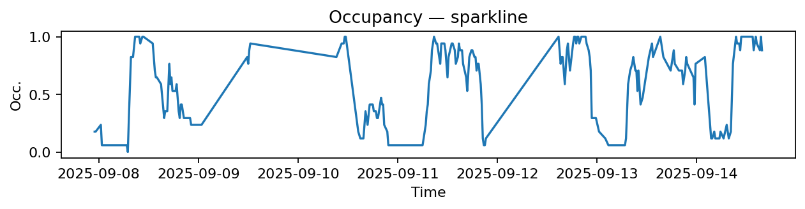
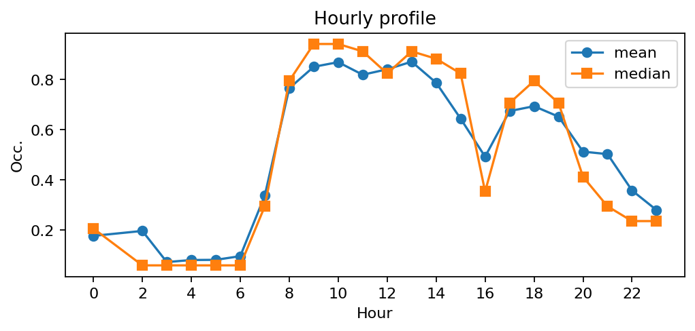
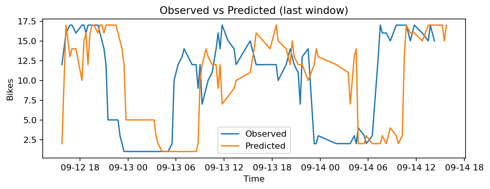
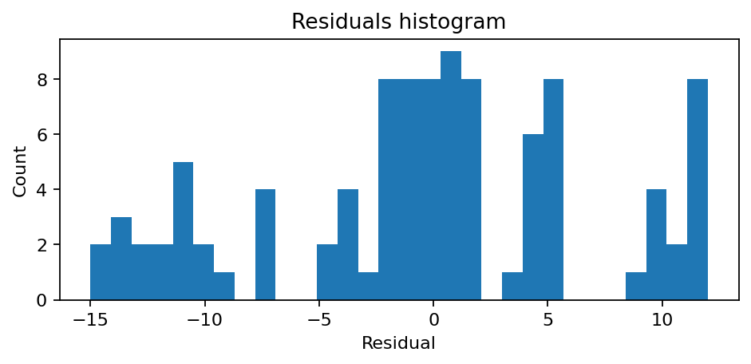

# Station Quai de l'Horloge - Pont Neuf (1001)

**Synthèse rapide**
- Capacité : 17
- Occupation moyenne : 0.53 — variabilité (std) : 0.35
- Sous-tension (<10%) : 16.6% — Surtension (>90%) : 19.4%
- MAE : nan — RMSE : 7.20 — Biais : nan

## Occupation — sparkline

## Profil horaire (moyenne & médiane)

## Observé vs Prédit (fenêtre récente)

## Résidus (histogramme)

