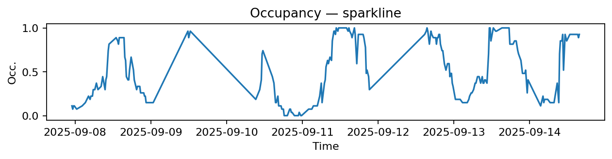
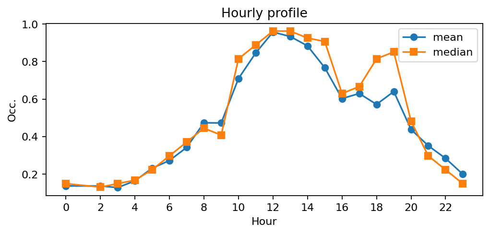
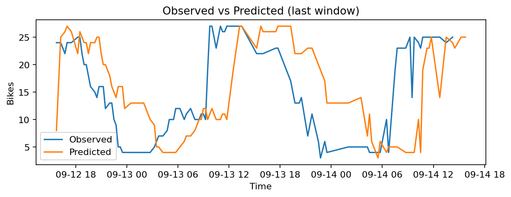
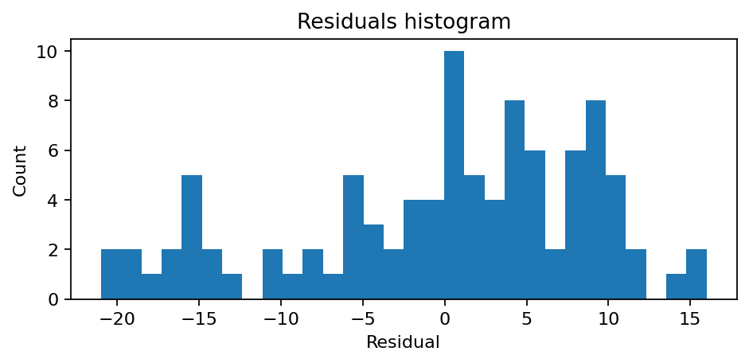

# Station Lavandieres Sainte Opportune - Rivoli (1120)

**Synthèse rapide**
- Capacité : 27
- Occupation moyenne : 0.50 — variabilité (std) : 0.34
- Sous-tension (<10%) : 9.9% — Surtension (>90%) : 20.6%
- MAE : nan — RMSE : 9.07 — Biais : nan

## Occupation — sparkline

## Profil horaire (moyenne & médiane)

## Observé vs Prédit (fenêtre récente)

## Résidus (histogramme)

