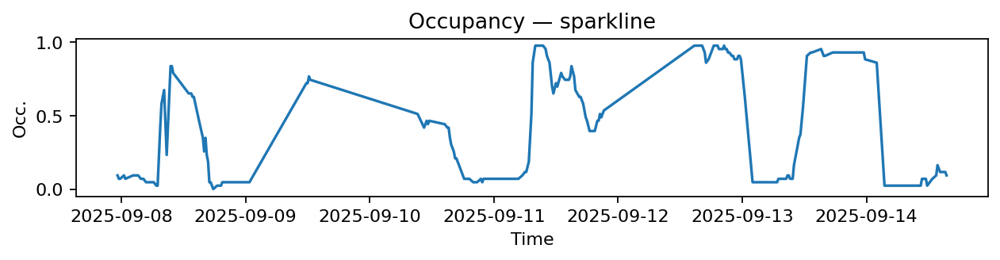
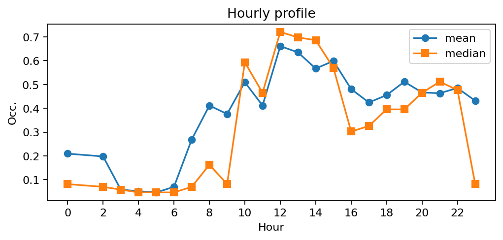
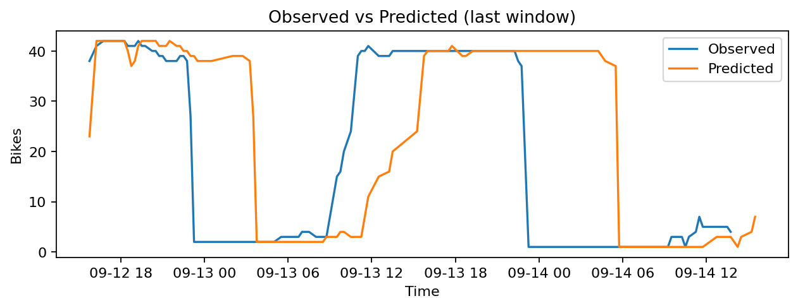
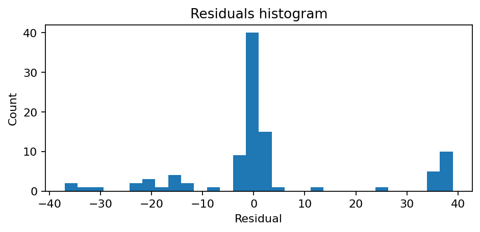

# Station Paul Klee - Place Augusta Holmes (13020)

**Synthèse rapide**
- Capacité : 43
- Occupation moyenne : 0.39 — variabilité (std) : 0.37
- Sous-tension (<10%) : 43.1% — Surtension (>90%) : 19.3%
- MAE : 3.85 — RMSE : 6.36 — Biais : -0.92

## Occupation — sparkline

## Profil horaire (moyenne & médiane)

## Observé vs Prédit (fenêtre récente)

## Résidus (histogramme)
