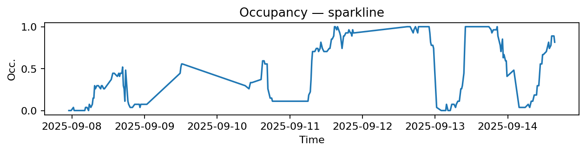
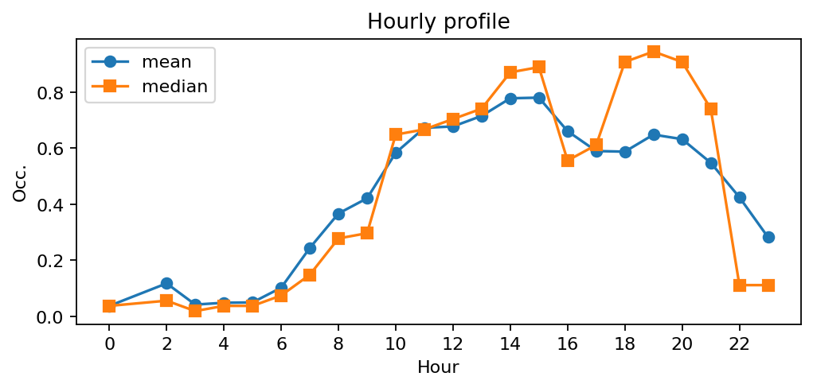
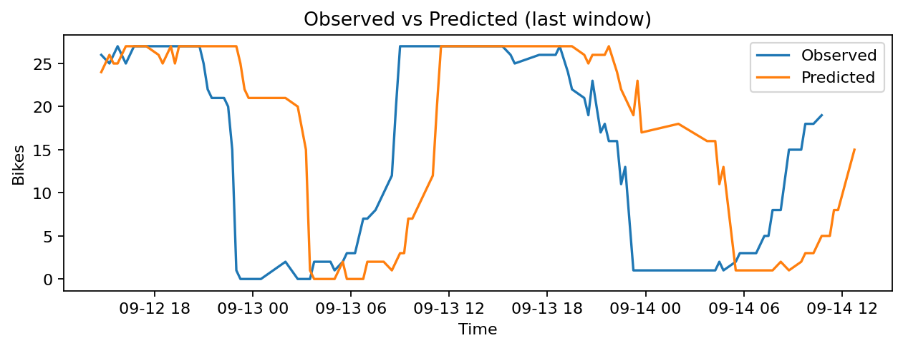
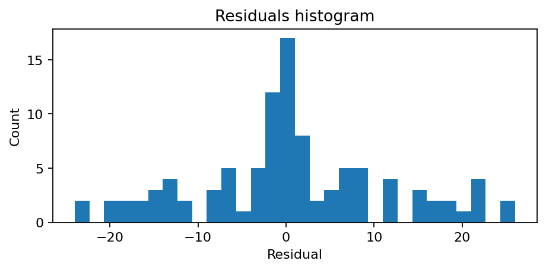

# Station Gare d'Austerlitz - Quai Saint-Bernard (13104)

**Synthèse rapide**
- Capacité : 27
- Occupation moyenne : 0.47 — variabilité (std) : 0.37
- Sous-tension (<10%) : 22.3% — Surtension (>90%) : 22.3%
- MAE : nan — RMSE : 10.95 — Biais : nan

## Occupation — sparkline

## Profil horaire (moyenne & médiane)

## Observé vs Prédit (fenêtre récente)

## Résidus (histogramme)

