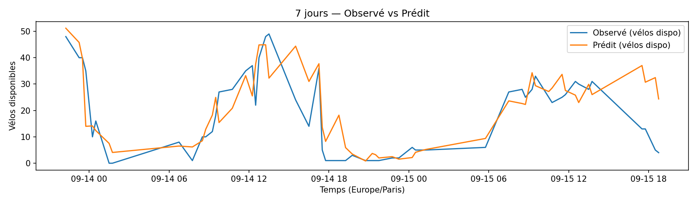
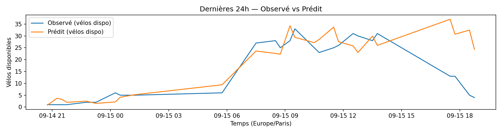
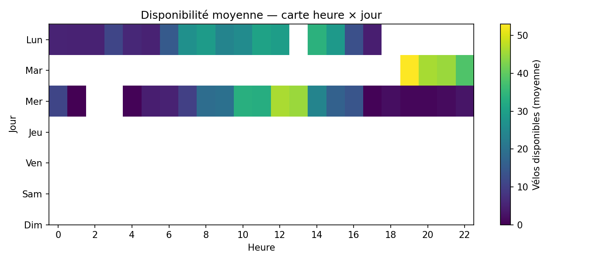
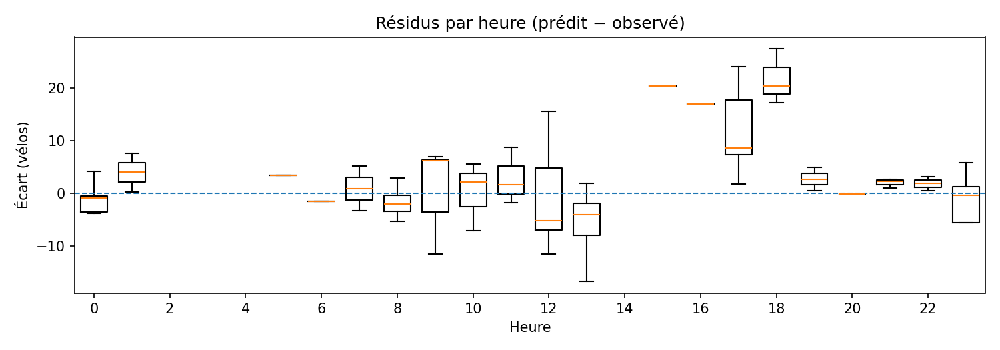
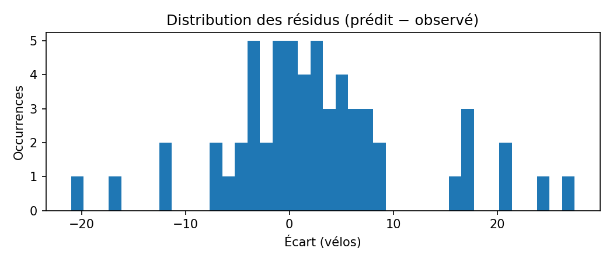

# Station 13125 — Gare d'Austerlitz - Pont Charles de Gaulle

Unités : **nombre de vélos disponibles**.

**Figures :**

- **7 jours — Observé vs Prédit**  
  Évolution sur 7 jours des vélos disponibles réels (`y_true`) et des prévisions (`y_pred`).  
  

- **Observé vs Prédit — dernières 24h**  
  Focus court terme (24h) pour apprécier la réactivité locale.  
  

- **Disponibilité — carte heure × jour**  
  Moyenne des vélos disponibles par **heure** et **jour** (plus sombre = plus de vélos).  
  

- **Résidus par heure (7j)**  
  Boîtes à moustaches des écarts `(prédit − observé)` par **heure de la journée**.  
  

- **Distribution des résidus**  
  Histogramme des écarts `(prédit − observé)` en **vélos**.  
  
