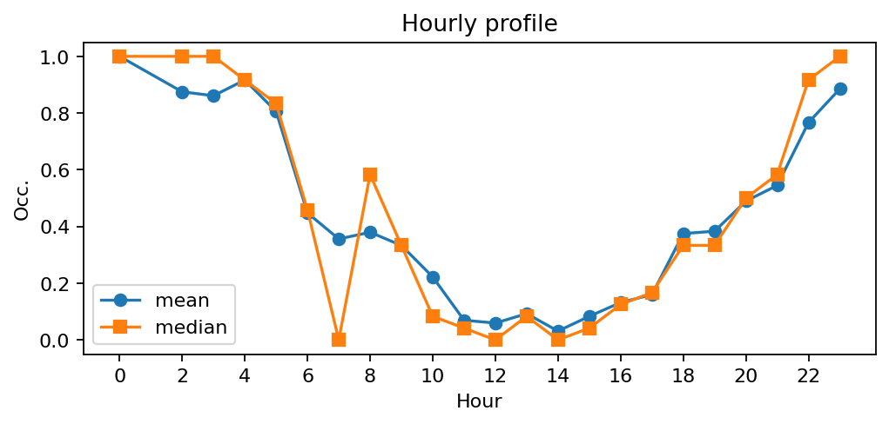
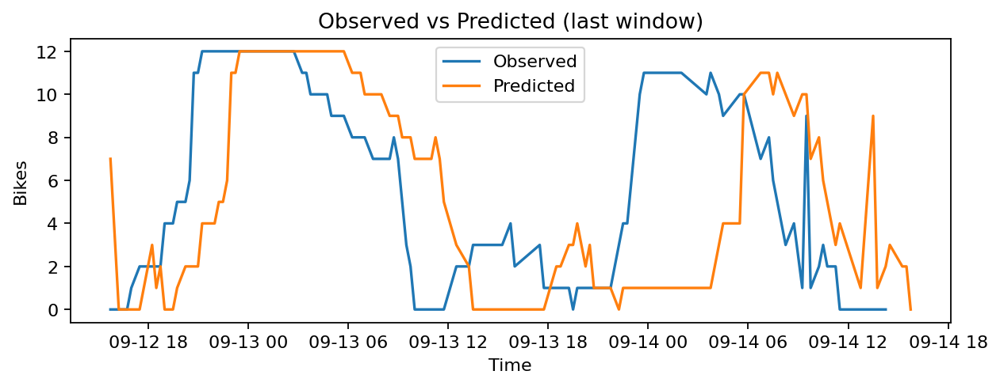
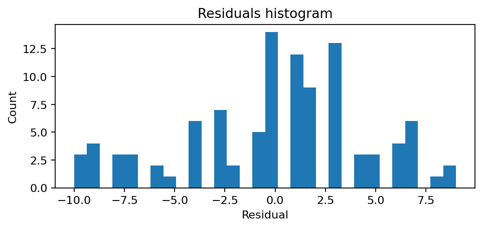

# Station Abbé Groult - Convention (15039)

**Synthèse rapide**
- Capacité : 12
- Occupation moyenne : 0.41 — variabilité (std) : 0.38
- Sous-tension (<10%) : 35.6% — Surtension (>90%) : 20.2%
- MAE : 1.82 — RMSE : 2.40 — Biais : 0.45

## Occupation — sparkline

## Profil horaire (moyenne & médiane)

## Observé vs Prédit (fenêtre récente)

## Résidus (histogramme)
