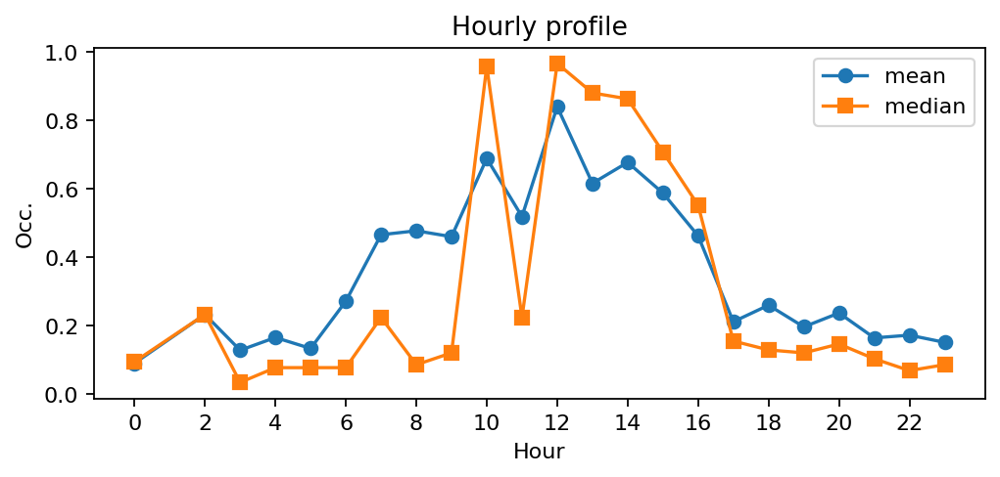
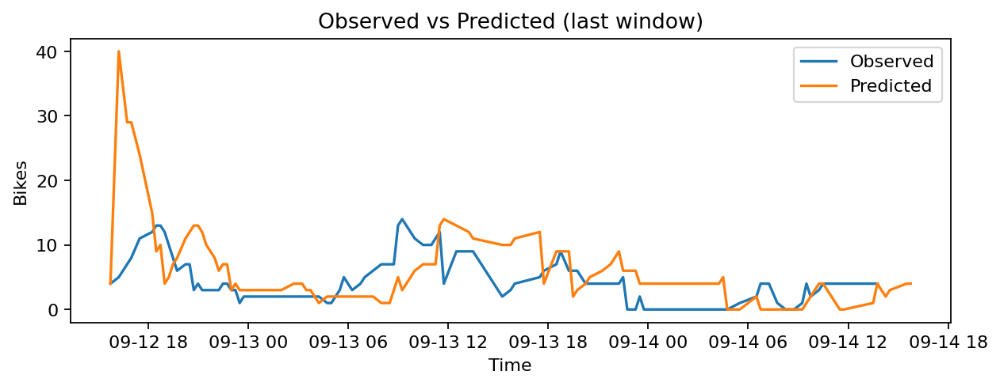
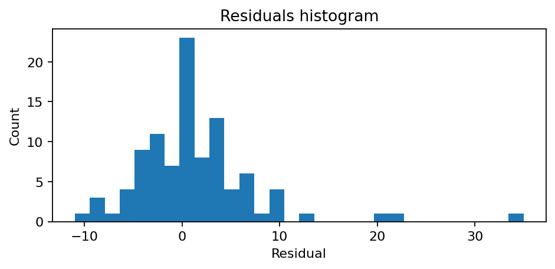

# Station Filles Saint-Thomas - Place de la Bourse (2009)

**Synthèse rapide**
- Capacité : 58
- Occupation moyenne : 0.35 — variabilité (std) : 0.35
- Sous-tension (<10%) : 31.9% — Surtension (>90%) : 16.1%
- MAE : nan — RMSE : 6.40 — Biais : nan

## Occupation — sparkline

## Profil horaire (moyenne & médiane)

## Observé vs Prédit (fenêtre récente)

## Résidus (histogramme)

