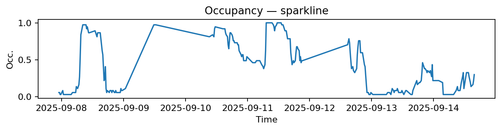
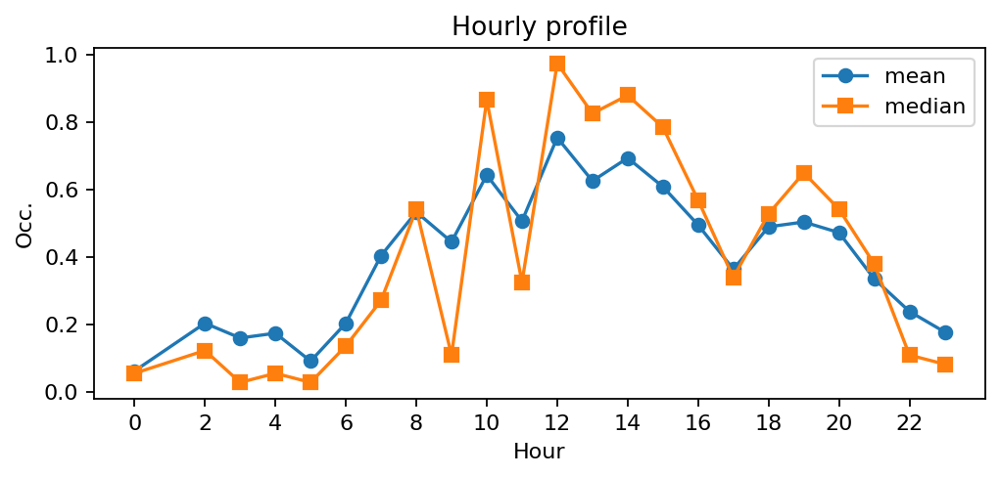
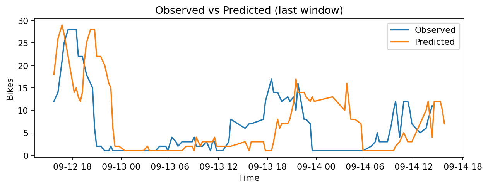
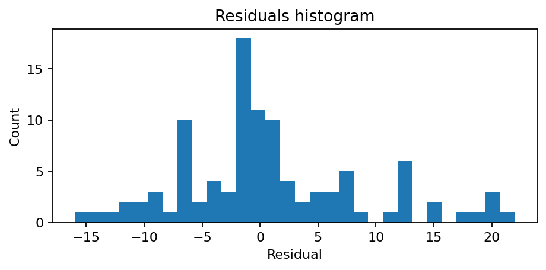

# Station Saint-Marc - Feydeau (2102)

**Synthèse rapide**
- Capacité : 37
- Occupation moyenne : 0.41 — variabilité (std) : 0.34
- Sous-tension (<10%) : 33.3% — Surtension (>90%) : 12.4%
- MAE : nan — RMSE : 7.90 — Biais : nan

## Occupation — sparkline

## Profil horaire (moyenne & médiane)

## Observé vs Prédit (fenêtre récente)

## Résidus (histogramme)

