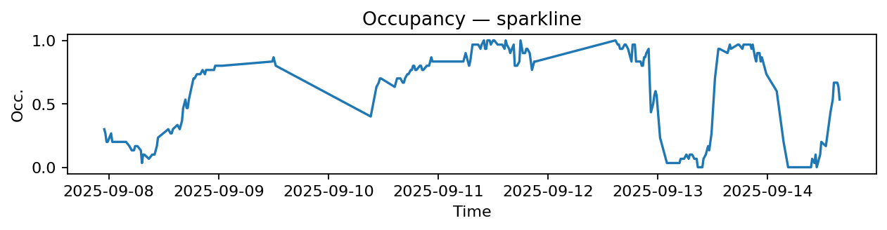
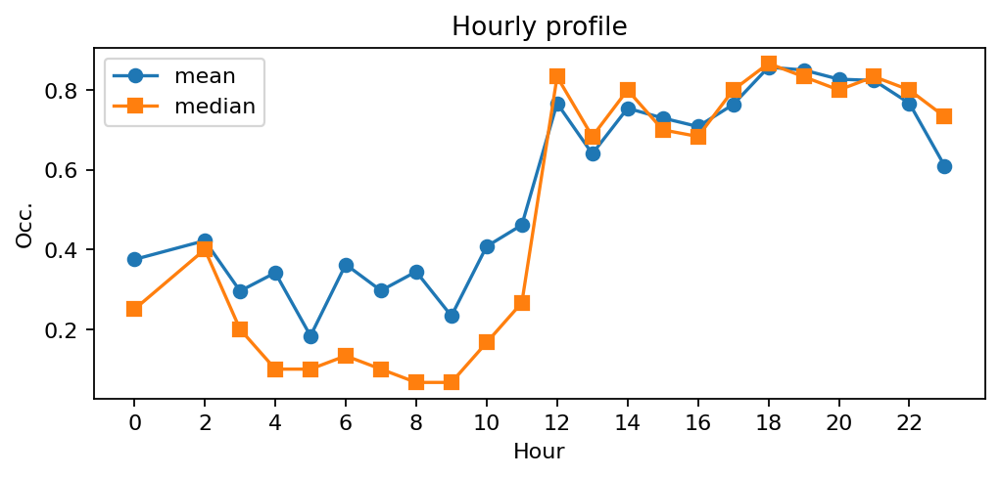
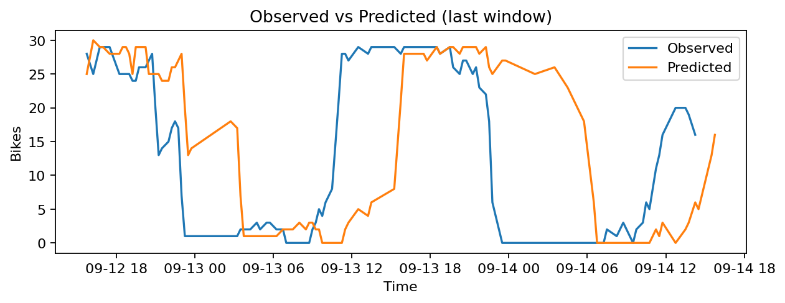
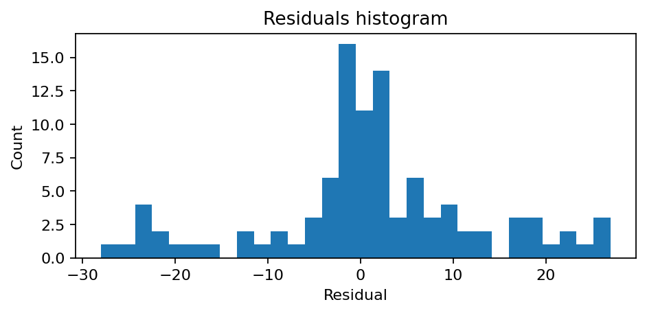

# Station Buffon - Jardin des Plantes (5115)

**Synthèse rapide**
- Capacité : 30
- Occupation moyenne : 0.57 — variabilité (std) : 0.36
- Sous-tension (<10%) : 21.1% — Surtension (>90%) : 18.9%
- MAE : 2.36 — RMSE : 3.23 — Biais : 0.05

## Occupation — sparkline

## Profil horaire (moyenne & médiane)

## Observé vs Prédit (fenêtre récente)

## Résidus (histogramme)
