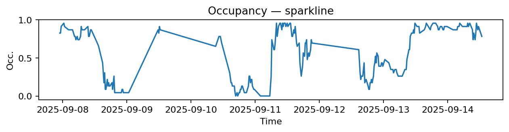
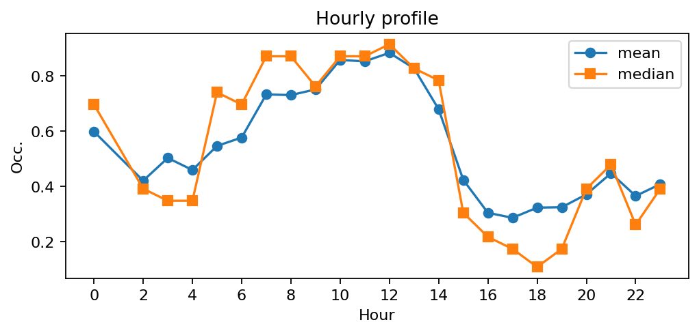
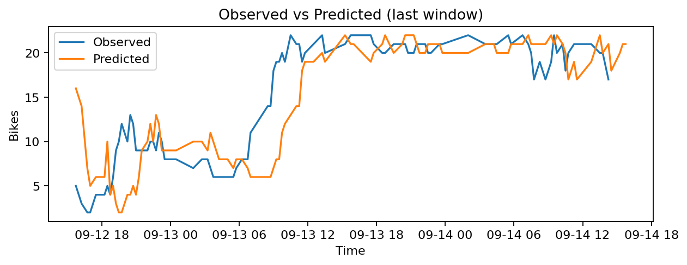
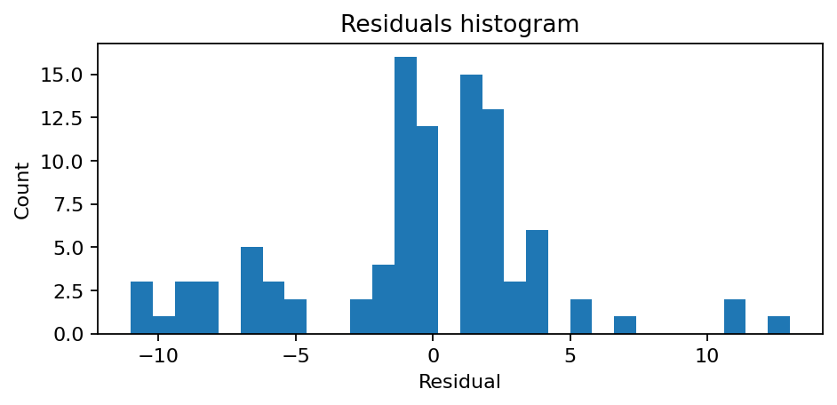

# Station Saint-Benoît - Jacob (6002)

**Synthèse rapide**
- Capacité : 23
- Occupation moyenne : 0.53 — variabilité (std) : 0.34
- Sous-tension (<10%) : 17.6% — Surtension (>90%) : 20.3%
- MAE : nan — RMSE : 4.30 — Biais : nan

## Occupation — sparkline

## Profil horaire (moyenne & médiane)

## Observé vs Prédit (fenêtre récente)

## Résidus (histogramme)

