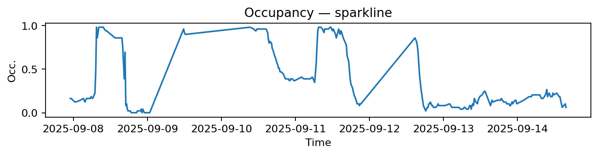
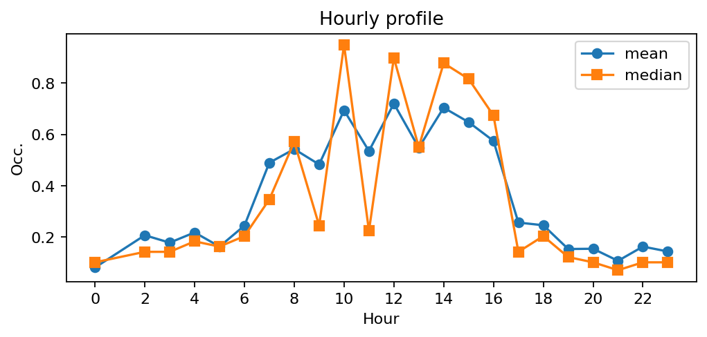
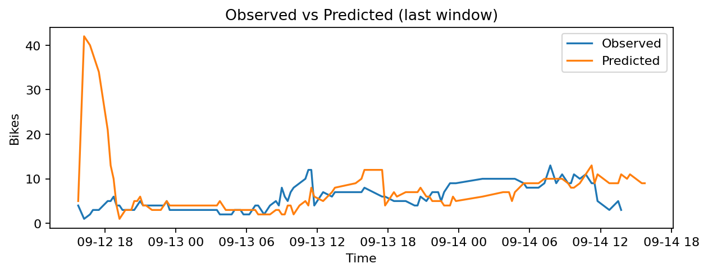
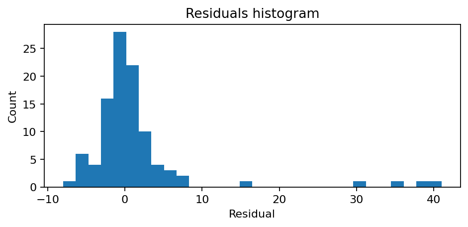

# Station Berri - Haussmann (8034)

**Synthèse rapide**
- Capacité : 49
- Occupation moyenne : 0.36 — variabilité (std) : 0.34
- Sous-tension (<10%) : 26.0% — Surtension (>90%) : 14.2%
- MAE : nan — RMSE : 7.94 — Biais : nan

## Occupation — sparkline

## Profil horaire (moyenne & médiane)

## Observé vs Prédit (fenêtre récente)

## Résidus (histogramme)

