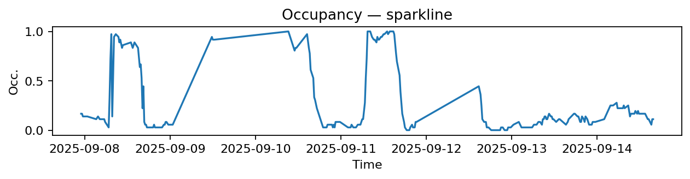
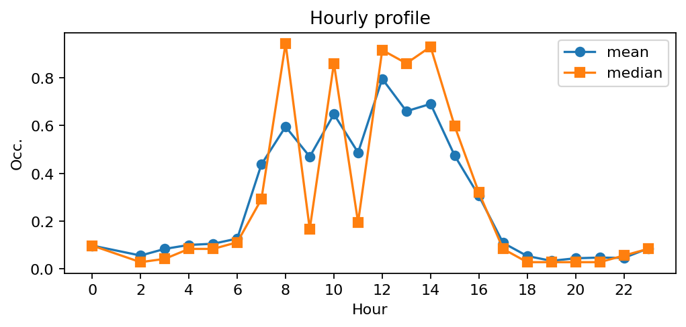
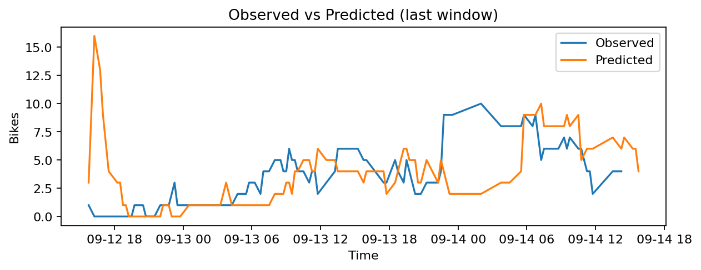
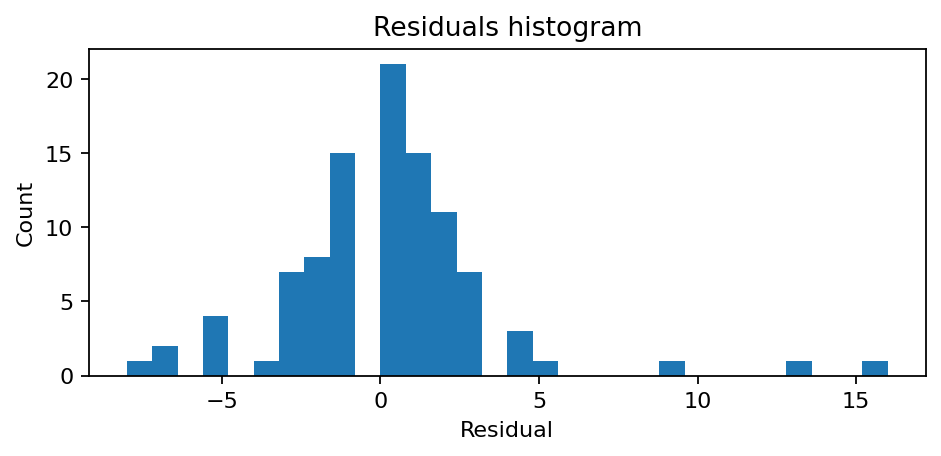

# Station Bienfaisance - Place de Narvik (8035)

**Synthèse rapide**
- Capacité : 36
- Occupation moyenne : 0.27 — variabilité (std) : 0.34
- Sous-tension (<10%) : 46.3% — Surtension (>90%) : 12.2%
- MAE : nan — RMSE : 3.32 — Biais : nan

## Occupation — sparkline

## Profil horaire (moyenne & médiane)

## Observé vs Prédit (fenêtre récente)

## Résidus (histogramme)

