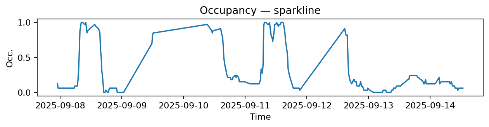
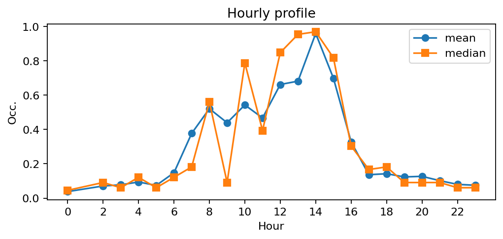
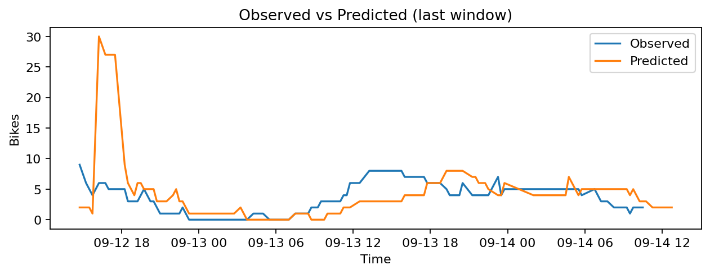
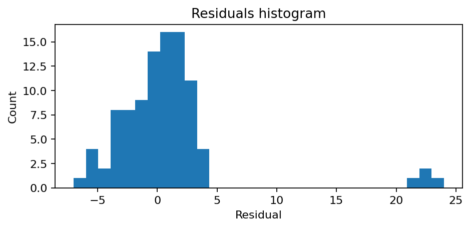

# Station Rossini - Laffitte (9022)

**Synthèse rapide**
- Capacité : 33
- Occupation moyenne : 0.29 — variabilité (std) : 0.34
- Sous-tension (<10%) : 41.1% — Surtension (>90%) : 11.7%
- MAE : nan — RMSE : 5.10 — Biais : nan

## Occupation — sparkline

## Profil horaire (moyenne & médiane)

## Observé vs Prédit (fenêtre récente)

## Résidus (histogramme)

