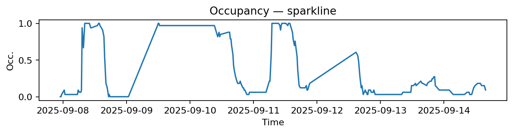
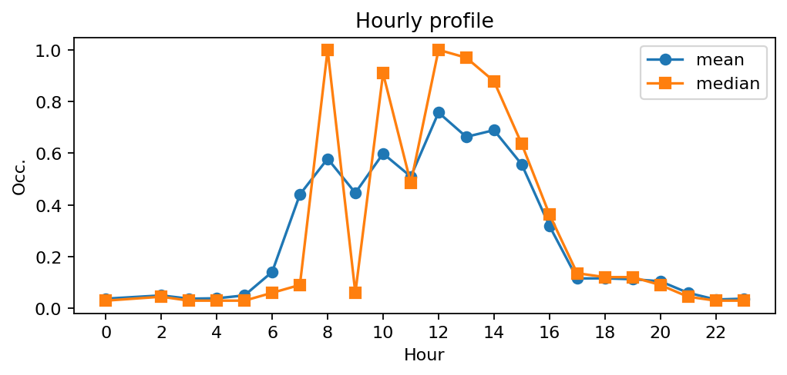
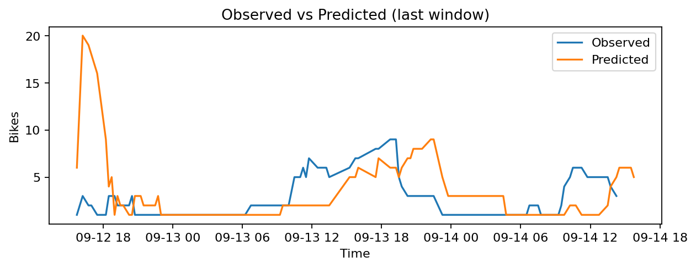
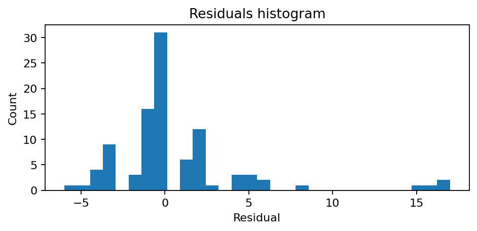

# Station Laffitte - Italiens (9023)

**Synthèse rapide**
- Capacité : 33
- Occupation moyenne : 0.28 — variabilité (std) : 0.36
- Sous-tension (<10%) : 52.3% — Surtension (>90%) : 15.2%
- MAE : nan — RMSE : 4.06 — Biais : nan

## Occupation — sparkline

## Profil horaire (moyenne & médiane)

## Observé vs Prédit (fenêtre récente)

## Résidus (histogramme)

