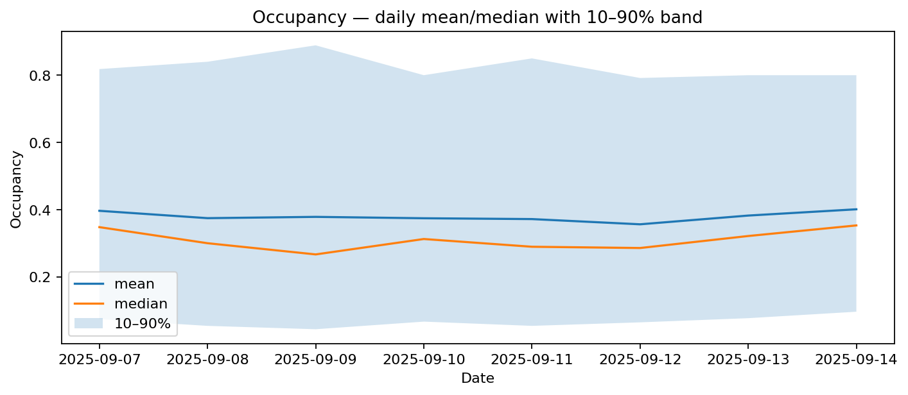
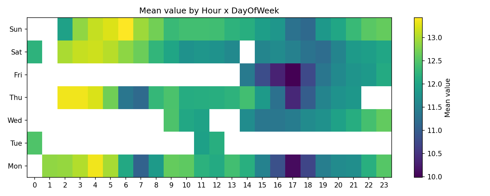
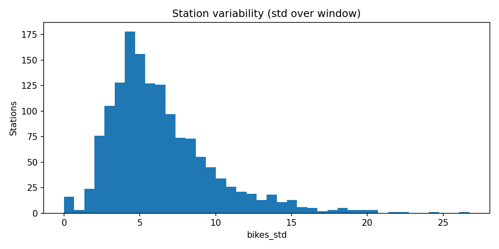
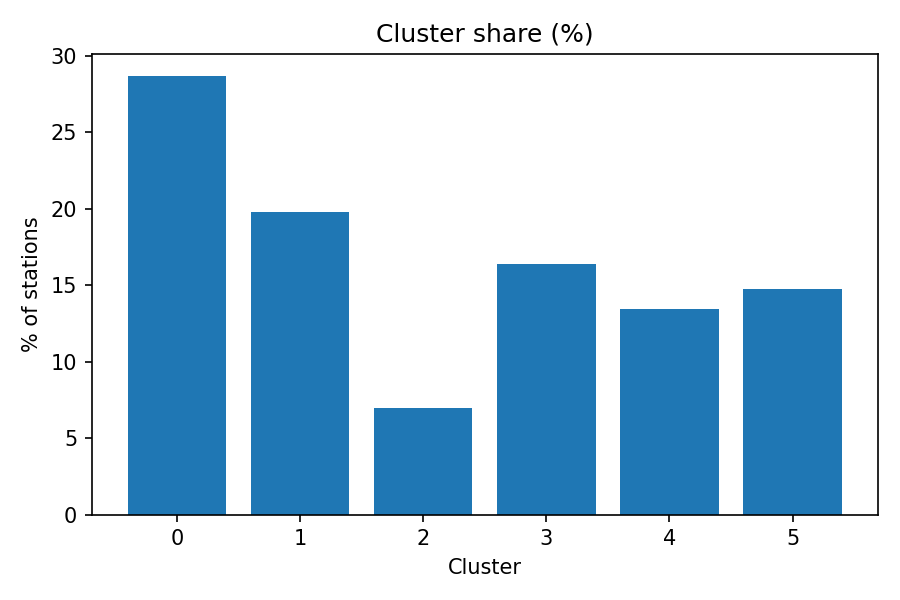
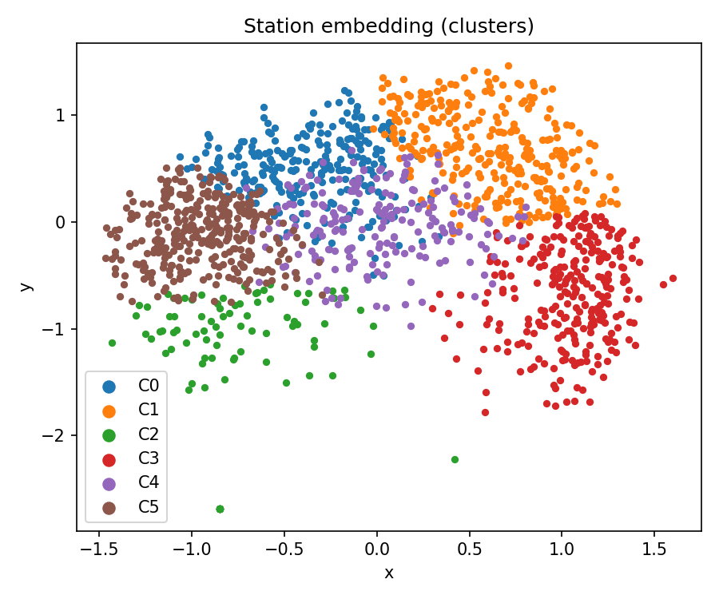

# Usage du réseau — Vue d’ensemble

## Séries quotidiennes (occupation moyenne & médiane)

## Profil horaire (moyenne & médiane)

## Créneaux critiques (heatmap heure × jour)

## Variabilité par station (moyenne vs écart-type)

## Clustering & carte

👉 Carte interactive : [assets/maps/usage_map.html](../assets/maps/usage_map.html)
